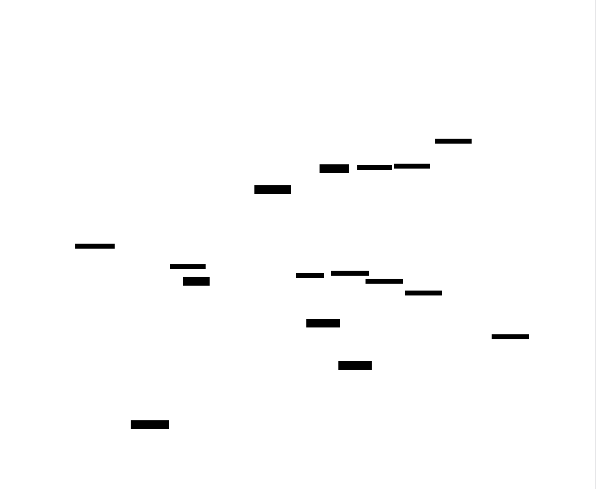

# Mini Shell: Design Document


## Overview

A feature-rich command-line shell that implements job control, signal handling, and process group management. The key architectural challenge is coordinating multiple processes, managing terminal control, and handling asynchronous signals while maintaining a responsive interactive interface.


> This guide is meant to help you understand the big picture before diving into each milestone. Refer back to it whenever you need context on how components connect.


## Context and Problem Statement

> **Milestone(s):** Foundation for all milestones — understanding the complexity landscape before diving into implementation

### Mental Model: The Orchestra Conductor

Before diving into the technical complexities of shell implementation, let's build an intuitive understanding through a powerful analogy. **Think of a shell as an orchestra conductor** coordinating a complex musical performance. Just as a conductor doesn't play the instruments but rather manages timing, transitions, and communication between musicians, a shell doesn't perform the actual computational work but orchestrates the execution and interaction of multiple programs.

The conductor (shell) receives a musical score (command line input) and must interpret it, deciding which musicians (processes) to bring in, when they should start playing, how they should interact with each other, and when they should stop. Some musicians perform solo pieces (single commands), while others participate in complex harmonies where one section's output becomes another's cue (pipelines). The conductor must handle interruptions gracefully — if the audience requests an encore (Ctrl+Z to suspend) or needs to stop the performance entirely (Ctrl+C to terminate), these signals must be communicated appropriately without disrupting other ongoing performances.

The conductor also manages the stage (terminal control). Only one performance can have the audience's full attention (foreground process group) at any given time, while other rehearsals might continue in the background. When a background rehearsal is ready for the main stage, the conductor must seamlessly transition control without missing a beat.

This mental model captures the essence of why shell implementation is challenging: **the complexity lies not in executing individual programs, but in coordinating their lifecycles, managing their communication channels, and handling asynchronous events while maintaining a responsive interface**. The shell must be simultaneously reactive (responding to user input), proactive (managing background processes), and resilient (handling process failures and system signals).

Just as a conductor must understand musical notation, timing, and the capabilities of each instrument, a shell must understand command syntax, process states, file descriptors, signal semantics, and terminal control protocols. The conductor's expertise isn't in playing individual instruments but in understanding how they work together — similarly, the shell's complexity isn't in running individual programs but in managing their interactions with the system and each other.

### Existing Shell Approaches

Different shell implementations have evolved various architectural strategies to handle the coordination challenges outlined above. Understanding these approaches helps us appreciate the design space and trade-offs we face when building our own shell.

**Traditional Fork-Heavy Shells (bash, zsh)**

The most common approach, exemplified by bash and zsh, uses a **process-per-command model** where each command in a pipeline runs in its own process. This architecture prioritizes simplicity and isolation at the cost of performance overhead.

| Aspect | Implementation | Trade-offs |
|--------|---------------|------------|
| Command Execution | Fork a new process for every command, even built-ins can optionally fork | High isolation, simple error handling, but expensive process creation |
| Pipeline Handling | Create all processes in pipeline simultaneously, connect with pipes | Parallel execution, but complex file descriptor management |
| Job Control | Each pipeline becomes a process group with shared process group ID | Natural job boundaries, but requires careful signal routing |
| State Management | Minimal shared state, most state lives in individual processes | Simple consistency model, but expensive inter-process communication |
| Memory Model | Copy-on-write semantics after fork reduce memory overhead | Efficient memory usage, but still pays fork/exec cost |

The key insight of this approach is that **process boundaries provide natural error isolation**. If a command crashes, it doesn't affect the shell process or other commands. However, the overhead of process creation becomes significant for complex scripts with many small commands.

**Threaded/Async Shells (fish, elvish)**

Modern shells like fish and elvish experiment with **reduced process creation** by using threads or asynchronous I/O for certain operations. This approach optimizes for performance and responsiveness while maintaining compatibility with traditional shell semantics.

| Aspect | Implementation | Trade-offs |
|--------|---------------|------------|
| Built-in Commands | Execute built-ins in the main shell process using threads | Fast execution, shared state access, but potential for shell crashes |
| Pipeline Handling | Mix of processes and threads depending on command types | Complex execution model, optimized performance |
| Job Control | Hybrid approach with process groups for external commands only | Maintains compatibility while reducing overhead |
| State Management | More shared state between commands, careful synchronization | Better performance, more complex consistency guarantees |
| Error Handling | More sophisticated error recovery due to shared address space | Can recover from more errors, but failures can be more severe |

**Embedded/Minimal Shells (dash, toybox sh)**

Shells designed for embedded systems or minimal environments like dash prioritize **code size and memory usage** over feature richness. They implement only POSIX-required features with straightforward algorithms.

| Aspect | Implementation | Trade-offs |
|--------|---------------|------------|
| Feature Set | Strict POSIX compliance, no extensions or convenience features | Small binary size, predictable behavior, but limited functionality |
| Parsing | Simple recursive descent parser with minimal lookahead | Low memory usage, but limited syntax error recovery |
| Job Control | Minimal job control, often no background job management | Simple implementation, but poor interactive experience |
| Built-in Commands | Minimal set of built-ins, prefer external commands | Consistent execution model, but slower for common operations |

> **Key Design Insight**: The choice between these approaches fundamentally depends on whether you prioritize **isolation and simplicity** (traditional fork-heavy), **performance and features** (threaded/async), or **minimal resource usage** (embedded). Each approach makes different assumptions about the typical workload and acceptable trade-offs.

**Our Approach: Educational Fork-Heavy Model**

For our mini shell project, we'll adopt the traditional fork-heavy approach for several educational reasons:

> **Decision: Fork-Heavy Process Model**
> - **Context**: Need to balance educational value, implementation complexity, and feature completeness within project constraints
> - **Options Considered**: 
>   1. Pure fork-heavy (bash-style): Fork for every command including built-ins
>   2. Hybrid (our choice): Fork for external commands, execute built-ins in-process
>   3. Threaded: Use threads for parallelism and async I/O
> - **Decision**: Hybrid fork-heavy model with in-process built-ins
> - **Rationale**: Provides hands-on experience with core Unix concepts (fork/exec, process groups, signals) while avoiding threading complexity that would distract from shell-specific learning objectives. In-process built-ins are necessary for commands like `cd` that must modify shell state.
> - **Consequences**: Students learn fundamental Unix process model deeply but don't experience modern shell optimization techniques. Implementation is straightforward but not performance-optimal.

### Core Technical Challenges

Shell implementation involves three interconnected technical challenges that create most of the complexity. Each challenge individually is manageable, but their interactions create subtle bugs and race conditions that require careful architectural planning.

**Process Lifecycle Management**

The first major challenge is **managing the complete lifecycle of child processes** from creation through termination. Unlike simple programs that spawn a few processes and wait for them to complete, shells must track dozens of processes in various states while maintaining responsive user interaction.

The process lifecycle in a shell context involves several distinct phases:

1. **Creation Phase**: The shell must fork a new process, set up its execution environment (working directory, environment variables, signal dispositions), perform exec to load the target program, and handle creation failures gracefully.

2. **Execution Phase**: While the process runs, the shell must decide whether to wait for completion (foreground) or continue with other work (background), track the process's membership in job control structures, and be prepared to receive signals about state changes.

3. **State Transition Phase**: Processes can be suspended (SIGTSTP), resumed (SIGCONT), or interrupted (SIGINT) at any time. The shell must update its internal job table and potentially transfer terminal control.

4. **Termination Phase**: When processes exit, the shell must reap their exit status to prevent zombies, update job state, report completion to the user for background jobs, and clean up associated resources.

| Challenge Aspect | Complexity Source | Impact on Shell Design |
|------------------|-------------------|----------------------|
| Zombie Prevention | Must reap all child processes, but waitpid() calls can block | Requires asynchronous SIGCHLD handling or periodic polling |
| State Synchronization | Process state changes happen asynchronously via signals | Shell's job table can become inconsistent with actual process states |
| Resource Cleanup | File descriptors, memory, process table entries must be cleaned up | Failure to clean up causes resource leaks and shell degradation |
| Error Propagation | Child process failures must be reported appropriately to user | Complex decision logic for when to continue vs abort execution |

**Signal Propagation and Terminal Control**

The second major challenge involves **correctly routing signals between the terminal, shell, and managed processes**. Signals in Unix are asynchronous events that can arrive at any time, and incorrect handling leads to processes that can't be interrupted, backgrounds jobs that don't behave properly, or shells that crash unexpectedly.

Terminal-generated signals (Ctrl+C for SIGINT, Ctrl+Z for SIGTSTP) should normally go to the **foreground process group**, not to the shell itself. However, the shell must intercept these signals to update its job management state. This creates a complex routing problem where signals must be:

1. **Intercepted** by the shell to update internal state
2. **Forwarded** to the appropriate process group  
3. **Handled appropriately** if no foreground job exists
4. **Masked or unmasked** at appropriate times to avoid race conditions

The signal handling challenge is compounded by **async-signal-safety requirements**. Signal handlers can only safely call a limited set of system calls, but shell signal handlers need to update complex data structures like the job table. This creates a design tension between responsive signal handling and safe data structure manipulation.

| Signal Type | Routing Challenge | Safety Constraint |
|-------------|-------------------|-------------------|
| SIGINT (Ctrl+C) | Must go to foreground job only, not shell | Handler must be async-signal-safe, can't safely update job table |
| SIGTSTP (Ctrl+Z) | Must suspend foreground job and return terminal control to shell | Must coordinate with job control structures atomically |
| SIGCHLD | Shell must reap children but not interfere with foreground job control | Handler may interrupt system calls, must handle EINTR |
| SIGTTOU/SIGTTIN | Background jobs attempting terminal I/O must be handled gracefully | Complex interaction with terminal control and process groups |

**Process Group Coordination and Terminal Ownership**

The third major challenge is **managing process groups and terminal control** to implement proper job control. In Unix, the terminal can only be controlled by one process group at a time (the foreground process group), and background processes that attempt terminal I/O are automatically suspended.

Shells must create a new process group for each job (which might contain multiple processes in a pipeline) and coordinate terminal ownership transfers. This involves:

1. **Process Group Creation**: Each job needs its own process group, created with `setpgid()`, but timing matters — both parent and child should call `setpgid()` to avoid race conditions.

2. **Terminal Control Transfer**: When launching a foreground job, the shell must call `tcsetpgrp()` to transfer terminal control to the job's process group. When the job completes or is suspended, control must return to the shell.

3. **Signal Routing Setup**: The shell must ensure that terminal-generated signals reach the correct process group, which may require manipulating signal masks and process group memberships.

4. **Background Job Isolation**: Background jobs must be prevented from interfering with terminal I/O, but they should still be able to produce output (stdout/stderr) while being blocked on input (stdin).

The complexity arises from the **timing-sensitive nature** of these operations. Process groups must be set up before exec but after fork, terminal control transfers must happen atomically with job state changes, and signal masks must be coordinated between parent and child processes.

| Coordination Aspect | Timing Constraint | Failure Mode if Wrong |
|---------------------|-------------------|----------------------|
| setpgid() calls | Must happen in both parent and child before exec | Process ends up in wrong process group, signals go to wrong place |
| tcsetpgrp() calls | Must transfer control atomically with job state changes | User loses terminal control or background jobs interfere |
| Signal mask inheritance | Child must restore default signal dispositions after fork | Child processes can't be interrupted or suspended properly |
| Process group cleanup | Terminated jobs must release terminal control back to shell | Terminal becomes unresponsive, shell loses control |

> **Critical Design Insight**: These three challenges are not independent — they form a tightly coupled system where the solution to one constraint affects the others. For example, the async-signal-safety requirements of signal handling limit how we can update process group information, which in turn affects how we coordinate terminal control transfers. This interdependence is why shell implementation requires careful architectural planning rather than incremental feature addition.

**Race Condition Hotspots**

The interaction between these three challenges creates several **race condition hotspots** that are common sources of bugs in shell implementations:

1. **Fork-to-Exec Window**: Between fork() and exec(), the child process exists but hasn't loaded its target program. During this window, signal dispositions, process group memberships, and file descriptors must be set up correctly.

2. **Job State Transition Window**: When a job changes state (starts, stops, terminates), multiple data structures must be updated atomically while signals may be arriving asynchronously.

3. **Terminal Control Transfer Window**: The period between when a job is ready to run and when it gains terminal control, during which terminal-generated signals could be lost or misdirected.

4. **Process Reaping Window**: Between when a child process terminates and when the parent reaps its exit status, during which the process exists as a zombie and job state may be inconsistent.

Understanding these race conditions up front allows us to design our shell architecture to minimize or eliminate them through careful sequencing of operations and appropriate use of signal masking.

The architectural patterns we'll develop in subsequent sections are specifically designed to handle these challenges while maintaining the educational clarity that allows learners to understand each concept thoroughly before moving on to the next level of complexity.

### Implementation Guidance

This implementation guidance provides the foundational infrastructure and organizational patterns needed to tackle the core challenges identified above. The focus is on establishing a robust starting point that handles the complex interactions between processes, signals, and terminal control.

**Technology Recommendations**

| Component | Simple Option | Advanced Option |
|-----------|---------------|-----------------|
| Process Creation | `fork()` + `execvp()` with basic error handling | `posix_spawn()` with detailed attribute control |
| Signal Handling | `signal()` with simple handlers | `sigaction()` with full signal mask control |
| Job Table | Fixed-size array of job structures | Dynamic hash table with job ID recycling |
| Command Parsing | Hand-written recursive descent parser | Flex/Bison generated parser with full grammar |
| Terminal Control | Basic `tcsetpgrp()` calls | Full termios manipulation with saved terminal state |
| File I/O | Standard `open()`, `close()`, `dup2()` | Advanced I/O with `splice()` and async operations |

For our educational implementation, we'll use the simple options to maintain focus on shell-specific concepts rather than advanced system programming techniques.

**Recommended File Structure**

The shell codebase should be organized to separate concerns clearly while allowing for the tight integration required by signal handling and process management:

```c
minishell/
├── src/
│   ├── main.c                    ← Entry point and main REPL loop
│   ├── parser/
│   │   ├── lexer.c              ← Tokenization and quote handling
│   │   ├── parser.c             ← Command structure parsing
│   │   └── parser.h             ← Command and token type definitions
│   ├── executor/
│   │   ├── executor.c           ← Process creation and management
│   │   ├── builtins.c           ← Built-in command implementations
│   │   ├── path.c               ← PATH resolution and command location
│   │   └── executor.h           ← Execution context and function declarations
│   ├── jobs/
│   │   ├── jobs.c               ← Job table and process group management
│   │   ├── signals.c            ← Signal handlers and routing logic
│   │   └── jobs.h               ← Job structures and state definitions
│   ├── io/
│   │   ├── redirect.c           ← File descriptor manipulation for redirection
│   │   ├── pipes.c              ← Pipeline creation and management
│   │   └── io.h                 ← I/O operation structures and constants
│   └── utils/
│       ├── error.c              ← Error handling and reporting utilities
│       ├── memory.c             ← Memory management helpers
│       └── utils.h              ← Common utilities and helper macros
├── include/
│   └── minishell.h              ← Global shell state and shared definitions
├── tests/
│   ├── unit/                    ← Component-specific unit tests
│   └── integration/             ← Full shell behavior tests
└── Makefile                     ← Build configuration with debug symbols
```

**Core Data Structure Infrastructure**

The shell's data model must support the complex relationships between commands, jobs, processes, and shell state. Here's the foundational infrastructure that supports all subsequent functionality:

```c
// Global shell state management
typedef struct shell_state {
    pid_t shell_pgid;           // Shell's process group ID for terminal control
    int interactive;            // Whether shell is running interactively
    struct termios shell_tmodes; // Saved terminal modes for restoration
    struct job *job_table;      // Array of active and recent jobs
    int next_job_id;           // Counter for assigning job IDs
    volatile sig_atomic_t sigchld_received; // Flag for async signal handling
} shell_state_t;

// Initialize shell state and set up signal handling
shell_state_t* shell_init(void) {
    // TODO 1: Allocate and initialize shell_state structure
    // TODO 2: Save shell's process group ID with getpgrp()
    // TODO 3: Check if stdin is a terminal with isatty()
    // TODO 4: Save terminal modes with tcgetattr() if interactive
    // TODO 5: Install signal handlers for SIGINT, SIGTSTP, SIGCHLD
    // TODO 6: Initialize job table array
    // TODO 7: Set initial job ID counter
    // Hint: Use sigaction() with SA_RESTART flag for reliable signal handling
}

// Clean shutdown of shell state
void shell_cleanup(shell_state_t *shell) {
    // TODO 1: Restore original terminal modes if interactive
    // TODO 2: Send SIGTERM to all remaining background jobs
    // TODO 3: Wait for job cleanup or timeout after 5 seconds
    // TODO 4: Free job table and other allocated memory
    // TODO 5: Restore default signal dispositions
}
```

**Signal Handling Infrastructure**

Signal handling requires careful coordination between async-signal-safe handlers and the main shell logic. This infrastructure provides the foundation for safe signal management:

```c
// Signal handler for SIGCHLD - must be async-signal-safe
static void sigchld_handler(int sig) {
    // TODO 1: Set the sigchld_received flag atomically
    // TODO 2: Do NOT call any non-async-signal-safe functions here
    // TODO 3: The main loop will check this flag and handle child reaping
    // Hint: Only assignment to sig_atomic_t variables is safe in signal handlers
}

// Signal handler for terminal signals (SIGINT, SIGTSTP)
static void terminal_signal_handler(int sig) {
    // TODO 1: Check if there's a foreground job running
    // TODO 2: Forward signal to foreground process group with killpg()
    // TODO 3: If no foreground job, ignore the signal (shell continues)
    // TODO 4: Set flag for main loop to update job status if needed
    // Hint: Use global shell state, but be careful about race conditions
}

// Process all pending SIGCHLD notifications
void handle_sigchld(shell_state_t *shell) {
    // TODO 1: Check if sigchld_received flag is set
    // TODO 2: Call waitpid() with WNOHANG to reap all available children
    // TODO 3: For each reaped child, find corresponding job in job table
    // TODO 4: Update job status (running -> terminated) and save exit code
    // TODO 5: For background jobs, print completion message
    // TODO 6: Clear sigchld_received flag
    // Hint: Loop until waitpid() returns 0 (no more children ready)
}
```

**Process Group Management Foundation**

Process group setup is critical for correct job control and must happen at precisely the right times to avoid race conditions:

```c
// Set up process group for a new job
int setup_process_group(pid_t pid, pid_t pgid, int foreground) {
    // TODO 1: If pgid is 0, use pid as the process group ID (job leader)
    // TODO 2: Call setpgid(pid, pgid) to put process in correct group
    // TODO 3: If foreground job and shell is interactive, call tcsetpgrp()
    // TODO 4: Handle EACCES and ESRCH errors appropriately
    // TODO 5: Return 0 on success, -1 on failure
    // Hint: Both parent and child should call this to avoid race conditions
}

// Transfer terminal control back to shell
void restore_terminal_control(shell_state_t *shell) {
    // TODO 1: Check if shell is running interactively
    // TODO 2: Call tcsetpgrp() to give terminal control back to shell
    // TODO 3: Restore shell's terminal modes with tcsetattr()
    // TODO 4: Handle errors gracefully (terminal might have been closed)
    // Hint: This should be called when foreground jobs complete or suspend
}
```

**Error Handling Patterns**

Shells encounter many types of system call failures and must handle them gracefully while providing useful feedback to users:

```c
// Standardized error reporting for shell operations
void shell_error(const char *operation, const char *target, int errno_val) {
    // TODO 1: Format error message with operation context and target
    // TODO 2: Include system error string from strerror(errno_val)
    // TODO 3: Write to stderr using async-signal-safe functions only
    // TODO 4: Don't call exit() - let caller decide whether to continue
    // Example output: "minishell: cd: /nonexistent: No such file or directory"
}

// Check for interrupted system calls and retry if appropriate
int handle_eintr(int result, const char *syscall_name) {
    // TODO 1: If result is -1 and errno is EINTR, return special retry code
    // TODO 2: If result is -1 and errno is other error, report and return -1
    // TODO 3: If result >= 0, return result unchanged
    // TODO 4: Log retry attempts for debugging purposes
    // Hint: Used for system calls that can be interrupted by signal delivery
}
```

**Debugging and Development Aids**

Development of a shell involves tracking complex interactions between multiple processes and asynchronous events. These utilities help diagnose issues:

```c
// Debug output for process and job state (compile-time conditional)
#ifdef DEBUG_SHELL
void debug_job_table(shell_state_t *shell) {
    // TODO 1: Print current job table contents to stderr
    // TODO 2: Show job ID, PID, process group, state, and command
    // TODO 3: Include information about foreground job
    // TODO 4: Show signal mask and terminal control status
    // Hint: Only compile this code when DEBUG_SHELL is defined
}

void debug_signal_event(int sig, pid_t pid, const char *context) {
    // TODO 1: Print signal number, target PID, and context description
    // TODO 2: Include timestamp for tracking signal timing
    // TODO 3: Show current foreground process group
    // TODO 4: Use async-signal-safe functions only
}
#else
#define debug_job_table(shell) do {} while(0)
#define debug_signal_event(sig, pid, ctx) do {} while(0)
#endif
```

**Milestone Checkpoint: Foundation**

After implementing this foundational infrastructure, you should be able to verify the basic shell framework:

**Compilation Test:**
```bash
make clean && make debug
# Should compile without warnings and produce minishell executable
```

**Basic Functionality Test:**
```bash
./minishell
minishell> pwd
# Should print current working directory
minishell> exit
# Should cleanly exit and restore terminal state
```

**Signal Handling Test:**
```bash
./minishell
minishell> sleep 60
# In another terminal: kill -CHLD <minishell_pid>
# Shell should continue normally, not crash
# Press Ctrl+C - should interrupt sleep command, not shell
```

**Expected Behavior:**
- Shell starts up and displays a prompt
- Built-in commands like `pwd` and `exit` work correctly  
- Signal handling doesn't crash the shell
- Terminal state is properly restored on exit
- No memory leaks reported by valgrind on simple operations

**Common Issues and Solutions:**
- **Shell exits on Ctrl+C**: Signal handler isn't properly forwarding signals to foreground job
- **Terminal becomes unusable after exit**: Terminal modes not properly restored
- **Compilation warnings about signal handlers**: Make sure handlers are declared with correct signature
- **Segfault on startup**: Shell state structure not properly initialized

This foundation provides the robust infrastructure needed to implement command parsing, execution, job control, and I/O redirection in subsequent milestones while handling the complex interactions between processes, signals, and terminal control that make shell implementation challenging.


## Goals and Non-Goals

> **Milestone(s):** Foundation for all milestones — establishing clear boundaries and success criteria for the entire project

### Mental Model: The Blueprint

Think of this section as an architectural blueprint for a house. Just as a blueprint clearly shows what rooms will be built, where the plumbing will run, and what features will be included (while explicitly noting what's out of scope like landscaping or furniture), our goals and non-goals define exactly what our shell will do and what it deliberately won't do. This prevents scope creep and ensures we build a solid foundation rather than a sprawling mansion that never gets finished.

A well-defined scope is particularly crucial for shell implementation because shells are naturally expansive systems. Real shells like bash have accumulated decades of features — from simple command execution to complex scripting languages with hundreds of built-in commands. Without clear boundaries, it's easy to get lost implementing advanced features while the core functionality remains buggy and incomplete.

### Functional Requirements

Our mini shell implements four core capabilities that represent the essential features every job-control shell must provide. Each requirement directly maps to one or more project milestones and has specific, measurable acceptance criteria.

#### Command Execution and Built-ins

The shell must parse command lines into executable components and launch them appropriately. This fundamental capability forms the foundation for all other shell features.

| Requirement | Acceptance Criteria | Implementation Detail |
|-------------|-------------------|---------------------|
| Command line parsing | Input tokenized into program name and arguments respecting whitespace | Handles quoted strings, escapes, and empty input gracefully |
| PATH resolution | External commands located via PATH environment variable search | Returns descriptive errors when executables cannot be found |
| Process creation | External commands execute in forked child processes using fork/exec pattern | Child processes inherit appropriate environment and signal dispositions |
| Built-in commands | `cd`, `exit`, `pwd`, `jobs`, `fg`, `bg` execute within shell process | No child process creation for built-ins, direct state manipulation |
| Exit status handling | Child process return codes captured and stored for conditional logic | Status available via `$?` expansion and influences command chaining |

The distinction between built-in and external commands is architecturally significant. Built-in commands like `cd` must execute within the shell process because they modify shell state (current directory) that wouldn't be visible if executed in a child process. External commands run in child processes to provide isolation and enable job control.

#### I/O Redirection and Pipeline Support

The shell must manipulate file descriptors to redirect input and output streams, enabling powerful command composition patterns.

| Redirection Type | Syntax | Behavior | File Handling |
|-----------------|--------|----------|---------------|
| Input redirection | `cmd < file` | Command reads stdin from file instead of terminal | File must exist, opened read-only |
| Output redirection | `cmd > file` | Command writes stdout to file, creating or truncating | File created with standard permissions if missing |
| Append redirection | `cmd >> file` | Command writes stdout to file, appending to existing content | File created if missing, opened in append mode |
| Pipeline | `cmd1 \| cmd2 \| cmd3` | Chain stdout to stdin across multiple commands | Intermediate data flows through kernel pipe buffers |

Pipeline implementation requires careful coordination of multiple processes and file descriptors. Each command in a pipeline runs as a separate process, with the shell creating pipe objects to connect adjacent commands. The shell must ensure proper file descriptor management to avoid resource leaks that would cause pipeline hangs.

> **Critical Design Insight**: Pipelines are not merely syntactic sugar — they represent a fundamental Unix composition pattern where simple tools combine to perform complex tasks. Our implementation must handle pipelines as first-class constructs, not afterthoughts.

#### Job Control and Process Group Management

The shell must manage multiple concurrent jobs, allowing users to run commands in the background while maintaining an interactive foreground session.

| Job Control Feature | Behavior | Process Group Implications | User Interface |
|-------------------|----------|---------------------------|----------------|
| Background execution | `cmd &` launches job without blocking shell prompt | New process group created, not controlling terminal | Prints job number and PID immediately |
| Job listing | `jobs` displays all current jobs with status | Shows process group state information | Format: [job_id] status command_line |
| Foreground resumption | `fg %N` brings background/stopped job to foreground | Transfers terminal control to job's process group | Job continues execution with terminal access |
| Background resumption | `bg %N` resumes stopped job in background | Job continues without terminal control | Job runs concurrently with shell |

Process groups serve as the fundamental unit of job control. Each job (which may consist of multiple processes in a pipeline) belongs to a single process group. The shell manages terminal ownership by transferring control between process groups, ensuring that terminal-generated signals reach the appropriate job.

#### Signal Handling and Terminal Integration

The shell must handle asynchronous signals appropriately, routing them to jobs while protecting its own operation.

| Signal | Source | Shell Behavior | Job Impact | Implementation Requirement |
|--------|--------|---------------|------------|---------------------------|
| SIGINT | Ctrl+C from terminal | Forward to foreground job only | Foreground job receives interrupt signal | Shell process ignores signal |
| SIGTSTP | Ctrl+Z from terminal | Forward to foreground job, update job state | Job suspended, shell regains control | Job marked as stopped in job table |
| SIGCHLD | Child process termination | Reap terminated background jobs | Background job cleaned up asynchronously | Async-signal-safe handler updates job table |
| SIGCONT | `fg` or `bg` command | Send to specified job's process group | Job resumes execution | Job state updated to running |

Signal handling represents one of the most complex aspects of shell implementation because it involves asynchronous events that can occur at any time. The shell must use async-signal-safe programming techniques to avoid race conditions and data corruption.

> **Race Condition Hotspot**: Signal handling code must be extremely careful about what functions it calls and what data it accesses. Most standard library functions are not async-signal-safe and can cause deadlocks if called from signal handlers.

### Non-Goals

Explicitly defining what our shell will not implement is as important as defining what it will implement. These exclusions keep the project scope manageable while ensuring we build a solid foundation that could later support advanced features.

#### Shell Scripting Language Features

Our shell focuses on interactive command execution rather than implementing a full scripting language. Modern shells like bash include extensive programming language features that would significantly increase implementation complexity.

| Excluded Feature | Rationale | Complexity Avoided | Alternative Approach |
|------------------|-----------|-------------------|---------------------|
| Variables and parameter expansion | Requires symbol table, complex parsing, and substitution logic | Variable scoping, environment variable expansion, parameter substitution | Use environment variables set by external commands |
| Conditionals and loops | Requires control flow parsing, execution state management, and nested scoping | AST evaluation, flow control, and loop variable handling | Chain commands with `&&` and `||` operators |
| Command substitution | Requires nested parsing, pipe management, and output capture | Recursive parser invocation, temporary file management, and subprocess coordination | Use temporary files and file redirection |
| Functions and aliases | Requires name resolution, parameter binding, and nested execution contexts | Function call stack, parameter passing, and scope isolation | Use shell scripts as external commands |

These features, while valuable for shell scripting, introduce parser complexity, runtime evaluation challenges, and state management requirements that would distract from the core learning objectives of process management and signal handling.

#### Advanced I/O and Redirection

Our I/O system implements the essential redirection patterns while omitting advanced features that require specialized knowledge and complex implementation.

| Advanced Feature | Why Excluded | Implementation Complexity | Standard Shell Usage |
|------------------|-------------|---------------------------|---------------------|
| Here documents (`cmd << EOF`) | Requires multi-line input parsing and temporary file management | Input buffering, delimiter detection, and variable expansion within documents | Common in scripts, less critical for interactive use |
| Process substitution (`cmd <(other_cmd)`) | Requires named pipe creation and complex file descriptor juggling | FIFO creation, process coordination, and cleanup management | Advanced feature, rarely used interactively |
| File descriptor redirection (`cmd 3>&1`) | Requires arbitrary file descriptor manipulation and number parsing | Descriptor table management and validation of numeric file descriptors | Power user feature, adds parser complexity |
| Network redirection (`cmd > /dev/tcp/host/port`) | Requires network socket creation and protocol handling | Socket programming, error handling, and network configuration | Non-standard feature, significant implementation burden |

These features, while powerful, represent advanced I/O patterns that are primarily useful for shell scripting rather than interactive command execution. Implementing them would require substantial additional infrastructure without advancing the core learning objectives.

#### Performance Optimizations and Advanced Shell Features

Our shell prioritizes correctness and educational value over performance optimizations and convenience features that production shells provide.

| Optimization Category | Specific Features Excluded | Educational Impact | Implementation Burden |
|----------------------|---------------------------|-------------------|----------------------|
| Command completion | Tab completion, filename expansion, command history | Low - primarily user interface enhancement | High - requires parser integration, file system scanning, and terminal control |
| History management | Command history, history expansion (!!, !n), persistent history | Medium - involves file I/O and string processing | Medium - requires history file management and expansion parsing |
| Prompt customization | Variable prompts, color support, working directory display | Low - cosmetic feature | Low - but distracts from core functionality |
| Performance caching | Executable location caching, command hash tables | Medium - demonstrates optimization techniques | Medium - adds complexity without teaching core concepts |

> **Decision: Focus on Correctness Over Performance**
> - **Context**: Shell implementations can include numerous optimizations like command caching, history management, and completion systems that improve user experience
> - **Options Considered**: 
>   1. Implement basic optimizations like PATH caching
>   2. Focus purely on functional correctness
>   3. Implement full-featured completion and history
> - **Decision**: Focus purely on functional correctness
> - **Rationale**: The primary learning objectives center on process management, signal handling, and system programming concepts. Performance optimizations and user interface enhancements, while valuable, would consume significant development time without advancing understanding of the core concepts. A correct but basic shell provides better educational value than a feature-rich but buggy implementation.
> - **Consequences**: Users will experience a more basic interface than production shells, but the codebase remains focused and comprehensible. Students learn fundamental concepts without getting distracted by convenience features.

#### Error Recovery and Robustness Features

Production shells implement sophisticated error recovery and robustness features to handle edge cases gracefully. Our shell implements basic error handling but omits complex recovery mechanisms.

| Robustness Feature | Production Shell Behavior | Our Shell Approach | Justification |
|-------------------|--------------------------|-------------------|---------------|
| Syntax error recovery | Continue parsing after syntax errors, highlight problems | Report error and prompt for new input | Reduces parser complexity significantly |
| Resource exhaustion handling | Graceful degradation when file descriptors or memory are exhausted | Basic error reporting, possible shell termination | Complex resource management distracts from core concepts |
| Signal delivery guarantees | Ensure all signals reach appropriate processes even during rapid state changes | Best-effort signal delivery with basic race condition prevention | Advanced signal handling techniques beyond scope |
| Job persistence | Remember background jobs across shell sessions | Jobs exist only during current shell session | Requires persistent storage and process tracking across restarts |

These robustness features, while important for production systems, involve complex error handling logic and edge case management that would significantly increase implementation complexity without advancing the primary learning objectives.

### Success Criteria and Validation

Our implementation succeeds when it demonstrates mastery of the core Unix systems programming concepts through working shell functionality.

#### Milestone-Based Success Metrics

Each milestone has specific, testable success criteria that validate both functional correctness and architectural understanding.

| Milestone | Functional Validation | Architectural Validation | Systems Concept Demonstrated |
|-----------|----------------------|--------------------------|----------------------------|
| Command Execution | `ls`, `cat file`, `./program args` work correctly | Fork/exec pattern implemented, PATH search functional | Process creation and program loading |
| Pipes and Redirection | `cat file \| grep pattern`, `ls > output.txt` work | File descriptor manipulation, pipe creation | I/O redirection and interprocess communication |
| Job Control | `sleep 30 &`, `jobs`, `fg %1` work correctly | Process groups created, terminal control managed | Process group management and session control |
| Signal Handling | Ctrl+C interrupts foreground only, Ctrl+Z suspends jobs | Signal routing implemented, async-signal-safe handlers | Asynchronous event handling and signal propagation |

#### Integration Success Criteria

The completed shell demonstrates understanding of how Unix systems programming concepts integrate to create a cohesive interactive system.

| Integration Aspect | Success Criterion | Validation Method | Systems Understanding Demonstrated |
|-------------------|-------------------|-------------------|-----------------------------------|
| Process lifecycle management | Background jobs don't become zombies, terminated jobs are reaped | Run multiple background jobs, verify no zombie processes with `ps` | Complete process lifecycle from creation to cleanup |
| Terminal control coordination | Only foreground job responds to terminal signals | Start pipeline, press Ctrl+C, verify only foreground processes terminate | Session management and terminal ownership |
| Resource management | No file descriptor leaks, proper cleanup on exit | Use `lsof` to verify file descriptors, run long shell session | Resource lifecycle management and cleanup patterns |
| Error handling | Graceful handling of system call failures | Test with resource limits, invalid commands, permission errors | System programming error handling patterns |

### Implementation Guidance

This implementation guidance provides concrete technical recommendations for building a shell that meets our functional requirements while avoiding the explicitly excluded advanced features.

#### Technology Recommendations

| Component | Simple Approach | Advanced Approach | Recommended for Learning |
|-----------|----------------|-------------------|-------------------------|
| Command parsing | Hand-written tokenizer with simple state machine | Flex/yacc parser generator | Hand-written - demonstrates lexical analysis concepts |
| Process management | Direct fork/exec with waitpid | Process pool or event-driven architecture | Direct system calls - shows Unix process model clearly |
| Job tracking | Linear array or linked list | Hash table with efficient lookups | Simple data structure - focus on algorithms not optimization |
| Signal handling | Basic sigaction with minimal handlers | Sophisticated signal masking and event loops | Basic approach - demonstrates core signal concepts |
| Error handling | Standard errno checking with perror | Structured error types and recovery | Standard Unix error handling patterns |

#### Recommended Project Structure

Organize the codebase to separate concerns clearly while keeping related functionality together. This structure supports incremental development through the milestones.

```c
mini-shell/
├── src/
│   ├── main.c                  ← Shell main loop and initialization
│   ├── parser.c/.h             ← Command line parsing and tokenization  
│   ├── executor.c/.h           ← Command execution and process management
│   ├── jobs.c/.h               ← Job control and process group management
│   ├── signals.c/.h            ← Signal handling and terminal control
│   ├── builtin.c/.h            ← Built-in command implementations
│   ├── redirection.c/.h        ← I/O redirection and pipe management
│   └── utils.c/.h              ← Utility functions and error handling
├── include/
│   └── shell.h                 ← Common types and global declarations
├── tests/
│   ├── test_parser.c           ← Unit tests for parsing components
│   ├── test_executor.c         ← Process management tests
│   └── integration_test.sh     ← End-to-end shell behavior tests
└── Makefile                    ← Build configuration with debug flags
```

#### Essential Infrastructure Code

The following components provide necessary infrastructure without being core learning objectives. These should be implemented first to support the main development work.

**Error Handling Infrastructure:**

```c
// utils.h - Error handling and debug infrastructure
#ifndef UTILS_H
#define UTILS_H

#include <errno.h>
#include <stdio.h>
#include <string.h>
#include <unistd.h>

// Debug compilation flag
#ifdef DEBUG_SHELL
#define debug_print(fmt, ...) fprintf(stderr, "[DEBUG] " fmt "\n", ##__VA_ARGS__)
#else
#define debug_print(fmt, ...) do {} while(0)
#endif

// Standardized error reporting function
void shell_error(const char* operation, const char* target, int error_code);

// Handle interrupted system calls appropriately
int handle_eintr(int result, const char* syscall_name);

// Safe string duplication with error handling
char* safe_strdup(const char* str);

// Safe memory allocation with error handling  
void* safe_malloc(size_t size);

#endif
```

**Shell State Management:**

```c
// shell.h - Core data types and state management
#ifndef SHELL_H
#define SHELL_H

#include <termios.h>
#include <sys/types.h>
#include <signal.h>

// Forward declarations
struct job;

// Global shell state structure
typedef struct {
    pid_t shell_pgid;                    // Shell's process group ID
    int interactive;                     // Whether shell is interactive
    struct termios shell_tmodes;         // Saved terminal modes
    struct job* job_table;               // Linked list of jobs
    int next_job_id;                     // Next job ID to assign
    volatile sig_atomic_t sigchld_received; // Flag for pending SIGCHLD
} shell_state_t;

// Initialize shell state and signal handling
shell_state_t* shell_init(void);

// Clean shutdown and resource cleanup
void shell_cleanup(shell_state_t* shell);

#endif
```

#### Core Implementation Skeletons

The following function signatures define the interfaces for core components that students should implement themselves. Each function includes detailed TODO comments that map directly to the algorithm steps described in later design sections.

**Command Parser Core:**

```c
// parser.h - Command parsing interface
typedef struct {
    char** tokens;          // Null-terminated array of command tokens
    int token_count;        // Number of tokens in array
    char* input_file;       // Input redirection target (NULL if none)
    char* output_file;      // Output redirection target (NULL if none) 
    int append_output;      // Whether output redirection should append
    int background;         // Whether command should run in background
} command_t;

// Parse command line into structured command representation
command_t* parse_command_line(const char* input) {
    // TODO 1: Tokenize input string, handling quoted strings and escapes
    // TODO 2: Scan tokens for redirection operators (<, >, >>)
    // TODO 3: Extract redirection targets and remove from token array
    // TODO 4: Check for background operator (&) at end of command
    // TODO 5: Validate command structure and report syntax errors
    // TODO 6: Allocate and populate command_t structure
    // Hint: Use strtok_r for thread-safe tokenization
    // Hint: Handle empty input gracefully by returning NULL
}
```

**Process Group Management Core:**

```c
// jobs.h - Job control interface  
typedef enum {
    JOB_RUNNING,
    JOB_STOPPED, 
    JOB_TERMINATED
} job_state_t;

typedef struct job {
    int job_id;             // Job number for user reference
    pid_t pgid;             // Process group ID
    job_state_t state;      // Current job state
    char* command_line;     // Original command string for display
    struct job* next;       // Next job in linked list
} job;

// Setup process group for new job
int setup_process_group(pid_t job_pgid, pid_t shell_pgid, int foreground) {
    // TODO 1: Call setpgid to put process in correct process group
    // TODO 2: If foreground job, give terminal control with tcsetpgrp
    // TODO 3: Handle ENOTTY error for non-interactive shells
    // TODO 4: Return 0 on success, -1 on failure
    // Hint: Check if shell is interactive before calling tcsetpgrp
    // Hint: Use shell_state->interactive flag to determine mode
}
```

**Signal Handler Skeletons:**

```c
// signals.h - Signal handling interface
// Async-signal-safe SIGCHLD handler
static void sigchld_handler(int sig) {
    // TODO 1: Set global flag indicating SIGCHLD received
    // TODO 2: DO NOT call non-async-signal-safe functions
    // TODO 3: Handler should be minimal - just set flag
    // Hint: Use write() not printf() if you need to output anything
    // Hint: Only modify sig_atomic_t variables in signal handlers
}

// Process pending child status changes
void handle_sigchld(shell_state_t* shell) {
    // TODO 1: Loop calling waitpid with WNOHANG to reap all available children
    // TODO 2: For each reaped child, find corresponding job in job table  
    // TODO 3: Update job state based on wait status (WIFEXITED, WIFSTOPPED)
    // TODO 4: Remove terminated background jobs from job table
    // TODO 5: Print job status notifications for background jobs
    // Hint: Use WNOHANG to avoid blocking if no children are ready
    // Hint: waitpid returns 0 when no more children are available
}
```

#### Milestone Checkpoints

Each milestone should be validated with specific tests to ensure correct implementation before proceeding to the next phase.

**Milestone 1 Checkpoint - Command Execution:**
```bash
# Test basic command execution
$ ./minishell
minishell> ls
[should show directory listing]
minishell> pwd  
[should show current directory]
minishell> cd /tmp
minishell> pwd
/tmp
minishell> echo hello world
hello world
minishell> /bin/echo "quoted string"  
quoted string
minishell> nonexistent_command
minishell: nonexistent_command: command not found
minishell> exit
```

**Milestone 2 Checkpoint - I/O Redirection:**
```bash
# Test redirection and pipes
minishell> echo "test content" > testfile.txt
minishell> cat testfile.txt
test content
minishell> cat testfile.txt | grep test
test content  
minishell> ls | wc -l
[should show count of files]
minishell> cat < testfile.txt
test content
```

**Milestone 3 Checkpoint - Job Control:**
```bash
# Test job control
minishell> sleep 30 &
[1] 12345
minishell> jobs
[1]+ Running    sleep 30 &
minishell> sleep 60 &  
[2] 12346
minishell> jobs
[1]- Running    sleep 30 &
[2]+ Running    sleep 60 &
```

**Milestone 4 Checkpoint - Signal Handling:**
```bash
# Test signal handling (manual verification)
minishell> sleep 30
[Press Ctrl+Z]
[1]+ Stopped    sleep 30
minishell> bg %1
[1]+ sleep 30 &
minishell> fg %1  
sleep 30
[Press Ctrl+C - should terminate sleep and return to prompt]
minishell>
```

#### Common Implementation Pitfalls

⚠️ **Pitfall: File Descriptor Leaks in Pipeline Setup**
Students frequently forget to close unused pipe file descriptors in parent and child processes, causing pipelines to hang because writers never get EOF. Each pipe creates two file descriptors, and each process in a pipeline should close the descriptors it doesn't use immediately after forking.

⚠️ **Pitfall: Race Conditions in Process Group Setup**  
Calling `setpgid` in the wrong process or at the wrong time can cause job control to fail. Both parent and child should call `setpgid` to handle race conditions, and process group setup must complete before giving terminal control to foreground jobs.

⚠️ **Pitfall: Non-Async-Signal-Safe Functions in Signal Handlers**
Using functions like `printf`, `malloc`, or most library functions in signal handlers can cause deadlocks. Signal handlers should only modify `sig_atomic_t` variables and use async-signal-safe functions. Defer complex work to the main event loop.

⚠️ **Pitfall: Zombie Process Accumulation**
Failing to reap terminated background jobs leads to zombie processes that consume process table entries. The shell must handle SIGCHLD signals and call `waitpid` to clean up terminated children, even for background jobs the user isn't actively monitoring.


## High-Level Architecture

> **Milestone(s):** All milestones — this section establishes the foundational architecture that supports command execution (Milestone 1), I/O redirection and pipes (Milestone 2), job control (Milestone 3), and signal handling (Milestone 4)

### Mental Model: The Control Tower

Think of our shell as an airport control tower coordinating multiple aircraft (processes) on runways (the terminal). The control tower maintains constant communication with all aircraft, tracks their positions and states, routes messages between them, and ensures only one aircraft occupies the active runway (foreground) at a time. Just as the control tower doesn't fly the planes but orchestrates their movements, our shell doesn't execute the actual work but coordinates process creation, manages their relationships, and handles communication between them.

The control tower analogy captures several key architectural insights: the need for centralized state management (air traffic control database), asynchronous communication handling (radio messages arriving at unpredictable times), and the critical importance of maintaining operational continuity even when individual aircraft encounter problems. Our shell architecture reflects these same patterns through its component organization and interaction design.


### Component Responsibilities

Our shell architecture divides responsibilities across four primary components, each with clearly defined ownership boundaries and interaction contracts. This separation enables clean interfaces, testable components, and manageable complexity as we build up from basic command execution to full job control.

#### Parser Component

The **Parser** serves as the shell's linguistic interpreter, transforming raw command line input into structured data that other components can process. This component owns all aspects of lexical analysis and syntactic parsing, isolating the complexity of shell grammar from execution logic.

| Responsibility | Description | Data Owned | Interfaces Provided |
|---|---|---|---|
| Tokenization | Breaks command lines into tokens, handling quotes, escapes, and whitespace | Token array with metadata | `parse_command_line(const char*) command_t*` |
| Quote Processing | Strips quotes while preserving internal spaces and special characters | Quote state tracking | Token validation and cleanup |
| Redirection Parsing | Identifies `<`, `>`, `>>` operators and extracts target filenames | Redirection specifications | File target extraction |
| Background Detection | Recognizes `&` suffix and marks commands for background execution | Background execution flags | Background job flagging |
| Pipeline Recognition | Identifies `\|` operators and structures multi-command pipelines | Command sequence structures | Pipeline command grouping |
| Error Recovery | Handles malformed input gracefully with descriptive error messages | Parse error state | Error message generation |

The Parser maintains no persistent state between command lines, making it naturally thread-safe and simplifying testing. It performs comprehensive input validation, ensuring that downstream components receive well-formed command structures rather than having to handle parsing edge cases during execution.

> **Design Insight**: By isolating all parsing complexity in this component, we enable the executor to focus purely on process management without worrying about shell syntax intricacies. This separation also makes it straightforward to extend the shell's command syntax without affecting execution logic.

#### Executor Component

The **Executor** functions as the shell's process factory, responsible for translating parsed commands into running processes with proper I/O configuration. This component encapsulates all fork/exec logic, PATH resolution, and built-in command handling.

| Responsibility | Description | Data Owned | Interfaces Provided |
|---|---|---|---|
| Process Creation | Forks child processes and execs external programs | Child process PIDs | Fork/exec orchestration |
| PATH Resolution | Searches PATH directories to locate executable files | Executable file locations | Command location services |
| Built-in Commands | Executes cd, exit, pwd, jobs, fg, bg within shell process | Built-in command registry | In-process command execution |
| I/O Redirection | Sets up stdin/stdout/stderr redirection using dup2 | File descriptor mappings | Redirection configuration |
| Pipeline Construction | Creates pipes and connects command I/O for multi-stage pipelines | Pipe file descriptors | Pipeline assembly |
| Process Group Setup | Establishes process groups for job control compatibility | Process group relationships | Job control preparation |

The Executor collaborates closely with the Job Manager to ensure proper process group configuration and with the Signal Handler to establish appropriate signal dispositions in child processes. It maintains careful file descriptor hygiene, ensuring all file descriptors are properly cleaned up to prevent resource leaks.

#### Job Manager Component

The **Job Manager** serves as the shell's task coordinator, maintaining the authoritative record of all jobs (both foreground and background) and their current states. This component implements the core job control functionality that distinguishes a full-featured shell from a simple command launcher.

| Responsibility | Description | Data Owned | Interfaces Provided |
|---|---|---|---|
| Job Table Management | Maintains linked list of active jobs with IDs, states, and metadata | Job table (`job*`), next job ID | Job creation, lookup, removal |
| Process Group Tracking | Associates jobs with their process group IDs for signal delivery | Process group mappings | Process group management |
| Job State Transitions | Updates job states (running, stopped, terminated) based on signals | Job state enumeration | State change notifications |
| Foreground Job Tracking | Identifies which job currently owns terminal control | Foreground job reference | Terminal ownership management |
| Job Query Interface | Provides job listing for jobs built-in command | Job metadata access | Job status reporting |
| Zombie Reaping | Coordinates with signal handler to clean up terminated background jobs | Terminated job cleanup | Process cleanup orchestration |

The Job Manager maintains the single source of truth for all job-related state, preventing inconsistencies that could arise from distributed job tracking. It works in close coordination with the Signal Handler to ensure job state updates occur safely in response to asynchronous SIGCHLD notifications.

#### Signal Handler Component

The **Signal Handler** acts as the shell's communication relay, managing all asynchronous signals and ensuring they reach the appropriate destinations without corrupting shell state. This component handles one of the most complex aspects of shell implementation: async-signal-safe coordination of multiple processes.

| Responsibility | Description | Data Owned | Interfaces Provided |
|---|---|---|---|
| Signal Registration | Installs signal handlers for SIGINT, SIGTSTP, and SIGCHLD | Signal handler registrations | Signal handler setup |
| Terminal Signal Routing | Forwards Ctrl+C and Ctrl+Z signals to foreground process group | Terminal signal state | Foreground job signaling |
| Child Notification Handling | Processes SIGCHLD to identify terminated/stopped background jobs | Pending SIGCHLD flags | Child status processing |
| Signal Mask Management | Controls signal delivery timing to prevent race conditions | Signal mask configurations | Critical section protection |
| Async-Signal-Safe Operations | Ensures signal handlers only call reentrant functions | Signal handler safety state | Safe signal processing |
| Shell Signal Protection | Prevents terminal signals from terminating the shell itself | Shell signal dispositions | Shell process protection |

The Signal Handler must coordinate carefully with other components while respecting async-signal-safe programming constraints. It uses minimal, atomic operations in signal handlers themselves, deferring complex processing to safe contexts in the main event loop.

> **Critical Design Principle**: Signal handlers perform only minimal, atomic operations (setting flags, writing to self-pipe). All complex signal processing occurs in the main loop where it's safe to call non-reentrant functions and update shared data structures.

### Recommended File Structure

Organizing the codebase into well-defined modules with clear interface boundaries simplifies development, testing, and maintenance. This structure supports incremental development through the milestones while maintaining clean separation of concerns.

```
minishell/
├── src/
│   ├── main.c                    ← Shell main loop and initialization
│   ├── shell.h                   ← Global shell types and constants
│   ├── shell.c                   ← Shell state management and cleanup
│   ├── parser/
│   │   ├── parser.h             ← Command parsing interface
│   │   ├── parser.c             ← Command line parsing implementation
│   │   ├── tokenizer.c          ← Lexical analysis and tokenization
│   │   └── parser_test.c        ← Parser unit tests
│   ├── executor/
│   │   ├── executor.h           ← Command execution interface
│   │   ├── executor.c           ← Process creation and management
│   │   ├── builtins.c           ← Built-in command implementations
│   │   ├── path.c               ← PATH resolution utilities
│   │   ├── redirection.c        ← I/O redirection and pipeline setup
│   │   └── executor_test.c      ← Executor unit tests
│   ├── jobcontrol/
│   │   ├── jobs.h               ← Job management interface
│   │   ├── jobs.c               ← Job table and state management
│   │   ├── process_groups.c     ← Process group configuration
│   │   └── jobs_test.c          ← Job control unit tests
│   ├── signals/
│   │   ├── signals.h            ← Signal handling interface
│   │   ├── signal_handlers.c    ← Signal handler implementations
│   │   ├── signal_utils.c       ← Signal mask and routing utilities
│   │   └── signals_test.c       ← Signal handling unit tests
│   └── utils/
│       ├── errors.h             ← Error handling utilities
│       ├── errors.c             ← Error reporting and diagnostics
│       ├── memory.h             ← Memory management helpers
│       └── memory.c             ← Safe allocation and cleanup
├── tests/
│   ├── integration/             ← End-to-end shell behavior tests
│   ├── fixtures/                ← Test data and helper scripts
│   └── test_runner.c            ← Test execution framework
├── docs/                        ← Design documentation and diagrams
├── Makefile                     ← Build configuration
└── README.md                    ← Setup and usage instructions
```

**Module Interface Design Principles:**

Each module exposes a clean interface through its header file, hiding implementation details and providing stable contracts for other components. Headers declare only the structures and functions that other modules need, keeping internal helper functions and data structures private to the implementation files.

**Shared State Management:**

The `shell_state_t` structure, defined in `shell.h`, serves as the central coordination point for shared state. Rather than using global variables, components receive pointers to this structure, making dependencies explicit and simplifying testing through dependency injection.

**Test Organization:**

Unit tests live alongside their corresponding implementation files, making it easy to maintain test coverage as code evolves. Integration tests in the `tests/` directory verify end-to-end behavior and milestone completion criteria.

### Component Interaction Patterns

The shell components collaborate through well-defined interaction patterns that minimize coupling while enabling the complex coordination required for job control and signal handling. Understanding these patterns is crucial for implementing the shell correctly and avoiding common race conditions.

#### Request-Response Pattern (Parser ↔ Executor)

The Parser and Executor interact through a synchronous request-response pattern where the main loop requests command parsing and then immediately passes the result to the Executor. This pattern ensures deterministic processing order and simplifies error handling.

| Interaction | Data Flow | Error Handling | Timing |
|---|---|---|---|
| Command Parsing | Raw string → `command_t` structure | Parse errors returned directly | Synchronous, blocking |
| Execution Request | `command_t` → Process creation | Execution errors propagated | Synchronous, may block for foreground jobs |
| Resource Cleanup | Completed command → Memory deallocation | Cleanup failures logged but not propagated | Synchronous cleanup |

The Executor takes ownership of the `command_t` structure and is responsible for cleaning up its memory after execution completes. This clear ownership transfer prevents memory leaks and double-free errors.

#### Observer Pattern (Signal Handler → Job Manager)

The Signal Handler and Job Manager collaborate through an observer pattern where the Signal Handler notifies the Job Manager of process state changes discovered through SIGCHLD handling. This asynchronous pattern accommodates the unpredictable timing of signal delivery.

| Signal | Information Flow | Processing Context | State Updates |
|---|---|---|---|
| SIGCHLD | Process termination/stop → Job state update | Main loop (deferred from signal handler) | Job table modification |
| SIGINT | Terminal interrupt → Foreground job signaling | Signal handler context | No job state change |
| SIGTSTP | Terminal stop → Foreground job suspension | Signal handler context | Job marked as stopped |

The Signal Handler uses async-signal-safe mechanisms (such as setting atomic flags) to communicate with the Job Manager, deferring complex processing to the main event loop where it's safe to modify shared data structures.

> **Race Condition Hotspot**: The handoff from Signal Handler to Job Manager requires careful ordering to prevent race conditions. The signal handler sets a flag, and the main loop checks this flag and processes pending signals before reading the next command.

#### Command Pattern (Job Manager ↔ Executor)

The Job Manager and Executor interact through a command pattern for job state changes initiated by built-in commands (fg, bg, jobs). The Job Manager requests specific actions from the Executor, which carries them out and reports results.

| Built-in Command | Job Manager Role | Executor Role | State Changes |
|---|---|---|---|
| `jobs` | Provide job table snapshot | Format and display job list | No state changes |
| `fg %n` | Identify job N, validate stopped state | Move job to foreground, restore terminal control | Job running, becomes foreground |
| `bg %n` | Identify job N, validate stopped state | Send SIGCONT to job's process group | Job running, remains background |

This pattern centralizes job state management in the Job Manager while delegating process manipulation to the Executor, maintaining clear separation of concerns.

#### Shared State Coordination

All components coordinate through the central `shell_state_t` structure, which serves as the single source of truth for shell-wide state. Components access this shared state through carefully designed interfaces that maintain consistency.

| State Category | Owner Component | Reader Components | Update Protocol |
|---|---|---|---|
| Job Table | Job Manager | Job Manager, Signal Handler | Protected by signal masking |
| Foreground Job | Job Manager | Signal Handler, Executor | Atomic updates only |
| Terminal Control | Executor | Job Manager, Signal Handler | Coordinated ownership transfer |
| Signal Masks | Signal Handler | All components | Explicit save/restore |
| Shell Process Group | Shell initialization | Job Manager, Signal Handler | Set once at startup |

**Critical Section Management:**

Components use signal masking to create critical sections when updating shared state. The pattern involves blocking SIGCHLD before modifying the job table, performing the update, and then unblocking SIGCHLD to allow pending signals to be processed.

**Data Flow Validation:**

Each component validates data it receives from other components, ensuring that malformed or inconsistent data doesn't propagate through the system. This defensive programming approach prevents cascading failures and makes debugging more straightforward.

> **Architecture Decision: Central State vs. Distributed State**
> - **Context**: Shell components need to coordinate job state, process groups, and signal handling
> - **Options Considered**: 
>   1. Central `shell_state_t` structure passed to all components
>   2. Global variables for shared state
>   3. Message-passing between independent components
> - **Decision**: Central state structure with explicit passing
> - **Rationale**: Explicit dependencies make testing easier, avoid global state problems, simpler than message-passing for this scale
> - **Consequences**: Clear ownership boundaries, simplified testing through dependency injection, requires careful pointer management

### Common Pitfalls

⚠️ **Pitfall: Circular Dependencies Between Components**
Components can accidentally create circular dependencies through header includes, leading to compilation errors. The Job Manager might need executor functions, while the Executor needs job management functions. This creates a dependency cycle that prevents compilation.

**Why it's wrong**: Circular dependencies indicate poor separation of concerns and make the system harder to understand, test, and maintain. They often lead to tight coupling where changes in one component require changes in multiple others.

**How to fix**: Use forward declarations in headers and include only what's needed. Define shared interfaces in separate header files that both components can include without creating cycles. For example, create a `job_types.h` with shared structures that both `jobs.h` and `executor.h` can include.

⚠️ **Pitfall: Signal Handler Race Conditions**
Attempting to directly modify shared data structures from signal handlers creates race conditions. A SIGCHLD handler that directly updates the job table can corrupt it if the signal arrives while the main loop is iterating through jobs.

**Why it's wrong**: Signal handlers can interrupt the main program at any point, including while shared data structures are in inconsistent intermediate states. Direct modification from signal handlers leads to data corruption and unpredictable behavior.

**How to fix**: Signal handlers should only perform async-signal-safe operations like setting atomic flags. Use the self-pipe trick or check atomic flags in the main loop to process signal-related work in a safe context where you can call non-reentrant functions.

⚠️ **Pitfall: File Descriptor Leaks in Pipeline Setup**
Creating pipes for complex pipelines without careful file descriptor management leads to resource leaks and can cause commands to hang waiting for EOF that never comes because extra file descriptors keep pipes open.

**Why it's wrong**: Each pipe creates two file descriptors. In a pipeline with N commands, you create N-1 pipes (2*(N-1) file descriptors). If you don't close the right file descriptors in each child process, processes may hang waiting for input that won't arrive because the write end is still open in other processes.

**How to fix**: Follow a strict file descriptor lifecycle: create all pipes first, then for each child process, dup2 the appropriate ends to stdin/stdout, and immediately close ALL pipe file descriptors in that child. The parent must also close pipe ends it doesn't need.

⚠️ **Pitfall: Inconsistent Process Group Management**
Failing to set process groups consistently between parent and child processes creates race conditions where signals might not reach the intended processes, leading to jobs that can't be controlled properly.

**Why it's wrong**: Job control depends on process groups to deliver signals to the right set of processes. If process groups aren't set up correctly, Ctrl+C might kill the shell instead of the foreground job, or background jobs might not be killable.

**How to fix**: Both parent and child should call `setpgid()` with the same process group ID immediately after fork. Use the first process in a pipeline as the process group leader. Handle EACCES errors (which can occur if the child has already exec'd) gracefully.

### Implementation Guidance

#### Technology Recommendations

| Component | Simple Implementation | Advanced Implementation |
|---|---|---|
| Parser | Hand-written recursive descent parser with string manipulation | Flex/Bison lexer and parser generators |
| Process Management | Direct fork/exec with basic error handling | Process pool with resource limits |
| Job Control | Linked list with linear search | Hash table for O(1) job lookup |
| Signal Handling | Basic signal handlers with atomic flags | Self-pipe trick for signal-safe communication |
| Testing | Simple assertions with exit codes | Full unit test framework with mocking |

For learning purposes, we recommend the simple implementations as they expose all the underlying mechanisms without hiding complexity behind abstractions.

#### Core Shell Infrastructure

```c
// shell.h - Core types and constants
#ifndef SHELL_H
#define SHELL_H

#include <sys/types.h>
#include <termios.h>
#include <signal.h>

// Debug flag for development
#ifndef DEBUG_SHELL
#define DEBUG_SHELL 1
#endif

// Job states for state machine
typedef enum {
    JOB_RUNNING,
    JOB_STOPPED, 
    JOB_TERMINATED
} job_state_t;

// Individual job structure
typedef struct job {
    int job_id;                    // User-visible job number (1, 2, 3...)
    pid_t pgid;                    // Process group ID for this job
    job_state_t state;             // Current job state
    char* command_line;            // Original command string for display
    struct job* next;              // Linked list pointer
} job;

// Central shell state - single source of truth
typedef struct {
    pid_t shell_pgid;              // Shell's process group ID
    int interactive;               // Whether shell is running interactively
    struct termios shell_tmodes;   // Saved terminal modes
    struct job* job_table;         // Head of job linked list
    int next_job_id;               // Next job ID to assign
    volatile sig_atomic_t sigchld_received;  // Flag set by SIGCHLD handler
} shell_state_t;

// Command structure from parser
typedef struct {
    char** tokens;                 // Array of argument strings
    int token_count;               // Number of tokens
    char* input_file;              // Input redirection target (or NULL)
    char* output_file;             // Output redirection target (or NULL)
    int append_output;             // Whether output redirection is append mode
    int background;                // Whether to run in background
} command_t;

// Core shell lifecycle functions
shell_state_t* shell_init(void);
void shell_cleanup(shell_state_t* state);
void shell_error(const char* context, const char* details, int exit_code);
int handle_eintr(int result, const char* operation);

#endif // SHELL_H
```

```c
// shell.c - Shell state management
#include "shell.h"
#include <stdio.h>
#include <stdlib.h>
#include <unistd.h>
#include <errno.h>
#include <string.h>

shell_state_t* shell_init(void) {
    shell_state_t* state = malloc(sizeof(shell_state_t));
    if (!state) {
        shell_error("shell_init", "Cannot allocate shell state", 1);
        return NULL;
    }
    
    // Initialize shell state
    state->shell_pgid = getpgrp();
    state->interactive = isatty(STDIN_FILENO);
    state->job_table = NULL;
    state->next_job_id = 1;
    state->sigchld_received = 0;
    
    // Save terminal modes if interactive
    if (state->interactive) {
        if (tcgetattr(STDIN_FILENO, &state->shell_tmodes) == -1) {
            shell_error("shell_init", "Cannot save terminal modes", 1);
            free(state);
            return NULL;
        }
    }
    
    return state;
}

void shell_cleanup(shell_state_t* state) {
    if (!state) return;
    
    // Clean up job table
    struct job* current = state->job_table;
    while (current) {
        struct job* next = current->next;
        free(current->command_line);
        free(current);
        current = next;
    }
    
    // Restore terminal modes if we saved them
    if (state->interactive) {
        tcsetattr(STDIN_FILENO, TCSADRAIN, &state->shell_tmodes);
    }
    
    free(state);
}

void shell_error(const char* context, const char* details, int exit_code) {
    fprintf(stderr, "minishell: %s: %s", context, details);
    if (errno != 0) {
        fprintf(stderr, ": %s", strerror(errno));
    }
    fprintf(stderr, "\n");
    
    if (exit_code != 0) {
        exit(exit_code);
    }
}

int handle_eintr(int result, const char* operation) {
    if (result == -1 && errno == EINTR) {
        if (DEBUG_SHELL) {
            fprintf(stderr, "DEBUG: %s interrupted by signal, retrying\n", operation);
        }
        return 1; // Caller should retry
    }
    return 0; // No retry needed
}
```

#### Main Shell Loop Structure

```c
// main.c - Shell main loop
#include "shell.h"
#include "parser/parser.h"
#include "executor/executor.h"
#include "jobcontrol/jobs.h"
#include "signals/signals.h"

int main(void) {
    // TODO 1: Initialize shell state using shell_init()
    // TODO 2: Set up signal handlers using setup_signal_handlers()
    // TODO 3: Print welcome message if interactive
    
    while (1) {
        // TODO 4: Check for pending SIGCHLD using handle_sigchld()
        // TODO 5: Print prompt if interactive ("minishell$ ")
        // TODO 6: Read command line using getline() or similar
        // TODO 7: Parse command line using parse_command_line()
        // TODO 8: Execute command using execute_command()
        // TODO 9: Clean up command structure
        // TODO 10: Handle EOF (Ctrl+D) by breaking from loop
    }
    
    // TODO 11: Perform cleanup using shell_cleanup()
    return 0;
}
```

#### Component Interface Skeletons

```c
// parser/parser.h
#ifndef PARSER_H  
#define PARSER_H

#include "../shell.h"

// Parse command line into structured command representation
command_t* parse_command_line(const char* input);

// Clean up command structure and its memory
void free_command(command_t* cmd);

#endif // PARSER_H
```

```c
// executor/executor.h
#ifndef EXECUTOR_H
#define EXECUTOR_H

#include "../shell.h"

// Execute a parsed command (foreground or background)
int execute_command(shell_state_t* state, command_t* cmd);

// Set up process group for job control
int setup_process_group(pid_t pid, pid_t pgid, int foreground);

// Restore terminal control to shell
void restore_terminal_control(shell_state_t* state);

#endif // EXECUTOR_H
```

```c
// jobcontrol/jobs.h
#ifndef JOBS_H
#define JOBS_H

#include "../shell.h"

// Add new job to job table
struct job* add_job(shell_state_t* state, pid_t pgid, const char* command_line, int background);

// Find job by job ID
struct job* find_job_by_id(shell_state_t* state, int job_id);

// Update job state (called when SIGCHLD processed)
void update_job_state(shell_state_t* state, pid_t pgid, int status);

// Remove terminated jobs from table
void cleanup_terminated_jobs(shell_state_t* state);

#endif // JOBS_H
```

```c
// signals/signals.h  
#ifndef SIGNALS_H
#define SIGNALS_H

#include "../shell.h"

// Set up all signal handlers
int setup_signal_handlers(shell_state_t* state);

// Process pending SIGCHLD notifications
void handle_sigchld(shell_state_t* state);

// Signal handlers (must be async-signal-safe)
static void sigchld_handler(int sig);
static void terminal_signal_handler(int sig);

#endif // SIGNALS_H
```

#### Language-Specific Implementation Hints

**Process Management in C:**
- Use `fork()` return value to distinguish parent (positive PID) from child (0)
- Call `exec*()` functions immediately after fork in child process
- Always check return values from system calls and handle errors appropriately
- Use `waitpid()` with `WNOHANG` flag for non-blocking status checks

**Signal Handling Safety:**
- Only call async-signal-safe functions in signal handlers (see `signal-safety(7)`)
- Use `volatile sig_atomic_t` for flags modified by signal handlers
- Install signal handlers with `sigaction()` and `SA_RESTART` flag
- Block SIGCHLD during critical sections to prevent race conditions

**Memory Management:**
- Always pair `malloc()` with `free()` and check for allocation failures
- Use `strdup()` to copy strings, but remember it allocates memory
- Free all elements of dynamic arrays before freeing the array itself
- Set pointers to NULL after freeing to catch use-after-free bugs

**File Descriptor Management:**
- Close file descriptors immediately after `dup2()` to avoid leaks  
- Use `fcntl(F_GETFD)` to check if file descriptors are valid
- Remember that `fork()` duplicates all file descriptors to the child
- Close both ends of pipes in processes that don't need them

#### Milestone Checkpoints

**After Milestone 1 (Command Execution):**
Expected behavior: Your shell should execute simple commands, handle built-ins, and perform basic error reporting.
```bash
$ make minishell
$ ./minishell
minishell$ /bin/echo hello world
hello world
minishell$ pwd
/home/user/minishell
minishell$ cd /tmp
minishell$ pwd  
/tmp
minishell$ invalidcommand
minishell: invalidcommand: command not found
minishell$ exit
```

**After Milestone 2 (Pipes and Redirection):**
Expected behavior: I/O redirection and pipelines should work correctly.
```bash
minishell$ echo hello > output.txt
minishell$ cat < output.txt  
hello
minishell$ echo world >> output.txt
minishell$ cat output.txt
hello
world
minishell$ ls -l | grep minishell | wc -l
1
```

**After Milestone 3 (Job Control):**
Expected behavior: Background jobs and job management commands should function.
```bash
minishell$ sleep 30 &
[1] 12345
minishell$ jobs
[1]+ Running    sleep 30 &
minishell$ sleep 60 &  
[2] 12346
minishell$ jobs
[1]- Running    sleep 30 &
[2]+ Running    sleep 60 &
```

**After Milestone 4 (Signal Handling):**
Expected behavior: Ctrl+C and Ctrl+Z should control jobs properly without affecting the shell.
- Ctrl+C should terminate foreground jobs but not the shell
- Ctrl+Z should stop foreground jobs and return to prompt
- Background jobs should report completion automatically


## Data Model

> **Milestone(s):** Foundation for all milestones — establishes the core data structures that support command execution (Milestone 1), I/O redirection and pipes (Milestone 2), job control (Milestone 3), and signal handling (Milestone 4)

### Mental Model: The Theater Production

Think of a shell as managing a theater production where multiple acts (jobs) can be performed simultaneously. The **data model** is like the production's record-keeping system — it tracks the script for each act (command structure), the cast and crew assignments (process groups), the performance schedule (job table), and the theater's operational state (shell state). Just as a theater manager needs detailed records to coordinate lighting, sound, and actors across multiple simultaneous performances, our shell needs structured data to coordinate processes, signals, and terminal control across multiple jobs.

The theater analogy illuminates why data structure design is critical: when the audience (user) presses Ctrl+C during Act 2, the theater manager must know exactly which performance group to interrupt, while leaving Act 1 running in the background. This requires precise record-keeping about who's performing what, where they are in the production, and how they're organized into performance groups.


Our data model consists of four primary structures that work together to maintain this comprehensive production record. Each structure has specific responsibilities and relationships with the others, creating a cohesive system for managing the complex state of a multi-process shell environment.

### Command Representation

The **command representation** serves as the blueprint for each individual performance — it captures everything needed to execute a single command or pipeline. Think of it as a detailed production script that specifies not just the dialogue (program and arguments) but also the technical requirements (input/output redirection) and performance context (background vs foreground execution).

The `command_t` structure encapsulates the complete specification of a parsed command line, transforming the raw text input into an executable plan. This transformation is crucial because it separates the concerns of **parsing** (understanding what the user wants) from **execution** (making it happen). The structure serves as the communication contract between the parser component and the executor component.

| Field | Type | Description |
|-------|------|-------------|
| `tokens` | `char**` | Null-terminated array of command tokens (program name and arguments) |
| `token_count` | `int` | Number of tokens in the tokens array (excluding null terminator) |
| `input_file` | `char*` | Path to input redirection file, or NULL for standard input |
| `output_file` | `char*` | Path to output redirection file, or NULL for standard output |
| `append_output` | `int` | Boolean flag: 1 for append redirection (>>), 0 for truncate redirection (>) |
| `background` | `int` | Boolean flag: 1 if command should run in background (&), 0 for foreground |

The `tokens` array design follows the conventional `execvp` interface requirements — it's a null-terminated array where `tokens[0]` contains the program name and subsequent elements contain arguments. This design choice eliminates the need for format conversion when calling `execvp`, reducing both complexity and potential bugs during the execution phase.

Input and output redirection fields use `NULL` pointers to indicate default behavior (use standard input/output). This approach provides a clean way to distinguish between "no redirection specified" and "redirect to a file", avoiding the need for additional boolean flags or magic string values. When `input_file` is non-NULL, the executor knows to open that file and connect it to the command's standard input before calling `exec`.

The `append_output` flag works in conjunction with `output_file` to distinguish between truncating redirection (`>`) and appending redirection (`>>`). This boolean approach is simpler than encoding the redirection type in the filename or using separate fields for different redirection types. When `output_file` is set and `append_output` is 1, the executor opens the file with `O_APPEND`; otherwise, it opens with `O_TRUNC`.

> **Architecture Insight**: The command structure deliberately separates **what** to execute from **how** to execute it. The tokens specify the program and arguments, while the redirection and background flags specify the execution context. This separation enables the parser to focus on syntax analysis while the executor handles the mechanics of process creation and file descriptor management.

**Pipeline Representation Strategy**

For milestone 2, our shell needs to handle pipelines like `ls -l | grep txt | sort`. Rather than cramming pipeline information into the `command_t` structure, we represent pipelines as **arrays of command_t structures**. This design keeps individual command representation simple while naturally extending to multi-command pipelines.

A pipeline becomes a `command_t** pipeline` with a `int pipeline_length` to specify the number of commands. Each command in the pipeline maintains its own argument list, but redirection behavior follows pipeline semantics: intermediate commands ignore output redirection (their stdout connects to the next command's stdin), and only the final command's output redirection takes effect.

This array-based approach simplifies the executor logic because it can iterate through the pipeline, creating pipes between adjacent commands without special-case handling for different pipeline lengths. The algorithm becomes: for each command except the last, create a pipe and connect the current command's stdout to the next command's stdin.

> **Decision: Pipeline as Command Array vs. Linked List**
> - **Context**: Pipelines require representing multiple connected commands with shared execution context
> - **Options Considered**: 
>   1. Array of command_t pointers with separate length field
>   2. Linked list of command_t structures with next pointers
>   3. Single command_t with nested pipeline field containing sub-commands
> - **Decision**: Array of command_t pointers (`command_t** pipeline`, `int pipeline_length`)
> - **Rationale**: Arrays provide O(1) random access for setting up pipes between arbitrary commands, have predictable memory layout for easier debugging, and integrate naturally with existing command parsing logic. Linked lists would require O(n) traversal for pipe setup and complicate memory management.
> - **Consequences**: Enables efficient pipe setup between adjacent commands, simplifies memory cleanup with single free() call, but requires separate length tracking and upfront memory allocation for maximum pipeline size.

### Job and Process Tracking

The **job and process tracking** system serves as the theater's cast and crew management — it maintains detailed records of every performance (job) currently in progress, including which actors (processes) are involved, what state each performance is in, and how they're organized into performance groups (process groups).

Jobs represent the shell's highest-level abstraction for managing work. A **job** corresponds to a complete command line that the user entered, whether it's a single command like `vim file.txt` or a complex pipeline like `ps aux | grep python | sort -k2`. The job becomes the unit of control for operations like suspending (Ctrl+Z), resuming (`fg`/`bg`), and termination (Ctrl+C).

The `job` structure captures the essential information needed to track and control each job throughout its lifecycle:

| Field | Type | Description |
|-------|------|-------------|
| `job_id` | `int` | Sequential job number assigned by shell (1, 2, 3, ...) for user reference |
| `pgid` | `pid_t` | Process group ID containing all processes belonging to this job |
| `state` | `job_state_t` | Current execution state: running, stopped, or terminated |
| `command_line` | `char*` | Original command line string for display in `jobs` command |
| `next` | `struct job*` | Pointer to next job in linked list (NULL for last job) |

The **job_id** serves as the user-visible identifier that appears in `jobs` output and is used with `fg` and `bg` commands. Job IDs are assigned sequentially starting from 1, and they get reused when jobs terminate. This matches the behavior users expect from standard shells — `fg %2` refers to job number 2 regardless of how many jobs have been created and destroyed.

The **process group ID (pgid)** is the kernel-level mechanism that enables job control. All processes belonging to a single job share the same process group ID, which allows signals like SIGINT (Ctrl+C) and SIGTSTP (Ctrl+Z) to be delivered to the entire job simultaneously. For a pipeline like `ps | grep vim`, both the `ps` and `grep` processes belong to the same process group, so Ctrl+C terminates both processes atomically.

Process group management follows a specific protocol to avoid race conditions:
1. The shell creates a new process group for each job using the PID of the first process as the PGID
2. Each subsequent process in a pipeline joins the existing process group using `setpgid`
3. For foreground jobs, the shell transfers terminal control to the job's process group using `tcsetpgrp`
4. When the job completes or is suspended, the shell reclaims terminal control

The `job_state_t` enumeration captures the three fundamental states that jobs can occupy:

| State | Description | Trigger Events | Visible Behavior |
|-------|-------------|----------------|-------------------|
| `JOB_RUNNING` | Job is actively executing | Job started, resumed with `bg`/`fg` | Not listed by `jobs` unless backgrounded |
| `JOB_STOPPED` | Job is suspended, can be resumed | SIGTSTP received (Ctrl+Z) | Listed as "Stopped" by `jobs` command |
| `JOB_TERMINATED` | Job has finished, awaiting cleanup | Process exit, SIGKILL/SIGINT received | Removed from job table after notification |

Job state transitions follow a predictable pattern that reflects the user's control operations and signal delivery. Understanding these transitions is crucial for implementing correct job control behavior — for example, the `bg` command should only operate on jobs in the `JOB_STOPPED` state, while `fg` can operate on both stopped and running (background) jobs.

**Job Table Management Strategy**

The job table uses a **singly-linked list** structure anchored in the global shell state. This design choice balances simplicity with the dynamic nature of job management — jobs are created and destroyed frequently, and the total number is typically small (rarely more than 10-20 active jobs).

The linked list approach provides several advantages for job management:
- **Dynamic allocation**: Jobs are created and destroyed as needed without pre-allocating fixed arrays
- **Sequential access pattern**: Most job operations (`jobs` command, signal delivery, cleanup) iterate through all jobs
- **Simple cleanup**: Terminated jobs can be unlinked and freed without reshuffling array elements

However, this design trades off random access performance — finding job number 5 requires traversing the list from the head. Given the typical small size of job tables and the infrequency of direct job access (only when user types `fg %5`), this trade-off is acceptable.

> **Decision: Linked List vs. Array for Job Table**
> - **Context**: Need dynamic data structure for variable number of active jobs with frequent creation/destruction
> - **Options Considered**:
>   1. Singly-linked list anchored in shell state
>   2. Dynamic array (realloc on growth) with separate count field
>   3. Hash table mapping job IDs to job structures
> - **Decision**: Singly-linked list with shell_state_t anchor
> - **Rationale**: Job tables are typically small (< 20 entries), most operations require iteration over all jobs anyway (cleanup, signal delivery), and linked list provides O(1) insertion/deletion without memory reallocation overhead
> - **Consequences**: Enables simple memory management and natural iteration patterns, but requires O(n) lookup for specific job IDs and careful pointer manipulation during cleanup

### Shell State Management

The **shell state management** system serves as the theater's central control room — it maintains the operational state of the entire shell, coordinates between different subsystems, and preserves critical information across the shell's lifetime. This includes terminal control settings, signal handling state, and the master job table.

Shell state management is particularly challenging because it must coordinate **synchronous operations** (command parsing and execution) with **asynchronous events** (signal delivery and child process termination). The shell state structure provides the shared context that enables these different execution paths to work together correctly.

The `shell_state_t` structure serves as the central repository for all persistent shell state:

| Field | Type | Description |
|-------|------|-------------|
| `shell_pgid` | `pid_t` | Process group ID of the shell itself for terminal control |
| `interactive` | `int` | Boolean flag: 1 if shell is interactive (has controlling terminal), 0 if batch |
| `shell_tmodes` | `struct termios` | Saved terminal modes to restore when shell exits |
| `job_table` | `struct job*` | Head pointer to linked list of active jobs |
| `next_job_id` | `int` | Next sequential job ID to assign (increments with each new job) |
| `sigchld_received` | `volatile sig_atomic_t` | Flag indicating SIGCHLD received, needs processing |

**Terminal Control Management**

The `shell_pgid` and `shell_tmodes` fields work together to implement correct **terminal control** behavior. Terminal control determines which process group receives signals generated by the terminal (Ctrl+C, Ctrl+Z) and which process group can read from and write to the terminal without being suspended.

When the shell starts, it establishes itself as the controlling process by:
1. Calling `getpgrp()` to get its current process group ID and storing it in `shell_pgid`
2. Calling `tcgetattr()` to save the current terminal modes in `shell_tmodes`
3. Setting up signal handlers for terminal-generated signals
4. Taking control of the terminal using `tcsetpgrp(STDIN_FILENO, shell_pgid)`

When launching foreground jobs, the shell temporarily transfers terminal control to the job's process group using `tcsetpgrp(STDIN_FILENO, job->pgid)`. When the job completes or is suspended, the shell reclaims terminal control by calling `tcsetpgrp(STDIN_FILENO, shell_pgid)` and restores its signal handlers.

The `interactive` flag determines whether terminal control operations should be performed at all. Non-interactive shells (running scripts or in pipelines) don't have controlling terminals and shouldn't attempt terminal control operations, which would fail with `ENOTTY` errors.

**Asynchronous Signal Coordination**

The `sigchld_received` field implements a **self-pipe trick** alternative for handling asynchronous signal notification in a safe manner. When a SIGCHLD signal arrives (indicating a child process has changed state), the signal handler sets this flag to 1. The main shell loop checks this flag after each command and calls `handle_sigchld()` to process any pending child state changes.

This design avoids the classic race condition where SIGCHLD arrives between checking for completed children and waiting for the next command. By using a flag variable of type `volatile sig_atomic_t`, we ensure that:
- The compiler won't optimize away repeated reads of the flag
- Signal handlers can safely modify the flag without corrupting other data
- The main loop will always eventually notice and process child state changes

The signal handler itself must be **async-signal-safe**, which severely restricts what operations it can perform. By limiting the handler to setting a single flag variable, we move all the complex processing (updating job states, printing notifications, cleaning up resources) into the main execution context where it's safe to call arbitrary functions.

**Job ID Assignment Strategy**

The `next_job_id` field implements a simple sequential assignment strategy for user-visible job numbers. When a new job is created, it receives the current value of `next_job_id`, and the field is incremented. This ensures that each new job gets a unique, predictable job number that users can reference with `fg %3` or `bg %1`.

Job ID reuse occurs when jobs terminate and are cleaned up from the job table. The shell scans the job table to find the lowest available job ID when assigning numbers to new jobs. This matches user expectations — if jobs 1, 2, and 4 exist and job 3 terminates, the next new job becomes job 3, not job 5.

However, the implementation uses a simpler approach for the basic shell: assign sequential IDs and let them increment indefinitely. Job ID reuse can be added as an enhancement, but it adds complexity around scanning the job table and handling wraparound that's not essential for core functionality.

> **Decision: Sequential Job IDs vs. Reuse Lowest Available**
> - **Context**: Users expect predictable, low-numbered job IDs for easy reference with fg/bg commands
> - **Options Considered**:
>   1. Simple sequential assignment (1, 2, 3, ...) without reuse
>   2. Always assign lowest available ID by scanning job table
>   3. Hybrid: sequential until some threshold, then start reusing
> - **Decision**: Simple sequential assignment for initial implementation
> - **Rationale**: Eliminates job table scanning overhead during job creation, avoids edge cases around wraparound and concurrent access, and provides predictable behavior for debugging. Job ID exhaustion is not a practical concern for typical shell usage.
> - **Consequences**: Simplifies job creation logic and eliminates race conditions during ID assignment, but job IDs may grow large in long-running shells and don't reuse lower numbers when jobs terminate.

**Global State Access Patterns**

The shell state structure is typically accessed through a global variable or passed explicitly to functions that need it. The choice between these approaches reflects different philosophies about state management and testability.

**Global variable approach** (`shell_state_t g_shell_state`) provides convenient access from signal handlers and deeply nested functions, but makes testing more difficult and creates hidden dependencies between functions. Signal handlers in particular benefit from global access because they can't receive parameters when invoked asynchronously.

**Explicit parameter passing** (`function(shell_state_t* state, ...)`) makes dependencies explicit and enables easier testing, but requires threading the state pointer through many function calls and complicates signal handler implementation (signal handlers would need to access the state through a global pointer anyway).

A **hybrid approach** works well for shell implementation: use a global pointer to the shell state structure (`shell_state_t* g_shell_state`) that's initialized once during startup. This provides convenient access for signal handlers while maintaining clear ownership and enabling test isolation by swapping the global pointer.

### Common Pitfalls

⚠️ **Pitfall: Forgetting to Initialize Pointers in Command Structure**

Uninitialized pointer fields in `command_t` structures cause unpredictable crashes when the executor tries to check redirection settings. For example, if `input_file` contains a random memory value instead of NULL, the executor might try to open a file at a garbage address, leading to segmentation faults or random file access.

**Why it's wrong**: C doesn't automatically initialize struct fields to NULL/0. Malloc'd memory contains whatever garbage was previously stored there. When you check `if (cmd->input_file)`, you're testing against random memory contents.

**How to fix**: Always zero-initialize command structures immediately after allocation:
```c
command_t* cmd = malloc(sizeof(command_t));
memset(cmd, 0, sizeof(command_t));  // All pointers become NULL, ints become 0
```

⚠️ **Pitfall: Inconsistent Job State Updates**

Updating job state in one place (like the SIGCHLD handler) but forgetting to update it in another (like when fg/bg commands complete) leads to stale state where the job table shows "Running" but the job is actually stopped, or vice versa.

**Why it's wrong**: Job state is used for user interface decisions (what `jobs` displays) and control decisions (whether `fg` should work). Inconsistent state leads to confusing user experiences and commands that fail unexpectedly.

**How to fix**: Centralize job state transitions in a single function that validates transitions and updates all related state atomically. Never directly assign to `job->state` from multiple locations.

⚠️ **Pitfall: Race Conditions in Signal Flag Checking**

Checking and clearing the `sigchld_received` flag in separate operations creates a race condition where a signal can arrive between the check and the clear, causing the signal to be lost and child processes to remain as zombies indefinitely.

**Why it's wrong**: The sequence `if (shell_state->sigchld_received) { shell_state->sigchld_received = 0; handle_sigchld(); }` is not atomic. A SIGCHLD can arrive after the check but before the clear, setting the flag back to 1 after you've already decided not to process signals.

**How to fix**: Use atomic test-and-clear operations or disable signals during the check-clear sequence:
```c
if (shell_state->sigchld_received) {
    shell_state->sigchld_received = 0;  // Clear immediately after testing
    handle_sigchld(shell_state);
}
```

⚠️ **Pitfall: Memory Leaks in Command Line Storage**

Storing the original command line in `job->command_line` without careful memory management leads to memory leaks when jobs are cleaned up, especially if the command line string is allocated in multiple places with different ownership rules.

**Why it's wrong**: The job structure doesn't own the command line string in a clear way. If it points to a string that was malloc'd during parsing, but the cleanup code assumes it's a string literal, the memory never gets freed. Conversely, if cleanup calls free() on a string literal, the program crashes.

**How to fix**: Establish clear ownership rules and use `strdup()` to create job-owned copies:
```c
job->command_line = strdup(original_command_line);  // Job owns this copy
// In job cleanup:
free(job->command_line);
```

### Implementation Guidance

The data model implementation provides the foundational structures that all other shell components depend on. The goal is to create clean, well-defined interfaces that isolate complexity and prevent common bugs through careful design.

**Technology Recommendations:**

| Component | Simple Option | Advanced Option |
|-----------|---------------|-----------------|
| Memory Management | Manual malloc/free with cleanup functions | Memory pools with automatic cleanup |
| String Handling | Standard C strings with explicit bounds checking | Dynamic string library (GString, etc.) |
| Error Handling | Return codes with errno checking | Structured error types with cleanup handlers |
| Debugging Support | Printf debugging with conditional compilation | Structured logging with multiple levels |

**Recommended File Structure:**

```
mini-shell/
  src/
    shell_types.h          ← Core data structure definitions
    shell_state.c          ← Shell state management and initialization
    shell_state.h          ← Shell state interface and global declarations
    command.c              ← Command structure creation and cleanup
    command.h              ← Command parsing interface
    job_control.c          ← Job table management and state transitions
    job_control.h          ← Job control interface
    shell_error.c          ← Error handling and reporting utilities
    shell_error.h          ← Error handling interface
  tests/
    test_data_model.c      ← Unit tests for all data structures
    test_shell_state.c     ← Shell state management tests
```

**Core Data Structure Definitions (shell_types.h):**

```c
#ifndef SHELL_TYPES_H
#define SHELL_TYPES_H

#include <sys/types.h>
#include <termios.h>
#include <signal.h>

// Job state enumeration - represents lifecycle of shell jobs
typedef enum {
    JOB_RUNNING,        // Job is actively executing
    JOB_STOPPED,        // Job is suspended (Ctrl+Z), can be resumed
    JOB_TERMINATED      // Job has finished, awaiting cleanup
} job_state_t;

// Command structure - represents a single parsed command with redirection
typedef struct {
    char**  tokens;         // NULL-terminated argv array for execvp
    int     token_count;    // Number of tokens (excluding NULL terminator)
    char*   input_file;     // Input redirection file, or NULL for stdin
    char*   output_file;    // Output redirection file, or NULL for stdout  
    int     append_output;  // 1 for >>, 0 for > redirection
    int     background;     // 1 if command should run in background (&)
} command_t;

// Job structure - represents a complete job (single command or pipeline)
typedef struct job {
    int             job_id;         // User-visible job number (1, 2, 3, ...)
    pid_t           pgid;           // Process group ID for signal delivery
    job_state_t     state;          // Current job state
    char*           command_line;   // Original command for jobs display
    struct job*     next;           // Next job in linked list
} job_t;

// Shell state - global shell state and terminal control
typedef struct {
    pid_t                   shell_pgid;         // Shell's process group ID
    int                     interactive;        // 1 if interactive shell
    struct termios          shell_tmodes;       // Saved terminal modes
    job_t*                  job_table;          // Head of job linked list
    int                     next_job_id;        // Next job ID to assign
    volatile sig_atomic_t   sigchld_received;   // SIGCHLD notification flag
} shell_state_t;

#endif // SHELL_TYPES_H
```

**Shell State Management Implementation (shell_state.c):**

```c
#include "shell_state.h"
#include "shell_error.h"
#include <stdlib.h>
#include <unistd.h>
#include <signal.h>
#include <sys/wait.h>

// Global shell state - accessible from signal handlers
static shell_state_t* g_shell_state = NULL;

shell_state_t* shell_init(void) {
    shell_state_t* state = malloc(sizeof(shell_state_t));
    if (!state) {
        shell_error("shell_init", "malloc failed", 1);
        return NULL;
    }
    
    // Initialize all fields to safe defaults
    state->shell_pgid = getpgrp();
    state->interactive = isatty(STDIN_FILENO);
    state->job_table = NULL;
    state->next_job_id = 1;
    state->sigchld_received = 0;
    
    // TODO: Save terminal modes if interactive
    // if (state->interactive) {
    //     tcgetattr(STDIN_FILENO, &state->shell_tmodes);
    // }
    
    // TODO: Set up signal handlers
    // signal(SIGCHLD, sigchld_handler);
    // if (state->interactive) {
    //     signal(SIGINT, terminal_signal_handler);
    //     signal(SIGTSTP, terminal_signal_handler);
    // }
    
    g_shell_state = state;
    return state;
}

void shell_cleanup(shell_state_t* state) {
    if (!state) return;
    
    // TODO: Clean up all jobs in job table
    // job_t* job = state->job_table;
    // while (job) {
    //     job_t* next = job->next;
    //     free(job->command_line);
    //     free(job);
    //     job = next;
    // }
    
    // TODO: Restore terminal modes if interactive
    // if (state->interactive) {
    //     tcsetattr(STDIN_FILENO, TCSADRAIN, &state->shell_tmodes);
    // }
    
    free(state);
    g_shell_state = NULL;
}

static void sigchld_handler(int sig) {
    // Async-signal-safe: only set flag, do processing in main loop
    if (g_shell_state) {
        g_shell_state->sigchld_received = 1;
    }
}

static void terminal_signal_handler(int sig) {
    // TODO: Forward signal to foreground job process group
    // For now, ignore - let foreground job handle it
    (void)sig; // Suppress unused parameter warning
}

void handle_sigchld(shell_state_t* state) {
    if (!state) return;
    
    // TODO: Use waitpid with WNOHANG to reap all available children
    // TODO: Update job states based on wait status
    // TODO: Remove terminated jobs from job table
    // TODO: Print job completion notifications for background jobs
    
    pid_t pid;
    int status;
    
    // Reap all available children without blocking
    while ((pid = waitpid(-1, &status, WNOHANG)) > 0) {
        // Find job containing this PID and update its state
        // This is a simplified version - full implementation needs
        // to handle process groups and multiple processes per job
    }
}
```

**Command Structure Management (command.c):**

```c
#include "command.h"
#include "shell_error.h"
#include <stdlib.h>
#include <string.h>

command_t* parse_command_line(const char* input) {
    if (!input || !*input) {
        return NULL;  // Empty input
    }
    
    command_t* cmd = malloc(sizeof(command_t));
    if (!cmd) {
        shell_error("parse_command_line", "malloc failed", 1);
        return NULL;
    }
    
    // Initialize all fields to safe defaults
    memset(cmd, 0, sizeof(command_t));
    
    // TODO: Implement tokenization logic
    // 1. Skip leading whitespace
    // 2. Parse tokens respecting quotes and escapes
    // 3. Handle redirection operators (<, >, >>)
    // 4. Detect background operator (&)
    // 5. Allocate and populate tokens array
    // 6. Set redirection fields based on operators found
    
    return cmd;
}

void command_cleanup(command_t* cmd) {
    if (!cmd) return;
    
    // Free tokens array
    if (cmd->tokens) {
        for (int i = 0; i < cmd->token_count; i++) {
            free(cmd->tokens[i]);
        }
        free(cmd->tokens);
    }
    
    // Free redirection file names
    free(cmd->input_file);
    free(cmd->output_file);
    
    free(cmd);
}
```

**Job Control Interface (job_control.h):**

```c
#ifndef JOB_CONTROL_H
#define JOB_CONTROL_H

#include "shell_types.h"

// Job management functions
job_t* job_create(shell_state_t* state, const char* command_line, pid_t pgid);
void job_cleanup(job_t* job);
job_t* job_find_by_id(shell_state_t* state, int job_id);
job_t* job_find_by_pgid(shell_state_t* state, pid_t pgid);
void job_remove_from_table(shell_state_t* state, job_t* job);

// Job state transitions
int job_set_state(job_t* job, job_state_t new_state);
const char* job_state_name(job_state_t state);

// Process group management
int setup_process_group(pid_t pgid, pid_t pid, int foreground);
void restore_terminal_control(shell_state_t* state);

// Built-in job control commands
void builtin_jobs(shell_state_t* state);
int builtin_fg(shell_state_t* state, int job_id);
int builtin_bg(shell_state_t* state, int job_id);

#endif // JOB_CONTROL_H
```

**Error Handling Utilities (shell_error.c):**

```c
#include "shell_error.h"
#include <stdio.h>
#include <stdlib.h>
#include <errno.h>
#include <string.h>

void shell_error(const char* function, const char* message, int use_errno) {
    fprintf(stderr, "minishell: %s: %s", function, message);
    if (use_errno && errno != 0) {
        fprintf(stderr, ": %s", strerror(errno));
    }
    fprintf(stderr, "\n");
    
    // Reset errno after reporting
    errno = 0;
}

int handle_eintr(int result, const char* syscall_name) {
    if (result == -1 && errno == EINTR) {
        // System call was interrupted by signal, this is normal
        return 0;  // Indicate caller should retry
    } else if (result == -1) {
        shell_error("handle_eintr", syscall_name, 1);
        return -1;  // Real error occurred
    }
    return 1;  // Success
}
```

**Milestone Checkpoint:**

After implementing the data model structures, verify correct initialization:

1. **Compile test**: `gcc -c src/shell_state.c src/command.c -I src/` should compile without warnings
2. **Shell initialization**: Call `shell_init()` and verify all fields are set correctly
3. **Command parsing**: Create a `command_t` and verify it initializes with NULL pointers
4. **Memory cleanup**: Run with `valgrind` to ensure no memory leaks in structure creation/destruction

Expected behavior:
- Shell state structure initializes with reasonable defaults
- Interactive mode is detected correctly based on terminal presence
- Command structures can be created and cleaned up without memory leaks
- Job table starts empty and job IDs begin at 1

**Debugging Tips:**

| Symptom | Likely Cause | How to Diagnose | Fix |
|---------|--------------|-----------------|-----|
| Segfault in command execution | Uninitialized command structure pointers | Check if `cmd->input_file` contains garbage | Use `memset(cmd, 0, sizeof(command_t))` after malloc |
| Jobs command shows wrong state | Job state not updated after signal | Add debug prints in `handle_sigchld` | Centralize state transitions in single function |
| Memory leaks in job table | Command line strings not freed | Run `valgrind` and check ownership | Use `strdup` and matching `free` calls |
| Shell doesn't respond to Ctrl+C | Signal handler not installed | Check `ps` output for signal handlers | Install handlers only in interactive mode |


## Command Parser Design

> **Milestone(s):** Milestone 1 (Command Execution) — this section establishes the foundation for parsing and structuring command input that enables all subsequent shell functionality

### Mental Model: The Language Translator

Think of the command parser as a skilled translator working at the United Nations. When someone speaks in one language (raw command-line text), the translator doesn't just convert word-for-word — they understand the grammar, context, and meaning, then produce a structured representation that other systems can work with reliably.

The command parser performs this same transformation on shell input. Raw text like `ls -la | grep "*.txt" > results.txt &` contains multiple layers of meaning: command names, arguments, pipeline connections, redirection instructions, and execution mode flags. Just as a translator must understand sentence structure, quotation handling, and context to produce accurate translations, our parser must recognize shell grammar, handle special characters correctly, and build structured data that the executor can process deterministically.

This analogy helps us understand why parsing isn't just "split on spaces" — we need sophisticated lexical analysis that respects quotes, escapes, and shell grammar rules, followed by structural parsing that builds executable command trees.

### Tokenizer Implementation

The tokenizer serves as the **lexical analyzer** for our shell, transforming raw character streams into meaningful tokens while respecting shell quoting and escaping rules. This is the first and most critical stage of command processing, as errors here propagate through the entire execution pipeline.

#### Tokenization Strategy

The tokenizer operates as a **finite state machine** that processes input character-by-character, maintaining state about current context (inside quotes, escaped characters, word boundaries). This approach handles complex cases where simple string splitting fails, such as quoted strings containing spaces or escaped special characters.

**Token Types and Recognition:**

| Token Type | Recognition Pattern | Example Input | Resulting Token |
|------------|--------------------|--------------|-----------------| 
| `WORD` | Unquoted character sequence | `hello` | `"hello"` |
| `QUOTED_WORD` | Single or double quoted string | `"hello world"` | `"hello world"` |
| `PIPE` | Vertical bar outside quotes | `\|` | `"\|"` |
| `REDIRECT_IN` | Less-than symbol | `<` | `"<"` |
| `REDIRECT_OUT` | Greater-than symbol | `>` | `">"` |
| `REDIRECT_APPEND` | Double greater-than | `>>` | `">>"` |
| `BACKGROUND` | Ampersand at command end | `&` | `"&"` |
| `WHITESPACE` | Spaces and tabs (usually discarded) | ` \t` | (discarded) |

> **Design Insight:** The tokenizer must distinguish between metacharacters (like `|` and `>`) that have special meaning and the same characters when they appear inside quoted strings. This requires maintaining quote state throughout the tokenization process.

**State Machine Design:**

The tokenizer maintains several key states that determine how each character is processed:

| State | Description | Valid Transitions | Character Handling |
|-------|-------------|------------------|-------------------|
| `NORMAL` | Outside any quotes or escapes | `SINGLE_QUOTE`, `DOUBLE_QUOTE`, `ESCAPE` | Metacharacters are recognized |
| `SINGLE_QUOTE` | Inside single quotes | `NORMAL` (on closing quote) | All characters literal except `'` |
| `DOUBLE_QUOTE` | Inside double quotes | `NORMAL`, `ESCAPE` | Most characters literal, `\` and `$` special |
| `ESCAPE` | After backslash | Previous state | Next character treated literally |

**Quoting Rules Implementation:**

Our shell supports both single and double quotes with different semantics, matching POSIX shell behavior:

- **Single quotes**: Preserve all characters literally. No escaping possible inside single quotes except for ending the quoted string.
- **Double quotes**: Preserve most characters literally but allow backslash escaping for `"`, `\`, and newline characters.
- **Backslash escaping**: Outside quotes, backslash escapes the next character. Inside double quotes, backslash escapes only `"`, `\`, and newline.

#### Tokenizer Data Structures

The tokenizer maintains minimal state while processing input, building a dynamic array of tokens:

| Structure | Fields | Purpose |
|-----------|--------|---------|
| `tokenizer_state_t` | `input char*`, `position size_t`, `current_state token_state_t`, `quote_char char` | Tracks position and state during tokenization |
| `token_array_t` | `tokens char**`, `count size_t`, `capacity size_t` | Dynamic array of token strings |
| `token_state_t` | Enum: `TOKEN_NORMAL`, `TOKEN_SINGLE_QUOTE`, `TOKEN_DOUBLE_QUOTE`, `TOKEN_ESCAPE` | Current parsing state |

#### Tokenization Algorithm

The tokenization process follows a systematic approach that handles all shell quoting rules correctly:

1. **Initialize tokenizer state** with input string and position zero, setting state to `TOKEN_NORMAL`
2. **Scan character by character**, maintaining current position and parsing state
3. **Handle state transitions** based on current character and current state (quote characters, backslashes)
4. **Accumulate characters** into current token buffer, respecting quoting and escape rules
5. **Recognize token boundaries** at whitespace (when not quoted) and metacharacters
6. **Emit completed tokens** to the token array, handling empty tokens appropriately
7. **Validate quote matching** ensuring all opened quotes are properly closed
8. **Return token array** with count and capacity for use by the parser

**Character Classification:**

The tokenizer must efficiently classify each character to determine appropriate handling:

| Character Class | Characters | Action in NORMAL State | Action in Quoted States |
|----------------|------------|----------------------|------------------------|
| Whitespace | ` \t\n` | End current token | Add to current token (except in single quotes) |
| Single Quote | `'` | Enter `SINGLE_QUOTE` state | End quote if in single quote state, otherwise add literally |
| Double Quote | `"` | Enter `DOUBLE_QUOTE` state | End quote if in double quote state, otherwise add literally |
| Backslash | `\` | Enter `ESCAPE` state | Context-dependent: escape next char in double quotes |
| Metacharacters | `\|<>&` | End token, emit metachar token | Add literally to current token |
| Regular chars | All others | Add to current token | Add to current token |

### Parser Architecture

The parser transforms the token stream from the tokenizer into structured `command_t` objects that represent executable commands with their arguments, redirections, and execution context. This **recursive descent parser** handles the hierarchical nature of shell command syntax, including pipelines and complex redirection patterns.

#### Parser Design Philosophy

> **Decision: Recursive Descent vs Table-Driven Parser**
> - **Context**: Need to parse shell command syntax including pipes, redirections, and command grouping
> - **Options Considered**: 
>   - Recursive descent parser with hand-written parsing functions
>   - Table-driven LR parser with grammar specification
>   - Simple linear parser with special case handling
> - **Decision**: Recursive descent parser
> - **Rationale**: Shell grammar is relatively simple and benefits from explicit control flow. Recursive descent provides clear error handling and makes it easy to add new syntax later. Table-driven parsers add complexity for minimal benefit with shell's grammar size.
> - **Consequences**: Parser code is more verbose but highly readable. Adding new syntax requires code changes rather than grammar updates.

#### Grammar Structure

Our shell parser recognizes a simplified but powerful command grammar:

```
command_line  := pipeline ('&')?
pipeline      := command ('|' command)*
command       := word+ redirection*
redirection   := '<' word | '>' word | '>>' word
word          := WORD | QUOTED_WORD
```

This grammar captures the essential shell constructs while remaining simple enough for straightforward implementation.

**Parser State Management:**

| Parser State | Description | Data Tracked | Error Recovery |
|-------------|-------------|--------------|----------------|
| `PARSE_COMMAND` | Parsing command name and arguments | Current command, argument list | Skip to next pipe or end |
| `PARSE_REDIRECTION` | Processing redirection operators | Redirection type, target filename | Skip invalid redirection |
| `PARSE_PIPELINE` | Building pipeline structure | Command list, pipe connections | Terminate pipeline at error |
| `PARSE_COMPLETE` | Successfully parsed command line | Final command structure | No recovery needed |

#### Command Structure Building

The parser constructs `command_t` structures that encapsulate all information needed for command execution:

| Field | Type | Purpose | Example Value |
|-------|------|---------|---------------|
| `tokens` | `char**` | Command name and arguments | `["ls", "-la", "/tmp", NULL]` |
| `token_count` | `int` | Number of arguments including command | `3` |
| `input_file` | `char*` | Input redirection filename (NULL if none) | `"input.txt"` |
| `output_file` | `char*` | Output redirection filename (NULL if none) | `"output.txt"` |
| `append_output` | `int` | Boolean: append vs truncate output | `1` for `>>`, `0` for `>` |
| `background` | `int` | Boolean: run in background | `1` if `&` present |

**Pipeline Representation:**

For commands connected by pipes, the parser creates multiple `command_t` structures linked through a pipeline array:

| Pipeline Element | Command Structure | Pipe Connections | I/O Setup |
|-----------------|-------------------|------------------|-----------|
| First command | Standard command with possible input redirection | stdout → pipe[1] | stdin from file or terminal |
| Middle commands | Standard command, no redirections allowed | stdin ← pipe[0], stdout → next_pipe[1] | Both ends piped |
| Last command | Standard command with possible output redirection | stdin ← pipe[0] | stdout to file or terminal |

#### Parser Error Handling

The parser must handle malformed input gracefully, providing useful error messages while maintaining shell responsiveness:

**Error Categories and Recovery:**

| Error Type | Detection | User Message | Recovery Strategy |
|------------|-----------|--------------|-------------------|
| Unexpected token | Token doesn't fit grammar at current position | "Unexpected token 'X' after 'Y'" | Skip to next command boundary |
| Missing redirection target | Redirection operator without filename | "Expected filename after '>'" | Ignore redirection, continue parsing |
| Unclosed quotes | End of input with open quote | "Unclosed quote starting at position N" | Report error, discard input |
| Empty pipeline | Pipe with no following command | "Expected command after '\|'" | Treat as syntax error, discard pipeline |

> **Design Insight:** Good error recovery is crucial for shell usability. Users frequently make syntax mistakes, and the shell should provide helpful feedback without crashing or entering inconsistent states.

**Syntax Validation Rules:**

The parser enforces several syntax rules that prevent common mistakes and ensure executable command structures:

1. **Commands must have at least one token** (the command name)
2. **Redirection operators must be followed by filenames** (no dangling redirectors)
3. **Background operator can only appear at command line end** (not in middle of pipeline)
4. **Pipeline segments must be non-empty** (no `cmd1 | | cmd2` constructs)
5. **Redirection filenames must be valid tokens** (not other operators)

### Architecture Decisions

The command parser design involves several critical decisions that affect both implementation complexity and runtime behavior. Each decision represents a trade-off between simplicity, performance, and functionality.

#### Memory Management Strategy

> **Decision: Dynamic Allocation with Cleanup Functions**
> - **Context**: Parser needs to handle variable-length command lines, token arrays, and command structures
> - **Options Considered**:
>   - Stack-allocated fixed-size buffers with length limits
>   - Dynamic allocation with manual cleanup responsibility
>   - Memory pools with batch allocation and cleanup
> - **Decision**: Dynamic allocation with dedicated cleanup functions
> - **Rationale**: Shell commands vary dramatically in length (from `ls` to complex pipelines with many arguments). Fixed buffers either waste memory or impose artificial limits. Memory pools add complexity without clear benefit for parser usage patterns.
> - **Consequences**: Each parsing operation must be paired with cleanup. Provides unlimited command length support. Risk of memory leaks if cleanup isn't called properly.

**Memory Lifecycle Management:**

| Structure | Allocation Point | Cleanup Responsibility | Cleanup Function |
|-----------|------------------|----------------------|------------------|
| Token array | `parse_command_line` entry | Caller after command execution | `free_token_array` |
| Command structure | During parsing | Caller after command execution | `free_command` |
| Individual tokens | During tokenization | Automatic in cleanup functions | Internal to cleanup |
| Temporary buffers | Various parser stages | Automatic before function return | Local cleanup |

#### Error Propagation Design

> **Decision: Return Code with Error Context**
> - **Context**: Parser operations can fail in multiple ways, and callers need both success/failure status and error details
> - **Options Considered**:
>   - Return NULL on error, success pointer otherwise
>   - Return error codes with output parameters for results
>   - Exception-like error propagation with global error state
> - **Decision**: Return parsed structure or NULL, with separate error reporting function
> - **Rationale**: Simple to use and understand. Matches C conventions. Avoids complex error propagation mechanisms that can mask bugs.
> - **Consequences**: Callers must check for NULL returns. Error details available through separate error query functions. Cannot distinguish different error types without additional calls.

**Error Information Structure:**

| Error Category | Detection Method | Available Information | Recovery Guidance |
|----------------|------------------|-----------------------|-------------------|
| Tokenization errors | Character-level validation | Position, expected vs actual character | Show position in input string |
| Syntax errors | Grammar rule violations | Token position, expected token types | Suggest valid syntax alternatives |
| Resource errors | Memory allocation failures | Operation that failed | Retry with simpler input or restart shell |
| Input validation errors | Semantic rule violations | Rule violated, affected tokens | Explain shell limitations and valid alternatives |

#### Quote Processing Philosophy

> **Decision: Quote Removal During Tokenization**
> - **Context**: Shell quotes affect tokenization but shouldn't appear in final command arguments
> - **Options Considered**:
>   - Preserve quotes in tokens, remove during execution
>   - Remove quotes during tokenization, track quote context separately
>   - Hybrid approach with quote metadata attached to tokens
> - **Decision**: Remove quotes during tokenization
> - **Rationale**: Simpler for executor - arguments are in final form. Matches how real shells work. Quote information rarely needed after parsing.
> - **Consequences**: Cannot reconstruct original command line exactly. Executor receives clean arguments. Tokenization is slightly more complex but execution is simpler.

**Quote Processing Rules:**

| Quote Type | Content Processing | Escape Handling | Result Example |
|------------|-------------------|-----------------|----------------|
| Single quotes | All characters preserved literally | No escaping possible | `'hello world'` → `"hello world"` |
| Double quotes | Most characters literal, some special | Backslash escapes `"`, `\`, newline | `"say \"hi\""` → `"say "hi""` |
| No quotes | Backslash escapes any following character | All metacharacters can be escaped | `hello\ world` → `"hello world"` |

### Common Pitfalls

⚠️ **Pitfall: Buffer Overflow in Token Assembly**

Many implementations use fixed-size buffers when assembling tokens character-by-character, leading to buffer overflows on long quoted strings or commands with many arguments. This typically manifests as crashes when users enter commands longer than the buffer size.

**Why it's wrong:** Fixed buffers impose artificial limits that users can easily exceed. Shell commands can legitimately be very long (file paths, many arguments, complex quoted strings).

**How to fix:** Use dynamic string building with reallocation as needed, or streaming approaches that don't require buffering entire tokens in memory.

⚠️ **Pitfall: Incorrect Quote State Tracking**

Forgetting to track quote state across character boundaries leads to incorrect tokenization where quoted strings are split on whitespace or metacharacters inside quotes are treated as operators.

**Why it's wrong:** Breaks fundamental shell semantics. `echo "hello | world"` should pass one argument containing a pipe character, not create a pipeline.

**How to fix:** Maintain explicit state machine with quote context. Test extensively with nested quotes and escaped quote characters.

⚠️ **Pitfall: Memory Leaks in Error Cases**

Allocating memory for tokens and command structures but failing to clean up when parsing errors occur. This is especially common in complex parsing where multiple allocations happen before errors are detected.

**Why it's wrong:** Long-running shells accumulate memory leaks every time users make syntax errors, eventually consuming system resources.

**How to fix:** Use consistent cleanup patterns with `goto` error handling or cleanup functions that can safely handle partially-initialized structures.

⚠️ **Pitfall: Improper Metacharacter Handling**

Treating shell metacharacters (`|`, `>`, `<`, `&`) as regular characters when they appear in unexpected contexts, or failing to handle them when they appear adjacent to other tokens without whitespace.

**Why it's wrong:** Commands like `ls>output.txt` (no space around `>`) should work correctly. Improper handling breaks common shell usage patterns.

**How to fix:** Implement proper tokenization that recognizes metacharacters regardless of surrounding whitespace, and handles them as separate tokens with appropriate precedence rules.

### Implementation Guidance

#### Technology Recommendations

| Component | Simple Option | Advanced Option |
|-----------|---------------|-----------------|
| String Handling | Fixed-size buffers with length checks | Dynamic strings with reallocation |
| Memory Management | Manual malloc/free with careful cleanup | Custom allocator with batch cleanup |
| Error Reporting | Simple error codes and global message buffer | Structured error objects with context |
| Token Storage | Linked lists built during parsing | Dynamic arrays with capacity management |

#### Recommended File Structure

```
minishell/
├── src/
│   ├── parser/
│   │   ├── tokenizer.c          ← tokenization logic
│   │   ├── parser.c             ← command structure building
│   │   ├── parser_utils.c       ← helper functions and cleanup
│   │   └── parser.h             ← public interface and structures
│   ├── common/
│   │   ├── shell_types.h        ← shared data structures
│   │   └── shell_utils.c        ← error handling and utilities
│   └── main.c                   ← shell main loop
├── tests/
│   ├── test_tokenizer.c         ← tokenization unit tests
│   └── test_parser.c            ← parsing integration tests
└── Makefile
```

#### Infrastructure Starter Code

**Complete Error Handling System (parser_utils.c):**

```c
#include "parser.h"
#include <stdio.h>
#include <stdlib.h>
#include <string.h>

// Global error state for parser error reporting
static char parser_error_buffer[512];
static int parser_error_code = 0;

void shell_error(const char* category, const char* message, int error_code) {
    snprintf(parser_error_buffer, sizeof(parser_error_buffer), 
             "%s: %s", category, message);
    parser_error_code = error_code;
    fprintf(stderr, "minishell: %s\n", parser_error_buffer);
}

const char* get_parser_error(void) {
    return parser_error_buffer;
}

int get_parser_error_code(void) {
    return parser_error_code;
}

void clear_parser_error(void) {
    parser_error_buffer[0] = '\0';
    parser_error_code = 0;
}

// Memory cleanup functions
void free_token_array(char** tokens, int count) {
    if (!tokens) return;
    
    for (int i = 0; i < count; i++) {
        if (tokens[i]) {
            free(tokens[i]);
        }
    }
    free(tokens);
}

void free_command(command_t* cmd) {
    if (!cmd) return;
    
    if (cmd->tokens) {
        free_token_array(cmd->tokens, cmd->token_count);
    }
    if (cmd->input_file) {
        free(cmd->input_file);
    }
    if (cmd->output_file) {
        free(cmd->output_file);
    }
    if (cmd->command_line) {
        free(cmd->command_line);
    }
    free(cmd);
}

// Dynamic string builder for token assembly
typedef struct {
    char* buffer;
    size_t length;
    size_t capacity;
} string_builder_t;

string_builder_t* create_string_builder(void) {
    string_builder_t* sb = malloc(sizeof(string_builder_t));
    if (!sb) return NULL;
    
    sb->capacity = 64;  // Initial capacity
    sb->buffer = malloc(sb->capacity);
    if (!sb->buffer) {
        free(sb);
        return NULL;
    }
    
    sb->length = 0;
    sb->buffer[0] = '\0';
    return sb;
}

int append_char_to_builder(string_builder_t* sb, char c) {
    if (sb->length + 1 >= sb->capacity) {
        size_t new_capacity = sb->capacity * 2;
        char* new_buffer = realloc(sb->buffer, new_capacity);
        if (!new_buffer) return -1;
        
        sb->buffer = new_buffer;
        sb->capacity = new_capacity;
    }
    
    sb->buffer[sb->length++] = c;
    sb->buffer[sb->length] = '\0';
    return 0;
}

char* finalize_string_builder(string_builder_t* sb) {
    if (!sb) return NULL;
    
    char* result = sb->buffer;
    free(sb);  // Free the builder structure but return the buffer
    return result;
}
```

**Complete Dynamic Array Implementation (parser_utils.c continued):**

```c
// Dynamic array for tokens during parsing
typedef struct {
    char** items;
    size_t count;
    size_t capacity;
} token_array_t;

token_array_t* create_token_array(void) {
    token_array_t* arr = malloc(sizeof(token_array_t));
    if (!arr) return NULL;
    
    arr->capacity = 16;  // Initial capacity
    arr->items = malloc(sizeof(char*) * arr->capacity);
    if (!arr->items) {
        free(arr);
        return NULL;
    }
    
    arr->count = 0;
    return arr;
}

int add_token_to_array(token_array_t* arr, char* token) {
    if (arr->count >= arr->capacity) {
        size_t new_capacity = arr->capacity * 2;
        char** new_items = realloc(arr->items, sizeof(char*) * new_capacity);
        if (!new_items) return -1;
        
        arr->items = new_items;
        arr->capacity = new_capacity;
    }
    
    arr->items[arr->count++] = token;
    return 0;
}

char** finalize_token_array(token_array_t* arr, int* count_out) {
    if (!arr) return NULL;
    
    // Add NULL terminator for execv compatibility
    if (add_token_to_array(arr, NULL) < 0) {
        return NULL;
    }
    arr->count--;  // Don't count the NULL in the official count
    
    *count_out = arr->count;
    char** result = arr->items;
    free(arr);  // Free array structure but return the items
    return result;
}
```

#### Core Logic Skeleton Code

**Tokenizer Core Logic (tokenizer.c):**

```c
#include "parser.h"
#include <ctype.h>
#include <string.h>

typedef enum {
    TOKEN_NORMAL,
    TOKEN_SINGLE_QUOTE,
    TOKEN_DOUBLE_QUOTE,
    TOKEN_ESCAPE
} token_state_t;

char** tokenize_command_line(const char* input, int* token_count) {
    // TODO 1: Initialize tokenization state - current position, parsing state, token array
    // Hint: Use create_token_array() and track position in input string
    
    // TODO 2: Create string builder for current token being assembled
    // Hint: Use create_string_builder() to handle variable-length tokens
    
    // TODO 3: Main tokenization loop - process each character based on current state
    // Hint: Switch on current state, then switch on character type within each state
    
    // TODO 4: Handle state transitions for quotes and escapes
    // Hint: Single quotes change to TOKEN_SINGLE_QUOTE, double quotes to TOKEN_DOUBLE_QUOTE
    // Backslashes change to TOKEN_ESCAPE but remember previous state
    
    // TODO 5: Recognize metacharacters (|, <, >, &) when not in quotes
    // Hint: These end the current token and become tokens themselves
    
    // TODO 6: Handle whitespace - ends tokens in normal state, literal in quotes
    // Hint: Use isspace() to detect whitespace characters
    
    // TODO 7: Accumulate regular characters into current token
    // Hint: Use append_char_to_builder() to build token content
    
    // TODO 8: Handle end of input - finalize current token if non-empty
    // Hint: Check for unclosed quotes and emit error if found
    
    // TODO 9: Convert dynamic arrays to standard format and cleanup
    // Hint: Use finalize_token_array() to get char** result
    
    return NULL;  // Replace with actual token array
}
```

**Parser Core Logic (parser.c):**

```c
#include "parser.h"
#include <string.h>

command_t* parse_command_line(const char* input) {
    clear_parser_error();
    
    // TODO 1: Tokenize the input command line
    // Hint: Call tokenize_command_line() and check for errors
    
    // TODO 2: Create command structure and initialize fields
    // Hint: malloc command_t and set all pointers to NULL, counters to 0
    
    // TODO 3: Parse command name and arguments from token stream
    // Hint: First non-redirect token is command, subsequent ones are arguments
    // Skip redirection tokens and their file arguments
    
    // TODO 4: Identify and parse input redirection (< filename)
    // Hint: Look for "<" token, next token should be filename
    // Set cmd->input_file to strdup of filename
    
    // TODO 5: Identify and parse output redirection (> or >> filename)  
    // Hint: Look for ">" or ">>" tokens, set cmd->output_file and cmd->append_output
    // ">>" sets append_output to 1, ">" sets it to 0
    
    // TODO 6: Check for background execution marker (&)
    // Hint: "&" token at end of command sets cmd->background to 1
    
    // TODO 7: Validate parsed command structure
    // Hint: Must have at least command name, redirection files must be valid
    // Call shell_error() for validation failures
    
    // TODO 8: Store original command line for job control display
    // Hint: cmd->command_line = strdup(input)
    
    // TODO 9: Cleanup token array and handle errors
    // Hint: free_token_array() for tokens, free_command() on parse errors
    
    return NULL;  // Replace with parsed command or NULL on error
}
```

#### Language-Specific Hints

**C-Specific Implementation Notes:**

- Use `isspace()` from `<ctype.h>` for reliable whitespace detection across different locales
- `strdup()` may not be available on all systems - implement as `malloc + strcpy` if needed
- Use `snprintf()` instead of `sprintf()` to prevent buffer overflows in error messages
- Remember to check `malloc()` return values - out of memory should be handled gracefully
- `realloc()` can return NULL on failure while leaving original pointer valid - save old pointer before realloc
- Use `const char*` for input parameters that shouldn't be modified
- Initialize all struct fields explicitly - don't rely on zero-initialization

**Memory Safety Guidelines:**

- Every `malloc()` should have a corresponding `free()` or be transferred to caller
- Set freed pointers to NULL to catch use-after-free bugs during development
- Use `valgrind` or similar tools to detect memory leaks and invalid accesses
- Implement cleanup functions that can handle partially-initialized structures safely

#### Milestone Checkpoint

After implementing the command parser, verify correct functionality:

**Test Command:** `make test_parser && ./test_parser`

**Expected Behavior:**
- Simple commands: `ls -la` should produce command with `tokens=["ls", "-la", NULL]`, `token_count=2`
- Quoted arguments: `echo "hello world"` should treat `"hello world"` as single argument
- Redirections: `cat < input.txt > output.txt` should set both `input_file` and `output_file`
- Background jobs: `sleep 10 &` should set `background=1`

**Manual Verification:**
```bash
# In your shell implementation
$ echo hello world    # Should work without quotes
$ echo "hello world"  # Should work with quotes  
$ ls > output.txt     # Should create redirection
$ sleep 5 &          # Should return immediately with job notification
```

**Signs of Problems:**
- Segmentation faults → Check memory allocation and NULL pointer handling
- Wrong argument parsing → Debug tokenization state machine
- Quote handling issues → Verify state transitions in tokenizer
- Memory leaks → Run with `valgrind` to identify unfreed allocations


## Command Executor Design

> **Milestone(s):** Milestone 1 (Command Execution) — this section establishes the process creation, PATH resolution, and built-in command handling mechanisms that form the core execution engine of the shell

### Mental Model: Process Factory

Think of the command executor as a **process factory** that manufactures running programs on demand. Just like a factory has different production lines for different products, our executor has different pathways for different types of commands. When a command request arrives at the factory, the executor first examines the blueprint (the parsed command structure) to determine which production line to use.

For external commands, the factory uses the **fork/exec assembly line**. First, it creates an exact duplicate of itself (fork) — imagine photocopying the entire factory floor, complete with all machinery and workers. This duplicate factory then undergoes a complete transformation (exec) where all the old machinery is replaced with the new program's machinery, but the factory building itself (the process) remains. The original factory continues operating while the transformed factory runs the requested program.

For built-in commands like `cd` or `exit`, the factory has specialized equipment that can produce these products directly without the overhead of duplication and transformation. These are handled by the factory's internal departments rather than spinning up separate production facilities.

The PATH resolution system acts like the factory's **supplier directory** — when a command request comes in without a full address (like requesting "gcc" instead of "/usr/bin/gcc"), the factory consults its supplier directory, checking each registered supplier location in order until it finds one that can fulfill the request.

This mental model helps us understand why fork/exec seems inefficient (why duplicate everything just to replace it?) but is actually elegant — it provides process isolation while maintaining the parent's environment and resources exactly up to the point where the child transforms into the new program.


### Built-in vs External Commands

The executor must make a **routing decision** for every command: should this execute within the shell process itself, or should it create a new process? This decision fundamentally affects how the command accesses and modifies shell state, how it inherits environment variables, and how it interacts with job control.

**Built-in commands** execute within the shell's process space and have direct access to the shell's internal state. Commands like `cd` must be built-ins because they need to modify the shell's current working directory — if `cd` ran in a child process, it would change the child's directory but leave the parent shell unchanged. Similarly, `exit` must be a built-in because it needs to terminate the shell process itself, not just a child process.

The decision logic follows a **command classification table**:

| Command Type | Execution Context | State Access | Process Creation | Examples |
|--------------|-------------------|--------------|------------------|----------|
| Built-in | Shell process | Direct read/write | None | `cd`, `exit`, `pwd`, `jobs`, `fg`, `bg` |
| External | Child process | Inherited copy | Fork/exec required | `ls`, `gcc`, `grep`, `cat` |
| Shell function | Shell process | Direct read/write | None (future extension) | User-defined functions |
| Alias | Shell process | Transformed to target | Depends on target | User-defined aliases |

**Built-in command characteristics** include immediate execution without process creation overhead, direct manipulation of shell state (working directory, environment variables, job table), and no job control semantics (they don't become jobs that can be stopped or backgrounded). Built-ins also have access to shell-specific data structures like the job table and can perform operations that affect the shell's relationship with the terminal.

**External command characteristics** include execution in isolated process space, inherited but independent copies of environment and working directory, full job control support (can be stopped, backgrounded, and resumed), and communication with the shell only through exit status and signals.

> **Decision: Built-in Command Detection Strategy**
> - **Context**: The shell needs to quickly determine whether a command should execute in-process or require fork/exec
> - **Options Considered**: Hash table lookup, linear array search, switch statement on first character
> - **Decision**: Hash table with string keys for O(1) lookup performance
> - **Rationale**: Built-in detection happens for every command, so performance matters. Hash table provides constant-time lookup regardless of the number of built-ins, and makes adding new built-ins straightforward
> - **Consequences**: Requires maintaining a hash table of built-in names, but provides excellent performance scaling and clean separation of built-in logic

The executor maintains a **built-in command registry** that maps command names to handler functions:

| Built-in Name | Handler Function | Purpose | Shell State Modified |
|---------------|------------------|---------|---------------------|
| `cd` | `builtin_cd` | Change working directory | Current directory |
| `exit` | `builtin_exit` | Terminate shell | Process termination |
| `pwd` | `builtin_pwd` | Print working directory | None (read-only) |
| `jobs` | `builtin_jobs` | List active jobs | None (read-only) |
| `fg` | `builtin_fg` | Resume job in foreground | Job state, terminal control |
| `bg` | `builtin_bg` | Resume job in background | Job state |

### PATH Resolution Strategy

When the shell encounters a command that isn't a built-in, it must locate the corresponding executable file. The **PATH resolution algorithm** implements a systematic search through directories specified in the `PATH` environment variable, following Unix conventions for executable discovery.

The PATH resolution process operates as a **multi-stage pipeline**:

1. **Command classification**: Determine if the command contains path separators (forward slashes). If it does (like `./script` or `/bin/ls`), skip PATH resolution and use the provided path directly
2. **PATH extraction**: Retrieve the `PATH` environment variable and split it into individual directory paths using the colon separator
3. **Directory enumeration**: For each directory in the PATH, construct a candidate file path by concatenating the directory, a path separator, and the command name
4. **Executable validation**: For each candidate path, verify that the file exists, is readable, and has execute permissions for the current user
5. **First-match selection**: Return the first valid executable found, maintaining the priority order established by the PATH variable

The algorithm handles several **edge cases and error conditions**:

| Scenario | Detection Method | Handler Response |
|----------|------------------|------------------|
| Empty PATH | `getenv("PATH")` returns NULL | Use default system PATH (`/bin:/usr/bin`) |
| Malformed PATH | Empty directory component (`::`  in PATH) | Treat as current directory (`.`) |
| Permission denied | `access()` returns EACCES | Continue searching, report if no alternatives found |
| File exists but not executable | `stat()` succeeds but no execute bit | Continue searching |
| Command not found | All PATH directories exhausted | Report "command not found" error |

> **Decision: PATH Caching Strategy**
> - **Context**: PATH resolution involves multiple system calls (stat, access) for each command execution, which could impact performance for frequently used commands
> - **Options Considered**: No caching (simple), full PATH cache with invalidation, per-session command cache
> - **Decision**: No caching for initial implementation
> - **Rationale**: Caching adds significant complexity around cache invalidation (detecting when executables are added/removed/modified), and the performance benefit is minimal for an interactive shell where human typing speed is the bottleneck
> - **Consequences**: Each command execution performs full PATH resolution, but implementation remains simple and always returns current filesystem state

The PATH resolution implementation uses a **systematic search algorithm**:

1. Extract the command name from the first token of the parsed command
2. Check if the command name contains any path separator characters (`/`)
3. If path separators are present, validate the provided path directly without PATH searching
4. If no path separators, retrieve the `PATH` environment variable using `getenv("PATH")`
5. Split the PATH string into individual directories using colon (`:`) as the delimiter
6. For each directory in the split PATH, construct the full candidate path using `snprintf`
7. Test the candidate path using `access(path, X_OK)` to verify execute permissions
8. Return the first path that passes the execute permission test
9. If no valid executable is found after exhausting all PATH directories, return NULL to indicate failure

The PATH resolution system also implements **security considerations** by validating that resolved executables meet minimum security requirements. It checks that the target file is a regular file (not a directory or special device), has appropriate permissions, and is not a symbolic link to a non-existent target (though following valid symbolic links is permitted).

### Architecture Decisions

The command executor design involves several critical architectural decisions that affect performance, reliability, and maintainability. Each decision represents a trade-off between competing concerns such as simplicity versus features, performance versus memory usage, and safety versus flexibility.

> **Decision: Fork/Exec vs Spawn System Calls**
> - **Context**: Unix-like systems provide different approaches to process creation, including the traditional fork/exec pair and newer spawn-style system calls
> - **Options Considered**: Traditional fork/exec, posix_spawn(), vfork/exec
> - **Decision**: Traditional fork() followed by exec() family calls
> - **Rationale**: Fork/exec provides maximum flexibility for setting up the child process environment (file descriptors, process groups, signal handlers) between fork and exec. This flexibility is essential for implementing job control and I/O redirection correctly
> - **Consequences**: Higher memory overhead due to full process duplication, but provides complete control over child process setup and matches canonical Unix shell implementation patterns

The fork/exec decision has **implementation implications** that affect the entire executor design. Between the fork and exec calls, the child process must configure its execution environment, including setting up redirections, joining the appropriate process group, and restoring default signal handlers. This intermediate state requires careful handling to avoid resource leaks and race conditions.

> **Decision: Error Handling Strategy for System Call Failures**
> - **Context**: Process creation involves multiple system calls (fork, exec, pipe, dup2) that can fail in various ways, and error handling must be both comprehensive and user-friendly
> - **Options Considered**: Immediate abort on any failure, graceful degradation with warnings, comprehensive error recovery with retry logic
> - **Decision**: Comprehensive error handling with specific error messages and cleanup, but no automatic retry logic
> - **Rationale**: Shell users need clear feedback about why commands fail, and partially-configured processes must be cleaned up to prevent resource leaks. Automatic retry could mask systematic problems and is rarely appropriate for shell operations
> - **Consequences**: Requires extensive error checking code and cleanup logic, but provides reliable operation and clear diagnostic information

The error handling approach uses a **structured error reporting system**:

| Error Category | Detection Method | User Message | Recovery Action |
|----------------|------------------|--------------|-----------------|
| Fork failure | `fork()` returns -1 | "Cannot create process: [system error]" | Return to prompt, no cleanup needed |
| Exec failure | `execvp()` returns -1 | "[command]: command not found" or permission error | Child process exits with status 127 |
| PATH resolution failure | All directories exhausted | "[command]: command not found" | Return to prompt, no process created |
| Built-in execution failure | Handler function returns error | Built-in specific message | Return to prompt, shell state may be partially modified |

> **Decision: Memory Management Strategy for Command Arguments**
> - **Context**: Command execution requires managing memory for argument arrays, environment variables, and temporary strings, with proper cleanup required regardless of execution path
> - **Options Considered**: Stack allocation with fixed limits, dynamic allocation with manual cleanup, garbage collection or smart pointers
> - **Decision**: Dynamic allocation with explicit cleanup functions and error-path cleanup
> - **Rationale**: Command arguments can vary widely in size and number, making fixed stack allocation impractical. Manual memory management provides predictable resource usage and is appropriate for system-level software
> - **Consequences**: Requires careful tracking of allocated memory and cleanup in all execution paths, including error conditions, but provides flexible and efficient resource management

The memory management strategy implements **resource lifecycle tracking** to ensure proper cleanup:

1. **Allocation phase**: All memory allocated during command parsing and setup is tracked in the `command_t` structure with explicit ownership
2. **Transfer phase**: When arguments are passed to child processes, ownership transfers but parent retains cleanup responsibility for its copies
3. **Cleanup phase**: Explicit cleanup functions (`free_command`, `free_token_array`) handle deallocation with NULL-pointer safety
4. **Error cleanup**: All error paths include appropriate cleanup calls to prevent memory leaks

> **Decision: Process Group Management Timing**
> - **Context**: Job control requires careful coordination of process group creation and terminal control, with timing-sensitive operations that can create race conditions
> - **Options Considered**: Parent creates process group before fork, child creates process group after fork, hybrid approach with error handling
> - **Decision**: Hybrid approach where both parent and child attempt process group setup with error tolerance
> - **Rationale**: Race conditions between parent and child can cause either to fail process group setup, so both attempt it with the understanding that one may fail harmlessly
> - **Consequences**: Requires careful error handling to distinguish expected failures from real errors, but provides robust job control setup

### Common Pitfalls

⚠️ **Pitfall: Forgetting to Close File Descriptors in Child Process**
The child process inherits all open file descriptors from the parent, including ones not intended for the new program. Failing to close unused file descriptors can cause resource leaks and prevent other processes from detecting EOF conditions. For example, if the shell has a pipe open for reading from a previous command, and the child process doesn't close the write end of that pipe, the reading process will never see EOF and will hang indefinitely. The fix is to systematically close all file descriptors except stdin, stdout, and stderr in the child process before calling exec, or use the `O_CLOEXEC` flag when creating file descriptors.

⚠️ **Pitfall: Incorrect PATH Modification Handling**
When users modify their PATH environment variable during shell execution (using `export PATH="..."`), the shell must use the updated PATH for subsequent command resolution. A common mistake is caching the PATH value at shell startup and never updating it. This causes the shell to continue using the old PATH even after the user changes it. The fix is to call `getenv("PATH")` for each command resolution rather than caching the value, or implement a cache invalidation mechanism that updates when PATH-modifying commands are executed.

⚠️ **Pitfall: Race Conditions in Process Group Setup**
Job control requires setting up process groups correctly, but there are race conditions between the parent shell and child process. If only the parent tries to put the child in a new process group, the child might exec before the parent's `setpgid` call completes, leading to signals being delivered to the wrong process group. If only the child sets its process group, it might get scheduled before it can complete the setup, again causing signal delivery problems. The solution is to have both parent and child attempt the process group setup, with appropriate error handling to ignore the expected failure when the second one runs.

⚠️ **Pitfall: Ignoring Exec Failure in Child Process**
After fork, if the exec call fails in the child process, the child must exit immediately to avoid having two copies of the shell running. A common mistake is to return from the exec failure instead of calling `exit()`, which results in the child process continuing to execute the parent's code. This leads to confusing behavior where commands appear to run twice or the shell behaves unpredictably. The fix is to ensure that all error paths in the child process after fork call `exit()` with an appropriate error code (typically 127 for "command not found").

⚠️ **Pitfall: Incorrect Built-in Command Environment Handling**
Built-in commands like `cd` execute within the shell process and directly modify the shell's environment. However, they should still respect I/O redirections that might be specified. A common mistake is to implement built-ins without checking for redirections, causing commands like `pwd > file` to print to the terminal instead of the file. The fix is to apply any I/O redirections before executing the built-in command, then restore the original file descriptors afterward.

### Implementation Guidance

#### Technology Recommendations

| Component | Simple Option | Advanced Option |
|-----------|---------------|-----------------|
| Process Creation | `fork()` + `execvp()` with manual setup | `posix_spawn()` with attribute configuration |
| PATH Resolution | Linear search with `access()` system call | Hash table cache with filesystem change monitoring |
| Error Reporting | `perror()` for system errors | Structured error codes with custom formatting |
| Memory Management | Manual `malloc()`/`free()` with cleanup functions | Memory pools with automatic cleanup |
| Built-in Registry | Static array with linear search | Hash table with function pointers |

#### Recommended File Structure

```
minishell/
├── src/
│   ├── executor/
│   │   ├── executor.c           ← main execution logic
│   │   ├── executor.h           ← executor interface
│   │   ├── builtins.c          ← built-in command implementations
│   │   ├── builtins.h          ← built-in command interface
│   │   ├── path_resolver.c     ← PATH resolution logic
│   │   └── path_resolver.h     ← PATH resolution interface
│   ├── parser/                 ← from previous milestone
│   │   ├── parser.c
│   │   └── parser.h
│   └── shell/
│       ├── shell.c             ← main shell loop
│       └── shell.h             ← shell state management
├── include/
│   └── types.h                 ← shared type definitions
└── tests/
    └── executor_test.c         ← executor unit tests
```

#### Infrastructure Starter Code

**File: `src/executor/path_resolver.h`**
```c
#ifndef PATH_RESOLVER_H
#define PATH_RESOLVER_H

#include <sys/types.h>
#include <unistd.h>

// PATH resolution result codes
typedef enum {
    PATH_FOUND,
    PATH_NOT_FOUND,
    PATH_PERMISSION_DENIED,
    PATH_INVALID_COMMAND
} path_result_t;

// Resolve command name to full executable path
// Returns PATH_FOUND and sets resolved_path on success
// resolved_path must be freed by caller if result is PATH_FOUND
path_result_t resolve_command_path(const char* command, char** resolved_path);

// Check if command name contains path separators (is already a path)
int is_absolute_or_relative_path(const char* command);

// Validate that a file exists and is executable
int is_executable_file(const char* path);

// Get default PATH if environment PATH is not set
const char* get_default_path(void);

#endif
```

**File: `src/executor/path_resolver.c`**
```c
#include "path_resolver.h"
#include <stdlib.h>
#include <string.h>
#include <unistd.h>
#include <sys/stat.h>
#include <stdio.h>

#define DEFAULT_PATH "/bin:/usr/bin:/usr/local/bin"
#define PATH_SEPARATOR ":"
#define MAX_PATH_LENGTH 4096

path_result_t resolve_command_path(const char* command, char** resolved_path) {
    if (!command || !resolved_path) {
        return PATH_INVALID_COMMAND;
    }
    
    *resolved_path = NULL;
    
    // If command contains '/', treat as explicit path
    if (is_absolute_or_relative_path(command)) {
        if (is_executable_file(command)) {
            *resolved_path = strdup(command);
            return *resolved_path ? PATH_FOUND : PATH_NOT_FOUND;
        }
        return access(command, F_OK) == 0 ? PATH_PERMISSION_DENIED : PATH_NOT_FOUND;
    }
    
    // Get PATH environment variable
    const char* path_env = getenv("PATH");
    if (!path_env) {
        path_env = get_default_path();
    }
    
    // Create working copy of PATH for strtok
    char* path_copy = strdup(path_env);
    if (!path_copy) {
        return PATH_NOT_FOUND;
    }
    
    char* path_dir = strtok(path_copy, PATH_SEPARATOR);
    while (path_dir != NULL) {
        // Handle empty path component (treat as current directory)
        if (strlen(path_dir) == 0) {
            path_dir = ".";
        }
        
        // Build candidate path
        size_t candidate_len = strlen(path_dir) + strlen(command) + 2;
        char* candidate_path = malloc(candidate_len);
        if (!candidate_path) {
            free(path_copy);
            return PATH_NOT_FOUND;
        }
        
        snprintf(candidate_path, candidate_len, "%s/%s", path_dir, command);
        
        // Test if candidate is executable
        if (is_executable_file(candidate_path)) {
            *resolved_path = candidate_path;
            free(path_copy);
            return PATH_FOUND;
        }
        
        free(candidate_path);
        path_dir = strtok(NULL, PATH_SEPARATOR);
    }
    
    free(path_copy);
    return PATH_NOT_FOUND;
}

int is_absolute_or_relative_path(const char* command) {
    return strchr(command, '/') != NULL;
}

int is_executable_file(const char* path) {
    return access(path, X_OK) == 0;
}

const char* get_default_path(void) {
    return DEFAULT_PATH;
}
```

**File: `src/executor/builtins.h`**
```c
#ifndef BUILTINS_H
#define BUILTINS_H

#include "../shell/shell.h"
#include "../include/types.h"

// Built-in command function pointer type
typedef int (*builtin_func_t)(shell_state_t* shell, char** args, int argc);

// Built-in command registry entry
typedef struct {
    const char* name;
    builtin_func_t handler;
    const char* description;
} builtin_command_t;

// Check if command is a built-in
int is_builtin_command(const char* command);

// Execute a built-in command
int execute_builtin(shell_state_t* shell, const char* command, char** args, int argc);

// Individual built-in command implementations
int builtin_cd(shell_state_t* shell, char** args, int argc);
int builtin_pwd(shell_state_t* shell, char** args, int argc);
int builtin_exit(shell_state_t* shell, char** args, int argc);
int builtin_jobs(shell_state_t* shell, char** args, int argc);
int builtin_fg(shell_state_t* shell, char** args, int argc);
int builtin_bg(shell_state_t* shell, char** args, int argc);

// Get list of all built-in commands (for help/completion)
const builtin_command_t* get_builtin_commands(int* count);

#endif
```

#### Core Logic Skeleton Code

**File: `src/executor/executor.c`**
```c
#include "executor.h"
#include "path_resolver.h"
#include "builtins.h"
#include <sys/wait.h>
#include <signal.h>
#include <unistd.h>
#include <stdlib.h>

// Execute a single command with full job control support
int execute_command(shell_state_t* shell, command_t* cmd) {
    // TODO 1: Check if command is empty (no tokens) and return early
    // TODO 2: Apply any I/O redirections specified in cmd (save original fds)
    // TODO 3: Check if command is a built-in using is_builtin_command()
    // TODO 4: If built-in, execute with execute_builtin() and restore I/O
    // TODO 5: If external command, resolve path using resolve_command_path()
    // TODO 6: Create child process using fork()
    // TODO 7: In child: setup process group, restore signals, exec command
    // TODO 8: In parent: setup process group, add to job table if background
    // TODO 9: If foreground job, wait for completion with proper signal handling
    // TODO 10: Restore any redirected file descriptors
    // Hint: Use setup_process_group() for job control setup
    // Hint: Background jobs should return immediately without waiting
}

// Set up process group for job control
int setup_process_group(pid_t child_pid, pid_t pgid, int foreground) {
    // TODO 1: Call setpgid() to put child in specified process group
    // TODO 2: If this is a foreground job and shell is interactive
    // TODO 3: Give the process group control of the terminal with tcsetpgrp()
    // TODO 4: Handle expected EACCES/EPERM errors (race condition with child)
    // Hint: Both parent and child should call this function
    // Hint: Return 0 on success, -1 on fatal error
}

// Apply I/O redirections specified in command
int apply_redirections(command_t* cmd, int* saved_fds) {
    // TODO 1: Save current stdin/stdout/stderr in saved_fds array
    // TODO 2: If cmd->input_file is set, open file and dup2 to stdin
    // TODO 3: If cmd->output_file is set, open file and dup2 to stdout
    // TODO 4: Handle append mode if cmd->append_output is true
    // TODO 5: Return 0 on success, -1 on error (with cleanup)
    // Hint: Use O_CREAT|O_WRONLY|O_TRUNC for output redirection
    // Hint: Use O_CREAT|O_WRONLY|O_APPEND for append redirection
}

// Restore original file descriptors after redirection
void restore_redirections(int* saved_fds) {
    // TODO 1: Restore stdin from saved_fds[0] using dup2()
    // TODO 2: Restore stdout from saved_fds[1] using dup2()
    // TODO 3: Restore stderr from saved_fds[2] using dup2()
    // TODO 4: Close the saved file descriptors
    // Hint: Check if saved_fd is valid (>= 0) before restoring
}

// Wait for foreground job to complete
int wait_for_job(shell_state_t* shell, pid_t pgid) {
    // TODO 1: Loop waiting for all processes in the process group
    // TODO 2: Use waitpid(-pgid, &status, WUNTRACED) to wait for group
    // TODO 3: Handle SIGTSTP (job stopped) vs normal termination
    // TODO 4: Update job state in job table based on wait result
    // TODO 5: Give terminal control back to shell when job finishes
    // TODO 6: Return the exit status of the main process
    // Hint: WIFEXITED(), WIFSTOPPED(), WIFSIGNALED() macros
}
```

#### Language-Specific Hints

**System Call Error Handling:**
- Use `errno` global variable to get detailed error information after system call failures
- `perror()` provides convenient error messages, but custom messages are often more helpful
- Check for `EINTR` returns from `waitpid()` and retry if interrupted by signal

**File Descriptor Management:**
- Always check file descriptor limits before opening many files
- Use `fcntl(fd, F_GETFD)` to check if a file descriptor is valid before closing
- Set `O_CLOEXEC` flag on file descriptors that shouldn't be inherited by child processes

**Process Group Operations:**
- `setpgid(0, 0)` makes the calling process the leader of a new process group
- `setpgid(child_pid, child_pid)` makes the child process the leader of its own group
- `tcsetpgrp(STDIN_FILENO, pgid)` gives terminal control to the specified process group

#### Milestone Checkpoint

After implementing the command executor, test with these verification steps:

**Command Execution Test:**
```bash
# Test external command execution
$ ls -la
# Should show directory listing

# Test built-in commands
$ pwd
# Should show current directory
$ cd /tmp
$ pwd
# Should show /tmp
```

**Expected Behavior:**
- External commands like `ls`, `echo`, `cat` execute correctly
- Built-in commands `cd`, `pwd`, `exit` modify shell state appropriately
- Command not found errors display helpful messages
- Process cleanup happens correctly (no zombie processes)

**Signs of Problems:**
- Commands hang indefinitely → Check for unclosed file descriptors or missing wait calls
- "Command not found" for valid commands → PATH resolution issue
- Built-ins don't change shell state → Incorrectly executing as external commands
- Zombie processes accumulate → Missing waitpid calls or SIGCHLD handling

**Debugging Commands:**
```bash
# Check for zombie processes
$ ps aux | grep defunct

# Verify PATH resolution
$ which ls
$ echo $PATH

# Test file descriptor limits
$ ulimit -n

```


## I/O Redirection and Pipes

> **Milestone(s):** Milestone 2 (Pipes and Redirection) — this section establishes the file descriptor management, pipe creation, and redirection mechanisms that enable complex command chaining and I/O manipulation

### Mental Model: Plumbing System

Think of your shell's I/O system as a sophisticated plumbing network where **file descriptors are pipes that can be disconnected and reconnected** to different sources and destinations. Just as a plumber can redirect water flow by connecting different pipe segments, your shell redirects data flow by manipulating file descriptor connections.

In this mental model, every process starts with three standard "pipe connections": stdin (pipe 0 for input), stdout (pipe 1 for output), and stderr (pipe 2 for error output). These pipes are initially connected to the terminal, but your shell acts as a master plumber that can:

- **Disconnect and reconnect** pipes to files instead of the terminal (redirection)
- **Install T-joints** that connect the output pipe of one process to the input pipe of another (pipelines)  
- **Branch the flow** so output goes to both a file and continues down the pipeline
- **Temporarily modify** connections for a single command, then restore the original plumbing

The crucial insight is that **processes don't know or care** where their pipes connect — they simply read from stdin and write to stdout/stderr. Your shell manipulates the underlying plumbing infrastructure transparently. When a process writes to stdout, it doesn't know whether that data flows to a terminal, a file, or another process's stdin.

This plumbing system has strict rules about **pipe lifecycle management**. Every pipe connection you create must eventually be closed, or you'll have "pipe leaks" that exhaust system resources. The kernel tracks every open file descriptor, and hitting the per-process limit causes mysterious failures. Just as a plumber must cap unused pipes, your shell must meticulously track and close file descriptors.

The complexity emerges when building **multi-segment pipelines** like `cat file.txt | grep pattern | sort | head -10`. Your shell must create multiple pipe segments, connect them in the correct sequence, ensure each process only has access to its adjacent pipes, and coordinate the cleanup when the pipeline completes. This requires careful orchestration of process creation, file descriptor manipulation, and resource cleanup.

### Redirection Implementation

I/O redirection fundamentally changes where a process's standard file descriptors point, creating the illusion that the process is interacting with different data sources or destinations. The shell accomplishes this through **file descriptor duplication** using the `dup2` system call, which atomically redirects one file descriptor to point to the same resource as another.

#### Input Redirection Mechanism

Input redirection with `<` replaces a process's stdin with data from a file. The implementation follows a precise sequence that must handle both success and failure scenarios gracefully.

| Step | Action | System Call | Error Handling |
|------|--------|-------------|----------------|
| 1 | Parse filename from command line | N/A | Check for missing filename |
| 2 | Open source file for reading | `open(filename, O_RDONLY)` | Handle file not found, permission denied |
| 3 | Save original stdin | `dup(STDIN_FILENO)` | Handle file descriptor exhaustion |
| 4 | Redirect stdin to file | `dup2(file_fd, STDIN_FILENO)` | Handle invalid file descriptor |
| 5 | Close file descriptor | `close(file_fd)` | Log but don't fail on close errors |
| 6 | Execute command | `exec` family | Standard command execution error handling |
| 7 | Restore original stdin | `dup2(saved_stdin, STDIN_FILENO)` | Critical for shell continuation |

The `apply_redirections` function must handle multiple redirection types within a single command. Consider the command `sort < input.txt > output.txt` — both input and output redirections must be applied before executing `sort`. The function maintains an array of saved file descriptors to enable complete restoration after command completion.

```c
int saved_fds[3] = {-1, -1, -1};  // stdin, stdout, stderr
```

The restoration process is critical because the shell continues running after each command. If redirection changes aren't reversed, subsequent commands inherit the modified file descriptors, causing mysterious behavior where commands read from the wrong files or output disappears.

#### Output Redirection Mechanisms

Output redirection comes in two variants: truncating (`>`) and appending (`>>`). The difference lies in the file opening flags and the handling of existing file content.

| Redirection Type | Open Flags | Behavior | Use Case |
|------------------|------------|----------|----------|
| Truncating (`>`) | `O_WRONLY \| O_CREAT \| O_TRUNC` | Creates new file or empties existing | Replace file content completely |
| Appending (`>>`) | `O_WRONLY \| O_CREAT \| O_APPEND` | Creates new file or adds to existing | Add to log files, accumulate output |

Both mechanisms follow the same basic pattern as input redirection but with important differences in error handling. Output redirection must consider:

- **File creation permissions**: New files are created with mode `0644` (readable by all, writable by owner) modified by the process's umask
- **Directory permissions**: The containing directory must be writable
- **Disk space**: Output redirection can fail mid-execution if the filesystem fills up
- **Atomic operations**: The `dup2` call ensures that the redirection happens atomically — there's no window where stdout points nowhere

The shell must also handle **multiple output redirections** in a single command. While `command > file1 > file2` is technically valid syntax, only the last redirection takes effect. However, some shells warn about multiple redirections, while others silently ignore all but the last. Your implementation should choose consistent behavior and document it clearly.

#### Error Redirection Patterns

Standard error redirection (`2>`) follows the same mechanism as standard output redirection but operates on file descriptor 2. The shell must parse redirection syntax carefully to distinguish between:

- `command > file` (redirect stdout)  
- `command 2> file` (redirect stderr)
- `command > file 2>&1` (redirect stdout to file, then redirect stderr to stdout)
- `command &> file` (redirect both stdout and stderr to file)

The complex case `2>&1` requires redirecting stderr to wherever stdout currently points. This must happen **after** stdout redirection is established, creating a dependency chain that the parser must respect.

> **Key Design Insight**: Redirection order matters critically. The command `ls > file 2>&1` redirects stdout to file, then redirects stderr to the same place. But `ls 2>&1 > file` redirects stderr to the terminal (where stdout currently points), then redirects stdout to file — resulting in different behavior.

#### Architecture Decision: Redirection Application Strategy

> **Decision: When to Apply Redirections**
> - **Context**: Redirections can be applied in the parent shell process or the child process after fork but before exec
> - **Options Considered**: 
>   1. Apply in parent process, affecting the shell itself
>   2. Apply in child process after fork
>   3. Hybrid approach with validation in parent, application in child
> - **Decision**: Apply redirections in child process after fork but before exec
> - **Rationale**: Keeps shell's file descriptors unchanged, isolates redirection failures to individual commands, allows shell to continue normally even if redirection fails
> - **Consequences**: Enables shell robustness but requires careful error propagation from child to parent via exit codes

### Pipeline Architecture

Pipelines represent the most complex I/O operation in shell implementation, requiring coordination of multiple processes, multiple pipe objects, and careful sequencing of file descriptor operations. A pipeline like `cmd1 | cmd2 | cmd3` creates a chain of processes where each process's stdout connects to the next process's stdin.

#### Pipe Creation and Management

Each pipe segment in a pipeline requires a **pipe object** created by the `pipe()` system call. This system call creates two connected file descriptors: a write end and a read end. Data written to the write end can be read from the read end, with the kernel managing the buffer between them.

| Pipeline Stage | Input Source | Output Destination | Pipe Requirements |
|----------------|--------------|-------------------|-------------------|
| First command | Terminal or file redirection | Pipe to next command | One pipe (write end only) |
| Middle commands | Pipe from previous command | Pipe to next command | Two pipes (read from previous, write to next) |
| Last command | Pipe from previous command | Terminal or file redirection | One pipe (read end only) |

The implementation must create N-1 pipes for N commands in the pipeline. Each pipe object has two file descriptors that must be managed carefully:

```c
typedef struct {
    int read_fd;   // Data flows out of this end
    int write_fd;  // Data flows into this end
} pipe_t;
```

The critical insight is that **each process in the pipeline only needs access to adjacent pipes**. The first command only needs the write end of the first pipe. The last command only needs the read end of the last pipe. Middle commands need the read end of one pipe and the write end of the next pipe.

#### Process Creation Sequence

Pipeline execution requires creating multiple child processes in the correct order while establishing the proper file descriptor connections for each process. The sequence must handle process group management, signal delivery, and error propagation across multiple processes.

1. **Parse pipeline**: Split command line into individual commands, identifying pipe boundaries and any I/O redirections on the first and last commands
2. **Create pipe objects**: Allocate N-1 pipe objects for N commands, using `pipe()` system call for each
3. **Fork processes sequentially**: Create each child process, configure its file descriptors, then move to the next command
4. **Configure process group**: All pipeline processes belong to the same process group for job control
5. **Close pipe ends in parent**: Parent shell closes all pipe file descriptors since it doesn't participate in data flow
6. **Wait for completion**: Monitor all pipeline processes and collect exit statuses

The process group configuration is essential for proper signal handling. When the user presses Ctrl+C, the signal should reach **all processes in the pipeline simultaneously**, not just the first or last process.

#### File Descriptor Plumbing

Each child process in the pipeline must configure its file descriptors before calling `exec`. This involves a precise sequence of `dup2` calls to redirect stdin and stdout appropriately, followed by closing unused file descriptors.

For a three-command pipeline `cmd1 | cmd2 | cmd3`:

**Command 1 (first in pipeline):**
- Keep stdin as-is (connected to terminal)
- Redirect stdout to write end of pipe1: `dup2(pipe1_write_fd, STDOUT_FILENO)`
- Close both ends of pipe1: `close(pipe1_read_fd); close(pipe1_write_fd)`
- Close both ends of pipe2: `close(pipe2_read_fd); close(pipe2_write_fd)`

**Command 2 (middle of pipeline):**
- Redirect stdin to read end of pipe1: `dup2(pipe1_read_fd, STDIN_FILENO)`
- Redirect stdout to write end of pipe2: `dup2(pipe2_write_fd, STDOUT_FILENO)`
- Close both ends of pipe1: `close(pipe1_read_fd); close(pipe1_write_fd)`
- Close both ends of pipe2: `close(pipe2_read_fd); close(pipe2_write_fd)`

**Command 3 (last in pipeline):**
- Redirect stdin to read end of pipe2: `dup2(pipe2_read_fd, STDIN_FILENO)`
- Keep stdout as-is (connected to terminal)
- Close both ends of pipe1: `close(pipe1_read_fd); close(pipe1_write_fd)`
- Close both ends of pipe2: `close(pipe2_read_fd); close(pipe2_write_fd)`

The parent shell process must also close all pipe file descriptors after forking all children. This is critical because **pipes only signal EOF when all write ends are closed**. If the parent retains write ends, the pipeline may hang indefinitely waiting for data that will never arrive.

#### Pipeline Error Handling

Pipeline failure scenarios are complex because multiple processes can fail independently or in cascade. The shell must track the exit status of each process in the pipeline and determine the overall pipeline success based on the exit statuses.

| Failure Scenario | Detection Method | Recovery Action | Exit Status |
|-------------------|------------------|------------------|-------------|
| Command not found | `exec` fails in child | Child exits with status 127 | Pipeline fails with 127 |
| Pipe creation fails | `pipe()` returns -1 | Don't fork children, report error | Shell continues |
| Process fork fails | `fork()` returns -1 | Close created pipes, report error | Shell continues |
| Middle command exits early | SIGPIPE delivered to previous commands | Cascade termination | Exit status of last command |
| Permission denied on command | `exec` fails in child | Child exits with status 126 | Pipeline fails with 126 |

The traditional Unix behavior is that **a pipeline's exit status is the exit status of the last command**. This means `false | true` succeeds (exit status 0) while `true | false` fails (exit status 1). However, some shells provide options to change this behavior, making the pipeline fail if any command fails.

SIGPIPE handling requires special consideration. When a process in the pipeline exits, the next process in the chain may receive SIGPIPE when it tries to write to a closed pipe. The default SIGPIPE behavior terminates the process, which is usually desired for pipelines but may need customization for interactive commands.

#### Architecture Decision: Pipeline Process Management

> **Decision: Sequential vs Parallel Process Creation**  
> - **Context**: Pipeline processes can be forked sequentially (one at a time) or in parallel (all at once before configuring any)
> - **Options Considered**:
>   1. Sequential: Fork, configure FDs, exec, then fork next
>   2. Parallel: Fork all processes, then configure each one's FDs
>   3. Hybrid: Fork all, configure FDs in reverse order
> - **Decision**: Fork all processes first, then configure file descriptors in forward order
> - **Rationale**: Parallel forking reduces the window for race conditions in process group setup, simplifies error handling (can kill all children if any step fails), and matches traditional Unix shell behavior
> - **Consequences**: Requires more careful file descriptor management but provides better reliability and cleaner error recovery


### File Descriptor Lifecycle

File descriptors represent the shell's most critical finite resource, and improper lifecycle management leads to resource exhaustion, hanging processes, and mysterious failures. The shell must track every file descriptor from creation through cleanup, ensuring that **no file descriptor leaks occur** even in error conditions.

#### File Descriptor Allocation Patterns  

The shell uses file descriptors in several distinct patterns, each with different lifecycle requirements and cleanup responsibilities.

| Usage Pattern | Allocation Point | Ownership | Cleanup Responsibility | Failure Impact |
|---------------|------------------|-----------|----------------------|----------------|
| Redirection files | Command parsing | Child process | Child process before exec | Command fails, shell continues |
| Pipe objects | Pipeline setup | Parent then children | All processes involved | Pipeline fails, shell continues |
| Saved descriptors | Before redirection | Parent shell | Parent shell after command | Shell file descriptors corrupted |
| Terminal control | Shell startup | Shell process | Shell process at exit | Terminal left in wrong state |

The most error-prone pattern involves **pipe objects in pipelines** because multiple processes share responsibility for closing different ends of each pipe. The rule is that each process must close **all pipe file descriptors** after using `dup2` to redirect stdin/stdout, including the ends it just duplicated.

#### Resource Tracking Strategy

The shell must implement systematic resource tracking to prevent file descriptor leaks. A simple but effective approach maintains arrays of allocated resources that require cleanup:

```c
typedef struct {
    int *pipe_fds;       // All pipe file descriptors created
    int pipe_fd_count;   // Number of pipe FDs to clean up
    int *saved_fds;      // Original stdin/stdout/stderr  
    int saved_fd_count;  // Number of saved FDs to restore
    pid_t *child_pids;   // Process IDs for pipeline children
    int child_count;     // Number of children to wait for
} resource_tracker_t;
```

The resource tracker follows a strict protocol:
1. **Allocation**: Every resource allocation adds an entry to the appropriate array
2. **Usage**: Resources are used but tracking arrays remain unchanged  
3. **Cleanup**: Cleanup function iterates through arrays, closing/restoring/killing as appropriate
4. **Reset**: Arrays are cleared after successful cleanup

This approach ensures that **partial failure scenarios** are handled correctly. If pipeline setup fails halfway through, the cleanup function can still close all pipe file descriptors created up to that point.

#### File Descriptor Duplication Management

The `dup2` system call creates the most complex file descriptor lifecycle scenarios because it creates **aliases** — multiple file descriptor numbers that refer to the same underlying resource. Understanding this relationship is crucial for correct cleanup.

Consider the sequence:
1. `int file_fd = open("output.txt", O_WRONLY | O_CREAT | O_TRUNC, 0644)`
2. `int saved_stdout = dup(STDOUT_FILENO)` 
3. `dup2(file_fd, STDOUT_FILENO)`
4. `close(file_fd)`

After step 3, both `file_fd` and `STDOUT_FILENO` refer to the output file. Closing `file_fd` in step 4 doesn't close the file — it just removes one alias. The file remains open via `STDOUT_FILENO`. Later, to restore stdout:

5. `dup2(saved_stdout, STDOUT_FILENO)`
6. `close(saved_stdout)`

Now the output file is finally closed (no more aliases exist) and stdout refers to the terminal again.

The critical insight is that **reference counting is managed by the kernel**, not your shell. You only need to close each file descriptor number once. Closing the same file descriptor number twice is an error, but closing multiple aliases to the same resource is required.

#### Cleanup Error Handling

File descriptor cleanup operations can themselves fail, creating a dilemma: how should the shell respond to cleanup failures? The general principle is that **cleanup failures should be logged but shouldn't prevent the shell from continuing**.

| Cleanup Operation | Possible Failures | Response Strategy | Justification |
|-------------------|-------------------|-------------------|---------------|
| `close(fd)` | EBADF (bad file descriptor) | Log warning, continue | FD might already be closed |
| `dup2(saved_fd, STDOUT_FILENO)` | EBADF | Log error, try to recover | Critical for shell functionality |
| `kill(pid, SIGTERM)` | ESRCH (no such process) | Log info, continue | Process might have exited already |
| `waitpid(pid, &status, 0)` | ECHILD | Continue silently | Child already reaped by signal handler |

The exception is restoration of the shell's own file descriptors. If `dup2` fails when restoring stdout after a redirection, the shell's output may be broken for all subsequent commands. In this case, the shell should attempt recovery strategies:

1. Try to open `/dev/tty` and redirect stdout there
2. If that fails, duplicate stderr to stdout (assumes stderr still works) 
3. As a last resort, print an error message to stderr and exit gracefully

#### Architecture Decision: Cleanup Ordering Strategy

> **Decision: When to Perform File Descriptor Cleanup**
> - **Context**: File descriptor cleanup can happen immediately after use, at command completion, or at specific cleanup points
> - **Options Considered**:
>   1. Immediate cleanup: Close FDs as soon as they're no longer needed
>   2. Deferred cleanup: Accumulate FDs and clean up at command completion  
>   3. Scope-based cleanup: Use cleanup functions tied to execution scope
> - **Decision**: Hybrid approach with immediate cleanup for pipe FDs and deferred cleanup for redirection FDs
> - **Rationale**: Pipe FDs must be closed immediately to prevent deadlocks, but redirection FDs need to persist for command duration and be restored afterward  
> - **Consequences**: Requires two different cleanup strategies but prevents both deadlocks and resource leaks


### Architecture Decisions

The I/O redirection and pipeline system requires several critical design decisions that significantly impact implementation complexity, performance, and maintainability. Each decision involves trade-offs between simplicity and functionality, between performance and correctness.

#### Decision: Redirection Parsing Strategy

> **Decision: Parse All Redirections During Command Line Analysis**
> - **Context**: Redirections can be parsed during initial command line parsing or dynamically during execution
> - **Options Considered**:
>   1. Parse redirections during tokenization, store in command structure
>   2. Parse redirections dynamically during execution by scanning tokens  
>   3. Hybrid approach with basic parsing upfront and detailed parsing at execution
> - **Decision**: Parse all redirections during tokenization and store in `command_t` structure
> - **Rationale**: Enables early syntax error detection, simplifies execution logic, allows redirection validation before process creation, supports complex redirection combinations
> - **Consequences**: Increases parser complexity but dramatically simplifies executor and enables better error messages

This decision shapes the `command_t` structure design:

| Field | Type | Purpose | Example Value |
|-------|------|---------|---------------|
| `input_file` | `char*` | Input redirection filename | `"input.txt"` for `< input.txt` |
| `output_file` | `char*` | Output redirection filename | `"output.txt"` for `> output.txt` |  
| `append_output` | `int` | Append vs truncate flag | `1` for `>>`, `0` for `>` |
| `error_file` | `char*` | Error redirection filename | `"errors.txt"` for `2> errors.txt` |

#### Decision: Pipeline Process Synchronization  

> **Decision: Use Process Groups for Pipeline Synchronization**
> - **Context**: Pipeline processes need coordination for signal delivery and job control
> - **Options Considered**:
>   1. No special synchronization, treat each process independently
>   2. Use process groups to treat pipeline as single job
>   3. Use custom signaling mechanism between processes
> - **Decision**: Create new process group for each pipeline with first process as group leader
> - **Rationale**: Enables proper Ctrl+C handling (signal reaches all processes), supports job control operations on entire pipeline, matches user expectations for pipeline behavior
> - **Consequences**: Requires careful process group setup with race condition handling, but enables full job control features

The process group setup follows this sequence:

1. **First child process**: Calls `setpgid(0, 0)` to become process group leader
2. **Subsequent children**: Call `setpgid(0, first_child_pid)` to join the group  
3. **Parent shell**: Calls `setpgid(child_pid, first_child_pid)` for each child to eliminate race conditions
4. **Terminal control**: `tcsetpgrp(STDIN_FILENO, first_child_pid)` gives pipeline control of terminal

#### Decision: Error Propagation in Pipelines

> **Decision: Report Exit Status of Last Command as Pipeline Status**
> - **Context**: Pipeline commands can fail independently, requiring a strategy for overall pipeline status
> - **Options Considered**:
>   1. Pipeline succeeds only if all commands succeed (AND semantics)
>   2. Pipeline succeeds if last command succeeds (traditional Unix behavior)
>   3. Pipeline succeeds if any command succeeds (OR semantics)
> - **Decision**: Use traditional Unix behavior where pipeline exit status equals last command exit status
> - **Rationale**: Matches user expectations from other shells, enables common patterns like `command | head` where early termination is expected, maintains compatibility with existing scripts
> - **Consequences**: Some pipeline failures may be masked, but behavior is predictable and standard

#### Decision: Built-in Command Pipeline Handling

> **Decision: Execute Built-ins in Child Processes When Part of Pipeline**
> - **Context**: Built-in commands normally execute in shell process, but pipelines require separate processes
> - **Options Considered**:
>   1. Always execute built-ins in shell process, breaking pipelines
>   2. Execute built-ins in child processes when part of pipeline
>   3. Implement built-in command output capturing in shell process
> - **Decision**: Fork child process for built-in commands when they appear in pipelines
> - **Rationale**: Maintains pipeline data flow integrity, enables consistent I/O redirection handling, simplifies pipeline logic by treating all commands uniformly
> - **Consequences**: Built-in commands in pipelines can't modify shell state (like `cd`), but pipeline behavior remains consistent

This creates a distinction in built-in handling:

| Context | Execution Method | State Changes | Example |
|---------|------------------|---------------|---------|
| Standalone built-in | In shell process | Can modify shell state | `cd /tmp` changes working directory |
| Built-in in pipeline | In child process | Cannot modify shell state | `pwd \| cat` outputs directory but `cd` would have no effect |

#### Decision: File Descriptor Limit Handling

> **Decision: Implement Proactive File Descriptor Management**
> - **Context**: Complex pipelines can exhaust the per-process file descriptor limit
> - **Options Considered**:
>   1. No special handling, let system calls fail
>   2. Check `ulimit -n` before creating pipelines and reject if too complex
>   3. Implement file descriptor pooling and reuse
> - **Decision**: Check available file descriptors before pipeline creation and provide helpful error messages
> - **Rationale**: Provides better user experience than cryptic system call failures, enables early detection of resource limits, allows shell to suggest solutions
> - **Consequences**: Requires additional complexity in pipeline setup but prevents mysterious failures

⚠️ **Common Pitfall: Pipe File Descriptor Inheritance**

A frequent mistake is forgetting that **all pipe file descriptors are inherited by every child process**. In a complex pipeline, each child inherits file descriptors for all pipes, not just the ones it uses. This causes two problems:

1. **Resource exhaustion**: Each process holds unnecessary file descriptors
2. **Hanging pipelines**: Pipes don't signal EOF until all write ends are closed

The fix is systematic: every child process must close **all** pipe file descriptors after configuring its own stdin/stdout with `dup2`. Use a loop to close all pipe file descriptors rather than trying to track which ones each process needs.

⚠️ **Common Pitfall: Redirection Order Dependencies**  

The order of redirection operations matters critically, especially with constructs like `2>&1`. The shell must apply redirections in the order they appear on the command line. Consider:

- `command >file 2>&1`: Redirect stdout to file, then redirect stderr to stdout (which now points to file)
- `command 2>&1 >file`: Redirect stderr to stdout (terminal), then redirect stdout to file

Many implementations incorrectly parse redirections in a fixed order rather than respecting command line order, causing subtle bugs that are difficult to diagnose.

⚠️ **Common Pitfall: Signal Delivery During Pipeline Setup**

Race conditions can occur if signals arrive during the complex process of setting up pipeline process groups. If SIGINT arrives after some processes are forked but before process group setup completes, some processes might not receive the signal. The solution is to block signals during pipeline setup:

1. Block SIGINT and SIGTSTP in parent shell
2. Fork all pipeline processes (they inherit blocked signals)  
3. Set up process groups for all children
4. Unblock signals in all processes
5. Transfer terminal control to pipeline process group

This ensures that signal delivery is consistent across the entire pipeline.

### Implementation Guidance

#### Technology Recommendations

| Component | Simple Option | Advanced Option |
|-----------|---------------|-----------------|
| File Operations | Standard C library (`open`, `close`, `dup2`) | POSIX AIO for async operations |
| Pipe Management | System `pipe()` calls with manual FD tracking | Custom pipe wrapper with automatic cleanup |
| Error Handling | `errno` checking with `perror()` | Structured error codes with detailed context |
| Resource Tracking | Fixed arrays for FD management | Dynamic lists with automatic cleanup |

#### Recommended File Structure

```
minishell/
├── src/
│   ├── io/
│   │   ├── redirection.c        ← Input/output redirection implementation
│   │   ├── redirection.h        ← Redirection function declarations
│   │   ├── pipeline.c           ← Pipeline creation and management
│   │   ├── pipeline.h           ← Pipeline function declarations  
│   │   ├── fd_manager.c         ← File descriptor lifecycle management
│   │   └── fd_manager.h         ← FD manager interface
│   ├── parser/
│   │   └── command_parser.c     ← Enhanced with redirection parsing
│   └── executor/
│       └── command_executor.c   ← Modified for I/O handling
└── tests/
    ├── test_redirection.c       ← Redirection-specific tests
    └── test_pipeline.c          ← Pipeline execution tests
```

#### Infrastructure Starter Code

**File Descriptor Manager (src/io/fd_manager.c):**
```c
#include <unistd.h>
#include <stdlib.h>
#include <errno.h>
#include <stdio.h>
#include "fd_manager.h"

typedef struct fd_tracker {
    int *fds;
    size_t count;
    size_t capacity;
} fd_tracker_t;

static fd_tracker_t saved_fds = {0};
static fd_tracker_t pipe_fds = {0};

// Add file descriptor to tracking array
int fd_track_add(fd_tracker_t *tracker, int fd) {
    if (tracker->count >= tracker->capacity) {
        size_t new_capacity = tracker->capacity ? tracker->capacity * 2 : 8;
        int *new_fds = realloc(tracker->fds, new_capacity * sizeof(int));
        if (!new_fds) return -1;
        tracker->fds = new_fds;
        tracker->capacity = new_capacity;
    }
    tracker->fds[tracker->count++] = fd;
    return 0;
}

// Save original file descriptor and track for restoration
int fd_save_original(int fd_num) {
    int saved_fd = dup(fd_num);
    if (saved_fd == -1) return -1;
    
    if (fd_track_add(&saved_fds, saved_fd) == -1) {
        close(saved_fd);
        return -1;
    }
    return saved_fd;
}

// Track pipe file descriptor for cleanup
void fd_track_pipe(int fd) {
    fd_track_add(&pipe_fds, fd);
}

// Close all tracked pipe file descriptors
void fd_close_all_pipes(void) {
    for (size_t i = 0; i < pipe_fds.count; i++) {
        if (pipe_fds.fds[i] != -1) {
            close(pipe_fds.fds[i]);
        }
    }
    pipe_fds.count = 0;
}

// Restore original file descriptors
void fd_restore_all(void) {
    for (size_t i = 0; i < saved_fds.count; i++) {
        if (saved_fds.fds[i] != -1) {
            dup2(saved_fds.fds[i], i); // Assumes fd 0,1,2 order
            close(saved_fds.fds[i]);
        }
    }
    saved_fds.count = 0;
}

// Clean up all tracking arrays
void fd_cleanup_all(void) {
    fd_close_all_pipes();
    fd_restore_all();
    free(saved_fds.fds);
    free(pipe_fds.fds);
    saved_fds = (fd_tracker_t){0};
    pipe_fds = (fd_tracker_t){0};
}
```

**Pipeline Data Structure (src/io/pipeline.h):**
```c
#ifndef PIPELINE_H
#define PIPELINE_H

#include <sys/types.h>
#include "../parser/command_parser.h"

typedef struct pipe_segment {
    int read_fd;
    int write_fd;
} pipe_segment_t;

typedef struct pipeline {
    command_t **commands;        // Array of commands in pipeline
    size_t command_count;        // Number of commands
    pipe_segment_t *pipes;       // Array of pipe objects
    size_t pipe_count;          // Number of pipes (command_count - 1)
    pid_t *child_pids;          // Process IDs of all children
    pid_t pgid;                 // Process group ID for job control
} pipeline_t;

// Pipeline lifecycle functions
pipeline_t* pipeline_create(command_t **commands, size_t count);
int pipeline_execute(shell_state_t *shell, pipeline_t *pipeline);
void pipeline_destroy(pipeline_t *pipeline);

// Pipeline utility functions  
int pipeline_create_pipes(pipeline_t *pipeline);
int pipeline_setup_child_fds(pipeline_t *pipeline, size_t cmd_index);
void pipeline_close_all_pipes(pipeline_t *pipeline);

#endif
```

#### Core Logic Skeleton Code

**Redirection Implementation (src/io/redirection.c):**
```c
#include <fcntl.h>
#include <unistd.h>
#include <errno.h>
#include "redirection.h"
#include "fd_manager.h"

int apply_redirections(command_t *cmd, int *saved_fds) {
    // TODO 1: Initialize saved_fds array to -1 (indicates no save needed)
    
    // TODO 2: Handle input redirection if cmd->input_file is set
    //   - Open input file with O_RDONLY
    //   - Save original stdin using fd_save_original(STDIN_FILENO) 
    //   - Redirect stdin using dup2(input_fd, STDIN_FILENO)
    //   - Close input_fd (no longer needed after dup2)
    //   - Store saved stdin fd in saved_fds[0]
    
    // TODO 3: Handle output redirection if cmd->output_file is set  
    //   - Determine flags: O_WRONLY | O_CREAT | (cmd->append_output ? O_APPEND : O_TRUNC)
    //   - Open output file with determined flags and mode 0644
    //   - Save original stdout using fd_save_original(STDOUT_FILENO)
    //   - Redirect stdout using dup2(output_fd, STDOUT_FILENO) 
    //   - Close output_fd
    //   - Store saved stdout fd in saved_fds[1]
    
    // TODO 4: Handle error redirection if cmd->error_file is set
    //   - Similar process as output redirection but for stderr (fd 2)
    //   - Store saved stderr fd in saved_fds[2]
    
    // TODO 5: Return 0 on success, -1 on failure
    //   - On failure, restore any redirections already applied
    //   - Use restore_redirections(saved_fds) for cleanup
}

void restore_redirections(int *saved_fds) {
    // TODO 1: Restore stdin if saved_fds[0] != -1
    //   - Use dup2(saved_fds[0], STDIN_FILENO)
    //   - Close saved_fds[0] 
    //   - Set saved_fds[0] = -1
    
    // TODO 2: Restore stdout if saved_fds[1] != -1  
    //   - Use dup2(saved_fds[1], STDOUT_FILENO)
    //   - Close saved_fds[1]
    //   - Set saved_fds[1] = -1
    
    // TODO 3: Restore stderr if saved_fds[2] != -1
    //   - Use dup2(saved_fds[2], STDERR_FILENO) 
    //   - Close saved_fds[2]
    //   - Set saved_fds[2] = -1
    
    // Note: Ignore errors during restoration - log warnings but continue
}
```

**Pipeline Execution (src/io/pipeline.c):**
```c
int pipeline_execute(shell_state_t *shell, pipeline_t *pipeline) {
    // TODO 1: Create all pipe objects needed for pipeline
    //   - Call pipeline_create_pipes(pipeline)
    //   - Return -1 if pipe creation fails
    
    // TODO 2: Fork all child processes in sequence
    //   - Loop through pipeline->commands
    //   - For each command: fork(), store pid in pipeline->child_pids
    //   - In child process: call pipeline_setup_child_fds() then exec
    //   - In parent: continue to next command
    
    // TODO 3: Set up process group for job control  
    //   - First child becomes process group leader: setpgid(0, 0)
    //   - Other children join group: setpgid(0, pipeline->pgid)
    //   - Parent also calls setpgid() for each child to avoid races
    //   - Store group ID in pipeline->pgid
    
    // TODO 4: Close all pipe file descriptors in parent
    //   - Call pipeline_close_all_pipes(pipeline)
    //   - Parent doesn't participate in data flow
    
    // TODO 5: Transfer terminal control to pipeline (if foreground)
    //   - Use tcsetpgrp(STDIN_FILENO, pipeline->pgid)
    //   - Only if shell is interactive and job is foreground
    
    // TODO 6: Wait for all pipeline processes to complete
    //   - Loop calling waitpid() for each child PID
    //   - Collect exit status of last command as pipeline status
    //   - Handle SIGINT/SIGTSTP during wait
    
    // TODO 7: Restore terminal control to shell
    //   - Use tcsetpgrp(STDIN_FILENO, shell->shell_pgid)
    //   - Return exit status of last command in pipeline
}

int pipeline_setup_child_fds(pipeline_t *pipeline, size_t cmd_index) {
    // TODO 1: Handle stdin redirection for this command
    //   - If cmd_index > 0: redirect stdin to read end of previous pipe
    //   - Use dup2(pipeline->pipes[cmd_index-1].read_fd, STDIN_FILENO)
    
    // TODO 2: Handle stdout redirection for this command  
    //   - If cmd_index < pipeline->command_count-1: redirect to write end of next pipe
    //   - Use dup2(pipeline->pipes[cmd_index].write_fd, STDOUT_FILENO)
    
    // TODO 3: Close ALL pipe file descriptors in child
    //   - Loop through all pipes in pipeline->pipes
    //   - Close both read_fd and write_fd for each pipe
    //   - Child only needs stdin/stdout, not the original pipe FDs
    
    // TODO 4: Apply any additional redirections for this command
    //   - Call apply_redirections() if command has file redirections  
    //   - File redirections override pipe redirections
    
    // TODO 5: Return 0 on success, -1 on error
    //   - Errors here should cause child to exit with status 1
}
```

#### Language-Specific Hints

- **File Creation Modes**: Use `0644` for output files (readable by all, writable by owner)
- **Error Handling**: Check return value of every system call - `open`, `dup2`, `close`, `pipe`, `fork`
- **File Descriptor Limits**: Use `getrlimit(RLIMIT_NOFILE, &limit)` to check available file descriptors
- **Pipe Buffer Size**: Default pipe buffer is typically 4KB-64KB, don't assume unlimited buffering
- **Signal Blocking**: Use `sigprocmask()` with `SIG_BLOCK` to prevent signals during critical sections

#### Milestone Checkpoint

After implementing I/O redirection and pipes, verify the following behaviors:

**Basic Redirection Tests:**
```bash
$ echo "test content" > output.txt
$ cat < output.txt
test content
$ echo "more content" >> output.txt  
$ cat output.txt
test content
more content
```

**Pipeline Tests:**
```bash
$ echo -e "banana\napple\ncherry" | sort
apple
banana  
cherry
$ ps aux | grep your_shell | wc -l
# Should show at least 1 (your shell process)
```

**Complex Pipeline Tests:**
```bash
$ cat /etc/passwd | grep root | cut -d: -f1 | sort
# Should show root and any other users with "root" in their line
```

**Error Condition Tests:**
- `cat < nonexistent.txt` should show "No such file or directory"
- `echo test | false | echo "after false"` should still print "after false"  
- Very long pipelines should work without hanging

**Signs of Problems:**
- **Hanging commands**: Usually indicates pipe file descriptors not closed properly
- **"Too many open files" errors**: File descriptor leaks in pipeline setup
- **Broken output after redirection**: File descriptors not restored properly
- **Ctrl+C doesn't work**: Process group setup incorrect


## Job Control System

> **Milestone(s):** Milestone 3 (Job Control) — this section establishes the background job management, process groups, and terminal control mechanisms that enable users to run multiple commands simultaneously, suspend and resume jobs, and manage terminal ownership

### Mental Model: Task Manager

Think of the shell's job control system as a sophisticated **task manager** that orchestrates multiple running programs like a computer's operating system manages applications. Just as your desktop task manager shows running applications, their status (active, suspended, not responding), and allows you to switch between them or terminate them, the shell maintains a **job table** that tracks every command or pipeline the user has launched.

In this mental model, each **job** represents a task that can exist in several states: actively running in the foreground with full terminal access, running quietly in the background without blocking user input, or suspended (paused) waiting to be resumed. The shell acts as the **task supervisor**, maintaining awareness of all jobs, routing terminal signals to the appropriate job, and providing user commands like `jobs`, `fg`, and `bg` to inspect and control these tasks.

The critical insight that differentiates shell job control from a simple process launcher is **terminal ownership**. Only one job can "own" the terminal at a time — this job receives keyboard input and can display output directly. When you press Ctrl+C or Ctrl+Z, these signals should affect only the foreground job, not the shell itself or background jobs. This requires careful coordination of **process groups** and **terminal control**, which we'll explore in detail.

The shell must also handle **asynchronous notifications** when background jobs complete or change state. Unlike foreground jobs where the shell actively waits for completion, background jobs finish independently and must signal their completion through the `SIGCHLD` mechanism. This creates a complex **event-driven system** where the shell responds to user commands, terminal signals, and child process notifications simultaneously.

### Process Group Management

**Process group management** forms the foundation of Unix job control, providing the mechanism to treat related processes as a cohesive unit for signal delivery and terminal access. Every job in our shell corresponds to a **process group**, which is a collection of one or more processes that can be signaled together as a unit.

#### Process Group Creation Strategy

When the shell creates a new job, it must establish a new process group and ensure all processes in that job belong to the same group. This involves careful coordination during the `fork` and `exec` sequence to avoid **race condition hotspots** where signals might be delivered before process group membership is properly established.

| Operation | Timing | Responsible Process | Purpose |
|-----------|---------|-------------------|----------|
| Create process group | Immediately after fork | Child process | Establish new group identity |
| Set process group ID | Before exec | Child process | Join child to its own group |
| Register job in table | Before fork | Parent (shell) | Track job for management |
| Set terminal control | After all children forked | Parent (shell) | Grant terminal to foreground job |

The **process group ID (PGID)** typically matches the **process ID (PID)** of the first process created for the job, making that process the **process group leader**. For pipeline commands like `cmd1 | cmd2 | cmd3`, all three processes must join the same process group, with the first process (`cmd1`) serving as the group leader.

#### Signal Delivery Mechanism

Process groups enable **targeted signal delivery** where terminal-generated signals (Ctrl+C producing `SIGINT`, Ctrl+Z producing `SIGTSTP`) are delivered to the entire foreground process group rather than individual processes. This ensures that complex jobs with multiple processes can be interrupted or suspended atomically.

| Signal Source | Target | Delivery Method | Shell Action |
|---------------|---------|-----------------|--------------|
| Ctrl+C (SIGINT) | Foreground process group | Terminal driver | Shell ignores, continues |
| Ctrl+Z (SIGTSTP) | Foreground process group | Terminal driver | Shell updates job state to stopped |
| Kill command | Specific process group | Explicit signal | Shell removes from job table if terminated |
| Child termination | Shell process | SIGCHLD | Shell reaps child and updates job state |

The shell itself must **ignore** or **handle specially** these terminal signals to avoid being terminated when the user intends to affect only the foreground job. This requires installing custom signal handlers that either ignore the signal or forward it appropriately.

#### Race Condition Prevention

A critical challenge in process group management is the **race condition window** between process creation and process group assignment. If a signal arrives after `fork` but before `setpgid`, it might be delivered to the wrong process group, causing unexpected behavior.

> **The setup race condition occurs because both parent and child may need to call `setpgid` to ensure the child joins the correct process group regardless of which process runs first after fork.**

| Race Condition | Problem | Solution |
|----------------|---------|----------|
| Signal arrives before setpgid | Child receives signal in parent's group | Both parent and child call setpgid |
| Terminal control set too early | Signals sent to incomplete group | Set terminal control after all children created |
| SIGCHLD arrives before job table entry | Shell can't find job to update | Add job to table before fork |
| Multiple children in pipeline | Children have different process groups | All children call setpgid with same PGID |

The **double setpgid pattern** is the standard solution: both the parent (shell) and child process call `setpgid` with the same parameters. The kernel ensures this is safe — the second call simply succeeds without side effects if the first already established the correct process group.

#### Process Group Lifecycle

Process groups have a well-defined lifecycle that the shell must manage carefully to maintain consistent job control behavior:

1. **Creation Phase**: New process group established when first process in job is forked
2. **Population Phase**: Additional processes (for pipelines) join the existing group
3. **Terminal Assignment**: For foreground jobs, terminal control is transferred to the process group
4. **Active Phase**: Process group receives signals and executes
5. **State Transitions**: Group may be stopped (SIGTSTP) and resumed (SIGCONT)
6. **Termination Phase**: When all processes exit, process group is dissolved
7. **Cleanup Phase**: Shell removes job table entry and reaps child processes

### Job Table Design

The **job table** serves as the central registry for all active jobs in the shell, maintaining the state, identification, and metadata necessary for job control operations. This data structure must support efficient lookup by job ID, process group ID, and provide iteration for commands like `jobs` that display all active jobs.

#### Job Table Structure

| Field | Type | Purpose | Lifecycle |
|-------|------|---------|-----------|
| `job_id` | `int` | User-visible job number (1, 2, 3...) | Assigned at job creation, reused after termination |
| `pgid` | `pid_t` | Process group identifier | Set during process group creation |
| `state` | `job_state_t` | Current job state (running/stopped/terminated) | Updated by signal handlers and job operations |
| `command_line` | `char*` | Original command string for display | Allocated at job creation, freed at cleanup |
| `next` | `struct job*` | Linked list pointer | Maintains job table as linked list |

The job table is implemented as a **linked list** rooted in the `shell_state_t` structure, allowing for dynamic growth and efficient removal of completed jobs. The `next_job_id` field in the shell state tracks the next available job number, implementing **job ID reuse** where completed jobs free up their IDs for new jobs.

#### Job State Machine

Jobs transition through a well-defined state machine that reflects their execution status and determines what operations are valid:

| Current State | Event | Next State | Shell Action |
|---------------|-------|------------|--------------|
| JOB_RUNNING | SIGTSTP received | JOB_STOPPED | Update job state, print suspension message |
| JOB_RUNNING | Process group exits | JOB_TERMINATED | Remove from job table, print completion message |
| JOB_STOPPED | `bg` command | JOB_RUNNING | Send SIGCONT to process group |
| JOB_STOPPED | `fg` command | JOB_RUNNING | Send SIGCONT, transfer terminal control |
| JOB_STOPPED | Process group exits | JOB_TERMINATED | Remove from job table (unusual case) |
| JOB_TERMINATED | Job cleanup | (removed) | Free job structure and command string |


The **JOB_TERMINATED** state is typically transient — jobs in this state are usually removed from the job table immediately during the `SIGCHLD` handler or the next job table maintenance operation.

#### Job Identification and Lookup

The shell must support multiple ways of identifying jobs for user commands:

| Identifier Format | Example | Lookup Method | Use Case |
|------------------|---------|---------------|----------|
| Job number | `%1` | Linear search by job_id | User-friendly job reference |
| Process group ID | `%-1234` | Linear search by pgid | Advanced users, debugging |
| Command prefix | `%vim` | String search in command_line | Convenient when few jobs running |
| Current job | `%+` | Most recently started/stopped | Quick access to active job |
| Previous job | `%-` | Second most recently manipulated | Quick switching between two jobs |

The **current job** and **previous job** concepts require additional tracking in the shell state to remember which jobs were most recently affected by job control operations.

#### Memory Management Strategy

Job table entries involve **dynamic memory allocation** for the command line strings and the job structures themselves. The shell must implement careful memory management to avoid leaks:

1. **Allocation**: Job entries are allocated when commands are parsed and about to execute
2. **Population**: Command line string is duplicated and stored in the job entry
3. **State Updates**: Job state changes don't require memory allocation (atomic updates)
4. **Cleanup Trigger**: SIGCHLD handler or explicit job termination triggers cleanup
5. **Deallocation**: Both job structure and command string must be freed
6. **List Maintenance**: Removing jobs requires updating linked list pointers

> **Memory management in signal handlers is particularly tricky because many standard library functions are not async-signal-safe. The SIGCHLD handler should only mark jobs as terminated and defer actual cleanup to the main command loop.**

### Terminal Control Strategy

**Terminal control** determines which process group can read from the terminal and receive terminal-generated signals. Proper terminal control is essential for job control — without it, background jobs might hang waiting for terminal input or interfere with the shell's input processing.

#### Terminal Control Ownership Model

The Unix terminal control model is based on **sessions** and **controlling terminals**. The shell typically runs as a **session leader** with the terminal as its **controlling terminal**. Within this session, exactly one process group at a time can be the **foreground process group** that owns terminal access.

| Role | Entity | Responsibilities | Lifetime |
|------|--------|------------------|----------|
| Session leader | Shell process | Establish session, manage terminal | Shell lifetime |
| Controlling terminal | Terminal device | Route signals, manage input/output | Session lifetime |
| Foreground process group | Currently active job | Receive terminal input and signals | Until job completes or suspends |
| Background process groups | Background jobs | Run without terminal access | Until job completes |

The shell must **save and restore** terminal control as jobs are started, suspended, and completed. When launching a foreground job, the shell transfers control to the job's process group. When the job completes or is suspended, control returns to the shell.

#### Terminal State Management

Beyond process group ownership, the shell must also manage **terminal modes** and settings. Jobs may modify terminal characteristics (echo modes, special character handling, line buffering), and these changes should not persist after the job completes.

| Terminal Attribute | Shell Responsibility | Timing |
|-------------------|---------------------|--------|
| Echo mode | Save original, restore after job | Before/after foreground job execution |
| Signal character mapping | Ensure Ctrl+C, Ctrl+Z work correctly | Shell initialization |
| Line editing mode | Preserve shell's editing preferences | Before/after foreground job execution |
| Special character handling | Maintain consistent behavior | Continuous |

The `termios` structure in the shell state stores the **original terminal modes** that should be restored whenever the shell regains control. This prevents jobs from permanently altering the shell's terminal environment.

#### Background Job Terminal Isolation

**Background jobs** must be prevented from accessing the terminal to avoid conflicts with the shell or foreground jobs. This isolation is achieved through several mechanisms:

1. **Process Group Separation**: Background jobs run in their own process group, distinct from the foreground group
2. **Signal Blocking**: Terminal-generated signals (SIGINT, SIGTSTP) are delivered only to the foreground process group
3. **Terminal Access Control**: Attempts by background processes to read from the terminal result in `SIGTTIN` signal
4. **Output Handling**: Background job output may appear intermixed with shell prompts (acceptable behavior)

> **Background jobs that attempt to read from the terminal will receive SIGTTIN and typically suspend themselves. The shell should detect this condition and notify the user that the job needs to be brought to the foreground.**

#### Terminal Control Race Conditions

Several **race conditions** can occur during terminal control transitions, particularly when jobs are being started, stopped, or terminated rapidly:

| Race Condition | Symptom | Prevention Strategy |
|----------------|---------|-------------------|
| Terminal control set before process group ready | Signals delivered to incomplete group | Set terminal control after all processes forked |
| Multiple jobs compete for terminal | Unpredictable signal delivery | Serialize terminal control changes |
| Job terminates while setting terminal control | Terminal control set on non-existent group | Check job state before terminal operations |
| Signal arrives during control transition | Signal delivered to wrong group | Block signals during critical sections |

The **signal masking** approach is commonly used: block `SIGTTOU`, `SIGTTIN`, `SIGTSTP`, and `SIGCHLD` during terminal control operations to prevent interference.


### Architecture Decisions

The job control system requires several critical architectural decisions that affect the entire shell's design and complexity. Each decision involves significant trade-offs between functionality, complexity, and reliability.

> **Decision: Job Table Storage Strategy**
> - **Context**: The shell needs to track multiple jobs with their states, command lines, and process group information. The storage mechanism affects lookup performance, memory usage, and implementation complexity.
> - **Options Considered**: Hash table keyed by job ID, dynamic array with compaction, linked list with linear search
> - **Decision**: Linked list with linear search
> - **Rationale**: Typical shells have fewer than 20 active jobs, making linear search acceptable. Linked lists simplify memory management and job removal. Hash tables add complexity without significant benefit for small datasets.
> - **Consequences**: O(n) lookup time for job operations, but simplified memory management and straightforward implementation. Easy to extend with additional job metadata.

| Storage Option | Lookup Time | Memory Overhead | Implementation Complexity | Memory Management |
|----------------|-------------|-----------------|-------------------------|-------------------|
| Hash table | O(1) | High (hash buckets) | High (collision handling) | Complex (resize/rehash) |
| Dynamic array | O(1) by index | Low | Medium (compaction logic) | Medium (reallocation) |
| Linked list | O(n) | Low (pointer per node) | Low | Simple (individual free) |

> **Decision: Process Group Setup Responsibility**
> - **Context**: Both parent and child processes can call `setpgid` to establish process group membership, but race conditions can occur if only one process handles this responsibility.
> - **Options Considered**: Parent-only setup, child-only setup, dual setup (both parent and child)
> - **Decision**: Dual setup where both parent and child call `setpgid`
> - **Rationale**: Eliminates race conditions where signals arrive before process group is established. The kernel makes duplicate `setpgid` calls safe, so redundancy only adds safety without side effects.
> - **Consequences**: Slightly more complex code in both parent and child paths, but eliminates entire class of timing-related bugs. Standard practice in production shells.

| Setup Option | Race Condition Risk | Code Complexity | Reliability | Standard Practice |
|--------------|-------------------|-----------------|-------------|-------------------|
| Parent only | High (child vulnerable) | Low | Poor | Not recommended |
| Child only | Medium (parent can't verify) | Low | Fair | Uncommon |
| Dual setup | None | Medium | High | Industry standard |

> **Decision: Signal Handler Async-Safety Strategy**
> - **Context**: Signal handlers must be async-signal-safe, but job table operations require complex data structure manipulation and memory allocation/deallocation.
> - **Options Considered**: Full processing in signal handler, minimal signal handler with deferred processing, signal masking to synchronize with main loop
> - **Decision**: Minimal signal handler with deferred processing
> - **Rationale**: Async-signal-safe functions are extremely limited. Complex operations in signal handlers risk deadlocks and undefined behavior. Marking work for later processing maintains safety.
> - **Consequences**: Requires main loop to check for pending signal work. Slightly delayed job state updates, but eliminates signal safety issues entirely.

| Signal Strategy | Safety Level | Response Time | Implementation Complexity | Standard Compliance |
|-----------------|--------------|---------------|-------------------------|-------------------|
| Full processing | Unsafe | Immediate | Low | Violates standards |
| Minimal handler | Safe | Slightly delayed | Medium | Fully compliant |
| Signal masking | Safe | Immediate | High | Compliant but complex |

> **Decision: Terminal Control Timing**
> - **Context**: Terminal control must be transferred to foreground jobs, but timing affects signal delivery and job startup reliability.
> - **Options Considered**: Transfer before fork, transfer after exec, transfer after all pipeline processes created
> - **Decision**: Transfer after all pipeline processes created
> - **Rationale**: Ensures complete process group exists before granting terminal access. Prevents signals from being delivered to incomplete job structures.
> - **Consequences**: Slight delay before job receives terminal control, but eliminates race conditions in complex pipelines. More complex state management during job startup.

| Timing Option | Race Condition Risk | Pipeline Complexity | Signal Reliability | User Experience |
|---------------|-------------------|-------------------|-------------------|-----------------|
| Before fork | High | High | Poor | Fast startup |
| After exec | Medium | Medium | Fair | Medium startup |
| After complete group | None | Low | Excellent | Slight delay |

⚠️ **Pitfall: Forgetting to Block Signals During Critical Sections**

Many shell implementations fail to properly mask signals during job table operations, leading to **re-entrant signal handler execution** that corrupts data structures. If `SIGCHLD` arrives while the main loop is updating the job table, the signal handler might attempt to modify the same structures simultaneously.

The fix requires establishing **signal-safe critical sections** using `sigprocmask` to block relevant signals during job table modifications, then unblocking them when the operation completes. This ensures atomic updates to job state.

⚠️ **Pitfall: Incorrect Process Group Assignment in Pipelines**

Pipeline implementations often assign each command to its own process group instead of creating a single process group for the entire pipeline. This breaks job control because terminal signals affect only one process in the pipeline rather than the entire job.

The correct approach requires the first process in the pipeline to establish the process group (becoming the group leader), and all subsequent processes to join that existing group using the first process's PID as the target PGID.

⚠️ **Pitfall: Terminal Control Race with Job Termination**

Fast-terminating jobs can exit before the shell completes terminal control setup, leading to attempts to set terminal control on non-existent process groups. This typically manifests as `ESRCH` errors from `tcsetpgrp`.

The solution involves checking job state and process group existence before terminal control operations, and gracefully handling the case where jobs terminate during startup.

### Implementation Guidance

#### Technology Recommendations

| Component | Simple Option | Advanced Option |
|-----------|---------------|-----------------|
| Job table storage | Linked list with linear search | Hash table with job ID keys |
| Signal handling | Basic signal() with minimal handlers | Full sigaction() with signal sets |
| Process group setup | Simple setpgid() calls | Signal-masked critical sections |
| Terminal control | Basic tcsetpgrp() calls | Full termios save/restore |

#### Recommended File Structure

```
minishell/
├── src/
│   ├── shell_state.h           ← Shell state and job structures
│   ├── shell_state.c           ← Shell initialization and cleanup
│   ├── job_control.h           ← Job control API declarations
│   ├── job_control.c           ← Job table and process group management
│   ├── signal_handlers.h       ← Signal handler declarations
│   ├── signal_handlers.c       ← Signal handling implementation
│   ├── terminal_control.h      ← Terminal control API
│   ├── terminal_control.c      ← Terminal mode and control management
│   └── main.c                  ← Main shell loop and integration
├── tests/
│   ├── test_job_control.c      ← Job control unit tests
│   └── test_signals.c          ← Signal handling tests
└── Makefile
```

#### Infrastructure Starter Code

**shell_state.h** - Complete shell state management:
```c
#ifndef SHELL_STATE_H
#define SHELL_STATE_H

#include <sys/types.h>
#include <termios.h>
#include <signal.h>

typedef enum {
    JOB_RUNNING,
    JOB_STOPPED,
    JOB_TERMINATED
} job_state_t;

typedef struct job {
    int job_id;
    pid_t pgid;
    job_state_t state;
    char* command_line;
    struct job* next;
} job;

typedef struct {
    pid_t shell_pgid;
    int interactive;
    struct termios shell_tmodes;
    struct job* job_table;
    int next_job_id;
    volatile sig_atomic_t sigchld_received;
} shell_state_t;

// Shell lifecycle management
shell_state_t* shell_init(void);
void shell_cleanup(shell_state_t* shell);
int shell_is_interactive(shell_state_t* shell);

// Terminal control
int save_terminal_modes(shell_state_t* shell);
int restore_terminal_modes(shell_state_t* shell);
int give_terminal_to_shell(shell_state_t* shell);
int give_terminal_to_job(shell_state_t* shell, pid_t pgid);

#endif
```

**signal_handlers.h** - Complete signal handling infrastructure:
```c
#ifndef SIGNAL_HANDLERS_H
#define SIGNAL_HANDLERS_H

#include "shell_state.h"

// Signal handler installation
int install_signal_handlers(shell_state_t* shell);
void restore_signal_handlers(void);

// Async-signal-safe handlers
void sigchld_handler(int sig);
void terminal_signal_handler(int sig);

// Main loop signal processing
void handle_pending_signals(shell_state_t* shell);
int check_and_reap_children(shell_state_t* shell);

// Signal utility functions
int block_job_control_signals(sigset_t* old_set);
int restore_signal_mask(const sigset_t* old_set);

#endif
```

#### Core Logic Skeleton Code

**job_control.c** - Job table and process group management:
```c
#include "job_control.h"
#include "shell_state.h"
#include <stdio.h>
#include <stdlib.h>
#include <string.h>
#include <unistd.h>
#include <sys/wait.h>

// Create new job entry in job table
job* create_job(shell_state_t* shell, pid_t pgid, const char* command_line, int background) {
    // TODO 1: Allocate memory for new job structure
    // TODO 2: Set job_id using shell->next_job_id, then increment next_job_id
    // TODO 3: Set pgid and initial state (JOB_RUNNING)
    // TODO 4: Duplicate command_line string and store in job->command_line
    // TODO 5: Add job to front of shell->job_table linked list
    // TODO 6: If background job, print job number and PID for user
    // Hint: Use strdup() for command line, handle memory allocation failures
}

// Find job in table by job ID (for %1, %2, etc.)
job* find_job_by_id(shell_state_t* shell, int job_id) {
    // TODO 1: Walk shell->job_table linked list
    // TODO 2: Compare each job->job_id with target job_id
    // TODO 3: Return matching job or NULL if not found
}

// Setup process group for new job
int setup_process_group(pid_t child_pid, pid_t pgid, int foreground) {
    // TODO 1: If pgid is 0, use child_pid as the process group ID (first process in job)
    // TODO 2: Call setpgid(child_pid, pgid) to join child to process group
    // TODO 3: If foreground job and shell is interactive, give terminal control to job
    // TODO 4: Handle EACCES and ESRCH errors gracefully (job may have already exited)
    // Hint: Both parent and child should call this function for race-condition safety
}

// Update job state (called from signal handlers and built-ins)
int update_job_state(shell_state_t* shell, pid_t pgid, job_state_t new_state) {
    // TODO 1: Find job with matching pgid in job table
    // TODO 2: Update job->state to new_state
    // TODO 3: If state is JOB_TERMINATED, mark for cleanup but don't free immediately
    // TODO 4: Print state change notification for user
    // Hint: Avoid memory allocation in this function (may be called from signal handler)
}

// Clean up terminated jobs (called from main loop, not signal handlers)
void cleanup_terminated_jobs(shell_state_t* shell) {
    // TODO 1: Walk job table and find jobs with state JOB_TERMINATED
    // TODO 2: Remove each terminated job from linked list
    // TODO 3: Free job->command_line and job structure
    // TODO 4: Update linked list pointers correctly
    // Hint: Use prev pointer technique or handle head removal specially
}

// Built-in jobs command - list all active jobs
int builtin_jobs(shell_state_t* shell, char** argv, int argc) {
    // TODO 1: Walk entire job table linked list
    // TODO 2: Print each job in format: [job_id] state command_line
    // TODO 3: Show + for current job, - for previous job
    // TODO 4: Return 0 for success
}

// Built-in fg command - bring job to foreground
int builtin_fg(shell_state_t* shell, char** argv, int argc) {
    // TODO 1: Parse job specification (%1, %vim, etc.) or use current job
    // TODO 2: Find target job in job table
    // TODO 3: Send SIGCONT to job's process group if stopped
    // TODO 4: Give terminal control to job's process group
    // TODO 5: Wait for job to complete or suspend
    // TODO 6: Return terminal control to shell when job stops/completes
}

// Built-in bg command - continue job in background
int builtin_bg(shell_state_t* shell, char** argv, int argc) {
    // TODO 1: Parse job specification or use current job
    // TODO 2: Find target job in job table
    // TODO 3: Send SIGCONT to job's process group
    // TODO 4: Update job state to JOB_RUNNING
    // TODO 5: Print notification that job is continuing in background
}
```

#### Language-Specific Hints

- Use `setpgid(0, 0)` in child processes to create a new process group with the child as leader
- Call `tcsetpgrp(STDIN_FILENO, pgid)` to give terminal control to a process group
- Use `sigprocmask(SIG_BLOCK, &mask, &old_mask)` to create signal-safe critical sections
- Store the shell's original process group ID with `shell_pgid = getpgrp()`
- Use `tcgetattr()` and `tcsetattr()` to save and restore terminal modes
- Handle `EINTR` from `waitpid()` and other system calls interrupted by signals
- Use `kill(-pgid, signal)` to send signals to entire process groups (negative PID)

#### Milestone Checkpoint

After implementing the job control system:

**Testing Commands:**
```bash
# Test background job creation
$ sleep 10 &
[1] 1234
$ jobs
[1]+ Running    sleep 10 &

# Test job suspension and resumption
$ vim file.txt
# Press Ctrl+Z
[2]+ Stopped    vim file.txt
$ jobs
[1]- Running    sleep 10 &
[2]+ Stopped    vim file.txt
$ bg %2
[2]+ vim file.txt &
$ fg %2
# vim resumes in foreground
```

**Expected Behavior:**
- Background jobs print job number and PID when started
- `jobs` command shows all active jobs with correct states
- Ctrl+Z suspends foreground job and returns to shell prompt
- `fg` and `bg` commands resume jobs in foreground/background
- Job state changes are reported to user
- Terminal signals only affect foreground job, not shell

**Signs of Problems:**
- "Operation not permitted" errors → Process group setup issues
- Jobs not responding to Ctrl+C → Terminal control not transferred
- Shell exits on Ctrl+C → Shell receiving signals meant for jobs
- Zombie processes accumulating → SIGCHLD handling problems
- `fg` command hangs → Terminal control not restored properly

#### Debugging Tips

| Symptom | Likely Cause | Diagnosis | Fix |
|---------|--------------|-----------|-----|
| Ctrl+C kills shell instead of job | Shell not ignoring SIGINT | Check signal handler installation | Install SIGINT handler that ignores signal |
| Background job hangs on terminal input | Job trying to read from terminal | Check if job receives SIGTTIN | Document that background jobs can't read terminal |
| Process group errors during setup | Race condition in setpgid timing | Use strace to see system call order | Call setpgid in both parent and child |
| Job state not updating | SIGCHLD handler not called | Check signal handler installation | Install SIGCHLD handler with SA_RESTART |
| Terminal control lost | tcsetpgrp failing | Check process group exists | Verify job still running before setting terminal control |
| Memory leaks in job table | Jobs not cleaned up properly | Use valgrind to trace allocations | Implement proper cleanup in SIGCHLD handling |


## Signal Handling Architecture

> **Milestone(s):** Milestone 4 (Signal Handling) — this section establishes the asynchronous signal management, job notifications, and terminal signal forwarding mechanisms that enable proper process control and user interaction

### Mental Model: Event Broadcasting System

Think of signal handling in a shell as a sophisticated event broadcasting system, similar to the emergency alert system in a large building. When someone pulls a fire alarm (pressing Ctrl+C), the signal doesn't just ring everywhere — it has specific routing rules. The building's control room (our shell) receives the alert first, determines which floors and rooms should be notified based on the type of emergency and current occupancy, then forwards the appropriate alerts to the right locations.

In our shell, signals are asynchronous events that can arrive at any moment, interrupting normal program flow. Just like an emergency broadcast system, we need careful routing logic to ensure the right processes receive the right signals at the right time. The shell acts as the central dispatcher, deciding whether a signal should go to the foreground job, background jobs, or be handled internally.

The complexity arises because multiple things are happening simultaneously: commands are executing, background jobs are running, and signals can arrive from various sources (terminal, child processes, system). Our signal handling architecture must coordinate these asynchronous events without corrupting program state or losing critical notifications.

### Signal Routing Strategy

The signal routing strategy determines how different signals flow through our system from their sources to their ultimate destinations. This routing must account for signal types, process relationships, and current shell state.

**Primary Signal Categories**

Our shell handles three distinct categories of signals, each requiring different routing logic:

| Signal Category | Examples | Source | Default Target | Shell Action |
|---|---|---|---|---|
| Terminal Control Signals | SIGINT, SIGTSTP, SIGQUIT | Terminal keyboard | Foreground process group | Forward to active job |
| Child Process Notifications | SIGCHLD | Kernel | Shell process | Handle internally |
| Job Control Signals | SIGCONT, SIGSTOP | User commands or system | Specific job process group | Route to target job |

Terminal control signals originate from keyboard input and should affect only the currently active foreground job. The shell intercepts these signals and forwards them to the appropriate process group, never allowing them to terminate or suspend the shell itself.

Child process notification signals inform the shell when background jobs change state. These signals are handled exclusively by the shell and never forwarded, as they carry information needed for job table maintenance and user notification.

Job control signals are generated programmatically when users invoke built-in commands like `fg` and `bg`. The shell routes these signals to specific process groups identified by job ID.

**Signal Flow Architecture**

The signal routing follows a structured flow that preserves the intended semantics while maintaining shell stability:

1. **Signal Reception**: The shell installs signal handlers during initialization to intercept relevant signals before they reach their default handlers.

2. **Context Determination**: Each signal handler examines current shell state to determine the appropriate routing target based on foreground job status and terminal ownership.

3. **Target Identification**: For terminal signals, the handler identifies the current foreground process group. For child notifications, the handler marks pending work for the main loop.

4. **Safe Forwarding**: Terminal signals are forwarded using `kill()` with negative PID to target entire process groups rather than individual processes.

5. **State Updates**: The shell updates internal job state and terminal control information based on signal effects.

**Routing Decision Matrix**

The signal routing logic follows a decision matrix based on signal type and current shell state:

| Signal | Shell Interactive? | Foreground Job Active? | Action Taken |
|---|---|---|---|
| SIGINT | Yes | Yes | Forward to foreground job's process group |
| SIGINT | Yes | No | Ignore (shell continues) |
| SIGINT | No | N/A | Default handling (shell may terminate) |
| SIGTSTP | Yes | Yes | Forward to foreground job, update job state to stopped |
| SIGTSTP | Yes | No | Ignore (shell continues) |
| SIGCHLD | Any | Any | Mark for processing, reap children in main loop |
| SIGCONT | Any | N/A | Generated only by shell for specific jobs |

This matrix ensures that interactive shells remain responsive to user input while non-interactive shells (running scripts) behave appropriately for their execution context.

> **Decision: Signal Handler Simplicity**
> - **Context**: Signal handlers execute in async context with severe restrictions on function calls
> - **Options Considered**: Complex signal handlers that do full processing vs minimal handlers that defer work
> - **Decision**: Minimal signal handlers that set flags and defer complex work to main loop
> - **Rationale**: Async-signal-safe functions are extremely limited; complex processing in handlers risks deadlocks, corruption, and undefined behavior
> - **Consequences**: Requires careful coordination between signal handlers and main loop, but eliminates most race conditions and safety issues

### Async-Signal-Safe Design

Asynchronous signal safety represents one of the most challenging aspects of signal handling architecture. Signal handlers can interrupt program execution at any moment, potentially while the program is in the middle of modifying critical data structures. This creates severe restrictions on what operations are safe within signal handler code.

**Async-Signal-Safe Function Restrictions**

The POSIX standard defines a small set of functions that are guaranteed safe to call from signal handlers. Our signal handler implementation must strictly adhere to these limitations:

| Function Category | Safe Functions | Unsafe Functions | Rationale |
|---|---|---|---|
| Memory Management | None | malloc, free, realloc | May corrupt heap metadata |
| I/O Operations | write to pre-opened FDs | printf, fprintf, fwrite | May corrupt stdio buffers |
| String Operations | None | strcpy, strlen, strcat | May access interrupted memory |
| System Calls | Most direct syscalls | Library wrappers | Syscalls are atomic, wrappers may not be |
| Variable Access | sig_atomic_t variables | Complex data structures | Only guaranteed atomic type |

The fundamental principle is that signal handlers should perform minimal work and defer complex operations to the main program loop where full function access is available.

**Signal Handler Implementation Strategy**

Our signal handlers follow a strict pattern that minimizes risk while ensuring necessary information is captured:

```c
static volatile sig_atomic_t sigchld_received = 0;
static volatile sig_atomic_t sigint_received = 0;
static volatile sig_atomic_t sigtstp_received = 0;
```

Each signal handler sets exactly one flag variable and performs no other operations. The main program loop periodically checks these flags and performs the actual signal processing work.

**Data Structure Access Safety**

The shell's primary data structures (`shell_state_t`, job table, process information) cannot be safely accessed from signal handlers due to potential corruption if the signal interrupts a modification in progress.

| Data Structure | Handler Access | Main Loop Access | Synchronization Method |
|---|---|---|---|
| job table | Never | Full access | Signal blocking during updates |
| shell_state_t | Read shell_pgid only | Full access | Atomic operations where possible |
| process groups | Never | Full access | Signal masking critical sections |
| terminal settings | Never | Full access | Signal blocking during changes |

Critical sections that modify shared state must block relevant signals during execution to prevent interruption at inconsistent moments.

**Signal Masking Strategy**

Signal masking provides controlled protection for operations that cannot tolerate interruption. The shell employs strategic masking to protect critical sections:

1. **Job Table Updates**: Block SIGCHLD while adding, removing, or modifying job entries to prevent race conditions with child termination notifications.

2. **Process Group Setup**: Block all job control signals during the delicate process group establishment phase where parent and child must coordinate.

3. **Terminal Control Changes**: Block terminal signals while transferring terminal ownership between shell and jobs to prevent inconsistent state.

4. **Cleanup Operations**: Block relevant signals during resource cleanup to ensure complete deallocation.

> **Critical Design Insight**: The window between fork() and setting up process groups represents a race condition hotspot. The parent shell must block signals before fork() and ensure proper signal handling is established in both parent and child before unblocking.

**Signal Handler Registration**

Signal handler registration must configure appropriate behavior for signal delivery and system call interaction:

| Signal | Handler Function | SA_RESTART Flag | Rationale |
|---|---|---|---|
| SIGCHLD | sigchld_handler | Yes | Allow interrupted system calls to continue |
| SIGINT | terminal_signal_handler | No | Interrupt operations cleanly |
| SIGTSTP | terminal_signal_handler | No | Interrupt operations cleanly |
| SIGQUIT | SIG_IGN | N/A | Shell should not terminate on quit signal |

The `SA_RESTART` flag determines whether interrupted system calls automatically restart or return with `EINTR`. For child notifications, restarting is preferred to avoid spurious failures. For terminal control signals, clean interruption is preferred to maintain responsiveness.

⚠️ **Pitfall: Complex Signal Handler Logic**
Signal handlers that attempt complex operations like memory allocation, I/O operations, or data structure manipulation risk corrupting program state. The symptoms include random crashes, hung processes, or corrupted job tables. The fix is to move all complex logic to the main loop and use signal handlers only to set flags.

### Child Process Reaping

Child process reaping handles the critical task of collecting exit status information from terminated background jobs and updating shell state accordingly. This process must be both reliable and efficient, as unreapped children become zombie processes that consume system resources.

**Child Termination Notification Flow**

When any child process terminates or changes state, the kernel delivers a SIGCHLD signal to the parent shell process. Our child reaping architecture handles this notification through a multi-stage process:

1. **Signal Reception**: The `sigchld_handler` function receives the SIGCHLD signal and sets a flag to indicate pending child state changes.

2. **Deferred Processing**: The main shell loop detects the flag and calls `handle_sigchld()` to perform the actual child reaping work.

3. **Child Status Collection**: The reaping function uses `waitpid()` with `WNOHANG` to collect status information from all available children without blocking.

4. **Job State Updates**: Based on the collected status information, the shell updates job table entries and determines appropriate user notifications.

5. **Resource Cleanup**: Terminated jobs are marked for cleanup and their resources are freed during the next cleanup cycle.

**Reaping Algorithm Implementation**

The child reaping algorithm must handle multiple simultaneous child state changes efficiently while maintaining accurate job tracking:

| Step | Operation | Purpose | Error Handling |
|---|---|---|---|
| 1 | Call waitpid(-1, &status, WNOHANG) | Collect any available child status | ECHILD indicates no more children |
| 2 | Loop until waitpid returns 0 or error | Process all pending notifications | EINTR means try again |
| 3 | Find job entry by PID | Locate affected job in job table | Orphan processes are logged and ignored |
| 4 | Determine new job state from status | Convert wait status to job state | Handle normal exit, signals, stops |
| 5 | Update job table entry | Record new state and exit information | Preserve command line for user display |
| 6 | Queue user notification if needed | Prepare message for interactive display | Background job completion announcements |

The reaping process continues in a loop until `waitpid()` returns 0 (no more children available) or -1 with errno set to `ECHILD` (no child processes exist).

**Status Information Interpretation**

Child process status values encode multiple types of state changes that must be correctly interpreted and translated to job states:

| Wait Status Condition | Meaning | Job State Transition | User Notification |
|---|---|---|---|
| WIFEXITED(status) | Normal termination | → JOB_TERMINATED | "Job N finished with exit code X" |
| WIFSIGNALED(status) | Terminated by signal | → JOB_TERMINATED | "Job N killed by signal X" |
| WIFSTOPPED(status) | Stopped by signal | → JOB_STOPPED | "Job N suspended" |
| WIFCONTINUED(status) | Resumed after stop | → JOB_RUNNING | "Job N resumed" |

Each status condition requires different handling in terms of job state updates and user notification. Terminated jobs need resource cleanup, while stopped jobs remain in the job table for potential resumption.

**Zombie Process Prevention**

Unreapped child processes become zombies that persist until the parent collects their exit status. Our reaping strategy prevents zombie accumulation through multiple mechanisms:

1. **Prompt Reaping**: SIGCHLD signals trigger immediate reaping attempts in the next main loop iteration, minimizing zombie lifetime.

2. **Comprehensive Collection**: The reaping loop processes all available children in a single pass, preventing partial reaping that leaves some zombies.

3. **Periodic Cleanup**: The main loop includes periodic cleanup passes that remove terminated jobs from the job table and release associated memory.

4. **Exit Handler**: Shell shutdown includes a final reaping pass to clean up any remaining children before termination.

**Background Job Notification Strategy**

Background job state changes require user notification, but the timing and format of these notifications must balance informativeness with usability:

| Notification Event | When to Display | Message Format | Timing Consideration |
|---|---|---|---|
| Job completion | Next prompt display | "[N]+ Done command_line" | Wait for natural pause |
| Job termination by signal | Next prompt display | "[N]+ Killed (SIGTERM) command_line" | Include signal information |
| Job suspension | Immediate | "[N]+ Stopped command_line" | User needs immediate feedback |
| Job resumption | Next prompt display | "[N]+ Running command_line &" | Indicate background status |

Notifications are queued and displayed at appropriate moments to avoid interrupting user input or command output.

> **Decision: Deferred Child Reaping**
> - **Context**: SIGCHLD can arrive at any time, but reaping requires complex operations unsafe in signal handlers
> - **Options Considered**: Reap directly in signal handler vs set flag and reap in main loop vs ignore signals and poll periodically
> - **Decision**: Set flag in signal handler, perform reaping in main loop
> - **Rationale**: Signal handlers must be async-signal-safe; reaping involves job table updates, memory allocation, and I/O operations that are unsafe in handlers
> - **Consequences**: Slight delay between child termination and reaping, but eliminates race conditions and corruption risks

⚠️ **Pitfall: Incomplete Child Reaping**
Calling `waitpid()` once per SIGCHLD signal can miss children if multiple children terminate between signal deliveries (signals are not queued). The symptom is zombie processes accumulating over time. The fix is to loop in the reaping function until `waitpid()` returns 0 or ECHILD, ensuring all available children are processed.

### Architecture Decisions

The signal handling architecture involves several critical design decisions that significantly impact system reliability, performance, and maintainability. These decisions establish the fundamental patterns that govern how signals flow through the shell and how the system maintains consistency under asynchronous conditions.

**Signal Handler Complexity Decision**

> **Decision: Minimal Signal Handlers**
> - **Context**: Signal handlers can interrupt execution at any point, creating severe restrictions on safe operations
> - **Options Considered**: 
>   1. Full processing in signal handlers with direct job table updates
>   2. Minimal handlers that set flags and defer work to main loop
>   3. Self-pipe technique for signal-to-event conversion
> - **Decision**: Minimal handlers with flag-based deferred processing
> - **Rationale**: Async-signal-safe function set is extremely limited; complex operations in handlers risk deadlocks, memory corruption, and undefined behavior; flag-based approach provides clean separation between signal and normal execution contexts
> - **Consequences**: Requires coordination between handlers and main loop, slight processing delay, but eliminates most concurrency issues and maintains program stability

| Option | Pros | Cons | Risk Level |
|---|---|---|---|
| Full processing in handlers | Immediate response, simpler control flow | High risk of corruption, limited function access | High |
| Minimal flag-based handlers | Maximum safety, clear separation of concerns | Requires main loop coordination | Low |
| Self-pipe technique | Event-driven architecture, integrates with select/poll | Complex setup, additional file descriptors | Medium |

**Signal Masking Strategy Decision**

> **Decision: Selective Signal Blocking**
> - **Context**: Critical sections modifying shared state need protection from signal interruption
> - **Options Considered**:
>   1. Block all signals during any shared data access
>   2. Never block signals, rely on atomic operations only
>   3. Block specific signals only during relevant critical sections
> - **Decision**: Block specific signals during targeted critical sections
> - **Rationale**: Blocking all signals creates unresponsiveness and delays important notifications; atomic-only approach severely limits data structure complexity; selective blocking provides necessary protection with minimal impact
> - **Consequences**: Requires careful analysis of which signals affect which operations, but maintains responsiveness while protecting consistency

The selective blocking strategy identifies specific signal/operation combinations that require protection:

| Operation Type | Signals to Block | Duration | Justification |
|---|---|---|---|
| Job table modifications | SIGCHLD | Minimal (single operation) | Prevents job state corruption |
| Process group setup | SIGINT, SIGTSTP, SIGCHLD | Setup phase only | Prevents race conditions during group formation |
| Terminal control transfer | SIGINT, SIGTSTP | Control operation only | Ensures atomic ownership transfer |
| Memory cleanup | SIGCHLD | Cleanup function duration | Prevents access to freed memory |

**Process Group Management Decision**

> **Decision: Shell-Managed Process Groups**
> - **Context**: Job control requires organizing processes into groups for signal delivery
> - **Options Considered**:
>   1. Let each process create its own process group
>   2. Shell creates and manages all process groups
>   3. Hybrid approach with shell coordination
> - **Decision**: Shell creates and manages process groups with careful parent/child coordination
> - **Rationale**: Shell needs central control over job management; individual process group creation leads to inconsistent grouping; shell management enables proper terminal control and signal routing
> - **Consequences**: Requires complex setup coordination between parent and child, but provides reliable job control semantics

The shell-managed approach follows a specific coordination protocol:

1. **Pre-fork Preparation**: Shell blocks relevant signals and prepares process group ID
2. **Fork and Setup**: Both parent and child call `setpgid()` to handle race conditions
3. **Terminal Transfer**: Shell transfers terminal control to new process group if foreground
4. **Signal Restoration**: Child restores default signal handlers after setup
5. **Unblock and Continue**: Both processes unblock signals and proceed

**Child Reaping Timing Decision**

> **Decision: Immediate Flag-Based Reaping**
> - **Context**: Child processes need timely reaping to prevent zombie accumulation
> - **Options Considered**:
>   1. Reap immediately in SIGCHLD handler
>   2. Set flag in handler, reap in next main loop iteration
>   3. Ignore SIGCHLD and poll periodically with waitpid
> - **Decision**: Flag-based reaping in main loop with high priority
> - **Rationale**: Handler reaping violates async-signal safety; polling creates delays and complexity; flag-based approach provides timely reaping with full function access
> - **Consequences**: Slight delay between termination and reaping, requires main loop integration, but ensures safe and complete reaping

| Approach | Response Time | Safety Level | Complexity | Resource Usage |
|---|---|---|---|---|
| Handler reaping | Immediate | Dangerous | Low | Minimal |
| Flag-based reaping | Next iteration | Safe | Medium | Low |
| Periodic polling | Variable delay | Safe | High | Higher CPU |

**Error Recovery Strategy Decision**

> **Decision: Graceful Degradation with Logging**
> - **Context**: Signal handling operations can fail due to process termination, permission issues, or system limits
> - **Options Considered**:
>   1. Terminate shell on any signal handling error
>   2. Ignore errors and continue without notification
>   3. Log errors, clean up state, and continue with degraded functionality
> - **Decision**: Log errors, attempt cleanup, and continue operation where possible
> - **Rationale**: Shell termination destroys user session; ignoring errors leads to resource leaks and inconsistent state; graceful degradation maintains usability while preserving system stability
> - **Consequences**: Requires comprehensive error checking and cleanup logic, but provides robust operation under adverse conditions

The error recovery strategy addresses common failure scenarios:

| Error Scenario | Detection Method | Recovery Action | User Impact |
|---|---|---|---|
| Process group creation failure | setpgid() returns -1 | Execute without job control, log warning | Limited job control features |
| Signal delivery failure | kill() returns -1 | Log error, mark job as uncontrollable | Cannot terminate/suspend specific job |
| Terminal control failure | tcsetpgrp() returns -1 | Continue without terminal control | Job may not respond to terminal signals |
| Child reaping failure | waitpid() returns -1 (not ECHILD) | Log error, continue reaping loop | Potential zombie accumulation |

### Implementation Guidance

The signal handling implementation requires careful attention to async-signal safety, proper signal masking, and coordination between signal handlers and the main program loop. The following guidance provides complete infrastructure and skeleton code for building a robust signal handling system.

**Technology Recommendations**

| Component | Simple Option | Advanced Option |
|---|---|---|---|
| Signal Handler Registration | `signal()` function | `sigaction()` with full control |
| Signal Masking | `sigprocmask()` for process-wide | `pthread_sigmask()` for thread-aware |
| Child Reaping | Basic `waitpid()` loop | `signalfd()` on Linux for event-driven |
| Process Groups | Manual `setpgid()` calls | Helper functions with error checking |

**Recommended File Structure**

```
mini-shell/
  src/
    main.c                    ← main loop with signal flag checking
    shell_state.c            ← shell state management
    signal_handler.c         ← signal handler implementation (this component)
    signal_handler.h         ← signal handling interface
    job_control.c            ← job table management
    process_control.c        ← process group management
  tests/
    test_signal_handler.c    ← signal handling tests
```

**Infrastructure Starter Code**

Complete signal handler infrastructure that provides the foundation for signal processing:

```c
// signal_handler.h
#ifndef SIGNAL_HANDLER_H
#define SIGNAL_HANDLER_H

#include <signal.h>
#include <sys/types.h>
#include <sys/wait.h>
#include <termios.h>

// Signal flag variables (must be volatile sig_atomic_t)
extern volatile sig_atomic_t sigchld_received;
extern volatile sig_atomic_t sigint_received;  
extern volatile sig_atomic_t sigtstp_received;

// Shell state structure (from previous sections)
typedef struct {
    pid_t shell_pgid;
    int interactive;
    struct termios shell_tmodes;
    struct job* job_table;
    int next_job_id;
    volatile sig_atomic_t sigchld_received;
} shell_state_t;

// Job states and structure (from previous sections)
typedef enum {
    JOB_RUNNING,
    JOB_STOPPED, 
    JOB_TERMINATED
} job_state_t;

typedef struct job {
    int job_id;
    pid_t pgid;
    job_state_t state;
    char* command_line;
    struct job* next;
} job;

// Signal handling functions
int signal_handler_init(shell_state_t* shell);
void signal_handler_cleanup(shell_state_t* shell);
void handle_pending_signals(shell_state_t* shell);
int setup_process_group(pid_t pid, pid_t pgid, int foreground);
int give_terminal_to_shell(shell_state_t* shell);
int give_terminal_to_job(shell_state_t* shell, pid_t job_pgid);
void restore_terminal_control(shell_state_t* shell);

#endif // SIGNAL_HANDLER_H

// signal_handler.c - Complete implementation
#include "signal_handler.h"
#include <stdio.h>
#include <stdlib.h>
#include <errno.h>
#include <string.h>
#include <unistd.h>

// Global signal flags (async-signal-safe)
volatile sig_atomic_t sigchld_received = 0;
volatile sig_atomic_t sigint_received = 0;
volatile sig_atomic_t sigtstp_received = 0;

// Signal handlers (minimal, async-signal-safe only)
static void sigchld_handler(int sig) {
    sigchld_received = 1;
}

static void terminal_signal_handler(int sig) {
    if (sig == SIGINT) {
        sigint_received = 1;
    } else if (sig == SIGTSTP) {
        sigtstp_received = 1;
    }
}

// Initialize signal handling for the shell
int signal_handler_init(shell_state_t* shell) {
    struct sigaction sa;
    
    // Set up SIGCHLD handler
    sa.sa_handler = sigchld_handler;
    sigemptyset(&sa.sa_mask);
    sa.sa_flags = SA_RESTART | SA_NOCLDSTOP;
    if (sigaction(SIGCHLD, &sa, NULL) < 0) {
        perror("sigaction(SIGCHLD)");
        return -1;
    }
    
    // Set up terminal signal handlers only if interactive
    if (shell->interactive) {
        sa.sa_handler = terminal_signal_handler;
        sigemptyset(&sa.sa_mask);
        sa.sa_flags = 0; // Don't restart for terminal signals
        
        if (sigaction(SIGINT, &sa, NULL) < 0) {
            perror("sigaction(SIGINT)");
            return -1;
        }
        
        if (sigaction(SIGTSTP, &sa, NULL) < 0) {
            perror("sigaction(SIGTSTP)");
            return -1;
        }
        
        // Ignore SIGQUIT so shell doesn't terminate
        sa.sa_handler = SIG_IGN;
        if (sigaction(SIGQUIT, &sa, NULL) < 0) {
            perror("sigaction(SIGQUIT)");
            return -1;
        }
    }
    
    return 0;
}

// Clean up signal handlers
void signal_handler_cleanup(shell_state_t* shell) {
    struct sigaction sa;
    
    // Restore default signal handlers
    sa.sa_handler = SIG_DFL;
    sigemptyset(&sa.sa_mask);
    sa.sa_flags = 0;
    
    sigaction(SIGCHLD, &sa, NULL);
    sigaction(SIGINT, &sa, NULL);
    sigaction(SIGTSTP, &sa, NULL);
    sigaction(SIGQUIT, &sa, NULL);
}

// Process any pending signals (called from main loop)
void handle_pending_signals(shell_state_t* shell) {
    if (sigchld_received) {
        sigchld_received = 0;
        handle_sigchld(shell);
    }
    
    if (sigint_received && shell->interactive) {
        sigint_received = 0;
        handle_terminal_signal(shell, SIGINT);
    }
    
    if (sigtstp_received && shell->interactive) {
        sigtstp_received = 0;
        handle_terminal_signal(shell, SIGTSTP);
    }
}

// Terminal control helper functions
int give_terminal_to_shell(shell_state_t* shell) {
    if (!shell->interactive) return 0;
    
    if (tcsetpgrp(STDIN_FILENO, shell->shell_pgid) < 0) {
        if (errno != ENOTTY) {
            perror("tcsetpgrp (shell)");
            return -1;
        }
    }
    return 0;
}

int give_terminal_to_job(shell_state_t* shell, pid_t job_pgid) {
    if (!shell->interactive) return 0;
    
    if (tcsetpgrp(STDIN_FILENO, job_pgid) < 0) {
        if (errno != ENOTTY) {
            perror("tcsetpgrp (job)");
            return -1;
        }
    }
    return 0;
}

void restore_terminal_control(shell_state_t* shell) {
    if (shell->interactive) {
        give_terminal_to_shell(shell);
        tcsetattr(STDIN_FILENO, TCSADRAIN, &shell->shell_tmodes);
    }
}
```

**Core Logic Skeleton Code**

The following skeleton provides the structure for implementing the core signal handling logic:

```c
// Handle SIGCHLD signal processing (deferred from signal handler)
void handle_sigchld(shell_state_t* shell) {
    pid_t pid;
    int status;
    struct job* job;
    
    // TODO 1: Loop with waitpid(WNOHANG) to collect all available children
    // Use waitpid(-1, &status, WNOHANG) to get any child without blocking
    // Continue until waitpid returns 0 (no more) or -1 with errno ECHILD
    
    // TODO 2: For each collected child, find the corresponding job
    // Search shell->job_table for job with matching pgid or containing PID
    // Log orphan processes (children not in job table)
    
    // TODO 3: Determine new job state based on wait status
    // Use WIFEXITED, WIFSIGNALED, WIFSTOPPED, WIFCONTINUED macros
    // Map to JOB_TERMINATED, JOB_STOPPED, JOB_RUNNING states
    
    // TODO 4: Update job table entry with new state
    // Store exit status or signal information for user display
    // Mark terminated jobs for cleanup
    
    // TODO 5: Queue user notifications for background job state changes
    // Format messages like "[1]+ Done command_line" 
    // Display at next prompt for terminated/stopped jobs
}

// Handle terminal control signals (SIGINT, SIGTSTP)
void handle_terminal_signal(shell_state_t* shell, int signal) {
    struct job* foreground_job;
    
    // TODO 1: Check if there's a current foreground job
    // Search job table for job with state JOB_RUNNING and foreground flag
    // If no foreground job, signal affects only shell (usually ignore)
    
    // TODO 2: Forward signal to foreground job's process group
    // Use kill(-pgid, signal) to send to entire process group
    // Negative PID targets process group instead of single process
    
    // TODO 3: Update job state if signal stops the job
    // SIGTSTP should transition job from JOB_RUNNING to JOB_STOPPED
    // SIGINT usually terminates job (handled by SIGCHLD later)
    
    // TODO 4: Return terminal control to shell for stopped jobs
    // Call give_terminal_to_shell() when foreground job stops
    // Restore shell's terminal modes and prompt user
    
    // TODO 5: Display immediate notification for job suspension
    // Print "[1]+ Stopped command_line" right away for SIGTSTP
    // Don't wait for next prompt like other notifications
}

// Set up process group for new job (called after fork)
int setup_process_group(pid_t pid, pid_t pgid, int foreground) {
    sigset_t mask, oldmask;
    int result = 0;
    
    // TODO 1: Block job control signals during setup
    // Create signal mask with SIGCHLD, SIGINT, SIGTSTP
    // Use sigprocmask() to block these signals temporarily
    // This prevents race conditions during group setup
    
    // TODO 2: Set process group ID
    // Call setpgid(pid, pgid) to assign process to group
    // Handle case where pid is 0 (current process)
    // Both parent and child should call this to avoid race
    
    // TODO 3: Give terminal control to job if foreground
    // Only if foreground is true and shell is interactive
    // Call give_terminal_to_job() with the process group ID
    // Handle errors gracefully (job may work without terminal control)
    
    // TODO 4: Restore signal mask
    // Use sigprocmask() to restore original signal mask
    // Ensure signals are unblocked even if earlier steps failed
    
    // TODO 5: Return success/failure status
    // Return 0 for success, -1 for failure
    // Log errors but don't necessarily abort job execution
}

// Block specific signals during critical sections
int block_job_signals(sigset_t* oldmask) {
    sigset_t mask;
    
    // TODO 1: Create signal mask for job control signals
    // Initialize empty mask with sigemptyset()
    // Add SIGCHLD, SIGINT, SIGTSTP with sigaddset()
    
    // TODO 2: Block the signals and save old mask
    // Use sigprocmask(SIG_BLOCK, &mask, oldmask)
    // Return value indicates success/failure
    
    // TODO 3: Handle errors appropriately
    // Return -1 on failure, 0 on success
    // Consider whether to continue or abort on mask failures
}

// Restore previously blocked signals  
int restore_job_signals(const sigset_t* oldmask) {
    // TODO 1: Restore the previous signal mask
    // Use sigprocmask(SIG_SETMASK, oldmask, NULL)
    // This unblocks signals that were blocked by block_job_signals()
    
    // TODO 2: Return success/failure status
    // Consistent error handling with block_job_signals()
}
```

**Milestone Checkpoint**

After implementing the signal handling architecture, verify the following behaviors:

1. **Signal Handler Registration**: Run `kill -CHLD <shell_pid>` from another terminal. The shell should not crash and should check for terminated children.

2. **Terminal Signal Forwarding**: Start a long-running command like `sleep 60`, press Ctrl+C. The sleep command should terminate but the shell should remain running.

3. **Job Suspension**: Start `sleep 60`, press Ctrl+Z. The job should stop and you should see a "Stopped" message and return to shell prompt.

4. **Background Job Reaping**: Run `sleep 5 &` and wait. After 5 seconds, you should see a completion message like "[1]+ Done sleep 5".

5. **Process Group Verification**: Use `ps -o pid,ppid,pgid,command` to verify that background jobs have their own process groups different from the shell.

**Debugging Tips**

| Symptom | Likely Cause | How to Diagnose | Fix |
|---|---|---|---|
| Shell hangs on Ctrl+C | Shell receiving SIGINT instead of job | Check `ps -o pid,ppid,pgid` for process groups | Ensure job has separate process group |
| Zombie processes accumulating | SIGCHLD handler not reaping children | Check `ps aux` for <defunct> processes | Fix waitpid() loop in handle_sigchld() |
| Jobs don't stop with Ctrl+Z | SIGTSTP not reaching job process group | Verify terminal control with `ps -o pid,ppid,sid,tpgid` | Check tcsetpgrp() calls |
| Random shell crashes | Async-signal-unsafe functions in handlers | Use gdb to check crash location | Move complex logic out of signal handlers |
| Background jobs don't report completion | SIGCHLD handler not installed or not working | Add debug prints to signal handler | Verify sigaction() setup and handler execution |


## Interactions and Data Flow

> **Milestone(s):** All milestones — this section illustrates how the components established in previous sections work together during command execution (Milestone 1), I/O redirection and pipes (Milestone 2), job control (Milestone 3), and signal handling (Milestone 4)

### Mental Model: The Theater Production

Think of the shell as a theater production where different specialists coordinate to deliver a seamless performance. The **stage manager** (main shell loop) receives scripts (command lines) and coordinates with the **script reader** (parser), **prop master** (executor handling resources), **lighting technician** (job manager tracking what's happening), and **sound engineer** (signal handler managing interruptions). Each specialist has their own expertise, but they must communicate precisely and handle unexpected events (like actors missing their cues or equipment failures) without disrupting the entire production.

Just as a theater production involves complex timing where actors enter and exit, props are moved, and technical effects are coordinated, the shell orchestrates processes that are created, connected through pipes, backgrounded or foregrounded, and cleaned up when they terminate. The key insight is that these interactions happen both **synchronously** (direct function calls during parsing and setup) and **asynchronously** (signal delivery when background jobs change state), requiring careful coordination to maintain consistent state.

This section traces how information and control flow through our shell system during three critical scenarios: executing a command from start to finish, managing job state changes as processes start, stop, and terminate, and routing signals from the terminal through the shell to the appropriate processes.

### Command Execution Flow

The command execution flow represents the primary workflow of our shell, transforming user input into running processes while managing resources, job control, and error handling. This flow involves coordination between the parser, executor, job manager, and signal handler components, each contributing their specialized functionality at specific points in the execution pipeline.


#### Input Processing and Parsing Phase

The execution flow begins when the main shell loop receives input from the user via `readline()` or similar input mechanism. The shell immediately passes this raw command line string to the parser component through the `parse_command_line()` function. During this phase, the tokenizer within the parser breaks the input into meaningful tokens while respecting quote boundaries and escape sequences.

The parsing phase produces a `command_t` structure that contains the fully processed command information, including the separated tokens, identified redirections, and background execution flag. This structured representation abstracts away the complexities of lexical analysis, allowing subsequent phases to work with clean, validated data rather than raw text.

| Parse Phase Step | Input | Output | Error Conditions |
|------------------|-------|---------|------------------|
| Tokenization | Raw command string | Token array | Unclosed quotes, invalid escapes |
| Redirection detection | Tokens | Input/output file names | Missing file arguments |
| Background detection | Tokens | Background flag | Malformed & operator |
| Command validation | Processed tokens | Valid command structure | Empty command line |

> The critical insight here is that parsing failures are detected early and handled gracefully, preventing malformed commands from reaching the execution phase where resource cleanup becomes more complex.

#### Command Classification and PATH Resolution

Once parsing completes successfully, the executor component takes control and immediately performs **command classification** to determine whether the command should be handled as a built-in or external command. This decision point is crucial because it determines the entire execution strategy: built-ins execute within the shell process without forking, while external commands require process creation and job control setup.

For external commands, the executor invokes `resolve_command_path()` to perform PATH resolution. This function systematically searches each directory in the PATH environment variable, checking for executable files that match the command name. The PATH resolution algorithm handles various failure modes, including permission denied, file not found, and directories that don't exist or aren't accessible.

| Command Type | Execution Strategy | Process Creation | Job Control |
|--------------|-------------------|------------------|-------------|
| Built-in (`cd`, `pwd`, `exit`) | In-process function call | None | Not applicable |
| Built-in job control (`jobs`, `fg`, `bg`) | In-process with job table access | None | Modifies existing jobs |
| External command | Fork/exec pattern | Child process created | New job entry |
| Pipeline | Multiple fork/exec with pipes | Multiple children | Single job group |

#### Process Group Setup and Job Creation

When executing external commands, the shell must establish proper **process group** configuration before the child process begins execution. This setup is a **race condition hotspot** that requires careful coordination between the parent shell and child process to ensure consistent process group membership.

The process group setup follows this precise sequence: First, the parent shell calls `fork()` to create the child process. Immediately after `fork()` returns, both the parent and child processes call `setpgid()` to place the child in the appropriate process group. For the first command in a pipeline or standalone command, this creates a new process group with the child as the **process group leader**. For subsequent commands in a pipeline, they join the existing process group.

```
Process Group Setup Sequence:
1. Parent: pid = fork()
2. Parent: setpgid(pid, pgid)  // Add child to process group
3. Child: setpgid(0, pgid)     // Confirm process group membership
4. Parent: create_job() if new job
5. Child: restore default signal handlers
6. Child: exec() the target program
```

The job manager component creates a new `job` entry in the job table when starting a new command or pipeline. This job entry captures the command line string for display purposes, assigns a user-visible job ID, and tracks the process group ID that contains all processes belonging to this job.

> **Decision: Dual setpgid() Calls**
> - **Context**: Race conditions can occur if only parent or only child sets the process group
> - **Options Considered**: Parent-only, child-only, or dual setpgid calls
> - **Decision**: Both parent and child call setpgid() with the same parameters
> - **Rationale**: Eliminates timing dependencies - whichever process runs first establishes the group correctly
> - **Consequences**: Slight overhead but guarantees consistent process group setup regardless of scheduling

#### Pipeline Execution and File Descriptor Management

Pipeline execution represents the most complex form of command execution, requiring coordination of multiple processes, pipe creation, and careful **file descriptor lifecycle** management. The pipeline execution flow creates all necessary pipe objects before forking any child processes, ensuring that file descriptors are available for duplication in each child.

The pipeline setup phase creates a `pipeline_t` structure containing arrays of commands, pipe segments, and child process IDs. Each `pipe_segment_t` holds the read and write file descriptors for one pipe connection. The total number of pipes required is `command_count - 1`, since each pipe connects adjacent commands in the pipeline chain.

| Pipeline Component | Resource | Lifecycle Stage | Cleanup Responsibility |
|-------------------|----------|-----------------|----------------------|
| Pipe objects | File descriptor pairs | Created before fork | Parent closes after all children start |
| Child processes | Process IDs | Created during fork loop | Parent waits for completion or adds to job table |
| File descriptor copies | Duplicated FDs in children | Created in child before exec | Automatically closed by exec |
| Process group | Shared PGID | Established during fork loop | Maintained until job terminates |

Child processes in a pipeline must configure their file descriptors correctly before calling `exec()`. The first command in the pipeline connects its `STDOUT_FILENO` to the write end of the first pipe. Middle commands connect `STDIN_FILENO` to the read end of the previous pipe and `STDOUT_FILENO` to the write end of the next pipe. The last command connects only its `STDIN_FILENO` to the read end of the final pipe.

#### Foreground Job Control and Terminal Management

When executing a foreground job, the shell must transfer **terminal control** to the child process group, allowing it to receive terminal signals like `SIGINT` (Ctrl+C) and `SIGTSTP` (Ctrl+Z) directly. This transfer involves calling `tcsetpgrp()` to change the terminal's foreground process group from the shell's process group to the job's process group.

The shell then enters a waiting loop using `wait_for_job()`, which blocks until the foreground job completes or is stopped by a signal. During this waiting period, the shell is not actively processing terminal input - instead, all terminal signals are routed directly to the foreground job's process group.

```
Foreground Job Flow:
1. Create and configure process group
2. Transfer terminal control: tcsetpgrp(shell_pgid, job_pgid)
3. Start child processes via fork/exec
4. Wait for job completion: waitpid() or sigsuspend()
5. Handle job state changes via SIGCHLD
6. Restore terminal control: tcsetpgrp(job_pgid, shell_pgid)
7. Update job table and display exit status
```

Background jobs follow a simpler flow since they never receive terminal control. The shell creates the job entry, starts the processes, and immediately returns to the interactive prompt. Background job state changes are handled asynchronously through the `SIGCHLD` signal mechanism.

#### Error Handling and Resource Cleanup

Command execution involves numerous points where failures can occur, from parsing errors to system call failures during process creation. The command execution flow implements comprehensive error handling that ensures proper resource cleanup regardless of where failures occur.

Early-stage failures (parsing, PATH resolution) are handled by returning error codes and cleaning up allocated memory structures. Later-stage failures (fork failures, exec failures) require more complex cleanup since child processes may have been created and resources allocated across multiple processes.

| Failure Point | Resources to Clean | Error Propagation | Recovery Action |
|---------------|-------------------|-------------------|-----------------|
| Parse failure | Token arrays, command structure | Return to prompt | Display syntax error |
| PATH resolution failure | Command structure | Return to prompt | Display "command not found" |
| Fork failure | Pipes, job entry | Return to prompt | Display system error |
| Exec failure | Child process state | Exit child with code 127 | Parent receives SIGCHLD |
| Pipe creation failure | Partially created pipes | Return to prompt | Close existing pipe FDs |

### Job State Transitions

Job state management forms the backbone of shell job control, tracking the lifecycle of processes from creation through termination while handling the asynchronous nature of signal delivery. The job state machine responds to both user commands (`fg`, `bg`, `jobs`) and system events (process termination, signal delivery) to maintain accurate state information and provide responsive job control features.


#### Job State Machine Overview

Every job in our shell exists in one of three primary states defined by the `job_state_t` enumeration: `JOB_RUNNING`, `JOB_STOPPED`, and `JOB_TERMINATED`. These states represent the fundamental lifecycle stages that jobs experience, with transitions triggered by specific events such as signal delivery, user commands, or process termination.

The job state machine operates asynchronously with respect to the main shell loop. While the shell processes user input synchronously, job state changes occur when the kernel delivers `SIGCHLD` signals or when users issue job control commands. This asynchronous operation requires careful synchronization to prevent race conditions between state updates and state queries.

| Current State | Triggering Event | Next State | Actions Taken |
|---------------|------------------|------------|---------------|
| `JOB_RUNNING` | `SIGTSTP` received | `JOB_STOPPED` | Update job table, return terminal to shell |
| `JOB_RUNNING` | Process termination | `JOB_TERMINATED` | Update job table, mark for cleanup |
| `JOB_STOPPED` | `fg` command | `JOB_RUNNING` | Send `SIGCONT`, give terminal control |
| `JOB_STOPPED` | `bg` command | `JOB_RUNNING` | Send `SIGCONT`, keep in background |
| `JOB_TERMINATED` | Job cleanup cycle | Removed | Free job structure, remove from table |

#### Job Creation and Initial State Assignment

Jobs enter the state machine when the `create_job()` function adds them to the job table during command execution. New jobs are always created in the `JOB_RUNNING` state, regardless of whether they are foreground or background jobs. The distinction between foreground and background affects terminal control and signal routing, but not the initial job state.

The job creation process assigns a unique job ID that users can reference with `fg`, `bg`, and `jobs` commands. Job IDs are assigned sequentially from the `next_job_id` field in the `shell_state_t` structure, ensuring that each job has a distinct identifier throughout the shell session.

```
Job Creation Sequence:
1. Allocate job structure with malloc()
2. Assign sequential job ID from next_job_id
3. Store process group ID (pgid)
4. Copy command line string for display
5. Set initial state to JOB_RUNNING
6. Link job into shell job table
7. Increment next_job_id for future jobs
```

> The critical insight is that job IDs are assigned at creation time, not when jobs become visible to users, ensuring consistent reference numbers even if jobs terminate quickly.

#### Signal-Driven State Transitions

The most common job state transitions are triggered by signal delivery, which occurs asynchronously relative to the main shell execution flow. When the kernel delivers a `SIGCHLD` signal to the shell, it indicates that one or more child processes have changed state - either by terminating, being stopped, or being continued.

The shell's `SIGCHLD` handler must be **async-signal-safe**, meaning it can only call functions that are guaranteed not to corrupt program state if interrupted. Our design uses a minimal signal handler that sets a volatile flag (`sigchld_received`) and defers the actual job table updates to a safe context in the main loop.

The `handle_sigchld()` function processes pending child notifications by calling `waitpid()` with the `WNOHANG` flag to collect status information for all changed child processes. The status value returned by `waitpid()` indicates whether the child terminated normally, was terminated by a signal, or was stopped by a signal.

| Signal Condition | Status Check | State Transition | Additional Actions |
|------------------|--------------|------------------|-------------------|
| Child terminated normally | `WIFEXITED(status)` | `JOB_RUNNING` → `JOB_TERMINATED` | Store exit code |
| Child terminated by signal | `WIFSIGNALED(status)` | `JOB_RUNNING` → `JOB_TERMINATED` | Store signal number |
| Child stopped by signal | `WIFSTOPPED(status)` | `JOB_RUNNING` → `JOB_STOPPED` | Return terminal control to shell |
| Child continued by signal | `WIFCONTINUED(status)` | `JOB_STOPPED` → `JOB_RUNNING` | Update job state only |

#### User-Initiated State Transitions

User commands provide direct control over job states through the `fg`, `bg`, and `jobs` built-in commands. These commands interact with the job table to modify job states and send appropriate signals to process groups.

The `fg` command (foreground) locates a stopped job by job ID, sends `SIGCONT` to resume its execution, transfers terminal control to the job's process group, and changes the job state to `JOB_RUNNING`. The shell then waits for the job to complete or be stopped again, effectively making it the new foreground job.

The `bg` command (background) also sends `SIGCONT` to resume a stopped job, but does not transfer terminal control. The job continues execution as a background job, and the shell immediately returns to the interactive prompt.

```
fg Command Flow:
1. Parse job ID from command arguments
2. Look up job in job table using find_job_by_id()
3. Verify job is in JOB_STOPPED state
4. Send SIGCONT to job's process group
5. Transfer terminal control via tcsetpgrp()
6. Update job state to JOB_RUNNING
7. Wait for job completion with wait_for_job()
8. Handle subsequent state changes via SIGCHLD

bg Command Flow:
1. Parse job ID from command arguments
2. Look up job in job table using find_job_by_id()
3. Verify job is in JOB_STOPPED state
4. Send SIGCONT to job's process group
5. Update job state to JOB_RUNNING
6. Return to shell prompt immediately
```

> **Decision: Job Reference by ID vs PID**
> - **Context**: Users need a simple way to reference jobs for fg/bg commands
> - **Options Considered**: Process IDs, process group IDs, or sequential job IDs
> - **Decision**: Sequential job IDs starting from 1
> - **Rationale**: PIDs are system-generated and hard to remember; job IDs are user-friendly and predictable
> - **Consequences**: Requires maintaining mapping from job ID to process group ID in job table

#### Job Cleanup and Resource Management

Jobs in the `JOB_TERMINATED` state remain in the job table temporarily to allow users to query their exit status and to ensure proper resource cleanup. The `cleanup_terminated_jobs()` function is called periodically from the main shell loop to remove terminated jobs and free their associated memory.

The job cleanup process must handle several important cases: single-process jobs that have terminated, multi-process pipelines where some processes may terminate before others, and jobs that were terminated by signals versus those that exited normally. For pipelines, the job remains in the job table until all processes in the process group have terminated.

| Job Type | Cleanup Trigger | Resources Freed | Status Reporting |
|----------|----------------|-----------------|------------------|
| Single process | Process terminates | Job structure, command string | Exit code or signal |
| Pipeline | All processes terminate | Job structure, process array | Exit code of last process |
| Background job | Process terminates | Job structure after brief delay | "Job N completed" message |
| Foreground job | Process terminates | Job structure immediately | Exit code displayed |

#### Race Condition Prevention in State Management

Job state management is susceptible to race conditions between signal delivery, user commands, and main loop processing. The shell prevents these races through careful signal masking and atomic state updates.

Critical sections that modify the job table are protected by blocking `SIGCHLD` delivery during the update operation. This prevents the signal handler from attempting to modify job state while user commands are in the middle of similar modifications.

```
Race Prevention Strategy:
1. Block SIGCHLD before job table modifications
2. Perform atomic state updates to job structures
3. Unblock SIGCHLD after modifications complete
4. Use volatile sig_atomic_t for signal handler communication
5. Check sigchld_received flag in main loop after each command
```

⚠️ **Pitfall: Forgetting to Block Signals During Job Table Updates**

A common mistake is modifying the job table from user commands without blocking `SIGCHLD` delivery. This can cause corruption if a signal arrives mid-update and the handler attempts to modify the same job entry. Always use `sigprocmask()` to block `SIGCHLD` around job table modifications, or use a lock-free approach with careful atomic operations.

### Signal Propagation Flow

Signal handling in a job control shell requires sophisticated **signal routing** that directs different types of signals to appropriate destinations while maintaining the shell's responsiveness and process group integrity. The signal propagation system must handle both terminal-generated signals (Ctrl+C, Ctrl+Z) and process lifecycle signals (`SIGCHLD`) while ensuring that signals reach their intended recipients without disrupting the shell's operation.



#### Terminal Signal Generation and Initial Routing

Terminal signals originate when users press special key combinations that the terminal driver translates into signal delivery. The most common terminal signals are `SIGINT` (generated by Ctrl+C) and `SIGTSTP` (generated by Ctrl+Z), both intended to control the currently running foreground job rather than the shell itself.

The critical aspect of terminal signal routing is that signals are delivered to the **foreground process group** as determined by the terminal's current setting. When a foreground job is running, the shell transfers terminal control to that job's process group using `tcsetpgrp()`, ensuring that terminal signals reach the job directly without involving the shell.

When no foreground job is running (shell is at the interactive prompt), terminal signals are delivered to the shell's own process group. However, the shell should generally ignore these signals rather than terminating, since users expect the shell to remain available for further commands.

| Signal Source | Signal Type | Target Process Group | Shell Action |
|---------------|-------------|---------------------|--------------|
| Ctrl+C at prompt | `SIGINT` | Shell process group | Ignore signal, redisplay prompt |
| Ctrl+C with foreground job | `SIGINT` | Job process group | No action needed |
| Ctrl+Z at prompt | `SIGTSTP` | Shell process group | Ignore signal |
| Ctrl+Z with foreground job | `SIGTSTP` | Job process group | Handle job stop via `SIGCHLD` |
| Background job termination | `SIGCHLD` | Shell process group | Update job table |

#### Signal Handler Architecture and Async-Signal Safety

The shell's signal handling architecture must address the fundamental constraint of **async-signal safety**: signal handlers can interrupt any part of the program execution, so they must only call functions that are guaranteed not to corrupt program state. Most standard library functions are not async-signal-safe, severely limiting what can be accomplished within signal handlers.

Our signal handling design uses minimal handlers that set volatile flags and defer complex processing to the main program loop. The `sigchld_handler()` function only sets the `sigchld_received` flag, while the `terminal_signal_handler()` either ignores the signal or sets appropriate flags for later processing.

```
Signal Handler Responsibilities:
- sigchld_handler(): Set sigchld_received flag only
- terminal_signal_handler(): Check if shell should handle signal
- Main loop: Process sigchld_received flag when safe
- Main loop: Check for pending terminal signals after each command
- Signal mask management: Block signals during critical sections
```

The main shell loop checks the `sigchld_received` flag after each command execution and calls `handle_sigchld()` when child status changes are pending. This deferred processing approach ensures that complex operations like job table updates, memory allocation, and I/O operations occur in a safe context where they cannot be interrupted by additional signal delivery.

> The critical insight is that signal handlers should do minimal work and delegate complex processing to the main program flow, avoiding the severe restrictions of the async-signal-safe function set.

#### Process Group Signal Distribution

Process groups provide the mechanism for delivering signals to all processes within a job simultaneously. When a signal is sent to a process group (using `kill()` with a negative PID), the kernel delivers the signal to every process that belongs to that group.

This group-based signal delivery is essential for pipeline management, where a single user action (like pressing Ctrl+C) should affect all processes in the pipeline simultaneously. Without process groups, signals would only reach the direct child of the shell, leaving other pipeline processes running inappropriately.

The shell uses process group signaling when implementing the `fg` and `bg` commands. To resume a stopped job, the shell sends `SIGCONT` to the entire process group using `kill(-pgid, SIGCONT)`. This ensures that all processes in a stopped pipeline resume execution together.

| Signal Delivery Method | Target Scope | Use Cases | Shell Implementation |
|----------------------|--------------|-----------|---------------------|
| `kill(pid, signal)` | Single process | Rarely used in job control | Testing, debugging |
| `kill(-pgid, signal)` | Entire process group | Job control commands | `fg`, `bg` resume stopped jobs |
| `tcsetpgrp()` + terminal signals | Foreground group | User terminal control | Terminal signal routing |
| `killpg(pgid, signal)` | Entire process group | Alternative syntax | Same as `kill(-pgid, signal)` |

#### Child Process Signal Handling and Default Restoration

Child processes created by the shell inherit the parent's signal handling configuration, including any custom signal handlers and blocked signal masks. However, child processes typically need default signal handling behavior rather than the shell's specialized handling, requiring explicit restoration of signal defaults before calling `exec()`.

The child process signal restoration involves several steps: unblock any signals that the shell has blocked (particularly `SIGCHLD`), restore default signal handlers for signals that the shell handles specially (`SIGINT`, `SIGTSTP`), and ensure that the child process can be controlled normally by terminal signals.

```
Child Signal Restoration Sequence:
1. Unblock all signals: sigprocmask(SIG_SETMASK, &empty_mask, NULL)
2. Restore SIGINT to default: signal(SIGINT, SIG_DFL)
3. Restore SIGTSTP to default: signal(SIGTSTP, SIG_DFL)
4. Restore SIGCHLD to default: signal(SIGCHLD, SIG_DFL)
5. Set process group membership: setpgid(0, target_pgid)
6. Proceed with exec() system call
```

⚠️ **Pitfall: Inheriting Shell's Signal Mask in Child Processes**

A subtle bug occurs when child processes inherit blocked signals from the shell and fail to unblock them before `exec()`. This can cause child processes to ignore terminal signals like Ctrl+C, making them uncontrollable. Always restore the signal mask to empty in child processes before calling `exec()`.

#### Signal Race Conditions and Prevention Strategies

Signal handling introduces numerous opportunities for race conditions, particularly around job state changes and process group modifications. The most dangerous races occur when signals arrive during critical sections where the shell is modifying shared state structures.

The shell prevents signal races through strategic signal masking during critical sections. Before modifying the job table, the shell blocks `SIGCHLD` delivery to prevent the signal handler from attempting concurrent modifications. Similarly, process group setup operations block relevant signals until the setup is complete.

Signal mask management requires careful attention to the timing of blocking and unblocking operations. Signals that arrive while blocked are not lost - they remain pending and are delivered when the signal is unblocked. This property allows the shell to defer signal processing during critical sections without missing important events.

| Race Condition Scenario | Prevention Strategy | Implementation |
|-------------------------|-------------------|----------------|
| Job table update vs SIGCHLD | Block SIGCHLD during updates | `sigprocmask()` around modifications |
| Process group setup vs terminal signals | Block signals during setup | Signal mask in fork/setpgid sequence |
| Signal handler vs malloc/free | Minimal handlers, defer complex work | Flag setting in handlers only |
| Multiple SIGCHLD deliveries | Process all pending children | Loop with `WNOHANG` in `handle_sigchld()` |

> **Decision: Signal Masking vs Signal Ignoring**
> - **Context**: Need to prevent signal interference during critical sections
> - **Options Considered**: Ignore signals with `SIG_IGN`, block signals with `sigprocmask()`, or atomic operations
> - **Decision**: Block signals with `sigprocmask()` during critical sections
> - **Rationale**: Blocking preserves signals for later processing, while ignoring loses them permanently
> - **Consequences**: Slightly more complex code but no lost signals and better reliability

#### Background Job Notification Strategy

Background jobs require special consideration in signal handling since they complete asynchronously relative to the shell's interaction with the user. When background jobs terminate, the shell should notify the user, but this notification must not interfere with ongoing user interaction or command editing.

The shell implements background job notification through the `SIGCHLD` handling mechanism, but with special formatting and timing considerations. Notifications for background jobs are typically displayed before the next command prompt, ensuring that users see completion messages without disrupting their current typing.

```
Background Job Notification Flow:
1. Background job terminates, kernel sends SIGCHLD to shell
2. Shell signal handler sets sigchld_received flag
3. Main loop calls handle_sigchld() at next safe point
4. handle_sigchld() identifies terminated background job
5. Job state updated to JOB_TERMINATED
6. Notification message formatted: "[job_id] Done command_line"
7. Message displayed before next prompt
8. Job marked for cleanup on next cleanup cycle
```

The notification timing ensures that background job completion messages appear at natural breakpoints in the user interaction, typically just before displaying the next command prompt. This approach provides timely notification without disrupting command editing or output from foreground commands.

### Implementation Guidance

This section provides concrete implementation strategies and starter code for the interaction patterns and data flow mechanisms described above. The focus is on providing working infrastructure that handles the complex coordination between components while highlighting the specific areas where learners should focus their implementation efforts.

#### Technology Recommendations

| Component | Simple Option | Advanced Option |
|-----------|---------------|-----------------|
| Signal Handling | Basic signal() calls with minimal handlers | sigaction() with SA_RESTART for robust handling |
| Process Synchronization | volatile sig_atomic_t flags | signalfd() or self-pipe for signal integration |
| Job Table Management | Linked list with linear search | Hash table with job ID and PID indexing |
| Terminal Control | Direct tcsetpgrp() calls | termios state saving/restoration |
| Memory Management | Manual malloc/free with cleanup functions | Memory pools or arena allocators |

#### Recommended File Structure

The interaction and data flow logic spans multiple modules but is primarily coordinated through the main shell loop and signal handling infrastructure:

```
shell/
  src/
    main.c                    ← Main loop and signal coordination
    shell_state.c             ← Shell state management and initialization
    signal_handler.c          ← Signal handlers and routing logic
    job_control.c             ← Job state machine and transitions
    command_executor.c        ← Command execution flow coordination
    pipeline_executor.c       ← Pipeline-specific execution flow
    builtin_job_commands.c    ← fg, bg, jobs built-in implementations
  include/
    shell_internal.h          ← Internal data structures and function declarations
    signal_handling.h         ← Signal handler interfaces and utilities
    job_control.h             ← Job management interfaces
```

#### Infrastructure Starter Code

**Complete Signal Handler Infrastructure** (Ready to use):

```c
// signal_handler.c - Complete signal handling infrastructure
#include "shell_internal.h"
#include <signal.h>
#include <errno.h>

// Global pointer to shell state for signal handlers
static shell_state_t *g_shell_state = NULL;

// Async-signal-safe SIGCHLD handler
static void sigchld_handler(int sig) {
    (void)sig;  // Unused parameter
    if (g_shell_state) {
        g_shell_state->sigchld_received = 1;
    }
}

// Terminal signal handler for SIGINT and SIGTSTP
static void terminal_signal_handler(int sig) {
    // If we're at the interactive prompt (no foreground job),
    // ignore the signal. If a foreground job is running,
    // the signal should go to the job's process group instead.
    (void)sig;  // Signal will be handled by process group routing
}

// Initialize signal handling for the shell
int shell_init_signals(shell_state_t *state) {
    struct sigaction sa;
    g_shell_state = state;
    
    // Setup SIGCHLD handler
    sigemptyset(&sa.sa_mask);
    sa.sa_handler = sigchld_handler;
    sa.sa_flags = SA_RESTART | SA_NOCLDSTOP;
    if (sigaction(SIGCHLD, &sa, NULL) < 0) {
        return -1;
    }
    
    // Setup terminal signal handlers
    sa.sa_handler = terminal_signal_handler;
    if (sigaction(SIGINT, &sa, NULL) < 0) {
        return -1;
    }
    if (sigaction(SIGTSTP, &sa, NULL) < 0) {
        return -1;
    }
    
    return 0;
}

// Block/unblock SIGCHLD for critical sections
int block_sigchld(sigset_t *oldset) {
    sigset_t chld_set;
    sigemptyset(&chld_set);
    sigaddset(&chld_set, SIGCHLD);
    return sigprocmask(SIG_BLOCK, &chld_set, oldset);
}

int unblock_sigchld(sigset_t *oldset) {
    return sigprocmask(SIG_SETMASK, oldset, NULL);
}
```

**Complete Job Table Management** (Ready to use):

```c
// job_control.c - Complete job table management
#include "job_control.h"
#include <stdlib.h>
#include <string.h>
#include <sys/wait.h>

job* create_job(shell_state_t *state, pid_t pgid, const char *command_line, int background) {
    job *new_job = malloc(sizeof(job));
    if (!new_job) return NULL;
    
    new_job->job_id = state->next_job_id++;
    new_job->pgid = pgid;
    new_job->state = JOB_RUNNING;
    new_job->command_line = strdup(command_line);
    new_job->next = state->job_table;
    state->job_table = new_job;
    
    if (background) {
        printf("[%d] %d\n", new_job->job_id, pgid);
    }
    
    return new_job;
}

job* find_job_by_id(shell_state_t *state, int job_id) {
    for (job *j = state->job_table; j; j = j->next) {
        if (j->job_id == job_id) return j;
    }
    return NULL;
}

job* find_job_by_pgid(shell_state_t *state, pid_t pgid) {
    for (job *j = state->job_table; j; j = j->next) {
        if (j->pgid == pgid) return j;
    }
    return NULL;
}

int update_job_state(shell_state_t *state, pid_t pgid, job_state_t new_state) {
    job *j = find_job_by_pgid(state, pgid);
    if (!j) return -1;
    
    j->state = new_state;
    return 0;
}

void cleanup_terminated_jobs(shell_state_t *state) {
    job **current = &state->job_table;
    while (*current) {
        if ((*current)->state == JOB_TERMINATED) {
            job *to_remove = *current;
            *current = to_remove->next;
            free(to_remove->command_line);
            free(to_remove);
        } else {
            current = &(*current)->next;
        }
    }
}
```

#### Core Logic Skeleton Code

**Main Shell Loop with Signal Coordination** (Student implements TODOs):

```c
// main.c - Main shell loop coordinating all components
int shell_main_loop(shell_state_t *state) {
    char *input_line;
    command_t *cmd;
    
    while (1) {
        // TODO 1: Check sigchld_received flag and call handle_sigchld() if needed
        // Hint: Use atomic read of state->sigchld_received and reset to 0
        
        // TODO 2: Clean up any terminated jobs before showing prompt
        // Hint: Call cleanup_terminated_jobs() periodically
        
        // TODO 3: Display shell prompt and read input line
        // Hint: Use readline() or simple fgets(), handle EOF (Ctrl+D)
        
        if (!input_line || feof(stdin)) {
            break;  // EOF received, exit shell
        }
        
        // TODO 4: Parse the input line into command structure
        // Hint: cmd = parse_command_line(input_line)
        // Handle parse errors gracefully
        
        if (!cmd) {
            continue;  // Parse error, show prompt again
        }
        
        // TODO 5: Execute the parsed command with full job control
        // Hint: Call execute_command(state, cmd)
        // Handle foreground vs background execution differences
        
        // TODO 6: Clean up command structure and input line
        // Hint: free_command(cmd); free(input_line);
    }
    
    return 0;
}
```

**SIGCHLD Processing Logic** (Student implements TODOs):

```c
// Handle all pending child status changes
void handle_sigchld(shell_state_t *state) {
    pid_t pid;
    int status;
    
    // TODO 1: Loop with waitpid(WNOHANG) to collect all pending child statuses
    // Hint: while ((pid = waitpid(-1, &status, WNOHANG)) > 0)
    
    while (/* TODO: waitpid condition */) {
        // TODO 2: Find the job corresponding to this process
        // Hint: Use find_job_by_pgid() - pid might be any process in the group
        
        // TODO 3: Determine what happened to the process
        // Check WIFEXITED(status), WIFSIGNALED(status), WIFSTOPPED(status)
        
        if (WIFEXITED(status) || WIFSIGNALED(status)) {
            // TODO 4: Process terminated - update job state to JOB_TERMINATED
            // Hint: update_job_state(state, job->pgid, JOB_TERMINATED)
            
            // TODO 5: If this was a foreground job, restore terminal control
            // Hint: Check if job->pgid == foreground_pgid, call give_terminal_to_shell()
            
            // TODO 6: Display completion message for background jobs
            // Format: "[job_id] Done command_line"
        } 
        else if (WIFSTOPPED(status)) {
            // TODO 7: Process stopped - update job state to JOB_STOPPED
            // TODO 8: Always restore terminal control when foreground job stops
            // TODO 9: Display stopped message: "[job_id] Stopped command_line"
        }
    }
    
    // TODO 10: Reset the sigchld_received flag atomically
    state->sigchld_received = 0;
}
```

**Process Group Setup Coordination** (Student implements TODOs):

```c
// Setup process group for job control - called in both parent and child
int setup_process_group(pid_t child_pid, pid_t target_pgid, int foreground) {
    // TODO 1: Determine the actual process group ID to use
    // If target_pgid == 0, use child_pid as the new group leader
    // Otherwise, join the existing group specified by target_pgid
    
    pid_t pgid = /* TODO: calculate pgid */;
    
    // TODO 2: Set the process group (works in both parent and child)
    // Hint: setpgid(child_pid, pgid) in parent, setpgid(0, pgid) in child
    
    if (setpgid(child_pid, pgid) < 0) {
        // TODO 3: Handle EACCES error (child has already exec'd) gracefully
        // This can happen due to race conditions and is usually harmless
        if (errno != EACCES) {
            return -1;
        }
    }
    
    // TODO 4: If this is a foreground job, transfer terminal control
    // Hint: Only do this in the parent process, check foreground flag
    
    if (foreground && /* TODO: parent process condition */) {
        // TODO 5: Transfer terminal control to the job's process group
        // Hint: tcsetpgrp(STDIN_FILENO, pgid)
    }
    
    return pgid;
}
```

#### Milestone Checkpoints

**Command Execution Flow Checkpoint:**
- Compile and run: `gcc -o shell main.c shell_state.c signal_handler.c command_parser.c command_executor.c`
- Test basic commands: `./shell` then try `ls`, `pwd`, `echo hello`
- Expected: Commands execute and return to prompt, exit codes displayed
- Test pipeline: `ls | wc -l`
- Expected: Pipeline executes as single job, both processes in same process group

**Job State Transition Checkpoint:**
- Test background jobs: `sleep 10 &`
- Expected: Job number and PID displayed, immediate return to prompt
- Test job listing: `jobs`
- Expected: Shows running background job with correct state
- Test job stopping: `sleep 100` then Ctrl+Z
- Expected: Job stops, shell reports "Stopped", returns to prompt

**Signal Propagation Checkpoint:**
- Test foreground signal handling: `sleep 100` then Ctrl+C
- Expected: Sleep command terminates, shell remains running
- Test background signal isolation: `sleep 100 &` then Ctrl+C at prompt
- Expected: Background job continues, shell ignores signal
- Test job resumption: Stop a job with Ctrl+Z, then `fg 1`
- Expected: Job resumes in foreground, receives terminal control

#### Debugging Tips

| Symptom | Likely Cause | How to Diagnose | Fix |
|---------|--------------|-----------------|-----|
| Shell terminates on Ctrl+C | Terminal signal not properly ignored | Check signal handler setup | Install SIG_IGN or custom handler for SIGINT |
| Background jobs become zombies | SIGCHLD not handled | Check `ps` output for `<defunct>` processes | Implement proper SIGCHLD handler with waitpid |
| Pipeline hangs indefinitely | File descriptors not closed | Use `lsof` to check open FDs | Close all pipe FDs in parent after fork |
| Jobs don't respond to Ctrl+C | Wrong process group setup | Check process group with `ps -o pid,pgid,sid` | Fix setpgid calls in parent and child |
| Race condition in job control | Signal arrives during critical section | Add debug prints in signal handler | Block SIGCHLD during job table modifications |
| fg/bg commands fail silently | Job lookup or signal delivery failure | Check job table contents and return codes | Verify job ID parsing and kill() error handling |


## Error Handling and Edge Cases

> **Milestone(s):** All milestones — this section establishes robust failure recovery strategies that ensure the shell remains stable during command execution (Milestone 1), I/O redirection and pipes (Milestone 2), job control (Milestone 3), and signal handling (Milestone 4)

### Mental Model: The Emergency Response System

Think of error handling in a shell as an emergency response system in a hospital. Just as a hospital must handle everything from minor cuts to multi-organ failures while keeping the facility operational, a shell must gracefully handle everything from simple command typos to complex race conditions while maintaining an interactive interface.

The emergency response system has three critical characteristics that mirror our shell's error handling needs:

1. **Triage and Classification**: Not all problems require the same response level. A missing command file is like a minor cut — log it and move on. A fork failure is like a heart attack — immediate intervention required to prevent system collapse.

2. **Containment and Isolation**: When something goes wrong, prevent it from spreading. If a child process crashes, it shouldn't take down the shell. If a pipeline fails mid-stream, clean up the file descriptors without corrupting the terminal state.

3. **Recovery and Continuity**: After handling an emergency, restore normal operations quickly. The user should get their prompt back, the terminal should work correctly, and background jobs should continue running unaffected.

This mental model emphasizes that error handling isn't just about detecting problems — it's about maintaining system integrity while providing meaningful feedback to users. Every error handling decision should consider: What could fail? How do we detect it? How do we contain the damage? How do we recover gracefully?

### System Call Error Handling

System call failures represent the most fundamental category of errors in shell implementation. Unlike application-level errors where we have flexibility in response strategies, system call failures often indicate resource exhaustion, permission issues, or kernel-level problems that require immediate and careful handling.

The challenge with system call errors lies in their diversity and context-sensitivity. A fork failure during command execution requires different handling than a fork failure during signal handler setup. A waitpid failure in the main command loop has different implications than a waitpid failure in the SIGCHLD handler. Our error handling strategy must account for these contextual differences while maintaining consistent recovery patterns.

#### Fork and Process Creation Failures

Fork failures represent one of the most critical error conditions in shell operation. When fork() fails, the shell cannot create the child process needed to execute commands, fundamentally breaking the command execution pipeline. The most common causes include process limit exhaustion, memory exhaustion, and kernel resource limits.

The timing of fork failure detection is crucial because the shell may have already allocated resources (opened files, created pipes, modified file descriptors) in preparation for command execution. These resources must be cleaned up properly to prevent resource leaks that could exacerbate the underlying problem.

| Failure Scenario | Detection Method | Immediate Action | Recovery Strategy |
|------------------|------------------|------------------|-------------------|
| Fork returns -1 with EAGAIN | Check `errno == EAGAIN` after fork() | Restore file descriptors, close pipes | Retry after brief delay, limit retry attempts |
| Fork returns -1 with ENOMEM | Check `errno == ENOMEM` after fork() | Complete cleanup, free command structures | Report to user, suggest reducing shell complexity |
| Fork returns -1 with ENOSYS | Check `errno == ENOSYS` after fork() | Treat as permanent failure | Report system configuration issue |
| Fork succeeds but exec fails | SIGCHLD with exit status 127 | Reap child, report exec failure | Continue normal operation |

The error handling flow for process creation follows a specific pattern that ensures resource cleanup regardless of failure point:

1. **Pre-fork resource allocation**: Save original file descriptors, create pipes, prepare execution environment
2. **Fork attempt with error detection**: Call fork() and immediately check return value and errno
3. **Failure-specific cleanup**: Release resources allocated in step 1, restore original file descriptors
4. **User notification**: Report specific error condition with actionable information
5. **Shell state restoration**: Ensure shell remains in consistent state for next command

> **Critical Design Insight**: Fork failures must trigger complete cleanup of the command execution context, not just the immediate fork operation. A failed fork leaves the shell in a partially-prepared state that can cause subsequent commands to behave incorrectly if not properly reset.

#### Exec and PATH Resolution Failures

Exec failures occur after successful fork but during the attempt to load and execute the target program. These failures happen in the child process, requiring different error handling patterns than parent process failures. The child process must report the failure and exit cleanly, while the parent must detect the failure through child exit status.

The complexity of exec error handling stems from the separation between failure detection (in child) and failure response (in parent). The child process has limited options for error reporting — it can write to stderr and exit with a specific status code, but it cannot directly communicate structured error information to the parent.

| Exec Failure Type | Child Process Action | Parent Detection | User Feedback |
|-------------------|---------------------|------------------|---------------|
| File not found (ENOENT) | Write error message, exit(127) | WIFEXITED && WEXITSTATUS == 127 | "command not found: [command]" |
| Permission denied (EACCES) | Write error message, exit(126) | WIFEXITED && WEXITSTATUS == 126 | "permission denied: [command]" |
| Invalid binary format (ENOEXEC) | Write error message, exit(126) | WIFEXITED && WEXITSTATUS == 126 | "cannot execute binary file: [command]" |
| Memory exhaustion (ENOMEM) | Write error message, exit(125) | WIFEXITED && WEXITSTATUS == 125 | "cannot execute: insufficient memory" |

PATH resolution failures require special consideration because they occur before exec is attempted. The shell must search through PATH directories, handling various error conditions at each step. A robust PATH resolution strategy distinguishes between "file not found in this directory" (continue searching) and "file found but inaccessible" (stop searching, report permission error).

The PATH resolution algorithm incorporates error handling at each step:

1. **PATH parsing**: Split PATH environment variable, handle empty PATH gracefully
2. **Directory traversal**: For each PATH directory, attempt to construct full command path
3. **File existence check**: Use stat() or access() to verify file exists and is executable
4. **Permission verification**: Ensure current user can execute the file
5. **Error classification**: Distinguish between "not found" and "permission denied"

> **Decision: Fail-Fast vs Comprehensive Search**
> - **Context**: When PATH resolution encounters a file that exists but isn't executable, should we stop immediately or continue searching remaining PATH directories?
> - **Options Considered**: 
>   - Fail immediately on first inaccessible match
>   - Continue searching and report best match
>   - Continue searching but prefer accessible files
> - **Decision**: Fail immediately on first inaccessible match that has correct filename
> - **Rationale**: This matches traditional shell behavior and provides clearer error messages to users. If `/usr/bin/mycommand` exists but isn't executable, that's the problem to fix, not searching for another `mycommand` elsewhere.
> - **Consequences**: More predictable behavior but potentially less flexible than some modern shells

#### Signal-Related System Call Failures

Signal handling system calls present unique error handling challenges because they often occur in contexts where normal error handling mechanisms are unavailable. Signal handlers must be async-signal-safe, limiting the available error reporting and recovery options. Additionally, signal setup failures can compromise the entire shell's signal handling infrastructure.

The critical signal-related system calls and their failure modes require careful consideration:

| System Call | Failure Condition | Impact on Shell | Recovery Strategy |
|-------------|------------------|------------------|-------------------|
| sigaction() setup failure | Invalid signal number, permission denied | Signal remains at default disposition | Retry with alternative signal, warn user |
| sigprocmask() failure | Invalid signal set, permission denied | Signal blocking state undefined | Restore known-good signal mask |
| setpgid() failure | Process not found, permission denied | Process group setup incomplete | Continue with default process group |
| tcsetpgrp() failure | Invalid process group, no controlling terminal | Terminal control transfer fails | Continue without terminal control |

Signal handler failures require particularly careful handling because the handler context severely limits available recovery options. The handler cannot safely call most library functions, cannot allocate memory, and should minimize the time spent executing. This constrains error handling to async-signal-safe operations:

1. **Error detection**: Use only async-signal-safe functions to detect failures
2. **Error recording**: Set global volatile sig_atomic_t flags to record error conditions
3. **Error reporting**: Defer actual error reporting to main program loop
4. **Recovery actions**: Limit to essential cleanup that can be performed safely

The signal mask management during process creation represents a particularly sensitive area where errors can create race conditions. The typical pattern involves blocking signals before fork, setting up signal handling in the child, and restoring signals in the parent. Failures at any step can leave processes with incorrect signal dispositions.

> **Critical Design Insight**: Signal-related errors often manifest as timing-dependent behavior rather than immediate failures. A process that doesn't receive expected signals or receives unexpected signals may appear to work correctly under light testing but fail unpredictably in production use.

#### Interrupted System Call Handling

Interrupted system calls present a pervasive challenge in shell implementation because many operations can be interrupted by signal delivery. The shell must distinguish between system calls that should be restarted automatically and those where interruption indicates a genuine condition requiring attention.

Modern systems provide the SA_RESTART flag for sigaction(), which automatically restarts most interrupted system calls. However, some system calls should not be restarted, particularly those where interruption serves as a control mechanism. Additionally, the shell must handle systems that don't support automatic restart or where manual restart is preferred for control flow reasons.

The categorization of system calls by restart behavior guides error handling strategy:

| System Call Category | Restart Strategy | Rationale | Implementation Approach |
|---------------------|------------------|-----------|------------------------|
| Blocking I/O (read, write) | Auto-restart with SA_RESTART | User doesn't expect interruption | Set SA_RESTART flag in signal setup |
| Process wait (waitpid) | Manual restart in loop | May need to handle multiple children | Check errno == EINTR, retry in loop |
| Terminal control (tcsetpgrp) | No restart, propagate error | Interruption may indicate terminal state change | Report error to caller |
| File operations (open, close) | Auto-restart with SA_RESTART | Interruption shouldn't affect file system operations | Set SA_RESTART flag in signal setup |

The manual restart pattern for system calls that require explicit retry handling follows a consistent structure that prevents infinite loops while handling legitimate interruptions:

```c
// Conceptual pattern - actual implementation in guidance section
int result;
int retry_count = 0;
const int MAX_RETRIES = 10;

do {
    result = system_call_here();
    if (result == -1 && errno == EINTR) {
        retry_count++;
        if (retry_count >= MAX_RETRIES) {
            // Treat as permanent failure
            return -1;
        }
        continue;  // Retry the system call
    }
    break;  // Success or non-EINTR error
} while (1);
```

The retry limit prevents infinite loops when signals are delivered continuously, which can occur in pathological cases or during system shutdown. The specific limit should be high enough to handle normal signal bursts but low enough to detect genuine problems.

### Resource Limit Handling

Resource limits in shell implementation create a complex web of constraints that affect every aspect of operation. Unlike many applications that have predictable resource usage patterns, shells must handle arbitrary user workloads while maintaining their own operational requirements. This necessitates a sophisticated approach to resource monitoring, limit detection, and graceful degradation.

The challenge of resource limit handling lies in the distributed nature of shell resource usage. A single command pipeline might create dozens of file descriptors, multiple processes, and temporary memory allocations across both the shell process and its children. Resource exhaustion can occur at any point in this complex execution graph, requiring detection and recovery mechanisms that span process boundaries.

#### File Descriptor Management

File descriptor exhaustion represents one of the most common and challenging resource limits in shell implementation. Modern systems typically allow thousands of file descriptors per process, but complex pipelines with multiple redirections can rapidly consume this capacity. The shell must track descriptor usage, detect approaching limits, and implement cleanup strategies that prevent total exhaustion.

The complexity of file descriptor management stems from the multiple roles descriptors play in shell operation. Some descriptors are permanent (stdin, stdout, stderr), others are temporary (pipes, redirected files), and still others are cached for performance (PATH directory searches, terminal control). Each category requires different management strategies.

| Descriptor Category | Typical Count | Lifetime | Cleanup Trigger | Priority Level |
|---------------------|---------------|-----------|-----------------|----------------|
| Standard descriptors (0, 1, 2) | 3 | Entire shell session | Shell exit | Never close |
| Pipeline pipes | 2 * (command_count - 1) | Command execution | Pipeline completion | Immediate cleanup |
| Redirection files | 1 per redirection | Command execution | Command completion | Immediate cleanup |
| Directory handles | Variable | PATH search duration | Search completion | Immediate cleanup |
| Terminal control | 1 | Entire shell session | Shell exit | Never close |

The file descriptor tracking system must provide both monitoring and enforcement capabilities. Monitoring involves maintaining accurate counts of descriptor usage by category, while enforcement involves preventing operations that would exceed safe limits. The tracking system should distinguish between hard limits (system maximum) and soft limits (shell-imposed thresholds for safe operation).

> **Decision: Proactive vs Reactive Descriptor Management**
> - **Context**: Should the shell monitor descriptor usage continuously and prevent operations that might exceed limits, or should it react to descriptor exhaustion when it occurs?
> - **Options Considered**:
>   - Proactive tracking with operation prevention
>   - Reactive handling with cleanup on exhaustion
>   - Hybrid approach with soft limits and hard limit recovery
> - **Decision**: Hybrid approach with proactive soft limits and reactive hard limit recovery
> - **Rationale**: Provides best user experience by preventing most limit issues while maintaining robustness for edge cases. Allows complex operations when resources are available while protecting against system-level failures.
> - **Consequences**: More complex implementation but better reliability and user experience. Requires careful calibration of soft limit thresholds.

The file descriptor lifecycle management involves several phases that must be handled correctly to prevent leaks:

1. **Allocation Planning**: Before creating descriptors, verify sufficient capacity exists
2. **Descriptor Creation**: Create descriptors with appropriate flags (O_CLOEXEC when appropriate)
3. **Usage Tracking**: Maintain accurate records of descriptor purposes and ownership
4. **Cleanup Coordination**: Ensure descriptors are closed when no longer needed
5. **Emergency Recovery**: Handle cases where normal cleanup fails or is bypassed

The descriptor allocation planning phase is particularly critical for complex operations like pipelines, where the total descriptor requirement can be calculated in advance. If insufficient descriptors are available, the shell can either simplify the operation (fewer pipeline stages) or defer it until resources become available.

#### Process Limit Management

Process limit exhaustion affects the shell's ability to execute commands and perform job control operations. Unlike file descriptor limits, which primarily affect the shell process itself, process limits affect the shell's ability to create children for command execution. This creates a fundamental tension between shell functionality and resource conservation.

The process limit landscape involves multiple types of limits that can affect shell operation:

| Limit Type | Scope | Impact on Shell | Detection Method | Mitigation Strategy |
|------------|-------|-----------------|------------------|-------------------|
| Per-user process limit | All processes by user | Cannot fork new commands | fork() returns EAGAIN | Queue commands, limit background jobs |
| System-wide process limit | All processes | Cannot fork new commands | fork() returns EAGAIN | Reduce shell overhead, defer operations |
| Process group limits | Processes in session | Job control restrictions | setpgid() failures | Fall back to default process group |
| Memory-based limits | Virtual memory per process | Cannot allocate process memory | fork() returns ENOMEM | Reduce shell memory usage |

Process limit handling requires coordination between immediate error response and longer-term resource management. When process creation fails due to limits, the shell must not only handle the immediate failure but also implement strategies to prevent continued failures.

The process limit recovery strategy involves multiple approaches that can be applied individually or in combination:

1. **Background Job Throttling**: Limit the number of concurrent background jobs to preserve process slots for interactive commands
2. **Process Cleanup Acceleration**: More aggressively reap terminated children to free process table entries
3. **Command Queuing**: Queue commands for execution when process slots become available
4. **Shell Overhead Reduction**: Minimize helper processes and subshells to conserve process slots
5. **User Notification**: Inform user of resource constraints and suggest mitigation actions

> **Critical Design Insight**: Process limits often cascade into other resource problems. A process that cannot fork may start accumulating file descriptors, memory, or other resources that would normally be handled by child processes. Process limit handling must consider these secondary effects.

#### Memory and Resource Exhaustion

Memory exhaustion in shell implementation can occur in multiple contexts with different implications and recovery strategies. The shell's own memory usage, child process memory requirements, and system-wide memory pressure all affect shell operation in distinct ways. Unlike disk-based applications where memory exhaustion might cause performance degradation, shell memory exhaustion can prevent basic command execution.

The shell's memory usage patterns create several categories of allocation that require different management approaches:

| Memory Category | Allocation Pattern | Growth Factor | Cleanup Strategy | Impact of Exhaustion |
|-----------------|-------------------|---------------|------------------|---------------------|
| Command structures | Per-command allocation | Linear with command complexity | Automatic after execution | Single command failure |
| Job table entries | Per-background-job allocation | Linear with job count | Manual cleanup of terminated jobs | Background job launch failure |
| Token buffers | Per-parse allocation | Linear with input length | Automatic after parsing | Input processing failure |
| Path caches | Incremental during PATH searches | Linear with PATH length | Periodic cleanup | PATH resolution slowdown |
| Signal buffers | Fixed allocation at startup | Constant | Never freed | Signal handling failure |

Memory exhaustion recovery requires different strategies depending on the allocation category and the severity of exhaustion. The shell should implement a hierarchy of recovery actions, starting with least disruptive and escalating as necessary:

1. **Opportunistic Cleanup**: Free non-essential cached data (PATH resolution caches, completed job entries)
2. **Allocation Simplification**: Reduce complexity of current operation (fewer pipeline stages, simpler parsing)
3. **Deferred Processing**: Queue operations that can be handled later when memory becomes available
4. **Graceful Degradation**: Disable non-essential features (command history, tab completion)
5. **Emergency Shutdown**: Clean exit when continued operation would risk data corruption

The memory monitoring system should track allocation patterns and implement early warning mechanisms before exhaustion occurs. This allows the shell to take proactive measures rather than reacting to allocation failures.

### Race Condition Prevention

Race conditions in shell implementation arise from the complex interplay between asynchronous signals, concurrent process creation, and shared state management. The shell must coordinate multiple processes while handling signals that can arrive at any moment, creating numerous opportunities for timing-dependent failures. These race conditions are particularly insidious because they often manifest as intermittent failures that are difficult to reproduce and debug.

The fundamental challenge of race condition prevention lies in the shell's role as a coordinator between the user, the kernel, and multiple child processes. State changes can originate from user input, signal delivery, or child process events, and these changes can occur simultaneously or in rapid succession. The shell must maintain consistency across all these concurrent activities.

#### Process Group Setup Race Conditions

Process group setup represents one of the most critical race condition hotspots in shell implementation. The sequence of operations required to establish proper job control — fork, setpgid in both parent and child, terminal control transfer — creates multiple timing windows where inconsistent state can develop. These race conditions can result in incorrect signal routing, terminal control problems, and job control failures.

The complexity of process group setup stems from the requirement for coordination between parent and child processes. Both processes must call setpgid() to ensure the child is placed in the correct process group regardless of scheduling timing. However, this coordination creates opportunities for race conditions if not handled carefully.

| Race Condition Scenario | Timing Window | Symptoms | Prevention Strategy |
|-------------------------|---------------|-----------|-------------------|
| Parent setpgid() before child exists | Between fork() and child scheduling | ESRCH error on setpgid() | Ignore ESRCH in parent, ensure child calls setpgid() |
| Terminal control before process group complete | Between process group creation and tcsetpgrp() | EPERM error on tcsetpgrp() | Verify process group exists before terminal transfer |
| Signal delivery during setup | Between fork() and signal mask setup | Child receives unexpected signals | Block signals before fork, restore in child |
| Multiple children in pipeline | Overlapping process group creation | Inconsistent process groups in pipeline | Coordinate process group assignment across pipeline |

The standard approach to process group race condition prevention involves a carefully choreographed sequence of operations that ensures consistent state regardless of timing variations:

1. **Signal Blocking**: Block job control signals (SIGCHLD, SIGINT, SIGTSTP) before fork to prevent signal delivery during setup
2. **Process Creation**: Fork child process, maintaining signal block in both parent and child
3. **Coordinated Process Group Setup**: Both parent and child call setpgid() with appropriate error handling
4. **Terminal Control Transfer**: Transfer terminal control only after verifying process group exists
5. **Signal Restoration**: Restore signal masks in both parent and child after setup complete

> **Critical Design Insight**: The "both parent and child call setpgid()" pattern is essential because either process might execute first after fork. This redundant approach eliminates the race condition by ensuring the operation succeeds regardless of scheduling timing.

#### Signal Handler Race Conditions

Signal handlers introduce race conditions because they can execute asynchronously with respect to the main program flow. The shell's signal handlers must access and modify global state while that same state might be accessed by the main program. This creates classic race conditions that require careful synchronization without blocking signal delivery.

The challenge of signal handler synchronization is constrained by the requirement for async-signal-safety. Most synchronization primitives (mutexes, condition variables) are not async-signal-safe and cannot be used in signal handlers. This forces the use of atomic operations and careful programming patterns that avoid race conditions without relying on blocking synchronization.

| Race Condition Type | Shared Resource | Conflict Scenario | Prevention Technique |
|---------------------|-----------------|-------------------|---------------------|
| Job table modification | Job list data structure | Signal handler reaps child while main thread adds job | Use atomic flags, defer list modification |
| Shell state updates | Global shell state | Signal handler updates state while command executes | Minimize shared state, use volatile variables |
| Terminal control transfer | Terminal ownership | Signal handler changes foreground while command starts | Block signals during terminal operations |
| Error reporting | Error message buffers | Signal handler writes error while main thread writes output | Separate error paths, use async-signal-safe functions |

The signal handler race condition prevention strategy relies on minimizing the work performed in signal handlers and using atomic communication mechanisms to coordinate with the main program:

1. **Minimal Signal Handlers**: Limit signal handlers to setting flags and recording essential information
2. **Atomic Communication**: Use volatile sig_atomic_t variables for communication between handlers and main program
3. **Deferred Processing**: Perform complex operations in main program loop based on flags set by handlers
4. **Critical Section Protection**: Block signals during critical sections that modify shared state
5. **Consistent State Recovery**: Ensure signal handlers leave shared state in consistent condition

The self-pipe trick represents a sophisticated approach to signal handler race condition prevention that converts asynchronous signal delivery into synchronous I/O events. This technique creates a pipe where the signal handler writes a byte and the main program uses select() or poll() to detect signal delivery without race conditions.

#### Terminal Control Race Conditions

Terminal control race conditions occur when multiple processes attempt to control terminal input/output simultaneously, or when terminal control transfer happens during process group changes. These race conditions can result in commands receiving incorrect signals, the shell losing terminal control, or user input being delivered to the wrong process.

The terminal control system involves several kernel mechanisms that must be coordinated carefully to prevent race conditions:

| Terminal Control Mechanism | Race Condition Risk | Impact | Prevention Strategy |
|----------------------------|-------------------|--------|-------------------|
| Foreground process group (tcsetpgrp) | Multiple simultaneous transfers | Wrong process receives terminal signals | Serialize terminal control transfers |
| Controlling terminal establishment | Session and process group setup | Multiple processes claim control | Establish control only in session leader |
| Terminal signal generation | Process group membership changes | Signals delivered to wrong processes | Complete process group setup before terminal transfer |
| Terminal mode changes | Concurrent mode modifications | Inconsistent terminal behavior | Coordinate mode changes with process lifecycle |

The terminal control race condition prevention requires understanding the relationship between sessions, process groups, and controlling terminals. The shell must maintain this relationship correctly across all job control operations while handling the asynchronous nature of process creation and signal delivery.

The terminal control coordination protocol follows a specific sequence that prevents race conditions while maintaining proper signal routing:

1. **Process Group Establishment**: Complete process group setup for job before attempting terminal control transfer
2. **Signal Masking**: Block terminal-related signals during control transfer to prevent interference
3. **Atomic Transfer**: Use tcsetpgrp() as atomic operation to transfer terminal ownership
4. **Verification**: Confirm successful transfer before proceeding with job execution
5. **Recovery Protocol**: Handle transfer failures by reverting to safe terminal control state

> **Decision: Optimistic vs Conservative Terminal Control**
> - **Context**: Should the shell attempt terminal control transfer immediately when starting foreground jobs, or should it verify process group setup completion first?
> - **Options Considered**:
>   - Optimistic transfer with error handling
>   - Conservative verification before transfer
>   - Asynchronous transfer with eventual consistency
> - **Decision**: Conservative verification before transfer
> - **Rationale**: Terminal control errors are difficult to recover from and can leave the shell in an unusable state. The small performance cost of verification is justified by the improved reliability.
> - **Consequences**: Slightly slower job startup but much more reliable terminal control. Eliminates a class of race conditions that are difficult to debug.

#### Signal Mask Management

Signal mask management represents a critical aspect of race condition prevention because incorrect signal masking can create timing windows where signals are delivered inappropriately or lost entirely. The shell must carefully coordinate signal masks across process boundaries and execution contexts to ensure signals reach their intended targets.

The complexity of signal mask management arises from the different contexts where signals must be handled differently:

| Context | Required Signal Mask | Rationale | Restoration Requirements |
|---------|---------------------|-----------|------------------------|
| Main shell loop | Block SIGCHLD during job table operations | Prevent handler interference with job management | Restore after operation |
| Command execution setup | Block job control signals | Prevent signals during process group setup | Restore in child after setup |
| Signal handler execution | Block signal being handled (automatic) | Prevent recursive handler calls | Automatic restoration |
| Child process initialization | Restore default signal dispositions | Child shouldn't inherit shell signal handling | Reset all signal handlers |

The signal mask coordination protocol ensures that signal delivery behavior remains consistent despite complex process creation and signal handling requirements:

1. **Baseline Mask Establishment**: Establish known signal mask state at shell startup
2. **Operation-Specific Masking**: Block appropriate signals before critical operations
3. **Cross-Process Coordination**: Ensure child processes receive appropriate signal mask configuration
4. **Restoration Guarantees**: Always restore previous signal mask state after operations complete
5. **Error Recovery**: Handle signal mask operation failures without leaving inconsistent state

The signal mask management system must handle both voluntary mask changes (blocking signals before critical operations) and involuntary changes (automatic blocking in signal handlers). This requires careful tracking of mask state and robust restoration mechanisms.

⚠️ **Pitfall: Signal Mask Inheritance**
Child processes inherit the signal mask from their parent at fork time. If the parent has signals blocked when fork() is called, the child will start with those signals blocked unless explicitly reset. This can prevent the child from receiving expected signals (like SIGINT for command interruption) and must be handled by restoring appropriate signal masks in child processes after fork.

### Implementation Guidance

The error handling implementation requires careful attention to error detection patterns, resource cleanup protocols, and recovery mechanisms that maintain shell stability under adverse conditions.

#### Technology Recommendations

| Component | Simple Option | Advanced Option |
|-----------|---------------|-----------------|
| Error Reporting | fprintf to stderr with errno | Structured logging with severity levels |
| Resource Tracking | Manual counters in global state | Resource manager with automatic cleanup |
| Signal Safety | Minimal handlers with flag setting | Self-pipe trick for complex coordination |
| Race Prevention | Signal blocking around critical sections | Lock-free algorithms with atomic operations |

#### Recommended File Structure

```
shell-root/
├── src/
│   ├── error_handling.h         ← Error handling infrastructure
│   ├── error_handling.c         ← Implementation of error utilities
│   ├── resource_manager.h       ← Resource limit tracking
│   ├── resource_manager.c       ← Resource management implementation
│   ├── signal_safety.h          ← Async-signal-safe utilities
│   ├── signal_safety.c          ← Signal handler coordination
│   └── race_prevention.h        ← Race condition prevention macros
├── tests/
│   ├── test_error_handling.c    ← Error handling test cases
│   ├── test_resource_limits.c   ← Resource exhaustion tests
│   └── test_race_conditions.c   ← Concurrency and timing tests
└── docs/
    └── error_recovery.md        ← Error recovery procedures
```

#### Infrastructure Starter Code

**error_handling.h** - Complete error handling infrastructure:
```c
#ifndef ERROR_HANDLING_H
#define ERROR_HANDLING_H

#include <errno.h>
#include <stdio.h>
#include <string.h>
#include <unistd.h>
#include <sys/wait.h>

// Error severity levels
typedef enum {
    ERROR_INFO,     // Informational - operation succeeded with notes
    ERROR_WARNING,  // Warning - operation succeeded but with issues
    ERROR_ERROR,    // Error - operation failed but shell can continue
    ERROR_FATAL     // Fatal - operation failed and shell should exit
} error_level_t;

// Error context information
typedef struct {
    const char* component;    // Which shell component reported error
    const char* operation;    // What operation was being performed
    const char* context;      // Additional context (command name, etc.)
    int error_code;          // errno value if system call failed
    pid_t process_id;        // Process ID if error relates to specific process
} error_context_t;

// Standardized error reporting
void shell_error(error_level_t level, const char* component, 
                const char* operation, const char* message);
void shell_error_with_context(error_level_t level, const error_context_t* context, 
                             const char* message);
void shell_perror(const char* component, const char* operation);

// System call error handling
int handle_eintr(int result, const char* operation);
int retry_system_call(int (*syscall_func)(void), const char* operation, int max_retries);
int safe_waitpid(pid_t pid, int* status, int options);

// Error recovery utilities
void cleanup_on_error(void);
int is_recoverable_error(int error_code);
const char* error_description(int error_code);

#endif
```

**resource_manager.h** - Complete resource tracking system:
```c
#ifndef RESOURCE_MANAGER_H
#define RESOURCE_MANAGER_H

#include <sys/resource.h>
#include <unistd.h>

// Resource types tracked by the shell
typedef enum {
    RESOURCE_FILE_DESCRIPTORS,
    RESOURCE_PROCESSES,
    RESOURCE_MEMORY,
    RESOURCE_COUNT
} resource_type_t;

// Resource limit information
typedef struct {
    long current_usage;     // Current usage count
    long soft_limit;        // Warning threshold
    long hard_limit;        // Maximum allowed
    long system_limit;      // System-imposed limit
} resource_info_t;

// Resource manager state
typedef struct {
    resource_info_t resources[RESOURCE_COUNT];
    int fd_tracker[256];    // Track open file descriptors
    int fd_count;           // Number of tracked FDs
    pid_t* child_pids;      // Track child processes
    int child_count;        // Number of tracked children
    int child_capacity;     // Capacity of child_pids array
} resource_manager_t;

// Resource manager operations
resource_manager_t* resource_manager_init(void);
void resource_manager_destroy(resource_manager_t* rm);
int resource_check_available(resource_manager_t* rm, resource_type_t type, int needed);
void resource_track_fd(resource_manager_t* rm, int fd);
void resource_untrack_fd(resource_manager_t* rm, int fd);
void resource_track_child(resource_manager_t* rm, pid_t pid);
void resource_untrack_child(resource_manager_t* rm, pid_t pid);
int resource_get_limit(resource_type_t type);
void resource_emergency_cleanup(resource_manager_t* rm);

#endif
```

#### Core Logic Skeleton Code

**Error handling for system calls with retry logic:**
```c
// Handle interrupted system calls with automatic retry
int handle_eintr(int result, const char* operation) {
    // TODO 1: Check if result indicates error (result == -1)
    // TODO 2: If errno == EINTR, this is expected interruption - not a real error
    // TODO 3: Return 0 to indicate caller should retry the operation
    // TODO 4: For other errors, log the error with shell_perror and return -1
    // TODO 5: For success (result != -1), return result unchanged
    
    // Hint: This function should be called in a loop by the caller
    // Example usage:
    //   do {
    //       result = some_system_call();
    //   } while (handle_eintr(result, "some_system_call") == 0);
}

// Safe waitpid wrapper that handles all error conditions
int safe_waitpid(pid_t pid, int* status, int options) {
    // TODO 1: Declare variables for retry counting and result
    // TODO 2: Implement retry loop with maximum retry count (suggest 10)
    // TODO 3: Call waitpid() and check for EINTR using handle_eintr()
    // TODO 4: Handle ECHILD (child already reaped) as non-error condition
    // TODO 5: Handle other errors by logging and returning appropriate code
    // TODO 6: On success, return the PID of reaped child
    
    // Hint: ECHILD can occur legitimately in signal handlers
    // Hint: Use WNOHANG option for non-blocking operation when appropriate
}
```

**Resource limit checking and enforcement:**
```c
// Check if sufficient resources available for operation
int resource_check_available(resource_manager_t* rm, resource_type_t type, int needed) {
    // TODO 1: Validate resource_manager and type parameters
    // TODO 2: Get current resource info for the requested type
    // TODO 3: Calculate total usage if operation proceeds (current + needed)
    // TODO 4: Check against soft limit first - warn user if exceeded
    // TODO 5: Check against hard limit - refuse operation if would exceed
    // TODO 6: Update resource tracking if operation is permitted
    // TODO 7: Return 1 if operation allowed, 0 if blocked, -1 if error
    
    // Hint: Soft limit warnings should suggest ways to free resources
    // Hint: Consider implementing automatic cleanup before refusing operation
}

// Emergency cleanup when resources critically low
void resource_emergency_cleanup(resource_manager_t* rm) {
    // TODO 1: Close all tracked file descriptors except stdin/stdout/stderr
    // TODO 2: Reap all available zombie children with WNOHANG
    // TODO 3: Clear any cached data structures to free memory
    // TODO 4: Reset resource counters based on actual usage after cleanup
    // TODO 5: Log cleanup actions performed for debugging
    
    // Hint: This is last resort - only call when normal operation impossible
    // Hint: Some file descriptors must never be closed (0, 1, 2, controlling terminal)
}
```

**Race condition prevention for process group setup:**
```c
// Setup process group with race condition prevention
int setup_process_group(pid_t child_pid, pid_t pgid, int foreground) {
    // TODO 1: Block SIGCHLD to prevent signal delivery during setup
    // TODO 2: Call setpgid(child_pid, pgid) in parent process
    // TODO 3: Handle ESRCH error (child not yet scheduled) as non-fatal
    // TODO 4: If foreground job, transfer terminal control with tcsetpgrp()
    // TODO 5: Verify terminal control transfer succeeded
    // TODO 6: Restore original signal mask
    // TODO 7: Return 0 on success, -1 on failure
    
    // Hint: Child process must also call setpgid() to handle race condition
    // Hint: Terminal control transfer can fail if process group doesn't exist yet
    // Hint: Use sigprocmask() to block/restore signals
}
```

#### Language-Specific Hints

**C-specific considerations:**
- Use `volatile sig_atomic_t` for variables accessed in signal handlers
- Always check return values of `sigprocmask()`, `setpgid()`, and `tcsetpgrp()`
- Use `SA_RESTART` flag in `sigaction()` for automatic system call restart
- Implement cleanup using `atexit()` handlers for emergency shutdown
- Use `errno` checking patterns: save errno immediately after system calls

**Signal safety requirements:**
- Only call async-signal-safe functions in signal handlers
- Use `write()` instead of `printf()` family in signal handlers
- Avoid `malloc()`, `free()`, and other memory management functions in handlers
- Use atomic operations for flag communication between handlers and main program

#### Milestone Checkpoints

**After implementing basic error handling:**
```bash
# Test command that should fail
$ ./shell
shell> /nonexistent/command
shell: command execution: file not found: /nonexistent/command
shell> 

# Verify shell continues operating after error
# Check that appropriate error messages appear
# Confirm shell prompt returns after error
```

**After implementing resource limit handling:**
```bash
# Test file descriptor exhaustion protection
$ ./shell
shell> cat < file1 > file2 | grep pattern | sort > file3
# Should work normally under normal conditions
# Should fail gracefully if too many descriptors needed

# Test process limit handling
shell> background_job &
[1] 12345
# Should track background jobs appropriately
# Should limit concurrent background jobs if approaching limits
```

**After implementing race condition prevention:**
```bash
# Test rapid job control operations
$ ./shell
shell> sleep 10 &
[1] 12345
shell> sleep 5
^Z
[2]+ Stopped    sleep 5
shell> fg 1
# Should handle rapid job state changes without corruption
# Should maintain correct terminal control throughout
```

#### Debugging Tips

| Symptom | Likely Cause | Diagnosis | Fix |
|---------|-------------|-----------|-----|
| Shell hangs after command | File descriptor leak in pipeline | `lsof -p <shell_pid>` to check open FDs | Add fd cleanup in error paths |
| "No such process" errors | Race condition in process group setup | Add debug output to setpgid calls | Implement both-parent-and-child setpgid pattern |
| Commands receive wrong signals | Incorrect signal mask in child | Check signal mask with `sigprocmask(SIG_BLOCK, NULL, &mask)` | Reset signal mask in child after fork |
| Shell loses terminal control | Terminal control transfer race | Check foreground process group with `tcgetpgrp()` | Add verification after tcsetpgrp calls |
| Intermittent command failures | Resource exhaustion | Monitor with `ulimit -a` and system monitoring | Implement resource tracking and cleanup |


## Testing Strategy

> **Milestone(s):** All milestones — this section establishes comprehensive verification approaches that ensure correct behavior during command execution (Milestone 1), I/O redirection and pipes (Milestone 2), job control (Milestone 3), and signal handling (Milestone 4).

### Mental Model: The Quality Assurance Laboratory

Think of testing a shell like operating a quality assurance laboratory for a complex manufacturing process. Just as a QA lab has different testing stations — incoming material inspection, individual component tests, integration testing rigs, stress testing chambers, and final product verification — our shell testing strategy operates at multiple levels of granularity and complexity.

Each **milestone checkpoint** is like a component test station where we verify that individual subsystems work correctly in isolation. The **integration testing** phase resembles the assembly line integration tests where we verify that components work together correctly under various load conditions. The **edge case testing** is analogous to the stress testing chamber where we deliberately introduce adverse conditions — power fluctuations, temperature extremes, material defects — to ensure the system remains robust under failure scenarios.

The key insight is that testing a shell requires verification at multiple abstraction levels because failures can cascade across component boundaries. A file descriptor leak in the pipe creation logic can manifest as a hang in job control, while a race condition in signal handling can corrupt the job table data structures. Our testing strategy must therefore validate not just that individual components work, but that they maintain their invariants even when other components experience failures.


### Milestone Checkpoints

The milestone checkpoint approach provides systematic verification that each development phase achieves its behavioral goals before progressing to more complex functionality. Each checkpoint includes both automated verification through test harnesses and manual verification through interactive testing scenarios.

#### Milestone 1: Command Execution Verification

The command execution milestone establishes the foundation of process creation, PATH resolution, and built-in command handling. Testing this milestone requires verification of both the happy path scenarios and the error handling edge cases that commonly occur during command resolution and execution.

**Parsing Verification Tests**

The command line parsing functionality must handle the full spectrum of shell input complexity, from simple single-word commands to complex quoted strings with embedded spaces and special characters.

| Test Case | Input | Expected Tokens | Validation Points |
|-----------|-------|----------------|-------------------|
| Simple command | `ls -la` | `["ls", "-la"]` | Basic tokenization, argument separation |
| Single quotes | `echo 'hello world'` | `["echo", "hello world"]` | Quote preservation, space handling |
| Double quotes | `echo "hello $USER"` | `["echo", "hello $USER"]` | Quote removal, content preservation |
| Mixed quotes | `echo 'single "nested" quote'` | `["echo", "single \"nested\" quote"]` | Nested quote handling |
| Empty input | `` | `NULL` | Empty input graceful handling |
| Only whitespace | `   \t  ` | `NULL` | Whitespace-only input handling |

**PATH Resolution Verification Tests**

The PATH resolution system must correctly locate executable files while handling various failure modes including permission denied, non-existent commands, and PATH environment corruption.

| Command | Expected Result | Error Condition | Verification Method |
|---------|----------------|-----------------|-------------------|
| `ls` | `PATH_FOUND` | Standard command | Verify executable path returned |
| `/bin/ls` | `PATH_FOUND` | Absolute path | Bypass PATH search verification |
| `nonexistent` | `PATH_NOT_FOUND` | Missing command | Verify error message generation |
| `permission_denied_file` | `PATH_PERMISSION_DENIED` | No execute permission | Create test file with 644 permissions |

**Built-in Command Verification Tests**

Built-in commands execute within the shell process and must maintain shell state correctly while providing expected functionality.

| Built-in | Test Scenario | Expected Behavior | State Verification |
|----------|---------------|-------------------|-------------------|
| `cd /tmp` | Change directory | Current directory changes | Verify `getcwd()` returns `/tmp` |
| `cd nonexistent` | Invalid directory | Error message, no directory change | Verify current directory unchanged |
| `pwd` | Print directory | Display current working directory | Compare output to `getcwd()` result |
| `exit 42` | Exit with code | Shell terminates with status 42 | Parent process captures exit status |

**Process Creation Verification Tests**

External command execution requires proper fork/exec pattern implementation with correct process group setup and file descriptor management.

The verification process for external commands involves multiple validation points: successful process creation, correct argument passing, proper exit status capture, and appropriate error handling for various failure modes.

1. **Basic Command Execution**: Execute a simple command like `echo hello` and verify that the output appears correctly and the exit status is captured properly.

2. **Argument Passing**: Execute commands with various argument patterns to ensure the argument vector is constructed correctly and passed to the child process without corruption.

3. **Environment Inheritance**: Verify that child processes inherit the shell's environment variables correctly by executing commands that depend on specific environment values.

4. **Exit Status Capture**: Execute commands with various exit codes (0, 1, 127, 255) and verify that the shell captures and reports these exit statuses correctly.

5. **Process Group Assignment**: Verify that child processes are assigned to appropriate process groups for later job control functionality.

**Milestone 1 Integration Checkpoint**

The complete Milestone 1 verification involves testing the integrated command execution pipeline from parsing through process creation and exit status capture.

```bash
# Create test script: test_milestone1.sh
#!/bin/bash

# Test basic command execution
echo "Testing basic commands..."
./minishell <<EOF
echo "Hello World"
pwd
ls -la /tmp | head -3
cd /tmp
pwd
exit
EOF

# Test error conditions
echo "Testing error conditions..."
./minishell <<EOF
nonexistent_command
cd /nonexistent/directory
exit
EOF
```

The expected behavior includes proper output generation for valid commands, appropriate error messages for invalid commands, and graceful handling of all input conditions without shell crashes or hangs.

#### Milestone 2: I/O Redirection and Pipes Verification

The I/O redirection and pipeline functionality introduces complex file descriptor management that requires careful verification of file creation, pipe connection, and file descriptor lifecycle management.


**Redirection Verification Tests**

Input and output redirection must correctly manipulate file descriptors while preserving the shell's original stdin/stdout for continued operation.

| Redirection Type | Test Command | Expected Behavior | Verification Points |
|------------------|--------------|-------------------|-------------------|
| Output redirect | `echo hello > output.txt` | File created with content | File exists, contains "hello\\n" |
| Output truncate | `echo world > output.txt` | File truncated, new content | Previous content replaced |
| Output append | `echo more >> output.txt` | Content appended | File contains both lines |
| Input redirect | `sort < unsorted.txt` | Sorted content to stdout | Verify sorting occurred |
| Nonexistent input | `cat < missing.txt` | Error message | File not found error displayed |

**Pipeline Verification Tests**

Pipeline functionality requires correct pipe creation, file descriptor duplication, and process synchronization to ensure data flows correctly between commands.

| Pipeline | Expected Behavior | Verification Method |
|----------|-------------------|-------------------|
| `echo hello \| cat` | Output "hello" | Verify output matches input |
| `ls -1 \| wc -l` | Count of files | Verify numeric output |
| `echo -e "c\\nb\\na" \| sort \| head -1` | Output "a" | Verify pipeline chaining |
| `cat nonexistent \| grep pattern` | Error propagation | Verify error handling |

**File Descriptor Lifecycle Verification**

The file descriptor management system must prevent file descriptor leaks that can cause the shell to hang when system limits are reached.

1. **Leak Detection**: Execute a large number of commands with redirections and verify that the file descriptor count returns to baseline levels using `/proc/self/fd` inspection.

2. **Pipe Cleanup**: Create pipelines and verify that all intermediate pipe file descriptors are closed properly in both parent and child processes.

3. **Error Recovery**: Introduce file descriptor allocation failures and verify that cleanup occurs correctly without leaving orphaned file descriptors.

**Milestone 2 Integration Checkpoint**

```bash
# Create test files for redirection testing
echo -e "zebra\napple\nbanana" > test_input.txt
echo "existing content" > test_output.txt

# Test redirection functionality
./minishell <<EOF
sort < test_input.txt > sorted_output.txt
echo "appended line" >> sorted_output.txt
cat sorted_output.txt
exit
EOF

# Test pipeline functionality
./minishell <<EOF
ls -1 /bin | head -5 | wc -l
echo -e "line1\nline2\nline3" | grep "line2" | cat -n
exit
EOF
```

#### Milestone 3: Job Control Verification

Job control functionality introduces background process management, process group coordination, and terminal control transfer that requires verification of complex state transitions and signal handling.


**Background Job Creation Verification**

Background job creation requires proper process group setup, job table management, and terminal control handling.

| Test Command | Expected Behavior | Verification Points |
|--------------|-------------------|-------------------|
| `sleep 10 &` | Background job created | Job ID assigned, PID displayed |
| `jobs` | Job listed | Correct job ID, status, command |
| `sleep 5 & sleep 5 &` | Multiple jobs | Distinct job IDs assigned |

**Job State Transition Verification**

Jobs must transition correctly between running, stopped, and terminated states based on signals and user commands.

| Initial State | Action | Expected State | Verification Method |
|---------------|--------|----------------|-------------------|
| Running background | Natural completion | Terminated | Job removed from table |
| Running background | Kill signal | Terminated | Job status updated |
| Running foreground | Ctrl+Z (SIGTSTP) | Stopped | Job remains in table |
| Stopped | `bg` command | Running background | Job state updated |
| Stopped | `fg` command | Running foreground | Terminal control transferred |

**Process Group Management Verification**

Process groups must be established correctly to ensure proper signal delivery and terminal control behavior.

1. **Process Group Creation**: Verify that background jobs create new process groups distinct from the shell's process group.

2. **Pipeline Process Groups**: Verify that entire pipelines are placed in the same process group for unified job control.

3. **Terminal Control Transfer**: Verify that foreground jobs receive terminal control and background jobs do not.

**Milestone 3 Integration Checkpoint**

```bash
# Test background job creation and management
./minishell <<EOF
sleep 30 &
sleep 20 &
jobs
# Manually verify job IDs and PIDs are displayed
# Press Ctrl+Z on a foreground command (test interactively)
# Use fg and bg commands to verify state transitions
exit
EOF
```

#### Milestone 4: Signal Handling Verification

Signal handling verification requires testing asynchronous signal delivery, signal routing to appropriate process groups, and maintenance of shell responsiveness during signal processing.


**Terminal Signal Routing Verification**

Terminal-generated signals (SIGINT, SIGTSTP) must be routed correctly to foreground jobs while preserving shell operation.

| Signal Source | Target Process | Expected Behavior | Verification Method |
|---------------|----------------|-------------------|-------------------|
| Ctrl+C | Foreground job | Job terminated, shell continues | Shell remains responsive |
| Ctrl+C | No foreground job | Shell ignores | No effect on shell |
| Ctrl+Z | Foreground job | Job stopped, shell continues | Job added to job table as stopped |
| Ctrl+Z | No foreground job | Shell ignores | No effect on shell |

**Child Process Notification Verification**

SIGCHLD signals must be handled correctly to update job states and reap terminated processes without creating zombies.

1. **Background Job Completion**: Start background jobs and verify that their completion is detected and reported asynchronously.

2. **Zombie Prevention**: Verify that completed processes are reaped promptly and do not accumulate as zombie processes.

3. **Job State Updates**: Verify that job state changes are reflected correctly in the job table and reported to the user.

**Signal Handler Safety Verification**

Signal handlers must be async-signal-safe and avoid race conditions that can corrupt shell state.

1. **Async-Signal-Safe Operations**: Verify that signal handlers use only async-signal-safe functions and avoid complex operations.

2. **Critical Section Protection**: Verify that signal masking protects critical sections from interruption during job table modifications.

3. **Race Condition Testing**: Execute rapid sequences of signal-generating operations to test for race conditions.

**Milestone 4 Integration Checkpoint**

```bash
# Test signal handling behavior
./minishell <<EOF
sleep 60 &  # Start background job
jobs        # Verify job is running
# Press Ctrl+C - verify shell remains responsive
# Press Ctrl+Z on foreground command - verify suspension
fg %1       # Resume background job in foreground
# Press Ctrl+C - verify job termination
jobs        # Verify job table updated
exit
EOF
```

### Integration Testing

Integration testing verifies that the complete shell system maintains correct behavior when multiple subsystems interact under various load conditions and failure scenarios. Unlike milestone checkpoints that focus on individual feature verification, integration testing explores the complex interactions between parsing, execution, job control, and signal handling.

#### Cross-Component Interaction Testing

The shell's components must maintain their invariants even when other components experience stress or failure conditions. Integration testing systematically explores these cross-component interactions.

**Parser-Executor Integration**

The command parser and executor must handle complex command structures that stress both components simultaneously.

| Test Scenario | Command Structure | Integration Points | Verification Goals |
|---------------|-------------------|-------------------|-------------------|
| Complex pipeline with redirection | `sort < input.txt \| grep pattern \| head -10 > output.txt &` | Parser token handling, executor pipe setup, job control | All components coordinate correctly |
| Deeply nested quotes | `echo "nested 'single quotes' with \"escaped doubles\""` | Parser quote processing, executor argument passing | Quote handling preserved through execution |
| Multiple redirections | `command < input.txt > output.txt 2> error.txt` | Parser redirection parsing, executor file descriptor management | All redirections applied correctly |

**Job Control-Signal Handler Integration**

Job control and signal handling must coordinate to maintain correct job states and terminal control even during complex signal sequences.

1. **Rapid Signal Sequences**: Generate rapid sequences of SIGINT, SIGTSTP, and SIGCONT to test for race conditions between signal handling and job state updates.

2. **Concurrent Job Operations**: Execute background jobs while simultaneously using job control commands (fg, bg, jobs) to test for coordination issues.

3. **Terminal Control Conflicts**: Test scenarios where multiple processes attempt to claim terminal control simultaneously.

**Pipeline-Job Control Integration**

Pipelines create multiple processes that must be managed as unified jobs while maintaining correct signal delivery and state tracking.

```bash
# Integration test: pipeline job control
./minishell <<EOF
# Create a multi-process pipeline as background job
sleep 30 | sleep 30 | sleep 30 &
jobs  # Verify entire pipeline tracked as single job
# Bring pipeline to foreground
fg %1
# Send SIGTSTP (Ctrl+Z) - verify entire pipeline stops
# Resume pipeline in background
bg %1
jobs  # Verify pipeline state updated correctly
exit
EOF
```

#### Stress Testing Scenarios

Stress testing pushes the shell beyond normal operating conditions to verify that it maintains stability and correct behavior under resource pressure and unusual load patterns.

**Resource Exhaustion Testing**

The shell must handle gracefully various resource exhaustion scenarios that can occur during normal operation.

| Resource Type | Stress Scenario | Expected Behavior | Recovery Verification |
|---------------|-----------------|-------------------|----------------------|
| File descriptors | Create many pipelines rapidly | Graceful degradation, clear error messages | Resource cleanup after command completion |
| Process limit | Fork many background jobs | Process creation failures handled | Existing jobs continue operating |
| Memory | Execute commands with large environments | Memory allocation failures handled | Shell remains responsive |

**Concurrent Operation Testing**

The shell must handle concurrent operations correctly, particularly when signal delivery interacts with ongoing command execution and job management.

1. **Signal Delivery During Fork**: Test signal delivery timing around fork/exec operations to verify that race conditions don't corrupt process group setup.

2. **Job Control During Pipeline Setup**: Execute job control commands while pipelines are being established to test coordination between job management and process creation.

3. **Multiple Terminal Sessions**: Test behavior when multiple shell instances share job control and terminal access (relevant for shell scripting scenarios).

**Long-Running Operation Testing**

Long-running operations test the shell's ability to maintain correct state over extended periods while handling various interrupt scenarios.

```bash
# Long-running stress test
./minishell <<EOF
# Start multiple long-running background jobs
sleep 300 &
cat /dev/zero | head -1000000 | wc -c &
find /usr -name "*.txt" 2>/dev/null &

# Perform various operations while jobs run
jobs
# Simulate user interruption patterns
# Test job control commands
# Verify shell remains responsive

# Clean up
kill %1 %2 %3
exit
EOF
```

#### Multi-Component Failure Testing

Multi-component failure testing introduces failures in one component while other components are under load to verify that failure isolation and recovery work correctly.

**Cascading Failure Prevention**

The shell must prevent failures in one component from cascading to other components and causing system-wide instability.

1. **Parser Error During Execution**: Introduce malformed commands while background jobs are running to verify that parser errors don't affect job control.

2. **File System Errors During Pipeline Setup**: Test behavior when file operations fail during pipeline setup while other commands execute normally.

3. **Signal Delivery Failures**: Test behavior when signal delivery fails due to process state changes during signal routing.

**Error Recovery Integration**

Error recovery mechanisms must work correctly even when multiple subsystems are active simultaneously.

| Failure Scenario | Active Components | Expected Recovery | Verification Points |
|-------------------|-------------------|-------------------|-------------------|
| Fork failure during pipeline | Job control active, signals pending | Pipeline creation aborted, existing jobs unaffected | Job table integrity maintained |
| File descriptor exhaustion | Multiple pipelines active | New commands fail gracefully, existing commands complete | No resource leaks, clear error messages |
| Terminal control conflict | Foreground job active, background jobs running | Terminal control resolved correctly | Signal delivery continues working |

### Edge Case Testing

Edge case testing systematically explores unusual conditions, boundary scenarios, and error conditions that may not occur during normal operation but can cause shell instability or incorrect behavior when they do occur.

#### Input Boundary Testing

Input boundary testing explores the limits of command line parsing and handling of unusual input patterns that can stress the tokenization and parsing logic.

**Extreme Input Patterns**

The shell must handle input patterns that approach or exceed reasonable limits while providing appropriate error handling or graceful degradation.

| Input Category | Test Case | Expected Behavior | Boundary Condition |
|----------------|-----------|-------------------|-------------------|
| Command length | 10,000 character command line | Appropriate length limit or successful handling | System command line limit |
| Argument count | Command with 1,000 arguments | Argument limit enforcement or successful handling | ARG_MAX system limit |
| Quote nesting | Deeply nested quote structures | Parse error or successful nested handling | Parser recursion depth |
| Special characters | Command with all ASCII special characters | Proper escaping or error handling | Character encoding boundaries |

**Malformed Input Handling**

Malformed input testing verifies that the parser handles syntactically incorrect input gracefully without crashing or entering undefined states.

1. **Unmatched Quotes**: Test commands with unmatched single quotes, double quotes, and mixed quote scenarios to verify that appropriate error messages are generated.

2. **Invalid Redirection Syntax**: Test malformed redirection operators (`>`, `<`, `>>`) with missing filenames or invalid targets.

3. **Pipe Syntax Errors**: Test invalid pipe syntax including trailing pipes, double pipes, and pipes without commands.

4. **Control Character Injection**: Test behavior when control characters (NULL bytes, terminal escape sequences) are embedded in command input.

#### System Resource Boundary Testing

System resource boundary testing explores behavior when system limits are reached or when system calls fail due to resource exhaustion or permission restrictions.

**File System Boundary Conditions**

File system operations must handle various boundary conditions including permission restrictions, disk space exhaustion, and file system limits.

| Boundary Condition | Test Scenario | Expected Behavior | Recovery Verification |
|-------------------|---------------|-------------------|----------------------|
| Permission denied | Redirect to read-only file | Clear error message, command not executed | Shell remains responsive |
| Disk space full | Redirect to full filesystem | Write error detected and reported | Partial files cleaned up appropriately |
| File descriptor limit | Create excessive redirections | FD limit error, graceful degradation | Existing commands continue working |
| Path length limit | Access file with extremely long path | Path length error, clear message | No buffer overflows or crashes |

**Process Creation Boundary Conditions**

Process creation must handle various failure modes that can occur when system resources are constrained or limits are reached.

1. **Process Limit Exhaustion**: Test behavior when the system process limit is reached during fork operations, verifying that appropriate errors are generated and existing processes continue operating.

2. **Memory Exhaustion**: Test behavior when fork fails due to insufficient memory, verifying that the shell recovers gracefully and continues operating.

3. **Process Group Limit**: Test behavior when process group limits are reached during job control operations.

#### Signal Handling Edge Cases

Signal handling edge cases explore unusual signal delivery scenarios, timing conditions, and signal interaction patterns that can occur in complex shell usage scenarios.

**Signal Timing Edge Cases**

Signal delivery timing can create race conditions that must be handled correctly to maintain shell stability and job control accuracy.

| Timing Scenario | Signal Sequence | Expected Behavior | Race Condition Check |
|-----------------|-----------------|-------------------|---------------------|
| Signal during fork | SIGCHLD arrives during fork/exec | Process creation completes correctly | Child process reaped appropriately |
| Rapid signal sequence | Multiple SIGINTs in quick succession | Only appropriate processes terminated | Signal handler remains stable |
| Signal during job control | SIGTSTP during fg command execution | Job state transitions correctly | Terminal control maintained |

**Signal Delivery Failure Scenarios**

Signal delivery can fail for various reasons including process state changes, permission restrictions, and system resource limitations.

1. **Target Process Termination**: Test signal delivery when target processes terminate between signal generation and delivery, verifying that signal handling remains stable.

2. **Process Group Changes**: Test signal delivery when process group membership changes during signal routing, verifying that signals reach appropriate targets.

3. **Signal Mask Conflicts**: Test behavior when signal masks interfere with expected signal delivery patterns.

**Complex Signal Interaction Patterns**

Complex signal interactions can occur when multiple signal sources are active simultaneously or when signals arrive in unexpected sequences.

```bash
# Complex signal interaction test
./minishell <<EOF
# Start multiple background jobs
sleep 60 &  # Job 1
sleep 60 &  # Job 2
cat /dev/zero | head -100000 | wc -c &  # Job 3 (pipeline)

# Create complex signal scenarios:
# 1. Rapid Ctrl+C sequences while jobs are running
# 2. Job control commands during signal processing
# 3. Background job completion during foreground operations

jobs  # Verify job table integrity throughout testing
exit
EOF
```

#### Error Recovery Edge Cases

Error recovery edge cases test the shell's ability to recover from various failure scenarios and return to stable operation without losing existing state or functionality.

**Partial Operation Failure Recovery**

When complex operations like pipeline setup fail partially, the shell must clean up correctly and maintain stable state for continuing operations.

| Operation | Partial Failure Point | Expected Recovery | State Verification |
|-----------|----------------------|-------------------|-------------------|
| Pipeline setup | Third of five commands fails | Pipeline aborted, resources cleaned up | No file descriptor leaks, job table stable |
| Background job creation | Process group setup fails | Job creation aborted, shell continues | Terminal control maintained correctly |
| Redirection application | Output file creation fails | Command not executed, FDs restored | Original shell FDs preserved |

**State Corruption Recovery**

State corruption can occur when system call failures interrupt complex state updates, requiring robust recovery mechanisms to prevent cascading failures.

1. **Job Table Corruption**: Test recovery when job table updates are interrupted by signals or system call failures, verifying that the job table remains consistent.

2. **Terminal Control Corruption**: Test recovery when terminal control transfer operations fail, verifying that the shell regains terminal control appropriately.

3. **Signal Handler State Corruption**: Test recovery when signal handlers are interrupted or experience failures, verifying that signal handling continues operating correctly.

### Implementation Guidance

#### Technology Recommendations

| Component | Simple Option | Advanced Option |
|-----------|---------------|-----------------|
| Test Framework | Shell scripts with exit codes | Custom C test framework with assertions |
| Process Monitoring | Manual ps/jobs verification | Automated process tree analysis |
| Resource Tracking | Manual /proc inspection | Automated resource monitoring |
| Signal Testing | Manual Ctrl+C/Ctrl+Z | Programmatic signal injection |
| Integration Testing | Sequential test execution | Parallel test execution with synchronization |

#### Recommended File Structure

```
minishell/
  tests/                           ← testing infrastructure
    milestone1/
      test_parser.c               ← parser unit tests
      test_executor.c             ← executor unit tests
      test_integration.sh         ← milestone 1 integration tests
    milestone2/
      test_redirection.c          ← redirection unit tests
      test_pipeline.c             ← pipeline unit tests
      test_integration.sh         ← milestone 2 integration tests
    milestone3/
      test_jobcontrol.c          ← job control unit tests
      test_integration.sh         ← milestone 3 integration tests
    milestone4/
      test_signals.c             ← signal handling unit tests
      test_integration.sh         ← milestone 4 integration tests
    integration/
      test_stress.sh             ← stress testing scripts
      test_edge_cases.sh         ← edge case testing scripts
      test_full_integration.sh   ← complete system tests
    utils/
      test_helpers.c             ← testing utility functions
      test_helpers.h             ← testing utility headers
      process_monitor.c          ← process monitoring utilities
      resource_tracker.c         ← resource usage tracking
```

#### Testing Infrastructure Starter Code

**Complete Test Helper Utilities (tests/utils/test_helpers.c):**

```c
#include "test_helpers.h"
#include <stdio.h>
#include <stdlib.h>
#include <string.h>
#include <unistd.h>
#include <sys/wait.h>
#include <signal.h>
#include <errno.h>

static int test_count = 0;
static int passed_count = 0;
static int failed_count = 0;

// Test assertion with detailed error reporting
void assert_test(int condition, const char* test_name, const char* error_msg) {
    test_count++;
    if (condition) {
        printf("PASS: %s\n", test_name);
        passed_count++;
    } else {
        printf("FAIL: %s - %s\n", test_name, error_msg);
        failed_count++;
    }
}

// Execute shell command and capture output
test_result_t execute_shell_command(const char* shell_path, const char* command) {
    test_result_t result = {0};
    int pipe_fd[2];
    pid_t child_pid;
    
    if (pipe(pipe_fd) == -1) {
        snprintf(result.error_msg, sizeof(result.error_msg), 
                "Failed to create pipe: %s", strerror(errno));
        return result;
    }
    
    child_pid = fork();
    if (child_pid == -1) {
        snprintf(result.error_msg, sizeof(result.error_msg), 
                "Failed to fork: %s", strerror(errno));
        close(pipe_fd[0]);
        close(pipe_fd[1]);
        return result;
    }
    
    if (child_pid == 0) {
        // Child process: execute shell with command
        close(pipe_fd[0]);
        dup2(pipe_fd[1], STDOUT_FILENO);
        dup2(pipe_fd[1], STDERR_FILENO);
        close(pipe_fd[1]);
        
        execlp(shell_path, shell_path, "-c", command, NULL);
        exit(127);  // Command not found
    } else {
        // Parent process: read output and wait for completion
        close(pipe_fd[1]);
        
        result.output_size = read(pipe_fd[0], result.output, 
                                sizeof(result.output) - 1);
        if (result.output_size > 0) {
            result.output[result.output_size] = '\0';
        }
        
        close(pipe_fd[0]);
        waitpid(child_pid, &result.exit_status, 0);
        result.success = 1;
    }
    
    return result;
}

// Monitor process creation and cleanup
process_monitor_t* create_process_monitor(void) {
    process_monitor_t* monitor = malloc(sizeof(process_monitor_t));
    if (!monitor) return NULL;
    
    monitor->initial_process_count = count_processes();
    monitor->peak_process_count = monitor->initial_process_count;
    monitor->initial_fd_count = count_file_descriptors();
    monitor->peak_fd_count = monitor->initial_fd_count;
    
    return monitor;
}

void update_process_monitor(process_monitor_t* monitor) {
    if (!monitor) return;
    
    int current_processes = count_processes();
    int current_fds = count_file_descriptors();
    
    if (current_processes > monitor->peak_process_count) {
        monitor->peak_process_count = current_processes;
    }
    
    if (current_fds > monitor->peak_fd_count) {
        monitor->peak_fd_count = current_fds;
    }
}

int verify_resource_cleanup(process_monitor_t* monitor) {
    if (!monitor) return 0;
    
    int final_processes = count_processes();
    int final_fds = count_file_descriptors();
    
    // Allow some tolerance for system variations
    int process_leak = final_processes > (monitor->initial_process_count + 2);
    int fd_leak = final_fds > (monitor->initial_fd_count + 5);
    
    printf("Resource Monitor Results:\n");
    printf("  Processes: %d -> %d (peak: %d)\n", 
           monitor->initial_process_count, final_processes, 
           monitor->peak_process_count);
    printf("  File Descriptors: %d -> %d (peak: %d)\n",
           monitor->initial_fd_count, final_fds, monitor->peak_fd_count);
    
    return !(process_leak || fd_leak);
}

// Print final test summary
void print_test_summary(void) {
    printf("\n=== Test Summary ===\n");
    printf("Total tests: %d\n", test_count);
    printf("Passed: %d\n", passed_count);
    printf("Failed: %d\n", failed_count);
    printf("Success rate: %.1f%%\n", 
           test_count > 0 ? (100.0 * passed_count / test_count) : 0.0);
}

// Helper function to count current processes
static int count_processes(void) {
    // Implementation would scan /proc or use system-specific methods
    // This is a simplified version
    return 1;  // Placeholder
}

// Helper function to count open file descriptors
static int count_file_descriptors(void) {
    // Implementation would scan /proc/self/fd
    // This is a simplified version
    return 3;  // Placeholder for stdin, stdout, stderr
}
```

**Test Helper Headers (tests/utils/test_helpers.h):**

```c
#ifndef TEST_HELPERS_H
#define TEST_HELPERS_H

#include <sys/types.h>

#define MAX_OUTPUT_SIZE 4096
#define MAX_ERROR_MSG_SIZE 256

typedef struct {
    char output[MAX_OUTPUT_SIZE];
    int output_size;
    int exit_status;
    char error_msg[MAX_ERROR_MSG_SIZE];
    int success;
} test_result_t;

typedef struct {
    int initial_process_count;
    int peak_process_count;
    int initial_fd_count;
    int peak_fd_count;
} process_monitor_t;

// Test assertion functions
void assert_test(int condition, const char* test_name, const char* error_msg);
void assert_string_equals(const char* expected, const char* actual, const char* test_name);
void assert_exit_status(int expected_status, int actual_status, const char* test_name);

// Shell execution utilities
test_result_t execute_shell_command(const char* shell_path, const char* command);
test_result_t execute_interactive_sequence(const char* shell_path, const char** commands);

// Process monitoring utilities
process_monitor_t* create_process_monitor(void);
void update_process_monitor(process_monitor_t* monitor);
int verify_resource_cleanup(process_monitor_t* monitor);
void destroy_process_monitor(process_monitor_t* monitor);

// Test summary reporting
void print_test_summary(void);

#endif // TEST_HELPERS_H
```

#### Core Testing Logic Skeleton

**Milestone 1 Integration Test Template (tests/milestone1/test_integration.c):**

```c
#include "../utils/test_helpers.h"
#include "../../src/shell.h"

int main(int argc, char** argv) {
    const char* shell_path = argc > 1 ? argv[1] : "./minishell";
    process_monitor_t* monitor = create_process_monitor();
    
    printf("=== Milestone 1: Command Execution Tests ===\n");
    
    // TODO 1: Test basic command execution
    // Execute simple commands like "echo hello" and verify output
    // Verify exit status is captured correctly
    test_result_t result = execute_shell_command(shell_path, "echo hello");
    assert_test(result.success && strstr(result.output, "hello"), 
                "Basic echo command", "Command failed or output incorrect");
    
    // TODO 2: Test built-in commands
    // Test cd, pwd, exit built-ins
    // Verify they execute in shell process (not forked)
    // Verify state changes persist (directory changes)
    
    // TODO 3: Test PATH resolution
    // Test both absolute paths and PATH-resolved commands
    // Test command not found scenarios
    // Verify appropriate error messages
    
    // TODO 4: Test argument parsing
    // Test commands with various argument patterns
    // Test quoted arguments with spaces
    // Test empty arguments and edge cases
    
    // TODO 5: Test error handling
    // Test malformed commands
    // Test permission denied scenarios
    // Verify shell remains responsive after errors
    
    update_process_monitor(monitor);
    
    // TODO 6: Verify resource cleanup
    // Check for process leaks
    // Check for file descriptor leaks
    // Verify shell can continue operating
    
    assert_test(verify_resource_cleanup(monitor), 
                "Resource cleanup verification", 
                "Resource leaks detected");
    
    destroy_process_monitor(monitor);
    print_test_summary();
    return 0;
}
```

#### Milestone Checkpoints

**Milestone 1 Verification Script:**

After implementing the command execution functionality, run this verification:

```bash
# Build and test milestone 1
make milestone1
./tests/milestone1/test_integration ./minishell

# Expected output:
# PASS: Basic echo command
# PASS: Built-in cd command
# PASS: Built-in pwd command
# PASS: PATH resolution
# PASS: Command not found handling
# PASS: Resource cleanup verification
```

**Milestone 2 Verification Script:**

After implementing I/O redirection and pipes:

```bash
# Test redirection and pipes
echo "test input" > input.txt
./minishell -c "sort < input.txt > output.txt"
./minishell -c "echo hello | cat | wc -c"

# Verify files created correctly
# Verify pipeline output correct
# Check for file descriptor leaks
```

**Milestone 3 Verification Script:**

After implementing job control:

```bash
# Test job control interactively
./minishell
# In shell:
# sleep 30 &    (should show job ID and PID)
# jobs          (should list background job)
# fg %1         (should bring job to foreground)
# Ctrl+Z        (should stop job)
# bg %1         (should resume in background)
```

**Milestone 4 Verification Script:**

After implementing signal handling:

```bash
# Test signal handling
./minishell
# In shell:
# sleep 60      (foreground job)
# Ctrl+C        (should terminate job, shell continues)
# sleep 60 &    (background job)  
# Ctrl+C        (should not affect background job)
```

#### Debugging Tips

| Symptom | Likely Cause | How to Diagnose | Fix |
|---------|--------------|-----------------|-----|
| Shell hangs on command | File descriptor leak in pipes | Check `/proc/PID/fd` for excessive FDs | Close all pipe FDs in parent after fork |
| Background jobs become zombies | SIGCHLD not handled | Check `ps aux` for zombie processes | Install SIGCHLD handler, call waitpid |
| Ctrl+C kills shell instead of job | Incorrect signal routing | Check process groups with `ps -o pid,pgid,sid` | Set up process groups correctly |
| Pipeline commands don't see each other's output | Pipe FDs not duplicated correctly | Add debug prints around dup2 calls | Ensure correct FD duplication order |
| Jobs command shows wrong status | Race condition in job state updates | Add signal masking around job table access | Use sigprocmask to protect critical sections |
| Redirection creates empty files | File opened but not written | Check file permissions and disk space | Verify command actually executed after redirection setup |


## Debugging Guide

> **Milestone(s):** All milestones — this section provides systematic approaches for diagnosing and fixing issues that arise during command execution (Milestone 1), I/O redirection and pipes (Milestone 2), job control (Milestone 3), and signal handling (Milestone 4)

### Mental Model: The Medical Diagnostic Process

Think of debugging a shell implementation like medical diagnosis. Just as a doctor examines symptoms, runs tests, and systematically narrows down possible causes to reach a diagnosis, shell debugging requires observing symptoms, gathering data through diagnostic tools, and applying structured reasoning to identify root causes. The key insight is that shell bugs often manifest in one component while originating in another — a hanging pipeline might be caused by incorrect signal masking, while a "command not found" error might stem from file descriptor leaks exhausting system resources.

Shell debugging is particularly challenging because it involves multiple interacting processes, asynchronous signals, and complex system call sequences. Unlike single-threaded programs where execution is deterministic, shells must coordinate timing-sensitive operations across process boundaries. This creates **race condition hotspots** where subtle timing differences can mask bugs during testing but cause failures in production.

The diagnostic approach focuses on understanding the expected data flow and system state at each point, then identifying where reality diverges from expectations. This requires both black-box observation (what does the user see?) and white-box analysis (what do the internal data structures reveal?).

### Common Bug Patterns

Understanding typical failure modes helps developers recognize problems quickly and apply targeted fixes. Shell implementations exhibit predictable bug patterns because they all face similar challenges: process lifecycle management, file descriptor handling, signal coordination, and memory management.

#### Process Management Bugs

Process management bugs represent the most common category of shell implementation issues. These bugs typically stem from incorrect understanding of the fork/exec pattern, process group management, or parent-child coordination.

| Bug Pattern | Symptoms | Root Cause | Impact |
|-------------|----------|------------|--------|
| Zombie Process Accumulation | `ps` shows `<defunct>` processes, system eventually hits process limit | Parent not calling `waitpid` on terminated children | System resource exhaustion, eventual shell failure |
| Orphaned Background Jobs | Background processes continue after shell exit, no way to control them | Child processes not added to correct process group | Loss of job control, processes remain after shell termination |
| Double Fork Race | Intermittent process group setup failures, jobs sometimes uncontrollable | `setpgid` called in wrong order relative to `tcsetpgrp` | Unreliable job control, terminal control conflicts |
| Exec Failure Leakage | Child processes continue running shell code after failed exec | Child doesn't `exit()` after failed `execvp` call | Resource leaks, unexpected shell behavior multiplication |

⚠️ **Pitfall: Zombie Process Buildup**
The most frequent process management error occurs when developers focus on foreground job waiting but forget about background job cleanup. Background jobs terminate asynchronously, and without proper `SIGCHLD` handling, they accumulate as zombie processes. The shell appears to work correctly until the system process limit is reached, causing mysterious "fork failed" errors.

**Detection**: Use `ps aux | grep <defunct>` to check for zombie processes. Monitor the `sigchld_received` flag in `shell_state_t` to verify signal handling is working.

**Fix**: Implement proper `SIGCHLD` handling that calls `waitpid` with `WNOHANG` to reap terminated children without blocking. The signal handler should be async-signal-safe and only set flags, with actual cleanup happening in the main loop.

⚠️ **Pitfall: Process Group Race Conditions**
A subtle race condition occurs during process group setup. If the parent calls `tcsetpgrp` before the child calls `setpgid`, terminal control transfer fails intermittently. This happens because the timing of when the child becomes part of the target process group varies based on scheduler behavior.

**Detection**: Intermittent "Inappropriate ioctl for device" errors when running commands. The problem appears inconsistently, making it hard to reproduce.

**Fix**: Use the standard race prevention pattern: both parent and child call `setpgid(child_pid, pgid)`. The call succeeds in whichever process runs first, and the second call becomes a no-op.

#### File Descriptor Management Bugs

File descriptor bugs create some of the most confusing symptoms because they often manifest far from their source. A file descriptor leak in pipeline setup might not cause problems until the shell has been running for hours and suddenly can't open new files.

| Bug Pattern | Symptoms | Root Cause | Impact |
|-------------|----------|------------|--------|
| Pipe File Descriptor Leaks | Commands hang waiting for EOF, shell eventually can't open files | Not closing unused pipe ends in parent and child processes | Pipeline deadlocks, resource exhaustion |
| Redirection File Descriptor Leaks | Shell runs out of file descriptors, "Too many open files" errors | Not restoring original file descriptors after redirection | Resource exhaustion, unable to open new files |
| Stdin/Stdout Corruption | Commands read from wrong source or write to wrong destination | File descriptors not properly saved/restored during redirection | Data corruption, commands receive unexpected input |
| Pipeline Setup Race | Pipeline components receive wrong input/output, data corruption | File descriptors setup in wrong order during pipeline creation | Pipeline malfunction, data routing errors |

⚠️ **Pitfall: Forgetting to Close Pipe Ends**
The most common pipeline bug involves not closing unused pipe file descriptors. When setting up a pipeline `cmd1 | cmd2`, the shell creates a pipe with read and write ends. The first command should only have the write end open, and the second command should only have the read end open. If the shell doesn't close the appropriate ends in each process, commands wait forever for EOF that never comes.

**Detection**: Commands in pipelines hang indefinitely. Use `lsof -p <pid>` to check which file descriptors each process has open.

**Fix**: Systematically close file descriptors using the pattern: after `dup2`, immediately close the original file descriptor. Use `fd_track_pipe` to track all pipe file descriptors and `fd_close_all_pipes` for cleanup.

⚠️ **Pitfall: File Descriptor Restoration Bugs**
When implementing redirection, developers often forget to save and restore the original file descriptors. This means that after running `cmd > file`, the shell's own stdout is redirected to the file, causing all subsequent output to go there instead of the terminal.

**Detection**: Shell prompt disappears, commands appear to run but produce no output, or output goes to unexpected files.

**Fix**: Use `fd_save_original` before any `dup2` operations and `fd_restore_all` to restore original file descriptors after command execution.

#### Signal Handling Bugs

Signal handling bugs are particularly insidious because they involve asynchronous events that can occur at any time. These bugs often appear as race conditions or mysterious hangs that only occur under specific timing conditions.

| Bug Pattern | Symptoms | Root Cause | Impact |
|-------------|----------|------------|--------|
| Signal Handler Race Conditions | Shell state corruption, crashes during signal delivery | Signal handlers modifying non-atomic data structures | Data corruption, unpredictable shell behavior |
| Blocked Signal Accumulation | Commands don't respond to Ctrl+C, background jobs can't be controlled | Signals blocked during critical sections but never unblocked | Loss of interactive control, unresponsive shell |
| Child Signal Forwarding Failure | Ctrl+C kills shell instead of foreground job | `SIGINT` handler not forwarding signal to correct process group | Shell termination instead of job termination |
| Interrupted System Call Handling | Commands fail with "Interrupted system call" errors | System calls not restarted after signal delivery | Spurious command failures, unreliable execution |

⚠️ **Pitfall: Non-Async-Signal-Safe Operations in Handlers**
Signal handlers execute asynchronously and can interrupt the main program at any point. Calling non-async-signal-safe functions like `malloc`, `printf`, or most library functions from signal handlers causes undefined behavior and potential corruption.

**Detection**: Intermittent crashes, heap corruption, or strange behavior that only occurs when signals are delivered frequently.

**Fix**: Signal handlers should only set volatile sig_atomic_t flags and perform minimal operations. Move all complex logic to the main loop where it's safe to call any function.

⚠️ **Pitfall: Signal Masking Errors**
Developers often block signals during critical sections but forget to restore the original signal mask, leading to permanently blocked signals. This makes the shell unresponsive to user input.

**Detection**: Ctrl+C and Ctrl+Z stop working, background jobs cannot be controlled, shell appears frozen.

**Fix**: Always use `sigprocmask` in pairs: save the original mask, block signals during critical sections, then restore the original mask. Use RAII-style helper functions to ensure signal masks are always restored.

#### Memory Management Bugs

Memory management bugs in shell implementations often involve complex data structures with interconnected lifetimes. Command structures, job tables, and token arrays have intricate ownership relationships that make cleanup error-prone.

| Bug Pattern | Symptoms | Root Cause | Impact |
|-------------|----------|------------|--------|
| Command Structure Leaks | Memory usage grows over time, eventual out-of-memory | Not calling `free_command` after command execution | Memory exhaustion, degraded performance |
| Token Array Double-Free | Crashes with "double free" or heap corruption errors | Calling `free_token_array` multiple times on same array | Immediate crash, heap corruption |
| Job Table Entry Leaks | Job table grows without bound, shell becomes slow | Not removing terminated jobs from job table | Memory leak, performance degradation |
| Circular Reference Leaks | Memory never freed despite calling cleanup functions | Job structures maintaining references to each other | Memory leak, cleanup functions ineffective |

⚠️ **Pitfall: Complex Structure Cleanup Order**
Shell data structures often contain pointers to other allocated memory. For example, `command_t` contains a `tokens` array where each token is separately allocated. Developers often free the container structure first, losing the pointers needed to free the contained elements.

**Detection**: Memory debuggers like Valgrind report "definitely lost" memory blocks. Memory usage grows over time during normal operation.

**Fix**: Implement cleanup functions that follow a strict order: free contained elements first, then container structures. Use helper functions like `free_token_array` that handle the complex cleanup logic.

### Debugging Techniques

Effective shell debugging requires a combination of systematic observation, targeted logging, and specialized tools. The debugging approach must account for the multi-process nature of shells and the timing-sensitive interactions between processes, signals, and system resources.

#### Systematic State Inspection

The foundation of shell debugging is understanding what the shell believes is true versus what is actually true. This requires systematic inspection of both internal shell state and external system state.

**Shell State Inspection Checklist:**

1. **Job Table Consistency**: Verify that the job table accurately reflects running processes. Compare `shell_state_t->job_table` contents with actual process states using `ps` and `kill -0`.

2. **File Descriptor Tracking**: Examine which file descriptors are open using `lsof` and compare with the shell's internal tracking. File descriptor leaks often manifest as discrepancies between expected and actual open files.

3. **Process Group Relationships**: Verify process group structure using `ps -o pid,ppid,pgid,sid,tty,stat,comm`. Incorrect process group setup breaks job control functionality.

4. **Signal Mask State**: Check current signal mask using debugging prints in signal handlers. Blocked signals prevent proper shell interaction.

The key insight is that shell bugs often involve inconsistencies between the shell's internal model and the actual system state. Systematic comparison reveals these discrepancies.

#### Targeted Logging Strategy

Shell debugging requires carefully placed logging that doesn't interfere with normal operation while providing visibility into critical state transitions.

**Logging Categories and Placement:**

| Category | Key Events to Log | Information to Capture | Timing Considerations |
|----------|-------------------|----------------------|---------------------|
| Process Lifecycle | `fork()`, `exec()`, `waitpid()` | PID, PGID, exit status, signal delivery | Log before and after system calls |
| File Descriptor Operations | `pipe()`, `dup2()`, `close()` | File descriptor numbers, operation success/failure | Critical for pipeline debugging |
| Signal Events | Signal delivery, handler entry/exit | Signal number, target process, handler action | Must be async-signal-safe |
| Job State Transitions | Job creation, state changes, cleanup | Job ID, PID, old state, new state | Helps track job lifecycle |

⚠️ **Pitfall: Logging from Signal Handlers**
Adding `printf` calls to signal handlers to debug signal-related issues violates async-signal-safety and can cause deadlocks or corruption. Signal handlers can only safely call a small set of reentrant functions.

**Safe Signal Logging Approach**: Signal handlers should only increment counters or set flags. The main loop checks these flags and performs the actual logging. This maintains async-signal-safety while providing visibility into signal behavior.

#### Specialized Debugging Tools

Shell development benefits from specialized tools that provide insight into process relationships, file descriptor usage, and system call behavior.

**Essential Tool Usage Patterns:**

| Tool | Primary Use Case | Key Commands | Interpretation Tips |
|------|-----------------|--------------|-------------------|
| `strace` | System call tracing | `strace -f -o trace.log ./shell` | Look for failed system calls, unexpected call sequences |
| `lsof` | File descriptor inspection | `lsof -p <pid>` | Compare expected vs actual open files |
| `ps` | Process state inspection | `ps -o pid,ppid,pgid,sid,tty,stat,comm` | Verify process group relationships |
| `pstree` | Process hierarchy visualization | `pstree -p <shell_pid>` | Understand parent-child relationships |
| `gdb` | Interactive debugging | Attach to running shell or core dump analysis | Examine data structures during execution |

**Advanced Debugging Workflow:**

1. **Reproduce the Issue**: Create minimal test cases that consistently trigger the problem. Shell bugs often depend on specific timing or system state.

2. **Isolate the Subsystem**: Determine whether the issue involves process management, file descriptor handling, signal processing, or memory management.

3. **Trace System Interactions**: Use `strace` to observe system call patterns. Many shell bugs manifest as incorrect system call sequences or error handling.

4. **Examine Internal State**: Use `gdb` to inspect shell data structures at key points. Compare internal state with external system state.

5. **Verify Cleanup**: Ensure that resources are properly released and state is correctly updated after operations complete.

#### Process-Specific Debugging Approaches

Different types of shell problems require specialized debugging approaches tailored to the specific subsystem involved.

**Pipeline Debugging Methodology:**

Pipeline problems often involve complex file descriptor manipulation and multi-process coordination. The debugging approach must trace data flow across process boundaries.

1. **Map Expected Data Flow**: Before debugging, clearly understand which file descriptors should be connected between which processes. Draw a diagram showing the expected pipe connections.

2. **Verify Pipe Creation**: Use `strace` to confirm that `pipe()` calls succeed and return the expected file descriptor pairs.

3. **Trace File Descriptor Duplication**: Examine `dup2()` calls to ensure that stdin/stdout are correctly redirected to pipe ends in each process.

4. **Check File Descriptor Cleanup**: Verify that unused pipe ends are closed in each process. This is critical for EOF propagation.

5. **Monitor Process Termination**: Ensure that all pipeline processes terminate correctly and that exit status propagation works as expected.

**Job Control Debugging Methodology:**

Job control bugs often involve process group management and terminal control issues. The debugging approach focuses on process relationships and signal delivery.

1. **Verify Process Group Setup**: Use `ps` to confirm that related processes share the same process group ID and that process groups are established correctly.

2. **Trace Terminal Control**: Monitor `tcsetpgrp()` calls to ensure that terminal control transfers happen at the right times and target the correct process groups.

3. **Check Signal Routing**: Verify that terminal signals (`SIGINT`, `SIGTSTP`) reach the correct process group and that the shell properly handles signal forwarding.

4. **Monitor Job State Transitions**: Ensure that the job table accurately reflects process states and that state transitions occur in response to appropriate events.

### Symptom-Based Diagnosis

Systematic symptom analysis provides a structured approach to shell debugging. By categorizing observable symptoms and mapping them to likely root causes, developers can quickly narrow down the problem space and apply targeted diagnostic techniques.

#### Command Execution Problems

Command execution issues represent the most visible category of shell problems because they directly affect user-observable behavior. These problems often stem from PATH resolution, process creation, or argument handling issues.

| Symptom | Likely Root Causes | Diagnostic Steps | Resolution Approach |
|---------|-------------------|------------------|-------------------|
| "Command not found" for valid commands | PATH resolution failure, executable permissions, `exec()` failure | Check PATH environment variable, verify file permissions with `ls -l`, trace `execvp()` calls | Fix `resolve_command_path()` logic, handle permission errors properly |
| Commands hang indefinitely | File descriptor deadlock, missing `waitpid()`, signal blocking | Use `lsof` to check open files, verify parent waits for child, check signal mask | Close unused pipe ends, implement proper child waiting |
| Commands fail with "Permission denied" | Incorrect file permissions, `setuid` issues, security context problems | Check executable permissions, verify process credentials, examine `strace` output | Handle permission errors in `execvp()` wrapper, provide user-friendly error messages |
| Arguments not passed correctly | Tokenizer bugs, null termination issues, memory corruption | Print argument array before `exec()`, check for null termination, verify memory allocation | Fix `tokenize_command_line()` to handle quotes and escapes properly |
| Built-in commands not working | Command classification failure, built-in implementation bugs | Verify `is_builtin_command()` logic, test built-in functions individually | Fix command classification and built-in implementations |

⚠️ **Pitfall: Misleading "Command not found" Errors**
Sometimes "command not found" errors occur not because the command doesn't exist, but because of resource exhaustion preventing `fork()` or `exec()`. This misleading symptom can waste significant debugging time.

**Diagnostic Approach**: Check system resource usage (`ulimit -a`, `free`, `df`) and examine the actual error codes returned by system calls rather than just the high-level symptoms.

#### Pipeline and Redirection Problems

Pipeline and redirection issues involve complex file descriptor manipulation and inter-process communication. These problems often manifest as data corruption, missing output, or process hangs.

| Symptom | Likely Root Causes | Diagnostic Steps | Resolution Approach |
|---------|-------------------|------------------|-------------------|
| Pipeline commands hang forever | File descriptor leaks, pipe ends not closed, `EOF` never delivered | Use `lsof -p <pid>` for each pipeline process, check which pipe ends are open | Systematically close unused pipe ends in parent and child processes |
| Output redirection creates empty files | File created but stdout not redirected, `dup2()` failure, wrong file descriptor numbers | Check file creation success, verify `dup2()` calls, examine file descriptor state with `lsof` | Fix file descriptor duplication logic, handle `dup2()` errors |
| Input redirection fails with "No such file" | File doesn't exist, permission issues, relative path problems | Verify file existence and permissions, check current directory, trace `open()` calls | Implement proper file existence checking, handle relative paths correctly |
| Commands in pipeline receive wrong input | File descriptors connected to wrong processes, pipeline setup order errors | Trace file descriptor setup sequence, verify pipe connections between processes | Fix pipeline setup order, ensure correct file descriptor routing |
| Shell prompt disappears after redirection | Shell's stdout redirected instead of command's stdout, file descriptors not restored | Check shell's file descriptor state after command execution | Implement proper file descriptor saving and restoration |

⚠️ **Pitfall: Pipeline Process Order Dependencies**
Pipeline setup requires careful ordering of file descriptor operations. Setting up the pipeline in the wrong order can result in processes receiving input from unexpected sources or sending output to the wrong destinations.

**Diagnostic Technique**: Use a systematic approach to verify pipeline setup: draw the expected file descriptor connections, then trace the actual `dup2()` and `close()` calls to ensure they match the expected pattern.

#### Job Control Problems

Job control issues involve process group management, terminal control, and signal handling coordination. These problems often appear as inability to control jobs or unexpected signal behavior.

| Symptom | Likely Root Causes | Diagnostic Steps | Resolution Approach |
|---------|-------------------|------------------|-------------------|
| Background jobs can't be controlled | Process group setup failure, job not added to job table, incorrect PGID | Use `ps -o pgid` to check process group membership, verify job table contents | Fix `setup_process_group()` logic, ensure jobs are properly registered |
| Ctrl+C kills shell instead of job | `SIGINT` not forwarded to foreground job, incorrect signal handling, terminal control issues | Check signal handler implementation, verify foreground process group with `tcgetpgrp()` | Implement proper signal forwarding to foreground process group |
| Jobs command shows wrong status | Job state not updated, `SIGCHLD` not handled, job table inconsistency | Compare job table with actual process states using `ps`, check `SIGCHLD` handler | Fix job state update logic, implement proper child process monitoring |
| fg/bg commands fail | Job lookup failure, process group errors, signal delivery problems | Verify job exists in job table, check process group membership, test signal delivery | Fix job table management and signal delivery to process groups |
| Jobs become zombies | Parent not reaping children, `waitpid()` not called, signal handler issues | Check for `<defunct>` processes with `ps`, verify `SIGCHLD` handling | Implement proper child reaping in signal handler or main loop |

⚠️ **Pitfall: Race Conditions in Process Group Setup**
Process group setup involves coordination between parent and child processes that can race against each other. If the parent tries to give terminal control to a process group before the child has joined it, the operation fails.

**Race Prevention Strategy**: Both parent and child should call `setpgid()` for the child process. The first call succeeds, and the second becomes a no-op. This eliminates the race condition regardless of which process runs first.

#### Signal Handling Problems

Signal handling issues are among the most difficult to debug because they involve asynchronous events that can occur at unpredictable times. These problems often manifest as timing-dependent behavior that's difficult to reproduce.

| Symptom | Likely Root Causes | Diagnostic Steps | Resolution Approach |
|---------|-------------------|------------------|-------------------|
| Shell becomes unresponsive to Ctrl+C | Signals blocked, handler not installed, terminal control problems | Check signal mask with debugging prints, verify signal handler installation, test terminal process group | Fix signal masking, ensure signal handlers are properly installed |
| Intermittent crashes during signal delivery | Non-async-signal-safe operations in handlers, race conditions, memory corruption | Use `gdb` to examine crash dumps, review signal handler code for safety violations | Make signal handlers async-signal-safe, move complex logic to main loop |
| Background jobs not cleaned up | `SIGCHLD` not handled, child reaping failure, signal delivery issues | Check for zombie processes, verify `SIGCHLD` handler execution, test `waitpid()` calls | Implement proper `SIGCHLD` handling with `waitpid()` in main loop |
| Signals delivered to wrong processes | Process group membership errors, signal forwarding bugs, terminal control issues | Check process group membership, trace signal delivery with `strace`, verify terminal control | Fix process group setup, implement correct signal forwarding logic |
| System calls interrupted unexpectedly | Signal delivery during system calls, missing `SA_RESTART` flag, improper error handling | Check for `EINTR` errors, verify signal handler flags, test system call restart behavior | Use `SA_RESTART` flag for signal handlers, implement proper `EINTR` handling |

⚠️ **Pitfall: Signal Handler Complexity**
Developers often try to perform complex operations directly in signal handlers, leading to race conditions and undefined behavior. Signal handlers should be minimal and async-signal-safe.

**Safe Signal Handling Pattern**: Signal handlers should only set volatile flags and perform minimal, async-signal-safe operations. The main loop should check these flags and perform the actual work in a safe context.

### Implementation Guidance

The debugging infrastructure for a shell implementation requires both runtime diagnostic capabilities and systematic testing approaches. This section provides complete debugging utilities and structured diagnostic workflows.

#### Technology Recommendations

| Component | Simple Option | Advanced Option |
|-----------|---------------|-----------------|
| Logging System | `fprintf(stderr, ...)` with conditional compilation | Structured logging with levels and async-safe signal logging |
| Process Monitoring | Manual `ps` and `lsof` commands | Automated process tracking with resource monitoring |
| Memory Debugging | `valgrind --leak-check=full` | Address Sanitizer with custom allocation tracking |
| System Call Tracing | Basic `strace -f` output | Custom `strace` parsing with timeline analysis |
| Signal Debugging | Manual signal handler logging | Signal event recording with timing analysis |

#### Recommended File Structure

```
project-root/
  src/
    debug/
      debug.h                    ← debugging infrastructure declarations
      debug.c                    ← logging and diagnostic utilities
      test_framework.h           ← testing infrastructure declarations  
      test_framework.c           ← test execution and validation
      resource_monitor.h         ← resource tracking declarations
      resource_monitor.c         ← process and FD monitoring
    shell/
      shell.c                    ← main shell implementation
      parser.c                   ← command parsing
      executor.c                 ← command execution
      job_control.c              ← job management
      signal_handler.c           ← signal handling
  tests/
    unit/
      test_parser.c              ← parser unit tests
      test_executor.c            ← executor unit tests
      test_job_control.c         ← job control tests
      test_signals.c             ← signal handling tests
    integration/
      test_pipeline.c            ← pipeline integration tests
      test_job_scenarios.c       ← job control scenarios
    debug/
      debug_shell.c              ← debug version with extensive logging
  scripts/
    run_tests.sh                 ← automated test execution
    debug_session.sh             ← debugging session setup
    resource_check.sh            ← resource leak detection
```

#### Infrastructure Starter Code

**Complete Debug Infrastructure (debug.h and debug.c):**

```c
#ifndef DEBUG_H
#define DEBUG_H

#include <stdio.h>
#include <stdlib.h>
#include <unistd.h>
#include <signal.h>
#include <sys/types.h>
#include <sys/wait.h>
#include <sys/resource.h>
#include <errno.h>
#include <string.h>

// Debug levels for conditional logging
typedef enum {
    DEBUG_OFF = 0,
    DEBUG_ERROR = 1,
    DEBUG_WARNING = 2,
    DEBUG_INFO = 3,
    DEBUG_VERBOSE = 4
} debug_level_t;

// Error context for detailed error reporting
typedef struct {
    const char* component;
    const char* operation;
    const char* context;
    int error_code;
    pid_t process_id;
} error_context_t;

// Resource monitoring structure
typedef struct {
    long current_usage;
    long soft_limit;
    long hard_limit;
    long system_limit;
} resource_info_t;

typedef enum {
    RESOURCE_FILE_DESCRIPTORS,
    RESOURCE_PROCESSES,
    RESOURCE_MEMORY
} resource_type_t;

typedef struct {
    resource_info_t resources[3];  // FD, processes, memory
    int* fd_tracker;
    int fd_count;
    pid_t* child_pids;
    int child_count;
    int child_capacity;
} resource_manager_t;

// Global debug state
extern debug_level_t g_debug_level;
extern FILE* g_debug_file;
extern resource_manager_t* g_resource_manager;

// Debug macros for conditional logging
#define DEBUG_PRINT(level, fmt, ...) \
    do { \
        if (g_debug_level >= level) { \
            fprintf(g_debug_file, "[%s:%d %s] " fmt "\n", \
                    __FILE__, __LINE__, #level, ##__VA_ARGS__); \
            fflush(g_debug_file); \
        } \
    } while(0)

#define DEBUG_ERROR(fmt, ...) DEBUG_PRINT(DEBUG_ERROR, fmt, ##__VA_ARGS__)
#define DEBUG_WARN(fmt, ...) DEBUG_PRINT(DEBUG_WARNING, fmt, ##__VA_ARGS__)
#define DEBUG_INFO(fmt, ...) DEBUG_PRINT(DEBUG_INFO, fmt, ##__VA_ARGS__)
#define DEBUG_VERBOSE(fmt, ...) DEBUG_PRINT(DEBUG_VERBOSE, fmt, ##__VA_ARGS__)

// Function declarations
void debug_init(debug_level_t level, const char* log_file);
void debug_cleanup(void);
void debug_print_process_info(pid_t pid, const char* context);
void debug_print_fd_info(const char* context);
void debug_print_job_table(struct shell_state* shell);
void debug_trace_syscall(const char* syscall, int result, int error_code);

// Resource monitoring functions
resource_manager_t* resource_manager_create(void);
void resource_manager_destroy(resource_manager_t* manager);
int resource_check_available(resource_manager_t* manager, resource_type_t type, int needed);
void resource_track_fd(resource_manager_t* manager, int fd);
void resource_track_child(resource_manager_t* manager, pid_t pid);
void resource_cleanup_child(resource_manager_t* manager, pid_t pid);
void resource_emergency_cleanup(resource_manager_t* manager);

// Signal-safe debugging (async-signal-safe functions only)
extern volatile sig_atomic_t g_signal_debug_flags[];
void signal_debug_init(void);
void signal_debug_record(int signal_num);
void signal_debug_process_flags(void);

#endif // DEBUG_H
```

```c
// debug.c - Complete implementation
#include "debug.h"
#include <fcntl.h>
#include <sys/stat.h>

debug_level_t g_debug_level = DEBUG_OFF;
FILE* g_debug_file = NULL;
resource_manager_t* g_resource_manager = NULL;
volatile sig_atomic_t g_signal_debug_flags[32] = {0};

void debug_init(debug_level_t level, const char* log_file) {
    g_debug_level = level;
    
    if (log_file && strcmp(log_file, "stderr") != 0) {
        g_debug_file = fopen(log_file, "w");
        if (!g_debug_file) {
            g_debug_file = stderr;
            fprintf(stderr, "Warning: Could not open debug log file %s, using stderr\n", log_file);
        }
    } else {
        g_debug_file = stderr;
    }
    
    g_resource_manager = resource_manager_create();
    signal_debug_init();
    
    DEBUG_INFO("Debug system initialized, level=%d, pid=%d", level, getpid());
}

void debug_cleanup(void) {
    if (g_resource_manager) {
        resource_manager_destroy(g_resource_manager);
        g_resource_manager = NULL;
    }
    
    if (g_debug_file && g_debug_file != stderr) {
        fclose(g_debug_file);
    }
    g_debug_file = stderr;
    g_debug_level = DEBUG_OFF;
}

void debug_print_process_info(pid_t pid, const char* context) {
    if (g_debug_level < DEBUG_INFO) return;
    
    char cmd[256];
    snprintf(cmd, sizeof(cmd), "ps -o pid,ppid,pgid,sid,tty,stat,comm -p %d", pid);
    
    DEBUG_INFO("Process info for %s (PID %d):", context, pid);
    system(cmd);  // Note: Only use in debugging, not production code
}

void debug_print_fd_info(const char* context) {
    if (g_debug_level < DEBUG_VERBOSE) return;
    
    char cmd[256];
    snprintf(cmd, sizeof(cmd), "lsof -p %d", getpid());
    
    DEBUG_VERBOSE("File descriptor info for %s:", context);
    system(cmd);
}

resource_manager_t* resource_manager_create(void) {
    resource_manager_t* manager = malloc(sizeof(resource_manager_t));
    if (!manager) return NULL;
    
    // Initialize FD tracking
    manager->fd_tracker = malloc(1024 * sizeof(int));
    manager->fd_count = 0;
    
    // Initialize child PID tracking
    manager->child_capacity = 64;
    manager->child_pids = malloc(manager->child_capacity * sizeof(pid_t));
    manager->child_count = 0;
    
    // Get resource limits
    struct rlimit rlim;
    
    // File descriptor limits
    getrlimit(RLIMIT_NOFILE, &rlim);
    manager->resources[RESOURCE_FILE_DESCRIPTORS].soft_limit = rlim.rlim_cur;
    manager->resources[RESOURCE_FILE_DESCRIPTORS].hard_limit = rlim.rlim_max;
    
    // Process limits  
    getrlimit(RLIMIT_NPROC, &rlim);
    manager->resources[RESOURCE_PROCESSES].soft_limit = rlim.rlim_cur;
    manager->resources[RESOURCE_PROCESSES].hard_limit = rlim.rlim_max;
    
    return manager;
}

void resource_manager_destroy(resource_manager_t* manager) {
    if (!manager) return;
    
    // Emergency cleanup of any remaining resources
    resource_emergency_cleanup(manager);
    
    free(manager->fd_tracker);
    free(manager->child_pids);
    free(manager);
}

void signal_debug_init(void) {
    memset((void*)g_signal_debug_flags, 0, sizeof(g_signal_debug_flags));
}

void signal_debug_record(int signal_num) {
    if (signal_num >= 0 && signal_num < 32) {
        g_signal_debug_flags[signal_num] = 1;
    }
}

void signal_debug_process_flags(void) {
    for (int i = 0; i < 32; i++) {
        if (g_signal_debug_flags[i]) {
            DEBUG_INFO("Signal %d was delivered", i);
            g_signal_debug_flags[i] = 0;
        }
    }
}
```

**Complete Test Framework (test_framework.h and test_framework.c):**

```c
#ifndef TEST_FRAMEWORK_H
#define TEST_FRAMEWORK_H

#include <stdio.h>
#include <stdlib.h>
#include <string.h>
#include <unistd.h>
#include <sys/wait.h>
#include <sys/types.h>

#define MAX_OUTPUT_SIZE 4096
#define MAX_ERROR_MSG_SIZE 256

typedef struct {
    char output[MAX_OUTPUT_SIZE];
    int output_size;
    int exit_status;
    char error_msg[MAX_ERROR_MSG_SIZE];
    int success;
} test_result_t;

typedef struct {
    int initial_process_count;
    int peak_process_count;
    int initial_fd_count;
    int peak_fd_count;
} process_monitor_t;

// Test framework functions
void assert_test(int condition, const char* test_name, const char* description);
test_result_t execute_shell_command(const char* command, const char* input);
process_monitor_t* create_process_monitor(void);
void update_process_monitor(process_monitor_t* monitor);
int verify_resource_cleanup(process_monitor_t* monitor);
void print_test_summary(void);

// Test utilities
int count_processes(void);
int count_open_fds(void);
void setup_test_environment(void);
void cleanup_test_environment(void);

#endif // TEST_FRAMEWORK_H
```

#### Core Logic Skeleton Code

**Comprehensive Debugging Session Manager:**

```c
// debug_session.c - Interactive debugging utilities
#include "debug.h"
#include "shell.h"

typedef enum {
    CMD_HELP,
    CMD_JOBS,
    CMD_PROCESSES,
    CMD_FDS,
    CMD_SIGNALS,
    CMD_MEMORY,
    CMD_TRACE,
    CMD_QUIT
} debug_command_t;

// Interactive debugging session for shell problems
void debug_interactive_session(shell_state_t* shell) {
    // TODO 1: Display current shell state summary (job count, process count, FD count)
    // TODO 2: Present menu of debugging options (jobs, processes, file descriptors, signals)
    // TODO 3: Execute user-selected debugging command
    // TODO 4: Wait for user input and repeat until quit command
    // TODO 5: Provide context-sensitive help based on current shell state
    // Hint: Use simple single-character commands for quick debugging
}

// Automated shell state validation
int validate_shell_state(shell_state_t* shell, char* error_buffer, size_t buffer_size) {
    // TODO 1: Check job table consistency - compare with actual process states
    // TODO 2: Verify all tracked file descriptors are valid using fcntl(fd, F_GETFD)
    // TODO 3: Confirm process group relationships match job table entries
    // TODO 4: Validate signal handler installation and signal mask state
    // TODO 5: Check for resource leaks - compare current usage with expected baseline
    // TODO 6: Return validation result and populate error_buffer with issues found
    // Hint: Use fcntl() to test file descriptor validity, kill(pid, 0) to test process existence
}

// Systematic error reproduction helper
test_result_t reproduce_error_scenario(const char* command_sequence[], int sequence_length) {
    // TODO 1: Create clean shell instance with debug logging enabled
    // TODO 2: Execute each command in sequence, capturing intermediate state
    // TODO 3: Monitor resource usage and state changes between commands
    // TODO 4: Record any errors, unexpected behavior, or resource leaks
    // TODO 5: Generate detailed report of execution trace and final state
    // TODO 6: Clean up test shell and return comprehensive test result
    // Hint: Fork a separate process for test execution to avoid contaminating main shell
}
```

**Signal Debugging Utilities:**

```c
// signal_debug.c - Signal-specific debugging tools
#include "debug.h"
#include "shell.h"

// Safe signal handler for debugging - async-signal-safe only
void debug_signal_handler(int sig) {
    // TODO 1: Record signal delivery using only async-signal-safe operations
    // TODO 2: Update global signal counters (use sig_atomic_t variables)
    // TODO 3: Set debug flags for main loop processing
    // TODO 4: DO NOT call any non-async-signal-safe functions (malloc, printf, etc.)
    // Hint: Only write to pre-allocated global variables, defer complex logic to main loop
}

// Main loop signal analysis - processes data from signal handlers
void analyze_signal_patterns(shell_state_t* shell) {
    // TODO 1: Process signal flags set by async-safe signal handlers  
    // TODO 2: Correlate signal delivery timing with shell operations
    // TODO 3: Check for missing or unexpected signal deliveries
    // TODO 4: Validate signal routing to correct process groups
    // TODO 5: Report signal handling anomalies and potential race conditions
    // Hint: Compare expected vs actual signal delivery patterns
}

// Terminal control debugging
void debug_terminal_control(shell_state_t* shell) {
    // TODO 1: Display current terminal foreground process group using tcgetpgrp()
    // TODO 2: Show shell's process group and session information
    // TODO 3: List all job process groups and their terminal control status
    // TODO 4: Verify terminal control transitions match job state changes
    // TODO 5: Identify terminal control conflicts or inconsistencies
    // Hint: Use tcgetpgrp() to check current terminal control, compare with job table
}
```

#### Language-Specific Hints

**C-Specific Debugging Techniques:**

- **Valgrind Integration**: Use `valgrind --leak-check=full --track-fds=yes ./shell` to detect memory leaks and file descriptor leaks simultaneously
- **GDB Signal Handling**: Use `handle SIGCHLD nostop` in GDB to prevent debugger from stopping on every child signal
- **Async-Signal-Safety**: Only use functions from the async-signal-safe list in signal handlers: `write()`, `_exit()`, signal manipulation functions
- **System Call Error Checking**: Always check return values from `fork()`, `exec()`, `pipe()`, `dup2()`, `waitpid()` and handle errors appropriately
- **Resource Limit Monitoring**: Use `getrlimit()` to check current resource limits and implement early warning when approaching limits

**Debugging Compilation Flags:**
```bash
# Development build with debugging symbols and sanitizers
gcc -g -O0 -DDEBUG_SHELL -fsanitize=address -fsanitize=undefined -Wall -Wextra

# Production build with optimizations
gcc -O2 -DNDEBUG -Wall -Wextra
```

#### Milestone Checkpoints

**Milestone 1 Debugging Checkpoint:**
After implementing command execution, verify:
- **Command**: `./shell` then type `ls -la`
- **Expected**: Directory listing displays correctly, shell returns to prompt
- **Debug Check**: No zombie processes (`ps aux | grep defunct`), no file descriptor leaks (`lsof -p <shell_pid>`)
- **Error Signs**: Command hangs, "Command not found" for valid commands, shell crashes on built-in commands

**Milestone 2 Debugging Checkpoint:**
After implementing pipes and redirection, verify:
- **Command**: `ls | grep shell > output.txt && cat output.txt`
- **Expected**: Filtered output appears in file, no hanging processes
- **Debug Check**: All pipe file descriptors closed after command, no orphaned processes
- **Error Signs**: Commands hang forever, empty output files, "Too many open files" errors

**Milestone 3 Debugging Checkpoint:**
After implementing job control, verify:
- **Command**: `sleep 30 &` then `jobs` then `fg %1`
- **Expected**: Background job listed, successfully brought to foreground
- **Debug Check**: Process group setup correct (`ps -o pgid`), job table accurately reflects process states
- **Error Signs**: Jobs not controllable, incorrect process group membership, background jobs become orphaned

**Milestone 4 Debugging Checkpoint:**
After implementing signal handling, verify:
- **Command**: Run foreground command, press Ctrl+C, verify shell survives and job terminates
- **Expected**: Only foreground job terminates, shell continues running normally
- **Debug Check**: Signal delivered to correct process group, no signal handler races
- **Error Signs**: Ctrl+C kills shell, signals don't reach foreground jobs, intermittent crashes during signal delivery


## Future Extensions

> **Milestone(s):** Post-completion roadmap — this section explores how the foundational architecture established across all four milestones can accommodate advanced shell features without requiring fundamental redesign.

### Mental Model: The Extensible Platform

Think of our mini shell as a well-designed platform rather than a finished product. Like a smartphone that starts with basic calling and texting but can be extended with apps, messaging protocols, and new hardware capabilities, our shell's modular architecture provides extension points where new features can plug in seamlessly. The core infrastructure we've built — the parser, executor, job manager, and signal handler — serves as a stable foundation that can support increasingly sophisticated capabilities.

The key insight is that extensibility isn't about anticipating every possible feature, but about creating clean interfaces and maintaining separation of concerns. Just as a well-designed API can support use cases its creators never imagined, our shell's component boundaries and data structures provide natural places where enhancements can attach without disrupting existing functionality.

### Shell Scripting Features: Variables, Conditionals, and Command Substitution

The transition from an interactive command executor to a full scripting language represents the most significant extension path for our shell. This evolution requires expanding three core areas: variable management for state persistence, control flow for programmatic logic, and command substitution for dynamic command construction.

#### Variable Management System

Our current shell operates as a stateless command processor, but scripting requires persistent variable storage and expansion mechanisms. The variable system needs to integrate seamlessly with our existing `command_t` parser and execution pipeline without disrupting the command execution flow we've established.

**Variable Storage Architecture**

The foundation of variable support lies in extending our `shell_state_t` structure with a symbol table that maintains variable bindings throughout the shell's lifetime. This symbol table acts as a persistent key-value store that survives across command invocations.

| Component | Type | Description |
|-----------|------|-------------|
| `variable_table` | `hash_table_t*` | Primary variable storage mapping names to values |
| `environment_cache` | `char**` | Cached environment array for exec calls |
| `cache_valid` | `int` | Flag indicating if environment cache needs rebuilding |
| `local_scope_stack` | `scope_t*` | Stack of local variable scopes for function calls |
| `export_flags` | `hash_table_t*` | Tracks which variables should be exported to children |

The variable table uses a hash table implementation to provide O(1) average-case lookup performance, crucial for shells that may perform hundreds of variable expansions per script. The environment cache optimization avoids rebuilding the entire environment array on every command execution, only refreshing when variables change.

**Variable Expansion Integration**

Variable expansion must integrate into our existing tokenization pipeline without breaking the quote handling and metacharacter processing we've already implemented. The tokenizer state machine gains new states for variable expansion contexts.

| Current State | Input Character | Next State | Action Taken |
|---------------|-----------------|------------|--------------|
| `TOKEN_NORMAL` | `$` | `TOKEN_VARIABLE_START` | Begin variable expansion |
| `TOKEN_VARIABLE_START` | `{` | `TOKEN_VARIABLE_BRACE` | Start braced variable name |
| `TOKEN_VARIABLE_START` | Letter/underscore | `TOKEN_VARIABLE_NAME` | Start simple variable name |
| `TOKEN_VARIABLE_NAME` | Alphanumeric/underscore | `TOKEN_VARIABLE_NAME` | Continue variable name |
| `TOKEN_VARIABLE_NAME` | Other | `TOKEN_NORMAL` | End variable, expand value |
| `TOKEN_VARIABLE_BRACE` | `}` | `TOKEN_NORMAL` | End braced variable, expand value |
| `TOKEN_DOUBLE_QUOTE` | `$` | `TOKEN_VARIABLE_IN_QUOTE` | Variable expansion within quotes |

> **Decision: Lazy Variable Expansion**
> - **Context**: Variables can be expanded during tokenization or during execution
> - **Options Considered**: 
>   - Early expansion during parsing
>   - Lazy expansion during execution
>   - Hybrid approach with expansion hints
> - **Decision**: Implement lazy expansion with placeholder tokens
> - **Rationale**: Lazy expansion preserves the original command structure for debugging, allows conditional expansion in control flow, and maintains compatibility with our existing parser architecture
> - **Consequences**: Requires variable context propagation through execution pipeline, but provides greater flexibility and better error reporting

**Assignment and Export Handling**

Variable assignments require special parsing rules that distinguish between assignment syntax (`VAR=value command`) and regular command arguments. Our parser needs to recognize assignment patterns before normal command resolution begins.

The assignment detection algorithm integrates into our existing `parse_command_line` function:

1. The tokenizer identifies potential assignment tokens during initial parsing
2. Assignment tokens are validated against shell identifier rules (alphanumeric plus underscore, starting with letter)
3. Valid assignments are separated from command tokens and processed before command execution
4. The variable table is updated with new values, and export flags are set if needed
5. Environment cache invalidation occurs if any exported variables changed
6. Command execution proceeds with updated variable context

#### Control Flow Implementation

Control flow transforms our shell from a command executor into a programming language interpreter. The core challenge is integrating conditional execution and loops with our existing command execution pipeline while maintaining job control and signal handling behavior.

**Conditional Execution Architecture**

Conditional statements require extending our parser to recognize control flow keywords and building an abstract syntax tree (AST) that represents the program structure. This represents a significant evolution from our current flat command representation.

| AST Node Type | Fields | Description |
|---------------|--------|-------------|
| `ast_if_t` | `condition ast_node_t*`, `then_body ast_node_t*`, `else_body ast_node_t*` | Conditional execution node |
| `ast_while_t` | `condition ast_node_t*`, `body ast_node_t*`, `iteration_count int` | Loop execution node |
| `ast_command_t` | `command command_t*`, `redirections redirection_t*` | Leaf node wrapping existing command |
| `ast_pipeline_t` | `commands ast_node_t**`, `command_count size_t` | Pipeline execution node |
| `ast_sequence_t` | `statements ast_node_t**`, `statement_count size_t` | Sequential execution node |

The AST approach allows our executor to handle complex nested control structures while reusing our existing command execution, pipeline management, and job control infrastructure for the leaf nodes.

**Loop Implementation Strategy**

Loop constructs require careful integration with our signal handling system to ensure that Ctrl+C can interrupt long-running loops without corrupting shell state. The loop executor must check for pending signals between iterations and handle job control correctly.

The loop execution algorithm builds on our existing job control mechanisms:

1. The loop executor creates a new execution context that tracks iteration state
2. Before each iteration, signal masks are checked for pending interrupts
3. The loop condition is evaluated as a command pipeline, using exit status for boolean logic
4. Loop body execution uses our existing command executor with job control enabled
5. Background jobs launched within loops are tracked in the global job table
6. Loop interruption preserves job table consistency and terminal control state

> **The critical insight is that loops don't replace our job control system — they orchestrate it. Each command within a loop still participates in normal job control, signal handling, and terminal management.**

#### Command Substitution Architecture

Command substitution enables dynamic command construction by capturing the output of one command and using it as arguments to another. This feature requires careful coordination between our process management, I/O redirection, and parsing systems.

**Substitution Execution Pipeline**

Command substitution creates a temporary execution context that captures command output without interfering with the main command's I/O streams. This requires extending our pipeline infrastructure to support output capture scenarios.

| Substitution Phase | Operations | Integration Point |
|-------------------|------------|-------------------|
| Detection | Parse `$(...)` or backtick syntax during tokenization | Extends `tokenizer_state_t` |
| Isolation | Create pipe for capturing substituted command output | Uses existing `pipeline_t` infrastructure |
| Execution | Run substituted command in background with output redirection | Integrates with `job` system |
| Capture | Read all output from pipe, handle large outputs gracefully | New output buffer management |
| Integration | Substitute captured output back into parent command tokens | Extends token replacement logic |

The substitution executor must handle several complex scenarios that don't exist in our current implementation: commands that produce large amounts of output, substituted commands that fail, and nested substitutions where one substituted command contains another substitution.

**Output Buffer Management**

Command substitution output can range from a few bytes to megabytes, requiring a dynamic buffer management system that can grow efficiently without consuming excessive memory for small substitutions.

The buffer management strategy uses a segmented approach:

1. Small substitutions (< 4KB) use stack-allocated buffers for optimal performance
2. Medium substitutions (4KB - 64KB) use dynamically allocated contiguous buffers
3. Large substitutions (> 64KB) use segmented buffers to avoid large contiguous allocations
4. Memory limits prevent runaway substitutions from exhausting system resources
5. Partial results are available even if substitution is interrupted or fails

### Advanced I/O Features: Here Documents, Co-processes, and Network Redirection

Advanced I/O capabilities transform our shell from a simple command launcher into a sophisticated data processing environment. These features build on our existing file descriptor management and pipeline infrastructure while adding new abstraction layers for complex I/O patterns.

#### Here Document Implementation

Here documents provide a mechanism for embedding multi-line input directly in shell scripts, eliminating the need for external files for small data sets. The implementation requires extending our parser to handle multi-line input contexts and integrating with our existing redirection system.

**Here Document Parser Extension**

Here documents require stateful parsing that spans multiple input lines, representing a significant extension to our current line-oriented parser architecture. The parser must recognize here document markers, accumulate content across multiple lines, and generate appropriate I/O redirection structures.

| Parser State | Trigger | Action | Next State |
|--------------|---------|--------|------------|
| `PARSE_COMMAND` | `<<` token followed by delimiter | Create here document context, store delimiter | `PARSE_HEREDOC_LINES` |
| `PARSE_HEREDOC_LINES` | Input line != delimiter | Append line to here document buffer | `PARSE_HEREDOC_LINES` |
| `PARSE_HEREDOC_LINES` | Input line == delimiter | Finalize here document, create temp file/pipe | `PARSE_COMMAND` |
| `PARSE_HEREDOC_LINES` | EOF before delimiter | Error: unterminated here document | `PARSE_ERROR` |

The here document processor creates a temporary data source that integrates seamlessly with our existing redirection infrastructure. Rather than creating temporary files, the implementation uses memory-backed pipes when possible to avoid filesystem overhead for small here documents.

**Variable Expansion in Here Documents**

Here documents support variable expansion within their content, requiring coordination between the here document parser and the variable expansion system. The expansion occurs during here document processing, not during initial parsing, allowing variables to be set after the here document is defined but before the command executes.

#### Co-process Architecture

Co-processes enable bidirectional communication between the shell and long-running background processes, creating powerful data processing pipelines that persist across multiple shell commands. This capability requires extending our job control system to manage persistent background processes with dedicated communication channels.

**Co-process Process Group Management**

Co-processes require special handling within our job control system because they're neither traditional foreground jobs nor simple background jobs. They run continuously in the background but maintain active communication channels with the shell.

| Co-process Attribute | Implementation | Integration with Job Control |
|---------------------|----------------|------------------------------|
| Process Group | Separate PGID like background jobs | Uses existing `setup_process_group` |
| Signal Handling | Protected from terminal signals | Custom signal mask configuration |
| Terminal Control | Never owns terminal | Bypasses `give_terminal_to_job` |
| Job Table Entry | Special co-process job type | Extends `job_state_t` with `JOB_COPROCESS` |
| Cleanup | Graceful shutdown on shell exit | Extends `shell_cleanup` |

Co-processes integrate with our existing job table but require special handling for signal delivery and cleanup. Unlike normal background jobs, co-processes should survive terminal signals like SIGINT and SIGTSTP, but need graceful cleanup when the shell exits.

**Bidirectional Pipe Management**

Co-processes require two pipes for bidirectional communication: one for sending data to the co-process and one for receiving data from it. This creates more complex file descriptor management than our current pipeline system handles.

The co-process communication architecture extends our `pipeline_t` structure:

1. The co-process launcher creates two pipe pairs for bidirectional communication
2. File descriptors are registered with our existing `fd_tracker_t` for cleanup management
3. Shell-side file descriptors are made non-blocking to prevent shell deadlock
4. Buffer management handles partial reads/writes and flow control
5. EOF handling on either direction triggers graceful co-process shutdown

#### Network Redirection Implementation

Network redirection enables shells to redirect I/O streams to network sockets, transforming local commands into network services or clients. This represents the most significant extension to our I/O system, requiring integration with socket APIs while maintaining compatibility with our existing redirection architecture.

**Socket Integration Strategy**

Network redirection extends our file descriptor abstraction to include network sockets, which behave similarly to pipes but require different creation and configuration procedures.

| Redirection Type | Syntax | Implementation | File Descriptor Source |
|------------------|--------|----------------|------------------------|
| TCP Client | `> /dev/tcp/host/port` | `socket()` + `connect()` | Connected TCP socket |
| TCP Server | `< /dev/tcp/*/port` | `socket()` + `bind()` + `listen()` + `accept()` | Accepted connection |
| UDP Client | `> /dev/udp/host/port` | `socket()` + UDP destination setup | UDP socket with destination |
| Unix Socket | `> /dev/unix/path` | `socket()` + `connect()` to Unix domain socket | Connected Unix socket |

Network redirection integrates with our existing `apply_redirections` function by extending the redirection type detection logic. When the redirection target matches network syntax patterns, the redirection processor creates appropriate sockets instead of opening files.

**Connection Management and Error Handling**

Network connections introduce failure modes that don't exist with file-based redirection: connection timeouts, network partitions, and remote endpoint failures. The network redirection system must handle these conditions gracefully while providing meaningful error reporting.

Connection management extends our existing error handling framework:

1. Connection establishment uses non-blocking sockets with timeout handling
2. Connection failures are reported through our existing `shell_error` system
3. Broken connections during command execution are handled via SIGPIPE and error checking
4. Connection cleanup integrates with our existing `fd_restore_all` mechanism
5. DNS resolution errors and network unreachable conditions provide clear error messages

### Performance Optimizations: Command Caching, History Management, and Memory Optimization

Performance optimizations transform our educational shell implementation into a production-ready system capable of handling intensive interactive use and complex scripting workloads. These optimizations build on our existing architecture while adding sophisticated caching, memory management, and algorithmic improvements.

#### Command Caching System

Command caching eliminates the expensive PATH search operation for frequently used commands by maintaining a cache of resolved command paths. This optimization particularly benefits interactive shells where users repeatedly invoke the same commands.

**PATH Cache Architecture**

The command cache extends our existing `resolve_command_path` function with an LRU (Least Recently Used) cache that maintains mappings from command names to full executable paths. The cache must handle PATH modifications and executable file changes to maintain correctness.

| Cache Component | Type | Description |
|-----------------|------|-------------|
| `cache_entries` | `hash_table_t*` | Maps command names to cached path results |
| `lru_list` | `cache_entry_t*` | Doubly-linked list for LRU eviction policy |
| `cache_stats` | `cache_stats_t` | Hit/miss ratios and performance metrics |
| `path_hash` | `uint32_t` | Hash of current PATH for invalidation detection |
| `max_entries` | `size_t` | Maximum cache size before LRU eviction |

The cache implementation must balance memory usage against lookup performance. A cache that's too small provides little benefit, while an unbounded cache can consume excessive memory in long-running shells.

**Cache Invalidation Strategy**

Cache invalidation ensures that cached paths remain accurate when the environment changes. The cache must detect PATH modifications, executable file changes, and filesystem updates that affect command resolution.

The invalidation algorithm runs as part of command resolution:

1. Before each command lookup, compare current PATH hash against cached PATH hash
2. If PATH changed, mark all cache entries as potentially invalid
3. For specific command lookups, check file modification time if cached entry is used
4. If executable no longer exists or permissions changed, remove from cache
5. Periodic cleanup removes stale entries and compacts the cache structure

> **Decision: Lazy Cache Invalidation**
> - **Context**: Cache invalidation can be eager (immediate) or lazy (on-demand)
> - **Options Considered**: 
>   - Watch filesystem for changes to cached executables
>   - Periodically scan all cached paths for validity
>   - Lazy validation only when cached entries are accessed
> - **Decision**: Implement lazy validation with PATH change detection
> - **Rationale**: Filesystem watching adds significant complexity and resource usage, while periodic scanning creates unnecessary I/O overhead. Lazy validation provides good performance with minimal complexity.
> - **Consequences**: Slightly higher latency on first access after changes, but much lower resource usage and simpler implementation

#### History Management System

Command history provides users with convenient access to previously executed commands while serving as a foundation for command completion and shell scripting aids. The history system must efficiently store, search, and retrieve command information while managing memory usage in long-running shells.

**Persistent History Storage**

History persistence requires a storage format that can handle large numbers of entries, supports efficient searching, and remains readable across shell restarts. The history system integrates with our existing shell initialization and cleanup procedures.

| History Component | Type | Description |
|------------------|------|-------------|
| `history_entries` | `history_entry_t**` | In-memory circular buffer of recent commands |
| `history_file_fd` | `int` | File descriptor for persistent history storage |
| `current_index` | `size_t` | Current position in circular buffer |
| `total_commands` | `size_t` | Total number of commands executed |
| `max_memory_entries` | `size_t` | Maximum entries kept in memory |
| `search_cache` | `hash_table_t*` | Cache for frequent history searches |

The history storage uses a circular buffer in memory for recent commands with overflow to persistent storage. This approach provides fast access to recent commands while preserving long-term history without unbounded memory growth.

**History Search Implementation**

History search enables users to find and reuse previous commands based on partial matching, regular expressions, and other criteria. The search system must handle large history files efficiently while providing responsive interactive search.

The search algorithm combines in-memory and disk-based searching:

1. Search begins with in-memory circular buffer for recent commands
2. If insufficient results found, search extends to persistent storage
3. Search results are ranked by recency and usage frequency
4. Common searches are cached to avoid repeated disk access
5. Background indexing builds search acceleration structures for large histories

**Command Deduplication and Compression**

History storage optimization removes duplicate commands and compresses storage for frequently repeated command patterns. This optimization reduces storage requirements and improves search performance by eliminating redundant entries.

The deduplication system operates during history entry addition:

1. New commands are compared against recent entries for exact matches
2. Exact duplicates update timestamp and usage count rather than adding new entries
3. Similar commands (differing only in arguments) are stored with compression
4. Storage compaction periodically removes obsolete entries and optimizes file layout
5. Usage statistics guide retention policy for command variants

#### Memory Optimization Framework

Memory optimization ensures our shell remains responsive under heavy load while minimizing resource usage in embedded or resource-constrained environments. The optimization framework spans all shell components while maintaining the clean interfaces we've established.

**Dynamic Memory Management**

Our current shell allocates memory for commands, jobs, and various data structures without sophisticated memory management. The optimization framework introduces memory pools, object recycling, and lazy allocation strategies.

| Memory Pool Type | Usage | Allocation Strategy |
|------------------|-------|-------------------|
| `command_pool` | Command and token structures | Pre-allocated pool with expansion |
| `job_pool` | Job table entries | Fixed-size pool with recycling |
| `string_pool` | Temporary string operations | Stack-like allocation with bulk deallocation |
| `buffer_pool` | I/O buffers and pipes | Size-based pools for different buffer sizes |
| `parsing_pool` | Tokenizer and parser temporary data | Reset after each command |

Memory pools reduce allocation overhead and fragmentation while providing predictable memory usage patterns. The pools integrate with our existing cleanup mechanisms to ensure proper resource management.

**String Interning System**

String interning reduces memory usage by storing only one copy of frequently repeated strings like command names, common arguments, and environment variables. This optimization particularly benefits shells that process many similar commands.

The interning system extends our variable and command storage:

1. Common strings are stored in a global intern table with reference counting
2. String comparison becomes pointer comparison for interned strings
3. Command parsing preferentially creates interned strings for known values
4. Garbage collection removes unused interned strings when reference count reaches zero
5. Statistics track interning effectiveness and guide optimization decisions

**Lazy Initialization Patterns**

Lazy initialization delays resource allocation until actually needed, reducing startup time and memory usage for shells that may not use all available features. This approach particularly benefits embedded shells or containers where resource efficiency is critical.

The lazy initialization framework applies to several shell components:

1. History system initialization waits until first history access
2. Job control structures are allocated only when background jobs are created
3. Signal handling setup is deferred until interactive mode is confirmed
4. Network redirection capabilities are initialized only when network syntax is encountered
5. Scripting extensions are loaded only when control flow constructs are parsed

> **The key insight is that many shell features are used infrequently, so we can optimize for the common case of simple command execution while still supporting advanced features when needed.**

### Integration Strategy for Extensions

The success of these extensions depends on maintaining compatibility with our existing architecture while providing clean upgrade paths for users who want additional functionality. The integration strategy ensures that basic shell functionality remains simple and reliable while advanced features add capability without complexity.

**Modular Extension Architecture**

Extensions integrate through well-defined interfaces that allow features to be enabled selectively. This modular approach permits minimal shells for embedded systems while supporting full-featured shells for development environments.

| Extension Module | Core Dependencies | Optional Dependencies |
|------------------|-------------------|----------------------|
| Variable System | Parser, Executor | History (for variable completion) |
| Control Flow | Variable System, Parser | Debugger (for breakpoint support) |
| Command Substitution | Pipeline System | Variable System (for nested expansion) |
| Here Documents | Redirection System | Variable System (for expansion) |
| Co-processes | Job Control | Network (for socket co-processes) |
| Network I/O | File Descriptor System | Security (for access control) |

The modular design allows implementations to include only needed features while maintaining compatibility with scripts and usage patterns that expect missing features to be gracefully handled.

**Configuration and Feature Detection**

Feature detection allows scripts and users to determine which extensions are available and adapt their behavior accordingly. This capability ensures that shell scripts remain portable across different shell implementations and configurations.

The configuration system provides runtime feature detection:

1. Built-in commands report available feature sets
2. Environment variables indicate enabled extensions
3. Conditional compilation allows feature selection at build time
4. Runtime feature toggles support administrative control in shared environments
5. Performance monitoring helps identify which extensions provide value in specific usage patterns

### Implementation Guidance

This guidance focuses on the architectural foundations needed to support future extensions rather than implementing the extensions themselves. The goal is to ensure our current implementation provides the necessary extension points and maintains the architectural principles that make extensions feasible.

#### Technology Recommendations

| Extension Category | Immediate Foundation | Future Implementation |
|--------------------|----------------------|----------------------|
| Variable System | Hash table library (uthash) | Full symbol table with scoping |
| Control Flow | AST node structures | Recursive descent parser extension |
| Command Substitution | Enhanced tokenizer states | Background process coordination |
| Advanced I/O | Generic file descriptor abstraction | Socket and network protocol support |
| Performance Optimization | Basic profiling and metrics | Sophisticated caching and memory management |

#### Extension-Ready Architecture Patterns

**Plugin Interface Pattern**

The current architecture should define extension points where new functionality can be added without modifying core components. These interfaces serve as stable boundaries between core shell functionality and optional extensions.

```c
// Extension point for command resolution
typedef enum {
    RESOLVE_BUILTIN,
    RESOLVE_FUNCTION,
    RESOLVE_ALIAS,
    RESOLVE_EXTERNAL,
    RESOLVE_NOT_FOUND
} resolve_result_t;

typedef struct command_resolver {
    resolve_result_t (*resolve)(const char* command, char** resolved_path);
    struct command_resolver* next;
} command_resolver_t;

// Core shell maintains a chain of resolvers
// Extensions can register additional resolvers
void register_command_resolver(command_resolver_t* resolver);
```

**Configuration Management Foundation**

Build configuration management into the shell state from the beginning to support runtime feature detection and configuration changes.

```c
typedef struct shell_config {
    // Feature flags
    int variable_expansion_enabled;
    int job_control_enabled;
    int history_enabled;
    int network_redirection_enabled;
    
    // Performance tuning
    size_t command_cache_size;
    size_t max_history_entries;
    size_t max_background_jobs;
    
    // Security settings
    int restrict_network_access;
    char* allowed_network_hosts[MAX_HOSTS];
} shell_config_t;

// Initialize configuration with defaults
shell_config_t* shell_config_create();
void shell_config_set(shell_config_t* config, const char* key, const char* value);
const char* shell_config_get(shell_config_t* config, const char* key);
```

**Memory Management Abstractions**

Create memory management interfaces that can evolve from simple malloc/free to sophisticated memory pool systems without changing client code.

```c
typedef struct shell_allocator {
    void* (*alloc)(size_t size);
    void* (*realloc)(void* ptr, size_t size);
    void (*free)(void* ptr);
    void (*reset)(void);  // For pool allocators that can bulk-free
} shell_allocator_t;

// Global allocator pointer allows switching strategies
extern shell_allocator_t* g_shell_allocator;

// Wrapper macros use the configured allocator
#define shell_alloc(size) g_shell_allocator->alloc(size)
#define shell_free(ptr) g_shell_allocator->free(ptr)
```

#### Extension Point Documentation

**Parser Extension Points**

Document how new syntax can be added to the parser without breaking existing command parsing. The key is maintaining backward compatibility while providing hooks for enhanced parsing.

The parser extension strategy:

1. Reserve extension points in the tokenizer state machine for new token types
2. Provide callbacks where extensions can register new syntax handlers
3. Ensure error recovery works correctly when extensions are disabled
4. Maintain parse tree compatibility for tools that analyze shell scripts

**Executor Extension Points**

Document how new command types can be integrated into the execution pipeline while preserving job control, signal handling, and I/O redirection behavior.

Key executor extension principles:

1. New command types must participate in the existing job control system
2. Signal handling behavior must be consistent with shell semantics
3. I/O redirection must work transparently with extended command types
4. Error reporting and cleanup must follow established patterns

**I/O Extension Points**

Document how new I/O sources and sinks can be added to the redirection system without modifying the core pipeline infrastructure.

I/O extension requirements:

1. New I/O types must provide file descriptor interfaces compatible with existing code
2. Error handling must integrate with the established error reporting system
3. Resource cleanup must work correctly in all failure scenarios
4. Performance characteristics should be documented for capacity planning

#### Migration and Compatibility Strategy

**Graceful Feature Introduction**

Plan how extensions can be introduced incrementally without breaking existing shell scripts or user workflows. This strategy ensures that users can adopt new features at their own pace.

Migration strategy components:

1. Feature flags that enable new behavior while preserving old behavior by default
2. Compatibility testing that ensures existing scripts continue working
3. Documentation that clearly explains behavior changes and migration paths
4. Deprecation warnings for features that will change in future versions

**Version Management**

Establish version numbering and compatibility promises that help users understand when changes might affect their usage patterns.

Version management principles:

1. Semantic versioning that clearly indicates compatibility-breaking changes
2. Feature detection mechanisms that work across different shell versions
3. Configuration options that can lock behavior to specific version semantics
4. Clear documentation of which features require specific minimum versions

This extensions roadmap demonstrates that our mini shell's architecture provides a solid foundation for significant enhancements while maintaining the clarity and reliability of the core implementation. The modular design principles we've established throughout the four milestones create natural extension points where advanced features can integrate cleanly without disrupting the fundamental shell behavior that users depend on.


## Glossary

> **Milestone(s):** All milestones — this section provides definitions for technical terms, system calls, and shell-specific concepts used throughout the document to support understanding across command execution (Milestone 1), I/O redirection and pipes (Milestone 2), job control (Milestone 3), and signal handling (Milestone 4)

### Mental Model: The Technical Dictionary

Think of this glossary as a comprehensive technical dictionary for shell implementation - like the detailed reference manual that accompanies complex engineering blueprints. Just as an aircraft maintenance manual includes precise definitions for every component, procedure, and safety protocol, this glossary provides authoritative definitions for every technical term used in shell architecture. When you encounter an unfamiliar concept while implementing your shell, you can reference these definitions to understand not just what something means, but why it matters in the context of shell design.

This glossary serves multiple purposes: it standardizes terminology across the entire project, provides quick reference for complex concepts, and establishes the precise meaning of technical terms that might have different interpretations in other contexts. The definitions here reflect the specific way these terms apply to shell implementation rather than their general computing meanings.

### Core Shell Concepts

The following terms represent fundamental concepts that appear throughout shell implementation and form the conceptual foundation for understanding how shells manage processes, handle signals, and coordinate with the operating system.

| Term | Definition | Context |
|------|------------|---------|
| **shell** | Interactive command-line interface that interprets user commands and manages process execution, I/O redirection, and job control | Primary component - the main program being built |
| **command line** | Complete text input from user containing command name, arguments, operators, and redirection specifications | Input to parser - what gets tokenized and parsed |
| **token** | Individual meaningful unit extracted from command line input, such as command names, arguments, or operators | Parsing output - result of lexical analysis |
| **metacharacters** | Special characters with syntactic meaning in shell command lines: `|`, `>`, `<`, `&`, `;`, `(`, `)` | Parsing - characters that trigger special handling |
| **builtin command** | Command implemented within the shell process itself rather than as external executable, such as `cd`, `exit`, `pwd` | Command execution - no fork/exec required |
| **external command** | Command implemented as separate executable file that must be located via PATH search and executed in child process | Command execution - requires fork/exec pattern |
| **PATH resolution** | Algorithm for locating executable files by searching directories listed in PATH environment variable | Command execution - finding programs to run |
| **command substitution** | Shell feature where command output replaces the command itself in argument lists, typically using `$(command)` syntax | Advanced parsing - capturing command output as text |
| **variable expansion** | Shell feature where variable references like `$HOME` are replaced with their values during command processing | Advanced parsing - substituting variable values |
| **quote removal** | Process of eliminating quote characters during tokenization while preserving the quoted content as single tokens | Parsing - handling quoted strings correctly |

### Process and Job Control

These terms relate to how shells manage multiple processes, implement job control, and coordinate with the operating system's process management facilities.

| Term | Definition | Context |
|------|------------|---------|
| **process** | Independent execution unit managed by operating system with its own memory space and execution context | Fundamental unit - what gets created for commands |
| **process group** | Collection of related processes that can be signaled together, identified by process group ID (pgid) | Job control - enables signaling entire job |
| **process group leader** | First process in a process group whose PID becomes the process group ID (pgid) | Job control - typically the first command in pipeline |
| **session** | Collection of process groups associated with a controlling terminal, managed by session leader | Job control - higher level than process groups |
| **session leader** | Process that created the session and typically controls terminal access for all processes in session | Job control - usually the shell itself |
| **controlling terminal** | Terminal device associated with a session that can send signals to foreground process group | Job control - source of terminal-generated signals |
| **foreground job** | Job that currently owns terminal control and receives terminal-generated signals like SIGINT and SIGTSTP | Job control - active job receiving user input |
| **background job** | Job running without terminal control, cannot receive terminal input or terminal-generated signals | Job control - job running independently of terminal |
| **job** | User-visible unit representing one or more related processes, such as a pipeline or single command | Job control - what users manage with job control commands |
| **job control** | Shell feature for managing multiple jobs, allowing users to start, stop, resume, and switch between jobs | Major feature - distinguishes advanced shells |
| **job table** | Shell data structure tracking all active jobs with their IDs, states, process groups, and command lines | Job control implementation - internal state management |
| **terminal control** | Ownership of terminal input/output that determines which process group receives terminal-generated signals | Job control - determines signal delivery |

### Signal Handling

These terms describe the asynchronous event system that enables communication between shell, processes, and terminal, forming the foundation of job control and process management.

| Term | Definition | Context |
|------|------------|---------|
| **signal** | Asynchronous notification sent to process or process group to indicate events like termination requests or state changes | Core mechanism - how processes communicate events |
| **signal handler** | Function installed to execute when specific signal is received, replacing default signal behavior | Signal handling - custom response to signals |
| **signal mask** | Set of signals that are currently blocked for a process, preventing their delivery until unblocked | Signal handling - controlling signal timing |
| **signal routing** | Process of directing signals from their source (terminal, kernel, other processes) to appropriate target processes | Signal handling - ensuring correct delivery |
| **async-signal-safe** | Property of functions that can be safely called from signal handlers without causing undefined behavior | Signal handling - critical safety requirement |
| **terminal signal** | Signal generated by terminal driver in response to special key combinations like Ctrl+C or Ctrl+Z | Signal source - user-initiated signals |
| **job notification** | Signal-driven mechanism for shell to learn about child process state changes via SIGCHLD | Signal handling - tracking job state changes |
| **signal forwarding** | Process of redirecting signals received by shell to appropriate child processes or process groups | Signal handling - ensuring signals reach correct targets |
| **critical section** | Code region that must execute atomically without interruption by signal handlers | Signal handling - preventing race conditions |
| **race condition** | Timing-dependent bug where outcome depends on unpredictable ordering of events like signals and system calls | Signal handling - common source of subtle bugs |

### I/O and File Descriptors

These terms relate to how shells manage input/output redirection, pipes, and the underlying file descriptor mechanisms that enable process communication.

| Term | Definition | Context |
|------|------------|---------|
| **file descriptor** | Integer handle representing an open file, pipe, socket, or other I/O resource managed by operating system | I/O foundation - how processes access I/O resources |
| **standard streams** | Three default file descriptors: stdin (0), stdout (1), stderr (2) present in every process | I/O foundation - default process I/O channels |
| **redirection** | Changing where a process's standard streams point, typically to files or other processes | I/O feature - controlling process input/output |
| **input redirection** | Connecting process's stdin to read from file instead of terminal using `<` operator | I/O redirection - file input |
| **output redirection** | Connecting process's stdout to write to file instead of terminal using `>` operator | I/O redirection - file output |
| **append redirection** | Connecting process's stdout to append to existing file using `>>` operator | I/O redirection - preserving existing file content |
| **pipe** | Unidirectional communication channel created by pipe() system call with read and write file descriptors | Process communication - connecting command output to input |
| **pipeline** | Chain of commands connected by pipes where each command's stdout feeds into next command's stdin | I/O feature - multi-command processing |
| **file descriptor duplication** | Creating multiple file descriptors that refer to same underlying resource using dup2() system call | I/O implementation - redirecting streams |
| **file descriptor lifecycle** | Sequence of allocation, usage, and cleanup phases for file descriptors to prevent resource leaks | I/O implementation - resource management |
| **pipe object** | Data structure containing both read and write file descriptors created by single pipe() system call | I/O implementation - managing pipe pairs |

### System Calls and OS Interface

These terms describe the low-level operating system interfaces that shells use to create processes, manage signals, and control terminal behavior.

| Term | Definition | Context |
|------|------------|---------|
| **system call** | Interface for user programs to request services from operating system kernel | OS interface - how shell interacts with system |
| **fork** | System call that creates identical copy of current process, returning 0 in child and child PID in parent | Process creation - first step in fork/exec pattern |
| **exec** | Family of system calls that replace current process image with new program, preserving PID and file descriptors | Process creation - second step in fork/exec pattern |
| **waitpid** | System call that waits for child process state changes and retrieves exit status or signal information | Process management - collecting child process results |
| **setpgid** | System call that assigns process to specific process group, enabling job control signal delivery | Job control - organizing processes into groups |
| **tcsetpgrp** | System call that designates which process group owns terminal control and receives terminal signals | Job control - managing terminal ownership |
| **kill** | System call that sends specified signal to process or process group | Signal sending - programmatic signal delivery |
| **sigaction** | System call that installs signal handler and configures signal handling behavior with fine-grained control | Signal handling - advanced signal management |
| **sigprocmask** | System call that atomically blocks or unblocks sets of signals to control signal delivery timing | Signal handling - managing signal masks |
| **pipe** | System call that creates pair of connected file descriptors for inter-process communication | I/O - creating communication channels |
| **dup2** | System call that creates duplicate file descriptor pointing to same resource, used for redirection | I/O - implementing stream redirection |

### Data Structures and Implementation

These terms describe the internal data structures and implementation patterns used within shell architecture to manage state and coordinate between components.

| Term | Definition | Context |
|------|------------|---------|
| **shell_state_t** | Primary data structure containing shell's global state including job table, terminal modes, and configuration | Architecture - central state management |
| **command_t** | Data structure representing parsed command with tokens, redirections, and execution flags | Architecture - parsed command representation |
| **job** | Data structure representing active job with ID, process group, state, and command line information | Architecture - job table entry |
| **pipeline_t** | Data structure representing connected sequence of commands with shared process group and pipe management | Architecture - multi-command execution |
| **tokenizer_state_t** | Data structure tracking lexical analysis state including current position, parsing mode, and quote context | Parser - tokenization state machine |
| **job_state_t** | Enumeration of possible job states: JOB_RUNNING, JOB_STOPPED, JOB_TERMINATED, JOB_COPROCESS | Job control - tracking job lifecycle |
| **path_result_t** | Enumeration of PATH resolution outcomes: PATH_FOUND, PATH_NOT_FOUND, PATH_PERMISSION_DENIED, PATH_INVALID_COMMAND | Command execution - PATH search results |
| **fd_tracker_t** | Data structure for tracking file descriptors that need cleanup to prevent resource leaks | Resource management - file descriptor lifecycle |
| **error_context_t** | Data structure containing detailed error information including component, operation, and system error code | Error handling - comprehensive error reporting |
| **resource_manager_t** | Data structure for monitoring resource usage and preventing resource exhaustion | Resource management - tracking system resource usage |

### Parsing and Language Processing

These terms relate to how shells analyze command line input and convert it into executable structures.

| Term | Definition | Context |
|------|------------|---------|
| **lexical analysis** | First phase of parsing that breaks input text into meaningful tokens while handling quotes and escapes | Parsing - converting text to token stream |
| **tokenization** | Process of dividing command line input into individual meaningful units like commands, arguments, and operators | Parsing - lexical analysis implementation |
| **finite state machine** | Parsing approach using defined states and transitions to handle complex input like nested quotes | Parsing - systematic approach to complex grammar |
| **token stream** | Sequence of tokens produced by lexical analysis that serves as input to parser | Parsing - intermediate representation |
| **abstract syntax tree** | Hierarchical representation of program structure showing relationships between commands, operators, and arguments | Advanced parsing - structured program representation |
| **recursive descent parser** | Top-down parsing technique using recursive function calls to match grammar rules | Advanced parsing - handling complex shell grammar |
| **operator precedence** | Rules determining order of evaluation for shell operators like pipes, redirections, and command separators | Parsing - ensuring correct command interpretation |
| **quote handling** | Parsing logic for single quotes, double quotes, and escape sequences that affect token boundaries | Parsing - preserving literal strings |
| **variable substitution** | Process of replacing variable references with their values during parsing or execution | Advanced parsing - dynamic content expansion |
| **command line parsing** | Complete process of converting user input into structured command representation ready for execution | Parsing - overall input processing |

### Error Handling and Resource Management

These terms describe how shells handle failures, recover from errors, and manage system resources reliably.

| Term | Definition | Context |
|------|------------|---------|
| **error propagation** | Process of reporting errors from low-level operations up through component hierarchy to user | Error handling - ensuring errors reach appropriate handlers |
| **resource leak** | Failure to properly clean up allocated resources like file descriptors, memory, or process handles | Resource management - avoiding system resource exhaustion |
| **resource exhaustion** | Condition where system limits prevent further resource allocation, requiring careful error handling | Resource management - handling system limits |
| **emergency cleanup** | Last-resort resource recovery procedures when normal cleanup mechanisms fail | Resource management - maintaining system stability |
| **graceful shutdown** | Orderly termination process that cleans up resources and terminates child processes properly | Resource management - clean program termination |
| **zombie process** | Terminated child process whose exit status has not been collected by parent via waitpid | Process management - avoiding process table pollution |
| **orphan process** | Child process whose parent has terminated, requiring adoption by init process | Process management - handling parent termination |
| **interrupted system call** | System call that returns EINTR due to signal delivery, requiring restart or alternative handling | Error handling - signal interaction with system calls |
| **async-signal safety** | Property ensuring functions can be called safely from signal handlers without corrupting program state | Signal handling - preventing signal handler bugs |
| **race condition hotspot** | Code location where timing-dependent bugs commonly occur due to signal delivery or process scheduling | Error handling - identifying problematic code patterns |

### Testing and Debugging

These terms relate to verification, testing strategies, and debugging techniques specific to shell implementation.

| Term | Definition | Context |
|------|------------|---------|
| **milestone checkpoint** | Systematic verification of functionality at each development stage to ensure incremental progress | Testing - validating development phases |
| **integration testing** | Testing complex interactions between multiple shell components like parser, executor, and job manager | Testing - verifying component cooperation |
| **edge case testing** | Testing unusual conditions and boundary scenarios that might not occur during normal shell usage | Testing - finding uncommon failure modes |
| **stress testing** | Testing shell behavior under resource pressure, high load, or rapid command execution | Testing - validating robustness |
| **process monitor** | Testing utility that tracks process creation, termination, and resource usage during test execution | Testing - detecting resource leaks |
| **resource leak detection** | Testing technique for identifying failures to properly clean up allocated system resources | Testing - ensuring proper cleanup |
| **signal debugging** | Debugging technique for tracing signal delivery, handler execution, and signal interaction with system calls | Debugging - understanding signal-related problems |
| **file descriptor debugging** | Debugging technique for tracking file descriptor allocation, duplication, and cleanup to find descriptor leaks | Debugging - managing I/O resource problems |
| **job state debugging** | Debugging technique for tracing job state transitions and process group management | Debugging - understanding job control problems |
| **test automation** | Systematic approach to running comprehensive test suites that verify shell behavior across all milestones | Testing - ensuring consistent verification |

### Advanced Features and Extensions

These terms describe sophisticated shell features that build upon the foundational architecture established in the core milestones.

| Term | Definition | Context |
|------|------------|---------|
| **command history** | Shell feature that records previously executed commands and allows recall and editing | Advanced feature - user convenience |
| **tab completion** | Shell feature that automatically completes partial command names, filenames, and arguments | Advanced feature - user interface enhancement |
| **shell scripting** | Capability to execute sequences of shell commands from files with variables, conditionals, and loops | Advanced feature - automation and programming |
| **here document** | Multi-line input mechanism that allows embedding large text blocks directly in shell commands | Advanced I/O - inline input specification |
| **co-process** | Bidirectional communication mechanism with persistent background process for ongoing interaction | Advanced I/O - interactive process communication |
| **network redirection** | Extension of I/O redirection to network sockets for distributed command execution | Advanced I/O - network-aware shell operations |
| **command caching** | Performance optimization that remembers locations of frequently used commands to avoid PATH searches | Performance - reducing command resolution overhead |
| **lazy initialization** | Design pattern that defers expensive resource allocation until actually needed | Performance - optimizing startup time |
| **plugin architecture** | Extension mechanism allowing additional functionality to be loaded dynamically | Extensibility - modular feature addition |
| **configuration management** | System for customizing shell behavior through configuration files and environment variables | Extensibility - user customization |

### Mental Models and Design Patterns

These terms describe the conceptual frameworks and design patterns used throughout shell architecture to manage complexity.

| Term | Definition | Context |
|------|------------|---------|
| **orchestra conductor** | Mental model for shell as coordinator managing multiple processes like conductor directing musicians | Conceptual framework - understanding shell's coordination role |
| **process factory** | Mental model for command executor creating processes like factory producing products | Conceptual framework - understanding fork/exec pattern |
| **plumbing system** | Mental model for file descriptors as pipes that can be reconnected to route data between processes | Conceptual framework - understanding I/O redirection |
| **task manager** | Mental model for job control as managing tasks that can be paused, resumed, and monitored | Conceptual framework - understanding job control |
| **event broadcasting** | Mental model for signal handling as routing asynchronous events to appropriate recipients | Conceptual framework - understanding signal propagation |
| **state machine** | Design pattern using defined states and transitions to manage complex behavior like parsing and job control | Design pattern - systematic approach to complex logic |
| **resource lifecycle** | Design pattern encompassing allocation, usage, and cleanup phases for all system resources | Design pattern - preventing resource leaks |
| **separation of concerns** | Design principle where each component has distinct, well-defined responsibilities | Design principle - managing architectural complexity |
| **defensive programming** | Programming approach that anticipates and handles unexpected conditions and inputs | Design principle - building robust systems |
| **fail-fast design** | Design principle where errors are detected and reported immediately rather than propagating | Design principle - easier debugging and maintenance |

### Implementation Guidance

The glossary serves as both reference material and learning tool. When implementing your shell, use these definitions to ensure consistent terminology and understand the precise meaning of concepts as they apply to shell architecture.

**A. Reference Usage Patterns:**

| Usage Context | Recommended Approach | Example |
|---------------|---------------------|---------|
| **Code Comments** | Use glossary terms in comments to maintain consistency | `// Create new job entry in job_table` |
| **Function Names** | Use terminology from glossary in function naming | `setup_process_group()`, `handle_sigchld()` |
| **Error Messages** | Use standard terminology in user-facing messages | "Command not found in PATH resolution" |
| **Documentation** | Reference glossary definitions when explaining concepts | "Process groups enable job control signal delivery" |

**B. Term Hierarchy Understanding:**

The glossary terms form conceptual hierarchies that reflect shell architecture:

1. **Core Concepts**: shell, command line, job control form foundation
2. **Process Management**: process, process group, session build on each other  
3. **Signal System**: signal, signal handler, signal routing work together
4. **I/O System**: file descriptor, pipe, redirection interconnect
5. **Implementation**: data structures support all higher-level concepts

**C. Common Terminology Mistakes:**

| Incorrect Usage | Correct Usage | Why It Matters |
|-----------------|---------------|----------------|
| "Thread" when referring to child processes | "Process" - shells work with processes, not threads | Processes have separate memory spaces, critical for shell design |
| "Function call" for built-in commands | "Built-in command execution" - different from regular functions | Built-ins have special parsing and execution requirements |
| "Buffer" for file descriptors | "File descriptor" - specific OS resource handle | File descriptors are integers referencing kernel objects |
| "Event" for all signals | "Signal" for async notifications, "event" for higher-level concepts | Signals have specific OS semantics and delivery guarantees |

**D. Glossary Integration with Code:**

When writing your shell implementation, integrate glossary terminology directly into your code structure:

```c
// File: shell_state.h
// Implements glossary definitions for core shell data structures

typedef struct shell_state_t {
    pid_t shell_pgid;                    // Process group ID of shell (session leader)
    int interactive;                     // Flag indicating interactive mode
    struct termios shell_tmodes;         // Terminal modes for restoration
    struct job* job_table;               // Linked list of active jobs
    int next_job_id;                     // Counter for assigning job IDs
    volatile sig_atomic_t sigchld_received; // Flag for async-signal-safe SIGCHLD handling
} shell_state_t;

// Core job control data structure from glossary
typedef enum job_state_t {
    JOB_RUNNING,     // Job actively executing
    JOB_STOPPED,     // Job suspended by SIGTSTP
    JOB_TERMINATED   // Job completed or killed
} job_state_t;
```

**E. Milestone Checkpoint Integration:**

Use glossary terms to verify your understanding at each milestone:

**Milestone 1 Checkpoint**: Can you explain the difference between "built-in command" and "external command" using the glossary definitions? Your implementation should demonstrate this distinction clearly.

**Milestone 2 Checkpoint**: Can you trace a "pipeline" execution using terms like "file descriptor duplication" and "pipe object"? Your code should reflect these concepts.

**Milestone 3 Checkpoint**: Can you explain "job control" using terms like "process group", "foreground job", and "terminal control"? Your job management should implement these relationships.

**Milestone 4 Checkpoint**: Can you describe "signal routing" using terms like "async-signal-safe" and "critical section"? Your signal handlers should follow these principles.

**F. Debugging with Glossary Terms:**

When debugging issues, use glossary terminology to precisely describe problems:

- "Race condition in process group setup" rather than "timing problem"
- "File descriptor leak in pipeline cleanup" rather than "resource problem"  
- "Signal forwarding to wrong process group" rather than "signal issue"
- "Job state transition inconsistency" rather than "job control bug"

This precision helps identify root causes and communicate issues effectively when seeking help or reviewing code with others.
