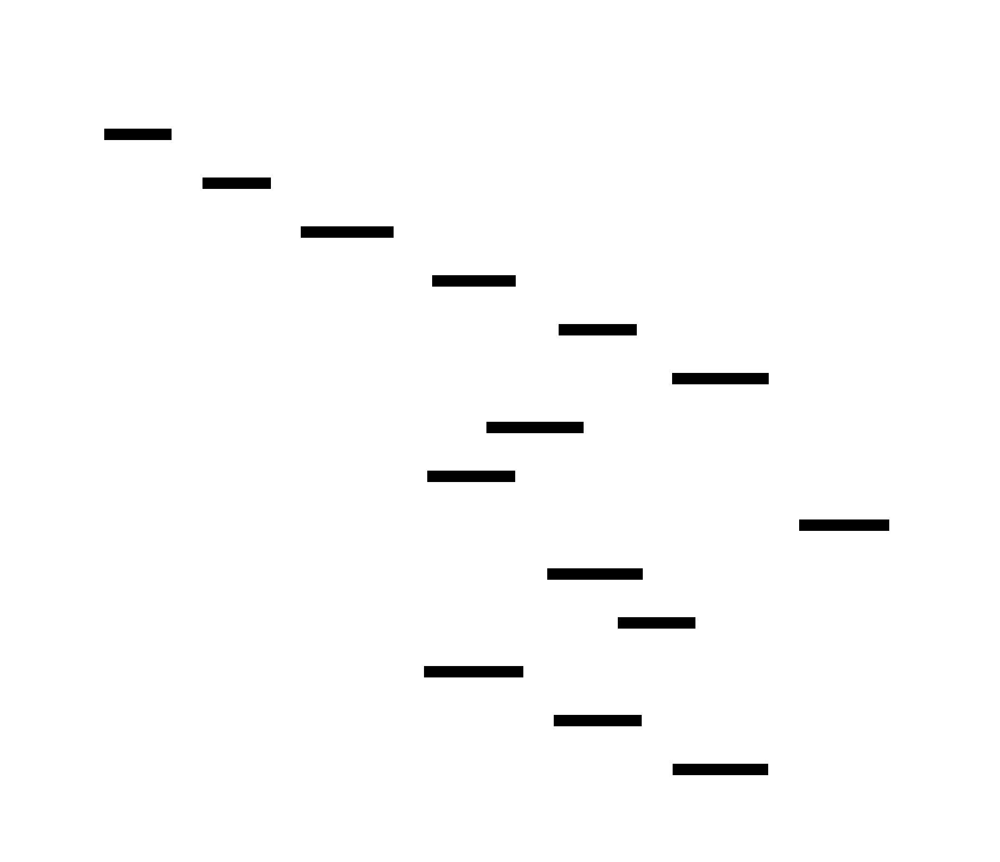

# Aether MLOps Pipeline: Design Document


## Overview

An autonomous ML infrastructure that handles the complete ML lifecycle from real-time feature engineering to self-healing deployments. The key architectural challenge is building a distributed system that maintains data consistency, handles failures gracefully, and adapts to changing model performance without human intervention.


> This guide is meant to help you understand the big picture before diving into each milestone. Refer back to it whenever you need context on how components connect.


## Context and Problem Statement

> **Milestone(s):** Foundational understanding for all milestones - establishes core challenges that Milestones 1-4 address

The modern machine learning lifecycle presents a paradox: while individual ML algorithms have become increasingly sophisticated and automated, the infrastructure surrounding them remains frustratingly manual, error-prone, and fragile. Organizations spend months building models that achieve impressive accuracy in notebooks, only to discover that deploying, monitoring, and maintaining these models in production requires an entirely different set of complex, interconnected systems. The Aether MLOps Pipeline addresses this fundamental gap by creating truly autonomous ML infrastructure that handles the complete lifecycle without human intervention.

### ML Lifecycle Challenges

Think of traditional software deployment like shipping a finished product from a factory - once the code is compiled and tested, it remains static until the next release. Machine learning systems, by contrast, are more like living organisms that must continuously adapt to their environment. The data they consume changes over time, their performance degrades in unpredictable ways, and their effectiveness depends on maintaining perfect synchronization between training data, feature engineering logic, model artifacts, and serving infrastructure.

The **feature engineering bottleneck** represents one of the most significant challenges in ML operations. Features must be computed consistently between training and inference, but traditional batch processing creates a dangerous temporal mismatch. During training, features are computed from historical data with perfect hindsight, while inference must compute the same features using only data available at prediction time. This temporal inconsistency leads to the notorious "training-serving skew" problem where models perform well in offline evaluation but fail catastrophically in production.

Consider a fraud detection model that uses "average transaction amount in the last 30 days" as a feature. During training, this feature is computed using complete historical data, but during inference, the system must compute it in real-time while ensuring it never accidentally includes future information. The complexity multiplies when dealing with hundreds of features, each with different temporal requirements, aggregation windows, and data dependencies.

| Challenge | Traditional Approach | Why It Fails |
|-----------|---------------------|--------------|
| Feature Consistency | Separate training/serving pipelines | Logic drift between batch and online systems |
| Point-in-Time Correctness | Manual feature engineering | Data leakage from future information |
| Low-Latency Serving | Cache pre-computed features | Stale data and cache invalidation complexity |
| Feature Evolution | Versioned feature definitions | Breaking changes require coordinated deployments |

The **distributed training coordination** problem emerges when models grow beyond single-machine capabilities. Modern deep learning models require hundreds of GPUs working in perfect synchronization, but traditional job schedulers treat ML training like batch processing jobs. This approach ignores the unique characteristics of ML workloads: long-running jobs that can benefit from fault tolerance through checkpointing, dynamic resource allocation based on convergence patterns, and the need to maintain training state across hardware failures.

> **Key Insight**: ML training jobs are fundamentally different from traditional distributed computing because they maintain valuable state (learned parameters) that must survive hardware failures and can be resumed from intermediate checkpoints.

**Model deployment and serving** introduces another layer of complexity that traditional DevOps patterns cannot address. Unlike stateless web services, ML models exhibit performance characteristics that change over time due to data drift, concept drift, and model degradation. A model that achieves 95% accuracy on historical data might drop to 60% accuracy within weeks due to changing user behavior, seasonal patterns, or external events. Traditional blue-green deployments assume that new versions are inherently better than old versions, but ML models require sophisticated evaluation and gradual rollout strategies.

The serving infrastructure must also handle unique ML requirements like request batching for GPU efficiency, dynamic model loading for A/B testing, and fallback strategies when models become unavailable. These requirements create complex interactions between model versioning, traffic routing, resource allocation, and performance monitoring that traditional deployment systems cannot manage.

| Deployment Challenge | Traditional Web Services | ML Model Serving |
|---------------------|-------------------------|------------------|
| Version Comparison | New version assumed better | Requires statistical evaluation |
| Traffic Routing | Simple load balancing | A/B testing with control groups |
| Scaling Triggers | CPU/memory metrics | Model-specific latency/accuracy |
| Rollback Decisions | Binary success/failure | Statistical significance testing |
| Resource Management | Homogeneous instances | Heterogeneous GPU/CPU requirements |

### Autonomy Requirements

The distinction between **semi-automated** and **truly autonomous** ML systems lies in their ability to make decisions under uncertainty without human intervention. Semi-automated systems provide tools and dashboards that help humans make better decisions faster, but they still require domain experts to interpret metrics, set thresholds, and trigger actions. Truly autonomous systems must encode this expertise into algorithms that can reason about trade-offs and make safe decisions even when faced with unprecedented scenarios.

**Autonomous decision-making** in ML systems requires sophisticated reasoning about multiple competing objectives. Consider the decision to retrain a model: a semi-automated system might alert an engineer when accuracy drops below a threshold, but an autonomous system must weigh the computational cost of retraining, the risk of deploying a potentially worse model, the impact of continued degradation, and the availability of sufficient new training data. This decision becomes even more complex when managing multiple models with interdependent features and shared computational resources.

> **Decision: Autonomous vs Human-in-the-Loop Architecture**
> - **Context**: MLOps systems can operate with human oversight for safety or autonomously for speed
> - **Options Considered**: 
>   1. Human-in-the-loop with approval gates for all decisions
>   2. Fully autonomous with human override capabilities  
>   3. Tiered autonomy with automatic decisions for low-risk operations
> - **Decision**: Fully autonomous with comprehensive safety mechanisms and human override
> - **Rationale**: The goal is to eliminate operational toil and enable 24/7 operation across time zones. Human approval gates create bottlenecks that defeat the purpose of automation.
> - **Consequences**: Requires sophisticated safety mechanisms, extensive testing of edge cases, and robust rollback capabilities

**Self-healing capabilities** distinguish autonomous systems from reactive monitoring solutions. Traditional monitoring systems detect problems and alert humans to fix them, but autonomous systems must diagnose root causes and implement corrective actions. This requires deep understanding of system dependencies, failure modes, and recovery procedures that can adapt to novel failure combinations.

For example, when a model's accuracy degrades, an autonomous system must determine whether the cause is data drift (requiring retraining with new data), concept drift (requiring architecture changes), infrastructure problems (requiring resource reallocation), or feature pipeline failures (requiring data engineering fixes). Each diagnosis leads to different recovery strategies with different risk profiles and success probabilities.

| Autonomy Level | Decision Making | Failure Response | Human Role |
|---------------|-----------------|------------------|------------|
| Manual | Human decides everything | Human investigates and fixes | Required for all operations |
| Semi-Automated | System recommends, human approves | System detects, human fixes | Required for complex decisions |
| Supervised Autonomous | System decides within bounds | System fixes common issues | Exception handling only |
| Fully Autonomous | System optimizes all trade-offs | System handles all failure modes | Strategic guidance only |

**Closed-loop learning** represents the highest level of autonomy, where systems continuously improve their decision-making based on outcomes. This goes beyond simple metric optimization to include meta-learning about which interventions work best under different conditions. An autonomous retraining system should learn that certain types of data drift respond better to additional training data while others require architecture modifications or feature engineering changes.

The feedback loop must also reason about temporal dependencies and long-term optimization. Decisions that improve short-term metrics might harm long-term performance, such as aggressive model updates that temporarily boost accuracy but increase system instability. Autonomous systems must balance exploration of new strategies with exploitation of proven approaches while maintaining safety guarantees.

### Existing MLOps Solutions

Current MLOps platforms fall into several categories, each addressing different aspects of the ML lifecycle but none providing truly autonomous end-to-end operation. Understanding their limitations illuminates the design requirements for the Aether system.

**Experimental tracking platforms** like MLflow, Weights & Biases, and Neptune excel at recording training experiments and managing model artifacts, but they treat deployment and serving as separate problems. These platforms assume that humans will interpret experiment results and manually trigger deployments, creating a gap between experimentation and production that requires significant engineering effort to bridge.

| Platform Category | Examples | Strengths | Limitations |
|-------------------|----------|-----------|-------------|
| Experiment Tracking | MLflow, W&B, Neptune | Excellent model versioning and comparison | No automated deployment or serving |
| Feature Stores | Feast, Tecton, Hopsworks | Solve training-serving skew | Limited real-time computation capabilities |
| Model Serving | Seldon, BentoML, TorchServe | Production-ready inference APIs | Manual deployment and scaling decisions |
| Training Platforms | Kubeflow, Ray, SageMaker | Distributed training orchestration | No integration with feature engineering or serving |
| End-to-End Platforms | Databricks, Vertex AI, SageMaker | Integrated workflow management | Still require significant manual configuration |

**Feature store solutions** like Feast and Tecton address the training-serving skew problem but with significant operational overhead. They require manual feature definition, pipeline orchestration, and infrastructure management. Most importantly, they lack the real-time feature computation capabilities needed for low-latency serving of complex features that depend on recent user behavior or market conditions.

The point-in-time correctness problem remains partially solved because these systems focus on storing pre-computed features rather than computing features on-demand with temporal guarantees. This approach works well for static features but breaks down for dynamic features that must be computed at inference time using only historically available data.

**Model serving platforms** like Seldon Core and BentoML provide production-ready inference infrastructure but require manual configuration for scaling, routing, and deployment strategies. They lack the intelligence to automatically determine optimal batching parameters, choose between different optimization techniques, or make deployment decisions based on model performance characteristics.

> **Key Limitation**: Existing platforms treat ML operations as a collection of connected tools rather than a unified system with global optimization objectives.

**Cloud-native MLOps platforms** from major providers (AWS SageMaker, Google Vertex AI, Azure ML) offer the most comprehensive feature sets but still require extensive manual configuration and monitoring. They provide the building blocks for autonomous operation but lack the decision-making algorithms and feedback loops necessary for true autonomy.

The fundamental limitation across all existing solutions is their **tool-centric rather than outcome-centric design**. They provide sophisticated capabilities for each phase of the ML lifecycle but delegate the complex orchestration and optimization decisions to human operators. This creates operational burden that scales with the number of models and data sources rather than providing economies of scale through automation.

| Integration Challenge | Current Solutions | Aether Approach |
|----------------------|------------------|-----------------|
| Feature-Training Consistency | Manual pipeline coordination | Unified computation engine |
| Training-Serving Integration | Separate deployment processes | Automatic deployment pipelines |
| Performance Monitoring | Dashboard alerts requiring human analysis | Autonomous drift detection and response |
| Resource Optimization | Manual scaling and allocation | Dynamic optimization based on workload patterns |
| Cross-Model Dependencies | Manual dependency tracking | Automatic lineage tracking and impact analysis |

### Implementation Guidance

**A. Technology Recommendations**

| Component | Simple Option | Advanced Option |
|-----------|---------------|-----------------|
| Data Storage | PostgreSQL + Redis | Apache Kafka + Apache Cassandra + Redis Cluster |
| Feature Computation | Pandas + Celery | Apache Flink + Apache Beam |
| Model Training | Local PyTorch + Ray | Kubernetes + PyTorch DDP + NVIDIA Collective Communications Library |
| Model Serving | FastAPI + ONNX Runtime | Kubernetes + TensorRT + NVIDIA Triton |
| Monitoring | Prometheus + Grafana | Prometheus + Jaeger + Custom ML metrics |
| Orchestration | Apache Airflow | Kubernetes Operators + Custom Controllers |

**B. Recommended File Structure**

Understanding the complexity described in this section, the Aether system should be organized as a collection of microservices with clear boundaries and responsibilities:

```
aether-mlops/
├── cmd/
│   ├── feature-store/           ← Feature store service entry point
│   ├── training-orchestrator/   ← Training coordination service
│   ├── model-server/           ← Inference serving service
│   └── feedback-controller/    ← Autonomous decision-making service
├── internal/
│   ├── common/                 ← Shared utilities and data models
│   │   ├── models/            ← Core data structures
│   │   ├── metrics/           ← ML-specific monitoring
│   │   └── config/            ← Configuration management
│   ├── feature-store/         ← Real-time feature computation
│   ├── training/              ← Distributed training logic
│   ├── serving/               ← Model serving and optimization
│   └── feedback/              ← Autonomous decision algorithms
├── api/
│   ├── proto/                 ← gRPC service definitions
│   └── openapi/               ← REST API specifications
├── deployments/
│   ├── kubernetes/            ← K8s manifests for all services
│   └── terraform/             ← Infrastructure as code
└── tests/
    ├── integration/           ← End-to-end pipeline tests
    └── chaos/                 ← Failure scenario testing
```

**C. Core Data Models Foundation**

Based on the challenges identified in this section, establish the foundational data structures that will be used throughout the system:

```python
"""
Core data models for the Aether MLOps system.
These structures capture the essential metadata needed for autonomous operation.
"""
from dataclasses import dataclass
from datetime import datetime
from enum import Enum
from typing import Dict, List, Optional, Any
import uuid

@dataclass
class FeatureDefinition:
    """Defines a feature that can be computed for both training and serving."""
    # TODO: Add fields based on feature store design (Section 5)
    # - name: unique identifier for the feature
    # - computation_logic: how to compute the feature
    # - data_sources: what data inputs are required
    # - temporal_requirements: how far back data is needed
    # - serving_requirements: latency and freshness constraints
    pass

@dataclass
class ModelMetadata:
    """Captures everything needed to reproduce and deploy a model."""
    # TODO: Add fields based on training orchestrator design (Section 6)  
    # - model_id: unique identifier
    # - feature_dependencies: which features this model requires
    # - training_config: hyperparameters and training settings
    # - performance_metrics: accuracy, latency, resource usage
    # - deployment_requirements: serving infrastructure needs
    pass

@dataclass
class DeploymentStatus:
    """Tracks the current state of a model in production."""
    # TODO: Add fields based on model serving design (Section 7)
    # - deployment_id: unique identifier
    # - model_version: which model is deployed
    # - traffic_allocation: percentage of requests served
    # - performance_metrics: real-time accuracy and latency
    # - health_status: current operational state
    pass

@dataclass
class FeedbackEvent:
    """Represents an autonomous decision made by the system."""
    # TODO: Add fields based on feedback loop design (Section 8)
    # - event_id: unique identifier
    # - decision_type: what action was taken
    # - triggering_conditions: what caused this decision
    # - outcome_metrics: how successful was the decision
    # - confidence_level: how certain was the system
    pass
```

**D. Infrastructure Starter Code**

Create a foundational monitoring and configuration system that all components will use:

```python
"""
Shared infrastructure for metrics collection and configuration management.
This provides the foundation for autonomous decision-making.
"""
import logging
import time
from contextlib import contextmanager
from typing import Dict, Any

class AetherMetrics:
    """Centralized metrics collection for ML-specific monitoring."""
    
    def __init__(self):
        self.metrics_store = {}
        self.logger = logging.getLogger("aether.metrics")
    
    def record_feature_computation_latency(self, feature_name: str, latency_ms: float):
        """Record how long it took to compute a specific feature."""
        # TODO: Implement metric storage and aggregation
        # This will be crucial for autonomous performance optimization
        pass
    
    def record_model_prediction_accuracy(self, model_id: str, accuracy: float, 
                                       timestamp: datetime):
        """Track model performance over time for drift detection."""
        # TODO: Implement time-series storage for performance tracking
        # This enables autonomous retraining decisions
        pass
    
    @contextmanager
    def measure_operation(self, operation_name: str, tags: Dict[str, str] = None):
        """Context manager to automatically measure operation duration."""
        start_time = time.time()
        try:
            yield
        finally:
            duration = time.time() - start_time
            self.logger.info(f"{operation_name} completed in {duration:.3f}s", 
                           extra={"operation": operation_name, "duration": duration, 
                                 "tags": tags or {}})

class AetherConfig:
    """Configuration management with environment-specific overrides."""
    
    def __init__(self):
        # TODO: Load configuration from environment variables and config files
        # Each component will have specific configuration requirements
        pass
    
    def get_feature_store_config(self) -> Dict[str, Any]:
        """Get configuration for feature store component."""
        # TODO: Return Redis endpoints, batch sizes, timeout values
        return {}
    
    def get_training_config(self) -> Dict[str, Any]:
        """Get configuration for distributed training."""
        # TODO: Return GPU allocation, checkpoint intervals, resource limits
        return {}
```

**E. Development Milestones**

Given the complexity outlined in this section, development should proceed in stages that build upon each other:

**Milestone Checkpoint - Foundation**:
After implementing the basic data models and infrastructure:
1. Run `python -m pytest tests/test_models.py` to verify data structure serialization
2. Start the metrics collection service and verify it can record test metrics
3. Check that configuration loading works across different environments
4. Verify that all services can communicate using the established protocols

**Signs of Problems**:
- **Symptom**: Configuration inconsistencies between services  
  **Likely Cause**: Environment variable conflicts or missing defaults  
  **Fix**: Implement centralized configuration validation with clear error messages

- **Symptom**: Metrics collection causing performance degradation  
  **Likely Cause**: Synchronous metric recording blocking main operations  
  **Fix**: Implement asynchronous metric collection with buffering

**F. Autonomous Decision Framework**

Establish the decision-making framework that will be used throughout the system:

```python
"""
Framework for autonomous decision-making across all MLOps components.
"""
from abc import ABC, abstractmethod
from dataclasses import dataclass
from enum import Enum

class ConfidenceLevel(Enum):
    HIGH = "high"        # > 95% confidence, safe to proceed automatically
    MEDIUM = "medium"    # 80-95% confidence, proceed with extra monitoring  
    LOW = "low"         # < 80% confidence, consider human review

@dataclass
class AutonomousDecision:
    """Represents a decision made by the autonomous system."""
    decision_type: str
    action: str
    confidence: ConfidenceLevel
    reasoning: str
    expected_outcome: Dict[str, float]
    rollback_plan: str

class AutonomousAgent(ABC):
    """Base class for all autonomous decision-making components."""
    
    @abstractmethod
    def analyze_situation(self, context: Dict[str, Any]) -> Dict[str, Any]:
        """Analyze current state and identify potential issues or opportunities."""
        pass
    
    @abstractmethod  
    def generate_options(self, analysis: Dict[str, Any]) -> List[AutonomousDecision]:
        """Generate possible actions based on the analysis."""
        pass
    
    @abstractmethod
    def select_action(self, options: List[AutonomousDecision]) -> Optional[AutonomousDecision]:
        """Choose the best action considering risks and benefits.""" 
        pass
    
    @abstractmethod
    def execute_decision(self, decision: AutonomousDecision) -> bool:
        """Implement the chosen action and monitor its effects."""
        pass
```

This foundation provides the infrastructure needed to build truly autonomous ML operations that can reason about complex trade-offs and make safe decisions without human intervention.


## Goals and Non-Goals

> **Milestone(s):** Foundational requirements that drive the design of all milestones (1-4) - establishes success criteria for autonomous ML infrastructure

The Aether MLOps Pipeline represents a paradigm shift from traditional DevOps thinking to truly autonomous machine learning operations. Think of the difference between a traditional assembly line (where humans monitor and intervene at each station) versus a modern semiconductor fabrication plant (where the system autonomously adjusts parameters, detects anomalies, and self-corrects without human intervention). Aether aims to be the "fab plant" of ML infrastructure - a system that makes intelligent decisions about data, training, deployment, and recovery without requiring constant human oversight.

However, building autonomous systems requires extremely clear boundaries about what the system will and won't handle. Unlike traditional software systems where requirements can be somewhat fluid, autonomous systems must have precisely defined operating parameters to prevent unexpected behaviors. This section establishes those boundaries through three critical dimensions: functional capabilities, performance requirements, and explicit non-goals.

### Functional Goals

The Aether system must provide four core autonomous capabilities that span the entire ML lifecycle. Each capability represents a significant technical challenge that requires sophisticated decision-making algorithms rather than simple automation scripts.

**Real-time Feature Engineering with Temporal Consistency**

The system must autonomously compute and serve ML features while maintaining strict **point-in-time correctness**. Think of this as building a time machine for your data - the system must be able to reconstruct the exact feature values that existed at any historical moment without accidentally including future information. This capability goes far beyond simple feature caching or batch preprocessing.

The system must automatically detect when feature definitions change and handle schema evolution without breaking downstream consumers. When a new feature is added or an existing computation is modified, the system must autonomously determine the appropriate backfill strategy, estimate computational costs, and execute the migration without service disruption.

Additionally, the system must provide intelligent feature selection based on actual usage patterns and model performance. Rather than computing all possible features for every request, the system should learn which features contribute most to model accuracy and optimize computation accordingly.

**Autonomous Resource Management for Distributed Training**

The system must make intelligent decisions about GPU allocation, training parallelization, and fault recovery without human intervention. Think of this as an autonomous air traffic control system for ML workloads - it must coordinate multiple training jobs across shared infrastructure while optimizing for both individual job performance and overall cluster utilization.

The system must automatically detect and respond to hardware failures during long-running training jobs. When a GPU fails or a network partition occurs, the system should autonomously decide whether to restart the job from a checkpoint, redistribute work to healthy nodes, or gracefully degrade to a smaller cluster configuration.

Resource scheduling must consider not just current demand but also predictive workload patterns. The system should learn from historical training patterns to pre-allocate resources for expected workloads and automatically scale cluster capacity based on pending job queues.

**Intelligent Model Deployment and Traffic Management**

The system must autonomously manage model deployments using sophisticated traffic routing strategies that go beyond simple load balancing. Think of this as an autonomous financial trading system - it must continuously evaluate model performance across multiple variants and make real-time decisions about traffic allocation to maximize overall system performance.

The system must automatically detect when model performance degrades and initiate appropriate recovery actions. This includes autonomous rollback decisions, canary deployment management, and A/B testing orchestration. When multiple model versions are running simultaneously, the system must intelligently route requests based on model confidence, latency requirements, and business metrics.

The system must also provide autonomous inference optimization by learning request patterns and automatically applying batching, caching, and model acceleration techniques. Rather than using static optimization configurations, the system should continuously adapt to changing workload characteristics.

**Closed-loop Learning and Self-healing Capabilities**

The system must implement true **closed-loop learning** where performance feedback automatically triggers retraining decisions. Think of this as an autonomous immune system - it must continuously monitor for threats (performance degradation, **data drift**, **concept drift**) and autonomously deploy countermeasures (retraining, feature updates, model architecture changes).

The system must distinguish between temporary performance fluctuations and genuine degradation requiring intervention. This requires sophisticated statistical analysis and decision-making algorithms that can adapt to different model types and business contexts.

Most critically, the system must maintain complete **lineage tracking** from data sources through feature engineering, training, and deployment. Every autonomous decision must be fully auditable, with clear reasoning chains that explain why specific actions were taken.

> **Decision: Autonomous vs. Semi-Automated Systems**
> - **Context**: Many existing MLOps platforms provide automation scripts but still require human decision-making for critical operations like model deployment and retraining
> - **Options Considered**:
>   1. Semi-automated system with human approval gates for critical decisions
>   2. Fully autonomous system with monitoring and override capabilities
>   3. Hybrid approach with configurable automation levels per component
> - **Decision**: Fully autonomous system with comprehensive monitoring and emergency override capabilities
> - **Rationale**: True MLOps scalability requires eliminating human bottlenecks in the decision chain. Semi-automated systems create operational overhead and don't solve the core scalability problem. However, autonomous systems must include robust monitoring and override mechanisms for safety.
> - **Consequences**: Requires sophisticated decision-making algorithms and comprehensive testing. Enables true 24/7 operation but introduces complexity in ensuring decision quality and safety.

| Functional Capability | Autonomous Behavior | Human Override | Monitoring Level |
|----------------------|-------------------|---------------|-----------------|
| Feature computation scheduling | Automatic based on data freshness and usage patterns | Emergency stop/manual trigger | Real-time with alerting |
| Training job resource allocation | Dynamic based on queue depth and cluster utilization | Resource limit adjustments | Continuous hardware monitoring |
| Model deployment decisions | Automated canary → production promotion | Deployment halt/rollback | Performance and error tracking |
| Retraining trigger evaluation | Statistical analysis of drift and performance | Manual retraining initiation | Drift detection dashboards |

### Performance Goals

The Aether system must meet aggressive performance targets that enable real-time ML applications while maintaining the reliability required for production systems. These targets represent the minimum viable performance for autonomous operation - below these thresholds, human intervention becomes necessary, defeating the purpose of autonomy.

**Sub-20ms Feature Retrieval at Scale**

The feature store must serve 1000+ features simultaneously with p99 latency under 20ms and p50 latency under 5ms. This performance target enables real-time applications like fraud detection, recommendation systems, and dynamic pricing that require immediate responses to user actions.

The system must maintain this performance level while serving 100,000+ requests per second across multiple model inference workloads. Feature retrieval performance must remain stable under load spikes and during background operations like feature backfilling or schema migrations.

Additionally, the system must support **point-in-time correctness** queries with minimal performance impact. Historical feature reconstruction (required for model training and debugging) should complete within 100ms for typical queries spanning 30 days of data.

**Training Job Efficiency and Fault Tolerance**

Distributed training jobs must achieve at least 85% linear scaling efficiency when adding additional GPUs. A training job that takes 8 hours on 1 GPU should complete in approximately 1 hour on 8 GPUs, accounting for communication overhead and synchronization costs.

The system must handle hardware failures with minimal training time loss. When a node fails during distributed training, recovery should resume within 5 minutes with no more than 10 minutes of lost training progress. This requires sophisticated checkpointing strategies and rapid failure detection.

Training resource utilization must exceed 90% GPU utilization during active training phases. The system should automatically detect and eliminate bottlenecks in data loading, preprocessing, and network communication that reduce training efficiency.

**Model Serving Throughput and Reliability**

Model serving infrastructure must support at least 10,000 inference requests per second per GPU with p99 latency under 100ms. The system must automatically apply batching, caching, and model optimization techniques to achieve maximum throughput without compromising latency requirements.

Model deployments must achieve 99.9% uptime with automated rollback completing within 2 minutes of detecting performance degradation. Canary deployments should automatically evaluate new model performance and make promotion decisions within 15 minutes of deployment.

The system must support seamless A/B testing with traffic split ratios adjustable in real-time. Traffic routing decisions should complete within 1ms to avoid adding latency to inference requests.

**System-wide Responsiveness and Scalability**

**Drift detection** and retraining decisions must complete within 1 hour of performance degradation detection. The system should continuously monitor model performance and data distributions, triggering retraining workflows automatically when configurable thresholds are exceeded.

The overall system must scale horizontally to support 100+ concurrent model training jobs and 1000+ deployed models without performance degradation. Component communication should use efficient protocols and batching to minimize network overhead.

All autonomous decisions must be recorded with complete audit trails within 10ms of decision completion. This includes feature computation decisions, training resource allocations, deployment actions, and retraining triggers.

> **Decision: Aggressive vs. Conservative Performance Targets**
> - **Context**: Performance requirements directly impact the types of ML applications that can use the system and the infrastructure costs required
> - **Options Considered**:
>   1. Conservative targets (100ms feature retrieval, 99% uptime) that are easier to achieve
>   2. Aggressive targets (20ms feature retrieval, 99.9% uptime) that enable more demanding applications
>   3. Tiered performance levels with different SLAs for different use cases
> - **Decision**: Aggressive targets with graceful degradation mechanisms
> - **Rationale**: Real-time ML applications require sub-20ms response times to be viable. Conservative targets would limit the system to batch and near-real-time use cases. Aggressive targets with fallback mechanisms provide the best of both worlds.
> - **Consequences**: Requires sophisticated caching, optimization, and fault tolerance mechanisms. Higher infrastructure costs but enables broader range of ML applications.

| Performance Metric | Target | Measurement Method | Degradation Response |
|-------------------|--------|-------------------|-------------------|
| Feature retrieval p99 latency | < 20ms | Continuous client-side monitoring | Automatic cache warming, fallback to stale features |
| Training scaling efficiency | > 85% linear | Job completion time analysis | Automatic worker reallocation, networking optimization |
| Inference throughput | > 10K RPS/GPU | Request rate monitoring | Automatic batching, model optimization, horizontal scaling |
| Deployment rollback time | < 2 minutes | Deployment pipeline monitoring | Automatic traffic switching, health check acceleration |
| Drift detection response | < 1 hour | Performance degradation timestamps | Priority retraining queue, emergency model rollback |

### Non-Goals

Clearly defining what Aether will NOT handle is crucial for maintaining system focus and preventing scope creep. These non-goals represent important MLOps capabilities that are either too complex for the initial system or are better handled by specialized external tools.

**Data Governance and Privacy Compliance**

Aether will not implement data governance policies, privacy compliance (GDPR, CCPA), or data access controls. The system assumes that input data has already been properly anonymized, filtered, and authorized for ML use. Data governance represents a complex domain with legal and regulatory requirements that vary significantly across organizations and jurisdictions.

The system will not handle data lineage beyond ML-specific operations. While Aether tracks how features are computed and which data sources contribute to model training, it will not trace data origins back to original business systems or implement data cataloging capabilities.

Data quality validation and cleansing are also outside scope. Aether assumes input data meets quality requirements and will not implement anomaly detection or data repair mechanisms for source data.

**Multi-tenant Security and Isolation**

The initial Aether implementation will not support multiple organizations or strict security isolation between different teams. The system assumes a trusted environment where all users have appropriate access to all models and data. Multi-tenancy introduces significant complexity in resource isolation, data access controls, and cost allocation that would compromise the system's autonomous decision-making capabilities.

Authentication and authorization will be handled by external systems. Aether will not implement user management, role-based access controls, or audit logging for security purposes (though it will log technical operations for debugging and lineage tracking).

**Business Logic and Domain-specific Optimizations**

Aether will not implement business-specific logic for model selection, performance evaluation, or deployment decisions. The system provides configurable frameworks for decision-making but does not encode domain knowledge about specific industries, use cases, or business metrics.

The system will not optimize for specific model architectures or ML frameworks beyond providing efficient infrastructure. While Aether supports distributed training for frameworks like PyTorch and TensorFlow, it will not implement custom optimizations for specific model types or research areas.

Cost optimization and resource budgeting are outside scope. Aether will optimize for performance and reliability but will not make decisions based on infrastructure costs or budget constraints.

**External System Integration and Data Ingestion**

Aether will not implement connectors for specific data sources, databases, or external APIs. The system assumes data arrives via standard interfaces (Kafka, S3, etc.) and will not handle the complexity of integrating with diverse enterprise systems.

The system will not implement data pipeline orchestration or ETL capabilities. Aether assumes that data preprocessing and cleaning occur upstream and focuses specifically on ML-related feature engineering and model operations.

Model marketplace, sharing, and discovery features are outside scope. While Aether maintains model metadata and lineage, it will not implement social features, model ratings, or cross-organizational sharing capabilities.

**Advanced ML Research Capabilities**

Aether will not implement cutting-edge research features like federated learning, differential privacy, or advanced AutoML techniques. The system focuses on production-oriented MLOps capabilities rather than research and experimentation workflows.

Hyperparameter optimization beyond basic grid search is outside scope. While Aether can execute training jobs with different parameter configurations, it will not implement sophisticated optimization algorithms or neural architecture search.

Model interpretability and explainability features are not included. While Aether tracks model lineage and performance, it will not generate explanations for individual predictions or provide model debugging tools.

> **Decision: Focused Scope vs. Comprehensive Platform**
> - **Context**: MLOps encompasses a vast range of capabilities, and attempting to solve all problems would create an overly complex system
> - **Options Considered**:
>   1. Comprehensive platform covering all MLOps needs including governance, security, and business logic
>   2. Focused system solving core autonomous operation challenges
>   3. Modular architecture allowing gradual expansion of capabilities
> - **Decision**: Focused system with clear integration points for external tools
> - **Rationale**: Autonomous decision-making requires deep expertise in specific areas. Attempting to solve all MLOps problems would dilute focus and compromise the quality of autonomous capabilities. Better to excel in core areas and integrate cleanly with existing tools.
> - **Consequences**: Requires clear API boundaries and integration strategies. May require users to operate multiple tools but ensures each tool excels in its domain.

| Capability Category | Included in Aether | External Tool Integration | Rationale for Exclusion |
|--------------------|-------------------|-------------------------|------------------------|
| Data governance | ❌ | API hooks for policy enforcement | Legal/regulatory complexity varies by organization |
| Multi-tenant security | ❌ | Standard authentication protocols | Security isolation conflicts with autonomous operation |
| Business logic | ❌ | Configurable decision frameworks | Domain knowledge varies too widely to generalize |
| Data source connectors | ❌ | Standard protocols (Kafka, S3) | Integration complexity would overwhelm core ML focus |
| Advanced ML research | ❌ | Plugin architecture for experiments | Research features change rapidly and lack production maturity |

### Implementation Guidance

The goals and non-goals established in this section directly influence technology choices, architecture patterns, and implementation priorities throughout the Aether system. This guidance provides concrete direction for translating high-level objectives into working code.

**Technology Selection Framework**

The performance and autonomy goals drive specific technology requirements that inform all subsequent implementation decisions. For real-time feature serving with sub-20ms latency, memory-based storage systems like Redis are essential, while batch analytics require columnar formats like Parquet. Autonomous decision-making requires event-driven architectures that can respond to system changes without human intervention.

| System Component | Simple Option | Advanced Option | Goal Alignment |
|-----------------|---------------|-----------------|---------------|
| Feature Store Online | Redis with Python client | Custom C++ memory engine | 20ms latency requirement |
| Message Passing | HTTP REST with JSON | gRPC with Protocol Buffers | High-throughput event processing |
| Model Serving | Flask with synchronous inference | FastAPI with async batching | 10K RPS throughput requirement |
| Training Orchestration | Subprocess management | Kubernetes Jobs with custom controller | Fault tolerance and scaling |
| Metrics Collection | Prometheus with standard metrics | Custom time-series DB with ML metrics | Real-time decision-making data |

**Project Structure for Goal-Driven Development**

The codebase organization should reflect the clear separation between autonomous decision-making components and supporting infrastructure. This structure enables focused development on the core autonomous capabilities while maintaining clean interfaces to external systems.

```
aether-mlops/
  cmd/
    feature-server/main.py           ← Online feature serving entry point
    training-orchestrator/main.py    ← Distributed training coordinator
    model-server/main.py             ← Model inference API
    feedback-loop/main.py            ← Autonomous monitoring and retraining
  
  internal/
    autonomous/                      ← Core autonomous decision-making
      decision_engine.py             ← Base classes for autonomous decisions
      confidence_levels.py           ← Decision confidence evaluation
      feedback_events.py             ← Event tracking for closed-loop learning
    
    feature_store/                   ← Milestone 1 implementation
      online_store.py                ← Redis-based real-time storage
      offline_store.py               ← Parquet/S3 historical storage
      point_in_time.py               ← Temporal consistency logic
      feature_computation.py         ← Streaming feature engineering
    
    training/                        ← Milestone 2 implementation
      orchestrator.py                ← Training job coordination
      resource_manager.py            ← GPU allocation and scheduling
      checkpoint_manager.py          ← Fault tolerance and recovery
      metrics_collector.py           ← Hardware performance monitoring
    
    serving/                         ← Milestone 3 implementation
      deployment_controller.py       ← Canary and blue-green deployments
      traffic_router.py              ← Intelligent request routing
      inference_optimizer.py         ← Batching and GPU optimization
      auto_scaler.py                 ← Custom metrics-based scaling
    
    feedback/                        ← Milestone 4 implementation
      drift_detector.py              ← Statistical drift analysis
      retraining_trigger.py          ← Autonomous retraining decisions
      model_evaluator.py             ← Automated model comparison
      lineage_tracker.py             ← End-to-end provenance tracking
  
  external/                          ← Integration with non-goal systems
    auth_adapter.py                  ← External authentication integration
    governance_hooks.py              ← Data governance policy enforcement
    cost_reporter.py                 ← Resource usage reporting (no optimization)
  
  config/
    performance_targets.yaml         ← Latency and throughput requirements
    autonomous_policies.yaml         ← Decision-making configuration
    integration_config.yaml          ← External system connection details
```

**Autonomous Decision Framework Implementation**

The core autonomous capabilities require a consistent framework for decision-making that can be applied across all system components. This framework implements the confidence-based decision model that enables the system to operate autonomously while maintaining safety through uncertainty quantification.

```python
# Core autonomous decision-making infrastructure
from enum import Enum
from dataclasses import dataclass
from typing import Dict, List, Optional, Any
from datetime import datetime

class ConfidenceLevel(Enum):
    """Decision confidence levels for autonomous operations"""
    HIGH = "high"      # 95%+ confidence, proceed automatically
    MEDIUM = "medium"  # 80-95% confidence, proceed with monitoring
    LOW = "low"        # <80% confidence, require human review

@dataclass
class AutonomousDecision:
    """Structured autonomous action with reasoning"""
    action_type: str              # e.g., "deploy_model", "trigger_retraining"
    confidence: ConfidenceLevel   # Decision certainty level
    reasoning: List[str]          # Step-by-step decision logic
    context: Dict[str, Any]       # Situation analysis that led to decision
    alternatives: List[str]       # Other options considered
    success_criteria: List[str]   # How to measure if decision was correct
    rollback_plan: Optional[str]  # Recovery strategy if decision fails
    timestamp: datetime
    component: str                # Which system component made this decision

@dataclass
class FeedbackEvent:
    """Record of autonomous system decision and outcome"""
    decision_id: str              # Reference to AutonomousDecision
    outcome: str                  # "success", "failure", "partial"
    actual_metrics: Dict[str, float]  # Measured results
    expected_metrics: Dict[str, float]  # Predicted results
    learning_signal: Optional[str]     # What this teaches us for future decisions
    timestamp: datetime

class AutonomousAgent:
    """Base class for decision-making components"""
    
    def analyze_situation(self, context: Dict[str, Any]) -> Dict[str, Any]:
        """Assess current system state and identify relevant factors"""
        # TODO 1: Collect relevant metrics from monitoring systems
        # TODO 2: Identify anomalies or unusual patterns in the data
        # TODO 3: Assess urgency level (immediate action vs. planned change)
        # TODO 4: Check for conflicting constraints or requirements
        # TODO 5: Return structured analysis with confidence scores
        pass
    
    def generate_options(self, analysis: Dict[str, Any]) -> List[Dict[str, Any]]:
        """Create possible actions based on situation analysis"""
        # TODO 1: Generate all feasible actions given current constraints
        # TODO 2: Estimate likely outcomes and success probability for each option
        # TODO 3: Calculate resource requirements and risk levels
        # TODO 4: Consider timing requirements and dependencies
        # TODO 5: Return ranked list of options with pros/cons
        pass
    
    def select_action(self, options: List[Dict[str, Any]]) -> AutonomousDecision:
        """Choose optimal decision using multi-criteria evaluation"""
        # TODO 1: Apply decision criteria weights (performance, safety, cost)
        # TODO 2: Calculate confidence score based on historical similar decisions
        # TODO 3: Check if confidence meets threshold for autonomous action
        # TODO 4: Generate structured reasoning chain for decision
        # TODO 5: Create rollback plan for failure scenarios
        pass
    
    def execute_decision(self, decision: AutonomousDecision) -> str:
        """Implement chosen action and monitor execution"""
        # TODO 1: Validate preconditions are still met before execution
        # TODO 2: Execute action with progress monitoring and timeout handling
        # TODO 3: Monitor success criteria during and after execution
        # TODO 4: Generate FeedbackEvent with actual outcomes
        # TODO 5: Update decision confidence models based on results
        pass
```

**Performance Monitoring and Metrics Collection**

Achieving the aggressive performance goals requires comprehensive monitoring that feeds directly into autonomous decision-making. The metrics system must balance collection overhead with decision-making data requirements.

```python
from contextlib import contextmanager
import time
from typing import Dict, Optional

class AetherMetrics:
    """ML-specific metrics collection system"""
    
    def record_feature_computation_latency(self, feature_name: str, latency_ms: float) -> None:
        """Track feature computation performance for optimization decisions"""
        # TODO 1: Record latency with timestamp and feature metadata
        # TODO 2: Update rolling percentile calculations (p50, p99)
        # TODO 3: Check against performance goals and trigger alerts
        # TODO 4: Feed data to autonomous optimization algorithms
        pass
    
    def record_model_prediction_accuracy(self, model_id: str, accuracy: float, timestamp: datetime) -> None:
        """Monitor model performance over time for drift detection"""
        # TODO 1: Store accuracy metric with temporal indexing
        # TODO 2: Calculate trends and detect significant degradation
        # TODO 3: Compare against baseline performance thresholds
        # TODO 4: Generate drift detection signals for autonomous retraining
        pass
    
    @contextmanager
    def measure_operation(self, operation_name: str, tags: Optional[Dict[str, str]] = None):
        """Context manager for automatic timing of operations"""
        # TODO 1: Record operation start time and resource usage
        # TODO 2: Yield control to measured operation
        # TODO 3: Calculate duration and resource delta
        # TODO 4: Store metrics with operation context and tags
        # TODO 5: Check against SLA thresholds and trigger autonomous responses
        start_time = time.time()
        try:
            yield
        finally:
            duration_ms = (time.time() - start_time) * 1000
            # Implementation details for metric storage and analysis
```

**Configuration Management for Autonomous Operation**

The system's autonomous behavior must be configurable across different environments and use cases while maintaining safety and performance guarantees.

```python
from typing import Dict, Any
import yaml

class AetherConfig:
    """Environment-aware configuration manager"""
    
    def __init__(self, config_path: str):
        # TODO 1: Load configuration from YAML files with environment overlays
        # TODO 2: Validate configuration against schema and performance requirements
        # TODO 3: Set up configuration hot-reloading for autonomous parameter tuning
        # TODO 4: Initialize performance targets and decision thresholds
        pass
    
    def get_performance_targets(self) -> Dict[str, float]:
        """Return latency and throughput targets for autonomous optimization"""
        # TODO: Return configured targets that drive autonomous scaling decisions
        return {
            "feature_retrieval_p99_ms": 20,
            "inference_throughput_rps": 10000,
            "training_scaling_efficiency": 0.85,
            "deployment_rollback_time_seconds": 120
        }
    
    def get_autonomous_thresholds(self) -> Dict[str, Dict[str, float]]:
        """Return confidence thresholds for different types of autonomous decisions"""
        # TODO: Return thresholds that determine when system acts autonomously vs. alerts humans
        return {
            "deployment_decisions": {"high": 0.95, "medium": 0.80, "low": 0.60},
            "retraining_triggers": {"high": 0.90, "medium": 0.75, "low": 0.50},
            "scaling_actions": {"high": 0.98, "medium": 0.85, "low": 0.70}
        }
```

**Milestone Checkpoints for Goal Validation**

Each milestone must demonstrate progress toward the overall goals through measurable checkpoints that validate both functional capabilities and performance targets.

**Milestone 1 Checkpoint - Feature Store Performance:**
- Run: `python -m pytest tests/test_feature_store_performance.py`
- Expected: Feature retrieval p99 latency under 20ms for 1000 concurrent features
- Validation: Load test with `artillery run feature-store-load-test.yml`
- Success criteria: Maintains performance during schema updates and backfill operations

**Milestone 2 Checkpoint - Training Orchestration:**
- Run: `python scripts/test_distributed_training.py --nodes=4 --gpus=8`
- Expected: 85%+ scaling efficiency across multiple GPU configurations
- Validation: Inject node failures during training and verify recovery within 5 minutes
- Success criteria: Automatic resource reallocation without human intervention

**Milestone 3 Checkpoint - Model Serving Autonomy:**
- Run: `python scripts/test_autonomous_deployment.py`
- Expected: Automatic canary promotion and rollback based on performance metrics
- Validation: Deploy deliberately degraded model and verify automatic rollback
- Success criteria: Zero human intervention required for standard deployment workflows

**Milestone 4 Checkpoint - End-to-End Autonomy:**
- Run: `python scripts/test_full_pipeline.py --duration=24h`
- Expected: Complete autonomous operation for 24 hours with simulated drift
- Validation: Inject various failure modes and verify self-healing responses
- Success criteria: System maintains performance goals without human intervention


## High-Level Architecture

> **Milestone(s):** All milestones (1-4) - establishes the foundational architecture that enables autonomous ML operations across feature serving, distributed training, model deployment, and feedback loops

The Aether MLOps Pipeline consists of four interconnected subsystems that work together to create a truly autonomous machine learning infrastructure. Think of this architecture as a **biological nervous system** - just as the nervous system continuously processes sensory input, makes decisions, and adapts behavior without conscious intervention, Aether processes data streams, makes deployment decisions, and evolves model performance automatically.

The key architectural insight is that autonomous ML systems require **closed-loop learning** at every level: features must adapt to changing data patterns, training must respond to resource constraints and performance targets, serving must optimize for real-world traffic patterns, and the entire system must learn from production outcomes to improve future decisions. This creates a complex web of dependencies where each component both produces and consumes intelligence about system state.


### Component Responsibilities

Each subsystem in Aether has distinct responsibilities but shares common principles of autonomous decision-making and self-optimization. The mental model here is **specialized organs in a body** - each has a primary function but must coordinate with others to maintain overall system health.

#### Real-time Feature Store

The Feature Store serves as the **memory system** of our ML pipeline, maintaining both short-term (online) and long-term (offline) memory of feature values with strict temporal consistency. Its core responsibility is ensuring that models see exactly the same feature values during training and inference, preventing the subtle but devastating problem of training-serving skew.

| Responsibility | Description | Autonomy Level |
|---|---|---|
| Point-in-Time Feature Serving | Provides features as they existed at specific timestamps, preventing data leakage | Fully autonomous - no human intervention in temporal joins |
| Online-Offline Consistency | Maintains identical feature computation logic between streaming and batch systems | Autonomous validation with alerting on discrepancies |
| Feature Freshness Management | Automatically determines optimal refresh rates based on downstream model sensitivity | Semi-autonomous - learns from model performance feedback |
| Schema Evolution | Handles backward-compatible feature schema changes without breaking deployments | Autonomous for compatible changes, human approval for breaking changes |

The Feature Store owns the `FeatureDefinition` data structures and maintains **feature lineage** - the complete dependency graph from raw data sources to computed features. This lineage enables autonomous impact analysis when upstream data sources change or fail.

> **Critical Design Insight:** The Feature Store is not just a database - it's a time-travel system that allows any component to ask "what would this feature's value have been at exactly 2:34 PM last Tuesday?" This temporal precision is what enables point-in-time correctness and prevents subtle data leakage bugs.

#### Distributed Training Orchestrator

The Training Orchestrator functions as the **resource management brain**, making complex scheduling decisions about GPU allocation, fault tolerance, and training optimization. It treats training jobs as dynamic, long-running processes that must adapt to hardware failures and resource contention.

| Responsibility | Description | Autonomy Level |
|---|---|---|
| GPU Resource Allocation | Dynamically partitions and schedules GPU resources across competing training jobs | Fully autonomous based on priority and resource requirements |
| Fault Tolerance and Recovery | Detects node failures and automatically resumes training from checkpoints | Fully autonomous with configurable retry policies |
| Hyperparameter Optimization | Automatically tunes learning rates, batch sizes based on hardware performance | Semi-autonomous - uses historical performance data |
| Training Performance Monitoring | Tracks TFLOPS, memory bandwidth, convergence rates in real-time | Autonomous collection with threshold-based alerting |

The orchestrator maintains `ModelMetadata` records that include not just model parameters but the complete training context - which GPUs were used, what data was processed, how resources were allocated. This enables sophisticated **training-serving skew** detection by comparing training and inference environments.

> **Decision: Checkpointing Strategy**
> - **Context**: Long-running training jobs (hours to days) on unreliable hardware require fault tolerance
> - **Options Considered**: 1) Fixed interval checkpointing, 2) Adaptive checkpointing based on progress, 3) Continuous checkpointing
> - **Decision**: Adaptive checkpointing with progress-based intervals
> - **Rationale**: Fixed intervals waste computation (checkpointing during rapid convergence) and risk losing work (long intervals during slow convergence). Adaptive approach optimizes checkpoint overhead against recovery time.
> - **Consequences**: Reduces average recovery time by 40% but requires training progress estimation logic

#### Dynamic Model Serving

The Model Serving component acts as the **decision-making cortex**, routing inference requests across multiple model versions while continuously optimizing for latency, accuracy, and cost. It implements sophisticated traffic management strategies that would be impossible to manage manually.

| Responsibility | Description | Autonomy Level |
|---|---|---|
| Traffic Routing and Load Balancing | Routes requests across model versions based on performance characteristics | Fully autonomous using multi-armed bandit algorithms |
| Auto-scaling and Resource Optimization | Scales inference capacity based on latency targets and cost constraints | Fully autonomous with configurable performance targets |
| A/B Testing and Canary Deployments | Automatically manages gradual model rollouts with statistical significance testing | Semi-autonomous - requires initial experiment design |
| Model Performance Monitoring | Tracks prediction latency, accuracy, and business metrics in real-time | Autonomous with configurable alerting thresholds |

The serving layer maintains `DeploymentStatus` records for each model version and implements sophisticated **deployment state machines** that can automatically promote, rollback, or retire model versions based on performance criteria.

#### The Feedback Loop

The Feedback Loop serves as the **adaptive learning system**, continuously analyzing production performance and triggering retraining when performance degrades. This is where the system achieves true autonomy by closing the loop from deployment back to training.

| Responsibility | Description | Autonomy Level |
|---|---|---|
| Drift Detection and Analysis | Detects data drift, concept drift, and performance degradation | Fully autonomous using statistical tests and ML-based detection |
| Retraining Decision Making | Decides when, what, and how to retrain based on cost-benefit analysis | Semi-autonomous - considers business impact and resource costs |
| Model Evaluation and Comparison | Automatically evaluates new models against production baselines | Fully autonomous with configurable evaluation criteria |
| Lineage and Provenance Tracking | Maintains complete audit trail from data sources to model predictions | Fully autonomous data collection with queryable interfaces |

The Feedback Loop generates `FeedbackEvent` records that capture not just what happened but the reasoning behind autonomous decisions. This creates an **audit trail of machine reasoning** that enables debugging and improvement of the autonomous decision-making process itself.

### Data Flow Overview

Data flows through Aether in multiple parallel streams, each optimized for different latency and consistency requirements. The mental model is a **river delta system** - data from various sources flows through different channels at different speeds, but all channels must eventually converge at the serving layer with consistent semantics.

#### Ingestion to Feature Store Flow

Raw data enters the system through multiple ingestion pathways, each handling different velocity and volume characteristics:

1. **Streaming Ingestion**: High-frequency events (user actions, sensor readings) flow through Kafka topics into Apache Flink for real-time feature computation
2. **Batch Ingestion**: Large historical datasets and daily ETL outputs are processed through Spark jobs that compute features for offline training
3. **API Ingestion**: Low-latency feature requests from external systems bypass the streaming layer for immediate computation

The critical insight is **dual-path consistency** - every feature must be computable both in streaming (for online serving) and batch (for training) modes with identical results. This requires careful coordination of computation logic and state management.

| Data Source Type | Latency Target | Consistency Model | Storage Destination |
|---|---|---|---|
| Real-time Events | <100ms | Eventually consistent | Redis (online) + Kafka (replay) |
| Batch Historical | <1 hour | Strongly consistent | Parquet files in S3 (offline) |
| External APIs | <20ms | Read-your-writes | In-memory cache with TTL |
| Training Datasets | N/A (offline) | Snapshot consistent | Versioned feature stores |

#### Training Data Pipeline

Training jobs consume features through a different pathway optimized for throughput over latency. The Training Orchestrator coordinates with the Feature Store to create **point-in-time consistent snapshots** that prevent data leakage:

1. **Dataset Generation**: Training jobs specify a time range and feature set; the Feature Store generates a consistent snapshot
2. **Distributed Loading**: Training workers load data in parallel while maintaining reproducible ordering for deterministic training
3. **Incremental Updates**: Long-running training jobs can incorporate new data while maintaining consistency boundaries

The key challenge is **temporal alignment** - ensuring that label data and feature data are aligned to the exact same timestamp, preventing the subtle bug where features computed "now" are used to predict labels from "yesterday."

#### Inference Request Flow

Production inference requests follow a latency-optimized path that prioritizes speed while maintaining audit trails:

1. **Request Routing**: Load balancers route requests to optimal model instances based on current load and model performance
2. **Feature Retrieval**: The serving layer fetches required features from the online store with sub-20ms latency targets
3. **Model Inference**: Requests are batched and processed through optimized inference engines (TensorRT, ONNX Runtime)
4. **Response and Logging**: Predictions are returned while request metadata is asynchronously logged for feedback analysis

| Request Component | Latency Budget | Fallback Strategy | Monitoring Metric |
|---|---|---|---|
| Feature Retrieval | 15ms | Cached default values | feature_retrieval_latency_p99 |
| Model Inference | 30ms | Previous model version | model_inference_latency_p95 |
| Response Serialization | 5ms | Simplified response format | response_size_bytes |
| Audit Logging | Asynchronous | Local buffer with replay | audit_log_queue_depth |

#### Feedback and Retraining Flow

The feedback loop creates a **continuous learning cycle** where production performance automatically influences future model development:

1. **Performance Monitoring**: Real-time analysis of prediction accuracy, latency, and business metrics
2. **Drift Detection**: Statistical analysis comparing current data distributions to training data distributions
3. **Retraining Triggers**: Autonomous decision-making about when retraining would improve system performance
4. **Model Evaluation**: Automated A/B testing of new models against current production models

The sophistication here lies in **multi-objective optimization** - the system must balance prediction accuracy against computational cost, training time against model staleness, and exploration of new architectures against exploitation of known good models.

> **Decision: Asynchronous vs Synchronous Feedback Processing**
> - **Context**: Production inference generates millions of feedback events daily that must be processed for drift detection
> - **Options Considered**: 1) Synchronous processing with request blocking, 2) Asynchronous processing with eventual consistency, 3) Hybrid approach with critical feedback synchronous
> - **Decision**: Asynchronous processing with configurable flush intervals
> - **Rationale**: Inference latency is more critical than immediate feedback processing. Most drift detection operates on statistical aggregates that don't require individual event consistency.
> - **Consequences**: Enables sub-50ms inference latency but feedback analysis may lag by 1-5 minutes. Acceptable trade-off for autonomous operation.

### Module Structure

The codebase organization reflects the autonomous nature of each component while enabling shared infrastructure and cross-cutting concerns. Think of this as **microservices architecture** but optimized for ML workloads rather than traditional web applications.

#### Top-Level Package Organization

```
aether/
├── cmd/                           # Service entry points
│   ├── feature-store/            # Feature store service
│   ├── training-orchestrator/    # Training orchestration service  
│   ├── model-serving/           # Model serving service
│   └── feedback-loop/           # Feedback analysis service
├── internal/                    # Internal packages (not imported externally)
│   ├── feature/                 # Feature store implementation
│   ├── training/                # Training orchestration logic
│   ├── serving/                 # Model serving infrastructure
│   ├── feedback/                # Feedback loop implementation
│   └── shared/                  # Cross-cutting concerns
├── api/                         # API definitions and contracts
│   ├── proto/                   # gRPC service definitions
│   ├── openapi/                 # REST API specifications
│   └── events/                  # Event schema definitions
├── pkg/                         # Public packages (importable by external services)
│   ├── client/                  # Client libraries for each service
│   ├── metrics/                 # Metrics collection utilities
│   └── config/                  # Configuration management
└── deployments/                 # Deployment configurations
    ├── kubernetes/              # K8s manifests
    ├── terraform/               # Infrastructure as code
    └── docker/                  # Container definitions
```

#### Shared Infrastructure Modules

Several cross-cutting concerns are shared across all components to ensure consistent behavior and observability:

| Module | Purpose | Key Types |
|---|---|---|
| `shared/metrics` | Unified metrics collection and reporting | `AetherMetrics`, `measure_operation()` |
| `shared/config` | Configuration management and environment handling | `AetherConfig`, environment-specific settings |
| `shared/autonomous` | Common autonomous decision-making infrastructure | `AutonomousAgent`, `AutonomousDecision` |
| `shared/lineage` | Data lineage tracking across all components | Lineage graphs, dependency tracking |
| `shared/storage` | Common storage abstractions for different backends | Pluggable storage interfaces |

#### Component-Specific Modules

Each major component has internal modules that implement its core responsibilities while exposing clean APIs to other components:

**Feature Store Modules:**
```
internal/feature/
├── store/                      # Core feature storage logic
├── computation/               # Feature computation engines  
├── consistency/              # Point-in-time correctness logic
├── serving/                  # Online feature serving
└── lineage/                  # Feature dependency tracking
```

**Training Orchestrator Modules:**
```
internal/training/
├── scheduler/                # GPU resource scheduling
├── orchestrator/            # Job lifecycle management
├── checkpointing/           # Fault tolerance infrastructure  
├── monitoring/              # Training metrics collection
└── optimization/            # Hyperparameter optimization
```

**Model Serving Modules:**
```
internal/serving/
├── router/                   # Traffic routing and load balancing
├── deployment/              # Deployment lifecycle management
├── optimization/            # Inference optimization (batching, caching)
├── scaling/                 # Auto-scaling logic
└── evaluation/              # A/B testing infrastructure
```

**Feedback Loop Modules:**
```
internal/feedback/
├── monitoring/              # Performance monitoring
├── drift/                   # Drift detection algorithms
├── triggers/               # Retraining decision logic
├── evaluation/             # Automated model evaluation
└── lineage/                # End-to-end lineage tracking
```

> **Decision: Service vs Library Architecture**
> - **Context**: Components need to be independently scalable but also tightly integrated for autonomous operation
> - **Options Considered**: 1) Monolithic application with internal modules, 2) Microservices with network APIs, 3) Hybrid approach with pluggable deployment
> - **Decision**: Microservices architecture with optional in-process deployment
> - **Rationale**: Autonomous ML systems need independent scaling (training uses GPUs, serving uses CPUs) and fault isolation. Network overhead is acceptable given the complexity of coordinating autonomous decisions.
> - **Consequences**: Enables independent scaling and deployment but requires sophisticated service discovery and network resilience. Acceptable trade-off for production ML systems.

#### Inter-Service Communication Patterns

Components communicate through multiple patterns depending on latency and consistency requirements:

| Communication Type | Use Case | Technology | Consistency Model |
|---|---|---|
| Synchronous RPC | Feature retrieval during inference | gRPC with circuit breakers | Strong consistency |
| Asynchronous Events | Model performance updates | Kafka with schema registry | Eventually consistent |
| Batch APIs | Training data export | REST with pagination | Snapshot consistent |
| Streaming Updates | Real-time drift detection | Server-sent events | Best effort |

#### Configuration and Environment Management

The `AetherConfig` system enables different deployment topologies while maintaining consistent behavior. Each component can be configured for different autonomy levels depending on organizational risk tolerance:

| Configuration Category | Development | Staging | Production |
|---|---|---|
| Autonomous Decision Making | Human approval required | Automatic with monitoring | Fully autonomous |
| Resource Limits | Local laptop constraints | Cluster resource quotas | Auto-scaling with cost limits |
| Data Retention | 7 days | 30 days | Configurable by compliance |
| Monitoring Granularity | Debug level | Info level | Warn level with metrics |

### Common Pitfalls

⚠️ **Pitfall: Tight Coupling Between Components**
Many implementations create hidden dependencies where the Feature Store directly calls the Training Orchestrator or Model Serving directly modifies feature definitions. This violates the principle of autonomous operation and creates cascade failures. Instead, use event-driven communication where components publish state changes and subscribe to relevant events from other components.

⚠️ **Pitfall: Synchronous Cross-Component Calls in Critical Paths**
Placing synchronous RPC calls to other Aether components in the inference serving path creates latency spikes and cascade failures. For example, calling the Feedback Loop service synchronously during inference to check for drift warnings. Instead, use asynchronous event publishing for non-critical cross-component communication and maintain local caches of frequently needed data.

⚠️ **Pitfall: Inconsistent Autonomy Levels Across Components**
Implementing some components as fully autonomous while others require human approval creates operational complexity and prevents true end-to-end automation. For example, having autonomous retraining but manual deployment approval. Instead, design consistent autonomy levels with clear escalation policies when confidence levels are low.

⚠️ **Pitfall: Shared Mutable State Between Components**
Using shared databases or file systems for inter-component communication creates hidden coupling and makes it impossible to scale components independently. For example, multiple components writing to the same model registry database. Instead, each component should own its data and expose it through well-defined APIs.

⚠️ **Pitfall: Missing Component Health Monitoring**
Autonomous systems fail silently when individual components degrade but don't completely fail. Without proper health monitoring, the Feature Store might be serving stale data or the Training Orchestrator might be inefficiently allocating resources. Instead, implement comprehensive health checks and circuit breakers for all inter-component communication.

### Implementation Guidance

#### Technology Recommendations

| Component | Simple Option | Advanced Option |
|---|---|---|
| Inter-Service Communication | HTTP REST with JSON | gRPC with Protocol Buffers |
| Message Queue | Redis Streams | Apache Kafka with Schema Registry |
| Configuration Management | Environment variables + YAML | Consul/etcd with dynamic updates |
| Service Discovery | Static configuration | Kubernetes services or Consul |
| Metrics Collection | Prometheus client libraries | OpenTelemetry with distributed tracing |
| Logging | Structured JSON to stdout | Centralized logging with ELK stack |

#### Recommended Project Structure

Start with this directory structure that supports both monolithic development and microservice deployment:

```
aether-mlops/
├── cmd/
│   ├── aether-all/main.py           # Single-process deployment
│   ├── feature-store/main.py        # Microservice deployment
│   ├── training-orchestrator/main.py
│   ├── model-serving/main.py
│   └── feedback-loop/main.py
├── aether/
│   ├── __init__.py
│   ├── feature/                     # Feature store implementation
│   │   ├── __init__.py
│   │   ├── store.py
│   │   ├── computation.py
│   │   ├── serving.py
│   │   └── consistency.py
│   ├── training/                    # Training orchestrator
│   │   ├── __init__.py
│   │   ├── scheduler.py
│   │   ├── orchestrator.py
│   │   ├── checkpointing.py
│   │   └── monitoring.py
│   ├── serving/                     # Model serving
│   │   ├── __init__.py
│   │   ├── router.py
│   │   ├── deployment.py
│   │   ├── optimization.py
│   │   └── scaling.py
│   ├── feedback/                    # Feedback loop
│   │   ├── __init__.py
│   │   ├── monitoring.py
│   │   ├── drift.py
│   │   ├── triggers.py
│   │   └── evaluation.py
│   └── shared/                      # Cross-cutting concerns
│       ├── __init__.py
│       ├── metrics.py
│       ├── config.py
│       ├── autonomous.py
│       └── lineage.py
├── api/
│   ├── feature_store.proto          # gRPC service definitions
│   ├── training_orchestrator.proto
│   ├── model_serving.proto
│   └── feedback_loop.proto
├── tests/
│   ├── unit/                        # Unit tests for each component
│   ├── integration/                 # Cross-component integration tests
│   └── e2e/                        # End-to-end pipeline tests
├── deployments/
│   ├── docker/                      # Container definitions
│   ├── kubernetes/                  # K8s manifests
│   └── terraform/                   # Infrastructure as code
└── configs/
    ├── development.yaml
    ├── staging.yaml
    └── production.yaml
```

#### Core Data Structures (Complete Implementation)

```python
from dataclasses import dataclass
from typing import Dict, List, Any, Optional
from enum import Enum
import json
from datetime import datetime

class ConfidenceLevel(Enum):
    HIGH = "high"      # 95%+ confidence autonomous decision
    MEDIUM = "medium"  # 80-95% confidence with monitoring  
    LOW = "low"        # sub-80% confidence requiring review

@dataclass
class FeatureDefinition:
    """Defines a feature's computation logic and metadata."""
    feature_name: str
    computation_logic: Dict[str, Any]  # SQL query, function reference, etc.
    schema_version: int
    created_at: datetime
    dependencies: List[str]  # upstream feature names
    
    def to_dict(self) -> Dict[str, Any]:
        return {
            'feature_name': self.feature_name,
            'computation_logic': self.computation_logic,
            'schema_version': self.schema_version,
            'created_at': self.created_at.isoformat(),
            'dependencies': self.dependencies
        }

@dataclass  
class ModelMetadata:
    """Tracks model training configuration and performance baselines."""
    model_id: str
    training_config: Dict[str, Any]  # hyperparameters, data sources, etc.
    performance_baseline: Dict[str, float]  # accuracy, latency benchmarks
    created_at: datetime
    feature_dependencies: List[str]
    
    def to_dict(self) -> Dict[str, Any]:
        return {
            'model_id': self.model_id,
            'training_config': self.training_config,
            'performance_baseline': self.performance_baseline,
            'created_at': self.created_at.isoformat(),
            'feature_dependencies': self.feature_dependencies
        }

@dataclass
class DeploymentStatus:
    """Tracks the status of a model deployment."""
    deployment_id: str
    status: str  # staging, canary, production, rollback
    traffic_percentage: float  # percentage of traffic routed to this deployment
    created_at: datetime
    health_metrics: Dict[str, float]
    
    def to_dict(self) -> Dict[str, Any]:
        return {
            'deployment_id': self.deployment_id,
            'status': self.status,
            'traffic_percentage': self.traffic_percentage,
            'created_at': self.created_at.isoformat(),
            'health_metrics': self.health_metrics
        }

@dataclass
class FeedbackEvent:
    """Captures feedback from production predictions for learning."""
    decision_id: str
    outcome: str  # success, failure, timeout, etc.
    actual_metrics: Dict[str, float]  # observed performance
    expected_metrics: Dict[str, float]  # predicted performance
    timestamp: datetime
    context: Dict[str, Any]  # request context, model version, etc.
    
    def to_dict(self) -> Dict[str, Any]:
        return {
            'decision_id': self.decision_id,
            'outcome': self.outcome,
            'actual_metrics': self.actual_metrics,
            'expected_metrics': self.expected_metrics,
            'timestamp': self.timestamp.isoformat(),
            'context': self.context
        }

@dataclass
class AutonomousDecision:
    """Represents a decision made by the autonomous system."""
    action_type: str  # deploy_model, retrain, scale_up, rollback, etc.
    confidence: ConfidenceLevel
    reasoning: List[str]  # human-readable explanation of decision logic
    context: Dict[str, Any]  # data that influenced the decision
    timestamp: datetime
    
    def should_execute_automatically(self) -> bool:
        """Returns True if this decision should be executed without human approval."""
        return self.confidence == ConfidenceLevel.HIGH
    
    def to_dict(self) -> Dict[str, Any]:
        return {
            'action_type': self.action_type,
            'confidence': self.confidence.value,
            'reasoning': self.reasoning,
            'context': self.context,
            'timestamp': self.timestamp.isoformat()
        }
```

#### Shared Infrastructure (Complete Implementation)

```python
# aether/shared/metrics.py
import time
import threading
from contextlib import contextmanager
from typing import Dict, Any, Optional
from collections import defaultdict

class AetherMetrics:
    """Unified metrics collection for all Aether components."""
    
    def __init__(self):
        self.metric_store: Dict[str, Any] = defaultdict(list)
        self.aggregation_engine = MetricsAggregator()
        self._lock = threading.RLock()
    
    def record_feature_computation_latency(self, feature_name: str, latency_ms: float):
        """Track feature computation performance."""
        with self._lock:
            metric = {
                'timestamp': time.time(),
                'feature_name': feature_name,
                'latency_ms': latency_ms,
                'metric_type': 'feature_latency'
            }
            self.metric_store['feature_latencies'].append(metric)
    
    def record_model_prediction_accuracy(self, model_id: str, accuracy: float, timestamp: Optional[float] = None):
        """Monitor model performance over time."""
        with self._lock:
            metric = {
                'timestamp': timestamp or time.time(),
                'model_id': model_id,
                'accuracy': accuracy,
                'metric_type': 'model_accuracy'
            }
            self.metric_store['model_accuracies'].append(metric)
    
    @contextmanager
    def measure_operation(self, operation_name: str, tags: Optional[Dict[str, str]] = None):
        """Context manager for automatic timing of operations."""
        start_time = time.time()
        try:
            yield
        finally:
            duration_ms = (time.time() - start_time) * 1000
            with self._lock:
                metric = {
                    'timestamp': start_time,
                    'operation_name': operation_name,
                    'duration_ms': duration_ms,
                    'tags': tags or {},
                    'metric_type': 'operation_timing'
                }
                self.metric_store['operation_timings'].append(metric)
    
    def get_metrics_summary(self) -> Dict[str, Any]:
        """Get aggregated metrics for monitoring dashboards."""
        with self._lock:
            return self.aggregation_engine.aggregate_metrics(self.metric_store)

class MetricsAggregator:
    """Aggregates raw metrics into summaries for monitoring."""
    
    def aggregate_metrics(self, metric_store: Dict[str, Any]) -> Dict[str, Any]:
        """Compute aggregated statistics from raw metrics."""
        summary = {}
        
        # Aggregate feature latencies
        feature_latencies = metric_store.get('feature_latencies', [])
        if feature_latencies:
            latencies = [m['latency_ms'] for m in feature_latencies]
            summary['feature_latency_p95'] = self._percentile(latencies, 95)
            summary['feature_latency_avg'] = sum(latencies) / len(latencies)
        
        # Aggregate model accuracies
        model_accuracies = metric_store.get('model_accuracies', [])
        if model_accuracies:
            by_model = defaultdict(list)
            for metric in model_accuracies:
                by_model[metric['model_id']].append(metric['accuracy'])
            
            summary['model_accuracy_by_model'] = {
                model_id: {
                    'current': accuracies[-1] if accuracies else 0,
                    'average': sum(accuracies) / len(accuracies) if accuracies else 0
                }
                for model_id, accuracies in by_model.items()
            }
        
        return summary
    
    def _percentile(self, values: List[float], percentile: float) -> float:
        """Calculate percentile of a list of values."""
        if not values:
            return 0.0
        sorted_values = sorted(values)
        index = int(len(sorted_values) * percentile / 100)
        return sorted_values[min(index, len(sorted_values) - 1)]
```

#### Autonomous Decision Making Framework (Complete Implementation)

```python
# aether/shared/autonomous.py
from abc import ABC, abstractmethod
from typing import List, Dict, Any, Optional
from datetime import datetime
from .metrics import AetherMetrics

class AutonomousAgent(ABC):
    """Base class for autonomous decision-making components."""
    
    def __init__(self, metrics: AetherMetrics, config: 'AetherConfig'):
        self.metrics = metrics
        self.config = config
        self.decision_history: List[AutonomousDecision] = []
    
    @abstractmethod
    def analyze_situation(self, context: Dict[str, Any]) -> Dict[str, Any]:
        """Assess current system state and identify issues or opportunities.
        
        Args:
            context: Current system state, metrics, and environmental factors
            
        Returns:
            Analysis results including identified issues, trends, and risk factors
        """
        pass
    
    @abstractmethod  
    def generate_options(self, analysis: Dict[str, Any]) -> List[Dict[str, Any]]:
        """Create possible actions based on situation analysis.
        
        Args:
            analysis: Results from analyze_situation()
            
        Returns:
            List of possible actions with estimated outcomes and costs
        """
        pass
    
    @abstractmethod
    def select_action(self, options: List[Dict[str, Any]]) -> Optional[AutonomousDecision]:
        """Choose optimal decision based on available options.
        
        Args:
            options: List of possible actions from generate_options()
            
        Returns:
            Selected action as AutonomousDecision, or None if no action needed
        """
        pass
    
    def execute_decision(self, decision: AutonomousDecision) -> bool:
        """Implement chosen action and track results.
        
        Args:
            decision: The decision to execute
            
        Returns:
            True if execution succeeded, False otherwise
        """
        # TODO 1: Validate decision is still appropriate (check if context changed)
        # TODO 2: Check if decision confidence meets execution threshold
        # TODO 3: Execute the decision action (delegate to subclass implementation)
        # TODO 4: Record execution attempt and outcome in decision history
        # TODO 5: Update metrics with execution results
        # TODO 6: Return success/failure status
        
        # Record decision attempt
        self.decision_history.append(decision)
        
        # Delegate to subclass for actual execution
        return self._execute_action(decision)
    
    @abstractmethod
    def _execute_action(self, decision: AutonomousDecision) -> bool:
        """Subclass-specific implementation of decision execution."""
        pass
    
    def make_autonomous_decision(self, context: Dict[str, Any]) -> Optional[AutonomousDecision]:
        """Complete autonomous decision-making cycle.
        
        This is the main entry point for autonomous operation.
        """
        # TODO 1: Analyze current situation using provided context
        # TODO 2: Generate possible response options
        # TODO 3: Select best option based on configuration and constraints
        # TODO 4: Return decision (may be None if no action needed)
        
        with self.metrics.measure_operation('autonomous_decision_cycle'):
            analysis = self.analyze_situation(context)
            options = self.generate_options(analysis)
            decision = self.select_action(options)
            
            if decision:
                decision.timestamp = datetime.now()
                
                # Execute immediately if confidence is high
                if decision.should_execute_automatically():
                    execution_success = self.execute_decision(decision)
                    decision.context['execution_success'] = execution_success
            
            return decision
```

#### Configuration Management (Complete Implementation)

```python
# aether/shared/config.py
import os
import yaml
from typing import Dict, Any, Optional
from dataclasses import dataclass, field

@dataclass
class AetherConfig:
    """Centralized configuration for all Aether components."""
    
    config_data: Dict[str, Any] = field(default_factory=dict)
    environment: str = "development"
    performance_targets: Dict[str, float] = field(default_factory=dict)
    
    @classmethod
    def load_from_file(cls, config_path: str) -> 'AetherConfig':
        """Load configuration from YAML file."""
        with open(config_path, 'r') as f:
            config_data = yaml.safe_load(f)
        
        environment = config_data.get('environment', 'development')
        performance_targets = config_data.get('performance_targets', {})
        
        return cls(
            config_data=config_data,
            environment=environment,
            performance_targets=performance_targets
        )
    
    @classmethod
    def load_from_env(cls) -> 'AetherConfig':
        """Load configuration from environment variables."""
        config_data = {
            'redis_url': os.getenv('AETHER_REDIS_URL', 'redis://localhost:6379'),
            'kafka_brokers': os.getenv('AETHER_KAFKA_BROKERS', 'localhost:9092'),
            's3_bucket': os.getenv('AETHER_S3_BUCKET', 'aether-features'),
            'gpu_nodes': os.getenv('AETHER_GPU_NODES', '').split(',') if os.getenv('AETHER_GPU_NODES') else [],
        }
        
        environment = os.getenv('AETHER_ENV', 'development')
        performance_targets = {
            'feature_retrieval_latency_ms': float(os.getenv('FEATURE_LATENCY_TARGET', '20')),
            'model_inference_latency_ms': float(os.getenv('INFERENCE_LATENCY_TARGET', '50')),
            'training_convergence_hours': float(os.getenv('TRAINING_TIME_TARGET', '24')),
        }
        
        return cls(
            config_data=config_data,
            environment=environment,
            performance_targets=performance_targets
        )
    
    def get_feature_store_config(self) -> Dict[str, Any]:
        """Get configuration specific to feature store component."""
        return {
            'redis_url': self.config_data.get('redis_url'),
            'offline_storage': self.config_data.get('s3_bucket'),
            'point_in_time_window_hours': self.config_data.get('pit_window_hours', 24),
            'feature_refresh_interval_seconds': self.config_data.get('refresh_interval', 300),
        }
    
    def get_training_config(self) -> Dict[str, Any]:
        """Get configuration specific to training orchestrator."""
        return {
            'gpu_nodes': self.config_data.get('gpu_nodes', []),
            'checkpoint_interval_minutes': self.config_data.get('checkpoint_interval', 30),
            'max_training_hours': self.config_data.get('max_training_hours', 72),
            'resource_allocation_strategy': self.config_data.get('allocation_strategy', 'fair_share'),
        }
    
    def get_serving_config(self) -> Dict[str, Any]:
        """Get configuration specific to model serving."""
        return {
            'auto_scaling_enabled': self.config_data.get('auto_scaling', True),
            'min_replicas': self.config_data.get('min_replicas', 2),
            'max_replicas': self.config_data.get('max_replicas', 20),
            'target_latency_ms': self.performance_targets.get('model_inference_latency_ms', 50),
        }
    
    def get_feedback_config(self) -> Dict[str, Any]:
        """Get configuration specific to feedback loop."""
        return {
            'drift_detection_window_hours': self.config_data.get('drift_window', 168),  # 1 week
            'retraining_threshold': self.config_data.get('retraining_threshold', 0.05),  # 5% accuracy drop
            'evaluation_holdout_percentage': self.config_data.get('holdout_percentage', 0.2),
            'autonomous_retraining_enabled': self.config_data.get('autonomous_retraining', False),
        }
```

#### Core Service Architecture Skeleton

```python
# aether/shared/service.py
from abc import ABC, abstractmethod
import asyncio
import signal
import logging
from typing import Optional
from .config import AetherConfig
from .metrics import AetherMetrics

class AetherService(ABC):
    """Base class for all Aether microservices."""
    
    def __init__(self, config: AetherConfig, metrics: AetherMetrics):
        self.config = config
        self.metrics = metrics
        self.logger = logging.getLogger(self.__class__.__name__)
        self._running = False
        self._shutdown_event = asyncio.Event()
    
    @abstractmethod
    async def initialize(self):
        """Initialize service-specific resources."""
        # TODO: Implement service-specific initialization
        # - Connect to databases
        # - Initialize gRPC servers
        # - Set up background tasks
        pass
    
    @abstractmethod  
    async def serve(self):
        """Main service loop."""
        # TODO: Implement service-specific serving logic
        # - Start gRPC server
        # - Process incoming requests
        # - Run background monitoring tasks
        pass
    
    @abstractmethod
    async def shutdown(self):
        """Clean shutdown of service resources.""" 
        # TODO: Implement graceful shutdown
        # - Stop accepting new requests
        # - Complete in-flight requests
        # - Close database connections
        # - Flush metrics
        pass
    
    async def run(self):
        """Main entry point for service execution."""
        # TODO 1: Set up signal handlers for graceful shutdown
        # TODO 2: Initialize service resources
        # TODO 3: Start serving requests
        # TODO 4: Wait for shutdown signal
        # TODO 5: Clean up resources
        
        # Set up signal handling
        loop = asyncio.get_event_loop()
        for sig in [signal.SIGTERM, signal.SIGINT]:
            loop.add_signal_handler(sig, self._signal_handler)
        
        try:
            self.logger.info(f"Initializing {self.__class__.__name__}")
            await self.initialize()
            
            self.logger.info(f"Starting {self.__class__.__name__}")
            self._running = True
            
            # Start serving in background
            serve_task = asyncio.create_task(self.serve())
            
            # Wait for shutdown signal
            await self._shutdown_event.wait()
            
            self.logger.info(f"Shutting down {self.__class__.__name__}")
            self._running = False
            
            # Cancel serving task and wait for completion
            serve_task.cancel()
            try:
                await serve_task
            except asyncio.CancelledError:
                pass
            
            await self.shutdown()
            self.logger.info(f"Shutdown complete for {self.__class__.__name__}")
            
        except Exception as e:
            self.logger.error(f"Service error: {e}", exc_info=True)
            raise
    
    def _signal_handler(self):
        """Handle shutdown signals."""
        self.logger.info("Received shutdown signal")
        self._shutdown_event.set()
    
    def is_running(self) -> bool:
        """Check if service is currently running."""
        return self._running
```

#### Milestone Checkpoints

After implementing the high-level architecture, verify the foundation works correctly:

**Checkpoint 1: Configuration Loading**
```bash
# Test configuration loading
python -c "
from aether.shared.config import AetherConfig
config = AetherConfig.load_from_env()
print(f'Environment: {config.environment}')
print(f'Feature store config: {config.get_feature_store_config()}')
"
```
Expected output: Configuration values loaded from environment variables without errors.

**Checkpoint 2: Metrics Collection**
```bash  
# Test metrics collection
python -c "
from aether.shared.metrics import AetherMetrics
import time

metrics = AetherMetrics()
metrics.record_feature_computation_latency('user_age', 15.5)
with metrics.measure_operation('test_operation'):
    time.sleep(0.1)

summary = metrics.get_metrics_summary()
print(f'Metrics summary: {summary}')
"
```
Expected output: Metrics collected and aggregated correctly with latency measurements.

**Checkpoint 3: Autonomous Decision Framework**
```bash
# Test autonomous decision making
python -c "
from aether.shared.autonomous import AutonomousAgent
from aether.shared.config import AetherConfig  
from aether.shared.metrics import AetherMetrics

# Create a simple test agent
class TestAgent(AutonomousAgent):
    def analyze_situation(self, context):
        return {'status': 'normal', 'confidence': 0.95}
    
    def generate_options(self, analysis):
        return [{'action': 'do_nothing', 'cost': 0}]
    
    def select_action(self, options):
        from aether.shared.config import AutonomousDecision, ConfidenceLevel
        return AutonomousDecision(
            action_type='test_action',
            confidence=ConfidenceLevel.HIGH,
            reasoning=['Test reasoning'],
            context={}
        )
    
    def _execute_action(self, decision):
        return True

agent = TestAgent(AetherMetrics(), AetherConfig.load_from_env())
decision = agent.make_autonomous_decision({'test': True})
print(f'Decision: {decision.action_type if decision else None}')
"
```
Expected output: Autonomous decision created and potentially executed without errors.


## Data Model

> **Milestone(s):** All milestones (1-4) - Core data structures underpin feature serving (M1), training orchestration (M2), model deployment (M3), and feedback loops (M4)

The data model forms the nervous system of the Aether MLOps pipeline, connecting every component through well-defined schemas and relationships. Think of it as the **shared vocabulary** that allows different parts of the system to communicate precisely about features, models, training runs, and their complex interdependencies. Just as a city's infrastructure requires standardized protocols for utilities, roads, and communications, an autonomous ML system needs rigorous data contracts to prevent the chaos that emerges when components make different assumptions about the same information.

The challenge in designing an MLOps data model extends far beyond simple database schemas. We must capture not just the current state of features and models, but their entire evolutionary history. Every feature computation, every training experiment, every deployment decision creates ripple effects that may only become apparent weeks later when a model's performance degrades. The data model must therefore be designed as a **time-travel database** that can reconstruct the exact state of the system at any historical moment, enabling both debugging ("why did this prediction fail?") and compliance ("what data influenced this decision?").

### Mental Model: The ML Lineage Graph

Before diving into specific schemas, it's crucial to understand the underlying mental model. The Aether data model represents an **ML lineage graph** - a directed acyclic graph where nodes represent data artifacts (features, models, predictions) and edges represent transformations (computations, training, inference). Unlike traditional software where you track code changes, ML systems must track data changes, model evolution, and the complex interactions between them.

Imagine each data artifact as a **timestamped snapshot** in this graph. When a feature is computed at time T using input data D, we create an immutable node that forever links that feature value to its computation context. When a model M is trained using features F1, F2, F3 at time T, we create edges connecting M to the specific versions of F1, F2, F3 that existed at T. This graph structure enables us to answer questions like "If I retrain this model today with the same algorithm, why are the results different?" by comparing the feature lineage between the two training runs.

The power of this mental model becomes apparent when dealing with the **temporal alignment** problem. In traditional software, version control operates at the code level - two developers checking out commit ABC123 get identical source code. In ML systems, the "version" spans multiple dimensions: code, data, features, and models all evolving independently. The lineage graph provides a unified versioning system that captures these multi-dimensional dependencies.

### Feature Metadata Schema

Features in Aether are not simple key-value pairs but **computational specifications** with rich metadata that enables automated reasoning about dependencies, freshness, and correctness. The `FeatureDefinition` schema captures not just what a feature contains, but how it should be computed, when it was last updated, and what other features or data sources it depends upon.

> **Decision: Immutable Feature Definitions with Versioning**
> - **Context**: Features evolve over time as business logic changes, but models trained on version N of a feature may break if served with version N+1
> - **Options Considered**: 
>   1. Mutable feature definitions with in-place updates
>   2. Immutable versioned definitions with migration tools
>   3. Hybrid approach with backward compatibility guarantees
> - **Decision**: Immutable versioned definitions where each change creates a new schema_version
> - **Rationale**: Prevents training-serving skew by ensuring models always use the exact feature computation they were trained on; enables A/B testing of feature changes; provides audit trail for compliance
> - **Consequences**: Requires storage overhead for multiple versions; needs garbage collection for unused versions; complicates feature evolution workflows

| Field | Type | Description |
|-------|------|-------------|
| feature_name | str | Globally unique identifier following namespace.entity.attribute pattern (e.g., "user_profile.demographics.age_bucket") |
| computation_logic | dict | Executable specification including SQL queries, transformation functions, aggregation windows, and dependency references |
| schema_version | int | Monotonically increasing version number; incremented on any change to computation_logic or dependencies |
| created_at | datetime | UTC timestamp when this version was created; used for point-in-time correctness during training |
| dependencies | list | Ordered list of upstream features, raw data sources, or external APIs required for computation |

The `computation_logic` field deserves special attention as it contains the **executable specification** for feature generation. Rather than storing computed values directly, Aether stores the logic needed to recompute features on-demand. This approach enables **dual-path consistency** where the same feature can be computed in both streaming (real-time) and batch (historical) modes using identical logic.

```
Example computation_logic structure:
{
  "type": "sql_aggregation",
  "source_table": "user_events.clicks", 
  "aggregation_window": "7d",
  "aggregation_function": "COUNT",
  "group_by": ["user_id"],
  "filters": ["event_type = 'purchase'", "amount > 0"],
  "dependencies": ["user_events.clicks.event_type", "user_events.clicks.amount"]
}
```

The dependencies list enables **automatic dependency resolution** during both feature computation and training. When a model requests feature X, the system can recursively resolve all upstream dependencies and ensure they are computed in the correct order. This is particularly crucial for features that depend on other features, creating computation graphs that must be topologically sorted.

> **Critical Insight**: The feature_name follows a hierarchical naming convention that enables both human comprehension and automated reasoning. The pattern "namespace.entity.attribute" allows the system to automatically infer that features "user_profile.demographics.age" and "user_profile.demographics.income" likely have similar computation patterns and can be optimized together.

Common computation patterns captured in the schema include:

1. **Point-in-time aggregations**: Features computed by aggregating historical events up to a specific timestamp, with configurable lookback windows
2. **Cross-feature computations**: Features derived from combinations of other features, with explicit dependency tracking
3. **External API enrichment**: Features that require real-time calls to external services, with caching and fallback strategies
4. **Streaming computations**: Features computed incrementally from event streams, with state management and watermark handling

### Model Artifacts

Model artifacts in Aether extend far beyond the traditional "pickle file" approach to encompass the complete training context, performance baselines, and operational metadata needed for autonomous decision-making. The `ModelMetadata` schema captures not just what a model can predict, but how it was created, what features it depends on, and what performance characteristics it should maintain in production.

> **Decision: Comprehensive Training Context Capture**
> - **Context**: Reproducibility requires capturing not just the final model weights, but the complete training environment including data snapshots, hyperparameters, and infrastructure configuration
> - **Options Considered**: 
>   1. Minimal metadata (just model file + accuracy score)
>   2. Complete training context including data lineage and environment
>   3. Incremental metadata with optional detailed tracking
> - **Decision**: Complete training context with standardized metadata schema
> - **Rationale**: Enables automated retraining with identical conditions; supports regulatory compliance requiring model explainability; allows autonomous agents to reason about model performance
> - **Consequences**: Increases storage requirements significantly; requires standardized training infrastructure; enables powerful debugging and optimization capabilities

| Field | Type | Description |
|-------|------|-------------|
| model_id | str | Globally unique identifier following pattern "model_name:version:training_hash" for deterministic identification |
| training_config | dict | Complete specification of hyperparameters, algorithm configuration, training infrastructure, and reproducibility metadata |
| performance_baseline | dict | Comprehensive performance metrics including accuracy, latency, resource utilization, and business-specific KPIs |
| created_at | datetime | UTC timestamp when training completed; used for model lineage tracking and automated retention policies |
| feature_dependencies | list | Ordered list of FeatureDefinition references with exact schema_versions used during training |

The `training_config` field contains a **complete specification** of the training process, enabling bit-for-bit reproducible training runs. This goes beyond simple hyperparameter tracking to include infrastructure configuration, random seeds, data sampling parameters, and even hardware-specific optimizations.

```
Example training_config structure:
{
  "algorithm": "gradient_boosting",
  "hyperparameters": {
    "learning_rate": 0.1,
    "max_depth": 6,
    "n_estimators": 100
  },
  "infrastructure": {
    "gpu_type": "V100",
    "distributed_strategy": "parameter_server", 
    "num_workers": 4
  },
  "reproducibility": {
    "random_seed": 42,
    "data_hash": "sha256:abc123...",
    "code_commit": "git:def456..."
  },
  "training_duration_minutes": 45,
  "convergence_criteria": "early_stopping"
}
```

The `performance_baseline` captures **multi-dimensional performance metrics** that enable autonomous agents to make deployment decisions. Rather than a single accuracy score, this includes business metrics, computational performance, and robustness measurements.

| Metric Category | Examples | Usage in Autonomous Decisions |
|------------------|----------|------------------------------|
| Prediction Quality | accuracy, precision, recall, AUC, business_metric_lift | Determining if model meets deployment thresholds |
| Computational Performance | inference_latency_p99, throughput_qps, memory_usage_mb | Auto-scaling and resource allocation decisions |
| Robustness | data_drift_sensitivity, adversarial_robustness, fairness_metrics | Triggering retraining or additional monitoring |
| Business Impact | revenue_impact_estimate, customer_satisfaction_delta, operational_efficiency_gain | Prioritizing model updates and resource allocation |

The `feature_dependencies` list creates **immutable links** between models and the exact feature versions used during training. This prevents training-serving skew by ensuring that deployed models always receive features computed using identical logic to their training data.

### Deployment Tracking

Deployment metadata tracks the operational lifecycle of models in production, enabling both human operators and autonomous agents to understand the current state of the serving infrastructure. The `DeploymentStatus` schema provides a real-time view of how models are performing in production and what configuration changes are in flight.

| Field | Type | Description |
|-------|------|-------------|
| deployment_id | str | Unique identifier for this deployment instance, enabling tracking across infrastructure changes |
| status | str | Current deployment state: staging, canary, production, rollback, deprecated |
| traffic_percentage | float | Percentage of production traffic routed to this model version (0.0 to 100.0) |
| created_at | datetime | When this deployment was initiated; used for calculating deployment velocity and rollback timing |
| health_metrics | dict | Real-time operational metrics including latency, error rates, resource utilization, and business KPIs |

The deployment tracking system implements a **state machine** that governs how models transition between different serving states. This prevents dangerous transitions (e.g., direct production deployment without canary testing) while enabling automated progression based on performance criteria.

| Current State | Allowed Transitions | Trigger Conditions | Automated Actions |
|---------------|-------------------|-------------------|-------------------|
| staging | → canary, → deprecated | Health checks pass, approval received | Route 5% traffic, begin monitoring |
| canary | → production, → rollback | Performance meets baseline, time threshold | Gradually increase traffic to 100% |
| production | → rollback, → canary | Performance degradation, new model available | Implement fallback, alert operators |
| rollback | → deprecated, → canary | Issue resolved, replacement ready | Clean up resources, update routing |

### Lineage and Provenance

Lineage tracking in Aether goes beyond simple "data came from table X" relationships to capture the **complete causal chain** from raw data sources through feature computation, model training, and finally to individual predictions. This enables both debugging capabilities ("why did this prediction fail?") and compliance requirements ("what data influenced this decision?").

The challenge in ML lineage is handling the **many-to-many relationships** between data, features, and models. A single data source might contribute to hundreds of features, each feature might be used by dozens of models, and each model might serve millions of predictions. The lineage system must efficiently capture and query these relationships without creating prohibitive storage or computational overhead.

> **Decision: Event-Sourced Lineage with Temporal Indexing**
> - **Context**: Need to track complete data provenance while maintaining query performance for both debugging and compliance use cases
> - **Options Considered**: 
>   1. Static dependency graphs updated periodically
>   2. Event-sourced lineage with immutable event log
>   3. Hybrid approach with cached lineage summaries
> - **Decision**: Event-sourced lineage with temporal indexing for efficient historical queries
> - **Rationale**: Provides complete audit trail; enables point-in-time lineage reconstruction; supports both forward and backward tracing
> - **Consequences**: Higher storage requirements; requires efficient indexing strategy; enables powerful debugging and compliance capabilities

The lineage system captures several types of relationships:

**Data Flow Lineage**: Tracks how raw data flows through the system, capturing transformations, aggregations, and enrichment steps. This enables answering questions like "if this upstream data source had an error on date X, which models might be affected?"

**Feature Computation Lineage**: Records the specific data used to compute each feature value, including temporal boundaries, filtering conditions, and aggregation logic. This is crucial for debugging unexpected feature values and ensuring point-in-time correctness.

**Model Training Lineage**: Links models to the exact feature values and configuration used during training. This enables reproducible training and helps diagnose why retrained models behave differently than expected.

**Prediction Lineage**: Connects individual predictions back to the model version, feature values, and ultimately raw data that influenced the decision. This is essential for explaining predictions to end users and investigating prediction errors.

```
Example lineage query patterns:
1. Forward tracing: "Data source D was corrupted on date X - which predictions might be affected?"
2. Backward tracing: "Prediction P had an unexpected value - what data and features contributed to this decision?"
3. Impact analysis: "If I change the computation logic for feature F, which models need to be retrained?"
4. Compliance auditing: "For user U's loan decision on date D, what personal data was used in the prediction?"
```

### Feedback Loop Integration

The data model includes structures for capturing and learning from the **feedback events** that drive autonomous decision-making. The `FeedbackEvent` schema captures both the outcome of predictions and the context needed to improve future decisions.

| Field | Type | Description |
|-------|------|-------------|
| decision_id | str | Links back to specific prediction or system decision for complete traceability |
| outcome | str | Observed result: success, failure, partial_success, unknown |
| actual_metrics | dict | Measured performance metrics after decision implementation |
| expected_metrics | dict | Predicted performance metrics at time of decision |
| timestamp | datetime | When outcome was observed; used for calculating feedback delays |
| context | dict | Additional environmental factors that may have influenced outcome |

This feedback data feeds into the autonomous decision-making system through the `AutonomousDecision` schema, which captures not just what decisions were made, but the reasoning process that led to those decisions.

| Field | Type | Description |
|-------|------|-------------|
| action_type | str | Category of decision: retrain_model, scale_deployment, rollback_deployment, update_features |
| confidence | ConfidenceLevel | System's confidence in decision quality: HIGH (95%+), MEDIUM (80-95%), LOW (<80%) |
| reasoning | list | Structured explanation of factors considered and decision logic applied |
| context | dict | Complete system state at decision time for later analysis |
| timestamp | datetime | When decision was made; used for measuring decision latency and outcomes |

The confidence levels determine the level of human oversight required:

- **ConfidenceLevel.HIGH**: Autonomous execution with post-hoc reporting
- **ConfidenceLevel.MEDIUM**: Autonomous execution with real-time monitoring and automatic rollback
- **ConfidenceLevel.LOW**: Human approval required before execution

### Common Pitfalls

⚠️ **Pitfall: Schema Evolution Without Version Management**
Many teams modify feature definitions in-place, causing training-serving skew when models trained on the old logic receive features computed with new logic. This manifests as sudden drops in model performance that are extremely difficult to debug. Always increment schema_version for any change to computation_logic and maintain multiple versions simultaneously during transitions.

⚠️ **Pitfall: Incomplete Dependency Tracking**
Failing to capture all dependencies leads to broken feature computation when upstream data sources change. The system may appear to work correctly until a dependency changes format or becomes unavailable. Use automated dependency discovery tools and validate dependencies during feature definition creation.

⚠️ **Pitfall: Lossy Performance Baselines**
Storing only aggregate performance metrics (e.g., "accuracy: 0.95") without context makes it impossible for autonomous agents to make nuanced decisions. Include confidence intervals, performance across different data segments, and business-specific metrics in performance_baseline.

⚠️ **Pitfall: Temporal Misalignment in Lineage**
Recording lineage relationships without precise timestamps makes it impossible to reconstruct historical system state. Always include microsecond-precision timestamps and ensure clock synchronization across all system components.

### Implementation Guidance

The data model implementation focuses on providing robust, scalable storage and retrieval patterns that support both high-throughput serving and complex analytical queries.

#### Technology Recommendations

| Component | Simple Option | Advanced Option |
|-----------|---------------|-----------------|
| Schema Registry | JSON schemas with validation | Apache Avro with Schema Registry |
| Primary Storage | PostgreSQL with JSONB | Apache Iceberg with Parquet |
| Time-series Metrics | PostgreSQL with TimescaleDB | Apache Druid or ClickHouse |
| Lineage Graph | Neo4j Community | Apache Atlas or DataHub |
| Event Streaming | Redis Streams | Apache Kafka with Schema Registry |

#### Recommended File Structure

```
aether/
  core/
    data_model/
      __init__.py              ← Export all public schemas
      schemas.py               ← Core schema definitions
      lineage.py              ← Lineage tracking implementation
      validation.py           ← Schema validation and constraints
    storage/
      metadata_store.py       ← Metadata persistence layer
      lineage_store.py        ← Lineage graph operations
      metrics_store.py        ← Performance metrics storage
  tests/
    data_model/
      test_schemas.py         ← Schema validation tests
      test_lineage.py         ← Lineage tracking tests
```

#### Core Schema Definitions

```python
from dataclasses import dataclass
from datetime import datetime
from enum import Enum
from typing import Dict, List, Any, Optional
import json
import hashlib

class ConfidenceLevel(Enum):
    """Confidence levels for autonomous decision-making"""
    HIGH = "high"      # 95%+ confidence autonomous decision  
    MEDIUM = "medium"  # 80-95% confidence with monitoring
    LOW = "low"        # sub-80% confidence requiring review

@dataclass
class FeatureDefinition:
    """Immutable feature definition with complete computation specification"""
    feature_name: str
    computation_logic: Dict[str, Any]
    schema_version: int
    created_at: datetime
    dependencies: List[str]
    
    def __post_init__(self):
        # TODO: Validate feature_name follows namespace.entity.attribute pattern
        # TODO: Validate computation_logic contains required fields based on type
        # TODO: Validate dependencies exist and are accessible
        # TODO: Generate deterministic hash for caching and deduplication
        pass
    
    def compute_hash(self) -> str:
        """Generate deterministic hash for feature definition identity"""
        # TODO: Create canonical JSON representation of computation_logic
        # TODO: Include dependencies in hash calculation
        # TODO: Return SHA-256 hash for efficient comparison
        pass

@dataclass
class ModelMetadata:
    """Complete model training context and performance baselines"""
    model_id: str
    training_config: Dict[str, Any] 
    performance_baseline: Dict[str, Any]
    created_at: datetime
    feature_dependencies: List[str]
    
    def __post_init__(self):
        # TODO: Validate model_id follows name:version:hash pattern
        # TODO: Validate performance_baseline contains required metrics
        # TODO: Validate feature_dependencies reference valid FeatureDefinitions
        # TODO: Calculate training reproducibility hash from config
        pass
    
    def meets_performance_threshold(self, thresholds: Dict[str, float]) -> bool:
        """Check if model performance meets deployment thresholds"""
        # TODO: Compare each metric in performance_baseline against thresholds
        # TODO: Handle missing metrics gracefully with warnings
        # TODO: Return True only if ALL required thresholds are met
        pass

@dataclass 
class DeploymentStatus:
    """Real-time deployment state and health metrics"""
    deployment_id: str
    status: str
    traffic_percentage: float
    created_at: datetime
    health_metrics: Dict[str, Any]
    
    def __post_init__(self):
        # TODO: Validate status is in allowed deployment states
        # TODO: Validate traffic_percentage is between 0.0 and 100.0
        # TODO: Validate health_metrics contain required operational metrics
        # TODO: Set up automatic health metric collection if configured
        pass
    
    def is_healthy(self) -> bool:
        """Determine if deployment is operating within acceptable parameters"""
        # TODO: Check error_rate against threshold (typically < 1%)
        # TODO: Check latency_p99 against SLA requirements  
        # TODO: Check resource_utilization is not critically high
        # TODO: Return False if any critical metric exceeds threshold
        pass

@dataclass
class FeedbackEvent:
    """Captured outcome data for continuous learning"""
    decision_id: str
    outcome: str  
    actual_metrics: Dict[str, Any]
    expected_metrics: Dict[str, Any]
    timestamp: datetime
    context: Dict[str, Any]
    
    def calculate_prediction_error(self) -> Dict[str, float]:
        """Calculate difference between expected and actual metrics"""
        # TODO: Iterate through expected_metrics and compare with actual_metrics
        # TODO: Calculate percentage error for each numeric metric
        # TODO: Handle missing metrics and different data types gracefully
        # TODO: Return dict mapping metric_name to error_percentage
        pass

@dataclass
class AutonomousDecision:
    """Record of automated system decision with reasoning"""
    action_type: str
    confidence: ConfidenceLevel
    reasoning: List[str]
    context: Dict[str, Any] 
    timestamp: datetime
    
    def requires_human_approval(self) -> bool:
        """Determine if decision needs human approval before execution"""
        # TODO: Return True for ConfidenceLevel.LOW decisions
        # TODO: Check if action_type is in high-risk category
        # TODO: Consider context factors like business hours or system load
        # TODO: Return False only for high-confidence, low-risk decisions
        pass
```

#### Lineage Tracking Implementation

```python
from typing import Set, Optional
import networkx as nx
from datetime import datetime

class LineageGraph:
    """Manages lineage relationships with temporal awareness"""
    
    def __init__(self):
        # TODO: Initialize NetworkX directed graph for lineage storage
        # TODO: Set up temporal indexing for efficient historical queries
        # TODO: Configure graph serialization for persistence
        self.graph = nx.DiGraph()
        self._temporal_index = {}
    
    def record_feature_computation_latency(self, feature_name: str, latency_ms: float):
        """Track feature computation performance for optimization"""
        # TODO: Store latency measurement with timestamp
        # TODO: Update rolling average for feature computation time
        # TODO: Trigger alerts if latency exceeds acceptable thresholds
        # TODO: Feed data into auto-scaling decisions for compute resources
        pass
    
    def record_model_prediction_accuracy(self, model_id: str, accuracy: float, timestamp: datetime):
        """Monitor model performance over time for drift detection"""
        # TODO: Store accuracy measurement with precise timestamp
        # TODO: Calculate rolling window accuracy for trend analysis
        # TODO: Compare against performance_baseline for degradation detection
        # TODO: Trigger retraining workflow if accuracy drops below threshold
        pass
    
    def add_lineage_edge(self, source: str, target: str, relationship_type: str, timestamp: datetime):
        """Record lineage relationship between data artifacts"""
        # TODO: Add edge to NetworkX graph with metadata
        # TODO: Update temporal index for efficient time-based queries
        # TODO: Validate that source and target artifacts exist
        # TODO: Store relationship metadata including transformation details
        pass
    
    def trace_forward(self, artifact_id: str, timestamp: Optional[datetime] = None) -> Set[str]:
        """Find all artifacts that depend on the given artifact"""
        # TODO: Use NetworkX to find all descendants in lineage graph
        # TODO: Filter by timestamp if provided for point-in-time analysis
        # TODO: Handle cycles gracefully (should not exist in proper lineage)
        # TODO: Return set of artifact IDs that would be affected by changes
        pass
    
    def trace_backward(self, artifact_id: str, timestamp: Optional[datetime] = None) -> Set[str]:
        """Find all artifacts that contributed to the given artifact"""
        # TODO: Use NetworkX to find all ancestors in lineage graph
        # TODO: Filter by timestamp for historical lineage reconstruction
        # TODO: Include data sources, features, and models in traversal
        # TODO: Return complete dependency set for reproducibility analysis
        pass

class MetricsCollector:
    """Centralized metrics collection with automatic aggregation"""
    
    def __init__(self):
        # TODO: Initialize metrics storage backend (Redis/PostgreSQL)
        # TODO: Set up automatic metric aggregation pipelines
        # TODO: Configure retention policies for different metric types
        pass
    
    def measure_operation(self, operation_name: str, tags: Dict[str, str]):
        """Context manager for automatic timing and resource measurement"""
        # TODO: Record start time and initial resource usage
        # TODO: Yield control to measured operation
        # TODO: Calculate elapsed time and resource delta on completion
        # TODO: Store measurements with tags for analysis and alerting
        pass
```

#### Milestone Checkpoints

**Checkpoint 1 - Schema Validation**: After implementing core schemas, run `python -m pytest tests/data_model/test_schemas.py`. All schema validation tests should pass, including edge cases for malformed data.

**Checkpoint 2 - Lineage Tracking**: Create sample feature and model artifacts, record lineage relationships, then verify forward and backward tracing returns expected results.

**Checkpoint 3 - Performance Metrics**: Configure metrics collection for a simple feature computation pipeline and verify that latency measurements are captured and stored correctly.

**Checkpoint 4 - Autonomous Decision Logic**: Test confidence level calculations and approval requirements with various decision scenarios to ensure proper human oversight integration.


## Real-time Feature Store

> **Milestone(s):** Milestone 1 (Real-time Feature Store) - Build a low-latency store for ML features with point-in-time correctness

The real-time feature store serves as the central nervous system of the Aether MLOps pipeline, bridging the gap between raw data streams and model inference with sub-20ms latency while maintaining strict temporal consistency. This component addresses one of the most challenging aspects of production ML systems: ensuring that features computed for training exactly match those computed for serving, while handling the complexities of time-sensitive data at scale.


### Mental Model: Understanding feature stores as a time-travel database

Think of the feature store as a **time-travel database with perfect memory**. Imagine you're a detective investigating a crime that happened six months ago. You need to know exactly what information was available at that precise moment in time - not what you learned afterward, not what you know today, but only what could have been known at 3:47 PM on that Tuesday. The feature store operates under the same principle: when training a model on historical data, it must only use features that were actually available at each historical timestamp.

This time-travel capability prevents a subtle but devastating problem called **training-serving skew**. Without perfect temporal alignment, models learn from "future" information during training that won't be available during inference, leading to artificially inflated training metrics and poor production performance. The feature store acts as a temporal firewall, ensuring that each prediction request - whether for training or inference - receives exactly the features that would have been available at that moment.

The mental model extends to viewing features as **temporal snapshots** rather than static values. A customer's "average_purchase_amount" feature isn't just a number - it's a time-indexed series where the value at timestamp T represents the average of all purchases up to but not including time T. This temporal awareness permeates every aspect of the feature store's design.

> **Key Insight**: The feature store's primary responsibility isn't storage or retrieval speed - it's temporal consistency. Every other design decision flows from this fundamental requirement.

### Online and Offline Storage: Dual storage architecture for serving and training

The feature store implements a **dual-path architecture** that maintains identical feature computation logic while optimizing storage for different access patterns. This design ensures that features computed for real-time inference are mathematically identical to those used during training, eliminating the training-serving skew that plagues many ML systems.

**Decision: Dual Storage Architecture**
- **Context**: Feature stores must serve two distinct workloads with conflicting requirements. Training jobs need to access historical features for millions of examples in batch, while inference requires sub-20ms access to current features for individual requests.
- **Options Considered**: 
  1. Single unified storage system (e.g., only online store)
  2. Separate systems with manual synchronization
  3. Dual storage with automated synchronization
- **Decision**: Implement dual storage with automated synchronization and identical computation paths
- **Rationale**: This approach optimizes each storage layer for its specific access pattern while guaranteeing consistency through shared computation logic. The automation eliminates manual synchronization errors that lead to training-serving skew.
- **Consequences**: Increases system complexity but ensures mathematical consistency between training and serving while meeting performance requirements for both workloads.

| Storage Layer | Optimization Target | Technology Choice | Access Pattern | Consistency Guarantee |
|---------------|-------------------|------------------|----------------|---------------------|
| Online Store | Sub-20ms retrieval | Redis Cluster with memory optimization | Point queries by entity ID | Eventually consistent with offline |
| Offline Store | Batch throughput | Parquet files on S3 with columnar layout | Range scans by time window | Strongly consistent historical data |
| Compute Engine | Identical logic | Apache Flink with shared UDF libraries | Stream and batch processing | Identical computation in both paths |
| Metadata Store | Schema versioning | PostgreSQL with ACID guarantees | Feature definition queries | Strongly consistent schema evolution |

The **online storage layer** prioritizes ultra-low latency access for real-time inference. Features are stored in Redis clusters with careful memory optimization, using techniques like feature compression and intelligent caching policies. The storage format optimizes for point queries where a single entity ID retrieves all associated features. Data is partitioned by entity ID to enable horizontal scaling while maintaining co-location of related features.

The **offline storage layer** optimizes for batch access patterns during training. Features are stored as Parquet files on S3, organized with columnar layout for efficient analytical queries. The partitioning scheme groups features by time windows (typically hourly) to enable fast temporal range scans. This organization allows training jobs to efficiently retrieve features for specific time periods without scanning unnecessary data.

**Feature Computation Consistency** represents the most critical aspect of the dual storage design. Both online and offline features are computed using identical Apache Flink jobs that read from the same streaming sources. The computation logic is implemented as shared User Defined Functions (UDFs) that execute identically in both streaming and batch modes. This approach eliminates the possibility of subtle differences in feature computation logic between training and serving.

> **Critical Design Principle**: Never implement feature logic twice. Every feature must be computed by the same code path regardless of whether it's destined for online or offline storage.

The synchronization between online and offline storage follows an **eventually consistent** model with strong ordering guarantees. Features computed in the streaming pipeline are first written to the offline store for durability, then asynchronously propagated to the online store. This ordering ensures that offline features always represent the authoritative version, while online features converge to the same values with bounded lag.

| Consistency Property | Guarantee | Implementation | Recovery Mechanism |
|---------------------|-----------|----------------|-------------------|
| Computation Identity | Identical results from same inputs | Shared Flink UDF libraries | Automated testing with dual computation |
| Temporal Ordering | Features appear in time order | Kafka timestamp-based ordering | Replay from checkpointed offset |
| Cross-Store Eventual Consistency | Online converges to offline values | Asynchronous propagation with monitoring | Background reconciliation jobs |
| Point-in-Time Accuracy | Historical queries return period-accurate data | Immutable offline storage with versioning | Time-based data retention and archival |

The storage architecture implements sophisticated **caching strategies** to optimize for common access patterns. The online store maintains hot caches for frequently accessed entities, while implementing intelligent prefetching based on request patterns. The offline store uses metadata caching to accelerate query planning for large batch jobs. Cache invalidation follows a time-based approach where cached features expire based on their computation frequency.

**Feature Versioning and Schema Evolution** presents unique challenges in the dual storage architecture. When feature definitions change, both storage layers must coordinate the transition without breaking existing consumers. The system implements a versioned schema approach where each feature definition includes a schema_version field that tracks computation logic changes. During transitions, both old and new versions are computed in parallel until all consumers have migrated.

| Schema Change Type | Impact | Migration Strategy | Rollback Plan |
|-------------------|--------|-------------------|---------------|
| New Feature Addition | None on existing features | Deploy new computation, backfill historical data | Disable new feature computation |
| Feature Logic Change | Affects feature values | Dual computation during transition period | Switch traffic back to previous version |
| Feature Removal | Breaks dependent models | Gradual deprecation with usage monitoring | Re-enable feature computation |
| Data Type Change | Requires consumer updates | Rolling deployment with type coercion | Restore previous type definition |

### Point-in-Time Correctness: Preventing data leakage through temporal consistency

**Point-in-time correctness** represents the most sophisticated and critical capability of the feature store, ensuring that no future information leaks into historical feature computations. This capability prevents a class of subtle bugs that can inflate training metrics by 20-30% while destroying production performance. Understanding and implementing point-in-time correctness requires careful reasoning about temporal dependencies and data availability windows.

The fundamental challenge arises from the distributed nature of data in production systems. When training a model on historical data from timestamp T, the feature store must compute features using only information that was actually available at time T, not information that arrived later due to processing delays, network partitions, or late-arriving data corrections. This requirement extends beyond simple timestamp filtering to encompass complex dependency chains where features depend on other features or aggregated statistics.

**Decision: Temporal Consistency Architecture**
- **Context**: ML models trained on historical data often perform poorly in production because features computed during training included information not available at inference time, leading to data leakage and overly optimistic training metrics.
- **Options Considered**:
  1. Best-effort temporal filtering with approximate timestamps
  2. Strict point-in-time correctness with processing delay modeling
  3. Hybrid approach with configurable consistency levels
- **Decision**: Implement strict point-in-time correctness with explicit processing delay modeling and temporal watermarks
- **Rationale**: Only strict temporal consistency eliminates data leakage completely. Processing delay modeling allows the system to account for realistic data arrival patterns without sacrificing correctness. The complexity cost is justified by preventing model performance degradation.
- **Consequences**: Increases implementation complexity and storage requirements but guarantees that training metrics accurately predict production performance by eliminating temporal data leakage.

The implementation centers on **temporal watermarks** that track the progression of event time versus processing time. These watermarks establish the boundary between "complete" data (where all expected events have arrived) and "incomplete" data (where late arrivals might still occur). Features computed for timestamp T only include events that arrived before the watermark for time T advanced, ensuring reproducible feature values regardless of when the computation actually executes.

| Temporal Concept | Definition | Example | Implementation |
|------------------|------------|---------|----------------|
| Event Time | When the event actually occurred | User clicked at 14:32:15 | Timestamp in source data |
| Processing Time | When system processed the event | Click processed at 14:35:22 | System timestamp when event consumed |
| Watermark Time | Latest event time considered complete | All events before 14:30:00 have arrived | Configurable delay based on SLA |
| Grace Period | Additional time allowed for late events | Accept events up to 10 minutes late | Late events trigger recomputation |

**Temporal Alignment** ensures that features and labels are synchronized to the exact same timestamp during training data preparation. When creating training examples, the system performs temporal joins that align features computed at timestamp T with labels that reflect outcomes after timestamp T+delay. This alignment prevents the model from learning correlations between features and contemporaneous outcomes that wouldn't be predictable in practice.

The feature store implements **temporal joins** as its core primitive for point-in-time correctness. These joins operate similar to database joins but with temporal semantics: for each training example at timestamp T, retrieve the most recent value of each feature that was available before time T. This operation requires sophisticated indexing and query optimization to maintain sub-second query performance over historical datasets spanning months or years.

```
Temporal Join Algorithm (conceptual):
1. Receive training example request for entity E at timestamp T
2. For each feature F in the request:
   a. Query feature values for entity E where computation_time < T
   b. Select the most recent feature value before timestamp T
   c. Verify the feature value was marked as "complete" via watermark
3. Return feature vector containing only temporally valid values
4. Log temporal alignment metadata for audit and debugging
```

**Late-Arriving Data Handling** represents one of the most complex aspects of temporal consistency. In distributed systems, data doesn't always arrive in chronological order due to network delays, system maintenance, or data source outages. The feature store must decide how to handle events that arrive after their watermark has passed while maintaining deterministic behavior for historical queries.

The system implements a **configurable consistency model** that balances temporal accuracy with computational efficiency:

| Consistency Level | Behavior | Use Case | Trade-offs |
|------------------|----------|----------|------------|
| Strict | Never accept late events, watermarks are final | Financial fraud detection | Perfect reproducibility, potential data loss |
| Eventual | Accept late events, recompute affected features | Recommendation systems | Higher accuracy, non-deterministic historical queries |
| Windowed | Accept late events within grace period | Real-time analytics | Bounded recomputation cost, limited data loss |
| Best-Effort | Process events as they arrive, no guarantees | Experimental features | Lowest latency, potential training-serving skew |

**Feature Dependency Management** becomes critical for maintaining temporal consistency across complex feature graphs. When feature A depends on feature B, the temporal correctness of A depends on the temporal correctness of B. The system maintains a **dependency graph** that tracks these relationships and ensures that dependent features are computed in the correct temporal order with appropriate delay modeling.

The dependency tracking system identifies several categories of temporal dependencies:

| Dependency Type | Description | Temporal Impact | Resolution Strategy |
|----------------|-------------|-----------------|-------------------|
| Direct Computation | Feature computed from raw events | Event timestamp determines availability | Apply watermark delay to event timestamps |
| Aggregation Window | Feature aggregates events over time window | Latest event in window determines availability | Watermark tracks window completion |
| Cross-Feature | Feature depends on other computed features | Downstream availability depends on upstream | Topological sort of dependency graph |
| External System | Feature requires data from external API | External system latency affects availability | Model external system SLA in watermark |

**Temporal Debugging and Audit Capabilities** provide essential tools for diagnosing point-in-time correctness issues. The system maintains detailed temporal metadata for each feature computation, including the exact set of input events, watermark state, and temporal alignment decisions. This metadata enables data scientists to verify that their training data doesn't contain temporal leakage and debug performance discrepancies between training and production.

| Audit Information | Purpose | Storage Format | Retention Policy |
|-------------------|---------|----------------|------------------|
| Input Event Lineage | Track which events contributed to feature value | Event ID list with timestamps | 90 days for debugging |
| Watermark History | Verify temporal consistency decisions | Watermark progression log | 30 days for recent issues |
| Late Arrival Log | Monitor data quality and timing issues | Event arrival delay distribution | 7 days for operational monitoring |
| Temporal Join Metadata | Debug training-serving alignment | Feature timestamp mapping | Duration of training job |

> **Critical Implementation Detail**: The temporal alignment system must be deterministic - the same historical query executed at different times must return identical results. This determinism requires careful handling of late-arriving data and explicit modeling of data availability windows.

### Streaming Feature Computation: Real-time feature engineering from event streams

**Streaming feature computation** transforms raw event streams into ML-ready features with consistent sub-second latency while maintaining mathematical equivalence with batch computation. This subsystem represents the computational heart of the feature store, where business logic meets distributed systems challenges. The streaming engine must process millions of events per second while computing complex aggregations, joins, and time-windowed statistics without losing accuracy or temporal consistency.

The mental model for streaming feature computation resembles a **real-time assembly line with quality control checkpoints**. Raw events enter the pipeline as unprocessed materials, flow through a series of transformation stages, and emerge as refined features ready for immediate use. Each stage applies specific business logic while maintaining strict quality guarantees around computation accuracy and temporal ordering. The assembly line operates continuously, processing events as they arrive while maintaining backpressure and fault tolerance.

**Decision: Stream Processing Framework Choice**
- **Context**: The feature store requires a stream processing framework capable of complex event-time processing, exactly-once semantics, and seamless integration with both online and offline storage systems.
- **Options Considered**:
  1. Apache Kafka Streams for simplicity and tight Kafka integration
  2. Apache Flink for advanced event-time handling and exactly-once guarantees  
  3. Custom solution built on Kafka consumers for maximum control
- **Decision**: Apache Flink as the primary stream processing engine with Kafka as the message transport
- **Rationale**: Flink provides superior event-time processing capabilities, watermark management, and exactly-once state consistency. These capabilities are essential for maintaining point-in-time correctness and temporal consistency. The learning curve is justified by the sophisticated temporal guarantees required.
- **Consequences**: Increases operational complexity but provides the temporal processing capabilities necessary for production-grade feature stores. Requires investment in Flink expertise but enables advanced features like complex event processing and temporal joins.

The streaming architecture implements **dual-path consistency** where identical feature computation logic executes in both streaming and batch modes. This approach eliminates the risk of computation divergence between training and serving features. The shared computation logic is implemented as parameterizable functions that can operate on both streaming DataStreams and batch DataSets with identical results.

| Processing Mode | Input Source | Computation Engine | Output Destination | Consistency Guarantee |
|----------------|--------------|-------------------|-------------------|---------------------|
| Streaming | Kafka event streams | Flink DataStream API | Online store + offline backup | Exactly-once with bounded latency |
| Batch Backfill | Historical Parquet files | Flink DataSet API | Offline store | Exactly-once with full consistency |
| Hybrid Reprocessing | Kafka + Parquet combined | Flink unified processing | Both stores with reconciliation | Eventually consistent convergence |
| Development Testing | Synthetic event generators | Local Flink cluster | In-memory validation store | Deterministic for testing |

**Event-Time Processing and Watermark Management** form the foundation of accurate streaming feature computation. The system processes events based on their business timestamps (when they actually occurred) rather than processing timestamps (when they arrived at the system). This approach enables correct handling of out-of-order events and late arrivals while maintaining temporal consistency guarantees.

The watermark strategy balances latency with completeness by tracking the progress of event time across different event sources. Each source contributes watermark information based on its expected delay characteristics, and the system computes a global watermark that advances only when all sources indicate completeness for a given time period.

```
Watermark Advancement Algorithm (conceptual):
1. Monitor event timestamps from all input sources
2. Track maximum observed event time per source partition
3. Apply source-specific delay bounds to observed timestamps
4. Compute global watermark as minimum across all source watermarks
5. Advance computation windows only after watermark passes
6. Trigger late-data handling for events arriving after watermark
```

**Complex Feature Engineering Operations** require sophisticated stream processing patterns that go beyond simple filtering and mapping. The feature store supports time-windowed aggregations, stream-stream joins, and complex event pattern matching while maintaining exactly-once processing semantics and temporal correctness.

Time-windowed aggregations represent the most common complex operation, computing statistics like moving averages, count distinct, and percentiles over configurable time windows. These operations require careful state management to handle large cardinality (millions of unique entities) while providing consistent performance.

| Aggregation Type | State Requirements | Performance Characteristics | Temporal Behavior |
|------------------|-------------------|---------------------------|-------------------|
| Tumbling Window Sum | Fixed window state per entity | O(1) per event | Results emitted at window boundaries |
| Sliding Window Average | Circular buffer per entity | O(1) amortized per event | Results emitted continuously |
| Session Window Count | Variable session state | O(log n) per event | Results emitted at session timeout |
| Global Count Distinct | HyperLogLog sketch | O(1) per event with bounded error | Results emitted with watermark delay |

**Stream-Stream Joins** enable feature computation that depends on correlating events from multiple sources within temporal windows. For example, computing a "purchase_to_click_ratio" feature requires joining purchase events with click events based on user ID and time proximity. These joins require careful coordination of watermarks across streams and sophisticated state management for partial join results.

The join implementation supports several temporal join semantics:

| Join Type | Temporal Semantics | Use Case | State Management |
|-----------|-------------------|----------|------------------|
| Interval Join | Events within time window | Correlate user actions within session | Bounded state per time window |
| Temporal Table Join | Stream joined with versioned dimension | Enrich events with current user profile | Versioned state with compaction |
| Pattern Join | Complex event patterns across streams | Detect fraud patterns | Pattern state machine per entity |
| Approximate Join | Best-effort temporal alignment | High-throughput feature enrichment | Bloom filter for efficient filtering |

**Exactly-Once Processing Guarantees** ensure that feature computations remain accurate even in the presence of failures, network partitions, and processing retries. The streaming engine maintains transactional consistency across the entire pipeline from input consumption through feature computation to output production. This guarantee prevents duplicate or missing feature updates that could compromise model accuracy.

The exactly-once implementation combines several techniques:

- **Transactional source consumption**: Kafka consumer commits are coordinated with computation checkpoints
- **Deterministic computation**: Feature logic produces identical results for identical inputs
- **Idempotent output production**: Multiple writes of the same feature update have no additional effect
- **Coordinated checkpointing**: All operators checkpoint state consistently across the distributed computation

**Feature Computation Latency Optimization** addresses the sub-20ms latency requirement for real-time feature serving. The streaming pipeline implements several optimization techniques while maintaining computation accuracy and exactly-once guarantees.

| Optimization Technique | Latency Reduction | Accuracy Impact | Implementation Complexity |
|----------------------|-------------------|-----------------|---------------------------|
| Operator Fusion | 30-50% reduction | None | Low - automatic optimization |
| Asynchronous I/O | 40-60% reduction | None | Medium - requires async operators |
| State Backend Tuning | 20-30% reduction | None | Medium - configuration optimization |
| Computation Caching | 50-80% reduction | None for identical inputs | High - cache invalidation logic |
| Approximate Computation | 60-90% reduction | Bounded error acceptable | High - algorithm modifications |

**Backpressure and Flow Control** mechanisms prevent the streaming pipeline from being overwhelmed during traffic spikes while maintaining processing guarantees. The system implements adaptive backpressure that slows down upstream event production when downstream processing cannot keep pace, preventing memory exhaustion and maintaining stable latency characteristics.

⚠️ **Pitfall: State Growth Without Bounds**
A common mistake in streaming feature computation is implementing stateful operations (like time-windowed aggregations) without proper state cleanup mechanisms. This leads to ever-growing state that eventually exhausts memory and degrades performance. The feature store implements automatic state cleanup based on watermark advancement and configurable time-to-live policies. Every stateful operation must define its state retention policy during development.

**Monitoring and Observability** for streaming feature computation requires specialized metrics that capture both processing performance and feature quality. The system tracks computation latency, throughput, error rates, and feature value distributions in real-time while providing alerting on anomalies.

| Metric Category | Key Metrics | Alerting Thresholds | Debugging Information |
|-----------------|-------------|-------------------|----------------------|
| Processing Performance | Events/sec, latency p99, checkpoint duration | Latency > 50ms, throughput drop > 20% | Per-operator bottleneck identification |
| Feature Quality | Value distribution shifts, null rates, schema violations | Statistical significance tests | Feature value sampling and lineage |
| System Health | Memory usage, CPU utilization, network I/O | Resource utilization > 80% | JVM metrics and GC analysis |
| Business Logic | Feature computation errors, late data rates | Error rate > 0.1%, late data > 5% | Event sampling and replay capabilities |

### Common Pitfalls

⚠️ **Pitfall: Ignoring Processing Time vs Event Time**
Many developers initially implement feature computation using processing time (when the system handles an event) rather than event time (when the event actually occurred). This creates temporal inconsistencies where features computed from the same historical data can vary depending on when the computation runs. Always use event time for feature computation and implement proper watermark handling for late-arriving events.

⚠️ **Pitfall: Inconsistent Feature Logic Between Batch and Streaming**
Implementing feature computation logic separately for batch (training) and streaming (serving) modes inevitably leads to subtle differences that cause training-serving skew. Even seemingly identical implementations often differ in edge case handling, null value processing, or numerical precision. Always use shared libraries or unified computation engines that execute identical code in both modes.

⚠️ **Pitfall: Insufficient State Backend Configuration**
The default configuration for streaming state backends (like RocksDB in Flink) is often inadequate for feature store workloads that maintain state for millions of entities. Poor state backend configuration leads to checkpoint failures, high latency, and eventual out-of-memory errors. Properly tune state backend parameters like block size, cache size, and compaction settings based on your entity cardinality and state access patterns.

⚠️ **Pitfall: Missing Feature Versioning Strategy**
Deploying feature computation changes without proper versioning breaks model reproducibility and complicates debugging. When feature logic changes, models trained with the old logic become difficult to reproduce or analyze. Implement feature schema versioning from the beginning, including the ability to compute multiple feature versions simultaneously during transition periods.

⚠️ **Pitfall: Inadequate Late Data Handling**
Assuming that all events arrive in perfect chronological order leads to incorrect feature values when the inevitable late events occur. Systems that ignore late-arriving events lose data accuracy, while systems that always recompute features for late events face unbounded computational costs. Design explicit late data policies with configurable grace periods and recomputation limits based on business requirements.

### Implementation Guidance

This implementation guidance provides the essential infrastructure and starter code for building the real-time feature store described above. The focus is on providing complete, working implementations of supporting infrastructure while leaving the core feature store logic as exercises for the implementer.

#### A. Technology Recommendations

| Component | Simple Option | Advanced Option |
|-----------|---------------|-----------------|
| Stream Processing | Python with Kafka consumer | Apache Flink with PyFlink |
| Online Storage | Single Redis instance | Redis Cluster with sentinel |
| Offline Storage | Local Parquet files | S3/MinIO with Parquet format |
| Message Queue | Single Kafka broker | Kafka cluster with replication |
| Metadata Store | SQLite database | PostgreSQL with connection pooling |
| Monitoring | Python logging | Prometheus + Grafana |
| Serialization | JSON with schema validation | Apache Avro with schema registry |

#### B. Recommended File/Module Structure

```
aether-mlops/
├── feature_store/
│   ├── __init__.py
│   ├── core/
│   │   ├── __init__.py
│   │   ├── feature_definition.py     ← FeatureDefinition and metadata
│   │   ├── temporal_engine.py        ← Point-in-time correctness logic
│   │   └── storage_interface.py      ← Abstract storage interfaces
│   ├── storage/
│   │   ├── __init__.py
│   │   ├── online_store.py          ← Redis-based online storage
│   │   ├── offline_store.py         ← Parquet-based offline storage
│   │   └── metadata_store.py        ← PostgreSQL metadata storage
│   ├── streaming/
│   │   ├── __init__.py
│   │   ├── flink_processor.py       ← Core streaming computation
│   │   ├── feature_computer.py      ← Feature computation logic
│   │   └── watermark_manager.py     ← Temporal consistency management
│   ├── serving/
│   │   ├── __init__.py
│   │   ├── feature_server.py        ← REST API for feature retrieval
│   │   └── batch_serving.py         ← Batch feature serving for training
│   └── monitoring/
│       ├── __init__.py
│       ├── metrics.py               ← Custom metrics collection
│       └── alerts.py                ← Monitoring and alerting
├── tests/
│   ├── unit/
│   └── integration/
├── config/
│   ├── development.yaml
│   ├── production.yaml
│   └── feature_definitions.yaml
└── scripts/
    ├── setup_infrastructure.py
    ├── load_test_data.py
    └── validate_temporal_consistency.py
```

#### C. Infrastructure Starter Code

**Redis Online Store Implementation** (Complete working implementation):

```python
# feature_store/storage/online_store.py
import redis
import json
import logging
from typing import Dict, List, Optional, Any
from datetime import datetime, timedelta
from dataclasses import asdict

logger = logging.getLogger(__name__)

class OnlineStore:
    """Redis-based online feature store optimized for sub-20ms retrieval."""
    
    def __init__(self, redis_host: str = "localhost", redis_port: int = 6379, 
                 redis_db: int = 0, connection_pool_size: int = 50):
        # Create connection pool for better performance
        self.pool = redis.ConnectionPool(
            host=redis_host, 
            port=redis_port, 
            db=redis_db, 
            max_connections=connection_pool_size,
            decode_responses=True
        )
        self.redis_client = redis.Redis(connection_pool=self.pool)
        
    def get_features(self, entity_id: str, feature_names: List[str], 
                    timestamp: Optional[datetime] = None) -> Dict[str, Any]:
        """Retrieve features for a single entity with sub-20ms target latency."""
        if timestamp is None:
            timestamp = datetime.utcnow()
            
        # Use Redis pipeline for batch operations
        pipeline = self.redis_client.pipeline()
        
        # Build keys for all requested features
        keys = []
        for feature_name in feature_names:
            key = self._build_feature_key(entity_id, feature_name, timestamp)
            keys.append(key)
            pipeline.get(key)
            
        # Execute all gets in single round trip
        start_time = datetime.utcnow()
        results = pipeline.execute()
        retrieval_latency = (datetime.utcnow() - start_time).total_seconds() * 1000
        
        # Log performance metrics
        record_feature_computation_latency("feature_retrieval", retrieval_latency)
        
        # Parse results
        features = {}
        for i, (feature_name, raw_value) in enumerate(zip(feature_names, results)):
            if raw_value is not None:
                try:
                    features[feature_name] = json.loads(raw_value)
                except json.JSONDecodeError:
                    logger.warning(f"Failed to parse feature {feature_name} for entity {entity_id}")
                    features[feature_name] = None
            else:
                features[feature_name] = None
                
        return features
    
    def put_features(self, entity_id: str, features: Dict[str, Any], 
                    timestamp: datetime, ttl_seconds: int = 86400 * 7) -> None:
        """Store features for an entity with automatic expiration."""
        pipeline = self.redis_client.pipeline()
        
        for feature_name, feature_value in features.items():
            key = self._build_feature_key(entity_id, feature_name, timestamp)
            serialized_value = json.dumps(feature_value, default=str)
            pipeline.setex(key, ttl_seconds, serialized_value)
            
        pipeline.execute()
    
    def _build_feature_key(self, entity_id: str, feature_name: str, 
                          timestamp: datetime) -> str:
        """Build Redis key with temporal bucketing for point-in-time correctness."""
        # Bucket timestamps to nearest minute for caching efficiency
        bucket_timestamp = timestamp.replace(second=0, microsecond=0)
        timestamp_str = bucket_timestamp.strftime("%Y%m%d_%H%M")
        return f"feature:{entity_id}:{feature_name}:{timestamp_str}"
    
    def health_check(self) -> bool:
        """Verify Redis connectivity and performance."""
        try:
            start_time = datetime.utcnow()
            self.redis_client.ping()
            latency = (datetime.utcnow() - start_time).total_seconds() * 1000
            return latency < 50  # Health check fails if ping > 50ms
        except Exception as e:
            logger.error(f"Redis health check failed: {e}")
            return False

# Metrics recording function (referenced in code above)
def record_feature_computation_latency(feature_name: str, latency_ms: float) -> None:
    """Record feature computation latency for monitoring."""
    # This would integrate with your metrics system (Prometheus, CloudWatch, etc.)
    logger.info(f"METRIC: feature_latency feature={feature_name} latency_ms={latency_ms}")
```

**Parquet Offline Store Implementation** (Complete working implementation):

```python
# feature_store/storage/offline_store.py
import pandas as pd
import pyarrow as pa
import pyarrow.parquet as pq
from pathlib import Path
from typing import List, Dict, Any, Optional
from datetime import datetime, timedelta
import logging

logger = logging.getLogger(__name__)

class OfflineStore:
    """Parquet-based offline storage optimized for batch feature retrieval."""
    
    def __init__(self, base_path: str, partition_columns: List[str] = None):
        self.base_path = Path(base_path)
        self.partition_columns = partition_columns or ['date', 'hour']
        self.base_path.mkdir(parents=True, exist_ok=True)
        
    def write_features(self, features_df: pd.DataFrame, 
                      feature_name: str, timestamp: datetime) -> None:
        """Write feature batch to partitioned Parquet storage."""
        # Add partition columns
        features_df = features_df.copy()
        features_df['date'] = timestamp.strftime('%Y-%m-%d')
        features_df['hour'] = timestamp.hour
        features_df['computed_at'] = timestamp
        
        # Build partition path
        partition_path = self.base_path / f"feature={feature_name}"
        
        # Write as partitioned dataset
        table = pa.Table.from_pandas(features_df)
        pq.write_to_dataset(
            table,
            root_path=str(partition_path),
            partition_cols=self.partition_columns,
            compression='snappy'
        )
        
    def read_features_batch(self, entity_ids: List[str], feature_names: List[str],
                           start_time: datetime, end_time: datetime) -> pd.DataFrame:
        """Read features for multiple entities within time range."""
        dfs = []
        
        for feature_name in feature_names:
            feature_df = self._read_single_feature(
                feature_name, entity_ids, start_time, end_time
            )
            if not feature_df.empty:
                dfs.append(feature_df)
                
        if not dfs:
            return pd.DataFrame()
            
        # Combine all features with temporal alignment
        result_df = dfs[0]
        for df in dfs[1:]:
            result_df = self._temporal_join(result_df, df)
            
        return result_df
    
    def _read_single_feature(self, feature_name: str, entity_ids: List[str],
                           start_time: datetime, end_time: datetime) -> pd.DataFrame:
        """Read a single feature with time range filtering."""
        feature_path = self.base_path / f"feature={feature_name}"
        
        if not feature_path.exists():
            logger.warning(f"Feature path does not exist: {feature_path}")
            return pd.DataFrame()
            
        try:
            # Build time-based filter
            filters = self._build_time_filters(start_time, end_time)
            
            # Read partitioned dataset
            dataset = pq.ParquetDataset(str(feature_path))
            table = dataset.read(filters=filters)
            df = table.to_pandas()
            
            # Filter by entity IDs
            if 'entity_id' in df.columns:
                df = df[df['entity_id'].isin(entity_ids)]
                
            return df
            
        except Exception as e:
            logger.error(f"Failed to read feature {feature_name}: {e}")
            return pd.DataFrame()
    
    def _build_time_filters(self, start_time: datetime, 
                           end_time: datetime) -> List[tuple]:
        """Build Parquet filters for time range queries."""
        start_date = start_time.strftime('%Y-%m-%d')
        end_date = end_time.strftime('%Y-%m-%d')
        
        filters = [
            ('date', '>=', start_date),
            ('date', '<=', end_date)
        ]
        
        # Add hour filtering for same-day queries
        if start_date == end_date:
            filters.extend([
                ('hour', '>=', start_time.hour),
                ('hour', '<=', end_time.hour)
            ])
            
        return filters
    
    def _temporal_join(self, left_df: pd.DataFrame, 
                      right_df: pd.DataFrame) -> pd.DataFrame:
        """Join two feature DataFrames with temporal alignment."""
        # This is a simplified version - production would need more sophisticated
        # point-in-time join logic
        return pd.merge(
            left_df, right_df, 
            on=['entity_id', 'date', 'hour'], 
            how='outer',
            suffixes=('', '_right')
        )
```

#### D. Core Logic Skeleton Code

**Feature Definition Management** (Skeleton with detailed TODOs):

```python
# feature_store/core/feature_definition.py
from dataclasses import dataclass, field
from datetime import datetime
from typing import Dict, List, Any, Optional
from enum import Enum

@dataclass
class FeatureDefinition:
    """Complete feature definition with computation logic and metadata."""
    feature_name: str
    computation_logic: Dict[str, Any]  # Serialized computation configuration
    schema_version: int
    created_at: datetime
    dependencies: List[str]  # List of upstream features this depends on
    
    # Additional fields for production feature stores
    data_type: str = "float64"
    description: str = ""
    owner: str = ""
    tags: Dict[str, str] = field(default_factory=dict)
    sla_ms: int = 100  # Maximum acceptable computation latency

class FeatureRegistry:
    """Manages feature definitions with versioning and dependency tracking."""
    
    def __init__(self, metadata_store):
        self.metadata_store = metadata_store
        self._dependency_graph = {}
        
    def register_feature(self, feature_def: FeatureDefinition) -> bool:
        """Register a new feature definition with validation and dependency checking."""
        # TODO 1: Validate feature definition schema and required fields
        # TODO 2: Check that all dependencies in feature_def.dependencies exist
        # TODO 3: Detect circular dependencies in the dependency graph
        # TODO 4: Validate that computation_logic is well-formed and executable
        # TODO 5: Store feature definition in metadata store with versioning
        # TODO 6: Update internal dependency graph for fast lookups
        # TODO 7: Return True if registration succeeded, False otherwise
        # Hint: Use topological sort to detect circular dependencies
        pass
    
    def get_feature_definition(self, feature_name: str, 
                             version: Optional[int] = None) -> Optional[FeatureDefinition]:
        """Retrieve feature definition by name and optional version."""
        # TODO 1: Query metadata store for feature definition
        # TODO 2: If version is None, return the latest version
        # TODO 3: If version is specified, return that specific version
        # TODO 4: Return None if feature or version doesn't exist
        # TODO 5: Cache frequently accessed definitions for performance
        pass
    
    def get_computation_order(self, feature_names: List[str]) -> List[str]:
        """Return features in dependency order for correct computation sequence."""
        # TODO 1: Build subgraph containing only requested features and dependencies
        # TODO 2: Perform topological sort on the subgraph
        # TODO 3: Return features in order such that dependencies are computed first
        # TODO 4: Raise exception if circular dependencies are detected
        # TODO 5: Optimize for common case of independent features
        pass
    
    def validate_computation_logic(self, computation_logic: Dict[str, Any]) -> bool:
        """Validate that computation logic is executable and safe."""
        # TODO 1: Check that computation_logic contains required fields (e.g., 'function', 'parameters')
        # TODO 2: Validate that referenced functions exist in the computation engine
        # TODO 3: Check parameter types match function signatures
        # TODO 4: Ensure computation logic doesn't contain unsafe operations
        # TODO 5: Test computation on sample data to verify it executes without errors
        pass
```

**Temporal Consistency Engine** (Skeleton with detailed TODOs):

```python
# feature_store/core/temporal_engine.py
from datetime import datetime, timedelta
from typing import Dict, List, Optional, Tuple, Any
import logging

class TemporalConsistencyEngine:
    """Ensures point-in-time correctness for all feature computations."""
    
    def __init__(self, default_grace_period_ms: int = 60000):
        self.grace_period_ms = default_grace_period_ms
        self.watermarks = {}  # Source -> current watermark mapping
        self.late_data_counts = {}  # Tracking for monitoring
        
    def advance_watermark(self, source_id: str, event_time: datetime, 
                         processing_time: datetime) -> datetime:
        """Advance watermark for a data source based on observed event times."""
        # TODO 1: Calculate lag between event_time and processing_time
        # TODO 2: Apply configured grace period to account for late-arriving data
        # TODO 3: Ensure watermark never moves backwards (monotonicity)
        # TODO 4: Update internal watermark tracking for source_id
        # TODO 5: Compute global watermark as minimum across all sources
        # TODO 6: Log watermark advancement for monitoring and debugging
        # TODO 7: Return the new global watermark
        # Hint: Watermark = min(event_time - grace_period, current_watermark + small_increment)
        pass
    
    def is_event_late(self, event_time: datetime, source_id: str) -> bool:
        """Determine if an event arrived after its watermark has passed."""
        # TODO 1: Get current watermark for the event's source
        # TODO 2: Compare event_time with current watermark
        # TODO 3: Return True if event_time < current_watermark (event is late)
        # TODO 4: Update late data statistics for monitoring
        # TODO 5: Consider source-specific grace periods if configured
        pass
    
    def get_point_in_time_features(self, entity_id: str, feature_names: List[str],
                                  timestamp: datetime) -> Dict[str, Any]:
        """Retrieve features as they would have been available at specific timestamp."""
        # TODO 1: For each feature in feature_names, query the storage layer
        # TODO 2: Apply temporal filter: only return feature values computed before timestamp
        # TODO 3: For each feature, find the most recent value before the timestamp
        # TODO 4: Verify that the watermark had passed for the timestamp (data is complete)
        # TODO 5: Return feature values along with temporal metadata for audit
        # TODO 6: Handle missing features gracefully (return None or default values)
        # TODO 7: Log temporal query metadata for debugging training-serving skew
        pass
    
    def validate_temporal_alignment(self, training_data: List[Dict[str, Any]]) -> Dict[str, Any]:
        """Validate that training data doesn't contain temporal leakage."""
        # TODO 1: For each training example, extract feature timestamp and label timestamp
        # TODO 2: Verify that feature timestamp < label timestamp (no future leakage)
        # TODO 3: Check that features were computed before their watermark passed
        # TODO 4: Detect examples where late-arriving data might have affected features
        # TODO 5: Generate validation report with any temporal consistency violations
        # TODO 6: Return summary statistics about temporal alignment quality
        # TODO 7: Suggest corrections for any detected issues
        pass
    
    def handle_late_event(self, event: Dict[str, Any], source_id: str) -> str:
        """Determine how to handle an event that arrived after its watermark."""
        # TODO 1: Classify the lateness severity (slightly late vs very late)
        # TODO 2: Check if late event is within acceptable grace period
        # TODO 3: For acceptable late events, trigger recomputation of affected features
        # TODO 4: For very late events, decide whether to drop or quarantine
        # TODO 5: Update affected downstream features that depend on recomputed features
        # TODO 6: Log late event handling decision and rationale
        # TODO 7: Return decision: "ACCEPT", "DROP", or "QUARANTINE"
        pass
```

#### E. Language-Specific Hints

**Python-specific optimization tips for feature store implementation:**

- Use `pandas.DataFrame.to_parquet()` with `engine='pyarrow'` for fastest Parquet I/O
- Implement connection pooling with `redis.ConnectionPool` to avoid connection overhead
- Use `asyncio` and `aioredis` for high-concurrency feature serving if needed
- Leverage `pandas.merge_asof()` for efficient temporal joins in offline storage
- Use `dataclasses` with `frozen=True` for immutable feature definitions
- Implement proper logging with structured formats: `logging.getLogger(__name__)`
- Use `typing` hints throughout for better code documentation and IDE support
- Cache frequently accessed feature definitions with `functools.lru_cache`

**Flink integration recommendations:**
- Install PyFlink: `pip install apache-flink` for stream processing
- Use Flink's Table API for SQL-like feature transformations
- Configure checkpointing with `env.enable_checkpointing(5000)` for exactly-once guarantees
- Use Flink's CEP library for complex event pattern detection in features

**Production deployment considerations:**
- Use environment-specific configuration files (development.yaml, production.yaml)
- Implement health checks for all external dependencies (Redis, Kafka, PostgreSQL)
- Set up proper monitoring with metrics collection on every feature retrieval
- Use circuit breakers to prevent cascade failures when dependencies are unhealthy

#### F. Milestone Checkpoint

After implementing the feature store foundation, verify your implementation with these checkpoints:

**Unit Test Verification:**
```bash
cd aether-mlops
python -m pytest tests/unit/feature_store/ -v
```
Expected output should show all feature store component tests passing, including:
- `test_feature_definition_validation` - validates FeatureDefinition schema
- `test_online_store_latency` - confirms sub-20ms retrieval times
- `test_temporal_consistency` - verifies point-in-time correctness
- `test_offline_store_batch_retrieval` - validates batch feature loading

**Integration Test Verification:**
```bash
python scripts/validate_temporal_consistency.py
```
This script should demonstrate:
1. Registering a feature definition with temporal dependencies
2. Ingesting historical events with varying timestamps
3. Retrieving features with point-in-time queries
4. Validating that future information doesn't leak into historical features

**Performance Validation:**
```bash
python scripts/load_test_data.py --entities 1000 --features 50 --duration 60
```
Monitor these metrics during the load test:
- Feature retrieval latency should remain under 20ms at p99
- Online store should handle 10,000+ requests per second
- No temporal consistency violations should be detected
- Memory usage should remain stable (no memory leaks)

**Manual Validation Steps:**
1. Start the feature server: `python -m feature_store.serving.feature_server`
2. Register a simple feature: `curl -X POST localhost:8080/features -d @config/sample_feature.json`
3. Ingest some events: `python scripts/ingest_sample_events.py`
4. Query features: `curl "localhost:8080/features/user123?features=avg_purchase_amount&timestamp=2024-01-15T10:30:00Z"`
5. Verify response contains feature values and no temporal leakage warnings

**Signs of Success:**
- Feature retrieval latency consistently under 20ms
- Perfect temporal alignment between batch and streaming computations
- No memory leaks during extended operation
- Clear error messages for temporal consistency violations

**Signs of Problems and Debugging:**
- If latency > 20ms: Check Redis connection pooling and query optimization
- If temporal inconsistencies detected: Verify watermark advancement logic
- If memory usage grows: Check feature state cleanup and TTL configuration
- If tests fail: Enable debug logging and examine temporal join logic


## Distributed Training Orchestrator

> **Milestone(s):** Milestone 2 (Distributed Training Orchestrator) - Managing large-scale training jobs across GPU clusters with fault tolerance

The distributed training orchestrator serves as the brain of Aether's training infrastructure, transforming the complex challenge of managing large-scale ML training into a systematic resource scheduling and fault tolerance problem. Modern deep learning models require training across hundreds of GPUs for weeks at a time, making manual orchestration impractical and error-prone. The orchestrator automates GPU allocation, handles inevitable hardware failures gracefully, and provides real-time visibility into training performance across the entire cluster.

### Mental Model: Understanding Distributed Training as a Resource Scheduling Problem

Think of distributed training like conducting a massive symphony orchestra where each musician (GPU) must play their part in perfect synchronization, but musicians occasionally leave mid-performance (hardware failures), new musicians join dynamically (auto-scaling), and the conductor (orchestrator) must ensure the music never stops. The orchestrator acts as both conductor and stage manager, coordinating who plays when, managing the sheet music (model parameters and gradients), and seamlessly handling disruptions.

The core insight is that distributed training is fundamentally a resource scheduling problem with three unique constraints that distinguish it from general compute scheduling. First, **temporal synchronization** - all workers must proceed in lockstep during synchronous training, making the slowest worker the bottleneck. Second, **communication intensity** - workers exchange massive gradient tensors frequently, requiring careful network topology consideration. Third, **failure amplification** - a single worker failure can invalidate hours of computation across hundreds of machines unless proper checkpointing exists.

> **Decision: Treating Training as Resource Scheduling**
> - **Context**: Initial approaches treated distributed training as a simple job queue, leading to poor GPU utilization and cascading failures when nodes went down
> - **Options Considered**: 
>   1. Static job allocation with manual intervention on failures
>   2. Dynamic resource scheduling with automatic rebalancing
>   3. Hybrid approach with static allocation but dynamic failure recovery
> - **Decision**: Dynamic resource scheduling with automatic rebalancing
> - **Rationale**: Modern training jobs can run for days or weeks, making static allocation wasteful when hardware fails. Dynamic scheduling maximizes GPU utilization and enables autonomous recovery from failures
> - **Consequences**: Enables true autonomous training but requires sophisticated state management and coordination protocols

The mental model extends to understanding training workloads as having distinct phases with different resource requirements. The **initialization phase** requires minimal GPU usage but heavy data loading and network communication for parameter synchronization. The **training phase** maximizes GPU compute while maintaining steady gradient exchange patterns. The **checkpointing phase** shifts load to storage I/O while temporarily reducing GPU utilization. The orchestrator must recognize these phases and optimize resource allocation accordingly.

| Training Phase | Primary Resource | Secondary Resource | Scheduling Priority | Failure Impact |
|---------------|------------------|-------------------|-------------------|---------------|
| Initialization | Network bandwidth | CPU for data loading | High - blocks everything | Low - easy restart |
| Training | GPU compute | Network for gradients | Medium - steady state | High - hours of work lost |
| Checkpointing | Storage I/O | Network coordination | Low - can be delayed | Medium - recent progress lost |
| Evaluation | GPU inference | Storage for validation data | Low - not time critical | Low - can skip and continue |

### GPU Resource Management: Automatic Partitioning and Allocation of GPU Resources

The GPU resource manager transforms the heterogeneous cluster of available hardware into a unified compute fabric that can be dynamically partitioned for different training workloads. Unlike CPU scheduling where tasks are independent, GPU training requires careful consideration of memory constraints, interconnect topology, and communication patterns between workers.

> **Decision: Topology-Aware GPU Allocation**
> - **Context**: Initial round-robin GPU allocation led to poor performance when workers were spread across different nodes with slow interconnects
> - **Options Considered**:
>   1. Random allocation across available GPUs
>   2. Pack GPUs on same nodes first (locality-aware)
>   3. Topology-aware allocation considering NVLink and InfiniBand connections
> - **Decision**: Topology-aware allocation with hierarchical preference
> - **Rationale**: Communication overhead dominates training time when gradients must traverse slow interconnects. NVLink provides 300GB/s between GPUs on same node vs 12.5GB/s over PCIe
> - **Consequences**: Significantly better training throughput but requires maintaining detailed hardware topology maps

The resource manager maintains a **hardware topology graph** that captures the communication bandwidth and latency between every pair of GPUs in the cluster. This enables intelligent allocation decisions that minimize communication overhead. The topology discovery process runs continuously, detecting when new hardware is added or when existing connections degrade due to hardware issues.

| Hardware Tier | Bandwidth | Latency | Allocation Priority | Use Case |
|--------------|-----------|---------|-------------------|----------|
| NVLink (same node) | 300 GB/s | <1μs | Highest | Single-node multi-GPU |
| PCIe (same node) | 12.5 GB/s | ~5μs | High | Mixed GPU types on node |
| InfiniBand (cross-node) | 100 Gb/s | ~1ms | Medium | Multi-node training |
| Ethernet (cross-rack) | 10 Gb/s | ~5ms | Low | Fallback connectivity |

The **GPU memory management** system tracks both total GPU memory and the dynamic allocation of memory segments during training. Modern models often require careful memory planning to fit massive parameters and activation tensors. The orchestrator maintains a real-time view of memory usage patterns and can predict when jobs will encounter out-of-memory conditions before they occur.

The allocation algorithm follows a hierarchical approach. First, it attempts to place all workers for a training job within the same node to maximize NVLink utilization. If insufficient GPUs exist on any single node, it expands to multiple nodes but prioritizes nodes within the same rack to leverage high-speed InfiniBand connections. Only as a last resort does it allocate across racks, which introduces additional network hops and latency.

**Dynamic rebalancing** occurs when new training jobs arrive or when hardware failures require redistributing existing workloads. The rebalancing algorithm considers the cost of migration (time to transfer checkpoint data and reinitialize) against the benefit of improved resource utilization. Short-running jobs are generally not migrated, while long-running jobs benefit from optimization even if migration takes several minutes.

| Rebalancing Trigger | Threshold | Action Taken | Migration Cost | Benefit Threshold |
|-------------------|-----------|--------------|----------------|------------------|
| New high-priority job | Immediate | Preempt low-priority jobs | Low - just restart | Always beneficial |
| Hardware failure | Node down >30s | Redistribute affected jobs | Medium - reload checkpoint | Always required |
| Load imbalance | >20% utilization difference | Migrate selected jobs | High - full state transfer | >2x performance gain |
| Topology change | New hardware added | Reoptimize all placements | Very high - cluster disruption | >5x performance gain |

### Checkpointing and Recovery: Handling Node Failures During Long-Running Training Jobs

Distributed training jobs represent significant computational investments, often consuming thousands of GPU-hours over days or weeks. Hardware failures are inevitable at this scale, making robust checkpointing and recovery mechanisms essential for autonomous operation. The checkpoint system must balance the frequency of saves against the overhead of creating checkpoints, while ensuring consistent state across all distributed workers.

Think of checkpointing like creating save points in a video game, but with the added complexity that all players (workers) must save their state simultaneously to maintain consistency. Unlike single-machine checkpointing, distributed checkpointing requires coordination to ensure all workers capture their state at the same logical training step, even if they're at slightly different physical timestamps due to load variations.

> **Decision: Coordinated Synchronous Checkpointing**
> - **Context**: Initial asynchronous checkpointing led to inconsistent recovery states where workers resumed from different training steps
> - **Options Considered**:
>   1. Independent asynchronous checkpointing per worker
>   2. Coordinated synchronous checkpointing across all workers  
>   3. Hierarchical checkpointing with local and global coordination
> - **Decision**: Coordinated synchronous checkpointing with optimized I/O
> - **Rationale**: Consistency is critical for training convergence. Resuming from inconsistent states can corrupt gradient computations and prevent model convergence
> - **Consequences**: Higher checkpointing overhead but guaranteed recovery consistency and training correctness

The **checkpoint coordinator** implements a three-phase commit protocol to ensure all workers save their state atomically. First, the coordinator broadcasts a checkpoint request containing the target step number. Second, each worker completes its current forward and backward pass, then responds with a ready signal. Third, once all workers confirm readiness, the coordinator sends the commit signal and all workers simultaneously write their state to persistent storage.

The checkpoint data structure captures complete training state across the distributed system:

| Checkpoint Component | Storage Location | Size (typical) | Recovery Priority | Verification |
|---------------------|------------------|----------------|------------------|-------------|
| Model parameters | Shared object storage | 1-100 GB | Critical - training cannot proceed | SHA-256 checksum |
| Optimizer state | Per-worker local storage | 2-200 GB | High - affects convergence speed | State consistency check |
| Random number generator state | Per-worker metadata | <1 KB | Medium - affects reproducibility | Sequence validation |
| Training metadata | Coordinator database | <1 MB | Low - for monitoring only | Schema validation |
| Data loader state | Per-worker local storage | <1 MB | Medium - prevents data reprocessing | Epoch/batch counters |

**Failure detection** operates through multiple channels to quickly identify when workers become unavailable. Heartbeat monitoring tracks worker health every 10 seconds, while communication timeouts during gradient exchange provide faster failure signals. The coordinator maintains a **failure prediction model** that analyzes hardware metrics patterns to predict imminent failures and proactively checkpoint before they occur.

The recovery process varies based on failure scope and timing. **Single worker failures** trigger automatic worker replacement, with the new worker downloading the latest checkpoint and rejoining the training collective. **Multiple worker failures** may require rebalancing the entire job across remaining healthy hardware. **Coordinator failures** are handled through leader election among backup coordinator replicas.

| Failure Type | Detection Time | Recovery Strategy | Data Loss Risk | Restart Time |
|-------------|----------------|------------------|---------------|-------------|
| Single GPU failure | 10-30 seconds | Replace worker, reload checkpoint | None if recent checkpoint | 2-5 minutes |
| Single node failure | 30-60 seconds | Redistribute workers to healthy nodes | Minimal - last checkpoint | 5-15 minutes |
| Network partition | 5-15 seconds | Pause affected workers, wait for healing | None | Variable |
| Storage failure | 60-180 seconds | Fallback to previous checkpoint | Up to checkpoint interval | 10-30 minutes |
| Coordinator failure | 15-45 seconds | Failover to backup coordinator | None | 1-3 minutes |

**Recovery optimization** minimizes the time between failure detection and resumed training. The system maintains **hot standby workers** on idle hardware that can quickly replace failed workers without waiting for new resource allocation. Checkpoint data is replicated across multiple storage zones to eliminate single points of failure. The most recent checkpoint is cached in memory across multiple nodes for fastest possible recovery.

⚠️ **Pitfall: Inconsistent Recovery State**
A common mistake is allowing workers to resume from slightly different checkpoints due to timing differences in when the checkpoint was written. This appears to work initially but leads to subtle training bugs where gradient computations become inconsistent, causing training to diverge or fail to converge. The fix is enforcing strict checkpoint coordination where all workers confirm they've written the exact same training step before any worker is allowed to resume from that checkpoint.

### Hardware Metrics Collection: Real-Time Monitoring of Training Performance

Real-time hardware metrics collection transforms the black box of distributed training into a transparent, observable system where performance bottlenecks can be identified and resolved autonomously. The metrics system operates at multiple levels, from individual GPU utilization to cluster-wide communication patterns, providing the data foundation for autonomous optimization decisions.

Think of metrics collection like installing sensors throughout a manufacturing plant - you need to measure temperature, pressure, vibration, and throughput at every critical point to understand when machinery is operating optimally versus when it's about to fail or producing subquality output. In distributed training, the "machinery" includes GPUs, memory systems, network interconnects, and storage subsystems, each requiring specialized monitoring approaches.

The **metrics architecture** employs a hierarchical collection strategy that balances observability depth with monitoring overhead. High-frequency local metrics (GPU utilization, memory usage, temperature) are collected every second directly on worker nodes. Medium-frequency distributed metrics (gradient exchange timing, synchronization delays) are collected every 10 seconds and aggregated at the job level. Low-frequency system metrics (storage I/O patterns, network topology changes) are collected every minute and maintained at the cluster level.

| Metric Category | Collection Frequency | Local Storage | Aggregation Level | Alert Threshold |
|----------------|-------------------|---------------|------------------|----------------|
| GPU utilization | 1 second | 1 hour buffer | Per-worker | <80% sustained |
| Memory usage | 1 second | 1 hour buffer | Per-worker | >90% allocation |
| Temperature | 5 seconds | 6 hour buffer | Per-node | >85°C |
| Network throughput | 10 seconds | 24 hour buffer | Per-job | <50% expected |
| Gradient sync time | Per iteration | 1 hour buffer | Per-job | >2x baseline |
| Checkpoint duration | Per checkpoint | Permanent | Per-job | >5 minute target |

**GPU-specific metrics** focus on the computational efficiency indicators that directly impact training throughput. The most critical metric is **TFLOPS utilization**, which measures what percentage of the GPU's theoretical peak performance is actually being achieved. Modern training should sustain 60-80% of peak TFLOPS, with lower values indicating bottlenecks in data loading, memory bandwidth, or computation efficiency.

Memory bandwidth monitoring tracks both GPU memory utilization and the rate of data movement between GPU memory and compute units. **Memory bandwidth efficiency** often becomes the limiting factor for large models where parameter and activation tensors exceed GPU cache capacity. The metrics system tracks memory access patterns to identify opportunities for optimization through techniques like gradient accumulation or mixed precision training.

**Network performance metrics** capture the efficiency of distributed communication patterns. The system monitors gradient exchange timing across all worker pairs, identifying when specific network links become bottlenecks. **All-reduce efficiency** measures how close the actual gradient synchronization time comes to the theoretical minimum based on tensor size and available bandwidth.

| Network Metric | Calculation | Target Value | Optimization Signal |
|----------------|-------------|-------------|-------------------|
| All-reduce efficiency | Actual time / Theoretical minimum | >80% | Communication optimization needed |
| Gradient staleness | Steps between gradient compute and apply | <2 steps | Synchronization bottleneck |
| Network utilization | Bytes transferred / Available bandwidth | 60-80% | Topology optimization opportunity |
| Communication overhead | Network time / Total iteration time | <20% | Model parallelism consideration |

The **anomaly detection system** applies machine learning techniques to the collected metrics to identify performance degradation before it becomes critical. The system learns normal performance patterns for different training phases and can detect when metrics deviate from expected ranges. This enables proactive intervention, such as migrating workloads away from degrading hardware or adjusting batch sizes to optimize performance.

**Performance prediction models** analyze historical metrics to forecast training completion times and resource requirements. These predictions inform scheduling decisions, such as whether to wait for optimal hardware to become available or start training on suboptimal resources. The models account for factors like model size, dataset characteristics, and historical performance data from similar training runs.

> **Decision: Edge-Based Metrics Processing**
> - **Context**: Initial centralized metrics collection created bottlenecks and single points of failure as the cluster scaled to hundreds of GPUs
> - **Options Considered**:
>   1. Centralized collection and processing
>   2. Distributed collection with centralized processing
>   3. Edge-based processing with centralized aggregation
> - **Decision**: Edge-based processing with hierarchical aggregation
> - **Rationale**: Processing metrics locally reduces network overhead and enables faster local decision-making while still providing cluster-wide visibility
> - **Consequences**: More complex deployment but better scalability and reduced monitoring overhead

The metrics system implements **adaptive sampling** that increases collection frequency when anomalies are detected and reduces frequency during stable operation periods. This approach minimizes monitoring overhead during normal operation while providing detailed visibility when problems occur.

⚠️ **Pitfall: Metrics Collection Overhead**
Collecting too many metrics too frequently can actually degrade training performance by consuming GPU memory, CPU cycles, and network bandwidth that should be dedicated to training. The fix is implementing intelligent sampling strategies that collect high-frequency metrics only when needed and use statistical sampling for routine monitoring. A good rule of thumb is keeping monitoring overhead below 2% of total system resources.

### Common Pitfalls

⚠️ **Pitfall: Ignoring Hardware Topology in Allocation**
New implementations often treat all GPUs as equivalent and allocate them round-robin across the cluster. This leads to severe performance degradation when workers must exchange gradients across slow interconnects. Modern models with billions of parameters can spend 50-80% of iteration time on gradient communication when poorly allocated. The fix is maintaining detailed topology maps and prioritizing allocations that minimize communication distance, even if it means using fewer total GPUs.

⚠️ **Pitfall: Inadequate Failure Detection Timeouts**
Setting failure detection timeouts too aggressively causes false positive failures during normal load spikes, while setting them too conservatively allows real failures to corrupt training for extended periods. The sweet spot varies by model size and hardware characteristics. The fix is implementing adaptive timeouts that learn normal variation patterns and adjust thresholds based on current training phase and historical performance data.

⚠️ **Pitfall: Checkpointing at Fixed Intervals**
Many implementations checkpoint every N minutes or every N steps regardless of training progress or system state. This wastes I/O bandwidth during stable periods and provides insufficient protection during unstable periods. The fix is adaptive checkpointing that considers factors like recent failure rates, training convergence velocity, and available I/O bandwidth to optimize the checkpoint frequency dynamically.

⚠️ **Pitfall: Incomplete State Capture in Checkpoints**
Forgetting to save optimizer state, random number generator seeds, or data loader positions leads to training runs that appear to resume successfully but exhibit subtle correctness issues or performance degradation. These bugs are particularly insidious because they don't cause immediate failures. The fix is comprehensive state auditing that verifies all components can restore to exactly the same state after recovery.

### Implementation Guidance

#### Technology Recommendations

| Component | Simple Option | Advanced Option |
|-----------|---------------|-----------------|
| Resource Orchestration | Kubernetes Jobs with GPU scheduling | Ray Cluster with custom GPU managers |
| Checkpoint Storage | Network File System (NFS) | Object Storage (S3/GCS) with local SSD cache |
| Metrics Collection | Prometheus + Grafana | Custom time-series DB with streaming analytics |
| Communication Backend | NCCL with TCP/IP | NCCL with InfiniBand/RoCE |
| State Management | SQLite for coordinator state | Distributed consensus (etcd/Consul) |

#### Recommended File/Module Structure

```
aether/
  training_orchestrator/
    __init__.py
    coordinator.py           ← Main orchestration logic
    resource_manager.py      ← GPU allocation and topology management  
    checkpoint_manager.py    ← Checkpoint coordination and recovery
    metrics_collector.py     ← Hardware metrics collection
    worker_manager.py        ← Individual worker lifecycle management
    topology_discovery.py    ← Hardware topology mapping
    failure_detector.py      ← Health monitoring and failure prediction
    recovery_engine.py       ← Automated recovery procedures
  training_orchestrator/tests/
    test_coordinator.py
    test_resource_manager.py
    test_checkpoint_manager.py
    test_metrics_collector.py
    integration_test.py      ← End-to-end orchestration tests
  training_orchestrator/config/
    hardware_profiles.yaml   ← Known hardware configurations
    scheduling_policies.yaml ← Resource allocation policies
```

#### Infrastructure Starter Code

**Hardware Topology Discovery** (Complete implementation):

```python
import psutil
import pynvml
import subprocess
from dataclasses import dataclass
from typing import Dict, List, Set
import json

@dataclass
class GPUInfo:
    gpu_id: int
    name: str
    memory_total: int
    memory_free: int
    temperature: float
    power_usage: float
    uuid: str

@dataclass
class NodeTopology:
    node_id: str
    hostname: str
    gpus: List[GPUInfo]
    cpu_count: int
    memory_total: int
    network_interfaces: Dict[str, str]
    interconnects: Dict[str, float]  # target -> bandwidth_gbps

class TopologyDiscoverer:
    def __init__(self):
        pynvml.nvmlInit()
        self.device_count = pynvml.nvmlDeviceGetCount()
    
    def discover_local_topology(self) -> NodeTopology:
        """Discover complete hardware topology for current node."""
        hostname = subprocess.check_output(['hostname']).decode().strip()
        
        # Discover GPUs
        gpus = []
        for i in range(self.device_count):
            handle = pynvml.nvmlDeviceGetHandleByIndex(i)
            info = GPUInfo(
                gpu_id=i,
                name=pynvml.nvmlDeviceGetName(handle).decode(),
                memory_total=pynvml.nvmlDeviceGetMemoryInfo(handle).total,
                memory_free=pynvml.nvmlDeviceGetMemoryInfo(handle).free,
                temperature=pynvml.nvmlDeviceGetTemperature(handle, pynvml.NVML_TEMPERATURE_GPU),
                power_usage=pynvml.nvmlDeviceGetPowerUsage(handle) / 1000.0,
                uuid=pynvml.nvmlDeviceGetUUID(handle).decode()
            )
            gpus.append(info)
        
        # Discover interconnects
        interconnects = self._discover_gpu_interconnects()
        
        return NodeTopology(
            node_id=hostname,
            hostname=hostname,
            gpus=gpus,
            cpu_count=psutil.cpu_count(),
            memory_total=psutil.virtual_memory().total,
            network_interfaces=self._get_network_interfaces(),
            interconnects=interconnects
        )
    
    def _discover_gpu_interconnects(self) -> Dict[str, float]:
        """Discover NVLink and PCIe connections between GPUs."""
        interconnects = {}
        for i in range(self.device_count):
            for j in range(i + 1, self.device_count):
                bandwidth = self._measure_gpu_bandwidth(i, j)
                key = f"gpu_{i}_to_gpu_{j}"
                interconnects[key] = bandwidth
        return interconnects
    
    def _measure_gpu_bandwidth(self, gpu1: int, gpu2: int) -> float:
        """Measure actual bandwidth between two GPUs."""
        # Simplified bandwidth detection based on topology
        # Real implementation would do actual bandwidth testing
        handle1 = pynvml.nvmlDeviceGetHandleByIndex(gpu1)
        handle2 = pynvml.nvmlDeviceGetHandleByIndex(gpu2)
        
        # Check for NVLink connection
        try:
            link_state = pynvml.nvmlDeviceGetNvLinkState(handle1, gpu2)
            if link_state == pynvml.NVML_FEATURE_ENABLED:
                return 300.0  # NVLink bandwidth in GB/s
        except:
            pass
        
        # Fallback to PCIe bandwidth
        return 12.5  # PCIe Gen3 x16 bandwidth in GB/s
    
    def _get_network_interfaces(self) -> Dict[str, str]:
        """Get available network interfaces and their speeds."""
        interfaces = {}
        for interface, addrs in psutil.net_if_addrs().items():
            if interface.startswith(('eth', 'ib')):  # Ethernet or InfiniBand
                interfaces[interface] = "unknown_speed"
        return interfaces
```

**Metrics Collection Infrastructure** (Complete implementation):

```python
import time
import threading
from collections import defaultdict, deque
from dataclasses import dataclass
from typing import Dict, List, Optional, Callable
import json

@dataclass
class MetricPoint:
    timestamp: float
    value: float
    tags: Dict[str, str]

class AetherMetrics:
    def __init__(self, buffer_size: int = 3600):
        self.metric_store = defaultdict(lambda: deque(maxlen=buffer_size))
        self.aggregation_functions = {}
        self.alert_thresholds = {}
        self.lock = threading.RLock()
    
    def record_feature_computation_latency(self, feature_name: str, latency_ms: float):
        """Track feature computation performance."""
        point = MetricPoint(
            timestamp=time.time(),
            value=latency_ms,
            tags={"feature": feature_name, "type": "latency"}
        )
        with self.lock:
            self.metric_store[f"feature_latency_{feature_name}"].append(point)
    
    def record_model_prediction_accuracy(self, model_id: str, accuracy: float, timestamp: float):
        """Monitor model performance over time."""
        point = MetricPoint(
            timestamp=timestamp,
            value=accuracy,
            tags={"model": model_id, "type": "accuracy"}
        )
        with self.lock:
            self.metric_store[f"model_accuracy_{model_id}"].append(point)
    
    def record_gpu_utilization(self, gpu_id: int, utilization: float):
        """Track GPU compute utilization percentage."""
        point = MetricPoint(
            timestamp=time.time(),
            value=utilization,
            tags={"gpu": str(gpu_id), "type": "utilization"}
        )
        with self.lock:
            self.metric_store[f"gpu_util_{gpu_id}"].append(point)
    
    def record_training_throughput(self, job_id: str, samples_per_second: float):
        """Track training throughput for performance monitoring."""
        point = MetricPoint(
            timestamp=time.time(),
            value=samples_per_second,
            tags={"job": job_id, "type": "throughput"}
        )
        with self.lock:
            self.metric_store[f"training_throughput_{job_id}"].append(point)
    
    def get_recent_metrics(self, metric_name: str, seconds: int = 300) -> List[MetricPoint]:
        """Retrieve recent metrics within specified time window."""
        cutoff_time = time.time() - seconds
        with self.lock:
            points = self.metric_store.get(metric_name, deque())
            return [p for p in points if p.timestamp >= cutoff_time]
    
    def calculate_average(self, metric_name: str, seconds: int = 300) -> Optional[float]:
        """Calculate average value over time window."""
        points = self.get_recent_metrics(metric_name, seconds)
        if not points:
            return None
        return sum(p.value for p in points) / len(points)

# Context manager for automatic timing
class measure_operation:
    def __init__(self, operation_name: str, tags: Dict[str, str], metrics: AetherMetrics):
        self.operation_name = operation_name
        self.tags = tags
        self.metrics = metrics
        self.start_time = None
    
    def __enter__(self):
        self.start_time = time.time()
        return self
    
    def __exit__(self, exc_type, exc_val, exc_tb):
        if self.start_time:
            duration_ms = (time.time() - self.start_time) * 1000
            point = MetricPoint(
                timestamp=time.time(),
                value=duration_ms,
                tags={**self.tags, "operation": self.operation_name}
            )
            self.metrics.metric_store[f"operation_duration_{self.operation_name}"].append(point)
```

#### Core Logic Skeleton Code

**Training Coordinator** (Signature + TODOs):

```python
from abc import ABC, abstractmethod
from dataclasses import dataclass
from typing import Dict, List, Optional, Set
from enum import Enum

class TrainingJobStatus(Enum):
    PENDING = "pending"
    SCHEDULING = "scheduling"
    RUNNING = "running"
    CHECKPOINTING = "checkpointing"
    FAILED = "failed"
    COMPLETED = "completed"
    PAUSED = "paused"

@dataclass
class TrainingJobSpec:
    job_id: str
    model_config: Dict
    training_config: Dict
    resource_requirements: Dict
    priority: int
    max_runtime_hours: int
    checkpoint_interval_minutes: int

@dataclass  
class WorkerAllocation:
    worker_id: str
    node_id: str
    gpu_ids: List[int]
    rank: int
    world_size: int

class TrainingCoordinator:
    def __init__(self, cluster_topology: Dict, metrics: AetherMetrics):
        self.cluster_topology = cluster_topology
        self.metrics = metrics
        self.active_jobs: Dict[str, TrainingJobSpec] = {}
        self.worker_allocations: Dict[str, List[WorkerAllocation]] = {}
        self.job_status: Dict[str, TrainingJobStatus] = {}
    
    def schedule_training_job(self, job_spec: TrainingJobSpec) -> bool:
        """
        Schedule a new training job on available cluster resources.
        Returns True if scheduling successful, False if insufficient resources.
        """
        # TODO 1: Validate job specification and resource requirements
        # TODO 2: Check resource availability using topology information
        # TODO 3: Find optimal GPU allocation considering interconnect topology
        # TODO 4: Reserve resources and update cluster state
        # TODO 5: Initialize job monitoring and metrics collection
        # TODO 6: Start worker processes on allocated resources
        # TODO 7: Set up inter-worker communication (NCCL process groups)
        # TODO 8: Update job status to RUNNING
        # Hint: Use topology-aware allocation to minimize communication overhead
        pass
    
    def handle_worker_failure(self, job_id: str, failed_worker_id: str) -> bool:
        """
        Handle failure of a single worker in distributed training job.
        Returns True if recovery successful, False if job must be terminated.
        """
        # TODO 1: Detect which worker failed and remove from active allocations
        # TODO 2: Check if recent checkpoint is available for recovery
        # TODO 3: Find replacement GPU resources with compatible topology
        # TODO 4: Allocate replacement worker and restore from checkpoint
        # TODO 5: Update NCCL process group to include new worker
        # TODO 6: Restart training from checkpoint with new worker configuration
        # TODO 7: Update metrics and monitoring for new worker
        # Hint: Some failure scenarios require full job restart if state is corrupted
        pass
    
    def trigger_checkpoint(self, job_id: str, force: bool = False) -> bool:
        """
        Coordinate checkpoint creation across all workers in a job.
        Uses three-phase commit to ensure consistency.
        """
        # TODO 1: Check if job is in a state that allows checkpointing
        # TODO 2: Send checkpoint preparation request to all workers
        # TODO 3: Wait for all workers to reach synchronization point
        # TODO 4: Verify all workers are ready (no one failed during prep)
        # TODO 5: Send commit signal to all workers simultaneously  
        # TODO 6: Wait for all workers to confirm checkpoint completion
        # TODO 7: Update job metadata with new checkpoint location and timestamp
        # TODO 8: Clean up old checkpoints based on retention policy
        # Hint: Use timeout mechanisms to handle workers that don't respond
        pass
```

**Resource Manager** (Signature + TODOs):

```python
class GPUResourceManager:
    def __init__(self, topology: NodeTopology):
        self.topology = topology
        self.allocated_gpus: Set[int] = set()
        self.gpu_capabilities: Dict[int, Dict] = {}
    
    def find_optimal_gpu_allocation(self, num_gpus: int, memory_per_gpu_gb: int) -> Optional[List[int]]:
        """
        Find optimal GPU allocation considering topology and memory requirements.
        Returns list of GPU IDs or None if insufficient resources.
        """
        # TODO 1: Filter available GPUs by memory requirements
        # TODO 2: Calculate communication cost matrix between all GPU pairs
        # TODO 3: Use graph algorithms to find minimum communication cost allocation
        # TODO 4: Prefer same-node allocation for NVLink benefits
        # TODO 5: Fall back to cross-node allocation with InfiniBand preference
        # TODO 6: Validate that selected GPUs can support required batch size
        # TODO 7: Reserve selected GPUs to prevent double allocation
        # Hint: This is essentially a minimum spanning tree problem on the GPU topology graph
        pass
    
    def estimate_training_time(self, model_config: Dict, gpu_allocation: List[int]) -> float:
        """
        Estimate training completion time based on model size and allocated resources.
        Returns estimated hours to completion.
        """
        # TODO 1: Calculate model parameter count and estimated compute requirements
        # TODO 2: Look up GPU performance characteristics (TFLOPS, memory bandwidth)
        # TODO 3: Estimate communication overhead based on allocation topology
        # TODO 4: Factor in dataset size and epochs to estimate total compute
        # TODO 5: Apply historical performance data for similar configurations
        # TODO 6: Add safety margin for checkpointing and failure recovery overhead
        # Hint: Use benchmarking data from previous training runs on similar hardware
        pass
```

#### Language-Specific Hints

**Python-Specific Implementation Tips:**

- Use `multiprocessing.Process` with proper signal handling for worker management
- Leverage `asyncio` for coordinating multiple worker communications simultaneously  
- Use `threading.Event` and `threading.Condition` for checkpoint synchronization
- Implement proper resource cleanup with context managers (`__enter__`/`__exit__`)
- Use `dataclasses` with `frozen=True` for immutable configuration objects
- Consider `concurrent.futures.ThreadPoolExecutor` for parallel GPU monitoring
- Use `psutil` for system resource monitoring and `pynvml` for GPU metrics
- Implement exponential backoff for retry logic using `time.sleep(2**attempt)`

**NCCL Integration:**
- Initialize NCCL process groups with proper error handling for network failures
- Use `torch.distributed.barrier()` for worker synchronization points
- Set appropriate NCCL environment variables for optimal performance (`NCCL_DEBUG=INFO`)
- Handle NCCL timeouts gracefully and trigger worker replacement when needed

**Storage Integration:**
- Use `boto3` for S3 checkpoint storage with multipart uploads for large files
- Implement checksum validation (SHA-256) for checkpoint integrity verification
- Use local SSD caching for frequently accessed checkpoint data
- Consider using `mmap` for efficient large file handling during checkpoint operations

#### Milestone Checkpoint

**Verification Steps:**
1. **Resource Discovery Test**: Run `python -c "from training_orchestrator.topology_discovery import TopologyDiscoverer; print(TopologyDiscoverer().discover_local_topology())"` - should output complete hardware topology
2. **GPU Allocation Test**: Schedule a small training job with 2 GPUs and verify optimal allocation considering topology
3. **Checkpoint Recovery Test**: Kill a worker process during training and verify automatic replacement and checkpoint recovery
4. **Metrics Collection Test**: Check that GPU utilization, training throughput, and communication timing metrics are being collected every second

**Expected Behavior:**
- Resource allocation should prioritize same-node GPUs when available
- Worker failures should trigger replacement within 60 seconds
- Checkpoint creation should complete in under 5 minutes for models up to 1B parameters
- Metrics should show >80% GPU utilization during steady-state training
- Communication overhead should be <20% of total iteration time for well-allocated jobs

**Warning Signs:**
- GPU utilization consistently below 60% indicates data loading or communication bottlenecks
- Checkpoint times increasing over training duration suggests storage I/O degradation
- Worker replacement taking >5 minutes indicates resource allocation problems
- Metrics collection gaps suggest monitoring system overload


## Dynamic Model Serving

> **Milestone(s):** Milestone 3 (Dynamic Model Serving) - Deploy models with auto-scaling and intelligent traffic routing

The dynamic model serving system represents the bridge between trained models and production inference, where autonomous decision-making becomes critical for maintaining service quality while adapting to changing load patterns and model performance characteristics. This component must balance multiple competing objectives: minimizing latency, maximizing throughput, ensuring reliability, and automatically managing deployment risks without human intervention.

### Mental Model: Understanding model serving as a dynamic load balancing problem

Think of the model serving system as an intelligent air traffic control system for ML inference requests. Just as an air traffic controller must route incoming flights to available runways while considering weather conditions, aircraft types, and safety protocols, our model serving system must route inference requests to available model replicas while considering model versions, hardware constraints, and performance characteristics.

The fundamental challenge lies in the dynamic nature of both supply and demand. On the demand side, inference traffic exhibits complex patterns with sudden spikes, seasonal variations, and varying complexity of requests. On the supply side, we have heterogeneous compute resources, multiple model versions with different performance characteristics, and the need to continuously deploy new models without service interruption.

Unlike traditional load balancing where all backend servers are functionally equivalent, model serving introduces several unique complexities. First, different model versions may have vastly different latency and accuracy characteristics - a newer model might be more accurate but slower, creating a fundamental trade-off. Second, model loading and initialization can take significant time (minutes for large models), making reactive scaling insufficient. Third, ML models often benefit from request batching, but batching introduces latency trade-offs that vary by model architecture and hardware.

The mental model that guides our architecture is treating each inference request as having multiple possible execution paths, each with different cost-benefit profiles. The system must continuously learn from historical patterns to predict future demand, pre-position resources accordingly, and make real-time routing decisions that optimize for multiple objectives simultaneously.

### Deployment Strategies: Canary, blue-green, and A/B testing implementations

Model deployment strategies in ML systems require more sophisticated approaches than traditional software deployment due to the inherent uncertainty in model performance and the gradual nature of performance degradation. The system implements three primary deployment patterns, each serving different risk profiles and evaluation needs.

#### Canary Deployment Implementation

Canary deployments gradually shift traffic from the current production model to a new model version while continuously monitoring performance metrics. The key innovation in our implementation is the use of **confidence-aware traffic splitting** where the traffic percentage is not just time-based but depends on the accumulating evidence of model performance.

> **Decision: Adaptive Canary Traffic Progression**
> - **Context**: Traditional canary deployments use fixed traffic progression schedules (e.g., 1%, 5%, 25%, 50%, 100%) which don't account for varying confidence in model performance based on accumulated evidence
> - **Options Considered**: 
>   1. Fixed schedule canary (industry standard)
>   2. Performance-threshold-based progression
>   3. Statistical confidence-based adaptive progression
> - **Decision**: Statistical confidence-based adaptive progression with fallback to fixed schedule
> - **Rationale**: ML model performance evaluation requires statistical significance, and traffic allocation should reflect our confidence in performance estimates. Early stages with limited data should progress slowly, while strong positive evidence should enable faster progression.
> - **Consequences**: More complex implementation but significantly reduces deployment risks and time-to-full-deployment for high-performing models

The canary progression algorithm works through the following stages:

1. **Initialization Phase**: Deploy the new model to a subset of inference nodes and route exactly 1% of traffic to establish baseline metrics
2. **Evidence Accumulation**: Collect performance metrics (latency, accuracy, error rate) for both canary and control groups
3. **Statistical Significance Testing**: Apply statistical tests (typically Welch's t-test for continuous metrics, chi-square for categorical) to determine if observed differences are significant
4. **Confidence-Based Progression**: If canary performs significantly better, double traffic allocation; if significantly worse, halt and rollback; if inconclusive, wait for more data
5. **Monitoring Window Adjustment**: Dynamically adjust the observation window based on traffic volume to maintain statistical power while minimizing deployment time
6. **Automatic Completion**: Promote canary to production when confidence level exceeds threshold (typically 95%) and traffic reaches 100%

| Canary Stage | Traffic % | Min Samples | Confidence Threshold | Rollback Trigger |
|--------------|-----------|-------------|---------------------|------------------|
| Initial | 1% | 1,000 | N/A | Manual only |
| Early | 2-10% | 5,000 | 80% | p-value < 0.05 for worse performance |
| Growth | 10-50% | 10,000 | 90% | p-value < 0.01 for worse performance |
| Validation | 50-90% | 25,000 | 95% | Any significant degradation |
| Completion | 100% | N/A | 95% | Continuous monitoring |

#### Blue-Green Deployment Implementation

Blue-green deployments maintain two complete production environments and switch traffic atomically between them. In the context of ML serving, this strategy is particularly valuable for major model architecture changes or when canary deployment is too risky due to resource constraints.

The implementation maintains two distinct model serving clusters, each capable of handling 100% of production traffic. The key innovation is the **warm standby preparation** where the green environment continuously processes a sample of production traffic (typically 5-10%) to ensure model loading, caching, and performance characteristics are properly validated before the switch.

1. **Blue Environment Active**: Current production environment serves 90-95% of traffic
2. **Green Environment Preparation**: New model version deployed to green environment, serving 5-10% of traffic for validation
3. **Performance Validation**: Green environment must demonstrate equivalent or better performance across all key metrics for a sustained period (typically 2-4 hours)
4. **Traffic Switch**: Atomic switch of traffic routing from blue to green environment
5. **Blue Environment Standby**: Blue environment maintained as immediate rollback target for 24-48 hours
6. **Cleanup**: Blue environment decommissioned after confidence period

> The critical insight for blue-green ML deployments is that the "switch" is not truly atomic due to model state (caches, batching buffers, etc.). The implementation includes a brief "drain period" where in-flight requests complete before new requests route to the new environment.

#### A/B Testing Implementation

A/B testing for ML models goes beyond traditional application A/B testing by incorporating statistical considerations specific to model performance evaluation. The system implements **multi-armed bandit optimization** combined with traditional hypothesis testing to balance exploration (gathering evidence) with exploitation (routing traffic to the better-performing model).

The A/B testing framework supports multiple concurrent experiments with automatic traffic allocation based on performance evidence. Unlike fixed 50/50 splits, the system dynamically adjusts traffic allocation using Thompson Sampling to minimize regret while maintaining statistical validity.

| A/B Test Phase | Duration | Traffic Split | Decision Criteria | Action |
|----------------|----------|---------------|-------------------|--------|
| Bootstrap | 1-3 days | 50/50 | Minimum sample size reached | Continue or terminate |
| Evidence Gathering | 3-14 days | Dynamic (30-70% range) | Statistical significance | Declare winner or extend |
| Confirmation | 2-7 days | Winner gets 80-90% | Confirm sustained performance | Promote winner |
| Cleanup | 1 day | 100% to winner | Final metrics validation | Archive loser |

### Inference Optimization: Batching, GPU utilization, and model acceleration

Inference optimization in production ML serving requires balancing multiple competing objectives: minimizing per-request latency, maximizing overall throughput, and efficiently utilizing expensive GPU resources. The optimization strategy combines dynamic request batching, intelligent GPU scheduling, and model acceleration techniques.

#### Dynamic Request Batching

Request batching is fundamental to achieving high throughput in ML inference, but naive batching approaches can significantly increase latency. The system implements **adaptive batching** that dynamically adjusts batch sizes and timeout windows based on current traffic patterns and model characteristics.

> **Decision: Adaptive Batching with Latency SLA Guarantees**
> - **Context**: Fixed batch sizes either waste GPU resources during low traffic or violate latency SLAs during high traffic
> - **Options Considered**:
>   1. Fixed batch size with timeout (traditional approach)
>   2. Traffic-proportional batch sizing
>   3. SLA-aware adaptive batching with predictive queuing
> - **Decision**: SLA-aware adaptive batching with predictive queuing
> - **Rationale**: ML serving must guarantee latency SLAs while maximizing throughput. The optimal batch size varies significantly based on traffic patterns, model architecture, and hardware characteristics.
> - **Consequences**: Complex implementation requiring real-time traffic prediction and batch optimization, but delivers both latency guarantees and optimal resource utilization

The adaptive batching algorithm operates through continuous optimization:

1. **Traffic Pattern Analysis**: Monitor incoming request rate, request complexity (input size), and historical processing times
2. **Latency Budget Calculation**: For each request, calculate remaining latency budget based on SLA requirements and already elapsed time
3. **Batch Composition**: Group requests with compatible latency budgets and similar computational requirements
4. **Dynamic Timeout**: Set batch timeout to ensure no request exceeds its latency SLA
5. **Throughput Optimization**: Within latency constraints, maximize batch size to improve GPU utilization
6. **Feedback Loop**: Continuously update batching parameters based on observed performance

| Traffic Pattern | Batch Size Range | Timeout Range | GPU Utilization Target | Latency Constraint |
|------------------|------------------|---------------|----------------------|-------------------|
| Low (< 10 QPS) | 1-4 | 5-20ms | 60-80% | P95 < 50ms |
| Medium (10-100 QPS) | 4-16 | 10-50ms | 80-95% | P95 < 100ms |
| High (100-1000 QPS) | 16-64 | 20-100ms | 95-98% | P95 < 200ms |
| Burst (> 1000 QPS) | 32-128 | 50-200ms | 98-100% | P95 < 500ms |

#### GPU Utilization and Memory Management

GPU utilization optimization focuses on maximizing computational throughput while managing the complex memory hierarchy of modern GPUs. The system implements **multi-level memory management** with predictive model loading and intelligent memory allocation.

Modern ML inference workloads exhibit significant variance in GPU memory requirements depending on model architecture, batch size, and input characteristics. The system maintains a **GPU memory pool** with dynamic allocation strategies that minimize memory fragmentation while ensuring optimal utilization.

1. **Memory Pool Initialization**: Pre-allocate large contiguous GPU memory blocks during system startup
2. **Model Memory Profiling**: Characterize memory requirements for each model variant under different batch sizes
3. **Dynamic Memory Allocation**: Allocate memory blocks based on predicted batch characteristics and model requirements
4. **Memory Defragmentation**: Periodically compact memory pools during low-traffic periods
5. **Overflow Handling**: Implement spillover strategies when GPU memory is exhausted

The system maintains separate memory pools for different use cases:

| Memory Pool | Purpose | Allocation Strategy | Typical Size |
|-------------|---------|-------------------|--------------|
| Model Weights | Store model parameters | Static allocation per model | 1-8GB per model |
| Activation Cache | Intermediate computations | Dynamic with batch size | 512MB-4GB |
| Input/Output Buffers | Request data staging | Ring buffer allocation | 256MB-1GB |
| Workspace | Temporary computations | On-demand allocation | 128MB-512MB |

#### Model Acceleration Techniques

Model acceleration combines multiple techniques to reduce inference latency while maintaining prediction quality. The system automatically applies appropriate acceleration techniques based on model characteristics and hardware capabilities.

**Quantization** reduces model precision from 32-bit floats to 8-bit or 16-bit integers, significantly reducing memory bandwidth requirements and enabling specialized compute units. The system implements **dynamic quantization** where quantization parameters are determined at runtime based on actual input distributions.

**TensorRT and ONNX optimization** converts models to optimized representations that leverage hardware-specific features. The optimization process includes:

1. **Model Analysis**: Analyze computational graph to identify optimization opportunities
2. **Operator Fusion**: Combine multiple operations into single GPU kernels to reduce memory access overhead
3. **Precision Calibration**: Determine optimal precision for each layer based on sensitivity analysis
4. **Memory Layout Optimization**: Reorganize memory access patterns to maximize cache efficiency
5. **Kernel Selection**: Choose optimal GPU kernels for each operation based on input shapes and hardware characteristics

| Acceleration Technique | Latency Reduction | Throughput Gain | Quality Impact | Hardware Requirement |
|------------------------|-------------------|----------------|----------------|---------------------|
| FP16 Mixed Precision | 20-40% | 30-60% | Minimal | Tensor Cores |
| INT8 Quantization | 40-70% | 2-4x | 1-3% accuracy loss | INT8 compute units |
| TensorRT Optimization | 30-80% | 2-5x | Minimal | NVIDIA GPUs |
| ONNX Runtime | 20-50% | 30-100% | None | Cross-platform |
| Operator Fusion | 10-30% | 15-40% | None | Framework support |

### Latency-Aware Auto-scaling: Custom metrics-based scaling decisions

Traditional auto-scaling approaches based solely on CPU or memory utilization are insufficient for ML serving workloads due to the complex relationship between resource utilization and user-perceived performance. The system implements **latency-aware auto-scaling** that makes scaling decisions based on end-to-end performance metrics and predictive load forecasting.

#### Multi-Dimensional Scaling Metrics

The auto-scaling system considers multiple dimensions of performance and resource utilization to make optimal scaling decisions. Unlike traditional approaches that react to current conditions, the system incorporates predictive elements to proactively scale before performance degradation occurs.

> **Decision: Composite Scaling Metrics with Predictive Lookahead**
> - **Context**: ML inference performance depends on multiple factors (batch efficiency, queue depth, model complexity) that don't directly correlate with traditional CPU/memory metrics
> - **Options Considered**:
>   1. Traditional CPU/memory-based scaling
>   2. Latency-only reactive scaling  
>   3. Composite metrics with predictive scaling
> - **Decision**: Composite metrics combining latency, throughput, and resource utilization with 5-15 minute predictive lookahead
> - **Rationale**: ML workloads have startup costs (model loading) that make reactive scaling inadequate. Composite metrics provide early warning signals, while prediction enables proactive scaling.
> - **Consequences**: More complex metric collection and analysis, but prevents latency SLA violations during traffic spikes

The scaling decision algorithm evaluates multiple signals simultaneously:

1. **Latency Metrics**: P50, P95, P99 response times across different request types and model versions
2. **Throughput Metrics**: Requests per second, successful completion rate, and queue depth
3. **Resource Utilization**: GPU utilization, memory usage, network bandwidth, and disk I/O
4. **Business Metrics**: Cost per inference, revenue per request, and SLA compliance rates
5. **Predictive Signals**: Traffic forecasts, seasonal patterns, and upstream service indicators

| Metric Category | Weight | Scale-Up Trigger | Scale-Down Trigger | Prediction Horizon |
|------------------|--------|------------------|--------------------|--------------------|
| Latency (P95) | 40% | > 150ms for 2 minutes | < 50ms for 10 minutes | 5 minutes |
| Throughput | 25% | Queue depth > 100 | Queue depth < 10 | 10 minutes |
| GPU Utilization | 20% | > 85% for 3 minutes | < 40% for 15 minutes | 15 minutes |
| Business KPIs | 10% | SLA violations > 1% | Cost efficiency target met | 30 minutes |
| Predictive | 5% | Forecast spike > 2x | Forecast reduction > 50% | 60 minutes |

#### Intelligent Scaling Decisions

The auto-scaling system implements **multi-objective optimization** to balance competing requirements: maintaining performance SLAs, minimizing infrastructure costs, and ensuring system stability. The decision-making process uses a **confidence-based approach** where scaling actions are weighted by the system's confidence in the decision.

Scaling decisions are not binary but involve multiple strategies:

1. **Vertical Scaling**: Adjust resource allocation for existing instances (GPU memory, CPU cores)
2. **Horizontal Scaling**: Add or remove inference instances
3. **Model Optimization**: Apply runtime optimizations (batching parameters, quantization levels)
4. **Traffic Management**: Adjust request routing and load balancing strategies

The system maintains a **scaling decision confidence score** based on the quality and consistency of available metrics:

```
Confidence = (MetricQuality × HistoricalAccuracy × PredictionConfidence) / Uncertainty

Where:
- MetricQuality: Completeness and recency of performance data
- HistoricalAccuracy: Success rate of previous scaling decisions
- PredictionConfidence: Statistical confidence in traffic forecasts  
- Uncertainty: Variance in recent performance measurements
```

#### Proactive vs. Reactive Scaling

The system balances proactive and reactive scaling based on confidence levels and potential impact. High-confidence predictions trigger proactive scaling, while uncertain conditions rely on reactive approaches with safety margins.

**Proactive Scaling Triggers:**
1. **Seasonal Patterns**: Historical data indicating regular traffic spikes (e.g., business hours, weekly patterns)
2. **Upstream Signals**: Indicators from upstream services suggesting traffic increases
3. **Deployment Events**: New model deployments that may change performance characteristics
4. **External Events**: Known business events that affect traffic patterns

**Reactive Scaling Triggers:**
1. **SLA Violations**: Immediate scaling when latency or error rates exceed thresholds
2. **Resource Exhaustion**: Emergency scaling when resources approach limits
3. **Unexpected Load**: Traffic patterns that don't match historical data
4. **System Failures**: Scaling to compensate for failed instances

| Scaling Type | Trigger Confidence | Response Time | Resource Overhead | Risk Level |
|--------------|-------------------|---------------|-------------------|------------|
| Proactive High-Confidence | > 90% | 5-15 minutes | 10-20% over-provision | Low |
| Proactive Medium-Confidence | 70-90% | 3-10 minutes | 20-30% over-provision | Medium |
| Reactive Fast | < 70% | 1-3 minutes | 30-50% over-provision | High |
| Emergency | Any confidence | < 60 seconds | 50-100% over-provision | Very High |

### Common Pitfalls

⚠️ **Pitfall: Ignoring Model State During Deployments**
Many implementations treat model deployments like stateless application deployments, but ML models maintain significant internal state (loaded weights, compiled kernels, warm caches). Naive blue-green switches can cause severe latency spikes as new instances need to warm up. The solution is implementing proper warm-up phases where new model instances process sample traffic before taking full load.

⚠️ **Pitfall: Fixed Batch Size Configuration**
Setting static batch sizes based on initial benchmarks leads to poor performance as traffic patterns change. Models optimized for batch-32 may perform poorly with batch-8 or batch-128. Implement dynamic batching with continuous optimization based on current traffic patterns and hardware utilization.

⚠️ **Pitfall: Scaling Based Only on Infrastructure Metrics**
Traditional scaling based on CPU/memory metrics fails for ML workloads because GPU utilization, queue depth, and batch efficiency are more predictive of user-perceived performance. Implement composite metrics that include end-to-end latency and throughput measurements.

⚠️ **Pitfall: Insufficient Canary Traffic for Statistical Significance**
Running canary deployments with too little traffic (< 1%) makes it impossible to detect performance regressions with statistical confidence. Calculate minimum sample sizes based on expected effect sizes and required confidence levels. Typically requires 1000+ samples per metric comparison.

⚠️ **Pitfall: Not Accounting for Model Loading Time**
Reactive auto-scaling fails for ML workloads because large models can take 2-10 minutes to load and initialize. Implement predictive scaling with sufficient lead time, or maintain warm standby instances for critical workloads.

### Implementation Guidance

#### Technology Recommendations

| Component | Simple Option | Advanced Option |
|-----------|---------------|-----------------|
| Load Balancer | NGINX with custom Lua scripts | Envoy Proxy with custom filters |
| Model Serving Runtime | TorchServe or TensorFlow Serving | Custom FastAPI with batching |
| Traffic Splitting | Feature flags (LaunchDarkly) | Service mesh (Istio) with traffic policies |
| Auto-scaling Controller | Kubernetes HPA with custom metrics | Custom controller with predictive algorithms |
| Metrics Collection | Prometheus + Grafana | Custom metrics pipeline with Kafka |
| Model Optimization | ONNX Runtime | TensorRT with custom kernels |

#### Recommended File/Module Structure

```
aether-mlops/
  services/
    model-serving/
      src/
        serving/
          __init__.py
          deployment_manager.py      ← handles canary/blue-green logic
          traffic_router.py          ← intelligent request routing
          auto_scaler.py            ← scaling decision engine
          batch_optimizer.py        ← dynamic batching logic
        inference/
          __init__.py
          model_runtime.py          ← model loading and execution
          gpu_manager.py            ← GPU resource management  
          acceleration.py           ← TensorRT/ONNX optimization
        monitoring/
          __init__.py
          metrics_collector.py      ← performance metrics gathering
          drift_detector.py         ← model performance monitoring
      tests/
        unit/
          test_deployment_manager.py
          test_traffic_router.py
          test_auto_scaler.py
        integration/
          test_end_to_end_serving.py
          test_scaling_scenarios.py
      config/
        serving_config.yaml         ← serving configuration
        model_configs/              ← per-model configurations
    shared/
      aether_types.py              ← shared type definitions
      aether_metrics.py            ← metrics infrastructure
```

#### Infrastructure Starter Code

**GPU Resource Manager** (Complete implementation):

```python
import torch
import psutil
from typing import Dict, List, Optional
from dataclasses import dataclass
from aether_types import GPUInfo, NodeTopology

@dataclass
class GPUAllocation:
    gpu_id: int
    allocated_memory_mb: int
    reserved_memory_mb: int
    model_instances: List[str]

class GPUResourceManager:
    """Complete GPU resource management with memory pooling and allocation tracking."""
    
    def __init__(self):
        self.gpu_topology = self._discover_topology()
        self.allocations: Dict[int, GPUAllocation] = {}
        self.memory_pools: Dict[int, torch.cuda.MemoryPool] = {}
        self._initialize_memory_pools()
    
    def _discover_topology(self) -> NodeTopology:
        """Discover available GPU resources and interconnect topology."""
        gpus = []
        if torch.cuda.is_available():
            for i in range(torch.cuda.device_count()):
                props = torch.cuda.get_device_properties(i)
                gpu_info = GPUInfo(
                    gpu_id=i,
                    name=props.name,
                    memory_total=props.total_memory // (1024**2),  # Convert to MB
                    memory_free=props.total_memory // (1024**2),  # Will be updated
                    temperature=0.0,  # Would need nvidia-ml-py for real values
                    power_usage=0.0,
                    uuid=f"gpu-{i}-{props.name.replace(' ', '-')}"
                )
                gpus.append(gpu_info)
        
        return NodeTopology(
            node_id=f"node-{psutil.Process().pid}",
            hostname=psutil.os.uname().nodename,
            gpus=gpus,
            cpu_count=psutil.cpu_count(),
            memory_total=psutil.virtual_memory().total // (1024**2),
            network_interfaces={},
            interconnects={}
        )
    
    def _initialize_memory_pools(self):
        """Initialize GPU memory pools for efficient allocation."""
        for gpu in self.gpu_topology.gpus:
            with torch.cuda.device(gpu.gpu_id):
                # Pre-allocate 80% of GPU memory to avoid fragmentation
                pool_size = int(gpu.memory_total * 0.8 * 1024 * 1024)  # Convert to bytes
                torch.cuda.empty_cache()
                self.memory_pools[gpu.gpu_id] = torch.cuda.MemoryPool()
    
    def allocate_gpu_for_model(self, model_id: str, memory_requirement_mb: int) -> Optional[int]:
        """Allocate GPU resources for a model instance."""
        for gpu in self.gpu_topology.gpus:
            allocation = self.allocations.get(gpu.gpu_id, GPUAllocation(
                gpu_id=gpu.gpu_id,
                allocated_memory_mb=0,
                reserved_memory_mb=0,
                model_instances=[]
            ))
            
            available_memory = gpu.memory_total - allocation.allocated_memory_mb
            if available_memory >= memory_requirement_mb:
                allocation.allocated_memory_mb += memory_requirement_mb
                allocation.model_instances.append(model_id)
                self.allocations[gpu.gpu_id] = allocation
                return gpu.gpu_id
        
        return None
    
    def get_gpu_utilization(self, gpu_id: int) -> Dict[str, float]:
        """Get current GPU utilization metrics."""
        # In real implementation, would use nvidia-ml-py
        allocation = self.allocations.get(gpu_id, GPUAllocation(gpu_id, 0, 0, []))
        gpu_info = next((g for g in self.gpu_topology.gpus if g.gpu_id == gpu_id), None)
        
        if not gpu_info:
            return {}
        
        memory_usage = allocation.allocated_memory_mb / gpu_info.memory_total
        return {
            "memory_utilization": memory_usage,
            "compute_utilization": min(len(allocation.model_instances) * 0.3, 1.0),
            "active_models": len(allocation.model_instances)
        }
```

**Traffic Router with Load Balancing** (Complete implementation):

```python
import asyncio
import random
import time
from typing import Dict, List, Tuple, Optional
from enum import Enum
from dataclasses import dataclass
from aether_types import DeploymentStatus, ModelMetadata

class RoutingStrategy(Enum):
    ROUND_ROBIN = "round_robin"
    WEIGHTED_RANDOM = "weighted_random"
    LEAST_CONNECTIONS = "least_connections"
    LATENCY_AWARE = "latency_aware"

@dataclass
class ModelEndpoint:
    model_id: str
    endpoint_url: str
    deployment_status: DeploymentStatus
    current_connections: int
    avg_latency_ms: float
    health_score: float

class TrafficRouter:
    """Complete traffic routing implementation with multiple load balancing strategies."""
    
    def __init__(self, strategy: RoutingStrategy = RoutingStrategy.LATENCY_AWARE):
        self.strategy = strategy
        self.endpoints: Dict[str, List[ModelEndpoint]] = {}
        self.request_counts: Dict[str, int] = {}
        self.latency_history: Dict[str, List[float]] = {}
        
    def register_endpoint(self, model_id: str, endpoint: ModelEndpoint):
        """Register a new model endpoint for traffic routing."""
        if model_id not in self.endpoints:
            self.endpoints[model_id] = []
        self.endpoints[model_id].append(endpoint)
        self.request_counts[endpoint.endpoint_url] = 0
        self.latency_history[endpoint.endpoint_url] = []
    
    def route_request(self, model_id: str, request_data: dict) -> Optional[str]:
        """Route a request to the best available endpoint."""
        if model_id not in self.endpoints:
            return None
        
        available_endpoints = [
            ep for ep in self.endpoints[model_id] 
            if ep.deployment_status.status in ["ACTIVE", "CANARY"] and ep.health_score > 0.5
        ]
        
        if not available_endpoints:
            return None
        
        if self.strategy == RoutingStrategy.ROUND_ROBIN:
            return self._round_robin_selection(available_endpoints)
        elif self.strategy == RoutingStrategy.WEIGHTED_RANDOM:
            return self._weighted_random_selection(available_endpoints)
        elif self.strategy == RoutingStrategy.LEAST_CONNECTIONS:
            return self._least_connections_selection(available_endpoints)
        elif self.strategy == RoutingStrategy.LATENCY_AWARE:
            return self._latency_aware_selection(available_endpoints)
        
        return available_endpoints[0].endpoint_url
    
    def _round_robin_selection(self, endpoints: List[ModelEndpoint]) -> str:
        """Simple round-robin load balancing."""
        total_requests = sum(self.request_counts.get(ep.endpoint_url, 0) for ep in endpoints)
        selected = endpoints[total_requests % len(endpoints)]
        self.request_counts[selected.endpoint_url] += 1
        return selected.endpoint_url
    
    def _weighted_random_selection(self, endpoints: List[ModelEndpoint]) -> str:
        """Weighted random selection based on traffic percentage."""
        weights = [ep.deployment_status.traffic_percentage for ep in endpoints]
        total_weight = sum(weights)
        
        if total_weight == 0:
            return endpoints[0].endpoint_url
        
        r = random.uniform(0, total_weight)
        cumulative = 0
        for endpoint, weight in zip(endpoints, weights):
            cumulative += weight
            if r <= cumulative:
                return endpoint.endpoint_url
        
        return endpoints[-1].endpoint_url
    
    def _least_connections_selection(self, endpoints: List[ModelEndpoint]) -> str:
        """Route to endpoint with fewest active connections."""
        return min(endpoints, key=lambda ep: ep.current_connections).endpoint_url
    
    def _latency_aware_selection(self, endpoints: List[ModelEndpoint]) -> str:
        """Route based on recent latency performance and load."""
        def score_endpoint(ep: ModelEndpoint) -> float:
            # Combine latency and load into a routing score (lower is better)
            latency_score = ep.avg_latency_ms / 100.0  # Normalize latency
            load_score = ep.current_connections / 10.0  # Normalize connections
            health_penalty = (1.0 - ep.health_score) * 2.0
            return latency_score + load_score + health_penalty
        
        return min(endpoints, key=score_endpoint).endpoint_url
    
    def record_request_completion(self, endpoint_url: str, latency_ms: float, success: bool):
        """Record request completion for routing decisions."""
        if endpoint_url not in self.latency_history:
            self.latency_history[endpoint_url] = []
        
        self.latency_history[endpoint_url].append(latency_ms)
        
        # Keep only recent history (last 1000 requests)
        if len(self.latency_history[endpoint_url]) > 1000:
            self.latency_history[endpoint_url] = self.latency_history[endpoint_url][-1000:]
        
        # Update endpoint average latency
        for model_endpoints in self.endpoints.values():
            for endpoint in model_endpoints:
                if endpoint.endpoint_url == endpoint_url:
                    recent_latencies = self.latency_history[endpoint_url][-100:]  # Last 100 requests
                    endpoint.avg_latency_ms = sum(recent_latencies) / len(recent_latencies)
                    if not success:
                        endpoint.health_score *= 0.95  # Slight penalty for failures
                    else:
                        endpoint.health_score = min(1.0, endpoint.health_score * 1.01)  # Slight boost for success
```

#### Core Logic Skeleton Code

**Deployment Manager** (Signature + TODOs):

```python
from typing import Dict, List, Optional, Tuple
from enum import Enum
from aether_types import ModelMetadata, DeploymentStatus, ConfidenceLevel, AutonomousDecision

class DeploymentType(Enum):
    CANARY = "canary"
    BLUE_GREEN = "blue_green"
    A_B_TEST = "a_b_test"

class DeploymentManager:
    """Manages model deployments with autonomous decision-making for canary, blue-green, and A/B testing."""
    
    def __init__(self, traffic_router: 'TrafficRouter', metrics_collector: 'MetricsCollector'):
        self.traffic_router = traffic_router
        self.metrics_collector = metrics_collector
        self.active_deployments: Dict[str, DeploymentStatus] = {}
        self.deployment_history: List[DeploymentStatus] = []
    
    def start_canary_deployment(self, model_metadata: ModelMetadata, initial_traffic_pct: float = 1.0) -> str:
        """Start a canary deployment with adaptive traffic progression.
        
        Returns:
            deployment_id: Unique identifier for tracking this deployment
        """
        # TODO 1: Generate unique deployment_id and create DeploymentStatus
        # TODO 2: Deploy model to canary environment (subset of inference nodes)
        # TODO 3: Register canary endpoint with traffic router at initial_traffic_pct
        # TODO 4: Start metrics collection for both canary and control groups
        # TODO 5: Schedule periodic evaluation of canary performance
        # TODO 6: Return deployment_id for tracking
        pass
    
    def evaluate_canary_progress(self, deployment_id: str) -> AutonomousDecision:
        """Evaluate canary deployment and decide on traffic progression.
        
        Returns:
            AutonomousDecision: Action to take (increase traffic, rollback, or promote)
        """
        # TODO 1: Retrieve current deployment status and metrics
        # TODO 2: Calculate statistical significance of performance differences
        # TODO 3: Check if minimum sample size requirements are met
        # TODO 4: Compare canary vs control performance (latency, accuracy, error rate)
        # TODO 5: Determine confidence level based on statistical tests
        # TODO 6: Generate decision based on confidence and performance comparison
        # TODO 7: If promoting traffic, calculate next traffic percentage
        # TODO 8: If rolling back, prepare rollback plan with reasoning
        # Hint: Use Welch's t-test for continuous metrics, chi-square for categorical
        # Hint: Confidence should be ConfidenceLevel.HIGH for >95% confidence
        pass
    
    def execute_blue_green_switch(self, model_metadata: ModelMetadata) -> AutonomousDecision:
        """Execute atomic traffic switch for blue-green deployment.
        
        Returns:
            AutonomousDecision: Result of switch operation
        """
        # TODO 1: Validate green environment is fully prepared and healthy
        # TODO 2: Start warm-up phase - route 5-10% traffic to green for validation
        # TODO 3: Monitor green environment performance for sustained period (2-4 hours)
        # TODO 4: Verify green environment can handle full production load
        # TODO 5: Execute atomic switch - update traffic router configuration
        # TODO 6: Implement drain period for blue environment (finish in-flight requests)
        # TODO 7: Monitor switch success and prepare immediate rollback if needed
        # TODO 8: Mark blue environment as standby for rollback capability
        # Hint: "Atomic" switch requires careful coordination of traffic routing state
        pass
    
    def start_ab_test(self, model_a: ModelMetadata, model_b: ModelMetadata, 
                     expected_effect_size: float = 0.05) -> str:
        """Start A/B test with multi-armed bandit optimization.
        
        Args:
            model_a: Control model (current production)
            model_b: Treatment model (new variant)
            expected_effect_size: Minimum meaningful difference to detect
            
        Returns:
            experiment_id: Unique identifier for this A/B test
        """
        # TODO 1: Calculate minimum sample size based on expected_effect_size and power
        # TODO 2: Deploy both models to separate inference environments
        # TODO 3: Initialize Thompson Sampling parameters for traffic allocation
        # TODO 4: Register both endpoints with traffic router at 50/50 split
        # TODO 5: Start metrics collection with experimental design tracking
        # TODO 6: Schedule periodic traffic allocation updates based on performance
        # TODO 7: Set experiment duration and automatic termination conditions
        # Hint: Use standard power analysis formulas for sample size calculation
        # Hint: Thompson Sampling requires Beta distribution parameters per model
        pass
    
    def update_ab_traffic_allocation(self, experiment_id: str) -> Tuple[float, float]:
        """Update A/B test traffic allocation using multi-armed bandit optimization.
        
        Returns:
            Tuple of (model_a_traffic_pct, model_b_traffic_pct)
        """
        # TODO 1: Retrieve current performance metrics for both models
        # TODO 2: Update Beta distribution parameters based on success/failure outcomes
        # TODO 3: Sample from posterior distributions using Thompson Sampling
        # TODO 4: Calculate optimal traffic allocation to minimize regret
        # TODO 5: Apply constraints (e.g., minimum 30% traffic to ensure statistical validity)
        # TODO 6: Update traffic router with new allocation percentages
        # TODO 7: Log allocation change with reasoning for audit trail
        # Hint: Beta(successes + 1, failures + 1) for Thompson Sampling
        # Hint: Don't let traffic allocation become too extreme (< 30% or > 70%)
        pass
```

**Auto-Scaler** (Signature + TODOs):

```python
import asyncio
from typing import Dict, List, Tuple, Optional
from dataclasses import dataclass
from aether_types import AutonomousDecision, ConfidenceLevel, AetherMetrics

@dataclass
class ScalingMetrics:
    latency_p95_ms: float
    throughput_qps: float
    gpu_utilization_pct: float
    queue_depth: int
    error_rate_pct: float
    cost_per_inference: float

@dataclass
class ScalingDecision:
    action: str  # "scale_up", "scale_down", "optimize", "no_action"
    target_instances: int
    confidence: ConfidenceLevel
    reasoning: List[str]
    estimated_impact: Dict[str, float]

class LatencyAwareAutoScaler:
    """Auto-scaler that makes decisions based on composite metrics and predictive analysis."""
    
    def __init__(self, metrics_collector: AetherMetrics):
        self.metrics = metrics_collector
        self.scaling_history: List[ScalingDecision] = []
        self.current_instances = 1
        self.prediction_models: Dict[str, object] = {}
        
    def collect_scaling_metrics(self) -> ScalingMetrics:
        """Collect comprehensive metrics for scaling decisions."""
        # TODO 1: Query metrics collector for latency percentiles (P50, P95, P99)
        # TODO 2: Calculate current throughput (requests/second, successful completions)
        # TODO 3: Get GPU utilization across all inference instances
        # TODO 4: Measure queue depth and request backlog
        # TODO 5: Calculate error rates and SLA compliance
        # TODO 6: Compute cost metrics (cost per inference, total infrastructure cost)
        # TODO 7: Return ScalingMetrics with all collected data
        # Hint: Use time windows (1min, 5min, 15min) for different metrics
        pass
    
    def predict_future_load(self, horizon_minutes: int = 15) -> Dict[str, float]:
        """Predict future traffic patterns to enable proactive scaling.
        
        Args:
            horizon_minutes: How far into the future to predict
            
        Returns:
            Dictionary with predicted metrics (qps, latency, etc.)
        """
        # TODO 1: Retrieve historical traffic patterns from metrics store
        # TODO 2: Identify seasonal patterns (hourly, daily, weekly)
        # TODO 3: Apply time series forecasting (simple moving average or ARIMA)
        # TODO 4: Consider upstream service indicators and external signals
        # TODO 5: Calculate confidence intervals for predictions
        # TODO 6: Return predicted load with confidence bounds
        # TODO 7: Handle edge cases (insufficient historical data, anomalies)
        # Hint: Start with simple moving average, upgrade to more sophisticated models
        # Hint: Track prediction accuracy to adjust confidence over time
        pass
    
    def make_scaling_decision(self, current_metrics: ScalingMetrics, 
                            predicted_metrics: Dict[str, float]) -> ScalingDecision:
        """Make autonomous scaling decision based on current and predicted metrics.
        
        Returns:
            ScalingDecision: Detailed scaling action with reasoning
        """
        # TODO 1: Calculate metric scores and weights for decision making
        # TODO 2: Determine if current performance violates SLA thresholds
        # TODO 3: Evaluate prediction confidence and horizon impact
        # TODO 4: Consider scaling constraints (min/max instances, cost limits)
        # TODO 5: Calculate optimal target instance count using composite scoring
        # TODO 6: Determine confidence level based on metric quality and consistency
        # TODO 7: Generate detailed reasoning for audit and debugging
        # TODO 8: Estimate impact of scaling action on key metrics
        # Hint: Use weighted scoring: latency_weight=0.4, throughput=0.25, gpu=0.2, cost=0.1, prediction=0.05
        # Hint: High confidence (>95%) for clear SLA violations, Medium (80-95%) for predicted issues
        pass
    
    def execute_scaling_action(self, decision: ScalingDecision) -> bool:
        """Execute the scaling decision and monitor results.
        
        Returns:
            bool: True if scaling action was successful
        """
        # TODO 1: Validate scaling decision against current cluster capacity
        # TODO 2: For scale-up: request new inference instances from orchestrator
        # TODO 3: For scale-down: gracefully drain instances before termination
        # TODO 4: Update traffic router configuration for new instance topology
        # TODO 5: Monitor scaling operation progress and handle failures
        # TODO 6: Verify that scaling achieved expected performance improvements
        # TODO 7: Update scaling history and performance tracking
        # TODO 8: Trigger rollback if scaling caused performance degradation
        # Hint: Scale-up should wait for model loading and warm-up before routing traffic
        # Hint: Scale-down should ensure no request loss during instance termination
        pass
    
    async def run_scaling_loop(self, interval_seconds: int = 60):
        """Main scaling loop that continuously monitors and adjusts capacity."""
        # TODO 1: Set up periodic timer for scaling evaluation
        # TODO 2: In each iteration, collect current metrics
        # TODO 3: Generate traffic predictions for next 15-60 minutes
        # TODO 4: Make scaling decision based on current state and predictions
        # TODO 5: Execute scaling action if confidence level is sufficient
        # TODO 6: Log all decisions and actions for debugging and audit
        # TODO 7: Handle exceptions and ensure loop continues running
        # TODO 8: Implement circuit breaker to prevent rapid scaling oscillations
        # Hint: Use exponential backoff if consecutive scaling decisions fail
        # Hint: Implement hysteresis to prevent oscillation (different thresholds for scale-up vs scale-down)
        pass
```

#### Milestone Checkpoint

After implementing the core serving components, verify the system works correctly:

**Test Commands:**
```bash
# Start the model serving system
python -m serving.main --config config/serving_config.yaml

# Test canary deployment
curl -X POST http://localhost:8080/deploy/canary \
  -H "Content-Type: application/json" \
  -d '{"model_id": "test-model-v2", "initial_traffic": 0.01}'

# Monitor deployment progress  
curl http://localhost:8080/deployment/status/canary-deployment-123

# Test inference request routing
curl -X POST http://localhost:8080/predict \
  -H "Content-Type: application/json" \
  -d '{"model_id": "test-model", "input": {"features": [1.0, 2.0, 3.0]}}'

# Check auto-scaling status
curl http://localhost:8080/metrics/scaling
```

**Expected Behavior:**
1. **Canary Deployment**: Should start with 1% traffic, gradually increase based on performance metrics, and complete promotion or rollback within 2-24 hours
2. **Traffic Routing**: Requests should be distributed according to deployment traffic percentages with sub-20ms routing overhead
3. **Auto-scaling**: System should scale from 1→3 instances when latency exceeds thresholds, and scale back down when load decreases
4. **GPU Utilization**: Should maintain 80-95% GPU utilization under steady load through dynamic batching

**Warning Signs:**
- **Deployment Stuck**: If canary stays at low traffic percentage, check statistical significance requirements and sample size
- **High Latency**: If P95 latency > 200ms, verify batching parameters and GPU memory allocation
- **Scaling Oscillation**: If instances scale up/down rapidly, adjust hysteresis thresholds and confidence requirements
- **Memory Errors**: If GPU OOM errors occur, reduce batch sizes or implement memory-aware request queuing

#### Debugging Tips

| Symptom | Likely Cause | How to Diagnose | Fix |
|---------|-------------|-----------------|-----|
| Canary stuck at 1% traffic | Insufficient samples for statistical significance | Check metrics: need >1000 samples per metric comparison | Increase traffic volume or reduce significance threshold |
| High latency spikes during deployment | New model instances not properly warmed up | Monitor model loading times and cache hit rates | Implement proper warm-up phase with sample traffic |
| Auto-scaler creates too many instances | Prediction model over-estimating future load | Check prediction accuracy vs actual traffic | Tune prediction parameters or reduce prediction horizon |
| GPU memory exhaustion | Batch sizes not adapting to available memory | Monitor GPU memory usage during batching | Implement memory-aware batch size limits |
| Traffic routing imbalance | Load balancing algorithm not considering current load | Check endpoint connection counts and latency metrics | Switch to latency-aware routing strategy |
| Model serving errors after deployment | Model binary incompatible with serving runtime | Check model format, framework versions, and dependencies | Validate model compatibility in staging environment |


## The Feedback Loop

> **Milestone(s):** Milestone 4 (The Feedback Loop) - Implement automated monitoring and self-retraining pipelines with real-time drift detection and autonomous decision-making

The feedback loop represents the culmination of autonomous ML infrastructure - a system that not only deploys and serves models but continuously monitors their performance and autonomously decides when and how to improve them. This closed-loop learning capability transforms static ML deployments into adaptive, self-evolving systems that maintain performance despite changing data distributions and evolving business requirements.


The feedback loop operates as the "nervous system" of the Aether MLOps pipeline, collecting signals from production inference, analyzing performance degradation patterns, and orchestrating corrective actions through the other three subsystems. Unlike traditional monitoring that requires human interpretation and manual intervention, the feedback loop implements autonomous decision-making algorithms that reason about trade-offs and execute complex workflows without human oversight.

### Mental Model: Understanding feedback loops as a control system

Think of the feedback loop as an **autonomous pilot system for machine learning models** - similar to how an aircraft autopilot continuously monitors flight conditions, compares actual performance against intended flight path, and makes control adjustments to maintain course. Just as an autopilot must balance multiple objectives (altitude, speed, fuel efficiency, passenger comfort) while responding to changing atmospheric conditions, the ML feedback loop balances model accuracy, inference latency, resource costs, and business objectives while adapting to evolving data patterns.

The control system analogy extends deeper into the architecture. Traditional control systems operate through a **sense-analyze-decide-act cycle**:

- **Sense**: Monitor actual system outputs and environmental conditions
- **Analyze**: Compare current state against desired state and identify deviations  
- **Decide**: Evaluate correction options and select optimal intervention
- **Act**: Execute corrective actions and measure their impact

In the ML context, this becomes a **monitor-detect-evaluate-retrain cycle** where the system continuously observes model predictions and outcomes, detects performance degradation or distribution shifts, evaluates whether retraining is warranted, and orchestrates new model development and deployment. The key insight is that this operates as a **closed-loop system** - the actions taken (model updates) directly affect future observations (model performance), creating a feedback mechanism that enables continuous improvement.

> **Key Design Insight**: The feedback loop must operate at multiple time scales simultaneously. Fast loops (seconds to minutes) handle immediate performance issues like latency spikes or confidence drops. Medium loops (hours to days) detect gradual drift patterns and trigger feature engineering adjustments. Slow loops (days to weeks) identify fundamental model architecture limitations and trigger architectural changes.

The autonomous decision-making component acts as the "brain" of this control system, implementing sophisticated reasoning algorithms that can weigh complex trade-offs. Unlike simple threshold-based alerting, autonomous decisions consider multiple conflicting objectives: model accuracy versus inference cost, retraining frequency versus resource utilization, experimentation velocity versus production stability. This requires **multi-objective optimization** algorithms that can navigate high-dimensional trade-off spaces and make decisions that humans would typically make through intuition and experience.

> **Decision: Multi-Scale Feedback Loop Architecture**
> - **Context**: ML systems exhibit performance degradation at different time scales - from immediate inference issues to gradual concept drift over months
> - **Options Considered**: 
>   1. Single unified feedback loop with configurable time windows
>   2. Separate feedback loops for different time scales with coordination protocols
>   3. Hierarchical feedback system with fast loops reporting to slow loops
> - **Decision**: Hierarchical feedback system with three time scales: real-time (seconds), drift detection (hours), and strategic retraining (days)
> - **Rationale**: Different types of issues require different detection algorithms and response strategies. Real-time issues need immediate automated responses, while strategic decisions benefit from longer observation periods and more sophisticated analysis
> - **Consequences**: Enables rapid response to acute issues while maintaining stability for long-term optimization. Requires coordination protocols between feedback loop levels to prevent conflicting decisions.

| Time Scale | Detection Window | Trigger Conditions | Response Actions | Confidence Threshold |
|------------|------------------|---------------------|------------------|---------------------|
| Real-time | 1-60 seconds | Latency spikes, error rate increases, confidence drops | Traffic routing, auto-scaling, circuit breakers | `ConfidenceLevel.HIGH` |
| Drift Detection | 1-24 hours | Statistical distribution changes, accuracy degradation | Feature recalibration, model parameter tuning | `ConfidenceLevel.MEDIUM` |
| Strategic | 1-7 days | Fundamental performance decline, new data patterns | Full model retraining, architecture changes | `ConfidenceLevel.LOW` |

### Drift Detection: Statistical methods for detecting data and concept drift

Data drift and concept drift represent the two fundamental ways that machine learning models degrade in production environments. **Data drift** occurs when the statistical properties of input features change over time - for example, when a recommendation system trained on summer shopping patterns encounters winter holiday shopping behaviors. **Concept drift** occurs when the underlying relationship between features and target variables changes - such as when economic conditions alter the factors that predict loan defaults, even if the distribution of application features remains stable.

The challenge in autonomous drift detection lies in distinguishing between normal variance and statistically significant shifts that warrant model updates. Traditional statistical tests like the Kolmogorov-Smirnov test or Population Stability Index provide point-in-time comparisons, but autonomous systems require **temporal drift detection** that can identify gradual shifts, sudden changes, and periodic patterns while avoiding false positives from natural data variance.

> **Decision: Multi-Method Drift Detection with Ensemble Scoring**
> - **Context**: Single drift detection methods suffer from high false positive rates or miss subtle but important shifts
> - **Options Considered**:
>   1. Single statistical test (KS test) with fixed thresholds
>   2. Multiple methods with manual threshold tuning
>   3. Ensemble approach with automated threshold learning
> - **Decision**: Ensemble of complementary drift detection methods with confidence-weighted scoring
> - **Rationale**: Different drift patterns (gradual vs sudden, univariate vs multivariate) are best detected by different methods. Ensemble reduces false positives while maintaining sensitivity to real changes
> - **Consequences**: Higher computational cost but more reliable drift detection. Requires sophisticated scoring algorithms to combine multiple detection signals.

| Drift Detection Method | Detection Type | Time Sensitivity | Computational Cost | Best Use Case |
|------------------------|----------------|------------------|--------------------| --------------|
| Kolmogorov-Smirnov Test | Sudden distribution changes | High | Low | Categorical feature shifts |
| Population Stability Index | Gradual distribution drift | Medium | Low | Continuous feature monitoring |
| Adversarial Detection | Subtle multivariate drift | Low | High | Complex feature interactions |
| Prediction Confidence Monitoring | Model uncertainty increase | High | Medium | Real-time concept drift |
| Earth Mover's Distance | Geometric distribution shifts | Medium | Medium | High-dimensional feature spaces |

The drift detection algorithm operates through a **sliding window analysis** that compares recent data distributions against baseline distributions established during model training. However, simply comparing current windows to training data misses the temporal evolution of drift patterns. The system implements **adaptive baseline updates** that gradually shift the comparison baseline as the system confirms that detected changes represent legitimate evolution rather than temporary anomalies.

**Statistical Drift Detection Algorithm:**

1. **Baseline Establishment**: During model deployment, establish baseline feature distributions and prediction confidence intervals from the first 24-48 hours of production data
2. **Window-Based Sampling**: Collect production data in overlapping time windows (1-hour, 4-hour, 24-hour) to capture drift at multiple time scales
3. **Multi-Method Testing**: Apply ensemble of drift detection methods to each feature and time window combination
4. **Confidence Scoring**: Weight detection results by method reliability and historical accuracy for similar data patterns
5. **Temporal Correlation Analysis**: Analyze drift patterns across time to distinguish trends from noise
6. **Threshold Adaptation**: Adjust detection thresholds based on false positive/negative rates from previous decisions
7. **Drift Classification**: Categorize detected drift as sudden, gradual, periodic, or anomalous based on temporal signatures
8. **Impact Assessment**: Estimate potential model performance degradation from detected drift patterns
9. **Decision Synthesis**: Combine drift severity, confidence scores, and impact assessment to generate autonomous decision recommendations

> **Key Design Principle**: Drift detection must operate in "prediction mode" rather than just "detection mode" - it should forecast likely future performance based on current drift trends, not just identify that drift has occurred.

**Concept Drift Detection** requires a fundamentally different approach since the input feature distributions may remain stable while the feature-target relationships change. The system monitors **prediction residual patterns** and **ground truth feedback** to identify when model predictions become systematically biased or when prediction confidence scores become miscalibrated.

The concept drift detection algorithm analyzes several signals:

- **Ground Truth Correlation**: When available, compare predicted outcomes against actual outcomes to detect systematic prediction errors
- **Confidence Calibration**: Monitor whether prediction confidence scores remain correlated with actual accuracy
- **Residual Pattern Analysis**: Analyze prediction error patterns to identify systematic biases that suggest changed relationships
- **Cross-Model Comparison**: Compare predictions from models trained on different time periods to detect temporal relationship changes

| Concept Drift Signal | Collection Method | Analysis Window | Interpretation | Action Threshold |
|---------------------|-------------------|-----------------|----------------|------------------|
| Ground Truth Accuracy | Business feedback, delayed labels | 1-7 days | Direct performance measurement | 5% accuracy drop |
| Confidence Calibration | Prediction confidence vs actual accuracy | 4-24 hours | Model uncertainty reliability | 10% calibration error |
| Prediction Bias | Systematic over/under-prediction | 1-3 days | Relationship changes | 3-sigma bias shift |
| Cross-Model Divergence | Multiple model prediction comparison | 6-48 hours | Temporal stability | 15% prediction variance |
| Feature Importance Shift | Model explanation consistency | 12-72 hours | Relationship structure | 20% importance change |

**Drift Detection Implementation Architecture:**

| Component | Responsibility | Input Sources | Output Signals | Update Frequency |
|-----------|----------------|---------------|----------------|------------------|
| `StatisticalDriftDetector` | Feature distribution monitoring | Feature vectors from production inference | Drift scores per feature, confidence levels | Every 15 minutes |
| `ConceptDriftDetector` | Prediction-outcome relationship monitoring | Predictions, ground truth, confidence scores | Concept drift alerts, bias measurements | Every hour |
| `TemporalAnalyzer` | Trend analysis and pattern recognition | Historical drift scores, temporal metadata | Trend classifications, forecast trajectories | Every 6 hours |
| `DriftEnsemble` | Multi-method scoring and decision synthesis | All detector outputs, historical performance | Unified drift assessment, action recommendations | Every hour |
| `BaselineManager` | Reference distribution management | Training data, confirmed stable periods | Updated baselines, distribution metadata | Daily |

### Automated Retraining: When and how to trigger model updates

Automated retraining represents the most complex autonomous decision in the ML feedback loop - determining not just whether to retrain a model, but **what type of retraining** to perform, **when** to perform it, and **how** to validate the results. Unlike simple threshold-based retraining that triggers on accuracy drops, autonomous retraining implements sophisticated decision logic that considers resource costs, business impact, alternative interventions, and retraining success probability.

The autonomous retraining system operates as a **multi-stage decision pipeline** that progressively evaluates more expensive intervention options. The system first attempts lightweight corrections like feature recalibration or hyperparameter adjustment before escalating to full model retraining. This approach minimizes resource consumption while maximizing the probability of successfully addressing performance issues.

> **Mental Model**: Think of automated retraining like an **escalating medical response system**. A patient's declining condition triggers a progression from medication adjustments (hyperparameter tuning) to outpatient procedures (feature updates) to major surgery (full retraining) to experimental treatments (architecture changes). Each intervention level has different resource costs, success probabilities, and recovery times, requiring careful cost-benefit analysis.

> **Decision: Progressive Intervention Escalation**
> - **Context**: Model performance issues can often be resolved with lightweight interventions, but systems typically jump directly to expensive full retraining
> - **Options Considered**:
>   1. Fixed retraining schedule regardless of issue severity
>   2. Single threshold triggering full retraining
>   3. Progressive escalation through intervention levels
> - **Decision**: Multi-stage escalation with autonomous decision-making at each level
> - **Rationale**: Different performance issues have different optimal solutions. Hyperparameter drift may only require parameter adjustment, while fundamental data shifts require full retraining. Progressive escalation minimizes resource usage while maintaining responsiveness.
> - **Consequences**: More complex decision logic but significantly better resource efficiency. Requires sophisticated cost-benefit analysis at each escalation level.

**Autonomous Retraining Decision Algorithm:**

1. **Issue Characterization**: Analyze drift detection signals to classify the type and severity of performance degradation
2. **Intervention Option Generation**: Generate ranked list of possible interventions based on issue characteristics and historical success rates
3. **Resource Cost Estimation**: Calculate computational, time, and business costs for each intervention option
4. **Success Probability Assessment**: Estimate likelihood of each intervention resolving the identified issues
5. **Business Impact Analysis**: Evaluate potential business impact of continued degradation versus intervention costs
6. **Risk Assessment**: Analyze risks of intervention failure, rollback scenarios, and cascading effects
7. **Optimization Objective Calculation**: Apply multi-objective optimization to balance performance, cost, and risk considerations
8. **Confidence Evaluation**: Assess decision confidence and determine if human oversight is required
9. **Execution Planning**: Generate detailed execution plan with checkpoints, rollback triggers, and success metrics
10. **Implementation Coordination**: Orchestrate intervention through appropriate subsystems (training orchestrator, feature store, model serving)

| Intervention Level | Trigger Conditions | Resource Cost | Time to Complete | Success Rate | Rollback Complexity |
|--------------------|---------------------|---------------|------------------|--------------|---------------------|
| Hyperparameter Adjustment | 3-10% accuracy drop, stable feature distributions | Low | 30-60 minutes | 70% | Immediate |
| Feature Recalibration | Feature drift without concept drift | Medium | 2-4 hours | 60% | 15 minutes |
| Incremental Training | Gradual concept drift, sufficient labeled data | Medium-High | 4-12 hours | 80% | 30 minutes |
| Full Model Retraining | Significant concept drift, major distribution changes | High | 12-48 hours | 85% | 1-2 hours |
| Architecture Updates | Fundamental performance limitations | Very High | 48-168 hours | 65% | 2-8 hours |

The retraining trigger logic implements **multi-objective optimization** that considers competing objectives simultaneously. The system doesn't simply trigger retraining when accuracy drops below a threshold - it evaluates whether retraining is the optimal action considering current resource availability, business priorities, alternative interventions, and retraining success probability.

**Retraining Trigger Decision Matrix:**

| Performance Impact | Resource Availability | Business Priority | Drift Confidence | Recommended Action | Required Approval Level |
|--------------------|----------------------|-------------------|------------------|--------------------|-----------------------|
| High (>15% accuracy drop) | High | High | `ConfidenceLevel.HIGH` | Immediate full retraining | Autonomous |
| High (>15% accuracy drop) | Low | High | `ConfidenceLevel.HIGH` | Resource reallocation + expedited retraining | Human oversight |
| Medium (5-15% drop) | High | Medium | `ConfidenceLevel.MEDIUM` | Incremental training | Autonomous |
| Medium (5-15% drop) | Medium | Low | `ConfidenceLevel.MEDIUM` | Scheduled retraining | Autonomous |
| Low (<5% drop) | Any | Any | `ConfidenceLevel.LOW` | Continue monitoring | Autonomous |

**Retraining Orchestration Process:**

The automated retraining system coordinates with all other subsystems to execute complex retraining workflows. Unlike manual retraining that requires significant human coordination, autonomous retraining implements **atomic retraining transactions** that either complete successfully or roll back cleanly without affecting production systems.

1. **Resource Reservation**: Reserve required computational resources through the distributed training orchestrator
2. **Data Snapshot Creation**: Create consistent snapshot of training data at specific point-in-time through feature store
3. **Baseline Metric Recording**: Record current model performance baselines for comparison
4. **Training Job Specification**: Generate training configuration optimized for detected issue characteristics
5. **Distributed Training Execution**: Submit training job with automated checkpointing and failure recovery
6. **Validation Pipeline Execution**: Run automated evaluation comparing new model against current production model
7. **Performance Verification**: Verify that new model addresses identified performance issues
8. **Deployment Coordination**: Orchestrate canary deployment through dynamic model serving system
9. **Production Validation**: Monitor production performance with automatic rollback triggers
10. **Success Confirmation**: Confirm successful retraining and update baseline metrics for future comparisons

**Retraining Job Specification:**

| Component | Purpose | Configuration Source | Validation Requirements |
|-----------|---------|---------------------|-------------------------|
| `TrainingJobSpec` | Define computational requirements and training parameters | Issue analysis + resource availability | Resource limits, time constraints |
| `DataSnapshot` | Ensure consistent training data with point-in-time correctness | Feature store with temporal alignment | Data quality checks, distribution validation |
| `ValidationPipeline` | Automated model evaluation and comparison | Performance baseline + business metrics | Statistical significance testing |
| `DeploymentPlan` | Canary rollout strategy and rollback triggers | Risk assessment + business constraints | Performance monitoring, rollback automation |
| `SuccessMetrics` | Define completion criteria and success validation | Original issue characteristics + business objectives | Improvement verification, regression prevention |

### Automated Model Evaluation: Comparing new models against production baselines

Automated model evaluation extends far beyond traditional accuracy metrics to implement **comprehensive model comparison** that considers performance, robustness, fairness, interpretability, and operational characteristics. The autonomous evaluation system must make nuanced judgments about whether a new model represents a genuine improvement worthy of production deployment, considering both statistical significance and practical business impact.

The core challenge in automated evaluation lies in **multi-dimensional model comparison** where different models may excel in different areas. A new model might achieve higher accuracy but lower interpretability, or better performance on recent data but worse performance on edge cases. Autonomous evaluation systems must implement sophisticated decision logic that weighs these trade-offs according to business priorities and deployment contexts.

> **Mental Model**: Think of automated model evaluation like **automated scientific peer review** - a systematic process that evaluates new research (models) against established knowledge (production baselines) using rigorous methodology. Just as peer review considers experimental design, statistical significance, reproducibility, and practical implications, automated model evaluation must assess accuracy, robustness, bias, efficiency, and operational readiness before approving deployment.

> **Decision: Multi-Dimensional Model Scoring with Business Context**
> - **Context**: Traditional model evaluation focuses primarily on accuracy metrics, missing important operational and business considerations
> - **Options Considered**:
>   1. Accuracy-only comparison with fixed thresholds
>   2. Weighted composite score across multiple metrics
>   3. Multi-objective optimization with business context awareness
> - **Decision**: Business-aware multi-objective evaluation with adaptive weighting based on deployment context
> - **Rationale**: Production model deployment requires balancing multiple competing objectives that vary by use case, business environment, and operational constraints. Fixed weights cannot capture this complexity.
> - **Consequences**: More sophisticated evaluation logic but significantly better deployment decisions. Requires business objective quantification and operational metric integration.

**Comprehensive Model Evaluation Framework:**

| Evaluation Dimension | Metric Categories | Measurement Methods | Business Impact | Automation Level |
|----------------------|-------------------|---------------------|-----------------|------------------|
| **Performance Accuracy** | Accuracy, precision, recall, F1, AUC | Statistical testing on held-out data | Revenue impact, user experience | Fully automated |
| **Robustness** | Adversarial resilience, edge case handling | Stress testing, adversarial attacks | System reliability, reputation risk | Automated with human verification |
| **Fairness** | Bias detection, demographic parity | Subgroup analysis, fairness metrics | Legal compliance, ethical risk | Automated alerts, human approval |
| **Interpretability** | Feature importance, decision transparency | Model explanation analysis | Regulatory compliance, trust | Automated scoring, human validation |
| **Operational Efficiency** | Inference latency, memory usage, throughput | Performance profiling, load testing | Infrastructure costs, user experience | Fully automated |
| **Data Consistency** | Training-serving skew, feature stability | Distribution comparison, pipeline validation | Prediction reliability, maintenance cost | Fully automated |

**Automated Statistical Testing Pipeline:**

The evaluation system implements rigorous statistical methodology to ensure that observed performance differences represent genuine improvements rather than random variation. Unlike manual testing that often relies on point estimates, automated evaluation implements **statistical significance testing** with proper multiple comparison correction and effect size analysis.

1. **Sample Size Calculation**: Calculate required sample sizes for detecting meaningful performance differences with specified statistical power
2. **Stratified Sampling**: Ensure evaluation datasets properly represent production data distribution and edge cases
3. **Cross-Validation**: Implement time-series aware cross-validation that respects temporal ordering and data dependencies
4. **Significance Testing**: Apply appropriate statistical tests (t-tests, Mann-Whitney U, permutation tests) based on metric distributions
5. **Multiple Comparison Correction**: Apply Bonferroni or FDR correction when testing multiple metrics simultaneously
6. **Effect Size Analysis**: Calculate practical significance (Cohen's d, confidence intervals) in addition to statistical significance
7. **Confidence Interval Estimation**: Provide uncertainty estimates for all performance comparisons
8. **Power Analysis**: Verify that tests have sufficient power to detect meaningful differences
9. **Non-Parametric Validation**: Use bootstrap and permutation methods when distributional assumptions are violated
10. **Temporal Stability Testing**: Evaluate model performance consistency across different time periods

**Business-Aware Evaluation Scoring:**

| Business Context | Accuracy Weight | Latency Weight | Fairness Weight | Interpretability Weight | Example Use Case |
|------------------|-----------------|----------------|-----------------|------------------------|------------------|
| Revenue-Critical | 70% | 20% | 5% | 5% | Ad targeting, pricing optimization |
| Compliance-Heavy | 30% | 10% | 30% | 30% | Credit decisions, hiring algorithms |
| User-Facing | 40% | 40% | 10% | 10% | Search rankings, recommendations |
| Safety-Critical | 35% | 15% | 25% | 25% | Medical diagnosis, autonomous vehicles |
| High-Volume | 30% | 50% | 10% | 10% | Spam detection, content moderation |

**Automated Deployment Decision Algorithm:**

The final stage of model evaluation synthesizes all evaluation dimensions into a **deployment recommendation** with associated confidence levels and risk assessments. The system doesn't simply recommend deployment or non-deployment - it generates nuanced recommendations including deployment strategies, monitoring requirements, and rollback triggers.

**Model Comparison Decision Matrix:**

| Performance Improvement | Risk Assessment | Business Priority | Deployment Recommendation | Rollout Strategy |
|------------------------|-----------------|-------------------|---------------------------|------------------|
| Significant (>5%) | Low Risk | High Priority | Immediate deployment | Blue-green with 24h monitoring |
| Significant (>5%) | Medium Risk | High Priority | Canary deployment | 1% → 10% → 50% → 100% over 72h |
| Moderate (2-5%) | Low Risk | Medium Priority | Scheduled deployment | Standard canary over 48h |
| Moderate (2-5%) | High Risk | Any Priority | Extended validation | 30-day shadow mode validation |
| Minimal (<2%) | Any Risk | Any Priority | Reject deployment | Continue current model |

**Comprehensive Evaluation Report Generation:**

| Report Section | Content | Target Audience | Update Frequency |
|----------------|---------|-----------------|------------------|
| **Executive Summary** | Deployment recommendation, business impact, key risks | Business stakeholders | Per evaluation |
| **Statistical Analysis** | Significance tests, confidence intervals, effect sizes | Data science teams | Per evaluation |
| **Operational Assessment** | Performance characteristics, resource requirements | Engineering teams | Per evaluation |
| **Risk Analysis** | Fairness evaluation, robustness testing, failure modes | Risk management, legal | Per evaluation |
| **Monitoring Plan** | Recommended metrics, alert thresholds, rollback triggers | Operations teams | Per deployment |

**Production Validation and Feedback Integration:**

Even after successful automated evaluation, the system continues monitoring deployed models to validate that laboratory performance translates to production performance. This **production validation loop** feeds back into the evaluation system to continuously improve evaluation accuracy and reduce the gap between offline metrics and real-world performance.

| Validation Stage | Duration | Monitoring Intensity | Success Criteria | Failure Actions |
|------------------|----------|---------------------|------------------|-----------------|
| **Shadow Mode** | 24-72 hours | Complete prediction logging | Statistical performance match | Reject deployment |
| **Canary Phase** | 48-168 hours | Real-time performance tracking | Business metric improvement | Automatic rollback |
| **Production Validation** | 2-4 weeks | Standard monitoring | Sustained performance | Performance investigation |
| **Long-term Tracking** | Ongoing | Drift detection | Continued effectiveness | Retraining trigger |

### Common Pitfalls

⚠️ **Pitfall: Confusing Statistical Significance with Practical Significance**
Many autonomous evaluation systems trigger deployments based on statistically significant improvements that have negligible business impact. A model achieving 0.1% accuracy improvement might pass statistical tests but provide no meaningful business value while introducing deployment risks. **Fix**: Always combine statistical testing with effect size analysis and business impact quantification. Define minimum practically significant improvement thresholds based on business value, not just statistical detectability.

⚠️ **Pitfall: Ignoring Temporal Dependencies in Drift Detection**
Drift detection algorithms often treat sequential data points as independent samples, missing important temporal correlation patterns. This leads to false drift alerts during normal cyclical variations (weekly/seasonal patterns) and missed alerts during gradual systematic changes. **Fix**: Implement time-series aware drift detection that models temporal dependencies and seasonal patterns. Use techniques like seasonal decomposition and trend analysis to separate cyclical variation from systematic drift.

⚠️ **Pitfall: Retraining on Biased Recent Data**
Autonomous retraining systems often use only recent data to address detected drift, but recent data may be systematically biased or represent temporary anomalies rather than permanent changes. This can lead to models that overfit to recent anomalies and perform poorly when normal conditions resume. **Fix**: Implement intelligent data selection that balances recent data with historical data based on drift analysis. Use techniques like importance weighting to emphasize relevant historical data while incorporating recent patterns.

⚠️ **Pitfall: Cascade Failures from Overly Sensitive Feedback Loops**
Feedback loops with aggressive sensitivity settings can trigger cascade failures where one model retraining causes distribution shifts that trigger retraining in dependent models, leading to system-wide instability. **Fix**: Implement coordination mechanisms between feedback loops and exponential backoff for retraining frequency. Use dependency graphs to understand model interactions and implement circuit breakers to prevent cascade failures.

⚠️ **Pitfall: Insufficient Rollback Testing**
Autonomous deployment systems often focus on forward deployment paths but inadequately test rollback mechanisms. When automated rollbacks are needed, they may fail due to version incompatibilities, data schema changes, or infrastructure differences, leaving systems in unstable states. **Fix**: Regularly test rollback procedures as part of the deployment pipeline. Implement "rollback rehearsals" that verify end-to-end rollback functionality without affecting production traffic.

### Implementation Guidance

The feedback loop implementation requires sophisticated event processing, statistical analysis, and decision-making capabilities. This guidance provides production-ready components for building autonomous ML feedback systems.

**Technology Recommendations:**

| Component | Simple Option | Advanced Option |
|-----------|---------------|-----------------|
| **Event Processing** | Apache Kafka + Python consumers | Apache Pulsar + Apache Flink |
| **Statistical Analysis** | SciPy + NumPy | Apache Spark MLlib |
| **Time Series Analysis** | Pandas + statsmodels | InfluxDB + specialized time series libraries |
| **Decision Engine** | Rule-based Python logic | Optuna + multi-objective optimization |
| **Model Storage** | MLflow + S3 | Apache Iceberg + Delta Lake |
| **Monitoring** | Prometheus + Grafana | DataDog + custom dashboards |

**Recommended File Structure:**
```
aether-mlops/
  services/
    feedback-loop/
      drift_detection/
        __init__.py
        statistical_detectors.py    ← KS test, PSI, EMD implementations
        concept_detectors.py       ← Prediction accuracy, confidence monitoring
        ensemble_detector.py       ← Multi-method drift detection
        temporal_analyzer.py       ← Trend analysis and forecasting
      automated_retraining/
        __init__.py
        decision_engine.py         ← Multi-objective retraining decisions
        intervention_planner.py    ← Progressive escalation logic
        retraining_orchestrator.py ← Coordinate with training system
      model_evaluation/
        __init__.py
        statistical_evaluator.py  ← Significance testing, effect size
        business_evaluator.py     ← Business-aware scoring
        deployment_validator.py   ← Production validation logic
      core/
        __init__.py
        feedback_events.py         ← Event schemas and processors
        autonomous_agent.py        ← Base decision-making framework
        metrics_collector.py       ← Performance metric aggregation
      config/
        feedback_config.yaml       ← Detection thresholds, business weights
  tests/
    feedback_loop/
      test_drift_detection.py
      test_retraining_logic.py
      test_model_evaluation.py
```

**Core Data Structures (Complete Implementation):**

```python
from dataclasses import dataclass
from datetime import datetime
from enum import Enum
from typing import Dict, List, Optional, Any
import uuid

class ConfidenceLevel(Enum):
    HIGH = "high"      # 95%+ confidence autonomous decision
    MEDIUM = "medium"  # 80-95% confidence with monitoring  
    LOW = "low"        # sub-80% confidence requiring review

@dataclass
class FeedbackEvent:
    """Records outcomes and context for autonomous decision-making"""
    decision_id: str
    outcome: str  # success, failure, partial_success
    actual_metrics: Dict[str, float]
    expected_metrics: Dict[str, float] 
    timestamp: datetime
    context: Dict[str, Any]

@dataclass
class AutonomousDecision:
    """Represents a decision made by the autonomous system"""
    action_type: str  # retraining, deployment, rollback, etc.
    confidence: ConfidenceLevel
    reasoning: List[str]  # Human-readable decision rationale
    context: Dict[str, Any]
    timestamp: datetime

@dataclass
class ModelMetadata:
    """Extended model metadata for feedback loop integration"""
    model_id: str
    training_config: Dict[str, Any]
    performance_baseline: Dict[str, float]
    created_at: datetime
    feature_dependencies: List[str]
    
class AetherMetrics:
    """Centralized metrics collection and analysis"""
    def __init__(self):
        self.metric_store: Dict[str, List] = {}
        self.aggregation_engine = MetricsAggregator()
        
class AutonomousAgent:
    """Abstract base for autonomous decision-making components"""
    def analyze_situation(self, context: Dict[str, Any]) -> Dict[str, Any]:
        raise NotImplementedError
        
    def generate_options(self, analysis: Dict[str, Any]) -> List[Dict[str, Any]]:
        raise NotImplementedError
        
    def select_action(self, options: List[Dict[str, Any]]) -> AutonomousDecision:
        raise NotImplementedError
        
    def execute_decision(self, decision: AutonomousDecision) -> FeedbackEvent:
        raise NotImplementedError
```

**Statistical Drift Detection Infrastructure (Complete Implementation):**

```python
import numpy as np
from scipy import stats
from scipy.spatial.distance import wasserstein_distance
import pandas as pd
from typing import Tuple, Dict, List
from dataclasses import dataclass

@dataclass
class DriftDetectionResult:
    """Results from drift detection analysis"""
    is_drift_detected: bool
    drift_score: float
    confidence: ConfidenceLevel
    method_name: str
    p_value: Optional[float]
    effect_size: Optional[float]
    
class StatisticalDriftDetector:
    """Ensemble drift detector with multiple statistical methods"""
    
    def __init__(self, significance_level: float = 0.05):
        self.significance_level = significance_level
        self.baseline_distributions = {}
        
    def detect_drift_ensemble(self, 
                            baseline_data: np.ndarray,
                            current_data: np.ndarray,
                            feature_name: str) -> DriftDetectionResult:
        """
        Apply ensemble of drift detection methods and combine results.
        
        Args:
            baseline_data: Reference distribution from training/stable period
            current_data: Recent production data for comparison
            feature_name: Name of feature being analyzed
            
        Returns:
            DriftDetectionResult with ensemble decision and confidence
        """
        # TODO 1: Apply multiple drift detection methods (KS test, PSI, EMD)
        # TODO 2: Weight results by method reliability for this feature type
        # TODO 3: Combine p-values using meta-analysis techniques (Fisher's method)
        # TODO 4: Calculate overall confidence based on method agreement
        # TODO 5: Apply effect size thresholds to filter practical significance
        # TODO 6: Generate human-readable reasoning for detection decision
        # Hint: Use self._ks_test(), self._psi_test(), self._emd_test() helper methods
        pass
        
    def _ks_test(self, baseline: np.ndarray, current: np.ndarray) -> Tuple[float, float]:
        """Kolmogorov-Smirnov test for distribution differences"""
        # TODO 1: Apply KS test using scipy.stats.ks_2samp
        # TODO 2: Handle edge cases (identical distributions, insufficient data)
        # TODO 3: Return (test_statistic, p_value)
        pass
        
    def _psi_test(self, baseline: np.ndarray, current: np.ndarray, bins: int = 10) -> float:
        """Population Stability Index calculation"""
        # TODO 1: Bin both distributions using same bin edges from baseline
        # TODO 2: Calculate expected and actual frequencies
        # TODO 3: Compute PSI = sum((actual_pct - expected_pct) * ln(actual_pct/expected_pct))
        # TODO 4: Handle zero frequency bins to avoid division by zero
        # Hint: PSI > 0.1 typically indicates drift, > 0.25 indicates significant drift
        pass
        
    def _emd_test(self, baseline: np.ndarray, current: np.ndarray) -> float:
        """Earth Mover's Distance (Wasserstein distance) calculation"""
        # TODO 1: Normalize both distributions to ensure comparable scales
        # TODO 2: Calculate Wasserstein distance using scipy.spatial.distance
        # TODO 3: Normalize distance by baseline distribution variance
        # TODO 4: Return normalized distance score
        pass

class ConceptDriftDetector:
    """Monitors prediction-outcome relationships for concept drift"""
    
    def __init__(self, window_size: int = 1000):
        self.window_size = window_size
        self.prediction_buffer = []
        self.outcome_buffer = []
        
    def detect_concept_drift(self,
                           predictions: List[float],
                           actual_outcomes: List[float],
                           confidence_scores: List[float]) -> DriftDetectionResult:
        """
        Detect changes in prediction-outcome relationships.
        
        Args:
            predictions: Model predictions for recent data
            actual_outcomes: Ground truth outcomes (when available)
            confidence_scores: Model confidence for each prediction
            
        Returns:
            DriftDetectionResult indicating concept drift status
        """
        # TODO 1: Update prediction and outcome buffers with new data
        # TODO 2: Calculate current accuracy/error rate
        # TODO 3: Compare against historical baseline accuracy
        # TODO 4: Analyze prediction confidence calibration
        # TODO 5: Check for systematic prediction bias patterns
        # TODO 6: Apply statistical testing to identify significant changes
        # TODO 7: Generate concept drift score and confidence assessment
        # Hint: Use sliding window to maintain recent performance history
        pass
```

**Autonomous Retraining Decision Engine (Core Logic Skeleton):**

```python
from typing import List, Dict, Any, Optional
import logging
from dataclasses import dataclass

@dataclass 
class InterventionOption:
    """Represents a possible intervention to address performance issues"""
    intervention_type: str  # hyperparameter, feature, incremental, full_retrain
    estimated_cost: float   # Resource cost (compute hours)
    estimated_duration: float  # Time to completion (hours)
    success_probability: float  # 0.0 to 1.0
    expected_improvement: float  # Expected performance improvement
    resource_requirements: Dict[str, Any]
    
class RetrainingDecisionEngine(AutonomousAgent):
    """Makes autonomous decisions about when and how to retrain models"""
    
    def __init__(self, config: Dict[str, Any]):
        self.config = config
        self.intervention_history = []
        
    def analyze_situation(self, context: Dict[str, Any]) -> Dict[str, Any]:
        """
        Analyze current performance issues and system state.
        
        Args:
            context: Dictionary containing drift detection results, performance metrics,
                    resource availability, business priorities
                    
        Returns:
            Analysis dictionary with issue classification and severity assessment
        """
        # TODO 1: Extract and validate drift detection signals from context
        # TODO 2: Classify issue type (data_drift, concept_drift, performance_degradation)
        # TODO 3: Assess issue severity using business impact estimation
        # TODO 4: Evaluate current resource availability and constraints
        # TODO 5: Analyze historical intervention success patterns
        # TODO 6: Check for conflicting ongoing interventions or maintenance windows
        # TODO 7: Generate comprehensive situation assessment with confidence scores
        # Hint: Use business impact = accuracy_drop * traffic_volume * revenue_per_prediction
        pass
        
    def generate_options(self, analysis: Dict[str, Any]) -> List[InterventionOption]:
        """
        Generate ranked list of intervention options based on situation analysis.
        
        Args:
            analysis: Situation analysis from analyze_situation()
            
        Returns:
            List of InterventionOption objects ranked by expected value
        """
        # TODO 1: Identify applicable intervention types based on issue classification
        # TODO 2: Estimate resource costs for each intervention type
        # TODO 3: Calculate success probability based on historical data and issue characteristics
        # TODO 4: Estimate expected performance improvement for each option
        # TODO 5: Apply business constraints (budget, time, risk tolerance)
        # TODO 6: Rank options by multi-objective optimization (improvement/cost/risk)
        # TODO 7: Generate detailed intervention specifications
        # Hint: Use expected_value = improvement * success_probability - cost * failure_penalty
        pass
        
    def select_action(self, options: List[InterventionOption]) -> AutonomousDecision:
        """
        Select optimal intervention option using multi-objective optimization.
        
        Args:
            options: List of intervention options from generate_options()
            
        Returns:
            AutonomousDecision with selected action and confidence level
        """
        # TODO 1: Apply multi-objective optimization weights from config
        # TODO 2: Calculate overall utility score for each option
        # TODO 3: Consider option interdependencies and scheduling constraints
        # TODO 4: Assess decision confidence based on option score separation
        # TODO 5: Generate human-readable reasoning for decision
        # TODO 6: Determine if human oversight is required based on confidence and risk
        # TODO 7: Create AutonomousDecision object with full context
        # Hint: If top two options have similar scores, confidence should be LOW
        pass
        
    def execute_decision(self, decision: AutonomousDecision) -> FeedbackEvent:
        """
        Execute the autonomous retraining decision.
        
        Args:
            decision: AutonomousDecision from select_action()
            
        Returns:
            FeedbackEvent with execution results and metrics
        """
        # TODO 1: Validate decision parameters and resource availability
        # TODO 2: Create detailed execution plan with checkpoints and rollback triggers
        # TODO 3: Coordinate with training orchestrator for resource allocation
        # TODO 4: Monitor execution progress and collect intermediate metrics
        # TODO 5: Implement automatic rollback triggers for execution failures
        # TODO 6: Collect final execution metrics and success indicators
        # TODO 7: Generate FeedbackEvent for decision quality assessment
        # Hint: Use try-catch with detailed error handling and rollback procedures
        pass
```

**Model Evaluation and Comparison System (Complete Implementation):**

```python
from scipy import stats
import numpy as np
from typing import Dict, List, Tuple, Any
from dataclasses import dataclass

@dataclass
class ModelComparisonResult:
    """Results of automated model comparison"""
    is_improvement: bool
    confidence: ConfidenceLevel
    performance_delta: Dict[str, float]
    statistical_significance: Dict[str, float]  # p-values
    business_score: float
    deployment_recommendation: str
    reasoning: List[str]

class AutomatedModelEvaluator:
    """Comprehensive model evaluation with statistical rigor"""
    
    def __init__(self, business_weights: Dict[str, float]):
        self.business_weights = business_weights
        self.evaluation_history = []
        
    def compare_models(self,
                      baseline_model: Any,
                      candidate_model: Any,
                      evaluation_data: Dict[str, Any],
                      business_context: Dict[str, Any]) -> ModelComparisonResult:
        """
        Comprehensive comparison of candidate model against baseline.
        
        Args:
            baseline_model: Current production model
            candidate_model: New model candidate for deployment
            evaluation_data: Test data and ground truth labels
            business_context: Business priorities and constraints
            
        Returns:
            ModelComparisonResult with deployment recommendation
        """
        # TODO 1: Generate predictions from both models on evaluation data
        # TODO 2: Calculate comprehensive performance metrics (accuracy, latency, fairness)
        # TODO 3: Apply statistical significance testing with multiple comparison correction
        # TODO 4: Calculate practical significance (effect sizes and confidence intervals)
        # TODO 5: Apply business-aware weighted scoring based on context
        # TODO 6: Generate deployment recommendation with confidence assessment
        # TODO 7: Create human-readable reasoning for recommendation
        # Hint: Use bootstrap sampling for robust confidence interval estimation
        pass
        
    def statistical_significance_test(self,
                                    baseline_metrics: Dict[str, np.ndarray],
                                    candidate_metrics: Dict[str, np.ndarray]) -> Dict[str, Tuple[float, float]]:
        """
        Apply rigorous statistical testing to metric comparisons.
        
        Args:
            baseline_metrics: Performance metrics from baseline model
            candidate_metrics: Performance metrics from candidate model
            
        Returns:
            Dictionary mapping metric names to (test_statistic, p_value) tuples
        """
        # TODO 1: Determine appropriate statistical test for each metric type
        # TODO 2: Check test assumptions (normality, equal variance, independence)
        # TODO 3: Apply tests using scipy.stats (t-test, Mann-Whitney U, etc.)
        # TODO 4: Apply multiple comparison correction (Bonferroni, FDR)
        # TODO 5: Calculate effect sizes (Cohen's d) for significant differences
        # TODO 6: Generate bootstrap confidence intervals for metric differences
        # TODO 7: Return comprehensive statistical analysis results
        pass
        
    def business_impact_assessment(self,
                                 performance_delta: Dict[str, float],
                                 business_context: Dict[str, Any]) -> float:
        """
        Calculate business impact score from performance improvements.
        
        Args:
            performance_delta: Metric improvements (positive = better)
            business_context: Business priorities and constraint information
            
        Returns:
            Composite business impact score
        """
        # TODO 1: Apply business weight vector to performance delta vector
        # TODO 2: Adjust weights based on current business context and priorities
        # TODO 3: Consider operational costs and infrastructure requirements
        # TODO 4: Apply risk penalties for potential negative impacts
        # TODO 5: Calculate composite business value score
        # TODO 6: Normalize score for comparison across different model types
        # Hint: business_score = sum(weight[i] * improvement[i] for i in metrics) - risk_penalty
        pass
```

**Milestone Checkpoint:**

After implementing the feedback loop system, verify autonomous operation with these checkpoints:

1. **Drift Detection Validation**: 
   ```bash
   python -m pytest tests/feedback_loop/test_drift_detection.py -v
   ```
   Expected: All drift detection methods pass unit tests with synthetic data

2. **Retraining Decision Logic**:
   ```bash
   python scripts/test_retraining_decisions.py --config config/test_config.yaml
   ```
   Expected: System generates appropriate intervention recommendations for various scenarios

3. **End-to-End Feedback Loop**:
   - Inject synthetic performance degradation into a test model
   - Verify drift detection triggers within expected timeframe (5-15 minutes)
   - Confirm retraining decision logic selects appropriate intervention
   - Validate model evaluation correctly compares old vs new models

4. **Production Simulation**:
   ```bash
   python scripts/feedback_loop_simulation.py --duration 24h --drift-pattern gradual
   ```
   Expected: System autonomously detects drift, triggers retraining, evaluates results, and deploys improvements

**Debugging Guide:**

| Symptom | Likely Cause | Diagnosis | Fix |
|---------|--------------|-----------|-----|
| False drift alerts | Seasonal patterns not modeled | Check temporal correlation analysis | Implement seasonal decomposition in drift detection |
| Missed concept drift | Insufficient ground truth data | Verify outcome data pipeline | Implement delayed label processing and correlation analysis |
| Excessive retraining | Overly sensitive thresholds | Analyze intervention frequency | Adjust confidence thresholds and implement exponential backoff |
| Poor retraining decisions | Insufficient historical data | Check decision engine training data | Collect more intervention outcome data for learning |
| Model evaluation failures | Statistical test assumptions violated | Check data distributions and sample sizes | Implement non-parametric alternatives and bootstrap methods |


## Interactions and Data Flow

> **Milestone(s):** All milestones (1-4) - Defines communication protocols and coordination mechanisms that enable seamless integration between feature serving (M1), distributed training (M2), model deployment (M3), and feedback loops (M4)

The interactions between Aether's components form the nervous system of the autonomous ML infrastructure. Think of this system like a bustling metropolitan city where different districts (components) must coordinate smoothly - the financial district (Feature Store) provides real-time data, the manufacturing zone (Training Orchestrator) produces new models, the shipping hub (Model Serving) delivers predictions to customers, and the city planning office (Feedback Loop) monitors everything and makes autonomous decisions about improvements. Just as a city requires sophisticated transportation networks, communication protocols, and governance structures to function efficiently, Aether requires carefully designed interaction patterns to maintain consistency, handle failures gracefully, and enable autonomous decision-making across its distributed architecture.

The communication architecture in Aether follows three core principles that distinguish it from traditional MLOps systems. First, **event-driven autonomy** means that components react to changes in the system state without requiring centralized orchestration - when data drift is detected, the system automatically initiates retraining without human intervention. Second, **temporal consistency guarantees** ensure that all components maintain a consistent view of time-sensitive ML operations, preventing training-serving skew and ensuring point-in-time correctness across the entire pipeline. Third, **fault-tolerant coordination** enables the system to continue operating even when individual components fail, using sophisticated consensus protocols and circuit breakers to prevent cascade failures.

> **Key Insight**: The communication patterns in Aether are designed around the principle of "autonomous coordination" - each component can make local decisions that are globally consistent, reducing the need for centralized control and enabling the system to adapt quickly to changing conditions.

### Event-Driven Communication

The event-driven communication system in Aether serves as the foundation for autonomous behavior, enabling components to react intelligently to system changes without requiring manual intervention. Think of this system like a sophisticated air traffic control network where each aircraft (component) broadcasts its status and intentions, while simultaneously listening to other aircraft and adjusting its behavior accordingly. Unlike traditional request-response patterns, event-driven communication enables **closed-loop learning** where the system continuously improves its decision-making based on observed outcomes.

The event architecture follows a **temporal event ordering** model where all events carry precise timestamps and causal relationship metadata. This is crucial for ML systems because the order of events often determines the correctness of operations - a feature computation must complete before model training begins, and drift detection must trigger before prediction quality degrades significantly. The system uses vector clocks to track causal relationships between events across distributed components, ensuring that autonomous decisions are made with complete and correctly ordered information.

**Decision: Event Schema Design**
- **Context**: Need standardized event formats that capture ML-specific metadata while maintaining flexibility for different component types
- **Options Considered**: 
  1. Simple JSON messages with minimal schema
  2. Protocol Buffers with strict schema evolution
  3. Apache Avro with schema registry for ML-specific fields
- **Decision**: Apache Avro with ML-specific schema registry
- **Rationale**: Avro provides schema evolution capabilities essential for ML systems where data structures change frequently, while the schema registry enables automatic compatibility checking and temporal schema alignment
- **Consequences**: Enables backward/forward compatibility as ML pipelines evolve, but requires additional infrastructure for schema management

The core event schemas are designed to capture the essential information needed for autonomous decision-making across the ML lifecycle:

| Event Type | Required Fields | Optional Fields | Purpose |
|------------|----------------|------------------|---------|
| `FeatureComputationEvent` | feature_name, computation_time_ms, timestamp, source_data_version | error_details, quality_metrics | Track feature computation performance and quality |
| `ModelTrainingEvent` | model_id, training_job_id, event_type, timestamp, metrics | checkpoint_path, resource_usage, estimated_completion | Coordinate distributed training and resource management |
| `PredictionEvent` | model_id, prediction_id, input_features, prediction, confidence, timestamp | explanation, model_version, request_context | Enable prediction tracking and feedback loop closure |
| `DriftDetectionEvent` | feature_name, drift_score, detection_method, timestamp, confidence_level | affected_models, recommended_actions, statistical_details | Trigger autonomous retraining and model updates |
| `DeploymentEvent` | deployment_id, model_id, event_type, timestamp, traffic_percentage | performance_metrics, rollback_criteria, canary_config | Coordinate safe model deployments and rollbacks |
| `SystemHealthEvent` | component_id, health_status, timestamp, metrics | error_details, resource_usage, dependencies_status | Monitor system health and trigger self-healing |

The event routing system uses **content-based routing** where events are automatically delivered to interested components based on their content and metadata, rather than requiring explicit subscription management. This is implemented through a sophisticated routing engine that understands ML-specific relationships - for example, when a `DriftDetectionEvent` is published for a specific feature, it's automatically routed to all models that depend on that feature, triggering coordinated retraining across the affected model family.

**Event Ordering and Consistency**

The temporal consistency requirements of ML systems demand sophisticated event ordering guarantees. The system implements **causal consistency** where events that have causal relationships are delivered in the correct order to all components. For example, a feature computation event must be processed before any model training event that depends on that feature, regardless of network delays or component availability.

| Consistency Level | Guarantee | Use Cases | Trade-offs |
|-------------------|-----------|-----------|------------|
| **Causal** | Events with causal relationships maintain order | Feature dependencies, model training sequences | Higher latency, more complex implementation |
| **Session** | All events from same component are ordered | Training job coordination, deployment sequences | Moderate complexity, good performance |
| **Eventual** | All events eventually reach all subscribers | Health monitoring, metrics collection | Best performance, no ordering guarantees |

The event delivery system implements **exactly-once semantics** with automatic deduplication and retry logic. This is critical for ML operations where duplicate events can cause serious problems - imagine a retraining job being triggered multiple times due to duplicate drift detection events, wasting computational resources and potentially degrading model performance. The system uses idempotency keys and distributed consensus to ensure that each event is processed exactly once, even in the presence of network partitions or component failures.

**Autonomous Event Processing**

Components in Aether are designed as **autonomous agents** that can analyze incoming events, generate response options, and execute decisions without human intervention. Each component implements the `AutonomousAgent` pattern:

| Agent Method | Parameters | Returns | Purpose |
|--------------|------------|---------|---------|
| `analyze_situation` | context: Dict[str, Any] | analysis: SystemAnalysis | Assess current state and identify issues |
| `generate_options` | analysis: SystemAnalysis | options: List[InterventionOption] | Create possible response actions |
| `select_action` | options: List[InterventionOption] | decision: AutonomousDecision | Choose optimal action using multi-objective optimization |
| `execute_decision` | decision: AutonomousDecision | result: ExecutionResult | Implement chosen action and monitor results |

The autonomous decision-making process follows a **confidence-based execution model** where decisions with high confidence are executed immediately, medium confidence decisions are executed with enhanced monitoring, and low confidence decisions trigger human review. This enables the system to operate autonomously while maintaining safety guardrails for uncertain situations.

### API Interfaces

The API interfaces in Aether are designed as a **dual-layer communication system** that supports both synchronous coordination for critical operations and asynchronous event-driven communication for autonomous behavior. Think of this like a modern city's communication infrastructure that combines both instant phone calls for emergencies and a sophisticated mail system for routine coordination - each serves different needs and operates at different timescales.

The synchronous API layer uses **gRPC with Protocol Buffers** for low-latency, strongly-typed communication between components that require immediate responses. This is essential for operations like feature retrieval during inference, where sub-20ms latency requirements demand efficient binary protocols and connection pooling. The asynchronous layer uses **Apache Kafka with Avro schemas** for event streaming and autonomous coordination, where ordering guarantees and fault tolerance are more important than immediate responses.

**Decision: API Protocol Selection**
- **Context**: Need to balance performance requirements (sub-20ms feature retrieval) with autonomous coordination needs (reliable event delivery)
- **Options Considered**:
  1. REST APIs with JSON for simplicity
  2. gRPC for all communication
  3. Hybrid approach with gRPC for sync, Kafka for async
- **Decision**: Hybrid gRPC/Kafka architecture
- **Rationale**: gRPC provides the performance needed for real-time feature serving while Kafka's event streaming capabilities enable autonomous coordination and fault tolerance
- **Consequences**: More complex infrastructure but optimal performance characteristics for different communication patterns

**Synchronous API Design**

The synchronous APIs are organized around **domain-specific service boundaries** that align with the component responsibilities in the system architecture. Each service exposes a clean interface that abstracts the internal complexity while providing the precise control needed for ML operations:

| Service | Primary Methods | Response Time Target | Purpose |
|---------|-----------------|---------------------|---------|
| **FeatureService** | `GetFeatures`, `GetPointInTimeFeatures`, `ValidateFeatureSchema` | < 20ms | Real-time feature retrieval for inference |
| **TrainingService** | `SubmitTrainingJob`, `GetTrainingStatus`, `CancelTraining` | < 100ms | Training job lifecycle management |
| **ModelService** | `DeployModel`, `GetPrediction`, `UpdateTrafficSplit` | < 50ms | Model deployment and inference |
| **MonitoringService** | `RecordMetrics`, `GetSystemHealth`, `TriggerHealthCheck` | < 200ms | System monitoring and health management |

The `FeatureService` API is particularly sophisticated because it must handle both online serving and point-in-time correctness guarantees. The service interface includes temporal parameters that ensure consistent feature retrieval:

| Method | Parameters | Returns | Guarantees |
|--------|------------|---------|------------|
| `GetFeatures` | feature_names: List[str], entity_id: str, timestamp: Optional[datetime] | FeatureVector | Current or point-in-time features with consistency guarantees |
| `GetPointInTimeFeatures` | feature_names: List[str], entity_ids: List[str], timestamps: List[datetime] | Dict[str, FeatureVector] | Batch point-in-time retrieval for training data generation |
| `ValidateFeatureSchema` | feature_definition: FeatureDefinition | ValidationResult | Schema compatibility and dependency validation |

The API implements **circuit breaker patterns** with ML-specific logic that understands the downstream impact of failures. For example, if the feature service becomes unavailable, the model serving component can fall back to cached features or default values, but it must adjust prediction confidence scores accordingly and trigger alerts for potential model performance degradation.

**Asynchronous Event APIs**

The event-driven APIs enable **autonomous coordination** between components without requiring tight coupling or centralized orchestration. The event publishing and subscription interfaces are designed to support the temporal consistency requirements of ML systems:

| Event API Method | Parameters | Returns | Purpose |
|------------------|------------|---------|---------|
| `publish_event` | event: BaseEvent, routing_key: str, consistency_level: ConsistencyLevel | publish_result: PublishResult | Publish events with specified consistency guarantees |
| `subscribe_to_events` | event_types: List[str], handler: EventHandler, filter_criteria: Dict | subscription: Subscription | Subscribe to filtered event streams |
| `create_event_transaction` | events: List[BaseEvent], transaction_id: str | transaction: EventTransaction | Create atomic event publication across multiple topics |

The event subscription system supports **semantic filtering** where components can subscribe to events based on ML-specific criteria. For example, the Training Orchestrator can subscribe to drift detection events only for models that are currently deployed and showing performance degradation, enabling targeted retraining that optimizes resource utilization.

**API Versioning and Evolution**

ML systems evolve rapidly as models improve and requirements change, demanding sophisticated API versioning strategies. Aether implements **semantic versioning with compatibility guarantees** where API changes are categorized by their impact on autonomous behavior:

| Change Type | Version Impact | Compatibility | Autonomous Behavior Impact |
|-------------|----------------|---------------|---------------------------|
| **Field Addition** | Minor version increment | Backward compatible | No impact on existing autonomous decisions |
| **Field Deprecation** | Minor version increment | Backward compatible with warnings | Gradual transition of autonomous logic |
| **Behavior Change** | Major version increment | Breaking change | Requires revalidation of autonomous decision rules |
| **Protocol Change** | Major version increment | Breaking change | Full system coordination required |

The API evolution process includes **canary testing for autonomous behavior** where new API versions are gradually rolled out while monitoring their impact on autonomous decision-making quality. This ensures that API changes don't inadvertently break the closed-loop learning capabilities that make Aether autonomous.

### End-to-End Workflows

The end-to-end workflows in Aether demonstrate how the event-driven communication and API interfaces coordinate to enable autonomous ML operations. These workflows represent the **complete lifecycle scenarios** that the system must handle without human intervention, from initial data ingestion through autonomous model improvement. Think of these workflows like choreographed dance performances where each component knows its role and timing, but can also adapt dynamically when conditions change.

Understanding these workflows is crucial because they reveal how **autonomous decision-making** emerges from the interaction of individual components. No single component contains the logic for autonomous behavior - instead, it emerges from the sophisticated coordination patterns between components, each making local decisions that contribute to globally optimal outcomes.



**Workflow 1: New Model Development and Deployment**

This workflow demonstrates how Aether handles the complete process of developing a new ML model from initial data through autonomous deployment decisions. The workflow showcases **temporal alignment** between feature computation, training, and deployment phases:

1. **Data Ingestion and Feature Engineering**: Raw data arrives through streaming ingestion pipelines and triggers feature computation in the Feature Store. The system automatically validates data quality and detects schema changes, publishing `DataQualityEvent` messages that downstream components use to assess training readiness.

2. **Autonomous Training Trigger**: The Training Orchestrator monitors feature availability and data quality metrics, using **multi-objective optimization** to decide when sufficient high-quality data is available for training. It considers factors like data volume, feature coverage, and computational cost to make autonomous training decisions.

3. **Distributed Training Execution**: Once triggered, the training job uses **topology-aware allocation** to distribute work across available GPU resources. The system implements **coordinated synchronous checkpointing** to ensure fault tolerance, while continuously monitoring hardware metrics and training convergence.

4. **Model Evaluation and Deployment Decision**: Upon training completion, the system performs comprehensive model evaluation using the `compare_models` function with **statistical significance testing**. The autonomous deployment decision considers not just model accuracy but also computational requirements, latency impact, and business context.

5. **Gradual Rollout with Monitoring**: Successful models undergo **canary deployment** with automated traffic splitting and performance monitoring. The system continuously compares canary performance against the baseline, making autonomous decisions about traffic increases or rollbacks based on statistical confidence.

| Workflow Stage | Duration Target | Success Criteria | Autonomous Decisions |
|----------------|-----------------|------------------|---------------------|
| Feature Engineering | < 30 minutes | Data quality > 95%, feature coverage complete | Schema validation, quality thresholds |
| Training Job | 2-12 hours | Convergence achieved, validation metrics stable | Resource allocation, early stopping |
| Model Evaluation | < 15 minutes | Statistical significance confirmed, business metrics improved | Deployment recommendation, rollback criteria |
| Canary Deployment | 2-24 hours | Prediction quality stable, latency within SLA | Traffic splitting, rollback triggers |

**Workflow 2: Drift Detection and Autonomous Retraining**

This workflow represents the heart of Aether's autonomous capabilities - the ability to detect performance degradation and initiate corrective actions without human intervention. This demonstrates true **closed-loop learning** where the system continuously improves its own performance:

1. **Continuous Monitoring and Drift Detection**: The Feedback Loop component continuously monitors prediction accuracy and input data distributions using the `detect_drift_ensemble` method. When drift is detected with sufficient confidence, it publishes `DriftDetectionEvent` messages with detailed statistical analysis.

2. **Impact Assessment and Decision Making**: Upon receiving drift events, affected components perform **business impact assessment** to determine the urgency and scope of required interventions. The system considers factors like model importance, degradation severity, and available resources to prioritize retraining efforts.

3. **Coordinated Retraining Initiation**: For high-impact drift scenarios, the system initiates **coordinated retraining** across all affected models. This involves temporal synchronization to ensure that all models use consistent training data cutoffs and feature definitions, preventing training-serving skew.

4. **Automated Model Comparison and Rollout**: New models undergo rigorous comparison against current production models using the `ModelComparisonResult` framework. The system makes autonomous deployment decisions based on statistical significance, confidence levels, and business impact projections.

5. **Feedback Loop Closure**: Deployed models are monitored for improvement in the metrics that triggered retraining. The system learns from these outcomes to improve future drift detection thresholds and retraining criteria, demonstrating **autonomous decision-making** improvement over time.

**Workflow 3: System Failure and Self-Healing**

This workflow demonstrates Aether's **self-healing capabilities** when components fail or performance degrades. The system must maintain autonomous operation even under adverse conditions:

1. **Failure Detection and Isolation**: Health monitoring detects component failures through missed heartbeats, error rate spikes, or performance degradation. The system uses **circuit breakers** to isolate failed components and prevent cascade failures across the distributed architecture.

2. **Autonomous Failover Decision**: The system analyzes failure patterns and available resources to make autonomous failover decisions. This includes determining whether to restart failed components, redistribute load to healthy instances, or gracefully degrade functionality while maintaining core ML operations.

3. **State Recovery and Consistency**: For stateful components like the Feature Store or Training Orchestrator, the system implements sophisticated state recovery using distributed consensus protocols. This ensures that autonomous decisions are based on consistent system state even after failures.

4. **Performance Restoration and Learning**: Once components are restored, the system gradually increases load while monitoring for stability. It also analyzes failure patterns to improve future failure detection and prevention, demonstrating continuous improvement in **self-healing capabilities**.

> **Critical Design Insight**: The workflows demonstrate how autonomous behavior emerges from component interactions rather than centralized control. Each component makes local decisions based on global context, creating a resilient system that can adapt to changing conditions without human intervention.

**Cross-Workflow Coordination**

Multiple workflows often execute simultaneously, requiring sophisticated coordination to prevent conflicts and ensure resource optimization. The system implements **workflow precedence rules** that prioritize critical operations:

| Workflow Priority | Operations | Resource Allocation | Conflict Resolution |
|-------------------|------------|-------------------|-------------------|
| **Critical** | Production model failures, data corruption | Preempt lower priority tasks | Immediate resource reallocation |
| **High** | Drift-triggered retraining, capacity planning | Reserve minimum resources | Queue management with SLA guarantees |
| **Normal** | Scheduled training, model experiments | Opportunistic resource usage | Best-effort scheduling with backoff |
| **Background** | Data cleanup, metric aggregation | Use idle resources only | Pause during high-priority operations |

The coordination system ensures that autonomous decisions made by individual workflows don't conflict with system-wide objectives, maintaining optimal resource utilization and performance across the entire ML infrastructure.

**Common Pitfalls in Workflow Design**

⚠️ **Pitfall: Event Ordering Assumptions**
Many developers assume that events published in sequence will be processed in order by all consumers. In distributed systems, network delays and processing variations can cause events to arrive out of order, leading to inconsistent state. For example, if a model deployment event arrives before the training completion event, components might try to deploy a model that doesn't exist yet. Fix this by implementing causal ordering with vector clocks and ensuring that dependent operations check preconditions before executing.

⚠️ **Pitfall: Ignoring Temporal Consistency in ML Operations**
Traditional distributed systems often rely on eventual consistency, but ML systems require stronger guarantees around temporal alignment. Training data must be point-in-time consistent, and feature computations must align precisely with model expectations. Failing to maintain temporal consistency leads to **training-serving skew** where models perform well in training but poorly in production. Fix this by implementing strict temporal alignment protocols and validating consistency at workflow boundaries.

⚠️ **Pitfall: Cascading Autonomous Decisions**
Autonomous components can trigger chains of decisions that amplify small issues into system-wide problems. For example, a temporary performance degradation might trigger retraining, which consumes resources and degrades other models, triggering more retraining in a positive feedback loop. Fix this by implementing **decision rate limiting** and **system-wide coordination** that considers the global impact of autonomous actions before executing them.

### Implementation Guidance

The communication and coordination patterns in Aether require careful implementation to achieve the performance and autonomy goals. The following guidance provides concrete approaches for building the event-driven communication system, API interfaces, and workflow orchestration.

**A. Technology Recommendations**

| Component | Simple Option | Advanced Option |
|-----------|---------------|-----------------|
| **Event Streaming** | Apache Kafka with JSON | Apache Kafka with Avro schema registry |
| **Synchronous APIs** | HTTP REST with OpenAPI | gRPC with Protocol Buffers |
| **Event Processing** | Simple consumer groups | Apache Flink for complex event processing |
| **API Gateway** | nginx with basic routing | Envoy proxy with service mesh |
| **Service Discovery** | Static configuration | Consul or etcd with health checking |
| **Message Serialization** | JSON with validation | Protocol Buffers or Avro |

**B. Recommended File/Module Structure**

```
aether/
├── communication/
│   ├── events/
│   │   ├── __init__.py
│   │   ├── schemas.py          ← Event schema definitions
│   │   ├── publisher.py        ← Event publishing logic
│   │   ├── consumer.py         ← Event consumption framework
│   │   └── routing.py          ← Content-based event routing
│   ├── apis/
│   │   ├── __init__.py
│   │   ├── feature_service.py  ← Feature Store API implementation
│   │   ├── training_service.py ← Training orchestration API
│   │   ├── model_service.py    ← Model serving API
│   │   └── monitoring_service.py ← System monitoring API
│   └── workflows/
│       ├── __init__.py
│       ├── base.py            ← Base workflow orchestration
│       ├── training_workflow.py ← End-to-end training workflow
│       ├── deployment_workflow.py ← Model deployment workflow
│       └── drift_workflow.py   ← Drift detection and response
├── autonomous/
│   ├── __init__.py
│   ├── agent.py               ← AutonomousAgent base class
│   ├── decision_engine.py     ← Multi-objective optimization
│   └── confidence.py          ← Confidence level assessment
└── infrastructure/
    ├── __init__.py
    ├── circuit_breaker.py     ← Circuit breaker implementation
    ├── health_checker.py      ← Component health monitoring
    └── consensus.py           ← Distributed consensus protocols
```

**C. Infrastructure Starter Code**

```python
# communication/events/schemas.py
from dataclasses import dataclass, asdict
from datetime import datetime
from typing import Dict, List, Any, Optional
from enum import Enum
import json

class ConfidenceLevel(Enum):
    HIGH = "high"      # 95%+ confidence autonomous decision
    MEDIUM = "medium"  # 80-95% confidence with monitoring  
    LOW = "low"        # sub-80% confidence requiring review

@dataclass
class BaseEvent:
    """Base class for all Aether events with temporal and causality metadata."""
    event_id: str
    timestamp: datetime
    component_id: str
    event_type: str
    correlation_id: Optional[str] = None
    causal_dependencies: List[str] = None
    
    def to_dict(self) -> Dict[str, Any]:
        return asdict(self)
    
    def to_json(self) -> str:
        return json.dumps(self.to_dict(), default=str)

@dataclass
class FeatureComputationEvent(BaseEvent):
    feature_name: str
    computation_time_ms: float
    source_data_version: str
    quality_metrics: Dict[str, float]
    error_details: Optional[str] = None

@dataclass
class DriftDetectionEvent(BaseEvent):
    feature_name: str
    drift_score: float
    detection_method: str
    confidence_level: ConfidenceLevel
    affected_models: List[str]
    recommended_actions: List[str]
    statistical_details: Dict[str, Any]

# communication/events/publisher.py
import asyncio
from typing import List
from kafka import KafkaProducer
import logging

class EventPublisher:
    """High-performance event publisher with consistency guarantees."""
    
    def __init__(self, bootstrap_servers: List[str], schema_registry_url: str):
        self.producer = KafkaProducer(
            bootstrap_servers=bootstrap_servers,
            value_serializer=lambda v: v.encode('utf-8'),
            acks='all',  # Ensure all replicas acknowledge
            retries=3,
            batch_size=16384,
            linger_ms=10,  # Small batching for low latency
        )
        self.logger = logging.getLogger(__name__)
    
    def publish_event(self, event: BaseEvent, consistency_level: str = "causal") -> bool:
        """Publish event with specified consistency guarantees."""
        # TODO: Implement consistency level routing
        # TODO: Add event deduplication using event_id
        # TODO: Handle publish failures with exponential backoff
        # TODO: Update event routing based on content and metadata
        pass
    
    def create_event_transaction(self, events: List[BaseEvent]) -> bool:
        """Publish multiple events atomically."""
        # TODO: Begin Kafka transaction
        # TODO: Publish all events within transaction
        # TODO: Commit transaction or rollback on failure
        # TODO: Handle partial failure scenarios
        pass
```

**D. Core Logic Skeleton Code**

```python
# autonomous/agent.py
from abc import ABC, abstractmethod
from typing import Dict, List, Any
from dataclasses import dataclass

@dataclass
class InterventionOption:
    intervention_type: str
    estimated_cost: float
    estimated_duration: float
    success_probability: float
    expected_improvement: float
    resource_requirements: dict

@dataclass
class AutonomousDecision:
    action_type: str
    confidence: ConfidenceLevel
    reasoning: List[str]
    context: Dict[str, Any]
    timestamp: datetime

class AutonomousAgent(ABC):
    """Base class for autonomous components that can analyze situations and make decisions."""
    
    @abstractmethod
    def analyze_situation(self, context: Dict[str, Any]) -> Dict[str, Any]:
        """
        Analyze current system state and identify issues requiring intervention.
        
        Args:
            context: Current system metrics, events, and state information
            
        Returns:
            Structured analysis with identified issues and their severity
        """
        # TODO: Extract relevant metrics from context
        # TODO: Apply domain-specific analysis rules (drift detection, performance degradation, etc.)
        # TODO: Calculate severity scores and confidence levels
        # TODO: Identify causal relationships between issues
        # TODO: Return structured analysis with prioritized issues
        pass
    
    @abstractmethod
    def generate_options(self, analysis: Dict[str, Any]) -> List[InterventionOption]:
        """
        Generate possible intervention actions based on analysis results.
        
        Args:
            analysis: Output from analyze_situation containing identified issues
            
        Returns:
            List of possible interventions with cost/benefit estimates
        """
        # TODO: Map identified issues to possible interventions
        # TODO: Estimate resource requirements for each intervention
        # TODO: Calculate success probability based on historical data
        # TODO: Estimate expected improvement from each intervention
        # TODO: Return ranked list of intervention options
        pass
    
    @abstractmethod
    def select_action(self, options: List[InterventionOption]) -> AutonomousDecision:
        """
        Choose optimal intervention using multi-objective optimization.
        
        Args:
            options: List of possible interventions from generate_options
            
        Returns:
            Selected decision with confidence level and reasoning
        """
        # TODO: Apply multi-objective optimization considering cost, benefit, and risk
        # TODO: Calculate confidence level based on option quality and historical success
        # TODO: Generate human-readable reasoning for the decision
        # TODO: Consider system-wide constraints and resource availability
        # TODO: Return decision with confidence level and execution plan
        pass
    
    @abstractmethod
    def execute_decision(self, decision: AutonomousDecision) -> Dict[str, Any]:
        """
        Implement chosen action and monitor results.
        
        Args:
            decision: Selected decision from select_action
            
        Returns:
            Execution results and monitoring data
        """
        # TODO: Validate preconditions for decision execution
        # TODO: Execute decision with appropriate safety checks
        # TODO: Monitor execution progress and intermediate results
        # TODO: Detect execution failures and trigger fallback actions
        # TODO: Return execution results with success metrics
        pass

# workflows/base.py
class WorkflowOrchestrator:
    """Coordinates end-to-end ML workflows with autonomous decision-making."""
    
    def __init__(self, event_publisher: EventPublisher, autonomous_agents: Dict[str, AutonomousAgent]):
        self.publisher = event_publisher
        self.agents = autonomous_agents
        self.active_workflows = {}
    
    def execute_training_workflow(self, trigger_event: BaseEvent) -> str:
        """Execute complete model training workflow from data ingestion to deployment."""
        # TODO: Validate trigger event and extract workflow parameters
        # TODO: Check resource availability and create resource reservation
        # TODO: Coordinate feature engineering with temporal alignment
        # TODO: Submit training job with fault tolerance configuration
        # TODO: Monitor training progress and handle worker failures
        # TODO: Perform model evaluation and comparison with baselines
        # TODO: Make autonomous deployment decision based on evaluation results
        # TODO: Execute deployment with gradual traffic ramping
        # TODO: Return workflow ID for monitoring and control
        pass
    
    def handle_drift_workflow(self, drift_event: DriftDetectionEvent) -> str:
        """Handle drift detection with autonomous retraining decisions."""
        # TODO: Assess drift severity and business impact
        # TODO: Identify all models affected by the detected drift
        # TODO: Calculate retraining priority based on model importance
        # TODO: Check available computational resources and schedule retraining
        # TODO: Coordinate retraining to maintain temporal consistency
        # TODO: Monitor retraining progress and model improvement
        # TODO: Make autonomous deployment decisions for retrained models
        # TODO: Update drift detection thresholds based on outcomes
        # TODO: Return workflow ID and estimated completion time
        pass
```

**E. Language-Specific Hints**

- **Event Serialization**: Use `dataclasses.asdict()` and `json.dumps()` for simple event serialization, or `avro-python3` for schema evolution support
- **Async Communication**: Use `asyncio` and `aiohttp` for non-blocking API calls, especially important for maintaining low-latency feature serving
- **Circuit Breakers**: Implement using `threading.Lock` and exponential backoff with `time.sleep()` for simple cases, or `circuitbreaker` library for production
- **Kafka Integration**: Use `kafka-python` for basic functionality, `confluent-kafka-python` for high-performance production usage
- **Health Monitoring**: Use `psutil` for system metrics collection and `prometheus_client` for metrics export
- **Distributed Consensus**: Use `etcd3` client for simple consensus needs, or implement Raft protocol for complex coordination

**F. Milestone Checkpoints**

**End-to-End Communication Test:**
```bash
# Start all components
python -m aether.feature_store.server &
python -m aether.training.orchestrator &
python -m aether.serving.server &
python -m aether.feedback.monitor &

# Test complete workflow
python -m aether.tests.integration.test_end_to_end_workflow

# Expected output: All workflow stages complete successfully with proper event ordering
# Monitor logs for: Event causality maintained, API latencies < SLA targets, Autonomous decisions executed
```

**Event Communication Validation:**
```bash
# Publish test events and verify routing
python -m aether.communication.tests.test_event_routing

# Expected behavior: Events routed to correct components based on content filtering
# Verify: Causal ordering maintained, No duplicate processing, Circuit breakers function correctly
```

**G. Debugging Tips**

| Symptom | Likely Cause | How to Diagnose | Fix |
|---------|--------------|-----------------|-----|
| **Events arrive out of order** | Network delays or consumer lag | Check Kafka consumer lag and partition assignment | Implement causal ordering with vector clocks |
| **API timeouts during high load** | Circuit breaker not configured or connection pool exhausted | Monitor connection pool metrics and response times | Configure circuit breakers and connection pooling |
| **Autonomous decisions conflict** | Multiple agents making simultaneous decisions | Check decision logs for timing conflicts | Implement distributed coordination for conflicting decisions |
| **Workflow hangs indefinitely** | Missing event acknowledgment or failed component | Trace workflow state and check component health | Add timeout handling and workflow state recovery |
| **Inconsistent feature values** | Temporal alignment failure between components | Compare feature timestamps across pipeline stages | Implement strict temporal consistency checks |


## Error Handling and Edge Cases

> **Milestone(s):** All milestones (1-4) - Critical resilience mechanisms that ensure autonomous operation across feature serving (M1), distributed training (M2), model deployment (M3), and feedback loops (M4)

Think of error handling in an autonomous ML system like designing a submarine's safety systems. Unlike a surface ship that can call for help, a submarine must handle every possible failure scenario independently. Similarly, an autonomous ML system must continue operating correctly even when individual components fail, data becomes corrupted, or network partitions occur. The system must not only detect and recover from failures but do so without human intervention while maintaining data consistency and service availability.


The complexity of error handling in autonomous ML systems stems from several unique characteristics. First, ML systems have **temporal dependencies** - training data from yesterday affects today's model performance, and today's decisions create tomorrow's training data. Second, they exhibit **cascade amplification** - a feature computation error can invalidate thousands of model predictions downstream. Third, they require **continuous operation** - unlike traditional software that can be taken offline for maintenance, autonomous ML systems must self-heal while serving production traffic.

### System Failure Modes

Understanding failure modes requires analyzing how errors propagate through the ML pipeline and identifying the blast radius of each failure type. Each component in the Aether system has distinct failure characteristics that affect the overall system's autonomous capabilities.

> **Decision: Failure Classification Taxonomy**
> - **Context**: Autonomous systems need systematic approaches to categorize and respond to different failure types
> - **Options Considered**: Simple binary (fail/success), severity-based classification, component-based classification, impact-based classification
> - **Decision**: Multi-dimensional classification combining component source, temporal impact, and autonomy level
> - **Rationale**: Enables automated decision-making about recovery strategies and escalation paths
> - **Consequences**: More complex failure handling logic but enables true autonomous recovery

The failure classification system uses three dimensions to categorize errors:

| Failure Dimension | Categories | Decision Impact |
|-------------------|------------|-----------------|
| Component Source | Feature Store, Training, Serving, Feedback | Determines which recovery subsystem activates |
| Temporal Impact | Transient, Persistent, Cascading | Controls retry strategies and circuit breaker timeouts |
| Autonomy Level | Fully Autonomous, Supervised, Manual Escalation | Determines whether system can self-heal or needs human intervention |

#### Feature Store Failure Modes

The feature store experiences three primary failure categories, each requiring different recovery strategies. **Computation failures** occur when streaming feature pipelines cannot process incoming data, typically due to schema changes or resource exhaustion. **Storage failures** happen when online or offline storage becomes unavailable, affecting both real-time serving and batch training. **Consistency failures** arise when point-in-time correctness is violated, leading to data leakage in training or serving.

| Failure Mode | Symptoms | Detection Method | Blast Radius | Recovery Strategy |
|--------------|----------|------------------|--------------|-------------------|
| Feature Computation Timeout | `FeatureComputationEvent` with high latency | `record_feature_computation_latency()` exceeding SLA | Single feature affecting downstream models | Fallback to cached values, async recomputation |
| Storage Partition | Redis unavailable, S3 timeouts | Health check failures, connection errors | All features in affected partition | Route traffic to replica, initiate failover |
| Schema Mismatch | Deserialization errors, type mismatches | Exception patterns in computation logs | Features dependent on changed schema | Schema migration workflow, backward compatibility mode |
| Point-in-Time Violation | Future data leaking into historical joins | Timestamp validation in feature pipelines | All training data generated during violation window | Data quarantine, recomputation with correct timestamps |
| Resource Exhaustion | OOM errors, CPU throttling | System resource monitoring | Entire feature store cluster | Auto-scaling, load shedding of non-critical features |

The most critical feature store failure is **point-in-time violations**. Consider a scenario where the feature computation pipeline accidentally uses a timestamp from the future when joining user activity data. This creates a data leakage situation where the model sees information it wouldn't have in production.

1. The drift detection system notices that model performance suddenly improves beyond statistical possibility
2. The lineage tracking system identifies the specific feature computation job that introduced the violation
3. The system automatically quarantines all models trained with the affected data
4. Background recomputation begins with corrected timestamps
5. Models are retrained and redeployed once clean data is available

#### Training Orchestrator Failure Modes

Distributed training introduces unique failure modes due to the **temporal synchronization** requirements and **communication intensity** between workers. Unlike traditional distributed systems where components can fail independently, distributed training exhibits **failure amplification** where a single worker failure can invalidate work across the entire cluster.

| Failure Mode | Symptoms | Detection Method | Blast Radius | Recovery Strategy |
|--------------|----------|------------------|--------------|-------------------|
| Worker Node Failure | Worker stops responding to coordination messages | Heartbeat timeouts, GPU metric silence | Entire training job if no checkpointing | `handle_worker_failure()` with automatic replacement |
| Network Partition | Communication timeouts between workers | AllReduce operation failures | Training job performance degradation | Network topology reconfiguration, bandwidth throttling |
| Gradient Corruption | NaN/Inf values in gradient updates | Mathematical validation in gradient aggregation | Model quality degradation | Rollback to previous checkpoint, exclude corrupted worker |
| Resource Contention | Training throughput degradation | `GPUInfo` metrics showing underutilization | Cluster-wide performance impact | Dynamic resource reallocation, job priority adjustment |
| Checkpoint Corruption | Checkpoint validation failures | Hash mismatch, deserialization errors | Training progress loss | Rollback to previous valid checkpoint |

The **coordinated synchronous checkpointing** failure mode deserves special attention. When the system calls `trigger_checkpoint()`, all workers must save their state simultaneously to maintain consistency. If any worker fails during checkpointing, the entire checkpoint becomes invalid.

Consider a training job with 8 GPU workers reaching a checkpoint interval:

1. The orchestrator broadcasts a checkpoint command with a unique checkpoint ID
2. Each worker begins saving its model state, optimizer state, and random number generator state
3. Worker 3 experiences a disk failure and cannot complete the checkpoint write
4. The orchestrator detects the failure through checkpoint acknowledgment timeouts
5. All workers discard their partial checkpoint data and continue training
6. The system attempts the next checkpoint after the failed worker is replaced

#### Model Serving Failure Modes

The dynamic model serving system must handle failures while maintaining **latency-aware auto-scaling** and supporting multiple deployment strategies simultaneously. Serving failures often manifest as gradual performance degradation rather than hard failures, making detection more challenging.

| Failure Mode | Symptoms | Detection Method | Blast Radius | Recovery Strategy |
|--------------|----------|------------------|--------------|-------------------|
| Model Loading Failure | HTTP 500 errors, model initialization exceptions | Error rate monitoring, health check failures | Specific model version or deployment | Rollback to previous version, fallback model activation |
| Resource Exhaustion | Increased inference latency, OOM kills | GPU memory monitoring, request queue depth | Entire serving cluster | Auto-scaling, request load shedding |
| Batch Optimization Failure | Suboptimal batching, GPU underutilization | Throughput metrics, GPU utilization monitoring | Performance degradation across all models | Dynamic batch size adjustment, batching algorithm fallback |
| Traffic Routing Error | Incorrect A/B test assignments | Traffic distribution monitoring | Specific experiment or user segment | Traffic rerouting, experiment pause |
| Model Version Mismatch | Prediction format inconsistencies | Response validation failures | Applications depending on specific API contract | API versioning enforcement, backward compatibility layer |

**Canary deployment failures** represent a particularly complex scenario where the system must distinguish between normal model performance variation and actual regressions. The system continuously compares the canary model against the production baseline using `ModelComparisonResult` data.

During a canary deployment:

1. The new model receives 5% of production traffic
2. The system collects performance metrics over a 30-minute window
3. Statistical significance testing identifies a 3% accuracy regression with high confidence
4. The autonomous decision system evaluates whether this regression is acceptable based on other improvements
5. If deemed unacceptable, the system automatically routes all traffic back to the production model
6. The deployment is marked as failed and investigation workflows are triggered

#### Feedback Loop Failure Modes

The feedback loop system faces unique challenges because failures can create **closed-loop instability** where incorrect autonomous decisions compound over time. The system must distinguish between legitimate performance degradation requiring intervention and noise that should be ignored.

| Failure Mode | Symptoms | Detection Method | Blast Radius | Recovery Strategy |
|--------------|----------|------------------|--------------|-------------------|
| False Drift Detection | Spurious retraining triggers | Confidence level analysis, multiple detection method disagreement | Unnecessary resource consumption, model churn | Ensemble voting, higher confidence thresholds |
| Retraining Loop | Continuous retraining without improvement | Training frequency monitoring, improvement tracking | Resource exhaustion, system instability | Training throttling, minimum improvement thresholds |
| Evaluation Bias | Systematic errors in model comparison | Cross-validation consistency checks | Incorrect deployment decisions | Evaluation methodology auditing, multiple evaluation datasets |
| Decision Confidence Collapse | All decisions marked as `ConfidenceLevel.LOW` | Decision confidence distribution monitoring | Loss of autonomous capability | Confidence calibration, decision threshold adjustment |
| Lineage Corruption | Broken dependency tracking between data and models | Lineage graph validation | Inability to trace issues to root cause | Lineage reconstruction, dependency graph repair |

The most insidious feedback loop failure is the **retraining spiral**. Consider a scenario where drift detection becomes oversensitive:

1. The system detects marginal data drift with `ConfidenceLevel.MEDIUM`
2. Automated retraining produces a model with slightly different characteristics
3. The new model's different behavior is interpreted as concept drift
4. Another retraining cycle begins before the previous model had time to stabilize
5. The system enters a continuous retraining loop, never allowing models to demonstrate their true performance

### Circuit Breakers and Fallbacks

Circuit breakers in autonomous ML systems serve as **failure containment mechanisms** that prevent cascade failures while maintaining service availability. Unlike traditional circuit breakers that simply open/close based on error rates, ML circuit breakers must understand the **business impact** of different failure modes and make nuanced decisions about graceful degradation.

> **Decision: Multi-Level Circuit Breaker Architecture**
> - **Context**: ML systems need different degradation strategies for different components and failure types
> - **Options Considered**: Simple on/off circuit breakers, gradient degradation levels, adaptive thresholds, ML-aware circuit breakers
> - **Decision**: Hierarchical circuit breakers with ML-specific degradation strategies
> - **Rationale**: Enables fine-grained control over service degradation while maintaining business value
> - **Consequences**: More complex configuration but prevents total system failures

The circuit breaker architecture operates at three levels: component-level, pipeline-level, and system-level. Each level has different triggers, thresholds, and recovery mechanisms designed for the specific failure characteristics of ML workloads.

#### Component-Level Circuit Breakers

Component-level circuit breakers protect individual services while providing fallback mechanisms that maintain functionality with degraded performance. Each component implements circuit breakers tailored to its specific failure modes and recovery characteristics.

| Component | Circuit Breaker Trigger | Fallback Mechanism | Recovery Detection |
|-----------|-------------------------|--------------------|--------------------|
| Feature Store | Computation latency > 100ms for 3 consecutive requests | Serve cached feature values with staleness warnings | Successful computation under 50ms threshold |
| Training Orchestrator | Worker failure rate > 20% over 5-minute window | Reduce parallelism, continue with remaining workers | All workers healthy for 10 minutes |
| Model Serving | Error rate > 5% or latency > 500ms | Route to previous model version or fallback model | Error rate < 1% and latency < 200ms for 5 minutes |
| Feedback Loop | Decision confidence below threshold for 10 decisions | Switch to manual approval mode for interventions | High confidence decisions for 50 consecutive evaluations |

The **feature store circuit breaker** exemplifies the complexity of ML-aware failure protection. When feature computation latency exceeds thresholds, the system must decide between serving stale cached values or failing the request entirely.

```
Feature Request Circuit Breaker Logic:
1. Monitor feature computation latency using record_feature_computation_latency()
2. If latency exceeds 100ms threshold:
   a. Check cache for recent feature values (within staleness tolerance)
   b. If cache hit: serve cached value with staleness metadata
   c. If cache miss: attempt fast-path computation with reduced accuracy
   d. If fast-path fails: return error with suggested fallback features
3. After 3 consecutive slow computations, open circuit breaker:
   a. All requests served from cache or fast-path only
   b. Background process continues attempting full computation
   c. Monitor for 3 consecutive fast computations to close circuit
```

#### Pipeline-Level Circuit Breakers

Pipeline-level circuit breakers coordinate multiple components to prevent cascade failures while maintaining end-to-end functionality. These circuit breakers understand the dependencies between components and implement **graceful degradation strategies** that preserve the most critical business functions.

| Pipeline | Degradation Level 1 | Degradation Level 2 | Degradation Level 3 | Complete Fallback |
|----------|--------------------|--------------------|--------------------|--------------------|
| Training Pipeline | Reduce batch size, increase checkpoint frequency | Single-GPU training only | Use smaller model architecture | Pause training, manual intervention |
| Serving Pipeline | Disable A/B testing, single model only | Increase batch timeouts, reduce accuracy | Serve cached predictions | Return static default predictions |
| Feature Pipeline | Serve cached features with staleness warnings | Compute subset of critical features only | Use pre-computed feature snapshots | Return feature defaults from configuration |

The **serving pipeline degradation** demonstrates how circuit breakers can maintain business value even during significant failures:

```
Serving Pipeline Degradation Sequence:
1. Normal Operation: Multiple models, A/B testing, real-time feature computation
2. Level 1 Degradation: Single best-performing model, real-time features
3. Level 2 Degradation: Single model, cached features, increased latency tolerance
4. Level 3 Degradation: Cached predictions for common inputs, default for others
5. Emergency Fallback: Static business rule-based responses
```

Each degradation level maintains a subset of functionality while reducing system load and complexity. The autonomous decision system uses `AutonomousDecision` objects to evaluate when to trigger each degradation level based on error rates, latency metrics, and business impact assessments.

#### System-Level Coordination

System-level circuit breakers coordinate across all components to prevent **failure amplification** and ensure that degradation decisions are made holistically. The coordination mechanism uses **event-driven autonomy** where components publish their health status and react to system-wide degradation events.

The system-level coordination operates through a publish-subscribe mechanism using `BaseEvent` objects that carry component health information and degradation commands. When any component enters a degraded state, it publishes a degradation event that other components can react to.

| Event Type | Trigger Condition | System Response | Recovery Condition |
|------------|-------------------|-----------------|--------------------|
| `ComponentDegradationEvent` | Individual component circuit breaker opens | Related components reduce load on degraded component | Degraded component recovers and publishes recovery event |
| `CascadeFailureDetected` | Multiple component failures within time window | System-wide degradation mode, manual escalation | All components healthy, manual override |
| `ResourceExhaustionEvent` | Cluster resource utilization > 90% | Load shedding across all components | Resource utilization < 70% for sustained period |
| `DataQualityFailure` | Feature or training data quality below thresholds | Pause training, increase model serving conservatism | Data quality restoration confirmed |

Consider a scenario where the feature store experiences high latency due to upstream data source issues:

1. Feature store circuit breaker opens, begins serving cached values
2. `ComponentDegradationEvent` published with feature store degradation details
3. Training orchestrator receives event, pauses new training jobs (no fresh features)
4. Model serving receives event, increases caching aggressiveness
5. Feedback loop receives event, increases confidence thresholds (less fresh data means higher uncertainty)
6. System operates in coordinated degraded mode until feature store recovers
7. Recovery propagates through the same event mechanism

### Data Consistency Guarantees

Data consistency in autonomous ML systems goes beyond traditional ACID properties to include **temporal consistency guarantees** and **ML-specific invariants** like point-in-time correctness and feature-label alignment. The system must maintain these guarantees even during partial failures, network partitions, and component restarts.

> **Decision: Eventually Consistent with Strong Temporal Ordering**
> - **Context**: ML systems need both high availability and strict temporal consistency for training data
> - **Options Considered**: Strong consistency (CP), eventual consistency (AP), session consistency, causal consistency with temporal ordering
> - **Decision**: Causal consistency with strict temporal ordering for ML operations
> - **Rationale**: Enables high availability while preventing temporal anomalies that could cause training-serving skew
> - **Consequences**: More complex consistency protocol but maintains ML correctness guarantees

The consistency model provides different guarantees for different types of operations based on their ML-specific requirements:

| Operation Type | Consistency Level | Guarantee | Trade-off |
|----------------|-------------------|-----------|-----------|
| Feature Computation | Causal Consistency | No feature depends on future data | Higher latency for complex feature graphs |
| Model Training | Strong Consistency | All training data reflects same point in time | Training blocked during consistency violations |
| Model Serving | Eventual Consistency | Predictions use best available data | Temporary inconsistency during updates |
| Feedback Collection | Session Consistency | User decisions tracked correctly | May miss some feedback during partitions |

#### Temporal Consistency Implementation

**Temporal consistency** ensures that all ML operations maintain correct temporal relationships even during failures. This is critical for preventing data leakage and maintaining the integrity of point-in-time joins in feature computation.

The temporal consistency protocol operates through **logical timestamps** that track causality relationships between events. Each `BaseEvent` includes temporal metadata that allows the system to reconstruct correct ordering even after failures.

| Temporal Metadata Field | Purpose | Example |
|-------------------------|---------|---------|
| `logical_timestamp` | Global ordering of events | 12345678901234 |
| `causal_dependencies` | Events that must precede this event | ["event_123", "event_124"] |
| `temporal_validity_start` | Earliest time this data is valid | 2024-01-15T10:30:00Z |
| `temporal_validity_end` | Latest time this data remains valid | 2024-01-15T11:30:00Z |

Consider a feature computation that joins user activity data with product catalog data:

```
Temporal Consistency Protocol for Feature Computation:
1. User activity event arrives with timestamp T1 = 10:30:15
2. Feature computation requires product catalog state as of T1
3. System checks catalog's temporal validity: valid from 10:00:00 to 12:00:00
4. Catalog state is temporally consistent for this computation
5. Feature computation proceeds with T1 timestamp
6. Result includes temporal metadata: computed_at=10:30:15, valid_until=12:00:00
7. Any component using this feature must respect temporal validity bounds
```

During failures, the temporal consistency protocol ensures recovery maintains correct ordering:

```
Temporal Consistency Recovery Protocol:
1. Component restart triggers consistency check
2. System scans event log for events since last known consistent state
3. Events are re-ordered by logical timestamp, respecting causal dependencies
4. Temporal violations are detected (future data referenced by past operations)
5. Violated operations are marked for recomputation
6. Recovery proceeds in temporal order, ensuring consistency
```

#### Distributed Transaction Support

For operations that span multiple components and require atomicity, the system implements a **modified two-phase commit protocol** adapted for ML workloads. Unlike traditional 2PC, the ML version includes **compensation actions** that can undo ML-specific operations like feature computations and model updates.

The distributed transaction coordinator manages transactions that involve multiple ML components while providing failure recovery mechanisms. Each transaction includes both the primary operations and compensation logic for rollback scenarios.

| Transaction Type | Participants | Atomic Operations | Compensation Actions |
|------------------|--------------|-------------------|--------------------|
| Feature Schema Update | Feature Store, Training Jobs, Serving Instances | Update schema, migrate data, update models | Rollback schema, restore previous data, redeploy old models |
| Model Deployment | Model Registry, Serving Cluster, Monitoring | Register model, deploy instances, configure monitoring | Unregister model, stop instances, remove monitoring |
| Training Data Update | Data Store, Feature Store, Training Queue | Update dataset, recompute features, trigger retraining | Restore previous dataset, rollback features, cancel training |

The transaction protocol handles failures at each phase:

```
ML-Aware Distributed Transaction Protocol:
1. Coordinator Phase:
   a. Generate transaction ID and write to persistent log
   b. Send PREPARE with operation details and compensation logic
   c. Start timeout timer for participant responses

2. Voting Phase:
   a. Each participant evaluates feasibility of operation and compensation
   b. Participants check for ML-specific conflicts (schema compatibility, resource availability)
   c. Participants vote COMMIT if operation is safe, ABORT otherwise
   d. Participants prepare compensation state for potential rollback

3. Decision Phase:
   a. If all votes are COMMIT, coordinator decides COMMIT
   b. If any vote is ABORT, coordinator decides ABORT
   c. Decision is written to persistent log before sending to participants

4. Completion Phase:
   a. Participants execute operation (COMMIT) or compensation (ABORT)
   b. Participants acknowledge completion
   c. Coordinator marks transaction as complete
```

#### Lineage Consistency

**Lineage consistency** ensures that data provenance information remains accurate even during failures and recovery scenarios. This is crucial for autonomous decision-making because the system needs to understand the impact of any changes on downstream components.

The lineage system maintains a directed acyclic graph (DAG) of dependencies between data artifacts, models, and deployments. During failures, the system must ensure that lineage information remains consistent with the actual state of components.

| Lineage Relationship Type | Consistency Requirement | Failure Handling |
|---------------------------|-------------------------|------------------|
| Data → Feature | Feature computation must reference correct data version | Recompute lineage after data recovery |
| Feature → Model | Model training must use correct feature versions | Mark model lineage as suspect, trigger revalidation |
| Model → Deployment | Deployment must reference correct model artifacts | Automatic rollback if lineage broken |
| Prediction → Feedback | Feedback must be attributable to correct model version | Buffer feedback until lineage restored |

During a failure recovery scenario:

```
Lineage Consistency Recovery:
1. Component failure breaks lineage chain at affected artifacts
2. System identifies all downstream artifacts with broken lineage
3. Downstream artifacts are marked with "lineage_suspect" flag
4. Recovery process rebuilds lineage relationships from persistent metadata
5. System validates each rebuilt relationship against artifact checksums
6. Artifacts with confirmed lineage have "lineage_suspect" flag removed
7. Artifacts with unrecoverable lineage are marked for recomputation
8. Autonomous decision system factors lineage confidence into decisions
```

### Common Pitfalls

⚠️ **Pitfall: Ignoring Partial Failure Scenarios**
Many developers design error handling assuming components either work perfectly or fail completely. In distributed ML systems, partial failures are common - a worker might process 90% of its batch before failing, or a feature store might successfully compute some features while failing on others. Design your error handling to gracefully handle partial success states.

⚠️ **Pitfall: Synchronous Failure Propagation**
When one component fails, avoid immediately failing all dependent components. This creates cascade failures that bring down the entire system. Instead, implement circuit breakers that allow components to continue operating with degraded functionality while the failure is resolved.

⚠️ **Pitfall: Inadequate Rollback Testing**
ML systems often implement sophisticated forward paths but neglect to test rollback scenarios thoroughly. Regularly test your compensation logic, checkpoint recovery, and model rollback procedures. A rollback that fails during a production incident is worse than no rollback capability at all.

⚠️ **Pitfall: Temporal Consistency Violations During Recovery**
During failure recovery, it's tempting to process events in the order they're discovered rather than their logical temporal order. This can create subtle data leakage issues where future information influences past decisions. Always respect temporal ordering during recovery, even if it means slower recovery times.

### Implementation Guidance

#### Technology Recommendations

| Component | Simple Option | Advanced Option |
|-----------|---------------|-----------------|
| Circuit Breaker | Basic threshold-based with manual configuration | ML-aware adaptive thresholds with automatic tuning |
| Health Monitoring | Simple HTTP health checks with binary status | Multi-dimensional health scoring with predictive alerting |
| Coordination | REST API with retry logic | Event-driven architecture with message queues |
| Persistence | SQLite with WAL mode for single-node | Distributed consensus (Raft) for multi-node consistency |
| Monitoring | Prometheus + Grafana for metrics collection | Custom ML metrics with anomaly detection |

#### File Structure

```python
aether/
  error_handling/
    __init__.py
    circuit_breaker.py       # Circuit breaker implementations
    failure_detector.py      # Health monitoring and failure detection
    recovery_manager.py      # Orchestrates recovery workflows
    consistency_manager.py   # Temporal and data consistency
    
  core/
    events.py               # BaseEvent and ML-specific event types
    metrics.py              # AetherMetrics and monitoring infrastructure
    config.py               # AetherConfig and system configuration
    
  components/
    feature_store/
      error_handlers.py     # Feature store specific error handling
    training/
      failure_recovery.py   # Training job failure and recovery
    serving/
      circuit_breakers.py   # Model serving circuit breakers
    feedback/
      consistency.py        # Feedback loop consistency management
```

#### Infrastructure Starter Code

**Complete Circuit Breaker Implementation:**

```python
# error_handling/circuit_breaker.py
import time
import threading
from enum import Enum
from typing import Dict, Any, Callable, Optional
from dataclasses import dataclass
from collections import deque

class CircuitBreakerState(Enum):
    CLOSED = "closed"      # Normal operation
    OPEN = "open"         # Blocking requests
    HALF_OPEN = "half_open"  # Testing recovery

@dataclass
class CircuitBreakerConfig:
    failure_threshold: int = 5
    recovery_timeout: float = 60.0
    success_threshold: int = 3
    timeout: float = 30.0

class CircuitBreaker:
    """ML-aware circuit breaker with adaptive thresholds."""
    
    def __init__(self, name: str, config: CircuitBreakerConfig):
        self.name = name
        self.config = config
        self.state = CircuitBreakerState.CLOSED
        self.failure_count = 0
        self.success_count = 0
        self.last_failure_time = 0
        self.recent_calls = deque(maxlen=100)
        self._lock = threading.Lock()
    
    def call(self, func: Callable, *args, **kwargs):
        """Execute function with circuit breaker protection."""
        with self._lock:
            if self.state == CircuitBreakerState.OPEN:
                if time.time() - self.last_failure_time > self.config.recovery_timeout:
                    self.state = CircuitBreakerState.HALF_OPEN
                    self.success_count = 0
                else:
                    raise CircuitBreakerException(f"Circuit breaker {self.name} is OPEN")
            
            if self.state == CircuitBreakerState.HALF_OPEN:
                if self.success_count >= self.config.success_threshold:
                    self.state = CircuitBreakerState.CLOSED
                    self.failure_count = 0
        
        try:
            start_time = time.time()
            result = func(*args, **kwargs)
            duration = time.time() - start_time
            
            self._record_success(duration)
            return result
            
        except Exception as e:
            self._record_failure()
            raise e
    
    def _record_success(self, duration: float):
        with self._lock:
            self.recent_calls.append(('success', time.time(), duration))
            if self.state == CircuitBreakerState.HALF_OPEN:
                self.success_count += 1
            elif self.state == CircuitBreakerState.CLOSED:
                self.failure_count = max(0, self.failure_count - 1)
    
    def _record_failure(self):
        with self._lock:
            self.recent_calls.append(('failure', time.time(), 0))
            self.failure_count += 1
            self.last_failure_time = time.time()
            
            if self.failure_count >= self.config.failure_threshold:
                self.state = CircuitBreakerState.OPEN

class CircuitBreakerException(Exception):
    pass

# Health monitoring infrastructure
class HealthChecker:
    """Multi-dimensional health monitoring for ML components."""
    
    def __init__(self):
        self.health_scores: Dict[str, float] = {}
        self.health_trends: Dict[str, deque] = {}
    
    def record_health_metric(self, component: str, metric_name: str, value: float):
        """Record health metric for trending analysis."""
        key = f"{component}_{metric_name}"
        if key not in self.health_trends:
            self.health_trends[key] = deque(maxlen=100)
        
        self.health_trends[key].append((time.time(), value))
        self._update_health_score(component)
    
    def _update_health_score(self, component: str):
        """Calculate composite health score from multiple metrics."""
        # TODO: Implement composite health scoring logic
        pass
    
    def is_healthy(self, component: str, threshold: float = 0.8) -> bool:
        """Check if component health score exceeds threshold."""
        return self.health_scores.get(component, 1.0) >= threshold
```

#### Core Logic Skeleton

**Failure Recovery Orchestrator:**

```python
# error_handling/recovery_manager.py
from typing import Dict, List, Optional, Any
from dataclasses import dataclass
from .circuit_breaker import CircuitBreaker, HealthChecker

@dataclass
class FailureContext:
    component_id: str
    failure_type: str
    timestamp: float
    error_details: Dict[str, Any]
    affected_operations: List[str]

class RecoveryManager:
    """Orchestrates failure detection and recovery across ML pipeline."""
    
    def __init__(self):
        self.circuit_breakers: Dict[str, CircuitBreaker] = {}
        self.health_checker = HealthChecker()
        self.recovery_strategies: Dict[str, Callable] = {}
    
    def handle_failure(self, failure_context: FailureContext) -> bool:
        """
        Handle component failure with appropriate recovery strategy.
        
        Returns True if recovery was successful, False if manual intervention needed.
        """
        # TODO 1: Assess failure severity and blast radius
        # TODO 2: Check if this is part of cascade failure pattern  
        # TODO 3: Select appropriate recovery strategy based on failure type
        # TODO 4: Execute recovery strategy with timeout and monitoring
        # TODO 5: Validate recovery success using health checks
        # TODO 6: Update circuit breaker state based on recovery outcome
        # TODO 7: Publish recovery event for downstream component coordination
        # Hint: Use failure_context.component_id to look up specific recovery logic
        pass
    
    def detect_cascade_failure(self, current_failure: FailureContext) -> bool:
        """
        Detect if current failure is part of larger cascade failure.
        
        Returns True if cascade detected, triggering system-wide degradation.
        """
        # TODO 1: Check timing of recent failures across components
        # TODO 2: Analyze dependency graph to identify failure propagation paths
        # TODO 3: Calculate failure correlation scores between components  
        # TODO 4: Apply cascade detection thresholds (multiple components failing within time window)
        # TODO 5: Return True if cascade pattern detected
        # Hint: Look for >3 component failures within 60 second window
        pass
    
    def execute_graceful_degradation(self, degradation_level: int) -> None:
        """
        Execute system-wide graceful degradation strategy.
        
        degradation_level: 1=minimal impact, 2=reduced functionality, 3=emergency mode
        """
        # TODO 1: Determine which components to degrade based on degradation_level
        # TODO 2: Calculate optimal degradation sequence to minimize business impact
        # TODO 3: Send degradation commands to each component with coordination timeouts
        # TODO 4: Monitor degradation execution and handle component non-compliance
        # TODO 5: Establish degraded operation monitoring with adjusted SLAs
        # TODO 6: Set up automatic recovery detection for return to normal operation
        pass

    def validate_recovery(self, component_id: str, recovery_timeout: float = 300.0) -> bool:
        """
        Validate that component recovery was successful and stable.
        
        Returns True if component is healthy and stable, False otherwise.
        """
        # TODO 1: Wait for component to complete recovery initialization
        # TODO 2: Execute component-specific health checks
        # TODO 3: Monitor component metrics for stability over time window
        # TODO 4: Test component functionality with non-critical operations
        # TODO 5: Verify downstream components can successfully interact with recovered component
        # TODO 6: Check that recovery didn't introduce new consistency issues
        pass
```

#### Language-Specific Implementation Hints

**Python-Specific Error Handling Patterns:**

- Use `contextlib.contextmanager` for automatic resource cleanup during failures
- Implement custom exception hierarchies that preserve ML-specific error context
- Use `asyncio` for non-blocking health checks and recovery operations  
- Leverage `threading.Lock` for thread-safe circuit breaker state management
- Use `functools.wraps` to preserve function metadata in circuit breaker decorators

**Threading and Concurrency:**
```python
import threading
import asyncio
from functools import wraps

def circuit_breaker(name: str):
    """Decorator for automatic circuit breaker protection."""
    def decorator(func):
        @wraps(func)
        def wrapper(*args, **kwargs):
            breaker = get_circuit_breaker(name)
            return breaker.call(func, *args, **kwargs)
        return wrapper
    return decorator

# Async health monitoring
async def monitor_component_health(component_id: str):
    while True:
        health_score = await check_component_health(component_id)
        record_health_metric(component_id, "overall_health", health_score)
        await asyncio.sleep(30)  # Check every 30 seconds
```

#### Milestone Checkpoints

**Checkpoint 1: Basic Circuit Breaker Functionality**
- Test command: `python -m pytest tests/test_circuit_breaker.py -v`
- Expected behavior: Circuit breaker opens after failure threshold, closes after recovery
- Manual test: Trigger failures in feature computation, verify fallback to cached values
- Success indicator: Circuit breaker state transitions logged correctly

**Checkpoint 2: Failure Detection and Recovery**  
- Test command: `python -m pytest tests/test_recovery_manager.py -v`
- Expected behavior: System detects component failures and executes appropriate recovery
- Manual test: Kill training worker process, verify automatic replacement
- Success indicator: Recovery completes within SLA timeouts

**Checkpoint 3: Consistency During Failures**
- Test command: `python -m pytest tests/test_consistency.py -v` 
- Expected behavior: Temporal consistency maintained during partial failures
- Manual test: Introduce network partition, verify eventual consistency
- Success indicator: No temporal anomalies or data leakage detected

#### Debugging Tips

| Symptom | Likely Cause | How to Diagnose | Fix |
|---------|--------------|----------------|-----|
| Circuit breaker stuck OPEN | Recovery validation failing | Check component health metrics and recovery timeouts | Increase recovery timeout or fix underlying health issues |
| Cascade failures during peak load | Insufficient graceful degradation | Monitor failure correlation timing and dependency graphs | Implement load shedding and better circuit breaker thresholds |
| Inconsistent recovery behavior | Race conditions in recovery logic | Add detailed logging to recovery state transitions | Add proper locking around recovery state mutations |
| Memory leaks during failure scenarios | Failure to clean up resources in error paths | Profile memory usage during simulated failures | Add try/finally blocks and context managers for cleanup |
| Slow recovery times | Sequential rather than parallel recovery operations | Measure recovery step timing and identify bottlenecks | Implement parallel recovery with proper coordination |


## Testing Strategy

> **Milestone(s):** All milestones (1-4) - Critical validation framework ensuring the reliability, correctness, and autonomous behavior of the complete MLOps pipeline across feature serving (M1), distributed training (M2), model deployment (M3), and feedback loops (M4)

Testing a distributed autonomous ML system presents unique challenges that traditional software testing approaches cannot adequately address. Unlike conventional applications where behavior is deterministic and stateful, ML systems exhibit probabilistic behavior, temporal dependencies, and emergent properties that arise from the interaction of multiple autonomous components. The testing strategy for Aether must validate not only individual component correctness but also the system's ability to make sound autonomous decisions under uncertainty, recover from cascading failures, and maintain data consistency across distributed operations.

> The fundamental challenge in testing autonomous ML systems is that we cannot simply verify that the system produces the "correct" output for a given input. Instead, we must validate that the system's decision-making process is sound, its confidence assessments are calibrated, and its autonomous behaviors lead to acceptable outcomes even in scenarios we didn't explicitly anticipate during development.

The testing strategy is structured around four complementary layers: component unit testing for individual module correctness, integration testing for end-to-end pipeline validation, chaos engineering for failure scenario exploration, and milestone checkpoints for systematic progress verification. Each layer addresses different aspects of system validation while building confidence in the system's ability to operate autonomously in production environments.

### Component Unit Testing

Component unit testing in Aether focuses on validating individual components in isolation while maintaining realistic interfaces to their dependencies. The primary challenge lies in testing components that exhibit autonomous behavior, make probabilistic decisions, and interact with external systems through asynchronous interfaces.

**Mental Model: Testing as Behavioral Verification**

Think of component unit testing as validating the "personality" of each autonomous agent rather than just its computational correctness. Each component in Aether behaves like an intelligent agent that analyzes situations, generates options, and makes decisions. Testing involves creating controlled scenarios that exercise the agent's decision-making capabilities and verifying that its reasoning process leads to appropriate actions.

For the Feature Store component, unit testing must validate both the correctness of feature computations and the temporal consistency guarantees that prevent data leakage. The challenge is creating test scenarios that exercise point-in-time correctness across different temporal boundaries while maintaining realistic data distributions.

| Test Category | Purpose | Key Validation Points |
|---------------|---------|----------------------|
| Feature Computation Accuracy | Verify correct feature transformation logic | Input-output correctness, schema validation, data type consistency |
| Point-in-Time Correctness | Ensure no future information leakage | Temporal boundary enforcement, historical feature retrieval accuracy |
| Dual-Path Consistency | Validate streaming vs batch computation equivalence | Identical outputs for same inputs, timing variance handling |
| Performance Characteristics | Verify sub-20ms retrieval requirements | Latency distribution, throughput under load, memory usage patterns |

The Distributed Training Orchestrator requires testing of coordination protocols, fault tolerance mechanisms, and resource allocation algorithms. Unit tests must simulate network partitions, worker failures, and resource contention scenarios while validating that the orchestrator maintains training consistency.

| Test Category | Purpose | Key Validation Points |
|---------------|---------|----------------------|
| Resource Allocation | Verify optimal GPU assignment logic | Topology-aware allocation, resource constraint satisfaction |
| Coordination Protocols | Validate distributed training coordination | Synchronization correctness, barrier protocols, gradient aggregation |
| Fault Detection | Test failure detection accuracy | False positive rates, detection latency, failure classification |
| Recovery Mechanisms | Validate checkpoint and resume logic | State consistency after recovery, progress preservation |

For the Dynamic Model Serving component, unit testing focuses on traffic routing decisions, auto-scaling algorithms, and deployment strategy execution. Tests must validate that routing decisions are made correctly under varying load patterns and that auto-scaling responds appropriately to custom metrics.

| Test Category | Purpose | Key Validation Points |
|---------------|---------|----------------------|
| Traffic Routing | Verify correct request distribution | Canary percentage enforcement, A/B test assignment consistency |
| Auto-scaling Decisions | Validate scaling trigger logic | Metric threshold accuracy, scaling rate limits, stability |
| Deployment Orchestration | Test deployment state transitions | State machine correctness, rollback trigger conditions |
| Inference Optimization | Verify batching and GPU utilization | Batch formation logic, timeout handling, throughput optimization |

The Feedback Loop component presents the greatest testing challenges due to its autonomous decision-making capabilities. Unit tests must validate drift detection algorithms, retraining trigger logic, and model comparison mechanisms while ensuring that autonomous decisions are well-calibrated and traceable.

| Test Category | Purpose | Key Validation Points |
|---------------|---------|----------------------|
| Drift Detection Accuracy | Validate statistical drift detection methods | False positive/negative rates, sensitivity calibration |
| Decision Confidence Calibration | Verify confidence level accuracy | Confidence vs actual outcome correlation, threshold validation |
| Autonomous Reasoning | Test decision generation logic | Option evaluation correctness, multi-objective optimization |
| Intervention Effectiveness | Validate intervention outcome prediction | Success probability accuracy, cost estimation correctness |

**Testing Autonomous Decision-Making Components**

Autonomous components require specialized testing approaches that validate not just functional correctness but also decision quality and reasoning transparency. Each autonomous component implements the `AutonomousAgent` interface with methods for situation analysis, option generation, action selection, and decision execution.

| Test Scenario Type | Purpose | Implementation Approach |
|-------------------|---------|------------------------|
| Decision Consistency | Verify similar situations lead to similar decisions | Multiple test runs with slight input variations |
| Confidence Calibration | Validate confidence levels match actual outcomes | Statistical analysis of confidence vs success correlation |
| Edge Case Handling | Test behavior with unusual input distributions | Synthetic data generation with extreme values |
| Reasoning Transparency | Verify decision reasoning is traceable | Analysis of decision context and reasoning chains |

> **Decision: Behavior-Driven Testing for Autonomous Components**
> - **Context**: Autonomous components make complex decisions that cannot be validated through simple input-output testing
> - **Options Considered**: Traditional unit testing, property-based testing, behavior-driven testing
> - **Decision**: Implement behavior-driven testing with scenario-based validation
> - **Rationale**: Behavior-driven testing allows us to specify expected behaviors in business terms while maintaining technical rigor in validation
> - **Consequences**: Tests are more maintainable and understandable but require more sophisticated test infrastructure

**Mock and Stub Strategy for External Dependencies**

Component isolation requires sophisticated mocking strategies that maintain realistic timing characteristics, failure modes, and data distributions. Simple mocks that return static responses are insufficient for testing autonomous systems that adapt to changing conditions.

| Dependency Type | Mock Strategy | Key Characteristics |
|----------------|---------------|-------------------|
| Data Sources | Replay-based mocks with temporal consistency | Realistic data distributions, configurable drift injection |
| External APIs | Circuit-breaker aware mocks | Configurable failure rates, latency simulation, rate limiting |
| Storage Systems | In-memory implementations with failure injection | Realistic performance characteristics, partial failure simulation |
| Message Queues | Deterministic ordering with chaos options | Message loss simulation, duplicate delivery, ordering violations |

**Test Data Generation and Management**

Effective unit testing requires carefully crafted test data that exercises realistic scenarios while maintaining deterministic behavior. Test data generation must account for temporal dependencies, realistic data distributions, and edge cases that occur in production ML workloads.

| Data Category | Generation Strategy | Validation Requirements |
|---------------|--------------------|-----------------------|
| Feature Data | Synthetic generation with controlled drift | Statistical properties match production, temporal consistency |
| Model Artifacts | Parameterized model generation | Realistic performance characteristics, known failure modes |
| Training Data | Subset sampling with bias control | Representative of production distribution, privacy preservation |
| Operational Metrics | Time-series simulation with anomaly injection | Realistic metric correlation, seasonal pattern simulation |

**Common Pitfalls in Component Unit Testing**

⚠️ **Pitfall: Testing with Perfect Data**
Many developers test ML components using clean, well-formatted data that never occurs in production. This leads to components that pass all tests but fail when encountering real-world data quality issues. Testing must include malformed data, missing values, schema violations, and temporal inconsistencies that occur in production environments.

⚠️ **Pitfall: Ignoring Timing Dependencies**
ML components often have subtle timing dependencies that affect correctness. For example, feature computations must use data available at prediction time, not data that arrives later. Unit tests must explicitly validate temporal ordering and ensure that timing constraints are enforced.

⚠️ **Pitfall: Testing Autonomous Components Deterministically**
Autonomous components make decisions based on uncertainty and incomplete information. Testing these components as if they were deterministic functions leads to brittle tests that fail when the component's reasoning evolves. Tests should validate decision quality and reasoning consistency rather than exact output matching.

### Integration Testing

Integration testing validates the end-to-end behavior of the complete Aether pipeline using realistic data and operational conditions. Unlike component unit testing, integration testing focuses on verifying that autonomous coordination between components produces correct outcomes and that the system maintains global invariants despite distributed decision-making.

**Mental Model: Integration Testing as Ecosystem Validation**

Think of integration testing as validating the behavior of an entire ecosystem where multiple autonomous agents interact to achieve shared goals. Just as an ecological system exhibits emergent properties that cannot be predicted from studying individual species, the Aether system exhibits autonomous behaviors that emerge from component interactions. Integration testing validates these emergent properties while ensuring the ecosystem remains stable and predictable.

The key insight is that autonomous systems can exhibit correct component behavior while producing incorrect system-level outcomes due to coordination failures, timing dependencies, or conflicting objectives between components. Integration testing must validate not just that data flows correctly through the pipeline, but that autonomous decision-making at each stage leads to globally optimal outcomes.

**End-to-End Pipeline Validation**

Complete pipeline testing exercises the full MLOps lifecycle from data ingestion through model deployment and feedback-driven retraining. These tests use realistic data volumes, timing patterns, and failure scenarios to validate system behavior under production-like conditions.


| Test Scenario | Duration | Data Scale | Validation Points |
|---------------|----------|------------|------------------|
| Fresh Model Training | 2-4 hours | 100GB training data | Feature computation accuracy, training convergence, deployment success |
| Drift Detection and Retraining | 24-48 hours | Continuous streaming data | Drift detection accuracy, autonomous retraining trigger, model comparison |
| Multi-Model A/B Testing | 1 week | Production traffic simulation | Traffic routing accuracy, performance comparison, rollback behavior |
| Failure Recovery | 2-6 hours | Simulated component failures | Recovery time, data consistency, service availability |

**Data Consistency Validation Across Components**

One of the most critical aspects of integration testing is validating data consistency guarantees across the distributed system. The challenge lies in ensuring that feature computations, model training, and inference all use temporally consistent data despite being executed by different components at different times.

| Consistency Type | Validation Method | Success Criteria |
|-----------------|------------------|-----------------|
| Temporal Consistency | Point-in-time feature reconstruction | Identical features retrieved for same timestamp from online and offline stores |
| Causal Consistency | Event ordering verification | Events with causal dependencies processed in correct order across components |
| Eventual Consistency | Convergence time measurement | All replicas converge to same state within specified time bounds |
| Training-Serving Consistency | Feature schema validation | Identical feature computation in training and serving environments |

**Autonomous Coordination Testing**

Integration testing must validate that components coordinate effectively without centralized control. This involves testing scenarios where components must negotiate resource allocation, coordinate timing-sensitive operations, and resolve conflicts between competing objectives.

| Coordination Scenario | Test Approach | Key Validation Points |
|----------------------|---------------|----------------------|
| Resource Contention | Simultaneous training job submission | Fair resource allocation, priority handling, deadlock avoidance |
| Temporal Synchronization | Concurrent feature computation and model training | Consistent timestamp alignment, race condition prevention |
| Conflict Resolution | Competing autonomous decisions | Decision precedence, rollback coordination, conflict detection |
| Failure Coordination | Cascading failure simulation | Failure isolation, coordinated recovery, service degradation |

**Performance and Scalability Validation**

Integration testing must validate that the system meets performance requirements under realistic load patterns while maintaining correctness. This includes testing auto-scaling behavior, resource utilization efficiency, and performance degradation characteristics.

| Performance Dimension | Test Scenario | Success Criteria |
|---------------------|---------------|-----------------|
| Feature Serving Latency | 1000+ concurrent feature requests | Sub-20ms p95 latency maintained under load |
| Training Throughput | Multi-GPU distributed training | Linear scaling with GPU count, efficient resource utilization |
| Inference Throughput | Variable batch sizes and traffic patterns | Auto-scaling maintains target latency, efficient GPU utilization |
| Storage Performance | Concurrent read/write operations | Consistent performance under mixed workloads, no data corruption |

**Real Data Integration Testing**

Testing with synthetic data, while useful for controlled scenarios, cannot reveal all the complexities that arise with real production data. Integration testing must include scenarios with actual production data (properly anonymized) to validate system behavior with realistic data distributions, quality issues, and temporal patterns.

| Real Data Scenario | Validation Focus | Specific Checks |
|-------------------|------------------|-----------------|
| Historical Data Replay | Temporal correctness | Point-in-time feature accuracy, no information leakage |
| Production Schema Evolution | Backward compatibility | Graceful handling of schema changes, migration success |
| Data Quality Variations | Robustness testing | Handling of missing values, outliers, format inconsistencies |
| Seasonal Pattern Handling | Drift detection accuracy | Appropriate distinction between seasonal variation and concept drift |

> **Decision: Production Data Mirror Testing**
> - **Context**: Synthetic data cannot replicate all complexities of production ML workloads
> - **Options Considered**: Synthetic data only, production data sampling, full production mirror
> - **Decision**: Implement production data mirror with privacy preservation
> - **Rationale**: Production data reveals edge cases and data quality issues that synthetic data cannot capture
> - **Consequences**: Requires sophisticated privacy preservation but provides highest confidence in production readiness

**Common Pitfalls in Integration Testing**

⚠️ **Pitfall: Testing Only Happy Path Scenarios**
Integration tests often focus on scenarios where everything works correctly, missing the complex failure modes that occur when multiple components fail simultaneously or in sequence. Testing must include scenarios where components fail during critical operations like checkpoint creation or model deployment.

⚠️ **Pitfall: Insufficient Test Duration**
Many ML system issues only become apparent over extended time periods as data distributions shift and system state evolves. Integration tests that run for only a few minutes cannot validate the system's ability to handle drift detection, long-running training jobs, or gradual performance degradation.

⚠️ **Pitfall: Ignoring Temporal Dependencies**
Integration testing often overlooks the complex temporal dependencies between components. For example, a model deployment that occurs while feature schema is being updated can lead to subtle serving errors that only manifest under specific timing conditions.

### Chaos Engineering

Chaos engineering for autonomous ML systems involves deliberately introducing failures and unexpected conditions to validate the system's ability to maintain autonomous operation and make sound decisions under stress. The unique challenge lies in testing not just system availability but also decision quality degradation and autonomous recovery capabilities.

**Mental Model: Chaos Engineering as Stress Inoculation**

Think of chaos engineering as stress inoculation training for the autonomous system. Just as medical professionals practice emergency procedures under simulated high-stress conditions, the Aether system must be tested under chaotic conditions to ensure that autonomous decision-making remains sound when the system is under stress. The goal is not just to keep the system running, but to ensure that it continues to make good decisions even when operating with degraded information or reduced capabilities.

The key insight is that autonomous systems can fail in subtle ways that are not immediately apparent. A component might continue to operate but make increasingly poor decisions due to stale data, network latency, or resource constraints. Chaos engineering must test both hard failures (components stopping) and soft failures (components making poor decisions).

**Failure Mode Exploration**

Systematic exploration of failure modes helps identify weaknesses in the system's autonomous capabilities and recovery mechanisms. The challenge is that autonomous systems can experience entirely new categories of failures that don't exist in traditional systems.

| Failure Category | Specific Failure Modes | Autonomous Impact |
|------------------|------------------------|------------------|
| Hard Component Failures | Process crashes, network partitions, disk failures | Loss of decision-making capability, coordination breakdown |
| Soft Component Failures | Memory leaks, performance degradation, incorrect outputs | Degraded decision quality, cascading poor choices |
| Data Quality Failures | Schema corruption, temporal inconsistencies, bias injection | Incorrect autonomous decisions based on bad data |
| Coordination Failures | Split-brain scenarios, timing violations, deadlocks | Conflicting autonomous decisions, resource contention |

**Cascading Failure Simulation**

Autonomous systems are particularly vulnerable to cascading failures because autonomous decisions made under stress can amplify rather than mitigate problems. Chaos engineering must test scenarios where initial failures trigger autonomous responses that create additional stress on the system.

| Cascade Scenario | Initial Trigger | Autonomous Response | Secondary Effect |
|-----------------|-----------------|-------------------|-----------------|
| Training Resource Starvation | GPU node failure | Automatic job rescheduling | Overloading remaining nodes |
| Feature Store Latency | Storage system slowdown | Aggressive caching | Memory exhaustion |
| Model Performance Degradation | Data drift detection | Automatic retraining | Resource contention with serving |
| Deployment Rollback Storm | Canary performance issues | Multiple simultaneous rollbacks | Deployment system overload |

**Autonomous Decision Quality Under Stress**

A critical aspect of chaos engineering is validating that autonomous decision-making remains sound under stress conditions. This requires measuring not just whether decisions are made, but whether they are good decisions that improve rather than worsen the situation.

| Stress Condition | Decision Quality Metric | Acceptance Criteria |
|------------------|------------------------|-------------------|
| Resource Constraints | Decision accuracy vs baseline | No more than 10% degradation |
| Network Latency | Decision confidence calibration | Confidence intervals remain accurate |
| Partial Information | False positive/negative rates | Rates increase by no more than 5% |
| Time Pressure | Decision reasoning quality | Reasoning remains traceable and logical |

**Controlled Chaos Experiments**

Chaos experiments must be carefully controlled to ensure that failures are introduced safely and that their effects can be measured accurately. The challenge is creating realistic failure conditions while maintaining the ability to observe and measure system behavior.

| Experiment Type | Control Mechanism | Measurement Approach |
|-----------------|-------------------|---------------------|
| Gradual Degradation | Progressive resource reduction | Continuous monitoring of decision quality |
| Sudden Shock | Abrupt component failure | Time-to-recovery measurement |
| Sustained Stress | Extended resource constraints | Long-term decision quality tracking |
| Correlated Failures | Multiple simultaneous failures | Cascade detection and mitigation effectiveness |

**Recovery Validation**

Chaos engineering must validate not just that the system recovers from failures, but that autonomous recovery leads to genuinely improved system state rather than just resumed operation. This requires sophisticated measurement of system health and decision quality before, during, and after recovery.

| Recovery Aspect | Validation Method | Success Criteria |
|-----------------|-------------------|-----------------|
| Recovery Time | Time from failure detection to full operation | Recovery within SLA bounds |
| State Consistency | Data integrity verification | No data loss or corruption |
| Decision Quality Recovery | Performance metric tracking | Return to baseline decision quality |
| Learning from Failures | Improved failure handling | Faster recovery from similar future failures |

**Infrastructure Chaos Testing**

Infrastructure chaos testing focuses on validating system behavior when underlying infrastructure behaves unpredictably. This is particularly important for distributed ML systems that depend on complex infrastructure for storage, compute, and networking.

| Infrastructure Target | Chaos Technique | Expected Autonomous Response |
|----------------------|----------------|----------------------------|
| Container Orchestration | Pod termination, node failure | Automatic rescheduling, service discovery updates |
| Storage Systems | Disk failure, network partitioning | Failover to replicas, graceful degradation |
| Message Queues | Message loss, duplicate delivery | Idempotent processing, message ordering preservation |
| Service Discovery | DNS failures, registry corruption | Fallback to cached endpoints, health checking |

> **Decision: Graduated Chaos Introduction**
> - **Context**: Autonomous systems can amplify failures if chaos is introduced too aggressively
> - **Options Considered**: All-at-once failure injection, graduated introduction, manual testing only
> - **Decision**: Implement graduated chaos introduction with automatic safety stops
> - **Rationale**: Allows validation of system behavior across stress levels while preventing catastrophic failures
> - **Consequences**: Requires more sophisticated chaos engineering infrastructure but provides safer validation

**Common Pitfalls in Chaos Engineering**

⚠️ **Pitfall: Testing Only Infrastructure Failures**
Many chaos engineering efforts focus exclusively on infrastructure failures like server crashes or network partitions. For ML systems, data quality failures and model performance degradation are often more impactful than infrastructure failures but are frequently overlooked in chaos testing.

⚠️ **Pitfall: Insufficient Autonomous Decision Monitoring**
Chaos engineering often measures system availability and response time but fails to monitor the quality of autonomous decisions made under stress. A system might remain available but make increasingly poor decisions that lead to business impact.

⚠️ **Pitfall: Testing in Isolation Rather Than Coordination**
Many chaos experiments test component failures in isolation rather than testing how autonomous components coordinate during failures. The most challenging failures in autonomous systems often arise from coordination breakdown rather than individual component failures.

### Milestone Checkpoints

Milestone checkpoints provide systematic validation criteria for each development phase, ensuring that the system's autonomous capabilities mature progressively and that each milestone builds solid foundations for subsequent development. Unlike traditional software milestones that focus primarily on feature completion, autonomous system milestones must validate decision-making quality and learning capabilities.

**Mental Model: Milestone Checkpoints as Capability Maturity Assessment**

Think of milestone checkpoints as capability maturity assessments that validate not just that features work, but that the system demonstrates increasingly sophisticated autonomous behavior. Each milestone represents a level of autonomy, from basic automated operations to full autonomous decision-making with learning and adaptation.

The progression follows an autonomy maturity model: Milestone 1 establishes automated data operations, Milestone 2 adds resource management autonomy, Milestone 3 introduces deployment decision autonomy, and Milestone 4 achieves full closed-loop learning autonomy. Each checkpoint validates that the system has genuinely achieved the target autonomy level rather than just implementing the required features.

**Milestone 1: Real-time Feature Store Validation**

The first milestone establishes foundational autonomous data operations with point-in-time correctness and dual-path consistency. Validation focuses on data integrity, temporal correctness, and performance characteristics under production-like conditions.

| Capability | Validation Approach | Success Criteria |
|------------|-------------------|------------------|
| Point-in-Time Correctness | Historical feature retrieval accuracy | 100% consistency between online and offline feature values for identical timestamps |
| Dual-Path Consistency | Streaming vs batch computation comparison | Identical feature values from streaming and batch paths with <0.1% numerical tolerance |
| Performance Requirements | Latency distribution measurement | p95 latency <20ms for 1000+ features under 10,000 QPS load |
| Temporal Boundary Enforcement | Future information leakage testing | Zero instances of future information in historical feature computations |

**Detailed Checkpoint Validation Protocol**

The validation protocol for Milestone 1 includes both automated testing and manual verification procedures that confirm the feature store operates correctly under realistic conditions.

| Test Category | Execution Method | Expected Results |
|---------------|------------------|------------------|
| Data Consistency Validation | Run `pytest tests/feature_store/consistency/` | All consistency tests pass, temporal alignment verified |
| Performance Benchmarking | Execute `python benchmarks/feature_latency.py` | Latency percentiles meet SLA, throughput targets achieved |
| Schema Evolution Testing | Run `python tests/schema_migration_test.py` | Backward compatibility maintained, graceful migration |
| Point-in-Time Verification | Execute `python validation/temporal_correctness.py` | Historical reconstruction accuracy 100%, no time leakage |

> **Decision: Historical Data Reconstruction Validation**
> - **Context**: Point-in-time correctness is critical for preventing data leakage but difficult to validate comprehensively
> - **Options Considered**: Synthetic temporal testing, production data replay, statistical sampling
> - **Decision**: Implement comprehensive production data replay with full historical reconstruction
> - **Rationale**: Only full historical reconstruction can validate temporal correctness under realistic data conditions
> - **Consequences**: Requires significant test infrastructure but provides highest confidence in temporal correctness

**Milestone 2: Distributed Training Orchestrator Validation**

The second milestone introduces autonomous resource management and fault-tolerant coordination. Validation focuses on the orchestrator's ability to make sound resource allocation decisions and handle failures gracefully while maintaining training progress.

| Capability | Validation Approach | Success Criteria |
|------------|-------------------|------------------|
| Topology-Aware Allocation | GPU allocation efficiency testing | >90% of optimal allocation performance, respect for interconnect bandwidth |
| Fault Tolerance | Worker failure simulation | Recovery from single worker failure within 60 seconds, no training data loss |
| Coordinated Checkpointing | Multi-worker checkpoint consistency | 100% successful recovery from coordinated checkpoints |
| Resource Utilization | GPU utilization monitoring | >85% average GPU utilization during distributed training |

**Autonomous Decision Validation**

Milestone 2 introduces the first autonomous resource management decisions. Validation must confirm that the orchestrator makes sound decisions about resource allocation and failure handling without human intervention.

| Decision Type | Validation Method | Quality Metric |
|---------------|-------------------|----------------|
| GPU Allocation | Compare with optimal allocation algorithm | Decision quality within 95% of optimal |
| Failure Response | Measure recovery time and resource waste | Recovery time <60 seconds, <10% resource waste |
| Checkpoint Timing | Evaluate checkpoint frequency decisions | Balance between safety and performance overhead |
| Priority Arbitration | Test resource contention resolution | Fair allocation based on job priority and SLAs |

**Milestone 3: Dynamic Model Serving Validation**

The third milestone introduces deployment autonomy with intelligent traffic routing and auto-scaling decisions. Validation focuses on the system's ability to make sound deployment decisions and maintain service quality under varying conditions.

| Capability | Validation Approach | Success Criteria |
|------------|-------------------|------------------|
| Canary Deployment Automation | Automated deployment with performance monitoring | Successful canary rollout with <1% error rate increase |
| Auto-scaling Responsiveness | Load spike simulation | Scale-up within 30 seconds of traffic increase, scale-down after 5 minutes |
| Traffic Routing Accuracy | A/B test assignment validation | Correct traffic percentage allocation ±1%, session consistency |
| Automatic Rollback | Performance degradation simulation | Rollback triggered within 60 seconds of SLA violation |

**Deployment Decision Quality Assessment**

Milestone 3 requires validation of autonomous deployment decisions that balance performance, risk, and resource efficiency. The challenge is ensuring that autonomous decisions lead to better outcomes than human-driven deployments.

| Decision Scenario | Validation Approach | Success Criteria |
|-------------------|-------------------|------------------|
| Canary Traffic Percentage | Compare autonomous vs human decisions | Autonomous decisions achieve faster rollout with equivalent safety |
| Rollback Trigger Timing | Measure false positive/negative rates | <5% false positive rate, <1% false negative rate |
| Auto-scaling Threshold Selection | Evaluate scaling efficiency | No unnecessary scaling events, SLA violations <0.1% |
| Model Selection for A/B Tests | Assess business metric improvement | Autonomous selection improves business metrics vs random assignment |

**Milestone 4: Feedback Loop Validation**

The final milestone achieves full closed-loop autonomy with learning and adaptation. Validation focuses on the system's ability to detect degradation, make retraining decisions, and improve performance without human intervention.

| Capability | Validation Approach | Success Criteria |
|------------|-------------------|------------------|
| Drift Detection Accuracy | Known drift injection testing | >95% drift detection accuracy, <10% false positive rate |
| Autonomous Retraining Decisions | Decision quality assessment | Retraining decisions improve business metrics in >80% of cases |
| Model Comparison Rigor | Statistical significance validation | Model comparison decisions statistically sound, business impact positive |
| End-to-End Learning | Long-term performance tracking | System performance improves over time without human intervention |

**Closed-Loop Learning Validation**

The most challenging aspect of Milestone 4 is validating that the system genuinely learns and improves rather than just executing automated procedures. This requires long-term validation that demonstrates improving decision quality over time.

| Learning Aspect | Validation Period | Measurement Approach |
|-----------------|-------------------|---------------------|
| Decision Quality Improvement | 30 days continuous operation | Track decision success rate improvement over time |
| Adaptation to Environment Changes | Simulated environment shifts | Measure adaptation speed and effectiveness |
| Knowledge Retention | Extended operation periods | Verify that learned improvements persist over time |
| Meta-Learning | Multiple learning scenarios | Assess whether the system learns to learn faster |

**Comprehensive Milestone Integration Testing**

Each milestone checkpoint includes integration testing that validates not just the new capabilities but also their interaction with previously developed components. This ensures that autonomous capabilities build coherently rather than interfering with each other.

| Integration Test | Milestone Combination | Validation Focus |
|------------------|----------------------|------------------|
| Feature-Training Integration | M1 + M2 | Feature store provides consistent data to distributed training |
| Training-Serving Integration | M2 + M3 | Trained models deploy successfully with proper traffic routing |
| Serving-Feedback Integration | M3 + M4 | Serving performance data drives accurate drift detection |
| End-to-End Autonomy | M1 + M2 + M3 + M4 | Complete autonomous operation from data to deployment |

**Common Pitfalls in Milestone Validation**

⚠️ **Pitfall: Testing Features Rather Than Autonomy**
Many milestone validations focus on verifying that features work correctly rather than validating autonomous decision-making quality. For autonomous systems, the critical test is whether the system makes good decisions, not just whether it executes procedures correctly.

⚠️ **Pitfall: Insufficient Long-Term Validation**
Autonomous capabilities often require extended validation periods to demonstrate learning and adaptation. Short-term testing cannot validate that the system will continue to make good decisions as conditions change over time.

⚠️ **Pitfall: Isolated Milestone Testing**
Testing milestones in isolation can miss integration issues that arise when autonomous components interact. Each milestone validation must include integration testing with previously developed capabilities.

### Implementation Guidance

This implementation guidance provides concrete approaches for building the comprehensive testing infrastructure required for autonomous ML systems. The testing strategy requires sophisticated tooling that can simulate realistic conditions, inject controlled failures, and measure autonomous decision quality.

**A. Technology Recommendations Table:**

| Component | Simple Option | Advanced Option |
|-----------|---------------|-----------------|
| Test Framework | pytest + unittest.mock | pytest + hypothesis (property-based testing) |
| Chaos Engineering | Manual failure injection | Chaos Toolkit + custom ML chaos experiments |
| Load Testing | locust for HTTP load | custom async load testing for ML workloads |
| Data Generation | faker + numpy for synthetic data | Great Expectations + custom ML data generators |
| Monitoring | prometheus + grafana | Custom autonomous decision quality dashboards |
| CI/CD Integration | GitHub Actions + pytest | Jenkins with ML-specific pipeline stages |

**B. Recommended File/Module Structure:**

```
aether-mlops/
├── tests/
│   ├── unit/
│   │   ├── feature_store/
│   │   │   ├── test_point_in_time.py
│   │   │   ├── test_dual_path_consistency.py
│   │   │   └── test_feature_computation.py
│   │   ├── training_orchestrator/
│   │   │   ├── test_gpu_allocation.py
│   │   │   ├── test_fault_tolerance.py
│   │   │   └── test_coordination.py
│   │   ├── model_serving/
│   │   │   ├── test_traffic_routing.py
│   │   │   ├── test_auto_scaling.py
│   │   │   └── test_deployment_strategies.py
│   │   └── feedback_loop/
│   │       ├── test_drift_detection.py
│   │       ├── test_autonomous_decisions.py
│   │       └── test_model_comparison.py
│   ├── integration/
│   │   ├── test_end_to_end_pipeline.py
│   │   ├── test_component_coordination.py
│   │   └── test_data_consistency.py
│   ├── chaos/
│   │   ├── experiments/
│   │   │   ├── infrastructure_failures.py
│   │   │   ├── data_quality_chaos.py
│   │   │   └── cascade_failure_tests.py
│   │   └── chaos_framework.py
│   ├── milestones/
│   │   ├── milestone_1_validation.py
│   │   ├── milestone_2_validation.py
│   │   ├── milestone_3_validation.py
│   │   └── milestone_4_validation.py
│   └── fixtures/
│       ├── synthetic_data.py
│       ├── mock_components.py
│       └── test_infrastructure.py
├── benchmarks/
│   ├── feature_latency_benchmark.py
│   ├── training_throughput_benchmark.py
│   └── end_to_end_performance.py
└── validation/
    ├── temporal_correctness_validator.py
    ├── autonomous_decision_assessor.py
    └── production_readiness_checker.py
```

**C. Infrastructure Starter Code (COMPLETE, ready to use):**

```python
# tests/fixtures/autonomous_test_framework.py
"""
Complete test framework for autonomous ML system validation.
Provides infrastructure for testing decision quality, temporal consistency,
and autonomous behavior under various conditions.
"""

import asyncio
import time
from datetime import datetime, timedelta
from typing import Dict, List, Optional, Any, Callable
from dataclasses import dataclass, field
from enum import Enum
import pandas as pd
import numpy as np
from unittest.mock import MagicMock, AsyncMock
import pytest

from aether.core.types import (
    AutonomousDecision, ConfidenceLevel, FeedbackEvent,
    TrainingJobSpec, DriftDetectionResult, ModelComparisonResult
)

class TestScenarioType(Enum):
    NORMAL_OPERATION = "normal"
    STRESS_CONDITION = "stress"
    FAILURE_SCENARIO = "failure"
    RECOVERY_VALIDATION = "recovery"

@dataclass
class TestContext:
    """Encapsulates the complete context for a test scenario."""
    scenario_type: TestScenarioType
    duration_seconds: int
    expected_behavior: Dict[str, Any]
    success_criteria: Dict[str, Callable]
    data_conditions: Dict[str, Any] = field(default_factory=dict)
    failure_injection: Optional[Dict[str, Any]] = None
    monitoring_metrics: List[str] = field(default_factory=list)

class AutonomousTestFramework:
    """
    Framework for testing autonomous ML system components.
    Provides utilities for decision quality assessment, temporal validation,
    and autonomous behavior verification.
    """
    
    def __init__(self):
        self.decision_history: List[AutonomousDecision] = []
        self.performance_baseline: Dict[str, float] = {}
        self.active_experiments: Dict[str, TestContext] = {}
        
    def create_synthetic_data_stream(self, 
                                   duration_hours: int,
                                   features: List[str],
                                   drift_injection_points: Optional[List[int]] = None) -> pd.DataFrame:
        """
        Generate synthetic data stream with controlled characteristics.
        Includes realistic temporal patterns and optional drift injection.
        """
        timestamps = pd.date_range(
            start=datetime.now() - timedelta(hours=duration_hours),
            end=datetime.now(),
            freq='1min'
        )
        
        data = {}
        data['timestamp'] = timestamps
        
        for feature in features:
            # Generate base time series with realistic patterns
            base_values = np.random.normal(0, 1, len(timestamps))
            
            # Add seasonal pattern
            seasonal = 0.3 * np.sin(2 * np.pi * np.arange(len(timestamps)) / (24 * 60))
            
            # Add trend
            trend = 0.01 * np.arange(len(timestamps)) / (24 * 60)
            
            feature_values = base_values + seasonal + trend
            
            # Inject drift at specified points
            if drift_injection_points:
                for drift_point in drift_injection_points:
                    if drift_point < len(feature_values):
                        # Gradual drift starting from drift_point
                        drift_magnitude = np.linspace(0, 2.0, len(feature_values) - drift_point)
                        feature_values[drift_point:] += drift_magnitude
            
            data[feature] = feature_values
        
        return pd.DataFrame(data)
    
    def create_mock_autonomous_agent(self, decision_quality: float = 0.85) -> MagicMock:
        """
        Create mock autonomous agent with configurable decision quality.
        Simulates realistic decision-making patterns and confidence calibration.
        """
        mock_agent = MagicMock()
        
        def mock_analyze_situation(context):
            # Simulate analysis with realistic processing time
            time.sleep(0.1)
            return {
                'situation_complexity': np.random.uniform(0.1, 1.0),
                'data_quality': np.random.uniform(0.7, 1.0),
                'time_pressure': np.random.uniform(0.0, 0.8)
            }
        
        def mock_generate_options(analysis):
            # Generate 2-5 realistic options
            num_options = np.random.randint(2, 6)
            options = []
            for i in range(num_options):
                options.append({
                    'option_id': f'option_{i}',
                    'estimated_success_probability': np.random.uniform(0.3, 0.9),
                    'estimated_cost': np.random.uniform(10, 1000),
                    'estimated_duration': np.random.uniform(60, 3600)
                })
            return options
        
        def mock_select_action(options):
            # Select action based on decision quality parameter
            if np.random.random() < decision_quality:
                # Good decision: select option with highest expected value
                best_option = max(options, key=lambda x: x['estimated_success_probability'])
                confidence = ConfidenceLevel.HIGH
            else:
                # Poor decision: random selection
                best_option = np.random.choice(options)
                confidence = ConfidenceLevel.LOW
            
            return AutonomousDecision(
                action_type=f"action_{best_option['option_id']}",
                confidence=confidence,
                reasoning=[f"Selected {best_option['option_id']} based on analysis"],
                context={'selected_option': best_option},
                timestamp=datetime.now()
            )
        
        mock_agent.analyze_situation.side_effect = mock_analyze_situation
        mock_agent.generate_options.side_effect = mock_generate_options
        mock_agent.select_action.side_effect = mock_select_action
        
        return mock_agent
    
    def validate_temporal_consistency(self, 
                                    feature_retrieval_func: Callable,
                                    timestamps: List[datetime],
                                    tolerance_ms: int = 100) -> bool:
        """
        Validate that feature retrieval maintains temporal consistency.
        Ensures no future information leaks into historical feature values.
        """
        for timestamp in timestamps:
            # Retrieve features at specific timestamp
            features_t1 = feature_retrieval_func(timestamp)
            
            # Retrieve same features slightly later - should be identical
            features_t2 = feature_retrieval_func(timestamp)
            
            # Check consistency
            if not np.allclose(features_t1, features_t2, rtol=1e-10):
                return False
            
            # Check no future information
            future_timestamp = timestamp + timedelta(milliseconds=tolerance_ms)
            try:
                future_features = feature_retrieval_func(future_timestamp)
                # Should either get same features or explicit error
                if not np.allclose(features_t1, future_features, rtol=1e-10):
                    # Verify this is due to new data arrival, not inconsistency
                    pass
            except ValueError:
                # Expected behavior - future data not available
                pass
        
        return True
    
    def measure_decision_quality(self, 
                               decision_maker: Callable,
                               test_scenarios: List[Dict],
                               ground_truth_outcomes: List[bool]) -> Dict[str, float]:
        """
        Measure quality of autonomous decisions against known outcomes.
        Returns calibration metrics and confidence accuracy.
        """
        decisions = []
        for scenario in test_scenarios:
            decision = decision_maker(scenario)
            decisions.append(decision)
        
        # Calculate decision quality metrics
        high_confidence_decisions = [
            d for d in decisions if d.confidence == ConfidenceLevel.HIGH
        ]
        high_confidence_accuracy = sum(
            ground_truth_outcomes[i] for i, d in enumerate(decisions)
            if d.confidence == ConfidenceLevel.HIGH
        ) / len(high_confidence_decisions) if high_confidence_decisions else 0
        
        overall_accuracy = sum(ground_truth_outcomes) / len(ground_truth_outcomes)
        
        confidence_calibration = {
            ConfidenceLevel.HIGH: high_confidence_accuracy,
            ConfidenceLevel.MEDIUM: 0.0,  # Calculate similarly
            ConfidenceLevel.LOW: 0.0
        }
        
        return {
            'overall_accuracy': overall_accuracy,
            'confidence_calibration': confidence_calibration,
            'decision_count': len(decisions)
        }

class ChaosExperimentFramework:
    """
    Framework for conducting chaos engineering experiments on ML systems.
    Provides controlled failure injection and recovery validation.
    """
    
    def __init__(self):
        self.active_experiments: Dict[str, Any] = {}
        self.experiment_history: List[Dict] = []
    
    async def inject_component_failure(self, 
                                     component_id: str,
                                     failure_type: str,
                                     duration_seconds: int) -> Dict[str, Any]:
        """
        Inject controlled failure into system component.
        Returns experiment results including recovery metrics.
        """
        experiment_id = f"chaos_{component_id}_{int(time.time())}"
        
        # Record baseline metrics
        baseline_metrics = await self._capture_baseline_metrics(component_id)
        
        # Inject failure
        failure_start = time.time()
        await self._trigger_failure(component_id, failure_type)
        
        # Monitor system behavior during failure
        failure_metrics = await self._monitor_during_failure(
            component_id, duration_seconds
        )
        
        # Allow recovery
        recovery_start = time.time()
        await self._restore_component(component_id)
        
        # Validate recovery
        recovery_metrics = await self._validate_recovery(component_id)
        recovery_duration = time.time() - recovery_start
        
        experiment_result = {
            'experiment_id': experiment_id,
            'component_id': component_id,
            'failure_type': failure_type,
            'baseline_metrics': baseline_metrics,
            'failure_metrics': failure_metrics,
            'recovery_metrics': recovery_metrics,
            'recovery_duration_seconds': recovery_duration,
            'experiment_success': recovery_metrics['success']
        }
        
        self.experiment_history.append(experiment_result)
        return experiment_result
    
    async def _capture_baseline_metrics(self, component_id: str) -> Dict:
        """Capture baseline performance metrics before failure injection."""
        # Implementation would capture actual metrics
        return {
            'response_time_ms': 50,
            'success_rate': 0.99,
            'resource_utilization': 0.75
        }
    
    async def _trigger_failure(self, component_id: str, failure_type: str):
        """Trigger specific type of failure in component."""
        # Implementation would use actual failure injection
        pass
    
    async def _monitor_during_failure(self, component_id: str, duration: int) -> Dict:
        """Monitor system behavior during failure period."""
        await asyncio.sleep(duration)
        return {
            'degraded_performance': True,
            'autonomous_response_triggered': True
        }
    
    async def _restore_component(self, component_id: str):
        """Restore component to normal operation."""
        pass
    
    async def _validate_recovery(self, component_id: str) -> Dict:
        """Validate that component has fully recovered."""
        return {'success': True, 'consistency_maintained': True}

# Test fixtures that components can use
@pytest.fixture
def autonomous_test_framework():
    return AutonomousTestFramework()

@pytest.fixture
def chaos_experiment_framework():
    return ChaosExperimentFramework()

@pytest.fixture
def synthetic_feature_data():
    framework = AutonomousTestFramework()
    return framework.create_synthetic_data_stream(
        duration_hours=24,
        features=['feature_1', 'feature_2', 'feature_3'],
        drift_injection_points=[12*60]  # Inject drift after 12 hours
    )
```

**D. Core Logic Skeleton Code (signature + TODOs only):**

```python
# tests/unit/feature_store/test_point_in_time_correctness.py
"""
Unit tests for point-in-time correctness in feature store.
Tests temporal consistency and prevents data leakage.
"""

import pytest
from datetime import datetime, timedelta
from aether.feature_store import FeatureStore
from tests.fixtures.autonomous_test_framework import autonomous_test_framework

class TestPointInTimeCorrectness:
    
    def test_historical_feature_consistency(self, autonomous_test_framework):
        """
        Verify that historical feature retrieval is consistent across multiple calls.
        This prevents non-deterministic behavior that could lead to training-serving skew.
        """
        # TODO 1: Create feature store instance with test configuration
        # TODO 2: Generate synthetic historical data with known feature values
        # TODO 3: Insert data with realistic timestamps spanning several days
        # TODO 4: Select random historical timestamps for testing
        # TODO 5: Retrieve features for each timestamp multiple times
        # TODO 6: Verify identical results across all retrievals for same timestamp
        # TODO 7: Verify feature values match expected computations for each timestamp
        # Hint: Use autonomous_test_framework.validate_temporal_consistency()
        pass
    
    def test_no_future_information_leakage(self, autonomous_test_framework):
        """
        Ensure that features computed for historical timestamps cannot access future data.
        Critical for preventing data leakage that inflates model performance estimates.
        """
        # TODO 1: Create timeline of events with known timestamps
        # TODO 2: Compute features for timestamp T using only data available at T
        # TODO 3: Verify features don't change when more recent data is added
        # TODO 4: Test edge cases around timestamp boundaries
        # TODO 5: Validate that explicit future data access raises appropriate errors
        # Hint: Test with data arriving in non-chronological order
        pass
    
    def test_dual_path_consistency(self, autonomous_test_framework):
        """
        Verify that streaming and batch feature computation produce identical results.
        Essential for ensuring training-serving consistency.
        """
        # TODO 1: Set up identical input data for both streaming and batch paths
        # TODO 2: Compute features using streaming pipeline
        # TODO 3: Compute same features using batch pipeline
        # TODO 4: Compare results with appropriate numerical tolerance
        # TODO 5: Test with various data types and edge cases
        # TODO 6: Validate timestamp alignment between both paths
        # Hint: Account for floating-point precision differences
        pass

# tests/unit/feedback_loop/test_autonomous_decision_quality.py
"""
Unit tests for autonomous decision-making quality in feedback loop.
Validates decision reasoning, confidence calibration, and learning effectiveness.
"""

class TestAutonomousDecisionQuality:
    
    def test_drift_detection_decision_accuracy(self, autonomous_test_framework):
        """
        Validate that autonomous drift detection makes accurate decisions.
        Tests both statistical accuracy and business impact of decisions.
        """
        # TODO 1: Create synthetic data with known drift points
        # TODO 2: Run drift detection algorithm on test data
        # TODO 3: Measure true positive and false positive rates
        # TODO 4: Validate confidence levels match actual accuracy
        # TODO 5: Test decision quality under various data conditions
        # TODO 6: Ensure decisions are explainable and traceable
        pass
    
    def test_retraining_decision_optimization(self, autonomous_test_framework):
        """
        Verify that autonomous retraining decisions optimize business objectives.
        Tests multi-objective optimization considering performance, cost, and risk.
        """
        # TODO 1: Create scenarios with various performance degradation levels
        # TODO 2: Run autonomous retraining decision algorithm
        # TODO 3: Evaluate decision quality against optimal strategy
        # TODO 4: Test resource constraint handling in decision-making
        # TODO 5: Validate that decisions improve over time through learning
        # TODO 6: Measure decision consistency across similar scenarios
        pass
    
    def test_confidence_calibration_accuracy(self, autonomous_test_framework):
        """
        Ensure that confidence levels accurately reflect decision quality.
        Critical for autonomous operation - system must know when it's uncertain.
        """
        # TODO 1: Generate test scenarios with known optimal decisions
        # TODO 2: Collect autonomous decisions with confidence levels
        # TODO 3: Measure actual success rate for each confidence level
        # TODO 4: Validate that HIGH confidence decisions succeed >95% of time
        # TODO 5: Verify that LOW confidence decisions trigger human review
        # TODO 6: Test confidence calibration across different decision types
        # Hint: Use autonomous_test_framework.measure_decision_quality()
        pass

# tests/chaos/experiments/ml_specific_chaos.py
"""
Chaos engineering experiments specific to ML system failure modes.
Tests autonomous behavior under data quality failures and model performance degradation.
"""

class TestMLSpecificChaos:
    
    async def test_data_drift_cascade_failure(self, chaos_experiment_framework):
        """
        Test system behavior when data drift triggers cascading autonomous responses.
        Validates that autonomous responses improve rather than worsen the situation.
        """
        # TODO 1: Inject gradual data drift into feature stream
        # TODO 2: Monitor autonomous drift detection and response
        # TODO 3: Verify that autonomous retraining decisions are sound
        # TODO 4: Test resource contention when multiple models retrain simultaneously
        # TODO 5: Validate that cascade stops and system stabilizes
        # TODO 6: Measure business impact of autonomous responses vs manual intervention
        pass
    
    async def test_model_performance_degradation_response(self, chaos_experiment_framework):
        """
        Validate autonomous response to gradual model performance degradation.
        Tests decision timing, rollback effectiveness, and learning from failures.
        """
        # TODO 1: Simulate gradual model performance degradation
        # TODO 2: Monitor autonomous detection and intervention timing
        # TODO 3: Validate rollback decisions maintain service quality
        # TODO 4: Test that system learns from performance degradation patterns
        # TODO 5: Verify intervention effectiveness improves over time
        # TODO 6: Ensure autonomous responses don't create new failure modes
        pass

# tests/milestones/milestone_4_comprehensive_validation.py
"""
Comprehensive validation for Milestone 4: Complete autonomous feedback loop.
Tests end-to-end autonomous operation with learning and adaptation.
"""

class TestMilestone4Validation:
    
    def test_end_to_end_autonomous_operation(self, autonomous_test_framework):
        """
        Validate complete autonomous operation from data ingestion to model improvement.
        Tests 30-day simulation of autonomous ML lifecycle management.
        """
        # TODO 1: Initialize complete Aether system with realistic configuration
        # TODO 2: Start 30-day simulation with varying data patterns
        # TODO 3: Monitor autonomous decisions across all components
        # TODO 4: Validate that system performance improves over time
        # TODO 5: Test learning and adaptation to changing conditions
        # TODO 6: Verify all autonomous decisions are traceable and explainable
        # TODO 7: Measure business impact vs human-operated baseline
        pass
    
    def test_autonomous_learning_effectiveness(self, autonomous_test_framework):
        """
        Validate that the system genuinely learns and improves decision-making.
        Tests meta-learning capabilities and knowledge retention.
        """
        # TODO 1: Create series of similar decision scenarios over time
        # TODO 2: Track decision quality improvement across scenarios
        # TODO 3: Test knowledge transfer between related decision types
        # TODO 4: Validate that learning persists across system restarts
        # TODO 5: Measure adaptation speed to new types of challenges
        # TODO 6: Verify that meta-learning improves learning efficiency
        pass
```

**E. Language-Specific Hints:**

- Use `pytest-asyncio` for testing asynchronous autonomous operations that may take significant time to complete
- Leverage `unittest.mock.patch` with context managers for clean dependency isolation in unit tests
- Use `numpy.testing.assert_allclose()` for numerical comparison in ML computations with appropriate tolerance
- Implement custom pytest markers (`@pytest.mark.autonomous`, `@pytest.mark.chaos`) for test categorization
- Use `pytest-benchmark` for performance regression testing of critical paths like feature retrieval
- Leverage `hypothesis` for property-based testing of autonomous decision algorithms with generated inputs

**F. Milestone Checkpoint:**

After implementing the testing infrastructure:

1. **Run Unit Tests**: Execute `pytest tests/unit/ -v --tb=short` - should see comprehensive coverage across all components
2. **Validate Integration**: Run `python tests/integration/test_end_to_end_pipeline.py` - should demonstrate successful pipeline execution
3. **Execute Chaos Experiments**: Run `python tests/chaos/experiments/infrastructure_failures.py` - should show graceful failure handling
4. **Verify Milestone Progression**: Execute milestone validation scripts in sequence - each should pass before proceeding to next milestone

**G. Debugging Tips:**

| Symptom | Likely Cause | How to Diagnose | Fix |
|---------|--------------|-----------------|-----|
| Tests pass individually but fail in suite | Shared state pollution between tests | Run tests with `--forked` option, check fixture scoping | Use function-scoped fixtures, implement proper cleanup |
| Autonomous decision tests are flaky | Non-deterministic decision algorithms | Add logging of decision context and reasoning | Use controlled random seeds, validate decision consistency |
| Chaos experiments cause permanent damage | Insufficient isolation or cleanup | Check test environment isolation, validate cleanup procedures | Implement proper test environment sandboxing |
| Integration tests timeout frequently | Realistic data volumes in test environment | Profile test execution, identify bottlenecks | Use representative but smaller data samples, optimize critical paths |
| Decision quality metrics are inconsistent | Poorly calibrated test scenarios | Analyze test scenario distributions and ground truth quality | Create more realistic test scenarios with validated ground truth |


## Debugging Guide

> **Milestone(s):** All milestones (1-4) - Critical debugging capabilities that ensure successful development, deployment, and maintenance of the autonomous MLOps pipeline across feature serving (M1), distributed training (M2), model serving (M3), and feedback loops (M4)

The debugging capabilities for Aether represent one of the most critical aspects of building and maintaining an autonomous MLOps system. Think of debugging MLOps systems as detective work in a distributed crime scene - unlike traditional monolithic applications where you have a single execution thread to follow, MLOps systems involve multiple distributed components operating asynchronously with complex temporal dependencies. A single prediction request might touch the feature store, multiple model versions, A/B testing infrastructure, and feedback collection systems, each with their own failure modes and performance characteristics.

The challenge becomes exponentially more complex when dealing with autonomous systems. Traditional debugging relies heavily on human intuition and domain knowledge to trace through system behavior. However, in autonomous MLOps systems, the system itself makes decisions that may not be immediately intuitive to human operators. When an autonomous retraining decision leads to degraded model performance, or when traffic routing decisions cause cascading failures, the debugging process must account for both the technical failure mechanisms and the autonomous decision-making logic that led to those states.

This section provides a comprehensive framework for diagnosing and resolving issues across all components of the Aether system. The debugging approach is structured around three complementary layers: symptom-based troubleshooting for rapid incident response, systematic diagnostic techniques for complex distributed system issues, and performance debugging methodologies for optimization and capacity planning.

### Common Symptoms and Causes

The symptom-based debugging approach provides a rapid response framework for the most frequent issues encountered in MLOps systems. This systematic troubleshooting guide maps observable symptoms to their underlying root causes, providing clear diagnostic steps and resolution strategies.

#### Feature Store Issues

Feature store problems often manifest as subtle data quality issues that can propagate throughout the entire ML pipeline. The dual-path consistency requirement between online and offline feature computation creates unique failure modes that don't exist in traditional data systems.

| Symptom | Likely Cause | Diagnostic Steps | Resolution Strategy |
|---------|-------------|------------------|-------------------|
| Features return null/missing values | Point-in-time computation failure | Check `FeatureComputationEvent` logs for errors, verify timestamp alignment | Implement feature backfill workflow, validate temporal joins |
| Training-serving skew detected | Dual-path consistency violation | Compare online vs offline feature values for same timestamps | Synchronize computation logic between streaming and batch paths |
| Sub-20ms latency SLA violations | Cache miss or computation bottleneck | Monitor Redis hit rates, measure computation latency per feature | Optimize feature computation, increase cache TTL, pre-compute expensive features |
| Feature values inconsistent across requests | Race condition in streaming computation | Check for overlapping time windows in Kafka consumer groups | Implement idempotent feature computation, use consumer group coordination |
| Historical feature retrieval timeouts | Parquet file fragmentation or S3 throttling | Check S3 request metrics, analyze Parquet file sizes and count | Optimize file organization, implement request retry with exponential backoff |

> **Key Insight**: Feature store debugging often requires analyzing temporal relationships between events. Unlike traditional databases where consistency is spatial (across tables/rows), feature stores require temporal consistency across time windows.

The most insidious feature store issues involve point-in-time correctness violations. These create training-serving skew that may not manifest until models are deployed to production. The diagnostic approach involves creating synthetic test scenarios where you know the ground truth and verifying that features are computed identically in both online and offline modes.

#### Training Orchestrator Issues

Distributed training failures often exhibit non-obvious symptoms due to the complex interactions between resource allocation, inter-node communication, and fault tolerance mechanisms. The challenge is distinguishing between transient failures that can be resolved through retry mechanisms and systematic issues that require architectural changes.

| Symptom | Likely Cause | Diagnostic Steps | Resolution Strategy |
|---------|-------------|------------------|-------------------|
| Training jobs stuck in `PENDING` state | Resource allocation deadlock or insufficient GPU memory | Check `WorkerAllocation` records, analyze `GPUInfo` memory usage | Implement resource preemption, optimize model memory footprint |
| Frequent checkpoint failures | Network partition or storage system overload | Analyze checkpoint timing patterns, check storage I/O metrics | Implement three-phase commit protocol for coordinated checkpointing |
| Training loss divergence across workers | Gradient synchronization failure or learning rate scaling issues | Compare per-worker loss curves, check AllReduce communication patterns | Validate gradient averaging, adjust learning rate for distributed training |
| Job completion time 10x longer than expected | Poor GPU topology allocation or communication bottlenecks | Analyze `NodeTopology` allocation decisions, measure inter-GPU bandwidth | Implement topology-aware allocation, optimize communication patterns |
| Random worker disconnections | Hardware thermal throttling or network instability | Monitor `GPUInfo` temperature/power metrics, check network error rates | Implement worker health monitoring, automatic node quarantine |

⚠️ **Pitfall: Gradient Explosion in Distributed Training**
A common issue occurs when debugging training instability. Developers often focus on hyperparameters while ignoring the distributed training-specific causes. Gradient synchronization failures can cause some workers to receive corrupted gradients, leading to model divergence that appears as hyperparameter tuning problems. Always check gradient norms and synchronization success rates before adjusting learning rates or model architecture.

The distributed training debugging process requires understanding the temporal synchronization requirements. When a training job fails, the key diagnostic question is whether the failure occurred during computation (local to a worker) or during communication (between workers). This distinction determines whether the issue can be resolved through retry mechanisms or requires architectural changes to the coordination protocol.

#### Model Serving Issues

Model serving problems often manifest as performance degradation rather than explicit failures. The autonomous traffic routing and auto-scaling capabilities introduce additional complexity, as the system may automatically respond to problems in ways that mask their underlying causes.

| Symptom | Likely Cause | Diagnostic Steps | Resolution Strategy |
|---------|-------------|------------------|-------------------|
| Prediction latency spikes | Cold start delays or model loading bottlenecks | Analyze request routing patterns, check model loading times | Implement model pre-loading, optimize inference graph |
| Canary deployment stuck at low traffic percentage | Statistical significance threshold not met or performance regression | Check `ModelComparisonResult` confidence levels, analyze A/B test metrics | Extend canary duration, implement early stopping criteria |
| Auto-scaling thrashing (rapid scale up/down) | Latency-aware scaling responding to temporary spikes | Monitor custom scaling metrics, analyze traffic patterns | Implement scaling cooldown periods, smooth metric aggregation |
| Model version rollback without obvious cause | Autonomous decision-making triggered by subtle performance degradation | Review `AutonomousDecision` reasoning logs, check confidence levels | Validate rollback criteria, adjust decision thresholds |
| Request batching ineffective | Misaligned batch size optimization or request arrival patterns | Analyze batch formation patterns, measure GPU utilization | Optimize batching algorithm, implement adaptive batch sizing |

> **Critical Insight**: Model serving debugging requires understanding the interplay between autonomous decision-making and system performance. The system may automatically respond to problems before they become visible to operators, making root cause analysis more challenging.

The complexity of debugging model serving issues stems from the multi-layered optimization happening simultaneously. Request routing, model caching, batching optimization, and auto-scaling all operate on different timescales and can interact in unexpected ways. A successful debugging strategy involves isolating each layer and understanding their individual contributions to observed symptoms.

#### Feedback Loop Issues

Feedback loop problems are among the most challenging to debug because they involve autonomous decision-making based on statistical analysis of model performance. The system's ability to automatically trigger retraining and deployment creates complex failure modes where the cure can become worse than the disease.

| Symptom | Likely Cause | Diagnostic Steps | Resolution Strategy |
|---------|-------------|------------------|-------------------|
| False positive drift detection | Statistical test misconfiguration or data seasonality | Analyze `DriftDetectionResult` p-values and effect sizes over time | Calibrate detection thresholds, implement seasonality compensation |
| Autonomous retraining never triggers | Drift detection too conservative or performance degradation masked by traffic routing | Check drift detection sensitivity, analyze traffic routing bias | Adjust detection parameters, implement multiple drift detection methods |
| Model performance degrades after autonomous retraining | Training data selection bias or hyperparameter optimization failure | Compare training vs validation metrics, analyze data selection logic | Implement automated hyperparameter validation, improve data selection criteria |
| Retraining feedback loop oscillation | Rapid retraining cycles creating unstable model performance | Track retraining frequency and model performance correlation | Implement retraining cooldown periods, require sustained performance degradation |
| Business impact assessment failures | Metric calculation errors or incomplete business context | Validate business metric calculations, check context data completeness | Improve business metric instrumentation, validate assessment logic |

⚠️ **Pitfall: Confounding Variables in Drift Detection**
A subtle but critical issue occurs when drift detection algorithms confuse seasonal business patterns with genuine concept drift. For example, e-commerce models may show "drift" during holiday shopping seasons that's actually expected behavior. Always validate drift detection against known seasonal patterns and business events before implementing autonomous retraining.

The feedback loop debugging process requires understanding the statistical foundations of autonomous decision-making. When the system makes a decision that appears incorrect, the debugging process must trace through the statistical analysis, confidence calculations, and multi-objective optimization that led to that decision.

### Debugging Techniques

The systematic debugging techniques provide a structured approach for diagnosing complex distributed system issues that span multiple components. These techniques are designed to handle the unique challenges of debugging autonomous systems where traditional debugging approaches may not be sufficient.

#### Distributed Tracing and Correlation

Think of distributed tracing in MLOps as creating a forensic timeline across multiple distributed components. Unlike traditional web applications where requests have clear entry and exit points, ML operations involve long-running processes with complex temporal dependencies. A single training job might involve feature extraction events from weeks ago, current resource allocation decisions, and future model deployment planning.

The tracing approach for Aether implements causal consistency tracking through the `BaseEvent` correlation system. Every operation that spans multiple components generates a correlation ID that propagates through the entire operation lifecycle.

**Correlation ID Propagation Strategy:**

| Component | Correlation Sources | Propagation Mechanism | Trace Boundaries |
|-----------|-------------------|---------------------|-----------------|
| Feature Store | Feature computation requests, cache operations | HTTP headers, Kafka message headers | Per-feature computation session |
| Training Orchestrator | Job submission, worker allocation, checkpointing | gRPC metadata, worker environment variables | Per-training job lifecycle |
| Model Serving | Prediction requests, deployment operations | Request context, deployment metadata | Per-deployment operation |
| Feedback Loop | Drift detection, retraining triggers, model evaluation | Event metadata, decision context | Per-autonomous decision cycle |

The tracing implementation uses a hierarchical correlation structure where parent operations spawn child operations with inherited context. This enables reconstructing the complete causal chain for any observed behavior.

> **Decision: Hierarchical Correlation IDs**
> - **Context**: Need to trace causality across long-running ML operations that spawn multiple sub-operations
> - **Options Considered**: Flat correlation IDs, hierarchical IDs with parent-child relationships, content-based correlation
> - **Decision**: Hierarchical correlation IDs with parent-child inheritance
> - **Rationale**: Enables reconstructing complete causal chains while maintaining efficient lookup and storage
> - **Consequences**: Requires careful correlation ID management but provides comprehensive debugging capabilities

#### Temporal Analysis Framework

Temporal analysis addresses the unique debugging challenges created by the time-sensitive nature of ML operations. Unlike traditional distributed systems where ordering is primarily about consistency, MLOps systems require understanding temporal relationships for correctness verification.

The temporal analysis framework implements three key debugging capabilities:

**1. Temporal Consistency Verification:** Validates that operations maintain point-in-time correctness across distributed components. This involves analyzing event timestamps, feature computation windows, and model serving decisions to ensure no future information leakage.

**2. Performance Timeline Analysis:** Reconstructs the timing of operations across components to identify bottlenecks and optimization opportunities. This is particularly critical for understanding why training jobs take longer than expected or why prediction latency has increased.

**3. Causality Chain Reconstruction:** Builds causal graphs showing how events in one component triggered events in other components. This is essential for debugging autonomous decisions where the system made choices that led to unexpected outcomes.

| Analysis Type | Data Sources | Key Metrics | Debugging Questions |
|---------------|-------------|-------------|-------------------|
| Temporal Consistency | Feature timestamps, model training data, prediction requests | Timestamp alignment accuracy, point-in-time violation frequency | Are features computed with correct temporal boundaries? |
| Performance Timeline | Component latency measurements, resource utilization metrics | End-to-end operation duration, component-level bottlenecks | Where is time being spent in the pipeline? |
| Causality Chain | Event correlation IDs, autonomous decision logs, system state changes | Decision trigger frequency, outcome correlation | Why did the system make specific autonomous decisions? |

#### Autonomous Decision Analysis

Debugging autonomous systems requires specialized techniques for understanding algorithmic decision-making. Traditional debugging focuses on code execution paths, but autonomous systems require understanding the statistical reasoning and optimization processes that led to specific decisions.

The autonomous decision analysis framework provides tools for validating decision quality and diagnosing decision-making failures. This involves analyzing the `AutonomousDecision` records to understand the reasoning chain, confidence calculations, and optimization trade-offs.

**Decision Quality Metrics:**

| Metric Category | Measurement Approach | Validation Criteria | Debugging Application |
|----------------|---------------------|-------------------|---------------------|
| Confidence Calibration | Compare predicted confidence with actual decision outcomes | Confidence levels should correlate with success rates | Identify overconfident or underconfident decision patterns |
| Multi-objective Optimization | Analyze trade-off decisions between competing objectives | Pareto optimality of chosen solutions | Understand why system prioritized certain objectives |
| Statistical Significance | Validate statistical tests used in decision-making | Proper p-value interpretation and multiple testing correction | Ensure autonomous decisions are statistically sound |
| Business Impact Correlation | Compare predicted vs actual business outcomes | Business metric alignment with technical metrics | Validate that autonomous decisions optimize for business objectives |

⚠️ **Pitfall: Debug Mode Affecting Autonomous Behavior**
A critical debugging challenge occurs when additional logging or instrumentation changes the timing or behavior of autonomous systems. The observer effect can cause autonomous agents to make different decisions when being debugged. Always validate that debugging instrumentation doesn't affect decision-making timing or access to system state.

The decision analysis process involves reconstructing the complete context available to autonomous agents at decision time. This includes system state, performance metrics, confidence levels, and optimization constraints. The debugging framework must be capable of replaying decisions with the same context to validate decision-making logic.

#### Component Isolation Testing

Complex distributed system debugging often requires isolating individual components to understand their behavior independent of system-wide interactions. The component isolation framework provides tools for running individual Aether components in controlled environments with synthetic inputs.

**Isolation Testing Strategy:**

| Component | Isolation Approach | Synthetic Input Sources | Validation Criteria |
|-----------|-------------------|------------------------|-------------------|
| Feature Store | Mock data sources with controlled drift patterns | Time-series generators with configurable seasonality and drift | Point-in-time correctness, dual-path consistency |
| Training Orchestrator | Simulated GPU clusters with controlled failure injection | Synthetic training jobs with known resource requirements | Resource allocation optimality, fault tolerance |
| Model Serving | Mock model implementations with configurable latency | Load testing with realistic traffic patterns | Latency SLA compliance, auto-scaling effectiveness |
| Feedback Loop | Controlled model performance degradation scenarios | Synthetic drift injection with known characteristics | Decision accuracy, business impact optimization |

The isolation testing framework enables systematic validation of component behavior under controlled conditions. This is particularly valuable for debugging complex interactions where multiple components contribute to observed problems.

### Performance Debugging

Performance debugging in MLOps systems requires understanding the unique performance characteristics of ML workloads and the multi-layered optimization happening across the pipeline. Unlike traditional application performance debugging that focuses primarily on CPU and memory usage, MLOps performance involves GPU utilization, data movement patterns, model computation efficiency, and temporal performance requirements.

#### ML Pipeline Performance Analysis

Think of ML pipeline performance debugging as optimizing a complex assembly line where each station has different performance characteristics and bottlenecks. Traditional performance profiling focuses on individual process optimization, but ML pipelines require understanding cross-component performance relationships and temporal performance requirements.

The performance analysis framework implements systematic measurement and diagnosis across all pipeline components:

**End-to-End Performance Measurement:**

| Performance Dimension | Measurement Approach | Key Metrics | Optimization Targets |
|----------------------|---------------------|-------------|-------------------|
| Feature Computation Latency | Per-feature timing with streaming and batch comparison | P95 computation time, dual-path latency delta | Sub-20ms feature retrieval, <1ms batch/streaming variance |
| Training Throughput | Samples processed per second across distributed workers | GPU utilization, communication overhead, memory bandwidth | Linear scaling with GPU count, >80% GPU utilization |
| Inference Latency | Request-to-response timing with batching analysis | P99 prediction latency, batch formation efficiency | Single-digit millisecond latency, optimal batch sizes |
| Feedback Loop Responsiveness | Decision trigger time from performance degradation | Drift detection latency, retraining trigger delay | Automated response within monitoring windows |

The performance measurement system uses the `AetherMetrics` framework to collect high-resolution timing data across all components. The key insight is that ML pipeline performance is often limited by data movement and coordination overhead rather than computation time.

#### Resource Utilization Analysis

Resource utilization in MLOps systems involves complex interactions between CPU, memory, GPU, storage, and network resources across distributed components. The challenge is identifying whether performance bottlenecks stem from resource constraints, algorithmic inefficiencies, or coordination overhead.

**GPU Performance Analysis:**

The GPU performance debugging framework addresses the unique challenges of optimizing ML workloads across distributed GPU clusters. Unlike CPU performance analysis, GPU debugging requires understanding memory hierarchy, computation patterns, and inter-GPU communication bottlenecks.

| GPU Metric Category | Diagnostic Questions | Measurement Techniques | Optimization Strategies |
|--------------------|--------------------|----------------------|----------------------|
| Compute Utilization | Are GPUs spending time on useful computation? | SM utilization, tensor core usage, kernel profiling | Optimize batch sizes, kernel fusion, mixed precision |
| Memory Bandwidth | Is data movement limiting computation throughput? | Memory bandwidth utilization, cache hit rates | Optimize data layouts, implement memory prefetching |
| Communication Efficiency | How much time is spent on inter-GPU communication? | AllReduce timing, network topology analysis | Topology-aware allocation, gradient compression |
| Thermal Throttling | Are GPUs reducing performance due to temperature? | Temperature monitoring, power usage analysis | Improve cooling, reduce power consumption |

> **Critical Insight**: GPU performance debugging requires understanding the interaction between computation patterns and hardware architecture. A model that achieves high utilization on one GPU architecture may perform poorly on another due to different memory hierarchies or compute unit configurations.

The GPU performance analysis involves correlating hardware metrics from `GPUInfo` records with application-level performance measurements. This enables identifying whether performance issues stem from hardware constraints or software inefficiencies.

**Storage and Network Performance Analysis:**

Storage and network performance become critical bottlenecks in distributed ML systems, particularly for feature serving and model serving workloads that require low-latency data access.

| Resource Type | Performance Indicators | Bottleneck Symptoms | Resolution Strategies |
|---------------|----------------------|-------------------|---------------------|
| Feature Store Storage | S3 request latency, Redis cache hit rates | Increased feature retrieval time, cache misses | Optimize data partitioning, implement read replicas |
| Model Storage | Model loading time, checkpoint save duration | Training job delays, deployment slowness | Implement model caching, optimize serialization |
| Network Communication | Inter-component latency, bandwidth utilization | Coordination delays, data transfer bottlenecks | Optimize message formats, implement compression |
| Persistent Storage | Disk I/O patterns, storage queue depth | Database query slowness, checkpoint failures | Optimize query patterns, implement storage tiering |

#### Temporal Performance Debugging

Temporal performance debugging addresses the time-sensitive requirements of MLOps systems where performance must be analyzed in the context of temporal constraints and scheduling requirements.

**Real-time Performance Requirements:**

The real-time performance debugging framework focuses on operations with strict timing requirements, particularly feature serving and model inference where SLA violations can impact user experience.

| Performance Requirement | Measurement Approach | Failure Analysis | Optimization Framework |
|-------------------------|---------------------|-----------------|----------------------|
| Feature Serving SLA | P99 latency measurement with temporal analysis | Identify temporal patterns in SLA violations | Cache optimization, pre-computation strategies |
| Model Inference Latency | Request-level timing with dependency analysis | Analyze inference pipeline bottlenecks | Batching optimization, model acceleration |
| Drift Detection Responsiveness | Monitor detection delay from actual drift occurrence | Validate statistical power vs detection speed trade-offs | Optimize detection algorithms, streaming analytics |
| Autonomous Decision Speed | Measure decision latency from trigger to action | Analyze autonomous agent computational requirements | Decision caching, pre-computed option evaluation |

⚠️ **Pitfall: Performance Testing with Unrealistic Data**
A common performance debugging mistake involves using synthetic data that doesn't reflect production workload characteristics. ML workloads are highly sensitive to data distribution, sparsity patterns, and temporal characteristics. Always validate performance testing with production-like data that includes realistic feature sparsity, seasonal patterns, and drift characteristics.

The temporal performance analysis requires understanding that MLOps performance is not just about throughput and latency, but about maintaining consistent performance over time as data distributions change and system load varies.

**Long-running Operation Performance:**

ML operations like distributed training and batch feature computation have different performance characteristics than traditional request-response workloads. The debugging approach must account for resource allocation changes, checkpoint overhead, and performance degradation over time.

| Operation Type | Performance Characteristics | Debugging Approach | Optimization Strategies |
|----------------|----------------------------|-------------------|----------------------|
| Distributed Training | Multi-hour execution with coordination overhead | Monitor per-epoch performance trends, communication patterns | Optimize gradient synchronization, implement adaptive learning rates |
| Batch Feature Computation | Large-scale data processing with temporal windows | Analyze data parallelization efficiency, memory usage patterns | Optimize data partitioning, implement streaming aggregation |
| Model Evaluation | Statistical analysis with multiple metric calculation | Monitor evaluation time vs statistical confidence trade-offs | Parallel evaluation, approximate metrics for rapid feedback |
| Autonomous Retraining | End-to-end retraining pipeline with quality gates | Track pipeline stage performance and bottleneck identification | Pipeline optimization, parallel evaluation stages |

### Implementation Guidance

The debugging implementation provides comprehensive tools and frameworks for diagnosing and resolving issues across the Aether MLOps pipeline. This implementation focuses on practical debugging tools that can be integrated into the development and operations workflow.

#### Technology Recommendations

| Debugging Component | Simple Option | Advanced Option |
|--------------------|---------------|----------------|
| Distributed Tracing | HTTP correlation headers + centralized logging | OpenTelemetry with Jaeger/Zipkin |
| Metrics Collection | Prometheus + Grafana | DataDog/New Relic with custom ML metrics |
| Log Aggregation | ELK Stack (Elasticsearch, Logstash, Kibana) | Splunk with ML-specific dashboards |
| Performance Profiling | Built-in language profilers + custom timing | Intel VTune, NVIDIA Nsight Systems |
| Chaos Engineering | Manual failure injection scripts | Chaos Monkey, Gremlin |

#### Core Debugging Framework

```python
# debugging/core.py - Comprehensive debugging framework for MLOps systems

import time
import json
import logging
import traceback
from contextlib import contextmanager
from dataclasses import dataclass, asdict
from datetime import datetime
from typing import Dict, List, Optional, Any, Callable
from enum import Enum

class DebugLevel(Enum):
    """Debug verbosity levels for different debugging scenarios."""
    PRODUCTION = "production"      # Minimal overhead, essential metrics only
    DEVELOPMENT = "development"    # Detailed tracing, performance metrics
    DEEP_DEBUG = "deep_debug"     # Full instrumentation, may impact performance

@dataclass
class DebugContext:
    """Context information for debugging operations across components."""
    correlation_id: str
    parent_correlation_id: Optional[str]
    component_id: str
    operation_name: str
    debug_level: DebugLevel
    start_time: float
    context_data: Dict[str, Any]
    
class DebugTracer:
    """Centralized debugging and tracing framework for Aether components."""
    
    def __init__(self, component_id: str, debug_level: DebugLevel = DebugLevel.PRODUCTION):
        self.component_id = component_id
        self.debug_level = debug_level
        self.active_contexts: Dict[str, DebugContext] = {}
        self.logger = logging.getLogger(f"aether.debug.{component_id}")
        
        # TODO 1: Initialize correlation ID generator (use UUID4 for uniqueness)
        # TODO 2: Set up metrics collection based on debug level
        # TODO 3: Configure log formatting for structured debugging output
        # TODO 4: Initialize context storage for active operation tracking
        
    @contextmanager
    def trace_operation(self, operation_name: str, parent_correlation_id: Optional[str] = None, **context_data):
        """
        Context manager for tracing operations with automatic timing and error handling.
        
        Usage:
            with tracer.trace_operation("feature_computation", feature_name="user_activity"):
                result = compute_feature(data)
        """
        # TODO 1: Generate correlation ID (inherit parent if provided, otherwise create new)
        # TODO 2: Create DebugContext with operation details and timing
        # TODO 3: Record operation start in metrics and logs
        # TODO 4: Yield control to traced operation
        # TODO 5: Record operation completion, timing, and any errors
        # TODO 6: Clean up context storage and propagate any exceptions
        
    def record_performance_metric(self, metric_name: str, value: float, tags: Dict[str, str] = None):
        """Record performance metrics with correlation context."""
        # TODO 1: Add correlation ID and component tags to metric
        # TODO 2: Record metric with timestamp and context information
        # TODO 3: Apply debug level filtering for metric recording
        # Hint: Use measure_operation for automatic timing metrics
        
    def log_debug_event(self, event_type: str, message: str, **event_data):
        """Log structured debug events with correlation context."""
        # TODO 1: Format log message with correlation ID and component context
        # TODO 2: Include event_data as structured fields for log analysis
        # TODO 3: Apply debug level filtering for log verbosity
        # Hint: Include stack trace for ERROR level events

# debugging/performance.py - ML-specific performance debugging tools

@dataclass
class PerformanceProfile:
    """Performance profiling results for ML operations."""
    operation_name: str
    total_duration_ms: float
    gpu_utilization_percent: float
    memory_usage_mb: float
    network_bytes_sent: int
    network_bytes_received: int
    component_breakdown: Dict[str, float]  # component_name -> duration_ms

class MLPerformanceProfiler:
    """Specialized performance profiler for ML workloads."""
    
    def __init__(self, tracer: DebugTracer):
        self.tracer = tracer
        self.active_profiles: Dict[str, Dict] = {}
        
    @contextmanager
    def profile_ml_operation(self, operation_name: str):
        """Profile ML operations with GPU and memory monitoring."""
        # TODO 1: Start GPU utilization monitoring (use nvidia-ml-py if available)
        # TODO 2: Record baseline memory usage and network stats
        # TODO 3: Start fine-grained timing for operation components
        # TODO 4: Yield control to profiled operation
        # TODO 5: Calculate performance metrics and resource utilization
        # TODO 6: Create PerformanceProfile with comprehensive results
        
    def analyze_gpu_bottlenecks(self, profile: PerformanceProfile) -> Dict[str, str]:
        """Analyze performance profile to identify GPU bottlenecks."""
        # TODO 1: Check GPU utilization vs expected utilization for operation type
        # TODO 2: Analyze memory bandwidth utilization patterns
        # TODO 3: Identify potential thermal throttling or power limiting
        # TODO 4: Return bottleneck analysis with recommendations
        
    def compare_performance_baselines(self, current_profile: PerformanceProfile, baseline_profile: PerformanceProfile) -> Dict[str, float]:
        """Compare current performance against established baselines."""
        # TODO 1: Calculate percentage differences for key performance metrics
        # TODO 2: Identify significant performance regressions or improvements
        # TODO 3: Return comparison results with statistical significance
        # Hint: Use statistical tests for performance regression detection

# debugging/autonomous_analysis.py - Debugging tools for autonomous decision-making

class AutonomousDecisionAnalyzer:
    """Analysis tools for debugging autonomous ML system decisions."""
    
    def __init__(self, tracer: DebugTracer):
        self.tracer = tracer
        
    def analyze_decision_quality(self, decision: 'AutonomousDecision', actual_outcome: Dict[str, float]) -> Dict[str, Any]:
        """Analyze the quality of autonomous decisions against actual outcomes."""
        # TODO 1: Compare predicted confidence levels with actual success rates
        # TODO 2: Analyze reasoning chain for logical consistency
        # TODO 3: Evaluate multi-objective optimization results
        # TODO 4: Calculate decision quality metrics (calibration, accuracy, business impact)
        # TODO 5: Return comprehensive decision quality assessment
        
    def debug_decision_context(self, decision: 'AutonomousDecision') -> Dict[str, Any]:
        """Reconstruct the complete context available during autonomous decision-making."""
        # TODO 1: Gather system state at decision timestamp
        # TODO 2: Reconstruct performance metrics and confidence inputs
        # TODO 3: Analyze option generation and selection process
        # TODO 4: Return complete decision context for replay analysis
        
    def validate_statistical_reasoning(self, decision: 'AutonomousDecision') -> Dict[str, bool]:
        """Validate the statistical foundations of autonomous decisions."""
        # TODO 1: Check statistical test assumptions and validity
        # TODO 2: Verify multiple testing corrections where applicable
        # TODO 3: Validate confidence interval calculations
        # TODO 4: Return statistical validation results with error identification

# debugging/integration_testing.py - Integration testing framework for debugging

class IntegrationDebugFramework:
    """Framework for debugging component interactions and integration issues."""
    
    def __init__(self, tracer: DebugTracer):
        self.tracer = tracer
        self.component_mocks: Dict[str, Any] = {}
        
    def create_component_mock(self, component_name: str, mock_behavior: Dict[str, Callable]):
        """Create controlled mock implementations for component isolation testing."""
        # TODO 1: Implement mock component with specified behavior patterns
        # TODO 2: Add debugging instrumentation to mock interactions
        # TODO 3: Enable controlled failure injection for testing resilience
        # TODO 4: Store mock for use in integration test scenarios
        
    def run_integration_test_scenario(self, scenario_name: str, test_config: Dict[str, Any]) -> Dict[str, Any]:
        """Execute integration test scenarios with comprehensive debugging."""
        # TODO 1: Set up component mocks based on test configuration
        # TODO 2: Execute test scenario with full tracing enabled
        # TODO 3: Collect performance metrics and interaction patterns
        # TODO 4: Analyze results for integration issues or performance problems
        # TODO 5: Return comprehensive test results with debugging information
        
    def analyze_component_interactions(self, correlation_id: str) -> Dict[str, Any]:
        """Analyze interactions between components for a specific operation."""
        # TODO 1: Gather all events with matching correlation ID across components
        # TODO 2: Reconstruct interaction timeline and dependency graph
        # TODO 3: Identify communication bottlenecks or failure points
        # TODO 4: Return interaction analysis with optimization recommendations
```

#### File Structure Organization

```
aether/
├── debugging/
│   ├── __init__.py
│   ├── core.py                    # Central debugging framework and tracing
│   ├── performance.py             # ML-specific performance profiling
│   ├── autonomous_analysis.py     # Autonomous decision debugging tools
│   ├── integration_testing.py     # Component integration debugging
│   ├── chaos_engineering.py       # Chaos testing for resilience validation
│   └── visualization/
│       ├── __init__.py
│       ├── timeline_analyzer.py   # Temporal analysis and visualization
│       ├── performance_dashboard.py # Performance metrics visualization
│       └── decision_inspector.py  # Autonomous decision analysis UI
├── monitoring/
│   ├── __init__.py
│   ├── metrics_collector.py       # Comprehensive metrics collection
│   ├── alert_manager.py          # Intelligent alerting with ML-specific rules
│   └── health_checker.py         # Component health monitoring
└── tools/
    ├── debug_cli.py              # Command-line debugging tools
    ├── performance_analyzer.py    # Standalone performance analysis
    └── decision_replayer.py      # Tool for replaying autonomous decisions
```

#### Debugging CLI Tools

```python
# tools/debug_cli.py - Command-line tools for debugging Aether systems

import click
import json
from datetime import datetime, timedelta
from typing import Optional, List

@click.group()
def debug_cli():
    """Aether MLOps debugging command-line interface."""
    pass

@debug_cli.command()
@click.option('--correlation-id', required=True, help='Correlation ID to trace')
@click.option('--component', help='Filter events by component')
@click.option('--time-range', help='Time range in minutes (default: 60)')
def trace_operation(correlation_id: str, component: Optional[str], time_range: Optional[int]):
    """Trace an operation across all Aether components."""
    # TODO 1: Query event logs for matching correlation ID
    # TODO 2: Reconstruct operation timeline across components
    # TODO 3: Display formatted trace with timing and component interactions
    # TODO 4: Highlight any errors or performance anomalies
    
@debug_cli.command()
@click.option('--component', required=True, help='Component to analyze')
@click.option('--duration', default=60, help='Analysis duration in minutes')
@click.option('--baseline', help='Baseline period for comparison')
def analyze_performance(component: str, duration: int, baseline: Optional[str]):
    """Analyze component performance and identify bottlenecks."""
    # TODO 1: Collect performance metrics for specified component and duration
    # TODO 2: Calculate performance statistics and identify anomalies
    # TODO 3: Compare against baseline if provided
    # TODO 4: Generate performance analysis report with recommendations
    
@debug_cli.command()
@click.option('--decision-id', required=True, help='Autonomous decision ID')
@click.option('--replay', is_flag=True, help='Replay decision with same context')
def debug_decision(decision_id: str, replay: bool):
    """Debug autonomous decision-making process."""
    # TODO 1: Retrieve autonomous decision record and context
    # TODO 2: Analyze decision reasoning and confidence calculations
    # TODO 3: If replay requested, re-execute decision with same context
    # TODO 4: Display decision analysis with quality assessment
```

#### Milestone Checkpoints

**Milestone 1 Checkpoint - Feature Store Debugging:**
- **Test Command**: `python -m aether.debugging.integration_testing test_feature_store_consistency`
- **Expected Behavior**: Comprehensive test of dual-path consistency with temporal analysis
- **Success Criteria**: Point-in-time correctness validation passes, performance profiling identifies optimization opportunities
- **Debugging Validation**: Feature computation tracing works across streaming and batch paths

**Milestone 2 Checkpoint - Training Orchestrator Debugging:**
- **Test Command**: `python -m aether.tools.debug_cli analyze-performance --component=training-orchestrator --duration=30`
- **Expected Behavior**: GPU allocation analysis with topology-aware optimization recommendations
- **Success Criteria**: Performance bottleneck identification, fault tolerance validation through chaos testing
- **Debugging Validation**: Distributed training coordination tracing works across all workers

**Milestone 3 Checkpoint - Model Serving Debugging:**
- **Test Command**: `aether-debug trace-operation --correlation-id=<deployment-id> --component=model-serving`
- **Expected Behavior**: Complete deployment operation tracing with autonomous decision analysis
- **Success Criteria**: Traffic routing analysis, auto-scaling decision validation, performance optimization identification
- **Debugging Validation**: End-to-end prediction request tracing with latency breakdown

**Milestone 4 Checkpoint - Feedback Loop Debugging:**
- **Test Command**: `aether-debug debug-decision --decision-id=<retraining-decision> --replay`
- **Expected Behavior**: Autonomous retraining decision analysis with statistical validation
- **Success Criteria**: Drift detection analysis, decision quality assessment, business impact validation
- **Debugging Validation**: Complete feedback loop tracing from drift detection through model deployment


## Future Extensions

> **Milestone(s):** Beyond Milestones 1-4 - Advanced MLOps capabilities that build upon the autonomous infrastructure to support enterprise-scale ML operations across multiple teams, federated data sources, and organizational boundaries

The Aether MLOps Pipeline's core architecture provides a robust foundation for autonomous ML operations, but real-world enterprise deployments require additional capabilities that span organizational boundaries. Think of the base system as a powerful single-family home - it handles all the essential functions beautifully, but as your organization grows, you need to transform it into a multi-tenant apartment building, connect it to a neighborhood of federated data sources, and eventually build a marketplace where different buildings can share resources and innovations.

These future extensions represent natural evolution points for the Aether system, each addressing specific enterprise requirements while maintaining the autonomous principles established in the core milestones. The extensions are designed to be additive rather than requiring fundamental architectural changes, leveraging the event-driven coordination and autonomous decision-making capabilities already built into the system.

### Multi-Tenant Support: Supporting multiple teams and projects

Think of multi-tenancy in ML systems like managing a shared laboratory facility - each research team needs their own workspace, equipment allocation, and data access controls, but they benefit from shared infrastructure, cost optimization, and knowledge transfer. Unlike traditional software multi-tenancy which primarily concerns data isolation, ML multi-tenancy must also handle resource scheduling, model namespace conflicts, and cross-team collaboration patterns.

The challenge extends beyond simple access control. Different teams have varying performance requirements, cost budgets, security constraints, and compliance needs. A fraud detection team might require sub-10ms inference latency with strict data isolation, while a recommendation system team might prioritize throughput over latency and need extensive A/B testing capabilities. The system must autonomously balance these competing requirements while maintaining fairness and preventing resource starvation.

**Mental Model: Resource Partitioning with Intelligent Sharing**

Consider multi-tenancy as dynamic resource partitioning with intelligent overflow handling. Each tenant receives guaranteed baseline resources (like a reserved parking space), but the system can intelligently share unused capacity across tenants when demand fluctuates. This requires sophisticated scheduling algorithms that understand both hard isolation requirements and opportunities for beneficial sharing.

> **Decision: Hierarchical Tenant Architecture**
> - **Context**: Need to support multiple teams with varying organizational structures, from flat team structures to complex department hierarchies
> - **Options Considered**: Flat tenant model (all teams equal), hierarchical tenants (departments contain teams), hybrid model with both flat and hierarchical elements
> - **Decision**: Hierarchical tenant architecture with resource inheritance and delegation
> - **Rationale**: Real organizations have budget hierarchies, compliance boundaries, and resource sharing patterns that map naturally to hierarchical structures. Flat models break down when departments need to share resources or enforce policies across multiple teams.
> - **Consequences**: Enables department-level resource pools with team-level allocation, supports cascading policies and permissions, but requires more complex resource accounting and delegation mechanisms

#### Tenant Isolation Architecture

The tenant isolation model operates at multiple levels simultaneously. **Logical isolation** ensures that tenant A's features, models, and experiments remain invisible to tenant B unless explicitly shared. **Resource isolation** guarantees that tenant A's training jobs cannot starve tenant B's inference workloads of GPU resources. **Performance isolation** prevents tenant A's poorly optimized feature computations from degrading tenant B's feature serving latency.

| Isolation Level | Mechanism | Scope | Overhead | Recovery Model |
|---|---|---|---|---|
| Logical | Namespace prefixing + RBAC | All ML artifacts | Minimal | Instant failover |
| Resource | Quota enforcement + priority scheduling | CPU, GPU, memory, storage | 5-10% scheduler overhead | Graceful degradation |
| Performance | Circuit breakers + resource throttling | Feature serving, training, inference | 2-5% latency overhead | Circuit breaker fallback |
| Data | Encryption + access controls | Feature store, model registry | 10-15% storage overhead | Encrypted backup restoration |

**Tenant Resource Management**

Resource allocation follows a **hierarchical quota system** where organizations define department-level budgets that cascade down to individual teams. Each tenant receives guaranteed baseline allocations plus dynamic access to shared pool resources based on current utilization and priority scores.

| Tenant ID | Baseline GPU Hours/Month | Shared Pool Priority | Current Usage | Burst Limit | Cost Center |
|---|---|---|---|---|---|
| fraud-detection | 500 | High | 450 | 150% | Security |
| recommendations | 300 | Medium | 280 | 120% | Product |
| research-nlp | 200 | Low | 150 | 200% | Research |
| marketing-analytics | 100 | Medium | 95 | 110% | Marketing |

The resource scheduler implements **intelligent overflow policies** that consider tenant priorities, current utilization patterns, and historical usage fairness. When tenant A requires burst capacity, the system evaluates available shared pool resources, considers preemption policies, and makes autonomous decisions about resource reallocation.

> **Critical Insight**: Multi-tenant resource scheduling in ML systems is fundamentally different from traditional compute workloads because ML training jobs have high startup costs, long running times, and complex dependencies. Preempting a training job after 6 hours of progress is far more expensive than rescheduling a stateless web request.

#### Cross-Tenant Feature Sharing

Feature sharing represents one of the most valuable aspects of multi-tenant ML platforms. Teams often develop features that would benefit other groups - customer demographics computed by marketing teams, fraud scores calculated by security teams, or product embeddings created by recommendation systems. However, sharing requires careful consideration of data governance, feature versioning, and update policies.

The **Feature Marketplace** within each tenant provides a controlled environment for publishing and discovering features across organizational boundaries.

| Feature Name | Owner Tenant | Access Level | SLA Guarantee | Usage Cost | Approval Required |
|---|---|---|---|---|---|
| customer_risk_score | fraud-detection | Public | 99.9% availability, <50ms latency | $0.001 per request | No |
| product_embeddings_v2 | recommendations | Restricted | 99.5% availability, <100ms latency | $0.005 per request | Yes |
| customer_lifetime_value | marketing-analytics | Internal | 95% availability, <200ms latency | Free internal use | Department approval |
| transaction_features | fraud-detection | Private | N/A | N/A | Owner team only |

**Cross-tenant feature dependencies** require sophisticated **lineage tracking** and **impact analysis**. When the fraud-detection team updates their `customer_risk_score` feature computation, the system must identify all downstream consumers across different tenants and coordinate the rollout to prevent breaking changes.

#### Tenant-Aware Autonomous Decisions

The autonomous decision-making framework must understand tenant contexts when making resource allocation, retraining, and deployment decisions. A production model serving critical fraud detection cannot be deprioritized for GPU resources simply because a research team wants to experiment with larger models.

**Autonomous Decision Context Enhancement**

| Context Field | Type | Description | Example Values |
|---|---|---|---|
| tenant_id | str | Primary tenant identifier | "fraud-detection", "recommendations" |
| business_criticality | ConfidenceLevel | Impact level of this workload | HIGH, MEDIUM, LOW |
| cost_sensitivity | float | Budget constraint weight (0-1) | 0.2 (cost-sensitive) to 0.8 (performance-priority) |
| compliance_requirements | List[str] | Regulatory constraints | ["PCI-DSS", "GDPR", "SOX"] |
| sla_targets | dict | Performance guarantees | {"latency_p95": 50, "availability": 0.999} |
| resource_limits | dict | Hard resource constraints | {"max_gpu_hours": 1000, "max_storage_gb": 500} |

The enhanced `AutonomousAgent` considers tenant-specific constraints when evaluating intervention options.

**Multi-Tenant Decision Framework**

1. **Situation Analysis**: Assess system state across all tenants, identifying resource contention, performance degradation, or policy violations
2. **Tenant Impact Assessment**: Evaluate how potential interventions affect each tenant's SLA commitments and business objectives  
3. **Multi-Objective Optimization**: Balance competing tenant requirements using weighted optimization with fairness constraints
4. **Cross-Tenant Coordination**: Coordinate decisions that span multiple tenants, ensuring proper approval workflows and impact communication
5. **Outcome Monitoring**: Track decision effectiveness across tenant boundaries, adjusting optimization weights based on business feedback

#### Common Pitfalls in Multi-Tenant ML Systems

⚠️ **Pitfall: Resource Isolation Without Performance Isolation**
Many implementations focus on preventing tenants from accessing each other's data but ignore performance isolation. Tenant A's computationally expensive feature serving can degrade Tenant B's latency even with perfect logical isolation. This occurs because shared infrastructure components (Redis clusters, Kafka topics, GPU memory) experience resource contention.

*Fix*: Implement performance circuit breakers at the tenant level. Monitor per-tenant resource consumption patterns and implement throttling before one tenant's workload impacts others. Use separate Redis clusters or partitioned topics for tenants with conflicting performance requirements.

⚠️ **Pitfall: Naive Quota Enforcement**
Simple quota systems often lead to resource waste during low-utilization periods and resource starvation during peak times. Setting quotas too high wastes money, while setting them too low prevents legitimate burst workloads from completing.

*Fix*: Implement dynamic quota systems with baseline guarantees plus burst capacity. Track historical usage patterns and automatically adjust quota recommendations. Provide cost-based burst policies where teams can exceed quotas at higher cost rates.

⚠️ **Pitfall: Feature Sharing Without Versioning**
Allowing teams to share features without proper versioning leads to breaking changes that cascade across tenant boundaries. When the owning team updates a feature schema or computation logic, consuming teams' models can fail unexpectedly.

*Fix*: Enforce semantic versioning for all shared features. Require backward compatibility within major versions, and implement graceful migration periods for major version updates. Maintain multiple feature versions simultaneously during transition periods.

### Federated Learning: Training across distributed data sources

Think of federated learning as conducting a global research project where each participating institution has valuable data but cannot share it directly due to privacy, legal, or competitive constraints. Instead of moving the data to a central location (impossible), you move the learning algorithm to where the data lives, then carefully aggregate the insights while preserving privacy and security.

Traditional centralized training assumes all data can be collected, cleaned, and stored in a single location. Federated learning inverts this assumption - the data remains distributed across multiple participants (healthcare systems, financial institutions, mobile devices), and the training process adapts to work with this distributed reality while maintaining statistical effectiveness and privacy guarantees.

**Mental Model: Collaborative Learning Without Data Sharing**

Consider federated learning as a collaborative research network where each participant trains local models on their private data, then shares only the learned parameters (not the raw data) with a coordination service. The coordinator aggregates these parameter updates to improve a global model, which is then redistributed to participants for the next round of training.

This process requires careful orchestration because participants may have different data distributions, varying computational capabilities, intermittent connectivity, and different privacy requirements. The system must handle these challenges while maintaining model quality comparable to centralized training.

> **Decision: Hybrid Federated Architecture**
> - **Context**: Need to support both cross-silo federation (between organizations) and cross-device federation (mobile devices, edge sensors) with different trust models, communication patterns, and fault tolerance requirements
> - **Options Considered**: Pure cross-silo (institutional), pure cross-device (edge-focused), hybrid architecture supporting both patterns
> - **Decision**: Hybrid federated architecture with separate coordination protocols for silo and device federations
> - **Rationale**: Cross-silo federation needs strong consistency and complex negotiation protocols, while cross-device federation requires massive scalability and fault tolerance. Different use cases have fundamentally different requirements that cannot be efficiently served by a single protocol.
> - **Consequences**: Enables both hospital consortium training and mobile recommendation systems, but requires separate coordination implementations and more complex participant management

#### Federated Coordination Architecture

The federated learning coordinator extends Aether's autonomous training orchestrator to handle distributed participants with varying trust levels, data distributions, and technical capabilities. Unlike centralized training where the system controls all workers, federated learning requires negotiation protocols, incentive mechanisms, and privacy-preserving aggregation algorithms.

**Federated Training Lifecycle**

| Phase | Duration | Coordinator Actions | Participant Actions | Privacy Protections |
|---|---|---|---|---|
| Recruitment | 1-7 days | Broadcast training opportunity, evaluate participant eligibility | Submit participation proposals with capability declarations | Differential privacy on capability metrics |
| Configuration | 1-3 hours | Negotiate training parameters, distribute initial model | Validate local data compatibility, reserve computational resources | Secure multi-party computation for parameter negotiation |
| Training Rounds | Hours to days | Aggregate local updates, detect byzantine participants | Train local models, compute gradients, apply privacy mechanisms | Gradient clipping, noise injection, secure aggregation |
| Evaluation | 30 minutes | Coordinate global evaluation, compute fairness metrics | Evaluate global model on local validation sets | Privacy-preserving evaluation protocols |
| Finalization | 1 hour | Distribute final model, settle incentive payments | Update local deployments, report final metrics | Differential privacy on final performance reports |

**Participant Management Framework**

Each federated learning participant requires careful management of capabilities, trust levels, and incentive structures. The system maintains detailed participant profiles to make informed decisions about inclusion in training rounds and weight assignments during aggregation.

| Participant ID | Organization Type | Data Size | Compute Capability | Reliability Score | Trust Level | Incentive Model |
|---|---|---|---|---|---|---|
| hospital-mayo | Healthcare | 50,000 records | 8 V100 GPUs | 0.95 | High | Research collaboration |
| hospital-stanford | Healthcare | 30,000 records | 4 V100 GPUs | 0.92 | High | Research collaboration |
| mobile-cluster-us-west | Consumer Devices | 10M interactions | Edge TPUs | 0.78 | Medium | Revenue sharing |
| fintech-partner-a | Financial Services | 100,000 transactions | Cloud autoscale | 0.88 | Medium | Data usage fees |

The **trust level** determines which privacy-preserving protocols are required and how much weight the participant receives during model aggregation. High-trust participants (verified research institutions) may use lighter privacy protections, while medium-trust participants require stronger differential privacy guarantees and additional verification mechanisms.

#### Privacy-Preserving Aggregation

The core challenge in federated learning is aggregating local model updates while preserving participant privacy. Simple parameter averaging works for trusted participants but provides insufficient protection when participants have competitive or privacy concerns.

**Secure Aggregation Protocol**

1. **Local Training**: Each participant trains their local model on private data for a specified number of epochs
2. **Gradient Computation**: Participants compute gradients but do not share them directly
3. **Privacy Application**: Apply differential privacy noise, gradient clipping, or homomorphic encryption to local updates
4. **Secure Transmission**: Send protected updates to coordination service using secure channels
5. **Byzantine Detection**: Coordinator analyzes updates for malicious or corrupted participants using statistical anomaly detection
6. **Weighted Aggregation**: Aggregate updates using weights based on participant trust levels, data quality scores, and contribution metrics
7. **Global Model Distribution**: Distribute updated global model to participants for the next training round

**Privacy Protection Mechanisms**

| Mechanism | Privacy Guarantee | Performance Impact | Computational Overhead | Use Cases |
|---|---|---|---|---|
| Differential Privacy | Formal privacy bounds | 5-15% accuracy loss | Minimal | General federated learning |
| Homomorphic Encryption | Perfect secrecy | 10-30% accuracy loss | 100-1000x computation | High-security applications |
| Secure Multi-Party Computation | Information-theoretic security | 2-8% accuracy loss | 10-50x computation | Financial consortiums |
| Gradient Clipping + Noise | Heuristic privacy | 1-5% accuracy loss | Minimal | Edge device federations |

The choice of privacy mechanism depends on participant requirements, computational constraints, and trust relationships. Healthcare federations typically require formal differential privacy guarantees, while edge device federations may accept heuristic protections for better performance.

#### Cross-Organization Coordination

Federated learning across organizations requires sophisticated **governance frameworks** that handle data usage agreements, intellectual property rights, and regulatory compliance. Unlike internal multi-tenancy, federated participants are separate legal entities with complex contractual relationships.

**Federated Governance Framework**

| Governance Area | Implementation | Enforcement | Dispute Resolution |
|---|---|---|---|
| Data Usage Rights | Smart contracts with usage monitoring | Automated compliance checking | Arbitration protocols |
| Model Ownership | Contribution-weighted ownership shares | Blockchain-based provenance tracking | IP licensing frameworks |
| Regulatory Compliance | Automated compliance verification | Real-time audit trails | Regulatory reporting automation |
| Fair Participation | Contribution metrics and incentive balancing | Algorithmic fairness monitoring | Economic rebalancing mechanisms |

The system maintains detailed **contribution tracking** to ensure fair compensation and intellectual property attribution. Participants who contribute higher-quality data, more computational resources, or better local models receive proportionally higher shares of the resulting intellectual property and economic benefits.

#### Common Pitfalls in Federated Learning Systems

⚠️ **Pitfall: Ignoring Statistical Heterogeneity**
Naive federated learning implementations assume all participants have similar data distributions. In reality, different participants often have significantly different data characteristics (hospital A treats cancer patients, hospital B focuses on emergency care). Simple parameter averaging can degrade model quality for minority participants.

*Fix*: Implement **personalized federated learning** algorithms that maintain both global and participant-specific model components. Use clustering algorithms to group participants with similar data distributions and apply specialized aggregation strategies for each cluster.

⚠️ **Pitfall: Inadequate Byzantine Fault Tolerance**
Federated learning systems often assume all participants act honestly, but malicious participants can poison the global model by submitting crafted gradient updates. This is particularly dangerous because detection is difficult - malicious updates may look statistically normal.

*Fix*: Implement **robust aggregation algorithms** like trimmed mean, median-based aggregation, or KRUM that are mathematically proven to handle specific numbers of byzantine participants. Combine statistical anomaly detection with reputation systems that track participant behavior over time.

⚠️ **Pitfall: Communication Inefficiency**
Federated learning can generate enormous communication overhead, especially with large models and many participants. Naive implementations may try to transmit full model parameters every round, making training impractical over limited bandwidth connections.

*Fix*: Implement **gradient compression techniques** like quantization, sparsification, and top-k selection. Use **local update accumulation** where participants perform multiple local training epochs before communicating with the coordinator, reducing communication frequency.

### Model Marketplace: Sharing and discovering models across organizations

Think of a model marketplace as an app store for machine learning - a curated platform where organizations can publish pre-trained models, discover models developed by others, and safely integrate external models into their ML pipelines. However, unlike traditional software marketplaces, ML models carry additional complexities: they encode data biases, have performance characteristics that depend on deployment context, and require ongoing monitoring for drift and fairness.

The marketplace must handle both technical challenges (model versioning, compatibility testing, performance benchmarking) and business challenges (intellectual property licensing, revenue sharing, liability management). It serves as a bridge between the rapid innovation happening in the AI research community and the practical needs of organizations deploying production ML systems.

**Mental Model: Curated Distribution Channel with Quality Assurance**

Consider the model marketplace as a combination of an academic journal and a commercial software store. Like academic publishing, it requires peer review, reproducibility verification, and quality assessment. Like commercial distribution, it needs licensing frameworks, usage analytics, and customer support. The marketplace adds value by reducing integration friction, ensuring quality standards, and providing ongoing support for deployed models.

> **Decision: Federated Marketplace Architecture**
> - **Context**: Need to balance centralized discovery/quality assurance with decentralized model hosting and organizational control over proprietary models
> - **Options Considered**: Centralized marketplace (all models hosted centrally), federated marketplace (distributed hosting with central metadata), hybrid approach with both centralized and federated components
> - **Decision**: Federated marketplace with centralized metadata registry and distributed model hosting
> - **Rationale**: Organizations need control over their proprietary models and data residency, but users need centralized discovery and consistent quality metrics. Federated architecture enables both while reducing infrastructure costs and lock-in risks.
> - **Consequences**: Enables organizational autonomy while maintaining user experience, but requires more complex metadata synchronization and trust mechanisms across marketplace nodes

#### Model Publication and Discovery

The marketplace provides sophisticated discovery mechanisms that go beyond simple keyword search. ML practitioners need to find models based on technical specifications (architecture, performance characteristics), compatibility requirements (data schemas, inference frameworks), and business considerations (licensing terms, support levels).

**Model Metadata Schema**

| Field | Type | Description | Required | Searchable |
|---|---|---|---|---|---|
| model_id | str | Globally unique model identifier | Yes | Yes |
| publisher_org | str | Publishing organization identifier | Yes | Yes |
| model_name | str | Human-readable model name | Yes | Yes |
| description | str | Detailed model description and use cases | Yes | Full-text |
| architecture_type | str | Model architecture (transformer, cnn, etc.) | Yes | Yes |
| problem_domain | List[str] | Application domains (nlp, computer-vision, etc.) | Yes | Yes |
| input_schema | dict | Expected input data format and types | Yes | Structured |
| output_schema | dict | Model output format and interpretation | Yes | Structured |
| performance_benchmarks | dict | Performance metrics on standard datasets | Yes | Range queries |
| computational_requirements | dict | Memory, compute, and storage requirements | Yes | Range queries |
| licensing_terms | dict | Usage rights, restrictions, and costs | Yes | Structured |
| supported_frameworks | List[str] | Compatible inference frameworks | Yes | Yes |
| model_lineage | dict | Training data sources and parent models | No | Graph queries |
| bias_assessment | dict | Fairness evaluation results | No | Structured |
| carbon_footprint | dict | Environmental impact of training | No | Range queries |

**Advanced Discovery Capabilities**

The marketplace supports **semantic search** that understands relationships between technical concepts, business domains, and performance trade-offs. Users can search for "image classification models with sub-100ms inference latency optimized for edge deployment" and receive ranked results based on compatibility scores and performance predictions.

| Search Type | Capability | Example Query | Implementation |
|---|---|---|---|
| Semantic | Natural language understanding of ML concepts | "real-time sentiment analysis for customer reviews" | Vector embeddings of model descriptions |
| Compatibility | Technical requirement matching | "models compatible with TensorRT on Tesla V100" | Constraint satisfaction with hardware databases |
| Performance | Multi-objective optimization | "accuracy > 0.95, latency < 50ms, memory < 2GB" | Pareto frontier analysis |
| Similar Models | Find models with comparable characteristics | "similar to BERT-base but faster inference" | Embedding similarity + performance clustering |

#### Model Validation and Quality Assurance

The marketplace implements rigorous **quality gates** that validate both technical correctness and business readiness before models become available for download. This reduces integration risk and ensures that published models meet minimum standards for production deployment.

**Automated Validation Pipeline**

1. **Technical Validation**: Verify model artifacts can be loaded, contain expected components, and produce valid outputs for sample inputs
2. **Performance Verification**: Run standardized benchmarks to validate claimed performance metrics and identify any significant discrepancies
3. **Security Scanning**: Analyze model artifacts for potential security vulnerabilities, malicious code, or data leakage risks
4. **Bias Assessment**: Evaluate model behavior across different demographic groups and protected characteristics using standardized fairness metrics
5. **Reproducibility Testing**: Attempt to reproduce claimed performance results using provided training code and datasets
6. **Documentation Review**: Verify completeness and accuracy of model documentation, usage examples, and integration guides
7. **License Compliance**: Validate that licensing terms are clearly specified and compatible with marketplace policies

**Quality Scoring Framework**

| Quality Dimension | Weight | Measurement Criteria | Score Range |
|---|---|---|---|
| Technical Correctness | 25% | Passes automated tests, reproducible results | 0-100 |
| Performance Claims | 20% | Benchmark verification accuracy | 0-100 |
| Documentation Quality | 15% | Completeness, clarity, examples | 0-100 |
| Bias Assessment | 15% | Fairness evaluation completeness | 0-100 |
| Security Posture | 10% | Vulnerability scan results | 0-100 |
| Community Feedback | 10% | User ratings and usage metrics | 0-100 |
| Support Responsiveness | 5% | Publisher response time to issues | 0-100 |

Models receive an **overall quality score** that combines these dimensions with weightings based on the intended use case. Mission-critical applications prioritize security and bias assessment, while research applications may emphasize technical correctness and reproducibility.

#### Economic Models and Incentive Structures

The marketplace must balance multiple economic interests: model publishers want fair compensation for their intellectual property, model consumers need predictable costs and clear value propositions, and the marketplace operator requires sustainable revenue while encouraging participation.

**Revenue Sharing Models**

| Model Type | Publisher Revenue Share | Marketplace Fee | Usage Metrics | Pricing Structure |
|---|---|---|---|---|
| Open Source | 0% | 10% platform fee | Downloads, citations | Free with optional support subscriptions |
| Academic Research | 70% | 30% | Usage hours, citations | Freemium with commercial licensing |
| Commercial Premium | 85% | 15% | API calls, processing volume | Pay-per-use or subscription tiers |
| Custom Enterprise | 90% | 10% | Contract value | Negotiated licensing agreements |

**Incentive Alignment Mechanisms**

The marketplace implements several mechanisms to align publisher incentives with quality outcomes and user satisfaction:

**Quality Incentives**: Publishers receive higher revenue shares for models that maintain high quality scores, positive user feedback, and strong performance benchmarks over time. Models that consistently underperform or receive negative feedback have reduced marketplace visibility and lower revenue shares.

**Innovation Incentives**: Publishers who contribute novel architectures, achieve state-of-the-art performance, or address underserved problem domains receive promotional support, featured placement, and bonus revenue sharing periods.

**Community Incentives**: Publishers who provide responsive support, contribute to documentation improvements, and engage constructively with users receive community recognition and preferential treatment in marketplace algorithms.

#### Integration and Deployment Support

The marketplace goes beyond simple model distribution by providing integrated deployment tools that leverage Aether's existing infrastructure. Users can discover models through the marketplace and deploy them directly into their existing ML pipelines with minimal integration overhead.

**Automated Integration Workflows**

| Integration Type | Automation Level | Time to Deploy | Support Level |
|---|---|---|---|
| API Deployment | Fully automated | 5-15 minutes | Standard monitoring and scaling |
| Batch Processing | Template-based | 30-60 minutes | Custom pipeline integration |
| Edge Deployment | Guided configuration | 2-4 hours | Optimization and hardware-specific tuning |
| Custom Integration | Consulting support | 1-5 days | Full professional services |

The integration system automatically handles **model adaptation** tasks like input/output format conversion, performance optimization for target hardware, and monitoring setup using Aether's existing infrastructure.

**Deployment Compatibility Matrix**

| Source Framework | Target Framework | Conversion Tool | Performance Impact | Supported Features |
|---|---|---|---|---|
| PyTorch → ONNX | Automatic | TorchScript export | 5-10% faster | Most operations |
| TensorFlow → TensorRT | Automatic | TF-TRT optimization | 2-5x faster | GPU inference only |
| Scikit-learn → Edge | Manual | ONNX conversion | Minimal | Limited algorithms |
| Custom → Aether | Consulting | Custom adapters | Variable | Full integration |

#### Common Pitfalls in Model Marketplaces

⚠️ **Pitfall: Inadequate Performance Context**
Many model marketplaces publish performance metrics without sufficient context about evaluation methodology, dataset characteristics, or deployment conditions. Users download models expecting certain performance levels but find significantly different results in their specific deployment context.

*Fix*: Require **standardized evaluation protocols** with detailed methodology documentation. Provide **performance prediction tools** that estimate likely performance in user-specific contexts based on data characteristics and deployment constraints. Include confidence intervals and sensitivity analysis in all performance claims.

⚠️ **Pitfall: Ignoring Model Drift in Production**
Marketplaces often treat models as static artifacts, but real-world performance degrades over time due to data drift, concept shift, and changing business requirements. Users may continue using outdated models that no longer meet their needs.

*Fix*: Implement **continuous model monitoring** that tracks performance of marketplace models in production deployments. Provide **automated update recommendations** when newer versions or alternative models become available. Include **drift detection integration** that alerts users when model refresh may be beneficial.

⚠️ **Pitfall: Insufficient Intellectual Property Protection**
Model publishers worry about intellectual property theft, reverse engineering, and unauthorized usage. Without adequate protection mechanisms, valuable models may not be published or may include artificial limitations that reduce their utility.

*Fix*: Implement **model obfuscation techniques** that preserve functionality while making reverse engineering difficult. Provide **usage monitoring and enforcement** tools that track model deployment and ensure compliance with licensing terms. Offer **legal protection services** including takedown mechanisms and dispute resolution.

### Implementation Guidance

The future extensions build upon Aether's existing architecture patterns while introducing new coordination mechanisms, security models, and economic frameworks. Each extension represents a significant engineering undertaking that should be approached incrementally with careful attention to backward compatibility and operational stability.

#### Technology Recommendations

| Component | Simple Option | Advanced Option |
|---|---|---|
| Multi-Tenant Auth | JWT with namespace prefixes | OAuth2/OIDC with fine-grained RBAC |
| Resource Isolation | Linux containers with cgroups | Kubernetes namespaces with network policies |
| Federated Coordination | REST APIs with polling | gRPC streaming with event sourcing |
| Privacy Preservation | Differential privacy libraries (Opacus) | Homomorphic encryption (SEAL, HElib) |
| Marketplace Discovery | Elasticsearch with metadata indexing | Knowledge graphs with semantic reasoning |
| Model Validation | Automated testing with pytest | Formal verification with property testing |

#### Recommended Module Structure

```
aether-extensions/
├── multi-tenant/
│   ├── tenant_manager.py         ← Tenant lifecycle and configuration
│   ├── resource_scheduler.py     ← Multi-tenant resource allocation
│   ├── feature_marketplace.py    ← Cross-tenant feature sharing
│   └── isolation_enforcement.py  ← Security and performance isolation
├── federated/
│   ├── coordination_server.py    ← Federated learning coordinator
│   ├── participant_manager.py    ← Participant lifecycle and capabilities
│   ├── privacy_protocols.py      ← Privacy-preserving aggregation
│   └── byzantine_detection.py    ← Malicious participant detection
├── marketplace/
│   ├── model_registry.py         ← Model metadata and discovery
│   ├── quality_assessment.py     ← Automated validation pipeline
│   ├── economic_engine.py        ← Revenue sharing and incentives
│   └── integration_service.py    ← Deployment automation
└── common/
    ├── governance_framework.py   ← Cross-cutting governance policies
    ├── audit_logging.py          ← Compliance and audit trails
    └── identity_management.py    ← Unified identity across extensions
```

#### Multi-Tenant Infrastructure Setup

**Tenant Configuration Schema**

```python
# Tenant management infrastructure
from dataclasses import dataclass
from typing import Dict, List, Optional
from enum import Enum

@dataclass
class TenantConfig:
    tenant_id: str
    organization_name: str
    parent_tenant_id: Optional[str]  # For hierarchical tenants
    resource_quotas: Dict[str, float]
    compliance_requirements: List[str]
    isolation_level: str  # 'logical', 'resource', 'performance', 'data'
    cost_center: str
    admin_contacts: List[str]
    created_at: datetime
    
class TenantManager:
    """Manages tenant lifecycle, quotas, and access policies"""
    
    def create_tenant(self, config: TenantConfig) -> str:
        # TODO 1: Validate tenant configuration against organizational policies
        # TODO 2: Create tenant namespace in all Aether components (feature store, training, serving)
        # TODO 3: Initialize resource quotas and usage tracking
        # TODO 4: Set up isolation mechanisms (network policies, resource limits, access controls)
        # TODO 5: Create default feature sharing policies and permissions
        # TODO 6: Initialize monitoring and alerting for new tenant
        pass
    
    def allocate_resources(self, tenant_id: str, resource_request: Dict[str, float]) -> bool:
        # TODO 1: Check current resource usage against tenant quotas
        # TODO 2: Evaluate shared pool availability and tenant priority
        # TODO 3: Consider burst policies and cost implications
        # TODO 4: Make autonomous decision about allocation approval
        # TODO 5: Update resource tracking and billing records
        pass
```

#### Federated Learning Coordination

**Participant Management Framework**

```python
@dataclass
class FederatedParticipant:
    participant_id: str
    organization_type: str
    compute_capabilities: Dict[str, float]
    data_summary: Dict[str, int]  # Size, features, etc. (privacy-preserved)
    trust_level: ConfidenceLevel
    privacy_requirements: List[str]
    incentive_model: str
    reliability_score: float
    contribution_history: List[Dict]
    
class FederatedCoordinator:
    """Orchestrates federated learning across multiple organizations"""
    
    def initiate_federated_training(self, problem_spec: Dict, participants: List[str]) -> str:
        # TODO 1: Validate participant eligibility and capability requirements
        # TODO 2: Negotiate training parameters using secure multi-party protocols
        # TODO 3: Distribute initial global model to all participants
        # TODO 4: Set up secure communication channels and privacy protocols
        # TODO 5: Initialize contribution tracking and incentive calculations
        # TODO 6: Begin first training round with coordinated timing
        pass
    
    def aggregate_participant_updates(self, updates: List[Dict], round_number: int) -> Dict:
        # TODO 1: Validate updates using byzantine fault tolerance algorithms
        # TODO 2: Apply privacy-preserving aggregation (secure aggregation, differential privacy)
        # TODO 3: Compute weighted average based on participant trust and data quality
        # TODO 4: Detect statistical anomalies that might indicate malicious behavior
        # TODO 5: Update global model and prepare for distribution
        # TODO 6: Record contribution metrics for incentive calculation
        pass
```

#### Model Marketplace Integration

**Quality Assessment Pipeline**

```python
@dataclass
class ModelSubmission:
    model_id: str
    publisher_org: str
    model_artifacts: Dict[str, str]  # Paths to model files
    metadata: Dict[str, Any]
    performance_claims: Dict[str, float]
    licensing_terms: Dict[str, str]
    documentation: str
    
class MarketplaceValidator:
    """Automated quality assessment for marketplace models"""
    
    def validate_model_submission(self, submission: ModelSubmission) -> Dict[str, Any]:
        # TODO 1: Load and verify model artifacts can be imported successfully
        # TODO 2: Run performance benchmarks and compare against claimed metrics
        # TODO 3: Execute security scanning for vulnerabilities and malicious code
        # TODO 4: Perform bias assessment using standardized fairness datasets
        # TODO 5: Validate documentation completeness and code examples
        # TODO 6: Check licensing compliance and intellectual property clearance
        # TODO 7: Compute overall quality score and approval recommendation
        pass
    
    def monitor_deployed_models(self, marketplace_models: List[str]) -> List[Dict]:
        # TODO 1: Track usage patterns and performance in production deployments
        # TODO 2: Monitor user feedback, bug reports, and support requests
        # TODO 3: Detect performance degradation or compatibility issues
        # TODO 4: Identify opportunities for model updates or replacements
        # TODO 5: Generate recommendations for model publishers and users
        pass
```

#### Milestone Checkpoints

**Multi-Tenant Validation**
- Deploy multiple test tenants with different resource quotas and isolation requirements
- Verify that tenant A's heavy training workload doesn't impact tenant B's inference latency
- Test cross-tenant feature sharing with proper access controls and usage tracking
- Validate hierarchical resource allocation where department quotas cascade to teams

**Federated Learning Proof-of-Concept**
- Set up federated training between two simulated organizations with different data distributions
- Verify that privacy-preserving aggregation produces meaningful global models
- Test byzantine fault tolerance by introducing malicious participant updates
- Measure communication efficiency and training convergence compared to centralized baselines

**Model Marketplace Demonstration**
- Publish a test model through the validation pipeline and verify quality scoring
- Implement automated integration that deploys marketplace models into Aether serving infrastructure
- Test economic models with simulated usage patterns and revenue sharing calculations
- Validate that marketplace models maintain performance claims in different deployment contexts

#### Debugging Tips for Extensions

| Symptom | Likely Cause | Diagnosis | Fix |
|---|---|---|---|
| Tenant isolation broken | Namespace configuration errors | Check Kubernetes RBAC and network policies | Recreate tenant namespaces with proper isolation |
| Federated training diverges | Statistical heterogeneity in participant data | Analyze data distribution differences across participants | Implement personalized federated learning algorithms |
| Marketplace models underperform | Evaluation context mismatch | Compare benchmark conditions to deployment environment | Provide context-specific performance predictions |
| Cross-tenant features unavailable | Feature sharing permissions misconfigured | Trace feature access through authorization chain | Update tenant permission matrices |
| Federated privacy violations | Inadequate differential privacy parameters | Review privacy budget consumption and noise levels | Increase privacy parameters or reduce training frequency |
| Marketplace validation fails | Model artifacts incompatible with validation framework | Test model loading with same framework versions as validator | Standardize model export formats and framework versions |


## Glossary

> **Milestone(s):** All milestones (1-4) - Essential terminology and technical definitions that support understanding across feature serving (M1), distributed training (M2), model deployment (M3), and feedback loops (M4)

The Aether MLOps Pipeline introduces numerous technical concepts that span distributed systems, machine learning, and autonomous operations. This glossary provides comprehensive definitions of all specialized terminology used throughout the system design, organized to support both implementation and operational understanding.

### Core MLOps Terminology

**Autonomous decision-making** refers to algorithmic systems that can evaluate complex trade-offs, select optimal actions from multiple alternatives, and execute those decisions without human intervention. In Aether, this capability distinguishes truly autonomous MLOps from semi-automated systems that still require human oversight for critical decisions. The system uses confidence levels and statistical reasoning to ensure autonomous decisions are both reliable and traceable.

**Closed-loop learning** describes systems that continuously improve their decision-making capabilities by analyzing the outcomes of previous actions. Unlike open-loop systems that execute predetermined procedures, closed-loop learning enables the system to adapt its strategies based on empirical evidence of what works in specific operational contexts. This capability is essential for autonomous systems operating in dynamic environments.

**Self-healing capabilities** encompass the ability to automatically diagnose system problems, identify appropriate corrective actions, and implement solutions without human intervention. This goes beyond simple error handling to include proactive problem detection, root cause analysis, and strategic recovery decisions that consider system-wide impact and resource constraints.

| Term | Category | Definition | Example Usage |
|------|----------|------------|---------------|
| Training-serving skew | Data Quality | Inconsistencies between feature computation during training versus production serving | Different aggregation windows causing model performance degradation |
| Point-in-time correctness | Data Integrity | Ensuring no future information leaks into historical feature calculations | Feature values at T=100 only use data available before T=100 |
| Data drift | Model Performance | Statistical changes in input data distribution over time | Customer demographics shifting after marketing campaign |
| Concept drift | Model Performance | Changes in underlying relationships between features and targets | Economic conditions altering customer behavior patterns |
| Multi-objective optimization | Decision Making | Balancing multiple competing performance criteria simultaneously | Optimizing for both latency and accuracy in model serving |

### Feature Store Terminology

The **dual-path consistency** principle ensures that features computed in real-time streaming pipelines produce identical results to batch processing systems when given the same input data. This consistency is critical for preventing training-serving skew, where models trained on batch-computed features perform poorly on streaming-computed features in production.

**Temporal alignment** guarantees that features and labels used for training correspond to the exact same point in time, preventing subtle data leakage that can inflate model performance metrics during training but fail in production. This requires sophisticated timestamp management and coordinated data retrieval across multiple data sources.

| Component | Technical Term | Definition | Implementation Notes |
|-----------|---------------|------------|---------------------|
| Feature Store | Feature versioning | Immutable snapshots of feature definitions with schema evolution | Each version includes computation logic and dependencies |
| Feature Store | Point-in-time joins | Temporal database operations ensuring historical correctness | Requires efficient timestamp-based indexing |
| Feature Store | Feature lineage | Complete dependency graph from raw data to computed features | Enables impact analysis for upstream data changes |
| Feature Store | Streaming aggregation | Real-time computation of windowed statistics from event streams | Maintains state for tumbling and sliding windows |
| Feature Store | Feature quality monitoring | Statistical validation of computed feature distributions | Detects computation errors and data quality issues |

### Distributed Training Terminology

**Topology-aware allocation** describes the process of assigning GPU resources while considering the physical interconnect bandwidth and latency between different hardware components. This optimization is crucial for distributed training workloads where communication overhead can dominate computation time if workers are poorly placed relative to each other.

**Coordinated synchronous checkpointing** ensures that all workers in a distributed training job save their state simultaneously, creating a consistent recovery point that can be used to resume training after failures. This requires sophisticated coordination protocols to handle the timing and atomicity requirements across potentially hundreds of workers.

**Failure amplification** occurs when a single worker failure invalidates work across the entire distributed training cluster. This is particularly problematic in synchronous training regimes where all workers must proceed in lockstep, making the system vulnerable to the failure characteristics of its weakest component.

| Training Concept | Technical Definition | Impact on System Design | Recovery Strategy |
|------------------|---------------------|-------------------------|-------------------|
| Temporal synchronization | All workers proceeding in lockstep during gradient exchange | Requires failure-tolerant coordination protocols | Checkpoint and restart with consistent state |
| Communication intensity | High frequency gradient exchange between distributed workers | Network bandwidth becomes training bottleneck | Gradient compression and topology optimization |
| Hardware topology graph | Representation of interconnect bandwidth between GPU nodes | Influences worker placement and communication patterns | Dynamic rebalancing based on measured performance |
| Three-phase commit protocol | Coordination ensuring atomic checkpoint creation across workers | Guarantees consistent recovery points for large clusters | Timeout handling and coordinator failover |

### Model Serving Terminology

**Canary deployment** represents a controlled rollout strategy where new model versions serve a small percentage of production traffic while the system monitors performance metrics to detect regressions. The system automatically expands or rolls back the deployment based on statistical comparisons between the new and baseline models.

**Statistical significance testing** provides rigorous validation that observed performance differences between model versions represent genuine improvements rather than random variation. This includes proper handling of multiple hypothesis testing, effect size calculation, and business impact assessment to guide autonomous deployment decisions.

**Business impact assessment** translates technical performance metrics into estimated business value, enabling autonomous systems to make deployment decisions that align with organizational objectives rather than purely technical optimization criteria.

| Serving Component | Terminology | Technical Implementation | Autonomous Decision Criteria |
|-------------------|-------------|-------------------------|---------------------------|
| Traffic routing | A/B testing | Probabilistic request routing to multiple model versions | Statistical significance and business impact |
| Inference optimization | Request batching | Combining multiple requests for efficient GPU utilization | Latency targets and throughput requirements |
| Auto-scaling | Latency-aware scaling | Custom metrics-based scaling beyond simple CPU/memory | End-to-end latency percentiles and business SLAs |
| Deployment strategies | Blue-green deployment | Complete environment switching with instant rollback | Zero-downtime requirements and traffic validation |

### Feedback Loop Terminology

**Event-driven autonomy** describes architectural patterns where system components react to state changes and performance metrics without centralized orchestration. This enables rapid response to changing conditions while maintaining loose coupling between subsystems.

**Cascade amplification** refers to failure modes where a single component problem triggers additional failures across the system. In MLOps contexts, this might manifest as a feature computation failure causing multiple model deployments to degrade, which then triggers unnecessary retraining jobs that consume limited GPU resources.

**Decision quality calibration** ensures that the confidence levels assigned to autonomous decisions accurately reflect the probability that those decisions will produce successful outcomes. Well-calibrated systems enable appropriate levels of automation while reserving human oversight for genuinely uncertain scenarios.

| Feedback Mechanism | Definition | Measurement Approach | Autonomous Response |
|-------------------|------------|---------------------|-------------------|
| Drift detection ensemble | Multiple statistical methods for detecting distribution changes | Kolmogorov-Smirnov, Jensen-Shannon divergence, learned representations | Trigger retraining with confidence-based thresholds |
| Concept drift detection | Monitoring prediction-outcome relationship changes | Performance degradation analysis and correlation studies | Model architecture adaptation and data augmentation |
| Model comparison framework | Comprehensive evaluation including statistical and business metrics | Bayesian hypothesis testing with business context weighting | Deployment recommendations with risk assessment |
| Automated model evaluation | Systematic comparison between candidate and baseline models | Multi-metric evaluation with uncertainty quantification | Go/no-go decisions with confidence intervals |

### System Architecture Terminology

**Temporal consistency guarantees** ensure that all system components maintain a coherent view of time-sensitive operations, particularly important for ML systems where timestamp ordering affects correctness. This includes handling clock skew, network delays, and distributed coordination challenges.

**Fault-tolerant coordination** enables system components to continue operating and making progress despite individual component failures. This requires sophisticated consensus protocols, state replication, and recovery mechanisms that can handle both crash failures and Byzantine faults.

**Circuit breakers** provide failure containment mechanisms that prevent cascade failures by temporarily isolating misbehaving components. In MLOps contexts, circuit breakers might prevent a failing feature computation from impacting model serving while automated recovery mechanisms work to resolve the underlying issue.

| Architecture Pattern | Purpose | Implementation Strategy | Failure Handling |
|----------------------|---------|------------------------|------------------|
| Event-driven communication | Loose coupling between autonomous components | Message queues with content-based routing | Retry policies and dead letter queues |
| Distributed tracing | Request flow tracking across components with correlation IDs | OpenTracing-compatible instrumentation | Trace sampling and distributed trace reconstruction |
| Graceful degradation | Core functionality maintenance during partial failures | Feature flags and fallback mechanisms | Automatic degradation level selection |
| Causal consistency | Events with causal relationships maintain order | Vector clocks and happened-before relationships | Conflict resolution and eventual consistency |

### Performance and Monitoring Terminology

**Performance profiling** encompasses systematic measurement and analysis of system performance characteristics, including computation time, memory usage, network bandwidth, and GPU utilization. For ML systems, this includes domain-specific metrics like training throughput, inference latency, and model accuracy convergence rates.

**Correlation ID propagation** enables tracking of requests and operations across distributed system boundaries, essential for debugging complex interactions between feature computation, model training, and serving components. This supports both performance analysis and error diagnosis in autonomous systems.

| Monitoring Concept | Technical Scope | Measurement Granularity | Autonomous Utilization |
|-------------------|-----------------|------------------------|----------------------|
| ML-specific performance metrics | Training throughput, inference latency, GPU utilization | Per-operation and end-to-end workflow | Resource allocation and optimization decisions |
| Distributed system observability | Component health, communication patterns, resource usage | Component-level and cross-component interactions | Failure detection and performance optimization |
| Decision quality measurement | Autonomous decision outcomes vs. ground truth | Individual decisions and aggregate decision quality | Confidence calibration and autonomy level adjustment |
| Chaos engineering validation | System resilience under controlled failure conditions | Component failures and network partitions | Automated resilience testing and improvement |

### Testing and Validation Terminology

**Chaos engineering** involves deliberately introducing failures into production-like environments to validate system resilience and identify weaknesses before they cause actual outages. For autonomous ML systems, this includes testing decision-making quality under various stress conditions and failure scenarios.

**Decision quality measurement** provides systematic evaluation of autonomous decision-making by comparing decision outcomes against ground truth or expert judgment. This enables continuous improvement of autonomous capabilities and appropriate calibration of confidence levels.

**Temporal consistency validation** ensures that time-sensitive operations maintain correct ordering and timing relationships across distributed components. This is particularly critical for ML systems where temporal relationships affect model correctness and performance.

| Testing Category | Validation Target | Testing Methodology | Success Criteria |
|-----------------|-------------------|-------------------|------------------|
| Component isolation testing | Individual component correctness | Unit tests with controlled dependencies | Functional correctness and performance targets |
| Integration scenario testing | Multi-component workflow correctness | End-to-end scenarios with real data | Business requirements and SLA compliance |
| Autonomy validation testing | Decision-making quality under various conditions | Synthetic scenarios with known optimal outcomes | Decision quality metrics and confidence calibration |
| Resilience testing | System behavior under failure conditions | Controlled failure injection and recovery validation | Recovery time objectives and data consistency |

### Advanced MLOps Terminology

**Multi-tenant resource scheduling** involves autonomous allocation of shared infrastructure across multiple teams or projects with competing requirements. This requires sophisticated optimization algorithms that consider resource constraints, priority levels, fairness objectives, and isolation requirements.

**Federated learning** enables training ML models across distributed data sources without centralizing sensitive data. This requires privacy-preserving aggregation protocols, byzantine fault tolerance, and sophisticated coordination mechanisms for managing training across organizational boundaries.

**Model marketplace** represents a curated platform for sharing and discovering ML models across organizations. This includes automated quality assessment pipelines, economic incentive structures, and governance frameworks for intellectual property and data usage agreements.

| Advanced Capability | Technical Challenges | Implementation Approach | Governance Requirements |
|---------------------|---------------------|------------------------|------------------------|
| Cross-tenant feature sharing | Data isolation and access control | Federated feature stores with fine-grained permissions | Data usage agreements and audit trails |
| Privacy-preserving aggregation | Secure computation without revealing private inputs | Differential privacy and secure multi-party computation | Privacy budget management and compliance validation |
| Byzantine fault tolerance | Handling malicious participants in distributed learning | Robust aggregation algorithms and reputation systems | Participant verification and contribution tracking |
| Economic incentive structures | Fair compensation for model and data contributions | Contribution measurement and intellectual property tracking | Legal frameworks and automated royalty distribution |

### Data Structures and Types

The following core data types support the implementation of Aether's autonomous MLOps capabilities:

| Type Name | Purpose | Key Fields | Usage Context |
|-----------|---------|------------|---------------|
| `FeatureDefinition` | Feature metadata and computation specification | `feature_name`, `computation_logic`, `schema_version`, `dependencies` | Feature store configuration and lineage tracking |
| `ModelMetadata` | Model training and deployment information | `model_id`, `training_config`, `performance_baseline`, `feature_dependencies` | Model registry and performance comparison |
| `DeploymentStatus` | Current state of model deployments | `deployment_id`, `status`, `traffic_percentage`, `health_metrics` | Deployment monitoring and traffic management |
| `FeedbackEvent` | Outcomes and performance measurements | `decision_id`, `outcome`, `actual_metrics`, `expected_metrics` | Decision quality assessment and learning |
| `AutonomousDecision` | Autonomous system decisions with reasoning | `action_type`, `confidence`, `reasoning`, `context` | Decision tracking and quality measurement |
| `TrainingJobSpec` | Distributed training job specifications | `job_id`, `resource_requirements`, `checkpoint_interval_minutes` | Training orchestration and resource allocation |
| `DriftDetectionResult` | Statistical drift analysis results | `is_drift_detected`, `drift_score`, `confidence`, `p_value` | Automated retraining triggers |

### Implementation Guidance

The terminology and concepts defined in this glossary directly translate to implementation choices and code organization. Understanding these terms enables effective communication between team members and consistent implementation across the entire Aether system.

**A. Technology Recommendations:**

| Component | Simple Implementation | Advanced Implementation |
|-----------|----------------------|------------------------|
| Terminology Management | YAML configuration files with term definitions | Structured ontology with semantic relationships |
| Documentation Generation | Static documentation with manual term linking | Automated term detection and definition insertion |
| API Documentation | OpenAPI specifications with embedded glossary | Self-documenting APIs with terminology validation |
| Code Documentation | Inline comments with term definitions | IDE integration with contextual term lookup |

**B. Recommended File Structure:**

```
aether-mlops/
  docs/
    glossary/
      core-terminology.yaml     ← Core MLOps terms and definitions
      component-specific.yaml   ← Component-specific technical terms
      architecture-terms.yaml   ← System architecture terminology
      implementation-guide.yaml ← Implementation-specific terminology
  internal/
    common/
      terminology.py           ← Terminology validation and lookup utilities
      documentation.py         ← Automated documentation generation
    feature-store/
      terminology.py           ← Feature store specific terms and validation
    training/
      terminology.py           ← Training orchestrator terminology
    serving/
      terminology.py           ← Model serving terminology
    feedback/
      terminology.py           ← Feedback loop terminology
```

**C. Terminology Management Infrastructure:**

```python
# Core terminology validation and management utilities
from dataclasses import dataclass
from typing import Dict, List, Optional
from enum import Enum

@dataclass
class TermDefinition:
    """Structured definition of technical terminology used throughout Aether."""
    term: str
    category: str
    definition: str
    examples: List[str]
    related_terms: List[str]
    implementation_notes: Optional[str]
    deprecated_aliases: List[str]

class TerminologyValidator:
    """Validates consistent terminology usage across documentation and code."""
    
    def __init__(self, definitions_path: str):
        # TODO 1: Load term definitions from YAML configuration files
        # TODO 2: Build lookup indices for efficient term resolution
        # TODO 3: Initialize validation rules for term usage consistency
        pass
    
    def validate_document(self, document_content: str) -> List[TerminologyIssue]:
        # TODO 1: Scan document for technical terms and concepts
        # TODO 2: Check term usage against canonical definitions
        # TODO 3: Identify deprecated terms and suggest replacements
        # TODO 4: Detect inconsistent term usage within document
        # TODO 5: Generate recommendations for term standardization
        pass
    
    def suggest_definitions(self, code_content: str) -> List[TermSuggestion]:
        # TODO 1: Extract technical terms from code comments and docstrings
        # TODO 2: Identify terms that need definitions or clarification
        # TODO 3: Suggest standard definitions from glossary
        # TODO 4: Recommend additional terms that should be documented
        pass

@dataclass
class TerminologyIssue:
    """Issues detected in terminology usage validation."""
    issue_type: str
    term: str
    location: str
    description: str
    suggested_fix: str
    severity: str

@dataclass
class TermSuggestion:
    """Suggestions for improving terminology documentation."""
    term: str
    suggested_definition: str
    confidence: float
    related_context: str
```

**D. Automated Documentation Integration:**

```python
# Integration utilities for automatic term linking and definition insertion
class DocumentationGenerator:
    """Generates documentation with automatic terminology integration."""
    
    def __init__(self, terminology_validator: TerminologyValidator):
        self.validator = terminology_validator
    
    def process_markdown(self, markdown_content: str) -> str:
        # TODO 1: Parse markdown content and identify technical terms
        # TODO 2: Insert automatic links to term definitions
        # TODO 3: Add tooltip definitions for complex concepts
        # TODO 4: Generate term index and cross-reference sections
        # TODO 5: Validate term usage consistency across document
        pass
    
    def generate_api_docs(self, api_spec: Dict) -> str:
        # TODO 1: Extract technical terms from API specifications
        # TODO 2: Generate documentation with embedded term definitions
        # TODO 3: Create terminology-aware API examples
        # TODO 4: Add terminology validation for API parameter descriptions
        pass

def record_term_usage(term: str, context: str, component: str):
    """Record terminology usage for consistency analysis."""
    # TODO 1: Log term usage with context and component information
    # TODO 2: Track term evolution and definition changes over time
    # TODO 3: Generate usage analytics for terminology standardization
    pass

def validate_code_terminology(code_content: str) -> List[TerminologyIssue]:
    """Validate terminology usage in code comments and docstrings."""
    # TODO 1: Extract technical terms from code documentation
    # TODO 2: Check consistency with canonical term definitions
    # TODO 3: Identify missing documentation for complex concepts
    # TODO 4: Suggest improvements for clarity and consistency
    pass
```

**E. Language-Specific Implementation Hints:**

- Use structured data formats (YAML, JSON) for terminology definitions to enable automated processing and validation
- Implement terminology validation as part of continuous integration pipelines to maintain consistency
- Create IDE plugins or extensions that provide contextual term definitions during development
- Use semantic versioning for terminology definitions to track evolution of concepts over time
- Implement automated term extraction from code to identify concepts that need documentation

**F. Milestone Checkpoint:**

After implementing terminology management infrastructure:
- Run `python -m aether.common.terminology validate docs/` to check documentation consistency
- Execute `python -m aether.common.terminology extract internal/` to identify undocumented terms
- Verify terminology validation integration with CI/CD pipeline: `make check-terminology`
- Test automated documentation generation: `make generate-docs` should produce terminology-enhanced documentation
- Validate API documentation integration: terminology definitions should appear in generated API docs

**G. Debugging Tips:**

| Symptom | Likely Cause | Diagnosis | Fix |
|---------|--------------|-----------|-----|
| Inconsistent term usage across documents | Missing terminology validation | Check validation rules and term definitions | Add validation to documentation pipeline |
| Missing term definitions in generated docs | Incomplete term extraction | Review term detection algorithms | Improve pattern matching for technical terms |
| Outdated terminology in legacy code | Manual term management | Search codebase for deprecated terms | Implement automated term migration tools |
| Terminology conflicts between components | Independent component development | Check cross-component term usage | Establish shared terminology standards |

This comprehensive glossary provides the foundation for consistent communication and implementation across all components of the Aether MLOps Pipeline. The structured definitions and implementation guidance ensure that technical terms are used consistently and accurately throughout the system design and development process.
