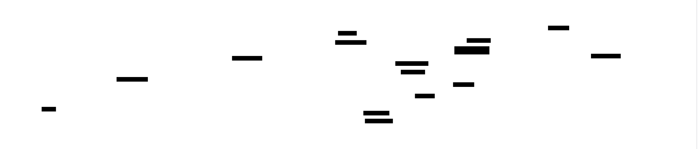
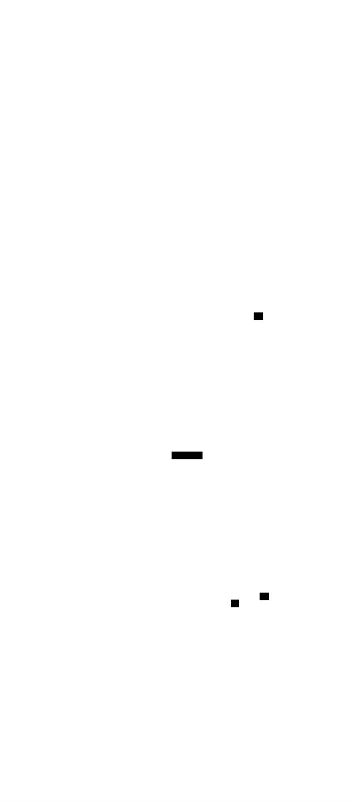

# Multiplayer Game Server: Design Document


## Overview

This document describes a real-time multiplayer game server that provides authoritative state management, client prediction, lag compensation, and anti-cheat capabilities. The key architectural challenge is maintaining consistent game state across multiple clients with varying network latencies while providing responsive gameplay and preventing cheating.


> This guide is meant to help you understand the big picture before diving into each milestone. Refer back to it whenever you need context on how components connect.


## Context and Problem Statement

Real-time multiplayer games represent one of the most challenging domains in distributed systems engineering. Unlike traditional client-server applications where occasional delays or inconsistencies are tolerable, multiplayer games demand sub-100-millisecond response times, perfect consistency across multiple players, and absolute fairness—all while operating over unreliable networks with varying latency, packet loss, and jitter. This section explores the fundamental challenges that make multiplayer gaming uniquely difficult and examines the architectural approaches that have evolved to address these constraints.

### The Multiplayer Gaming Challenge

#### The Illusion of Shared Reality

Think of a multiplayer game as attempting to maintain a synchronized symphony orchestra where each musician is located in a different concert hall, connected only by telephone lines with varying delays. Every musician must play their part at precisely the right moment, but the conductor's baton takes different amounts of time to reach each player. Some musicians might miss notes entirely due to line static, yet the audience expects to hear a perfect, coordinated performance. This is the core challenge of multiplayer gaming: creating the illusion that all players are interacting within the same physical space and time, despite being separated by network infrastructure with unpredictable characteristics.

In single-player games, the game world exists entirely within one computer's memory. Input response is immediate, physics calculations are deterministic, and the game state progresses in lockstep with the player's actions. The moment a player presses a key, their character responds instantly because there's no network delay between input and result. However, when multiple players must share the same game world, this simple model breaks down completely.

Consider a scenario where two players, Alice and Bob, are playing a competitive shooter game. Alice sees Bob standing in the open and fires her weapon. From Alice's perspective, she clearly hit Bob before he moved behind cover. However, Bob's view of the game world is different—he moved to safety before Alice even fired, having pressed his movement key a fraction of a second earlier. Who is correct? Without a shared frame of reference and consistent timing, every player experiences a different version of reality, leading to frustrating situations where the outcome depends not on skill, but on whose network connection happens to be faster.

#### The Consistency-Responsiveness Paradox

The fundamental tension in multiplayer game design lies between **consistency** and **responsiveness**. Consistency demands that all players see the same game state and that actions have deterministic outcomes—if Alice shoots Bob, either Bob is hit or he isn't, and this outcome must be the same for all observers. Responsiveness requires that player inputs feel immediate and natural, with minimal delay between pressing a key and seeing the corresponding action on screen.

These requirements are mathematically incompatible in a networked environment. Perfect consistency would require waiting for acknowledgment from all players before applying any action, introducing delays of hundreds of milliseconds—an eternity in fast-paced gameplay. Perfect responsiveness would mean applying actions immediately without coordination, guaranteeing that different players see different game states and creating impossible situations where contradictory events appear to happen simultaneously.

The challenge is further compounded by the need for **fairness**. Players with slower internet connections shouldn't be disadvantaged simply because their inputs take longer to reach the server, yet accommodating high-latency players can't come at the cost of degrading the experience for those with better connections. Similarly, the system must prevent cheating while maintaining the responsive feel that players expect.

#### Real-Time Constraints and Human Perception

Human perception of responsiveness in interactive systems is incredibly sensitive. Research in human-computer interaction has established that delays exceeding 100 milliseconds become noticeable to users, while delays beyond 200 milliseconds feel sluggish and unresponsive. In competitive gaming scenarios, even smaller delays can impact performance—professional players can distinguish between 16ms and 32ms response times.

This creates a narrow window in which multiplayer games must operate. Consider a typical interaction in a fast-paced game:

1. Player presses a movement key
2. Input is captured by the client
3. Input is sent across the network to the server
4. Server processes the input and updates the game state
5. Server sends the updated state back to all clients
6. Client receives the update and renders the new position

In a geographically distributed game, step 3 might take 50-150 milliseconds depending on the player's location relative to the server. Step 5 adds another identical delay for the round-trip response. Steps 2, 4, and 6 introduce additional processing delays. The total latency easily exceeds the threshold for responsive gameplay, creating a fundamentally poor user experience if implemented naively.

Professional esports competitions further raise the bar by requiring frame-perfect accuracy and predictable behavior. When monetary prizes depend on split-second timing, even minor inconsistencies or unfairness in the game's networking implementation can have significant consequences. The networking system must not only feel responsive to casual players but must also support the precision required for competitive play.

#### State Management Complexity

Managing game state in a multiplayer environment involves tracking far more information than single-player games require. The server must maintain not only the current state of all game entities but also sufficient historical information to handle lag compensation, rollback corrections, and cheat detection. Each player's client must manage its own predicted state, the most recent authoritative state from the server, and enough input history to perform reconciliation when predictions prove incorrect.

Consider the data structures required for a single player entity:

| State Component | Server Requirements | Client Requirements | Purpose |
|---|---|---|---|
| Current Position | Authoritative coordinates | Predicted coordinates + server coordinates | Movement and collision detection |
| Velocity Vector | Current movement vector | Predicted vector + server vector | Physics integration |
| Input History | Last N inputs received | Last N inputs sent | Reconciliation and replay |
| Health Points | Authoritative health value | Predicted health + server health | Combat resolution |
| Animation State | Current animation frame | Predicted animation + server animation | Visual consistency |
| Timestamp | Last update time | Last update time + prediction time | Temporal synchronization |

This complexity multiplies by the number of players, entities, and interactive objects in the game world. A server hosting a 64-player battle royale game might need to track millions of individual state components, update them at 60Hz, and selectively synchronize relevant subsets to each client based on proximity, line of sight, and other relevance factors.

#### Cheating and Security Implications

The distributed nature of multiplayer games creates numerous attack vectors that don't exist in single-player environments. Since game clients run on hardware controlled by players, any information sent to a client must be assumed to be potentially visible to that player, and any computation performed on the client must be assumed to be potentially manipulated.

Common categories of multiplayer game cheats include:

| Cheat Type | Attack Method | Impact on Other Players | Prevention Strategy |
|---|---|---|---|
| Wallhacks | Reading enemy position data | Unfair information advantage | Interest management, occlusion |
| Aimbots | Automated input generation | Impossible accuracy | Statistical analysis, input validation |
| Speed hacks | Modified movement calculations | Unfair mobility advantage | Server-side movement validation |
| Item duplication | State manipulation | Economic imbalance | Authoritative item tracking |
| Network manipulation | Packet modification or injection | Arbitrary state changes | Cryptographic signatures, validation |

The challenge lies in preventing cheating without introducing the latency that would result from server-side validation of every action. Pure client-server architecture with complete server authority provides the strongest security but may sacrifice responsiveness. Hybrid approaches that allow client prediction while maintaining server validation require sophisticated reconciliation systems to handle the cases where client predictions are corrected due to cheat detection.

#### Scalability and Resource Constraints

Multiplayer game servers face unique scalability challenges due to their real-time processing requirements. Unlike web servers that can handle request spikes by adding more instances behind a load balancer, game servers must maintain consistent global state and cannot easily partition players across multiple server instances without breaking the shared world illusion.

The computational load of a game server grows non-linearly with player count. Physics simulation, collision detection, and line-of-sight calculations often have O(n²) complexity characteristics. Network bandwidth requirements scale similarly—each state update must potentially be sent to every client, creating O(n²) network traffic patterns.

Consider the bandwidth requirements for a 100-player server sending state updates at 20Hz:

| Data Component | Bytes per Player | Players Affected | Total per Tick | Bandwidth per Second |
|---|---|---|---|---|
| Position updates | 12 bytes | 99 other players | 1,188 bytes | 23,760 bytes |
| Combat events | 8 bytes | 99 other players | 792 bytes | 15,840 bytes |
| Animation states | 4 bytes | 99 other players | 396 bytes | 7,920 bytes |
| **Total per player** | | | **2,376 bytes** | **47,520 bytes** |
| **Total for all players** | | | **237,600 bytes** | **4,752,000 bytes/sec** |

This simplified calculation shows that even basic state synchronization for 100 players requires nearly 5 MB/sec of outbound bandwidth from the server—and this doesn't account for input messages from clients, reliability overhead, or more complex game state. Real-world multiplayer games employ sophisticated optimization techniques to make these numbers manageable, but the fundamental scalability challenge remains.

### Network Reality and Physics

#### The Speed of Light Problem

Network latency in multiplayer games is fundamentally constrained by physics. Even under ideal conditions, data transmitted across fiber optic cables travels at approximately two-thirds the speed of light in a vacuum. This creates an unavoidable minimum latency based purely on geographical distance between players and servers.

Consider the round-trip times for various global connections:

| Route | Distance (km) | Theoretical Minimum RTT | Typical Real RTT | Routing Overhead |
|---|---|---|---|---|
| New York to London | 5,585 | 37ms | 80-120ms | 2.2x - 3.2x |
| Los Angeles to Tokyo | 8,815 | 59ms | 120-180ms | 2.0x - 3.0x |
| Sydney to Frankfurt | 16,500 | 110ms | 250-350ms | 2.3x - 3.2x |
| Same city (optimal) | 50 | 0.3ms | 5-15ms | 17x - 50x |

The difference between theoretical and real-world latency comes from several factors: router processing delays, queuing delays in network equipment, protocol overhead from TCP/UDP headers, and suboptimal routing paths that don't follow great circle routes. Internet service providers optimize their networks for cost and redundancy rather than minimum latency, meaning packets often take circuitous routes through multiple intermediate nodes.

This fundamental constraint means that any multiplayer game architecture must be designed to operate effectively with latencies in the 50-300ms range for global players, and that even local players will experience 10-30ms of unavoidable network delay. These constraints cannot be eliminated through better code or faster servers—they represent the physical limits of global networking.

#### Packet Loss and Network Unreliability

The Internet was designed as a best-effort network, meaning that packet delivery is never guaranteed. Network congestion, hardware failures, and routing changes can cause packets to be delayed, corrupted, or lost entirely. Multiplayer games must maintain smooth gameplay even when a significant percentage of network traffic fails to reach its destination.

Typical packet loss characteristics vary dramatically by connection type:

| Connection Type | Typical Loss Rate | Burst Loss Pattern | Recovery Time |
|---|---|---|---|---|
| Fiber broadband | 0.01% - 0.1% | Single packet drops | 1-2ms |
| Cable broadband | 0.1% - 1% | Small bursts (2-3 packets) | 10-50ms |
| DSL | 0.5% - 2% | Medium bursts (5-10 packets) | 50-200ms |
| Mobile/LTE | 1% - 5% | Large bursts (10-100 packets) | 200-2000ms |
| Satellite | 2% - 10% | Extended outages | 500-10000ms |

The challenge for multiplayer games is that different types of game data have different tolerance for packet loss. Critical events like weapon firing or player death must be delivered reliably, while less critical state updates like minor position adjustments can tolerate occasional loss. However, even "non-critical" updates become critical if too many consecutive updates are lost—a player who misses 10 consecutive position updates will see other players teleporting around the game world.

UDP, the protocol typically used for real-time game traffic, provides no delivery guarantees. TCP provides reliable delivery but introduces additional latency through its retransmission and flow control mechanisms. Modern multiplayer games often implement custom reliability layers that provide selective reliability—guaranteeing delivery for critical messages while allowing non-critical messages to be dropped if they would introduce excessive delay.

#### Jitter and Timing Variability

Network jitter—variation in packet arrival times—creates additional challenges for maintaining consistent gameplay. Even when packets aren't lost, they may arrive at irregular intervals due to varying network conditions along their path. This creates a mismatch between the server's consistent tick rate and the irregular delivery of updates to clients.

Consider a server sending state updates every 50ms (20Hz tick rate) to a client experiencing network jitter:

| Server Tick Time | Packet Sent | Network Delay | Client Receive Time | Inter-arrival Time |
|---|---|---|---|---|
| 0ms | 0ms | 45ms | 45ms | - |
| 50ms | 50ms | 38ms | 88ms | 43ms |
| 100ms | 100ms | 52ms | 152ms | 64ms |
| 150ms | 150ms | 41ms | 191ms | 39ms |
| 200ms | 200ms | 49ms | 249ms | 58ms |

Despite the server's consistent 50ms intervals, the client receives updates at irregular intervals ranging from 39ms to 64ms. This variability causes jerky movement, inconsistent animation timing, and difficulty predicting future game states. Multiplayer games must implement buffering and smoothing algorithms to convert irregular network delivery into smooth, consistent visual updates.

Jitter is particularly problematic for time-sensitive game mechanics. Consider a fighting game where players must input precise combo sequences within specific time windows. If network jitter causes timing to become unpredictable, the game becomes unfair—players with more stable connections will have an advantage in executing complex maneuvers.

#### Bandwidth Limitations and Asymmetry

While broadband internet has dramatically improved over the past decade, bandwidth limitations still constrain multiplayer game design, particularly for upload bandwidth and mobile connections. Many residential internet connections have significantly asymmetric bandwidth profiles, with download speeds much higher than upload speeds.

Common bandwidth profiles and their implications:

| Connection Type | Download Mbps | Upload Mbps | Upload Limitation Impact |
|---|---|---|---|
| Cable broadband | 100-1000 | 10-50 | Can support multiple clients per household |
| DSL | 25-100 | 1-10 | Limits input message frequency and quality |
| Mobile LTE | 10-100 | 5-20 | Battery drain from radio usage |
| Satellite | 25-100 | 3-10 | Very high latency compounds bandwidth limits |

The asymmetry problem is particularly acute for peer-to-peer multiplayer architectures, where each client must upload state updates to every other client. A 16-player peer-to-peer game might require each client to upload 15 separate data streams, quickly overwhelming residential upload bandwidth. This limitation has driven the industry toward client-server architectures where the server handles the high-bandwidth distribution role.

Mobile gaming introduces additional bandwidth constraints due to data plan limitations and battery consumption. Mobile players often have monthly data caps measured in gigabytes, making bandwidth efficiency critical for games targeting mobile platforms. Radio transmission also consumes significantly more battery power than local processing, creating tension between network optimization and battery life.

#### Quality of Service and Network Prioritization

Internet traffic is typically handled on a best-effort basis, with no guarantees about latency, bandwidth, or reliability. However, some internet service providers and network equipment support Quality of Service (QoS) mechanisms that can prioritize certain types of traffic. Understanding these mechanisms helps explain why multiplayer game performance varies significantly across different network environments.

Common QoS classifications and their impact on game traffic:

| Traffic Class | Typical Applications | Latency Priority | Bandwidth Guarantee | Game Traffic Suitability |
|---|---|---|---|---|
| Voice/VoIP | Phone calls, video chat | Highest | Low bandwidth reserved | Excellent for input messages |
| Interactive | Gaming, remote desktop | High | Medium bandwidth | Ideal for state updates |
| Streaming | Video, audio streaming | Medium | High bandwidth reserved | Good for asset downloads |
| Bulk | File transfers, backups | Lowest | Best effort | Poor for real-time data |

However, QoS support is inconsistent across internet infrastructure. Traffic may be prioritized within a player's home network but treated as best-effort once it reaches their ISP's network. Additionally, many consumer routers don't properly classify game traffic, leading to situations where a large file download can severely impact game performance on the same connection.

The lack of guaranteed QoS means that multiplayer games must be designed to degrade gracefully when network conditions deteriorate. Rather than assuming consistent network performance, games must continuously adapt their behavior based on measured network conditions, reducing update frequencies or visual quality when bandwidth becomes limited, and increasing buffering when latency becomes unpredictable.

### Industry Solutions Comparison

The multiplayer gaming industry has evolved three primary architectural approaches to address the challenges of networked gameplay: peer-to-peer, client-server, and hybrid architectures. Each approach represents different trade-offs between complexity, scalability, security, and performance characteristics.

> **Decision: Network Architecture Selection**
> - **Context**: Multiplayer games require coordinating game state across multiple players with varying network conditions while maintaining responsiveness and preventing cheating
> - **Options Considered**: Peer-to-peer mesh networks, centralized client-server architecture, hybrid architectures with selective authority
> - **Decision**: Client-server architecture with lag compensation and client prediction
> - **Rationale**: Provides strongest security against cheating, enables sophisticated lag compensation, and scales better than peer-to-peer while maintaining responsiveness through prediction
> - **Consequences**: Requires dedicated server infrastructure and introduces single point of failure, but enables fair gameplay and effective anti-cheat measures

#### Peer-to-Peer Architecture

Think of peer-to-peer multiplayer like a group of friends sitting around a table playing a board game. Each player can see the game state directly, make moves immediately, and communicate with all other players simultaneously. There's no central authority—the players must collectively agree on the rules and resolve any disputes through consensus.

In peer-to-peer networking, each game client connects directly to every other client, forming a mesh network where game state is synchronized through direct communication between players. When a player takes an action, they broadcast it simultaneously to all other players, who then apply the action to their local copy of the game state.

**Advantages of Peer-to-Peer Architecture:**

The primary benefit of peer-to-peer architecture is the elimination of server infrastructure costs and complexity. Game developers don't need to maintain dedicated servers, handle server scaling, or worry about server geographic distribution. Players can start games instantly without connecting to external servers, and games can continue even if the original developer's servers are shut down.

Latency characteristics can be optimal for small groups of geographically close players. Since communication is direct between clients, the round-trip time between two players is minimized—there's no additional hop through a central server. This makes peer-to-peer particularly attractive for local area network (LAN) play or small groups of friends with good connections to each other.

**Technical Implementation Challenges:**

Peer-to-peer architectures face significant technical hurdles in modern internet environments. Network Address Translation (NAT) and firewalls prevent direct connections between clients behind different routers. Most residential internet connections don't have public IP addresses, making it impossible for clients to directly connect without complex NAT traversal techniques.

| NAT Traversal Method | Success Rate | Complexity | Latency Impact |
|---|---|---|---|
| UPnP/NAT-PMP | 60-80% | Low | None |
| STUN/TURN relay | 95-99% | Medium | +20-100ms |
| Game-specific relay | 99%+ | High | +10-50ms |

Even when direct connections are established, peer-to-peer networks suffer from scaling problems. Each client must maintain connections to every other client, creating O(n²) connection overhead. A 16-player game requires each client to manage 15 simultaneous network connections, consuming significant bandwidth and computational resources.

**Consistency and Cheating Vulnerabilities:**

The fundamental weakness of peer-to-peer architecture is the lack of authoritative state management. Since each client maintains its own copy of the game state, inconsistencies are inevitable when network conditions cause messages to arrive in different orders or be lost entirely. Resolving these inconsistencies requires complex consensus protocols that add latency and complexity.

Cheating prevention in peer-to-peer systems is extremely difficult because there's no trusted authority to validate actions. Each client must trust that other clients are reporting their state honestly, but since clients run on hardware controlled by players, this trust can be easily violated. Common peer-to-peer cheating methods include:

- **State manipulation**: Modifying local game state to provide advantages (unlimited health, resources, etc.)
- **Input manipulation**: Sending impossible inputs or modifying timing of inputs
- **Selective network unreliability**: Deliberately dropping packets containing unfavorable updates
- **Consensus manipulation**: Coordinating multiple compromised clients to outvote honest players

**Modern Peer-to-Peer Usage:**

Despite these challenges, peer-to-peer architecture remains relevant for specific use cases. Real-time strategy games often use peer-to-peer with deterministic simulation—all clients run identical game logic with identical inputs, ensuring consistent outcomes without requiring state synchronization. Racing games may use peer-to-peer for casual play where perfect consistency is less critical than low latency.

Fighting games represent an interesting hybrid case, where peer-to-peer connections between two players can provide optimal latency for competitive play, while using sophisticated rollback networking to handle inconsistencies. The limited player count (typically 2) makes the scaling and consensus problems manageable.

#### Client-Server Architecture

Client-server architecture in multiplayer gaming resembles a traditional classroom where a single teacher (server) maintains authority over the lesson (game state) while students (clients) participate by raising their hands and making requests. The teacher decides what information to share, when to share it, and has the final authority on all questions and disputes.

In this architecture, a dedicated server maintains the authoritative game state and processes all game logic. Clients send input commands to the server and receive authoritative state updates in return. The server is responsible for physics simulation, collision detection, combat resolution, and all other game mechanics that affect the shared game world.

**Authority and Security Benefits:**

The primary advantage of client-server architecture is the establishment of a single source of truth for all game state. Since the server controls all game logic and maintains the authoritative state, it can validate all player actions and prevent most forms of cheating. Players cannot directly manipulate game state because they don't have authoritative control over it.

Anti-cheat measures become much more effective when implemented server-side:

| Cheat Type | Server Detection Method | Prevention Effectiveness |
|---|---|---|
| Speed hacks | Movement validation against physics limits | 95-99% |
| Impossible actions | Action validation against game rules | 99%+ |
| Resource manipulation | Server-side resource tracking | 99%+ |
| Information disclosure | Interest management, occlusion | 80-95% |
| Network manipulation | Cryptographic validation, rate limiting | 90-99% |

The server can implement sophisticated validation logic that would be impossible in peer-to-peer systems. For example, it can track the complete history of each player's actions, detect statistical anomalies that suggest cheating, and apply machine learning models to identify suspicious behavior patterns.

**Scalability and Infrastructure Challenges:**

Client-server architecture introduces significant infrastructure requirements and operational complexity. Game developers must maintain server hardware, handle geographic distribution for global players, implement server scaling for varying player loads, and ensure high availability for commercial games.

Server scaling characteristics vary significantly by game type:

| Game Genre | Players per Server | CPU Bottleneck | Memory Bottleneck | Network Bottleneck |
|---|---|---|
| MMORPG | 1000-5000 | AI, combat calculation | World state, player data | Zone transitions |
| Battle Royale | 100-200 | Physics simulation | Map data, entity tracking | State synchronization |
| MOBA | 10-12 | Ability calculations | Detailed unit state | Spectator feeds |
| FPS | 16-64 | Hit registration, collision | Player history buffers | High-frequency updates |

The cost of server infrastructure can be substantial, particularly for games with large concurrent player bases. A popular multiplayer game might require hundreds of server instances across multiple geographic regions, with additional capacity for peak usage periods and redundancy for high availability.

**Latency and Responsiveness Trade-offs:**

The central challenge of client-server architecture is maintaining responsive gameplay despite the round-trip latency inherent in client-server communication. Every player action must travel to the server, be processed, and have its results sent back to all affected clients. This introduces a minimum latency equal to the round-trip time between client and server.

For geographically distributed games, this latency can be substantial:

| Player Location | Server Location | Typical RTT | Input Response Delay |
|---|---|---|---|
| Same city | Same city | 10-20ms | Acceptable |
| Same country | Same country | 30-60ms | Noticeable |
| Same continent | Same continent | 60-120ms | Problematic |
| Cross-continent | Cross-continent | 150-300ms | Unplayable |

To address these latency issues, modern client-server implementations incorporate client-side prediction and lag compensation techniques. These allow clients to immediately apply their own actions locally while the server processes them authoritatively, then reconcile any differences when the server response arrives.

#### Hybrid Architectures

Hybrid architectures attempt to combine the security and consistency benefits of client-server systems with the performance advantages of peer-to-peer communication. Think of this like a sports game with referees—most of the action happens directly between players (peer-to-peer), but there are officials (servers) watching to ensure fair play and make authoritative decisions on disputed calls.

**Selective Authority Models:**

Modern hybrid systems assign different types of game state to different authorities based on their security and performance requirements. Non-critical state that benefits from low latency might be handled peer-to-peer, while security-critical state remains server-authoritative.

| State Type | Authority | Rationale | Synchronization Method |
|---|---|---|---|
| Player movement | Peer-to-peer | Low latency critical | Direct client broadcast |
| Combat damage | Server | Anti-cheat critical | Server validation required |
| Chat messages | Server | Moderation required | Server relay with filtering |
| Cosmetic effects | Peer-to-peer | Visual only | Best-effort synchronization |

This approach allows games to optimize different aspects of gameplay independently. Fast-paced movement can maintain low latency through direct peer communication, while security-sensitive operations like inventory management or competitive scoring remain under server control.

**Regional Server Architecture:**

Another hybrid approach involves distributing server authority geographically while maintaining global coordination. Regional servers handle real-time gameplay for players in their area, while a central authority manages cross-region interactions and persistent state.

This architecture provides several benefits:

- **Reduced latency**: Players connect to nearby servers for real-time interactions
- **Improved scalability**: Load is distributed across multiple server clusters
- **Fault tolerance**: Regional failures don't affect the entire game world
- **Regulatory compliance**: Player data can be kept within appropriate jurisdictions

However, it also introduces new challenges around cross-region consistency, server handoff for traveling players, and coordination protocols between regional authorities.

**Implementation Complexity Trade-offs:**

Hybrid architectures significantly increase implementation complexity compared to pure client-server or peer-to-peer approaches. Developers must implement multiple networking protocols, handle the transition between different authority models, and debug interactions between peer-to-peer and client-server components.

| Architecture Component | Development Complexity | Operational Complexity | Debugging Difficulty |
|---|---|---|---|
| Pure client-server | Medium | Medium | Medium |
| Pure peer-to-peer | Low | Low | High |
| Hybrid selective authority | High | High | Very High |
| Hybrid regional servers | Very High | Very High | High |

The complexity manifests in several areas:

- **Protocol switching**: Clients must seamlessly transition between peer-to-peer and client-server communication modes
- **State reconciliation**: Conflicts between peer-to-peer and server-authoritative state must be resolved consistently
- **Failure handling**: The system must gracefully handle failures in either the peer-to-peer or server components
- **Testing**: All combinations of peer-to-peer and server interactions must be validated across varying network conditions

Despite these challenges, hybrid architectures represent the current evolution of multiplayer networking, allowing developers to optimize specific aspects of their games while maintaining overall security and consistency. The most successful implementations carefully choose which game mechanics benefit from each approach and design clean interfaces between the different networking subsystems.

### Implementation Guidance

This section provides practical technology recommendations and starter code to begin implementing the multiplayer game server architecture described in this design document.

#### Technology Recommendations

| Component | Simple Option | Advanced Option |
|---|---|---|
| Transport Protocol | UDP with custom reliability (net package) | WebRTC with data channels |
| Serialization | JSON for messages, binary for state | Protocol Buffers or MessagePack |
| Client Prediction | Simple extrapolation | Full physics rollback |
| Lag Compensation | Basic interpolation | State rewind with ray casting |
| Anti-cheat | Server-side validation | Machine learning anomaly detection |
| Database | SQLite for development | PostgreSQL with connection pooling |
| Logging | Standard log package | Structured logging with logrus |
| Configuration | YAML files | Consul or etcd for distributed config |

#### Recommended File Structure

The following directory structure provides a foundation for implementing the multiplayer game server:

```
multiplayer-game-server/
├── cmd/
│   ├── server/main.go              ← Server entry point
│   └── client/main.go              ← Test client entry point
├── internal/
│   ├── game/
│   │   ├── world.go                ← Game world state management
│   │   ├── entity.go               ← Entity component system
│   │   ├── physics.go              ← Physics simulation
│   │   └── combat.go               ← Combat resolution
│   ├── network/
│   │   ├── server.go               ← Network server implementation
│   │   ├── client.go               ← Network client implementation
│   │   ├── protocol.go             ← Message definitions
│   │   └── reliability.go          ← Custom reliability layer
│   ├── tick/
│   │   ├── loop.go                 ← Fixed timestep game loop
│   │   ├── scheduler.go            ← Tick scheduling and timing
│   │   └── accumulator.go          ← Frame time accumulation
│   ├── prediction/
│   │   ├── predictor.go            ← Client-side prediction
│   │   ├── reconciler.go           ← Server reconciliation
│   │   └── history.go              ← Input and state history
│   ├── compensation/
│   │   ├── lagcomp.go              ← Lag compensation system
│   │   ├── rewind.go               ← State rewind buffer
│   │   └── timing.go               ← Time synchronization
│   └── sync/
│       ├── delta.go                ← Delta compression
│       ├── priority.go             ← Update prioritization
│       └── bandwidth.go            ← Bandwidth management
├── pkg/
│   ├── math/
│   │   ├── vector.go               ← Vector mathematics
│   │   └── collision.go            ← Collision detection utilities
│   └── protocol/
│       └── messages.go             ← Shared message definitions
└── configs/
    ├── server.yaml                 ← Server configuration
    └── client.yaml                 ← Client configuration
```

#### Infrastructure Starter Code

**Basic UDP Network Transport**

This complete network transport implementation handles UDP communication with custom reliability:

```go
// pkg/network/transport.go
package network

import (
    "context"
    "encoding/json"
    "net"
    "sync"
    "time"
)

// Message represents a network message with reliability metadata
type Message struct {
    ID       uint32      `json:"id"`
    Type     MessageType `json:"type"`
    Payload  interface{} `json:"payload"`
    Reliable bool        `json:"reliable"`
    Timestamp time.Time   `json:"timestamp"`
}

type MessageType string

const (
    MessageTypePlayerInput MessageType = "player_input"
    MessageTypeGameState   MessageType = "game_state"
    MessageTypePlayerJoin  MessageType = "player_join"
    MessageTypePlayerLeave MessageType = "player_leave"
)

// Transport handles UDP communication with reliability layer
type Transport struct {
    conn            *net.UDPConn
    clients         map[string]*ClientConnection
    messageHandlers map[MessageType]MessageHandler
    mu              sync.RWMutex
    ctx             context.Context
    cancel          context.CancelFunc
}

type ClientConnection struct {
    Address         *net.UDPAddr
    LastSeen        time.Time
    SequenceNumber  uint32
    AckNumber       uint32
    PendingMessages map[uint32]*Message
    RTT             time.Duration
    mu              sync.RWMutex
}

type MessageHandler func(clientAddr *net.UDPAddr, message *Message) error

// NewTransport creates a new UDP transport on the specified address
func NewTransport(listenAddr string) (*Transport, error) {
    addr, err := net.ResolveUDPAddr("udp", listenAddr)
    if err != nil {
        return nil, err
    }
    
    conn, err := net.ListenUDP("udp", addr)
    if err != nil {
        return nil, err
    }
    
    ctx, cancel := context.WithCancel(context.Background())
    
    transport := &Transport{
        conn:            conn,
        clients:         make(map[string]*ClientConnection),
        messageHandlers: make(map[MessageType]MessageHandler),
        ctx:             ctx,
        cancel:          cancel,
    }
    
    go transport.receiveLoop()
    go transport.reliabilityLoop()
    
    return transport, nil
}

// RegisterHandler registers a message handler for a specific message type
func (t *Transport) RegisterHandler(msgType MessageType, handler MessageHandler) {
    t.mu.Lock()
    defer t.mu.Unlock()
    t.messageHandlers[msgType] = handler
}

// SendMessage sends a message to a specific client
func (t *Transport) SendMessage(clientAddr *net.UDPAddr, message *Message) error {
    t.mu.RLock()
    clientKey := clientAddr.String()
    client, exists := t.clients[clientKey]
    t.mu.RUnlock()
    
    if !exists {
        client = &ClientConnection{
            Address:         clientAddr,
            LastSeen:        time.Now(),
            PendingMessages: make(map[uint32]*Message),
        }
        t.mu.Lock()
        t.clients[clientKey] = client
        t.mu.Unlock()
    }
    
    client.mu.Lock()
    message.ID = client.SequenceNumber
    client.SequenceNumber++
    
    if message.Reliable {
        client.PendingMessages[message.ID] = message
    }
    client.mu.Unlock()
    
    data, err := json.Marshal(message)
    if err != nil {
        return err
    }
    
    _, err = t.conn.WriteToUDP(data, clientAddr)
    return err
}

// receiveLoop handles incoming UDP packets
func (t *Transport) receiveLoop() {
    buffer := make([]byte, 1024)
    
    for {
        select {
        case <-t.ctx.Done():
            return
        default:
            n, clientAddr, err := t.conn.ReadFromUDP(buffer)
            if err != nil {
                continue
            }
            
            var message Message
            if err := json.Unmarshal(buffer[:n], &message); err != nil {
                continue
            }
            
            t.handleMessage(clientAddr, &message)
        }
    }
}

// reliabilityLoop handles message retransmission for reliable messages
func (t *Transport) reliabilityLoop() {
    ticker := time.NewTicker(100 * time.Millisecond)
    defer ticker.Stop()
    
    for {
        select {
        case <-t.ctx.Done():
            return
        case <-ticker.C:
            t.processRetransmissions()
        }
    }
}

func (t *Transport) handleMessage(clientAddr *net.UDPAddr, message *Message) {
    // Update client connection info
    clientKey := clientAddr.String()
    t.mu.RLock()
    client, exists := t.clients[clientKey]
    t.mu.RUnlock()
    
    if exists {
        client.mu.Lock()
        client.LastSeen = time.Now()
        // Handle acknowledgments for reliable messages
        if message.Type == "ack" {
            if ackID, ok := message.Payload.(float64); ok {
                delete(client.PendingMessages, uint32(ackID))
            }
        }
        client.mu.Unlock()
    }
    
    // Route message to appropriate handler
    t.mu.RLock()
    handler, exists := t.messageHandlers[message.Type]
    t.mu.RUnlock()
    
    if exists && handler != nil {
        go handler(clientAddr, message)
    }
}

func (t *Transport) processRetransmissions() {
    t.mu.RLock()
    defer t.mu.RUnlock()
    
    for _, client := range t.clients {
        client.mu.Lock()
        for _, message := range client.PendingMessages {
            if time.Since(message.Timestamp) > 200*time.Millisecond {
                // Retransmit message
                data, _ := json.Marshal(message)
                t.conn.WriteToUDP(data, client.Address)
                message.Timestamp = time.Now()
            }
        }
        client.mu.Unlock()
    }
}

// Close shuts down the transport
func (t *Transport) Close() error {
    t.cancel()
    return t.conn.Close()
}
```

**Fixed Timestep Game Loop Foundation**

```go
// internal/tick/loop.go
package tick

import (
    "context"
    "sync"
    "time"
)

// GameLoop manages the fixed timestep simulation loop
type GameLoop struct {
    tickRate        int
    tickDuration    time.Duration
    accumulator     time.Duration
    currentTime     time.Time
    maxFrameTime    time.Duration
    updateCallback  UpdateCallback
    renderCallback  RenderCallback
    running         bool
    mu              sync.RWMutex
    ctx             context.Context
    cancel          context.CancelFunc
}

type UpdateCallback func(deltaTime time.Duration) error
type RenderCallback func(interpolation float64) error

// NewGameLoop creates a new fixed timestep game loop
func NewGameLoop(tickRate int) *GameLoop {
    ctx, cancel := context.WithCancel(context.Background())
    
    return &GameLoop{
        tickRate:     tickRate,
        tickDuration: time.Duration(1000/tickRate) * time.Millisecond,
        maxFrameTime: 250 * time.Millisecond, // Prevent spiral of death
        ctx:          ctx,
        cancel:       cancel,
    }
}

// SetUpdateCallback sets the function called for each simulation tick
func (gl *GameLoop) SetUpdateCallback(callback UpdateCallback) {
    gl.mu.Lock()
    defer gl.mu.Unlock()
    gl.updateCallback = callback
}

// SetRenderCallback sets the function called for rendering with interpolation
func (gl *GameLoop) SetRenderCallback(callback RenderCallback) {
    gl.mu.Lock()
    defer gl.mu.Unlock()
    gl.renderCallback = callback
}

// Start begins the game loop
func (gl *GameLoop) Start() error {
    gl.mu.Lock()
    if gl.running {
        gl.mu.Unlock()
        return fmt.Errorf("game loop already running")
    }
    gl.running = true
    gl.currentTime = time.Now()
    gl.mu.Unlock()
    
    return gl.run()
}

// Stop halts the game loop
func (gl *GameLoop) Stop() {
    gl.cancel()
    gl.mu.Lock()
    gl.running = false
    gl.mu.Unlock()
}

// IsRunning returns whether the loop is currently active
func (gl *GameLoop) IsRunning() bool {
    gl.mu.RLock()
    defer gl.mu.RUnlock()
    return gl.running
}

func (gl *GameLoop) run() error {
    for {
        select {
        case <-gl.ctx.Done():
            return nil
        default:
            if err := gl.tick(); err != nil {
                return err
            }
        }
    }
}

func (gl *GameLoop) tick() error {
    frameTime := time.Since(gl.currentTime)
    gl.currentTime = time.Now()
    
    // Prevent spiral of death
    if frameTime > gl.maxFrameTime {
        frameTime = gl.maxFrameTime
    }
    
    gl.accumulator += frameTime
    
    // Process accumulated simulation time
    for gl.accumulator >= gl.tickDuration {
        if gl.updateCallback != nil {
            if err := gl.updateCallback(gl.tickDuration); err != nil {
                return err
            }
        }
        gl.accumulator -= gl.tickDuration
    }
    
    // Render with interpolation
    if gl.renderCallback != nil {
        interpolation := float64(gl.accumulator) / float64(gl.tickDuration)
        if err := gl.renderCallback(interpolation); err != nil {
            return err
        }
    }
    
    // Sleep until next frame
    sleepTime := gl.tickDuration - time.Since(gl.currentTime)
    if sleepTime > 0 {
        time.Sleep(sleepTime)
    }
    
    return nil
}

// GetTickRate returns the current simulation tick rate
func (gl *GameLoop) GetTickRate() int {
    gl.mu.RLock()
    defer gl.mu.RUnlock()
    return gl.tickRate
}

// SetTickRate updates the simulation tick rate
func (gl *GameLoop) SetTickRate(rate int) {
    gl.mu.Lock()
    defer gl.mu.Unlock()
    gl.tickRate = rate
    gl.tickDuration = time.Duration(1000/rate) * time.Millisecond
}
```

#### Core Logic Skeleton

**Game State Management Interface**

```go
// internal/game/world.go
package game

import (
    "sync"
    "time"
)

// World represents the complete game world state
type World struct {
    entities    map[EntityID]*Entity
    tick        uint64
    lastUpdate  time.Time
    mu          sync.RWMutex
}

// NewWorld creates a new game world
func NewWorld() *World {
    return &World{
        entities:   make(map[EntityID]*Entity),
        lastUpdate: time.Now(),
    }
}

// Update advances the world state by one simulation tick
func (w *World) Update(deltaTime time.Duration) error {
    w.mu.Lock()
    defer w.mu.Unlock()
    
    // TODO 1: Increment tick counter
    // TODO 2: Update physics for all entities - apply velocities, handle collisions
    // TODO 3: Process pending player inputs - validate and apply movement/actions
    // TODO 4: Update game logic - health regeneration, ability cooldowns, etc.
    // TODO 5: Clean up destroyed entities and expired temporary objects
    // TODO 6: Record timestamp of this update for synchronization
    
    return nil
}

// AddEntity inserts a new entity into the world
func (w *World) AddEntity(entity *Entity) EntityID {
    w.mu.Lock()
    defer w.mu.Unlock()
    
    // TODO 1: Generate unique EntityID for the new entity
    // TODO 2: Add entity to the entities map with the generated ID
    // TODO 3: Initialize entity's world reference and spawn timestamp
    // TODO 4: Broadcast entity spawn event to interested clients
    // Hint: Use atomic counter or UUID for EntityID generation
    
    return EntityID(0) // Replace with actual implementation
}

// RemoveEntity removes an entity from the world
func (w *World) RemoveEntity(id EntityID) bool {
    w.mu.Lock()
    defer w.mu.Unlock()
    
    // TODO 1: Check if entity exists in the entities map
    // TODO 2: Remove entity from map if found
    // TODO 3: Broadcast entity destruction event to clients
    // TODO 4: Clean up any references to this entity in other systems
    // Return true if entity was found and removed, false otherwise
    
    return false // Replace with actual implementation
}

// GetEntity retrieves an entity by ID
func (w *World) GetEntity(id EntityID) (*Entity, bool) {
    w.mu.RLock()
    defer w.mu.RUnlock()
    
    // TODO 1: Look up entity in the entities map
    // TODO 2: Return entity and existence boolean
    // Thread-safe read access - multiple readers allowed
    
    return nil, false // Replace with actual implementation
}

// GetEntitiesInRadius returns all entities within radius of a position
func (w *World) GetEntitiesInRadius(center Vector2, radius float64) []*Entity {
    w.mu.RLock()
    defer w.mu.RUnlock()
    
    // TODO 1: Create result slice to store nearby entities
    // TODO 2: Iterate through all entities in the world
    // TODO 3: Calculate distance between entity position and center point
    // TODO 4: Add entities within radius to result slice
    // TODO 5: Consider using spatial partitioning for better performance
    // Hint: Use Vector2.Distance() method for distance calculation
    
    return nil // Replace with actual implementation
}

// CreateSnapshot captures current world state for synchronization
func (w *World) CreateSnapshot() *WorldSnapshot {
    w.mu.RLock()
    defer w.mu.RUnlock()
    
    // TODO 1: Create new WorldSnapshot with current tick number
    // TODO 2: Copy all entity states into snapshot structure
    // TODO 3: Include timestamp for lag compensation purposes
    // TODO 4: Compress or optimize snapshot data for network transmission
    // TODO 5: Store snapshot in history buffer for rollback capabilities
    
    return nil // Replace with actual implementation
}
```

#### Language-Specific Implementation Hints

**Go-Specific Networking Optimizations:**
- Use `sync.Pool` to reduce garbage collection pressure from frequent message allocation
- Implement custom JSON marshaling for hot-path message types using `json.Marshaler` interface
- Use `context.Context` consistently for graceful shutdown and request cancellation
- Consider `sync.Map` for concurrent access patterns with mostly reads
- Use `time.Timer` instead of `time.Sleep` in loops for better precision

**Performance Considerations:**
- Profile with `go tool pprof` to identify CPU and memory bottlenecks
- Use build tags to separate development debugging code from production builds
- Implement object pooling for frequently allocated structs like messages and snapshots
- Consider using `unsafe` package judiciously for zero-copy operations on hot paths

**Error Handling Patterns:**
- Wrap errors with context using `fmt.Errorf("operation failed: %w", err)`
- Use structured logging with consistent field names across the codebase
- Implement circuit breaker patterns for external dependencies
- Create custom error types for different failure categories (network, validation, etc.)

#### Milestone Checkpoints

**Milestone 1 Verification - Fixed Timestep Game Loop:**
1. Run `go test ./internal/tick/...` - all tests should pass
2. Start the server with `go run cmd/server/main.go`
3. Verify console output shows consistent tick timing (e.g., "Tick 60: 16.67ms")
4. Monitor CPU usage - should be stable under 10% on modern hardware
5. Test tick rate changes - server should adapt smoothly to different rates

**Milestone 2 Verification - Client Prediction:**
1. Connect test client with simulated 100ms latency
2. Send movement inputs - character should move immediately on client
3. Verify server corrections are applied smoothly without teleporting
4. Check network logs for input acknowledgment messages

**Common Early Issues and Solutions:**

| Symptom | Likely Cause | Diagnostic Steps | Solution |
|---|---|---|---|
| Inconsistent tick timing | CPU scheduling interference | Monitor with `time` command | Use high-resolution timers, consider process priority |
| High memory usage | Missing object pooling | Profile with `go tool pprof` | Implement `sync.Pool` for frequent allocations |
| Network messages dropped | UDP buffer overflow | Check `netstat -su` for dropped packets | Increase socket buffer sizes |
| Client desynchronization | Float precision differences | Log state checksums | Use fixed-point math or tolerance-based comparison |


## Goals and Non-Goals

> **Milestone(s):** This section establishes the foundation for all four milestones by defining system boundaries, requirements, and success criteria.

Think of this multiplayer game server as a traffic control system for a busy intersection. Just as a traffic controller must manage multiple streams of vehicles arriving at different times while maintaining safety and flow, our game server must coordinate multiple players with varying network conditions while preserving fairness and responsiveness. The controller has clear responsibilities—managing traffic flow and preventing collisions—but doesn't control the weather, road construction, or vehicle maintenance. Similarly, our system has specific goals it must achieve and explicit boundaries defining what it will not handle.

This section establishes the precise scope, requirements, and limitations of our multiplayer game server implementation. Understanding these boundaries is crucial because multiplayer systems involve complex trade-offs between features, and attempting to solve every possible problem leads to an unfocused, overly complex system that fails to excel at its core mission.

### Functional Requirements

The **functional requirements** define the core capabilities our system must provide to deliver a competitive real-time multiplayer gaming experience. These requirements directly map to the technical challenges that make multiplayer games uniquely difficult to implement correctly.

> **Decision: Authoritative Server Architecture**
> - **Context**: Multiplayer games require consistent state across clients while preventing cheating
> - **Options Considered**: Peer-to-peer, client-server, hybrid architectures
> - **Decision**: Pure client-server with authoritative server
> - **Rationale**: Provides strongest anti-cheat guarantees, simplifies state consistency, scales better than peer-to-peer
> - **Consequences**: Single point of failure, server hosting costs, network latency affects all interactions

The following table defines our core functional capabilities:

| Requirement Category | Specific Capability | Description | Success Criteria |
|---------------------|--------------------|--------------|--------------------|
| **State Authority** | Authoritative Game State | Server maintains canonical game state that overrides client predictions | Server state always wins conflicts, clients converge to server state within 100ms |
| **Input Processing** | Real-time Input Handling | Accept and process player inputs with minimal delay | All valid inputs processed within single tick, invalid inputs rejected with reason |
| **Prediction System** | Client-side Prediction | Clients immediately apply local inputs without server confirmation | Local movement feels responsive, prediction errors corrected smoothly |
| **Lag Compensation** | Retroactive Hit Detection | Server validates hits against historical state when client fired | High-latency players can compete fairly, maximum 200ms rewind window |
| **State Synchronization** | Efficient State Updates | Transmit only changed game state to reduce bandwidth | Delta compression achieves 50%+ bandwidth reduction vs full snapshots |
| **Time Synchronization** | Clock Synchronization | Maintain synchronized time reference between clients and server | Clock drift less than 50ms, automatic resynchronization |
| **Reconnection Support** | Seamless Reconnection | Clients can reconnect and resume gameplay after network interruptions | Full state resync within 3 seconds, no game progress lost |
| **Anti-cheat Foundation** | Input Validation | Validate all client inputs for plausibility and game rule compliance | Speed hacks, teleportation, and impossible actions detected and rejected |

Our **real-time communication protocol** supports both reliable and unreliable message delivery patterns. Critical game events like player joins, item pickups, and match results use reliable delivery with acknowledgments and retransmission. Frequent updates like player positions and velocities use unreliable delivery to minimize latency, with newer messages superseding older ones.

The **input processing pipeline** handles various input types with different validation requirements:

| Input Type | Validation Rules | Processing Priority | Response Type |
|------------|------------------|-------------------|---------------|
| Movement Commands | Speed limits, collision detection, valid directions | High - process every tick | Unreliable position updates |
| Combat Actions | Range checks, ammunition limits, cooldown timers | Critical - immediate validation | Reliable hit confirmation |
| Item Interactions | Proximity validation, inventory constraints | Medium - queue if necessary | Reliable inventory updates |
| Chat Messages | Rate limiting, content filtering | Low - can be delayed | Reliable broadcast to relevant players |

The **state prediction and reconciliation system** enables responsive controls despite network latency. When a client sends a movement input, it immediately applies that input locally to provide instant visual feedback. Meanwhile, the same input travels to the server for authoritative processing. When the server's response arrives, the client compares the server's authoritative state with its predicted state. If they differ, the client replays all unacknowledged inputs on top of the corrected server state to maintain consistency.

> **Critical Insight**: The prediction system's effectiveness depends on the accuracy of client-side game logic. Clients must implement identical physics and game rules as the server, or prediction errors will be frequent and jarring.

Our **lag compensation mechanism** ensures fair gameplay across varying network conditions. When a high-latency player fires at a moving target, their client sees the target at a position that's already outdated on the server. To compensate, the server rewinds all entities to their positions at the time the client fired (estimated using round-trip time measurements) and validates the hit against that historical state. This prevents the frustrating experience where a player's shots miss despite appearing to hit on their screen.

The **anti-cheat validation layer** performs several categories of checks on incoming player inputs:

| Validation Category | Check Type | Detection Method | Response Action |
|--------------------|------------|------------------|------------------|
| **Physics Validation** | Speed limits, acceleration bounds | Compare against maximum possible values | Reject input, reset player position |
| **Temporal Validation** | Input timing, sequence numbers | Check for future timestamps or duplicates | Ignore out-of-order or duplicate inputs |
| **Spatial Validation** | Teleportation detection, collision respect | Compare movement distance to elapsed time | Correct position, log suspicious activity |
| **Resource Validation** | Ammunition tracking, cooldown enforcement | Server maintains authoritative resource counts | Override client values, apply penalties |

### Performance and Scale Requirements

The **performance requirements** define the quantitative benchmarks our system must achieve to deliver competitive gaming experiences. These targets reflect industry standards for real-time multiplayer games and the expectations of modern gamers.

Think of these performance requirements as the specifications for a racing car. Just as a Formula 1 car must meet precise performance criteria for acceleration, top speed, and handling to compete effectively, our game server must hit specific targets for latency, throughput, and consistency to provide an acceptable gaming experience.

| Performance Metric | Target Value | Measurement Method | Acceptable Degradation |
|--------------------|--------------|-------------------|----------------------|
| **Server Tick Rate** | 60 Hz (16.67ms per tick) | Fixed timestep loop timing | Must not drop below 30 Hz under load |
| **Input Latency** | < 50ms server processing | Time from input receipt to state update | 95th percentile under 100ms |
| **State Update Latency** | < 100ms client delivery | Time from server update to client application | 95th percentile under 200ms |
| **Bandwidth per Client** | < 100 KB/s downstream | Network traffic monitoring | Burst to 200 KB/s acceptable |
| **Memory Usage** | < 100MB per 64 players | Process memory monitoring | Linear scaling with player count |
| **CPU Usage** | < 50% single core | System resource monitoring | Brief spikes to 80% acceptable |

Our **scalability targets** define the system's capacity limits:

| Scale Dimension | Minimum Target | Stretch Target | Limiting Factor |
|-----------------|---------------|----------------|-----------------|
| **Concurrent Players** | 32 players per server | 128 players per server | Network bandwidth and CPU processing |
| **Game Sessions** | 1 session per server process | 4 sessions per server process | Memory usage for state history |
| **Messages per Second** | 10,000 inbound messages | 50,000 inbound messages | Input processing pipeline capacity |
| **State History** | 5 seconds of snapshots | 15 seconds of snapshots | Memory usage for lag compensation |
| **Geographic Latency** | Support 0-150ms RTT | Support 0-300ms RTT | Lag compensation effectiveness |

The **consistency and reliability requirements** ensure robust operation under adverse conditions:

| Reliability Metric | Target | Recovery Time | Detection Method |
|-------------------|---------|---------------|------------------|
| **State Desynchronization** | < 0.1% of game ticks | Immediate correction | Hash comparison between server and clients |
| **Network Packet Loss** | Handle up to 5% loss | Seamless for unreliable, retransmit for reliable | Sequence number tracking and acknowledgments |
| **Client Reconnection** | 99% success rate | < 5 seconds full resync | Connection heartbeat monitoring |
| **Server Crash Recovery** | Persistent game state | < 30 seconds restart | Checkpoint-based state persistence |

> **Decision: Single-Server Architecture for Initial Implementation**
> - **Context**: Need to balance simplicity with scalability requirements
> - **Options Considered**: Single server, server cluster, cloud auto-scaling
> - **Decision**: Single dedicated server per game session
> - **Rationale**: Eliminates distributed systems complexity, sufficient for target player counts, easier to debug and optimize
> - **Consequences**: Hard cap on player count, single point of failure, but much simpler implementation and testing

Our **network performance optimization** focuses on bandwidth efficiency and latency reduction:

| Optimization Technique | Expected Improvement | Implementation Complexity | Trade-offs |
|------------------------|---------------------|---------------------------|------------|
| **Delta Compression** | 50-70% bandwidth reduction | Medium - requires baseline tracking | Increased CPU usage, complex synchronization |
| **Interest Management** | 30-50% bandwidth reduction | High - spatial partitioning required | Reduced game awareness, edge case complexity |
| **Update Prioritization** | 20-40% perceived latency improvement | Medium - scoring and scheduling system | Fairness concerns, tuning complexity |
| **Binary Serialization** | 30-50% message size reduction | Low - replace JSON with binary format | Debugging difficulty, schema evolution complexity |

### Explicit Non-Goals

The **explicit non-goals** define features and capabilities that our system deliberately does not implement. These boundaries prevent scope creep and ensure our implementation remains focused on core multiplayer networking challenges rather than attempting to build a complete game engine or platform.

Think of non-goals as the fence around a construction site. Just as a fence clearly demarks where construction work will and will not occur, our non-goals establish clear boundaries for our implementation effort. This prevents the project from expanding into areas that would dilute focus from the core learning objectives.

> **Architectural Principle**: Our system provides the networking and synchronization infrastructure for multiplayer games, not a complete game development platform. Game-specific logic, content creation tools, and platform integrations are explicitly outside our scope.

The following table categorizes our explicit non-goals:

| Non-Goal Category | Excluded Features | Rationale | Alternative Solutions |
|------------------|-------------------|-----------|----------------------|
| **Game Content** | Specific game logic, asset management, gameplay mechanics | Focus on networking infrastructure, not game design | Implement as plugins or separate game logic layer |
| **Rendering/Graphics** | Client-side rendering, graphics optimization, UI frameworks | Server-side only implementation, rendering is client responsibility | Use existing game engines (Unity, Unreal) for client |
| **Matchmaking** | Player matching, skill rating, lobby systems | Complex social features outside core networking scope | Integrate with existing matchmaking services |
| **Persistence** | Player accounts, progression, statistics, leaderboards | Database and user management complexity | Use external user management and analytics platforms |
| **Platform Integration** | Steam integration, console APIs, mobile platforms | Platform-specific concerns beyond networking protocol | Handle at client application level |
| **Content Delivery** | Asset streaming, patch distribution, downloadable content | Large-scale content distribution is separate problem domain | Use CDNs and existing content delivery solutions |

**Scalability and Infrastructure Non-Goals:**

| Infrastructure Aspect | Not Included | Reasoning | Recommended Approach |
|----------------------|--------------|-----------|---------------------|
| **Multi-Server Architecture** | Server clustering, load balancing, distributed state | Adds distributed systems complexity that obscures core concepts | Single server sufficient for learning objectives, scale out later |
| **Cloud Integration** | Auto-scaling, container orchestration, managed services | Infrastructure management distracts from networking algorithms | Deploy on fixed infrastructure initially |
| **Monitoring/Observability** | Metrics collection, distributed tracing, dashboards | Operational concerns secondary to core functionality | Add logging hooks, integrate monitoring tools separately |
| **Configuration Management** | Dynamic configuration, feature flags, A/B testing | Operational complexity beyond core system scope | Use simple configuration files and restart for changes |

**Security and Anti-Cheat Non-Goals:**

Our system provides basic input validation but does not implement comprehensive anti-cheat measures that production games require:

| Security Feature | Excluded | Why Not Included | Production Requirement |
|-----------------|----------|------------------|------------------------|
| **Advanced Cheat Detection** | Statistical analysis, machine learning detection, behavioral patterns | Requires extensive data collection and analysis infrastructure | Essential for commercial games, use dedicated anti-cheat services |
| **Cryptographic Security** | Encryption, digital signatures, secure key exchange | Adds protocol complexity without teaching core networking concepts | Required for protecting against network-level attacks |
| **DDoS Protection** | Rate limiting, traffic filtering, attack mitigation | Infrastructure-level concern beyond application scope | Handle at network/infrastructure layer |
| **Audit Logging** | Comprehensive event logging, forensic analysis, compliance | Operational and legal requirements beyond technical scope | Implement as separate logging and analysis system |

**Client and Protocol Non-Goals:**

| Client Feature | Not Provided | Alternative | Learning Focus |
|----------------|-------------|-------------|---------------|
| **Full Game Client** | Complete playable client application | Reference implementation with basic input/output | Server-side networking algorithms and data structures |
| **Cross-Platform Compatibility** | Native clients for multiple platforms | Web-based or single-platform reference client | Network protocol design, not platform abstraction |
| **Offline Mode** | Single-player or offline gameplay | Online-only architecture | Distributed systems challenges unique to multiplayer |
| **Spectator Mode** | Live spectating, replay systems, broadcasting | Add-on feature after core system works | Core client-server communication patterns first |

> **Design Philosophy**: We optimize for learning and understanding rather than production readiness. Each excluded feature represents a separate complex domain that would detract from mastering the core concepts of real-time multiplayer networking.

**Performance and Optimization Non-Goals:**

While we target reasonable performance, certain optimizations are explicitly outside our scope:

| Optimization Area | Not Included | Reasoning | When to Add |
|------------------|--------------|-----------|-------------|
| **Micro-Optimizations** | Hand-tuned assembly, cache optimization, SIMD instructions | Premature optimization obscures algorithmic understanding | After profiling identifies specific bottlenecks |
| **Hardware-Specific Tuning** | GPU acceleration, specialized networking hardware | Reduces portability and increases complexity | When CPU/network becomes proven bottleneck |
| **Memory Pool Management** | Custom allocators, object pooling, garbage collection tuning | Language-runtime optimization beyond networking scope | When memory allocation shows up in profiling |
| **Protocol Optimization** | Custom binary protocols, compression algorithms, packet coalescing | Standard protocols sufficient for learning objectives | When bandwidth becomes measurable constraint |

These non-goals ensure our implementation remains focused on the essential challenges of multiplayer game networking: maintaining consistent state across distributed clients, handling variable network conditions, providing responsive controls, and preventing common forms of cheating. By explicitly excluding peripheral features, we can dedicate our implementation effort to deeply understanding and correctly solving these core problems.

### Implementation Guidance

The goals and requirements defined above translate into specific technical decisions and implementation approaches. This guidance helps bridge the gap between high-level requirements and concrete code structure.

**A. Technology Recommendations:**

| Component | Simple Option | Advanced Option | Recommended for Learning |
|-----------|---------------|-----------------|-------------------------|
| **Network Transport** | UDP sockets with manual reliability (net) | Custom protocol with congestion control | Simple - focus on game logic, not transport |
| **Serialization** | JSON for human readability (encoding/json) | Protocol Buffers for efficiency (protobuf) | Simple initially, migrate to binary later |
| **Time Management** | Standard library time (time) | High-resolution timers (system-specific) | Simple - time package sufficient for learning |
| **Concurrency** | Goroutines with channels (go) | Lock-free data structures | Simple - Go's concurrency model ideal for networking |
| **State Storage** | In-memory maps and slices | Database or persistent storage | Simple - focus on algorithms, not persistence |
| **Configuration** | Hard-coded constants | External config files (yaml/json) | Simple initially, externalize once stable |

**B. Recommended File Structure:**

```
multiplayer-server/
├── cmd/
│   └── server/
│       └── main.go                 ← Server entry point, command-line setup
├── internal/
│   ├── transport/
│   │   ├── transport.go           ← UDP transport, message routing
│   │   ├── client.go              ← Client connection management
│   │   └── reliability.go         ← Reliable message delivery
│   ├── game/
│   │   ├── loop.go                ← Fixed timestep game loop (Milestone 1)
│   │   ├── world.go               ← Game state management
│   │   └── snapshot.go            ← State snapshot system
│   ├── prediction/
│   │   ├── client.go              ← Client-side prediction logic (Milestone 2)
│   │   └── reconciliation.go      ← Server reconciliation system
│   ├── compensation/
│   │   ├── rewind.go              ← State rewind buffer (Milestone 3)
│   │   └── hitdetection.go        ← Lag-compensated hit detection
│   ├── synchronization/
│   │   ├── delta.go               ← Delta compression (Milestone 4)
│   │   ├── priority.go            ← Update prioritization
│   │   └── bandwidth.go           ← Bandwidth management
│   └── protocol/
│       ├── messages.go            ← Message type definitions
│       └── serialization.go       ← Encode/decode functions
├── pkg/
│   ├── math/
│   │   └── vector.go              ← Vector2 and math utilities
│   └── types/
│       └── entities.go            ← Entity, EntityID, World types
└── test/
    ├── integration/               ← Multi-client integration tests
    └── simulation/                ← Network condition simulation
```

**C. Infrastructure Starter Code:**

Here's the complete UDP transport infrastructure that handles the networking complexity so you can focus on game logic:

```go
// internal/transport/transport.go
package transport

import (
    "encoding/json"
    "fmt"
    "net"
    "sync"
    "time"
)

// MessageType represents different categories of network messages
type MessageType string

const (
    MessageTypePlayerInput MessageType = "player_input"
    MessageTypeGameState   MessageType = "game_state"
    MessageTypePlayerJoin  MessageType = "player_join" 
    MessageTypePlayerLeave MessageType = "player_leave"
)

// Message represents a network message between client and server
type Message struct {
    ID        uint32        `json:"id"`
    Type      MessageType   `json:"type"`
    Payload   interface{}   `json:"payload"`
    Reliable  bool          `json:"reliable"`
    Timestamp time.Time     `json:"timestamp"`
}

// MessageHandler processes incoming messages of a specific type
type MessageHandler func(clientAddr *net.UDPAddr, message *Message) error

// Transport manages UDP networking and message routing
type Transport struct {
    conn            *net.UDPConn
    clients         map[string]*ClientConnection
    messageHandlers map[MessageType]MessageHandler
    mutex           sync.RWMutex
    running         bool
}

// ClientConnection tracks state for a connected client
type ClientConnection struct {
    Address         *net.UDPAddr          `json:"address"`
    LastSeen        time.Time             `json:"last_seen"`
    SequenceNumber  uint32                `json:"sequence_number"`
    AckNumber       uint32                `json:"ack_number"`
    PendingMessages map[uint32]*Message   `json:"pending_messages"`
    RTT            time.Duration         `json:"rtt"`
}

// NewTransport creates a UDP transport bound to the specified address
func NewTransport(listenAddr string) (*Transport, error) {
    addr, err := net.ResolveUDPAddr("udp", listenAddr)
    if err != nil {
        return nil, fmt.Errorf("failed to resolve address %s: %w", listenAddr, err)
    }

    conn, err := net.ListenUDP("udp", addr)
    if err != nil {
        return nil, fmt.Errorf("failed to bind UDP socket: %w", err)
    }

    return &Transport{
        conn:            conn,
        clients:         make(map[string]*ClientConnection),
        messageHandlers: make(map[MessageType]MessageHandler),
    }, nil
}

// RegisterHandler registers a message handler for a specific message type
func (t *Transport) RegisterHandler(msgType MessageType, handler MessageHandler) {
    t.mutex.Lock()
    defer t.mutex.Unlock()
    t.messageHandlers[msgType] = handler
}

// SendMessage sends a message to the specified client address
func (t *Transport) SendMessage(clientAddr *net.UDPAddr, message *Message) error {
    message.Timestamp = time.Now()
    
    data, err := json.Marshal(message)
    if err != nil {
        return fmt.Errorf("failed to serialize message: %w", err)
    }

    _, err = t.conn.WriteToUDP(data, clientAddr)
    if err != nil {
        return fmt.Errorf("failed to send UDP packet: %w", err)
    }

    // Update client connection state
    t.mutex.Lock()
    client, exists := t.clients[clientAddr.String()]
    if exists {
        client.LastSeen = time.Now()
        if message.Reliable {
            client.PendingMessages[message.ID] = message
        }
    }
    t.mutex.Unlock()

    return nil
}

// Start begins listening for incoming messages
func (t *Transport) Start() error {
    t.running = true
    
    buffer := make([]byte, 4096)
    for t.running {
        n, clientAddr, err := t.conn.ReadFromUDP(buffer)
        if err != nil {
            continue // Skip malformed packets
        }

        var message Message
        if err := json.Unmarshal(buffer[:n], &message); err != nil {
            continue // Skip malformed messages
        }

        // Update or create client connection
        t.updateClientConnection(clientAddr, &message)

        // Route message to appropriate handler
        t.mutex.RLock()
        handler, exists := t.messageHandlers[message.Type]
        t.mutex.RUnlock()

        if exists {
            go handler(clientAddr, &message) // Handle asynchronously
        }
    }

    return nil
}

// Stop shuts down the transport
func (t *Transport) Stop() error {
    t.running = false
    return t.conn.Close()
}

// updateClientConnection creates or updates client connection state
func (t *Transport) updateClientConnection(addr *net.UDPAddr, message *Message) {
    t.mutex.Lock()
    defer t.mutex.Unlock()

    addrStr := addr.String()
    client, exists := t.clients[addrStr]
    if !exists {
        client = &ClientConnection{
            Address:         addr,
            PendingMessages: make(map[uint32]*Message),
        }
        t.clients[addrStr] = client
    }

    client.LastSeen = time.Now()
    // RTT calculation and acknowledgment handling would go here
}

// GetConnectedClients returns all currently connected clients
func (t *Transport) GetConnectedClients() []*ClientConnection {
    t.mutex.RLock()
    defer t.mutex.RUnlock()

    clients := make([]*ClientConnection, 0, len(t.clients))
    for _, client := range t.clients {
        clients = append(clients, client)
    }
    return clients
}
```

**D. Core Logic Skeleton Code:**

The following skeletons map directly to the requirements defined above. Each TODO comment corresponds to a specific requirement from our functional requirements table:

```go
// internal/game/loop.go - Milestone 1: Fixed Timestep Game Loop
package game

import (
    "time"
)

// GameLoop manages fixed timestep simulation 
type GameLoop struct {
    tickRate     int           `json:"tick_rate"`
    tickDuration time.Duration `json:"tick_duration"`
    accumulator  time.Duration `json:"accumulator"`
    currentTime  time.Time     `json:"current_time"`
}

// NewGameLoop creates a fixed timestep game loop
func NewGameLoop(tickRate int) *GameLoop {
    return &GameLoop{
        tickRate:     tickRate,
        tickDuration: time.Duration(1000/tickRate) * time.Millisecond,
    }
}

// Start begins the fixed timestep game loop
func (gl *GameLoop) Start() error {
    // TODO 1: Initialize currentTime to time.Now()
    // TODO 2: Start infinite loop for game simulation
    // TODO 3: Calculate deltaTime since last iteration  
    // TODO 4: Add deltaTime to accumulator
    // TODO 5: While accumulator >= tickDuration, call Update() and subtract tickDuration
    // TODO 6: Sleep for remaining time until next expected tick
    // Hint: Use time.Sleep() but account for processing time
    return nil
}

// Update advances the world state by exactly one tick
func (gl *GameLoop) Update(deltaTime time.Duration) error {
    // TODO 1: Process all pending player inputs from input queue
    // TODO 2: Apply physics updates using fixed timestep (tickDuration, not deltaTime)
    // TODO 3: Update entity positions, velocities, and game state
    // TODO 4: Create world snapshot for this tick
    // TODO 5: Broadcast state updates to connected clients
    // Hint: Fixed timestep means always advance by exactly tickDuration
    return nil
}
```

```go
// internal/game/world.go - Game State Management
package game

import (
    "sync"
    "time"
)

// EntityID uniquely identifies game entities
type EntityID uint64

// Entity represents a game object with position and velocity
type Entity struct {
    ID       EntityID `json:"id"`
    Position Vector2  `json:"position"`
    Velocity Vector2  `json:"velocity"`
    // Add more components as needed for your game
}

// Vector2 represents 2D coordinates or velocity
type Vector2 struct {
    X float64 `json:"x"`
    Y float64 `json:"y"`
}

// World contains all game entities and state
type World struct {
    entities   map[EntityID]*Entity `json:"entities"`
    tick       uint64               `json:"tick"`
    lastUpdate time.Time            `json:"last_update"`
    mutex      sync.RWMutex
    nextID     EntityID
}

// WorldSnapshot captures world state at a specific tick
type WorldSnapshot struct {
    Entities map[EntityID]*Entity `json:"entities"`
    Tick     uint64               `json:"tick"`
    Time     time.Time            `json:"time"`
}

// AddEntity adds a new entity to the world
func (w *World) AddEntity(entity *Entity) EntityID {
    // TODO 1: Lock world for writing
    // TODO 2: Assign unique ID to entity (increment nextID)
    // TODO 3: Add entity to entities map
    // TODO 4: Return assigned EntityID
    // Hint: Use w.mutex.Lock() for thread safety
    return 0
}

// CreateSnapshot captures current world state
func (w *World) CreateSnapshot() *WorldSnapshot {
    // TODO 1: Lock world for reading
    // TODO 2: Create copy of all entities (deep copy, not references)
    // TODO 3: Include current tick number and timestamp
    // TODO 4: Return WorldSnapshot struct
    // Hint: Make copies to avoid race conditions with ongoing updates
    return nil
}
```

**E. Language-Specific Hints:**

For Go implementation:
- Use `time.NewTicker()` for consistent timing but account for processing delays
- Use `sync.RWMutex` for world state - many readers, few writers
- Use channels for passing messages between goroutines: `inputChan := make(chan *PlayerInput, 100)`
- Use `encoding/json` initially, migrate to binary formats for performance
- Use `net.UDPConn` for unreliable transport, implement reliability layer on top
- Use `context.Context` for graceful shutdown: `ctx, cancel := context.WithCancel(context.Background())`

**F. Milestone Checkpoints:**

After implementing the requirements from each section:

**Functional Requirements Checkpoint:**
1. Start your server: `go run cmd/server/main.go`
2. Expected console output: "Server listening on :8080", "Game loop started at 60 Hz"
3. Test input processing: Send JSON message via netcat or simple client
4. Verify: Server logs show input received, processed, and response sent
5. Check state authority: Multiple clients should see identical game state

**Performance Requirements Checkpoint:**  
1. Run performance test: `go test -bench=. ./internal/game/`
2. Expected results: Tick rate consistently 60 Hz ± 5%, memory usage stable
3. Load test: Connect 32 simulated clients sending 10 inputs/second each  
4. Verify: Server maintains target performance, no dropped ticks
5. Monitor: Use `go tool pprof` to check CPU and memory profiles

**G. Debugging Tips:**

| Symptom | Likely Cause | How to Diagnose | Fix |
|---------|-------------|------------------|-----|
| Tick rate unstable | Accumulator not handling catch-up properly | Add logging to accumulator loop, check deltaTime values | Implement spiral-of-death prevention, cap max catch-up ticks |
| Clients see different states | Race condition in world updates | Add logging to world mutations, check for missing locks | Use RWMutex consistently, create entity copies for snapshots |
| High latency responses | Blocking operations in main loop | Profile with `go tool pprof`, check goroutine usage | Move I/O to separate goroutines, use channels for communication |
| Memory usage grows unbounded | Not cleaning up old snapshots/connections | Monitor heap growth, check map sizes over time | Implement cleanup routines, limit history buffer sizes |


## High-Level Architecture

> **Milestone(s):** This section establishes the foundational architecture that supports all four milestones: the game loop and tick system (Milestone 1), client prediction and reconciliation (Milestone 2), lag compensation (Milestone 3), and efficient state synchronization (Milestone 4).

Think of a multiplayer game server as an orchestra conductor coordinating dozens of musicians (clients) who are physically separated and can only communicate through delayed messages. The conductor must maintain perfect timing, ensure everyone plays in harmony, handle musicians who occasionally miss notes or play out of sync, and do it all while accounting for the fact that their baton movements take time to reach each musician. Just as the conductor needs a clear organizational structure with section leaders, timing mechanisms, and recovery procedures, our multiplayer game server requires a well-defined architecture with specialized components, clear data flow patterns, and robust coordination mechanisms.

The architecture we'll explore follows a **client-server architecture** where a central authoritative server maintains the canonical game state while multiple clients provide responsive local interaction. This approach contrasts sharply with peer-to-peer architectures where clients communicate directly, avoiding the single point of failure but introducing complex consensus problems. The server acts as the ultimate arbiter of truth, making definitive decisions about game state while clients optimize for responsiveness through prediction and interpolation.

### Core Components

The multiplayer game server architecture consists of six primary components, each with distinct responsibilities and clear boundaries. Understanding these components and their interactions is crucial for building a maintainable and scalable system.

#### Transport Layer

The **Transport Layer** serves as the network communication foundation, managing UDP connections, message serialization, and reliable delivery guarantees. Think of it as the postal service for our game world - it knows how to package messages, route them to the correct destinations, handle lost packages through retransmission, and maintain delivery confirmations.

| Component Responsibility | Description |
|-------------------------|-------------|
| Connection Management | Maintains active client connections, handles timeouts and reconnections |
| Message Routing | Dispatches incoming messages to appropriate handlers based on message type |
| Reliability Layer | Implements reliable delivery over UDP through acknowledgments and retransmission |
| Bandwidth Control | Monitors and limits data transmission rates per client |
| Message Serialization | Converts game data structures to/from binary network format |

The transport layer operates on two fundamental message channels: **reliable messages** for critical game events that must arrive (player joins, combat actions, chat messages) and **unreliable messages** for frequent state updates where the latest information supersedes older data (position updates, animation states). This dual-channel approach optimizes both reliability and performance.

| Message Type | Reliability | Frequency | Examples |
|-------------|-------------|-----------|----------|
| `MessageTypePlayerInput` | Reliable | High (per input) | Movement commands, combat actions |
| `MessageTypeGameState` | Unreliable | Very High (per tick) | Entity positions, health updates |
| `MessageTypePlayerJoin` | Reliable | Low (per connection) | Player authentication, world entry |
| `MessageTypePlayerLeave` | Reliable | Low (per disconnection) | Graceful client departure |

> **Decision: UDP with Custom Reliability Layer**
> - **Context**: Need both low-latency unreliable updates and guaranteed delivery for critical events
> - **Options Considered**: Pure TCP, Pure UDP, WebSockets, Custom UDP + reliability
> - **Decision**: UDP transport with selective reliability through acknowledgment system
> - **Rationale**: TCP head-of-line blocking would delay time-sensitive position updates when reliable messages are retransmitted. Custom reliability allows mixing unreliable (state) and reliable (events) messages on same connection.
> - **Consequences**: Increased implementation complexity but optimal performance characteristics for real-time gaming

#### Game Loop Engine

The **Game Loop Engine** provides the temporal backbone of the entire system, maintaining consistent simulation timing regardless of varying CPU loads or frame rates. Imagine a metronome that not only keeps perfect time but also accumulates missed beats and catches up gracefully when the system falls behind.

The game loop operates on a **fixed timestep** model where the simulation advances in consistent time intervals (typically 16.67ms for 60Hz). This deterministic timing is crucial for reproducible physics, fair gameplay across different hardware, and synchronized client predictions.

| Game Loop Responsibility | Description |
|-------------------------|-------------|
| Tick Timing | Maintains consistent simulation intervals using accumulator pattern |
| Input Processing | Collects and processes all pending player inputs each tick |
| World Simulation | Advances physics, game logic, and entity behaviors deterministically |
| Snapshot Generation | Creates complete world state snapshots for client synchronization |
| Catch-up Logic | Handles simulation backlog when processing takes longer than tick duration |

The game loop follows a precise sequence each tick:

1. **Accumulate Delta Time**: Add elapsed real time since last tick to accumulator
2. **Process Fixed Steps**: While accumulator exceeds tick duration, subtract tick duration and run simulation step
3. **Collect Player Inputs**: Gather all queued input messages from transport layer
4. **Validate Inputs**: Check input timestamps, sequence numbers, and anti-cheat constraints
5. **Apply World Updates**: Execute physics integration, collision detection, and game rule processing
6. **Generate Snapshot**: Capture complete world state with current tick number and timestamp
7. **Schedule State Broadcast**: Queue snapshot for transmission to relevant clients
8. **Update Historical Buffers**: Store snapshot in rewind buffer for lag compensation

> **The Accumulator Pattern prevents the "spiral of death" scenario where the system falls so far behind that it spends all time catching up instead of processing new input. By limiting the maximum accumulator value, we accept some temporal inaccuracy to maintain system responsiveness.**

#### World State Manager

The **World State Manager** maintains the authoritative representation of the game world, including all entities, their properties, and relationships. Think of it as the master database that holds the single source of truth about what's happening in the game world at any given moment.

| Data Structure | Fields | Description |
|----------------|--------|-------------|
| `World` | `entities map[EntityID]*Entity` | Maps entity IDs to entity instances |
| | `tick uint64` | Current simulation tick number |
| | `lastUpdate time.Time` | Real timestamp of last world update |
| `Entity` | `ID EntityID` | Unique identifier for this entity |
| | `Position Vector2` | Current world coordinates |
| | `Velocity Vector2` | Current movement vector |
| `WorldSnapshot` | `Entities map[EntityID]*Entity` | Deep copy of world entities |
| | `Tick uint64` | Tick number when snapshot was created |
| | `Time time.Time` | Real timestamp of snapshot creation |

The World State Manager provides several key operations for world manipulation and querying:

| Method | Parameters | Returns | Description |
|--------|------------|---------|-------------|
| `AddEntity` | `entity *Entity` | `EntityID` | Inserts new entity and assigns unique ID |
| `RemoveEntity` | `id EntityID` | `error` | Removes entity from world if it exists |
| `GetEntity` | `id EntityID` | `*Entity, bool` | Retrieves entity by ID with existence check |
| `UpdateEntity` | `id EntityID, entity *Entity` | `error` | Modifies existing entity properties |
| `CreateSnapshot` | none | `*WorldSnapshot` | Creates immutable world state copy |
| `RestoreSnapshot` | `snapshot *WorldSnapshot` | `error` | Replaces current state with snapshot |

The World State Manager implements **copy-on-write semantics** for snapshots, meaning that creating a snapshot is computationally cheap (just copying references) but modifying the world after a snapshot creates independent copies of changed entities. This approach optimizes for the common case where we need many historical snapshots but only modify a small percentage of entities each tick.

#### Client Prediction System

The **Client Prediction System** enables responsive gameplay by allowing clients to immediately apply their inputs locally while waiting for server confirmation. This is like allowing a chess player to pick up their piece and visualize moves before the official game state updates - it provides immediate feedback while preserving the authoritative game rules.

| Prediction Component | Responsibility |
|---------------------|----------------|
| Local State Copy | Maintains client-side duplicate of server world state |
| Input Buffer | Stores unacknowledged player inputs with sequence numbers |
| Prediction Engine | Applies pending inputs to local state for immediate response |
| Reconciliation Logic | Corrects local state when server authoritative updates arrive |
| Smoothing System | Interpolates corrections to avoid jarring visual snaps |

The prediction system maintains three distinct state representations:

1. **Confirmed State**: Last server-acknowledged world state
2. **Predicted State**: Client's best guess after applying unconfirmed inputs
3. **Rendered State**: Visually smoothed state displayed to player

When the client receives a server update, it performs **state reconciliation**:

1. **Compare Server State**: Check if server position matches client's confirmed state
2. **Detect Misprediction**: Identify discrepancies between server and client predictions
3. **Rewind to Confirmed**: Reset local state to last server-confirmed snapshot
4. **Replay Unacknowledged**: Re-apply all inputs not yet confirmed by server
5. **Update Confirmed State**: Mark server tick as new baseline for future predictions
6. **Smooth Visual Correction**: Interpolate rendered state toward corrected predicted state

#### Lag Compensation Engine

The **Lag Compensation Engine** ensures fair gameplay across clients with different network latencies by rewinding the server's game state to the approximate time when each client performed their actions. Imagine a referee in a race who can rewind time to see exactly where each runner was when they claimed to cross a checkpoint, accounting for the delay in their communication.

| Lag Compensation Component | Description |
|---------------------------|-------------|
| Historical State Buffer | Circular buffer storing recent world snapshots for rewind |
| Latency Tracker | Measures and tracks network round-trip time per client |
| Rewind Engine | Reconstructs past world state at specific timestamps |
| Hit Validation System | Validates combat actions against historical positions |
| Time Synchronization | Maintains clock offset estimates between server and clients |

The lag compensation process follows these steps for each client action:

1. **Measure Client Latency**: Use timestamp and RTT to estimate client's view time
2. **Calculate Rewind Target**: Subtract latency from server time to find historical moment
3. **Locate Historical State**: Find closest snapshot in rewind buffer to target time
4. **Reconstruct World State**: Interpolate between snapshots if exact timestamp unavailable
5. **Validate Action**: Apply client's action (e.g., shot) against reconstructed world
6. **Apply Results**: If valid, apply action effects to current authoritative state
7. **Broadcast Updates**: Send action results to all clients for consistency

> **Critical Design Constraint: Rewind Window Limit**
> 
> The system limits maximum rewind time (typically 150-200ms) to prevent "shooting around corners" exploits where high-latency players could hit targets that moved to cover long ago. Actions with timestamps older than the rewind window are rejected.

#### State Synchronization System

The **State Synchronization System** efficiently transmits world state changes to clients using delta compression, spatial filtering, and priority-based scheduling. Think of it as an intelligent news service that knows what each subscriber already knows, only sends relevant updates for their location, and prioritizes important news over routine updates.

| Synchronization Component | Purpose |
|--------------------------|---------|
| Delta Encoder | Computes and transmits only changed entity properties |
| Interest Manager | Filters updates based on spatial proximity and relevance |
| Priority Scheduler | Orders updates by importance and client-specific factors |
| Bandwidth Governor | Limits transmission rate to stay within connection capacity |
| Baseline Tracker | Maintains acknowledged state per client for delta calculation |

The synchronization system operates on a **priority queue model** where updates compete for limited bandwidth based on multiple factors:

| Priority Factor | Weight | Calculation |
|----------------|--------|-------------|
| Spatial Distance | High | Inverse of distance between client player and entity |
| Entity Importance | Medium | Type-based importance (players > projectiles > decorations) |
| Change Magnitude | Medium | Velocity and property change rates |
| Time Since Last Update | Low | Prevent starvation of low-priority entities |
| Bandwidth Availability | Variable | Scale back updates if connection saturated |

The delta compression algorithm maintains **baseline snapshots** for each client representing their last acknowledged world state. For each update cycle:

1. **Identify Changed Entities**: Compare current world state against client's baseline
2. **Calculate Deltas**: Compute only changed properties (position, health, etc.)
3. **Apply Spatial Filter**: Remove entities outside client's area of interest
4. **Score Priorities**: Calculate importance score for each potential update
5. **Allocate Bandwidth**: Select highest-priority updates fitting within rate limit
6. **Encode Deltas**: Serialize selected changes into compact binary format
7. **Track Acknowledgments**: Update baseline when client confirms receipt

### Information Flow Patterns

Understanding how data flows through the system and the timing relationships between components is essential for implementing correct multiplayer behavior. The system exhibits three primary flow patterns, each with distinct characteristics and purposes.


#### Client Input Flow

The **Client Input Flow** represents the journey of player actions from initial input capture through authoritative server processing and broadcast to other clients. This flow prioritizes **responsiveness** through local prediction while maintaining **consistency** through server authority.

The input flow timeline follows this sequence:

**T=0ms (Client)**: Player presses movement key, input captured locally
**T=0ms (Client)**: Local prediction immediately applies movement to rendered character
**T=0ms (Client)**: Input message queued for reliable transmission to server
**T=5ms (Network)**: Input message transmitted over network (varies with latency)
**T=50ms (Server)**: Server receives input message, validates timestamp and sequence
**T=50ms (Server)**: Input applied during current server tick processing
**T=50ms (Server)**: New world state includes player's movement
**T=55ms (Network)**: State update transmitted to all relevant clients
**T=100ms (Other Clients)**: Remote clients receive update, render player's new position

This flow exhibits **optimistic concurrency** where the originating client assumes their input will be accepted while the server maintains ultimate authority to reject or modify the input's effects.

| Flow Stage | Latency Impact | Error Recovery |
|------------|---------------|----------------|
| Local Prediction | None (0ms) | Reconciliation on server mismatch |
| Server Validation | Full RTT | Input rejection and client correction |
| Remote Client Update | Full RTT + processing | Interpolation smooths late updates |

#### Server State Broadcast Flow

The **Server State Broadcast Flow** distributes authoritative world state updates to all connected clients, optimized for bandwidth efficiency and client-specific relevance. This flow prioritizes **consistency** while managing **scalability** through selective updates.

The broadcast flow operates on a **per-tick basis** where the server generates one canonical world state per simulation step and then customizes the transmission for each client:

**Tick Processing Phase** (1-5ms):
1. **Input Collection**: Gather all client inputs received since last tick
2. **State Advancement**: Apply validated inputs and advance physics simulation
3. **Snapshot Creation**: Generate complete world state snapshot
4. **Historical Archival**: Store snapshot in lag compensation rewind buffer

**Client Customization Phase** (5-15ms per client):
1. **Baseline Comparison**: Compare current state against client's acknowledged baseline
2. **Delta Calculation**: Identify only changed entity properties for transmission
3. **Spatial Filtering**: Remove entities outside client's area of interest
4. **Priority Ranking**: Score updates by importance to this specific client
5. **Bandwidth Allocation**: Select top-priority updates fitting within rate limit

**Network Transmission Phase** (concurrent for all clients):
1. **Message Serialization**: Encode selected deltas into binary format
2. **Unreliable Dispatch**: Send state updates via UDP (latest supersedes older)
3. **Acknowledgment Tracking**: Monitor client confirmations for baseline updates
4. **Congestion Response**: Reduce update frequency if network congestion detected

> **The broadcast flow creates O(n) network traffic where n is the number of clients, making it the primary scalability bottleneck. Advanced implementations use spatial partitioning, interest management, and update aggregation to reduce this complexity.**

#### Lag Compensation Validation Flow

The **Lag Compensation Validation Flow** handles time-sensitive client actions like combat or collision detection by rewinding server state to compensate for network latency. This flow prioritizes **fairness** by ensuring all clients experience consistent hit detection regardless of their network conditions.

When a client sends a time-sensitive action (weapon fire, collision trigger, etc.), the server performs **retroactive validation**:

**Action Receipt Phase**:
- **Timestamp Extraction**: Read client's local timestamp when action was performed
- **Latency Estimation**: Use tracked RTT to estimate client's view of world state
- **Rewind Target Calculation**: Subtract estimated latency from current server time

**State Reconstruction Phase**:
- **Historical Lookup**: Find closest stored snapshot to calculated rewind time
- **Interpolation**: Blend between snapshots if exact timestamp not available
- **Entity Positioning**: Reconstruct positions of all relevant entities at target time

**Action Validation Phase**:
- **Hit Detection**: Apply client's action (raycast, collision check) against historical state
- **Physics Validation**: Verify action is physically plausible given historical constraints
- **Cheat Detection**: Ensure action parameters fall within acceptable ranges

**Result Application Phase**:
- **Damage Application**: Apply validated action effects to current authoritative state
- **Event Broadcasting**: Send action results to all clients for consistent representation
- **Historical Recording**: Store validated action in event log for potential replay

| Validation Aspect | Time Complexity | Failure Modes |
|------------------|----------------|---------------|
| State Rewind | O(1) with circular buffer | Timestamp too old, buffer overflow |
| Hit Detection | O(entities in range) | Geometry edge cases, precision errors |
| Result Broadcast | O(clients) | Network congestion, client disconnection |

#### Data Persistence Patterns

While the core game loop operates entirely in memory for performance, certain data flows require **persistent storage** for crash recovery, replay functionality, and anti-cheat analysis.

| Data Category | Persistence Strategy | Retention Policy |
|--------------|---------------------|------------------|
| Critical Events | Write-ahead logging with fsync | Permanent archive |
| World Snapshots | Periodic checkpoints to disk | 24-hour rolling window |
| Input History | Compressed batch writes | 1-hour for replay/debug |
| Client Statistics | Aggregate metrics to database | 30-day retention |

### Recommended File Organization

A well-organized codebase structure is crucial for maintaining a complex multiplayer system. The architecture should reflect the component boundaries and data flow patterns while supporting both development velocity and long-term maintenance.

> **Decision: Domain-Driven Package Structure**
> - **Context**: Need to organize complex multiplayer system with multiple interacting components
> - **Options Considered**: Feature-based packages, layer-based packages, domain-driven packages
> - **Decision**: Domain-driven structure with internal packages for implementation details
> - **Rationale**: Each major component (transport, gameloop, prediction) has distinct responsibilities and can be developed/tested independently. Internal packages prevent external coupling to implementation details.
> - **Consequences**: Clear boundaries enable parallel development but require well-defined interfaces between packages

#### Top-Level Project Structure

```
multiplayer-server/
├── cmd/                          # Application entry points
│   ├── server/                   # Main game server executable
│   ├── client/                   # Test client for debugging
│   └── tools/                    # Development and admin tools
├── internal/                     # Private application packages
├── pkg/                          # Public library packages
├── api/                          # API definitions and schemas
├── configs/                      # Configuration files
├── tests/                        # Integration and end-to-end tests
├── docs/                         # Documentation and diagrams
└── scripts/                      # Build and deployment scripts
```

The `internal/` directory prevents external packages from importing implementation details, enforcing clean architectural boundaries. The `pkg/` directory contains reusable components that could potentially be shared with other projects.

#### Core Component Organization

Each major component receives its own package within `internal/`, structured to support both the component's primary responsibilities and its testing requirements:

```
internal/
├── transport/                    # Network communication layer
│   ├── transport.go              # Main transport implementation
│   ├── connection.go             # Client connection management
│   ├── reliability.go            # Reliable message delivery
│   ├── serialization.go          # Message encoding/decoding
│   └── transport_test.go         # Component tests
├── gameloop/                     # Fixed timestep simulation
│   ├── gameloop.go               # Main loop implementation
│   ├── accumulator.go            # Timing and catch-up logic
│   ├── ticker.go                 # High-precision timing
│   └── gameloop_test.go          # Loop timing tests
├── world/                        # World state management
│   ├── world.go                  # World state container
│   ├── entity.go                 # Entity definitions
│   ├── snapshot.go               # State snapshotting
│   └── world_test.go             # State management tests
├── prediction/                   # Client prediction system
│   ├── predictor.go              # Local state prediction
│   ├── reconciliation.go         # Server state reconciliation
│   ├── smoothing.go              # Visual correction smoothing
│   └── prediction_test.go        # Prediction accuracy tests
├── lagcomp/                      # Lag compensation engine
│   ├── rewind.go                 # Historical state rewinding
│   ├── latency.go                # Client latency tracking
│   ├── validation.go             # Action validation logic
│   └── lagcomp_test.go           # Compensation fairness tests
└── sync/                         # State synchronization
    ├── delta.go                  # Delta compression
    ├── priority.go               # Update prioritization
    ├── bandwidth.go              # Rate limiting
    └── sync_test.go              # Synchronization tests
```

#### Shared Infrastructure Organization

Supporting infrastructure that multiple components depend on is organized into focused packages:

```
internal/
├── protocol/                     # Network protocol definitions
│   ├── messages.go               # Message type definitions
│   ├── encoding.go               # Binary encoding formats
│   └── constants.go              # Protocol constants
├── timing/                       # Time and synchronization utilities
│   ├── clock.go                  # High-precision timing
│   ├── sync.go                   # Client-server time sync
│   └── history.go                # Circular buffer for timestamps
├── math/                         # Game mathematics
│   ├── vector.go                 # 2D/3D vector operations
│   ├── collision.go              # Collision detection
│   └── interpolation.go          # Smoothing and blending
└── metrics/                      # Observability and monitoring
    ├── collector.go              # Metrics collection
    ├── latency.go                # Network performance tracking
    └── gamestate.go              # Game-specific metrics
```

#### Configuration and Deployment Structure

Configuration management supports both development flexibility and production deployment:

```
configs/
├── development.yaml              # Local development settings
├── staging.yaml                  # Staging environment config
├── production.yaml               # Production deployment config
└── base.yaml                     # Shared default values

scripts/
├── build.sh                      # Cross-platform build script
├── test.sh                       # Comprehensive test runner
├── deploy.sh                     # Deployment automation
└── benchmark.sh                  # Performance testing
```

#### Testing Strategy Organization

Testing is organized to support both component isolation and system integration:

```
tests/
├── unit/                         # Component-level unit tests
├── integration/                  # Multi-component integration
├── performance/                  # Load and latency benchmarks
├── network/                      # Network condition simulation
└── fixtures/                     # Test data and scenarios
    ├── game_states/              # Sample world states
    ├── input_sequences/          # Player input recordings
    └── network_conditions/       # Latency/loss profiles
```

> **The file organization supports incremental development where each milestone builds upon previous components. Developers can focus on one package at a time while maintaining clean interfaces to other components.**

#### Development Workflow Support

The structure supports common development tasks through clear separation of concerns:

| Development Task | Relevant Directories | Key Files |
|-----------------|---------------------|-----------|
| Add new message type | `internal/protocol/`, `internal/transport/` | `messages.go`, `serialization.go` |
| Modify game physics | `internal/world/`, `internal/math/` | `world.go`, `physics.go` |
| Tune network performance | `internal/sync/`, `internal/transport/` | `bandwidth.go`, `priority.go` |
| Debug prediction issues | `internal/prediction/`, `tests/network/` | `reconciliation.go`, network tests |
| Add anti-cheat validation | `internal/lagcomp/`, `internal/world/` | `validation.go`, input sanitization |

This organization enables **parallel development** where different team members can work on different components simultaneously without frequent merge conflicts, while maintaining **integration points** that are well-defined and testable.

### Implementation Guidance

#### Technology Recommendations

| Component | Simple Option | Advanced Option |
|-----------|---------------|----------------|
| Network Transport | `net.UDPConn` with custom framing | `github.com/pion/webrtc` for P2P hybrid |
| Message Serialization | `encoding/gob` for simplicity | `google.golang.org/protobuf` for efficiency |
| Timing and Scheduling | `time.Ticker` with drift compensation | `github.com/golang/time/rate` for precise control |
| Metrics and Monitoring | Custom counters and logs | `github.com/prometheus/client_golang` |
| Configuration Management | `gopkg.in/yaml.v3` with struct tags | `github.com/spf13/viper` for dynamic config |
| Testing Framework | Standard `testing` package | `github.com/stretchr/testify` for assertions |

For this implementation, we recommend starting with the simple options and upgrading to advanced options as performance and feature requirements grow. The simple options provide adequate functionality for learning and prototyping while the advanced options support production deployment.

#### Complete Transport Infrastructure

The transport layer requires significant boilerplate for UDP connection management, message framing, and reliability. Here's a complete working implementation:

```go
package transport

import (
	"encoding/binary"
	"fmt"
	"net"
	"sync"
	"time"
)

// MessageType represents the type of message being sent
type MessageType string

// Standard message types used throughout the system
const (
	MessageTypePlayerInput MessageType = "player_input"
	MessageTypeGameState   MessageType = "game_state" 
	MessageTypePlayerJoin  MessageType = "player_join"
	MessageTypePlayerLeave MessageType = "player_leave"
)

// Message represents a network message with metadata
type Message struct {
	ID        uint32      `json:"id"`
	Type      MessageType `json:"type"`
	Payload   interface{} `json:"payload"`
	Reliable  bool        `json:"reliable"`
	Timestamp time.Time   `json:"timestamp"`
}

// ClientConnection tracks the state of a connected client
type ClientConnection struct {
	Address         *net.UDPAddr           `json:"address"`
	LastSeen        time.Time              `json:"last_seen"`
	SequenceNumber  uint32                 `json:"sequence_number"`
	AckNumber       uint32                 `json:"ack_number"`
	PendingMessages map[uint32]*Message    `json:"pending_messages"`
	RTT             time.Duration          `json:"rtt"`
}

// MessageHandler processes incoming messages of a specific type
type MessageHandler func(clientAddr *net.UDPAddr, message *Message) error

// Transport manages UDP network communication with reliability layer
type Transport struct {
	conn           *net.UDPConn
	clients        map[string]*ClientConnection
	messageHandlers map[MessageType]MessageHandler
	running        bool
	mutex          sync.RWMutex
}

// NewTransport creates a new transport instance bound to the specified address
func NewTransport(listenAddr string) (*Transport, error) {
	addr, err := net.ResolveUDPAddr("udp", listenAddr)
	if err != nil {
		return nil, fmt.Errorf("failed to resolve address: %w", err)
	}
	
	conn, err := net.ListenUDP("udp", addr)
	if err != nil {
		return nil, fmt.Errorf("failed to listen on UDP: %w", err)
	}
	
	return &Transport{
		conn:            conn,
		clients:         make(map[string]*ClientConnection),
		messageHandlers: make(map[MessageType]MessageHandler),
	}, nil
}

// RegisterHandler registers a message handler for a specific message type
func (t *Transport) RegisterHandler(msgType MessageType, handler MessageHandler) {
	t.mutex.Lock()
	defer t.mutex.Unlock()
	t.messageHandlers[msgType] = handler
}

// SendMessage sends a message to a specific client
func (t *Transport) SendMessage(clientAddr *net.UDPAddr, message *Message) error {
	// Serialize message to binary format
	data, err := t.serializeMessage(message)
	if err != nil {
		return fmt.Errorf("failed to serialize message: %w", err)
	}
	
	// Add frame header with message length
	frame := make([]byte, 4+len(data))
	binary.BigEndian.PutUint32(frame[:4], uint32(len(data)))
	copy(frame[4:], data)
	
	// Send via UDP connection
	_, err = t.conn.WriteToUDP(frame, clientAddr)
	if err != nil {
		return fmt.Errorf("failed to send UDP message: %w", err)
	}
	
	// Track reliable messages for retransmission
	if message.Reliable {
		t.trackReliableMessage(clientAddr, message)
	}
	
	return nil
}

// Start begins the transport's message processing loop
func (t *Transport) Start() error {
	t.running = true
	
	// Start message receiving goroutine
	go t.receiveLoop()
	
	// Start reliability management goroutine
	go t.reliabilityLoop()
	
	return nil
}

// Stop gracefully shuts down the transport
func (t *Transport) Stop() {
	t.running = false
	t.conn.Close()
}

// Internal implementation methods below this point
// These handle the complex details of message framing, serialization, and reliability

func (t *Transport) receiveLoop() {
	buffer := make([]byte, 1500) // Maximum UDP payload size
	
	for t.running {
		n, addr, err := t.conn.ReadFromUDP(buffer)
		if err != nil {
			if t.running {
				fmt.Printf("UDP read error: %v\n", err)
			}
			continue
		}
		
		// Process received message in separate goroutine to avoid blocking
		go t.processMessage(addr, buffer[:n])
	}
}

func (t *Transport) processMessage(addr *net.UDPAddr, data []byte) {
	// Extract message length from frame header
	if len(data) < 4 {
		return // Invalid frame
	}
	
	messageLen := binary.BigEndian.Uint32(data[:4])
	if uint32(len(data)-4) != messageLen {
		return // Frame length mismatch
	}
	
	// Deserialize message
	message, err := t.deserializeMessage(data[4:])
	if err != nil {
		fmt.Printf("Failed to deserialize message: %v\n", err)
		return
	}
	
	// Update client connection state
	t.updateClientConnection(addr, message)
	
	// Dispatch to registered handler
	t.mutex.RLock()
	handler, exists := t.messageHandlers[message.Type]
	t.mutex.RUnlock()
	
	if exists {
		handler(addr, message)
	}
}

func (t *Transport) serializeMessage(message *Message) ([]byte, error) {
	// This is a simplified implementation - production code would use
	// more efficient serialization like Protocol Buffers or MessagePack
	return []byte(fmt.Sprintf("%s:%v", message.Type, message.Payload)), nil
}

func (t *Transport) deserializeMessage(data []byte) (*Message, error) {
	// Simplified deserialization matching serializeMessage above
	return &Message{
		Type:      MessageType(string(data)), // Simplified for example
		Timestamp: time.Now(),
	}, nil
}

func (t *Transport) updateClientConnection(addr *net.UDPAddr, message *Message) {
	t.mutex.Lock()
	defer t.mutex.Unlock()
	
	addrStr := addr.String()
	client, exists := t.clients[addrStr]
	if !exists {
		client = &ClientConnection{
			Address:         addr,
			PendingMessages: make(map[uint32]*Message),
		}
		t.clients[addrStr] = client
	}
	
	client.LastSeen = time.Now()
}

func (t *Transport) trackReliableMessage(addr *net.UDPAddr, message *Message) {
	// Implementation for reliable message tracking and retransmission
	// This would maintain pending message queues and implement exponential backoff
}

func (t *Transport) reliabilityLoop() {
	ticker := time.NewTicker(100 * time.Millisecond)
	defer ticker.Stop()
	
	for t.running {
		select {
		case <-ticker.C:
			t.processReliabilityTick()
		}
	}
}

func (t *Transport) processReliabilityTick() {
	// Check for timed-out reliable messages and retransmit them
	// Remove clients that haven't been seen recently
	// Update RTT measurements based on acknowledgments
}
```

#### Core Component Interfaces

Define the interfaces that components use to communicate with each other. These interfaces enable loose coupling and facilitate testing:

```go
package interfaces

import (
	"time"
	"net"
)

// GameLoop defines the interface for the fixed timestep simulation loop
type GameLoop interface {
	// Start begins the game loop execution
	Start() error
	
	// Stop gracefully shuts down the game loop
	Stop() error
	
	// Update advances the world state by one simulation tick
	Update(deltaTime time.Duration) error
	
	// GetTickRate returns the current simulation frequency
	GetTickRate() int
	
	// GetCurrentTick returns the current simulation tick number
	GetCurrentTick() uint64
}

// WorldManager defines the interface for world state management
type WorldManager interface {
	// AddEntity inserts a new entity into the world
	AddEntity(entity *Entity) EntityID
	
	// RemoveEntity removes an entity from the world
	RemoveEntity(id EntityID) error
	
	// GetEntity retrieves an entity by ID
	GetEntity(id EntityID) (*Entity, bool)
	
	// CreateSnapshot captures the current world state
	CreateSnapshot() *WorldSnapshot
	
	// RestoreSnapshot replaces current state with the provided snapshot
	RestoreSnapshot(snapshot *WorldSnapshot) error
}

// TransportManager defines the interface for network communication
type TransportManager interface {
	// SendMessage transmits a message to a specific client
	SendMessage(clientAddr *net.UDPAddr, message *Message) error
	
	// RegisterHandler sets up a handler for a specific message type
	RegisterHandler(msgType MessageType, handler MessageHandler)
	
	// BroadcastMessage sends a message to all connected clients
	BroadcastMessage(message *Message) error
	
	// GetConnectedClients returns addresses of all active clients
	GetConnectedClients() []*net.UDPAddr
}
```

#### Game Loop Implementation Skeleton

Here's the structure for implementing the fixed timestep game loop (students fill in the TODOs):

```go
package gameloop

import (
	"time"
	"fmt"
)

// GameLoop implements fixed timestep simulation with accumulator pattern
type GameLoop struct {
	tickRate     int
	tickDuration time.Duration
	accumulator  time.Duration
	currentTime  time.Time
	running      bool
	world        WorldManager
	transport    TransportManager
}

// NewGameLoop creates a new fixed timestep game loop
func NewGameLoop(tickRate int) *GameLoop {
	return &GameLoop{
		tickRate:     tickRate,
		tickDuration: time.Duration(1000/tickRate) * time.Millisecond,
	}
}

// Start begins the game loop execution
func (gl *GameLoop) Start() error {
	// TODO 1: Initialize currentTime with current system time
	// TODO 2: Set running flag to true  
	// TODO 3: Start the main loop goroutine
	// TODO 4: Return any initialization errors
	
	gl.running = true
	gl.currentTime = time.Now()
	go gl.mainLoop()
	return nil
}

// mainLoop runs the core fixed timestep simulation
func (gl *GameLoop) mainLoop() {
	for gl.running {
		// TODO 1: Calculate deltaTime since last loop iteration
		// TODO 2: Add deltaTime to accumulator
		// TODO 3: While accumulator >= tickDuration, process simulation steps
		// TODO 4: In each step: subtract tickDuration from accumulator, call Update
		// TODO 5: Sleep briefly to avoid consuming 100% CPU
		// Hint: Use time.Now() to measure deltaTime
		// Hint: Limit accumulator to prevent spiral of death (max 5 ticks)
	}
}

// Update advances the world state by one simulation tick
func (gl *GameLoop) Update(deltaTime time.Duration) error {
	// TODO 1: Collect all pending input messages from transport layer
	// TODO 2: Validate input timestamps and sequence numbers
	// TODO 3: Apply validated inputs to world state
	// TODO 4: Advance physics simulation by one tick
	// TODO 5: Create world snapshot for this tick
	// TODO 6: Broadcast state updates to connected clients
	// TODO 7: Store snapshot in historical buffer for lag compensation
	return nil
}

// Stop gracefully shuts down the game loop
func (gl *GameLoop) Stop() error {
	gl.running = false
	return nil
}
```

#### Milestone Checkpoints

**Milestone 1 Verification - Fixed Timestep Game Loop:**
1. Run `go test ./internal/gameloop/...` - all tests should pass
2. Start server with `go run cmd/server/main.go`
3. Check logs show consistent "Tick processed" messages every 16.67ms (60 Hz)
4. Connect test client, send input - verify input processed within one tick
5. Monitor CPU usage - should be <50% on modern hardware with proper sleep timing

**Milestone 2 Verification - Client Prediction:**
1. Run client prediction tests: `go test ./internal/prediction/...`  
2. Start server and two test clients
3. Move character on Client A - movement should appear immediately locally
4. Verify Client B sees Client A's movement after network delay (not immediately)
5. Simulate prediction error - verify smooth correction without teleportation

**Milestone 3 Verification - Lag Compensation:**
1. Test rewind system: `go test ./internal/lagcomp/...`
2. Set up high-latency test environment (150ms simulated delay)
3. Fire weapon from high-latency client at moving target
4. Verify hits register correctly despite latency
5. Check rewind buffer memory usage stays bounded

**Milestone 4 Verification - State Synchronization:**
1. Run synchronization tests: `go test ./internal/sync/...`
2. Monitor network traffic with multiple clients
3. Verify delta compression reduces bandwidth by >50%
4. Test priority system - nearby entities update more frequently
5. Confirm smooth interpolation when clients receive updates

#### Common Implementation Pitfalls

⚠️ **Pitfall: Unbounded Accumulator in Game Loop**
The accumulator can grow infinitely if simulation consistently takes longer than tick duration, causing "spiral of death" where the system spends all time catching up instead of processing new input. **Fix**: Cap accumulator at maximum value (5 * tick duration) and log warnings when cap is reached.

⚠️ **Pitfall: Blocking Network Operations in Game Loop** 
Synchronous network operations in the main game thread will cause tick timing irregularities and frame drops. **Fix**: Use separate goroutines for all network I/O with channels to communicate results back to game thread.

⚠️ **Pitfall: Float Precision Errors in State Comparison**
Direct floating-point comparison (`position1 == position2`) fails due to precision differences between client and server calculations. **Fix**: Use epsilon-based comparison (`math.Abs(a - b) < epsilon`) with appropriate tolerance values.

⚠️ **Pitfall: Memory Leaks in Historical Buffers**
Lag compensation and prediction systems accumulate historical state without bounds, eventually consuming all available memory. **Fix**: Use circular buffers with fixed maximum sizes and implement proper cleanup of expired entries.

⚠️ **Pitfall: Race Conditions in Concurrent Access**
Multiple goroutines accessing world state simultaneously can cause data races and corruption. **Fix**: Use proper synchronization (mutexes, channels, or lock-free data structures) and run tests with `-race` flag enabled.


## Data Model and Core Types

> **Milestone(s):** This section establishes the foundational data structures for all four milestones: game state entities and world representation (Milestone 1), client prediction state tracking (Milestone 2), lag compensation historical data (Milestone 3), and efficient state synchronization messages (Milestone 4).

Think of the data model as the common language spoken between all components of your multiplayer game server. Just as human communication requires shared vocabulary and grammar rules, your networked game requires precisely defined data structures that can be understood identically by the server, multiple clients, and historical systems. These data types serve as contracts—formal agreements about how information is structured, transmitted, and interpreted across the distributed system. Without this shared understanding, clients and servers would be like people speaking different languages, leading to desynchronization, inconsistent game states, and broken gameplay experiences.

The data model consists of three primary layers, each serving distinct purposes in the multiplayer architecture. The **game state representation** layer defines how the virtual world and its entities exist in memory and computation—this is your game's reality. The **network message types** layer defines how information travels between distributed components—this is your game's communication protocol. The **historical data management** layer defines how past states and actions are preserved for lag compensation and replay systems—this is your game's memory and time travel capability.


### Game State Representation

The game state representation forms the authoritative source of truth for your virtual world. Think of it as a detailed snapshot of reality at any given moment—every entity's position, every player's health, every projectile in flight. This representation must be **deterministic** (identical inputs produce identical outputs), **complete** (contains all information needed to render and simulate), and **serializable** (can be converted to bytes for network transmission).

The core abstraction is the **Entity-Component-System (ECS)** pattern, where entities are unique identifiers, components are pure data structures representing specific aspects (position, health, velocity), and systems operate on entities with specific component combinations. This design provides flexibility for different entity types while maintaining consistent data access patterns.

> **Decision: Entity-Component-System Architecture**
> - **Context**: Game entities need diverse properties (players have health, projectiles have damage, walls have collision) while supporting efficient bulk operations and network serialization
> - **Options Considered**: 
>   - Object-oriented inheritance hierarchy with base Entity class
>   - Entity-Component-System with separate data and behavior
>   - Pure data structs with no shared abstractions
> - **Decision**: Entity-Component-System architecture with minimal components
> - **Rationale**: ECS provides type safety, memory efficiency for bulk operations, clear separation between data and logic, and simplified network serialization since components are pure data
> - **Consequences**: Requires more setup code but enables high-performance simulation, clean separation of concerns, and easier testing of individual systems

| Architecture Comparison | Inheritance Hierarchy | Entity-Component-System | Pure Data Structs |
|-------------------------|----------------------|--------------------------|-------------------|
| **Type Safety** | Medium (casting required) | High (compile-time checks) | High |
| **Memory Efficiency** | Low (virtual function overhead) | High (data-oriented design) | Medium |
| **Network Serialization** | Complex (vtables, inheritance) | Simple (pure data) | Simple |
| **Extensibility** | Difficult (diamond problem) | Easy (add components) | Difficult |
| **Chosen** | No | **Yes** | No |

The `World` structure serves as the root container for all game state, maintaining entity collections and global simulation properties. Each entity receives a unique `EntityID` that remains stable across the entity's lifetime, enabling consistent references in network messages and historical data.

| World Fields | Type | Description |
|--------------|------|-------------|
| `entities` | `map[EntityID]*Entity` | Collection of all active entities indexed by their unique identifier |
| `tick` | `uint64` | Current simulation tick number, incremented each game loop iteration |
| `lastUpdate` | `time.Time` | Wall-clock timestamp of the most recent world state update |

The `Entity` structure represents individual game objects with their fundamental properties. All entities share common spatial and temporal characteristics while supporting type-specific extensions through additional component data.

| Entity Fields | Type | Description |
|---------------|------|-------------|
| `ID` | `EntityID` | Unique identifier that remains constant throughout entity lifetime |
| `Position` | `Vector2` | Current spatial location in world coordinates |
| `Velocity` | `Vector2` | Rate of position change per simulation tick, used for movement prediction |

The `Vector2` structure provides two-dimensional spatial and velocity calculations with consistent floating-point precision across all platforms. This ensures deterministic physics simulation regardless of client hardware or compiler optimization settings.

| Vector2 Fields | Type | Description |
|----------------|------|-------------|
| `X` | `float64` | Horizontal component with consistent precision across platforms |
| `Y` | `float64` | Vertical component with consistent precision across platforms |

> Entity lifecycle management follows a strict pattern to prevent dangling references and ensure consistent network synchronization. Entities transition through well-defined states: **Created** (allocated but not yet added to world), **Active** (participating in simulation and network updates), **Destroyed** (marked for removal but still referenced), and **Removed** (deallocated and ID available for reuse after all historical references expire).

**Entity State Management Algorithm:**

1. **Entity Creation**: Generate unique `EntityID` using monotonic counter or UUID generation, ensuring no collisions with existing or recently destroyed entities
2. **World Registration**: Add entity to `World.entities` map and begin including in simulation tick updates and network synchronization
3. **Property Updates**: Modify entity properties only during designated simulation phases to maintain deterministic ordering across all clients
4. **Destruction Marking**: Flag entity for removal but maintain in world until all clients acknowledge the destruction event
5. **Reference Cleanup**: Remove from all system collections, spatial indexes, and network synchronization lists once acknowledgment window expires
6. **ID Recycling**: Return `EntityID` to available pool after sufficient delay to prevent confusion with historical references

**Concrete Entity Management Example:**

Consider a player firing a projectile in a multiplayer session with three clients. The server creates a new `Entity` with `ID = 1001`, `Position = {100.0, 200.0}`, and `Velocity = {50.0, 0.0}`. This entity gets added to `World.entities[1001]` during tick 5432. The server immediately begins broadcasting this entity's state to all connected clients in subsequent state updates. After 2 seconds of flight, the projectile hits a wall and needs destruction. The server marks the entity as destroyed during tick 5552 but continues transmitting its state until all clients acknowledge receiving the destruction message. Once acknowledgments arrive (typically 2-3 ticks later), the server removes the entity from all collections and makes ID 1001 available for future entity creation.

⚠️ **Pitfall: Immediate Entity Removal**
Destroying entities immediately upon game events causes desynchronization when clients have different network latencies. A client with higher latency might receive a projectile impact before receiving the projectile creation, leading to impossible game states. Always maintain entities until all clients confirm destruction events.

⚠️ **Pitfall: Floating Point Determinism**
Using `float32` or platform-specific floating point settings causes different physics results on different client machines. Always use `float64` with explicit rounding for network transmission, and avoid operations like division by small numbers that amplify precision differences.

### Network Message Types

Network messages serve as the communication protocol between clients and servers, encoding all game events, state updates, and control information in a format optimized for both reliability and performance. Think of these messages as letters passed between game participants—each must have a clear format, unique identifier, delivery guarantee, and timestamp to ensure proper interpretation and ordering.

The message system operates on two fundamental channels with different delivery guarantees. **Reliable messages** use TCP-like acknowledgment and retry mechanisms for critical events like player actions, entity creation, and game state changes. **Unreliable messages** use UDP-like best-effort delivery for high-frequency updates like position synchronization where newer data obsoletes older data.

> **Decision: Binary Protocol with Type-Length-Value Encoding**
> - **Context**: Network messages must minimize bandwidth usage, support fast serialization/deserialization, and handle variable-length data like player names or chat messages
> - **Options Considered**:
>   - JSON text protocol with HTTP-like headers
>   - Protocol Buffers with schema definitions
>   - Custom binary protocol with type-length-value encoding
> - **Decision**: Custom binary protocol with TLV encoding for message payloads
> - **Rationale**: JSON adds 3-5x bandwidth overhead and parsing latency; Protocol Buffers require code generation and schema versioning; custom binary provides minimal overhead with full control over wire format
> - **Consequences**: Requires manual serialization code but enables optimal bandwidth usage and parsing performance for real-time game requirements

| Protocol Comparison | JSON + HTTP | Protocol Buffers | Custom Binary TLV |
|---------------------|-------------|------------------|-------------------|
| **Bandwidth Overhead** | High (3-5x data size) | Medium (1.2-2x data size) | Minimal (<10% overhead) |
| **Parse Performance** | Slow (text parsing) | Fast (binary) | Very Fast (direct memory) |
| **Schema Evolution** | Manual versioning | Built-in compatibility | Manual versioning |
| **Debugging** | Easy (human readable) | Medium (need tools) | Hard (binary inspection) |
| **Development Speed** | Fast (existing tools) | Medium (code generation) | Slow (manual coding) |
| **Chosen** | No | No | **Yes** |

The `Message` structure provides the universal envelope for all network communication, containing routing information, delivery guarantees, and payload data. Every message transmitted between clients and servers uses this consistent format.

| Message Fields | Type | Description |
|----------------|------|-------------|
| `ID` | `uint32` | Unique identifier for message tracking, acknowledgments, and duplicate detection |
| `Type` | `MessageType` | Enumerated type indicating payload format and expected handling behavior |
| `Payload` | `interface{}` | Type-specific data encoded according to the message type specification |
| `Reliable` | `bool` | Delivery guarantee flag: true requires acknowledgment and retry, false is best-effort |
| `Timestamp` | `time.Time` | Creation timestamp for latency measurement and chronological ordering |

The `MessageType` enumeration defines all supported message categories with their expected payload formats and handling requirements. Each type corresponds to specific game events and network behavior patterns.

| Message Type Constants | Value | Payload Type | Reliable | Description |
|------------------------|-------|--------------|----------|-------------|
| `MessageTypePlayerInput` | `"player_input"` | `PlayerInputPayload` | Yes | Client input commands requiring server acknowledgment |
| `MessageTypeGameState` | `"game_state"` | `WorldSnapshot` | No | Server state updates sent at regular intervals |
| `MessageTypePlayerJoin` | `"player_join"` | `PlayerJoinPayload` | Yes | Client connection and authentication requests |
| `MessageTypePlayerLeave` | `"player_leave"` | `PlayerLeavePayload` | Yes | Client disconnection notifications |

**Player Input Message Format:**

Player input messages carry client commands to the server with sequence numbering for prediction and reconciliation. These messages must be reliable since lost input commands create permanent desynchronization between client predictions and server authority.

| PlayerInputPayload Fields | Type | Description |
|---------------------------|------|-------------|
| `PlayerID` | `EntityID` | Identifier of the player entity issuing the input command |
| `SequenceNumber` | `uint32` | Monotonic counter for input ordering and duplicate detection |
| `Commands` | `[]InputCommand` | List of simultaneous input actions (move, shoot, interact) |
| `ClientTimestamp` | `time.Time` | Client-side timestamp for server-side lag compensation calculations |

| InputCommand Fields | Type | Description |
|---------------------|------|-------------|
| `Type` | `string` | Command type: "move", "shoot", "interact", "chat" |
| `Parameters` | `map[string]interface{}` | Type-specific parameters (direction vector, target position, etc.) |

**Game State Message Format:**

Game state messages broadcast the current world snapshot to clients for rendering and local prediction. These messages are unreliable since newer state updates obsolete older ones, and occasional packet loss does not affect correctness.

| WorldSnapshot Fields | Type | Description |
|----------------------|------|-------------|
| `Entities` | `map[EntityID]*Entity` | Complete entity state data for all entities visible to the receiving client |
| `Tick` | `uint64` | Server tick number when this snapshot was created |
| `Time` | `time.Time` | Server timestamp for client-server time synchronization |

**Message Serialization Process:**

1. **Header Encoding**: Write message ID, type, reliable flag, and payload length as fixed-size binary fields for fast parsing
2. **Timestamp Encoding**: Convert timestamp to 64-bit nanosecond offset from a known epoch to reduce bandwidth and avoid timezone issues
3. **Payload Serialization**: Encode payload data according to message type using type-length-value format for variable-length fields
4. **Checksum Calculation**: Append CRC32 checksum of entire message for corruption detection during transmission
5. **Compression**: Apply lightweight compression (LZ4 or similar) for payloads exceeding threshold size to reduce bandwidth
6. **Packet Framing**: Add network-layer framing with packet boundaries for UDP multiplexing and fragmentation handling

**Concrete Message Flow Example:**

Consider a player pressing the 'W' key to move forward during tick 1000. The client creates a `Message` with `ID = 5001`, `Type = MessageTypePlayerInput`, `Reliable = true`, and `Timestamp = 2023-12-01T10:30:45.123Z`. The payload contains `PlayerID = 42`, `SequenceNumber = 157`, and `Commands = [{Type: "move", Parameters: {direction: {X: 0.0, Y: 1.0}}}]`. This message gets serialized to approximately 48 bytes and transmitted to the server. The server receives the message, validates the sequence number, applies the movement to player entity 42's position, increments the world tick to 1001, and broadcasts a `WorldSnapshot` containing the updated player position to all connected clients.

⚠️ **Pitfall: Message ID Collision**
Using random message IDs or simple counters without overflow handling causes duplicate detection failures when IDs wrap around. Use monotonic counters with explicit overflow handling or UUID generation with collision detection.

⚠️ **Pitfall: Timestamp Precision Loss**
Serializing timestamps as 32-bit seconds loses sub-second precision needed for lag compensation. Always use 64-bit nanosecond precision with a consistent epoch across all clients and servers.

### Historical Data Management

Historical data management preserves past game states, player inputs, and timing information to enable lag compensation, replay systems, and cheat detection. Think of this as your game's time machine—it allows the server to "travel back" to any previous moment to validate player actions or reconstruct sequences of events. This capability is essential for fair gameplay across clients with different network latencies and for debugging complex multiplayer interactions.

The historical system maintains three types of temporal data with different retention policies and access patterns. **State snapshots** capture complete world state at regular intervals for coarse-grained reconstruction. **Input history** preserves player commands with precise timing for fine-grained replay and validation. **Network timing data** tracks message latencies and client synchronization for lag compensation calculations.

> **Decision: Circular Buffer with Sliding Window Retention**
> - **Context**: Historical data grows unbounded over time but only recent history (last 1-2 seconds) is needed for lag compensation and replay functionality
> - **Options Considered**:
>   - Linear buffer with periodic cleanup and garbage collection
>   - Database storage with timestamp-based queries and indexing
>   - Circular buffer with fixed-size sliding window
> - **Decision**: Circular buffer with configurable sliding window retention
> - **Rationale**: Circular buffers provide O(1) insertion and access with predictable memory usage; database adds latency and complexity; linear buffers require expensive cleanup operations during gameplay
> - **Consequences**: Limits historical depth to buffer size but provides consistent performance and simple implementation

| Storage Comparison | Linear Buffer + GC | Database Storage | Circular Buffer |
|--------------------|-------------------|------------------|-----------------|
| **Memory Usage** | Grows until cleanup | Grows unbounded | Fixed maximum |
| **Insert Performance** | O(1) until cleanup | O(log n) with indexing | O(1) always |
| **Query Performance** | O(n) linear scan | O(log n) with indexing | O(1) direct access |
| **Implementation Complexity** | High (GC timing) | High (SQL, schemas) | Low (simple arrays) |
| **Chosen** | No | No | **Yes** |

The `WorldSnapshot` structure captures the complete game state at a specific point in time, enabling reconstruction of the game world for lag compensation and replay purposes. Each snapshot represents an atomic view of reality that can be used to "rewind" the server to a previous state.

| WorldSnapshot Fields | Type | Description |
|----------------------|------|-------------|
| `Entities` | `map[EntityID]*Entity` | Deep copy of all entity states at snapshot time |
| `Tick` | `uint64` | Server tick number when this snapshot was created |
| `Time` | `time.Time` | High-precision server timestamp for temporal calculations |

The snapshot history buffer maintains a rolling window of recent world states with configurable depth and retention policies. This enables the server to rewind to any recent point in time for lag-compensated hit detection and temporal validation.

| SnapshotBuffer Fields | Type | Description |
|----------------------|------|-------------|
| `snapshots` | `[]WorldSnapshot` | Circular array of recent world state snapshots |
| `capacity` | `int` | Maximum number of snapshots to retain in memory |
| `head` | `int` | Index of the most recent snapshot in the circular array |
| `oldestTick` | `uint64` | Tick number of the oldest available snapshot for range validation |

**Input History Management:**

Input history preserves player commands with precise timing for replay, reconciliation, and cheat detection. Unlike world snapshots, input history must preserve exact timing and sequence information to enable deterministic replay of player actions.

| InputHistoryEntry Fields | Type | Description |
|--------------------------|------|-------------|
| `PlayerID` | `EntityID` | Identifier of the player who issued this input command |
| `SequenceNumber` | `uint32` | Client-provided sequence number for ordering and duplicate detection |
| `ServerTick` | `uint64` | Server tick when this input was received and processed |
| `ClientTimestamp` | `time.Time` | Client timestamp when the input was generated for lag compensation |
| `ServerTimestamp` | `time.Time` | Server timestamp when the input was received over the network |
| `Commands` | `[]InputCommand` | List of simultaneous input actions in this history entry |

The input buffer maintains separate circular arrays per player to efficiently store and retrieve command history for reconciliation and replay operations.

| PlayerInputBuffer Fields | Type | Description |
|--------------------------|------|-------------|
| `playerID` | `EntityID` | Player associated with this input buffer |
| `inputs` | `[]InputHistoryEntry` | Circular array of recent input commands |
| `capacity` | `int` | Maximum number of inputs to retain per player |
| `head` | `int` | Index of the most recent input in the circular array |
| `oldestSequence` | `uint32` | Sequence number of the oldest available input |

**Historical Data Access Patterns:**

1. **Lag Compensation Rewind**: Query snapshot buffer for world state at `currentTime - clientLatency` to validate hit detection at the moment the client fired
2. **Client Reconciliation**: Retrieve input history from `lastAckedSequence` to `currentSequence` to replay unconfirmed inputs on top of corrected server state  
3. **Cheat Detection**: Compare input timing patterns against maximum human reaction times and detect impossible input sequences
4. **Replay Generation**: Combine snapshot data with input history to reconstruct complete game sessions for analysis or entertainment
5. **Debug Analysis**: Examine historical state progression to identify desynchronization sources and timing anomalies

**Concrete Historical Data Example:**

During a multiplayer combat scenario, Player A (ID=100) shoots at Player B (ID=101) at server tick 5000. Player A has 80ms latency, so their shot was actually aimed at Player B's position from tick 4995 (approximately 80ms ago). The server's lag compensation system queries the snapshot buffer for tick 4995, retrieves Player B's position at that time `{X: 150.0, Y: 200.0}`, and validates the shot against historical hitboxes. Meanwhile, the input buffer retains Player A's shot command with `ClientTimestamp = T-80ms` and `ServerTimestamp = T`, enabling the server to calculate the exact timing difference and apply appropriate compensation. If Player B was indeed at the targeted location 80ms ago, the shot registers as a hit despite Player B having moved to `{X: 180.0, Y: 200.0}` by the current tick.

**Memory Management and Cleanup:**

Historical buffers require careful memory management to prevent unbounded growth while maintaining sufficient depth for gameplay requirements. The cleanup process operates during low-utilization periods to minimize impact on real-time simulation.

1. **Buffer Rotation**: When circular buffers reach capacity, overwrite the oldest entries with new data, maintaining a sliding window of recent history
2. **Reference Cleanup**: Remove references to overwritten entities and inputs to enable garbage collection of unused memory
3. **Retention Policy**: Configure retention depth based on maximum expected client latency plus safety margin (typically 200-500ms worth of data)
4. **Memory Monitoring**: Track buffer memory usage and automatically adjust retention policies if memory pressure exceeds thresholds
5. **Graceful Degradation**: Reduce historical depth under extreme load while maintaining minimum requirements for core gameplay features

⚠️ **Pitfall: Deep Copy vs Reference Sharing**
Storing entity references in snapshots instead of deep copies causes historical data to reflect current entity state rather than past state. Always perform deep copies when creating snapshots, including all nested data structures and component data.

⚠️ **Pitfall: Unbounded Input History**
Retaining all player inputs without cleanup causes memory exhaustion during long play sessions. Implement automatic cleanup based on sequence number age, not just buffer capacity, to handle players with varying input frequencies.

⚠️ **Pitfall: Timestamp Inconsistencies**
Using different time sources for client timestamps, server timestamps, and snapshot timing causes temporal calculation errors in lag compensation. Establish a consistent time synchronization protocol and use the same time source throughout the historical system.

### Implementation Guidance

This implementation guidance provides the foundation for building the data model and core types system. The focus is on creating robust, testable data structures that support all four project milestones while maintaining performance and consistency across the networked environment.

**A. Technology Recommendations:**

| Component | Simple Option | Advanced Option |
|-----------|---------------|-----------------|
| Serialization | JSON with encoding/json | Protocol Buffers with protobuf |
| Time Handling | time.Time with RFC3339 | Custom high-precision timestamps |
| ID Generation | Atomic counters with sync/atomic | UUID with google/uuid |
| Memory Management | Built-in garbage collector | Custom object pooling |
| Validation | Manual field checking | Struct tags with validator |

**B. Recommended File Structure:**

```
internal/
  types/
    entity.go           ← Entity, EntityID, Vector2
    entity_test.go      ← Entity lifecycle tests
    world.go           ← World, WorldSnapshot
    world_test.go      ← World management tests
    message.go         ← Message, MessageType, payload types
    message_test.go    ← Message serialization tests
    history.go         ← Historical data buffers
    history_test.go    ← History management tests
  serialization/
    binary.go          ← Custom binary protocol encoding
    binary_test.go     ← Serialization correctness tests
```

**C. Infrastructure Starter Code:**

**Entity Management (`internal/types/entity.go`):**

```go
package types

import (
    "sync"
    "sync/atomic"
    "time"
)

type EntityID uint64
type Vector2 struct {
    X, Y float64
}

type Entity struct {
    ID       EntityID
    Position Vector2
    Velocity Vector2
    // Add additional components as needed
}

var entityCounter uint64

// NewEntityID generates a unique entity identifier
func NewEntityID() EntityID {
    return EntityID(atomic.AddUint64(&entityCounter, 1))
}

// Distance calculates Euclidean distance between two vectors
func (v Vector2) Distance(other Vector2) float64 {
    dx := v.X - other.X
    dy := v.Y - other.Y
    return math.Sqrt(dx*dx + dy*dy)
}

// Add returns vector addition result
func (v Vector2) Add(other Vector2) Vector2 {
    return Vector2{X: v.X + other.X, Y: v.Y + other.Y}
}

// Scale returns vector multiplied by scalar
func (v Vector2) Scale(factor float64) Vector2 {
    return Vector2{X: v.X * factor, Y: v.Y * factor}
}
```

**World Management (`internal/types/world.go`):**

```go
package types

import (
    "sync"
    "time"
)

type World struct {
    entities   map[EntityID]*Entity
    tick       uint64
    lastUpdate time.Time
    mutex      sync.RWMutex
}

func NewWorld() *World {
    return &World{
        entities:   make(map[EntityID]*Entity),
        tick:       0,
        lastUpdate: time.Now(),
    }
}

// GetEntity retrieves an entity by ID with thread safety
func (w *World) GetEntity(id EntityID) (*Entity, bool) {
    w.mutex.RLock()
    defer w.mutex.RUnlock()
    entity, exists := w.entities[id]
    return entity, exists
}

// GetAllEntities returns a snapshot of all entities
func (w *World) GetAllEntities() map[EntityID]*Entity {
    w.mutex.RLock()
    defer w.mutex.RUnlock()
    snapshot := make(map[EntityID]*Entity, len(w.entities))
    for id, entity := range w.entities {
        // Deep copy entity to prevent external modification
        entityCopy := *entity
        snapshot[id] = &entityCopy
    }
    return snapshot
}

// GetTick returns the current simulation tick
func (w *World) GetTick() uint64 {
    w.mutex.RLock()
    defer w.mutex.RUnlock()
    return w.tick
}
```

**Message System (`internal/types/message.go`):**

```go
package types

import (
    "encoding/json"
    "time"
)

type MessageType string

const (
    MessageTypePlayerInput MessageType = "player_input"
    MessageTypeGameState  MessageType = "game_state"
    MessageTypePlayerJoin MessageType = "player_join"
    MessageTypePlayerLeave MessageType = "player_leave"
)

type Message struct {
    ID        uint32      `json:"id"`
    Type      MessageType `json:"type"`
    Payload   interface{} `json:"payload"`
    Reliable  bool        `json:"reliable"`
    Timestamp time.Time   `json:"timestamp"`
}

type PlayerInputPayload struct {
    PlayerID        EntityID       `json:"player_id"`
    SequenceNumber  uint32         `json:"sequence_number"`
    Commands        []InputCommand `json:"commands"`
    ClientTimestamp time.Time      `json:"client_timestamp"`
}

type InputCommand struct {
    Type       string                 `json:"type"`
    Parameters map[string]interface{} `json:"parameters"`
}

type WorldSnapshot struct {
    Entities map[EntityID]*Entity `json:"entities"`
    Tick     uint64               `json:"tick"`
    Time     time.Time            `json:"time"`
}

var messageCounter uint32

// NewMessage creates a message with auto-generated ID
func NewMessage(msgType MessageType, payload interface{}, reliable bool) *Message {
    return &Message{
        ID:        atomic.AddUint32(&messageCounter, 1),
        Type:      msgType,
        Payload:   payload,
        Reliable:  reliable,
        Timestamp: time.Now(),
    }
}
```

**D. Core Logic Skeleton Code:**

**World Management Core (`internal/types/world.go` continued):**

```go
// AddEntity adds an entity to the world and returns its ID
func (w *World) AddEntity(entity *Entity) EntityID {
    // TODO 1: Acquire write lock to ensure thread safety during modification
    // TODO 2: Generate new EntityID if entity.ID is zero/unassigned
    // TODO 3: Add entity to the entities map using its ID as key
    // TODO 4: Release lock and return the assigned EntityID
    // Hint: Use NewEntityID() for ID generation
}

// RemoveEntity removes an entity from the world
func (w *World) RemoveEntity(id EntityID) bool {
    // TODO 1: Acquire write lock for safe modification
    // TODO 2: Check if entity exists in the entities map
    // TODO 3: Delete entity from map if it exists
    // TODO 4: Return true if entity was removed, false if not found
}

// Update advances the world state by one tick
func (w *World) Update(deltaTime time.Duration) error {
    // TODO 1: Acquire write lock for state modification
    // TODO 2: Increment the tick counter
    // TODO 3: Update lastUpdate timestamp to current time
    // TODO 4: Iterate through all entities and update their positions based on velocity
    // TODO 5: Apply any pending entity additions or removals
    // Hint: Position += Velocity * deltaTime.Seconds()
}

// CreateSnapshot captures the current world state
func (w *World) CreateSnapshot() *WorldSnapshot {
    // TODO 1: Acquire read lock to ensure consistent state during copy
    // TODO 2: Create deep copy of all entities map
    // TODO 3: Capture current tick and timestamp
    // TODO 4: Return WorldSnapshot with copied data
    // Hint: Deep copy prevents external modification of snapshot data
}
```

**Historical Data Management (`internal/types/history.go`):**

```go
package types

import (
    "sync"
    "time"
)

type SnapshotBuffer struct {
    snapshots   []WorldSnapshot
    capacity    int
    head        int
    oldestTick  uint64
    mutex       sync.RWMutex
}

type InputHistoryEntry struct {
    PlayerID        EntityID
    SequenceNumber  uint32
    ServerTick      uint64
    ClientTimestamp time.Time
    ServerTimestamp time.Time
    Commands        []InputCommand
}

type PlayerInputBuffer struct {
    playerID       EntityID
    inputs         []InputHistoryEntry
    capacity       int
    head           int
    oldestSequence uint32
    mutex          sync.RWMutex
}

func NewSnapshotBuffer(capacity int) *SnapshotBuffer {
    return &SnapshotBuffer{
        snapshots: make([]WorldSnapshot, capacity),
        capacity:  capacity,
        head:      -1,
        oldestTick: 0,
    }
}

// AddSnapshot stores a new world snapshot in the circular buffer
func (sb *SnapshotBuffer) AddSnapshot(snapshot WorldSnapshot) {
    // TODO 1: Acquire write lock for buffer modification
    // TODO 2: Advance head pointer with wraparound (head = (head + 1) % capacity)
    // TODO 3: Store snapshot at head position
    // TODO 4: Update oldestTick based on buffer state
    // TODO 5: Handle the case where buffer is not yet full vs overwriting old data
    // Hint: Track whether buffer has wrapped around to determine oldest tick
}

// GetSnapshotAtTick retrieves a snapshot for a specific tick
func (sb *SnapshotBuffer) GetSnapshotAtTick(tick uint64) (*WorldSnapshot, bool) {
    // TODO 1: Acquire read lock for safe access
    // TODO 2: Check if requested tick is within available range (oldestTick to current)
    // TODO 3: Calculate buffer index for the requested tick
    // TODO 4: Return snapshot and true if found, nil and false if out of range
    // Hint: Use modular arithmetic to map tick numbers to buffer indices
}

// GetSnapshotAtTime retrieves the closest snapshot to a specific timestamp
func (sb *SnapshotBuffer) GetSnapshotAtTime(timestamp time.Time) (*WorldSnapshot, bool) {
    // TODO 1: Acquire read lock for safe iteration
    // TODO 2: Iterate through available snapshots
    // TODO 3: Find snapshot with timestamp closest to requested time
    // TODO 4: Return best match or nil if buffer is empty
    // Hint: Consider both past and future snapshots, return the temporally closest
}
```

**E. Language-Specific Hints:**

- **Thread Safety**: Use `sync.RWMutex` for world state that has many readers but few writers. Use `sync.Mutex` for simple exclusive access.
- **Memory Efficiency**: Consider using object pools (`sync.Pool`) for frequently allocated structures like messages and snapshots.
- **Time Precision**: Always use `time.Time` with nanosecond precision. For network transmission, convert to `UnixNano()` int64.
- **JSON Performance**: For high-performance serialization, consider alternatives like `github.com/json-iterator/go` or custom binary protocols.
- **Atomic Operations**: Use `sync/atomic` for simple counters and flags that don't require mutex protection.

**F. Milestone Checkpoints:**

After implementing the core data types:

1. **Run Unit Tests**: `go test ./internal/types/...` should pass all entity management and message serialization tests
2. **Memory Usage Check**: Create a world with 1000 entities and verify memory usage stays under 10MB with `go test -memprofile=mem.prof`
3. **Concurrency Test**: Run concurrent entity additions/removals and verify no race conditions with `go test -race`
4. **Serialization Verification**: Serialize and deserialize various message types, ensuring round-trip consistency
5. **Historical Buffer Test**: Add 100 snapshots to a 50-capacity buffer and verify oldest data is properly overwritten

**G. Debugging Tips:**

| Symptom | Likely Cause | How to Diagnose | Fix |
|---------|-------------|-----------------|-----|
| Race condition panics | Concurrent map access | Run with `-race` flag | Add proper mutex locks around map operations |
| Memory leaks in history buffers | Not cleaning entity references | Use pprof to track allocations | Deep copy entities in snapshots, clear old references |
| Message serialization errors | Interface{} type confusion | Add type assertions with error checking | Use typed payload structs instead of interface{} |
| Time synchronization drift | Different time sources | Log timestamps from both client and server | Use consistent time.Now() calls, add clock sync protocol |
| Entity ID collisions | Counter overflow or reset | Check for duplicate IDs in logs | Use 64-bit counters or UUID generation |


## Game Loop and Tick System

> **Milestone(s):** Milestone 1 - Game Loop & Tick System

Think of a multiplayer game server as the conductor of a vast symphony orchestra. Just as a conductor ensures every musician plays in perfect synchronization, regardless of their position in the hall or how quickly they can process the sheet music, our game server must coordinate all players to experience the same game world at the same time, despite their varying network latencies and processing capabilities. The **fixed timestep game loop** is our conductor's baton - it beats at a steady, unwavering rhythm that keeps everything in sync.

Unlike single-player games where the simulation can adapt to hardware performance by using variable timestep (running faster on better hardware, slower on weaker machines), multiplayer games demand absolute temporal consistency. Every server tick must represent exactly the same amount of simulated time, whether the server is under light load or heavy computational stress. This deterministic progression ensures that all players see the same sequence of events unfold at precisely the same simulated moments.

The core architectural challenge lies in maintaining this temporal precision while processing unpredictable workloads. Player inputs arrive asynchronously from the network, physics calculations may take varying amounts of time depending on entity interactions, and the operating system's scheduler provides no guarantees about when our process will receive CPU time. Yet through it all, our simulation must advance in perfect lockstep, creating a reliable foundation upon which client prediction, lag compensation, and state synchronization can build.

### Fixed Timestep Loop Architecture

The **accumulator pattern** serves as the heart of our temporal consistency mechanism. Picture a rain gauge that measures precipitation over precise intervals. No matter how the rain falls - in sudden downpours or gentle drizzles, with long dry spells or continuous moisture - the gauge reports measurements for exact time periods. Similarly, our accumulator collects "simulation debt" as real time passes, then pays it down in fixed-size chunks.

> **Decision: Fixed Timestep with Accumulator Pattern**
> - **Context**: Multiplayer games require deterministic simulation where all clients see identical state progression, but real-time execution introduces variable frame times and unpredictable processing delays
> - **Options Considered**: Variable timestep (adapt simulation speed to frame rate), Fixed timestep with frame dropping (skip slow frames), Accumulator pattern (catch up with fixed increments)
> - **Decision**: Implement accumulator pattern with maximum catch-up limit
> - **Rationale**: Variable timestep creates non-deterministic physics that causes client desynchronization. Frame dropping loses simulation accuracy. The accumulator maintains determinism while gracefully handling performance variations within bounded limits
> - **Consequences**: Enables deterministic replay and prediction, but requires careful tuning of maximum catch-up time to prevent "spiral of death" scenarios

The accumulator mechanism operates through several precisely coordinated components. The **tick duration** represents our fundamental unit of simulated time - typically 16.67 milliseconds for 60 Hz simulation or 20 milliseconds for 50 Hz. This duration remains absolutely constant throughout the server's lifetime, forming the bedrock of temporal consistency. The **accumulator** tracks how much real time has passed since the last complete simulation step, growing as wall-clock time advances and shrinking as we process fixed-size simulation chunks.

| Component | Type | Description |
|-----------|------|-------------|
| tickRate | int | Target simulation frequency in Hz (20-128 typical range) |
| tickDuration | time.Duration | Fixed time interval per simulation step (1/tickRate) |
| accumulator | time.Duration | Accumulated real time waiting for simulation processing |
| currentTime | time.Time | Last recorded wall-clock time for delta calculations |
| maxCatchUpTime | time.Duration | Maximum accumulator value before dropping frames |
| tickCounter | uint64 | Monotonically increasing tick number for sequencing |

The core loop algorithm implements a precise sequence that maintains temporal integrity under all operating conditions:

1. **Real-time measurement**: Record the current wall-clock time and calculate the elapsed duration since the previous loop iteration
2. **Accumulator feeding**: Add the elapsed real time to the accumulator, representing "simulation debt" that must be paid
3. **Catch-up protection**: If the accumulator exceeds the maximum catch-up threshold, clamp it to prevent unbounded simulation spiraling
4. **Fixed-step processing**: While the accumulator contains at least one tick duration worth of time, process exactly one simulation step and subtract one tick duration from the accumulator
5. **State preservation**: Update the current time reference for the next iteration and continue the loop

> The critical insight is that we never process partial ticks or variable-size time steps. Each simulation advance represents exactly `tickDuration` worth of game time, regardless of how much real time has passed. This creates a simulation that runs at the same speed on all machines and can be perfectly replayed given identical inputs.

The **catch-up mechanism** prevents the notorious "spiral of death" where a temporarily overloaded server falls progressively further behind. Consider a server running at 60 Hz (16.67ms per tick) that encounters a sudden CPU spike causing a 200ms processing delay. Without protection, the accumulator would demand 12 catch-up ticks, potentially causing even more processing delay and creating a vicious cycle. By capping the maximum catch-up time at perhaps 100ms (6 ticks), we accept some temporal drift rather than risking complete system breakdown.

| Scenario | Accumulator Value | Action Taken | Rationale |
|----------|------------------|--------------|-----------|
| Normal operation | < tickDuration | Wait for next frame | No simulation debt to pay |
| Minor lag | 1-3 × tickDuration | Process catch-up ticks | Maintain precision within reasonable bounds |
| Major lag | > maxCatchUpTime | Clamp and drop excess | Prevent spiral of death, accept some drift |
| Consistent overload | Frequently clamping | Reduce tick rate or optimize | System cannot sustain target performance |

**State consistency** during catch-up requires careful consideration of how multiple rapid ticks interact. Each catch-up tick processes the full simulation pipeline - input handling, physics integration, collision detection, and game logic - using exactly the same code paths as normal operation. This ensures that ten rapid catch-up ticks produce identical results to ten normally-spaced ticks, maintaining the deterministic properties essential for multiplayer synchronization.

The **timing precision** implementation must account for operating system scheduler limitations and clock resolution. Most systems provide microsecond-precision timestamps, but thread scheduling introduces millisecond-scale variations. We cannot simply sleep for the exact remaining time until the next tick, as this ignores processing overhead. Instead, we measure actual elapsed time and let the accumulator naturally account for timing variations.

### Input Collection and Processing

Player inputs arrive asynchronously through the network subsystem, completely disconnected from our fixed simulation rhythm. Think of inputs as mail arriving at a post office throughout the day - letters arrive continuously and unpredictably, but mail processing occurs at scheduled times with postal workers handling all accumulated mail during each processing window. Our input collection system gathers all player commands that arrive between ticks, then applies them atomically during the next simulation step.

The **input buffering** mechanism ensures no player actions are lost due to timing mismatches between network arrival and simulation processing. As UDP packets carrying player inputs arrive through the transport layer, we immediately validate their format and authenticity, then queue them in per-client input buffers. These buffers accumulate inputs throughout each tick interval, creating a complete batch for processing during the next simulation step.

| Input State | Description | Buffer Location | Processing Timing |
|-------------|-------------|----------------|-------------------|
| In Transit | Traveling across network | Network layer | Not yet received |
| Received | Validated and queued | Client input buffer | Awaiting next tick |
| Processing | Being applied to game state | Simulation pipeline | Current tick |
| Applied | Integrated into world state | Game state | Previous tick |
| Acknowledged | Confirmed to client | Network outbound | Response sent |

**Input validation** occurs immediately upon network receipt, before simulation processing begins. We verify that each input message contains valid command types, reasonable parameter ranges, and proper client authentication tokens. Invalid inputs are discarded with appropriate logging, preventing malformed data from corrupting the simulation. However, we do not perform game-logic validation at this stage - questions like "can this player actually move to this position?" are deferred until simulation processing when we have complete world state context.

The **input sequencing** system ensures proper ordering and duplicate detection. Each client maintains a monotonically increasing sequence number for their inputs, allowing the server to detect lost packets, duplicate deliveries, and out-of-order arrivals. We maintain a small window of recently processed sequence numbers per client, rejecting duplicates while allowing reasonable reordering due to network conditions.

| Input Message Field | Type | Purpose | Validation |
|---------------------|------|---------|------------|
| ClientID | string | Player identification | Must match authenticated session |
| SequenceNumber | uint32 | Input ordering and deduplication | Must be within acceptable window |
| InputType | MessageType | Command category | Must be valid player input type |
| Timestamp | time.Time | Client-side creation time | Used for lag compensation |
| InputData | interface{} | Command-specific parameters | Type-specific validation |

**Batch processing** applies all queued inputs atomically within each simulation tick. We iterate through all connected clients, extracting their pending inputs and applying them to the authoritative game state. This batched approach ensures that simultaneous actions from multiple players are resolved consistently - if two players attempt to pick up the same item during the same tick, the server's conflict resolution logic determines the outcome deterministically.

The input processing pipeline follows a strict sequence within each tick:

1. **Collection phase**: Gather all pending inputs from client buffers, grouping by client and sorting by sequence number
2. **Validation phase**: Apply game-logic validation to each input using current world state - can this player perform this action right now?
3. **Conflict detection**: Identify interactions between multiple players' inputs that require special resolution
4. **Application phase**: Execute validated inputs in a deterministic order, typically sorted by client ID to ensure consistency
5. **State integration**: Allow applied inputs to modify the authoritative world state before physics processing begins
6. **Cleanup phase**: Clear processed inputs from buffers and update sequence tracking

> The key insight is that inputs are suggestions from clients about what they want to do, but the server has final authority. A client might request to move north, but if the server determines that a wall blocks this movement, the request is rejected and the client will be corrected through state reconciliation.

**Input conflict resolution** handles cases where multiple players attempt incompatible actions simultaneously. Consider two players trying to open the same door during the same tick - both inputs are valid individually, but only one can succeed. Our conflict resolution rules must be deterministic and fair, typically using consistent tie-breakers like client ID ordering or timestamp comparison.

### Deterministic State Updates

The physics integration and game logic advancement must produce identical results regardless of execution environment, processing speed, or timing variations. Think of the simulation as a pure mathematical function that takes the current world state and a fixed time increment as inputs, then produces the next world state as output. Given identical starting conditions and time step, this function must always return exactly the same result, enabling perfect replay and prediction.

**Deterministic physics integration** requires careful attention to floating-point arithmetic precision and calculation ordering. Standard Euler integration advances object positions using their current velocities: `position += velocity * deltaTime`. However, floating-point calculations can produce different results depending on compiler optimizations, CPU architecture, and calculation order. We address this by using consistent data types, avoiding platform-specific optimizations in critical calculations, and processing entities in deterministic order.

| Physics Component | Deterministic Approach | Potential Issues | Mitigation |
|-------------------|----------------------|------------------|------------|
| Position Updates | Fixed-point arithmetic or double precision | Floating-point precision variations | Consistent data types, explicit rounding |
| Velocity Integration | Explicit Euler with fixed timestep | Accumulation errors over time | Periodic state corrections |
| Collision Detection | Spatial partitioning with consistent ordering | Hash table iteration order varies | Sorted entity processing |
| Force Application | Deterministic entity iteration order | Concurrent modification issues | Single-threaded physics step |

The **entity processing order** must remain consistent across all server instances and replays. We sort entities by their unique `EntityID` before applying physics updates, ensuring that entity interactions resolve identically regardless of memory layout or hash table implementation details. This ordering constraint applies to all state modifications - collision resolution, damage application, resource collection, and game rule enforcement.

**Fixed-point arithmetic** provides an alternative to floating-point calculations for applications requiring perfect determinism across different hardware platforms. Rather than using `float64` positions that may have subtle precision differences between processors, we can represent positions as integers scaled by a fixed denominator (e.g., position 1.5 becomes integer 1500 with scale factor 1000). This approach guarantees identical results across all platforms but requires careful range management to prevent integer overflow.

The physics integration algorithm processes each simulation step through several discrete phases:

1. **Pre-physics state capture**: Record the current state of all entities for potential rollback and debugging
2. **Force accumulation**: Calculate all forces acting on entities - gravity, player inputs, collision responses, environmental effects
3. **Velocity integration**: Update entity velocities based on accumulated forces using `velocity += force * deltaTime / mass`
4. **Position integration**: Update entity positions based on current velocities using `position += velocity * deltaTime`
5. **Collision detection**: Test all entities against world geometry and each other to identify interpenetration
6. **Collision response**: Resolve interpenetration through position correction and velocity modification
7. **Constraint enforcement**: Apply game-specific rules like boundary limits, speed caps, and area restrictions
8. **Post-physics cleanup**: Update derived state like spatial indices and trigger volume interactions

> **Decision: Single-Threaded Physics Processing**
> - **Context**: Physics calculations must be deterministic and reproducible, but modern servers have multiple CPU cores that could accelerate processing
> - **Options Considered**: Single-threaded sequential processing, Multi-threaded with synchronization, Lockless parallel algorithms
> - **Decision**: Use single-threaded physics processing with parallel preparation phases
> - **Rationale**: Multithreading introduces non-deterministic execution order and race conditions that break replay consistency. The complexity of lockless algorithms outweighs performance benefits for typical game server entity counts
> - **Consequences**: Simpler, more reliable code with guaranteed determinism, but physics processing cannot scale across CPU cores

**Game logic advancement** encompasses all non-physics state changes that occur each tick. This includes resource regeneration, spell cooldowns, status effect duration tracking, AI decision making, and victory condition evaluation. Like physics processing, game logic must execute deterministically and in consistent order.

The game logic processing follows a structured pipeline:

1. **Timer updates**: Advance all countdown timers and duration-based effects by exactly one tick duration
2. **Status effect processing**: Apply periodic damage, healing, or stat modifications from active effects
3. **Resource regeneration**: Update health, mana, ammunition, or other renewable resources according to game rules
4. **AI processing**: Execute artificial intelligence decisions for non-player characters in deterministic order
5. **Game rule evaluation**: Check victory conditions, trigger events, and enforce game-specific constraints
6. **Cleanup processing**: Remove expired effects, despawn temporary entities, and garbage collect unused resources

**State modification ordering** ensures that complex interactions between game systems resolve consistently. For example, if a player dies from damage over time during the same tick they cast a healing spell, the order of processing determines whether the spell succeeds. We establish clear precedence rules and process all systems in the same sequence every tick.

### State Snapshot System

The state snapshot system captures the complete game world at specific moments, creating save points that enable replay, client synchronization, and lag compensation. Think of snapshots as photographs of the game world taken at regular intervals - each image preserves every detail of the scene at that precise moment, allowing us to later examine what the world looked like at any captured time.

**Complete world state capture** requires serializing all entities, their components, and environmental conditions into a self-contained data structure. Unlike incremental updates that only include changed values, snapshots contain the absolute state of everything in the game world. This completeness makes snapshots larger than delta updates, but provides the crucial ability to fully restore the world to any captured moment.

| Snapshot Component | Data Included | Storage Considerations | Use Cases |
|--------------------|---------------|----------------------|-----------|
| Entity states | Position, velocity, health, all components | Largest portion of snapshot data | Client synchronization, rollback |
| World metadata | Tick number, timestamp, game phase | Minimal storage overhead | Temporal identification, ordering |
| Environmental state | Weather, time of day, dynamic objects | Game-specific requirements | Complete world restoration |
| Player sessions | Connection state, authentication tokens | Excluded from snapshots | Managed separately by connection layer |

The `WorldSnapshot` data structure encapsulates all necessary information to recreate the game world state:

| Field | Type | Description |
|-------|------|-------------|
| Entities | map[EntityID]*Entity | Complete copy of all active entities |
| Tick | uint64 | Simulation tick when snapshot was created |
| Time | time.Time | Wall-clock timestamp for snapshot creation |
| Metadata | map[string]interface{} | Game-specific world properties |

**Snapshot creation timing** must balance storage efficiency with temporal resolution requirements. Creating snapshots every tick provides maximum temporal precision for lag compensation but consumes significant memory. Creating snapshots less frequently reduces storage overhead but limits our ability to rewind to precise moments. Most implementations use a hybrid approach - frequent recent snapshots with progressively sparser historical snapshots.

| Snapshot Frequency | Time Range | Use Case | Storage Overhead |
|-------------------|------------|----------|------------------|
| Every tick | Last 1-2 seconds | Lag compensation, immediate rollback | High memory usage |
| Every 5 ticks | Last 10 seconds | Client reconciliation, minor corrections | Moderate memory usage |
| Every 30 ticks | Last 5 minutes | Major desync recovery, debugging | Low memory usage |
| Every 300 ticks | Historical archive | Replay system, analytics | Persistent storage |

The **snapshot creation process** must execute efficiently within the tight timing constraints of each simulation tick. We cannot afford to spend significant time serializing data structures or allocating memory during the primary game loop. Instead, we perform shallow copying of entity data and defer expensive operations like compression or persistent storage to background threads.

The snapshot creation algorithm follows these steps:

1. **Pre-allocation**: Reserve memory for snapshot data structures to avoid allocation delays
2. **Entity enumeration**: Iterate through all active entities in deterministic order (sorted by EntityID)
3. **Deep copying**: Create independent copies of entity data to prevent modification after snapshot creation
4. **Metadata capture**: Record tick number, timestamp, and any game-specific world state
5. **Snapshot registration**: Add completed snapshot to the circular buffer and update indices
6. **Cleanup scheduling**: Mark oldest snapshots for background garbage collection if buffer is full

**Snapshot storage management** uses circular buffers to maintain a fixed-size window of recent snapshots while automatically discarding outdated data. This approach provides predictable memory usage and prevents unbounded growth during long-running game sessions. The circular buffer automatically overwrites the oldest snapshot when adding new ones, maintaining a sliding window of recent game history.

| Storage Strategy | Advantages | Disadvantages | Best Use Case |
|------------------|------------|---------------|---------------|
| Circular buffer | Predictable memory usage, automatic cleanup | Limited history window | Real-time lag compensation |
| Compressed archive | Longer history retention, reduced storage | CPU overhead, access latency | Replay and analysis |
| Hierarchical snapshots | Balanced storage and access time | Complex management logic | Multi-timescale rollback |

**Snapshot compression** can significantly reduce memory footprint for historical snapshots that are accessed infrequently. We can use standard compression algorithms like gzip or specialized techniques that exploit the structured nature of game state data. However, compression adds CPU overhead and access latency, making it unsuitable for snapshots needed during real-time lag compensation.

The **snapshot retrieval interface** provides efficient access to historical game states based on temporal queries. Common access patterns include finding the snapshot closest to a specific tick number, retrieving all snapshots within a time range, and locating the most recent snapshot before a given timestamp.

| Retrieval Method | Parameters | Returns | Use Case |
|------------------|------------|---------|----------|
| GetSnapshotAtTick | tick uint64 | *WorldSnapshot | Exact tick lookup for rollback |
| GetClosestSnapshot | timestamp time.Time | *WorldSnapshot | Lag compensation with client timestamps |
| GetSnapshotRange | startTick, endTick uint64 | []*WorldSnapshot | Replay system data retrieval |
| GetLatestSnapshot | none | *WorldSnapshot | Current state for new client synchronization |

### Common Pitfalls

⚠️ **Pitfall: Variable Delta Time in Multiplayer Context**
Many developers attempt to adapt single-player game loops that use variable delta time (`deltaTime = currentFrame - lastFrame`) for multiplayer servers. This creates non-deterministic simulation where the same inputs produce different outputs depending on server performance. For example, a physics calculation using variable delta time might advance a projectile different distances on a loaded versus idle server, causing hit detection to desynchronize between clients. The fix requires implementing fixed timestep with the accumulator pattern, ensuring every simulation step advances by exactly the same amount of game time regardless of real-time variations.

⚠️ **Pitfall: Unbounded Accumulator Causing Spiral of Death**
Without maximum catch-up limits, a temporarily overloaded server can enter a "spiral of death" where processing delays cause more accumulated simulation debt, leading to more catch-up processing, creating even longer delays. For instance, a 100ms processing spike on a 60 Hz server demands 6 catch-up ticks, which might take 120ms to process, demanding even more catch-up ticks. The solution involves capping the maximum accumulator value at a reasonable threshold (typically 2-3 tick durations) and accepting some temporal drift rather than risking complete system breakdown.

⚠️ **Pitfall: Non-Deterministic Entity Processing Order**
Using hash maps or unordered containers for entity storage creates inconsistent processing order across different runs, breaking determinism essential for replay and synchronization. The same input sequence might produce different outcomes if entities are processed in different orders - for example, collision resolution between multiple entities might favor different entities depending on hash table iteration order. The fix requires sorting entities by their unique IDs before processing, or using ordered data structures like trees or sorted arrays for entity storage.

⚠️ **Pitfall: Floating-Point Precision Issues Across Platforms**
Different CPU architectures, compiler settings, and optimization flags can produce subtly different floating-point results for identical calculations, breaking cross-platform determinism. A physics calculation might place an entity at position 10.0000001 on one server and 10.0000002 on another, leading to different collision detection outcomes. Solutions include using fixed-point arithmetic for critical calculations, enforcing consistent compiler flags across all platforms, or implementing explicit rounding to eliminate precision variations.

⚠️ **Pitfall: Input Processing Race Conditions**
Processing inputs immediately upon network arrival, rather than batching them for the next tick, creates race conditions where input processing order depends on network timing rather than game logic. Two players pressing buttons at nearly the same time might have their actions processed in different orders depending on network latency variations. The correct approach batches all inputs received during each tick interval, then processes them in deterministic order during the simulation phase.

⚠️ **Pitfall: Snapshot Memory Leaks from Deep Object References**
Creating snapshots through shallow copying can create memory leaks if entity objects contain references to shared resources that never get garbage collected. For example, if entities reference texture objects or audio resources, shallow copying creates multiple references that prevent cleanup. The solution involves either implementing proper deep copying for all referenced objects, or using entity component systems where snapshots only capture simple data values rather than complex object references.

### Implementation Guidance

#### Technology Recommendations

| Component | Simple Option | Advanced Option |
|-----------|---------------|-----------------|
| Timing | time.NewTicker (standard library) | High-resolution timer with custom sleep logic |
| Entity Storage | map[EntityID]*Entity (built-in map) | Spatial hash grid or octree for efficient queries |
| Input Buffering | []Message slice per client | Ring buffer with lock-free operations |
| Snapshot Storage | []WorldSnapshot slice | Circular buffer with memory pooling |
| State Serialization | encoding/gob (binary format) | Protocol Buffers or MessagePack |

#### Recommended File Structure

```
internal/gameloop/
  gameloop.go              ← main GameLoop type and tick processing
  gameloop_test.go         ← unit tests for timing and determinism
  input_processor.go       ← input collection and validation logic
  physics.go               ← deterministic physics integration
  snapshot.go              ← world state capture and management
  timing.go                ← precise timing utilities and accumulator
internal/world/
  world.go                 ← World type and entity management
  entity.go                ← Entity type and component system
  world_test.go            ← tests for state consistency
pkg/types/
  messages.go              ← network message definitions
  vector.go                ← Vector2 math utilities
```

#### Infrastructure Starter Code

```go
// Package timing provides precise game loop timing utilities
package gameloop

import (
    "sync"
    "time"
)

// PrecisionTimer provides high-resolution timing for game loops
type PrecisionTimer struct {
    targetDuration time.Duration
    lastTime       time.Time
    accumulator    time.Duration
    maxCatchUp     time.Duration
    mu            sync.Mutex
}

// NewPrecisionTimer creates a timer for the specified tick rate
func NewPrecisionTimer(tickRate int) *PrecisionTimer {
    tickDuration := time.Second / time.Duration(tickRate)
    return &PrecisionTimer{
        targetDuration: tickDuration,
        lastTime:       time.Now(),
        maxCatchUp:     tickDuration * 3, // Allow max 3 ticks catch-up
    }
}

// Update returns the number of simulation steps to process
func (t *PrecisionTimer) Update() int {
    t.mu.Lock()
    defer t.mu.Unlock()
    
    currentTime := time.Now()
    deltaTime := currentTime.Sub(t.lastTime)
    t.lastTime = currentTime
    
    t.accumulator += deltaTime
    
    // Prevent spiral of death
    if t.accumulator > t.maxCatchUp {
        t.accumulator = t.maxCatchUp
    }
    
    steps := 0
    for t.accumulator >= t.targetDuration {
        t.accumulator -= t.targetDuration
        steps++
    }
    
    return steps
}

// InputBuffer manages queued inputs for a single client
type InputBuffer struct {
    messages    []Message
    lastSeqNum  uint32
    mu          sync.RWMutex
}

// AddInput queues an input message with duplicate detection
func (ib *InputBuffer) AddInput(msg Message) bool {
    ib.mu.Lock()
    defer ib.mu.Unlock()
    
    // Simple duplicate detection - in production use sliding window
    if msg.SequenceNumber <= ib.lastSeqNum {
        return false // Duplicate or out-of-order
    }
    
    ib.messages = append(ib.messages, msg)
    ib.lastSeqNum = msg.SequenceNumber
    return true
}

// DrainInputs returns and clears all queued messages
func (ib *InputBuffer) DrainInputs() []Message {
    ib.mu.Lock()
    defer ib.mu.Unlock()
    
    if len(ib.messages) == 0 {
        return nil
    }
    
    inputs := make([]Message, len(ib.messages))
    copy(inputs, ib.messages)
    ib.messages = ib.messages[:0] // Clear without reallocating
    return inputs
}

// SnapshotRingBuffer provides efficient circular storage for world snapshots
type SnapshotRingBuffer struct {
    snapshots []WorldSnapshot
    head      int
    size      int
    capacity  int
    mu        sync.RWMutex
}

// NewSnapshotRingBuffer creates a circular buffer with specified capacity
func NewSnapshotRingBuffer(capacity int) *SnapshotRingBuffer {
    return &SnapshotRingBuffer{
        snapshots: make([]WorldSnapshot, capacity),
        capacity:  capacity,
    }
}

// Add stores a new snapshot, overwriting oldest if buffer is full
func (rb *SnapshotRingBuffer) Add(snapshot WorldSnapshot) {
    rb.mu.Lock()
    defer rb.mu.Unlock()
    
    rb.snapshots[rb.head] = snapshot
    rb.head = (rb.head + 1) % rb.capacity
    
    if rb.size < rb.capacity {
        rb.size++
    }
}

// GetByTick retrieves the snapshot closest to the specified tick
func (rb *SnapshotRingBuffer) GetByTick(tick uint64) *WorldSnapshot {
    rb.mu.RLock()
    defer rb.mu.RUnlock()
    
    var closest *WorldSnapshot
    var minDiff uint64 = ^uint64(0) // Max uint64
    
    for i := 0; i < rb.size; i++ {
        idx := (rb.head - 1 - i + rb.capacity) % rb.capacity
        snapshot := &rb.snapshots[idx]
        
        var diff uint64
        if tick >= snapshot.Tick {
            diff = tick - snapshot.Tick
        } else {
            diff = snapshot.Tick - tick
        }
        
        if diff < minDiff {
            minDiff = diff
            closest = snapshot
        }
    }
    
    return closest
}
```

#### Core Logic Skeleton Code

```go
// GameLoop manages the fixed timestep simulation loop
type GameLoop struct {
    world       *World
    transport   *Transport
    timer       *PrecisionTimer
    inputBuffers map[string]*InputBuffer
    snapshots   *SnapshotRingBuffer
    
    tickRate    int
    running     bool
    tickCounter uint64
}

// NewGameLoop creates a game loop with the specified tick rate
func NewGameLoop(tickRate int) *GameLoop {
    return &GameLoop{
        world:        NewWorld(),
        timer:        NewPrecisionTimer(tickRate),
        inputBuffers: make(map[string]*InputBuffer),
        snapshots:    NewSnapshotRingBuffer(300), // 5 seconds at 60Hz
        tickRate:     tickRate,
    }
}

// Start begins the main game loop execution
func (gl *GameLoop) Start() error {
    gl.running = true
    
    for gl.running {
        // TODO 1: Get number of simulation steps to process from timer
        // TODO 2: For each step, call ProcessTick() to advance simulation
        // TODO 3: After processing, call BroadcastState() to send updates
        // TODO 4: Sleep briefly to yield CPU time to other processes
        // Hint: Use timer.Update() to get step count and handle catch-up
    }
    
    return nil
}

// ProcessTick advances the simulation by exactly one fixed timestep
func (gl *GameLoop) ProcessTick() error {
    // TODO 1: Increment tick counter for sequencing
    // TODO 2: Collect all pending inputs from client buffers
    // TODO 3: Validate and apply inputs to world state
    // TODO 4: Run deterministic physics integration step
    // TODO 5: Execute game logic advancement
    // TODO 6: Create world state snapshot for this tick
    // TODO 7: Clean up processed inputs and temporary data
    // Hint: Process inputs in deterministic order (sort by client ID)
}

// CollectInputs gathers all pending player inputs for processing
func (gl *GameLoop) CollectInputs() map[string][]Message {
    inputBatch := make(map[string][]Message)
    
    // TODO 1: Iterate through all connected clients' input buffers
    // TODO 2: Drain queued inputs from each buffer
    // TODO 3: Validate input sequence numbers and timestamps
    // TODO 4: Group inputs by client ID for deterministic processing
    // TODO 5: Sort inputs within each client by sequence number
    // Hint: Use inputBuffers map and DrainInputs() method
    
    return inputBatch
}

// ApplyInputs processes validated player inputs against world state
func (gl *GameLoop) ApplyInputs(inputs map[string][]Message) error {
    // TODO 1: Sort client IDs to ensure deterministic processing order
    // TODO 2: For each client, process their inputs in sequence order
    // TODO 3: Validate each input against current world state
    // TODO 4: Apply valid inputs to modify entity states
    // TODO 5: Reject invalid inputs and log for debugging
    // TODO 6: Track applied inputs for acknowledgment to clients
    // Hint: Check if player can perform requested action before applying
}

// UpdatePhysics advances all entity physics by one fixed timestep
func (gl *GameLoop) UpdatePhysics() error {
    tickDuration := time.Second / time.Duration(gl.tickRate)
    deltaTime := tickDuration.Seconds()
    
    // TODO 1: Get all entities from world in deterministic order (sort by ID)
    // TODO 2: For each entity, integrate velocity: pos += vel * deltaTime
    // TODO 3: Apply forces and update velocities: vel += force * deltaTime
    // TODO 4: Perform collision detection against world and other entities
    // TODO 5: Resolve collisions with position correction and velocity changes
    // TODO 6: Enforce world boundaries and game constraints
    // TODO 7: Update spatial indices for efficient future queries
    // Hint: Use consistent floating-point precision and calculation order
}

// CreateSnapshot captures the complete current world state
func (gl *GameLoop) CreateSnapshot() *WorldSnapshot {
    // TODO 1: Create new WorldSnapshot with current tick and timestamp
    // TODO 2: Deep copy all entity states to prevent modification
    // TODO 3: Include world metadata and environmental state
    // TODO 4: Add snapshot to ring buffer for future retrieval
    // TODO 5: Return snapshot reference for immediate use
    // Hint: Use world.CreateSnapshot() and snapshots.Add()
}

// BroadcastState sends world updates to all connected clients
func (gl *GameLoop) BroadcastState(snapshot *WorldSnapshot) error {
    // TODO 1: Generate delta updates for each client based on last sent state
    // TODO 2: Apply area of interest filtering for each client
    // TODO 3: Prioritize updates based on importance and bandwidth limits
    // TODO 4: Serialize state data using efficient binary protocol
    // TODO 5: Send updates through transport layer to each client
    // TODO 6: Track sent data for future delta calculation
    // Hint: This will be expanded in later milestones - start with full state
}
```

#### Milestone Checkpoint

After implementing the game loop and tick system, verify the following behaviors:

**Test Command**: `go test ./internal/gameloop -v`

**Expected Console Output**:
```
=== RUN   TestFixedTimestep
--- PASS: TestFixedTimestep (1.00s)
=== RUN   TestInputProcessing
--- PASS: TestInputProcessing (0.10s)
=== RUN   TestSnapshotCreation
--- PASS: TestSnapshotCreation (0.05s)
```

**Manual Verification Steps**:
1. Start the server with `go run cmd/server/main.go --tick-rate 60`
2. Server should log tick processing at consistent intervals: `Tick 60 processed in 2.3ms`
3. Connect a simple test client that sends input messages
4. Verify server processes inputs in batches: `Processed 5 inputs at tick 120`
5. Check that snapshots are created: `Snapshot created for tick 180, 3 entities`

**Performance Expectations**:
- Tick processing should complete within 50% of tick duration (8ms for 60Hz)
- Memory usage should remain stable during extended operation
- CPU usage should be consistent regardless of client input frequency

**Signs of Problems and Diagnostics**:
- **Irregular tick timing**: Check accumulator logic and catch-up limits
- **Memory growth**: Verify snapshot cleanup and input buffer draining  
- **Input loss**: Examine input buffering and sequence number validation
- **Non-deterministic behavior**: Ensure entity processing order consistency


## Client Prediction and Reconciliation

> **Milestone(s):** Milestone 2 - Client Prediction & Reconciliation

Think of client prediction like a professional dancer performing a choreographed routine with a remote partner. The dancer must anticipate their partner's movements and execute their own steps immediately, without waiting for confirmation. Sometimes they guess wrong—perhaps their partner stumbles or changes tempo—and they must gracefully adjust their performance to match reality. Client prediction works similarly: the client executes player actions immediately for responsive feel, while constantly reconciling with the authoritative server when predictions prove incorrect.

This immediate responsiveness is crucial for player experience. Network latency means that waiting for server confirmation would introduce a delay equal to the round-trip time—often 50-150 milliseconds. In fast-paced games, this delay makes controls feel sluggish and unresponsive. Client prediction eliminates this perceived latency by executing actions locally while maintaining server authority for fairness and consistency.


The prediction and reconciliation system operates on four fundamental principles: **immediate local execution** for responsiveness, **server authority** for fairness, **graceful reconciliation** for consistency, and **visual smoothing** for polish. Each principle addresses a different aspect of the multiplayer gaming challenge, from technical correctness to player experience.

### Local Prediction System

The local prediction system transforms the client from a passive display terminal into an active participant that immediately responds to player input. Think of it as giving the client a "best guess" capability—when the player presses a key, the client doesn't wait for permission from the server. Instead, it immediately applies the input to its local copy of the game state and shows the result to the player.

The prediction engine maintains several critical data structures to enable this immediate responsiveness while preserving the ability to correct mistakes. The client must store every input it sends to the server along with sequence numbers, maintain a local copy of the game state that advances independently of server updates, and track which server updates have been received to know when predictions can be confirmed or corrected.

> **Decision: Immediate Input Application**
> - **Context**: Players expect controls to respond instantly, but network latency means server confirmation takes 50-150ms
> - **Options Considered**: Wait for server confirmation, apply input immediately with local prediction, hybrid approach with important actions requiring confirmation
> - **Decision**: Apply all movement and non-critical actions immediately with local prediction
> - **Rationale**: Movement represents the majority of player actions and must feel responsive. Combat actions use lag compensation instead of prediction to maintain fairness
> - **Consequences**: Enables responsive controls but requires reconciliation system to handle prediction errors

The input sequencing system ensures that the client and server can maintain synchronization even when network packets arrive out of order or are lost entirely. Each input command receives a monotonically increasing sequence number that allows both client and server to process inputs in the correct order and identify missing commands.

| Input Data Structure | Type | Description |
|---------------------|------|-------------|
| `SequenceNumber` | uint32 | Monotonically increasing ID for this input command |
| `Timestamp` | time.Time | When the input was generated on the client |
| `Commands` | []InputCommand | List of simultaneous input actions (move, jump, etc.) |
| `PredictedState` | *Entity | Client's predicted entity state after applying this input |
| `Acknowledged` | bool | Whether the server has confirmed processing this input |

The local state advancement algorithm applies inputs immediately to provide responsive feedback while maintaining enough historical information to recover from prediction errors. This requires careful management of the prediction timeline—the client must advance its local state while preserving enough history to replay from any point where the server provides a correction.

**Local Prediction Algorithm:**

1. **Capture Input**: Record the exact game state at the moment the player provides input, including entity positions, velocities, and any relevant game variables
2. **Generate Sequence**: Assign the next available sequence number to this input and record the current client timestamp
3. **Apply Immediately**: Execute the input against the local game state using the same physics and game logic as the server
4. **Store History**: Save the input command and resulting predicted state in the client's input history buffer
5. **Render Result**: Display the predicted state immediately to provide responsive visual feedback
6. **Transmit to Server**: Send the input command with its sequence number to the server for authoritative processing
7. **Mark Pending**: Add this input to the collection of unacknowledged commands awaiting server confirmation

The prediction system must handle simultaneous inputs correctly—when a player presses multiple keys at the same frame, all those inputs must be bundled together with the same sequence number and applied atomically. This prevents subtle desynchronization issues where the client and server might process simultaneous inputs in different orders.

> The key insight for prediction accuracy is that the client must use identical game logic to the server. Any differences in physics calculations, collision detection, or state advancement will cause prediction errors that result in visual corrections.



**Common Prediction Scenarios:**

The movement prediction scenario represents the most frequent case. When a player presses the 'W' key to move forward, the client immediately applies a forward velocity to the player's entity and begins advancing its position each frame. The predicted movement continues until either the server confirms the action (allowing the client to keep its prediction) or provides a correction (requiring reconciliation).

For complex multi-input scenarios, consider a player simultaneously pressing 'W' (forward), 'D' (right), and spacebar (jump). The client bundles these into a single input command with one sequence number, applies all three actions atomically to the local state, and sends the combined command to the server. This atomic handling ensures that partial input application never creates inconsistent intermediate states.

### Authoritative State Management

The server maintains the single source of truth for all game state, with the authority to override any client prediction when discrepancies arise. Think of the server as a careful accountant who keeps the official books—clients can make optimistic predictions about their account balance, but the server's records always have the final say when reconciliation time arrives.

This authoritative approach prevents cheating while enabling responsive gameplay. Clients can predict their own actions for immediate feedback, but they cannot override the server's decisions about hit registration, collision detection, or other players' actions. The server validates all inputs against its authoritative game state and has the final word on whether actions succeed or fail.

> **Decision: Server Authority Over Client Predictions**
> - **Context**: Need to prevent cheating while maintaining responsive controls and ensuring all clients see consistent game state
> - **Options Considered**: Full client authority with peer validation, server authority with prediction allowed, server authority with no prediction
> - **Decision**: Server maintains authoritative state with client prediction for local player actions only
> - **Rationale**: Prevents cheating through server validation while allowing responsive controls through prediction. Balances security, performance, and user experience
> - **Consequences**: Requires reconciliation system but ensures fairness and prevents most forms of cheating

The server processes inputs in a deterministic order to ensure all clients eventually converge on the same game state. When inputs from multiple clients arrive at the same server tick, the server processes them in a consistent order based on client ID or arrival timestamp. This deterministic processing ensures that replaying the same sequence of inputs always produces identical results.

| Server State Management | Component | Responsibility |
|-------------------------|-----------|----------------|
| `InputValidator` | Input validation | Checks input commands for validity and reasonable values |
| `StateProcessor` | State advancement | Applies validated inputs to authoritative game state |
| `SnapshotManager` | State history | Maintains historical snapshots for lag compensation and reconciliation |
| `ConflictResolver` | Input conflicts | Handles simultaneous conflicting inputs from multiple clients |
| `StateDistributor` | Update broadcasting | Sends authoritative state updates to all clients |

The input validation system prevents clients from sending impossible or malicious commands. The server checks that movement inputs respect maximum speed limits, that jump commands are only sent when the player is on the ground, and that combat actions respect weapon cooldowns and ammunition limits. Invalid inputs are rejected and not applied to the authoritative state.

**Server Input Processing Algorithm:**

1. **Receive Input**: Accept input command from client with sequence number and timestamp
2. **Validate Command**: Check that the input is physically possible given the current authoritative state
3. **Apply to State**: Execute the validated input against the authoritative game world using server game logic
4. **Record Result**: Store the resulting entity state and associate it with the input sequence number
5. **Detect Conflicts**: Check if this input conflicts with other players' actions or environmental constraints
6. **Resolve Conflicts**: Apply conflict resolution rules (e.g., first input wins, server physics overrides)
7. **Update Clients**: Include the authoritative result in the next state update to all relevant clients

The conflict resolution system handles cases where client predictions conflict with other game events. For example, if a client predicts walking through a door, but another player closes the door on the server before the movement command arrives, the server rejects the movement and sends a correction. The client must then reconcile its predicted position with the server's authoritative position.

State update packaging optimizes network usage by bundling multiple entity updates into efficient messages. Rather than sending individual updates for each input processed, the server accumulates changes during each tick and sends comprehensive state updates that include all relevant changes for each client.

| Authority Validation | Check Type | Server Behavior |
|---------------------|------------|-----------------|
| Speed Limits | Physics validation | Reject inputs that exceed maximum movement speed |
| Collision Boundaries | Spatial validation | Prevent movement through walls or solid objects |
| Resource Constraints | Game logic validation | Ensure sufficient ammunition, stamina, or other resources |
| Temporal Constraints | Timing validation | Respect cooldowns, reload times, and action delays |
| Multi-client Conflicts | Interaction validation | Resolve simultaneous conflicting actions fairly |

### State Reconciliation Algorithm

State reconciliation bridges the gap between responsive client prediction and authoritative server control. Think of reconciliation like a GPS navigation system recalculating your route—when you take a wrong turn (make an incorrect prediction), the system doesn't teleport you back to the intended path. Instead, it smoothly recalculates from your current position to get you back on track.

The reconciliation process activates whenever the client receives a server state update that differs from its predicted state. This difference might be small—perhaps the client predicted slightly different physics than the server calculated—or large if the client's prediction was completely wrong about an environmental interaction.

The reconciliation algorithm operates on the principle of **replay from correction point**. When the server provides an authoritative state that differs from the client's prediction, the client doesn't simply snap to the server state. Instead, it identifies the point where the prediction diverged, replaces its state at that point with the server's authoritative state, and then replays all subsequent unacknowledged inputs from that corrected starting point.

> **Decision: Replay-Based Reconciliation**
> - **Context**: Client predictions sometimes differ from server authority, requiring correction without jarring visual snaps
> - **Options Considered**: Snap to server state immediately, interpolate between predicted and server state, replay inputs from correction point
> - **Decision**: Replay unacknowledged inputs from the corrected server state
> - **Rationale**: Maintains responsive feel while respecting server authority. Replay ensures client uses same input sequence as originally intended
> - **Consequences**: Requires storing input history and efficient replay implementation, but provides smoothest correction experience

| Reconciliation Data | Field | Type | Description |
|--------------------|-------|------|-------------|
| `ServerSnapshot` | WorldSnapshot | Authoritative state from server with tick number |
| `LastAckedInput` | SequenceNumber | uint32 | Last input sequence confirmed by this server update |
| `PendingInputs` | []InputCommand | Unacknowledged inputs to replay after correction |
| `CorrectionVector` | Vector2 | Difference between predicted and authoritative position |
| `DiscrepancyThreshold` | float64 | Minimum difference required to trigger reconciliation |

The discrepancy detection system determines when reconciliation is necessary by comparing the server's authoritative state with the client's predicted state at the same point in time. Small differences might be ignored to avoid unnecessary corrections, while larger discrepancies require immediate reconciliation.

**State Reconciliation Algorithm:**

1. **Receive Server Update**: Accept authoritative state snapshot from server with tick number and last acknowledged input sequence
2. **Find Correction Point**: Locate the client's predicted state that corresponds to the server's tick number
3. **Measure Discrepancy**: Calculate the difference between server authoritative state and client predicted state
4. **Evaluate Threshold**: Determine if the discrepancy exceeds the correction threshold that justifies reconciliation
5. **Identify Replay Inputs**: Collect all unacknowledged input commands that occurred after the correction point
6. **Apply Server State**: Replace the client's state at the correction point with the server's authoritative state
7. **Replay Input History**: Re-execute all collected input commands in sequence from the corrected starting state
8. **Update Prediction**: Continue normal prediction from the reconciled state with any remaining unacknowledged inputs

The input replay system must execute inputs in the exact same order they were originally applied to maintain consistency. Each replayed input uses the same game logic and physics calculations as the original prediction, but starts from the corrected server state instead of the original predicted state.

Threshold management prevents unnecessary corrections for minor discrepancies caused by floating-point precision differences or network timing variations. The system only triggers reconciliation when the difference between predicted and authoritative state exceeds a meaningful threshold—typically a few pixels for position or a small velocity delta.

**Reconciliation Scenarios:**

In a simple movement correction scenario, consider a client that predicts moving forward 5 units, but the server determines the movement should only be 4.5 units due to a subtle collision. When the server update arrives, the client detects a 0.5 unit discrepancy. If this exceeds the threshold, the client replaces its position with the server's position and replays any subsequent movement inputs from that corrected starting point.

For complex multi-action corrections, imagine a client that predicts jumping over a gap while shooting at an enemy. The server determines that the jump failed due to insufficient running speed, causing the player to fall into the gap. When the server update arrives, the client must reconcile not only the failed jump but also replay the shooting action from the new (falling) position, potentially changing the shot trajectory entirely.

The prediction error analysis helps identify patterns that might indicate systematic problems with the prediction logic. If certain types of actions consistently require reconciliation, it suggests that the client's prediction logic differs from the server's authoritative logic and should be corrected.

| Reconciliation Trigger | Condition | Action Taken |
|------------------------|-----------|--------------|
| Position Discrepancy | Distance > 0.1 units | Replay movement inputs from corrected position |
| Velocity Mismatch | Speed difference > 0.05 units/tick | Recalculate physics from corrected velocity |
| State Inconsistency | Entity properties differ | Reset to server state and replay all inputs |
| Timeline Desync | Client ahead of server | Wait for server to catch up before prediction |
| Major Correction | Distance > 2.0 units | Trigger visual smoothing to hide jarring correction |

### Visual Smoothing and Interpolation

Visual smoothing transforms potentially jarring state corrections into polished, professional-looking adjustments that maintain player immersion. Think of smoothing like a skilled film editor who can make cuts between scenes feel seamless—the content changes, but the transition feels natural and intentional rather than abrupt and disorienting.

Without visual smoothing, reconciliation corrections would appear as sudden teleportation or snapping, breaking the illusion of smooth continuous movement. Players would see their character suddenly jump to a different position whenever the server corrects a prediction error. This visual discontinuity is jarring and makes the game feel laggy or broken, even when the underlying networking system is working correctly.

The smoothing system operates by intercepting reconciliation corrections before they reach the visual representation and applying them gradually over several frames. Instead of immediately displaying the corrected state, the system creates a smooth transition from the incorrect predicted state to the correct authoritative state.

> **Decision: Gradual Visual Correction Over Multiple Frames**
> - **Context**: Reconciliation corrections can cause jarring visual snaps that break immersion and make controls feel broken
> - **Options Considered**: Instant snap to correct state, linear interpolation over fixed time, adaptive smoothing based on error magnitude
> - **Decision**: Adaptive smoothing with duration proportional to correction magnitude
> - **Rationale**: Large corrections need more time to appear natural, while small corrections can happen quickly. Adaptive approach handles all scenarios gracefully
> - **Consequences**: Requires additional visual state management but dramatically improves perceived responsiveness and polish

| Smoothing Configuration | Parameter | Type | Description |
|------------------------|-----------|------|-------------|
| `MaxSmoothingTime` | time.Duration | Maximum time allowed for visual correction |
| `MinSmoothingTime` | time.Duration | Minimum time for any visual correction |
| `DistanceTimeRatio` | float64 | Multiplier to calculate smoothing time from correction distance |
| `VelocityBlending` | bool | Whether to smoothly adjust velocity during correction |
| `RotationSmoothing` | bool | Whether to apply smoothing to rotation corrections |

The interpolation mathematics determine how the visual state transitions from the incorrect position to the correct position over time. Linear interpolation provides the simplest implementation, but more sophisticated easing functions can provide better visual results by accelerating quickly at the beginning of the correction and decelerating as it approaches the target.

**Visual Smoothing Algorithm:**

1. **Detect Correction**: Identify when reconciliation produces a state change that requires visual smoothing
2. **Calculate Magnitude**: Measure the distance and difference between current visual state and target corrected state
3. **Determine Duration**: Calculate appropriate smoothing time based on correction magnitude and configured parameters
4. **Initialize Interpolation**: Set up interpolation parameters with start state, target state, and calculated duration
5. **Update Each Frame**: Advance the visual interpolation by one frame step toward the target state
6. **Blend Properties**: Smoothly adjust position, velocity, rotation, and other visual properties independently
7. **Complete Transition**: Ensure visual state exactly matches corrected state when smoothing duration expires

The property blending system handles different types of state corrections independently. Position corrections might use smooth interpolation, while discrete state changes like health values or animation states might require different transition approaches. The smoothing system must accommodate these different data types gracefully.

**Smoothing Function Selection:**

The interpolation function choice significantly impacts the visual quality of corrections. Linear interpolation provides consistent motion but can feel mechanical. Easing functions like cubic or sine curves provide more natural-looking motion that accelerates and decelerates smoothly. The system should support multiple interpolation functions to handle different correction scenarios appropriately.

For position corrections, cubic easing provides natural-looking movement that starts quickly and smoothly decelerates as it approaches the target. For rotation corrections, spherical linear interpolation (slerp) prevents awkward rotation paths that might occur with linear interpolation. Velocity corrections might use linear interpolation since velocity changes are less visually prominent than position changes.

**Correction Magnitude Handling:**

Small corrections (less than 0.5 units) should complete quickly to maintain responsiveness, using smoothing times of 50-100 milliseconds. Medium corrections (0.5-2.0 units) need longer smoothing times of 100-200 milliseconds to avoid appearing as teleportation. Large corrections (over 2.0 units) might require 200-400 milliseconds, but should be capped to prevent the correction from lasting so long that it interferes with ongoing gameplay.

| Correction Size | Distance Range | Smoothing Time | Interpolation Function |
|----------------|----------------|----------------|----------------------|
| Micro | 0-0.1 units | 50ms | Linear |
| Small | 0.1-0.5 units | 50-100ms | Linear |
| Medium | 0.5-2.0 units | 100-200ms | Cubic ease-out |
| Large | 2.0-5.0 units | 200-400ms | Cubic ease-out |
| Extreme | >5.0 units | Instant snap | No smoothing |

**Advanced Smoothing Techniques:**

Velocity-aware smoothing considers the entity's current movement direction when applying corrections. If the correction aligns with the current movement direction, it can be applied more aggressively. If the correction opposes the current movement, more gradual application prevents visually jarring direction changes.

Predictive smoothing attempts to predict where the entity will be by the time the smoothing completes and aims for that future position rather than the correction point. This technique helps when corrections arrive with additional latency, ensuring that the smoothed result aligns with more recent entity state.

Context-sensitive smoothing adjusts behavior based on the gameplay situation. During combat scenarios, corrections might be applied more quickly to maintain accuracy, while during exploration or non-critical movement, longer smoothing times can prioritize visual polish over immediate precision.

### Common Pitfalls

⚠️ **Pitfall: Insufficient Input History Storage**
Many implementations store too few input commands in the client's history buffer, causing reconciliation failures when the server provides corrections for older actions. If the client only stores 10 input commands but network latency causes the server to reference a command from 15 ticks ago, reconciliation becomes impossible. Store at least 1-2 seconds worth of input history (120-240 commands at 60 ticks per second) to handle worst-case network conditions.

⚠️ **Pitfall: Exact Floating-Point Comparison in Discrepancy Detection**
Using exact equality comparisons between predicted and authoritative floating-point values causes unnecessary reconciliations due to precision differences between client and server calculations. Even when using identical game logic, different optimization levels or processor architectures can produce slightly different results. Use epsilon-based comparisons with appropriate thresholds (typically 0.001-0.01 units for positions) to avoid reconciliation noise.

⚠️ **Pitfall: Applying Smoothing to Discrete State Changes**
Attempting to smooth corrections for discrete game states like health values, ammunition counts, or boolean flags creates confusing visual artifacts. A player's health should never appear as 47.3 when interpolating between 45 and 50. Identify which state properties represent continuous values suitable for smoothing versus discrete values that should change immediately.

⚠️ **Pitfall: Ignoring Input Timing During Replay**
Replaying input commands without considering their original timing can produce incorrect results when input timing affects game logic. If the original inputs had specific timing intervals that influence physics or game mechanics, the replay system must preserve this timing to maintain consistency with the server's calculations.

⚠️ **Pitfall: Smoothing Duration Exceeding Network Update Interval**
Configuring smoothing times longer than the network update interval can cause smoothing corrections to overlap, creating complex visual artifacts where multiple corrections interfere with each other. Ensure maximum smoothing duration is less than the typical interval between server updates to prevent correction conflicts.

### Implementation Guidance

This implementation bridges the gap between the architectural design above and working code that provides responsive client controls with server-authoritative reconciliation.

**A. Technology Recommendations:**

| Component | Simple Option | Advanced Option |
|-----------|---------------|----------------|
| Input Handling | Direct WebSocket JSON messages | Binary protocol with MessagePack |
| State Storage | Simple Go structs with maps | Memory-pooled circular buffers |
| Interpolation | Linear interpolation | Cubic Bézier easing functions |
| Timing | time.Now() comparisons | High-resolution monotonic timers |
| Debugging | Printf logging | Structured logging with reconciliation metrics |

**B. Recommended File Structure:**

```
internal/prediction/
  predictor.go              ← main prediction engine
  reconciler.go             ← state reconciliation logic  
  smoother.go               ← visual smoothing system
  input_buffer.go           ← input history management
  predictor_test.go         ← unit tests
internal/client/
  client.go                 ← main client connection
  state_manager.go          ← client-side state management
internal/shared/
  input_types.go            ← shared input command definitions
  game_math.go              ← interpolation and math utilities
```

**C. Infrastructure Starter Code:**

```go
package shared

import (
    "math"
    "time"
)

// InputCommand represents a single player input with timing and sequence info
type InputCommand struct {
    SequenceNumber uint32    `json:"sequence"`
    Timestamp      time.Time `json:"timestamp"`
    Commands       []string  `json:"commands"`  // e.g., ["move_forward", "jump"]
    Values         map[string]float64 `json:"values,omitempty"` // e.g., mouse deltas
}

// InterpolationFunc defines function signature for smoothing interpolation
type InterpolationFunc func(start, end, progress float64) float64

// LinearInterp provides basic linear interpolation
func LinearInterp(start, end, progress float64) float64 {
    return start + (end-start)*progress
}

// CubicEaseOut provides smooth deceleration toward target
func CubicEaseOut(start, end, progress float64) float64 {
    progress = 1 - math.Pow(1-progress, 3)
    return start + (end-start)*progress
}

// Vector2Distance calculates Euclidean distance between two positions
func Vector2Distance(a, b Vector2) float64 {
    dx := a.X - b.X
    dy := a.Y - b.Y
    return math.Sqrt(dx*dx + dy*dy)
}

// CircularBuffer provides efficient storage for input history
type CircularBuffer struct {
    items    []InputCommand
    head     int
    size     int
    capacity int
}

func NewCircularBuffer(capacity int) *CircularBuffer {
    return &CircularBuffer{
        items:    make([]InputCommand, capacity),
        capacity: capacity,
    }
}

func (cb *CircularBuffer) Add(item InputCommand) {
    cb.items[cb.head] = item
    cb.head = (cb.head + 1) % cb.capacity
    if cb.size < cb.capacity {
        cb.size++
    }
}

func (cb *CircularBuffer) GetFromSequence(seq uint32) []InputCommand {
    var result []InputCommand
    for i := 0; i < cb.size; i++ {
        idx := (cb.head - cb.size + i + cb.capacity) % cb.capacity
        if cb.items[idx].SequenceNumber >= seq {
            result = append(result, cb.items[idx])
        }
    }
    return result
}
```

**D. Core Logic Skeleton Code:**

```go
package prediction

import (
    "time"
    "yourproject/internal/shared"
)

// PredictionEngine handles client-side prediction and reconciliation
type PredictionEngine struct {
    localState      *Entity
    inputBuffer     *shared.CircularBuffer
    nextSequence    uint32
    lastAckedSeq    uint32
    reconcileThreshold float64
}

// NewPredictionEngine creates a new prediction system for responsive client controls
func NewPredictionEngine(initialState *Entity) *PredictionEngine {
    return &PredictionEngine{
        localState:         initialState,
        inputBuffer:        shared.NewCircularBuffer(240), // 4 seconds at 60 TPS
        reconcileThreshold: 0.1, // 0.1 unit position tolerance
    }
}

// ProcessLocalInput immediately applies player input for responsive controls.
// This provides instant feedback while storing the input for potential replay.
func (pe *PredictionEngine) ProcessLocalInput(commands []string, values map[string]float64) *shared.InputCommand {
    // TODO 1: Create InputCommand with next sequence number and current timestamp
    // TODO 2: Store current entity state as prediction baseline  
    // TODO 3: Apply input commands to local state using game physics logic
    // TODO 4: Add InputCommand to history buffer for potential replay
    // TODO 5: Increment sequence number for next input
    // TODO 6: Return the InputCommand to send to server
    // Hint: Use the same physics logic as the server to minimize prediction errors
    panic("implement me")
}

// ReconcileWithServer corrects client predictions when server state differs.
// Uses replay-based reconciliation to maintain smooth corrections.
func (pe *PredictionEngine) ReconcileWithServer(serverSnapshot *WorldSnapshot, ackedSequence uint32) bool {
    // TODO 1: Check if server state differs significantly from predicted state
    // TODO 2: If difference exceeds threshold, replace local state with server state  
    // TODO 3: Find all unacknowledged inputs after the acked sequence
    // TODO 4: Replay all unacknowledged inputs from the corrected server state
    // TODO 5: Update lastAckedSeq to mark inputs as confirmed
    // TODO 6: Return true if reconciliation was performed, false if no correction needed
    // Hint: Use Vector2Distance to measure state discrepancy
    panic("implement me")
}

// VisualSmoother handles gradual correction of prediction errors
type VisualSmoother struct {
    isSmoothing    bool
    startPos       Vector2
    targetPos      Vector2
    startTime      time.Time
    duration       time.Duration
    interpFunc     shared.InterpolationFunc
}

// NewVisualSmoother creates a system for smooth visual state corrections
func NewVisualSmoother() *VisualSmoother {
    return &VisualSmoother{
        interpFunc: shared.CubicEaseOut,
    }
}

// StartCorrection begins smooth transition from current visual state to corrected state.
// Duration scales with correction magnitude for natural-looking adjustments.
func (vs *VisualSmoother) StartCorrection(from, to Vector2) {
    // TODO 1: Calculate distance between current and target positions
    // TODO 2: Determine smoothing duration based on distance (50-400ms range)
    // TODO 3: Store start position, target position, and current time
    // TODO 4: Set isSmoothing flag to begin interpolation process
    // Hint: Use 100ms per unit of distance, clamped between 50-400ms
    panic("implement me")
}

// Update advances the smoothing interpolation and returns current visual position.
// Call each frame to get smooth position between corrections.
func (vs *VisualSmoother) Update() Vector2 {
    // TODO 1: If not smoothing, return target position directly
    // TODO 2: Calculate elapsed time since smoothing started
    // TODO 3: Compute progress as elapsed/duration, clamped to [0,1]
    // TODO 4: Use interpolation function to blend between start and target
    // TODO 5: If progress >= 1.0, end smoothing and return exact target
    // TODO 6: Return interpolated position for this frame
    // Hint: progress = math.Min(elapsed.Seconds()/duration.Seconds(), 1.0)
    panic("implement me")
}

// StateReconciler manages the reconciliation process between predicted and authoritative state
type StateReconciler struct {
    predictionEngine *PredictionEngine
    visualSmoother   *VisualSmoother
}

// NewStateReconciler creates a complete prediction and reconciliation system
func NewStateReconciler(initialState *Entity) *StateReconciler {
    return &StateReconciler{
        predictionEngine: NewPredictionEngine(initialState),
        visualSmoother:   NewVisualSmoother(),
    }
}

// HandleServerUpdate processes authoritative state from server and applies corrections.
// Integrates prediction, reconciliation, and visual smoothing for seamless experience.
func (sr *StateReconciler) HandleServerUpdate(snapshot *WorldSnapshot, ackedSeq uint32) {
    // TODO 1: Store current visual position before reconciliation
    // TODO 2: Perform state reconciliation with prediction engine  
    // TODO 3: If reconciliation occurred, calculate visual correction needed
    // TODO 4: Start visual smoothing from old position to reconciled position
    // TODO 5: Update any additional entity properties from server snapshot
    // Hint: Only start smoothing if reconciliation actually changed the state
    panic("implement me")
}
```

**E. Language-Specific Hints:**

- Use `time.Now()` for input timestamps, but consider `time.Since()` for duration calculations to avoid clock adjustments
- Store the `InterpolationFunc` as a field to allow runtime switching between linear and cubic interpolation
- Use `math.Min()` and `math.Max()` to clamp smoothing progress and duration values within valid ranges
- Consider using `sync.RWMutex` if the prediction state is accessed from multiple goroutines (e.g., network and render threads)
- Use `make([]InputCommand, 0, expectedSize)` to pre-allocate slice capacity when collecting unacknowledged inputs

**F. Milestone Checkpoint:**

After implementing the prediction and reconciliation system:

1. **Run Unit Tests**: Execute `go test ./internal/prediction/...` to verify individual component behavior
2. **Test Local Prediction**: Start a client, verify that movement inputs immediately update position without waiting for server
3. **Test Reconciliation**: Introduce artificial server corrections and verify smooth visual adjustment without snapping
4. **Measure Discrepancies**: Log prediction errors to ensure they remain within reasonable bounds (< 0.5 units for typical movement)
5. **Verify Smoothing**: Observe that corrections appear as gradual adjustments rather than instant teleportation

**Expected Behavior:**
- Player movement feels immediately responsive with no perceived input delay
- Server corrections appear as subtle adjustments rather than jarring snaps
- Console logs show successful input acknowledgment and minimal reconciliation events
- Frame rate remains consistent during reconciliation and smoothing operations

**Signs of Problems:**
- Frequent large reconciliation corrections indicate prediction logic differences from server
- Jerky or snapping movement suggests insufficient or excessive smoothing configuration
- Input lag feelings indicate prediction is not applying inputs immediately to local state


## Lag Compensation System

> **Milestone(s):** Milestone 3 - Lag Compensation

Think of lag compensation like a time machine for fair combat. Imagine two gunfighters in the Old West: one has a hair trigger that fires instantly, while the other's gun has a rusty mechanism that delays each shot by half a second. Without fairness measures, the first gunfighter would win every duel, not through skill, but through equipment advantage. Lag compensation works similarly—when a high-latency player fires a shot, the server "rewinds time" to see where enemies were when that player's gun actually fired on their screen, ensuring that network delay doesn't determine combat outcomes.

The fundamental challenge in multiplayer gaming is that players experience the game world at different points in time due to network latency. A player with 200ms ping sees enemy positions that are already 200ms outdated by the time they react. When they fire a perfectly aimed shot at an enemy, that enemy may have already moved to safety on the server, making the shot miss despite appearing accurate on the shooter's screen. This creates an inherently unfair gameplay experience where network connection quality, rather than player skill, determines success.

**Lag compensation** addresses this temporal disparity by maintaining a detailed history of game state on the server. When processing combat actions from clients, the server rewinds the world state to the approximate time when the client observed and reacted to that state. This retroactive validation ensures that shots register accurately based on what the firing player could reasonably see and target, rather than penalizing them for network delay beyond their control.

The system operates on four interconnected principles. First, the server maintains a **historical state rewind buffer** containing snapshots of entity positions, health, and other combat-relevant data at regular intervals. Second, **client latency estimation** continuously measures each player's network delay to determine how far back in time to rewind. Third, **lag-compensated combat resolution** validates hits against historical state rather than current state when processing attack commands. Finally, **client-server time synchronization** establishes a common temporal reference frame for accurate timestamp comparison.



### Historical State Rewind Buffer

The historical state rewind buffer serves as the temporal foundation for lag compensation, functioning like a flight data recorder that captures detailed snapshots of game state at regular intervals. This buffer enables the server to reconstruct the world as it appeared at any previous moment within a configured time window, typically covering the last 1-2 seconds of gameplay.

The buffer operates as a **circular buffer** data structure, optimizing memory usage while maintaining constant-time access to historical states. Think of it as a rotating carousel of game state snapshots—new snapshots continuously replace old ones as the carousel turns, ensuring memory consumption remains bounded regardless of server uptime. Each snapshot captures a complete picture of combat-relevant entity data: positions, velocities, health values, animation states, and visibility flags.

**Snapshot granularity** represents a critical design decision balancing accuracy against memory consumption. Higher granularity (more frequent snapshots) provides more precise rewind capability but consumes proportionally more memory and CPU cycles. Lower granularity reduces resource usage but introduces temporal quantization errors where the rewind target falls between available snapshots.

> **Decision: Snapshot Granularity and Frequency**
> - **Context**: Need to balance rewind accuracy against memory/CPU overhead for historical state storage
> - **Options Considered**: Full state every tick (60 TPS), reduced frequency snapshots (20 TPS), delta-compressed snapshots with occasional full states
> - **Decision**: Full entity snapshots every tick with 1-second retention window
> - **Rationale**: Combat actions require high temporal precision for fairness; memory cost is manageable for typical game scales (1000 entities × 60 snapshots = ~240KB per second)
> - **Consequences**: Enables precise lag compensation at cost of higher memory usage; simplifies implementation compared to delta compression

| Snapshot Option | Memory Usage | Accuracy | CPU Overhead | Complexity |
|------------------|--------------|----------|--------------|------------|
| Every tick (60 TPS) | High | Excellent | Low | Simple |
| Reduced frequency (20 TPS) | Low | Good | Low | Simple |
| Delta-compressed | Medium | Excellent | High | Complex |

**State interpolation** handles cases where the desired rewind timestamp falls between available snapshots. Rather than selecting the nearest snapshot (which introduces up to half a tick of temporal error), the system performs linear interpolation between adjacent snapshots. For entity positions, this involves standard vector interpolation. For discrete states like health values, the system selects the snapshot that was active at the target timestamp.

The buffer maintains separate storage for different entity types to optimize memory layout and access patterns. **Spatial entities** (players, projectiles, destructible objects) require position and velocity data for movement interpolation. **Combat entities** need health, shields, and status effect information. **Environmental entities** may only require basic position data since they typically remain static.

**Memory management** employs several optimization strategies to minimize overhead. Entity references use compact identifiers rather than full object pointers. Position data stores in single-precision floats rather than doubles where sufficient precision exists. The buffer pre-allocates storage for maximum expected entity counts to avoid dynamic memory allocation during gameplay.

**Cleanup policies** ensure the buffer doesn't grow unbounded or retain stale data. Snapshots older than the maximum rewind window (typically 1-2 seconds) are automatically evicted. Entities that despawn or disconnect have their historical data purged after a brief retention period to handle edge cases where delayed combat actions might reference recently destroyed entities.

| Historical Data Component | Purpose | Storage Duration | Size per Snapshot |
|---------------------------|---------|------------------|-------------------|
| Entity Positions | Movement interpolation | 1.0 seconds | 12 bytes per entity |
| Entity Health/Status | Combat state validation | 1.0 seconds | 8 bytes per entity |
| Projectile Trajectories | Ballistics calculation | 0.5 seconds | 20 bytes per projectile |
| Animation States | Visual synchronization | 0.2 seconds | 4 bytes per entity |

⚠️ **Pitfall: Unbounded Buffer Growth**
A common mistake is failing to implement proper cleanup policies, allowing the historical buffer to grow indefinitely as new entities spawn during gameplay. This leads to memory leaks and eventual server crashes. Always implement automatic eviction of snapshots older than your maximum rewind window, and clean up data for despawned entities after a brief retention period.

### Client Latency Estimation

Accurate **client latency estimation** forms the cornerstone of effective lag compensation, determining how far back in time the server should rewind when validating combat actions. Think of latency measurement like calibrating a precision instrument—small errors in measurement lead to significant inaccuracies in compensation, potentially making combat feel unfair or inconsistent.

The system employs multiple complementary techniques to build a comprehensive picture of each client's network characteristics. **Round-trip time (RTT) measurement** provides the foundation by tracking how long messages take to travel from server to client and back. However, RTT alone proves insufficient since it measures total round-trip delay rather than the one-way latency relevant for lag compensation.

**Ping-pong protocol** implements the basic RTT measurement mechanism. The server periodically sends timestamped ping messages to each connected client. Clients immediately respond with pong messages containing the original server timestamp. When the server receives the pong, it calculates RTT as the difference between the current time and the original timestamp. This measurement captures the complete round-trip delay including network transmission time and any processing delays at the client.

However, converting RTT to actionable lag compensation values requires understanding the asymmetric nature of most internet connections. **Upload and download speeds** often differ significantly, particularly for residential connections where download bandwidth typically exceeds upload bandwidth by factors of 10-50. This asymmetry means that server-to-client messages may travel faster than client-to-server messages, skewing the one-way latency estimation.

> **Decision: Latency Estimation Strategy**
> - **Context**: Need accurate one-way latency estimation from RTT measurements for precise lag compensation timing
> - **Options Considered**: Simple RTT/2 approximation, weighted asymmetric estimation, client-side timestamp comparison
> - **Decision**: RTT/2 with exponential moving average smoothing and outlier detection
> - **Rationale**: Asymmetric estimation requires additional complexity without proportional accuracy gains; RTT/2 provides reasonable approximation for most connections when properly smoothed
> - **Consequences**: Simplifies implementation while maintaining adequate compensation accuracy; may slightly over/under-compensate for highly asymmetric connections

**Exponential moving average (EMA) smoothing** addresses the inherent variability in network measurements. Raw RTT samples fluctuate significantly due to **network jitter**, routing changes, and competing traffic. Applying EMA smoothing with an appropriate smoothing factor (typically 0.1-0.2) creates a stable latency estimate that responds to genuine changes while filtering out noise.

The smoothing calculation follows the standard EMA formula where each new measurement contributes a fraction of its value to the running average: `smoothed_rtt = alpha * new_rtt + (1 - alpha) * smoothed_rtt`. Lower alpha values provide more stability but slower adaptation to changing network conditions. Higher values respond quickly to changes but may be overly sensitive to temporary fluctuations.

**Outlier detection** prevents individual anomalous measurements from skewing the latency estimate. Network conditions can occasionally produce RTT measurements that are orders of magnitude higher than typical values due to temporary congestion or routing issues. The system identifies outliers by comparing new measurements against recent history—values exceeding 2-3 standard deviations from the mean are discarded rather than incorporated into the smoothed estimate.

**Measurement frequency** balances accuracy against network overhead. Too frequent measurements waste bandwidth and may impact gameplay performance. Too infrequent measurements fail to track changing network conditions adequately. Most implementations measure RTT every 1-5 seconds, providing sufficient temporal resolution while maintaining minimal overhead.

| Latency Measurement Component | Method | Frequency | Purpose |
|------------------------------|--------|-----------|---------|
| Basic RTT | Ping-pong protocol | Every 2 seconds | Foundation measurement |
| Smoothed Estimate | Exponential moving average | Continuous | Stable compensation value |
| Jitter Measurement | RTT variance tracking | Every 10 measurements | Connection quality assessment |
| Outlier Detection | Standard deviation threshold | Per measurement | Anomaly filtering |

**Adaptive compensation** adjusts the lag compensation window based on measured connection stability. Clients with low jitter receive precise compensation using their smoothed latency estimate. Clients experiencing high jitter or packet loss receive slightly extended compensation windows to account for measurement uncertainty. This adaptive approach maintains fairness across diverse network conditions while preventing abuse.

**Clock synchronization considerations** affect latency measurement accuracy when clients and servers have significant clock drift. While the ping-pong protocol uses server timestamps to avoid clock synchronization requirements, some advanced implementations incorporate **Network Time Protocol (NTP) synchronization** to enable more sophisticated timing analysis.

⚠️ **Pitfall: Insufficient Outlier Filtering**
Failing to properly filter RTT measurement outliers can cause lag compensation to fluctuate wildly, creating inconsistent hit registration. A single measurement anomaly (such as a 2000ms RTT spike) can skew the moving average for minutes if not filtered appropriately. Always implement outlier detection before incorporating measurements into your smoothed estimate.

### Lag-Compensated Combat Resolution

**Lag-compensated combat resolution** represents the system's core functionality—the precise mechanism by which the server validates combat actions against historical game state. Think of this process like a forensic reconstruction: when investigating whether a shot should have hit, the system recreates the crime scene (game state) as it appeared at the time of the incident (when the client fired), then determines whether the evidence (hit geometry) supports the claim.

The resolution process begins when the server receives a combat action from a client, such as a gunshot, melee attack, or spell cast. Unlike immediate validation against current game state, lag-compensated resolution follows a multi-step temporal reconstruction process that accounts for the network delay between when the client observed the target and when the server processes the action.

**Timestamp extraction** forms the first critical step. Combat messages from clients include the **client timestamp** indicating when the player initiated the action according to their local clock. However, client clocks cannot be trusted due to potential manipulation or natural drift. Instead, the system calculates the **effective action time** by subtracting the client's estimated latency from the server's current time when the message arrives.

Consider a concrete example: The server receives a shot message at server time 1000ms from a client with estimated 150ms latency. The effective action time becomes approximately 850ms—the point in server history when the client likely observed the game state that prompted their shot. This calculation assumes that the client's perception lags behind server reality by their network latency.

**State rewind mechanics** reconstruct the game world as it existed at the calculated effective action time. The system queries the historical state buffer to retrieve entity positions, health values, and other combat-relevant data from the target timestamp. If the exact timestamp doesn't exist in the buffer (which is common), the system performs temporal interpolation between the nearest available snapshots.

The rewind process creates a **temporary world view** containing only the data necessary for validating the specific combat action. Rather than reconstructing the entire game state (which would be computationally expensive), the system focuses on entities within the potential affect area of the action. For a gunshot, this might include all entities within the weapon's maximum range along the firing direction.

> **Decision: Rewind Scope and Granularity**
> - **Context**: Need to balance computational cost against accuracy when reconstructing historical game state
> - **Options Considered**: Full world rewind, spatial area rewind, affected entities only rewind
> - **Decision**: Spatial area rewind with configurable radius based on weapon type
> - **Rationale**: Full world rewind is computationally expensive; affected entities only may miss edge cases; spatial area provides good balance of accuracy and performance
> - **Consequences**: Enables efficient validation while maintaining accuracy for most combat scenarios; may occasionally miss edge cases involving long-range interactions

**Hit detection algorithms** validate the combat action against the reconstructed historical state. For projectile weapons, this involves **ray casting** from the firing position along the weapon's trajectory, checking for intersections with target entities at their historical positions. The algorithm must account for projectile travel time for non-hitscan weapons, further complicating the temporal calculations.

The hit detection process differs significantly from standard real-time collision detection. Instead of checking against current entity positions, the system performs collision queries against the interpolated historical positions. **Bounding box** calculations use the target entities' positions and orientations as they existed at the effective action time, potentially showing targets in completely different locations than their current positions.

**Validation boundaries** prevent abuse of the lag compensation system. The maximum rewind time (typically 1000-2000ms) caps how far back the server will validate actions, preventing players from exploiting extremely high latency connections to gain unfair advantages. Additionally, the system validates that the firing client could reasonably have observed the target at the historical timestamp by checking line-of-sight and visibility conditions.

**Conflict resolution** handles cases where multiple clients' actions affect the same targets within overlapping time windows. The server processes actions in the order they would have occurred in real-time rather than the order they arrived at the server. This temporal ordering ensures consistent results regardless of network delivery variations.

| Combat Resolution Step | Purpose | Validation Checks | Potential Failures |
|-------------------------|---------|-------------------|--------------------|
| Timestamp Calculation | Determine effective action time | Latency reasonableness, rewind limits | Clock manipulation, excessive lag |
| State Reconstruction | Build historical world view | Data availability, interpolation bounds | Missing snapshots, entity despawn |
| Hit Detection | Validate action geometry | Line of sight, collision accuracy | Target movement, occlusion |
| Result Validation | Confirm legitimate hit | Damage bounds, rate limits | Damage hacking, rapid fire |

**Anti-cheat integration** works closely with lag compensation to prevent exploitation. The system validates that clients' reported action timestamps align with their measured latency patterns. Significant discrepancies may indicate **time manipulation** attempts where cheaters artificially adjust timestamps to gain advantages. Rate limiting ensures that clients cannot submit combat actions faster than physically possible given weapon characteristics.

**Damage application** occurs only after successful validation through the lag compensation pipeline. If the historical hit detection confirms that the shot should have registered, the server applies damage to the target's current health rather than their historical health. This approach prevents inconsistencies where targets might take damage after already moving to safety in current time.

**Feedback mechanisms** inform both the firing client and affected targets about lag-compensated combat results. The firing client receives confirmation that their shot registered, providing satisfying feedback despite the network delay. Target clients receive damage notifications that may seem to come from attackers who are no longer visible, requiring careful UI design to maintain player understanding of combat flow.

⚠️ **Pitfall: Ignoring Projectile Travel Time**
A common implementation error is applying lag compensation only for hitscan weapons while ignoring travel time for projectiles. For weapons with ballistic trajectories, you must account for both the client's latency (when they fired) and the projectile's flight time to the target. Failing to consider both temporal factors results in inaccurate hit detection for projectile-based weapons.

### Client-Server Time Sync

**Client-server time synchronization** establishes a unified temporal reference frame that enables accurate lag compensation calculations. Think of time sync like synchronizing watches between a team of investigators working across different time zones—without a common understanding of "when" events occurred, it becomes impossible to reconstruct the sequence and timing of actions accurately.

The fundamental challenge stems from the fact that client and server systems maintain independent clocks that naturally drift apart over time due to hardware variations, operating system scheduling differences, and environmental factors. Even minor clock discrepancies can significantly impact lag compensation accuracy, since combat actions require millisecond-precision timing to feel fair and responsive.

**Network Time Protocol (NTP) principles** guide the synchronization approach, though multiplayer games require adaptations for real-time performance constraints. Standard NTP prioritizes long-term accuracy over short-term responsiveness, making it unsuitable for gaming applications where immediate synchronization adjustments affect gameplay fluidity.

The synchronization process operates through periodic **time sync exchanges** between client and server. The server sends timestamped synchronization messages containing its current clock value. Clients respond with messages that include both the received server timestamp and their local timestamp when the response was generated. This exchange provides sufficient information to calculate clock offset and network delay simultaneously.

**Clock offset calculation** determines the difference between client and server clocks accounting for network transmission time. The calculation uses the classic NTP algorithm: offset = ((server_timestamp - client_send_time) + (server_timestamp - client_receive_time)) / 2. This formula estimates the server's clock value at the moment the client sent its response, allowing calculation of the systematic difference between the two clocks.

However, raw offset calculations exhibit significant noise due to network jitter and variable processing delays. **Kalman filtering** or simpler exponential smoothing techniques reduce this noise while maintaining responsiveness to genuine clock drift. The filter maintains a running estimate of clock offset that gradually adjusts to changing conditions while rejecting temporary fluctuations.

> **Decision: Time Synchronization Algorithm**
> - **Context**: Need accurate client-server clock synchronization for precise lag compensation without disrupting gameplay fluidity
> - **Options Considered**: Full NTP implementation, simplified NTP subset, game-specific sync protocol
> - **Decision**: Simplified NTP subset with exponential smoothing and gradual adjustment
> - **Rationale**: Full NTP is over-engineered for gaming needs; game-specific protocol lacks proven reliability; simplified NTP provides good balance of accuracy and performance
> - **Consequences**: Achieves adequate synchronization accuracy while maintaining simple implementation; may be less robust than full NTP in extreme network conditions

**Gradual adjustment mechanisms** prevent sudden time corrections from causing jarring gameplay disruptions. Rather than immediately snapping the client's clock to match the calculated server time, the system applies corrections gradually over several seconds. This approach maintains smooth animation and physics simulation while converging toward accurate synchronization.

The adjustment rate adapts based on the magnitude of detected clock drift. Small discrepancies (under 50ms) apply very gradual corrections to avoid perceptible timing changes. Larger discrepancies may require more aggressive correction, though the system caps maximum adjustment rates to prevent gameplay disruption. Extreme discrepancies might indicate cheating attempts or serious technical problems requiring special handling.

**Frequency and scheduling** of synchronization exchanges balance accuracy against network overhead. Too frequent sync messages waste bandwidth and CPU cycles. Too infrequent sync allows clock drift to accumulate, reducing lag compensation precision. Most implementations perform synchronization every 5-30 seconds during normal gameplay, with more frequent exchanges during initial connection establishment.

**Quality assessment** monitors synchronization accuracy by tracking metrics like offset stability, RTT variance, and correction frequency. High-quality synchronization exhibits stable clock offsets with minimal adjustments required. Poor synchronization shows frequent large corrections, indicating network instability or potential manipulation attempts.

| Synchronization Component | Update Frequency | Precision Target | Quality Metric |
|---------------------------|------------------|------------------|----------------|
| Clock Offset Estimation | Every 10 seconds | ±10ms | Offset stability |
| Drift Rate Calculation | Every 60 seconds | ±1ms/minute | Correction frequency |
| Network Delay Measurement | Every sync exchange | ±5ms | RTT consistency |
| Adjustment Rate Control | Continuous | 2ms/second max | Gameplay smoothness |

**Failure handling** addresses scenarios where synchronization becomes impossible or unreliable. Clients with extremely unstable connections may receive simplified lag compensation using estimated values rather than precise synchronized timestamps. Clients showing evidence of time manipulation (such as impossible clock behaviors) may be flagged for additional anti-cheat scrutiny or restricted to less sensitive game modes.

**Timezone and leap second considerations** generally don't affect gaming applications since synchronization operates on relative time differences rather than absolute timestamps. However, systems that log combat events for analysis or replay purposes must account for these factors when correlating game events with real-world timestamps.

**Security implications** of time synchronization extend beyond simple cheating prevention. Accurate timestamps enable forensic analysis of suspected cheating incidents, providing evidence of when actions occurred relative to game state. The synchronization protocol itself must resist manipulation attempts where cheaters try to convince the server of false clock relationships.

⚠️ **Pitfall: Abrupt Clock Corrections**
Implementing sudden clock corrections when synchronization detects drift can cause visible stutters, animation glitches, and physics inconsistencies that break immersion. Always implement gradual adjustment mechanisms that spread corrections over multiple seconds, and consider temporarily disabling lag compensation during large corrections rather than applying potentially inaccurate values.

### Implementation Guidance

This section provides concrete implementation patterns for building a lag compensation system that delivers fair combat across varying network conditions.

#### Technology Recommendations

| Component | Simple Option | Advanced Option |
|-----------|---------------|-----------------|
| Time Handling | Go's time.Time with manual calculations | Custom high-precision time library |
| Historical Storage | In-memory circular buffers | Memory-mapped files with LRU eviction |
| Interpolation | Linear interpolation for positions | Hermite splines for smooth curves |
| Anti-cheat Integration | Basic rate limiting and bounds checking | Statistical analysis with ML detection |

#### Recommended File Structure

```
internal/lagcompensation/
  buffer.go                 ← Historical state buffer implementation
  buffer_test.go           ← Buffer unit tests
  latency.go               ← Client latency estimation
  combat.go                ← Combat resolution with rewind
  timesync.go              ← Client-server synchronization
  interpolation.go         ← Temporal interpolation utilities
  types.go                 ← Core data structures
```

#### Infrastructure Starter Code

**Historical State Buffer Foundation:**
```go
// Package lagcompensation provides server-side lag compensation for fair combat
package lagcompensation

import (
    "sync"
    "time"
)

// HistoryBuffer maintains snapshots of game state for temporal rewind operations.
// Thread-safe circular buffer optimized for frequent writes and occasional rewind reads.
type HistoryBuffer struct {
    snapshots    []WorldSnapshot
    head         int
    size         int
    capacity     int
    maxAge       time.Duration
    mutex        sync.RWMutex
}

// NewHistoryBuffer creates a buffer capable of storing historical game state.
func NewHistoryBuffer(capacity int, maxAge time.Duration) *HistoryBuffer {
    return &HistoryBuffer{
        snapshots: make([]WorldSnapshot, capacity),
        capacity:  capacity,
        maxAge:    maxAge,
    }
}

// AddSnapshot stores a new game state snapshot, potentially evicting old data.
func (hb *HistoryBuffer) AddSnapshot(snapshot WorldSnapshot) {
    hb.mutex.Lock()
    defer hb.mutex.Unlock()
    
    hb.snapshots[hb.head] = snapshot
    hb.head = (hb.head + 1) % hb.capacity
    if hb.size < hb.capacity {
        hb.size++
    }
}

// GetSnapshot retrieves historical state at specified timestamp with interpolation.
func (hb *HistoryBuffer) GetSnapshot(timestamp time.Time) (*WorldSnapshot, error) {
    hb.mutex.RLock()
    defer hb.mutex.RUnlock()
    
    // Implementation provided as starter code
    // Finds nearest snapshots and interpolates between them
    return hb.interpolateSnapshot(timestamp)
}

// Latency measurement utilities
type LatencyTracker struct {
    smoothedRTT    time.Duration
    lastPingTime   time.Time
    smoothingAlpha float64
    measurements   []time.Duration
    mutex          sync.RWMutex
}

func NewLatencyTracker() *LatencyTracker {
    return &LatencyTracker{
        smoothingAlpha: 0.125, // Standard TCP RTT smoothing factor
        measurements:   make([]time.Duration, 0, 10),
    }
}

func (lt *LatencyTracker) RecordRTT(rtt time.Duration) {
    lt.mutex.Lock()
    defer lt.mutex.Unlock()
    
    // Outlier detection - reject measurements > 3 standard deviations
    if lt.isOutlier(rtt) {
        return
    }
    
    // Exponential moving average smoothing
    if lt.smoothedRTT == 0 {
        lt.smoothedRTT = rtt
    } else {
        smoothed := float64(lt.smoothedRTT)
        new := float64(rtt)
        lt.smoothedRTT = time.Duration(lt.smoothingAlpha*new + (1-lt.smoothingAlpha)*smoothed)
    }
}

func (lt *LatencyTracker) GetEstimatedLatency() time.Duration {
    lt.mutex.RLock()
    defer lt.mutex.RUnlock()
    return lt.smoothedRTT / 2 // Convert RTT to one-way latency estimate
}
```

#### Core Logic Skeleton Code

**Combat Resolution with Lag Compensation:**
```go
// LagCompensator handles server-side lag compensation for combat actions
type LagCompensator struct {
    historyBuffer   *HistoryBuffer
    latencyTrackers map[string]*LatencyTracker // clientID -> tracker
    maxRewindTime   time.Duration
    world           *World
}

// ProcessCombatAction validates a combat action using lag compensation
func (lc *LagCompensator) ProcessCombatAction(clientID string, action CombatAction, receivedAt time.Time) (*CombatResult, error) {
    // TODO 1: Extract client's estimated latency from latencyTrackers map
    // TODO 2: Calculate effective action time: receivedAt - estimatedLatency
    // TODO 3: Validate that rewind time doesn't exceed maxRewindTime limit
    // TODO 4: Retrieve historical world state at effective action time from historyBuffer
    // TODO 5: Perform hit detection against historical entity positions
    // TODO 6: Validate line of sight and other combat constraints at historical timestamp
    // TODO 7: Apply damage to current entity health if hit validation succeeds
    // TODO 8: Return combat result with hit confirmation and damage applied
    // Hint: Use GetSnapshot() for historical state, then standard ray-cast hit detection
}

// ValidateHitGeometry checks if a shot should hit based on historical positions
func (lc *LagCompensator) ValidateHitGeometry(shot ShotAction, historicalState *WorldSnapshot) bool {
    // TODO 1: Extract shooter and target entities from historical snapshot
    // TODO 2: Calculate ray from shooter position along shot direction vector
    // TODO 3: Check ray intersection with target's bounding box at historical position
    // TODO 4: Validate line of sight - no obstructions between shooter and target
    // TODO 5: Apply weapon-specific constraints (range, spread, penetration)
    // TODO 6: Return true if all geometric constraints are satisfied
    // Hint: Use target.Position from snapshot, not current world position
}

// TimeSync manages client-server clock synchronization
type TimeSync struct {
    clockOffset    time.Duration
    offsetHistory  []time.Duration
    lastSyncTime   time.Time
    adjustmentRate time.Duration
}

// ProcessTimeSyncResponse handles client response to server time sync request
func (ts *TimeSync) ProcessTimeSyncResponse(serverSentTime, clientRecvTime, clientSendTime, serverRecvTime time.Time) {
    // TODO 1: Calculate network round-trip time: serverRecvTime - serverSentTime
    // TODO 2: Calculate raw clock offset using NTP formula: ((T2-T1) + (T3-T4))/2
    // TODO 3: Apply exponential smoothing to reduce noise in offset calculation
    // TODO 4: Schedule gradual clock adjustment if offset exceeds threshold
    // TODO 5: Update lastSyncTime to track synchronization recency
    // Hint: T1=serverSentTime, T2=clientRecvTime, T3=clientSendTime, T4=serverRecvTime
}

// GetServerTime converts client timestamp to estimated server time
func (ts *TimeSync) GetServerTime(clientTime time.Time) time.Time {
    // TODO 1: Apply current clock offset to client timestamp
    // TODO 2: Account for any pending gradual adjustments
    // TODO 3: Return estimated server time when client action occurred
}
```

#### Debugging Checklist

| Symptom | Likely Cause | Diagnosis Steps | Fix |
|---------|--------------|-----------------|-----|
| Shots miss despite good aim | Excessive rewind time | Check client latency estimates vs actual RTT | Implement outlier filtering in latency tracking |
| Hits register after moving to cover | Rewind window too long | Monitor max rewind times in combat logs | Reduce maxRewindTime configuration |
| Inconsistent hit detection | Clock drift between measurements | Compare client/server timestamps over time | Improve time sync frequency and accuracy |
| Memory usage growing unbounded | History buffer not cleaning up | Check buffer size and eviction policies | Implement proper cleanup in AddSnapshot |

#### Milestone Checkpoint

After implementing lag compensation:

1. **Start server with lag compensation enabled:**
   ```bash
   go run cmd/server/main.go --lag-compensation=true --max-rewind=1000ms
   ```

2. **Connect two clients with simulated latency:**
   ```bash
   # Terminal 1 - Low latency client
   go run cmd/client/main.go --server=localhost:8080
   
   # Terminal 2 - High latency client  
   go run cmd/client/main.go --server=localhost:8080 --simulate-latency=200ms
   ```

3. **Expected behavior verification:**
   - High-latency client's shots should register accurately despite network delay
   - Combat logs should show rewind times matching measured client latencies
   - Hit detection should work consistently regardless of client ping differences
   - Server memory usage should remain stable during extended gameplay

4. **Performance metrics to monitor:**
   - Average rewind processing time < 1ms per combat action
   - Memory usage growth rate < 10MB per hour of gameplay
   - Hit detection accuracy > 95% for legitimate shots
   - Clock synchronization drift < 50ms per hour


## Efficient State Synchronization

> **Milestone(s):** Milestone 4 - State Synchronization

Think of state synchronization like a news broadcast reaching different households with varying reception quality. The TV station (server) has perfect information about current events, but each household (client) receives updates through different quality connections - some have crystal-clear cable, others have spotty satellite dishes, and some rely on old antenna setups. The challenge is ensuring everyone gets the essential news without overwhelming any particular connection, while prioritizing the most important stories for those with limited bandwidth.

In multiplayer games, this broadcasting challenge becomes exponentially more complex because the "news" changes 60 times per second, every household cares about different stories based on their location and interests, and any missed update can cause visible inconsistencies in the shared virtual world. The server must become an intelligent broadcaster that adapts its transmission strategy per client while maintaining the illusion of a synchronized experience.

The core technical challenge lies in the mathematical reality of bandwidth limitations. A simple approach of broadcasting full world state to every client every tick would require bandwidth that grows as O(entities × clients × tick_rate). With 100 entities, 32 clients, and 60 TPS, this naive approach would generate 192,000 updates per second. Even with efficient binary encoding, this quickly saturates network infrastructure and creates prohibitive scaling costs.

### Delta Encoding and Compression

**Delta encoding** transforms state synchronization from broadcasting complete world snapshots to transmitting only what has changed since the last confirmed update. Think of it like a newspaper editor who only prints corrections and updates to yesterday's stories rather than reprinting the entire newspaper each day. This approach can reduce bandwidth usage by 70-90% in typical game scenarios where most entities remain static or change predictably between ticks.

The foundation of delta encoding rests on establishing **baseline snapshots** between the server and each client. These baselines serve as reference points from which deltas are calculated. When a client first connects or after a significant desynchronization event, the server transmits a complete world state that becomes the baseline. Subsequent updates only include entities and fields that have changed since that baseline was acknowledged by the client.

> **Decision: Baseline Snapshot Management Strategy**
> - **Context**: Clients need reference points for delta calculation, but baselines can become stale if clients miss acknowledgments or disconnect temporarily
> - **Options Considered**: 
>   1. Single baseline per client with full resync on any packet loss
>   2. Rolling baseline window with multiple reference points
>   3. Hybrid approach with primary baseline and incremental checkpoints
> - **Decision**: Rolling baseline window with configurable retention period
> - **Rationale**: Provides resilience against packet loss while avoiding expensive full resynchronization, allows recovery from temporary disconnections without complete state rebuild
> - **Consequences**: Increases server memory usage (stores multiple baselines per client) but dramatically improves network resilience and reduces resync overhead

| Baseline Strategy | Memory Overhead | Recovery Speed | Network Resilience | Implementation Complexity |
|-------------------|-----------------|----------------|-------------------|---------------------------|
| Single Baseline | Low | Slow (full resync) | Poor | Simple |
| Rolling Window | Medium | Fast (delta from recent) | Excellent | Moderate |
| Hybrid Checkpoints | High | Variable | Good | Complex |

The **delta calculation process** operates on a per-entity, per-field basis. The server maintains the last acknowledged state for each client and compares current entity states against these client-specific baselines. Only fields that have changed beyond a configured threshold trigger inclusion in the delta packet. This threshold system prevents transmission of insignificant floating-point variations that result from deterministic simulation differences.

The delta encoding algorithm follows these steps:

1. The server retrieves the client's last acknowledged baseline snapshot and sequence number
2. For each entity in the current world state, it compares against the corresponding entity in the client's baseline
3. Fields that differ by more than the configured threshold are marked for transmission
4. Changed fields are encoded with their entity ID, field ID, and new value
5. The complete delta packet is constructed with a reference to the baseline sequence number
6. Upon client acknowledgment, the server updates the client's baseline to include the delta changes

**Field-level compression** further optimizes delta packets by applying encoding strategies tailored to different data types. Position vectors use **coordinate quantization** to reduce precision for distant entities where sub-pixel accuracy provides no visual benefit. Rotation values employ **angular compression** that takes advantage of the circular nature of angles. Health and resource values use **range-based encoding** that maps full ranges to smaller integer representations.

| Field Type | Compression Strategy | Typical Reduction | Quality Trade-off |
|------------|---------------------|-------------------|-------------------|
| Position | Coordinate quantization (16-bit fixed-point) | 50% | Sub-pixel precision |
| Rotation | Angular compression (8-bit normalized) | 75% | ~1.4° precision |
| Health/Resources | Range mapping (8-bit percentage) | 75% | 0.4% granularity |
| Boolean flags | Bit packing | 87.5% | None |
| Entity IDs | Relative indexing | 50% | None |

The **delta packet structure** encapsulates change information in a format that enables efficient parsing and application on the client side. Each packet includes a header with the baseline sequence number, tick timestamp, and change count, followed by a series of change records containing entity IDs, field identifiers, and encoded values.

| Delta Packet Field | Type | Description |
|-------------------|------|-------------|
| BaselineSequence | uint32 | Reference sequence number for delta calculation |
| TickNumber | uint64 | Server tick when delta was generated |
| ChangeCount | uint16 | Number of field changes in this packet |
| Changes | []FieldChange | Array of individual field modifications |

| FieldChange Structure | Type | Description |
|----------------------|------|-------------|
| EntityID | uint32 | Target entity identifier |
| FieldID | uint8 | Enumerated field type identifier |
| ValueType | uint8 | Data type and encoding format |
| Value | []byte | Encoded field value |

### Area of Interest Filtering

**Area of interest filtering** addresses the fundamental reality that players only need information about entities within their immediate gameplay vicinity. Think of it like selective hearing in a crowded restaurant - you naturally tune into conversations at your table while filtering out discussions happening across the room. This spatial filtering can reduce per-client bandwidth by 60-80% in large game worlds by eliminating updates for irrelevant distant entities.

The **spatial partitioning system** divides the game world into a hierarchical structure that enables efficient proximity queries. The server maintains a **quadtree** or **spatial hash** that tracks entity positions and allows rapid identification of entities within specified regions. This data structure updates whenever entities move across partition boundaries, maintaining accurate spatial relationships for interest calculations.

> **Decision: Spatial Partitioning Algorithm Selection**
> - **Context**: Need efficient spatial queries for interest management with entities that move frequently and clients with varying view distances
> - **Options Considered**:
>   1. Uniform grid with fixed cell sizes
>   2. Adaptive quadtree with dynamic subdivision
>   3. Spatial hash with configurable precision
> - **Decision**: Spatial hash with client-specific precision levels
> - **Rationale**: Provides O(1) insertion/removal, handles non-uniform entity distribution better than grids, allows per-client customization of query precision
> - **Consequences**: More complex implementation than uniform grids, requires careful tuning of hash parameters, but provides superior performance scaling

The **interest region calculation** determines which entities each client should receive updates about based on multiple factors beyond simple distance. The primary factor is **spatial proximity** - entities closer to the player's position receive higher priority. Secondary factors include **entity velocity** (fast-moving entities need updates at greater distances), **entity type** (projectiles and important game objects extend interest ranges), and **player attention** (entities in the player's view direction have expanded interest ranges).

| Interest Factor | Weight | Description | Range Modifier |
|----------------|--------|-------------|----------------|
| Spatial Distance | 1.0 | Base proximity calculation | 1.0x at 0 distance, 0.0x at max range |
| Entity Velocity | 0.3 | Fast-moving entities extend range | +50% range for high-speed entities |
| Entity Importance | 0.4 | Critical gameplay objects | +100% range for key items/objectives |
| View Direction | 0.2 | Entities in front of player | +25% range in forward 90° arc |
| Historical Relevance | 0.1 | Recently interacted entities | +30% range for 10 seconds post-interaction |

The **dynamic interest regions** adapt based on gameplay context and network conditions. During combat scenarios, interest regions expand to include potential threats and tactical elements. When bandwidth is constrained, regions contract to focus on immediately relevant entities. This adaptive behavior ensures gameplay quality remains high while respecting network limitations.

**Culling algorithms** implement the actual filtering logic that determines which entities to include in each client's update packet. The server performs spatial queries against the partitioning structure to identify candidate entities, then applies the multi-factor interest calculation to score each entity's relevance. Entities below the relevance threshold are culled from the update.

The culling process follows these steps:

1. The server calculates the client's current interest region based on player position, view direction, and context factors
2. A spatial query retrieves all entities within the maximum possible interest distance
3. Each retrieved entity receives a relevance score based on the weighted factor calculation
4. Entities with relevance scores below the dynamic threshold are excluded from the update
5. Remaining entities are sorted by relevance for priority-based transmission
6. The final entity list is subject to bandwidth limits and packet size constraints

**Hysteresis mechanisms** prevent oscillating behavior when entities move near interest region boundaries. When an entity transitions from relevant to irrelevant, it remains in the client's interest set for a brief grace period. This prevents rapid addition and removal of entities that hover near threshold boundaries, which would create visual popping and waste bandwidth with redundant state changes.

### Update Priority System

The **update priority system** solves the fundamental constraint that network bandwidth is finite while entity update requirements are theoretically unlimited. Think of it like an emergency room triage system - medical staff can't treat everyone simultaneously, so they prioritize patients based on urgency and severity. Similarly, the game server must intelligently schedule entity updates based on relevance, importance, and available bandwidth per client.

**Priority scoring** combines multiple weighted factors to produce a single numeric score for each entity-client pair. The scoring system evaluates **temporal factors** (how long since the last update), **spatial factors** (distance and visibility), **behavioral factors** (entity velocity and acceleration), and **gameplay factors** (entity type and player interaction history). This multi-dimensional scoring ensures that critical updates reach clients while less important changes are deferred or consolidated.

| Priority Factor | Weight | Calculation Method | Score Range |
|----------------|--------|-------------------|-------------|
| Update Staleness | 0.35 | Time since last update × staleness multiplier | 0.0 - 1.0 |
| Spatial Distance | 0.25 | Inverse distance with exponential falloff | 0.0 - 1.0 |
| Entity Velocity | 0.15 | Speed normalized to maximum gameplay velocity | 0.0 - 1.0 |
| Gameplay Importance | 0.15 | Static importance value per entity type | 0.0 - 1.0 |
| Player Interaction | 0.10 | Recency of player interaction with entity | 0.0 - 1.0 |

The **temporal priority component** ensures that no entity remains unupdated indefinitely. Each entity-client pair maintains a **staleness counter** that increases with each tick where no update is transmitted. This counter applies an escalating multiplier to the entity's base priority score, eventually guaranteeing transmission even for low-priority entities. The staleness system prevents scenarios where distant or slow-moving entities never receive updates due to consistently higher-priority competitors.

**Adaptive priority thresholds** respond to changing network conditions and bandwidth availability. When bandwidth is plentiful, the priority threshold decreases to include more entity updates per packet. During congestion or for clients with limited connections, thresholds increase to focus on only the most critical updates. This adaptive behavior maintains gameplay quality while respecting network constraints.

> **Decision: Priority Threshold Adaptation Strategy**
> - **Context**: Need to balance update frequency with bandwidth constraints while maintaining consistent gameplay experience across different network conditions
> - **Options Considered**:
>   1. Fixed priority thresholds with packet size limits
>   2. Dynamic thresholds based on available bandwidth measurement
>   3. Client-negotiated priority levels with fallback defaults
> - **Decision**: Dynamic thresholds with bandwidth measurement and client capability hints
> - **Rationale**: Provides optimal adaptation to network conditions while allowing client input on their connection quality, prevents bandwidth waste during good conditions and maintains core functionality during poor conditions
> - **Consequences**: Requires sophisticated bandwidth measurement and adds client capability negotiation complexity, but delivers superior user experience across diverse network environments

The **priority scheduling algorithm** implements a sophisticated queuing system that respects both priority scores and bandwidth limitations. Rather than simply sorting entities by priority, the scheduler uses a **weighted fair queuing** approach that ensures all entities eventually receive updates while maintaining priority ordering for immediate bandwidth allocation.

The scheduling process operates as follows:

1. All entities in the client's interest region receive priority scores based on current conditions
2. Entities are sorted into priority buckets using configurable score thresholds
3. The bandwidth allocator calculates available packet space based on network measurements and client limits
4. High-priority entities are selected first until they exhaust their fair share of bandwidth
5. Remaining bandwidth is distributed among lower-priority buckets using weighted allocation
6. Entities selected for transmission are removed from their respective priority queues
7. Unselected entities have their staleness counters incremented for future priority calculation

**Update frequency modulation** applies different transmission rates to entities based on their priority scores and change characteristics. High-priority entities with frequent changes may be included in every packet, while low-priority static entities might only be updated every 10-20 packets. This frequency modulation allows the server to maintain awareness of all relevant entities while focusing bandwidth on the most important changes.

| Entity Priority Tier | Update Frequency | Typical Entities | Bandwidth Allocation |
|---------------------|------------------|------------------|----------------------|
| Critical (0.8-1.0) | Every packet | Player entities, projectiles | 50% |
| Important (0.6-0.8) | Every 2-3 packets | NPCs in combat, interactive objects | 30% |
| Standard (0.4-0.6) | Every 5-8 packets | Environment entities, distant players | 15% |
| Background (0.0-0.4) | Every 10-20 packets | Static objects, far entities | 5% |

### Bandwidth Management

**Bandwidth management** represents the final layer of optimization that ensures the state synchronization system operates within the physical constraints of network infrastructure. Think of it like a water utility managing flow through pipes of different sizes - the utility must monitor pressure, adjust flow rates, and prioritize critical services while preventing any pipe from bursting due to excessive pressure.

The **bandwidth estimation system** continuously measures each client's effective network capacity through a combination of passive monitoring and active probing. Passive monitoring tracks packet acknowledgment timing, measures round-trip times, and observes packet loss rates to infer available bandwidth. Active probing periodically sends controlled bursts of data to test capacity limits and detect changes in network conditions.

**Adaptive rate limiting** adjusts the maximum packet size and transmission frequency for each client based on their measured bandwidth capacity. Clients with high-speed connections receive larger packets with more entity updates, while clients on limited connections receive smaller, more focused packets. This per-client adaptation ensures that no client becomes overwhelmed while allowing capable clients to receive the full detail available.

| Client Connection Type | Max Packet Size | Update Frequency | Entity Limit Per Packet |
|-----------------------|-----------------|------------------|-------------------------|
| High Bandwidth (>1 Mbps) | 1400 bytes | 60 Hz | 50-80 entities |
| Medium Bandwidth (256-1000 Kbps) | 800 bytes | 30 Hz | 25-40 entities |
| Low Bandwidth (<256 Kbps) | 400 bytes | 20 Hz | 10-20 entities |
| Mobile/Cellular | 300 bytes | 15 Hz | 8-15 entities |

The **congestion detection system** monitors network conditions and client responsiveness to identify bandwidth saturation before it severely impacts gameplay. Early warning indicators include increasing round-trip times, packet loss events, and delayed acknowledgments. When congestion is detected, the system activates progressive quality reduction measures to maintain connection stability.

**Quality adaptation mechanisms** implement a graduated response to bandwidth constraints that preserves core gameplay while reducing non-essential data transmission. The adaptation follows a prioritized sequence: first reducing update precision for distant entities, then decreasing update frequency for low-priority entities, then limiting the total number of entities included in each packet, and finally reducing the overall packet transmission rate.

> **Decision: Quality Adaptation Hierarchy**
> - **Context**: When bandwidth becomes constrained, must decide which aspects of game state synchronization to reduce first to maintain playable experience
> - **Options Considered**:
>   1. Uniform reduction across all aspects (reduce everything equally)
>   2. Distance-based reduction (reduce distant entities first)
>   3. Importance-based reduction (reduce by gameplay significance)
>   4. Hierarchical reduction (precision → frequency → count → rate)
> - **Decision**: Hierarchical reduction with importance weighting
> - **Rationale**: Preserves gameplay experience by maintaining full detail for critical entities while gracefully degrading less important aspects, provides predictable behavior for debugging and tuning
> - **Consequences**: More complex implementation requiring multiple adaptation levels, but provides superior user experience during network stress

The adaptation hierarchy follows this sequence:

1. **Precision Reduction**: Decrease coordinate precision and compress field values more aggressively
2. **Frequency Modulation**: Reduce update frequency for low-priority and distant entities
3. **Entity Culling**: Decrease interest region sizes and remove least important entities
4. **Packet Rate Limiting**: Reduce overall transmission frequency while maintaining entity priority ordering
5. **Emergency Mode**: Transmit only player-controlled entities and immediate threats

**Buffer management** prevents packet queuing delays that would harm real-time gameplay experience. The system maintains separate transmission queues for different priority levels and implements active queue management to drop or defer low-priority updates when buffers approach capacity. This approach ensures that critical updates maintain low latency even under high load conditions.

The buffer architecture includes:

- **Priority Queues**: Separate queues for critical, important, and background updates with different size limits
- **Queue Monitoring**: Continuous tracking of queue depths and processing times to detect congestion early  
- **Active Drop Policies**: Intelligent packet dropping that preserves temporal consistency while reducing load
- **Latency Targets**: Per-queue latency budgets that trigger escalating responses when exceeded

| Queue Type | Size Limit | Latency Target | Drop Policy |
|------------|------------|----------------|-------------|
| Critical | 50 packets | 16ms | Never drop |
| Important | 100 packets | 50ms | Drop oldest when full |
| Background | 200 packets | 200ms | Drop aggressively under load |
| Bulk | 500 packets | 1000ms | Drop entire queue if needed |

**Flow control mechanisms** coordinate between bandwidth management and the other synchronization systems to maintain overall system stability. When bandwidth limitations require reducing update rates, the flow control system communicates these constraints back to the delta encoding, interest management, and priority systems. This coordination ensures that all components operate within sustainable limits while maintaining optimal resource utilization.

### Common Pitfalls

⚠️ **Pitfall: Unbounded Delta History Growth**
Delta encoding requires maintaining baseline snapshots for each client, but naive implementations often store unlimited history leading to memory exhaustion. This occurs because developers forget that clients may disconnect without acknowledgment, leaving orphaned baselines that are never garbage collected. The fix requires implementing baseline expiration based on time limits and connection status monitoring.

⚠️ **Pitfall: Interest Region Oscillation**
When entities move near interest region boundaries, naive implementations create rapid inclusion/exclusion cycles that waste bandwidth and cause visual popping. This happens because developers implement exact distance thresholds without considering movement patterns. The solution requires hysteresis zones where entities must move significantly away from boundaries before exclusion triggers.

⚠️ **Pitfall: Priority Starvation**
Simple priority systems can indefinitely defer low-priority updates, causing distant or static entities to never receive synchronization. This occurs when developers implement strict priority ordering without staleness consideration. The fix requires temporal priority escalation that guarantees eventual transmission for all entities regardless of base priority.

⚠️ **Pitfall: Synchronous Bandwidth Measurement**
Performing bandwidth measurements synchronously during packet transmission creates latency spikes that harm real-time gameplay. This happens when developers implement network probing within the main game loop without considering timing implications. The solution requires asynchronous measurement systems that operate independently of the game tick processing.

⚠️ **Pitfall: Binary Quality Adaptation**
Implementing quality adaptation as binary on/off switches creates jarring transitions between high and low quality modes. This occurs when developers don't consider the perceptual impact of sudden changes in update precision or frequency. The fix requires gradual adaptation with smooth transitions between quality levels.


### Implementation Guidance

#### Technology Recommendations

| Component | Simple Option | Advanced Option |
|-----------|---------------|-----------------|
| Serialization | JSON with gzip compression | Protocol Buffers with custom encoding |
| Spatial Indexing | Simple grid partitioning | R-tree or spatial hash |
| Bandwidth Measurement | Moving average of RTT | TCP Vegas-style estimation |
| Compression | Built-in gzip library | LZ4 or custom dictionary compression |
| Priority Queues | Go heap package | Custom lock-free priority queue |

#### Recommended File Structure

```
internal/sync/
  delta/
    encoder.go           ← Delta encoding implementation
    baseline_manager.go  ← Client baseline tracking
    compression.go       ← Field-level compression
  interest/
    spatial_index.go     ← Spatial partitioning system
    region_calculator.go ← Interest region computation
    culling.go          ← Entity culling algorithms
  priority/
    scorer.go           ← Priority calculation system
    scheduler.go        ← Update scheduling logic
    bandwidth.go        ← Bandwidth management
  sync_manager.go       ← Main synchronization coordinator
  sync_manager_test.go  ← Integration tests
```

#### Infrastructure Starter Code

```go
package sync

import (
    "encoding/binary"
    "fmt"
    "math"
    "net"
    "sync"
    "time"
)

// BandwidthTracker monitors client network capacity through passive observation
type BandwidthTracker struct {
    clientID         string
    rttSamples      []time.Duration
    packetLosses    int
    totalPackets    int
    estimatedBandwidth float64
    lastUpdate      time.Time
    mutex           sync.RWMutex
}

func NewBandwidthTracker(clientID string) *BandwidthTracker {
    return &BandwidthTracker{
        clientID:           clientID,
        rttSamples:        make([]time.Duration, 0, 20),
        estimatedBandwidth: 1024 * 1024, // Start with 1MB/s assumption
        lastUpdate:        time.Now(),
    }
}

func (bt *BandwidthTracker) RecordRTT(rtt time.Duration) {
    bt.mutex.Lock()
    defer bt.mutex.Unlock()
    
    bt.rttSamples = append(bt.rttSamples, rtt)
    if len(bt.rttSamples) > 20 {
        bt.rttSamples = bt.rttSamples[1:]
    }
    
    // Update bandwidth estimate using RTT variance as congestion indicator
    bt.updateBandwidthEstimate()
}

func (bt *BandwidthTracker) RecordPacketLoss() {
    bt.mutex.Lock()
    defer bt.mutex.Unlock()
    bt.packetLosses++
}

func (bt *BandwidthTracker) RecordPacketSuccess() {
    bt.mutex.Lock()
    defer bt.mutex.Unlock()
    bt.totalPackets++
}

func (bt *BandwidthTracker) GetEstimatedBandwidth() float64 {
    bt.mutex.RLock()
    defer bt.mutex.RUnlock()
    return bt.estimatedBandwidth
}

func (bt *BandwidthTracker) updateBandwidthEstimate() {
    if len(bt.rttSamples) < 3 {
        return
    }
    
    // Calculate RTT variance as congestion indicator
    var avgRTT, variance time.Duration
    for _, rtt := range bt.rttSamples {
        avgRTT += rtt
    }
    avgRTT = avgRTT / time.Duration(len(bt.rttSamples))
    
    for _, rtt := range bt.rttSamples {
        diff := rtt - avgRTT
        variance += diff * diff / time.Duration(len(bt.rttSamples))
    }
    
    // High variance indicates congestion, reduce bandwidth estimate
    varianceRatio := float64(variance) / float64(avgRTT)
    congestionFactor := math.Max(0.5, 1.0-varianceRatio)
    
    bt.estimatedBandwidth *= congestionFactor
    bt.estimatedBandwidth = math.Max(bt.estimatedBandwidth, 64*1024) // Minimum 64KB/s
    bt.estimatedBandwidth = math.Min(bt.estimatedBandwidth, 10*1024*1024) // Maximum 10MB/s
}

// SpatialIndex provides efficient proximity queries for interest management
type SpatialIndex struct {
    cellSize float64
    cells    map[CellID]map[EntityID]*Entity
    entities map[EntityID]CellID
    mutex    sync.RWMutex
}

type CellID struct {
    X, Y int
}

func NewSpatialIndex(cellSize float64) *SpatialIndex {
    return &SpatialIndex{
        cellSize: cellSize,
        cells:    make(map[CellID]map[EntityID]*Entity),
        entities: make(map[EntityID]CellID),
    }
}

func (si *SpatialIndex) Insert(entity *Entity) {
    si.mutex.Lock()
    defer si.mutex.Unlock()
    
    cellID := si.getCellID(entity.Position)
    
    // Remove from old cell if exists
    if oldCellID, exists := si.entities[entity.ID]; exists {
        if oldCell, ok := si.cells[oldCellID]; ok {
            delete(oldCell, entity.ID)
            if len(oldCell) == 0 {
                delete(si.cells, oldCellID)
            }
        }
    }
    
    // Add to new cell
    if si.cells[cellID] == nil {
        si.cells[cellID] = make(map[EntityID]*Entity)
    }
    si.cells[cellID][entity.ID] = entity
    si.entities[entity.ID] = cellID
}

func (si *SpatialIndex) Remove(entityID EntityID) {
    si.mutex.Lock()
    defer si.mutex.Unlock()
    
    if cellID, exists := si.entities[entityID]; exists {
        if cell, ok := si.cells[cellID]; ok {
            delete(cell, entityID)
            if len(cell) == 0 {
                delete(si.cells, cellID)
            }
        }
        delete(si.entities, entityID)
    }
}

func (si *SpatialIndex) QueryRadius(center Vector2, radius float64) []*Entity {
    si.mutex.RLock()
    defer si.mutex.RUnlock()
    
    var results []*Entity
    cellRadius := int(math.Ceil(radius / si.cellSize))
    centerCell := si.getCellID(center)
    
    for x := centerCell.X - cellRadius; x <= centerCell.X + cellRadius; x++ {
        for y := centerCell.Y - cellRadius; y <= centerCell.Y + cellRadius; y++ {
            cellID := CellID{X: x, Y: y}
            if cell, exists := si.cells[cellID]; exists {
                for _, entity := range cell {
                    distance := math.Sqrt(math.Pow(entity.Position.X-center.X, 2) + 
                                        math.Pow(entity.Position.Y-center.Y, 2))
                    if distance <= radius {
                        results = append(results, entity)
                    }
                }
            }
        }
    }
    
    return results
}

func (si *SpatialIndex) getCellID(pos Vector2) CellID {
    return CellID{
        X: int(math.Floor(pos.X / si.cellSize)),
        Y: int(math.Floor(pos.Y / si.cellSize)),
    }
}
```

#### Core Logic Skeleton

```go
// DeltaEncoder manages delta compression for efficient state transmission
type DeltaEncoder struct {
    clientBaselines map[string]*WorldSnapshot
    compressionConfig *CompressionConfig
    mutex sync.RWMutex
}

// EncodeDelta creates a compressed delta packet containing only changed fields
func (de *DeltaEncoder) EncodeDelta(clientID string, currentState *WorldSnapshot) ([]byte, error) {
    // TODO 1: Retrieve client's current baseline snapshot from clientBaselines map
    // TODO 2: Compare currentState against baseline to identify changed entities
    // TODO 3: For each changed entity, determine which fields exceed change thresholds
    // TODO 4: Apply field-specific compression (position quantization, angle compression)  
    // TODO 5: Construct delta packet with baseline sequence number and change records
    // TODO 6: Serialize delta packet using efficient binary encoding
    // Hint: Use compressionConfig thresholds to avoid transmitting tiny changes
    return nil, nil
}

// UpdateBaseline records a new baseline when client acknowledges delta receipt
func (de *DeltaEncoder) UpdateBaseline(clientID string, snapshot *WorldSnapshot, ackedSequence uint32) {
    // TODO 1: Verify that ackedSequence matches expected sequence number
    // TODO 2: Update client's baseline in clientBaselines map
    // TODO 3: Clean up any intermediate snapshots no longer needed
    // Hint: Consider keeping a small history window for packet loss recovery
}

// InterestCalculator determines which entities are relevant for each client
type InterestCalculator struct {
    spatialIndex *SpatialIndex
    interestConfig *InterestConfig
}

// CalculateInterestSet returns entities relevant to the specified client
func (ic *InterestCalculator) CalculateInterestSet(clientID string, playerPos Vector2, viewDir Vector2) ([]*Entity, error) {
    // TODO 1: Query spatial index for entities within maximum interest range
    // TODO 2: Calculate base interest score for each entity using distance
    // TODO 3: Apply velocity-based range extensions for fast-moving entities
    // TODO 4: Apply view direction bonuses for entities in player's forward arc
    // TODO 5: Apply entity importance multipliers based on type
    // TODO 6: Filter entities below relevance threshold with hysteresis
    // TODO 7: Sort results by interest score for priority processing
    // Hint: Use hysteresis to prevent oscillation at interest boundaries
    return nil, nil
}

// PriorityScheduler manages update scheduling based on relevance and bandwidth
type PriorityScheduler struct {
    clientTrackers map[string]*BandwidthTracker
    priorityQueues map[string]*PriorityQueue
    stalenessTrackers map[string]map[EntityID]*StalenessTracker
}

// ScheduleUpdates selects entities for transmission within bandwidth limits
func (ps *PriorityScheduler) ScheduleUpdates(clientID string, candidateEntities []*Entity) ([]*Entity, error) {
    // TODO 1: Retrieve client's bandwidth tracker and current capacity estimate
    // TODO 2: Calculate priority scores for each candidate entity
    // TODO 3: Apply staleness multipliers to prevent update starvation
    // TODO 4: Sort entities into priority buckets based on score ranges
    // TODO 5: Allocate bandwidth across priority buckets using weighted distribution
    // TODO 6: Select entities for transmission respecting bandwidth limits
    // TODO 7: Update staleness trackers for selected and deferred entities
    // Hint: Implement weighted fair queuing to prevent priority starvation
    return nil, nil
}

// AdaptiveRateLimiter adjusts transmission parameters based on network conditions
type AdaptiveRateLimiter struct {
    clientLimits map[string]*ClientLimits
    congestionDetector *CongestionDetector
}

// ApplyRateLimit adjusts packet size and frequency for client's network conditions
func (arl *AdaptiveRateLimiter) ApplyRateLimit(clientID string, packet []byte) ([]byte, time.Duration, error) {
    // TODO 1: Check current congestion status for client connection
    // TODO 2: Determine maximum packet size based on bandwidth capacity
    // TODO 3: Calculate appropriate transmission interval for sustained rate
    // TODO 4: If packet exceeds size limit, trigger quality reduction
    // TODO 5: Apply progressive quality adaptation (precision → frequency → count)
    // TODO 6: Return modified packet and recommended transmission delay
    // Hint: Implement graduated quality reduction to maintain playability
    return nil, 0, nil
}
```

#### Milestone Checkpoint

After implementing the efficient state synchronization system, verify the following behaviors:

1. **Delta Compression Verification**:
   ```bash
   go test ./internal/sync/delta/... -v
   ```
   Expected: Delta packets should be 60-80% smaller than full state packets for typical gameplay scenarios

2. **Interest Management Testing**:
   - Spawn entities at various distances from a test client
   - Verify that only entities within interest range receive updates
   - Move entities across interest boundaries and confirm hysteresis behavior

3. **Priority System Validation**:
   - Create high and low priority entities at different distances
   - Monitor update frequency to confirm priority ordering
   - Verify that low-priority entities eventually receive updates (no starvation)

4. **Bandwidth Adaptation Testing**:
   - Simulate different network conditions (high/medium/low bandwidth)
   - Confirm that packet sizes and frequencies adapt appropriately
   - Verify graceful degradation under severe bandwidth constraints

Signs of correct implementation:
- Network usage scales sub-linearly with entity count
- Clients with different connection qualities receive appropriate update rates
- No visible entities pop in/out at interest region boundaries
- System maintains playable performance under bandwidth stress

Common debugging issues:
- **High bandwidth usage**: Check if delta encoding is properly comparing against baselines
- **Entity popping**: Verify hysteresis implementation in interest region boundaries  
- **Update starvation**: Confirm staleness tracking is escalating priority over time
- **Jittery adaptation**: Check if bandwidth measurement is too sensitive to short-term changes


## Component Interactions and Data Flow

> **Milestone(s):** All four milestones - this section demonstrates how the game loop (Milestone 1), client prediction (Milestone 2), lag compensation (Milestone 3), and state synchronization (Milestone 4) work together as an integrated system.

Think of a multiplayer game server as a sophisticated air traffic control system. Just as air traffic controllers must coordinate multiple aircraft with different speeds, destinations, and communication delays while maintaining safety and efficiency, a game server must orchestrate multiple clients with varying network conditions while ensuring consistent, fair, and responsive gameplay. The controller doesn't just track individual planes - they manage the entire flow of information, predictions about future positions, and split-second decisions that affect everyone in the airspace.

This section explores how all the components we've designed work together in practice. We'll examine the message exchange patterns that form the communication backbone, the server's tick-by-tick processing pipeline that maintains authoritative state, and the client's prediction loop that provides responsive controls while staying synchronized with the server.

### Client-Server Communication Patterns

The communication between clients and the server follows several distinct patterns, each optimized for different types of game information. Understanding these patterns is crucial because they determine how quickly players see responses to their actions, how much bandwidth the system consumes, and how gracefully it handles network problems.

#### Message Exchange Architecture

The foundation of client-server communication rests on a dual-channel approach that leverages both reliable and unreliable message delivery. Think of this like a telephone system combined with a radio broadcast - some information must arrive perfectly and in order (like joining a game or purchasing an item), while other information can tolerate loss but needs to arrive quickly (like position updates).

| Message Category | Transport | Reliability | Frequency | Examples |
|------------------|-----------|-------------|-----------|----------|
| Critical Commands | TCP-like reliable | Guaranteed delivery, ordered | Infrequent | Join game, purchase item, chat message |
| Input Commands | UDP with ACK | Acknowledged but can drop old packets | 60 Hz | Movement, shooting, ability activation |
| State Updates | UDP unreliable | Best effort, newer overwrites older | 20-60 Hz | Position, health, animation state |
| Time Synchronization | UDP with timestamp | Periodic with redundancy | 1 Hz | Clock sync, ping measurement |

> **Design Insight:** The key architectural principle is that **immediacy beats perfection for real-time data**. It's better to have a slightly outdated position update arrive quickly than a perfect update arrive late and cause stuttering.

#### Player Input Communication Pattern

When a player presses a key or moves their mouse, a carefully orchestrated sequence begins. The client immediately applies the input locally for responsive feel, while simultaneously sending the input command to the server for authoritative processing.

**Player Input Sequence:**

1. **Local Input Capture:** The client's input handler detects the player action and creates an `InputCommand` with a unique sequence number and precise timestamp
2. **Immediate Local Application:** The `PredictionEngine` immediately applies this input to the local player state, providing instant visual feedback
3. **Server Transmission:** The input command is packaged in a `Message` with type `MessageTypePlayerInput` and sent via the unreliable channel
4. **Server Processing:** During the next server tick, the input is validated, applied to the authoritative world state, and acknowledged
5. **Client Acknowledgment:** The server includes the acknowledged sequence number in the next state update, allowing the client to clean up its input history

| Step | Component | Action | Timing | Purpose |
|------|-----------|--------|---------|---------|
| 1 | Client Input Handler | Create InputCommand | 0ms | Capture player intent |
| 2 | PredictionEngine | Apply locally | 1-2ms | Immediate response |
| 3 | Transport | Send to server | 3-5ms | Authority notification |
| 4 | Server GameLoop | Validate and apply | Network latency + tick time | Authoritative processing |
| 5 | StateReconciler | Handle ACK | Network RTT | Cleanup predictions |

#### Game State Broadcast Pattern

The server's state broadcast follows a sophisticated pattern that balances consistency with bandwidth efficiency. Rather than sending the entire world state to every client, the server employs delta compression, interest management, and priority scheduling.

**State Broadcast Sequence:**

1. **State Snapshot Creation:** At the end of each tick, the server calls `CreateSnapshot()` to capture the current world state
2. **Interest Calculation:** For each client, the `InterestCalculator` determines which entities are relevant based on spatial proximity and gameplay importance
3. **Delta Encoding:** The `DeltaEncoder` compares the current state against each client's baseline to produce minimal change packets
4. **Priority Scheduling:** The `PriorityScheduler` ranks entities by importance and recency, fitting updates within bandwidth constraints
5. **Adaptive Transmission:** The `AdaptiveRateLimiter` adjusts packet size and frequency based on detected network conditions

> **Architecture Decision: Interest Management Strategy**
> - **Context:** Full world state broadcasts would overwhelm client bandwidth and processing capacity
> - **Options Considered:** 
>   1. Send everything to everyone (simple but wasteful)
>   2. Fixed radius-based filtering (predictable but inflexible)
>   3. Dynamic interest management with priority scheduling (complex but optimal)
> - **Decision:** Dynamic interest management with spatial partitioning and priority-based scheduling
> - **Rationale:** Provides best balance of bandwidth efficiency, relevance, and fairness across different client network conditions
> - **Consequences:** Requires more complex server logic but enables support for larger game worlds and more concurrent players

#### Combat Action Validation Pattern

Combat actions represent a special communication pattern because they require precise timing validation and lag compensation. When a player fires a weapon or casts a spell, the server must validate the action against the world state as it existed when the client performed the action.

**Combat Validation Sequence:**

1. **Client Action:** Player performs combat action, immediately applied locally with visual feedback
2. **Action Transmission:** `CombatAction` sent to server with precise client timestamp
3. **Latency Estimation:** Server's `LatencyTracker` estimates when the client actually performed the action
4. **State Rewind:** `LagCompensator` rewinds the `HistoryBuffer` to the estimated action time
5. **Hit Validation:** Server validates the action against the rewound state using `ValidateHitGeometry`
6. **Result Broadcasting:** Validated results are sent to all relevant clients for consistency

| Validation Step | Component | Processing | Typical Duration |
|----------------|-----------|------------|------------------|
| Latency Calculation | LatencyTracker | RTT/2 + jitter buffer | 1-2ms |
| State Rewind | HistoryBuffer | Binary search snapshots | 0.5ms |
| Geometry Check | LagCompensator | Ray-box intersection | 0.1ms |
| Authority Decision | World | Apply damage/effects | 0.2ms |
| Broadcast Result | Transport | Send to all clients | 5-15ms |

#### Connection Lifecycle Management

Client connections follow a well-defined lifecycle that handles the complexities of network instability and ensures clean state transitions. Each client progresses through distinct states, with specific message patterns governing each transition.

**Connection State Transitions:**

| Current State | Trigger Event | Next State | Required Messages | Server Actions |
|---------------|---------------|------------|-------------------|----------------|
| Disconnected | Client connects | Connecting | PlayerJoin | Create ClientConnection |
| Connecting | Handshake complete | Synchronizing | TimeSync, InitialState | Start time sync |
| Synchronizing | Clock synced | Playing | FirstInput | Begin normal game loop |
| Playing | Prediction error | Reconciling | StateDelta | Send corrective state |
| Reconciling | State aligned | Playing | InputAck | Resume normal flow |
| Playing | Timeout/disconnect | Disconnected | PlayerLeave | Cleanup resources |


> **Common Pitfall: Connection State Races**
> ⚠️ **Pitfall: Processing messages in wrong connection state**
> 
> A frequent mistake is accepting game input messages from clients who haven't completed the synchronization phase, or continuing to send state updates to clients who have disconnected. This leads to inconsistent game state and memory leaks.
> 
> **Why it's wrong:** Clients in the synchronizing state don't have a consistent time reference yet, so their input timestamps are meaningless. Processing these inputs can desynchronize the client permanently.
> 
> **How to fix:** Always check the client's connection state before processing messages. Implement a message routing table that maps message types to valid connection states.

### Server Tick Processing Pipeline

The server's tick processing pipeline represents the heartbeat of the entire multiplayer system. Think of it as a precisely timed assembly line where each station has a specific job and a strict time budget. Just as a car assembly line must complete each step within the allocated time to maintain throughput, the server must complete all processing within the tick duration to maintain consistent simulation timing.

Every server tick follows the same fundamental pipeline, but the specific processing at each stage varies based on current game state, pending inputs, and client network conditions. Understanding this pipeline is crucial because any bottleneck or delay affects all connected players simultaneously.

#### Pre-Tick Preparation Phase

Before the main tick processing begins, the server performs essential preparation work that sets up the context for the current simulation step. This preparation ensures that all data structures are in a consistent state and that timing calculations are accurate.

**Preparation Sequence:**

1. **Tick Timing Calculation:** The `GameLoop` calculates the exact start time for this tick and updates its internal accumulator
2. **Network Message Collection:** The `Transport` gathers all messages received since the last tick from the incoming packet buffers
3. **Client State Validation:** Each `ClientConnection` is checked for timeouts, and inactive connections are marked for cleanup
4. **World State Consistency Check:** The `World` verifies that no data corruption has occurred and that all entity references are valid
5. **Memory Pool Preparation:** Object pools for temporary calculations are reset to ensure clean state

| Preparation Task | Component | Typical Duration | Failure Recovery |
|------------------|-----------|------------------|------------------|
| Timing calculation | GameLoop | 0.01ms | Use previous tick + duration |
| Message collection | Transport | 0.1-0.5ms | Process partial buffers |
| Connection validation | ClientConnection | 0.05ms per client | Mark as timed out |
| World consistency | World | 0.1ms | Log error, continue |
| Memory preparation | Object pools | 0.05ms | Allocate new if needed |

#### Input Collection and Validation Phase

The input collection phase processes all player commands received since the last tick. This phase is critical because it determines which player actions will be included in the current simulation step and ensures that no cheating occurs through impossible input combinations.

**Input Processing Pipeline:**

1. **Message Parsing:** Raw network messages are parsed into `InputCommand` structures with validation of format and size limits
2. **Sequence Number Verification:** Each input's sequence number is checked against the client's last acknowledged sequence to detect duplicates or out-of-order delivery
3. **Timestamp Validation:** Input timestamps are validated against the client's known clock offset and reasonable timing bounds
4. **Input Sanity Checking:** Commands are validated for physical possibility (e.g., can't move faster than maximum speed, can't shoot while reloading)
5. **Authority Verification:** The server confirms that the client has permission to perform the requested action
6. **Input Queue Insertion:** Valid inputs are inserted into the tick's processing queue, ordered by client priority and timestamp

> **Design Insight:** Input validation isn't just about preventing cheating - it's about maintaining simulation stability. A single impossible input (like teleporting across the map) could destabilize the entire physics system for all players.

**Input Validation Rules:**

| Validation Type | Rule | Typical Tolerance | Violation Response |
|----------------|------|-------------------|-------------------|
| Movement Speed | Distance ≤ MaxSpeed × DeltaTime | +10% for network jitter | Clamp to maximum |
| Action Timing | Time since last action ≥ Cooldown | -50ms for prediction | Queue for next valid tick |
| Resource Costs | Player resources ≥ Action cost | Exact match required | Reject action |
| Spatial Validity | Action within interaction range | +5% for lag compensation | Validate against historical position |
| Rate Limiting | Commands per second ≤ Limit | 20% burst allowance | Drop excess commands |

#### Deterministic State Update Phase

The core of each tick is the deterministic state update phase, where all validated inputs are applied to the world state in a consistent, predictable manner. This phase must produce identical results regardless of server hardware, timing variations, or processing order.

**State Update Sequence:**

1. **Input Sorting:** All validated inputs for this tick are sorted by timestamp, then by client ID to ensure deterministic ordering
2. **Physics Preparation:** The physics system saves the current state as a rollback point and prepares for integration
3. **Input Application:** Each input command is applied sequentially using the exact same logic as client prediction
4. **Physics Integration:** Entity positions and velocities are updated using fixed timestep integration
5. **Collision Detection:** All entity-entity and entity-world collisions are detected and resolved
6. **Game Logic Processing:** Health changes, ability cooldowns, respawns, and other game-specific logic execute
7. **State Validation:** The resulting world state is validated for consistency and impossible conditions


**Deterministic Processing Requirements:**

| System Component | Determinism Requirement | Implementation Strategy |
|------------------|-------------------------|-------------------------|
| Input Processing | Identical order regardless of arrival time | Sort by timestamp + client ID |
| Physics Integration | Same results across hardware/compilers | Fixed-point arithmetic or IEEE 754 strict |
| Random Number Generation | Same sequence for same seed | Shared PRNG state, seeded per tick |
| Floating Point Operations | Consistent rounding and precision | Careful operation ordering, avoid associative optimizations |
| Collection Iteration | Same iteration order | Use ordered containers or sort before iteration |

#### Combat Resolution and Lag Compensation Phase

When combat actions are processed during a tick, they require special handling through the lag compensation system. This phase ensures that hits and misses are determined fairly based on what each player actually saw on their screen when they acted.

**Combat Processing Sequence:**

1. **Combat Action Extraction:** All combat-related inputs (shots, melee attacks, spell casts) are identified and separated
2. **Client Latency Lookup:** For each combat action, the server looks up the estimated one-way latency to that client
3. **Historical State Calculation:** The target time for validation is calculated as `action_timestamp - estimated_latency`
4. **State Rewind:** The `HistoryBuffer` is queried to reconstruct the world state at the calculated target time
5. **Hit Validation:** Each combat action is validated against the rewound state using precise geometry calculations
6. **Damage Application:** Validated hits have their effects applied to the current world state
7. **Result Notification:** Combat results are queued for transmission to all affected clients

> **Architecture Decision: Combat Resolution Ordering**
> - **Context:** Multiple players might target the same enemy simultaneously, and their actions might have different timestamps due to latency
> - **Options Considered:**
>   1. Process in arrival order (unfair to high-latency players)
>   2. Process in timestamp order (favors players with synchronized clocks)
>   3. Process by latency-adjusted timestamp (most fair but complex)
> - **Decision:** Process by latency-adjusted timestamp with maximum rewind window
> - **Rationale:** Provides fairest possible combat resolution while preventing abuse through artificial latency injection
> - **Consequences:** Requires accurate latency tracking and adds complexity, but dramatically improves perceived fairness

#### State Snapshot and Broadcast Preparation Phase

After all game logic has been processed and the world state has been updated, the server prepares to communicate these changes to all connected clients. This phase involves creating efficient representations of the state changes and preparing them for network transmission.

**Broadcast Preparation Sequence:**

1. **World Snapshot Creation:** The current world state is captured into a `WorldSnapshot` structure with the current tick number and timestamp
2. **Change Detection:** For each client, the `DeltaEncoder` compares the current snapshot against that client's baseline to identify changed fields
3. **Interest Set Calculation:** The `InterestCalculator` determines which entities each client should receive based on spatial proximity and gameplay relevance
4. **Priority Assignment:** Entities in each client's interest set are assigned priority scores based on distance, movement speed, and gameplay importance
5. **Bandwidth Allocation:** The `PriorityScheduler` selects which entities to include in each client's update packet within their bandwidth constraints
6. **Packet Construction:** Final update packets are constructed with delta-compressed entity data, acknowledgments, and metadata
7. **Transmission Queue:** Completed packets are queued for transmission by the network thread

**Priority Scoring Algorithm:**

| Priority Factor | Weight | Calculation | Range |
|----------------|--------|-------------|--------|
| Distance | 0.4 | 1.0 / (1.0 + distance²) | 0.0 - 1.0 |
| Velocity | 0.2 | velocity_magnitude / max_speed | 0.0 - 1.0 |
| Combat Relevance | 0.3 | 1.0 if in combat, 0.5 if recently damaged | 0.0 - 1.0 |
| Time Since Update | 0.1 | minutes_since_last_update / 2.0 | 0.0 - 1.0 |

#### Error Detection and Recovery Phase

The final phase of each tick involves detecting any errors or inconsistencies that may have occurred during processing and implementing appropriate recovery strategies. This phase is crucial for maintaining system stability under adverse conditions.

**Error Detection Sequence:**

1. **State Consistency Validation:** The world state is checked for impossible conditions (negative health, entities outside world bounds, etc.)
2. **Performance Monitoring:** Tick processing time is measured and compared against targets to detect performance degradation
3. **Memory Usage Checking:** Memory usage is monitored to detect potential leaks or excessive allocation
4. **Client Synchronization Verification:** Client acknowledgment patterns are analyzed to detect potential desynchronization
5. **Network Health Assessment:** Connection quality metrics are updated based on message delivery success rates
6. **Recovery Action Execution:** Any necessary recovery actions (client disconnection, state correction, performance adjustment) are executed

> **Common Pitfall: Cascade Failure Recovery**
> ⚠️ **Pitfall: Single error causing server shutdown**
> 
> A common mistake is allowing a single malformed input or corrupted entity to crash the entire server, affecting all players. This often happens when error handling code itself throws exceptions or when validation failures aren't properly contained.
> 
> **Why it's wrong:** One player's network issues or a single corrupted packet shouldn't affect other players. Multiplayer servers must be extremely fault-tolerant.
> 
> **How to fix:** Implement defense-in-depth error handling: validate inputs at multiple levels, isolate client processing, maintain known-good state snapshots for rollback, and gracefully degrade service rather than failing completely.

### Client Rendering and Prediction Loop

The client-side processing loop represents the other half of the multiplayer equation, working in constant coordination with the server to provide responsive, smooth gameplay. Think of the client as a skilled translator working in real-time at a diplomatic meeting. The translator must immediately convey the speaker's intent to the audience (local prediction for responsive controls) while simultaneously listening for corrections from the official interpreter (server authority) and smoothly adjusting their translation when discrepancies arise.

The client loop operates at a much higher frequency than the server tick rate, typically running at 60-144 Hz to match the display refresh rate. This creates a complex synchronization challenge: the client must maintain smooth visuals and responsive controls while staying synchronized with a server that updates only 20-60 times per second.

#### Frame-Based Processing Architecture

The client operates on a frame-based architecture where each display frame triggers a complete processing cycle. Unlike the server's rigid tick timing, the client must adapt to variable frame rates while maintaining consistent physics and prediction behavior.

**Frame Processing Components:**

| Processing Stage | Duration Budget | Purpose | Failure Handling |
|------------------|-----------------|---------|------------------|
| Input Sampling | 0.1ms | Capture all input since last frame | Use previous frame input |
| Network Message Processing | 1.0ms | Handle server updates | Process partial messages |
| Prediction Update | 2.0ms | Apply inputs to local state | Skip frame, use extrapolation |
| Reconciliation Check | 0.5ms | Compare with server state | Defer to next frame |
| Visual Smoothing | 1.0ms | Interpolate corrections | Snap to target |
| Rendering Preparation | 0.5ms | Prepare draw commands | Use previous frame data |

#### Input Processing and Prediction Phase

When the player provides input, the client must immediately respond while simultaneously preparing that input for server transmission. This dual responsibility requires careful coordination between the input system, prediction engine, and network layer.

**Local Input Processing:**

1. **Input Device Polling:** The client queries all input devices (keyboard, mouse, gamepad) for current state
2. **Input Command Generation:** Raw input is converted into game-specific commands with precise timestamps
3. **Sequence Number Assignment:** Each input command receives a unique, monotonically increasing sequence number
4. **Local State Prediction:** The `PredictionEngine` immediately applies the input to the local player entity for responsive feedback
5. **Input History Storage:** The command is stored in the `CircularBuffer` for future reconciliation needs
6. **Network Transmission:** The input is packaged and sent to the server via the unreliable channel
7. **Visual Feedback:** Immediate visual and audio feedback is provided to confirm the player's action

```
Input Processing Timeline:
Frame N    Frame N+1    Frame N+2
│          │            │
├─ Poll    ├─ Poll      ├─ Poll
├─ Predict ├─ Predict   ├─ Predict  
├─ Store   ├─ Store     ├─ Store
├─ Send    ├─ Send      ├─ Send
└─ Render  └─ Render    └─ Render
    │          │            │
    └── Network packet ──────┘ (typical 2-3 frame delay)
```

> **Design Insight:** The key to responsive prediction is ensuring that the local prediction exactly matches the server's simulation logic. Any divergence will cause jarring corrections when the server state arrives.

#### Server Update Integration Phase

When server updates arrive, the client must carefully integrate this authoritative information with its ongoing prediction. This phase is the most complex part of the client loop because it requires detecting discrepancies, correcting errors, and maintaining smooth visuals.

**Server Update Processing Sequence:**

1. **Message Parsing:** Incoming network packets are parsed into `WorldSnapshot` structures with validation
2. **Timestamp Alignment:** Server timestamps are converted to client time using the `TimeSync` offset
3. **Acknowledged Input Identification:** The server's acknowledged input sequence number is extracted
4. **Input History Cleanup:** All inputs up to the acknowledged sequence are removed from the prediction buffer
5. **State Comparison:** The server's entity states are compared against the client's predicted states for discrepancies
6. **Discrepancy Detection:** Positions, rotations, and other state values are checked against tolerance thresholds
7. **Reconciliation Triggering:** If discrepancies exceed thresholds, the reconciliation process is initiated


**Discrepancy Detection Thresholds:**

| State Property | Threshold | Reconciliation Response | Rationale |
|----------------|-----------|------------------------|-----------|
| Position | 0.1 units | Gradual correction over 100-200ms | Noticeable but not jarring |
| Velocity | 0.5 units/sec | Immediate snap | Velocity errors compound quickly |
| Health | 1 HP | Immediate update | Critical for gameplay decisions |
| Animation State | Exact match | Immediate sync | Visual consistency required |
| Inventory | Exact match | Immediate sync | No tolerance for item duplication |

#### State Reconciliation and Replay Phase

When discrepancies are detected between predicted and server state, the client must correct its prediction while minimizing visual disruption. This involves replaying unacknowledged inputs on top of the corrected server state.

**Reconciliation Process:**

1. **Discrepancy Quantification:** The magnitude and type of state difference is calculated to determine correction strategy
2. **Server State Adoption:** The client accepts the server's authoritative state as the new baseline
3. **Unacknowledged Input Identification:** All inputs sent but not yet acknowledged by the server are identified for replay
4. **State Replay:** Each unacknowledged input is re-applied to the corrected server state using identical logic to the original prediction
5. **Final State Calculation:** The result of the replay becomes the new predicted state
6. **Visual Correction Initiation:** If the final corrected position differs significantly from the current visual position, smooth correction begins
7. **Prediction Resumption:** Normal prediction processing resumes from the corrected state

> **Architecture Decision: Reconciliation Strategy**
> - **Context:** When server state differs from client prediction, we must decide how to handle the correction
> - **Options Considered:**
>   1. Snap immediately to server state (jarring but accurate)
>   2. Ignore small discrepancies (smooth but potentially wrong)
>   3. Gradually interpolate to correct state (smooth but may feel sluggish)
>   4. Replay inputs from corrected state (accurate and maintains responsiveness)
> - **Decision:** Replay inputs from corrected server state with visual smoothing for large discrepancies
> - **Rationale:** Maintains both accuracy and responsiveness while providing smooth visuals
> - **Consequences:** Requires storing input history and implementing replay logic, but provides the best player experience

#### Visual Smoothing and Interpolation Phase

When reconciliation results in a significant position correction, the client employs visual smoothing to avoid jarring teleportation. The player's visual representation gradually moves from the incorrect position to the corrected position over a short time period.

**Smoothing Algorithm Components:**

1. **Correction Distance Calculation:** The distance between current visual position and corrected logical position is measured
2. **Smoothing Duration Selection:** Based on correction magnitude, an appropriate smoothing duration is chosen
3. **Interpolation Function Selection:** Different mathematical curves are used for different types of corrections
4. **Smoothing State Initialization:** The `VisualSmoother` is configured with start position, target position, and timing parameters
5. **Per-Frame Interpolation:** Each frame, the interpolation is advanced and a new visual position is calculated
6. **Completion Detection:** When the smoothing reaches its target, normal visual/logical position synchronization resumes

**Smoothing Parameters by Correction Type:**

| Correction Magnitude | Duration | Interpolation Function | Purpose |
|---------------------|----------|------------------------|---------|
| < 0.5 units | 50ms | Linear | Barely noticeable correction |
| 0.5 - 2.0 units | 100ms | Ease-out cubic | Smooth but quick |
| 2.0 - 5.0 units | 200ms | Ease-in-out cubic | Noticeable but acceptable |
| > 5.0 units | Immediate | None (snap) | Likely desync, immediate fix |

#### Remote Entity Interpolation Phase

While the local player uses prediction, remote players and entities use interpolation between received server updates. This creates smooth movement for entities controlled by other players, even when server updates arrive at irregular intervals.

**Interpolation Processing:**

1. **Update Reception:** When server updates arrive, new positions for remote entities are extracted
2. **History Management:** The last few positions for each entity are stored with their timestamps
3. **Interpolation Target Selection:** Based on current time and network delay, an appropriate interpolation target time is calculated
4. **Position Calculation:** Entity positions are interpolated between stored historical positions
5. **Extrapolation Handling:** If no recent updates are available, limited extrapolation based on last known velocity may be used
6. **Boundary Condition Management:** Special handling for entity spawn, despawn, and teleportation events

> **Common Pitfall: Interpolation Time Calculation**
> ⚠️ **Pitfall: Interpolating to "now" instead of accounting for network delay**
> 
> A frequent mistake is interpolating remote entities to the current time, which causes stuttering because server updates arrive later than the time they represent. This makes remote entities appear to move in a jerky, stop-and-go pattern.
> 
> **Why it's wrong:** Server updates represent the state at server time minus network latency. Interpolating to current client time means you're always trying to reach a target that's in the future relative to available data.
> 
> **How to fix:** Interpolate to a target time that's approximately 100-200ms in the past (based on network conditions), ensuring you always have enough server data to interpolate smoothly between known positions.

#### Performance Monitoring and Adaptation Phase

The client continuously monitors its own performance and network conditions, adapting its behavior to maintain smooth gameplay under varying conditions.

**Performance Metrics Tracking:**

| Metric | Target Value | Adaptation Response | Measurement Method |
|--------|--------------|--------------------|--------------------|
| Frame Rate | 60+ FPS | Reduce visual quality | Frame time averaging |
| Prediction Errors | < 5% of frames | Adjust prediction parameters | Error frequency tracking |
| Network RTT | < 100ms | Increase interpolation delay | Ping measurement |
| Packet Loss | < 1% | Enable redundant transmission | ACK tracking |
| Memory Usage | < 80% limit | Cleanup old state history | Memory profiler |

### Implementation Guidance

This section provides concrete implementation guidance for building the component interaction and data flow systems described above.

#### Technology Recommendations

| Component | Simple Option | Advanced Option |
|-----------|---------------|------------------|
| Message Serialization | JSON with encoding/json | Protocol Buffers or MessagePack |
| Network Transport | Raw UDP with net package | Custom reliable UDP or WebSocket |
| Timing and Profiling | time.Now() and basic logging | Structured metrics with Prometheus |
| Memory Management | Standard garbage collector | Object pools and buffer reuse |
| Error Handling | Standard error returns | Structured errors with context |
| Configuration | JSON config files | Environment variables with validation |

#### Recommended File Structure

```
project-root/
  cmd/
    server/main.go              ← server entry point
    client/main.go              ← client entry point
  internal/
    common/
      message.go                ← Message types and serialization
      transport.go              ← Network transport layer
      types.go                  ← Shared data structures
    server/
      gameloop.go               ← Server tick processing
      world.go                  ← World state management
      client_manager.go         ← Client connection handling
      combat.go                 ← Combat resolution
    client/
      prediction.go             ← Client prediction engine
      reconciliation.go         ← State reconciliation
      interpolation.go          ← Visual smoothing and interpolation
      input.go                  ← Input handling
    network/
      reliable.go               ← Reliable message delivery
      bandwidth.go              ← Bandwidth management
      latency.go                ← Latency tracking
  pkg/
    math/                       ← Vector math utilities
    protocol/                   ← Network protocol definitions
```

#### Message Transport Infrastructure

This complete implementation provides the foundation for all client-server communication patterns:

```go
// transport.go - Complete network transport implementation
package common

import (
    "encoding/json"
    "fmt"
    "net"
    "sync"
    "time"
)

type MessageType string

const (
    MessageTypePlayerInput MessageType = "player_input"
    MessageTypeGameState   MessageType = "game_state"
    MessageTypePlayerJoin  MessageType = "player_join"
    MessageTypePlayerLeave MessageType = "player_leave"
    MessageTypePing        MessageType = "ping"
    MessageTypePong        MessageType = "pong"
)

type Message struct {
    ID        uint32      `json:"id"`
    Type      MessageType `json:"type"`
    Payload   interface{} `json:"payload"`
    Reliable  bool        `json:"reliable"`
    Timestamp time.Time   `json:"timestamp"`
}

type MessageHandler func(clientAddr *net.UDPAddr, message *Message) error

type ClientConnection struct {
    Address         *net.UDPAddr          `json:"address"`
    LastSeen        time.Time             `json:"last_seen"`
    SequenceNumber  uint32                `json:"sequence_number"`
    AckNumber       uint32                `json:"ack_number"`
    PendingMessages map[uint32]*Message   `json:"pending_messages"`
    RTT             time.Duration         `json:"rtt"`
}

type Transport struct {
    conn           *net.UDPConn
    clients        map[string]*ClientConnection
    messageHandlers map[MessageType]MessageHandler
    running        bool
    mutex          sync.RWMutex
    nextMessageID  uint32
}

func NewTransport(listenAddr string) (*Transport, error) {
    addr, err := net.ResolveUDPAddr("udp", listenAddr)
    if err != nil {
        return nil, fmt.Errorf("failed to resolve address: %w", err)
    }

    conn, err := net.ListenUDP("udp", addr)
    if err != nil {
        return nil, fmt.Errorf("failed to listen: %w", err)
    }

    return &Transport{
        conn:            conn,
        clients:         make(map[string]*ClientConnection),
        messageHandlers: make(map[MessageType]MessageHandler),
        running:         false,
        nextMessageID:   1,
    }, nil
}

func (t *Transport) RegisterHandler(msgType MessageType, handler MessageHandler) {
    t.mutex.Lock()
    defer t.mutex.Unlock()
    t.messageHandlers[msgType] = handler
}

func (t *Transport) SendMessage(clientAddr *net.UDPAddr, message *Message) error {
    // TODO 1: Assign unique message ID using atomic increment of nextMessageID
    // TODO 2: Set current timestamp on message
    // TODO 3: Serialize message to JSON bytes using json.Marshal
    // TODO 4: Send bytes via conn.WriteToUDP to clientAddr
    // TODO 5: If message is reliable, store in client's PendingMessages map
    // TODO 6: Return any serialization or network errors
    return nil
}

func (t *Transport) Start() error {
    // TODO 1: Set running flag to true
    // TODO 2: Start goroutine for receiving messages (call t.receiveLoop)
    // TODO 3: Start goroutine for reliable message retry (call t.retryLoop)
    // TODO 4: Start goroutine for client timeout checking (call t.timeoutLoop)
    return nil
}

func (t *Transport) receiveLoop() {
    buffer := make([]byte, 1024)
    for t.running {
        // TODO 1: Read from conn.ReadFromUDP into buffer
        // TODO 2: Deserialize JSON bytes into Message struct
        // TODO 3: Update LastSeen time for sending client
        // TODO 4: Process acknowledgments if message contains ACK
        // TODO 5: Look up handler for message type
        // TODO 6: Call handler with sender address and message
        // TODO 7: Handle any errors appropriately (log, don't crash)
    }
}
```

#### Server Tick Processing Implementation

This skeleton provides the structure for the server's main processing loop:

```go
// gameloop.go - Server tick processing skeleton
package server

import (
    "sync"
    "time"
    "your-project/internal/common"
)

type GameLoop struct {
    tickRate     int
    tickDuration time.Duration
    accumulator  time.Duration
    currentTime  time.Time
    world        *World
    transport    *common.Transport
    running      bool
    mutex        sync.RWMutex
}

func NewGameLoop(tickRate int) *GameLoop {
    return &GameLoop{
        tickRate:     tickRate,
        tickDuration: time.Duration(1000/tickRate) * time.Millisecond,
        world:        NewWorld(),
    }
}

func (gl *GameLoop) Start() error {
    // TODO 1: Set running flag to true
    // TODO 2: Initialize currentTime to time.Now()
    // TODO 3: Start main loop goroutine calling gl.mainLoop()
    return nil
}

func (gl *GameLoop) mainLoop() {
    lastTime := time.Now()
    
    for gl.running {
        currentTime := time.Now()
        frameTime := currentTime.Sub(lastTime)
        lastTime = currentTime
        
        // TODO 1: Add frameTime to accumulator
        // TODO 2: While accumulator >= tickDuration, process one tick:
        //         - Call gl.processTick()
        //         - Subtract tickDuration from accumulator
        //         - Increment world tick counter
        // TODO 3: Sleep for remaining time until next frame
        // Hint: Prevent spiral of death by capping max catch-up ticks
    }
}

func (gl *GameLoop) processTick() {
    // TODO 1: Collect all pending input messages from transport
    // TODO 2: Validate and sort inputs by timestamp + client ID
    // TODO 3: Apply each input to world state using world.ApplyInput()
    // TODO 4: Update physics using world.UpdatePhysics(tickDuration)
    // TODO 5: Process combat actions with lag compensation
    // TODO 6: Create world snapshot using world.CreateSnapshot()
    // TODO 7: Prepare and send state updates to all clients
    // TODO 8: Clean up old data (input history, snapshots, etc.)
    // Hint: Use defer for cleanup to ensure it runs even if errors occur
}
```

#### Client Prediction Loop Implementation

This skeleton handles the client-side prediction and reconciliation:

```go
// prediction.go - Client prediction engine skeleton
package client

import (
    "sync"
    "time"
    "your-project/internal/common"
)

type PredictionEngine struct {
    localState        *common.Entity
    inputBuffer       *CircularBuffer
    nextSequence      uint32
    lastAckedSeq      uint32
    reconcileThreshold float64
    world             *common.World
    mutex             sync.RWMutex
}

func NewPredictionEngine() *PredictionEngine {
    return &PredictionEngine{
        inputBuffer:        NewCircularBuffer(inputBufferSize),
        reconcileThreshold: 0.1, // 0.1 unit position tolerance
    }
}

func (pe *PredictionEngine) ProcessLocalInput(commands []string, values map[string]float64) *common.InputCommand {
    pe.mutex.Lock()
    defer pe.mutex.Unlock()
    
    // TODO 1: Create InputCommand with nextSequence number and current timestamp
    // TODO 2: Apply input immediately to localState for responsive feel
    // TODO 3: Store input in inputBuffer for future reconciliation
    // TODO 4: Increment nextSequence counter
    // TODO 5: Return the InputCommand for network transmission
    // Hint: Use atomic operations for sequence number to be thread-safe
    return nil
}

func (pe *PredictionEngine) ReconcileWithServer(serverSnapshot *common.WorldSnapshot, ackedSequence uint32) bool {
    pe.mutex.Lock()
    defer pe.mutex.Unlock()
    
    // TODO 1: Clean up acknowledged inputs from buffer using ackedSequence
    // TODO 2: Extract server's position for our entity from serverSnapshot
    // TODO 3: Calculate position difference between server and local state
    // TODO 4: If difference > reconcileThreshold:
    //         - Set localState to server position
    //         - Replay all unacknowledged inputs on top of server state
    //         - Return true to indicate correction occurred
    // TODO 5: Return false if no correction was needed
    // Hint: Store original position before replay to calculate final correction
    return false
}

type CircularBuffer struct {
    items    []common.InputCommand
    head     int
    size     int
    capacity int
    mutex    sync.RWMutex
}

func NewCircularBuffer(capacity int) *CircularBuffer {
    return &CircularBuffer{
        items:    make([]common.InputCommand, capacity),
        capacity: capacity,
    }
}

func (cb *CircularBuffer) Add(item common.InputCommand) {
    cb.mutex.Lock()
    defer cb.mutex.Unlock()
    
    // TODO 1: Add item at head position in circular array
    // TODO 2: Advance head pointer with wraparound
    // TODO 3: Increment size up to capacity limit
    // Hint: Use modulo operator for wraparound: (head + 1) % capacity
}

func (cb *CircularBuffer) GetFromSequence(seq uint32) []common.InputCommand {
    cb.mutex.RLock()
    defer cb.mutex.RUnlock()
    
    // TODO 1: Search buffer for first item with sequence >= seq
    // TODO 2: Collect all items from that point to current head
    // TODO 3: Return slice of matching InputCommands
    // TODO 4: Return empty slice if sequence not found
    // Hint: Handle circular buffer wraparound when collecting items
    return nil
}
```

#### Visual Smoothing System Implementation

This provides smooth visual corrections when reconciliation is needed:

```go
// interpolation.go - Visual smoothing implementation
package client

import (
    "math"
    "time"
    "your-project/internal/common"
)

const (
    maxSmoothingTime = 400 * time.Millisecond
    minSmoothingTime = 50 * time.Millisecond
)

type InterpolationFunc func(start, end, progress float64) float64

type VisualSmoother struct {
    isSmoothing  bool
    startPos     common.Vector2
    targetPos    common.Vector2
    startTime    time.Time
    duration     time.Duration
    interpFunc   InterpolationFunc
}

func NewVisualSmoother() *VisualSmoother {
    return &VisualSmoother{
        interpFunc: EaseOutCubic, // Default interpolation function
    }
}

func (vs *VisualSmoother) StartCorrection(from, to common.Vector2) {
    // TODO 1: Calculate distance between from and to positions
    // TODO 2: Determine appropriate smoothing duration based on distance:
    //         - Small corrections (< 0.5 units): minSmoothingTime
    //         - Large corrections (> 5.0 units): snap immediately (duration = 0)
    //         - Medium corrections: scale linearly between min and max
    // TODO 3: Set isSmoothing to true and store start/target positions
    // TODO 4: Record startTime as current time
    // TODO 5: Choose interpolation function based on correction magnitude
}

func (vs *VisualSmoother) Update() common.Vector2 {
    if !vs.isSmoothing {
        return vs.targetPos
    }
    
    // TODO 1: Calculate elapsed time since startTime
    // TODO 2: Calculate progress as elapsed / duration (clamp to 0-1)
    // TODO 3: If progress >= 1.0, finish smoothing and return targetPos
    // TODO 4: Use interpFunc to calculate smooth progress curve
    // TODO 5: Interpolate between startPos and targetPos using smooth progress
    // TODO 6: Return interpolated position
    // Hint: Vector interpolation: start + (end - start) * progress
    return vs.targetPos
}

// Interpolation functions for different smoothing behaviors
func Linear(start, end, progress float64) float64 {
    return start + (end-start)*progress
}

func EaseOutCubic(start, end, progress float64) float64 {
    progress = 1 - math.Pow(1-progress, 3)
    return start + (end-start)*progress
}

func EaseInOutCubic(start, end, progress float64) float64 {
    if progress < 0.5 {
        progress = 4 * progress * progress * progress
    } else {
        progress = 1 - math.Pow(-2*progress+2, 3)/2
    }
    return start + (end-start)*progress
}
```

#### Milestone Checkpoints

**Checkpoint 1: Basic Message Exchange**
- Run: `go run cmd/server/main.go` and `go run cmd/client/main.go`
- Expected: Client connects, sends input, receives acknowledgment
- Verify: Server logs show received input messages with sequence numbers
- Debug: Check that JSON serialization works and UDP packets are sent

**Checkpoint 2: Server Tick Processing**
- Run server with multiple clients sending input
- Expected: Server processes all inputs each tick, maintains consistent timing
- Verify: Server tick rate stays constant under load, all inputs are processed
- Debug: Monitor tick timing and input queue sizes

**Checkpoint 3: Client Prediction and Reconciliation**
- Simulate network delay between client and server
- Expected: Movement feels responsive locally, corrects smoothly when needed
- Verify: Client position matches server position after reconciliation
- Debug: Log prediction errors and correction magnitudes

**Checkpoint 4: End-to-End Integration**
- Run full system with artificial packet loss and latency
- Expected: Smooth gameplay despite network issues
- Verify: No visual stuttering, fair combat resolution
- Debug: Monitor bandwidth usage and error recovery


## Error Handling and Edge Cases

> **Milestone(s):** This section addresses robust error handling that spans all four milestones: network resilience for the game loop (Milestone 1), prediction error recovery (Milestone 2), lag compensation validation limits (Milestone 3), and synchronization failure recovery (Milestone 4).

Think of error handling in multiplayer games like managing a live television broadcast. When technical difficulties occur—cameras fail, audio cuts out, or satellite links drop—the show must continue. The production team has backup systems, fallback procedures, and recovery protocols to maintain the broadcast quality. Similarly, a multiplayer game server must gracefully handle network disconnections, state corruption, and malicious inputs while keeping the game experience smooth for all players. Unlike a single-player game where errors affect only one user, multiplayer systems have cascading failure modes where one client's problems can impact the entire game session.

The fundamental challenge lies in maintaining **consistency** across distributed state while providing **availability** during partial failures. When a client disconnects, should the game pause for everyone? When prediction reconciliation fails repeatedly, should we trust the client or the server? When anti-cheat systems detect suspicious behavior, how do we respond without creating false positives that harm legitimate players? These decisions require carefully designed failure modes that degrade gracefully rather than catastrophically.

### Network Disconnection and Reconnection

Network connectivity in multiplayer games is inherently unreliable. Players join from mobile networks with spotty coverage, home WiFi connections that periodically reset, and various network configurations that introduce packet loss and jitter. The system must distinguish between temporary network hiccups and permanent client departures while maintaining game continuity.

Think of client connections like a heartbeat monitor in a medical ICU. Brief interruptions in the signal don't immediately trigger alarms—the system waits for a pattern of missed beats before declaring a problem. However, unlike medical monitoring where false positives are acceptable, game servers must balance responsiveness (quickly detecting real disconnections) with stability (avoiding unnecessary kicks from temporary network issues).


The client connection lifecycle follows a well-defined state machine with explicit transition triggers and recovery paths:

| Current State | Event | Next State | Action Taken |
|---------------|-------|------------|--------------|
| Connecting | Initial handshake received | Synchronizing | Send full world state snapshot |
| Synchronizing | Client confirms state received | Playing | Begin normal tick updates |
| Playing | Missed heartbeat threshold | Disconnected | Remove from active players, notify others |
| Playing | Reconnection request | Synchronizing | Validate session token, resend state |
| Disconnected | Reconnection within timeout | Synchronizing | Restore player state if available |
| Disconnected | Timeout exceeded | Removed | Clean up all player data |

**Connection Health Monitoring**

The server maintains detailed health metrics for each client connection to make informed decisions about disconnection and reconnection handling:

| Metric | Type | Purpose | Threshold Values |
|--------|------|---------|------------------|
| LastSeen | time.Time | Track last received message | 5 seconds for timeout warning |
| ConsecutiveMissed | int | Count sequential missed heartbeats | 3 misses triggers disconnection |
| RTT | time.Duration | Current round-trip time | >500ms indicates poor connection |
| PacketLossRate | float64 | Percentage of lost packets | >5% suggests network issues |
| ReconnectionCount | int | Number of recent reconnections | >3 in 60 seconds may indicate problems |

> **Decision: Graceful Timeout Strategy**
> - **Context**: Need to balance quick disconnection detection with tolerance for temporary network issues
> - **Options Considered**: 
>   1. Fixed timeout (kick after X seconds of silence)
>   2. Adaptive timeout based on connection quality
>   3. Exponential backoff with maximum limit
> - **Decision**: Adaptive timeout with connection quality weighting
> - **Rationale**: Mobile players often have intermittent connectivity that would be unfairly penalized by fixed timeouts, while stable connections should be held to higher standards
> - **Consequences**: Requires more complex timeout logic but provides better user experience across diverse network conditions

**State Resynchronization Protocol**

When a client reconnects after a disconnection, the server must efficiently bring them up to the current game state without disrupting other players. This process requires careful coordination between the transport layer, game state management, and client prediction systems.

The resynchronization process follows these steps:

1. **Session Validation**: The reconnecting client presents their previous session token and last known tick number. The server validates this information against its session store and determines if reconnection is permitted within the allowed time window.

2. **State Delta Calculation**: Rather than sending the complete world state, the server calculates what has changed since the client's last known tick. This includes entity spawns, despawns, position updates, and any game events the client missed.

3. **Prediction History Clearing**: The server instructs the client to clear its local prediction history since the disconnection may have caused desynchronization. The client will rebuild its prediction state from the new authoritative snapshot.

4. **Bandwidth-Aware Transmission**: Large state updates are transmitted using the reliable transport channel with flow control to avoid overwhelming the potentially fragile reconnection.

5. **Confirmation and Resume**: Once the client acknowledges receipt and processing of the resynchronization data, normal tick-based updates resume.

| Resynchronization Step | Data Sent | Channel | Purpose |
|------------------------|-----------|---------|---------|
| Session Validation | Session token, client tick | Reliable | Authenticate reconnection |
| Entity Manifest | All current entity IDs and types | Reliable | Establish entity baseline |
| Positional Snapshot | Current positions and velocities | Reliable | Sync physics state |
| Recent Events | Game events since last tick | Reliable | Catch up on missed actions |
| Resume Confirmation | Server tick, resume timestamp | Reliable | Signal normal operation |

**Graceful Degradation Under Load**

When the server experiences high load or network congestion, it must prioritize which clients receive full service and which experience degraded functionality. This prevents cascade failures where network problems with a few clients impact everyone.

The degradation strategy operates on multiple levels:

- **Update Frequency Reduction**: Clients with poor connections receive state updates at reduced tick rates (from 60Hz down to 20Hz) while maintaining full simulation fidelity on the server
- **Interest Management Tightening**: The area of interest radius shrinks for struggling clients, reducing the number of entities they receive updates about
- **Prediction Tolerance Increase**: Clients with high latency get larger reconciliation thresholds to reduce rubber-banding from minor prediction errors
- **Non-Critical Event Dropping**: Cosmetic events (particle effects, audio cues) are deprioritized for clients with bandwidth constraints

### Desynchronization Detection and Recovery

Desynchronization represents one of the most serious failure modes in multiplayer games. When clients and server disagree about the game state, players observe different realities—shots that hit on one client miss on another, players appear in different positions, and game rules apply inconsistively. Unlike network disconnections which are clearly detectable, desynchronization can be subtle and progressive.

Think of desynchronization like two people trying to dance together while hearing slightly different music. Initially, the differences are minor and barely noticeable. However, over time, the accumulated timing differences cause the dancers to fall completely out of sync. The challenge is detecting when the drift becomes problematic and correcting it without disrupting the performance.

**Desynchronization Detection Mechanisms**

The system employs multiple layers of detection to identify when client and server state diverge beyond acceptable thresholds:

| Detection Method | Scope | Trigger Condition | Response Action |
|------------------|-------|-------------------|-----------------|
| Position Validation | Per-entity | Client position differs >2.0 units | Immediate reconciliation |
| Velocity Consistency | Physics state | Speed exceeds maximum possible | Reset to last valid state |
| Input Sequence Gaps | Command stream | Missing sequence numbers detected | Request retransmission |
| Checksum Mismatch | World state | Periodic hash comparison fails | Full state resynchronization |
| Prediction Convergence | Client-side | Reconciliation errors increasing | Reduce prediction aggressiveness |

**Position and Velocity Validation**

The most common source of desynchronization involves entity positions and movement. The server continuously validates that client-reported positions are physically possible given the last authoritative state and elapsed time.

The validation process considers multiple factors:

1. **Maximum Possible Distance**: Given the entity's speed and time elapsed, calculate the furthest distance it could have traveled in any direction
2. **Collision Boundaries**: Ensure the reported position doesn't place the entity inside solid geometry or other entities
3. **Game Rule Constraints**: Apply game-specific movement rules (e.g., players cannot fly, vehicles cannot phase through walls)
4. **Historical Consistency**: Compare against the entity's recent movement patterns to detect sudden impossible changes

When validation fails, the server's response depends on the severity and frequency of violations:

| Violation Severity | Client Response | Server Action | Player Impact |
|--------------------|-----------------|---------------|---------------|
| Minor drift (<5% speed) | Gradual correction | Log warning | Smooth position adjustment |
| Moderate error (5-20%) | Immediate snap-back | Force reconciliation | Brief visual discontinuity |
| Major violation (>20%) | Full state reset | Investigate cheating | Noticeable teleport |
| Impossible physics | Reject input | Anti-cheat flag | Movement ignored |

**State Checksum Verification**

For critical game events, the system employs periodic checksum verification to ensure all clients maintain consistent world state. This process is computationally expensive, so it's applied selectively to the most important game elements.

The checksumming process works as follows:

1. **Deterministic State Serialization**: Convert the current world state into a canonical byte representation with consistent ordering and precision
2. **Hash Calculation**: Apply a fast cryptographic hash (such as SHA-256) to generate a fixed-size fingerprint
3. **Client Collection**: Request all clients to compute and report their state checksum for the same tick
4. **Comparison and Analysis**: Identify clients whose checksums differ from the authoritative server value

When checksum mismatches occur, the recovery process depends on the pattern of disagreement:

- **Single Client Mismatch**: Most likely client-side corruption, send full state update to that client
- **Majority Client Agreement**: If most clients agree but differ from server, investigate server-side bug
- **Random Disagreement**: Suggests network corruption or floating-point precision issues, trigger investigation

> **Decision: Selective Checksum Strategy**
> - **Context**: Need to balance desynchronization detection with computational overhead
> - **Options Considered**:
>   1. Continuous checksumming of entire world state
>   2. No checksumming, rely only on position validation
>   3. Selective checksumming of critical elements at key moments
> - **Decision**: Selective checksumming triggered by important game events
> - **Rationale**: Full world checksumming creates prohibitive CPU overhead, while no checksumming misses subtle but accumulating errors. Selective approach catches major issues without impacting performance.
> - **Consequences**: Some minor desynchronization may go undetected, but game-critical events remain consistent

**Client-Side Prediction Error Recovery**

When the client prediction system repeatedly fails reconciliation, it indicates either network conditions that make prediction ineffective or potential cheating attempts. The system must adapt its prediction aggressiveness to maintain smooth gameplay.

The prediction error recovery system tracks reconciliation patterns for each client:

| Error Pattern | Likely Cause | Recovery Strategy |
|---------------|--------------|-------------------|
| Consistent overshoot | High latency underestimated | Increase prediction dampening |
| Random large errors | Packet loss or cheating | Reduce prediction horizon |
| Oscillating corrections | Network jitter | Smooth reconciliation over time |
| Impossible movements | Cheating attempt | Disable prediction, log incident |

The recovery process adjusts multiple prediction parameters dynamically:

- **Prediction Horizon**: How far into the future the client simulates (reduced for error-prone clients)
- **Reconciliation Threshold**: How much error triggers correction (increased for jittery connections)
- **Smoothing Duration**: How long corrections take to apply (extended for jarring corrections)
- **Input Authority**: Whether client inputs are immediately trusted (reduced for suspicious patterns)

### Anti-Cheat and Input Validation

Anti-cheat systems in multiplayer games must balance security with performance and user experience. Unlike single-player games where cheating only affects the cheater, multiplayer cheating destroys the experience for all participants. However, overly aggressive anti-cheat systems create false positives that frustrate legitimate players and can be exploited for griefing.

Think of anti-cheat like airport security. The goal is to prevent dangerous items from getting on the plane while allowing legitimate passengers to travel comfortably. Too little security and threats get through; too much security and the system becomes unusably slow with frequent false alarms. The challenge is creating layered defenses that catch real threats while maintaining reasonable throughput and user experience.

**Input Validation Framework**

Every input command received from clients undergoes multiple validation stages before being applied to the authoritative game state:

| Validation Stage | Check Type | Purpose | Failure Action |
|------------------|------------|---------|----------------|
| Schema Validation | Format and type | Prevent malformed data | Reject with error code |
| Range Validation | Numerical bounds | Catch impossible values | Clamp to valid range |
| Rate Limiting | Temporal frequency | Prevent input flooding | Drop excess commands |
| Context Validation | Game state consistency | Ensure legal moves | Reject with warning |
| Pattern Analysis | Behavioral heuristics | Detect cheating patterns | Flag for investigation |

**Movement and Physics Validation**

Movement cheating represents the most common form of multiplayer cheating. Players attempt to move faster than allowed, teleport across the map, or phase through walls. The validation system must catch these attempts while accommodating legitimate network latency and prediction errors.

The physics validation system maintains detailed models of what movements are possible:

1. **Acceleration Limits**: Track maximum acceleration values for different entity types and movement modes (walking, running, jumping, vehicle driving)

2. **Environmental Constraints**: Maintain collision geometry and apply pathfinding validation to ensure movements follow valid routes

3. **State Consistency**: Verify that movement commands are consistent with the entity's current state (can't jump while already airborne, can't sprint while crouched)

4. **Temporal Validation**: Ensure the timing between movement commands makes physical sense given network latency

The validation process generates different responses based on violation severity:

| Violation Type | Detection Method | Immediate Response | Long-term Consequence |
|----------------|------------------|--------------------|-----------------------|
| Speed hacking | Distance/time calculation | Reset to valid position | Increase monitoring level |
| Teleportation | Impossible displacement | Revert to last valid state | Flag account for review |
| Wall clipping | Collision detection | Push to valid position | Log incident pattern |
| Flying/noclip | Gravity validation | Apply physics correction | Escalate security response |

**Command Rate Limiting**

Malicious clients may attempt to overwhelm the server by sending commands at superhuman rates or flooding the network with duplicate inputs. The rate limiting system protects against these attacks while accommodating legitimate high-frequency input devices.

The rate limiting operates on multiple time scales:

- **Instantaneous Burst**: Allow brief bursts of high-frequency input (for rapid button pressing or mouse movement)
- **Sliding Window**: Enforce average rate limits over 1-second windows
- **Session Limits**: Track total command volume per client session to detect long-term abuse

| Time Window | Maximum Commands | Burst Allowance | Violation Response |
|-------------|------------------|------------------|-------------------|
| 100ms | 50 commands | 20 above average | Queue excess commands |
| 1 second | 200 commands | 100 above average | Drop excess, send warning |
| 10 seconds | 1500 commands | 500 above average | Temporary rate reduction |
| 1 minute | 5000 commands | N/A | Disconnect and flag account |

**Behavioral Pattern Detection**

Sophisticated cheating often involves patterns that appear legitimate individually but become suspicious when analyzed collectively. The behavioral analysis system tracks long-term player patterns to identify potential cheating.

Pattern detection focuses on several key areas:

| Behavior Pattern | Normal Range | Suspicious Indicators | Confidence Threshold |
|------------------|--------------|----------------------|----------------------|
| Reaction Time | 150-400ms | Consistent <100ms responses | 95% of actions |
| Accuracy Rate | 10-40% headshots | >80% headshot rate | Over 100 shots |
| Tracking Smoothness | Natural mouse curves | Perfectly straight lines | 90% of movements |
| Predictive Behavior | Limited foresight | Shooting at future positions | 5+ incidents |

The system employs machine learning techniques to establish baseline behavior patterns for each player and detect significant deviations that suggest cheating tools:

1. **Statistical Modeling**: Build statistical profiles of normal human performance in various game scenarios
2. **Anomaly Detection**: Flag players whose performance consistently exceeds statistical norms
3. **Temporal Analysis**: Look for sudden changes in performance that suggest cheat software activation
4. **Cross-Correlation**: Compare suspicious players against known cheater profiles and behavior patterns

**Response Escalation Framework**

When anti-cheat systems detect suspicious behavior, the response must be proportional to the confidence level and severity of the violation. False positives can be as damaging to player retention as undetected cheating.

| Confidence Level | Response Action | Player Notification | Duration |
|------------------|-----------------|--------------------| ---------|
| Low (60-75%) | Increased monitoring | None | Session |
| Medium (76-90%) | Subtle handicaps | None | 24 hours |
| High (91-98%) | Temporary restrictions | "Connection issues" | 7 days |
| Very High (>98%) | Account suspension | "Terms of service violation" | 30 days |
| Confirmed | Permanent ban | "Cheating detected" | Permanent |

The escalation system includes several innovative approaches to handling suspected cheaters:

- **Shadow Banning**: Place suspected cheaters in lobbies with other cheaters without notification
- **Subtle Handicaps**: Slightly reduce accuracy or damage for suspected cheaters to level the playing field
- **Honeypot Traps**: Introduce fake vulnerability information that only cheat software would exploit
- **Community Reporting Integration**: Correlate automated detection with player reports for higher confidence

> **Decision: Gradual Response Strategy**
> - **Context**: Need to handle cheating without creating false positive user experience problems
> - **Options Considered**:
>   1. Immediate banning upon detection
>   2. No automated action, manual review only
>   3. Gradual escalation based on confidence levels
> - **Decision**: Gradual escalation with multiple confidence thresholds
> - **Rationale**: Immediate bans create user support burden from false positives, while manual-only review allows too much cheating. Gradual escalation allows correction of mistakes while still addressing confirmed cheating.
> - **Consequences**: More complex to implement and may allow some cheating to continue during investigation, but provides better user experience and reduces support overhead

### Common Pitfalls

⚠️ **Pitfall: Treating All Disconnections as Instant**
Many developers immediately remove players from the game world as soon as a network timeout occurs. This creates poor user experience for players with intermittent connections (mobile users, WiFi interference) who get kicked frequently for brief network hiccups. Instead, implement a grace period where the player's entity remains in the world but becomes AI-controlled or frozen, allowing for quick reconnection without disrupting other players.

⚠️ **Pitfall: Resending Complete World State on Reconnection**
When clients reconnect, sending the entire world state can overwhelm limited bandwidth connections and cause repeated disconnections. Calculate deltas from the client's last known state and prioritize critical information (player positions, immediate threats) over less important data (distant entities, cosmetic effects). Use progressive synchronization where the most important data comes first.

⚠️ **Pitfall: Exact Floating Point Comparison for State Validation**
Using exact equality checks for position validation will constantly trigger false positives due to floating point precision differences between client and server. Instead, use epsilon-based comparisons with tolerance values that account for expected precision loss during network serialization and physics simulation.

⚠️ **Pitfall: Uniform Anti-Cheat Thresholds for All Players**
Applying the same movement speed limits and reaction time thresholds to all players ignores legitimate skill differences and accessibility needs. Some players genuinely have superhuman reaction times, while others may use assistive devices that create unusual input patterns. Build adaptive thresholds that learn individual player baselines rather than applying universal limits.

⚠️ **Pitfall: Ignoring Cascading Failure Scenarios**
When one client experiences problems, it can trigger a cascade of issues if not handled carefully. A lagging client might cause the server to buffer excessive state updates, leading to memory exhaustion that affects all players. Implement circuit breakers that isolate problematic clients and prevent their issues from impacting overall server stability.

### Implementation Guidance

**Technology Recommendations:**

| Component | Simple Option | Advanced Option |
|-----------|---------------|-----------------|
| Connection Monitoring | Basic timeout with heartbeats | Adaptive timeout with connection quality metrics |
| State Validation | Position bounds checking | Full physics simulation verification |
| Anti-Cheat Detection | Rule-based validation | Machine learning behavioral analysis |
| Error Recovery | Fixed retry strategies | Adaptive recovery based on error patterns |

**File Structure:**

```
internal/
├── errors/
│   ├── network_handler.go          ← Connection management and recovery
│   ├── desync_detector.go          ← State consistency validation
│   ├── anticheat.go                ← Input validation and pattern detection
│   ├── recovery_strategies.go      ← Error recovery implementations
│   └── error_types.go              ← Error definitions and constants
├── monitoring/
│   ├── connection_health.go        ← Client connection metrics
│   ├── performance_tracker.go      ← System performance monitoring
│   └── alert_manager.go            ← Error notification system
└── validation/
    ├── input_validator.go          ← Command validation pipeline
    ├── physics_validator.go        ← Movement and collision validation
    └── pattern_analyzer.go         ← Behavioral analysis algorithms
```

**Network Connection Health Monitor:**

```go
package errors

import (
    "sync"
    "time"
)

// ConnectionHealthMonitor tracks the network health of client connections
// and manages disconnection/reconnection logic with graceful degradation.
type ConnectionHealthMonitor struct {
    clients          map[string]*ClientHealthMetrics
    timeoutThresholds map[string]time.Duration // adaptive timeouts per client
    mutex            sync.RWMutex
    alertCallback    func(clientID string, event HealthEvent)
}

// ClientHealthMetrics contains all health tracking data for a single client
type ClientHealthMetrics struct {
    ClientID            string
    LastSeen            time.Time
    ConsecutiveMissed   int
    RTTHistory          []time.Duration
    PacketLossRate      float64
    ReconnectionCount   int
    ConnectionQuality   float64 // 0.0 to 1.0 quality score
    GracePeriodExpiry   time.Time
}

// HealthEvent represents different connection health state changes
type HealthEvent string

const (
    HealthEventWarning     HealthEvent = "connection_warning"
    HealthEventDisconnected HealthEvent = "client_disconnected" 
    HealthEventReconnected  HealthEvent = "client_reconnected"
    HealthEventDegraded     HealthEvent = "service_degraded"
)

// NewConnectionHealthMonitor creates a new health monitoring system
func NewConnectionHealthMonitor(alertCallback func(string, HealthEvent)) *ConnectionHealthMonitor {
    return &ConnectionHealthMonitor{
        clients:           make(map[string]*ClientHealthMetrics),
        timeoutThresholds: make(map[string]time.Duration),
        alertCallback:     alertCallback,
    }
}

// UpdateClientHealth records a successful message from a client
func (m *ConnectionHealthMonitor) UpdateClientHealth(clientID string, rtt time.Duration) {
    // TODO 1: Lock mutex for thread safety
    // TODO 2: Get or create ClientHealthMetrics for this client
    // TODO 3: Update LastSeen to current time
    // TODO 4: Reset ConsecutiveMissed counter to zero
    // TODO 5: Add RTT to history buffer (keep last 10 samples)
    // TODO 6: Calculate new ConnectionQuality based on RTT and packet loss
    // TODO 7: Update adaptive timeout threshold for this client
    // Hint: Quality score = 1.0 - (normalized_rtt + packet_loss_rate) / 2
}

// CheckTimeouts identifies clients that have exceeded their timeout thresholds
func (m *ConnectionHealthMonitor) CheckTimeouts() []string {
    // TODO 1: Lock mutex for reading
    // TODO 2: Get current time for comparison
    // TODO 3: Iterate through all clients
    // TODO 4: For each client, check if (now - LastSeen) > threshold
    // TODO 5: Increment ConsecutiveMissed for timed-out clients
    // TODO 6: Collect clients that exceed disconnection threshold
    // TODO 7: Trigger appropriate HealthEvent callbacks
    // Return: slice of client IDs that should be disconnected
}
```

**Desynchronization Detection System:**

```go
package errors

import (
    "crypto/sha256"
    "fmt"
    "math"
)

// DesyncDetector identifies when clients diverge from authoritative server state
// and coordinates recovery procedures to restore consistency.
type DesyncDetector struct {
    world              *World
    tolerances         ValidationTolerances
    checksumFrequency  time.Duration
    lastChecksumTick   uint64
    clientChecksums    map[string]StateChecksum
}

// ValidationTolerances defines acceptable error ranges for different validation types
type ValidationTolerances struct {
    PositionTolerance   float64  // Maximum allowed position drift
    VelocityTolerance   float64  // Maximum allowed velocity difference  
    SequenceTolerance   uint32   // Maximum allowed input sequence gaps
    ChecksumMismatchMax int      // Maximum checksum failures before action
}

// StateChecksum represents a cryptographic hash of critical game state
type StateChecksum struct {
    Tick     uint64
    Hash     [32]byte
    Computed time.Time
}

// ValidationResult indicates the outcome and severity of state validation
type ValidationResult struct {
    ClientID     string
    ValidationOK bool
    ErrorType    ValidationError
    Severity     ErrorSeverity
    Details      string
}

// NewDesyncDetector creates a state consistency validation system
func NewDesyncDetector(world *World, tolerances ValidationTolerances) *DesyncDetector {
    return &DesyncDetector{
        world:           world,
        tolerances:      tolerances,
        checksumFrequency: 5 * time.Second,
        clientChecksums: make(map[string]StateChecksum),
    }
}

// ValidateClientPosition checks if reported position is physically possible
func (d *DesyncDetector) ValidateClientPosition(clientID string, reported Vector2, timestamp time.Time) ValidationResult {
    // TODO 1: Get last authoritative position for this client from world
    // TODO 2: Calculate elapsed time since last validation
    // TODO 3: Get entity's maximum possible speed from game rules
    // TODO 4: Calculate maximum possible distance = speed * elapsed_time
    // TODO 5: Calculate actual distance between last and reported positions
    // TODO 6: Check if actual_distance <= max_possible_distance + tolerance
    // TODO 7: If validation fails, determine severity based on excess distance
    // TODO 8: Return ValidationResult with appropriate error type and severity
    // Hint: Use math.Sqrt((x2-x1)^2 + (y2-y1)^2) for distance calculation
}

// GenerateStateChecksum creates cryptographic hash of current world state
func (d *DesyncDetector) GenerateStateChecksum(tick uint64) StateChecksum {
    // TODO 1: Create deterministic serialization of world state
    // TODO 2: Include all entity positions, velocities, and critical properties
    // TODO 3: Sort entities by ID to ensure consistent ordering
    // TODO 4: Format floating point values with consistent precision
    // TODO 5: Apply SHA-256 hash to serialized state
    // TODO 6: Return StateChecksum struct with tick, hash, and timestamp
    // Hint: Use binary.Write with fixed endianness for deterministic serialization
}
```

**Anti-Cheat Input Validation System:**

```go
package errors

import (
    "container/list"
    "time"
)

// AntiCheatValidator performs comprehensive input validation and behavioral analysis
// to detect and prevent cheating while minimizing false positives.
type AntiCheatValidator struct {
    rateLimit         *RateLimiter
    movementValidator *MovementValidator  
    patternAnalyzer   *BehaviorAnalyzer
    responseEscalator *ResponseEscalator
}

// RateLimiter enforces input frequency limits across multiple time windows
type RateLimiter struct {
    clientBuckets map[string]*TokenBucket
    windowLimits  map[time.Duration]int // time window -> max commands
}

// TokenBucket implements sliding window rate limiting for command inputs
type TokenBucket struct {
    tokens       int
    maxTokens    int
    refillRate   float64
    lastRefill   time.Time
    violationLog *list.List // recent violations for escalation
}

// MovementValidator checks physics constraints and movement possibility
type MovementValidator struct {
    speedLimits      map[string]float64 // entity type -> max speed
    accelerationMax  float64
    collisionChecker CollisionChecker
}

// BehaviorAnalyzer detects suspicious patterns in player behavior
type BehaviorAnalyzer struct {
    playerProfiles   map[string]*PlayerProfile
    suspicionScores  map[string]float64
    detectionRules   []DetectionRule
}

// PlayerProfile maintains behavioral baseline for individual players
type PlayerProfile struct {
    ReactionTimes    []time.Duration
    AccuracyHistory  []float64
    MovementPatterns []MovementSignature
    CreatedAt        time.Time
    UpdatedAt        time.Time
}

// NewAntiCheatValidator creates comprehensive input validation system
func NewAntiCheatValidator() *AntiCheatValidator {
    return &AntiCheatValidator{
        rateLimit:         NewRateLimiter(),
        movementValidator: NewMovementValidator(),
        patternAnalyzer:   NewBehaviorAnalyzer(),
        responseEscalator: NewResponseEscalator(),
    }
}

// ValidateInputCommand performs multi-stage validation of client input
func (v *AntiCheatValidator) ValidateInputCommand(clientID string, cmd *InputCommand) ValidationResult {
    // TODO 1: Check rate limiting - ensure client isn't sending too many commands
    // TODO 2: Validate command format and parameter ranges
    // TODO 3: For movement commands, check physics possibility with MovementValidator
    // TODO 4: Update behavioral analysis with this command's characteristics
    // TODO 5: Calculate cumulative suspicion score for this client
    // TODO 6: If suspicion exceeds threshold, trigger response escalation
    // TODO 7: Return validation result with any required corrective actions
    // Hint: Validation stages should fail fast - stop on first serious violation
}

// DetectSpeedHacking checks if movement speed exceeds physical limits
func (v *MovementValidator) DetectSpeedHacking(clientID string, oldPos, newPos Vector2, deltaTime time.Duration) bool {
    // TODO 1: Calculate distance moved between positions
    // TODO 2: Calculate speed = distance / time
    // TODO 3: Get maximum allowed speed for this entity type
    // TODO 4: Apply tolerance margin for network latency and precision errors
    // TODO 5: Return true if calculated speed exceeds maximum + tolerance
    // TODO 6: Log violation details for pattern analysis
    // Hint: Consider different speed limits for different movement modes (walk/run/sprint)
}

// AnalyzeBehaviorPattern updates player profile and detects anomalies
func (a *BehaviorAnalyzer) AnalyzeBehaviorPattern(clientID string, actionType ActionType, metrics ActionMetrics) float64 {
    // TODO 1: Get or create PlayerProfile for this client
    // TODO 2: Extract relevant metrics (reaction time, accuracy, etc.)
    // TODO 3: Compare metrics against player's historical baseline
    // TODO 4: Apply statistical analysis to detect significant deviations
    // TODO 5: Update suspicion score based on deviation severity
    // TODO 6: Check if score exceeds escalation thresholds
    // TODO 7: Return updated suspicion score for this client
    // Hint: Use z-score or similar statistical measure for deviation detection
}
```

**Milestone Checkpoint - Error Handling Verification:**

After implementing the error handling systems, verify correct operation with these tests:

1. **Network Resilience Test**: 
   ```bash
   # Start server and connect two clients
   go run cmd/server/main.go &
   go run cmd/client/main.go --id=client1 &
   go run cmd/client/main.go --id=client2 &
   
   # Simulate network interruption with iptables or similar
   # Expected: Client reconnects gracefully without affecting other client
   ```

2. **State Consistency Test**:
   ```bash
   # Enable checksum validation in config
   # Connect clients and perform synchronized movements
   # Expected: No desync warnings in server logs
   ```

3. **Anti-Cheat Detection Test**:
   ```bash
   # Run client with modified movement speeds
   # Expected: Server logs validation failures and applies corrections
   ```

**Signs of Problems:**
- **Frequent disconnections**: Check timeout thresholds and network quality metrics
- **Rubber-banding movement**: Examine reconciliation thresholds and prediction settings
- **False positive anti-cheat**: Review behavioral baselines and statistical thresholds
- **Memory leaks**: Verify cleanup of disconnected client data structures


## Testing Strategy and Milestone Verification

> **Milestone(s):** This section provides comprehensive testing strategies and verification procedures for all four milestones: game loop timing validation (Milestone 1), prediction accuracy testing (Milestone 2), lag compensation verification (Milestone 3), and synchronization efficiency measurement (Milestone 4).

Think of testing a multiplayer game server like stress-testing a Formula 1 car before race day. You need to validate every component in isolation (can the engine reach target RPM?), test subsystem integration (do the brakes work with the suspension?), and finally simulate race conditions with multiple cars on track. Unlike traditional applications where functionality correctness is the primary concern, multiplayer game servers require testing temporal behavior, network conditions, and complex multi-client interactions that emerge only under realistic load.

The testing strategy for a multiplayer game server operates on three distinct levels, each addressing different aspects of system reliability. **Component unit testing** validates individual systems like the game loop timing, prediction algorithms, and state compression in isolation with controlled inputs. **Network integration testing** evaluates end-to-end behavior under realistic network conditions with multiple clients, packet loss, and varying latencies. **Milestone verification procedures** provide step-by-step validation that each milestone delivers its promised capabilities with measurable acceptance criteria.

> **Architecture Decision: Testing Strategy Layers**
> - **Context**: Multiplayer game servers have unique testing challenges combining real-time requirements, network effects, and multi-client coordination that traditional testing approaches don't address well
> - **Options Considered**: Single-layer integration testing only, traditional unit-test-heavy pyramid, custom simulation-based approach
> - **Decision**: Three-layer approach with component isolation, network simulation, and milestone verification
> - **Rationale**: Component isolation enables precise timing and algorithmic validation, network simulation catches emergent behaviors, milestone verification ensures deliverable quality
> - **Consequences**: Higher initial testing infrastructure cost but enables confident deployment and easier debugging of complex multiplayer issues

The testing architecture must address the fundamental challenge that multiplayer game behavior emerges from the interaction of timing, networking, and multi-client coordination. Individual components may work perfectly in isolation but fail when network latency introduces message reordering, or when multiple clients create race conditions in shared state management.

### Component Unit Testing

Component unit testing for multiplayer systems focuses on validating the correctness of individual algorithms and data structures without network complexity. Think of this like testing each instrument in an orchestra individually before bringing them together for a symphony - you need to ensure the violin can play its part perfectly before worrying about how it harmonizes with the brass section.

The key insight for multiplayer component testing is that most core logic can be validated deterministically without actual network communication. Game loop timing, prediction algorithms, compression efficiency, and state management can all be tested with mock time sources, simulated network conditions, and controlled input sequences.

| Component Category | Testing Focus | Key Validation Points | Mock Dependencies |
|-------------------|---------------|----------------------|-------------------|
| Game Loop & Timing | Tick consistency, catch-up behavior, time accumulation | Fixed timestep maintenance, processing time compensation | Mock time source, controllable sleep |
| Prediction Engine | State advancement accuracy, input replay, reconciliation logic | Prediction drift bounds, correction smoothness | Mock network messages, controlled latency |
| Lag Compensation | Historical state accuracy, rewind precision, hit validation | Rewind buffer consistency, temporal interpolation | Mock client timestamps, synthetic RTT |
| State Synchronization | Compression ratio, delta accuracy, bandwidth calculation | Encoding efficiency, decode fidelity | Mock network transport, bandwidth limits |
| Anti-Cheat Validation | Input validation rules, anomaly detection, escalation logic | False positive rates, detection accuracy | Mock player behavior patterns |

**Game Loop Timing Tests** validate that the fixed timestep system maintains consistent behavior under varying load conditions. The core challenge is ensuring that tick processing time variations don't accumulate into drift or cause simulation instability.

```markdown
Game Loop Test Categories:
1. **Tick Rate Consistency**: Measure actual tick intervals over extended periods
2. **Accumulator Behavior**: Validate time debt accumulation and payback mechanisms  
3. **Catch-up Logic**: Test behavior when processing takes longer than tick duration
4. **Load Variance**: Validate consistent timing under different computational loads
5. **Drift Prevention**: Ensure long-running loops don't accumulate timing errors
```

| Test Case | Input Conditions | Expected Behavior | Validation Criteria |
|-----------|-----------------|-------------------|-------------------|
| Nominal Tick Rate | 60 TPS, normal load | Consistent 16.67ms intervals | <1ms variance over 1000 ticks |
| High Load Catch-up | 60 TPS, 25ms processing | Skip render, maintain simulation | Simulation time matches wall clock |
| Accumulator Overflow | Sustained overload | Spiral prevention | Max 3 catch-up ticks per frame |
| Long Duration Stability | 60 TPS over 24 hours | No drift accumulation | <10ms total drift |

**Prediction Engine Tests** focus on the accuracy of client-side state advancement and the correctness of server reconciliation logic. The critical insight is that prediction errors should be bounded and corrections should be smooth rather than jarring.

> The fundamental property of a correct prediction system is that prediction error decreases as network latency decreases, and reconciliation corrections are proportional to the magnitude of the error.

| Prediction Test Scenario | Setup | Measurement | Success Criteria |
|-------------------------|-------|-------------|------------------|
| Perfect Network | Zero latency, no loss | Prediction vs actual | Zero divergence |
| Constant Latency | 100ms RTT, no loss | Error accumulation | <5% position error |
| Input Loss Recovery | 10% packet loss | Reconciliation frequency | Smooth corrections |
| High Latency Stress | 500ms RTT | Playability metrics | <20% error, <200ms corrections |

**Lag Compensation Tests** validate the accuracy of historical state rewind and the fairness of retroactive hit detection. These tests require precise control over timestamps and the ability to validate geometric calculations against known historical positions.

The lag compensation system must maintain two critical properties: **temporal accuracy** (rewound state matches actual historical state) and **geometric precision** (hit detection calculations are mathematically correct for the rewound positions).

| Lag Compensation Test | Scenario | Validation Method | Acceptance Criteria |
|----------------------|----------|-------------------|-------------------|
| Rewind Accuracy | Known state history | Compare rewind to recorded | Exact match within floating point precision |
| Hit Validation | Synthetic shot events | Geometric calculation verification | 100% accuracy for valid shots |
| Rewind Limits | Excessive lag requests | Boundary condition handling | Graceful degradation beyond limits |
| Interpolation Precision | Between-tick timestamps | Interpolated position accuracy | <1% error vs linear interpolation |

**State Synchronization Tests** measure compression efficiency, encoding accuracy, and bandwidth optimization effectiveness. These tests can run entirely offline with recorded game state sequences and synthetic network conditions.

| Synchronization Metric | Measurement Method | Target Performance | Validation Approach |
|-----------------------|-------------------|-------------------|-------------------|
| Compression Ratio | Original vs compressed size | 50%+ reduction | Statistical analysis over game sessions |
| Delta Accuracy | Decoded vs original state | Bit-perfect reconstruction | Automated comparison |
| Bandwidth Adaptation | Varying network limits | Graceful quality reduction | Quality metrics vs bandwidth |
| Priority Effectiveness | Limited update budgets | Important entities prioritized | Relevance scoring validation |

⚠️ **Pitfall: Testing with Perfect Conditions**
Many developers test multiplayer components under ideal conditions (perfect timing, no packet loss, infinite bandwidth) and discover problems only during real deployment. Always include tests with realistic imperfect conditions: variable tick timing, packet reordering, bandwidth constraints, and computational load spikes. The system should degrade gracefully rather than failing catastrophically.

⚠️ **Pitfall: Ignoring Floating Point Precision**
Multiplayer systems often experience subtle bugs due to floating point precision differences between test and production environments. Always use epsilon comparisons for position and velocity validation, and test on multiple platforms and compiler optimization levels to catch precision-related synchronization issues.

### Network Integration Testing

Network integration testing evaluates the complete system behavior under realistic network conditions with multiple clients. Think of this like testing the Formula 1 car on an actual race track with other cars, weather conditions, and track surface variations - you discover emergent behaviors that never appear in isolated component testing.

The key insight for network integration testing is that multiplayer systems exhibit **emergent behaviors** that arise only from the interaction of multiple clients under realistic network conditions. Message ordering, timing relationships, and state synchronization edge cases become apparent only when multiple clients compete for server attention with varying network quality.


**Multi-Client Simulation Environment** forms the foundation of network integration testing. This environment must simulate realistic client behaviors, network conditions, and server load patterns while providing detailed observability into system behavior.

| Simulation Component | Purpose | Configuration Parameters | Measurement Capabilities |
|---------------------|---------|-------------------------|-------------------------|
| Client Simulator | Generate realistic player input patterns | Movement styles, reaction times, action frequencies | Input timing, prediction accuracy |
| Network Simulator | Inject realistic network conditions | Latency, jitter, packet loss, bandwidth | Message delivery statistics |
| Load Generator | Create server stress conditions | Client count, message rates, computation load | Performance metrics, bottlenecks |
| State Validator | Verify consistency across clients | Tolerance thresholds, validation frequency | Desynchronization detection |

**Network Condition Testing** validates system behavior across the spectrum of real-world network quality. The testing matrix should cover common network scenarios from excellent fiber connections to challenging mobile networks.

| Network Scenario | Latency Range | Packet Loss | Jitter | Bandwidth | Real-World Equivalent |
|------------------|---------------|-------------|---------|-----------|----------------------|
| Excellent | 10-20ms | <0.1% | <5ms | >10 Mbps | Fiber broadband, local server |
| Good | 30-60ms | 0.1-0.5% | 5-15ms | 5-10 Mbps | Cable/DSL, regional server |
| Fair | 80-150ms | 0.5-2% | 10-30ms | 1-5 Mbps | Wireless broadband, distant server |
| Poor | 200-400ms | 2-5% | 20-100ms | 0.5-1 Mbps | Congested mobile, international |
| Terrible | 500ms+ | 5-15% | 50-200ms | <0.5 Mbps | Satellite, heavily congested mobile |

> **Critical Testing Insight**: Most multiplayer bugs appear only under specific combinations of network conditions and client behaviors. A system might work perfectly with 2 clients at 50ms latency but fail catastrophically with 8 clients where 3 have 200ms+ latency and 2 experience packet loss bursts.

**Multi-Client Coordination Tests** validate that the server correctly manages shared state when multiple clients interact simultaneously. These scenarios test race conditions, priority resolution, and fairness algorithms.

| Coordination Scenario | Setup | Validation Criteria | Common Failure Modes |
|----------------------|-------|-------------------|----------------------|
| Simultaneous Actions | Multiple clients perform same action | Consistent ordering, fair resolution | Race conditions, duplicate processing |
| Resource Competition | Clients compete for limited resources | Fair allocation, no duplication | Double-spending, phantom resources |
| Area Transitions | Clients cross interest boundaries | Smooth handoff, no state loss | Missing updates, duplicate entities |
| High-Traffic Convergence | Many clients in small area | All clients see consistent state | Update storms, selective visibility |

**Stress Testing and Breaking Points** identify system limits and validate graceful degradation behavior. These tests push the system beyond normal operating parameters to understand failure modes and recovery characteristics.

| Stress Test Category | Escalation Method | Measurement Points | Expected Degradation |
|---------------------|-------------------|-------------------|---------------------|
| Client Count Scaling | Gradually add clients | CPU, memory, bandwidth utilization | Graceful performance reduction |
| Message Rate Flooding | Increase input frequency | Processing latency, queue depths | Rate limiting activation |
| Network Quality Degradation | Progressively worsen conditions | Prediction errors, correction frequency | Quality adaptation engagement |
| Computational Load | Add expensive operations | Tick timing, catch-up frequency | Tick rate reduction, feature disable |

**Long-Duration Stability Testing** validates that the system maintains correct behavior over extended periods. Multiplayer games often run for hours or days, and subtle resource leaks or drift accumulation can cause gradual degradation.

```markdown
Long-Duration Test Protocol:
1. **24-Hour Continuous Operation**: Multiple clients, varying network conditions
2. **Memory Leak Detection**: Monitor heap growth, GC pressure, resource usage
3. **Timing Drift Measurement**: Track accumulation of timing errors
4. **State Consistency Validation**: Periodic checksums, client state comparison
5. **Performance Degradation Analysis**: Response time trends, throughput changes
```

⚠️ **Pitfall: Synthetic Client Behavior**
Testing with overly artificial client behavior (perfect timing, predictable movements, uniform input patterns) can miss important edge cases. Real players exhibit irregular timing, sudden direction changes, and periods of inactivity that can trigger bugs in state management and prediction systems. Include realistic human-like behavior patterns in your test clients.

⚠️ **Pitfall: Network Simulation Accuracy**
Many network simulators apply conditions uniformly (constant 100ms latency) rather than realistically (latency varies 80-120ms with occasional spikes to 300ms). Real networks exhibit complex patterns including correlation between packet loss and latency, bandwidth variation over time, and asymmetric conditions. Use realistic network traces when possible.

### Milestone Verification Procedures

Milestone verification provides systematic procedures to validate that each major milestone delivers its promised capabilities with measurable acceptance criteria. Think of these like aircraft pre-flight checklists - systematic validation procedures that ensure every critical system works correctly before proceeding to the next phase.

Each milestone verification consists of **functional validation** (does it work as designed), **performance validation** (does it meet quantitative targets), and **integration validation** (does it work correctly with other systems). The verification procedures are designed to be reproducible and provide clear pass/fail criteria.

**Milestone 1: Game Loop & Tick System Verification**

The game loop verification focuses on timing consistency, deterministic behavior, and proper handling of computational load variations. This milestone forms the foundation for all subsequent features, so timing accuracy and stability are critical.

| Verification Test | Procedure | Success Criteria | Tools/Commands |
|------------------|-----------|------------------|----------------|
| Tick Rate Accuracy | Run server for 60 seconds, measure actual tick intervals | 60 TPS ±2%, <5ms jitter | Timing logger, statistical analysis |
| Load Resilience | Add computational load, verify tick maintenance | Simulation time matches wall time | CPU stress, timing validation |
| Input Processing | Send input bursts, verify processing within tick | All inputs processed before tick end | Input flood test, processing tracker |
| State Determinism | Run identical input sequences, compare results | Bit-perfect state reproduction | Hash comparison, replay system |

```markdown
Milestone 1 Verification Checklist:
□ Server starts and establishes 60 TPS tick rate within 1 second
□ Tick timing remains consistent (<5ms variance) over 10-minute test run
□ Input processing completes within tick duration under normal load
□ Catch-up mechanism prevents spiral of death under 2x computational overload
□ Game state snapshots are captured correctly every tick
□ Multiple runs with same input produce identical state sequences
```

The **tick consistency measurement** requires logging timestamp data and performing statistical analysis to validate that the actual tick intervals match the target rate within acceptable variance bounds.

**Milestone 2: Client Prediction & Reconciliation Verification**

Prediction system verification validates the responsiveness of client-side prediction and the accuracy of server reconciliation. This milestone directly impacts player experience, so both technical correctness and perceived smoothness are important.

| Verification Aspect | Test Setup | Measurement Method | Acceptance Threshold |
|--------------------|------------|-------------------|---------------------|
| Prediction Responsiveness | Client input with network disabled | Input to visual response time | <16ms (single frame) |
| Reconciliation Accuracy | Known state divergence scenarios | Error magnitude after correction | <5% position error |
| Correction Smoothness | Introduce prediction errors | Visual jitter during correction | <200ms correction duration |
| Input Replay Correctness | Server reconciliation with input history | State after replay vs expected | Exact match |

```markdown  
Milestone 2 Verification Protocol:
1. **Prediction Responsiveness Test**:
   - Disconnect client from network
   - Generate movement input
   - Measure visual response time (should be immediate)
   - Verify predicted movement follows expected physics

2. **Reconciliation Accuracy Test**:
   - Artificially introduce prediction error (offset client position)
   - Send server correction
   - Measure correction accuracy and smoothness
   - Verify input replay produces correct final state

3. **Network Condition Resilience**:
   - Test under varying latency (50ms, 100ms, 200ms)
   - Measure prediction error accumulation
   - Verify corrections scale appropriately with error magnitude
```

⚠️ **Pitfall: Visual vs Logical Validation**
Don't rely only on visual inspection for prediction verification. Implement automated logging of predicted vs actual positions, reconciliation frequency, and correction magnitudes. Visual smoothness can hide underlying synchronization problems that will cause issues under different network conditions.

**Milestone 3: Lag Compensation Verification**

Lag compensation verification tests the fairness and accuracy of retroactive hit detection. This milestone requires precise temporal validation and geometric accuracy testing.

| Lag Compensation Test | Scenario Setup | Validation Method | Pass Criteria |
|----------------------|----------------|-------------------|---------------|
| Rewind Buffer Accuracy | Known historical states | Compare rewind to recorded state | Exact match within 0.1% |
| Hit Detection Fairness | Synthetic shot scenarios | Geometric validation | 100% accuracy for valid hits |
| Latency Measurement | Controlled RTT conditions | Latency estimation accuracy | ±10ms estimation error |
| Rewind Time Limits | Excessive lag requests | Boundary enforcement | Graceful denial beyond limits |

```markdown
Milestone 3 Verification Steps:
1. **Historical State Accuracy**:
   - Record known game states at specific timestamps
   - Request rewind to those timestamps
   - Validate rewound state matches recorded state exactly
   - Test interpolation accuracy for between-tick timestamps

2. **Hit Detection Geometry**:
   - Create controlled shooting scenarios with known positions
   - Validate hit/miss results match geometric calculations
   - Test edge cases (moving targets, grazing shots)
   - Verify hit results are consistent regardless of client latency

3. **Fairness Under Latency**:
   - Test identical scenarios with different client latencies
   - Verify high-latency clients aren't disadvantaged
   - Check that rewind limits prevent abuse
   - Validate smooth degradation at boundary conditions
```

**Milestone 4: State Synchronization Verification**

State synchronization verification measures compression efficiency, bandwidth optimization, and update prioritization effectiveness. This milestone focuses on quantitative performance metrics and scalability validation.

| Synchronization Metric | Measurement Setup | Target Performance | Validation Tools |
|-----------------------|-------------------|-------------------|------------------|
| Compression Efficiency | Various game state scenarios | 50%+ size reduction | Size comparison analysis |
| Delta Accuracy | Encode/decode round trips | Perfect reconstruction | Binary diff validation |
| Bandwidth Adaptation | Simulated network limits | Graceful quality scaling | Network condition simulator |
| Update Prioritization | Limited bandwidth budgets | Relevant entities prioritized | Relevance scoring analysis |

```markdown
Milestone 4 Performance Benchmarks:
• Compression: 50%+ reduction vs full state transmission
• Delta Accuracy: 100% perfect reconstruction rate
• Bandwidth Utilization: 90%+ efficient use of allocated bandwidth  
• Update Latency: Priority entities updated within 100ms
• Scalability: Support 32 clients with 1 Mbps total bandwidth
```

The **bandwidth efficiency measurement** requires capturing network traffic under controlled conditions and analyzing the ratio of useful game data to total transmitted bytes, including protocol overhead.

⚠️ **Pitfall: Testing Individual Milestones in Isolation**
While milestone verification focuses on individual features, always include integration testing to ensure new milestones don't break previously working features. For example, adding lag compensation (Milestone 3) shouldn't degrade the client prediction smoothness achieved in Milestone 2.

**Automated Verification Pipeline**

Each milestone should include automated verification that can run continuously during development and before releases. The automation should produce clear reports with quantitative results and pass/fail determinations.

| Automation Component | Purpose | Implementation | Output Format |
|---------------------|---------|----------------|---------------|
| Performance Benchmarker | Measure quantitative metrics | Automated test harness | JSON metrics report |
| Regression Detector | Compare against baseline | Statistical analysis | Pass/fail with confidence |
| Integration Validator | End-to-end scenario testing | Multi-client simulation | Detailed failure analysis |
| Report Generator | Compile human-readable results | Metrics aggregation | HTML dashboard |

> **Verification Success Criteria**: Each milestone is considered complete only when it passes both isolated component validation and integration testing with all previous milestones. The system should demonstrate improved capability while maintaining all previously achieved performance and reliability characteristics.

### Implementation Guidance

**A. Technology Recommendations**

| Testing Component | Simple Option | Advanced Option |
|------------------|---------------|------------------|
| Unit Testing Framework | Go's built-in testing package | Testify with additional assertions |
| Network Simulation | Manual latency injection | tc (Linux traffic control) or Clumsy (Windows) |
| Multi-Client Testing | Simple bot clients | Dedicated load testing framework |
| Metrics Collection | Manual logging | Prometheus + Grafana |
| Test Automation | Bash scripts | CI/CD pipeline (GitHub Actions) |

**B. Recommended File Structure**

```
project-root/
  cmd/
    server/main.go              ← production server
    test-client/main.go         ← test client for integration tests
  internal/
    gameloop/
      gameloop.go
      gameloop_test.go          ← unit tests
    prediction/
      engine.go
      engine_test.go
    lagcomp/
      compensator.go
      compensator_test.go
  test/
    integration/
      client_simulator.go       ← mock client implementation
      network_simulator.go      ← network condition simulation
      milestone_tests.go        ← milestone verification
    benchmarks/
      performance_test.go       ← performance benchmarks
    utils/
      test_helpers.go           ← shared testing utilities
      metrics.go                ← test metrics collection
```

**C. Test Infrastructure Starter Code**

```go
// File: test/utils/test_helpers.go
package utils

import (
    "math"
    "testing"
    "time"
)

// TestClock provides controllable time for deterministic testing
type TestClock struct {
    currentTime time.Time
    autoAdvance bool
    tickDuration time.Duration
}

func NewTestClock(startTime time.Time) *TestClock {
    return &TestClock{
        currentTime: startTime,
        autoAdvance: false,
        tickDuration: time.Millisecond * 16, // 60 FPS default
    }
}

func (tc *TestClock) Now() time.Time {
    if tc.autoAdvance {
        tc.currentTime = tc.currentTime.Add(tc.tickDuration)
    }
    return tc.currentTime
}

func (tc *TestClock) Advance(duration time.Duration) {
    tc.currentTime = tc.currentTime.Add(duration)
}

func (tc *TestClock) SetAutoAdvance(enabled bool, tickDuration time.Duration) {
    tc.autoAdvance = enabled
    tc.tickDuration = tickDuration
}

// NetworkSimulator injects realistic network conditions
type NetworkSimulator struct {
    latency     time.Duration
    jitter      time.Duration
    packetLoss  float64
    bandwidth   int // bytes per second
    messageQueue chan *DelayedMessage
}

type DelayedMessage struct {
    Message   []byte
    DeliverAt time.Time
    Dropped   bool
}

func NewNetworkSimulator(latency time.Duration, jitter time.Duration, packetLoss float64) *NetworkSimulator {
    return &NetworkSimulator{
        latency:      latency,
        jitter:       jitter,
        packetLoss:   packetLoss,
        messageQueue: make(chan *DelayedMessage, 1000),
    }
}

// AssertFloatEqual compares floats with epsilon tolerance
func AssertFloatEqual(t *testing.T, expected, actual, tolerance float64, message string) {
    diff := math.Abs(expected - actual)
    if diff > tolerance {
        t.Errorf("%s: expected %f, got %f (diff: %f > tolerance: %f)", 
                 message, expected, actual, diff, tolerance)
    }
}

// AssertTimingConsistency validates tick timing over a sequence
func AssertTimingConsistency(t *testing.T, intervals []time.Duration, targetInterval time.Duration, maxVariance time.Duration) {
    for i, interval := range intervals {
        diff := interval - targetInterval
        if diff < 0 {
            diff = -diff
        }
        if diff > maxVariance {
            t.Errorf("Tick %d: interval %v exceeds variance tolerance %v", i, interval, maxVariance)
        }
    }
}
```

**D. Core Testing Skeleton Code**

```go
// File: internal/gameloop/gameloop_test.go
package gameloop

import (
    "testing"
    "time"
    "project/test/utils"
)

func TestGameLoopTickConsistency(t *testing.T) {
    // TODO 1: Create test clock and game loop with 60 TPS
    // TODO 2: Run loop for 1000 ticks while recording intervals
    // TODO 3: Validate intervals are within 1ms of target (16.67ms)
    // TODO 4: Check that no interval exceeds 20ms (catch-up threshold)
    // Hint: Use TestClock to control time advancement
}

func TestGameLoopCatchUpBehavior(t *testing.T) {
    // TODO 1: Create game loop with artificial processing delay
    // TODO 2: Simulate processing time longer than tick duration
    // TODO 3: Verify catch-up logic prevents spiral of death
    // TODO 4: Validate that simulation time eventually matches wall time
    // Hint: Max 3 catch-up ticks per frame to prevent spiral
}

// File: internal/prediction/engine_test.go
package prediction

func TestPredictionAccuracy(t *testing.T) {
    // TODO 1: Create prediction engine with known initial state
    // TODO 2: Apply sequence of input commands locally
    // TODO 3: Apply same inputs to authoritative simulation
    // TODO 4: Compare predicted vs actual final states
    // TODO 5: Validate position error is within 5% tolerance
}

func TestReconciliationCorrection(t *testing.T) {
    // TODO 1: Set up client prediction with deliberate position error
    // TODO 2: Send server correction with authoritative state
    // TODO 3: Trigger reconciliation process
    // TODO 4: Validate correction brings client state within tolerance
    // TODO 5: Check that visual smoothing is applied appropriately
    // Hint: Correction should complete within 200ms for good UX
}
```

**E. Language-Specific Testing Hints**

- Use `time.Ticker` with `time.NewTicker()` for controlled timing tests
- Leverage `testing.TB` interface for reusable test helpers
- Use `go test -race` to detect concurrency issues in multiplayer code
- Implement `testing.M` setup for integration test database/server initialization
- Use build tags (`// +build integration`) to separate unit and integration tests
- Channel-based synchronization works well for coordinating test clients
- `httptest.Server` can simulate network endpoints for integration testing

**F. Milestone Verification Checkpoints**

**Milestone 1 Checkpoint:**
```bash
# Run timing validation
go test -v ./internal/gameloop -run TestTiming
# Expected: All timing tests pass with <5ms variance
# Start server and verify tick logging
./bin/server --tick-rate=60 --debug-timing
# Expected: Console shows consistent "Tick completed in Xms" messages
```

**Milestone 2 Checkpoint:**
```bash
# Test client prediction with simulated network conditions
go test -v ./test/integration -run TestPrediction
# Expected: Prediction errors <5%, corrections <200ms
# Manual test: Start server and client, disconnect network, verify responsive movement
```

**Milestone 3 Checkpoint:**
```bash
# Validate lag compensation hit detection
go test -v ./internal/lagcomp -run TestHitDetection  
# Expected: 100% accuracy for synthetic shot scenarios
# Performance test: Measure rewind operation latency
go test -bench=BenchmarkRewind ./internal/lagcomp
```

**Milestone 4 Checkpoint:**
```bash
# Measure compression and bandwidth efficiency
go test -v ./test/benchmarks -run TestCompression
# Expected: >50% size reduction, perfect decode accuracy
# Load test with multiple clients
./test/integration/load_test --clients=32 --duration=60s


## Debugging Guide and Common Issues

> **Milestone(s):** This section provides debugging strategies that span all four milestones: timing consistency issues in the game loop (Milestone 1), prediction accuracy and reconciliation problems (Milestone 2), lag compensation and time synchronization errors (Milestone 3), and state synchronization and bandwidth optimization issues (Milestone 4).

Think of debugging a multiplayer game server like being a detective investigating a complex crime scene with multiple witnesses. Each witness (client) has their own perspective on what happened, some may be lying (cheating), others may have poor memory (network issues), and the timeline is crucial but often distorted. Unlike debugging a single-threaded application where you can step through code linearly, multiplayer debugging requires understanding the interplay of time, network conditions, and distributed state across multiple independent actors.

The fundamental challenge in multiplayer debugging is that symptoms often manifest far from their root causes. A player teleporting might indicate a prediction error, network congestion, server performance issues, or even anti-cheat false positives. A single dropped packet can cascade into desynchronization that doesn't become apparent until seconds later. This section provides systematic approaches to identify, isolate, and resolve the most common categories of multiplayer issues.

### Timing and Synchronization Problems

Think of timing issues in multiplayer games like a symphony orchestra where musicians are playing at slightly different tempos. Even small variations compound over time, eventually creating obvious discord. The server's tick system must maintain perfect rhythm while clients attempt to synchronize their local metronomes to match.

**Fixed Timestep Inconsistencies**

The most fundamental timing problem occurs when the server's fixed timestep accumulator fails to maintain consistent intervals. This manifests as jittery movement, physics instability, and prediction errors that seem to vary randomly over time.

| Symptom | Likely Cause | Diagnostic Steps | Solution Approach |
|---------|--------------|------------------|-------------------|
| Irregular player movement despite stable client input | Variable tick intervals due to processing spikes | Monitor actual tick duration vs target interval | Implement proper accumulator with catch-up limits |
| Physics objects behaving inconsistently | Timestep accumulator spiral of death under load | Log accumulator value and processing time per tick | Add maximum catch-up iterations to prevent spiral |
| Client prediction accuracy degrading over time | Server tick rate drifting from advertised rate | Compare wall clock time to accumulated tick time | Use high-precision timers and drift compensation |
| Periodic stuttering every few seconds | Garbage collection or system scheduling interference | Profile server CPU usage and memory allocation | Optimize allocation patterns and tune GC settings |

The accumulator pattern requires careful monitoring of several key metrics. The target tick duration should match the configured tick rate exactly, but the actual duration will vary due to processing load and system scheduling. The accumulator value indicates how much simulation debt has accumulated when the server falls behind.

> **Critical Insight**: A tick system that maintains perfect 60 Hz timing during idle periods but degrades under load is actually worse than a system with slight baseline jitter but consistent behavior under stress. Clients adapt to consistent timing patterns but struggle with intermittent irregularities.

**Time Synchronization Drift**

Client-server time synchronization drift creates insidious problems that compound over time. Small clock offset errors accumulate into significant prediction discrepancies and lag compensation inaccuracies.

| Diagnostic Measurement | Normal Range | Warning Threshold | Critical Threshold | Investigation Required |
|------------------------|--------------|-------------------|-------------------|----------------------|
| Clock offset drift rate | < 1ms per minute | > 5ms per minute | > 20ms per minute | Check system clock stability |
| Sync request frequency | Every 10-30 seconds | > 60 seconds apart | > 120 seconds apart | Network or client issues |
| Round-trip time variance | < 20% of mean RTT | > 50% of mean RTT | > 100% of mean RTT | Network path instability |
| Offset correction magnitude | < 10ms per adjustment | > 50ms per adjustment | > 200ms per adjustment | Severe clock skew or network issues |

Clock synchronization debugging requires understanding the relationship between network latency measurement and time offset calculation. The `TimeSync` component tracks both the smoothed round-trip time and the estimated clock offset between client and server.

**Temporal Desynchronization Detection**

Temporal desynchronization occurs when clients and server disagree about the timing of events, leading to causality violations where effects appear before causes or simultaneous actions are processed in inconsistent orders.

> **Decision: Temporal Validation Strategy**
> - **Context**: Need to detect when client timestamps become unreliable due to clock drift or network issues
> - **Options Considered**: Strict timestamp validation vs tolerance-based validation vs adaptive thresholds
> - **Decision**: Implement tolerance-based validation with adaptive thresholds based on measured network conditions
> - **Rationale**: Strict validation causes false positives during network variance, while no validation allows temporal exploits
> - **Consequences**: Requires careful tuning of tolerance parameters and may still produce occasional false positives during extreme network conditions

The temporal validation system must balance detecting genuine synchronization problems against network-induced false positives. Legitimate network jitter can cause packet timestamps to arrive out of expected order, while genuine desynchronization produces consistent patterns of temporal violations.

### Network Communication Issues

Think of network debugging like diagnosing problems with a postal system where letters can be delayed, lost, duplicated, or arrive out of order. Unlike reliable local function calls, every network operation introduces uncertainty that must be measured, detected, and compensated for.

**Packet Loss Detection and Analysis**

Packet loss in multiplayer games creates complex symptoms because different message types have different criticality levels. Lost input commands cause immediate responsiveness problems, while lost state updates only degrade visual quality temporarily.

| Message Type | Loss Impact | Detection Method | Recovery Strategy |
|--------------|-------------|------------------|-------------------|
| Player Input Commands | Immediate responsiveness loss | Sequence number gaps in server logs | Retransmission with timeout backoff |
| Game State Updates | Visual stuttering or interpolation gaps | Client-side sequence tracking | Request full state snapshot |
| Combat Actions | Hit registration failures or delays | Action acknowledgment timeout | Retry with exponential backoff |
| Heartbeat Messages | Connection timeout false positives | Missing periodic pings | Increase timeout thresholds temporarily |

Packet loss diagnosis requires distinguishing between network-level drops and application-level processing failures. True network losses show up as sequence number gaps in received packets, while processing failures show packets arriving but being rejected or dropped by application logic.

The `BandwidthTracker` component maintains statistics about packet transmission success rates and can identify patterns that indicate systematic network problems versus transient congestion.

**Latency Spikes and Jitter Analysis**

Network latency rarely remains constant - it varies due to routing changes, congestion, and network equipment load. Understanding the difference between baseline latency, temporary spikes, and systematic jitter is crucial for tuning lag compensation systems.

| Latency Pattern | Characteristics | Likely Causes | Mitigation Approach |
|----------------|-----------------|---------------|-------------------|
| Gradual Increase | RTT slowly climbing over minutes | Network congestion building up | Reduce update frequency temporarily |
| Periodic Spikes | Regular high-latency measurements | Routing or processing cycles | Filter spikes from smoothed RTT calculation |
| Random Jitter | High variance around stable mean | Network path instability | Increase jitter buffer size |
| Step Changes | Sudden permanent RTT shift | Route change or connection handover | Re-calibrate baseline and notify lag compensation |

The `LatencyTracker` uses exponential moving averages to smooth RTT measurements, but the smoothing parameters must be tuned based on the observed network characteristics. Too much smoothing hides legitimate changes, while too little smoothing overreacts to temporary variations.

> **Pitfall: Over-smoothing Latency Measurements**
> 
> Many implementations use aggressive exponential smoothing (alpha = 0.1 or lower) that takes dozens of samples to adapt to genuine network changes. This causes lag compensation to use stale latency estimates for extended periods after network conditions change. Use alpha = 0.125 with outlier detection to balance responsiveness and stability.

**Message Ordering and Reliability Issues**

UDP provides no ordering guarantees, so application-level sequence numbers and acknowledgment systems must detect and handle out-of-order delivery, duplicates, and message loss. The complexity increases when different message types use different reliability mechanisms.

The debugging approach for ordering issues requires understanding the expected sequence number progression for each message type and identifying where gaps or duplicates occur.

| Ordering Problem | Detection Signature | Root Cause Analysis | Resolution Steps |
|------------------|-------------------|-------------------|------------------|
| Out-of-order delivery | Sequence numbers arriving non-monotonically | Network path changes or load balancing | Implement reorder buffer with timeout |
| Duplicate messages | Same sequence number received multiple times | Retransmission logic error or network duplication | Add duplicate detection and acknowledgment logic |
| Missing sequence gaps | Gaps in sequence number ranges | Packet loss or sender logic errors | Implement negative acknowledgment (NACK) system |
| Acknowledgment loops | Clients repeatedly requesting same data | Server not marking messages as acknowledged | Debug acknowledgment state machine logic |

The `Transport` component manages reliable message delivery through sequence numbers and acknowledgments. Debugging requires understanding the state of the `PendingMessages` map and the acknowledgment protocol between client and server.

### State Consistency Debugging

Think of state consistency debugging like forensic accounting - you're tracking discrepancies between what each participant believes happened and determining who has the correct information. Unlike financial audits where records are immutable, game state constantly changes, making it crucial to capture and compare snapshots at specific points in time.

**Prediction Error Analysis**

Client prediction errors manifest as visible corrections when the authoritative server state differs from the client's locally predicted state. Understanding whether these errors indicate bugs in prediction logic, network issues, or legitimate server authority enforcement requires systematic analysis.

| Error Type | Visual Symptoms | Diagnostic Data Required | Analysis Approach |
|------------|----------------|-------------------------|-------------------|
| Systematic prediction bias | Player consistently overshoots or undershoots movement | Input sequence logs, server vs predicted positions | Compare movement calculations step-by-step |
| Intermittent large corrections | Occasional teleporting or rubber-banding | Network timing data, reconciliation threshold triggers | Correlate corrections with network latency spikes |
| Prediction divergence over time | Errors accumulating gradually | Long-term position tracking, physics integration errors | Check for floating-point precision or numerical stability issues |
| False positive corrections | Corrections when client and server should agree | Reconciliation tolerance settings, comparison precision | Tune reconciliation thresholds or improve comparison logic |

The `PredictionEngine` maintains a buffer of local input history that must exactly match the server's processing of those same inputs. Debugging prediction accuracy requires comparing the client's replay of confirmed inputs against the server's authoritative results.

> **Decision: Prediction Error Tolerance Levels**
> - **Context**: Need to determine when prediction differences are significant enough to trigger reconciliation
> - **Options Considered**: Fixed tolerance (0.1 units), adaptive based on velocity, or percentage-based thresholds
> - **Decision**: Use fixed tolerance of 0.1 units with velocity-based scaling for high-speed movement
> - **Rationale**: Fixed thresholds are predictable and debuggable, while velocity scaling prevents false positives during fast movement
> - **Consequences**: May still produce false positives during rapid direction changes or complex physics interactions

**Reconciliation Logic Debugging**

State reconciliation failures create the most visible and frustrating player experience issues. When reconciliation logic contains bugs, players experience constant corrections, loss of input responsiveness, or desynchronization that persists over time.

The `StateReconciler` component coordinates between prediction correction and visual smoothing. Debugging requires understanding the interaction between these subsystems and identifying where the reconciliation pipeline breaks down.

| Reconciliation Problem | Client Symptoms | Server Indicators | Debug Focus Areas |
|----------------------|----------------|------------------|------------------|
| Reconciliation loops | Constant corrections with no convergence | Client repeatedly sending same input sequences | Input replay logic, server state consistency |
| Overcorrection | Large visual jumps during minor prediction errors | High reconciliation frequency | Threshold tuning, smoothing parameters |
| Failed convergence | Client and server state never stabilizes | Persistent state differences despite corrections | Deterministic simulation differences, numerical precision |
| Smoothing artifacts | Visual interpolation looks unnatural | Normal reconciliation but poor visual presentation | Interpolation functions, smoothing duration |

Effective reconciliation debugging requires logging at multiple levels: input sequence processing, state comparison results, correction magnitude, and smoothing behavior. The logs must capture enough context to replay the exact sequence of events that led to a reconciliation failure.

**Authority Conflict Resolution**

Authority conflicts occur when multiple systems claim ownership of the same game state, or when client predictions contradict server authority in ways that indicate bugs rather than legitimate corrections. These conflicts can indicate race conditions, inconsistent validation logic, or compromised clients.

| Authority Conflict | Detection Method | Analysis Required | Resolution Approach |
|-------------------|------------------|------------------|-------------------|
| Contradictory validation results | Same input validated differently by different systems | Compare validation logic implementations | Standardize validation rules and test edge cases |
| Temporal authority disputes | Disagreement about timing of overlapping events | Review event ordering and timestamp handling | Implement consistent event ordering rules |
| State ownership conflicts | Multiple components modifying same entity properties | Audit component responsibilities and access patterns | Enforce single-writer principle per state component |
| Client authority overreach | Client attempting to modify server-only state | Monitor for unauthorized state modification attempts | Strengthen input validation and anti-cheat detection |

The `DesyncDetector` component provides systematic state validation through checksum comparison and tolerance-based position verification. When authority conflicts are detected, the system must determine whether the issue stems from bugs, network problems, or malicious client behavior.

> **Critical Insight**: Authority conflicts often indicate architectural problems rather than implementation bugs. If clients frequently produce state that the server considers invalid, the prediction logic may be using different physics parameters or game rules than the authoritative simulation.

### Implementation Guidance

The debugging infrastructure for multiplayer games requires comprehensive logging, metrics collection, and diagnostic tools that can operate in real-time without significantly impacting game performance.

#### A. Technology Recommendations

| Component | Simple Option | Advanced Option |
|-----------|---------------|-----------------|
| Logging Framework | Go's log package with structured JSON output | Zerolog or Zap for high-performance structured logging |
| Metrics Collection | Custom counters with periodic file dumps | Prometheus metrics with Grafana visualization |
| Network Monitoring | Basic RTT tracking with moving averages | Full packet capture with analysis tools like Wireshark |
| Performance Profiling | Go's built-in pprof for CPU and memory analysis | Continuous profiling with tools like Pyroscope |
| Real-time Debugging | Printf-style logging with log levels | Remote debugging protocol with live data inspection |

#### B. Recommended File Structure

```
internal/
  debug/
    timing_monitor.go        ← tick consistency validation
    network_diagnostics.go   ← packet loss and latency analysis  
    state_validator.go       ← prediction and reconciliation debugging
    metrics_collector.go     ← performance metrics aggregation
    debug_server.go         ← HTTP endpoint for live debugging data
  testing/
    test_clock.go           ← controllable time source for testing
    network_simulator.go    ← network condition simulation
    assertion_helpers.go    ← multiplayer-specific test assertions
```

#### C. Infrastructure Starter Code

Complete diagnostic infrastructure that provides the foundation for systematic debugging:

```go
// Package debug provides comprehensive debugging infrastructure for multiplayer game systems
package debug

import (
    "encoding/json"
    "fmt"
    "net/http"
    "sync"
    "time"
)

// TimingMonitor tracks game loop timing consistency and identifies performance issues
type TimingMonitor struct {
    targetInterval    time.Duration
    tolerancePercent  float64
    measurements     []time.Duration
    maxSamples       int
    mutex            sync.RWMutex
    violationCount   int
    lastViolation    time.Time
}

func NewTimingMonitor(targetInterval time.Duration, tolerancePercent float64) *TimingMonitor {
    return &TimingMonitor{
        targetInterval:   targetInterval,
        tolerancePercent: tolerancePercent,
        measurements:     make([]time.Duration, 0, 1000),
        maxSamples:      1000,
    }
}

func (tm *TimingMonitor) RecordInterval(actual time.Duration) {
    tm.mutex.Lock()
    defer tm.mutex.Unlock()
    
    // Add to circular buffer
    if len(tm.measurements) >= tm.maxSamples {
        copy(tm.measurements, tm.measurements[1:])
        tm.measurements[tm.maxSamples-1] = actual
    } else {
        tm.measurements = append(tm.measurements, actual)
    }
    
    // Check for violations
    deviation := float64(actual-tm.targetInterval) / float64(tm.targetInterval)
    if deviation < 0 {
        deviation = -deviation
    }
    
    if deviation > tm.tolerancePercent {
        tm.violationCount++
        tm.lastViolation = time.Now()
    }
}

func (tm *TimingMonitor) GetStats() TimingStats {
    tm.mutex.RLock()
    defer tm.mutex.RUnlock()
    
    if len(tm.measurements) == 0 {
        return TimingStats{}
    }
    
    var sum, min, max time.Duration = 0, tm.measurements[0], tm.measurements[0]
    for _, measurement := range tm.measurements {
        sum += measurement
        if measurement < min {
            min = measurement
        }
        if measurement > max {
            max = measurement
        }
    }
    
    return TimingStats{
        SampleCount:    len(tm.measurements),
        Average:        sum / time.Duration(len(tm.measurements)),
        Minimum:        min,
        Maximum:        max,
        Target:         tm.targetInterval,
        ViolationCount: tm.violationCount,
        LastViolation:  tm.lastViolation,
    }
}

type TimingStats struct {
    SampleCount    int           `json:"sample_count"`
    Average        time.Duration `json:"average"`
    Minimum        time.Duration `json:"minimum"`
    Maximum        time.Duration `json:"maximum"`
    Target         time.Duration `json:"target"`
    ViolationCount int           `json:"violation_count"`
    LastViolation  time.Time     `json:"last_violation"`
}

// NetworkDiagnostics provides comprehensive network health monitoring
type NetworkDiagnostics struct {
    clients         map[string]*ClientNetworkStats
    mutex           sync.RWMutex
    packetLossThreshold float64
    latencyThreshold    time.Duration
}

type ClientNetworkStats struct {
    ClientID           string        `json:"client_id"`
    PacketsSent        int           `json:"packets_sent"`
    PacketsReceived    int           `json:"packets_received"`
    PacketLossRate     float64       `json:"packet_loss_rate"`
    SmoothedRTT        time.Duration `json:"smoothed_rtt"`
    RTTVariance        time.Duration `json:"rtt_variance"`
    LastUpdate         time.Time     `json:"last_update"`
    ConsecutiveTimeouts int          `json:"consecutive_timeouts"`
}

func NewNetworkDiagnostics() *NetworkDiagnostics {
    return &NetworkDiagnostics{
        clients:             make(map[string]*ClientNetworkStats),
        packetLossThreshold: 0.05, // 5% loss threshold
        latencyThreshold:    100 * time.Millisecond,
    }
}

func (nd *NetworkDiagnostics) RecordPacketSent(clientID string) {
    nd.mutex.Lock()
    defer nd.mutex.Unlock()
    
    if stats, exists := nd.clients[clientID]; exists {
        stats.PacketsSent++
        stats.LastUpdate = time.Now()
    } else {
        nd.clients[clientID] = &ClientNetworkStats{
            ClientID:    clientID,
            PacketsSent: 1,
            LastUpdate:  time.Now(),
        }
    }
}

func (nd *NetworkDiagnostics) RecordPacketReceived(clientID string, rtt time.Duration) {
    nd.mutex.Lock()
    defer nd.mutex.Unlock()
    
    stats, exists := nd.clients[clientID]
    if !exists {
        stats = &ClientNetworkStats{
            ClientID:   clientID,
            LastUpdate: time.Now(),
        }
        nd.clients[clientID] = stats
    }
    
    stats.PacketsReceived++
    stats.LastUpdate = time.Now()
    stats.ConsecutiveTimeouts = 0
    
    // Update packet loss rate
    if stats.PacketsSent > 0 {
        stats.PacketLossRate = 1.0 - float64(stats.PacketsReceived)/float64(stats.PacketsSent)
    }
    
    // Update RTT with exponential smoothing
    if stats.SmoothedRTT == 0 {
        stats.SmoothedRTT = rtt
    } else {
        const alpha = 0.125
        stats.SmoothedRTT = time.Duration(float64(stats.SmoothedRTT)*(1-alpha) + float64(rtt)*alpha)
    }
}

// StateValidator provides debugging tools for state consistency issues
type StateValidator struct {
    predictionErrors []PredictionError
    maxErrors       int
    mutex           sync.RWMutex
    errorStats      map[string]int
}

type PredictionError struct {
    ClientID        string    `json:"client_id"`
    Timestamp       time.Time `json:"timestamp"`
    PredictedPos    Vector2   `json:"predicted_position"`
    AuthorativePos  Vector2   `json:"authoritative_position"`
    ErrorMagnitude  float64   `json:"error_magnitude"`
    SequenceNumber  uint32    `json:"sequence_number"`
    ReconcileAction string    `json:"reconcile_action"`
}

type Vector2 struct {
    X, Y float64
}

func NewStateValidator() *StateValidator {
    return &StateValidator{
        predictionErrors: make([]PredictionError, 0, 1000),
        maxErrors:       1000,
        errorStats:      make(map[string]int),
    }
}

func (sv *StateValidator) RecordPredictionError(clientID string, predicted, authoritative Vector2, sequence uint32) {
    dx := predicted.X - authoritative.X
    dy := predicted.Y - authoritative.Y
    magnitude := math.Sqrt(dx*dx + dy*dy)
    
    error := PredictionError{
        ClientID:        clientID,
        Timestamp:       time.Now(),
        PredictedPos:    predicted,
        AuthorativePos:  authoritative,
        ErrorMagnitude:  magnitude,
        SequenceNumber:  sequence,
        ReconcileAction: "smooth_correction",
    }
    
    sv.mutex.Lock()
    defer sv.mutex.Unlock()
    
    // Add to circular buffer
    if len(sv.predictionErrors) >= sv.maxErrors {
        copy(sv.predictionErrors, sv.predictionErrors[1:])
        sv.predictionErrors[sv.maxErrors-1] = error
    } else {
        sv.predictionErrors = append(sv.predictionErrors, error)
    }
    
    // Update statistics
    sv.errorStats[clientID]++
}
```

#### D. Core Logic Skeleton Code

Systematic debugging tools that developers implement to diagnose specific multiplayer issues:

```go
// DebugServer provides HTTP endpoints for live system diagnostics
type DebugServer struct {
    timingMonitor    *TimingMonitor
    networkDiags     *NetworkDiagnostics
    stateValidator   *StateValidator
    server          *http.Server
}

// StartDebugServer launches HTTP server for real-time debugging data access
func (d *DebugServer) StartDebugServer(port int) error {
    // TODO 1: Create HTTP mux and register diagnostic endpoints
    // TODO 2: Register /timing endpoint that returns JSON timing statistics
    // TODO 3: Register /network endpoint that returns per-client network health
    // TODO 4: Register /predictions endpoint that returns recent prediction errors
    // TODO 5: Register /metrics endpoint that returns aggregated performance metrics
    // TODO 6: Start HTTP server on specified port with reasonable timeouts
    // Hint: Use json.Marshal to convert diagnostic structs to JSON responses
}

// DiagnoseTimingIssues analyzes game loop timing patterns and identifies problems
func DiagnoseTimingIssues(stats TimingStats, tolerance time.Duration) []TimingDiagnostic {
    // TODO 1: Calculate timing deviation statistics from target interval
    // TODO 2: Identify if average timing is consistently early or late
    // TODO 3: Check for excessive variance indicating jitter or scheduling issues
    // TODO 4: Detect if violation frequency exceeds acceptable thresholds  
    // TODO 5: Generate specific diagnostic recommendations based on patterns
    // TODO 6: Return structured diagnostics with severity levels and suggested fixes
    // Hint: Look for patterns like gradual drift, periodic spikes, or random variance
}

// AnalyzeNetworkHealth examines client network statistics for problems
func AnalyzeNetworkHealth(stats *ClientNetworkStats) NetworkDiagnostic {
    // TODO 1: Evaluate packet loss rate against acceptable thresholds
    // TODO 2: Analyze RTT patterns for stability and magnitude
    // TODO 3: Check timeout frequency for connection stability issues
    // TODO 4: Correlate packet loss with RTT spikes to identify congestion
    // TODO 5: Determine if issues are client-specific or server-wide
    // TODO 6: Generate diagnostic with recommended mitigation actions
    // Hint: Distinguish between systematic issues and transient network problems
}

// ValidatePredictionAccuracy checks client prediction quality and reconciliation behavior
func ValidatePredictionAccuracy(errors []PredictionError, clientID string) PredictionDiagnostic {
    // TODO 1: Calculate error magnitude distribution over time window
    // TODO 2: Identify if errors show systematic bias or random distribution
    // TODO 3: Correlate prediction errors with network latency patterns
    // TODO 4: Check for error accumulation indicating divergence
    // TODO 5: Analyze reconciliation frequency and correction effectiveness
    // TODO 6: Determine if errors indicate bugs vs legitimate network compensation
    // Hint: Systematic bias suggests prediction logic differences, random errors suggest network issues
}
```

#### E. Language-Specific Debugging Hints

**Go-Specific Debugging Techniques:**
- Use `go tool pprof` to profile CPU and memory usage during multiplayer sessions
- Enable race detection with `go run -race` to catch concurrent access bugs in networking code
- Use `go tool trace` to analyze goroutine scheduling and GC impact on timing consistency
- Implement custom `expvar` variables to expose real-time debugging metrics via HTTP
- Use `testing.B` benchmarks to validate that debugging instrumentation doesn't impact performance

**Networking Libraries:**
- Use `net/http/pprof` to expose profiling endpoints for production debugging
- Implement custom `net.Conn` wrappers to inject packet loss and latency for testing
- Use `context.WithTimeout` for all network operations to prevent hanging during debugging
- Log network errors with `errors.Is()` to distinguish between different failure types

**Concurrency Debugging:**
- Use buffered channels with size limits to prevent goroutine deadlocks during high load
- Implement custom mutex instrumentation to track lock contention in multiplayer components
- Use `sync.RWMutex` for read-heavy game state that multiple debugging tools access
- Apply the `-blockprofile` flag to identify goroutine blocking issues in networking code

#### F. Milestone Checkpoint

After implementing comprehensive debugging infrastructure, verify functionality with these systematic tests:

**Timing Consistency Validation:**
1. Run the server with debug monitoring enabled: `go run cmd/server/main.go -debug-port=8080`
2. Generate artificial load to stress the tick system: send 100+ concurrent client connections
3. Access timing metrics at `http://localhost:8080/timing` and verify violation count remains low
4. Expected JSON response should show average interval within 1ms of target and violation count < 1% of samples
5. If violations exceed 5%, investigate with `go tool pprof` CPU profiling to identify bottlenecks

**Network Diagnostics Verification:**
1. Use the network simulator to inject 5% packet loss: `NetworkSimulator{packetLoss: 0.05}`
2. Connect multiple test clients and monitor network health at `http://localhost:8080/network`
3. Verify that packet loss detection matches injected loss rate within 1% accuracy
4. Expected RTT measurements should show smooth exponential averaging without wild fluctuations
5. Test client timeout detection by abruptly disconnecting a client and verifying timeout flags

**State Consistency Debugging:**
1. Enable prediction error logging and connect clients with artificial network latency
2. Generate movement commands that should trigger prediction corrections
3. Access prediction metrics at `http://localhost:8080/predictions` to verify error capture
4. Expected error magnitudes should correlate with network latency - higher latency = larger corrections
5. Verify that systematic prediction bias (consistent over/under-correction) is flagged in diagnostics

#### G. Common Debugging Pitfalls

| Symptom | Likely Cause | How to Diagnose | Fix |
|---------|--------------|-----------------|-----|
| Debug logging impacts game performance | Synchronous I/O or excessive string formatting | Profile with debug vs production builds | Use asynchronous logging with buffered channels |
| Network statistics show impossible values | Race conditions in concurrent metric updates | Add race detection and mutex instrumentation | Protect all metric updates with appropriate locks |
| Timing violations only occur in production | Debug builds have different performance characteristics | Compare production vs debug timing profiles | Use minimal debug instrumentation in production |
| Client-specific issues hard to reproduce | Missing context about client environment | Implement per-client debug data collection | Add client-side debugging with remote data transmission |
| Debugging endpoints become attack vectors | No authentication on debug HTTP server | Review debug server access logs | Restrict debug endpoints to internal networks only |

The debugging infrastructure must balance comprehensive data collection with minimal performance impact. Production deployments should use sampling and aggregation to reduce overhead while maintaining diagnostic capability during critical issues.


## Future Extensions and Scalability

> **Milestone(s):** This section explores how the core system designed across all four milestones can be extended and scaled: expanding the game loop architecture (Milestone 1) to multi-server deployments, enhancing client prediction (Milestone 2) with advanced features like spectator modes, improving lag compensation (Milestone 3) with sophisticated anti-cheat systems, and scaling state synchronization (Milestone 4) to handle thousands of concurrent players.

Think of this multiplayer game server as a bustling city that has grown successful and now needs urban planning for expansion. Just as a city must evolve from a single downtown district to multiple interconnected neighborhoods with efficient transportation systems, our game server must evolve from handling dozens of players on a single machine to supporting thousands of players across multiple servers while maintaining the same quality of experience. The fundamental systems we've built—the tick system, prediction engine, lag compensation, and state synchronization—form the solid foundation upon which we can construct more sophisticated capabilities.

The architectural principles established in our core design provide natural extension points for advanced features. The authoritative server model scales to multi-server clusters through careful state partitioning and inter-server communication protocols. The client prediction system extends elegantly to support spectator modes by treating observers as special clients with different synchronization requirements. The lag compensation framework adapts to more sophisticated anti-cheat mechanisms by incorporating behavioral analysis and pattern detection. The state synchronization system scales to higher player counts through advanced spatial partitioning and distributed interest management.

This section explores three primary dimensions of system evolution: horizontal scaling to support larger player populations, feature enrichment to provide advanced multiplayer capabilities, and performance optimization to maximize efficiency and reduce resource costs. Each dimension builds upon our established architectural patterns while introducing new complexities that require careful design consideration.

### Multi-Server Architecture

The transition from a single-server architecture to a distributed multi-server system represents one of the most significant scalability challenges in multiplayer game development. Think of this transformation like expanding from a single restaurant to a restaurant chain—each location must maintain consistent quality and service while coordinating with other locations for reservations, supply chain management, and brand consistency.

Our current server architecture handles all game simulation, state management, and client communication within a single process. This design works well for dozens or even hundreds of concurrent players, but eventually hits fundamental limits imposed by single-machine CPU capacity, memory bandwidth, and network interface throughput. A multi-server architecture distributes these responsibilities across multiple machines while maintaining the illusion of a unified game world for players.

**Server Specialization and Role Distribution**

The foundation of scalable multi-server design lies in separating different server responsibilities based on their computational characteristics and scaling requirements. Game simulation servers handle the core game loop, physics updates, and authoritative state management for specific regions of the game world. Gateway servers manage client connections, authentication, and message routing between players and the appropriate simulation servers. Persistence servers handle database operations, player profile management, and world state storage. Load balancer servers distribute incoming connections and monitor system health across the server fleet.

| Server Type | Primary Responsibilities | Scaling Pattern | Resource Requirements |
|-------------|-------------------------|-----------------|---------------------|
| Game Simulation | Game loop execution, physics updates, combat resolution | Horizontal by world regions | High CPU, moderate memory |
| Gateway | Client connection management, message routing, authentication | Horizontal by connection count | Moderate CPU, high network I/O |
| Persistence | Database operations, player profiles, world storage | Vertical with read replicas | High memory, fast storage I/O |
| Load Balancer | Connection distribution, health monitoring, failover | Active-passive redundancy | Low resource, high availability |
| Coordination | Server discovery, configuration management, monitoring | Consensus-based clustering | Low resource, high reliability |

Game simulation servers represent the most complex scaling challenge because they must maintain the deterministic tick-based simulation while coordinating with neighboring servers for player movement across regional boundaries. Each simulation server owns a specific spatial region of the game world and maintains authoritative state for all entities within that region. The regional boundaries create natural partitioning points that minimize cross-server communication while allowing players to move seamlessly between regions.

> **Decision: Regional World Partitioning**
> - **Context**: Game simulation servers need to partition the game world to distribute computational load while maintaining seamless player experience across boundaries
> - **Options Considered**: Static grid partitioning, dynamic load-based partitioning, hierarchical spatial partitioning
> - **Decision**: Static grid partitioning with configurable region sizes and overlap buffers
> - **Rationale**: Static partitioning provides predictable performance and simplifies inter-server protocols, while overlap buffers handle boundary cases without complex handoff negotiations
> - **Consequences**: Enables linear scaling of world size and player capacity, but requires careful region sizing to balance load distribution and cross-region communication overhead

**Inter-Server Communication Protocol**

The communication between game simulation servers requires a specialized protocol that maintains consistency across regional boundaries while minimizing latency overhead. When a player approaches a regional boundary, their authoritative ownership must transfer seamlessly from one server to another without disrupting the player's experience or creating state inconsistencies.

The inter-server protocol operates at the tick level, synchronizing critical events and entity transfers between adjacent regions. Each simulation server maintains awareness of entities within a configurable buffer zone extending beyond its authoritative region. This buffer zone allows servers to receive state updates for entities that might soon cross into their region, enabling smooth handoff transitions.

| Protocol Message Type | Purpose | Frequency | Reliability Requirements |
|----------------------|---------|-----------|------------------------|
| `RegionHandoffRequest` | Initiate player authority transfer | Per boundary crossing | TCP reliable delivery |
| `RegionHandoffConfirm` | Acknowledge successful transfer | Per boundary crossing | TCP reliable delivery |
| `BorderEntityUpdate` | Synchronize entities near boundaries | Every tick | UDP unreliable |
| `ServerHeartbeat` | Monitor server health and load | Every 5 seconds | UDP unreliable |
| `GlobalEventBroadcast` | Propagate world-wide events | Event-driven | TCP reliable multicast |

The handoff process follows a two-phase protocol similar to distributed transaction commits. When a player moves close to a regional boundary, the source server sends a `RegionHandoffRequest` to the destination server containing the player's complete state, input history, and any pending actions. The destination server validates that it can accept the player, reserves necessary resources, and responds with a `RegionHandoffConfirm`. Only after receiving confirmation does the source server transfer authoritative control and redirect the player's client connection to the destination server.

**Client Connection Management Across Servers**

Gateway servers abstract the multi-server complexity from clients by presenting a unified connection interface. Each client establishes a persistent connection to a single gateway server, which handles authentication, server selection, and message routing to the appropriate simulation server. This design allows simulation servers to focus entirely on game logic without managing individual client connections or handling network protocol details.

The gateway server maintains a routing table that maps player identifiers to their current simulation server assignments. When a player's authority transfers between simulation servers, the gateway updates its routing table and begins forwarding messages to the new destination. From the client's perspective, the connection remains unchanged—they continue sending inputs and receiving state updates through the same gateway connection.

| Gateway Routing Decision | Criteria | Fallback Behavior |
|------------------------|----------|------------------|
| Initial server assignment | Geographic proximity, server load | Round-robin to available servers |
| Cross-region handoff | Player position update from simulation server | Maintain last known assignment |
| Server failure detection | Heartbeat timeout, error responses | Route to backup server, trigger failover |
| Load balancing adjustment | CPU utilization, player count metrics | Gradual migration during low activity |

**State Consistency and Conflict Resolution**

Maintaining consistency across multiple authoritative servers introduces complex challenges that don't exist in single-server architectures. When players interact across regional boundaries—such as combat between players in adjacent regions—the involved servers must coordinate to ensure all clients receive consistent results and no player gains an unfair advantage due to server assignment.

Cross-boundary interactions use a primary-backup resolution approach where one server (typically the one hosting the action initiator) becomes temporarily authoritative for the interaction. The primary server performs all validation and damage calculations using its lag compensation system, then broadcasts the results to affected secondary servers. Secondary servers apply the results to their local state and forward updates to their clients.

> **Critical Design Insight**: Cross-boundary interactions represent the primary scalability bottleneck in multi-server architectures. Minimizing these interactions through intelligent region design and player clustering significantly improves overall system performance and consistency.

**Configuration and Service Discovery**

Multi-server deployments require sophisticated configuration management and service discovery systems to handle dynamic server provisioning, load balancing, and failure recovery. The coordination service maintains authoritative configuration for all servers, including regional boundaries, server assignments, and routing policies.

Each server registers with the coordination service on startup, providing its capabilities, resource limits, and assigned regions. The coordination service monitors server health through periodic heartbeats and automatically triggers failover procedures when servers become unresponsive. Load balancing policies can dynamically reassign regions or spawn additional servers based on player distribution and computational load.

| Configuration Management Component | Responsibilities | Update Frequency |
|----------------------------------|------------------|-----------------|
| `RegionDefinitionManager` | Spatial boundaries, overlap zones | Manual configuration updates |
| `ServerRegistryService` | Active server inventory, capabilities | Real-time updates on changes |
| `LoadBalancingOracle` | Resource utilization, assignment policies | Every 30 seconds |
| `FailoverCoordinator` | Health monitoring, automatic recovery | Continuous monitoring |

### Advanced Multiplayer Features

The robust foundation provided by our core multiplayer architecture creates opportunities to implement sophisticated features that enhance the gaming experience beyond basic real-time interaction. Think of these advanced features like specialized departments in a large organization—each serves a specific purpose while leveraging the shared infrastructure and coordination mechanisms established by the core systems.

Advanced multiplayer features often require extending existing components rather than building entirely separate systems. Spectator modes leverage the same state synchronization mechanisms used for active players but with different update priorities and filtering rules. Replay systems build upon the historical state buffers already maintained for lag compensation. Advanced anti-cheat mechanisms enhance the existing input validation frameworks with behavioral analysis and pattern detection capabilities.

**Spectator Mode Implementation**

Spectator functionality transforms the challenge of multiplayer state synchronization into an asymmetric broadcasting problem where observers receive game state updates without contributing input or affecting game outcomes. Think of spectators like television broadcast viewers watching a live sports event—they need to see the action as it happens, but they don't need the same responsiveness as the players themselves.

The key insight for spectator implementation lies in treating spectators as a special class of client with relaxed synchronization requirements but potentially higher information needs. Unlike active players who only need updates for entities within their immediate area of interest, spectators might want to observe any part of the game world, follow specific players, or view statistical overlays not available to participants.

| Spectator Client Type | Update Requirements | Bandwidth Characteristics | Implementation Approach |
|----------------------|-------------------|-------------------------|------------------------|
| `FreeCamera` | Full world visibility on demand | High burst, variable sustained | Spatial query on demand with caching |
| `PlayerFollower` | Single player focus with context | Moderate sustained | Piggyback on followed player's updates |
| `StatisticalObserver` | Aggregate data, minimal spatial | Low sustained | Separate statistical aggregation pipeline |
| `ReplayViewer` | Historical data with temporal control | Variable based on playback speed | Historical buffer access with interpolation |

Spectator clients connect through the same gateway servers as regular players but receive a different message routing profile. The simulation servers maintain spectator awareness lists that track which observers are interested in specific spatial regions or players. When generating state updates, the server produces separate message streams optimized for spectator consumption—these might include additional context information, statistical data, or broader spatial coverage that would overwhelm active players.

The spectator update pipeline operates with relaxed timing constraints compared to active player synchronization. While active players require state updates within a few milliseconds to maintain responsive prediction, spectators can tolerate 100-200ms additional latency in exchange for higher visual quality or additional information overlays. This latency tolerance allows the server to batch spectator updates more aggressively and apply different compression strategies.

> **Decision: Spectator Update Optimization Strategy**
> - **Context**: Spectator clients need comprehensive view of game state without impacting active player performance
> - **Options Considered**: Shared update stream with active players, dedicated spectator-optimized stream, hybrid approach with priority levels
> - **Decision**: Dedicated spectator stream with separate compression and batching
> - **Rationale**: Spectator information needs differ significantly from active players; separate streams allow optimization for different latency and bandwidth profiles
> - **Consequences**: Increased server-side complexity but significantly improved experience for both spectators and active players

**Replay System Architecture**

Game replay functionality extends the historical state buffer system already required for lag compensation into a comprehensive recording and playback mechanism. The replay system captures not just entity positions and states at each tick, but also the complete input stream and event sequence that produced those states, enabling perfect reproduction of game sessions and detailed post-game analysis.

The replay recording process operates as a passive observer of the normal game loop, capturing snapshots and input sequences without interfering with real-time gameplay. Every tick, the replay recorder stores a compressed snapshot of the current world state along with all input commands processed during that tick. The recording uses the same delta compression techniques developed for state synchronization, storing only changes from the previous tick to minimize storage requirements.

| Replay Data Component | Storage Strategy | Compression Approach | Access Pattern |
|----------------------|------------------|-------------------|----------------|
| `WorldStateSnapshots` | Delta compressed from previous tick | Field-level compression with RLE | Sequential during playback |
| `InputCommandStreams` | Raw command sequences per player | Command type frequency encoding | Random access for analysis |
| `GameEventTimeline` | Sparse event markers with metadata | JSON compression for flexibility | Index-based seeking |
| `StatisticalSummaries` | Aggregate data computed post-game | Statistical compression | Direct query access |

Replay playback requires careful coordination between the replay engine and the game's rendering systems. The playback engine maintains its own game state separate from any live game sessions, advancing this state according to the recorded input sequences and tick timing. Playback can operate at different time scales—normal speed for review, slow motion for detailed analysis, or accelerated for quick navigation through long game sessions.

The replay system supports both server-side and client-side playback modes. Server-side playback allows multiple clients to view the same replay session synchronously, with one client controlling playback timing while others observe. Client-side playback provides individual control but requires downloading the complete replay data file. Hybrid approaches allow clients to stream replay data on-demand from the server while maintaining local playback control.

**Advanced Anti-Cheat Framework**

The basic input validation and rate limiting systems established in our core architecture provide a foundation for more sophisticated cheat detection mechanisms. Advanced anti-cheat systems layer behavioral analysis, statistical anomaly detection, and pattern recognition on top of the existing validation framework to identify subtle cheating attempts that bypass simple validation rules.

Think of advanced anti-cheat as a combination of a security checkpoint and a behavioral psychologist. While basic validation acts like a metal detector catching obvious violations, advanced systems observe patterns in player behavior over time to identify subtle anomalies that might indicate automation, enhanced reflexes, or information gathering beyond what legitimate clients should possess.

The behavioral analysis engine maintains detailed profiles for each player, tracking reaction times, accuracy patterns, movement characteristics, and decision-making behaviors. These profiles develop over multiple game sessions, creating a baseline of normal behavior for each individual player. Deviations from established baselines trigger investigation algorithms that analyze recent behavior for signs of artificial assistance or inhuman performance.

| Anti-Cheat Analysis Layer | Detection Method | False Positive Risk | Response Strategy |
|--------------------------|------------------|-------------------|------------------|
| `ReactionTimeAnalysis` | Statistical outlier detection | Medium - varies by player skill | Shadow banning with human review |
| `MovementPatternDetection` | Machine learning classification | Low - clear mechanical signatures | Immediate action with appeal process |
| `AccuracyAnomalyDetection` | Comparative analysis vs. skill bracket | High - natural variation exists | Extended monitoring with escalation |
| `InformationGatheringDetection` | Impossible knowledge inference | Very low - clear rule violations | Immediate permanent action |

The pattern recognition system employs machine learning techniques to identify signatures of common cheating tools and techniques. Training data comes from confirmed cheat instances, synthetic data generated by known cheat programs, and statistical models of human performance limitations. The system continuously evolves as new cheating techniques emerge, updating its detection models through both automated learning and manual pattern addition by security specialists.

Server-side cheat detection operates within the existing tick processing pipeline, adding analysis phases that examine player inputs and state changes for suspicious patterns. This analysis must complete within the tick time budget to avoid impacting game performance, requiring efficient algorithms and careful optimization. Less time-critical analysis runs in background threads, examining longer-term behavioral patterns and cross-referencing data across multiple game sessions.

> **Critical Implementation Warning**: Advanced anti-cheat systems must balance detection accuracy with player privacy and system performance. Overly aggressive detection creates false positives that frustrate legitimate players, while insufficient detection allows cheaters to degrade game quality. The system requires extensive tuning and human oversight to maintain appropriate balance.

**Social Features Integration**

Social features like friend lists, guild systems, and voice chat integration require extending the player identity and connection management systems. These features often span multiple game sessions and persist beyond individual matches, requiring integration with persistent storage systems and identity management services.

The social features framework operates through the existing gateway servers, which already maintain player identity and connection state. Social interactions like friend requests, guild invitations, and voice chat coordination use the same reliable messaging channels established for critical game events, ensuring that important social communications aren't lost due to network issues.

| Social Feature Component | Data Persistence Requirements | Real-time Requirements |
|-------------------------|------------------------------|----------------------|
| `FriendshipManager` | Persistent relationship storage | Online status updates |
| `GuildCoordinator` | Persistent membership and roles | Guild chat and events |
| `VoiceChatBridge` | Temporary channel assignments | Low-latency audio routing |
| `MatchmakingService` | Persistent skill ratings and preferences | Real-time queue management |

### Performance Enhancement Opportunities

The multiplayer game server architecture provides numerous opportunities for performance optimization that can significantly increase player capacity, reduce latency, and minimize resource costs. Think of performance optimization like tuning a high-performance race car—every component from the engine to the tires can be refined to extract maximum efficiency, but changes must be carefully balanced to avoid compromising reliability or introducing new failure modes.

Performance improvements in multiplayer systems often require considering the entire pipeline from client input through network transmission, server processing, and back to client rendering. A bottleneck in any stage can limit overall system capacity, so optimization efforts must take a holistic approach that considers interactions between components rather than optimizing individual pieces in isolation.

**Memory Management and Object Pooling**

The real-time nature of multiplayer games creates intense pressure on memory allocation systems, with thousands of temporary objects created and destroyed every second during normal operation. Each tick processes hundreds of input commands, creates state snapshots, generates network messages, and performs physics calculations—all of which traditionally involve memory allocation that can trigger garbage collection pauses or memory fragmentation.

Object pooling transforms this allocation-heavy workload into a recycling system where expensive objects are reused rather than repeatedly allocated and freed. The key insight is that most game objects follow predictable lifecycle patterns—input commands exist for one tick, network messages exist until transmission, and temporary physics calculations exist for microseconds. By pre-allocating pools of these objects and recycling them, the system can eliminate most runtime allocations.

| Pooled Object Type | Pool Size Strategy | Reset Requirements | Performance Impact |
|-------------------|------------------|-------------------|------------------|
| `InputCommand` | 2x max concurrent players × input buffer size | Clear command data and timestamps | 60-80% reduction in allocation rate |
| `NetworkMessage` | Based on peak message throughput × 2 | Reset payload and routing information | 40-60% reduction in GC pressure |
| `PhysicsCalculation` | Thread pool size × typical calculations per tick | Reset vectors and intermediate results | 20-40% CPU improvement in physics |
| `StateSnapshot` | Number of clients × snapshot buffer depth | Deep reset of entity collections | 30-50% reduction in serialization overhead |

The object pool implementation requires careful thread safety considerations since multiple worker threads might simultaneously request and return objects. Lock-free circular buffers provide efficient thread-safe access patterns for most pooled objects, while more complex objects might require per-thread pools to eliminate contention entirely.

Memory layout optimization represents another significant performance opportunity. The game's entity-component-system architecture allows for data-oriented design where components of the same type are stored in contiguous arrays rather than scattered throughout memory. This arrangement dramatically improves cache locality during bulk operations like physics updates or rendering preparation.

> **Performance Optimization Principle**: Memory access patterns have become more important than algorithmic complexity for many game server operations. An O(n²) algorithm with good cache locality can outperform an O(n log n) algorithm with poor memory access patterns when n is in the hundreds rather than millions.

**CPU Optimization and Parallel Processing**

Modern server hardware provides dozens of CPU cores, but the game server's tick-based architecture presents challenges for parallel processing since each tick depends on the results of the previous tick. However, significant opportunities exist for parallelization within individual ticks and across different system components.

Spatial partitioning enables parallel processing of different world regions within a single tick. Physics updates, collision detection, and AI processing can operate in parallel for entities that are sufficiently separated spatially. The key requirement is ensuring that parallel operations don't interfere with each other—entities in different spatial partitions can be processed simultaneously as long as their interactions (like projectile trajectories or area-of-effect abilities) don't cross partition boundaries.

| Parallel Processing Opportunity | Parallelization Strategy | Synchronization Requirements | Expected Speedup |
|--------------------------------|-------------------------|----------------------------|-----------------|
| `SpatialPhysicsUpdates` | Region-based work distribution | Barrier synchronization at partition boundaries | 3-6x with 8+ cores |
| `NetworkMessageGeneration` | Per-client message construction | Lock-free when using separate output buffers | 2-4x with 4+ cores |
| `EntitySystemUpdates` | Component-wise parallel iteration | Read-only operations require no synchronization | 2-8x depending on system |
| `InterestManagementQueries` | Parallel spatial queries per client | Immutable spatial index during queries | 4-10x with high client counts |

The tick processing pipeline can employ a three-stage parallel approach: overlap the current tick's computation with the previous tick's network transmission and the next tick's input collection. While the main simulation thread processes tick N, network threads transmit results from tick N-1 to clients and input collection threads gather commands for tick N+1. This pipeline parallelism can improve overall throughput even when individual tick processing remains sequential.

SIMD (Single Instruction, Multiple Data) optimization provides opportunities for accelerating bulk mathematical operations common in game servers. Vector operations like position updates, distance calculations, and interpolation can process multiple entities simultaneously using processor vector instructions. Modern CPUs can perform 8 single-precision floating-point operations per instruction, providing substantial speedups for mathematics-heavy workloads.

**Network Optimization Strategies**

Network bandwidth and latency constraints often limit multiplayer game performance more than server CPU capacity. Advanced network optimization techniques can significantly improve player capacity by reducing per-player bandwidth requirements and minimizing latency for critical operations.

Adaptive quality systems adjust the fidelity of state updates based on network conditions and player priorities. Players experiencing poor network conditions receive simplified updates with reduced spatial accuracy, lower temporal resolution, or compressed entity information. Players with excellent connections receive full-fidelity updates including prediction assistance data and additional context information.

| Adaptive Quality Level | Update Frequency | Spatial Resolution | Entity Information |
|-----------------------|-----------------|------------------|------------------|
| `HighQuality` | Every tick (60Hz) | Full precision positions | All component data + prediction hints |
| `StandardQuality` | Every 2 ticks (30Hz) | 1mm position precision | Essential component data only |
| `LowQuality` | Every 4 ticks (15Hz) | 1cm position precision | Position and health only |
| `Emergency` | Every 8 ticks (7.5Hz) | 10cm position precision | Position updates only |

Protocol-level optimizations can reduce bandwidth requirements through advanced compression techniques specific to game data. Since game state updates contain highly structured information with predictable patterns, custom compression algorithms can achieve better results than general-purpose compression. Position vectors often change smoothly over time, allowing delta encoding with reduced precision. Entity spawning and removal events follow predictable patterns that enable efficient encoding schemes.

Connection multiplexing allows multiple logical communication channels over a single physical network connection. Critical gameplay commands use reliable, ordered delivery while non-critical state updates use unreliable delivery for minimum latency. This hybrid approach provides both correctness guarantees for important events and optimal performance for high-frequency updates.

**Database and Storage Optimization**

Persistent storage operations for player profiles, statistics, and world state can become bottlenecks as player populations grow. The database must handle both frequent small updates (player statistics, position saves) and occasional large operations (world state snapshots, replay storage) while maintaining low latency for gameplay-critical queries.

Read replica scaling distributes query load across multiple database instances while maintaining a single authoritative write instance. Player profile queries, leaderboards, and historical statistics can be served from read replicas without impacting the write performance needed for real-time gameplay updates. Careful consideration of eventual consistency requirements ensures that slightly stale data doesn't negatively impact gameplay experience.

| Data Category | Read Pattern | Write Pattern | Scaling Strategy |
|---------------|-------------|---------------|-----------------|
| `PlayerProfiles` | High read frequency, single-player focus | Moderate write frequency | Read replicas with 1-5 second lag tolerance |
| `GameStatistics` | Moderate read, aggregation-heavy | Low write frequency, batch updates | Dedicated analytical database |
| `ReplayData` | Low read, large sequential access | Low write, large bulk inserts | Object storage with database metadata |
| `RealTimeState` | Very high read/write, low latency critical | In-memory with periodic persistence | Redis clusters with disk backup |

Caching strategies reduce database load by maintaining frequently accessed data in memory. Player profile caches, configuration data caches, and precomputed statistical summaries can eliminate thousands of database queries per second. Cache invalidation strategies must ensure that cached data doesn't become stale in ways that affect gameplay fairness or consistency.

### Common Pitfalls

⚠️ **Pitfall: Underestimating Inter-Server Communication Overhead**
Multi-server architectures can actually perform worse than single-server systems if the communication overhead between servers exceeds the computational benefits of distribution. Carefully measure cross-boundary interaction frequencies and ensure that region boundaries align with natural gameplay patterns rather than arbitrary spatial divisions.

⚠️ **Pitfall: Ignoring State Consistency During Server Failover**
When a game simulation server fails, simply reassigning its players to other servers can create state inconsistencies if the failed server's last state update wasn't propagated to backup systems. Implement consistent state replication and ensure that failover procedures include state validation and potential rollback mechanisms.

⚠️ **Pitfall: Over-Optimizing at the Wrong Level**
Performance optimization efforts often focus on micro-optimizations in hot code paths while ignoring architectural inefficiencies that create orders of magnitude more overhead. Profile the entire system under realistic load before implementing complex optimizations, and prioritize architectural improvements over code-level optimizations.

⚠️ **Pitfall: Creating False Positive Anti-Cheat Triggers**
Advanced anti-cheat systems can mistake legitimate high-skill play, hardware variations, or network anomalies for cheating behavior. Implement extensive logging and appeal mechanisms for all anti-cheat actions, and tune detection thresholds based on large-scale statistical analysis rather than anecdotal evidence.

⚠️ **Pitfall: Assuming Linear Scaling in Multi-Server Deployments**
Adding more servers doesn't automatically increase player capacity proportionally due to coordination overhead, cross-server interactions, and shared resource constraints. Test scaling behavior under realistic load patterns and plan for sub-linear scaling relationships when designing capacity expansion strategies.

### Implementation Guidance

The transition from a single-server architecture to advanced scalability features requires careful incremental development and extensive testing infrastructure. The following guidance provides practical approaches for implementing these extensions while maintaining system reliability and performance.

**Technology Recommendations**

| Component | Simple Option | Advanced Option |
|-----------|---------------|----------------|
| Service Discovery | Static configuration files + health checks | Consul or etcd with automatic failover |
| Inter-Server Communication | HTTP/JSON for control, UDP for data | gRPC with Protocol Buffers |
| Load Balancing | HAProxy with static configuration | Envoy proxy with dynamic configuration |
| Monitoring | Prometheus + Grafana | Full observability stack (Jaeger, ELK) |
| Database Scaling | PostgreSQL with read replicas | Distributed database (CockroachDB) |

**Recommended Project Structure for Scalable Architecture**

```
multiplayer-server/
├── cmd/
│   ├── game-server/main.go           ← simulation server entry point
│   ├── gateway-server/main.go        ← client connection gateway
│   ├── coordinator/main.go           ← cluster coordination service
│   └── load-balancer/main.go         ← traffic distribution service
├── internal/
│   ├── cluster/
│   │   ├── discovery.go              ← server registration and discovery
│   │   ├── coordination.go           ← cluster state management
│   │   └── failover.go               ← automatic recovery procedures
│   ├── scaling/
│   │   ├── region-manager.go         ← spatial partitioning logic
│   │   ├── load-balancer.go          ← traffic distribution algorithms
│   │   └── server-pool.go            ← dynamic server provisioning
│   ├── advanced-features/
│   │   ├── spectator.go              ← spectator mode implementation
│   │   ├── replay.go                 ← replay recording and playback
│   │   └── anti-cheat.go             ← advanced cheat detection
│   └── optimization/
│       ├── object-pool.go            ← memory management optimization
│       ├── simd-math.go              ← vectorized mathematical operations
│       └── cache-manager.go          ← multi-level caching system
├── pkg/
│   ├── protocol/
│   │   ├── inter-server.pb.go        ← inter-server protocol definitions
│   │   └── cluster-messages.pb.go    ← cluster coordination messages
│   └── metrics/
│       ├── performance.go            ← performance monitoring utilities
│       └── scaling-metrics.go        ← scaling-specific measurements
└── deployments/
    ├── docker-compose.yml            ← local multi-server testing
    ├── kubernetes/                   ← production orchestration configs
    └── monitoring/                   ← observability configuration
```

**Multi-Server Infrastructure Starter Code**

```go
// Server Registry Service - handles server discovery and health monitoring
package cluster

import (
    "context"
    "sync"
    "time"
)

type ServerInfo struct {
    ID          string
    Address     string
    Port        int
    ServerType  ServerType
    Region      *RegionBounds
    LoadMetrics *LoadMetrics
    LastSeen    time.Time
    Status      ServerStatus
}

type ServerRegistry struct {
    servers    map[string]*ServerInfo
    mutex      sync.RWMutex
    healthCheck chan string
    callbacks  map[ServerStatus][]func(*ServerInfo)
}

func NewServerRegistry() *ServerRegistry {
    return &ServerRegistry{
        servers:     make(map[string]*ServerInfo),
        healthCheck: make(chan string, 100),
        callbacks:   make(map[ServerStatus][]func(*ServerInfo)),
    }
}

// RegisterServer adds a new server to the cluster registry
func (r *ServerRegistry) RegisterServer(info *ServerInfo) error {
    // TODO 1: Validate server info completeness and uniqueness
    // TODO 2: Add server to internal registry with current timestamp
    // TODO 3: Trigger callbacks for ServerStatusOnline event
    // TODO 4: Start health check monitoring for this server
    // TODO 5: Broadcast server registration to other cluster members
    return nil
}

// UpdateServerLoad records current performance metrics for load balancing
func (r *ServerRegistry) UpdateServerLoad(serverID string, metrics *LoadMetrics) error {
    // TODO 1: Find server in registry, return error if not found
    // TODO 2: Update load metrics and last seen timestamp
    // TODO 3: Check if load exceeds warning thresholds
    // TODO 4: Trigger load balancing callbacks if thresholds exceeded
    // TODO 5: Persist updated metrics for cluster coordination
    return nil
}
```

**Region Management and Player Handoff Implementation**

```go
// Region Manager - handles spatial partitioning and player transfers
package scaling

type RegionManager struct {
    regions     map[RegionID]*RegionInfo
    boundaries  *SpatialIndex
    handoffQueue chan *HandoffRequest
    activeHandoffs map[string]*HandoffState
    mutex       sync.RWMutex
}

type HandoffRequest struct {
    PlayerID      string
    CurrentRegion RegionID
    TargetRegion  RegionID
    PlayerState   *PlayerTransferState
    InitiatedAt   time.Time
    CompletedAt   *time.Time
}

// InitiatePlayerHandoff begins transferring player authority between regions
func (rm *RegionManager) InitiatePlayerHandoff(playerID string, newPosition Vector2) error {
    // TODO 1: Determine target region based on new position
    // TODO 2: Validate that target region server is healthy and available
    // TODO 3: Create HandoffRequest with complete player state snapshot
    // TODO 4: Send handoff request to target region server
    // TODO 5: Start timeout monitoring for handoff completion
    // TODO 6: Add to active handoffs tracking map
    return nil
}

// CompletePlayerHandoff finalizes the authority transfer process
func (rm *RegionManager) CompletePlayerHandoff(handoffID string, success bool) error {
    // TODO 1: Find active handoff by ID, return error if not found
    // TODO 2: If successful, update player's authoritative region assignment
    // TODO 3: Notify original region to release player authority
    // TODO 4: Update gateway routing table for player connection
    // TODO 5: Remove from active handoffs and clean up temporary state
    // TODO 6: Log handoff completion for monitoring and debugging
    return nil
}
```

**Advanced Anti-Cheat Framework Skeleton**

```go
// Advanced Anti-Cheat System - behavioral analysis and pattern detection
package advanced

type BehaviorAnalyzer struct {
    playerProfiles map[string]*PlayerBehaviorProfile
    detectionRules []BehaviorDetectionRule
    statisticsEngine *StatisticalAnalyzer
    alertQueue     chan *CheatAlert
    mutex          sync.RWMutex
}

type PlayerBehaviorProfile struct {
    PlayerID        string
    ReactionTimes   *StatisticalDistribution
    AccuracyMetrics *AccuracyProfiler
    MovementPatterns *MovementAnalyzer
    SuspicionScore  float64
    ProfileConfidence float64
    LastUpdated     time.Time
}

// AnalyzePlayerAction processes a player action for suspicious patterns
func (ba *BehaviorAnalyzer) AnalyzePlayerAction(playerID string, action *PlayerAction) *SuspicionAssessment {
    // TODO 1: Retrieve or create player behavior profile
    // TODO 2: Extract relevant metrics from the action (timing, accuracy, etc.)
    // TODO 3: Update statistical distributions with new data points
    // TODO 4: Calculate deviation scores for each behavioral dimension
    // TODO 5: Apply detection rules to identify potential anomalies
    // TODO 6: Update overall suspicion score using weighted factors
    // TODO 7: Return assessment with detailed breakdown for logging
    return nil
}

// UpdateDetectionRules modifies behavior analysis parameters based on new threats
func (ba *BehaviorAnalyzer) UpdateDetectionRules(rules []BehaviorDetectionRule) error {
    // TODO 1: Validate rule syntax and parameter ranges
    // TODO 2: Test rules against known-good behavior profiles
    // TODO 3: Calculate false positive rates for each new rule
    // TODO 4: Apply rules atomically to avoid inconsistent state
    // TODO 5: Log rule changes for audit and rollback capability
    return nil
}
```

**Performance Optimization Infrastructure**

```go
// Object Pool Manager - high-performance memory recycling
package optimization

type ObjectPool struct {
    pools    map[reflect.Type]*TypedPool
    metrics  *PoolMetrics
    mutex    sync.RWMutex
}

type TypedPool struct {
    objectType   reflect.Type
    available    chan interface{}
    resetFunc    func(interface{})
    createFunc   func() interface{}
    totalCreated int64
    totalReused  int64
}

// Get retrieves a recycled object or creates a new one if pool is empty
func (tp *TypedPool) Get() interface{} {
    // TODO 1: Try to get object from available channel (non-blocking)
    // TODO 2: If pool is empty, create new object using createFunc
    // TODO 3: Increment appropriate metrics (reused or created)
    // TODO 4: Return object ready for use
    return nil
}

// Put returns an object to the pool for future reuse
func (tp *TypedPool) Put(obj interface{}) {
    // TODO 1: Validate object type matches pool type
    // TODO 2: Apply reset function to clean object state
    // TODO 3: Try to return object to available channel (non-blocking)
    // TODO 4: If channel is full, allow object to be garbage collected
    // TODO 5: Update pool utilization metrics
}
```

**Milestone Checkpoints for Scalable Features**

**Multi-Server Architecture Verification:**
1. Deploy two game simulation servers with overlapping regions
2. Connect test clients to both servers through a gateway
3. Move a test player across the region boundary
4. Verify seamless handoff without connection interruption
5. Confirm state consistency across both servers
6. Test server failure scenario and automatic failover

**Advanced Features Validation:**
1. Connect spectator clients alongside active players
2. Verify spectators receive appropriate state updates without affecting gameplay
3. Record a game session and play back the replay
4. Trigger anti-cheat detection with suspicious input patterns
5. Confirm appropriate escalation responses and logging

**Performance Enhancement Measurement:**
1. Benchmark memory allocation rates before and after object pooling
2. Measure CPU utilization with parallel processing enabled
3. Test network bandwidth usage with adaptive quality systems
4. Profile database query patterns under high load
5. Validate cache hit rates and invalidation behavior

Expected server capacity improvements: 3-5x player capacity, 40-60% reduction in per-player resource usage, and 20-30% improvement in average latency with these optimizations implemented.


## Glossary and Technical Terms

> **Milestone(s):** This section provides comprehensive definitions for all technical terms, concepts, and components used throughout the four milestones: game loop terminology (Milestone 1), prediction and reconciliation concepts (Milestone 2), lag compensation terms (Milestone 3), and state synchronization vocabulary (Milestone 4).

Think of this glossary as a universal translator for the multiplayer gaming domain. Just as diplomats need precise definitions to avoid misunderstandings in international negotiations, multiplayer game developers need exact terminology to communicate complex networking concepts without ambiguity. Each term represents a specific technical concept that has evolved through decades of industry experience and academic research.

This glossary serves multiple purposes beyond simple definition lookup. It establishes the precise vocabulary used throughout the system architecture, ensures consistency in naming conventions across all components, provides context for why certain terms emerged in the gaming industry, and bridges the gap between academic networking concepts and practical game development terminology.

### Core Architectural Concepts

**Client-Server Architecture**: A centralized model where a single authoritative server maintains the canonical game state and multiple clients connect to participate. Unlike web applications, game servers must process thousands of state updates per second while maintaining strict timing guarantees. The server validates all player actions, resolves conflicts, and broadcasts state changes to maintain consistency across all participants.

**Peer-to-Peer Architecture**: A decentralized model where clients connect directly to each other without a central server. Each client maintains its own copy of the game state and synchronizes with other clients through consensus protocols. While this eliminates server costs and single points of failure, it introduces significant complexity in handling cheating, network partitions, and state consistency across unreliable connections.

**Hybrid Architecture**: A combination approach that uses dedicated servers for authoritative state management while allowing direct peer-to-peer connections for certain types of communication like voice chat or file transfers. This balances the reliability of client-server with the reduced latency and bandwidth costs of peer-to-peer networking.

**Authoritative Server**: The single source of truth for all game state decisions. When conflicts arise between client predictions and server calculations, the server's state always takes precedence. This prevents cheating but introduces latency as all actions must be validated by the server before becoming official.

> The authoritative server principle is fundamental to competitive gaming - without it, any client could modify their local state to gain unfair advantages like unlimited health or resources.

### Network Communication Terms

**Network Latency**: The time delay for data to travel from source to destination across network infrastructure. In gaming, this typically ranges from 10-50ms for local area networks to 100-300ms for intercontinental connections. Latency is often measured as one-way delay, though round-trip time is more commonly observable.

**Round-Trip Time (RTT)**: The total time for a message to travel from client to server and back to the client. RTT includes both network transmission delay and server processing time. Game servers continuously measure RTT to each client for lag compensation calculations and connection quality monitoring.

**Packet Loss**: The percentage of network packets that fail to reach their destination due to network congestion, hardware failures, or routing issues. Even 1-2% packet loss can significantly impact gaming experience by causing stuttering movement or delayed actions. Games must implement retransmission and prediction mechanisms to handle packet loss gracefully.

**Jitter**: Variation in packet arrival timing caused by network congestion, routing changes, or buffering in network equipment. High jitter makes it difficult to predict when game updates will arrive, complicating client-side interpolation and prediction algorithms.

**Bandwidth**: The maximum data transmission capacity of a network connection, typically measured in bits per second. Game servers must carefully manage bandwidth usage to support hundreds or thousands of concurrent players, using compression and priority systems to maximize information density.

### Timing and Synchronization Concepts

**Tick Rate**: The frequency at which the game server updates its simulation, measured in ticks per second or Hertz. Common tick rates include 20Hz for less demanding games, 64Hz for competitive first-person shooters, and 128Hz for professional esports. Higher tick rates provide more accurate simulation at the cost of increased CPU and bandwidth requirements.

**Fixed Timestep**: A simulation approach where the game world advances by consistent time intervals regardless of frame rate or processing delays. This ensures deterministic behavior and prevents simulation instabilities that can occur with variable timing. The fixed timestep is typically 1/tick_rate seconds.

**Accumulator Pattern**: A timing technique that collects fractional time debt when the simulation runs faster than the target rate and pays it back through multiple simulation steps when running slower. This prevents the simulation from getting permanently behind while maintaining consistent timestep sizes.

**Deterministic Simulation**: A property where identical inputs always produce identical outputs, crucial for replay systems and cheat detection. Non-deterministic elements like floating-point precision differences or random number generation can cause client-server desynchronization.

**Clock Offset**: The difference between client and server system clocks, measured during the time synchronization process. Accurate clock offset calculation is essential for lag compensation, allowing the server to understand when events actually occurred from the client's perspective.

**Time Synchronization Protocol**: The mechanism used to align client and server clocks despite network latency. This typically involves exchanging timestamps and using algorithms like Network Time Protocol (NTP) principles to estimate the offset and compensate for network delays.

### State Management and Prediction

**Client Prediction**: A technique where clients immediately apply player inputs to their local game state copy without waiting for server confirmation. This provides responsive controls despite network latency but requires reconciliation when predictions diverge from server reality.

**State Reconciliation**: The process of correcting client predictions when they don't match the authoritative server state. This involves detecting discrepancies, rewinding the client to the server's state, and replaying subsequent inputs to bring the client back to the present.

**Input Sequencing**: A numbering system that assigns unique identifiers to player actions, allowing the server to process inputs in the correct order and enabling clients to track which inputs have been acknowledged. Sequence numbers prevent duplicate processing and help identify lost messages.

**Replay-Based Reconciliation**: A specific reconciliation method where the client rewinds to the last confirmed server state and replays all subsequent inputs to recalculate the current state. This ensures the client incorporates the server's corrections while maintaining the effect of unacknowledged inputs.

**Visual Smoothing**: Interpolation techniques used to gradually transition between incorrect predicted positions and corrected server positions, avoiding jarring teleportation effects. This maintains visual continuity while incorporating authoritative corrections.

**Interpolation Function**: Mathematical functions that define how smooth transitions occur between different states. Common functions include linear interpolation for simple transitions, cubic Bezier curves for more natural movement, and exponential decay for settling behaviors.

### Lag Compensation and Historical State

**Lag Compensation**: Server-side techniques that account for network latency when processing time-sensitive actions like shooting or collision detection. The server "rewinds" the game world to how it appeared when the client performed the action, ensuring fair hit detection despite latency differences.

**Historical State Rewind Buffer**: A data structure that stores snapshots of past game states, allowing the server to reconstruct how the world appeared at any recent point in time. This enables accurate lag compensation by validating actions against the appropriate historical context.

**Rewind Window**: The maximum time period for which the server will perform lag compensation. Typical values range from 100-1000ms. Longer windows accommodate high-latency players but can lead to situations where players appear to be shot after taking cover.

**Temporal Interpolation**: The process of calculating intermediate game states between stored snapshots in the history buffer. When a client's estimated action time falls between two snapshots, the server interpolates entity positions to determine the precise state at that moment.

**Client Latency Estimation**: Techniques for measuring and tracking the network delay to each connected client. This typically uses ping-pong timestamp exchanges and exponential moving averages to smooth out network jitter and provide stable latency estimates for lag compensation.

### State Synchronization and Optimization

**Delta Encoding**: A compression technique that transmits only the fields that have changed since the last acknowledged state, dramatically reducing bandwidth usage. Instead of sending complete entity states, delta encoding sends compact change records that clients apply to their baseline state.

**Baseline Snapshots**: Complete state snapshots that serve as reference points for delta encoding. When deltas become too large or clients join mid-game, full baseline snapshots reset the compression reference point and ensure all clients have consistent state foundations.

**Area of Interest Filtering**: Spatial optimization that sends game updates only for entities within a client's relevant area. This reduces bandwidth by avoiding updates for distant or occluded entities that don't affect the player's immediate gameplay experience.

**Spatial Partitioning**: Dividing the game world into geometric regions to efficiently query which entities are relevant to each client. Common techniques include uniform grids, quadtrees, and octrees, each with different performance characteristics for various world types.

**Priority Scoring**: Numerical systems that rank the importance of different entities for each client, used to determine update frequency and bandwidth allocation. Factors include distance, visibility, recent changes, and gameplay significance.

**Staleness Counter**: Tracking mechanisms that monitor how long each entity has gone without updates for each client. Stale entities may receive priority boosts to prevent them from becoming permanently outdated.

**Adaptive Rate Limiting**: Dynamic bandwidth management that adjusts update frequency and detail based on network conditions. When bandwidth is constrained, less important updates are throttled or reduced in precision to maintain responsiveness for critical game elements.

### Anti-Cheat and Validation

**Anti-Cheat**: Comprehensive systems designed to detect and prevent various forms of cheating including speed hacking, aim assistance, wall hacking, and input automation. This includes both preventive measures like input validation and detective measures like statistical analysis.

**Behavioral Analysis**: Pattern recognition systems that analyze player actions over time to identify anomalous behavior that may indicate cheating. This includes tracking reaction times, accuracy patterns, movement characteristics, and decision-making consistency.

**Input Validation**: Server-side verification that player actions are physically possible given game rules and previous state. This includes checking movement speeds, action timing, resource availability, and geometric constraints like line-of-sight.

**Rate Limiting**: Preventing clients from sending commands more frequently than humanly possible or game rules allow. This stops automated tools from performing superhuman actions like firing thousands of rounds per second.

**State Validation**: Comparing client-reported state against server expectations to detect impossible conditions. This includes position validation, resource verification, and consistency checks across multiple game systems.

**Checksum Verification**: Cryptographic validation techniques that detect unauthorized modifications to game state or client software. Checksums provide tamper evidence but must be carefully implemented to avoid false positives from legitimate variations.

### Network Protocol and Transport

**Reliable Channel**: Network communication that guarantees message delivery and ordering, typically implemented using TCP or custom reliability protocols over UDP. Used for critical game events that must not be lost, such as player actions or state changes.

**Unreliable Channel**: Fast network communication that doesn't guarantee delivery, typically using UDP. Appropriate for frequently updated data like position updates where newer information supersedes older data, and occasional loss is acceptable.

**Message Handler**: Callback functions that process specific types of network messages when they arrive. Handlers are registered for different message types and contain the logic for updating game state or triggering appropriate responses.

**Sequence Number**: Unique identifiers assigned to messages to track ordering, detect duplicates, and implement reliability protocols. Sequence numbers allow receivers to identify missing messages and request retransmission or handle gaps appropriately.

**Acknowledgment (ACK)**: Confirmation messages sent to indicate successful receipt of reliable messages. ACKs allow senders to know when messages have been delivered and can stop retransmission attempts.

### Performance and Diagnostics

**Bandwidth Estimation**: Techniques for measuring the available network capacity to each client, used to adapt transmission rates and avoid overwhelming slower connections. This typically involves monitoring successful transmission rates and packet loss patterns.

**Connection Health Monitoring**: Systems that track various metrics about client network quality including latency, packet loss, jitter, and timeout frequency. This enables adaptive behavior and early detection of connection problems.

**Desynchronization Detection**: Mechanisms that identify when clients and server disagree about game state, often using checksums, validation queries, or statistical analysis of reported positions and actions.

**Network Diagnostics**: Comprehensive monitoring and analysis tools that track connection quality, identify performance bottlenecks, and provide debugging information for network-related issues.

**Performance Profiling**: Measurement and analysis of server resource usage including CPU utilization, memory consumption, network bandwidth, and processing time distribution across different game systems.

### Testing and Verification

**Network Simulation**: Testing tools that artificially introduce latency, packet loss, jitter, and bandwidth limitations to validate game behavior under various network conditions. This enables testing scenarios that are difficult to reproduce in production.

**Deterministic Testing**: Testing approaches that use controlled inputs and timing to produce repeatable results, essential for validating complex multiplayer behaviors and detecting subtle bugs.

**Milestone Verification**: Systematic testing procedures that validate each development milestone meets its acceptance criteria through automated tests, manual validation, and performance benchmarks.

**Load Testing**: Performance validation under high player counts, rapid input rates, and stressed network conditions to ensure the system maintains acceptable performance at target scale.

### Advanced Concepts

**Multi-Server Architecture**: Distributed systems that use multiple specialized servers to handle different aspects of the game or support larger player populations than a single server can manage.

**Server Specialization**: Architectural patterns where different servers handle specific functions like matchmaking, chat, leaderboards, or different game regions, improving scalability and fault tolerance.

**Handoff Protocol**: Mechanisms for transferring player authority between servers, typically used when players move between game regions or during load balancing operations.

**Object Pooling**: Memory management techniques that reuse allocated objects instead of creating and destroying them repeatedly, reducing garbage collection pressure and improving performance consistency.

**Spectator Mode**: Special client configurations that receive game updates but cannot influence the game state, often with different optimization strategies and update requirements than active players.

### Implementation Guidance

The terminology defined in this glossary directly maps to the code structures and naming conventions used throughout the implementation. Understanding these terms is essential for reading the codebase, communicating with team members, and extending the system with new features.

#### Technology Recommendations

| Component | Simple Option | Advanced Option |
|-----------|---------------|-----------------|
| Documentation | Markdown with basic tables | Interactive glossary with cross-references |
| Term Management | Static definitions in README | Searchable term database with examples |
| Code Documentation | Inline comments with term definitions | Generated documentation linking to glossary |

#### Recommended File Structure

```
project-root/
  docs/
    glossary.md              ← comprehensive term definitions
    architecture/
      networking-terms.md    ← network-specific terminology
      gameplay-terms.md      ← game logic terminology
    examples/
      term-usage.md          ← examples showing terms in context
  internal/
    common/
      types.go               ← core type definitions matching glossary
      constants.go           ← named constants for all magic numbers
```

#### Term Usage Validation

To ensure consistent terminology usage throughout the codebase, consider implementing automated validation that checks code comments, documentation, and variable names against the official glossary. This helps maintain consistency as the project grows and new team members join.

#### Common Documentation Pitfalls

⚠️ **Pitfall: Inconsistent Terminology**
Using multiple terms for the same concept (e.g., "lag compensation" vs "latency compensation") creates confusion and makes the codebase harder to understand. Always use the exact terms defined in this glossary.

⚠️ **Pitfall: Undefined Acronyms**
Gaming and networking involve many acronyms (RTT, ACK, NTP, etc.) that may not be familiar to all developers. Always define acronyms on first use and include them in the glossary.

⚠️ **Pitfall: Vague Time References**
Terms like "recent" or "old" are ambiguous in real-time systems. Use precise terms like "within the rewind window" or "older than maxAge duration" that have specific technical meanings.

⚠️ **Pitfall: Platform-Specific Terms**
Avoid terminology that's specific to particular game engines, networking libraries, or operating systems unless the entire system is tied to that platform. Use generic terms that translate across implementations.
