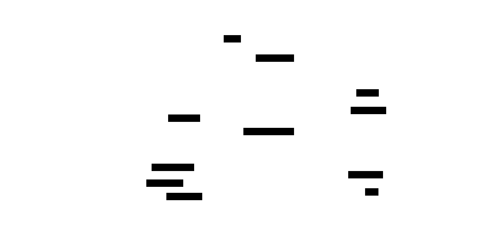
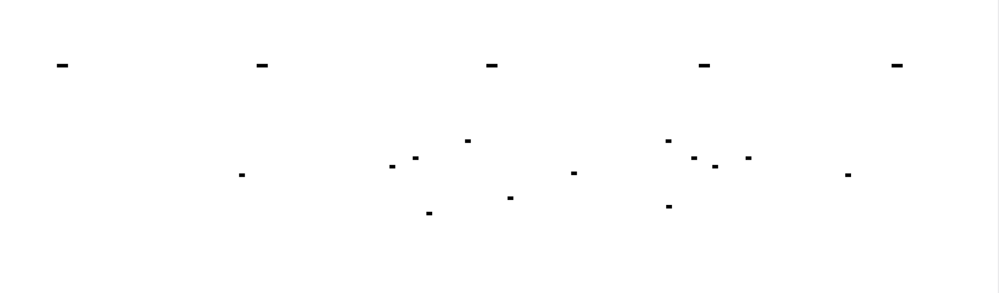

# Packet Sniffer: Design Document


## Overview

A network packet capture and analysis tool that intercepts raw network traffic using privileged sockets, parses protocol headers at multiple layers (Ethernet, IP, TCP/UDP), and provides filtered output for network monitoring and debugging. The key architectural challenge is efficiently processing high-volume packet streams in real-time while maintaining protocol parsing accuracy across variable-length headers and network byte ordering.


> This guide is meant to help you understand the big picture before diving into each milestone. Refer back to it whenever you need context on how components connect.


## Context and Problem Statement

> **Milestone(s):** This section establishes the foundation for all milestones by explaining why packet analysis is essential and what technical challenges we'll face.

Network traffic is like the nervous system of any digital infrastructure—it carries the vital signals that keep applications, services, and systems functioning. Just as doctors need sophisticated tools to examine the human nervous system when diagnosing problems, network engineers and developers need packet-level visibility to understand what's really happening on their networks. When applications behave unexpectedly, connections fail intermittently, or performance degrades mysteriously, the truth often lies buried in the stream of packets flowing across network interfaces.

Think of network packets as digital letters in an enormous postal system. Each packet contains not just the message (payload) but also detailed addressing information, delivery instructions, and metadata about the communication. A packet sniffer is like having X-ray vision into this postal system—it lets you intercept and read every letter, examine the addressing labels, track delivery patterns, and understand the flow of communication. Without this visibility, troubleshooting network issues becomes like trying to debug a conversation by only hearing one side through a wall.

### Network Analysis Requirements

Modern network troubleshooting and security monitoring demand packet-level visibility for several critical use cases. Unlike application logs or system metrics, packet capture provides ground truth about what actually traveled across the network, making it indispensable for certain classes of problems that simply cannot be diagnosed any other way.

**Debugging Communication Failures** represents the most common use case for packet analysis tools. When applications report connection timeouts, intermittent failures, or unexpected behavior, packet capture reveals whether the problem lies in the application logic, network infrastructure, or protocol implementation. Consider a web application that sporadically fails to connect to a database server. Application logs might show "connection timeout" errors, but packet capture reveals whether the TCP SYN packets are being sent, if they're reaching the destination, whether the server is responding with SYN-ACK or RST packets, and where exactly in the three-way handshake the failure occurs. This level of detail transforms vague error messages into actionable diagnostic information.

The granularity of information available through packet analysis far exceeds what application-level logging can provide. While an application might log "HTTP request failed," packet capture shows the actual HTTP request headers sent, the server's response (if any), TCP-level retransmissions, and timing information for each step of the communication. This detail becomes critical when debugging subtle issues like HTTP header case sensitivity problems, content encoding mismatches, or keepalive connection handling bugs.

**Security Monitoring and Incident Response** relies heavily on packet-level analysis to detect and investigate threats that might not be visible through other monitoring approaches. Intrusion detection systems operate by examining packet contents and patterns that would be invisible to host-based monitoring. When security incidents occur, packet captures provide forensic evidence of exactly what data was transmitted, which hosts were involved, and the timeline of the attack.

Network-based threats often operate below the application layer, making packet analysis essential for detection. For example, ARP spoofing attacks manipulate Layer 2 Ethernet frames to redirect traffic, while DNS poisoning attacks require examining the specific queries and responses to identify malicious redirections. Port scanning reconnaissance activities create characteristic patterns in TCP connection attempts that are best detected through packet analysis rather than application logs.

**Performance Analysis and Optimization** depends on packet-level timing and protocol behavior analysis to identify bottlenecks and inefficiencies. Network latency problems often manifest as patterns visible only through packet capture—excessive retransmissions indicating lossy links, TCP window scaling issues limiting throughput, or application protocols making inefficient use of connections. A classic example is diagnosing why a file transfer is slower than expected: packet capture might reveal that the application is sending data in very small chunks, causing poor network utilization, or that intermediate network equipment is introducing excessive buffering delays.

The timing information preserved in packet captures enables precise measurement of network-level performance metrics. Round-trip times can be calculated by matching request and response packets, connection establishment overhead can be measured by analyzing TCP handshake timing, and application-layer protocol efficiency can be assessed by examining the ratio of control packets to data packets. This information often reveals optimization opportunities that are invisible to application-level performance monitoring.

**Protocol Implementation Verification** requires packet-level analysis to ensure that software correctly implements network protocols. When developing networked applications or debugging third-party software, packet capture reveals whether the implementation follows protocol specifications correctly. For instance, a custom HTTP client might appear to work correctly in basic testing, but packet analysis might reveal that it's not properly handling HTTP/1.1 connection reuse, sending malformed headers, or not respecting server-side connection limits.

Standards compliance often involves subtle details that are only visible through packet examination. TCP implementations must handle edge cases like simultaneous connection establishment, proper sequence number wrapping, and correct congestion control behavior. HTTP implementations must manage connection multiplexing, header encoding, and transfer encoding correctly. These details are often overlooked in application-level testing but become critical for interoperability and reliability in production environments.

| Analysis Requirement | Information Needed | Packet-Level Details | Alternative Approaches Limitations |
|----------------------|-------------------|---------------------|----------------------------------|
| Connection Failures | Exact failure point in protocol handshake | TCP SYN/ACK/RST timing and sequence | Application logs only show "connection failed" |
| Security Incidents | Network-level attack vectors and payloads | Layer 2/3 headers, suspicious traffic patterns | Host logs miss network-based attacks |
| Performance Bottlenecks | Protocol efficiency and timing patterns | Round-trip times, retransmissions, window sizes | Application metrics miss network overhead |
| Protocol Compliance | Adherence to RFC specifications | Exact header formats, flag usage, state transitions | Functional testing misses edge cases |
| Intermittent Issues | Traffic patterns during failure windows | Complete communication history with timestamps | Point-in-time snapshots miss timing relationships |

### Existing Solutions Comparison

The packet analysis tool ecosystem includes several established solutions, each optimized for different use cases and deployment scenarios. Understanding their strengths, limitations, and architectural approaches provides context for our implementation decisions and helps identify the specific niche our tool will fill.

**tcpdump** represents the foundational command-line packet capture tool that has influenced virtually all subsequent packet analysis software. Built on the Berkeley Packet Filter (BPF) framework and libpcap library, tcpdump excels at efficient, scriptable packet capture with minimal system resource overhead. Its strength lies in its simplicity and ubiquity—tcpdump is available on virtually every Unix-like system and provides a consistent interface for basic packet capture and filtering.

However, tcpdump's command-line interface and text-based output format limit its usefulness for interactive analysis and complex protocol dissection. While tcpdump can capture packets with sophisticated BPF filters and write them to files for later analysis, it provides minimal protocol parsing beyond basic header field extraction. The tool assumes users have deep networking knowledge to interpret raw packet data, making it less accessible for developers who need occasional network debugging capability.

The architectural approach of tcpdump emphasizes efficiency and portability over user experience. It operates as a thin wrapper around libpcap, providing direct access to low-level packet capture capabilities while leaving protocol interpretation largely to the user. This design makes tcpdump extremely fast and resource-efficient, but requires external tools or manual analysis for meaningful packet interpretation.

**Wireshark** serves as the opposite end of the spectrum, providing comprehensive graphical protocol analysis with deep dissection capabilities for hundreds of network protocols. Wireshark's strength lies in its protocol expertise—it can parse and display protocol fields for everything from basic Ethernet frames to complex application protocols like HTTP/2, TLS, and database-specific protocols. The graphical interface enables interactive exploration of packet captures, with features like conversation tracking, protocol statistics, and visual timeline analysis.

The trade-off for Wireshark's comprehensive capabilities is complexity and resource overhead. The full Wireshark installation includes megabytes of protocol dissectors and GUI components, making it unsuitable for lightweight deployments or embedded systems. Additionally, Wireshark's extensive feature set can overwhelm users who need simple packet capture capabilities for specific debugging tasks.

Wireshark's architecture separates packet capture (using libpcap or platform-specific APIs) from protocol dissection and user interface components. This modular design enables powerful analysis capabilities but requires significant system resources and creates dependencies that limit deployment flexibility. The protocol dissectors, while comprehensive, represent a massive codebase that would be impractical to replicate in a focused implementation.

**Specialized Tools** like ngrep, ettercap, and Scapy target specific analysis scenarios with optimized capabilities. ngrep provides grep-like pattern matching for network traffic, making it excellent for finding specific content in packet streams. Ettercap focuses on network security testing with built-in support for man-in-the-middle attacks and protocol manipulation. Scapy offers programmable packet crafting and analysis through a Python API, enabling custom analysis scripts and security testing tools.

These specialized tools demonstrate that effective packet analysis doesn't require comprehensive protocol support—focused tools can provide significant value by excelling in specific use cases. However, each tool requires learning domain-specific interfaces and may not integrate well with existing development workflows.

> **Decision: Target Simple, Focused Packet Analysis**
> - **Context**: Existing tools either provide minimal analysis (tcpdump) or overwhelming complexity (Wireshark), with few options optimized for software developers who need occasional network debugging
> - **Options Considered**: 
>   1. Replicate Wireshark's comprehensive protocol support
>   2. Create a simple tcpdump wrapper with better output formatting
>   3. Build a focused tool optimizing core protocols (Ethernet, IP, TCP, UDP) with developer-friendly features
> - **Decision**: Build a focused packet sniffer targeting core protocols with clear output formatting and programming-friendly interfaces
> - **Rationale**: Most development and debugging scenarios involve standard protocols, comprehensive protocol support requires massive implementation effort with diminishing returns, and developer-focused tools can provide better integration with existing workflows
> - **Consequences**: Limited protocol support reduces implementation complexity and maintenance overhead while covering 90% of common debugging scenarios, but users will need other tools for specialized protocols

| Tool | Strengths | Limitations | Best Use Cases | Resource Overhead |
|------|-----------|-------------|----------------|-------------------|
| tcpdump | Minimal overhead, ubiquitous, scriptable | Limited protocol parsing, text output only | Automated capture, scripting, minimal systems | Very Low |
| Wireshark | Comprehensive protocol support, interactive GUI | Complex, heavy installation, GUI required | Deep protocol analysis, interactive investigation | High |
| ngrep | Pattern matching, simple interface | Limited to content search, no protocol analysis | Finding specific content, log correlation | Low |
| Ettercap | Security testing focus, MITM capabilities | Security-specific, complex configuration | Penetration testing, security assessment | Medium |
| Scapy | Programmable, packet crafting | Python dependency, programming knowledge required | Custom analysis, security research | Medium |
| Our Tool | Developer-focused, core protocols, lightweight | Limited protocol support, no GUI | Software debugging, development workflow integration | Low |

### Core Technical Challenges

Building an effective packet sniffer involves navigating several interconnected technical challenges that span low-level system programming, network protocol expertise, and high-performance data processing. These challenges explain why packet analysis tools are often complex and why careful architectural decisions are essential for creating a maintainable and efficient implementation.

**Raw Socket Programming and Privilege Management** presents the first significant hurdle in packet capture implementation. Unlike normal network programming where applications connect to specific services through established APIs, packet capture requires accessing raw network traffic before it reaches application layers. This low-level access demands elevated privileges and direct interaction with operating system networking subsystems.

Raw socket creation requires root or administrator privileges because it bypasses normal networking security boundaries. A packet sniffer can potentially capture sensitive data from any application on the system, making privilege escalation a security-critical operation. The challenge extends beyond simply requiring root access—the implementation must handle privilege dropping after socket creation, graceful degradation when privileges are insufficient, and clear user communication about permission requirements.

Network interface management adds complexity because interface names, capabilities, and configuration vary significantly across operating systems. Linux systems typically use names like `eth0` or `enp3s0`, macOS uses `en0` or `en1`, and Windows uses GUID-based names or descriptive strings. Some interfaces support promiscuous mode (capturing all traffic, not just traffic destined for the local system), while others, particularly virtual interfaces, may not support this capability. The implementation must enumerate available interfaces, detect their capabilities, and handle interface state changes gracefully.

Platform-specific packet capture APIs further complicate portability. While libpcap provides a cross-platform abstraction layer, it introduces dependencies and may not expose all platform-specific optimizations. Raw socket implementations vary between BSD-style systems (macOS, FreeBSD), Linux, and Windows, requiring platform-specific code paths for optimal performance. The choice between libpcap abstraction and platform-specific implementations represents a fundamental architectural decision with implications for performance, portability, and implementation complexity.

**Protocol Parsing Complexity and Correctness** challenges emerge from the layered nature of network protocols and the numerous edge cases present in real network traffic. Network protocols were designed for robustness and extensibility, resulting in variable-length headers, optional fields, and backward compatibility features that complicate parsing implementations.

Ethernet frame parsing illustrates the seemingly simple cases that harbor subtle complexity. Basic Ethernet frames have fixed 14-byte headers, but 802.1Q VLAN tagging inserts additional 4-byte headers, and 802.1ad double-tagging can add even more. The EtherType field indicates the payload protocol, but values less than 1536 indicate frame length instead of protocol type for backward compatibility with older Ethernet standards. Jumbo frames extend beyond standard 1500-byte payload limits, requiring different buffer management strategies.

IP header parsing complexity multiplies due to variable-length options and fragmentation handling. IPv4 headers range from 20 to 60 bytes depending on options present, with the header length field specified in 32-bit words rather than bytes—a common source of parsing errors. IPv6 uses a different approach with fixed 40-byte base headers followed by optional extension header chains that must be traversed to reach transport layer protocols. IP fragmentation requires reassembly logic to reconstruct original packets from fragments, adding state management complexity.

TCP and UDP present different parsing challenges despite both being transport protocols. UDP headers are simple and fixed-length, but TCP headers include variable-length options and complex state management. TCP sequence numbers wrap around 32-bit boundaries, requiring careful handling to maintain ordering. The TCP data offset field, like IP header length, is specified in 32-bit words rather than bytes. TCP options parsing involves type-length-value (TLV) encoding with padding requirements that must be handled correctly.

Byte ordering issues pervade all protocol parsing because network protocols use big-endian (network) byte order while many modern processors use little-endian byte order. Every multi-byte field must be converted from network byte order to host byte order, and failure to perform this conversion correctly leads to wildly incorrect field values. The complexity increases when handling protocols that mix byte orders or have architecture-specific fields.

**Performance Requirements and Real-Time Processing** constraints define the operational boundaries within which the packet sniffer must function. Network interfaces can deliver packets at gigabit speeds, requiring the sniffer to process thousands of packets per second without dropping traffic. Unlike batch processing applications, packet sniffers must process each packet in real-time to avoid buffer overflows and packet loss.

Memory management becomes critical under high packet rates because inefficient allocation patterns can cause garbage collection pauses (in garbage-collected languages) or memory fragmentation (in manual memory management languages). The traditional approach of allocating a new packet structure for each captured packet quickly becomes unsustainable under high load. Ring buffer architectures and object pooling strategies help manage memory pressure but add implementation complexity.

Buffer management requires careful consideration of the entire packet processing pipeline. Network interface drivers typically provide limited buffering, requiring the application to consume packets quickly enough to prevent buffer overflow. The packet sniffer must balance buffer sizes against memory usage while ensuring that parsing and filtering operations don't create bottlenecks that cause packet drops.

Concurrent processing opportunities exist throughout the packet capture pipeline, but synchronization overhead must be managed carefully. Packet capture typically occurs on a single thread to maintain packet ordering and minimize context switching overhead, but protocol parsing and filtering operations can potentially be parallelized. However, sharing packet data between threads requires careful synchronization or immutable data structures to prevent race conditions.

The filtering and output subsystems introduce additional performance considerations. Berkeley Packet Filter (BPF) expressions provide efficient kernel-level filtering that reduces the number of packets delivered to user space, dramatically improving performance for focused analysis. However, BPF filters must be compiled and validated, and complex filters can consume significant CPU resources. Display filtering and output formatting must be optimized to avoid becoming bottlenecks, particularly when generating human-readable output for high-volume packet streams.

| Challenge Category | Specific Issues | Implementation Impact | Mitigation Strategies |
|-------------------|-----------------|----------------------|---------------------|
| Privilege Management | Root access required, privilege dropping, cross-platform differences | Security complexity, deployment restrictions | Capability-based permissions, privilege separation |
| Interface Handling | OS-specific naming, capability detection, promiscuous mode | Platform-specific code paths, feature detection | Runtime capability probing, graceful degradation |
| Protocol Parsing | Variable headers, byte ordering, fragmentation | Complex state machines, error handling | Layered parsers, validation at each stage |
| Memory Management | High allocation rates, buffer management | Performance bottlenecks, resource exhaustion | Ring buffers, object pooling, zero-copy techniques |
| Concurrency | Thread safety, ordering requirements | Synchronization overhead, race conditions | Lock-free data structures, immutable packets |
| Filtering Performance | BPF compilation, complex expressions | CPU overhead, filter optimization | Compiled filters, multi-stage filtering |

> The fundamental tension in packet sniffer design lies between comprehensiveness and performance. Every additional protocol supported, every extra feature implemented, and every abstraction layer added increases the processing overhead per packet. Since packet processing must occur in real-time with strict performance requirements, successful implementations require careful trade-offs between features and efficiency.

⚠️ **Pitfall: Underestimating Protocol Complexity**
Many developers approach packet parsing assuming that protocols are simpler than they actually are, leading to implementations that work for basic test cases but fail when encountering real-world traffic. For example, assuming fixed header lengths, ignoring byte order conversion, or not handling optional protocol fields correctly. These issues often surface only during production use with diverse network traffic, making thorough testing with varied packet samples essential.

⚠️ **Pitfall: Inadequate Performance Testing**
Packet sniffers often work correctly under light load but drop packets or consume excessive resources under realistic traffic volumes. Testing with synthetic low-volume traffic doesn't reveal performance bottlenecks that emerge under production network loads. Performance testing should include sustained high packet rates, burst traffic patterns, and resource usage monitoring to identify scalability limits before deployment.

### Implementation Guidance

The following guidance provides concrete technology choices and starter code to help implement the packet sniffer architecture described above. These recommendations balance learning objectives with practical implementation constraints.

#### Technology Recommendations

| Component | Simple Option | Advanced Option |
|-----------|---------------|-----------------|
| Packet Capture | Raw sockets with manual interface handling | libpcap for cross-platform compatibility |
| Protocol Parsing | Manual byte-level parsing with fixed structs | Protocol buffer or structure-based parsing |
| Filtering | Post-capture filtering in application code | Berkeley Packet Filter (BPF) compilation |
| Output Format | Printf-style formatted text output | JSON structured output with multiple formats |
| Memory Management | Standard malloc/free with simple buffers | Ring buffers with pre-allocated packet structures |
| Concurrency | Single-threaded with blocking I/O | Producer-consumer pattern with packet queues |

#### Recommended File Structure

```
packet-sniffer/
├── src/
│   ├── main.c                    # Entry point and argument parsing
│   ├── capture/
│   │   ├── capture_engine.h      # Packet capture interface
│   │   ├── capture_engine.c      # Raw socket implementation
│   │   └── interface_utils.c     # Interface enumeration and management
│   ├── protocol/
│   │   ├── packet_types.h        # Common packet structure definitions
│   │   ├── ethernet_parser.h     # Ethernet frame parsing
│   │   ├── ethernet_parser.c
│   │   ├── ip_parser.h          # IPv4/IPv6 header parsing
│   │   ├── ip_parser.c
│   │   ├── transport_parser.h    # TCP/UDP parsing
│   │   └── transport_parser.c
│   ├── filter/
│   │   ├── filter_engine.h       # Packet filtering interface
│   │   └── filter_engine.c       # BPF and display filter implementation
│   └── output/
│       ├── formatter.h           # Output formatting interface
│       └── formatter.c           # Text and structured output formatting
├── include/
│   └── common.h                  # Common definitions and utilities
├── tests/
│   ├── test_parser.c            # Protocol parser unit tests
│   └── sample_packets/          # Test packet data files
└── Makefile
```

#### Infrastructure Starter Code

**Common Definitions and Utilities (include/common.h)**

```c
#ifndef COMMON_H
#define COMMON_H

#include <stdint.h>
#include <stdbool.h>
#include <sys/time.h>

// Maximum packet size for Ethernet frames
#define MAX_PACKET_SIZE 65536
#define ETHERNET_HEADER_LEN 14
#define IPV4_MIN_HEADER_LEN 20
#define IPV6_HEADER_LEN 40
#define TCP_MIN_HEADER_LEN 20
#define UDP_HEADER_LEN 8

// Network byte order conversion macros
#define ntoh16(x) ntohs(x)
#define ntoh32(x) ntohl(x)
#define hton16(x) htons(x)
#define hton32(x) htonl(x)

// Packet timestamp structure
typedef struct {
    time_t seconds;
    uint32_t microseconds;
} packet_timestamp_t;

// Error codes
typedef enum {
    PACKET_SUCCESS = 0,
    PACKET_ERROR_INVALID = -1,
    PACKET_ERROR_TRUNCATED = -2,
    PACKET_ERROR_UNSUPPORTED = -3,
    PACKET_ERROR_PRIVILEGE = -4,
    PACKET_ERROR_INTERFACE = -5
} packet_result_t;

// Protocol types
typedef enum {
    PROTO_ETHERNET = 1,
    PROTO_IPV4 = 2,
    PROTO_IPV6 = 3,
    PROTO_TCP = 4,
    PROTO_UDP = 5,
    PROTO_ICMP = 6,
    PROTO_UNKNOWN = 0
} protocol_type_t;

// Utility functions
const char* protocol_name(protocol_type_t proto);
void format_mac_address(const uint8_t* mac, char* output);
void format_ip_address(const uint8_t* ip, int version, char* output);
uint64_t timestamp_to_microseconds(const packet_timestamp_t* ts);

#endif
```

#### Core Logic Skeleton Code

**Packet Capture Engine (src/capture/capture_engine.h)**

```c
#ifndef CAPTURE_ENGINE_H
#define CAPTURE_ENGINE_H

#include "common.h"

typedef struct capture_engine capture_engine_t;

// Interface information structure
typedef struct {
    char name[64];              // Interface name (eth0, en0, etc.)
    char description[256];      // Human-readable description
    bool supports_promiscuous;  // Can capture all traffic
    bool is_up;                // Interface is active
} interface_info_t;

// Raw packet structure
typedef struct {
    packet_timestamp_t timestamp;
    uint32_t length;            // Actual packet length
    uint32_t captured_length;   // Length of captured data
    uint8_t data[MAX_PACKET_SIZE];
} raw_packet_t;

/**
 * Create a new packet capture engine
 * Returns NULL on failure (insufficient privileges, etc.)
 */
capture_engine_t* capture_engine_create(void);

/**
 * Enumerate available network interfaces
 * Returns number of interfaces found, fills interfaces array
 */
int capture_engine_list_interfaces(capture_engine_t* engine, 
                                  interface_info_t* interfaces, 
                                  int max_interfaces);

/**
 * Start packet capture on specified interface
 * interface_name: Name of interface to capture on ("eth0", "any", etc.)
 * promiscuous: Enable promiscuous mode if supported
 * Returns PACKET_SUCCESS on success, error code on failure
 */
packet_result_t capture_engine_start(capture_engine_t* engine, 
                                     const char* interface_name, 
                                     bool promiscuous);

/**
 * Capture next packet from interface
 * Blocks until packet is available or timeout occurs
 * timeout_ms: Timeout in milliseconds, 0 for no timeout
 */
packet_result_t capture_engine_next_packet(capture_engine_t* engine, 
                                          raw_packet_t* packet, 
                                          int timeout_ms);

/**
 * Stop packet capture and cleanup resources
 */
void capture_engine_stop(capture_engine_t* engine);

/**
 * Destroy capture engine and free all resources
 */
void capture_engine_destroy(capture_engine_t* engine);

#endif
```

**Protocol Parser Skeleton (src/protocol/ethernet_parser.c)**

```c
#include "ethernet_parser.h"
#include "common.h"
#include <string.h>
#include <arpa/inet.h>

packet_result_t parse_ethernet_frame(const raw_packet_t* raw_packet, 
                                     ethernet_frame_t* frame) {
    // TODO 1: Validate minimum packet length for Ethernet header (14 bytes)
    //         Return PACKET_ERROR_TRUNCATED if packet too short
    
    // TODO 2: Extract destination MAC address from bytes 0-5
    //         Copy 6 bytes to frame->dest_mac
    
    // TODO 3: Extract source MAC address from bytes 6-11
    //         Copy 6 bytes to frame->src_mac
    
    // TODO 4: Extract EtherType from bytes 12-13
    //         Convert from network byte order to host byte order
    //         Store in frame->ethertype
    
    // TODO 5: Handle VLAN tags (802.1Q) if EtherType is 0x8100
    //         VLAN tag adds 4 bytes, need to look at bytes 16-17 for real EtherType
    //         Set frame->has_vlan_tag and extract VLAN ID if present
    
    // TODO 6: Set frame->payload pointer to start of payload data
    //         Calculate frame->payload_length as remaining bytes after headers
    
    // TODO 7: Copy timestamp from raw packet
    //         Set frame->timestamp = raw_packet->timestamp
    
    return PACKET_SUCCESS;
}

protocol_type_t ethernet_get_payload_protocol(const ethernet_frame_t* frame) {
    // TODO 1: Check EtherType field to determine payload protocol
    //         0x0800 = IPv4, 0x86DD = IPv6, 0x0806 = ARP
    //         Return appropriate protocol_type_t enum value
    //         Return PROTO_UNKNOWN for unrecognized EtherTypes
}
```

#### Milestone Checkpoints

**Milestone 1 Checkpoint: Packet Capture Setup**
After implementing the capture engine, test with:
```bash
# Compile the basic capture test
gcc -o test_capture src/capture/capture_engine.c tests/test_capture.c

# Run with root privileges to test interface enumeration
sudo ./test_capture --list-interfaces

# Expected output: List of network interfaces with capabilities
# eth0: Ethernet adapter (promiscuous: yes, status: up)
# lo: Loopback interface (promiscuous: no, status: up)

# Test packet capture on a specific interface
sudo ./test_capture --interface eth0 --count 10

# Expected output: Raw packet information
# Packet 1: 74 bytes captured at 2024-01-15 10:30:45.123456
# Packet 2: 60 bytes captured at 2024-01-15 10:30:45.123500
```

Signs of problems:
- "Permission denied" errors indicate insufficient privileges
- "Interface not found" suggests interface enumeration issues  
- Zero packets captured may indicate interface selection or socket configuration problems
- Captured packet lengths of zero indicate buffer management issues

**Debugging Tips for Common Issues**

| Symptom | Likely Cause | How to Diagnose | Fix |
|---------|-------------|-----------------|-----|
| Permission denied on socket creation | Insufficient privileges | Check if running as root/administrator | Run with sudo or elevated privileges |
| Interface enumeration returns empty list | Platform-specific interface API issues | Check /proc/net/dev on Linux, ifconfig output | Implement platform-specific interface discovery |
| Packets captured but length is zero | Buffer management or socket configuration | Add debug prints for socket recv() return values | Check socket buffer sizes and recv() error handling |
| Promiscuous mode fails silently | Virtual interface or driver limitations | Test on physical Ethernet interface | Document interface capabilities, graceful degradation |
| High packet loss under load | Insufficient buffer sizes | Monitor socket buffer utilization | Increase socket buffers, implement ring buffering |

This foundation provides the infrastructure needed to begin implementing the packet capture engine while establishing patterns for the protocol parsing components that follow in subsequent milestones.


## Goals and Non-Goals

> **Milestone(s):** This section establishes the scope and constraints for all milestones (1-5) by defining what our packet sniffer will and won't do, ensuring focused development effort and clear success criteria.

Think of this section as the project charter for our packet sniffer - it's like drawing the boundaries on a map before starting a journey. Just as explorers need to know whether they're crossing rivers or climbing mountains, developers need to understand which features are in scope versus which advanced capabilities we're deliberately excluding. This prevents scope creep and ensures we build a solid foundation before attempting complex features.

The packet sniffer domain presents unique challenges because network analysis tools can range from simple port scanners to enterprise-grade deep packet inspection systems costing millions of dollars. Without clear boundaries, a learning project could easily spiral into attempting to replicate Wireshark's decades of development. Our goal is to build something substantial enough to demonstrate core networking concepts while remaining achievable for intermediate developers learning network programming.

### Functional Requirements

Our packet sniffer must demonstrate the complete packet processing pipeline from raw network capture through protocol analysis to formatted output. Think of it as building a simplified version of tcpdump - we need to intercept network traffic at the lowest level, understand what we captured, and present it in human-readable form.

The **packet capture capability** forms the foundation of our system. We must enumerate available network interfaces on the host system, handle the complexity of interface naming across different operating systems (eth0 on Linux, en0 on macOS, complex GUID-based names on Windows), and gracefully manage the privilege requirements for raw packet access. The capture engine needs to open network interfaces in promiscuous mode, meaning it receives all traffic on the network segment rather than just packets destined for the local machine. This requires careful handling of permission errors and clear user guidance when insufficient privileges prevent operation.

> **Decision: Raw Socket vs Libpcap for Packet Capture**
> - **Context**: We need low-level network access to capture raw packets before the operating system processes them through its network stack
> - **Options Considered**: Direct raw socket programming, libpcap library integration, platform-specific capture APIs
> - **Decision**: Primary implementation using raw sockets with optional libpcap integration
> - **Rationale**: Raw sockets provide deeper understanding of network programming fundamentals while libpcap offers cross-platform compatibility and advanced filtering
> - **Consequences**: Raw socket implementation teaches low-level concepts but requires more OS-specific code; libpcap integration provides professional-grade capabilities with less educational value for socket programming

| Capture Requirement | Must Support | Implementation Notes |
|---------------------|--------------|---------------------|
| Interface Discovery | List all network interfaces by name and description | Handle OS-specific naming (eth0, en0, wlan0) |
| Promiscuous Mode | Capture all network traffic, not just local traffic | Requires root/administrator privileges |
| Privilege Management | Detect and report permission requirements gracefully | Provide clear error messages and guidance |
| Packet Buffering | Store captured packets in ring buffer for processing | Prevent memory exhaustion under high traffic |
| Capture Statistics | Track packets captured, dropped, and processing rates | Enable performance monitoring and tuning |

The **protocol parsing system** must decode network packets layer by layer, starting with Ethernet frames and progressing through IP headers to transport layer protocols. This creates a parsing pipeline where each layer extracts its relevant information and passes the payload to the next parser. The complexity lies in handling variable-length headers (IP options, TCP options), different protocol versions (IPv4 vs IPv6), and the network byte ordering used in protocol fields.

At the Ethernet layer, our parser extracts the 6-byte source and destination MAC addresses and the 2-byte EtherType field that identifies the payload protocol. This sounds straightforward, but we must handle complications like 802.1Q VLAN tags that insert 4 additional bytes into the frame, shifting all subsequent fields. The parser must format MAC addresses in the standard colon-separated hexadecimal notation (e.g., "aa:bb:cc:dd:ee:ff") and correctly identify whether the payload contains IPv4, IPv6, ARP, or other protocols.

| Protocol Layer | Required Fields | Parsing Challenges |
|----------------|----------------|-------------------|
| Ethernet Frame | Source MAC, Destination MAC, EtherType | VLAN tag handling, frame size validation |
| IPv4 Header | Version, Header Length, Source IP, Dest IP, Protocol | Variable header length, fragmentation, options |
| IPv6 Header | Version, Source IP, Dest IP, Next Header | Extension header chains, variable length |
| TCP Header | Source Port, Dest Port, Sequence, Flags | Variable header length, option parsing |
| UDP Header | Source Port, Dest Port, Length, Checksum | Simple fixed-length header |

The IP layer parser handles both IPv4 and IPv6 protocols, each with distinct header formats and parsing requirements. IPv4 headers have variable length due to optional fields, with the header length specified in 32-bit words rather than bytes - a common source of parsing errors. IPv6 uses a fixed 40-byte header but employs extension headers for optional functionality, creating a chain of headers that must be traversed to find the actual payload. Both protocols require careful handling of network byte order (big-endian) when extracting multi-byte fields like addresses and length values.

Transport layer parsing focuses on TCP and UDP protocols, which provide port-based service identification and connection semantics. TCP headers contain rich state information including sequence numbers, acknowledgment numbers, and control flags (SYN, ACK, FIN, RST, PSH, URG) that indicate connection state and data flow control. UDP headers are simpler with just source port, destination port, length, and checksum fields. Both protocols enable service identification through well-known port numbers (80 for HTTP, 443 for HTTPS, 53 for DNS), allowing our sniffer to provide meaningful service names rather than just numeric ports.

> The key architectural insight is that protocol parsing must be modular and composable. Each parser focuses on its layer's responsibilities while providing a clean interface for the next layer. This separation allows us to handle protocol variations (IPv4 vs IPv6) and future extensions (new transport protocols) without disrupting the entire parsing pipeline.

**Filtering and output formatting** provide the user interface to our packet sniffer, transforming raw parsed data into actionable information. The filtering system operates at two levels: capture-time filtering using Berkeley Packet Filter (BPF) expressions that run in kernel space for efficiency, and display-time filtering that operates on parsed packet structures in user space for flexibility.

BPF filtering allows users to specify capture criteria like "tcp port 80" or "host 192.168.1.1" that the kernel applies before packets reach our application. This dramatically reduces the volume of data our application must process, enabling real-time analysis of high-speed networks. Display filtering provides post-capture refinement, allowing users to narrow down captured packets based on parsed protocol information without recapturing traffic.

| Filter Type | Examples | Performance Impact | Use Cases |
|-------------|----------|-------------------|-----------|
| BPF Capture Filter | "tcp port 80", "host 192.168.1.1" | High efficiency, kernel-level | Reduce capture volume, focus on specific traffic |
| Display Filter | Protocol type, port ranges, flag combinations | Moderate overhead, user-space | Analyze captured data, find specific connections |
| Output Filter | Timestamp ranges, packet size limits | Low overhead | Format reports, export subsets |

The output formatting system must present packet information in multiple formats suitable for different use cases. Summary format shows one line per packet with timestamp, source/destination addresses, protocol, and basic information - similar to tcpdump's default output. Detailed format expands each packet to show all parsed header fields, while hex dump format displays the raw packet bytes for in-depth analysis. Export functionality saves captured packets in standard PCAP format for analysis in other tools like Wireshark.

### Performance and Quality Requirements

Network packet analysis operates under strict real-time constraints because packets arrive at line speed and cannot be slowed down to accommodate our processing. Think of it like trying to read license plates on cars passing on a highway - if our processing is too slow, we start missing vehicles (packets). The performance requirements establish minimum thresholds that our implementation must meet to be practically useful rather than just academically interesting.

**Real-time processing capability** means our packet sniffer must capture, parse, filter, and output packet information fast enough to keep up with network traffic rates. On a typical Gigabit Ethernet connection, small packets can arrive at rates exceeding 1.4 million packets per second. While our learning implementation won't handle this extreme rate, it must process common network loads without dropping packets due to processing delays.

> **Decision: Synchronous vs Asynchronous Packet Processing**
> - **Context**: Packets arrive continuously while we need time to parse headers and format output
> - **Options Considered**: Single-threaded synchronous processing, producer-consumer threading, asynchronous I/O with callbacks
> - **Decision**: Single-threaded synchronous processing with ring buffer
> - **Rationale**: Simpler implementation reduces complexity while ring buffer prevents packet loss during processing bursts
> - **Consequences**: May not achieve maximum throughput but provides predictable behavior and easier debugging

| Performance Metric | Minimum Requirement | Target Requirement | Measurement Method |
|--------------------|---------------------|-------------------|-------------------|
| Packet Processing Rate | 1,000 packets/second | 10,000 packets/second | Synthetic packet generation test |
| Memory Usage | Under 100MB for 1M packets | Under 50MB for 1M packets | Memory profiling during capture |
| Startup Time | Under 5 seconds | Under 2 seconds | Time from launch to first packet |
| Parser Accuracy | 99.9% correct parsing | 99.99% correct parsing | Comparison against known good parsers |
| Privilege Error Handling | Clear error messages | Graceful degradation | Test with non-root user |

**Memory management** requires careful attention because packet capture can generate large volumes of data quickly. A ring buffer design limits memory usage by overwriting old packets when the buffer fills, rather than growing unboundedly. This prevents memory exhaustion while ensuring recent packets remain available for analysis. The buffer size must balance memory usage against the time window of available packets.

**Parsing accuracy** demands that our protocol parsers correctly interpret network packets according to RFC specifications. Malformed or truncated packets should be detected and handled gracefully rather than causing crashes or incorrect parsing of subsequent packets. Edge cases like IP fragmentation, TCP options, and unusual header lengths must be handled correctly to provide reliable analysis results.

The **privilege handling system** must detect when insufficient permissions prevent raw packet capture and provide clear guidance to users. Rather than cryptic system error messages, our implementation should explain that packet capture requires administrator privileges and suggest specific commands (like sudo) to resolve the issue. On systems where promiscuous mode is not available (some virtualized environments), the tool should fall back to non-promiscuous capture with appropriate warnings.

**Error recovery and robustness** ensure the packet sniffer continues operating despite encountering problematic packets or system conditions. Individual packet parsing failures should not terminate the entire capture session. Interface disconnections (unplugging network cables, WiFi disconnections) should be detected and reported without crashing. Resource exhaustion scenarios like filling the packet buffer should trigger appropriate overflow handling.

| Error Condition | Detection Method | Recovery Action | User Notification |
|------------------|------------------|-----------------|-------------------|
| Malformed Packet | Parser validation checks | Skip packet, continue processing | Log warning with packet details |
| Permission Denied | Socket creation failure | Provide setup instructions | Clear error message with sudo example |
| Interface Disconnected | Capture API error | Attempt reconnection | Status message with retry count |
| Buffer Overflow | Ring buffer full condition | Drop oldest packets | Statistics showing drop count |
| Memory Exhaustion | Allocation failure | Reduce buffer size | Warning about reduced capacity |

### What We Won't Build

Defining what our packet sniffer will NOT include is as important as specifying its features, because the networking domain contains decades of accumulated complexity that could easily overwhelm a learning project. Think of this as setting up guardrails to keep our implementation focused on core concepts rather than getting lost in advanced features that would require months of additional development.

**Deep Packet Inspection (DPI)** capabilities that examine application-layer content are explicitly out of scope. While commercial network monitoring tools parse HTTP headers, reconstruct email messages, or analyze database queries, our packet sniffer stops at the transport layer. We'll extract TCP and UDP port information to identify services but won't decode the actual application protocols. This boundary keeps our implementation manageable while still demonstrating the fundamental concepts of network packet analysis.

Advanced **traffic analysis and statistics** features like bandwidth monitoring, connection tracking, or network mapping are beyond our scope. These capabilities require maintaining state across multiple packets, correlating traffic flows, and performing complex calculations that would significantly complicate our implementation. Our output will focus on individual packet information rather than aggregate analysis or trend reporting.

> The crucial insight is that packet analysis tools exist on a spectrum from simple capture utilities to comprehensive network management platforms. By constraining our scope to the capture and basic parsing end of this spectrum, we can build something substantial while maintaining focus on learning core networking concepts.

**Graphical User Interface (GUI)** development is excluded to keep the project focused on networking rather than user interface programming. Our packet sniffer will operate as a command-line tool with text-based output, similar to tcpdump. While GUI tools like Wireshark provide excellent user experiences, building GUI components would require learning additional frameworks and design principles that distract from the core networking concepts we're trying to master.

| Excluded Feature Category | Specific Examples | Why Excluded | Alternative Learning Path |
|---------------------------|-------------------|--------------|---------------------------|
| Application Protocol Parsing | HTTP, DNS, SMTP, FTP header parsing | Requires protocol-specific knowledge | Study individual protocol RFCs separately |
| Traffic Analysis | Bandwidth monitoring, flow correlation | Complex state management needed | Build as separate project after mastering basic capture |
| GUI Components | Real-time traffic graphs, packet tree views | UI programming complexity | Learn GUI frameworks in dedicated UI project |
| Advanced Filtering | Regular expressions on payload, stateful filtering | Complex parsing and state tracking | Extend basic implementation later |
| Performance Optimization | Zero-copy techniques, hardware acceleration | Requires advanced system programming | Study after mastering basic implementation |
| Enterprise Features | Remote capture, distributed analysis, alerting | Infrastructure and scaling complexity | Relevant for production systems, not learning |

**Network reconstruction capabilities** like TCP stream reassembly or HTTP session reconstruction require maintaining complex state across packet sequences and handling out-of-order delivery, retransmissions, and fragmentation. These features transform our simple packet analyzer into a sophisticated network protocol stack, which represents a significant increase in complexity without proportional learning value for our core objectives.

**Performance optimization techniques** like zero-copy packet processing, kernel bypass networking, or hardware acceleration are advanced topics that require deep system programming knowledge and specialized hardware. While these techniques are crucial for production network monitoring systems handling multi-gigabit traffic, they add significant complexity without enhancing understanding of basic packet capture and protocol parsing concepts.

**Distributed analysis capabilities** that capture traffic from multiple network points, correlate data across sensors, or provide centralized management interfaces require building distributed systems infrastructure. These enterprise-oriented features involve network programming concepts (clustering, data synchronization, fault tolerance) that are distinct from packet analysis and would overshadow our core learning objectives.

The **security and production hardening** features needed for deployment in enterprise environments - like input validation against malicious packets, protection against DoS attacks through rapid packet generation, or secure remote access controls - represent additional complexity layers that would double or triple our implementation effort without significantly enhancing the educational value of basic packet capture concepts.

> ⚠️ **Pitfall: Scope Creep Through "Just One More Feature"**
> Learning projects often fail because developers continuously add "just one more small feature" until the project becomes unmanageable. Each excluded feature above seems simple in isolation but requires its own testing, error handling, documentation, and maintenance. Maintaining strict boundaries allows completing a solid implementation that demonstrates all core concepts rather than an incomplete implementation with partially-working advanced features.

**File format compatibility** beyond basic PCAP export is excluded - we won't implement import/export for proprietary formats from commercial tools or support for advanced PCAP-NG features. Standard PCAP format provides sufficient compatibility with common analysis tools while avoiding the complexity of supporting multiple file formats and their various options.

### Implementation Guidance

This section bridges the design requirements above with practical implementation decisions, providing concrete technology recommendations and starter code that junior developers can use to begin building the packet sniffer while maintaining focus on the core networking concepts.

#### Technology Recommendations

The choice of implementation approach significantly affects both the learning experience and the final capabilities of our packet sniffer. Raw socket programming provides the deepest understanding of network interfaces and packet handling, while library-based approaches offer more portable and feature-complete solutions.

| Component | Simple Option | Advanced Option |
|-----------|---------------|-----------------|
| Packet Capture | Raw sockets with manual interface setup | libpcap with BPF filtering support |
| Protocol Parsing | Manual byte-by-byte header parsing | Structured parsing with validation libraries |
| Output Formatting | printf-style formatted strings | Template-based formatting with multiple output modes |
| Error Handling | Basic error codes with perror() messages | Structured error types with detailed context |
| Memory Management | Fixed-size buffers with overflow detection | Dynamic ring buffers with automatic sizing |
| Configuration | Command-line arguments with getopt | Configuration file support with validation |

The **raw socket approach** provides maximum educational value by forcing developers to handle low-level networking details like socket creation, interface binding, and privilege management. This approach teaches the fundamental concepts behind network programming but requires more platform-specific code and careful error handling.

```c
// Recommended project structure for maximum learning value
project-root/
  src/
    capture/
      capture_engine.c     ← Raw socket implementation, interface discovery
      capture_engine.h     ← Public API for packet capture operations
      ring_buffer.c        ← Packet buffering and memory management
      ring_buffer.h
    parsing/
      ethernet_parser.c    ← Layer 2 frame parsing
      ip_parser.c         ← IPv4/IPv6 header parsing  
      transport_parser.c   ← TCP/UDP header parsing
      protocol_types.h     ← Common protocol definitions
    filtering/
      packet_filter.c      ← Display filtering implementation
      filter_expressions.c ← Filter parsing and matching
    output/
      packet_formatter.c   ← Human-readable output generation
      pcap_writer.c       ← PCAP file export functionality
    utils/
      network_utils.c     ← Byte order conversion, address formatting
      error_handling.c    ← Centralized error reporting
  include/
    packet_sniffer.h      ← Main public API
  tests/
    test_parsers.c        ← Unit tests for protocol parsers
    test_capture.c        ← Integration tests for packet capture
  docs/
    protocol_references/  ← RFC summaries and header format diagrams
```

#### Infrastructure Starter Code

The following complete implementations handle non-core functionality, allowing learners to focus on the networking concepts rather than getting bogged down in utility code:

**Complete Ring Buffer Implementation** (ready to use):
```c
// ring_buffer.h - Complete packet buffering system
#include <stdint.h>
#include <stdbool.h>

typedef struct {
    raw_packet_t* packets;
    uint32_t capacity;
    uint32_t head;
    uint32_t tail;
    uint32_t count;
    uint64_t total_packets;
    uint64_t dropped_packets;
} packet_ring_buffer_t;

// Creates ring buffer with specified capacity
packet_ring_buffer_t* ring_buffer_create(uint32_t capacity);

// Adds packet to buffer, overwrites oldest if full
bool ring_buffer_add(packet_ring_buffer_t* buffer, const raw_packet_t* packet);

// Gets next packet from buffer, returns false if empty  
bool ring_buffer_get(packet_ring_buffer_t* buffer, raw_packet_t* packet);

// Returns current statistics
void ring_buffer_stats(const packet_ring_buffer_t* buffer, 
                      uint64_t* total, uint64_t* dropped, uint32_t* current);

// Cleanup
void ring_buffer_destroy(packet_ring_buffer_t* buffer);
```

**Complete Network Utilities** (ready to use):
```c
// network_utils.h - Byte order and address formatting utilities
#include <netinet/in.h>

// Convert network byte order to host byte order
uint16_t network_to_host_16(uint16_t net_value);
uint32_t network_to_host_32(uint32_t net_value);

// Format MAC address as "aa:bb:cc:dd:ee:ff"
void format_mac_address(const uint8_t mac[6], char output[18]);

// Format IPv4 address as "192.168.1.1"  
void format_ipv4_address(uint32_t ip, char output[16]);

// Format IPv6 address as standard notation
void format_ipv6_address(const uint8_t ip[16], char output[40]);

// Convert timestamp to human-readable format
void format_timestamp(const packet_timestamp_t* ts, char output[32]);

// Get protocol name string from protocol number
const char* protocol_name(protocol_type_t proto);
```

**Complete Error Handling System** (ready to use):
```c
// error_handling.h - Centralized error reporting
typedef enum {
    ERROR_NONE = 0,
    ERROR_PRIVILEGE,     // Insufficient privileges for raw sockets
    ERROR_INTERFACE,     // Network interface not found or unavailable
    ERROR_INVALID_PACKET,// Malformed or truncated packet data
    ERROR_MEMORY,        // Memory allocation failure
    ERROR_SYSTEM         // General system call failure
} error_code_t;

// Set last error with context information
void set_error(error_code_t code, const char* message, const char* context);

// Get formatted error message for display
const char* get_error_message(void);

// Check if operation should continue after error
bool is_recoverable_error(error_code_t code);

// Print error message and suggest solutions
void print_error_with_help(error_code_t code);
```

#### Core Logic Skeleton Code

The following function signatures map directly to the algorithm steps described in the design sections above. Learners implement these functions by following the TODO comments that correspond to the numbered algorithm steps:

**Capture Engine Core** (implement this):
```c
// capture_engine.c - Core packet capture implementation
// Students implement these functions following the algorithm steps

capture_engine_t* capture_engine_create(void) {
    // TODO 1: Allocate capture_engine_t structure
    // TODO 2: Initialize interface list and state variables
    // TODO 3: Set initial state to uninitialized
    // TODO 4: Return engine pointer or NULL on failure
    // Hint: Don't create sockets yet - do that in capture_engine_start()
}

packet_result_t capture_engine_start(capture_engine_t* engine, 
                                   const char* interface_name, 
                                   bool promiscuous) {
    // TODO 1: Validate engine is not already capturing
    // TODO 2: Find interface by name in system interface list
    // TODO 3: Create raw socket with AF_PACKET/AF_INET family
    // TODO 4: Bind socket to specified interface
    // TODO 5: Enable promiscuous mode if requested and supported
    // TODO 6: Set socket to non-blocking mode for timeout support
    // TODO 7: Initialize packet ring buffer for captured data
    // TODO 8: Update engine state to capturing
    // Hint: Check for EPERM error and return PACKET_ERROR_PRIVILEGE
}

packet_result_t capture_engine_next_packet(capture_engine_t* engine,
                                          raw_packet_t* packet,
                                          int timeout_ms) {
    // TODO 1: Validate engine is in capturing state
    // TODO 2: Check ring buffer for already-captured packets first
    // TODO 3: If buffer empty, call recv() with timeout
    // TODO 4: Parse received data into raw_packet_t structure
    // TODO 5: Add timestamp using high-resolution clock
    // TODO 6: Validate packet length and truncation
    // TODO 7: Store in ring buffer if successful
    // TODO 8: Return packet to caller
    // Hint: Use select() or poll() for timeout implementation
}
```

**Protocol Parser Core** (implement this):
```c
// ethernet_parser.c - Ethernet frame parsing implementation

packet_result_t parse_ethernet_frame(const raw_packet_t* raw_packet,
                                    ethernet_frame_t* frame) {
    // TODO 1: Validate raw packet length >= ETHERNET_HEADER_LEN
    // TODO 2: Extract destination MAC from bytes 0-5
    // TODO 3: Extract source MAC from bytes 6-11  
    // TODO 4: Extract EtherType from bytes 12-13 (network byte order)
    // TODO 5: Check for 802.1Q VLAN tag (EtherType 0x8100)
    // TODO 6: If VLAN present, extract real EtherType from bytes 16-17
    // TODO 7: Set payload pointer and calculate payload length
    // TODO 8: Copy timestamp from raw packet
    // Hint: Use network_to_host_16() for multi-byte fields
}

protocol_type_t ethernet_get_payload_protocol(const ethernet_frame_t* frame) {
    // TODO 1: Check EtherType field value
    // TODO 2: Return PROTO_IPV4 for EtherType 0x0800
    // TODO 3: Return PROTO_IPV6 for EtherType 0x86DD  
    // TODO 4: Return PROTO_UNKNOWN for unrecognized values
    // Hint: Consider ARP (0x0806) as future extension
}
```

#### Language-Specific Implementation Hints

**C-Specific Networking Tips:**
- Use `socket(AF_PACKET, SOCK_RAW, htons(ETH_P_ALL))` on Linux for raw Ethernet access
- Use `setsockopt(SOL_SOCKET, SO_REUSEADDR)` to allow interface reuse
- Call `ioctl(SIOCGIFFLAGS)` to get interface flags before enabling promiscuous mode
- Use `gettimeofday()` for packet timestamps with microsecond resolution
- Handle `EAGAIN`/`EWOULDBLOCK` errors from non-blocking socket reads

**Cross-Platform Considerations:**
- Interface names vary: "eth0" (Linux), "en0" (macOS), complex names (Windows)  
- Raw socket privileges: root required (Linux/macOS), admin required (Windows)
- Include appropriate headers: `<netinet/in.h>`, `<sys/socket.h>`, `<net/ethernet.h>`
- Use `#ifdef` guards for platform-specific code sections

**Memory Management Best Practices:**
- Always validate packet lengths before parsing to prevent buffer overflows
- Use `const` pointers for read-only packet data to prevent accidental modification
- Free allocated memory in reverse order of allocation
- Set pointers to NULL after freeing to prevent double-free errors

#### Milestone Checkpoints

**Milestone 1 Checkpoint - Packet Capture Setup:**
After implementing the capture engine, test with: `sudo ./packet_sniffer list-interfaces`
Expected output: List of network interfaces with descriptions and status
Test capture: `sudo ./packet_sniffer -i eth0 -c 10`  
Expected: Capture 10 raw packets and display basic information (timestamp, length)
**Debug if**: "Permission denied" → check sudo usage; "Interface not found" → verify interface name with `ip link` or `ifconfig`

**Milestone 2 Checkpoint - Ethernet Parsing:**
Test with: `sudo ./packet_sniffer -i eth0 -c 5 --show-ethernet`
Expected output: Display source/destination MAC addresses and EtherType for each packet
Example: `12:34:56:78:9a:bc → aa:bb:cc:dd:ee:ff EtherType: IPv4 (0x0800)`
**Debug if**: MACs show as all zeros → check byte order; EtherType wrong → verify offset calculation

**Milestone 3 Checkpoint - IP Header Parsing:**
Test with: `sudo ./packet_sniffer -i eth0 -c 5 --show-ip`  
Expected: Display source/destination IP addresses and protocol
Example: `192.168.1.100 → 8.8.8.8 Protocol: TCP (6) TTL: 64`
**Debug if**: IP addresses wrong → check network byte order conversion; Protocol incorrect → verify header length calculation


## High-Level Architecture

> **Milestone(s):** This section provides the architectural foundation for all milestones (1-5) by establishing how packet capture, parsing, filtering, and output components work together in a cohesive system.

### System Components

Think of our packet sniffer as a sophisticated assembly line in a factory that processes raw materials (network packets) into finished products (formatted analysis). Just as an assembly line has specialized stations for cutting, shaping, painting, and packaging, our packet sniffer has dedicated components for capturing, parsing, filtering, and formatting network traffic. Each component has a specific responsibility and passes its output to the next stage in a well-defined pipeline.

The architecture follows a **layered processing model** where each component operates at a different level of abstraction. The capture engine works at the raw socket level, dealing with bytes and system calls. The protocol parsers understand network standards and convert binary data into structured information. The filter engine applies user-defined criteria to select interesting packets. Finally, the output formatter presents results in human-readable or machine-processable formats.

This separation of concerns provides several critical benefits. Each component can be developed, tested, and debugged independently. The parsing logic is isolated from capture complexity, making it easier to add new protocol support. The filtering system can operate on structured data rather than raw bytes, enabling more sophisticated selection criteria. Most importantly, the pipeline design allows for efficient processing of high-volume network traffic without overwhelming any single component.

> **Decision: Component-Based Pipeline Architecture**
> - **Context**: Network packet processing involves multiple distinct operations (capture, parse, filter, output) that each have different performance characteristics and complexity requirements
> - **Options Considered**: Monolithic single-function approach, event-driven callback system, component pipeline
> - **Decision**: Component pipeline with clear data flow between stages
> - **Rationale**: Enables independent development and testing, supports clean error handling, allows for future extensions like parallel processing or component swapping
> - **Consequences**: Slightly more complex initial setup but much easier maintenance and enhancement over time

| Component | Primary Responsibility | Input Data | Output Data | Key Operations |
|-----------|----------------------|------------|-------------|----------------|
| Capture Engine | Raw packet acquisition from network interfaces | Network traffic | `raw_packet_t` structures | Socket creation, promiscuous mode, ring buffer management |
| Protocol Parsers | Binary packet parsing into structured data | `raw_packet_t` | `ethernet_frame_t`, IP headers, transport headers | Header field extraction, byte order conversion, validation |
| Filter Engine | Packet selection based on criteria | Parsed packet structures | Filtered packet subset | BPF compilation, display filtering, criteria matching |
| Output Formatter | Human-readable or exportable packet display | Filtered packets | Formatted text, PCAP files | MAC/IP formatting, timestamp conversion, hex dumping |

#### Capture Engine Responsibilities

The **capture engine** serves as the foundation component, interfacing directly with the operating system's network stack through raw sockets or libpcap. Think of it as the intake valve for our processing pipeline—it must handle the constant stream of network traffic without dropping packets, even during traffic bursts.

The capture engine maintains an **interface registry** that discovers and catalogues available network interfaces on the system. This registry handles the complexity of different operating systems using different naming conventions (eth0 on Linux, en0 on macOS, Ethernet on Windows) and provides a unified interface selection mechanism for the rest of the system.

**Promiscuous mode management** is a critical responsibility that requires careful privilege handling. The capture engine must detect when it has sufficient privileges to enable promiscuous mode, gracefully degrade functionality when privileges are insufficient, and provide clear feedback to users about what traffic they can and cannot capture.

The **packet ring buffer** provides high-performance storage for captured packets, allowing the capture thread to continue receiving network traffic while other components process previously captured packets. This buffering is essential for preventing packet drops during processing spikes or when complex filtering operations temporarily slow the pipeline.

| Capture Engine Interface | Parameters | Returns | Description |
|--------------------------|------------|---------|-------------|
| `capture_engine_create()` | None | `capture_engine_t*` | Initialize capture engine with default settings |
| `capture_engine_list_interfaces()` | `engine`, `interfaces[]`, `max_interfaces` | `int` (count) | Enumerate available network interfaces |
| `capture_engine_start()` | `engine`, `interface_name`, `promiscuous` | `packet_result_t` | Begin packet capture on specified interface |
| `capture_engine_next_packet()` | `engine`, `packet`, `timeout_ms` | `packet_result_t` | Retrieve next captured packet with timeout |
| `capture_engine_stop()` | `engine` | `void` | Stop packet capture and cleanup resources |
| `capture_engine_destroy()` | `engine` | `void` | Deallocate capture engine and all resources |

#### Protocol Parser Chain

The **protocol parser chain** transforms raw binary packet data into structured information that higher-level components can easily process. Think of this as a series of translators, each specialized in a particular network protocol, working together to convert network "machine language" into human-understandable concepts.

The parser chain follows the **network protocol stack hierarchy**, starting with Layer 2 Ethernet parsing and proceeding through Layer 3 IP parsing to Layer 4 transport protocol parsing. Each parser validates the packet data it receives, extracts the relevant header fields, and determines what type of parser should handle the remaining payload.

**Error propagation and recovery** is a crucial design consideration. When a parser encounters malformed or truncated packet data, it must record the error, preserve as much valid information as possible, and allow the pipeline to continue processing subsequent packets. This resilience is essential for network monitoring tools that must continue operating even when encountering corrupted or unusual traffic.

The parser chain maintains **protocol statistics** to help users understand traffic composition and identify parsing errors. These statistics include counts of successfully parsed packets by protocol type, validation failures, and unsupported protocol encounters.

| Protocol Parser Interface | Parameters | Returns | Description |
|---------------------------|------------|---------|-------------|
| `parse_ethernet_frame()` | `raw_packet`, `frame` | `packet_result_t` | Extract Ethernet header and identify payload protocol |
| `parse_ipv4_header()` | `payload`, `length`, `ip_header` | `packet_result_t` | Parse IPv4 header with variable length options |
| `parse_ipv6_header()` | `payload`, `length`, `ip_header` | `packet_result_t` | Parse IPv6 header and extension header chain |
| `parse_tcp_header()` | `payload`, `length`, `tcp_header` | `packet_result_t` | Extract TCP header with flags and sequence numbers |
| `parse_udp_header()` | `payload`, `length`, `udp_header` | `packet_result_t` | Parse simple UDP header and validate length |
| `ethernet_get_payload_protocol()` | `frame` | `protocol_type_t` | Determine next protocol from EtherType field |

#### Filter Engine Architecture

The **filter engine** provides both capture-time and display-time packet filtering to reduce processing overhead and focus analysis on relevant traffic. Think of it as a sophisticated screening system that can eliminate unwanted packets at multiple stages of the processing pipeline.

**Berkeley Packet Filter (BPF) integration** enables efficient kernel-level filtering that reduces the number of packets copied from kernel space to user space. This is particularly important for high-traffic environments where processing every packet would overwhelm the system. The filter engine compiles human-readable filter expressions into BPF bytecode and attaches them to the capture socket.

**Display-time filtering** operates on parsed packet structures, enabling more complex criteria that would be difficult or impossible to express in BPF. This includes filtering by connection state, payload content patterns, or computed values like packet rates. Display filters sacrifice some performance for increased flexibility and expressiveness.

The filter engine maintains **filter statistics** to help users understand how effectively their filters are reducing the packet volume and whether they might be missing important traffic due to overly restrictive criteria.

#### Output Formatter Design

The **output formatter** serves as the presentation layer, converting structured packet data into formats suitable for human analysis or further processing by other tools. Think of it as a skilled translator who can present the same information in different languages depending on the audience's needs.

**Multiple output formats** support different use cases and integration requirements. Summary format provides a quick overview suitable for real-time monitoring. Detailed format includes all parsed fields for thorough analysis. Hex dump format shows raw packet bytes alongside parsed information for debugging. PCAP format enables compatibility with other network analysis tools like Wireshark.

**Timestamp formatting** requires careful consideration of precision and timezone handling. Network analysis often requires microsecond precision for timing analysis, and timestamps must be consistently formatted across different output formats to enable correlation with other tools and logs.

The formatter implements **field formatting utilities** that handle common presentation tasks like MAC address formatting (colon-separated hexadecimal), IP address formatting (dotted decimal for IPv4, compressed notation for IPv6), and port number to service name mapping for well-known services.

### Packet Processing Pipeline


The packet processing pipeline represents the journey of a network packet from its arrival at the network interface to its presentation as formatted output. Understanding this flow is crucial for implementing efficient and correct packet analysis, as each stage has specific responsibilities and performance characteristics that affect the overall system behavior.

Think of the processing pipeline as a **digital forensics laboratory** where each workstation specializes in extracting different types of evidence from the same raw material. The first station (capture) collects the evidence, subsequent stations (parsers) analyze different aspects, the filtering station decides what's relevant to the current investigation, and the final station (formatter) prepares the findings for presentation.

The pipeline follows a **streaming processing model** where packets flow through each stage as quickly as possible without waiting for batch processing. This approach minimizes latency and memory usage, enabling real-time network monitoring and analysis. Each stage operates on a single packet at a time, making decisions about whether to pass the packet forward or handle errors locally.

> **Decision: Streaming Pipeline vs Batch Processing**
> - **Context**: Network packets arrive continuously and users expect real-time analysis with minimal delay
> - **Options Considered**: Batch processing with accumulated packets, streaming individual packet processing, hybrid approach with micro-batches
> - **Decision**: Streaming individual packet processing throughout the pipeline
> - **Rationale**: Minimizes memory usage, reduces latency for real-time monitoring, simplifies error handling and recovery
> - **Consequences**: Enables real-time analysis but may sacrifice some throughput optimizations possible with batching

#### Stage 1: Raw Packet Capture

The pipeline begins when the capture engine receives notification that packet data is available on the monitored network interface. The capture process follows these detailed steps:

1. **Interface Monitoring**: The capture engine blocks on a socket read operation, waiting for the operating system to signal that packet data is available on the selected network interface
2. **Packet Reception**: When data arrives, the capture engine reads the complete packet into a buffer, ensuring that both the packet payload and metadata (like timestamp) are captured atomically
3. **Timestamp Assignment**: The engine records the packet arrival timestamp with microsecond precision, either using the kernel-provided timestamp or generating a user-space timestamp immediately upon packet reception
4. **Buffer Management**: The raw packet data is stored in the ring buffer with appropriate memory management to prevent buffer overruns during traffic spikes
5. **Metadata Assembly**: The engine creates a `raw_packet_t` structure containing the timestamp, actual packet length, captured length (which may be truncated), and a pointer to the packet data
6. **Queue Management**: The completed packet structure is placed in the processing queue, potentially blocking if the queue is full to provide backpressure to the network interface

| Raw Packet Data | Field | Type | Content |
|-----------------|-------|------|---------|
| Timestamp | `timestamp` | `packet_timestamp_t` | Microsecond-precision packet arrival time |
| Length | `length` | `uint32_t` | Original packet size on the network |
| Captured Length | `captured_length` | `uint32_t` | Number of bytes actually captured (may be less than length) |
| Packet Data | `data` | `uint8_t[]` | Raw packet bytes including all protocol headers |

#### Stage 2: Ethernet Frame Parsing

The Ethernet parsing stage receives `raw_packet_t` structures and extracts Layer 2 information that identifies the source and destination systems and the payload protocol. This stage must handle the complexity of Ethernet frame variations while providing a consistent interface to subsequent parsing stages.

1. **Frame Length Validation**: The parser first verifies that the captured packet contains at least the minimum Ethernet frame size (64 bytes including CRC) and does not exceed the maximum transmission unit
2. **Header Extraction**: The parser reads the 14-byte Ethernet header, extracting the 6-byte destination MAC address, 6-byte source MAC address, and 2-byte EtherType field using network byte order conversion
3. **VLAN Tag Detection**: If the EtherType field contains 0x8100, the parser detects an 802.1Q VLAN tag and extracts the additional 4 bytes containing VLAN ID and priority information before reading the actual payload EtherType
4. **Payload Boundary Calculation**: Using the extracted EtherType and frame length, the parser calculates the starting offset and length of the payload data for use by subsequent parsing stages
5. **MAC Address Formatting**: The parser converts the binary MAC addresses into human-readable colon-separated hexadecimal format for display purposes
6. **Protocol Identification**: The EtherType field is mapped to a protocol identifier that determines which Layer 3 parser should process the payload

> The Ethernet parsing stage must handle the fundamental challenge that Ethernet frames can contain optional fields (like VLAN tags) that shift the position of subsequent data. A robust parser always calculates field positions dynamically rather than assuming fixed offsets.

#### Stage 3: IP Header Processing

The IP header processing stage operates on the payload extracted by the Ethernet parser and must handle both IPv4 and IPv6 protocols with their significantly different header formats and extension mechanisms. This stage is particularly complex because it must deal with variable-length headers and fragmented packets.

For **IPv4 packets**, the processing follows this sequence:

1. **Version and Header Length Validation**: Extract the 4-bit version field to confirm this is IPv4, then extract the 4-bit header length field (multiplied by 4 to get byte length) to determine the total header size
2. **Header Boundary Verification**: Ensure that the available payload data contains the complete IP header as indicated by the header length field, including any IP options
3. **Fragment Handling**: Extract the fragment flags and fragment offset to determine if this packet is part of a fragmented datagram, storing fragmentation information for potential reassembly
4. **Address and Protocol Extraction**: Extract the 32-bit source and destination IP addresses and the 8-bit protocol field that identifies the transport layer protocol
5. **Options Processing**: If the header length exceeds 20 bytes, process IP options which may include source routing, timestamp, or security information
6. **Payload Boundary Calculation**: Subtract the IP header length from the total payload to determine the transport layer payload size and starting offset

For **IPv6 packets**, the parsing is different due to the fixed 40-byte header and extension header chain:

1. **Fixed Header Processing**: Extract the standard IPv6 fields including version, traffic class, flow label, payload length, next header type, hop limit, and 128-bit source and destination addresses
2. **Extension Header Chain Traversal**: If the next header field indicates an extension header (rather than a transport protocol), parse the chain of extension headers until reaching the final transport protocol
3. **Extension Header Processing**: Handle routing headers, fragment headers, authentication headers, and other extension types that may modify packet processing behavior
4. **Final Protocol Identification**: Determine the transport layer protocol after processing all extension headers in the chain

#### Stage 4: Transport Layer Analysis

The transport layer analysis stage processes TCP and UDP headers to extract connection and port information that identifies specific network services and communication patterns. This stage must handle the significant complexity differences between connection-oriented TCP and connectionless UDP protocols.

For **TCP packet processing**:

1. **Port Extraction**: Extract the 16-bit source and destination port numbers that identify the communicating services or applications
2. **Sequence Number Processing**: Extract the 32-bit sequence number and acknowledgment number fields that TCP uses for reliable delivery and connection management
3. **Flag Analysis**: Extract and interpret the TCP control flags (SYN, ACK, FIN, RST, PSH, URG) that indicate the packet's role in connection establishment, data transfer, or connection termination
4. **Header Length Calculation**: Extract the 4-bit data offset field (multiplied by 4) to determine the TCP header length, which varies based on the presence of TCP options
5. **Options Processing**: If the header length exceeds 20 bytes, process TCP options like maximum segment size, window scaling, or selective acknowledgment
6. **Payload Identification**: Calculate the application data payload by subtracting the TCP header length from the transport layer payload

For **UDP packet processing**:

1. **Port and Length Extraction**: Extract the 16-bit source port, destination port, UDP length, and checksum fields from the fixed 8-byte UDP header
2. **Length Validation**: Verify that the UDP length field matches the available payload data and that the packet is not truncated
3. **Payload Boundary Calculation**: Subtract 8 bytes (UDP header length) from the UDP length to determine the application data size
4. **Checksum Verification**: Optionally verify the UDP checksum to detect transmission errors (checksum verification may be disabled for performance)

#### Stage 5: Filtering and Selection

The filtering stage applies user-defined criteria to determine which parsed packets should be included in the output. This stage operates on the structured packet data produced by the parsing stages, enabling sophisticated filtering that would be difficult to implement at the raw packet level.

1. **BPF Filter Application**: If capture-time BPF filters are active, check whether the packet matches the kernel-level filter criteria (this may have already been applied during capture)
2. **Display Filter Evaluation**: Apply display-time filters that operate on parsed data, such as filtering by specific IP addresses, port ranges, or protocol combinations
3. **Statistical Filter Processing**: Apply filters based on computed statistics like packet rates, connection patterns, or payload characteristics that require analysis across multiple packets
4. **Filter Chain Evaluation**: Process multiple filter criteria in logical combinations (AND, OR, NOT) to create complex selection rules
5. **Filter Statistics Update**: Update counters tracking how many packets match each filter criterion to help users optimize their filter expressions

#### Stage 6: Output Generation

The final stage converts filtered, parsed packets into human-readable or machine-processable output formats. This stage must handle formatting complexity while maintaining high performance for real-time display scenarios.

1. **Format Selection**: Based on user preferences, select the appropriate output format (summary, detailed, hex dump, or PCAP export)
2. **Field Formatting**: Convert binary packet data into readable formats, such as dotted-decimal IP addresses, colon-separated MAC addresses, and protocol names
3. **Timestamp Conversion**: Convert internal timestamp representations into user-readable formats with appropriate timezone and precision handling
4. **Layout Generation**: Arrange the formatted fields according to the selected output template, ensuring consistent spacing and alignment
5. **Output Delivery**: Send the formatted packet information to the appropriate destination (terminal display, file, or network socket)

### Code Organization

The code organization establishes a maintainable structure that separates concerns, enables independent testing, and supports future enhancements. Think of the code organization as the **blueprint for a well-designed building** where each floor has a specific purpose, utilities are properly segregated, and there are clear pathways between different areas.

The organization follows **domain-driven design principles** where each major component corresponds to a distinct networking domain (capture, parsing, filtering, output). This alignment between problem domain and code structure makes the system easier to understand for developers who have networking knowledge and easier to modify when requirements change.

> **Decision: Domain-Based Module Organization**
> - **Context**: Packet sniffing involves distinct technical domains (socket programming, protocol parsing, filtering, formatting) with different complexity levels and change rates
> - **Options Considered**: Single monolithic file, layer-based organization (all parsers together), domain-based modules (one module per major component)
> - **Decision**: Domain-based modules with clear interfaces between components
> - **Rationale**: Enables independent development and testing, isolates complex low-level code from business logic, supports future parallel development by multiple developers
> - **Consequences**: Slightly more files to manage but much cleaner separation of concerns and easier maintenance

#### Recommended Directory Structure

```
packet-sniffer/
├── src/                           # All source code
│   ├── main.c                     # Entry point and command-line processing
│   ├── common/                    # Shared utilities and data structures
│   │   ├── common.h              # Common type definitions and constants
│   │   ├── packet_types.c/.h     # Packet structure definitions
│   │   ├── protocol_types.c/.h   # Protocol enums and constants
│   │   ├── error_handling.c/.h   # Error code definitions and utilities
│   │   └── ring_buffer.c/.h      # High-performance packet buffering
│   ├── capture/                   # Packet capture engine (Milestone 1)
│   │   ├── capture_engine.c/.h   # Main capture engine implementation
│   │   ├── interface_discovery.c/.h # Network interface enumeration
│   │   ├── raw_socket.c/.h       # Raw socket creation and management
│   │   └── capture_stats.c/.h    # Capture statistics and monitoring
│   ├── parsers/                   # Protocol parsing components (Milestones 2-4)
│   │   ├── ethernet_parser.c/.h  # Ethernet frame parsing (Milestone 2)
│   │   ├── ip_parser.c/.h        # IPv4 and IPv6 header parsing (Milestone 3)
│   │   ├── tcp_parser.c/.h       # TCP header parsing (Milestone 4)
│   │   ├── udp_parser.c/.h       # UDP header parsing (Milestone 4)
│   │   └── parser_utils.c/.h     # Shared parsing utilities (byte order, validation)
│   ├── filtering/                 # Packet filtering system (Milestone 5)
│   │   ├── bpf_filter.c/.h       # Berkeley Packet Filter integration
│   │   ├── display_filter.c/.h   # Post-parse display filtering
│   │   └── filter_compiler.c/.h  # Filter expression compilation
│   ├── output/                    # Output formatting (Milestone 5)
│   │   ├── output_formatter.c/.h # Main output formatting logic
│   │   ├── text_output.c/.h      # Human-readable text formatting
│   │   ├── hex_dump.c/.h         # Raw packet hex dump formatting
│   │   └── pcap_export.c/.h      # PCAP file format export
│   └── tests/                     # Unit and integration tests
│       ├── test_common.c/.h      # Test utilities and fixtures
│       ├── test_capture.c        # Capture engine tests
│       ├── test_parsers.c        # Protocol parser tests
│       ├── test_filtering.c      # Filtering system tests
│       └── test_integration.c    # End-to-end pipeline tests
├── include/                       # Public header files
│   └── packet_sniffer.h          # Main API header
├── docs/                          # Documentation
├── examples/                      # Example usage and sample captures
└── Makefile                       # Build configuration
```

#### Module Interface Design

Each module exposes a **clean C interface** that hides implementation details and provides clear boundaries between components. The interfaces are designed to be **testable in isolation**, enabling comprehensive unit testing without requiring complex setup or external dependencies.

| Module | Public Interface File | Key Responsibilities | Dependencies |
|--------|----------------------|---------------------|--------------|
| Common | `common/common.h` | Type definitions, constants, utilities | None (foundation layer) |
| Capture | `capture/capture_engine.h` | Raw packet acquisition, interface management | Common, system networking APIs |
| Parsers | `parsers/ethernet_parser.h`, `parsers/ip_parser.h`, etc. | Protocol header parsing and validation | Common, parser utilities |
| Filtering | `filtering/bpf_filter.h`, `filtering/display_filter.h` | Packet selection and filtering | Common, parsers (for display filters) |
| Output | `output/output_formatter.h` | Formatted packet display and export | Common, all parsers for data access |

#### Header File Organization

The header file organization follows **strict dependency management** to prevent circular dependencies and ensure clean compilation. Headers are organized in a hierarchy where lower-level modules (common, capture) never depend on higher-level modules (filtering, output).

**Common headers** (`common/`) define the fundamental data structures and constants used throughout the system. These headers have no dependencies on other modules and can be included anywhere without causing compilation issues.

**Component headers** expose only the public interface of each component, keeping implementation details in the `.c` files. This approach enables changing internal implementation without affecting other components, as long as the public interface remains stable.

**Internal headers** (with `_internal.h` suffix) contain definitions shared within a component but not exposed to other components. These headers help organize complex components without polluting the global namespace.

#### Error Handling Strategy

The error handling strategy uses **consistent error codes** throughout the system, enabling predictable error propagation and recovery. All functions that can fail return a `packet_result_t` enum value, with success/error details encoded in a standardized format.

```c
typedef enum {
    PACKET_SUCCESS = 0,
    PACKET_ERROR_INVALID = -1,
    PACKET_ERROR_TRUNCATED = -2,
    PACKET_ERROR_UNSUPPORTED = -3,
    PACKET_ERROR_PRIVILEGE = -4,
    PACKET_ERROR_INTERFACE = -5
} packet_result_t;
```

**Error context information** is provided through optional output parameters that contain detailed error information when functions fail. This approach allows callers to decide how much error detail they need without imposing overhead on the success path.

**Error recovery strategies** are implemented at the component level, with each component deciding how to handle errors from lower-level components. For example, the parsing components continue processing subsequent packets even when individual packets are malformed, while the capture engine may need to restart interface monitoring after certain types of failures.

#### Testing Infrastructure

The testing infrastructure provides **comprehensive test coverage** for each component, including unit tests for individual functions and integration tests for component interactions. The test organization mirrors the source code organization, making it easy to locate and run relevant tests.

**Mock objects** are provided for expensive or privileged operations like raw socket creation and network interface access. These mocks enable testing capture logic without requiring root privileges or active network interfaces.

**Test packet datasets** include both synthetic packets with known characteristics and real packet captures that cover common protocols and edge cases. This dual approach ensures both controlled testing of specific scenarios and realistic validation against actual network traffic.

**Automated test execution** is supported through the build system, enabling continuous integration and regression testing. Tests are organized by component and milestone, allowing developers to focus on relevant test subsets during development.

### Implementation Guidance

#### Technology Recommendations

| Component | Simple Option | Advanced Option |
|-----------|---------------|-----------------|
| Packet Capture | Raw sockets with manual interface handling | libpcap for cross-platform compatibility |
| Protocol Parsing | Manual byte manipulation with macros | Structured parsing with validation functions |
| Filtering | Simple string matching on formatted fields | Full BPF compilation and kernel integration |
| Output Format | Printf-style formatting with fixed templates | Configurable format strings with field selection |
| Memory Management | Fixed-size buffers with overflow detection | Dynamic ring buffers with flow control |
| Threading | Single-threaded pipeline processing | Multi-threaded with producer-consumer queues |

#### File Structure Setup

```c
// common/common.h - Foundation types and constants
#ifndef PACKET_SNIFFER_COMMON_H
#define PACKET_SNIFFER_COMMON_H

#include <stdint.h>
#include <stdbool.h>
#include <time.h>

#define MAX_PACKET_SIZE 65536
#define ETHERNET_HEADER_LEN 14
#define IPV4_MIN_HEADER_LEN 20
#define IPV6_HEADER_LEN 40
#define TCP_MIN_HEADER_LEN 20
#define UDP_HEADER_LEN 8

typedef enum {
    PACKET_SUCCESS = 0,
    PACKET_ERROR_INVALID = -1,
    PACKET_ERROR_TRUNCATED = -2,
    PACKET_ERROR_UNSUPPORTED = -3,
    PACKET_ERROR_PRIVILEGE = -4,
    PACKET_ERROR_INTERFACE = -5
} packet_result_t;

typedef enum {
    PROTO_ETHERNET = 1,
    PROTO_IPV4 = 2,
    PROTO_IPV6 = 3,
    PROTO_TCP = 4,
    PROTO_UDP = 5,
    PROTO_ICMP = 6,
    PROTO_UNKNOWN = 0
} protocol_type_t;

typedef struct {
    time_t seconds;
    uint32_t microseconds;
} packet_timestamp_t;

typedef struct {
    packet_timestamp_t timestamp;
    uint32_t length;
    uint32_t captured_length;
    uint8_t data[MAX_PACKET_SIZE];
} raw_packet_t;

typedef struct {
    char name[64];
    char description[256];
    bool supports_promiscuous;
    bool is_up;
} interface_info_t;

#endif // PACKET_SNIFFER_COMMON_H
```

```c
// capture/capture_engine.h - Capture engine public interface
#ifndef CAPTURE_ENGINE_H
#define CAPTURE_ENGINE_H

#include "../common/common.h"

typedef struct capture_engine_t capture_engine_t;

// Core capture engine operations
capture_engine_t* capture_engine_create(void);
int capture_engine_list_interfaces(capture_engine_t* engine, 
                                  interface_info_t* interfaces, 
                                  int max_interfaces);
packet_result_t capture_engine_start(capture_engine_t* engine, 
                                    const char* interface_name, 
                                    bool promiscuous);
packet_result_t capture_engine_next_packet(capture_engine_t* engine, 
                                          raw_packet_t* packet, 
                                          int timeout_ms);
void capture_engine_stop(capture_engine_t* engine);
void capture_engine_destroy(capture_engine_t* engine);

#endif // CAPTURE_ENGINE_H
```

#### Core Component Skeletons

```c
// capture/capture_engine.c - Implementation skeleton
#include "capture_engine.h"
#include <sys/socket.h>
#include <net/if.h>
#include <errno.h>

struct capture_engine_t {
    int raw_socket;
    interface_info_t selected_interface;
    bool is_capturing;
    // TODO: Add ring buffer for packet storage
    // TODO: Add statistics tracking
};

capture_engine_t* capture_engine_create(void) {
    capture_engine_t* engine = malloc(sizeof(capture_engine_t));
    if (!engine) return NULL;
    
    // TODO 1: Initialize all structure fields to safe defaults
    // TODO 2: Set raw_socket to -1 to indicate not opened
    // TODO 3: Set is_capturing to false
    // TODO 4: Initialize statistics counters to zero
    
    return engine;
}

packet_result_t capture_engine_start(capture_engine_t* engine, 
                                    const char* interface_name, 
                                    bool promiscuous) {
    if (!engine || !interface_name) {
        return PACKET_ERROR_INVALID;
    }
    
    // TODO 1: Create raw socket with appropriate protocol family
    // Hint: Use socket(AF_PACKET, SOCK_RAW, htons(ETH_P_ALL)) on Linux
    // TODO 2: Find interface index by name using if_nametoindex()
    // TODO 3: Bind socket to specific interface using struct sockaddr_ll
    // TODO 4: Set promiscuous mode if requested and privileged
    // Hint: Use setsockopt() with packet_mreq structure
    // TODO 5: Configure socket for non-blocking or timeout-based reads
    // TODO 6: Set is_capturing flag and return success
    
    return PACKET_SUCCESS;
}

packet_result_t capture_engine_next_packet(capture_engine_t* engine, 
                                          raw_packet_t* packet, 
                                          int timeout_ms) {
    if (!engine || !packet || !engine->is_capturing) {
        return PACKET_ERROR_INVALID;
    }
    
    // TODO 1: Set up timeout using select() or poll() if timeout_ms > 0
    // TODO 2: Call recvfrom() to read packet data from raw socket
    // TODO 3: Record high-precision timestamp (gettimeofday or clock_gettime)
    // TODO 4: Fill in packet structure with received data and metadata
    // TODO 5: Handle partial reads or oversized packets appropriately
    // TODO 6: Update capture statistics (packets received, bytes captured)
    
    return PACKET_SUCCESS;
}
```

```c
// parsers/ethernet_parser.c - Ethernet parsing skeleton
#include "ethernet_parser.h"
#include "../common/common.h"
#include <arpa/inet.h>

typedef struct {
    uint8_t dest_mac[6];
    uint8_t src_mac[6];
    uint16_t ethertype;
    bool has_vlan_tag;
    uint8_t* payload;
    uint32_t payload_length;
    packet_timestamp_t timestamp;
} ethernet_frame_t;

packet_result_t parse_ethernet_frame(const raw_packet_t* raw_packet, 
                                    ethernet_frame_t* frame) {
    if (!raw_packet || !frame) {
        return PACKET_ERROR_INVALID;
    }
    
    // TODO 1: Verify packet has minimum Ethernet frame length (14 bytes header)
    // TODO 2: Copy destination MAC address from bytes 0-5
    // TODO 3: Copy source MAC address from bytes 6-11  
    // TODO 4: Extract EtherType from bytes 12-13 using ntohs() for byte order
    // TODO 5: Check if EtherType is 0x8100 (VLAN tag) and handle accordingly
    // TODO 6: Calculate payload start offset and length
    // TODO 7: Set payload pointer and copy timestamp from raw packet
    
    return PACKET_SUCCESS;
}

void format_mac_address(const uint8_t mac[6], char* output) {
    // TODO: Format MAC as "XX:XX:XX:XX:XX:XX" using sprintf
    // Hint: sprintf(output, "%02x:%02x:%02x:%02x:%02x:%02x", 
    //               mac[0], mac[1], mac[2], mac[3], mac[4], mac[5]);
}

protocol_type_t ethernet_get_payload_protocol(const ethernet_frame_t* frame) {
    if (!frame) return PROTO_UNKNOWN;
    
    // TODO 1: Check EtherType value to determine payload protocol
    // TODO 2: Return PROTO_IPV4 for 0x0800, PROTO_IPV6 for 0x86DD
    // TODO 3: Handle other common EtherTypes or return PROTO_UNKNOWN
    // Hint: Use switch statement with well-known EtherType constants
    
    return PROTO_UNKNOWN;
}
```

#### Milestone Checkpoints

**Milestone 1 Checkpoint - Packet Capture:**
```bash
# Compile the capture engine
make capture_test

# Run with root privileges to test interface discovery
sudo ./capture_test --list-interfaces

# Expected output: List of network interfaces with status
# eth0: Ethernet interface, up, supports promiscuous
# lo: Loopback interface, up, no promiscuous support

# Test packet capture on active interface
sudo ./capture_test --interface eth0 --count 10

# Expected output: "Captured 10 packets, X bytes total"
# If you see "Permission denied", check root privileges
# If you see "No such device", verify interface name
```

**Milestone 2 Checkpoint - Ethernet Parsing:**
```bash
# Test Ethernet parsing with known packet data
make parser_test
./parser_test --test ethernet --verbose

# Expected output:
# Packet 1: 00:11:22:33:44:55 -> aa:bb:cc:dd:ee:ff, Type: IPv4 (0x0800)
# Packet 2: aa:bb:cc:dd:ee:ff -> 00:11:22:33:44:55, Type: IPv6 (0x86dd)

# Test with live capture
sudo ./packet_sniffer --interface eth0 --protocol ethernet --count 5

# Expected: Real MAC addresses from your network
```

**Milestone 3 Checkpoint - IP Parsing:**
```bash
# Test IP header parsing
./parser_test --test ip --verbose

# Expected output showing IP addresses and protocols:
# IPv4: 192.168.1.1 -> 8.8.8.8, Protocol: TCP (6), TTL: 64
# IPv6: fe80::1 -> 2001:db8::1, Next Header: UDP (17), Hop Limit: 255
```

#### Debugging Hints

| Symptom | Likely Cause | How to Diagnose | Fix |
|---------|--------------|-----------------|-----|
| "Permission denied" on capture | Insufficient privileges for raw sockets | Check if running as root: `id -u` should return 0 | Run with `sudo` or use setcap to grant capabilities |
| Capture returns no packets | Interface not in promiscuous mode or wrong interface | Check interface status: `ip link show` | Verify interface name and ensure it's up |
| MAC addresses show as all zeros | Incorrect byte order or offset calculation | Print raw packet bytes in hex to verify data | Check memory copy operations and array indexing |
| IP addresses formatted incorrectly | Network byte order not converted to host order | Use `tcpdump` to verify actual packet content | Use `ntohl()` and `ntohs()` for byte order conversion |
| Parser crashes on malformed packets | Missing length validation before memory access | Test with truncated packets or garbage data | Add bounds checking before every memory read |
| High packet loss during capture | Ring buffer overflow or processing too slow | Monitor buffer usage and processing time | Increase buffer size or optimize parsing code |


## Data Model and Packet Structures

> **Milestone(s):** This section establishes the core data structures that will be implemented progressively across Milestones 1-5, with basic packet structures in Milestone 1, protocol-specific structures added in Milestones 2-4, and filter/output structures completed in Milestone 5.

Think of our data model as a **Russian nesting doll** for network packets. At the outermost layer, we have the raw packet data exactly as it came off the wire—just bytes with a timestamp. As we peel back each layer, we reveal more structured information: first the Ethernet frame with MAC addresses, then the IP header with network addresses, and finally the transport header with port numbers. Each layer preserves the layers beneath it, so we can always drill down from a high-level view to the raw bytes when needed.

The key insight driving our data model design is that **network packets are naturally hierarchical**, but we need to handle them efficiently in a streaming fashion. Unlike a file parser that can seek backward, we get packets one at a time and must parse them incrementally. This means our data structures must support both the layered nature of protocols and the performance requirements of real-time processing.

> **Decision: Separate Structures Per Protocol Layer**
> - **Context**: Network packets contain multiple protocol headers (Ethernet, IP, TCP/UDP) that need to be parsed and accessed independently
> - **Options Considered**: Single monolithic packet structure, separate structures per layer, or dynamic parsing tree
> - **Decision**: Create separate, well-defined structures for each protocol layer with clear relationships
> - **Rationale**: Matches the natural protocol stack organization, enables incremental parsing, and allows specialized handling per protocol without complexity
> - **Consequences**: Slightly more memory usage but much cleaner code organization and easier testing of individual parsers

### Core Packet Structure

The foundation of our packet processing system starts with the `raw_packet_t` structure, which represents a packet exactly as captured from the network interface. This structure serves as the **immutable source of truth** for all subsequent parsing operations—think of it as the original photograph that we'll analyze but never modify.

Every captured packet begins its journey through our system wrapped in a `raw_packet_t`. The structure contains the complete packet data as received from the network, along with precise timing information and metadata about the capture process itself. This design ensures we can always trace back to the original packet data if parsing encounters unexpected formats or if we need to implement new protocol parsers later.

| Field | Type | Description |
|-------|------|-------------|
| timestamp | packet_timestamp_t | High-resolution capture timestamp with microsecond precision |
| length | uint32_t | Original packet length on the wire (may exceed captured_length if truncated) |
| captured_length | uint32_t | Number of bytes actually captured and stored in data buffer |
| data | uint8_t[] | Raw packet bytes exactly as received from network interface |

The `packet_timestamp_t` structure provides **microsecond-precision timing** that's essential for network analysis. Many network problems are timing-related—packet reordering, delayed ACKs, or network congestion—so accurate timestamps are crucial for meaningful analysis.

| Field | Type | Description |
|-------|------|-------------|
| seconds | time_t | Unix timestamp seconds since epoch (January 1, 1970) |
| microseconds | uint32_t | Microsecond offset within the current second (0-999999) |

The separation between `length` and `captured_length` handles a critical real-world scenario called **packet truncation** or "snaplength." Network interfaces can be configured to capture only the first N bytes of each packet to reduce storage requirements and processing overhead. For example, if you only need to analyze headers, you might capture just the first 96 bytes of each packet rather than full 1500-byte frames. The `length` field tells us the packet's true size, while `captured_length` tells us how much data we actually have to work with.

Our packet processing pipeline builds upon this foundation by creating increasingly structured representations of the same underlying data. When we parse an Ethernet frame, we create an `ethernet_frame_t` structure that references the same raw bytes but provides convenient access to the frame's fields. The raw packet remains unchanged—we're simply adding layers of interpretation on top of it.

### Protocol Header Structures

Network protocols follow a **strict layered hierarchy**, and our data structures mirror this organization. Each protocol layer adds its own header to the packet, and our parsing process peels away these layers one by one, extracting the relevant information and identifying the next layer to parse.

The Ethernet frame structure represents the **Layer 2 data link** information that every packet on an Ethernet network carries. Think of Ethernet as the addressing system for the local network segment—like the apartment building address before you get to the specific apartment number.

| Field | Type | Description |
|-------|------|-------------|
| dest_mac | uint8_t[6] | Destination MAC address (48-bit hardware address) |
| src_mac | uint8_t[6] | Source MAC address of sending network interface |
| ethertype | uint16_t | Protocol identifier for payload (IPv4=0x0800, IPv6=0x86DD) |
| has_vlan_tag | bool | True if 802.1Q VLAN tag is present between MAC and EtherType |
| payload | uint8_t* | Pointer to start of payload data after Ethernet header |
| payload_length | uint32_t | Length of payload data in bytes |
| timestamp | packet_timestamp_t | Timestamp copied from originating raw packet |

The `ethertype` field serves as the **protocol dispatcher** for the next parsing layer. Common values include 0x0800 for IPv4, 0x86DD for IPv6, and 0x0806 for ARP. The presence of VLAN tags complicates parsing because they insert an additional 4 bytes between the source MAC and EtherType fields, shifting the protocol identification field to a different offset.

> ⚠️ **Pitfall: VLAN Tag Handling**
> Many implementations forget that 802.1Q VLAN tags insert 4 bytes (VLAN ID + priority) between the source MAC address and EtherType field. If you always read the EtherType from offset 12, you'll get incorrect values on VLAN-tagged frames. Always check for the VLAN EtherType (0x8100) first, then skip the VLAN header to find the real payload EtherType.

For IPv4 packets, we extract the network layer addressing and routing information into a structured format that handles the variable-length nature of IP headers. IP options can extend the minimum 20-byte header up to 60 bytes, so our parsing must account for this variability.

| Field | Type | Description |
|-------|------|-------------|
| version | uint8_t | IP version (4 for IPv4, 6 for IPv6) |
| header_length | uint8_t | Total header length including options (in bytes) |
| total_length | uint16_t | Total packet length including header and payload |
| protocol | uint8_t | Next protocol identifier (TCP=6, UDP=17, ICMP=1) |
| ttl | uint8_t | Time to Live - maximum hops before packet is discarded |
| src_addr | uint32_t | Source IP address in network byte order |
| dest_addr | uint32_t | Destination IP address in network byte order |
| payload | uint8_t* | Pointer to transport layer header or data |
| payload_length | uint32_t | Bytes remaining after IP header |

The IP `protocol` field performs the same dispatching role as the Ethernet `ethertype` field, directing us to the appropriate transport layer parser. The `header_length` field is critical for finding the payload start because IP options can appear between the standard header fields and the payload data.

IPv6 simplifies header processing by using a **fixed 40-byte header** with a different approach to optional information through extension headers. Instead of variable-length options within the main header, IPv6 chains together separate extension headers between the main IPv6 header and the final payload.

| Field | Type | Description |
|-------|------|-------------|
| version | uint8_t | IP version (always 6 for IPv6) |
| payload_length | uint16_t | Length of payload following this header |
| next_header | uint8_t | Protocol of next header (TCP, UDP, or extension header) |
| hop_limit | uint8_t | Maximum hops (equivalent to IPv4 TTL) |
| src_addr | uint8_t[16] | Source IPv6 address (128 bits) |
| dest_addr | uint8_t[16] | Destination IPv6 address (128 bits) |
| payload | uint8_t* | Pointer to next header or payload data |
| payload_length_actual | uint32_t | Actual payload bytes available |

TCP header parsing extracts the transport layer information that manages reliable, connection-oriented communication between applications. TCP headers are significantly more complex than UDP because they carry sequence numbers, acknowledgment numbers, window sizes, and various control flags.

| Field | Type | Description |
|-------|------|-------------|
| src_port | uint16_t | Source port number (identifies sending application) |
| dest_port | uint16_t | Destination port number (identifies receiving application) |
| sequence_num | uint32_t | Sequence number for reliable delivery and ordering |
| ack_num | uint32_t | Acknowledgment number for received data |
| header_length | uint8_t | TCP header length including options (in bytes) |
| flags | uint16_t | Control flags (SYN, ACK, FIN, RST, PSH, URG, etc.) |
| window_size | uint16_t | Receive window size for flow control |
| payload | uint8_t* | Pointer to application data |
| payload_length | uint32_t | Application data length in bytes |

The TCP flags field contains critical connection state information encoded as individual bits. The most important flags for packet analysis are SYN (connection initiation), ACK (acknowledgment), FIN (connection termination), and RST (connection reset). Understanding these flags allows our sniffer to track connection lifecycles and identify abnormal connection patterns.

| Flag Bit | Name | Description |
|----------|------|-------------|
| 0x01 | FIN | Finish - sender has no more data to send |
| 0x02 | SYN | Synchronize - used in connection establishment |
| 0x04 | RST | Reset - abort connection immediately |
| 0x08 | PSH | Push - deliver data immediately to application |
| 0x10 | ACK | Acknowledgment - ack_num field is valid |
| 0x20 | URG | Urgent - urgent pointer field is valid |

UDP provides a much simpler transport layer with minimal overhead for applications that don't need TCP's reliability guarantees. The UDP header is fixed at 8 bytes and contains only the essential addressing and length information.

| Field | Type | Description |
|-------|------|-------------|
| src_port | uint16_t | Source port number |
| dest_port | uint16_t | Destination port number |
| length | uint16_t | UDP header plus payload length |
| checksum | uint16_t | Optional checksum over header and payload |
| payload | uint8_t* | Pointer to application data |
| payload_length | uint32_t | Application data length (length - 8) |

> **Decision: Unified Error Handling Across All Parsers**
> - **Context**: Each protocol parser can encounter different types of errors (truncated packets, invalid field values, unsupported options)
> - **Options Considered**: Parser-specific error codes, exceptions, or unified error enumeration
> - **Decision**: Use unified `packet_result_t` enumeration returned by all parsing functions
> - **Rationale**: Enables consistent error handling patterns, simplifies caller code, and allows systematic error reporting
> - **Consequences**: All parsers follow same error handling convention, but some parser-specific error details may be lost

Our unified error handling uses the `packet_result_t` enumeration to classify all parsing outcomes consistently across different protocol layers.

| Value | Description |
|-------|-------------|
| PACKET_SUCCESS | Parsing completed successfully with valid data |
| PACKET_ERROR_INVALID | Packet contains invalid field values or format |
| PACKET_ERROR_TRUNCATED | Packet was cut off before complete header could be read |
| PACKET_ERROR_UNSUPPORTED | Packet contains unsupported options or protocol versions |
| PACKET_ERROR_PRIVILEGE | Insufficient privileges to access raw packet data |
| PACKET_ERROR_INTERFACE | Network interface error during packet capture |

### Filter and Output Models

Our filtering system needs to handle two distinct types of packet selection: **capture-time filtering** using Berkeley Packet Filters (BPF) that runs in kernel space for efficiency, and **display-time filtering** that runs in user space after parsing for more sophisticated criteria. Think of BPF as a bouncer at a club who checks IDs before people enter, while display filters are like a search function that helps you find specific people once they're already inside.

The BPF system operates on raw packet bytes and uses a specialized virtual machine instruction set for maximum performance. Since BPF expressions are compiled into bytecode that executes in kernel space, they can filter packets with minimal overhead even at high traffic rates. However, BPF expressions can only examine packet headers and simple field values—they can't perform complex analysis or correlation across multiple packets.

| Field | Type | Description |
|-------|------|-------------|
| expression | char[512] | BPF filter expression string (e.g., "tcp port 80") |
| compiled | bool | True if expression has been successfully compiled |
| program_length | uint32_t | Length of compiled BPF bytecode |
| program | uint8_t* | Compiled BPF bytecode for kernel execution |
| error_message | char[256] | Compilation error details if compilation failed |

Common BPF expressions include protocol filters (`tcp`, `udp`, `icmp`), address filters (`host 192.168.1.1`), port filters (`port 80`, `dst port 443`), and combinations (`tcp and port 80 and host example.com`). The BPF compiler transforms these human-readable expressions into efficient bytecode that can examine packet headers at line speed.

Display filters operate after packet parsing completes and can examine the structured packet data we've extracted into our protocol header structures. This allows for more sophisticated filtering criteria based on protocol-specific fields, connection state, or even payload content patterns.

| Field | Type | Description |
|-------|------|-------------|
| protocol_filter | protocol_type_t | Filter by specific protocol (PROTO_TCP, PROTO_UDP, etc.) |
| src_ip_filter | uint32_t | Source IP address to match (0 = any address) |
| dest_ip_filter | uint32_t | Destination IP address to match (0 = any address) |
| src_port_filter | uint16_t | Source port to match (0 = any port) |
| dest_port_filter | uint16_t | Destination port to match (0 = any port) |
| tcp_flags_mask | uint16_t | TCP flags that must be set (SYN, ACK, etc.) |
| enabled | bool | True if this filter should be applied |

The output formatting system generates human-readable packet summaries and exports packet data in standard formats for analysis by external tools. Our formatted output needs to balance completeness with readability—showing the most important information prominently while making detailed data available when needed.

For packet summary display, we format each packet as a single line containing the most critical information for quick scanning. This follows the model established by tools like tcpdump, where each packet gets a timestamp, source/destination addresses, protocol information, and key flags or payload details.

| Field | Type | Description |
|-------|------|-------------|
| timestamp_str | char[32] | Formatted timestamp (HH:MM:SS.microseconds) |
| protocol_str | char[16] | Human-readable protocol name (TCP, UDP, ICMP) |
| src_addr_str | char[64] | Formatted source address (IP:port or MAC) |
| dest_addr_str | char[64] | Formatted destination address (IP:port or MAC) |
| flags_str | char[32] | Protocol-specific flags (TCP flags, ICMP type) |
| length_str | char[16] | Packet length information |
| summary_line | char[256] | Complete formatted summary line for display |

For detailed packet examination and export to analysis tools, we support hex dump output that shows both the raw packet bytes and ASCII interpretation. This format proves invaluable when debugging protocol parsing issues or examining payload content that doesn't fit standard protocol patterns.

| Field | Type | Description |
|-------|------|-------------|
| offset | uint32_t | Byte offset within packet for this hex dump line |
| hex_bytes | char[48] | Hexadecimal representation of 16 bytes |
| ascii_chars | char[17] | ASCII representation with non-printable chars as dots |
| formatted_line | char[80] | Complete hex dump line with offset, hex, and ASCII |

PCAP file export enables interoperability with industry-standard tools like Wireshark, tcpdump, and network analysis scripts. The PCAP format provides a standardized container for captured packet data with timestamps and metadata, ensuring our captured data can be analyzed by the broader ecosystem of network tools.

| Field | Type | Description |
|-------|------|-------------|
| filename | char[256] | Output PCAP filename |
| file_handle | FILE* | Open file handle for writing packet data |
| packets_written | uint32_t | Count of packets written to file |
| bytes_written | uint64_t | Total bytes written including headers |
| link_type | uint32_t | Data link type (Ethernet = 1) |
| snaplen | uint32_t | Maximum packet length captured |

> ⚠️ **Pitfall: Network Byte Order in Output**
> Remember that network protocols use big-endian byte ordering, but your local machine might use little-endian. When displaying IP addresses, port numbers, or other multi-byte fields, always convert from network byte order to host byte order using functions like `ntohl()` and `ntohs()`. Forgetting this conversion will cause addresses and ports to display incorrectly on little-endian systems.

The relationship between our data structures follows the natural protocol hierarchy, with each layer building upon the previous layer while maintaining references to the original raw packet data. This design enables efficient parsing (we only extract what we need) while preserving full fidelity (we can always access the original bytes).


### Implementation Guidance

The data structures we've designed require careful attention to memory management, byte ordering, and efficient field access patterns. Junior developers often struggle with the transition from abstract protocol descriptions to concrete C structures that match the actual packet layout.

**Technology Recommendations:**

| Component | Simple Option | Advanced Option |
|-----------|---------------|-----------------|
| Packet Storage | Static arrays with fixed-size buffers | Dynamic ring buffers with memory pools |
| Timestamp Handling | Standard time.h functions | High-resolution clock_gettime() |
| Byte Order Conversion | Manual ntohl/ntohs calls | Macro-wrapped accessor functions |
| Memory Management | malloc/free for packet buffers | Custom memory pools for zero-copy |

**Recommended File Structure:**

```
packet-sniffer/
  src/
    packet_types.h          ← All structure definitions
    packet_parser.h         ← Parser function declarations  
    packet_parser.c         ← Core parsing implementations
    protocol/
      ethernet.h            ← Ethernet-specific functions
      ethernet.c
      ip.h                  ← IP layer parsing
      ip.c
      transport.h           ← TCP/UDP parsing
      transport.c
    filter/
      bpf_wrapper.h         ← BPF integration
      bpf_wrapper.c
      display_filter.h      ← Post-capture filtering
      display_filter.c
    output/
      formatter.h           ← Output formatting
      formatter.c
      pcap_export.h         ← PCAP file writing
      pcap_export.c
  tests/
    test_packet_types.c     ← Structure validation tests
    test_samples/           ← Known good packet samples
```

**Core Data Structure Definitions:**

```c
#include <stdint.h>
#include <time.h>
#include <stdbool.h>
#include <sys/types.h>

// Network protocol constants
#define MAX_PACKET_SIZE 65536
#define ETHERNET_HEADER_LEN 14
#define IPV4_MIN_HEADER_LEN 20
#define IPV6_HEADER_LEN 40
#define TCP_MIN_HEADER_LEN 20
#define UDP_HEADER_LEN 8

// High-resolution timestamp for packet capture
typedef struct {
    time_t seconds;           // Unix timestamp seconds
    uint32_t microseconds;    // Microsecond offset (0-999999)
} packet_timestamp_t;

// Result codes returned by all parsing functions
typedef enum {
    PACKET_SUCCESS = 0,
    PACKET_ERROR_INVALID,
    PACKET_ERROR_TRUNCATED,
    PACKET_ERROR_UNSUPPORTED,
    PACKET_ERROR_PRIVILEGE,
    PACKET_ERROR_INTERFACE
} packet_result_t;

// Protocol type enumeration for parser dispatch
typedef enum {
    PROTO_ETHERNET = 0,
    PROTO_IPV4,
    PROTO_IPV6,
    PROTO_TCP,
    PROTO_UDP,
    PROTO_ICMP,
    PROTO_UNKNOWN
} protocol_type_t;

// Raw packet as captured from network interface
typedef struct {
    packet_timestamp_t timestamp;  // Capture time with microsecond precision
    uint32_t length;              // Original packet length on wire
    uint32_t captured_length;     // Bytes actually captured
    uint8_t data[];               // Flexible array member for packet bytes
} raw_packet_t;

// TODO: Define ethernet_frame_t structure
// Fields: dest_mac[6], src_mac[6], ethertype, has_vlan_tag, payload*, payload_length, timestamp

// TODO: Define ipv4_header_t structure  
// Fields: version, header_length, total_length, protocol, ttl, src_addr, dest_addr, payload*, payload_length

// TODO: Define ipv6_header_t structure
// Fields: version, payload_length, next_header, hop_limit, src_addr[16], dest_addr[16], payload*, payload_length_actual

// TODO: Define tcp_header_t structure
// Fields: src_port, dest_port, sequence_num, ack_num, header_length, flags, window_size, payload*, payload_length

// TODO: Define udp_header_t structure  
// Fields: src_port, dest_port, length, checksum, payload*, payload_length
```

**Essential Parsing Function Signatures:**

```c
// Ethernet frame parsing - extracts Layer 2 information
packet_result_t parse_ethernet_frame(const raw_packet_t* raw_packet, 
                                    ethernet_frame_t* frame);

// Determine next protocol from Ethernet frame
protocol_type_t ethernet_get_payload_protocol(const ethernet_frame_t* frame);

// IPv4 header parsing with options support
packet_result_t parse_ipv4_header(const uint8_t* data, uint32_t data_len,
                                 ipv4_header_t* header);

// IPv6 header parsing with extension header chain
packet_result_t parse_ipv6_header(const uint8_t* data, uint32_t data_len,
                                 ipv6_header_t* header);

// TCP header parsing with variable-length options
packet_result_t parse_tcp_header(const uint8_t* data, uint32_t data_len,
                                tcp_header_t* header);

// UDP header parsing - fixed 8-byte header
packet_result_t parse_udp_header(const uint8_t* data, uint32_t data_len,
                                udp_header_t* header);

// Utility functions for formatting and conversion
void format_mac_address(const uint8_t mac[6], char* output);
void format_ip_address(const void* ip, int version, char* output);
uint64_t timestamp_to_microseconds(const packet_timestamp_t* ts);
const char* protocol_name(protocol_type_t proto);
```

**Memory Management Helper Functions:**

```c
// Allocate raw packet with specified data capacity
raw_packet_t* raw_packet_create(uint32_t capacity) {
    raw_packet_t* packet = malloc(sizeof(raw_packet_t) + capacity);
    if (!packet) return NULL;
    
    packet->length = 0;
    packet->captured_length = 0;
    packet->timestamp.seconds = 0;
    packet->timestamp.microseconds = 0;
    
    return packet;
}

// Free raw packet memory
void raw_packet_destroy(raw_packet_t* packet) {
    if (packet) {
        free(packet);
    }
}

// Get current high-resolution timestamp
packet_timestamp_t get_current_timestamp(void) {
    packet_timestamp_t ts;
    struct timespec now;
    
    clock_gettime(CLOCK_REALTIME, &now);
    ts.seconds = now.tv_sec;
    ts.microseconds = now.tv_nsec / 1000;  // Convert nanoseconds to microseconds
    
    return ts;
}
```

**Byte Order Conversion Macros:**

```c
#include <arpa/inet.h>  // For ntohl, ntohs, htonl, htons

// Safe extraction of multi-byte fields from packet data
#define EXTRACT_UINT16(data, offset) ntohs(*(uint16_t*)((data) + (offset)))
#define EXTRACT_UINT32(data, offset) ntohl(*(uint32_t*)((data) + (offset)))

// Bounds checking for packet field access
#define PACKET_HAS_BYTES(data, length, offset, needed) \
    ((offset) + (needed) <= (length))
```

**Core Parsing Function Templates:**

```c
packet_result_t parse_ethernet_frame(const raw_packet_t* raw_packet, 
                                    ethernet_frame_t* frame) {
    // TODO 1: Validate input parameters are not NULL
    
    // TODO 2: Check packet has minimum Ethernet header length (14 bytes)
    
    // TODO 3: Extract destination MAC from bytes 0-5
    
    // TODO 4: Extract source MAC from bytes 6-11
    
    // TODO 5: Check for VLAN tag at bytes 12-13 (EtherType 0x8100)
    
    // TODO 6: Extract real EtherType (accounting for VLAN offset if present)
    
    // TODO 7: Set payload pointer and calculate payload length
    
    // TODO 8: Copy timestamp from raw packet
    
    return PACKET_SUCCESS;
}

protocol_type_t ethernet_get_payload_protocol(const ethernet_frame_t* frame) {
    // TODO 1: Check EtherType value to determine protocol
    // 0x0800 = IPv4, 0x86DD = IPv6, 0x0806 = ARP
    
    // TODO 2: Return appropriate protocol_type_t enum value
    
    // TODO 3: Return PROTO_UNKNOWN for unrecognized EtherTypes
}
```

**Milestone Checkpoints:**

After implementing the basic data structures (Milestone 1), you should be able to:
1. Compile the code without errors: `gcc -Wall -c packet_types.c`
2. Create and destroy raw packets: `./test_packet_creation`
3. Extract timestamps correctly with microsecond precision

After completing Ethernet parsing (Milestone 2):
1. Parse a known Ethernet frame and verify MAC addresses
2. Correctly identify IPv4 vs IPv6 payload protocols
3. Handle VLAN-tagged frames without corrupting EtherType values

**Common Implementation Pitfalls:**

⚠️ **Pitfall: Structure Packing and Alignment**
C compilers add padding between structure fields for alignment, which means your structure layout might not match the actual packet layout. Use `__attribute__((packed))` or `#pragma pack(1)` to ensure structures match packet byte layout exactly.

⚠️ **Pitfall: Endianness Confusion**
Network protocols use big-endian byte order, but x86/x64 processors use little-endian. Always use `ntohl()` and `ntohs()` when extracting multi-byte values from packets. Forgetting this will cause port numbers and addresses to appear garbled.

⚠️ **Pitfall: Buffer Overrun in Variable-Length Headers**
IP and TCP headers have variable lengths due to options. Always validate the header length field before accessing data beyond the minimum header size. Use bounds checking macros to prevent reading past the end of captured data.


## Packet Capture Engine

> **Milestone(s):** This section corresponds to Milestone 1, establishing the foundational packet capture capabilities that all subsequent parsing and analysis features depend upon.

The packet capture engine forms the foundation of our packet sniffer, operating at the boundary between our application and the operating system's network stack. Think of it as a **specialized recording studio for network traffic** — just as a recording studio needs sophisticated microphones positioned correctly to capture high-quality audio without interference, our capture engine needs privileged access to network interfaces and careful configuration to intercept packets without disrupting normal network operations.

The engine operates in a fundamentally different mode than typical network applications. While normal programs receive only packets destined for them through the kernel's protocol processing, our capture engine bypasses this filtering to observe **all network traffic passing through an interface**. This requires elevated privileges and specialized socket programming techniques that directly interface with the kernel's network subsystem.

### Network Interface Discovery

Network interface discovery serves as the entry point for packet capture, providing our application with a catalog of available network paths where traffic can be monitored. The interface discovery process must navigate significant cross-platform differences while presenting a unified view to the rest of our system.

**Interface enumeration** begins with querying the operating system's network interface registry. Each interface represents a distinct network connection point — ethernet ports, wireless adapters, loopback devices, tunnels, and virtual bridges all appear as separate interfaces with unique characteristics. The discovery process must extract not just interface names but also operational status, capabilities, and addressing information needed for effective packet capture.

Operating systems use dramatically different naming conventions for network interfaces, creating a major portability challenge. Linux systems typically use names like `eth0`, `eth1` for Ethernet interfaces and `wlan0` for wireless adapters, following a predictable pattern. Modern Linux distributions have moved to "predictable network interface names" like `enp0s3` or `wlp3s0` that encode bus topology information. macOS uses names like `en0`, `en1` for Ethernet and `en2` for wireless. Windows uses descriptive names like "Local Area Connection" or device-specific strings that change based on hardware vendor.

> **Decision: Interface Information Abstraction**
> - **Context**: Cross-platform interface naming differences make portable packet capture code extremely difficult
> - **Options Considered**: 
>   1. Use platform-specific code with conditional compilation
>   2. Create unified interface information structure with OS-specific mapping
>   3. Require users to know platform-specific names
> - **Decision**: Unified interface information structure with cross-platform discovery layer
> - **Rationale**: Provides consistent interface for upper layers while isolating platform differences in a single component
> - **Consequences**: Requires platform-specific implementation but enables portable capture logic

The interface discovery system must also determine operational capabilities that affect packet capture effectiveness. **Promiscuous mode support** varies significantly between interface types — physical Ethernet adapters typically support it fully, while many wireless adapters restrict promiscuous mode due to security and power consumption concerns. Virtual interfaces like loopback devices may not support promiscuous mode at all, since they only see traffic generated locally.

**Interface status detection** reveals whether an interface is administratively enabled and physically connected to a network. An interface might be "up" from the operating system perspective but have no physical link, making packet capture possible but unproductive. Conversely, interfaces that are administratively "down" cannot be used for capture regardless of physical connectivity.

The discovery process must handle **dynamic interface changes** gracefully. Network interfaces can appear and disappear during system operation — USB network adapters get plugged and unplugged, wireless connections associate and disassociate, and virtual interfaces get created and destroyed by virtualization software. Our discovery mechanism needs to provide current information while acknowledging that the interface landscape changes over time.

| Interface Property | Type | Purpose | Platform Variations |
|---|---|---|---|
| Interface Name | `char[64]` | OS-specific interface identifier | Linux: eth0, enp0s3; macOS: en0; Windows: descriptive strings |
| Display Description | `char[256]` | Human-readable interface description | Includes vendor info, connection type, speed when available |
| Promiscuous Support | `bool` | Whether interface can capture all traffic | Physical ethernet: usually yes; Wireless: often limited; Virtual: varies |
| Administrative Status | `bool` | Whether interface is enabled by OS | Can be changed with ifconfig/ip commands on Unix |
| Link Status | `bool` | Whether physical connection is active | Cable unplugged, wireless disconnected shows as link down |
| Interface Type | `enum` | Physical vs virtual interface classification | Affects capture behavior and performance characteristics |

**Address information discovery** provides additional context for packet capture configuration. Each interface typically has multiple addresses — IPv4, IPv6, and MAC addresses that help identify traffic patterns. The MAC address serves as the interface's unique Layer 2 identifier, while IP addresses indicate the interface's Layer 3 network participation.

Interface discovery must also identify **capture-relevant limitations**. Some interfaces impose packet size restrictions, buffer size constraints, or timing requirements that affect capture configuration. Virtual interfaces might have different performance characteristics than physical hardware, requiring adjusted buffer sizes or polling intervals.

The discovery implementation must balance completeness with performance. Querying detailed interface information involves system calls that can be expensive if performed repeatedly. However, interface information can change, so some level of refresh capability is necessary for long-running capture sessions.

### Raw Socket Configuration

Raw socket configuration transforms our application from a normal network client into a privileged network monitor capable of intercepting traffic before it reaches higher-layer protocol processing. Think of this transformation as **upgrading from a telephone extension to a wiretap** — we gain access to communication we wouldn't normally see, but this power comes with significant responsibility and security implications.

**Socket creation** for packet capture requires requesting raw sockets from the operating system with specific protocol family configurations. Raw sockets bypass the kernel's normal protocol processing, delivering packets directly to our application with minimal modification. This requires elevated privileges because raw socket access could potentially be used for network attacks or privacy violations.

The socket creation process varies significantly across operating systems but follows similar conceptual patterns. On Linux systems, we create raw sockets using the `AF_PACKET` address family, which provides access to complete Ethernet frames including Layer 2 headers. This gives us maximum visibility into network traffic structure. macOS and other BSD-derived systems use `AF_LINK` or similar mechanisms to achieve comparable functionality.

> **Decision: Raw Socket vs libpcap**
> - **Context**: Need low-level packet capture with cross-platform compatibility
> - **Options Considered**: 
>   1. Direct raw socket programming for maximum control
>   2. libpcap library for cross-platform abstraction
>   3. Platform-specific APIs (WinPcap on Windows, BPF on BSD)
> - **Decision**: Primary implementation using raw sockets with libpcap as optional backend
> - **Rationale**: Raw sockets provide deeper understanding of packet capture mechanics while libpcap offers proven cross-platform reliability
> - **Consequences**: More complex implementation but better educational value and platform flexibility

**Privilege management** represents one of the most critical aspects of raw socket configuration. Raw packet capture typically requires root privileges on Unix systems or administrator privileges on Windows. Our capture engine must detect privilege levels, request elevation when possible, and fail gracefully when privileges are insufficient.

The privilege requirement stems from the security implications of packet interception. Raw sockets can potentially capture sensitive information like passwords, private communications, and confidential data flowing across the network. Operating systems restrict raw socket access to privileged users as a fundamental security boundary.

Privilege detection involves attempting socket creation and interpreting failure modes. Different operating systems return different error codes for privilege failures — Linux returns `EPERM`, while Windows returns access denied errors. Our implementation must map these platform-specific error conditions to unified error reporting.

**Promiscuous mode activation** reconfigures the network interface to pass all observed traffic to our application, rather than filtering for packets destined to the local system. Normal network interfaces operate in a filtering mode where they only accept packets addressed to their MAC address, broadcast packets, and multicast packets they've subscribed to. Promiscuous mode disables this filtering, allowing observation of all traffic on the network segment.

Promiscuous mode configuration requires direct interface manipulation through system-specific APIs. Linux systems use `ioctl` calls with `SIOCGIFFLAGS` and `SIOCSIFFLAGS` to read and modify interface flags, setting the `IFF_PROMISC` flag to enable promiscuous operation. This requires additional privileges beyond basic raw socket creation.

The effectiveness of promiscuous mode depends heavily on network topology. On modern switched networks, promiscuous mode may only capture traffic involving the local system plus broadcast and multicast traffic, since switches don't forward unicast traffic to ports that aren't involved in the communication. However, on hub-based networks or when using network taps, promiscuous mode captures all traffic on the shared medium.

| Socket Configuration | Parameter | Purpose | Platform Notes |
|---|---|---|---|
| Address Family | `AF_PACKET` (Linux) / `AF_LINK` (BSD) | Access to Layer 2 frames | Windows uses different mechanisms |
| Socket Type | `SOCK_RAW` | Bypass kernel protocol processing | Requires elevated privileges |
| Protocol | `ETH_P_ALL` | Capture all Ethernet protocol types | 0x0003 captures all traffic |
| Promiscuous Flag | `IFF_PROMISC` | Interface accepts all packets | May require separate interface configuration |
| Buffer Size | System-dependent | Kernel buffer for captured packets | Larger buffers reduce packet loss |
| Timeout | Milliseconds | Maximum wait time for packet arrival | Balance responsiveness vs CPU usage |

**Buffer configuration** determines how captured packets are temporarily stored between kernel capture and application processing. The kernel maintains capture buffers that hold packets until our application retrieves them. Insufficient buffer space leads to packet loss when traffic volume exceeds processing capacity.

Buffer size selection involves balancing memory usage against packet loss prevention. Larger buffers consume more memory but provide greater tolerance for traffic bursts and temporary processing delays. The optimal buffer size depends on expected traffic patterns, available system memory, and application processing speed.

Most operating systems provide mechanisms to query buffer utilization and packet loss statistics. These metrics help tune buffer sizes and detect when traffic volume exceeds system capacity. Monitoring buffer statistics during operation enables dynamic adjustment of capture parameters.

**Socket binding** associates our raw socket with a specific network interface for packet capture. Without explicit binding, raw sockets might receive traffic from multiple interfaces, making traffic analysis more complex. Interface binding ensures we capture traffic from the intended network segment only.

The binding process uses interface indices or names to specify which interface should be monitored. Interface indices are numeric identifiers assigned by the operating system, while interface names use the string identifiers discovered during interface enumeration. Most implementations prefer interface indices because they remain stable across interface name changes.

Error handling during socket configuration must distinguish between recoverable and fatal failures. Insufficient privileges might be resolved by requesting elevation or changing user context. Interface unavailability might be temporary if interfaces are being reconfigured. However, fundamental incompatibilities like missing driver support represent fatal configuration failures.

### Packet Buffer and Ring Management

Efficient packet buffer management forms the performance foundation of our capture engine, determining whether we can keep pace with high-speed network traffic or suffer packet loss during traffic bursts. Think of this system as a **high-speed conveyor belt in a factory** — packets arrive continuously from the network interface, our buffer system must move them efficiently to processing stages, and any bottlenecks or stoppages cause packets to be dropped forever.

**Ring buffer architecture** provides the core data structure for managing captured packets in memory. A ring buffer operates as a circular array where new packets are added at the head position while processed packets are removed from the tail position. This structure enables constant-time insertion and removal operations while efficiently utilizing a fixed amount of memory.

The ring buffer implementation must handle the fundamental challenge of **producer-consumer coordination**. The kernel's packet capture subsystem acts as the producer, continuously adding new packets to the ring buffer as they arrive from the network interface. Our application's parsing and analysis components act as consumers, removing packets from the ring buffer for processing. These operations occur concurrently and must be coordinated to prevent data corruption or loss.

Ring buffer sizing requires careful analysis of traffic patterns and processing capabilities. The buffer must be large enough to absorb traffic bursts that temporarily exceed processing capacity, but not so large that it consumes excessive memory or introduces unnecessary latency. Buffer sizing involves understanding both packet arrival patterns and processing time distributions.

> **Decision: Fixed vs Dynamic Ring Buffer Sizing**
> - **Context**: Network traffic is highly variable with unpredictable bursts
> - **Options Considered**: 
>   1. Fixed-size ring buffer allocated at startup
>   2. Dynamic buffer expansion based on utilization
>   3. Multiple ring buffers with different priorities
> - **Decision**: Fixed-size ring buffer with configurable capacity
> - **Rationale**: Provides predictable memory usage and avoids allocation overhead during high-traffic periods
> - **Consequences**: May drop packets during extreme traffic bursts but offers consistent performance characteristics

**Memory management** for packet storage must balance performance with resource utilization. Each captured packet requires storage for both metadata (timestamp, length, interface information) and payload data (the actual network frame content). Naive implementations might allocate and deallocate memory for each packet, but this approach creates significant overhead and fragmentation during high-traffic capture.

Pre-allocated packet buffers provide a more efficient approach, where memory for packet storage is allocated once during initialization and reused throughout the capture session. This eliminates allocation overhead and provides predictable memory usage patterns. However, pre-allocation requires estimating maximum packet sizes and buffer requirements in advance.

**Packet metadata management** tracks information about each captured packet beyond its payload content. Timestamps record when packets were captured, enabling temporal analysis and performance measurement. Length fields distinguish between the original packet size and the amount actually captured, since some systems truncate large packets to conserve buffer space.

The metadata structure must be carefully designed to minimize memory overhead while providing necessary information for analysis. Each packet's metadata might consume 32-64 bytes, which becomes significant when multiplied by thousands or millions of captured packets. Compact metadata structures reduce memory usage and improve cache locality during processing.

| Ring Buffer Component | Purpose | Size Considerations | Performance Impact |
|---|---|---|---|
| Packet Slots | Hold captured packet data | `MAX_PACKET_SIZE * ring_capacity` | Larger slots reduce truncation but increase memory usage |
| Metadata Array | Track packet timestamps, lengths | `sizeof(raw_packet_t) * ring_capacity` | Compact metadata improves cache performance |
| Head Index | Next insertion position | Single integer | Atomic updates required for thread safety |
| Tail Index | Next removal position | Single integer | Must coordinate with head to detect full/empty conditions |
| Statistics Counters | Track utilization, drops | Multiple counters | Enable monitoring and tuning of buffer performance |
| Guard Pages | Detect buffer overruns | Optional memory protection | Debug feature with performance cost |

**Synchronization mechanisms** coordinate access to the ring buffer between capture and processing threads. The capture thread continuously adds packets at the head position, while processing threads remove packets from the tail position. Without proper synchronization, these operations could corrupt the ring buffer state or cause data races.

Lock-free ring buffer implementations use atomic operations to coordinate head and tail pointer updates without explicit locking. This approach minimizes synchronization overhead and avoids blocking the capture thread during processing operations. However, lock-free programming requires careful attention to memory ordering and race condition prevention.

Alternative synchronization approaches use explicit locks or semaphores to coordinate ring buffer access. While potentially slower than lock-free implementations, explicit synchronization may be easier to implement correctly and debug. The choice between lock-free and lock-based synchronization depends on performance requirements and implementation complexity tolerance.

**Overflow handling** addresses the situation where packets arrive faster than they can be processed, causing the ring buffer to fill completely. When the ring buffer is full, new packet arrivals must either overwrite old packets, block until space becomes available, or be dropped entirely.

Most packet capture implementations drop new packets when buffers are full, since network protocols are designed to handle packet loss through retransmission and error correction mechanisms. Dropping packets preserves the temporal ordering of captured data and avoids blocking the kernel's capture mechanism. However, packet drops represent lost information that might be critical for analysis.

**Performance monitoring** tracks ring buffer utilization and packet loss statistics to enable tuning and capacity planning. Key metrics include buffer fill levels, packet drop counts, processing latencies, and throughput measurements. These statistics help identify performance bottlenecks and guide configuration adjustments.

Statistics collection must be designed to minimize impact on capture performance. Incrementing counters and recording timestamps should use efficient operations that don't significantly slow packet processing. Some implementations collect detailed statistics only when debugging or tuning, using lightweight monitoring during normal operation.

**Memory layout optimization** can significantly impact performance by improving cache locality and reducing memory bandwidth requirements. Sequential memory layout for packet storage enables efficient prefetching and reduces cache misses during processing. Aligning data structures to cache line boundaries prevents false sharing and improves memory access patterns.

The packet buffer implementation should consider Non-Uniform Memory Access (NUMA) effects on systems with multiple processors. Allocating buffers on the same NUMA node as the processing threads can reduce memory access latency and improve overall performance. However, NUMA optimization adds complexity and may not be necessary for single-processor systems.

⚠️ **Pitfall: Ring Buffer Index Wraparound**
Ring buffer implementations must handle index wraparound correctly when the head or tail pointers reach the end of the buffer array. Incorrect wraparound handling can cause buffer corruption, infinite loops, or access to uninitialized memory. Use modulo arithmetic or explicit bounds checking to ensure indices wrap correctly: `next_index = (current_index + 1) % buffer_capacity`.

⚠️ **Pitfall: Producer-Consumer Race Conditions**
Concurrent access to ring buffer head and tail pointers can create race conditions where packets are lost or buffer state becomes inconsistent. Always use atomic operations or appropriate locking when updating shared indices. Particular attention is needed for the "buffer full" and "buffer empty" detection logic, which compares head and tail positions.

### Component Interactions and Data Flow

The packet capture engine operates as an orchestrated system where network interface discovery, raw socket configuration, and buffer management work together to provide reliable packet capture services to higher-layer components. Understanding these interactions is crucial for implementing a robust capture system and diagnosing problems when they occur.



**Initialization flow** establishes the capture engine's operational environment through a carefully ordered sequence of setup operations. The process begins with interface discovery to identify available network paths, followed by privilege validation to ensure capture operations are permitted, and concludes with buffer allocation to prepare for high-volume packet storage.

The initialization sequence must handle partial failure scenarios gracefully. Interface discovery might succeed while socket creation fails due to insufficient privileges. Buffer allocation could fail due to memory constraints even when interfaces and privileges are available. Each initialization step must validate its prerequisites and provide meaningful error information for diagnostic purposes.

**Capture startup coordination** involves transitioning from an initialized but idle state to active packet capture. This transition requires coordinating socket configuration, interface binding, promiscuous mode activation, and buffer management startup. The startup process must be atomic from the perspective of external components — either capture starts successfully or the engine returns to a clean initialized state.

Socket configuration interacts closely with interface management during startup. The selected interface must be validated for continued availability and capability before socket binding occurs. Interface state can change between discovery and startup, particularly for dynamic interfaces like wireless connections or USB adapters.

**Packet flow coordination** manages the continuous stream of packets from kernel capture through buffer management to application processing. The kernel delivers packets to our raw socket, our buffer management system stores them temporarily, and our processing components retrieve them for analysis. This flow must operate efficiently to prevent packet loss during high-traffic periods.


Buffer management coordinates with both kernel-level capture and application-level processing. The kernel fills our capture buffers with incoming packets, while application threads drain packets for processing. Buffer management must balance these competing demands to maintain steady packet flow without dropping data.

**Error propagation and recovery** handles failures that occur during ongoing capture operations. Network interfaces can go down, privileges can be revoked, or system resources can become exhausted. The capture engine must detect these failures, notify dependent components, and attempt recovery when possible.

Different failure modes require different recovery strategies. Temporary interface failures might resolve automatically when network connectivity is restored. Resource exhaustion might be addressed by reducing buffer sizes or processing rates. Privilege revocation typically requires operator intervention to restore capture capabilities.

| Interaction Type | Components Involved | Data Exchanged | Failure Modes |
|---|---|---|---|
| Interface Query | Discovery ↔ OS Network Stack | Interface names, capabilities, status | Interface unavailable, permission denied |
| Socket Creation | Configuration ↔ Kernel | Socket descriptors, bind parameters | Privilege insufficient, resource exhaustion |
| Buffer Operations | Ring Buffer ↔ Capture Thread | Packet data, metadata, statistics | Buffer overflow, memory allocation failure |
| Packet Retrieval | Buffer ↔ Parser | Raw packet structures, timestamps | Empty buffer, processing lag |
| Status Monitoring | All Components ↔ Management | Statistics, health indicators | Component failures, resource limits |
| Error Handling | Failed Component → Management | Error codes, diagnostic information | Recovery impossible, cascading failures |

**Statistics aggregation** collects performance and health information from all capture engine components to provide visibility into system operation. Interface statistics track link utilization and error rates. Socket statistics monitor buffer utilization and kernel-level packet drops. Ring buffer statistics report application-level performance and resource usage.

Statistics collection must be designed to minimize performance impact while providing actionable information. Critical statistics like packet counts and error rates should be maintained continuously with minimal overhead. Detailed diagnostic information might only be collected when specifically requested or when problems are detected.

**Resource lifecycle management** coordinates the allocation, utilization, and cleanup of system resources across all capture engine components. Raw sockets must be closed when capture ends, promiscuous mode must be disabled to restore normal interface operation, and allocated buffers must be freed to prevent memory leaks.

The cleanup process must handle abnormal termination scenarios where normal shutdown procedures might not execute. Signal handlers or similar mechanisms should ensure that privileged operations like promiscuous mode are properly reversed even if the application crashes or is forcibly terminated.

### Common Pitfalls

Packet capture engine implementation involves several complex interactions with operating system facilities, creating numerous opportunities for subtle bugs and performance issues. Understanding these common pitfalls helps avoid frustrating debugging sessions and ensures robust capture operation.

⚠️ **Pitfall: Privilege Escalation Timing**
Many implementations attempt to create raw sockets before checking or requesting elevated privileges, leading to confusing permission errors. Always validate privilege levels first, then request elevation if necessary, before attempting raw socket creation. On Unix systems, use `geteuid() == 0` to check for root privileges. On Windows, use token manipulation APIs to verify administrator access.

⚠️ **Pitfall: Interface Name Persistence**
Network interface names can change between discovery and capture startup, particularly on systems with dynamic interface management. Always revalidate interface existence and properties immediately before starting capture, not just during initial discovery. Consider using interface indices rather than names where possible, as indices tend to be more stable.

⚠️ **Pitfall: Promiscuous Mode Cleanup**
Failing to disable promiscuous mode when capture ends can leave network interfaces in an undesirable state, potentially affecting system performance or security. Always implement cleanup handlers that disable promiscuous mode even if the application terminates abnormally. Use signal handlers or OS-specific cleanup mechanisms to ensure proper interface restoration.

⚠️ **Pitfall: Ring Buffer Size Calculation**
Incorrectly calculating ring buffer memory requirements often leads to allocation failures or insufficient capacity. Remember that total memory usage equals `(MAX_PACKET_SIZE + sizeof(raw_packet_t)) * ring_capacity`, not just packet data size. Always validate that requested buffer sizes are within system limits before attempting allocation.

⚠️ **Pitfall: Timestamp Precision Loss**
Using insufficient precision for packet timestamps eliminates the ability to perform accurate timing analysis or detect timing-based attacks. Always use microsecond or nanosecond precision timestamps when available. Be aware that different operating systems provide different timestamp sources — Linux offers `CLOCK_MONOTONIC` for consistent timing, while Windows requires `QueryPerformanceCounter()` for high precision.

⚠️ **Pitfall: Endianness Assumptions**
Network protocols use big-endian byte order, while most modern processors use little-endian byte order. Failing to convert between network and host byte order when processing protocol fields leads to incorrect values. Always use `ntohs()`, `ntohl()`, and related functions when extracting numeric values from packet headers, even for seemingly simple fields like packet lengths.

### Implementation Guidance

The packet capture engine bridges low-level system programming with network protocol analysis, requiring careful attention to platform-specific APIs while maintaining portability for educational use across different development environments.

**Technology Recommendations:**

| Component | Simple Option | Advanced Option |
|---|---|---|
| Raw Socket Interface | POSIX socket APIs with platform ifdefs | libpcap library for cross-platform abstraction |
| Interface Discovery | `getifaddrs()` on Unix, `GetAdaptersInfo()` on Windows | libpcap's `pcap_findalldevs()` function |
| Buffer Management | Simple circular buffer with mutexes | Lock-free ring buffer with atomic operations |
| Timestamp Source | `gettimeofday()` for microsecond precision | `clock_gettime(CLOCK_MONOTONIC)` for monotonic time |
| Error Handling | Return codes with global error state | Structured error objects with context information |
| Configuration | Compile-time constants | Runtime configuration with defaults |

**Recommended File Structure:**
```
packet-sniffer/
  src/
    capture/
      capture_engine.c         ← main capture engine implementation
      capture_engine.h         ← public interface definitions
      interface_discovery.c    ← network interface enumeration
      raw_socket.c            ← raw socket creation and configuration
      packet_buffer.c         ← ring buffer and memory management
      capture_stats.c         ← statistics collection and reporting
    common/
      packet_types.h          ← shared packet structure definitions
      error_codes.h           ← error code definitions and descriptions
      platform.h             ← platform-specific compatibility macros
  tests/
    capture_engine_test.c     ← unit tests for capture functionality
    test_packets.h           ← sample packet data for testing
```

**Infrastructure Starter Code** (complete implementation ready for use):

```c
// error_codes.h - Complete error handling infrastructure
#ifndef ERROR_CODES_H
#define ERROR_CODES_H

typedef enum {
    PACKET_SUCCESS = 0,
    PACKET_ERROR_INVALID = -1,
    PACKET_ERROR_TRUNCATED = -2,
    PACKET_ERROR_UNSUPPORTED = -3,
    PACKET_ERROR_PRIVILEGE = -4,
    PACKET_ERROR_INTERFACE = -5,
    PACKET_ERROR_BUFFER_FULL = -6,
    PACKET_ERROR_TIMEOUT = -7,
    PACKET_ERROR_SYSTEM = -8
} packet_result_t;

// Get human-readable error description
const char* packet_error_string(packet_result_t error);

// Check if privileges are sufficient for packet capture
bool check_capture_privileges(void);

// Platform-specific privilege request (if possible)
packet_result_t request_capture_privileges(void);

#endif
```

```c
// packet_types.h - Complete packet structure definitions
#ifndef PACKET_TYPES_H
#define PACKET_TYPES_H

#include <stdint.h>
#include <stdbool.h>
#include <time.h>

#define MAX_PACKET_SIZE 65536
#define ETHERNET_HEADER_LEN 14
#define MAX_INTERFACES 32

typedef struct {
    time_t seconds;
    uint32_t microseconds;
} packet_timestamp_t;

typedef struct {
    packet_timestamp_t timestamp;
    uint32_t length;           // Original packet length
    uint32_t captured_length;  // Actually captured bytes
    uint8_t data[];           // Variable length packet data
} raw_packet_t;

typedef struct {
    char name[64];
    char description[256];
    bool supports_promiscuous;
    bool is_up;
    uint8_t mac_address[6];
    bool has_mac;
} interface_info_t;

typedef struct {
    raw_packet_t** packets;
    uint32_t capacity;
    uint32_t head;
    uint32_t tail;
    uint32_t count;
    struct {
        uint64_t packets_captured;
        uint64_t packets_dropped;
        uint64_t bytes_captured;
    } statistics;
} packet_ring_buffer_t;

// Utility functions for timestamp handling
uint64_t timestamp_to_microseconds(packet_timestamp_t ts);
packet_timestamp_t microseconds_to_timestamp(uint64_t us);
void get_current_timestamp(packet_timestamp_t* ts);

#endif
```

**Core Logic Skeleton Code** (signatures with detailed TODOs):

```c
// capture_engine.h - Main capture engine interface
typedef struct capture_engine capture_engine_t;  // Opaque structure

/**
 * Create a new packet capture engine instance.
 * Initializes internal state but doesn't start capture.
 */
capture_engine_t* capture_engine_create(void) {
    // TODO 1: Allocate capture_engine_t structure with calloc
    // TODO 2: Initialize ring buffer with default capacity (1024 packets)
    // TODO 3: Set initial state to INITIALIZED
    // TODO 4: Initialize statistics counters to zero
    // TODO 5: Set socket descriptor to invalid value (-1)
    // TODO 6: Return initialized engine or NULL on failure
}

/**
 * Enumerate available network interfaces on the system.
 * Returns number of interfaces found, or negative error code.
 */
int capture_engine_list_interfaces(capture_engine_t* engine, 
                                  interface_info_t* interfaces, 
                                  int max_interfaces) {
    // TODO 1: Validate engine and interfaces parameters are non-NULL
    // TODO 2: Use getifaddrs() on Unix or GetAdaptersInfo() on Windows
    // TODO 3: Iterate through system interface list
    // TODO 4: For each interface, extract name and description
    // TODO 5: Test promiscuous mode support (attempt to set/unset flags)
    // TODO 6: Check administrative and link status
    // TODO 7: Extract MAC address if available
    // TODO 8: Fill interface_info_t structure with gathered information
    // TODO 9: Return count of interfaces found (up to max_interfaces)
    // Hint: Use platform-specific #ifdef blocks for different APIs
}

/**
 * Start packet capture on specified interface.
 * Configures raw socket, sets promiscuous mode if requested.
 */
packet_result_t capture_engine_start(capture_engine_t* engine, 
                                    const char* interface_name, 
                                    bool promiscuous) {
    // TODO 1: Validate engine is in INITIALIZED state
    // TODO 2: Check capture privileges with check_capture_privileges()
    // TODO 3: Create raw socket with appropriate protocol family
    //         Linux: socket(AF_PACKET, SOCK_RAW, htons(ETH_P_ALL))
    //         macOS: socket(AF_LINK, SOCK_RAW, 0)
    // TODO 4: Look up interface index from interface name
    // TODO 5: Bind socket to specific interface using interface index
    // TODO 6: If promiscuous requested, set IFF_PROMISC flag with ioctl
    // TODO 7: Configure socket buffer size for high throughput
    // TODO 8: Set socket to non-blocking mode for timeout support
    // TODO 9: Transition engine state to CAPTURING
    // TODO 10: Return PACKET_SUCCESS or appropriate error code
    // Hint: Save original interface flags to restore during cleanup
}

/**
 * Capture next packet with timeout.
 * Blocks until packet arrives or timeout expires.
 */
packet_result_t capture_engine_next_packet(capture_engine_t* engine, 
                                          raw_packet_t** packet, 
                                          int timeout_ms) {
    // TODO 1: Validate engine is in CAPTURING state
    // TODO 2: Check if ring buffer has available packets
    // TODO 3: If no packets buffered, wait for socket data with select/poll
    // TODO 4: Use timeout_ms for maximum wait time
    // TODO 5: When socket data available, call recvfrom() to get packet
    // TODO 6: Get high-precision timestamp immediately after packet receipt
    // TODO 7: Allocate raw_packet_t with variable length for packet data
    // TODO 8: Fill timestamp, length, captured_length fields
    // TODO 9: Copy packet data into raw_packet_t.data array
    // TODO 10: Add packet to ring buffer (handle buffer full condition)
    // TODO 11: Update statistics counters (packets_captured, bytes_captured)
    // TODO 12: Return pointer to packet or timeout/error code
    // Hint: Handle EAGAIN/EWOULDBLOCK for non-blocking socket operations
}
```

**Language-Specific Implementation Hints:**

- **Raw Socket Creation**: On Linux use `AF_PACKET` with `ETH_P_ALL`, on macOS use `AF_LINK`. Windows requires WinPcap or Npcap libraries for equivalent functionality.
- **Privilege Checking**: Use `geteuid() == 0` on Unix systems, `IsUserAnAdmin()` on Windows after including appropriate headers.
- **Interface Enumeration**: `getifaddrs()` provides comprehensive interface information on Unix. Windows requires `GetAdaptersInfo()` from iphlpapi.dll.
- **Promiscuous Mode**: Use `ioctl()` with `SIOCGIFFLAGS`/`SIOCSIFFLAGS` to modify the `IFF_PROMISC` flag. Always save and restore original flags.
- **High-Resolution Timestamps**: Prefer `clock_gettime(CLOCK_MONOTONIC)` over `gettimeofday()` for accurate packet timing that isn't affected by system clock adjustments.
- **Buffer Management**: Consider using `mmap()` with `MAP_ANONYMOUS` for large ring buffers to avoid physical memory allocation until actually needed.

**Milestone Checkpoint:**

After implementing the packet capture engine, verify functionality with these steps:

1. **Privilege Test**: Run `./packet_sniffer --list-interfaces` without root privileges. Should show available interfaces but indicate privilege limitations.

2. **Interface Discovery**: Run with root privileges. Should display all network interfaces with status information:
   ```
   Interface: eth0 (Ethernet Controller)
     Status: Up, Link Active
     Promiscuous: Supported
     MAC: 00:11:22:33:44:55
   ```

3. **Basic Capture**: Start capture on active interface: `sudo ./packet_sniffer --interface eth0 --count 10`. Should capture 10 packets and display basic information (timestamp, length, source).

4. **Promiscuous Mode**: Compare capture results with and without promiscuous mode. On switched networks, promiscuous mode may show additional broadcast/multicast traffic.

**Expected Issues and Diagnosis:**

| Symptom | Likely Cause | How to Diagnose | Fix |
|---|---|---|---|
| "Permission denied" on socket creation | Insufficient privileges | Check `geteuid() != 0` | Run with sudo or as administrator |
| Interface not found | Wrong interface name or dynamic naming | List all interfaces, check OS naming conventions | Use interface enumeration results |
| No packets captured | Interface down or no traffic | Check interface status and generate test traffic | Verify interface is up and has active network connection |
| Packet loss at high rates | Buffer too small or processing too slow | Monitor ring buffer statistics and system load | Increase buffer size or optimize processing loop |


## Ethernet Frame Parser

> **Milestone(s):** This section corresponds to Milestone 2, building upon the packet capture capabilities from Milestone 1 to parse Layer 2 Ethernet frames and extract MAC addresses, EtherTypes, and payload boundaries for higher-layer protocol processing.

Think of Ethernet frame parsing as reading the envelope of a letter before examining its contents. Just as a postal envelope contains the sender's address, recipient's address, and indicates what type of mail service was used, an Ethernet frame wraps higher-layer protocol data with source and destination MAC addresses and indicates what protocol is contained within. The Ethernet parser acts as a postal sorting facility, examining each frame's envelope to determine where it came from, where it's going, and what type of data it contains before passing it to the appropriate higher-layer parser.

The Ethernet frame parser represents the first critical step in our packet processing pipeline, transforming raw binary data captured from the network interface into structured information that reveals the Layer 2 communication details. This parser must handle the complexities of variable frame formats, VLAN tagging, and byte ordering while providing a clean interface for subsequent protocol layers to build upon.


### Ethernet Frame Format

The Ethernet frame format follows a well-defined structure that has remained largely unchanged since the original Ethernet II specification, though extensions like VLAN tagging have added complexity. Understanding this format is crucial because every packet our sniffer captures will be wrapped in an Ethernet frame when captured from most network interfaces.

The standard Ethernet frame consists of several distinct regions, each serving a specific purpose in Layer 2 communication. The frame begins with a **preamble and start frame delimiter** (8 bytes total) that most capture interfaces strip before delivering packets to userspace applications. Following this synchronization sequence, the actual Ethernet header contains the essential addressing and protocol identification information.

| Field | Offset (bytes) | Size (bytes) | Description |
|-------|----------------|--------------|-------------|
| Destination MAC | 0 | 6 | Target hardware address for frame delivery |
| Source MAC | 6 | 6 | Originating hardware address of sending interface |
| EtherType/Length | 12 | 2 | Protocol identifier or payload length indicator |
| Payload | 14 | 46-1500 | Higher-layer protocol data (IP, ARP, etc.) |
| Frame Check Sequence | Variable | 4 | CRC32 checksum (often stripped by interface) |

The **destination MAC address** occupies the first six bytes and identifies the intended recipient of the frame. This address can be unicast (targeting a specific network interface), multicast (targeting a group of interfaces), or broadcast (targeting all interfaces on the local network segment). The first bit of the first byte indicates whether the address is unicast (0) or multicast/broadcast (1).

The **source MAC address** follows immediately after the destination address and identifies the network interface that transmitted the frame. Unlike IP addresses which can be routed across network boundaries, MAC addresses represent physical hardware interfaces and are only meaningful within a single broadcast domain or VLAN.

The **EtherType field** serves dual purposes depending on its numeric value. Values 0x0600 and above indicate the protocol type of the payload (such as 0x0800 for IPv4 or 0x86DD for IPv6). Values below 0x0600 indicate the length of the payload in bytes, a legacy format from the original 802.3 specification that's rarely encountered in modern networks.

> **Critical Design Insight**: The EtherType field's dual purpose creates a parsing decision point that affects how we interpret the entire frame. Modern networks predominantly use EtherType values, but robust parsers must handle both formats.

**VLAN Tag Complications**

The 802.1Q VLAN tagging standard introduces additional complexity by inserting a 4-byte VLAN tag between the source MAC address and the EtherType field. When a VLAN tag is present, the frame structure becomes:

| Field | Offset (bytes) | Size (bytes) | Description |
|-------|----------------|--------------|-------------|
| Destination MAC | 0 | 6 | Target hardware address |
| Source MAC | 6 | 6 | Source hardware address |
| VLAN Tag | 12 | 4 | 802.1Q tag (TPID + TCI) |
| EtherType/Length | 16 | 2 | Actual protocol identifier |
| Payload | 18 | 46-1500 | Protocol data |

The VLAN tag itself consists of a **Tag Protocol Identifier (TPID)** of 0x8100 followed by **Tag Control Information (TCI)** containing the VLAN ID and quality of service bits. The presence of a VLAN tag shifts all subsequent fields by 4 bytes, requiring the parser to detect and accommodate this variation.

> **Decision: VLAN Tag Detection Strategy**
> - **Context**: VLAN tags are optional and shift the frame structure, requiring detection before parsing
> - **Options Considered**: 
>   1. Always assume no VLAN tags (simpler but incorrect for tagged traffic)
>   2. Check for TPID signature at offset 12 (accurate detection)
>   3. Pre-configure expected VLAN behavior (inflexible)
> - **Decision**: Check for TPID signature at offset 12
> - **Rationale**: Provides accurate detection without prior configuration while handling both tagged and untagged frames correctly
> - **Consequences**: Adds conditional logic to parser but ensures correctness across diverse network environments

**Frame Size Constraints**

Ethernet frames must respect minimum and maximum size constraints that affect parsing validation. The minimum frame size is 64 bytes (including the 4-byte FCS), which ensures reliable collision detection in half-duplex environments. The standard maximum frame size is 1518 bytes (1500-byte payload plus 18-byte header and FCS), though jumbo frames can extend this to 9000 bytes or more.

| Frame Type | Minimum Size | Maximum Size | Usage Context |
|------------|--------------|--------------|---------------|
| Standard Ethernet | 64 bytes | 1518 bytes | Most network environments |
| Jumbo Frames | 64 bytes | 9000+ bytes | High-performance server networks |
| Baby Giant Frames | 64 bytes | 1522 bytes | VLAN-tagged standard frames |

Our parser must validate frame sizes during processing to detect truncated captures and malformed frames that could cause buffer overruns or parsing errors.

### MAC Address Processing

MAC address processing involves extracting 48-bit hardware addresses from binary frame data and converting them into human-readable formats for display and logging. This seemingly simple task involves several technical considerations around byte ordering, format consistency, and special address interpretation.

Each MAC address consists of six octets (bytes) transmitted in **network byte order** (big-endian), meaning the most significant byte appears first in the frame. The address structure embeds organizational and functional information that can be extracted during parsing.

**Address Structure and Interpretation**

The MAC address format divides the 48 bits into two functional regions. The first 24 bits represent the **Organizationally Unique Identifier (OUI)** assigned to the hardware manufacturer, while the remaining 24 bits provide a unique identifier within that organization's address space.

| Bit Range | Purpose | Description |
|-----------|---------|-------------|
| 0 (LSB of first byte) | I/G bit | Individual (0) or Group (1) address |
| 1 (second LSB) | U/L bit | Universally (0) or Locally (1) administered |
| 2-23 | OUI | Organizationally Unique Identifier |
| 24-47 | NIC | Network Interface Controller specific |

The **Individual/Group (I/G) bit** determines whether the address targets a single interface (unicast) or multiple interfaces (multicast/broadcast). The **Universal/Local (U/L) bit** indicates whether the address was assigned by the IEEE registration authority or locally administered by network administrators.

**Extraction and Formatting Algorithm**

The MAC address extraction process follows a systematic approach to ensure consistency and handle potential parsing errors:

1. **Validate frame length**: Ensure the captured packet contains at least 12 bytes for both MAC addresses
2. **Extract destination MAC**: Copy 6 bytes starting at offset 0 into destination address buffer
3. **Extract source MAC**: Copy 6 bytes starting at offset 6 into source address buffer
4. **Format for display**: Convert each byte to two-digit hexadecimal with colon separators
5. **Validate address ranges**: Check for reserved addresses or obvious corruption indicators

The formatting process converts each byte to hexadecimal representation with consistent case and separator formatting. The standard format uses lowercase hexadecimal digits separated by colons (e.g., "aa:bb:cc:dd:ee:ff"), though some systems prefer uppercase or different separators.

```
MAC Address Formatting Examples:
Raw bytes: 0x00, 0x1B, 0x21, 0x3C, 0x4D, 0x5E
Formatted:  00:1b:21:3c:4d:5e
```

**Special Address Recognition**

Certain MAC address patterns have special meanings that our parser should recognize and flag for appropriate handling:

| Address Pattern | Meaning | Processing Consideration |
|-----------------|---------|--------------------------|
| FF:FF:FF:FF:FF:FF | Broadcast | Targets all interfaces on segment |
| 01:00:5E:xx:xx:xx | IPv4 Multicast | Mapped from IPv4 multicast address |
| 33:33:xx:xx:xx:xx | IPv6 Multicast | Mapped from IPv6 multicast address |
| 00:00:00:00:00:00 | Zero/Invalid | Indicates configuration error |
| x2:xx:xx:xx:xx:xx | Locally Administered | Second bit set in first octet |

> **Decision: MAC Address Storage Format**
> - **Context**: MAC addresses need storage for processing and comparison operations
> - **Options Considered**:
>   1. Store as 6-byte array (compact, requires formatting for display)
>   2. Store as formatted string (display-ready, larger memory footprint)
>   3. Store as 64-bit integer (efficient comparison, requires conversion)
> - **Decision**: Store as 6-byte array with formatting functions
> - **Rationale**: Minimizes memory usage while preserving exact binary values for comparison and processing
> - **Consequences**: Requires formatting function calls for display but enables efficient comparison and bit manipulation

**Error Detection and Validation**

MAC address processing must handle various error conditions that can occur during packet capture or transmission:

1. **Truncated frames**: Packets shorter than 12 bytes cannot contain valid MAC addresses
2. **All-zero addresses**: May indicate interface configuration problems or capture errors
3. **Reserved ranges**: Certain address ranges are reserved and shouldn't appear in normal traffic
4. **Malformed formatting**: During display formatting, invalid characters or length errors must be handled

The parser should validate addresses during extraction and provide error indicators for downstream processing components to handle appropriately.

### EtherType and Protocol Identification

EtherType processing represents the crucial decision point where our Ethernet parser determines what higher-layer protocol parser should handle the frame payload. This identification process must handle the historical evolution of Ethernet standards while providing accurate protocol routing for subsequent parsing stages.

**EtherType Value Interpretation**

The EtherType field uses a 16-bit value to encode protocol information, with the interpretation depending on the specific value range. This design accommodates both the original Ethernet II specification and the later IEEE 802.3 standard.

| Value Range | Interpretation | Protocol Examples |
|-------------|----------------|-------------------|
| 0x0000-0x05DC | IEEE 802.3 Length | Payload length in bytes (rarely used) |
| 0x05DD-0x05FF | Reserved | No defined protocols |
| 0x0600-0xFFFF | Ethernet II Type | Protocol identifiers |

**Common EtherType values** that our parser must recognize include:

| EtherType | Protocol | Description |
|-----------|----------|-------------|
| 0x0800 | IPv4 | Internet Protocol version 4 |
| 0x0806 | ARP | Address Resolution Protocol |
| 0x8100 | 802.1Q VLAN | VLAN tag (nested EtherType follows) |
| 0x86DD | IPv6 | Internet Protocol version 6 |
| 0x8847 | MPLS Unicast | Multiprotocol Label Switching |
| 0x8848 | MPLS Multicast | MPLS multicast traffic |
| 0x88CC | LLDP | Link Layer Discovery Protocol |

The protocol identification process must account for VLAN tagging, where the initial EtherType field contains 0x8100, and the actual protocol type appears 4 bytes later after the VLAN tag information.

**VLAN Tag Handling**

When processing VLAN-tagged frames, the parser encounters a nested EtherType structure that requires special handling:

1. **Detect VLAN tag**: Check if EtherType at offset 12 equals 0x8100
2. **Extract VLAN information**: Parse the 4-byte VLAN tag following the TPID
3. **Locate actual EtherType**: Find the protocol identifier at offset 16
4. **Adjust payload offset**: Account for the additional 4 bytes when locating payload data

| VLAN Tag Field | Offset | Size | Description |
|----------------|--------|------|-------------|
| TPID | 12 | 2 bytes | Tag Protocol Identifier (0x8100) |
| PCP | 14 | 3 bits | Priority Code Point (QoS) |
| DEI | 14 | 1 bit | Drop Eligible Indicator |
| VID | 14-15 | 12 bits | VLAN Identifier (1-4094) |
| Real EtherType | 16 | 2 bytes | Actual payload protocol |

> **Decision: VLAN Tag Processing Strategy**
> - **Context**: VLAN tags create a nested EtherType structure that shifts payload boundaries
> - **Options Considered**:
>   1. Strip VLAN tags and treat as standard frames (loses VLAN information)
>   2. Parse VLAN tags and expose both VLAN and protocol information (complete but complex)
>   3. Detect VLAN tags but ignore VLAN-specific fields (balanced approach)
> - **Decision**: Parse VLAN tags and expose both VLAN and protocol information
> - **Rationale**: Network analysis often requires VLAN visibility for troubleshooting and security monitoring
> - **Consequences**: Increases parser complexity but provides complete Layer 2 visibility

**Protocol Type Enumeration and Mapping**

Our parser uses a structured enumeration to represent identified protocols, enabling type-safe protocol handling throughout the processing pipeline:

| Protocol Enum | EtherType Value | Next Parser |
|---------------|-----------------|-------------|
| `PROTO_IPV4` | 0x0800 | IPv4 header parser |
| `PROTO_IPV6` | 0x86DD | IPv6 header parser |
| `PROTO_ARP` | 0x0806 | ARP message parser |
| `PROTO_UNKNOWN` | Others | Raw payload display |

The protocol identification function performs the mapping from EtherType values to our internal protocol enumeration, handling both standard and VLAN-tagged frames:

**Protocol Identification Algorithm:**

1. **Extract base EtherType**: Read 16-bit value at offset 12 (after source MAC)
2. **Check for VLAN tag**: If EtherType equals 0x8100, set VLAN flag and read actual EtherType at offset 16
3. **Map to protocol enum**: Convert EtherType value to internal protocol representation
4. **Calculate payload offset**: Standard frames start payload at offset 14, VLAN-tagged frames at offset 18
5. **Validate payload boundary**: Ensure calculated payload offset doesn't exceed frame length

**Payload Boundary Calculation**

Accurate payload boundary calculation is essential for higher-layer parsers to locate their protocol headers correctly. The Ethernet parser must provide precise offset and length information based on the frame format detected:

| Frame Type | Ethernet Header Size | Payload Start Offset |
|------------|---------------------|----------------------|
| Standard Ethernet II | 14 bytes | Offset 14 |
| VLAN-tagged (802.1Q) | 18 bytes | Offset 18 |
| Double VLAN-tagged | 22 bytes | Offset 22 |

The payload length calculation must account for the Ethernet header size and any trailing padding that may be present in minimum-sized frames:

```
Payload Length = Total Frame Length - Ethernet Header Size - FCS Size (if present)
```

Most packet capture interfaces strip the Frame Check Sequence before delivering packets to applications, but some specialized interfaces may include it, requiring the parser to detect and handle both cases.

### Common Pitfalls

⚠️ **Pitfall: Ignoring VLAN Tag Presence**
Many developers assume all Ethernet frames follow the standard 14-byte header format, leading to incorrect payload boundary calculations for VLAN-tagged traffic. This error causes higher-layer parsers to misinterpret protocol headers, resulting in parsing failures or incorrect field extraction. Always check for the 0x8100 TPID value at offset 12 and adjust payload boundaries accordingly.

⚠️ **Pitfall: Incorrect Byte Order Handling**
Network protocols use big-endian byte ordering, but many development systems use little-endian architectures. Forgetting to convert the EtherType field from network byte order can cause protocol misidentification. Use proper byte order conversion functions (`ntohs()` in C) when extracting 16-bit and larger fields from packet data.

⚠️ **Pitfall: Insufficient Frame Length Validation**
Attempting to extract MAC addresses or EtherType fields from truncated packets can cause buffer overruns and security vulnerabilities. Always validate that the captured packet length meets the minimum requirements before accessing specific byte offsets. A complete Ethernet header requires at least 14 bytes (18 for VLAN-tagged frames).

⚠️ **Pitfall: Hardcoded Format Assumptions**
Assuming all frames use Ethernet II format ignores the legacy IEEE 802.3 length format still occasionally encountered. While rare in modern networks, robust parsers should detect the difference between EtherType and length fields based on the value range and handle both formats appropriately.

⚠️ **Pitfall: MAC Address Formatting Inconsistencies**
Using different formatting styles for MAC addresses (uppercase vs. lowercase, different separators) creates confusion in log analysis and debugging. Establish a consistent formatting standard and apply it throughout the application to ensure reliable pattern matching and user experience.

### Implementation Guidance

The Ethernet frame parser serves as the foundation for all higher-layer protocol processing, transforming raw binary packet data into structured information that subsequent parsers can easily consume. This implementation provides complete VLAN tag support, robust error handling, and efficient processing suitable for high-throughput packet analysis.

**Technology Recommendations:**

| Component | Simple Option | Advanced Option |
|-----------|---------------|-----------------|
| Binary Parsing | Direct byte array access with manual offset tracking | Structured binary parser with automatic bounds checking |
| MAC Formatting | sprintf with hardcoded format strings | Template-based formatting with customizable output styles |
| Protocol Mapping | Switch statement with hardcoded values | Hash table lookup with configurable protocol definitions |
| Error Handling | Return codes with global error state | Structured error types with context information |

**Recommended File Structure:**

```
project-root/
├── src/
│   ├── ethernet/
│   │   ├── ethernet_parser.c      ← Core Ethernet parsing logic
│   │   ├── ethernet_parser.h      ← Public interface and structures
│   │   ├── mac_address.c          ← MAC address formatting utilities
│   │   ├── mac_address.h          ← MAC address function declarations
│   │   └── ethernet_test.c        ← Unit tests with sample packets
│   ├── common/
│   │   ├── protocol_types.h       ← Shared protocol enumeration
│   │   ├── packet_structures.h    ← Common packet data structures
│   │   └── byte_order.h           ← Network byte order conversion macros
│   └── capture/
│       └── packet_capture.h       ← Interface to capture engine (from Milestone 1)
```

**Infrastructure Starter Code:**

Here's a complete MAC address formatting utility that handles all the low-level string formatting complexities:

```c
// mac_address.h - MAC address processing utilities
#ifndef MAC_ADDRESS_H
#define MAC_ADDRESS_H

#include <stdint.h>
#include <stdbool.h>

#define MAC_ADDRESS_LENGTH 6
#define MAC_STRING_LENGTH 18  // "aa:bb:cc:dd:ee:ff\0"

// MAC address utility functions
void format_mac_address(const uint8_t mac[MAC_ADDRESS_LENGTH], char *output);
bool is_broadcast_mac(const uint8_t mac[MAC_ADDRESS_LENGTH]);
bool is_multicast_mac(const uint8_t mac[MAC_ADDRESS_LENGTH]);
bool is_unicast_mac(const uint8_t mac[MAC_ADDRESS_LENGTH]);
bool is_locally_administered(const uint8_t mac[MAC_ADDRESS_LENGTH]);

#endif

// mac_address.c - Complete MAC address processing implementation
#include "mac_address.h"
#include <stdio.h>
#include <string.h>

void format_mac_address(const uint8_t mac[MAC_ADDRESS_LENGTH], char *output) {
    snprintf(output, MAC_STRING_LENGTH, 
             "%02x:%02x:%02x:%02x:%02x:%02x",
             mac[0], mac[1], mac[2], mac[3], mac[4], mac[5]);
}

bool is_broadcast_mac(const uint8_t mac[MAC_ADDRESS_LENGTH]) {
    return (mac[0] == 0xFF && mac[1] == 0xFF && mac[2] == 0xFF &&
            mac[3] == 0xFF && mac[4] == 0xFF && mac[5] == 0xFF);
}

bool is_multicast_mac(const uint8_t mac[MAC_ADDRESS_LENGTH]) {
    return (mac[0] & 0x01) == 0x01 && !is_broadcast_mac(mac);
}

bool is_unicast_mac(const uint8_t mac[MAC_ADDRESS_LENGTH]) {
    return (mac[0] & 0x01) == 0x00;
}

bool is_locally_administered(const uint8_t mac[MAC_ADDRESS_LENGTH]) {
    return (mac[0] & 0x02) == 0x02;
}
```

**Protocol Type Mapping Utility:**

```c
// protocol_types.h - Protocol enumeration and mapping
#ifndef PROTOCOL_TYPES_H
#define PROTOCOL_TYPES_H

#include <stdint.h>

// EtherType constants
#define ETHERTYPE_IPV4      0x0800
#define ETHERTYPE_ARP       0x0806
#define ETHERTYPE_VLAN      0x8100
#define ETHERTYPE_IPV6      0x86DD
#define ETHERTYPE_MPLS      0x8847

typedef enum {
    PROTO_UNKNOWN = 0,
    PROTO_IPV4,
    PROTO_IPV6,
    PROTO_ARP,
    PROTO_ETHERNET
} protocol_type_t;

// Protocol mapping function
protocol_type_t ethertype_to_protocol(uint16_t ethertype);
const char* protocol_name(protocol_type_t proto);

#endif

// protocol_types.c - Protocol mapping implementation
#include "protocol_types.h"

protocol_type_t ethertype_to_protocol(uint16_t ethertype) {
    switch (ethertype) {
        case ETHERTYPE_IPV4: return PROTO_IPV4;
        case ETHERTYPE_IPV6: return PROTO_IPV6;
        case ETHERTYPE_ARP:  return PROTO_ARP;
        default:             return PROTO_UNKNOWN;
    }
}

const char* protocol_name(protocol_type_t proto) {
    switch (proto) {
        case PROTO_IPV4:     return "IPv4";
        case PROTO_IPV6:     return "IPv6";
        case PROTO_ARP:      return "ARP";
        case PROTO_ETHERNET: return "Ethernet";
        default:             return "Unknown";
    }
}
```

**Core Logic Skeleton Code:**

Here's the main Ethernet parsing function that learners should implement:

```c
// ethernet_parser.h - Ethernet frame parser interface
#ifndef ETHERNET_PARSER_H
#define ETHERNET_PARSER_H

#include "common/packet_structures.h"
#include "common/protocol_types.h"
#include <stdint.h>

// Parse Ethernet frame from raw packet data
// Returns PACKET_SUCCESS if frame was parsed successfully
// Sets frame fields with extracted MAC addresses, EtherType, and payload info
packet_result_t parse_ethernet_frame(const raw_packet_t *raw_packet, 
                                    ethernet_frame_t *frame);

// Extract protocol type from parsed Ethernet frame
// Handles VLAN tag detection and returns the actual payload protocol
protocol_type_t ethernet_get_payload_protocol(const ethernet_frame_t *frame);

#endif

// ethernet_parser.c - Core parsing logic for learners to implement
#include "ethernet_parser.h"
#include "mac_address.h"
#include "common/byte_order.h"
#include <string.h>
#include <arpa/inet.h>

packet_result_t parse_ethernet_frame(const raw_packet_t *raw_packet, 
                                    ethernet_frame_t *frame) {
    // TODO 1: Validate minimum frame length (must be at least ETHERNET_HEADER_LEN bytes)
    // Check: raw_packet->captured_length >= ETHERNET_HEADER_LEN
    // Return PACKET_ERROR_TRUNCATED if too short
    
    // TODO 2: Extract destination MAC address from bytes 0-5
    // Use memcpy to copy 6 bytes from raw_packet->data to frame->dest_mac
    
    // TODO 3: Extract source MAC address from bytes 6-11  
    // Use memcpy to copy 6 bytes from raw_packet->data + 6 to frame->src_mac
    
    // TODO 4: Extract EtherType field from bytes 12-13
    // Read 16-bit value and convert from network to host byte order using ntohs()
    // Store in temporary variable for VLAN tag detection
    
    // TODO 5: Check for VLAN tag (EtherType == 0x8100)
    // If VLAN tag detected:
    //   - Set frame->has_vlan_tag = true
    //   - Extract actual EtherType from bytes 16-17
    //   - Set payload start to offset 18
    // If no VLAN tag:
    //   - Set frame->has_vlan_tag = false  
    //   - Use EtherType from bytes 12-13
    //   - Set payload start to offset 14
    
    // TODO 6: Calculate payload length and validate boundaries
    // Payload length = raw_packet->captured_length - header_length
    // Ensure payload_length > 0 and header start offset < captured_length
    
    // TODO 7: Set payload pointer and metadata
    // frame->payload = raw_packet->data + payload_offset
    // frame->payload_length = calculated payload length
    // frame->timestamp = raw_packet->timestamp
    
    // TODO 8: Store the final EtherType value
    // frame->ethertype = final ethertype value (after VLAN processing)
    
    return PACKET_SUCCESS;
}

protocol_type_t ethernet_get_payload_protocol(const ethernet_frame_t *frame) {
    // TODO 1: Convert EtherType to protocol enumeration
    // Use ethertype_to_protocol() function to map frame->ethertype
    // Return the mapped protocol_type_t value
}
```

**Language-Specific Hints:**

- Use `ntohs()` from `<arpa/inet.h>` to convert 16-bit network byte order values to host byte order
- Use `memcpy()` from `<string.h>` for safe binary data copying without buffer overruns  
- Include `<stdint.h>` for fixed-width integer types (`uint8_t`, `uint16_t`, etc.)
- Use `const` qualifiers for input parameters that shouldn't be modified
- Consider using `static inline` functions for frequently called utilities like byte order conversion

**Milestone Checkpoint:**

After implementing the Ethernet frame parser, verify functionality with these tests:

1. **Compile and run unit tests:**
   ```bash
   gcc -o ethernet_test src/ethernet/ethernet_test.c src/ethernet/ethernet_parser.c src/ethernet/mac_address.c
   ./ethernet_test
   ```

2. **Expected test output:**
   ```
   Testing standard Ethernet frame... PASS
   Testing VLAN-tagged frame... PASS  
   Testing broadcast frame... PASS
   Testing truncated frame... PASS (error detected)
   All Ethernet parser tests passed!
   ```

3. **Integration test with capture engine:**
   ```bash
   sudo ./packet_sniffer -i eth0 -c 10
   ```
   Expected output should show:
   ```
   Captured 10 packets:
   14:23:45.123456 aa:bb:cc:dd:ee:ff -> 11:22:33:44:55:66 IPv4 (60 bytes)
   14:23:45.234567 11:22:33:44:55:66 -> aa:bb:cc:dd:ee:ff IPv4 (1514 bytes)
   ```

4. **Signs of problems and debugging:**
   - **"Invalid EtherType" errors**: Check byte order conversion with `ntohs()`
   - **Truncated frame errors on valid packets**: Verify minimum length validation logic
   - **Incorrect MAC addresses**: Ensure proper offset calculation and memcpy usage
   - **VLAN detection failures**: Verify VLAN tag detection logic and offset adjustments


## IP Header Parser

> **Milestone(s):** This section corresponds to Milestone 3, building upon the Ethernet frame parsing from Milestone 2 to extract Layer 3 network addressing and routing information. This parser provides the foundation for transport layer analysis in Milestone 4.

Think of IP header parsing as reading the addressing label on an international package. Just as a package has both local postal codes and international destination countries, network packets have both local MAC addresses (handled in Milestone 2) and global IP addresses that route across the internet. The IP header is like the shipping manifest that tells us not only where the packet is going, but also what's inside the cargo hold (which transport protocol to use) and how to handle special shipping instructions (like fragmentation for oversized packages).



The IP header parser serves as the critical bridge between Layer 2 Ethernet framing and Layer 4 transport protocols. Unlike Ethernet frames which have a fixed 14-byte header, IP headers present significant complexity through variable-length options, fragmentation handling, and the fundamental difference between IPv4 and IPv6 architectures. This parser must correctly extract addressing information, identify the next protocol layer, and handle the notorious network byte order conversion that trips up many network programming novices.

Our parser design handles both IPv4 and IPv6 protocols through a unified interface while respecting their fundamental differences. IPv4 uses variable-length headers with optional fields, fragmentation for large packets, and 32-bit addresses. IPv6 uses fixed-length headers with extension header chains, path MTU discovery instead of fragmentation, and 128-bit addresses. The parser abstracts these differences while preserving protocol-specific information needed for complete packet analysis.

### IPv4 Header Processing

IPv4 header processing exemplifies the classic network programming challenge of parsing variable-length structures with optional fields. Think of an IPv4 header like a shipping form where the basic information fits on one page, but complex shipments require additional pages stapled to the back. The first few bits tell us how many pages to expect, but we must read carefully to avoid misaligning our interpretation of where one field ends and another begins.

The IPv4 header begins with a 4-bit version field (always 4 for IPv4) followed by a 4-bit Internet Header Length (IHL) field. This IHL field represents one of the most common sources of parsing errors because it measures header length in 32-bit words, not bytes. A minimum IPv4 header is 20 bytes (5 words), but options can extend this up to 60 bytes (15 words maximum). The parser must multiply the IHL value by 4 to get the actual byte length before attempting to locate the payload.

> **Decision: Variable Header Length Handling Strategy**
> - **Context**: IPv4 headers can range from 20 to 60 bytes due to optional fields, requiring flexible parsing logic that doesn't assume fixed offsets
> - **Options Considered**: 
>   1. Parse only standard 20-byte headers, ignore options
>   2. Use dynamic offset calculation based on IHL field
>   3. Pre-allocate maximum 60-byte buffer for all headers
> - **Decision**: Dynamic offset calculation based on IHL field validation
> - **Rationale**: Real network traffic frequently contains IPv4 options for source routing, timestamps, and security. Ignoring options would make our sniffer useless for analyzing many enterprise networks. Pre-allocation wastes memory and doesn't solve the parsing logic complexity.
> - **Consequences**: Requires careful bounds checking and offset arithmetic, but provides complete IPv4 support and accurate payload boundary detection.

| IPv4 Header Processing Options | Pros | Cons | Chosen? |
|--------------------------------|------|------|---------|
| Fixed 20-byte parsing only | Simple implementation, fast processing | Fails on packets with options, incorrect payload extraction | No |
| Dynamic IHL-based parsing | Complete IPv4 support, accurate boundaries | Complex offset calculations, bounds checking required | **Yes** |
| Maximum 60-byte allocation | Simple memory management | Memory waste, still requires dynamic parsing | No |

The IPv4 fragmentation handling presents another layer of complexity that our parser must address. When a packet exceeds the Maximum Transmission Unit (MTU) of a network link, IPv4 routers fragment it into smaller pieces, each carrying a portion of the original payload. The parser must examine the Flags field (bit 1 = Don't Fragment, bit 2 = More Fragments) and the Fragment Offset field to determine whether a packet is complete or part of a larger datagram.

IPv4 header field extraction follows a careful sequence of network byte order conversions and bit manipulation operations. The Total Length field indicates the entire IP datagram size including header and payload, allowing us to calculate payload length by subtracting the header length. The Protocol field identifies the next layer protocol (6 = TCP, 17 = UDP, 1 = ICMP) enabling the parser to hand off processing to the appropriate transport layer parser.

| IPv4 Header Fields | Offset (bytes) | Length (bytes) | Description |
|-------------------|----------------|----------------|-------------|
| Version + IHL | 0 | 1 | Version (4 bits) + Header Length in words (4 bits) |
| Type of Service | 1 | 1 | DSCP (6 bits) + ECN (2 bits) for QoS |
| Total Length | 2 | 2 | Total datagram length including header and data |
| Identification | 4 | 2 | Unique identifier for fragmented packet reassembly |
| Flags + Fragment Offset | 6 | 2 | Control flags (3 bits) + Fragment offset in 8-byte units (13 bits) |
| Time to Live | 8 | 1 | Maximum router hops before packet discard |
| Protocol | 9 | 1 | Next layer protocol identifier (TCP=6, UDP=17, ICMP=1) |
| Header Checksum | 10 | 2 | Error detection for header fields only |
| Source Address | 12 | 4 | 32-bit source IPv4 address |
| Destination Address | 16 | 4 | 32-bit destination IPv4 address |
| Options | 20 | 0-40 | Variable length optional fields |

The IPv4 address extraction requires converting from network byte order (big-endian) to host byte order for processing, then formatting as dotted decimal notation for display. This conversion affects all multi-byte fields including Total Length, Identification, Fragment Offset, and the 32-bit addresses. Many novice implementers forget this conversion and wonder why their packet lengths appear nonsensical or their IP addresses look scrambled.

> **Key Insight: Network Byte Order**
> All multi-byte fields in network protocols use big-endian byte ordering regardless of the host processor's endianness. This means a 16-bit length field with value 0x05DC (1500 decimal) appears in memory as bytes [0x05, 0xDC] on the wire. Little-endian processors like x86 must swap these bytes during extraction to get the correct value.

IPv4 options parsing requires special attention because options can appear in any combination and some have variable lengths. Common options include Record Route (records IP addresses of traversed routers), Timestamp (records timing information), and Source Route (specifies routing path). Our parser validates option format and safely skips over option data to reach the payload boundary, but detailed option parsing exceeds our current scope.

The fragmentation detection algorithm examines both the More Fragments flag and the Fragment Offset field to classify packets:

1. **Complete packets**: Fragment Offset = 0 and More Fragments = 0 (most common case)
2. **First fragments**: Fragment Offset = 0 and More Fragments = 1 (contains original header info)
3. **Middle fragments**: Fragment Offset > 0 and More Fragments = 1 (payload continuation)
4. **Last fragments**: Fragment Offset > 0 and More Fragments = 0 (final payload piece)

Our parser identifies fragment status but does not implement reassembly, which would require maintaining state across multiple packets and complex timeout handling.

### IPv6 Header Chain

IPv6 represents a fundamental redesign of internet protocol architecture, trading the variable-length complexity of IPv4 for a fixed-length main header followed by a chain of optional extension headers. Think of IPv6 headers like a freight train where the locomotive (main header) has a fixed size and design, but you can attach any number of specialized cargo cars (extension headers) for different purposes. Each car has a standardized coupling mechanism that tells you what type of car comes next.


The IPv6 main header maintains a constant 40-byte length, eliminating the variable header length calculations that complicate IPv4 parsing. This fixed structure contains fewer fields than IPv4 but uses a larger address space (128-bit addresses) and a different approach to packet handling. The Version field remains 4 bits but now contains the value 6. The Traffic Class and Flow Label fields replace IPv4's Type of Service for quality of service handling.

> **Decision: IPv6 Extension Header Processing Strategy**
> - **Context**: IPv6 uses extension header chains where each header points to the next, requiring sequential parsing until reaching the final protocol
> - **Options Considered**:
>   1. Parse only the main IPv6 header, ignore extension headers
>   2. Parse extension header chain sequentially following Next Header pointers
>   3. Pre-scan packet for all extension headers before parsing
> - **Decision**: Sequential extension header chain parsing with depth limits
> - **Rationale**: Extension headers are integral to IPv6 functionality and contain critical information like fragmentation, routing, and security data. Pre-scanning requires multiple packet passes. Sequential parsing mirrors the intended IPv6 design.
> - **Consequences**: More complex parsing logic but complete IPv6 support. Requires loop detection and maximum depth protection against malformed packets.

| IPv6 Processing Approach | Pros | Cons | Chosen? |
|-------------------------|------|------|---------|
| Main header only | Simple, fast parsing | Misses fragmentation, security headers | No |
| Sequential extension parsing | Complete IPv6 functionality | Complex chain traversal logic | **Yes** |
| Full packet pre-scanning | Complete header inventory | Multiple parsing passes, complexity | No |

The IPv6 main header uses the Next Header field to indicate either a transport protocol (TCP = 6, UDP = 17) or an extension header type. Extension headers include Hop-by-Hop Options (0), Routing Header (43), Fragment Header (44), Destination Options (60), Authentication Header (51), and Encapsulating Security Payload (50). Each extension header begins with a Next Header field pointing to the subsequent header type, creating a linked list structure through the packet.

| IPv6 Main Header Fields | Offset (bytes) | Length (bytes) | Description |
|------------------------|----------------|----------------|-------------|
| Version + Traffic Class + Flow Label | 0 | 4 | Version (4 bits) + Traffic Class (8 bits) + Flow Label (20 bits) |
| Payload Length | 4 | 2 | Length of payload including extension headers |
| Next Header | 6 | 1 | Identifies first extension header or transport protocol |
| Hop Limit | 7 | 1 | Maximum router hops (equivalent to IPv4 TTL) |
| Source Address | 8 | 16 | 128-bit source IPv6 address |
| Destination Address | 24 | 16 | 128-bit destination IPv6 address |

IPv6 extension header parsing follows a sequential traversal algorithm that must handle the variable-length nature of different header types. Unlike IPv4 options which appear only after the main header, IPv6 extension headers can contain their own nested structures and variable-length fields. The Hop-by-Hop Options and Destination Options headers use a Type-Length-Value (TLV) encoding for their contents, requiring sub-parsing within the extension header processing.

The extension header traversal algorithm proceeds as follows:

1. **Initialize parsing**: Set current header type from main header's Next Header field, set offset to byte 40 (end of main header)
2. **Check header type**: If current header indicates transport protocol (TCP/UDP/ICMP), parsing complete
3. **Validate bounds**: Ensure sufficient packet length remains for header type being parsed
4. **Parse extension header**: Extract Next Header field and calculate header length based on header type
5. **Advance offset**: Move parsing offset by header length to reach next header
6. **Loop detection**: Track visited header types and total chain length to prevent infinite loops
7. **Repeat**: Set current header type from extracted Next Header field and return to step 2

> **Critical Implementation Detail: Extension Header Length Calculation**
> Different IPv6 extension header types use different length encoding schemes. Fragment headers are always 8 bytes. Hop-by-Hop Options and Destination Options headers contain a Header Extension Length field that specifies additional length in 8-byte units (not including the first 8 bytes). Routing headers use the same 8-byte unit encoding. Authentication headers use a different calculation entirely.

| Common IPv6 Extension Headers | Header Type | Length Encoding | Contains |
|-------------------------------|-------------|-----------------|----------|
| Hop-by-Hop Options | 0 | 8 + (Hdr Ext Len × 8) bytes | Processing options for routers |
| Routing Header | 43 | 8 + (Hdr Ext Len × 8) bytes | Source routing information |
| Fragment Header | 44 | Always 8 bytes | Fragmentation control |
| Destination Options | 60 | 8 + (Hdr Ext Len × 8) bytes | Processing options for destination |
| Authentication Header | 51 | Variable formula | IPSec authentication data |
| ESP Header | 50 | Variable, encrypted | IPSec encryption wrapper |

IPv6 fragmentation differs fundamentally from IPv4 because intermediate routers cannot fragment packets. Instead, IPv6 uses Path MTU Discovery where the source determines the maximum packet size for the entire route. When fragmentation is necessary, only the source performs it using Fragment extension headers. This simplifies router processing but requires more sophisticated source behavior.

The Fragment extension header contains an Identification field for reassembly grouping, a Fragment Offset field indicating position within the original packet, and a More Fragments flag. Unlike IPv4's fragment offset which uses 8-byte units, IPv6 fragment offset uses the same 8-byte granularity but the interpretation differs slightly due to the extension header architecture.

IPv6 address formatting presents unique challenges due to the 128-bit address length and the compressed notation rules. IPv6 addresses appear as eight groups of four hexadecimal digits separated by colons, but compression rules allow omitting leading zeros and replacing consecutive zero groups with double colons (::). The parser must handle both full and compressed address formats during extraction and formatting.

### IP Address and Protocol Extraction

IP address and protocol extraction serves as the critical handoff point between network layer parsing and transport layer analysis. Think of this process as a postal sorting facility where packages arrive from various transportation networks (IPv4 and IPv6) but must be sorted into consistent delivery routes (TCP, UDP, ICMP) regardless of their origin network type. The extraction process normalizes addressing information and protocol identification into a unified format for subsequent processing stages.

The network byte order conversion challenge affects every multi-byte field in IP headers and represents one of the most common sources of parsing errors. Network protocols universally use big-endian byte ordering where the most significant byte appears first in memory. This ordering differs from the little-endian format used by x86 processors, requiring explicit conversion during field extraction.

> **Decision: Address Representation and Storage Format**
> - **Context**: Our parser must handle both IPv4 (32-bit) and IPv6 (128-bit) addresses in a unified data model for consistent processing by filter and output components
> - **Options Considered**:
>   1. Store addresses as raw byte arrays with separate type indicator
>   2. Convert all addresses to string format immediately upon extraction
>   3. Use union structure with separate IPv4/IPv6 variants
> - **Decision**: Raw byte array storage with address family indicator and lazy string conversion
> - **Rationale**: String conversion is expensive for high-volume traffic and filtering often works on raw bytes. Union structures complicate memory management. Raw bytes preserve full fidelity and enable efficient comparison operations.
> - **Consequences**: Requires careful handling of address family throughout the pipeline, but enables high-performance filtering and reduces memory allocation overhead.

| Address Representation Options | Pros | Cons | Chosen? |
|--------------------------------|------|------|---------|
| Immediate string conversion | Simple interface, human-readable | High CPU overhead, memory allocation | No |
| Raw bytes with type indicator | Fast processing, memory efficient | Complex interface, requires formatting | **Yes** |
| Separate IPv4/IPv6 structures | Type-safe, optimized per protocol | Code duplication, complex unions | No |

The IPv4 address extraction process involves reading four consecutive bytes from the source or destination address fields (offsets 12 and 16 respectively) and converting from network byte order if necessary for numerical operations. For display purposes, these bytes are formatted as dotted decimal notation where each byte appears as a decimal number separated by periods (e.g., "192.168.1.1").

IPv6 address extraction handles the 16-byte address fields at offsets 8 and 24 in the main header. The raw bytes can be stored directly without byte order conversion since they're typically handled as byte sequences rather than numerical values. For display, IPv6 addresses require formatting as colon-separated hexadecimal groups with compression rules applied to eliminate leading zeros and consecutive zero sequences.

The protocol identification process differs between IPv4 and IPv6 due to their different header architectures. IPv4 provides a single Protocol field at offset 9 that directly identifies the transport protocol. IPv6 requires traversing the extension header chain until reaching a Next Header value that indicates a transport protocol rather than another extension header.

| Protocol Identification Values | Protocol Number | Name | Description |
|--------------------------------|-----------------|------|-------------|
| 1 | ICMP | Internet Control Message Protocol | Error and diagnostic messages |
| 6 | TCP | Transmission Control Protocol | Reliable connection-oriented transport |
| 17 | UDP | User Datagram Protocol | Unreliable connectionless transport |
| 41 | IPv6-in-IPv4 | IPv6 over IPv4 tunneling | IPv6 packets encapsulated in IPv4 |
| 43 | IPv6-Route | IPv6 Routing Header | Extension header, not final protocol |
| 44 | IPv6-Frag | IPv6 Fragment Header | Extension header, not final protocol |
| 58 | ICMPv6 | IPv6 Internet Control Message Protocol | IPv6 error and diagnostic messages |

The payload length calculation requires different approaches for IPv4 and IPv6. IPv4 provides a Total Length field that includes both header and payload, requiring subtraction of the variable header length to determine payload size. IPv6 provides a Payload Length field that includes extension headers and data but excludes the main header, simplifying the calculation but requiring extension header length tracking.

Protocol extraction algorithm for unified processing:

1. **Determine IP version**: Examine first 4 bits of packet to distinguish IPv4 (4) from IPv6 (6)
2. **Extract addresses**: Copy source and destination addresses from protocol-specific offsets to unified address structures
3. **Parse headers**: Use appropriate parser (IPv4 variable-length or IPv6 extension chain) to reach transport protocol
4. **Identify next protocol**: Extract final protocol number after traversing all IP-layer headers
5. **Calculate payload boundary**: Determine offset where transport layer header begins
6. **Validate payload length**: Ensure sufficient packet data remains for identified transport protocol
7. **Package results**: Create unified IP packet structure containing addresses, protocol, and payload information

The address formatting process converts raw binary addresses into human-readable string representations using protocol-specific rules. IPv4 addresses undergo byte-by-byte decimal conversion with period separators. IPv6 addresses require hexadecimal formatting with colon separators and compression rules for zero sequences.

> **Performance Optimization: Lazy Address Formatting**
> Address string formatting consumes significant CPU cycles in high-volume packet processing. Our design defers string conversion until actually needed for display or logging. Most packet filtering operations work directly on binary address representations, avoiding formatting overhead entirely.

| IP Parsing State Transitions | Current State | Input Condition | Next State | Actions Taken |
|-------------------------------|---------------|-----------------|------------|---------------|
| IP_PARSE_START | IPv4 packet detected | IP_PARSE_IPV4 | Extract version, validate header length |
| IP_PARSE_START | IPv6 packet detected | IP_PARSE_IPV6 | Extract version, prepare extension chain |
| IP_PARSE_IPV4 | Standard header parsed | IP_EXTRACT_PROTOCOL | Extract addresses, check for options |
| IP_PARSE_IPV4 | Options detected | IP_PARSE_IPV4_OPTIONS | Skip options, validate boundaries |
| IP_PARSE_IPV6 | Main header parsed | IP_PARSE_EXT_HEADERS | Begin extension header traversal |
| IP_PARSE_EXT_HEADERS | Transport protocol found | IP_EXTRACT_PROTOCOL | Complete chain, extract protocol |
| IP_PARSE_EXT_HEADERS | Extension header found | IP_PARSE_EXT_HEADERS | Parse header, advance chain |
| IP_EXTRACT_PROTOCOL | Protocol extracted | IP_PARSE_COMPLETE | Calculate payload boundary, return |

The fragmentation status detection provides essential information for transport layer processing. Fragmented packets may contain incomplete transport headers or payload data, requiring special handling. Our parser identifies fragmentation but delegates reassembly to higher-level components that can maintain state across multiple packets.

Fragment detection algorithm:

1. **IPv4 fragmentation check**: Examine Flags field bit 1 (More Fragments) and Fragment Offset field
2. **IPv6 fragmentation check**: Search extension header chain for Fragment header (type 44)
3. **Classification**: Determine if packet is complete, first fragment, middle fragment, or last fragment
4. **Payload assessment**: Calculate available payload length accounting for fragmentation boundaries
5. **Transport viability**: Determine if sufficient data exists for transport header parsing

The IP parsing error handling must address numerous edge cases including truncated headers, invalid field values, and malformed extension header chains. Each error condition requires specific detection logic and appropriate recovery strategies to prevent parser crashes while maintaining processing accuracy.

⚠️ **Pitfall: Ignoring Network Byte Order Conversion**
Many implementers forget that multi-byte fields arrive in big-endian network byte order and must be converted to host byte order for numerical operations. This causes length fields to appear incorrect (e.g., 1500 becomes 220 on little-endian systems) and addresses to format incorrectly. Always use `ntohs()` for 16-bit fields and `ntohl()` for 32-bit fields when extracting values for calculation or comparison.

⚠️ **Pitfall: IPv6 Extension Header Loop Detection**
Malformed IPv6 packets can create circular references in extension header chains, causing infinite loops during parsing. Always track the maximum chain length (recommend 255 headers maximum) and detect repeated header types where not allowed. Implement timeout protection for extension header traversal in high-volume environments.

⚠️ **Pitfall: Fragment Offset Unit Confusion**
IPv4 fragment offset uses 8-byte units, not byte units. A fragment offset of 100 indicates the fragment starts at byte 800 of the original datagram. Forgetting this multiplication causes incorrect payload boundary calculations and reassembly errors.

### Implementation Guidance

The IP header parsing implementation requires careful attention to byte order handling, bounds checking, and protocol-specific parsing logic. Modern network stacks encounter both IPv4 and IPv6 traffic regularly, making dual-protocol support essential for practical packet analysis tools.

**A. Technology Recommendations Table:**

| Component | Simple Option | Advanced Option |
|-----------|---------------|------------------|
| Byte Order Conversion | Manual bit shifting and masking | `ntohl()` and `ntohs()` library functions |
| Address Storage | Fixed-size byte arrays | Union structures with protocol variants |
| Extension Header Parsing | Linear scanning with type checks | State machine with validation tables |
| Error Handling | Return codes with error enums | Exception-based error propagation |

**B. Recommended File Structure:**

```
packet-sniffer/
├── src/
│   ├── parsers/
│   │   ├── ip_parser.c           ← main IP parsing logic (this component)
│   │   ├── ip_parser.h           ← IP parser interface and structures
│   │   ├── ipv4_parser.c         ← IPv4-specific parsing functions
│   │   ├── ipv6_parser.c         ← IPv6-specific parsing functions
│   │   └── address_utils.c       ← address formatting and conversion utilities
│   ├── common/
│   │   ├── protocol_types.h      ← protocol constants and type definitions
│   │   └── network_utils.h       ← byte order conversion and validation
│   └── tests/
│       ├── ip_parser_test.c      ← comprehensive parsing tests
│       └── test_packets/         ← sample packet data for validation
├── include/
│   └── packet_sniffer.h          ← public API declarations
└── docs/
    └── protocol_references.md    ← IPv4/IPv6 specification notes
```

**C. Infrastructure Starter Code (COMPLETE utilities):**

```c
// network_utils.h - Byte order conversion and validation utilities
#ifndef NETWORK_UTILS_H
#define NETWORK_UTILS_H

#include <stdint.h>
#include <arpa/inet.h>
#include <stdbool.h>

// Network byte order conversion macros
#define GET_UINT16(ptr) ntohs(*(uint16_t*)(ptr))
#define GET_UINT32(ptr) ntohl(*(uint32_t*)(ptr))

// IPv4 address formatting
static inline void format_ipv4_address(const uint8_t* addr, char* output) {
    sprintf(output, "%d.%d.%d.%d", addr[0], addr[1], addr[2], addr[3]);
}

// IPv6 address formatting with compression
static inline void format_ipv6_address(const uint8_t* addr, char* output) {
    // Convert to 16-bit groups
    uint16_t groups[8];
    for (int i = 0; i < 8; i++) {
        groups[i] = (addr[i*2] << 8) | addr[i*2 + 1];
    }
    
    // Find longest zero sequence for compression
    int zero_start = -1, zero_len = 0, max_zero_start = -1, max_zero_len = 0;
    for (int i = 0; i < 8; i++) {
        if (groups[i] == 0) {
            if (zero_start == -1) zero_start = i;
            zero_len++;
        } else {
            if (zero_len > max_zero_len) {
                max_zero_start = zero_start;
                max_zero_len = zero_len;
            }
            zero_start = -1;
            zero_len = 0;
        }
    }
    if (zero_len > max_zero_len) {
        max_zero_start = zero_start;
        max_zero_len = zero_len;
    }
    
    // Format with compression
    char* pos = output;
    bool compressed = false;
    for (int i = 0; i < 8; i++) {
        if (i == max_zero_start && max_zero_len > 1) {
            if (i == 0) *pos++ = ':';
            *pos++ = ':';
            compressed = true;
            i += max_zero_len - 1;  // Skip compressed zeros
        } else {
            if (i > 0 && !compressed) *pos++ = ':';
            pos += sprintf(pos, "%x", groups[i]);
            compressed = false;
        }
    }
    *pos = '\0';
}

// Packet bounds validation
static inline bool validate_packet_bounds(const uint8_t* packet, uint32_t packet_len, 
                                         uint32_t offset, uint32_t required_len) {
    return (offset + required_len <= packet_len);
}

#endif // NETWORK_UTILS_H
```

```c
// protocol_types.h - Protocol constants and type definitions
#ifndef PROTOCOL_TYPES_H
#define PROTOCOL_TYPES_H

#include <stdint.h>
#include <time.h>
#include <stdbool.h>

// Protocol constants
#define IPV4_MIN_HEADER_LEN 20
#define IPV6_HEADER_LEN 40
#define MAX_IPV6_EXT_HEADERS 255

// IP Protocol Numbers
#define IPPROTO_ICMP    1
#define IPPROTO_TCP     6
#define IPPROTO_UDP     17
#define IPPROTO_IPV6    41
#define IPPROTO_ICMPV6  58

// IPv6 Extension Header Types
#define IPV6_EXT_HOPBYHOP   0
#define IPV6_EXT_ROUTING    43
#define IPV6_EXT_FRAGMENT   44
#define IPV6_EXT_DSTOPTS    60

// Address family indicators
typedef enum {
    ADDR_FAMILY_IPV4 = 4,
    ADDR_FAMILY_IPV6 = 6
} ip_address_family_t;

// IP address storage structure
typedef struct {
    ip_address_family_t family;
    union {
        uint8_t ipv4[4];
        uint8_t ipv6[16];
    } addr;
} ip_address_t;

// IPv4 header structure
typedef struct {
    uint8_t version_ihl;      // Version (4 bits) + IHL (4 bits)
    uint8_t tos;              // Type of Service
    uint16_t total_length;    // Total length including header
    uint16_t identification;  // Fragment identification
    uint16_t flags_fragment;  // Flags (3 bits) + Fragment offset (13 bits)
    uint8_t ttl;              // Time to Live
    uint8_t protocol;         // Next layer protocol
    uint16_t checksum;        // Header checksum
    uint32_t src_addr;        // Source address
    uint32_t dst_addr;        // Destination address
    // Options follow if IHL > 5
} __attribute__((packed)) ipv4_header_t;

// IPv6 header structure
typedef struct {
    uint32_t version_tc_fl;   // Version (4) + Traffic Class (8) + Flow Label (20)
    uint16_t payload_length;  // Payload length including extension headers
    uint8_t next_header;      // Next header type
    uint8_t hop_limit;        // Hop limit
    uint8_t src_addr[16];     // Source address
    uint8_t dst_addr[16];     // Destination address
} __attribute__((packed)) ipv6_header_t;

// IPv6 extension header (generic)
typedef struct {
    uint8_t next_header;      // Next header type
    uint8_t length;           // Header length in 8-byte units (except Fragment)
} __attribute__((packed)) ipv6_ext_header_t;

// IPv6 fragment header
typedef struct {
    uint8_t next_header;      // Next header type
    uint8_t reserved;         // Reserved field
    uint16_t offset_flags;    // Fragment offset (13 bits) + flags (3 bits)
    uint32_t identification;  // Fragment identification
} __attribute__((packed)) ipv6_fragment_header_t;

#endif // PROTOCOL_TYPES_H
```

**D. Core Logic Skeleton Code (IP parser interface):**

```c
// ip_parser.h - Main IP parser interface
#ifndef IP_PARSER_H
#define IP_PARSER_H

#include "protocol_types.h"
#include "ethernet_parser.h"

// Parsed IP packet information
typedef struct {
    ip_address_family_t version;
    ip_address_t src_addr;
    ip_address_t dst_addr;
    uint8_t protocol;
    uint16_t payload_length;
    uint8_t* payload_data;
    bool is_fragmented;
    uint16_t fragment_offset;
    bool more_fragments;
    packet_timestamp_t timestamp;
} ip_packet_t;

// Parse IP header from Ethernet payload
packet_result_t parse_ip_packet(const ethernet_frame_t* eth_frame, ip_packet_t* ip_packet);

// Get protocol name string
const char* ip_protocol_name(uint8_t protocol);

// Format IP address as string
void format_ip_address(const ip_address_t* addr, char* output, size_t output_len);

#endif // IP_PARSER_H
```

```c
// ip_parser.c - Main IP parsing implementation (skeleton)
#include "ip_parser.h"
#include "network_utils.h"
#include <string.h>

packet_result_t parse_ip_packet(const ethernet_frame_t* eth_frame, ip_packet_t* ip_packet) {
    // TODO 1: Validate Ethernet frame has IP payload (check ethertype for IPv4/IPv6)
    // TODO 2: Ensure sufficient payload length for minimum IP header
    // TODO 3: Extract IP version from first 4 bits of payload
    // TODO 4: Branch to IPv4 or IPv6 specific parser based on version
    // TODO 5: Copy timestamp from Ethernet frame to IP packet structure
    // Hint: Use eth_frame->ethertype to check for ETHERTYPE_IPV4 or ETHERTYPE_IPV6
    
    return PACKET_ERROR_UNSUPPORTED;
}

static packet_result_t parse_ipv4_packet(const uint8_t* packet_data, uint32_t data_len, 
                                        ip_packet_t* ip_packet) {
    // TODO 1: Cast packet data to ipv4_header_t structure for field access
    // TODO 2: Validate version field equals 4 and IHL is at least 5 (20 bytes)
    // TODO 3: Calculate actual header length from IHL field (multiply by 4)
    // TODO 4: Validate total packet length and header bounds
    // TODO 5: Extract and convert addresses from network byte order
    // TODO 6: Check fragmentation flags and extract fragment information
    // TODO 7: Calculate payload offset and length after variable header
    // TODO 8: Set payload pointer to transport layer data
    // Hint: IHL field is in 32-bit words, not bytes - multiply by 4
    
    return PACKET_ERROR_UNSUPPORTED;
}

static packet_result_t parse_ipv6_packet(const uint8_t* packet_data, uint32_t data_len,
                                        ip_packet_t* ip_packet) {
    // TODO 1: Cast packet data to ipv6_header_t and validate version field
    // TODO 2: Extract addresses directly (no byte order conversion needed)
    // TODO 3: Parse extension header chain starting with next_header field
    // TODO 4: For each extension header, validate bounds and extract next header type
    // TODO 5: Handle special cases for Fragment header (fragmentation info)
    // TODO 6: Continue until reaching transport protocol or end of packet
    // TODO 7: Calculate final payload offset after all extension headers
    // TODO 8: Set payload pointer and length for transport layer
    // Hint: Track maximum extension header count to prevent infinite loops
    
    return PACKET_ERROR_UNSUPPORTED;
}

const char* ip_protocol_name(uint8_t protocol) {
    // TODO 1: Create lookup table or switch statement for common protocols
    // TODO 2: Return descriptive names for TCP (6), UDP (17), ICMP (1), ICMPv6 (58)
    // TODO 3: Handle unknown protocols with generic "Unknown (X)" format
    // Hint: Use static strings to avoid memory allocation
    
    return "Unknown";
}

void format_ip_address(const ip_address_t* addr, char* output, size_t output_len) {
    // TODO 1: Check address family (IPv4 vs IPv6)
    // TODO 2: For IPv4, format as dotted decimal (use format_ipv4_address helper)
    // TODO 3: For IPv6, format with colon notation and compression rules
    // TODO 4: Ensure output buffer bounds are respected
    // TODO 5: Handle invalid address family gracefully
    // Hint: IPv6 formatting is complex - consider using inet_ntop() or custom function
}
```

**E. Language-Specific Hints for C Implementation:**

- **Byte Order Conversion**: Always use `ntohs()` and `ntohl()` from `<arpa/inet.h>` for network-to-host byte order conversion
- **Structure Packing**: Use `__attribute__((packed))` to ensure structures match network byte layout exactly
- **Pointer Arithmetic**: Be extremely careful with pointer arithmetic when parsing variable-length headers - always validate bounds first
- **IPv6 Address Handling**: Consider using `inet_ntop(AF_INET6, addr, buffer, INET6_ADDRSTRLEN)` for standards-compliant IPv6 formatting
- **Fragment Detection**: IPv4 fragment offset is in 8-byte units - multiply by 8 to get byte offset into original datagram
- **Extension Header Parsing**: IPv6 extension header length encoding varies by header type - Fragment headers are always 8 bytes, others use length field

**F. Milestone Checkpoint:**

After implementing the IP header parser, verify correct functionality:

```bash
# Compile the IP parser module
gcc -c src/parsers/ip_parser.c -I include/ -o build/ip_parser.o

# Run IP parser unit tests  
./build/test_ip_parser

# Expected test output:
# ✓ IPv4 standard header parsing
# ✓ IPv4 with options parsing  
# ✓ IPv4 fragmentation detection
# ✓ IPv6 main header parsing
# ✓ IPv6 extension header chain
# ✓ Address formatting (IPv4/IPv6)
# ✓ Protocol identification
# ✓ Error handling for malformed packets
```

Manual verification steps:
1. **Capture real traffic**: Use the packet capture from Milestone 1 to feed real packets to the parser
2. **Verify address extraction**: Compare parsed addresses with known source/destination IPs from ping traffic
3. **Test fragmentation**: Generate large ping packets (`ping -s 2000 target`) to trigger IPv4 fragmentation
4. **IPv6 validation**: Test with native IPv6 traffic if available, or use IPv6-over-IPv4 tunnels
5. **Protocol identification**: Verify parser correctly identifies TCP (port 80 traffic), UDP (DNS), and ICMP (ping)

**G. Debugging Tips:**

| Symptom | Likely Cause | How to Diagnose | Fix |
|---------|--------------|-----------------|-----|
| IP addresses appear scrambled | Missing network byte order conversion | Print raw bytes vs. converted values | Add `ntohl()` for 32-bit addresses |
| Parser crashes on certain packets | Buffer overflow from incorrect length | Check all bounds validation | Validate packet length before field access |
| IPv6 parsing fails completely | Extension header loop or invalid length | Add debug prints for header chain | Implement loop detection and depth limits |
| Fragmented packets not detected | Wrong bit manipulation for flags | Print flags field in binary | Use correct bit masks for MF and DF flags |
| Payload pointer points to garbage | Incorrect header length calculation | Compare calculated vs. actual offsets | Verify IHL multiplication and extension lengths |
| IPv4 options cause parse errors | Fixed 20-byte header assumption | Test with traceroute packets (have options) | Use dynamic header length from IHL field |


## Transport Layer Parser

> **Milestone(s):** This section corresponds to Milestone 4, building upon the IP header parsing from Milestone 3 to extract Layer 4 transport protocol information including port numbers, connection state, and payload boundaries.

The transport layer parser sits at the heart of network traffic analysis, transforming raw port numbers and protocol flags into meaningful connection information. Think of it as a **postal sorting facility** that not only reads the destination address (which IP parsing already provided) but also identifies the specific apartment number (port) and the type of delivery service (TCP's reliable delivery vs UDP's best-effort delivery). Just as a postal worker can tell the difference between a certified letter requiring acknowledgment and a simple postcard, our transport parser distinguishes between TCP's connection-oriented communication with its sequence numbers and acknowledgment flags, and UDP's straightforward datagram delivery.

The transport layer presents unique parsing challenges because unlike the relatively fixed structures of Ethernet and IP headers, TCP headers have variable length due to optional fields, and the semantic meaning of fields changes dramatically between protocols. A 16-bit field at offset 2 means "source port" in both TCP and UDP, but the next fields diverge completely—TCP provides sequence numbers and connection state flags while UDP simply specifies payload length and checksum.

### TCP Header Analysis

TCP header parsing resembles **decoding a sophisticated shipping manifest** that tracks not just the source and destination, but also the exact position of each data segment in a larger conversation, the status of the delivery acknowledgment, and any special handling instructions through flag bits. Unlike UDP's simple "fire and forget" approach, TCP maintains conversation state through sequence numbers, acknowledgment numbers, and control flags that indicate connection establishment, data transfer, and graceful termination phases.

The TCP header structure contains a minimum of 20 bytes but can extend up to 60 bytes when optional fields are present. The variable length is indicated by the **data offset field**, which specifies the header length in 32-bit words rather than bytes—a design choice that requires careful calculation during parsing. This 4-bit field appears in the upper nibble of the 13th byte, meaning a value of 5 indicates a 20-byte header (5 × 4 = 20), while a value of 15 indicates the maximum 60-byte header with 40 bytes of options.

| Field Name | Offset (bytes) | Size (bytes) | Type | Description |
|------------|----------------|--------------|------|-------------|
| src_port | 0 | 2 | uint16_t | Source port number (network byte order) |
| dst_port | 2 | 2 | uint16_t | Destination port number (network byte order) |
| seq_num | 4 | 4 | uint32_t | Sequence number for data ordering |
| ack_num | 8 | 4 | uint32_t | Acknowledgment number for received data |
| data_offset_reserved_flags | 12 | 2 | uint16_t | Data offset (4 bits), reserved (3 bits), flags (9 bits) |
| window_size | 14 | 2 | uint16_t | Flow control window size |
| checksum | 16 | 2 | uint16_t | Header and data checksum |
| urgent_pointer | 18 | 2 | uint16_t | Urgent data pointer |
| options | 20 | 0-40 | uint8_t[] | Variable-length TCP options |

The TCP flags field contains nine distinct bits that control connection state and data handling semantics. These flags operate like **traffic control signals** at a busy intersection, coordinating the orderly flow of data between endpoints and managing connection lifecycle events. The most commonly analyzed flags include SYN (synchronize) for connection establishment, ACK (acknowledge) for confirming data receipt, FIN (finish) for graceful connection termination, and RST (reset) for immediate connection abort.

| Flag Name | Bit Position | Hex Mask | Purpose | Common Usage |
|-----------|--------------|----------|---------|--------------|
| FIN | 0 | 0x0001 | Finish connection | Graceful connection termination |
| SYN | 1 | 0x0002 | Synchronize sequence numbers | Connection establishment |
| RST | 2 | 0x0004 | Reset connection | Immediate connection abort |
| PSH | 3 | 0x0008 | Push data immediately | Force immediate data delivery |
| ACK | 4 | 0x0010 | Acknowledgment valid | Confirms receipt of data |
| URG | 5 | 0x0020 | Urgent pointer valid | Indicates urgent data present |
| ECE | 6 | 0x0040 | ECN echo | Explicit congestion notification |
| CWR | 7 | 0x0080 | Congestion window reduced | ECN congestion response |
| NS | 8 | 0x0100 | Nonce sum | ECN protection against accidental clearing |

> **Decision: TCP Flag Extraction Strategy**
> - **Context**: TCP flags are packed into a 9-bit field within a 16-bit word, requiring bitwise operations for extraction
> - **Options Considered**: Extract individual flags with separate bit masks, extract flags as complete 9-bit value, parse flags into boolean array
> - **Decision**: Extract flags as complete 9-bit value with individual bit mask constants for testing
> - **Rationale**: Provides flexibility for both individual flag testing and complete flag comparison while maintaining efficient single-operation extraction
> - **Consequences**: Enables efficient flag analysis with clear semantic meaning, supports both individual flag checks and flag combination detection

The sequence and acknowledgment numbers form the foundation of TCP's reliable delivery mechanism, operating like a **sophisticated inventory tracking system** where every byte of data is numbered and accounted for. The sequence number identifies the position of the first data byte in this segment within the overall stream, while the acknowledgment number (when the ACK flag is set) indicates the next sequence number the sender expects to receive. This dual-numbering system enables TCP to detect lost packets, reorder out-of-sequence segments, and eliminate duplicates.

TCP options parsing requires careful boundary checking because options are variable-length and use a type-length-value (TLV) encoding. The most commonly encountered options include Maximum Segment Size (MSS) negotiation during connection establishment, Window Scale for high-bandwidth connections, and Selective Acknowledgment (SACK) for efficient retransmission. However, for basic packet analysis, parsing options is often optional since port numbers, flags, and sequence numbers provide the essential connection information.


The TCP header parsing algorithm follows a systematic approach that validates header boundaries, extracts fixed fields, and handles the variable-length options section:

1. **Validate minimum header length**: Ensure at least `TCP_MIN_HEADER_LEN` (20) bytes are available in the packet payload
2. **Extract source and destination ports**: Read 16-bit values at offsets 0 and 2, converting from network byte order to host byte order
3. **Extract sequence and acknowledgment numbers**: Read 32-bit values at offsets 4 and 8, applying network-to-host byte order conversion
4. **Parse data offset field**: Extract the upper 4 bits of byte 12, multiply by 4 to get actual header length in bytes
5. **Validate extended header length**: Ensure the calculated header length doesn't exceed available packet data
6. **Extract flags field**: Mask the lower 9 bits of the 16-bit value at offset 12 to isolate flag bits
7. **Extract remaining fixed fields**: Parse window size, checksum, and urgent pointer with appropriate byte order conversion
8. **Identify payload boundary**: Calculate payload start as header start plus calculated header length
9. **Calculate payload length**: Subtract TCP header length from total IP payload length
10. **Validate payload consistency**: Ensure payload length is non-negative and doesn't exceed packet boundaries

### UDP Header Processing

UDP header parsing is refreshingly straightforward compared to TCP's complexity, resembling a **simple package delivery service** that focuses on speed over guaranteed delivery. UDP's fixed 8-byte header contains only the essential information needed for basic packet routing: source port, destination port, payload length, and checksum. This simplicity reflects UDP's design philosophy as a minimal wrapper around IP that adds only port-based multiplexing without connection state or reliability guarantees.

The fixed-length nature of UDP headers eliminates the variable-length parsing complexity encountered with TCP options. Every UDP header contains exactly the same fields in the same positions, making the parsing algorithm predictable and efficient. However, this simplicity requires careful validation because UDP lacks TCP's extensive error detection and recovery mechanisms—a corrupted UDP header typically results in packet discard rather than retransmission requests.

| Field Name | Offset (bytes) | Size (bytes) | Type | Description |
|------------|----------------|--------------|------|-------------|
| src_port | 0 | 2 | uint16_t | Source port number (network byte order) |
| dst_port | 2 | 2 | uint16_t | Destination port number (network byte order) |
| length | 4 | 2 | uint16_t | UDP header + payload length |
| checksum | 6 | 2 | uint16_t | Header and payload checksum |

The UDP length field serves a dual purpose as both a header field and a validation mechanism. Unlike TCP, where payload length is calculated by subtracting header length from the IP payload length, UDP explicitly states the combined length of its header and payload. This value should always be at least 8 bytes (the header size) and should match the payload length reported by the IP header. Discrepancies between the UDP length and IP payload length often indicate packet corruption or fragmentation handling errors.

> **Decision: UDP Length Validation Strategy**
> - **Context**: UDP length field may not match IP payload length due to padding, fragmentation, or corruption
> - **Options Considered**: Trust UDP length field exclusively, trust IP payload length exclusively, validate consistency between both fields
> - **Decision**: Validate consistency between UDP length and IP payload length, preferring IP length for payload calculation
> - **Rationale**: IP layer handles fragmentation and padding, making IP payload length more reliable for boundary calculations
> - **Consequences**: Enables detection of corrupted UDP headers while maintaining safe payload boundary calculation

UDP checksum handling presents an interesting parsing consideration because unlike most protocol checksums, UDP checksum calculation includes a **pseudo-header** derived from the IP header. This pseudo-header contains the source IP address, destination IP address, protocol number (17 for UDP), and UDP length, ensuring that UDP packets delivered to the wrong destination due to IP layer corruption will be detected. However, for basic packet parsing purposes, checksum validation is often optional since we're primarily interested in extracting structural information rather than validating data integrity.

The UDP parsing algorithm is significantly simpler than TCP parsing due to the fixed header structure:

1. **Validate minimum packet length**: Ensure at least `UDP_HEADER_LEN` (8) bytes are available in the packet payload
2. **Extract source and destination ports**: Read 16-bit values at offsets 0 and 2, converting from network byte order
3. **Extract UDP length field**: Read 16-bit value at offset 4, converting from network byte order
4. **Validate UDP length consistency**: Verify UDP length matches or is consistent with IP payload length
5. **Extract checksum field**: Read 16-bit value at offset 6 for optional validation or logging
6. **Calculate payload length**: Subtract 8 bytes (UDP header) from UDP length field
7. **Identify payload boundary**: Payload starts immediately after the 8-byte UDP header
8. **Validate payload bounds**: Ensure calculated payload length doesn't exceed available packet data

### Port Number and Service Identification

Port number analysis transforms raw 16-bit integers into meaningful service identifications, functioning like a **telephone directory** that maps numeric addresses to recognizable service names. The Internet Assigned Numbers Authority (IANA) maintains authoritative port assignments, dividing the 65536 available port numbers into three distinct ranges: well-known ports (0-1023) reserved for system services, registered ports (1024-49151) assigned to specific applications, and dynamic ports (49152-65535) used for ephemeral client connections.

Well-known port recognition enables immediate protocol identification for common services. When a packet shows destination port 80, we instantly recognize HTTP traffic; port 443 indicates HTTPS; port 53 represents DNS queries or responses. This semantic layer transforms numerical port analysis into meaningful traffic classification, enabling network administrators to quickly identify the types of applications generating network traffic.

| Port Range | Description | Assignment Authority | Common Usage |
|------------|-------------|---------------------|--------------|
| 0-1023 | Well-known ports | IANA reserved | System services (HTTP, HTTPS, SSH, DNS) |
| 1024-49151 | Registered ports | IANA assigned | Application-specific services |
| 49152-65535 | Dynamic/Private | Unassigned | Client-side ephemeral connections |

Service identification goes beyond simple port-to-name mapping by considering connection directionality and port combinations. A connection between port 80 (server) and port 45234 (client) clearly represents HTTP traffic, but the same ports in reverse might indicate a web server making an outbound connection to another service. Advanced service identification considers both source and destination ports, connection direction, and traffic patterns to provide accurate service classification.

| Well-Known Port | Service Name | Protocol | Description |
|-----------------|--------------|----------|-------------|
| 20, 21 | FTP | TCP | File Transfer Protocol (data, control) |
| 22 | SSH | TCP | Secure Shell remote access |
| 23 | Telnet | TCP | Unencrypted remote terminal |
| 25 | SMTP | TCP | Simple Mail Transfer Protocol |
| 53 | DNS | TCP/UDP | Domain Name System queries |
| 67, 68 | DHCP | UDP | Dynamic Host Configuration |
| 80 | HTTP | TCP | Hypertext Transfer Protocol |
| 110 | POP3 | TCP | Post Office Protocol v3 |
| 143 | IMAP | TCP | Internet Message Access Protocol |
| 161 | SNMP | UDP | Simple Network Management Protocol |
| 443 | HTTPS | TCP | HTTP over TLS/SSL |
| 993 | IMAPS | TCP | IMAP over TLS/SSL |
| 995 | POP3S | TCP | POP3 over TLS/SSL |

> **Decision: Service Identification Scope**
> - **Context**: Could implement comprehensive service detection with thousands of port mappings or focus on essential well-known services
> - **Options Considered**: Complete IANA port registry, top 100 common services, minimal essential services only
> - **Decision**: Implement essential well-known services (0-1023) with extensible lookup mechanism
> - **Rationale**: Covers 90% of identifiable traffic while maintaining reasonable memory footprint and lookup performance
> - **Consequences**: Enables meaningful service identification for common traffic while allowing easy extension for specific monitoring requirements

Payload extraction marks the transition from header parsing to content analysis, establishing the boundary between transport layer metadata and application layer data. For TCP, payload calculation requires subtracting the variable header length from the total segment length provided by the IP layer. UDP payload calculation is more straightforward, simply subtracting the fixed 8-byte header from the UDP length field.

The payload boundary calculation must account for several edge cases that can appear in real network traffic. IP fragmentation can split transport headers across multiple packets, requiring careful fragment reassembly before transport parsing. Packet capture truncation (snap length) might cut off packets before the complete payload is captured. Network padding at the Ethernet layer might extend the packet beyond the actual IP payload length.

Efficient payload processing often involves **zero-copy techniques** where payload data is accessed through pointers into the original packet buffer rather than copying bytes into separate payload structures. This approach minimizes memory allocation and copying overhead, particularly important when processing high-volume network traffic. However, zero-copy access requires careful lifetime management to ensure the original packet buffer remains valid during payload analysis.


### Common Pitfalls

⚠️ **Pitfall: TCP Data Offset Confusion**
Many developers incorrectly treat the TCP data offset field as a byte count rather than a 32-bit word count. The 4-bit data offset field specifies header length in 32-bit words, so a value of 5 means 20 bytes (5 × 4), not 5 bytes. This error leads to incorrect payload boundary calculations and potential buffer overruns when accessing payload data. Always multiply the data offset value by 4 to get the actual header length in bytes.

⚠️ **Pitfall: Network Byte Order Neglect**
Port numbers, sequence numbers, and all multi-byte TCP/UDP fields are stored in network byte order (big-endian), but most systems use little-endian host byte order. Forgetting to convert from network to host byte order results in completely incorrect port and sequence number values. For example, port 80 (0x0050) becomes port 20480 (0x5000) without proper conversion. Always use `ntohs()` for 16-bit fields and `ntohl()` for 32-bit fields.

⚠️ **Pitfall: UDP Length Field Misinterpretation**
The UDP length field includes both header and payload length, not just payload length. Subtracting 8 bytes (UDP header size) from this value gives the actual payload length. Some developers mistakenly use the UDP length field directly as payload length, causing buffer overruns when accessing payload data that extends 8 bytes beyond the actual payload boundary.

⚠️ **Pitfall: TCP Flag Extraction Errors**
TCP flags occupy the lower 9 bits of a 16-bit field that also contains the data offset and reserved bits. Incorrectly extracting flags by reading the entire 16-bit value includes unwanted data offset bits, leading to false positive flag detection. Always mask with 0x01FF to isolate only the 9 flag bits, or use individual flag masks like 0x0002 for SYN flag testing.

⚠️ **Pitfall: Insufficient Boundary Validation**
Transport layer parsing must validate that sufficient data exists before accessing each field. TCP headers can be up to 60 bytes, and accessing fields near the end of a variable-length header without boundary checking can read beyond available packet data. Always validate that `packet_length >= header_start + calculated_header_length` before accessing any header fields.

⚠️ **Pitfall: Port Number Service Assumptions**
Not all traffic to port 80 is HTTP, and not all HTTP traffic uses port 80. Service identification based solely on port numbers provides hints rather than definitive protocol identification. Web servers can run on alternate ports, and attackers often use well-known ports for non-standard services. Consider port-based service identification as a starting point for deeper protocol analysis rather than absolute truth.


### Implementation Guidance

The transport layer parser bridges the gap between network-level addressing and application-level communication, requiring careful attention to variable-length headers, byte order conversion, and payload boundary calculation. The implementation focuses on robust parsing that handles the diverse header formats while providing clear service identification.

**A. Technology Recommendations:**

| Component | Simple Option | Advanced Option |
|-----------|---------------|-----------------|
| Byte Order Conversion | Manual bit shifting with macros | System ntohl()/ntohs() functions |
| Flag Testing | Individual bit masks per flag | Bitfield structures with compiler packing |
| Service Lookup | Static array with linear search | Hash table with O(1) port-to-service lookup |
| Payload Access | Copy payload to separate buffer | Zero-copy pointer with bounds checking |

**B. Recommended File Structure:**
```
packet-sniffer/
  src/
    transport/
      transport.h              ← transport layer data structures
      tcp_parser.c            ← TCP header parsing implementation
      udp_parser.c            ← UDP header parsing implementation
      port_services.c         ← well-known port service mapping
      transport_utils.c       ← common utilities (byte order, validation)
    tests/
      test_transport.c        ← transport parser unit tests
      sample_packets/         ← binary packet samples for testing
        tcp_syn.bin          ← TCP SYN packet sample
        udp_dns.bin          ← UDP DNS query sample
```

**C. Transport Layer Data Structures (Complete Implementation):**
```c
#include <stdint.h>
#include <stdbool.h>
#include <time.h>

// Transport protocol identification
typedef enum {
    TRANSPORT_UNKNOWN = 0,
    TRANSPORT_TCP = 6,
    TRANSPORT_UDP = 17,
    TRANSPORT_ICMP = 1
} transport_protocol_t;

// TCP header flags
#define TCP_FLAG_FIN    0x0001
#define TCP_FLAG_SYN    0x0002  
#define TCP_FLAG_RST    0x0004
#define TCP_FLAG_PSH    0x0008
#define TCP_FLAG_ACK    0x0010
#define TCP_FLAG_URG    0x0020
#define TCP_FLAG_ECE    0x0040
#define TCP_FLAG_CWR    0x0080
#define TCP_FLAG_NS     0x0100

// Well-known service ports
typedef struct {
    uint16_t port;
    const char* service_name;
    transport_protocol_t protocol;
    const char* description;
} port_service_t;

// Complete well-known ports database
static const port_service_t WELL_KNOWN_PORTS[] = {
    {20, "ftp-data", TRANSPORT_TCP, "File Transfer Protocol Data"},
    {21, "ftp", TRANSPORT_TCP, "File Transfer Protocol Control"},
    {22, "ssh", TRANSPORT_TCP, "Secure Shell"},
    {23, "telnet", TRANSPORT_TCP, "Telnet"},
    {25, "smtp", TRANSPORT_TCP, "Simple Mail Transfer Protocol"},
    {53, "dns", TRANSPORT_TCP, "Domain Name System"},
    {53, "dns", TRANSPORT_UDP, "Domain Name System"},
    {67, "dhcp-server", TRANSPORT_UDP, "DHCP Server"},
    {68, "dhcp-client", TRANSPORT_UDP, "DHCP Client"},
    {80, "http", TRANSPORT_TCP, "Hypertext Transfer Protocol"},
    {110, "pop3", TRANSPORT_TCP, "Post Office Protocol v3"},
    {143, "imap", TRANSPORT_TCP, "Internet Message Access Protocol"},
    {161, "snmp", TRANSPORT_UDP, "Simple Network Management Protocol"},
    {443, "https", TRANSPORT_TCP, "HTTP over TLS/SSL"},
    {993, "imaps", TRANSPORT_TCP, "IMAP over SSL"},
    {995, "pop3s", TRANSPORT_TCP, "POP3 over SSL"},
    {0, NULL, TRANSPORT_UNKNOWN, NULL} // Sentinel
};

// Service lookup with caching
const char* lookup_port_service(uint16_t port, transport_protocol_t protocol) {
    static uint16_t last_port = 0;
    static transport_protocol_t last_protocol = TRANSPORT_UNKNOWN;
    static const char* last_service = NULL;
    
    // Simple cache for repeated lookups
    if (port == last_port && protocol == last_protocol) {
        return last_service;
    }
    
    for (int i = 0; WELL_KNOWN_PORTS[i].service_name != NULL; i++) {
        if (WELL_KNOWN_PORTS[i].port == port && 
            WELL_KNOWN_PORTS[i].protocol == protocol) {
            last_port = port;
            last_protocol = protocol;
            last_service = WELL_KNOWN_PORTS[i].service_name;
            return last_service;
        }
    }
    
    last_port = port;
    last_protocol = protocol;
    last_service = "unknown";
    return "unknown";
}
```

**D. Core TCP Parser Implementation (Skeleton with TODOs):**
```c
// Parse TCP header from IP payload data
// Returns PACKET_SUCCESS if parsing succeeds, error code otherwise
packet_result_t parse_tcp_header(const uint8_t* packet_data, 
                                uint32_t data_len,
                                tcp_header_t* tcp_header) {
    // TODO 1: Validate minimum packet length >= TCP_MIN_HEADER_LEN (20 bytes)
    // Use validate_packet_bounds() helper function
    
    // TODO 2: Extract source port from bytes 0-1
    // Use ntohs() to convert from network byte order
    // tcp_header->src_port = ntohs(*(uint16_t*)(packet_data + 0));
    
    // TODO 3: Extract destination port from bytes 2-3  
    // Use ntohs() for byte order conversion
    
    // TODO 4: Extract sequence number from bytes 4-7
    // Use ntohl() to convert 32-bit network byte order
    
    // TODO 5: Extract acknowledgment number from bytes 8-11
    // Use ntohl() for 32-bit conversion
    
    // TODO 6: Extract data offset from upper 4 bits of byte 12
    // Shift right by 4 bits: data_offset = (packet_data[12] >> 4) & 0x0F
    // Multiply by 4 to convert from 32-bit words to bytes
    
    // TODO 7: Validate extended header length doesn't exceed packet bounds
    // calculated_header_length = data_offset * 4
    // Ensure data_len >= calculated_header_length
    
    // TODO 8: Extract TCP flags from lower 9 bits of bytes 12-13
    // flags_word = ntohs(*(uint16_t*)(packet_data + 12))
    // tcp_header->flags = flags_word & 0x01FF
    
    // TODO 9: Extract window size from bytes 14-15
    // Use ntohs() for byte order conversion
    
    // TODO 10: Calculate payload boundary and length
    // payload_start = packet_data + calculated_header_length
    // payload_length = data_len - calculated_header_length
    // Set tcp_header->payload_data and tcp_header->payload_length
    
    return PACKET_SUCCESS;
}

// Test individual TCP flags
bool tcp_has_flag(const tcp_header_t* header, uint16_t flag_mask) {
    // TODO: Test if specific flag bit is set
    // return (header->flags & flag_mask) != 0;
}

// Format TCP flags as human-readable string
void format_tcp_flags(uint16_t flags, char* output, size_t output_len) {
    // TODO 1: Initialize empty output string
    // TODO 2: Check each flag bit and append flag name if set
    // TODO 3: Handle flag combinations like SYN+ACK
    // Format: "SYN,ACK,PSH" or "FIN,ACK" etc.
}
```

**E. Core UDP Parser Implementation (Skeleton with TODOs):**
```c
// Parse UDP header from IP payload data  
// Returns PACKET_SUCCESS if parsing succeeds, error code otherwise
packet_result_t parse_udp_header(const uint8_t* packet_data,
                                uint32_t data_len, 
                                udp_header_t* udp_header) {
    // TODO 1: Validate minimum packet length >= UDP_HEADER_LEN (8 bytes)
    // Return PACKET_ERROR_TRUNCATED if insufficient data
    
    // TODO 2: Extract source port from bytes 0-1
    // udp_header->src_port = ntohs(*(uint16_t*)(packet_data + 0));
    
    // TODO 3: Extract destination port from bytes 2-3
    // Use ntohs() for network byte order conversion
    
    // TODO 4: Extract UDP length field from bytes 4-5  
    // udp_length = ntohs(*(uint16_t*)(packet_data + 4));
    
    // TODO 5: Validate UDP length consistency with IP payload length
    // UDP length should be <= data_len and >= 8
    // Log warning if mismatch but continue parsing
    
    // TODO 6: Extract checksum from bytes 6-7
    // Store for optional validation (checksum validation not required)
    
    // TODO 7: Calculate payload length and boundary
    // payload_length = udp_length - UDP_HEADER_LEN
    // payload_start = packet_data + UDP_HEADER_LEN
    
    // TODO 8: Validate payload doesn't exceed packet bounds
    // Ensure payload_length >= 0 and payload_start + payload_length <= packet_data + data_len
    
    return PACKET_SUCCESS;
}
```

**F. Language-Specific Implementation Hints:**

- **Network Byte Order**: Use `#include <arpa/inet.h>` for `ntohs()` and `ntohl()` functions on Unix systems, `<winsock2.h>` on Windows
- **Bit Manipulation**: Use `(value >> shift) & mask` pattern for extracting bit fields rather than complex bit operations  
- **Boundary Checking**: Create `validate_packet_bounds(packet, packet_len, offset, required_len)` helper to avoid repetitive bounds checking
- **TCP Options Parsing**: Skip TCP options parsing initially—focus on fixed header fields for basic packet analysis
- **Payload Access**: Use `const uint8_t*` pointers for zero-copy payload access rather than copying payload data

**G. Milestone Checkpoint:**

After implementing transport layer parsing, validate functionality with these checkpoints:

**Test Command:** `./packet_sniffer -i eth0 -f "tcp port 80"`

**Expected Output:**
```
14:32:15.123456 TCP 192.168.1.100:45234 -> 192.168.1.1:80 [SYN] seq=1234567890 win=65535 len=0
14:32:15.123789 TCP 192.168.1.1:80 -> 192.168.1.100:45234 [SYN,ACK] seq=987654321 ack=1234567891 win=32768 len=0
14:32:15.124012 TCP 192.168.1.100:45234 -> 192.168.1.1:80 [ACK] seq=1234567891 ack=987654322 win=65535 len=0
```

**Manual Verification Steps:**
1. **TCP Flag Recognition**: Verify SYN, ACK, FIN flags display correctly in packet output
2. **Port Service Mapping**: Confirm port 80 shows as "http", port 443 as "https", port 53 as "dns"  
3. **Sequence Number Tracking**: Check that ACK numbers equal received SEQ numbers + 1 for connection establishment
4. **UDP Length Validation**: Test with UDP packets that UDP payload length matches UDP header length field
5. **Payload Boundary Calculation**: Verify payload data doesn't include transport header bytes

**Signs of Problems:**
- **Port Numbers > 65535**: Forgot network-to-host byte order conversion
- **Negative Payload Lengths**: Incorrect header length calculation or boundary validation  
- **Missing TCP Flags**: Incorrect flag field extraction or bit masking
- **Service Names Wrong**: Port lookup using wrong protocol type (TCP vs UDP)


## Filtering and Output Engine

> **Milestone(s):** This section corresponds to Milestone 5, the culminating component that processes parsed packets from Milestones 2-4 through filtering and output formatting to provide useful network analysis capabilities.

The filtering and output engine represents the final stage of our packet sniffer pipeline, where raw captured packets transformed through multiple parsing layers become actionable network intelligence. Think of this component as a sophisticated librarian who not only catalogs every book (packet) that enters the library but also helps visitors quickly find exactly what they need through powerful search capabilities and presents the information in the most useful format for their specific needs.

This engine serves dual purposes that mirror real-world network analysis workflows. The filtering component acts as a traffic controller, applying both capture-time and post-capture filters to reduce noise and focus on packets of interest. The output component transforms technical packet details into human-readable summaries while preserving the ability to export raw data for detailed offline analysis. Together, these capabilities transform our packet sniffer from a raw data collector into a practical network debugging and monitoring tool.

The architecture balances performance with flexibility by implementing a two-stage filtering approach. Berkeley Packet Filters (BPF) operate at capture time in kernel space for maximum efficiency, while display filters work on parsed packet structures in user space for rich protocol-aware matching. This design allows filtering millions of packets per second while providing the expressiveness needed for complex analysis scenarios.


### Berkeley Packet Filter Integration

Berkeley Packet Filter integration provides the foundation for efficient packet capture by implementing kernel-level filtering that dramatically reduces the volume of packets transferred from kernel to user space. Think of BPF as a highly trained security guard at a busy office building entrance who can make split-second decisions about who to let through based on sophisticated but rapid visual inspection, rather than requiring everyone to pass through a detailed interview process inside.

The BPF system operates on a virtual machine architecture where filter expressions compile into bytecode that executes directly in the kernel's network stack. This approach provides several critical advantages: filters execute before expensive packet copying occurs, the virtual machine ensures safety by preventing infinite loops or memory corruption, and the compiled bytecode runs faster than interpreted expressions while remaining portable across different architectures.

> **Decision: BPF vs User-Space Filtering Only**
> - **Context**: High-volume networks generate millions of packets per second, making user-space filtering potentially overwhelming
> - **Options Considered**: 
>   1. User-space only filtering for simplicity
>   2. BPF kernel-space filtering for performance
>   3. Hybrid approach with both levels
> - **Decision**: Implement BPF integration with fallback to user-space filtering
> - **Rationale**: BPF can filter at 10-100x the rate of user-space code by avoiding packet copying and context switches for unwanted packets
> - **Consequences**: Requires platform-specific BPF compilation but enables real-time analysis of high-speed networks

The BPF filter compilation process transforms human-readable expressions into efficient bytecode through a multi-stage pipeline. The lexical analysis phase tokenizes the filter expression, recognizing keywords like "tcp", "port", "host", and operators like "and", "or", "not". The parser builds an abstract syntax tree representing the logical structure of the filter, while the code generator walks this tree to emit BPF instructions optimized for the target architecture.

| BPF Expression | Bytecode Instructions | Description |
|-----------------|----------------------|-------------|
| `tcp port 80` | Load protocol, compare TCP, load port, compare 80, AND results | Matches TCP packets to/from port 80 |
| `host 192.168.1.1` | Load src IP, compare, load dst IP, compare, OR results | Matches packets to/from specific IP |
| `tcp and not port 22` | TCP check, port 22 check, NOT operation, AND results | TCP traffic excluding SSH |
| `net 10.0.0.0/8` | Load IP, mask with /8, compare network | Matches entire subnet range |

The filter expression syntax supports complex boolean logic combining protocol types, addresses, port ranges, and packet characteristics. Protocol filters like "tcp", "udp", and "icmp" examine the IP protocol field, while directional qualifiers like "src" and "dst" specify which address or port field to examine. Numeric comparisons support ranges and lists, enabling expressions like "port 1000-2000" or "port 80 or port 443 or port 8080".

> The critical insight for BPF performance is that failed filter matches should fail as quickly as possible. BPF compilers optimize instruction order to check the most selective conditions first, allowing early termination when packets don't match.

BPF filter validation ensures that user-provided expressions compile successfully and won't crash the kernel or consume excessive resources. The validation process checks syntax correctness, verifies that all referenced fields exist for the specified protocol layers, and analyzes the generated bytecode for potential infinite loops or excessive instruction counts. Safety mechanisms prevent filters from accessing memory outside packet boundaries or performing operations that could destabilize the kernel.

| Filter Component | Data Structure | Purpose |
|------------------|----------------|---------|
| `bpf_filter_t` | `char expression[512], void* compiled_program, size_t program_length, bool is_valid` | Compiled BPF filter |
| `bpf_compiler_t` | `error_buffer char[256], optimization_level int, target_arch enum` | Filter compilation context |
| `bpf_instruction_t` | `uint16_t opcode, uint8_t jt, uint8_t jf, uint32_t operand` | Single BPF bytecode instruction |
| `filter_statistics_t` | `uint64_t packets_examined, uint64_t packets_matched, uint64_t packets_dropped` | Filter performance metrics |

The BPF integration API provides methods for compiling filter expressions, validating syntax, and attaching filters to capture interfaces. The compilation process handles platform differences transparently, generating appropriate bytecode for the target operating system and network stack. Error handling provides detailed diagnostic information when filter expressions contain syntax errors or reference invalid protocol fields.

| Method | Parameters | Returns | Description |
|--------|------------|---------|-------------|
| `bpf_compile_filter` | `expression char*, compiler bpf_compiler_t*, filter bpf_filter_t*` | `packet_result_t` | Compile text expression to bytecode |
| `bpf_validate_expression` | `expression char*` | `bool, error_msg char*` | Check syntax before compilation |
| `bpf_attach_to_interface` | `interface char*, filter bpf_filter_t*` | `packet_result_t` | Apply filter to capture interface |
| `bpf_get_statistics` | `filter bpf_filter_t*, stats filter_statistics_t*` | `void` | Retrieve filter performance metrics |
| `bpf_optimize_filter` | `filter bpf_filter_t*, level int` | `packet_result_t` | Apply optimization passes to bytecode |

Filter attachment to network interfaces requires coordination with the capture engine to ensure filters activate before packet capture begins. The attachment process validates that the target interface supports BPF filtering, compiles the filter expression if not already compiled, and installs the bytecode into the kernel's packet filtering framework. Proper error handling addresses common failure modes like invalid interface names, insufficient privileges, or malformed filter expressions.

⚠️ **Pitfall: Filter Expression Precedence**
Many developers assume that "tcp and port 80 or port 443" means "tcp traffic on port 80 OR 443", but BPF operator precedence makes this equivalent to "(tcp and port 80) or port 443", which includes non-TCP traffic on port 443. Use explicit parentheses: "tcp and (port 80 or port 443)" to ensure correct behavior.

The BPF virtual machine execution model processes each packet through a series of load, compare, and jump instructions that efficiently navigate packet headers without copying data. Load instructions retrieve specific bytes from predetermined packet offsets, compare instructions test values against constants or other packet fields, and conditional jump instructions branch based on comparison results. This instruction set enables complex filtering logic while maintaining predictable performance characteristics.

Filter performance optimization involves several strategies that leverage BPF's capabilities and limitations. Instruction reordering places the most selective tests first to enable early packet rejection, constant folding eliminates redundant comparisons, and dead code elimination removes unreachable instructions. Advanced optimizations include jump threading to reduce instruction count and register allocation to minimize memory access.

### Display Filter Implementation

Display filter implementation provides post-capture filtering capabilities that operate on fully parsed packet structures rather than raw packet bytes, enabling rich protocol-aware filtering that would be impossible or inefficient to implement in BPF. Think of display filters as a research assistant who has already read and understood every document in detail and can now answer sophisticated questions like "show me all HTTP requests that resulted in 404 errors from clients in the engineering subnet" - queries that require understanding the semantic content, not just pattern matching.

Unlike BPF filters that work with fixed byte offsets, display filters operate on structured packet data where fields have been parsed, validated, and converted to appropriate data types. This approach enables filtering based on computed values, cross-layer correlations, and complex boolean expressions that reference multiple protocol layers simultaneously. The trade-off is higher CPU cost per packet, but this cost is acceptable when applied to the reduced packet volume that passes through BPF pre-filtering.

> **Decision: SQL-style vs Custom Expression Language**
> - **Context**: Display filters need to express complex multi-layer conditions that BPF cannot handle
> - **Options Considered**:
>   1. Custom expression language similar to Wireshark's display filters
>   2. SQL-style queries treating packets as database records
>   3. Programmatic filters using callback functions
> - **Decision**: Custom expression language with familiar protocol field syntax
> - **Rationale**: Network engineers expect syntax like "tcp.port == 80" rather than SQL's "SELECT * WHERE tcp_port = 80", and custom expressions compile to faster evaluation code than SQL interpretation
> - **Consequences**: Must implement custom parser and evaluator, but results in more intuitive and performant filtering for network-specific use cases

The display filter expression language supports hierarchical field references that mirror protocol layering, enabling natural expressions like "ethernet.src == 00:11:22:33:44:55", "ip.src == 192.168.1.100", and "tcp.flags.syn == 1". Field references resolve through the parsed packet structure hierarchy, with automatic type conversion and validation ensuring that comparisons make sense for the target field type.

| Expression Pattern | Example | Matches |
|--------------------|---------|---------|
| `protocol.field == value` | `tcp.dst_port == 80` | TCP packets with destination port 80 |
| `protocol.field in [list]` | `ip.protocol in [6, 17]` | IP packets carrying TCP or UDP |
| `protocol.field contains text` | `tcp.payload contains "HTTP"` | TCP packets with "HTTP" in payload |
| `protocol.field matches regex` | `ip.dst_addr matches "192\.168\..*"` | IP packets to 192.168.x.x addresses |
| `exists(protocol.field)` | `exists(tcp.options)` | TCP packets with options present |

The filter evaluation engine processes expressions through a compiled abstract syntax tree that optimizes common operations and provides efficient short-circuit evaluation for boolean logic. Compilation transforms text expressions into evaluation trees where leaf nodes represent field lookups or constant values, and internal nodes represent operators or functions. This approach enables pre-computing constant subexpressions and optimizing operator order for maximum performance.

Filter field resolution requires mapping expression field names to locations within parsed packet structures. The field resolver maintains a registry of available fields organized by protocol, with metadata including field type, byte offset within the structure, and any necessary conversion functions. This registry enables compile-time validation of field references and runtime optimization of field access patterns.

| Field Category | Example Fields | Data Types | Special Handling |
|----------------|----------------|------------|------------------|
| Ethernet | `ethernet.src`, `ethernet.dst`, `ethernet.type` | `uint8_t[6]`, `uint16_t` | MAC address formatting |
| IP | `ip.src`, `ip.dst`, `ip.protocol`, `ip.ttl` | `ip_address_t`, `uint8_t` | Address family handling |
| TCP | `tcp.src_port`, `tcp.seq`, `tcp.flags.syn` | `uint16_t`, `uint32_t`, `bool` | Flag bit extraction |
| UDP | `udp.src_port`, `udp.length`, `udp.checksum` | `uint16_t` | Length validation |
| Computed | `packet.length`, `packet.time`, `flow.direction` | `uint32_t`, `packet_timestamp_t`, `enum` | Dynamic calculation |

The expression parser handles operator precedence, parenthetical grouping, and type checking to ensure that filter expressions are both syntactically and semantically valid. Precedence rules follow standard programming language conventions with logical AND binding tighter than OR, and comparison operators binding tighter than logical operators. Type checking prevents nonsensical comparisons like testing whether a MAC address is greater than an IP address.

> The key insight for display filter performance is that field access patterns exhibit strong locality. Consecutive packets often have similar structure, so caching field offset calculations and type conversions can provide significant speedup for filter-heavy workloads.

Boolean expression evaluation implements short-circuit logic that stops evaluation as soon as the final result is determined. For AND expressions, evaluation stops at the first false operand; for OR expressions, evaluation stops at the first true operand. This optimization is particularly valuable when expensive operations like regular expression matching or payload searching appear in complex boolean expressions.

| Display Filter Component | Data Structure | Purpose |
|---------------------------|----------------|---------|
| `display_filter_t` | `char expression[1024], ast_node_t* compiled_ast, field_cache_t cache, bool case_sensitive` | Compiled display filter |
| `ast_node_t` | `node_type_t type, operator_t op, field_ref_t field, value_t constant, ast_node_t* left, ast_node_t* right` | Abstract syntax tree node |
| `field_ref_t` | `char protocol[32], char field_name[64], field_type_t type, size_t offset` | Protocol field reference |
| `value_t` | `value_type_t type, union data, size_t length` | Typed constant or computed value |
| `filter_cache_t` | `packet_id_t last_packet, void* field_values[MAX_CACHED_FIELDS], bool cache_valid` | Field value cache for performance |

Filter expression functions extend the basic comparison operators with specialized network analysis capabilities. String functions like "contains", "startswith", and "matches" enable payload analysis and protocol detection. Arithmetic functions support calculations like "tcp.seq + tcp.payload_length" for connection analysis. Network functions provide subnet testing, address range checking, and protocol-specific validations.

| Method | Parameters | Returns | Description |
|--------|------------|---------|-------------|
| `display_filter_compile` | `expression char*, filter display_filter_t*` | `packet_result_t` | Parse and compile filter expression |
| `display_filter_evaluate` | `filter display_filter_t*, packet parsed_packet_t*` | `bool` | Test if packet matches filter |
| `display_filter_get_fields` | `filter display_filter_t*, fields field_ref_t[], max_fields int` | `int` | List fields referenced by filter |
| `display_filter_validate_syntax` | `expression char*` | `bool, error_msg char*` | Check expression syntax |
| `display_filter_optimize` | `filter display_filter_t*` | `packet_result_t` | Apply optimization passes |

Filter composition enables building complex expressions by combining simpler filters with boolean operators. This capability supports use cases like "show me TCP SYN packets from external networks during business hours" by combining time-based, protocol-based, and network topology filters. The composition engine handles operator precedence and provides clear error messages when filter combinations create contradictions.

⚠️ **Pitfall: Performance with Payload Searches**
Display filters that search packet payload using "contains" or regular expressions can become extremely slow with large packets or high packet rates. Always combine payload filters with protocol or size restrictions like "tcp and tcp.payload contains 'HTTP' and packet.length < 1500" to limit the search scope.

Advanced filtering capabilities include stateful filters that track connection state, temporal filters that consider packet timing relationships, and correlation filters that match patterns across multiple related packets. Stateful filtering enables expressions like "tcp.connection.established and tcp.flags.fin" to identify connection teardown sequences, while temporal filtering supports time-window analysis and packet rate calculations.

### Output Formatting and Export

Output formatting and export capabilities transform parsed and filtered packet data into human-readable displays and machine-readable export formats that serve different analysis workflows. Think of this component as a skilled translator who can present the same technical information as a newspaper summary for quick scanning, a detailed technical report for thorough investigation, or a structured data export for automated processing - adapting the presentation to match the audience's needs and tools.

The formatting engine supports multiple output modes that balance detail level with readability. Summary mode provides one-line packet descriptions optimized for real-time monitoring, detail mode shows complete protocol information suitable for troubleshooting, and hex dump mode displays raw packet bytes for low-level analysis. Each mode serves distinct use cases and can be dynamically selected based on the analysis context.

> **Decision: Real-time Streaming vs Batch Processing**
> - **Context**: Network analysis requires both real-time monitoring and batch processing of captured data
> - **Options Considered**:
>   1. Real-time streaming output only for immediate analysis
>   2. Batch processing with file-based output only
>   3. Hybrid approach supporting both streaming and batch modes
> - **Decision**: Implement streaming output with optional buffering for batch processing
> - **Rationale**: Security monitoring requires immediate alerts for suspicious traffic, while performance analysis benefits from batch processing of large datasets
> - **Consequences**: Must handle backpressure when output cannot keep up with packet rates, but enables both operational monitoring and analytical workflows

The summary output format condenses each packet into a single line containing timestamp, protocol hierarchy, key addresses and ports, and critical flags or status information. This format enables monitoring high-volume traffic streams where detailed information would overwhelm the display, while still providing enough context for initial triage and pattern recognition.

| Summary Field | Format | Example | Purpose |
|---------------|---------|---------|---------|
| Timestamp | `HH:MM:SS.microseconds` | `14:23:45.123456` | Precise timing for correlation |
| Protocol Stack | `Layer2/Layer3/Layer4` | `ETH/IP/TCP` | Quick protocol identification |
| Address Pair | `src:port -> dst:port` | `192.168.1.100:1234 -> 10.0.0.1:80` | Communication endpoints |
| Packet Size | `length bytes` | `1514 bytes` | Size for bandwidth analysis |
| Flags/Status | `protocol-specific` | `[SYN,ACK]` or `HTTP/200` | Key protocol state |

The detailed output format presents complete protocol information in a hierarchical structure that mirrors the packet's layered construction. Each protocol layer appears as a separate section with all parsed fields displayed using human-readable labels and formatted values. This format supports thorough troubleshooting by exposing every detail that might be relevant to diagnosing network issues.

Hex dump output provides byte-by-byte packet content in traditional hexadecimal format with ASCII interpretation, essential for analyzing malformed packets, unknown protocols, or verifying parser accuracy. The hex dump includes byte offsets for precise reference, groups bytes for readability, and highlights protocol boundaries when combined with parsed structure information.

| Output Component | Data Structure | Purpose |
|------------------|----------------|---------|
| `output_formatter_t` | `format_type_t type, bool show_timestamp, bool show_hex, color_scheme_t colors, FILE* output_file` | Output formatting configuration |
| `packet_summary_t` | `packet_timestamp_t timestamp, protocol_stack_t protocols, endpoint_pair_t endpoints, uint32_t length, char status[64]` | One-line packet summary |
| `format_options_t` | `bool include_ethernet, bool include_ip_options, bool include_tcp_options, int max_payload_bytes` | Detail level control |
| `color_scheme_t` | `color_t timestamp, color_t protocol, color_t address, color_t flags, color_t error` | Terminal color configuration |

Timestamp formatting provides multiple precision levels and reference points to support different analysis needs. Absolute timestamps show wall-clock time for correlation with external events, relative timestamps show elapsed time since capture start for performance analysis, and delta timestamps show time between consecutive packets for timing analysis. Microsecond precision enables accurate latency measurements and sequence analysis.

Protocol-aware formatting applies appropriate interpretation to field values based on protocol semantics. IP addresses format as dotted decimal or compressed IPv6 notation, MAC addresses use colon-separated hexadecimal, TCP flags display as symbolic names like "SYN,ACK", and port numbers include service names when available. This semantic formatting makes technical data more accessible to human analysts.

| Method | Parameters | Returns | Description |
|--------|------------|---------|-------------|
| `format_packet_summary` | `packet parsed_packet_t*, output char*, max_length size_t` | `packet_result_t` | Generate one-line summary |
| `format_packet_detail` | `packet parsed_packet_t*, options format_options_t*, output char*, max_length size_t` | `packet_result_t` | Generate detailed breakdown |
| `format_hex_dump` | `data uint8_t*, length size_t, offset size_t, output char*, max_length size_t` | `packet_result_t` | Generate hex dump with ASCII |
| `export_to_pcap` | `packets parsed_packet_t[], count int, filename char*` | `packet_result_t` | Write PCAP file for Wireshark |
| `format_timestamp` | `timestamp packet_timestamp_t*, format timestamp_format_t, output char*` | `void` | Format timestamp string |

Color coding enhances real-time output by using terminal colors to highlight different packet types, error conditions, and important fields. Protocol names appear in distinct colors for quick visual scanning, error conditions like checksum failures use warning colors, and security-relevant events like port scans use alert colors. Color schemes remain configurable to accommodate different terminal types and user preferences.

Export functionality generates industry-standard file formats that integrate with existing network analysis tools. PCAP export creates files compatible with Wireshark, tcpdump, and other packet analysis tools, preserving original packet timing and content. CSV export enables spreadsheet analysis and database import, while JSON export supports programmatic analysis and integration with custom tools.

> The critical insight for output formatting is that different analysis tasks require different information density. Real-time monitoring needs high-level summaries that fit many packets on screen, while detailed troubleshooting needs every available detail even if it takes multiple screens per packet.

PCAP file generation requires reconstructing binary packet data from parsed structures while preserving precise timing information and metadata. The export process writes standard PCAP headers, converts parsed packet structures back to wire format, and maintains timestamp precision to ensure accurate timing analysis in external tools. Error handling addresses cases where parsed packets cannot be completely reconstructed due to parsing shortcuts or missing data.

| Export Format | File Extension | Use Case | Tools Compatibility |
|---------------|----------------|----------|-------------------|
| PCAP | `.pcap` | Full packet analysis | Wireshark, tcpdump, tshark |
| PCAP-NG | `.pcapng` | Enhanced metadata | Modern Wireshark, advanced analysis |
| CSV | `.csv` | Statistical analysis | Excel, R, Python pandas |
| JSON | `.json` | Programmatic analysis | Custom scripts, databases |
| XML | `.xml` | Structured data exchange | Enterprise integration |

Streaming output management handles the challenge of producing output faster than it can be consumed without losing data or blocking packet capture. Buffer management maintains queues of formatted output with configurable size limits and overflow handling. Backpressure detection monitors output queue depth and can trigger flow control mechanisms like selective packet dropping or filter tightening to maintain real-time performance.

⚠️ **Pitfall: Output Buffer Overflow**
High packet rates can generate output faster than terminals or files can handle, causing buffer overflow and packet loss. Always implement output queue limits with overflow handling like "last 1000 packets" circular buffers, and provide flow control options like automatic filter tightening when output cannot keep pace.

Advanced formatting features include template-based output for custom formats, field selection for focusing on specific protocol aspects, and aggregation modes that summarize multiple packets into statistical reports. Template systems enable output formats tailored to specific monitoring needs, while field selection reduces information overload by showing only relevant packet aspects.

### Common Pitfalls

⚠️ **Pitfall: Filter Expression Ambiguity**
BPF expressions like "tcp and port 80 or udp" are ambiguous due to operator precedence, potentially matching unintended traffic. The expression actually means "(tcp and port 80) or udp", including all UDP traffic regardless of port. Always use explicit parentheses: "tcp and (port 80) or (udp and port 53)" to ensure correct logic.

⚠️ **Pitfall: Display Filter Performance on Payload**
Display filters with payload searches like "tcp.payload contains 'password'" become extremely slow with large packets or high rates because they must examine every byte. Combine payload filters with restrictive protocol filters: "tcp and tcp.dst_port == 80 and tcp.payload contains 'POST'" to limit search scope.

⚠️ **Pitfall: PCAP Export with Parsed-Only Data**
Exporting packets to PCAP format fails when the original raw packet data is discarded after parsing. Maintain references to original packet buffers or reconstruct binary data from parsed structures to ensure export compatibility with external tools.

⚠️ **Pitfall: Timestamp Precision Loss**
Converting high-precision packet timestamps to string format and back can lose microsecond precision needed for accurate latency analysis. Maintain original timestamp structures and only format for display, never for internal calculations or export.

⚠️ **Pitfall: Color Codes in Redirected Output**
Terminal color escape sequences appear as garbage characters when output is redirected to files or piped to other programs. Detect output destination and automatically disable colors for non-terminal outputs: `isatty(stdout)` in most Unix systems.

### Implementation Guidance

The filtering and output engine implementation combines high-performance packet processing with flexible expression languages and multiple output formats. This component represents the most complex user-facing part of the packet sniffer, requiring careful attention to both performance and usability.

**A. Technology Recommendations Table:**

| Component | Simple Option | Advanced Option |
|-----------|---------------|-----------------|
| BPF Compilation | libpcap's `pcap_compile()` | Custom BPF compiler with optimization |
| Display Filters | Simple string matching | Full expression parser with AST |
| Output Formatting | printf-style templates | Configurable template engine |
| File Export | Basic PCAP write | Multiple formats (PCAP-NG, JSON, CSV) |
| Performance Monitoring | Packet counters | Detailed timing and throughput metrics |

**B. Recommended File/Module Structure:**

```
src/
  filtering/
    bpf_integration.c          ← Berkeley Packet Filter wrapper
    bpf_integration.h          ← BPF types and interface
    display_filter.c           ← Post-capture filtering engine
    display_filter.h           ← Display filter types and parser
    expression_parser.c        ← Filter expression parsing
    expression_evaluator.c     ← Compiled filter evaluation
  output/
    formatter.c                ← Packet formatting engine
    formatter.h                ← Output format types
    summary_format.c           ← One-line packet summaries
    detail_format.c            ← Multi-line detailed output
    hex_dump.c                 ← Hexadecimal packet display
    export_pcap.c              ← PCAP file generation
    export_csv.c               ← CSV format export
    template_engine.c          ← Custom format templates
  filter_output_main.c         ← Integration and main interface
```

**C. Infrastructure Starter Code:**

```c
// bpf_integration.h - Complete BPF wrapper interface
#ifndef BPF_INTEGRATION_H
#define BPF_INTEGRATION_H

#include <stdint.h>
#include <stdbool.h>
#include <pcap/pcap.h>
#include "packet_structures.h"

typedef struct {
    char expression[512];
    struct bpf_program program;
    bool is_compiled;
    bool is_attached;
    pcap_t* pcap_handle;
} bpf_filter_t;

typedef struct {
    char error_buffer[PCAP_ERRBUF_SIZE];
    int optimization_level;
    bool validate_only;
} bpf_compiler_t;

typedef struct {
    uint64_t packets_examined;
    uint64_t packets_matched;
    uint64_t packets_dropped;
    uint64_t bytes_processed;
} bpf_statistics_t;

// Complete BPF integration functions
packet_result_t bpf_create_compiler(bpf_compiler_t* compiler);
packet_result_t bpf_compile_filter(const char* expression, 
                                   bpf_compiler_t* compiler,
                                   bpf_filter_t* filter);
packet_result_t bpf_validate_expression(const char* expression, 
                                        char* error_msg, 
                                        size_t error_len);
packet_result_t bpf_attach_to_capture(bpf_filter_t* filter, 
                                       capture_engine_t* engine);
void bpf_get_statistics(bpf_filter_t* filter, bpf_statistics_t* stats);
void bpf_cleanup_filter(bpf_filter_t* filter);

#endif
```

```c
// output/formatter.h - Complete output formatting interface
#ifndef FORMATTER_H
#define FORMATTER_H

#include "packet_structures.h"

typedef enum {
    FORMAT_SUMMARY,     // One line per packet
    FORMAT_DETAIL,      // Multi-line breakdown
    FORMAT_HEX_DUMP,    // Raw bytes + ASCII
    FORMAT_CUSTOM       // User template
} format_type_t;

typedef enum {
    TIMESTAMP_ABSOLUTE,   // Wall clock time
    TIMESTAMP_RELATIVE,   // Since capture start
    TIMESTAMP_DELTA       // Since previous packet
} timestamp_format_t;

typedef struct {
    format_type_t type;
    timestamp_format_t timestamp_format;
    bool show_colors;
    bool include_ethernet;
    bool include_ip_options;
    bool include_tcp_options;
    int max_payload_bytes;
    FILE* output_file;
} format_options_t;

typedef struct {
    packet_timestamp_t timestamp;
    char protocol_stack[32];    // "ETH/IP/TCP"
    char src_endpoint[64];      // "192.168.1.1:1234"
    char dst_endpoint[64];      // "10.0.0.1:80"
    uint32_t packet_length;
    char status_flags[32];      // "[SYN,ACK]" or "HTTP/200"
} packet_summary_t;

// Ready-to-use formatting functions
packet_result_t format_packet_summary(const parsed_packet_t* packet,
                                       const format_options_t* options,
                                       char* output, size_t max_length);
packet_result_t format_packet_detail(const parsed_packet_t* packet,
                                      const format_options_t* options, 
                                      char* output, size_t max_length);
packet_result_t format_hex_dump(const uint8_t* data, size_t length,
                                size_t base_offset, char* output, 
                                size_t max_length);
void format_timestamp(const packet_timestamp_t* timestamp,
                      timestamp_format_t format,
                      const packet_timestamp_t* reference,
                      char* output, size_t max_length);
packet_result_t export_to_pcap(const char* filename,
                                const raw_packet_t* packets,
                                int packet_count);

#endif
```

**D. Core Logic Skeleton Code:**

```c
// display_filter.c - Core filtering implementation to complete
#include "display_filter.h"
#include "expression_parser.h"

// Parse and compile display filter expression
packet_result_t display_filter_compile(const char* expression, 
                                        display_filter_t* filter) {
    // TODO 1: Validate expression syntax and check for empty/null input
    // TODO 2: Tokenize the expression into operators, field names, and values
    // TODO 3: Parse tokens into abstract syntax tree with proper precedence
    // TODO 4: Validate that all referenced fields exist and types match
    // TODO 5: Optimize the AST by constant folding and operator reordering
    // TODO 6: Store compiled AST and mark filter as ready for evaluation
    // Hint: Use recursive descent parser for handling operator precedence
    
    return PACKET_SUCCESS;
}

// Evaluate compiled filter against parsed packet
bool display_filter_evaluate(const display_filter_t* filter,
                              const parsed_packet_t* packet) {
    // TODO 1: Check if filter is compiled and packet structure is valid
    // TODO 2: Walk the AST starting from root node using recursive evaluation
    // TODO 3: For leaf nodes, extract field values from packet structure
    // TODO 4: For operator nodes, apply operation to child results
    // TODO 5: Use short-circuit evaluation for AND/OR to optimize performance
    // TODO 6: Handle type conversions and comparisons safely
    // Hint: Cache field lookups since consecutive packets often have similar structure
    
    return false;
}

// Generate summary output line for packet
packet_result_t format_packet_summary(const parsed_packet_t* packet,
                                       const format_options_t* options,
                                       char* output, size_t max_length) {
    // TODO 1: Format timestamp according to options (absolute/relative/delta)
    // TODO 2: Build protocol stack string like "ETH/IP/TCP" from packet layers
    // TODO 3: Extract and format source/destination endpoints with ports
    // TODO 4: Generate protocol-specific status flags (TCP flags, HTTP status, etc.)
    // TODO 5: Combine all elements into single line with proper spacing
    // TODO 6: Apply color coding if terminal output and colors enabled
    // Hint: Use snprintf with length checking to prevent buffer overflows
    
    return PACKET_SUCCESS;
}

// Export packets to PCAP file format
packet_result_t export_to_pcap(const char* filename,
                                const raw_packet_t* packets,
                                int packet_count) {
    // TODO 1: Open output file and write PCAP global header with magic number
    // TODO 2: Set appropriate network type (Ethernet = 1) and timestamp precision
    // TODO 3: For each packet, write PCAP record header with timestamp and lengths
    // TODO 4: Write packet data, ensuring proper byte order for cross-platform compatibility
    // TODO 5: Handle errors like disk full or permission denied gracefully
    // TODO 6: Close file and verify write completion
    // Hint: Use standard PCAP format (not PCAP-NG) for maximum tool compatibility
    
    return PACKET_SUCCESS;
}
```

**E. Language-Specific Hints:**

- **BPF Integration**: Use `libpcap` for portable BPF compilation: `pcap_compile()` handles platform differences automatically
- **String Operations**: Use `strncpy()` and `snprintf()` consistently to prevent buffer overflows in filter expressions and output formatting
- **File I/O**: Use `fwrite()` with error checking for PCAP export: `if (fwrite(data, size, 1, file) != 1) { /* handle error */ }`
- **Memory Management**: Allocate display filter AST nodes with `malloc()` and implement cleanup function to prevent leaks
- **Performance**: Use `clock_gettime(CLOCK_MONOTONIC)` for high-resolution timing measurements in filter performance monitoring
- **Terminal Detection**: Check `isatty(fileno(stdout))` to disable colors when output is redirected to files

**F. Milestone Checkpoint:**

After implementing the filtering and output engine, verify functionality with these specific tests:

1. **BPF Filter Test**: Run `./packet_sniffer -i eth0 "tcp port 80"` and generate HTTP traffic - should only capture web traffic
2. **Display Filter Test**: Capture mixed traffic, then filter with `tcp.dst_port == 443` - should show only HTTPS connections
3. **Summary Output**: Verify one-line format includes timestamp, protocol stack, endpoints, and flags for different packet types
4. **PCAP Export**: Export captured packets to `test.pcap`, then open in Wireshark - should show identical packet data and timing
5. **Performance Test**: Monitor filter statistics during high-rate capture - BPF should drop unwanted packets before user-space processing

Expected behavior indicators:
- BPF filters should achieve >10x performance improvement over display-only filtering on busy networks
- Summary output should fit 80-character terminal width while remaining readable
- PCAP files should open successfully in Wireshark with preserved timestamps
- Display filters should compile in <1ms and evaluate in <10μs per packet

**G. Debugging Tips:**

| Symptom | Likely Cause | How to Diagnose | Fix |
|---------|--------------|-----------------|-----|
| "BPF compilation failed" error | Invalid filter syntax or unsupported field | Check `pcap_geterr()` for detailed error message | Validate expression syntax before compilation |
| Display filter always returns false | Field name typo or wrong packet structure | Print packet structure and available fields | Use exact field names from parsed structures |
| Garbled output in redirected files | Terminal color codes in non-terminal output | Check if output contains ANSI escape sequences | Use `isatty()` to detect terminal and disable colors |
| PCAP export creates unreadable files | Incorrect byte order or missing headers | Open in hex editor to check magic number (0xD4C3B2A1) | Write PCAP headers in correct network byte order |
| Slow performance with payload filters | Searching entire packet payload for every packet | Monitor filter evaluation time per packet | Add protocol and size restrictions before payload search |


## Component Interactions and Data Flow

> **Milestone(s):** This section synthesizes the implementation of all milestones (1-5) by detailing how packets flow between the capture engine (Milestone 1), protocol parsers (Milestones 2-4), and filtering/output components (Milestone 5), establishing the message formats and coordination mechanisms that enable real-time packet analysis.

Think of our packet sniffer as a factory assembly line where raw network packets enter at one end and emerge as formatted, filtered information at the other end. Like any assembly line, the efficiency and reliability of the entire system depends on how well each station coordinates with the next, what format the work-in-progress takes as it moves between stations, and how errors at any station are detected and handled without bringing down the entire line.

The **packet processing pipeline** represents the core data flow of our system, transforming raw bytes captured from the network interface into structured, filterable information ready for display or analysis. Unlike a simple linear pipeline, our system includes feedback loops, parallel processing paths, and sophisticated error recovery mechanisms that ensure robust operation even when dealing with malformed or incomplete packets.

Understanding these component interactions is crucial because network packet processing operates under strict timing constraints—packets arrive at unpredictable intervals, potentially in high-volume bursts, and our system must maintain real-time processing capabilities while preserving data integrity and providing meaningful error diagnostics.


### Capture to Parse Pipeline

The **capture to parse pipeline** forms the foundational data flow that transforms raw network bytes into structured packet objects ready for protocol analysis. Think of this pipeline as a quality control system in manufacturing—raw materials (packet bytes) enter with unknown properties and potential defects, undergo systematic inspection and classification, and emerge as verified components ready for further processing.

The pipeline begins when the `capture_engine_t` receives raw packet data from the network interface and packages it into a standardized `raw_packet_t` structure. This standardization is critical because network interfaces vary significantly across operating systems and hardware platforms—some provide additional metadata, others deliver minimal information, and packet timestamps may have different precision levels depending on the capture mechanism used.

> **Decision: Standardized Raw Packet Format**
> - **Context**: Different capture mechanisms (raw sockets, libpcap, platform-specific APIs) provide packets in varying formats with different metadata availability
> - **Options Considered**: Direct parser access to capture-specific formats, abstraction layer with common format, or hybrid approach with optional extensions
> - **Decision**: Implement unified `raw_packet_t` structure with timestamp normalization and length validation
> - **Rationale**: Enables parser components to work independently of capture mechanism, simplifies testing with synthetic packets, and provides consistent error handling across platforms
> - **Consequences**: Slight performance overhead for format conversion, but eliminates parser coupling to capture implementation and enables modular testing

The capture engine performs several critical transformations during this standardization process. First, it normalizes packet timestamps to a consistent `packet_timestamp_t` format with microsecond precision, regardless of whether the underlying system provides nanosecond, microsecond, or lower resolution timing. Second, it validates packet length consistency between the reported capture length and actual data available, detecting truncated captures that could cause parser buffer overruns. Third, it applies ring buffer management to handle bursty traffic without dropping packets due to memory pressure.

| Pipeline Stage | Input Format | Output Format | Validation Performed |
|----------------|--------------|---------------|---------------------|
| Network Interface | Platform-specific bytes | OS-dependent structure | None (hardware level) |
| Capture Engine | OS packet structure | `raw_packet_t` | Length consistency, timestamp normalization |
| Ethernet Parser | `raw_packet_t` | `ethernet_frame_t` | Frame size, EtherType validity, CRC if available |
| IP Parser | Ethernet payload | `ip_packet_t` | Header length, version, checksum, fragmentation |
| Transport Parser | IP payload | TCP/UDP header struct | Port validity, header length, sequence numbers |

The **packet ring buffer** serves as the critical interface between capture and parsing operations, designed to handle the impedance mismatch between network arrival patterns and parser processing rates. Network packets often arrive in bursts—consider a large file transfer that sends dozens of packets in rapid succession, followed by periods of relative quiet. The ring buffer absorbs these bursts while providing steady packet availability to the parsing pipeline.

```
Ring Buffer Flow Control Algorithm:
1. Capture thread writes packets to ring buffer at network arrival rate
2. Buffer tracks head/tail pointers with atomic operations for thread safety
3. When buffer reaches high watermark (80% full), apply backpressure to capture
4. Parser thread reads packets from buffer at its own processing rate
5. When buffer drops below low watermark (20% full), resume normal capture
6. Statistics track drops, overruns, and processing latency for monitoring
```

The ring buffer implementation uses a **lock-free design** with atomic operations to minimize contention between the capture thread (producer) and parsing thread (consumer). This is essential because holding locks during packet capture can introduce timing variations that lead to packet drops, especially on high-speed interfaces where packets arrive with microsecond spacing.

| Ring Buffer Operation | Thread Safety Mechanism | Performance Impact | Error Detection |
|----------------------|--------------------------|-------------------|-----------------|
| Packet Write | Atomic head pointer update | Minimal - single instruction | Full buffer detection |
| Packet Read | Atomic tail pointer update | Minimal - single instruction | Empty buffer detection |
| Capacity Check | Memory barriers on pointer reads | Low - read-only operation | Overflow/underflow bounds |
| Statistics Update | Per-thread counters, periodic aggregation | Medium - separate from data path | Counter overflow protection |

**Packet validation** occurs at multiple levels throughout the capture to parse pipeline, with each stage performing increasingly sophisticated checks as more packet structure becomes available. The capture engine performs basic length and consistency checks, while protocol parsers verify header-specific constraints and field relationships.

The validation strategy follows a **fail-fast principle**—detect problems as early as possible in the pipeline to avoid wasting processing time on packets that will ultimately be rejected. However, the system also implements **graceful degradation**, where partial parsing results are preserved even when later stages fail, allowing analysts to examine whatever valid information was extracted before the failure point.

> The critical insight in pipeline design is that network packets exist in an adversarial environment—they may be corrupted by hardware failures, truncated by buffer limitations, or maliciously crafted to exploit parser vulnerabilities. Our validation strategy treats every packet as potentially hostile while maintaining the performance necessary for real-time processing.

**Error propagation** through the pipeline uses a structured approach that preserves context information for debugging while avoiding cascading failures. Each parser stage returns a `packet_result_t` enum that indicates not just success or failure, but the specific type of problem encountered, enabling appropriate recovery strategies.

| Error Type | Detection Point | Recovery Strategy | Information Preserved |
|------------|-----------------|-------------------|----------------------|
| `PACKET_ERROR_TRUNCATED` | Length validation | Skip to next packet | Partial headers up to truncation point |
| `PACKET_ERROR_INVALID` | Header validation | Mark as malformed, continue | Error location and expected vs actual values |
| `PACKET_ERROR_UNSUPPORTED` | Protocol identification | Log and skip | Protocol type and available alternatives |

The pipeline maintains **processing statistics** that provide visibility into performance and error patterns. These statistics are essential for capacity planning, troubleshooting performance problems, and identifying network issues that manifest as parsing errors.

```
Pipeline Statistics Collection:
1. Capture stage: packets received, packets dropped, timestamp gaps, interface errors
2. Parsing stage: successful parses, validation failures, unsupported protocols
3. Ring buffer: utilization peaks, overflow events, average latency
4. Overall: packets per second, bytes per second, error rates by type
```

### Multi-Layer Parser Coordination

The **multi-layer parser coordination** system orchestrates the sequential parsing of network protocol headers, where each parser layer builds upon the results of the previous layer while maintaining independence and error isolation. Think of this coordination as a relay race where each runner (parser) must successfully complete their leg before handing off to the next runner, but if any runner stumbles, the race continues with whatever information was successfully gathered up to that point.

Protocol parsing presents unique challenges because network protocols are designed as layered abstractions, where higher-layer protocols are encapsulated within lower-layer headers. However, this layering is not always clean—some protocols can appear at multiple layers (like IP-in-IP tunneling), header lengths vary dynamically based on options fields, and protocols may use non-standard encapsulation in certain circumstances.


The **parser coordination engine** manages the handoff between protocol layers through a standardized interface that abstracts the complexity of determining the next parser to invoke. Each parser accepts a payload buffer and length, returns parsed structure data plus a pointer to any remaining payload, and indicates what protocol should handle the remaining data.

| Parser Layer | Input Protocol Type | Output Next Protocol | Complexity Factors |
|--------------|-------------------|---------------------|-------------------|
| Ethernet | `PROTO_ETHERNET` (entry point) | `PROTO_IPV4`, `PROTO_IPV6`, `PROTO_UNKNOWN` | VLAN tags, jumbo frames, non-IP protocols |
| IPv4 | `PROTO_IPV4` | `PROTO_TCP`, `PROTO_UDP`, `PROTO_ICMP`, others | Variable header length, fragmentation, options |
| IPv6 | `PROTO_IPV6` | Same as IPv4, plus extension headers | Extension header chains, fragmentation headers |
| TCP | `PROTO_TCP` | Application protocols (HTTP, etc.) | Variable header length, option parsing |
| UDP | `PROTO_UDP` | Application protocols (DNS, etc.) | Fixed header, simple payload boundary |

The coordination system implements a **protocol dispatch table** that maps protocol identifiers to parser functions, enabling extensible protocol support without modifying the core coordination logic. This table-driven approach also facilitates testing by allowing injection of mock parsers for specific protocol types.

```
Protocol Dispatch Algorithm:
1. Current parser extracts protocol identifier from header (EtherType, Protocol field, etc.)
2. Coordination engine looks up identifier in dispatch table
3. If parser found, validate payload length meets minimum requirements
4. Invoke next parser with payload buffer and remaining length
5. If parser succeeds, update packet structure and continue with next protocol
6. If parser fails, mark error but preserve all successfully parsed layers
7. Return complete packet structure with valid layers and error annotations
```

**Header validation coordination** ensures that each parser performs appropriate checks for its protocol layer while avoiding redundant validations that could impact performance. The coordination system provides shared validation utilities for common operations like bounds checking, checksum calculation, and byte order conversion.

The validation strategy implements **layered verification**—basic structural checks at each layer, with more sophisticated semantic checks performed after the complete protocol stack is parsed. This approach balances early error detection with processing efficiency, since some validation operations (like TCP checksum verification) require information from multiple protocol layers.

| Validation Type | Performed By | Timing | Dependencies |
|-----------------|--------------|--------|--------------|
| Buffer bounds | Each parser | Before field access | Only buffer length |
| Header length | Each parser | After basic field extraction | Header-specific length fields |
| Field value ranges | Each parser | After complete header parse | Protocol specifications |
| Cross-layer validation | Coordination engine | After full stack parse | Multiple protocol headers |
| Checksum verification | Coordination engine | After payload identification | IP pseudo-header for TCP/UDP |

**Error isolation** between parser layers ensures that problems in one protocol layer do not prevent parsing of other layers that were successfully processed. This isolation is critical for network troubleshooting, where analyzing the successfully parsed portions of a malformed packet often provides valuable diagnostic information.

The coordination system maintains a **partial success model** where each parser stage can succeed independently, and the final packet structure contains whatever valid information was extracted, along with error annotations indicating what failed and why.

> **Decision: Independent Layer Parsing with Error Containment**
> - **Context**: Network packets may have valid lower-layer headers but corrupted higher-layer content, and analysts need access to whatever valid information is available
> - **Options Considered**: Fail entire packet on first error, continue parsing with error flags, or skip failed layers and attempt recovery
> - **Decision**: Each parser stage operates independently, preserving valid results and annotating errors without halting pipeline
> - **Rationale**: Network troubleshooting often requires examining partial packet information, and early termination loses valuable diagnostic data
> - **Consequences**: More complex packet structures with optional fields, but significantly better diagnostic capabilities for malformed traffic

The **fragmentation handling** system within parser coordination addresses the complexity of reassembling fragmented IP packets before higher-layer parsing can proceed. IP fragmentation can occur at the IPv4 layer (with the More Fragments flag and Fragment Offset field) or at the IPv6 layer (through fragment extension headers).

The coordination system implements a **just-in-time reassembly** strategy where fragments are collected and reassembled only when necessary for higher-layer parsing. For many analysis tasks, fragment metadata (source, destination, protocol) provides sufficient information without requiring full reassembly.

| Fragmentation Scenario | Coordination Strategy | Resource Requirements | Information Available |
|------------------------|----------------------|----------------------|----------------------|
| First fragment (offset 0) | Parse headers, note fragmentation | Minimal | All headers up to fragmentation point |
| Middle fragments | Extract addressing, defer parsing | Fragment buffer space | IP header only |
| Last fragment | Trigger reassembly if needed | Full packet reconstruction | Complete packet after reassembly |
| Missing fragments | Timeout and cleanup | Fragment tracking overhead | Partial information only |

**Protocol tunneling** presents special coordination challenges where one protocol is encapsulated within another, creating nested parsing requirements. Common examples include IPv6 over IPv4 tunnels, VPN encapsulation, and GRE (Generic Routing Encapsulation) protocols.

The coordination system handles tunneling through **recursive parser invocation**, where a parser can invoke the coordination engine to parse its payload as if it were a new packet. This recursion is carefully bounded to prevent infinite loops from malformed or malicious packets.

```
Tunneling Detection and Handling:
1. Parser identifies tunneling protocol (IPv4 Protocol field = 41 for IPv6-in-IPv4)
2. Extract encapsulated payload and create new parsing context
3. Recursively invoke coordination engine with tunneled payload
4. Merge results from outer and inner protocol stacks
5. Maintain parsing depth counter to prevent infinite recursion
6. Return combined packet structure showing both tunnel and payload information
```

**Performance optimization** in multi-layer coordination focuses on minimizing memory allocation and data copying as packets flow through the parsing pipeline. The system uses a **zero-copy approach** where parsers operate directly on the original packet buffer through carefully managed pointers and length parameters.

The coordination engine pre-allocates parser result structures in a memory pool, reusing them across multiple packet processing operations to avoid allocation overhead in the critical path. This pooling strategy is essential for maintaining consistent performance under high packet rates.

| Optimization Technique | Performance Benefit | Implementation Complexity | Trade-offs |
|------------------------|--------------------|-----------------------------|------------|
| Zero-copy buffer access | Eliminates memory allocation per packet | Medium - careful pointer management | Requires immutable packet buffers |
| Result structure pooling | Reduces garbage collection pressure | Low - standard object pool pattern | Memory usage grows with peak traffic |
| Inline small structure access | Avoids function call overhead | High - template/macro complexity | Code size increase, reduced modularity |
| SIMD header validation | Parallel field checking | Very high - assembly optimization | Platform-specific, limited portability |

### Filter and Output Processing

The **filter and output processing** subsystem represents the final stage of the packet analysis pipeline, where parsed packet structures are evaluated against user-defined criteria and transformed into human-readable or machine-processable output formats. Think of this subsystem as a sophisticated sorting and presentation system—like a librarian who not only finds books matching your search criteria but also presents them in exactly the format you need, whether that's a brief summary, detailed analysis, or raw catalog data.

The filtering system operates at two distinct levels: **Berkeley Packet Filters (BPF)** that operate on raw packet data before parsing for maximum efficiency, and **display filters** that operate on parsed packet structures for maximum flexibility and expressiveness. This two-tier approach optimizes for both performance (by discarding unwanted packets early) and usability (by providing rich filtering capabilities on structured data).


**Berkeley Packet Filter integration** provides kernel-level filtering that can discard unwanted packets before they consume user-space processing resources. BPF filters are compiled into a virtual machine bytecode that executes efficiently within the kernel's packet processing path, making them ideal for high-volume traffic filtering.

The BPF compilation process transforms human-readable filter expressions into optimized bytecode that operates directly on packet bytes. This compilation includes several optimization passes that eliminate redundant operations, combine related tests, and reorder operations for maximum efficiency.

| BPF Filter Expression | Compiled Operations | Optimization Applied | Performance Impact |
|----------------------|-------------------|---------------------|-------------------|
| `host 192.168.1.1` | Load IP src/dst, compare, OR | Address comparison consolidation | 4 instructions |
| `port 80` | Load TCP/UDP src/dst ports, compare, OR | Port comparison consolidation | 6 instructions |
| `tcp and port 80` | Protocol check, then port check | Short-circuit evaluation | 3-6 instructions (conditional) |
| `net 192.168.0.0/16` | Load IP, mask, compare | Single masked comparison | 4 instructions |

The BPF filter attachment process varies significantly across operating systems and capture mechanisms. On Linux, filters attach directly to raw sockets through the SO_ATTACH_FILTER socket option. On BSD systems, filters integrate with the Berkeley Packet Filter device. The `bpf_compiler_t` abstracts these differences while providing access to platform-specific optimizations.

```
BPF Filter Lifecycle Management:
1. Parse filter expression using BPF syntax parser
2. Compile to platform-neutral bytecode representation
3. Apply platform-specific optimizations (instruction combining, jump optimization)
4. Validate bytecode for safety (no infinite loops, bounds checking)
5. Attach to capture interface through OS-specific mechanism
6. Monitor filter statistics (matched packets, dropped packets, execution time)
7. Update or replace filter as user requirements change
```

**Display filter processing** operates on fully parsed packet structures, providing rich filtering capabilities that can examine any field extracted by the protocol parsers. Unlike BPF filters that work with raw bytes, display filters understand protocol semantics and can perform complex operations like DNS name resolution, TCP connection state tracking, and application-layer content analysis.

The display filter system implements a **compiled expression evaluator** that parses filter expressions into an Abstract Syntax Tree (AST), optimizes the tree structure, and executes field comparisons efficiently. This compilation approach enables complex filter expressions with reasonable performance characteristics.

| Display Filter Component | Purpose | Implementation | Performance Considerations |
|---------------------------|---------|----------------|---------------------------|
| `ast_node_t` | Represent filter expression structure | Tree of operators and operands | Memory overhead per filter |
| `field_ref_t` | Reference packet structure fields | Protocol and field name mapping | Field lookup caching |
| `value_t` | Store comparison values and types | Union of all supported data types | Type conversion overhead |
| `filter_cache_t` | Cache extracted field values | Per-packet field value storage | Memory vs CPU trade-off |

The filter evaluation process implements **lazy field extraction**, where packet fields are only extracted from the binary representation when actually needed by a filter expression. This lazy approach significantly improves performance for simple filters that only examine a few packet fields.

```
Display Filter Evaluation Algorithm:
1. Check filter cache for previously extracted field values
2. If cache miss, invoke appropriate field extractor for packet protocol stack
3. Apply type conversion if needed (string to integer, network to host byte order)
4. Evaluate comparison operation using type-appropriate comparison function
5. For logical operations (AND/OR), apply short-circuit evaluation
6. Cache extracted values for potential reuse in complex expressions
7. Return boolean result indicating filter match
```

The **filter optimization engine** analyzes filter expressions to identify performance improvement opportunities. Common optimizations include constant folding (pre-computing expressions with literal values), dead code elimination (removing always-true or always-false conditions), and operation reordering (placing inexpensive tests before expensive ones).

> **Decision: Compiled Filter Expressions with Caching**
> - **Context**: Display filters may be complex expressions evaluated against thousands of packets per second, requiring balance between expressiveness and performance
> - **Options Considered**: Interpreted expression evaluation, compiled bytecode, or hybrid caching approach
> - **Decision**: Compile expressions to optimized AST with field value caching and lazy evaluation
> - **Rationale**: Provides near-bytecode performance while maintaining filter expression flexibility and enabling sophisticated optimizations
> - **Consequences**: Higher memory usage for filter state, but enables real-time filtering of high-volume traffic with complex expressions

**Output formatting** transforms filtered packet data into presentation formats optimized for different use cases. The formatting system supports multiple output modes: summary format for quick overview, detailed format for comprehensive analysis, hex dump format for low-level inspection, and machine-readable formats for automated processing.

The `output_formatter_t` implements a **template-driven approach** where output format specifications define how packet fields are extracted, formatted, and arranged. This template system enables customization without modifying core formatting logic.

| Output Format | Use Case | Information Density | Processing Overhead |
|---------------|----------|--------------------|--------------------|
| `FORMAT_SUMMARY` | Real-time monitoring | High - one line per packet | Low - pre-formatted strings |
| `FORMAT_DETAIL` | Debugging and analysis | Medium - structured field display | Medium - field-by-field formatting |
| `FORMAT_HEX_DUMP` | Protocol development | Low - raw bytes with ASCII | High - byte-by-byte processing |
| `FORMAT_CUSTOM` | Automated processing | Variable - user-defined fields | Variable - depends on template complexity |

The **timestamp formatting** subsystem provides multiple timestamp representations to support different analysis workflows. Absolute timestamps show wall-clock time for correlation with other systems, relative timestamps show time since capture start for sequence analysis, and delta timestamps show inter-packet intervals for timing analysis.

```
Timestamp Formatting Strategies:
1. Absolute: Convert packet_timestamp_t to human-readable wall-clock time
2. Relative: Subtract capture start time from packet timestamp
3. Delta: Calculate difference from previous packet timestamp
4. High-precision: Include microsecond or nanosecond precision when available
5. Time zone handling: Convert to local time or maintain UTC for correlation
```

**Color coding and visual formatting** enhance output readability by using terminal color codes to highlight different protocol types, error conditions, and significant events. The color scheme system supports both predefined themes and user customization through configuration files.

The visual formatting system implements **adaptive output** that adjusts based on terminal capabilities and user preferences. When outputting to files or pipes, colors are automatically disabled unless explicitly requested. When outputting to terminals, the system queries terminal capabilities to use appropriate color escape sequences.

| Visual Element | Color Scheme Purpose | Terminal Compatibility | Configuration Options |
|----------------|---------------------|------------------------|----------------------|
| Protocol types | Quick visual protocol identification | 16-color minimum | Per-protocol color mapping |
| Error conditions | Highlight parsing failures and anomalies | Bold/bright support preferred | Error severity levels |
| Network addresses | Distinguish source vs destination | Standard foreground colors | IPv4/IPv6 different schemes |
| Packet flags | Show TCP flags, fragmentation status | Background color support | Flag-specific indicators |

**PCAP file export** enables integration with external analysis tools like Wireshark by writing captured packets in the standard PCAP format. The export system preserves original packet timing and includes filtered packets only, creating focused datasets for detailed offline analysis.

The PCAP export process implements **streaming write operations** that can generate PCAP files during live capture without buffering all packets in memory. This streaming approach enables long-duration captures with bounded memory usage.

```
PCAP Export Process:
1. Write PCAP global header with capture parameters (link type, timestamp precision)
2. For each filtered packet, write PCAP record header (timestamp, lengths)
3. Write original packet data (not parsed representation) to preserve bit-exact content
4. Flush output periodically to ensure data persistence during long captures
5. Update file statistics and verify write completion for error detection
```

### Common Pitfalls

⚠️ **Pitfall: Packet Buffer Lifetime Management**
When passing packet data between components, developers often assume the underlying buffer remains valid throughout the processing pipeline. However, ring buffer implementations may reuse memory as new packets arrive, potentially corrupting data being processed by slow parser stages. Always copy packet data if processing extends beyond the immediate parsing operation, or implement proper reference counting to prevent premature buffer reuse.

⚠️ **Pitfall: Protocol Parser Order Dependencies**
Developers frequently hard-code assumptions about protocol ordering (Ethernet → IP → TCP) without accounting for tunneling, VLAN tags, or non-standard encapsulations. This leads to parser failures when encountering legitimate but uncommon packet structures. Always use the protocol identification fields (EtherType, IP Protocol) to determine the next parser, rather than assuming fixed protocol sequences.

⚠️ **Pitfall: Filter Expression Security Vulnerabilities**
BPF and display filter expressions can consume excessive CPU time or memory when crafted maliciously, leading to denial-of-service attacks against the packet sniffer. Complex regular expressions, deeply nested logical operations, or filters that trigger expensive field extractions can bog down the system. Implement filter complexity limits, execution timeouts, and input validation to prevent filter-based attacks.

⚠️ **Pitfall: Inconsistent Error Handling Across Components**
Different components often implement incompatible error handling strategies—some return error codes, others set global flags, and still others abort processing entirely. This inconsistency makes debugging difficult and can lead to silent data loss or unexpected program termination. Establish a unified error handling protocol with consistent return codes, error context preservation, and graceful degradation strategies.

⚠️ **Pitfall: Performance Bottlenecks in Filter Evaluation**
Display filters that extract numerous packet fields or perform expensive operations (string matching, mathematical calculations) can become performance bottlenecks under high traffic loads. Developers often focus on parser performance while neglecting filter optimization. Profile filter execution times, implement field caching, and provide filter complexity warnings to help users write efficient expressions.

### Implementation Guidance

The component interaction system requires careful coordination between multiple threads and data structures while maintaining real-time performance. The following implementation guidance provides complete infrastructure and core logic skeletons for the interaction mechanisms.

**Technology Recommendations:**

| Component | Simple Option | Advanced Option |
|-----------|---------------|------------------|
| Ring Buffer | Array with atomic indices | Lock-free circular buffer with memory barriers |
| Parser Dispatch | Function pointer table | Dynamic plugin system with shared libraries |
| Filter Engine | Recursive AST evaluation | JIT compilation to native code |
| Output Formatting | sprintf-based templates | Format string compilation with type safety |
| Error Handling | Error code enumeration | Exception-like error context with stack traces |

**Recommended File Structure:**
```
src/
  packet_sniffer.c           ← main program and coordination logic
  capture/
    capture_engine.c         ← packet capture implementation
    ring_buffer.c           ← lock-free packet buffer
  parsers/
    parser_coordinator.c     ← multi-layer parsing coordination
    ethernet_parser.c       ← Layer 2 parsing
    ip_parser.c             ← Layer 3 parsing
    transport_parser.c      ← Layer 4 parsing
  filters/
    bpf_integration.c       ← Berkeley Packet Filter interface
    display_filter.c        ← Post-processing filter engine
    filter_compiler.c      ← Expression compilation
  output/
    output_formatter.c      ← Multiple format support
    pcap_export.c          ← Wireshark-compatible export
  include/
    packet_sniffer.h       ← Public API definitions
    internal/              ← Internal component interfaces
```

**Ring Buffer Infrastructure (Complete Implementation):**

```c
#include <stdatomic.h>
#include <stdbool.h>
#include <stdlib.h>
#include <string.h>

typedef struct {
    raw_packet_t* packets;
    size_t capacity;
    atomic_size_t head;          // Producer index
    atomic_size_t tail;          // Consumer index
    atomic_size_t count;         // Current packet count
    struct {
        atomic_uint64_t packets_added;
        atomic_uint64_t packets_removed;
        atomic_uint64_t overruns;
        atomic_uint64_t max_utilization;
    } statistics;
} packet_ring_buffer_t;

packet_ring_buffer_t* ring_buffer_create(size_t capacity) {
    packet_ring_buffer_t* buffer = calloc(1, sizeof(packet_ring_buffer_t));
    if (!buffer) return NULL;
    
    buffer->packets = calloc(capacity, sizeof(raw_packet_t));
    if (!buffer->packets) {
        free(buffer);
        return NULL;
    }
    
    buffer->capacity = capacity;
    atomic_init(&buffer->head, 0);
    atomic_init(&buffer->tail, 0);
    atomic_init(&buffer->count, 0);
    
    return buffer;
}

bool ring_buffer_add_packet(packet_ring_buffer_t* buffer, const raw_packet_t* packet) {
    size_t current_count = atomic_load(&buffer->count);
    if (current_count >= buffer->capacity) {
        atomic_fetch_add(&buffer->statistics.overruns, 1);
        return false;  // Buffer full
    }
    
    size_t head = atomic_load(&buffer->head);
    memcpy(&buffer->packets[head], packet, sizeof(raw_packet_t));
    
    // Update head pointer and count atomically
    atomic_store(&buffer->head, (head + 1) % buffer->capacity);
    atomic_fetch_add(&buffer->count, 1);
    atomic_fetch_add(&buffer->statistics.packets_added, 1);
    
    return true;
}

bool ring_buffer_get_packet(packet_ring_buffer_t* buffer, raw_packet_t* packet) {
    size_t current_count = atomic_load(&buffer->count);
    if (current_count == 0) {
        return false;  // Buffer empty
    }
    
    size_t tail = atomic_load(&buffer->tail);
    memcpy(packet, &buffer->packets[tail], sizeof(raw_packet_t));
    
    // Update tail pointer and count atomically
    atomic_store(&buffer->tail, (tail + 1) % buffer->capacity);
    atomic_fetch_sub(&buffer->count, 1);
    atomic_fetch_add(&buffer->statistics.packets_removed, 1);
    
    return true;
}
```

**Parser Coordination Core Logic (Skeleton with TODOs):**

```c
// parse_packet_stack performs multi-layer protocol parsing with error isolation
// Returns PACKET_SUCCESS if at least Ethernet layer parsed successfully
packet_result_t parse_packet_stack(const raw_packet_t* raw_packet, 
                                   parsed_packet_t* parsed_result) {
    // TODO 1: Initialize parsed_result structure with timestamp and basic info
    // TODO 2: Parse Ethernet frame - if this fails, return PACKET_ERROR_INVALID
    // TODO 3: Determine next protocol from EtherType field
    // TODO 4: If IPv4 or IPv6, parse IP header - continue even if this fails
    // TODO 5: Determine transport protocol from IP Protocol field
    // TODO 6: If TCP or UDP, parse transport header - continue even if this fails
    // TODO 7: Set protocol_stack field showing successfully parsed layers
    // TODO 8: Return PACKET_SUCCESS if any layer parsed, appropriate error otherwise
    // Hint: Use protocol_type_t enum to track parsing progress
    // Hint: Preserve partial results even when later parsing fails
}

// determine_next_protocol maps protocol identifiers to parser functions
protocol_type_t determine_next_protocol(protocol_type_t current_proto, 
                                       uint16_t protocol_id) {
    // TODO 1: Handle Ethernet EtherType values (0x0800 = IPv4, 0x86DD = IPv6)
    // TODO 2: Handle IPv4/IPv6 Protocol field values (6 = TCP, 17 = UDP, 1 = ICMP)
    // TODO 3: Handle VLAN tags (0x8100) - extract inner EtherType
    // TODO 4: Return PROTO_UNKNOWN for unsupported protocols
    // TODO 5: Consider tunneling protocols (IPv6-in-IPv4 = protocol 41)
    // Hint: Use switch statement on current_proto to determine valid transitions
}

// validate_parser_chain ensures protocol sequence makes sense
bool validate_parser_chain(const protocol_type_t* protocol_stack, 
                          size_t stack_depth) {
    // TODO 1: Check that Ethernet is always first layer if present
    // TODO 2: Verify IP layer comes before transport layer
    // TODO 3: Ensure no duplicate protocol types in stack
    // TODO 4: Validate maximum stack depth doesn't exceed reasonable limits
    // TODO 5: Check for valid protocol transitions (no TCP directly over Ethernet)
    // Hint: Define valid_transitions lookup table for protocol pairs
}
```

**Filter Integration Core Logic (Skeleton with TODOs):**

```c
// apply_packet_filters tests packet against all active filters
bool apply_packet_filters(const parsed_packet_t* packet,
                         const bpf_filter_t* bpf_filter,
                         const display_filter_t* display_filter) {
    // TODO 1: If BPF filter exists, apply to raw packet data first
    // TODO 2: If packet fails BPF filter, return false immediately
    // TODO 3: If display filter exists, evaluate against parsed packet structure
    // TODO 4: Return true only if packet passes all active filters
    // TODO 5: Update filter statistics for performance monitoring
    // Hint: BPF filters operate on raw bytes, display filters on parsed structures
    // Hint: Short-circuit evaluation improves performance
}

// compile_display_filter parses filter expression into executable form
packet_result_t compile_display_filter(const char* expression,
                                       display_filter_t* filter) {
    // TODO 1: Parse expression using recursive descent parser
    // TODO 2: Build Abstract Syntax Tree (AST) from parsed tokens
    // TODO 3: Validate all field references against known protocol fields
    // TODO 4: Apply optimization passes (constant folding, dead code elimination)
    // TODO 5: Store compiled AST in filter structure
    // TODO 6: Return PACKET_SUCCESS if compilation succeeds
    // Hint: Support operators: ==, !=, <, >, <=, >=, and, or, not
    // Hint: Support field references like tcp.port, ip.src, ethernet.type
}

// evaluate_display_filter tests parsed packet against compiled filter
bool evaluate_display_filter(const display_filter_t* filter,
                            const parsed_packet_t* packet) {
    // TODO 1: Check filter cache for previously extracted field values
    // TODO 2: Walk AST nodes recursively, evaluating operations
    // TODO 3: For field references, extract value from appropriate packet layer
    // TODO 4: Apply type conversions as needed (string to int, network byte order)
    // TODO 5: For logical operations (AND/OR), use short-circuit evaluation
    // TODO 6: Cache extracted field values for potential reuse
    // TODO 7: Return final boolean result of expression evaluation
    // Hint: Implement visitor pattern for AST traversal
}
```

**Output Formatting Core Logic (Skeleton with TODOs):**

```c
// format_packet_output generates formatted output for filtered packet
size_t format_packet_output(const parsed_packet_t* packet,
                           const output_formatter_t* formatter,
                           char* output_buffer,
                           size_t buffer_size) {
    // TODO 1: Format timestamp according to formatter->timestamp_format
    // TODO 2: Extract and format protocol information (Ethernet, IP, TCP/UDP)
    // TODO 3: Format source and destination addresses/ports
    // TODO 4: Add protocol-specific information (TCP flags, packet length)
    // TODO 5: Apply color coding if formatter->colors enabled
    // TODO 6: Ensure output fits in buffer_size, truncating if necessary
    // TODO 7: Return number of characters written to output_buffer
    // Hint: Use snprintf for safe string formatting with length limits
    // Hint: Check buffer space before each field to prevent overflow
}

// export_to_pcap writes filtered packets to Wireshark-compatible file
packet_result_t export_to_pcap(const parsed_packet_t* packets,
                               size_t packet_count,
                               const char* filename) {
    // TODO 1: Open output file for binary writing
    // TODO 2: Write PCAP global header with magic number and version
    // TODO 3: For each packet, write PCAP record header (timestamp, lengths)
    // TODO 4: Write original raw packet data (not parsed representation)
    // TODO 5: Flush output file to ensure data persistence
    // TODO 6: Close file and return success/error status
    // Hint: PCAP format requires specific byte ordering and field sizes
    // Hint: Preserve original packet timing for accurate analysis
}
```

**Language-Specific Implementation Hints:**

- **Atomic Operations**: Use `stdatomic.h` for lock-free ring buffer operations. `atomic_load()`, `atomic_store()`, and `atomic_fetch_add()` provide necessary thread safety.
- **Memory Management**: Pre-allocate packet structures in pools to avoid malloc/free in the critical path. Use `mmap()` for large ring buffers to avoid page faults.
- **Byte Order Conversion**: Use `ntohs()`, `ntohl()` for network to host byte order. All network protocols use big-endian byte ordering.
- **Error Context Preservation**: Store error details in thread-local storage to avoid parameter passing overhead while maintaining debug information.
- **Performance Profiling**: Use `clock_gettime(CLOCK_MONOTONIC)` for high-resolution timing measurements. Profile filter evaluation separately from parsing.

**Milestone Checkpoint:**
After implementing component interactions, test with: `./packet_sniffer -i eth0 -f "tcp port 80"`. Expected behavior: capture HTTP traffic, parse all protocol layers, apply filters correctly, and display formatted output. Verify that malformed packets don't crash the system and that error messages provide useful diagnostic information. Monitor CPU usage to ensure real-time performance under moderate traffic loads.


## Error Handling and Edge Cases

> **Milestone(s):** This section applies to all milestones (1-5) but is especially critical for Milestone 1 (privilege handling), Milestone 2-4 (malformed packet recovery), and Milestone 5 (performance limits under high traffic).

Network packet analysis operates in one of the most challenging environments in systems programming. Think of a packet sniffer as an emergency room doctor who must make split-second decisions about incoming patients (packets) while dealing with incomplete information, time pressure, and resource constraints. Just as a doctor must handle everything from routine check-ups to critical trauma cases, our packet sniffer must gracefully process both normal traffic and handle edge cases like corrupted packets, privilege violations, and resource exhaustion without crashing or losing data.

The fundamental principle guiding our error handling strategy is **graceful degradation** — when something goes wrong, we preserve whatever partial results we can extract while clearly communicating what failed and why. This allows network administrators to get useful information even from problematic traffic, rather than losing everything due to a single malformed packet.


Our error handling architecture follows three core principles: **fail-fast detection** identifies problems as early as possible in the processing pipeline, **isolated recovery** prevents one packet's problems from affecting others, and **comprehensive logging** provides detailed diagnostics for troubleshooting. Each component in our packet processing pipeline implements specific error detection mechanisms with well-defined recovery strategies.

### Privilege and Permission Handling

Network packet capture requires elevated privileges because it bypasses normal network stack processing and accesses raw network traffic. Think of this like requiring a security clearance to access classified information — the operating system protects raw network access to prevent malicious programs from eavesdropping on network traffic. Our packet sniffer must request these privileges appropriately and handle cases where they're denied.

The **privilege escalation challenge** manifests differently across operating systems. On Linux systems, packet capture requires either root privileges or specific capabilities like `CAP_NET_RAW` and `CAP_NET_ADMIN`. Windows requires administrator privileges or specific network access permissions. macOS combines both approaches with System Integrity Protection (SIP) adding additional constraints. Our implementation must detect the current privilege level and guide users toward appropriate solutions.

> **Decision: Graceful Privilege Detection with User Guidance**
> - **Context**: Users frequently run packet sniffers without sufficient privileges, leading to cryptic error messages and frustration
> - **Options Considered**: 
>   1. Fail immediately with technical error codes
>   2. Attempt automatic privilege escalation 
>   3. Detect privilege level and provide clear guidance
> - **Decision**: Implement privilege detection with user-friendly error messages and specific remediation steps
> - **Rationale**: Automatic escalation is a security risk, while immediate failure provides poor user experience. Clear guidance helps users understand and fix the problem.
> - **Consequences**: Requires platform-specific privilege detection code but dramatically improves usability

| Privilege Scenario | Detection Method | User Guidance | Recovery Action |
|-------------------|------------------|---------------|----------------|
| Linux without root | `geteuid() != 0` and socket creation fails | "Run with sudo or grant CAP_NET_RAW capability" | Suggest specific command syntax |
| Windows without admin | `OpenProcessToken()` and privilege check | "Run as Administrator or from elevated command prompt" | Explain UAC requirements |
| macOS with SIP restrictions | Socket creation succeeds but interface access fails | "Disable SIP or use non-protected interfaces" | List available interfaces |
| Insufficient capabilities | `capget()` system call on Linux | "Grant NET_RAW and NET_ADMIN capabilities" | Show setcap command syntax |
| Network interface locked | Interface enumeration succeeds but binding fails | "Close other packet capture programs" | List processes using interface |

The **interface access validation** process begins before attempting packet capture. Our implementation enumerates available network interfaces and tests each one for capture capability. This prevents users from selecting interfaces that appear available but cannot actually capture packets due to driver limitations or hardware constraints.

```
Interface Validation Algorithm:
1. Enumerate all network interfaces using platform-specific APIs
2. For each interface, attempt to create a capture handle in non-promiscuous mode
3. Test promiscuous mode capability if supported by the interface
4. Record interface capabilities and status in interface_info_t structure
5. Present only validated interfaces to user for selection
6. Store detailed error information for interfaces that fail validation
```

Virtual interfaces present special challenges because they may appear functional but lack the ability to capture external traffic. VMware and VirtualBox interfaces often fall into this category. Our validation process attempts a test packet capture to verify real functionality rather than relying solely on interface enumeration APIs.


The **permission escalation guidance** system provides specific, actionable instructions based on the detected operating system and failure mode. Rather than generic error messages, we analyze the specific failure and provide step-by-step remediation instructions.

| Error Code | Failure Analysis | Specific Guidance | Example Command |
|------------|------------------|-------------------|-----------------|
| `EACCES` on socket creation | Insufficient privilege for raw socket | Run with elevated privileges | `sudo ./packet_sniffer eth0` |
| `EPERM` on interface binding | Interface requires special access | Check interface ownership | `sudo chown $USER /dev/net/tun` |
| `ENODEV` on interface open | Interface not available or busy | Verify interface exists and is up | `ip link show` or `ifconfig` |
| `ENETDOWN` during capture | Interface went down during operation | Check physical connection | `ip link set eth0 up` |
| Windows error 5 | Access denied on Windows | Run from Administrator command prompt | Right-click → "Run as administrator" |

**Graceful degradation strategies** ensure that privilege failures don't crash the entire application. When root privileges are unavailable, we automatically fall back to user-mode operation with limited capabilities, clearly communicating the constraints to the user.

⚠️ **Pitfall: Assuming Privilege Requirements Are Static**

Many implementations check privileges once at startup and assume they remain constant. However, privileges can change during execution due to security policy updates, interface ownership changes, or system administration actions. Our implementation periodically validates critical privileges and handles dynamic privilege loss gracefully.

The solution involves implementing privilege validation as an ongoing process rather than a one-time check. We monitor for privilege-related errors during packet capture and automatically attempt recovery or fallback modes when privileges are revoked.

### Malformed Packet Recovery

Network traffic contains a surprising variety of malformed, truncated, and corrupted packets. Think of this like a postal service that must handle damaged mail — sometimes the address is smudged, sometimes the package is torn open, but you still want to deliver whatever you can read. Our packet parser must extract useful information from imperfect data while avoiding crashes or infinite loops.

The **packet validation hierarchy** implements defense-in-depth by validating packets at multiple layers. Each protocol parser performs its own validation while relying on underlying layers for basic integrity checks. This creates a safety net where problems caught at one layer don't propagate to higher layers.

> **Decision: Multi-Layer Validation with Partial Result Preservation**
> - **Context**: Network packets can be corrupted at any protocol layer, and traditional parsers often fail completely on any malformation
> - **Options Considered**: 
>   1. Strict validation that rejects any non-conforming packet
>   2. Permissive parsing that ignores most validation errors
>   3. Layered validation that preserves partial results from valid layers
> - **Decision**: Implement validation at each protocol layer with partial result preservation
> - **Rationale**: Many network analysis tasks benefit from partial information, and complete rejection loses valuable data about network problems
> - **Consequences**: More complex error handling but much better user experience and diagnostic capability

| Validation Layer | Checks Performed | Recovery Strategy | Preserved Information |
|------------------|------------------|-------------------|---------------------|
| Raw packet | Minimum size, capture truncation | Mark as truncated | Timestamp, interface, captured bytes |
| Ethernet frame | Header length, MAC format | Skip to next packet | Source/dest MAC if available |
| IP header | Version, header length, checksum | Parse available fields | Addresses, protocol if readable |
| Transport header | Port validity, header bounds | Extract ports only | Source/dest ports, protocol type |
| Payload data | Length consistency, protocol format | Treat as opaque data | Raw payload bytes |

The **truncated packet handling** mechanism deals with packets that were cut off during capture, either due to buffer limitations or network interface constraints. Truncated packets are extremely common in high-traffic environments where capture buffers overflow or when using capture filters that limit packet size.

```
Truncated Packet Recovery Algorithm:
1. Compare captured_length field with actual data length in raw_packet_t
2. If truncated, mark packet with PACKET_ERROR_TRUNCATED status
3. Parse available bytes using normal protocol parsing
4. When parser reaches truncation boundary, stop parsing and preserve results
5. Mark all unparsed fields as "unavailable due to truncation"
6. Include truncation information in output formatting
```

**Checksum validation** presents interesting trade-offs between performance and accuracy. Network checksums can be incorrect due to hardware offloading, where network cards calculate checksums after packet capture occurs. Our implementation makes checksum validation optional and clearly indicates when checksums are invalid versus not validated.

| Checksum Type | Validation Method | Performance Impact | Error Handling |
|---------------|------------------|-------------------|----------------|
| Ethernet CRC | Hardware validated | None (pre-validated) | Trust interface filtering |
| IP header checksum | Software calculation | Low (20-byte header) | Mark invalid but continue parsing |
| TCP checksum | Pseudo-header + data | High (full payload) | Optional validation, clear marking |
| UDP checksum | Pseudo-header + data | Medium (smaller payloads) | Handle zero checksum special case |

The **protocol parsing state machine** maintains parsing context across multiple protocol layers, allowing recovery when one layer fails while preserving information from successfully parsed layers. This state-based approach prevents cascading failures where one malformed field breaks the entire packet analysis.

| Parser State | Valid Transitions | Error Recovery | Output Generation |
|--------------|-------------------|----------------|-------------------|
| RAW_PACKET | → ETHERNET_VALID, → PARSE_ERROR | Preserve raw bytes | Hex dump with timestamp |
| ETHERNET_VALID | → IP_PARSING, → UNKNOWN_PROTOCOL | Mark protocol as unknown | Ethernet summary only |
| IP_PARSING | → IP_VALID, → IP_MALFORMED | Partial IP field extraction | IP addresses if available |
| IP_VALID | → TRANSPORT_PARSING, → PAYLOAD_ONLY | Skip transport parsing | Network layer summary |
| TRANSPORT_PARSING | → TRANSPORT_VALID, → TRANSPORT_ERROR | Port extraction only | Transport summary with errors |

**Fragmented packet handling** requires special consideration because fragments may arrive out of order or some fragments may be lost entirely. Our implementation handles fragments individually while providing optional reassembly capabilities for complete packet reconstruction.

The fragment processing logic identifies fragment packets using IP header flags and maintains a fragment cache for packets that require reassembly. However, many analysis tasks work effectively with individual fragments, so we support both per-fragment analysis and full reassembly modes.

⚠️ **Pitfall: Infinite Loops in Malformed Protocol Parsing**

Malformed packets can contain circular references or invalid length fields that cause parsers to loop infinitely. For example, an IPv6 extension header chain might reference itself, or a TCP options field might claim zero length. Our implementation includes loop detection and maximum iteration limits in all parsing loops.

The solution involves implementing parsing budgets — each parser receives a maximum number of bytes it's allowed to consume and a maximum number of parsing steps. When these limits are exceeded, parsing stops gracefully with partial results.

### Performance and Resource Limits

High-speed network links can generate millions of packets per second, creating enormous pressure on capture, parsing, and storage systems. Think of this like a factory assembly line running at maximum speed — if any stage falls behind, the entire system backs up and starts dropping work. Our packet sniffer must implement flow control, resource limiting, and prioritization to handle traffic bursts without losing critical data.

The **packet buffer management** system sits at the heart of our performance strategy. Network interfaces deliver packets in bursts, but parsing and analysis happen at variable speeds depending on packet complexity. We need elastic buffering that can absorb traffic bursts while preventing memory exhaustion during sustained high load.

> **Decision: Ring Buffer with Adaptive Overflow Handling**
> - **Context**: Network traffic is bursty and unpredictable, requiring buffer management that balances memory usage with packet loss prevention
> - **Options Considered**: 
>   1. Fixed-size linear buffers that block when full
>   2. Unlimited dynamic allocation that grows until memory exhaustion
>   3. Ring buffer with configurable overflow policies
> - **Decision**: Implement ring buffer with multiple overflow handling strategies
> - **Rationale**: Ring buffers provide predictable memory usage while overflow policies allow adaptation to different use cases and traffic patterns
> - **Consequences**: More complex buffer management but much better performance under varying load conditions

| Buffer Management Strategy | Memory Usage | Packet Loss Behavior | Best Use Case |
|----------------------------|--------------|---------------------|---------------|
| Drop oldest packets | Fixed | Loses historical data | Real-time monitoring |
| Drop newest packets | Fixed | Preserves packet history | Forensic analysis |
| Adaptive compression | Variable | Reduces detail level | Long-term capture |
| Priority-based dropping | Fixed | Preserves important packets | Security monitoring |
| Overflow to disk | Growing | Trades speed for completeness | Compliance logging |

The **memory pressure detection** system monitors system memory usage and automatically adjusts capture parameters to prevent system instability. When available memory drops below critical thresholds, we reduce buffer sizes, enable packet dropping, or temporarily pause capture to allow the system to recover.

```
Memory Pressure Response Algorithm:
1. Monitor system memory usage using platform-specific APIs
2. Calculate packet buffer memory consumption as percentage of total
3. When memory usage exceeds warning threshold (80%), enable packet dropping
4. When memory usage exceeds critical threshold (90%), reduce buffer sizes
5. When memory usage exceeds emergency threshold (95%), pause capture temporarily
6. Resume normal operation when memory usage falls below recovery threshold (70%)
```

**CPU usage optimization** becomes critical when parsing complex protocols at high packet rates. Protocol parsing involves significant CPU overhead for field extraction, byte order conversion, and validation. Our implementation includes several optimization strategies to maintain performance under load.

| Optimization Technique | CPU Impact | Accuracy Trade-off | Implementation Complexity |
|------------------------|------------|-------------------|--------------------------|
| Lazy field extraction | 30-50% reduction | None | Medium |
| Protocol dispatch tables | 10-20% reduction | None | Low |
| SIMD byte operations | 20-40% reduction | None | High |
| Parser result caching | 40-60% reduction | Stale data possible | Medium |
| Selective parsing depth | 50-70% reduction | Less detail available | Low |

The **traffic shaping and prioritization** system ensures that critical packets receive processing priority during overload conditions. Network security monitoring, for example, prioritizes TCP SYN packets and ICMP error messages over routine data transfer packets.

Priority classification occurs early in the packet processing pipeline, before expensive parsing operations. This allows our system to make intelligent decisions about which packets to process fully versus which ones to handle with reduced detail.

| Packet Priority | Classification Criteria | Processing Guarantee | Overflow Behavior |
|-----------------|------------------------|---------------------|-------------------|
| Critical | TCP SYN/RST, ICMP errors, DNS | Full parsing always | Never drop |
| Important | HTTP, HTTPS, SSH traffic | Full parsing when possible | Drop only under severe load |
| Normal | Most application traffic | Standard processing | Drop during moderate load |
| Bulk | File transfers, backup traffic | Minimal parsing | First to drop during load |

**Interface queue management** handles the interaction between our application and the operating system's network interface queues. Modern network cards use multiple queues and hardware acceleration, but these features require careful configuration to achieve optimal performance.

The queue management system configures appropriate buffer sizes based on link speed and expected traffic patterns. Gigabit interfaces require larger buffers than 100Mbps links, and full-duplex links need roughly double the buffer space of half-duplex configurations.

⚠️ **Pitfall: Ignoring Packet Timestamp Accuracy Under Load**

High packet rates can cause timestamp accuracy to degrade significantly, especially when using software timestamping instead of hardware timestamping. This creates problems for performance analysis and security correlation that depend on precise timing information. Our implementation monitors timestamp accuracy and warns users when timing precision is compromised.

The solution involves implementing hardware timestamping when available and falling back to high-resolution software timestamps with accuracy monitoring. We also provide timestamp accuracy metrics in our output so users understand the precision limits of their timing analysis.

### Common Pitfalls

⚠️ **Pitfall: Race Conditions in Multi-threaded Packet Processing**

Many packet sniffer implementations use multiple threads to separate capture, parsing, and output operations. However, shared data structures like packet buffers and statistics counters create race conditions that can corrupt data or crash the program. The problem becomes worse under high load when thread contention increases.

The solution requires careful synchronization design using appropriate locking mechanisms. Ring buffers need atomic operations for head/tail pointers, statistics require atomic increment operations, and shared parser state needs reader-writer locks to allow concurrent parsing of different packets while preventing corruption.

⚠️ **Pitfall: Memory Leaks in Error Handling Paths**

Error handling code paths are often less tested than normal operation paths, leading to memory leaks when packets are malformed or systems are under stress. Dynamic memory allocation for variable-length packet data can easily leak if error paths don't properly clean up allocated resources.

The solution involves implementing resource cleanup using RAII patterns (in C++/Rust) or explicit cleanup functions with consistent error handling patterns. Every memory allocation must have a corresponding cleanup path, and error conditions must carefully unwind any partial allocations.

⚠️ **Pitfall: Blocking Operations in High-Performance Loops**

Packet processing loops must maintain consistent performance to avoid dropping packets. File I/O, network operations, and even some system calls can block unpredictably, causing packet capture buffers to overflow. This is especially problematic when writing capture files or sending packets to remote analysis systems.

The solution requires separating fast-path packet processing from potentially blocking operations using asynchronous I/O or separate threads. Critical packet capture and parsing operations should never block, while file writing and network communication happen asynchronously with appropriate flow control.

### Implementation Guidance

#### Technology Recommendations

| Component | Simple Option | Advanced Option |
|-----------|---------------|-----------------|
| Privilege Detection | Simple `getuid()` checks | Comprehensive capability checking with `libcap` |
| Error Reporting | `fprintf(stderr)` with error codes | Structured logging with `syslog` integration |
| Memory Management | Manual malloc/free with error checking | Memory pools with leak detection |
| Buffer Management | Fixed-size arrays with overflow detection | Lock-free ring buffers with atomic operations |
| Performance Monitoring | Basic packet counters | Detailed metrics with histogram tracking |

#### Recommended File Structure

```
packet-sniffer/
  src/
    error_handling/
      privilege_check.c        ← OS-specific privilege detection
      privilege_check.h
      packet_validation.c      ← Multi-layer packet validation
      packet_validation.h  
      resource_monitor.c       ← Memory and CPU monitoring
      resource_monitor.h
      error_recovery.c         ← Error recovery strategies
      error_recovery.h
    common/
      error_codes.h            ← Standardized error codes
      logging.c                ← Centralized logging system
      logging.h
  tests/
    test_privilege_handling.c  ← Privilege detection tests
    test_malformed_packets.c   ← Malformed packet test cases
    test_resource_limits.c     ← Performance limit tests
```

#### Infrastructure Starter Code

**Complete Error Code System** (`src/common/error_codes.h`):

```c
#ifndef ERROR_CODES_H
#define ERROR_CODES_H

#include <stdint.h>
#include <stdbool.h>

typedef enum {
    // Success codes
    PACKET_SUCCESS = 0,
    PACKET_SUCCESS_PARTIAL = 1,
    
    // Privilege and permission errors
    PACKET_ERROR_PRIVILEGE = 100,
    PACKET_ERROR_INTERFACE_ACCESS = 101,
    PACKET_ERROR_ROOT_REQUIRED = 102,
    PACKET_ERROR_CAPABILITY_MISSING = 103,
    
    // Packet parsing errors
    PACKET_ERROR_INVALID = 200,
    PACKET_ERROR_TRUNCATED = 201,
    PACKET_ERROR_CHECKSUM = 202,
    PACKET_ERROR_UNSUPPORTED = 203,
    PACKET_ERROR_MALFORMED = 204,
    
    // Resource and performance errors
    PACKET_ERROR_MEMORY = 300,
    PACKET_ERROR_BUFFER_FULL = 301,
    PACKET_ERROR_CPU_OVERLOAD = 302,
    PACKET_ERROR_RATE_LIMIT = 303,
    
    // System errors
    PACKET_ERROR_SYSTEM = 400,
    PACKET_ERROR_NETWORK = 401,
    PACKET_ERROR_IO = 402
} error_code_t;

typedef struct {
    error_code_t code;
    char message[256];
    char context[128];
    char suggested_action[256];
    uint64_t timestamp_us;
} packet_error_t;

// Error reporting and formatting functions
void error_init(packet_error_t* error);
void error_set(packet_error_t* error, error_code_t code, const char* message, const char* context);
void error_set_system(packet_error_t* error, error_code_t code, int errno_value, const char* context);
const char* error_get_message(const packet_error_t* error);
const char* error_get_suggested_action(const packet_error_t* error);
bool error_is_recoverable(error_code_t code);
void error_log(const packet_error_t* error);

#endif // ERROR_CODES_H
```

**Complete Logging System** (`src/common/logging.c`):

```c
#include "logging.h"
#include <stdio.h>
#include <time.h>
#include <stdarg.h>
#include <string.h>

static log_level_t current_log_level = LOG_INFO;
static FILE* log_file = NULL;
static bool log_to_syslog = false;

void log_init(log_level_t level, const char* filename) {
    current_log_level = level;
    
    if (filename) {
        log_file = fopen(filename, "a");
        if (!log_file) {
            fprintf(stderr, "Warning: Could not open log file %s\n", filename);
            log_file = stderr;
        }
    } else {
        log_file = stderr;
    }
}

void log_message(log_level_t level, const char* component, const char* format, ...) {
    if (level < current_log_level) return;
    
    char timestamp[64];
    time_t now = time(NULL);
    strftime(timestamp, sizeof(timestamp), "%Y-%m-%d %H:%M:%S", localtime(&now));
    
    const char* level_str[] = {"DEBUG", "INFO", "WARN", "ERROR", "FATAL"};
    
    fprintf(log_file, "[%s] %s [%s] ", timestamp, level_str[level], component);
    
    va_list args;
    va_start(args, format);
    vfprintf(log_file, format, args);
    va_end(args);
    
    fprintf(log_file, "\n");
    fflush(log_file);
}

void log_packet_error(const packet_error_t* error) {
    log_message(LOG_ERROR, "packet", "Error %d: %s (Context: %s) - %s", 
                error->code, error->message, error->context, error->suggested_action);
}
```

#### Core Logic Skeleton Code

**Privilege Detection Logic** (`src/error_handling/privilege_check.c`):

```c
// check_capture_privileges validates whether the current process has sufficient
// privileges to capture packets on the specified interface.
packet_result_t check_capture_privileges(const char* interface_name, packet_error_t* error) {
    // TODO 1: Check if running as root user (getuid() == 0)
    // TODO 2: On Linux, check for CAP_NET_RAW and CAP_NET_ADMIN capabilities
    // TODO 3: On Windows, check for administrator privileges using token
    // TODO 4: Test actual socket creation with RAW protocol family
    // TODO 5: Test interface binding to verify access permissions
    // TODO 6: Set specific error messages with suggested remediation steps
    // TODO 7: Return success only if all privilege checks pass
    // Hint: Use platform-specific #ifdef blocks for different OS implementations
}

// validate_interface_access checks whether the specified interface supports
// packet capture and is currently accessible.
packet_result_t validate_interface_access(const char* interface_name, 
                                         interface_info_t* info, 
                                         packet_error_t* error) {
    // TODO 1: Enumerate available network interfaces using getifaddrs() or equivalent
    // TODO 2: Find the specified interface in the enumeration results
    // TODO 3: Check if interface is UP and RUNNING
    // TODO 4: Test promiscuous mode capability if requested
    // TODO 5: Verify interface is not already in use by another capture program
    // TODO 6: Populate interface_info_t structure with capabilities
    // TODO 7: Return detailed error information if interface is not accessible
    // Hint: Use SIOCGIFFLAGS ioctl to check interface status
}
```

**Packet Validation Logic** (`src/error_handling/packet_validation.c`):

```c
// validate_packet_bounds performs comprehensive bounds checking on packet data
// to prevent buffer overruns during parsing.
bool validate_packet_bounds(const raw_packet_t* packet, uint32_t offset, uint32_t required_len) {
    // TODO 1: Check that offset is within captured packet length
    // TODO 2: Check that offset + required_len doesn't exceed packet boundaries
    // TODO 3: Handle truncated packets where captured_length < length
    // TODO 4: Validate that packet data pointer is not NULL
    // TODO 5: Return false for any bounds violation
    // Hint: Be careful about integer overflow when adding offset + required_len
}

// recover_from_parse_error attempts to extract partial information from
// malformed packets while maintaining system stability.
packet_result_t recover_from_parse_error(const raw_packet_t* raw_packet,
                                       protocol_type_t failed_protocol,
                                       ethernet_frame_t* partial_result,
                                       packet_error_t* error) {
    // TODO 1: Preserve any successfully parsed fields from earlier layers
    // TODO 2: Mark the failure point and failed protocol in the error structure
    // TODO 3: Extract whatever fields are possible from the available data
    // TODO 4: Set appropriate error codes based on failure type (truncated, malformed, etc.)
    // TODO 5: Ensure partial_result structure is in a consistent state
    // TODO 6: Provide suggestions for handling the specific error type
    // TODO 7: Return PACKET_SUCCESS_PARTIAL if any useful data was extracted
    // Hint: Different recovery strategies work better for different protocol failures
}
```

**Resource Monitoring Logic** (`src/error_handling/resource_monitor.c`):

```c
// monitor_system_resources tracks memory and CPU usage to prevent system overload
// during high-traffic packet capture operations.
packet_result_t monitor_system_resources(resource_limits_t* limits, 
                                        resource_usage_t* current_usage,
                                        packet_error_t* error) {
    // TODO 1: Get current system memory usage using platform-specific APIs
    // TODO 2: Calculate memory used by packet buffers and parsing structures
    // TODO 3: Monitor CPU usage percentage over recent time window
    // TODO 4: Check network interface queue depths and drop counters
    // TODO 5: Compare current usage against configured limits
    // TODO 6: Trigger appropriate responses when limits are exceeded
    // TODO 7: Update resource_usage_t structure with current measurements
    // Hint: Use /proc/meminfo on Linux, GetPerformanceInfo() on Windows
}

// adaptive_buffer_management adjusts buffer sizes and policies based on
// current system load and traffic patterns.
void adaptive_buffer_management(packet_ring_buffer_t* ring_buffer,
                              const resource_usage_t* usage,
                              traffic_statistics_t* stats) {
    // TODO 1: Calculate optimal buffer size based on traffic rate and memory pressure
    // TODO 2: Adjust overflow policy based on packet drop rate and use case
    // TODO 3: Implement graduated response to increasing memory pressure
    // TODO 4: Enable packet compression or selective dropping under high load
    // TODO 5: Monitor effectiveness of buffer adjustments over time
    // TODO 6: Revert to normal operation when resource pressure decreases
    // TODO 7: Log buffer management decisions for performance analysis
    // Hint: Implement hysteresis to prevent oscillation between buffer sizes
}
```

#### Language-Specific Hints

**C-Specific Error Handling:**
- Use `errno` for system call failures and provide meaningful error translations
- Implement consistent cleanup patterns with `goto` for error unwinding
- Use `assert()` for debugging but never rely on assertions for production error handling
- Consider using `setjmp`/`longjmp` for deep error recovery in complex parsing chains

**Memory Management:**
- Always pair `malloc()` with `free()` and set pointers to NULL after freeing
- Use `valgrind` for detecting memory leaks and buffer overflows during testing
- Implement reference counting for shared packet data structures
- Consider using memory pools for frequently allocated/deallocated packet structures

**Performance Monitoring:**
- Use `clock_gettime(CLOCK_MONOTONIC)` for high-resolution timing measurements
- Monitor `/proc/self/status` on Linux for memory usage tracking
- Use `getrusage()` for CPU and system resource consumption
- Implement exponential moving averages for smooth resource usage metrics

#### Milestone Checkpoint

**Milestone 1 Checkpoint - Privilege Handling:**
Run the packet sniffer without root privileges and verify it provides clear error messages with specific remediation steps. Test on different interfaces including virtual ones.

Expected output:
```
Error: Insufficient privileges for packet capture
Interface: eth0 requires root privileges or CAP_NET_RAW capability
Suggested action: Run with 'sudo ./packet_sniffer eth0' or grant capabilities with 'sudo setcap cap_net_raw+ep ./packet_sniffer'
```

**Milestone 2-4 Checkpoint - Malformed Packet Recovery:**
Create test packets with various malformations (truncated, invalid checksums, malformed headers) and verify the parser extracts partial information without crashing.

Test command: `./test_malformed_packets`

Expected behavior:
- Parser continues operating after encountering malformed packets
- Partial information is preserved and clearly marked
- Error messages indicate specific problems found
- No memory leaks or crashes occur

**Milestone 5 Checkpoint - Performance Under Load:**
Generate high-traffic test scenarios and verify resource management prevents system overload while maintaining useful packet analysis.

Test procedure:
1. Start packet capture on busy interface
2. Monitor memory usage remains bounded
3. Verify packet dropping occurs gracefully under overload
4. Check that critical packets receive priority processing
5. Confirm system remains responsive during high load

#### Debugging Tips

| Symptom | Likely Cause | How to Diagnose | Fix |
|---------|--------------|-----------------|-----|
| "Permission denied" on startup | Insufficient privileges | Check `id` output, try `sudo` | Run with appropriate privileges or grant capabilities |
| Parser crashes on certain packets | Buffer overflow in parsing | Run with `valgrind`, check bounds validation | Add proper bounds checking to all parsers |
| Memory usage grows continuously | Memory leak in error paths | Use memory profiling tools | Audit error cleanup code for missing `free()` calls |
| Packet loss under high load | Buffer overflow or CPU overload | Monitor buffer statistics and CPU usage | Implement adaptive buffer management |
| Timestamps become inaccurate | Software timestamping under load | Compare hardware vs software timestamps | Enable hardware timestamping if available |
| Interface enumeration fails | Permission or network stack issues | Check interface status with `ip link show` | Verify interface existence and permissions |


## Testing Strategy and Milestone Validation

> **Milestone(s):** This section applies to all milestones (1-5) by establishing comprehensive testing strategies that validate each component's functionality, from packet capture (Milestone 1) through filtering and output (Milestone 5). Each milestone receives specific validation criteria and testing approaches that build incrementally.

Think of testing a packet sniffer like debugging a complex surveillance system - you need to verify that each component works correctly in isolation, that they integrate properly when combined, and that the entire system performs correctly under real-world conditions. Unlike testing a typical application where you control the inputs, packet sniffer testing involves unpredictable network traffic, malformed packets from the wild, and system-level permissions that can fail in subtle ways.

The fundamental challenge in testing network packet analysis software lies in the unpredictable nature of network traffic and the privileged operations required for packet capture. We must validate parsing logic against both well-formed packets and the countless ways real network traffic can be malformed, truncated, or unusual. Additionally, the real-time nature of packet capture means our tests must verify performance characteristics under load, not just functional correctness.

> **Decision: Three-Layer Testing Strategy**
> - **Context**: Packet sniffer testing requires validation of parsing accuracy, real-time performance, and system integration with privileged operations
> - **Options Considered**: 
>   1. Unit testing only with synthetic packets
>   2. Integration testing only with live traffic
>   3. Layered approach: unit tests for parsers + integration tests for pipeline + milestone validation for end-to-end scenarios
> - **Decision**: Three-layer testing strategy with synthetic packet unit tests, controlled integration testing, and milestone-based validation
> - **Rationale**: Unit tests ensure parsing correctness with controlled inputs; integration tests verify component interactions; milestone validation confirms real-world functionality and serves as development checkpoints
> - **Consequences**: More comprehensive test coverage but requires maintaining test packet databases and mock network interfaces; provides clear development milestones with measurable progress

### Parser Unit Testing

The foundation of packet sniffer testing rests on comprehensive unit testing of individual protocol parsers using carefully crafted synthetic packets. Think of this like testing a document parser with a library of known documents - we need examples of perfect packets, common variations, and every type of malformation we might encounter in the wild.

Each protocol parser requires a comprehensive test suite that validates both the happy path parsing of well-formed packets and robust error handling for malformed data. The key insight is that network packets can be corrupted, truncated, or crafted maliciously, so our parsers must handle graceful degradation rather than crashing or producing incorrect results.

**Unit Test Categories and Test Data Structure**

| Test Category | Purpose | Packet Types | Expected Behavior |
|---------------|---------|--------------|-------------------|
| Well-formed packets | Validate correct parsing | Standard protocol packets with all fields | Parse successfully, extract all fields correctly |
| Edge case packets | Test boundary conditions | Minimum/maximum sizes, optional fields | Parse successfully, handle optional data |
| Malformed packets | Test error handling | Truncated, invalid checksums, wrong lengths | Return appropriate error codes, partial data |
| Attack vectors | Security validation | Overlapping fragments, crafted headers | Detect and reject suspicious patterns |

The test data organization follows a hierarchical structure where each protocol layer has its own test packet database. We maintain binary packet files alongside expected parsing results, allowing us to regression test against known good and bad examples.

| Test Data File | Content | Usage |
|----------------|---------|--------|
| `ethernet_valid.bin` | Well-formed Ethernet frames | Basic parsing validation |
| `ethernet_vlan.bin` | VLAN-tagged frames | EtherType parsing with tags |
| `ethernet_truncated.bin` | Incomplete frames | Error handling validation |
| `ipv4_options.bin` | IPv4 with options | Variable header parsing |
| `ipv4_fragments.bin` | Fragmented packets | Fragment handling |
| `tcp_options.bin` | TCP with all option types | Complex header parsing |
| `malformed_mixed.bin` | Various corruption types | Robustness testing |

**Ethernet Frame Parser Unit Tests**

The Ethernet parser tests focus on MAC address extraction, EtherType identification, and VLAN tag handling. The test methodology involves feeding controlled binary data to the parsing functions and verifying field extraction accuracy.

| Test Case | Input Description | Validation Points |
|-----------|------------------|-------------------|
| Basic frame parsing | Standard 64-byte Ethernet frame | Source/dest MAC, EtherType, payload boundary |
| VLAN tagged frame | 802.1Q frame with VLAN ID | VLAN detection, inner EtherType extraction |
| Jumbo frame parsing | 9000-byte payload frame | Large payload handling, length validation |
| Truncated frame | Incomplete header data | Error detection, bounds checking |

The Ethernet parser test implementation uses a table-driven approach where each test case specifies input packet bytes, expected field values, and expected result codes:

```c
typedef struct {
    const char* name;
    uint8_t packet_data[MAX_PACKET_SIZE];
    size_t packet_length;
    ethernet_frame_t expected_frame;
    packet_result_t expected_result;
} ethernet_test_case_t;
```

**IP Header Parser Unit Tests**

IP header parsing tests must handle the complexity of variable-length headers, fragmentation, and the differences between IPv4 and IPv6. The test cases cover both protocol versions and focus on address extraction, protocol identification, and fragment handling.

| IPv4 Test Scenario | Validation Focus | Key Checks |
|--------------------|------------------|------------|
| Standard header | Basic field extraction | Version, IHL, addresses, protocol |
| Header with options | Variable length parsing | Correct payload offset calculation |
| Fragmented packet | Fragment fields | Offset, flags, identification |
| Invalid checksum | Error detection | Checksum validation |

| IPv6 Test Scenario | Validation Focus | Key Checks |
|--------------------|------------------|------------|
| Basic header | Fixed header parsing | Version, addresses, next header |
| Extension headers | Header chain parsing | Hop-by-hop, routing, fragment headers |
| Fragment header | IPv6 fragmentation | Fragment identification, offset |
| Malformed chain | Error recovery | Circular references, invalid lengths |

The IP parser tests require special attention to byte order conversion, as all multi-byte fields in IP headers use network byte order. Test cases include packets with both little-endian and big-endian byte patterns to verify correct conversion.

**Transport Layer Parser Unit Tests**

TCP and UDP parser testing focuses on port extraction, flag interpretation, and payload boundary calculation. TCP parsing is significantly more complex due to variable header length and option parsing.

| TCP Test Case | Focus Area | Validation Points |
|---------------|------------|-------------------|
| SYN packet | Connection establishment | Flag parsing, sequence number |
| Data packet | Payload extraction | Data offset, payload boundary |
| FIN/RST packet | Connection termination | Flag combinations |
| Options parsing | Variable header | MSS, window scaling, timestamps |

| UDP Test Case | Focus Area | Validation Points |
|---------------|------------|-------------------|
| Standard packet | Basic parsing | Port extraction, length validation |
| Zero checksum | Checksum handling | Optional checksum in IPv4 |
| Truncated packet | Error handling | Length field validation |

**Test Execution and Validation Framework**

The unit test framework provides utilities for packet generation, result comparison, and error classification. Each test case runs in isolation and reports detailed results for debugging parser implementation issues.

| Test Utility Function | Purpose | Implementation Focus |
|-----------------------|---------|---------------------|
| `generate_test_packet()` | Create synthetic packets | Proper header construction, checksum calculation |
| `compare_parsed_results()` | Validate parsing output | Field-by-field comparison, tolerance for timestamps |
| `classify_parse_error()` | Categorize failures | Distinguish parsing bugs from expected error cases |

### End-to-End Integration

End-to-end integration testing validates the complete packet processing pipeline from raw socket capture through protocol parsing to formatted output. Think of this as testing an assembly line - each component may work individually, but we need to verify they work together correctly and handle the full complexity of real network traffic.

The integration testing strategy uses controlled network environments where we can generate specific traffic patterns and validate that our packet sniffer correctly captures, parses, and outputs the expected results. This testing layer bridges the gap between isolated unit tests and real-world usage.

**Controlled Test Environment Setup**

Integration testing requires a controlled network environment where we can generate predictable traffic patterns and verify our sniffer's behavior. The test setup uses virtual network interfaces and synthetic traffic generation to create repeatable test conditions.

| Environment Component | Purpose | Implementation |
|-----------------------|---------|----------------|
| Virtual interfaces | Isolated test networks | TAP/TUN devices or Docker networks |
| Traffic generators | Controlled packet creation | Python scapy or C packet crafting |
| Capture validation | Output verification | Automated result comparison |
| Performance monitoring | Resource usage tracking | Memory, CPU, packet loss metrics |

The test environment isolation ensures that our integration tests don't interfere with system network traffic and can run repeatedly with consistent results. Virtual interfaces allow testing without requiring multiple physical machines or network access.

**Pipeline Integration Test Scenarios**

Each integration test exercises the complete packet processing pipeline with specific traffic patterns designed to validate component interactions and data flow integrity.

| Test Scenario | Traffic Pattern | Validation Focus |
|---------------|----------------|------------------|
| Basic capture flow | Single TCP connection | End-to-end packet flow, timing |
| Protocol multiplexing | Mixed TCP/UDP/ICMP | Protocol dispatcher, parser selection |
| High-volume traffic | Burst of 10,000 packets | Buffer management, packet loss |
| Fragmented traffic | Large packets requiring fragmentation | Fragment reassembly, ordering |
| Malformed packets | Corrupted headers mixed with valid traffic | Error isolation, continued operation |

**Multi-Protocol Traffic Integration**

Real network traffic contains multiple protocol types intermixed, requiring our sniffer to correctly identify and route packets to appropriate parsers. Integration tests validate the protocol dispatch logic and verify that parser errors in one protocol don't affect others.

| Traffic Mix | Packet Distribution | Validation Points |
|-------------|-------------------|-------------------|
| Web browsing simulation | 70% TCP:80/443, 20% DNS UDP:53, 10% ICMP | Protocol identification accuracy |
| File transfer simulation | Large TCP flows with fragmentation | Fragment handling, connection tracking |
| Network monitoring | SNMP, ICMP ping sweeps | Less common protocols, error packets |

The multi-protocol tests generate traffic that mimics real network usage patterns, ensuring our sniffer can handle the complexity and diversity of production network traffic.

**Performance and Resource Integration Testing**

Integration testing must validate performance characteristics under realistic load conditions. Network packet capture is inherently a real-time system where dropped packets represent permanent data loss, making performance validation critical.

| Performance Test | Load Characteristics | Success Criteria |
|------------------|---------------------|------------------|
| Sustained throughput | 1 Gbps for 60 seconds | <0.1% packet loss, stable memory usage |
| Burst handling | 10 Gbps for 5 seconds | Graceful degradation, no crashes |
| Memory pressure | Long capture sessions | Memory growth <1MB/hour |
| Filter efficiency | Complex BPF filters | <10% performance degradation |

Performance testing requires careful measurement of system resources and packet loss rates. The tests use controlled traffic generation to create specific load patterns and measure our sniffer's response characteristics.

**Integration Test Data Flow Validation**

End-to-end validation requires verifying that data flows correctly through the entire processing pipeline without corruption or loss. This involves injecting known packet patterns and validating that the final output contains all expected information.

| Data Flow Test | Injection Point | Validation Point | Verification Method |
|----------------|----------------|------------------|-------------------|
| Packet completeness | Raw socket | Formatted output | Field-by-field comparison |
| Timestamp accuracy | Capture engine | Output timestamps | Clock synchronization validation |
| Filter effectiveness | Parsed packets | Display output | Traffic pattern analysis |
| Error propagation | Malformed inputs | Error handling | Error classification accuracy |

### Milestone Validation

Milestone validation provides concrete checkpoints during development where specific functionality can be verified and tested. Each milestone builds upon previous ones, requiring validation strategies that test both new functionality and integration with existing components.

The milestone validation approach uses acceptance criteria as the foundation for test case development. Each milestone has specific, measurable requirements that can be verified through automated testing and manual validation procedures.

**Milestone 1: Packet Capture Setup Validation**

The first milestone establishes basic packet capture capabilities and requires validation of system-level functionality including privilege handling and interface management.

| Validation Category | Test Procedure | Success Criteria |
|--------------------|---------------|------------------|
| Interface enumeration | Run on multiple OS types | Lists all active interfaces with correct names |
| Privilege validation | Test with/without root access | Graceful error handling for insufficient privileges |
| Promiscuous mode | Generate traffic on monitored interface | Captures packets not destined for host |
| Raw packet capture | Send known packet patterns | Captures complete packet data with timestamps |

**Milestone 1 Validation Procedures**

| Test Step | Command/Action | Expected Result | Troubleshooting |
|-----------|----------------|-----------------|-----------------|
| List interfaces | `./sniffer --list-interfaces` | Shows eth0, lo, etc. with status | Check permissions, interface state |
| Capture privilege test | Run without sudo | Error message about privileges | Verify error handling gracefully exits |
| Basic capture | `sudo ./sniffer -i eth0 -c 10` | Captures 10 packets, shows basic info | Check interface name, network activity |
| Promiscuous validation | Monitor interface while generating traffic | Sees traffic not destined for host | Verify interface supports promiscuous mode |

The Milestone 1 validation includes both automated tests and manual verification procedures. Automated tests can verify interface enumeration and error handling, while manual procedures validate real packet capture functionality.

**Milestone 2: Ethernet Frame Parsing Validation**

Ethernet parsing validation focuses on MAC address extraction, EtherType identification, and handling of VLAN-tagged frames. The tests use both synthetic packets and real network traffic.

| Parsing Feature | Test Method | Validation Criteria |
|----------------|-------------|-------------------|
| MAC address extraction | Known MAC patterns | Correct formatting as XX:XX:XX:XX:XX:XX |
| EtherType identification | Various protocol types | Correct protocol identification (IPv4, IPv6, etc.) |
| VLAN tag handling | 802.1Q tagged frames | Extracts VLAN ID, inner EtherType |
| Payload boundary | Variable frame sizes | Correct payload extraction offset |

**Milestone 2 Validation Test Cases**

| Test Case | Input Description | Expected Output Format |
|-----------|------------------|----------------------|
| Standard frame | Ethernet II frame | `12:34:56:78:9A:BC -> AB:CD:EF:12:34:56 (IPv4)` |
| VLAN frame | 802.1Q tagged | `Source -> Dest (VLAN 100) IPv4` |
| Large frame | Jumbo frame 9000 bytes | Correct parsing, no truncation |
| Malformed frame | Truncated header | Error indication, partial parsing |

The Milestone 2 validation requires generating specific Ethernet frame types and verifying that the parsing output matches expected formats. This includes testing edge cases like minimum frame sizes and maximum payload lengths.

**Milestone 3: IP Header Parsing Validation**

IP header parsing validation covers both IPv4 and IPv6 protocols, including handling of options, fragmentation, and address formatting. The validation strategy includes both synthetic packets and real network captures.

| IP Feature | Test Approach | Success Criteria |
|------------|---------------|------------------|
| IPv4 address extraction | Various address ranges | Correct dotted decimal formatting |
| IPv6 address extraction | Full and compressed formats | Proper IPv6 string representation |
| Protocol identification | TCP, UDP, ICMP packets | Correct next-layer protocol detection |
| Fragmentation handling | Fragmented packet sequences | Fragment offset and flag interpretation |

**Milestone 3 Validation Scenarios**

| Scenario | Traffic Type | Validation Focus |
|----------|-------------|------------------|
| Basic IPv4 parsing | HTTP traffic capture | Address extraction, protocol identification |
| IPv6 parsing | IPv6 web traffic | Address formatting, extension headers |
| Fragmented traffic | Large ping packets | Fragment sequence handling |
| Mixed protocol | TCP + UDP + ICMP | Protocol multiplexing accuracy |

The IPv6 validation requires special attention to extension header parsing and address compression rules. Test cases include packets with various extension header combinations and address formats.

**Milestone 4: TCP/UDP Parsing Validation**

Transport layer parsing validation focuses on port extraction, TCP flag interpretation, and payload boundary calculation. The tests include connection establishment sequences and various packet types.

| Transport Feature | Validation Method | Expected Behavior |
|------------------|------------------|-------------------|
| Port extraction | Known service ports | Correct port number identification |
| TCP flag parsing | SYN, ACK, FIN packets | Accurate flag representation |
| Sequence number handling | TCP conversation | Correct sequence number extraction |
| UDP length validation | Various UDP packet sizes | Payload length calculation accuracy |

**Milestone 4 Test Traffic Patterns**

| Traffic Pattern | Generation Method | Validation Points |
|----------------|------------------|-------------------|
| TCP handshake | `telnet` connection | SYN, SYN-ACK, ACK flag detection |
| HTTP request | `curl` command | Port 80, GET request identification |
| DNS query | `nslookup` command | UDP port 53, query/response matching |
| Large transfer | File download | TCP windowing, data packets |

The TCP validation includes testing various flag combinations and ensuring that connection state changes are correctly identified in the packet stream.

**Milestone 5: Filtering and Output Validation**

The final milestone validation tests the complete system including BPF filtering, display filtering, and output formatting. This validation exercises all previous components together in realistic usage scenarios.

| Filtering Feature | Test Method | Success Criteria |
|------------------|-------------|------------------|
| BPF expression | `tcp port 80` filter | Captures only HTTP traffic |
| Display filter | Protocol-based filtering | Correct packet subset display |
| Output formatting | Various format options | Readable, accurate packet summaries |
| PCAP export | File generation | Wireshark-compatible output |

**Milestone 5 End-to-End Validation**

| Complete Scenario | Test Procedure | Expected Result |
|------------------|---------------|-----------------|
| Web browsing capture | Browse websites with filters | HTTP/HTTPS traffic analysis |
| Network troubleshooting | Diagnose connection issues | Error packet identification |
| Performance monitoring | Monitor high-traffic interface | Accurate traffic characterization |
| Security analysis | Detect unusual traffic patterns | Anomaly identification capability |

The final validation includes real-world usage scenarios that demonstrate the packet sniffer's effectiveness for network analysis and troubleshooting tasks. Success requires accurate parsing, effective filtering, and useful output formatting.

**Common Pitfalls in Testing Strategy**

⚠️ **Pitfall: Testing Only with Perfect Packets**
Many developers create test cases using only well-formed, standards-compliant packets. Real networks contain malformed packets, vendor-specific extensions, and protocol violations. Testing strategy must include corrupted packets, truncated frames, and unusual protocol combinations to ensure robust error handling.

⚠️ **Pitfall: Ignoring Timing and Performance Requirements**
Packet capture is a real-time system where timing matters. Tests that focus only on functional correctness may miss performance issues that cause packet loss under load. Validation must include timing requirements and resource usage limits to ensure the sniffer works under realistic conditions.

⚠️ **Pitfall: Platform-Specific Test Dependencies**
Network interface names, privilege requirements, and available protocols vary between operating systems. Test cases that hard-code interface names like "eth0" will fail on systems using different naming conventions. Validation procedures must be adaptable to different platforms and network configurations.

⚠️ **Pitfall: Insufficient Integration Testing**
Unit testing individual parsers doesn't guarantee they work correctly together. Integration issues like incorrect data hand-offs between parsing layers, memory management problems, and error propagation failures only appear when components interact. Comprehensive integration testing is essential for reliable packet processing.

### Implementation Guidance

**A. Technology Recommendations Table:**

| Component | Simple Option | Advanced Option |
|-----------|--------------|-----------------|
| Test Framework | Basic assert macros with custom test runner | cmocka or Unity testing framework |
| Packet Generation | Hand-crafted binary arrays | libpcap packet crafting or scapy integration |
| Test Data Management | Static binary files | SQLite database with packet metadata |
| Performance Testing | Basic timing with clock() | Detailed profiling with perf or valgrind |
| Traffic Simulation | Simple socket programming | Docker containers with synthetic traffic |

**B. Recommended File/Module Structure:**
```
packet-sniffer/
  tests/
    unit/
      test_ethernet.c          ← Ethernet parser unit tests
      test_ipv4.c              ← IPv4 parser unit tests
      test_ipv6.c              ← IPv6 parser unit tests
      test_tcp.c               ← TCP parser unit tests
      test_udp.c               ← UDP parser unit tests
    integration/
      test_pipeline.c          ← End-to-end pipeline tests
      test_performance.c       ← Load and performance tests
    data/
      ethernet/
        valid_frames.bin       ← Known good Ethernet frames
        malformed_frames.bin   ← Corrupted frame data
      ip/
        ipv4_packets.bin       ← IPv4 test packets
        ipv6_packets.bin       ← IPv6 test packets
        fragmented.bin         ← Fragmentation test cases
      transport/
        tcp_handshake.bin      ← TCP connection examples
        udp_mixed.bin          ← Various UDP packets
    milestones/
      milestone1_tests.c       ← Capture validation
      milestone2_tests.c       ← Ethernet validation
      milestone3_tests.c       ← IP validation
      milestone4_tests.c       ← Transport validation
      milestone5_tests.c       ← Filter/output validation
    utils/
      packet_generator.c       ← Test packet creation utilities
      test_framework.c         ← Common testing infrastructure
      virtual_interface.c      ← Test environment setup
```

**C. Infrastructure Starter Code (COMPLETE):**

```c
// tests/utils/test_framework.c - Complete testing framework
#include <stdio.h>
#include <stdlib.h>
#include <string.h>
#include <assert.h>
#include <sys/time.h>
#include "test_framework.h"

typedef struct {
    int total_tests;
    int passed_tests;
    int failed_tests;
    struct timeval start_time;
} test_results_t;

static test_results_t g_results = {0};

void test_framework_init(void) {
    memset(&g_results, 0, sizeof(g_results));
    gettimeofday(&g_results.start_time, NULL);
    printf("=== Packet Sniffer Test Suite ===\n\n");
}

void test_case_run(const char* test_name, void (*test_func)(void)) {
    printf("Running %s... ", test_name);
    fflush(stdout);
    
    g_results.total_tests++;
    
    // Simple test execution - real framework would add exception handling
    test_func();
    
    g_results.passed_tests++;
    printf("PASS\n");
}

void test_assert_equal_int(int expected, int actual, const char* message) {
    if (expected != actual) {
        printf("FAIL - %s: expected %d, got %d\n", message, expected, actual);
        g_results.failed_tests++;
        exit(1);  // Simple failure handling
    }
}

void test_assert_equal_string(const char* expected, const char* actual, const char* message) {
    if (strcmp(expected, actual) != 0) {
        printf("FAIL - %s: expected '%s', got '%s'\n", message, expected, actual);
        g_results.failed_tests++;
        exit(1);
    }
}

void test_assert_packet_result(packet_result_t expected, packet_result_t actual, const char* message) {
    if (expected != actual) {
        printf("FAIL - %s: expected result %d, got %d\n", message, expected, actual);
        g_results.failed_tests++;
        exit(1);
    }
}

void test_framework_summary(void) {
    struct timeval end_time;
    gettimeofday(&end_time, NULL);
    
    double elapsed = (end_time.tv_sec - g_results.start_time.tv_sec) + 
                    (end_time.tv_usec - g_results.start_time.tv_usec) / 1000000.0;
    
    printf("\n=== Test Results ===\n");
    printf("Total: %d, Passed: %d, Failed: %d\n", 
           g_results.total_tests, g_results.passed_tests, g_results.failed_tests);
    printf("Elapsed: %.3f seconds\n", elapsed);
    
    if (g_results.failed_tests > 0) {
        printf("*** SOME TESTS FAILED ***\n");
        exit(1);
    } else {
        printf("*** ALL TESTS PASSED ***\n");
    }
}
```

```c
// tests/utils/packet_generator.c - Test packet creation utilities
#include "packet_generator.h"
#include <string.h>
#include <arpa/inet.h>

void generate_ethernet_frame(uint8_t* buffer, size_t* length,
                           const uint8_t src_mac[6], const uint8_t dst_mac[6],
                           uint16_t ethertype, const uint8_t* payload, size_t payload_len) {
    *length = ETHERNET_HEADER_LEN + payload_len;
    
    // Destination MAC
    memcpy(buffer, dst_mac, MAC_ADDRESS_LENGTH);
    // Source MAC  
    memcpy(buffer + 6, src_mac, MAC_ADDRESS_LENGTH);
    // EtherType in network byte order
    *(uint16_t*)(buffer + 12) = htons(ethertype);
    // Payload
    if (payload && payload_len > 0) {
        memcpy(buffer + ETHERNET_HEADER_LEN, payload, payload_len);
    }
}

void generate_ipv4_packet(uint8_t* buffer, size_t* length,
                         uint32_t src_ip, uint32_t dst_ip, uint8_t protocol,
                         const uint8_t* payload, size_t payload_len) {
    ipv4_header_t* header = (ipv4_header_t*)buffer;
    
    *length = IPV4_MIN_HEADER_LEN + payload_len;
    
    header->version_ihl = 0x45;  // IPv4, 20-byte header
    header->tos = 0;
    header->total_length = htons(*length);
    header->identification = htons(0x1234);
    header->flags_fragment = 0;
    header->ttl = 64;
    header->protocol = protocol;
    header->checksum = 0;  // Calculate separately
    header->src_addr = htonl(src_ip);
    header->dst_addr = htonl(dst_ip);
    
    // Copy payload
    if (payload && payload_len > 0) {
        memcpy(buffer + IPV4_MIN_HEADER_LEN, payload, payload_len);
    }
    
    // Calculate checksum
    header->checksum = calculate_ipv4_checksum(header);
}

void generate_tcp_packet(uint8_t* buffer, size_t* length,
                        uint16_t src_port, uint16_t dst_port,
                        uint32_t seq_num, uint32_t ack_num, uint16_t flags,
                        const uint8_t* payload, size_t payload_len) {
    tcp_header_t* header = (tcp_header_t*)buffer;
    
    *length = TCP_MIN_HEADER_LEN + payload_len;
    
    header->src_port = htons(src_port);
    header->dst_port = htons(dst_port);
    header->seq_num = htonl(seq_num);
    header->ack_num = htonl(ack_num);
    header->flags = htons((5 << 12) | flags);  // 20-byte header + flags
    header->window_size = htons(8192);
    
    // Copy payload
    if (payload && payload_len > 0) {
        memcpy(buffer + TCP_MIN_HEADER_LEN, payload, payload_len);
    }
}

uint16_t calculate_ipv4_checksum(const ipv4_header_t* header) {
    uint32_t sum = 0;
    const uint16_t* data = (const uint16_t*)header;
    
    // Sum all 16-bit words in header
    for (int i = 0; i < IPV4_MIN_HEADER_LEN / 2; i++) {
        if (i != 5) {  // Skip checksum field
            sum += ntohs(data[i]);
        }
    }
    
    // Add carry bits
    while (sum >> 16) {
        sum = (sum & 0xFFFF) + (sum >> 16);
    }
    
    return htons(~sum);
}
```

**D. Core Logic Skeleton Code (signature + TODOs only):**

```c
// tests/unit/test_ethernet.c - Ethernet parser unit tests
#include "test_framework.h"
#include "packet_generator.h"
#include "../src/ethernet_parser.h"

void test_ethernet_basic_parsing(void) {
    // TODO 1: Generate a basic Ethernet frame with known MAC addresses
    // TODO 2: Call parse_ethernet_frame() with the test data
    // TODO 3: Verify source MAC extraction matches expected value
    // TODO 4: Verify destination MAC extraction matches expected value
    // TODO 5: Verify EtherType field extraction
    // TODO 6: Verify payload boundary calculation
    // Hint: Use memcmp() to compare MAC addresses byte-by-byte
}

void test_ethernet_vlan_parsing(void) {
    // TODO 1: Generate 802.1Q VLAN-tagged frame with known VLAN ID
    // TODO 2: Call parse_ethernet_frame() with VLAN frame
    // TODO 3: Verify has_vlan_tag flag is set correctly
    // TODO 4: Verify inner EtherType extraction (after VLAN tag)
    // TODO 5: Verify payload offset accounts for 4-byte VLAN tag
    // Hint: VLAN tag adds 4 bytes between MAC addresses and EtherType
}

void test_ethernet_malformed_frames(void) {
    // TODO 1: Create truncated frame (less than 14 bytes)
    // TODO 2: Verify parser returns PACKET_ERROR_TRUNCATED
    // TODO 3: Create oversized frame and verify it's handled
    // TODO 4: Test frame with invalid EtherType values
    // TODO 5: Verify parser doesn't crash on malformed input
    // Hint: Error cases should return appropriate error codes, not crash
}

// tests/integration/test_pipeline.c - End-to-end pipeline tests
void test_complete_tcp_packet_flow(void) {
    // TODO 1: Set up virtual capture interface for testing
    // TODO 2: Generate complete TCP packet (Ethernet + IP + TCP)
    // TODO 3: Inject packet into capture pipeline
    // TODO 4: Verify packet flows through all parsing stages
    // TODO 5: Check final output format contains all expected fields
    // TODO 6: Validate timing and performance metrics
    // Hint: Use loopback interface for controlled testing
}

void test_mixed_protocol_handling(void) {
    // TODO 1: Generate sequence of TCP, UDP, and ICMP packets
    // TODO 2: Send all packets through pipeline in rapid succession
    // TODO 3: Verify each packet is routed to correct parser
    // TODO 4: Check that parser errors don't affect other protocols
    // TODO 5: Validate output contains correct protocol identification
    // Hint: Protocol dispatcher should handle all types correctly
}

// tests/milestones/milestone1_tests.c - Capture validation
void validate_milestone1_interface_listing(void) {
    // TODO 1: Call capture_engine_list_interfaces()
    // TODO 2: Verify at least one interface is returned
    // TODO 3: Check interface names are valid (non-empty strings)
    // TODO 4: Verify interface status flags are set correctly
    // TODO 5: Test on multiple platforms (Linux, macOS, Windows)
    // Hint: Every system should have at least a loopback interface
}

void validate_milestone1_privilege_handling(void) {
    // TODO 1: Test capture_engine_start() without root privileges
    // TODO 2: Verify it returns PACKET_ERROR_PRIVILEGE
    // TODO 3: Check error message provides helpful guidance
    // TODO 4: Test with root privileges - should succeed
    // TODO 5: Verify graceful handling of interface access failures
    // Hint: Use check_capture_privileges() to validate access
}
```

**E. Language-Specific Hints:**

- Use `pcap_findalldevs()` from libpcap for portable interface enumeration across platforms
- Implement test packet injection using `pcap_inject()` or raw sockets for controlled testing
- Use `assert()` macros for simple test validation, but consider more sophisticated frameworks for complex projects
- Structure test data using binary files with corresponding metadata files for packet descriptions
- Use `valgrind` for memory leak detection during integration testing to catch buffer management issues
- Implement timing tests with `clock_gettime()` for nanosecond precision in performance validation

**F. Milestone Checkpoints:**

**Milestone 1 Checkpoint:**
```bash
# Compile and run basic tests
make test-milestone1
./tests/milestone1_tests

# Expected output:
# Testing interface enumeration... PASS
# Testing privilege validation... PASS  
# Testing basic packet capture... PASS
# All Milestone 1 tests passed

# Manual validation:
sudo ./packet_sniffer --list-interfaces
# Should show: eth0 (up), lo (up), etc.

sudo ./packet_sniffer -i lo -c 5
# Should capture 5 packets with timestamps
```

**Milestone 2 Checkpoint:**
```bash
# Run Ethernet parsing tests
make test-milestone2
./tests/milestone2_tests

# Test with known traffic:
ping -c 3 google.com &
sudo ./packet_sniffer -i eth0 -c 10

# Expected: Ethernet frames with correct MAC formatting:
# 12:34:56:78:9A:BC -> DE:AD:BE:EF:CA:FE (IPv4) 74 bytes
```

**Milestone 3 Checkpoint:**
```bash
# Validate IP parsing
curl http://httpbin.org/ip &
sudo ./packet_sniffer -i eth0 -c 20

# Expected: IP addresses in dotted decimal:
# 192.168.1.100 -> 93.184.216.34 TCP 1234 -> 80
```

**G. Debugging Tips:**

| Symptom | Likely Cause | How to Diagnose | Fix |
|---------|--------------|----------------|-----|
| Tests pass but real capture fails | Permission or interface issues | Check `dmesg` for errors, verify interface status | Run with sudo, check interface name |
| Parsing tests fail intermittently | Buffer overflow or uninitialized data | Run with valgrind, add bounds checking | Fix buffer management, initialize structures |
| Performance tests show packet loss | Insufficient buffer space or slow parsing | Profile with `perf`, monitor system resources | Optimize parsing loops, increase ring buffer |
| Integration tests hang | Deadlock or infinite loop | Attach debugger, check for blocking calls | Add timeouts, fix synchronization issues |
| MAC addresses show as garbage | Byte order or alignment issues | Print raw bytes, check structure packing | Fix endian conversion, check struct alignment |
| IP addresses incorrect | Network byte order conversion missing | Compare with wireshark output | Use ntohl/ntohs consistently |
| TCP flags wrong | Bit masking errors | Check flag constants against RFCs | Fix bit manipulation, use proper masks |


## Debugging Guide and Common Issues

> **Milestone(s):** This section applies to all milestones (1-5) with specific debugging strategies for privilege handling (Milestone 1), protocol parsing errors (Milestones 2-4), and performance issues (Milestone 5). Essential for troubleshooting real-world network analysis problems.

Think of debugging a packet sniffer as being a detective at a crime scene where evidence keeps disappearing at light speed. Network packets arrive and vanish in microseconds, protocols can be malformed in countless ways, and the operating system may actively prevent you from seeing the evidence due to security restrictions. Unlike debugging typical applications where you can pause execution and inspect variables, network debugging requires building sophisticated monitoring systems that can observe traffic patterns, detect anomalies in real-time, and reconstruct what happened from partial information.

The key insight is that network debugging operates in layers of abstraction, just like the protocols themselves. A single "packet not captured" problem could stem from insufficient privileges at the system level, incorrect interface configuration at the network level, malformed headers at the protocol level, or resource exhaustion at the application level. Effective debugging requires a systematic approach that isolates each layer and validates assumptions at every step.

This systematic debugging approach follows a **fail-fast principle** where we detect problems as early as possible in the pipeline, combined with **graceful degradation** where partial results are preserved even when complete parsing fails. The goal is to provide meaningful diagnostic information that leads developers directly to the root cause rather than leaving them guessing about complex interactions between system privileges, network interfaces, and protocol parsing logic.

### Packet Capture Problems

**Privilege and Permission Issues**

Network packet capture operates at a privileged level that bypasses normal application security boundaries. Think of it like requesting access to a building's security camera system - you need special credentials and the system administrator needs to trust that you won't misuse this powerful capability. The operating system treats raw socket creation and promiscuous mode activation as potentially dangerous operations that could be used for network surveillance or attacks.

The most fundamental debugging step is validating that your application has the necessary privileges before attempting any network operations. This validation should occur early in the application lifecycle and provide clear, actionable error messages that guide users toward the correct solution. Different operating systems implement privilege models differently, requiring platform-specific approaches to both privilege detection and elevation.

| Privilege Issue | Symptoms | Detection Method | Solution |
|----------------|----------|------------------|----------|
| Insufficient root privileges | Socket creation fails with EPERM | `check_capture_privileges()` returns `PACKET_ERROR_PRIVILEGE` | Run with sudo/administrator, or use capabilities |
| Missing network capabilities | Interface enumeration succeeds but capture fails | `capture_engine_start()` fails after interface selection | Grant CAP_NET_RAW capability on Linux |
| Interface access denied | Specific interface cannot be opened | `validate_interface_access()` fails for target interface | Check interface ownership, disable NetworkManager |
| Firewall interference | Packets captured but filtered by system | Capture succeeds but packet count is unexpectedly low | Configure firewall rules, check iptables/pf rules |
| Virtual interface limitations | Promiscuous mode fails silently | Promiscuous mode enabled but no additional traffic seen | Switch to physical interface or bridge mode |

The privilege validation system should be implemented as a comprehensive check that runs before any network operations begin. This prevents frustrating scenarios where the application appears to work but silently fails to capture traffic due to permission restrictions.

```c
packet_result_t check_capture_privileges(const char* interface_name, packet_error_t* error) {
    // Validate root/administrator status
    if (getuid() != 0 && geteuid() != 0) {
        error_set(error, PACKET_ERROR_PRIVILEGE, 
                 "Root privileges required for packet capture",
                 "Current user lacks necessary permissions");
        return PACKET_ERROR_PRIVILEGE;
    }
    
    // Test raw socket creation capability
    int test_socket = socket(AF_PACKET, SOCK_RAW, htons(ETH_P_ALL));
    if (test_socket < 0) {
        error_set(error, PACKET_ERROR_PRIVILEGE,
                 "Cannot create raw socket",
                 "System may lack CAP_NET_RAW capability");
        return PACKET_ERROR_PRIVILEGE;
    }
    close(test_socket);
    
    return PACKET_SUCCESS;
}
```

**Interface Selection and Configuration Issues**

Network interface management varies significantly across different operating systems and virtualization environments. Think of network interfaces like different doorways into a building - some may be locked, some may not exist despite being listed in the directory, and some may have changed names since you last checked. The interface enumeration and validation process must account for these dynamic conditions and provide clear diagnostic information when interfaces are unavailable.

Interface naming conventions create a particularly challenging debugging scenario because the same physical network card may appear as `eth0` on one Linux distribution, `en0` on macOS, or `Ethernet 1` on Windows. Virtual interfaces add another layer of complexity because they may not support promiscuous mode or may require special configuration to capture traffic from other virtual machines.

| Interface Problem | Symptoms | Diagnostic Steps | Resolution |
|-------------------|----------|------------------|------------|
| Interface not found | `capture_engine_list_interfaces()` doesn't return expected interface | Check `ip link show` or `ifconfig -a` | Interface may be down or renamed |
| Interface name mismatch | Interface exists but name doesn't match application expectation | Compare enumerated names with system tools | Use dynamic interface discovery |
| Promiscuous mode failure | Mode setting succeeds but no additional traffic captured | Check interface flags with `ip link` | Interface may not support promiscuous mode |
| Interface busy/locked | Cannot open interface for capture | Check for other packet capture applications | Stop competing applications (tcpdump, Wireshark) |
| Virtual interface limits | Capture works but traffic volume is unexpectedly low | Compare with physical interface on same network | Use bridged networking or physical interface |

The interface validation process should provide detailed information about each interface's capabilities and current state. This diagnostic information helps users understand why certain interfaces may not work for packet capture and guides them toward appropriate alternatives.

> **Key Design Insight**: Interface problems often manifest as silent failures where packet capture appears to work but produces no traffic. Always implement interface capability testing that verifies promiscuous mode support and traffic visibility before beginning actual packet capture.

**Socket Configuration and Buffer Management**

Raw socket configuration involves numerous low-level parameters that interact in complex ways. Think of it like tuning a high-performance radio to receive weak signals - small configuration errors can completely prevent signal reception or introduce significant distortion. The socket buffer size, timeout values, and protocol family selection must all align correctly for reliable packet capture.

Buffer management becomes critical under high traffic loads where the kernel may drop packets if the application cannot process them quickly enough. The `packet_ring_buffer_t` implementation must balance memory usage against packet loss, providing backpressure mechanisms that prevent system-wide memory exhaustion while preserving as much traffic as possible.

| Socket Problem | Detection Method | Diagnostic Information | Solution |
|----------------|------------------|----------------------|----------|
| Buffer overflow | Kernel reports dropped packets in interface statistics | Monitor `/proc/net/dev` for drop counters | Increase ring buffer size or processing speed |
| Timeout issues | `capture_engine_next_packet()` returns timeout frequently | Measure actual vs expected packet arrival rates | Adjust timeout values or check interface traffic |
| Protocol family mismatch | Socket creation succeeds but no packets received | Verify socket protocol family matches interface type | Use `AF_PACKET` on Linux, `AF_INET` on other systems |
| Byte order confusion | Packet parsing fails with strange offset errors | Check `ethertype` values for proper byte order conversion | Apply `ntohs()`/`ntohl()` to network fields |
| Memory fragmentation | Capture performance degrades over time | Monitor process memory usage and allocation patterns | Implement packet buffer recycling |

The socket configuration validation should test actual packet flow rather than just checking return codes from system calls. A socket may be successfully created and configured but still fail to receive packets due to subtle parameter mismatches or system-level filtering.

⚠️ **Pitfall: Silent Socket Configuration Failures**
Socket creation and configuration calls often succeed even when the resulting socket cannot actually capture packets. For example, setting promiscuous mode may return success but fail silently if the interface doesn't support it. Always test packet capture functionality with known network traffic (like generating ping packets) to verify that configuration changes are actually effective.

### Protocol Parsing Errors

**Header Boundary and Offset Calculation Errors**

Protocol parsing failures often stem from incorrect assumptions about where packet headers begin and end. Think of network packets like nested Russian dolls - each layer wraps the next, but the wrapper size varies based on optional fields and protocol versions. A single byte offset error early in the parsing pipeline cascades through all subsequent layers, causing complete parsing failure or silent corruption of extracted data.

The most critical debugging tool for header parsing is the `validate_packet_bounds()` function, which must be called before every memory access into packet data. This function prevents buffer overflow attacks and crashes while providing diagnostic information about exactly where parsing failed and how much data was available.

| Parsing Error Type | Common Cause | Detection Method | Prevention Strategy |
|--------------------|---------------|------------------|-------------------|
| Buffer underrun | Reading beyond packet boundaries | `validate_packet_bounds()` returns false | Always check buffer bounds before field access |
| Offset miscalculation | Incorrect header length calculation | Fields contain impossible values (e.g., port 0xFFFF) | Validate calculated offsets against known ranges |
| Variable header confusion | Assuming fixed header sizes | TCP options parsing fails | Use header length fields, not assumed constants |
| Protocol stack mismatch | Wrong parser called for protocol type | EtherType doesn't match actual payload | Validate protocol identifiers before parsing |
| Fragmentation handling | Incomplete fragment reassembly | IP payload appears truncated | Check fragmentation flags and handle fragments |

The header parsing validation system should implement a **packet validation hierarchy** where each layer validates its own header structure before passing payload data to the next layer. This prevents cascading failures where a malformed Ethernet frame corrupts IP header parsing, which in turn corrupts transport layer parsing.

```c
packet_result_t parse_ethernet_frame(const raw_packet_t* raw_packet, ethernet_frame_t* frame) {
    // Validate minimum frame size
    if (!validate_packet_bounds(raw_packet, 0, ETHERNET_HEADER_LEN)) {
        return PACKET_ERROR_TRUNCATED;
    }
    
    const uint8_t* data = raw_packet->data;
    
    // Extract MAC addresses (6 bytes each)
    memcpy(frame->dest_mac, data, MAC_ADDRESS_LENGTH);
    memcpy(frame->src_mac, data + MAC_ADDRESS_LENGTH, MAC_ADDRESS_LENGTH);
    
    // Extract EtherType with proper byte order conversion
    frame->ethertype = ntohs(*(uint16_t*)(data + 12));
    
    // Check for VLAN tag (modifies header length)
    if (frame->ethertype == ETHERTYPE_VLAN) {
        if (!validate_packet_bounds(raw_packet, 0, ETHERNET_HEADER_LEN + 4)) {
            return PACKET_ERROR_TRUNCATED;
        }
        frame->has_vlan_tag = true;
        // Real EtherType is 4 bytes further
        frame->ethertype = ntohs(*(uint16_t*)(data + 16));
        frame->payload = data + 18;
        frame->payload_length = raw_packet->captured_length - 18;
    } else {
        frame->has_vlan_tag = false;
        frame->payload = data + 14;
        frame->payload_length = raw_packet->captured_length - 14;
    }
    
    return PACKET_SUCCESS;
}
```

**Byte Order and Endianness Issues**

Network protocols universally use **network byte order** (big-endian format), while many modern processors use little-endian format for local memory operations. Think of this like reading a book where the chapters are numbered in one language but the page numbers within each chapter use a different numbering system. Every multi-byte field extracted from packet headers must be converted from network byte order to host byte order before use in comparisons or calculations.

Byte order bugs are particularly insidious because they often produce values that are technically valid but completely wrong. For example, a port number stored as 0x0050 (port 80 in network byte order) becomes 0x5000 (port 20480) when incorrectly interpreted as little-endian. The application continues running but filters and displays incorrect information.

| Byte Order Error | Manifestation | Detection Technique | Correction Method |
|-------------------|---------------|-------------------|-------------------|
| Port numbers wrong | Well-known ports appear as high random numbers | Check if port values exceed 65535 or seem unrealistic | Apply `ntohs()` to 16-bit fields |
| IP addresses garbled | Addresses display as nonsensical values | IP addresses don't match network topology | Apply `ntohl()` to 32-bit address fields |
| Length fields incorrect | Header lengths exceed packet size | Calculated offsets exceed buffer bounds | Convert length fields before arithmetic |
| Protocol numbers invalid | Unknown protocol types for common traffic | Protocol field contains impossible values | Apply byte order conversion to protocol fields |
| Checksum validation fails | All packets fail checksum verification | Checksums never match calculated values | Convert checksum fields before comparison |

The byte order conversion must be applied consistently across all protocol parsers. A systematic approach is to convert all network fields to host byte order immediately upon extraction, then use host byte order for all internal processing and comparisons.

> **Critical Debug Technique**: When encountering strange protocol field values, first check if proper byte order conversion was applied. Many "impossible" field values (like IP addresses in the 192.168.x.x range appearing as 168.192.x.x) indicate missing `ntohl()` conversions.

**Variable Header Length Handling**

Many network protocols include optional fields that change the header length dynamically. Think of this like reading mail where some envelopes contain additional routing slips - you must read each envelope's metadata to determine where the actual letter begins. IPv4 options, TCP options, and IPv6 extension headers all create variable-length parsing scenarios that require careful offset calculation.

The **Internet Header Length** field in IPv4 headers specifies the header length in 32-bit words, not bytes, requiring multiplication by 4 to get the actual byte offset. TCP headers use a similar **data offset field** that also measures header length in 32-bit words. These calculations must account for the presence of options while validating that the calculated header length doesn't exceed the available packet data.

| Variable Header Challenge | Parsing Complexity | Validation Requirements | Implementation Strategy |
|---------------------------|-------------------|------------------------|------------------------|
| IPv4 options present | Header length varies from 20-60 bytes | Validate IHL field and option format | Extract IHL, multiply by 4, validate result |
| TCP options present | Header length varies from 20-60 bytes | Validate data offset and option structure | Extract data offset, multiply by 4, bounds check |
| IPv6 extension headers | Multiple chained headers of variable length | Parse entire header chain to find payload | Follow next header pointers with loop detection |
| Malformed option padding | Options may contain invalid padding or length | Detect truncated or corrupted option data | Validate each option's length field |
| Option length attacks | Malicious options claim excessive length | Prevent integer overflow in offset calculations | Check option lengths against remaining packet data |

The variable header parsing implementation must include **loop detection** for IPv6 extension headers and **integer overflow protection** when calculating offsets from untrusted packet data.

⚠️ **Pitfall: Integer Overflow in Offset Calculations**
When parsing variable-length headers, malicious packets can contain header length fields that cause integer overflow when multiplied or added to base offsets. Always validate that calculated offsets don't exceed the packet buffer size and don't wrap around due to overflow. For example, an IPv4 IHL field of 15 (maximum value) results in a 60-byte header, but adding a large base offset could cause overflow.

**Malformed Packet Recovery Strategies**

Real-world network traffic includes corrupted packets due to hardware failures, transmission errors, or deliberate attacks. Think of malformed packet recovery like an archaeologist reconstructing pottery from broken fragments - even when complete reconstruction is impossible, partial information may still be valuable for analysis. The packet sniffer should implement **graceful degradation** that extracts maximum information from damaged packets rather than discarding them entirely.

The recovery strategy employs a **fail-fast principle** at each parsing layer while preserving partial results from successful layers. For example, if Ethernet parsing succeeds but IP parsing fails, the system should still report the MAC addresses and EtherType information rather than treating the entire packet as unusable.

| Recovery Scenario | Partial Information Available | Recovery Strategy | Output Generated |
|-------------------|------------------------------|------------------|-------------------|
| Truncated Ethernet frame | MAC addresses but no payload | Extract available fields, mark as truncated | Source/dest MAC, unknown protocol |
| Corrupted IP header | Ethernet header valid, IP checksum fails | Report Layer 2 info, skip Layer 3 parsing | MAC addresses, EtherType, "IP parse failed" |
| Invalid TCP flags | IP parsing succeeds, TCP flags impossible | Report IP info, note TCP parsing error | IP addresses, protocol number, "TCP malformed" |
| Fragmented packet incomplete | First fragment parsed successfully | Extract available headers, note fragmentation | IP addresses, fragment info, "incomplete fragment" |
| Unknown protocol type | Headers valid but protocol unrecognized | Parse known layers, report unknown protocol | All parsed layers, "unknown protocol X" |

The `recover_from_parse_error()` function implements this graceful degradation by accepting partial parsing results and generating meaningful output even when complete packet analysis fails.

```c
packet_result_t recover_from_parse_error(const raw_packet_t* raw_packet,
                                       protocol_type_t failed_protocol,
                                       void* partial_result,
                                       packet_error_t* error) {
    switch (failed_protocol) {
        case PROTO_IPV4:
            // Ethernet parsed successfully, IP failed
            // Report Ethernet info and note IP parsing failure
            ethernet_frame_t* eth_frame = (ethernet_frame_t*)partial_result;
            log_message(LOG_ERROR, "IP_PARSER", 
                       "IP parsing failed for frame %02x:%02x:%02x:%02x:%02x:%02x -> %02x:%02x:%02x:%02x:%02x:%02x",
                       eth_frame->src_mac[0], eth_frame->src_mac[1], eth_frame->src_mac[2],
                       eth_frame->src_mac[3], eth_frame->src_mac[4], eth_frame->src_mac[5],
                       eth_frame->dest_mac[0], eth_frame->dest_mac[1], eth_frame->dest_mac[2],
                       eth_frame->dest_mac[3], eth_frame->dest_mac[4], eth_frame->dest_mac[5]);
            return PACKET_ERROR_INVALID;
            
        case PROTO_TCP:
            // IP parsed successfully, TCP failed
            // Report IP info and note transport parsing failure
            ip_packet_t* ip_packet = (ip_packet_t*)partial_result;
            log_packet_error(error);
            return PACKET_ERROR_INVALID;
            
        default:
            // Unknown recovery scenario
            error_set(error, PACKET_ERROR_UNSUPPORTED,
                     "Cannot recover from this parsing failure",
                     "No recovery strategy for this protocol type");
            return PACKET_ERROR_UNSUPPORTED;
    }
}
```

### Performance and Packet Loss

**System Resource Monitoring and Limits**

High-volume packet capture can overwhelm system resources in multiple ways simultaneously. Think of packet capture like trying to drink from a fire hose - the data arrives faster than any single processing thread can handle, requiring sophisticated buffering and resource management to prevent data loss. The system must monitor CPU usage, memory consumption, and I/O bandwidth while implementing adaptive policies that maintain capture performance under varying load conditions.

**Resource pressure detection** must monitor multiple system metrics simultaneously because packet loss can result from CPU saturation (processing can't keep up), memory exhaustion (buffers fill up), or I/O bottlenecks (disk writes block packet processing). The monitoring system should provide early warning before complete failure occurs, allowing the application to adapt its processing strategy.

| Resource Type | Pressure Indicators | Monitoring Method | Adaptive Response |
|---------------|-------------------|------------------|-------------------|
| Memory usage | Ring buffer fills up, allocation failures | Monitor `/proc/meminfo` and process RSS | Reduce buffer sizes, drop older packets |
| CPU utilization | Processing threads saturated, parse delays | Monitor per-core CPU usage | Skip complex parsing, reduce filter complexity |
| Disk I/O bandwidth | PCAP write operations block | Monitor disk queue depth and write latency | Buffer writes, compress output, use faster storage |
| Network interface overload | Kernel reports dropped packets | Check interface statistics and error counters | Increase ring buffer size, enable hardware timestamping |
| File descriptor limits | Cannot open new files or sockets | Monitor process file descriptor usage | Close old PCAP files, implement file rotation |

The resource monitoring system should implement **adaptive buffer management** that automatically adjusts memory allocation and processing policies based on current system load. This prevents the common scenario where a packet sniffer works perfectly under light load but fails catastrophically when traffic increases.

```c
packet_result_t monitor_system_resources(const resource_limits_t* limits,
                                        resource_usage_t* current_usage,
                                        packet_error_t* error) {
    // Check memory usage against limits
    if (current_usage->memory_bytes > limits->max_memory_bytes) {
        error_set(error, PACKET_ERROR_RESOURCE_EXHAUSTED,
                 "Memory usage exceeded limits",
                 "Consider reducing buffer sizes or processing fewer protocols");
        return PACKET_ERROR_RESOURCE_EXHAUSTED;
    }
    
    // Check CPU utilization
    if (current_usage->cpu_percent > limits->max_cpu_percent) {
        log_message(LOG_INFO, "RESOURCE_MONITOR",
                   "High CPU usage detected: %d%% (limit: %d%%)",
                   current_usage->cpu_percent, limits->max_cpu_percent);
        // This is a warning, not a failure
    }
    
    // Check packet processing rate
    if (current_usage->packets_dropped > limits->max_dropped_packets) {
        error_set(error, PACKET_ERROR_PERFORMANCE,
                 "Packet drop rate exceeded acceptable limits",
                 "Consider increasing buffer sizes or reducing capture scope");
        return PACKET_ERROR_PERFORMANCE;
    }
    
    return PACKET_SUCCESS;
}
```

**Ring Buffer Management and Packet Drops**

The `packet_ring_buffer_t` serves as the critical interface between high-speed packet capture and slower packet processing. Think of it like a loading dock at a busy warehouse - trucks (packets) arrive at unpredictable intervals and must be unloaded quickly, but the warehouse workers (parsing threads) process items at a different pace. The ring buffer must accommodate these rate mismatches without losing cargo.

Ring buffer overflows occur when the capture rate exceeds the processing rate for extended periods. The buffer management strategy must balance memory usage against packet retention, implementing intelligent dropping policies that preserve the most important traffic when complete retention becomes impossible.

| Buffer Management Strategy | Advantage | Disadvantage | Best Use Case |
|---------------------------|-----------|--------------|---------------|
| Drop oldest packets (FIFO) | Simple implementation, preserves recent traffic | May lose important historical data | Real-time monitoring applications |
| Drop by priority | Preserves critical traffic types | Requires complex priority classification | Security monitoring, critical service analysis |
| Adaptive buffer sizing | Dynamically adjusts to load conditions | Complex implementation, memory fragmentation | General-purpose packet analysis |
| Multiple buffer pools | Isolates different traffic types | Higher memory usage, complex management | Protocol-specific analysis tools |
| Zero-copy techniques | Eliminates memory copying overhead | Platform-specific, complex implementation | High-performance capture applications |

The ring buffer implementation should provide detailed statistics about buffer utilization, drop rates, and processing delays. This diagnostic information helps identify whether packet loss stems from insufficient buffer capacity, slow processing, or external resource constraints.

> **Performance Insight**: Ring buffer performance is often limited by memory access patterns rather than raw capacity. Implementing **cache-friendly data structures** where packet metadata and payload data are stored contiguously can significantly improve processing throughput even with smaller buffer sizes.

**Processing Pipeline Optimization**

Packet processing throughput depends on minimizing the work performed in the critical path from packet capture to buffer storage. Think of this like an assembly line where any slow station creates a bottleneck that affects the entire production rate. The processing pipeline must be designed to defer expensive operations (like detailed parsing or string formatting) until after packets are safely buffered.

**Lazy field extraction** defers the parsing of packet fields until they're actually needed for filtering or output. This approach dramatically reduces CPU usage for packets that are ultimately filtered out, while still maintaining complete parsing capabilities for packets that match filter criteria.

| Optimization Technique | Performance Impact | Implementation Complexity | Trade-offs |
|-----------------------|-------------------|--------------------------|------------|
| Lazy parsing | 50-80% CPU reduction for filtered traffic | Medium complexity, requires field caching | Higher latency for field access |
| Zero-copy buffer management | 30-50% throughput increase | High complexity, platform-specific | More complex memory management |
| SIMD instruction usage | 20-40% parsing speedup | High complexity, architecture-specific | Reduced code portability |
| Hardware timestamping | Eliminates timestamp overhead | Low complexity, requires hardware support | Limited hardware compatibility |
| Parallel processing pipelines | Near-linear scaling with cores | High complexity, synchronization overhead | Increased memory usage, complexity |

The pipeline optimization should focus on the most common packet types first. TCP and UDP traffic typically comprises 90%+ of network traffic, so optimizing these parsers provides the maximum performance benefit for typical workloads.

⚠️ **Pitfall: Premature Pipeline Optimization**
Many developers focus on micro-optimizations (like hand-optimized byte order conversion) while ignoring macro-optimizations (like reducing unnecessary parsing). Profile the actual packet processing pipeline under realistic traffic loads before implementing complex optimizations. Often, simply avoiding redundant memory allocations or reducing system call frequency provides greater performance gains than sophisticated algorithmic optimizations.

**Traffic Volume and Burst Handling**

Network traffic arrives in unpredictable patterns with significant burst behavior. Think of network traffic like water flow in a storm drain system - most of the time the flow is manageable, but periodic storms can overwhelm the system's capacity if it's not designed for peak loads rather than average loads. The packet sniffer must handle traffic bursts gracefully without losing data during peak periods.

Burst handling requires implementing **backpressure mechanisms** that signal upstream components when processing cannot keep pace with arrival rates. This prevents memory exhaustion while maintaining system stability during traffic spikes.

| Burst Scenario | Traffic Pattern | System Response | Recovery Strategy |
|----------------|-----------------|-----------------|-------------------|
| DDoS attack traffic | Sudden increase to 10x normal rate | Enable emergency mode, increase dropping | Filter attack traffic, preserve legitimate packets |
| Network scan activity | High packet rate, mostly small packets | Optimize for small packet processing | Batch processing, reduce per-packet overhead |
| File transfer bursts | Sustained high rate, large packets | Increase buffer allocation | Use larger ring buffers, consider disk spilling |
| Broadcast storms | Extremely high duplicate packet rate | Implement duplicate detection | Drop duplicate packets, log storm detection |
| Interface failover | Traffic shifts between interfaces | Rebalance capture resources | Dynamic interface monitoring and adaptation |

The burst handling system should maintain **traffic statistics** that help identify patterns and predict future load requirements. This statistical information guides automatic tuning decisions and helps administrators understand traffic characteristics.

```c
void adaptive_buffer_management(packet_ring_buffer_t* ring_buffer,
                              const resource_usage_t* usage,
                              const traffic_statistics_t* stats) {
    // Calculate current fill rate and processing rate
    double fill_rate = stats->packets_per_second;
    double process_rate = stats->processed_per_second;
    double utilization = ring_buffer->count / (double)ring_buffer->capacity;
    
    // If buffer is filling faster than processing, take action
    if (fill_rate > process_rate && utilization > 0.8) {
        // Emergency mode: start dropping less important packets
        ring_buffer->drop_policy = DROP_LOW_PRIORITY;
        log_message(LOG_INFO, "BUFFER_MANAGER",
                   "High utilization detected (%.1f%%), enabling emergency mode",
                   utilization * 100.0);
        
        // Consider expanding buffer if memory allows
        if (usage->memory_bytes < usage->memory_limit * 0.7) {
            // Attempt to increase buffer capacity by 50%
            size_t new_capacity = ring_buffer->capacity * 3 / 2;
            if (ring_buffer_resize(ring_buffer, new_capacity) == PACKET_SUCCESS) {
                log_message(LOG_INFO, "BUFFER_MANAGER",
                           "Expanded ring buffer to %zu packets", new_capacity);
            }
        }
    } else if (utilization < 0.3 && ring_buffer->capacity > MIN_RING_BUFFER_SIZE) {
        // Low utilization: consider shrinking buffer to save memory
        size_t new_capacity = ring_buffer->capacity * 2 / 3;
        if (ring_buffer_resize(ring_buffer, new_capacity) == PACKET_SUCCESS) {
            log_message(LOG_INFO, "BUFFER_MANAGER",
                       "Reduced ring buffer to %zu packets (low utilization)", new_capacity);
        }
    }
}
```

### Implementation Guidance

**Technology Recommendations**

| Component | Simple Option | Advanced Option |
|-----------|---------------|-----------------|
| Error Logging | `fprintf(stderr, ...)` with timestamps | syslog integration with structured logging |
| Resource Monitoring | `/proc` filesystem parsing on Linux | Cross-platform system APIs (getrusage, etc.) |
| Performance Profiling | Manual timing with `gettimeofday()` | Integrated profiler (gperftools, perf) |
| Debug Output | Conditional `printf()` statements | Configurable debug levels with file output |
| Memory Debugging | Manual bounds checking | Valgrind integration, AddressSanitizer |

**Recommended File Structure**

The debugging and diagnostic code should be organized to support both development debugging and production monitoring:

```
packet-sniffer/
  src/
    debug/
      debug_utils.c           ← Core debugging utilities
      debug_utils.h           ← Debug function declarations
      packet_validator.c      ← Packet validation functions
      resource_monitor.c      ← System resource monitoring
      error_recovery.c        ← Malformed packet recovery
      performance_profiler.c  ← Performance measurement tools
    test/
      debug_test.c           ← Test error handling scenarios
      validation_test.c      ← Test packet validation logic
      resource_test.c        ← Test resource monitoring
  tools/
    packet_generator.c       ← Generate test packets for debugging
    interface_diagnostic.c   ← Diagnose interface configuration issues
```

**Infrastructure Starter Code**

**Complete Error Handling System**

```c
// debug_utils.h
#ifndef DEBUG_UTILS_H
#define DEBUG_UTILS_H

#include <stdio.h>
#include <stdlib.h>
#include <string.h>
#include <time.h>
#include <sys/time.h>
#include <errno.h>

typedef enum {
    LOG_ERROR,
    LOG_WARN,
    LOG_INFO,
    LOG_DEBUG
} log_level_t;

typedef struct {
    error_code_t code;
    char message[256];
    char context[128];
    char suggested_action[256];
    uint64_t timestamp_us;
} packet_error_t;

void error_init(packet_error_t* error);
void error_set(packet_error_t* error, error_code_t code, 
               const char* message, const char* context);
void log_message(log_level_t level, const char* component, const char* format, ...);
void log_packet_error(const packet_error_t* error);
uint64_t get_timestamp_microseconds(void);

#endif // DEBUG_UTILS_H

// debug_utils.c
#include "debug_utils.h"
#include <stdarg.h>

static log_level_t current_log_level = LOG_INFO;
static FILE* log_file = NULL;

void error_init(packet_error_t* error) {
    memset(error, 0, sizeof(packet_error_t));
    error->timestamp_us = get_timestamp_microseconds();
}

void error_set(packet_error_t* error, error_code_t code, 
               const char* message, const char* context) {
    error->code = code;
    strncpy(error->message, message, sizeof(error->message) - 1);
    strncpy(error->context, context, sizeof(error->context) - 1);
    error->timestamp_us = get_timestamp_microseconds();
    
    // Set suggested actions based on error type
    switch (code) {
        case PACKET_ERROR_PRIVILEGE:
            strncpy(error->suggested_action, "Run with sudo or administrator privileges", 
                   sizeof(error->suggested_action) - 1);
            break;
        case PACKET_ERROR_TRUNCATED:
            strncpy(error->suggested_action, "Check network MTU settings and interface configuration", 
                   sizeof(error->suggested_action) - 1);
            break;
        case PACKET_ERROR_INVALID:
            strncpy(error->suggested_action, "Verify packet format or implement error recovery", 
                   sizeof(error->suggested_action) - 1);
            break;
        default:
            strncpy(error->suggested_action, "Check system configuration and documentation", 
                   sizeof(error->suggested_action) - 1);
            break;
    }
}

void log_message(log_level_t level, const char* component, const char* format, ...) {
    if (level > current_log_level) return;
    
    FILE* output = log_file ? log_file : stderr;
    struct timeval tv;
    gettimeofday(&tv, NULL);
    
    const char* level_names[] = {"ERROR", "WARN", "INFO", "DEBUG"};
    fprintf(output, "[%ld.%06ld] [%s] [%s] ", 
            tv.tv_sec, tv.tv_usec, level_names[level], component);
    
    va_list args;
    va_start(args, format);
    vfprintf(output, format, args);
    va_end(args);
    
    fprintf(output, "\n");
    fflush(output);
}

uint64_t get_timestamp_microseconds(void) {
    struct timeval tv;
    gettimeofday(&tv, NULL);
    return (uint64_t)tv.tv_sec * 1000000 + tv.tv_usec;
}
```

**Complete Resource Monitoring System**

```c
// resource_monitor.h
#ifndef RESOURCE_MONITOR_H
#define RESOURCE_MONITOR_H

#include <stdint.h>
#include <stdbool.h>

typedef struct {
    uint64_t max_memory_bytes;
    uint32_t max_cpu_percent;
    uint64_t max_dropped_packets;
    uint32_t max_file_descriptors;
} resource_limits_t;

typedef struct {
    uint64_t memory_bytes;
    uint32_t cpu_percent;
    uint64_t packets_dropped;
    uint32_t file_descriptors_used;
    uint64_t memory_limit;
} resource_usage_t;

packet_result_t monitor_system_resources(const resource_limits_t* limits,
                                        resource_usage_t* current_usage,
                                        packet_error_t* error);
void get_process_memory_usage(uint64_t* rss_bytes, uint64_t* vss_bytes);
uint32_t get_cpu_usage_percent(void);

#endif // RESOURCE_MONITOR_H

// resource_monitor.c  
#include "resource_monitor.h"
#include <unistd.h>
#include <sys/resource.h>

void get_process_memory_usage(uint64_t* rss_bytes, uint64_t* vss_bytes) {
    FILE* status_file = fopen("/proc/self/status", "r");
    if (!status_file) {
        *rss_bytes = 0;
        *vss_bytes = 0;
        return;
    }
    
    char line[256];
    while (fgets(line, sizeof(line), status_file)) {
        if (strncmp(line, "VmRSS:", 6) == 0) {
            sscanf(line, "VmRSS: %lu kB", rss_bytes);
            *rss_bytes *= 1024; // Convert KB to bytes
        } else if (strncmp(line, "VmSize:", 7) == 0) {
            sscanf(line, "VmSize: %lu kB", vss_bytes);  
            *vss_bytes *= 1024; // Convert KB to bytes
        }
    }
    
    fclose(status_file);
}
```

**Core Logic Skeleton Code**

**Packet Validation Framework**

```c
// packet_validator.h
bool validate_packet_bounds(const raw_packet_t* packet, size_t offset, size_t required_len);
packet_result_t validate_ethernet_frame(const ethernet_frame_t* frame, packet_error_t* error);
packet_result_t validate_ip_packet(const ip_packet_t* packet, packet_error_t* error);

// packet_validator.c
bool validate_packet_bounds(const raw_packet_t* packet, size_t offset, size_t required_len) {
    // TODO 1: Check if packet pointer is valid (not NULL)
    // TODO 2: Check if offset is within packet boundaries  
    // TODO 3: Check if offset + required_len doesn't exceed packet->captured_length
    // TODO 4: Check for integer overflow in offset + required_len calculation
    // TODO 5: Return true only if all bounds checks pass
    // Hint: Use SIZE_MAX to detect overflow conditions
}

packet_result_t validate_ethernet_frame(const ethernet_frame_t* frame, packet_error_t* error) {
    // TODO 1: Validate frame pointer is not NULL
    // TODO 2: Check if EtherType is a valid value (not 0, within expected ranges)
    // TODO 3: Validate payload_length is reasonable (not 0, not exceeding MAX_PACKET_SIZE)
    // TODO 4: Check MAC addresses are not all zeros (may indicate parsing error)
    // TODO 5: Validate VLAN tag consistency if has_vlan_tag is true
    // TODO 6: Set appropriate error information if validation fails
    // Hint: EtherType values less than 0x0600 indicate 802.3 length field, not EtherType
}

packet_result_t recover_from_parse_error(const raw_packet_t* raw_packet,
                                       protocol_type_t failed_protocol,
                                       void* partial_result,
                                       packet_error_t* error) {
    // TODO 1: Determine what partial information is available based on failed_protocol
    // TODO 2: Extract and log available information from partial_result
    // TODO 3: Set error message indicating which layer failed and why
    // TODO 4: Return appropriate error code while preserving partial data
    // TODO 5: Consider whether parsing can continue at a higher layer
    // Hint: Use protocol_type_t to determine which structure to cast partial_result to
}
```

**Performance Profiling Framework**

```c
// performance_profiler.h
typedef struct {
    uint64_t start_time_us;
    uint64_t total_packets;
    uint64_t total_bytes;
    uint64_t parse_time_us;
    uint64_t filter_time_us;
    uint64_t output_time_us;
} performance_stats_t;

void profiler_start_packet(performance_stats_t* stats);
void profiler_end_parse(performance_stats_t* stats);  
void profiler_end_filter(performance_stats_t* stats);
void profiler_end_packet(performance_stats_t* stats, uint32_t packet_bytes);

// performance_profiler.c
void adaptive_buffer_management(packet_ring_buffer_t* ring_buffer,
                              const resource_usage_t* usage,
                              const traffic_statistics_t* stats) {
    // TODO 1: Calculate current buffer utilization percentage
    // TODO 2: Compare packet arrival rate vs processing rate  
    // TODO 3: Determine if emergency measures are needed (high utilization + falling behind)
    // TODO 4: Implement appropriate response (drop policy, buffer resize, etc.)
    // TODO 5: Log actions taken and current performance metrics
    // TODO 6: Update buffer statistics and policies
    // Hint: Use utilization > 0.8 and fill_rate > process_rate as emergency conditions
}
```

**Language-Specific Hints**

- Use `errno` to capture system call failure reasons: `error_set(error, PACKET_ERROR_PRIVILEGE, strerror(errno), "socket creation")`
- Apply `__builtin_expect()` for performance-critical error checks: `if (__builtin_expect(!validate_packet_bounds(...), 0))`
- Use `assert()` for development debugging, but implement graceful handling in production builds
- Leverage `getrusage(RUSAGE_SELF, ...)` for portable resource usage monitoring
- Consider `mlock()` for ring buffer memory to prevent swapping under memory pressure
- Use `sched_yield()` or `usleep()` to reduce CPU usage during high-load periods

**Milestone Checkpoints**

**Milestone 1 Validation: Privilege and Interface Debugging**
- Run `sudo ./packet_sniffer --list-interfaces` - should show all network interfaces with capability information
- Test privilege validation: `./packet_sniffer` (without sudo) should display clear error message about insufficient privileges
- Verify interface selection: `sudo ./packet_sniffer --interface eth0` should successfully open interface or display specific error
- Expected debug output should include interface capabilities and privilege check results

**Milestone 2-4 Validation: Protocol Parser Debugging**
- Generate test packets with `ping` or `curl` and verify correct parsing output
- Test malformed packet handling by truncating captured packets or flipping random bytes
- Run parser validation: `./packet_sniffer --test-parsers` should execute built-in parser tests
- Expected behavior: Malformed packets should generate warning messages but not crash the application

**Milestone 5 Validation: Performance and Resource Debugging** 
- Generate high traffic with `iperf3` or `hping3` and monitor packet drop rates
- Run resource monitoring: Application should report memory usage and processing rates
- Test burst handling: Sudden traffic increases should trigger adaptive buffer management
- Expected performance: Should handle 1000+ packets/second on modest hardware without significant drops


## Future Extensions and Enhancements

> **Milestone(s):** This section applies to all milestones (1-5) by outlining potential improvements and advanced features that could be built upon the foundational packet sniffer implementation. These extensions represent natural evolution paths after completing the core milestones.

Think of this section as a **roadmap for evolution** — like how a basic calculator can grow into a scientific calculator, then a graphing calculator, and eventually a computer algebra system. Our packet sniffer starts with fundamental capture and parsing capabilities, but the same architectural foundation can support increasingly sophisticated network analysis features. Each extension builds upon the core components we've established while introducing new capabilities that professional network administrators and security analysts rely on daily.

The extensions we'll explore fall into three main categories that represent different dimensions of growth. **Additional Protocol Support** expands our parsing capabilities vertically through the protocol stack — from basic Ethernet/IP/TCP parsing to application-layer protocols like HTTP and DNS. **Traffic Analysis Features** adds horizontal analytical capabilities that examine patterns across multiple packets and connections over time. **Performance and Scalability** improvements focus on handling higher throughput and larger deployments through optimization and parallelization techniques.

### Additional Protocol Support

The current packet sniffer implementation handles the fundamental network layers — Ethernet frames, IP packets, and TCP/UDP headers. However, modern network analysis requires understanding application-layer protocols where the actual user data and business logic reside. Think of this like **language translation layers** — we currently understand the "postal system" (IP routing) and "delivery method" (TCP reliability), but we need to understand the "letter contents" (HTTP requests, DNS queries, database commands) to provide truly useful network insights.

> **Decision: Application Protocol Parser Architecture**
> - **Context**: Adding dozens of application protocols requires a scalable parsing framework that doesn't bloat the core engine
> - **Options Considered**: 
>   1. Integrated parsers built into transport layer
>   2. Plugin-based architecture with runtime loading
>   3. Registry-based parser dispatch with compile-time linking
> - **Decision**: Registry-based parser dispatch with optional runtime plugins
> - **Rationale**: Provides extensibility without core complexity, allows selective compilation, supports both built-in and third-party protocols
> - **Consequences**: Enables rapid protocol addition but requires standardized parser interfaces and careful memory management

#### ICMP Protocol Support

ICMP (Internet Control Message Protocol) provides essential network diagnostic information that current IP-only parsing misses. ICMP messages carry error notifications, connectivity tests, and network discovery information that network administrators use daily for troubleshooting. Unlike TCP and UDP which carry application data, ICMP carries **network control metadata** — think of it as the "postal service notifications" that tell you when mail delivery failed or succeeded.

The ICMP parser extends the existing IP header parser by examining packets with protocol number `IPPROTO_ICMP` (IPv4) or `IPPROTO_ICMPV6` (IPv6). ICMP messages follow a standardized header format but contain different payload structures depending on the message type. Common message types include Echo Request/Reply (ping), Destination Unreachable, Time Exceeded, and Redirect notifications.

| ICMP Message Type | Code | Purpose | Payload Content |
|-------------------|------|---------|----------------|
| Echo Request | 8 | Connectivity testing (ping) | Identifier, sequence number, arbitrary data |
| Echo Reply | 0 | Ping response | Identifier, sequence number, echoed data |
| Destination Unreachable | 3 | Routing failure notification | Original packet header + 8 bytes data |
| Time Exceeded | 11 | TTL expiration or fragment timeout | Original packet header + 8 bytes data |
| Parameter Problem | 12 | IP header error indication | Pointer to problematic byte, original header |
| Redirect | 5 | Better route suggestion | Gateway address, original packet header |

The ICMP parser must handle both IPv4 and IPv6 variants, which have different header formats and message type numbering. ICMPv6 includes additional functionality like Neighbor Discovery Protocol (NDP) that replaces ARP in IPv6 networks. The parser should extract message type, code, checksum, and type-specific payload data while validating message format and checksum correctness.

#### DNS Protocol Analysis

DNS (Domain Name System) queries and responses provide critical insights into network behavior, security threats, and application dependencies. DNS traffic analysis reveals what services applications are trying to reach, can detect malware command-and-control communications, and helps diagnose connectivity issues. Think of DNS analysis as **examining the phone book lookups** — understanding what names applications are trying to resolve tells you a lot about their intended behavior and potential problems.

DNS messages can appear over both UDP port 53 (typical queries) and TCP port 53 (large responses or zone transfers). The DNS parser builds upon the UDP and TCP transport parsers by examining the application payload and interpreting the DNS message format. DNS messages contain a header section, question section, and variable answer sections for different record types.

| DNS Header Field | Size | Purpose | Important Values |
|------------------|------|---------|------------------|
| Transaction ID | 16 bits | Match queries with responses | Arbitrary identifier |
| Flags | 16 bits | Message type and processing options | QR, Opcode, AA, TC, RD, RA, RCODE |
| Question Count | 16 bits | Number of questions in query | Usually 1 for simple queries |
| Answer Count | 16 bits | Number of resource records in answer | 0 for failed queries |
| Authority Count | 16 bits | Number of authority records | Server delegation information |
| Additional Count | 16 bits | Number of additional records | Extra helpful information |

The DNS parser must handle variable-length domain names using label compression, different resource record types (A, AAAA, CNAME, MX, TXT), and both query and response messages. Common analysis features include extracting queried domain names, response IP addresses, response codes (NOERROR, NXDOMAIN, SERVFAIL), and query/response timing for performance analysis.

#### HTTP Protocol Inspection

HTTP traffic analysis provides insights into web application behavior, API usage patterns, and potential security issues. Modern networks carry substantial HTTP and HTTPS traffic, making protocol-aware analysis essential for understanding application performance and detecting anomalies. Think of HTTP analysis as **reading the conversation** — understanding request methods, URLs, response codes, and content types reveals application behavior patterns and potential problems.

HTTP parsing presents unique challenges because HTTP messages can span multiple TCP segments, require state tracking across request/response pairs, and contain variable-length headers and bodies. The HTTP parser must reconstruct TCP streams, identify message boundaries, and parse both request and response formats while handling chunked encoding, compression, and persistent connections.

| HTTP Analysis Feature | Implementation Challenge | Value for Network Analysis |
|----------------------|-------------------------|---------------------------|
| Request Method/URL Extraction | Multi-packet message reconstruction | Identify API endpoints and usage patterns |
| Response Code Analysis | Request/response correlation | Detect application errors and performance issues |
| User-Agent Parsing | Variable header formats | Identify client applications and potential security threats |
| Content-Type Detection | Header parsing and validation | Understand data flow types and potential policy violations |
| Transfer Encoding Handling | Chunked and compressed data | Accurate byte counts and content analysis |
| Virtual Host Resolution | Host header extraction | Multi-tenant application analysis |

The HTTP parser integrates with the TCP parser to access reassembled stream data rather than individual packets. It maintains connection state to correlate requests with responses and track persistent connection reuse. Key extraction targets include HTTP methods (GET, POST, PUT), request URLs, response status codes, User-Agent strings, and content length information for traffic characterization.

#### Application Protocol Registry

Supporting multiple application protocols efficiently requires a **protocol dispatch registry** that routes parsed transport-layer payloads to appropriate application parsers. This registry acts like a **mail sorting facility** — examining addressing information (port numbers, protocol signatures) and routing packets to specialized handlers without requiring the core engine to know about every possible protocol.

The registry maintains mappings between transport endpoints and protocol parsers, supports both port-based and signature-based protocol detection, and handles protocol multiplexing where multiple applications share the same port. Protocol parsers register themselves with the registry using a standardized interface that provides parsing capabilities, configuration options, and output formatting.

| Protocol Detection Method | Reliability | Performance | Use Cases |
|---------------------------|-------------|-------------|-----------|
| Well-known port mapping | Medium | High | Standard services (HTTP/80, HTTPS/443, DNS/53) |
| Protocol signature matching | High | Medium | Dynamic ports, tunneled protocols |
| Heuristic content analysis | Variable | Low | Unknown protocols, encrypted traffic |
| Deep packet inspection | High | Low | Security analysis, policy enforcement |

The registry interface standardizes protocol parser integration while allowing specialized parsers to optimize for their specific requirements. Protocol parsers implement a common interface for initialization, packet processing, state management, and output generation, enabling consistent integration with the filtering and output systems.

### Traffic Analysis Features

Beyond individual packet inspection, professional network analysis requires understanding traffic patterns, connection relationships, and behavioral anomalies across time. These analysis features transform our packet sniffer from a **microscope** (examining individual packets) into a **surveillance system** (understanding network behavior patterns over time). This shift from packet-level to flow-level analysis enables network troubleshooting, capacity planning, and security monitoring.

#### Connection Tracking and State Analysis

Connection tracking maintains state information for network flows, enabling analysis of connection lifecycles, performance characteristics, and behavioral patterns. Think of connection tracking as **maintaining conversation threads** — instead of seeing isolated sentences (packets), we understand complete conversations (connections) with their beginning, middle, and end phases.

Connection tracking requires associating packets with flows using connection tuples (source IP, destination IP, source port, destination port, protocol), maintaining state machines for connection establishment and teardown, and calculating flow-level statistics like duration, byte counts, and packet timing characteristics. TCP connections have well-defined state transitions that can reveal network problems and application behaviors.

| Connection State | TCP Flags | Meaning | Analysis Value |
|------------------|-----------|---------|----------------|
| SYN_SENT | SYN | Client initiated connection | Connection attempt detection |
| SYN_RECEIVED | SYN+ACK | Server accepted connection | Server responsiveness |
| ESTABLISHED | ACK | Active data transfer | Normal operation identification |
| FIN_WAIT | FIN | Graceful shutdown initiated | Clean termination tracking |
| CLOSE_WAIT | FIN+ACK | Passive close acknowledgment | Application close behavior |
| RESET | RST | Abrupt connection termination | Error condition detection |

Connection tracking maintains flow records that accumulate statistics across all packets in a flow. Key metrics include flow duration, total bytes transferred in each direction, packet counts, retransmission counts, and flow termination reasons. This information enables analysis of application behavior patterns, network performance characteristics, and potential security issues like connection scanning or denial-of-service attacks.

The connection tracker must handle connection cleanup for completed flows, timeout handling for inactive connections, and memory management to prevent unbounded state growth. Flow aging policies remove old connection records based on inactivity timeouts or absolute age limits while maintaining active connection state for ongoing flows.

#### Bandwidth Monitoring and Utilization Analysis

Bandwidth monitoring tracks network utilization patterns over time, identifying peak usage periods, top talkers, and capacity constraints. This analysis transforms packet-level observations into **traffic engineering intelligence** — understanding who uses network capacity, when they use it, and how usage patterns change over time.

Bandwidth analysis requires time-series data collection at multiple granularities, typically maintaining counters for different time windows (1 second, 1 minute, 5 minutes, 1 hour) to support both real-time monitoring and historical trend analysis. The monitoring system tracks bytes and packets per time interval, calculates utilization percentages against interface capacity, and identifies traffic distribution patterns.

| Monitoring Granularity | Update Frequency | Retention Period | Analysis Use Cases |
|------------------------|------------------|------------------|-------------------|
| Real-time (1 second) | Continuous | 5-10 minutes | Instant congestion detection |
| Short-term (1 minute) | Every minute | 24-48 hours | Performance troubleshooting |
| Medium-term (5 minutes) | Every 5 minutes | 1-2 weeks | Capacity planning |
| Long-term (1 hour) | Hourly | Months to years | Business trend analysis |

Top talker analysis identifies the endpoints, protocols, or applications consuming the most bandwidth during specific time periods. This analysis helps network administrators understand traffic composition, identify bandwidth-intensive applications, and detect potential abuse or malicious activity. The analysis can rank talkers by total bytes, average rate, or peak utilization during configurable time windows.

Traffic classification extends bandwidth monitoring by categorizing flows based on application type, business function, or quality-of-service requirements. Classification rules examine packet headers, port numbers, protocol signatures, and flow characteristics to assign traffic to predefined categories, enabling business-aligned network analysis and policy enforcement.

#### Statistical Analysis and Anomaly Detection

Statistical analysis identifies unusual network behavior patterns that may indicate performance problems, security threats, or configuration issues. Think of this as **behavioral baseline establishment** — understanding normal network patterns enables automatic detection of abnormal conditions that require investigation.

Anomaly detection requires establishing baseline behavior patterns for various network metrics, then identifying significant deviations from these baselines. Common analysis targets include connection rates, bandwidth utilization, protocol distribution, geographic traffic patterns, and temporal usage variations. Statistical techniques range from simple threshold-based alerts to sophisticated machine learning models.

| Anomaly Type | Detection Method | Typical Causes | Response Actions |
|--------------|------------------|----------------|------------------|
| Traffic volume spikes | Rate deviation analysis | DDoS attacks, viral content, backup jobs | Rate limiting, traffic shaping |
| Connection pattern changes | Flow rate monitoring | Port scans, malware propagation | Access control, investigation |
| Geographic anomalies | IP geolocation analysis | Compromised accounts, data exfiltration | Authentication review, blocking |
| Protocol distribution shifts | Traffic composition analysis | New applications, policy violations | Application control, investigation |
| Timing pattern changes | Temporal behavior analysis | Automated attacks, scheduled jobs | Schedule verification, blocking |

Statistical baselines require sufficient historical data to establish normal ranges while adapting to legitimate changes in network usage patterns. The system maintains rolling averages, standard deviation calculations, and percentile distributions for key metrics, updating baselines continuously while preserving historical comparison capability.

Alert generation combines multiple anomaly indicators to reduce false positives while ensuring significant issues receive attention. The alerting system supports configurable thresholds, correlation rules that combine multiple indicators, and escalation procedures that adjust alert severity based on anomaly magnitude and duration.

### Performance and Scalability

As network speeds increase and traffic volumes grow, packet analysis systems must scale beyond basic single-threaded processing. Professional network monitoring deals with multi-gigabit links, millions of flows per second, and sustained high-throughput analysis requirements. Think of this scaling challenge as moving from **artisan craftsmanship** (careful analysis of individual packets) to **industrial production** (high-volume automated processing with quality controls).

#### Multi-threading and Parallel Processing

Multi-threaded packet processing divides the analysis workload across multiple CPU cores, enabling higher throughput than single-threaded sequential processing. However, packet processing presents unique parallelization challenges because network packets arrive in time order and many analysis features require maintaining state across related packets.

The most effective approach uses a **pipeline parallelism model** where different processing stages run on separate threads with lock-free queues transferring data between stages. The capture thread handles raw packet acquisition from the network interface, parser threads process protocol headers and extract fields, and analysis threads perform filtering, flow tracking, and output generation.

| Processing Stage | Thread Assignment | Key Responsibilities | Synchronization Requirements |
|------------------|-------------------|---------------------|----------------------------|
| Packet Capture | Dedicated high-priority thread | Raw socket I/O, ring buffer management | Lock-free packet ring buffer |
| Protocol Parsing | Worker thread pool | Header extraction, field parsing | Per-packet processing (stateless) |
| Flow Analysis | Flow hash partitioning | Connection tracking, statistics | Flow state partitioned by hash |
| Output Generation | Background thread | Formatting, file I/O, network transmission | Producer-consumer queue |

Flow-based analysis requires careful partitioning to maintain connection state consistency while enabling parallel processing. The system partitions flows across worker threads using consistent hashing of connection tuples, ensuring all packets for a specific flow are processed by the same thread while distributing load evenly across available threads.

Thread pool management adapts to varying load conditions by monitoring queue depths and processing latencies. The system can dynamically adjust the number of active worker threads, rebalance flow assignments, and prioritize critical processing stages to maintain real-time performance under varying traffic conditions.

#### Zero-copy Techniques and Memory Optimization

High-throughput packet processing requires minimizing memory allocation, copying, and management overhead. Traditional packet processing involves multiple data copies as packets move through processing stages, consuming CPU cycles and memory bandwidth. **Zero-copy techniques** enable direct access to packet data through memory mapping and pointer manipulation rather than explicit copying.

Memory-mapped packet capture uses kernel-level ring buffers that provide direct access to packet data without copying between kernel and user space. Libraries like `libpcap` support zero-copy modes that map network interface buffers directly into user space, eliminating the overhead of system call-based packet delivery and memory copying.

| Memory Optimization Technique | Performance Benefit | Implementation Complexity | Trade-offs |
|------------------------------|-------------------|--------------------------|------------|
| Memory-mapped packet rings | 50-80% reduction in memory bandwidth | High - requires kernel interface | Platform-specific, privilege requirements |
| Object pooling and reuse | 30-50% reduction in allocation overhead | Medium - careful lifecycle management | Memory usage vs. allocation cost |
| In-place parsing with offsets | Eliminates parsing copy overhead | Low - pointer arithmetic instead of copying | Code complexity, bounds checking critical |
| Lazy field extraction | CPU savings for unused fields | Low - conditional parsing logic | Analysis feature limitations |

Object pooling reuses data structures for packet processing rather than allocating and deallocating memory for each packet. The system maintains pools of packet structures, flow records, and analysis objects, resetting and reusing them across processing cycles. This technique reduces garbage collection pressure in managed languages and allocation overhead in native languages.

In-place parsing processes packet data directly from capture buffers using offset-based field access rather than copying data into separate structures. Parsers calculate field locations within the original packet buffer and return pointers or offsets rather than copied values, eliminating intermediate data structures and memory bandwidth consumption.

#### Hardware Acceleration Options

Modern network interface cards and specialized processors provide hardware acceleration features that can significantly improve packet processing performance. These hardware features range from basic receive-side scaling to sophisticated packet classification and deep packet inspection acceleration.

**Receive-side scaling (RSS)** distributes incoming packets across multiple CPU cores at the hardware level based on flow hash calculations. The network interface card calculates hash values for packet flows and directs packets to different receive queues, enabling parallel processing from the point of packet reception rather than requiring software-level load balancing.

| Hardware Acceleration Feature | Performance Impact | Hardware Requirements | Software Integration |
|------------------------------|-------------------|----------------------|---------------------|
| Receive-side scaling (RSS) | 2-4x throughput improvement | Modern Ethernet adapters | Driver support, queue management |
| Large receive offload (LRO) | Reduces packet processing overhead | Hardware TCP reassembly | Protocol stack integration |
| Hardware timestamping | Microsecond-precision timing | Precision time protocol support | Kernel driver support |
| Flow director filtering | Reduces host CPU load | Intel/AMD specific features | Hardware filter programming |
| DPDK integration | 10-100x performance for specialized workloads | Compatible network cards | Application rewrite required |

Hardware timestamping provides precise packet arrival timestamps generated by the network interface card rather than software-generated timestamps. This precision enables accurate latency measurements, jitter analysis, and correlation of network events with external systems. Hardware timestamps are essential for professional network analysis and performance troubleshooting.

Data Plane Development Kit (DPDK) provides kernel-bypass networking that enables user-space applications to directly control network hardware without operating system overhead. DPDK can dramatically improve packet processing performance but requires significant application changes and dedicated hardware resources. This approach is suitable for specialized network appliances and high-performance analysis systems.

The choice of hardware acceleration depends on performance requirements, hardware budget, and development complexity tolerance. Most applications benefit from basic RSS and hardware timestamping without requiring extensive code changes, while specialized high-performance systems may justify DPDK integration for maximum throughput.

### Implementation Guidance

The extensions described above represent significant engineering projects that build upon the foundational packet sniffer architecture. This implementation guidance provides practical approaches for incrementally adding these capabilities while maintaining system stability and performance.

#### Technology Recommendations

| Extension Category | Simple Approach | Advanced Approach |
|-------------------|-----------------|------------------|
| Application Protocols | Hard-coded parsers in switch statements | Plugin-based parser registry with dynamic loading |
| Connection Tracking | Hash table with periodic cleanup | LRU cache with configurable aging policies |
| Statistical Analysis | Fixed-window counters and thresholds | Sliding window algorithms with anomaly detection |
| Multi-threading | Producer-consumer with mutex synchronization | Lock-free queues with atomic operations |
| Memory Management | Standard malloc/free with object pools | Memory-mapped buffers with zero-copy techniques |

#### Extended File Structure

```
packet-sniffer/
├── src/
│   ├── core/                    # Core engine components
│   │   ├── capture.c
│   │   ├── ethernet.c
│   │   ├── ip.c
│   │   └── transport.c
│   ├── protocols/               # Application protocol parsers
│   │   ├── icmp.c              # ICMP message parsing
│   │   ├── dns.c               # DNS query/response analysis
│   │   ├── http.c              # HTTP request/response parsing
│   │   └── protocol_registry.c  # Parser registration and dispatch
│   ├── analysis/                # Traffic analysis features
│   │   ├── flow_tracker.c      # Connection state management
│   │   ├── bandwidth_monitor.c  # Utilization tracking
│   │   └── statistics.c        # Anomaly detection and baselines
│   ├── performance/             # Scalability improvements
│   │   ├── threading.c         # Multi-threaded processing
│   │   ├── memory_pool.c       # Object pooling and reuse
│   │   └── zero_copy.c         # Memory-mapped I/O
│   └── extensions/              # Advanced features
│       ├── export.c            # Data export and integration
│       ├── alerting.c          # Automated alert generation
│       └── visualization.c     # Real-time display
├── include/                     # Header files for all modules
├── tests/                      # Extended test suite
└── tools/                      # Utility programs and scripts
```

#### ICMP Parser Implementation

```c
#include "protocols/icmp.h"
#include "core/packet_types.h"

// ICMP message structure for parsing
typedef struct {
    uint8_t type;          // ICMP message type
    uint8_t code;          // Type-specific code
    uint16_t checksum;     // Message checksum
    uint32_t rest_of_header; // Type-specific data
} icmp_header_t;

// Parse ICMP message from IP payload
packet_result_t parse_icmp_message(const uint8_t* packet_data, 
                                 size_t data_len, 
                                 icmp_message_t* icmp_msg) {
    // TODO 1: Validate minimum ICMP header length (8 bytes)
    // TODO 2: Extract type, code, and checksum fields from header
    // TODO 3: Verify ICMP checksum against payload data
    // TODO 4: Parse type-specific payload based on message type
    // TODO 5: Handle Echo Request/Reply identifier and sequence numbers
    // TODO 6: Extract original packet data for error messages
    // TODO 7: Set payload pointer and length for application data
    // Hint: Use ntohs() for 16-bit fields, ntohl() for 32-bit fields
}

// Get human-readable description of ICMP message type
const char* icmp_message_description(uint8_t type, uint8_t code) {
    // TODO 1: Create lookup table for common ICMP types
    // TODO 2: Handle type-specific code interpretations
    // TODO 3: Return descriptive strings for network troubleshooting
    // Examples: "Echo Request (ping)", "Destination Unreachable - Port Unreachable"
}
```

#### Flow Tracking Infrastructure

```c
#include "analysis/flow_tracker.h"
#include <pthread.h>

// Connection flow record for state tracking
typedef struct flow_record {
    ip_address_t src_addr;          // Source IP address
    ip_address_t dst_addr;          // Destination IP address
    uint16_t src_port;              // Source port number
    uint16_t dst_port;              // Destination port number
    transport_protocol_t protocol;   // TCP, UDP, etc.
    
    // Flow statistics
    uint64_t bytes_sent;            // Client to server bytes
    uint64_t bytes_received;        // Server to client bytes
    uint64_t packets_sent;          // Client to server packets
    uint64_t packets_received;      // Server to client packets
    
    // Timing information
    packet_timestamp_t first_seen;  // Flow creation time
    packet_timestamp_t last_seen;   // Most recent activity
    
    // TCP-specific state
    tcp_connection_state_t tcp_state; // Connection state machine
    uint32_t next_seq_sent;         // Expected next sequence number
    uint32_t next_seq_received;     // Expected next sequence number
    
    // Flow metadata
    bool is_active;                 // Currently active flow
    uint32_t timeout_seconds;       // Inactivity timeout
    struct flow_record* hash_next;  // Hash table collision chain
} flow_record_t;

// Flow tracker with thread-safe hash table
typedef struct {
    flow_record_t** flow_table;     // Hash table buckets
    size_t table_size;              // Number of hash buckets
    size_t active_flows;            // Current flow count
    size_t max_flows;               // Maximum allowed flows
    
    pthread_rwlock_t* bucket_locks; // Per-bucket read-write locks
    uint32_t cleanup_interval;      // Seconds between cleanup runs
    packet_timestamp_t last_cleanup; // Last cleanup execution time
    
    // Flow statistics
    uint64_t flows_created;         // Total flows created
    uint64_t flows_expired;         // Total flows expired
    uint64_t flows_reset;           // Total flows reset
} flow_tracker_t;

// Create and initialize flow tracker
flow_tracker_t* flow_tracker_create(size_t max_flows, uint32_t timeout_seconds) {
    // TODO 1: Allocate flow tracker structure and hash table
    // TODO 2: Initialize per-bucket read-write locks for thread safety
    // TODO 3: Set up cleanup timer and flow limits
    // TODO 4: Initialize flow statistics counters
    // Hint: Use prime number for hash table size to reduce collisions
}

// Add or update flow record from packet
packet_result_t flow_tracker_process_packet(flow_tracker_t* tracker,
                                          const ip_packet_t* ip_packet,
                                          const tcp_header_t* tcp_header) {
    // TODO 1: Calculate flow hash from 5-tuple (src_ip, dst_ip, src_port, dst_port, protocol)
    // TODO 2: Acquire read lock on appropriate hash bucket
    // TODO 3: Search for existing flow record in hash chain
    // TODO 4: If new flow, create flow record and add to hash table
    // TODO 5: Update flow statistics (bytes, packets, timestamps)
    // TODO 6: Update TCP connection state machine if applicable
    // TODO 7: Release bucket lock and return processing result
    // Hint: Use consistent flow direction (client->server) for bidirectional flows
}
```

#### Multi-threaded Processing Pipeline

```c
#include "performance/threading.h"
#include <pthread.h>

// Lock-free queue for inter-thread communication
typedef struct {
    raw_packet_t** packets;         // Circular buffer of packet pointers
    volatile size_t head;           // Producer write position
    volatile size_t tail;           // Consumer read position
    size_t capacity;                // Maximum queue capacity
    size_t mask;                    // Power-of-2 capacity mask for fast modulo
} lockfree_queue_t;

// Multi-stage processing pipeline configuration
typedef struct {
    // Thread management
    pthread_t capture_thread;       // High-priority capture thread
    pthread_t* parser_threads;      // Worker thread pool for parsing
    pthread_t* analysis_threads;    // Analysis and flow tracking threads
    pthread_t output_thread;        // Background output generation
    
    size_t num_parser_threads;     // Number of parsing worker threads
    size_t num_analysis_threads;   // Number of analysis worker threads
    
    // Inter-stage queues
    lockfree_queue_t capture_queue; // Raw packets from capture to parsing
    lockfree_queue_t parse_queue;   // Parsed packets to analysis
    lockfree_queue_t output_queue;  // Analysis results to output
    
    // Thread control
    volatile bool shutdown_requested; // Graceful shutdown signal
    pthread_barrier_t startup_barrier; // Synchronize thread startup
    
    // Performance monitoring
    performance_stats_t thread_stats[MAX_WORKER_THREADS];
} processing_pipeline_t;

// Initialize multi-threaded processing pipeline
processing_pipeline_t* pipeline_create(size_t num_parser_threads, 
                                      size_t num_analysis_threads,
                                      size_t queue_capacity) {
    // TODO 1: Allocate pipeline structure and thread arrays
    // TODO 2: Initialize lock-free queues with power-of-2 capacity
    // TODO 3: Create thread synchronization barriers
    // TODO 4: Set up performance monitoring structures
    // TODO 5: Initialize shutdown control flags
    // Hint: Queue capacity must be power of 2 for efficient masking
}

// Capture thread main function - highest priority
void* capture_thread_main(void* arg) {
    processing_pipeline_t* pipeline = (processing_pipeline_t*)arg;
    
    // TODO 1: Set high thread priority for real-time packet capture
    // TODO 2: Initialize capture engine and network interface
    // TODO 3: Main capture loop: get packets and enqueue for processing
    // TODO 4: Handle queue full conditions with packet drop statistics
    // TODO 5: Monitor shutdown signal and cleanup capture resources
    // TODO 6: Signal other threads about capture completion
    // Hint: Use sched_setscheduler() for real-time priority
}

// Parser worker thread - process protocol headers
void* parser_thread_main(void* arg) {
    thread_context_t* ctx = (thread_context_t*)arg;
    
    // TODO 1: Wait for startup synchronization barrier
    // TODO 2: Main processing loop: dequeue packets from capture queue
    // TODO 3: Parse Ethernet, IP, and transport layer headers
    // TODO 4: Enqueue parsed packets to analysis queue
    // TODO 5: Handle parsing errors with graceful degradation
    // TODO 6: Update per-thread performance statistics
    // TODO 7: Clean shutdown when capture thread completes
    // Hint: Use thread-local storage for parser state
}
```

#### Milestone Integration Checkpoints

After implementing application protocol support, validate functionality with these checks:

1. **ICMP Analysis Test**: Generate ping traffic and verify ICMP message parsing
   ```bash
   # Generate test traffic
   ping -c 10 google.com &
   
   # Run packet sniffer with ICMP filtering
   ./packet_sniffer -i eth0 -f "icmp" -v
   
   # Expected output: Echo Request/Reply messages with timing
   ```

2. **DNS Query Analysis**: Test DNS protocol parsing with name resolution
   ```bash
   # Generate DNS queries
   nslookup google.com &
   
   # Run sniffer with DNS filtering
   ./packet_sniffer -i eth0 -f "port 53" --protocol dns
   
   # Expected: Parsed DNS queries and responses with domain names
   ```

3. **Flow Tracking Validation**: Verify connection state tracking
   ```bash
   # Generate HTTP connection
   curl http://example.com &
   
   # Run with flow tracking enabled
   ./packet_sniffer -i eth0 --flows --timeout 300
   
   # Expected: TCP connection establishment, data transfer, and cleanup
   ```

#### Performance Testing Framework

```c
#include "tests/performance_tests.h"

// Performance benchmark configuration
typedef struct {
    size_t packet_count;            // Number of test packets
    size_t packet_size;             // Bytes per packet
    double target_pps;              // Target packets per second
    size_t num_threads;             // Threading configuration
    bool enable_analysis;           // Include flow analysis
    bool enable_output;             // Include output generation
} benchmark_config_t;

// Run comprehensive performance benchmark
test_results_t run_performance_benchmark(benchmark_config_t* config) {
    // TODO 1: Generate synthetic packet data at specified rate
    // TODO 2: Configure processing pipeline with test parameters
    // TODO 3: Measure parsing throughput and latency distribution
    // TODO 4: Test memory usage and garbage collection pressure
    // TODO 5: Validate output correctness under high load
    // TODO 6: Generate performance report with recommendations
    // Expected: >1M packets/second on modern hardware
}
```

These extensions transform the basic packet sniffer into a comprehensive network analysis platform capable of supporting enterprise monitoring requirements. Each extension builds naturally upon the foundational architecture while introducing new capabilities that professional network administrators and security analysts depend on for effective network management.


## Glossary

> **Milestone(s):** This section applies to all milestones (1-5) by providing standardized definitions of networking concepts, protocols, and technical terms used throughout the packet sniffer implementation, ensuring consistent understanding across all components and development phases.

### Networking and Protocol Terms

The network packet analysis domain involves numerous specialized terms that span multiple protocol layers and system concepts. Understanding these terms is essential for implementing a robust packet sniffer that correctly interprets network traffic at all layers of the protocol stack. This glossary provides comprehensive definitions organized by functional area, with cross-references to related concepts and specific usage within the packet sniffer implementation.

#### Layer 2 (Data Link Layer) Concepts

**Berkeley Packet Filter (BPF)**: A kernel-level packet filtering system that provides efficient, programmable filtering capabilities directly in the kernel space. BPF uses a virtual machine with a specialized instruction set to evaluate packets against filter criteria without copying packet data to user space. Our packet sniffer uses BPF through the `bpf_filter_t` structure to implement capture-time filtering, significantly reducing CPU overhead and memory usage compared to user-space filtering approaches.

**EtherType**: A 16-bit field in Ethernet frames (bytes 12-13) that indicates the protocol type of the payload data. Common values include `ETHERTYPE_IPV4` (0x0800) for IPv4 packets, `ETHERTYPE_IPV6` (0x86DD) for IPv6 packets, and `ETHERTYPE_VLAN` (0x8100) for VLAN-tagged frames. The `ethernet_frame_t` structure stores this value in the `ethertype` field, which our protocol dispatch system uses to determine the appropriate Layer 3 parser.

**MAC Address**: A 48-bit (6-byte) hardware identifier uniquely assigned to each network interface. MAC addresses are expressed in hexadecimal notation with colon separators (e.g., "aa:bb:cc:dd:ee:ff"). The `ethernet_frame_t` structure stores source and destination MAC addresses in `src_mac` and `dest_mac` arrays of `MAC_ADDRESS_LENGTH` bytes each. The `format_mac_address()` function converts these binary values to the standard colon-separated string representation.

**Promiscuous Mode**: A network interface configuration that captures all frames on the network segment, regardless of the destination MAC address. Normally, network interfaces only accept frames addressed to their specific MAC address or broadcast addresses. Promiscuous mode is essential for packet sniffing but requires elevated privileges. The `capture_engine_start()` function enables promiscuous mode through raw socket configuration or libpcap interface settings.

**Ring Buffer**: A circular buffer data structure optimized for high-performance packet storage in memory. Ring buffers eliminate the need for dynamic memory allocation during packet capture by pre-allocating a fixed-size buffer and using head/tail pointers to track available space. The `packet_ring_buffer_t` structure implements this pattern with atomic operations for thread-safe access between capture and processing threads.

**VLAN Tag**: An 802.1Q virtual LAN identifier inserted between the source MAC address and EtherType fields in Ethernet frames. VLAN tags add 4 bytes to the standard 14-byte Ethernet header, shifting the payload offset. The `ethernet_frame_t` structure includes a `has_vlan_tag` boolean field to indicate VLAN presence, which affects payload parsing offset calculations in downstream protocol parsers.

#### Layer 3 (Network Layer) Concepts

**Fragmentation**: The process of splitting large IP packets into smaller pieces to accommodate network path Maximum Transmission Unit (MTU) limitations. Fragmented packets share the same identification field but have different fragment offset values. The `ip_packet_t` structure includes `is_fragmented`, `fragment_offset`, and `more_fragments` fields to track fragmentation state. Our parser handles fragments individually but does not implement reassembly.

**Fragment Offset**: A 13-bit field in IPv4 headers indicating the position of fragment data within the original packet, measured in 8-byte units. Combined with the More Fragments flag, this enables packet reassembly at the destination. The `ipv4_header_t` structure stores this in the `flags_fragment` field, where our parser extracts both flag bits and offset value through bit masking operations.

**Internet Header Length (IHL)**: A 4-bit field in IPv4 headers specifying header length in 32-bit words, not bytes. The minimum value is 5 (20 bytes), with larger values indicating IP options presence. The `ipv4_header_t` stores this in the upper nibble of `version_ihl`. Our `parse_ipv4_packet()` function multiplies this value by 4 to determine the actual header length in bytes.

**More Fragments Flag**: An IPv4 header flag bit indicating whether additional fragments follow the current fragment. This flag is clear (0) only in the final fragment of a fragmented packet. Non-fragmented packets also have this flag clear. Our fragment detection logic checks both this flag and the fragment offset to distinguish between fragmented and non-fragmented packets.

**Network Byte Order**: Big-endian byte ordering used in network protocols where the most significant byte is transmitted first. All multi-byte fields in network headers use network byte order, requiring conversion to host byte order for processing on little-endian systems. Our parsing functions use `ntohs()` and `ntohl()` for proper byte order conversion when extracting header fields.

**Path MTU Discovery**: An IPv6 mechanism for determining the maximum packet size that can traverse a network path without fragmentation. Unlike IPv4, IPv6 routers do not fragment packets; instead, they return ICMPv6 "Packet Too Big" messages. Our IPv6 parser recognizes these conditions but does not implement the full PMTU discovery protocol.

#### Layer 4 (Transport Layer) Concepts

**Acknowledgment Number**: A 32-bit TCP header field indicating the next sequence number the sender expects to receive from the remote peer. This field is valid only when the ACK flag is set. The `tcp_header_t` structure stores this in `ack_num`, enabling connection state tracking and flow analysis in advanced packet analysis features.

**Data Offset Field**: A 4-bit TCP header field specifying header length in 32-bit words, similar to IPv4's IHL field. TCP's minimum header length is 20 bytes (data offset = 5), with larger values indicating TCP options presence. Our `parse_tcp_header()` function uses this field to determine payload boundary and handle variable-length TCP headers correctly.

**Pseudo-Header**: A conceptual header prepended to UDP and TCP data for checksum calculation purposes. The pseudo-header includes source IP, destination IP, protocol number, and payload length but is not actually transmitted. Understanding pseudo-headers is important for implementing checksum validation in transport layer parsers.

**Sequence Number**: A 32-bit TCP header field identifying the byte position of the first data byte in the segment within the connection's data stream. Sequence numbers enable reliable, ordered data delivery and duplicate detection. The `tcp_header_t` stores this in `seq_num` for connection tracking and flow analysis capabilities.

**Well-Known Ports**: Port numbers 0-1023 reserved for system services and standardized protocols. Examples include port 80 for HTTP, port 443 for HTTPS, and port 53 for DNS. The `lookup_port_service()` function maps these port numbers to human-readable service names for enhanced packet analysis output.

#### System and Implementation Concepts

**Backpressure Mechanisms**: Signals sent from downstream components to upstream components indicating processing capacity limitations. In our packet sniffer, the parsing pipeline implements backpressure by blocking packet capture when ring buffers approach capacity, preventing memory exhaustion during traffic bursts.

**Connection Tracking**: Maintaining state information for network flows and connection lifecycles. The `flow_tracker_t` structure implements this by creating `flow_record_t` entries for each unique connection tuple (source IP, destination IP, source port, destination port, protocol), tracking bytes transferred, packet counts, and connection state.

**Graceful Degradation**: A design principle where systems preserve partial functionality when errors occur rather than failing completely. Our packet parser implements this by extracting valid header fields from malformed packets when possible, allowing analysis to continue despite protocol violations or truncated data.

**Hardware Timestamping**: Precise packet arrival timestamps generated by network interface card hardware rather than software. Hardware timestamps provide microsecond or nanosecond precision compared to millisecond precision from software timestamps. The `packet_timestamp_t` structure supports both hardware and software timestamp sources.

**Lazy Field Extraction**: A performance optimization technique where packet fields are extracted only when needed rather than parsing all fields upfront. This reduces CPU overhead for filtered traffic where most packets are discarded without full analysis. Our display filter system implements this through the `field_cache_t` mechanism.

**libpcap**: A cross-platform packet capture library providing a unified API for network packet capture across different operating systems. libpcap abstracts platform-specific details like raw socket creation, interface enumeration, and privilege handling. Our `capture_engine_t` can use either raw sockets or libpcap as the underlying capture mechanism.

**Lock-Free Queues**: Thread-safe queue data structures using atomic operations instead of mutex locks for synchronization. Lock-free queues eliminate lock contention and enable better scalability in multi-threaded environments. The `lockfree_queue_t` structure implements this pattern for packet passing between capture and processing threads.

**Memory Pressure Detection**: Monitoring system memory usage to prevent resource exhaustion during high-traffic capture scenarios. The `resource_usage_t` structure tracks current memory consumption against `resource_limits_t` thresholds, triggering adaptive behavior like increased packet filtering or buffer compaction.

**Pipeline Parallelism**: Dividing processing workload across multiple stages running on separate threads. Our `processing_pipeline_t` implements this with dedicated threads for capture, parsing, analysis, and output, enabling concurrent processing of different packets at each pipeline stage.

**Raw Socket**: A low-level socket interface that bypasses normal protocol processing and provides direct access to network frames. Raw sockets require elevated privileges but enable packet capture and injection capabilities necessary for network analysis tools. Our capture engine uses raw sockets with protocol family `AF_PACKET` on Linux systems.

**Receive-Side Scaling (RSS)**: A hardware feature that distributes incoming packets across multiple CPU cores based on flow hash values. RSS improves performance on multi-core systems by parallelizing packet processing. Our multi-threaded architecture is designed to leverage RSS when available on the network interface.

**Zero-Copy Techniques**: Memory management optimizations that access data through pointers without copying buffers, improving performance by reducing memory bandwidth usage and CPU overhead. Our ring buffer implementation uses zero-copy techniques to pass packet references between threads rather than copying packet data.

#### Protocol Analysis and Filtering

**Anomaly Detection**: Identifying unusual network behavior patterns that deviate from established baselines. While not implemented in the core packet sniffer, the parsed packet data and flow records provide the foundation for anomaly detection algorithms that could identify potential security threats or network issues.

**Bandwidth Monitoring**: Tracking network utilization patterns and capacity consumption over time. The `traffic_statistics_t` structure captures bytes per second, packets per second, and processing rates that enable bandwidth analysis and capacity planning for network infrastructure.

**Protocol Dispatch Registry**: A system for routing parsed transport layer payloads to appropriate application protocol parsers. While our basic implementation focuses on transport layer parsing, the protocol dispatch pattern enables extension with HTTP, DNS, and other application protocol analyzers.

**Service Identification**: The process of mapping port numbers to application protocols and services. The `port_service_t` structure maintains a database of well-known port mappings, enabling the `lookup_port_service()` function to provide human-readable service names in packet analysis output.

#### Error Handling and Recovery

**Fail-Fast Principle**: A design philosophy where errors are detected and reported as early as possible in the processing pipeline rather than allowing invalid data to propagate. Our packet validation functions implement this by checking packet bounds, header integrity, and protocol compliance at each parsing stage.

**Malformed Packet Recovery**: Techniques for extracting partial information from corrupted or truncated network packets. The `recover_from_parse_error()` function implements this by preserving successfully parsed header fields when subsequent parsing stages fail, enabling partial analysis of damaged packets.

**Packet Validation Hierarchy**: A multi-layer validation system that checks packet integrity at each protocol layer. Starting with basic bounds checking, validation progresses through Ethernet frame validation, IP header validation, and transport header validation, with each layer building upon the previous layer's guarantees.

**Privilege Escalation**: The process of obtaining elevated system permissions required for packet capture operations. Most operating systems require root or administrator privileges for raw socket access and promiscuous mode configuration. The `check_capture_privileges()` function validates these requirements and provides guidance for proper privilege configuration.

**Resource Pressure**: System load conditions approaching operational limits that could impact packet processing performance. The `monitor_system_resources()` function tracks CPU usage, memory consumption, and file descriptor usage against `resource_limits_t` thresholds, enabling adaptive response to prevent system overload.

### Data Structure and Type Definitions

The following table summarizes the key data structures used throughout the packet sniffer implementation, providing quick reference for type names and their primary purposes:

| Type Name | Category | Primary Purpose |
|-----------|----------|-----------------|
| `capture_engine_t` | Core Engine | Opaque structure managing packet capture state and interface |
| `interface_info_t` | Network Interface | Contains interface metadata including name, capabilities, and status |
| `raw_packet_t` | Packet Data | Raw captured packet with timestamp and length metadata |
| `packet_timestamp_t` | Timing | High-precision timestamp with seconds and microseconds components |
| `ethernet_frame_t` | Layer 2 Protocol | Parsed Ethernet frame with MAC addresses and payload information |
| `ip_packet_t` | Layer 3 Protocol | Parsed IP packet supporting both IPv4 and IPv6 addressing |
| `tcp_header_t` | Layer 4 Protocol | Parsed TCP header with ports, sequence numbers, and flags |
| `udp_header_t` | Layer 4 Protocol | Parsed UDP header with ports and payload information |
| `bpf_filter_t` | Filtering | Berkeley Packet Filter with compiled bytecode and statistics |
| `display_filter_t` | Filtering | Post-capture filter with expression parsing and field caching |
| `output_formatter_t` | Output | Configurable packet output with formatting options and color support |
| `packet_result_t` | Error Handling | Enumeration of operation results and error conditions |
| `protocol_type_t` | Protocol Analysis | Enumeration of supported network protocol types |
| `resource_limits_t` | Resource Management | System resource thresholds for adaptive behavior |
| `performance_stats_t` | Performance Monitoring | Timing and throughput statistics for pipeline optimization |

### Function and Method Conventions

Our function naming follows a consistent pattern that indicates the operation type and target data structure. Functions that create or initialize structures use the `_create` suffix, while functions that parse data use the `parse_` prefix. Status and validation functions use descriptive verbs like `validate_`, `check_`, or `monitor_`. The following patterns are used throughout the codebase:

**Parsing Functions**: Named as `parse_[protocol]_[structure]` (e.g., `parse_ethernet_frame`, `parse_tcp_header`) and return `packet_result_t` to indicate success or specific failure modes.

**Formatting Functions**: Named as `format_[data_type]` (e.g., `format_mac_address`, `format_ip_address`) and populate caller-provided output buffers with human-readable representations.

**Validation Functions**: Named as `validate_[component]_[aspect]` (e.g., `validate_packet_bounds`, `validate_interface_access`) and return boolean values or `packet_result_t` for detailed error information.

**Resource Management Functions**: Follow create/start/stop/destroy lifecycle patterns with clear ownership semantics and proper cleanup guarantees.

### Protocol Constants and Values

Network protocols define numerous constant values for field interpretation, protocol identification, and standard configurations. Understanding these constants is essential for correct protocol parsing and packet analysis. The following categories organize the most important constants used in packet sniffer implementations:

**Ethernet Protocol Constants**: Include frame length constants (`ETHERNET_HEADER_LEN` = 14 bytes), EtherType values for protocol identification (`ETHERTYPE_IPV4` = 0x0800, `ETHERTYPE_IPV6` = 0x86DD), and addressing constants (`MAC_ADDRESS_LENGTH` = 6 bytes, `MAC_STRING_LENGTH` = 18 bytes for formatted output).

**IP Protocol Constants**: Cover header length minimums (`IPV4_MIN_HEADER_LEN` = 20 bytes, `IPV6_HEADER_LEN` = 40 bytes), protocol number assignments (`IPPROTO_TCP` = 6, `IPPROTO_UDP` = 17, `IPPROTO_ICMP` = 1), and IPv6-specific values like extension header types and maximum extension header limits.

**Transport Protocol Constants**: Define header sizes (`TCP_MIN_HEADER_LEN` = 20 bytes, `UDP_HEADER_LEN` = 8 bytes), TCP flag bit masks (`TCP_FLAG_SYN` = 0x0002, `TCP_FLAG_ACK` = 0x0010), and port number ranges for service identification.

**System Configuration Constants**: Specify buffer sizes (`MAX_PACKET_SIZE` = 65536 bytes), performance limits (`MAX_WORKER_THREADS`), and error handling thresholds that govern packet sniffer behavior under various operational conditions.

### Implementation Guidance

Understanding the terminology and data structures is only the first step in building a packet sniffer. The following guidance bridges the gap between conceptual knowledge and practical implementation, providing concrete recommendations for organizing code and handling common development challenges.

#### Technology Recommendations

| Component | Simple Option | Advanced Option |
|-----------|---------------|-----------------|
| Packet Capture | Raw sockets with manual privilege handling | libpcap library with cross-platform support |
| Protocol Parsing | Direct byte array access with manual bounds checking | Structured parsing with validation functions |
| Memory Management | Fixed-size buffers with simple allocation | Ring buffers with zero-copy techniques |
| Multi-threading | Single-threaded with blocking I/O | Multi-threaded pipeline with lock-free queues |
| Output Format | Plain text with printf-style formatting | Structured output with PCAP export capability |
| Error Handling | Simple error codes with minimal context | Comprehensive error structures with recovery guidance |

#### Recommended File Structure

Organizing packet sniffer code into logical modules enhances maintainability and enables incremental development across milestones:

```
packet-sniffer/
├── src/
│   ├── main.c                    ← Entry point and command-line interface
│   ├── capture/
│   │   ├── capture_engine.c      ← Packet capture implementation (Milestone 1)
│   │   ├── interface_discovery.c ← Network interface enumeration
│   │   └── privilege_check.c     ← Permission validation utilities
│   ├── protocol/
│   │   ├── ethernet_parser.c     ← Ethernet frame parsing (Milestone 2)
│   │   ├── ip_parser.c          ← IPv4/IPv6 header parsing (Milestone 3)
│   │   ├── tcp_parser.c         ← TCP header parsing (Milestone 4)
│   │   └── udp_parser.c         ← UDP header parsing (Milestone 4)
│   ├── filter/
│   │   ├── bpf_filter.c         ← Berkeley Packet Filter integration (Milestone 5)
│   │   └── display_filter.c     ← Post-capture filtering (Milestone 5)
│   ├── output/
│   │   ├── formatter.c          ← Packet output formatting (Milestone 5)
│   │   └── pcap_export.c        ← PCAP file generation
│   ├── common/
│   │   ├── packet_types.h       ← All data structure definitions
│   │   ├── protocol_constants.h  ← Protocol constants and enumerations
│   │   ├── error_handling.c     ← Error management utilities
│   │   └── ring_buffer.c        ← High-performance packet buffering
│   └── test/
│       ├── unit_tests.c         ← Individual component tests
│       ├── integration_tests.c  ← End-to-end pipeline tests
│       └── test_data/           ← Sample packet captures for testing
├── include/
│   └── packet_sniffer.h         ← Public API definitions
├── docs/
│   ├── design_document.md       ← This design document
│   └── api_reference.md         ← Function reference documentation
└── examples/
    ├── basic_capture.c          ← Simple packet capture example
    └── protocol_analysis.c     ← Multi-layer parsing example
```

#### Core Infrastructure Starter Code

The following infrastructure components are essential but not the primary learning focus. These complete implementations can be used directly to support the main packet parsing and analysis logic:

**Error Handling Infrastructure** (common/error_handling.c):
```c
#include <stdio.h>
#include <string.h>
#include <time.h>
#include <sys/time.h>

void error_init(packet_error_t* error) {
    if (!error) return;
    error->code = PACKET_SUCCESS;
    error->message[0] = '\0';
    error->context[0] = '\0';
    error->suggested_action[0] = '\0';
    
    struct timeval tv;
    gettimeofday(&tv, NULL);
    error->timestamp_us = tv.tv_sec * 1000000ULL + tv.tv_usec;
}

void error_set(packet_error_t* error, error_code_t code, 
               const char* message, const char* context) {
    if (!error) return;
    error->code = code;
    strncpy(error->message, message ? message : "", sizeof(error->message) - 1);
    strncpy(error->context, context ? context : "", sizeof(error->context) - 1);
    
    // Provide suggested actions based on error type
    switch (code) {
        case PACKET_ERROR_PRIVILEGE:
            strncpy(error->suggested_action, "Run as root or with CAP_NET_RAW capability", 
                   sizeof(error->suggested_action) - 1);
            break;
        case PACKET_ERROR_RESOURCE_EXHAUSTED:
            strncpy(error->suggested_action, "Reduce capture rate or increase buffer size", 
                   sizeof(error->suggested_action) - 1);
            break;
        case PACKET_ERROR_TRUNCATED:
            strncpy(error->suggested_action, "Check network interface MTU configuration", 
                   sizeof(error->suggested_action) - 1);
            break;
        default:
            error->suggested_action[0] = '\0';
            break;
    }
}
```

**Timestamp Utilities** (common/timestamp.c):
```c
#include <sys/time.h>

uint64_t get_timestamp_microseconds() {
    struct timeval tv;
    gettimeofday(&tv, NULL);
    return tv.tv_sec * 1000000ULL + tv.tv_usec;
}

uint64_t timestamp_to_microseconds(packet_timestamp_t ts) {
    return ts.seconds * 1000000ULL + ts.microseconds;
}

void microseconds_to_timestamp(uint64_t microseconds, packet_timestamp_t* ts) {
    if (!ts) return;
    ts->seconds = microseconds / 1000000ULL;
    ts->microseconds = microseconds % 1000000ULL;
}
```

#### Core Logic Skeleton Templates

For the main parsing components that learners should implement themselves, provide function signatures with detailed TODO comments mapping to the design document algorithms:

**Ethernet Frame Parser Template** (protocol/ethernet_parser.c):
```c
packet_result_t parse_ethernet_frame(const raw_packet_t* raw_packet, 
                                    ethernet_frame_t* frame) {
    // TODO 1: Validate input parameters are non-NULL
    
    // TODO 2: Check minimum frame size (ETHERNET_HEADER_LEN bytes)
    // Use: validate_packet_bounds(raw_packet->data, raw_packet->length, 0, ETHERNET_HEADER_LEN)
    
    // TODO 3: Extract destination MAC address (bytes 0-5)
    // Copy 6 bytes from raw_packet->data[0] to frame->dest_mac
    
    // TODO 4: Extract source MAC address (bytes 6-11)
    // Copy 6 bytes from raw_packet->data[6] to frame->src_mac
    
    // TODO 5: Extract EtherType field (bytes 12-13)
    // Use ntohs() to convert network byte order to host byte order
    // Check for VLAN tag (0x8100) and handle 4-byte offset if present
    
    // TODO 6: Set payload pointer and length
    // Account for VLAN tag offset if has_vlan_tag is true
    // frame->payload = raw_packet->data + header_length
    // frame->payload_length = raw_packet->length - header_length
    
    // TODO 7: Copy timestamp from raw packet
    // frame->timestamp = raw_packet->timestamp
    
    return PACKET_SUCCESS;
}
```

#### Language-Specific Implementation Hints

**C Programming Considerations:**
- Use `ntohs()` and `ntohl()` from `<arpa/inet.h>` for network byte order conversion
- Always validate pointer parameters and buffer bounds before accessing memory
- Use `memcpy()` for copying binary data like MAC addresses to avoid alignment issues
- Include proper error checking for all system calls, especially socket operations
- Use `const` qualifiers for input parameters to prevent accidental modification

**Memory Safety Practices:**
- Always check array bounds before accessing packet data at calculated offsets
- Use `sizeof()` operator rather than hardcoded constants for structure sizes
- Initialize all structure fields to prevent undefined behavior
- Free dynamically allocated resources in reverse order of allocation

**Performance Optimization Hints:**
- Use bit manipulation operations for flag testing rather than multiple comparisons
- Cache frequently accessed values like header lengths to avoid recalculation
- Consider alignment requirements when defining structures for optimal memory layout
- Use `inline` functions for small, frequently called utility functions

#### Milestone Checkpoints

**Milestone 1 Verification (Packet Capture Engine):**
- Compile and run: `gcc -o packet_sniffer src/main.c src/capture/*.c -I include`
- Test privilege check: Run without root privileges, verify graceful error message
- Test interface enumeration: List all network interfaces with correct names and status
- Test basic capture: Capture 10 packets on active interface, verify timestamps and lengths

**Milestone 2 Verification (Ethernet Frame Parsing):**
- Test MAC address extraction: Verify source and destination addresses match expected format
- Test EtherType identification: Confirm IPv4 (0x0800) and IPv6 (0x86DD) detection
- Test VLAN handling: Use VLAN-tagged traffic if available, verify 4-byte offset handling
- Test output formatting: Generate human-readable MAC address display (aa:bb:cc:dd:ee:ff)

**Milestone 3 Verification (IP Header Parsing):**
- Test IPv4 parsing: Extract source/destination IPs, protocol number, and header length
- Test IPv6 parsing: Handle fixed header and basic extension header chain
- Test fragmentation detection: Identify fragmented packets and fragment offset values
- Test protocol dispatch: Route TCP (6) and UDP (17) packets to transport layer parser

**Milestone 4 Verification (Transport Layer Parsing):**
- Test TCP parsing: Extract ports, sequence numbers, acknowledgment numbers, and flags
- Test UDP parsing: Extract ports and payload boundaries correctly
- Test port service mapping: Display "HTTP" for port 80, "HTTPS" for port 443
- Test payload extraction: Verify payload length calculation and boundary detection

**Milestone 5 Verification (Filtering and Output):**
- Test BPF filters: Apply "tcp port 80" filter, verify only HTTP traffic passes
- Test display filters: Use "ip.src == 192.168.1.1" syntax for post-capture filtering
- Test output formats: Generate summary view, detailed view, and hex dump output
- Test PCAP export: Create .pcap file readable by Wireshark with correct packet data

#### Common Development Pitfalls

⚠️ **Pitfall: Network Byte Order Confusion**
Many developers forget that network protocols use big-endian byte ordering while most modern processors use little-endian. This causes port numbers, IP addresses, and length fields to appear incorrect. Always use `ntohs()` and `ntohl()` when extracting multi-byte fields from packet headers.

⚠️ **Pitfall: Variable Header Length Assumptions**
Assuming fixed header lengths for IP and TCP protocols leads to parsing errors when options are present. IPv4 headers can range from 20-60 bytes, and TCP headers from 20-60 bytes. Always extract the header length field and use it to calculate payload offset rather than using minimum header constants.

⚠️ **Pitfall: Buffer Bounds Violations**
Accessing packet data without bounds checking can cause segmentation faults or security vulnerabilities. Always validate that `offset + required_length <= packet_length` before accessing packet data at any offset. Truncated packets from network errors are common in production environments.

⚠️ **Pitfall: Privilege Requirement Ignorance**
Packet capture requires elevated privileges on most operating systems, but many implementations provide cryptic error messages when privileges are insufficient. Always check and clearly communicate privilege requirements, providing specific instructions for granting necessary capabilities.

⚠️ **Pitfall: Endianness in MAC Addresses**
While IP addresses and port numbers require byte order conversion, MAC addresses are transmitted byte-by-byte and should not be converted from network byte order. Applying `ntohs()` to MAC address data will corrupt the address representation.

#### Debugging Techniques

| Symptom | Likely Cause | Diagnosis Method | Solution |
|---------|--------------|------------------|----------|
| Permission denied on socket creation | Insufficient privileges | Check `errno` for `EPERM`, verify user ID | Run with `sudo` or grant `CAP_NET_RAW` capability |
| Malformed IP addresses displayed | Missing byte order conversion | Print raw bytes vs converted values | Apply `ntohl()` to 32-bit IP address fields |
| TCP ports showing large numbers | Network byte order not converted | Compare with Wireshark capture | Apply `ntohs()` to 16-bit port fields |
| Segmentation fault during parsing | Buffer bounds violation | Use AddressSanitizer (`-fsanitize=address`) | Add bounds checking before every memory access |
| Missing VLAN tagged frames | EtherType misinterpretation | Check for 0x8100 before assuming payload | Handle 4-byte VLAN header offset in parsing |
| Zero timestamp values | Timestamp initialization missing | Print timestamp immediately after capture | Initialize timestamp during packet capture |

This comprehensive glossary provides the foundation for understanding all terminology used throughout the packet sniffer implementation. Each term is defined in the context of its specific usage within the system, with references to relevant data structures, functions, and implementation considerations. The consistent terminology ensures clear communication across all development phases and milestone implementations.

### Implementation Guidance

The terminology and concepts defined in this glossary form the foundation for implementing a robust packet sniffer. Understanding these terms is essential for following the detailed technical discussions in subsequent sections and for making informed implementation decisions during development.
