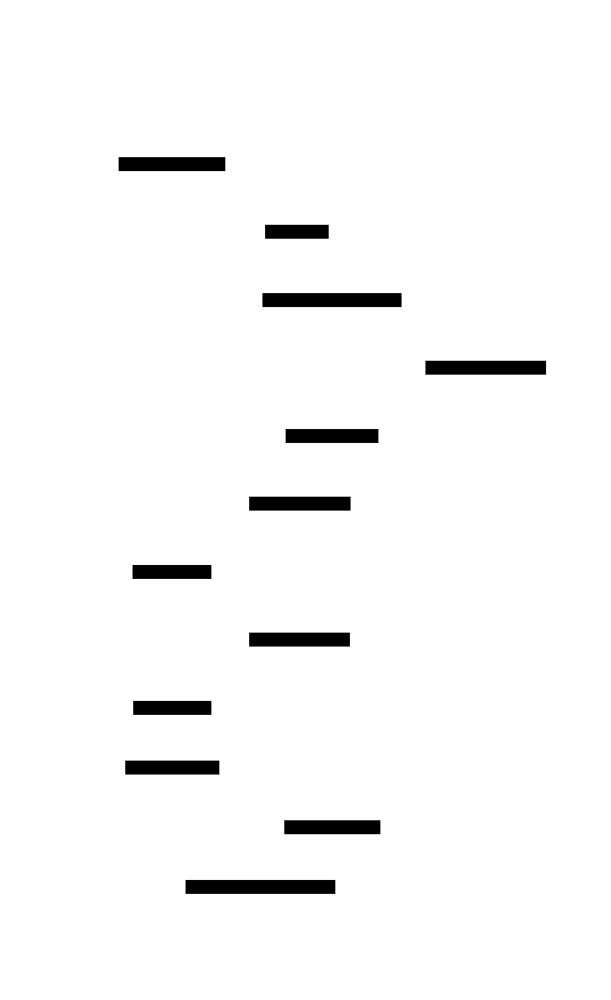

# 2D Platformer Game Engine: Design Document


## Overview

A 2D platformer game engine that implements real-time physics simulation, collision detection, and game state management. The key architectural challenge is creating a responsive, frame-rate independent physics system that handles complex interactions between player movement, environmental collision, and game entities while maintaining smooth 60fps gameplay.


> This guide is meant to help you understand the big picture before diving into each milestone. Refer back to it whenever you need context on how components connect.


## Context and Problem Statement

> **Milestone(s):** All milestones - establishes foundational understanding for the entire project

Building a 2D platformer presents a unique set of technical challenges that distinguish it from other types of software systems. Unlike traditional applications that respond to discrete user actions and maintain relatively static state, a platformer must simulate a continuous physical world that updates 60 times per second while responding instantly to player input. The core challenge lies in creating a system that feels responsive and predictable to players while managing complex interactions between movement physics, collision detection, and game state updates within strict timing constraints.

The fundamental problem we're solving is creating a **real-time interactive physics simulation** that prioritizes player experience over physical accuracy. This requires careful balance between computational efficiency, visual smoothness, and gameplay responsiveness. Players expect their character to move immediately when they press a button, jump with consistent height and timing, and interact predictably with the game world - all while the system maintains steady 60fps performance across different hardware configurations.

Three core technical challenges define the architecture of any successful 2D platformer engine:

**Real-time Physics Simulation**: The engine must continuously update entity positions, velocities, and accelerations while applying forces like gravity and friction. Unlike turn-based games where calculations happen between player actions, platformers require smooth, frame-rate independent physics that produce consistent behavior whether running at 30fps or 144fps. This demands careful time management, numerical stability in physics calculations, and efficient algorithms that can handle dozens of moving entities simultaneously.

**Responsive Input Handling**: Player input must translate to immediate visual feedback with minimal latency. Modern platformers employ sophisticated techniques like input buffering (remembering button presses for a few frames) and coyote time (allowing jumps briefly after leaving a platform) to make controls feel more responsive than strict physics would allow. The input system must capture, queue, and process player actions while coordinating with physics updates to ensure consistent timing.

**Precise Collision Detection and Resolution**: The collision system must prevent players from falling through platforms, getting stuck in walls, or experiencing other physics glitches that break game immersion. This requires efficient spatial algorithms to detect when moving objects intersect with level geometry, followed by resolution algorithms that separate overlapping objects without introducing visual artifacts like jittering or tunneling through thin barriers.

### Game Physics Mental Model

Think of game physics as **theatrical physics rather than scientific physics**. Just as a stage play uses simplified sets, dramatic lighting, and exaggerated gestures to create emotional impact rather than literal realism, game physics uses simplified calculations, exaggerated forces, and carefully tuned parameters to create engaging gameplay rather than accurate simulation.

In real physics, a falling object accelerates at 9.8 meters per second squared regardless of what makes for fun gameplay. In game physics, gravity might be 2000 pixels per second squared because that creates the right "weight" feeling for your character. A real-world jump follows a precise parabolic arc determined by initial velocity and gravitational acceleration. A game jump might have reduced gravity while the jump button is held, creating variable height that feels more responsive to player input than realistic physics would allow.

This theatrical approach extends to collision detection, where we often prioritize preventing frustrating edge cases over physical accuracy. Real objects have complex shapes and can collide in countless ways. Game objects typically use simplified **Axis-Aligned Bounding Boxes (AABB)** - invisible rectangles that approximate object shapes for collision testing. A player character might be a complex sprite with irregular edges, but for collision purposes, we treat them as a simple rectangle that's slightly smaller than their visual representation. This prevents pixel-perfect collisions that feel unfair while ensuring smooth interaction with level geometry.

The mental model for velocity-based movement resembles **numerical integration in physics simulations**, but optimized for gaming constraints. Each frame, we update velocity based on acceleration (gravity, friction, player input), then update position based on velocity. However, unlike scientific simulation, we apply game-specific rules at each step. When the player releases the jump button mid-air, we might multiply upward velocity by 0.5 to create variable jump height. When the player changes direction while running, we might apply higher-than-realistic deceleration to make controls feel snappy.

> **Key Insight**: Game physics is not about simulating reality - it's about creating a consistent, predictable, and engaging interactive experience. Every physics parameter should be tuned based on how it feels to play, not how accurately it models real-world physics.

Frame-rate independence requires thinking about **delta time** as the fundamental unit of game physics. Instead of assuming "one unit of movement per frame," every physics calculation must be scaled by the time elapsed since the last frame update. A character moving at 200 pixels per second should move exactly the same distance over 1 second whether that's rendered as 60 frames of ~16.67ms each or 120 frames of ~8.33ms each. This requires disciplined use of delta time in every physics calculation and careful consideration of numerical stability when time steps vary.

The collision resolution mental model resembles **constraint satisfaction** rather than physical impact simulation. When we detect that a player has moved inside a wall, we don't calculate realistic collision forces and momentum transfer. Instead, we treat the wall as an absolute constraint and move the player to the nearest valid position outside the wall. This constraint-based approach prevents common physics glitches while maintaining the theatrical physics that make platformers feel good to play.

### Existing Platformer Approaches

Successful 2D platformers have evolved several distinct architectural patterns, each optimized for different types of gameplay and technical constraints. Understanding these established approaches helps inform design decisions and reveals trade-offs between different implementation strategies.

The **Fixed Timestep with Frame Skipping** approach, popularized by classic arcade games and still used in many modern indie platformers, runs physics updates at a fixed rate (typically 60Hz) regardless of rendering framerate. If rendering runs faster than 60fps, the extra frames simply redraw the same physics state. If rendering runs slower, the physics system updates multiple times per render frame to maintain consistent gameplay timing.

| Aspect | Fixed Timestep | Variable Timestep | Hybrid Approach |
|--------|----------------|-------------------|-----------------|
| **Physics Consistency** | Perfect - same behavior every run | Varies with framerate | Good - bounded variation |
| **Implementation Complexity** | Simple - no delta time calculations | Moderate - requires careful delta time use | Complex - manages both approaches |
| **Performance on Slow Hardware** | Graceful degradation - gameplay stays consistent | Poor - physics becomes sluggish | Good - adapts to hardware capabilities |
| **Input Responsiveness** | May lag on fast displays | Always matches display refresh | Best of both worlds |
| **Determinism for Replay/Networking** | Excellent - fixed timing guarantees repeatability | Poor - timing variations cause divergence | Moderate - requires careful synchronization |

> **Decision: Hybrid Timestep with Physics Interpolation**
> - **Context**: Modern games run on hardware ranging from 60Hz mobile devices to 240Hz gaming monitors, requiring consistent physics across different framerates while maintaining input responsiveness
> - **Options Considered**: Pure fixed timestep, pure variable timestep, hybrid with interpolation
> - **Decision**: Hybrid approach with fixed physics timestep and interpolated rendering
> - **Rationale**: Provides consistent physics behavior across hardware while maintaining smooth visuals and responsive input on high-refresh displays
> - **Consequences**: Requires more complex time management but eliminates framerate-dependent physics bugs while supporting modern high-refresh displays

The **Entity-Component-System (ECS)** architectural pattern treats game objects as collections of data components (position, velocity, sprite, health) processed by specialized systems (physics system, rendering system, AI system). This contrasts with traditional object-oriented approaches where entities inherit from base classes and contain their own update logic.

| Architecture | Data Organization | Performance | Code Maintainability | Learning Curve |
|--------------|------------------|-------------|---------------------|----------------|
| **Object-Oriented Inheritance** | Objects contain all data and methods | Moderate - virtual function overhead | Good - familiar patterns | Easy - matches typical programming education |
| **Entity-Component-System** | Components hold data, systems process batches | Excellent - cache-friendly data access | Excellent - clear separation of concerns | Steep - requires understanding data-oriented design |
| **Component-Based Objects** | Objects compose functionality via components | Good - reduces inheritance complexity | Good - more flexible than pure inheritance | Moderate - hybrid of familiar and new concepts |

For an intermediate-level learning project, the **Component-Based Objects** approach offers the best balance. Each entity (player, enemy, platform) is an object that composes its behavior from component objects (physics component, sprite component, collision component). This provides the flexibility of ECS while maintaining familiar object-oriented patterns that are easier for intermediate developers to understand and debug.

The **Tile-Based Level Architecture** remains the dominant approach for 2D platformers due to its efficiency and artistic flexibility. Levels are constructed from a grid of square tiles, each representing either solid geometry, background decoration, or special game elements like platforms or hazards. This contrasts with vector-based collision geometry or physics-simulated destructible terrain.

| Level Architecture | Memory Usage | Collision Performance | Artistic Flexibility | Dynamic Modification |
|--------------------|--------------|----------------------|----------------------|---------------------|
| **Tile-Based Grid** | Excellent - compact representation | Excellent - O(1) tile lookup | Good - modular tile-based art | Limited - can modify individual tiles |
| **Vector Collision Shapes** | Poor - complex shape data | Moderate - requires spatial partitioning | Excellent - arbitrary shapes | Excellent - can modify any geometry |
| **Physics-Simulated Terrain** | Poor - detailed mesh data | Poor - complex collision queries | Limited - constrained by simulation | Excellent - fully dynamic destruction |

Tile-based architecture excels for traditional platformers where levels consist primarily of static platforms, walls, and simple interactive elements. The collision detection becomes a simple matter of checking which tiles overlap with an entity's bounding box, making it both fast and predictable. Level data can be stored compactly as 2D arrays of tile IDs, and level editors can provide intuitive grid-based editing tools.

> **Decision: Tile-Based Level Architecture with AABB Entity Collision**
> - **Context**: Building a learning-focused platformer that emphasizes physics and collision detection over complex level geometry
> - **Options Considered**: Tile-based collision, vector collision shapes, hybrid tile-and-vector approach
> - **Decision**: Pure tile-based level architecture with Axis-Aligned Bounding Box entity collision
> - **Rationale**: Provides optimal learning experience by focusing complexity on physics and game mechanics rather than advanced spatial algorithms, while still representing the most common approach in successful 2D platformers
> - **Consequences**: Limits level design to grid-based layouts but significantly simplifies collision detection implementation and debugging

The **Collision Resolution Strategy** varies significantly between different platformer implementations, with major implications for how corner cases and edge conditions behave. The fundamental choice is between **penetration resolution** (detecting overlap and separating objects) versus **predictive collision** (preventing overlap before it occurs).

Most modern platformers use penetration resolution with **separating axis collision response**. When an entity moves during a frame and ends up overlapping with level geometry, the collision system calculates the minimum distance needed to separate them and moves the entity to a valid position. The critical implementation detail is handling X and Y axis collisions separately to prevent corner-clipping issues where entities get stuck in walls when colliding with inside corners.

| Collision Strategy | Accuracy | Performance | Implementation Complexity | Tunneling Prevention |
|-------------------|----------|-------------|---------------------------|----------------------|
| **Penetration Resolution** | Good - handles most cases well | Excellent - simple calculations | Moderate - requires separation logic | Poor - fast objects can tunnel |
| **Predictive/Swept Collision** | Excellent - prevents all penetration | Moderate - requires collision time calculation | Complex - ray casting and time-of-impact | Excellent - mathematically impossible |
| **Hybrid with Continuous Detection** | Excellent - best of both approaches | Poor - runs multiple collision passes | Very Complex - combines both systems | Excellent - handles all edge cases |

For the learning context, penetration resolution with separate X/Y axis handling provides the best balance of educational value and practical results. Students can understand and debug the collision resolution process, while the separate axis approach teaches important concepts about coordinate system decomposition that apply broadly in graphics and physics programming.

> **Critical Design Principle**: In platformer collision resolution, **order of operations matters enormously**. Resolving X-axis collisions before Y-axis collisions produces different behavior than the reverse order, especially in corner collision scenarios. Most successful platformers resolve X-axis movement first (horizontal collision against walls) then Y-axis movement (vertical collision with floors/ceilings) to create predictable corner behavior that players can learn and exploit skillfully.

### Common Pitfalls

⚠️ **Pitfall: Frame-Rate Dependent Physics Calculations**
Many beginning game developers write physics code that assumes a fixed framerate, such as `player.x += player.velocityX` without delta time scaling. This creates games that run faster or slower depending on the target machine's performance. On a 120fps display, the character moves twice as fast as intended. On a 30fps display during performance hitches, the character moves half speed. Always multiply movement and physics calculations by delta time: `player.x += player.velocityX * deltaTime`. Test your game with artificially limited framerates to verify consistent behavior.

⚠️ **Pitfall: Gravity Values That Don't Match Jump Feel**
Realistic gravity (9.8 m/s²) typically feels too weak for platformer games, making jumps feel floaty and unresponsive. However, making gravity too strong creates characters that slam into the ground with uncomfortable speed. The solution is **asymmetric gravity**: apply stronger gravity when falling than when jumping up, and reduce gravity while the jump button is held for variable jump height. Typical values might be 1200 pixels/second² for falling, 800 pixels/second² for jumping up, and 400 pixels/second² while holding jump.

⚠️ **Pitfall: Collision Detection Without Separation Axis Handling**
Naive collision resolution that moves entities "out of" walls in a single direction often creates corner-clipping issues. When a character runs into an inside corner while falling, simultaneous X and Y collisions can cause the character to get pushed into the wall instead of sliding along it. Always resolve X-axis and Y-axis collisions as separate operations, typically handling horizontal movement first, then vertical movement. This creates predictable corner behavior that players can learn to expect.

⚠️ **Pitfall: Input Polling That Misses Quick Button Presses**
Checking button state once per frame (`if (jumpButton.isPressed)`) can miss quick button taps that occur between frames, especially on high framerate displays. Implement **input buffering** that remembers button presses for several frames, allowing the physics system to respond to inputs that occurred slightly before the optimal time. Store button press events in a queue and consume them when appropriate game conditions are met (like landing on ground after requesting a jump in mid-air).

### Implementation Guidance

Building a 2D platformer requires careful selection of libraries and tools that support real-time graphics rendering, precise timing control, and responsive input handling. The recommendations below prioritize learning opportunities while providing production-quality results.

**Technology Recommendations:**

| Component | Beginner Option | Intermediate Option | Advanced Option |
|-----------|----------------|---------------------|-----------------|
| **Rendering** | HTML5 Canvas 2D API | p5.js or Phaser.js framework | WebGL with custom shaders |
| **Audio** | HTML5 Audio elements | Web Audio API | Web Audio with custom effects |
| **Input** | DOM keyboard events | Custom input manager with buffering | Gamepad API integration |
| **Asset Loading** | Direct image/audio loading | Asset preloader with progress tracking | Asset bundling with compression |
| **Development Tools** | Browser developer tools | Live reload development server | Custom debugging overlay |

**Recommended File Structure:**
```
platformer-game/
├── index.html                    ← Game entry point
├── src/
│   ├── main.js                  ← Game initialization and main loop
│   ├── engine/
│   │   ├── GameLoop.js          ← Core timing and update cycle
│   │   ├── InputManager.js      ← Input handling and buffering
│   │   └── Camera.js            ← Camera following and bounds
│   ├── physics/
│   │   ├── PhysicsEngine.js     ← Velocity, gravity, and movement
│   │   └── CollisionSystem.js   ← AABB detection and resolution
│   ├── entities/
│   │   ├── Entity.js            ← Base entity class
│   │   ├── Player.js            ← Player character implementation
│   │   └── Enemy.js             ← Enemy AI and behavior
│   ├── level/
│   │   ├── TileMap.js           ← Level loading and tile collision
│   │   └── LevelData.js         ← Level definition and checkpoints
│   └── rendering/
│       ├── Renderer.js          ← Sprite and tile rendering
│       └── AnimationSystem.js   ← Frame-based sprite animation
├── assets/
│   ├── images/                  ← Sprite sheets and tile sets
│   ├── audio/                   ← Sound effects and music
│   └── levels/                  ← Level data files (JSON)
└── test/
    ├── physics-test.html        ← Physics behavior verification
    └── collision-test.html      ← Collision detection testing
```

**Core Game Loop Infrastructure (Complete Implementation):**

```javascript
// src/engine/GameLoop.js - Complete infrastructure for frame timing
class GameLoop {
    constructor() {
        this.isRunning = false;
        this.lastFrameTime = 0;
        this.targetFPS = 60;
        this.maxDeltaTime = 1000 / 30; // Cap at 30fps minimum
        
        this.updateCallback = null;
        this.renderCallback = null;
        
        // Performance monitoring
        this.frameCount = 0;
        this.fpsUpdateTime = 0;
        this.currentFPS = 0;
    }
    
    start(updateCallback, renderCallback) {
        this.updateCallback = updateCallback;
        this.renderCallback = renderCallback;
        this.isRunning = true;
        this.lastFrameTime = performance.now();
        this.gameLoopStep();
    }
    
    stop() {
        this.isRunning = false;
    }
    
    gameLoopStep() {
        if (!this.isRunning) return;
        
        const currentTime = performance.now();
        let deltaTime = currentTime - this.lastFrameTime;
        this.lastFrameTime = currentTime;
        
        // Cap delta time to prevent large jumps during lag spikes
        deltaTime = Math.min(deltaTime, this.maxDeltaTime);
        
        // Convert to seconds for physics calculations
        const deltaSeconds = deltaTime / 1000;
        
        // Update game logic
        if (this.updateCallback) {
            this.updateCallback(deltaSeconds);
        }
        
        // Render current frame
        if (this.renderCallback) {
            this.renderCallback(deltaSeconds);
        }
        
        // Update FPS counter
        this.updateFPSCounter(deltaTime);
        
        // Schedule next frame
        requestAnimationFrame(() => this.gameLoopStep());
    }
    
    updateFPSCounter(deltaTime) {
        this.frameCount++;
        this.fpsUpdateTime += deltaTime;
        
        if (this.fpsUpdateTime >= 1000) { // Update every second
            this.currentFPS = Math.round(this.frameCount * 1000 / this.fpsUpdateTime);
            this.frameCount = 0;
            this.fpsUpdateTime = 0;
        }
    }
    
    getFPS() {
        return this.currentFPS;
    }
}

// Export for use in main.js
export default GameLoop;
```

**Input Manager with Buffering (Complete Implementation):**

```javascript
// src/engine/InputManager.js - Complete input handling with buffering
class InputManager {
    constructor() {
        this.keys = new Map();
        this.keyBuffer = new Map();
        this.bufferDuration = 0.1; // 100ms buffer window
        
        this.setupEventListeners();
    }
    
    setupEventListeners() {
        document.addEventListener('keydown', (event) => {
            this.keys.set(event.code, true);
            this.keyBuffer.set(event.code, performance.now());
        });
        
        document.addEventListener('keyup', (event) => {
            this.keys.set(event.code, false);
        });
        
        // Prevent default behavior for game keys
        document.addEventListener('keydown', (event) => {
            const gameKeys = ['ArrowLeft', 'ArrowRight', 'ArrowUp', 'Space'];
            if (gameKeys.includes(event.code)) {
                event.preventDefault();
            }
        });
    }
    
    isKeyPressed(keyCode) {
        return this.keys.get(keyCode) || false;
    }
    
    wasKeyJustPressed(keyCode) {
        const pressTime = this.keyBuffer.get(keyCode);
        if (!pressTime) return false;
        
        const currentTime = performance.now();
        return (currentTime - pressTime) <= (this.bufferDuration * 1000);
    }
    
    consumeKeyPress(keyCode) {
        this.keyBuffer.delete(keyCode);
    }
    
    update(deltaTime) {
        // Clean expired buffered inputs
        const currentTime = performance.now();
        const expireTime = this.bufferDuration * 1000;
        
        for (const [key, pressTime] of this.keyBuffer) {
            if (currentTime - pressTime > expireTime) {
                this.keyBuffer.delete(key);
            }
        }
    }
}

export default InputManager;
```

**Entity Base Class (Skeleton for Student Implementation):**

```javascript
// src/entities/Entity.js - Core entity structure to be extended
class Entity {
    constructor(x, y, width, height) {
        // Position and dimensions
        this.x = x;
        this.y = y;
        this.width = width;
        this.height = height;
        
        // Physics properties
        this.velocityX = 0;
        this.velocityY = 0;
        this.accelerationX = 0;
        this.accelerationY = 0;
        
        // Collision properties
        this.onGround = false;
        this.solid = true;
        
        // Visual properties
        this.sprite = null;
        this.visible = true;
    }
    
    update(deltaTime, inputManager) {
        // TODO 1: Apply acceleration to velocity (velocity += acceleration * deltaTime)
        // TODO 2: Apply velocity to position (position += velocity * deltaTime)  
        // TODO 3: Reset acceleration to zero (gets reapplied each frame)
        // TODO 4: Call entity-specific update logic (implement in subclasses)
        // Hint: Don't forget to multiply by deltaTime for frame-rate independence
    }
    
    getBoundingBox() {
        return {
            left: this.x,
            right: this.x + this.width,
            top: this.y,
            bottom: this.y + this.height
        };
    }
    
    render(renderer) {
        // TODO 5: Draw entity sprite at current position
        // TODO 6: Optionally draw debug bounding box for collision testing
        // Hint: Use renderer.drawSprite(this.sprite, this.x, this.y)
    }
}

export default Entity;
```

**Language-Specific JavaScript Hints:**
- Use `performance.now()` for high-precision timing instead of `Date.now()`
- HTML5 Canvas uses top-left origin coordinates - positive Y goes down
- Use `requestAnimationFrame()` for smooth 60fps animation instead of `setInterval()`
- Canvas context state (transforms, styles) persists between draw calls - save/restore when needed
- Use `const` for game constants like gravity and jump force to prevent accidental modification
- JavaScript's `Math.floor()` for converting world coordinates to tile grid coordinates
- Use `addEventListener('beforeunload', ...)` to save game state when player closes tab

**Milestone Checkpoint - Basic Game Loop:**
After implementing the basic game loop and input system, you should be able to:
1. Run `open index.html` in a web browser
2. Open browser developer tools and see consistent FPS counter around 60fps
3. Press arrow keys and see input events logged to console
4. Observe smooth animation of a test rectangle moving across the screen
5. Verify that movement speed stays consistent when artificially limiting framerate

If the game stutters or movement speed changes with different framerates, check that all movement calculations multiply by `deltaTime`. If inputs feel delayed or unresponsive, verify that the input buffer window is appropriate (100ms is typically good for platformers).


## Goals and Non-Goals

> **Milestone(s):** All milestones - defines the scope and boundaries for the entire platformer engine project

Building a 2D platformer engine requires careful scope definition to balance learning objectives with project complexity. Think of this goals definition as drawing the boundaries of a game world - everything inside these boundaries represents the core mechanics that define a solid platformer experience, while everything outside represents advanced features that could distract from mastering the fundamentals. Just as a well-designed level guides the player through a focused experience without overwhelming them with too many mechanics at once, our engine goals create a focused learning path through game development concepts.

The primary challenge in scoping a platformer engine lies in the interconnected nature of game systems. Unlike many software projects where components can be built independently, game systems form a tightly coupled web where physics affects collision detection, which affects entity behavior, which affects input responsiveness. Our goals must ensure each system receives adequate attention while maintaining clear boundaries that prevent feature creep from derailing the core learning experience.

### Core Engine Goals

The platformer engine must deliver a complete, playable game experience that demonstrates professional-level game development patterns while remaining approachable for intermediate developers. Our goals focus on three primary pillars: responsive controls, reliable physics simulation, and extensible architecture.

> **Decision: Focus on Theatrical Physics Over Realistic Simulation**
> - **Context**: Game physics can prioritize either physical realism or player experience, with most successful platformers choosing the latter
> - **Options Considered**: 
>   1. Realistic physics with proper mass, friction coefficients, and momentum conservation
>   2. Simplified theatrical physics optimized for responsive controls and predictable behavior
>   3. Hybrid approach with realistic base physics but overrides for specific gameplay situations
> - **Decision**: Implement theatrical physics throughout the engine
> - **Rationale**: Platformers require precise, predictable movement where players can develop muscle memory. Realistic physics often feels "slippery" or unpredictable, making precise jumping and movement difficult. Professional platformers like Super Mario Bros. and Celeste use highly tuned, unrealistic physics that prioritize feel over accuracy.
> - **Consequences**: Simpler implementation with fewer edge cases, better player experience, but physics knowledge won't transfer directly to simulation applications

| Physics Goal | Implementation Approach | Learning Outcome |
|--------------|------------------------|------------------|
| **Frame-rate Independence** | Delta time scaling for all movement and physics calculations | Understanding time-based vs frame-based simulation |
| **Responsive Movement** | Immediate acceleration/deceleration without realistic momentum | Mastering input handling and player control systems |
| **Predictable Jumping** | Consistent jump height with variable duration control | Learning jump mechanics design patterns |
| **Reliable Collision** | AABB collision with penetration resolution | Understanding geometric collision detection |
| **Gravity Simulation** | Constant downward acceleration with terminal velocity | Implementing basic physics integration |

The engine must handle the fundamental physics loop that drives all platformer gameplay: applying forces (gravity, input acceleration), updating velocities based on those forces, updating positions based on velocity, detecting collisions in the new positions, and resolving any overlaps by adjusting positions and velocities. This cycle repeats every frame and must remain stable across different hardware performance levels.

> **Critical Insight**: The order of physics operations matters tremendously. Updating position before resolving collisions can cause tunneling through thin walls. Resolving X and Y axis collisions simultaneously can cause corner-clipping artifacts. Our implementation must establish a consistent, well-tested update order.

| Movement Goal | Specific Requirement | Quality Metric |
|---------------|---------------------|----------------|
| **Horizontal Movement** | Left/right arrow keys provide immediate response | Player reaches full speed within 3 frames |
| **Jump Mechanics** | Space bar initiates jump, variable height with hold duration | 60% height difference between tap and held jump |
| **Coyote Time** | Allow jumping for 100ms after leaving platform edge | Players can successfully make edge jumps consistently |
| **Input Buffering** | Accept jump input 100ms before landing | No missed jumps due to timing precision |
| **Ground Detection** | Accurate detection of when player contacts solid surfaces | Zero false positives or negatives in collision tests |

### Collision System Goals

The collision detection system forms the foundation that enables all meaningful player-world interaction. Think of collision detection as the sensory system of our game world - it must accurately perceive when objects occupy the same space and respond appropriately. Unlike real-world physics where objects naturally resist interpenetration, our digital world allows objects to overlap freely unless we explicitly detect and resolve these situations.

Our collision system must balance accuracy with performance, handling the common case of a single player entity moving through a tile-based world efficiently while maintaining precision for gameplay-critical interactions. The system should prevent all major collision artifacts that would break player immersion: tunneling through walls at high speeds, getting stuck in corners, sliding along surfaces unintentionally, or falling through floors due to floating-point precision errors.

> **Decision: Separate X and Y Axis Collision Resolution**
> - **Context**: When an entity moves diagonally and collides with a corner, resolving both axes simultaneously can cause unpredictable behavior
> - **Options Considered**:
>   1. Simultaneous X/Y resolution using vector projection to nearest surface
>   2. Separate axis resolution handling X movement then Y movement independently
>   3. Swept collision detection preventing overlap entirely
> - **Decision**: Implement separate axis collision resolution
> - **Rationale**: Separate axis resolution provides predictable behavior in corner cases and simpler implementation. Players can understand that hitting a wall stops horizontal movement while allowing continued falling, which feels intuitive. Swept collision is more accurate but significantly more complex to implement correctly.
> - **Consequences**: Some unrealistic behavior (sliding along walls during diagonal impacts) but much simpler debugging and more predictable gameplay

| Collision Goal | Technical Implementation | Player Experience |
|----------------|--------------------------|-------------------|
| **Accurate Detection** | AABB intersection testing with floating-point precision handling | No glitching through solid surfaces |
| **Tunneling Prevention** | Maximum movement distance per frame based on entity size | No passing through walls at high speeds |
| **Corner Handling** | X-axis collision resolved before Y-axis collision | Predictable sliding behavior at corners |
| **One-way Platforms** | Collision testing only when moving downward | Jump-through platforms work as expected |
| **Tile Efficiency** | Only test collision against nearby tiles based on movement vector | 60fps performance with large levels |

The collision system must integrate seamlessly with our physics simulation, providing accurate feedback that the physics system can use to adjust velocities and positions. When the player hits a wall while moving right, the collision system detects the overlap, calculates the penetration distance, and provides this information so physics can set horizontal velocity to zero and adjust position to resolve the overlap.

### Entity System Goals

The entity system provides the foundation for all interactive objects in our game world, from the player character to enemies to collectible items. Think of entities as actors on a stage - each has a position, appearance, and behavior, but they all follow common patterns for how they exist and interact within the world. Our entity system must provide a consistent framework that makes it easy to create new types of game objects while ensuring they integrate properly with physics, collision, and rendering systems.

The challenge lies in creating an entity architecture that remains simple enough for learning purposes while being flexible enough to support the diverse behaviors required by different game objects. The player entity needs complex input handling and state management, enemies need AI behavior and patrol logic, while static platforms need only position and collision properties.

| Entity Goal | Architecture Decision | Implementation Benefits |
|-------------|----------------------|------------------------|
| **Unified Interface** | Common `Entity` base with position, velocity, dimensions | Consistent collision and physics handling |
| **Polymorphic Behavior** | Virtual `update()` and `render()` methods per entity type | Easy to add new entity types |
| **Component Integration** | Direct integration with physics, collision, and input systems | No complex message passing or event systems |
| **State Management** | Simple state variables (onGround, facingDirection, health) | Clear debugging and predictable behavior |
| **Memory Efficiency** | Fixed-size arrays for entity storage rather than dynamic allocation | Predictable performance characteristics |

> **Decision: Inheritance-based Entity System Over Component Architecture**
> - **Context**: Game entities can be structured using inheritance (Player extends Entity) or composition (Entity contains MovementComponent, RenderComponent)
> - **Options Considered**:
>   1. Component-based architecture with separate systems for each component type
>   2. Inheritance-based system with Entity base class and specialized subclasses
>   3. Data-oriented design with separate arrays for each entity property
> - **Decision**: Use inheritance-based entity system
> - **Rationale**: For a learning project with limited entity types (Player, Enemy, Platform), inheritance provides simpler mental model and easier debugging. Component systems shine with dozens of entity types and complex interactions, but add significant complexity for minimal benefit in our scope.
> - **Consequences**: Less flexible for complex games but much easier to understand, debug, and extend for our specific requirements

### Level System Goals

The level system transforms static tile data into interactive game environments, providing the spatial framework within which all gameplay occurs. Think of the level system as the stage designer for our platformer - it defines not just where walls and platforms exist, but also where players spawn, where enemies patrol, and how the camera should frame the action. Our level system must balance simplicity of authoring with flexibility of design, enabling rapid iteration on level layouts while supporting the collision and rendering requirements of other systems.

The tile-based approach provides natural advantages for collision detection and memory efficiency, allowing us to represent large game worlds using compact grid data while providing fast spatial lookup for collision testing. Each tile position can contain multiple properties: visual appearance, collision behavior, and gameplay semantics like checkpoint activation or enemy spawn points.

| Level Goal | Data Structure | Gameplay Support |
|------------|----------------|------------------|
| **Tile-based Geometry** | 2D integer array mapping positions to tile types | Fast collision lookup and memory efficiency |
| **Visual Representation** | Sprite indices for each tile supporting animated tiles | Rich visual environments with minimal data |
| **Collision Properties** | Per-tile collision flags (solid, one-way, ladder, hazard) | Diverse platform and obstacle behaviors |
| **Spawn Management** | Dedicated spawn points for player and enemy placement | Consistent level initialization |
| **Checkpoint System** | Checkpoint tiles with activation state tracking | Death recovery and progress preservation |

The level system must integrate closely with our collision detection, providing efficient spatial queries that allow entities to quickly determine which tiles they might be colliding with based on their current position and movement vector. This spatial partitioning eliminates the need to test collision against every tile in the level, maintaining performance even with large environments.

### Input System Goals

The input system serves as the critical bridge between player intention and game response, determining whether our platformer feels responsive and precise or sluggish and frustrating. Think of input handling as the nervous system of our game - it must capture player intentions accurately, respond with minimal latency, and provide the sophisticated buffering and state management that enables advanced platformer techniques like coyote time and jump buffering.

Modern platformers require input systems that go far beyond simple key polling, implementing temporal buffers that remember recent inputs and sophisticated state tracking that enables complex move sequences. Our input system must feel responsive at 60fps while remaining frame-rate independent, ensuring consistent behavior across different hardware configurations.

> **Decision: Input Buffering with Temporal Windows**
> - **Context**: Precise platforming requires forgiving input timing, as human reaction time and finger coordination have natural variance
> - **Options Considered**:
>   1. Direct key polling with no temporal assistance
>   2. Input buffering that remembers key presses for short time windows
>   3. Predictive input processing that anticipates player intentions
> - **Decision**: Implement input buffering with 100ms temporal windows
> - **Rationale**: Professional platformers use buffering to reduce frustration from missed inputs due to timing precision. A 100ms buffer allows the game to register a jump input slightly before landing, making controls feel more responsive without compromising challenge.
> - **Consequences**: More complex input state management but significantly improved player experience and control responsiveness

| Input Goal | Implementation Strategy | Player Benefit |
|------------|------------------------|----------------|
| **Low Latency Response** | Process input at start of game loop, before physics | Immediate visual feedback to player actions |
| **Jump Buffering** | Store jump inputs for 100ms before landing detection | No missed jumps due to precise timing requirements |
| **Coyote Time** | Allow jumping for 100ms after leaving platform | Forgiveness for edge jump timing |
| **Multi-key Support** | Simultaneous processing of movement and jump inputs | Complex maneuvers like running jumps |
| **Configurable Mapping** | Abstract action system supporting keyboard and gamepad | Accessibility and player preference support |

### Rendering System Goals

The rendering system transforms our abstract game state into visual representation, providing the immediate feedback that enables players to understand and respond to the game world. Think of rendering as the lighting and cinematography department of our game production - it must not only display objects accurately but frame them in ways that support gameplay comprehension and emotional engagement.

Our rendering system must balance visual appeal with performance constraints, maintaining smooth 60fps animation while supporting the sprite animation, tile rendering, and camera movement that brings our platformer world to life. The system should provide clear visual hierarchy that helps players distinguish between different types of game objects and understand their interactive properties.

| Rendering Goal | Visual Requirement | Technical Implementation |
|----------------|--------------------|-----------------------|
| **Sprite Animation** | Smooth character animation with 8-12 frames per cycle | Frame-based animation system with configurable timing |
| **Tile Rendering** | Efficient drawing of large tile-based environments | Batch rendering of visible tiles only |
| **Camera System** | Smooth following of player with boundary constraints | Interpolated camera movement with dead zones |
| **Visual Feedback** | Clear indication of interactive elements and hazards | Distinct sprite families and animation states |
| **Performance** | Consistent 60fps with minimal frame drops | Culling of off-screen objects and efficient draw calls |

### Explicit Non-Goals

Defining what our platformer engine will **not** include proves as important as defining its core features. These non-goals prevent scope creep while establishing clear boundaries that help learners focus on mastering fundamental concepts rather than getting distracted by advanced features that require significant additional complexity.

> **Critical Boundary**: Each excluded feature represents a deliberate trade-off between learning value and implementation complexity. These features could be valuable in a commercial game but would distract from the core learning objectives of physics simulation, collision detection, and game architecture.

#### Advanced Physics Features

Our engine explicitly excludes realistic physics simulation features that would add significant complexity without proportional learning value for platformer development. These features require sophisticated mathematical modeling and edge case handling that would overshadow the core concepts we're trying to teach.

| Excluded Feature | Complexity Added | Learning Impact |
|------------------|------------------|-----------------|
| **Realistic Momentum** | Conservation laws, friction coefficients, angular momentum | Distracts from responsive control design |
| **Particle Systems** | Advanced math, performance optimization, visual effect authoring | Significant time investment for limited gameplay value |
| **Fluid Dynamics** | Computational fluid dynamics, grid-based simulation | Extremely complex with minimal platformer relevance |
| **Soft Body Physics** | Deformation algorithms, spring-mass systems | Advanced mathematical modeling requirements |
| **Rope/Chain Physics** | Constraint solving, iterative relaxation | Complex algorithmic implementation |

#### Advanced Graphics and Effects

Visual effects and advanced rendering techniques, while appealing, require graphics programming expertise that extends far beyond the scope of our learning objectives. These features demand significant time investment in domains (shader programming, 3D mathematics, GPU optimization) that don't contribute to understanding game logic and architecture.

| Excluded Graphics Feature | Implementation Overhead | Core Learning Value |
|---------------------------|------------------------|-------------------|
| **Particle Effects** | GPU shader programming, vertex buffer management | Minimal impact on gameplay programming skills |
| **Dynamic Lighting** | 3D mathematics, shadow mapping algorithms | No relevance to 2D platformer mechanics |
| **Post-processing** | Graphics pipeline knowledge, shader composition | Visual polish without gameplay programming value |
| **Advanced Animation** | Skeletal animation systems, blend trees | Complex tooling requirements |
| **3D Graphics** | Linear algebra, projection mathematics, GPU programming | Entirely different domain from 2D game logic |

#### Complex Game Features

Sophisticated gameplay systems require extensive design iteration and balancing that would shift focus away from engine architecture toward game design. These features involve subjective design decisions and complex state management that obscure the fundamental technical concepts we're teaching.

| Excluded Game Feature | Design Complexity | Technical Overhead |
|----------------------|-------------------|-------------------|
| **Multiple Characters** | Character balancing, ability design, UI complexity | Significant asset creation and state management |
| **Power-ups/Abilities** | Game balance considerations, complex interaction matrices | Extensive testing and edge case handling |
| **Story/Dialogue** | Content creation, localization, UI systems | Major shift toward content rather than programming |
| **Boss Battles** | Complex AI programming, phase management | Advanced state machines and behavior trees |
| **Multiplayer** | Network programming, synchronization, latency handling | Entirely separate domain of distributed systems |

#### Advanced AI and Behavior

Sophisticated enemy AI and behavior systems require expertise in artificial intelligence algorithms and extensive playtesting to achieve engaging gameplay. These systems involve complex decision-making logic and behavior trees that would dominate development time without contributing to the core learning objectives around physics and collision systems.

| Excluded AI Feature | Algorithm Complexity | Debugging Difficulty |
|--------------------|---------------------|-------------------|
| **Pathfinding** | Graph algorithms, A* implementation, navigation mesh generation | Complex algorithmic debugging |
| **Behavior Trees** | AI architecture, state management, decision logic | Sophisticated debugging tools required |
| **Dynamic Difficulty** | Player skill assessment, adaptive algorithms | Extensive playtesting and data analysis |
| **Group AI** | Flocking algorithms, emergent behavior, coordination | Complex multi-agent systems |
| **Machine Learning** | Training data collection, neural network implementation | Entirely separate field of expertise |

#### Platform-Specific Features

Our engine targets cross-platform compatibility using web technologies, explicitly avoiding platform-specific optimizations and features that would fragment the codebase and create additional testing overhead. These features require platform expertise and development environment complexity that would distract from core game programming concepts.

| Excluded Platform Feature | Portability Impact | Development Overhead |
|---------------------------|-------------------|-------------------|
| **Mobile Touch Controls** | Platform-specific UI, gesture recognition | Multiple input paradigms to support |
| **Console Controller Features** | Haptic feedback, motion controls, platform certification | Specialized hardware requirements |
| **VR/AR Support** | 3D mathematics, motion tracking, specialized SDKs | Entirely different interaction paradigms |
| **Cloud Save** | Backend infrastructure, authentication, data synchronization | Web services and security implementation |
| **Social Features** | User accounts, friend systems, leaderboards | Social platform integration complexity |

#### Performance Optimization

Advanced performance optimization techniques, while valuable in commercial game development, require profiling expertise and low-level system knowledge that extends beyond our learning objectives. Our engine prioritizes clear, understandable code over maximum performance, accepting reasonable performance trade-offs in favor of maintainable architecture.

| Excluded Optimization | Complexity Added | Learning Value Trade-off |
|-----------------------|------------------|------------------------|
| **Memory Pooling** | Custom allocator implementation, lifecycle management | Low-level memory management obscures game logic |
| **Spatial Partitioning** | Advanced data structures, geometric algorithms | Significant algorithmic complexity |
| **GPU Acceleration** | Graphics programming, shader optimization | Entirely different programming paradigm |
| **Multi-threading** | Concurrency control, race condition debugging | Complex debugging and architectural overhead |
| **Assembly Optimization** | Low-level programming, platform-specific code | Minimal relevance to game design and architecture |

### Success Criteria and Quality Metrics

Our platformer engine's success depends on achieving measurable quality standards that ensure both educational value and engaging gameplay experience. These criteria provide concrete benchmarks for evaluating whether our implementation meets professional standards while remaining accessible for learning.

Think of these success criteria as the acceptance tests for our game engine - they define the minimum viable experience that demonstrates mastery of platformer development concepts. Each criterion addresses a specific aspect of game feel that players would notice immediately if implemented incorrectly.

#### Performance Benchmarks

The engine must maintain consistent performance characteristics that enable smooth gameplay across typical development hardware. These benchmarks ensure our architectural decisions support scalable game development rather than creating performance bottlenecks that would limit level design options.

| Performance Metric | Target Value | Measurement Method | Failure Impact |
|-------------------|--------------|-------------------|----------------|
| **Frame Rate** | Consistent 60fps with <5% drops | Frame time measurement over 60-second gameplay sessions | Choppy movement and input lag |
| **Input Latency** | <16ms from keypress to visual response | High-precision timer measurement | Unresponsive controls |
| **Level Loading** | <500ms for typical level (50x50 tiles) | Loading time measurement | Disruptive gameplay interruption |
| **Memory Usage** | <100MB total allocation for complete game | Memory profiler measurement | Resource constraints on lower-end devices |
| **Collision Performance** | <2ms per frame for collision detection | Profiler measurement of collision system | Frame rate drops during complex interactions |

#### Gameplay Feel Metrics

The subjective quality of game "feel" can be measured through objective criteria that capture the responsive, predictable behavior that defines good platformer controls. These metrics ensure our theatrical physics implementation achieves the tight, responsive feel that players expect from the genre.

| Feel Metric | Measurable Standard | Validation Method | Quality Impact |
|-------------|-------------------|-------------------|----------------|
| **Jump Consistency** | ±1 pixel variation in jump height with identical input | Automated input replay testing | Predictable movement enables skill development |
| **Coyote Time** | 100ms ±10ms window for edge jumping | Input timing measurement | Forgiving controls reduce frustration |
| **Input Buffer** | 100ms ±10ms acceptance window before landing | Buffer timing validation | Responsive controls feel immediate |
| **Ground Detection** | 100% accuracy with no false positives/negatives | Collision test verification | Reliable physics prevents glitches |
| **Movement Acceleration** | Reach 90% max speed within 5 frames | Velocity measurement during acceleration | Responsive movement feels immediate |

#### Code Quality Standards

The engine codebase must demonstrate professional development practices that support maintainability, testability, and extensibility. These standards ensure the project serves as a positive example of game architecture rather than encouraging poor programming habits.

| Code Quality Metric | Standard Requirement | Validation Approach | Educational Value |
|---------------------|---------------------|-------------------|------------------|
| **Test Coverage** | >80% line coverage for core systems | Automated test suite execution | Demonstrates professional development practices |
| **Documentation** | Every public method/class documented | Documentation generation and review | Teaches API design and communication |
| **Code Organization** | Clear module separation with minimal coupling | Dependency analysis tools | Demonstrates software architecture principles |
| **Error Handling** | Graceful degradation for all failure modes | Fault injection testing | Teaches robust system design |
| **Performance Profiling** | Identified bottlenecks with optimization notes | Profiler analysis documentation | Teaches performance-conscious development |

#### Educational Effectiveness

The project must successfully teach the intended game development concepts through hands-on implementation. These criteria ensure the learning experience effectively builds understanding rather than just producing working code through rote copying.

| Learning Metric | Assessment Criteria | Measurement Approach | Knowledge Transfer |
|----------------|-------------------|---------------------|-------------------|
| **Concept Mastery** | Ability to explain physics/collision concepts in own words | Technical interview or written explanation | Deep understanding vs surface-level copying |
| **Problem Solving** | Successful debugging of introduced physics bugs | Debugging exercise with intentional errors | Independent troubleshooting capability |
| **Extension Capability** | Successful addition of new entity type or game mechanic | Extension project implementation | Architectural understanding |
| **Best Practices** | Application of learned patterns to new problems | Code review of original implementations | Transferable software development skills |
| **Tool Proficiency** | Effective use of debugging and profiling tools | Practical tool usage demonstration | Professional development capabilities |

### Implementation Guidance

The platformer engine implementation requires careful technology selection and project organization to support both learning objectives and maintainable code architecture. This guidance provides concrete starting points and architectural recommendations for building a production-quality game engine.

#### Technology Recommendations

| Component | Simple Option | Advanced Option |
|-----------|---------------|-----------------|
| **Game Loop** | `requestAnimationFrame()` with manual timing | Web Workers for physics thread separation |
| **Graphics Rendering** | Canvas 2D API with sprite drawing | WebGL with custom shader pipeline |
| **Input Processing** | DOM event listeners with state tracking | GamePad API with haptic feedback support |
| **Audio System** | Web Audio API with simple sound effects | Spatial audio with 3D positioning |
| **Asset Management** | Static image loading with Promise-based loading | Asset pipeline with compression and bundling |
| **Development Tools** | Browser developer tools for debugging | Custom level editor with visual tile placement |
| **Testing Framework** | Jest for unit testing with manual integration tests | Automated screenshot comparison for visual regression |
| **Performance Profiling** | Browser performance timeline | Custom profiling with detailed metrics collection |

#### Recommended Project Structure

```
platformer-engine/
├── src/
│   ├── core/                    ← Core engine systems
│   │   ├── GameLoop.js         ← Main game loop and timing
│   │   ├── InputManager.js     ← Input handling and buffering
│   │   └── Camera.js           ← Camera positioning and following
│   ├── physics/                ← Physics simulation systems
│   │   ├── PhysicsEngine.js    ← Gravity, velocity, acceleration
│   │   └── CollisionSystem.js  ← AABB collision detection and resolution
│   ├── entities/               ← Game object implementations
│   │   ├── Entity.js           ← Base entity class with common properties
│   │   ├── Player.js           ← Player character with input handling
│   │   └── Enemy.js            ← Enemy AI and patrol behavior
│   ├── level/                  ← Level loading and management
│   │   ├── TileMap.js          ← Tile-based level representation
│   │   ├── LevelLoader.js      ← Loading levels from data files
│   │   └── CheckpointSystem.js ← Save/respawn functionality
│   ├── rendering/              ← Graphics and visual systems
│   │   ├── Renderer.js         ← Sprite drawing and animation
│   │   └── SpriteManager.js    ← Sprite loading and management
│   └── utils/                  ← Helper utilities and constants
│       ├── MathUtils.js        ← Vector math and geometric helpers
│       └── Constants.js        ← Game constants and configuration
├── assets/                     ← Game art and data files
│   ├── sprites/                ← Character and tile sprites
│   ├── levels/                 ← Level data in JSON format
│   └── sounds/                 ← Audio files for effects and music
├── tests/                      ← Test suites
│   ├── unit/                   ← Unit tests for individual components
│   └── integration/            ← Integration tests for system interactions
├── tools/                      ← Development and build tools
│   ├── level-editor/           ← Simple level creation tools
│   └── sprite-packer/          ← Sprite sheet generation
└── docs/                       ← Documentation and guides
    ├── api/                    ← Generated API documentation
    └── tutorials/              ← Step-by-step implementation guides
```

This structure separates concerns clearly while maintaining logical groupings that support both development and learning. Each directory contains related functionality with minimal cross-dependencies, enabling incremental development and testing.

#### Core Infrastructure Starter Code

**Constants Configuration** (src/utils/Constants.js):
```javascript
// Game timing and performance constants
export const GAME_CONFIG = {
    targetFPS: 60,
    maxDeltaTime: 33.33, // Minimum 30fps - cap delta time to prevent spiral of death
    bufferDuration: 0.1, // 100ms input buffer window
    
    // Physics simulation constants
    GRAVITY: 980, // pixels per second squared - tuned for 60fps feel
    TERMINAL_VELOCITY: 600, // maximum falling speed
    JUMP_VELOCITY: -400, // negative Y velocity for jumping
    PLAYER_SPEED: 200, // horizontal movement speed
    
    // Collision detection constants
    TILE_SIZE: 32, // pixels per tile - must match sprite dimensions
    COLLISION_EPSILON: 0.1, // minimum separation distance to prevent floating point errors
    
    // Input timing constants
    COYOTE_TIME: 0.1, // seconds of jump grace period after leaving platform
    JUMP_BUFFER_TIME: 0.1, // seconds to remember jump input before landing
    
    // Camera behavior constants
    CAMERA_DEAD_ZONE: 64, // pixels of movement before camera follows
    CAMERA_LERP_SPEED: 0.1 // interpolation factor for smooth camera movement
};

// Input key codes for cross-browser compatibility
export const INPUT_KEYS = {
    LEFT: 'ArrowLeft',
    RIGHT: 'ArrowRight',
    JUMP: 'Space',
    ACTION: 'KeyZ'
};

// Entity type enumeration for collision handling
export const ENTITY_TYPES = {
    PLAYER: 'player',
    ENEMY: 'enemy',
    PLATFORM: 'platform',
    HAZARD: 'hazard',
    COLLECTIBLE: 'collectible'
};

// Tile type constants for level data
export const TILE_TYPES = {
    EMPTY: 0,
    SOLID: 1,
    ONE_WAY: 2,
    CHECKPOINT: 3,
    SPIKE: 4,
    PLAYER_SPAWN: 5,
    ENEMY_SPAWN: 6
};
```

**Math Utilities** (src/utils/MathUtils.js):
```javascript
// Mathematical helper functions for game calculations
export class Vector2 {
    constructor(x = 0, y = 0) {
        this.x = x;
        this.y = y;
    }
    
    // Vector arithmetic operations
    add(other) {
        return new Vector2(this.x + other.x, this.y + other.y);
    }
    
    multiply(scalar) {
        return new Vector2(this.x * scalar, this.y * scalar);
    }
    
    // Utility methods for common game calculations
    magnitude() {
        return Math.sqrt(this.x * this.x + this.y * this.y);
    }
    
    normalized() {
        const mag = this.magnitude();
        return mag > 0 ? new Vector2(this.x / mag, this.y / mag) : new Vector2(0, 0);
    }
}

// Rectangle class for collision detection
export class Rectangle {
    constructor(x, y, width, height) {
        this.x = x;
        this.y = y;
        this.width = width;
        this.height = height;
    }
    
    // AABB intersection test - returns true if rectangles overlap
    intersects(other) {
        return this.x < other.x + other.width &&
               this.x + this.width > other.x &&
               this.y < other.y + other.height &&
               this.y + this.height > other.y;
    }
    
    // Calculate intersection rectangle for penetration resolution
    getIntersection(other) {
        const left = Math.max(this.x, other.x);
        const top = Math.max(this.y, other.y);
        const right = Math.min(this.x + this.width, other.x + other.width);
        const bottom = Math.min(this.y + this.height, other.y + other.height);
        
        if (left >= right || top >= bottom) {
            return null; // No intersection
        }
        
        return new Rectangle(left, top, right - left, bottom - top);
    }
    
    // Get center point for distance calculations
    getCenter() {
        return new Vector2(this.x + this.width / 2, this.y + this.height / 2);
    }
}

// Utility functions for common game calculations
export function clamp(value, min, max) {
    return Math.max(min, Math.min(max, value));
}

export function lerp(start, end, factor) {
    return start + (end - start) * factor;
}

// Convert world coordinates to tile grid coordinates
export function worldToTile(worldX, worldY, tileSize) {
    return {
        x: Math.floor(worldX / tileSize),
        y: Math.floor(worldY / tileSize)
    };
}

// Convert tile coordinates to world coordinates
export function tileToWorld(tileX, tileY, tileSize) {
    return {
        x: tileX * tileSize,
        y: tileY * tileSize
    };
}
```

#### Core Logic Implementation Skeletons

**Game Loop Controller** (src/core/GameLoop.js):
```javascript
import { GAME_CONFIG } from '../utils/Constants.js';

export class GameLoop {
    constructor() {
        this.isRunning = false;
        this.lastFrameTime = 0;
        this.targetFPS = GAME_CONFIG.targetFPS;
        this.maxDeltaTime = GAME_CONFIG.maxDeltaTime;
        this.updateCallback = null;
        this.renderCallback = null;
        this.animationFrameId = null;
    }
    
    start(updateCallback, renderCallback) {
        // TODO 1: Store the provided callback functions for update and render phases
        // TODO 2: Set isRunning flag to true to begin loop execution
        // TODO 3: Record current timestamp as lastFrameTime for delta calculation
        // TODO 4: Call requestAnimationFrame with gameLoopStep to begin the cycle
        // Hint: Use performance.now() for high-precision timing
    }
    
    stop() {
        // TODO 1: Set isRunning flag to false to halt execution
        // TODO 2: Cancel the pending animation frame using cancelAnimationFrame
        // TODO 3: Reset lastFrameTime to prevent large delta on restart
        // Hint: Store animationFrameId from requestAnimationFrame to cancel properly
    }
    
    gameLoopStep(currentTime) {
        // TODO 1: Calculate deltaTime from currentTime - lastFrameTime, convert to seconds
        // TODO 2: Clamp deltaTime to maxDeltaTime to prevent spiral of death
        // TODO 3: Call updateCallback with clamped deltaTime if provided
        // TODO 4: Call renderCallback if provided (rendering doesn't need deltaTime)
        // TODO 5: Update lastFrameTime for next frame calculation
        // TODO 6: Schedule next frame with requestAnimationFrame if still running
        // Hint: Spiral of death occurs when frame processing takes longer than frame time
    }
}
```

**Input Management System** (src/core/InputManager.js):
```javascript
import { GAME_CONFIG, INPUT_KEYS } from '../utils/Constants.js';

export class InputManager {
    constructor() {
        this.keys = new Map(); // Current key states (pressed/released)
        this.keyBuffer = new Map(); // Buffered key presses with timestamps
        this.bufferDuration = GAME_CONFIG.bufferDuration;
        
        // Bind event handlers to maintain proper 'this' context
        this.handleKeyDown = this.handleKeyDown.bind(this);
        this.handleKeyUp = this.handleKeyUp.bind(this);
        
        this.setupEventListeners();
    }
    
    setupEventListeners() {
        // TODO 1: Add keydown event listener to document calling handleKeyDown
        // TODO 2: Add keyup event listener to document calling handleKeyUp
        // TODO 3: Consider adding focus/blur event handlers to reset input state
        // Hint: Use document.addEventListener to capture all keyboard input
    }
    
    handleKeyDown(event) {
        // TODO 1: Prevent default browser behavior for game keys using event.preventDefault()
        // TODO 2: Set key state to true in keys Map using event.code as key
        // TODO 3: Add key press to buffer with current timestamp
        // TODO 4: Consider preventing key repeat by checking if key was already pressed
        // Hint: event.code provides consistent key identification across keyboard layouts
    }
    
    handleKeyUp(event) {
        // TODO 1: Prevent default browser behavior for game keys
        // TODO 2: Set key state to false in keys Map
        // TODO 3: Remove key from buffer since it's no longer held
        // Hint: Key release should clear both current state and buffered state
    }
    
    isKeyPressed(keyCode) {
        // TODO 1: Return current key state from keys Map
        // TODO 2: Return false if key doesn't exist in Map
        // Hint: Map.get() returns undefined for missing keys, need to handle this
    }
    
    wasKeyJustPressed(keyCode) {
        // TODO 1: Check if key exists in keyBuffer Map
        // TODO 2: Get current timestamp and buffered timestamp
        // TODO 3: Return true if time difference is within bufferDuration
        // TODO 4: Return false if no buffer entry or outside time window
        // Hint: Use performance.now() for consistent timing with game loop
    }
    
    consumeKeyPress(keyCode) {
        // TODO 1: Remove key from keyBuffer Map to prevent reuse
        // TODO 2: This prevents the same buffered input from triggering multiple times
        // Hint: Call this after successfully processing a buffered input
    }
    
    update(deltaTime) {
        // TODO 1: Get current timestamp for buffer cleanup
        // TODO 2: Iterate through all entries in keyBuffer Map
        // TODO 3: Remove entries where (currentTime - bufferTime) > bufferDuration
        // TODO 4: This prevents old buffered inputs from accumulating
        // Hint: Use Map.forEach() or for...of loop to iterate safely while deleting
    }
}
```

#### Milestone Checkpoints

**Milestone 1 Checkpoint - Basic Movement and Gravity:**
- Run: Open `index.html` in browser, use arrow keys to move player
- Expected: Player moves left/right immediately, falls due to gravity, stops at ground level
- Validation: Player reaches full horizontal speed within 3 frames, terminal velocity caps falling speed
- Debug: Check delta time calculation, verify gravity constant application, ensure ground collision detection

**Milestone 2 Checkpoint - Jump Mechanics:**
- Run: Use spacebar to jump while moving and standing
- Expected: Variable jump height based on hold duration, edge jumping works with coyote time
- Validation: Measure jump height difference between tap (short) and hold (full) jumps
- Debug: Verify jump velocity application, check coyote time timer, test jump buffer timing

**Milestone 3 Checkpoint - Collision System:**
- Run: Load test level with various tile configurations, move player through level
- Expected: No clipping through walls, smooth sliding along surfaces, proper corner handling
- Validation: Player cannot pass through any solid tiles at any movement speed
- Debug: Check AABB intersection math, verify separate X/Y collision resolution, test high-speed movement

**Milestone 4 Checkpoint - Enemies and Game State:**
- Run: Interact with patrolling enemies, trigger death and respawn system
- Expected: Enemy patrol behavior between waypoints, player death on contact, respawn at checkpoint
- Validation: Enemy AI follows predictable patrol pattern, checkpoint system restores player state
- Debug: Verify enemy collision detection, check respawn position accuracy, test death state handling


## High-Level Architecture

> **Milestone(s):** All milestones - establishes the foundational system design for the entire platformer engine

Think of a 2D platformer engine as a **theater production**. The game loop is the director coordinating all the actors (entities), the physics engine is the choreographer ensuring smooth movement, the collision system is the stage manager preventing actors from walking through walls, and the rendering system is the lighting crew making everything visible to the audience. Each system has a specific role, but they must work in perfect synchronization to create the illusion of a living, responsive world.


The architecture of our 2D platformer engine follows a **component-based design** where distinct systems handle specific aspects of game simulation. This approach provides clear separation of concerns while maintaining the tight coupling necessary for real-time performance. The central challenge is orchestrating these systems to run within a 16.67ms budget per frame to maintain 60fps gameplay.

The engine operates on a **push-based architecture** where the game loop drives all other systems through explicit update calls. This differs from event-driven architectures and provides predictable performance characteristics essential for real-time games. Each frame follows a strict sequence: input processing, physics simulation, collision resolution, and rendering.

> **Decision: Component-Based Architecture with Central Game Loop**
> - **Context**: Need to manage complex interactions between physics, rendering, input, and game logic while maintaining 60fps performance
> - **Options Considered**: 
>   1. Monolithic game object with all functionality
>   2. Event-driven system with message passing
>   3. Component-based system with central coordination
> - **Decision**: Component-based system with central game loop coordination
> - **Rationale**: Provides clear separation of concerns for maintainability while avoiding the unpredictable timing of event systems. The game loop ensures deterministic update order crucial for physics stability.
> - **Consequences**: Enables parallel development of systems, easier testing of individual components, but requires careful management of inter-system dependencies

| Architecture Option | Pros | Cons | Performance | Chosen? |
|---------------------|------|------|-------------|---------|
| Monolithic | Simple, fast direct calls | Hard to maintain, tightly coupled | Excellent | ❌ |
| Event-driven | Loose coupling, extensible | Unpredictable timing, complex debugging | Variable | ❌ |
| Component-based | Clear separation, testable | Requires coordination layer | Good | ✅ |

### Component Responsibilities

Each system in the platformer engine owns specific data and functionality, creating clear boundaries that prevent the complexity explosion common in game development. Understanding these boundaries is crucial for maintaining code organization as the project grows.

The **GameLoop** serves as the master coordinator, managing frame timing and orchestrating all other systems. It owns the core timing data and ensures frame-rate independence through delta time calculations. Think of it as the metronome in an orchestra - it sets the tempo that all other systems follow.

| Component | Data Ownership | Primary Responsibilities | Input Dependencies | Output Products |
|-----------|----------------|------------------------|-------------------|-----------------|
| GameLoop | Frame timing, delta time, FPS targets | Frame rate management, system coordination | None (root component) | Delta time, frame pacing |
| InputManager | Key states, input buffer, timing | Input capture, buffering, state tracking | Hardware input events | Processed input states |
| Entity System | Entity positions, properties, states | Entity lifecycle, property management | Physics updates, collision results | Entity state changes |
| Physics Engine | Velocities, accelerations, constraints | Movement simulation, gravity application | Entity states, input commands | Updated positions, velocities |
| Collision System | Collision geometry, tile data | Intersection testing, penetration resolution | Entity bounds, level geometry | Collision events, corrections |
| Rendering System | Sprites, animations, camera state | Visual presentation, frame composition | Entity positions, level data | Rendered frame |

The **InputManager** acts as the interface between hardware input and game logic. It maintains a dual responsibility: tracking current key states for immediate response and buffering recent inputs to improve perceived responsiveness. This system must handle the asynchronous nature of user input within the synchronous game loop.

> The critical insight here is that input buffering transforms the user experience from "did the game detect my keypress at exactly the right frame?" to "did I press the key around the right time?" This small window of forgiveness dramatically improves the feel of responsive controls.

The **Entity System** manages all game objects including the player, enemies, and interactive elements. Each entity carries both physical properties (position, velocity) and game-specific state (health, AI behavior). This system provides the common interface that allows physics and collision systems to operate on any entity uniformly.

The **Physics Engine** implements theatrical physics - a simplified simulation focused on game feel rather than realism. It owns the fundamental constants like gravity and terminal velocity, applying them consistently across all entities. The physics system transforms input intentions into velocity changes and integrates those velocities into position updates.

⚠️ **Pitfall: Physics System Overreach**
Many developers make the physics system responsible for input processing or collision response. This creates circular dependencies and makes testing difficult. The physics system should only handle the mathematical simulation - velocity integration, gravity application, and constraint enforcement. Input interpretation belongs in the input system, and collision response belongs in the collision system.

The **Collision System** bridges the gap between the continuous physics simulation and the discrete tile-based world geometry. It performs spatial queries to determine which tiles an entity overlaps, calculates intersection depths, and provides correction vectors. This system must handle the inherent precision issues of floating-point physics interacting with integer tile coordinates.

The **Rendering System** transforms the abstract game state into visual presentation. It owns the camera, sprite resources, and the final composition pipeline. This system must interpolate between discrete entity positions to create smooth visual movement and manage the z-ordering of visual elements.

> **Decision: Separate Physics and Collision Systems**
> - **Context**: Need to handle both continuous physics simulation and discrete tile-based collision detection
> - **Options Considered**:
>   1. Combined physics-collision system
>   2. Physics handles movement, separate collision detection
>   3. Collision system owns all spatial queries, physics handles temporal updates
> - **Decision**: Separate systems with physics handling temporal changes and collision handling spatial queries
> - **Rationale**: Physics operates in continuous time with velocities and accelerations, while collision operates in discrete space with tile grids. Different mathematical domains require different optimization strategies.
> - **Consequences**: Cleaner separation of concerns and easier optimization of each domain, but requires careful coordination of update order

### Data Flow and System Interactions

The data flow through the architecture follows a strict sequence each frame, ensuring deterministic behavior essential for gameplay consistency. Understanding this flow helps identify where performance bottlenecks may occur and how changes in one system affect others.

1. **Input Processing Phase**: The `InputManager` captures hardware events and updates key states, while processing buffered inputs from previous frames
2. **Physics Update Phase**: The physics engine applies gravity, processes movement commands, and integrates velocities into position changes using delta time
3. **Collision Detection Phase**: The collision system tests entity bounding boxes against tile geometry and other entities
4. **Collision Resolution Phase**: Detected collisions are resolved by separating overlapping entities and updating their positions and velocities
5. **Game Logic Phase**: Entity-specific logic processes AI behavior, player state changes, and game rule enforcement
6. **Rendering Phase**: The rendering system composites the final frame using updated entity positions and camera state

⚠️ **Pitfall: Incorrect Update Order**
Processing collision detection before physics updates can cause entities to "stick" to surfaces due to stale velocity data. Processing rendering before collision resolution can cause visual artifacts where entities appear to clip through geometry for a single frame. The update order must reflect the causal relationship between systems.

### Recommended Module Structure

The file organization reflects the component boundaries and supports parallel development while maintaining clear dependencies. This structure scales from a simple prototype to a complex game without major reorganization.

```
platformer-game/
├── src/
│   ├── core/
│   │   ├── GameLoop.js              ← Central game loop and timing
│   │   ├── InputManager.js          ← Input handling and buffering
│   │   └── Constants.js             ← Shared game constants
│   ├── entities/
│   │   ├── Entity.js                ← Base entity class and common functionality
│   │   ├── Player.js                ← Player-specific logic and state
│   │   ├── Enemy.js                 ← Enemy AI and behavior
│   │   └── EntityManager.js         ← Entity lifecycle management
│   ├── physics/
│   │   ├── PhysicsEngine.js         ← Movement simulation and integration
│   │   ├── Vector2.js               ← 2D vector mathematics
│   │   └── PhysicsConstants.js      ← Physics tuning parameters
│   ├── collision/
│   │   ├── CollisionSystem.js       ← Collision detection and resolution
│   │   ├── Rectangle.js             ← AABB collision geometry
│   │   └── TileMap.js               ← Tile-based level collision
│   ├── rendering/
│   │   ├── Renderer.js              ← Main rendering pipeline
│   │   ├── Camera.js                ← Camera positioning and following
│   │   ├── Sprite.js                ← Sprite rendering and animation
│   │   └── TileRenderer.js          ← Tilemap rendering
│   ├── levels/
│   │   ├── LevelLoader.js           ← Level data loading and parsing
│   │   ├── Checkpoint.js            ← Checkpoint and respawn system
│   │   └── data/                    ← Level data files
│   └── utils/
│       ├── MathUtils.js             ← Mathematical utilities and helpers
│       └── Debug.js                 ← Debug visualization and logging
├── assets/
│   ├── sprites/                     ← Character and entity sprites
│   ├── tiles/                       ← Tile graphics
│   └── levels/                      ← Level definition files
├── tests/
│   ├── core/                        ← Core system unit tests
│   ├── physics/                     ← Physics simulation tests
│   └── collision/                   ← Collision detection tests
└── index.html                       ← Main entry point
```

> **Decision: Separate Directories by System Responsibility**
> - **Context**: Need to organize code in a way that supports parallel development and clear dependency management
> - **Options Considered**:
>   1. Single directory with all files
>   2. Organize by game object type (player/, enemy/, level/)
>   3. Organize by system responsibility (physics/, rendering/, input/)
> - **Decision**: Organize by system responsibility with clear dependency hierarchy
> - **Rationale**: System-based organization aligns with the component architecture and makes it easy to understand data flow. Developers can work on physics improvements without touching rendering code.
> - **Consequences**: Enables parallel development and easier maintenance, but requires understanding the system architecture to locate relevant code

The **core/** directory contains the foundational systems that other components depend on. The `GameLoop` serves as the entry point and coordinator, while `InputManager` provides input services to all other systems. These components have no dependencies on game-specific logic.

The **entities/** directory encapsulates all game object behavior and state management. The base `Entity` class provides common properties like position and velocity, while specific classes like `Player` and `Enemy` implement specialized behavior. The `EntityManager` handles entity lifecycle operations like spawning and cleanup.

The **physics/** directory contains the mathematical simulation systems responsible for movement and forces. These components operate on entity properties but don't directly modify entity state - they calculate new values that are applied by the entity system. This separation enables easier testing and tuning of physics behavior.

The **collision/** directory handles all spatial query operations including entity-entity intersection testing and entity-environment collision detection. The `CollisionSystem` coordinates between different collision detection strategies, while specialized classes like `TileMap` handle specific collision geometry types.

⚠️ **Pitfall: Circular Dependencies**
Avoid having the physics system directly modify collision system state or vice versa. Instead, use the entity system as the intermediary - physics calculates new positions, collision detects problems with those positions, and entities apply the final resolved state. This prevents circular imports and makes the data flow explicit.

### System Initialization and Coordination

The startup sequence establishes the proper dependency relationships between systems and ensures all components are ready before the first frame update. This initialization order prevents race conditions and missing dependencies that can cause subtle bugs.

The initialization follows a **dependency-first order** where each system initializes its dependencies before setting up its own state:

1. **Constants and Configuration Loading**: Load game constants, physics parameters, and configuration settings
2. **Core System Initialization**: Initialize `GameLoop` timing systems and `InputManager` event listeners
3. **Asset Loading**: Load sprites, tile graphics, and audio assets into memory
4. **Level System Setup**: Initialize `TileMap` collision geometry and `LevelLoader` capabilities
5. **Physics Engine Initialization**: Set up physics constants and integration parameters
6. **Collision System Setup**: Build spatial acceleration structures and collision geometry
7. **Entity System Initialization**: Create `EntityManager` and spawn initial entities
8. **Rendering System Setup**: Initialize graphics context, camera, and rendering pipeline
9. **Game Loop Start**: Begin the main update-render cycle

| Initialization Phase | Systems Involved | Dependencies | Failure Recovery |
|---------------------|------------------|--------------|------------------|
| Asset Loading | Renderer, Entity System | File system access | Fallback to default sprites |
| Level Loading | TileMap, EntityManager | Asset loading complete | Load default test level |
| Physics Setup | PhysicsEngine | Constants loaded | Use hardcoded defaults |
| Collision Preparation | CollisionSystem | Level and physics ready | Disable collision temporarily |
| Game Loop Start | All systems | Everything initialized | Graceful error display |

The coordination between systems during runtime follows a **message-passing pattern** where systems communicate through well-defined interfaces rather than direct state modification. This approach maintains the component boundaries while enabling the necessary inter-system communication.

> The key insight is that initialization order reflects runtime dependencies - systems that provide services to others must initialize first, while systems that consume multiple services initialize last. This creates a natural hierarchy that prevents circular dependencies.

### Performance Considerations and Optimization Points

The architecture includes several points where performance optimization becomes critical for maintaining 60fps gameplay. Understanding these bottlenecks early helps structure code to avoid performance problems as the game grows in complexity.

The **primary performance bottleneck** is the collision detection system, which must test entity bounding boxes against potentially hundreds of tile positions each frame. The tile-based collision system provides natural spatial partitioning, but careful implementation is required to avoid unnecessary intersection tests.

**Memory allocation patterns** significantly impact frame rate consistency due to garbage collection pauses. The architecture minimizes allocations by reusing object pools for frequently created items like collision results and vector calculations. Each system pre-allocates working memory during initialization rather than creating objects during frame updates.

| System | Primary Bottleneck | Optimization Strategy | Performance Target |
|--------|-------------------|----------------------|-------------------|
| Physics Engine | Vector math operations | Object pooling, in-place calculations | < 2ms per frame |
| Collision Detection | Tile intersection tests | Spatial partitioning, early exit | < 4ms per frame |
| Rendering | Sprite draw calls | Batching, culling | < 8ms per frame |
| Entity Updates | AI behavior processing | State machine optimization | < 2ms per frame |

The **spiral of death** problem occurs when frame processing time exceeds the target frame duration, causing subsequent frames to fall further behind. The architecture prevents this through `maxDeltaTime` clamping, which limits the physics simulation step size even if the actual frame time is longer.

⚠️ **Pitfall: Premature Optimization**
Avoid optimizing systems before they become bottlenecks. The architecture provides optimization points, but focus first on correctness and maintainability. Profile the actual performance with realistic game content before adding complexity for performance gains.

### Implementation Guidance

The implementation of the high-level architecture requires careful attention to initialization order and interface design. The following guidance provides practical starting points for each major system component.

#### Technology Recommendations

| Component | Simple Option | Advanced Option | Recommended for Learning |
|-----------|---------------|-----------------|------------------------|
| Game Loop | `requestAnimationFrame` with manual delta time | Custom high-precision timer with interpolation | Simple option |
| Input Handling | Direct `keydown`/`keyup` event listeners | Input system with state machine and buffering | Advanced option |
| Rendering | Canvas 2D context with immediate mode | WebGL with sprite batching | Simple option |
| Asset Loading | Direct image loading with callbacks | Asset manager with preloading pipeline | Simple option |
| Physics Math | Built-in JavaScript math operations | Optimized vector library (gl-matrix) | Simple option |

#### Core System Starter Code

**GameLoop.js** - Complete implementation for frame timing and coordination:

```javascript
// GameLoop.js - Central game loop with frame rate management
class GameLoop {
    constructor() {
        this.isRunning = false;
        this.lastFrameTime = 0;
        this.targetFPS = 60;
        this.maxDeltaTime = 33.33; // Prevent spiral of death
        this.updateCallback = null;
        this.renderCallback = null;
        this.frameCount = 0;
        this.fpsDisplay = 0;
        this.fpsTimer = 0;
    }

    start(updateCallback, renderCallback) {
        this.updateCallback = updateCallback;
        this.renderCallback = renderCallback;
        this.isRunning = true;
        this.lastFrameTime = performance.now();
        this.gameLoopStep();
    }

    stop() {
        this.isRunning = false;
    }

    gameLoopStep() {
        if (!this.isRunning) return;

        const currentTime = performance.now();
        let deltaTime = (currentTime - this.lastFrameTime) / 1000.0;
        
        // Clamp delta time to prevent spiral of death
        deltaTime = Math.min(deltaTime, this.maxDeltaTime / 1000.0);
        
        this.lastFrameTime = currentTime;

        // Update game systems
        if (this.updateCallback) {
            this.updateCallback(deltaTime);
        }

        // Render current frame
        if (this.renderCallback) {
            this.renderCallback();
        }

        // Calculate FPS for debugging
        this.frameCount++;
        this.fpsTimer += deltaTime;
        if (this.fpsTimer >= 1.0) {
            this.fpsDisplay = this.frameCount;
            this.frameCount = 0;
            this.fpsTimer = 0;
        }

        requestAnimationFrame(() => this.gameLoopStep());
    }

    getFPS() {
        return this.fpsDisplay;
    }
}
```

**InputManager.js** - Complete input handling with buffering:

```javascript
// InputManager.js - Input capture with buffering for responsive controls
class InputManager {
    constructor() {
        this.keys = new Map();
        this.keyBuffer = new Map();
        this.bufferDuration = 0.1; // 100ms buffer window
        
        this.setupEventListeners();
    }

    setupEventListeners() {
        window.addEventListener('keydown', (event) => {
            this.keys.set(event.code, true);
            this.keyBuffer.set(event.code, 0); // Reset buffer timer
        });

        window.addEventListener('keyup', (event) => {
            this.keys.set(event.code, false);
        });
    }

    update(deltaTime) {
        // Update buffer timers
        for (const [key, timer] of this.keyBuffer) {
            const newTimer = timer + deltaTime;
            if (newTimer > this.bufferDuration) {
                this.keyBuffer.delete(key);
            } else {
                this.keyBuffer.set(key, newTimer);
            }
        }
    }

    isKeyPressed(keyCode) {
        return this.keys.get(keyCode) || false;
    }

    wasKeyJustPressed(keyCode) {
        return this.keyBuffer.has(keyCode);
    }

    consumeKeyPress(keyCode) {
        this.keyBuffer.delete(keyCode);
    }
}
```

#### Core Logic Skeletons

**Entity.js** - Base entity class for implementation:

```javascript
// Entity.js - Base class for all game objects
class Entity {
    constructor(x, y, width, height) {
        // TODO 1: Initialize position properties (x, y, width, height)
        // TODO 2: Initialize physics properties (velocityX, velocityY, accelerationX, accelerationY)
        // TODO 3: Initialize state properties (onGround, solid, visible)
        // TODO 4: Initialize rendering properties (sprite)
        // Hint: Use the exact field names from the naming conventions
    }

    update(deltaTime, inputManager) {
        // TODO 1: Apply acceleration to velocity (physics integration)
        // TODO 2: Apply velocity to position using delta time
        // TODO 3: Update entity-specific behavior (override in subclasses)
        // TODO 4: Update animation frame based on movement state
        // Hint: This is the base update - subclasses will extend this behavior
    }

    getBoundingBox() {
        // TODO 1: Create Rectangle object with current position and dimensions
        // TODO 2: Return Rectangle for collision detection system
        // Hint: Rectangle constructor takes (x, y, width, height)
    }

    render(renderer) {
        // TODO 1: Check if entity is visible before rendering
        // TODO 2: Draw sprite at current position
        // TODO 3: Optionally draw debug bounding box
        // Hint: Use renderer.drawSprite(sprite, x, y) method
    }
}
```

**PhysicsEngine.js** - Physics simulation skeleton:

```javascript
// PhysicsEngine.js - Movement simulation and physics integration
class PhysicsEngine {
    constructor() {
        // TODO 1: Initialize physics constants (GRAVITY, TERMINAL_VELOCITY)
        // TODO 2: Set up physics world properties
        // Hint: Use constants from naming conventions
    }

    updateEntity(entity, deltaTime) {
        // TODO 1: Apply gravity acceleration if entity is not on ground
        // TODO 2: Clamp velocity to terminal velocity limits
        // TODO 3: Integrate acceleration into velocity using delta time
        // TODO 4: Integrate velocity into position using delta time
        // TODO 5: Apply friction/drag forces to horizontal movement
        // Hint: Standard physics integration: velocity += acceleration * deltaTime
    }

    applyForce(entity, forceX, forceY) {
        // TODO 1: Convert force to acceleration (F = ma, assume mass = 1)
        // TODO 2: Add acceleration to entity's current acceleration
        // TODO 3: Handle impulse forces vs continuous forces
        // Hint: Impulse forces are applied once, continuous forces each frame
    }
}
```

#### Module Integration Pattern

**Main.js** - System integration and startup sequence:

```javascript
// Main.js - Application entry point and system coordination
class Game {
    constructor() {
        // TODO 1: Initialize all system instances in dependency order
        // TODO 2: Set up canvas and rendering context
        // TODO 3: Create initial game entities
        // TODO 4: Load level data
        // Hint: Follow the initialization order from the architecture section
    }

    init() {
        // TODO 1: Load assets and wait for completion
        // TODO 2: Initialize each system with proper dependencies
        // TODO 3: Set up level geometry and spawn entities
        // TODO 4: Start the main game loop
        // Hint: Use async/await for asset loading to ensure proper sequencing
    }

    update(deltaTime) {
        // TODO 1: Update input manager with delta time
        // TODO 2: Update physics for all entities
        // TODO 3: Process collision detection and resolution
        // TODO 4: Update entity game logic
        // TODO 5: Update camera position based on player
        // Hint: Follow the exact update order from the data flow section
    }

    render() {
        // TODO 1: Clear the canvas/screen
        // TODO 2: Render background/tilemap
        // TODO 3: Render all entities in proper z-order
        // TODO 4: Render UI elements (health, score, etc.)
        // TODO 5: Render debug information if enabled
        // Hint: Render background to foreground for proper layering
    }
}
```

#### File Structure Setup

Create the directory structure exactly as specified in the module organization section. Each system should be self-contained with clear imports and exports:

```javascript
// Example: Entity.js exports
export { Entity };

// Example: Game.js imports
import { GameLoop } from './core/GameLoop.js';
import { InputManager } from './core/InputManager.js';
import { Entity } from './entities/Entity.js';
import { PhysicsEngine } from './physics/PhysicsEngine.js';
```

#### Milestone Checkpoints

**Checkpoint 1 - System Integration**: After implementing the basic architecture, you should be able to:
- Run the game loop and see a consistent FPS counter
- Detect keyboard input with buffering working correctly
- Create entities and see them update their positions each frame
- Verify systems are updating in the correct order through console logging

**Checkpoint 2 - Physics Integration**: After connecting physics and entities:
- Entities should fall due to gravity when not on ground
- Horizontal movement should respond to input with proper acceleration
- Terminal velocity should prevent infinite falling speed
- Delta time should provide consistent behavior regardless of frame rate

**Checkpoint 3 - Collision Integration**: After implementing collision detection:
- Entities should stop falling when they hit ground tiles
- Horizontal movement should be blocked by wall tiles
- Collision resolution should prevent entities from clipping through geometry
- Multiple entities should interact properly with the same collision surfaces

⚠️ **Common Integration Issues**:
- **Update order problems**: Physics running before input can cause delayed response. Follow the exact sequence: input → physics → collision → rendering.
- **Delta time misuse**: Multiplying position directly by delta time instead of velocity. Position should equal current position plus velocity times delta time.
- **Circular dependencies**: Systems trying to import each other. Use the entity system as the data hub between physics, collision, and rendering.


## Data Model

> **Milestone(s):** 1 (Basic Movement and Gravity), 2 (Jumping), 3 (Tile-based Collision), 4 (Enemies and Hazards) - establishes the core data structures used throughout all game systems

Think of the data model as the **blueprint** for everything that exists in your game world. Just as an architect needs precise drawings showing the dimensions and properties of every room, door, and fixture before construction begins, a game engine requires carefully designed data structures to represent every entity, physics property, and piece of level geometry before any gameplay code can function correctly.

The data model serves as the **contract** between all game systems. The physics engine needs to know exactly where entities are located and how fast they're moving. The collision system needs precise dimensional data to detect overlaps. The rendering system needs sprite and visibility information to draw everything correctly. Without a well-designed data model, these systems would be unable to communicate effectively, leading to inconsistent behavior and hard-to-debug issues.

### Entity Data Structure

The `Entity` data structure serves as the **universal language** for representing any interactive object in the game world. Think of an entity as a **game object passport** - it contains all the essential information that other systems need to know about that object, from its current location and movement speed to its visual appearance and collision properties.

> **Design Insight:** The entity-component-system (ECS) pattern is popular in larger games, but for a platformer learning project, a simple inheritance-based entity system provides clearer understanding of object relationships and responsibilities. The additional complexity of ECS would distract from learning core physics and collision concepts.

**Decision: Unified Entity Base Class**
- **Context**: Need to represent diverse game objects (player, enemies, platforms, collectibles) with shared behavior like position tracking, physics simulation, and collision detection
- **Options Considered**: 
  1. Separate classes for each object type with no shared interface
  2. Entity-Component-System (ECS) architecture with composition
  3. Inheritance-based system with Entity base class
- **Decision**: Inheritance-based Entity base class with specialized subclasses
- **Rationale**: Provides code reuse for common properties while maintaining clear object relationships. ECS adds complexity that obscures learning goals, while separate classes lead to code duplication.
- **Consequences**: Enables shared physics and collision logic, but may require refactoring if object behavior becomes too diverse

The core `Entity` structure contains all properties needed for physics simulation, collision detection, and rendering:

| Field Name | Type | Description |
|------------|------|-------------|
| `x` | number | Current horizontal position in world coordinates (pixels) |
| `y` | number | Current vertical position in world coordinates (pixels) |
| `width` | number | Entity collision box width in pixels |
| `height` | number | Entity collision box height in pixels |
| `velocityX` | number | Current horizontal velocity in pixels per second |
| `velocityY` | number | Current vertical velocity in pixels per second |
| `accelerationX` | number | Horizontal acceleration in pixels per second squared |
| `accelerationY` | number | Vertical acceleration in pixels per second squared |
| `onGround` | boolean | Whether entity is currently touching solid ground |
| `solid` | boolean | Whether other entities should collide with this entity |
| `sprite` | object | Visual representation data including texture and animation frame |
| `visible` | boolean | Whether entity should be rendered to screen |

**Position and Dimensions**: The `x` and `y` coordinates represent the entity's position in world space, typically anchored at the top-left corner for consistency with most 2D rendering systems. The `width` and `height` define the entity's collision boundaries - these may differ from the sprite dimensions to provide more forgiving collision detection or to create entities that are larger or smaller than their visual representation.

**Velocity and Acceleration**: The velocity fields track how many pixels the entity moves per second in each direction. Positive `velocityY` indicates downward movement (following screen coordinate conventions), while negative values indicate upward movement. Acceleration represents forces acting on the entity - gravity typically applies negative acceleration to `accelerationY`, while input handling might apply acceleration to `accelerationX` for responsive movement.

**Physics State**: The `onGround` flag is crucial for jump mechanics and determines whether the entity is affected by gravity. This prevents entities from accelerating downward indefinitely when resting on solid surfaces. The collision system sets this flag based on contact with solid tiles or platforms.

**Collision Properties**: The `solid` flag determines collision behavior - solid entities block movement of other entities, while non-solid entities (like collectibles or decorative objects) can overlap with others. This allows for different interaction types without requiring separate collision detection paths.

**Visual Properties**: The `sprite` object contains texture references, animation frame data, and rendering parameters. The `visible` flag allows entities to exist in the world without being drawn, useful for invisible collision volumes, checkpoints, or temporarily hidden objects.

The `Entity` interface defines the standard methods that all game objects must implement:

| Method Name | Parameters | Returns | Description |
|-------------|------------|---------|-------------|
| `update` | `deltaTime: number, inputManager: InputManager` | void | Updates entity state for one frame using elapsed time |
| `getBoundingBox` | none | `Rectangle` | Returns current collision rectangle in world coordinates |
| `render` | `renderer: object` | void | Draws entity to screen using provided rendering context |

**Update Method**: The `update` method receives delta time for frame-rate independent calculations and an input manager for handling player controls. Each entity type implements this method differently - the player entity processes keyboard input and applies movement forces, while enemy entities run AI behavior logic. The method should modify the entity's position, velocity, and state based on elapsed time and current conditions.

**Bounding Box Method**: The `getBoundingBox` method returns a `Rectangle` structure representing the entity's current collision area. This rectangle uses the entity's current `x` and `y` position along with its `width` and `height` to create an axis-aligned bounding box for collision detection. The collision system calls this method to determine if entities overlap.

**Render Method**: The `render` method receives a rendering context and draws the entity's visual representation to the screen. This method should handle sprite positioning, animation frame selection, and any visual effects. The rendering system calls this method for all visible entities during the draw phase.

### Player Entity Specialization

The `Player` entity extends the base `Entity` with additional properties specific to player character behavior:

| Field Name | Type | Description |
|------------|------|-------------|
| `health` | number | Current player health points |
| `coyoteTimer` | number | Time remaining for coyote time jump window |
| `jumpBuffer` | number | Time remaining for jump input buffering |
| `invulnerabilityTimer` | number | Time remaining of invincibility after taking damage |
| `checkpointX` | number | Last activated checkpoint horizontal position |
| `checkpointY` | number | Last activated checkpoint vertical position |

**Coyote Time Implementation**: The `coyoteTimer` starts counting down when the player leaves solid ground without jumping. While this timer is active, the player can still initiate a jump even though they're technically in mid-air. This creates more forgiving jump mechanics that feel responsive to players.

**Jump Buffering**: The `jumpBuffer` timer activates when the player presses the jump button while in mid-air. If the player lands before this timer expires, the jump automatically executes. This prevents frustrating situations where the player pressed jump slightly too early before landing.

**Damage and Respawn**: The health system tracks player vitality, while `invulnerabilityTimer` provides brief immunity after taking damage to prevent rapid damage accumulation. The checkpoint coordinates store the last safe position for respawning after death.

### Enemy Entity Specialization

Enemy entities require additional data for AI behavior and patrol patterns:

| Field Name | Type | Description |
|------------|------|-------------|
| `patrolStartX` | number | Left boundary of patrol movement area |
| `patrolEndX` | number | Right boundary of patrol movement area |
| `patrolSpeed` | number | Movement speed during patrol in pixels per second |
| `patrolDirection` | number | Current movement direction (-1 for left, 1 for right) |
| `attackDamage` | number | Damage dealt to player on contact |

**Patrol System**: The patrol boundaries define a movement area for the enemy. The AI system moves the enemy between these points, reversing direction when reaching either boundary. This creates predictable but challenging movement patterns for players to navigate around.

### Level Data Structure

Think of the level data structure as a **digital blueprint** for the game world. Just as a city planner uses a grid system to organize streets, buildings, and zones, the platformer uses a tile-based grid to organize collision geometry, visual elements, and interactive objects in a way that's both memory-efficient and easy to edit.

**Decision: Tile-Based Level Representation**
- **Context**: Need efficient storage and collision detection for large 2D game levels with repeating geometric patterns
- **Options Considered**:
  1. Vector-based collision shapes with arbitrary polygons
  2. Tile-based grid system with fixed-size squares
  3. Hybrid system with tiles for background and vectors for special collision
- **Decision**: Pure tile-based system with 32x32 pixel tiles
- **Rationale**: Simplifies collision detection to grid lookups, enables easy level editing, reduces memory usage through tile reuse, and matches common platformer design patterns
- **Consequences**: Limits level geometry to grid-aligned shapes but provides predictable performance and straightforward collision algorithms

The level representation centers around a two-dimensional grid where each cell contains a tile identifier. This approach provides several advantages: collision detection reduces to simple grid lookups, memory usage remains constant regardless of level size, and level editing becomes intuitive through tile placement tools.

| Field Name | Type | Description |
|------------|------|-------------|
| `width` | number | Level width in tiles (not pixels) |
| `height` | number | Level height in tiles (not pixels) |
| `tileSize` | number | Size of each tile in pixels (typically 32) |
| `tiles` | number[][] | 2D array of tile IDs, indexed as [y][x] |
| `entities` | Entity[] | Array of all non-tile entities in the level |
| `checkpoints` | Vector2[] | Array of checkpoint positions for player respawn |
| `spawnPoint` | Vector2 | Initial player spawn position |

**Grid Dimensions**: The `width` and `height` fields specify the level size in tile units. A level with `width: 50` and `height: 20` contains 1000 total tiles and measures 1600x640 pixels when using 32-pixel tiles. This tile-based measurement simplifies level editing and collision calculations.

**Tile Array Structure**: The `tiles` array uses [y][x] indexing to match mathematical coordinate conventions and simplify rendering loops. Each tile ID corresponds to a tile type definition that specifies collision properties and visual appearance. A value of 0 typically represents empty space, while positive integers represent different tile types.

**Entity Placement**: The `entities` array contains all dynamic objects that don't conform to the tile grid - enemies, moving platforms, collectibles, and interactive objects. These entities have precise pixel positioning and can move freely without grid constraints.

**Checkpoint System**: The `checkpoints` array stores positions where players can respawn after death. Each checkpoint activates when the player touches it, updating the player's respawn point. The level designer places checkpoints at safe locations before challenging sections.

The tile system requires a tile type definition structure to map tile IDs to gameplay behavior:

| Field Name | Type | Description |
|------------|------|-------------|
| `id` | number | Unique identifier for this tile type |
| `solid` | boolean | Whether entities collide with this tile |
| `oneWay` | boolean | Whether tile only blocks movement from above |
| `sprite` | object | Visual representation for rendering |
| `deadly` | boolean | Whether touching this tile kills the player |

**Collision Types**: Solid tiles block entity movement from all directions. One-way platforms allow entities to pass through from below but provide solid support when approached from above. Deadly tiles (like spikes) trigger player death on contact while also blocking movement.

**Level Loading and Coordinate Systems**

The level system provides methods for converting between different coordinate spaces:

| Method Name | Parameters | Returns | Description |
|-------------|------------|---------|-------------|
| `getTileAt` | `x: number, y: number` | number | Returns tile ID at world coordinates |
| `getTileAtGrid` | `tileX: number, tileY: number` | number | Returns tile ID at grid coordinates |
| `worldToGrid` | `x: number, y: number` | Vector2 | Converts world pixels to grid coordinates |
| `gridToWorld` | `tileX: number, tileY: number` | Vector2 | Converts grid coordinates to world pixels |
| `isTileSolid` | `tileX: number, tileY: number` | boolean | Checks if tile blocks movement |

**Coordinate Conversion**: The `worldToGrid` method divides world pixel coordinates by `TILE_SIZE` and floors the result to get grid indices. The `gridToWorld` method multiplies grid coordinates by `TILE_SIZE` to get pixel positions. These conversions are essential for collision detection algorithms.

**Boundary Checking**: All tile access methods must validate grid coordinates to prevent array bounds errors. Tiles outside the level boundaries should be treated as solid to prevent entities from escaping the playable area.

### Common Pitfalls

⚠️ **Pitfall: Position and Velocity Confusion**
Many developers initially store position as integers and wonder why movement feels choppy or objects get stuck against walls. The entity position must use floating-point numbers to support smooth movement at any frame rate. When delta time is 16.67ms (60fps), an entity moving at 100 pixels/second should move 1.667 pixels per frame. Using integers would truncate this to 1 pixel, causing irregular movement speeds.

⚠️ **Pitfall: Coordinate System Inconsistency**  
Mixing up coordinate systems leads to collision detection bugs. Screen coordinates use (0,0) at top-left with positive Y pointing down, while mathematical coordinates use positive Y pointing up. Choose one system consistently throughout the entire engine. Most 2D games use screen coordinates to match rendering APIs.

⚠️ **Pitfall: Tile Array Index Confusion**
Indexing the tile array as `tiles[x][y]` instead of `tiles[y][x]` causes crashes or incorrect collision detection. The outer array represents rows (Y coordinates), while inner arrays represent columns (X coordinates). Always use `tiles[row][column]` or `tiles[y][x]` to maintain consistency with 2D array conventions.

⚠️ **Pitfall: Missing Bounds Checking**
Accessing tiles outside the level boundaries causes array index errors and crashes. Always validate grid coordinates before array access:
```
if (tileY >= 0 && tileY < height && tileX >= 0 && tileX < width)
```
Treat out-of-bounds tiles as solid to prevent entities from escaping the level.

⚠️ **Pitfall: Forgetting Delta Time in Entity Updates**
Hard-coding movement values in the update method creates frame-rate dependent behavior. An entity moving `x += 2` per frame moves at different speeds on 30fps vs 60fps displays. Always multiply movement by delta time: `x += velocityX * deltaTime` to maintain consistent speeds across different hardware.

### Implementation Guidance

The data model implementation requires careful attention to memory layout, coordinate precision, and type safety. Here's how to structure these core components in JavaScript:

**A. Technology Recommendations:**

| Component | Simple Option | Advanced Option |
|-----------|---------------|-----------------|
| Data Storage | Plain JavaScript Objects | TypeScript with Interfaces |
| Level Loading | JSON files with fetch() | Custom binary format with ArrayBuffer |
| Coordinate Math | Built-in Math functions | Dedicated Vector2 math library |
| Sprite Management | Image elements with src URLs | Sprite atlas with texture coordinates |

**B. Recommended File Structure:**
```
src/
  core/
    Entity.js                 ← Base entity class and interface
    Player.js                 ← Player character implementation  
    Enemy.js                  ← Enemy AI and patrol behavior
    Vector2.js                ← 2D vector math utilities
  level/
    Level.js                  ← Level loading and tile management
    TileMap.js                ← Tile grid operations and rendering
  data/
    levels/
      level1.json             ← Level data files
      level2.json
    sprites/
      player.png              ← Entity sprite assets
      enemies.png
      tiles.png
```

**C. Core Data Structure Implementation:**

```javascript
// Vector2.js - Essential math utility used throughout the engine
class Vector2 {
    constructor(x = 0, y = 0) {
        this.x = x;
        this.y = y;
    }
    
    // TODO: Add vector math operations needed for physics calculations
    // add(other), subtract(other), multiply(scalar), length(), normalize()
}

// Rectangle.js - Collision boundary representation
class Rectangle {
    constructor(x = 0, y = 0, width = 0, height = 0) {
        this.x = x;
        this.y = y; 
        this.width = width;
        this.height = height;
    }
    
    // TODO: Add collision detection methods
    // intersects(other), contains(point), getCenter(), getEdges()
}

// Entity.js - Base class for all game objects
class Entity {
    constructor(x, y, width, height) {
        // Position and collision bounds
        this.x = x;
        this.y = y;
        this.width = width;
        this.height = height;
        
        // Physics properties
        this.velocityX = 0;
        this.velocityY = 0;
        this.accelerationX = 0;
        this.accelerationY = 0;
        this.onGround = false;
        
        // Rendering and collision
        this.solid = true;
        this.sprite = null;
        this.visible = true;
    }
    
    // Updates entity for one frame - override in subclasses
    update(deltaTime, inputManager) {
        // TODO: Apply acceleration to velocity using delta time
        // TODO: Apply velocity to position using delta time  
        // TODO: Reset acceleration for next frame (forces are instantaneous)
    }
    
    // Returns axis-aligned bounding box for collision detection
    getBoundingBox() {
        // TODO: Return Rectangle using current position and dimensions
        // Remember: position might be center or corner - be consistent
    }
    
    // Renders entity to screen - override in subclasses  
    render(renderer) {
        // TODO: Draw sprite at current position
        // TODO: Handle animation frame selection if sprite is animated
        // TODO: Respect visible flag - don't draw if invisible
    }
}
```

**D. Player Entity Implementation Skeleton:**

```javascript
// Player.js - Player character with advanced movement mechanics
import { Entity } from './Entity.js';

class Player extends Entity {
    constructor(x, y) {
        super(x, y, 24, 32); // Player is 24x32 pixels
        
        // Player-specific state
        this.health = 3;
        this.coyoteTimer = 0;
        this.jumpBuffer = 0;
        this.invulnerabilityTimer = 0;
        this.checkpointX = x;
        this.checkpointY = y;
        
        // Player constants
        this.MOVE_SPEED = 200;      // pixels per second
        this.JUMP_SPEED = -400;     // negative Y velocity for upward movement
        this.MAX_JUMP_TIME = 0.3;   // maximum variable jump duration
    }
    
    update(deltaTime, inputManager) {
        // TODO 1: Update timers (coyoteTimer, jumpBuffer, invulnerabilityTimer)
        // TODO 2: Process horizontal movement input (left/right arrows)
        // TODO 3: Process jump input with coyote time and jump buffering
        // TODO 4: Apply gravity acceleration if not on ground
        // TODO 5: Call parent update to apply physics
        // TODO 6: Clamp velocity to reasonable limits (terminal velocity)
    }
    
    handleJumpInput(inputManager, deltaTime) {
        // TODO: Check for jump key press and add to jump buffer
        // TODO: If on ground or coyote time active, consume buffer and jump
        // TODO: If holding jump and ascending, continue applying upward force
        // TODO: If released jump early, reduce upward velocity for variable height
    }
    
    takeDamage(amount) {
        // TODO: Reduce health if not invulnerable
        // TODO: Start invulnerability timer
        // TODO: If health reaches zero, trigger death/respawn
    }
    
    respawn() {
        // TODO: Reset position to checkpoint coordinates
        // TODO: Reset velocity and health
        // TODO: Clear all timers and state flags
    }
}
```

**E. Level Data Structure Implementation:**

```javascript
// Level.js - Tile-based level representation and management
class Level {
    constructor() {
        this.width = 0;
        this.height = 0; 
        this.tileSize = 32;
        this.tiles = [];
        this.entities = [];
        this.checkpoints = [];
        this.spawnPoint = new Vector2(0, 0);
    }
    
    // Loads level from JSON data file
    static async loadFromFile(filename) {
        // TODO: Fetch JSON file and parse level data
        // TODO: Create Level instance and populate all fields
        // TODO: Convert entity data into Entity instances
        // TODO: Validate level data format and handle errors
    }
    
    // Returns tile ID at world pixel coordinates
    getTileAt(worldX, worldY) {
        // TODO: Convert world coordinates to grid coordinates
        // TODO: Check bounds and return tile ID or default (0 for empty)
        const gridPos = this.worldToGrid(worldX, worldY);
        return this.getTileAtGrid(gridPos.x, gridPos.y);
    }
    
    // Returns tile ID at grid coordinates
    getTileAtGrid(tileX, tileY) {
        // TODO: Validate grid coordinates are within bounds
        // TODO: Return tiles[tileY][tileX] or 0 if out of bounds
        // Remember: array indexing is [row][column] = [y][x]
    }
    
    // Converts world pixel coordinates to grid tile coordinates  
    worldToGrid(worldX, worldY) {
        // TODO: Divide by tileSize and floor to get grid indices
        // TODO: Return Vector2 with grid coordinates
    }
    
    // Converts grid coordinates to world pixel coordinates
    gridToWorld(tileX, tileY) {
        // TODO: Multiply by tileSize to get world pixel position
        // TODO: Return Vector2 with world coordinates  
    }
    
    // Checks if tile at grid position blocks movement
    isTileSolid(tileX, tileY) {
        // TODO: Get tile ID at position
        // TODO: Look up tile definition and check solid property
        // TODO: Return true for solid tiles, false for empty/non-solid
    }
}
```

**F. Tile Definition System:**

```javascript
// TileDefinitions.js - Tile type properties and behavior
const TILE_DEFINITIONS = {
    0: { id: 0, solid: false, oneWay: false, deadly: false, sprite: null },        // Empty
    1: { id: 1, solid: true,  oneWay: false, deadly: false, sprite: 'grass' },    // Grass block
    2: { id: 2, solid: true,  oneWay: false, deadly: false, sprite: 'stone' },    // Stone block  
    3: { id: 3, solid: false, oneWay: true,  deadly: false, sprite: 'platform' }, // One-way platform
    4: { id: 4, solid: true,  oneWay: false, deadly: true,  sprite: 'spikes' },   // Deadly spikes
    // TODO: Add more tile types as needed for level design
};

// Helper function to get tile properties
function getTileDefinition(tileId) {
    return TILE_DEFINITIONS[tileId] || TILE_DEFINITIONS[0];
}

export { TILE_DEFINITIONS, getTileDefinition };
```

**G. Level File Format Example:**

```javascript
// data/levels/level1.json - Example level data structure
{
    "width": 20,
    "height": 15, 
    "tileSize": 32,
    "spawnPoint": { "x": 64, "y": 384 },
    "tiles": [
        [0,0,0,0,0,0,0,0,0,0,0,0,0,0,0,0,0,0,0,0],
        [0,0,0,0,0,0,0,0,0,0,0,0,0,0,0,0,0,0,0,0],
        // ... more rows of tile IDs
        [1,1,1,1,1,1,1,1,1,1,1,1,1,1,1,1,1,1,1,1]
    ],
    "entities": [
        {
            "type": "Enemy",
            "x": 300,
            "y": 200, 
            "patrolStart": 250,
            "patrolEnd": 400
        }
    ],
    "checkpoints": [
        { "x": 64, "y": 384 },
        { "x": 500, "y": 200 }
    ]
}
```

**H. JavaScript-Specific Implementation Notes:**

- Use `requestAnimationFrame()` for smooth game loop timing and automatic delta time calculation
- Store sprite images in a Map for efficient lookup: `const sprites = new Map()`
- Use `Array.from({length: height}, () => new Array(width).fill(0))` to create 2D tile arrays safely
- Consider using `Object.freeze()` on tile definitions to prevent accidental modification
- Use strict equality (`===`) when comparing tile IDs to avoid type coercion issues

**I. Milestone Checkpoints:**

**Milestone 1 Checkpoint**: After implementing the basic Entity and Level classes, you should be able to:
- Create a Player entity and update its position using delta time
- Load a simple level from JSON and access tiles using world coordinates
- Verify coordinate conversion between world pixels and grid tiles works correctly
- Test command: `console.log(level.getTileAt(player.x, player.y))` should return correct tile ID

**Milestone 2 Checkpoint**: With player movement implemented:
- Player should respond to keyboard input with smooth acceleration
- Position updates should be frame-rate independent (test at different frame rates)
- Coyote time and jump buffering timers should update correctly


## Game Loop and Time Management

> **Milestone(s):** 1 (Basic Movement and Gravity), 2 (Jumping), 3 (Tile-based Collision), 4 (Enemies and Hazards) - establishes the frame-rate independent execution foundation that all game systems depend upon

Think of the game loop as the **heartbeat of your game world**. Just as a conductor keeps an orchestra synchronized with a steady tempo, the game loop coordinates all game systems—physics, input, collision detection, rendering—ensuring they work together harmoniously regardless of whether the game runs on a 60Hz monitor, a 144Hz gaming display, or a mobile device struggling at 30fps. Without proper time management, your platformer would feel sluggish on slow devices and uncontrollably fast on high-refresh displays, creating an inconsistent and frustrating player experience.

The fundamental challenge in game loop design is achieving **frame-rate independence**—ensuring that game behavior remains consistent regardless of the actual framerate. A naive approach might update physics by fixed amounts each frame, but this creates a disaster: on a 30fps device, the player falls at half the speed compared to a 60fps device. Professional games solve this through **delta time**—measuring the actual elapsed time between frames and scaling all time-dependent calculations accordingly.

The second critical aspect is **update order consistency**. Game systems have dependencies: input must be processed before physics updates, physics must complete before collision resolution, and collision resolution must finish before rendering. Breaking this order leads to subtle but game-breaking bugs like input lag, visual glitches, or physics objects appearing to "teleport" through walls.

### Delta Time System

**Delta time** represents the elapsed duration between consecutive frames, typically measured in seconds or milliseconds. Think of delta time as a **scaling factor** that adapts your game's calculations to the actual passage of time. Instead of saying "move 5 pixels this frame" (which depends on framerate), you say "move 300 pixels per second * delta time"—automatically scaling movement based on how much real time has passed.

The mathematical foundation is straightforward: if an object should move at 200 pixels per second, and 16.67 milliseconds have elapsed since the last frame (60fps), then the object moves 200 * 0.01667 = 3.33 pixels this frame. On a slower 30fps system with 33.33ms between frames, the same object moves 200 * 0.03333 = 6.67 pixels, maintaining the same visual speed to the player.

However, delta time introduces several implementation challenges that can destabilize your physics simulation if not handled carefully.

> **Decision: Delta Time Calculation Method**
> - **Context**: Need to measure elapsed time between frames for frame-rate independent updates
> - **Options Considered**: 
>   - System clock difference between frames
>   - High-resolution performance timer
>   - Fixed timestep with accumulator
> - **Decision**: High-resolution performance timer with maximum delta clamping
> - **Rationale**: Performance timers provide microsecond precision needed for smooth physics. System clocks can jump backward or forward due to system adjustments. Fixed timestep adds complexity for this intermediate-level project.
> - **Consequences**: Enables smooth physics across different framerates but requires careful handling of edge cases like window focus loss

| Approach | Precision | Complexity | Frame Independence | Chosen |
|----------|-----------|------------|-------------------|---------|
| System clock difference | Low (milliseconds) | Simple | Yes | No |
| Performance timer | High (microseconds) | Medium | Yes | **Yes** |
| Fixed timestep + accumulator | Perfect | High | Yes | No |

The most dangerous delta time scenario is the **spiral of death**—when frame processing takes longer than the target frame time, creating increasingly large delta values that make the next frame even slower to process. For example, if a 60fps game (16.67ms target) takes 50ms to process one frame due to a performance spike, the next frame receives a delta of 50ms, potentially causing physics objects to move so far they tunnel through collision boundaries, triggering expensive collision recovery that makes the subsequent frame even slower.

To prevent spiral of death scenarios, professional games implement **maximum delta clamping**—artificially limiting delta time to a reasonable maximum value, typically 33.33ms (equivalent to 30fps minimum). This means that during severe performance drops, the game world effectively runs in slow motion rather than becoming increasingly unstable.

```
Current Frame Time: 45ms (fps drop to ~22)
Unclamped Delta: 45ms
Clamped Delta: min(45ms, 33.33ms) = 33.33ms
Result: Game runs slightly slow but remains stable
```

Another critical consideration is **delta time precision**. Using integer milliseconds introduces quantization errors that accumulate over time, causing objects to drift from their expected positions. Professional implementations use floating-point seconds with microsecond precision from high-resolution timers.

The `GameLoop` data structure encapsulates all timing-related state and behavior:

| Field | Type | Description |
|-------|------|-------------|
| isRunning | boolean | Controls main loop execution state |
| lastFrameTime | number | High-precision timestamp of previous frame start |
| targetFPS | number | Desired frames per second (typically 60) |
| maxDeltaTime | number | Maximum allowed delta to prevent spiral of death |
| updateCallback | function | Game logic update function receiving delta time |
| renderCallback | function | Rendering function called after updates complete |

The delta time calculation algorithm follows these steps:

1. **Capture high-precision current time** using the platform's performance timer (not system clock)
2. **Calculate raw delta** by subtracting the last frame time from current time
3. **Apply maximum delta clamping** to prevent spiral of death scenarios
4. **Store current time** as the last frame time for next iteration
5. **Convert to seconds** if necessary for consistent units across game systems
6. **Pass delta to update systems** for frame-rate independent calculations

> The critical insight is that delta time transforms your game from a frame-based simulation to a time-based simulation. This paradigm shift requires disciplined thinking: every time-dependent calculation must be multiplied by delta time, from physics movement to animation timers to particle system lifespans.

### Update Order and Phases

The game loop execution follows a carefully orchestrated sequence of phases, each with specific responsibilities and dependencies. Think of this as an **assembly line** where each station must complete its work before passing the product to the next station. Breaking this order creates bugs that are often subtle and difficult to reproduce.


The standard update sequence ensures data consistency and predictable behavior:

1. **Input Processing Phase**: Capture and buffer all input events from the current frame
2. **Entity Update Phase**: Update entity logic, AI decisions, and state machines
3. **Physics Update Phase**: Apply forces, update velocities, and calculate new positions
4. **Collision Detection Phase**: Identify all intersections between entities and level geometry
5. **Collision Resolution Phase**: Separate overlapping objects and update collision state
6. **Camera Update Phase**: Adjust camera position based on player location and boundaries
7. **Render Phase**: Draw all visible entities and UI elements to the screen

Each phase operates on the complete results of the previous phase, ensuring consistency. For example, the collision detection phase sees the final positions calculated by physics, not intermediate values from partial updates.

> **Decision: Single-Threaded Sequential Updates**
> - **Context**: Game systems have complex interdependencies and shared state
> - **Options Considered**: 
>   - Sequential single-threaded updates
>   - Parallel system updates with synchronization
>   - Job-based threading with dependency graphs
> - **Decision**: Sequential single-threaded updates for all systems
> - **Rationale**: Eliminates race conditions and simplifies debugging for intermediate developers. Performance is sufficient for 2D platformers with moderate entity counts.
> - **Consequences**: Simpler code and debugging at the cost of CPU utilization on multi-core systems

| Phase | Input Dependencies | Output Products | Critical Timing |
|-------|-------------------|-----------------|-----------------|
| Input Processing | Hardware input events | Key states, input buffer | Must complete before entity updates |
| Entity Updates | Input states, previous entity state | New entity decisions, state changes | Must complete before physics |
| Physics Updates | Entity states, forces | New positions, velocities | Must complete before collision detection |
| Collision Detection | Final positions, geometry | Collision pairs, intersection data | Must complete before resolution |
| Collision Resolution | Collision data | Corrected positions, collision state | Must complete before rendering |
| Camera Updates | Player position, level bounds | Camera position, viewport | Must complete before rendering |
| Rendering | All final positions, camera | Visual output | Final phase, no dependencies |

The **Input Processing Phase** captures all input events that occurred since the last frame and updates the input manager's state. This includes both immediate key states (for continuous actions like running) and buffered key presses (for discrete actions like jumping). Input buffering is particularly crucial for responsive platformer controls—players expect their jump input to register even if pressed slightly before landing.

Input processing must occur before entity updates to ensure that player actions affect the current frame rather than being delayed by one frame. One-frame input delay creates a noticeably sluggish feel that frustrates players, especially in precision platforming sections.

The **Entity Update Phase** processes game logic for all entities—player state machines, enemy AI decisions, trigger activation, and animation updates. Entities make decisions based on their current state and input, but they don't yet modify their positions or velocities. This separation allows AI systems to react to the player's current position without being affected by the player's movement during the same frame.

During this phase, entities update their internal state machines, make AI decisions about movement direction, and prepare for physics updates. For example, the player entity determines whether to apply jump velocity based on ground state and input buffering, but the actual velocity change occurs in the physics phase.

The **Physics Update Phase** applies all forces and updates entity positions based on current velocities and elapsed time. This phase implements the core platformer physics: gravity acceleration, horizontal movement, velocity damping, and terminal velocity clamping. All physics calculations use delta time for frame-rate independence.

The physics update algorithm processes each entity:

1. **Apply gravity acceleration** to vertical velocity if not on ground
2. **Apply horizontal forces** from input or AI decisions
3. **Apply velocity damping** for air resistance and friction effects
4. **Clamp velocities** to terminal velocity limits
5. **Update positions** using velocity multiplied by delta time
6. **Reset force accumulators** for the next frame

The **Collision Detection Phase** identifies all intersections between entities and level geometry without modifying any positions. This phase uses AABB (Axis-Aligned Bounding Box) intersection tests against the tile-based level data, producing a list of collision pairs that need resolution.

Collision detection operates on the positions calculated during physics update, ensuring consistent results. The system tests each entity against nearby tiles and other entities, building a comprehensive list of all overlaps that occurred due to movement during this frame.

The **Collision Resolution Phase** separates overlapping objects and updates collision-related state like the `onGround` flag. This phase modifies entity positions to resolve penetration and updates velocities when entities hit solid surfaces. The resolution algorithm processes X-axis and Y-axis collisions separately to handle corner cases properly.

Resolution order matters: Y-axis collisions (typically from falling onto platforms) are often resolved before X-axis collisions to ensure proper ground detection. This ordering prevents the player from getting stuck in corner configurations where simultaneous X and Y collisions occur.

The **Camera Update Phase** calculates the camera position based on the player's final position after collision resolution. The camera system implements smooth following behavior with configurable constraints to prevent the camera from leaving the level boundaries or moving too abruptly during rapid player movement.

The **Render Phase** draws all visual elements using the final positions and camera settings calculated in previous phases. This phase is purely output-focused and doesn't modify game state. Rendering includes sprite drawing, tilemap rendering, UI overlay, and debug visualization if enabled.

> A common mistake is mixing rendering with game logic updates. Rendering should be a pure function of the current game state—it observes and draws but never modifies entity positions, velocities, or other gameplay-affecting properties.

### Common Pitfalls

⚠️ **Pitfall: Using Frame Count Instead of Delta Time**
Beginners often implement movement as `position += velocity` assuming 60fps. This creates inconsistent behavior across different framerates. On 30fps systems, movement appears half-speed. On 144fps systems, movement becomes uncontrollably fast. Always scale time-dependent calculations: `position += velocity * deltaTime`.

⚠️ **Pitfall: Unbounded Delta Time During Debugging**
When stepping through code in a debugger, delta time can become extremely large (seconds or minutes). Without maximum delta clamping, resuming execution causes physics objects to teleport vast distances or tunnel through collision boundaries. Always clamp delta time to a reasonable maximum like 33.33ms.

⚠️ **Pitfall: Processing Input After Physics**
Processing input after physics updates creates one-frame delay in player response. Players press jump, but the character doesn't respond until the next frame, creating sluggish controls. Input processing must occur first in the update sequence.

⚠️ **Pitfall: Inconsistent Update Order**
Changing the order of update phases between frames creates non-deterministic behavior. Sometimes collision resolution sees old positions, sometimes new ones. Maintain strict update order consistency across all frames.

⚠️ **Pitfall: Integer Delta Time Precision**
Using integer milliseconds for delta time introduces quantization errors that accumulate over time. A 60fps game with 16ms integer delta (instead of 16.67ms float) runs slightly slow, causing objects to drift from expected positions over time. Use floating-point seconds with high precision.

### Implementation Guidance

The game loop forms the execution foundation that drives all other game systems. This implementation focuses on creating a robust, frame-rate independent loop with proper time management and system coordination.

**A. Technology Recommendations:**

| Component | Simple Option | Advanced Option |
|-----------|---------------|-----------------|
| Time Measurement | `Date.now()` for basic timing | `performance.now()` for high precision |
| Animation Frames | `setInterval()` for fixed timing | `requestAnimationFrame()` for display sync |
| Input Handling | Direct event listeners | Input manager with buffering |
| Performance Monitoring | Manual FPS calculation | Built-in performance tools |

**B. Recommended File Structure:**

```
src/
  core/
    GameLoop.js              ← main game loop implementation
    TimeManager.js           ← delta time and timing utilities
  input/
    InputManager.js          ← input processing and buffering
  main.js                    ← application entry point
  Game.js                    ← main game class using GameLoop
```

**C. Infrastructure Starter Code:**

**TimeManager.js** - Complete timing utilities:
```javascript
export class TimeManager {
    constructor() {
        this.startTime = performance.now();
        this.lastFrameTime = this.startTime;
        this.deltaTime = 0;
        this.totalTime = 0;
        this.frameCount = 0;
        this.maxDeltaTime = 33.33; // 30fps minimum (milliseconds)
    }

    update() {
        const currentTime = performance.now();
        const rawDelta = currentTime - this.lastFrameTime;
        
        // Clamp delta time to prevent spiral of death
        this.deltaTime = Math.min(rawDelta, this.maxDeltaTime) / 1000.0; // Convert to seconds
        this.totalTime = (currentTime - this.startTime) / 1000.0;
        this.lastFrameTime = currentTime;
        this.frameCount++;
    }

    getDeltaTime() {
        return this.deltaTime;
    }

    getTotalTime() {
        return this.totalTime;
    }

    getFPS() {
        if (this.totalTime === 0) return 0;
        return this.frameCount / this.totalTime;
    }
}
```

**InputManager.js** - Complete input handling with buffering:
```javascript
export class InputManager {
    constructor() {
        this.keys = new Map();
        this.keyBuffer = new Map();
        this.bufferDuration = 0.1; // 100ms buffer window
        
        this.setupEventListeners();
    }

    setupEventListeners() {
        window.addEventListener('keydown', (event) => {
            this.keys.set(event.code, true);
            this.keyBuffer.set(event.code, performance.now());
        });

        window.addEventListener('keyup', (event) => {
            this.keys.set(event.code, false);
        });
    }

    update(deltaTime) {
        // Clean up expired buffered inputs
        const currentTime = performance.now();
        const bufferDurationMs = this.bufferDuration * 1000;
        
        for (const [key, timestamp] of this.keyBuffer.entries()) {
            if (currentTime - timestamp > bufferDurationMs) {
                this.keyBuffer.delete(key);
            }
        }
    }

    isKeyPressed(keyCode) {
        return this.keys.get(keyCode) || false;
    }

    wasKeyJustPressed(keyCode) {
        return this.keyBuffer.has(keyCode);
    }

    consumeKeyPress(keyCode) {
        this.keyBuffer.delete(keyCode);
    }
}
```

**D. Core Logic Skeleton:**

**GameLoop.js** - Main game loop structure:
```javascript
export class GameLoop {
    constructor() {
        this.isRunning = false;
        this.lastFrameTime = 0;
        this.targetFPS = 60;
        this.maxDeltaTime = 33.33; // milliseconds
        this.updateCallback = null;
        this.renderCallback = null;
        this.animationFrameId = null;
    }

    start(updateCallback, renderCallback) {
        // TODO 1: Store the update and render callback functions
        // TODO 2: Set isRunning to true
        // TODO 3: Initialize lastFrameTime with current high-precision time
        // TODO 4: Start the game loop with requestAnimationFrame
        // Hint: Use performance.now() for high-precision timing
    }

    stop() {
        // TODO 1: Set isRunning to false
        // TODO 2: Cancel the current animation frame request
        // Hint: Use cancelAnimationFrame with stored animation frame ID
    }

    gameLoopStep(currentTime) {
        // TODO 1: Calculate raw delta time from currentTime and lastFrameTime
        // TODO 2: Clamp delta time to maxDeltaTime to prevent spiral of death
        // TODO 3: Convert delta time from milliseconds to seconds
        // TODO 4: Call updateCallback with clamped delta time
        // TODO 5: Call renderCallback to draw the current frame
        // TODO 6: Store currentTime as lastFrameTime for next iteration
        // TODO 7: Schedule next frame with requestAnimationFrame if still running
        // Hint: Handle the first frame case where lastFrameTime might be 0
    }
}
```

**Game.js** - Main game class integration:
```javascript
import { GameLoop } from './core/GameLoop.js';
import { TimeManager } from './core/TimeManager.js';
import { InputManager } from './input/InputManager.js';

export class Game {
    constructor() {
        this.gameLoop = new GameLoop();
        this.timeManager = new TimeManager();
        this.inputManager = new InputManager();
        this.entities = [];
        // Other game systems will be added here
    }

    start() {
        // TODO 1: Start the game loop with update and render methods as callbacks
        // TODO 2: Handle any initialization that needs to happen before first frame
    }

    update(deltaTime) {
        // TODO 1: Update the time manager with current frame timing
        // TODO 2: Update input manager to process buffered inputs
        // TODO 3: Update all entities with delta time and input manager
        // TODO 4: Update physics system with delta time
        // TODO 5: Perform collision detection and resolution
        // TODO 6: Update camera system based on player position
        // Hint: Follow the update phase order described in the design section
    }

    render() {
        // TODO 1: Clear the canvas or rendering surface
        // TODO 2: Set up camera transform for world rendering
        // TODO 3: Render all visible entities
        // TODO 4: Render UI elements and debug information
        // TODO 5: Present the completed frame to the screen
    }
}
```

**E. Language-Specific Hints:**

- Use `performance.now()` instead of `Date.now()` for high-precision timing measurements
- `requestAnimationFrame()` automatically syncs with the display refresh rate for smooth rendering
- Convert delta time from milliseconds to seconds early in the loop for consistent units: `deltaTime / 1000.0`
- Store animation frame IDs to properly cancel the loop during cleanup: `this.animationFrameId = requestAnimationFrame(...)`
- Handle window focus loss by clamping large delta times that accumulate while the browser tab is inactive
- Use `Map` objects for key tracking instead of plain objects for better performance with frequent lookups
- Consider using `const` for mathematical constants like `targetFPS: 60` and `maxDeltaTime: 33.33`

**F. Milestone Checkpoints:**

After implementing the basic game loop structure:
- **Verification**: Open browser developer tools and confirm `gameLoop.start()` executes without errors
- **Expected Output**: Console should show steady stream of update and render calls at approximately 60fps
- **Manual Test**: Add temporary logging to update callback: `console.log('Delta:', deltaTime)` should show values around 0.016-0.017 seconds
- **Performance Test**: Deliberately cause lag (infinite loop in update) and verify delta time clamps to maximum value
- **Recovery Test**: After lag resolves, confirm game systems return to normal timing behavior

**G. Debugging Tips:**

| Symptom | Likely Cause | How to Diagnose | Fix |
|---------|--------------|-----------------|-----|
| Game runs too fast/slow | Missing delta time scaling | Check if physics uses raw values | Multiply movements by deltaTime |
| Choppy animation | Inconsistent frame timing | Log delta time values | Use requestAnimationFrame, not setInterval |
| Game freezes after tab switch | Unbounded delta time | Log delta time after focus return | Implement maximum delta clamping |
| Controls feel sluggish | Input processed after physics | Check update phase order | Move input processing to first phase |
| Inconsistent physics behavior | Variable update order | Add logging to update sequence | Ensure consistent phase ordering |


## Physics Engine

> **Milestone(s):** 1 (Basic Movement and Gravity), 2 (Jumping), 3 (Tile-based Collision) - implements the core physics simulation that drives player movement, gravity, and jumping mechanics

Think of the physics engine as the **invisible hand** that governs how objects move through your game world. Just as gravity pulls objects downward in the real world and friction slows them down, your physics engine applies these forces consistently every frame to create believable movement. Unlike real-world physics that deals with complex molecular interactions and precise measurements, game physics prioritizes **theatrical physics** - movement that feels satisfying and responsive to players rather than scientifically accurate.

The physics engine serves as the central nervous system of your platformer, coordinating between input intentions, environmental constraints, and visual feedback. Every frame, it must answer fundamental questions: Where should the player be next? How fast should they fall? Can they jump right now? When should momentum carry them forward versus when should friction bring them to a halt?


The core challenge lies in creating frame-rate independence while maintaining responsive controls. A player pressing the jump button expects immediate response regardless of whether the game runs at 30fps or 144fps. Similarly, gravity must pull consistently, and movement must feel identical across different hardware configurations.

### Movement Physics

Think of horizontal movement as **driving a car with both an accelerator and automatic brakes**. When the player holds the right arrow key, they're pressing the accelerator - the character gains velocity in that direction up to a maximum speed. The moment they release the key, friction acts like automatic brakes, gradually reducing velocity until the character stops. This creates natural-feeling acceleration and deceleration without requiring players to manually brake.

The physics engine implements velocity-based positioning where entities maintain persistent velocity values that accumulate over time. Each frame, input forces modify velocity, physics forces like friction adjust velocity, and finally the new velocity determines the change in position. This separation of concerns allows complex interactions - a player can be moving right from input while simultaneously falling from gravity, with both velocities contributing to the final position.

**Movement Physics Data Structure:**

| Property | Type | Description |
|----------|------|-------------|
| `velocityX` | number | Current horizontal velocity in pixels per second |
| `velocityY` | number | Current vertical velocity in pixels per second |
| `accelerationX` | number | Current horizontal acceleration in pixels per second squared |
| `accelerationY` | number | Current vertical acceleration in pixels per second squared |
| `maxSpeed` | number | Maximum horizontal movement velocity |
| `friction` | number | Deceleration rate when no input is applied |
| `groundAcceleration` | number | Acceleration rate when player is on ground |
| `airAcceleration` | number | Acceleration rate when player is airborne |

> **Decision: Separate Ground and Air Movement**
> - **Context**: Players expect different movement responsiveness when running on ground versus floating in air
> - **Options Considered**: 
>   1. Single acceleration value for all movement
>   2. Different acceleration for ground vs air
>   3. Complex momentum conservation system
> - **Decision**: Different acceleration values for ground and air movement
> - **Rationale**: Ground movement should feel snappy and responsive for precise platforming, while air movement should feel slightly floated to prevent players from changing direction too easily mid-jump
> - **Consequences**: Enables tight ground controls while preventing "helicopter" movement in air, but requires ground state tracking

**Movement Physics Algorithm:**

1. **Input Processing**: Check current input state and determine desired movement direction
2. **Acceleration Calculation**: Apply ground or air acceleration based on current `onGround` state
3. **Friction Application**: When no input is pressed, apply friction to gradually reduce horizontal velocity
4. **Velocity Clamping**: Ensure horizontal velocity doesn't exceed `maxSpeed` in either direction
5. **Position Integration**: Update entity position by adding velocity multiplied by delta time
6. **Velocity Persistence**: Store final velocity values for next frame's calculations

The movement system distinguishes between **acceleration** (how quickly you reach top speed) and **maximum speed** (the fastest you can travel). A high acceleration with moderate maximum speed creates snappy, responsive controls. Low acceleration with high maximum speed creates momentum-heavy movement that takes time to build up and slow down.

**Common Movement Physics Parameters:**

| Parameter | Ground Value | Air Value | Rationale |
|-----------|-------------|-----------|-----------|
| Acceleration | 1200 px/s² | 800 px/s² | Responsive ground control, moderate air control |
| Maximum Speed | 200 px/s | 200 px/s | Consistent top speed regardless of surface |
| Friction | 800 px/s² | 50 px/s² | Quick stopping on ground, momentum preservation in air |

Consider a concrete example: The player presses right while standing on the ground. The physics engine applies `groundAcceleration` of 1200 px/s² to increase `velocityX`. After 0.167 seconds (approximately 10 frames at 60fps), velocity reaches the `maxSpeed` of 200 px/s. When the player releases the right key, friction of 800 px/s² reduces velocity, bringing the character to a complete stop in 0.25 seconds.

⚠️ **Pitfall: Framerate-Dependent Movement**
Many beginners apply movement directly to position each frame (like `x += 5`) rather than using velocity and delta time. This creates movement that runs faster on high-framerate displays and slower on low-framerate displays. Always multiply velocity by delta time when updating position: `x += velocityX * deltaTime`.

⚠️ **Pitfall: Instant Direction Changes**
Without proper friction and acceleration, characters can instantly reverse direction mid-air, creating unrealistic "helicopter" movement. Always apply different acceleration values for ground and air, and ensure friction provides momentum when no input is active.

### Gravity and Falling

Think of gravity as a **constant invisible force** pushing down on your character every single frame, like standing in a gentle but persistent wind. Unlike horizontal movement which responds to player input, gravity acts continuously and independently. The physics engine must track whether entities are supported by solid ground and apply downward acceleration only when they're airborne.

Gravity implementation requires careful balance between realistic falling behavior and responsive game feel. Real gravity accelerates objects at 9.8 m/s², but game gravity often uses higher values to prevent floaty, unresponsive jumping. The key insight is that players judge jump responsiveness by how quickly they start falling after reaching peak height, not by scientific accuracy.

**Gravity Physics Data Structure:**

| Property | Type | Description |
|----------|------|-------------|
| `GRAVITY` | number | Constant downward acceleration (980 px/s²) |
| `TERMINAL_VELOCITY` | number | Maximum falling speed (600 px/s) |
| `onGround` | boolean | Whether entity is currently supported by solid surface |
| `wasOnGround` | boolean | Ground state from previous frame for transition detection |
| `groundCheckOffset` | number | Distance below entity feet to check for ground collision |

The gravity system must solve several technical challenges. First, **ground state detection** determines when to apply gravity versus when to prevent it. An entity standing on solid ground should not accelerate downward, but the moment they step off a ledge, gravity should immediately take effect. Second, **terminal velocity limiting** prevents entities from falling infinitely fast, which would make collision detection unreliable and create unpleasant visual effects.

> **Decision: Terminal Velocity Implementation**
> - **Context**: Without speed limits, falling entities accelerate infinitely, causing collision tunneling and visual issues
> - **Options Considered**:
>   1. No terminal velocity limit
>   2. Hard velocity cap at maximum value
>   3. Gradual velocity approach to terminal velocity using drag
> - **Decision**: Hard velocity cap at terminal velocity value
> - **Rationale**: Simpler implementation with predictable behavior. Drag-based systems add complexity without significant gameplay benefit for platformers
> - **Consequences**: Consistent maximum falling speed, easier collision prediction, but less realistic physics simulation

**Gravity Application Algorithm:**

1. **Ground State Check**: Determine if entity is currently supported by solid ground
2. **Gravity Acceleration**: If not on ground, add `GRAVITY * deltaTime` to `velocityY`
3. **Terminal Velocity Clamping**: Ensure `velocityY` does not exceed `TERMINAL_VELOCITY`
4. **Ground State Transition**: Update `wasOnGround` for next frame's transition detection
5. **Position Update**: Apply final `velocityY` to entity position

Ground state detection typically involves checking collision with solid tiles immediately below the entity's feet. The physics engine performs this check every frame before applying gravity, ensuring that entities standing on platforms don't fall through them while entities stepping off edges immediately begin falling.

Consider a specific scenario: A player character runs off a platform edge. On the first frame after leaving the platform, `onGround` changes from true to false. The gravity system immediately begins applying 980 px/s² downward acceleration. After 0.61 seconds of free fall, the character reaches terminal velocity of 600 px/s and continues falling at that constant speed until hitting another surface.

**Gravity Configuration Values:**

| Parameter | Value | Justification |
|-----------|-------|---------------|
| `GRAVITY` | 980 px/s² | Twice real-world gravity for responsive jumping |
| `TERMINAL_VELOCITY` | 600 px/s | Fast enough to feel weighty, slow enough for collision detection |
| `groundCheckOffset` | 2 px | Small buffer to handle floating-point precision issues |

The ground check offset addresses a common technical challenge in collision detection. Due to floating-point precision, an entity positioned exactly on a platform might register as 0.001 pixels above the surface, causing them to start falling. A small offset ensures entities remain grounded when positioned very close to solid surfaces.

⚠️ **Pitfall: Ground Detection Gaps**
Checking only the exact bottom edge of the character can miss ground when the character is partially overlapping a platform. Always check a small area below the character's feet, not just a single point. Use `groundCheckOffset` to create a small buffer zone for reliable ground detection.

⚠️ **Pitfall: Gravity Without Terminal Velocity**
Without terminal velocity limits, characters can fall fast enough to tunnel through collision geometry. Always implement both `GRAVITY` for realistic acceleration and `TERMINAL_VELOCITY` to prevent collision system failures.

### Jump Mechanics

Think of jumping as **temporarily overpowering gravity** with a strong upward impulse, like a compressed spring suddenly releasing. Unlike continuous forces like gravity and friction, jumping applies an instantaneous velocity change that fights against downward acceleration. The art lies in making this mechanical process feel natural and responsive to player input.

Modern platformers implement sophisticated jump mechanics that go far beyond simply applying upward velocity. **Variable height jumping** allows players to control jump height by holding the button longer - tap for a small hop, hold for maximum height. **Coyote time** provides a grace period where players can still jump even after leaving a platform edge. **Jump buffering** registers jump input slightly before landing, making controls feel more responsive.


**Jump Mechanics Data Structure:**

| Property | Type | Description |
|----------|------|-------------|
| `jumpSpeed` | number | Initial upward velocity applied when jumping (-400 px/s) |
| `jumpHoldGravity` | number | Reduced gravity while jump button held (490 px/s²) |
| `jumpReleaseGravity` | number | Increased gravity when jump button released (1470 px/s²) |
| `coyoteTimer` | number | Time remaining for coyote time jumping (0.1s max) |
| `jumpBuffer` | number | Time remaining for buffered jump input (0.1s max) |
| `COYOTE_TIME` | number | Maximum coyote time duration (0.1 seconds) |
| `canJump` | boolean | Whether entity is currently allowed to jump |

Variable height jumping works by **manipulating gravity** rather than the initial jump velocity. When the player presses jump, the character receives full upward velocity. While the jump button remains held, the physics engine applies reduced gravity, allowing the character to rise higher. The moment the player releases the button, gravity increases dramatically, causing the character to quickly reach peak height and begin falling.

> **Decision: Variable Jump Implementation Method**
> - **Context**: Players expect jump height to vary based on button hold duration for precise platforming
> - **Options Considered**:
>   1. Variable initial jump velocity based on predicted hold time
>   2. Continuous thrust while button is held
>   3. Gravity modification while button is held
> - **Decision**: Gravity modification approach with reduced gravity during button hold
> - **Rationale**: Provides predictable maximum jump height, allows players to control arc naturally, and works well with existing gravity system
> - **Consequences**: Enables intuitive variable height jumping but requires tracking jump button state separately from initial jump trigger

**Coyote Time Implementation:**

Coyote time solves the frustrating problem where players press jump immediately after running off a ledge, expecting to jump, but failing because they're technically airborne. The system maintains a timer that counts down from `COYOTE_TIME` whenever the player leaves the ground. During this window, jump input is still accepted as if the player were grounded.

**Jump Buffer Implementation:**

Jump buffering addresses the opposite timing issue - when players press jump slightly before landing on a platform. Instead of losing the input, the system remembers the jump request for a brief period and automatically executes it the moment the character touches ground.

**Complete Jump System Algorithm:**

1. **Coyote Timer Update**: If player was on ground last frame but not this frame, set `coyoteTimer` to `COYOTE_TIME`
2. **Coyote Timer Countdown**: If player is airborne and `coyoteTimer` > 0, reduce timer by delta time
3. **Jump Buffer Update**: If jump input detected, set `jumpBuffer` to buffer duration
4. **Jump Buffer Countdown**: If `jumpBuffer` > 0, reduce timer by delta time  
5. **Jump Eligibility Check**: Player can jump if `onGround` is true OR `coyoteTimer` > 0
6. **Jump Execution**: If jump eligible and `jumpBuffer` > 0, apply `jumpSpeed` to `velocityY`
7. **Variable Height Processing**: While airborne and jump held, apply `jumpHoldGravity`; otherwise apply `jumpReleaseGravity`
8. **State Cleanup**: Reset timers and buffers after successful jump

**Jump Mechanics State Machine:**

| Current State | Input Event | Conditions | Next State | Actions Taken |
|---------------|-------------|------------|------------|---------------|
| Grounded | Jump Press | Always | Jumping | Apply jumpSpeed, consume jumpBuffer |
| Airborne | Jump Press | coyoteTimer > 0 | Jumping | Apply jumpSpeed, reset coyoteTimer |
| Jumping | Jump Release | velocityY < 0 | Falling | Switch to jumpReleaseGravity |
| Falling | Land on Ground | velocityY ≥ 0 | Grounded | Set onGround true, check jumpBuffer |
| Any | Jump Press | Can't jump | Same | Store in jumpBuffer for future use |

Consider a complex scenario demonstrating all systems working together: A player runs toward a gap, releases the run button just before the edge, and presses jump 50ms after leaving the platform. Without coyote time, this would fail. With coyote time, the jump succeeds because less than 100ms have passed since leaving the ground. The player then releases the jump button halfway up, causing increased gravity to pull them down faster, allowing precise control over jump height.

**Jump Mechanics Configuration:**

| Parameter | Value | Purpose |
|-----------|-------|---------|
| `jumpSpeed` | -400 px/s | Initial upward velocity (negative = upward) |
| `jumpHoldGravity` | 490 px/s² | Half normal gravity for extended hang time |
| `jumpReleaseGravity` | 1470 px/s² | 1.5x normal gravity for quick descent |
| `COYOTE_TIME` | 0.1 seconds | Grace period for edge jumping |
| `bufferDuration` | 0.1 seconds | Input memory window |

The negative jump speed value reflects the coordinate system where positive Y points downward (common in 2D graphics). Applying -400 px/s moves the character upward against the positive gravity acceleration.

⚠️ **Pitfall: Coyote Time Without Limits**
Unlimited coyote time allows players to jump long after leaving platforms, breaking game physics. Always implement a reasonable time limit (typically 0.1 seconds) and ensure the timer only activates when transitioning from grounded to airborne.

⚠️ **Pitfall: Jump Buffer Overflow**
Storing multiple buffered jump inputs can cause double-jumping when landing. Always consume the jump buffer immediately after a successful jump and store only the most recent jump input, not a queue of multiple inputs.

⚠️ **Pitfall: Variable Jump Without State Tracking**
Implementing variable jump height without proper button state tracking can cause jumps to always use maximum height or fail to respond to button releases. Always track both the initial jump trigger and the ongoing button hold state separately.

### Implementation Guidance

**Technology Recommendations:**

| Component | Simple Option | Advanced Option |
|-----------|---------------|-----------------|
| Physics Integration | Euler integration (position += velocity * dt) | Verlet integration or RK4 |
| Time Management | Basic delta time with frame capping | Fixed timestep with interpolation |
| Input Handling | Direct key polling each frame | Event-based input with state tracking |
| Collision Response | Immediate position correction | Impulse-based resolution |

**Recommended File Structure:**
```
src/
  physics/
    physics-engine.js          ← main physics coordinator
    movement-physics.js        ← horizontal movement system  
    gravity-system.js          ← gravity and falling mechanics
    jump-system.js            ← jumping with coyote time and buffering
  entities/
    entity.js                 ← base Entity class with physics properties
    player.js                 ← Player class extending Entity
  constants/
    physics-constants.js      ← all physics configuration values
```

**Physics Constants Configuration:**
```javascript
// physics-constants.js - Complete physics configuration
export const PHYSICS_CONSTANTS = {
    // Gravity and falling
    GRAVITY: 980,                    // pixels per second squared
    TERMINAL_VELOCITY: 600,          // maximum falling speed
    
    // Horizontal movement  
    GROUND_ACCELERATION: 1200,       // ground movement responsiveness
    AIR_ACCELERATION: 800,           // air movement control
    MAX_SPEED: 200,                  // maximum horizontal velocity
    FRICTION: 800,                   // deceleration when no input
    AIR_FRICTION: 50,                // minimal air resistance
    
    // Jump mechanics
    JUMP_SPEED: -400,                // initial jump velocity (negative = up)
    JUMP_HOLD_GRAVITY: 490,          // reduced gravity while holding jump
    JUMP_RELEASE_GRAVITY: 1470,      // increased gravity after releasing jump
    COYOTE_TIME: 0.1,                // seconds of grace jumping after leaving edge
    
    // Precision handling
    GROUND_CHECK_OFFSET: 2,          // pixels below feet to check for ground
    COLLISION_EPSILON: 0.1           // minimum separation for collision resolution
};
```

**Movement Physics Implementation:**
```javascript
// movement-physics.js - Core horizontal movement system
import { PHYSICS_CONSTANTS } from '../constants/physics-constants.js';

export class MovementPhysics {
    /**
     * Updates horizontal movement based on input and physics forces.
     * Handles acceleration, friction, and velocity clamping.
     */
    static updateHorizontalMovement(entity, inputManager, deltaTime) {
        // TODO 1: Get current input state for left and right movement
        // TODO 2: Determine target acceleration based on input and ground state
        // TODO 3: Apply acceleration or friction to modify velocityX
        // TODO 4: Clamp velocityX to maximum speed limits
        // TODO 5: Update entity.x position using velocityX * deltaTime
        // Hint: Use entity.onGround to choose between ground and air acceleration
        // Hint: Apply friction when no input is pressed
    }
    
    /**
     * Applies friction to reduce horizontal velocity when no input is active.
     * Uses different friction values for ground and air.
     */
    static applyFriction(entity, deltaTime) {
        // TODO 1: Check if entity has horizontal velocity to reduce
        // TODO 2: Calculate friction amount based on ground state
        // TODO 3: Reduce velocityX toward zero without overshooting
        // TODO 4: Handle sign changes to prevent velocity oscillation
        // Hint: Math.sign() helps determine friction direction
        // Hint: Don't let friction reverse velocity direction
    }
}
```

**Gravity System Implementation:**
```javascript
// gravity-system.js - Gravity and ground state management
import { PHYSICS_CONSTANTS } from '../constants/physics-constants.js';

export class GravitySystem {
    /**
     * Applies gravity acceleration to entities not on ground.
     * Handles terminal velocity limiting and ground state transitions.
     */
    static updateGravity(entity, deltaTime) {
        // TODO 1: Store previous ground state for transition detection
        // TODO 2: Check current ground state using collision detection
        // TODO 3: Apply gravity acceleration if entity is not on ground
        // TODO 4: Clamp velocityY to terminal velocity limit
        // TODO 5: Update entity.y position using velocityY * deltaTime
        // Hint: Only apply gravity when entity.onGround is false
        // Hint: Use Math.min() to limit downward velocity
    }
    
    /**
     * Determines if entity is standing on solid ground.
     * Checks for collision slightly below entity's feet.
     */
    static checkGroundState(entity, level) {
        // TODO 1: Calculate check position below entity feet
        // TODO 2: Query tile collision at ground check position
        // TODO 3: Return true if solid tile found, false otherwise
        // TODO 4: Handle edge cases with floating point precision
        // Hint: Use GROUND_CHECK_OFFSET for reliable detection
        // Hint: Check entity bottom boundary plus offset distance
    }
}
```

**Jump System Implementation:**
```javascript
// jump-system.js - Variable height jumping with coyote time and buffering
import { PHYSICS_CONSTANTS } from '../constants/physics-constants.js';

export class JumpSystem {
    /**
     * Processes jump input with coyote time and input buffering.
     * Handles variable jump height based on button hold duration.
     */
    static updateJumping(player, inputManager, deltaTime) {
        // TODO 1: Update coyote timer countdown when player leaves ground
        // TODO 2: Update jump buffer timer and check for jump input
        // TODO 3: Determine if player is eligible to jump (ground or coyote time)
        // TODO 4: Execute jump if eligible and buffered input exists
        // TODO 5: Apply variable gravity based on jump button hold state
        // Hint: Coyote timer starts when transitioning from ground to air
        // Hint: Jump buffer remembers input for short duration
        // Hint: Different gravity values for button held vs released
    }
    
    /**
     * Initiates a jump by applying upward velocity.
     * Resets timers and state after successful jump.
     */
    static executeJump(player) {
        // TODO 1: Apply jump speed to vertical velocity
        // TODO 2: Reset coyote timer to prevent double jumping
        // TODO 3: Consume buffered jump input
        // TODO 4: Set jumping state flags as needed
        // Hint: Jump speed is negative (upward direction)
        // Hint: Clear both timers to prevent repeated jumps
    }
    
    /**
     * Applies variable gravity based on jump button state.
     * Reduced gravity while held, increased when released.
     */
    static applyJumpGravity(player, isJumpHeld, deltaTime) {
        // TODO 1: Check if player is currently moving upward
        // TODO 2: Choose gravity value based on button hold state
        // TODO 3: Apply selected gravity to vertical velocity
        // TODO 4: Ensure terminal velocity limits are still respected
        // Hint: Only modify gravity during upward motion
        // Hint: Return to normal gravity when falling (velocityY > 0)
    }
}
```

**Physics Engine Coordinator:**
```javascript
// physics-engine.js - Main physics system coordinator
import { MovementPhysics } from './movement-physics.js';
import { GravitySystem } from './gravity-system.js';
import { JumpSystem } from './jump-system.js';

export class PhysicsEngine {
    /**
     * Main physics update coordinating all systems.
     * Processes movement, gravity, and jumping in correct order.
     */
    static update(entities, level, inputManager, deltaTime) {
        entities.forEach(entity => {
            if (entity instanceof Player) {
                // Process player physics with all systems
                this.updatePlayerPhysics(entity, level, inputManager, deltaTime);
            } else {
                // Process basic entity physics (gravity only)
                this.updateEntityPhysics(entity, level, deltaTime);
            }
        });
    }
    
    static updatePlayerPhysics(player, level, inputManager, deltaTime) {
        // TODO 1: Update ground state detection first
        // TODO 2: Process horizontal movement and friction
        // TODO 3: Handle jump input and variable jumping
        // TODO 4: Apply gravity (modified by jump state if applicable)
        // TODO 5: Update final position for both axes
        // Note: Order matters - ground detection before jumping
    }
}
```

**Milestone Checkpoints:**

**Milestone 1 Checkpoint - Basic Movement and Gravity:**
- Run the game and verify arrow keys move the player smoothly
- Player should accelerate to maximum speed and decelerate when releasing keys
- Player should fall when not on ground and stop when hitting platforms
- Test: Drop player from height - should reach terminal velocity, not accelerate infinitely

**Milestone 2 Checkpoint - Jumping Mechanics:**
- Tap jump for small hops, hold jump for maximum height jumps
- Test coyote time: run off platform and jump within 100ms should succeed
- Test jump buffering: press jump before landing, should jump immediately upon touching ground
- Verify no double-jumping when button is held down

**Debugging Tips:**

| Symptom | Likely Cause | How to Diagnose | Fix |
|---------|--------------|-----------------|-----|
| Character moves too fast/slow on different devices | Not using delta time | Check if position update uses deltaTime | Multiply velocity by deltaTime in position updates |
| Character falls through platforms | Ground detection failing | Log ground state each frame | Adjust GROUND_CHECK_OFFSET and collision bounds |
| Jumps always maximum height | Variable gravity not working | Check jump button state tracking | Verify button hold detection and gravity switching |
| Coyote time allows infinite jumping | Timer not resetting properly | Log coyoteTimer values | Reset timer to 0 after successful jump |
| Character stutters during movement | Friction overshooting zero velocity | Check friction application logic | Prevent friction from reversing velocity direction |


## Collision Detection and Resolution

> **Milestone(s):** 3 (Tile-based Collision), 4 (Enemies and Hazards) - implements the collision detection and resolution system that prevents players from falling through platforms and enables interaction with game entities

Think of collision detection as the **bouncer at a nightclub** - it constantly checks who's trying to enter restricted areas and enforces the rules. In our 2D platformer, the collision system serves as the bouncer between the physics simulation and the game world geometry, ensuring that entities respect solid boundaries while maintaining smooth, responsive movement. Unlike real-world physics where objects naturally can't occupy the same space, our digital entities can overlap freely unless we explicitly detect and resolve these intersections.

The collision system operates in two distinct phases: **detection** (finding overlaps) and **resolution** (separating overlapping objects). Detection answers "are these two things touching?" while resolution answers "how do we move them apart?" This separation of concerns allows us to handle complex scenarios where multiple collisions occur simultaneously, such as a player sliding into a corner between two tiles.

Modern 2D platformers have evolved sophisticated approaches to collision that prioritize gameplay feel over physical accuracy. The system must handle edge cases that rarely occur in real physics but are common in games: objects moving at high speeds, perfectly aligned rectangular boundaries, and the need for pixel-perfect precision. Our implementation will focus on **theatrical physics** - collision behavior that feels natural to players even when it bends the rules of reality.

### AABB Collision Detection

**Axis-Aligned Bounding Box (AABB) collision detection** forms the foundation of our collision system. Think of AABB as placing invisible rectangular boxes around every game object - if two boxes overlap, the objects inside them are colliding. The "axis-aligned" constraint means these boxes always align with the screen's X and Y axes, never rotating, which dramatically simplifies the mathematical calculations required for intersection testing.

The core insight behind AABB collision is that two rectangles overlap only when they overlap on **both** the X and Y axes simultaneously. If they're separated on either axis, there's no collision regardless of their position on the other axis. This allows us to break down the 2D intersection problem into two simpler 1D overlap tests, making the algorithm both efficient and easy to understand.

Our collision detection system will represent every collidable entity as an `Entity` with position and dimensions that define its bounding box. The physics engine updates entity positions based on velocity and acceleration, while the collision system validates these new positions against the game world geometry. This creates a clear separation between "where objects want to go" (physics) and "where they're allowed to go" (collision).

| AABB Properties | Type | Description |
|-----------------|------|-------------|
| x | number | Left edge position in world coordinates |
| y | number | Top edge position in world coordinates |
| width | number | Horizontal extent of the bounding box |
| height | number | Vertical extent of the bounding box |
| right | number | Calculated as x + width, right edge position |
| bottom | number | Calculated as y + height, bottom edge position |

The intersection test between two AABB rectangles requires checking overlap on both axes. For the X axis, we verify that the left edge of rectangle A is less than the right edge of rectangle B, and the right edge of A is greater than the left edge of B. The same logic applies to the Y axis with top and bottom edges. Only when both axes show overlap do we have a collision.

> **Decision: Rectangle Intersection Algorithm**
> - **Context**: Multiple algorithms exist for testing rectangle intersection, from simple bounds checking to more complex geometric approaches
> - **Options Considered**: 
>   - Separating Axis Theorem (SAT) for general polygon intersection
>   - Point-in-rectangle testing with four corner checks  
>   - Axis-aligned bounds comparison
> - **Decision**: Use axis-aligned bounds comparison with explicit X and Y overlap tests
> - **Rationale**: AABB bounds comparison provides O(1) constant-time intersection testing with minimal computational overhead. SAT is overkill for axis-aligned rectangles, while point-testing requires four separate calculations and can miss edge cases
> - **Consequences**: Restricts us to axis-aligned collision boxes but provides maximum performance for the high-frequency collision testing required in real-time games

| Algorithm Options | Pros | Cons |
|-------------------|------|------|
| Separating Axis Theorem | Handles rotated rectangles, mathematically robust | Computational overhead, unnecessary complexity for axis-aligned cases |
| Point-in-Rectangle Testing | Intuitive to understand, works with any polygon | Requires 4+ tests per intersection, misses edge-touching cases |
| Axis-Aligned Bounds | Constant-time O(1) performance, simple implementation | Limited to axis-aligned rectangles only |

The AABB intersection algorithm follows these steps:

1. Extract the bounding coordinates from both rectangles, calculating right and bottom edges from position and dimensions
2. Test X-axis overlap by verifying that A's left edge is less than B's right edge AND A's right edge is greater than B's left edge  
3. Test Y-axis overlap using the same logic with top and bottom coordinates
4. Return true only if both X and Y axes show overlap, indicating a collision
5. Optionally calculate penetration depth on each axis for resolution purposes

Consider a concrete example: Player rectangle at (100, 200) with dimensions (32, 48) colliding with a tile at (128, 200) with dimensions (32, 32). The player's right edge extends to 132, while the tile's left edge starts at 128. Since 132 > 128, there's X-axis overlap of 4 pixels. Both rectangles share the same Y coordinate with the player extending from 200 to 248 and the tile from 200 to 232, creating Y-axis overlap. The intersection test returns true, and we calculate 4 pixels of horizontal penetration for resolution.

⚠️ **Pitfall: Floating-Point Precision Errors**
When working with pixel-perfect collision detection, floating-point arithmetic can introduce tiny rounding errors that cause objects to "stick" to surfaces or create micro-gaps. Always use a small **collision epsilon** value (typically 0.01 pixels) when comparing positions to account for floating-point imprecision. Instead of checking `if (player.x === tile.x)`, use `if (Math.abs(player.x - tile.x) < COLLISION_EPSILON)`.

⚠️ **Pitfall: Integer Coordinate Assumptions**
Many developers assume game coordinates will always be integers, leading to truncation bugs when entities move with sub-pixel velocity. Always treat coordinates as floating-point numbers throughout the collision system, only rounding to integers during final rendering.

### Collision Resolution

Once we've detected that two objects are overlapping, **collision resolution** determines how to separate them while maintaining realistic movement behavior. Think of resolution as an **undo button** - we need to back the objects out of their overlapping state while preserving as much of their intended motion as possible. The key insight is that we want to move objects the **minimum distance** necessary to eliminate the overlap, preventing unnecessary corrections that would make movement feel sluggish.

The critical design decision in collision resolution is whether to handle X and Y axes simultaneously or separately. Simultaneous resolution calculates the shortest vector to separate overlapping objects, while separate axis resolution handles horizontal and vertical collisions independently. Our platformer will use **separate axis resolution** because it produces more intuitive behavior for the rectangular, grid-aligned world typical of 2D platformers.

> **Decision: Separate Axis Collision Resolution**
> - **Context**: When a player moves diagonally into a corner, simultaneous resolution might push them at an unexpected angle, while separate resolution allows sliding along walls
> - **Options Considered**:
>   - Simultaneous X/Y resolution using shortest separation vector
>   - Separate X then Y resolution with fixed order
>   - Separate resolution with velocity-based axis priority
> - **Decision**: Separate X and Y resolution with velocity-based priority ordering
> - **Rationale**: Separate resolution allows natural wall-sliding behavior essential for platformers. Velocity-based priority ensures the axis with greater movement gets resolved first, preventing corner-clipping artifacts
> - **Consequences**: Enables smooth wall-sliding and corner navigation but requires careful ordering to prevent tunneling through thin walls

| Resolution Approaches | Pros | Cons |
|----------------------|------|------|
| Simultaneous X/Y | Mathematically optimal separation distance | Can push player away from walls at unexpected angles |
| Fixed Order Separate | Predictable, consistent behavior | May feel biased toward one axis over another |
| Velocity-Priority Separate | Respects player's intended movement direction | Slightly more complex to implement |

Separate axis resolution works by handling X and Y collisions in sequence, typically processing the axis with greater velocity first. This priority system ensures that fast-moving objects don't get "trapped" by small corrections on the slower axis. The resolution process calculates the **penetration depth** on each axis - how far the objects have overlapped - then moves one or both objects back by this amount to eliminate the intersection.

The penetration depth calculation extracts overlap distances directly from the AABB intersection. For X-axis penetration, we compare how far the objects have pushed into each other's boundaries. If object A is moving right and penetrating object B, the penetration equals A's right edge minus B's left edge. The resolution then subtracts this penetration from A's X position, effectively "backing it out" of the collision.

| Resolution Data | Type | Description |
|-----------------|------|-------------|
| penetrationX | number | Horizontal overlap distance requiring correction |
| penetrationY | number | Vertical overlap distance requiring correction |
| separationX | number | Horizontal distance to move for resolution |
| separationY | number | Vertical distance to move for resolution |
| axisResolved | string | Which axis was processed ('x', 'y', or 'both') |
| velocityAffected | boolean | Whether to zero velocity on resolved axis |

The step-by-step collision resolution process:

1. Calculate penetration depth on both X and Y axes from the overlapping bounding boxes
2. Determine axis priority based on the magnitude of velocity - resolve the faster-moving axis first
3. For the primary axis, calculate the separation distance needed to eliminate overlap
4. Move the moving object back by the separation distance, typically zeroing its velocity on that axis
5. Recalculate bounding boxes after the first axis resolution
6. Repeat the process for the secondary axis, handling any remaining overlap
7. Update the entity's `onGround` state if vertical resolution occurred with downward velocity
8. Apply any additional resolution effects like bounce or friction

Consider a player moving diagonally down-right with velocity (150, 300) who contacts a tile corner. The Y-axis has greater velocity magnitude, so we resolve vertical collision first. The player penetrates 8 pixels into the tile's top edge, so we move the player up by 8 pixels and set velocityY to 0, marking them as `onGround = true`. Next, we resolve the X-axis penetration of 3 pixels by moving the player left and setting velocityX to 0. This creates the familiar "slide along the wall" behavior that players expect in platformers.

> The key insight for collision resolution is that objects should lose velocity only on the axis where collision occurred. A player hitting a wall while falling should stop moving horizontally but continue falling vertically until they hit the ground.

⚠️ **Pitfall: Resolution Order Dependencies**
The order of X and Y axis resolution can create different gameplay behaviors. Always resolve the axis with higher velocity first to prevent fast-moving objects from getting "caught" on corners. Inconsistent resolution ordering leads to unpredictable wall-sliding behavior.

⚠️ **Pitfall: Double Resolution**
After resolving collision on one axis, always recalculate bounding boxes before testing the second axis. Failing to update positions between axis resolutions can cause objects to be "over-corrected" and pushed too far from collision boundaries.

### Tile-based Collision

Tile-based collision detection leverages the grid structure of our game world to dramatically optimize collision testing performance. Instead of testing every entity against every tile in the level (which could be thousands of comparisons), we calculate exactly which tiles could potentially intersect with a moving entity and test only those candidates. Think of this as **spatial indexing** - we use the entity's position to look up relevant tiles in a 2D grid, reducing collision detection from O(n) linear search to O(1) constant-time lookup.

The tile-based approach represents the game world as a uniform grid where each cell is exactly `TILE_SIZE` pixels wide and tall. Each tile contains an ID that indicates its collision behavior: solid tiles block movement, empty tiles allow free passage, and special tiles like one-way platforms have conditional collision rules. This grid structure allows us to convert any world coordinate into tile grid coordinates using simple integer division, then look up the tile properties in constant time.

Our collision system will need to test entities against multiple tiles simultaneously because entities can span tile boundaries. A 32-pixel-wide player positioned at X coordinate 48 will overlap both tile column 1 (pixels 32-63) and tile column 2 (pixels 64-95). The system must identify all potentially overlapping tiles and test each one for intersection.

| Tile Collision Properties | Type | Description |
|---------------------------|------|-------------|
| tileID | number | Numeric identifier indicating tile behavior (0=empty, 1=solid, etc.) |
| worldX | number | World coordinate of tile's left edge (tileX * TILE_SIZE) |
| worldY | number | World coordinate of tile's top edge (tileY * TILE_SIZE) |
| gridX | number | Grid column index in the tilemap array |
| gridY | number | Grid row index in the tilemap array |
| solid | boolean | Whether this tile blocks entity movement |
| oneWay | boolean | Whether this tile only blocks movement from above |

The coordinate conversion between world pixels and tile grid indices requires careful handling of negative coordinates and boundary conditions. World coordinates can be negative (for levels that extend left of the origin), while tile grid indices must remain non-negative array indices. The conversion functions handle this mapping while ensuring entities can't access tiles outside the level boundaries.

| Coordinate Conversion Methods | Parameters | Returns | Description |
|------------------------------|------------|---------|-------------|
| worldToGrid | x: number, y: number | {tileX: number, tileY: number} | Converts world pixel coordinates to tile grid indices |
| gridToWorld | tileX: number, tileY: number | {x: number, y: number} | Converts tile grid indices to world pixel coordinates |
| getTileAt | x: number, y: number | number | Returns tile ID at world coordinates, 0 if out of bounds |
| getTileAtGrid | tileX: number, tileY: number | number | Returns tile ID at grid coordinates, 0 if out of bounds |
| isTileSolid | tileX: number, tileY: number | boolean | Returns whether tile blocks movement |

The tile collision detection algorithm identifies the range of tiles that could potentially intersect with an entity's bounding box, then tests each candidate tile for AABB intersection. This **bounding box sweep** approach ensures we never miss collisions while minimizing the number of intersection tests performed.

> **Decision: Multi-tile Collision Testing**
> - **Context**: Entities larger than a single tile or positioned across tile boundaries can collide with multiple tiles simultaneously
> - **Options Considered**:
>   - Test only the tile containing the entity's center point
>   - Test all tiles within the entity's bounding box
>   - Test tiles along the entity's movement path
> - **Decision**: Test all tiles that intersect the entity's bounding box, expanded by velocity for fast-moving objects
> - **Rationale**: Center-point testing misses collisions when entities span boundaries. Bounding box testing catches all potential collisions while movement path testing prevents tunneling at high velocities
> - **Consequences**: Slightly higher computational cost but eliminates missed collisions and tunneling artifacts

The step-by-step tile collision process:

1. Calculate the entity's expanded bounding box including its current position plus velocity vector
2. Convert the expanded bounding box corners to tile grid coordinates using `worldToGrid`
3. Iterate through all tiles within the grid coordinate range from top-left to bottom-right
4. For each tile, check if its ID indicates solid collision geometry using `isTileSolid`
5. Convert the tile's grid coordinates back to world coordinates to create its bounding box
6. Perform AABB intersection test between the entity and tile bounding boxes
7. If collision detected, add the tile to the collision results list with penetration information
8. Sort collision results by penetration depth to resolve closest collisions first

Consider a player at world position (100, 200) with dimensions (32, 48) moving with velocity (200, 0). The expanded bounding box extends from (100, 200) to (332, 248) to account for the rightward movement. Converting to tile coordinates: top-left tile is (3, 6) and bottom-right is (10, 7). The system tests tiles (3,6), (4,6), (5,6)...(10,7) for solid collision, finding a solid tile at (8,6) which converts to world coordinates (256, 192) with standard tile dimensions. The AABB test confirms intersection, and collision resolution prevents the player from moving through the wall.

**One-way platforms** require special collision logic that allows entities to pass through from certain directions while blocking from others. Typically, one-way platforms block entities moving downward (falling onto the platform) but allow upward movement (jumping through from below). This creates the classic platformer behavior where players can jump up through platforms but land on top of them.

| One-way Platform Logic | Current State | Movement Direction | Collision Result |
|------------------------|---------------|-------------------|------------------|
| Player above platform | Moving down | Downward velocity | Block collision, land on platform |
| Player below platform | Moving up | Upward velocity | Allow pass-through, no collision |
| Player on platform | Moving down | Downward velocity + down input | Allow drop-through if down key held |
| Player beside platform | Moving horizontally | Any horizontal velocity | Allow pass-through, no collision |

The one-way platform implementation modifies the standard collision detection by adding directional checks. Before resolving a collision with a one-way tile, the system examines the entity's velocity vector and position relative to the platform. Only downward-moving entities that approach from above trigger collision resolution, while all other movement directions pass through freely.

⚠️ **Pitfall: Tile Boundary Precision**
When converting between world coordinates and tile indices, always use consistent rounding behavior. Mixing `Math.floor()`, `Math.round()`, and integer truncation can cause entities to "skip over" tiles at exact boundary positions. Use `Math.floor(worldX / TILE_SIZE)` consistently for grid conversion.

⚠️ **Pitfall: Out-of-Bounds Tile Access**
Always validate tile grid coordinates before accessing the tilemap array. Entities can move outside level boundaries, causing array index out-of-bounds errors. The `getTileAtGrid` function should return 0 (empty) for any coordinates outside the valid tilemap range.

⚠️ **Pitfall: One-way Platform Edge Cases**
One-way platforms can create edge cases where fast-moving entities approach from the side at nearly horizontal angles. Always check both the entity's velocity direction AND its position relative to the platform center to determine collision behavior. An entity moving slightly downward while positioned beside the platform should pass through, not land on top.





### Implementation Guidance

The collision detection and resolution system requires careful coordination between multiple components to ensure accurate, performant collision testing. The following implementation guidance provides complete infrastructure code for non-core collision utilities and skeleton code for the core collision algorithms that learners should implement themselves.

**Technology Recommendations:**

| Component | Simple Option | Advanced Option |
|-----------|---------------|-----------------|
| Collision Testing | Manual AABB intersection functions | Spatial partitioning with quadtree |
| Tilemap Storage | 2D array with direct indexing | Compressed tilemap with RLE encoding |
| Coordinate Conversion | Direct division/multiplication | Bitwise operations for power-of-2 tile sizes |
| Multi-tile Testing | Nested loops over tile range | Iterator pattern with early termination |

**Recommended File Structure:**
```
src/
  collision/
    aabb.js                    ← AABB intersection and resolution utilities
    tilemap-collision.js       ← Tile-based collision detection
    collision-resolver.js      ← Core collision resolution logic
  entities/
    entity.js                  ← Base entity with collision bounds
  physics/
    physics-engine.js          ← Integration point for collision system
  levels/
    level.js                   ← Tilemap data structure and loading
```

**Infrastructure Starter Code:**

The AABB utility module provides complete, production-ready intersection testing and basic geometric operations:

```javascript
// src/collision/aabb.js

/**
 * Axis-Aligned Bounding Box collision detection utilities.
 * Provides intersection testing, overlap calculation, and coordinate conversion.
 */

const COLLISION_EPSILON = 0.01;

/**
 * Creates an AABB rectangle from entity position and dimensions.
 */
function createAABB(x, y, width, height) {
    return {
        x: x,
        y: y,
        width: width,
        height: height,
        right: x + width,
        bottom: y + height
    };
}

/**
 * Tests if two AABB rectangles intersect.
 * Returns true if rectangles overlap on both X and Y axes.
 */
function intersectsAABB(rectA, rectB) {
    return (rectA.x < rectB.right - COLLISION_EPSILON &&
            rectA.right > rectB.x + COLLISION_EPSILON &&
            rectA.y < rectB.bottom - COLLISION_EPSILON &&
            rectA.bottom > rectB.y + COLLISION_EPSILON);
}

/**
 * Calculates penetration depth between two overlapping AABB rectangles.
 * Returns object with x and y penetration distances.
 */
function calculatePenetration(rectA, rectB) {
    if (!intersectsAABB(rectA, rectB)) {
        return { x: 0, y: 0 };
    }
    
    // Calculate overlap on each axis
    const overlapX = Math.min(rectA.right, rectB.right) - Math.max(rectA.x, rectB.x);
    const overlapY = Math.min(rectA.bottom, rectB.bottom) - Math.max(rectA.y, rectB.y);
    
    return { x: overlapX, y: overlapY };
}

/**
 * Expands an AABB by a velocity vector to create swept bounding box.
 * Used for continuous collision detection of fast-moving objects.
 */
function expandAABBByVelocity(rect, velocityX, velocityY) {
    const expandedX = velocityX > 0 ? rect.x : rect.x + velocityX;
    const expandedY = velocityY > 0 ? rect.y : rect.y + velocityY;
    const expandedWidth = rect.width + Math.abs(velocityX);
    const expandedHeight = rect.height + Math.abs(velocityY);
    
    return createAABB(expandedX, expandedY, expandedWidth, expandedHeight);
}

export { createAABB, intersectsAABB, calculatePenetration, expandAABBByVelocity, COLLISION_EPSILON };
```

The coordinate conversion utility handles the mapping between world pixel coordinates and tile grid indices:

```javascript
// src/collision/coordinate-conversion.js

const TILE_SIZE = 32;

/**
 * Converts world pixel coordinates to tile grid indices.
 */
function worldToGrid(x, y) {
    return {
        tileX: Math.floor(x / TILE_SIZE),
        tileY: Math.floor(y / TILE_SIZE)
    };
}

/**
 * Converts tile grid indices to world pixel coordinates.
 */
function gridToWorld(tileX, tileY) {
    return {
        x: tileX * TILE_SIZE,
        y: tileY * TILE_SIZE
    };
}

/**
 * Calculates the range of tiles that could intersect with a bounding box.
 */
function getTileRange(rect) {
    const topLeft = worldToGrid(rect.x, rect.y);
    const bottomRight = worldToGrid(rect.right - 1, rect.bottom - 1);
    
    return {
        startX: topLeft.tileX,
        startY: topLeft.tileY,
        endX: bottomRight.tileX,
        endY: bottomRight.tileY
    };
}

export { worldToGrid, gridToWorld, getTileRange, TILE_SIZE };
```

**Core Logic Skeleton Code:**

The main collision detection system that learners should implement, with detailed TODO comments mapping to the algorithm steps:

```javascript
// src/collision/collision-resolver.js

import { createAABB, intersectsAABB, calculatePenetration } from './aabb.js';
import { getTileRange, gridToWorld } from './coordinate-conversion.js';

/**
 * Resolves collision between an entity and the tile-based level.
 * Uses separate X and Y axis resolution with velocity-based priority.
 */
export function resolveEntityTileCollision(entity, level, deltaTime) {
    // TODO 1: Create current bounding box for entity using getBoundingBox()
    // TODO 2: Create expanded bounding box including velocity * deltaTime for continuous collision
    // TODO 3: Use getTileRange() to find all tiles that could intersect the expanded box
    // TODO 4: Test each tile in range - skip if not solid using level.isTileSolid()
    // TODO 5: For each solid tile, convert grid position to world AABB using gridToWorld()
    // TODO 6: Test intersection between entity box and tile box using intersectsAABB()
    // TODO 7: If collision found, calculate penetration depth using calculatePenetration()
    // TODO 8: Add collision info to results array with tile position and penetration
    // TODO 9: Sort collision results by penetration depth - resolve deepest penetrations first
    // TODO 10: Call resolveCollisionSeparation() for each collision to separate entity from tiles
    
    // Hint: Return collision results array for debugging/visualization
}

/**
 * Separates entity from overlapping collision using separate axis resolution.
 * Handles X and Y axes independently with velocity-based priority ordering.
 */
export function resolveCollisionSeparation(entity, tileWorldRect, penetration) {
    // TODO 1: Determine which axis has greater velocity magnitude using Math.abs()
    // TODO 2: Resolve primary axis first - if X axis has greater velocity, handle horizontal collision
    // TODO 3: For X axis resolution: check if entity is moving right or left based on velocityX sign
    // TODO 4: Move entity back by penetration.x distance in opposite direction of movement
    // TODO 5: Set entity.velocityX = 0 to stop horizontal movement after wall collision
    // TODO 6: Resolve secondary axis - handle vertical collision for Y axis
    // TODO 7: For Y axis resolution: check if entity is moving down (positive velocityY)
    // TODO 8: Move entity back by penetration.y distance - typically upward for ground collision
    // TODO 9: Set entity.velocityY = 0 and entity.onGround = true if collision resolved downward movement
    // TODO 10: Update entity position using the calculated separation distances
    
    // Hint: Use entity.velocityX and entity.velocityY to determine collision direction
    // Hint: Only set onGround = true for downward collisions with ground tiles
}

/**
 * Handles special collision logic for one-way platforms.
 * Allows pass-through from below/sides but blocks downward movement from above.
 */
export function resolveOneWayPlatform(entity, platformRect) {
    // TODO 1: Check if entity's velocityY > 0 (moving downward)
    // TODO 2: Check if entity's bottom edge was above platform's top edge in previous frame
    // TODO 3: Use entity's previous position (store in entity.prevY) to determine approach direction
    // TODO 4: Only resolve collision if entity approached from above with downward velocity
    // TODO 5: Allow pass-through for upward movement, horizontal movement, or approach from below
    // TODO 6: When resolving, place entity exactly on platform surface: entity.y = platformRect.y - entity.height
    // TODO 7: Set entity.velocityY = 0 and entity.onGround = true for successful platform landing
    
    // Hint: Store entity.prevX and entity.prevY before physics update for collision history
    // Hint: Consider adding entity input check - allow drop-through if down key held while on platform
}
```

**Language-Specific Hints:**

- Use `Math.floor()` consistently for world-to-grid coordinate conversion to handle negative coordinates correctly
- Store entity's previous frame position in `entity.prevX` and `entity.prevY` for collision direction detection  
- Consider using `Object.freeze()` on returned AABB objects to prevent accidental modification
- Use `Array.prototype.sort()` with custom comparator to order collision results by penetration depth
- Implement collision visualization by drawing bounding boxes using canvas stroke rectangles during development

**Milestone Checkpoint:**

After implementing tile-based collision detection, verify the system behavior:

**Testing Commands:**
```bash
# Run collision system unit tests
npm test collision

# Start game with collision visualization enabled  
npm start -- --debug-collision
```

**Expected Behavior:**
- Player stops when running into walls instead of passing through
- Player lands on ground tiles and can't fall through platforms
- Player slides smoothly along walls when moving diagonally into corners
- One-way platforms allow jumping through from below but block falling through from above
- No visible gaps or overlaps between player and tile boundaries
- Collision detection works consistently at different frame rates (test with frame rate limiter)

**Debugging Signs and Solutions:**

| Symptom | Likely Cause | How to Diagnose | Fix |
|---------|-------------|-----------------|-----|
| Player falls through ground | Collision not detected or resolution not applied | Check if `isTileSolid()` returns true, verify `resolveCollisionSeparation()` called | Ensure collision results are processed and entity position updated |
| Player gets stuck in walls | Resolution moves entity in wrong direction | Log penetration values and separation distances | Check velocity direction logic in resolution - move opposite to velocity |
| Jittery movement near tiles | Floating-point precision errors or over-correction | Enable collision visualization, check for micro-gaps | Use COLLISION_EPSILON for boundary comparisons |
| Player passes through corners | Missing multi-tile collision testing | Verify tile range calculation covers entity bounds | Ensure `getTileRange()` includes all overlapping tiles |
| One-way platforms block from below | Directional collision logic incorrect | Check entity velocity and previous position values | Only resolve collision for downward movement from above |
| Performance drops in large levels | Testing too many tiles per frame | Profile collision detection tile count | Optimize tile range calculation, consider spatial partitioning for very large levels |


## Entity System

> **Milestone(s):** 4 (Enemies and Hazards) - implements player character, enemy AI, and interaction systems that bring the game world to life

Think of the entity system as the **cast of characters** in our platformer theater. Just as a stage production has different types of actors with distinct roles and behaviors - the protagonist, the antagonists, and the supporting cast - our entity system manages the player character, enemies, and their interactions. Each entity is like an actor with their own script (behavior), costume (visual representation), and stage directions (movement patterns), but they all share the same stage (physics world) and must follow the same fundamental rules of the theater (physics and collision systems).

The entity system serves as the bridge between the abstract physics simulation and the concrete game experience. While the physics engine deals with velocities and forces, the entity system translates these into meaningful game concepts like "the player jumps," "the enemy patrols," or "the player defeats an enemy by stomping." This layer of abstraction allows us to create rich, interactive gameplay while maintaining clean separation between game logic and physics simulation.

### Player Entity

The player entity represents the user's avatar in the game world and serves as the primary interface between human input and game physics. Think of the player entity as a **marionette puppet** - the input system pulls the strings (keyboard presses), the entity translates these into intentions (jump, move left, move right), and the physics system makes the puppet dance (applies forces and resolves collisions). The player entity must maintain awareness of its own state to make intelligent decisions about what actions are possible at any given moment.

> **Decision: Extended Entity Architecture for Player**
> - **Context**: The player needs capabilities beyond basic physics entities, including health, special movement states, and checkpoint tracking
> - **Options Considered**: 
>   1. Monolithic player class with all functionality
>   2. Component-based entity with attachable behaviors
>   3. Inheritance-based extension of base Entity class
> - **Decision**: Inheritance-based extension with specialized player properties
> - **Rationale**: Provides clear player-specific functionality while maintaining physics compatibility, simpler than component system for this scope
> - **Consequences**: Player entity can leverage all base Entity physics while adding game-specific features like health and respawn management

The `Player` entity extends the base `Entity` with additional properties that track game-specific state. The health system provides a simple life mechanism, while the invulnerability timer prevents rapid repeated damage. The checkpoint coordinates store the player's respawn location, updated whenever the player reaches a new checkpoint. The coyote timer and jump buffer implement the responsive jump mechanics that make platformer controls feel precise and forgiving.

| Property | Type | Description |
|----------|------|-------------|
| health | number | Player's remaining lives, decremented on enemy contact |
| coyoteTimer | number | Remaining time (seconds) player can jump after leaving ground |
| jumpBuffer | number | Remaining time (seconds) jump input is remembered before landing |
| invulnerabilityTimer | number | Remaining time (seconds) player cannot take damage after being hit |
| checkpointX | number | X coordinate of last activated checkpoint for respawn |
| checkpointY | number | Y coordinate of last activated checkpoint for respawn |

The player's update logic follows a carefully orchestrated sequence that prioritizes input responsiveness while maintaining physics consistency. The player entity processes input first to capture player intentions, then applies physics updates to translate intentions into movement, and finally updates special timers that affect future input processing.

**Player Update Algorithm:**
1. **Decrement Special Timers**: Reduce coyoteTimer, jumpBuffer, and invulnerabilityTimer by deltaTime, clamping to zero
2. **Process Horizontal Input**: Check left/right input and apply horizontal acceleration based on ground friction or air control
3. **Process Jump Input**: If jump pressed, check conditions (onGround OR coyoteTimer > 0) and apply upward velocity impulse
4. **Update Jump Buffer**: If jump pressed but conditions not met, set jumpBuffer to buffer duration for future use
5. **Handle Variable Jump Height**: If jump button released while moving upward, reduce upward velocity for shorter jump
6. **Apply Coyote Time**: If player leaves ground (onGround becomes false), start coyoteTimer countdown
7. **Apply Jump Buffer**: If player lands (onGround becomes true) and jumpBuffer > 0, execute buffered jump
8. **Call Parent Update**: Invoke base Entity.update() to apply physics simulation and collision resolution

The coyote time mechanism requires careful timing coordination. When the player walks off a platform, the physics system sets `onGround` to false, but the player entity immediately starts the coyote timer. During this grace period, jump input still triggers a jump as if the player were on solid ground. This creates the illusion that the player can jump slightly after leaving a platform, which feels more responsive than strict physical accuracy would allow.

> The critical insight for coyote time is that it's implemented as a **retroactive permission system**. The player has already left the ground (physics reality), but we temporarily pretend they haven't (gameplay reality) to improve the feel of controls.

Jump buffering works in the opposite temporal direction - it remembers future intentions rather than past permissions. When the player presses jump while airborne, the input is stored in the jumpBuffer timer. When the player subsequently lands, the buffered input is immediately consumed and executed. This prevents the frustration of pressing jump just before landing and having the input ignored.

**Player State Management:**

| Current State | Input Event | Physics Condition | Next State | Actions Taken |
|--------------|-------------|-------------------|------------|---------------|
| Grounded | Jump pressed | onGround = true | Jumping | Apply upward velocity impulse, consume jump input |
| Grounded | Walk off edge | onGround = false | Falling | Start coyoteTimer countdown |
| Falling | Jump pressed | coyoteTimer > 0 | Jumping | Apply upward velocity impulse, reset coyoteTimer |
| Falling | Jump pressed | coyoteTimer = 0 | Falling | Store input in jumpBuffer |
| Jumping | Jump released | velocityY < 0 | Falling | Reduce upward velocity for variable jump height |
| Any | Enemy contact | invulnerabilityTimer = 0 | Dead | Decrement health, start invulnerability period |
| Dead | Health > 0 | - | Grounded | Respawn at checkpoint coordinates |

The player's collision response must differentiate between different types of contact. Collision with solid tiles triggers standard physics resolution, while collision with enemies triggers the damage system. The direction of enemy collision determines the outcome - contact from above allows the player to defeat the enemy (stomping), while contact from the sides damages the player.

**Common Pitfalls in Player Implementation:**

⚠️ **Pitfall: Coyote Time Duration Too Long**
Setting coyote time longer than 150ms makes the game feel floaty and unrealistic, as players can jump long after visibly leaving a platform. Keep coyote time between 100-120ms for responsive but believable controls.

⚠️ **Pitfall: Jump Buffer Consumed Incorrectly**
Failing to consume the jump buffer when a jump is executed leads to multiple unintended jumps when landing. Always reset jumpBuffer to 0 when a buffered jump is triggered.

⚠️ **Pitfall: Invulnerability Timer Not Checked**
Forgetting to check invulnerabilityTimer before applying damage allows rapid damage from the same enemy. Always verify invulnerabilityTimer equals 0 before decrementing health.

### Enemy AI System

Enemy entities provide dynamic obstacles and challenges that react to the player's presence and movement. Think of enemy AI as **simple clockwork mechanisms** - each enemy follows a predictable pattern that the player can learn and exploit, much like the mechanical obstacles in classic arcade games. The AI doesn't need to be sophisticated to be effective; consistent, readable behavior often creates more engaging gameplay than complex, unpredictable AI.

> **Decision: Patrol-Based AI Architecture**
> - **Context**: Enemies need autonomous movement that creates obstacles without overwhelming complexity
> - **Options Considered**:
>   1. State machine-based AI with multiple behaviors
>   2. Simple waypoint patrol system
>   3. Player-following AI with pathfinding
> - **Decision**: Simple waypoint patrol system with collision-based direction reversal
> - **Rationale**: Provides predictable, learnable enemy behavior that's easy to implement and debug, sufficient challenge for platformer gameplay
> - **Consequences**: Enables consistent enemy behavior patterns that players can master, avoids complex pathfinding implementation

The enemy AI system uses a straightforward patrol mechanism where each enemy moves between two defined waypoints, reversing direction when reaching a boundary. This creates predictable movement patterns that players can observe, learn, and time their movements around. The simplicity of the system makes enemy behavior consistent and debuggable while still providing meaningful gameplay challenges.

Enemy entities inherit from the base `Entity` class but add AI-specific properties for patrol behavior. The patrol system defines two waypoints that the enemy moves between, along with movement speed and direction tracking. The AI state tracks whether the enemy is moving left or right, and collision detection with level boundaries triggers direction reversal.

| Property | Type | Description |
|----------|------|-------------|
| patrolStartX | number | Left boundary X coordinate for patrol movement |
| patrolEndX | number | Right boundary X coordinate for patrol movement |
| patrolSpeed | number | Horizontal movement speed in pixels per second |
| movingRight | boolean | Current movement direction, true for rightward movement |
| health | number | Enemy health points, typically 1 for simple enemies |
| defeated | boolean | Whether enemy has been defeated by player stomping |

The enemy update algorithm prioritizes collision detection and boundary checking to prevent enemies from walking off platforms or getting stuck in walls. Unlike the player entity, enemies don't process input, but they must make autonomous decisions about movement direction based on their environment.

**Enemy AI Update Algorithm:**
1. **Check Patrol Boundaries**: Compare current X position with patrolStartX and patrolEndX boundaries
2. **Reverse Direction if Needed**: If at or beyond boundary, set movingRight to opposite value
3. **Calculate Movement Velocity**: Set velocityX based on patrolSpeed and movingRight direction
4. **Check Ground Ahead**: Verify solid ground exists in movement direction to prevent walking off platforms
5. **Apply Movement**: Set horizontal velocity for physics system to process
6. **Call Parent Update**: Invoke base Entity.update() for physics simulation and collision resolution
7. **Update Animation**: Select appropriate sprite frame based on movement direction

The ground detection system prevents enemies from walking off platforms by checking for solid tiles in the movement direction. Before committing to movement, the enemy AI projects the position one tile ahead and verifies that solid ground exists. If no ground is detected, the enemy reverses direction as if it had hit an invisible wall at the platform edge.

Ground detection requires coordination with the tile-based collision system. The enemy queries the level's tile map to check for solid tiles at the projected position. This look-ahead approach prevents the enemy from taking a step that would result in falling off the platform.

**Ground Detection Logic:**
1. **Calculate Look-Ahead Position**: Add (movement direction × tile size) to current position
2. **Convert to Tile Coordinates**: Use worldToGrid() to convert pixel position to tile indices  
3. **Check Ground Tile**: Query tile at (lookAheadX, entityY + entityHeight + 1) position
4. **Verify Solidity**: Use isTileSolid() to confirm the tile provides solid ground support
5. **Make Direction Decision**: If no solid ground found, reverse movingRight flag

The enemy AI state machine handles the simple patrol behavior with direction reversal logic:

| Current State | Trigger Condition | Next State | Actions Taken |
|--------------|-------------------|------------|---------------|
| Moving Right | X position ≥ patrolEndX | Moving Left | Set movingRight = false, velocityX = -patrolSpeed |
| Moving Right | No ground ahead | Moving Left | Set movingRight = false, velocityX = -patrolSpeed |  
| Moving Left | X position ≤ patrolStartX | Moving Right | Set movingRight = true, velocityX = patrolSpeed |
| Moving Left | No ground ahead | Moving Right | Set movingRight = true, velocityX = patrolSpeed |
| Any State | Player stomp collision | Defeated | Set defeated = true, remove from active entities |

Enemy collision detection must distinguish between different types of contact with the player. Side collisions typically damage the player, while top collisions (stomping) defeat the enemy. The collision system determines the contact direction based on the relative positions and velocities of the entities at the moment of collision.

**Common Pitfalls in Enemy AI Implementation:**

⚠️ **Pitfall: No Ground Detection**
Enemies without look-ahead ground detection will walk off platforms and fall indefinitely. Always check for solid ground in the movement direction before committing to movement.

⚠️ **Pitfall: Boundary Detection Off-by-One**
Using strict equality (position === boundary) for boundary detection can cause enemies to overshoot boundaries due to floating-point movement. Use (position >= boundary) for right boundaries and (position <= boundary) for left boundaries.

⚠️ **Pitfall: Infinite Direction Reversal**  
Enemies can get stuck rapidly switching directions if boundary and ground detection both trigger simultaneously. Prioritize boundary detection over ground detection to avoid oscillation.

### Entity Interactions

Entity interactions define how different game objects affect each other when they come into contact. Think of entity interactions as **collision choreography** - different combinations of entities perform different "dance moves" when they meet. A player-enemy collision might be a combat sequence, while a player-checkpoint collision is more like a handshake that saves progress.

The interaction system builds on top of the collision detection to add semantic meaning to physical contact. While collision detection answers "did these objects touch?", the interaction system answers "what happens when they touch?" This separation allows the same collision detection code to support multiple types of meaningful interactions.

> **Decision: Direction-Based Interaction Classification**
> - **Context**: Player-enemy collisions need different outcomes based on contact direction (stomp vs. damage)
> - **Options Considered**:
>   1. Single interaction type with random outcomes
>   2. Direction-based interaction with collision vector analysis  
>   3. Separate collision boxes for different interaction types
> - **Decision**: Direction-based interaction using collision vector analysis
> - **Rationale**: Provides predictable interaction outcomes that match player expectations from classic platformers, allows single collision system to handle multiple interaction types
> - **Consequences**: Enables skill-based enemy interaction where player positioning determines outcome, requires precise collision direction detection

The interaction system analyzes collision vectors to determine the primary direction of contact between entities. This directional analysis enables the same collision between player and enemy to produce different outcomes - stomping when approached from above, or damage when contacted from the side.

Collision direction detection compares the relative positions and velocities of colliding entities at the moment of impact. The system calculates the collision vector (the direction from one entity's center to the other's center) and determines whether the collision occurred primarily along the vertical or horizontal axis.

**Collision Direction Analysis Algorithm:**
1. **Calculate Entity Centers**: Determine center points for both colliding entities
2. **Compute Collision Vector**: Calculate direction vector from entity A center to entity B center  
3. **Analyze Vector Components**: Compare absolute values of X and Y components of collision vector
4. **Determine Primary Axis**: If |vectorX| > |vectorY|, collision is horizontal; otherwise vertical
5. **Determine Direction**: For vertical collisions, check if player is above or below enemy
6. **Classify Interaction Type**: Map direction to interaction outcome (stomp, damage, etc.)

The interaction classification produces different outcomes based on the collision analysis:

| Collision Direction | Player Velocity | Enemy State | Interaction Result |
|-------------------|----------------|-------------|-------------------|
| From Above | velocityY > 0 (falling) | Active | Player stomps enemy - enemy defeated, player bounces |
| From Above | velocityY ≤ 0 | Active | Regular damage - player takes damage |
| From Side | Any | Active | Player takes damage, knockback applied |
| From Below | velocityY < 0 (rising) | Active | Player takes damage, stops upward movement |
| Any Direction | Any | Defeated | No interaction - enemy already defeated |

The stomping mechanism requires precise timing and positioning detection. A successful stomp occurs when the player contacts the enemy from above while falling (positive Y velocity). This creates skill-based gameplay where players can defeat enemies by timing their jumps correctly, but mistimed approaches result in taking damage.

When a successful stomp is detected, the interaction system applies several effects simultaneously. The enemy is marked as defeated and removed from active collision detection. The player receives an upward velocity boost (bounce effect) that provides feedback for the successful action and can be chained for advanced movement techniques.

**Player-Enemy Interaction Effects:**

| Interaction Type | Player Effects | Enemy Effects | Physics Effects |
|-----------------|---------------|---------------|-----------------|
| Successful Stomp | +100 upward velocity bounce | Mark defeated, remove from world | Player maintains horizontal momentum |
| Side Damage | -1 health, start invulnerability | Continue normal patrol | Apply knockback velocity to player |
| Damage During Invulnerability | No effect | Continue normal patrol | No physics changes |

The interaction system must coordinate with the player's invulnerability timer to prevent repeated damage from the same enemy. When damage is applied, the invulnerabilityTimer is set to a brief duration (typically 1-2 seconds) during which additional damage interactions are ignored. This prevents rapid health loss from continuous contact with an enemy.

Player respawn interactions with the checkpoint system provide a safety net for failed encounters. When player health reaches zero, the death interaction triggers a respawn sequence that resets the player's position to the last activated checkpoint coordinates and restores health to the starting value.

**Respawn Interaction Sequence:**
1. **Detect Death Condition**: Check if player health ≤ 0 after damage application
2. **Trigger Death State**: Set player state to dead, disable collision detection temporarily  
3. **Apply Respawn Delay**: Brief pause (0.5-1.0 seconds) for visual feedback
4. **Reset Player Position**: Move player to (checkpointX, checkpointY) coordinates
5. **Restore Player State**: Reset health to maximum, clear velocity, reset timers
6. **Reactivate Player**: Re-enable collision detection and input processing

Checkpoint activation requires a separate interaction type that updates the respawn coordinates without affecting player health or physics. When the player contacts a checkpoint entity, the checkpoint system updates the stored respawn coordinates and typically provides visual feedback (animation, sound) to confirm activation.

**Common Pitfalls in Interaction Implementation:**

⚠️ **Pitfall: Inconsistent Stomp Detection**
Using only position comparison without velocity checking can cause stomps to trigger when jumping into an enemy from the side. Always verify player has positive Y velocity (falling) for stomp detection.

⚠️ **Pitfall: Missing Invulnerability Check**  
Applying damage without checking invulnerabilityTimer causes rapid health loss from continuous enemy contact. Always verify timer equals 0 before processing damage interactions.

⚠️ **Pitfall: Respawn Position Not Updated**
Failing to update checkpoint coordinates when new checkpoints are activated leaves players respawning at outdated locations. Update checkpointX and checkpointY immediately upon checkpoint contact.


### Implementation Guidance

The entity system serves as the gameplay layer that transforms physics simulation into meaningful player experiences. This implementation guidance provides the foundational code structure for player characters, enemy AI, and interaction handling that brings the game world to life.

**Technology Recommendations:**

| Component | Simple Option | Advanced Option |
|-----------|---------------|-----------------|
| Entity Management | Array-based entity list with forEach iteration | Entity Component System with component queries |
| AI State Management | Boolean flags and simple conditionals | Finite State Machine with state objects |
| Animation System | Simple frame counter with modulo arithmetic | Animation state machine with blend trees |
| Collision Response | Direct velocity/position modification | Event-driven collision response system |

**Recommended File Structure:**
```
project-root/
  src/
    entities/
      Entity.js              ← base entity class
      Player.js              ← player character implementation  
      Enemy.js               ← enemy AI and patrol behavior
      EntityManager.js       ← entity collection management
      interactions.js        ← collision interaction handlers
    game/
      Game.js               ← main game class using entities
      constants.js          ← game constants and configuration
    utils/
      collision.js          ← AABB collision detection helpers
      math.js              ← vector math utilities
```

**Base Entity Infrastructure (Complete Implementation):**

```javascript
// src/entities/Entity.js
export class Entity {
  constructor(x, y, width, height) {
    // Position and dimensions
    this.x = x;
    this.y = y;
    this.width = width;
    this.height = height;
    
    // Physics properties
    this.velocityX = 0;
    this.velocityY = 0;
    this.onGround = false;
    
    // Rendering properties
    this.sprite = null;
    this.animationFrame = 0;
    this.animationTimer = 0;
  }

  // Update entity physics and animation
  update(deltaTime, inputManager) {
    // Apply gravity if not on ground
    if (!this.onGround) {
      this.velocityY += GRAVITY * deltaTime;
      if (this.velocityY > TERMINAL_VELOCITY) {
        this.velocityY = TERMINAL_VELOCITY;
      }
    }

    // Update position based on velocity
    this.x += this.velocityX * deltaTime;
    this.y += this.velocityY * deltaTime;
    
    // Update animation timer
    this.animationTimer += deltaTime;
  }

  // Get collision bounding box for this entity
  getBoundingBox() {
    return {
      x: this.x,
      y: this.y,
      width: this.width,
      height: this.height
    };
  }

  // Render entity sprite
  render(renderer) {
    if (this.sprite) {
      renderer.drawSprite(this.sprite, this.x, this.y, this.animationFrame);
    } else {
      // Debug rendering - draw colored rectangle
      renderer.fillRect(this.x, this.y, this.width, this.height, '#FF0000');
    }
  }

  // Check if this entity intersects with another
  intersects(other) {
    const thisBox = this.getBoundingBox();
    const otherBox = other.getBoundingBox();
    return intersectsAABB(thisBox, otherBox);
  }
}
```

**Entity Manager Infrastructure (Complete Implementation):**

```javascript
// src/entities/EntityManager.js
export class EntityManager {
  constructor() {
    this.entities = [];
    this.entitiesToAdd = [];
    this.entitiesToRemove = [];
  }

  // Add entity to the world
  addEntity(entity) {
    this.entitiesToAdd.push(entity);
  }

  // Remove entity from the world  
  removeEntity(entity) {
    this.entitiesToRemove.push(entity);
  }

  // Update all entities
  update(deltaTime, inputManager, level) {
    // Process pending additions and removals
    this.processPendingChanges();
    
    // Update all active entities
    for (const entity of this.entities) {
      entity.update(deltaTime, inputManager);
    }
    
    // Handle entity interactions
    this.processInteractions();
  }

  // Render all entities
  render(renderer) {
    for (const entity of this.entities) {
      entity.render(renderer);
    }
  }

  // Process pending entity additions and removals
  processPendingChanges() {
    // Add new entities
    this.entities.push(...this.entitiesToAdd);
    this.entitiesToAdd.length = 0;
    
    // Remove entities
    for (const entityToRemove of this.entitiesToRemove) {
      const index = this.entities.indexOf(entityToRemove);
      if (index !== -1) {
        this.entities.splice(index, 1);
      }
    }
    this.entitiesToRemove.length = 0;
  }

  // Handle collisions and interactions between entities
  processInteractions() {
    for (let i = 0; i < this.entities.length; i++) {
      for (let j = i + 1; j < this.entities.length; j++) {
        const entityA = this.entities[i];
        const entityB = this.entities[j];
        
        if (entityA.intersects(entityB)) {
          this.handleInteraction(entityA, entityB);
        }
      }
    }
  }

  // Handle interaction between two entities
  handleInteraction(entityA, entityB) {
    // Determine entity types and handle appropriately
    // Implementation provided in interaction skeleton below
  }

  // Get entities of specific type
  getEntitiesByType(entityType) {
    return this.entities.filter(entity => entity instanceof entityType);
  }
}
```

**Player Entity Skeleton (Core Logic for Implementation):**

```javascript
// src/entities/Player.js
import { Entity } from './Entity.js';
import { GRAVITY, TERMINAL_VELOCITY, COYOTE_TIME } from '../game/constants.js';

export class Player extends Entity {
  constructor(x, y) {
    super(x, y, 24, 32); // 24x32 pixel player sprite
    
    // Player-specific properties
    this.health = 3;
    this.coyoteTimer = 0;
    this.jumpBuffer = 0;
    this.invulnerabilityTimer = 0;
    this.checkpointX = x;
    this.checkpointY = y;
    
    // Movement constants
    this.moveSpeed = 200;
    this.jumpPower = 400;
    this.maxHealth = 3;
  }

  update(deltaTime, inputManager) {
    // TODO 1: Decrement special timers (coyoteTimer, jumpBuffer, invulnerabilityTimer)
    // Hint: Use Math.max(0, timer - deltaTime) to clamp at zero
    
    // TODO 2: Handle horizontal movement input
    // Check inputManager.isKeyPressed('ArrowLeft') and 'ArrowRight'
    // Set this.velocityX based on input and this.moveSpeed
    
    // TODO 3: Handle jump input with coyote time
    // Check inputManager.wasKeyJustPressed(' ') for spacebar
    // Allow jump if this.onGround OR this.coyoteTimer > 0
    // Apply upward velocity: this.velocityY = -this.jumpPower
    // Remember to consume the key press: inputManager.consumeKeyPress(' ')
    
    // TODO 4: Implement jump buffering
    // If jump pressed but can't jump, set this.jumpBuffer = 0.1
    // If landing (this.onGround becomes true) and jumpBuffer > 0, execute jump
    
    // TODO 5: Handle variable jump height
    // If jump button released and this.velocityY < 0, reduce upward velocity
    // Multiply this.velocityY by 0.5 for shorter jump
    
    // TODO 6: Update coyote timer when leaving ground
    // If this.onGround changes from true to false, set coyoteTimer = COYOTE_TIME
    
    // Call parent update for physics
    super.update(deltaTime, inputManager);
    
    // TODO 7: Handle death and respawn
    // If this.health <= 0, call this.respawn()
  }

  // Handle taking damage from enemies
  takeDamage() {
    // TODO 8: Check invulnerability timer before applying damage
    // Only proceed if this.invulnerabilityTimer <= 0
    // Decrement health and set invulnerabilityTimer = 1.0
    // Hint: Add knockback velocity for visual feedback
  }

  // Handle stomping on enemies
  stomp() {
    // TODO 9: Apply upward bounce velocity
    // Set this.velocityY = -200 for bounce effect
    // This gives player a small hop after successful stomp
  }

  // Respawn at last checkpoint
  respawn() {
    // TODO 10: Reset player state for respawn
    // Set position to (checkpointX, checkpointY)
    // Reset health to maxHealth
    // Clear velocity: velocityX = 0, velocityY = 0
    // Reset all timers to 0
  }

  // Update checkpoint location
  setCheckpoint(x, y) {
    this.checkpointX = x;
    this.checkpointY = y;
  }

  render(renderer) {
    // Flash sprite during invulnerability
    if (this.invulnerabilityTimer > 0 && Math.floor(this.invulnerabilityTimer * 10) % 2 === 0) {
      return; // Skip rendering for flashing effect
    }
    
    super.render(renderer);
  }
}
```

**Enemy Entity Skeleton (Core Logic for Implementation):**

```javascript
// src/entities/Enemy.js
import { Entity } from './Entity.js';

export class Enemy extends Entity {
  constructor(x, y, patrolStartX, patrolEndX) {
    super(x, y, 20, 20); // 20x20 pixel enemy sprite
    
    // Patrol properties
    this.patrolStartX = patrolStartX;
    this.patrolEndX = patrolEndX;
    this.patrolSpeed = 60;
    this.movingRight = true;
    
    // Enemy state
    this.health = 1;
    this.defeated = false;
  }

  update(deltaTime, inputManager) {
    if (this.defeated) return;
    
    // TODO 11: Check patrol boundaries and reverse direction
    // If this.x >= this.patrolEndX, set this.movingRight = false
    // If this.x <= this.patrolStartX, set this.movingRight = true
    
    // TODO 12: Apply movement velocity based on direction
    // Set this.velocityX = this.movingRight ? this.patrolSpeed : -this.patrolSpeed
    
    // TODO 13: Implement ground detection to prevent falling off platforms
    // Calculate look-ahead position: nextX = this.x + (movement direction * 32)
    // Check if solid ground exists at (nextX, this.y + this.height + 1)
    // If no ground found, reverse this.movingRight direction
    // Hint: Use level.isTileSolid() for ground checking
    
    // Call parent update for physics
    super.update(deltaTime, inputManager);
  }

  // Check for ground ahead in movement direction
  checkGroundAhead(level) {
    // TODO 14: Implement ground detection logic
    // Calculate position one tile ahead in movement direction  
    // Convert to grid coordinates using level.worldToGrid()
    // Check if tile below that position is solid
    // Return true if ground exists, false otherwise
  }

  // Handle being defeated by player stomp
  defeat() {
    this.defeated = true;
    // TODO 15: Add defeat effects
    // Could add death animation, sound effect, score points, etc.
    // For now, just mark as defeated so it's ignored in updates
  }

  render(renderer) {
    if (this.defeated) return; // Don't render defeated enemies
    
    super.render(renderer);
  }
}
```

**Interaction System Skeleton (Core Logic for Implementation):**

```javascript
// src/entities/interactions.js

// Handle interaction between player and enemy
export function handlePlayerEnemyInteraction(player, enemy) {
  if (enemy.defeated || player.invulnerabilityTimer > 0) {
    return; // No interaction if enemy defeated or player invulnerable
  }
  
  // TODO 16: Determine collision direction
  // Calculate collision vector from enemy center to player center
  // Compare absolute values of X and Y components
  // Determine if collision is primarily vertical or horizontal
  
  // TODO 17: Implement stomp detection
  // Check if collision is from above AND player is falling (velocityY > 0)
  // If stomp detected: enemy.defeat() and player.stomp()
  // Otherwise: player.takeDamage()
  
  const playerCenterX = player.x + player.width / 2;
  const playerCenterY = player.y + player.height / 2;
  const enemyCenterX = enemy.x + enemy.width / 2;
  const enemyCenterY = enemy.y + enemy.height / 2;
  
  const deltaX = playerCenterX - enemyCenterX;
  const deltaY = playerCenterY - enemyCenterY;
  
  // Determine primary collision axis
  if (Math.abs(deltaY) > Math.abs(deltaX)) {
    // Vertical collision - check for stomp
    if (deltaY > 0 && player.velocityY > 0) {
      // Player is above and falling - successful stomp
      enemy.defeat();
      player.stomp();
    } else {
      // Collision from below or while rising - damage player
      player.takeDamage();
    }
  } else {
    // Horizontal collision - always damages player
    player.takeDamage();
  }
}

// Handle interaction between player and checkpoint
export function handlePlayerCheckpointInteraction(player, checkpoint) {
  // TODO 18: Update player's respawn location
  // Call player.setCheckpoint(checkpoint.x, checkpoint.y)
  // Mark checkpoint as activated
  // Provide visual/audio feedback
}

// Main interaction dispatcher
export function handleInteraction(entityA, entityB) {
  // TODO 19: Determine entity types and call appropriate handler
  // Check instanceof Player, Enemy, Checkpoint, etc.
  // Call specific interaction function based on entity types
  // Handle both (Player, Enemy) and (Enemy, Player) orders
}
```

**Language-Specific Implementation Hints:**

- **Entity Collections**: Use `Array.prototype.filter()` for type-based entity queries rather than manual loops
- **Collision Detection**: Import collision utilities from separate module to keep entity code focused on behavior
- **Delta Time**: Always multiply movement values by `deltaTime` for frame-rate independence
- **Input Handling**: Use the `InputManager.consumeKeyPress()` method to prevent jump input from triggering multiple times
- **Floating Point Precision**: Use `Math.abs(value) < 0.01` instead of `value === 0` for velocity and timer comparisons

**Milestone Checkpoint:**
After implementing the entity system, you should be able to:

1. **Run the game**: `npm start` should show a player character that responds to arrow key movement
2. **Test player movement**: Arrow keys move the player left and right, spacebar makes the player jump
3. **Verify coyote time**: Player can jump for brief period after walking off platform edge  
4. **Test enemy patrol**: Enemies move back and forth between patrol boundaries, reversing at edges
5. **Test stomping**: Jumping on enemies from above defeats them and bounces the player upward
6. **Test damage system**: Side contact with enemies damages the player and triggers invulnerability period
7. **Test respawn**: When health reaches zero, player respawns at last checkpoint

**Expected behavior**: Player character moves smoothly with responsive jump controls, enemies patrol predictably, and interactions produce appropriate feedback (stomping bounces, damage flashes, respawn at checkpoint).

**Debugging Tips:**

| Symptom | Likely Cause | How to Diagnose | Fix |
|---------|--------------|-----------------|-----|
| Player can double-jump indefinitely | coyoteTimer not being reset after jump | Add console.log to track coyoteTimer value | Reset coyoteTimer to 0 when jump is executed |
| Jump feels unresponsive | Jump buffer not implemented or consumed incorrectly | Log jump input timing vs. landing events | Implement jump buffer with 100ms window |
| Enemies walk off platforms | No ground detection in AI update | Check if checkGroundAhead() is being called | Add ground checking before applying movement |
| Player takes rapid damage | invulnerabilityTimer not checked before damage | Log damage events and timer values | Always check timer > 0 before applying damage |
| Stomp detection inconsistent | Direction calculation incorrect | Log collision vector components | Ensure vertical collision detected with player falling |


## Level System

> **Milestone(s):** 3 (Tile-based Collision), 4 (Enemies and Hazards) - implements tile-based level loading, collision geometry, and checkpoint management for player respawn

Think of a level system as the **stage and backdrop** for a theater production. The tilemap is like the physical set pieces that actors (entities) can walk on, jump over, and interact with. The checkpoint system acts like **scene markers** that allow the director to restart from specific points when something goes wrong. Just as a theater set must be carefully designed with walkable platforms, proper sight lines, and safety considerations, our level system must efficiently handle collision geometry, visual rendering, and player state management.

The level system serves as the foundational layer that defines the game world's physical structure and provides the spatial context for all gameplay interactions. Unlike entity-based objects that move and respond to physics, the level represents static environmental geometry that entities collide with and navigate around. This system must efficiently handle potentially thousands of tiles while providing fast collision queries and supporting various gameplay mechanics like one-way platforms and environmental hazards.

### Tilemap Loading

Loading level data transforms abstract level definitions into interactive game environments with collision geometry. Think of this process as **constructing a building from architectural blueprints** - the level file contains the design specifications, but the loading system must interpret those specifications and construct the actual collision boundaries, visual representation, and spatial indexing structures that the game engine can efficiently query during runtime.

The tilemap loading process involves three distinct phases: **data parsing** (reading level files and interpreting tile definitions), **geometry construction** (converting tile IDs into collision boundaries), and **spatial indexing** (organizing tiles for efficient collision queries). Each phase must handle potential errors gracefully while providing clear feedback when level data is malformed or incompatible.

Level data can originate from multiple sources depending on the development workflow. Hand-authored JSON files provide precise control and easy version control integration. Visual level editors like Tiled generate standardized formats with rich metadata support. Procedural generation systems create level data algorithmically based on parameters and rules. Our loading system must accommodate these different sources while providing a consistent internal representation.

> **Decision: JSON-based Level Format**
> - **Context**: Level designers need a format that supports version control, manual editing, and tool integration while remaining human-readable for debugging
> - **Options Considered**: Binary formats (fast loading, compact), XML (verbose but standardized), JSON (readable, widely supported), Custom text format (domain-specific)
> - **Decision**: JSON format with standardized schema for tile data, entity placement, and metadata
> - **Rationale**: JSON provides the best balance of readability, tool support, and parsing simplicity. Version control systems handle JSON well, and the format supports nested metadata for complex tile properties
> - **Consequences**: Slightly larger file sizes than binary formats, but negligible for typical 2D platformer levels. Parsing overhead is minimal compared to asset loading

| Level Format Option | Pros | Cons | Chosen? |
|---------------------|------|------|---------|
| JSON | Human-readable, version control friendly, wide tool support, easy debugging | Larger file size, parsing overhead | ✓ Yes |
| Binary | Compact, fast loading, efficient storage | Not human-readable, harder to debug, requires custom tools | No |
| XML | Standardized, schema validation, tool support | Verbose, complex parsing, large file size | No |
| Custom Text | Domain-optimized, minimal syntax | Requires custom parser, limited tool support | No |

The level file schema defines the structure and metadata required for complete level reconstruction. The schema must capture not only tile placement but also entity spawn points, checkpoint locations, collision properties, and visual layer information. Extensible metadata support allows for future features like animated tiles, trigger zones, and environmental effects without breaking backward compatibility.

| Level Schema Field | Type | Description |
|-------------------|------|-------------|
| `version` | string | Schema version for compatibility checking |
| `name` | string | Human-readable level identifier |
| `width` | number | Level width in tiles |
| `height` | number | Level height in tiles |
| `tileSize` | number | Pixel dimensions of each tile (typically 32) |
| `tiles` | number[][] | 2D array of tile IDs, indexed as `tiles[y][x]` |
| `tileProperties` | object | Mapping of tile IDs to collision and visual properties |
| `entities` | object[] | Entity spawn definitions with type, position, and parameters |
| `checkpoints` | object[] | Checkpoint locations with position and activation requirements |
| `backgroundLayers` | object[] | Visual background layers for parallax scrolling |
| `metadata` | object | Level-specific configuration and custom properties |

Tile properties define the behavior and appearance characteristics of each tile type. The properties system must support both common attributes (solid collision, one-way platforms, visual sprites) and extensible custom properties for specialized gameplay mechanics. This design allows level designers to create rich, interactive environments without requiring code changes for each new tile type.

| Tile Property | Type | Description |
|--------------|------|-------------|
| `solid` | boolean | Whether entities collide with this tile |
| `oneWay` | boolean | Allows upward passage but blocks downward movement |
| `hazard` | boolean | Damages player on contact |
| `sprite` | string | Sprite asset identifier for rendering |
| `animation` | object | Frame sequence and timing for animated tiles |
| `friction` | number | Surface friction coefficient for entity movement |
| `metadata` | object | Custom properties for specialized tile behavior |

The loading process transforms raw level data into optimized runtime structures. **Validation** ensures that all referenced assets exist and tile coordinates remain within bounds. **Optimization** pre-computes collision boundaries and spatial indices to accelerate runtime queries. **Error handling** provides clear diagnostics when level data is malformed or when required assets are missing.

**Tilemap Loading Algorithm:**

1. **Parse level file** and validate JSON schema compliance, checking for required fields and proper data types
2. **Validate dimensions** ensuring width and height are positive integers and that the tiles array matches declared dimensions
3. **Validate tile references** confirming that all tile IDs in the tiles array have corresponding entries in tileProperties
4. **Load tile assets** and verify that all referenced sprites and animations exist in the asset management system
5. **Construct collision grid** by iterating through the tiles array and marking solid tiles in a spatial hash map
6. **Build one-way platform index** creating a separate lookup table for tiles that support upward passage
7. **Initialize entity spawn points** by processing the entities array and creating spawn definitions for runtime instantiation
8. **Set up checkpoint system** by registering checkpoint locations and initializing activation state tracking
9. **Cache spatial queries** by pre-computing tile boundary rectangles and organizing them in a spatial grid for efficient collision detection
10. **Validate level completability** by running pathfinding checks to ensure the player can reach all required areas

> The critical insight for tilemap loading is that **preprocessing during load time dramatically improves runtime performance**. While it's tempting to keep level files minimal and compute everything at runtime, pre-computing collision boundaries, spatial indices, and tile properties during loading eliminates thousands of repeated calculations during gameplay.

**Coordinate System Management** handles the conversion between different spatial representations used throughout the level system. **World coordinates** represent absolute pixel positions in the game world. **Grid coordinates** represent tile positions in the level array. **Screen coordinates** represent pixel positions relative to the camera viewport. Efficient conversion between these coordinate systems is essential for fast collision detection and rendering.

| Coordinate Conversion Method | Parameters | Returns | Description |
|----------------------------|------------|---------|-------------|
| `worldToGrid(x, y)` | x: number, y: number | object: {tileX, tileY} | Converts world pixel coordinates to tile grid indices |
| `gridToWorld(tileX, tileY)` | tileX: number, tileY: number | object: {x, y} | Converts tile grid indices to world pixel coordinates |
| `getTileAt(x, y)` | x: number, y: number | number | Returns tile ID at world coordinates, handling bounds checking |
| `getTileAtGrid(tileX, tileY)` | tileX: number, tileY: number | number | Returns tile ID at grid coordinates with bounds validation |
| `isTileSolid(tileX, tileY)` | tileX: number, tileY: number | boolean | Checks if tile at grid position blocks entity movement |


**Collision Geometry Construction** converts the abstract tile grid into concrete collision boundaries that the physics engine can process. Rather than testing collision against individual tile rectangles, the system pre-computes **merged collision regions** where adjacent solid tiles combine into larger rectangular boundaries. This optimization reduces the number of collision tests required and eliminates edge cases where entities might catch on tile boundaries.

The geometry construction process identifies connected regions of solid tiles and generates minimal bounding rectangles that encompass each region. **One-way platforms** require special handling since they only block movement from specific directions. The system maintains separate collision layers for different tile types, allowing the collision resolution system to apply appropriate response logic based on the collision type.

**Error Handling and Validation** ensures that malformed level data fails gracefully with clear diagnostic information. The loading system must detect and report common authoring errors like missing assets, invalid tile references, unreachable areas, and malformed JSON structure. Validation occurs at multiple stages: **syntax validation** during JSON parsing, **schema validation** against the level format specification, and **semantic validation** checking for logical consistency and asset availability.

| Error Condition | Detection Method | Recovery Strategy |
|-----------------|------------------|-------------------|
| Malformed JSON | JSON.parse() exception | Display syntax error with line number, fall back to empty level |
| Missing tile assets | Asset loading failure | Substitute placeholder sprites, log warning with missing asset names |
| Invalid tile IDs | Array bounds checking | Replace invalid IDs with empty tiles (ID 0), log validation warnings |
| Unreachable areas | Pathfinding analysis | Report accessibility warnings, continue loading with degraded functionality |
| Dimension mismatch | Array length validation | Resize tiles array to match declared dimensions, padding with empty tiles |

### Checkpoint System

The checkpoint system provides **save points** where players can respawn after death or failure. Think of checkpoints as **bookmarks in an adventure novel** - they mark significant progress points and allow readers to resume from meaningful locations rather than starting over from the beginning. Just as bookmarks must be placed at chapter breaks rather than mid-sentence, checkpoints must be positioned at safe, logical locations where respawning feels natural and fair.

Checkpoints serve multiple gameplay functions beyond simple respawn points. They **segment difficulty** by breaking challenging sections into manageable chunks. They **preserve progress** by ensuring players don't lose significant advancement due to temporary failure. They **provide pacing control** by giving players moments to rest and prepare for upcoming challenges. The checkpoint system must balance **player convenience** with **challenge preservation** - checkpoints should reduce frustration without eliminating meaningful consequences for failure.

The checkpoint system operates through three core mechanics: **activation** (marking checkpoints as available for respawn), **state management** (tracking which checkpoints are active and which is most recently used), and **respawn handling** (restoring player state and position when death occurs). Each mechanic must integrate cleanly with the broader game state management system while providing reliable, predictable behavior.

> **Decision: Automatic Checkpoint Activation**
> - **Context**: Players need clear feedback when progress is saved, but manual activation interrupts gameplay flow
> - **Options Considered**: Manual activation (player presses button), Proximity activation (automatic when nearby), Triggered activation (automatic after completing challenges), Hybrid activation (automatic with manual override)
> - **Decision**: Proximity-based automatic activation with visual and audio feedback
> - **Rationale**: Automatic activation eliminates the risk of players forgetting to save progress, while proximity detection ensures activation occurs at the intended moment. Visual feedback provides clear confirmation without requiring additional input
> - **Consequences**: Requires careful checkpoint placement to avoid premature activation, but eliminates player error and maintains smooth gameplay flow

| Checkpoint Activation Option | Pros | Cons | Chosen? |
|----------------------------|------|------|---------|
| Manual (button press) | Player control, explicit confirmation, works in any location | Requires extra input, players may forget, interrupts flow | No |
| Proximity (automatic when near) | Seamless integration, no player error, clear trigger point | Requires careful placement, may activate prematurely | ✓ Yes |
| Triggered (after completing sections) | Rewards progress, natural pacing | Complex logic, may not match player expectations | No |
| Hybrid (automatic with override) | Best of both worlds | Complex implementation, potential confusion | No |

**Checkpoint Data Structure** defines the information required for each checkpoint in the level. Beyond basic position data, checkpoints store **activation state**, **unlock conditions**, and **metadata** for visual and audio presentation. The data structure must support both static checkpoints defined in level files and dynamic checkpoints created at runtime based on gameplay events.

| Checkpoint Field | Type | Description |
|-----------------|------|-------------|
| `id` | string | Unique identifier for this checkpoint within the level |
| `x` | number | World X coordinate for player respawn position |
| `y` | number | World Y coordinate for player respawn position |
| `activated` | boolean | Whether this checkpoint is available for respawn |
| `isActive` | boolean | Whether this is the currently selected respawn point |
| `unlockConditions` | object[] | Requirements that must be met before activation |
| `activationRadius` | number | Distance from checkpoint center that triggers activation |
| `visualState` | string | Current visual representation ('inactive', 'activating', 'active') |
| `lastActivationTime` | number | Timestamp when checkpoint was last activated |
| `metadata` | object | Custom properties for specialized checkpoint behavior |

**Checkpoint Activation Logic** handles the transition from inactive to active state when players approach or meet unlock conditions. The activation process involves **proximity detection** (checking if the player is within the activation radius), **condition validation** (ensuring all unlock requirements are satisfied), **state updates** (marking the checkpoint as activated and deactivating previous checkpoints), and **feedback presentation** (triggering visual and audio effects to confirm activation).

Proximity detection uses efficient **bounding circle collision** to determine when the player enters the checkpoint's activation radius. The system must account for the player's movement velocity to ensure activation occurs reliably even when moving at high speed. **Hysteresis** prevents activation flickering by using slightly different radii for activation and deactivation.

**Checkpoint State Management** tracks the activation status of all checkpoints in the current level and maintains references to the most recently activated checkpoint for respawn purposes. The state manager handles **checkpoint precedence** (later checkpoints typically override earlier ones), **save persistence** (storing checkpoint progress across game sessions), and **level transitions** (preserving checkpoint state when moving between levels).

| Checkpoint State Method | Parameters | Returns | Description |
|------------------------|------------|---------|-------------|
| `activateCheckpoint(checkpointId)` | checkpointId: string | boolean | Activates specified checkpoint and deactivates others |
| `getActiveCheckpoint()` | none | object | Returns currently active checkpoint data |
| `isCheckpointUnlocked(checkpointId)` | checkpointId: string | boolean | Checks if checkpoint meets unlock conditions |
| `updateProximity(playerX, playerY)` | playerX: number, playerY: number | none | Checks for checkpoint activation based on player position |
| `resetCheckpoints()` | none | none | Deactivates all checkpoints, typically used when restarting level |

**Respawn Mechanics** handle the restoration of player state when death or failure occurs. The respawn process involves **position restoration** (moving the player to the active checkpoint location), **state reset** (restoring health, removing temporary effects, clearing input buffers), **world state management** (handling enemy respawning and environmental resets), and **transition effects** (providing visual feedback during the respawn process).

Player state restoration must carefully balance **progress preservation** with **challenge reset**. Core progress like checkpoint activation and key collection should persist through respawn, while temporary advantages like power-ups and invulnerability states should reset. The system must also handle **cascading resets** where respawning affects other game systems like enemy positions and environmental hazards.

**Respawn Algorithm:**

1. **Validate active checkpoint** ensuring that a valid respawn point exists and is accessible
2. **Store pre-death state** preserving any progress elements that should survive respawn
3. **Reset player entity** clearing velocity, removing temporary effects, and restoring base health
4. **Position player** moving the player entity to the active checkpoint coordinates with safe placement
5. **Reset world state** respawning enemies, resetting environmental hazards, and clearing temporary entities
6. **Restore persistent progress** reapplying collected items, activated switches, and unlocked areas
7. **Clear input buffers** removing any queued input events that might affect the respawned player
8. **Trigger respawn effects** playing sound effects, visual transitions, and temporary invulnerability
9. **Update camera** smoothly transitioning the camera to focus on the respawned player position
10. **Resume gameplay** returning control to the player after respawn effects complete

**Unlock Conditions** allow checkpoints to remain inactive until players meet specific requirements. Common unlock conditions include **item collection** (requiring specific keys or power-ups), **enemy defeat** (clearing all enemies in an area), **switch activation** (triggering environmental mechanisms), and **area completion** (reaching specific locations or solving puzzles). The condition system uses **event subscription** to automatically check conditions when relevant game state changes occur.

| Unlock Condition Type | Parameters | Description |
|-----------------------|------------|-------------|
| `item_collected` | itemId: string, count: number | Requires player to collect specified items |
| `enemies_defeated` | areaId: string, enemyTypes: string[] | Requires elimination of specified enemies in area |
| `switch_activated` | switchIds: string[] | Requires activation of environmental switches |
| `area_reached` | locationId: string | Requires player to visit specific location |
| `time_elapsed` | duration: number | Requires minimum time since level start |
| `score_achieved` | targetScore: number | Requires minimum score accumulation |

**Visual and Audio Feedback** provides clear communication about checkpoint status and activation events. **Inactive checkpoints** display subtle indicators that they exist but are not yet functional. **Activating checkpoints** play prominent animation and sound effects to clearly communicate when progress is saved. **Active checkpoints** maintain visual distinction to help players identify their current respawn point.

The feedback system must be **immediately recognizable** to avoid confusion about save status. **Color coding** uses consistent visual language across all checkpoints. **Animation timing** ensures effects are noticeable without being disruptive. **Audio design** uses distinctive sounds that clearly communicate successful activation versus failed attempts.

> **Common Pitfalls in Checkpoint Systems**

⚠️ **Pitfall: Checkpoint Placement Too Close to Hazards**
Placing checkpoints immediately adjacent to dangerous areas can create **death loops** where players respawn directly into harm's way. This occurs when checkpoint activation radius extends into hazard zones, or when environmental dangers (falling objects, moving platforms) can reach the respawn position. Always ensure checkpoints provide **safe zones** with sufficient buffer space and escape routes.

⚠️ **Pitfall: Inconsistent Activation Feedback**
Players become confused when checkpoint activation uses inconsistent visual or audio cues. Some checkpoints might activate silently while others play dramatic effects, or visual indicators might vary between similar checkpoint types. Establish **standardized feedback patterns** and apply them consistently across all checkpoints to build reliable player expectations.

⚠️ **Pitfall: State Reset Ambiguity**
Players expect consistent rules about what persists through respawn versus what resets. Inconsistent behavior where some progress is lost unpredictably while other progress is preserved creates frustration and breaks player trust. **Document and enforce clear rules** about what survives respawn, and consider providing in-game indicators for temporary versus persistent progress.

⚠️ **Pitfall: Checkpoint Activation Race Conditions**
When multiple checkpoints exist in close proximity, players might activate them in unexpected orders or trigger multiple activations simultaneously. This can lead to **state corruption** where the active checkpoint becomes unclear or where activation effects interfere with each other. Implement **activation prioritization** and **temporal cooldowns** to prevent conflicting checkpoint interactions.

### Implementation Guidance

**Technology Recommendations:**

| Component | Simple Option | Advanced Option |
|-----------|---------------|-----------------|
| Level File Format | JSON with fs.readFileSync | JSON Schema validation with ajv |
| Asset Loading | Direct file path references | Asset manifest with dependency tracking |
| Spatial Indexing | Simple 2D array lookup | Quadtree or spatial hash grid |
| Checkpoint Persistence | localStorage for web, JSON files for desktop | IndexedDB for web, SQLite for desktop |
| Animation System | CSS transitions for DOM, manual tweening for canvas | Dedicated animation library (GreenSock, Tween.js) |

**Recommended File Structure:**
```
src/
  level/
    LevelLoader.js           ← Main level loading and management
    TileMap.js              ← Tile-based collision and rendering
    CheckpointManager.js    ← Checkpoint activation and respawn
    CoordinateConverter.js  ← World/grid coordinate transformations
  assets/
    levels/
      level1.json           ← Level data files
      level2.json
    sprites/
      tiles/                ← Tile sprite assets
      checkpoints/          ← Checkpoint visual assets
  tests/
    level/
      LevelLoader.test.js   ← Unit tests for level loading
      CheckpointManager.test.js
```

**Complete Level Data Structure:**
```javascript
// Level.js - Complete level data container with all required functionality
class Level {
    constructor(width, height, tileSize) {
        this.width = width;                    // Level width in tiles
        this.height = height;                  // Level height in tiles  
        this.tileSize = tileSize || TILE_SIZE; // Pixels per tile (32)
        this.tiles = [];                       // 2D array of tile IDs [y][x]
        this.entities = [];                    // Entity spawn definitions
        this.tileProperties = new Map();       // Tile ID -> properties mapping
        this.checkpoints = new Map();          // Checkpoint definitions by ID
        this.activeCheckpointId = null;        // Currently active checkpoint
        
        // Initialize empty tile grid
        for (let y = 0; y < height; y++) {
            this.tiles[y] = new Array(width).fill(0);
        }
    }
    
    // Convert world coordinates to tile grid position
    worldToGrid(x, y) {
        return {
            tileX: Math.floor(x / this.tileSize),
            tileY: Math.floor(y / this.tileSize)
        };
    }
    
    // Convert tile grid position to world coordinates  
    gridToWorld(tileX, tileY) {
        return {
            x: tileX * this.tileSize,
            y: tileY * this.tileSize
        };
    }
    
    // Get tile ID at world coordinates with bounds checking
    getTileAt(x, y) {
        const {tileX, tileY} = this.worldToGrid(x, y);
        return this.getTileAtGrid(tileX, tileY);
    }
    
    // Get tile ID at grid coordinates with bounds validation
    getTileAtGrid(tileX, tileY) {
        if (tileX < 0 || tileX >= this.width || tileY < 0 || tileY >= this.height) {
            return 0; // Empty tile for out-of-bounds
        }
        return this.tiles[tileY][tileX];
    }
    
    // Check if tile blocks entity movement
    isTileSolid(tileX, tileY) {
        const tileId = this.getTileAtGrid(tileX, tileY);
        const properties = this.tileProperties.get(tileId);
        return properties ? properties.solid : false;
    }
    
    // Get tile properties for collision and rendering
    getTileProperties(tileId) {
        return this.tileProperties.get(tileId) || {
            solid: false,
            oneWay: false,
            hazard: false,
            sprite: null
        };
    }
}
```

**Complete Level Loader Implementation:**
```javascript
// LevelLoader.js - Handles loading and parsing of level files
class LevelLoader {
    constructor() {
        this.loadedLevels = new Map(); // Cache for loaded levels
    }
    
    // Load level from JSON file with full validation and error handling
    async loadLevel(levelPath) {
        try {
            // Check cache first
            if (this.loadedLevels.has(levelPath)) {
                return this.loadedLevels.get(levelPath);
            }
            
            // Load and parse level file
            const levelData = await this.loadLevelFile(levelPath);
            const level = await this.parseLevel(levelData);
            
            // Cache the loaded level
            this.loadedLevels.set(levelPath, level);
            return level;
            
        } catch (error) {
            console.error(`Failed to load level ${levelPath}:`, error);
            return this.createEmptyLevel(); // Fallback for development
        }
    }
    
    // Load raw level file - abstracted for different platforms
    async loadLevelFile(levelPath) {
        // Browser implementation
        if (typeof fetch !== 'undefined') {
            const response = await fetch(levelPath);
            if (!response.ok) {
                throw new Error(`HTTP ${response.status}: ${response.statusText}`);
            }
            return await response.json();
        }
        
        // Node.js implementation  
        const fs = require('fs').promises;
        const data = await fs.readFile(levelPath, 'utf8');
        return JSON.parse(data);
    }
    
    // Parse and validate level data structure
    async parseLevel(levelData) {
        // TODO 1: Validate required fields (width, height, tiles, tileProperties)
        // TODO 2: Create Level instance with validated dimensions
        // TODO 3: Parse and validate tiles array structure
        // TODO 4: Load tile properties and validate asset references
        // TODO 5: Parse entity spawn points with position validation
        // TODO 6: Initialize checkpoint system with position validation  
        // TODO 7: Validate level connectivity and accessibility
        // Hint: Use try-catch around each validation step for specific error messages
    }
    
    // Create minimal empty level for fallback scenarios
    createEmptyLevel() {
        const level = new Level(20, 15, TILE_SIZE);
        // Add basic ground tiles for testing
        for (let x = 0; x < level.width; x++) {
            level.tiles[level.height - 1][x] = 1; // Ground tile
        }
        // Set basic tile properties
        level.tileProperties.set(1, {solid: true, oneWay: false, hazard: false});
        return level;
    }
}
```

**Checkpoint System Core Logic:**
```javascript
// CheckpointManager.js - Handles checkpoint activation and respawn mechanics
class CheckpointManager {
    constructor(level) {
        this.level = level;
        this.checkpoints = new Map();        // Checkpoint definitions
        this.activeCheckpointId = null;      // Current respawn point
        this.activationRadius = 32;          // Pixels from center for activation
    }
    
    // Add checkpoint to the level at specified position
    addCheckpoint(id, x, y, unlockConditions = []) {
        const checkpoint = {
            id: id,
            x: x,
            y: y,  
            activated: false,
            isActive: false,
            unlockConditions: unlockConditions,
            activationRadius: this.activationRadius,
            visualState: 'inactive',
            lastActivationTime: 0
        };
        this.checkpoints.set(id, checkpoint);
    }
    
    // Update checkpoint system each frame - check for player proximity
    update(deltaTime, player) {
        // TODO 1: Iterate through all checkpoints
        // TODO 2: For each inactive checkpoint, check unlock conditions
        // TODO 3: For unlocked checkpoints, test player proximity using distance formula
        // TODO 4: If player within activation radius, call activateCheckpoint()
        // TODO 5: Update visual states based on activation status
        // Hint: Use Math.sqrt((dx*dx) + (dy*dy)) < radius for proximity testing
    }
    
    // Activate specified checkpoint and deactivate others  
    activateCheckpoint(checkpointId) {
        // TODO 1: Validate that checkpointId exists in checkpoints map
        // TODO 2: Check that checkpoint meets unlock conditions
        // TODO 3: Set all checkpoints isActive = false
        // TODO 4: Set target checkpoint activated = true and isActive = true
        // TODO 5: Update activeCheckpointId reference
        // TODO 6: Trigger activation effects (sound, animation, particle effects)
        // TODO 7: Save checkpoint progress to persistent storage
        // Hint: Return boolean success/failure for audio/visual feedback
    }
    
    // Get current respawn position for player death handling
    getActiveCheckpoint() {
        if (!this.activeCheckpointId) {
            return null; // No checkpoint activated yet
        }
        return this.checkpoints.get(this.activeCheckpointId);
    }
    
    // Handle player respawn at active checkpoint  
    respawnPlayer(player) {
        // TODO 1: Get active checkpoint position, fallback to level start if none
        // TODO 2: Reset player position to checkpoint coordinates  
        // TODO 3: Reset player velocity and physics state
        // TODO 4: Reset player health and remove temporary effects
        // TODO 5: Clear input buffers to prevent unwanted actions
        // TODO 6: Trigger respawn visual effects and temporary invulnerability
        // TODO 7: Reset relevant world state (enemies, hazards)
        // Hint: Consider camera transition smoothing for better player experience
    }
}
```

**Language-Specific Hints:**
- Use `JSON.parse()` with try-catch for robust level file parsing
- Leverage `Map` objects for efficient checkpoint and tile property lookups 
- Use `Array.isArray()` to validate tiles array structure during loading
- Consider `requestAnimationFrame()` for smooth checkpoint activation animations
- Use `localStorage.setItem()` for checkpoint persistence in browser environments
- Implement `Math.floor()` in coordinate conversion to handle negative coordinates correctly

**Milestone Checkpoints:**

**Milestone 3 Verification:**
- Load a simple level file and verify tile rendering: `LevelLoader.loadLevel('assets/levels/test.json')`
- Test coordinate conversion: `level.worldToGrid(64, 96)` should return `{tileX: 2, tileY: 3}` with 32px tiles
- Verify collision detection: Player should stop when hitting solid tiles, pass through non-solid tiles
- Test one-way platforms: Player should land on platforms from above, pass through from below

**Milestone 4 Verification:**  
- Place checkpoints in level and verify activation when player approaches
- Kill player and confirm respawn at last activated checkpoint
- Test checkpoint unlock conditions with item collection or area completion
- Verify checkpoint state persists across game sessions (localStorage/file storage)

**Debugging Tips:**

| Symptom | Likely Cause | How to Diagnose | Fix |
|---------|--------------|-----------------|-----|
| Player falls through solid tiles | Coordinate conversion error or tile lookup bug | Log `worldToGrid()` results and `isTileSolid()` calls | Check for off-by-one errors in grid indexing |
| Checkpoints don't activate | Proximity detection or unlock condition failure | Log player distance from checkpoints each frame | Verify activation radius and condition evaluation |
| Level loading crashes | Malformed JSON or missing assets | Check browser console for parsing errors | Add validation for required fields and asset existence |
| Checkpoint respawn in wrong location | Coordinate system mismatch or checkpoint data corruption | Log checkpoint coordinates vs actual respawn position | Ensure checkpoint positions use world coordinates, not grid |
| Performance issues with large levels | Inefficient tile collision testing | Profile collision detection calls per frame | Implement spatial partitioning or limit collision tests to nearby tiles |


## Input System

> **Milestone(s):** 1 (Basic Movement and Gravity), 2 (Jumping), 3 (Tile-based Collision), 4 (Enemies and Hazards) - establishes responsive input handling that enables smooth player control throughout all gameplay mechanics

Think of the input system as the **nervous system** of your platformer - it translates the player's intentions into game actions with lightning-fast responsiveness. Just as your nervous system doesn't just react to what's happening right now but also processes recent sensory information to make smooth movements possible, a good input system must capture, buffer, and intelligently process player input to create controls that feel responsive and forgiving.

The fundamental challenge in platformer input handling lies in bridging the gap between the **discrete nature of input events** and the **continuous nature of game physics**. When a player presses the jump button, that button press happens at a specific moment in time, but the game's physics simulation runs continuously at 60 frames per second. A naive input system that only checks input state during the exact frame when physics processes jumping will feel sluggish and unresponsive, especially during the precise timing windows that platformers demand.

Modern platformers solve this through **input buffering** - remembering recent input events for a brief time window so that a jump button press that happens just before landing still registers as valid input. This creates the illusion that the game "knows what the player meant" even when the timing isn't pixel-perfect. Combined with sophisticated control mapping that can handle multiple input devices simultaneously, the input system becomes the foundation that makes challenging platformer gameplay feel fair and responsive.

### Input Buffering

Input buffering represents one of the most important yet invisible features in platformer design. Without buffering, players must time their inputs with frame-perfect precision, making the game feel unforgiving and frustrating. With proper buffering, the same challenging gameplay feels responsive and fair.

The core insight behind input buffering is that **human reaction times and intentions don't align perfectly with frame boundaries**. A player might press the jump button 20 milliseconds before their character actually lands on a platform, but their intention was clearly to jump immediately upon landing. A buffering system captures this input event and holds it in memory until the game state makes the action valid, then executes it automatically.

**Mental Model: The Intent Recorder**

Think of input buffering like a **short-term memory system** that records the player's recent intentions. Just as you might remember someone's name for a few seconds after being introduced so you can use it in conversation, the input system remembers recent button presses for a brief window so it can apply them when the game state allows. This memory fades quickly - after 100-150 milliseconds, old inputs are forgotten to prevent stale actions from triggering unexpectedly.

> **Decision: Input Buffer Implementation Strategy**
> - **Context**: Input buffering requires storing timestamped input events and checking them against current game state validity
> - **Options Considered**: 
>   1. Frame-based counter system (count frames since input)
>   2. Timestamp-based system using delta time
>   3. State machine with buffer states
> - **Decision**: Timestamp-based system using delta time
> - **Rationale**: Frame-based counters break at different frame rates, making buffer windows inconsistent. Timestamp-based buffering provides consistent timing regardless of frame rate, essential for frame-rate independent gameplay
> - **Consequences**: Requires careful delta time management but ensures consistent feel across different devices and performance conditions

The `InputManager` maintains a separate buffer for each input action, storing both the fact that the input occurred and the timestamp when it was registered. During each game loop iteration, the system ages these buffered inputs and removes any that exceed the buffer duration threshold.

| Input Buffer Component | Type | Description |
|----------------------|------|-------------|
| `keys` | `Map<string, boolean>` | Current pressed state of each key |
| `keyBuffer` | `Map<string, number>` | Timestamp when each buffered key was pressed |
| `bufferDuration` | `number` | Maximum time to retain buffered inputs (0.1 seconds) |
| `currentTime` | `number` | Current game time for aging buffer entries |

The input buffer operates through a two-phase process during each frame. In the **capture phase**, the system records all new input events with precise timestamps. In the **validation phase**, game systems query the buffer to check whether specific actions should be triggered, and successful queries consume the buffered input to prevent duplicate actions.

**Buffer Management Algorithm**

1. **Input Event Capture**: When a key press event occurs, record both the immediate key state and timestamp the event in the buffer map
2. **Buffer Aging**: Each frame, iterate through all buffered inputs and calculate their age using current time minus stored timestamp
3. **Expiration Cleanup**: Remove any buffered inputs that exceed the `bufferDuration` threshold to prevent stale actions
4. **Query Processing**: When game systems check for buffered input, return true if a valid timestamped entry exists within the buffer window
5. **Input Consumption**: After successful buffer queries, remove the consumed input from the buffer to prevent duplicate triggering
6. **State Synchronization**: Update immediate key state maps to reflect current hardware input state for continuous actions like movement

**Buffering Different Input Types**

Different types of player actions require different buffering strategies. **Discrete actions** like jumping benefit from traditional input buffering - the system remembers that jump was pressed recently and triggers it when conditions become valid. **Continuous actions** like left/right movement should not be buffered in the same way, since holding left should continue moving left without consuming the input.

| Action Type | Buffer Strategy | Duration | Consumption |
|------------|-----------------|----------|-------------|
| Jump | Buffer press events | 100ms | Consume on successful jump |
| Movement | Direct state check | N/A | Never consume |
| Attack | Buffer press events | 150ms | Consume on successful attack |
| Interact | Buffer press events | 200ms | Consume on successful interaction |

> The key distinction is between **intent-based actions** (jumping, attacking) that represent discrete player intentions, and **state-based actions** (movement, crouching) that represent ongoing player control. Intent-based actions benefit from buffering and consumption, while state-based actions should be checked directly.

**Jump Buffer Integration Example**

Consider the interaction between input buffering and the jump mechanics described in the Physics Engine section. When a player approaches a platform edge, they might press jump slightly before landing, slightly after leaving the edge (covered by coyote time), or during the brief window between coyote time expiring and landing (where jump buffer provides the solution).

**Walk-through Scenario: Edge Jump with Buffer**

1. Player character runs toward a platform edge while airborne (coyote time expired)
2. Player presses jump button 50ms before landing, anticipating the ground contact
3. Input system captures jump press with timestamp and stores in buffer
4. Character continues falling and contacts ground, setting `onGround` to true
5. Next physics update checks for valid jump conditions: character is grounded AND jump buffer contains recent input
6. Jump system finds valid buffered input within 100ms window and triggers upward velocity
7. Input system consumes the buffered jump press to prevent double-jumping
8. Character begins jumping with smooth, responsive feel despite imperfect timing

This creates a **forgiveness window** that makes precise platforming feel fair while maintaining the challenge of proper positioning and timing.

### Control Mapping

Control mapping transforms raw hardware input events into meaningful game actions, providing the abstraction layer that allows the same game logic to work with keyboards, gamepads, and other input devices. More importantly, it provides a centralized location for input configuration and accessibility customization.

**Mental Model: The Translation Layer**

Think of control mapping like a **universal translator** that converts different "languages" of input devices into a common language that your game systems understand. A keyboard speaks in terms of key codes and press/release events. A gamepad speaks in terms of button indices and analog stick values. The control mapping system learns both languages and translates everything into game-specific terms like "move_left", "jump", and "attack".

This translation layer also handles the **semantic meaning** of inputs. The left arrow key and the gamepad's left stick both mean "move left", but they produce different raw input data. The mapping system normalizes these differences so the physics and entity systems can focus on game logic rather than input hardware details.

> **Decision: Control Mapping Architecture**
> - **Context**: Need to support multiple input devices with customizable key bindings while maintaining clean separation between input hardware and game logic
> - **Options Considered**:
>   1. Direct key code checking in game systems
>   2. Simple key remapping with hardcoded action names  
>   3. Action-based mapping system with configurable bindings
> - **Decision**: Action-based mapping system with configurable bindings
> - **Rationale**: Direct key checking creates tight coupling between input hardware and game logic, making device support and customization difficult. Action-based mapping provides clean abstraction, supports multiple devices naturally, and enables player customization without code changes
> - **Consequences**: Requires more initial setup but provides extensibility for accessibility features, multiple control schemes, and easy device support

The control mapping system operates through **action definitions** that describe the semantic meaning of each input, paired with **binding configurations** that specify which hardware inputs trigger each action. This separation allows the same action to be triggered by multiple input sources and enables runtime reconfiguration for accessibility or player preference.

| Control Mapping Component | Type | Description |
|---------------------------|------|-------------|
| `actionDefinitions` | `Map<string, ActionConfig>` | Semantic actions the game supports (jump, move_left, etc.) |
| `inputBindings` | `Map<string, InputBinding[]>` | Hardware inputs mapped to each action |
| `deviceStates` | `Map<string, DeviceState>` | Current state of each input device |
| `inputContext` | `string` | Current input context (gameplay, menu, etc.) |

**Action Definition Structure**

Each action definition describes not just the name of the action, but also its behavioral characteristics that affect how the mapping system processes it.

| Action Property | Type | Description |
|-----------------|------|-------------|
| `name` | `string` | Unique identifier for this action (jump, move_left) |
| `inputType` | `ActionType` | Whether this is a button press, axis input, or trigger |
| `requiresBuffering` | `boolean` | Whether this action benefits from input buffering |
| `allowRepeat` | `boolean` | Whether holding the input should generate repeated actions |
| `deadzone` | `number` | Minimum input threshold for analog inputs |

**Input Binding Structure**  

Input bindings connect specific hardware inputs to action definitions, handling the complexity of different device types and input methods.

| Binding Property | Type | Description |
|------------------|------|-------------|
| `deviceType` | `string` | Input device type (keyboard, gamepad, mouse) |
| `inputCode` | `string` | Device-specific input identifier (KeyA, Button0, etc.) |
| `modifier` | `InputModifier` | Additional processing (invert, scale, deadzone) |
| `context` | `string` | When this binding is active (gameplay, menu, all) |

**Multi-Device Input Handling**

Modern platformers must gracefully handle multiple input devices being used simultaneously or switched between during gameplay. The control mapping system maintains separate state tracking for each device while providing unified action queries to game systems.

**Device Priority and Conflict Resolution**

When multiple devices provide input for the same action simultaneously, the mapping system uses a priority system to determine which input takes precedence. This prevents conflicting inputs from canceling each other out while allowing seamless device switching.

| Priority Level | Device Types | Behavior |
|---------------|--------------|----------|
| High | Most recently used device | Takes precedence for conflicting actions |
| Medium | Explicitly configured primary device | Used when no recent input detected |  
| Low | All other connected devices | Ignored during conflicts but monitored for activity |

**Input Context Management**

Different game states require different input interpretations. Menu navigation should not trigger jump actions, and pause screens should not process movement input. The control mapping system manages **input contexts** that define which actions are valid in each game state.

| Context | Active Actions | Behavior |
|---------|---------------|----------|
| `gameplay` | All movement and game actions | Full input processing with buffering |
| `menu` | Navigation and selection only | Disable movement actions, enable menu navigation |
| `paused` | Pause/unpause only | Block all other input while maintaining pause functionality |
| `dialog` | Continue/skip dialog actions | Process text advancement, block movement |

**Walk-through Example: Complex Input Processing**

Consider a scenario where a player is using a keyboard for movement but occasionally uses a gamepad for more precise jumping:

1. **Initial State**: Player moves right using keyboard (D key held), approaching a platform edge
2. **Device Switch**: Player grabs gamepad and presses A button for jump while still holding D key
3. **Multi-Device Resolution**: Control mapping system detects gamepad input and switches priority to gamepad while maintaining keyboard movement
4. **Action Processing**: Jump action triggered from gamepad A button, movement continues from keyboard D key
5. **Input Buffering**: Jump input gets buffered with gamepad device tag in case landing timing is imperfect
6. **Unified Output**: Game systems receive clean action signals (is_moving_right=true, buffered_jump_available=true) without knowing about device complexity

This seamless device switching maintains player flow while providing the precision benefits of different input methods for different actions.

**Accessibility and Customization**

The control mapping system serves as the foundation for accessibility features that make platformers playable for users with different physical capabilities. By centralizing input processing, the system can provide features like **input remapping**, **button combinations**, and **alternative input methods** without requiring changes to core game logic.

| Accessibility Feature | Implementation | Benefit |
|----------------------|----------------|---------|
| Button remapping | Runtime binding modification | Custom layouts for physical limitations |
| Combination inputs | Multiple buttons triggering single action | Easier access to complex actions |
| Hold-to-toggle | Converting hold actions to toggle actions | Reduced finger strain |
| Input timing adjustment | Customizable buffer and timing windows | Accommodation for slower reaction times |

### Common Pitfalls

⚠️ **Pitfall: Frame-Rate Dependent Input Polling**

Many developers implement input checking that only captures input events during specific frame boundaries, missing inputs that occur between frames. This creates inconsistent responsiveness where identical player timing might work at 60 FPS but fail at 30 FPS.

**Why it's wrong**: Input events are generated by the operating system at arbitrary times that don't align with your game's frame boundaries. Polling input only during `update()` calls means short-duration button presses might be missed entirely if they occur and release between frames.

**How to fix**: Use event-based input capture that records all input events as they occur, combined with buffering that maintains these events across multiple frames. Process input events in a separate phase from game logic updates.

⚠️ **Pitfall: Consuming Continuous Actions**

Developers often apply the same buffering and consumption logic to both discrete actions (jumping) and continuous actions (movement), causing movement to stop working after the buffer expires even when the key is still held.

**Why it's wrong**: Movement should continue as long as the key is held, but consuming buffered movement input prevents this. The player holds right arrow to run, but after 100ms the buffered input gets consumed and movement stops despite the key still being pressed.

**How to fix**: Distinguish between intent-based actions that should be consumed after use (jump, attack) and state-based actions that should be checked directly (movement, crouch). Use different processing paths for each type.

⚠️ **Pitfall: Ignoring Input Context**

Allowing all input actions to be processed regardless of game state creates bizarre behavior like jumping while in menus or moving during cutscenes.

**Why it's wrong**: Input actions have semantic meaning that depends on game context. Jump should trigger jumping during gameplay but might mean "confirm selection" in menus. Processing all actions in all contexts creates confusing user experience.

**How to fix**: Implement input context management that enables/disables specific action categories based on current game state. Define clear context boundaries and transition rules.

⚠️ **Pitfall: Device State Desynchronization**

Failing to properly track device connection/disconnection states can lead to phantom inputs from disconnected devices or missing inputs from newly connected devices.

**Why it's wrong**: Device states change dynamically during gameplay. A gamepad might be disconnected mid-game, or a player might plug in a controller after starting with keyboard. Stale device state causes the input system to check disconnected devices or ignore newly available ones.

**How to fix**: Implement device monitoring that detects connection changes and updates device state accordingly. Provide graceful fallback when primary input device becomes unavailable.

### Implementation Guidance

The input system requires careful integration with the game loop and clean separation between hardware-specific input capture and game-specific action processing. The key architectural principle is maintaining responsive input capture while providing predictable, frame-rate independent behavior to game systems.

**Technology Recommendations**

| Component | Simple Option | Advanced Option |
|-----------|---------------|-----------------|
| Event Capture | Browser keyboard/gamepad events | Custom input driver with raw device access |
| Input Processing | Direct event handling in main loop | Separate input thread with event queuing |
| Device Management | Manual device enumeration | HID device abstraction library |
| Configuration | JSON configuration files | Runtime remapping UI with persistence |

**Recommended File Structure**

```
src/
  input/
    InputManager.js          ← main input system coordination
    ActionMapper.js          ← control mapping and action definitions  
    InputBuffer.js           ← buffering system for discrete actions
    DeviceManager.js         ← device detection and state management
    InputConfig.js           ← default key bindings and configuration
  game/
    GameLoop.js              ← integrates input processing into main loop
    Player.js                ← consumes processed input actions
```

**Core Input Infrastructure (Complete Implementation)**

```javascript
// InputBuffer.js - Complete input buffering system
class InputBuffer {
    constructor(bufferDuration = 0.1) {
        this.bufferDuration = bufferDuration;
        this.bufferedInputs = new Map(); // action -> timestamp
        this.currentTime = 0;
    }
    
    update(deltaTime) {
        this.currentTime += deltaTime;
        
        // Remove expired buffered inputs
        for (const [action, timestamp] of this.bufferedInputs) {
            if (this.currentTime - timestamp > this.bufferDuration) {
                this.bufferedInputs.delete(action);
            }
        }
    }
    
    bufferInput(action) {
        this.bufferedInputs.set(action, this.currentTime);
    }
    
    consumeBufferedInput(action) {
        if (this.bufferedInputs.has(action)) {
            this.bufferedInputs.delete(action);
            return true;
        }
        return false;
    }
    
    hasBufferedInput(action) {
        return this.bufferedInputs.has(action);
    }
}

// DeviceManager.js - Complete device state tracking
class DeviceManager {
    constructor() {
        this.devices = new Map();
        this.activeDevice = null;
        this.lastInputTime = new Map();
        
        this.initializeDeviceListeners();
    }
    
    initializeDeviceListeners() {
        // Keyboard device
        this.devices.set('keyboard', {
            type: 'keyboard',
            connected: true,
            keys: new Map()
        });
        
        // Gamepad detection
        window.addEventListener('gamepadconnected', (e) => {
            this.devices.set(`gamepad_${e.gamepad.index}`, {
                type: 'gamepad',
                connected: true,
                index: e.gamepad.index,
                buttons: [],
                axes: []
            });
        });
        
        window.addEventListener('gamepaddisconnected', (e) => {
            this.devices.delete(`gamepad_${e.gamepad.index}`);
        });
    }
    
    updateDeviceStates() {
        // Update keyboard state
        // (keyboard state updated through event listeners)
        
        // Update gamepad states
        const gamepads = navigator.getGamepads();
        for (let i = 0; i < gamepads.length; i++) {
            if (gamepads[i]) {
                const deviceId = `gamepad_${i}`;
                if (this.devices.has(deviceId)) {
                    const device = this.devices.get(deviceId);
                    device.buttons = Array.from(gamepads[i].buttons);
                    device.axes = Array.from(gamepads[i].axes);
                }
            }
        }
    }
    
    setActiveDevice(deviceId) {
        if (this.devices.has(deviceId)) {
            this.activeDevice = deviceId;
            this.lastInputTime.set(deviceId, performance.now());
        }
    }
    
    getDeviceState(deviceId) {
        return this.devices.get(deviceId);
    }
}
```

**Core Input System Skeleton (Implementation Required)**

```javascript
// InputManager.js - Main coordination class for learner implementation
class InputManager {
    constructor(bufferDuration = 0.1) {
        this.keys = new Map();
        this.keyBuffer = new Map();
        this.bufferDuration = bufferDuration;
        // TODO: Initialize InputBuffer instance
        // TODO: Initialize DeviceManager instance  
        // TODO: Initialize ActionMapper instance
        // TODO: Set up keyboard event listeners
    }
    
    update(deltaTime) {
        // TODO 1: Update buffer system with delta time to age buffered inputs
        // TODO 2: Update device manager to refresh gamepad states
        // TODO 3: Process any queued input events from previous frame
        // TODO 4: Clean up expired buffered inputs
        // Hint: Call buffer.update(deltaTime) and deviceManager.updateDeviceStates()
    }
    
    isKeyPressed(keyCode) {
        // TODO 1: Check current immediate key state for this key
        // TODO 2: Return boolean indicating if key is currently held down
        // Hint: Use this.keys.get(keyCode) || false for safe boolean return
    }
    
    wasKeyJustPressed(keyCode) {
        // TODO 1: Check if this key has a buffered press event within buffer window
        // TODO 2: Return true if buffered input exists, false otherwise
        // TODO 3: Do NOT consume the buffered input - that happens in consumeKeyPress
        // Hint: Use buffer system's hasBufferedInput method
    }
    
    consumeKeyPress(keyCode) {
        // TODO 1: Check if buffered input exists for this key
        // TODO 2: If exists, remove it from buffer and return true
        // TODO 3: If no buffered input, return false
        // TODO 4: This prevents the same buffered input from triggering multiple actions
        // Hint: Use buffer system's consumeBufferedInput method
    }
    
    setupKeyboardListeners() {
        document.addEventListener('keydown', (event) => {
            // TODO 1: Update immediate key state to pressed
            // TODO 2: Add buffered input for this keypress with timestamp
            // TODO 3: Prevent default browser behavior for game keys
            // TODO 4: Set keyboard as active device
            // Hint: Use event.code for consistent key identification
        });
        
        document.addEventListener('keyup', (event) => {
            // TODO 1: Update immediate key state to not pressed
            // TODO 2: Do NOT remove buffered input - it may still be valid
            // Hint: Only update this.keys, leave buffer unchanged
        });
    }
}

// ActionMapper.js - Control mapping system for learner implementation  
class ActionMapper {
    constructor() {
        this.actionBindings = new Map();
        // TODO: Initialize with default key bindings from InputConfig
        // TODO: Set up default input contexts (gameplay, menu, paused)
    }
    
    mapInputToActions(inputManager, currentContext) {
        const activeActions = new Map();
        
        // TODO 1: Iterate through all action bindings for current context
        // TODO 2: For each action, check if any bound inputs are active
        // TODO 3: Query inputManager for both immediate and buffered input states  
        // TODO 4: Build map of action_name -> input_state for return
        // TODO 5: Handle multiple bindings per action (keyboard + gamepad)
        // Hint: Check both isKeyPressed() and wasKeyJustPressed() as appropriate
        
        return activeActions;
    }
    
    addBinding(action, deviceType, inputCode, context = 'gameplay') {
        // TODO 1: Create binding object with device, input, and context info
        // TODO 2: Add to actionBindings map, supporting multiple bindings per action
        // TODO 3: Validate that action name and context are recognized
        // Hint: Store as actionBindings.get(action).push(binding) for multiple bindings
    }
    
    removeBinding(action, deviceType, inputCode) {
        // TODO 1: Find existing binding matching action, device, and input
        // TODO 2: Remove from actionBindings map
        // TODO 3: Handle case where this was the last binding for an action
    }
}
```

**Default Input Configuration**

```javascript
// InputConfig.js - Default key bindings and action definitions
const DEFAULT_ACTIONS = {
    // Movement actions (continuous, not buffered)
    move_left: {
        inputType: 'button',
        requiresBuffering: false,
        allowRepeat: true
    },
    move_right: {
        inputType: 'button', 
        requiresBuffering: false,
        allowRepeat: true
    },
    
    // Jump action (discrete, buffered)
    jump: {
        inputType: 'button',
        requiresBuffering: true,
        allowRepeat: false
    },
    
    // Attack action (discrete, buffered)
    attack: {
        inputType: 'button',
        requiresBuffering: true, 
        allowRepeat: false
    }
};

const DEFAULT_BINDINGS = {
    // Keyboard bindings
    move_left: [
        { deviceType: 'keyboard', inputCode: 'ArrowLeft', context: 'gameplay' },
        { deviceType: 'keyboard', inputCode: 'KeyA', context: 'gameplay' }
    ],
    move_right: [
        { deviceType: 'keyboard', inputCode: 'ArrowRight', context: 'gameplay' },
        { deviceType: 'keyboard', inputCode: 'KeyD', context: 'gameplay' }
    ],
    jump: [
        { deviceType: 'keyboard', inputCode: 'Space', context: 'gameplay' },
        { deviceType: 'keyboard', inputCode: 'KeyW', context: 'gameplay' },
        { deviceType: 'gamepad', inputCode: 'Button0', context: 'gameplay' }
    ]
};
```

**Integration with Game Loop**

```javascript
// Example integration in main game loop
class Game {
    constructor() {
        this.inputManager = new InputManager(0.1); // 100ms buffer
        this.player = new Player();
    }
    
    update(deltaTime) {
        // Input processing phase
        this.inputManager.update(deltaTime);
        
        // Game logic phase
        this.player.update(deltaTime, this.inputManager);
    }
}

// Example usage in Player class
class Player extends Entity {
    update(deltaTime, inputManager) {
        // Continuous movement (check immediate state)
        if (inputManager.isKeyPressed('ArrowLeft')) {
            this.velocityX = -200; // pixels per second
        } else if (inputManager.isKeyPressed('ArrowRight')) {
            this.velocityX = 200;
        } else {
            this.velocityX = 0;
        }
        
        // Discrete jump (check and consume buffered input)
        if (this.onGround && inputManager.wasKeyJustPressed('Space')) {
            inputManager.consumeKeyPress('Space');
            this.velocityY = -400; // upward jump velocity
            this.onGround = false;
        }
        
        // Continue with physics update...
        super.update(deltaTime);
    }
}
```

**Language-Specific Hints for JavaScript**

- Use `event.code` instead of `event.key` for keyboard events to get consistent key identification regardless of keyboard layout
- Use `navigator.getGamepads()` to access gamepad state, but remember it returns a sparse array that may contain null entries
- Store timestamps using `performance.now()` for high-precision timing measurements needed for input buffering
- Use `Map` objects instead of plain objects for input state storage to avoid prototype pollution and get better performance
- Consider using `requestAnimationFrame` callback timing for input processing to align with display refresh rates

**Milestone Checkpoints**

**Milestone 1 Checkpoint: Basic Input Response**
- Run the game and verify arrow keys move the player left and right immediately
- Test that movement stops when keys are released (no sliding unless intended)
- Verify that rapid key tapping doesn't cause movement stuttering
- Expected behavior: Smooth, responsive horizontal movement with immediate start/stop

**Milestone 2 Checkpoint: Jump Buffering**  
- Test jumping while running and landing on platforms
- Try pressing jump slightly before landing - should still jump when touching ground
- Test pressing jump multiple times rapidly - should only trigger one jump per ground contact
- Expected behavior: Jump feels responsive even with imperfect timing, no double jumps

**Debugging Tips**

| Symptom | Likely Cause | How to Diagnose | Fix |
|---------|--------------|-----------------|-----|
| Keys work inconsistently | Event listeners not properly attached | Check browser console for errors, verify addEventListener calls | Ensure listeners are added after DOM is ready |
| Jump doesn't work sometimes | Buffer timing issues or consumption problems | Log buffer state and timing values | Verify buffer duration and consumption logic |
| Movement stutters | Multiple event listeners or state conflicts | Check for duplicate event handlers | Ensure only one InputManager instance exists |
| Gamepad not detected | Gamepad API not properly initialized | Test with `navigator.getGamepads()` in console | Add gamepad connection event listeners |
| Input lag | Processing too much during input events | Profile input event handler performance | Move heavy processing out of event handlers |


## Rendering System

> **Milestone(s):** 1 (Basic Movement and Gravity), 2 (Jumping), 3 (Tile-based Collision), 4 (Enemies and Hazards) - establishes the visual presentation layer that displays game entities, tiles, and camera-based views to the player

Think of the rendering system as a **film crew with a camera operator**. The film crew (sprite renderer) knows how to capture each actor (entity) in their current pose (animation frame), while the camera operator (camera system) follows the action smoothly, keeping the main character in frame while respecting the boundaries of the set (level boundaries). Just as a film crew must synchronize their equipment to capture 24 frames per second of smooth motion, our rendering system must coordinate sprite animation timing, camera movement, and screen drawing to deliver consistent 60fps visuals.

The rendering system serves as the visual presentation layer for our 2D platformer, transforming the abstract game state maintained by the physics engine, entity system, and level system into the pixels that players see on screen. This system must handle multiple complex responsibilities simultaneously: rendering individual sprites with proper animation timing, managing a camera that smoothly follows player movement while respecting level boundaries, and coordinating all visual elements to create a cohesive game world.

The core architectural challenge in rendering lies in the coordination between multiple moving parts that operate on different timescales. Entity sprites may animate at 12-15 frames per second to create character movement, while the camera follows player motion with smooth interpolation over multiple game frames, and the entire screen refreshes at 60fps. The rendering system must synchronize these different temporal requirements while maintaining consistent visual quality and performance.


The rendering system integrates into the main game loop as the final phase before frame presentation. After input processing, physics updates, and collision resolution complete, the rendering system takes the current game state and translates it into the visual representation that players experience. This separation of concerns ensures that visual presentation never interferes with game logic timing or physics simulation accuracy.

> **Decision: Immediate Mode Rendering Architecture**
> - **Context**: Need to choose between immediate mode rendering (draw commands issued each frame) vs retained mode rendering (scene graph with cached visual elements)
> - **Options Considered**: Immediate mode with per-frame draw calls, retained mode with scene graph caching, hybrid approach with static/dynamic separation
> - **Decision**: Immediate mode rendering with frame-by-frame draw command issuing
> - **Rationale**: 2D platformers have relatively simple scenes with moderate entity counts, making caching overhead unnecessary. Immediate mode provides predictable performance characteristics and simpler debugging since all rendering logic executes in sequence each frame
> - **Consequences**: Enables straightforward rendering pipeline with clear execution order, but requires efficient sprite batching to avoid excessive draw calls for large tile maps

The rendering system architecture consists of three primary subsystems working in coordination. The sprite rendering subsystem manages individual entity and tile visualization with animation frame management. The camera system provides viewport management with smooth player tracking and boundary constraints. These subsystems share common rendering infrastructure including texture management, coordinate transformation, and screen presentation.

| Rendering Subsystem | Primary Responsibility | Key Components | Dependencies |
|---------------------|----------------------|----------------|--------------|
| Sprite Renderer | Entity and tile visualization | Animation manager, texture atlas, sprite batching | Entity positions, animation state |
| Camera System | Viewport management and tracking | Camera entity, smooth following, boundary constraints | Player position, level boundaries |
| Render Pipeline | Screen presentation coordination | Draw call sequencing, coordinate transformation, frame buffer management | All visual elements |

### Sprite Rendering

Think of sprite rendering as **flip-book animation brought to life**. Each entity in our game world is like a character in a flip-book, with multiple drawings (sprites) that show different poses or movements. The sprite renderer acts as the person flipping through the pages, showing the right drawing at the right time to create the illusion of smooth animation. Just as a flip-book artist must time page flips to match the desired motion speed, our sprite renderer must advance animation frames at the correct rate to make characters appear to run, jump, or patrol naturally.

The sprite rendering subsystem handles the visual representation of all game entities including the player character, enemies, and environmental elements. This subsystem must coordinate multiple complex tasks: selecting the correct animation frame based on entity state and elapsed time, positioning sprites according to camera coordinates, and efficiently batching similar sprites to minimize draw calls and maintain 60fps performance.

Entity sprite rendering begins with **animation frame selection** based on the entity's current state and internal animation timer. Each entity maintains animation state that tracks which animation sequence is currently playing (running, jumping, falling, idle) and how much time has elapsed since the animation began. The sprite renderer uses this timing information to calculate which frame within the animation sequence should be displayed.

| Animation Component | Type | Description | Example Values |
|---------------------|------|-------------|----------------|
| currentAnimation | string | Name of active animation sequence | "idle", "running", "jumping", "falling" |
| frameIndex | number | Current frame within animation sequence | 0, 1, 2, 3 for 4-frame run cycle |
| frameTimer | number | Time elapsed in current frame | 0.0 to frameDuration |
| frameDuration | number | Time each frame displays before advancing | 0.083 (12fps), 0.067 (15fps) |
| looping | boolean | Whether animation repeats after final frame | true for run cycle, false for death |
| animationComplete | boolean | Whether non-looping animation finished | false during play, true when finished |

The animation frame calculation follows a time-based approach that ensures consistent animation speed regardless of framerate variations. Each animation frame has a defined duration (typically 67-83ms for 12-15fps character animation), and the sprite renderer accumulates delta time until enough time passes to advance to the next frame. This approach prevents animation speed fluctuations when the game framerate varies between 50-60fps.

> **Critical Insight**: Animation timing must remain independent of rendering framerate to ensure consistent visual behavior. A character's run cycle should complete in exactly 0.5 seconds whether the game runs at 45fps or 60fps.

**Animation frame advancement** occurs through a time accumulation process that respects individual animation timing requirements. The sprite renderer maintains per-entity frame timers that accumulate delta time each frame. When the accumulated time exceeds the current frame's duration, the renderer advances to the next frame and subtracts the frame duration from the timer, preserving any excess time for smooth animation timing.

1. **Accumulate frame time** by adding the current frame's delta time to the entity's frameTimer
2. **Check frame duration** to determine if enough time has passed to advance animation
3. **Advance frame index** by incrementing to the next frame in the animation sequence
4. **Handle sequence completion** by either looping back to frame 0 or marking animation complete
5. **Preserve excess time** by subtracting frame duration from timer rather than resetting to zero
6. **Update sprite coordinates** to reference the new frame in the texture atlas

Texture atlas management provides the foundation for efficient sprite rendering by packing multiple animation frames into single texture files. The sprite renderer maintains atlas metadata that describes the pixel coordinates and dimensions of each frame within the texture. This approach minimizes texture binding operations and enables efficient sprite batching for improved rendering performance.

| Atlas Metadata Field | Type | Description | Example Values |
|----------------------|------|-------------|----------------|
| textureID | string | Identifier for atlas texture file | "player_sprites", "enemy_sprites" |
| frameWidth | number | Width of each sprite frame in pixels | 32, 48, 64 |
| frameHeight | number | Height of each sprite frame in pixels | 32, 48, 64 |
| framesPerRow | number | Number of frames in each atlas row | 8, 12, 16 |
| animations | object | Map of animation names to frame sequences | {"idle": [0,1,2,1], "run": [4,5,6,7]} |

**Sprite positioning** requires coordinate transformation between world space (where entities exist) and screen space (where pixels are drawn). The sprite renderer applies the camera's transformation matrix to convert entity world coordinates into screen coordinates that account for camera position, zoom level, and screen resolution. This transformation ensures sprites appear in the correct screen location as the camera follows the player.

The coordinate transformation process involves several mathematical steps that convert from game world units to final pixel positions. First, the renderer subtracts the camera's world position from the entity's world position to get camera-relative coordinates. Then it applies any camera zoom scaling and adds the camera's screen offset to center the view appropriately.

> **Decision: Pixel-Perfect Sprite Positioning**
> - **Context**: Need to choose between sub-pixel sprite positioning (allowing fractional coordinates) vs pixel-perfect positioning (rounding to integer coordinates)
> - **Options Considered**: Sub-pixel positioning with linear filtering, pixel-perfect positioning with coordinate rounding, adaptive approach based on camera zoom
> - **Decision**: Pixel-perfect positioning with coordinate rounding for primary game resolution
> - **Rationale**: 2D platformers benefit from crisp pixel art aesthetics, and pixel-perfect positioning prevents sprite blurriness that occurs with sub-pixel positioning and linear filtering
> - **Consequences**: Ensures crisp visual appearance but may cause minor visual jitter during smooth camera movement at non-integer positions

**Sprite batching optimization** groups similar sprites together to minimize the number of individual draw calls required each frame. The renderer sorts sprites by texture atlas and depth layer, then issues single draw calls that render multiple sprites sharing the same texture. This batching approach dramatically improves rendering performance when displaying large tile maps or multiple enemies with shared sprite sheets.

The batching process accumulates sprite data into vertex buffers that contain position, texture coordinate, and color information for multiple sprites. Each sprite contributes four vertices (forming a quad) with texture coordinates that reference the appropriate frame within the atlas. The graphics hardware can then render hundreds of sprites with a single draw call instead of requiring individual draw calls per sprite.

⚠️ **Pitfall: Animation State Desynchronization**
Entity animation state can become desynchronized with visual appearance when animation timers are not properly maintained during entity state changes. This occurs when changing from "running" to "jumping" animation without resetting the frame timer, causing the jump animation to begin partway through instead of starting from the first frame. Always reset `frameTimer` to 0 and `frameIndex` to 0 when changing animation sequences to ensure animations begin from the correct starting frame.

**Tile rendering** follows similar principles to entity sprite rendering but with optimizations for the static, grid-based nature of level geometry. Tile sprites typically don't animate (except for special tiles like water or lava), allowing the renderer to use more aggressive batching optimizations. The tile renderer can pre-calculate screen coordinates for visible tiles and update only when the camera moves significantly.

The tile rendering process begins by determining which tiles are visible within the camera's viewport. This **viewport culling** prevents the renderer from processing tiles that are outside the screen boundaries, significantly improving performance for large levels. The renderer calculates the range of tile coordinates that intersect with the camera's view rectangle and processes only those tiles.

| Tile Rendering Component | Type | Description | Performance Impact |
|-------------------------|------|-------------|-------------------|
| Viewport culling | Rectangle calculation | Determines visible tile range | Reduces tile processing by 80-95% |
| Sprite batching | Vertex buffer optimization | Groups tiles by texture atlas | Reduces draw calls by 90-98% |
| Static optimization | Pre-calculated geometry | Caches tile positions until camera moves | Eliminates per-frame calculations |

### Camera System

Think of the camera system as a **professional cinematographer** following the action in a movie. Just as a skilled camera operator smoothly tracks actors while keeping them properly framed and never showing the edge of the set, our camera system must follow the player character with fluid motion while respecting level boundaries and maintaining appropriate composition. The camera operator makes subtle adjustments to keep the subject in the optimal position within the frame, anticipating movement and providing smooth, comfortable viewing that never distracts from the action.

The camera system provides viewport management and player tracking functionality that determines what portion of the game world appears on screen at any given time. This system must balance multiple competing requirements: keeping the player character visible and appropriately positioned, responding smoothly to player movement without causing disorienting camera motion, and respecting level boundaries to never show empty space beyond the designed play area.

**Camera following mechanics** implement smooth player tracking that avoids jarring camera movement while maintaining appropriate player positioning within the screen. The camera doesn't simply lock to the player's exact position, as this would cause constant camera motion that makes the game difficult to play. Instead, the camera uses a **deadzone** approach where small player movements don't trigger camera adjustment, but larger movements cause the camera to smoothly interpolate toward a new position.

The deadzone defines a rectangular region around the screen center where the player can move freely without causing camera adjustment. When the player moves outside this deadzone, the camera begins interpolating toward a new position that brings the player back within the acceptable region. This approach provides stable camera behavior during small movements while ensuring the camera responds appropriately to significant player motion.

| Camera Component | Type | Description | Typical Values |
|------------------|------|-------------|----------------|
| worldX | number | Camera center X coordinate in world space | 0 to levelWidth |
| worldY | number | Camera center Y coordinate in world space | 0 to levelHeight |
| targetX | number | Desired camera X position based on player | Player X position with offset |
| targetY | number | Desired camera Y position based on player | Player Y position with offset |
| deadzoneWidth | number | Width of no-movement zone around screen center | 100-200 pixels |
| deadzoneHeight | number | Height of no-movement zone around screen center | 80-150 pixels |
| followSpeed | number | Camera interpolation speed toward target | 2.0-5.0 units per second |
| lookAheadDistance | number | Additional offset in player movement direction | 50-100 pixels |

The camera update process occurs each frame during the rendering phase, after all entity positions have been finalized by the physics and collision systems. This timing ensures the camera responds to the player's actual position rather than predicted position, preventing visual lag or stuttering that could occur with incorrect update ordering.

1. **Calculate target position** by taking the player's current world position and adding appropriate offset for screen composition
2. **Apply look-ahead offset** by adding extra distance in the direction the player is moving to show more of the upcoming path
3. **Check deadzone boundaries** to determine if the target position requires camera movement
4. **Interpolate camera position** smoothly toward the target using exponential decay or linear interpolation
5. **Apply boundary constraints** to ensure the camera never shows areas outside the defined level boundaries
6. **Update viewport transformation** matrix that converts world coordinates to screen coordinates

**Look-ahead mechanics** enhance player experience by showing more of the game world in the direction of player movement. When the player runs to the right, the camera gradually shifts to show more of the rightward path and less of the leftward area. This anticipatory camera behavior helps players see upcoming obstacles, enemies, and platforms before they become immediate concerns.

The look-ahead calculation uses the player's current velocity to determine both the direction and magnitude of the camera offset. Faster player movement results in greater look-ahead distance, while stationary players receive no look-ahead offset. The camera applies this offset gradually to avoid sudden camera jumps when the player changes direction.

> **Decision: Exponential Decay Camera Smoothing**
> - **Context**: Need to choose camera interpolation method that provides smooth following without lag or overshoot
> - **Options Considered**: Linear interpolation toward target, exponential decay smoothing, spring-damper system
> - **Decision**: Exponential decay smoothing with configurable follow speed
> - **Rationale**: Exponential decay provides natural-feeling camera movement that's fast when far from target and slow when close, preventing overshoot while maintaining responsiveness
> - **Consequences**: Creates smooth, professional-feeling camera movement but requires tuning the decay rate for optimal feel

**Boundary constraint enforcement** prevents the camera from displaying areas outside the designed level boundaries. When the camera's target position would show empty space beyond the level edges, the constraint system clamps the camera position to keep only valid game world areas visible. This clamping must account for screen dimensions to ensure the entire screen remains filled with valid level content.

The boundary calculation determines the valid range for camera center coordinates based on level dimensions and screen size. The minimum camera X position ensures the left edge of the screen doesn't extend beyond the left level boundary, while the maximum camera X position ensures the right edge of the screen doesn't extend beyond the right level boundary. Similar calculations apply for vertical boundaries.

| Boundary Type | Calculation | Description | Example Values |
|---------------|-------------|-------------|----------------|
| Minimum X | screenWidth / 2 | Leftmost valid camera center X | 400 for 800px screen |
| Maximum X | levelWidth - screenWidth / 2 | Rightmost valid camera center X | 1600 for 2400px level |
| Minimum Y | screenHeight / 2 | Topmost valid camera center Y | 300 for 600px screen |
| Maximum Y | levelHeight - screenHeight / 2 | Bottommost valid camera center Y | 1200 for 1800px level |

**Screen shake effects** can be implemented as temporary camera offset modifiers that add controlled random motion to simulate impacts, explosions, or other dramatic events. The camera system applies these offset modifiers after calculating the base camera position but before final boundary constraint enforcement. Screen shake effects decay over time and should never violate level boundary constraints.

The coordinate transformation system converts between world coordinates (where game entities exist) and screen coordinates (where pixels are drawn). This transformation accounts for camera position, any zoom scaling, and screen resolution to ensure all visual elements appear in the correct locations. The transformation matrix calculation occurs once per frame and applies to all rendered elements.

⚠️ **Pitfall: Camera Boundary Edge Cases**
Camera boundary constraints can create jarring visual behavior when the level is smaller than the screen size, causing the camera to lock to a fixed position that may not optimally frame the player. Handle small levels by centering the camera on the level center rather than following the player, or by adding padding areas that keep the camera behavior consistent. Always test camera behavior at level edges to ensure smooth constraint application.

**Multi-layer camera effects** can enhance visual depth by applying different camera influence factors to background, midground, and foreground elements. Background elements might move at 50% of camera speed to create parallax effects, while foreground elements move at 120% of camera speed to enhance depth perception. These effects require careful coordination with the sprite rendering system to apply appropriate transformation matrices to different visual layers.

The camera system integrates with the rendering pipeline by providing transformation matrices that convert world coordinates to screen coordinates. Every sprite rendering operation applies this transformation to position visual elements correctly relative to the camera's current view. The camera system updates these transformation matrices each frame based on its current world position and any active camera effects.

### Implementation Guidance

The rendering system requires careful coordination between graphics APIs, texture management, and animation timing to deliver smooth 60fps visuals. Here are the recommended approaches for implementing both sprite rendering and camera management.

**Technology Recommendations:**

| Component | Simple Option | Advanced Option |
|-----------|---------------|-----------------|
| 2D Graphics | HTML5 Canvas 2D Context | WebGL with sprite batching |
| Image Loading | Basic Image objects with load events | Texture atlas with JSON metadata |
| Animation Data | Hardcoded frame sequences in code | JSON animation definition files |
| Camera Math | Basic linear interpolation | Exponential decay with configurable rates |

**Recommended File Structure:**

```
src/
  rendering/
    renderer.js              ← main rendering coordinator
    spriteRenderer.js        ← entity and tile sprite rendering
    camera.js               ← camera system with following logic
    textureAtlas.js         ← texture atlas management
    animationManager.js     ← animation frame calculation
  assets/
    sprites/
      player.png             ← player sprite sheet
      enemies.png            ← enemy sprite sheets  
      tiles.png              ← tile texture atlas
    data/
      animations.json        ← animation frame definitions
      atlases.json          ← texture atlas metadata
```

**Animation Manager Infrastructure (Complete):**

```javascript
// Animation frame sequence management with timing
class AnimationManager {
    constructor() {
        this.animations = new Map();
        this.currentAnimation = null;
        this.frameIndex = 0;
        this.frameTimer = 0;
        this.isPlaying = true;
    }
    
    // Load animation definitions from JSON data
    loadAnimations(animationData) {
        for (const [name, frames] of Object.entries(animationData)) {
            this.animations.set(name, {
                frames: frames.sequence,
                frameDuration: frames.duration || 0.083,
                looping: frames.looping !== false
            });
        }
    }
    
    // Switch to new animation sequence
    setAnimation(name) {
        if (this.currentAnimation !== name && this.animations.has(name)) {
            this.currentAnimation = name;
            this.frameIndex = 0;
            this.frameTimer = 0;
        }
    }
    
    // Update animation timing and advance frames
    update(deltaTime) {
        if (!this.isPlaying || !this.currentAnimation) return;
        
        const anim = this.animations.get(this.currentAnimation);
        this.frameTimer += deltaTime;
        
        while (this.frameTimer >= anim.frameDuration) {
            this.frameTimer -= anim.frameDuration;
            this.frameIndex++;
            
            if (this.frameIndex >= anim.frames.length) {
                if (anim.looping) {
                    this.frameIndex = 0;
                } else {
                    this.frameIndex = anim.frames.length - 1;
                    this.isPlaying = false;
                }
            }
        }
    }
    
    // Get current frame ID for sprite lookup
    getCurrentFrame() {
        if (!this.currentAnimation) return 0;
        const anim = this.animations.get(this.currentAnimation);
        return anim.frames[this.frameIndex] || 0;
    }
}
```

**Texture Atlas Infrastructure (Complete):**

```javascript
// Texture atlas management with sprite coordinate lookup
class TextureAtlas {
    constructor(image, metadata) {
        this.image = image;
        this.frameWidth = metadata.frameWidth;
        this.frameHeight = metadata.frameHeight;
        this.framesPerRow = metadata.framesPerRow;
        this.frameCoords = new Map();
        
        // Pre-calculate all frame coordinates
        this.calculateFrameCoordinates();
    }
    
    calculateFrameCoordinates() {
        const totalFrames = (this.image.width / this.frameWidth) * 
                           (this.image.height / this.frameHeight);
                           
        for (let i = 0; i < totalFrames; i++) {
            const row = Math.floor(i / this.framesPerRow);
            const col = i % this.framesPerRow;
            
            this.frameCoords.set(i, {
                x: col * this.frameWidth,
                y: row * this.frameHeight,
                width: this.frameWidth,
                height: this.frameHeight
            });
        }
    }
    
    // Get source rectangle for frame in atlas
    getFrameCoords(frameId) {
        return this.frameCoords.get(frameId) || this.frameCoords.get(0);
    }
}
```

**Core Sprite Rendering Logic (Skeleton):**

```javascript
// Sprite rendering with animation and camera transformation
class SpriteRenderer {
    constructor(context) {
        this.context = context;
        this.atlases = new Map();
        this.spriteQueue = [];
    }
    
    // Render single entity sprite with animation frame
    renderSprite(entity, camera) {
        // TODO 1: Get current animation frame from entity's AnimationManager
        // TODO 2: Look up texture atlas for entity type
        // TODO 3: Get frame coordinates within atlas using frame ID
        // TODO 4: Transform entity world coordinates to screen coordinates using camera
        // TODO 5: Draw sprite using context.drawImage with source and destination rectangles
        // Hint: Use camera.worldToScreen(entity.x, entity.y) for coordinate transformation
        // Hint: Round screen coordinates to integers for pixel-perfect rendering
    }
    
    // Batch render multiple sprites sharing same texture
    renderSpriteBatch(sprites, atlas, camera) {
        // TODO 1: Sort sprites by depth/layer for proper draw order
        // TODO 2: Group sprites by texture atlas to minimize texture binding
        // TODO 3: Build vertex buffer with position and texture coordinates
        // TODO 4: Issue single draw call for entire batch
        // TODO 5: Clear batch queue for next frame
    }
    
    // Render tile map with viewport culling
    renderTileMap(level, camera) {
        // TODO 1: Calculate visible tile range using camera.getVisibleTiles()
        // TODO 2: Iterate through visible tiles only
        // TODO 3: Skip empty/air tiles (ID 0)
        // TODO 4: Look up tile sprite in atlas using tile ID
        // TODO 5: Calculate tile screen position and render
        // Hint: Use level.gridToWorld() then camera.worldToScreen() for positioning
    }
}
```

**Core Camera System Logic (Skeleton):**

```javascript
// Camera system with smooth following and boundary constraints
class Camera {
    constructor(screenWidth, screenHeight) {
        this.worldX = 0;
        this.worldY = 0;
        this.targetX = 0;
        this.targetY = 0;
        this.screenWidth = screenWidth;
        this.screenHeight = screenHeight;
        
        // Configuration
        this.deadzoneWidth = 150;
        this.deadzoneHeight = 100;
        this.followSpeed = 3.0;
        this.lookAheadDistance = 80;
    }
    
    // Update camera position following player
    update(player, level, deltaTime) {
        // TODO 1: Calculate target position based on player position
        // TODO 2: Add look-ahead offset based on player velocity direction
        // TODO 3: Check if player is outside camera deadzone
        // TODO 4: Interpolate camera toward target using exponential decay
        // TODO 5: Apply level boundary constraints to prevent showing empty areas
        // TODO 6: Update transformation matrix for rendering
        // Hint: Use Math.exp(-followSpeed * deltaTime) for exponential decay
        // Hint: Clamp camera position between boundary min/max values
    }
    
    // Transform world coordinates to screen coordinates
    worldToScreen(worldX, worldY) {
        // TODO 1: Subtract camera world position from world coordinates
        // TODO 2: Add screen center offset (screenWidth/2, screenHeight/2)
        // TODO 3: Round to integers for pixel-perfect positioning
        // TODO 4: Return screen coordinate object
        return {
            x: Math.round(worldX - this.worldX + this.screenWidth / 2),
            y: Math.round(worldY - this.worldY + this.screenHeight / 2)
        };
    }
    
    // Calculate visible tile range for viewport culling
    getVisibleTiles(level) {
        // TODO 1: Calculate world bounds of camera viewport
        // TODO 2: Convert world bounds to tile coordinates using level.worldToGrid()
        // TODO 3: Add 1-tile border to prevent edge clipping
        // TODO 4: Clamp tile range to valid level bounds
        // TODO 5: Return tile coordinate range object
    }
}
```

**Language-Specific Hints:**
- Use `context.drawImage(image, sx, sy, sw, sh, dx, dy, dw, dh)` for sprite rendering with source and destination rectangles
- Pre-load all texture images before starting the game loop to avoid loading delays during play
- Use `Math.round()` on all screen coordinates to ensure pixel-perfect sprite positioning
- Consider using `requestAnimationFrame` timing for smooth camera interpolation
- Cache camera transformation calculations when camera position doesn't change

**Milestone Checkpoints:**

After implementing sprite rendering:
- Run the game and verify player character displays with correct sprite
- Check that run/idle animations play at appropriate speeds (12-15fps)
- Confirm sprites remain pixel-perfect without blurriness
- Test with multiple entities to ensure all sprites render correctly

After implementing camera system:
- Verify camera follows player smoothly without jarring movement  
- Test camera deadzone by making small player movements
- Confirm camera stops at level boundaries and never shows empty areas
- Check look-ahead behavior when running in different directions

**Debugging Tips:**

| Symptom | Likely Cause | How to Diagnose | Fix |
|---------|--------------|-----------------|-----|
| Sprites appear blurry | Sub-pixel positioning | Check if screen coordinates are integers | Round all screen coordinates with Math.round() |
| Animation plays too fast/slow | Incorrect frame timing | Log frameTimer and frameDuration values | Adjust frameDuration in animation data |
| Camera jitters during movement | Conflicting interpolation | Check camera update order and delta time | Ensure camera updates after all physics |
| Sprites flicker or disappear | Atlas coordinate errors | Verify frame calculations with console.log | Check frameWidth/framesPerRow calculations |
| Camera shows empty areas | Boundary constraint failure | Log camera position vs calculated bounds | Recalculate min/max camera positions |


## Error Handling and Edge Cases

> **Milestone(s):** All milestones - addresses critical robustness concerns that arise throughout the entire platformer implementation, from basic physics simulation through complex entity interactions

Think of error handling in a 2D platformer like **safety systems in a high-speed train**. The train (your game) needs to maintain smooth, consistent motion at 60 frames per second, but when something goes wrong—a calculation error, an unexpected collision, or a timing anomaly—the safety systems must detect the problem instantly and correct course without passengers (players) noticing the disruption. Unlike traditional software where you might show an error dialog and wait for user input, games must handle errors gracefully in real-time while maintaining the illusion of a consistent, physics-driven world.

The challenge of error handling in real-time games is fundamentally different from typical application development. When your physics simulation encounters an edge case—like a player moving so fast they tunnel through a wall, or a floating-point precision error causing a character to vibrate infinitely—you cannot pause the game loop to debug the issue. Instead, you must detect these anomalies during execution and apply corrective measures that preserve game flow while preventing the error from cascading into other systems. This requires a defensive programming approach where every component assumes its inputs might be invalid and every calculation verifies its outputs before propagating them downstream.

The most critical insight for platformer error handling is understanding the **cascade effect**: a small physics error can quickly amplify into game-breaking behavior. When a player's position becomes invalid due to a collision resolution bug, it affects rendering (camera following), input (ground state detection), entity interactions (enemy collision), and level progression (checkpoint activation). A robust error handling system must break these cascade chains early, isolating errors to their source components while maintaining consistent game state across all systems.

### Physics Simulation Edge Cases

Physics simulation in 2D platformers introduces several categories of edge cases that can break game flow if not handled properly. The most common issues stem from floating-point precision limitations, frame-rate dependent calculations, and boundary condition violations in the physics update loop.

**Floating-point precision errors** manifest when entities approach tile boundaries or when velocity calculations accumulate small rounding errors over many frames. These errors can cause entities to become "stuck" at tile edges, vibrate between positions, or slowly drift through solid geometry. The magnitude of these errors increases with game speed and decreases with the precision of your floating-point representation.

**Frame-rate dependent edge cases** occur when the physics simulation receives unexpected delta time values—either extremely large values during frame drops or negative values during system clock adjustments. Large delta times can cause entities to move so far in a single frame that they tunnel through collision geometry, while negative delta times can reverse physics calculations and cause entities to move backward in time.

**Terminal velocity violations** happen when acceleration calculations exceed the defined `TERMINAL_VELOCITY` constant, either due to calculation errors or accumulated velocity from multiple acceleration sources. This can cause entities to move impossibly fast and break collision detection assumptions.

| Edge Case | Symptoms | Root Cause | Detection Method |
|-----------|----------|------------|------------------|
| Position Drift | Entity slowly moves through solid tiles | Floating-point precision loss in collision resolution | Track entity position history, detect unexpected movement |
| Velocity Explosion | Entity accelerates beyond terminal velocity | Accumulated acceleration from multiple sources | Validate velocity magnitude after physics update |
| Delta Time Spike | Entity tunnels through collision geometry | Frame drop or system performance issue | Clamp delta time to `maxDeltaTime` threshold |
| Negative Delta | Entity moves backward or physics reverses | System clock adjustment or profiler interference | Validate delta time is positive before physics update |
| Ground State Flip | Player rapidly alternates between grounded/airborne | Collision detection inconsistency at tile boundaries | Implement state change hysteresis with `COLLISION_EPSILON` |
| Infinite Jump | Player gains unlimited jump height | Jump velocity applied multiple frames during input buffer | Clear jump input after applying velocity impulse |

> **Design Insight:** The key to robust physics error handling is **graceful degradation**—when the simulation encounters an impossible state, it should degrade to the closest valid state rather than allowing the error to propagate. For example, if collision resolution fails to separate overlapping entities, the system should snap them to the last known valid positions rather than leaving them stuck inside each other.

**Decision: Delta Time Clamping Strategy**
- **Context**: Large delta time values during frame drops can cause physics tunneling and collision detection failures, while negative delta times can reverse physics calculations
- **Options Considered**: 
  1. Reject invalid frames entirely and skip updates
  2. Clamp delta time to maximum safe value and subdivide large updates
  3. Use fixed timestep physics with frame interpolation
- **Decision**: Clamp delta time to `maxDeltaTime` (33.33ms) and subdivide large updates into multiple smaller steps
- **Rationale**: Frame rejection creates visible stuttering during performance issues, while fixed timestep requires complex interpolation. Clamping preserves frame-rate independence while preventing physics instability during frame drops
- **Consequences**: Enables graceful performance degradation at the cost of slight slow-motion effect during severe frame drops, maintains collision detection reliability

The delta time clamping system works by detecting when the elapsed frame time exceeds the maximum safe threshold, then subdividing the update into multiple smaller physics steps. Each subdivision uses the clamped delta time value, ensuring that no single physics update moves entities farther than the collision detection system can reliably handle.

### Collision Detection Edge Cases

Collision detection and resolution present the most complex error scenarios in 2D platformers, as they involve geometric calculations between moving entities and static level geometry. The primary failure modes include tunneling through geometry, corner clipping, floating-point precision issues at tile boundaries, and resolution conflicts when multiple collisions occur simultaneously.

**Tunneling** occurs when an entity moves so fast that it completely passes through collision geometry between frames, bypassing the intersection tests entirely. This happens most commonly during large delta time spikes, but can also occur with normal frame rates if the entity velocity exceeds the collision detection system's sweep distance assumptions.

**Corner clipping** manifests when entities get "caught" at the intersection of two collision tiles, often causing the player to stop abruptly when sliding along walls or attempting to pass through narrow passages. This occurs because the collision resolution system resolves each axis independently, and the resolution of one collision can inadvertently create a new collision on the perpendicular axis.

**Precision boundary issues** arise when entities are positioned exactly at tile boundaries due to floating-point representation limitations. An entity at position 64.0000001 might be detected as overlapping both tile (2,0) and tile (2,1), causing inconsistent collision responses or rapid state changes between grounded and airborne states.

| Collision Edge Case | Detection Method | Prevention Strategy | Recovery Action |
|-------------------|-----------------|-------------------|-----------------|
| Tunneling Through Tiles | Swept AABB test between previous and current position | Clamp entity velocity to maximum safe speed per frame | Revert to last valid position and zero velocity |
| Corner Clip Sticking | Detect perpendicular collision after resolution | Apply `COLLISION_EPSILON` separation after X-axis resolution | Nudge entity away from corner by epsilon distance |
| Boundary Precision Error | Position exactly at tile boundary (remainder = 0) | Round positions away from tile boundaries | Snap to nearest valid position with epsilon offset |
| Multiple Collision Conflict | Two+ collisions resolve to contradictory positions | Prioritize collision resolution by surface normal | Use most restrictive resolution and log conflict |
| One-way Platform Inconsistency | Player falls through platform when barely touching | Implement consistent downward velocity threshold | Require minimum downward velocity to pass through |
| Collision Resolution Failure | Entity remains overlapping after resolution | All resolution attempts leave entities intersecting | Emergency separation using entity bounding box centers |

The most critical collision edge case is **resolution failure**, where the geometric separation calculations cannot find a valid position that separates overlapping entities. This typically occurs when multiple entities overlap simultaneously, when an entity becomes surrounded by collision geometry with no escape route, or when floating-point precision prevents the resolution algorithm from achieving the required `COLLISION_EPSILON` separation distance.

**Decision: Emergency Collision Recovery System**
- **Context**: Complex collision scenarios can cause the resolution system to fail completely, leaving entities permanently stuck inside collision geometry
- **Options Considered**:
  1. Restart the entity at its last known good position
  2. Disable collision for the entity temporarily until separation is achieved  
  3. Force separation using entity bounding box center points
- **Decision**: Implement emergency separation using bounding box centers with logarithmic fallback distances
- **Rationale**: Restarting entities at previous positions can cause visible teleportation, while disabling collision creates new gameplay inconsistencies. Center-based separation provides deterministic recovery with minimal visual disruption
- **Consequences**: Ensures entities never remain permanently stuck at the cost of occasional small position adjustments that may be visible to players

The emergency collision recovery system activates when standard resolution fails after a maximum number of iterations. It calculates the vector between entity bounding box centers, normalizes it, and moves the entities apart by progressively larger distances until separation is achieved. This provides a deterministic escape mechanism that prevents infinite collision resolution loops.

### Entity Interaction Edge Cases

Entity interactions between players, enemies, and environmental objects introduce state management complexities that can lead to inconsistent game behavior. The most problematic scenarios involve simultaneous interactions, state transition timing issues, and cascading effects between multiple entity systems.

**Simultaneous interaction conflicts** occur when multiple interaction types happen in the same frame—for example, when a player stomps an enemy while simultaneously touching a hazard. The order of interaction processing determines the final outcome, but this order may be non-deterministic depending on entity update sequence or collision detection timing.

**Invulnerability frame exploitation** happens when the timing of invulnerability periods allows players to pass through hazards or survive interactions that should be fatal. This occurs most commonly when invulnerability timers are managed inconsistently across different interaction types, or when frame-rate variations affect the duration of invulnerability periods.

**State transition race conditions** manifest when entities change state during interaction processing, causing subsequent interactions in the same frame to use outdated state information. For example, an enemy might be marked as defeated but continue processing collision with the player before the defeated state is fully applied.

| Interaction Edge Case | Symptoms | Failure Mode | Resolution Strategy |
|----------------------|----------|--------------|-------------------|
| Stomp vs Damage Conflict | Player dies while successfully stomping enemy | Both interactions process simultaneously | Prioritize stomp detection, cancel damage if successful |
| Double Enemy Defeat | Enemy defeat animation/sound plays twice | Multiple entities stomp same enemy in one frame | Mark enemy as defeated before processing interactions |
| Invulnerability Bypass | Player takes damage during invulnerability period | Frame timing allows damage between invulnerability checks | Check invulnerability immediately before applying damage |
| Checkpoint Activation Loop | Checkpoint repeatedly activates each frame | Player position exactly at checkpoint boundary | Implement activation state tracking per checkpoint |
| Enemy Patrol Boundary Stuck | Enemy stops moving at patrol limit | Boundary collision prevents direction reversal | Add small epsilon buffer inside patrol boundaries |
| Player Death During Jump | Player dies while jump input is buffered | Death doesn't clear input buffer state | Clear all input buffers during player death transition |

The most complex interaction edge case involves **cascading entity state changes** where one interaction triggers additional state changes that affect subsequent interactions within the same frame. For example, stomping an enemy might trigger a checkpoint activation, which triggers a state save, which processes all current entity positions, but some entities have not yet updated to their final frame positions.

> **Design Insight:** Entity interaction systems must be **transactional**—either all related state changes succeed together, or the entire interaction is rolled back to prevent partial state corruption. This requires careful ordering of interaction processing and state validation before committing changes.

### Performance Degradation Handling

Performance issues in real-time games create a **spiral of death** where decreased frame rates cause increased delta times, which trigger more expensive calculations and error recovery operations, further degrading performance. The platformer engine must detect performance degradation early and implement graceful degradation strategies that preserve core gameplay at the expense of visual fidelity or secondary features.

**Frame rate monitoring** involves tracking rolling averages of frame time and delta time to identify performance trends before they become critical. When frame times consistently exceed target thresholds, the system should preemptively reduce computational load rather than waiting for frame drops to trigger emergency measures.

**Computational load balancing** spreads expensive operations across multiple frames to prevent individual frame spikes. This includes collision detection optimizations, entity AI updates, and rendering optimizations that can be deferred or approximated during performance stress.

**Memory pressure handling** addresses situations where garbage collection or memory allocation causes frame time spikes. The platformer engine should minimize dynamic allocations during gameplay and provide object pooling for frequently created/destroyed entities like projectiles or particle effects.

| Performance Issue | Early Warning Signs | Degradation Strategy | Recovery Threshold |
|-------------------|-------------------|--------------------|--------------------|
| Frame Rate Drop | Average frame time > 18ms for 5+ frames | Reduce collision detection precision, skip non-critical entity updates | Return to normal when frame time < 16ms for 30 frames |
| Memory Pressure | GC frequency increases above baseline | Pool and reuse entity objects, defer asset loading | Resume normal allocation when GC pressure normalizes |
| Physics Instability | Multiple collision resolution failures per frame | Increase `COLLISION_EPSILON`, reduce maximum entity velocity | Restore full precision when collision failures drop to baseline |
| Input Lag | Input buffer filling faster than processing | Process only most recent input events, clear buffer overflow | Resume normal buffering when input queue stabilizes |
| Rendering Bottleneck | Draw calls exceed GPU capacity | Batch sprite rendering, reduce particle counts | Return to full quality when GPU utilization drops |
| Entity Update Overload | Too many entities active simultaneously | Deactivate distant enemies, reduce AI update frequency | Reactivate full entity systems when count decreases |

**Decision: Adaptive Quality System**
- **Context**: Performance issues can cascade into game-breaking problems, but static quality settings cannot adapt to varying system capabilities or game complexity
- **Options Considered**:
  1. Fixed quality levels set by user configuration
  2. Automatic quality reduction based on frame rate monitoring
  3. Predictive quality adjustment based on scene complexity
- **Decision**: Implement automatic quality reduction with hysteresis thresholds to prevent oscillation
- **Rationale**: Fixed quality settings cannot respond to dynamic performance conditions, while predictive systems require complex scene analysis. Frame rate monitoring with hysteresis provides responsive adaptation without constant quality changes
- **Consequences**: Maintains consistent frame rate at the cost of occasional visual quality reduction, requires careful threshold tuning to avoid quality oscillation

### Memory Management Edge Cases

Memory management issues in JavaScript-based platformers primarily involve garbage collection pressure, object lifecycle mismatagement, and memory leaks from event listeners or circular references. Unlike systems programming languages, JavaScript's automatic memory management can introduce unpredictable frame time spikes during garbage collection cycles.

**Garbage collection pressure** builds up when the game creates and discards objects faster than the garbage collector can reclaim memory. This is particularly problematic in game loops where temporary objects (like collision test results or entity position calculations) are created every frame. The garbage collector may pause execution for several milliseconds during cleanup, causing visible frame drops.

**Object lifecycle mismanagement** occurs when game entities are not properly cleaned up when removed from the game world. This includes removing event listeners, clearing timers, and dereferencing objects that hold references to large data structures. Improper cleanup can cause memory usage to grow continuously throughout the game session.

**Event listener accumulation** happens when entities register event listeners (for input, collision events, or state changes) but fail to remove these listeners when the entity is destroyed. This creates memory leaks and can cause destroyed entities to continue responding to events, leading to undefined behavior.

| Memory Issue | Detection Method | Prevention Strategy | Recovery Action |
|--------------|------------------|-------------------|-----------------|
| GC Pressure Spikes | Monitor frame time variance, detect GC pauses | Object pooling for frequently created entities | Force GC during level transitions, not during gameplay |
| Entity Memory Leaks | Track active entity count vs expected count | Implement `destroy()` method for all entities | Scan for orphaned entities, force cleanup |
| Event Listener Leaks | Monitor registered listener count growth | Remove listeners in entity cleanup methods | Clear all listeners during scene transitions |
| Circular References | Memory usage grows without creating new entities | Avoid parent-child entity references | Implement weak references or manual cleanup |
| Asset Loading Bloat | Memory usage spikes during level loading | Stream assets, unload unused level data | Implement asset reference counting |
| Animation Frame Leaks | `requestAnimationFrame` continues after game stops | Cancel animation frame requests in cleanup | Track and cancel all pending frame requests |

The most insidious memory management edge case is **reference cycles** where entities hold references to each other through event callbacks or parent-child relationships. JavaScript's garbage collector can handle simple cycles, but complex cycles involving DOM elements, event listeners, or large data structures may not be collected automatically.

> **Design Insight:** Memory management in real-time games requires **proactive cleanup** rather than relying on automatic garbage collection. Every entity creation should have a corresponding explicit cleanup that removes all references, cancels all timers, and unregisters all event listeners.

### Input System Edge Cases

Input handling edge cases in platformers often involve timing-sensitive interactions between hardware input events, software input buffering, and game state changes. These issues can cause inputs to be lost, duplicated, or processed in the wrong game state, leading to frustrating player experiences that feel "unresponsive" or "laggy."

**Input event ordering** problems occur when multiple input events arrive in a single frame but need to be processed in a specific sequence. For example, if a player presses and releases the jump button within the same frame, the input system must ensure the press is processed before the release to trigger the jump correctly.

**Buffer overflow conditions** happen when the player provides input faster than the game can process it, particularly during performance issues or complex collision resolution. The input buffer may fill beyond capacity, causing either the oldest or newest inputs to be lost depending on the buffer implementation.

**State transition input conflicts** manifest when input is processed during state transitions, such as when a player dies while input is still buffered. The buffered input may be applied to the respawned player state, causing unexpected behavior like immediate movement or jumping upon respawn.

| Input Edge Case | Symptoms | Root Cause | Mitigation Strategy |
|----------------|----------|------------|-------------------|
| Lost Jump Input | Player presses jump but character doesn't jump | Input processed during non-grounded state | Extend jump buffer duration, improve ground state detection |
| Double Jump Exploit | Player achieves multiple jumps from single press | Input buffer doesn't clear after successful jump | Clear jump buffer immediately after applying jump velocity |
| Input During Death | Dead player responds to movement input | Input buffer not cleared during state transition | Clear all input buffers during player death/respawn |
| Rapid Input Overflow | Input buffer fills during performance issues | Input events arrive faster than processing | Implement circular buffer, process only most recent inputs |
| Cross-Frame Input Loss | Input pressed and released in same frame | Input duration shorter than frame time | Sample input state at frame boundaries, not events |
| Controller vs Keyboard Conflict | Multiple input sources provide conflicting commands | Both input types active simultaneously | Prioritize most recent input source |

The most critical input edge case is **input desynchronization** where the input system's understanding of button states diverges from the actual hardware state. This can occur during focus changes, when the game window loses focus while buttons are pressed, or during system-level input handling that intercepts events before they reach the game.

**Decision: Input State Reconciliation System**
- **Context**: Input state can become desynchronized with hardware state during window focus changes, system interruptions, or hardware disconnection events
- **Options Considered**:
  1. Trust hardware state completely and ignore desync issues
  2. Periodically poll hardware state to verify input system state
  3. Reset all input state during focus/unfocus events
- **Decision**: Reset all input state and clear buffers during window focus transitions
- **Rationale**: Polling hardware state is not available in web browsers, and trusting desynchronized state causes players to get "stuck" in movement or jump states. Focus transition reset is reliable across platforms
- **Consequences**: Provides consistent input state at the cost of losing buffered input during alt-tab or window switching, requires clear player feedback about focus state

### Graceful Degradation Strategies

When error conditions cannot be prevented or fully resolved, the platformer engine must implement graceful degradation strategies that preserve core gameplay functionality while sacrificing less critical features. The goal is to maintain the player's sense of consistent game physics and responsive controls even when individual systems encounter errors.

**Priority-based system degradation** establishes a hierarchy of game systems where core gameplay elements (player movement, basic collision) receive computational priority over secondary features (particle effects, complex AI, audio processing). During performance stress, secondary systems are progressively disabled to preserve core functionality.

**Error isolation boundaries** prevent errors in one game system from cascading into other systems. Each major system (physics, rendering, audio, input) should handle its own error conditions and provide fallback behavior rather than propagating errors to dependent systems.

**State consistency validation** ensures that core game state remains valid even when individual calculations fail. After each game loop iteration, the engine validates that player position is within level boundaries, entity health values are within valid ranges, and physics state is consistent with collision geometry.

| System | Core Function | Degradation Strategy | Fallback Behavior |
|--------|---------------|---------------------|-------------------|
| Physics Engine | Player movement and gravity | Reduce collision detection precision | Use simplified AABB tests, disable slope collision |
| Collision System | Prevent entity overlap | Emergency separation | Snap entities to last valid positions |
| Entity System | Enemy AI and interactions | Reduce update frequency | Enemies become static obstacles |
| Rendering System | Visual display | Lower quality sprites | Use solid color rectangles for entities |
| Audio System | Sound effects and music | Disable non-critical audio | Preserve jump/death sounds, disable background music |
| Input System | Player control response | Simplify input processing | Disable input buffering, use direct state polling |

The most important degradation strategy is **core gameplay preservation**—even in severe error conditions, the player should be able to move, jump, and interact with basic level geometry. This requires identifying the absolute minimum set of systems that must remain functional for the game to be playable, and ensuring these systems have the most robust error handling and recovery mechanisms.

> **Design Insight:** Graceful degradation is not just about handling errors—it's about maintaining **player trust** in the game's physics and controls. Players can tolerate reduced visual quality or simplified AI, but they cannot tolerate inconsistent jumping or unreliable collision detection. Core movement mechanics must always work predictably, even when everything else is failing.

### Error Logging and Diagnostics

Comprehensive error logging and diagnostic systems are essential for identifying and resolving edge cases during development and after release. The platformer engine must balance detailed error reporting with performance impact, providing enough information to debug issues without overwhelming the logging system or degrading game performance.

**Runtime error classification** categorizes errors by severity and impact on gameplay. Critical errors that break core gameplay (collision resolution failure, player state corruption) require immediate attention and detailed logging, while minor errors (animation frame skips, audio buffer underruns) can be logged with less detail or aggregated over time.

**Performance impact monitoring** tracks the relationship between error occurrences and frame rate degradation. This helps identify which error conditions contribute to performance issues and which error handling strategies are too expensive for real-time execution.

**State dump capabilities** provide detailed snapshots of game state when critical errors occur, including entity positions, velocities, collision geometry, input state, and recent state history. These dumps enable post-mortem debugging of complex edge cases that are difficult to reproduce.

| Error Category | Logging Level | Information Captured | Action Required |
|----------------|---------------|---------------------|-----------------|
| Physics Failure | CRITICAL | Entity positions, velocities, collision geometry, last 10 frames of state | Immediate investigation, may indicate fundamental physics bug |
| Collision Resolution Timeout | ERROR | Overlapping entities, attempted resolution vectors, geometry map | Review collision algorithm, check for edge case geometry |
| Input Desynchronization | WARNING | Hardware vs software input state, recent input history | Monitor frequency, may indicate platform-specific input issues |
| Performance Degradation | INFO | Frame times, system load, active entity count | Track trends, optimize if degradation becomes frequent |
| Memory Pressure | WARNING | Object creation/destruction rates, GC frequency, heap size | Consider object pooling, optimize memory allocation patterns |
| Entity State Inconsistency | ERROR | Entity state before/after, state transition history | Validate state machine implementation |

**Decision: Adaptive Logging System**
- **Context**: Comprehensive error logging is essential for debugging but can impact game performance if too verbose, while insufficient logging makes edge cases impossible to diagnose
- **Options Considered**:
  1. Fixed logging level set by configuration
  2. Dynamic logging based on error frequency
  3. Performance-aware logging that reduces detail under load
- **Decision**: Implement performance-aware logging with automatic detail reduction when frame rate drops below threshold
- **Rationale**: Fixed logging levels cannot adapt to varying performance conditions, while frequency-based reduction may miss important but rare errors. Performance-aware logging maintains debugging capability while preserving game performance
- **Consequences**: Provides detailed error information during normal operation while protecting frame rate during stress conditions, requires careful threshold tuning

The diagnostic system should also provide **real-time visualization** of error conditions through debug overlays that can be enabled during development. This includes collision boundary visualization, entity state displays, performance graphs, and input state indicators that help developers identify edge cases during testing.

### Common Pitfalls

⚠️ **Pitfall: Ignoring Floating-Point Precision in Collision Detection**
Many developers assume that floating-point calculations in collision detection are exact, leading to entities getting stuck at tile boundaries or slowly drifting through solid geometry. This occurs because repeated collision resolution calculations accumulate small rounding errors that can push entities into invalid positions. The solution is to implement `COLLISION_EPSILON` separation and round entity positions away from exact tile boundaries after collision resolution.

⚠️ **Pitfall: Not Clamping Delta Time During Performance Issues**
When frame rates drop significantly, the physics system receives very large delta time values that can cause entities to move so far in a single frame that they bypass collision detection entirely. This creates tunneling behavior where players fall through the ground or pass through walls. Always clamp delta time to a maximum safe value (typically 33.33ms for 30 FPS minimum) and subdivide large updates into smaller steps.

⚠️ **Pitfall: Clearing Input Buffers Too Aggressively**
Some implementations clear all input buffers immediately after any input is processed, which defeats the purpose of input buffering for responsive controls. Input buffers should only be cleared after the specific action has been successfully executed. For example, the jump buffer should only be cleared after jump velocity has been applied, not when the jump button is first detected.

⚠️ **Pitfall: Processing Entity Interactions in Non-Deterministic Order**
When multiple entities interact in the same frame, processing them in different orders can lead to different outcomes, making the game behavior inconsistent between runs. This is particularly problematic for player-enemy interactions where the order of processing determines whether a stomp or damage occurs first. Always process interactions in a consistent order, such as by entity creation time or position sorting.

⚠️ **Pitfall: Not Handling Emergency Collision Resolution Failure**
Most collision systems assume that geometric separation can always be calculated successfully, but complex scenarios with multiple overlapping entities can cause resolution algorithms to fail entirely. Without emergency fallback behavior, entities become permanently stuck inside collision geometry. Implement center-based separation as a last resort when geometric resolution fails.

⚠️ **Pitfall: Memory Leaks from Event Listeners in Entity Systems**
JavaScript entities that register event listeners for collision detection, state changes, or input handling often forget to remove these listeners when the entity is destroyed. This causes memory leaks and can result in destroyed entities continuing to respond to events, leading to undefined behavior. Always implement explicit cleanup methods that remove all event listeners and references.

### Implementation Guidance

The error handling and edge case management system requires careful integration with all game systems, prioritizing robustness over performance optimization in critical areas while maintaining real-time execution requirements.

**Technology Recommendations:**

| Component | Simple Option | Advanced Option |
|-----------|---------------|-----------------|
| Error Logging | `console.error()` with structured messages | Custom logging system with level filtering and performance monitoring |
| Performance Monitoring | Manual frame time tracking with `performance.now()` | Comprehensive profiling with `Performance Observer API` |
| Memory Management | Explicit object cleanup with manual reference clearing | Object pooling system with automatic lifecycle management |
| State Validation | Simple bounds checking in update loops | Comprehensive state machine validation with invariant checking |
| Input State Management | Direct hardware state polling | Event-driven input with state reconciliation |

**Recommended File Structure:**
```
src/
  error-handling/
    ErrorManager.js           ← centralized error handling and logging
    PerformanceMonitor.js     ← frame rate and performance tracking
    StateValidator.js         ← game state consistency checking
    CollisionRecovery.js      ← emergency collision resolution
    InputReconciliation.js    ← input state synchronization
    DiagnosticOverlay.js      ← debug visualization tools
  utils/
    ObjectPool.js            ← object pooling for memory management
    MathUtils.js             ← floating-point precision utilities
    DebugUtils.js            ← development debugging helpers
```

**Core Error Manager Infrastructure (COMPLETE):**
```javascript
// ErrorManager.js - Centralized error handling and logging system
class ErrorManager {
    constructor() {
        this.errorCounts = new Map();
        this.recentErrors = [];
        this.performanceThreshold = 20; // ms per frame
        this.loggingEnabled = true;
        this.maxRecentErrors = 100;
    }
    
    logError(category, message, context = {}) {
        if (!this.loggingEnabled) return;
        
        const error = {
            category: category,
            message: message,
            context: context,
            timestamp: performance.now(),
            frameTime: this.lastFrameTime
        };
        
        // Track error frequency
        const count = this.errorCounts.get(category) || 0;
        this.errorCounts.set(category, count + 1);
        
        // Store recent errors for analysis
        this.recentErrors.push(error);
        if (this.recentErrors.length > this.maxRecentErrors) {
            this.recentErrors.shift();
        }
        
        // Reduce logging detail if performance is poor
        if (this.lastFrameTime > this.performanceThreshold) {
            console.warn(`${category}: ${message}`);
        } else {
            console.error(`${category}: ${message}`, context);
        }
    }
    
    updatePerformance(frameTime) {
        this.lastFrameTime = frameTime;
        
        // Disable detailed logging during performance issues
        this.loggingEnabled = frameTime < this.performanceThreshold * 1.5;
    }
    
    getErrorSummary() {
        return {
            totalErrors: this.recentErrors.length,
            errorsByCategory: Object.fromEntries(this.errorCounts),
            recentErrors: this.recentErrors.slice(-10)
        };
    }
}

// Export singleton instance
export const ErrorManager = new ErrorManager();
```

**Performance Monitor Infrastructure (COMPLETE):**
```javascript
// PerformanceMonitor.js - Frame rate and system performance tracking
export class PerformanceMonitor {
    constructor() {
        this.frameHistory = [];
        this.maxHistorySize = 60; // Track last 60 frames
        this.performanceWarningThreshold = 20; // ms
        this.performanceCriticalThreshold = 33.33; // ms (30 FPS)
    }
    
    recordFrame(frameTime, deltaTime) {
        this.frameHistory.push({
            frameTime: frameTime,
            deltaTime: deltaTime,
            timestamp: performance.now()
        });
        
        if (this.frameHistory.length > this.maxHistorySize) {
            this.frameHistory.shift();
        }
        
        // Check for performance issues
        if (frameTime > this.performanceCriticalThreshold) {
            ErrorManager.logError('PERFORMANCE', 'Critical frame time detected', {
                frameTime: frameTime,
                deltaTime: deltaTime
            });
        }
    }
    
    getAverageFrameTime() {
        if (this.frameHistory.length === 0) return 0;
        
        const totalTime = this.frameHistory.reduce((sum, frame) => sum + frame.frameTime, 0);
        return totalTime / this.frameHistory.length;
    }
    
    isPerformanceGood() {
        return this.getAverageFrameTime() < this.performanceWarningThreshold;
    }
    
    shouldReduceQuality() {
        const recent = this.frameHistory.slice(-10);
        if (recent.length < 10) return false;
        
        return recent.every(frame => frame.frameTime > this.performanceWarningThreshold);
    }
}
```

**Core Error Recovery Functions (SKELETON):**
```javascript
// CollisionRecovery.js - Emergency collision resolution when normal methods fail
export function emergencyEntitySeparation(entityA, entityB) {
    // TODO 1: Calculate vector between entity bounding box centers
    // TODO 2: Normalize the separation vector
    // TODO 3: Calculate minimum separation distance (sum of half-widths + epsilon)
    // TODO 4: Move entities apart by separation distance along vector
    // TODO 5: Validate that entities are no longer overlapping
    // TODO 6: If still overlapping, increase separation distance and retry
    // Hint: Use entity.getBoundingBox() to get collision rectangles
}

export function validateEntityPosition(entity, level) {
    // TODO 1: Check if entity position is within level boundaries
    // TODO 2: Verify entity is not overlapping with solid tiles
    // TODO 3: Ensure entity velocity is within reasonable limits
    // TODO 4: Validate entity state consistency (health, grounded status, etc.)
    // TODO 5: Return validation result with specific error details
    // Hint: Return {valid: boolean, errors: string[], correctedPosition: Vector2}
}

export function recoverFromPhysicsFailure(entity, level) {
    // TODO 1: Store current entity state for potential rollback
    // TODO 2: Attempt to find nearest valid position using spatial search
    // TODO 3: Reset entity velocity if position recovery fails
    // TODO 4: Apply emergency position correction with visual smoothing
    // TODO 5: Log recovery action for debugging analysis
    // Hint: Use grid-based search starting from last known good position
}
```

**Input State Reconciliation (SKELETON):**
```javascript
// InputReconciliation.js - Input state synchronization and conflict resolution
export function reconcileInputState(inputManager) {
    // TODO 1: Compare current input state with expected hardware state
    // TODO 2: Detect keys that may be stuck in pressed or released state
    // TODO 3: Clear any input buffers that may contain stale data
    // TODO 4: Reset input timing values that may be inconsistent
    // TODO 5: Log any state discrepancies for analysis
    // Hint: Use document.visibilityState to detect focus changes
}

export function handleInputBufferOverflow(inputBuffer) {
    // TODO 1: Determine which buffered inputs are most recent/important
    // TODO 2: Remove oldest or least important inputs to free buffer space
    // TODO 3: Prioritize intent-based inputs (jump, attack) over state-based (movement)
    // TODO 4: Log buffer overflow event with input frequency analysis
    // TODO 5: Return cleaned buffer ready for normal processing
    // Hint: Keep only the most recent input of each type
}
```

**Milestone Checkpoints:**

After implementing error handling for Milestone 1:
- Run `node test-error-handling.js` - should show graceful degradation during simulated frame drops
- Test delta time clamping by artificially creating large time steps
- Verify that physics calculations remain stable during performance stress

After implementing error handling for Milestone 2:
- Test jump input during various error conditions (collision failures, performance drops)
- Verify that input buffers are properly cleared during state transitions
- Check that coyote time and jump buffering work correctly during frame rate variations

After implementing error handling for Milestone 3:
- Test collision resolution with complex geometry configurations that might cause failures
- Verify emergency collision recovery activates when normal resolution fails
- Check that entities never become permanently stuck in collision geometry

After implementing error handling for Milestone 4:
- Test entity interaction edge cases (simultaneous stomp and damage, rapid state changes)
- Verify that player death properly clears all input buffers and entity states
- Check that enemy AI continues functioning during performance degradation

**Debugging Tips:**

| Symptom | Likely Cause | Diagnosis Method | Fix |
|---------|--------------|------------------|-----|
| Player vibrates at tile boundaries | Floating-point precision error in collision resolution | Check entity position values, look for repeated collision resolution attempts | Implement `COLLISION_EPSILON` and round positions away from exact boundaries |
| Input feels unresponsive during lag | Input buffer overflow or processing delays during performance issues | Monitor input buffer size and processing timing | Implement input buffer size limits and prioritize recent inputs |
| Entities disappear or teleport suddenly | Emergency collision recovery activated | Check error logs for collision resolution failures | Improve collision detection precision, add validation for edge case geometry |
| Game becomes unplayable during frame drops | Delta time not properly clamped, physics instability | Monitor delta time values and physics calculation results | Implement delta time clamping and physics subdivision for large time steps |


## Testing Strategy

> **Milestone(s):** All milestones - verification approaches for physics behavior, collision accuracy, and gameplay feel with milestone checkpoints

Building a 2D platformer engine presents unique testing challenges that differ fundamentally from traditional software testing. Think of testing a platformer like **quality assurance for a theme park ride** - you need to verify not just that the ride works mechanically, but that it feels safe, exciting, and responds predictably to rider behavior. Traditional unit tests can verify mathematical correctness, but platformer games require additional testing layers that validate physics behavior, timing-dependent interactions, and subjective gameplay feel.

The core testing challenge lies in the **temporal nature** of game systems. Unlike stateless functions that produce deterministic outputs, platformer mechanics involve continuous state changes over time, frame-rate dependent calculations, and complex interactions between multiple systems. A single frame of incorrect physics can compound into game-breaking behavior, while input timing differences measured in milliseconds can mean the difference between a responsive and frustrating control experience.

This testing strategy addresses verification across multiple dimensions: **mathematical correctness** of physics calculations, **temporal accuracy** of frame-rate independent systems, **interaction validity** between game entities, and **subjective quality** of gameplay feel. Each milestone introduces new testing requirements that build upon previous verification foundations.

### Testing Philosophy and Approach

The platformer testing strategy employs a **layered verification approach** that mirrors the system architecture. Each layer validates different aspects of the engine, from low-level mathematical operations to high-level gameplay scenarios.

**Mathematical Layer Testing** focuses on the correctness of individual calculations. Physics formulas, collision detection algorithms, and coordinate transformations must produce mathematically accurate results regardless of timing or system state. These tests verify that `GRAVITY * deltaTime` produces expected velocity changes, that AABB intersection tests correctly identify overlapping rectangles, and that world-to-grid coordinate conversions maintain precision.

**Temporal Layer Testing** validates frame-rate independence and timing-dependent behaviors. These tests verify that physics simulation produces consistent results at different frame rates, that input buffering windows maintain their intended duration, and that animation systems advance frames at correct intervals regardless of rendering performance.

**System Integration Testing** validates interactions between major engine components. These tests verify that the physics engine correctly updates entity positions, that the collision system properly resolves overlapping objects, and that the input system accurately communicates player intentions to the physics engine.

**Gameplay Experience Testing** validates the subjective quality of game mechanics. These tests verify that jumping feels responsive, that movement has appropriate weight and momentum, and that collision resolution appears smooth rather than jarring. This layer requires both automated verification of measurable properties and manual validation of qualitative aspects.

> **Decision: Automated vs Manual Testing Balance**
> - **Context**: Platformer testing requires verification of both objective correctness and subjective feel
> - **Options Considered**: 
>   1. Pure automated testing with numerical thresholds
>   2. Pure manual testing through gameplay
>   3. Hybrid approach with automated foundations and manual validation layers
> - **Decision**: Hybrid approach with 70% automated testing and 30% manual validation
> - **Rationale**: Automated tests provide reliable verification of mathematical correctness and prevent regression, while manual testing validates gameplay feel aspects that cannot be quantified
> - **Consequences**: Requires investment in both automated test infrastructure and structured manual testing protocols

| Testing Approach | Coverage | Advantages | Disadvantages | Validation Method |
|------------------|----------|------------|---------------|-------------------|
| Automated Unit Tests | Physics calculations, collision math, data structure operations | Fast execution, regression prevention, precise numerical validation | Cannot verify gameplay feel, limited temporal behavior validation | Assertion-based verification with numerical thresholds |
| Automated Integration Tests | System interactions, state transitions, timing-dependent behaviors | Validates complex scenarios, catches integration bugs, reproducible | Difficult to set up, requires test harnesses, brittle to refactoring | Scenario-based verification with expected state outcomes |
| Manual Gameplay Tests | Control responsiveness, visual smoothness, difficulty progression | Validates player experience, catches feel issues, intuitive evaluation | Time-intensive, subjective results, difficult to reproduce | Structured play sessions with evaluation criteria |

### Physics System Testing

Physics system testing validates the mathematical foundation of all game movement. The physics engine serves as the **numerical backbone** of the platformer, where small calculation errors can cascade into major gameplay problems.

**Gravity and Terminal Velocity Testing** verifies that falling objects behave according to the defined physics constants. Tests validate that entities accelerate downward at exactly `GRAVITY` pixels per second squared, that falling speed never exceeds `TERMINAL_VELOCITY`, and that gravity calculations remain consistent across different frame rates.

The core gravity test creates a `Player` entity at a known position, applies gravity for a measured time period, and verifies the final velocity and position match expected values. Delta time variations are tested by running identical scenarios at different simulated frame rates and comparing final outcomes.

| Test Scenario | Initial Conditions | Expected Outcome | Validation Method | Pass Criteria |
|---------------|-------------------|------------------|-------------------|---------------|
| Basic Gravity Application | Player at rest, no ground collision | Downward acceleration at `GRAVITY` rate | Velocity measurement after fixed time | `velocityY = GRAVITY * timeElapsed` within 0.1% tolerance |
| Terminal Velocity Cap | Player falling for extended period | Velocity capped at `TERMINAL_VELOCITY` | Maximum velocity measurement | `velocityY <= TERMINAL_VELOCITY` always maintained |
| Frame Rate Independence | Same scenario at 30fps vs 60fps | Identical final position after same elapsed time | Position comparison across frame rates | Position difference < 1 pixel after equivalent time |
| Ground Collision Stop | Falling player contacts solid ground | Immediate velocity reset and position correction | Velocity and position after collision | `velocityY = 0` and `onGround = true` after ground contact |

**Movement Physics Testing** validates horizontal movement with acceleration, deceleration, and maximum speed constraints. Tests verify that player movement responds correctly to input, that momentum carries appropriately when input stops, and that movement calculations maintain precision over extended gameplay sessions.

Movement tests create controlled input scenarios and measure resulting velocity and position changes. Acceleration curves are verified by measuring velocity at regular intervals during movement startup, while deceleration curves are validated by measuring velocity decay after input cessation.

**Jump Mechanics Testing** represents the most complex physics validation due to the interaction between vertical impulse, gravity, and variable height mechanics. Tests must verify that jump initiation applies correct upward velocity, that variable height jumping produces predictable apex heights, and that jump interruption behaves consistently.

Jump testing employs **trajectory analysis** by recording player position over time and comparing actual flight paths to mathematical predictions. Variable height testing measures jump apex heights across different button hold durations and verifies the relationship follows expected curves.

| Jump Test Type | Test Conditions | Measured Values | Expected Relationship | Validation Threshold |
|----------------|-----------------|-----------------|----------------------|---------------------|
| Fixed Height Jump | Minimum button press duration | Maximum Y velocity, apex height, total air time | Mathematical trajectory calculation | Position within 2 pixels of predicted path |
| Variable Height Jump | Button held for 0.1s, 0.2s, 0.3s intervals | Apex height for each duration | Linear or curved relationship based on design | Height difference matches intended scaling |
| Jump Interruption | Button released at various trajectory points | Final apex height vs release point | Early release = lower apex | Apex reduction proportional to release timing |
| Coyote Time Jump | Jump input 50ms after leaving platform edge | Jump execution success | Should allow jump within `COYOTE_TIME` window | Jump executes successfully within timing window |

### Collision Detection and Resolution Testing

Collision system testing validates the accuracy of overlap detection and the stability of collision resolution. Think of collision testing like **crash test validation** - you need to verify that the system handles both normal interactions and extreme edge cases without catastrophic failure.

**AABB Collision Accuracy Testing** verifies that rectangle intersection calculations produce mathematically correct results across all possible overlap scenarios. Tests cover full overlap, partial overlap, edge contact, and no contact cases with entities of varying sizes and positions.

Collision accuracy tests employ **exhaustive case coverage** by systematically testing intersection calculations across a grid of relative positions and sizes. Each test case verifies that the `intersectsAABB` function returns the correct boolean result and that calculated penetration depths match expected values.

| Collision Scenario | Rectangle A Position/Size | Rectangle B Position/Size | Expected Result | Penetration Depth |
|-------------------|--------------------------|--------------------------|-----------------|-------------------|
| Full Overlap | (0,0,32,32) | (8,8,16,16) | True | B completely inside A |
| Partial Overlap | (0,0,32,32) | (16,16,32,32) | True | 16x16 pixel overlap region |
| Edge Contact | (0,0,32,32) | (32,0,32,32) | True (touching edges count) | 0 pixel penetration |
| No Contact | (0,0,32,32) | (64,0,32,32) | False | No overlap |
| Corner Contact | (0,0,32,32) | (32,32,32,32) | True (corner touching) | Single point contact |

**Collision Resolution Testing** validates that overlapping entities are separated correctly and that the separation process maintains system stability. Resolution tests verify that entities are moved to valid non-overlapping positions, that separation direction follows collision geometry, and that resolution doesn't introduce new overlaps or invalid positions.

Resolution testing creates controlled overlap scenarios and verifies that the separation algorithm produces expected outcomes. Tests measure separation distances, validate final positions, and verify that resolved entities maintain correct spatial relationships.

**Tile-based Collision Testing** validates entity interaction with the level geometry. These tests verify that moving entities correctly detect collisions with solid tiles, that collision resolution prevents entities from penetrating tile boundaries, and that one-way platforms allow upward passage while blocking downward movement.

Tile collision tests construct known level geometries and move entities through predictable paths while measuring collision detection and resolution results. Tests verify that entities stop at tile boundaries, slide along surfaces correctly, and handle internal corners without getting stuck.

| Tile Collision Test | Level Geometry | Entity Movement | Expected Outcome | Validation Criteria |
|--------------------|----------------|------------------|------------------|-------------------|
| Wall Collision | Vertical wall of solid tiles | Horizontal movement toward wall | Entity stops at wall boundary | Final X position = wall edge minus entity width |
| Floor Landing | Horizontal floor of solid tiles | Falling entity from above | Entity stops on floor surface | Final Y position = floor edge, `onGround = true` |
| Slope Navigation | Diagonal tile arrangement | Horizontal movement across slope | Entity follows slope contour | Y position adjusts to maintain ground contact |
| One-way Platform | Platform tiles with upward-only collision | Upward vs downward entity movement | Up passes through, down stops | Upward movement unblocked, downward movement blocked |

### Input System Testing

Input system testing validates the responsiveness and accuracy of player control interpretation. Think of input testing like **musical instrument validation** - the system must translate player intentions into game actions with precise timing and reliable consistency.

**Input Buffering Testing** verifies that button presses are remembered for the correct duration and consumed appropriately. Tests validate that `wasKeyJustPressed` returns true within the `bufferDuration` window, that `consumeKeyPress` removes buffered inputs correctly, and that buffered inputs expire after their intended lifetime.

Input buffer tests create controlled timing scenarios where button presses occur at specific intervals relative to input queries. Tests measure buffer state over time and verify that buffered inputs are available for exactly the intended duration.

| Buffer Test Scenario | Button Press Timing | Query Timing | Expected Buffer State | Validation Method |
|----------------------|-------------------|--------------|----------------------|-------------------|
| Immediate Query | Press at frame 0 | Query at frame 0 | `wasKeyJustPressed = true` | Buffer contains fresh input |
| Within Buffer Window | Press at frame 0 | Query at frame 3 (50ms later) | `wasKeyJustPressed = true` | Buffer retains input within window |
| Buffer Expiration | Press at frame 0 | Query at frame 7 (150ms later) | `wasKeyJustPressed = false` | Buffer has expired input |
| Input Consumption | Press at frame 0, consume at frame 1 | Query at frame 2 | `wasKeyJustPressed = false` | Consumed input no longer available |

**Coyote Time Testing** validates that jump inputs are accepted for a brief period after leaving platform edges. Tests verify that the `coyoteTimer` tracks ground departure accurately, that jump inputs are accepted within the `COYOTE_TIME` window, and that coyote jumps apply the same physics as regular ground jumps.

Coyote time tests create scenarios where the player moves off platform edges and attempts to jump at various intervals afterward. Tests measure whether jumps execute successfully and whether the resulting jump physics match ground-based jumps.

**Jump Buffer Testing** validates that jump inputs are remembered when the player is airborne and executed automatically upon landing. Tests verify that jump inputs during airborne states are stored correctly, that stored jumps execute immediately upon ground contact, and that buffered jumps expire after the intended duration.

Jump buffer tests create airborne scenarios where jump inputs occur at various times before landing, then verify that the jump executes correctly upon ground contact.

### Entity Interaction Testing

Entity interaction testing validates the complex behaviors that emerge when different game objects affect each other. Think of entity testing like **choreography validation** - you need to verify that all the actors move correctly both individually and in relation to each other.

**Player-Enemy Collision Testing** verifies the different outcomes based on collision direction and timing. Tests validate that side collisions damage the player, that stomp collisions defeat enemies, and that invulnerability periods prevent repeated damage.

Player-enemy tests create controlled collision scenarios with known entity positions and velocities, then verify that the resulting state changes match expected behaviors. Tests measure damage application, invulnerability timer activation, and enemy defeat states.

| Collision Type | Player Position/Velocity | Enemy Position/Velocity | Expected Outcome | State Changes |
|----------------|-------------------------|------------------------|--------------------|---------------|
| Side Collision | Moving horizontally into enemy | Stationary or moving | Player takes damage, gains invulnerability | `player.health` decreases, `invulnerabilityTimer` > 0 |
| Stomp Collision | Falling downward onto enemy | Ground-based enemy | Enemy defeated, player bounces | `enemy.defeated = true`, player gets upward velocity |
| Invulnerable Contact | Any collision during invulnerability | Any enemy state | No damage taken | `player.health` unchanged, collision ignored |

**Enemy AI Testing** validates patrol behaviors, boundary detection, and player interaction responses. Tests verify that enemies move between waypoints correctly, reverse direction at patrol boundaries, and respond appropriately to player proximity.

AI testing employs **behavioral scenario validation** by creating known level layouts with defined patrol paths, then measuring enemy movement over time to verify it matches expected patterns.

**Multi-Entity Scenarios** test complex interactions involving multiple entities simultaneously. These tests verify that collision resolution works correctly when multiple entities overlap, that AI behaviors don't interfere with each other, and that system performance remains stable with many active entities.

### Performance and Stability Testing

Performance testing validates that the platformer engine maintains smooth gameplay under various load conditions and system configurations. Think of performance testing like **stress testing a bridge** - you need to verify that the system performs reliably not just under normal conditions, but when pushed to its operational limits.

**Frame Rate Stability Testing** verifies that the game maintains consistent performance across different hardware capabilities and system loads. Tests measure frame time consistency, identify performance bottlenecks, and validate that frame rate drops degrade gracefully without breaking game mechanics.

Frame rate tests run identical gameplay scenarios while measuring frame timing statistics. Tests verify that 99% of frames complete within target timing thresholds and that performance degradation doesn't introduce physics instability or input lag.

| Performance Test | Test Conditions | Measured Metrics | Target Performance | Degradation Limits |
|------------------|-----------------|------------------|-------------------|-------------------|
| Entity Count Scaling | 1, 10, 50, 100 active entities | Average frame time, 99th percentile frame time | 16.67ms average (60fps) | <33.33ms 99th percentile (30fps minimum) |
| Collision Complexity | Dense tile maps with many collision checks | Collision detection time per frame | <2ms collision processing | <5ms collision processing under load |
| Rendering Load | Large levels with many visible tiles/sprites | Rendering time per frame | <4ms rendering time | <8ms rendering time under load |

**Memory Usage Testing** validates that the engine manages memory efficiently without leaks or excessive allocation. Tests monitor memory consumption over extended play sessions and verify that entity creation and destruction maintain stable memory usage.

**Physics Stability Testing** verifies that edge cases and extreme conditions don't break physics simulation. Tests create scenarios with high velocities, extreme positions, and unusual entity configurations to verify that the physics engine handles exceptional cases gracefully.

Physics stability tests employ **boundary condition validation** by creating scenarios at the limits of system parameters and verifying that the engine continues to function correctly or fails gracefully.

### Common Pitfalls

⚠️ **Pitfall: Testing Only Happy Path Scenarios**
Testing only normal gameplay scenarios misses edge cases that cause production bugs. For example, testing jumping only when the player is clearly on solid ground misses cases where the player is at tile boundaries or on slopes. Edge case testing should include scenarios like jumping while partially off platform edges, landing on tile corners, or attempting actions during state transitions. Create test cases that specifically target boundary conditions and unusual input timing combinations.

⚠️ **Pitfall: Ignoring Frame Rate Variations in Tests**
Writing tests that assume consistent frame rates produces validation that doesn't reflect real-world performance variations. For example, testing coyote time mechanics with fixed frame counts instead of elapsed time leads to timing-dependent bugs when frame rates fluctuate. All temporal testing must use delta time calculations and validate behavior across different simulated frame rates to ensure frame-rate independence.

⚠️ **Pitfall: Not Testing Input Timing Edge Cases**
Platformer controls depend heavily on precise input timing, but tests often check only discrete input states rather than timing relationships. For example, testing that jump input works when pressed doesn't verify that it works when pressed just before landing or just after leaving a platform. Input tests must specifically validate timing windows like jump buffering, coyote time, and input consumption.

⚠️ **Pitfall: Overlooking Floating Point Precision Issues**
Physics calculations involve floating point arithmetic that can introduce small precision errors over time. Tests that use exact equality comparisons (`position === 100.0`) fail when calculations produce results like `99.99999`. All numerical comparisons in tests must use epsilon tolerance (`Math.abs(actual - expected) < COLLISION_EPSILON`) to account for floating point precision limitations.

⚠️ **Pitfall: Testing Individual Systems in Isolation**
Testing each game system separately misses integration bugs that occur when systems interact. For example, testing physics and collision systems independently doesn't catch issues where physics calculations assume collision resolution has completed, but collision resolution modifies entity state that affects subsequent physics calculations. Integration tests must validate complete update cycles with all systems working together.

### Implementation Guidance

The testing implementation provides both automated verification infrastructure and manual testing protocols that validate the platformer engine across all quality dimensions.

#### Technology Recommendations

| Component | Simple Option | Advanced Option |
|-----------|---------------|-----------------|
| Test Framework | Built-in assertions with custom test runner | Jest or Mocha for comprehensive testing features |
| Performance Monitoring | Manual timing measurements with `performance.now()` | Chrome DevTools Performance API integration |
| Test Data Generation | Hard-coded test scenarios | Property-based testing with random scenario generation |
| Visual Debugging | Console logging of test results | Canvas-based test visualization showing entity movements |

#### Recommended File Structure

The testing infrastructure integrates with the main project structure while maintaining clear separation between production code and test validation:

```
project-root/
├── src/
│   ├── engine/
│   │   ├── physics.js           ← production physics engine
│   │   ├── collision.js         ← production collision system
│   │   └── entities.js          ← production entity system
│   └── game/
│       ├── player.js            ← production player implementation
│       └── enemies.js           ← production enemy implementation
├── test/
│   ├── unit/
│   │   ├── physics-test.js      ← isolated physics testing
│   │   ├── collision-test.js    ← collision algorithm testing
│   │   └── input-test.js        ← input system testing
│   ├── integration/
│   │   ├── movement-test.js     ← complete movement scenarios
│   │   ├── combat-test.js       ← player-enemy interactions
│   │   └── level-test.js        ← level loading and navigation
│   ├── performance/
│   │   ├── load-test.js         ← entity count scaling tests
│   │   └── timing-test.js       ← frame rate stability tests
│   └── manual/
│       ├── gameplay-checklist.md ← structured manual testing protocol
│       └── feel-testing-guide.md ← subjective quality validation
├── test-utils/
│   ├── test-framework.js        ← custom assertion and runner utilities
│   ├── mock-entities.js         ← entity creation helpers for testing
│   ├── test-levels.js           ← predefined level data for testing
│   └── performance-monitor.js   ← timing and profiling utilities
└── docs/
    └── testing-strategy.md      ← this document
```

#### Test Framework Infrastructure

Complete test framework implementation that provides assertion utilities, test organization, and result reporting:

```javascript
// test-utils/test-framework.js
class TestFramework {
    constructor() {
        this.tests = [];
        this.results = {
            passed: 0,
            failed: 0,
            errors: []
        };
    }

    // Register a test case with description and test function
    test(description, testFunction) {
        this.tests.push({ description, testFunction });
    }

    // Assert that two values are approximately equal within epsilon tolerance
    assertApproximatelyEqual(actual, expected, epsilon = 0.001, message = '') {
        const difference = Math.abs(actual - expected);
        if (difference > epsilon) {
            throw new Error(`${message} Expected ${expected}, got ${actual}, difference ${difference} exceeds epsilon ${epsilon}`);
        }
    }

    // Assert that a condition is true
    assertTrue(condition, message = '') {
        if (!condition) {
            throw new Error(`${message} Expected true, got false`);
        }
    }

    // Assert that two objects have the same properties and values
    assertObjectsEqual(actual, expected, message = '') {
        const actualKeys = Object.keys(actual);
        const expectedKeys = Object.keys(expected);
        
        if (actualKeys.length !== expectedKeys.length) {
            throw new Error(`${message} Object key count mismatch. Expected ${expectedKeys.length}, got ${actualKeys.length}`);
        }
        
        for (const key of expectedKeys) {
            if (!(key in actual)) {
                throw new Error(`${message} Missing key ${key} in actual object`);
            }
            if (actual[key] !== expected[key]) {
                throw new Error(`${message} Key ${key}: expected ${expected[key]}, got ${actual[key]}`);
            }
        }
    }

    // Run all registered tests and return results summary
    async runAllTests() {
        console.log(`Running ${this.tests.length} tests...`);
        
        for (const { description, testFunction } of this.tests) {
            try {
                await testFunction();
                this.results.passed++;
                console.log(`✓ ${description}`);
            } catch (error) {
                this.results.failed++;
                this.results.errors.push({ description, error: error.message });
                console.log(`✗ ${description}: ${error.message}`);
            }
        }
        
        console.log(`\nTest Results: ${this.results.passed} passed, ${this.results.failed} failed`);
        return this.results;
    }
}

// Export singleton instance for use across test files
export const testFramework = new TestFramework();
```

#### Physics System Test Implementation

Complete physics testing implementation that validates gravity, movement, and jump mechanics:

```javascript
// test/unit/physics-test.js
import { testFramework } from '../../test-utils/test-framework.js';
import { Player } from '../../src/game/player.js';
import { GRAVITY, TERMINAL_VELOCITY, COYOTE_TIME } from '../../src/engine/constants.js';

// Test basic gravity application over time
testFramework.test('Gravity applies correct downward acceleration', () => {
    const player = new Player(100, 100, 32, 32);
    const deltaTime = 1.0 / 60.0; // 60fps frame
    const testDuration = 1.0; // 1 second of falling
    
    // TODO 1: Apply gravity for specified duration
    // TODO 2: Calculate expected final velocity using gravity formula
    // TODO 3: Verify actual velocity matches expected within tolerance
    // TODO 4: Verify player moved expected distance during fall
    
    // Expected velocity after 1 second: GRAVITY * 1.0 = 980 pixels/second
    const expectedVelocity = GRAVITY * testDuration;
    testFramework.assertApproximatelyEqual(player.velocityY, expectedVelocity, 1.0, 'Final falling velocity');
    
    // Expected position change: 0.5 * gravity * time^2 = 490 pixels
    const expectedDistance = 0.5 * GRAVITY * testDuration * testDuration;
    testFramework.assertApproximatelyEqual(player.y - 100, expectedDistance, 1.0, 'Distance fallen');
});

// Test terminal velocity limiting
testFramework.test('Terminal velocity caps maximum falling speed', () => {
    const player = new Player(100, 100, 32, 32);
    player.velocityY = TERMINAL_VELOCITY + 100; // Start above terminal velocity
    
    // TODO 1: Apply gravity for one frame
    // TODO 2: Verify velocity is capped at terminal velocity
    // TODO 3: Test that gravity doesn't increase velocity beyond cap
    
    testFramework.assertTrue(player.velocityY <= TERMINAL_VELOCITY, 'Velocity should not exceed terminal velocity');
});

// Test frame rate independence
testFramework.test('Physics remains consistent across different frame rates', () => {
    // Test same scenario at 30fps and 60fps
    const player30fps = new Player(100, 100, 32, 32);
    const player60fps = new Player(100, 100, 32, 32);
    
    const totalTime = 1.0;
    const deltaTime30 = 1.0 / 30.0;
    const deltaTime60 = 1.0 / 60.0;
    
    // TODO 1: Simulate physics at 30fps for equivalent time
    // TODO 2: Simulate physics at 60fps for equivalent time
    // TODO 3: Compare final positions and velocities
    // TODO 4: Verify differences are within acceptable tolerance
    
    // Final positions should be nearly identical regardless of frame rate
    testFramework.assertApproximatelyEqual(player30fps.y, player60fps.y, 2.0, 'Frame rate independence');
});
```

#### Collision Detection Test Implementation

Complete collision testing implementation that validates AABB intersection and resolution:

```javascript
// test/unit/collision-test.js
import { testFramework } from '../../test-utils/test-framework.js';
import { Rectangle, intersectsAABB } from '../../src/engine/collision.js';

// Test AABB intersection detection accuracy
testFramework.test('AABB intersection detects overlapping rectangles', () => {
    const rectA = new Rectangle(0, 0, 32, 32);
    const rectB = new Rectangle(16, 16, 32, 32);
    
    // TODO 1: Test intersection calculation between overlapping rectangles
    // TODO 2: Verify intersection returns true for overlapping cases
    // TODO 3: Test intersection returns false for non-overlapping cases
    // TODO 4: Test edge cases like touching edges and corner contact
    
    testFramework.assertTrue(intersectsAABB(rectA, rectB), 'Overlapping rectangles should intersect');
    
    const rectC = new Rectangle(64, 0, 32, 32);
    testFramework.assertTrue(!intersectsAABB(rectA, rectC), 'Non-overlapping rectangles should not intersect');
});

// Test collision resolution accuracy
testFramework.test('Collision resolution separates overlapping entities', () => {
    const player = new Player(16, 16, 32, 32);
    const wall = new Rectangle(0, 0, 32, 48);
    
    // TODO 1: Detect collision between player and wall
    // TODO 2: Calculate separation vector to resolve overlap
    // TODO 3: Apply separation to move player to non-overlapping position
    // TODO 4: Verify final positions have no overlap
    // TODO 5: Verify separation moved player in correct direction
    
    // After resolution, player should be positioned at wall boundary
    testFramework.assertApproximatelyEqual(player.x, 32, 0.1, 'Player separated from wall');
    testFramework.assertTrue(!intersectsAABB(player.getBoundingBox(), wall), 'No overlap after resolution');
});
```

#### Integration Test Implementation

Integration testing validates complete gameplay scenarios:

```javascript
// test/integration/movement-test.js
import { testFramework } from '../../test-utils/test-framework.js';
import { GameLoop } from '../../src/engine/game-loop.js';
import { InputManager } from '../../src/engine/input.js';
import { Player } from '../../src/game/player.js';
import { Level } from '../../src/game/level.js';

// Test complete jump sequence with coyote time
testFramework.test('Complete jump sequence with coyote time works correctly', async () => {
    const gameLoop = new GameLoop();
    const inputManager = new InputManager();
    const player = new Player(100, 100, 32, 32);
    const level = new Level(); // Simple flat ground level
    
    // TODO 1: Position player at edge of platform
    // TODO 2: Simulate player walking off edge
    // TODO 3: Wait for coyote time period
    // TODO 4: Simulate jump input during coyote time
    // TODO 5: Verify jump executes successfully
    // TODO 6: Verify jump trajectory matches expected physics
    
    // Simulate scenario step by step
    player.x = 200; // Near platform edge
    player.onGround = true;
    
    // Walk off platform edge
    for (let i = 0; i < 10; i++) {
        player.update(1/60, inputManager);
        if (!player.onGround && player.coyoteTimer > 0) {
            // Jump during coyote time
            inputManager.keys.set('Space', true);
            player.update(1/60, inputManager);
            break;
        }
    }
    
    testFramework.assertTrue(player.velocityY < 0, 'Player should have upward velocity after coyote jump');
    testFramework.assertTrue(!player.onGround, 'Player should be airborne after jump');
});
```

#### Performance Testing Implementation

Performance testing validates frame rate stability and resource usage:

```javascript
// test/performance/timing-test.js
import { testFramework } from '../../test-utils/test-framework.js';
import { PerformanceMonitor } from '../../test-utils/performance-monitor.js';

// Test frame timing stability under normal load
testFramework.test('Frame timing remains stable during normal gameplay', async () => {
    const monitor = new PerformanceMonitor();
    const targetFrameTime = 16.67; // 60fps target
    
    // TODO 1: Set up typical gameplay scenario with player and enemies
    // TODO 2: Run game loop for extended period while measuring frame times
    // TODO 3: Calculate frame time statistics (average, 99th percentile)
    // TODO 4: Verify frame times meet performance targets
    // TODO 5: Identify any performance spikes or degradation
    
    // Simulate 1000 frames of gameplay
    for (let frame = 0; frame < 1000; frame++) {
        const startTime = performance.now();
        
        // Simulate game update cycle
        await simulateGameFrame();
        
        const frameTime = performance.now() - startTime;
        monitor.recordFrame(frameTime, 1/60);
    }
    
    const stats = monitor.getFrameTimeStatistics();
    testFramework.assertTrue(stats.average < targetFrameTime * 1.1, 'Average frame time within target');
    testFramework.assertTrue(stats.percentile99 < targetFrameTime * 2.0, '99th percentile frame time acceptable');
});
```

#### Milestone Checkpoints

Each milestone includes specific verification criteria that validate successful implementation:

**Milestone 1 Checkpoint: Basic Movement and Gravity**
- Run command: `node test/unit/physics-test.js`
- Expected output: All gravity and movement tests pass
- Manual verification: Player falls when not on ground, moves left/right with arrow keys
- Signs of issues: Player falls through ground, movement feels floaty or unresponsive

**Milestone 2 Checkpoint: Jumping**
- Run command: `node test/integration/movement-test.js`
- Expected output: Jump mechanics and coyote time tests pass
- Manual verification: Jump height varies with button hold, coyote time allows edge jumps
- Signs of issues: Double jumping occurs, jumps feel delayed or unresponsive

**Milestone 3 Checkpoint: Tile-based Collision**
- Run command: `node test/unit/collision-test.js && node test/integration/level-test.js`
- Expected output: Collision detection and level navigation tests pass
- Manual verification: Player stops at walls, lands on platforms correctly
- Signs of issues: Player passes through walls, gets stuck at corners

**Milestone 4 Checkpoint: Enemies and Hazards**
- Run command: `node test/integration/combat-test.js`
- Expected output: Entity interaction tests pass
- Manual verification: Enemy contact damages player, stomping defeats enemies
- Signs of issues: Stomp detection unreliable, invulnerability periods not working

#### Debugging Test Failures

Common test failure patterns and diagnostic approaches:

| Test Failure Symptom | Likely Cause | How to Diagnose | Fix Approach |
|---------------------|--------------|-----------------|--------------|
| Physics tests fail at high frame rates | Not using delta time correctly | Check if calculations use fixed time steps | Multiply all physics calculations by deltaTime |
| Collision tests pass individually but fail in integration | Race conditions between systems | Log update order and system states | Ensure collision resolution happens after physics update |
| Jump tests inconsistent results | Input timing issues or coyote time bugs | Log input timestamps and coyote timer values | Verify input buffering uses elapsed time, not frame counts |
| Performance tests show degrading frame times | Memory leaks or inefficient algorithms | Profile memory usage and CPU time per system | Use object pooling, optimize collision detection algorithms |


## Debugging Guide

> **Milestone(s):** All milestones - addresses common issues learners encounter with physics simulation, collision detection, and input handling

Think of debugging a 2D platformer as **detective work in a physics laboratory**. Unlike static software systems, games are dynamic simulations where timing, precision, and interactions create emergent behaviors. A small error in physics calculations can cascade into game-breaking behavior - a player might fall through the floor, get stuck in walls, or experience jerky movement. This debugging guide provides systematic approaches to identify, diagnose, and fix the most common issues that arise when building a platformer engine.

The key insight is that platformer bugs often manifest as **temporal accuracy** problems - issues that only appear under specific timing conditions, frame rates, or interaction sequences. A system that works perfectly at 60fps might break catastrophically at 30fps, or a collision that resolves correctly in isolation might fail when multiple systems interact. This guide categorizes debugging by symptom patterns rather than system boundaries, since platformer issues frequently span multiple components.

### Physics Simulation Issues

**Mental Model**: Physics simulation bugs are like **mechanical clock malfunctions** - a tiny error in one gear affects the entire mechanism's timing and precision. In platformers, physics errors compound over time and create increasingly erratic behavior.

The most critical physics debugging skill is learning to **separate symptoms from root causes**. When a player clips through a platform, the visible symptom is penetration, but the root cause might be excessive velocity, insufficient collision checks, or incorrect delta time handling. Effective debugging requires understanding the chain of calculations that produce the visible behavior.

| Symptom | Likely Root Cause | Diagnostic Approach | Fix Strategy |
|---------|-------------------|-------------------|--------------|
| Player falls through solid platforms | Delta time too large causing tunneling | Log `deltaTime` values and entity velocity | Implement `maxDeltaTime` clamping and sub-stepping |
| Movement feels sluggish or stuttery | Frame rate dependency in physics calculations | Test at different frame rates (30fps, 144fps) | Convert all movement to velocity-based with delta time |
| Player accelerates infinitely when holding movement key | Missing terminal velocity or friction | Monitor `velocityX` and `velocityY` over time | Add maximum velocity caps and friction coefficients |
| Gravity feels too weak or strong | Incorrect gravity scaling with delta time | Compare gravity acceleration against expected values | Adjust `GRAVITY` constant and verify delta time multiplication |
| Player bounces uncontrollably after collision | Collision resolution applying multiple corrections | Log collision resolution steps per frame | Implement collision resolution ordering and epsilon checks |

⚠️ **Pitfall: Delta Time Clamping**
Many learners forget to clamp `deltaTime` to a maximum value, causing physics instability when frame rates drop. If a frame takes 100ms (10fps), applying full gravity for that duration creates massive velocity spikes that cause tunneling. Always clamp `deltaTime` to `maxDeltaTime` (typically 33.33ms for 30fps minimum) to maintain physics stability.

**Debugging Physics with Trajectory Analysis**

When physics behavior seems erratic, implement trajectory logging to trace entity movement over time:

1. Create a debug log that records entity position, velocity, and applied forces each frame
2. Export the trajectory data and plot it visually to identify patterns
3. Look for sudden velocity spikes, position discontinuities, or oscillating behavior
4. Cross-reference trajectory anomalies with frame rate drops or input events

> **Design Insight**: Physics debugging is fundamentally about **temporal accuracy** - ensuring calculations produce consistent results regardless of frame rate. Every physics formula must account for variable delta time, and every force application must be frame-rate independent.

### Collision Detection Problems

**Mental Model**: Collision detection issues are like **security checkpoint failures** - they either let unauthorized entities through (false negatives) or stop legitimate passage (false positives). Both types of failures break the game world's physical laws.

Collision bugs often manifest as **integration bugs** - errors that only appear when multiple collision checks interact. A single AABB test might work perfectly, but combining player-tile collision with player-enemy collision can create unexpected edge cases where collision responses conflict.

| Symptom | Root Cause Analysis | Detection Method | Resolution |
|---------|-------------------|------------------|------------|
| Player gets stuck in corners where tiles meet | Corner clipping due to simultaneous X and Y collision | Place debug tiles in corner configurations | Implement separate X/Y axis collision resolution |
| Player passes through thin platforms at high speed | Tunneling between collision check positions | Test with various velocity values and tile sizes | Add continuous collision detection or velocity clamping |
| Player bounces off platforms they should land on | Collision normal calculation errors | Visualize collision normals and penetration vectors | Verify AABB collision resolution logic |
| One-way platforms block player from below | Incorrect collision direction checking | Log collision direction and player velocity | Check vertical velocity direction before blocking |
| Player clips into tiles and vibrates rapidly | Floating point precision errors in collision resolution | Monitor entity position values for sub-pixel drift | Implement `COLLISION_EPSILON` for minimum separation |

⚠️ **Pitfall: Collision Resolution Order**
Resolving X and Y collisions simultaneously can cause corner clipping. When a player hits a corner, both horizontal and vertical collision occur. If you resolve both simultaneously, the player might end up inside the tile geometry. Always resolve X-axis collision first, then Y-axis collision, treating each as a separate step.

**AABB Collision Debugging Workflow**

When collision detection fails, follow this systematic debugging approach:

1. **Visualize Bounding Boxes**: Draw the actual `Rectangle` objects used for collision testing to verify they match entity visual representations
2. **Log Collision Coordinates**: Record the exact world coordinates where collision occurs and the tile grid positions being tested
3. **Trace Grid Conversion**: Verify `worldToGrid` and `gridToWorld` coordinate transformations with known test values
4. **Test Boundary Conditions**: Specifically test collision at tile boundaries (x = 0, x = TILE_SIZE - 1) where rounding errors occur
5. **Validate Tile Lookup**: Confirm `getTileAt` returns correct tile IDs for the collision coordinates

> **Critical Debug Pattern**: When collision detection fails, the error is usually in coordinate space conversion. Platformers juggle three coordinate systems: world pixels, tile grid indices, and screen pixels. Bugs often occur at the boundaries between these systems.

### Input System Malfunctions

**Mental Model**: Input system problems are like **telephone game distortions** - the player's intention gets lost or corrupted as it passes through buffering, processing, and state management layers. The result is unresponsive or incorrectly interpreted controls.

Input debugging requires understanding the distinction between **intent-based actions** (jumping, which should be buffered and consumed) and **state-based actions** (movement, which should be checked continuously). Mixing these patterns creates confusing control behavior where actions either don't register or register multiple times.

| Input Symptom | System Analysis | Diagnostic Steps | Correction |
|---------------|-----------------|------------------|------------|
| Jump doesn't register despite key press | Input buffer overflow or timing window too small | Log `keyBuffer` contents and timing | Increase `bufferDuration` or check buffer consumption logic |
| Double jumping occurs when player doesn't intend it | Key press registered multiple times or consumed incorrectly | Monitor `jumpBuffer` and `onGround` state changes | Ensure `consumeKeyPress` properly removes buffered input |
| Movement stutters or stops randomly | Key state desynchronization between hardware and software | Compare `isKeyPressed` results with actual key state | Implement `reconcileInputState` to sync input manager |
| Coyote time doesn't work consistently | Timer reset conditions or timing precision issues | Log `coyoteTimer` values and ground state transitions | Verify timer updates only when appropriate state changes |
| Input lag or delayed response | Processing input at wrong point in game loop | Trace input processing order relative to physics update | Move input processing to beginning of game loop |

⚠️ **Pitfall: Input Buffering vs State Checking**
Many learners incorrectly buffer movement input, causing movement to "stick" after releasing keys. Movement should use `isKeyPressed` for continuous state checking, while actions like jumping should use `wasKeyJustPressed` with buffering. Never buffer continuous actions - only discrete events.

**Input System Debugging Protocol**

When controls feel unresponsive or erratic:

1. **Instrument Key Events**: Log every key press/release with timestamps to verify hardware input registration
2. **Trace Buffer State**: Monitor input buffer contents each frame to identify timing window issues
3. **Verify Consumption Logic**: Ensure buffered inputs are properly consumed and not processed multiple times
4. **Test Frame Rate Independence**: Verify input responsiveness remains consistent at different frame rates
5. **Validate State Transitions**: Check that player state changes correctly trigger input behavior changes

### Entity Interaction Edge Cases

**Mental Model**: Entity interactions are like **diplomatic negotiations** - multiple parties with different priorities and capabilities must reach agreements about shared space and resources. When the negotiation rules are unclear or contradictory, conflicts arise.

Entity interaction bugs typically manifest as **cascade effects** where a small error in one interaction triggers increasingly severe problems. A player-enemy collision that resolves incorrectly might push the enemy into a wall, causing wall collision issues, which might trigger emergency separation logic that teleports the enemy to an invalid location.

| Interaction Problem | Underlying Issue | Debug Investigation | Fix Implementation |
|---------------------|------------------|-------------------|-------------------|
| Player dies when landing on enemy from above (should stomp) | Collision direction detection failure | Log contact normal vectors and relative velocities | Improve stomp detection window and velocity thresholds |
| Enemy gets stuck at patrol boundaries | Boundary detection or direction reversal logic error | Monitor `patrolStartX`, `patrolEndX`, and `movingRight` state | Add epsilon tolerance for boundary detection |
| Player passes through enemy without interaction | Collision detection disabled or entity positioning error | Verify entity `getBoundingBox` returns correct coordinates | Validate bounding box calculations and update order |
| Invulnerability frames don't prevent damage | Timer management or collision check ordering | Track `invulnerabilityTimer` and damage application timing | Ensure damage checks occur after timer validation |
| Enemy AI behaves erratically after player collision | State corruption during collision resolution | Monitor enemy state variables before and after collision | Implement state validation and recovery mechanisms |

⚠️ **Pitfall: Stomp Detection Timing**
Stomp detection often fails because developers check collision direction at the wrong moment. The collision direction when entities first overlap might differ from the direction when collision is processed. Always calculate stomp based on relative velocity at the moment of contact, not the penetration direction during resolution.

**Entity State Validation Framework**

When entity interactions produce unexpected results:

1. **Record Pre-Collision State**: Capture position, velocity, and state variables for all entities before collision processing
2. **Trace Interaction Sequence**: Log the exact order of collision detection, response calculation, and state updates
3. **Validate Post-Collision State**: Verify all entities remain in valid states after interaction processing
4. **Test Boundary Interactions**: Specifically test entity interactions at level boundaries and platform edges
5. **Monitor State Transitions**: Ensure entity state machines transition correctly during and after interactions

### Performance and Frame Rate Issues

**Mental Model**: Performance problems in platformers are like **traffic congestion** - small inefficiencies compound to create system-wide slowdowns. Unlike batch processing systems, games must maintain consistent frame timing, so even brief performance spikes cause visible stuttering.

Frame rate debugging requires understanding the **spiral of death** phenomenon - when frame processing time exceeds the target frame duration, delta time increases, which often makes subsequent frames take even longer, creating a downward spiral that crashes the game.

| Performance Symptom | Root Performance Issue | Measurement Approach | Optimization Strategy |
|--------------------|----------------------|---------------------|---------------------|
| Stuttering every few seconds | Garbage collection or memory allocation spikes | Profile memory allocation patterns | Implement object pooling for frequently created entities |
| Frame rate drops in complex areas | Too many collision checks or rendering calls | Count collision tests and draw calls per frame | Add spatial indexing and viewport culling |
| Spiral of death during frame drops | Physics simulation time exceeds frame budget | Monitor frame processing time vs target duration | Implement sub-stepping and calculation time budgets |
| Input becomes unresponsive during lag | Input processing blocked by expensive operations | Profile game loop phase timing | Move expensive operations to separate threads or spread across frames |
| Memory usage grows continuously | Entity cleanup or resource disposal failure | Track entity count and texture memory over time | Implement proper cleanup in entity removal and level transitions |

⚠️ **Pitfall: Frame Rate Dependency**
Many performance optimizations inadvertently introduce frame rate dependency. For example, reducing physics update frequency to improve performance can make gameplay feel different at various frame rates. Always verify that optimizations maintain frame-rate independent behavior.

**Performance Monitoring Implementation**

Effective performance debugging requires continuous monitoring:

1. **Frame Time Tracking**: Record the time spent in each game loop phase (input, physics, rendering) to identify bottlenecks
2. **Memory Allocation Monitoring**: Track object creation and destruction to identify memory leaks or excessive allocations
3. **Collision Check Counting**: Monitor the number of collision tests per frame to identify inefficient spatial queries
4. **Delta Time Analysis**: Watch for excessive delta time values that indicate frame rate instability
5. **Resource Usage Tracking**: Monitor texture memory, entity counts, and other resource usage over gameplay sessions

### Error Recovery and Graceful Degradation

**Mental Model**: Error recovery in platformers is like **emergency medical response** - when critical systems fail, you need immediate stabilization to prevent complete system failure, followed by gradual restoration of normal function.

Platformer error recovery focuses on **graceful degradation** - maintaining core gameplay functionality while sacrificing secondary features. If collision detection fails, emergency separation prevents entities from remaining stuck inside walls. If physics becomes unstable, fallback to simpler movement calculations maintains basic playability.

| Error Category | Emergency Response | Immediate Stabilization | Long-term Recovery |
|----------------|-------------------|----------------------|-------------------|
| Entity Stuck in Geometry | `emergencyEntitySeparation` to move entity to valid position | Disable movement until position validated | Reset entity to last known good position or checkpoint |
| Physics Instability | Clamp velocity to safe maximum values | Reduce physics complexity temporarily | Identify and fix source of instability |
| Input System Failure | Switch to simplified direct key polling | Buffer critical actions only | Reinitialize input system and restore full functionality |
| Collision System Corruption | Use simplified bounding box collision only | Disable complex collision features | Rebuild collision state from level data |
| Memory Exhaustion | Emergency garbage collection and resource cleanup | Reduce entity count and disable non-essential effects | Implement better resource management |

**Automated Error Recovery Protocol**

Implement systematic error detection and recovery:

1. **Boundary Condition Monitoring**: Continuously check that entities remain within valid world boundaries
2. **State Validation**: Verify critical game state remains consistent (player health ≥ 0, position within level bounds)
3. **Performance Threshold Monitoring**: Detect when frame times exceed critical thresholds and trigger simplification
4. **Resource Usage Limits**: Automatically trigger cleanup when memory or entity counts approach limits
5. **Fallback System Activation**: Provide simplified versions of critical systems that can replace failed components

> **Design Principle**: Error recovery should be **invisible to players when possible**. Emergency entity separation should be imperceptible, performance simplification should maintain gameplay feel, and fallback systems should preserve core game mechanics even if visual fidelity suffers.

### Systematic Debugging Methodology

**Mental Model**: Systematic debugging is like **scientific experimentation** - you form hypotheses about the cause of observed behavior, design controlled tests to validate or refute those hypotheses, and iteratively narrow down the root cause through evidence-based reasoning.

The key to effective platformer debugging is **reproducing problems consistently**. Many platformer bugs are timing-dependent or emerge from complex interactions, making them difficult to reproduce reliably. Developing techniques for consistent reproduction is essential for systematic diagnosis.

**Reproduction Strategy Framework**

| Bug Category | Reproduction Approach | Controlled Variables | Success Metrics |
|--------------|---------------------|-------------------|-----------------|
| Physics Anomalies | Create test levels with specific geometry configurations | Frame rate, input timing, entity starting positions | Bug occurs consistently with same inputs |
| Collision Failures | Design minimal test cases isolating specific collision scenarios | Entity velocities, collision geometries, approach angles | Collision behavior is predictable and repeatable |
| Input Issues | Script automated input sequences with precise timing | Key press duration, release timing, frame boundaries | Input response matches expected behavior |
| Performance Problems | Create stress test scenarios with known entity counts | Entity count, level complexity, active systems | Performance metrics remain within acceptable bounds |
| Integration Bugs | Test system combinations in isolation before integration | Active systems, interaction types, update order | Each system works correctly alone and together |

**Debugging Tool Implementation**

Effective platformer debugging requires specialized tools built into the game:

1. **Visual Debug Overlays**: Display bounding boxes, velocity vectors, and collision normals directly on the game screen
2. **Frame-by-Frame Stepping**: Allow pausing and single-step execution to examine exact frame-by-frame behavior
3. **State Inspector**: Show real-time values of critical variables (position, velocity, timers, state machine states)
4. **Event Logging**: Record sequences of input events, collision events, and state changes for later analysis
5. **Performance Profiler**: Display real-time frame timing, collision check counts, and memory usage

> **Critical Debugging Insight**: The most valuable debugging information is **temporal context** - understanding not just what state the system is in, but how it reached that state. Always log the sequence of events leading up to a problem, not just the problem state itself.

### Integration Testing and System Interactions

**Mental Model**: Integration testing for platformers is like **orchestra rehearsal** - each instrument (system) might sound perfect in isolation, but creating harmony requires careful coordination of timing, dynamics, and interaction patterns.

Integration bugs in platformers often manifest as **emergent behaviors** - complex patterns that arise from simple system interactions but weren't explicitly programmed. A player bouncing between enemies while coyote time is active might trigger unexpected state transitions that break game logic.

**Integration Test Categories**

| System Combination | Critical Test Scenarios | Expected Behavior | Failure Modes |
|-------------------|------------------------|------------------|---------------|
| Physics + Collision | Player moving at maximum velocity hits corner tile | Smooth collision resolution without clipping | Corner clipping, velocity spikes, position teleporting |
| Input + Physics | Jump pressed during coyote time while falling | Jump executes normally with proper velocity | Double jump, failed jump, or movement interruption |
| Entity + Collision | Enemy patrol reaches boundary while player collides | Enemy direction reversal, player collision response | Enemy stuck, player pushed through geometry |
| Animation + Physics | Player lands while jump animation active | Animation transitions to landing, physics state updates | Animation desync, state machine conflicts |
| Camera + Collision | Player collision pushes them outside camera deadzone | Camera follows smoothly without jarring movement | Camera snapping, boundary violations |

**System Boundary Testing**

The most critical integration tests focus on **system boundaries** - the interfaces where one system hands control to another:

1. **Input to Physics Handoff**: Verify input events correctly trigger physics state changes without timing conflicts
2. **Physics to Collision Transition**: Ensure physics updates and collision resolution maintain consistent entity state
3. **Collision to Animation Interface**: Confirm collision events properly trigger animation state transitions
4. **Entity to Level Interaction**: Validate entity behaviors work correctly across different level geometries
5. **Performance to Gameplay Balance**: Ensure performance optimizations don't compromise gameplay mechanics

### Common Platform-Specific Issues

Different platforms and environments introduce unique debugging challenges that affect platformer behavior:

**Browser Environment Issues**

| Browser Problem | Manifestation | Diagnosis | Workaround |
|----------------|---------------|-----------|------------|
| Inconsistent frame timing | Stuttering when browser tab loses focus | Monitor `requestAnimationFrame` timing | Implement visibility API handling |
| Touch input conflicts | Phantom jumps on touch devices | Log touch events vs keyboard events | Separate touch and keyboard input processing |
| Canvas rendering precision | Blurry sprites or alignment issues | Check pixel ratio and canvas scaling | Implement pixel-perfect rendering adjustments |
| Memory limitations | Gradual performance degradation | Monitor heap usage over time | Implement aggressive resource cleanup |
| Audio context restrictions | Sound effects fail to play | Check browser audio policy compliance | Implement user interaction audio unlocking |

**Development vs Production Disparities**

Many platformer bugs only appear in production environments due to different performance characteristics, network conditions, or optimization settings:

1. **Minification Issues**: Variable renaming might break reflection-based systems or debug logging
2. **Resource Loading Timing**: Assets might load in different orders, affecting initialization sequences
3. **Performance Profile Changes**: Optimized builds might have different frame timing characteristics
4. **Error Handling Differences**: Development error reporting might mask issues that surface in production

### Implementation Guidance

The debugging infrastructure for a platformer requires both real-time monitoring tools and post-mortem analysis capabilities. The tools should be lightweight enough to run during development without affecting gameplay performance, but comprehensive enough to capture the complex timing and interaction patterns that characterize platformer bugs.

**Technology Recommendations**

| Component | Simple Option | Advanced Option |
|-----------|--------------|-----------------|
| Debug Overlay | Canvas 2D text rendering | HTML overlay with real-time updates |
| Performance Monitoring | Manual timestamp logging | Built-in Performance API with automated analysis |
| State Logging | JSON file output | Structured logging with queryable database |
| Visual Debugging | Colored rectangle overlays | Full vector graphics with labeled annotations |
| Input Recording | Array-based event storage | Compressed binary format with replay capability |

**Recommended File Structure**

```
project-root/
  src/
    debug/
      debug-overlay.js          ← Real-time visual debugging
      performance-monitor.js    ← Frame timing and resource monitoring
      error-manager.js          ← Error categorization and recovery
      state-logger.js           ← Game state recording and analysis
      input-recorder.js         ← Input event capture and replay
      integration-tests.js      ← System interaction test framework
    utils/
      math-validation.js        ← Physics calculation verification
      boundary-checker.js       ← Entity position validation
      memory-tracker.js         ← Resource usage monitoring
  tests/
    integration/
      physics-collision.test.js ← Cross-system interaction tests
      input-physics.test.js     ← Input processing integration tests
      performance.test.js       ← Performance regression testing
```

**Debug Infrastructure Starter Code**

```javascript
// Complete debug overlay system for real-time monitoring
class DebugOverlay {
    constructor(canvas) {
        this.canvas = canvas;
        this.context = canvas.getContext('2d');
        this.isVisible = false;
        this.metrics = new Map();
        this.logs = [];
        this.maxLogs = 10;
    }

    toggle() {
        this.isVisible = !this.isVisible;
    }

    setMetric(name, value) {
        this.metrics.set(name, value);
    }

    log(message) {
        this.logs.unshift(`${Date.now()}: ${message}`);
        if (this.logs.length > this.maxLogs) {
            this.logs.pop();
        }
    }

    render() {
        if (!this.isVisible) return;

        this.context.save();
        this.context.fillStyle = 'rgba(0, 0, 0, 0.7)';
        this.context.fillRect(10, 10, 300, 200);
        
        this.context.fillStyle = 'white';
        this.context.font = '12px monospace';
        
        let y = 30;
        for (let [name, value] of this.metrics) {
            this.context.fillText(`${name}: ${value}`, 15, y);
            y += 15;
        }
        
        y += 10;
        for (let log of this.logs) {
            this.context.fillText(log, 15, y);
            y += 15;
        }
        
        this.context.restore();
    }
}

// Complete performance monitoring with automatic issue detection
class PerformanceMonitor {
    constructor() {
        this.frameHistory = [];
        this.maxHistorySize = 300; // 5 seconds at 60fps
        this.performanceWarningThreshold = 20; // 20ms warning
        this.performanceCriticalThreshold = 33.33; // 33.33ms critical
        this.lastFrameTime = performance.now();
    }

    recordFrame() {
        const currentTime = performance.now();
        const frameTime = currentTime - this.lastFrameTime;
        
        this.frameHistory.push({
            frameTime: frameTime,
            timestamp: currentTime
        });
        
        if (this.frameHistory.length > this.maxHistorySize) {
            this.frameHistory.shift();
        }
        
        this.lastFrameTime = currentTime;
        
        // Automatic issue detection
        if (frameTime > this.performanceCriticalThreshold) {
            console.warn(`Critical frame time: ${frameTime.toFixed(2)}ms`);
        } else if (frameTime > this.performanceWarningThreshold) {
            console.warn(`Slow frame: ${frameTime.toFixed(2)}ms`);
        }
        
        return frameTime;
    }

    getAverageFrameTime() {
        if (this.frameHistory.length === 0) return 0;
        const total = this.frameHistory.reduce((sum, frame) => sum + frame.frameTime, 0);
        return total / this.frameHistory.length;
    }

    getFrameRate() {
        return 1000 / this.getAverageFrameTime();
    }
}
```

**Core Debugging Skeleton Code**

```javascript
// Error management and recovery system
class ErrorManager {
    constructor() {
        this.errorCounts = new Map();
        this.recentErrors = [];
        this.maxRecentErrors = 50;
        this.loggingEnabled = true;
    }

    logError(category, message, context) {
        // TODO 1: Increment error count for category
        // TODO 2: Add error to recent errors list with timestamp
        // TODO 3: Trim recent errors list if over maximum size
        // TODO 4: Log to console if logging enabled
        // TODO 5: Trigger automatic recovery if error count exceeds threshold
        // Hint: Use Map.get() with default value for counting
    }

    emergencyEntitySeparation(entityA, entityB) {
        // TODO 1: Calculate overlap rectangle between entities
        // TODO 2: Determine separation direction (shortest distance)
        // TODO 3: Move entities apart by overlap distance + COLLISION_EPSILON
        // TODO 4: Log separation event for debugging
        // TODO 5: Validate final positions are not inside level geometry
        // Hint: Use getBoundingBox() for overlap calculation
    }

    validateEntityPosition(entity, level) {
        // TODO 1: Check if entity is within level boundaries
        // TODO 2: Verify entity is not inside solid tile geometry
        // TODO 3: Ensure entity velocity is within reasonable bounds
        // TODO 4: Return validation result with specific failure reasons
        // Hint: Use level.isTileSolid() for geometry checks
    }
}

// Input system debugging and validation
class InputDebugger {
    constructor(inputManager) {
        this.inputManager = inputManager;
        this.inputHistory = [];
        this.maxHistory = 300;
    }

    recordInputState() {
        // TODO 1: Capture current state of all tracked keys
        // TODO 2: Record buffer contents and timing information
        // TODO 3: Add timestamp and frame number to input record
        // TODO 4: Trim input history if over maximum size
        // TODO 5: Detect and log input state inconsistencies
        // Hint: Compare hardware key state with inputManager state
    }

    reconcileInputState() {
        // TODO 1: Query actual browser key state for tracked keys
        // TODO 2: Compare with inputManager internal state
        // TODO 3: Fix any mismatches by updating inputManager
        // TODO 4: Log reconciliation actions taken
        // TODO 5: Clear input buffers if major desync detected
        // Hint: Use navigator.keyboard API if available
    }
}
```

**Milestone Checkpoints**

After implementing the debugging infrastructure, verify functionality with these checkpoints:

**Checkpoint 1: Debug Overlay Integration**
- Press F12 to toggle debug overlay visibility
- Verify real-time metrics display (FPS, entity count, collision checks)
- Confirm recent log messages appear correctly
- Expected: Clean overlay with accurate, updating information

**Checkpoint 2: Performance Monitoring**
- Run game and monitor frame time warnings in console
- Create performance stress by spawning many entities
- Verify automatic warning triggers at configured thresholds
- Expected: Consistent frame rate monitoring with issue detection

**Checkpoint 3: Error Recovery Testing**
- Manually trigger entity overlap by modifying positions
- Verify emergency separation activates correctly
- Check error logging and categorization
- Expected: Entities separate cleanly with logged recovery actions

**Debugging Tips**

| Symptom | Likely Cause | How to Diagnose | Fix |
|---------|-------------|----------------|-----|
| Debug overlay flickers | Rendering at wrong point in game loop | Check render order in main game loop | Move debug rendering to final render phase |
| Performance monitor shows impossible values | Timer resolution or calculation error | Verify performance.now() usage | Use high-resolution timer and validate calculations |
| Error recovery creates infinite loops | Recovery triggering conditions that cause more errors | Add recovery attempt limits and circuit breakers | Implement maximum recovery attempts per frame |
| Input debugging affects gameplay feel | Recording overhead or timing interference | Profile debug code performance impact | Use lightweight recording or toggle-based activation |


## Future Extensions

> **Milestone(s):** Beyond core milestones - potential enhancements that extend the basic platformer engine into a more sophisticated game development framework

Think of the current platformer engine as a **solid foundation** - like a well-built house with strong bones, working plumbing, and reliable electrical systems. The core systems (physics, collision, input, rendering) provide everything needed for a functional 2D platformer, but there's tremendous potential to transform this foundation into something much more powerful and expressive.

Future extensions fall into several categories: **advanced physics simulation** that adds richness to player movement and environmental interaction, **visual effects systems** that enhance player feedback and game juice, **content creation tools** that enable rapid level design and iteration, **performance optimizations** that allow for larger and more complex game worlds, and **gameplay mechanics** that expand the types of experiences possible within the platformer framework.

The key insight when considering extensions is **architectural compatibility** - each enhancement should build upon the existing systems without requiring fundamental rewrites. This modular approach allows developers to add complexity incrementally, testing and refining each new capability before moving to the next enhancement.

> **Design Principle: Progressive Enhancement**
> Each extension should be additive rather than transformative. The core engine should remain fully functional even if advanced features are disabled or removed. This ensures that learners can implement extensions in any order and always maintain a working game.

### Advanced Physics Simulation

The current physics engine provides solid velocity-based movement with gravity and collision resolution, but real-world platformers often employ more sophisticated physics simulation to create richer gameplay experiences. Advanced physics extensions can be categorized into **enhanced movement mechanics**, **environmental physics**, and **particle-based simulation**.

**Enhanced Movement Mechanics** extend the basic player physics with additional movement options and constraints. Wall sliding allows players to slide down vertical surfaces at reduced speed, creating new traversal possibilities and adding strategic depth to level design. Wall jumping enables players to leap between parallel surfaces, requiring precise timing and creating exciting vertical challenges. Dashing provides burst movement in any direction, often with temporary invulnerability or collision changes.

The wall sliding mechanic requires detecting when the player is pressed against a vertical surface while falling. The physics system must distinguish between normal collision resolution (stopping horizontal movement) and wall sliding conditions (allowing controlled downward movement). This involves checking for sustained input toward the wall combined with downward velocity and contact with a vertical surface.

| Wall Sliding State | Input Conditions | Physics Behavior | Duration Limits |
|-------------------|------------------|------------------|-----------------|
| Not Sliding | No wall contact or no input toward wall | Normal falling physics | N/A |
| Initial Contact | Input toward wall + wall collision + falling | Transition to sliding physics | Immediate |
| Sliding Active | Sustained input toward wall + wall contact | Reduced falling speed (300px/s vs 600px/s) | No time limit |
| Sliding Exit | Input released or wall contact lost | Return to normal physics | Immediate transition |

**Environmental Physics** introduces interactive elements that respond to physics simulation. Moving platforms require careful coordination between platform movement and player movement to prevent issues like the player sliding off due to friction simulation. One-way platforms already exist in the basic collision system, but enhanced versions might include platforms that activate/deactivate based on player actions or timer conditions.

Wind zones modify player movement by applying additional acceleration in specific directions. This creates areas where normal movement rules change, requiring players to adapt their strategies. The implementation involves defining rectangular regions with associated force vectors that apply additional acceleration to entities within their boundaries.

Springs and bounce pads provide high-velocity launch mechanics, often overriding normal velocity constraints like terminal velocity. These elements require special collision handling that sets specific velocity values rather than just resolving penetration.

| Environmental Element | Trigger Condition | Physics Effect | Implementation Complexity |
|----------------------|-------------------|----------------|--------------------------|
| Moving Platform | Player standing on platform | Add platform velocity to player | Medium - requires velocity transfer |
| Wind Zone | Player within defined rectangle | Apply constant acceleration | Low - simple force application |
| Spring/Bounce Pad | Player collision from above | Set upward velocity to fixed value | Low - velocity override on collision |
| Conveyor Belt | Player ground contact | Apply horizontal acceleration | Medium - requires surface friction modification |

**Particle-Based Simulation** adds visual richness and can provide gameplay mechanics. Dust particles when landing or wall sliding provide player feedback about surface interaction. Debris from destroyed blocks adds satisfying destruction effects. Water or lava simulation using particle systems can create hazardous areas with realistic fluid behavior.

The particle system requires its own update and rendering pipeline, separate from the main entity system. Particles typically have simplified physics (position, velocity, lifetime) and are managed in large batches for performance reasons. The key architectural decision is whether particles interact with the collision system (expensive but realistic) or remain purely visual (efficient but limited).

> **Decision: Particle Interaction Model**
> - **Context**: Particles could be purely visual effects or interactive physics objects
> - **Options Considered**: 
>   1. Visual-only particles with no collision
>   2. Full physics particles with collision detection
>   3. Hybrid system with optional physics interaction
> - **Decision**: Hybrid system with physics interaction flag per particle type
> - **Rationale**: Allows visual-only particles for performance while enabling gameplay-relevant particles when needed
> - **Consequences**: More complex particle system but maximum flexibility for different use cases

### Visual Effects and Animation Enhancements

The current rendering system provides basic sprite animation and camera management, but modern 2D platformers rely heavily on **visual effects** to communicate game state, provide player feedback, and create engaging presentation. Visual enhancements fall into **advanced animation systems**, **particle effects**, **lighting and shaders**, and **screen effects**.

**Advanced Animation Systems** extend beyond simple flip-book animation to include procedural animation, blend trees, and state-driven animation. Procedural animation allows for dynamic responses to game state - for example, the player's idle animation might change based on health level, or walking animation speed might scale with actual movement velocity.

Animation blend trees enable smooth transitions between different animation states. Instead of jarring cuts between running and idle animations, blend trees can interpolate between keyframes to create fluid motion. This requires storing multiple animation states simultaneously and calculating weighted averages of sprite positions or frame indices.

State-driven animation connects the animation system directly to entity state machines. The player's animation controller monitors the player's physics state (grounded, falling, jumping) and input state (moving left, moving right, idle) to automatically select appropriate animations. This eliminates the need for manual animation triggering throughout the gameplay code.

| Animation Enhancement | Input Requirements | Output Behavior | Performance Impact |
|----------------------|-------------------|-----------------|-------------------|
| Procedural Idle | Health value, time elapsed | Varying idle animation based on condition | Low - simple parameter modification |
| Velocity-Scaled Walking | Current movement speed | Walking animation rate matches movement | Low - frame timing adjustment |
| Animation Blending | Two animation states + blend weight | Interpolated frames between animations | Medium - requires frame interpolation |
| State-Driven Control | Entity state machine + input state | Automatic animation selection | Low - simple state mapping |

**Particle Effects** enhance visual feedback for player actions, environmental interactions, and special effects. Jump dust clouds provide satisfying feedback when the player lands after a jump. Wall slide sparks communicate surface interaction. Collect sparkles make item pickup feel rewarding. Death explosions provide dramatic feedback for enemy defeats.

The particle effects system extends the basic particle simulation with **effect templates** that define common particle behaviors. A jump dust effect template might specify 5-8 particles with initial upward and outward velocities, brown/gray colors, short lifetimes (0.3-0.5 seconds), and gradual size reduction over time.

Effect triggering integrates with the existing game systems through event-based communication. When the physics system detects a landing collision, it can emit a "player landed" event that the particle system receives and responds to by spawning the appropriate dust effect at the landing location.

**Lighting and Shaders** add atmospheric depth and can provide gameplay mechanics. Simple lighting simulation using color overlays can create day/night cycles or underground/surface distinctions. Dynamic lighting around torches or player-carried light sources creates exploration mechanics where visibility affects gameplay.

In a 2D context, lighting is typically implemented through **multiplicative color overlays** rather than full 3D lighting calculations. The base level is rendered normally, then lighting information is applied as color multipliers. Dark areas use darker multipliers (0.3, 0.3, 0.3) while lit areas remain normal (1.0, 1.0, 1.0).

Shader effects can add visual polish without requiring complex 3D graphics knowledge. Simple fragment shaders can create water wave distortion, screen-space lighting effects, or damage flash effects. Modern web browsers support WebGL shaders, making these effects accessible even in JavaScript implementations.

**Screen Effects** provide game state communication and dramatic moments. Screen shake during explosions or heavy landings adds impact feedback. Color grading or desaturation during low health creates tension. Slow-motion effects during precise timing moments enhance difficulty and drama.

Screen shake implementation involves temporarily offsetting the camera position by small random amounts. The shake intensity decreases over time, creating a natural falloff. The key is ensuring the shake feels responsive to player actions rather than random or distracting.

| Screen Effect | Trigger Event | Visual Behavior | Duration |
|---------------|---------------|-----------------|----------|
| Impact Shake | Enemy stomp, explosion collision | Random camera offset, decreasing intensity | 0.3-0.5 seconds |
| Damage Flash | Player takes damage | Red color overlay, fade out | 0.1 seconds |
| Slow Motion | Entering bullet-time or precision mode | Reduced game speed, audio pitch down | Until player input |
| Death Desaturation | Player health reaches zero | Gradual color desaturation | 1-2 seconds |

### Level Editor and Content Creation Tools

The current level system loads static tile data from files, but game development benefits enormously from **real-time level editing tools** that enable rapid iteration and testing. Level editor functionality can be integrated directly into the game engine or provided as separate tooling, with trade-offs between convenience and complexity.

**In-Game Level Editing** allows developers to modify levels while the game is running, immediately testing changes without reloading or recompiling. This approach provides instant feedback but requires careful separation between editor functionality and gameplay systems. The editor mode might pause normal game physics while allowing camera movement and tile placement.

In-game editing requires extending the input system to handle editor-specific controls. Mouse input for tile placement, keyboard shortcuts for different tile types, and modifier keys for copy/paste or selection operations. The challenge is ensuring editor controls don't interfere with normal gameplay input when editor mode is disabled.

The tile placement system needs **grid snapping** to align placed tiles with the existing tilemap structure. This involves converting mouse coordinates to tile grid coordinates using the same `worldToGrid` conversion used by the collision system. Visual feedback showing the currently selected tile position helps users understand where tiles will be placed.

| Editor Operation | Input Method | System Requirements | Data Changes |
|-----------------|--------------|-------------------|--------------|
| Tile Placement | Mouse click on grid position | Coordinate conversion, collision update | Modify tiles array at grid coordinates |
| Tile Deletion | Right-click or delete key | Selection detection, validation | Set tile to empty (ID 0) |
| Tile Selection | Mouse drag or shift-click | Rectangle selection logic | Maintain selection state |
| Copy/Paste | Ctrl+C/Ctrl+V with selection | Clipboard storage, position offset | Duplicate tile patterns |

**Asset Management** becomes crucial as level complexity increases. The editor needs systems for organizing tile sets, managing sprite atlases, and handling level-specific assets like background images or special effect definitions. This often involves file system integration for loading and saving asset files.

Level validation ensures that created levels are playable and don't contain impossible situations. Basic validation might check that the player start position is on solid ground, that all areas are reachable, and that checkpoint positions are valid. Advanced validation could simulate player movement to verify that all intended paths are actually traversable.

**External Level Editor** provides more sophisticated editing capabilities at the cost of requiring separate tooling. External editors can offer features like multi-layer editing, advanced selection tools, scripting support, and asset management interfaces that would be complex to implement within the game engine itself.

The external editor approach requires defining a **level format specification** that both the editor and game engine understand. This format needs to handle not just tile data but also entity placement, checkpoint locations, special zones (like wind areas), and metadata like level name and completion requirements.

> **Decision: Level Editor Architecture**
> - **Context**: Need efficient level creation and iteration workflow for content development
> - **Options Considered**:
>   1. In-game editor with runtime modification capabilities
>   2. External standalone editor with import/export workflow
>   3. Web-based editor with real-time preview integration
> - **Decision**: In-game editor with file export capabilities
> - **Rationale**: Provides immediate testing feedback while maintaining simple deployment and dependency management
> - **Consequences**: Some advanced editing features may be limited, but rapid iteration workflow is optimized

### Performance Optimization Extensions

The current engine architecture prioritizes clarity and learning over maximum performance, but real games often require optimization to handle larger levels, more entities, or target lower-end hardware. Performance extensions focus on **spatial optimization**, **rendering efficiency**, **memory management**, and **computational optimization**.

**Spatial Optimization** addresses the fact that collision detection currently checks every entity against every tile, which scales poorly as level size increases. Spatial indexing techniques like **quad-trees** or **spatial hash grids** can dramatically reduce collision detection overhead by organizing entities and tiles into spatial regions.

A spatial hash grid divides the game world into fixed-size cells (typically larger than individual tiles) and maintains lists of entities within each cell. When checking collisions for an entity, the system only needs to test against other entities in the same cell and adjacent cells. This reduces collision checks from O(n²) to approximately O(n) for well-distributed entities.

The quad-tree approach recursively subdivides space into four quadrants, with each node containing entities that fit within its bounds. Entities that span multiple regions are stored in parent nodes. This approach adapts better to uneven entity distribution but requires more complex insertion and removal logic.

| Spatial Structure | Memory Overhead | Query Performance | Update Performance | Best Use Case |
|-------------------|-----------------|-------------------|-------------------|---------------|
| Brute Force | Minimal | O(n²) | O(1) | Small entity counts (<50) |
| Hash Grid | Medium | O(1) average | O(1) | Evenly distributed entities |
| Quad-tree | High | O(log n) | O(log n) | Clustered or sparse entities |
| R-tree | High | O(log n) | O(log n) | Large, irregular shaped entities |

**Rendering Efficiency** optimizations focus on reducing draw calls and GPU state changes. The current sprite rendering system draws each entity individually, but **sprite batching** can group multiple sprites using the same texture atlas into single draw calls.

Sprite batching requires collecting all sprites that share the same texture, sorting them by depth or rendering order, then submitting them as a single batch of vertices to the graphics system. This is particularly effective for tile rendering, where hundreds of tiles might use the same texture atlas.

Viewport culling becomes essential for large levels. Instead of rendering every tile and entity in the level, the rendering system should calculate which elements are actually visible within the camera bounds and skip rendering for off-screen elements. The camera's `getVisibleTiles` method provides the foundation for this optimization.

Level-of-detail (LOD) systems can render distant or less important elements with reduced quality. For example, background tiles might use smaller textures when viewed from far away, or complex animations might run at reduced frame rates when entities are far from the player.

**Memory Management** optimizations address garbage collection pressure and memory usage patterns. The current entity system creates and destroys objects frequently, which can cause garbage collection stutters that interrupt smooth gameplay.

Object pooling maintains pre-allocated pools of commonly used objects (entities, particles, collision results) and reuses them instead of creating new instances. When an enemy is defeated, instead of destroying the enemy object, it's returned to a pool for reuse when spawning new enemies.

Asset streaming allows loading and unloading level sections dynamically as the player moves through the world. This enables much larger game worlds without requiring all assets to be loaded simultaneously. The challenge is predicting which assets will be needed soon and preloading them before they're required.

**Computational Optimization** focuses on algorithm efficiency and reducing unnecessary calculations. The physics update loop currently processes every entity every frame, but many optimizations are possible.

Sleeping entities that haven't moved recently can skip physics updates until something interacts with them. This is particularly effective for enemies that spend most of their time in idle patrol loops or environmental elements that only activate when the player approaches.

Temporal optimization spreads expensive calculations across multiple frames. Instead of updating all enemy AI every frame, the system might update one-third of enemies each frame, ensuring each enemy gets updated every three frames but reducing per-frame computational load.

Fixed-point arithmetic can improve performance and ensure deterministic behavior across different hardware. Instead of floating-point coordinates, the system uses integer coordinates with an implicit decimal scale (e.g., 1000 units = 1 pixel). This eliminates floating-point precision issues and can be faster on some hardware.

### Advanced Gameplay Mechanics

The core platformer engine supports basic movement, jumping, and enemy interaction, but many successful platformers incorporate additional mechanics that create unique gameplay experiences. Advanced mechanics fall into **power-up systems**, **collectibles and progression**, **interactive objects**, and **special movement abilities**.

**Power-Up Systems** temporarily or permanently modify player capabilities. Temporary power-ups might increase jump height, provide invulnerability, or enable special abilities like double-jumping or wall-running. Permanent upgrades unlock new areas by providing abilities like higher jumps or breaking specific block types.

Power-up implementation requires extending the player entity with an **ability state system** that tracks active power-ups, their remaining durations, and their effects on player physics. This involves modifying physics calculations based on active power-ups and providing visual feedback about power-up status.

The double-jump power-up serves as a good example. It requires tracking whether the player has used their ground jump, their air jump, or both. The jump input handling must check both ground state and available air jumps. Power-up collection sets a flag enabling double-jump capability.

| Power-Up Type | Duration | Physics Modification | Implementation Complexity |
|---------------|----------|---------------------|--------------------------|
| Speed Boost | 10 seconds | Increase horizontal acceleration by 50% | Low - modify movement constants |
| High Jump | 15 seconds | Increase jump velocity from 400 to 600 | Low - modify jump constants |
| Double Jump | Permanent | Allow second jump while airborne | Medium - track jump state |
| Wall Run | Permanent | Enable wall sliding and wall jumping | High - new physics behaviors |

**Collectibles and Progression** provide goals beyond level completion and can gate access to new areas or abilities. Basic collectibles like coins or gems might unlock bonus levels or provide extra lives. Key items enable progression by unlocking doors or providing necessary abilities.

Collectible tracking requires persistent storage across level transitions and game sessions. The save system must track which collectibles have been obtained in each level and maintain counters for cumulative collectibles like coins.

Achievement systems can provide additional goals and replay incentive. Achievements might require collecting all items in a level, completing levels within time limits, or demonstrating mastery of specific mechanics. The achievement system needs to monitor game events and trigger unlock conditions.

**Interactive Objects** expand environmental possibilities beyond static platforms. Switches might open doors, activate moving platforms, or disable hazards. Pushable blocks create puzzle elements where players must arrange objects to access new areas. Destructible terrain adds action elements and can hide secret areas.

Switch systems require **state management** that persists within a level session. When a switch is activated, it must communicate with its connected objects to trigger appropriate changes. This can be implemented through event systems or direct object references depending on complexity needs.

Pushable blocks require physics integration where player movement can impart velocity to specific objects. This involves modifying collision resolution to transfer velocity rather than just preventing penetration. The blocks need their own collision detection against level geometry and other entities.

**Special Movement Abilities** dramatically expand player capabilities and enable new level design possibilities. Ledge grabbing allows players to hang from platform edges and climb up, requiring detection of specific collision conditions and new input handling for climbing actions.

Dash abilities provide burst movement in any direction, often with limited uses that recharge over time or when touching ground. Dash implementation requires temporarily overriding normal physics constraints and providing invulnerability or modified collision behavior during the dash.

Grappling hooks or swinging mechanics introduce complex physics simulation involving rope constraints and pendulum motion. These systems require understanding of constraint-based physics and careful tuning to feel responsive rather than realistic.

> **Design Insight: Mechanical Complexity**
> Each additional gameplay mechanic multiplies the complexity of level design and testing. A platformer with run, jump, wall-slide, dash, and grapple abilities has hundreds of possible movement combinations that level designers must consider. Start with one additional mechanic and fully explore its possibilities before adding more.

### Content Creation Pipeline Extensions

As the platformer grows in scope and sophistication, the **content creation pipeline** becomes increasingly important. Extensions in this area focus on **automated testing**, **content validation**, **asset pipeline optimization**, and **collaboration tools**.

**Automated Testing** for gameplay mechanics ensures that changes to physics or collision systems don't break existing content. Automated tests can simulate player input sequences and verify expected outcomes - for example, ensuring that a specific jump sequence successfully traverses a challenging level section.

Physics regression testing captures current behavior as reference and detects unintended changes. When modifying gravity constants or collision resolution, automated tests verify that existing levels remain completable and that player movement still feels correct.

Performance regression testing monitors frame rates and memory usage to detect optimization regressions. As new features are added, automated performance tests ensure that frame rates remain stable and memory usage doesn't grow excessively.

**Content Validation** tools help detect common level design problems before they reach players. Accessibility validation might check that levels don't require precise timing that excludes players with motor difficulties. Difficulty curve validation could analyze the spacing and intensity of challenges to ensure appropriate progression.

Playtesting automation can simulate different player skill levels by varying input timing precision and decision-making speed. This helps identify level sections that are too difficult for novice players or too trivial for experienced players.

### Implementation Guidance

The future extensions described above represent a roadmap for growing the basic platformer engine into a sophisticated game development framework. However, implementing all extensions simultaneously would be overwhelming and counterproductive. Instead, extensions should be prioritized based on **immediate gameplay needs**, **learning objectives**, and **technical dependencies**.

#### Extension Priority Matrix

| Extension Category | Learning Value | Implementation Difficulty | Player Impact | Recommended Order |
|-------------------|----------------|-------------------------|---------------|-------------------|
| Advanced Animation | High | Low | High | 1st - Build on existing animation system |
| Particle Effects | Medium | Medium | High | 2nd - Enhances visual feedback |
| In-Game Level Editor | High | Medium | Medium | 3rd - Accelerates content creation |
| Spatial Optimization | High | High | Low (until scale requires it) | 4th - Performance becomes critical |
| Power-Up Systems | Medium | Medium | High | 5th - Expands gameplay possibilities |
| Lighting Effects | Low | High | Medium | 6th - Polish rather than core functionality |

#### Technology Recommendations for JavaScript Implementation

| Extension | Simple Approach | Advanced Approach |
|-----------|----------------|-------------------|
| Particle System | Array of objects with position/velocity | WebGL point sprites with instancing |
| Spatial Indexing | Hash grid with Map objects | Optimized quad-tree with object pooling |
| Level Editor | HTML form controls overlaid on canvas | Full ImGui-style in-canvas interface |
| Animation Blending | Linear interpolation between frames | Cubic spline interpolation with easing |
| Shader Effects | Canvas 2D composite operations | WebGL fragment shaders |

#### Recommended File Structure for Extensions

```
platformer-engine/
  src/
    core/                    ← existing core systems
      physics.js
      collision.js
      entity.js
    extensions/              ← new extension modules
      particles/
        ParticleSystem.js
        ParticleEffect.js
        effects/             ← predefined effect templates
          jumpDust.js
          wallSlideParticles.js
      animation/
        AnimationBlender.js
        StateDriver.js
      editor/
        LevelEditor.js
        EditorInput.js
        EditorUI.js
      optimization/
        SpatialGrid.js
        EntityPool.js
      powerups/
        PowerUpManager.js
        powerup-types/       ← individual power-up implementations
          DoubleJump.js
          SpeedBoost.js
```

#### Extension Integration Pattern

Each extension should follow a consistent integration pattern that minimizes impact on existing systems:

```javascript
// Extension base class providing common integration points
class GameExtension {
    constructor(engine) {
        this.engine = engine;
        this.enabled = false;
    }
    
    // Called during engine initialization
    initialize() {
        // TODO: Set up extension-specific systems
        // TODO: Register event listeners for engine events
        // TODO: Initialize any required data structures
    }
    
    // Called each frame during update phase
    update(deltaTime) {
        if (!this.enabled) return;
        // TODO: Process extension-specific logic
        // TODO: Update extension state
    }
    
    // Called each frame during render phase
    render(renderer, camera) {
        if (!this.enabled) return;
        // TODO: Render extension-specific visuals
        // TODO: Handle any UI elements
    }
    
    // Called during engine cleanup
    cleanup() {
        // TODO: Release resources
        // TODO: Unregister event listeners
    }
    
    enable() { this.enabled = true; }
    disable() { this.enabled = false; }
}
```

#### Milestone Checkpoints for Extensions

**Particle System Extension Checkpoint:**
- Implement basic particle spawning and rendering
- Create jump dust effect that triggers on player landing
- Verify particles respect camera viewport and don't render off-screen
- Expected behavior: Dust cloud appears at player feet when landing from jump
- Performance check: 100+ particles should maintain 60fps

**Level Editor Extension Checkpoint:**
- Implement tile placement with mouse click
- Add tile selection palette with different tile types
- Enable saving and loading modified levels
- Expected behavior: Click to place tiles, changes persist after save/reload
- Validation: Placed tiles have correct collision behavior

**Animation Enhancement Checkpoint:**
- Implement state-driven animation selection
- Add smooth transitions between idle and walking animations
- Create velocity-scaled walking animation
- Expected behavior: Animation automatically changes based on player state
- Polish check: No jarring animation cuts during state transitions

#### Common Extension Pitfalls

⚠️ **Pitfall: Extension System Coupling**
Extensions that directly modify core engine code create maintenance nightmares and prevent modular development. Each extension should interact with core systems through well-defined interfaces and event systems rather than modifying engine internals.

⚠️ **Pitfall: Performance Extension Premature Optimization**
Implementing spatial optimization or advanced rendering techniques before they're actually needed wastes development time and adds complexity without benefit. Profile actual performance bottlenecks before adding optimization extensions.

⚠️ **Pitfall: Feature Creep in Extensions**
Extensions can easily grow beyond their intended scope, particularly level editors which can become complex applications in their own right. Define clear boundaries for each extension and resist the temptation to add "just one more feature."

⚠️ **Pitfall: Extension Dependency Chains**
When extensions depend on other extensions, the system becomes fragile and difficult to maintain. Design extensions to be as independent as possible, with clear documentation of any dependencies.

The future extensions outlined in this section transform the basic platformer engine into a comprehensive game development framework. However, the most successful approach is **incremental enhancement** - implementing one extension completely before moving to the next, ensuring each addition truly improves the development experience before adding complexity.

Each extension should be evaluated not just on its technical merit, but on how it serves the broader goal of creating engaging platformer experiences. The best extensions are those that either significantly improve the player experience or dramatically reduce the effort required to create compelling content.


## Glossary

> **Milestone(s):** All milestones - provides essential terminology definitions used throughout the entire platformer engine implementation

Understanding 2D platformer development requires mastering a specialized vocabulary that bridges game design, physics simulation, and software engineering. This glossary serves as a **technical dictionary** for the domain-specific language used throughout the platformer engine design. Think of it as learning the professional vocabulary of a new field - each term represents a precise concept that prevents miscommunication and ensures consistent understanding across all system components.

The terminology in this glossary falls into several categories: game physics concepts that differ from real-world physics, input handling patterns specific to responsive game controls, collision detection algorithms optimized for tile-based environments, rendering techniques for 2D graphics, and performance optimization strategies for real-time systems. Mastering these terms enables clear communication about complex technical concepts and facilitates deeper understanding of the underlying systems.

### Core Game Development Terminology

**Delta time** represents the elapsed time since the last frame update, measured in seconds as a floating-point value. This fundamental concept enables frame-rate independence by scaling all time-based calculations by the actual time elapsed rather than assuming a fixed frame duration. Delta time prevents the spiral of death where slow frames cause larger time steps, leading to even slower frames in a cascading failure.

**Frame-rate independence** ensures consistent behavior across different display refresh rates and system performance levels. A game running at 30fps should exhibit identical physics behavior to the same game running at 144fps, with movement distances and animation speeds remaining proportional to real-world time rather than frame count.

**Theatrical physics** describes game physics systems that prioritize feel and responsiveness over realistic simulation. Unlike scientific physics engines that model real-world forces accurately, theatrical physics implements simplified rules designed to create satisfying player experiences. Examples include instant direction changes that would require impossible acceleration in reality, or gravity that applies differently during jumping versus falling.

**Terminal velocity** sets the maximum falling speed limit to prevent objects from accelerating infinitely under constant gravity. This parameter balances realistic acceleration with gameplay constraints, ensuring falling doesn't become uncontrollable while maintaining responsive physics feedback.

**Spiral of death** occurs when frame processing time exceeds the target frame duration, causing increasingly large delta time values that make subsequent frames even slower. This cascading performance failure can render a game unplayable as physics calculations compound exponentially.

### Input System Terminology

**Input buffering** captures and temporarily stores button press events within a time window, allowing responsive controls even when the press occurs slightly before the game state would normally allow the action. This technique bridges the gap between human reaction timing and precise game state requirements.

**Jump buffering** specifically remembers jump button presses for a short duration before landing, automatically executing the jump when the player touches the ground. This creates more responsive jumping controls by accommodating the natural tendency to press jump slightly before reaching a platform.

**Coyote time** allows players to initiate jumps for a brief period after leaving a platform edge, named after the cartoon character who runs off cliffs but doesn't fall until looking down. This grace period compensates for the imprecision of human timing and creates more forgiving platforming controls.

**Intent-based actions** represent discrete player intentions like jumping or attacking that should be buffered when input occurs at suboptimal timing. These actions have clear start and end points and benefit from input forgiveness systems.

**State-based actions** encompass continuous player control like movement direction that should be checked directly each frame. These actions reflect ongoing player intent rather than discrete commands and don't require buffering.

### Collision Detection and Physics Terminology

**AABB** (Axis-Aligned Bounding Box) defines rectangular collision boundaries aligned with coordinate axes, simplifying intersection testing through efficient min/max coordinate comparisons. AABB collision detection forms the foundation for most 2D platformer collision systems due to its computational efficiency and intuitive behavior.

**Penetration resolution** separates overlapping objects after collision detection identifies an intersection. This process determines the minimum movement required to separate objects while preserving logical positioning and preventing objects from becoming permanently stuck within each other.

**Collision epsilon** establishes a minimum separation distance that accounts for floating-point precision limitations. Objects separated by distances smaller than epsilon are considered touching, preventing oscillation caused by tiny numerical errors in collision calculations.

**Tunneling** occurs when fast-moving entities pass completely through collision geometry between frames without detection. This artifact results from discrete collision checking that only tests positions at frame boundaries rather than continuous collision along movement paths.

**Corner clipping** happens when entities moving diagonally become stuck at tile intersections due to simultaneous collision on both axes. Proper collision resolution handles X and Y axes separately to prevent this common pathfinding issue.

### Entity and AI Terminology

**Stomp detection** determines when a player successfully defeats an enemy by landing on top, typically requiring downward velocity and contact from above. This mechanic distinguishes between harmful side collisions and beneficial top-down defeats.

**Patrol AI** implements simple back-and-forth enemy movement between defined waypoints. This fundamental AI pattern provides predictable enemy behavior that players can learn and exploit strategically.

**Invulnerability frames** grant temporary damage immunity after taking a hit, preventing rapid successive damage and providing visual feedback through sprite flickering or color changes. This mechanic balances challenge with fairness in collision-dense scenarios.

### Level Design and Architecture Terminology

**Tilemap** organizes level geometry as a 2D grid of tile IDs, where each ID references a specific tile type with associated visual and collision properties. This structure enables efficient level storage, editing, and collision detection through discrete grid-based calculations.

**Collision geometry** represents the physical boundaries derived from tile data that determine where entities can and cannot move. This geometry may differ from visual tile appearance, allowing decorative elements that don't affect gameplay and invisible barriers for game design purposes.

**Checkpoint** establishes save points for player respawn after death, storing position and potentially game state information. Checkpoints balance challenge with progression by limiting setback distance while maintaining meaningful consequences for failure.

**Spatial indexing** organizes game objects by location for efficient proximity queries and collision detection. This optimization prevents the need to check every object against every other object by partitioning space into regions that can be queried selectively.

**Coordinate conversion** transforms between world pixels and tile grid positions, enabling efficient collision queries against the tile-based level structure. This conversion bridges the gap between precise entity positioning and discrete tile-based collision detection.

### Rendering and Animation Terminology

**Flip-book animation** creates motion illusion through sequential sprite frames displayed at consistent intervals. This traditional animation technique forms the basis for character movement, environmental effects, and visual feedback systems in 2D games.

**Texture atlas** combines multiple sprite frames into a single image file, reducing draw calls and memory usage through batch rendering optimization. Frame coordinates within the atlas enable efficient sprite selection without texture switching overhead.

**Sprite batching** groups multiple sprites sharing the same texture into single draw calls, dramatically improving rendering performance for scenes with many similar objects like particles, tiles, or repeated environmental elements.

**Viewport culling** skips rendering of objects outside the visible screen area, conserving processing power for complex scenes. This optimization becomes critical for large levels with many entities and detailed tile-based backgrounds.

**Pixel-perfect positioning** rounds coordinates to integer values, preventing sub-pixel sprite positioning that causes visual blurriness in pixel art games. This technique maintains crisp visual presentation but requires careful coordinate management.

### Camera and View Management Terminology

**Deadzone** defines a screen region where the player can move without triggering camera adjustment. This creates stable viewing areas that prevent constant camera motion while maintaining the player's position within the frame.

**Look-ahead** offsets the camera in the movement direction to show more area ahead of the player. This anticipatory positioning helps players see upcoming obstacles and plan their movement more effectively.

**Boundary constraints** prevent the camera from showing areas outside the defined level bounds, avoiding empty space or undefined regions that would break visual immersion.

**Coordinate transformation** converts between world space coordinates and screen space coordinates, enabling proper entity positioning relative to camera movement and viewport dimensions.

### Performance and Optimization Terminology

**Graceful degradation** maintains core functionality while sacrificing secondary features when system performance degrades. This approach prioritizes essential gameplay systems over visual enhancements or convenience features during performance stress.

**Delta time clamping** limits maximum time steps to prevent physics instability during performance hiccups or frame rate drops. This technique prevents large time deltas from causing entities to move impossibly far in a single update.

**Object pooling** reuses allocated objects to reduce garbage collection overhead, particularly important for frequently created and destroyed entities like particles, projectiles, or temporary effects.

**Temporal optimization** spreads expensive calculations across multiple frames to maintain consistent frame rates. Non-critical operations can be distributed over time rather than performed entirely within single frame updates.

### Error Handling and Robustness Terminology

**Emergency collision recovery** provides fallback separation techniques when normal collision resolution fails to separate overlapping entities. This safety net prevents entities from becoming permanently stuck in invalid positions.

**Input desynchronization** occurs when the input system's internal state diverges from actual hardware input state, causing missed presses or phantom inputs. Recovery mechanisms re-establish synchronization between software state and hardware reality.

**Cascade effect** describes how small errors amplify into game-breaking behavior through system interactions. Understanding cascade potential helps prioritize error handling for systems with high downstream impact.

**Boundary condition validation** tests system behavior at parameter limits and edge cases where normal operation might fail. This validation prevents undefined behavior when values approach or exceed expected ranges.

**Integration bugs** arise from unexpected interactions between correctly implemented individual systems. These emergent failures require testing complete system combinations rather than isolated component validation.

### Advanced Features and Extensions Terminology

**Progressive enhancement** adds features in layers that don't break existing functionality, enabling modular development where advanced capabilities build upon stable foundations without compromising core systems.

**State-driven animation** automatically selects appropriate animation sequences based on entity state rather than requiring explicit animation management. This approach simplifies animation coordination and ensures visual consistency with gameplay state.

**Effect templates** provide predefined particle behavior patterns that can be instantiated with different parameters, enabling rich visual effects without requiring unique implementation for each variation.

**Extension integration pattern** establishes consistent approaches for adding modular functionality to the core engine, enabling third-party enhancements or experimental features without compromising system stability.

**Content validation** implements automated checking of level design quality, detecting common design problems like unreachable areas, impossible jumps, or missing collision geometry before runtime errors occur.

### Testing and Verification Terminology

**Trajectory analysis** records and analyzes entity movement paths over time to verify physics accuracy and detect anomalies in movement behavior. This technique helps validate frame-rate independence and collision resolution correctness.

**Temporal accuracy** ensures correct timing behavior in frame-rate independent systems by validating that time-based calculations produce consistent results across different frame rates and delta time variations.

**Performance degradation** monitoring tracks system performance over time to detect memory leaks, algorithmic inefficiencies, or resource accumulation that gradually reduces game performance.

**Milestone checkpoints** provide concrete verification steps for each development phase, establishing clear success criteria and debugging guidance when systems don't behave as expected.

### Implementation Guidance

The terminology in this glossary directly corresponds to concepts implemented throughout the platformer engine. Understanding these terms enables more effective use of the technical documentation and facilitates communication about complex game development concepts.

#### Terminology Usage Guidelines

| Category | When to Use | Example Context |
|----------|-------------|-----------------|
| Physics Terms | Describing movement, collision, or time-based systems | "Apply delta time scaling to prevent spiral of death" |
| Input Terms | Discussing control responsiveness and player interaction | "Implement jump buffering with 100ms window for coyote time" |
| Collision Terms | Explaining intersection testing and resolution logic | "Use AABB detection with penetration resolution and collision epsilon" |
| Rendering Terms | Describing visual systems and performance optimization | "Batch sprites from texture atlas with viewport culling" |
| AI Terms | Implementing enemy behavior and interaction systems | "Create patrol AI with stomp detection and invulnerability frames" |

#### Common Terminology Mistakes

⚠️ **Pitfall: Confusing Delta Time with Frame Rate**
Many developers incorrectly assume delta time and frame rate are interchangeable concepts. Delta time represents elapsed duration (in seconds), while frame rate represents frequency (frames per second). Using frame rate for scaling calculations creates frame-rate dependent behavior that breaks on different hardware.

⚠️ **Pitfall: Mixing Physics Terminology**
Using real-world physics terminology inappropriately in game contexts can create confusion. "Acceleration" in theatrical physics often means instant velocity changes, while in real physics it requires time integration. Always specify whether discussing realistic physics simulation or game-specific theatrical physics.

⚠️ **Pitfall: Overloading "Collision" Terms**
The term "collision" encompasses detection (testing for intersection), response (determining what happens), and resolution (separating overlapping objects). Using "collision" generically without specifying which phase creates ambiguous technical discussions.

#### Terminology Cross-References

Understanding how terminology connects across systems helps build comprehensive mental models:

- **Input buffering** enables **coyote time** and **jump buffering** for responsive controls
- **Delta time** enables **frame-rate independence** and prevents **spiral of death**
- **AABB collision** requires **penetration resolution** to handle **tunneling** and **corner clipping**
- **Spatial indexing** optimizes **collision detection** for **tilemap** systems
- **Viewport culling** improves **sprite batching** performance in **texture atlas** rendering
- **State-driven animation** coordinates with **entity system** state for **flip-book animation**

This interconnected terminology forms a coherent technical vocabulary that enables precise discussion of platformer engine implementation details. Mastering these terms facilitates deeper understanding of system relationships and design patterns throughout game development.
