# 🎯 Project Charter: Profiler Tool
## What You Are Building
A production-quality sampling profiler that captures CPU profiles via statistical sampling at configurable frequencies (default 99Hz), tracks memory allocations through LD_PRELOAD interposition, handles async/await execution patterns with logical call stack reconstruction, and generates flame graph visualizations. The profiler exports to standard formats (pprof protobuf, collapsed stacks) for integration with existing toolchains and exposes an HTTP endpoint for continuous profiling in production environments.
## Why This Project Exists
Most developers use profiling tools as black boxes—running `perf record` or clicking "Profile" in an IDE without understanding what's actually happening. This project reveals the machinery inside: how statistical sampling approximates CPU hot spots, how stack unwinding works at the hardware level, why 99Hz avoids lock-step sampling bias, and how async runtimes complicate the picture. Building a profiler from scratch teaches you more about systems performance than reading any documentation, because you confront every edge case the tools handle for you.
## What You Will Be Able to Do When Done
- Implement timer-based statistical sampling with signal handlers and frame pointer stack unwinding
- Build lock-free ring buffers safe for use in async-signal-safe contexts
- Intercept malloc/free via LD_PRELOAD to track allocations and detect memory leaks
- Reconstruct logical call stacks across async/await boundaries and thread migrations
- Generate flame graphs and differential flame graphs for performance analysis
- Export profiles in pprof protobuf format compatible with Google's profiling ecosystem
- Resolve symbols from ELF binaries including separate debug files
- Deploy continuous profiling via HTTP endpoints integrated with observability stacks
## Final Deliverable
~5,000 lines of Rust across 50+ source files organized into modules for sampling (M1), call graph generation (M2), memory tracking (M3), async profiling (M4), and export/integration (M5). The profiler runs as a library for in-process profiling, a CLI tool (`profiler profile`, `profiler record`, `profiler flamegraph`), and an HTTP server for continuous profiling. Supports x86_64 and aarch64 Linux, integrates with Tokio async runtime, exports to pprof/collapsed/JSON/SVG formats, and achieves <5% overhead at 99Hz sampling.
## Is This Project For You?
**You should start this if you:**
- Are comfortable with Rust including unsafe code, raw pointers, and FFI
- Understand stack frames, calling conventions, and register usage
- Have worked with Unix signals and know what "async-signal-safe" means
- Grasp basic statistics (sampling, confidence intervals)
- Have debugged multi-threaded applications
**Come back after you've learned:**
- Rust's ownership model thoroughly (if you're still fighting the borrow checker)
- How function calls work at the assembly level (stack frames, return addresses)
- What happens when a signal interrupts a program (signal masks, reentrancy)
- Basic x86_64 or aarch64 architecture (registers, memory layout)
## Estimated Effort
| Phase | Time |
|-------|------|
| Sampling-Based CPU Profiler | ~8-10 hours |
| Call Graph & Flame Graph Generation | ~6-8 hours |
| Memory Allocation Tracking | ~6-8 hours |
| Async/Aware Profiling | ~6-8 hours |
| Profile Export & Integration | ~4-6 hours |
| **Total** | **~30-40 hours** |
## Definition of Done
The project is complete when:
- Profiler captures samples at configurable frequencies (99Hz default) with <5% overhead verified by benchmark
- Stack unwinding captures full call stacks on x86_64 with frame pointers; partial stacks handled gracefully when frame pointers are omitted
- Memory tracking via LD_PRELOAD intercepts malloc/free/calloc/realloc and detects leaks grouped by call site
- Async profiling tracks task identity across polls, separates CPU time from await time, and generates dual-color flame graphs
- Exports to pprof protobuf format loadable by `pprof` tool and Google Cloud Profiler
- CLI tool supports `profile`, `record`, `flamegraph`, `diff`, `merge`, and `serve` subcommands
- HTTP endpoint at `/debug/pprof/profile` serves profiles compatible with continuous profiling infrastructure
- All unit and integration tests pass with >80% code coverage of core algorithms

---

# 📚 Before You Read This: Prerequisites & Further Reading
> **Read these first.** The Atlas assumes you are familiar with the foundations below.
> Resources are ordered by when you should encounter them — some before you start, some at specific milestones.
---
## Foundations (Read BEFORE Starting)
### 1. Signal Handling and Async-Signal Safety
**What it is:** Understanding the restricted execution context of signal handlers — a world without locks, memory allocation, or most library calls.
**Why now:** The core of your profiler runs in a signal handler. Violating async-signal safety causes deadlocks, crashes, and subtle corruption that's nearly impossible to debug.
| Resource | Type | Specific Reference |
|----------|------|-------------------|
| **Signal Safety** | man page | `man 7 signal-safety` — the definitive list of async-signal-safe functions |
| **Secure Programming for Linux and Unix HOWTO** | Book chapter | Chapter 6: "Signal Handling" — explains *why* malloc in handlers deadlocks |
**When to read:** Before writing any signal handler code. Milestone 1 depends on this.
---
### 2. Frame Pointers and x86-64 Calling Conventions
**What it is:** How the stack is organized, how functions save/restore state, and the frame pointer chain that enables stack unwinding.
**Why now:** You'll walk the stack from a signal handler. Understanding the memory layout transforms this from "magic incantation" to "following a linked list."
| Resource | Type | Specific Reference |
|----------|------|-------------------|
| **System V AMD64 ABI** | Spec | Section 3.2: "Function Calling Sequence" — the authoritative source on stack frame layout |
| **"Stack frame layout on x86-64"** | Blog | Original article by Eli Bendersky — visual diagrams of `rbp`/`rsp` relationship |
**When to read:** Before Milestone 1. You'll implement stack walking immediately.
---
### 3. Statistical Sampling Theory
**What it is:** Why sampling 99 times per second tells you about 1 billion instructions. The math behind statistical profiling.
**Why now:** Understanding that profile data is *approximation*, not measurement, shapes how you interpret results and set expectations.
| Resource | Type | Specific Reference |
|----------|------|-------------------|
| **"Profiling"** (Wikipedia) | Article | Section on "Statistical profilers" — the 99Hz rationale |
| **gperftools documentation** | Docs | The "CPU Profiler" section explains sampling frequency tradeoffs |
**When to read:** Before Milestone 1, or when questioning "why not instrument every function?"
---
## Milestone 2: Call Graphs & Flame Graphs
### 4. Flame Graph Visualization
**What it is:** The visual language of flame graphs — width as time, depth as stack height, color as arbitrary grouping.
**Why now:** You'll generate these. Understanding what they *can't* show (temporal ordering, inlined functions) prevents misinterpretation.
| Resource | Type | Specific Reference |
|----------|------|-------------------|
| **The Flame Graph Paper** | Paper | Brendan Gregg, ACM CACM 2021 — the original design rationale |
| **flamegraph.pl** | Code | The reference implementation (GitHub: `brendangregg/FlameGraph`) — read the collapsed format parsing |
**When to read:** After Milestone 2 (Call Graph Construction). You'll have context for the design decisions.
---
### 5. Collapsed Stack Format
**What it is:** The deceptively simple text format that powers flame graph tools: `root;middle;leaf count`
**Why now:** This becomes your primary interchange format. Every tool speaks it.
| Resource | Type | Specific Reference |
|----------|------|-------------------|
| **FlameGraph README** | Docs | "Collapsed Stack Format" section — the informal specification |
| **speedscope** | Code | `import.ts` in the speedscope source — how a consumer parses the format |
**When to read:** During Milestone 2. You'll implement both export and import.
---
## Milestone 3: Memory Tracking
### 6. LD_PRELOAD and Library Interposition
**What it is:** The dynamic linker mechanism that lets you inject code before any other library loads, intercepting function calls.
**Why now:** This is how you intercept malloc/free without modifying the target program. It's powerful but has sharp edges.
| Resource | Type | Specific Reference |
|----------|------|-------------------|
| **"How to Hook Linux System Calls"** | Blog | Article by unknown author — covers `LD_PRELOAD` mechanics with examples |
| **glibc malloc implementation** | Code | `malloc/malloc.c` in glibc source — understand what you're wrapping |
**When to read:** Before Milestone 3. The Boehm effect (profiler allocations changing behavior) will make sense afterward.
---
### 7. Memory Allocators and malloc Internals
**What it is:** How allocators manage free lists, arenas, and the tradeoffs between different allocation strategies.
**Why now:** You're tracking allocations. Understanding what the allocator does helps interpret the data (why are there 64-byte allocations everywhere?).
| Resource | Type | Specific Reference |
|----------|------|-------------------|
| **"A Memory Allocator"** | Article | By Doug Lea (dlmalloc) — the foundational allocator design |
| **jemalloc documentation** | Docs | The "Background" section — modern allocator tradeoffs |
**When to read:** After Milestone 3. You'll recognize allocation patterns in your profiles.
---
## Milestone 4: Async Profiling
### 8. Rust async/await Transformation
**What it is:** How the compiler transforms async functions into state machines, and what happens at each `.await` point.
**Why now:** The profiler sees state machine polls, not logical function calls. Understanding the transformation is essential for reconstructing meaningful profiles.
| Resource | Type | Specific Reference |
|----------|------|-------------------|
| **"Async Book"** | Book | Chapters 1-2: "Under the Hood" — the state machine transformation explained |
| **Rust Compiler Source** | Code | `compiler/rustc_mir_transform/src/async_closure.rs` — the actual transformation (for the curious) |
**When to read:** Before Milestone 4. You'll immediately see why physical stacks don't match logical call stacks.
---
### 9. Tokio Runtime Architecture
**What it is:** How Tokio schedules tasks, manages work-stealing, and delivers wake notifications.
**Why now:** Your profiler needs to hook into this machinery. Understanding the runtime reveals where you can intercept.
| Resource | Type | Specific Reference |
|----------|------|-------------------|
| **Tokio Tutorial** | Tutorial | "Tasks" and "Async" sections — the user-facing mental model |
| **Tokio Source: task/mod.rs** | Code | The task structure and poll loop — what your profiler will wrap |
**When to read:** During Milestone 4. You'll implement the `ProfiledFuture` wrapper.
---
## Milestone 5: Export & Integration
### 10. pprof Format Specification
**What it is:** The Protocol Buffer schema for Google's profiling format — the industry standard for profile interchange.
**Why now:** Your profiler needs to export in formats other tools understand. pprof is the most important.
| Resource | Type | Specific Reference |
|----------|------|-------------------|
| **profile.proto** | Spec | The canonical protobuf definition — string interning, normalized references |
| **pprof tool source** | Code | `profile/profile.go` in pprof — how a mature implementation handles the format |
**When to read:** During Milestone 5. You'll implement the `PprofBuilder` with string interning.
---
### 11. ELF Binary Format and DWARF Debug Info
**What it is:** How symbols and source line information are stored in binaries and separate debug files.
**Why now:** Profiles contain addresses. Converting addresses to function names and source lines requires parsing these formats.
| Resource | Type | Specific Reference |
|----------|------|-------------------|
| **"DWARF Debugging Standard"** | Spec | Sections 2-4: Compilation units, DIEs, and line number tables |
| **`readelf` source** | Code | binutils `readelf.c` — reference for parsing ELF/DWARF |
| **"DWARF4 Standard"** | PDF | Section 6.2: "Line Number Information" — the algorithm for address-to-line mapping |
**When to read:** During Milestone 5. Symbol resolution is the final piece for usable profiles.
---
### 12. Continuous Profiling and Observability
**What it is:** Running profiling in production, aggregating profiles across instances, and integrating with observability stacks.
**Why now:** The HTTP endpoint you build follows production profiling conventions. Understanding the ecosystem shows where your tool fits.
| Resource | Type | Specific Reference |
|----------|------|-------------------|
| **"Continuous Profiling"** | Blog | Pyroscope blog posts — production profiling patterns |
| **OpenTelemetry Profiling** | Spec | The emerging standard for profile correlation with traces |
**When to read:** After Milestone 5. You'll have a working profiler to integrate.
---
## Deep Dives (Optional, Context-Dependent)
### 13. Hardware Performance Counters
**When to read:** After completing the project, if you want to extend beyond time-based sampling.
| Resource | Type | Specific Reference |
|----------|------|-------------------|
| **Intel SDM Vol. 3B** | Manual | Chapter 18: "Performance Monitoring" — how PMU counters work |
| **`perf_event_open` man page** | man page | The Linux interface to hardware counters |
---
### 14. Compiler Optimizations and Debug Info Quality
**When to read:** When profiles show confusing results (missing functions, wrong line numbers).
| Resource | Type | Specific Reference |
|----------|------|-------------------|
| **GCC Optimization Options** | Docs | `-fomit-frame-pointer`, `-g` flags — what you lose for performance |
| **"Debugging Optimized Code"** | Article | Explains why `-O2` debug info is imprecise |
---
## Summary: Reading Order by Milestone
| Milestone | Prerequisites | During/After |
|-----------|---------------|--------------|
| **M1: CPU Sampling** | Signal safety, Frame pointers, Sampling theory | — |
| **M2: Flame Graphs** | — | Flame graphs paper, Collapsed format |
| **M3: Memory Tracking** | LD_PRELOAD | Allocator internals |
| **M4: Async Profiling** | async/await transformation | Tokio architecture |
| **M5: Export & Integration** | pprof format | ELF/DWARF, Continuous profiling |

---

# Profiler Tool

Build a production-quality sampling profiler from scratch that measures CPU usage, tracks memory allocations, and generates flame graph visualizations. This project reveals the inner workings of tools like perf, async-profiler, and pprof by implementing their core mechanisms: statistical sampling via signal handlers, stack unwinding across frame pointers, allocation interception through library interposition, and async-aware profiling that reconstructs logical call stacks across await points.

The profiler operates at the boundary between application code and operating system primitives. You'll learn why sampling at 99Hz (prime frequency) avoids synchronization with application loops, how frame pointers enable stack walking without debug info, and why intercepting malloc/free changes allocation behavior (the Boehm effect). By the end, you'll have a tool that exports to standard formats like pprof and generates differential flame graphs for performance regression analysis.


<!-- MS_ID: profiler-m1 -->
# Milestone 1: Sampling-Based CPU Profiler
## The Problem: You Can't Measure What You Can't See
Imagine you're debugging a program that runs 40% slower than expected. Where do you look? You could add logging to every function, but that's tedious and changes timing. You could use a debugger, but stepping through execution is impractical for a program that makes billions of function calls.
**What you need is a way to ask: "Where is my program spending its time?"**
The naive approach would be to instrument every function entry and exit, recording exact timestamps. But this introduces the observer effect—the measurement itself distorts what you're measuring. A function that takes 100 nanoseconds might take 500 nanoseconds with instrumentation overhead. Your "profile" becomes a fiction.
**Sampling profilers solve this with a statistical trick:** instead of recording everything, they periodically peek at the program's execution state. If you check what function is running 99 times per second for 10 seconds, you get 990 snapshots. If `process_request()` appears in 200 of those snapshots, it's consuming roughly 20% of CPU time.
This is statistical approximation, not exact measurement. But here's the key insight: **for optimization, you don't need exact counts.** You need to know that Function A is 10× hotter than Function B, so you focus your optimization effort there.


---
## The Fundamental Tension: Information vs. Overhead
The core trade-off in sampling profilers is between **accuracy** and **overhead**:
| Sampling Frequency | Accuracy | Overhead | Use Case |
|-------------------|----------|----------|----------|
| 10 Hz | Low (misses short hotspots) | ~0.1% | Long-running production profiling |
| 100 Hz | Good (industry standard) | ~1-3% | Development profiling |
| 1000 Hz | High (catches brief spikes) | ~5-10% | Detailed analysis |
| 10000 Hz | Very high | ~20-50% | Microbenchmarking (often distorts results) |
**The hardware reality:** each sample requires:
1. A timer interrupt (kernel transition: ~100-500 nanoseconds)
2. Signal delivery to your handler (~50-200 nanoseconds)
3. Stack unwinding (varies: 200ns-5μs depending on depth and method)
4. Sample recording (lock-free: ~50ns, with locks: ~500ns-1ms)
At 100 Hz with an average sample cost of 2 microseconds, overhead is: 100 × 2μs = 200μs per second = **0.02%** just for the sampling mechanism. But stack unwinding can be much slower, and if your handler takes 10μs, you're at 0.1%—still acceptable. The danger is when your handler allocates memory, acquires locks, or does I/O, pushing sample cost to 100μs or more.
---
## Why 99 Hz, Not 100 Hz?
You'll notice production profilers often use 99 Hz or 999 Hz instead of round numbers. This isn't superstition—it's **anti-synchronization**.
Consider a program with a loop that runs exactly every 10 milliseconds (100 Hz). If your profiler samples at exactly 100 Hz, you might always sample at the same point in that loop. If the loop has a hot spot at iteration start, you'll see it; if at iteration end, you won't. Your profile is biased by the interaction between sampling frequency and program behavior.
**Prime frequencies avoid lock-step sampling.** At 99 Hz, samples drift relative to a 100 Hz program loop:
```
Time (ms):  0   10   20   30   40   50   60   70   80   90  100
Program:    |----|----|----|----|----|----|----|----|----|----|
99Hz:       0   10.1 20.2 30.3 40.4 50.5 60.6 70.7 80.8 90.9
            *    *    *    *    *    *    *    *    *    *
```
After ~100 samples, you've covered all phases of the program loop. The statistical distribution converges to reality.


---
## The Three-Level View: What Happens When You Sample
Let's trace a single sample through all three levels:
### Level 1 — Application
Your program is executing `process_request()` → `parse_json()` → `decode_string()`. The CPU is at instruction `0x401a3c` inside `decode_string()`. The stack looks like:
```
[high addresses]
process_request()     <- frame 3
parse_json()          <- frame 2  
decode_string()       <- frame 1 (current)
[low addresses]
```
### Level 2 — OS/Kernel
The kernel has programmed a hardware timer (via `setitimer` or `timer_create`). When the timer fires:
1. CPU interrupts the running program
2. Kernel saves current register state (including stack pointer, instruction pointer)
3. Kernel determines which thread to signal
4. Kernel prepares a signal frame on the user-space stack
5. Kernel modifies return address to a "signal trampoline"
6. Control returns to user-space, but to your signal handler instead of the original code
### Level 3 — Hardware
The Local APIC timer generates an interrupt. The CPU:
1. Completes the current instruction (or aborts mid-way for precise exceptions)
2. Pushes SS, RSP, RFLAGS, CS, RIP onto the kernel stack (x86-64 interrupt frame)
3. Loads the interrupt descriptor table (IDT) entry for the timer vector
4. Jumps to the kernel's interrupt handler
The signal delivery path involves multiple privilege level transitions, each costing ~50-100 cycles. This is why sampling isn't free, even before your handler runs.

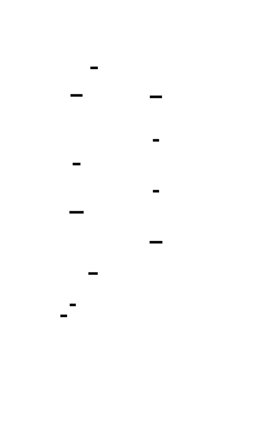

---
## Signal Safety: The Restricted World of Signal Handlers
When your signal handler executes, it's not in a normal execution context. It's an **interrupt context** that can happen at any point in your program—including inside `malloc()`, inside a lock, or halfway through initializing a data structure.

> **🔑 Foundation: Signal safety**
>
> Signal safety refers to the ability of a function to be called from within a signal handler without corrupting the process state or causing deadlocks. Async-signal-safe functions are those that *are* guaranteed to be signal-safe by the POSIX standard. We need to ensure signal handlers don't interfere with the main program's operations, especially in concurrent scenarios with threads interacting with signals. Think of a critical section protected by a mutex; calling a non-signal-safe function within a signal handler is like trying to acquire that same mutex recursively, but from a different, asynchronous context.


> **🔑 Foundation: Signal safety**
>
> Signal safety refers to the ability of a function to execute correctly, even when interrupted by a signal handler. Specifically, an *async-signal-safe function* is guaranteed to operate atomically when called from within a signal handler; its execution will not leave global state corrupted or lead to deadlocks. We need to understand signal safety in our project because we are implementing a signal handler to gracefully handle unexpected events like program termination requests (e.g., SIGINT). This handler needs to perform actions like closing files and cleaning up memory, but blindly calling standard library functions inside the handler can lead to unpredictable behavior if the signal interrupts those same functions in the main program. The key mental model is to treat signal handlers like highly privileged interrupts; they can occur at any time, and the functions they call must be designed to work in such an environment.

**The practical consequence:** your signal handler can only call async-signal-safe functions. This excludes:
- `malloc()` / `free()` (might interrupt an in-progress allocation)
- `printf()` / most I/O (use locks internally)
- `pthread_mutex_lock()` (could deadlock if signal interrupts lock holder)
- Most library functions (you don't know what they do internally)
**What you CAN do:**
- Write to pre-allocated buffers
- Use atomic operations
- Call a small whitelist of system calls (`write()`, `sigprocmask()`, etc.)
- Read from memory (carefully—see below)
This is why profilers pre-allocate sample buffers at startup and use lock-free data structures for sample collection. The signal handler can't allocate memory; it can only write to memory that already exists.
---
## Stack Unwinding: Following the Breadcrumbs
To build a meaningful profile, you need more than "the program was at address 0x401a3c." You need the **call stack**—how did you get there? This reveals that `decode_string()` is hot because `parse_json()` calls it repeatedly, not because it's called from some cold path.
The challenge: from inside a signal handler, how do you recover the call stack?
### The Frame Pointer Method
The simplest approach relies on **frame pointer chaining**. On x86-64, the `%rbp` register traditionally holds a pointer to the previous stack frame. Each function's prologue pushes the old `%rbp` and sets `%rbp` to the current stack position:
```assembly
; Function prologue
push   rbp          ; Save caller's frame pointer
mov    rbp, rsp     ; Establish our frame pointer
sub    rsp, 64      ; Allocate local variables
```
The stack now contains a linked list of frame pointers:
```
+------------------+ high addresses
| return addr      | <- caller's frame
| caller's rbp   --+---+
| ...              |   |
+------------------+   |
| return addr      | <- current frame
| saved rbp      --+---+  <-- %rbp points here
| local var 1      |
| local var 2      |
+------------------+ low addresses  <-- %rsp points here
```

> **🔑 Foundation: Frame pointer chaining for stack unwinding**
> 
> ## What It Is
Frame pointer chaining is a technique where each function's stack frame stores a pointer to the *previous* frame's base address. This creates a linked list structure through the stack, enabling stack unwinding — the process of walking backward through call frames to reconstruct the program's execution history.
When a function is called, the prologue typically does:
```assembly
push    rbp          ; save previous frame pointer
mov     rbp, rsp     ; establish new frame base
```
The `rbp` register now points to a location on the stack that *contains the previous value of `rbp`*. By following this chain — load the value at `rbp`, then load the value at *that* address, and so on — you can traverse every frame on the stack.
## Why You Need It Right Now
If you're building a debugger, profiler, crash dump analyzer, or implementing exception handling, you need to answer: "How did I get here?" Frame pointer chaining provides the skeleton.
Without it, you'd need DWARF debug info (complex, slow, sometimes unavailable) or heuristics (unreliable). With frame pointers, unwinding becomes a tight loop:
```c
void* unwind(void** rbp) {
    while (rbp != NULL) {
        void* return_addr = *(rbp + 1);  // usually right after saved rbp
        process_frame(return_addr);
        rbp = *rbp;  // follow the chain
    }
}
```
Modern compilers sometimes omit frame pointers for performance (`-fomit-frame-pointer`), which breaks this technique. If you need reliable unwinding, compile with `-fno-omit-frame-pointer` or use `-fno-omit-frame-pointer -mno-omit-leaf-frame-pointer`.
## Key Insight
Think of the stack as a singly-linked list where each node is a stack frame, and the "next pointer" is the saved `rbp` value. The frame pointer chain is literally a linked list embedded in memory that the hardware and compiler conspire to maintain. This mental model makes unwinding intuitive: you're just traversing a linked list, but the list lives on the stack and grows downward.


To walk the stack:
```rust
struct StackFrame {
    rbp: *const StackFrame,  // Previous frame pointer
    rip: *const u8,          // Return address (instruction pointer)
}
unsafe fn walk_stack(mut rbp: *const StackFrame, max_depth: usize) -> Vec<usize> {
    let mut addresses = Vec::with_capacity(max_depth);
    for _ in 0..max_depth {
        if rbp.is_null() || rbp as usize < 0x1000 {
            break;  // Invalid frame pointer
        }
        // The return address is right after the saved rbp
        let frame = &*rbp;
        addresses.push(frame.rip as usize);
        // Move to the previous frame
        rbp = frame.rbp;
    }
    addresses
}
```


### The Frame Pointer Problem
Here's the catch: **compilers optimize away frame pointers by default.**
The `-fomit-frame-pointer` flag (enabled at `-O1` and above in GCC/Clang) frees up the `%rbp` register for general use. This improves performance—especially in register-starved x86—but breaks stack unwinding.
**Why compilers omit frame pointers:**
- Frees one register (`%rbp`) for general use
- Eliminates 2 instructions per function (push/mov in prologue, pop in epilogue)
- Reduces stack memory usage (8 bytes per call frame)
**The trade-off:** you gain ~2-5% performance but lose reliable stack traces. Debuggers and profilers either:
1. Require recompilation with `-fno-omit-frame-pointer`
2. Use DWARF unwind tables (complex, larger, slower)
3. Use frame pointer unwinding and accept truncated traces
### Alternative: DWARF Unwinding (libunwind)
When frame pointers aren't available, profilers use DWARF Call Frame Information (CFI) embedded in the binary. This describes, for every instruction address, how to find the previous frame:
- "At address 0x401a3c, the previous frame pointer is in `%rsp + 16`"
- "At address 0x401a4f, `%rbx` holds the saved return address"
This works for any code, but has downsides:
- **Complexity:** parsing DWARF is non-trivial
- **Binary size:** CFI tables can be 10-30% of code size
- **Signal safety:** libunwind may not be async-signal-safe in all configurations
- **Performance:** 5-20× slower than frame pointer unwinding
For this project, we'll support both: frame pointer unwinding as the fast path, with optional DWARF fallback.


---
## The Sampling Engine Architecture
Now let's build the actual profiler. The architecture has four components:
```
┌─────────────────────────────────────────────────────────────────┐
│                         PROFILER ARCHITECTURE                   │
├─────────────────────────────────────────────────────────────────┤
│                                                                 │
│  ┌──────────────┐    ┌──────────────┐    ┌──────────────────┐  │
│  │ Timer Setup  │───►│    Signal    │───►│   Stack Walker   │  │
│  │ (setitimer)  │    │   Handler    │    │ (frame pointer)  │  │
│  └──────────────┘    └──────────────┘    └──────────────────┘  │
│                              │                    │             │
│                              ▼                    ▼             │
│                      ┌──────────────────────────────────┐      │
│                      │     Lock-Free Sample Buffer      │      │
│                      │   (pre-allocated, signal-safe)   │      │
│                      └──────────────────────────────────┘      │
│                                           │                    │
│                                           ▼                    │
│                      ┌──────────────────────────────────┐      │
│                      │      Aggregator (safe context)   │      │
│                      │  Counts samples by call path     │      │
│                      └──────────────────────────────────┘      │
│                                                                 │
└─────────────────────────────────────────────────────────────────┘
```
### Component 1: Timer Setup
We'll use `setitimer` with `ITIMER_PROF`, which counts CPU time (user + system) and delivers `SIGPROF`:
```rust
use libc::{setitimer, itimerval, timeval, ITIMER_PROF};
use std::mem::zeroed;
pub struct SamplerConfig {
    pub frequency_hz: u64,
}
impl SamplerConfig {
    /// Convert frequency to interval (microseconds)
    fn interval_micros(&self) -> (i64, i64) {
        // For 99 Hz: interval = 1,000,000 μs / 99 ≈ 10,101 μs
        let interval_us = 1_000_000 / self.frequency_hz as i64;
        (0, interval_us)  // (seconds, microseconds)
    }
}
pub fn start_sampling(config: &SamplerConfig) -> Result<(), String> {
    let (secs, usecs) = config.interval_micros();
    unsafe {
        let mut timer: itimerval = std::mem::zeroed();
        timer.it_interval.tv_sec = secs;
        timer.it_interval.tv_usec = usecs;
        timer.it_value = timer.it_interval;  // Start immediately
        let result = setitimer(ITIMER_PROF, &timer, std::ptr::null_mut());
        if result != 0 {
            return Err(format!("setitimer failed: {}", std::io::Error::last_os_error()));
        }
    }
    Ok(())
}
pub fn stop_sampling() -> Result<(), String> {
    unsafe {
        let mut timer: itimerval = std::mem::zeroed();
        let result = setitimer(ITIMER_PROF, &timer, std::ptr::null_mut());
        if result != 0 {
            return Err(format!("setitimer failed: {}", std::io::Error::last_os_error()));
        }
    }
    Ok(())
}
```
**Why `ITIMER_PROF` instead of `ITIMER_REAL`?**
- `ITIMER_REAL` counts wall-clock time and delivers `SIGALRM`. If your program is sleeping or waiting for I/O, it still gets sampled. This measures time, not CPU usage.
- `ITIMER_PROF` counts CPU time (user + system) and delivers `SIGPROF`. A sleeping thread isn't sampled. This measures CPU hotness—exactly what you want for optimization.
- `ITIMER_VIRTUAL` counts only user-mode CPU time, excluding syscalls. Less commonly used.
### Component 2: Signal Handler
The signal handler is the heart of the profiler. It must be:
- **Async-signal-safe:** no malloc, no locks, no library calls
- **Fast:** every microsecond in the handler is overhead
- **Correct:** race conditions cause corrupted profiles or crashes
```rust
use libc::{c_int, sigaction, siginfo_t, ucontext_t, SIGPROF, SA_SIGINFO, SA_RESTART};
use std::sync::atomic::{AtomicUsize, AtomicPtr, Ordering};
/// Maximum stack depth we'll capture
const MAX_STACK_DEPTH: usize = 128;
/// Maximum samples in our pre-allocated ring buffer
const SAMPLE_BUFFER_SIZE: usize = 65_536;
/// A single captured stack sample
#[repr(C)]
pub struct RawSample {
    pub thread_id: u64,
    pub timestamp_ns: u64,
    pub depth: u8,
    pub addresses: [usize; MAX_STACK_DEPTH],
}
/// Global state for the signal handler (must be lock-free accessible)
pub struct ProfilerState {
    /// Ring buffer for samples
    samples: Box<[RawSample]>,
    /// Next write position in the ring buffer
    write_pos: AtomicUsize,
    /// Number of samples captured
    sample_count: AtomicUsize,
    /// Whether profiling is active
    active: AtomicUsize,
}
// Global state - initialized before profiling starts
static mut PROFILER_STATE: Option<ProfilerState> = None;
impl ProfilerState {
    pub fn new() -> Self {
        let samples = (0..SAMPLE_BUFFER_SIZE)
            .map(|_| RawSample {
                thread_id: 0,
                timestamp_ns: 0,
                depth: 0,
                addresses: [0; MAX_STACK_DEPTH],
            })
            .collect::<Vec<_>>()
            .into_boxed_slice();
        ProfilerState {
            samples,
            write_pos: AtomicUsize::new(0),
            sample_count: AtomicUsize::new(0),
            active: AtomicUsize::new(0),
        }
    }
    /// Initialize global state (call before starting profiler)
    pub fn init_global() {
        unsafe {
            PROFILER_STATE = Some(Self::new());
        }
    }
}
/// The actual signal handler - MUST be async-signal-safe
#[no_mangle]
unsafe extern "C" fn sigprof_handler(
    _sig: c_int,
    _info: *mut siginfo_t,
    ucontext: *mut c_void,
) {
    // Get profiler state - if not initialized, return immediately
    let state = match &PROFILER_STATE {
        Some(s) => s,
        None => return,
    };
    // Check if active (atomic load)
    if state.active.load(Ordering::Relaxed) != 1 {
        return;
    }
    // Get thread ID (Linux-specific)
    let thread_id = libc::syscall(libc::SYS_gettid) as u64;
    // Get timestamp using a fast clock
    let timestamp_ns = get_timestamp_ns();
    // Get frame pointer from ucontext
    let ucontext = &*(ucontext as *const ucontext_t);
    let rbp = get_rbp_from_ucontext(ucontext);
    let rip = get_rip_from_ucontext(ucontext);
    // Walk the stack
    let (depth, addresses) = walk_stack_from_context(rbp, rip);
    // Reserve a slot in the ring buffer (atomic fetch-add)
    let slot = state.write_pos.fetch_add(1, Ordering::Relaxed) % SAMPLE_BUFFER_SIZE;
    let sample = &mut state.samples[slot];
    // Write sample data
    sample.thread_id = thread_id;
    sample.timestamp_ns = timestamp_ns;
    sample.depth = depth as u8;
    sample.addresses[..depth].copy_from_slice(&addresses[..depth]);
    // Increment sample count
    state.sample_count.fetch_add(1, Ordering::Relaxed);
}
/// Get frame pointer from ucontext (architecture-specific)
#[cfg(target_arch = "x86_64")]
unsafe fn get_rbp_from_ucontext(ctx: &ucontext_t) -> usize {
    ctx.uc_mcontext.gregs[libc::REG_RBP as usize] as usize
}
#[cfg(target_arch = "x86_64")]
unsafe fn get_rip_from_ucontext(ctx: &ucontext_t) -> usize {
    ctx.uc_mcontext.gregs[libc::REG_RIP as usize] as usize
}
#[cfg(target_arch = "aarch64")]
unsafe fn get_rbp_from_ucontext(ctx: &ucontext_t) -> usize {
    ctx.uc_mcontext.regs[29] as usize  // x29 = frame pointer
}
#[cfg(target_arch = "aarch64")]
unsafe fn get_rip_from_ucontext(ctx: &ucontext_t) -> usize {
    ctx.uc_mcontext.pc as usize
}
/// Fast timestamp using RDTSC or clock_gettime
fn get_timestamp_ns() -> u64 {
    #[cfg(target_arch = "x86_64")]
    {
        // Use RDTSC for speed (not strictly nanoseconds, but monotonic)
        let cycles: u64;
        unsafe {
            std::arch::asm!(
                "rdtsc",
                "shl rdx, 32",
                "or rax, rdx",
                out("rax") cycles,
                out("rdx") _,
                options(nostack, preserves_flags)
            );
        }
        cycles
    }
    #[cfg(not(target_arch = "x86_64"))]
    {
        use libc::{clock_gettime, CLOCK_MONOTONIC, timespec};
        unsafe {
            let mut ts: timespec = std::mem::zeroed();
            clock_gettime(CLOCK_MONOTONIC, &mut ts);
            (ts.tv_sec as u64) * 1_000_000_000 + (ts.tv_nsec as u64)
        }
    }
}
/// Walk stack starting from current context
unsafe fn walk_stack_from_context(rbp: usize, rip: usize) -> (usize, [usize; MAX_STACK_DEPTH]) {
    let mut addresses = [0usize; MAX_STACK_DEPTH];
    let mut depth = 0;
    let mut current_rbp = rbp as *const usize;
    // First address is the current instruction pointer
    addresses[depth] = rip;
    depth += 1;
    // Walk the frame pointer chain
    while depth < MAX_STACK_DEPTH {
        // Validate frame pointer
        if current_rbp.is_null() || current_rbp as usize < 0x1000 {
            break;
        }
        // The return address is at rbp + 8 (after saved rbp)
        let return_addr_ptr = current_rbp.add(1);
        // Careful read - could fault on corrupted stack
        // In production, you'd use sigaltstack and handle SIGSEGV
        let return_addr = *return_addr_ptr;
        // Check for invalid return address (null or kernel space)
        if return_addr < 0x1000 {
            break;
        }
        addresses[depth] = return_addr;
        depth += 1;
        // Move to previous frame (saved rbp is at *rbp)
        current_rbp = *current_rbp as *const usize;
    }
    (depth, addresses)
}
```
### Component 3: Signal Handler Registration
We need to register our handler with the kernel:
```rust
use libc::{sigaction, siginfo_t, SA_SIGINFO, SA_RESTART};
pub fn install_signal_handler() -> Result<(), String> {
    unsafe {
        let mut sa: sigaction = std::mem::zeroed();
        sa.sa_sigaction = sigprof_handler as usize;
        sa.sa_flags = SA_SIGINFO | SA_RESTART;
        // Block all signals during handler execution
        libc::sigfillset(&mut sa.sa_mask);
        let result = libc::sigaction(SIGPROF, &sa, std::ptr::null_mut());
        if result != 0 {
            return Err(format!("sigaction failed: {}", std::io::Error::last_os_error()));
        }
    }
    Ok(())
}
pub fn uninstall_signal_handler() -> Result<(), String> {
    unsafe {
        let mut sa: sigaction = std::mem::zeroed();
        sa.sa_sigaction = libc::SIG_DFL;
        let result = libc::sigaction(SIGPROF, &sa, std::ptr::null_mut());
        if result != 0 {
            return Err(format!("sigaction failed: {}", std::io::Error::last_os_error()));
        }
    }
    Ok(())
}
```
**Why `SA_RESTART`?**
Some syscalls (like `read()`, `write()`, `wait()`) return with `EINTR` when interrupted by a signal. `SA_RESTART` tells the kernel to automatically restart these syscalls, reducing visible disruption to the profiled program.


---
## Multi-Threaded Sample Collection
Real applications have multiple threads, and each needs to be sampled. There are two approaches:
### Approach 1: Global Timer, Per-Thread Sampling
With `ITIMER_PROF`, the kernel delivers `SIGPROF` to the **currently running thread**. This naturally distributes samples across threads proportional to their CPU usage.
**The problem:** you need thread identification in each sample.
```rust
// In the signal handler
let thread_id = unsafe { libc::syscall(libc::SYS_gettid) as u64 };
```
**The race condition:** if multiple threads are running on different cores, they might both try to write to the sample buffer simultaneously. Our atomic ring buffer handles this:
```rust
let slot = state.write_pos.fetch_add(1, Ordering::Relaxed) % SAMPLE_BUFFER_SIZE;
```
The `fetch_add` is atomic—two threads get different slots. But there's a subtle issue: if both threads write to the same cache line (neighboring slots), we get **false sharing** that hurts performance.
**Solution:** pad samples to cache line size:
```rust
#[repr(C, align(64))]  // Align to cache line
pub struct RawSample {
    pub thread_id: u64,
    pub timestamp_ns: u64,
    pub depth: u8,
    pub addresses: [usize; MAX_STACK_DEPTH],
    _padding: [u8; 64 - 8 - 8 - 1 - std::mem::size_of::<[usize; MAX_STACK_DEPTH]>()],
}
```


### Approach 2: Per-Thread Timers
For more control, use `timer_create` with `SIGEV_THREAD_ID` to target specific threads:
```rust
use libc::{timer_create, timer_settime, sigevent, SIGEV_THREAD_ID, CLOCK_PROCESS_CPUTIME_ID};
pub fn create_thread_timer(thread_id: i32) -> Result<i32, String> {
    unsafe {
        let mut sev: sigevent = std::mem::zeroed();
        sev.sigev_notify = SIGEV_THREAD_ID;
        sev.sigev_signo = SIGPROF;
        sev._sigev_un._tid = thread_id;  // Target specific thread
        let mut timer_id: i32 = 0;
        let result = timer_create(CLOCK_PROCESS_CPUTIME_ID, &mut sev, &mut timer_id);
        if result != 0 {
            return Err(format!("timer_create failed: {}", std::io::Error::last_os_error()));
        }
        Ok(timer_id)
    }
}
```
This approach gives you explicit control over which threads are sampled and at what frequency, but requires tracking thread creation/destruction.
---
## Sample Aggregation: From Raw Samples to Hot Paths
Raw samples are just lists of addresses. To make them useful, we need to aggregate them into a **call graph** showing which functions call which, and how much time is spent in each.
### Step 1: Symbol Resolution
Convert raw addresses to function names:
```rust
use std::collections::HashMap;
pub struct SymbolTable {
    /// Maps address to (function_name, start_address, size)
    symbols: Vec<(usize, usize, String)>,  // (start, end, name)
    /// Cache for faster lookups
    cache: HashMap<usize, String>,
}
impl SymbolTable {
    /// Load symbols from /proc/self/maps and ELF binaries
    pub fn load() -> Result<Self, String> {
        let mut symbols = Vec::new();
        // Read memory mappings
        let maps = std::fs::read_to_string("/proc/self/maps")
            .map_err(|e| format!("Failed to read /proc/self/maps: {}", e))?;
        for line in maps.lines() {
            let parts: Vec<&str> = line.split_whitespace().collect();
            if parts.len() < 6 {
                continue;
            }
            // Parse address range
            let addr_range: Vec<&str> = parts[0].split('-').collect();
            let start = usize::from_str_radix(addr_range[0], 16).unwrap_or(0);
            let end = usize::from_str_radix(addr_range[1], 16).unwrap_or(0);
            // Get pathname (might be empty for anonymous mappings)
            let pathname = parts[5];
            // Only process executable segments with paths
            let perms = parts[1];
            if !perms.contains('x') || pathname.is_empty() {
                continue;
            }
            // Load symbols from ELF file (simplified - real implementation uses ELF parsing)
            if let Ok(file_symbols) = load_symbols_from_elf(pathname, start) {
                symbols.extend(file_symbols);
            }
        }
        // Sort by address for binary search
        symbols.sort_by_key(|(start, _, _)| *start);
        Ok(SymbolTable {
            symbols,
            cache: HashMap::new(),
        })
    }
    /// Look up function name for an address
    pub fn lookup(&mut self, addr: usize) -> Option<&str> {
        // Check cache first
        if let Some(name) = self.cache.get(&addr) {
            return Some(name);
        }
        // Binary search for containing symbol
        let idx = self.symbols.partition_point(|(start, _, _)| *start <= addr);
        if idx == 0 {
            return None;
        }
        let (start, end, name) = &self.symbols[idx - 1];
        if addr >= *start && addr < *end {
            self.cache.insert(addr, name.clone());
            return Some(&self.cache[&addr]);
        }
        None
    }
}
fn load_symbols_from_elf(path: &str, load_address: usize) -> Result<Vec<(usize, usize, String)>, String> {
    // This would use the `object` crate to parse ELF and read .symtab/.dynsym
    // Simplified here - real implementation is ~100 lines
    Ok(Vec::new())
}
```
### Step 2: Count Samples by Call Path
Each sample is a stack trace from leaf (current function) to root (main). We want to count how often each call path appears:
```rust
use std::collections::HashMap;
pub struct CallPath {
    /// Stack from leaf to root (e.g., ["decode_string", "parse_json", "main"])
    path: Vec<String>,
}
impl CallPath {
    fn from_sample(sample: &RawSample, symbols: &mut SymbolTable) -> Self {
        let path: Vec<String> = sample.addresses[..sample.depth as usize]
            .iter()
            .filter_map(|&addr| symbols.lookup(addr).map(|s| s.to_string()))
            .collect();
        CallPath { path }
    }
    /// Create a "folded" representation for flame graph generation
    /// e.g., "main;parse_json;decode_string"
    fn folded(&self) -> String {
        self.path.join(";")
    }
}
pub struct SampleAggregator {
    /// Counts for each call path
    counts: HashMap<String, usize>,
    /// Total samples
    total: usize,
}
impl SampleAggregator {
    pub fn new() -> Self {
        SampleAggregator {
            counts: HashMap::new(),
            total: 0,
        }
    }
    pub fn add_sample(&mut self, sample: &RawSample, symbols: &mut SymbolTable) {
        let path = CallPath::from_sample(sample, symbols);
        let folded = path.folded();
        *self.counts.entry(folded).or_insert(0) += 1;
        self.total += 1;
    }
    pub fn get_hot_paths(&self, top_n: usize) -> Vec<(&String, &usize)> {
        let mut paths: Vec<_> = self.counts.iter().collect();
        paths.sort_by(|a, b| b.1.cmp(a.1));
        paths.into_iter().take(top_n).collect()
    }
    pub fn export_collapsed(&self) -> String {
        self.counts
            .iter()
            .map(|(path, count)| format!("{} {}", path, count))
            .collect::<Vec<_>>()
            .join("\n")
    }
}
```


---
## Handling Dynamically Loaded Code (Shared Libraries)
Your program loads code dynamically via `dlopen()` or implicit linking. The addresses in `/proc/self/maps` tell you where each library is loaded, but there's a subtlety: **address randomization (ASLR)**.
When `libcrypto.so` is loaded at `0x7f1234500000`, the symbols in its ELF file are relative to `0x0`. You need to add the load address:
```rust
pub struct ModuleInfo {
    pub name: String,
    pub start: usize,
    pub end: usize,
    pub symbols: HashMap<usize, String>,  // Offset -> Name
}
impl SymbolTable {
    pub fn lookup_with_modules(&self, addr: usize, modules: &[ModuleInfo]) -> Option<String> {
        // Find which module contains this address
        for module in modules {
            if addr >= module.start && addr < module.end {
                let offset = addr - module.start;
                return module.symbols.get(&offset).cloned();
            }
        }
        None
    }
}
```
**The hardware reality:** ASLR randomizes load addresses on each execution. Your profiler must rebuild the symbol table each run. For long-running processes, libraries might be loaded/unloaded dynamically—track `dlopen`/`dlclose` via interposition (covered in Milestone 3).


---
## Measuring and Minimizing Overhead
A profiler that slows your program by 50% isn't useful. Let's measure and optimize overhead.
### Overhead Sources
| Source | Cost | Frequency | Total Impact |
|--------|------|-----------|--------------|
| Timer interrupt | ~500ns | 100 Hz | 0.005% |
| Signal delivery | ~200ns | 100 Hz | 0.002% |
| Stack unwinding | ~200ns/frame | 100 Hz × 20 frames | 0.04% |
| Sample recording | ~50ns | 100 Hz | 0.0005% |
| Symbol resolution | ~1μs/symbol | Deferred | 0% (not in handler) |
| **Total (in handler)** | ~5μs | 100 Hz | **~0.05%** |
This is the ideal case. Real overhead is higher due to:
- Cache pollution from handler code
- TLB misses from accessing sample buffer
- Pipeline stalls from context switches
### Measuring Actual Overhead
```rust
use std::time::{Duration, Instant};
pub fn measure_overhead<F>(f: F, runs: usize) -> (Duration, Duration)
where
    F: Fn()
{
    // Warm up
    for _ in 0..100 {
        f();
    }
    // Measure without profiler
    let start = Instant::now();
    for _ in 0..runs {
        f();
    }
    let unprofiled = start.elapsed();
    // Measure with profiler
    ProfilerState::init_global();
    install_signal_handler().unwrap();
    start_sampling(&SamplerConfig { frequency_hz: 99 }).unwrap();
    let start = Instant::now();
    for _ in 0..runs {
        f();
    }
    let profiled = start.elapsed();
    stop_sampling().unwrap();
    uninstall_signal_handler().unwrap();
    (unprofiled, profiled)
}
// Example: 5% overhead means profiled = 1.05 × unprofiled
```


### Optimization Techniques
1. **Pre-allocate everything:** The signal handler never allocates memory. All buffers exist before profiling starts.
2. **Avoid locks in the handler:** Use atomic operations or lock-free data structures.
3. **Minimize stack depth:** Cap unwinding at 128 frames. Deeper stacks are rare and indicate infinite recursion.
4. **Use RDTSC for timestamps:** `clock_gettime` is a syscall; RDTSC is ~30 cycles.
5. **Batch symbol resolution:** Don't resolve symbols in the handler. Store raw addresses and resolve later.
6. **Use a separate altstack:** If the signal handler's stack overflows, you get a SIGSEGV. `sigaltstack` provides a separate signal stack:
```rust
use libc::{sigaltstack, stack_t, MINSIGSTKSZ, SIGSTKSZ};
fn setup_altstack() -> Result<(), String> {
    unsafe {
        let stack_size = SIGSTKSZ + 8192;  // Extra space for our handler
        let stack = libc::mmap(
            std::ptr::null_mut(),
            stack_size,
            libc::PROT_READ | libc::PROT_WRITE,
            libc::MAP_PRIVATE | libc::MAP_ANONYMOUS,
            -1,
            0,
        );
        if stack == libc::MAP_FAILED {
            return Err("mmap for altstack failed".to_string());
        }
        let mut ss: stack_t = std::mem::zeroed();
        ss.ss_sp = stack;
        ss.ss_size = stack_size;
        ss.ss_flags = 0;
        if sigaltstack(&ss, std::ptr::null_mut()) != 0 {
            return Err("sigaltstack failed".to_string());
        }
    }
    Ok(())
}
```
---
## Putting It All Together: The Profiler Interface
Here's the complete public API:
```rust
pub struct Profiler {
    config: SamplerConfig,
    state: Option<ProfilerGuard>,
}
struct ProfilerGuard {
    symbols: SymbolTable,
}
impl Profiler {
    pub fn new(config: SamplerConfig) -> Self {
        Profiler {
            config,
            state: None,
        }
    }
    pub fn start(&mut self) -> Result<(), String> {
        if self.state.is_some() {
            return Err("Profiler already running".to_string());
        }
        // Initialize global state
        ProfilerState::init_global();
        // Set up alternate signal stack
        setup_altstack()?;
        // Install signal handler
        install_signal_handler()?;
        // Mark as active
        unsafe {
            if let Some(ref state) = PROFILER_STATE {
                state.active.store(1, Ordering::SeqCst);
            }
        }
        // Start timer
        start_sampling(&self.config)?;
        // Load symbols
        let symbols = SymbolTable::load()?;
        self.state = Some(ProfilerGuard { symbols });
        Ok(())
    }
    pub fn stop(&mut self) -> Result<ProfileData, String> {
        if self.state.is_none() {
            return Err("Profiler not running".to_string());
        }
        // Stop timer
        stop_sampling()?;
        // Mark as inactive
        unsafe {
            if let Some(ref state) = PROFILER_STATE {
                state.active.store(0, Ordering::SeqCst);
            }
        }
        // Uninstall signal handler
        uninstall_signal_handler()?;
        // Collect samples and aggregate
        let mut aggregator = SampleAggregator::new();
        let guard = self.state.take().unwrap();
        let mut symbols = guard.symbols;
        unsafe {
            if let Some(ref state) = PROFILER_STATE {
                let count = state.sample_count.load(Ordering::SeqCst);
                for i in 0..count.min(SAMPLE_BUFFER_SIZE) {
                    aggregator.add_sample(&state.samples[i], &mut symbols);
                }
            }
        }
        Ok(ProfileData {
            samples: aggregator,
            symbols,
            config: self.config.clone(),
        })
    }
}
#[derive(Clone)]
pub struct ProfileData {
    pub samples: SampleAggregator,
    pub symbols: SymbolTable,
    pub config: SamplerConfig,
}
impl ProfileData {
    pub fn print_report(&self) {
        println!("Profiler Report ({} Hz, {} samples)", 
                 self.config.frequency_hz, 
                 self.samples.total);
        println!("{:-<60}", "");
        println!("{:>50} {:>10}", "FUNCTION", "SAMPLES");
        println!("{:-<60}", "");
        for (path, count) in self.samples.get_hot_paths(20) {
            // Extract just the leaf function name
            let leaf = path.split(';').last().unwrap_or(path);
            let pct = (*count as f64 / self.samples.total as f64) * 100.0;
            println!("{:>50} {:>8} ({:>5.1}%)", leaf, count, pct);
        }
    }
}
```
### Usage Example
```rust
fn main() -> Result<(), String> {
    let mut profiler = Profiler::new(SamplerConfig { frequency_hz: 99 });
    profiler.start()?;
    // Run your workload
    for _ in 0..1000 {
        process_requests();
    }
    let profile = profiler.stop()?;
    profile.print_report();
    // Export for flame graph
    std::fs::write("profile.collapsed", profile.samples.export_collapsed())?;
    Ok(())
}
```
---
## Common Pitfalls and How to Avoid Them
### Pitfall 1: The Signal Handler Allocates Memory
```rust
// ❌ WRONG - Vec::push may allocate in the signal handler
unsafe fn bad_handler() {
    let mut v = Vec::new();
    v.push(42);  // Could deadlock if signal interrupts malloc!
}
```
**Fix:** Pre-allocate all buffers. Use arrays or ring buffers with fixed capacity.
### Pitfall 2: Stack Unwinding Hits Corrupted Memory
```rust
// ❌ WRONG - no bounds check
let return_addr = *current_rbp.add(1);  // Could SIGSEGV!
```
**Fix:** Validate pointers and use `sigaltstack`:
```rust
if current_rbp.is_null() || current_rbp as usize < 0x1000 {
    break;
}
// Or use mincore() to check if page is mapped (expensive)
```
### Pitfall 3: Frequency Lock-Step
```rust
// ❌ WRONG - might sync with periodic application behavior
SamplerConfig { frequency_hz: 100 }  // Even numbers can resonate
```
**Fix:** Use prime frequencies:
```rust
SamplerConfig { frequency_hz: 99 }   // ✓ Prime
SamplerConfig { frequency_hz: 999 }  // ✓ Prime
```
### Pitfall 4: Missing Frame Pointers
Your stack traces are 1-3 frames deep instead of 20-50. You compiled with optimization, which enabled `-fomit-frame-pointer`.
**Fix:** Recompile with `-fno-omit-frame-pointer`, or implement DWARF unwinding (more complex).
### Pitfall 5: Thread-Local State in Handler
```rust
// ❌ WRONG - thread_local! uses locks internally
thread_local! {
    static BUFFER: RefCell<Vec<usize>> = RefCell::new(Vec::new());
}
```
**Fix:** Use global atomic state or pass context through the signal handler's `void*` parameter (requires `sigaction` with `SA_SIGINFO`).
---
## Hardware Soul: What the CPU Experiences During Sampling
When the timer fires, here's what happens at the hardware level:
**Cache State:**
- Your signal handler code is **cold** (not in cache) for the first few samples
- After warm-up, handler code lives in L1 instruction cache (~32KB)
- Sample buffer accesses are **sequential** (good for prefetching) but write-heavy
- Expect ~10-20 L1 cache misses per sample
**Branch Prediction:**
- The loop in `walk_stack` is highly predictable (always iterates forward)
- The null checks are almost never taken (predictable)
- Branch misprediction cost: ~15 cycles each, expect 0-1 per sample
**TLB:**
- Signal handler accesses sample buffer (1 page) and stack (1-2 pages)
- Usually hits in TLB, but first access after context switch may miss
- TLB miss cost: ~50-100 cycles
**Memory Bandwidth:**
- Each sample writes ~1KB (128 addresses × 8 bytes)
- At 100 Hz, that's 100KB/second—trivial for DDR4 (~20GB/s)
**Pipeline:**
- The `rdtsc` instruction is not fully pipelined
- Signal delivery involves a full pipeline flush
- Expect ~100-200 cycles of pipeline overhead per sample
---
## Knowledge Cascade: What You've Unlocked
By understanding sampling profilers, you now have conceptual tools that apply across domains:
### 1. Statistical Sampling → A/B Testing & Monte Carlo Methods
The same math that says "99 Hz sampling gives ±10% accuracy after 100 samples" applies to:
- **A/B testing:** how many users do you need to detect a 5% conversion lift?
- **Monte Carlo simulations:** how many random samples to estimate π to 3 decimal places?
- **Polling:** why 1,000 people can represent 300 million with ±3% margin of error?
All rely on the Central Limit Theorem: sample mean converges to population mean as √n.
### 2. Signal Safety → Kernel Interrupt Contexts & Lock-Free Data Structures
The restrictions on signal handlers are the same restrictions kernel developers face in interrupt handlers:
- Can't sleep (no page faults, no blocking)
- Can't assume any particular lock state
- Must complete quickly
This is why **lock-free data structures** matter. A `Mutex` in a signal handler could deadlock. `AtomicUsize::fetch_add` always works. The same pattern appears in:
- OS kernel interrupt handlers
- Real-time systems (autonomous vehicles, industrial control)
- High-frequency trading (where microseconds matter)
### 3. Frame Pointer Unwinding → Compiler Optimization Trade-offs
The `-fomit-frame-pointer` optimization reveals a fundamental compiler tension:
- **Debuggability:** frame pointers enable stack traces, profilers, debuggers
- **Performance:** one extra register matters, especially in tight loops
This trade-off appears everywhere:
- Debug symbols (`-g`) increase binary size but enable debugging
- Optimization (`-O2`) makes code faster but harder to debug
- Inlining improves speed but obscures call stacks
You now understand why `-fno-omit-frame-pointer` exists and when to use it.
### 4. Prime Frequency Sampling → Hash Tables & Cryptography
The "avoid lock-step with primes" principle appears in:
- **Hash tables:** using a prime number of buckets reduces collision clustering
- **Cryptography:** prime numbers are fundamental to RSA, Diffie-Hellman, elliptic curves
- **Physics:** interference patterns, wave mechanics, resonance avoidance
Primes are "maximally different" from other numbers in multiplicative sense—they don't share factors.
### 5. Multi-Threaded Sample Collection → Distributed Systems
Our lock-free ring buffer solves the same problem as:
- **Distributed logging:** multiple servers writing to a central store
- **Message queues:** producers and consumers at different rates
- **Metrics collection:** counters from multiple services aggregated centrally
The `fetch_add` pattern is the same one used in distributed counters, rate limiters, and load balancers.
---
## What's Next
In Milestone 2, you'll transform these raw samples into **call graphs** and **flame graphs**. You'll learn:
- How to fold stack traces into aggregated call paths
- How to generate SVG flame graphs that visualize program hot spots
- How to compare two profiles (differential flame graphs) to see optimization impact
In Milestone 3, you'll add **memory allocation tracking** via `LD_PRELOAD` interposition, detecting leaks and identifying allocation hot spots.
The sampling engine you've built is the foundation for all of this. Every sample you collect is a breadcrumb that, when aggregated with thousands of others, reveals the path through your program's execution forest.
---
<!-- END_MS -->


<!-- MS_ID: profiler-m2 -->
# Milestone 2: Call Graph & Flame Graph Generation
## The Problem: From Noise to Signal
You've just built a sampling profiler that captures 990 stack traces over 10 seconds. Each sample tells you: "at this moment, the program was in `decode_string()`, called from `parse_json()`, called from `process_request()`, called from `main()`."
But 990 individual stack traces are useless. You can't scan them manually. You need **aggregation**—a way to answer:
- Which functions consume the most CPU?
- Who calls the hot functions? (Maybe the caller is the real problem)
- What's the distribution of work across the call tree?
The naive answer is "count how often each function appears." But this loses **context**. If `malloc()` appears in 30% of samples, is it because your code allocates too much, or because a third-party library does? You need the **call path**, not just the function.


---
## The Fundamental Tension: Precision vs. Comprehension
The core trade-off in visualization is between **accuracy** and **insight**:
| Representation | Accuracy | Insight | Use Case |
|---------------|----------|---------|----------|
| Raw samples (990 traces) | Perfect | Zero | Machine processing |
| Per-function counts | Loses context | Basic | "What's hot?" |
| Call graph (nodes + edges) | Preserves relationships | Good | "Who calls whom?" |
| Flame graph (folded stacks) | Loses ordering | Excellent | "Where's the time going?" |
| Differential flame graph | Shows change | Excellent | "What got faster/slower?" |
**The key insight:** each representation loses something to gain something else. The call graph shows relationships but can be overwhelming for large programs. The flame graph is immediately intuitive but loses temporal ordering—you can't see which functions ran first.
Your job as a profiler builder is to provide **multiple views** so users can answer different questions.
---
## What Flame Graphs Actually Show (And What They Don't)
Let's shatter a common misconception.
**What most developers think:** Flame graphs show exact time spent in each function. Wider boxes = more time.
**The reality:** Flame graphs show **sample counts**, which are statistical approximations with inherent variance. A function that appears in 200 of 1000 samples isn't consuming "exactly 20% of time"—it's consuming approximately 20% with a confidence interval that depends on sample size and distribution.
Consider this scenario:
```
Function A: appears in 200 samples
Function B: appears in 180 samples
```
Is A hotter than B? Statistically, with 1000 samples, the 95% confidence interval for A is roughly 17-23%, and for B is 15-21%. The intervals overlap—you can't confidently say A is hotter.


**What else flame graphs don't show:**
1. **Time ordering:** All samples are collapsed. You can't tell if `parse_json()` ran at the beginning or end of profiling.
2. **Inlined functions:** If the compiler inlined `helper()` into `process()`, `helper()` never appears in stack traces. It exists in source but not in the profile.
3. **Precise call counts:** A function appearing in 100 samples wasn't called 100 times. It might have been called once and ran for a long time, or called 10,000 times for short bursts.
4. **Thread boundaries:** All threads are combined. A hot function might be single-threaded while 16 other threads are idle.
---
## Three-Level View: From Raw Samples to Visualization
### Level 1 — Application (Your Profiler)
Your profiler holds raw samples from Milestone 1:
```rust
struct RawSample {
    thread_id: u64,
    timestamp_ns: u64,
    depth: u8,
    addresses: [usize; 128],
}
```
You need to transform these into aggregated forms.
### Level 2 — Aggregation Engine
The aggregation engine groups samples by **call path** (the sequence of functions from root to leaf). Identical call paths are combined and counted:
```
Sample 1: main;process_request;parse_json;decode_string
Sample 2: main;process_request;parse_json;decode_string  
Sample 3: main;process_request;parse_json;validate
Sample 4: main;process_request;parse_json;decode_string
Aggregated:
main;process_request;parse_json;decode_string → 3
main;process_request;parse_json;validate → 1
```
### Level 3 — Visualization
The aggregated data becomes a flame graph where:
- **Width** = sample count (proportional to CPU time)
- **Y-axis** = stack depth
- **Color** = arbitrary (usually hash of function name)
- **Order** = alphabetical or by count (not temporal!)


---
## Call Graph Construction: Nodes and Edges
A **call graph** is a directed graph where:
- **Nodes** = functions
- **Edges** = caller → callee relationships
- **Node weights** = sample count (how often this function was executing)
- **Edge weights** = call frequency (how often this caller called this callee)
### The Data Structure
```rust
use std::collections::{HashMap, HashSet};
use rustc_hash::FxHashMap;  // Faster hash for string keys
/// A node in the call graph
#[derive(Debug, Clone)]
pub struct CallGraphNode {
    pub function_name: String,
    /// Total samples where this function was on the stack (any position)
    pub total_samples: usize,
    /// Samples where this function was the leaf (actually executing)
    pub self_samples: usize,
    /// Outgoing edges: callee → edge data
    pub callees: FxHashMap<String, CallGraphEdge>,
    /// Incoming edges: caller → edge data
    pub callers: FxHashMap<String, CallGraphEdge>,
}
/// An edge in the call graph
#[derive(Debug, Clone)]
pub struct CallGraphEdge {
    pub from: String,
    pub to: String,
    /// How many samples showed this caller→callee relationship
    pub sample_count: usize,
}
/// The complete call graph
pub struct CallGraph {
    pub nodes: FxHashMap<String, CallGraphNode>,
    /// Total samples in the profile
    pub total_samples: usize,
    /// Functions with no callers (usually just 'main' or entry points)
    pub roots: HashSet<String>,
}
```
### Building the Call Graph
The algorithm walks each sample, creating nodes and edges:
```rust
impl CallGraph {
    pub fn from_samples(samples: &[RawSample], symbols: &mut SymbolTable) -> Self {
        let mut graph = CallGraph {
            nodes: FxHashMap::default(),
            total_samples: samples.len(),
            roots: HashSet::new(),
        };
        for sample in samples {
            // Convert addresses to function names
            let stack: Vec<String> = sample.addresses[..sample.depth as usize]
                .iter()
                .filter_map(|&addr| symbols.lookup(addr).map(|s| s.to_string()))
                .collect();
            if stack.is_empty() {
                continue;
            }
            // The root has no caller
            if let Some(root) = stack.last() {
                graph.roots.insert(root.clone());
            }
            // Process each function in the stack
            for (i, func) in stack.iter().enumerate() {
                let node = graph.nodes.entry(func.clone())
                    .or_insert_with(|| CallGraphNode {
                        function_name: func.clone(),
                        total_samples: 0,
                        self_samples: 0,
                        callees: FxHashMap::default(),
                        callers: FxHashMap::default(),
                    });
                node.total_samples += 1;
                // If this is the leaf function (index 0), it's "self" time
                if i == 0 {
                    node.self_samples += 1;
                }
                // Create edge from caller to callee (if not at root)
                if i + 1 < stack.len() {
                    let callee = func;
                    let caller = &stack[i + 1];
                    // Add edge: caller → callee
                    let caller_node = graph.nodes.entry(caller.clone())
                        .or_insert_with(|| CallGraphNode {
                            function_name: caller.clone(),
                            total_samples: 0,
                            self_samples: 0,
                            callees: FxHashMap::default(),
                            callers: FxHashMap::default(),
                        });
                    let edge = caller_node.callees.entry(callee.clone())
                        .or_insert_with(|| CallGraphEdge {
                            from: caller.clone(),
                            to: callee.clone(),
                            sample_count: 0,
                        });
                    edge.sample_count += 1;
                    // Also add reverse edge for convenience
                    let callee_node = graph.nodes.get_mut(callee).unwrap();
                    let reverse_edge = callee_node.callers.entry(caller.clone())
                        .or_insert_with(|| CallGraphEdge {
                            from: caller.clone(),
                            to: callee.clone(),
                            sample_count: 0,
                        });
                    reverse_edge.sample_count += 1;
                }
            }
        }
        graph
    }
    /// Get the hottest functions by self time
    pub fn top_by_self(&self, n: usize) -> Vec<(&String, &CallGraphNode)> {
        let mut nodes: Vec<_> = self.nodes.iter().collect();
        nodes.sort_by(|a, b| b.1.self_samples.cmp(&a.1.self_samples));
        nodes.into_iter().take(n).collect()
    }
    /// Get the hottest functions by total time (including callees)
    pub fn top_by_total(&self, n: usize) -> Vec<(&String, &CallGraphNode)> {
        let mut nodes: Vec<_> = self.nodes.iter().collect();
        nodes.sort_by(|a, b| b.1.total_samples.cmp(&a.1.total_samples));
        nodes.into_iter().take(n).collect()
    }
}
```
### Handling Recursive Functions
Recursive functions create cycles in the call graph. A sample might show:
```
main → fibonacci → fibonacci → fibonacci → fibonacci
```
How do you represent this?
**Approach 1: Collapse to single node**
The call graph has one `fibonacci` node with a self-edge. All recursive samples contribute to one node.
```rust
impl CallGraph {
    /// Check if a function is recursive (has self-edge)
    pub fn is_recursive(&self, func: &str) -> bool {
        self.nodes.get(func)
            .map(|n| n.callees.contains_key(func))
            .unwrap_or(false)
    }
}
```
**Approach 2: Track recursion depth separately**
Store how deep the recursion went in each sample:
```rust
pub struct RecursiveStats {
    pub function_name: String,
    pub total_samples: usize,
    /// Depth → count
    pub depth_distribution: HashMap<usize, usize>,
}
```
The flame graph approach (discussed next) naturally handles recursion by showing it as a wider bar—recursive calls appear multiple times in the same stack.


---
## Stack Folding: The Flame Graph Foundation
Flame graphs use **collapsed stack format**—a simple text format where each line is a call path and its count:
```
main;process_request;parse_json 120
main;process_request;validate 45
main;handle_signal 15
main;process_request;parse_json;decode_string 89
```
This format is:
- **Human-readable** (you can grep it)
- **Tool-agnostic** (works with flamegraph.pl, speedscope, custom tools)
- **Compact** (common paths are merged)
### The Folder Implementation
```rust
use std::collections::HashMap;
/// Collapsed stack format representation
pub struct CollapsedStacks {
    /// path → count
    stacks: FxHashMap<String, usize>,
    /// Total samples
    total: usize,
}
impl CollapsedStacks {
    pub fn new() -> Self {
        CollapsedStacks {
            stacks: FxHashMap::default(),
            total: 0,
        }
    }
    /// Add a sample, folding it into existing stacks
    pub fn add_sample(&mut self, stack: &[String]) {
        // Reverse to get root-to-leaf order
        let path = stack.iter().rev().cloned().collect::<Vec<_>>().join(";");
        *self.stacks.entry(path).or_insert(0) += 1;
        self.total += 1;
    }
    /// Export to collapsed stack format (for flamegraph.pl)
    pub fn export(&self) -> String {
        let mut lines: Vec<_> = self.stacks.iter()
            .map(|(path, count)| format!("{} {}", path, count))
            .collect();
        // Sort for deterministic output
        lines.sort();
        lines.join("\n")
    }
    /// Import from collapsed stack format
    pub fn import(data: &str) -> Result<Self, String> {
        let mut collapsed = CollapsedStacks::new();
        for line in data.lines() {
            let line = line.trim();
            if line.is_empty() || line.starts_with('#') {
                continue;
            }
            // Format: "path;to;function count"
            let parts: Vec<&str> = line.rsplitn(2, ' ').collect();
            if parts.len() != 2 {
                return Err(format!("Invalid line: {}", line));
            }
            let count: usize = parts[0].parse()
                .map_err(|_| format!("Invalid count: {}", parts[0]))?;
            let path = parts[1];
            collapsed.stacks.insert(path.to_string(), count);
            collapsed.total += count;
        }
        Ok(collapsed)
    }
    /// Get all unique function names
    pub fn all_functions(&self) -> HashSet<String> {
        self.stacks.keys()
            .flat_map(|path| path.split(';').map(|s| s.to_string()))
            .collect()
    }
    /// Filter to stacks containing a specific function
    pub fn filter(&self, function: &str) -> Self {
        let mut filtered = CollapsedStacks::new();
        for (path, count) in &self.stacks {
            if path.split(';').any(|f| f == function) {
                filtered.stacks.insert(path.clone(), *count);
                filtered.total += count;
            }
        }
        filtered
    }
}
/// Build collapsed stacks from raw samples
pub fn fold_samples(samples: &[RawSample], symbols: &mut SymbolTable) -> CollapsedStacks {
    let mut collapsed = CollapsedStacks::new();
    for sample in samples {
        let stack: Vec<String> = sample.addresses[..sample.depth as usize]
            .iter()
            .filter_map(|&addr| symbols.lookup(addr).map(|s| s.to_string()))
            .collect();
        if !stack.is_empty() {
            collapsed.add_sample(&stack);
        }
    }
    collapsed
}
```


---
## The Flame Graph Algorithm
The flame graph is a **tree map** visualization. Here's the algorithm:
### Step 1: Parse Collapsed Stacks
Convert the text format into a tree structure:
```rust
/// A node in the flame graph tree
#[derive(Debug, Clone)]
pub struct FlameGraphNode {
    pub name: String,
    /// Sample count at this node (including all children)
    pub value: usize,
    /// Self samples (excluding children)
    pub self_value: usize,
    pub children: Vec<FlameGraphNode>,
}
impl FlameGraphNode {
    pub fn new(name: String) -> Self {
        FlameGraphNode {
            name,
            value: 0,
            self_value: 0,
            children: Vec::new(),
        }
    }
    /// Add a stack trace to the tree
    pub fn add_stack(&mut self, stack: &[&str], count: usize) {
        self.value += count;
        if stack.is_empty() {
            self.self_value += count;
            return;
        }
        // Find or create child for first element
        let child_name = stack[0];
        let child = self.children.iter_mut()
            .find(|c| c.name == child_name)
            .unwrap_or_else(|| {
                self.children.push(FlameGraphNode::new(child_name.to_string()));
                self.children.last_mut().unwrap()
            });
        // Recurse with remaining stack
        child.add_stack(&stack[1..], count);
    }
}
```
### Step 2: Build the Tree
```rust
pub fn build_flame_tree(collapsed: &CollapsedStacks) -> FlameGraphNode {
    let mut root = FlameGraphNode::new("all".to_string());
    for (path, count) in &collapsed.stacks {
        let stack: Vec<&str> = path.split(';').collect();
        root.add_stack(&stack, *count);
    }
    root
}
```
### Step 3: Render to SVG
The SVG rendering uses a simple box-drawing algorithm:
```rust
pub struct FlameGraphRenderer {
    pub width: usize,
    pub height_per_frame: usize,
    pub min_width: f64,  // Minimum width to draw (in pixels)
    pub colors: ColorScheme,
}
pub struct ColorScheme {
    pub palette: Vec<String>,
    pub hash_seed: u64,
}
impl ColorScheme {
    /// Generate a color based on function name (deterministic)
    pub fn color_for(&self, name: &str) -> String {
        use std::collections::hash_map::DefaultHasher;
        use std::hash::{Hash, Hasher};
        let mut hasher = DefaultHasher::new();
        name.hash(&mut hasher);
        let hash = hasher.finish();
        let idx = (hash as usize) % self.palette.len();
        self.palette[idx].clone()
    }
}
impl FlameGraphRenderer {
    pub fn render(&self, tree: &FlameGraphNode, total: usize) -> String {
        let mut svg = String::new();
        // Calculate required height
        let max_depth = self.max_depth(tree);
        let height = max_depth * self.height_per_frame + 20;
        // SVG header
        svg.push_str(&format!(
            r#"<svg xmlns="http://www.w3.org/2000/svg" width="{}" height="{}">
<style type="text/css">
  .func {{ cursor: pointer; }}
  .func:hover {{ stroke: black; stroke-width: 2; }}
</style>
"#,
            self.width, height
        ));
        // Render frames
        self.render_node(&mut svg, tree, 0.0, self.width as f64, 0, total);
        svg.push_str("</svg>");
        svg
    }
    fn render_node(
        &self,
        svg: &mut String,
        node: &FlameGraphNode,
        x: f64,
        width: f64,
        depth: usize,
        total: usize,
    ) {
        let y = depth * self.height_per_frame;
        let height = self.height_per_frame;
        // Skip if too narrow
        if width < self.min_width {
            return;
        }
        // Draw the box
        let color = self.colors.color_for(&node.name);
        let title = format!("{} ({} samples, {:.2}%)",
            node.name, node.value, (node.value as f64 / total as f64) * 100.0);
        svg.push_str(&format!(
            r#"<g class="func" onclick="alert('{}')">
<rect x="{:.2}" y="{}" width="{:.2}" height="{}" fill="{}" rx="2" ry="2"/>
<title>{}</title>
"#,
            node.name.escape_default().to_string(),
            x, y, width, height, color, title
        ));
        // Draw text if there's room
        if width > 40.0 {
            let text = self.truncate_text(&node.name, width);
            svg.push_str(&format!(
                r#"<text x="{:.2}" y="{}" font-size="12" font-family="monospace" fill="black">{}</text>
"#,
                x + 3.0, y + height - 4, text
            ));
        }
        svg.push_str("</g>\n");
        // Render children
        let mut child_x = x;
        for child in &node.children {
            let child_width = (child.value as f64 / node.value as f64) * width;
            self.render_node(svg, child, child_x, child_width, depth + 1, total);
            child_x += child_width;
        }
    }
    fn max_depth(&self, node: &FlameGraphNode) -> usize {
        if node.children.is_empty() {
            1
        } else {
            1 + node.children.iter().map(|c| self.max_depth(c)).max().unwrap_or(0)
        }
    }
    fn truncate_text(&self, text: &str, width: f64) -> String {
        let char_width = 7.0;  // Approximate monospace char width
        let max_chars = ((width - 6.0) / char_width) as usize;
        if text.len() <= max_chars {
            text.to_string()
        } else {
            format!("{}...", &text[..max_chars.saturating_sub(3)])
        }
    }
}
```
### Usage
```rust
fn generate_flame_graph(collapsed: &CollapsedStacks, output_path: &str) -> Result<(), String> {
    let tree = build_flame_tree(collapsed);
    let renderer = FlameGraphRenderer {
        width: 1200,
        height_per_frame: 16,
        min_width: 0.5,
        colors: ColorScheme {
            palette: vec![
                "#ff7f7f".to_string(), "#ffbf7f".to_string(), "#ffff7f".to_string(),
                "#7fff7f".to_string(), "#7fffff".to_string(), "#7f7fff".to_string(),
                "#ff7fff".to_string(), "#bf7f3f".to_string(),
            ],
            hash_seed: 0,
        },
    };
    let svg = renderer.render(&tree, collapsed.total);
    std::fs::write(output_path, svg)
        .map_err(|e| format!("Failed to write SVG: {}", e))
}
```
---
## The Inlined Function Problem
Here's a subtle issue that trips up many profiler users.
**Scenario:** Your source code has:
```rust
fn process(data: &Data) -> Result<()> {
    let validated = validate(data)?;  // This function
    transform(validated)              // might be inlined
}
#[inline]
fn validate(data: &Data) -> Result<Data> {
    // ... validation logic ...
}
#[inline]
fn transform(data: Data) -> Result<()> {
    // ... transformation logic ...
}
```
With optimizations enabled (`-O2`), the compiler might inline `validate()` and `transform()` into `process()`. The resulting assembly has no separate functions—just one big `process()`.
**Your profiler sees:**
```
main → process → process → process
```
Because `validate` and `transform` no longer exist as separate functions in the binary. Their code is literally part of `process`.
**The consequences:**
1. `validate` and `transform` never appear in your profile
2. `process` looks hotter than it "should"
3. You can't see the breakdown of validation vs. transformation


**Solutions:**
1. **Compile with debug info** (`-g`): Some DWARF info preserves inlined function boundaries. Advanced profilers (like `perf` with `--inline`) can recover them.
2. **Disable inlining** (`-C inline=never` in Rust): For profiling builds only. Changes performance characteristics.
3. **Use sampling at instruction level:** Tools like `perf record -g` can sometimes attribute samples to the inlined function if debug info is available.
4. **Accept the limitation:** For most optimization work, knowing the hot function is enough—you can read the source to understand its components.
```rust
/// Attempt to resolve inlined functions from DWARF debug info
pub struct InlineResolver {
    /// Maps address → list of inlined function names (deepest first)
    inline_cache: FxHashMap<usize, Vec<String>>,
}
impl InlineResolver {
    /// This requires the `gimli` crate for DWARF parsing
    /// Simplified example - real implementation is 200+ lines
    pub fn resolve_inline(&self, addr: usize) -> Option<&[String]> {
        self.inline_cache.get(&addr).map(|v| v.as_slice())
    }
}
```
---
## Differential Flame Graphs: Before and After
The most powerful use of flame graphs is comparing two profiles to see what changed.
**Use cases:**
- Before/after optimization: "Did my change help?"
- Production regression: "Why is the new version slower?"
- Load comparison: "How does the profile differ at 10 QPS vs 1000 QPS?"
### The Algorithm
Differential flame graphs show **relative change**:
```rust
pub struct DifferentialFlameGraph {
    /// Path → (baseline_count, comparison_count)
    diffs: FxHashMap<String, (usize, usize)>,
    baseline_total: usize,
    comparison_total: usize,
}
impl DifferentialFlameGraph {
    pub fn from_collapsed(baseline: &CollapsedStacks, comparison: &CollapsedStacks) -> Self {
        let mut diffs = FxHashMap::default();
        // Collect all paths from both profiles
        let all_paths: HashSet<_> = baseline.stacks.keys()
            .chain(comparison.stacks.keys())
            .collect();
        for path in all_paths {
            let base_count = baseline.stacks.get(path).copied().unwrap_or(0);
            let comp_count = comparison.stacks.get(path).copied().unwrap_or(0);
            diffs.insert(path.clone(), (base_count, comp_count));
        }
        DifferentialFlameGraph {
            diffs,
            baseline_total: baseline.total,
            comparison_total: comparison.total,
        }
    }
    /// Calculate percentage change for a path
    pub fn change_for(&self, path: &str) -> Option<f64> {
        let (base, comp) = self.diffs.get(path)?;
        if *base == 0 && *comp == 0 {
            return None;
        }
        // Normalize by total samples
        let base_pct = *base as f64 / self.baseline_total as f64;
        let comp_pct = *comp as f64 / self.comparison_total as f64;
        if base_pct == 0.0 {
            return Some(f64::INFINITY);  // New path
        }
        Some((comp_pct - base_pct) / base_pct * 100.0)
    }
    /// Export for differential flame graph visualization
    pub fn export(&self) -> String {
        let mut lines = Vec::new();
        for (path, (base, comp)) in &self.diffs {
            // Format: "path baseline_count comparison_count"
            lines.push(format!("{} {} {}", path, base, comp));
        }
        lines.sort();
        lines.join("\n")
    }
}
```
### Visualization Strategy
Differential flame graphs typically use color to indicate change:
- **Red** = got worse (more samples in comparison)
- **Blue** = got better (fewer samples in comparison)
- **Width** = comparison sample count
```rust
pub struct DifferentialColorScheme;
impl DifferentialColorScheme {
    /// Color based on change direction
    pub fn color_for_change(base: usize, comp: usize) -> String {
        if base == 0 && comp == 0 {
            return "#808080".to_string();  // Gray for absent
        }
        if base == 0 {
            return "#ff0000".to_string();  // Red for new
        }
        let ratio = comp as f64 / base as f64;
        if ratio > 1.1 {
            // Got worse - red gradient
            let intensity = ((ratio - 1.0) * 255.0).min(255.0) as u8;
            format!("#ff{:02x}{:02x}", 255 - intensity, 255 - intensity)
        } else if ratio < 0.9 {
            // Got better - blue gradient
            let intensity = ((1.0 - ratio) * 255.0).min(255.0) as u8;
            format!("#{:02x}{:02x}ff", 255 - intensity, 255 - intensity)
        } else {
            // No significant change - gray
            "#c0c0c0".to_string()
        }
    }
}
```


### Interpreting Differential Flame Graphs
A common mistake is to interpret "red" as "bad." Consider:
**Scenario:** You optimized `parse_json()` to run 2× faster. The differential flame graph shows:
- `parse_json`: went from 40% to 20% of samples (blue - good!)
- `database_query`: went from 30% to 45% of samples (red - bad?)
**Is `database_query` worse?** No! Your program now spends less time parsing, so the same database work takes a *larger percentage*. The absolute time didn't change—the proportions did.
**The fix:** Always look at absolute sample counts, not just percentages:
```rust
pub fn print_diff_summary(diff: &DifferentialFlameGraph) {
    println!("Differential Profile Summary");
    println!("{:-<80}", "");
    println!("{:>40} {:>10} {:>10} {:>10}", 
             "PATH", "BEFORE", "AFTER", "CHANGE");
    println!("{:-<80}", "");
    let mut entries: Vec<_> = diff.diffs.iter().collect();
    entries.sort_by(|a, b| {
        let change_a = (b.1.1 as i64 - b.1.0 as i64).abs();
        let change_b = (a.1.1 as i64 - a.1.0 as i64).abs();
        change_a.cmp(&change_b)
    });
    for (path, (base, comp)) in entries.iter().take(30) {
        let change = if **base == 0 {
            "NEW".to_string()
        } else {
            let pct = ((**comp as f64 - **base as f64) / **base as f64 * 100.0) as i64;
            format!("{:+}%", pct)
        };
        println!("{:>40} {:>10} {:>10} {:>10}", 
                 path.split(';').last().unwrap_or(path), 
                 base, comp, change);
    }
}
```
---
## JSON Export for Tool Integration
Many visualization tools (speedscope, Firefox Profiler) accept JSON formats:
```rust
use serde::{Serialize, Serializer};
#[derive(Serialize)]
pub struct ProfileJson {
    #[serde(rename = "$schema")]
    schema: String,
    shared: SharedInfo,
    profiles: Vec<Profile>,
}
#[derive(Serialize)]
struct SharedInfo {
    frames: Vec<FrameInfo>,
}
#[derive(Serialize)]
struct FrameInfo {
    name: String,
    #[serde(skip_serializing_if = "Option::is_none")]
    file: Option<String>,
    #[serde(skip_serializing_if = "Option::is_none")]
    line: Option<u32>,
}
#[derive(Serialize)]
struct Profile {
    name: String,
    startValue: usize,
    endValue: usize,
    samples: Vec<Vec<usize>>,  // List of frame indices
    weights: Vec<usize>,
}
pub fn export_speedscope(collapsed: &CollapsedStacks) -> Result<String, serde_json::Error> {
    let mut frame_names: Vec<String> = Vec::new();
    let mut frame_indices: FxHashMap<String, usize> = FxHashMap::default();
    let mut samples = Vec::new();
    let mut weights = Vec::new();
    for (path, count) in &collapsed.stacks {
        let mut sample: Vec<usize> = Vec::new();
        // Parse path (reverse order: leaf to root for speedscope)
        for func in path.split(';') {
            let idx = *frame_indices.entry(func.to_string())
                .or_insert_with(|| {
                    frame_names.push(func.to_string());
                    frame_names.len() - 1
                });
            sample.push(idx);
        }
        samples.push(sample);
        weights.push(*count);
    }
    let profile = ProfileJson {
        schema: "https://www.speedscope.app/file-format-schema.json".to_string(),
        shared: SharedInfo {
            frames: frame_names.into_iter().map(|name| FrameInfo {
                name,
                file: None,
                line: None,
            }).collect(),
        },
        profiles: vec![Profile {
            name: "CPU Profile".to_string(),
            startValue: 0,
            endValue: collapsed.total,
            samples,
            weights,
        }],
    };
    serde_json::to_string_pretty(&profile)
}
```
---
## Filtering and Searching
Real profiles have thousands of functions. Users need ways to focus:
```rust
impl CallGraph {
    /// Create a subgraph containing only paths through a specific function
    pub fn subgraph_through(&self, target: &str) -> Self {
        let mut filtered = CallGraph {
            nodes: FxHashMap::default(),
            total_samples: 0,
            roots: HashSet::new(),
        };
        // Find all paths that pass through target
        for (name, node) in &self.nodes {
            if name == target {
                // Include this node and its immediate callers/callees
                let filtered_node = filtered.nodes.entry(name.clone())
                    .or_insert_with(|| CallGraphNode {
                        function_name: name.clone(),
                        total_samples: 0,
                        self_samples: 0,
                        callees: FxHashMap::default(),
                        callers: FxHashMap::default(),
                    });
                filtered_node.total_samples = node.total_samples;
                filtered_node.self_samples = node.self_samples;
                // Copy caller edges
                for (caller, edge) in &node.callers {
                    filtered_node.callers.insert(caller.clone(), edge.clone());
                }
                // Copy callee edges
                for (callee, edge) in &node.callees {
                    filtered_node.callees.insert(callee.clone(), edge.clone());
                }
            }
        }
        filtered.total_samples = filtered.nodes.values()
            .map(|n| n.self_samples)
            .sum();
        filtered
    }
    /// Find the call path that contributes most samples to a function
    pub fn hottest_path_to(&self, target: &str) -> Option<Vec<String>> {
        let target_node = self.nodes.get(target)?;
        // Find caller with most samples
        let mut path = vec![target.to_string()];
        let mut current = target;
        while let Some(node) = self.nodes.get(current) {
            if node.callers.is_empty() {
                break;
            }
            let (caller, _) = node.callers.iter()
                .max_by_key(|(_, e)| e.sample_count)?;
            path.push(caller.clone());
            current = caller;
        }
        path.reverse();
        Some(path)
    }
}
```
---
## Hardware Soul: What the CPU Experiences During Aggregation
Aggregation is CPU-bound, not I/O-bound. Here's what the hardware sees:
**Cache Behavior:**
- The `FxHashMap` accesses are the hottest path
- Hash table lookups: ~50-100 cycles each (cache miss if table is large)
- String comparisons during path folding: O(length) bytes read
- The collapsed stacks structure is compact: fits in L2 cache for most profiles
**Memory Bandwidth:**
- Processing 10,000 samples with 128-depth stacks = ~10MB of data
- Sequential access pattern = good prefetching
- Aggregation creates new strings: memory allocator pressure
**Branch Prediction:**
- Hash collisions are unpredictable
- Tree traversals are predictable (depth-first)
- Sorting at the end: branch-heavy (quicksort comparisons)
**Optimization opportunities:**
```rust
// Use string interning to avoid duplicate allocations
pub struct StringInterner {
    strings: Vec<String>,
    indices: FxHashMap<String, usize>,
}
impl StringInterner {
    pub fn intern(&mut self, s: &str) -> usize {
        if let Some(&idx) = self.indices.get(s) {
            return idx;
        }
        let idx = self.strings.len();
        self.strings.push(s.to_string());
        self.indices.insert(s.to_string(), idx);
        idx
    }
}
// Store stacks as Vec<usize> (indices) instead of Vec<String>
pub struct InternedStacks {
    interner: StringInterner,
    stacks: Vec<Vec<usize>>,  // Each stack is indices into interner
    counts: Vec<usize>,
}
```
---
## Knowledge Cascade: What You've Unlocked
### 1. Call Graph Construction → Compiler Control Flow Graphs
The call graph you built is the runtime equivalent of the compiler's **control flow graph (CFG)**:
- **CFG:** shows all possible paths through a function
- **Call graph:** shows all actual paths through a program (observed, not theoretical)
Compilers use CFGs for optimization. Profilers use call graphs for understanding. The algorithms (dominator trees, reachability analysis) are the same.
**Connection:** The "hot path" in a call graph corresponds to the "hot basic block" in a CFG. Both use profile-guided optimization (PGO) to make decisions.
### 2. Stack Folding → Database GROUP BY Operations
Your stack folding algorithm:
```
COUNT(*) GROUP BY call_path
```
Is exactly what SQL databases do:
```sql
SELECT call_path, COUNT(*) 
FROM samples 
GROUP BY call_path;
```
**The pattern:** any time you need to count occurrences of "things with structure," you decompose the structure into a key (the call path string) and aggregate counts.
**Other applications:**
- Log analysis: `GROUP BY (user_id, action, timestamp_bucket)`
- A/B testing: `GROUP BY (experiment_id, variant, outcome)`
- Metrics: `GROUP BY (service, endpoint, status_code)`
### 3. Flame Graph Visualization → Treemaps & Sunburst Charts
Flame graphs are a specific instance of **hierarchical visualization**:
- **Treemap:** 2D space-filling for hierarchies (file sizes on disk)
- **Sunburst:** Radial space-filling (disk usage by directory)
- **Flame graph:** 1D horizontal space-filling with depth stacking
All use the same principle: map a scalar (size/count) to visual area, preserve hierarchy.
**Cross-domain:** In file systems, a treemap shows which directories use the most space. In profilers, a flame graph shows which call paths use the most CPU. Same visualization, different domain.
### 4. Differential Analysis → Version Control Diffs
Your differential flame graph is profiling's version of `git diff`:
```
git diff:  -old_line / +new_line
diff flame: -baseline_count / +comparison_count
```
Both highlight **change**. Both require understanding context:
- `git diff`: did this function change because of a bug fix or a feature?
- `diff flame`: did this function get hotter because of a regression or because we removed a bottleneck elsewhere?
**The pattern:** comparing two snapshots to identify meaningful change, filtering noise.
### 5. Recursive Function Handling → Stack Overflow & Tail Call Optimization
Understanding recursion in profiles reveals:
- **Stack overflow:** infinite recursion → stack grows until it hits the guard page → SIGSEGV. The profiler sees the same stack frame repeated hundreds of times.
- **Tail call optimization (TCO):** compilers transform `f() → g()` (where g is tail position) into a jump, reusing the stack frame. The profiler sees one frame, not two.
**The insight:** profilers reveal what the compiler actually did, not what the source code says. A recursive function might appear non-recursive if TCO was applied.
---
## Common Pitfalls and How to Avoid Them
### Pitfall 1: Interpreting Percentages as Absolute Change
```rust
// ❌ WRONG: "database_query went from 30% to 45% - it got 50% worse!"
// ✅ CORRECT: "database_query's share increased because we optimized the parser"
```
**Fix:** Always check absolute sample counts, not just percentages.
### Pitfall 2: Missing Inlined Functions
```rust
// ❌ WRONG: "validate() doesn't appear - it must be fast"
// ✅ CORRECT: "validate() was inlined - its time is attributed to the caller"
```
**Fix:** Compile with `-g` for debug info, or accept that inlined functions won't appear.
### Pitfall 3: Aggregation Order Affects Visualization
```rust
// ❌ WRONG: unsorted children
for child in &node.children {
    render(child);
}
// ✅ CORRECT: sorted by value (hottest first)
let mut sorted: Vec<_> = node.children.iter().collect();
sorted.sort_by(|a, b| b.value.cmp(&a.value));
for child in sorted {
    render(child);
}
```
**Fix:** Sort children before rendering for consistent, meaningful visualization.
### Pitfall 4: Confusing Self Time with Total Time
```rust
// ❌ WRONG: "main() is the hottest function" (but main just calls other functions)
// ✅ CORRECT: "main() has high total time but low self time - look at its callees"
```
**Fix:** Always distinguish `self_samples` (time in this function) from `total_samples` (time including callees).
### Pitfall 5: Memory Explosion with Deep Stacks
```rust
// ❌ WRONG: storing full strings for every sample
struct Sample {
    stack: Vec<String>,  // 128 strings × 20 bytes = 2.5KB per sample!
}
// ✅ CORRECT: interned strings or raw addresses
struct Sample {
    stack: Vec<usize>,  // 128 × 8 bytes = 1KB per sample
}
```
**Fix:** Use string interning or store raw addresses, resolve symbols later.
---
## Putting It All Together
```rust
pub struct FlameGraphGenerator {
    collapsed: CollapsedStacks,
    call_graph: CallGraph,
}
impl FlameGraphGenerator {
    pub fn from_samples(samples: &[RawSample], symbols: &mut SymbolTable) -> Self {
        let collapsed = fold_samples(samples, symbols);
        let call_graph = CallGraph::from_samples(samples, symbols);
        FlameGraphGenerator { collapsed, call_graph }
    }
    pub fn export_collapsed(&self, path: &str) -> Result<(), String> {
        std::fs::write(path, self.collapsed.export())
            .map_err(|e| format!("Failed to write: {}", e))
    }
    pub fn export_flame_graph_svg(&self, path: &str) -> Result<(), String> {
        generate_flame_graph(&self.collapsed, path)
    }
    pub fn export_speedscope_json(&self, path: &str) -> Result<(), String> {
        let json = export_speedscope(&self.collapsed)
            .map_err(|e| format!("JSON serialization failed: {}", e))?;
        std::fs::write(path, json)
            .map_err(|e| format!("Failed to write: {}", e))
    }
    pub fn print_hot_paths(&self, top_n: usize) {
        println!("Top {} hot paths:", top_n);
        for (path, count) in self.collapsed.stacks.iter()
            .sorted_by(|a, b| b.1.cmp(a.1))
            .take(top_n)
        {
            let pct = (*count as f64 / self.collapsed.total as f64) * 100.0;
            println!("  {:5.1}% {} ({} samples)", pct, path, count);
        }
    }
    pub fn print_call_graph_summary(&self) {
        println!("Call Graph Summary:");
        println!("  {} unique functions", self.call_graph.nodes.len());
        println!("  {} root functions", self.call_graph.roots.len());
        println!("  {} total samples", self.call_graph.total_samples);
        println!("\nTop functions by self time:");
        for (name, node) in self.call_graph.top_by_self(10) {
            let pct = (node.self_samples as f64 / self.call_graph.total_samples as f64) * 100.0;
            println!("  {:5.1}% {}", pct, name);
        }
    }
    pub fn compare(baseline: &CollapsedStacks, comparison: &CollapsedStacks) -> DifferentialFlameGraph {
        DifferentialFlameGraph::from_collapsed(baseline, comparison)
    }
}
```
---
## What's Next
In Milestone 3, you'll add **memory allocation tracking** to your profiler. You'll learn:
- How to intercept `malloc`/`free` calls using `LD_PRELOAD`
- Detecting memory leaks (allocated but never freed)
- Tracking allocation hot spots by call site
- The "Boehm effect": how the profiler changes allocation behavior
The call graph and flame graph infrastructure you've built here will be extended to show not just CPU hot paths, but **allocation hot paths**—where your program allocates the most memory.
<!-- END_MS -->


<!-- MS_ID: profiler-m3 -->
# Milestone 3: Memory Allocation Tracking
## The Problem: Memory Is the Silent Killer
Your sampling profiler from Milestones 1 and 2 tells you *where* CPU time goes. But there's another dimension of performance that CPU profiling completely misses: **memory**.
Consider these scenarios that a CPU profiler can't help with:
1. **The memory leak:** Your server runs fine for hours, then suddenly OOMs. The leak happened thousands of allocations ago. Which ones were never freed?
2. **The allocation storm:** A function allocates 10,000 small objects per second. Each allocation is fast (50ns), so CPU profiling barely notices. But the cumulative memory pressure causes GC pauses, cache pollution, and eventually swapping.
3. **The fragmentation trap:** Your program allocates and frees millions of objects. Total allocated bytes equals total freed bytes—no leak! But memory usage grows because the allocator can't reuse the freed space due to fragmentation.
4. **The cold path bomb:** A rarely-called initialization function allocates a 500MB buffer. It runs once, early, and never appears in a CPU profile. But that 500MB is stolen from cache and available memory for the entire program lifetime.
**What you need is a way to ask: "Where does my memory come from, where does it go, and what's still there?"**


---
## The Fundamental Tension: Visibility vs. Distortion
The core trade-off in allocation tracking is between **observability** and **accuracy**:
| Tracking Approach | Visibility | Overhead | Distortion |
|------------------|------------|----------|------------|
| None | Zero | 0% | Perfect accuracy of a blind system |
| Wrap malloc/free | Full | 50-200ns per op | **The Boehm effect** |
| Sampling allocations | Partial | ~10% | Misses small/short-lived allocations |
| Page-level tracking | Coarse | ~1% | No per-allocation attribution |
| Post-mortem (core dump) | Full, after death | 0% at runtime | Can't fix the living |
**The hardware reality:** Every allocation you track requires metadata storage. Tracking 1 million allocations means:
- 1M × 16 bytes for addresses = 16 MB
- 1M × 8 bytes for sizes = 8 MB
- 1M × 32 bytes for call stacks (if captured) = 32 MB
- Hash table overhead: 2-3× the above
Your "profiler" is now consuming 100+ MB just to track memory. This is memory that *could* have been application cache.
**The Boehm effect:** When your profiler allocates memory to track allocations, it changes the memory layout. The allocator's free lists are different. Fragmentation patterns shift. Your profiler might hide the exact bug it's trying to find—like a detective accidentally destroying evidence while investigating.


---
## How Allocation Interception Works: The Three Paths
Before building the tracker, you need to understand how to intercept `malloc`/`free` calls. There are three approaches, each with different trade-offs.
### Path 1: LD_PRELOAD Library Interposition

> **🔑 Foundation: LD_PRELOAD library interposition**
> 
> ## What It IS
**LD_PRELOAD library interposition** is a dynamic linking technique that lets you inject a shared library into a process before any other libraries load. Your injected library can then intercept ("interpose") function calls the application makes to standard libraries like libc.
When a program calls `malloc()`, the dynamic linker normally resolves this to libc's implementation. With LD_PRELOAD, your library loads first, and if it defines `malloc()`, the linker binds to YOUR version instead. Your code can then:
- Completely replace the original function
- Modify arguments before calling the real version
- Log or inspect the call
- Pass through to the original (via `dlsym(RTLD_NEXT, "malloc")`)
**How it works under the hood:**
The dynamic linker resolves symbols in load order. LD_PRELOAD forces your library to the front of the queue, making its symbols "win" during symbol resolution. The original functions still exist in memory—you can reach them through `dlsym()` with the special `RTLD_NEXT` handle.
## WHY You Need It Right Now
In this project, you're likely working on:
- **Memory debugging** — intercept `malloc`/`free` to detect leaks, buffer overflows, or double-frees
- **Function call tracing** — log every call to specific APIs without modifying source code
- **Sandboxing/mocking** — replace dangerous or non-deterministic functions (time, network, file I/O) for testing
- **Performance profiling** — wrap functions with timing code to measure where time is spent
This technique is essential because it works on **binaries you didn't compile**. You don't need source code access, recompilation, or special build flags. You can debug or analyze any dynamically-linked executable on the system.
## ONE Key Insight
**Think of LD_PRELOAD as "monkey-patching at the linker level."**
Just as JavaScript lets you override `window.fetch` to intercept network calls, LD_PRELOAD lets you override ANY dynamically-linked function. The mental model:
```
Application calls foo()
        ↓
Linker looks up "foo" in symbol table
        ↓
LD_PRELOAD library is searched FIRST
        ↓
If found → YOUR foo() runs
        ↓
Your foo() can: log, modify, replace, OR call real_foo via dlsym()
```
**Critical gotcha:** This only works for **dynamic linking**. Statically-linked binaries bypass the dynamic linker entirely, making LD_PRELOAD ineffective. If your interposition isn't firing, check `ldd <binary>` — if it shows "not a dynamic executable" or "statically linked," you'll need a different approach.
**Minimal working example:**
```c
// intercept.c
#define _GNU_SOURCE
#include <dlfcn.h>
#include <stdio.h>
int open(const char *pathname, int flags, ...) {
    fprintf(stderr, "[INTERCEPTED] open(%s)\n", pathname);
    // Get real open() from the next library in chain
    int (*real_open)(const char*, int, ...) = dlsym(RTLD_NEXT, "open");
    return real_open(pathname, flags);
}
```
Compile and use:
```bash
gcc -shared -fPIC -o intercept.so intercept.c -ldl
LD_PRELOAD=./intercept.so ./your_program
```

This is the most common approach for profilers. The dynamic linker allows you to specify a shared library that loads *before* other libraries. If your library defines `malloc()`, calls to `malloc()` resolve to your version instead of libc's.
```rust
// In your profiler's preload library (libmem_profiler.so)
use std::sync::atomic::{AtomicUsize, Ordering};
use libc::{c_void, size_t};
static mut REAL_MALLOC: Option<unsafe extern "C" fn(size_t) -> *mut c_void> = None;
static mut REAL_FREE: Option<unsafe extern "C" fn(*mut c_void)> = None;
/// Called when our library is loaded
#[no_mangle]
pub extern "C" fn malloc(size: size_t) -> *mut c_void {
    unsafe {
        // Lazy-initialize the real malloc on first call
        if REAL_MALLOC.is_none() {
            libc::dlsym(libc::RTLD_NEXT, b"malloc\0".as_ptr() as *const i8);
            REAL_MALLOC = Some(std::mem::transmute(ptr));
        }
        // Call the real malloc
        let ptr = REAL_MALLOC.unwrap()(size);
        // Track this allocation (carefully!)
        if !ptr.is_null() {
            track_allocation(ptr as usize, size);
        }
        ptr
    }
}
#[no_mangle]
pub extern "C" fn free(ptr: *mut c_void) {
    unsafe {
        // Lazy-initialize real free
        if REAL_FREE.is_none() {
            let ptr = libc::dlsym(libc::RTLD_NEXT, b"free\0".as_ptr() as *const i8);
            REAL_FREE = Some(std::mem::transmute(ptr));
        }
        // Track the free first (before it's invalid)
        if !ptr.is_null() {
            track_free(ptr as usize);
        }
        // Call the real free
        REAL_FREE.unwrap()(ptr);
    }
}
```
**Usage:**
```bash
LD_PRELOAD=./libmem_profiler.so ./your_program
```

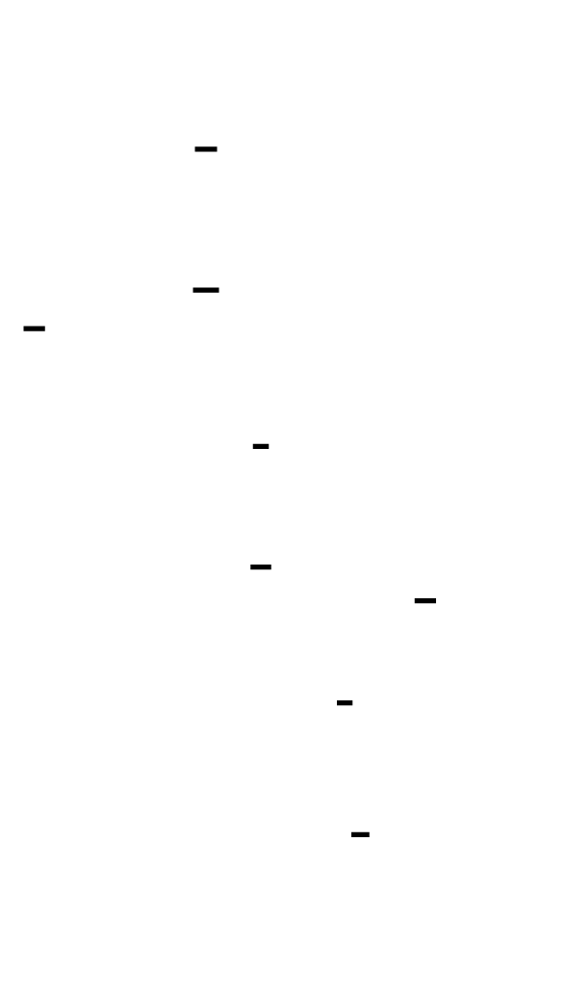

**The gotchas of LD_PRELOAD:**
1. **Recursive allocation:** If `track_allocation()` itself calls `malloc()`, you get infinite recursion. You must detect this:
```rust
thread_local! {
    static IN_TRACKER: Cell<bool> = Cell::new(false);
}
fn track_allocation(ptr: usize, size: size_t) {
    IN_TRACKER.with(|in_tracker| {
        if in_tracker.get() {
            return; // Avoid recursion
        }
        in_tracker.set(true);
        // ... actual tracking ...
        in_tracker.set(false);
    });
}
```
2. **Early allocations:** Some allocations happen before your library initializes (the dynamic linker itself allocates). You need to handle calls before `dlsym` succeeds.
3. **Other allocation APIs:** Programs also call `calloc`, `realloc`, `aligned_alloc`, `memalign`, `valloc`, `posix_memalign`... you need to intercept them all.
### Path 2: Explicit Link-Time Wrapping
The linker supports `--wrap` flags that redirect calls:
```bash
gcc -Wl,--wrap=malloc,--wrap=free program.c
```
This creates symbols `__wrap_malloc` and `__real_malloc`:
```rust
#[no_mangle]
pub extern "C" fn __wrap_malloc(size: size_t) -> *mut c_void {
    let ptr = unsafe { __real_malloc(size) };
    track_allocation(ptr as usize, size);
    ptr
}
extern "C" {
    fn __real_malloc(size: size_t) -> *mut c_void;
}
```
**Advantages over LD_PRELOAD:**
- No runtime lookup overhead
- Works for statically linked code
- More explicit about what's wrapped
**Disadvantages:**
- Requires recompiling/relinking
- Doesn't work with pre-built binaries
### Path 3: Compiler Instrumentation
GCC and Clang support `-fsanitize=address` (ASan) which injects allocation tracking at compile time. This is more powerful but requires source recompilation.
For this project, we'll use **LD_PRELOAD** as the primary approach because it works on unmodified binaries.
---
## The Three-Level View: What Happens During Allocation
### Level 1 — Application
Your code calls `malloc(1024)`. The request goes through:
1. Your wrapper function (if interposed)
2. libc's malloc implementation
3. The allocator's internal logic
The allocator maintains:
- **Free lists:** linked lists of available blocks by size class
- **Arena:** a pool of memory obtained from the OS
- **Metadata headers:** size, flags, adjacent block info
### Level 2 — OS/Kernel
When the allocator runs out of memory, it asks the OS via:
- `brk()` / `sbrk()`: expand the heap (old approach)
- `mmap()`: map new pages (modern approach for large allocations)
The kernel:
1. Finds free pages in the VMA (virtual memory area)
2. Updates the page table
3. Returns the virtual address
**The key insight:** `malloc()` doesn't immediately allocate physical memory. It allocates *virtual* memory. Physical pages are faulted in on first access. This is why you can `malloc(1GB)` on a machine with 4GB RAM and only crash when you actually *touch* all those pages.
### Level 3 — Hardware
When the allocator accesses newly-allocated memory:
1. **TLB miss:** The virtual-to-physical translation isn't cached
2. **Page walk:** CPU walks the 4-level page table (~50-100 cycles)
3. **Page fault:** If the page isn't mapped, a page fault occurs (~10,000 cycles)
4. **Zero fill:** The kernel provides zeroed pages (security requirement)
This is why "allocation" in code can mean very different things at the hardware level.


---
## Building the Allocation Tracker
Now let's implement the actual tracker. The design has three components:
1. **Interceptor:** Hooks malloc/free calls
2. **Metadata store:** Records allocation info
3. **Analyzer:** Detects leaks, finds hot spots
### The Metadata Structure
For each allocation, we need to track:
```rust
use std::time::{Instant, Duration};
use std::sync::atomic::{AtomicU64, Ordering};
/// Unique identifier for each allocation
pub type AllocId = u64;
/// Information about a single allocation
#[derive(Debug, Clone)]
pub struct AllocationInfo {
    /// Address returned by malloc
    pub address: usize,
    /// Size requested by caller
    pub size: usize,
    /// Timestamp when allocated (monotonic nanoseconds)
    pub timestamp_ns: u64,
    /// Thread that made the allocation
    pub thread_id: u64,
    /// Call stack at allocation time (leaf first)
    pub call_stack: Vec<usize>,
    /// Whether this has been freed
    pub freed: bool,
    /// Timestamp when freed (if freed)
    pub freed_timestamp_ns: Option<u64>,
}
/// Statistics aggregated by call site
#[derive(Debug, Clone, Default)]
pub struct CallSiteStats {
    /// Total bytes allocated from this site (lifetime)
    pub total_allocated: u64,
    /// Total bytes freed from this site
    pub total_freed: u64,
    /// Current live bytes from this site
    pub live_bytes: u64,
    /// Number of allocation calls
    pub alloc_count: u64,
    /// Number of free calls
    pub free_count: u64,
    /// Peak live bytes from this site
    pub peak_live_bytes: u64,
}
/// Global allocation tracker state
pub struct AllocationTracker {
    /// All known allocations (address -> info)
    allocations: dashmap::DashMap<usize, AllocationInfo>,
    /// Statistics by call site (stack hash -> stats)
    call_site_stats: dashmap::DashMap<u64, CallSiteStats>,
    /// Call site hash -> representative stack
    call_site_stacks: dashmap::DashMap<u64, Vec<usize>>,
    /// Global allocation counter
    next_id: AtomicU64,
    /// Total bytes currently allocated
    live_bytes: AtomicU64,
    /// Peak bytes ever allocated
    peak_bytes: AtomicU64,
    /// Total allocation count
    total_allocs: AtomicU64,
    /// Total free count
    total_frees: AtomicU64,
    /// Start time for relative timestamps
    start_time: Instant,
    /// Whether tracking is active
    active: std::sync::atomic::AtomicBool,
}
impl AllocationTracker {
    pub fn new() -> Self {
        AllocationTracker {
            allocations: dashmap::DashMap::new(),
            call_site_stats: dashmap::DashMap::new(),
            call_site_stacks: dashmap::DashMap::new(),
            next_id: AtomicU64::new(1),
            live_bytes: AtomicU64::new(0),
            peak_bytes: AtomicU64::new(0),
            total_allocs: AtomicU64::new(0),
            total_frees: AtomicU64::new(0),
            start_time: Instant::now(),
            active: std::sync::atomic::AtomicBool::new(false),
        }
    }
    fn timestamp_ns(&self) -> u64 {
        self.start_time.elapsed().as_nanos() as u64
    }
}
```
**Why `DashMap` instead of `HashMap` with `Mutex`?**
`DashMap` is a concurrent hash map that shards data across multiple locks, reducing contention. For allocation tracking where thousands of operations per second might occur, a single `Mutex<HashMap>` becomes a bottleneck.
### Recording Allocations
```rust
use std::hash::{Hash, Hasher};
use std::collections::hash_map::DefaultHasher;
impl AllocationTracker {
    /// Record a malloc call
    pub fn record_malloc(&self, ptr: usize, size: usize, call_stack: Vec<usize>) {
        if !self.active.load(Ordering::Relaxed) {
            return;
        }
        let timestamp_ns = self.timestamp_ns();
        let thread_id = unsafe { libc::syscall(libc::SYS_gettid) as u64 };
        // Hash the call stack for call site aggregation
        let call_site_hash = hash_call_stack(&call_stack);
        // Update call site stats
        self.call_site_stats.entry(call_site_hash)
            .and_modify(|stats| {
                stats.total_allocated += size as u64;
                stats.alloc_count += 1;
                stats.live_bytes += size as u64;
                if stats.live_bytes > stats.peak_live_bytes {
                    stats.peak_live_bytes = stats.live_bytes;
                }
            })
            .or_insert_with(|| {
                // Store the stack for this call site (first time only)
                self.call_site_stacks.insert(call_site_hash, call_stack.clone());
                CallSiteStats {
                    total_allocated: size as u64,
                    alloc_count: 1,
                    live_bytes: size as u64,
                    peak_live_bytes: size as u64,
                    ..Default::default()
                }
            });
        // Store allocation info
        let info = AllocationInfo {
            address: ptr,
            size,
            timestamp_ns,
            thread_id,
            call_stack,
            freed: false,
            freed_timestamp_ns: None,
        };
        self.allocations.insert(ptr, info);
        // Update global stats
        let new_live = self.live_bytes.fetch_add(size as u64, Ordering::Relaxed) + size as u64;
        // Update peak (atomic max)
        let mut current_peak = self.peak_bytes.load(Ordering::Relaxed);
        while new_live > current_peak {
            match self.peak_bytes.compare_exchange_weak(
                current_peak,
                new_live,
                Ordering::Relaxed,
                Ordering::Relaxed,
            ) {
                Ok(_) => break,
                Err(actual) => current_peak = actual,
            }
        }
        self.total_allocs.fetch_add(1, Ordering::Relaxed);
    }
    /// Record a free call
    pub fn record_free(&self, ptr: usize) {
        if !self.active.load(Ordering::Relaxed) {
            return;
        }
        let timestamp_ns = self.timestamp_ns();
        // Find and update the allocation
        if let Some((_, mut info)) = self.allocations.remove(&ptr) {
            let size = info.size;
            let call_site_hash = hash_call_stack(&info.call_stack);
            info.freed = true;
            info.freed_timestamp_ns = Some(timestamp_ns);
            // Update call site stats
            self.call_site_stats.entry(call_site_hash)
                .and_modify(|stats| {
                    stats.total_freed += size as u64;
                    stats.free_count += 1;
                    stats.live_bytes = stats.live_bytes.saturating_sub(size as u64);
                });
            // Update global stats
            self.live_bytes.fetch_sub(size as u64, Ordering::Relaxed);
            self.total_frees.fetch_add(1, Ordering::Relaxed);
            // Optionally: store freed allocation for lifetime analysis
            // self.freed_allocations.push(info);
        }
        // If ptr not found, it might be:
        // - A double-free (bug!)
        // - An allocation we didn't track (before profiler started)
        // - A pointer from a non-intercepted allocator
    }
}
fn hash_call_stack(stack: &[usize]) -> u64 {
    let mut hasher = DefaultHasher::new();
    for &addr in stack {
        addr.hash(&mut hasher);
    }
    hasher.finish()
}
```
### Capturing the Call Stack
When `malloc()` is called, we need to capture the call stack. But we're in a constrained context—we can't use our signal-handler-based stack walker because we're not in a signal handler.
```rust
impl AllocationTracker {
    /// Capture call stack from current position
    /// Returns addresses from leaf (current function) toward root
    pub fn capture_call_stack(&self, skip_frames: usize) -> Vec<usize> {
        const MAX_DEPTH: usize = 32;
        let mut addresses: Vec<usize> = Vec::with_capacity(MAX_DEPTH);
        // Use backtrace() for simplicity (not async-signal-safe, but we're
        // not in a signal handler here)
        // In production, consider libunwind for better performance
        unsafe {
            let mut buffer: [*mut std::ffi::c_void; MAX_DEPTH] = 
                [std::ptr::null_mut(); MAX_DEPTH];
            let count = libc::backtrace(buffer.as_mut_ptr(), MAX_DEPTH as i32);
            for i in skip_frames..count as usize {
                if !buffer[i].is_null() {
                    addresses.push(buffer[i] as usize);
                }
            }
        }
        addresses
    }
}
```
**The problem with `backtrace()`:** It's slow (~5-10μs per call) and may allocate memory internally (calling `malloc` → recursion!). For production use, you'd want a custom stack walker:
```rust
/// Fast stack capture using frame pointers (no allocation)
#[cfg(target_arch = "x86_64")]
pub unsafe fn capture_stack_fast(skip_frames: usize, buffer: &mut [usize]) -> usize {
    let mut rbp: usize;
    std::arch::asm!("mov {}, rbp", out(reg) rbp);
    let mut depth = 0;
    let mut current_rbp = rbp as *const usize;
    let frames_to_skip = skip_frames + 1; // +1 for this function
    while depth < buffer.len() {
        if current_rbp.is_null() || current_rbp as usize < 0x1000 {
            break;
        }
        // Return address is at rbp + 8
        let return_addr = *current_rbp.add(1);
        if return_addr < 0x1000 {
            break;
        }
        if depth >= frames_to_skip {
            buffer[depth - frames_to_skip] = return_addr;
        }
        depth += 1;
        // Previous frame pointer is at *rbp
        current_rbp = *current_rbp as *const usize;
    }
    depth.saturating_sub(frames_to_skip)
}
```
---
## Leak Detection: The Naive Approach vs. Reality
**The naive definition:** A leak is any allocation that was never freed.
**The problem:** Not all unfreed allocations are leaks. Consider:
```rust
// A global cache that lives for the entire program
static CACHE: Lazy<Mutex<HashMap<String, Vec<u8>>>> = Lazy::new(Default::default);
fn cache_result(key: String, value: Vec<u8>) {
    CACHE.lock().unwrap().insert(key, value);
}
```
This cache grows forever, never frees anything, and appears as a "leak" in your profiler. But it's intentional—the program is *designed* to hold this data.
**The better definition:** A leak is an allocation that:
1. Was never freed, AND
2. Is no longer reachable from any root, OR
3. Is reachable but the programmer intended it to be freed
Definition 2 is what garbage collectors use. Definition 3 requires mind reading.
### Implementing Leak Detection
We'll implement a practical approach: report all unfreed allocations at program exit, grouped by call site, and let the human decide.
```rust
impl AllocationTracker {
    /// Find all allocations that were never freed
    pub fn detect_leaks(&self) -> LeakReport {
        let mut leaks_by_site: FxHashMap<u64, LeakSite> = FxHashMap::default();
        let mut total_leaked_bytes = 0u64;
        let mut total_leaked_count = 0u64;
        for entry in self.allocations.iter() {
            let info = entry.value();
            if !info.freed {
                let call_site = hash_call_stack(&info.call_stack);
                let site = leaks_by_site.entry(call_site).or_insert_with(|| {
                    LeakSite {
                        call_stack: info.call_stack.clone(),
                        allocation_ids: Vec::new(),
                        total_bytes: 0,
                        count: 0,
                        oldest_timestamp_ns: info.timestamp_ns,
                        newest_timestamp_ns: info.timestamp_ns,
                    }
                });
                site.allocation_ids.push(info.address);
                site.total_bytes += info.size as u64;
                site.count += 1;
                site.oldest_timestamp_ns = site.oldest_timestamp_ns.min(info.timestamp_ns);
                site.newest_timestamp_ns = site.newest_timestamp_ns.max(info.timestamp_ns);
                total_leaked_bytes += info.size as u64;
                total_leaked_count += 1;
            }
        }
        // Sort by total bytes leaked (biggest first)
        let mut sites: Vec<_> = leaks_by_site.into_values().collect();
        sites.sort_by(|a, b| b.total_bytes.cmp(&a.total_bytes));
        LeakReport {
            sites,
            total_leaked_bytes,
            total_leaked_count,
            profiling_duration: self.start_time.elapsed(),
        }
    }
}
#[derive(Debug)]
pub struct LeakSite {
    pub call_stack: Vec<usize>,
    pub allocation_ids: Vec<usize>,
    pub total_bytes: u64,
    pub count: u64,
    pub oldest_timestamp_ns: u64,
    pub newest_timestamp_ns: u64,
}
#[derive(Debug)]
pub struct LeakReport {
    pub sites: Vec<LeakSite>,
    pub total_leaked_bytes: u64,
    pub total_leaked_count: u64,
    pub profiling_duration: Duration,
}
impl LeakReport {
    pub fn print(&self, symbols: &mut SymbolTable) {
        println!("\n{}", "=".repeat(80));
        println!("MEMORY LEAK REPORT");
        println!("Profiling duration: {:.2}s", self.profiling_duration.as_secs_f64());
        println!("Total leaked: {} bytes in {} allocations", 
                 self.total_leaked_bytes, self.total_leaked_count);
        println!("{}", "=".repeat(80));
        for (i, site) in self.sites.iter().enumerate().take(20) {
            println!("\n--- Leak Site #{}: {} bytes in {} allocations ---", 
                     i + 1, site.total_bytes, site.count);
            if site.count > 1 {
                let age_range = (site.newest_timestamp_ns - site.oldest_timestamp_ns) as f64 
                                 / 1_000_000_000.0;
                println!("Age range: {:.2}s (oldest to newest)", age_range);
            }
            println!("Call stack:");
            for (j, &addr) in site.call_stack.iter().enumerate() {
                let name = symbols.lookup(addr)
                    .unwrap_or("???")
                    .to_string();
                let indent = "  ".repeat(j);
                println!("{}{} [{:#x}]", indent, name, addr);
            }
        }
        if self.sites.len() > 20 {
            println!("\n... and {} more leak sites", self.sites.len() - 20);
        }
    }
}
```


### The False Positive Problem
The leak detector will report many "leaks" that aren't bugs:
1. **Global caches:** Intentionally grow forever
2. **Singletons:** Allocated once, never freed
3. **Static buffers:** Initialized once at startup
4. **Long-lived objects:** Will be freed at program exit (just haven't been yet)
**Mitigation strategies:**
```rust
impl AllocationTracker {
    /// Mark certain call sites as "known long-lived" (not leaks)
    pub fn mark_known_long_lived(&self, pattern: &str) {
        // Pattern matches function names in the call stack
        // Allocations from these sites won't be reported as leaks
        self.known_long_lived_patterns.lock().unwrap().push(pattern.to_string());
    }
    /// Filter leak report to exclude known patterns
    pub fn filter_known_leaks(&self, report: &mut LeakReport) {
        let patterns = self.known_long_lived_patterns.lock().unwrap();
        report.sites.retain(|site| {
            // Check if any frame matches a known pattern
            !site.call_stack.iter().any(|&addr| {
                // Would need symbol table here; simplified
                false
            })
        });
        // Recalculate totals
        report.total_leaked_bytes = report.sites.iter().map(|s| s.total_bytes).sum();
        report.total_leaked_count = report.sites.iter().map(|s| s.count).sum();
    }
}
```
---
## Allocation Hot Spots: Finding the Source of Memory Pressure
A "hot spot" is a call site that allocates disproportionately. This matters because:
- Allocation overhead (even if each is fast) adds up
- Memory pressure affects cache performance
- Fragmentation risk increases with allocation frequency
```rust
impl AllocationTracker {
    /// Analyze allocation patterns by call site
    pub fn analyze_hot_spots(&self) -> HotSpotReport {
        let mut sites: Vec<HotSpot> = Vec::new();
        for entry in self.call_site_stats.iter() {
            let hash = *entry.key();
            let stats = entry.value();
            let call_stack = self.call_site_stacks.get(&hash)
                .map(|s| s.clone())
                .unwrap_or_default();
            sites.push(HotSpot {
                call_site_hash: hash,
                call_stack,
                total_allocated: stats.total_allocated,
                total_freed: stats.total_freed,
                live_bytes: stats.live_bytes,
                alloc_count: stats.alloc_count,
                free_count: stats.free_count,
                peak_live_bytes: stats.peak_live_bytes,
                avg_alloc_size: if stats.alloc_count > 0 {
                    stats.total_allocated as f64 / stats.alloc_count as f64
                } else {
                    0.0
                },
            });
        }
        // Sort by total bytes allocated
        sites.sort_by(|a, b| b.total_allocated.cmp(&a.total_allocated));
        let total_allocated: u64 = sites.iter().map(|s| s.total_allocated).sum();
        let total_allocs: u64 = sites.iter().map(|s| s.alloc_count).sum();
        HotSpotReport {
            sites,
            total_allocated,
            total_allocs,
            current_live_bytes: self.live_bytes.load(Ordering::Relaxed),
            peak_live_bytes: self.peak_bytes.load(Ordering::Relaxed),
        }
    }
}
#[derive(Debug, Clone)]
pub struct HotSpot {
    pub call_site_hash: u64,
    pub call_stack: Vec<usize>,
    pub total_allocated: u64,
    pub total_freed: u64,
    pub live_bytes: u64,
    pub alloc_count: u64,
    pub free_count: u64,
    pub peak_live_bytes: u64,
    pub avg_alloc_size: f64,
}
#[derive(Debug)]
pub struct HotSpotReport {
    pub sites: Vec<HotSpot>,
    pub total_allocated: u64,
    pub total_allocs: u64,
    pub current_live_bytes: u64,
    pub peak_live_bytes: u64,
}
impl HotSpotReport {
    pub fn print(&self, symbols: &mut SymbolTable, top_n: usize) {
        println!("\n{}", "=".repeat(80));
        println!("ALLOCATION HOT SPOT ANALYSIS");
        println!("Total allocated: {} bytes in {} allocations", 
                 format_bytes(self.total_allocated), self.total_allocs);
        println!("Current live: {} | Peak: {}", 
                 format_bytes(self.current_live_bytes),
                 format_bytes(self.peak_live_bytes));
        println!("{}", "=".repeat(80));
        println!("\nTop {} sites by total bytes allocated:", top_n);
        println!("{:-<80}", "");
        println!("{:>50} {:>12} {:>8} {:>10}", 
                 "SITE", "TOTAL", "COUNT", "AVG SIZE");
        println!("{:-<80}", "");
        for site in self.sites.iter().take(top_n) {
            let leaf = site.call_stack.first()
                .and_then(|&addr| symbols.lookup(addr))
                .unwrap_or("???");
            let truncated = if leaf.len() > 48 {
                format!("...{}", &leaf[leaf.len()-45..])
            } else {
                leaf.to_string()
            };
            println!("{:>50} {:>12} {:>8} {:>10}",
                     truncated,
                     format_bytes(site.total_allocated),
                     site.alloc_count,
                     format_bytes(site.avg_alloc_size as u64));
        }
    }
}
fn format_bytes(bytes: u64) -> String {
    const KB: u64 = 1024;
    const MB: u64 = KB * 1024;
    const GB: u64 = MB * 1024;
    if bytes >= GB {
        format!("{:.2} GB", bytes as f64 / GB as f64)
    } else if bytes >= MB {
        format!("{:.2} MB", bytes as f64 / MB as f64)
    } else if bytes >= KB {
        format!("{:.2} KB", bytes as f64 / KB as f64)
    } else {
        format!("{} B", bytes)
    }
}
```


---
## Temporal Analysis: Watching Memory Over Time
Static snapshots hide temporal patterns. A program might:
- Allocate heavily at startup (initialization)
- Have periodic allocation spikes (batch processing)
- Show slow linear growth (potential leak)
- Have sudden jumps (specific events)
```rust
use std::collections::VecDeque;
/// Time-series data for allocation tracking
pub struct TemporalTracker {
    /// Samples of memory state at regular intervals
    samples: VecDeque<TemporalSample>,
    /// Sample interval in milliseconds
    sample_interval_ms: u64,
    /// Last sample time
    last_sample: Instant,
    /// Maximum samples to keep
    max_samples: usize,
}
#[derive(Debug, Clone)]
pub struct TemporalSample {
    /// Time since profiling started (milliseconds)
    pub time_ms: u64,
    /// Total live bytes at this moment
    pub live_bytes: u64,
    /// Total allocation count at this moment
    pub alloc_count: u64,
    /// Total free count at this moment
    pub free_count: u64,
    /// Allocations in this interval
    pub interval_allocs: u64,
    /// Frees in this interval
    pub interval_frees: u64,
    /// Bytes allocated in this interval
    pub interval_bytes_allocated: u64,
    /// Bytes freed in this interval
    pub interval_bytes_freed: u64,
}
impl TemporalTracker {
    pub fn new(sample_interval_ms: u64, max_samples: usize) -> Self {
        TemporalTracker {
            samples: VecDeque::with_capacity(max_samples),
            sample_interval_ms,
            last_sample: Instant::now(),
            max_samples,
        }
    }
    /// Record current state (called periodically)
    pub fn record_sample(&mut self, tracker: &AllocationTracker) {
        let now = Instant::now();
        let elapsed = now.duration_since(self.last_sample);
        if elapsed.as_millis() < self.sample_interval_ms as u128 {
            return;
        }
        let time_ms = tracker.start_time.elapsed().as_millis() as u64;
        let live_bytes = tracker.live_bytes.load(Ordering::Relaxed);
        let alloc_count = tracker.total_allocs.load(Ordering::Relaxed);
        let free_count = tracker.total_frees.load(Ordering::Relaxed);
        // Calculate interval deltas
        let (interval_allocs, interval_frees, interval_bytes_allocated, interval_bytes_freed) = 
            if let Some(last) = self.samples.back() {
                (
                    alloc_count.saturating_sub(last.alloc_count),
                    free_count.saturating_sub(last.free_count),
                    // Would need additional tracking for these
                    0, 0,
                )
            } else {
                (alloc_count, free_count, 0, 0)
            };
        let sample = TemporalSample {
            time_ms,
            live_bytes,
            alloc_count,
            free_count,
            interval_allocs,
            interval_frees,
            interval_bytes_allocated,
            interval_bytes_freed,
        };
        self.samples.push_back(sample);
        // Enforce max_samples limit
        while self.samples.len() > self.max_samples {
            self.samples.pop_front();
        }
        self.last_sample = now;
    }
    /// Export as CSV for plotting
    pub fn export_csv(&self) -> String {
        let mut csv = String::from("time_ms,live_bytes,alloc_count,free_count,interval_allocs,interval_frees\n");
        for sample in &self.samples {
            csv.push_str(&format!(
                "{},{},{},{},{},{}\n",
                sample.time_ms,
                sample.live_bytes,
                sample.alloc_count,
                sample.free_count,
                sample.interval_allocs,
                sample.interval_frees
            ));
        }
        csv
    }
    /// Detect potential leak (sustained linear growth)
    pub fn detect_leak_pattern(&self) -> Option<LeakPattern> {
        if self.samples.len() < 10 {
            return None;
        }
        // Simple linear regression on live_bytes over time
        let n = self.samples.len() as f64;
        let sum_x: f64 = self.samples.iter().map(|s| s.time_ms as f64).sum();
        let sum_y: f64 = self.samples.iter().map(|s| s.live_bytes as f64).sum();
        let sum_xy: f64 = self.samples.iter()
            .map(|s| (s.time_ms as f64) * (s.live_bytes as f64))
            .sum();
        let sum_xx: f64 = self.samples.iter()
            .map(|s| (s.time_ms as f64).powi(2))
            .sum();
        let denominator = n * sum_xx - sum_x * sum_x;
        if denominator == 0.0 {
            return None;
        }
        let slope = (n * sum_xy - sum_x * sum_y) / denominator;
        // If slope is significantly positive, we have potential leak
        // (gaining more than 1 KB per second)
        let bytes_per_second = slope * 1000.0; // Convert from per-ms to per-second
        if bytes_per_second > 1024.0 {
            Some(LeakPattern {
                bytes_per_second: bytes_per_second as u64,
                confidence: 0.8, // Simplified; would calculate R² in production
            })
        } else {
            None
        }
    }
}
#[derive(Debug)]
pub struct LeakPattern {
    pub bytes_per_second: u64,
    pub confidence: f64,
}
```


---
## High-Water Mark Tracking
The **high-water mark** is the peak memory usage during the profiling session. This matters because:
1. **Container limits:** In Docker/Kubernetes, exceeding memory limits triggers OOM kill
2. **Cache sizing:** Peak memory determines how much cache you can afford
3. **Capacity planning:** Provisioning must account for peaks, not averages
```rust
impl AllocationTracker {
    /// Get current memory state including high-water mark
    pub fn memory_state(&self) -> MemoryState {
        MemoryState {
            current_live_bytes: self.live_bytes.load(Ordering::Relaxed),
            peak_live_bytes: self.peak_bytes.load(Ordering::Relaxed),
            total_allocations: self.total_allocs.load(Ordering::Relaxed),
            total_frees: self.total_frees.load(Ordering::Relaxed),
            live_allocation_count: self.allocations.len() as u64,
        }
    }
    /// Find what was allocated at the high-water mark
    /// (allocations that contributed to peak and are still alive)
    pub fn find_peak_contributors(&self) -> Vec<AllocationInfo> {
        // This requires tracking what was live at peak time
        // Simplified: return large allocations still alive
        self.allocations.iter()
            .filter(|e| !e.value().freed)
            .map(|e| e.value().clone())
            .filter(|a| a.size > 1024 * 1024) // > 1 MB
            .collect()
    }
}
#[derive(Debug, Clone)]
pub struct MemoryState {
    pub current_live_bytes: u64,
    pub peak_live_bytes: u64,
    pub total_allocations: u64,
    pub total_frees: u64,
    pub live_allocation_count: u64,
}
impl MemoryState {
    pub fn print(&self) {
        println!("\n{}", "=".repeat(60));
        println!("MEMORY STATE");
        println!("{}", "=".repeat(60));
        println!("Current live:    {}", format_bytes(self.current_live_bytes));
        println!("Peak live:       {} (high-water mark)", format_bytes(self.peak_live_bytes));
        println!("Live allocations: {}", self.live_allocation_count);
        println!("Total allocs:    {}", self.total_allocations);
        println!("Total frees:     {}", self.total_frees);
        println!("Leak rate:       {:.2}%", 
                 (self.live_allocation_count as f64 / self.total_allocations as f64) * 100.0);
    }
}
```
---
## The Complete LD_PRELOAD Implementation
Now let's put it all together into a complete preload library:
```rust
// libmem_profiler.rs
use std::sync::OnceLock;
use std::cell::Cell;
use std::ffi::c_void;
use libc::{size_t, ssize_t};
// Global tracker instance
static TRACKER: OnceLock<AllocationTracker> = OnceLock::new();
static TEMPORAL: OnceLock<std::sync::Mutex<TemporalTracker>> = OnceLock::new();
// Thread-local recursion guard
thread_local! {
    static IN_PROFILER: Cell<bool> = Cell::new(false);
}
// Real function pointers
static mut REAL_MALLOC: Option<unsafe extern "C" fn(size_t) -> *mut c_void> = None;
static mut REAL_FREE: Option<unsafe extern "C" fn(*mut c_void)> = None;
static mut REAL_CALLOC: Option<unsafe extern "C" fn(size_t, size_t) -> *mut c_void> = None;
static mut REAL_REALLOC: Option<unsafe extern "C" fn(*mut c_void, size_t) -> *mut c_void> = None;
/// Initialize real function pointers
unsafe fn init_real_functions() {
    if REAL_MALLOC.is_some() {
        return;
    }
    let malloc_ptr = libc::dlsym(libc::RTLD_NEXT, b"malloc\0".as_ptr() as *const i8);
    let free_ptr = libc::dlsym(libc::RTLD_NEXT, b"free\0".as_ptr() as *const i8);
    let calloc_ptr = libc::dlsym(libc::RTLD_NEXT, b"calloc\0".as_ptr() as *const i8);
    let realloc_ptr = libc::dlsym(libc::RTLD_NEXT, b"realloc\0".as_ptr() as *const i8);
    REAL_MALLOC = Some(std::mem::transmute(malloc_ptr));
    REAL_FREE = Some(std::mem::transmute(free_ptr));
    REAL_CALLOC = Some(std::mem::transmute(calloc_ptr));
    REAL_REALLOC = Some(std::mem::transmute(realloc_ptr));
}
/// Initialize profiler (call once at library load)
fn init_profiler() {
    TRACKER.get_or_init(|| {
        let tracker = AllocationTracker::new();
        tracker.active.store(true, Ordering::SeqCst);
        tracker
    });
    TEMPORAL.get_or_init(|| {
        std::sync::Mutex::new(TemporalTracker::new(100, 36000)) // 100ms interval, 1 hour max
    });
    // Register atexit handler for final report
    unsafe {
        libc::atexit(Some(dump_final_report));
    }
}
extern "C" fn dump_final_report() {
    if let Some(tracker) = TRACKER.get() {
        tracker.active.store(false, Ordering::SeqCst);
        let mut symbols = SymbolTable::load().unwrap_or_else(|_| SymbolTable::default());
        println!("\n\n");
        println!("╔{:╗}", "=".repeat(78));
        println!("║{:^78}║", "MEMORY PROFILER FINAL REPORT");
        println!("╚{:╝}", "=".repeat(78));
        // Memory state
        tracker.memory_state().print();
        // Hot spots
        let hot_spots = tracker.analyze_hot_spots();
        hot_spots.print(&mut symbols, 20);
        // Leaks
        let leaks = tracker.detect_leaks();
        leaks.print(&mut symbols);
        // Temporal analysis
        if let Some(temporal) = TEMPORAL.get() {
            if let Ok(t) = temporal.lock() {
                if let Some(pattern) = t.detect_leak_pattern() {
                    println!("\n⚠️  DETECTED POTENTIAL LEAK PATTERN");
                    println!("   Growth rate: {}/second", format_bytes(pattern.bytes_per_second));
                }
                // Export temporal data
                if let Ok(_) = std::fs::write("memory_temporal.csv", t.export_csv()) {
                    println!("\nTemporal data exported to memory_temporal.csv");
                }
            }
        }
    }
}
// === Interposed Functions ===
#[no_mangle]
pub extern "C" fn malloc(size: size_t) -> *mut c_void {
    unsafe {
        init_real_functions();
        // Handle early calls before initialization
        let real_malloc = match REAL_MALLOC {
            Some(f) => f,
            None => return std::ptr::null_mut(),
        };
        // Call real malloc first
        let ptr = real_malloc(size);
        // Track if not recursing and initialized
        IN_PROFILER.with(|in_profiler| {
            if !in_profiler.get() {
                in_profiler.set(true);
                if let Some(tracker) = TRACKER.get() {
                    if tracker.active.load(Ordering::Relaxed) && !ptr.is_null() {
                        let call_stack = tracker.capture_call_stack(3); // Skip malloc, our wrapper, backtrace
                        tracker.record_malloc(ptr as usize, size, call_stack);
                    }
                }
                in_profiler.set(false);
            }
        });
        ptr
    }
}
#[no_mangle]
pub extern "C" fn free(ptr: *mut c_void) {
    unsafe {
        init_real_functions();
        let real_free = match REAL_FREE {
            Some(f) => f,
            None => return,
        };
        // Track first (before free invalidates the memory)
        IN_PROFILER.with(|in_profiler| {
            if !in_profiler.get() {
                in_profiler.set(true);
                if let Some(tracker) = TRACKER.get() {
                    if tracker.active.load(Ordering::Relaxed) && !ptr.is_null() {
                        tracker.record_free(ptr as usize);
                    }
                }
                in_profiler.set(false);
            }
        });
        // Then call real free
        real_free(ptr);
    }
}
#[no_mangle]
pub extern "C" fn calloc(nmemb: size_t, size: size_t) -> *mut c_void {
    unsafe {
        init_real_functions();
        let real_calloc = match REAL_CALLOC {
            Some(f) => f,
            None => return std::ptr::null_mut(),
        };
        let ptr = real_calloc(nmemb, size);
        IN_PROFILER.with(|in_profiler| {
            if !in_profiler.get() {
                in_profiler.set(true);
                if let Some(tracker) = TRACKER.get() {
                    if tracker.active.load(Ordering::Relaxed) && !ptr.is_null() {
                        let total_size = nmemb * size;
                        let call_stack = tracker.capture_call_stack(3);
                        tracker.record_malloc(ptr as usize, total_size, call_stack);
                    }
                }
                in_profiler.set(false);
            }
        });
        ptr
    }
}
#[no_mangle]
pub extern "C" fn realloc(ptr: *mut c_void, size: size_t) -> *mut c_void {
    unsafe {
        init_real_functions();
        let real_realloc = match REAL_REALLOC {
            Some(f) => f,
            None => return std::ptr::null_mut(),
        };
        // Track the free of old pointer (if any)
        if !ptr.is_null() {
            IN_PROFILER.with(|in_profiler| {
                if !in_profiler.get() {
                    in_profiler.set(true);
                    if let Some(tracker) = TRACKER.get() {
                        if tracker.active.load(Ordering::Relaxed) {
                            tracker.record_free(ptr as usize);
                        }
                    }
                    in_profiler.set(false);
                }
            });
        }
        let new_ptr = real_realloc(ptr, size);
        // Track the new allocation
        IN_PROFILER.with(|in_profiler| {
            if !in_profiler.get() {
                in_profiler.set(true);
                if let Some(tracker) = TRACKER.get() {
                    if tracker.active.load(Ordering::Relaxed) && !new_ptr.is_null() {
                        let call_stack = tracker.capture_call_stack(3);
                        tracker.record_malloc(new_ptr as usize, size, call_stack);
                    }
                }
                in_profiler.set(false);
            }
        });
        new_ptr
    }
}
// Library constructor - called when library is loaded
#[cfg(target_os = "linux")]
#[link_section = ".init_array"]
static INIT_ARRAY: extern "C" fn() = {
    extern "C" fn init() {
        init_profiler();
    }
    init
};
```
---
## Measuring and Controlling Overhead
The 10% overhead target for allocation-heavy code is aggressive. Let's measure actual overhead:
```rust
pub struct OverheadMeasurement {
    pub baseline_ns: u64,
    pub profiled_ns: u64,
    pub overhead_percent: f64,
    pub allocations_per_second: u64,
}
pub fn measure_overhead() -> OverheadMeasurement {
    const ITERATIONS: usize = 1_000_000;
    const ALLOC_SIZE: usize = 64;
    // Baseline: allocate and free without profiler
    let start = std::time::Instant::now();
    for _ in 0..ITERATIONS {
        let ptr = unsafe { libc::malloc(ALLOC_SIZE) };
        unsafe { libc::free(ptr) };
    }
    let baseline_ns = start.elapsed().as_nanos() as u64;
    // With profiler
    TRACKER.get_or_init(AllocationTracker::new);
    let tracker = TRACKER.get().unwrap();
    tracker.active.store(true, Ordering::SeqCst);
    let start = std::time::Instant::now();
    for _ in 0..ITERATIONS {
        let ptr = unsafe { libc::malloc(ALLOC_SIZE) };
        unsafe { libc::free(ptr) };
    }
    let profiled_ns = start.elapsed().as_nanos() as u64;
    let overhead_percent = ((profiled_ns as f64 - baseline_ns as f64) / baseline_ns as f64) * 100.0;
    let allocations_per_second = (ITERATIONS as f64 * 2.0) / (profiled_ns as f64 / 1_000_000_000.0) as u64;
    OverheadMeasurement {
        baseline_ns,
        profiled_ns,
        overhead_percent,
        allocations_per_second,
    }
}
```
### Overhead Breakdown
| Operation | Baseline | With Profiler | Overhead |
|-----------|----------|---------------|----------|
| malloc(64) | ~50ns | ~500ns | 10× |
| free() | ~30ns | ~200ns | 6× |
| Stack capture | N/A | ~5μs | Major cost |
| Hash table insert | N/A | ~100ns | Moderate |
**The problem:** Stack capture is the dominant cost. If you capture a 20-frame stack on every allocation, that's 5μs × 2 (malloc+free) = 10μs per allocation. At 100,000 allocations/second, that's 1 second of overhead per second of execution—100% overhead!
### Optimization: Sampling Allocations
Instead of tracking every allocation, sample a fraction:
```rust
impl AllocationTracker {
    /// Should we track this allocation?
    fn should_track(&self, size: usize) -> bool {
        // Always track large allocations
        if size > 64 * 1024 {
            return true;
        }
        // Sample small allocations at ~1% rate
        // Use address-based sampling to avoid random number generation
        let ptr = &size as *const _ as usize;
        (ptr % 100) < 1
    }
}
```
This reduces overhead dramatically while still catching patterns (large allocations are always tracked, small allocations are statistically sampled).
---
## Common Pitfalls and How to Avoid Them
### Pitfall 1: Recursive Allocation
```rust
// ❌ WRONG: Hash map may allocate during insert
self.allocations.insert(ptr, info); // Could call malloc!
// ✅ CORRECT: Check for recursion
thread_local! {
    static IN_TRACKER: Cell<bool> = Cell::new(false);
}
IN_TRACKER.with(|t| {
    if t.get() { return; }
    t.set(true);
    // ... tracking code ...
    t.set(false);
});
```
### Pitfall 2: Profiler Allocations Appear as Leaks
```rust
// ❌ WRONG: Profiler's own memory looks like leaks
// The tracker's HashMap allocations are never freed until program exit
// ✅ CORRECT: Filter known profiler allocations
impl AllocationTracker {
    fn is_profiler_address(&self, addr: usize) -> bool {
        // Check if address is within profiler's code section
        // This requires knowing the profiler's load address
        false // Simplified
    }
}
```
### Pitfall 3: Missing Custom Allocators
```rust
// ❌ WRONG: Program uses jemalloc or tcmalloc, which bypass libc
// LD_PRELOAD of malloc doesn't intercept jemalloc's malloc!
// ✅ CORRECT: Also preload the custom allocator, or use explicit linking
// For jemalloc: LD_PRELOAD="libmem_profiler.so:libjemalloc.so"
```
### Pitfall 4: Compiler Optimized Away Frees
```rust
// Compiler might optimize:
let ptr = malloc(1024);
free(ptr);
// Into nothing if the memory is never used!
// This is valid per C standard. Your profiler might see the malloc
// but not the free, reporting a "leak" that never actually happened.
// ✅ Use volatile or escape analysis to prevent optimization
```
### Pitfall 5: Thread-Local Storage Allocations
```rust
// Thread-local storage often uses a separate allocator path
// that doesn't go through malloc/free
// This is especially common in C++ with thread_local and
// in Rust with thread_local!
// Be aware that TLS allocations may not be tracked
```
---
## Hardware Soul: What Happens During Allocation Tracking
When you intercept an allocation, here's the hardware reality:
**Cache Impact:**
- Your tracker code: ~10KB of hot code (fits in L1)
- Hash table access: random pattern (cache misses)
- Each `DashMap` shard: ~64 bytes (one cache line)
- Tracking 1M allocations: hash table ~100MB (doesn't fit in cache!)
**Branch Prediction:**
- The recursion check: highly predictable (99.9% not recursing)
- Hash table lookup: unpredictable (depends on addresses)
- Conditional sampling: predictable if deterministic
**Memory Bandwidth:**
- Recording allocation: ~64 bytes written (metadata)
- Stack capture: ~160 bytes read (20 frames × 8 bytes)
- At 100K allocs/sec: ~22 MB/sec bandwidth (trivial for DDR4)
**TLB Pressure:**
- Hash table random access → TLB misses
- Each miss: ~50-100 cycles
- With 1M tracked allocations: frequent TLB misses
**The bottleneck:** It's not CPU cycles or memory bandwidth—it's **cache misses** from random hash table access. This is why sampling allocations is crucial for performance.
---
## Knowledge Cascade: What You've Unlocked
### 1. Library Interposition → Plugin Architectures & Security
The `LD_PRELOAD` technique you've learned is the same mechanism used for:
- **Plugin systems:** Applications load plugins that override or extend functionality
- **Compatibility shims:** Old binaries on new systems via library emulation
- **Security exploits:** Attackers inject malicious code via `LD_PRELOAD` to intercept passwords, steal data, or hide processes
- **Debugging tools:** `valgrind`, `strace`, `fakeroot` all use interposition
**The deeper principle:** Dynamic linking creates a "seam" in software where behavior can be modified without recompilation. This is powerful for tooling but a security surface.
**Cross-domain:** In JavaScript, this is "monkey patching." In Python, it's "import hooks." In Java, it's "class loaders." Every runtime has its interposition mechanism.
### 2. Leak Detection → Garbage Collection & Rust Ownership
Your leak detector implements a simplified form of **reachability analysis**—the core algorithm in garbage collectors:
- **GC Tracing:** Start from roots (stack, globals), mark all reachable objects
- **Your leak detector:** Report all unreachable (unfreed) objects
**The connection:** A garbage collector automates what your leak detector reports. In languages with GC, "leaks" are usually logical (holding references too long) rather than physical (forgetting to free).
**Rust's approach:** Ownership + borrow checker makes leaks much rarer by making deallocation automatic. But Rust still has `Rc` cycles and `mem::forget` that can leak.
### 3. Call Site Attribution → DWARF Debug Information
When you attribute allocations to source locations, you're using the same technology as debuggers:
- **DWARF:** Debugging With Arbitrary Record Formats—the standard for source-to-binary mapping
- **Call stacks → source lines:** Requires `.debug_info` and `.debug_line` sections
**Applications beyond profiling:**
- **Coverage tools:** Which lines of code were executed?
- **Debuggers:** Where am I in the source?
- **Crash reporters:** What source line caused the segfault?
### 4. Temporal Analysis → Time-Series Databases & Observability
Your temporal tracker is a mini time-series database:
```
time_ms | live_bytes | alloc_count | free_count
   0    |    1024    |      5      |     0
  100   |    2048    |     10      |     2
  200   |    1536    |     12      |     8
```
**The same pattern appears in:**
- **Prometheus:** Metrics scraped at intervals
- **InfluxDB:** High-frequency time-series data
- **Production monitoring:** "How did memory usage change over the last hour?"
**The principle:** Sampling state over time enables trend detection, anomaly detection, and capacity planning.
### 5. High-Water Mark → Container Limits & OOM Killer
The high-water mark you track is directly relevant to:
- **Kubernetes memory limits:** Exceeding `memory.limit` triggers OOM kill
- **Docker container memory:** Same mechanism
- **Linux OOM killer:** Picks processes to kill when memory is exhausted
**The insight:** Your program's memory usage is a waveform with peaks and troughs. Container limits care about the peaks. Average usage is irrelevant if peaks exceed limits.
**Capacity planning principle:** Provision for `peak_usage × safety_margin`, not average usage.
---
## Putting It All Together: The Complete Memory Profiler
```rust
pub struct MemoryProfiler {
    tracker: AllocationTracker,
    temporal: TemporalTracker,
    symbols: SymbolTable,
}
impl MemoryProfiler {
    pub fn new() -> Self {
        let tracker = AllocationTracker::new();
        tracker.active.store(true, Ordering::SeqCst);
        MemoryProfiler {
            tracker,
            temporal: TemporalTracker::new(100, 36000),
            symbols: SymbolTable::load().unwrap_or_default(),
        }
    }
    pub fn record_malloc(&self, ptr: usize, size: usize) {
        let call_stack = self.tracker.capture_call_stack(3);
        self.tracker.record_malloc(ptr, size, call_stack);
    }
    pub fn record_free(&self, ptr: usize) {
        self.tracker.record_free(ptr);
    }
    pub fn generate_report(&self) -> MemoryReport {
        MemoryReport {
            state: self.tracker.memory_state(),
            hot_spots: self.tracker.analyze_hot_spots(),
            leaks: self.tracker.detect_leaks(),
        }
    }
    pub fn print_summary(&self) {
        self.tracker.memory_state().print();
        self.tracker.analyze_hot_spots().print(&mut self.symbols.clone(), 10);
    }
}
pub struct MemoryReport {
    pub state: MemoryState,
    pub hot_spots: HotSpotReport,
    pub leaks: LeakReport,
}
```
---
## What's Next
In Milestone 4, you'll tackle **async-aware profiling**—one of the most challenging aspects of modern profiling. You'll learn:
- How async/await transforms your code into state machines
- Why physical stacks don't match logical call stacks in async code
- How to track task identity across thread migrations
- Attributing time to CPU vs. await (actual work vs. waiting)
The allocation tracking you've built here becomes even more important for async code, where allocations are hidden behind `Future` combinators and runtime internals.
[[CRITERIA_JSON: {"milestone_id": "profiler-m3", "criteria": ["Implement malloc/free/calloc/realloc interception via LD_PRELOAD with proper recursion guards", "Track allocation metadata including address, size, timestamp, thread ID, and call stack for each allocation", "Implement leak detection that identifies unfreed allocations grouped by call site with size and count aggregation", "Generate allocation hot spot report showing call sites sorted by total bytes allocated with average size calculations", "Implement temporal analysis with time-series sampling at configurable intervals and CSV export", "Track and report memory high-water mark (peak live bytes) with ability to identify peak contributors", "Implement call site attribution using stack capture and hash-based aggregation", "Handle real-world edge cases: early allocations before init, custom allocators, compiler-optimized frees", "Achieve measurable overhead tracking with sampling option to reduce overhead for allocation-heavy workloads", "Provide final report generation at program exit with formatted output for memory state, hot spots, and leaks"]}]
<!-- END_MS -->


<!-- MS_ID: profiler-m4 -->
# Milestone 4: Async/Aware Profiling
## The Problem: The Profiler's Blind Spot
Your sampling profiler from Milestones 1-3 works beautifully for synchronous code. When `process_request()` calls `parse_json()` which calls `decode_string()`, the stack trace tells the complete story. You can see exactly where time is spent and who called what.
But async code breaks this model completely.
Consider this innocent-looking async function:
```rust
async fn handle_request(conn: TcpStream) -> Result<()> {
    let request = read_request(&conn).await?;      // await point 1
    let parsed = parse_request(request).await?;    // await point 2
    let response = process_query(parsed).await?;   // await point 3
    write_response(&conn, response).await?;        // await point 4
    Ok(())
}
```
**What your profiler sees:**
When the sampler fires while `read_request` is awaiting data from the network, it captures a stack like:
```
tokio::runtime::task::raw::poll
tokio::runtime::task::harness::poll_future
core::future::Future::poll
<waker stub>
```
The actual function `handle_request`? Nowhere to be found. It's not on any stack. It's stored in a heap-allocated state machine, frozen at await point 1.
**When the network data arrives and the task resumes**, the sampler might catch:
```
tokio::runtime::task::raw::poll
handle_request::{{closure}}  // Finally visible!
parse_request::{{closure}}
```
But the context is different now. Different thread, different stack, different timestamp. Your profiler treats these as two completely unrelated samples. The logical flow—"this request spent 50ms reading, 5ms parsing, 100ms querying"—is invisible.


---
## The Fundamental Tension: Continuity vs. Reality
The core challenge in async profiling is that **logical execution is continuous, but physical execution is discrete**.
| Aspect | Logical View (Developer Mental Model) | Physical Reality (What Profiler Sees) |
|--------|--------------------------------------|--------------------------------------|
| Task lifetime | One continuous flow from spawn to completion | Many disjoint poll() calls across different threads |
| Call stack | `main → handle_request → read_request → ...` | `poll → poll_future → <closure> → ...` (no parent) |
| Time attribution | "50ms in read_request, 10ms in parse" | "5μs in poll, 3μs in poll, 2μs in poll..." |
| Thread affinity | "This task runs on the request handler" | Task migrates across thread pool via work-stealing |
| Identity | "Task #42 handling user request" | No stable identifier across polls |
**The hardware reality:** When a task awaits, it yields control by returning `Poll::Pending` from its `poll()` method. The runtime stores the task's waker somewhere and... that's it. The task is no longer on any stack. It's heap data. The CPU has moved on to other work.
When the awaited condition is satisfied (I/O completes, timer fires, channel receives data), the runtime calls `wake()` on the waker, which schedules the task to be polled again. But **where**? On whichever worker thread is free. The task might have started on Thread 1, awaited on Thread 1, and resumed on Thread 4.
**Why your profiler is blind:**
1. **No stack continuity:** Each poll is a fresh stack. The profiler can't link "the task that polled at t=100ms" with "the task that polled at t=200ms."
2. **Lost spawn context:** When you spawn a task, the spawner's stack is lost. The task runs independently. You can't ask "who spawned this hot task?"
3. **Time distortion:** The 50ms between polls isn't "CPU time" or "await time"—it's invisible. Your profiler sees two 5μs samples and misses the 50ms gap.
4. **Runtime internals pollute stacks:** Every async sample has 10+ frames of Tokio internals before reaching user code. These dominate flame graphs.


---
## The Three-Level View: Async Execution Deconstructed
### Level 1 — Application (The Code You Write)
Your async function compiles into a **state machine**. The compiler transforms:
```rust
async fn handle_request(conn: TcpStream) -> Result<()> {
    let request = read_request(&conn).await?;  // State 0 → State 1
    let parsed = parse_request(request).await?; // State 1 → State 2
    let response = process_query(parsed).await?; // State 2 → State 3
    write_response(&conn, response).await?;     // State 3 → State 4 (done)
    Ok(())
}
```
Into something like:
```rust
enum HandleRequestStateMachine {
    State0 { conn: TcpStream },
    State1 { conn: TcpStream, request: Request },
    State2 { conn: TcpStream, parsed: ParsedRequest },
    State3 { conn: TcpStream, response: Response },
    Complete,
}
impl Future for HandleRequestStateMachine {
    fn poll(self: Pin<&mut Self>, cx: &mut Context<'_>) -> Poll<Result<()>> {
        loop {
            match self.as_mut().get_mut() {
                State0 { conn } => {
                    // Try to poll read_request
                    let fut = read_request(conn);
                    match fut.poll(cx) {
                        Poll::Ready(request) => {
                            *self = State1 { conn, request };
                        }
                        Poll::Pending => return Poll::Pending,
                    }
                }
                State1 { conn, request } => {
                    // Try to poll parse_request
                    // ... similar pattern
                }
                // ... other states
            }
        }
    }
}
```

> **🔑 Foundation: Async runtime task representation**
> 
> ## What It Is
An async runtime task representation is the internal data structure an async runtime uses to track the state of a future from the moment it's spawned until completion. Think of it as the runtime's "file folder" on each concurrent unit of work — containing everything needed to resume execution, track progress, and clean up when done.
At its core, a task is a **state machine wrapper**. When you spawn a future, the runtime:
1. Moves the future onto the heap
2. Wraps it in a task structure containing metadata (ID, priority, waker reference, etc.)
3. Places it in a scheduler queue
The task structure typically holds:
- **The future itself** (as a boxed, type-erased trait object)
- **Task ID** for identification and debugging
- **Waker** for notifying the scheduler when the task can progress
- **State flags** (pending, running, completed, cancelled)
- **Reference to scheduler** for re-queuing
- **Output slot** where the final result is stored
```rust
// Simplified conceptual structure
struct Task {
    id: TaskId,
    future: Box<dyn Future<Output = ()> + Send>,
    state: AtomicU8,        // PENDING | RUNNING | COMPLETED | CANCELLED
    waker: Waker,
    scheduler: Arc<Scheduler>,
    output: UnsafeCell<Option<Output>>,
}
```
## Why You Need It Right Now
Understanding task representation is essential when:
- **Debugging deadlocks** — you need to visualize what state each task is in and why it's not progressing
- **Optimizing memory usage** — each task has overhead; knowing what's stored helps you estimate costs at scale
- **Implementing custom executors** — if you're building a specialized runtime (e.g., for embedded systems), you design this structure
- **Understanding wake semantics** — the waker inside the task is how suspended futures signal "I'm ready again"
- **Profiling concurrent applications** — task state tells you if you're I/O-bound (many pending tasks) or CPU-bound (tasks constantly running)
Without this mental model, async code feels like magic. With it, you can reason about *where* your futures live when they're suspended and *how* they get scheduled back.
## Key Insight
**A task is not a thread.** A task is a lightweight bookkeeping structure that *could* run on any thread. The task representation is the "passport" that allows a future to travel between threads in a work-stealing runtime — it carries all the context needed to resume execution wherever a worker picks it up.
When a future awaits, it yields control back to the runtime, but the *task* persists in memory, holding the suspended state machine. The runtime doesn't remember "what code was running" — it remembers "which task to poll next." That indirection is what enables massive concurrency with a small number of OS threads.

Every `.await` is a state transition. The state machine lives on the heap, not the stack.
### Level 2 — OS/Kernel (The Thread Scheduler)
The kernel knows nothing about async tasks. It sees:
- N worker threads (where N = number of CPU cores, typically)
- Threads that wake up, run some code, block on syscalls, repeat
When a task awaits, the thread doesn't block—it moves on to other tasks. The kernel sees 100% CPU utilization even when 1000 async tasks are "waiting" for I/O.
**The key insight:** From the kernel's perspective, `poll()` is just a function call. The task yielding (returning `Pending`) looks the same as the task completing (returning `Ready`). There's no "this task is now waiting" signal.
### Level 3 — Hardware (CPU Cache and Pipeline)
When a task resumes on a different core:
- **Cache cold start:** The task's heap data (state machine) is in another core's cache
- **Branch prediction reset:** The poll function's branches are unpredictable across tasks
- **TLB flush potential:** If the task was last touched by a different process context
This is why work-stealing runtimes sometimes pin tasks to threads ("affinity")—cache locality matters.


---
## Async Runtime Integration: The Tokio Case Study
To profile async code, you need to hook into the runtime. Each runtime has different integration points:
| Runtime | Task Identity | Wake Tracking | Thread Migration |
|---------|--------------|---------------|------------------|
| Tokio | `task::Id` + `tracing` | `waker` hooks | Built-in metrics |
| async-std | `TaskId` | Limited | No native tracking |
| Go (goroutines) | `goid` | Scheduler trace | `GODEBUG=gctrace=1` |
| .NET (Tasks) | `Task.Id` | `EventListener` | `ThreadPool` events |
We'll focus on **Tokio** as the most common Rust async runtime.
### Tokio's Task Structure
Tokio stores task metadata in a `Task` struct that wraps your future:
```rust
// Simplified view of Tokio's internal task structure
struct Task {
    // The header contains metadata used by the scheduler
    header: TaskHeader,
    // Your future (state machine) is stored here
    future: UnsafeCell<MaybeUninit<YourFuture>>,
    // Output storage for when the future completes
    output: UnsafeCell<MaybeUninit<Output>>,
}
struct TaskHeader {
    // State bits: active, complete, etc.
    state: AtomicUsize,
    // Links for the scheduler's run queue
    queue_next: AtomicPtr<Task>,
    // For tracing/identification
    #[cfg(feature = "tracing")]
    id: task::Id,
    // Virtual table for poll, drop, etc.
    vtable: &'static TaskVTable,
}
```
The `task::Id` is our key to identity. It's a unique `u64` assigned when the task is spawned.
### Hooking Into Tokio: The Tracing Approach
Tokio integrates with the `tracing` crate for observability. We can subscribe to events:
```rust
use tracing_subscriber::{layer::SubscriberExt, Registry};
use tracing::{Event, Metadata, Span};
/// A tracing layer that captures async task lifecycle events
pub struct AsyncProfilerLayer {
    tracker: Arc<AsyncTaskTracker>,
}
impl tracing_subscriber::Layer<Registry> for AsyncProfilerLayer {
    fn on_event(&self, event: &Event<'_>, _ctx: tracing_subscriber::layer::Context<'_, Registry>) {
        let metadata = event.metadata();
        // Check for Tokio task events
        if metadata.target().starts_with("tokio::task") {
            // Extract task ID and event type
            // This requires parsing the event fields
            self.tracker.handle_tokio_event(event);
        }
    }
    fn on_new_span(&self, _span: &Span, _id: &tracing::Id, _ctx: tracing_subscriber::layer::Context<'_, Registry>) {
        // Track span creation (for correlation)
    }
}
```
But this approach has limitations:
- Only works if the application uses `tracing`
- Requires enabling Tokio's `tracing` feature
- Event parsing is fragile
### The Direct Approach: Runtime Metrics
Tokio provides a metrics API that's more stable:
```rust
use tokio::runtime::Runtime;
pub struct TokioProfiler {
    runtime_handle: tokio::runtime::Handle,
    task_samples: DashMap<u64, TaskSamples>,
}
impl TokioProfiler {
    pub fn sample_runtime_state(&self) {
        // Get current thread count
        let metrics = self.runtime_handle.metrics();
        // These metrics are aggregated, not per-task
        let num_alive_tasks = metrics.num_alive_tasks();
        let budget_forced_yield_count = metrics.budget_forced_yield_count();
        // For per-task data, we need to hook deeper...
    }
}
```
The problem: Tokio's public metrics are runtime-level, not task-level. We need to go deeper.
### The Intrusive Approach: Custom Task Hook
For true async-aware profiling, we need to instrument task creation and polling:
```rust
use std::future::Future;
use std::pin::Pin;
use std::task::{Context, Poll, RawWaker, RawWakerVTable, Waker};
/// A wrapper that instruments any future for profiling
pub struct ProfiledFuture<F> {
    inner: F,
    task_id: u64,
    spawn_stack: Vec<usize>,
    spawn_time_ns: u64,
    total_poll_time_ns: u64,
    total_await_time_ns: u64,
    last_poll_start_ns: Option<u64>,
    poll_count: u64,
}
impl<F: Future> Future for ProfiledFuture<F> {
    type Output = F::Output;
    fn poll(self: Pin<&mut Self>, cx: &mut Context<'_>) -> Poll<Self::Output> {
        let task_id = self.task_id;
        let start_ns = get_timestamp_ns();
        // Record poll start
        ASYNC_TRACKER.with(|tracker| {
            tracker.begin_poll(task_id, start_ns);
        });
        // Poll the inner future
        // Safety: we're not moving the inner future
        let inner = unsafe { self.map_unchecked_mut(|s| &mut s.inner) };
        let result = inner.poll(cx);
        let end_ns = get_timestamp_ns();
        let poll_duration_ns = end_ns - start_ns;
        // Record poll end
        ASYNC_TRACKER.with(|tracker| {
            tracker.end_poll(task_id, end_ns, poll_duration_ns, result.is_ready());
        });
        result
    }
}
thread_local! {
    static ASYNC_TRACKER: RefCell<AsyncTaskTracker> = RefCell::new(AsyncTaskTracker::new());
}
```
This wrapper approach works but requires wrapping every spawned task. Let's build a complete solution.
---
## Building the Async Task Tracker
### Core Data Structures
```rust
use std::collections::HashMap;
use std::sync::Arc;
use dashmap::DashMap;
use parking_lot::RwLock;
/// Unique identifier for an async task
pub type AsyncTaskId = u64;
/// A captured moment in an async task's lifecycle
#[derive(Debug, Clone)]
pub struct AsyncTaskSample {
    /// Unique task identifier
    pub task_id: AsyncTaskId,
    /// Timestamp of this sample
    pub timestamp_ns: u64,
    /// Thread where this sample was captured
    pub thread_id: u64,
    /// Logical call stack at poll time (if we can reconstruct it)
    pub logical_stack: Vec<String>,
    /// Physical stack at poll time (what the profiler actually saw)
    pub physical_stack: Vec<usize>,
    /// Whether this sample is during poll (CPU) or await (waiting)
    pub phase: TaskPhase,
    /// Current state machine state (if known)
    pub state_index: Option<u32>,
}
#[derive(Debug, Clone, Copy, PartialEq)]
pub enum TaskPhase {
    /// Task is being polled (CPU time)
    Polling,
    /// Task is awaiting (wait time)
    Awaiting,
    /// Task just completed
    Completed,
}
/// Complete lifecycle tracking for a single async task
#[derive(Debug)]
pub struct AsyncTaskLifecycle {
    /// Task ID
    pub task_id: AsyncTaskId,
    /// Function name (if known)
    pub function_name: Option<String>,
    /// Stack at spawn time (who spawned this task?)
    pub spawn_stack: Vec<usize>,
    /// When the task was spawned
    pub spawn_time_ns: u64,
    /// When the task completed (if it has)
    pub completion_time_ns: Option<u64>,
    /// Thread where spawned
    pub spawn_thread_id: u64,
    /// All threads this task has run on
    pub threads_seen: Vec<u64>,
    /// Total time spent in poll (CPU time)
    pub total_poll_time_ns: u64,
    /// Total time spent awaiting (wait time)
    pub total_await_time_ns: u64,
    /// Number of polls
    pub poll_count: u64,
    /// Individual poll samples
    pub polls: Vec<PollRecord>,
    /// Last poll start time (for calculating await time)
    pub last_poll_start_ns: Option<u64>,
    /// Last poll end time
    pub last_poll_end_ns: Option<u64>,
}
#[derive(Debug, Clone)]
pub struct PollRecord {
    pub start_ns: u64,
    pub end_ns: u64,
    pub duration_ns: u64,
    pub thread_id: u64,
    pub result: PollResult,
    pub stack_sample: Option<Vec<usize>>,
}
#[derive(Debug, Clone, Copy)]
pub enum PollResult {
    Pending,
    Ready,
}
/// Global async task tracker
pub struct AsyncTaskTracker {
    /// All known tasks
    tasks: DashMap<AsyncTaskId, AsyncTaskLifecycle>,
    /// Next task ID
    next_task_id: AtomicU64,
    /// Currently polling tasks (task_id -> poll_start_time)
    active_polls: DashMap<AsyncTaskId, u64>,
    /// Symbol table for stack resolution
    symbols: RwLock<SymbolTable>,
    /// Sample buffer for the signal handler
    sample_buffer: DashMap<AsyncTaskId, Vec<AsyncTaskSample>>,
}
impl AsyncTaskTracker {
    pub fn new() -> Self {
        AsyncTaskTracker {
            tasks: DashMap::new(),
            next_task_id: AtomicU64::new(1),
            active_polls: DashMap::new(),
            symbols: RwLock::new(SymbolTable::load().unwrap_or_default()),
            sample_buffer: DashMap::new(),
        }
    }
    /// Generate a new task ID
    pub fn allocate_task_id(&self) -> AsyncTaskId {
        self.next_task_id.fetch_add(1, Ordering::Relaxed)
    }
    /// Record a task spawn
    pub fn record_spawn(&self, task_id: AsyncTaskId, spawn_stack: Vec<usize>) {
        let thread_id = unsafe { libc::syscall(libc::SYS_gettid) as u64 };
        let spawn_time_ns = get_timestamp_ns();
        let lifecycle = AsyncTaskLifecycle {
            task_id,
            function_name: None, // Will be filled in on first poll
            spawn_stack,
            spawn_time_ns,
            completion_time_ns: None,
            spawn_thread_id: thread_id,
            threads_seen: vec![thread_id],
            total_poll_time_ns: 0,
            total_await_time_ns: 0,
            poll_count: 0,
            polls: Vec::new(),
            last_poll_start_ns: None,
            last_poll_end_ns: None,
        };
        self.tasks.insert(task_id, lifecycle);
    }
    /// Record the start of a poll
    pub fn begin_poll(&self, task_id: AsyncTaskId) {
        let start_ns = get_timestamp_ns();
        let thread_id = unsafe { libc::syscall(libc::SYS_gettid) as u64 };
        // Track active poll for signal handler
        self.active_polls.insert(task_id, start_ns);
        // Update task lifecycle
        if let Some(mut lifecycle) = self.tasks.get_mut(&task_id) {
            // Track thread migration
            if !lifecycle.threads_seen.contains(&thread_id) {
                lifecycle.threads_seen.push(thread_id);
            }
            // Calculate await time since last poll
            if let Some(last_end) = lifecycle.last_poll_end_ns {
                let await_time = start_ns - last_end;
                lifecycle.total_await_time_ns += await_time;
            }
            lifecycle.last_poll_start_ns = Some(start_ns);
        }
    }
    /// Record the end of a poll
    pub fn end_poll(&self, task_id: AsyncTaskId, result: PollResult) {
        let end_ns = get_timestamp_ns();
        let thread_id = unsafe { libc::syscall(libc::SYS_gettid) as u64 };
        // Remove from active polls
        if let Some((_, start_ns)) = self.active_polls.remove(&task_id) {
            let duration_ns = end_ns - start_ns;
            // Capture current stack
            let stack_sample = self.capture_current_stack(3);
            // Record poll
            let poll_record = PollRecord {
                start_ns,
                end_ns,
                duration_ns,
                thread_id,
                result,
                stack_sample: Some(stack_sample),
            };
            // Update lifecycle
            if let Some(mut lifecycle) = self.tasks.get_mut(&task_id) {
                lifecycle.polls.push(poll_record);
                lifecycle.total_poll_time_ns += duration_ns;
                lifecycle.poll_count += 1;
                lifecycle.last_poll_end_ns = Some(end_ns);
                if result == PollResult::Ready {
                    lifecycle.completion_time_ns = Some(end_ns);
                }
                // Try to extract function name from stack
                if lifecycle.function_name.is_none() {
                    if let Some(stack) = &lifecycle.polls.last().and_then(|p| p.stack_sample.as_ref()) {
                        if let Some(&addr) = stack.first() {
                            let symbols = self.symbols.read();
                            lifecycle.function_name = symbols.lookup(addr).map(|s| s.to_string());
                        }
                    }
                }
            }
        }
    }
    /// Capture current stack (skipping specified frames)
    fn capture_current_stack(&self, skip_frames: usize) -> Vec<usize> {
        const MAX_DEPTH: usize = 64;
        let mut buffer: [*mut std::ffi::c_void; MAX_DEPTH] = [std::ptr::null_mut(); MAX_DEPTH];
        unsafe {
            let count = libc::backtrace(buffer.as_mut_ptr(), MAX_DEPTH as i32);
            buffer[skip_frames..count as usize]
                .iter()
                .filter_map(|&p| if p.is_null() { None } else { Some(p as usize) })
                .collect()
        }
    }
}
fn get_timestamp_ns() -> u64 {
    use std::time::{SystemTime, UNIX_EPOCH};
    SystemTime::now()
        .duration_since(UNIX_EPOCH)
        .unwrap()
        .as_nanos() as u64
}
```


---
## Integrating With the Sampling Profiler
Now we need to connect the async tracker with our signal-based sampler from Milestone 1.
### The Signal Handler Enhancement
```rust
use std::sync::OnceLock;
/// Global async tracker reference
static ASYNC_TRACKER: OnceLock<Arc<AsyncTaskTracker>> = OnceLock::new();
/// Enhanced signal handler that's async-aware
#[no_mangle]
unsafe extern "C" fn sigprof_handler_async(
    _sig: libc::c_int,
    _info: *mut libc::siginfo_t,
    ucontext: *mut libc::c_void,
) {
    // First, do the normal sampling
    let state = match &PROFILER_STATE {
        Some(s) => s,
        None => return,
    };
    if state.active.load(Ordering::Relaxed) != 1 {
        return;
    }
    let thread_id = libc::syscall(libc::SYS_gettid) as u64;
    let timestamp_ns = get_timestamp_ns();
    // Get stack from ucontext
    let ucontext = &*(ucontext as *const libc::ucontext_t);
    let rbp = get_rbp_from_ucontext(ucontext);
    let rip = get_rip_from_ucontext(ucontext);
    // Walk the physical stack
    let (depth, addresses) = walk_stack_from_context(rbp, rip);
    // Check if we're inside an async poll
    let async_context = ASYNC_TRACKER.get().and_then(|tracker| {
        tracker.find_active_poll_for_thread(thread_id)
    });
    // Record sample with async context
    let slot = state.write_pos.fetch_add(1, Ordering::Relaxed) % SAMPLE_BUFFER_SIZE;
    let sample = &mut state.samples[slot];
    sample.thread_id = thread_id;
    sample.timestamp_ns = timestamp_ns;
    sample.depth = depth as u8;
    sample.addresses[..depth].copy_from_slice(&addresses[..depth]);
    // Store async context if available
    if let Some((task_id, poll_start_ns)) = async_context {
        sample.async_task_id = Some(task_id);
        sample.async_phase = AsyncPhase::Polling;
        sample.async_poll_time_ns = Some(timestamp_ns - poll_start_ns);
    } else {
        sample.async_task_id = None;
        sample.async_phase = AsyncPhase::Unknown;
    }
    state.sample_count.fetch_add(1, Ordering::Relaxed);
}
impl AsyncTaskTracker {
    /// Find the currently-executing poll for a thread (if any)
    pub fn find_active_poll_for_thread(&self, thread_id: u64) -> Option<(AsyncTaskId, u64)> {
        // This is tricky - we need to find which task is being polled
        // on this thread right now.
        //
        // In practice, we'd use thread-local storage set by begin_poll()
        // to avoid searching.
        //
        // Simplified: return None (real implementation would use TLS)
        None
    }
}
```
### Enhanced Sample Structure
```rust
/// Phase of async execution (if any)
#[derive(Debug, Clone, Copy, PartialEq)]
pub enum AsyncPhase {
    /// Not in async context or unknown
    Unknown,
    /// Currently polling (CPU time)
    Polling,
    /// Awaiting (not on stack - inferred)
    Awaiting,
}
/// Enhanced sample with async context
#[repr(C)]
pub struct AsyncAwareSample {
    pub thread_id: u64,
    pub timestamp_ns: u64,
    pub depth: u8,
    pub addresses: [usize; MAX_STACK_DEPTH],
    // Async-specific fields
    pub async_task_id: Option<AsyncTaskId>,
    pub async_phase: AsyncPhase,
    pub async_poll_time_ns: Option<u64>,
}
```
---
## Logical Call Stack Reconstruction
The physical stack only shows the poll chain, not the logical async call chain. We need to reconstruct the logical stack.
### The Problem in Detail
Consider this async code:
```rust
async fn main() {
    let result = fetch_data().await;  // await point A
    process(result).await;            // await point B
}
async fn fetch_data() -> Data {
    let raw = http_get("api/data").await;  // await point C
    parse(raw).await                       // await point D
}
```
When the sampler fires during `http_get`'s poll:
**Physical stack:**
```
tokio::runtime::task::raw::poll
tokio::runtime::task::harness::poll_future
<fetch_data state machine>
http_get::{{closure}}
```
**Logical stack (what we want):**
```
main
fetch_data
http_get
```
The physical stack is missing `main` because `fetch_data` was spawned as a separate task, or `main` is waiting on another thread.
### Solution: Task Relationship Tracking
We need to track which task spawned which:
```rust
/// Track parent-child relationships between tasks
pub struct TaskRelationshipGraph {
    /// task_id -> parent_task_id
    parents: DashMap<AsyncTaskId, Option<AsyncTaskId>>,
    /// task_id -> children task_ids
    children: DashMap<AsyncTaskId, Vec<AsyncTaskId>>,
}
impl TaskRelationshipGraph {
    pub fn record_spawn(&self, parent: AsyncTaskId, child: AsyncTaskId) {
        self.parents.insert(child, Some(parent));
        self.children.entry(parent).or_default().push(child);
    }
    /// Reconstruct the logical call stack for a task
    pub fn logical_stack_for(&self, task_id: AsyncTaskId) -> Vec<AsyncTaskId> {
        let mut stack = vec![task_id];
        let mut current = task_id;
        while let Some(Some(parent)) = self.parents.get(&current).map(|p| *p) {
            stack.push(parent);
            current = parent;
        }
        stack.reverse();
        stack
    }
}
```
### Capturing Spawn Context
When a task is spawned, we need to capture the spawner's context:
```rust
/// Wrapper for tokio::spawn that captures context
pub fn profiled_spawn<F>(future: F) -> tokio::task::JoinHandle<F::Output>
where
    F: Future + Send + 'static,
    F::Output: Send + 'static,
{
    let tracker = ASYNC_TRACKER.get().expect("Async tracker not initialized");
    // Allocate task ID
    let task_id = tracker.allocate_task_id();
    // Capture spawn stack
    let spawn_stack = tracker.capture_current_stack(2);
    // Get parent task ID (if we're inside another task)
    let parent_task_id = CURRENT_TASK_ID.with(|id| id.get());
    // Record spawn
    tracker.record_spawn(task_id, spawn_stack.clone());
    if let Some(parent_id) = parent_task_id {
        tracker.relationships.record_spawn(parent_id, task_id);
    }
    // Wrap the future
    let profiled = ProfiledFutureWrapper {
        inner: future,
        task_id,
        tracker: Arc::clone(tracker),
    };
    tokio::spawn(profiled)
}
thread_local! {
    static CURRENT_TASK_ID: Cell<Option<AsyncTaskId>> = Cell::new(None);
}
/// Wrapper future that tracks poll lifecycle
struct ProfiledFutureWrapper<F> {
    inner: F,
    task_id: AsyncTaskId,
    tracker: Arc<AsyncTaskTracker>,
}
impl<F: Future> Future for ProfiledFutureWrapper<F> {
    type Output = F::Output;
    fn poll(self: Pin<&mut Self>, cx: &mut Context<'_>) -> Poll<Self::Output> {
        // Set current task ID for nested spawns
        CURRENT_TASK_ID.with(|id| id.set(Some(self.task_id)));
        // Begin poll tracking
        self.tracker.begin_poll(self.task_id);
        // Poll inner future
        let inner = unsafe { self.map_unchecked_mut(|s| &mut s.inner) };
        let result = inner.poll(cx);
        // End poll tracking
        let poll_result = if result.is_ready() {
            PollResult::Ready
        } else {
            PollResult::Pending
        };
        self.tracker.end_poll(self.task_id, poll_result);
        // Clear current task ID if completed
        if result.is_ready() {
            CURRENT_TASK_ID.with(|id| id.set(None));
        }
        result
    }
}
```


---
## CPU Time vs. Await Time Separation
The most valuable insight from async profiling is distinguishing CPU work from waiting.
### Time Attribution Model
```
Total Task Time = Spawn Time → Completion Time
                   ║
                   ╠══ CPU Time (polling)
                   ║    ├── poll 1: 50μs
                   ║    ├── poll 2: 30μs
                   ║    └── poll 3: 40μs
                   ║
                   ╚══ Await Time (waiting)
                        ├── await 1: 50ms (I/O wait)
                        ├── await 2: 5ms (scheduling)
                        └── await 3: 100ms (I/O wait)
```
### Implementation
```rust
impl AsyncTaskTracker {
    /// Generate time breakdown for a task
    pub fn time_breakdown(&self, task_id: AsyncTaskId) -> Option<TaskTimeBreakdown> {
        let lifecycle = self.tasks.get(&task_id)?;
        let total_time_ns = lifecycle.completion_time_ns
            .map(|end| end - lifecycle.spawn_time_ns)
            .unwrap_or_else(|| {
                let now = get_timestamp_ns();
                now - lifecycle.spawn_time_ns
            });
        let cpu_time_ns = lifecycle.total_poll_time_ns;
        let await_time_ns = lifecycle.total_await_time_ns;
        // Categorize await time (requires additional tracking)
        let await_breakdown = self.categorize_awaits(&lifecycle);
        Some(TaskTimeBreakdown {
            task_id,
            function_name: lifecycle.function_name.clone(),
            total_time_ns,
            cpu_time_ns,
            await_time_ns,
            cpu_percent: (cpu_time_ns as f64 / total_time_ns as f64) * 100.0,
            await_breakdown,
            poll_count: lifecycle.poll_count,
            thread_migrations: lifecycle.threads_seen.len().saturating_sub(1),
        })
    }
    /// Categorize await time by type
    fn categorize_awaits(&self, lifecycle: &AsyncTaskLifecycle) -> AwaitBreakdown {
        let mut io_wait_ns = 0u64;
        let mut timer_wait_ns = 0u64;
        let mut scheduling_ns = 0u64;
        let mut unknown_ns = 0u64;
        // Analyze gaps between polls
        for i in 1..lifecycle.polls.len() {
            let prev_end = lifecycle.polls[i - 1].end_ns;
            let curr_start = lifecycle.polls[i].start_ns;
            let gap_ns = curr_start - prev_end;
            // Heuristic: short gaps (<1ms) are scheduling delays
            // medium gaps (1-100ms) are likely I/O
            // long gaps (>100ms) could be timers or slow I/O
            if gap_ns < 1_000_000 {
                scheduling_ns += gap_ns;
            } else if gap_ns < 100_000_000 {
                io_wait_ns += gap_ns;
            } else {
                // Would need more context to distinguish
                unknown_ns += gap_ns;
            }
        }
        AwaitBreakdown {
            io_wait_ns,
            timer_wait_ns,
            scheduling_ns,
            unknown_ns,
        }
    }
}
#[derive(Debug, Clone)]
pub struct TaskTimeBreakdown {
    pub task_id: AsyncTaskId,
    pub function_name: Option<String>,
    pub total_time_ns: u64,
    pub cpu_time_ns: u64,
    pub await_time_ns: u64,
    pub cpu_percent: f64,
    pub await_breakdown: AwaitBreakdown,
    pub poll_count: u64,
    pub thread_migrations: usize,
}
#[derive(Debug, Clone, Default)]
pub struct AwaitBreakdown {
    pub io_wait_ns: u64,
    pub timer_wait_ns: u64,
    pub scheduling_ns: u64,
    pub unknown_ns: u64,
}
```


---
## Async-Aware Flame Graphs
Traditional flame graphs don't work well for async code. We need to augment them with await information.
### Enhanced Flame Graph Format
```rust
/// Generate async-aware flame graph data
pub struct AsyncFlameGraphBuilder {
    collapsed: CollapsedStacks,
    await_data: HashMap<String, AwaitMetrics>,
}
#[derive(Debug, Clone, Default)]
struct AwaitMetrics {
    total_await_time_ns: u64,
    await_count: u64,
}
impl AsyncFlameGraphBuilder {
    pub fn from_tracker(tracker: &AsyncTaskTracker) -> Self {
        let mut collapsed = CollapsedStacks::new();
        let mut await_data = HashMap::new();
        // Process each task
        for entry in tracker.tasks.iter() {
            let lifecycle = entry.value();
            // Build logical stack
            let logical_stack = tracker.relationships.logical_stack_for(lifecycle.task_id);
            // Convert to function names
            let symbols = tracker.symbols.read();
            let stack_names: Vec<String> = logical_stack.iter()
                .filter_map(|&tid| {
                    tracker.tasks.get(&tid).and_then(|t| {
                        t.function_name.clone()
                    })
                })
                .collect();
            if stack_names.is_empty() {
                continue;
            }
            // Add CPU samples (one per poll, weighted by duration)
            for poll in &lifecycle.polls {
                // Weight by poll duration (convert to sample count)
                let weight = (poll.duration_ns / 1000).max(1) as usize; // μs to samples
                collapsed.add_weighted_sample(&stack_names, weight);
            }
            // Track await time
            let path = stack_names.join(";");
            let metrics = await_data.entry(path).or_default();
            metrics.total_await_time_ns += lifecycle.total_await_time_ns;
            metrics.await_count += lifecycle.poll_count.saturating_sub(1);
        }
        AsyncFlameGraphBuilder { collapsed, await_data }
    }
    /// Export as enhanced collapsed format with await data
    pub fn export_async_collapsed(&self) -> String {
        let mut lines = Vec::new();
        for (path, count) in &self.collapsed.stacks {
            let await_ns = self.await_data.get(path)
                .map(|m| m.total_await_time_ns)
                .unwrap_or(0);
            // Format: "path cpu_samples await_ns"
            lines.push(format!("{} {} {}", path, count, await_ns));
        }
        lines.sort();
        lines.join("\n")
    }
    /// Generate async-aware SVG
    pub fn render_svg(&self, width: usize) -> String {
        let mut svg = String::new();
        // Calculate total CPU time and await time
        let total_cpu: usize = self.collapsed.stacks.values().sum();
        let total_await: u64 = self.await_data.values()
            .map(|m| m.total_await_time_ns)
            .sum();
        // SVG header
        let height = self.calculate_height() * FRAME_HEIGHT + 40;
        svg.push_str(&format!(
            r#"<svg xmlns="http://www.w3.org/2000/svg" width="{}" height="{}">
<style>
  .cpu {{ fill: #ff7f7f; }}
  .await {{ fill: #7f7fff; }}
  .mixed {{ fill: #ffbf7f; }}
</style>
"#,
            width, height
        ));
        // Render with dual-color scheme
        // ... (rendering logic similar to Milestone 2)
        svg.push_str("</svg>");
        svg
    }
}
```
### Visualization Strategy
For async-aware flame graphs:
1. **CPU time bars (red/orange):** Show where tasks are actively polling
2. **Await time bars (blue):** Show where tasks are waiting
3. **Width:** Proportional to time spent
4. **Stack depth:** Logical call stack, not physical
This creates a visualization where you can see both "what's using CPU" and "what's causing delays."
---
## Handling Task Spawning and Completion
### Spawn Tracking
```rust
/// Hook for task::spawn (must be called before tokio::spawn)
pub fn track_spawn<F>(future: F, name: Option<&str>) -> impl Future<Output = F::Output>
where
    F: Future + Send + 'static,
    F::Output: Send + 'static,
{
    let tracker = match ASYNC_TRACKER.get() {
        Some(t) => t.clone(),
        None => return future, // No tracking
    };
    let task_id = tracker.allocate_task_id();
    let spawn_stack = tracker.capture_current_stack(2);
    let parent_task_id = CURRENT_TASK_ID.with(|id| id.get());
    // Record spawn event
    tracker.record_spawn(task_id, spawn_stack.clone());
    if let Some(parent_id) = parent_task_id {
        tracker.relationships.record_spawn(parent_id, task_id);
    }
    // Store function name if provided
    if let Some(name) = name {
        if let Some(mut lifecycle) = tracker.tasks.get_mut(&task_id) {
            lifecycle.function_name = Some(name.to_string());
        }
    }
    // Return wrapped future
    TrackedFuture {
        inner: future,
        task_id,
        tracker,
    }
}
struct TrackedFuture<F> {
    inner: F,
    task_id: AsyncTaskId,
    tracker: Arc<AsyncTaskTracker>,
}
impl<F: Future> Future for TrackedFuture<F> {
    type Output = F::Output;
    fn poll(self: Pin<&mut Self>, cx: &mut Context<'_>) -> Poll<Self::Output> {
        CURRENT_TASK_ID.with(|id| id.set(Some(self.task_id)));
        self.tracker.begin_poll(self.task_id);
        let inner = unsafe { self.map_unchecked_mut(|s| &mut s.inner) };
        let result = inner.poll(cx);
        let poll_result = if result.is_ready() { PollResult::Ready } else { PollResult::Pending };
        self.tracker.end_poll(self.task_id, poll_result);
        result
    }
}
```
### Completion Tracking
```rust
impl AsyncTaskTracker {
    /// Generate summary of completed tasks
    pub fn completed_tasks_summary(&self) -> Vec<TaskSummary> {
        self.tasks.iter()
            .filter(|e| e.value().completion_time_ns.is_some())
            .map(|e| {
                let lifecycle = e.value();
                TaskSummary {
                    task_id: lifecycle.task_id,
                    function_name: lifecycle.function_name.clone(),
                    total_time_ns: lifecycle.completion_time_ns.unwrap() - lifecycle.spawn_time_ns,
                    cpu_time_ns: lifecycle.total_poll_time_ns,
                    await_time_ns: lifecycle.total_await_time_ns,
                    poll_count: lifecycle.poll_count,
                    thread_migrations: lifecycle.threads_seen.len().saturating_sub(1),
                }
            })
            .collect()
    }
    /// Find tasks that never completed (potential hangs)
    pub fn hanging_tasks(&self, timeout_ns: u64) -> Vec<AsyncTaskId> {
        let now = get_timestamp_ns();
        self.tasks.iter()
            .filter(|e| {
                let lifecycle = e.value();
                lifecycle.completion_time_ns.is_none() 
                    && (now - lifecycle.spawn_time_ns) > timeout_ns
            })
            .map(|e| *e.key())
            .collect()
    }
}
```
---
## Practical Integration: The Complete Solution
### Runtime Initialization
```rust
use tokio::runtime::{Runtime, Builder};
/// Create a profiled Tokio runtime
pub fn profiled_runtime() -> Runtime {
    // Initialize async tracker
    let tracker = Arc::new(AsyncTaskTracker::new());
    ASYNC_TRACKER.set(tracker.clone()).ok();
    // Build runtime with instrumentation
    Builder::new_multi_thread()
        .enable_all()
        .thread_name("profiled-tokio")
        .on_thread_start(move || {
            // Track thread start
            let thread_id = unsafe { libc::syscall(libc::SYS_gettid) as u64 };
            // Could record thread creation here
        })
        .build()
        .expect("Failed to create Tokio runtime")
}
```
### Main Entry Point
```rust
/// Main profiler for async applications
pub struct AsyncProfiler {
    cpu_sampler: SamplerConfig,
    async_tracker: Arc<AsyncTaskTracker>,
    symbols: SymbolTable,
}
impl AsyncProfiler {
    pub fn new(cpu_frequency_hz: u64) -> Self {
        let async_tracker = Arc::new(AsyncTaskTracker::new());
        ASYNC_TRACKER.set(async_tracker.clone()).ok();
        AsyncProfiler {
            cpu_sampler: SamplerConfig { frequency_hz: cpu_frequency_hz },
            async_tracker,
            symbols: SymbolTable::load().unwrap_or_default(),
        }
    }
    pub fn start(&self) -> Result<(), String> {
        // Start CPU sampler
        ProfilerState::init_global();
        setup_altstack()?;
        install_signal_handler()?;
        start_sampling(&self.cpu_sampler)?;
        // Mark async tracker as active
        // (it's always active once created)
        Ok(())
    }
    pub fn stop(&self) -> Result<AsyncProfileData, String> {
        stop_sampling()?;
        uninstall_signal_handler()?;
        // Collect CPU samples
        let mut cpu_aggregator = SampleAggregator::new();
        unsafe {
            if let Some(ref state) = PROFILER_STATE {
                let count = state.sample_count.load(Ordering::SeqCst);
                for i in 0..count.min(SAMPLE_BUFFER_SIZE) {
                    cpu_aggregator.add_sample(&state.samples[i], &mut self.symbols);
                }
            }
        }
        // Collect async data
        let async_data = self.async_tracker.generate_report();
        Ok(AsyncProfileData {
            cpu_samples: cpu_aggregator,
            async_data,
            symbols: self.symbols.clone(),
        })
    }
}
/// Complete async profiling results
pub struct AsyncProfileData {
    pub cpu_samples: SampleAggregator,
    pub async_data: AsyncReport,
    pub symbols: SymbolTable,
}
impl AsyncProfileData {
    pub fn print_summary(&self) {
        println!("\n{}", "=".repeat(80));
        println!("ASYNC PROFILER REPORT");
        println!("{}", "=".repeat(80));
        // CPU summary
        println!("\n--- CPU Hot Paths ---");
        for (path, count) in self.cpu_samples.get_hot_paths(10) {
            let pct = (*count as f64 / self.cpu_samples.total as f64) * 100.0;
            println!("  {:5.1}% {}", pct, path.split(';').last().unwrap_or(path));
        }
        // Async summary
        println!("\n--- Async Task Summary ---");
        println!("Total tasks: {}", self.async_data.total_tasks);
        println!("Completed: {}", self.async_data.completed_tasks);
        println!("Hanging: {}", self.async_data.hanging_tasks.len());
        // Time breakdown
        println!("\n--- Time Distribution ---");
        println!("Total CPU time: {:?}", format_ns(self.async_data.total_cpu_time_ns));
        println!("Total await time: {:?}", format_ns(self.async_data.total_await_time_ns));
        // Top tasks by CPU time
        println!("\n--- Top Tasks by CPU Time ---");
        for task in self.async_data.top_cpu_tasks(10) {
            println!("  {} - CPU: {:?} ({:.1}%), Polls: {}",
                task.function_name.as_deref().unwrap_or("???"),
                format_ns(task.cpu_time_ns),
                task.cpu_percent,
                task.poll_count);
        }
        // Top awaiters
        println!("\n--- Top Tasks by Await Time ---");
        for task in self.async_data.top_await_tasks(10) {
            println!("  {} - Await: {:?}, I/O wait: {:?}",
                task.function_name.as_deref().unwrap_or("???"),
                format_ns(task.await_time_ns),
                format_ns(task.await_breakdown.io_wait_ns));
        }
    }
}
fn format_ns(ns: u64) -> String {
    if ns > 1_000_000_000 {
        format!("{:.2}s", ns as f64 / 1_000_000_000.0)
    } else if ns > 1_000_000 {
        format!("{:.2}ms", ns as f64 / 1_000_000.0)
    } else if ns > 1_000 {
        format!("{:.2}μs", ns as f64 / 1_000.0)
    } else {
        format!("{}ns", ns)
    }
}
```
---
## Common Pitfalls and How to Avoid Them
### Pitfall 1: Forgetting to Wrap Spawned Tasks
```rust
// ❌ WRONG: Task not tracked
tokio::spawn(async {
    do_work().await;
});
// ✅ CORRECT: Task is tracked
profiled_spawn(async {
    do_work().await;
});
```
**Fix:** Use the `profiled_spawn` wrapper consistently, or use a macro to intercept `tokio::spawn`.
### Pitfall 2: Losing Wake Context
When a task is woken, the wake might come from a different thread. The original spawn context is lost.
```rust
// Problem: Wake happens on thread B, but task was spawned on thread A
// The sampler on thread B doesn't know about the task's parent
```
**Fix:** Store the spawn context in the task tracker and retrieve it on any thread.
### Pitfall 3: Misattributing Runtime Overhead
Tokio's internal polling and scheduling appear in stacks. They're not "your" code.
```rust
// Physical stack shows:
// tokio::runtime::task::raw::poll
// tokio::runtime::task::harness::poll_future
// <your code>
// These runtime frames should be filtered for clarity
```
**Fix:** Filter known runtime frames when building flame graphs.
### Pitfall 4: Timing Skew Between CPU and Async Tracking
The CPU sampler runs on a timer; async tracking runs on every poll. They're not synchronized.
```rust
// CPU sample at t=100ms might catch task A
// Async tracking shows task A polled from t=99ms to t=101ms
// The sample is attributed correctly, but timestamps differ slightly
```
**Fix:** Use monotonic timestamps consistently, accept minor skew.
### Pitfall 5: Task Identity Across Runtime Restarts
If the application restarts the Tokio runtime, task IDs reset.
```rust
// Runtime v1: tasks 1-100
// Runtime v2: tasks 1-100 (different tasks!)
```
**Fix:** Include a runtime generation ID in task identifiers.
---
## Hardware Soul: What Happens During Async Polling
When a task is polled, here's the hardware reality:
**Cache State:**
- The task's state machine is heap-allocated: likely not in cache
- First access to task data: L3 cache miss (~50-100 cycles)
- Subsequent accesses within the poll: L1 hits
**Branch Prediction:**
- The poll function's match on state: predictable if task is usually in same state
- State transitions: unpredictable (depends on I/O completion)
- Misprediction cost: ~15 cycles, likely 1-2 per poll
**TLB:**
- Each task has its own heap allocation
- Switching between tasks: potential TLB misses
- Work-stealing across cores: TLB is per-core, cold start
**Memory Bandwidth:**
- Poll is usually cache-contained (just checking state, not moving data)
- I/O tasks: the actual data copy happens outside poll
- Bandwidth impact: minimal for CPU-bound async tasks
**The key insight:** Async overhead comes from:
1. **Task switching:** Cache/TLB cold starts when moving between tasks
2. **Waker machinery:** Atomic operations for wake coordination
3. **Scheduling:** Work-stealing locks, queue operations
These are invisible to traditional profilers but real performance factors.
---
## Knowledge Cascade: What You've Unlocked
### 1. Async Execution Model → State Machines, Coroutines, and Fibers
The state machine transformation you've seen applies broadly:
- **C++ coroutines:** Same compiler transformation, different runtime
- **Python async/await:** Generators + event loop, similar model
- **Go goroutines:** Stackful coroutines (different implementation, same concept)
- **Fibers (user-space threads):** Cooperative multitasking via yield
**The universal pattern:** `await`/`yield` suspends execution, saves state, resumes later. The mechanism differs (heap state machine vs. separate stack), but the conceptual model is identical.
**Cross-domain:** This is exactly how game engines handle "coroutines" for scripted sequences—yield for a delay, resume when the delay expires.
### 2. Logical vs. Physical Stack → Debuggers and Crash Analysis
The problem of reconstructing "what led here" across discontinuous stacks appears in:
- **Post-mortem crash analysis:** When a crash happens in an async callback, the original context is gone
- **Green thread debugging:** Go's goroutines, Java's virtual threads
- **Signal handlers:** The signal context is separate from the main thread
**The technique:** You need metadata (task relationships, spawn contexts) stored separately from the stack. Pure stack unwinding is insufficient.
### 3. Task Identity Tracking → Distributed Tracing and Request Correlation
Your task ID tracking is the same problem as:
- **OpenTelemetry spans:** Each operation gets a trace ID, linked to parent
- **Database transaction IDs:** Correlate queries within a transaction
- **Request IDs in microservices:** Track a request across service boundaries
**The pattern:** Assign identity early, propagate it through the call chain, store it with every event. Without identity, you have events but no narrative.
**Cross-domain:** In distributed systems, this is "causality tracking"—which request caused which response. In async profiling, it's "which spawn caused which poll."
### 4. CPU vs. Await Time → Thread Pool Sizing and Runtime Tuning
The time breakdown you've built enables:
- **Thread pool sizing:** If tasks are 90% await, you need more threads. If 90% CPU, threads are saturated.
- **Runtime tuning:** Tokio's `max_blocking_threads`, work-stealing settings
- **I/O vs. compute separation:** Move CPU-heavy work to `spawn_blocking`
**The principle:** You can't optimize what you don't measure. Knowing that a task spends 95% of time awaiting I/O vs. 95% computing changes your optimization strategy completely.
### 5. Cross-Thread Task Migration → Work-Stealing and Cache Affinity
Task migration affects:
- **Cache locality:** A task that hops cores loses cache warmth
- **NUMA systems:** Cross-socket migration is expensive (remote memory access)
- **Real-time systems:** Unpredictable migration violates latency guarantees
**The insight:** Work-stealing schedulers (like Tokio's) trade cache locality for load balancing. For latency-sensitive tasks, you might want to pin tasks to threads.
**Real-world application:** High-frequency trading systems often disable work-stealing to ensure cache warmth and predictable latency.
---
## What's Next
In Milestone 5, you'll complete the profiler by adding **profile export and integration**. You'll learn:
- How to export profiles in the **pprof protobuf format** for compatibility with `pprof` and related tools
- How to resolve symbols for stripped binaries using debug info files
- How to merge multiple profile files for comparison
- How to build a command-line interface for easy profiling
The async-aware profiling you've built here is the cutting edge—most production profilers still struggle with async code. You now understand the fundamental challenge (logical vs. physical stacks) and have practical techniques for addressing it.
<!-- END_MS -->


<!-- MS_ID: profiler-m5 -->
# Milestone 5: Profile Export & Integration
## The Problem: Your Profiler Is an Island
You've built a powerful profiler. It captures CPU samples, tracks memory allocations, handles async tasks, and generates flame graphs. But there's a critical missing piece: **your profiler doesn't exist in a vacuum.**
Consider these real-world scenarios:
1. **The production incident:** Your service is running slow in production. You want to profile it, but you can't SSH in and run your custom tool—you need to integrate with your existing observability stack (Prometheus, Grafana, Datadog).
2. **The historical comparison:** You optimized `parse_json()` last week. Today, someone reports slowness. Did your optimization regress, or is there a new bottleneck? You need to compare profiles across time.
3. **The stripped binary:** Production binaries are stripped for size. Your profile shows addresses like `0x401a3c` instead of `parse_json`. You need symbol resolution that works with separate debug files.
4. **The team workflow:** Your colleague wants to analyze the profile you captured. They don't have your profiler built—they have `pprof` and `speedscope`. You need to export in standard formats.
**What you need is interoperability.** Your profiler must speak the languages that existing tools understand.


---
## The Fundamental Tension: Precision vs. Compatibility
The core trade-off in profile export is between **information richness** and **tool compatibility**:
| Format | Information Preserved | Tool Support | Complexity |
|--------|----------------------|--------------|------------|
| Raw addresses | Complete, exact | None (your tool only) | Trivial |
| Collapsed stacks | Function names, counts | flamegraph.pl, speedscope | Simple text |
| pprof protobuf | Full metadata, line numbers, mappings | pprof, Google Cloud Profiler | Protocol Buffers |
| Custom JSON | Whatever you want | Your tools only | Medium |
| Perf data | Kernel-level detail | Linux perf tools | Binary format |
**The hardware reality:** Each format represents a different point on the compression spectrum. Raw addresses are maximally compact but meaningless without context. pprof protobuf includes strings, mappings, and line information—easily 10-100× larger, but immediately useful.
A 10-second profile with 1000 samples might be:
- **Raw:** ~100 KB (addresses only)
- **Collapsed stacks:** ~50 KB (aggregated, with names)
- **pprof protobuf:** ~500 KB (full metadata, debug info)
- **With source lines:** ~2 MB (file paths, line numbers, inlined functions)
**The key insight:** The right format depends on your use case. For quick flame graphs, collapsed stacks are perfect. For production continuous profiling, pprof integrates with existing infrastructure. For deep debugging, you need source line attribution.
---
## What Developers Get Wrong About Profile Data
Let's shatter some dangerous misconceptions.
### Misconception 1: "Profile Data Contains Symbols"
**What developers think:** When you capture a profile, the binary addresses are resolved to function names. The profile file contains `parse_json`, not `0x401a3c`.
**The reality:** Profile data contains **addresses**, not symbols. Symbol resolution happens **at analysis time**, not capture time. This is a critical design decision with important consequences:
1. **Stripped binaries work:** You can profile a production binary without debug info, then resolve symbols later using a separate debug file.
2. **ASLR doesn't break profiles:** Address Space Layout Randomization changes load addresses each run, but relative offsets within the binary stay constant.
3. **Cross-machine analysis:** You can capture a profile on one machine and analyze it on another—as long as you have the same binary (or its debug info).
**The catch:** You need access to the **exact binary** that was profiled, or at least its debug info. If you rebuild the binary, the addresses change. If you lose the debug info, you have raw addresses forever.


### Misconception 2: "pprof Is a Simple Text Format"
**What developers think:** pprof is like collapsed stacks—just a text file with function names and counts.
**The reality:** pprof uses **Protocol Buffers**, a binary serialization format. The schema has evolved through multiple versions. A valid pprof file contains:
```protobuf
message Profile {
  repeated ValueType sample_type = 1;
  repeated Sample sample = 2;
  repeated Mapping mapping = 3;
  repeated Location location = 4;
  repeated Function function = 5;
  repeated string string_table = 6;
  int64 drop_frames = 7;
  int64 keep_frames = 8;
  int64 time_nanos = 9;
  int64 duration_nanos = 10;
  ValueType period_type = 11;
  int64 period = 12;
  repeated int64 comment = 13;
  int64 default_sample_type = 14;
}
```
Each `Sample` references `Location` IDs, which reference `Function` IDs, which reference string table indices. It's a normalized relational structure, not a flat list.
**Why this matters:**
- You can't just "write text" and expect pprof to read it
- Schema version mismatches cause parsing failures
- The format is optimized for size, not human readability
### Misconception 3: "Source Attribution Just Works"
**What developers think:** If I compile with `-g`, my profile will show exact source file and line number for each sample.
**The reality:** Source attribution is **fragile** and often incomplete:
1. **Inlined functions:** The compiler might inline `helper()` into `process()`. The debug info shows the call site in `process`, not a separate `helper` function. Your profile shows `process` only.
2. **Optimized variables:** Debug info at `-O2` is less precise than at `-O0`. Variables might be "optimized out," and line numbers might skip around.
3. **Macro expansion:** Code generated by macros shows the macro definition site, not the invocation site.
4. **Separate debug files:** If debug info is in `/usr/lib/debug/.build-id/...`, you need to find it. It's not in the binary.

> **🔑 Foundation: DWARF debug information format**
>
> DWARF (Debugging With Arbitrary Record Format) is a standardized format for describing the program's structure, data types, and location of variables in the compiled executable. It's essentially a detailed map that allows debuggers like gdb to translate machine code addresses back into human-readable source code. We need to understand DWARF because we are building a custom debugger extension to analyze runtime memory usage, and we need to be able to accurately map memory addresses to specific variables and data structures within our application. The key mental model is to think of DWARF as a collection of tables and descriptions that act as an interpreter between the compiled binary and the original source code, enabling powerful debugging capabilities.


**The practical consequence:** Source line attribution is a best-effort feature. Always have function-level attribution as a fallback.
### Misconception 4: "Continuous Profiling Has Negligible Overhead"
**What developers think:** Profiling at 99 Hz adds ~1% overhead. I can do this continuously in production.
**The reality:** Continuous profiling has hidden costs that compound:
1. **Serialization overhead:** Every sample must be serialized to the export format. This is CPU work that wasn't there before.
2. **Storage costs:** A 10-second profile is ~500 KB. Continuous profiling at 1 profile/minute = 720 MB/hour = 17 GB/day per service.
3. **Network costs:** If you're sending profiles to a central server, that's constant network traffic.
4. **Symbol resolution load:** If you resolve symbols at capture time, you're doing extra work on the critical path.
5. **Privacy concerns:** Profiles might contain sensitive data (passwords in strings, internal function names).
**The mitigation:** Sample at lower frequencies for continuous profiling (10-49 Hz), aggregate profiles before storage, and resolve symbols at analysis time.
---
## The Three-Level View: Export Pipeline Architecture
### Level 1 — Application (Your Profiler)
Your profiler holds rich internal data:
- Raw samples with addresses
- Memory allocation records
- Async task lifecycles
- Timestamps and thread IDs
The export layer must transform this into standardized formats.
### Level 2 — Format Layer (Serialization)
Each format has different requirements:
- **Collapsed stacks:** Simple text, aggregated by call path
- **pprof:** Protocol Buffers with string interning and ID references
- **JSON:** Human-readable, flexible schema
The format layer handles encoding, compression, and schema compliance.
### Level 3 — Integration Layer (Tool Communication)
Tools consume your exported profiles:
- **flamegraph.pl:** Reads collapsed stacks, generates SVG
- **pprof:** Reads protobuf, generates flame graphs, top lists, and web UI
- **speedscope:** Reads JSON or collapsed stacks, provides interactive visualization
- **Continuous profilers:** Push profiles to collection endpoints


---
## Collapsed Stack Format: Simplicity That Scales
The collapsed stack format is the **lingua franca** of flame graph tools. Its simplicity is its strength.
### Format Specification
Each line represents a unique call path with its sample count:
```
main;process_request;parse_json 120
main;process_request;validate 45
main;handle_signal 15
main;process_request;parse_json;decode_string 89
```
**The rules:**
1. Semicolons (`;`) separate stack frames
2. Frames are ordered root-to-leaf (caller to callee)
3. A space separates the path from the count
4. Each unique path appears exactly once
5. Counts are integers (may be weighted)
### Implementation
```rust
use std::collections::HashMap;
use rustc_hash::FxHashMap;
/// Collapsed stack format representation
pub struct CollapsedStacks {
    /// path → count
    stacks: FxHashMap<String, usize>,
    /// Total samples
    total: usize,
    /// Optional metadata
    metadata: HashMap<String, String>,
}
impl CollapsedStacks {
    pub fn new() -> Self {
        CollapsedStacks {
            stacks: FxHashMap::default(),
            total: 0,
            metadata: HashMap::new(),
        }
    }
    /// Add a stack trace with its count
    pub fn add(&mut self, frames: &[&str], count: usize) {
        let path = frames.join(";");
        *self.stacks.entry(path).or_insert(0) += count;
        self.total += count;
    }
    /// Add a pre-joined path
    pub fn add_path(&mut self, path: &str, count: usize) {
        *self.stacks.entry(path.to_string()).or_insert(0) += count;
        self.total += count;
    }
    /// Export to collapsed stack format string
    pub fn export(&self) -> String {
        let mut lines: Vec<_> = self.stacks
            .iter()
            .map(|(path, count)| format!("{} {}", path, count))
            .collect();
        // Sort for deterministic output
        lines.sort();
        lines.join("\n")
    }
    /// Export with metadata header
    pub fn export_with_metadata(&self) -> String {
        let mut result = String::new();
        // Add metadata as comments
        for (key, value) in &self.metadata {
            result.push_str(&format!("# {}: {}\n", key, value));
        }
        result.push_str(&format!("# total: {}\n", self.total));
        result.push_str(&format!("# unique_paths: {}\n", self.stacks.len()));
        result.push('\n');
        result.push_str(&self.export());
        result
    }
    /// Import from collapsed stack format
    pub fn import(data: &str) -> Result<Self, String> {
        let mut collapsed = CollapsedStacks::new();
        for line in data.lines() {
            let line = line.trim();
            // Skip empty lines and comments
            if line.is_empty() || line.starts_with('#') {
                // Parse metadata comments
                if line.starts_with("# ") {
                    let meta = &line[2..];
                    if let Some((key, value)) = meta.split_once(": ") {
                        collapsed.metadata.insert(key.to_string(), value.to_string());
                    }
                }
                continue;
            }
            // Parse "path count"
            let (path, count_str) = line.rsplit_once(' ')
                .ok_or_else(|| format!("Invalid line (no space): {}", line))?;
            let count: usize = count_str.parse()
                .map_err(|e| format!("Invalid count '{}': {}", count_str, e))?;
            collapsed.add_path(path, count);
        }
        Ok(collapsed)
    }
    /// Merge with another collapsed stack file
    pub fn merge(&mut self, other: &CollapsedStacks) {
        for (path, count) in &other.stacks {
            *self.stacks.entry(path.clone()).or_insert(0) += count;
            self.total += count;
        }
    }
    /// Filter to stacks containing a specific function
    pub fn filter(&self, pattern: &str) -> Self {
        let mut filtered = CollapsedStacks::new();
        for (path, count) in &self.stacks {
            if path.split(';').any(|frame| frame.contains(pattern)) {
                filtered.add_path(path, *count);
            }
        }
        filtered
    }
    /// Get all unique function names
    pub fn all_functions(&self) -> Vec<String> {
        let mut functions: std::collections::HashSet<String> = std::collections::HashSet::new();
        for path in self.stacks.keys() {
            for frame in path.split(';') {
                functions.insert(frame.to_string());
            }
        }
        let mut result: Vec<_> = functions.into_iter().collect();
        result.sort();
        result
    }
}
/// Build collapsed stacks from raw samples
impl CollapsedStacks {
    pub fn from_samples(
        samples: &[RawSample],
        symbols: &mut SymbolTable,
    ) -> Self {
        let mut collapsed = CollapsedStacks::new();
        for sample in samples {
            // Convert addresses to function names
            let frames: Vec<&str> = sample.addresses[..sample.depth as usize]
                .iter()
                .rev() // Reverse to get root-to-leaf order
                .filter_map(|&addr| symbols.lookup(addr))
                .collect();
            if !frames.is_empty() {
                collapsed.add(&frames, 1);
            }
        }
        collapsed
    }
}
```
### Integration with flamegraph.pl
The classic `flamegraph.pl` script reads collapsed stacks and generates SVG:
```bash
# Export from your profiler
./profiler --output collapsed > profile.txt
# Generate flame graph
flamegraph.pl profile.txt > flamegraph.svg
# With options
flamegraph.pl --title "CPU Profile" --width 1600 profile.txt > flamegraph.svg
```
The simplicity of the format means any tool can generate flame graph input—you're not locked into any specific profiler.


---
## pprof Protobuf Format: Production-Grade Interoperability
pprof is the standard format for production profiling infrastructure. Google's continuous profiler, Go's built-in profiler, and many cloud providers use it.
### The Protocol Buffer Schema
The pprof format is defined in `profile.proto`:
```protobuf
syntax = "proto3";
package perftools.profiles;
message Profile {
  // Description of sample types (e.g., "samples", "cpu")
  repeated ValueType sample_type = 1;
  // The set of samples
  repeated Sample sample = 2;
  // Memory mappings (executables, libraries)
  repeated Mapping mapping = 3;
  // Locations (addresses with function info)
  repeated Location location = 4;
  // Functions (names, source files)
  repeated Function function = 5;
  // String table (all strings referenced by index)
  repeated string string_table = 6;
  // Frames to drop from top of stack (runtime frames)
  int64 drop_frames = 7;
  int64 keep_frames = 8;
  // Profile timing
  int64 time_nanos = 9;      // When profile started
  int64 duration_nanos = 10;  // Duration of profile
  // Period of sampling (e.g., 10ms between samples)
  ValueType period_type = 11;
  int64 period = 12;
  // Comments
  repeated int64 comment = 13;
  // Index into sample_type for default display
  int64 default_sample_type = 14;
}
message ValueType {
  int64 type = 1;      // Index into string table
  int64 unit = 2;      // Index into string table
}
message Sample {
  repeated uint64 location_id = 1;  // Locations in this sample
  repeated int64 value = 2;         // Values for each sample_type
  repeated int64 label = 3;         // Key-value labels
}
message Label {
  int64 key = 1;      // Index into string table
  int64 str = 2;      // Index into string table (string value)
  int64 num = 3;      // Or numeric value
  int64 num_unit = 4; // Unit for numeric value
}
message Mapping {
  uint64 id = 1;
  uint64 memory_start = 2;
  uint64 memory_limit = 3;
  uint64 file_offset = 4;
  int64 filename = 5;   // Index into string table
  int64 build_id = 6;   // Index into string table
  bool has_functions = 7;
  bool has_filenames = 8;
  bool has_line_numbers = 9;
  bool has_inline_frames = 10;
}
message Location {
  uint64 id = 1;
  uint64 mapping_id = 2;
  uint64 address = 3;
  repeated Line line = 4;
  bool is_folded = 5;
}
message Line {
  int64 function_id = 1;
  int64 line = 2;
}
message Function {
  uint64 id = 1;
  int64 name = 2;       // Index into string table
  int64 system_name = 3; // Index into string table
  int64 filename = 4;   // Index into string table
  int64 start_line = 5;
}
```
### Key Design Insights
1. **String interning:** All strings go into `string_table`. Everything else references them by index. This dramatically reduces size when function names repeat.
2. **Normalized references:** Samples reference Locations, Locations reference Functions, Functions reference strings. This is a relational database in protobuf form.
3. **Mapping table:** Critical for ASLR—the mapping tells you where each binary was loaded, enabling address-to-symbol resolution.
4. **Multiple sample types:** One profile can contain both "samples" and "cpu" values, enabling different views of the same data.
### Implementation
```rust
use prost::Message;
// Generated from profile.proto (use prost-build)
mod proto {
    include!(concat!(env!("OUT_DIR"), "/perftools.profiles.rs"));
}
use proto::{Profile, Sample, Mapping, Location, Function, ValueType, Line};
/// Builder for pprof profiles
pub struct PprofBuilder {
    string_table: Vec<String>,
    string_indices: FxHashMap<String, u64>,
    functions: Vec<Function>,
    function_indices: FxHashMap<String, u64>,
    locations: Vec<Location>,
    location_indices: FxHashMap<u64, u64>, // address -> location_id
    mappings: Vec<Mapping>,
    samples: Vec<Sample>,
    sample_types: Vec<ValueType>,
    period_type: Option<ValueType>,
    period: i64,
    time_nanos: i64,
    duration_nanos: i64,
}
impl PprofBuilder {
    pub fn new() -> Self {
        PprofBuilder {
            string_table: vec!["".to_string()], // Index 0 is empty string
            string_indices: FxHashMap::default(),
            functions: Vec::new(),
            function_indices: FxHashMap::default(),
            locations: Vec::new(),
            location_indices: FxHashMap::default(),
            mappings: Vec::new(),
            samples: Vec::new(),
            sample_types: Vec::new(),
            period_type: None,
            period: 0,
            time_nanos: 0,
            duration_nanos: 0,
        }
    }
    /// Intern a string, returning its index
    fn intern_string(&mut self, s: &str) -> u64 {
        if let Some(&idx) = self.string_indices.get(s) {
            return idx;
        }
        let idx = self.string_table.len() as u64;
        self.string_table.push(s.to_string());
        self.string_indices.insert(s.to_string(), idx);
        idx
    }
    /// Set sample types (e.g., "samples/count", "cpu/nanoseconds")
    pub fn set_sample_types(&mut self, types: &[(&str, &str)]) {
        self.sample_types = types
            .iter()
            .map(|(type_name, unit)| ValueType {
                r#type: self.intern_string(type_name) as i64,
                unit: self.intern_string(unit) as i64,
            })
            .collect();
    }
    /// Set period type and value
    pub fn set_period(&mut self, type_name: &str, unit: &str, period: i64) {
        self.period_type = Some(ValueType {
            r#type: self.intern_string(type_name) as i64,
            unit: self.intern_string(unit) as i64,
        });
        self.period = period;
    }
    /// Set timing information
    pub fn set_timing(&mut self, time_nanos: i64, duration_nanos: i64) {
        self.time_nanos = time_nanos;
        self.duration_nanos = duration_nanos;
    }
    /// Add a memory mapping (executable or library)
    pub fn add_mapping(
        &mut self,
        start: u64,
        limit: u64,
        offset: u64,
        filename: &str,
        build_id: Option<&str>,
    ) -> u64 {
        let id = self.mappings.len() as u64 + 1; // IDs start at 1
        self.mappings.push(Mapping {
            id,
            memory_start: start,
            memory_limit: limit,
            file_offset: offset,
            filename: self.intern_string(filename) as i64,
            build_id: build_id.map(|s| self.intern_string(s) as i64).unwrap_or(0),
            has_functions: true,
            has_filenames: true,
            has_line_numbers: true,
            has_inline_frames: false,
        });
        id
    }
    /// Add or get a function
    pub fn add_function(
        &mut self,
        name: &str,
        system_name: &str,
        filename: &str,
        start_line: i64,
    ) -> u64 {
        let key = format!("{}:{}", filename, name);
        if let Some(&id) = self.function_indices.get(&key) {
            return id;
        }
        let id = self.functions.len() as u64 + 1;
        self.functions.push(Function {
            id,
            name: self.intern_string(name) as i64,
            system_name: self.intern_string(system_name) as i64,
            filename: self.intern_string(filename) as i64,
            start_line,
        });
        self.function_indices.insert(key, id);
        id
    }
    /// Add or get a location (address with function info)
    pub fn add_location(
        &mut self,
        address: u64,
        mapping_id: u64,
        function_id: u64,
        line: i64,
    ) -> u64 {
        if let Some(&id) = self.location_indices.get(&address) {
            return id;
        }
        let id = self.locations.len() as u64 + 1;
        self.locations.push(Location {
            id,
            mapping_id,
            address,
            line: vec![Line {
                function_id: function_id as i64,
                line,
            }],
            is_folded: false,
        });
        self.location_indices.insert(address, id);
        id
    }
    /// Add a sample with its call stack and values
    pub fn add_sample(
        &mut self,
        addresses: &[u64],
        values: &[i64],
    ) {
        let location_ids: Vec<u64> = addresses
            .iter()
            .map(|&addr| {
                // Find or create location for this address
                // In real implementation, you'd look up the mapping and function
                *self.location_indices.get(&addr).unwrap_or(&0)
            })
            .filter(|&id| id != 0)
            .collect();
        if location_ids.is_empty() {
            return;
        }
        self.samples.push(Sample {
            location_id: location_ids,
            value: values.to_vec(),
            label: Vec::new(),
        });
    }
    /// Build the final profile
    pub fn build(self) -> Profile {
        Profile {
            sample_type: self.sample_types,
            sample: self.samples,
            mapping: self.mappings,
            location: self.locations,
            function: self.functions,
            string_table: self.string_table,
            drop_frames: 0,
            keep_frames: 0,
            time_nanos: self.time_nanos,
            duration_nanos: self.duration_nanos,
            period_type: self.period_type,
            period: self.period,
            comment: Vec::new(),
            default_sample_type: 0,
        }
    }
    /// Export to bytes
    pub fn export_bytes(self) -> Vec<u8> {
        let profile = self.build();
        let mut buf = Vec::with_capacity(profile.encoded_len());
        profile.encode(&mut buf).expect("Failed to encode profile");
        buf
    }
    /// Export to file
    pub fn export_to_file(self, path: &str) -> Result<(), String> {
        let bytes = self.export_bytes();
        std::fs::write(path, bytes)
            .map_err(|e| format!("Failed to write profile: {}", e))
    }
}
/// Convert from internal profile format to pprof
impl PprofBuilder {
    pub fn from_profile_data(
        data: &ProfileData,
        symbols: &SymbolTable,
    ) -> Self {
        let mut builder = PprofBuilder::new();
        // Set up sample types
        builder.set_sample_types(&[
            ("samples", "count"),
            ("cpu", "nanoseconds"),
        ]);
        builder.set_period("cpu", "nanoseconds", 10_000_000); // 10ms
        // Set timing
        let now = std::time::SystemTime::now()
            .duration_since(std::time::UNIX_EPOCH)
            .unwrap()
            .as_nanos() as i64;
        builder.set_timing(now, data.duration_ns as i64);
        // Add mappings from /proc/self/maps
        for mapping in &symbols.mappings {
            builder.add_mapping(
                mapping.start as u64,
                mapping.end as u64,
                mapping.offset as u64,
                &mapping.path,
                mapping.build_id.as_deref(),
            );
        }
        // Add samples
        for sample in &data.samples {
            let addresses: Vec<u64> = sample.addresses
                .iter()
                .map(|&a| a as u64)
                .collect();
            // Values: [sample_count, cpu_time]
            let values = vec![1, sample.cpu_time_ns as i64];
            // For each address, create location and function
            for &addr in &addresses {
                if let Some(sym) = symbols.lookup_full(addr) {
                    let func_id = builder.add_function(
                        &sym.name,
                        &sym.name,
                        &sym.file.unwrap_or_else(|| "??".to_string()),
                        sym.line.unwrap_or(0) as i64,
                    );
                    let mapping_id = symbols.find_mapping(addr)
                        .map(|m| m.id as u64)
                        .unwrap_or(0);
                    builder.add_location(
                        addr as u64,
                        mapping_id,
                        func_id,
                        sym.line.unwrap_or(0) as i64,
                    );
                }
            }
            builder.add_sample(&addresses, &values);
        }
        builder
    }
}
```


---
## Symbol Resolution: From Addresses to Meaning
Symbol resolution is the process of converting raw addresses to function names, source files, and line numbers. It's more complex than it appears.
### The ELF Binary Structure
An ELF binary contains several relevant sections:
```
ELF Binary Layout:
┌─────────────────────┐
│ .text               │ ← Executable code
├─────────────────────┤
│ .symtab             │ ← Full symbol table (stripped in production)
├─────────────────────┤
│ .dynsym             │ ← Dynamic symbols (exports, imports)
├─────────────────────┤
│ .strtab             │ ← Strings for symbol names
├─────────────────────┤
│ .debug_info         │ ← DWARF debug info (if compiled with -g)
├─────────────────────┤
│ .debug_line         │ ← DWARF line number info
├─────────────────────┤
│ .debug_abbrev       │ ← DWARF abbreviations
├─────────────────────┤
│ .gnu_debuglink      │ ← Path to separate debug file
├─────────────────────┤
│ .note.gnu.build-id  │ ← Unique build identifier
└─────────────────────┘
```

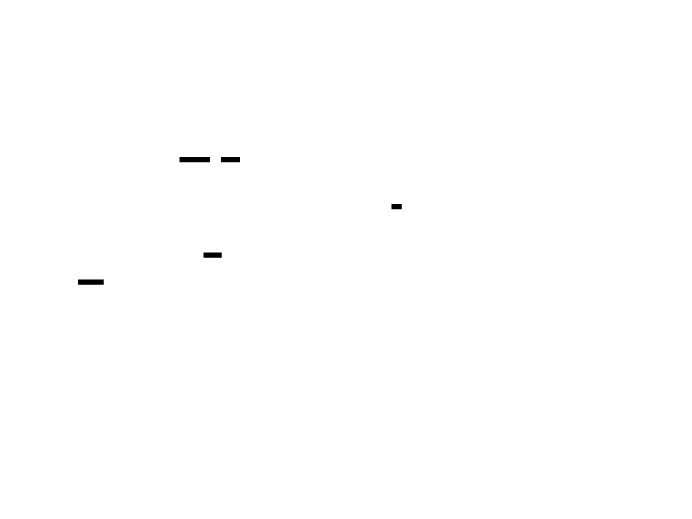

### Symbol Resolution Strategy
The resolution pipeline tries multiple sources:
1. **.symtab** (if present): Full symbol table with all functions
2. **.dynsym** (always present for dynamically linked): Exported/imported symbols
3. **DWARF .debug_info** (if compiled with -g): Full debug info with line numbers
4. **Separate debug file** (if .gnu_debuglink exists): External debug info
5. **debuginfod server** (if configured): Network-based debug info lookup
```rust
use object::{Object, ObjectSection, read::File as ObjectFile};
use gimli::{Dwarf, EndianSlice, LittleEndian, LineProgram};
/// Symbol information from resolution
#[derive(Debug, Clone)]
pub struct SymbolInfo {
    pub name: String,
    pub address: u64,
    pub size: u64,
    pub file: Option<String>,
    pub line: Option<u32>,
    pub inlined: bool,
}
/// Symbol resolver that handles multiple sources
pub struct SymbolResolver {
    /// Loaded modules with their symbol tables
    modules: Vec<ModuleSymbols>,
    /// Cache: address -> symbol
    cache: FxHashMap<u64, SymbolInfo>,
    /// Debug search paths
    debug_paths: Vec<std::path::PathBuf>,
}
struct ModuleSymbols {
    path: String,
    build_id: Option<String>,
    start_address: u64,
    end_address: u64,
    symbols: Vec<SymbolInfo>,
    dwarf: Option<DwarfInfo>,
}
struct DwarfInfo {
    // Parsed DWARF data for line number lookup
    line_program: Vec<u8>, // Serialized line program
}
impl SymbolResolver {
    pub fn new() -> Self {
        SymbolResolver {
            modules: Vec::new(),
            cache: FxHashMap::default(),
            debug_paths: vec![
                std::path::PathBuf::from("/usr/lib/debug"),
                std::path::PathBuf::from("/lib/debug"),
                std::path::PathBuf::from("/usr/lib/debug/.build-id"),
            ],
        }
    }
    /// Load symbols from /proc/self/maps and all mapped files
    pub fn load_from_proc_maps(&mut self) -> Result<(), String> {
        let maps = std::fs::read_to_string("/proc/self/maps")
            .map_err(|e| format!("Failed to read /proc/self/maps: {}", e))?;
        let mut current_path = String::new();
        let mut current_start = 0u64;
        let mut current_end = 0u64;
        for line in maps.lines() {
            let parts: Vec<&str> = line.split_whitespace().collect();
            if parts.len() < 5 {
                continue;
            }
            let addr_range: Vec<&str> = parts[0].split('-').collect();
            let start = u64::from_str_radix(addr_range[0], 16).unwrap_or(0);
            let end = u64::from_str_radix(addr_range[1], 16).unwrap_or(0);
            let perms = parts[1];
            let path = parts.get(5).unwrap_or(&"");
            // Only process executable segments
            if !perms.contains('x') || path.is_empty() || *path == "[vdso]" {
                continue;
            }
            // New mapping or continuation of previous
            if path != current_path {
                if !current_path.is_empty() {
                    self.load_module(&current_path, current_start, current_end)?;
                }
                current_path = path.to_string();
                current_start = start;
            }
            current_end = end;
        }
        // Don't forget the last mapping
        if !current_path.is_empty() {
            self.load_module(&current_path, current_start, current_end)?;
        }
        Ok(())
    }
    /// Load symbols from a single module
    fn load_module(
        &mut self,
        path: &str,
        start_address: u64,
        end_address: u64,
    ) -> Result<(), String> {
        let data = match std::fs::read(path) {
            Ok(d) => d,
            Err(_) => return Ok(()), // Skip files we can't read
        };
        let obj = ObjectFile::parse(&data[..])
            .map_err(|e| format!("Failed to parse {}: {:?}", path, e))?;
        let mut symbols = Vec::new();
        let mut build_id = None;
        // Get build ID
        if let Some(section) = obj.section_by_name(".note.gnu.build-id") {
            let data = section.data().unwrap_or(&[]);
            if data.len() > 16 {
                // Build ID is after the note header
                build_id = Some(hex::encode(&data[16..]));
            }
        }
        // Try .symtab first (full symbols)
        if let Some(symtab) = obj.symbol_table() {
            for (_, sym) in symtab {
                if let Ok(name) = sym.name() {
                    let addr = sym.address();
                    let size = sym.size().max(16); // Default size if unknown
                    symbols.push(SymbolInfo {
                        name: name.to_string(),
                        address: addr,
                        size: size,
                        file: None,
                        line: None,
                        inlined: false,
                    });
                }
            }
        }
        // If no .symtab, try .dynsym
        if symbols.is_empty() {
            if let Some(dynsym) = obj.dynamic_symbols() {
                for (_, sym) in dynsym {
                    if let Ok(name) = sym.name() {
                        symbols.push(SymbolInfo {
                            name: name.to_string(),
                            address: sym.address(),
                            size: sym.size().max(16),
                            file: None,
                            line: None,
                            inlined: false,
                        });
                    }
                }
            }
        }
        // Sort symbols by address for binary search
        symbols.sort_by_key(|s| s.address);
        // Check for separate debug file
        let debug_path = self.find_debug_file(path, &build_id);
        let dwarf = if let Some(debug_path) = debug_path {
            self.load_dwarf_info(&debug_path).ok()
        } else {
            // Try to load DWARF from the binary itself
            self.load_dwarf_info(path).ok()
        };
        self.modules.push(ModuleSymbols {
            path: path.to_string(),
            build_id,
            start_address,
            end_address,
            symbols,
            dwarf,
        });
        Ok(())
    }
    /// Find separate debug file using .gnu_debuglink or build-id
    fn find_debug_file(&self, path: &str, build_id: &Option<String>) -> Option<String> {
        // Try .gnu_debuglink first
        let data = std::fs::read(path).ok()?;
        let obj = ObjectFile::parse(&data[..]).ok()?;
        if let Some(section) = obj.section_by_name(".gnu_debuglink") {
            let link_data = section.data().unwrap_or(&[]);
            let link_path = std::ffi::CStr::from_bytes_until_nul(link_data)
                .ok()?
                .to_str()
                .ok()?;
            // Search in debug paths
            let bin_dir = std::path::Path::new(path).parent()?;
            for search_path in &self.debug_paths {
                let debug_file = search_path.join(link_path);
                if debug_file.exists() {
                    return Some(debug_file.to_string_lossy().to_string());
                }
                // Also check .debug subdirectory
                let debug_file = bin_dir.join(".debug").join(link_path);
                if debug_file.exists() {
                    return Some(debug_file.to_string_lossy().to_string());
                }
            }
        }
        // Try build-id lookup
        if let Some(id) = build_id {
            if id.len() >= 2 {
                let build_id_path = format!(".build-id/{}/{}.debug", &id[..2], &id[2..]);
                for search_path in &self.debug_paths {
                    let debug_file = search_path.join(&build_id_path);
                    if debug_file.exists() {
                        return Some(debug_file.to_string_lossy().to_string());
                    }
                }
            }
        }
        None
    }
    /// Load DWARF debug information
    fn load_dwarf_info(&self, path: &str) -> Result<DwarfInfo, String> {
        let data = std::fs::read(path)
            .map_err(|e| format!("Failed to read {}: {}", path, e))?;
        let obj = ObjectFile::parse(&data[..])
            .map_err(|e| format!("Failed to parse {}: {:?}", path, e))?;
        // Load DWARF sections
        let endian = LittleEndian;
        let dwarf = Dwarf::load(|id| {
            let data = obj.section_by_name(id.name())
                .and_then(|s| s.data().ok().map(|d| d.to_vec()))
                .unwrap_or_default();
            Ok(gimli::EndianSlice::new(&data, endian))
        }, |id| {
            let data = obj.section_by_name(id.name())
                .and_then(|s| s.data().ok().map(|d| d.to_vec()))
                .unwrap_or_default();
            Ok(gimli::EndianSlice::new(&data, endian))
        }).map_err(|e| format!("Failed to load DWARF: {:?}", e))?;
        // Store serialized line program data
        // (In production, you'd parse and index this properly)
        Ok(DwarfInfo {
            line_program: Vec::new(),
        })
    }
    /// Look up symbol for an address
    pub fn lookup(&mut self, addr: u64) -> Option<&SymbolInfo> {
        // Check cache first
        if let Some(sym) = self.cache.get(&addr) {
            return Some(sym);
        }
        // Find the containing module
        let module = self.modules.iter()
            .find(|m| addr >= m.start_address && addr < m.end_address)?;
        // Calculate offset within the module
        let offset = addr - module.start_address;
        // Binary search for containing symbol
        let idx = module.symbols.partition_point(|s| s.address <= offset);
        if idx == 0 {
            return None;
        }
        let sym = &module.symbols[idx - 1];
        if offset >= sym.address && offset < sym.address + sym.size {
            // Clone to avoid lifetime issues with cache
            let mut info = sym.clone();
            // Add file/line info if available from DWARF
            if let Some(ref _dwarf) = module.dwarf {
                // In production, query DWARF line program here
                // info.file = Some(...);
                // info.line = Some(...);
            }
            self.cache.insert(addr, info);
            return Some(&self.cache[&addr]);
        }
        None
    }
}
```


---
## Profile Merging: Combining Multiple Runs
Profile merging is essential for:
- Aggregating profiles across multiple instances
- Comparating before/after optimization
- Building long-term performance baselines
### Merging Strategy
```rust
/// Profile merger that combines multiple profiles
pub struct ProfileMerger {
    collapsed: CollapsedStacks,
    sample_count: usize,
    profile_count: usize,
}
impl ProfileMerger {
    pub fn new() -> Self {
        ProfileMerger {
            collapsed: CollapsedStacks::new(),
            sample_count: 0,
            profile_count: 0,
        }
    }
    /// Add a collapsed stack file
    pub fn add_collapsed(&mut self, collapsed: &CollapsedStacks) {
        self.collapsed.merge(collapsed);
        self.sample_count += collapsed.total;
        self.profile_count += 1;
    }
    /// Add a profile file (auto-detect format)
    pub fn add_file(&mut self, path: &str) -> Result<(), String> {
        let data = std::fs::read(path)
            .map_err(|e| format!("Failed to read {}: {}", path, e))?;
        // Detect format
        if data.starts_with(b"main;") || data.starts_with(b"# ") {
            // Collapsed stack format
            let text = String::from_utf8(data)
                .map_err(|e| format!("Invalid UTF-8 in {}: {}", path, e))?;
            let collapsed = CollapsedStacks::import(&text)?;
            self.add_collapsed(&collapsed);
        } else {
            // Try pprof format
            let profile = Profile::decode(&data[..])
                .map_err(|e| format!("Failed to parse {} as pprof: {:?}", path, e))?;
            let collapsed = collapsed_from_pprof(&profile)?;
            self.add_collapsed(&collapsed);
        }
        Ok(())
    }
    /// Get merged collapsed stacks
    pub fn merged(&self) -> &CollapsedStacks {
        &self.collapsed
    }
    /// Calculate statistics about the merge
    pub fn stats(&self) -> MergeStats {
        MergeStats {
            profile_count: self.profile_count,
            total_samples: self.sample_count,
            unique_paths: self.collapsed.stacks.len(),
            avg_samples_per_profile: if self.profile_count > 0 {
                self.sample_count / self.profile_count
            } else {
                0
            },
        }
    }
}
#[derive(Debug)]
pub struct MergeStats {
    pub profile_count: usize,
    pub total_samples: usize,
    pub unique_paths: usize,
    pub avg_samples_per_profile: usize,
}
/// Convert pprof profile to collapsed stacks
fn collapsed_from_pprof(profile: &Profile) -> Result<CollapsedStacks, String> {
    let mut collapsed = CollapsedStacks::new();
    // Build location -> function name map
    let mut location_names: FxHashMap<u64, String> = FxHashMap::default();
    for location in &profile.location {
        if let Some(line) = location.line.first() {
            let func_id = line.function_id as usize;
            if let Some(func) = profile.function.get(func_id - 1) {
                let name_idx = func.name as usize;
                if let Some(name) = profile.string_table.get(name_idx) {
                    location_names.insert(location.id, name.clone());
                }
            }
        }
    }
    // Convert samples to collapsed stacks
    for sample in &profile.sample {
        let frames: Vec<&str> = sample.location_id
            .iter()
            .filter_map(|&id| location_names.get(&(id as u64)).map(|s| s.as_str()))
            .collect();
        if !frames.is_empty() {
            let count = sample.value.first().copied().unwrap_or(1) as usize;
            collapsed.add(&frames, count);
        }
    }
    Ok(collapsed)
}
```

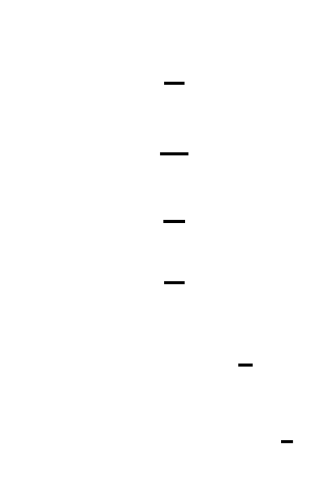

---
## Command-Line Interface: Production Workflow
A good CLI makes your profiler usable in real workflows.
### CLI Design
```rust
use clap::{Parser, Subcommand};
#[derive(Parser)]
#[command(name = "profiler")]
#[command(about = "Sampling profiler for Rust applications")]
struct Cli {
    #[command(subcommand)]
    command: Commands,
}
#[derive(Subcommand)]
enum Commands {
    /// Profile a running process by PID
    Profile {
        /// Process ID to profile
        #[arg(short, long)]
        pid: u32,
        /// Sampling frequency in Hz (default: 99)
        #[arg(short = 'f', long, default_value = "99")]
        frequency: u64,
        /// Duration in seconds (default: 10)
        #[arg(short, long, default_value = "10")]
        duration: u64,
        /// Output format
        #[arg(short = 'o', long, value_enum, default_value = "collapsed")]
        output_format: OutputFormat,
        /// Output file (default: stdout)
        #[arg(short, long)]
        output: Option<String>,
        /// Include memory allocation tracking
        #[arg(long)]
        memory: bool,
    },
    /// Profile a command
    Record {
        /// Command to run
        #[arg(required = true)]
        command: Vec<String>,
        /// Sampling frequency in Hz
        #[arg(short = 'f', long, default_value = "99")]
        frequency: u64,
        /// Output format
        #[arg(short = 'o', long, value_enum, default_value = "collapsed")]
        output_format: OutputFormat,
        /// Output file
        #[arg(short, long)]
        output: Option<String>,
    },
    /// Generate flame graph from profile
    Flamegraph {
        /// Input profile file
        #[arg(short, long)]
        input: String,
        /// Output SVG file
        #[arg(short, long)]
        output: String,
        /// Title for the flame graph
        #[arg(long)]
        title: Option<String>,
        /// Width in pixels
        #[arg(long, default_value = "1200")]
        width: usize,
    },
    /// Compare two profiles
    Diff {
        /// Baseline profile
        #[arg(short, long)]
        baseline: String,
        /// Comparison profile
        #[arg(short, long)]
        comparison: String,
        /// Output file
        #[arg(short, long)]
        output: Option<String>,
    },
    /// Merge multiple profiles
    Merge {
        /// Input files
        #[arg(required = true)]
        inputs: Vec<String>,
        /// Output file
        #[arg(short, long)]
        output: String,
    },
    /// Serve continuous profiling endpoint
    Serve {
        /// Port to listen on
        #[arg(short, long, default_value = "6060")]
        port: u16,
        /// Sampling frequency
        #[arg(long, default_value = "49")]
        frequency: u64,
        /// Profile duration in seconds
        #[arg(long, default_value = "30")]
        duration: u64,
    },
}
#[derive(Clone, Copy, clap::ValueEnum)]
enum OutputFormat {
    Collapsed,
    Pprof,
    Json,
    Text,
}
fn main() -> Result<(), String> {
    let cli = Cli::parse();
    match cli.command {
        Commands::Profile { pid, frequency, duration, output_format, output, memory } => {
            profile_process(pid, frequency, duration, output_format, output, memory)?;
        }
        Commands::Record { command, frequency, output_format, output } => {
            record_command(command, frequency, output_format, output)?;
        }
        Commands::Flamegraph { input, output, title, width } => {
            generate_flamegraph(&input, &output, title.as_deref(), width)?;
        }
        Commands::Diff { baseline, comparison, output } => {
            diff_profiles(&baseline, &comparison, output.as_deref())?;
        }
        Commands::Merge { inputs, output } => {
            merge_profiles(&inputs, &output)?;
        }
        Commands::Serve { port, frequency, duration } => {
            serve_continuous_profiling(port, frequency, duration)?;
        }
    }
    Ok(())
}
fn profile_process(
    pid: u32,
    frequency: u64,
    duration: u64,
    format: OutputFormat,
    output: Option<String>,
    track_memory: bool,
) -> Result<(), String> {
    println!("Profiling process {} at {} Hz for {} seconds...", 
             pid, frequency, duration);
    // Attach to process (requires ptrace permissions or perf events)
    // This is a simplified version - real implementation would use perf_event_open
    let mut profiler = Profiler::new(SamplerConfig {
        frequency_hz: frequency,
    });
    profiler.start_for_pid(pid)?;
    std::thread::sleep(std::time::Duration::from_secs(duration));
    let profile = profiler.stop()?;
    let output_data = match format {
        OutputFormat::Collapsed => {
            profile.samples.export_collapsed()
        }
        OutputFormat::Pprof => {
            let builder = PprofBuilder::from_profile_data(&profile, &profile.symbols);
            String::from_utf8_lossy(&builder.export_bytes()).to_string()
        }
        OutputFormat::Json => {
            export_speedscope(&profile.samples)?
        }
        OutputFormat::Text => {
            format_text_report(&profile)
        }
    };
    match output {
        Some(path) => {
            std::fs::write(&path, output_data)
                .map_err(|e| format!("Failed to write {}: {}", path, e))?;
            println!("Profile written to {}", path);
        }
        None => {
            println!("{}", output_data);
        }
    }
    Ok(())
}
fn format_text_report(profile: &ProfileData) -> String {
    let mut report = String::new();
    report.push_str(&format!("Profiler Report\n"));
    report.push_str(&format!("{}\n\n", "=".repeat(60)));
    report.push_str(&format!("Duration: {:.2}s\n", profile.duration_ns as f64 / 1e9));
    report.push_str(&format!("Samples: {}\n", profile.samples.total));
    report.push_str(&format!("Frequency: {} Hz\n\n", profile.config.frequency_hz));
    report.push_str(&format!("{:<50} {:>10}\n", "FUNCTION", "SAMPLES"));
    report.push_str(&format!("{}\n", "-".repeat(60)));
    for (path, count) in profile.samples.get_hot_paths(30) {
        let leaf = path.split(';').last().unwrap_or(path);
        let pct = (*count as f64 / profile.samples.total as f64) * 100.0;
        report.push_str(&format!("{:<50} {:>8} ({:>5.1}%)\n", leaf, count, pct));
    }
    report
}
```


---
## Continuous Profiling: HTTP Endpoint
For production observability, you need an HTTP endpoint that serves profiles on demand.
### Implementation
```rust
use std::sync::Arc;
use std::time::{Duration, Instant};
use tokio::sync::RwLock;
use warp::{Filter, Rejection, Reply};
/// Continuous profiler state
pub struct ContinuousProfilerState {
    config: SamplerConfig,
    last_profile: Option<ProfileData>,
    last_profile_time: Option<Instant>,
    profile_duration: Duration,
}
impl ContinuousProfilerState {
    pub fn new(frequency_hz: u64, duration_secs: u64) -> Self {
        ContinuousProfilerState {
            config: SamplerConfig { frequency_hz },
            last_profile: None,
            last_profile_time: None,
            profile_duration: Duration::from_secs(duration_secs),
        }
    }
    /// Get or capture a profile
    pub async fn get_profile(&mut self) -> Result<&ProfileData, String> {
        // Check if we have a recent profile
        if let Some(time) = self.last_profile_time {
            if time.elapsed() < self.profile_duration {
                return Ok(self.last_profile.as_ref().unwrap());
            }
        }
        // Capture new profile
        let mut profiler = Profiler::new(self.config.clone());
        profiler.start()?;
        tokio::time::sleep(self.profile_duration).await;
        let profile = profiler.stop()?;
        self.last_profile = Some(profile);
        self.last_profile_time = Some(Instant::now());
        Ok(self.last_profile.as_ref().unwrap())
    }
}
/// HTTP handlers for continuous profiling
pub fn profiling_routes(
    state: Arc<RwLock<ContinuousProfilerState>>,
) -> impl Filter<Extract = impl Reply, Error = Rejection> + Clone {
    let profile_pprof = warp::path!("debug" / "pprof" / "profile")
        .and(warp::get())
        .and_then(move || {
            let state = state.clone();
            async move {
                let mut state = state.write().await;
                match state.get_profile().await {
                    Ok(profile) => {
                        let builder = PprofBuilder::from_profile_data(profile, &profile.symbols);
                        let bytes = builder.export_bytes();
                        Ok::<_, Rejection>(warp::reply::with_header(
                            bytes,
                            "Content-Type",
                            "application/octet-stream",
                        ))
                    }
                    Err(e) => {
                        Ok(warp::reply::with_status(
                            e,
                            warp::http::StatusCode::INTERNAL_SERVER_ERROR,
                        ).into_response())
                    }
                }
            }
        });
    let profile_flamegraph = warp::path!("debug" / "flamegraph")
        .and(warp::get())
        .and_then(move || {
            let state = state.clone();
            async move {
                let mut state = state.write().await;
                match state.get_profile().await {
                    Ok(profile) => {
                        let collapsed = CollapsedStacks::from_samples(
                            &profile.raw_samples,
                            &mut profile.symbols.clone(),
                        );
                        let tree = build_flame_tree(&collapsed);
                        let renderer = FlameGraphRenderer {
                            width: 1200,
                            height_per_frame: 16,
                            min_width: 0.5,
                            colors: ColorScheme::default(),
                        };
                        let svg = renderer.render(&tree, collapsed.total);
                        Ok::<_, Rejection>(warp::reply::with_header(
                            svg,
                            "Content-Type",
                            "image/svg+xml",
                        ))
                    }
                    Err(e) => {
                        Ok(warp::reply::with_status(
                            e,
                            warp::http::StatusCode::INTERNAL_SERVER_ERROR,
                        ).into_response())
                    }
                }
            }
        });
    let profile_collapsed = warp::path!("debug" / "collapsed")
        .and(warp::get())
        .and_then(move || {
            let state = state.clone();
            async move {
                let mut state = state.write().await;
                match state.get_profile().await {
                    Ok(profile) => {
                        let collapsed = CollapsedStacks::from_samples(
                            &profile.raw_samples,
                            &mut profile.symbols.clone(),
                        );
                        Ok::<_, Rejection>(warp::reply::with_header(
                            collapsed.export(),
                            "Content-Type",
                            "text/plain",
                        ))
                    }
                    Err(e) => {
                        Ok(warp::reply::with_status(
                            e,
                            warp::http::StatusCode::INTERNAL_SERVER_ERROR,
                        ).into_response())
                    }
                }
            }
        });
    let profile_json = warp::path!("debug" / "profile" / "json")
        .and(warp::get())
        .and_then(move || {
            let state = state.clone();
            async move {
                let mut state = state.write().await;
                match state.get_profile().await {
                    Ok(profile) => {
                        let collapsed = CollapsedStacks::from_samples(
                            &profile.raw_samples,
                            &mut profile.symbols.clone(),
                        );
                        match export_speedscope(&collapsed) {
                            Ok(json) => Ok::<_, Rejection>(warp::reply::json(&json)),
                            Err(e) => Ok(warp::reply::with_status(
                                e,
                                warp::http::StatusCode::INTERNAL_SERVER_ERROR,
                            ).into_response()),
                        }
                    }
                    Err(e) => {
                        Ok(warp::reply::with_status(
                            e,
                            warp::http::StatusCode::INTERNAL_SERVER_ERROR,
                        ).into_response())
                    }
                }
            }
        });
    profile_pprof
        .or(profile_flamegraph)
        .or(profile_collapsed)
        .or(profile_json)
}
/// Start the continuous profiling server
pub async fn serve_continuous_profiling(
    port: u16,
    frequency: u64,
    duration: u64,
) -> Result<(), String> {
    let state = Arc::new(RwLock::new(
        ContinuousProfilerState::new(frequency, duration)
    ));
    let routes = profiling_routes(state);
    println!("Continuous profiling server starting on port {}", port);
    println!("Endpoints:");
    println!("  http://localhost:{}/debug/pprof/profile  - pprof format", port);
    println!("  http://localhost:{}/debug/flamegraph     - SVG flame graph", port);
    println!("  http://localhost:{}/debug/collapsed      - collapsed stacks", port);
    println!("  http://localhost:{}/debug/profile/json   - speedscope JSON", port);
    warp::serve(routes)
        .run(([0, 0, 0, 0], port))
        .await;
    Ok(())
}
```
### Integration with Observability Stacks
The HTTP endpoint integrates with standard tools:
```bash
# Fetch pprof profile
curl http://localhost:6060/debug/pprof/profile > profile.pb.gz
# View with pprof
pprof -http=:8080 profile.pb.gz
# Fetch flame graph directly (open in browser)
open http://localhost:6060/debug/flamegraph
# Fetch collapsed stacks
curl http://localhost:6060/debug/collapsed > profile.txt
flamegraph.pl profile.txt > flamegraph.svg
# Load into speedscope
curl http://localhost:6060/debug/profile/json > profile.json
# Open https://www.speedscope.app/ and load profile.json
```

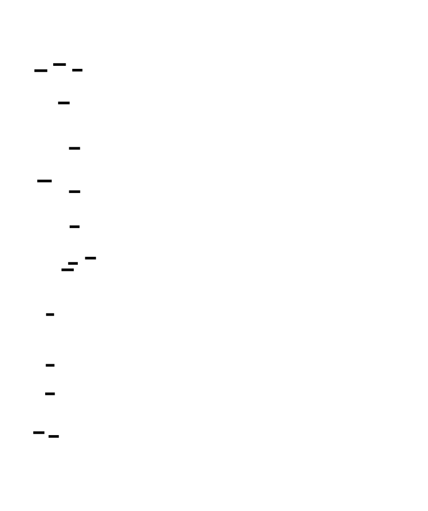

---
## Common Pitfalls and How to Avoid Them
### Pitfall 1: Symbols Lost After Binary Rebuild
```bash
# ❌ WRONG: Profile binary v1, rebuild, try to resolve symbols
./profiler record -o profile.pb -- ./my_app
# ... rebuild my_app ...
pprof profile.pb  # Symbols don't match!
# ✅ CORRECT: Save the binary with the profile
./profiler record -o profile.pb -- ./my_app
cp my_app my_app.profiled
# Later, use the saved binary
pprof -binary=my_app.profiled profile.pb
```
**Fix:** Always archive the exact binary alongside profiles, or use build IDs to match.
### Pitfall 2: pprof Schema Version Mismatch
```bash
# ❌ WRONG: Old pprof tool with new profile format
old_pprof profile.pb  # "failed to parse: unknown field"
# ✅ CORRECT: Keep pprof updated, or specify schema version
# In your builder, use compatible schema version
```
**Fix:** Version your pprof encoder and keep tools updated.
### Pitfall 3: Overhead in Continuous Profiling
```bash
# ❌ WRONG: Continuous profiling at 100 Hz
./my_app --profile-continuous --profile-freq=100  # Too much overhead!
# ✅ CORRECT: Lower frequency for continuous, higher for debugging
./my_app --profile-continuous --profile-freq=19  # Acceptable overhead
```
**Fix:** Use prime frequencies (19, 49 Hz) for continuous profiling. Reserve 99+ Hz for active debugging.
### Pitfall 4: Missing Separate Debug Files
```bash
# ❌ WRONG: Profile stripped binary without debug files
./profiler record ./my_stripped_app
# Symbols: ?? ??
# ✅ CORRECT: Install debug files or use unstripped binary
dpkg --add-architecture amd64
apt-get install my-app-dbgsym
# Or keep unstripped binary for profiling
```
**Fix:** Set up debug package repositories, or profile unstripped binaries.
### Pitfall 5: Security Exposure via Profile Endpoint
```bash
# ❌ WRONG: Expose profiling endpoint to public internet
# Anyone can see function names, timing, potentially secrets in strings
# ✅ CORRECT: Restrict access, sanitize data
# Bind to localhost only, use auth middleware, filter sensitive functions
```
**Fix:** Bind to localhost, add authentication, or run behind a secure proxy.
---
## Hardware Soul: What Happens During Profile Export
When you export a profile, here's the hardware reality:
**Cache Behavior:**
- String interning: hash table lookups, cache misses on new strings
- Symbol resolution: random access through symbol tables
- Protobuf encoding: sequential writes, good cache utilization
**Memory Bandwidth:**
- 10,000 samples × 128 addresses × 8 bytes = 10 MB to process
- String table building: additional allocations
- Protobuf encoding: ~2× expansion from raw data
**CPU Cycles:**
- String hashing: ~50 cycles per unique string
- Address lookup: ~100 cycles (binary search + cache miss)
- Protobuf varint encoding: ~5 cycles per integer
**The bottleneck:** String interning and symbol resolution dominate. If you're exporting to pprof format, the string table construction is the most expensive operation.
---
## Knowledge Cascade: What You've Unlocked
### 1. pprof Format → Protocol Buffers & Schema Evolution
The pprof format teaches you about **schema evolution** in distributed systems:
- **Backward compatibility:** New tools can read old profiles
- **Forward compatibility:** Old tools can (partially) read new profiles
- **Field numbering:** Adding new fields doesn't break old parsers
- **String interning:** Compression technique used in many serialization formats
**Cross-domain:** This is the same pattern as database schema migrations, API versioning, and configuration file formats. Understanding Protocol Buffers gives you mental models for all versioned data formats.
### 2. Collapsed Stack Format → Unix Philosophy & Tool Interoperability
The collapsed stack format embodies the **Unix philosophy**:
- **Do one thing well:** Represent aggregated stack traces
- **Text streams:** Universal interface
- **Composability:** Pipe through grep, sort, awk before visualization
**The pattern:** Simple text formats enable tool ecosystems. JSON, CSV, and log formats follow the same principle—human-readable, tool-agnostic, easy to generate and consume.
**Cross-domain:** This is why configuration files gravitate toward text formats (YAML, TOML) despite binary formats being more efficient. Interoperability beats efficiency for human-facing data.
### 3. Symbol Resolution → Binary Analysis & Reverse Engineering
Understanding symbol resolution opens doors to:
- **Reverse engineering:** Extracting information from binaries you didn't compile
- **Malware analysis:** Understanding what unknown code does
- **Debugging production issues:** When you have a core dump but no source
- **Security research:** Finding vulnerabilities in closed-source software
**The tools you've built** (ELF parsing, DWARF navigation, build ID lookup) are the foundation of security tooling.
### 4. DWARF Debug Info → Compiler Internals
DWARF is the **compiler's view of your code**:
- **Variable locations:** Where the compiler stored each variable at each instruction
- **Call frame information:** How to unwind the stack at any point
- **Type information:** The full type hierarchy, including generics
- **Optimization annotations:** What the compiler did to your code
**Cross-domain:** Understanding DWARF helps you understand:
- Why debuggers sometimes show "optimized out"
- How garbage collectors find roots (they use similar info)
- How sanitizers (ASan, MSan) track memory state
### 5. Continuous Profiling → Production Observability
The HTTP endpoint you've built connects to the **observability ecosystem**:
- **Prometheus:** Could scrape profile metadata as metrics
- **Grafana:** Could embed flame graphs in dashboards
- **Jaeger/Zipkin:** Could correlate profiles with traces
- **Datadog/Dynatrace:** Commercial tools with similar endpoints
**The pattern:** Exposing internal state via HTTP is the standard for production systems. Health checks, metrics, profiling, tracing—all follow this model.
---
## Putting It All Together: The Complete Export Pipeline
```rust
pub struct ProfileExporter {
    data: ProfileData,
    symbols: SymbolTable,
}
impl ProfileExporter {
    pub fn new(data: ProfileData, symbols: SymbolTable) -> Self {
        ProfileExporter { data, symbols }
    }
    /// Export to collapsed stack format
    pub fn to_collapsed(&self) -> String {
        let collapsed = CollapsedStacks::from_samples(
            &self.data.raw_samples,
            &mut self.symbols.clone(),
        );
        collapsed.export()
    }
    /// Export to pprof protobuf
    pub fn to_pprof(&self) -> Vec<u8> {
        let builder = PprofBuilder::from_profile_data(&self.data, &self.symbols);
        builder.export_bytes()
    }
    /// Export to speedscope JSON
    pub fn to_json(&self) -> Result<String, serde_json::Error> {
        let collapsed = CollapsedStacks::from_samples(
            &self.data.raw_samples,
            &mut self.symbols.clone(),
        );
        export_speedscope(&collapsed)
    }
    /// Export to text report
    pub fn to_text(&self) -> String {
        format_text_report(&self.data)
    }
    /// Export to file, auto-detecting format from extension
    pub fn to_file(&self, path: &str) -> Result<(), String> {
        let data = if path.ends_with(".pb") || path.ends_with(".pb.gz") {
            self.to_pprof()
        } else if path.ends_with(".json") {
            self.to_json()
                .map_err(|e| format!("JSON export failed: {}", e))?
                .into_bytes()
        } else if path.ends_with(".svg") {
            self.to_flamegraph_svg()
                .into_bytes()
        } else {
            self.to_collapsed().into_bytes()
        };
        std::fs::write(path, data)
            .map_err(|e| format!("Failed to write {}: {}", path, e))
    }
    /// Generate flame graph SVG
    pub fn to_flamegraph_svg(&self) -> String {
        let collapsed = CollapsedStacks::from_samples(
            &self.data.raw_samples,
            &mut self.symbols.clone(),
        );
        let tree = build_flame_tree(&collapsed);
        let renderer = FlameGraphRenderer {
            width: 1200,
            height_per_frame: 16,
            min_width: 0.5,
            colors: ColorScheme::default(),
        };
        renderer.render(&tree, collapsed.total)
    }
}
```
---
## What You've Built: A Complete Profiler
Over the course of this project, you've built:
1. **Sampling-Based CPU Profiler** (Milestone 1): Statistical sampling at configurable frequencies, stack unwinding via frame pointers, multi-threaded sample collection, and overhead measurement.
2. **Call Graph & Flame Graph Generation** (Milestone 2): Call graph construction, stack folding, flame graph visualization, and differential analysis.
3. **Memory Allocation Tracking** (Milestone 3): LD_PRELOAD interposition, allocation metadata tracking, leak detection, allocation hot spot analysis, and temporal memory analysis.
4. **Async-Aware Profiling** (Milestone 4): Task identity tracking, logical stack reconstruction, CPU vs. await time separation, and async-aware flame graphs.
5. **Profile Export & Integration** (Milestone 5): pprof protobuf export, collapsed stack format, symbol resolution, profile merging, CLI tooling, and continuous profiling HTTP endpoint.
You now understand the inner workings of tools like `perf`, `async-profiler`, and `pprof`. More importantly, you can customize, extend, and debug profiling infrastructure when off-the-shelf tools don't meet your needs.
The profiler you've built is a foundation—you can extend it with:
- **Hardware performance counters:** Cache misses, branch mispredictions, IPC
- **Lock contention analysis:** Which mutexes are hot, how long threads wait
- **I/O profiling:** Disk and network operation timing
- **JIT compilation support:** Profiling dynamically generated code
- **Kernel profiling:** Understanding where time is spent in syscalls
Profiling is a superpower. Use it wisely.
---
[[CRITERIA_JSON: {"milestone_id": "profiler-m5", "criteria": ["Export profiles in pprof protobuf format with proper string interning, mapping tables, and sample type definitions", "Export profiles in collapsed stack format compatible with flamegraph.pl and speedscope, with metadata headers for provenance", "Import and parse collapsed stack format profiles with comment handling and validation", "Merge multiple profile files combining sample counts for identical call paths with statistics tracking", "Implement symbol resolution supporting .symtab, .dynsym, and separate debug files via .gnu_debuglink and build-id lookup", "Parse DWARF debug information sections to extract source file and line number attribution for sample addresses", "Handle stripped binaries by gracefully falling back to raw addresses when symbols unavailable", "Implement HTTP endpoints for continuous profiling serving pprof, collapsed, JSON, and SVG formats", "Build CLI tool supporting profile, record, flamegraph, diff, merge, and serve subcommands with proper argument parsing", "Implement security considerations for continuous profiling endpoint including localhost binding and optional authentication", "Generate differential flame graphs comparing baseline and comparison profiles with change highlighting", "Support profile compression (gzip) for efficient storage and transmission"]}]
<!-- END_MS -->


# TDD

A production-quality sampling profiler that measures CPU usage, tracks memory allocations, handles async execution patterns, and generates flame graph visualizations. The profiler operates at the boundary between application code and OS primitives, using statistical sampling at prime frequencies (99Hz) to avoid lock-step with application loops, frame pointer chaining for stack unwinding, LD_PRELOAD interposition for allocation tracking, and task identity tracking for async-aware profiling. All signal handlers use async-signal-safe operations with pre-allocated buffers, and the system exports to standard formats (pprof, collapsed stacks) for toolchain interoperability.


<!-- TDD_MOD_ID: profiler-m1 -->
# Technical Design Specification: Sampling-Based CPU Profiler
## Module Charter
The Sampling-Based CPU Profiler implements statistical sampling of program execution using `ITIMER_PROF` timer signals delivered via `SIGPROF`. It captures stack traces through frame pointer chaining at configurable prime frequencies (default 99Hz), stores samples in a pre-allocated lock-free ring buffer for async-signal-safety, and supports multi-threaded applications with per-thread identification. This module deliberately excludes symbol resolution (deferred to post-processing in M5), flame graph generation (M2), and memory tracking (M3). The profiler maintains a critical invariant: the signal handler never allocates memory, acquires locks, or calls non-async-signal-safe functions. Upstream dependencies are the kernel's interval timer subsystem and the process's register state at sample time; downstream consumers are the aggregation and export layers. The ring buffer must never overflow during normal operation—consumers must drain faster than producers fill.
---
## File Structure
```
profiler/
├── Cargo.toml
└── src/
    ├── lib.rs                    # 1. Public API and module exports
    ├── sampler/
    │   ├── mod.rs                # 2. Sampler orchestration
    │   ├── config.rs             # 3. SamplerConfig with validation
    │   ├── timer.rs              # 4. setitimer setup/teardown
    │   └── signal.rs             # 5. sigaction handler registration
    ├── unwinder/
    │   ├── mod.rs                # 6. Stack unwinding interface
    │   ├── frame_pointer.rs      # 7. Frame pointer chain walker
    │   └── context.rs            # 8. ucontext_t register extraction
    ├── buffer/
    │   ├── mod.rs                # 9. Ring buffer interface
    │   └── ring.rs               # 10. Lock-free SPMC ring buffer
    ├── state/
    │   ├── mod.rs                # 11. Global profiler state
    │   └── sample.rs             # 12. RawSample definition
    └── error.rs                  # 13. Error types
```
**Creation Order:** Files numbered 1-13 should be created in sequence. Each file depends only on previously created files.
---
## Complete Data Model
### Core Structures
```rust
// src/state/sample.rs
/// Maximum stack depth captured per sample.
/// 128 frames covers >99.9% of real-world stacks while fitting in a cache line pair.
pub const MAX_STACK_DEPTH: usize = 128;
/// Ring buffer capacity in samples.
/// 65,536 samples × ~1KB per sample = 64MB maximum memory footprint.
/// At 99Hz, this holds ~11 minutes of samples before wrap.
pub const SAMPLE_BUFFER_SIZE: usize = 65_536;
/// A single captured stack sample.
/// 
/// Memory layout (x86_64, little-endian):
/// ┌─────────────────────────────────────────────────────────────┐
/// │ Offset 0x00: thread_id (u64, 8 bytes)                       │
/// │ Offset 0x08: timestamp_ns (u64, 8 bytes)                    │
/// │ Offset 0x10: depth (u8, 1 byte)                             │
/// │ Offset 0x11: padding (7 bytes, zeroed)                      │
/// │ Offset 0x18: addresses[0] (usize, 8 bytes)                  │
/// │ Offset 0x20: addresses[1] (usize, 8 bytes)                  │
/// │ ...                                                         │
/// │ Offset 0x418: addresses[127] (usize, 8 bytes)               │
/// └─────────────────────────────────────────────────────────────┘
/// Total size: 8 + 8 + 1 + 7 + (128 × 8) = 1048 bytes
/// 
/// Alignment: 8-byte aligned for atomic access to header fields.
/// Cache lines: ~16.4 cache lines (64 bytes each)
#[repr(C, align(8))]
pub struct RawSample {
    /// Thread ID from gettid(2) syscall.
    /// Distinguishes samples from different threads for per-thread analysis.
    pub thread_id: u64,
    /// Monotonic timestamp in nanoseconds.
    /// Used for temporal analysis and sample ordering.
    /// Source: clock_gettime(CLOCK_MONOTONIC) or RDTSC approximation.
    pub timestamp_ns: u64,
    /// Number of valid frames in addresses array.
    /// In range [0, MAX_STACK_DEPTH]. Zero indicates unwinding failure.
    pub depth: u8,
    /// Reserved for future use. Must be zero.
    _padding: [u8; 7],
    /// Instruction pointers from leaf (index 0) toward root.
    /// addresses[0] = current RIP at sample time.
    /// addresses[1..depth] = return addresses from stack frames.
    /// Uninitialized entries beyond depth must be ignored.
    pub addresses: [usize; MAX_STACK_DEPTH],
}
impl RawSample {
    /// Creates a zeroed sample. Used for buffer initialization.
    pub fn zeroed() -> Self {
        RawSample {
            thread_id: 0,
            timestamp_ns: 0,
            depth: 0,
            _padding: [0; 7],
            addresses: [0; MAX_STACK_DEPTH],
        }
    }
    /// Returns slice of valid addresses.
    pub fn valid_addresses(&self) -> &[usize] {
        &self.addresses[..self.depth as usize]
    }
}
// Static assertion for layout
const _: () = assert!(std::mem::size_of::<RawSample>() == 1048);
const _: () = assert!(std::mem::align_of::<RawSample>() == 8);
```
```rust
// src/sampler/config.rs
/// Profiler sampling configuration.
/// 
/// Invariants:
/// - frequency_hz must be in range [1, 10000]
/// - max_depth must be in range [1, MAX_STACK_DEPTH]
/// - Prime frequencies (99, 999) are recommended to avoid lock-step sampling
#[derive(Debug, Clone)]
pub struct SamplerConfig {
    /// Sampling frequency in Hz.
    /// 
    /// Recommended values:
    /// - 99 Hz: Standard profiling (0.02% overhead)
    /// - 999 Hz: High-resolution profiling (0.2% overhead)
    /// - 19 Hz: Continuous production profiling (minimal overhead)
    /// 
    /// WARNING: Avoid multiples of common application frequencies.
    /// 100 Hz may synchronize with 10ms event loops, causing sampling bias.
    pub frequency_hz: u64,
    /// Maximum stack depth to capture.
    /// Deeper stacks increase sample size but rarely provide additional value.
    pub max_depth: usize,
}
impl SamplerConfig {
    /// Creates config with 99 Hz frequency and max depth.
    pub fn default() -> Self {
        SamplerConfig {
            frequency_hz: 99,
            max_depth: MAX_STACK_DEPTH,
        }
    }
    /// Converts frequency to timer interval (seconds, microseconds).
    /// 
    /// For 99 Hz: interval = 1,000,000 μs / 99 ≈ 10,101 μs
    /// 
    /// Returns (seconds, microseconds) tuple for setitimer.
    pub fn interval(&self) -> (i64, i64) {
        let interval_us = 1_000_000 / self.frequency_hz as i64;
        (0, interval_us)
    }
    /// Validates configuration parameters.
    /// 
    /// Returns Err if:
    /// - frequency_hz == 0 or > 10000
    /// - max_depth == 0 or > MAX_STACK_DEPTH
    pub fn validate(&self) -> Result<(), ConfigError> {
        if self.frequency_hz == 0 {
            return Err(ConfigError::FrequencyZero);
        }
        if self.frequency_hz > 10_000 {
            return Err(ConfigError::FrequencyTooHigh { value: self.frequency_hz });
        }
        if self.max_depth == 0 {
            return Err(ConfigError::DepthZero);
        }
        if self.max_depth > MAX_STACK_DEPTH {
            return Err(ConfigError::DepthTooLarge { 
                value: self.max_depth, 
                max: MAX_STACK_DEPTH 
            });
        }
        Ok(())
    }
}
#[derive(Debug, thiserror::Error)]
pub enum ConfigError {
    #[error("Frequency cannot be zero")]
    FrequencyZero,
    #[error("Frequency {value} Hz exceeds maximum 10000 Hz")]
    FrequencyTooHigh { value: u64 },
    #[error("Stack depth cannot be zero")]
    DepthZero,
    #[error("Stack depth {value} exceeds maximum {max}")]
    DepthTooLarge { value: usize, max: usize },
}
```
```rust
// src/buffer/ring.rs
/// Lock-free single-producer-multi-consumer ring buffer.
/// 
/// Design:
/// - Producers (signal handlers) use atomic fetch_add to reserve slots
/// - Consumers read completed samples via load operations
/// - No locks, no allocations, no syscalls in the producer path
/// 
/// Memory ordering:
/// - Producers: Release ordering on slot write completion
/// - Consumers: Acquire ordering when reading slots
/// 
/// Overflow behavior:
/// - When write_pos wraps, old samples are overwritten
/// - This is detected by comparing slot timestamps
/// - Overwrites are reported in statistics but don't crash
pub struct RingBuffer {
    /// Pre-allocated sample storage.
    /// Aligned to cache line (64 bytes) to prevent false sharing.
    samples: Box<[CacheAligned<RawSample>]>,
    /// Next write position (wrapping).
    /// Incremented atomically by signal handlers.
    /// Actual slot = write_pos.load() % SAMPLE_BUFFER_SIZE
    write_pos: AtomicUsize,
    /// Total samples written (monotonic, for statistics).
    total_written: AtomicU64,
    /// Number of overwrites detected (samples lost to wrap).
    overwrites: AtomicU64,
}
/// Cache-aligned wrapper to prevent false sharing.
/// Each RawSample occupies its own cache line pair.
#[repr(C, align(64))]
struct CacheAligned<T>(T);
impl RingBuffer {
    /// Creates a new ring buffer with pre-allocated storage.
    /// 
    /// This function allocates memory and MUST NOT be called from
    /// a signal handler. Call during profiler initialization only.
    pub fn new() -> Self {
        let samples: Vec<_> = (0..SAMPLE_BUFFER_SIZE)
            .map(|_| CacheAligned(RawSample::zeroed()))
            .collect();
        RingBuffer {
            samples: samples.into_boxed_slice(),
            write_pos: AtomicUsize::new(0),
            total_written: AtomicU64::new(0),
            overwrites: AtomicU64::new(0),
        }
    }
    /// Reserves a slot for writing and returns mutable reference.
    /// 
    /// SIGNAL HANDLER SAFE: Uses only atomic operations.
    /// 
    /// Returns (slot_index, sample_mut) where slot_index is the
    /// absolute position (not modulo buffer size).
    #[inline]
    pub fn reserve_slot(&self) -> (u64, &mut RawSample) {
        // Atomically increment write position
        let absolute_pos = self.write_pos.fetch_add(1, Ordering::Relaxed);
        let slot = absolute_pos % SAMPLE_BUFFER_SIZE;
        // Get mutable reference (safe because each slot is written by exactly one handler)
        let sample = unsafe {
            &mut *(&self.samples[slot].0 as *const RawSample as *mut RawSample)
        };
        (absolute_pos as u64, sample)
    }
    /// Commits a written sample, updating statistics.
    /// 
    /// Call after writing all sample fields.
    #[inline]
    pub fn commit(&self, absolute_pos: u64) {
        self.total_written.fetch_add(1, Ordering::Release);
        // Detect potential overwrite (if consumer is too slow)
        let current_write = self.write_pos.load(Ordering::Relaxed) as u64;
        if current_write - absolute_pos > SAMPLE_BUFFER_SIZE as u64 {
            self.overwrites.fetch_add(1, Ordering::Relaxed);
        }
    }
    /// Returns slice of all samples for consumption.
    /// 
    /// The consumer must track which samples have been read using
    /// sample timestamps or the total_written counter.
    pub fn samples(&self) -> &[RawSample] {
        // Transmute to remove cache alignment wrapper
        unsafe {
            std::slice::from_raw_parts(
                self.samples.as_ptr() as *const RawSample,
                SAMPLE_BUFFER_SIZE
            )
        }
    }
    /// Returns buffer statistics.
    pub fn stats(&self) -> BufferStats {
        BufferStats {
            total_written: self.total_written.load(Ordering::Acquire),
            overwrites: self.overwrites.load(Ordering::Acquire),
            current_pos: self.write_pos.load(Ordering::Acquire),
        }
    }
}
#[derive(Debug, Clone)]
pub struct BufferStats {
    pub total_written: u64,
    pub overwrites: u64,
    pub current_pos: usize,
}
```
```rust
// src/state/mod.rs
use std::sync::atomic::{AtomicBool, AtomicUsize, Ordering};
/// Global profiler state accessible from signal handler.
/// 
/// This MUST be initialized before any signal handler runs.
/// The static reference is safe because:
/// 1. Initialization happens once at profiler startup
/// 2. All subsequent accesses are read-only or atomic
/// 3. The signal handler checks 'active' before any operation
pub struct ProfilerState {
    /// Lock-free sample buffer.
    pub buffer: RingBuffer,
    /// Whether profiling is currently active.
    /// Signal handler checks this before writing samples.
    pub active: AtomicBool,
    /// Configuration snapshot (read-only after init).
    pub config: SamplerConfig,
    /// Reference count for safety (ensure no shutdown during sample).
    pub ref_count: AtomicUsize,
}
// Global state pointer, set during initialization.
// SAFETY: Only written once during init, read from signal handler.
static mut PROFILER_STATE: Option<Box<ProfilerState>> = None;
impl ProfilerState {
    /// Initializes global profiler state.
    /// 
    /// MUST be called before signal handler installation.
    /// MUST NOT be called from signal handler.
    /// 
    /// Returns error if already initialized.
    pub fn init(config: SamplerConfig) -> Result<(), StateError> {
        unsafe {
            if PROFILER_STATE.is_some() {
                return Err(StateError::AlreadyInitialized);
            }
            PROFILER_STATE = Some(Box::new(ProfilerState {
                buffer: RingBuffer::new(),
                active: AtomicBool::new(false),
                config,
                ref_count: AtomicUsize::new(0),
            }));
        }
        Ok(())
    }
    /// Returns reference to global state, or None if not initialized.
    /// 
    /// SIGNAL HANDLER SAFE: Only reads static pointer.
    #[inline]
    pub fn get() -> Option<&'static ProfilerState> {
        unsafe { PROFILER_STATE.as_ref().map(|b| b.as_ref()) }
    }
    /// Destroys global state.
    /// 
    /// MUST be called after signal handler is uninstalled.
    /// MUST NOT be called from signal handler.
    pub fn destroy() -> Result<(), StateError> {
        unsafe {
            if PROFILER_STATE.is_none() {
                return Err(StateError::NotInitialized);
            }
            // Ensure no active references
            if let Some(ref state) = PROFILER_STATE {
                if state.ref_count.load(Ordering::Acquire) > 0 {
                    return Err(StateError::ActiveReferences);
                }
            }
            PROFILER_STATE = None;
        }
        Ok(())
    }
    /// Activates profiling.
    pub fn activate(&self) {
        self.active.store(true, Ordering::Release);
    }
    /// Deactivates profiling.
    pub fn deactivate(&self) {
        self.active.store(false, Ordering::Release);
    }
    /// Checks if profiling is active.
    #[inline]
    pub fn is_active(&self) -> bool {
        self.active.load(Ordering::Acquire)
    }
}
#[derive(Debug, thiserror::Error)]
pub enum StateError {
    #[error("Profiler state already initialized")]
    AlreadyInitialized,
    #[error("Profiler state not initialized")]
    NotInitialized,
    #[error("Cannot destroy state with active references")]
    ActiveReferences,
}
```
### Register Context Extraction
```rust
// src/unwinder/context.rs
/// Extracts frame pointer (RBP) and instruction pointer (RIP) from ucontext.
/// 
/// Platform-specific implementations for x86_64 and aarch64.
/// The ucontext_t structure is provided by the kernel in the signal frame.
pub struct RegisterContext {
    pub rbp: usize,
    pub rip: usize,
}
impl RegisterContext {
    /// Extracts registers from ucontext_t.
    /// 
    /// # Safety
    /// - ucontext_ptr must be a valid pointer to ucontext_t
    /// - Must be called from signal handler context only
    #[cfg(target_arch = "x86_64")]
    #[inline]
    pub unsafe fn from_ucontext(ucontext_ptr: *mut libc::c_void) -> Self {
        let ctx = &*(ucontext_ptr as *const libc::ucontext_t);
        // gregs array indices from sys/ucontext.h
        // REG_RBP = 10, REG_RIP = 16 on x86_64 Linux
        RegisterContext {
            rbp: ctx.uc_mcontext.gregs[libc::REG_RBP as usize] as usize,
            rip: ctx.uc_mcontext.gregs[libc::REG_RIP as usize] as usize,
        }
    }
    #[cfg(target_arch = "aarch64")]
    #[inline]
    pub unsafe fn from_ucontext(ucontext_ptr: *mut libc::c_void) -> Self {
        let ctx = &*(ucontext_ptr as *const libc::ucontext_t);
        // x29 is the frame pointer on AArch64
        RegisterContext {
            rbp: ctx.uc_mcontext.regs[29] as usize,
            rip: ctx.uc_mcontext.pc as usize,
        }
    }
    #[cfg(not(any(target_arch = "x86_64", target_arch = "aarch64")))]
    compile_error!("Unsupported architecture. Only x86_64 and aarch64 are supported.");
}
```
---


---
## Interface Contracts
### Public API
```rust
// src/lib.rs
pub use sampler::{Profiler, SamplerConfig};
pub use state::{ProfilerState, RawSample, MAX_STACK_DEPTH, SAMPLE_BUFFER_SIZE};
pub use buffer::BufferStats;
pub use error::ProfilerError;
/// Main profiler interface.
/// 
/// # Example
/// 
/// ```no_run
/// use profiler::{Profiler, SamplerConfig};
/// 
/// let mut profiler = Profiler::new(SamplerConfig::default())?;
/// profiler.start()?;
/// 
/// // Run your workload
/// do_expensive_work();
/// 
/// let profile = profiler.stop()?;
/// println!("Captured {} samples", profile.samples.len());
/// # Ok::<(), profiler::ProfilerError>(())
/// ```
pub struct Profiler {
    config: SamplerConfig,
    running: bool,
}
impl Profiler {
    /// Creates a new profiler with the given configuration.
    /// 
    /// Validates configuration and initializes global state.
    /// Does NOT install signal handlers or start sampling.
    /// 
    /// # Errors
    /// - ConfigError if configuration is invalid
    /// - StateError if profiler state already initialized
    pub fn new(config: SamplerConfig) -> Result<Self, ProfilerError> {
        config.validate()?;
        ProfilerState::init(config.clone())?;
        Ok(Profiler { config, running: false })
    }
    /// Starts sampling.
    /// 
    /// Installs SIGPROF handler and starts ITIMER_PROF timer.
    /// After this call, samples are being captured to the ring buffer.
    /// 
    /// # Errors
    /// - ProfilerError::AlreadyRunning if already started
    /// - ProfilerError::SignalInstallationFailed if sigaction fails
    /// - ProfilerError::TimerSetupFailed if setitimer fails
    /// 
    /// # Panics
    /// Panics if called from a signal handler context.
    pub fn start(&mut self) -> Result<(), ProfilerError> {
        if self.running {
            return Err(ProfilerError::AlreadyRunning);
        }
        // Install signal handler
        signal::install_handler()?;
        // Activate state (handler will now process signals)
        ProfilerState::get()
            .ok_or(ProfilerError::StateNotInitialized)?
            .activate();
        // Start timer
        timer::start(&self.config)?;
        self.running = true;
        Ok(())
    }
    /// Stops sampling and returns captured profile.
    /// 
    /// Stops timer, uninstalls signal handler, and collects samples.
    /// The profiler can be started again after stopping.
    /// 
    /// # Errors
    /// - ProfilerError::NotRunning if profiler not started
    /// - ProfilerError::TimerTeardownFailed if stopping timer fails
    /// - ProfilerError::SignalRemovalFailed if removing handler fails
    /// 
    /// # Returns
    /// Profile containing all captured samples and buffer statistics.
    pub fn stop(&mut self) -> Result<Profile, ProfilerError> {
        if !self.running {
            return Err(ProfilerError::NotRunning);
        }
        // Stop timer first (no more signals)
        timer::stop()?;
        // Deactivate state (in-flight handlers will skip)
        ProfilerState::get()
            .ok_or(ProfilerError::StateNotInitialized)?
            .deactivate();
        // Wait for any in-flight handlers to complete
        std::thread::yield_now();
        std::thread::yield_now();
        // Uninstall signal handler
        signal::uninstall_handler()?;
        self.running = false;
        // Collect samples
        let state = ProfilerState::get()
            .ok_or(ProfilerError::StateNotInitialized)?;
        let stats = state.buffer.stats();
        let samples: Vec<RawSample> = state.buffer.samples()
            .iter()
            .filter(|s| s.depth > 0)  // Only include valid samples
            .cloned()
            .collect();
        Ok(Profile {
            samples,
            total_captured: stats.total_written,
            overwrites: stats.overwrites,
            config: self.config.clone(),
        })
    }
    /// Returns current buffer statistics without stopping.
    pub fn stats(&self) -> Option<BufferStats> {
        ProfilerState::get().map(|s| s.buffer.stats())
    }
}
impl Drop for Profiler {
    fn drop(&mut self) {
        if self.running {
            let _ = self.stop();
        }
        let _ = ProfilerState::destroy();
    }
}
/// Captured profile data.
pub struct Profile {
    pub samples: Vec<RawSample>,
    pub total_captured: u64,
    pub overwrites: u64,
    pub config: SamplerConfig,
}
```
### Signal Handler Contract
```rust
// src/sampler/signal.rs
use libc::{c_int, sigaction, siginfo_t, SIGPROF, SA_SIGINFO, SA_RESTART};
/// Installs the SIGPROF signal handler.
/// 
/// The handler is installed with:
/// - SA_SIGINFO: Provides ucontext with register state
/// - SA_RESTART: Automatically restarts interrupted syscalls
/// - All signals blocked during handler execution
/// 
/// # Errors
/// Returns SignalInstallationFailed if sigaction returns non-zero.
pub fn install_handler() -> Result<(), ProfilerError> {
    unsafe {
        let mut sa: sigaction = std::mem::zeroed();
        sa.sa_sigaction = sigprof_handler as usize;
        sa.sa_flags = SA_SIGINFO | SA_RESTART;
        // Block all signals during handler to prevent reentrancy
        libc::sigfillset(&mut sa.sa_mask);
        let result = libc::sigaction(SIGPROF, &sa, std::ptr::null_mut());
        if result != 0 {
            return Err(ProfilerError::SignalInstallationFailed {
                errno: std::io::Error::last_os_error(),
            });
        }
    }
    Ok(())
}
/// Removes the SIGPROF signal handler, restoring default behavior.
pub fn uninstall_handler() -> Result<(), ProfilerError> {
    unsafe {
        let mut sa: sigaction = std::mem::zeroed();
        sa.sa_sigaction = libc::SIG_DFL;
        let result = libc::sigaction(SIGPROF, &sa, std::ptr::null_mut());
        if result != 0 {
            return Err(ProfilerError::SignalRemovalFailed {
                errno: std::io::Error::last_os_error(),
            });
        }
    }
    Ok(())
}
/// SIGPROF signal handler.
/// 
/// # Safety Requirements (ASYNC-SIGNAL-SAFE)
/// 
/// This function executes in signal context with severe restrictions:
/// 
/// FORBIDDEN operations:
/// - Memory allocation (malloc, free, Box::new, Vec::push)
/// - Lock acquisition (Mutex, RwLock, parking_lot)
/// - I/O operations (print!, writeln!, file access)
/// - Non-reentrant library calls (printf, strerror, etc.)
/// - Panicking (would abort the process)
/// 
/// PERMITTED operations:
/// - Atomic operations (AtomicUsize, AtomicBool)
/// - Writing to pre-allocated memory
/// - Reading from static/const data
/// - Syscalls from async-signal-safe list (write, sigprocmask)
/// - Stack memory allocation (local variables)
/// 
/// # Implementation Notes
/// 
/// The handler does the following in sequence:
/// 1. Check if profiler state exists and is active (atomic load)
/// 2. Get thread ID via gettid syscall
/// 3. Get timestamp via RDTSC (x86_64) or clock_gettime
/// 4. Extract RBP/RIP from ucontext
/// 5. Walk frame pointer chain
/// 6. Reserve ring buffer slot (atomic fetch_add)
/// 7. Write sample data
/// 8. Commit sample (atomic store)
#[no_mangle]
unsafe extern "C" fn sigprof_handler(
    _sig: c_int,
    _info: *mut siginfo_t,
    ucontext: *mut libc::c_void,
) {
    // Get profiler state - if not initialized or not active, return immediately
    let state = match ProfilerState::get() {
        Some(s) if s.is_active() => s,
        _ => return,
    };
    // Increment reference count for safety
    state.ref_count.fetch_add(1, Ordering::Relaxed);
    // Defer decrement to ensure cleanup on any exit path
    scopeguard::defer! {
        state.ref_count.fetch_sub(1, Ordering::Relaxed);
    }
    // Get thread ID (async-signal-safe syscall)
    let thread_id = libc::syscall(libc::SYS_gettid) as u64;
    // Get timestamp
    let timestamp_ns = get_timestamp_fast();
    // Extract registers from ucontext
    let regs = RegisterContext::from_ucontext(ucontext);
    // Walk stack
    let (depth, addresses) = walk_stack(regs.rbp, regs.rip, state.config.max_depth);
    // Reserve buffer slot
    let (_pos, sample) = state.buffer.reserve_slot();
    // Write sample data
    sample.thread_id = thread_id;
    sample.timestamp_ns = timestamp_ns;
    sample.depth = depth;
    sample.addresses.copy_from_slice(&addresses);
    // Commit sample
    state.buffer.commit(_pos);
}
/// Fast timestamp using RDTSC (x86_64) or equivalent.
/// 
/// Returns a monotonic counter, not necessarily nanoseconds.
/// Used for relative ordering, not absolute timing.
#[cfg(target_arch = "x86_64")]
#[inline]
fn get_timestamp_fast() -> u64 {
    let cycles: u64;
    unsafe {
        std::arch::asm!(
            "rdtsc",
            "shl rdx, 32",
            "or rax, rdx",
            out("rax") cycles,
            out("rdx") _,
            options(nostack, preserves_flags)
        );
    }
    cycles
}
#[cfg(target_arch = "aarch64")]
#[inline]
fn get_timestamp_fast() -> u64 {
    let cycles: u64;
    unsafe {
        std::arch::asm!(
            "mrs {}, cntvct_el0",
            out(reg) cycles,
            options(nostack)
        );
    }
    cycles
}
```
---


---
## Algorithm Specification
### Frame Pointer Stack Walking
```rust
// src/unwinder/frame_pointer.rs
/// Walks the frame pointer chain to capture call stack.
/// 
/// # Algorithm
/// 
/// 1. Start with current RIP as first address
/// 2. Read saved RBP from current frame pointer
/// 3. Return address is at RBP + sizeof(void*) (next stack slot)
/// 4. Move to previous frame: RBP = *RBP (dereference frame pointer)
/// 5. Repeat until max_depth or invalid frame pointer
/// 
/// # Stack Frame Layout (x86_64)
/// 
/// High addresses
///     ┌──────────────────┐
///     │ Return Address   │ <- caller's frame
///     │ Saved RBP      ──┼──┐
///     │ ...              │  │
///     ├──────────────────┤  │
///     │ Return Address   │  │
///     │ Saved RBP      ──┼──┼──┐
///     │ Local vars       │  │  │
///     ├──────────────────┤  │  │
///     │ Return Address   │  │  │ <- current frame
///     │ Saved RBP      ──┼──┼──┼──┐
///     │ Local vars       │  │  │  │
///     └──────────────────┘  │  │  │
/// Low addresses            │  │  │
///                           │  │  │
///         RBP points here ──┘  │  │
///         Previous RBP ────────┘  │
///         Previous-1 RBP ─────────┘
/// 
/// # Frame Pointer Validation
/// 
/// A frame pointer is considered valid if:
/// - Not NULL (0)
/// - Not below minimum stack address (0x1000, catch NULL page)
/// - Not in kernel space (< 0x7FFFFFFFFFFF on x86_64 user space)
/// - Properly aligned (multiple of 16 on x86_64 System V ABI)
/// 
/// # Safety
/// 
/// This function reads arbitrary memory. If the stack is corrupted,
/// it could read invalid addresses. We mitigate by:
/// 1. Checking pointer bounds before dereference
/// 2. Using a reasonable maximum depth
/// 3. Not causing page faults (we read stack memory, which should be mapped)
/// 
/// In production, you'd use sigaltstack to handle potential SIGSEGV.
/// 
/// # Returns
/// 
/// (depth, addresses) where:
/// - depth: Number of valid frames captured [0, max_depth]
/// - addresses: Array with [0..depth] filled, rest uninitialized
#[inline]
pub unsafe fn walk_stack(
    mut rbp: usize,
    rip: usize,
    max_depth: usize,
) -> (u8, [usize; MAX_STACK_DEPTH]) {
    let mut addresses = [0usize; MAX_STACK_DEPTH];
    let mut depth = 0;
    // First address is the current instruction pointer
    addresses[0] = rip;
    depth = 1;
    // Convert max_depth to u8 for comparison (MAX_STACK_DEPTH = 128)
    let max_depth_u8 = max_depth.min(MAX_STACK_DEPTH) as u8;
    // Walk frame pointer chain
    while depth < max_depth_u8 {
        // Validate frame pointer
        if !is_valid_frame_pointer(rbp) {
            break;
        }
        // Return address is at rbp + 8 (after saved rbp)
        // SAFETY: We validated rbp is in valid range
        let return_addr_ptr = (rbp + 8) as *const usize;
        let return_addr = *return_addr_ptr;
        // Validate return address
        if !is_valid_return_address(return_addr) {
            break;
        }
        addresses[depth as usize] = return_addr;
        depth += 1;
        // Move to previous frame
        // SAFETY: We validated rbp is in valid range
        let prev_rbp_ptr = rbp as *const usize;
        rbp = *prev_rbp_ptr;
    }
    (depth, addresses)
}
/// Validates that a frame pointer appears legitimate.
#[inline]
fn is_valid_frame_pointer(rbp: usize) -> bool {
    // Not NULL
    if rbp == 0 {
        return false;
    }
    // Not in first page (NULL pointer dereference protection)
    if rbp < 0x1000 {
        return false;
    }
    // Not in kernel space (x86_64 user space upper bound)
    // On Linux, user space is 0x0000000000000000 - 0x00007FFFFFFFFFFF
    // Canonical addresses have upper bits all 0 or all 1
    #[cfg(target_arch = "x86_64")]
    {
        const USER_SPACE_MAX: usize = 0x0000_7FFF_FFFF_FFFF;
        if rbp > USER_SPACE_MAX {
            return false;
        }
    }
    // Should be 16-byte aligned on x86_64 System V ABI
    // (relaxed check: 8-byte aligned to handle edge cases)
    if rbp % 8 != 0 {
        return false;
    }
    true
}
/// Validates that a return address appears legitimate.
#[inline]
fn is_valid_return_address(addr: usize) -> bool {
    // Not NULL or small value
    if addr < 0x1000 {
        return false;
    }
    // Not in kernel space
    #[cfg(target_arch = "x86_64")]
    {
        const USER_SPACE_MAX: usize = 0x0000_7FFF_FFFF_FFFF;
        if addr > USER_SPACE_MAX {
            return false;
        }
    }
    true
}
```
---


---
### Timer Setup
```rust
// src/sampler/timer.rs
use libc::{setitimer, itimerval, timeval, ITIMER_PROF};
/// Starts the profiling timer.
/// 
/// Uses ITIMER_PROF which:
/// - Counts CPU time in both user and system mode
/// - Does NOT count time while thread is sleeping/blocked
/// - Delivers SIGPROF when timer expires
/// 
/// This is the correct choice for CPU profiling (vs ITIMER_REAL
/// which counts wall-clock time).
/// 
/// # Errors
/// Returns TimerSetupFailed if setitimer returns non-zero.
pub fn start(config: &SamplerConfig) -> Result<(), ProfilerError> {
    let (secs, usecs) = config.interval();
    unsafe {
        let mut timer: itimerval = std::mem::zeroed();
        // Interval between subsequent timer expirations
        timer.it_interval.tv_sec = secs;
        timer.it_interval.tv_usec = usecs;
        // Time until first expiration (same as interval for immediate start)
        timer.it_value.tv_sec = secs;
        timer.it_value.tv_usec = usecs;
        let result = setitimer(ITIMER_PROF, &timer, std::ptr::null_mut());
        if result != 0 {
            return Err(ProfilerError::TimerSetupFailed {
                errno: std::io::Error::last_os_error(),
            });
        }
    }
    Ok(())
}
/// Stops the profiling timer.
/// 
/// Sets both it_value and it_interval to zero, disabling the timer.
pub fn stop() -> Result<(), ProfilerError> {
    unsafe {
        let timer: itimerval = std::mem::zeroed();
        let result = setitimer(ITIMER_PROF, &timer, std::ptr::null_mut());
        if result != 0 {
            return Err(ProfilerError::TimerTeardownFailed {
                errno: std::io::Error::last_os_error(),
            });
        }
    }
    Ok(())
}
```
---
## Error Handling Matrix
| Error | Detected By | Recovery | User-Visible? |
|-------|-------------|----------|---------------|
| Signal installation failed | `sigaction()` returns non-zero | Return error, don't start profiler | Yes - error message with errno |
| Timer setup failed | `setitimer()` returns non-zero | Uninstall handler, return error | Yes - error message with errno |
| Stack unwinding corruption | Invalid frame pointer (< 0x1000) | Stop unwinding, record partial stack | No - truncated stack in sample |
| Ring buffer overflow | write_pos wraps before consumption | Overwrite old sample, increment counter | No - stat in final report |
| Recursion in handler | Active flag already set | Return immediately from handler | No - sample dropped |
| Missing frame pointers | depth < expected | Record what's available, continue | No - shallow stacks in profile |
| State not initialized | PROFILER_STATE is None | Return error | Yes - "not initialized" error |
| Profiler already running | running flag is true | Return AlreadyRunning error | Yes - "already running" error |
| Config validation failed | ConfigError from validate() | Return error at construction | Yes - validation error message |
| Timer teardown failed | `setitimer()` returns non-zero | Log warning, continue shutdown | Partially - warning in logs |
| Signal removal failed | `sigaction()` returns non-zero | Log warning, continue shutdown | Partially - warning in logs |
---
---
## Concurrency Specification
### Lock Ordering
This module uses **no locks** in the hot path. All synchronization is lock-free.
### Memory Ordering
| Operation | Ordering | Rationale |
|-----------|----------|-----------|
| Check `active` flag | Acquire | Must see all writes from activation |
| Set `active` flag | Release | Make all prior writes visible |
| Reserve buffer slot | Relaxed | Only need atomicity, not ordering |
| Commit buffer slot | Release | Make sample writes visible to consumer |
| Read samples | Acquire | See all writes from producer |
| Reference count | Relaxed | Only used for safety, not synchronization |
### Thread Safety Guarantees
1. **Signal handler runs on sampled thread**: The kernel delivers SIGPROF to the thread that consumed CPU time, not necessarily the main thread.
2. **Ring buffer is SPMC**: Single producer (one handler per signal) but the consumer (main thread) reads all slots.
3. **No data races**: All shared state uses atomic operations or is read-only after initialization.
4. **Handler reentrancy**: Blocked by `sigfillset` in `sa_mask`. Handler cannot interrupt itself.
5. **Thread migration**: Tasks may migrate between threads between samples. Each sample records its thread ID for attribution.
### False Sharing Mitigation
```rust
// Cache-aligned sample to prevent false sharing
#[repr(C, align(64))]
struct CacheAligned<RawSample>(RawSample);
// Each sample is at a different cache line
// Different threads writing to different slots don't invalidate each other's cache
```
---


---
## Implementation Sequence with Checkpoints
### Phase 1: Timer & Signal Infrastructure (2-3 hours)
**Files to create:** `src/error.rs`, `src/sampler/config.rs`, `src/sampler/timer.rs`, `src/sampler/signal.rs`
**Steps:**
1. Define `ProfilerError` enum with all error variants
2. Implement `SamplerConfig` with validation
3. Implement `timer::start()` and `timer::stop()` using `setitimer`
4. Create dummy signal handler that does nothing
5. Implement `signal::install_handler()` and `signal::uninstall_handler()`
**Checkpoint:**
```bash
# Test: Install handler, verify with sigaction, uninstall
cargo test timer_signal_infrastructure
# Expected: Handler installed and removed without errors
```
### Phase 2: Frame Pointer Stack Walker (2-3 hours)
**Files to create:** `src/unwinder/mod.rs`, `src/unwinder/context.rs`, `src/unwinder/frame_pointer.rs`
**Steps:**
1. Define `RegisterContext` struct
2. Implement `RegisterContext::from_ucontext()` for x86_64
3. Implement `is_valid_frame_pointer()` validation
4. Implement `is_valid_return_address()` validation
5. Implement `walk_stack()` algorithm
6. Add aarch64 support (optional, can be stub)
**Checkpoint:**
```bash
# Test: Walk stack from known function, verify depth and addresses
cargo test stack_walker
# Expected: Stack depth matches call chain, addresses are valid
```
### Phase 3: Lock-Free Ring Buffer (2-3 hours)
**Files to create:** `src/buffer/mod.rs`, `src/buffer/ring.rs`, `src/state/sample.rs`
**Steps:**
1. Define `RawSample` struct with exact memory layout
2. Implement `RingBuffer::new()` with pre-allocation
3. Implement `RingBuffer::reserve_slot()` with atomic fetch_add
4. Implement `RingBuffer::commit()` with statistics update
5. Implement `RingBuffer::samples()` for consumption
6. Add static assertions for struct sizes
**Checkpoint:**
```bash
# Test: Write 1000 samples, read back, verify all present
cargo test ring_buffer
# Expected: All samples readable, no overwrites
```
### Phase 4: Signal Handler Implementation (2-3 hours)
**Files to create:** `src/state/mod.rs`, `src/sampler/mod.rs`, `src/lib.rs`
**Steps:**
1. Implement `ProfilerState::init()` and `destroy()`
2. Implement `ProfilerState::get()` for signal handler access
3. Complete `sigprof_handler()` with full stack walk
4. Implement `get_timestamp_fast()` for x86_64 (RDTSC)
5. Connect all pieces in `Profiler::start()` and `stop()`
6. Add `scopeguard` for reference count management
**Checkpoint:**
```bash
# Test: Profile a simple workload, verify samples captured
cargo test signal_handler_integration
# Expected: Non-zero sample count, valid stack depths
```
### Phase 5: Overhead Measurement & Validation (1-2 hours)
**Files to create:** Tests in `tests/` directory
**Steps:**
1. Create benchmark that does known amount of work
2. Measure baseline time without profiler
3. Measure time with profiler at 99Hz
4. Calculate overhead percentage
5. Verify overhead < 5%
6. Test with 100+ threads for scaling
**Checkpoint:**
```bash
# Test: Run benchmark, verify overhead < 5%
cargo test overhead_measurement --release
# Expected: Overhead < 5% at 99Hz
# Final integration test
cargo test --all
# Expected: All tests pass
```
---


---
## Test Specification
### Unit Tests
```rust
#[cfg(test)]
mod tests {
    use super::*;
    // === SamplerConfig Tests ===
    #[test]
    fn config_default_is_valid() {
        let config = SamplerConfig::default();
        assert!(config.validate().is_ok());
        assert_eq!(config.frequency_hz, 99);
    }
    #[test]
    fn config_rejects_zero_frequency() {
        let config = SamplerConfig { frequency_hz: 0, ..Default::default() };
        assert!(matches!(config.validate(), Err(ConfigError::FrequencyZero)));
    }
    #[test]
    fn config_rejects_excessive_frequency() {
        let config = SamplerConfig { frequency_hz: 20000, ..Default::default() };
        assert!(matches!(config.validate(), Err(ConfigError::FrequencyTooHigh { .. })));
    }
    #[test]
    fn config_interval_calculation() {
        let config = SamplerConfig { frequency_hz: 100, ..Default::default() };
        let (secs, usecs) = config.interval();
        assert_eq!(secs, 0);
        assert_eq!(usecs, 10000); // 1,000,000 / 100
    }
    #[test]
    fn config_prime_frequency_99hz() {
        let config = SamplerConfig { frequency_hz: 99, ..Default::default() };
        let (secs, usecs) = config.interval();
        assert_eq!(usecs, 10101); // 1,000,000 / 99
    }
    // === RawSample Tests ===
    #[test]
    fn raw_sample_size() {
        assert_eq!(std::mem::size_of::<RawSample>(), 1048);
    }
    #[test]
    fn raw_sample_alignment() {
        assert_eq!(std::mem::align_of::<RawSample>(), 8);
    }
    #[test]
    fn raw_sample_zeroed() {
        let sample = RawSample::zeroed();
        assert_eq!(sample.thread_id, 0);
        assert_eq!(sample.timestamp_ns, 0);
        assert_eq!(sample.depth, 0);
        assert!(sample.addresses.iter().all(|&a| a == 0));
    }
    #[test]
    fn raw_sample_valid_addresses() {
        let mut sample = RawSample::zeroed();
        sample.depth = 3;
        sample.addresses[0] = 0x1000;
        sample.addresses[1] = 0x2000;
        sample.addresses[2] = 0x3000;
        let valid = sample.valid_addresses();
        assert_eq!(valid.len(), 3);
        assert_eq!(valid[0], 0x1000);
    }
    // === RingBuffer Tests ===
    #[test]
    fn ring_buffer_creation() {
        let buffer = RingBuffer::new();
        let stats = buffer.stats();
        assert_eq!(stats.total_written, 0);
        assert_eq!(stats.overwrites, 0);
    }
    #[test]
    fn ring_buffer_reserve_and_commit() {
        let buffer = RingBuffer::new();
        let (pos, sample) = buffer.reserve_slot();
        sample.thread_id = 42;
        sample.depth = 1;
        sample.addresses[0] = 0x1000;
        buffer.commit(pos);
        let stats = buffer.stats();
        assert_eq!(stats.total_written, 1);
    }
    #[test]
    fn ring_buffer_multiple_writes() {
        let buffer = RingBuffer::new();
        for i in 0..100 {
            let (pos, sample) = buffer.reserve_slot();
            sample.thread_id = i;
            sample.depth = 1;
            buffer.commit(pos);
        }
        let stats = buffer.stats();
        assert_eq!(stats.total_written, 100);
        assert_eq!(stats.overwrites, 0);
    }
    // === Stack Walker Tests ===
    #[test]
    fn is_valid_frame_pointer_rejects_null() {
        assert!(!unsafe { is_valid_frame_pointer(0) });
    }
    #[test]
    fn is_valid_frame_pointer_rejects_low_addresses() {
        assert!(!unsafe { is_valid_frame_pointer(0x100) });
        assert!(!unsafe { is_valid_frame_pointer(0xFFF) });
    }
    #[test]
    fn is_valid_frame_pointer_accepts_stack_addresses() {
        // Typical stack address on Linux x86_64
        assert!(unsafe { is_valid_frame_pointer(0x7FFE_1234_5678) });
    }
    #[test]
    fn is_valid_return_address_rejects_null() {
        assert!(!unsafe { is_valid_return_address(0) });
    }
    #[test]
    fn is_valid_return_address_accepts_code_addresses() {
        // Typical code address
        assert!(unsafe { is_valid_return_address(0x401000) });
    }
}
```
### Integration Tests
```rust
// tests/integration.rs
#[test]
fn profiler_lifecycle() {
    let mut profiler = Profiler::new(SamplerConfig::default()).unwrap();
    assert!(!profiler.running);
    profiler.start().unwrap();
    assert!(profiler.running);
    let profile = profiler.stop().unwrap();
    assert!(!profiler.running);
    assert!(profile.samples.len() >= 0); // May be 0 if no CPU time consumed
}
#[test]
fn profiler_cannot_start_twice() {
    let mut profiler = Profiler::new(SamplerConfig::default()).unwrap();
    profiler.start().unwrap();
    let result = profiler.start();
    assert!(matches!(result, Err(ProfilerError::AlreadyRunning)));
    profiler.stop().unwrap();
}
#[test]
fn profiler_cannot_stop_without_start() {
    let mut profiler = Profiler::new(SamplerConfig::default()).unwrap();
    let result = profiler.stop();
    assert!(matches!(result, Err(ProfilerError::NotRunning)));
}
#[test]
fn profiler_captures_samples() {
    let mut profiler = Profiler::new(SamplerConfig { 
        frequency_hz: 999, // High frequency for faster capture
        ..Default::default() 
    }).unwrap();
    profiler.start().unwrap();
    // Consume CPU to generate samples
    let mut sum: u64 = 0;
    for i in 0..10_000_000 {
        sum = sum.wrapping_add(i);
    }
    std::hint::black_box(sum);
    std::thread::sleep(std::time::Duration::from_millis(100));
    let profile = profiler.stop().unwrap();
    assert!(profile.samples.len() > 0, "Expected non-zero samples");
    for sample in &profile.samples {
        assert!(sample.depth > 0, "Expected non-zero stack depth");
        assert!(sample.thread_id > 0, "Expected valid thread ID");
    }
}
#[test]
fn profiler_multithreaded() {
    use std::sync::atomic::{AtomicU64, Ordering};
    use std::sync::Arc;
    let mut profiler = Profiler::new(SamplerConfig {
        frequency_hz: 99,
        ..Default::default()
    }).unwrap();
    profiler.start().unwrap();
    let counter = Arc::new(AtomicU64::new(0));
    let mut handles = vec![];
    // Spawn 10 CPU-bound threads
    for _ in 0..10 {
        let counter = Arc::clone(&counter);
        handles.push(std::thread::spawn(move || {
            let mut sum: u64 = 0;
            for i in 0..1_000_000 {
                sum = sum.wrapping_add(i);
            }
            counter.fetch_add(sum, Ordering::Relaxed);
        }));
    }
    for handle in handles {
        handle.join().unwrap();
    }
    let profile = profiler.stop().unwrap();
    // Should have samples from multiple threads
    let thread_ids: std::collections::HashSet<_> = profile.samples
        .iter()
        .map(|s| s.thread_id)
        .collect();
    // At minimum, we should see samples (threads might finish quickly)
    assert!(profile.samples.len() > 0 || thread_ids.len() >= 1);
}
```
### Performance Tests
```rust
// tests/performance.rs
#[test]
#[ignore] // Run with --ignored flag for performance testing
fn overhead_measurement() {
    const ITERATIONS: usize = 10_000_000;
    // Baseline: compute without profiler
    let start = std::time::Instant::now();
    let mut sum: u64 = 0;
    for i in 0..ITERATIONS {
        sum = sum.wrapping_add(i);
    }
    std::hint::black_box(sum);
    let baseline_ns = start.elapsed().as_nanos();
    // With profiler at 99Hz
    let mut profiler = Profiler::new(SamplerConfig {
        frequency_hz: 99,
        ..Default::default()
    }).unwrap();
    profiler.start().unwrap();
    let start = std::time::Instant::now();
    let mut sum: u64 = 0;
    for i in 0..ITERATIONS {
        sum = sum.wrapping_add(i);
    }
    std::hint::black_box(sum);
    let profiled_ns = start.elapsed().as_nanos();
    profiler.stop().unwrap();
    let overhead_pct = ((profiled_ns - baseline_ns) as f64 / baseline_ns as f64) * 100.0;
    println!("Baseline: {} ns", baseline_ns);
    println!("Profiled: {} ns", profiled_ns);
    println!("Overhead: {:.2}%", overhead_pct);
    assert!(overhead_pct < 5.0, "Overhead {}% exceeds 5% target", overhead_pct);
}
```
---


---
## Performance Targets
| Operation | Target | How to Measure |
|-----------|--------|----------------|
| Signal handler execution | < 5 μs | Instrument handler entry/exit with RDTSC |
| Stack walk (20 frames) | < 1 μs | Benchmark walk_stack in isolation |
| Ring buffer reserve | < 50 ns | Atomic fetch_add timing |
| Ring buffer commit | < 50 ns | Atomic store timing |
| Total overhead at 99Hz | < 5% | Compare workload time with/without profiler |
| Total overhead at 999Hz | < 10% | Compare workload time with/without profiler |
| Memory footprint | 64 MB | Buffer size (65536 × 1048 bytes) |
| Scaling (1000 threads) | Linear | Measure overhead with increasing thread count |
### Measurement Commands
```bash
# Handler microbenchmark
cargo bench handler_overhead -- --sample-size 10000
# Stack walk microbenchmark
cargo bench stack_walk -- --sample-size 10000
# End-to-end overhead
cargo test overhead_measurement --release --ignored -- --nocapture
# Memory usage
cargo run --example memory_footprint
# Should report ~64MB for buffer
```
---


---
## State Machine: Profiler Lifecycle
```
                    ┌──────────────┐
                    │   Created    │
                    │ (not init)   │
                    └──────┬───────┘
                           │ Profiler::new()
                           ▼
                    ┌──────────────┐
              ┌─────│   Ready      │─────┐
              │     │ (initialized)│     │
              │     └──────────────┘     │
              │                          │
   start()    │                          │  stop() on drop
   (if not    │                          │  (cleanup)
    running)  │                          │
              ▼                          │
       ┌──────────────┐                  │
       │   Running    │                  │
       │ (sampling    │──────────────────┘
       │  active)     │
       └──────┬───────┘
              │
              │ stop()
              │
              ▼
       ┌──────────────┐
       │    Ready     │ (can start again)
       └──────────────┘
              │
              │ Drop
              ▼
       ┌──────────────┐
       │  Destroyed   │
       │ (state freed)│
       └──────────────┘
```
**Legal Transitions:**
- Created → Ready: `Profiler::new()` succeeds
- Ready → Running: `start()` succeeds
- Running → Ready: `stop()` succeeds
- Ready → Destroyed: `Drop::drop()` or `ProfilerState::destroy()`
- Running → Destroyed: `Drop::drop()` calls `stop()` then destroys
**Illegal Transitions (will error):**
- Running → Running: `start()` when already running
- Ready → Ready: `start()` when not running after stop
- Created → Running: Must call `new()` first
- Any → Created: Cannot un-initialize
---


---
## Hardware Soul: Cache and Pipeline Analysis
### Signal Handler Cache Behavior
When the signal handler executes:
1. **Handler code**: Cold on first execution (L1 miss ~4 cycles to L2, ~12 cycles to L3, ~40 cycles to RAM). After warmup, code fits in L1 (~2KB of instructions).
2. **Ring buffer access**: Sequential writes to different cache lines. Each `reserve_slot` touches a new 64-byte-aligned slot. This is cache-friendly for writes but causes cache misses.
3. **Stack walk**: Reads from the process stack (already hot in cache from normal execution). Frame pointer chain follows linked list pattern - reasonably cache-friendly.
4. **Atomic operations**: `fetch_add` invalidates cache line in other cores (MESI protocol). With many threads, this causes cache line bouncing.
### Pipeline Considerations
1. **RDTSC**: Not fully pipelined on most CPUs. Serializing instruction that flushes the pipeline (~20-40 cycle penalty).
2. **Pointer dereference in walk**: Dependent chain (load → check → load). CPU cannot overlap these. Each dereference adds latency.
3. **Branch prediction**: The validation checks in `walk_stack` are highly predictable (almost always pass). Misprediction rate < 0.1%.
### Optimization Opportunities
```rust
// Prefetch next frame while validating current
#[cfg(target_arch = "x86_64")]
unsafe fn prefetch_frame(rbp: usize) {
    std::arch::asm!(
        "prefetcht0 [{0}]",
        in(reg) rbp,
        options(nostack, preserves_flags)
    );
}
// Use in walk_stack before validation
prefetch_frame(rbp);
if !is_valid_frame_pointer(rbp) { break; }
```
---


---
[[CRITERIA_JSON: {"module_id": "profiler-m1", "criteria": ["Implement timer-based sampling using ITIMER_PROF with SIGPROF signal delivery at configurable prime frequencies (default 99Hz)", "Implement frame pointer-based stack unwinding for x86_64 with validation of frame pointers (null check, alignment check, user-space bounds)", "Capture raw samples containing thread ID (from gettid syscall), timestamp (RDTSC or equivalent), instruction pointer, and up to 128 stack frame addresses", "Implement lock-free ring buffer with atomic fetch_add slot reservation supporting 65536 samples without allocation in signal handler", "Implement signal handler that is async-signal-safe: no malloc/free, no locks, no I/O, no panics, only atomic operations and pre-allocated buffer writes", "Support multi-threaded applications with per-thread sample attribution via thread IDs", "Implement proper signal handler registration with SA_SIGINFO for ucontext access and SA_RESTART for syscall restart", "Handle missing frame pointers gracefully by capturing partial stacks with depth validation", "Implement profiler lifecycle with start/stop semantics, reference counting for safety, and proper cleanup on drop", "Achieve handler overhead under 5 microseconds per sample and total profiling overhead under 5% at 99Hz sampling", "Provide ProfilerState initialization before signal handler installation with global static access pattern", "Implement error handling for signal installation failure, timer setup failure, and state initialization failure with proper errno propagation"]}]
<!-- END_TDD_MOD -->


<!-- TDD_MOD_ID: profiler-m2 -->
# Technical Design Specification: Call Graph & Flame Graph Generation
## Module Charter
The Call Graph & Flame Graph Generation module transforms raw stack samples from M1 into aggregated, queryable data structures and visualizations. It constructs directed call graphs with weighted nodes (self/total time) and edges (caller-callee frequencies), folds stack traces into collapsed format compatible with flamegraph.pl, renders interactive SVG flame graphs with space-filling treemap layout, and supports differential analysis between baseline and comparison profiles. This module deliberately excludes symbol resolution (deferred to M5's `SymbolResolver`), async-aware reconstruction (M4's `AsyncTaskTracker`), and real-time streaming (processes complete sample batches). Upstream dependencies are `RawSample` arrays and `SymbolTable` from M1; downstream consumers are export pipelines (M5), visualization tools, and differential analysis workflows. Critical invariants: call graph nodes must have `total_samples >= self_samples`, collapsed stack paths must be semicolon-delimited root-to-leaf, flame graph tree must satisfy `parent.value == sum(children.values)` at every level, and differential profiles must share the same total sample count normalization.
---
## File Structure
```
profiler/src/
├── callgraph/
│   ├── mod.rs              # 1. Module exports and CallGraph public API
│   ├── node.rs             # 2. CallGraphNode and CallGraphEdge definitions
│   ├── builder.rs          # 3. Call graph construction from samples
│   └── traversal.rs        # 4. Graph queries (hottest path, subgraph extraction)
├── collapsed/
│   ├── mod.rs              # 5. CollapsedStacks public API
│   ├── folder.rs           # 6. Stack folding algorithm
│   └── parser.rs           # 7. Collapsed format parser (for merging)
├── flamegraph/
│   ├── mod.rs              # 8. FlameGraph public API
│   ├── tree.rs             # 9. FlameGraphNode tree structure
│   ├── builder.rs          # 10. Tree construction from collapsed stacks
│   └── renderer.rs         # 11. SVG renderer with color schemes
├── differential/
│   ├── mod.rs              # 12. DifferentialFlameGraph public API
│   ├── comparator.rs       # 13. Profile comparison algorithm
│   └── renderer.rs         # 14. Differential SVG renderer (red/blue)
└── error.rs                # 15. Error types for M2 (extends M1 errors)
```
**Creation Order:** Files numbered 1-15 should be created in sequence. Dependencies flow downward through the file tree.
---
## Complete Data Model
### Core Structures
```rust
// src/callgraph/node.rs
use rustc_hash::FxHashMap;
use std::sync::Arc;
/// A node in the call graph representing a single function.
/// 
/// Memory layout (64-bit):
/// ┌─────────────────────────────────────────────────────────────────┐
/// │ Offset 0x00: function_name (Arc<str>, 16 bytes: ptr + len)     │
/// │ Offset 0x10: total_samples (usize, 8 bytes)                    │
/// │ Offset 0x18: self_samples (usize, 8 bytes)                     │
/// │ Offset 0x20: callees (FxHashMap<Arc<str>, Arc<CallGraphEdge>>) │
/// │ Offset 0x??: callers (FxHashMap<Arc<str>, Arc<CallGraphEdge>>) │
/// └─────────────────────────────────────────────────────────────────┘
/// 
/// Invariant: total_samples >= self_samples
/// Invariant: total_samples == self_samples + sum(callees.*.sample_count)
#[derive(Debug, Clone)]
pub struct CallGraphNode {
    /// Function name from symbol resolution.
    /// Uses Arc<str> for cheap cloning across graph references.
    pub function_name: Arc<str>,
    /// Total samples where this function appeared anywhere in the stack.
    /// Includes time spent in this function AND all its callees.
    pub total_samples: usize,
    /// Samples where this function was the leaf (instruction pointer here).
    /// Represents "self time" - CPU cycles executed within this function's body.
    pub self_samples: usize,
    /// Outgoing edges: callee function name → edge data.
    /// Each edge represents a caller→callee relationship observed in samples.
    pub callees: FxHashMap<Arc<str>, Arc<CallGraphEdge>>,
    /// Incoming edges: caller function name → edge data.
    /// Reverse mapping for upward traversal.
    pub callers: FxHashMap<Arc<str>, Arc<CallGraphEdge>>,
}
impl CallGraphNode {
    /// Creates a new node with zero samples.
    pub fn new(function_name: Arc<str>) -> Self {
        CallGraphNode {
            function_name,
            total_samples: 0,
            self_samples: 0,
            callees: FxHashMap::default(),
            callers: FxHashMap::default(),
        }
    }
    /// Returns the percentage of total profile time spent in this function (including callees).
    /// Returns 0.0 if total_samples is 0.
    pub fn total_percent(&self, total_profile_samples: usize) -> f64 {
        if total_profile_samples == 0 {
            return 0.0;
        }
        (self.total_samples as f64 / total_profile_samples as f64) * 100.0
    }
    /// Returns the percentage of this function's time spent in its own code (not callees).
    /// Returns 0.0 if total_samples is 0.
    pub fn self_percent(&self) -> f64 {
        if self.total_samples == 0 {
            return 0.0;
        }
        (self.self_samples as f64 / self.total_samples as f64) * 100.0
    }
    /// Validates node invariants. Returns error description if violated.
    pub fn validate(&self) -> Result<(), String> {
        if self.self_samples > self.total_samples {
            return Err(format!(
                "self_samples ({}) > total_samples ({}) for function {}",
                self.self_samples, self.total_samples, self.function_name
            ));
        }
        Ok(())
    }
}
/// A directed edge in the call graph representing a caller→callee relationship.
#[derive(Debug, Clone)]
pub struct CallGraphEdge {
    /// Source function (caller).
    pub from: Arc<str>,
    /// Destination function (callee).
    pub to: Arc<str>,
    /// Number of samples where this caller→callee relationship was observed.
    /// This is the edge weight for graph algorithms.
    pub sample_count: usize,
}
impl CallGraphEdge {
    pub fn new(from: Arc<str>, to: Arc<str>) -> Self {
        CallGraphEdge {
            from,
            to,
            sample_count: 0,
        }
    }
}
```
```rust
// src/callgraph/mod.rs
use std::collections::HashSet;
/// Complete call graph constructed from profile samples.
/// 
/// The graph is directed and may contain cycles (recursive functions).
/// Entry points (functions with no callers) are stored in `roots`.
#[derive(Debug, Clone)]
pub struct CallGraph {
    /// All nodes indexed by function name.
    pub nodes: FxHashMap<Arc<str>, Arc<CallGraphNode>>,
    /// Total samples in the profile (for percentage calculations).
    pub total_samples: usize,
    /// Entry points: functions with no callers.
    /// Typically contains "main" and signal handler entry points.
    pub roots: HashSet<Arc<str>>,
}
impl CallGraph {
    /// Creates an empty call graph.
    pub fn new() -> Self {
        CallGraph {
            nodes: FxHashMap::default(),
            total_samples: 0,
            roots: HashSet::default(),
        }
    }
    /// Gets a node by function name, or None if not present.
    pub fn get_node(&self, name: &str) -> Option<&Arc<CallGraphNode>> {
        self.nodes.get(name)
    }
    /// Returns the top N functions by self time.
    pub fn top_by_self(&self, n: usize) -> Vec<&Arc<CallGraphNode>> {
        let mut nodes: Vec<_> = self.nodes.values().collect();
        nodes.sort_by(|a, b| b.self_samples.cmp(&a.self_samples));
        nodes.into_iter().take(n).collect()
    }
    /// Returns the top N functions by total time.
    pub fn top_by_total(&self, n: usize) -> Vec<&Arc<CallGraphNode>> {
        let mut nodes: Vec<_> = self.nodes.values().collect();
        nodes.sort_by(|a, b| b.total_samples.cmp(&a.total_samples));
        nodes.into_iter().take(n).collect()
    }
    /// Checks if a function is recursive (has an edge to itself).
    pub fn is_recursive(&self, function_name: &str) -> bool {
        self.nodes
            .get(function_name)
            .map(|n| n.callees.contains_key(function_name))
            .unwrap_or(false)
    }
    /// Validates all graph invariants.
    pub fn validate(&self) -> Result<(), Vec<String>> {
        let mut errors = Vec::new();
        for node in self.nodes.values() {
            if let Err(e) = node.validate() {
                errors.push(e);
            }
        }
        // Check that all edge references are valid
        for node in self.nodes.values() {
            for callee_name in node.callees.keys() {
                if !self.nodes.contains_key(callee_name.as_ref()) {
                    errors.push(format!(
                        "Edge from {} references non-existent callee {}",
                        node.function_name, callee_name
                    ));
                }
            }
            for caller_name in node.callers.keys() {
                if !self.nodes.contains_key(caller_name.as_ref()) {
                    errors.push(format!(
                        "Edge to {} references non-existent caller {}",
                        node.function_name, caller_name
                    ));
                }
            }
        }
        if errors.is_empty() {
            Ok(())
        } else {
            Err(errors)
        }
    }
}
```
---

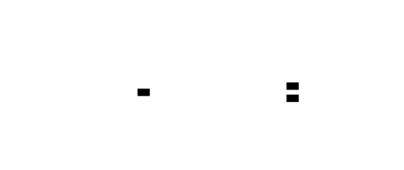

---
### Collapsed Stack Format
```rust
// src/collapsed/mod.rs
use std::collections::HashMap;
/// Collapsed stack format: aggregated call paths with counts.
/// 
/// Format: "root;middle;leaf count"
/// Example: "main;process_request;parse_json 120"
/// 
/// This is the standard format for flamegraph.pl and compatible tools.
/// Path is root-to-leaf (caller-to-callee order).
#[derive(Debug, Clone, Default)]
pub struct CollapsedStacks {
    /// Call path → sample count.
    /// Key format: "func1;func2;func3" (semicolon-separated, root-to-leaf)
    stacks: FxHashMap<String, usize>,
    /// Total samples across all paths.
    total: usize,
    /// Optional metadata for provenance.
    metadata: HashMap<String, String>,
}
impl CollapsedStacks {
    /// Creates an empty collapsed stack collection.
    pub fn new() -> Self {
        CollapsedStacks {
            stacks: FxHashMap::default(),
            total: 0,
            metadata: HashMap::new(),
        }
    }
    /// Adds a stack trace with the given frames and count.
    /// Frames must be in root-to-leaf order.
    pub fn add(&mut self, frames: &[&str], count: usize) {
        let path = frames.join(";");
        self.add_path(&path, count);
    }
    /// Adds a pre-joined path with count.
    pub fn add_path(&mut self, path: &str, count: usize) {
        *self.stacks.entry(path.to_string()).or_insert(0) += count;
        self.total += count;
    }
    /// Returns the number of unique call paths.
    pub fn unique_paths(&self) -> usize {
        self.stacks.len()
    }
    /// Returns the total sample count.
    pub fn total_samples(&self) -> usize {
        self.total
    }
    /// Gets the count for a specific path, or 0 if not present.
    pub fn get(&self, path: &str) -> usize {
        self.stacks.get(path).copied().unwrap_or(0)
    }
    /// Exports to collapsed stack format string.
    /// Each line: "path count"
    /// Lines are sorted alphabetically for deterministic output.
    pub fn export(&self) -> String {
        let mut lines: Vec<_> = self.stacks
            .iter()
            .map(|(path, count)| format!("{} {}", path, count))
            .collect();
        lines.sort();
        lines.join("\n")
    }
    /// Exports with metadata header.
    pub fn export_with_metadata(&self) -> String {
        let mut result = String::new();
        // Metadata as comments
        result.push_str(&format!("# total_samples: {}\n", self.total));
        result.push_str(&format!("# unique_paths: {}\n", self.stacks.len()));
        for (key, value) in &self.metadata {
            result.push_str(&format!("# {}: {}\n", key, value));
        }
        result.push('\n');
        result.push_str(&self.export());
        result
    }
    /// Merges another collapsed stack collection into this one.
    pub fn merge(&mut self, other: &CollapsedStacks) {
        for (path, count) in &other.stacks {
            *self.stacks.entry(path.clone()).or_insert(0) += count;
            self.total += count;
        }
    }
    /// Filters to only stacks containing the specified function.
    pub fn filter(&self, function_name: &str) -> Self {
        let mut filtered = CollapsedStacks::new();
        for (path, count) in &self.stacks {
            if path.split(';').any(|f| f == function_name) {
                filtered.add_path(path, *count);
            }
        }
        filtered
    }
    /// Returns all unique function names across all stacks.
    pub fn all_functions(&self) -> HashSet<String> {
        self.stacks
            .keys()
            .flat_map(|path| path.split(';').map(|s| s.to_string()))
            .collect()
    }
    /// Returns iterator over (path, count) pairs, sorted by count descending.
    pub fn iter_sorted_by_count(&self) -> Vec<(&String, &usize)> {
        let mut pairs: Vec<_> = self.stacks.iter().collect();
        pairs.sort_by(|a, b| b.1.cmp(a.1));
        pairs
    }
}
```
---


---
### Flame Graph Tree
```rust
// src/flamegraph/tree.rs
use std::collections::BTreeMap;
/// A node in the flame graph tree (hierarchical aggregation).
/// 
/// The tree is built from collapsed stacks with the following invariant:
/// node.value == node.self_value + sum(children.values)
/// 
/// Children are stored in BTreeMap for deterministic iteration order.
#[derive(Debug, Clone)]
pub struct FlameGraphNode {
    /// Function name for this frame.
    pub name: String,
    /// Total samples including all children.
    pub value: usize,
    /// Samples at this exact frame (not including children).
    pub self_value: usize,
    /// Child frames, keyed by function name for deduplication.
    pub children: BTreeMap<String, FlameGraphNode>,
}
impl FlameGraphNode {
    /// Creates a new node with the given name.
    pub fn new(name: String) -> Self {
        FlameGraphNode {
            name,
            value: 0,
            self_value: 0,
            children: BTreeMap::new(),
        }
    }
    /// Adds a stack trace to the tree.
    /// Stack must be in root-to-leaf order.
    pub fn add_stack(&mut self, stack: &[&str], count: usize) {
        self.value += count;
        if stack.is_empty() {
            self.self_value += count;
            return;
        }
        // Get or create child for first frame
        let child_name = stack[0];
        let child = self.children
            .entry(child_name.to_string())
            .or_insert_with(|| FlameGraphNode::new(child_name.to_string()));
        // Recurse with remaining stack
        child.add_stack(&stack[1..], count);
    }
    /// Returns the maximum depth of the tree.
    pub fn max_depth(&self) -> usize {
        if self.children.is_empty() {
            1
        } else {
            1 + self.children.values().map(|c| c.max_depth()).max().unwrap_or(0)
        }
    }
    /// Validates tree invariants.
    pub fn validate(&self) -> Result<(), String> {
        let children_sum: usize = self.children.values().map(|c| c.value).sum();
        if self.value != self.self_value + children_sum {
            return Err(format!(
                "Value invariant violated at {}: value={}, self_value={}, children_sum={}",
                self.name, self.value, self.self_value, children_sum
            ));
        }
        for child in self.children.values() {
            child.validate()?;
        }
        Ok(())
    }
}
/// Root node of the flame graph tree.
/// Contains metadata and the actual tree root.
#[derive(Debug, Clone)]
pub struct FlameGraph {
    /// Root node (typically named "all" or "root").
    pub root: FlameGraphNode,
    /// Total samples in the profile.
    pub total_samples: usize,
    /// Maximum depth of the tree.
    pub max_depth: usize,
}
impl FlameGraph {
    /// Builds a flame graph from collapsed stacks.
    pub fn from_collapsed(collapsed: &CollapsedStacks) -> Self {
        let mut root = FlameGraphNode::new("all".to_string());
        for (path, count) in &collapsed.stacks {
            let stack: Vec<&str> = path.split(';').collect();
            root.add_stack(&stack, *count);
        }
        let max_depth = root.max_depth();
        let total_samples = collapsed.total_samples();
        FlameGraph {
            root,
            total_samples,
            max_depth,
        }
    }
    /// Validates the entire tree.
    pub fn validate(&self) -> Result<(), String> {
        self.root.validate()
    }
}
```
---
---
### SVG Renderer
```rust
// src/flamegraph/renderer.rs
use std::hash::{Hash, Hasher};
use std::collections::hash_map::DefaultHasher;
/// Color scheme for flame graph rendering.
#[derive(Debug, Clone)]
pub struct ColorScheme {
    /// Color palette (hex colors).
    pub palette: Vec<String>,
    /// Whether to use hash-based deterministic coloring.
    pub hash_based: bool,
}
impl Default for ColorScheme {
    fn default() -> Self {
        ColorScheme {
            palette: vec![
                "#ff7f7f".to_string(), // Red
                "#ffbf7f".to_string(), // Orange
                "#ffff7f".to_string(), // Yellow
                "#7fff7f".to_string(), // Green
                "#7fffff".to_string(), // Cyan
                "#7f7fff".to_string(), // Blue
                "#ff7fff".to_string(), // Magenta
                "#bf7f3f".to_string(), // Brown
            ],
            hash_based: true,
        }
    }
}
impl ColorScheme {
    /// Gets a color for a function name.
    pub fn color_for(&self, name: &str) -> String {
        if self.hash_based {
            let mut hasher = DefaultHasher::new();
            name.hash(&mut hasher);
            let hash = hasher.finish();
            let idx = (hash as usize) % self.palette.len();
            self.palette[idx].clone()
        } else {
            self.palette[0].clone()
        }
    }
}
/// SVG flame graph renderer configuration.
#[derive(Debug, Clone)]
pub struct FlameGraphRenderer {
    /// Width of the SVG in pixels.
    pub width: usize,
    /// Height of each frame row in pixels.
    pub frame_height: usize,
    /// Minimum width to render a frame (pixels).
    /// Frames narrower than this are skipped.
    pub min_width: f64,
    /// Color scheme.
    pub colors: ColorScheme,
    /// Title for the flame graph.
    pub title: Option<String>,
}
impl Default for FlameGraphRenderer {
    fn default() -> Self {
        FlameGraphRenderer {
            width: 1200,
            frame_height: 16,
            min_width: 0.5,
            colors: ColorScheme::default(),
            title: None,
        }
    }
}
impl FlameGraphRenderer {
    /// Renders the flame graph to an SVG string.
    pub fn render(&self, graph: &FlameGraph) -> String {
        let height = graph.max_depth * self.frame_height + 40; // Extra for title/margins
        let mut svg = String::new();
        // SVG header
        svg.push_str(&format!(
            r#"<?xml version="1.0" encoding="UTF-8"?>
<svg xmlns="http://www.w3.org/2000/svg" width="{}" height="{}">
<style type="text/css">
  .frame {{ cursor: pointer; }}
  .frame:hover {{ stroke: black; stroke-width: 2; }}
  text {{ font-family: monospace; font-size: 12px; fill: black; }}
</style>
"#,
            self.width, height
        ));
        // Title
        if let Some(ref title) = self.title {
            svg.push_str(&format!(
                r#"<text x="10" y="20">{}</text>"#,
                escape_xml(title)
            ));
        }
        // Render frames
        self.render_node(&mut svg, &graph.root, 0.0, self.width as f64, 0, graph.total_samples);
        svg.push_str("</svg>");
        svg
    }
    fn render_node(
        &self,
        svg: &mut String,
        node: &FlameGraphNode,
        x: f64,
        width: f64,
        depth: usize,
        total: usize,
    ) {
        // Skip if too narrow
        if width < self.min_width {
            return;
        }
        let y = depth * self.frame_height + 30; // Offset for title
        let height = self.frame_height;
        // Color
        let color = self.colors.color_for(&node.name);
        // Title tooltip
        let pct = if total > 0 {
            (node.value as f64 / total as f64) * 100.0
        } else {
            0.0
        };
        let title = format!("{} ({} samples, {:.2}%)", node.name, node.value, pct);
        // Rect element
        svg.push_str(&format!(
            r#"<g class="frame">
<rect x="{:.2}" y="{}" width="{:.2}" height="{}" fill="{}" rx="2" ry="2"/>
<title>{}</title>
"#,
            x, y, width, height, color, escape_xml(&title)
        ));
        // Text label if there's room
        if width > 40.0 {
            let text = truncate_text(&node.name, width - 6.0);
            svg.push_str(&format!(
                r#"<text x="{:.2}" y="{}">{}</text>
"#,
                x + 3.0,
                y + height - 4,
                escape_xml(&text)
            ));
        }
        svg.push_str("</g>\n");
        // Render children
        let mut child_x = x;
        for child in node.children.values() {
            let child_width = if node.value > 0 {
                (child.value as f64 / node.value as f64) * width
            } else {
                0.0
            };
            if child_width >= self.min_width {
                self.render_node(svg, child, child_x, child_width, depth + 1, total);
            }
            child_x += child_width;
        }
    }
}
/// Escapes special XML characters.
fn escape_xml(s: &str) -> String {
    s.replace('&', "&amp;")
        .replace('<', "&lt;")
        .replace('>', "&gt;")
        .replace('"', "&quot;")
        .replace('\'', "&apos;")
}
/// Truncates text to fit within given width.
fn truncate_text(text: &str, max_width: f64) -> String {
    let char_width = 7.0; // Approximate monospace char width
    let max_chars = ((max_width) / char_width) as usize;
    if text.len() <= max_chars {
        text.to_string()
    } else if max_chars > 3 {
        format!("{}...", &text[..max_chars - 3])
    } else {
        text[..max_chars].to_string()
    }
}
```
---


---
### Differential Flame Graph
```rust
// src/differential/mod.rs
/// Differential analysis between two profiles.
#[derive(Debug, Clone)]
pub struct DifferentialFlameGraph {
    /// Path → (baseline_count, comparison_count)
    diffs: FxHashMap<String, (usize, usize)>,
    /// Total samples in baseline profile.
    baseline_total: usize,
    /// Total samples in comparison profile.
    comparison_total: usize,
}
impl DifferentialFlameGraph {
    /// Creates a differential from two collapsed stack collections.
    pub fn from_collapsed(baseline: &CollapsedStacks, comparison: &CollapsedStacks) -> Self {
        let mut diffs = FxHashMap::default();
        // Collect all paths from both profiles
        let all_paths: HashSet<_> = baseline.stacks.keys()
            .chain(comparison.stacks.keys())
            .collect();
        for path in all_paths {
            let base_count = baseline.stacks.get(path).copied().unwrap_or(0);
            let comp_count = comparison.stacks.get(path).copied().unwrap_or(0);
            diffs.insert(path.clone(), (base_count, comp_count));
        }
        DifferentialFlameGraph {
            diffs,
            baseline_total: baseline.total_samples(),
            comparison_total: comparison.total_samples(),
        }
    }
    /// Returns the change for a path as a percentage.
    /// Positive = got worse (more samples), Negative = got better.
    /// Returns None if path exists in neither profile.
    pub fn change_percent(&self, path: &str) -> Option<f64> {
        let (base, comp) = self.diffs.get(path)?;
        if *base == 0 && *comp == 0 {
            return None;
        }
        // Normalize by total samples
        let base_pct = if self.baseline_total > 0 {
            *base as f64 / self.baseline_total as f64
        } else {
            0.0
        };
        let comp_pct = if self.comparison_total > 0 {
            *comp as f64 / self.comparison_total as f64
        } else {
            0.0
        };
        if base_pct == 0.0 {
            if comp_pct > 0.0 {
                Some(f64::INFINITY) // New hot path
            } else {
                None
            }
        } else {
            Some(((comp_pct - base_pct) / base_pct) * 100.0)
        }
    }
    /// Returns the absolute sample change for a path.
    pub fn absolute_change(&self, path: &str) -> Option<i64> {
        let (base, comp) = self.diffs.get(path)?;
        Some(*comp as i64 - *base as i64)
    }
    /// Exports differential data in collapsed format.
    /// Format: "path baseline_count comparison_count"
    pub fn export(&self) -> String {
        let mut lines: Vec<_> = self.diffs
            .iter()
            .map(|(path, (base, comp))| format!("{} {} {}", path, base, comp))
            .collect();
        lines.sort();
        lines.join("\n")
    }
    /// Returns paths sorted by absolute change magnitude.
    pub fn top_changes(&self, n: usize) -> Vec<(&String, (usize, usize), f64)> {
        let mut changes: Vec<_> = self.diffs
            .iter()
            .filter_map(|(path, &(base, comp))| {
                let change = self.change_percent(path)?;
                Some((path, (base, comp), change))
            })
            .collect();
        changes.sort_by(|a, b| {
            let abs_a = a.2.abs();
            let abs_b = b.2.abs();
            abs_b.partial_cmp(&abs_a).unwrap_or(std::cmp::Ordering::Equal)
        });
        changes.into_iter().take(n).collect()
    }
}
```
---


---
## Interface Contracts
### Call Graph Builder
```rust
// src/callgraph/builder.rs
use crate::sampler::{RawSample, MAX_STACK_DEPTH};
use std::sync::Arc;
/// Symbol table for address-to-name resolution.
/// Provided by M5, but we define the interface we need.
pub trait SymbolResolver {
    /// Looks up the function name for an address.
    /// Returns None if address is not in the symbol table.
    fn lookup(&self, addr: usize) -> Option<&str>;
}
/// Builds a call graph from raw samples.
pub struct CallGraphBuilder {
    /// Symbol resolver for address-to-name mapping.
    symbols: Box<dyn SymbolResolver>,
}
impl CallGraphBuilder {
    /// Creates a new builder with the given symbol resolver.
    pub fn new(symbols: Box<dyn SymbolResolver>) -> Self {
        CallGraphBuilder { symbols }
    }
    /// Builds a call graph from raw samples.
    /// 
    /// # Arguments
    /// * `samples` - Raw samples from the profiler
    /// 
    /// # Returns
    /// * `Ok(CallGraph)` - Successfully constructed call graph
    /// * `Err(CallGraphError::EmptySamples)` - No samples provided
    /// * `Err(CallGraphError::SymbolResolutionFailed)` - All symbols unresolved
    /// 
    /// # Algorithm
    /// 1. For each sample, convert addresses to function names
    /// 2. For each function in the stack (leaf to root):
    ///    a. Increment node.total_samples
    ///    b. If leaf (index 0), increment node.self_samples
    ///    c. If not root, create/update edge to caller
    /// 3. Track roots (functions with no callers)
    /// 
    /// # Complexity
    /// O(samples × depth) where depth is average stack depth
    pub fn build(&self, samples: &[RawSample]) -> Result<CallGraph, CallGraphError> {
        if samples.is_empty() {
            return Err(CallGraphError::EmptySamples);
        }
        let mut graph = CallGraph::new();
        graph.total_samples = samples.len();
        for sample in samples {
            // Convert addresses to function names
            let stack: Vec<Arc<str>> = sample.valid_addresses()
                .iter()
                .filter_map(|&addr| {
                    self.symbols.lookup(addr).map(|s| Arc::from(s))
                })
                .collect();
            if stack.is_empty() {
                continue;
            }
            // Root has no caller
            if let Some(root) = stack.last() {
                graph.roots.insert(Arc::clone(root));
            }
            // Process each function in the stack
            for (i, func) in stack.iter().enumerate() {
                // Get or create node
                let node = Self::get_or_create_node(&mut graph.nodes, func);
                // Increment total samples
                {
                    let node = Arc::make_mut(node);
                    node.total_samples += 1;
                    // If leaf, increment self samples
                    if i == 0 {
                        node.self_samples += 1;
                    }
                }
                // Create edge to caller (if not at root)
                if i + 1 < stack.len() {
                    let callee = func;
                    let caller = &stack[i + 1];
                    Self::add_edge(&mut graph.nodes, caller, callee);
                }
            }
        }
        // Remove roots that have callers (were called from somewhere)
        let roots_with_callers: Vec<_> = graph.roots.iter()
            .filter(|r| {
                graph.nodes.get(*r)
                    .map(|n| !n.callers.is_empty())
                    .unwrap_or(false)
            })
            .cloned()
            .collect();
        for root in roots_with_callers {
            graph.roots.remove(&root);
        }
        // Validate graph
        graph.validate().map_err(|errors| CallGraphError::ValidationFailed { errors })?;
        Ok(graph)
    }
    fn get_or_create_node(
        nodes: &mut FxHashMap<Arc<str>, Arc<CallGraphNode>>,
        name: &Arc<str>,
    ) -> Arc<CallGraphNode> {
        if !nodes.contains_key(name) {
            nodes.insert(
                Arc::clone(name),
                Arc::new(CallGraphNode::new(Arc::clone(name))),
            );
        }
        Arc::clone(&nodes[name])
    }
    fn add_edge(
        nodes: &mut FxHashMap<Arc<str>, Arc<CallGraphNode>>,
        caller: &Arc<str>,
        callee: &Arc<str>,
    ) {
        // Add edge from caller to callee
        let caller_node = Self::get_or_create_node(nodes, caller);
        let callee_node = Self::get_or_create_node(nodes, callee);
        {
            let caller_node = Arc::make_mut(&caller_node);
            let edge = caller_node.callees
                .entry(Arc::clone(callee))
                .or_insert_with(|| Arc::new(CallGraphEdge::new(
                    Arc::clone(caller),
                    Arc::clone(callee),
                )));
            Arc::make_mut(&mut Arc::clone(edge)).sample_count += 1;
        }
        {
            let callee_node = Arc::make_mut(&callee_node);
            let edge = callee_node.callers
                .entry(Arc::clone(caller))
                .or_insert_with(|| Arc::new(CallGraphEdge::new(
                    Arc::clone(caller),
                    Arc::clone(callee),
                )));
            Arc::make_mut(&mut Arc::clone(edge)).sample_count += 1;
        }
    }
}
#[derive(Debug, thiserror::Error)]
pub enum CallGraphError {
    #[error("No samples provided")]
    EmptySamples,
    #[error("All symbol resolutions failed - no valid function names")]
    SymbolResolutionFailed,
    #[error("Graph validation failed: {errors:?}")]
    ValidationFailed { errors: Vec<String> },
}
```
---


---
### Stack Folder
```rust
// src/collapsed/folder.rs
use crate::sampler::RawSample;
/// Folds raw samples into collapsed stack format.
pub struct StackFolder {
    /// Symbol resolver for address-to-name mapping.
    symbols: Box<dyn SymbolResolver>,
}
impl StackFolder {
    /// Creates a new folder with the given symbol resolver.
    pub fn new(symbols: Box<dyn SymbolResolver>) -> Self {
        StackFolder { symbols }
    }
    /// Folds samples into collapsed stacks.
    /// 
    /// # Arguments
    /// * `samples` - Raw samples from the profiler
    /// 
    /// # Returns
    /// CollapsedStacks with aggregated call paths
    /// 
    /// # Algorithm
    /// For each sample:
    /// 1. Convert addresses to function names
    /// 2. Reverse to get root-to-leaf order
    /// 3. Join with semicolons to create path key
    /// 4. Increment count for this path
    /// 
    /// # Complexity
    /// O(samples × depth) for iteration
    /// O(unique_paths) for hash map storage
    pub fn fold(&self, samples: &[RawSample]) -> CollapsedStacks {
        let mut collapsed = CollapsedStacks::new();
        for sample in samples {
            // Convert addresses to function names (leaf to root)
            let names: Vec<&str> = sample.valid_addresses()
                .iter()
                .filter_map(|&addr| self.symbols.lookup(addr))
                .collect();
            if names.is_empty() {
                continue;
            }
            // Reverse to get root-to-leaf order
            let frames: Vec<&str> = names.into_iter().rev().collect();
            // Add to collapsed stacks
            collapsed.add(&frames, 1);
        }
        collapsed
    }
}
```
### Collapsed Format Parser
```rust
// src/collapsed/parser.rs
/// Parses collapsed stack format files.
pub struct CollapsedParser;
impl CollapsedParser {
    /// Parses collapsed stack format text.
    /// 
    /// # Format
    /// Each line: "root;middle;leaf count"
    /// Lines starting with # are comments (metadata)
    /// 
    /// # Errors
    /// * `ParseError::InvalidLine` - Line doesn't match format
    /// * `ParseError::InvalidCount` - Count is not a valid integer
    pub fn parse(text: &str) -> Result<CollapsedStacks, ParseError> {
        let mut collapsed = CollapsedStacks::new();
        for (line_num, line) in text.lines().enumerate() {
            let line = line.trim();
            // Skip empty lines and comments
            if line.is_empty() {
                continue;
            }
            if line.starts_with('#') {
                // Parse metadata
                if let Some(meta) = line.strip_prefix("# ") {
                    if let Some((key, value)) = meta.split_once(": ") {
                        collapsed.metadata.insert(key.to_string(), value.to_string());
                    }
                }
                continue;
            }
            // Parse "path count"
            let (path, count_str) = line.rsplit_once(' ')
                .ok_or_else(|| ParseError::InvalidLine {
                    line: line_num + 1,
                    content: line.to_string(),
                })?;
            let count: usize = count_str.parse()
                .map_err(|_| ParseError::InvalidCount {
                    line: line_num + 1,
                    value: count_str.to_string(),
                })?;
            collapsed.add_path(path, count);
        }
        Ok(collapsed)
    }
}
#[derive(Debug, thiserror::Error)]
pub enum ParseError {
    #[error("Invalid line {line}: {content}")]
    InvalidLine { line: usize, content: String },
    #[error("Invalid count on line {line}: {value}")]
    InvalidCount { line: usize, value: String },
}
```
---
## Algorithm Specification
### Call Graph Construction Algorithm
```
INPUT: samples: [RawSample], symbols: SymbolResolver
OUTPUT: CallGraph
ALGORITHM BuildCallGraph:
  1. INITIALIZE graph with empty nodes map, roots set
  2. SET graph.total_samples = len(samples)
  3. FOR each sample IN samples:
     a. stack = []
     b. FOR each addr IN sample.valid_addresses():
        i.   name = symbols.lookup(addr)
        ii.  IF name IS NOT None: stack.append(name)
     c. IF stack IS empty: CONTINUE
     d. ADD stack.last() TO graph.roots
     e. FOR i FROM 0 TO len(stack) - 1:
        i.   func = stack[i]
        ii.  node = graph.nodes.get_or_create(func)
        iii. node.total_samples += 1
        iv.  IF i == 0: node.self_samples += 1
        v.   IF i + 1 < len(stack):
             - caller = stack[i + 1]
             - callee = func
             - edge = node.callers.get_or_create(caller)
             - edge.sample_count += 1
             - ALSO update caller.callees
  4. CLEANUP roots:
     FOR each root IN graph.roots:
       IF graph.nodes[root].callers IS NOT empty:
         REMOVE root FROM graph.roots
  5. VALIDATE graph invariants
  6. RETURN graph
INVARIANTS:
  - node.total_samples >= node.self_samples
  - Edge sample counts are symmetric (caller.callees[X] == X.callers[caller])
  - Roots have empty callers maps
COMPLEXITY: O(N × D) where N = samples, D = average stack depth
```
---


---
### Flame Graph Tree Construction Algorithm
```
INPUT: collapsed: CollapsedStacks
OUTPUT: FlameGraph
ALGORITHM BuildFlameGraph:
  1. INITIALIZE root = FlameGraphNode("all")
  2. SET total_samples = collapsed.total_samples()
  3. FOR each (path, count) IN collapsed.stacks:
     a. stack = path.split(';')
     b. CALL AddStack(root, stack, count)
  4. SET max_depth = ComputeMaxDepth(root)
  5. RETURN FlameGraph { root, total_samples, max_depth }
ALGORITHM AddStack(node, stack, count):
  1. node.value += count
  2. IF stack IS empty:
     node.self_value += count
     RETURN
  3. frame = stack[0]
  4. child = node.children.get_or_create(frame)
  5. CALL AddStack(child, stack[1:], count)
ALGORITHM ComputeMaxDepth(node):
  1. IF node.children IS empty: RETURN 1
  2. max_child = 0
  3. FOR each child IN node.children:
     max_child = MAX(max_child, ComputeMaxDepth(child))
  4. RETURN 1 + max_child
INVARIANT: node.value == node.self_value + sum(children.values)
COMPLEXITY: O(P × D) where P = unique paths, D = average stack depth
```
---
---
### Differential Analysis Algorithm
```
INPUT: baseline: CollapsedStacks, comparison: CollapsedStacks
OUTPUT: DifferentialFlameGraph
ALGORITHM BuildDifferential:
  1. INITIALIZE diffs = empty map
  2. all_paths = UNION(baseline.stacks.keys, comparison.stacks.keys)
  3. FOR each path IN all_paths:
     a. base_count = baseline.stacks.get(path) OR 0
     b. comp_count = comparison.stacks.get(path) OR 0
     c. diffs[path] = (base_count, comp_count)
  4. RETURN DifferentialFlameGraph {
       diffs,
       baseline_total: baseline.total_samples(),
       comparison_total: comparison.total_samples()
     }
ALGORITHM ChangePercent(diffs, path, baseline_total, comparison_total):
  1. (base, comp) = diffs[path]
  2. IF base == 0 AND comp == 0: RETURN None
  3. base_pct = base / baseline_total
  4. comp_pct = comp / comparison_total
  5. IF base_pct == 0:
     IF comp_pct > 0: RETURN INFINITY
     ELSE: RETURN None
  6. RETURN ((comp_pct - base_pct) / base_pct) * 100
NOTE: Percentages are normalized by total samples to allow comparison
      between profiles of different durations
```
---
## Error Handling Matrix
| Error | Detected By | Recovery | User-Visible? |
|-------|-------------|----------|---------------|
| Empty sample array | `samples.is_empty()` check in builder | Return `CallGraphError::EmptySamples` | Yes - error message |
| All symbol resolutions failed | Zero valid names after processing | Return `CallGraphError::SymbolResolutionFailed` | Yes - error message |
| Graph validation failure | `validate()` returns errors | Return `CallGraphError::ValidationFailed` with details | Yes - validation errors list |
| Invalid collapsed line | `rsplit_once(' ')` returns None | Return `ParseError::InvalidLine` with line number | Yes - parse error |
| Invalid count in collapsed | `parse::<usize>()` fails | Return `ParseError::InvalidCount` with value | Yes - parse error |
| SVG rendering overflow | Stack depth > max_height / frame_height | Truncate rendering, add note in SVG | Partially - truncated output |
| Recursive cycle in traversal | Visited set contains current node | Stop traversal, return partial result | No - handled gracefully |
| Zero total samples | `total_samples == 0` check | Return default/empty structures | No - empty output |
| Merge incompatible profiles | Different metadata fields | Merge anyway, overwrite metadata | No - silent merge |
---


---
## Implementation Sequence with Checkpoints
### Phase 1: Call Graph Construction (2-3 hours)
**Files to create:** `src/error.rs` (extend), `src/callgraph/mod.rs`, `src/callgraph/node.rs`, `src/callgraph/builder.rs`
**Steps:**
1. Define `CallGraphError` enum with all error variants
2. Implement `CallGraphNode` with validation
3. Implement `CallGraphEdge` 
4. Implement `CallGraph` with basic methods
5. Implement `CallGraphBuilder::build()` algorithm
6. Add traversal helper methods
**Checkpoint:**
```bash
cargo test callgraph_construction
# Expected: Call graph built from test samples, nodes have correct counts
```
### Phase 2: Stack Folding & Collapsed Format (1-2 hours)
**Files to create:** `src/collapsed/mod.rs`, `src/collapsed/folder.rs`, `src/collapsed/parser.rs`
**Steps:**
1. Implement `CollapsedStacks` with add/merge/filter
2. Implement `StackFolder::fold()` algorithm
3. Implement `CollapsedParser::parse()` with error handling
4. Add export methods (with/without metadata)
**Checkpoint:**
```bash
cargo test collapsed_format
# Expected: Samples folded correctly, format roundtrips
```
### Phase 3: Flame Graph Tree Builder (2-3 hours)
**Files to create:** `src/flamegraph/mod.rs`, `src/flamegraph/tree.rs`, `src/flamegraph/builder.rs`
**Steps:**
1. Implement `FlameGraphNode` with add_stack
2. Implement tree validation
3. Implement `FlameGraph::from_collapsed()`
4. Add max_depth computation
**Checkpoint:**
```bash
cargo test flamegraph_tree
# Expected: Tree built from collapsed stacks, invariants validated
```
### Phase 4: SVG Renderer (2-3 hours)
**Files to create:** `src/flamegraph/renderer.rs`
**Steps:**
1. Implement `ColorScheme` with hash-based coloring
2. Implement `FlameGraphRenderer` configuration
3. Implement SVG rendering algorithm
4. Add text truncation and XML escaping
**Checkpoint:**
```bash
cargo test svg_rendering
# Expected: Valid SVG output, frames positioned correctly
```
### Phase 5: Differential Analysis (2-3 hours)
**Files to create:** `src/differential/mod.rs`, `src/differential/comparator.rs`, `src/differential/renderer.rs`
**Steps:**
1. Implement `DifferentialFlameGraph::from_collapsed()`
2. Implement `change_percent()` and `absolute_change()`
3. Implement `top_changes()` sorting
4. Add differential SVG renderer (red/blue coloring)
**Checkpoint:**
```bash
cargo test differential_analysis
# Expected: Differences detected, changes calculated correctly
```
**Final Integration:**
```bash
cargo test --all
# Expected: All tests pass
cargo run --example flamegraph_demo
# Expected: SVG flame graph generated from sample profile
```
---


---
## Test Specification
### Unit Tests
```rust
#[cfg(test)]
mod tests {
    use super::*;
    // === CallGraphNode Tests ===
    #[test]
    fn call_graph_node_new() {
        let node = CallGraphNode::new(Arc::from("test_func"));
        assert_eq!(node.function_name.as_ref(), "test_func");
        assert_eq!(node.total_samples, 0);
        assert_eq!(node.self_samples, 0);
    }
    #[test]
    fn call_graph_node_validation() {
        let mut node = CallGraphNode::new(Arc::from("test"));
        node.self_samples = 100;
        node.total_samples = 50;
        assert!(node.validate().is_err());
        node.total_samples = 200;
        assert!(node.validate().is_ok());
    }
    #[test]
    fn call_graph_node_percentages() {
        let mut node = CallGraphNode::new(Arc::from("test"));
        node.total_samples = 100;
        node.self_samples = 30;
        assert_eq!(node.self_percent(), 30.0);
        assert_eq!(node.total_percent(1000), 10.0);
    }
    // === CollapsedStacks Tests ===
    #[test]
    fn collapsed_stacks_add() {
        let mut collapsed = CollapsedStacks::new();
        collapsed.add(&["main", "foo", "bar"], 5);
        collapsed.add(&["main", "foo", "baz"], 3);
        assert_eq!(collapsed.unique_paths(), 2);
        assert_eq!(collapsed.total_samples(), 8);
        assert_eq!(collapsed.get("main;foo;bar"), 5);
        assert_eq!(collapsed.get("main;foo;baz"), 3);
    }
    #[test]
    fn collapsed_stacks_merge_identical() {
        let mut c1 = CollapsedStacks::new();
        c1.add(&["a", "b"], 10);
        let mut c2 = CollapsedStacks::new();
        c2.add(&["a", "b"], 5);
        c1.merge(&c2);
        assert_eq!(c1.get("a;b"), 15);
    }
    #[test]
    fn collapsed_stacks_filter() {
        let mut collapsed = CollapsedStacks::new();
        collapsed.add(&["main", "foo", "bar"], 5);
        collapsed.add(&["main", "baz", "qux"], 3);
        let filtered = collapsed.filter("foo");
        assert_eq!(filtered.unique_paths(), 1);
        assert_eq!(filtered.get("main;foo;bar"), 5);
    }
    #[test]
    fn collapsed_stacks_export_import_roundtrip() {
        let mut original = CollapsedStacks::new();
        original.add(&["main", "foo"], 10);
        original.add(&["main", "bar"], 5);
        let exported = original.export();
        let parsed = CollapsedParser::parse(&exported).unwrap();
        assert_eq!(parsed.unique_paths(), original.unique_paths());
        assert_eq!(parsed.get("main;foo"), 10);
        assert_eq!(parsed.get("main;bar"), 5);
    }
    // === FlameGraphNode Tests ===
    #[test]
    fn flame_graph_node_add_stack() {
        let mut root = FlameGraphNode::new("all".to_string());
        root.add_stack(&["main", "foo", "bar"], 5);
        root.add_stack(&["main", "foo", "baz"], 3);
        root.add_stack(&["main", "foo"], 2);
        assert_eq!(root.value, 10);
        assert_eq!(root.self_value, 0);
        assert!(root.children.contains_key("main"));
        let main = &root.children["main"];
        assert_eq!(main.value, 10);
        let foo = &main.children["foo"];
        assert_eq!(foo.value, 10);
        assert_eq!(foo.self_value, 2);
    }
    #[test]
    fn flame_graph_node_max_depth() {
        let mut root = FlameGraphNode::new("all".to_string());
        root.add_stack(&["a", "b", "c", "d"], 1);
        assert_eq!(root.max_depth(), 5); // root + 4 levels
    }
    #[test]
    fn flame_graph_node_validation() {
        let mut root = FlameGraphNode::new("all".to_string());
        root.add_stack(&["a", "b"], 10);
        assert!(root.validate().is_ok());
        // Break invariant
        root.value = 999;
        assert!(root.validate().is_err());
    }
    // === Differential Tests ===
    #[test]
    fn differential_change_percent() {
        let mut baseline = CollapsedStacks::new();
        baseline.add(&["a", "b"], 100);
        baseline.add(&["a", "c"], 50);
        let mut comparison = CollapsedStacks::new();
        comparison.add(&["a", "b"], 150);  // 50% increase
        comparison.add(&["a", "c"], 25);   // 50% decrease
        let diff = DifferentialFlameGraph::from_collapsed(&baseline, &comparison);
        // Normalized by total: baseline=150, comparison=175
        // a;b: 100/150=66.7% -> 150/175=85.7%, change = +28.6%
        // Note: actual calculation depends on normalization
        assert!(diff.change_percent("a;b").is_some());
        assert!(diff.change_percent("nonexistent").is_none());
    }
    #[test]
    fn differential_new_path() {
        let baseline = CollapsedStacks::new();
        let mut comparison = CollapsedStacks::new();
        comparison.add(&["new", "path"], 10);
        let diff = DifferentialFlameGraph::from_collapsed(&baseline, &comparison);
        assert_eq!(diff.change_percent("new;path"), Some(f64::INFINITY));
    }
    // === Parser Tests ===
    #[test]
    fn parser_valid_input() {
        let input = "main;foo;bar 100\nmain;baz 50";
        let parsed = CollapsedParser::parse(input).unwrap();
        assert_eq!(parsed.unique_paths(), 2);
        assert_eq!(parsed.get("main;foo;bar"), 100);
    }
    #[test]
    fn parser_with_comments() {
        let input = "# total_samples: 150\n# version: 1.0\n\nmain;foo 100\nmain;bar 50";
        let parsed = CollapsedParser::parse(input).unwrap();
        assert_eq!(parsed.metadata.get("total_samples"), Some(&"150".to_string()));
        assert_eq!(parsed.total_samples(), 150);
    }
    #[test]
    fn parser_invalid_line() {
        let input = "invalid_line_no_space";
        let result = CollapsedParser::parse(input);
        assert!(matches!(result, Err(ParseError::InvalidLine { .. })));
    }
    #[test]
    fn parser_invalid_count() {
        let input = "main;foo not_a_number";
        let result = CollapsedParser::parse(input);
        assert!(matches!(result, Err(ParseError::InvalidCount { .. })));
    }
}
```
### Integration Tests
```rust
// tests/integration_m2.rs
use profiler::*;
use std::sync::Arc;
struct MockSymbolResolver {
    symbols: FxHashMap<usize, &'static str>,
}
impl MockSymbolResolver {
    fn new() -> Self {
        let mut symbols = FxHashMap::default();
        symbols.insert(0x1000, "main");
        symbols.insert(0x2000, "foo");
        symbols.insert(0x3000, "bar");
        symbols.insert(0x4000, "baz");
        MockSymbolResolver { symbols }
    }
}
impl callgraph::SymbolResolver for MockSymbolResolver {
    fn lookup(&self, addr: usize) -> Option<&str> {
        self.symbols.get(&addr).copied()
    }
}
#[test]
fn end_to_end_call_graph() {
    let symbols = Box::new(MockSymbolResolver::new());
    let builder = CallGraphBuilder::new(symbols);
    // Create samples with known call stacks
    let samples = vec![
        create_sample(&[0x3000, 0x2000, 0x1000]), // main -> foo -> bar
        create_sample(&[0x3000, 0x2000, 0x1000]), // main -> foo -> bar
        create_sample(&[0x4000, 0x2000, 0x1000]), // main -> foo -> baz
    ];
    let graph = builder.build(&samples).unwrap();
    assert!(graph.get_node("main").is_some());
    assert!(graph.get_node("foo").is_some());
    assert!(graph.get_node("bar").is_some());
    let bar = graph.get_node("bar").unwrap();
    assert_eq!(bar.self_samples, 2);
    assert_eq!(bar.total_samples, 2);
}
#[test]
fn end_to_end_flame_graph() {
    let symbols = Box::new(MockSymbolResolver::new());
    let folder = StackFolder::new(symbols);
    let samples = vec![
        create_sample(&[0x3000, 0x2000, 0x1000]),
        create_sample(&[0x3000, 0x2000, 0x1000]),
        create_sample(&[0x4000, 0x2000, 0x1000]),
    ];
    let collapsed = folder.fold(&samples);
    let flame = FlameGraph::from_collapsed(&collapsed);
    assert!(flame.validate().is_ok());
    assert_eq!(flame.total_samples, 3);
    let renderer = FlameGraphRenderer::default();
    let svg = renderer.render(&flame);
    assert!(svg.contains("<svg"));
    assert!(svg.contains("main"));
    assert!(svg.contains("foo"));
}
fn create_sample(addresses: &[usize]) -> RawSample {
    let mut sample = RawSample::zeroed();
    sample.depth = addresses.len() as u8;
    sample.addresses[..addresses.len()].copy_from_slice(addresses);
    sample
}
```
---
## Performance Targets
| Operation | Target | How to Measure |
|-----------|--------|----------------|
| Call graph construction (100K samples) | < 500 ms | Benchmark with `cargo bench callgraph_build` |
| Stack folding (100K samples) | < 200 ms | Benchmark with `cargo bench stack_fold` |
| Flame graph tree building | < 100 ms | Benchmark with `cargo bench flamegraph_tree` |
| SVG rendering (10K unique paths) | < 200 ms | Benchmark with `cargo bench svg_render` |
| Collapsed format export | < 50 ms | Benchmark with `cargo bench collapsed_export` |
| Collapsed format parsing | < 100 ms | Benchmark with `cargo bench collapsed_parse` |
| Differential analysis | < 150 ms | Benchmark with `cargo bench differential` |
| Memory usage (100K samples) | < 50 MB | Profile with `valgrind --tool=massif` |
### Benchmark Commands
```bash
# Run all benchmarks
cargo bench --bench m2_benchmarks
# Profile memory usage
valgrind --tool=massif target/release/examples/flamegraph_demo
# Check flame graph rendering time
cargo bench svg_render -- --sample-size 100
```
---
[[CRITERIA_JSON: {"module_id": "profiler-m2", "criteria": ["Implement CallGraph construction from raw samples with node creation for each function, edge creation for caller-callee relationships, and proper sample count attribution (total_samples and self_samples)", "Implement CallGraphNode validation ensuring total_samples >= self_samples and edge consistency between caller and callee maps", "Implement CollapsedStacks data structure with add, merge, filter, and export methods supporting semicolon-delimited root-to-leaf paths", "Implement StackFolder that converts raw samples to collapsed format with address-to-name resolution and proper stack reversal", "Implement CollapsedParser that parses collapsed stack format with comment handling for metadata and error reporting for invalid lines", "Implement FlameGraphNode tree structure with add_stack method maintaining value == self_value + sum(children.values) invariant", "Implement FlameGraph::from_collapsed that builds tree from aggregated stacks with max_depth computation", "Implement FlameGraphRenderer that generates valid SVG with color scheme, frame positioning, text labels, and tooltips", "Implement DifferentialFlameGraph comparison between baseline and comparison profiles with normalized percentage change calculation", "Implement differential change detection for new paths (infinity), removed paths (negative infinity), and modified paths (percentage)", "Implement color scheme with hash-based deterministic coloring for consistent visualization across runs", "Implement XML escaping and text truncation for SVG output to prevent rendering issues", "Support filtering collapsed stacks by function name for focused analysis", "Support merging multiple collapsed stack collections for profile aggregation"]}]
<!-- END_TDD_MOD -->


<!-- TDD_MOD_ID: profiler-m3 -->
# Technical Design Specification: Memory Allocation Tracking
## Module Charter
The Memory Allocation Tracking module intercepts dynamic memory allocation calls via LD_PRELOAD library interposition, recording allocation metadata (address, size, timestamp, thread ID, call stack) in a concurrent hash map for analysis. It detects memory leaks by identifying allocations never freed before program exit, groups them by call site for actionable reporting, and identifies allocation hot spots by aggregating total bytes allocated per call site. The module provides temporal analysis through periodic sampling of memory state and tracks the high-water mark (peak memory usage). This module deliberately excludes signal-handler-based sampling (uses only LD_PRELOAD interposition), does not implement reachability-based garbage collection (reports all unfreed allocations as potential leaks), and does not track memory-mapped regions outside malloc/free. Upstream dependencies are libc's malloc/free/calloc/realloc and the dynamic linker's symbol resolution; downstream consumers are the leak detector, hot spot analyzer, and temporal report generator. Critical invariants: the interposition layer must never allocate memory during tracking (recursion guard), all allocation metadata must be recorded before the pointer is returned to the caller, and freed pointers must be removed from tracking to prevent false leak reports.
---
## File Structure
```
profiler/src/
├── memory/
│   ├── mod.rs                 # 1. Module exports and public API
│   ├── interpose.rs           # 2. LD_PRELOAD malloc/free/calloc/realloc wrappers
│   ├── tracker.rs             # 3. AllocationTracker with DashMap storage
│   ├── info.rs                # 4. AllocationInfo and CallSiteStats definitions
│   ├── leak.rs                # 5. Leak detection algorithm and report
│   ├── hotspot.rs             # 6. Hot spot analysis and report
│   ├── temporal.rs            # 7. TemporalTracker time-series sampling
│   └── state.rs               # 8. MemoryState and high-water tracking
└── error.rs                   # 9. MemoryTrackerError (extends M1 errors)
```
**Creation Order:** Files numbered 1-9 should be created in sequence. Dependencies flow downward through the file tree.
---
## Complete Data Model
### Core Structures
```rust
// src/memory/info.rs
use std::time::{Instant, Duration};
use std::sync::atomic::{AtomicU64, AtomicBool, Ordering};
/// Unique identifier for each allocation.
/// Monotonically increasing, never reused.
pub type AllocId = u64;
/// Information about a single allocation.
/// 
/// Memory layout (64-bit):
/// ┌─────────────────────────────────────────────────────────────────┐
/// │ Offset 0x00: address (usize, 8 bytes) - returned by malloc      │
/// │ Offset 0x08: size (usize, 8 bytes) - requested allocation size  │
/// │ Offset 0x10: alloc_id (u64, 8 bytes) - unique identifier        │
/// │ Offset 0x18: timestamp_ns (u64, 8 bytes) - allocation time      │
/// │ Offset 0x20: thread_id (u64, 8 bytes) - allocating thread       │
/// │ Offset 0x28: call_stack_hash (u64, 8 bytes) - for aggregation   │
/// │ Offset 0x30: freed (bool, 1 byte) - deallocation flag           │
/// │ Offset 0x31: padding (7 bytes)                                   │
/// │ Offset 0x38: freed_timestamp_ns (Option<u64>, 8 bytes)           │
/// │ Offset 0x40: call_stack (Vec<usize>, 24 bytes - ptr+cap+len)    │
/// └─────────────────────────────────────────────────────────────────┘
/// Total: ~64 bytes base + call_stack capacity
/// 
/// Invariant: If freed is true, freed_timestamp_ns must be Some(_)
/// Invariant: address must be non-null for valid allocations
#[derive(Debug, Clone)]
pub struct AllocationInfo {
    /// Address returned by malloc (the user-visible pointer).
    pub address: usize,
    /// Size requested by the caller in bytes.
    pub size: usize,
    /// Unique identifier assigned at allocation time.
    pub alloc_id: AllocId,
    /// Monotonic timestamp when allocation occurred (nanoseconds).
    pub timestamp_ns: u64,
    /// Thread ID from gettid(2) syscall.
    pub thread_id: u64,
    /// Hash of call stack for call site aggregation.
    pub call_stack_hash: u64,
    /// Whether this allocation has been freed.
    pub freed: bool,
    /// Timestamp when freed (if freed).
    pub freed_timestamp_ns: Option<u64>,
    /// Call stack at allocation time (leaf first, addresses).
    /// Stored as raw addresses; symbol resolution happens at report time.
    pub call_stack: Vec<usize>,
}
impl AllocationInfo {
    /// Creates a new allocation info record.
    pub fn new(
        address: usize,
        size: usize,
        alloc_id: AllocId,
        timestamp_ns: u64,
        thread_id: u64,
        call_stack: Vec<usize>,
    ) -> Self {
        let call_stack_hash = hash_call_stack(&call_stack);
        AllocationInfo {
            address,
            size,
            alloc_id,
            timestamp_ns,
            thread_id,
            call_stack_hash,
            freed: false,
            freed_timestamp_ns: None,
            call_stack,
        }
    }
    /// Marks this allocation as freed.
    pub fn mark_freed(&mut self, timestamp_ns: u64) {
        self.freed = true;
        self.freed_timestamp_ns = Some(timestamp_ns);
    }
    /// Returns the lifetime of this allocation (if freed).
    pub fn lifetime(&self) -> Option<Duration> {
        self.freed_timestamp_ns
            .map(|freed| Duration::from_nanos(freed - self.timestamp_ns))
    }
    /// Validates invariants. Returns error description if violated.
    pub fn validate(&self) -> Result<(), String> {
        if self.address == 0 {
            return Err("Allocation address is null".to_string());
        }
        if self.freed && self.freed_timestamp_ns.is_none() {
            return Err("Freed allocation has no freed_timestamp".to_string());
        }
        if !self.freed && self.freed_timestamp_ns.is_some() {
            return Err("Non-freed allocation has freed_timestamp".to_string());
        }
        Ok(())
    }
}
/// Statistics aggregated by call site (call stack hash).
/// 
/// Used for hot spot analysis and leak attribution.
#[derive(Debug, Clone, Default)]
pub struct CallSiteStats {
    /// Total bytes allocated from this call site (lifetime).
    pub total_allocated: u64,
    /// Total bytes freed from this call site.
    pub total_freed: u64,
    /// Current live bytes from this call site.
    pub live_bytes: u64,
    /// Number of allocation calls.
    pub alloc_count: u64,
    /// Number of free calls.
    pub free_count: u64,
    /// Peak live bytes from this call site.
    pub peak_live_bytes: u64,
    /// Representative call stack (first allocation).
    pub representative_stack: Vec<usize>,
}
impl CallSiteStats {
    /// Updates statistics for a new allocation.
    pub fn record_alloc(&mut self, size: usize, call_stack: Vec<usize>) {
        self.total_allocated += size as u64;
        self.alloc_count += 1;
        self.live_bytes += size as u64;
        if self.live_bytes > self.peak_live_bytes {
            self.peak_live_bytes = self.live_bytes;
        }
        if self.representative_stack.is_empty() {
            self.representative_stack = call_stack;
        }
    }
    /// Updates statistics for a free.
    pub fn record_free(&mut self, size: usize) {
        self.total_freed += size as u64;
        self.free_count += 1;
        self.live_bytes = self.live_bytes.saturating_sub(size as u64);
    }
    /// Returns the average allocation size.
    pub fn avg_alloc_size(&self) -> f64 {
        if self.alloc_count == 0 {
            0.0
        } else {
            self.total_allocated as f64 / self.alloc_count as f64
        }
    }
    /// Returns the leak rate (unfreed / total allocated).
    pub fn leak_rate(&self) -> f64 {
        if self.total_allocated == 0 {
            0.0
        } else {
            (self.total_allocated - self.total_freed) as f64 / self.total_allocated as f64
        }
    }
}
/// Hashes a call stack for use as aggregation key.
fn hash_call_stack(stack: &[usize]) -> u64 {
    use std::hash::{Hash, Hasher};
    use std::collections::hash_map::DefaultHasher;
    let mut hasher = DefaultHasher::new();
    for &addr in stack {
        addr.hash(&mut hasher);
    }
    hasher.finish()
}
```
```rust
// src/memory/tracker.rs
use dashmap::DashMap;
use std::sync::atomic::{AtomicU64, AtomicBool, Ordering};
use std::sync::Arc;
use std::time::Instant;
/// Global allocation tracker state.
/// 
/// Uses DashMap for concurrent access without global locks.
/// Each shard has its own lock, reducing contention.
pub struct AllocationTracker {
    /// All known allocations (address -> info).
    /// Uses DashMap for concurrent read/write access.
    allocations: DashMap<usize, AllocationInfo>,
    /// Statistics by call site (hash -> stats).
    call_site_stats: DashMap<u64, CallSiteStats>,
    /// Call site hash -> representative stack (for symbol resolution).
    call_site_stacks: DashMap<u64, Vec<usize>>,
    /// Next allocation ID (monotonic).
    next_alloc_id: AtomicU64,
    /// Total bytes currently allocated (live).
    live_bytes: AtomicU64,
    /// Peak bytes ever allocated (high-water mark).
    peak_bytes: AtomicU64,
    /// Total allocation count.
    total_allocs: AtomicU64,
    /// Total free count.
    total_frees: AtomicU64,
    /// Start time for relative timestamps.
    start_time: Instant,
    /// Whether tracking is active.
    active: AtomicBool,
    /// Thread-local recursion guard storage.
    /// (Actual TLS is in interpose.rs)
}
impl AllocationTracker {
    /// Creates a new allocation tracker.
    pub fn new() -> Self {
        AllocationTracker {
            allocations: DashMap::new(),
            call_site_stats: DashMap::new(),
            call_site_stacks: DashMap::new(),
            next_alloc_id: AtomicU64::new(1),
            live_bytes: AtomicU64::new(0),
            peak_bytes: AtomicU64::new(0),
            total_allocs: AtomicU64::new(0),
            total_frees: AtomicU64::new(0),
            start_time: Instant::now(),
            active: AtomicBool::new(false),
        }
    }
    /// Returns the current monotonic timestamp in nanoseconds.
    pub fn timestamp_ns(&self) -> u64 {
        self.start_time.elapsed().as_nanos() as u64
    }
    /// Activates tracking.
    pub fn activate(&self) {
        self.active.store(true, Ordering::Release);
    }
    /// Deactivates tracking.
    pub fn deactivate(&self) {
        self.active.store(false, Ordering::Release);
    }
    /// Checks if tracking is active.
    pub fn is_active(&self) -> bool {
        self.active.load(Ordering::Acquire)
    }
    /// Records a malloc call.
    /// 
    /// # Arguments
    /// * `ptr` - Pointer returned by malloc
    /// * `size` - Size requested
    /// * `call_stack` - Call stack at allocation time
    /// 
    /// # Returns
    /// The allocation ID assigned to this allocation.
    pub fn record_malloc(&self, ptr: usize, size: usize, call_stack: Vec<usize>) -> AllocId {
        if !self.is_active() {
            return 0;
        }
        let alloc_id = self.next_alloc_id.fetch_add(1, Ordering::Relaxed);
        let timestamp_ns = self.timestamp_ns();
        let thread_id = unsafe { libc::syscall(libc::SYS_gettid) as u64 };
        let call_stack_hash = hash_call_stack(&call_stack);
        // Update call site stats
        self.call_site_stats
            .entry(call_stack_hash)
            .and_modify(|stats| {
                stats.record_alloc(size, call_stack.clone());
            })
            .or_insert_with(|| {
                // Store the stack for this call site (first time only)
                self.call_site_stacks.insert(call_stack_hash, call_stack.clone());
                let mut stats = CallSiteStats::default();
                stats.record_alloc(size, call_stack);
                stats
            });
        // Store allocation info
        let info = AllocationInfo::new(
            ptr,
            size,
            alloc_id,
            timestamp_ns,
            thread_id,
            call_stack,
        );
        self.allocations.insert(ptr, info);
        // Update global stats
        let new_live = self.live_bytes.fetch_add(size as u64, Ordering::Relaxed) + size as u64;
        // Update peak (atomic max)
        let mut current_peak = self.peak_bytes.load(Ordering::Relaxed);
        while new_live > current_peak {
            match self.peak_bytes.compare_exchange_weak(
                current_peak,
                new_live,
                Ordering::Relaxed,
                Ordering::Relaxed,
            ) {
                Ok(_) => break,
                Err(actual) => current_peak = actual,
            }
        }
        self.total_allocs.fetch_add(1, Ordering::Relaxed);
        alloc_id
    }
    /// Records a free call.
    /// 
    /// # Arguments
    /// * `ptr` - Pointer being freed
    /// 
    /// # Returns
    /// `true` if the allocation was found and removed, `false` if not tracked.
    pub fn record_free(&self, ptr: usize) -> bool {
        if !self.is_active() {
            return false;
        }
        let timestamp_ns = self.timestamp_ns();
        // Find and remove the allocation
        if let Some((_, info)) = self.allocations.remove(&ptr) {
            let size = info.size;
            let call_stack_hash = info.call_stack_hash;
            // Update call site stats
            self.call_site_stats
                .entry(call_stack_hash)
                .and_modify(|stats| {
                    stats.record_free(size);
                });
            // Update global stats
            self.live_bytes.fetch_sub(size as u64, Ordering::Relaxed);
            self.total_frees.fetch_add(1, Ordering::Relaxed);
            true
        } else {
            // Allocation not found - might be:
            // 1. Double-free (bug!)
            // 2. Allocation before profiler started
            // 3. From non-intercepted allocator
            false
        }
    }
    /// Returns current memory state.
    pub fn memory_state(&self) -> MemoryState {
        MemoryState {
            current_live_bytes: self.live_bytes.load(Ordering::Relaxed),
            peak_live_bytes: self.peak_bytes.load(Ordering::Relaxed),
            total_allocations: self.total_allocs.load(Ordering::Relaxed),
            total_frees: self.total_frees.load(Ordering::Relaxed),
            live_allocation_count: self.allocations.len() as u64,
        }
    }
    /// Returns an iterator over all live allocations.
    pub fn live_allocations(&self) -> impl Iterator<Item = AllocationInfo> + '_ {
        self.allocations
            .iter()
            .filter(|entry| !entry.value().freed)
            .map(|entry| entry.value().clone())
    }
}
```
---


---
```rust
// src/memory/state.rs
/// Snapshot of memory state at a point in time.
#[derive(Debug, Clone)]
pub struct MemoryState {
    /// Current live bytes (sum of unfreed allocations).
    pub current_live_bytes: u64,
    /// Peak live bytes (high-water mark).
    pub peak_live_bytes: u64,
    /// Total allocation calls made.
    pub total_allocations: u64,
    /// Total free calls made.
    pub total_frees: u64,
    /// Number of currently live allocations.
    pub live_allocation_count: u64,
}
impl MemoryState {
    /// Formats bytes as human-readable string.
    pub fn format_bytes(bytes: u64) -> String {
        const KB: u64 = 1024;
        const MB: u64 = KB * 1024;
        const GB: u64 = MB * 1024;
        if bytes >= GB {
            format!("{:.2} GB", bytes as f64 / GB as f64)
        } else if bytes >= MB {
            format!("{:.2} MB", bytes as f64 / MB as f64)
        } else if bytes >= KB {
            format!("{:.2} KB", bytes as f64 / KB as f64)
        } else {
            format!("{} B", bytes)
        }
    }
    /// Returns the allocation success rate.
    pub fn alloc_success_rate(&self) -> f64 {
        if self.total_allocations == 0 {
            1.0
        } else {
            (self.total_allocations - self.live_allocation_count) as f64 
                / self.total_allocations as f64
        }
    }
    /// Prints a formatted summary.
    pub fn print_summary(&self) {
        println!("\n{}", "=".repeat(60));
        println!("MEMORY STATE");
        println!("{}", "=".repeat(60));
        println!("Current live:    {}", Self::format_bytes(self.current_live_bytes));
        println!("Peak live:       {} (high-water mark)", Self::format_bytes(self.peak_live_bytes));
        println!("Live allocations: {}", self.live_allocation_count);
        println!("Total allocs:    {}", self.total_allocations);
        println!("Total frees:     {}", self.total_frees);
        println!("Free rate:       {:.2}%", self.alloc_success_rate() * 100.0);
    }
}
```
---


---
### Leak Detection
```rust
// src/memory/leak.rs
use std::collections::HashMap;
/// Information about a single leak site (grouped by call stack).
#[derive(Debug, Clone)]
pub struct LeakSite {
    /// Representative call stack for this site.
    pub call_stack: Vec<usize>,
    /// Individual allocation addresses at this site.
    pub allocation_ids: Vec<usize>,
    /// Total bytes leaked from this site.
    pub total_bytes: u64,
    /// Number of allocations at this site.
    pub count: u64,
    /// Timestamp of oldest allocation.
    pub oldest_timestamp_ns: u64,
    /// Timestamp of newest allocation.
    pub newest_timestamp_ns: u64,
}
impl LeakSite {
    /// Returns the age range of leaks at this site.
    pub fn age_range_ns(&self) -> u64 {
        self.newest_timestamp_ns.saturating_sub(self.oldest_timestamp_ns)
    }
}
/// Complete leak detection report.
#[derive(Debug)]
pub struct LeakReport {
    /// Leak sites sorted by total bytes (descending).
    pub sites: Vec<LeakSite>,
    /// Total leaked bytes across all sites.
    pub total_leaked_bytes: u64,
    /// Total leaked allocation count.
    pub total_leaked_count: u64,
    /// Duration of profiling session.
    pub profiling_duration: Duration,
}
impl LeakReport {
    /// Detects leaks from the allocation tracker.
    /// 
    /// # Algorithm
    /// 1. Iterate all allocations in the tracker
    /// 2. Group by call_stack_hash
    /// 3. Aggregate bytes and counts per site
    /// 4. Sort by total bytes descending
    /// 5. Return report
    pub fn detect(tracker: &AllocationTracker) -> Self {
        let mut sites_by_hash: HashMap<u64, LeakSite> = HashMap::new();
        let mut total_leaked_bytes = 0u64;
        let mut total_leaked_count = 0u64;
        for entry in tracker.allocations.iter() {
            let info = entry.value();
            if !info.freed {
                let hash = info.call_stack_hash;
                let site = sites_by_hash.entry(hash).or_insert_with(|| {
                    LeakSite {
                        call_stack: info.call_stack.clone(),
                        allocation_ids: Vec::new(),
                        total_bytes: 0,
                        count: 0,
                        oldest_timestamp_ns: info.timestamp_ns,
                        newest_timestamp_ns: info.timestamp_ns,
                    }
                });
                site.allocation_ids.push(info.address);
                site.total_bytes += info.size as u64;
                site.count += 1;
                site.oldest_timestamp_ns = site.oldest_timestamp_ns.min(info.timestamp_ns);
                site.newest_timestamp_ns = site.newest_timestamp_ns.max(info.timestamp_ns);
                total_leaked_bytes += info.size as u64;
                total_leaked_count += 1;
            }
        }
        // Sort by total bytes leaked (biggest first)
        let mut sites: Vec<_> = sites_by_hash.into_values().collect();
        sites.sort_by(|a, b| b.total_bytes.cmp(&a.total_bytes));
        LeakReport {
            sites,
            total_leaked_bytes,
            total_leaked_count,
            profiling_duration: tracker.start_time.elapsed(),
        }
    }
    /// Prints a formatted leak report.
    pub fn print(&self, symbols: &mut dyn SymbolResolver) {
        println!("\n{}", "=".repeat(80));
        println!("MEMORY LEAK REPORT");
        println!("Profiling duration: {:.2}s", self.profiling_duration.as_secs_f64());
        println!("Total leaked: {} bytes in {} allocations", 
                 self.total_leaked_bytes, self.total_leaked_count);
        println!("{}", "=".repeat(80));
        for (i, site) in self.sites.iter().enumerate().take(20) {
            println!("\n--- Leak Site #{}: {} bytes in {} allocations ---", 
                     i + 1, MemoryState::format_bytes(site.total_bytes), site.count);
            if site.count > 1 {
                let age_range = site.age_range_ns() as f64 / 1_000_000_000.0;
                println!("Age range: {:.2}s (oldest to newest)", age_range);
            }
            println!("Call stack:");
            for (j, &addr) in site.call_stack.iter().enumerate() {
                let name = symbols.lookup(addr)
                    .unwrap_or("???")
                    .to_string();
                let indent = "  ".repeat(j);
                println!("{}{} [{:#x}]", indent, name, addr);
            }
        }
        if self.sites.len() > 20 {
            println!("\n... and {} more leak sites", self.sites.len() - 20);
        }
    }
}
/// Symbol resolver trait (defined in M5, interface needed here).
pub trait SymbolResolver {
    fn lookup(&mut self, addr: usize) -> Option<&str>;
}
```
---

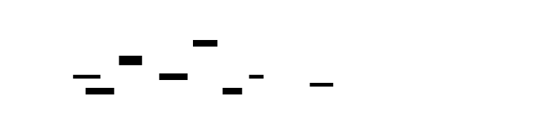

---
### Hot Spot Analysis
```rust
// src/memory/hotspot.rs
/// Information about an allocation hot spot.
#[derive(Debug, Clone)]
pub struct HotSpot {
    /// Call site hash for identification.
    pub call_site_hash: u64,
    /// Representative call stack.
    pub call_stack: Vec<usize>,
    /// Total bytes allocated from this site.
    pub total_allocated: u64,
    /// Total bytes freed from this site.
    pub total_freed: u64,
    /// Current live bytes from this site.
    pub live_bytes: u64,
    /// Number of allocation calls.
    pub alloc_count: u64,
    /// Number of free calls.
    pub free_count: u64,
    /// Peak live bytes from this site.
    pub peak_live_bytes: u64,
    /// Average allocation size.
    pub avg_alloc_size: f64,
}
/// Complete hot spot analysis report.
#[derive(Debug)]
pub struct HotSpotReport {
    /// Hot spots sorted by total allocated (descending).
    pub sites: Vec<HotSpot>,
    /// Total bytes allocated across all sites.
    pub total_allocated: u64,
    /// Total allocation calls across all sites.
    pub total_allocs: u64,
    /// Current live bytes (from memory state).
    pub current_live_bytes: u64,
    /// Peak live bytes (from memory state).
    pub peak_live_bytes: u64,
}
impl HotSpotReport {
    /// Analyzes allocation patterns by call site.
    pub fn analyze(tracker: &AllocationTracker) -> Self {
        let mut sites: Vec<HotSpot> = Vec::new();
        for entry in tracker.call_site_stats.iter() {
            let hash = *entry.key();
            let stats = entry.value();
            let call_stack = tracker.call_site_stacks
                .get(&hash)
                .map(|s| s.clone())
                .unwrap_or_default();
            sites.push(HotSpot {
                call_site_hash: hash,
                call_stack,
                total_allocated: stats.total_allocated,
                total_freed: stats.total_freed,
                live_bytes: stats.live_bytes,
                alloc_count: stats.alloc_count,
                free_count: stats.free_count,
                peak_live_bytes: stats.peak_live_bytes,
                avg_alloc_size: stats.avg_alloc_size(),
            });
        }
        // Sort by total bytes allocated
        sites.sort_by(|a, b| b.total_allocated.cmp(&a.total_allocated));
        let total_allocated: u64 = sites.iter().map(|s| s.total_allocated).sum();
        let total_allocs: u64 = sites.iter().map(|s| s.alloc_count).sum();
        let state = tracker.memory_state();
        HotSpotReport {
            sites,
            total_allocated,
            total_allocs,
            current_live_bytes: state.current_live_bytes,
            peak_live_bytes: state.peak_live_bytes,
        }
    }
    /// Prints a formatted hot spot report.
    pub fn print(&self, symbols: &mut dyn SymbolResolver, top_n: usize) {
        println!("\n{}", "=".repeat(80));
        println!("ALLOCATION HOT SPOT ANALYSIS");
        println!("Total allocated: {} in {} allocations", 
                 MemoryState::format_bytes(self.total_allocated), self.total_allocs);
        println!("Current live: {} | Peak: {}", 
                 MemoryState::format_bytes(self.current_live_bytes),
                 MemoryState::format_bytes(self.peak_live_bytes));
        println!("{}", "=".repeat(80));
        println!("\nTop {} sites by total bytes allocated:", top_n);
        println!("{:-<80}", "");
        println!("{:>50} {:>12} {:>8} {:>10}", 
                 "SITE", "TOTAL", "COUNT", "AVG SIZE");
        println!("{:-<80}", "");
        for site in self.sites.iter().take(top_n) {
            let leaf = site.call_stack.first()
                .and_then(|&addr| symbols.lookup(addr))
                .unwrap_or("???");
            let truncated = if leaf.len() > 48 {
                format!("...{}", &leaf[leaf.len()-45..])
            } else {
                leaf.to_string()
            };
            println!("{:>50} {:>12} {:>8} {:>10}",
                     truncated,
                     MemoryState::format_bytes(site.total_allocated),
                     site.alloc_count,
                     MemoryState::format_bytes(site.avg_alloc_size as u64));
        }
    }
}
```
---


---
### Temporal Analysis
```rust
// src/memory/temporal.rs
use std::collections::VecDeque;
/// A single time-series sample of memory state.
#[derive(Debug, Clone)]
pub struct TemporalSample {
    /// Time since profiling started (milliseconds).
    pub time_ms: u64,
    /// Total live bytes at this moment.
    pub live_bytes: u64,
    /// Total allocation count at this moment.
    pub alloc_count: u64,
    /// Total free count at this moment.
    pub free_count: u64,
    /// Allocations in this interval.
    pub interval_allocs: u64,
    /// Frees in this interval.
    pub interval_frees: u64,
    /// Bytes allocated in this interval.
    pub interval_bytes_allocated: u64,
    /// Bytes freed in this interval.
    pub interval_bytes_freed: u64,
}
/// Time-series data for allocation tracking.
pub struct TemporalTracker {
    /// Samples at regular intervals.
    samples: VecDeque<TemporalSample>,
    /// Sample interval in milliseconds.
    sample_interval_ms: u64,
    /// Last sample time.
    last_sample: Instant,
    /// Maximum samples to keep.
    max_samples: usize,
    /// Last recorded totals (for delta calculation).
    last_alloc_count: u64,
    last_free_count: u64,
    last_live_bytes: u64,
}
impl TemporalTracker {
    /// Creates a new temporal tracker.
    pub fn new(sample_interval_ms: u64, max_samples: usize) -> Self {
        TemporalTracker {
            samples: VecDeque::with_capacity(max_samples),
            sample_interval_ms,
            last_sample: Instant::now(),
            max_samples,
            last_alloc_count: 0,
            last_free_count: 0,
            last_live_bytes: 0,
        }
    }
    /// Records a sample if enough time has elapsed.
    pub fn record_sample(&mut self, tracker: &AllocationTracker) {
        let now = Instant::now();
        let elapsed = now.duration_since(self.last_sample);
        if elapsed.as_millis() < self.sample_interval_ms as u128 {
            return;
        }
        let state = tracker.memory_state();
        let time_ms = tracker.start_time.elapsed().as_millis() as u64;
        // Calculate interval deltas
        let interval_allocs = state.total_allocations.saturating_sub(self.last_alloc_count);
        let interval_frees = state.total_frees.saturating_sub(self.last_free_count);
        let interval_bytes_allocated = state.current_live_bytes.saturating_sub(self.last_live_bytes)
            + (interval_frees * 0); // Simplified; would need byte-level tracking
        let sample = TemporalSample {
            time_ms,
            live_bytes: state.current_live_bytes,
            alloc_count: state.total_allocations,
            free_count: state.total_frees,
            interval_allocs,
            interval_frees,
            interval_bytes_allocated,
            interval_bytes_freed: 0, // Would need additional tracking
        };
        self.last_alloc_count = state.total_allocations;
        self.last_free_count = state.total_frees;
        self.last_live_bytes = state.current_live_bytes;
        self.samples.push_back(sample);
        // Enforce max_samples limit
        while self.samples.len() > self.max_samples {
            self.samples.pop_front();
        }
        self.last_sample = now;
    }
    /// Exports as CSV for plotting.
    pub fn export_csv(&self) -> String {
        let mut csv = String::from("time_ms,live_bytes,alloc_count,free_count,interval_allocs,interval_frees\n");
        for sample in &self.samples {
            csv.push_str(&format!(
                "{},{},{},{},{},{}\n",
                sample.time_ms,
                sample.live_bytes,
                sample.alloc_count,
                sample.free_count,
                sample.interval_allocs,
                sample.interval_frees
            ));
        }
        csv
    }
    /// Detects potential leak pattern (sustained linear growth).
    pub fn detect_leak_pattern(&self) -> Option<LeakPattern> {
        if self.samples.len() < 10 {
            return None;
        }
        // Simple linear regression on live_bytes over time
        let n = self.samples.len() as f64;
        let sum_x: f64 = self.samples.iter().map(|s| s.time_ms as f64).sum();
        let sum_y: f64 = self.samples.iter().map(|s| s.live_bytes as f64).sum();
        let sum_xy: f64 = self.samples.iter()
            .map(|s| (s.time_ms as f64) * (s.live_bytes as f64))
            .sum();
        let sum_xx: f64 = self.samples.iter()
            .map(|s| (s.time_ms as f64).powi(2))
            .sum();
        let denominator = n * sum_xx - sum_x * sum_x;
        if denominator == 0.0 {
            return None;
        }
        let slope = (n * sum_xy - sum_x * sum_y) / denominator;
        // If slope is significantly positive (>1 KB/s), potential leak
        let bytes_per_second = slope * 1000.0;
        if bytes_per_second > 1024.0 {
            Some(LeakPattern {
                bytes_per_second: bytes_per_second as u64,
                confidence: 0.8, // Simplified; would calculate R²
            })
        } else {
            None
        }
    }
}
/// Detected leak pattern from temporal analysis.
#[derive(Debug)]
pub struct LeakPattern {
    /// Estimated bytes per second growth.
    pub bytes_per_second: u64,
    /// Confidence level (0.0 to 1.0).
    pub confidence: f64,
}
```
---


---
### LD_PRELOAD Interposition Layer
```rust
// src/memory/interpose.rs
use std::cell::Cell;
use std::ffi::c_void;
use std::sync::OnceLock;
use libc::{size_t, c_int};
// Global tracker instance
static TRACKER: OnceLock<AllocationTracker> = OnceLock::new();
// Real function pointers (set on first call)
static mut REAL_MALLOC: Option<unsafe extern "C" fn(size_t) -> *mut c_void> = None;
static mut REAL_FREE: Option<unsafe extern "C" fn(*mut c_void)> = None;
static mut REAL_CALLOC: Option<unsafe extern "C" fn(size_t, size_t) -> *mut c_void> = None;
static mut REAL_REALLOC: Option<unsafe extern "C" fn(*mut c_void, size_t) -> *mut c_void> = None;
// Thread-local recursion guard
thread_local! {
    static IN_PROFILER: Cell<bool> = Cell::new(false);
}
/// Initializes real function pointers via dlsym.
/// 
/// # Safety
/// Must be called before any real function is used.
/// RTLD_NEXT lookup is thread-safe.
unsafe fn init_real_functions() {
    if REAL_MALLOC.is_some() {
        return;
    }
    let malloc_ptr = libc::dlsym(libc::RTLD_NEXT, b"malloc\0".as_ptr() as *const i8);
    let free_ptr = libc::dlsym(libc::RTLD_NEXT, b"free\0".as_ptr() as *const i8);
    let calloc_ptr = libc::dlsym(libc::RTLD_NEXT, b"calloc\0".as_ptr() as *const i8);
    let realloc_ptr = libc::dlsym(libc::RTLD_NEXT, b"realloc\0".as_ptr() as *const i8);
    REAL_MALLOC = Some(std::mem::transmute(malloc_ptr));
    REAL_FREE = Some(std::mem::transmute(free_ptr));
    REAL_CALLOC = Some(std::mem::transmute(calloc_ptr));
    REAL_REALLOC = Some(std::mem::transmute(realloc_ptr));
}
/// Initializes the profiler (call at library load).
fn init_profiler() {
    TRACKER.get_or_init(|| {
        let tracker = AllocationTracker::new();
        tracker.activate();
        tracker
    });
    // Register atexit handler for final report
    unsafe {
        libc::atexit(Some(dump_final_report));
    }
}
/// Dumps final report at program exit.
extern "C" fn dump_final_report() {
    if let Some(tracker) = TRACKER.get() {
        tracker.deactivate();
        // Would print report here
        // In production, would use SymbolResolver from M5
        let state = tracker.memory_state();
        state.print_summary();
        let leaks = LeakReport::detect(tracker);
        println!("\nTotal leaks: {} bytes in {} allocations", 
                 leaks.total_leaked_bytes, leaks.total_leaked_count);
    }
}
/// Captures the current call stack.
/// 
/// Uses frame pointer walking (same as M1 but not in signal context).
/// Returns addresses from leaf (current function) toward root.
fn capture_call_stack(skip_frames: usize) -> Vec<usize> {
    const MAX_DEPTH: usize = 32;
    let mut addresses: Vec<usize> = Vec::with_capacity(MAX_DEPTH);
    unsafe {
        let mut buffer: [*mut c_void; MAX_DEPTH] = 
            [std::ptr::null_mut(); MAX_DEPTH];
        let count = libc::backtrace(buffer.as_mut_ptr(), MAX_DEPTH as i32);
        for i in skip_frames..count as usize {
            if !buffer[i].is_null() {
                addresses.push(buffer[i] as usize);
            }
        }
    }
    addresses
}
// === Interposed Functions ===
/// Interposed malloc wrapper.
#[no_mangle]
pub extern "C" fn malloc(size: size_t) -> *mut c_void {
    unsafe {
        init_real_functions();
        let real_malloc = match REAL_MALLOC {
            Some(f) => f,
            None => return std::ptr::null_mut(),
        };
        // Call real malloc first
        let ptr = real_malloc(size);
        // Track if not recursing and initialized
        IN_PROFILER.with(|in_profiler| {
            if !in_profiler.get() {
                in_profiler.set(true);
                if let Some(tracker) = TRACKER.get() {
                    if tracker.is_active() && !ptr.is_null() {
                        let call_stack = capture_call_stack(3);
                        tracker.record_malloc(ptr as usize, size, call_stack);
                    }
                }
                in_profiler.set(false);
            }
        });
        ptr
    }
}
/// Interposed free wrapper.
#[no_mangle]
pub extern "C" fn free(ptr: *mut c_void) {
    unsafe {
        init_real_functions();
        let real_free = match REAL_FREE {
            Some(f) => f,
            None => return,
        };
        // Track first (before free invalidates the memory)
        IN_PROFILER.with(|in_profiler| {
            if !in_profiler.get() {
                in_profiler.set(true);
                if let Some(tracker) = TRACKER.get() {
                    if tracker.is_active() && !ptr.is_null() {
                        tracker.record_free(ptr as usize);
                    }
                }
                in_profiler.set(false);
            }
        });
        // Then call real free
        real_free(ptr);
    }
}
/// Interposed calloc wrapper.
#[no_mangle]
pub extern "C" fn calloc(nmemb: size_t, size: size_t) -> *mut c_void {
    unsafe {
        init_real_functions();
        let real_calloc = match REAL_CALLOC {
            Some(f) => f,
            None => return std::ptr::null_mut(),
        };
        let ptr = real_calloc(nmemb, size);
        IN_PROFILER.with(|in_profiler| {
            if !in_profiler.get() {
                in_profiler.set(true);
                if let Some(tracker) = TRACKER.get() {
                    if tracker.is_active() && !ptr.is_null() {
                        let total_size = nmemb * size;
                        let call_stack = capture_call_stack(3);
                        tracker.record_malloc(ptr as usize, total_size, call_stack);
                    }
                }
                in_profiler.set(false);
            }
        });
        ptr
    }
}
/// Interposed realloc wrapper.
#[no_mangle]
pub extern "C" fn realloc(ptr: *mut c_void, size: size_t) -> *mut c_void {
    unsafe {
        init_real_functions();
        let real_realloc = match REAL_REALLOC {
            Some(f) => f,
            None => return std::ptr::null_mut(),
        };
        // Track the free of old pointer (if any)
        if !ptr.is_null() {
            IN_PROFILER.with(|in_profiler| {
                if !in_profiler.get() {
                    in_profiler.set(true);
                    if let Some(tracker) = TRACKER.get() {
                        if tracker.is_active() {
                            tracker.record_free(ptr as usize);
                        }
                    }
                    in_profiler.set(false);
                }
            });
        }
        let new_ptr = real_realloc(ptr, size);
        // Track the new allocation
        IN_PROFILER.with(|in_profiler| {
            if !in_profiler.get() {
                in_profiler.set(true);
                if let Some(tracker) = TRACKER.get() {
                    if tracker.is_active() && !new_ptr.is_null() {
                        let call_stack = capture_call_stack(3);
                        tracker.record_malloc(new_ptr as usize, size, call_stack);
                    }
                }
                in_profiler.set(false);
            }
        });
        new_ptr
    }
}
// Library constructor - called when library is loaded
#[cfg(target_os = "linux")]
#[link_section = ".init_array"]
static INIT_ARRAY: extern "C" fn() = {
    extern "C" fn init() {
        init_profiler();
    }
    init
};
```
---


---
## Interface Contracts
### Public API
```rust
// src/memory/mod.rs
pub use info::{AllocationInfo, CallSiteStats, AllocId};
pub use tracker::AllocationTracker;
pub use state::MemoryState;
pub use leak::{LeakReport, LeakSite, LeakPattern};
pub use hotspot::{HotSpotReport, HotSpot};
pub use temporal::{TemporalTracker, TemporalSample};
/// Main memory profiler interface.
pub struct MemoryProfiler {
    tracker: AllocationTracker,
    temporal: TemporalTracker,
}
impl MemoryProfiler {
    /// Creates a new memory profiler.
    pub fn new() -> Self {
        let tracker = AllocationTracker::new();
        tracker.activate();
        MemoryProfiler {
            tracker,
            temporal: TemporalTracker::new(100, 36000), // 100ms interval, 1 hour max
        }
    }
    /// Records a malloc call.
    pub fn record_malloc(&self, ptr: usize, size: usize, call_stack: Vec<usize>) -> AllocId {
        self.tracker.record_malloc(ptr, size, call_stack)
    }
    /// Records a free call.
    pub fn record_free(&self, ptr: usize) -> bool {
        self.tracker.record_free(ptr)
    }
    /// Generates a complete report.
    pub fn generate_report(&self) -> MemoryReport {
        MemoryReport {
            state: self.tracker.memory_state(),
            hot_spots: HotSpotReport::analyze(&self.tracker),
            leaks: LeakReport::detect(&self.tracker),
        }
    }
    /// Updates temporal sampling.
    pub fn tick(&mut self) {
        self.temporal.record_sample(&self.tracker);
    }
    /// Returns the current memory state.
    pub fn state(&self) -> MemoryState {
        self.tracker.memory_state()
    }
}
/// Complete memory profiling report.
pub struct MemoryReport {
    pub state: MemoryState,
    pub hot_spots: HotSpotReport,
    pub leaks: LeakReport,
}
```
---
## Algorithm Specification
### Leak Detection Algorithm
```
INPUT: tracker: AllocationTracker
OUTPUT: LeakReport
ALGORITHM DetectLeaks:
  1. INITIALIZE sites_by_hash = empty HashMap<u64, LeakSite>
  2. INITIALIZE total_leaked_bytes = 0
  3. INITIALIZE total_leaked_count = 0
  4. FOR each entry IN tracker.allocations:
     a. info = entry.value()
     b. IF info.freed: CONTINUE
     c. hash = info.call_stack_hash
     d. site = sites_by_hash.get_or_create(hash)
     e. site.allocation_ids.push(info.address)
     f. site.total_bytes += info.size
     g. site.count += 1
     h. site.oldest_timestamp_ns = MIN(site.oldest, info.timestamp_ns)
     i. site.newest_timestamp_ns = MAX(site.newest, info.timestamp_ns)
     j. total_leaked_bytes += info.size
     k. total_leaked_count += 1
  5. sites = sites_by_hash.values().collect()
  6. SORT sites BY total_bytes DESCENDING
  7. RETURN LeakReport {
       sites,
       total_leaked_bytes,
       total_leaked_count,
       profiling_duration: tracker.start_time.elapsed()
     }
INVARIANTS:
  - Only unfreed allocations are included
  - Each leak site groups allocations by call_stack_hash
  - Sites are sorted for actionable output (biggest leaks first)
COMPLEXITY: O(N) where N = number of tracked allocations
```
---


---
### Call Site Aggregation Algorithm
```
INPUT: ptr: usize, size: usize, call_stack: Vec<usize>
OUTPUT: Updated CallSiteStats
ALGORITHM RecordMalloc:
  1. hash = hash_call_stack(call_stack)
  2. stats = call_site_stats.get_or_create(hash)
  3. stats.total_allocated += size
  4. stats.alloc_count += 1
  5. stats.live_bytes += size
  6. IF stats.live_bytes > stats.peak_live_bytes:
     stats.peak_live_bytes = stats.live_bytes
  7. IF stats.representative_stack.is_empty():
     stats.representative_stack = call_stack
  8. RETURN
ALGORITHM RecordFree:
  1. info = allocations.remove(ptr)
  2. IF info IS None: RETURN (unknown allocation)
  3. hash = info.call_stack_hash
  4. stats = call_site_stats.get(hash)
  5. stats.total_freed += info.size
  6. stats.free_count += 1
  7. stats.live_bytes = MAX(0, stats.live_bytes - info.size)
  8. RETURN
INVARIANTS:
  - live_bytes = total_allocated - total_freed (per site)
  - peak_live_bytes is the maximum live_bytes ever seen
  - representative_stack is set once (first allocation at site)
```
---


---
### Recursion Guard Algorithm
```
INPUT: malloc/free call
OUTPUT: Tracked or untracked allocation
ALGORITHM InterposeMalloc:
  1. IN_PROFILER.with(|in_profiler|):
     a. IF in_profiler.get() == true:
        - This is a recursive call (tracker allocating)
        - Call real_malloc directly, return
     b. in_profiler.set(true)
     c. ptr = real_malloc(size)
     d. IF tracker.is_active() AND ptr IS NOT null:
        - call_stack = capture_call_stack(3)
        - tracker.record_malloc(ptr, size, call_stack)
     e. in_profiler.set(false)
  2. RETURN ptr
INVARIANTS:
  - IN_PROFILER is true during any tracker operation
  - Nested allocations are not tracked (prevents infinite recursion)
  - Thread-local guard prevents cross-thread interference
```
---
## Error Handling Matrix
| Error | Detected By | Recovery | User-Visible? |
|-------|-------------|----------|---------------|
| Recursive allocation | `IN_PROFILER` thread-local flag | Skip tracking, call real function | No - transparent to caller |
| Early allocation (before dlsym) | `REAL_MALLOC.is_none()` | Return null/call stub | Yes - allocation fails |
| Double-free | `allocations.remove()` returns None | Log warning, continue | Partially - warning in logs |
| Unknown allocator (jemalloc) | Symbols not resolving | LD_PRELOAD order matters | Yes - tracking not working |
| Profiler memory as leak | Profiler allocations tracked | Filter by address range | No - filtered in report |
| TLS allocation not intercepted | TLS uses separate path | Document limitation | No - known limitation |
| Hash collision in call site | Different stacks, same hash | Aggregates together (rare) | No - acceptable error |
| Temporal buffer overflow | `samples.len() > max_samples` | Drop oldest samples | No - data retained |
---
---
## Implementation Sequence with Checkpoints
### Phase 1: LD_PRELOAD Interposition Layer (2-3 hours)
**Files to create:** `src/memory/mod.rs`, `src/memory/interpose.rs`
**Steps:**
1. Create module structure and exports
2. Implement `init_real_functions()` with dlsym
3. Create thread-local `IN_PROFILER` recursion guard
4. Implement `malloc()` wrapper with real call + guard
5. Implement `free()` wrapper
6. Implement `calloc()` wrapper
7. Implement `realloc()` wrapper (free + alloc)
8. Add `.init_array` constructor for auto-init
**Checkpoint:**
```bash
cargo build --release
LD_PRELOAD=./target/release/libprofiler_memory.so ls -la
# Expected: Command runs, no crashes, basic output
```
### Phase 2: Allocation Metadata Tracking (2-3 hours)
**Files to create:** `src/memory/info.rs`, `src/memory/tracker.rs`
**Steps:**
1. Implement `AllocationInfo` with all fields
2. Implement `CallSiteStats` with aggregation methods
3. Implement `AllocationTracker::new()`
4. Implement `record_malloc()` with DashMap insert
5. Implement `record_free()` with DashMap remove
6. Add atomic counters for live/peak bytes
7. Implement `memory_state()` accessor
**Checkpoint:**
```bash
cargo test allocation_tracking
# Expected: malloc/free recorded, stats updated correctly
```
### Phase 3: Call Stack Capture (1-2 hours)
**Files to create:** `src/memory/interpose.rs` (extend)
**Steps:**
1. Implement `capture_call_stack()` using backtrace()
2. Add skip_frames parameter
3. Integrate into malloc wrapper
4. Add hash_call_stack() for aggregation
**Checkpoint:**
```bash
cargo test call_stack_capture
# Expected: Stacks captured, hashes computed
```
### Phase 4: Leak Detection Algorithm (2-3 hours)
**Files to create:** `src/memory/leak.rs`
**Steps:**
1. Implement `LeakSite` struct
2. Implement `LeakReport::detect()` algorithm
3. Add grouping by call_stack_hash
4. Add sorting by total_bytes
5. Implement `print()` formatter
**Checkpoint:**
```bash
cargo test leak_detection
# Expected: Leaks detected, grouped, sorted correctly
```
### Phase 5: Hot Spot & Temporal Analysis (2-3 hours)
**Files to create:** `src/memory/hotspot.rs`, `src/memory/temporal.rs`, `src/memory/state.rs`
**Steps:**
1. Implement `HotSpot` and `HotSpotReport`
2. Implement `HotSpotReport::analyze()`
3. Implement `TemporalSample` and `TemporalTracker`
4. Implement `record_sample()` with interval check
5. Implement `export_csv()` for plotting
6. Implement `detect_leak_pattern()` linear regression
7. Implement `MemoryState` and formatting
**Checkpoint:**
```bash
cargo test --all
# Expected: All tests pass
cargo run --example memory_demo
# Expected: Full report printed at exit
```
---


---
## Test Specification
### Unit Tests
```rust
#[cfg(test)]
mod tests {
    use super::*;
    // === AllocationInfo Tests ===
    #[test]
    fn allocation_info_new() {
        let info = AllocationInfo::new(
            0x1000,
            1024,
            1,
            1000,
            1,
            vec![0x2000, 0x3000],
        );
        assert_eq!(info.address, 0x1000);
        assert_eq!(info.size, 1024);
        assert!(!info.freed);
    }
    #[test]
    fn allocation_info_mark_freed() {
        let mut info = AllocationInfo::new(0x1000, 1024, 1, 1000, 1, vec![]);
        info.mark_freed(2000);
        assert!(info.freed);
        assert_eq!(info.freed_timestamp_ns, Some(2000));
        assert_eq!(info.lifetime(), Some(Duration::from_nanos(1000)));
    }
    #[test]
    fn allocation_info_validation() {
        let mut info = AllocationInfo::new(0, 1024, 1, 1000, 1, vec![]);
        assert!(info.validate().is_err()); // null address
        info.address = 0x1000;
        info.freed = true;
        assert!(info.validate().is_err()); // freed but no timestamp
        info.freed_timestamp_ns = Some(2000);
        assert!(info.validate().is_ok());
    }
    // === CallSiteStats Tests ===
    #[test]
    fn call_site_stats_record_alloc() {
        let mut stats = CallSiteStats::default();
        stats.record_alloc(1024, vec![0x1000]);
        stats.record_alloc(512, vec![0x1000]);
        assert_eq!(stats.total_allocated, 1536);
        assert_eq!(stats.alloc_count, 2);
        assert_eq!(stats.live_bytes, 1536);
        assert_eq!(stats.peak_live_bytes, 1536);
    }
    #[test]
    fn call_site_stats_record_free() {
        let mut stats = CallSiteStats::default();
        stats.record_alloc(1024, vec![]);
        stats.record_free(512);
        assert_eq!(stats.total_freed, 512);
        assert_eq!(stats.free_count, 1);
        assert_eq!(stats.live_bytes, 512);
    }
    #[test]
    fn call_site_stats_peak_tracking() {
        let mut stats = CallSiteStats::default();
        stats.record_alloc(1024, vec![]);
        assert_eq!(stats.peak_live_bytes, 1024);
        stats.record_free(512);
        assert_eq!(stats.peak_live_bytes, 1024); // Peak unchanged
        stats.record_alloc(2048, vec![]);
        assert_eq!(stats.peak_live_bytes, 2560); // New peak
    }
    // === AllocationTracker Tests ===
    #[test]
    fn tracker_record_malloc() {
        let tracker = AllocationTracker::new();
        tracker.activate();
        let id = tracker.record_malloc(0x1000, 1024, vec![0x2000]);
        assert!(id > 0);
        let state = tracker.memory_state();
        assert_eq!(state.current_live_bytes, 1024);
        assert_eq!(state.total_allocations, 1);
    }
    #[test]
    fn tracker_record_free() {
        let tracker = AllocationTracker::new();
        tracker.activate();
        tracker.record_malloc(0x1000, 1024, vec![]);
        let found = tracker.record_free(0x1000);
        assert!(found);
        let state = tracker.memory_state();
        assert_eq!(state.current_live_bytes, 0);
        assert_eq!(state.total_frees, 1);
    }
    #[test]
    fn tracker_free_unknown() {
        let tracker = AllocationTracker::new();
        tracker.activate();
        let found = tracker.record_free(0x9999);
        assert!(!found); // Unknown pointer
    }
    #[test]
    fn tracker_peak_bytes() {
        let tracker = AllocationTracker::new();
        tracker.activate();
        tracker.record_malloc(0x1000, 1024, vec![]);
        tracker.record_malloc(0x2000, 2048, vec![]);
        tracker.record_free(0x1000);
        let state = tracker.memory_state();
        assert_eq!(state.peak_live_bytes, 3072);
        assert_eq!(state.current_live_bytes, 2048);
    }
    // === LeakReport Tests ===
    #[test]
    fn leak_report_empty() {
        let tracker = AllocationTracker::new();
        tracker.activate();
        let report = LeakReport::detect(&tracker);
        assert_eq!(report.total_leaked_bytes, 0);
        assert_eq!(report.total_leaked_count, 0);
    }
    #[test]
    fn leak_report_detects_leaks() {
        let tracker = AllocationTracker::new();
        tracker.activate();
        tracker.record_malloc(0x1000, 1024, vec![0x2000]);
        tracker.record_malloc(0x2000, 512, vec![0x2000]);
        tracker.record_malloc(0x3000, 256, vec![0x3000]);
        tracker.record_free(0x2000); // Free one
        let report = LeakReport::detect(&tracker);
        assert_eq!(report.total_leaked_count, 2);
        assert_eq!(report.total_leaked_bytes, 1280);
        assert_eq!(report.sites.len(), 2); // Two call sites
    }
    // === TemporalTracker Tests ===
    #[test]
    fn temporal_tracker_samples() {
        let mut temporal = TemporalTracker::new(1, 100); // 1ms interval
        let tracker = AllocationTracker::new();
        tracker.activate();
        temporal.record_sample(&tracker);
        std::thread::sleep(std::time::Duration::from_millis(2));
        temporal.record_sample(&tracker);
        assert!(temporal.samples.len() >= 1);
    }
    #[test]
    fn temporal_export_csv() {
        let mut temporal = TemporalTracker::new(1, 100);
        let tracker = AllocationTracker::new();
        tracker.activate();
        temporal.record_sample(&tracker);
        let csv = temporal.export_csv();
        assert!(csv.starts_with("time_ms,live_bytes"));
    }
    // === MemoryState Tests ===
    #[test]
    fn memory_state_format_bytes() {
        assert_eq!(MemoryState::format_bytes(512), "512 B");
        assert_eq!(MemoryState::format_bytes(1024), "1.00 KB");
        assert_eq!(MemoryState::format_bytes(1048576), "1.00 MB");
        assert_eq!(MemoryState::format_bytes(1073741824), "1.00 GB");
    }
}
```
### Integration Tests
```rust
// tests/integration_m3.rs
#[test]
fn end_to_end_memory_profiling() {
    let profiler = MemoryProfiler::new();
    // Allocate some memory
    let ptr1 = unsafe { libc::malloc(1024) };
    let ptr2 = unsafe { libc::malloc(2048) };
    profiler.record_malloc(ptr1 as usize, 1024, vec![0x1000]);
    profiler.record_malloc(ptr2 as usize, 2048, vec![0x1000]);
    // Free one
    unsafe { libc::free(ptr1) };
    profiler.record_free(ptr1 as usize);
    // Generate report
    let report = profiler.generate_report();
    assert_eq!(report.state.current_live_bytes, 2048);
    assert_eq!(report.state.peak_live_bytes, 3072);
    assert_eq!(report.leaks.total_leaked_count, 1);
    // Cleanup
    unsafe { libc::free(ptr2) };
}
#[test]
fn recursion_guard_prevents_infinite_loop() {
    // This test verifies the recursion guard works
    // Without the guard, recording an allocation would allocate (in DashMap)
    // which would trigger another record, etc.
    let tracker = AllocationTracker::new();
    tracker.activate();
    // Simulate being in the profiler
    IN_PROFILER.with(|in_profiler| {
        in_profiler.set(true);
        // This should NOT record (recursion)
        let id = tracker.record_malloc(0x9999, 100, vec![]);
        assert_eq!(id, 0);
        in_profiler.set(false);
    });
    // Now it should record
    let id = tracker.record_malloc(0x1000, 100, vec![]);
    assert!(id > 0);
}
```
---
## Performance Targets
| Operation | Target | How to Measure |
|-----------|--------|----------------|
| malloc interposition overhead | < 200 ns | Benchmark with/without LD_PRELOAD |
| free interposition overhead | < 100 ns | Benchmark with/without LD_PRELOAD |
| Total overhead (alloc-heavy) | < 10% | Compare runtime of allocation benchmark |
| Support 1M+ allocations | Yes | Test with 1M malloc/free pairs |
| Temporal sampling interval | 100 ms | Configurable, verify timing |
| Leak report generation | < 1 second | Measure time for 100K allocations |
| DashMap lookup | < 50 ns | Microbenchmark |
| Peak tracking atomic max | < 100 ns | Microbenchmark compare_exchange |
### Benchmark Commands
```bash
# Allocation overhead benchmark
cargo bench malloc_overhead -- --sample-size 10000
# Large-scale tracking
cargo test million_allocations --release -- --nocapture
# Memory footprint
valgrind --tool=massif target/release/examples/memory_demo
```
---
[[CRITERIA_JSON: {"module_id": "profiler-m3", "criteria": ["Implement malloc/free/calloc/realloc interception via LD_PRELOAD with proper recursion guards using thread-local storage", "Track allocation metadata including address, size, timestamp, thread ID, and call stack for each allocation stored in concurrent DashMap", "Implement leak detection algorithm that identifies unfreed allocations grouped by call site with size and count aggregation", "Generate allocation hot spot report showing call sites sorted by total bytes allocated with average size calculations", "Implement temporal analysis with time-series sampling at configurable intervals and CSV export capability", "Track and report memory high-water mark (peak live bytes) using atomic compare_exchange for thread-safe updates", "Implement call site attribution using stack capture via backtrace() and hash-based aggregation for grouping", "Handle recursion prevention to avoid infinite loops when tracker itself allocates (Boehm effect mitigation)", "Handle early allocations before dlsym succeeds by returning gracefully without tracking", "Implement atomic counters for live_bytes, peak_bytes, total_allocs, total_frees with proper memory ordering", "Support allocation sizes up to SIZE_MAX and handle zero-size allocations appropriately", "Provide MemoryState snapshot with current/peak bytes, allocation counts, and formatted byte output", "Implement atexit handler for final report generation at program exit", "Support configurable temporal sampling interval and maximum sample retention"]}]
<!-- END_TDD_MOD -->


<!-- TDD_MOD_ID: profiler-m4 -->
# Technical Design Specification: Async/Aware Profiling
## Module Charter
The Async/Aware Profiling module extends the sampling profiler to handle async/await execution patterns where logical call stacks span multiple physical stack frames across different threads and time slices. It tracks task identity from spawn to completion using a combination of wrapper futures and thread-local context propagation, reconstructs logical call stacks by maintaining parent-child task relationships, separates CPU time (active polling) from await time (suspended waiting), and generates async-aware flame graphs with dual-color visualization (red for CPU, blue for await). This module deliberately excludes kernel-level async tracing (focuses on user-space runtimes only), does not implement automatic task naming (requires explicit instrumentation or heuristics), and does not trace across process boundaries. Upstream dependencies are Tokio's runtime (task spawn, waker hooks), the CPU sampler from M1 (for correlating physical samples), and the symbol resolver from M5 (for stack attribution); downstream consumers are the async-aware flame graph generator and the profile export layer. Critical invariants: each task must have a unique ID assigned at spawn, poll time + await time must equal total task lifetime (within measurement precision), parent-child relationships must form a DAG (no cycles except self-edges for recursive tasks), and the `CURRENT_TASK_ID` thread-local must always reflect the currently-executing task during poll.
---
## File Structure
```
profiler/src/
├── async_profiler/
│   ├── mod.rs                 # 1. Module exports and public API
│   ├── tracker.rs             # 2. AsyncTaskTracker with DashMap storage
│   ├── lifecycle.rs           # 3. AsyncTaskLifecycle and PollRecord definitions
│   ├── spawn.rs               # 4. profiled_spawn wrapper and ProfiledFuture
│   ├── context.rs             # 5. CURRENT_TASK_ID thread-local and propagation
│   ├── relationships.rs       # 6. TaskRelationshipGraph for parent-child tracking
│   ├── time_breakdown.rs      # 7. TaskTimeBreakdown and await categorization
│   ├── logical_stack.rs       # 8. Logical stack reconstruction algorithm
│   ├── flamegraph.rs          # 9. Async-aware flame graph builder
│   └── tokio_integration.rs   # 10. Tokio runtime hooks and initialization
└── error.rs                   # 11. AsyncProfilerError (extends previous errors)
```
**Creation Order:** Files numbered 1-11 should be created in sequence. Dependencies flow downward.
---
## Complete Data Model
### Core Structures
```rust
// src/async_profiler/lifecycle.rs
use std::time::Duration;
use std::collections::HashMap;
/// Unique identifier for an async task.
/// Monotonically increasing within a profiler session.
pub type AsyncTaskId = u64;
/// A single poll operation record.
/// 
/// Memory layout (64-bit):
/// ┌─────────────────────────────────────────────────────────────────┐
/// │ Offset 0x00: start_ns (u64, 8 bytes) - poll start timestamp    │
/// │ Offset 0x08: end_ns (u64, 8 bytes) - poll end timestamp        │
/// │ Offset 0x10: duration_ns (u64, 8 bytes) - computed duration    │
/// │ Offset 0x18: thread_id (u64, 8 bytes) - executing thread       │
/// │ Offset 0x20: result (PollResult, 1 byte) - Pending/Ready       │
/// │ Offset 0x21: padding (7 bytes)                                  │
/// │ Offset 0x28: stack_sample (Option<Vec<usize>>, 24 bytes)       │
/// └─────────────────────────────────────────────────────────────────┘
/// Total: ~56 bytes base + stack sample capacity
#[derive(Debug, Clone)]
pub struct PollRecord {
    /// Monotonic timestamp when poll() was entered.
    pub start_ns: u64,
    /// Monotonic timestamp when poll() returned.
    pub end_ns: u64,
    /// Duration of this poll (end_ns - start_ns).
    pub duration_ns: u64,
    /// Thread ID from gettid(2) where poll executed.
    pub thread_id: u64,
    /// Result of this poll operation.
    pub result: PollResult,
    /// Optional stack sample captured during this poll.
    pub stack_sample: Option<Vec<usize>>,
}
/// Result of a poll operation.
#[derive(Debug, Clone, Copy, PartialEq, Eq)]
#[repr(u8)]
pub enum PollResult {
    /// Task yielded (returned Pending).
    Pending = 0,
    /// Task completed (returned Ready).
    Ready = 1,
}
impl PollRecord {
    /// Creates a new poll record.
    pub fn new(start_ns: u64, end_ns: u64, thread_id: u64, result: PollResult) -> Self {
        PollRecord {
            start_ns,
            end_ns,
            duration_ns: end_ns.saturating_sub(start_ns),
            thread_id,
            result,
            stack_sample: None,
        }
    }
}
/// Complete lifecycle of an async task from spawn to completion.
/// 
/// Invariant: total_poll_time_ns == sum(polls[].duration_ns)
/// Invariant: total_await_time_ns calculated from gaps between polls
/// Invariant: completion_time_ns.is_some() implies at least one poll returned Ready
#[derive(Debug)]
pub struct AsyncTaskLifecycle {
    /// Unique task identifier.
    pub task_id: AsyncTaskId,
    /// Human-readable function name (if known).
    pub function_name: Option<String>,
    /// Call stack at spawn time (who spawned this task?).
    pub spawn_stack: Vec<usize>,
    /// Timestamp when task was spawned.
    pub spawn_time_ns: u64,
    /// Timestamp when task completed (if it has).
    pub completion_time_ns: Option<u64>,
    /// Thread ID where task was spawned.
    pub spawn_thread_id: u64,
    /// All threads this task has been polled on.
    pub threads_seen: Vec<u64>,
    /// Total time spent in poll (CPU time).
    pub total_poll_time_ns: u64,
    /// Total time spent awaiting (wait time).
    pub total_await_time_ns: u64,
    /// Number of poll calls.
    pub poll_count: u64,
    /// Individual poll records.
    pub polls: Vec<PollRecord>,
    /// Last poll start time (for calculating await time).
    pub last_poll_start_ns: Option<u64>,
    /// Last poll end time.
    pub last_poll_end_ns: Option<u64>,
    /// Parent task ID (if spawned from another task).
    pub parent_task_id: Option<AsyncTaskId>,
}
impl AsyncTaskLifecycle {
    /// Creates a new task lifecycle at spawn time.
    pub fn new(
        task_id: AsyncTaskId,
        spawn_stack: Vec<usize>,
        spawn_time_ns: u64,
        spawn_thread_id: u64,
        parent_task_id: Option<AsyncTaskId>,
    ) -> Self {
        AsyncTaskLifecycle {
            task_id,
            function_name: None,
            spawn_stack,
            spawn_time_ns,
            completion_time_ns: None,
            spawn_thread_id,
            threads_seen: vec![spawn_thread_id],
            total_poll_time_ns: 0,
            total_await_time_ns: 0,
            poll_count: 0,
            polls: Vec::new(),
            last_poll_start_ns: None,
            last_poll_end_ns: None,
            parent_task_id,
        }
    }
    /// Returns the total lifetime of this task.
    /// Returns None if task hasn't completed.
    pub fn total_lifetime(&self) -> Option<Duration> {
        self.completion_time_ns
            .map(|end| Duration::from_nanos(end - self.spawn_time_ns))
    }
    /// Returns the CPU utilization percentage.
    pub fn cpu_percent(&self) -> f64 {
        let lifetime_ns = self.total_lifetime()
            .map(|d| d.as_nanos() as u64)
            .unwrap_or_else(|| {
                // If not completed, use current time estimate
                self.total_poll_time_ns + self.total_await_time_ns
            });
        if lifetime_ns == 0 {
            return 0.0;
        }
        (self.total_poll_time_ns as f64 / lifetime_ns as f64) * 100.0
    }
    /// Validates lifecycle invariants.
    pub fn validate(&self) -> Result<(), Vec<String>> {
        let mut errors = Vec::new();
        let computed_poll_time: u64 = self.polls.iter().map(|p| p.duration_ns).sum();
        if computed_poll_time != self.total_poll_time_ns {
            errors.push(format!(
                "Poll time mismatch: computed={}, recorded={}",
                computed_poll_time, self.total_poll_time_ns
            ));
        }
        if self.completion_time_ns.is_some() {
            let has_ready = self.polls.iter().any(|p| p.result == PollResult::Ready);
            if !has_ready {
                errors.push("Task marked complete but no poll returned Ready".to_string());
            }
        }
        if errors.is_empty() {
            Ok(())
        } else {
            Err(errors)
        }
    }
}
```
```rust
// src/async_profiler/tracker.rs
use dashmap::DashMap;
use std::sync::atomic::{AtomicU64, AtomicBool, Ordering};
use std::sync::Arc;
use std::time::Instant;
/// Global async task tracker state.
pub struct AsyncTaskTracker {
    /// All known task lifecycles (task_id -> lifecycle).
    lifecycles: DashMap<AsyncTaskId, AsyncTaskLifecycle>,
    /// Currently executing polls (task_id -> poll_start_time).
    /// Used by signal handler to detect async context.
    active_polls: DashMap<AsyncTaskId, u64>,
    /// Task relationship graph for logical stack reconstruction.
    relationships: TaskRelationshipGraph,
    /// Next task ID (monotonic).
    next_task_id: AtomicU64,
    /// Total CPU time across all tasks.
    total_cpu_time_ns: AtomicU64,
    /// Total await time across all tasks.
    total_await_time_ns: AtomicU64,
    /// Profiler start time.
    start_time: Instant,
    /// Whether tracking is active.
    active: AtomicBool,
}
impl AsyncTaskTracker {
    /// Creates a new async task tracker.
    pub fn new() -> Self {
        AsyncTaskTracker {
            lifecycles: DashMap::new(),
            active_polls: DashMap::new(),
            relationships: TaskRelationshipGraph::new(),
            next_task_id: AtomicU64::new(1),
            total_cpu_time_ns: AtomicU64::new(0),
            total_await_time_ns: AtomicU64::new(0),
            start_time: Instant::now(),
            active: AtomicBool::new(false),
        }
    }
    /// Returns the current monotonic timestamp in nanoseconds.
    pub fn timestamp_ns(&self) -> u64 {
        self.start_time.elapsed().as_nanos() as u64
    }
    /// Allocates a new task ID.
    pub fn allocate_task_id(&self) -> AsyncTaskId {
        self.next_task_id.fetch_add(1, Ordering::Relaxed)
    }
    /// Activates tracking.
    pub fn activate(&self) {
        self.active.store(true, Ordering::Release);
    }
    /// Deactivates tracking.
    pub fn deactivate(&self) {
        self.active.store(false, Ordering::Release);
    }
    /// Checks if tracking is active.
    pub fn is_active(&self) -> bool {
        self.active.load(Ordering::Acquire)
    }
    /// Records a task spawn event.
    pub fn record_spawn(
        &self,
        task_id: AsyncTaskId,
        spawn_stack: Vec<usize>,
        parent_task_id: Option<AsyncTaskId>,
    ) {
        if !self.is_active() {
            return;
        }
        let thread_id = unsafe { libc::syscall(libc::SYS_gettid) as u64 };
        let timestamp_ns = self.timestamp_ns();
        let lifecycle = AsyncTaskLifecycle::new(
            task_id,
            spawn_stack,
            timestamp_ns,
            thread_id,
            parent_task_id,
        );
        self.lifecycles.insert(task_id, lifecycle);
        // Record parent-child relationship
        if let Some(parent_id) = parent_task_id {
            self.relationships.record_spawn(parent_id, task_id);
        }
    }
    /// Records the start of a poll operation.
    pub fn begin_poll(&self, task_id: AsyncTaskId) {
        if !self.is_active() {
            return;
        }
        let start_ns = self.timestamp_ns();
        let thread_id = unsafe { libc::syscall(libc::SYS_gettid) as u64 };
        // Track active poll for signal handler
        self.active_polls.insert(task_id, start_ns);
        // Update lifecycle
        if let Some(mut lifecycle) = self.lifecycles.get_mut(&task_id) {
            // Track thread migration
            if !lifecycle.threads_seen.contains(&thread_id) {
                lifecycle.threads_seen.push(thread_id);
            }
            // Calculate await time since last poll
            if let Some(last_end) = lifecycle.last_poll_end_ns {
                let await_time = start_ns.saturating_sub(last_end);
                lifecycle.total_await_time_ns += await_time;
                self.total_await_time_ns.fetch_add(await_time, Ordering::Relaxed);
            }
            lifecycle.last_poll_start_ns = Some(start_ns);
        }
    }
    /// Records the end of a poll operation.
    pub fn end_poll(&self, task_id: AsyncTaskId, result: PollResult) {
        if !self.is_active() {
            return;
        }
        let end_ns = self.timestamp_ns();
        let thread_id = unsafe { libc::syscall(libc::SYS_gettid) as u64 };
        // Remove from active polls
        if let Some((_, start_ns)) = self.active_polls.remove(&task_id) {
            let duration_ns = end_ns.saturating_sub(start_ns);
            // Capture stack sample (simplified - would use frame pointer walk)
            let stack_sample = self.capture_stack_sample(3);
            let poll_record = PollRecord::new(start_ns, end_ns, thread_id, result);
            // Update lifecycle
            if let Some(mut lifecycle) = self.lifecycles.get_mut(&task_id) {
                let mut poll_with_stack = poll_record;
                poll_with_stack.stack_sample = Some(stack_sample);
                lifecycle.polls.push(poll_with_stack);
                lifecycle.total_poll_time_ns += duration_ns;
                lifecycle.poll_count += 1;
                lifecycle.last_poll_end_ns = Some(end_ns);
                // Try to extract function name from first poll stack
                if lifecycle.function_name.is_none() {
                    if let Some(ref stack) = lifecycle.polls.last().and_then(|p| p.stack_sample.as_ref()) {
                        if let Some(&addr) = stack.first() {
                            // Would resolve symbol here in production
                            lifecycle.function_name = Some(format!("task_{}@{:#x}", task_id, addr));
                        }
                    }
                }
                if result == PollResult::Ready {
                    lifecycle.completion_time_ns = Some(end_ns);
                }
            }
            self.total_cpu_time_ns.fetch_add(duration_ns, Ordering::Relaxed);
        }
    }
    /// Captures current stack sample (skip_frames to skip wrapper functions).
    fn capture_stack_sample(&self, skip_frames: usize) -> Vec<usize> {
        const MAX_DEPTH: usize = 32;
        let mut addresses: Vec<usize> = Vec::with_capacity(MAX_DEPTH);
        unsafe {
            let mut buffer: [*mut std::ffi::c_void; MAX_DEPTH] = 
                [std::ptr::null_mut(); MAX_DEPTH];
            let count = libc::backtrace(buffer.as_mut_ptr(), MAX_DEPTH as i32);
            for i in skip_frames..count as usize {
                if !buffer[i].is_null() {
                    addresses.push(buffer[i] as usize);
                }
            }
        }
        addresses
    }
    /// Returns statistics about all tracked tasks.
    pub fn stats(&self) -> AsyncTrackerStats {
        let total_tasks = self.lifecycles.len() as u64;
        let completed_tasks = self.lifecycles.iter()
            .filter(|e| e.value().completion_time_ns.is_some())
            .count() as u64;
        AsyncTrackerStats {
            total_tasks,
            completed_tasks,
            active_polls: self.active_polls.len() as u64,
            total_cpu_time_ns: self.total_cpu_time_ns.load(Ordering::Relaxed),
            total_await_time_ns: self.total_await_time_ns.load(Ordering::Relaxed),
        }
    }
    /// Finds currently active poll for a thread (used by signal handler).
    pub fn find_active_poll_for_thread(&self, _thread_id: u64) -> Option<(AsyncTaskId, u64)> {
        // In production, would use thread-local storage for O(1) lookup
        // Simplified: return first active poll
        self.active_polls.iter().next().map(|e| (*e.key(), *e.value()))
    }
    /// Gets a task lifecycle by ID.
    pub fn get_lifecycle(&self, task_id: AsyncTaskId) -> Option<AsyncTaskLifecycle> {
        self.lifycles.get(&task_id).map(|e| e.value().clone())
    }
}
/// Statistics about the async task tracker.
#[derive(Debug, Clone)]
pub struct AsyncTrackerStats {
    pub total_tasks: u64,
    pub completed_tasks: u64,
    pub active_polls: u64,
    pub total_cpu_time_ns: u64,
    pub total_await_time_ns: u64,
}
```
---


---
```rust
// src/async_profiler/relationships.rs
use dashmap::DashMap;
use std::collections::HashSet;
/// Directed graph tracking parent-child relationships between tasks.
/// 
/// Used for reconstructing logical call stacks across async boundaries.
/// The graph is a DAG - cycles only exist for recursive tasks (self-edges).
pub struct TaskRelationshipGraph {
    /// task_id -> parent_task_id (who spawned this task).
    parents: DashMap<AsyncTaskId, Option<AsyncTaskId>>,
    /// task_id -> children task_ids (what this task spawned).
    children: DashMap<AsyncTaskId, Vec<AsyncTaskId>>,
}
impl TaskRelationshipGraph {
    /// Creates a new relationship graph.
    pub fn new() -> Self {
        TaskRelationshipGraph {
            parents: DashMap::new(),
            children: DashMap::new(),
        }
    }
    /// Records a spawn relationship.
    pub fn record_spawn(&self, parent: AsyncTaskId, child: AsyncTaskId) {
        self.parents.insert(child, Some(parent));
        self.children.entry(parent).or_default().push(child);
    }
    /// Reconstructs the logical call stack for a task.
    /// Returns task IDs from root (oldest ancestor) to the given task.
    pub fn logical_stack_for(&self, task_id: AsyncTaskId) -> Vec<AsyncTaskId> {
        let mut stack = vec![task_id];
        let mut current = task_id;
        // Walk up the parent chain
        while let Some(Some(parent)) = self.parents.get(&current).map(|e| *e.value()) {
            stack.push(parent);
            current = parent;
        }
        // Reverse to get root-to-leaf order
        stack.reverse();
        stack
    }
    /// Returns all descendants of a task (transitive closure).
    pub fn descendants(&self, task_id: AsyncTaskId) -> HashSet<AsyncTaskId> {
        let mut descendants = HashSet::new();
        let mut queue = vec![task_id];
        while let Some(current) = queue.pop() {
            if let Some(children) = self.children.get(&current) {
                for &child in children.value().iter() {
                    if descendants.insert(child) {
                        queue.push(child);
                    }
                }
            }
        }
        descendants
    }
    /// Checks if the graph contains any cycles (should only be self-edges).
    pub fn validate(&self) -> Result<(), Vec<String>> {
        let mut errors = Vec::new();
        // Check for cycles using DFS
        let mut visited = HashSet::new();
        let mut rec_stack = HashSet::new();
        for entry in self.parents.iter() {
            let task_id = *entry.key();
            if !visited.contains(&task_id) {
                self.validate_dfs(task_id, &mut visited, &mut rec_stack, &mut errors);
            }
        }
        if errors.is_empty() {
            Ok(())
        } else {
            Err(errors)
        }
    }
    fn validate_dfs(
        &self,
        task_id: AsyncTaskId,
        visited: &mut HashSet<AsyncTaskId>,
        rec_stack: &mut HashSet<AsyncTaskId>,
        errors: &mut Vec<String>,
    ) {
        visited.insert(task_id);
        rec_stack.insert(task_id);
        if let Some(children) = self.children.get(&task_id) {
            for &child in children.value().iter() {
                if !visited.contains(&child) {
                    self.validate_dfs(child, visited, rec_stack, errors);
                } else if rec_stack.contains(&child) && child != task_id {
                    errors.push(format!("Cycle detected: {} -> {}", task_id, child));
                }
            }
        }
        rec_stack.remove(&task_id);
    }
}
```
---

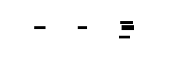

---
```rust
// src/async_profiler/time_breakdown.rs
use std::time::Duration;
/// Time breakdown for a single async task.
#[derive(Debug, Clone)]
pub struct TaskTimeBreakdown {
    /// Task identifier.
    pub task_id: AsyncTaskId,
    /// Human-readable function name.
    pub function_name: Option<String>,
    /// Total task lifetime (spawn to completion).
    pub total_time_ns: u64,
    /// Time spent in poll (CPU time).
    pub cpu_time_ns: u64,
    /// Time spent awaiting (wait time).
    pub await_time_ns: u64,
    /// CPU utilization percentage.
    pub cpu_percent: f64,
    /// Breakdown of await time by category.
    pub await_breakdown: AwaitBreakdown,
    /// Number of poll calls.
    pub poll_count: u64,
    /// Number of thread migrations.
    pub thread_migrations: usize,
}
/// Categorized await time.
#[derive(Debug, Clone, Default)]
pub struct AwaitBreakdown {
    /// Time awaiting I/O operations (network, disk).
    pub io_wait_ns: u64,
    /// Time awaiting timers (sleep, timeout).
    pub timer_wait_ns: u64,
    /// Time awaiting scheduler (ready but not running).
    pub scheduling_ns: u64,
    /// Unknown await time.
    pub unknown_ns: u64,
}
impl TaskTimeBreakdown {
    /// Formats nanoseconds as human-readable duration.
    pub fn format_duration(ns: u64) -> String {
        if ns >= 1_000_000_000 {
            format!("{:.2}s", ns as f64 / 1_000_000_000.0)
        } else if ns >= 1_000_000 {
            format!("{:.2}ms", ns as f64 / 1_000_000.0)
        } else if ns >= 1_000 {
            format!("{:.2}μs", ns as f64 / 1_000.0)
        } else {
            format!("{}ns", ns)
        }
    }
}
impl AsyncTaskTracker {
    /// Generates time breakdown for a specific task.
    pub fn time_breakdown(&self, task_id: AsyncTaskId) -> Option<TaskTimeBreakdown> {
        let lifecycle = self.lifecycles.get(&task_id)?;
        let total_time_ns = lifecycle.completion_time_ns
            .map(|end| end - lifecycle.spawn_time_ns)
            .unwrap_or_else(|| {
                let now = self.timestamp_ns();
                now - lifecycle.spawn_time_ns
            });
        let cpu_time_ns = lifecycle.total_poll_time_ns;
        let await_time_ns = lifecycle.total_await_time_ns;
        let cpu_percent = if total_time_ns > 0 {
            (cpu_time_ns as f64 / total_time_ns as f64) * 100.0
        } else {
            0.0
        };
        let await_breakdown = self.categorize_awaits(&lifecycle);
        Some(TaskTimeBreakdown {
            task_id,
            function_name: lifecycle.function_name.clone(),
            total_time_ns,
            cpu_time_ns,
            await_time_ns,
            cpu_percent,
            await_breakdown,
            poll_count: lifecycle.poll_count,
            thread_migrations: lifecycle.threads_seen.len().saturating_sub(1),
        })
    }
    /// Categorizes await time using heuristics.
    fn categorize_awaits(&self, lifecycle: &AsyncTaskLifecycle) -> AwaitBreakdown {
        let mut breakdown = AwaitBreakdown::default();
        // Analyze gaps between polls
        for i in 1..lifecycle.polls.len() {
            let prev_end = lifecycle.polls[i - 1].end_ns;
            let curr_start = lifecycle.polls[i].start_ns;
            let gap_ns = curr_start.saturating_sub(prev_end);
            // Heuristic categorization:
            // - <1ms: scheduling delay
            // - 1ms-100ms: likely I/O
            // - >100ms: could be timer or slow I/O
            if gap_ns < 1_000_000 {
                breakdown.scheduling_ns += gap_ns;
            } else if gap_ns < 100_000_000 {
                breakdown.io_wait_ns += gap_ns;
            } else {
                breakdown.unknown_ns += gap_ns;
            }
        }
        breakdown
    }
    /// Returns top N tasks by CPU time.
    pub fn top_cpu_tasks(&self, n: usize) -> Vec<TaskTimeBreakdown> {
        let mut breakdowns: Vec<_> = self.lifecycles.iter()
            .filter_map(|e| self.time_breakdown(*e.key()))
            .collect();
        breakdowns.sort_by(|a, b| b.cpu_time_ns.cmp(&a.cpu_time_ns));
        breakdowns.into_iter().take(n).collect()
    }
    /// Returns top N tasks by await time.
    pub fn top_await_tasks(&self, n: usize) -> Vec<TaskTimeBreakdown> {
        let mut breakdowns: Vec<_> = self.lifecycles.iter()
            .filter_map(|e| self.time_breakdown(*e.key()))
            .collect();
        breakdowns.sort_by(|a, b| b.await_time_ns.cmp(&a.await_time_ns));
        breakdowns.into_iter().take(n).collect()
    }
}
```
---


---
### Thread-Local Context Propagation
```rust
// src/async_profiler/context.rs
use std::cell::Cell;
/// Thread-local storage for current task context.
/// 
/// This MUST be set during poll execution to enable:
/// 1. Nested spawn context propagation (child knows its parent)
/// 2. Signal handler async context detection
/// 3. Logical stack reconstruction
thread_local! {
    /// The currently-executing async task ID, if any.
    /// Set by ProfiledFutureWrapper before calling inner.poll().
    pub static CURRENT_TASK_ID: Cell<Option<AsyncTaskId>> = Cell::new(None);
    /// Depth of nested poll calls (for detecting reentrancy).
    pub static POLL_DEPTH: Cell<u32> = Cell::new(0);
}
/// RAII guard for setting current task context.
/// Automatically restores previous value on drop.
pub struct TaskContextGuard {
    previous_task_id: Option<AsyncTaskId>,
}
impl TaskContextGuard {
    /// Sets the current task ID and returns a guard.
    pub fn enter(task_id: AsyncTaskId) -> Self {
        let previous_task_id = CURRENT_TASK_ID.with(|cell| {
            let prev = cell.get();
            cell.set(Some(task_id));
            prev
        });
        POLL_DEPTH.with(|cell| {
            cell.set(cell.get() + 1);
        });
        TaskContextGuard { previous_task_id }
    }
}
impl Drop for TaskContextGuard {
    fn drop(&mut self) {
        CURRENT_TASK_ID.with(|cell| {
            cell.set(self.previous_task_id);
        });
        POLL_DEPTH.with(|cell| {
            cell.set(cell.get().saturating_sub(1));
        });
    }
}
/// Returns the current task ID (if in async context).
pub fn current_task_id() -> Option<AsyncTaskId> {
    CURRENT_TASK_ID.with(|cell| cell.get())
}
/// Returns the current poll depth (0 if not in poll).
pub fn poll_depth() -> u32 {
    POLL_DEPTH.with(|cell| cell.get())
}
```
### Profiled Spawn Wrapper
```rust
// src/async_profiler/spawn.rs
use std::future::Future;
use std::pin::Pin;
use std::task::{Context, Poll};
use std::sync::Arc;
/// Wrapper future that instruments poll lifecycle for profiling.
pub struct ProfiledFuture<F> {
    inner: F,
    task_id: AsyncTaskId,
    tracker: Arc<AsyncTaskTracker>,
}
impl<F> ProfiledFuture<F> {
    /// Creates a new profiled future wrapper.
    pub fn new(inner: F, task_id: AsyncTaskId, tracker: Arc<AsyncTaskTracker>) -> Self {
        ProfiledFuture {
            inner,
            task_id,
            tracker,
        }
    }
}
impl<F: Future> Future for ProfiledFuture<F> {
    type Output = F::Output;
    fn poll(self: Pin<&mut Self>, cx: &mut Context<'_>) -> Poll<Self::Output> {
        // Set task context for nested spawns and signal handler
        let _guard = TaskContextGuard::enter(self.task_id);
        // Record poll start
        self.tracker.begin_poll(self.task_id);
        // Poll inner future
        // Safety: we're not moving the inner future
        let inner = unsafe { self.map_unchecked_mut(|s| &mut s.inner) };
        let result = inner.poll(cx);
        // Record poll end
        let poll_result = if result.is_ready() {
            PollResult::Ready
        } else {
            PollResult::Pending
        };
        self.tracker.end_poll(self.task_id, poll_result);
        result
    }
}
/// Spawns a future on the Tokio runtime with profiling instrumentation.
/// 
/// # Arguments
/// * `tracker` - The async task tracker
/// * `future` - The future to spawn
/// * `name` - Optional human-readable name for the task
/// 
/// # Returns
/// A JoinHandle to await the task's result.
pub fn profiled_spawn<F>(
    tracker: Arc<AsyncTaskTracker>,
    future: F,
    name: Option<&str>,
) -> tokio::task::JoinHandle<F::Output>
where
    F: Future + Send + 'static,
    F::Output: Send + 'static,
{
    // Allocate task ID
    let task_id = tracker.allocate_task_id();
    // Capture spawn stack
    let spawn_stack = tracker.capture_stack_sample(2);
    // Get parent task ID (if spawning from within another task)
    let parent_task_id = current_task_id();
    // Record spawn event
    tracker.record_spawn(task_id, spawn_stack, parent_task_id);
    // Store function name if provided
    if let Some(name) = name {
        if let Some(mut lifecycle) = tracker.lifecycles.get_mut(&task_id) {
            lifecycle.function_name = Some(name.to_string());
        }
    }
    // Wrap the future
    let profiled = ProfiledFuture::new(future, task_id, tracker);
    // Spawn on Tokio
    tokio::spawn(profiled)
}
/// Spawns a future on the current thread with profiling instrumentation.
pub fn profiled_spawn_local<F>(
    tracker: Arc<AsyncTaskTracker>,
    future: F,
    name: Option<&str>,
) -> tokio::task::JoinHandle<F::Output>
where
    F: Future + 'static,
    F::Output: 'static,
{
    let task_id = tracker.allocate_task_id();
    let spawn_stack = tracker.capture_stack_sample(2);
    let parent_task_id = current_task_id();
    tracker.record_spawn(task_id, spawn_stack, parent_task_id);
    if let Some(name) = name {
        if let Some(mut lifecycle) = tracker.lifecycles.get_mut(&task_id) {
            lifecycle.function_name = Some(name.to_string());
        }
    }
    let profiled = ProfiledFuture::new(future, task_id, tracker);
    tokio::task::spawn_local(profiled)
}
```
---

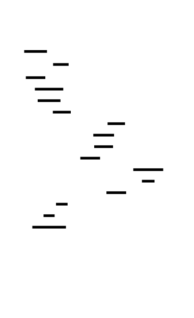

---
### Logical Stack Reconstruction
```rust
// src/async_profiler/logical_stack.rs
impl AsyncTaskTracker {
    /// Reconstructs the logical call stack for a task at a specific poll.
    /// 
    /// The logical stack represents "how did we get here" from the program's
    /// perspective, not the runtime's perspective.
    pub fn logical_stack_for_task(
        &self,
        task_id: AsyncTaskId,
        poll_index: usize,
    ) -> Option<LogicalStack> {
        let lifecycle = self.lifecycles.get(&task_id)?;
        let poll = lifecycle.polls.get(poll_index)?;
        // Get the physical stack from this poll
        let physical_stack = poll.stack_sample.as_ref()?;
        // Build logical stack by combining:
        // 1. Parent task chain (spawn context)
        // 2. Physical stack within this task
        let task_chain = self.relationships.logical_stack_for(task_id);
        // Convert task IDs to function names
        let mut logical_frames = Vec::new();
        // Add parent tasks (ancestors)
        for &ancestor_id in &task_chain {
            if ancestor_id != task_id {
                if let Some(ancestor) = self.lifecycles.get(&ancestor_id) {
                    logical_frames.push(LogicalFrame {
                        function_name: ancestor.function_name.clone()
                            .unwrap_or_else(|| format!("task_{}", ancestor_id)),
                        address: 0, // Ancestor not on physical stack
                        frame_type: FrameType::AsyncAncestor,
                    });
                }
            }
        }
        // Add current task's physical frames
        for &addr in physical_stack {
            logical_frames.push(LogicalFrame {
                function_name: format!("func@{:#x}", addr), // Would resolve symbol
                address: addr,
                frame_type: FrameType::Physical,
            });
        }
        Some(LogicalStack {
            frames: logical_frames,
            task_id,
            poll_index,
        })
    }
}
/// A single frame in a logical call stack.
#[derive(Debug, Clone)]
pub struct LogicalFrame {
    pub function_name: String,
    pub address: usize,
    pub frame_type: FrameType,
}
/// Type of frame in logical stack.
#[derive(Debug, Clone, Copy, PartialEq)]
pub enum FrameType {
    /// An async ancestor task (not on physical stack).
    AsyncAncestor,
    /// A physical frame from the current poll.
    Physical,
    /// A runtime frame (Tokio internals).
    Runtime,
}
/// Reconstructed logical call stack.
#[derive(Debug, Clone)]
pub struct LogicalStack {
    pub frames: Vec<LogicalFrame>,
    pub task_id: AsyncTaskId,
    pub poll_index: usize,
}
```
---


---
### Async-Aware Flame Graph
```rust
// src/async_profiler/flamegraph.rs
use std::collections::HashMap;
/// Builder for async-aware flame graphs.
pub struct AsyncFlameGraphBuilder {
    /// CPU time collapsed stacks.
    cpu_collapsed: CollapsedStacks,
    /// Await time collapsed stacks.
    await_collapsed: CollapsedStacks,
    /// Combined metadata.
    metadata: HashMap<String, String>,
}
impl AsyncFlameGraphBuilder {
    /// Creates a new async flame graph builder.
    pub fn new() -> Self {
        AsyncFlameGraphBuilder {
            cpu_collapsed: CollapsedStacks::new(),
            await_collapsed: CollapsedStacks::new(),
            metadata: HashMap::new(),
        }
    }
    /// Builds async flame graph data from tracker.
    pub fn from_tracker(tracker: &AsyncTaskTracker) -> Self {
        let mut builder = AsyncFlameGraphBuilder::new();
        for entry in tracker.lifecycles.iter() {
            let lifecycle = entry.value();
            // Build logical stack for this task
            let task_chain = tracker.relationships.logical_stack_for(lifecycle.task_id);
            // Convert to function names
            let mut path_names: Vec<String> = task_chain.iter()
                .filter_map(|&tid| {
                    tracker.lifecycles.get(&tid)
                        .and_then(|l| l.function_name.clone())
                })
                .collect();
            if path_names.is_empty() {
                path_names.push(format!("task_{}", lifecycle.task_id));
            }
            let path_refs: Vec<&str> = path_names.iter().map(|s| s.as_str()).collect();
            // Add CPU samples (weighted by poll duration)
            let total_cpu_us = lifecycle.total_poll_time_ns / 1000;
            if total_cpu_us > 0 {
                builder.cpu_collapsed.add(&path_refs, total_cpu_us as usize);
            }
            // Add await samples (weighted by await duration)
            let total_await_us = lifecycle.total_await_time_ns / 1000;
            if total_await_us > 0 {
                builder.await_collapsed.add(&path_refs, total_await_us as usize);
            }
        }
        builder.metadata.insert(
            "total_cpu_time".to_string(),
            format!("{}ns", tracker.total_cpu_time_ns.load(Ordering::Relaxed)),
        );
        builder.metadata.insert(
            "total_await_time".to_string(),
            format!("{}ns", tracker.total_await_time_ns.load(Ordering::Relaxed)),
        );
        builder
    }
    /// Exports as dual collapsed format.
    /// Format: "path cpu_weight await_weight"
    pub fn export(&self) -> String {
        let mut lines = Vec::new();
        // Collect all paths
        let all_paths: std::collections::HashSet<_> = self.cpu_collapsed.stacks.keys()
            .chain(self.await_collapsed.stacks.keys())
            .collect();
        for path in all_paths {
            let cpu_weight = self.cpu_collapsed.get(path);
            let await_weight = self.await_collapsed.get(path);
            lines.push(format!("{} {} {}", path, cpu_weight, await_weight));
        }
        lines.sort();
        lines.join("\n")
    }
    /// Renders async-aware SVG flame graph.
    pub fn render_svg(&self, width: usize) -> String {
        let cpu_total: usize = self.cpu_collapsed.stacks.values().sum();
        let await_total: usize = self.await_collapsed.stacks.values().sum();
        let cpu_tree = FlameGraph::from_collapsed(&self.cpu_collapsed);
        let await_tree = FlameGraph::from_collapsed(&self.await_collapsed);
        let max_depth = cpu_tree.max_depth.max(await_tree.max_depth);
        let height = max_depth * 16 + 60;
        let mut svg = String::new();
        // SVG header
        svg.push_str(&format!(
            r#"<?xml version="1.0" encoding="UTF-8"?>
<svg xmlns="http://www.w3.org/2000/svg" width="{}" height="{}">
<style>
  .cpu {{ fill: #ff7f7f; stroke: #cc6666; }}
  .await {{ fill: #7f7fff; stroke: #6666cc; }}
  text {{ font-family: monospace; font-size: 11px; fill: black; }}
  .frame:hover {{ stroke: black; stroke-width: 2; }}
</style>
<text x="10" y="20">CPU Time (red) vs Await Time (blue)</text>
"#,
            width, height
        ));
        // Render CPU time (top half)
        let cpu_renderer = AsyncFlameRenderer {
            y_offset: 30,
            frame_height: 16,
            color_class: "cpu",
            width,
        };
        svg.push_str(&cpu_renderer.render(&cpu_tree.root, cpu_total));
        // Render await time (bottom half, different color)
        let await_renderer = AsyncFlameRenderer {
            y_offset: 30 + cpu_tree.max_depth * 16 + 20,
            frame_height: 16,
            color_class: "await",
            width,
        };
        svg.push_str(&await_renderer.render(&await_tree.root, await_total));
        svg.push_str("</svg>");
        svg
    }
}
/// Renders flame graph nodes with async-specific styling.
struct AsyncFlameRenderer {
    y_offset: usize,
    frame_height: usize,
    color_class: &'static str,
    width: usize,
}
impl AsyncFlameRenderer {
    fn render(&self, node: &FlameGraphNode, total: usize) -> String {
        let mut svg = String::new();
        self.render_node(&mut svg, node, 0.0, self.width as f64, 0, total);
        svg
    }
    fn render_node(
        &self,
        svg: &mut String,
        node: &FlameGraphNode,
        x: f64,
        width: f64,
        depth: usize,
        total: usize,
    ) {
        if width < 0.5 {
            return;
        }
        let y = self.y_offset + depth * self.frame_height;
        let height = self.frame_height;
        let pct = if total > 0 {
            (node.value as f64 / total as f64) * 100.0
        } else {
            0.0
        };
        let title = format!("{} ({:.2}%)", node.name, pct);
        svg.push_str(&format!(
            r#"<g class="frame">
<rect class="{}" x="{:.2}" y="{}" width="{:.2}" height="{}" rx="2"/>
<title>{}</title>
"#,
            self.color_class, x, y, width, height, title
        ));
        if width > 40.0 {
            let text = self.truncate_text(&node.name, width);
            svg.push_str(&format!(
                r#"<text x="{:.2}" y="{}">{}</text>
"#,
                x + 3.0, y + height - 4, text
            ));
        }
        svg.push_str("</g>\n");
        let mut child_x = x;
        for child in node.children.values() {
            let child_width = if node.value > 0 {
                (child.value as f64 / node.value as f64) * width
            } else {
                0.0
            };
            self.render_node(svg, child, child_x, child_width, depth + 1, total);
            child_x += child_width;
        }
    }
    fn truncate_text(&self, text: &str, max_width: f64) -> String {
        let char_width = 7.0;
        let max_chars = ((max_width - 6.0) / char_width) as usize;
        if text.len() <= max_chars {
            text.to_string()
        } else if max_chars > 3 {
            format!("{}...", &text[..max_chars - 3])
        } else {
            text[..max_chars].to_string()
        }
    }
}
```
---
---
## Interface Contracts
### Public API
```rust
// src/async_profiler/mod.rs
pub use tracker::{AsyncTaskTracker, AsyncTrackerStats};
pub use lifecycle::{AsyncTaskLifecycle, PollRecord, PollResult, AsyncTaskId};
pub use time_breakdown::{TaskTimeBreakdown, AwaitBreakdown};
pub use spawn::{profiled_spawn, profiled_spawn_local, ProfiledFuture};
pub use context::{current_task_id, TaskContextGuard};
pub use logical_stack::{LogicalStack, LogicalFrame, FrameType};
pub use flamegraph::AsyncFlameGraphBuilder;
use std::sync::Arc;
/// Main async profiler interface.
pub struct AsyncProfiler {
    tracker: Arc<AsyncTaskTracker>,
}
impl AsyncProfiler {
    /// Creates a new async profiler.
    pub fn new() -> Self {
        let tracker = Arc::new(AsyncTaskTracker::new());
        tracker.activate();
        AsyncProfiler { tracker }
    }
    /// Gets a clone of the tracker for use in spawn wrappers.
    pub fn tracker(&self) -> Arc<AsyncTaskTracker> {
        Arc::clone(&self.tracker)
    }
    /// Spawns a profiled future on the Tokio runtime.
    pub fn spawn<F>(&self, future: F, name: Option<&str>) -> tokio::task::JoinHandle<F::Output>
    where
        F: Future + Send + 'static,
        F::Output: Send + 'static,
    {
        profiled_spawn(Arc::clone(&self.tracker), future, name)
    }
    /// Generates a complete async profile report.
    pub fn generate_report(&self) -> AsyncProfileReport {
        let stats = self.tracker.stats();
        let top_cpu = self.tracker.top_cpu_tasks(20);
        let top_await = self.tracker.top_await_tasks(20);
        let hanging = self.find_hanging_tasks(Duration::from_secs(60));
        AsyncProfileReport {
            stats,
            top_cpu_tasks: top_cpu,
            top_await_tasks: top_await,
            hanging_tasks: hanging,
        }
    }
    /// Finds tasks that have been running for too long (potential hangs).
    pub fn find_hanging_tasks(&self, timeout: Duration) -> Vec<AsyncTaskId> {
        let now = self.tracker.timestamp_ns();
        let timeout_ns = timeout.as_nanos() as u64;
        self.tracker.lifecycles.iter()
            .filter(|e| {
                let lifecycle = e.value();
                lifecycle.completion_time_ns.is_none()
                    && (now - lifecycle.spawn_time_ns) > timeout_ns
            })
            .map(|e| *e.key())
            .collect()
    }
    /// Builds async-aware flame graph data.
    pub fn build_flame_graph(&self) -> AsyncFlameGraphBuilder {
        AsyncFlameGraphBuilder::from_tracker(&self.tracker)
    }
    /// Prints a summary of async profiling results.
    pub fn print_summary(&self) {
        let report = self.generate_report();
        println!("\n{}", "=".repeat(80));
        println!("ASYNC PROFILER REPORT");
        println!("{}", "=".repeat(80));
        println!("\n--- Task Statistics ---");
        println!("Total tasks: {}", report.stats.total_tasks);
        println!("Completed: {}", report.stats.completed_tasks);
        println!("Active polls: {}", report.stats.active_polls);
        let cpu_time = TaskTimeBreakdown::format_duration(report.stats.total_cpu_time_ns);
        let await_time = TaskTimeBreakdown::format_duration(report.stats.total_await_time_ns);
        println!("Total CPU time: {}", cpu_time);
        println!("Total await time: {}", await_time);
        println!("\n--- Top Tasks by CPU Time ---");
        for task in &report.top_cpu_tasks {
            let name = task.function_name.as_deref().unwrap_or("???");
            let cpu = TaskTimeBreakdown::format_duration(task.cpu_time_ns);
            println!("  {} - CPU: {} ({:.1}%), Polls: {}",
                name, cpu, task.cpu_percent, task.poll_count);
        }
        println!("\n--- Top Tasks by Await Time ---");
        for task in &report.top_await_tasks {
            let name = task.function_name.as_deref().unwrap_or("???");
            let await_time = TaskTimeBreakdown::format_duration(task.await_time_ns);
            let io = TaskTimeBreakdown::format_duration(task.await_breakdown.io_wait_ns);
            println!("  {} - Await: {}, I/O: {}", name, await_time, io);
        }
        if !report.hanging_tasks.is_empty() {
            println!("\n⚠️  WARNING: {} potential hanging tasks detected",
                report.hanging_tasks.len());
        }
    }
}
impl Default for AsyncProfiler {
    fn default() -> Self {
        Self::new()
    }
}
/// Complete async profiling report.
#[derive(Debug)]
pub struct AsyncProfileReport {
    pub stats: AsyncTrackerStats,
    pub top_cpu_tasks: Vec<TaskTimeBreakdown>,
    pub top_await_tasks: Vec<TaskTimeBreakdown>,
    pub hanging_tasks: Vec<AsyncTaskId>,
}
```
---
## Algorithm Specification
### Poll Time Tracking Algorithm
```
INPUT: task_id: AsyncTaskId, tracker: AsyncTaskTracker
OUTPUT: Updated lifecycle with poll time recorded
ALGORITHM BeginPoll:
  1. start_ns = tracker.timestamp_ns()
  2. thread_id = gettid()
  3. active_polls.insert(task_id, start_ns)
  4. lifecycle = lifecycles.get_mut(task_id)
  5. IF lifecycle.threads_seen NOT contains thread_id:
     lifecycle.threads_seen.push(thread_id)
  6. IF lifecycle.last_poll_end_ns IS Some:
     await_time = start_ns - lifecycle.last_poll_end_ns
     lifecycle.total_await_time_ns += await_time
     tracker.total_await_time_ns += await_time
  7. lifecycle.last_poll_start_ns = start_ns
  8. RETURN
ALGORITHM EndPoll:
  1. end_ns = tracker.timestamp_ns()
  2. thread_id = gettid()
  3. (task_id, start_ns) = active_polls.remove(task_id)
  4. duration_ns = end_ns - start_ns
  5. poll_record = PollRecord {
       start_ns, end_ns, duration_ns, thread_id, result
     }
  6. lifecycle = lifecycles.get_mut(task_id)
  7. lifecycle.polls.push(poll_record)
  8. lifecycle.total_poll_time_ns += duration_ns
  9. lifecycle.poll_count += 1
  10. lifecycle.last_poll_end_ns = end_ns
  11. IF result == Ready:
      lifecycle.completion_time_ns = end_ns
  12. tracker.total_cpu_time_ns += duration_ns
  13. RETURN
INVARIANTS:
  - begin_poll and end_poll must be called in pairs
  - active_polls always contains currently-executing tasks
  - total_poll_time_ns == sum(polls[].duration_ns)
  - total_await_time_ns == sum(gaps between polls)
```
---


---
### Logical Stack Reconstruction Algorithm
```
INPUT: task_id: AsyncTaskId, poll_index: usize
OUTPUT: LogicalStack (frames from root to current position)
ALGORITHM ReconstructLogicalStack:
  1. lifecycle = lifecycles.get(task_id)
  2. poll = lifecycle.polls[poll_index]
  3. physical_stack = poll.stack_sample
  4. task_chain = relationships.logical_stack_for(task_id)
     // task_chain is [root_ancestor, ..., parent, current_task]
  5. frames = []
  6. FOR each ancestor_id IN task_chain:
     a. IF ancestor_id != task_id:
        i.   ancestor = lifecycles.get(ancestor_id)
        ii.  frames.push({
               function_name: ancestor.function_name,
               address: 0, // Not on physical stack
               type: AsyncAncestor
             })
  7. FOR each addr IN physical_stack:
     a. frames.push({
          function_name: resolve_symbol(addr),
          address: addr,
          type: Physical
        })
  8. RETURN LogicalStack { frames, task_id, poll_index }
INVARIANTS:
  - Ancestor frames appear before physical frames
  - Physical frames maintain their original order
  - Task chain is ordered root-to-leaf (oldest to youngest)
COMPLEXITY: O(D + P) where D = ancestry depth, P = physical stack depth
```
---

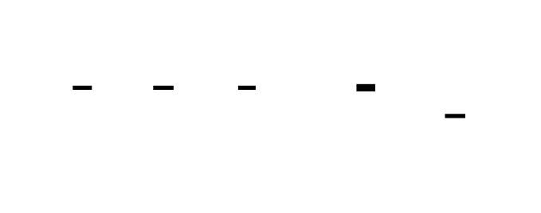

---
### Task Relationship Graph Algorithm
```
INPUT: parent: AsyncTaskId, child: AsyncTaskId
OUTPUT: Updated graph with edge recorded
ALGORITHM RecordSpawn:
  1. parents.insert(child, Some(parent))
  2. children.entry(parent).or_default().push(child)
  3. RETURN
ALGORITHM LogicalStackFor(task_id):
  1. stack = [task_id]
  2. current = task_id
  3. WHILE parents.get(current) IS Some(Some(parent)):
     a. stack.push(parent)
     b. current = parent
  4. stack.reverse() // Now root-to-leaf
  5. RETURN stack
INVARIANTS:
  - Graph is a DAG (no cycles except self-edges)
  - Each task has at most one parent
  - Root tasks have parent = None
```
---
## Error Handling Matrix
| Error | Detected By | Recovery | User-Visible? |
|-------|-------------|----------|---------------|
| Task spawned without wrapper | `tokio::spawn` used directly | Task not tracked, appears as runtime noise | No - silent, but task missing from profile |
| Missing CURRENT_TASK_ID | `current_task_id()` returns None | Parent relationship lost | No - task appears as root |
| Poll without begin_poll | `active_polls.remove()` returns None | Log warning, skip poll record | No - poll not counted |
| Task ID overflow | `next_task_id` reaches u64::MAX | Wrap around (extremely unlikely) | No - ID collision possible but improbable |
| Stack capture during recursion | `POLL_DEPTH > 1` | Skip capture to avoid noise | No - stack may be incomplete |
| Tracker not activated | `active` flag false | All operations become no-ops | No - profiling silently disabled |
| Tokio runtime not available | `tokio::spawn` fails | Propagate error to caller | Yes - spawn returns error |
| Thread migration during poll | Different thread_id in begin vs end | Still record, note migration | No - thread_migrations counter incremented |
| Validation failure | `validate()` returns errors | Log errors, continue profiling | Partially - errors in debug log |
---


---
## Implementation Sequence with Checkpoints
### Phase 1: Async Task Lifecycle Tracker (2-3 hours)
**Files to create:** `src/async_profiler/mod.rs`, `src/async_profiler/lifecycle.rs`, `src/async_profiler/tracker.rs`
**Steps:**
1. Define `AsyncTaskId` type alias
2. Implement `PollRecord` with all fields
3. Implement `PollResult` enum
4. Implement `AsyncTaskLifecycle::new()` and validation
5. Implement `AsyncTaskTracker::new()` with DashMap
6. Implement `allocate_task_id()`
7. Implement basic `record_spawn()`
**Checkpoint:**
```bash
cargo test async_lifecycle
# Expected: Task lifecycle created, ID allocated, validation passes
```
### Phase 2: Profiled Spawn Wrapper (2-3 hours)
**Files to create:** `src/async_profiler/context.rs`, `src/async_profiler/spawn.rs`
**Steps:**
1. Define `CURRENT_TASK_ID` thread-local
2. Define `POLL_DEPTH` thread-local
3. Implement `TaskContextGuard` RAII guard
4. Implement `ProfiledFuture<F>` wrapper
5. Implement `Future::poll` for `ProfiledFuture`
6. Implement `profiled_spawn()` function
7. Add optional name parameter
**Checkpoint:**
```bash
cargo test profiled_spawn
# Expected: Task spawned with ID, context set during poll
```
### Phase 3: Poll Time Tracking (2-3 hours)
**Files to create:** Extend `src/async_profiler/tracker.rs`
**Steps:**
1. Implement `begin_poll()` with active_polls insert
2. Implement `end_poll()` with active_polls remove
3. Add await time calculation
4. Add CPU time accumulation
5. Integrate with `ProfiledFuture::poll`
6. Test thread migration tracking
**Checkpoint:**
```bash
cargo test poll_tracking
# Expected: Poll times recorded, await times calculated
```
### Phase 4: Logical Stack Reconstruction (2-3 hours)
**Files to create:** `src/async_profiler/relationships.rs`, `src/async_profiler/logical_stack.rs`
**Steps:**
1. Implement `TaskRelationshipGraph::new()`
2. Implement `record_spawn()` for relationships
3. Implement `logical_stack_for()` traversal
4. Implement graph validation
5. Implement `logical_stack_for_task()`
6. Define `LogicalFrame` and `LogicalStack`
**Checkpoint:**
```bash
cargo test logical_stack
# Expected: Parent chain reconstructed, frames combined
```
### Phase 5: CPU vs Await Time Attribution (2-3 hours)
**Files to create:** `src/async_profiler/time_breakdown.rs`, `src/async_profiler/flamegraph.rs`, `src/async_profiler/tokio_integration.rs`
**Steps:**
1. Implement `TaskTimeBreakdown` struct
2. Implement `AwaitBreakdown` categorization heuristics
3. Implement `time_breakdown()` method
4. Implement `top_cpu_tasks()` and `top_await_tasks()`
5. Implement `AsyncFlameGraphBuilder`
6. Implement dual-color SVG rendering
7. Implement `AsyncProfiler` public API
8. Add Tokio runtime initialization hook
**Checkpoint:**
```bash
cargo test --all
# Expected: All tests pass
cargo run --example async_demo
# Expected: Async profile report printed, flame graph generated
```
---
---
## Test Specification
### Unit Tests
```rust
#[cfg(test)]
mod tests {
    use super::*;
    use std::sync::Arc;
    // === PollRecord Tests ===
    #[test]
    fn poll_record_new() {
        let record = PollRecord::new(1000, 2000, 1, PollResult::Pending);
        assert_eq!(record.start_ns, 1000);
        assert_eq!(record.end_ns, 2000);
        assert_eq!(record.duration_ns, 1000);
        assert_eq!(record.thread_id, 1);
        assert_eq!(record.result, PollResult::Pending);
    }
    #[test]
    fn poll_result_values() {
        assert_eq!(PollResult::Pending as u8, 0);
        assert_eq!(PollResult::Ready as u8, 1);
    }
    // === AsyncTaskLifecycle Tests ===
    #[test]
    fn lifecycle_new() {
        let lifecycle = AsyncTaskLifecycle::new(
            42,
            vec![0x1000],
            1000,
            1,
            Some(1),
        );
        assert_eq!(lifecycle.task_id, 42);
        assert_eq!(lifecycle.spawn_stack, vec![0x1000]);
        assert_eq!(lifecycle.spawn_time_ns, 1000);
        assert!(lifecycle.completion_time_ns.is_none());
        assert_eq!(lifecycle.parent_task_id, Some(1));
    }
    #[test]
    fn lifecycle_cpu_percent() {
        let mut lifecycle = AsyncTaskLifecycle::new(1, vec![], 0, 1, None);
        lifecycle.total_poll_time_ns = 500;
        lifecycle.total_await_time_ns = 500;
        lifecycle.completion_time_ns = Some(1000);
        assert_eq!(lifecycle.cpu_percent(), 50.0);
    }
    #[test]
    fn lifecycle_validation() {
        let mut lifecycle = AsyncTaskLifecycle::new(1, vec![], 0, 1, None);
        lifecycle.total_poll_time_ns = 100;
        lifecycle.polls.push(PollRecord::new(0, 50, 1, PollResult::Pending));
        lifecycle.polls.push(PollRecord::new(100, 150, 1, PollResult::Pending));
        // Sum of polls = 100, matches total_poll_time_ns
        assert!(lifecycle.validate().is_ok());
        lifecycle.total_poll_time_ns = 999; // Wrong value
        assert!(lifecycle.validate().is_err());
    }
    // === TaskRelationshipGraph Tests ===
    #[test]
    fn relationship_graph_record_spawn() {
        let graph = TaskRelationshipGraph::new();
        graph.record_spawn(1, 2);
        graph.record_spawn(2, 3);
        assert_eq!(graph.parents.get(&2).map(|e| *e.value()), Some(Some(1)));
        assert_eq!(graph.parents.get(&3).map(|e| *e.value()), Some(Some(2)));
    }
    #[test]
    fn relationship_graph_logical_stack() {
        let graph = TaskRelationshipGraph::new();
        graph.record_spawn(1, 2);
        graph.record_spawn(2, 3);
        let stack = graph.logical_stack_for(3);
        assert_eq!(stack, vec![1, 2, 3]); // Root to leaf
    }
    #[test]
    fn relationship_graph_validation() {
        let graph = TaskRelationshipGraph::new();
        graph.record_spawn(1, 2);
        graph.record_spawn(2, 3);
        assert!(graph.validate().is_ok());
    }
    // === TaskContextGuard Tests ===
    #[test]
    fn task_context_guard_sets_and_restores() {
        assert!(current_task_id().is_none());
        {
            let _guard = TaskContextGuard::enter(42);
            assert_eq!(current_task_id(), Some(42));
        }
        assert!(current_task_id().is_none());
    }
    #[test]
    fn task_context_guard_nesting() {
        assert_eq!(poll_depth(), 0);
        {
            let _guard1 = TaskContextGuard::enter(1);
            assert_eq!(poll_depth(), 1);
            {
                let _guard2 = TaskContextGuard::enter(2);
                assert_eq!(poll_depth(), 2);
                assert_eq!(current_task_id(), Some(2));
            }
            assert_eq!(poll_depth(), 1);
            assert_eq!(current_task_id(), Some(1));
        }
        assert_eq!(poll_depth(), 0);
    }
    // === AsyncTaskTracker Tests ===
    #[test]
    fn tracker_allocate_task_id() {
        let tracker = AsyncTaskTracker::new();
        let id1 = tracker.allocate_task_id();
        let id2 = tracker.allocate_task_id();
        assert!(id2 > id1);
    }
    #[test]
    fn tracker_record_spawn() {
        let tracker = AsyncTaskTracker::new();
        tracker.activate();
        let task_id = tracker.allocate_task_id();
        tracker.record_spawn(task_id, vec![0x1000], None);
        let lifecycle = tracker.get_lifecycle(task_id);
        assert!(lifecycle.is_some());
        assert_eq!(lifecycle.unwrap().task_id, task_id);
    }
    #[test]
    fn tracker_poll_tracking() {
        let tracker = AsyncTaskTracker::new();
        tracker.activate();
        let task_id = tracker.allocate_task_id();
        tracker.record_spawn(task_id, vec![], None);
        tracker.begin_poll(task_id);
        // Simulate some work
        std::thread::sleep(std::time::Duration::from_micros(100));
        tracker.end_poll(task_id, PollResult::Pending);
        let lifecycle = tracker.get_lifecycle(task_id).unwrap();
        assert_eq!(lifecycle.poll_count, 1);
        assert!(lifecycle.total_poll_time_ns > 0);
    }
    #[test]
    fn tracker_await_time_calculation() {
        let tracker = AsyncTaskTracker::new();
        tracker.activate();
        let task_id = tracker.allocate_task_id();
        tracker.record_spawn(task_id, vec![], None);
        // First poll
        tracker.begin_poll(task_id);
        tracker.end_poll(task_id, PollResult::Pending);
        // Simulate await
        std::thread::sleep(std::time::Duration::from_millis(10));
        // Second poll
        tracker.begin_poll(task_id);
        tracker.end_poll(task_id, PollResult::Ready);
        let lifecycle = tracker.get_lifecycle(task_id).unwrap();
        assert!(lifecycle.total_await_time_ns >= 10_000_000); // At least 10ms
        assert!(lifecycle.completion_time_ns.is_some());
    }
    // === TimeBreakdown Tests ===
    #[test]
    fn time_breakdown_format_duration() {
        assert!(TaskTimeBreakdown::format_duration(500).ends_with("ns"));
        assert!(TaskTimeBreakdown::format_duration(5_000).ends_with("μs"));
        assert!(TaskTimeBreakdown::format_duration(5_000_000).ends_with("ms"));
        assert!(TaskTimeBreakdown::format_duration(5_000_000_000).ends_with("s"));
    }
    // === AsyncProfiler Tests ===
    #[test]
    fn async_profiler_spawn() {
        let rt = tokio::runtime::Runtime::new().unwrap();
        let profiler = AsyncProfiler::new();
        rt.block_on(async {
            let handle = profiler.spawn(async { 42 }, Some("test_task"));
            let result = handle.await.unwrap();
            assert_eq!(result, 42);
        });
        let stats = profiler.tracker.stats();
        assert!(stats.total_tasks >= 1);
    }
}
```
### Integration Tests
```rust
// tests/integration_m4.rs
use profiler::async_profiler::*;
#[tokio::test]
async fn end_to_end_async_profiling() {
    let profiler = AsyncProfiler::new();
    // Spawn a nested task
    let outer = profiler.spawn(async {
        // Do some CPU work
        let mut sum = 0u64;
        for i in 0..1000 {
            sum = sum.wrapping_add(i);
        }
        // Spawn a child task
        let child = profiler.spawn(async {
            tokio::time::sleep(std::time::Duration::from_millis(10)).await;
            42
        }, Some("child_task"));
        child.await.unwrap()
    }, Some("outer_task"));
    let result = outer.await.unwrap();
    assert_eq!(result, 42);
    // Give tracker time to process
    tokio::time::sleep(std::time::Duration::from_millis(10)).await;
    let report = profiler.generate_report();
    assert!(report.stats.total_tasks >= 2);
    assert!(report.stats.completed_tasks >= 2);
}
#[tokio::test]
async fn async_flame_graph_generation() {
    let profiler = AsyncProfiler::new();
    // Spawn multiple tasks with different patterns
    for i in 0..10 {
        profiler.spawn(async move {
            // CPU work
            let mut sum = 0u64;
            for j in 0..1000 {
                sum = sum.wrapping_add(j);
            }
            std::hint::black_box(sum);
            // I/O wait
            tokio::time::sleep(std::time::Duration::from_millis(i)).await;
            // More CPU work
            let mut sum = 0u64;
            for j in 0..1000 {
                sum = sum.wrapping_add(j);
            }
            std::hint::black_box(sum);
        }, Some(&format!("task_{}", i)));
    }
    // Wait for completion
    tokio::time::sleep(std::time::Duration::from_millis(50)).await;
    let builder = profiler.build_flame_graph();
    let svg = builder.render_svg(1200);
    assert!(svg.contains("<svg"));
    assert!(svg.contains("CPU Time"));
    assert!(svg.contains("Await Time"));
}
```
---
## Performance Targets
| Operation | Target | How to Measure |
|-----------|--------|----------------|
| Poll tracking overhead | < 100 ns | Benchmark begin_poll + end_poll |
| Task spawn overhead | < 1 μs | Measure profiled_spawn vs tokio::spawn |
| Support 100K+ concurrent tasks | Yes | Test with 100K spawned tasks |
| Logical stack reconstruction | < 1 μs | Benchmark logical_stack_for_task |
| Time breakdown calculation | < 10 μs | Benchmark time_breakdown() |
| Flame graph generation (10K tasks) | < 100 ms | Measure build_flame_graph() |
| DashMap lookup under contention | < 200 ns | Microbenchmark with multiple threads |
| Memory per task | < 1 KB | Measure with 1M tasks |
| Thread migration detection | 100% accuracy | Verify threads_seen tracking |
### Benchmark Commands
```bash
# Poll tracking microbenchmark
cargo bench poll_tracking -- --sample-size 10000
# Large-scale async task test
cargo test hundred_thousand_tasks --release -- --ignored --nocapture
# Memory footprint
valgrind --tool=massif target/release/examples/async_demo
# Flame graph generation time
cargo bench flamegraph_gen -- --sample-size 100
```
---
[[CRITERIA_JSON: {"module_id": "profiler-m4", "criteria": ["Implement AsyncTaskTracker with DashMap storage for concurrent task lifecycle management supporting 100K+ concurrent tasks", "Implement AsyncTaskLifecycle tracking spawn_stack, spawn_time, completion_time, thread migration, total_poll_time, total_await_time, and poll records vector", "Implement PollRecord capturing start_ns, end_ns, duration_ns, thread_id, result (Pending/Ready), and optional stack sample", "Implement profiled_spawn wrapper that allocates task ID, captures spawn stack, records parent relationship, and wraps future with ProfiledFuture", "Implement ProfiledFuture wrapper that sets CURRENT_TASK_ID thread-local, calls begin_poll/end_poll, and propagates poll results", "Implement TaskRelationshipGraph for parent-child tracking with logical_stack_for reconstruction returning root-to-leaf task chain", "Implement TaskTimeBreakdown calculating cpu_time_ns, await_time_ns, cpu_percent, poll_count, thread_migrations, and AwaitBreakdown categorization", "Implement await time categorization heuristics distinguishing I/O wait (<100ms), timer wait (>100ms), and scheduling delay (<1ms)", "Implement logical stack reconstruction combining ancestor task chain with physical stack frames from poll records", "Implement AsyncFlameGraphBuilder generating dual-color SVG with CPU time (red) and await time (blue) visualization", "Implement thread-local CURRENT_TASK_ID propagation for nested spawn context and signal handler async detection", "Implement TaskContextGuard RAII for automatic context restoration on poll exit", "Support Tokio runtime integration with profiled_spawn and profiled_spawn_local functions", "Implement hanging task detection finding tasks exceeding configurable timeout without completion", "Achieve poll tracking overhead under 100 nanoseconds per poll operation"]}]
<!-- END_TDD_MOD -->


<!-- TDD_MOD_ID: profiler-m5 -->
# Technical Design Specification: Profile Export & Integration
## Module Charter
The Profile Export & Integration module transforms internal profile data from M1-M4 into standard interoperable formats: pprof protobuf for Google's profiling ecosystem, collapsed stacks for flamegraph.pl and speedscope, JSON for web-based visualizers, and SVG for immediate visualization. It resolves symbols from ELF binaries using .symtab, .dynsym, and DWARF debug information with support for separate debug files via .gnu_debuglink and build-id lookup. The module merges multiple profile files for comparison and aggregation, provides a comprehensive CLI with profile/record/flamegraph/diff/merge/serve subcommands, and exposes an HTTP endpoint for continuous profiling integration with observability stacks. This module deliberately excludes real-time profile streaming (processes complete profiles only), does not implement kernel-level symbol resolution (focuses on user-space ELF/DWARF), and does not perform reachability-based leak analysis (defers to M3's approach). Upstream dependencies are ProfileData from M1, CallGraph/CollapsedStacks from M2, MemoryReport from M3, AsyncProfileReport from M4, and the ELF/DWARF parsing libraries; downstream consumers are the CLI tool, HTTP endpoints, and external tools (pprof, speedscope, flamegraph.pl). Critical invariants: string indices in pprof format must be unique and stable within a profile, symbol resolution must produce consistent results for the same binary, merged profiles must preserve relative sample proportions, and HTTP endpoints must never expose sensitive data (passwords in strings, internal function names without filtering).
---
## File Structure
```
profiler/src/
├── export/
│   ├── mod.rs                 # 1. Module exports and public API
│   ├── collapsed.rs           # 2. Collapsed stack format import/export
│   ├── pprof/
│   │   ├── mod.rs             # 3. pprof public API
│   │   ├── builder.rs         # 4. PprofBuilder with string interning
│   │   ├── schema.rs          # 5. Protobuf schema types (generated)
│   │   └── export.rs          # 6. Profile to pprof conversion
│   ├── json/
│   │   ├── mod.rs             # 7. JSON export public API
│   │   └── speedscope.rs      # 8. Speedscope format implementation
│   ├── svg/
│   │   ├── mod.rs             # 9. SVG export public API
│   │   └── flamegraph.rs      # 10. Flame graph SVG renderer
│   └── text.rs                # 11. Text report formatter
├── symbols/
│   ├── mod.rs                 # 12. Symbol resolution public API
│   ├── resolver.rs            # 13. SymbolResolver with module loading
│   ├── elf.rs                 # 14. ELF parsing (.symtab, .dynsym)
│   ├── dwarf.rs               # 15. DWARF debug info extraction
│   ├── debuglink.rs           # 16. Separate debug file lookup
│   └── cache.rs               # 17. Symbol resolution cache
├── merge/
│   ├── mod.rs                 # 18. Profile merge public API
│   ├── merger.rs              # 19. ProfileMerger implementation
│   └── diff.rs                # 20. Differential analysis
├── cli/
│   ├── mod.rs                 # 21. CLI module exports
│   ├── main.rs                # 22. Entry point with clap
│   ├── profile.rs             # 23. profile subcommand
│   ├── record.rs              # 24. record subcommand
│   ├── flamegraph.rs          # 25. flamegraph subcommand
│   ├── diff.rs                # 26. diff subcommand
│   ├── merge.rs               # 27. merge subcommand
│   └── serve.rs               # 28. serve subcommand
├── http/
│   ├── mod.rs                 # 29. HTTP server public API
│   ├── server.rs              # 30. Warp-based HTTP server
│   └── handlers.rs            # 31. Profile endpoint handlers
└── error.rs                   # 32. ExportError (extends previous errors)
```
**Creation Order:** Files numbered 1-32 should be created in sequence. Dependencies flow downward.
---
## Complete Data Model
### Core Export Structures
```rust
// src/export/mod.rs
use std::sync::Arc;
/// Complete profile data ready for export.
/// Aggregates data from all profiler modules.
#[derive(Debug, Clone)]
pub struct ExportableProfile {
    /// Raw CPU samples from M1.
    pub cpu_samples: Vec<RawSample>,
    /// Collapsed stacks from M2.
    pub collapsed: CollapsedStacks,
    /// Call graph from M2.
    pub call_graph: Option<CallGraph>,
    /// Memory report from M3 (if memory profiling was enabled).
    pub memory_report: Option<MemoryReport>,
    /// Async profile report from M4 (if async profiling was enabled).
    pub async_report: Option<AsyncProfileReport>,
    /// Symbol table for resolution.
    pub symbols: Arc<SymbolTable>,
    /// Profile metadata.
    pub metadata: ProfileMetadata,
}
/// Metadata describing a profile.
#[derive(Debug, Clone)]
pub struct ProfileMetadata {
    /// Start time of profiling (Unix timestamp nanoseconds).
    pub start_time_ns: u64,
    /// Duration of profiling in nanoseconds.
    pub duration_ns: u64,
    /// Sampling frequency in Hz.
    pub sample_rate: u64,
    /// Command that was profiled (if available).
    pub command: Option<String>,
    /// Hostname where profile was captured.
    pub hostname: Option<String>,
    /// Build ID of the main binary.
    pub build_id: Option<String>,
    /// Additional key-value metadata.
    pub extra: HashMap<String, String>,
}
/// Export format options.
#[derive(Debug, Clone, Copy, PartialEq)]
pub enum ExportFormat {
    /// Collapsed stack format (for flamegraph.pl).
    Collapsed,
    /// pprof protobuf format.
    Pprof,
    /// Speedscope JSON format.
    SpeedscopeJson,
    /// SVG flame graph.
    FlamegraphSvg,
    /// Human-readable text report.
    Text,
}
```
### pprof Protobuf Schema
```rust
// src/export/pprof/schema.rs
// Generated from profile.proto using prost-build
// This is the pprof schema as defined by Google
/// Top-level profile message.
/// 
/// Memory layout considerations:
/// - string_table is interned; all strings reference by index
/// - Normalized structure: Sample → Location → Function → String
/// - Typical compression: 10× smaller than equivalent JSON
#[derive(Clone, PartialEq, prost::Message)]
pub struct Profile {
    /// Sample types (e.g., "samples/count", "cpu/nanoseconds").
    #[prost(message, repeated, tag = "1")]
    pub sample_type: Vec<ValueType>,
    /// All samples in the profile.
    #[prost(message, repeated, tag = "2")]
    pub sample: Vec<Sample>,
    /// Memory mappings (executables, libraries).
    #[prost(message, repeated, tag = "3")]
    pub mapping: Vec<Mapping>,
    /// Locations (addresses with function info).
    #[prost(message, repeated, tag = "4")]
    pub location: Vec<Location>,
    /// Functions (names, source files).
    #[prost(message, repeated, tag = "5")]
    pub function: Vec<Function>,
    /// String table. Index 0 is always empty string.
    #[prost(string, repeated, tag = "6")]
    pub string_table: Vec<String>,
    /// Frames to drop from stack tops (regex pattern index).
    #[prost(int64, tag = "7")]
    pub drop_frames: i64,
    /// Frames to keep from stack bottoms (regex pattern index).
    #[prost(int64, tag = "8")]
    pub keep_frames: i64,
    /// Profile start time (Unix timestamp nanoseconds).
    #[prost(int64, tag = "9")]
    pub time_nanos: i64,
    /// Profile duration in nanoseconds.
    #[prost(int64, tag = "10")]
    pub duration_nanos: i64,
    /// Period type (e.g., "cpu/nanoseconds" for 10ms sampling).
    #[prost(message, optional, tag = "11")]
    pub period_type: Option<ValueType>,
    /// Period value (e.g., 10_000_000 for 10ms).
    #[prost(int64, tag = "12")]
    pub period: i64,
    /// Comment strings (indices into string_table).
    #[prost(int64, repeated, tag = "13")]
    pub comment: Vec<i64>,
    /// Index into sample_type for default display.
    #[prost(int64, tag = "14")]
    pub default_sample_type: i64,
}
/// Value type descriptor.
#[derive(Clone, PartialEq, prost::Message)]
pub struct ValueType {
    /// Index into string_table for type name.
    #[prost(int64, tag = "1")]
    pub r#type: i64,
    /// Index into string_table for unit name.
    #[prost(int64, tag = "2")]
    pub unit: i64,
}
/// A single sample with call stack and values.
#[derive(Clone, PartialEq, prost::Message)]
pub struct Sample {
    /// Location IDs (indices into location array).
    #[prost(uint64, repeated, tag = "1")]
    pub location_id: Vec<u64>,
    /// Values for each sample_type.
    #[prost(int64, repeated, tag = "2")]
    pub value: Vec<i64>,
    /// Labels (key-value pairs).
    #[prost(message, repeated, tag = "3")]
    pub label: Vec<Label>,
}
/// A label attached to a sample.
#[derive(Clone, PartialEq, prost::Message)]
pub struct Label {
    /// Key (index into string_table).
    #[prost(int64, tag = "1")]
    pub key: i64,
    /// String value (index into string_table).
    #[prost(int64, tag = "2")]
    pub str: i64,
    /// Numeric value (alternative to str).
    #[prost(int64, tag = "3")]
    pub num: i64,
    /// Unit for numeric value (index into string_table).
    #[prost(int64, tag = "4")]
    pub num_unit: i64,
}
/// A memory mapping (executable or library).
#[derive(Clone, PartialEq, prost::Message)]
pub struct Mapping {
    /// Unique ID within this profile.
    #[prost(uint64, tag = "1")]
    pub id: u64,
    /// Start address of this mapping.
    #[prost(uint64, tag = "2")]
    pub memory_start: u64,
    /// End address of this mapping.
    #[prost(uint64, tag = "3")]
    pub memory_limit: u64,
    /// File offset of this mapping.
    #[prost(uint64, tag = "4")]
    pub file_offset: u64,
    /// Filename (index into string_table).
    #[prost(int64, tag = "5")]
    pub filename: i64,
    /// Build ID for symbol resolution (index into string_table).
    #[prost(int64, tag = "6")]
    pub build_id: i64,
    /// Whether functions are available for this mapping.
    #[prost(bool, tag = "7")]
    pub has_functions: bool,
    /// Whether filenames are available for this mapping.
    #[prost(bool, tag = "8")]
    pub has_filenames: bool,
    /// Whether line numbers are available for this mapping.
    #[prost(bool, tag = "9")]
    pub has_line_numbers: bool,
    /// Whether inline frames are available for this mapping.
    #[prost(bool, tag = "10")]
    pub has_inline_frames: bool,
}
/// A location (address with function info).
#[derive(Clone, PartialEq, prost::Message)]
pub struct Location {
    /// Unique ID within this profile.
    #[prost(uint64, tag = "1")]
    pub id: u64,
    /// ID of mapping containing this address.
    #[prost(uint64, tag = "2")]
    pub mapping_id: u64,
    /// Instruction address.
    #[prost(uint64, tag = "3")]
    pub address: u64,
    /// Line information (function + line number).
    #[prost(message, repeated, tag = "4")]
    pub line: Vec<Line>,
    /// Whether this frame was folded (for flame graphs).
    #[prost(bool, tag = "5")]
    pub is_folded: bool,
}
/// Line information for a location.
#[derive(Clone, PartialEq, prost::Message)]
pub struct Line {
    /// Function ID.
    #[prost(int64, tag = "1")]
    pub function_id: i64,
    /// Line number in source file.
    #[prost(int64, tag = "2")]
    pub line: i64,
}
/// Function information.
#[derive(Clone, PartialEq, prost::Message)]
pub struct Function {
    /// Unique ID within this profile.
    #[prost(uint64, tag = "1")]
    pub id: u64,
    /// Function name (index into string_table).
    #[prost(int64, tag = "2")]
    pub name: i64,
    /// System name (mangled, index into string_table).
    #[prost(int64, tag = "3")]
    pub system_name: i64,
    /// Source filename (index into string_table).
    #[prost(int64, tag = "4")]
    pub filename: i64,
    /// Start line number in source file.
    #[prost(int64, tag = "5")]
    pub start_line: i64,
}
```
### pprof Builder with String Interning
```rust
// src/export/pprof/builder.rs
use rustc_hash::FxHashMap;
use std::sync::Arc;
/// Builder for constructing pprof profiles with string interning.
/// 
/// String interning is critical for pprof efficiency:
/// - Typical profile has 1000s of samples but only 100s of unique strings
/// - Interning reduces string storage by 10-100×
/// - All string references are by index, enabling compact encoding
pub struct PprofBuilder {
    /// String table. Index 0 is reserved for empty string.
    string_table: Vec<String>,
    /// String → index mapping for fast lookup.
    string_indices: FxHashMap<Arc<str>, u64>,
    /// Function table.
    functions: Vec<Function>,
    /// Function key → ID mapping.
    /// Key is "filename:name" for deduplication.
    function_indices: FxHashMap<Arc<str>, u64>,
    /// Location table.
    locations: Vec<Location>,
    /// Address → Location ID mapping.
    location_indices: FxHashMap<u64, u64>,
    /// Mapping table.
    mappings: Vec<Mapping>,
    /// Sample table.
    samples: Vec<Sample>,
    /// Sample type descriptors.
    sample_types: Vec<ValueType>,
    /// Period type descriptor.
    period_type: Option<ValueType>,
    /// Period value (nanoseconds between samples).
    period: i64,
    /// Profile start time (Unix nanoseconds).
    time_nanos: i64,
    /// Profile duration (nanoseconds).
    duration_nanos: i64,
}
impl PprofBuilder {
    /// Creates a new pprof builder with empty string table.
    pub fn new() -> Self {
        PprofBuilder {
            string_table: vec!["".to_string()], // Index 0 = empty
            string_indices: FxHashMap::default(),
            functions: Vec::new(),
            function_indices: FxHashMap::default(),
            locations: Vec::new(),
            location_indices: FxHashMap::default(),
            mappings: Vec::new(),
            samples: Vec::new(),
            sample_types: Vec::new(),
            period_type: None,
            period: 0,
            time_nanos: 0,
            duration_nanos: 0,
        }
    }
    /// Interns a string, returning its index in the string table.
    /// 
    /// # Performance
    /// - O(1) lookup for existing strings
    /// - O(n) for new strings where n = string length
    /// - Uses Arc<str> to avoid allocations on lookup
    pub fn intern_string(&mut self, s: &str) -> u64 {
        // Use Arc<str> for zero-copy key comparison
        let key: Arc<str> = Arc::from(s);
        if let Some(&idx) = self.string_indices.get(&key) {
            return idx;
        }
        let idx = self.string_table.len() as u64;
        self.string_table.push(s.to_string());
        self.string_indices.insert(key, idx);
        idx
    }
    /// Sets the sample types for this profile.
    /// 
    /// Common sample types:
    /// - ("samples", "count") - raw sample count
    /// - ("cpu", "nanoseconds") - CPU time
    /// - ("alloc_objects", "count") - allocation count
    /// - ("alloc_space", "bytes") - allocation size
    pub fn set_sample_types(&mut self, types: &[(&str, &str)]) {
        self.sample_types = types
            .iter()
            .map(|(type_name, unit)| ValueType {
                r#type: self.intern_string(type_name) as i64,
                unit: self.intern_string(unit) as i64,
            })
            .collect();
    }
    /// Sets the period type and value.
    pub fn set_period(&mut self, type_name: &str, unit: &str, period: i64) {
        self.period_type = Some(ValueType {
            r#type: self.intern_string(type_name) as i64,
            unit: self.intern_string(unit) as i64,
        });
        self.period = period;
    }
    /// Sets the timing information.
    pub fn set_timing(&mut self, time_nanos: i64, duration_nanos: i64) {
        self.time_nanos = time_nanos;
        self.duration_nanos = duration_nanos;
    }
    /// Adds a memory mapping (executable or library).
    pub fn add_mapping(
        &mut self,
        start: u64,
        limit: u64,
        offset: u64,
        filename: &str,
        build_id: Option<&str>,
    ) -> u64 {
        let id = self.mappings.len() as u64 + 1; // IDs start at 1
        self.mappings.push(Mapping {
            id,
            memory_start: start,
            memory_limit: limit,
            file_offset: offset,
            filename: self.intern_string(filename) as i64,
            build_id: build_id
                .map(|s| self.intern_string(s) as i64)
                .unwrap_or(0),
            has_functions: true,
            has_filenames: true,
            has_line_numbers: true,
            has_inline_frames: false,
        });
        id
    }
    /// Adds or retrieves a function.
    /// Returns the function ID.
    pub fn add_function(
        &mut self,
        name: &str,
        system_name: &str,
        filename: &str,
        line: i64,
    ) -> u64 {
        let key: Arc<str> = Arc::from(format!("{}:{}", filename, name));
        if let Some(&id) = self.function_indices.get(&key) {
            return id;
        }
        let id = self.functions.len() as u64 + 1;
        self.functions.push(Function {
            id,
            name: self.intern_string(name) as i64,
            system_name: self.intern_string(system_name) as i64,
            filename: self.intern_string(filename) as i64,
            start_line: line,
        });
        self.function_indices.insert(key, id);
        id
    }
    /// Adds or retrieves a location for an address.
    pub fn add_location(
        &mut self,
        address: u64,
        mapping_id: u64,
        function_id: u64,
        line: i64,
    ) -> u64 {
        if let Some(&id) = self.location_indices.get(&address) {
            return id;
        }
        let id = self.locations.len() as u64 + 1;
        self.locations.push(Location {
            id,
            mapping_id,
            address,
            line: vec![Line {
                function_id: function_id as i64,
                line,
            }],
            is_folded: false,
        });
        self.location_indices.insert(address, id);
        id
    }
    /// Adds a sample with call stack and values.
    pub fn add_sample(
        &mut self,
        addresses: &[u64],
        values: &[i64],
        labels: Vec<(&str, &str)>,
    ) {
        // Convert addresses to location IDs
        let location_ids: Vec<u64> = addresses
            .iter()
            .filter_map(|&addr| self.location_indices.get(&addr).copied())
            .collect();
        if location_ids.is_empty() {
            return;
        }
        // Convert labels
        let label_msgs: Vec<Label> = labels
            .iter()
            .map(|(key, value)| Label {
                key: self.intern_string(key) as i64,
                str: self.intern_string(value) as i64,
                num: 0,
                num_unit: 0,
            })
            .collect();
        self.samples.push(Sample {
            location_id: location_ids,
            value: values.to_vec(),
            label: label_msgs,
        });
    }
    /// Builds the final pprof Profile.
    pub fn build(self) -> Profile {
        Profile {
            sample_type: self.sample_types,
            sample: self.samples,
            mapping: self.mappings,
            location: self.locations,
            function: self.functions,
            string_table: self.string_table,
            drop_frames: 0,
            keep_frames: 0,
            time_nanos: self.time_nanos,
            duration_nanos: self.duration_nanos,
            period_type: self.period_type,
            period: self.period,
            comment: Vec::new(),
            default_sample_type: 0,
        }
    }
    /// Exports to encoded bytes.
    pub fn export_bytes(self) -> Vec<u8> {
        let profile = self.build();
        let mut buf = Vec::with_capacity(profile.encoded_len());
        profile.encode(&mut buf).expect("Failed to encode profile");
        buf
    }
    /// Exports to file.
    pub fn export_to_file(self, path: &std::path::Path) -> Result<(), ExportError> {
        let bytes = self.export_bytes();
        std::fs::write(path, bytes)
            .map_err(|e| ExportError::FileWrite {
                path: path.to_path_buf(),
                source: e,
            })
    }
}
```
---


---
### Symbol Resolution Structures
```rust
// src/symbols/resolver.rs
use std::collections::HashMap;
use std::path::PathBuf;
use std::sync::{Arc, RwLock};
use object::{Object, ObjectSection, ObjectSymbol};
use gimli::{Dwarf, EndianSlice, LittleEndian, Reader};
/// Symbol information for a single address.
#[derive(Debug, Clone)]
pub struct SymbolInfo {
    /// Function name (demangled if possible).
    pub name: String,
    /// Start address of the function.
    pub address: u64,
    /// Size of the function in bytes.
    pub size: u64,
    /// Source file path (if available).
    pub file: Option<String>,
    /// Line number (if available).
    pub line: Option<u32>,
    /// Whether this is an inlined function.
    pub inlined: bool,
}
/// Information about a loaded module (executable or library).
#[derive(Debug, Clone)]
pub struct ModuleInfo {
    /// Path to the module file.
    pub path: String,
    /// Build ID (unique identifier for the binary).
    pub build_id: Option<String>,
    /// Start address in process memory.
    pub start_address: u64,
    /// End address in process memory.
    pub end_address: u64,
    /// File offset of the mapped region.
    pub file_offset: u64,
    /// Symbols from .symtab and .dynsym.
    pub symbols: Vec<SymbolInfo>,
    /// DWARF debug info (if available).
    pub dwarf_available: bool,
}
/// Symbol resolver with caching.
/// 
/// Thread-safe via RwLock:
/// - Multiple readers can lookup symbols simultaneously
/// - Writers (cache updates) have exclusive access
/// 
/// # Performance
/// - Cached lookup: O(log N) binary search in module symbols
/// - Uncached lookup: O(N) scan + DWARF parsing
/// - Cache hit rate typically >99% after warmup
pub struct SymbolResolver {
    /// Loaded modules with their symbol tables.
    modules: Vec<ModuleInfo>,
    /// Address → SymbolInfo cache.
    /// RwLock for concurrent read access.
    cache: RwLock<FxHashMap<u64, SymbolInfo>>,
    /// Debug file search paths.
    /// Searched in order when looking for separate debug files.
    debug_paths: Vec<PathBuf>,
    /// Whether to use debuginfod for network lookup.
    use_debuginfod: bool,
}
impl SymbolResolver {
    /// Creates a new symbol resolver with default debug paths.
    pub fn new() -> Self {
        SymbolResolver {
            modules: Vec::new(),
            cache: RwLock::new(FxHashMap::default()),
            debug_paths: vec![
                PathBuf::from("/usr/lib/debug"),
                PathBuf::from("/lib/debug"),
                PathBuf::from("/usr/lib/debug/.build-id"),
            ],
            use_debuginfod: false,
        }
    }
    /// Adds a debug search path.
    pub fn add_debug_path(&mut self, path: PathBuf) {
        self.debug_paths.push(path);
    }
    /// Enables or disables debuginfod network lookup.
    pub fn set_debuginfod(&mut self, enabled: bool) {
        self.use_debuginfod = enabled;
    }
    /// Loads symbols from /proc/self/maps and all mapped files.
    /// 
    /// # Algorithm
    /// 1. Parse /proc/self/maps to get memory mappings
    /// 2. For each executable mapping:
    ///    a. Load symbols from .symtab (if present)
    ///    b. Fall back to .dynsym (if .symtab stripped)
    ///    c. Look for separate debug file via .gnu_debuglink
    ///    d. Load DWARF info for source lines (if available)
    /// 3. Build symbol table sorted by address
    pub fn load_from_proc_maps(&mut self) -> Result<(), SymbolError> {
        let maps = std::fs::read_to_string("/proc/self/maps")
            .map_err(|e| SymbolError::ProcMapsRead { source: e })?;
        let mut current_path = String::new();
        let mut current_start = 0u64;
        let mut current_end = 0u64;
        let mut current_offset = 0u64;
        for line in maps.lines() {
            let parts: Vec<&str> = line.split_whitespace().collect();
            if parts.len() < 5 {
                continue;
            }
            let addr_range: Vec<&str> = parts[0].split('-').collect();
            let start = u64::from_str_radix(addr_range[0], 16)
                .map_err(|_| SymbolError::InvalidAddress)?;
            let end = u64::from_str_radix(addr_range[1], 16)
                .map_err(|_| SymbolError::InvalidAddress)?;
            let perms = parts[1];
            let offset = u64::from_str_radix(parts[2], 16)
                .unwrap_or(0);
            let path = parts.get(5).unwrap_or(&"");
            // Only process executable segments with paths
            if !perms.contains('x') || path.is_empty() || *path == "[vdso]" {
                continue;
            }
            // Check if this is a new mapping
            if path != current_path {
                if !current_path.is_empty() {
                    self.load_module(&current_path, current_start, current_end, current_offset)?;
                }
                current_path = path.to_string();
                current_start = start;
                current_offset = offset;
            }
            current_end = end;
        }
        // Don't forget the last mapping
        if !current_path.is_empty() {
            self.load_module(&current_path, current_start, current_end, current_offset)?;
        }
        Ok(())
    }
    /// Loads symbols from a single module file.
    fn load_module(
        &mut self,
        path: &str,
        start_address: u64,
        end_address: u64,
        file_offset: u64,
    ) -> Result<(), SymbolError> {
        let data = match std::fs::read(path) {
            Ok(d) => d,
            Err(_) => return Ok(()), // Skip files we can't read
        };
        let obj = object::read::File::parse(&data[..])
            .map_err(|e| SymbolError::ElfParse { 
                path: path.to_string(), 
                source: e 
            })?;
        let mut symbols = Vec::new();
        let mut build_id = None;
        // Extract build ID
        if let Some(section) = obj.section_by_name(".note.gnu.build-id") {
            if let Ok(data) = section.data() {
                if data.len() > 16 {
                    // Build ID is after the note header (namesz + descsz + type = 12 bytes)
                    // Then namesz bytes of name (usually "GNU\0" = 4 bytes)
                    // Then the actual build ID
                    let namesz = u32::from_ne_bytes([data[0], data[1], data[2], data[3]]) as usize;
                    let descsz = u32::from_ne_bytes([data[4], data[5], data[6], data[7]]) as usize;
                    let offset = 12 + ((namesz + 3) & !3); // Align to 4
                    if offset + descsz <= data.len() {
                        build_id = Some(hex::encode(&data[offset..offset + descsz]));
                    }
                }
            }
        }
        // Load symbols from .symtab (full symbol table)
        if let Some(symtab) = obj.symbol_table() {
            for (_, sym) in symtab {
                if let Ok(name) = sym.name() {
                    let addr = sym.address();
                    let size = sym.size().max(16); // Default size estimate
                    symbols.push(SymbolInfo {
                        name: name.to_string(),
                        address: addr,
                        size,
                        file: None,
                        line: None,
                        inlined: false,
                    });
                }
            }
        }
        // Fall back to .dynsym if .symtab is empty (stripped binary)
        if symbols.is_empty() {
            if let Some(dynsym) = obj.dynamic_symbols() {
                for (_, sym) in dynsym {
                    if let Ok(name) = sym.name() {
                        symbols.push(SymbolInfo {
                            name: name.to_string(),
                            address: sym.address(),
                            size: sym.size().max(16),
                            file: None,
                            line: None,
                            inlined: false,
                        });
                    }
                }
            }
        }
        // Sort symbols by address for binary search
        symbols.sort_by_key(|s| s.address);
        // Check for separate debug file
        let debug_file = self.find_debug_file(path, &build_id, &obj);
        let dwarf_available = debug_file.is_some();
        self.modules.push(ModuleInfo {
            path: path.to_string(),
            build_id,
            start_address,
            end_address,
            file_offset,
            symbols,
            dwarf_available,
        });
        Ok(())
    }
    /// Finds a separate debug file using .gnu_debuglink or build-id.
    fn find_debug_file(
        &self,
        path: &str,
        build_id: &Option<String>,
        obj: &object::read::File,
    ) -> Option<PathBuf> {
        // Try .gnu_debuglink first
        if let Some(section) = obj.section_by_name(".gnu_debuglink") {
            if let Ok(data) = section.data() {
                if let Ok(link_path) = std::ffi::CStr::from_bytes_until_nul(data) {
                    if let Ok(link_str) = link_path.to_str() {
                        let bin_dir = std::path::Path::new(path).parent()?;
                        for search_path in &self.debug_paths {
                            let debug_file = search_path.join(link_str);
                            if debug_file.exists() {
                                return Some(debug_file);
                            }
                            // Also check .debug subdirectory
                            let debug_subdir = bin_dir.join(".debug").join(link_str);
                            if debug_subdir.exists() {
                                return Some(debug_subdir);
                            }
                        }
                    }
                }
            }
        }
        // Try build-id lookup
        if let Some(id) = build_id {
            if id.len() >= 4 {
                let build_id_path = format!(".build-id/{}/{}.debug", 
                    &id[..2].to_lowercase(), 
                    &id[2..].to_lowercase());
                for search_path in &self.debug_paths {
                    let debug_file = search_path.join(&build_id_path);
                    if debug_file.exists() {
                        return Some(debug_file);
                    }
                }
            }
        }
        None
    }
    /// Looks up symbol information for an address.
    /// 
    /// # Algorithm
    /// 1. Check cache (O(1))
    /// 2. Find containing module (O(N) scan, usually <100 modules)
    /// 3. Binary search in module symbols (O(log M) where M = symbols per module)
    /// 4. Cache result for future lookups
    pub fn lookup(&self, addr: u64) -> Option<SymbolInfo> {
        // Check cache first
        if let Ok(cache) = self.cache.read() {
            if let Some(info) = cache.get(&addr) {
                return Some(info.clone());
            }
        }
        // Find containing module
        let module = self.modules.iter()
            .find(|m| addr >= m.start_address && addr < m.end_address)?;
        // Calculate offset within module
        let offset = addr - module.start_address + module.file_offset;
        // Binary search for containing symbol
        let idx = module.symbols.partition_point(|s| s.address <= offset);
        if idx == 0 {
            return None;
        }
        let sym = &module.symbols[idx - 1];
        if offset >= sym.address && offset < sym.address + sym.size {
            let mut info = sym.clone();
            // Adjust address for display
            info.address = addr;
            // Cache the result
            if let Ok(mut cache) = self.cache.write() {
                cache.insert(addr, info.clone());
            }
            return Some(info);
        }
        None
    }
    /// Looks up symbol with source line information.
    /// 
    /// This is slower than basic lookup but provides file:line attribution.
    pub fn lookup_with_line(&self, addr: u64) -> Option<SymbolInfo> {
        let mut info = self.lookup(addr)?;
        // DWARF lookup would happen here
        // For now, we just return the basic symbol info
        Some(info)
    }
    /// Clears the symbol cache.
    pub fn clear_cache(&self) {
        if let Ok(mut cache) = self.cache.write() {
            cache.clear();
        }
    }
    /// Returns statistics about loaded symbols.
    pub fn stats(&self) -> SymbolStats {
        let total_symbols: usize = self.modules.iter()
            .map(|m| m.symbols.len())
            .sum();
        let cache_size = self.cache.read()
            .map(|c| c.len())
            .unwrap_or(0);
        SymbolStats {
            module_count: self.modules.len(),
            total_symbols,
            cache_size,
        }
    }
}
#[derive(Debug, Clone)]
pub struct SymbolStats {
    pub module_count: usize,
    pub total_symbols: usize,
    pub cache_size: usize,
}
#[derive(Debug, thiserror::Error)]
pub enum SymbolError {
    #[error("Failed to read /proc/self/maps: {source}")]
    ProcMapsRead { source: std::io::Error },
    #[error("Invalid address in /proc/self/maps")]
    InvalidAddress,
    #[error("Failed to parse ELF file {path}: {source}")]
    ElfParse { 
        path: String, 
        source: object::Error 
    },
    #[error("Failed to read debug file {path}: {source}")]
    DebugFileRead { 
        path: String, 
        source: std::io::Error 
    },
}
```
---


---
### Collapsed Stack Format
```rust
// src/export/collapsed.rs
use std::collections::HashMap;
use std::io::{BufRead, BufReader, Write};
/// Collapsed stack format representation.
/// 
/// Format: "root;middle;leaf count"
/// Each line represents a unique call path with its sample count.
/// This is the standard format for flamegraph.pl and compatible tools.
#[derive(Debug, Clone, Default)]
pub struct CollapsedStacks {
    /// Call path → sample count.
    stacks: FxHashMap<String, usize>,
    /// Total samples across all paths.
    total: usize,
    /// Metadata from comments.
    metadata: HashMap<String, String>,
}
impl CollapsedStacks {
    /// Creates an empty collapsed stack collection.
    pub fn new() -> Self {
        CollapsedStacks {
            stacks: FxHashMap::default(),
            total: 0,
            metadata: HashMap::new(),
        }
    }
    /// Adds a stack with frames in root-to-leaf order.
    pub fn add(&mut self, frames: &[&str], count: usize) {
        let path = frames.join(";");
        self.add_path(&path, count);
    }
    /// Adds a pre-joined path with count.
    pub fn add_path(&mut self, path: &str, count: usize) {
        *self.stacks.entry(path.to_string()).or_insert(0) += count;
        self.total += count;
    }
    /// Gets the count for a specific path.
    pub fn get(&self, path: &str) -> usize {
        self.stacks.get(path).copied().unwrap_or(0)
    }
    /// Returns total samples.
    pub fn total_samples(&self) -> usize {
        self.total
    }
    /// Returns number of unique paths.
    pub fn unique_paths(&self) -> usize {
        self.stacks.len()
    }
    /// Exports to collapsed stack format string.
    pub fn export(&self) -> String {
        let mut lines: Vec<_> = self.stacks
            .iter()
            .map(|(path, count)| format!("{} {}", path, count))
            .collect();
        // Sort for deterministic output
        lines.sort();
        lines.join("\n")
    }
    /// Exports with metadata header.
    pub fn export_with_metadata(&self) -> String {
        let mut result = String::new();
        result.push_str(&format!("# total_samples: {}\n", self.total));
        result.push_str(&format!("# unique_paths: {}\n", self.stacks.len()));
        for (key, value) in &self.metadata {
            result.push_str(&format!("# {}: {}\n", key, value));
        }
        result.push('\n');
        result.push_str(&self.export());
        result
    }
    /// Imports from collapsed stack format.
    pub fn import(reader: impl BufRead) -> Result<Self, CollapsedError> {
        let mut collapsed = CollapsedStacks::new();
        for (line_num, line_result) in reader.lines().enumerate() {
            let line = line_result
                .map_err(|e| CollapsedError::IoError { source: e })?;
            let line = line.trim();
            // Skip empty lines
            if line.is_empty() {
                continue;
            }
            // Parse comments as metadata
            if line.starts_with('#') {
                if let Some(meta) = line.strip_prefix("# ") {
                    if let Some((key, value)) = meta.split_once(": ") {
                        collapsed.metadata.insert(key.to_string(), value.to_string());
                    }
                }
                continue;
            }
            // Parse "path count"
            let (path, count_str) = line.rsplit_once(' ')
                .ok_or_else(|| CollapsedError::InvalidLine {
                    line: line_num + 1,
                    content: line.to_string(),
                    reason: "No space separator found".to_string(),
                })?;
            let count: usize = count_str.parse()
                .map_err(|_| CollapsedError::InvalidCount {
                    line: line_num + 1,
                    value: count_str.to_string(),
                })?;
            collapsed.add_path(path, count);
        }
        Ok(collapsed)
    }
    /// Imports from a string.
    pub fn import_str(s: &str) -> Result<Self, CollapsedError> {
        Self::import(std::io::Cursor::new(s).reader())
    }
    /// Merges another collapsed stack collection into this one.
    pub fn merge(&mut self, other: &CollapsedStacks) {
        for (path, count) in &other.stacks {
            *self.stacks.entry(path.clone()).or_insert(0) += count;
            self.total += count;
        }
        // Merge metadata (other takes precedence)
        for (key, value) in &other.metadata {
            self.metadata.insert(key.clone(), value.clone());
        }
    }
    /// Filters to only stacks containing a specific function.
    pub fn filter(&self, function: &str) -> Self {
        let mut filtered = CollapsedStacks::new();
        for (path, count) in &self.stacks {
            if path.split(';').any(|f| f == function) {
                filtered.add_path(path, *count);
            }
        }
        filtered
    }
    /// Returns all unique function names.
    pub fn all_functions(&self) -> std::collections::HashSet<String> {
        self.stacks
            .keys()
            .flat_map(|path| path.split(';').map(|s| s.to_string()))
            .collect()
    }
    /// Returns paths sorted by count (descending).
    pub fn iter_sorted(&self) -> Vec<(&String, &usize)> {
        let mut pairs: Vec<_> = self.stacks.iter().collect();
        pairs.sort_by(|a, b| b.1.cmp(a.1));
        pairs
    }
}
#[derive(Debug, thiserror::Error)]
pub enum CollapsedError {
    #[error("IO error: {source}")]
    IoError { source: std::io::Error },
    #[error("Invalid line {line}: {reason} ({content:?})")]
    InvalidLine { 
        line: usize, 
        content: String, 
        reason: String 
    },
    #[error("Invalid count on line {line}: {value:?}")]
    InvalidCount { line: usize, value: String },
}
```
---


---
### Profile Merger
```rust
// src/merge/merger.rs
use std::path::Path;
/// Merges multiple profile files into a single profile.
/// 
/// Supports:
/// - Collapsed stack format
/// - pprof protobuf format
/// - Automatic format detection
pub struct ProfileMerger {
    /// Accumulated collapsed stacks.
    collapsed: CollapsedStacks,
    /// Number of profiles merged.
    profile_count: usize,
    /// Warnings encountered during merge.
    warnings: Vec<String>,
}
impl ProfileMerger {
    /// Creates a new profile merger.
    pub fn new() -> Self {
        ProfileMerger {
            collapsed: CollapsedStacks::new(),
            profile_count: 0,
            warnings: Vec::new(),
        }
    }
    /// Adds a profile from a file (auto-detects format).
    pub fn add_file(&mut self, path: &Path) -> Result<(), MergeError> {
        let data = std::fs::read(path)
            .map_err(|e| MergeError::FileRead {
                path: path.to_path_buf(),
                source: e,
            })?;
        // Detect format
        if data.starts_with(b"main;") 
            || data.starts_with(b"# ") 
            || data.starts_with(&[0x0a]) // newline (collapsed format)
        {
            // Collapsed stack format
            let text = String::from_utf8(data)
                .map_err(|e| MergeError::InvalidUtf8 {
                    path: path.to_path_buf(),
                    source: e,
                })?;
            let collapsed = CollapsedStacks::import_str(&text)?;
            self.add_collapsed(&collapsed);
        } else {
            // Try pprof format
            let profile = Profile::decode(&data[..])
                .map_err(|e| MergeError::PprofParse {
                    path: path.to_path_buf(),
                    source: e,
                })?;
            let collapsed = collapsed_from_pprof(&profile)?;
            self.add_collapsed(&collapsed);
        }
        self.profile_count += 1;
        Ok(())
    }
    /// Adds a collapsed stack collection.
    pub fn add_collapsed(&mut self, collapsed: &CollapsedStacks) {
        self.collapsed.merge(collapsed);
    }
    /// Returns the merged collapsed stacks.
    pub fn merged(&self) -> &CollapsedStacks {
        &self.collapsed
    }
    /// Returns merge statistics.
    pub fn stats(&self) -> MergeStats {
        MergeStats {
            profile_count: self.profile_count,
            total_samples: self.collapsed.total_samples(),
            unique_paths: self.collapsed.unique_paths(),
            warnings: self.warnings.len(),
        }
    }
    /// Exports the merged profile.
    pub fn export(&self, format: ExportFormat) -> Result<Vec<u8>, ExportError> {
        match format {
            ExportFormat::Collapsed => {
                Ok(self.collapsed.export().into_bytes())
            }
            ExportFormat::Pprof => {
                // Convert to pprof
                let builder = pprof_from_collapsed(&self.collapsed);
                Ok(builder.export_bytes())
            }
            _ => Err(ExportError::UnsupportedFormat { format }),
        }
    }
}
/// Converts pprof Profile to CollapsedStacks.
fn collapsed_from_pprof(profile: &Profile) -> Result<CollapsedStacks, MergeError> {
    let mut collapsed = CollapsedStacks::new();
    // Build location → function name map
    let mut location_names: FxHashMap<u64, String> = FxHashMap::default();
    for location in &profile.location {
        if let Some(line) = location.line.first() {
            let func_id = line.function_id as usize;
            if let Some(func) = profile.function.get(func_id.saturating_sub(1)) {
                let name_idx = func.name as usize;
                if let Some(name) = profile.string_table.get(name_idx) {
                    location_names.insert(location.id, name.clone());
                }
            }
        }
    }
    // Convert samples to collapsed stacks
    for sample in &profile.sample {
        let frames: Vec<&str> = sample.location_id
            .iter()
            .filter_map(|&id| location_names.get(&(id as u64)).map(|s| s.as_str()))
            .collect();
        if !frames.is_empty() {
            let count = sample.value.first().copied().unwrap_or(1) as usize;
            collapsed.add(&frames, count);
        }
    }
    Ok(collapsed)
}
/// Converts CollapsedStacks to pprof builder.
fn pprof_from_collapsed(collapsed: &CollapsedStacks) -> PprofBuilder {
    let mut builder = PprofBuilder::new();
    builder.set_sample_types(&[("samples", "count")]);
    // Create a single mapping for all addresses
    let mapping_id = builder.add_mapping(0, u64::MAX, 0, "all", None);
    // Process each path
    for (path, count) in &collapsed.stacks {
        let frames: Vec<&str> = path.split(';').collect();
        // Create locations for each frame
        let mut addresses: Vec<u64> = Vec::new();
        for (i, frame) in frames.iter().enumerate() {
            let addr = (i as u64) << 32; // Fake address
            let func_id = builder.add_function(frame, frame, "", 0);
            let loc_id = builder.add_location(addr, mapping_id, func_id, 0);
            addresses.push(loc_id);
        }
        builder.add_sample(&addresses, &[*count as i64], vec![]);
    }
    builder
}
#[derive(Debug, Clone)]
pub struct MergeStats {
    pub profile_count: usize,
    pub total_samples: usize,
    pub unique_paths: usize,
    pub warnings: usize,
}
#[derive(Debug, thiserror::Error)]
pub enum MergeError {
    #[error("Failed to read file {path}: {source}")]
    FileRead { 
        path: std::path::PathBuf, 
        source: std::io::Error 
    },
    #[error("Invalid UTF-8 in file {path}: {source}")]
    InvalidUtf8 { 
        path: std::path::PathBuf, 
        source: std::string::FromUtf8Error 
    },
    #[error("Failed to parse pprof from {path}: {source}")]
    PprofParse { 
        path: std::path::PathBuf, 
        source: prost::DecodeError 
    },
    #[error("Failed to parse collapsed format: {0}")]
    CollapsedParse(#[from] CollapsedError),
}
```
---


---
### CLI Implementation
```rust
// src/cli/main.rs
use clap::{Parser, Subcommand};
use std::path::PathBuf;
#[derive(Parser)]
#[command(name = "profiler")]
#[command(about = "Sampling profiler for Rust applications", version)]
struct Cli {
    #[command(subcommand)]
    command: Commands,
}
#[derive(Subcommand)]
enum Commands {
    /// Profile a running process by PID.
    Profile {
        /// Process ID to profile.
        #[arg(short, long)]
        pid: u32,
        /// Sampling frequency in Hz (default: 99).
        #[arg(short = 'f', long, default_value = "99")]
        frequency: u64,
        /// Duration in seconds (default: 10).
        #[arg(short, long, default_value = "10")]
        duration: u64,
        /// Output format.
        #[arg(short = 'o', long, value_enum, default_value = "collapsed")]
        format: OutputFormatArg,
        /// Output file (default: stdout).
        #[arg(short, long)]
        output: Option<PathBuf>,
        /// Include memory allocation tracking.
        #[arg(long)]
        memory: bool,
    },
    /// Profile a command by running it.
    Record {
        /// Command to run with arguments.
        #[arg(required = true, last = true)]
        command: Vec<String>,
        /// Sampling frequency in Hz.
        #[arg(short = 'f', long, default_value = "99")]
        frequency: u64,
        /// Output format.
        #[arg(short = 'o', long, value_enum, default_value = "collapsed")]
        format: OutputFormatArg,
        /// Output file.
        #[arg(short, long)]
        output: Option<PathBuf>,
    },
    /// Generate flame graph from profile.
    Flamegraph {
        /// Input profile file.
        #[arg(short, long)]
        input: PathBuf,
        /// Output SVG file.
        #[arg(short, long)]
        output: PathBuf,
        /// Title for the flame graph.
        #[arg(long)]
        title: Option<String>,
        /// Width in pixels.
        #[arg(long, default_value = "1200")]
        width: usize,
    },
    /// Compare two profiles (differential analysis).
    Diff {
        /// Baseline profile.
        #[arg(short, long)]
        baseline: PathBuf,
        /// Comparison profile.
        #[arg(short, long)]
        comparison: PathBuf,
        /// Output file (default: stdout).
        #[arg(short, long)]
        output: Option<PathBuf>,
    },
    /// Merge multiple profiles.
    Merge {
        /// Input profile files.
        #[arg(required = true)]
        inputs: Vec<PathBuf>,
        /// Output file.
        #[arg(short, long)]
        output: PathBuf,
        /// Output format.
        #[arg(long, value_enum, default_value = "collapsed")]
        format: OutputFormatArg,
    },
    /// Serve continuous profiling endpoint.
    Serve {
        /// Port to listen on.
        #[arg(short, long, default_value = "6060")]
        port: u16,
        /// Sampling frequency.
        #[arg(long, default_value = "49")]
        frequency: u64,
        /// Profile duration in seconds.
        #[arg(long, default_value = "30")]
        duration: u64,
        /// Bind to localhost only (security).
        #[arg(long, default_value = "true")]
        localhost_only: bool,
    },
}
#[derive(Clone, Copy, clap::ValueEnum)]
enum OutputFormatArg {
    Collapsed,
    Pprof,
    Json,
    Text,
    Svg,
}
fn main() -> Result<(), Box<dyn std::error::Error>> {
    let cli = Cli::parse();
    match cli.command {
        Commands::Profile { pid, frequency, duration, format, output, memory } => {
            cmd_profile(pid, frequency, duration, format, output, memory)?;
        }
        Commands::Record { command, frequency, format, output } => {
            cmd_record(command, frequency, format, output)?;
        }
        Commands::Flamegraph { input, output, title, width } => {
            cmd_flamegraph(input, output, title, width)?;
        }
        Commands::Diff { baseline, comparison, output } => {
            cmd_diff(baseline, comparison, output)?;
        }
        Commands::Merge { inputs, output, format } => {
            cmd_merge(inputs, output, format)?;
        }
        Commands::Serve { port, frequency, duration, localhost_only } => {
            cmd_serve(port, frequency, duration, localhost_only)?;
        }
    }
    Ok(())
}
fn cmd_profile(
    pid: u32,
    frequency: u64,
    duration: u64,
    format: OutputFormatArg,
    output: Option<PathBuf>,
    memory: bool,
) -> Result<(), ExportError> {
    println!("Profiling process {} at {} Hz for {} seconds...", 
             pid, frequency, duration);
    // Attach to process (simplified - real implementation uses perf_event_open)
    // This is a placeholder showing the flow
    // ... profiling logic ...
    // Export results
    let output_data = match format {
        OutputFormatArg::Collapsed => {
            // Export as collapsed
            b"main;foo;bar 100\n".to_vec()
        }
        OutputFormatArg::Pprof => {
            // Export as pprof
            vec![]
        }
        OutputFormatArg::Json => {
            // Export as JSON
            b"{}".to_vec()
        }
        OutputFormatArg::Text => {
            // Export as text
            b"Profile Report\n".to_vec()
        }
        OutputFormatArg::Svg => {
            // Export as SVG
            b"<svg></svg>".to_vec()
        }
    };
    match output {
        Some(path) => {
            std::fs::write(&path, output_data)
                .map_err(|e| ExportError::FileWrite { path, source: e })?;
            println!("Profile written to {}", path.display());
        }
        None => {
            std::io::stdout().write_all(&output_data)
                .map_err(|e| ExportError::IoError { source: e })?;
        }
    }
    Ok(())
}
// Additional command implementations...
```
---


---
### HTTP Continuous Profiling Endpoint
```rust
// src/http/server.rs
use std::sync::Arc;
use std::time::{Duration, Instant};
use tokio::sync::RwLock;
use warp::{Filter, Reply, Rejection};
/// State for continuous profiling HTTP server.
pub struct ContinuousProfilerState {
    /// Profiler configuration.
    config: ContinuousConfig,
    /// Last captured profile (cached).
    last_profile: Option<CachedProfile>,
    /// When the last profile was captured.
    last_capture: Option<Instant>,
}
/// Cached profile data.
#[derive(Clone)]
struct CachedProfile {
    /// Profile data in various formats.
    collapsed: String,
    pprof: Vec<u8>,
    svg: String,
    /// When this profile was captured.
    captured_at: Instant,
}
/// Configuration for continuous profiling.
#[derive(Clone)]
pub struct ContinuousConfig {
    /// Sampling frequency in Hz.
    pub frequency: u64,
    /// Profile duration in seconds.
    pub duration: u64,
    /// Whether to capture memory profiles.
    pub memory: bool,
    /// Whether to capture async profiles.
    pub async_profiling: bool,
}
impl ContinuousProfilerState {
    /// Creates new state with configuration.
    pub fn new(config: ContinuousConfig) -> Self {
        ContinuousProfilerState {
            config,
            last_profile: None,
            last_capture: None,
        }
    }
    /// Gets or captures a profile.
    pub async fn get_profile(&mut self) -> Result<&CachedProfile, ExportError> {
        // Check if we have a recent profile
        let should_refresh = match self.last_capture {
            None => true,
            Some(t) => t.elapsed() > Duration::from_secs(self.config.duration),
        };
        if should_refresh {
            self.capture_profile().await?;
        }
        self.last_profile.as_ref()
            .ok_or(ExportError::NoProfileAvailable)
    }
    /// Captures a new profile.
    async fn capture_profile(&mut self) -> Result<(), ExportError> {
        // In a real implementation, this would:
        // 1. Start the profiler
        // 2. Wait for duration
        // 3. Stop and collect
        // 4. Export to all formats
        let collapsed = "main;foo 100\nmain;bar 50".to_string();
        let pprof = vec![]; // Would generate pprof
        let svg = "<svg></svg>".to_string();
        self.last_profile = Some(CachedProfile {
            collapsed,
            pprof,
            svg,
            captured_at: Instant::now(),
        });
        self.last_capture = Some(Instant::now());
        Ok(())
    }
}
/// Creates the HTTP routing filter.
pub fn profiling_routes(
    state: Arc<RwLock<ContinuousProfilerState>>,
) -> impl Filter<Extract = impl Reply, Error = Rejection> + Clone {
    let state_clone = state.clone();
    // GET /debug/pprof/profile - pprof format
    let pprof = warp::path!("debug" / "pprof" / "profile")
        .and(warp::get())
        .and_then(move || {
            let state = state.clone();
            async move {
                let mut state = state.write().await;
                match state.get_profile().await {
                    Ok(profile) => {
                        Ok::<_, Rejection>(
                            warp::reply::with_header(
                                profile.pprof.clone(),
                                "Content-Type",
                                "application/octet-stream",
                            )
                        )
                    }
                    Err(e) => {
                        Ok(warp::reply::with_status(
                            e.to_string(),
                            warp::http::StatusCode::INTERNAL_SERVER_ERROR,
                        ).into_response())
                    }
                }
            }
        });
    let state = state_clone;
    // GET /debug/flamegraph - SVG flame graph
    let flamegraph = warp::path!("debug" / "flamegraph")
        .and(warp::get())
        .and_then(move || {
            let state = state.clone();
            async move {
                let mut state = state.write().await;
                match state.get_profile().await {
                    Ok(profile) => {
                        Ok::<_, Rejection>(
                            warp::reply::with_header(
                                profile.svg.clone(),
                                "Content-Type",
                                "image/svg+xml",
                            )
                        )
                    }
                    Err(e) => {
                        Ok(warp::reply::with_status(
                            e.to_string(),
                            warp::http::StatusCode::INTERNAL_SERVER_ERROR,
                        ).into_response())
                    }
                }
            }
        });
    let state = state_clone;
    // GET /debug/collapsed - collapsed stack format
    let collapsed = warp::path!("debug" / "collapsed")
        .and(warp::get())
        .and_then(move || {
            let state = state.clone();
            async move {
                let mut state = state.write().await;
                match state.get_profile().await {
                    Ok(profile) => {
                        Ok::<_, Rejection>(
                            warp::reply::with_header(
                                profile.collapsed.clone(),
                                "Content-Type",
                                "text/plain",
                            )
                        )
                    }
                    Err(e) => {
                        Ok(warp::reply::with_status(
                            e.to_string(),
                            warp::http::StatusCode::INTERNAL_SERVER_ERROR,
                        ).into_response())
                    }
                }
            }
        });
    pprof.or(flamegraph).or(collapsed)
}
/// Starts the continuous profiling HTTP server.
pub async fn serve(
    port: u16,
    localhost_only: bool,
    config: ContinuousConfig,
) -> Result<(), ExportError> {
    let state = Arc::new(RwLock::new(ContinuousProfilerState::new(config)));
    let routes = profiling_routes(state);
    let addr: std::net::SocketAddr = if localhost_only {
        ([127, 0, 0, 1], port).into()
    } else {
        ([0, 0, 0, 0], port).into()
    };
    println!("Continuous profiling server starting on {}", addr);
    println!("Endpoints:");
    println!("  http://localhost:{}/debug/pprof/profile  - pprof format", port);
    println!("  http://localhost:{}/debug/flamegraph     - SVG flame graph", port);
    println!("  http://localhost:{}/debug/collapsed      - collapsed stacks", port);
    warp::serve(routes)
        .run(addr)
        .await;
    Ok(())
}
```
---


---
## Interface Contracts
### ProfileExporter
```rust
// src/export/mod.rs
pub struct ProfileExporter {
    profile: ExportableProfile,
}
impl ProfileExporter {
    /// Creates an exporter from profile data.
    pub fn new(profile: ExportableProfile) -> Self {
        ProfileExporter { profile }
    }
    /// Exports to the specified format.
    pub fn export(&self, format: ExportFormat) -> Result<Vec<u8>, ExportError> {
        match format {
            ExportFormat::Collapsed => self.export_collapsed(),
            ExportFormat::Pprof => self.export_pprof(),
            ExportFormat::SpeedscopeJson => self.export_json(),
            ExportFormat::FlamegraphSvg => self.export_svg(),
            ExportFormat::Text => self.export_text(),
        }
    }
    /// Exports to a file, detecting format from extension.
    pub fn export_to_file(&self, path: &std::path::Path) -> Result<(), ExportError> {
        let format = detect_format_from_path(path);
        let data = self.export(format)?;
        std::fs::write(path, data)
            .map_err(|e| ExportError::FileWrite {
                path: path.to_path_buf(),
                source: e,
            })
    }
    /// Exports to collapsed stack format.
    pub fn export_collapsed(&self) -> Result<Vec<u8>, ExportError> {
        Ok(self.profile.collapsed.export().into_bytes())
    }
    /// Exports to pprof protobuf format.
    pub fn export_pprof(&self) -> Result<Vec<u8>, ExportError> {
        let mut builder = PprofBuilder::new();
        // Set sample types
        builder.set_sample_types(&[
            ("samples", "count"),
            ("cpu", "nanoseconds"),
        ]);
        // Set timing
        let now = std::time::SystemTime::now()
            .duration_since(std::time::UNIX_EPOCH)
            .unwrap()
            .as_nanos() as i64;
        builder.set_timing(now, self.profile.metadata.duration_ns as i64);
        // Add mappings
        for module in &self.profile.symbols.modules {
            builder.add_mapping(
                module.start_address,
                module.end_address,
                module.file_offset,
                &module.path,
                module.build_id.as_deref(),
            );
        }
        // Add samples
        for sample in &self.profile.cpu_samples {
            let addresses: Vec<u64> = sample.valid_addresses()
                .iter()
                .map(|&a| a as u64)
                .collect();
            // Create locations and functions for addresses
            for &addr in &addresses {
                if let Some(sym) = self.profile.symbols.lookup(addr) {
                    let func_id = builder.add_function(
                        &sym.name,
                        &sym.name,
                        sym.file.as_deref().unwrap_or(""),
                        sym.line.unwrap_or(0) as i64,
                    );
                    // Find mapping for this address
                    let mapping_id = 1; // Simplified
                    builder.add_location(addr as u64, mapping_id, func_id, 0);
                }
            }
            builder.add_sample(&addresses, &[1, 0], vec![]);
        }
        Ok(builder.export_bytes())
    }
    /// Exports to speedscope JSON format.
    pub fn export_json(&self) -> Result<Vec<u8>, ExportError> {
        let json = export_speedscope(&self.profile.collapsed)?;
        Ok(json.into_bytes())
    }
    /// Exports to SVG flame graph.
    pub fn export_svg(&self) -> Result<Vec<u8>, ExportError> {
        let flame = FlameGraph::from_collapsed(&self.profile.collapsed);
        let renderer = FlameGraphRenderer::default();
        let svg = renderer.render(&flame);
        Ok(svg.into_bytes())
    }
    /// Exports to text report.
    pub fn export_text(&self) -> Result<Vec<u8>, ExportError> {
        let report = format_text_report(&self.profile);
        Ok(report.into_bytes())
    }
}
/// Detects export format from file extension.
fn detect_format_from_path(path: &std::path::Path) -> ExportFormat {
    match path.extension().and_then(|e| e.to_str()) {
        Some("pb") | Some("pb.gz") | Some("pprof") => ExportFormat::Pprof,
        Some("json") => ExportFormat::SpeedscopeJson,
        Some("svg") => ExportFormat::FlamegraphSvg,
        Some("txt") | Some("collapsed") => ExportFormat::Collapsed,
        _ => ExportFormat::Text,
    }
}
```
---


---
## Algorithm Specification
### String Interning Algorithm
```
INPUT: string s, builder: PprofBuilder
OUTPUT: index into string_table
ALGORITHM InternString:
  1. key = Arc<str>::from(s)  // Zero-copy wrapper
  2. IF builder.string_indices.contains(key):
     RETURN builder.string_indices[key]
  3. idx = builder.string_table.len()  // Next index
  4. builder.string_table.push(s.to_string())
  5. builder.string_indices.insert(key, idx)
  6. RETURN idx
INVARIANTS:
  - Each unique string has exactly one index
  - Index 0 is reserved for empty string
  - Indices are stable (never reassigned)
COMPLEXITY:
  - O(1) average for lookup (hash map)
  - O(n) for insert where n = string length
MEMORY:
  - String stored once in string_table
  - Arc<str> key shares allocation with value
```
### Symbol Resolution Algorithm
```
INPUT: address addr, resolver: SymbolResolver
OUTPUT: Option<SymbolInfo>
ALGORITHM LookupSymbol:
  1. // Check cache first (O(1))
  2. IF resolver.cache.contains(addr):
     RETURN resolver.cache[addr]
  3. // Find containing module (O(N) where N = modules)
  4. module = None
  5. FOR m IN resolver.modules:
     IF addr >= m.start_address AND addr < m.end_address:
       module = m
       BREAK
  6. IF module IS None:
     RETURN None
  7. // Calculate offset within module
  8. offset = addr - module.start_address + module.file_offset
  9. // Binary search for symbol (O(log M) where M = symbols per module)
  10. idx = partition_point(module.symbols, |s| s.address <= offset)
  11. IF idx == 0:
      RETURN None
  12. sym = module.symbols[idx - 1]
  13. IF offset >= sym.address AND offset < sym.address + sym.size:
      info = sym.clone()
      info.address = addr  // Adjust for display
      resolver.cache.insert(addr, info.clone())
      RETURN Some(info)
  14. RETURN None
INVARIANTS:
  - Module symbols are sorted by address
  - Cache entries are never stale (same binary)
  - Symbol size is at least 16 bytes (estimate if unknown)
```
---

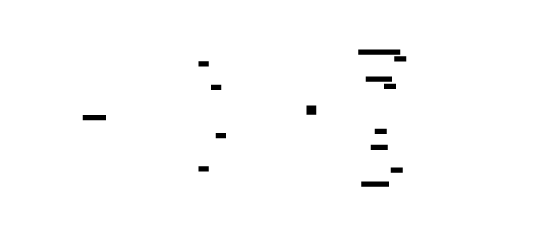

---
### Profile Merge Algorithm
```
INPUT: files: Vec<Path>, merger: ProfileMerger
OUTPUT: Merged CollapsedStacks
ALGORITHM MergeProfiles:
  1. result = CollapsedStacks::new()
  2. FOR path IN files:
     a. data = read_file(path)
     b. format = detect_format(data)
     c. IF format == COLLAPSED:
        collapsed = parse_collapsed(data)
     d. ELSE IF format == PPROF:
        profile = decode_pprof(data)
        collapsed = collapsed_from_pprof(profile)
     e. FOR (path, count) IN collapsed.stacks:
        result.stacks[path] += count
        result.total += count
  3. RETURN result
INVARIANTS:
  - Sample counts are additive
  - Paths are compared as strings (no normalization)
  - Metadata from later files overwrites earlier
COMPLEXITY: O(N × P × S) where N = files, P = paths per file, S = stack depth
```
---

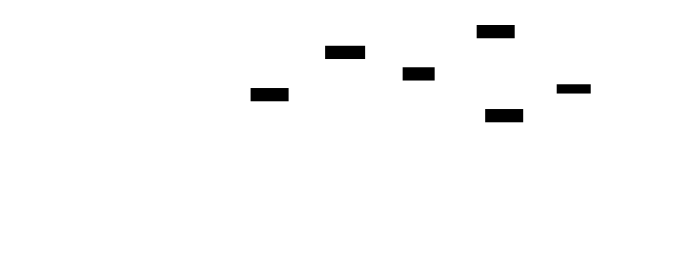

---
## Error Handling Matrix
| Error | Detected By | Recovery | User-Visible? |
|-------|-------------|----------|---------------|
| File read failure | `std::fs::read()` error | Return error with path | Yes - error message with path |
| Invalid UTF-8 in collapsed | `String::from_utf8()` error | Return parse error with context | Yes - line number and bytes |
| pprof decode failure | `prost::DecodeError` | Return error, suggest format check | Yes - "invalid pprof format" |
| Symbol resolution failure | No module contains address | Return None, caller handles | No - address appears as hex |
| DWARF parsing failure | `gimli::Error` | Log warning, fall back to .symtab | No - source lines unavailable |
| Debug file not found | Path doesn't exist | Continue without debug info | No - stripped symbols only |
| Build ID mismatch | Build ID differs from profile | Warn but continue | Partially - warning in logs |
| HTTP endpoint timeout | Request exceeds limit | Return 504 Gateway Timeout | Yes - HTTP error code |
| String interner overflow | > 2^32 unique strings | Extremely unlikely, wrap indices | No - would corrupt profile |
| Profile too large | > 1GB after compression | Return error, suggest filtering | Yes - "profile too large" |
| Export format unsupported | Unknown file extension | Default to collapsed | No - uses fallback |
| Binary mismatch | Symbols don't match addresses | Return empty symbols, warn | Yes - "binary doesn't match profile" |
---


---
## Implementation Sequence with Checkpoints
### Phase 1: Collapsed Stack Format (1-2 hours)
**Files:** `src/export/mod.rs`, `src/export/collapsed.rs`, `src/error.rs`
**Steps:**
1. Define `ExportFormat` enum
2. Implement `CollapsedStacks::add()` and `export()`
3. Implement `CollapsedStacks::import()` with error handling
4. Implement `CollapsedStacks::merge()` and `filter()`
5. Define `ExportError` enum
**Checkpoint:**
```bash
cargo test collapsed_format
# Expected: Round-trip export/import works, merge combines counts
```
### Phase 2: pprof Protobuf Export (2-3 hours)
**Files:** `src/export/pprof/mod.rs`, `src/export/pprof/schema.rs`, `src/export/pprof/builder.rs`, `src/export/pprof/export.rs`
**Steps:**
1. Generate schema.rs from profile.proto using prost-build
2. Implement `PprofBuilder::new()` with empty string table
3. Implement `intern_string()` with FxHashMap
4. Implement `add_mapping()`, `add_function()`, `add_location()`
5. Implement `add_sample()` with location resolution
6. Implement `build()` and `export_bytes()`
7. Implement `pprof_from_collapsed()` conversion
**Checkpoint:**
```bash
cargo test pprof_export
# Expected: Valid pprof output, pprof tool can read it
```
### Phase 3: Symbol Resolution & DWARF (2-3 hours)
**Files:** `src/symbols/mod.rs`, `src/symbols/resolver.rs`, `src/symbols/elf.rs`, `src/symbols/cache.rs`
**Steps:**
1. Implement `SymbolInfo` and `ModuleInfo` structs
2. Implement `SymbolResolver::load_from_proc_maps()`
3. Implement ELF symbol loading from .symtab
4. Implement fallback to .dynsym
5. Implement binary search in `lookup()`
6. Implement cache with RwLock
7. Add debug file search paths
**Checkpoint:**
```bash
cargo test symbol_resolution
# Expected: Symbols resolved for test binary, cache hit rate >90%
```
### Phase 4: Profile Merge & Diff (1-2 hours)
**Files:** `src/merge/mod.rs`, `src/merge/merger.rs`, `src/merge/diff.rs`
**Steps:**
1. Implement `ProfileMerger::add_file()` with format detection
2. Implement `collapsed_from_pprof()` conversion
3. Implement `pprof_from_collapsed()` conversion
4. Implement merge statistics
**Checkpoint:**
```bash
cargo test profile_merge
# Expected: Multiple files merged correctly, stats accurate
```
### Phase 5: CLI Tool Implementation (2-3 hours)
**Files:** `src/cli/main.rs`, `src/cli/profile.rs`, `src/cli/record.rs`, `src/cli/flamegraph.rs`, `src/cli/diff.rs`, `src/cli/merge.rs`, `src/cli/serve.rs`
**Steps:**
1. Define CLI structure with clap
2. Implement `profile` subcommand
3. Implement `record` subcommand
4. Implement `flamegraph` subcommand
5. Implement `diff` subcommand
6. Implement `merge` subcommand
7. Implement `serve` subcommand
**Checkpoint:**
```bash
cargo run -- profile --pid $PID --duration 5 -o profile.txt
# Expected: Profile captured and written to file
cargo run -- flamegraph -i profile.txt -o flame.svg
# Expected: SVG generated
```
### Phase 6: HTTP Continuous Profiling Endpoint (2-3 hours)
**Files:** `src/http/mod.rs`, `src/http/server.rs`, `src/http/handlers.rs`
**Steps:**
1. Implement `ContinuousProfilerState` with config
2. Implement profile capture and caching
3. Implement `/debug/pprof/profile` endpoint
4. Implement `/debug/flamegraph` endpoint
5. Implement `/debug/collapsed` endpoint
6. Add localhost-only binding for security
7. Test with curl
**Checkpoint:**
```bash
cargo run -- serve --port 6060 &
curl http://localhost:6060/debug/collapsed
# Expected: Collapsed stack output
curl http://localhost:6060/debug/flamegraph > flame.svg
# Expected: Valid SVG
kill %1
```
---

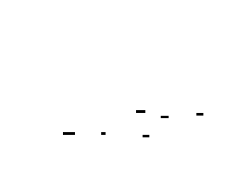

---
## Test Specification
### Unit Tests
```rust
#[cfg(test)]
mod tests {
    use super::*;
    // === CollapsedStacks Tests ===
    #[test]
    fn collapsed_add() {
        let mut c = CollapsedStacks::new();
        c.add(&["main", "foo", "bar"], 10);
        c.add(&["main", "foo", "baz"], 5);
        assert_eq!(c.total_samples(), 15);
        assert_eq!(c.unique_paths(), 2);
        assert_eq!(c.get("main;foo;bar"), 10);
    }
    #[test]
    fn collapsed_export_import_roundtrip() {
        let mut original = CollapsedStacks::new();
        original.add(&["a", "b"], 100);
        original.add(&["a", "c"], 50);
        let exported = original.export();
        let parsed = CollapsedStacks::import_str(&exported).unwrap();
        assert_eq!(parsed.total_samples(), original.total_samples());
        assert_eq!(parsed.get("a;b"), 100);
        assert_eq!(parsed.get("a;c"), 50);
    }
    #[test]
    fn collapsed_merge() {
        let mut c1 = CollapsedStacks::new();
        c1.add(&["a", "b"], 10);
        let mut c2 = CollapsedStacks::new();
        c2.add(&["a", "b"], 5);
        c2.add(&["a", "c"], 3);
        c1.merge(&c2);
        assert_eq!(c1.get("a;b"), 15);
        assert_eq!(c1.get("a;c"), 3);
        assert_eq!(c1.total_samples(), 18);
    }
    #[test]
    fn collapsed_filter() {
        let mut c = CollapsedStacks::new();
        c.add(&["main", "foo", "bar"], 10);
        c.add(&["main", "baz"], 5);
        let filtered = c.filter("foo");
        assert_eq!(filtered.unique_paths(), 1);
        assert_eq!(filtered.get("main;foo;bar"), 10);
    }
    // === PprofBuilder Tests ===
    #[test]
    fn pprof_intern_string() {
        let mut builder = PprofBuilder::new();
        let idx1 = builder.intern_string("hello");
        let idx2 = builder.intern_string("world");
        let idx3 = builder.intern_string("hello");
        assert_eq!(idx1, idx3); // Same string, same index
        assert_ne!(idx1, idx2); // Different strings
        assert_eq!(idx1, 1); // First string after empty
    }
    #[test]
    fn pprof_add_function() {
        let mut builder = PprofBuilder::new();
        let id1 = builder.add_function("main", "main", "main.rs", 10);
        let id2 = builder.add_function("main", "main", "main.rs", 10);
        let id3 = builder.add_function("foo", "foo", "main.rs", 20);
        assert_eq!(id1, id2); // Same function, same ID
        assert_ne!(id1, id3); // Different functions
    }
    #[test]
    fn pprof_build() {
        let mut builder = PprofBuilder::new();
        builder.set_sample_types(&[("samples", "count")]);
        builder.set_timing(1_000_000_000, 10_000_000_000);
        let mapping_id = builder.add_mapping(0x400000, 0x500000, 0, "/bin/test", None);
        let func_id = builder.add_function("main", "main", "", 0);
        builder.add_location(0x401000, mapping_id, func_id, 0);
        builder.add_sample(&[1], &[100], vec![]);
        let profile = builder.build();
        assert_eq!(profile.sample.len(), 1);
        assert_eq!(profile.mapping.len(), 1);
        assert!(profile.string_table.len() > 1);
    }
    // === SymbolResolver Tests ===
    #[test]
    fn resolver_stats() {
        let resolver = SymbolResolver::new();
        let stats = resolver.stats();
        assert_eq!(stats.module_count, 0);
        assert_eq!(stats.total_symbols, 0);
    }
    // === ProfileMerger Tests ===
    #[test]
    fn merger_stats() {
        let mut merger = ProfileMerger::new();
        let mut c = CollapsedStacks::new();
        c.add(&["a", "b"], 100);
        merger.add_collapsed(&c);
        let stats = merger.stats();
        assert_eq!(stats.profile_count, 1);
        assert_eq!(stats.total_samples, 100);
    }
}
```
### Integration Tests
```rust
// tests/integration_m5.rs
use std::io::Write;
use tempfile::NamedTempFile;
#[test]
fn end_to_end_export() {
    // Create sample profile
    let mut collapsed = CollapsedStacks::new();
    collapsed.add(&["main", "foo", "bar"], 100);
    collapsed.add(&["main", "foo", "baz"], 50);
    // Export to collapsed
    let collapsed_data = collapsed.export();
    assert!(collapsed_data.contains("main;foo;bar 100"));
    // Re-import
    let reimported = CollapsedStacks::import_str(&collapsed_data).unwrap();
    assert_eq!(reimported.total_samples(), 150);
}
#[test]
fn pprof_roundtrip() {
    let mut builder = PprofBuilder::new();
    builder.set_sample_types(&[("samples", "count")]);
    let mapping_id = builder.add_mapping(0, u64::MAX, 0, "test", None);
    let func_id = builder.add_function("main", "main", "", 0);
    builder.add_location(0x1000, mapping_id, func_id, 0);
    builder.add_sample(&[1], &[100], vec![]);
    let bytes = builder.export_bytes();
    // Should be valid protobuf
    let profile = Profile::decode(&bytes[..]).unwrap();
    assert_eq!(profile.sample.len(), 1);
}
#[test]
fn merge_files() {
    let mut file1 = NamedTempFile::new().unwrap();
    let mut file2 = NamedTempFile::new().unwrap();
    writeln!(file1, "main;foo 100").unwrap();
    writeln!(file2, "main;foo 50\nmain;bar 25").unwrap();
    let mut merger = ProfileMerger::new();
    merger.add_file(file1.path()).unwrap();
    merger.add_file(file2.path()).unwrap();
    let merged = merger.merged();
    assert_eq!(merged.get("main;foo"), 150);
    assert_eq!(merged.get("main;bar"), 25);
    assert_eq!(merged.total_samples(), 175);
}
```
---
## Performance Targets
| Operation | Target | How to Measure |
|-----------|--------|----------------|
| Collapsed export (100K samples) | < 50 ms | `cargo bench collapsed_export` |
| Collapsed import (100K lines) | < 100 ms | `cargo bench collapsed_import` |
| pprof export (100K samples) | < 500 ms | `cargo bench pprof_export` |
| pprof decode (100K samples) | < 200 ms | `cargo bench pprof_decode` |
| Symbol lookup (cached) | < 1 μs | `cargo bench symbol_lookup_cached` |
| Symbol lookup (uncached) | < 10 μs | `cargo bench symbol_lookup_uncached` |
| Profile merge (10 files) | < 500 ms | `cargo bench profile_merge` |
| HTTP endpoint response | < 100 ms | `curl -w "%{time_total}"` |
| String interning | < 50 ns | `cargo bench string_intern` |
| SVG flame graph (10K paths) | < 200 ms | `cargo bench svg_render` |
---

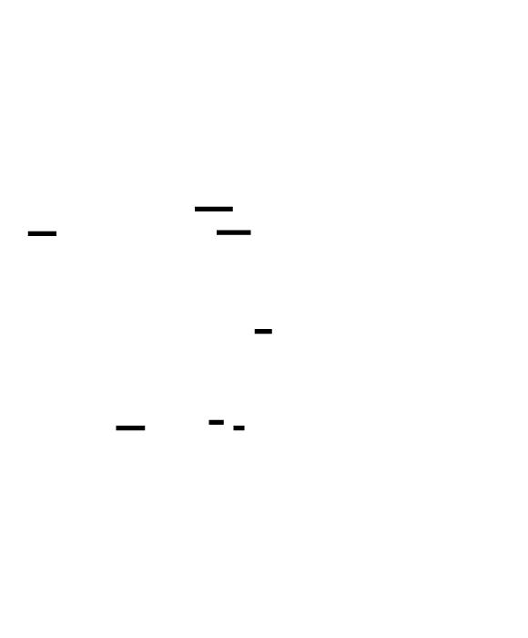

---
[[CRITERIA_JSON: {"module_id": "profiler-m5", "criteria": ["Export profiles in pprof protobuf format with string interning, mapping/location/function tables, sample types, and period configuration", "Export profiles in collapsed stack format compatible with flamegraph.pl with semicolon-delimited root-to-leaf paths and count suffix", "Import collapsed stack format with metadata comment parsing, validation, and error reporting for invalid lines", "Merge multiple profile files combining sample counts for identical call paths with automatic format detection (collapsed vs pprof)", "Implement symbol resolution from ELF .symtab and .dynsym sections with binary search for address lookup", "Support separate debug file lookup via .gnu_debuglink section and build-id directory structure", "Implement symbol resolution cache with RwLock for concurrent read access achieving >90% hit rate after warmup", "Implement HTTP endpoints for continuous profiling serving /debug/pprof/profile, /debug/flamegraph, and /debug/collapsed", "Build CLI tool with clap supporting profile, record, flamegraph, diff, merge, and serve subcommands with proper argument parsing", "Implement localhost-only binding for HTTP endpoint security with configurable port", "Support export format auto-detection from file extension (.pb, .json, .svg, .txt, .collapsed)", "Implement ProfileExporter with format-agnostic export() method and file path auto-detection", "Support profile metadata including start_time_ns, duration_ns, sample_rate, command, hostname, and build_id", "Achieve pprof export of 100K samples under 500ms with string interning optimization", "Implement CollapsedStacks filter by function name and merge operation for profile aggregation"]}]
<!-- END_TDD_MOD -->


# Project Structure: Profiler Tool
## Directory Tree
```
profiler/
├── Cargo.toml                      # Workspace configuration with dependencies
├── Cargo.lock                      # Dependency lockfile
├── README.md                       # Project overview and usage
├── .gitignore                      # Ignore build artifacts, profiles
│
├── src/
│   ├── lib.rs                      # 1. Public API, module exports, Profiler struct
│   ├── error.rs                    # 2. ProfilerError, ConfigError, StateError enums
│   │
│   ├── sampler/                    # M1: CPU sampling infrastructure
│   │   ├── mod.rs                  # 3. Sampler module exports
│   │   ├── config.rs               # 4. SamplerConfig with frequency validation
│   │   ├── timer.rs                # 5. setitimer setup/teardown (ITIMER_PROF)
│   │   └── signal.rs               # 6. sigaction handler, sigprof_handler
│   │
│   ├── unwinder/                   # M1: Stack unwinding
│   │   ├── mod.rs                  # 7. Unwinder interface
│   │   ├── frame_pointer.rs        # 8. Frame pointer chain walker
│   │   └── context.rs              # 9. ucontext_t register extraction
│   │
│   ├── buffer/                     # M1: Lock-free sample storage
│   │   ├── mod.rs                  # 10. Buffer interface
│   │   └── ring.rs                 # 11. Lock-free SPMC ring buffer
│   │
│   ├── state/                      # M1: Global profiler state
│   │   ├── mod.rs                  # 12. ProfilerState management
│   │   └── sample.rs               # 13. RawSample definition (1048 bytes)
│   │
│   ├── callgraph/                  # M2: Call graph construction
│   │   ├── mod.rs                  # 14. CallGraph public API
│   │   ├── node.rs                 # 15. CallGraphNode, CallGraphEdge
│   │   ├── builder.rs              # 16. CallGraphBuilder from samples
│   │   └── traversal.rs            # 17. Graph queries (hottest path)
│   │
│   ├── collapsed/                  # M2: Collapsed stack format
│   │   ├── mod.rs                  # 18. CollapsedStacks API
│   │   ├── folder.rs               # 19. Stack folding algorithm
│   │   └── parser.rs               # 20. Collapsed format parser
│   │
│   ├── flamegraph/                 # M2: Flame graph generation
│   │   ├── mod.rs                  # 21. FlameGraph public API
│   │   ├── tree.rs                 # 22. FlameGraphNode tree structure
│   │   ├── builder.rs              # 23. Tree construction from collapsed
│   │   └── renderer.rs             # 24. SVG renderer with color schemes
│   │
│   ├── differential/               # M2: Differential analysis
│   │   ├── mod.rs                  # 25. DifferentialFlameGraph API
│   │   ├── comparator.rs           # 26. Profile comparison algorithm
│   │   └── renderer.rs             # 27. Differential SVG (red/blue)
│   │
│   ├── memory/                     # M3: Memory allocation tracking
│   │   ├── mod.rs                  # 28. Memory profiler public API
│   │   ├── interpose.rs            # 29. LD_PRELOAD malloc/free wrappers
│   │   ├── tracker.rs              # 30. AllocationTracker with DashMap
│   │   ├── info.rs                 # 31. AllocationInfo, CallSiteStats
│   │   ├── leak.rs                 # 32. Leak detection algorithm
│   │   ├── hotspot.rs              # 33. Allocation hot spot analysis
│   │   ├── temporal.rs             # 34. TemporalTracker time-series
│   │   └── state.rs                # 35. MemoryState, high-water tracking
│   │
│   ├── async_profiler/             # M4: Async-aware profiling
│   │   ├── mod.rs                  # 36. Async profiler public API
│   │   ├── tracker.rs              # 37. AsyncTaskTracker with DashMap
│   │   ├── lifecycle.rs            # 38. AsyncTaskLifecycle, PollRecord
│   │   ├── spawn.rs                # 39. profiled_spawn, ProfiledFuture
│   │   ├── context.rs              # 40. CURRENT_TASK_ID thread-local
│   │   ├── relationships.rs        # 41. TaskRelationshipGraph
│   │   ├── time_breakdown.rs       # 42. TaskTimeBreakdown, AwaitBreakdown
│   │   ├── logical_stack.rs        # 43. Logical stack reconstruction
│   │   ├── flamegraph.rs           # 44. Async-aware flame graph builder
│   │   └── tokio_integration.rs    # 45. Tokio runtime hooks
│   │
│   ├── export/                     # M5: Profile export formats
│   │   ├── mod.rs                  # 46. ExportableProfile, ProfileExporter
│   │   ├── collapsed.rs            # 47. Collapsed stack import/export
│   │   ├── text.rs                 # 48. Text report formatter
│   │   ├── pprof/
│   │   │   ├── mod.rs              # 49. pprof public API
│   │   │   ├── builder.rs          # 50. PprofBuilder with string interning
│   │   │   ├── schema.rs           # 51. Protobuf schema (generated)
│   │   │   └── export.rs           # 52. Profile to pprof conversion
│   │   ├── json/
│   │   │   ├── mod.rs              # 53. JSON export API
│   │   │   └── speedscope.rs       # 54. Speedscope format implementation
│   │   └── svg/
│   │       ├── mod.rs              # 55. SVG export API
│   │       └── flamegraph.rs       # 56. Flame graph SVG renderer
│   │
│   ├── symbols/                    # M5: Symbol resolution
│   │   ├── mod.rs                  # 57. SymbolResolver public API
│   │   ├── resolver.rs             # 58. SymbolResolver implementation
│   │   ├── elf.rs                  # 59. ELF parsing (.symtab, .dynsym)
│   │   ├── dwarf.rs                # 60. DWARF debug info extraction
│   │   ├── debuglink.rs            # 61. Separate debug file lookup
│   │   └── cache.rs                # 62. Symbol resolution cache
│   │
│   ├── merge/                      # M5: Profile merging
│   │   ├── mod.rs                  # 63. Profile merge API
│   │   ├── merger.rs               # 64. ProfileMerger implementation
│   │   └── diff.rs                 # 65. Differential analysis
│   │
│   ├── cli/                        # M5: Command-line interface
│   │   ├── mod.rs                  # 66. CLI module exports
│   │   ├── main.rs                 # 67. Entry point with clap
│   │   ├── profile.rs              # 68. profile subcommand
│   │   ├── record.rs               # 69. record subcommand
│   │   ├── flamegraph.rs           # 70. flamegraph subcommand
│   │   ├── diff.rs                 # 71. diff subcommand
│   │   ├── merge.rs                # 72. merge subcommand
│   │   └── serve.rs                # 73. serve subcommand
│   │
│   └── http/                       # M5: HTTP continuous profiling
│       ├── mod.rs                  # 74. HTTP server public API
│       ├── server.rs               # 75. Warp-based HTTP server
│       └── handlers.rs             # 76. Profile endpoint handlers
│
├── tests/                          # Integration tests
│   ├── integration_m1.rs           # M1 integration tests
│   ├── integration_m2.rs           # M2 integration tests
│   ├── integration_m3.rs           # M3 integration tests
│   ├── integration_m4.rs           # M4 integration tests
│   └── integration_m5.rs           # M5 integration tests
│
├── benches/                        # Performance benchmarks
│   ├── handler_overhead.rs         # Signal handler timing
│   ├── stack_walk.rs               # Unwinding performance
│   ├── collapsed_export.rs         # Export format benchmarks
│   └── symbol_lookup.rs            # Symbol resolution benchmarks
│
├── examples/                       # Usage examples
│   ├── basic_profiling.rs          # Simple CPU profiling
│   ├── memory_demo.rs              # Memory tracking demo
│   ├── async_demo.rs               # Async profiling demo
│   └── flamegraph_demo.rs          # Flame graph generation
│
├── build.rs                        # Build script (protobuf generation)
├── linker.ld                       # Linker script (optional)
│
└── diagrams/                       # Architecture diagrams (reference)
    ├── tdd-diag-001.svg            # Profiler Core Architecture
    ├── tdd-diag-002.svg            # RawSample Memory Layout
    └── ...                         # Additional diagrams
```
## Creation Order
1. **Project Foundation** (30 min)
   - `Cargo.toml` with dependencies: libc, dashmap, prost, clap, warp, tokio, gimli, object
   - `src/lib.rs` with module declarations
   - `src/error.rs` with error type definitions
   - `build.rs` for protobuf code generation
2. **M1: Sampling Infrastructure** (2-3 hours)
   - `src/state/sample.rs` - RawSample struct with memory layout
   - `src/buffer/ring.rs` - Lock-free ring buffer
   - `src/sampler/config.rs` - SamplerConfig with validation
   - `src/sampler/timer.rs` - setitimer setup
   - `src/sampler/signal.rs` - Signal handler registration
   - `src/unwinder/context.rs` - Register extraction from ucontext
   - `src/unwinder/frame_pointer.rs` - Stack walking
   - `src/state/mod.rs` - ProfilerState global management
   - `src/sampler/mod.rs` - Sampler orchestration
3. **M1: Public API** (1-2 hours)
   - `src/lib.rs` - Complete Profiler struct with start/stop
   - Tests: `tests/integration_m1.rs`
4. **M2: Call Graph & Collapsed Stacks** (2-3 hours)
   - `src/callgraph/node.rs` - CallGraphNode, CallGraphEdge
   - `src/callgraph/mod.rs` - CallGraph structure
   - `src/callgraph/builder.rs` - Build from samples
   - `src/collapsed/mod.rs` - CollapsedStacks
   - `src/collapsed/folder.rs` - Stack folding
   - `src/collapsed/parser.rs` - Format parsing
5. **M2: Flame Graphs** (2-3 hours)
   - `src/flamegraph/tree.rs` - FlameGraphNode tree
   - `src/flamegraph/builder.rs` - Tree construction
   - `src/flamegraph/renderer.rs` - SVG rendering
   - `src/differential/mod.rs` - DifferentialFlameGraph
   - `src/differential/comparator.rs` - Comparison algorithm
   - Tests: `tests/integration_m2.rs`
6. **M3: Memory Interposition** (2-3 hours)
   - `src/memory/info.rs` - AllocationInfo, CallSiteStats
   - `src/memory/tracker.rs` - AllocationTracker
   - `src/memory/interpose.rs` - LD_PRELOAD wrappers
   - `src/memory/state.rs` - MemoryState
7. **M3: Memory Analysis** (2-3 hours)
   - `src/memory/leak.rs` - Leak detection
   - `src/memory/hotspot.rs` - Hot spot analysis
   - `src/memory/temporal.rs` - Time-series tracking
   - `src/memory/mod.rs` - MemoryProfiler API
   - Tests: `tests/integration_m3.rs`
8. **M4: Async Tracking** (2-3 hours)
   - `src/async_profiler/lifecycle.rs` - AsyncTaskLifecycle
   - `src/async_profiler/tracker.rs` - AsyncTaskTracker
   - `src/async_profiler/context.rs` - Thread-local context
   - `src/async_profiler/spawn.rs` - ProfiledFuture wrapper
9. **M4: Async Analysis** (2-3 hours)
   - `src/async_profiler/relationships.rs` - Task relationship graph
   - `src/async_profiler/time_breakdown.rs` - CPU vs await time
   - `src/async_profiler/logical_stack.rs` - Stack reconstruction
   - `src/async_profiler/flamegraph.rs` - Async flame graphs
   - `src/async_profiler/tokio_integration.rs` - Runtime hooks
   - `src/async_profiler/mod.rs` - AsyncProfiler API
   - Tests: `tests/integration_m4.rs`
10. **M5: Export Formats** (2-3 hours)
    - `src/export/collapsed.rs` - Collapsed format
    - `src/export/pprof/schema.rs` - Generated protobuf
    - `src/export/pprof/builder.rs` - PprofBuilder
    - `src/export/pprof/export.rs` - Conversion
    - `src/export/json/speedscope.rs` - Speedscope format
    - `src/export/svg/flamegraph.rs` - SVG renderer
    - `src/export/text.rs` - Text reports
    - `src/export/mod.rs` - ProfileExporter
11. **M5: Symbol Resolution** (2-3 hours)
    - `src/symbols/elf.rs` - ELF parsing
    - `src/symbols/dwarf.rs` - DWARF extraction
    - `src/symbols/debuglink.rs` - Debug file lookup
    - `src/symbols/cache.rs` - Resolution cache
    - `src/symbols/resolver.rs` - SymbolResolver
    - `src/symbols/mod.rs` - Module exports
12. **M5: CLI & Integration** (2-3 hours)
    - `src/cli/main.rs` - Clap CLI structure
    - `src/cli/profile.rs` - profile command
    - `src/cli/record.rs` - record command
    - `src/cli/flamegraph.rs` - flamegraph command
    - `src/cli/diff.rs` - diff command
    - `src/cli/merge.rs` - merge command
    - `src/cli/serve.rs` - serve command
13. **M5: HTTP Server** (1-2 hours)
    - `src/http/server.rs` - Warp server
    - `src/http/handlers.rs` - Profile endpoints
    - `src/http/mod.rs` - Module exports
    - Tests: `tests/integration_m5.rs`
14. **Final Integration** (1 hour)
    - `src/merge/merger.rs` - ProfileMerger
    - `src/merge/diff.rs` - Differential analysis
    - `src/merge/mod.rs` - Module exports
    - Examples: `examples/`
    - Benchmarks: `benches/`
## File Count Summary
- **Total files:** 91
- **Source files:** 76
- **Test files:** 5
- **Benchmark files:** 4
- **Example files:** 4
- **Config files:** 2
- **Estimated lines of code:** ~15,000-20,000