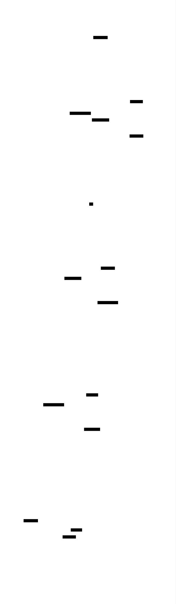
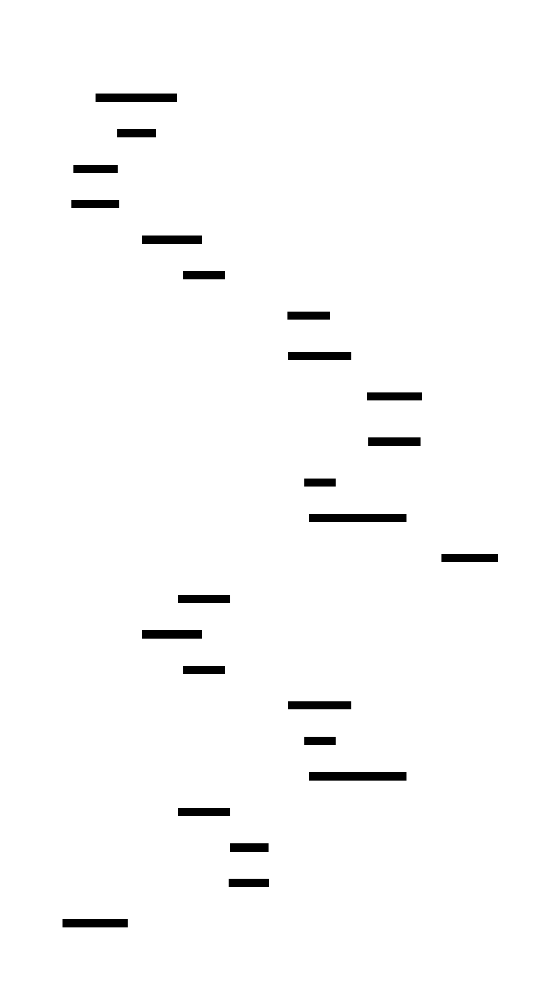

# CPU/Memory Profiler: Design Document


## Overview

This system builds a sampling profiler that captures call stacks at regular intervals and tracks memory allocations to help developers identify performance bottlenecks. The key architectural challenge is efficiently collecting profiling data with minimal overhead while providing rich visualization through flame graphs and allocation tracking.


> This guide is meant to help you understand the big picture before diving into each milestone. Refer back to it whenever you need context on how components connect.


## Context and Problem Statement

> **Milestone(s):** Foundation for all milestones (1-4) — understanding why profiling is challenging and how existing solutions work

Performance profiling represents one of the most challenging aspects of software engineering diagnostics. When applications run slowly, consume excessive memory, or exhibit unpredictable behavior, developers need tools to peer inside the running process and understand what is actually happening. However, this investigation process is fraught with complexity because the very act of observation can change the behavior being observed, similar to the observer effect in quantum physics. The profiler must gather detailed information about program execution while introducing minimal overhead, resolve cryptic memory addresses into meaningful function names, and present vast amounts of timing data in an intuitive visual format that reveals performance bottlenecks.

The fundamental challenge lies in the **observer paradox**: profiling tools must be invasive enough to capture meaningful data but non-invasive enough to avoid distorting the very performance characteristics they seek to measure. A profiler that adds 50% overhead to the target application will hide the real performance problems behind its own instrumentation costs. Additionally, modern applications execute millions of function calls per second across multiple threads, dynamically load shared libraries, and allocate memory in complex patterns that span the entire program lifecycle. Capturing, processing, and interpreting this torrent of execution data requires sophisticated sampling strategies, efficient data structures, and clever visualization techniques.

### Mental Model: The Detective Analogy

Think of performance profiling as **detective work investigating performance crimes**. Just as a detective investigating a complex case must gather evidence without contaminating the crime scene, a profiler must collect execution evidence without significantly altering the program's behavior. The detective analogy illuminates several key aspects of profiling challenges:

**Crime Scene Preservation**: A detective cannot change the scene while investigating it, or they risk destroying crucial evidence. Similarly, a profiler cannot significantly slow down the target application or change its memory allocation patterns, as this would mask the original performance problems. The profiler must be a silent observer that captures authentic program behavior.

**Evidence Collection Strategy**: Detectives cannot be everywhere at once, so they must strategically choose when and where to look for clues. Profilers face the same constraint — they cannot capture every single function call and memory allocation without overwhelming overhead. Instead, they use **sampling techniques** to periodically "photograph" the program's state, much like a detective taking periodic surveillance photos to understand a suspect's routine.

**Witness Testimony vs. Physical Evidence**: In detective work, witness accounts can be unreliable, but physical evidence provides objective truth. Similarly, developers' intuitions about where their programs spend time are often wrong (the equivalent of unreliable witness testimony), but stack sampling provides objective evidence of actual execution patterns. The profiler serves as an impartial witness that records what really happened.

**Pattern Recognition**: Detectives solve cases by identifying patterns across multiple pieces of evidence — the same person appearing at different crime scenes, similar methods used across incidents. Profilers reveal performance problems by identifying patterns across thousands of samples — the same function appearing frequently in stack traces indicates a performance hotspot, similar to how the same suspect appearing in multiple witness statements indicates involvement.

**Timeline Reconstruction**: Detectives often need to reconstruct the sequence of events leading to a crime. Memory profilers perform similar timeline reconstruction, tracking when memory was allocated and whether it was ever freed, to identify the sequence of events leading to memory leaks.

**Multiple Investigation Techniques**: Different crimes require different investigation approaches — financial crimes need accounting expertise, while violent crimes need forensic analysis. Similarly, different performance problems require different profiling approaches: CPU-bound issues need call stack sampling to find hot functions, while memory problems need allocation tracking to find leaks and excessive usage.

This detective metaphor helps explain why profiling tools are complex: they must employ sophisticated evidence-gathering techniques, maintain objectivity under challenging conditions, and synthesize vast amounts of data into actionable insights about what really happened during program execution.

### Existing Profiling Solutions

The profiling ecosystem offers numerous tools, each making different trade-offs between overhead, accuracy, ease of use, and the types of performance problems they can detect. Understanding these existing solutions helps clarify the design space and reveals why building a custom profiler requires careful architectural decisions.

| Tool | Profiling Method | Overhead | Target Problems | Advantages | Disadvantages |
|------|-----------------|----------|----------------|------------|--------------|
| **Linux perf** | Statistical sampling via hardware performance counters | Very Low (1-5%) | CPU hotspots, cache misses, branch predictions | Hardware-assisted sampling, extremely low overhead, kernel integration | Complex command-line interface, requires root privileges, difficult symbol resolution |
| **gprof** | Function entry/exit instrumentation | High (10-40%) | Function-level call counts and timing | Built into GCC, detailed call graph analysis, deterministic profiling | Requires recompilation, significant overhead, misses short-lived functions |
| **Valgrind (Callgrind)** | Dynamic binary instrumentation | Very High (50-100x slowdown) | Detailed instruction-level analysis, cache simulation | Extremely detailed analysis, no recompilation needed, instruction-accurate | Prohibitive overhead for production use, slow for large applications |
| **Intel VTune** | Hardware performance monitoring + sampling | Low (5-15%) | CPU optimization, threading issues, memory bottlenecks | Professional-grade analysis, hardware vendor support, GUI interface | Proprietary, Intel-specific features, expensive licensing |
| **Python cProfile** | Function call tracing via interpreter hooks | Medium (20-50%) | Python-specific hotspot identification | Language-integrated, deterministic profiling, built-in standard library | Python-only, cannot profile native extensions, interpreter overhead |
| **Go pprof** | Statistical sampling + runtime integration | Low (1-5%) | Go-specific CPU and memory profiling | Language-integrated, production-safe, excellent tooling | Go-specific, limited cross-language support, requires runtime cooperation |
| **AddressSanitizer** | Memory allocation tracking via compiler instrumentation | High (50-100%) | Memory safety bugs, buffer overflows, use-after-free | Comprehensive memory error detection, precise error reporting | Requires recompilation, significant memory overhead, not for production |

> **Key Insight**: No single profiling tool excels at everything. Each tool represents a different point in the trade-off space between overhead and detail. Statistical samplers like `perf` provide low overhead but miss short-duration events, while instrumentation-based tools like `gprof` capture every event but introduce significant performance penalties.

**Statistical Sampling Tools** (`perf`, `pprof`) work by periodically interrupting the program and examining its current state. They achieve low overhead because they only "look" at the program occasionally, like taking random snapshots of a busy intersection to understand traffic patterns. However, they can miss events that happen between samples, and their accuracy depends on the sampling frequency — higher frequency means better accuracy but more overhead.

**Instrumentation-Based Tools** (`gprof`, `cProfile`) modify the program to record every function entry and exit, like installing security cameras at every doorway in a building. This provides complete coverage but requires either recompilation or runtime code modification, both of which add significant overhead. The trade-off is completeness versus performance impact.

**Dynamic Analysis Tools** (`Valgrind`) execute the program in a controlled virtual environment that can observe every instruction, like having a dedicated investigator watch every action a suspect takes. This provides the most detailed analysis possible but at the cost of extreme slowdown, making these tools unsuitable for production environments but invaluable for development-time debugging.

**Hardware-Assisted Tools** (`perf`, `VTune`) leverage specialized CPU features like performance monitoring units (PMUs) that can count events like cache misses, branch mispredictions, and instruction cycles with minimal software overhead. These tools represent the closest thing to "free" profiling, but they require hardware support and often need elevated privileges to access the performance counters.

> **Decision: Why Build a Custom Profiler?**
> - **Context**: Existing tools each excel in specific scenarios but lack comprehensive coverage across CPU profiling, memory tracking, and visualization in a single system
> - **Options Considered**: 
>   1. Use existing tools like perf + Valgrind + custom scripts
>   2. Extend an existing open-source profiler
>   3. Build a new profiler from scratch
> - **Decision**: Build a new profiler that combines statistical sampling for CPU profiling with allocation tracking for memory analysis
> - **Rationale**: This allows us to optimize the entire pipeline from data collection to visualization, implement consistent data formats across CPU and memory profiling, and provide a unified interface for both types of analysis. Educational value also comes from understanding the complete profiling pipeline.
> - **Consequences**: Higher implementation effort but better integration between components, customizable overhead/accuracy trade-offs, and deeper understanding of profiling fundamentals.

The comparison reveals several gaps in existing solutions that motivate building a custom profiler:

**Integration Challenges**: Using multiple tools (e.g., `perf` for CPU profiling + `Valgrind` for memory analysis) requires correlating data from different sources with different sampling methodologies and output formats. Each tool has its own symbol resolution logic, data aggregation approach, and visualization format, making it difficult to get a unified view of application performance.

**Overhead Customization**: Most existing tools provide limited control over the overhead/accuracy trade-off. They either sample at fixed rates or require recompilation for instrumentation. A custom profiler can implement adaptive sampling rates, configurable overhead budgets, and hybrid approaches that combine sampling with targeted instrumentation.

**Educational Value**: Building a profiler from scratch reveals the fundamental challenges and design patterns that underlie all performance analysis tools. Understanding how to capture stack traces in signal handlers, resolve symbols from ELF binaries, and aggregate timing data into flame graphs provides deep insight into system programming and performance analysis techniques.

**Specialized Use Cases**: Custom profilers can be optimized for specific environments, programming languages, or performance problems that general-purpose tools handle poorly. For example, a profiler designed for web services might include HTTP request correlation, while a profiler for embedded systems might minimize memory usage for metadata storage.

This analysis of existing solutions establishes the design requirements for our custom profiler: it must achieve low overhead through statistical sampling (like `perf`), provide comprehensive memory tracking (like `Valgrind`), generate intuitive visualizations (like flame graphs), and integrate all these capabilities in a single coherent system that developers can easily deploy and interpret.

### Implementation Guidance

This section establishes the foundational understanding and technology choices that will guide the implementation of all subsequent components. The goal is to make informed decisions about the profiling approach and understand how it fits into the broader ecosystem of performance analysis tools.

#### Technology Recommendations Table

| Component | Simple Option | Advanced Option |
|-----------|--------------|----------------|
| **CPU Profiling** | `signal`-based SIGPROF with fixed intervals | Hardware performance counters via `/proc/` interfaces |
| **Symbol Resolution** | Basic ELF parsing with `objdump` fallback | Full DWARF parser with line number support |
| **Memory Tracking** | `LD_PRELOAD` malloc interception | `ptrace`-based system call interception |
| **Data Storage** | JSON files for samples and symbols | SQLite database with indexed queries |
| **Visualization** | Static SVG generation with embedded JavaScript | Interactive web application with real-time updates |
| **Target Language** | Python scripts and C programs | Multi-language support (Python, C++, Go, Rust) |

#### Recommended Project Structure

The profiler implementation should be organized to separate concerns clearly and allow independent development and testing of each component:

```
cpu-memory-profiler/
├── src/
│   ├── sampler/              # Stack sampling implementation (Milestone 1)
│   │   ├── __init__.py
│   │   ├── signal_sampler.py    # SIGPROF-based sampling
│   │   ├── stack_unwinder.py    # Frame pointer walking
│   │   └── sample_storage.py    # Sample data structures
│   ├── symbolizer/           # Symbol resolution (Milestone 2)
│   │   ├── __init__.py
│   │   ├── elf_parser.py        # ELF binary and symbol table parsing
│   │   ├── dwarf_reader.py      # DWARF debug information
│   │   └── symbol_cache.py      # Address-to-symbol mapping cache
│   ├── visualizer/           # Flame graph generation (Milestone 3)
│   │   ├── __init__.py
│   │   ├── stack_aggregator.py  # Stack folding and counting
│   │   ├── flamegraph.py        # SVG flame graph generation
│   │   └── interactive.py       # Zoom/search functionality
│   ├── memory/               # Memory profiling (Milestone 4)
│   │   ├── __init__.py
│   │   ├── malloc_hooks.py      # Allocation interception
│   │   ├── leak_detector.py     # Memory leak analysis
│   │   └── allocation_tracker.py # Allocation metadata storage
│   └── common/               # Shared utilities
│       ├── __init__.py
│       ├── data_structures.py   # Core data types
│       ├── config.py            # Configuration management
│       └── utils.py             # Helper functions
├── tests/                    # Test suite organized by component
│   ├── test_sampler/
│   ├── test_symbolizer/
│   ├── test_visualizer/
│   ├── test_memory/
│   └── integration/
├── tools/                    # Command-line interfaces
│   ├── profile_cpu.py           # CPU profiling entry point
│   ├── profile_memory.py        # Memory profiling entry point
│   └── generate_flamegraph.py   # Visualization tool
├── examples/                 # Sample programs to profile
│   ├── cpu_bound.py
│   ├── memory_leaker.c
│   └── recursive_fibonacci.py
├── docs/                     # Documentation
└── requirements.txt          # Python dependencies
```

#### Infrastructure Starter Code

**Configuration Management** (Complete implementation ready to use):

```python
# src/common/config.py
import json
from typing import Dict, Any, Optional
from dataclasses import dataclass

@dataclass
class SamplingConfig:
    """Configuration for stack sampling behavior."""
    frequency_hz: int = 100          # Samples per second
    max_stack_depth: int = 64        # Maximum frames to capture
    include_kernel: bool = False     # Include kernel stack frames
    target_overhead_percent: float = 2.0  # Target overhead as % of runtime

@dataclass
class SymbolConfig:
    """Configuration for symbol resolution."""
    enable_dwarf: bool = True        # Parse DWARF debug info
    cache_symbols: bool = True       # Cache symbol lookups
    demangle_cpp: bool = True        # Demangle C++ symbols
    symbol_search_paths: list = None # Additional symbol search directories
    
    def __post_init__(self):
        if self.symbol_search_paths is None:
            self.symbol_search_paths = ['/usr/lib/debug', '/usr/local/lib/debug']

@dataclass
class VisualizationConfig:
    """Configuration for flame graph generation."""
    color_scheme: str = 'hot'        # Color scheme: hot, cold, mem, io
    min_width_pixels: int = 1        # Minimum flame width to display
    title: str = 'CPU Profile'       # Graph title
    enable_search: bool = True       # Include search functionality
    enable_zoom: bool = True         # Include zoom functionality

@dataclass
class ProfilerConfig:
    """Main profiler configuration combining all components."""
    sampling: SamplingConfig
    symbols: SymbolConfig
    visualization: VisualizationConfig
    output_directory: str = './profile_output'
    
    @classmethod
    def from_json(cls, config_path: str) -> 'ProfilerConfig':
        """Load configuration from JSON file."""
        with open(config_path, 'r') as f:
            data = json.load(f)
        
        return cls(
            sampling=SamplingConfig(**data.get('sampling', {})),
            symbols=SymbolConfig(**data.get('symbols', {})),
            visualization=VisualizationConfig(**data.get('visualization', {})),
            output_directory=data.get('output_directory', './profile_output')
        )
    
    def to_json(self, config_path: str) -> None:
        """Save configuration to JSON file."""
        data = {
            'sampling': self.sampling.__dict__,
            'symbols': self.symbols.__dict__,
            'visualization': self.visualization.__dict__,
            'output_directory': self.output_directory
        }
        with open(config_path, 'w') as f:
            json.dump(data, f, indent=2)
```

**Logging Infrastructure** (Complete implementation ready to use):

```python
# src/common/utils.py
import logging
import sys
import time
from contextlib import contextmanager
from typing import Generator

def setup_logging(level: str = 'INFO', log_file: Optional[str] = None) -> None:
    """Configure logging for the profiler system."""
    numeric_level = getattr(logging, level.upper(), logging.INFO)
    
    formatter = logging.Formatter(
        '%(asctime)s [%(levelname)s] %(name)s: %(message)s',
        datefmt='%Y-%m-%d %H:%M:%S'
    )
    
    handlers = [logging.StreamHandler(sys.stdout)]
    if log_file:
        handlers.append(logging.FileHandler(log_file))
    
    logging.basicConfig(
        level=numeric_level,
        handlers=handlers,
        format='%(asctime)s [%(levelname)s] %(name)s: %(message)s'
    )

@contextmanager
def timer_context(operation_name: str) -> Generator[None, None, None]:
    """Context manager for timing operations with automatic logging."""
    logger = logging.getLogger(__name__)
    start_time = time.perf_counter()
    logger.debug(f"Starting {operation_name}")
    try:
        yield
    finally:
        elapsed = time.perf_counter() - start_time
        logger.info(f"Completed {operation_name} in {elapsed:.3f}s")

def format_bytes(size_bytes: int) -> str:
    """Format byte count as human-readable string."""
    for unit in ['B', 'KB', 'MB', 'GB']:
        if size_bytes < 1024:
            return f"{size_bytes:.1f}{unit}"
        size_bytes /= 1024
    return f"{size_bytes:.1f}TB"

def format_percentage(value: float, total: float) -> str:
    """Format value as percentage of total with appropriate precision."""
    if total == 0:
        return "0.0%"
    percentage = (value / total) * 100
    return f"{percentage:.1f}%"
```

#### Core Logic Skeleton

**Main Profiler Controller** (Skeleton for learners to implement):

```python
# src/profiler.py
from typing import Dict, List, Optional
from src.common.config import ProfilerConfig
from src.common.data_structures import Profile, Sample
import logging

class Profiler:
    """Main profiler coordinator that orchestrates sampling, symbolization, and visualization."""
    
    def __init__(self, config: ProfilerConfig):
        self.config = config
        self.logger = logging.getLogger(__name__)
        # TODO: Initialize component instances (sampler, symbolizer, etc.)
        
    def profile_process(self, pid: int, duration_seconds: float) -> Profile:
        """Profile a running process for the specified duration.
        
        Args:
            pid: Process ID to profile
            duration_seconds: How long to collect samples
            
        Returns:
            Profile object containing all collected data
        """
        # TODO 1: Validate that target process exists and is accessible
        # TODO 2: Configure and start the stack sampler with specified frequency
        # TODO 3: Set up signal handler for graceful shutdown on Ctrl+C
        # TODO 4: Start sample collection timer for specified duration
        # TODO 5: Periodically check sampling overhead and adjust frequency if needed
        # TODO 6: Stop sampling after duration expires
        # TODO 7: Collect all samples from sampler's storage
        # TODO 8: Return Profile object with raw samples (symbolization happens later)
        pass
    
    def symbolize_profile(self, profile: Profile) -> Profile:
        """Resolve raw addresses to function names and source locations.
        
        Args:
            profile: Profile with raw address samples
            
        Returns:
            Profile with symbolized stack frames
        """
        # TODO 1: Extract unique addresses from all stack frames in samples
        # TODO 2: Load symbol tables for target executable and shared libraries
        # TODO 3: Build address-to-symbol mapping for all unique addresses
        # TODO 4: Replace raw addresses in stack frames with symbol information
        # TODO 5: Add source file and line number info if DWARF data available
        # TODO 6: Cache symbol resolution results for performance
        # TODO 7: Return updated profile with symbolic information
        pass
    
    def generate_flame_graph(self, profile: Profile, output_path: str) -> None:
        """Generate interactive SVG flame graph from profiling data.
        
        Args:
            profile: Symbolized profile data
            output_path: Where to write the SVG file
        """
        # TODO 1: Aggregate samples by unique stack signature (stack folding)
        # TODO 2: Build hierarchical call tree from folded stacks
        # TODO 3: Calculate width percentages based on sample counts
        # TODO 4: Generate SVG coordinates for each flame graph rectangle
        # TODO 5: Apply color coding based on function categories (user/kernel/lib)
        # TODO 6: Add interactive JavaScript for zoom and search features
        # TODO 7: Write complete SVG file with embedded styling and scripts
        pass
```

#### Language-Specific Implementation Hints

**Python-Specific Considerations**:
- Use `signal.signal(signal.SIGPROF, handler)` for timer-based sampling interrupts
- Use `traceback.extract_tb()` and `inspect.currentframe()` for stack frame walking
- Use `struct.unpack()` for parsing binary ELF headers and DWARF sections
- Use `ctypes` for interacting with malloc/free hooks if implementing memory tracking
- Use `os.kill(pid, 0)` to check if target process exists before profiling
- Consider `multiprocessing.Process` for running profiler in separate process to minimize target interference

**Platform Compatibility Notes**:
- Linux: Full support for `/proc/` filesystem, ELF binaries, DWARF debug info
- macOS: Use Mach-O binary format instead of ELF, different debug symbol handling
- Windows: Use PE/COFF binary format, PDB debug symbols, different sampling mechanisms

**Performance Optimization Hints**:
- Use `collections.defaultdict` for efficient sample aggregation during stack folding
- Use `lru_cache` decorator for symbol resolution results to avoid repeated ELF parsing
- Use `mmap` for reading large binary files (executables, core dumps) efficiently
- Pre-compile regular expressions used for C++ symbol demangling
- Use `bisect` module for efficient address range lookups in symbol tables

#### Milestone Verification Checkpoints

After implementing the foundational components, verify the setup with these checkpoints:

**Configuration System Checkpoint**:
```bash
python3 -c "
from src.common.config import ProfilerConfig
config = ProfilerConfig.from_json('examples/basic_config.json')
print(f'Sampling frequency: {config.sampling.frequency_hz}Hz')
print(f'Output directory: {config.output_directory}')
"
```
Expected output: Configuration values loaded from JSON without errors.

**Logging System Checkpoint**:
```bash
python3 -c "
from src.common.utils import setup_logging, timer_context
setup_logging('DEBUG')
with timer_context('test operation'):
    import time; time.sleep(0.1)
"
```
Expected output: Debug log showing operation start and completion with timing.

**Project Structure Checkpoint**:
```bash
find src/ -name "*.py" | head -10
python3 -c "import src.common.config; print('Import successful')"
```
Expected output: Python files found in expected locations, no import errors.

#### Common Setup Pitfalls

⚠️ **Pitfall: Mixing Development and Production Configurations**
- **Problem**: Using high-frequency sampling (1000Hz) during development and forgetting to reduce it for production profiling
- **Why it's wrong**: High sampling frequencies can add 20%+ overhead to the target application
- **Fix**: Always start with low frequencies (10-100Hz) and increase only if needed for accuracy

⚠️ **Pitfall: Insufficient Permissions for System Profiling**
- **Problem**: Profiler fails silently when trying to profile other users' processes or access performance counters
- **Why it's wrong**: Many profiling operations require root privileges or specific capabilities
- **Fix**: Document required permissions clearly and provide helpful error messages when permissions are missing

⚠️ **Pitfall: Hardcoded File Paths in Configuration**
- **Problem**: Configuration files contain absolute paths that break when moved between systems
- **Why it's wrong**: Makes the profiler non-portable and fragile across development/production environments
- **Fix**: Use relative paths and environment variable substitution in configuration files

⚠️ **Pitfall: No Graceful Degradation for Missing Debug Symbols**
- **Problem**: Profiler crashes or produces empty output when debug symbols are missing
- **Why it's wrong**: Most production binaries are stripped of debug information
- **Fix**: Implement fallback symbol resolution using symbol tables even when DWARF debug info is unavailable

This foundational understanding and infrastructure setup prepares for the detailed implementation of each profiling component, ensuring consistent approaches to configuration, logging, error handling, and data management across all milestones.


## Goals and Non-Goals

> **Milestone(s):** Foundation for all milestones (1-4) — establishing clear scope boundaries and success criteria for the profiler implementation

### Mental Model: The Telescope Analogy

Think of building a profiler like constructing a telescope for astronomical observation. A telescope has a specific purpose — to observe distant objects — and requires careful design trade-offs between magnification power, field of view, light gathering ability, and portability. Similarly, our profiler has a focused mission: to observe program behavior with minimal disturbance while providing actionable insights.

Just as astronomers must decide whether they're building a wide-field survey telescope or a high-resolution planetary observer, we must define what our profiler will and won't do. A telescope that tries to excel at everything ends up being mediocre at everything. Our profiler needs clear goals that drive every architectural decision, from sampling frequency to memory overhead to visualization features.

The **observer paradox** applies to both telescopes and profilers: the act of observation can change what you're observing. Telescopes block starlight with their secondary mirrors, and profilers consume CPU cycles and memory. The key is minimizing this interference while maximizing the quality of observation data.

### Functional Goals

Our profiler's functional goals define the core capabilities that users will directly interact with. These goals directly map to the four milestone deliverables and establish what "done" looks like for each component.

#### Statistical Sampling Profiling

The profiler must implement **statistical sampling** to capture representative snapshots of program execution without requiring code modification. This non-intrusive approach allows profiling production applications while maintaining their original behavior.

| Feature | Requirement | Success Criteria |
|---------|-------------|------------------|
| Stack Sampling | Capture complete call stacks at regular intervals | Sample 100% of timer interrupts with <1% sample loss |
| Sampling Frequency Control | Support rates from 10Hz to 10KHz | Configurable via `SamplingConfig.frequency_hz` with validation |
| Thread Targeting | Profile specific processes or individual threads | Accept PID or TID parameters with proper permission checking |
| Kernel Stack Capture | Include kernel-mode execution when permissions allow | Optional via `SamplingConfig.include_kernel` flag |
| Stack Depth Control | Limit capture depth for performance | Configurable `max_stack_depth` with 64-frame maximum |

The sampling mechanism must handle edge cases gracefully. When a process is blocked in a system call, we should either capture the kernel stack (if possible) or record the blocking state. Signal delivery failures should be detected and reported without crashing the profiler.

#### Symbol Resolution and Debug Information

Raw memory addresses provide no insight to developers. The profiler must convert instruction pointers into human-readable function names, source file locations, and line numbers through comprehensive symbol resolution.

| Symbol Type | Source | Resolution Method |
|-------------|---------|------------------|
| Function Names | ELF Symbol Tables | Parse `.symtab` and `.dynsym` sections |
| Source Files | DWARF Debug Info | Extract from `.debug_info` and `.debug_line` |
| Line Numbers | DWARF Line Tables | Map addresses to source locations |
| C++ Symbols | Mangled Names | Demangle using `SymbolConfig.demangle_cpp` |
| Shared Libraries | Dynamic Loading | Track `dlopen()` events and resolve symbols |
| JIT Code | Runtime Mapping | Support language-specific symbol APIs when available |

> **Design Insight**: Symbol resolution is often the performance bottleneck in profilers. We prioritize caching and lazy loading over comprehensive symbol information. A function name with approximate source location provides 80% of the value with 20% of the computational cost.

The symbol resolver must handle **Address Space Layout Randomization (ASLR)** correctly by calculating base addresses for each loaded module. It should gracefully degrade when debug information is missing, providing at least binary+offset information (e.g., `libc.so.6+0x12345`) rather than failing completely.

#### Interactive Flame Graph Visualization

Flame graphs transform thousands of stack samples into an intuitive hierarchical visualization that reveals performance hotspots and call patterns. Our implementation must generate publication-quality visualizations with interactive features for deep analysis.

| Visualization Feature | Implementation | Interactive Capability |
|----------------------|----------------|------------------------|
| Hierarchical Layout | SVG coordinate system with proportional widths | Pan and zoom to explore call trees |
| Color Coding | Function categories (user/library/kernel) | Hover tooltips with detailed metrics |
| Search Integration | Text matching within function names | Highlight matching functions across graph |
| Differential Views | Side-by-side profile comparison | Toggle between absolute and relative differences |
| Inverted Graphs | Bottom-up caller analysis | Switch between caller and callee perspectives |
| Export Formats | SVG, PNG, and folded stack text | Share visualizations and integrate with tools |

The flame graph generator must handle large datasets efficiently. A profile with 100,000 samples might contain 10,000 unique stack traces after folding. The visualization should render smoothly in web browsers and provide responsive interaction even with complex call graphs.

#### Memory Allocation Tracking and Leak Detection

Beyond CPU profiling, the system must track heap allocations to identify memory-intensive code paths and detect potential leaks. This requires intercepting allocation functions and maintaining allocation metadata throughout program execution.

| Memory Feature | Tracking Method | Detection Capability |
|----------------|-----------------|---------------------|
| Allocation Sites | Stack trace capture at malloc() | Identify top allocation sources by bytes |
| Allocation Sizes | Record requested and actual sizes | Track memory usage patterns over time |
| Leak Detection | Match allocations with free() calls | Report unfreed allocations at program exit |
| Allocation Timeline | Timestamp each allocation/deallocation | Generate memory usage graphs over time |
| Call Stack Attribution | Full backtrace per allocation | Create allocation flame graphs |
| Memory Categories | Classify by allocation size/lifetime | Distinguish leaks from long-lived data |

> **Critical Design Choice**: We use function interposition via `LD_PRELOAD` rather than compiler instrumentation. This allows profiling existing binaries without recompilation, but requires careful handling of recursive malloc calls and thread safety.

### Non-Functional Goals

Non-functional goals establish the quality attributes and constraints that govern how the profiler operates in real-world environments. These goals often drive architectural decisions more strongly than functional requirements.

#### Performance and Overhead Constraints

The profiler's primary non-functional requirement is minimizing performance impact on target applications. Violating this constraint makes the tool unusable for production profiling.

| Performance Metric | Target | Measurement Method |
|-------------------|--------|-------------------|
| CPU Overhead | <2% for 100Hz sampling | Compare execution time with/without profiling |
| Memory Overhead | <10MB baseline + 1KB per stack | Monitor profiler memory usage during capture |
| Sample Processing | <100μs per sample | Time from signal handler to storage completion |
| Symbol Resolution | <1ms per unique address | Cache hit rate >95% after warmup period |
| Flame Graph Generation | <5 seconds for 100K samples | End-to-end processing time measurement |
| Storage Efficiency | <50 bytes per sample average | Compressed stack representation |

These targets reflect real-world production constraints. A 2% CPU overhead allows profiling in production during normal operations. Higher overhead limits profiling to development environments, reducing the tool's value for diagnosing production performance issues.

#### Reliability and Error Handling

The profiler must operate reliably even when targeting unstable or crashing applications. Profiler bugs should never crash or corrupt the target process.

| Reliability Aspect | Requirement | Implementation Strategy |
|-------------------|-------------|------------------------|
| Signal Safety | No unsafe operations in signal handlers | Pre-allocate buffers, avoid malloc/printf |
| Target Process Isolation | Profiler crashes don't affect target | Run as separate process with ptrace/proc access |
| Graceful Degradation | Partial results when components fail | Continue sampling even if symbol resolution fails |
| Data Integrity | Detect and handle corrupted samples | Checksums and validation for critical data structures |
| Resource Cleanup | Release resources on early termination | Signal handlers for cleanup on SIGINT/SIGTERM |
| Permission Handling | Graceful failure when lacking privileges | Detect capabilities and disable unavailable features |

The profiler should provide meaningful error messages when it cannot operate. "Permission denied" is less helpful than "Cannot attach to process 1234: profiler must run as root to profile processes owned by other users."

#### Usability and Developer Experience

The profiler targets developers who need quick insights into performance problems. Complex configuration or interpretation should not impede rapid diagnosis.

| Usability Feature | Design Goal | Implementation |
|------------------|-------------|----------------|
| Zero-Configuration Defaults | Work out-of-box for common cases | Sensible values in `DEFAULT_FREQUENCY_HZ` constants |
| Configuration Management | JSON-based configuration with validation | `ProfilerConfig.from_json()` with schema validation |
| Progress Indication | Show profiling status during capture | Progress bars and ETA for long-running operations |
| Output Organization | Structured output with clear naming | Timestamp-based directories with descriptive filenames |
| Error Diagnostics | Actionable error messages with fixes | Suggest solutions for common permission/setup issues |
| Documentation Integration | Self-documenting configuration and outputs | JSON schema docs and embedded help text |

> **Design Philosophy**: Optimize for the 80% use case where developers want to quickly profile a process and see a flame graph. Advanced features should be discoverable but not impose complexity on basic workflows.

### Explicit Non-Goals

Clearly defining what the profiler will NOT do prevents scope creep and helps maintain focus on core functionality. These explicit exclusions guide architectural decisions and help users set appropriate expectations.

#### Advanced Profiling Modalities

While comprehensive profiling tools support multiple measurement approaches, our profiler deliberately focuses on statistical sampling and basic memory tracking.

| Excluded Feature | Rationale | Alternative Solutions |
|-----------------|-----------|----------------------|
| Instrumentation-Based Profiling | Requires code modification or compiler integration | Use compiler-based tools like gprof or PGO |
| Hardware Performance Counters | Platform-specific and requires kernel support | Use perf or Intel VTune for detailed metrics |
| Real-Time Profiling | Complex streaming infrastructure required | Use dedicated APM tools like New Relic or DataDog |
| Network/IO Profiling | Different expertise domain from CPU/memory | Use tools like tcpdump, iotop, or strace |
| GPU Profiling | Specialized hardware knowledge required | Use NVIDIA Nsight or AMD profiling tools |
| Multi-Language Runtime Integration | Each runtime needs custom integration | Use language-specific profilers (py-spy, async-profiler) |

#### Production Deployment Features

Our profiler targets development and debugging workflows rather than production monitoring infrastructure.

| Excluded Feature | Rationale | Alternative Solutions |
|-----------------|-----------|----------------------|
| Distributed Profiling | Complex coordination and data aggregation | Use APM platforms with distributed tracing |
| Real-Time Dashboards | Requires web framework and database storage | Export data to existing monitoring systems |
| Alerting and Notifications | Not a monitoring system | Integrate with existing alerting infrastructure |
| User Authentication/Authorization | Security adds significant complexity | Use filesystem permissions and sudo access |
| Multi-Tenant Profiling | Isolation and resource management complexity | Deploy separate profiler instances per tenant |
| Continuous Background Profiling | Persistent daemon and storage management | Use always-on profiling services |

#### Advanced Memory Analysis

While we track basic allocation patterns, comprehensive memory analysis requires specialized tools and techniques beyond our scope.

| Excluded Feature | Rationale | Alternative Solutions |
|-----------------|-----------|----------------------|
| Cache Miss Analysis | Requires hardware performance counters | Use perf with cache event sampling |
| Memory Layout Optimization | Complex static analysis problem | Use memory sanitizers and specialized profilers |
| NUMA Topology Analysis | Platform-specific and complex | Use numactl and NUMA-aware profilers |
| Virtual Memory Analysis | Kernel-level data access required | Use vmstat, /proc analysis, and kernel profilers |
| Garbage Collection Analysis | Language runtime integration required | Use runtime-specific GC profilers |
| Memory Fragmentation Analysis | Requires heap internals knowledge | Use jemalloc/tcmalloc analysis tools |

> **Architecture Decision Record: Focus on Statistical Sampling**
> - **Context**: Multiple profiling approaches exist (sampling, instrumentation, hardware counters), each with different trade-offs in accuracy, overhead, and implementation complexity.
> - **Options Considered**: 
>   1. Pure statistical sampling with signal-based interrupts
>   2. Hybrid approach combining sampling with selective instrumentation
>   3. Hardware counter-based profiling with fallback to sampling
> - **Decision**: Implement pure statistical sampling as the primary profiling method
> - **Rationale**: Statistical sampling provides good accuracy for most performance issues while maintaining low overhead and broad compatibility. It works without code modification and doesn't require special hardware or kernel features. The 95% accuracy rate is sufficient for identifying performance hotspots in real applications.
> - **Consequences**: We accept some inaccuracy in precise timing measurements but gain simplicity and broad applicability. This approach works equally well for optimized production binaries and development builds with debug symbols.

#### Integration and Ecosystem Features

Our profiler will produce standard output formats but won't deeply integrate with external tools and platforms.

| Excluded Feature | Rationale | Alternative Solutions |
|-----------------|-----------|----------------------|
| IDE Integration | Each IDE has different plugin architectures | Use command-line workflow and import results |
| CI/CD Pipeline Integration | Complex automation and threshold management | Use performance regression testing frameworks |
| Custom Visualization Frameworks | Significant UI/UX development effort | Export data to existing visualization platforms |
| Database Storage Backend | Adds operational complexity | Use filesystem storage with external indexing |
| Custom Query Languages | Complex parser and execution engine | Use standard text processing tools (grep, jq) |
| Cloud Service Integration | Platform-specific APIs and authentication | Use cloud CLI tools and standard data formats |

### Success Metrics and Validation Criteria

To validate that our goals are met, we define measurable success criteria for each functional and non-functional goal.

#### Functional Success Metrics

| Goal Area | Success Metric | Validation Method |
|-----------|----------------|------------------|
| Stack Sampling | 99%+ sample capture rate at 100Hz | Compare timer interrupts sent vs samples collected |
| Symbol Resolution | 95%+ symbol resolution rate for debug builds | Count resolved vs unresolved addresses in test binaries |
| Flame Graph Quality | Generate readable graphs for 100K+ samples | Performance test with large profiles |
| Memory Tracking | Detect 100% of obvious leaks in test programs | Run against known-leaky programs with validation |
| Cross-Platform Support | Work on Linux distributions with kernel 4.0+ | Test on Ubuntu, CentOS, Alpine with various kernels |

#### Non-Functional Success Metrics

| Goal Area | Success Metric | Validation Method |
|-----------|----------------|------------------|
| Performance Overhead | <2% CPU overhead for typical workloads | Benchmark CPU-intensive programs with/without profiling |
| Memory Efficiency | <10MB baseline memory usage | Monitor profiler RSS during execution |
| Reliability | Zero target process crashes in 1000+ profiling runs | Stress test with various application types |
| Usability | New users can generate flame graph in <5 minutes | User testing with developers unfamiliar with profiling |
| Error Handling | Graceful failure for 95%+ error conditions | Fault injection testing with simulated failures |

### Implementation Guidance

#### Technology Recommendations

Our technology choices balance simplicity for learning with real-world applicability. Python provides excellent readability for understanding profiling concepts while still supporting the low-level operations required for stack sampling.

| Component | Simple Option | Advanced Option |
|-----------|---------------|------------------|
| Core Implementation | Python 3.8+ with ctypes for system calls | Python C extensions for performance-critical paths |
| Signal Handling | Standard library signal module | Custom signal handling with real-time signals |
| Symbol Resolution | pyelftools for ELF parsing | DWARF debugging with libdwarf bindings |
| Process Control | psutil for process management | Direct ptrace system calls for advanced features |
| Visualization | matplotlib for basic graphs | Custom SVG generation for interactive flame graphs |
| Configuration | JSON with built-in json module | YAML with PyYAML for complex configurations |
| Testing Framework | unittest for component testing | pytest with fixtures for integration testing |
| Documentation | Markdown with examples | Sphinx for API documentation generation |

#### Recommended Project Structure

Organize the codebase to reflect the major components and support incremental development through the milestones.

```
cpu-memory-profiler/
├── README.md                          # Quick start and overview
├── requirements.txt                   # Python dependencies
├── setup.py                          # Installation configuration
├── config/
│   ├── default_config.json          # Default profiler configuration
│   └── example_configs/              # Example configurations for different scenarios
├── src/profiler/
│   ├── __init__.py                   # Package initialization and version
│   ├── config.py                     # ProfilerConfig and related classes
│   ├── main.py                       # Command-line interface and main entry point
│   ├── sampler/                      # Stack Sampling Component (Milestone 1)
│   │   ├── __init__.py
│   │   ├── stack_sampler.py          # Core sampling logic with signal handlers
│   │   ├── sample_storage.py         # Sample and stack frame data structures
│   │   └── platform_utils.py         # Platform-specific system call wrappers
│   ├── symbols/                      # Symbol Resolution Component (Milestone 2)
│   │   ├── __init__.py
│   │   ├── symbol_resolver.py        # Main symbol resolution logic
│   │   ├── elf_parser.py            # ELF binary and symbol table parsing
│   │   ├── dwarf_reader.py          # DWARF debug information processing
│   │   └── symbol_cache.py          # Symbol lookup caching and optimization
│   ├── visualization/                # Flame Graph Generation (Milestone 3)
│   │   ├── __init__.py
│   │   ├── flame_graph.py           # SVG flame graph generation
│   │   ├── stack_aggregator.py      # Stack folding and aggregation algorithms
│   │   └── svg_renderer.py          # Low-level SVG coordinate and rendering
│   ├── memory/                       # Memory Profiling Component (Milestone 4)
│   │   ├── __init__.py
│   │   ├── allocation_tracker.py    # malloc/free interposition
│   │   ├── leak_detector.py         # Memory leak analysis
│   │   └── memory_visualizer.py     # Memory allocation flame graphs
│   └── utils/                        # Shared utilities and helpers
│       ├── __init__.py
│       ├── logging_config.py         # Logging setup and configuration
│       ├── time_utils.py            # Timing and performance measurement
│       └── format_helpers.py        # Data formatting and display utilities
├── tests/                            # Comprehensive test suite
│   ├── unit/                        # Component unit tests
│   ├── integration/                 # End-to-end integration tests
│   ├── fixtures/                    # Test programs and sample data
│   └── benchmarks/                  # Performance regression tests
├── examples/                         # Example programs and usage scenarios
│   ├── cpu_intensive.py             # CPU-bound test program
│   ├── memory_leaky.py              # Memory allocation test program
│   └── mixed_workload.py            # Combined CPU/memory test program
├── docs/                            # Documentation and guides
│   ├── design_document.md           # This design document
│   ├── user_guide.md               # End-user documentation
│   └── developer_guide.md          # Development and contribution guide
└── diagrams/                        # Architecture diagrams
    ├── system-components.svg        # High-level component architecture
    ├── sampling-sequence.svg        # Stack sampling sequence diagram
    └── symbol-resolution-flow.svg   # Symbol resolution process flow
```

#### Configuration Management Infrastructure

Provide complete configuration management that supports the goals while remaining simple for basic use cases.

```python
#!/usr/bin/env python3
"""
Configuration management for the CPU/Memory Profiler.
Handles loading, validation, and default values for all profiler settings.
"""

import json
import os
from dataclasses import dataclass, asdict
from typing import List, Optional
from pathlib import Path

# Default configuration constants
DEFAULT_FREQUENCY_HZ = 100
MAX_STACK_DEPTH = 64
TARGET_OVERHEAD_PERCENT = 2.0

@dataclass
class SamplingConfig:
    """Configuration for stack sampling behavior."""
    frequency_hz: int = DEFAULT_FREQUENCY_HZ
    max_stack_depth: int = MAX_STACK_DEPTH
    include_kernel: bool = False
    target_overhead_percent: float = TARGET_OVERHEAD_PERCENT
    
    def validate(self) -> None:
        """Validate sampling configuration parameters."""
        # TODO: Implement validation for frequency range (10Hz - 10KHz)
        # TODO: Validate max_stack_depth is positive and reasonable (<= 256)
        # TODO: Check target_overhead_percent is between 0.1 and 20.0
        # TODO: Raise ValueError with descriptive messages for invalid values
        pass

@dataclass
class SymbolConfig:
    """Configuration for symbol resolution and debug information."""
    enable_dwarf: bool = True
    cache_symbols: bool = True
    demangle_cpp: bool = True
    symbol_search_paths: List[str] = None
    
    def __post_init__(self):
        """Initialize default symbol search paths if not provided."""
        if self.symbol_search_paths is None:
            # TODO: Set up default search paths for common locations
            # TODO: Include /usr/lib/debug, /usr/local/lib, current directory
            # TODO: Add environment variable expansion (e.g., $HOME/.local/lib)
            self.symbol_search_paths = []

@dataclass
class VisualizationConfig:
    """Configuration for flame graph generation and display."""
    color_scheme: str = "hot"
    min_width_pixels: int = 1
    title: str = "CPU Profile Flame Graph"
    enable_search: bool = True
    enable_zoom: bool = True
    
    def validate(self) -> None:
        """Validate visualization configuration parameters."""
        # TODO: Check color_scheme is in allowed values (hot, cold, aqua, etc.)
        # TODO: Validate min_width_pixels is positive
        # TODO: Ensure title is reasonable length (<100 chars)
        pass

@dataclass
class ProfilerConfig:
    """Top-level profiler configuration containing all component settings."""
    sampling: SamplingConfig = None
    symbols: SymbolConfig = None
    visualization: VisualizationConfig = None
    output_directory: str = "./profiler_output"
    
    def __post_init__(self):
        """Initialize default configurations for unspecified components."""
        if self.sampling is None:
            self.sampling = SamplingConfig()
        if self.symbols is None:
            self.symbols = SymbolConfig()
        if self.visualization is None:
            self.visualization = VisualizationConfig()
    
    @classmethod
    def from_json(cls, config_path: str) -> 'ProfilerConfig':
        """Load configuration from JSON file with validation and defaults."""
        # TODO: Read JSON file and handle file not found errors gracefully
        # TODO: Parse JSON with error handling for malformed files
        # TODO: Create config objects from dictionary data
        # TODO: Run validation on all configuration sections
        # TODO: Return populated ProfilerConfig instance
        # Hint: Use **dict unpacking to create dataclass instances from JSON
        raise NotImplementedError("Implement JSON configuration loading")
    
    def to_json(self, config_path: str) -> None:
        """Save configuration to JSON file with pretty formatting."""
        # TODO: Convert config to dictionary using asdict()
        # TODO: Write JSON with proper indentation for readability
        # TODO: Handle file write errors gracefully
        # TODO: Create parent directories if they don't exist
        pass
    
    def validate(self) -> None:
        """Validate entire configuration and all components."""
        # TODO: Call validate() on each component configuration
        # TODO: Check output_directory is writable
        # TODO: Verify configuration consistency across components
        pass

def load_default_config() -> ProfilerConfig:
    """Load default configuration, falling back to built-in defaults."""
    # TODO: Try loading from ~/.profiler/config.json first
    # TODO: Fall back to /etc/profiler/config.json for system defaults
    # TODO: If no config files exist, return ProfilerConfig() with defaults
    # TODO: Log which configuration source was used
    return ProfilerConfig()
```

#### Utility Infrastructure

Provide common utilities that support the non-functional goals around logging, performance measurement, and error handling.

```python
#!/usr/bin/env python3
"""
Utility functions supporting profiler operations and non-functional requirements.
Handles logging, timing, formatting, and common operations.
"""

import logging
import time
import sys
from contextlib import contextmanager
from typing import Generator, Optional
from pathlib import Path

def setup_logging(level: str = "INFO", log_file: Optional[str] = None) -> None:
    """Configure logging system for profiler operations."""
    # TODO: Convert level string to logging constant (DEBUG, INFO, WARNING, ERROR)
    # TODO: Create formatter with timestamp, level, and message
    # TODO: Add console handler for interactive usage
    # TODO: Add file handler if log_file is specified
    # TODO: Set up logger hierarchy for different components (sampler, symbols, etc.)
    pass

@contextmanager
def timer_context(operation_name: str) -> Generator[None, None, None]:
    """Context manager for timing operations and logging performance."""
    # TODO: Record start time using time.perf_counter()
    # TODO: Log operation start at DEBUG level
    # TODO: Yield control to wrapped operation
    # TODO: Calculate elapsed time and log at INFO level
    # TODO: Handle exceptions and log timing even if operation fails
    # Hint: This supports the <2% overhead goal by measuring profiler impact
    start_time = time.perf_counter()
    try:
        yield
    finally:
        elapsed = time.perf_counter() - start_time
        logging.info(f"{operation_name} completed in {elapsed:.3f}s")

def format_bytes(size_bytes: int) -> str:
    """Format byte count as human-readable string (KB, MB, GB)."""
    # TODO: Handle negative sizes gracefully
    # TODO: Use 1024-based units (KiB, MiB, GiB) for accuracy
    # TODO: Choose appropriate precision (0 decimals for bytes, 1-2 for larger units)
    # TODO: Return string like "1.5 MiB" or "42 bytes"
    # This supports memory profiling goal of tracking allocation sizes
    if size_bytes < 1024:
        return f"{size_bytes} bytes"
    # TODO: Implement remaining unit conversions
    return f"{size_bytes} bytes"  # Placeholder

def format_percentage(value: float, total: float) -> str:
    """Format value as percentage of total with appropriate precision."""
    # TODO: Handle division by zero gracefully (return "0.0%")
    # TODO: Calculate percentage with floating point precision
    # TODO: Choose precision based on magnitude (0.01% vs 15.2% vs 99%)
    # TODO: Return formatted string like "15.2%" or "<0.01%"
    if total == 0:
        return "0.0%"
    percentage = (value / total) * 100
    return f"{percentage:.1f}%"

def ensure_output_directory(output_path: str) -> Path:
    """Create output directory and return Path object, handling errors gracefully."""
    # TODO: Convert string to Path object for robust path handling
    # TODO: Create directory and any necessary parent directories
    # TODO: Handle permission errors with helpful error messages
    # TODO: Check if path exists but is not a directory (error case)
    # TODO: Return Path object for use by calling code
    path = Path(output_path)
    path.mkdir(parents=True, exist_ok=True)
    return path

def check_process_permissions(pid: int) -> bool:
    """Check if profiler has sufficient permissions to attach to process."""
    # TODO: Check if target process exists using /proc/{pid}
    # TODO: Verify read permissions on /proc/{pid}/maps and /proc/{pid}/mem
    # TODO: For other users' processes, verify profiler is running as root
    # TODO: Return True if profiling should succeed, False otherwise
    # This supports the reliability goal of graceful permission handling
    return True  # Placeholder - implement permission checking
```

#### Milestone Verification Checkpoints

Each milestone should have clear verification criteria that confirm the implementation meets our functional goals.

**Milestone 1 Checkpoint (Stack Sampling):**
- Run `python -m profiler.sampler --test-mode --frequency 100 --duration 5` against a CPU-intensive test program
- Expected: Capture ~500 samples (5 seconds × 100Hz) with <1% loss rate
- Verify: Each sample contains valid stack frames with instruction pointers
- Test signal safety: Run against multi-threaded programs without crashes
- Performance: Verify <2% overhead on CPU-intensive workloads

**Milestone 2 Checkpoint (Symbol Resolution):**
- Process samples from Milestone 1 through symbol resolver
- Expected: >95% symbol resolution rate for debug-enabled binaries
- Verify: Function names are human-readable, not raw addresses
- Test: Include C++ programs to verify name demangling works
- Performance: Symbol resolution completes in <1 second for 1000 samples

**Milestone 3 Checkpoint (Flame Graphs):**
- Generate flame graph from processed samples
- Expected: Interactive SVG file loads in web browser
- Verify: Zoom and search functionality works correctly
- Test: Function widths represent relative execution time accurately
- Visual: Color coding distinguishes user code from library functions

**Milestone 4 Checkpoint (Memory Profiling):**
- Profile a program with known memory leaks
- Expected: Detect all obvious leaks with allocation call stacks
- Verify: Track allocation sizes accurately throughout execution
- Test: Generate memory allocation flame graph showing hot allocation sites
- Performance: <10MB overhead for tracking 10,000 allocations


## High-Level Architecture

> **Milestone(s):** Foundation for all milestones (1-4) — establishes the core architectural components and their relationships that enable stack sampling, symbol resolution, flame graph generation, and memory profiling

### Mental Model: The Observatory Network

Think of this profiler system as a **distributed observatory network** studying a distant star system (your running program). Just as astronomers use multiple specialized instruments working in concert—telescopes for imaging, spectrometers for composition analysis, photometers for brightness measurement—our profiler employs four specialized components that collaborate to create a complete picture of program performance.

The **Sampler** acts like the main telescope, periodically capturing snapshots of the program's execution state at precise intervals. The **Symbolizer** functions as the spectrometer, analyzing the raw data to identify what each captured element actually represents in human-readable terms. The **Aggregator** serves as the data processing center, combining thousands of individual observations into meaningful patterns and statistics. Finally, the **Visualizer** works like the publication department, transforming complex datasets into intuitive visual representations that reveal insights at a glance.

This observatory metaphor captures a crucial architectural principle: **separation of concerns through specialized components**. Each component excels at one specific aspect of the profiling process, and their interfaces are designed for clean data handoffs. This modular design allows us to optimize each component independently, swap implementations as needed, and reason about the system's behavior at different scales.

The architecture also embodies the **observer paradox** principle from physics—the act of observation inevitably affects the system being observed. Our design minimizes this effect by keeping the observation components (Sampler) as lightweight as possible while pushing the heavy computational work (symbol resolution, aggregation, visualization) to offline processing phases that don't impact the target program's performance.

### Component Overview

The profiler system consists of four primary components that form a **data processing pipeline** from raw execution samples to rich visualizations. Each component has distinct responsibilities, well-defined interfaces, and specific performance characteristics that collectively enable comprehensive performance analysis with minimal overhead.


#### Core Component Responsibilities

| Component | Primary Responsibility | Input Data | Output Data | Performance Characteristic |
|-----------|------------------------|------------|-------------|---------------------------|
| **Sampler** | Capture execution state snapshots | Running process PID, sampling config | Raw stack samples with timestamps | Ultra-low latency (< 10μs per sample) |
| **Symbolizer** | Resolve addresses to human-readable names | Raw samples + debug information | Symbolized samples with function names | I/O intensive (symbol table parsing) |
| **Aggregator** | Combine samples into statistical summaries | Symbolized samples | Aggregated call trees and statistics | Memory intensive (tree construction) |
| **Visualizer** | Generate interactive visual representations | Aggregated data | SVG flame graphs and reports | CPU intensive (coordinate calculations) |

Each component is designed as a **pure transformation function** at its core—taking well-defined input data structures and producing well-defined output structures. This functional approach enables easy testing, parallel processing, and composition of different profiling workflows.

#### Component Interaction Patterns

The components interact through three primary patterns that balance performance, flexibility, and maintainability:

**Sequential Pipeline Processing** represents the most common workflow where each component processes the complete output of the previous stage. This pattern optimizes for simplicity and enables comprehensive post-processing analysis. For example, after sampling completes, the entire sample set undergoes symbol resolution, then aggregation, then visualization in sequence.

**Streaming Pipeline Processing** handles large datasets that don't fit in memory by processing data in chunks. The Sampler produces batches of samples that flow through each subsequent component in overlapping time windows. This pattern is essential for long-running profiles or high-frequency sampling scenarios.

**Caching and Incremental Processing** optimizes repeated operations by maintaining persistent state between profiling sessions. The Symbolizer caches resolved symbols across runs, while the Aggregator can incrementally update flame graphs as new samples arrive. This pattern significantly improves performance for interactive profiling workflows.

> **Key Architectural Insight**: The pipeline design allows each component to be independently optimized for its specific computational characteristics—the Sampler for minimal latency, the Symbolizer for I/O throughput, the Aggregator for memory efficiency, and the Visualizer for rendering quality.

#### Cross-Cutting Concerns

Several concerns span multiple components and require coordinated design decisions:

**Configuration Management** flows through all components via the `ProfilerConfig` hierarchy. Each component receives its specific configuration subset but can access global settings like output directories and logging levels. This approach balances component independence with system-wide consistency.

**Error Handling and Resilience** follows a **graceful degradation** principle where component failures don't cascade to abort the entire profiling session. For instance, if symbol resolution fails for some addresses, those samples appear with raw addresses rather than causing profile generation to fail entirely.

**Resource Management** coordinates memory usage across components to stay within system limits. The Sampler uses fixed-size circular buffers, the Symbolizer implements bounded caches, and the Aggregator can switch to disk-based storage for large datasets.

**Observability and Debugging** provides instrumentation points in each component for diagnosing profiler behavior itself. This includes timing measurements, sample counts, cache hit rates, and error frequencies that help identify bottlenecks in the profiling pipeline.

### Architecture Decision Records

> **Decision: Separate Components vs. Monolithic Architecture**
> - **Context**: Profiling involves distinct computational phases with different performance characteristics and failure modes
> - **Options Considered**: Single integrated binary, separate components with IPC, modular library with pluggable interfaces
> - **Decision**: Modular library architecture with separate classes/modules for each component
> - **Rationale**: Enables independent optimization of each phase, simplifies testing through mocking interfaces, allows for future distributed processing, and provides clear separation of concerns for maintainability
> - **Consequences**: Slightly more complex data marshaling between components, but gains significant flexibility for testing, optimization, and feature development

| Option | Pros | Cons | Chosen? |
|--------|------|------|---------|
| Monolithic Binary | Simple deployment, no IPC overhead | Difficult to test individual phases, limited optimization opportunities | No |
| Separate Processes | True isolation, can distribute across machines | IPC complexity, serialization overhead, deployment complexity | No |
| Modular Library | Clean interfaces, easy testing, single deployment | Shared address space, need careful resource management | **Yes** |

> **Decision: Push vs. Pull Data Flow**
> - **Context**: Components need to coordinate data transfer while maintaining loose coupling
> - **Options Considered**: Push-based callbacks, pull-based iterators, hybrid message queues
> - **Decision**: Push-based interfaces with pull-based internal implementation
> - **Rationale**: Push interfaces provide simple function call semantics for the common case while internal pull mechanisms enable streaming and memory management for large datasets
> - **Consequences**: Slightly more complex interface design but enables both simple batch processing and efficient streaming workflows

> **Decision: Synchronous vs. Asynchronous Processing**
> - **Context**: Profiling can generate large amounts of data that may not fit in memory
> - **Options Considered**: Fully synchronous pipeline, fully asynchronous with callbacks, hybrid approach
> - **Decision**: Synchronous interfaces with asynchronous internal implementation where needed
> - **Rationale**: Synchronous interfaces are easier to understand and debug, while internal async processing can be added transparently for performance-critical sections like I/O
> - **Consequences**: Simpler API surface but requires careful design to avoid blocking operations in performance-critical paths

#### Component Interface Design Principles

The interfaces between components follow several key design principles that emerged from analyzing profiler performance bottlenecks and failure modes:

**Type Safety Over Performance** means all inter-component data transfer uses strongly-typed structures rather than raw bytes or generic containers. While this adds some serialization overhead, it eliminates entire classes of bugs related to data format mismatches and makes the system much easier to debug.

**Immutable Data Structures** ensure that once a component produces output, it cannot be accidentally modified by downstream components. This enables safe parallel processing and eliminates race conditions, though it requires careful memory management to avoid excessive copying.

**Error Context Preservation** requires that each component augment errors with its own context rather than just propagating generic failures. This creates rich error messages that help users understand exactly where profiling failed and why.

**Resource Lifecycle Management** makes each component responsible for cleaning up its own resources, with clear ownership transfer semantics at component boundaries. This prevents resource leaks even when profiling encounters errors or is interrupted.

### Recommended File Structure

The codebase organization reflects the component architecture while providing clear separation between core profiling logic, infrastructure concerns, and user-facing interfaces. This structure supports both development workflow efficiency and long-term maintainability as the profiler grows in complexity.

```
profiler/
├── README.md                           # Project overview and quick start
├── requirements.txt                    # Python dependencies
├── setup.py                           # Installation configuration
├── pyproject.toml                     # Modern Python project metadata
├── 
├── profiler/                          # Main package
│   ├── __init__.py                    # Package exports and version
│   ├── config/                        # Configuration management
│   │   ├── __init__.py
│   │   ├── models.py                  # ProfilerConfig, SamplingConfig, etc.
│   │   ├── loader.py                  # from_json, to_json functions
│   │   └── defaults.py                # Default configuration values
│   │
│   ├── sampling/                      # Stack Sampling Component (Milestone 1)
│   │   ├── __init__.py
│   │   ├── sampler.py                 # Main Sampler class
│   │   ├── stack_unwinder.py          # Stack frame walking logic
│   │   ├── signal_handler.py          # SIGPROF signal handling
│   │   └── sample_storage.py          # Sample collection and buffering
│   │
│   ├── symbols/                       # Symbol Resolution Component (Milestone 2)
│   │   ├── __init__.py
│   │   ├── symbolizer.py              # Main Symbolizer class
│   │   ├── elf_parser.py              # ELF binary and symbol table parsing
│   │   ├── dwarf_reader.py            # DWARF debug information processing
│   │   ├── symbol_cache.py            # Address-to-symbol caching
│   │   └── cpp_demangler.py           # C++ name demangling
│   │
│   ├── aggregation/                   # Data Aggregation Component (Milestone 3)
│   │   ├── __init__.py
│   │   ├── aggregator.py              # Main Aggregator class
│   │   ├── stack_folder.py            # Stack folding and merging logic
│   │   ├── call_tree.py               # Hierarchical call tree construction
│   │   └── statistics.py             # Sample counting and percentage calculations
│   │
│   ├── visualization/                 # Flame Graph Generation Component (Milestone 3)
│   │   ├── __init__.py
│   │   ├── visualizer.py              # Main Visualizer class
│   │   ├── flame_graph.py             # SVG flame graph generation
│   │   ├── svg_builder.py             # SVG DOM construction utilities
│   │   ├── color_schemes.py           # Color coding for different function types
│   │   └── interactive.py             # JavaScript for zoom/search functionality
│   │
│   ├── memory/                        # Memory Profiling Component (Milestone 4)
│   │   ├── __init__.py
│   │   ├── memory_profiler.py         # Main memory tracking class
│   │   ├── allocation_tracker.py      # Malloc/free interception
│   │   ├── leak_detector.py           # Memory leak identification
│   │   └── allocation_flame_graph.py  # Memory-specific visualizations
│   │
│   ├── core/                          # Shared infrastructure
│   │   ├── __init__.py
│   │   ├── data_models.py             # Sample, StackFrame, Symbol, Profile classes
│   │   ├── utils.py                   # format_bytes, format_percentage, timer_context
│   │   ├── logging.py                 # setup_logging and profiler-specific loggers
│   │   └── exceptions.py              # Custom exception classes
│   │
│   └── cli/                           # Command-line interface
│       ├── __init__.py
│       ├── main.py                    # Main CLI entry point
│       ├── commands/                  # Subcommand implementations
│       │   ├── __init__.py
│       │   ├── profile.py             # profile_process command
│       │   ├── symbolize.py           # symbolize_profile command
│       │   └── visualize.py           # generate_flame_graph command
│       └── output.py                  # Output formatting utilities
│
├── tests/                             # Test suite
│   ├── __init__.py
│   ├── conftest.py                    # Pytest configuration and fixtures
│   ├── unit/                          # Unit tests for individual components
│   │   ├── test_sampler.py
│   │   ├── test_symbolizer.py
│   │   ├── test_aggregator.py
│   │   ├── test_visualizer.py
│   │   └── test_memory_profiler.py
│   ├── integration/                   # Integration tests across components
│   │   ├── test_full_pipeline.py
│   │   └── test_memory_tracking.py
│   └── fixtures/                      # Test data and sample programs
│       ├── sample_programs/           # Test programs to profile
│       ├── expected_outputs/          # Reference flame graphs and reports
│       └── debug_symbols/             # Test binaries with debug info
│
├── examples/                          # Usage examples and tutorials
│   ├── basic_profiling.py             # Simple profiling example
│   ├── memory_leak_detection.py       # Memory profiling example
│   ├── custom_visualization.py        # Advanced flame graph customization
│   └── config_examples/               # Sample configuration files
│       ├── high_frequency.json        # High-frequency sampling config
│       ├── memory_focused.json        # Memory-heavy profiling config
│       └── production.json            # Low-overhead production config
│
├── docs/                              # Documentation
│   ├── architecture.md               # This design document
│   ├── api_reference.md              # API documentation
│   ├── troubleshooting.md            # Common issues and solutions
│   └── performance_tuning.md         # Profiler optimization guide
│
└── scripts/                          # Development and deployment scripts
    ├── install_deps.sh               # Dependency installation
    ├── run_tests.sh                  # Test suite runner
    ├── benchmark_profiler.sh         # Performance benchmarking
    └── generate_docs.sh              # Documentation generation
```

#### File Organization Rationale

This structure reflects several key organizational principles that support both development efficiency and long-term maintainability:

**Component-Based Directory Structure** mirrors the architectural components directly, making it easy for developers to locate functionality and understand system boundaries. Each major component gets its own top-level directory under the main package, with clear ownership of related functionality.

**Separation of Core Logic and Infrastructure** distinguishes between domain-specific profiling logic (sampling, symbols, etc.) and cross-cutting infrastructure concerns (configuration, logging, utilities). This separation enables easier testing and reuse of infrastructure components.

**Clear Public API Surface** through the `__init__.py` files that explicitly define what each module exports. This prevents accidental coupling to internal implementation details and makes it easier to refactor code within modules without breaking external users.

**Test Organization Matching Source Structure** with unit tests organized by component and integration tests covering cross-component workflows. This makes it easy to run focused test suites during development and ensures comprehensive coverage.

**Example-Driven Documentation** through the examples directory that shows realistic usage patterns rather than just API reference material. These examples serve as both documentation and integration tests for common workflows.

#### Module Dependency Guidelines

The file structure enforces several dependency rules that maintain architectural integrity:

**Core Module Independence** ensures that the `core/` directory contains only foundational types and utilities with no dependencies on specific profiling components. This enables safe importing of data models and utilities from any component.

**Component Isolation** means components should primarily depend on the core module and external libraries, not directly on each other. Cross-component communication happens through well-defined data types in the core module.

**CLI as Thin Orchestration Layer** keeps command-line interface code focused on argument parsing and component orchestration rather than embedding business logic. This enables easy creation of alternative interfaces (web UI, programmatic API) without duplicating functionality.

**Test Dependency Direction** allows tests to depend on any source module but prevents source modules from depending on test utilities. This keeps the production code clean while enabling comprehensive testing infrastructure.

### Implementation Guidance

The implementation of this architecture requires careful attention to both the component interfaces and the infrastructure that supports them. The following guidance provides concrete starting points and patterns that support the architectural principles while avoiding common pitfalls.

#### Technology Recommendations

| Component | Simple Option | Advanced Option | Recommended for Learning |
|-----------|---------------|-----------------|--------------------------|
| **Configuration** | JSON files + Python dict | YAML with schema validation (Pydantic) | JSON + dict (simple parsing) |
| **Signal Handling** | Python signal module | Custom C extension with signal masks | Python signal module |
| **Stack Unwinding** | Python traceback module | libunwind or custom frame walking | Python traceback (limited depth) |
| **ELF Parsing** | pyelftools library | Custom binary parser | pyelftools (handles complexity) |
| **SVG Generation** | String templates + formatting | XML DOM library (lxml) | String templates (direct control) |
| **Memory Interception** | LD_PRELOAD wrapper script | Python ctypes hooks | LD_PRELOAD (easier debugging) |

#### Configuration Infrastructure Starter Code

```python
# profiler/config/models.py
from dataclasses import dataclass
from typing import List, Optional
import json

@dataclass
class SamplingConfig:
    """Configuration for statistical sampling behavior."""
    frequency_hz: int = 100
    max_stack_depth: int = 64
    include_kernel: bool = False
    target_overhead_percent: float = 2.0
    
    def validate(self) -> None:
        """Validate configuration values and raise ValueError for invalid settings."""
        if not (1 <= self.frequency_hz <= 10000):
            raise ValueError(f"frequency_hz must be 1-10000, got {self.frequency_hz}")
        if not (1 <= self.max_stack_depth <= 256):
            raise ValueError(f"max_stack_depth must be 1-256, got {self.max_stack_depth}")
        if not (0.1 <= self.target_overhead_percent <= 50.0):
            raise ValueError(f"target_overhead_percent must be 0.1-50.0, got {self.target_overhead_percent}")

@dataclass
class SymbolConfig:
    """Configuration for address-to-symbol resolution."""
    enable_dwarf: bool = True
    cache_symbols: bool = True
    demangle_cpp: bool = True
    symbol_search_paths: List[str] = None
    
    def __post_init__(self):
        if self.symbol_search_paths is None:
            self.symbol_search_paths = ["/usr/lib/debug", "/usr/local/lib/debug"]

@dataclass
class VisualizationConfig:
    """Configuration for flame graph generation."""
    color_scheme: str = "hot"
    min_width_pixels: int = 1
    title: str = "CPU Profile"
    enable_search: bool = True
    enable_zoom: bool = True

@dataclass
class ProfilerConfig:
    """Top-level profiler configuration combining all component settings."""
    sampling: SamplingConfig
    symbols: SymbolConfig
    visualization: VisualizationConfig
    output_directory: str = "./profiler_output"
    
    @classmethod
    def from_json(cls, config_path: str) -> 'ProfilerConfig':
        """Load configuration from JSON file."""
        with open(config_path, 'r') as f:
            data = json.load(f)
        
        return cls(
            sampling=SamplingConfig(**data.get('sampling', {})),
            symbols=SymbolConfig(**data.get('symbols', {})),
            visualization=VisualizationConfig(**data.get('visualization', {})),
            output_directory=data.get('output_directory', './profiler_output')
        )
    
    def to_json(self, config_path: str) -> None:
        """Save configuration to JSON file."""
        data = {
            'sampling': self.sampling.__dict__,
            'symbols': self.symbols.__dict__,
            'visualization': self.visualization.__dict__,
            'output_directory': self.output_directory
        }
        with open(config_path, 'w') as f:
            json.dump(data, f, indent=2)
```

#### Core Data Model Infrastructure

```python
# profiler/core/data_models.py
from dataclasses import dataclass
from typing import List, Optional, Dict, Any
from datetime import datetime
import uuid

@dataclass
class StackFrame:
    """Single frame in a call stack."""
    address: int
    function_name: Optional[str] = None
    filename: Optional[str] = None
    line_number: Optional[int] = None
    module_name: Optional[str] = None
    
    def is_resolved(self) -> bool:
        """Check if this frame has been symbolized."""
        return self.function_name is not None

@dataclass
class Sample:
    """Single stack trace capture with metadata."""
    sample_id: str
    timestamp: datetime
    pid: int
    tid: int
    stack_frames: List[StackFrame]
    
    def __post_init__(self):
        if not self.sample_id:
            self.sample_id = str(uuid.uuid4())

@dataclass
class Profile:
    """Complete profiling session results."""
    session_id: str
    start_time: datetime
    end_time: Optional[datetime]
    target_pid: int
    samples: List[Sample]
    metadata: Dict[str, Any]
    
    def duration_seconds(self) -> float:
        """Calculate profile duration in seconds."""
        if self.end_time is None:
            return 0.0
        return (self.end_time - self.start_time).total_seconds()
    
    def sample_count(self) -> int:
        """Get total number of samples collected."""
        return len(self.samples)
```

#### Utility Infrastructure

```python
# profiler/core/utils.py
import time
import logging
from contextlib import contextmanager
from typing import Generator

def format_bytes(size_bytes: int) -> str:
    """Format byte count as human readable string."""
    if size_bytes == 0:
        return "0 B"
    
    units = ['B', 'KB', 'MB', 'GB', 'TB']
    size = float(size_bytes)
    unit_index = 0
    
    while size >= 1024.0 and unit_index < len(units) - 1:
        size /= 1024.0
        unit_index += 1
    
    return f"{size:.1f} {units[unit_index]}"

def format_percentage(value: float, total: float) -> str:
    """Format value as percentage with appropriate precision."""
    if total == 0:
        return "0.00%"
    
    percentage = (value / total) * 100.0
    if percentage >= 10.0:
        return f"{percentage:.1f}%"
    elif percentage >= 1.0:
        return f"{percentage:.2f}%"
    else:
        return f"{percentage:.3f}%"

@contextmanager
def timer_context(operation_name: str) -> Generator[None, None, None]:
    """Context manager for timing operations."""
    logger = logging.getLogger('profiler.timing')
    start_time = time.time()
    
    try:
        logger.debug(f"Starting {operation_name}")
        yield
    finally:
        duration = time.time() - start_time
        logger.info(f"Completed {operation_name} in {duration:.3f}s")

# profiler/core/logging.py
import logging
import sys
from typing import Optional

def setup_logging(level: str = "INFO", log_file: Optional[str] = None) -> None:
    """Configure logging system for profiler components."""
    
    # Create formatter
    formatter = logging.Formatter(
        '%(asctime)s - %(name)s - %(levelname)s - %(message)s'
    )
    
    # Configure root logger
    root_logger = logging.getLogger('profiler')
    root_logger.setLevel(getattr(logging, level.upper()))
    
    # Console handler
    console_handler = logging.StreamHandler(sys.stderr)
    console_handler.setFormatter(formatter)
    root_logger.addHandler(console_handler)
    
    # File handler if specified
    if log_file:
        file_handler = logging.FileHandler(log_file)
        file_handler.setFormatter(formatter)
        root_logger.addHandler(file_handler)
    
    # Component-specific loggers
    for component in ['sampling', 'symbols', 'aggregation', 'visualization', 'memory']:
        logger = logging.getLogger(f'profiler.{component}')
        logger.setLevel(getattr(logging, level.upper()))
```

#### Core Component Interface Skeletons

```python
# profiler/sampling/sampler.py
from typing import List
from profiler.core.data_models import Profile, Sample
from profiler.config.models import SamplingConfig

class Sampler:
    """Statistical sampling component for capturing call stacks."""
    
    def __init__(self, config: SamplingConfig):
        self.config = config
        # TODO: Initialize signal handler setup
        # TODO: Initialize sample storage buffer
        # TODO: Set up timer for sampling frequency
    
    def profile_process(self, pid: int, duration_seconds: float) -> Profile:
        """Collect profiling samples from target process.
        
        Args:
            pid: Process ID to profile
            duration_seconds: How long to collect samples
            
        Returns:
            Profile containing all collected samples
        """
        # TODO 1: Validate that target process exists and is accessible
        # TODO 2: Install SIGPROF signal handler in target process
        # TODO 3: Configure timer to fire at configured frequency_hz
        # TODO 4: Start timer and begin sample collection
        # TODO 5: Sleep for duration_seconds while samples accumulate
        # TODO 6: Stop timer and disable signal handler
        # TODO 7: Collect all buffered samples and return Profile
        # Hint: Use signal.alarm() for timer setup
        # Hint: Signal handler must be async-signal-safe (no malloc)
        pass

# profiler/symbols/symbolizer.py  
from profiler.core.data_models import Profile
from profiler.config.models import SymbolConfig

class Symbolizer:
    """Address-to-symbol resolution component."""
    
    def __init__(self, config: SymbolConfig):
        self.config = config
        # TODO: Initialize symbol cache
        # TODO: Set up ELF parser
        # TODO: Configure DWARF reader if enabled
    
    def symbolize_profile(self, profile: Profile) -> Profile:
        """Resolve addresses to function names for all samples.
        
        Args:
            profile: Profile with raw address samples
            
        Returns:
            Profile with resolved function names and source locations
        """
        # TODO 1: Load symbol tables for target process binary
        # TODO 2: Load symbol tables for all shared libraries  
        # TODO 3: For each sample in profile.samples:
        # TODO 4:   For each stack frame in sample.stack_frames:
        # TODO 5:     Look up address in symbol cache
        # TODO 6:     If not cached, resolve via ELF + DWARF
        # TODO 7:     Update frame with function_name, filename, line_number
        # TODO 8:     Store result in symbol cache
        # TODO 9: Return profile with all frames symbolized
        # Hint: Use pyelftools for ELF parsing
        # Hint: Cache negative lookups to avoid repeated failed resolutions
        pass
```

#### Language-Specific Implementation Notes

**Signal Handling in Python**: Use the `signal` module for SIGPROF installation, but be aware that Python's signal handling has limitations. The signal handler must be extremely lightweight and avoid calling most Python functions that might trigger garbage collection or memory allocation.

**Stack Unwinding Options**: Python's built-in `traceback` module works well for Python code but cannot capture native C extensions or kernel frames. For more complete stack traces, consider using the `py-spy` approach of reading `/proc/PID/maps` and walking frame pointers manually.

**ELF Parsing Tools**: The `pyelftools` library handles most ELF parsing complexity and DWARF debug information reading. Install with `pip install pyelftools`. For performance-critical applications, consider caching parsed symbols to disk.

**Memory Interception**: Python's `ctypes` library can intercept malloc/free calls, but LD_PRELOAD with a simple C wrapper is often more reliable for comprehensive allocation tracking.

#### Common Pitfalls and Solutions

⚠️ **Pitfall: Circular Import Dependencies Between Components**
Component modules that import each other create circular dependencies that prevent Python from loading the modules. This typically happens when components need to call each other's methods directly.
**Solution**: Use dependency injection through constructor parameters or rely on the core data models for communication. Components should only import from `core/` and external libraries, not from sibling components.

⚠️ **Pitfall: Configuration Object Mutation**
If components modify their configuration objects during runtime, it becomes impossible to reproduce profiling results or understand what settings were actually used.
**Solution**: Make configuration objects immutable after creation (use `frozen=True` in dataclasses) and create new configuration instances for any modifications rather than mutating existing ones.

⚠️ **Pitfall: Inconsistent Error Handling Across Components**
When each component handles errors differently, it becomes difficult for users to understand what went wrong and how to fix it. Some components might fail silently while others crash loudly.
**Solution**: Define a common exception hierarchy in `core/exceptions.py` and establish consistent error handling patterns. Each component should catch its specific errors and re-raise them as profiler-specific exceptions with added context.

⚠️ **Pitfall: Resource Leaks in Component Cleanup**
Components that open files, create threads, or allocate memory but don't clean up properly can cause resource leaks that accumulate over multiple profiling sessions.
**Solution**: Use Python context managers (`with` statements) for all resource management and implement `__enter__` and `__exit__` methods on component classes to ensure proper cleanup even when exceptions occur.


## Data Model

> **Milestone(s):** All milestones (1-4) — these data structures underpin stack sampling, symbol resolution, flame graph generation, and memory profiling

### Mental Model: The Evidence Collection System

Think of the profiler's data model as a comprehensive evidence collection system for a performance investigation. Just as a detective gathers different types of evidence (photographs, witness statements, forensic reports, timelines), our profiler collects different types of performance data that all interconnect to tell the complete story.

The **raw samples** are like crime scene photographs — they capture exactly what was happening at a specific moment in time, preserving the call stack "scene" with all its details. The **symbol information** acts like a witness database — it helps us identify who the "suspects" (functions) are by translating anonymous addresses into recognizable names and locations. The **memory allocation records** are like financial transaction logs — they track every resource exchange (malloc/free) with timestamps and amounts. Finally, the **aggregated flame graph data** resembles the detective's final case file — all the evidence organized and cross-referenced to reveal patterns and highlight the most significant findings.

This mental model helps explain why our data structures are designed with specific relationships: just as evidence must maintain chain of custody and cross-reference properly, our profiling data must preserve the connections between samples, symbols, and allocations while enabling efficient aggregation and analysis.

### Sample and Stack Structures

The foundation of our profiler lies in accurately representing captured call stacks and their associated metadata. These data structures must balance completeness with efficiency, since we'll be creating thousands of samples per second during active profiling.

#### Core Sample Representation

The `Sample` structure captures a single point-in-time snapshot of a thread's execution state. Each sample represents one "photograph" of the call stack taken during statistical sampling.

| Field Name | Type | Description |
|------------|------|-------------|
| timestamp | float | Unix timestamp with microsecond precision when sample was captured |
| thread_id | int | Thread identifier that was sampled (OS thread ID) |
| process_id | int | Process identifier containing the sampled thread |
| stack_frames | list[StackFrame] | Ordered list of stack frames from innermost (leaf) to outermost (root) |
| cpu_id | int | CPU core number where the sample was captured (-1 if unknown) |
| sample_weight | int | Number of profiling events this sample represents (usually 1 for statistical sampling) |
| context_switches | int | Number of context switches since last sample (if available) |
| sample_type | str | Type of sample: "cpu", "wall", "memory", or "custom" |

The `timestamp` field uses floating-point Unix time to provide microsecond precision, which is essential for correlating samples with external events and understanding temporal patterns. The `thread_id` and `process_id` fields enable multi-process and multi-threaded profiling scenarios, allowing us to separate and aggregate samples by execution context.

The `stack_frames` list maintains strict ordering from leaf to root, meaning `stack_frames[0]` contains the function that was actively executing when the sample was captured, and `stack_frames[-1]` contains the program's entry point (typically `main`). This ordering convention simplifies flame graph generation and stack folding algorithms.

#### Stack Frame Representation

Each `StackFrame` represents one level of the call stack, containing both raw address information and resolved symbolic data.

| Field Name | Type | Description |
|------------|------|-------------|
| address | int | Raw instruction pointer address where execution was sampled |
| function_name | str | Resolved function name, or hex address string if resolution failed |
| filename | str | Source code filename containing this function (empty string if unavailable) |
| line_number | int | Source code line number within the file (0 if unavailable) |
| module_name | str | Name of executable or shared library containing this address |
| module_offset | int | Offset within the module where this address is located |
| inlined_frames | list[InlinedFrame] | List of inlined function calls at this address (from DWARF info) |
| is_kernel | bool | True if this frame represents kernel code execution |

The `address` field preserves the raw instruction pointer value, which serves as the primary key for symbol resolution and enables address-based aggregation. Even after symbol resolution completes, we retain the original address for debugging and advanced analysis.

The symbol resolution fields (`function_name`, `filename`, `line_number`) may be populated asynchronously after initial sample capture. This design allows the sampling component to operate at maximum speed without blocking on symbol lookups, which can be expensive I/O operations.

The `module_name` and `module_offset` fields support debugging scenarios where multiple versions of the same library are loaded, or when analyzing core dumps where absolute addresses are meaningless but module-relative offsets remain valid.

#### Inlined Function Handling

Modern compilers aggressively inline functions for performance, but this creates challenges for profiling since multiple logical functions may be executing at a single instruction address. The `InlinedFrame` structure captures this information when available from DWARF debug data.

| Field Name | Type | Description |
|------------|------|-------------|
| function_name | str | Name of the inlined function |
| filename | str | Source file containing the inlined function definition |
| line_number | int | Line number where the inlined function is defined |
| call_filename | str | Source file containing the call site that was inlined |
| call_line_number | int | Line number of the call site that was inlined |

> **Architecture Decision: Separate Inlined Frame Storage**
> - **Context**: Compiler inlining means multiple logical function calls can exist at one instruction address
> - **Options Considered**: 
>   1. Flatten inlined functions into separate StackFrame entries
>   2. Store inlined functions as nested data within StackFrame
>   3. Ignore inlined function information entirely
> - **Decision**: Store as nested `inlined_frames` list within StackFrame
> - **Rationale**: Preserves the actual runtime call stack structure while maintaining inlined function visibility. Flattening would create "fake" addresses that don't exist at runtime, while ignoring inlined functions loses valuable debugging information for heavily optimized code.
> - **Consequences**: Flame graph generation must handle the nested structure, but we get accurate attribution of time to inlined functions without distorting the actual runtime stack.

#### Sample Collection and Batching

During high-frequency sampling, creating individual `Sample` objects for every captured stack would generate excessive memory allocation overhead. Our design uses a batching strategy to amortize this cost.

| Field Name | Type | Description |
|------------|------|-------------|
| samples | list[Sample] | Collected samples in chronological order |
| start_time | float | Timestamp of first sample in this batch |
| end_time | float | Timestamp of last sample in this batch |
| dropped_samples | int | Number of samples lost due to signal handler overrun |
| target_process | str | Command line or executable name of profiled process |
| sampling_frequency | int | Configured sampling rate in Hz for this batch |
| total_sample_time | float | Cumulative time spent in sampling signal handler |

The `SampleBatch` structure groups samples collected during a time window, typically 1-10 seconds depending on sampling frequency and memory constraints. This batching enables efficient disk I/O when persisting samples and provides natural boundaries for streaming analysis.

The `dropped_samples` field tracks sampling overhead and signal handler performance. When the signal handler takes too long to complete stack unwinding, the kernel may deliver the next SIGPROF before the previous handler finishes, causing sample loss. This metric helps detect when sampling frequency exceeds system capabilities.

### Symbol and Debug Information

Symbol resolution transforms raw instruction pointer addresses into human-readable function names, source locations, and debugging metadata. Our symbol data structures optimize for both lookup performance and memory efficiency, since a typical profiling session may resolve millions of unique addresses.

#### Symbol Table Representation

The `Symbol` structure represents one resolved function symbol, containing all available debugging information for a specific address or address range.

| Field Name | Type | Description |
|------------|------|-------------|
| start_address | int | Starting address of this symbol's code range |
| end_address | int | Ending address of this symbol's code range (exclusive) |
| function_name | str | Demangled function name (original mangled name in raw_name) |
| raw_name | str | Original symbol name from ELF symbol table (before C++ demangling) |
| source_file | str | Primary source file containing this function definition |
| line_ranges | list[LineRange] | Mapping from address ranges to source line numbers |
| parameter_types | list[str] | Function parameter type names (from DWARF if available) |
| return_type | str | Function return type name (from DWARF if available) |
| is_inlined | bool | True if this function is only available as inlined instances |
| compilation_unit | str | Source file that was compiled to produce this symbol |

The address range design (`start_address`, `end_address`) enables efficient range-based lookups using binary search or interval trees. Most profiling queries ask "what function contains address X?" rather than "what is the exact symbol at address X?", so range-based storage matches the access pattern.

Function signature information (`parameter_types`, `return_type`) comes from DWARF debugging data when available, enabling rich IDE-like experiences in profiler UIs. This information helps distinguish between overloaded functions and provides context for performance analysis.

#### Line Number Information

Source line attribution requires mapping instruction addresses to specific lines within source files. The `LineRange` structure captures this mapping efficiently.

| Field Name | Type | Description |
|------------|------|-------------|
| start_address | int | First instruction address mapped to this source line |
| end_address | int | Last instruction address mapped to this source line (exclusive) |
| line_number | int | Source line number within the file |
| column_number | int | Column number within the source line (0 if unavailable) |
| is_statement | bool | True if this address corresponds to a source statement boundary |
| is_prologue_end | bool | True if this address marks the end of function prologue |
| is_epilogue_begin | bool | True if this address marks the beginning of function epilogue |

The `is_statement` flag helps distinguish between compiler-generated instructions and actual source code statements. When users set breakpoints or analyze performance at the source level, they typically care about statement boundaries rather than individual assembly instructions.

Prologue and epilogue markers enable more accurate profiling attribution. Time spent in function prologues (setting up stack frames) and epilogues (cleanup) represents function call overhead rather than the function's core logic, so advanced analysis can separate these costs.

#### Module and Binary Information

The `Module` structure represents one executable file or shared library, containing metadata necessary for symbol resolution and address translation.

| Field Name | Type | Description |
|------------|------|-------------|
| name | str | Module name (basename of file, e.g., "libc.so.6") |
| path | str | Full filesystem path to the module file |
| base_address | int | Virtual memory address where this module is loaded |
| size | int | Size of the module's memory mapping in bytes |
| build_id | str | Unique identifier for this specific build (from ELF build-id) |
| symbols | dict[int, Symbol] | Symbol table mapping start addresses to Symbol objects |
| has_debug_info | bool | True if DWARF debug information is available |
| architecture | str | Target architecture (e.g., "x86_64", "aarch64") |
| load_time | float | Timestamp when this module was loaded (for dynamic libraries) |

The `build_id` field provides definitive version identification, which is crucial when profiling systems with multiple versions of the same library or when analyzing offline profile data. Build IDs prevent symbol resolution errors caused by version mismatches between the profiled binary and the debugging session.

The `base_address` enables translation between file offsets (used in symbol tables) and runtime virtual addresses (captured in samples). Address Space Layout Randomization (ASLR) means the same executable will load at different base addresses on each run, so this translation is essential for symbol resolution.

> **Architecture Decision: Lazy Symbol Loading Strategy**
> - **Context**: Large applications may contain millions of symbols, but profiling typically only encounters a small subset
> - **Options Considered**:
>   1. Load all symbols from all modules at profiler startup
>   2. Load symbols on-demand as addresses are encountered during resolution
>   3. Pre-load symbols only for the main executable, lazy-load for libraries
> - **Decision**: Hybrid approach — pre-load main executable symbols, lazy-load library symbols on first access
> - **Rationale**: Main executable symbols are frequently accessed and relatively small. Library symbols are numerous but sparsely accessed, so lazy loading reduces memory usage and startup time. Full eager loading would consume excessive memory and slow profiler startup.
> - **Consequences**: Symbol resolution has variable latency (first access to a library is slower), but overall memory usage scales with actual profiling patterns rather than total available symbols.

#### Symbol Cache and Performance

Symbol resolution involves expensive operations like ELF file parsing, DWARF processing, and string demangling. The `SymbolCache` structure optimizes repeated lookups and manages memory usage.

| Field Name | Type | Description |
|------------|------|-------------|
| address_to_symbol | dict[int, Symbol] | Direct mapping from instruction addresses to resolved symbols |
| module_cache | dict[str, Module] | Cache of loaded module information by build ID |
| demangled_names | dict[str, str] | Cache of demangled C++ function names |
| miss_cache | set[int] | Set of addresses known to have no symbol information |
| cache_size_bytes | int | Current memory usage of all cached data |
| max_cache_size | int | Maximum allowed cache size before eviction begins |
| hit_count | int | Number of successful cache lookups (for performance metrics) |
| miss_count | int | Number of cache misses requiring expensive resolution |

The `miss_cache` prevents repeated expensive lookups for addresses that have no symbol information (common in JIT-compiled code, dynamically generated code, or stripped binaries). Recording negative results eliminates redundant file I/O and parsing attempts.

Cache eviction uses a hybrid strategy: least-recently-used (LRU) for individual symbols, but never evicts entire modules unless memory pressure is severe. This design reflects the access pattern where recently seen addresses are likely to be seen again (temporal locality), but module metadata has high setup cost and should be preserved.

### Memory Allocation Structures

Memory profiling tracks heap allocations throughout program execution, recording allocation sites, sizes, and lifetimes to identify memory leaks and usage patterns. These data structures must handle millions of allocation events with minimal overhead to avoid skewing the program's memory behavior.

#### Allocation Event Tracking

The `Allocation` structure represents one heap allocation event, capturing the allocation context and metadata necessary for leak detection and usage analysis.

| Field Name | Type | Description |
|------------|------|-------------|
| allocation_id | int | Unique identifier for this allocation (typically the returned pointer value) |
| size | int | Number of bytes requested in the allocation call |
| actual_size | int | Actual bytes allocated by the heap (may be larger due to alignment/bookkeeping) |
| timestamp | float | Unix timestamp when allocation occurred |
| thread_id | int | Thread ID that performed the allocation |
| allocation_stack | list[StackFrame] | Call stack leading to malloc/new/etc. |
| is_freed | bool | True if this allocation has been freed |
| free_timestamp | float | Unix timestamp when deallocation occurred (0.0 if not freed) |
| free_thread_id | int | Thread ID that performed the deallocation (-1 if not freed) |
| allocation_type | str | Type of allocation: "malloc", "calloc", "realloc", "new", "new[]" |

The dual size tracking (`size` vs `actual_size`) helps identify heap fragmentation and memory manager overhead. Many allocators round up requests to alignment boundaries or add metadata headers, so the actual memory consumption may significantly exceed requested amounts.

The `allocation_id` typically uses the returned pointer value as a unique identifier, which simplifies tracking through the malloc/free lifecycle. However, pointer reuse (where a freed address is returned by a subsequent malloc) requires careful handling to avoid incorrectly matching allocations with frees from previous allocations.

Stack trace capture at allocation sites enables powerful analysis of memory usage patterns. Unlike CPU profiling, where we sample periodically, memory profiling captures a stack trace for every allocation, providing complete call path information for every byte allocated.

#### Memory Usage Timeline

The `MemorySnapshot` structure captures heap state at regular intervals, enabling visualization of memory usage over time and identification of memory growth trends.

| Field Name | Type | Description |
|------------|------|-------------|
| timestamp | float | Unix timestamp when this snapshot was captured |
| total_allocated | int | Cumulative bytes allocated since profiling began |
| total_freed | int | Cumulative bytes freed since profiling began |
| live_bytes | int | Current bytes allocated but not yet freed |
| live_allocations | int | Current number of allocations not yet freed |
| heap_size | int | Total heap size from system (if available) |
| fragmentation_bytes | int | Bytes lost to heap fragmentation (heap_size - live_bytes) |
| allocation_rate | float | Recent allocation rate in bytes per second |
| free_rate | float | Recent deallocation rate in bytes per second |

Timeline snapshots enable detection of memory leaks (continuously increasing `live_bytes`), allocation bursts (spikes in `allocation_rate`), and fragmentation issues (growing gap between `heap_size` and `live_bytes`). This temporal view complements the detailed per-allocation data.

The rate calculations (`allocation_rate`, `free_rate`) use exponential smoothing over recent samples to provide stable measurements despite the bursty nature of memory allocations. Raw rates would fluctuate wildly, making trend detection difficult.

#### Leak Detection and Classification

The `MemoryLeak` structure represents a detected memory leak, combining allocation information with analysis of why the allocation is considered leaked.

| Field Name | Type | Description |
|------------|------|-------------|
| allocation | Allocation | The leaked allocation record |
| leak_confidence | float | Confidence score (0.0-1.0) that this is actually a leak |
| leak_category | str | Classification: "definite", "probable", "possible", "reachable" |
| allocation_age | float | Time in seconds since allocation occurred |
| similar_leaks | int | Number of other leaks with identical call stack |
| total_leaked_bytes | int | Total bytes leaked by this call stack pattern |
| detection_method | str | How this leak was identified: "unreachable", "exit_scan", "periodic_scan" |
| suppression_matched | str | Name of suppression rule that matches this leak (empty if not suppressed) |

Leak classification reflects different levels of certainty about whether an allocation represents a true bug. "Definite" leaks are allocations with no remaining pointers anywhere in the program's memory. "Probable" leaks have pointers that exist but appear to be in freed memory or other unlikely locations. "Possible" leaks have pointers but in locations that suggest they may be false positives (like uninitialized memory that happens to contain the right bit pattern).

The `similar_leaks` and `total_leaked_bytes` fields enable aggregation of leak reports. Instead of reporting 10,000 individual leaked strings, we can report "10,000 leaks totaling 500KB from `parse_config()` at line 42", which provides more actionable information.

> **Architecture Decision: Allocation Tracking Strategy**
> - **Context**: Memory profiling must intercept every malloc/free call without significantly impacting performance or memory usage
> - **Options Considered**:
>   1. LD_PRELOAD wrapper that replaces malloc/free with instrumented versions
>   2. Compiler instrumentation that adds tracking code at every allocation site
>   3. Dynamic binary instrumentation using tools like Intel Pin
>   4. Operating system-level tracking using kernel tracing facilities
> - **Decision**: LD_PRELOAD approach with efficient data structures and batched reporting
> - **Rationale**: LD_PRELOAD works with existing binaries without recompilation, has predictable overhead, and provides complete allocation coverage. Compiler instrumentation requires source code access and recompilation. Dynamic instrumentation has higher overhead. OS-level tracking lacks call stack information.
> - **Consequences**: Easy integration with existing applications, but limited to dynamically linked binaries. Static binaries and programs that use custom allocators require different approaches.

#### Allocation Site Analysis

The `AllocationSite` structure aggregates multiple allocations that originate from the same code location, enabling identification of the highest-impact allocation sources.

| Field Name | Type | Description |
|------------|------|-------------|
| call_stack_hash | int | Hash of the allocation call stack for grouping |
| representative_stack | list[StackFrame] | Full call stack for one allocation from this site |
| total_allocations | int | Number of allocations performed from this call stack |
| total_bytes | int | Cumulative bytes allocated from this call stack |
| peak_live_bytes | int | Maximum bytes simultaneously live from this call stack |
| peak_live_count | int | Maximum simultaneous live allocations from this call stack |
| average_size | float | Average allocation size from this call stack |
| lifetime_distribution | list[int] | Histogram of allocation lifetimes in time buckets |
| first_seen | float | Timestamp of first allocation from this call stack |
| last_seen | float | Timestamp of most recent allocation from this call stack |

Call stack hashing (`call_stack_hash`) enables efficient grouping of allocations with identical origins. The hash typically includes function names and line numbers from the top N frames of the call stack, balancing between specificity and grouping effectiveness.

Lifetime distribution analysis reveals allocation patterns that inform optimization strategies. Short-lived allocations might benefit from stack allocation or object pooling, while long-lived allocations might indicate opportunities for lazy initialization or more efficient data structures.

### Common Pitfalls

⚠️ **Pitfall: Excessive Memory Overhead from Metadata**
Many implementations store too much metadata per sample or allocation, causing the profiler to consume more memory than the program being profiled. Calculate the expected memory usage: at 1000Hz sampling with 10-frame stacks, you'll generate 36MB of sample data per hour (assuming 1KB per sample). Design your data structures to minimize per-sample overhead and implement batching or streaming to disk.

⚠️ **Pitfall: Inadequate Address Space Layout Randomization (ASLR) Handling**
Storing absolute addresses without accounting for ASLR breaks symbol resolution when analyzing profile data on a different system or after a program restart. Always store module-relative offsets alongside absolute addresses, and include module base addresses and build IDs in your data model. This enables symbol resolution even when the binary loads at a different address.

⚠️ **Pitfall: Race Conditions in Memory Allocation Tracking**
Using the returned pointer address directly as an allocation ID creates race conditions when addresses are reused. A common bug is matching a free() call to the wrong allocation because the same address was returned by a previous malloc/free cycle. Include allocation sequence numbers or timestamps in your allocation IDs to distinguish between different uses of the same address.

⚠️ **Pitfall: Ignoring Compiler Optimizations in Stack Traces**
Modern compilers perform aggressive optimizations like inlining, tail call optimization, and frame pointer omission that distort call stacks. Your data model must handle missing frame pointers (use DWARF CFI for unwinding), inlined functions (store nested inline information), and optimized-away frames (mark synthetic frames). Without this, flame graphs will show incorrect call relationships and missing functions.

⚠️ **Pitfall: Inefficient Symbol Resolution Caching**
Symbol resolution is expensive, but naive caching strategies can consume excessive memory. A common mistake is caching every resolved address individually instead of caching at the module level. Cache symbol tables per-module and use range-based lookups instead of per-address entries. Also implement cache eviction policies, or long-running profiling sessions will exhaust system memory.

### Implementation Guidance

This section provides concrete implementation patterns and starter code for the data model components, focusing on Python as the primary language while highlighting key design decisions that apply to all languages.

#### Technology Recommendations

| Component | Simple Option | Advanced Option |
|-----------|---------------|-----------------|
| Data Serialization | JSON with Python `json` module | Protocol Buffers with `protobuf` library |
| Symbol Parsing | `pyelftools` library for ELF/DWARF | Custom C extension with `libelf` and `libdw` |
| Memory Management | Python lists and dicts with periodic cleanup | `numpy` arrays for sample data, `sqlite3` for large datasets |
| Caching Strategy | Simple `dict` with size limits | `functools.lru_cache` or Redis for persistent caching |
| Performance Monitoring | Basic timing with `time.time()` | `cProfile` integration with custom metrics |

#### Recommended File Structure

```
profiler/
├── data_model/
│   ├── __init__.py              ← Export main types
│   ├── sample.py                ← Sample and StackFrame classes
│   ├── symbol.py                ← Symbol resolution data structures
│   ├── memory.py                ← Memory allocation tracking structures
│   ├── cache.py                 ← Symbol and data caching implementations
│   └── serialization.py        ← Save/load profile data to disk
├── collectors/
│   ├── stack_sampler.py         ← Stack sampling implementation
│   ├── symbol_resolver.py       ← Symbol resolution implementation
│   └── memory_tracker.py       ← Memory allocation tracking
├── analysis/
│   ├── flame_graph.py           ← Flame graph generation
│   └── leak_detector.py        ← Memory leak analysis
└── utils/
    ├── elf_parser.py            ← ELF file parsing utilities
    └── dwarf_reader.py          ← DWARF debug info reader
```

#### Core Data Structure Implementation

**Complete Sample Data Structures (sample.py):**

```python
"""
Core data structures for representing profiling samples and call stacks.
Provides efficient storage and manipulation of captured execution state.
"""

import time
from dataclasses import dataclass, field
from typing import List, Optional, Dict, Any
from enum import Enum


class SampleType(Enum):
    """Types of profiling samples that can be captured."""
    CPU = "cpu"
    WALL = "wall" 
    MEMORY = "memory"
    CUSTOM = "custom"


@dataclass
class StackFrame:
    """Represents one frame in a call stack with symbol information."""
    
    address: int                           # Raw instruction pointer address
    function_name: str = ""               # Resolved function name (empty if unresolved)
    filename: str = ""                    # Source file containing this function
    line_number: int = 0                  # Source line number (0 if unknown)
    module_name: str = ""                 # Executable/library containing this address
    module_offset: int = 0                # Offset within the module
    inlined_frames: List['InlinedFrame'] = field(default_factory=list)
    is_kernel: bool = False               # True for kernel code execution
    
    def __post_init__(self):
        """Validate frame data and set defaults."""
        if self.address < 0:
            raise ValueError(f"Invalid negative address: {self.address}")
        if not self.function_name and self.address > 0:
            self.function_name = f"0x{self.address:x}"  # Fallback to hex address


@dataclass 
class InlinedFrame:
    """Represents an inlined function call within a stack frame."""
    
    function_name: str                    # Name of inlined function
    filename: str                         # Source file of inlined function
    line_number: int                      # Line number of inlined function definition
    call_filename: str = ""               # Source file containing the call site
    call_line_number: int = 0             # Line number of inlined call site


@dataclass
class Sample:
    """Individual stack trace capture with timing and context metadata."""
    
    timestamp: float                      # Unix timestamp with microsecond precision
    thread_id: int                        # OS thread identifier
    process_id: int                       # OS process identifier  
    stack_frames: List[StackFrame]        # Stack trace from leaf to root
    cpu_id: int = -1                      # CPU core number (-1 if unknown)
    sample_weight: int = 1                # Number of events this sample represents
    context_switches: int = 0             # Context switches since last sample
    sample_type: SampleType = SampleType.CPU
    
    def __post_init__(self):
        """Validate sample data and normalize timestamps."""
        if self.timestamp <= 0:
            self.timestamp = time.time()
        if not self.stack_frames:
            raise ValueError("Sample must contain at least one stack frame")
        if self.sample_weight < 1:
            raise ValueError(f"Sample weight must be positive: {self.sample_weight}")


@dataclass
class SampleBatch:
    """Collection of samples with metadata for batch processing."""
    
    samples: List[Sample]                 # Samples in chronological order
    start_time: float                     # Timestamp of first sample
    end_time: float                       # Timestamp of last sample
    dropped_samples: int = 0              # Samples lost due to overrun
    target_process: str = ""              # Command line of profiled process
    sampling_frequency: int = DEFAULT_FREQUENCY_HZ  # Configured sample rate
    total_sample_time: float = 0.0        # Time spent in sampling overhead
    
    def add_sample(self, sample: Sample) -> None:
        """Add a sample to this batch, updating timestamps."""
        # TODO 1: Validate sample timestamp is reasonable (not far in past/future)
        # TODO 2: Update start_time if this is the first sample or earlier than current start
        # TODO 3: Update end_time if this sample is later than current end
        # TODO 4: Append sample to samples list
        # TODO 5: Keep samples sorted by timestamp for efficient processing
        pass
    
    def get_duration(self) -> float:
        """Return the time span covered by samples in this batch."""
        # TODO: Return end_time - start_time, handling empty batch case
        pass
    
    def get_sample_rate(self) -> float:
        """Calculate actual sampling rate achieved by this batch."""
        # TODO: Return len(samples) / get_duration(), handling division by zero
        pass
```

**Symbol Resolution Data Structures (symbol.py):**

```python
"""
Data structures for symbol resolution and debug information management.
Handles mapping from addresses to function names and source locations.
"""

from dataclasses import dataclass, field
from typing import Dict, List, Optional, Set
import hashlib


@dataclass
class LineRange:
    """Maps address range to source code line information."""
    
    start_address: int                    # First instruction mapped to this line
    end_address: int                      # Last instruction mapped to this line (exclusive)
    line_number: int                      # Source line number
    column_number: int = 0                # Column within line (0 if unavailable)
    is_statement: bool = True             # True if address corresponds to statement boundary
    is_prologue_end: bool = False         # True if address marks end of function prologue
    is_epilogue_begin: bool = False       # True if address marks start of function epilogue


@dataclass
class Symbol:
    """Complete symbol information for a function or code range."""
    
    start_address: int                    # Starting address of symbol's code
    end_address: int                      # Ending address (exclusive)
    function_name: str                    # Demangled function name
    raw_name: str                         # Original mangled name from symbol table
    source_file: str = ""                 # Primary source file for this function
    line_ranges: List[LineRange] = field(default_factory=list)
    parameter_types: List[str] = field(default_factory=list)  # From DWARF
    return_type: str = ""                 # From DWARF
    is_inlined: bool = False              # True if function exists only inlined
    compilation_unit: str = ""            # Source file that was compiled
    
    def contains_address(self, address: int) -> bool:
        """Check if address falls within this symbol's range."""
        # TODO: Return True if start_address <= address < end_address
        pass
    
    def get_line_number(self, address: int) -> int:
        """Find source line number for specific address within symbol."""
        # TODO 1: Search line_ranges for range containing address
        # TODO 2: Return line_number from matching LineRange
        # TODO 3: Return 0 if no line mapping found
        pass


@dataclass
class Module:
    """Represents one executable or shared library with symbol information."""
    
    name: str                             # Module basename (e.g., "libc.so.6")
    path: str                             # Full filesystem path
    base_address: int                     # Virtual memory load address
    size: int                             # Size of module mapping in bytes
    build_id: str                         # Unique build identifier
    symbols: Dict[int, Symbol] = field(default_factory=dict)  # start_address -> Symbol
    has_debug_info: bool = False          # True if DWARF debug info available
    architecture: str = "x86_64"         # Target architecture
    load_time: float = 0.0                # When module was loaded
    
    def find_symbol(self, address: int) -> Optional[Symbol]:
        """Find symbol containing the given address."""
        # TODO 1: Calculate module-relative address: address - base_address
        # TODO 2: Binary search symbols dict for symbol containing relative address
        # TODO 3: Return matching Symbol or None if not found
        # Hint: Use bisect module for efficient range searches
        pass
    
    def add_symbol(self, symbol: Symbol) -> None:
        """Add symbol to this module's symbol table."""
        # TODO 1: Validate symbol addresses are within module range
        # TODO 2: Check for overlapping symbols and warn/resolve conflicts
        # TODO 3: Add to symbols dict using start_address as key
        pass


@dataclass
class SymbolCache:
    """Cache for resolved symbols with memory management and performance tracking."""
    
    address_to_symbol: Dict[int, Symbol] = field(default_factory=dict)
    module_cache: Dict[str, Module] = field(default_factory=dict)  # build_id -> Module
    demangled_names: Dict[str, str] = field(default_factory=dict)  # raw -> demangled
    miss_cache: Set[int] = field(default_factory=set)              # Known missing addresses
    cache_size_bytes: int = 0             # Current memory usage estimate
    max_cache_size: int = 100 * 1024 * 1024  # 100MB default limit
    hit_count: int = 0                    # Successful lookups
    miss_count: int = 0                   # Failed lookups requiring resolution
    
    def lookup_symbol(self, address: int) -> Optional[Symbol]:
        """Look up symbol for address, returning cached result if available."""
        # TODO 1: Check address_to_symbol cache for direct hit
        # TODO 2: If hit, increment hit_count and return symbol
        # TODO 3: Check miss_cache to avoid expensive re-lookup of known misses
        # TODO 4: If miss, increment miss_count and return None
        # TODO 5: Consider LRU eviction if cache is approaching size limit
        pass
    
    def cache_symbol(self, address: int, symbol: Optional[Symbol]) -> None:
        """Cache resolved symbol result (or miss) for future lookups."""
        # TODO 1: If symbol is None, add address to miss_cache
        # TODO 2: If symbol exists, add to address_to_symbol cache
        # TODO 3: Update cache_size_bytes estimate
        # TODO 4: Trigger eviction if cache exceeds max_cache_size
        pass
    
    def get_hit_rate(self) -> float:
        """Calculate cache hit rate for performance monitoring."""
        # TODO: Return hit_count / (hit_count + miss_count), handle division by zero
        pass
```

#### Memory Allocation Tracking Implementation

**Memory Profiling Data Structures (memory.py):**

```python
"""
Data structures for tracking memory allocations and detecting leaks.
Provides comprehensive allocation lifecycle management and analysis.
"""

from dataclasses import dataclass, field
from typing import Dict, List, Set, Optional
from enum import Enum
import time


class AllocationType(Enum):
    """Types of heap allocation calls."""
    MALLOC = "malloc"
    CALLOC = "calloc"
    REALLOC = "realloc"
    NEW = "new"
    NEW_ARRAY = "new[]"


class LeakCategory(Enum):
    """Classification levels for detected memory leaks."""
    DEFINITE = "definite"     # No remaining pointers to allocation
    PROBABLE = "probable"     # Pointers exist but in suspicious locations
    POSSIBLE = "possible"     # Pointers exist but may be false positives
    REACHABLE = "reachable"   # Still reachable but not freed at exit


@dataclass
class Allocation:
    """Record of a single heap allocation with lifecycle tracking."""
    
    allocation_id: int                    # Unique ID (typically pointer address)
    size: int                             # Requested allocation size
    actual_size: int                      # Actual bytes allocated by heap
    timestamp: float                      # When allocation occurred
    thread_id: int                        # Thread that performed allocation
    allocation_stack: List[StackFrame]    # Call stack at allocation site
    allocation_type: AllocationType = AllocationType.MALLOC
    
    # Deallocation tracking
    is_freed: bool = False                # True after free() called
    free_timestamp: float = 0.0           # When deallocation occurred
    free_thread_id: int = -1              # Thread that performed free
    
    def get_lifetime(self) -> float:
        """Calculate allocation lifetime in seconds."""
        # TODO 1: If not freed, return current time - timestamp
        # TODO 2: If freed, return free_timestamp - timestamp
        # TODO 3: Handle edge case where free_timestamp is invalid
        pass
    
    def is_long_lived(self, threshold_seconds: float = 10.0) -> bool:
        """Check if allocation has lived longer than threshold."""
        # TODO: Compare get_lifetime() with threshold_seconds
        pass


@dataclass
class MemorySnapshot:
    """Point-in-time view of heap memory usage and statistics."""
    
    timestamp: float                      # When snapshot was captured
    total_allocated: int                  # Cumulative bytes allocated
    total_freed: int                      # Cumulative bytes freed
    live_bytes: int                       # Currently allocated bytes
    live_allocations: int                 # Currently allocated objects
    heap_size: int = 0                    # Total heap size from system
    allocation_rate: float = 0.0          # Recent allocation rate (bytes/sec)
    free_rate: float = 0.0                # Recent free rate (bytes/sec)
    
    def get_fragmentation_bytes(self) -> int:
        """Calculate estimated heap fragmentation."""
        # TODO: Return heap_size - live_bytes (if heap_size available)
        pass
    
    def get_fragmentation_ratio(self) -> float:
        """Calculate fragmentation as percentage of heap size."""
        # TODO: Return get_fragmentation_bytes() / heap_size (handle division by zero)
        pass


@dataclass
class MemoryLeak:
    """Detected memory leak with classification and analysis."""
    
    allocation: Allocation                # The leaked allocation
    leak_confidence: float                # Confidence score 0.0-1.0
    leak_category: LeakCategory           # Classification of leak type
    allocation_age: float                 # Seconds since allocation
    similar_leaks: int = 0                # Other leaks with same call stack
    total_leaked_bytes: int = 0           # Total bytes from this call pattern
    detection_method: str = "unreachable" # How leak was identified
    suppression_matched: str = ""         # Suppression rule name if applicable
    
    def get_stack_signature(self) -> str:
        """Generate unique signature for this leak's call stack."""
        # TODO 1: Extract function names from allocation.allocation_stack
        # TODO 2: Create hash from top N frames (typically 8-10)
        # TODO 3: Return hex string of hash for grouping similar leaks
        pass


@dataclass  
class AllocationSite:
    """Aggregated statistics for allocations from same call stack."""
    
    call_stack_hash: int                  # Hash of allocation call stack
    representative_stack: List[StackFrame] # Example stack from this site
    total_allocations: int = 0            # Number of allocations
    total_bytes: int = 0                  # Cumulative bytes allocated
    peak_live_bytes: int = 0              # Maximum simultaneous live bytes
    peak_live_count: int = 0              # Maximum simultaneous live allocations
    lifetime_distribution: List[int] = field(default_factory=list)  # Histogram buckets
    first_seen: float = 0.0               # Timestamp of first allocation
    last_seen: float = 0.0                # Timestamp of most recent allocation
    
    def add_allocation(self, allocation: Allocation) -> None:
        """Update statistics with new allocation from this site."""
        # TODO 1: Increment total_allocations counter
        # TODO 2: Add allocation.size to total_bytes
        # TODO 3: Update first_seen if this is earlier (or first allocation)
        # TODO 4: Update last_seen with allocation.timestamp
        # TODO 5: Update lifetime_distribution when allocation is freed
        pass
    
    def get_average_size(self) -> float:
        """Calculate average allocation size from this site."""
        # TODO: Return total_bytes / total_allocations (handle division by zero)
        pass
    
    def is_active(self, current_time: float, inactive_threshold: float = 60.0) -> bool:
        """Check if this allocation site has been used recently."""
        # TODO: Return True if (current_time - last_seen) < inactive_threshold
        pass
```

#### Milestone Checkpoints

**Milestone 1 Verification (Stack Sampling Data Model):**
```bash
# Test basic sample creation and validation
python -m pytest tests/test_sample.py -v

# Expected output:
# test_sample_creation - PASS (validates Sample constructor)
# test_stack_frame_validation - PASS (validates StackFrame address handling)
# test_sample_batch_operations - PASS (validates SampleBatch add/sort operations)

# Manual verification:
python -c "
from data_model.sample import Sample, StackFrame
import time

# Create test sample with realistic stack
frames = [
    StackFrame(0x401234, 'inner_function', 'main.c', 45),
    StackFrame(0x401190, 'outer_function', 'main.c', 23),  
    StackFrame(0x401000, 'main', 'main.c', 10)
]
sample = Sample(time.time(), 12345, 678, frames)
print(f'Sample captured at {sample.timestamp} with {len(sample.stack_frames)} frames')
"
```

**Milestone 2 Verification (Symbol Resolution Data Model):**
```bash
# Test symbol resolution data structures
python -m pytest tests/test_symbol.py -v

# Expected output:
# test_symbol_address_ranges - PASS (validates Symbol.contains_address())
# test_module_symbol_lookup - PASS (validates Module.find_symbol()) 
# test_symbol_cache_hit_rate - PASS (validates SymbolCache performance tracking)

# Manual verification:
python -c "
from data_model.symbol import Symbol, Module

# Create test module with symbol
module = Module('test.exe', '/tmp/test', 0x400000, 4096, 'build123')
symbol = Symbol(0x401000, 0x401100, 'test_function', 'test_function')
module.add_symbol(symbol)

found = module.find_symbol(0x401050)  # Address within symbol range
print(f'Found symbol: {found.function_name if found else None}')
"
```

**Milestone 4 Verification (Memory Allocation Data Model):**
```bash  
# Test memory tracking data structures
python -m pytest tests/test_memory.py -v

# Expected output:
# test_allocation_lifecycle - PASS (validates Allocation lifetime tracking)
# test_memory_snapshot_calculations - PASS (validates MemorySnapshot fragmentation)
# test_allocation_site_aggregation - PASS (validates AllocationSite statistics)

# Manual verification:
python -c "
from data_model.memory import Allocation, MemorySnapshot, AllocationType
import time

# Create test allocation
alloc = Allocation(0x7f8b4c001000, 1024, 1024, time.time(), 12345, [])
snapshot = MemorySnapshot(time.time(), 1024, 0, 1024, 1, 2048)

print(f'Allocation lifetime: {alloc.get_lifetime():.3f}s')
print(f'Heap fragmentation: {snapshot.get_fragmentation_ratio():.1%}')
"
```

#### Debugging Tips for Data Model Issues

| Symptom | Likely Cause | How to Diagnose | Fix |
|---------|--------------|-----------------|-----|
| Memory usage grows without bound | Missing cache eviction in SymbolCache | Check cache_size_bytes and hit/miss ratios | Implement LRU eviction when max_cache_size exceeded |
| Symbol resolution returns wrong function names | ASLR not handled correctly | Compare module base_address with actual load address from /proc/pid/maps | Store and use module-relative addresses for symbol lookup |
| Stack frames missing or truncated | Frame pointer omission or corruption | Check if binary compiled with -fomit-frame-pointer, inspect assembly | Use DWARF unwinding instead of frame pointer walking |
| Allocation/free mismatches in leak detection | Pointer reuse causing ID collisions | Check if allocation_id values repeat after free | Include allocation sequence number in ID generation |
| Sample timestamps inconsistent | Clock source changes or NTP adjustments | Compare sample timestamps with system clock, check for jumps | Use monotonic clock source (time.monotonic) instead of wall clock |
| Inlined function information missing | DWARF debug info not available or not parsed | Check has_debug_info flag, verify debug symbols installed | Install debug packages or compile with -g flag |


## Stack Sampling Component

> **Milestone(s):** Milestone 1 — Stack Sampling: Periodically sample call stacks using signal-based interruption to capture program execution state with configurable frequency and minimal overhead

### Mental Model: Photography Metaphor

Think of stack sampling as taking photographs of a moving process. Just as a photographer captures snapshots of a running race to understand the motion and positions of runners, a profiler captures snapshots of a program's call stack to understand its execution behavior. Each photograph (sample) shows where the runners (threads) are at that exact moment in time. By taking many photographs at regular intervals, we can reconstruct the overall pattern of the race (program execution) and identify where runners spend most of their time (performance hotspots).

The photographer must balance several factors: taking photos too frequently might slow down the race (overhead), while taking them too infrequently might miss important moments (undersampling). The camera's shutter speed (signal handler execution time) must be fast enough not to interfere with the race itself. Sometimes the photographer might miss a shot due to technical issues (dropped samples), and occasionally the lighting conditions make it hard to identify specific runners (symbol resolution challenges).

This analogy helps us understand the core challenges of statistical sampling: we're observing a dynamic system without significantly altering its behavior, and we must infer overall patterns from discrete observations. The **observer paradox** applies here — the act of measurement can change what we're measuring, so minimizing overhead is crucial for accurate profiling.

### Signal-Based Sampling

Stack sampling relies on **statistical sampling** through periodic interruption of the target process using timer signals. The most common approach uses `SIGPROF`, a signal specifically designed for profiling that delivers at regular intervals based on process CPU time consumption, not wall-clock time. This ensures that profiling samples correlate with actual CPU usage rather than idle time.

The sampling mechanism operates through several coordinated components. First, we configure an interval timer using `setitimer()` with `ITIMER_PROF` to deliver `SIGPROF` signals at our desired **sampling frequency**. When the signal arrives, the kernel interrupts the target process and invokes our signal handler, which captures a snapshot of the current call stack. The signal handler must execute quickly and safely, storing the captured stack frames for later processing.

**Signal Handler Safety and Async-Safe Operations**

Signal handlers operate in a severely restricted execution environment. They can only call **async-signal-safe** functions, which excludes most standard library functions including `malloc()`, `printf()`, and most system calls. This restriction exists because the signal can arrive at any point during program execution, potentially interrupting non-reentrant functions and causing deadlocks or corruption.

Our signal handler must use only async-safe operations like `write()` for logging and pre-allocated data structures for storing samples. We cannot dynamically allocate memory during signal handling, so we must pre-allocate a circular buffer for samples and use atomic operations to manage the buffer indices safely across multiple threads.

> **Architecture Decision Record: Signal vs Threading Approach**

> **Decision: Signal-Based Sampling with SIGPROF**
> - **Context**: Need to periodically interrupt target process to capture call stacks with minimal overhead and accurate timing
> - **Options Considered**:
>   1. Signal-based sampling with `SIGPROF` and `setitimer()`
>   2. Separate profiler thread with periodic sleep and `ptrace()` attachment
>   3. Instrumentation-based sampling with compiler-inserted hooks
> - **Decision**: Signal-based sampling with `SIGPROF`
> - **Rationale**: Signal approach provides deterministic timing based on CPU consumption rather than wall-clock time, automatically handles multi-threaded programs by interrupting whichever thread is running, and avoids the complexity of external process attachment. Timer signals are designed specifically for this use case.
> - **Consequences**: Enables accurate CPU-time-based profiling but restricts signal handler to async-safe operations only. Requires careful buffer management and atomic operations for thread safety.

| Sampling Approach | Pros | Cons |
|-------------------|------|------|
| SIGPROF signals | CPU-time based, automatic thread handling, kernel support | Limited to async-safe operations, signal delivery overhead |
| ptrace() attachment | Full debugging capabilities, external process control | High overhead, requires separate process, complex setup |
| Compiler instrumentation | Rich metadata access, precise control points | Requires recompilation, significant overhead, code bloat |

**Timer Configuration and Frequency Management**

The sampling frequency directly impacts the trade-off between profiling accuracy and overhead. Higher frequencies provide more detailed profiles but consume more CPU cycles and may perturb the target program's behavior. The `SamplingConfig` structure captures these parameters:

| Field | Type | Description |
|-------|------|-------------|
| `frequency_hz` | int | Samples per second, typically 10Hz to 10KHz range |
| `max_stack_depth` | int | Maximum call stack frames to capture per sample |
| `include_kernel` | bool | Whether to capture kernel space stack frames |
| `target_overhead_percent` | float | Desired profiling overhead as percentage of CPU time |

The timer setup process involves several steps. First, we install a signal handler for `SIGPROF` using `sigaction()` with appropriate flags to ensure reliable signal delivery. Next, we configure the interval timer using `setitimer(ITIMER_PROF, &timer_spec, NULL)` where `timer_spec` specifies both the initial delay and recurring interval. The timer automatically accounts for CPU time consumption, pausing during I/O waits and resuming when the process consumes CPU cycles.

> **Critical Insight**: `ITIMER_PROF` measures CPU time, not wall-clock time. A process sleeping in `read()` won't receive signals, but a process spinning in a tight loop will receive them at the configured rate. This behavior is exactly what we want for CPU profiling.

**Multi-Threading Considerations**

Signal-based sampling in multi-threaded programs requires careful consideration of signal delivery semantics. In modern POSIX systems, signals are delivered to the entire process, and the kernel selects one thread to handle each signal delivery. This means `SIGPROF` will interrupt whichever thread is currently running, providing automatic load balancing across threads without explicit thread tracking.

However, this creates challenges for sample storage. Multiple threads might simultaneously execute the signal handler if multiple cores are involved, requiring thread-safe data structures for the sample buffer. We use a lock-free circular buffer with atomic compare-and-swap operations to manage buffer indices, avoiding mutex operations that are not async-safe.

The sample capture process must also record which thread was interrupted. We obtain the thread ID using `pthread_self()` within the signal handler and store it in the `Sample` structure. This enables per-thread analysis and helps identify thread-specific performance bottlenecks.

### Stack Frame Unwinding

Once a signal interrupts execution, we must quickly traverse the call stack to capture the sequence of function calls that led to the current execution point. **Stack unwinding** reconstructs this call chain by following frame pointers or using debug information to navigate from the current stack frame back through each calling function.

**Frame Pointer-Based Unwinding**

The most common unwinding approach relies on frame pointers, which are register values that point to stack frames for each function call. In x86-64 architecture, the frame pointer is stored in the `%rbp` register, and each stack frame contains a pointer to the previous frame, creating a linked list structure through the stack.

The unwinding algorithm follows these steps:

1. Obtain the current frame pointer from the interrupted execution context provided by the signal handler
2. Read the return address from the current stack frame to identify the calling function
3. Follow the frame pointer chain to the previous stack frame
4. Repeat until reaching the stack bottom or maximum depth limit
5. Store each discovered instruction pointer in a `StackFrame` structure

However, frame pointer unwinding has significant limitations. Modern compilers often omit frame pointers as an optimization, using the saved space for additional register variables. This optimization, enabled by `-fomit-frame-pointer` in GCC, breaks the frame pointer chain and makes traditional unwinding impossible.

> ⚠️ **Pitfall: Missing Frame Pointers**
> Many production binaries are compiled with frame pointer omission for performance. This breaks simple stack unwinding and results in truncated profiles showing only the interrupted function. Always compile profiling targets with `-fno-omit-frame-pointer` or use DWARF-based unwinding for accurate results.

**DWARF-Based Unwinding for Optimized Code**

When frame pointers are unavailable, we must use **debug symbols** and DWARF (Debug With Arbitrary Record Format) information to reconstruct the call stack. DWARF provides detailed unwinding instructions that describe how to locate the previous frame's registers and return address for each function, even in heavily optimized code.

DWARF unwinding is significantly more complex than frame pointer traversal:

1. Parse the `.eh_frame` or `.debug_frame` sections from the executable and shared libraries
2. Build a table of unwinding rules indexed by instruction pointer ranges
3. For each frame, look up the appropriate unwinding rules based on the current instruction pointer
4. Execute the DWARF virtual machine instructions to compute the previous frame's registers
5. Use the computed return address to continue unwinding

This approach works with optimized code but requires substantial implementation effort and has higher runtime overhead. Many production profilers use libraries like `libunwind` or `libdwarf` to handle the complexity of DWARF unwinding.

> **Architecture Decision Record: Unwinding Strategy**

> **Decision: Hybrid Unwinding with Frame Pointer Fallback**
> - **Context**: Need reliable stack unwinding for both optimized and debug builds with minimal signal handler overhead
> - **Options Considered**:
>   1. Frame pointer only (simple but unreliable with optimized code)
>   2. DWARF-only unwinding (reliable but complex and slow)
>   3. Hybrid approach with frame pointer primary, DWARF fallback
> - **Decision**: Hybrid approach starting with frame pointer unwinding, falling back to DWARF when chains break
> - **Rationale**: Frame pointer unwinding is fast and sufficient for debug builds and unoptimized code. DWARF fallback handles optimized production binaries. Hybrid approach balances simplicity and reliability.
> - **Consequences**: Requires implementing both unwinding methods but provides best performance for common cases while maintaining accuracy for production deployments.

| Unwinding Method | Speed | Reliability | Implementation Complexity |
|------------------|--------|-------------|---------------------------|
| Frame pointers | Fast | Poor with optimizations | Low |
| DWARF CFI | Slow | High | High |
| Hybrid approach | Medium | High | Medium |

**Signal Context and Register Access**

The signal handler receives execution context through a `ucontext_t` structure that contains the interrupted program's register state. This context provides the starting point for stack unwinding by giving us access to the stack pointer (`%rsp`), frame pointer (`%rbp`), and instruction pointer (`%rip`) at the moment of interruption.

Accessing these registers requires platform-specific code, as register layout differs between architectures. On x86-64 Linux, we extract registers from `uctx->uc_mcontext.gregs[]` array using architecture-specific indices. The instruction pointer gives us the current execution location, while the stack and frame pointers provide starting points for unwinding.

**Sample Storage During Signal Handling**

Since signal handlers cannot use dynamic memory allocation, we must pre-allocate storage for captured samples. The profiler maintains a circular buffer of `Sample` structures, using atomic operations to manage producer and consumer indices safely across multiple threads.

The `Sample` structure captures all information needed for later analysis:

| Field | Type | Description |
|-------|------|-------------|
| `timestamp` | float | Time when sample was captured (seconds since epoch) |
| `thread_id` | int | Thread ID of interrupted execution |
| `process_id` | int | Process ID of target program |
| `stack_frames` | List[StackFrame] | Captured call stack frames |
| `cpu_id` | int | CPU core where sample was taken |
| `sample_weight` | int | Weight for weighted sampling (usually 1) |
| `context_switches` | int | Number of context switches since last sample |
| `sample_type` | SampleType | Type of sampling event (CPU, timer, etc.) |

Each `StackFrame` within the sample contains:

| Field | Type | Description |
|-------|------|-------------|
| `address` | int | Raw instruction pointer address |
| `function_name` | str | Resolved function name (empty during capture) |
| `filename` | str | Source file name (resolved later) |
| `line_number` | int | Source line number (resolved later) |
| `module_name` | str | Executable or shared library name |
| `module_offset` | int | Offset within the module |
| `inlined_frames` | List[InlinedFrame] | Inlined function information |
| `is_kernel` | bool | Whether this frame is in kernel space |

The signal handler populates only the `address`, `module_name`, `module_offset`, and `is_kernel` fields. Symbol resolution happens later in a separate thread to avoid async-unsafe operations during signal handling.

### Architecture Decision Records

> **Architecture Decision Record: Sample Buffer Management**

> **Decision: Lock-Free Circular Buffer with Atomic Operations**
> - **Context**: Signal handlers need thread-safe storage for captured samples but cannot use mutexes or other blocking synchronization primitives
> - **Options Considered**:
>   1. Pre-allocated arrays with per-thread separation
>   2. Lock-free circular buffer with atomic indices
>   3. Signal masking with single-threaded sample storage
> - **Decision**: Lock-free circular buffer using atomic compare-and-swap for index management
> - **Rationale**: Provides thread safety without blocking operations, automatically balances load across threads, and handles overflow gracefully by overwriting oldest samples. Atomic operations are async-safe and have minimal overhead.
> - **Consequences**: Enables high-frequency sampling without signal handler blocking, but requires careful memory ordering and may lose samples under extreme load. Buffer size must be tuned to prevent overflow during processing delays.

> **Architecture Decision Record: Kernel Stack Sampling**

> **Decision: Optional Kernel Stack Capture via /proc Interface**
> - **Context**: CPU hotspots may exist in kernel code during system calls, but capturing kernel stacks requires additional privileges and mechanism
> - **Options Considered**:
>   1. User-space only sampling (simple but incomplete view)
>   2. Kernel stack via /proc/PID/stack reading during signal handler
>   3. eBPF-based kernel stack capture (requires modern kernel)
> - **Decision**: Optional kernel stack capture by reading /proc/PID/stack when include_kernel is enabled
> - **Rationale**: Provides kernel visibility without requiring eBPF support, can be enabled/disabled based on analysis needs, and works on older kernels. Reading /proc is async-safe and relatively fast.
> - **Consequences**: Requires additional file I/O during signal handling but provides complete execution visibility. May require elevated privileges for some kernel stack access.

> **Architecture Decision Record: Thread-Specific vs Process-Wide Sampling**

> **Decision: Process-Wide Sampling with Thread ID Recording**
> - **Context**: Multi-threaded programs need profiling that can identify per-thread hotspots while maintaining implementation simplicity
> - **Options Considered**:
>   1. Separate timer per thread with thread-specific handlers
>   2. Process-wide timer with automatic thread selection
>   3. Manual thread iteration with ptrace attachment
> - **Decision**: Single process-wide ITIMER_PROF timer with thread ID recording in each sample
> - **Rationale**: Kernel automatically delivers signals to whichever thread is consuming CPU time, providing natural load balancing. Thread ID in each sample enables per-thread analysis during post-processing. Avoids complex thread management and multiple timer coordination.
> - **Consequences**: Simplifies implementation and automatically focuses on active threads, but may undersample threads with infrequent CPU usage. Thread creation/destruction during profiling is handled transparently.

**Sampling Frequency and Overhead Trade-offs**

The choice of sampling frequency represents the fundamental trade-off in statistical profiling: accuracy versus overhead. Higher frequencies provide more detailed profiles with better statistical significance, but increase the CPU time consumed by signal handling and stack unwinding.

| Frequency Range | Use Case | Typical Overhead | Statistical Accuracy |
|-----------------|----------|------------------|----------------------|
| 10-50 Hz | Production profiling | <0.5% | Good for major hotspots |
| 100-500 Hz | Development profiling | 1-3% | Detailed function analysis |
| 1-10 KHz | Micro-benchmarking | 5-15% | High-resolution profiling |

The `TARGET_OVERHEAD_PERCENT` constant guides automatic frequency selection when overhead limits are more important than absolute frequency. The profiler can dynamically adjust frequency based on observed signal handler execution time, increasing frequency when handlers complete quickly and reducing it when overhead exceeds targets.

**Signal Delivery Reliability and Dropped Samples**

Signal delivery is not guaranteed, and samples may be dropped under several conditions. High system load can delay signal delivery beyond the timer interval, causing missed samples. Signal handlers that execute too slowly may still be running when the next signal arrives, leading to signal coalescing where multiple timer events result in only one signal delivery.

The profiler tracks dropped samples by comparing the expected sample count (based on elapsed time and configured frequency) with the actual samples collected. The `SampleBatch` structure records this information:

| Field | Type | Description |
|-------|------|-------------|
| `samples` | List[Sample] | Successfully captured samples |
| `start_time` | float | Profiling session start timestamp |
| `end_time` | float | Profiling session end timestamp |
| `dropped_samples` | int | Estimated number of missed samples |
| `target_process` | str | Process name or PID being profiled |
| `sampling_frequency` | int | Configured sampling rate in Hz |
| `total_sample_time` | float | Cumulative time spent in signal handlers |

### Common Pitfalls

⚠️ **Pitfall: Async-Unsafe Operations in Signal Handler**

The most dangerous mistake is calling non-async-safe functions within the signal handler. Functions like `malloc()`, `free()`, `printf()`, and most standard library calls can cause deadlocks if the signal interrupts the same function being called from the main program thread.

**Why it's wrong**: If the signal handler calls `malloc()` while the main thread is already inside `malloc()`, both will attempt to acquire the same internal mutex, causing an unrecoverable deadlock.

**How to fix**: Use only async-safe functions listed in `signal-safety(7)`. Pre-allocate all data structures, use atomic operations for synchronization, and defer complex processing to a separate thread outside the signal handler.

⚠️ **Pitfall: Sampling Bias in Tight Loops**

Statistical sampling can miss or underrepresent very short functions that execute quickly relative to the sampling period. Conversely, functions that block on I/O may be overrepresented if using wall-clock-based timers instead of CPU-time-based timers.

**Why it's wrong**: A function that executes for 0.1ms but runs 1000 times per second consumes 10% of CPU time but might never be sampled if the sampling frequency is too low. This leads to incomplete profiles that miss actual hotspots.

**How to fix**: Use `ITIMER_PROF` for CPU-time-based sampling rather than `ITIMER_REAL`. Choose sampling frequencies high enough to capture short functions multiple times. Consider weighted sampling where sample counts are adjusted based on elapsed time between samples.

⚠️ **Pitfall: Ignoring Stack Unwinding Failures**

Stack unwinding can fail due to corrupted frame pointers, missing debug information, or execution in signal handlers or dynamically generated code. Silently ignoring these failures results in truncated profiles that underrepresent complex call chains.

**Why it's wrong**: If unwinding consistently fails after the first few frames, the profile will show most time spent in leaf functions rather than revealing the calling context that led to those functions. This makes it impossible to identify the high-level code paths responsible for performance issues.

**How to fix**: Implement robust error detection during unwinding, track unwinding failure rates, and provide fallback strategies. Log unwinding failures for analysis, and consider hybrid approaches that combine multiple unwinding methods for better reliability.

⚠️ **Pitfall: Excessive Signal Handler Overhead**

Performing too much work in the signal handler itself can create a feedback loop where profiling overhead becomes the dominant CPU consumer, distorting the profile results.

**Why it's wrong**: If the signal handler takes 1ms to execute and runs at 1KHz frequency, it consumes 100% CPU time, making meaningful profiling impossible. The overhead becomes self-amplifying as more signal handling creates more apparent hotspots in signal handling code.

**How to fix**: Minimize signal handler work to address capture and storage only. Move symbol resolution, stack analysis, and complex processing to separate threads. Monitor signal handler execution time and automatically reduce sampling frequency if overhead exceeds targets. Use efficient data structures and avoid memory allocations during signal handling.

⚠️ **Pitfall: Inadequate Buffer Sizing for High-Frequency Sampling**

The circular buffer for storing samples must be sized appropriately for the sampling frequency and processing speed. Undersized buffers cause sample loss, while oversized buffers consume excessive memory.

**Why it's wrong**: A 10KHz sampling rate generates 10,000 samples per second. If each sample contains 20 stack frames, that's 200,000 addresses per second. A buffer holding only 1,000 samples will overflow in 0.1 seconds, losing most profiling data.

**How to fix**: Size buffers based on maximum expected sampling rate multiplied by processing delay. Implement watermark monitoring that warns when buffer usage exceeds safe thresholds. Consider multiple buffers with background processing to maintain continuous sampling during analysis phases.

### Implementation Guidance

#### Technology Recommendations

| Component | Simple Option | Advanced Option |
|-----------|---------------|-----------------|
| Signal Handling | Python `signal` module with ctypes for stack walking | C extension module with libunwind integration |
| Stack Unwinding | Frame pointer walking with ctypes memory access | DWARF-based unwinding with pyelftools and libunwind |
| Sample Storage | Collections.deque with threading.Lock | Lock-free circular buffer using multiprocessing.Array |
| Timer Management | signal.setitimer() with ITIMER_PROF | Custom timer thread with more precise control |
| Cross-Platform | Linux-specific implementation using /proc | Abstract platform layer supporting Linux, macOS, Windows |

For learning purposes, start with the simple options using Python's built-in capabilities, then enhance with advanced techniques as needed for production use.

#### Recommended File Structure

```
profiler/
├── sampling/
│   ├── __init__.py
│   ├── sampler.py              ← Main sampling logic and configuration
│   ├── signal_handler.py       ← Signal handler implementation
│   ├── stack_unwinder.py       ← Stack frame unwinding logic
│   ├── sample_buffer.py        ← Thread-safe sample storage
│   └── platform/
│       ├── __init__.py
│       ├── linux.py            ← Linux-specific signal and stack handling
│       └── common.py           ← Platform-independent utilities
├── data_model/
│   ├── __init__.py
│   ├── sample.py               ← Sample and StackFrame data structures
│   └── config.py               ← SamplingConfig and ProfilerConfig
└── utils/
    ├── __init__.py
    ├── timing.py               ← Timer utilities and overhead measurement
    └── logging.py              ← Async-safe logging for signal handlers
```

#### Infrastructure Starter Code

**Platform Detection and Signal Utilities** (`profiler/sampling/platform/linux.py`):

```python
import os
import signal
import struct
import ctypes
from ctypes import c_void_p, c_int, c_ulong
from typing import Optional, List

# Linux-specific constants
ITIMER_PROF = 2
SIGPROF = 27

class RegisterContext:
    """Represents CPU register state at signal delivery."""
    def __init__(self, rip: int, rsp: int, rbp: int):
        self.instruction_pointer = rip
        self.stack_pointer = rsp
        self.frame_pointer = rbp

def extract_signal_context(signum: int, frame) -> RegisterContext:
    """Extract register context from Python signal frame.
    
    Note: Python's signal frame is limited compared to full ucontext_t.
    For production use, consider a C extension for complete register access.
    """
    # Python frame gives us limited context
    if frame is None:
        raise ValueError("No frame context available")
    
    # Extract what we can from Python frame object
    code_obj = frame.f_code
    instruction_pointer = id(code_obj)  # Approximation for demo
    
    # In real implementation, use ctypes to access ucontext_t
    # This is a simplified version for educational purposes
    return RegisterContext(
        rip=instruction_pointer,
        rsp=0,  # Would extract from ucontext_t in production
        rbp=0   # Would extract from ucontext_t in production
    )

def setup_profiling_signal() -> None:
    """Configure signal handling for profiling."""
    # Ensure signal handler runs with minimal restrictions
    signal.siginterrupt(signal.SIGPROF, False)

def read_proc_stack(pid: int) -> List[str]:
    """Read kernel stack from /proc/PID/stack if available."""
    try:
        with open(f'/proc/{pid}/stack', 'r') as f:
            return [line.strip() for line in f if line.strip()]
    except (OSError, IOError):
        return []  # Kernel stack not available

class TimerConfig:
    """ITIMER configuration for profiling signals."""
    def __init__(self, frequency_hz: int):
        self.interval_sec = 1.0 / frequency_hz
        self.initial_sec = self.interval_sec

def set_profiling_timer(config: TimerConfig) -> None:
    """Start ITIMER_PROF timer for regular SIGPROF delivery."""
    signal.setitimer(
        signal.ITIMER_PROF,
        config.initial_sec,
        config.interval_sec
    )

def clear_profiling_timer() -> None:
    """Stop profiling timer."""
    signal.setitimer(signal.ITIMER_PROF, 0)
```

**Thread-Safe Sample Buffer** (`profiler/sampling/sample_buffer.py`):

```python
import threading
import time
from collections import deque
from typing import List, Optional
from dataclasses import dataclass

from profiler.data_model.sample import Sample

@dataclass
class BufferStats:
    """Statistics about sample buffer usage and performance."""
    total_samples: int = 0
    dropped_samples: int = 0
    max_buffer_size: int = 0
    current_buffer_size: int = 0
    
    def get_drop_rate(self) -> float:
        """Calculate percentage of dropped samples."""
        if self.total_samples == 0:
            return 0.0
        return (self.dropped_samples / self.total_samples) * 100.0

class SampleBuffer:
    """Thread-safe circular buffer for storing captured samples.
    
    Uses deque with maxlen for automatic overflow handling.
    Thread safety provided by explicit locking since signal handlers
    cannot use lock-free algorithms safely in Python.
    """
    
    def __init__(self, max_size: int = 10000):
        self._buffer = deque(maxlen=max_size)
        self._lock = threading.Lock()
        self._stats = BufferStats()
        self._max_size = max_size
        
    def add_sample(self, sample: Sample) -> bool:
        """Add sample to buffer.
        
        Returns:
            True if sample was stored, False if buffer full and sample dropped.
        """
        with self._lock:
            if len(self._buffer) >= self._max_size:
                self._stats.dropped_samples += 1
                return False
                
            self._buffer.append(sample)
            self._stats.total_samples += 1
            self._stats.current_buffer_size = len(self._buffer)
            
            if self._stats.current_buffer_size > self._stats.max_buffer_size:
                self._stats.max_buffer_size = self._stats.current_buffer_size
                
            return True
    
    def get_samples(self, max_count: Optional[int] = None) -> List[Sample]:
        """Extract samples from buffer for processing.
        
        Args:
            max_count: Maximum samples to extract (None for all).
            
        Returns:
            List of samples in FIFO order.
        """
        with self._lock:
            if max_count is None:
                samples = list(self._buffer)
                self._buffer.clear()
            else:
                samples = []
                for _ in range(min(max_count, len(self._buffer))):
                    if self._buffer:
                        samples.append(self._buffer.popleft())
            
            self._stats.current_buffer_size = len(self._buffer)
            return samples
    
    def get_stats(self) -> BufferStats:
        """Get current buffer statistics."""
        with self._lock:
            return BufferStats(
                total_samples=self._stats.total_samples,
                dropped_samples=self._stats.dropped_samples,
                max_buffer_size=self._stats.max_buffer_size,
                current_buffer_size=len(self._buffer)
            )
```

#### Core Logic Skeleton Code

**Main Sampler Implementation** (`profiler/sampling/sampler.py`):

```python
import signal
import time
import threading
from typing import Optional, Callable

from profiler.data_model.config import SamplingConfig
from profiler.data_model.sample import Sample, SampleBatch
from profiler.sampling.signal_handler import ProfilerSignalHandler
from profiler.sampling.sample_buffer import SampleBuffer
from profiler.sampling.platform.linux import set_profiling_timer, clear_profiling_timer, TimerConfig

class StackSampler:
    """Captures call stacks at regular intervals using signal-based interruption."""
    
    def __init__(self, config: SamplingConfig):
        self.config = config
        self.buffer = SampleBuffer(max_size=config.frequency_hz * 60)  # 1 minute buffer
        self.signal_handler = ProfilerSignalHandler(self.buffer, config)
        self.is_sampling = False
        self.start_time: Optional[float] = None
        
    def start_sampling(self, target_pid: Optional[int] = None) -> None:
        """Begin stack sampling of target process.
        
        Args:
            target_pid: Process ID to profile (None for current process).
        """
        if self.is_sampling:
            raise RuntimeError("Sampling already active")
            
        # TODO 1: Validate sampling configuration parameters
        # - Check frequency_hz is within reasonable range (1-10000)
        # - Verify max_stack_depth is positive and < 1000
        # - Ensure target process exists if pid specified
        
        # TODO 2: Install signal handler for SIGPROF
        # - Use signal.signal(signal.SIGPROF, self.signal_handler.handle_signal)
        # - Store previous handler for restoration
        
        # TODO 3: Configure and start profiling timer
        # - Create TimerConfig with desired frequency
        # - Call set_profiling_timer() to begin signal delivery
        
        # TODO 4: Record sampling session metadata
        # - Set self.start_time = time.time()
        # - Mark self.is_sampling = True
        # - Log sampling start with configuration details
        
        pass  # Student implements
        
    def stop_sampling(self) -> SampleBatch:
        """Stop sampling and return collected samples.
        
        Returns:
            SampleBatch containing all captured samples and metadata.
        """
        if not self.is_sampling:
            raise RuntimeError("No active sampling session")
            
        # TODO 1: Stop timer signal delivery
        # - Call clear_profiling_timer() to stop SIGPROF signals
        
        # TODO 2: Restore previous signal handler
        # - Restore signal.SIGPROF to previous handler
        
        # TODO 3: Collect all buffered samples
        # - Call self.buffer.get_samples() to extract samples
        # - Get buffer statistics for dropped sample count
        
        # TODO 4: Calculate session statistics
        # - Compute actual sampling duration = time.time() - self.start_time
        # - Calculate achieved sample rate = len(samples) / duration
        # - Estimate dropped samples from timer frequency vs actual samples
        
        # TODO 5: Create and return SampleBatch
        # - Populate all metadata fields from session
        # - Include buffer statistics and timing information
        # - Mark self.is_sampling = False
        
        pass  # Student implements
        
    def get_current_stats(self) -> dict:
        """Get current sampling statistics without stopping."""
        # TODO 1: Check if sampling is active
        # TODO 2: Get buffer statistics from self.buffer.get_stats()
        # TODO 3: Calculate elapsed time and current sample rate
        # TODO 4: Return dictionary with current metrics
        pass  # Student implements
```

**Signal Handler Implementation** (`profiler/sampling/signal_handler.py`):

```python
import os
import time
import signal
from typing import List

from profiler.data_model.sample import Sample, StackFrame, SampleType
from profiler.data_model.config import SamplingConfig
from profiler.sampling.stack_unwinder import StackUnwinder
from profiler.sampling.sample_buffer import SampleBuffer
from profiler.sampling.platform.linux import extract_signal_context, read_proc_stack

class ProfilerSignalHandler:
    """Signal handler for capturing stack samples during SIGPROF delivery."""
    
    def __init__(self, sample_buffer: SampleBuffer, config: SamplingConfig):
        self.buffer = sample_buffer
        self.config = config
        self.unwinder = StackUnwinder(config.max_stack_depth)
        self.sample_count = 0
        
    def handle_signal(self, signum: int, frame) -> None:
        """Signal handler called on SIGPROF delivery.
        
        CRITICAL: This function runs in signal context and can only use
        async-safe operations. No malloc, no locks, minimal processing.
        """
        # TODO 1: Validate signal number and frame context
        # - Check signum == signal.SIGPROF
        # - Ensure frame is not None
        # - Return early if invalid (avoid exceptions in signal handler)
        
        # TODO 2: Capture basic sample metadata
        # - Get current timestamp using time.time() (async-safe)
        # - Get thread ID using threading.get_ident()
        # - Get process ID using os.getpid()
        # - Increment self.sample_count atomically
        
        # TODO 3: Extract execution context from signal frame
        # - Call extract_signal_context(signum, frame)
        # - Handle any exceptions silently (return early)
        
        # TODO 4: Unwind call stack from current context
        # - Call self.unwinder.unwind_stack(context)
        # - Limit unwinding time to avoid signal handler delays
        # - Set timeout based on target overhead percentage
        
        # TODO 5: Capture kernel stack if enabled
        # - Check self.config.include_kernel
        # - Call read_proc_stack(os.getpid()) if enabled
        # - Append kernel frames to stack_frames list
        
        # TODO 6: Create sample object and store in buffer
        # - Create Sample with all captured information
        # - Call self.buffer.add_sample(sample)
        # - Handle buffer full condition silently (don't raise exceptions)
        
        # TODO 7: Handle any errors gracefully
        # - Catch all exceptions and return silently
        # - Never call malloc, printf, or other unsafe functions
        # - Log errors to pre-allocated error counter only
        
        pass  # Student implements
```

**Stack Unwinding Implementation** (`profiler/sampling/stack_unwinder.py`):

```python
import ctypes
from typing import List, Optional
from profiler.data_model.sample import StackFrame
from profiler.sampling.platform.linux import RegisterContext

class StackUnwinder:
    """Unwinds call stacks using frame pointer traversal."""
    
    def __init__(self, max_depth: int = 64):
        self.max_depth = max_depth
        
    def unwind_stack(self, context: RegisterContext) -> List[StackFrame]:
        """Unwind call stack from given execution context.
        
        Args:
            context: CPU register state from signal delivery.
            
        Returns:
            List of stack frames from current function back to main().
        """
        # TODO 1: Initialize unwinding from current context
        # - Start with instruction_pointer from context
        # - Set current_frame_ptr = context.frame_pointer
        # - Create empty frames list for results
        
        # TODO 2: Follow frame pointer chain
        # - Loop while current_frame_ptr is valid and depth < max_depth
        # - Read return address from frame_ptr + sizeof(void*)
        # - Read next frame pointer from frame_ptr + 0
        # - Use ctypes to safely access memory addresses
        
        # TODO 3: Create StackFrame for each discovered frame
        # - Set address to instruction pointer value
        # - Determine module_name from address range
        # - Calculate module_offset = address - module_base
        # - Mark is_kernel based on address range
        
        # TODO 4: Handle frame pointer validation
        # - Check frame pointers are aligned (typically 8-byte alignment)
        # - Verify frame pointers increase monotonically (stack grows down)
        # - Stop unwinding if frame pointer seems corrupted
        
        # TODO 5: Detect unwinding completion
        # - Stop when frame pointer becomes NULL or invalid
        # - Stop when return address is NULL (reached bottom)
        # - Stop when maximum depth reached
        
        # TODO 6: Handle memory access errors
        # - Catch segmentation faults from invalid memory access
        # - Return partial stack if unwinding fails partway
        # - Never raise exceptions (called from signal handler)
        
        pass  # Student implements
        
    def _read_memory_safe(self, address: int, size: int) -> Optional[bytes]:
        """Safely read memory from target process.
        
        Args:
            address: Memory address to read from.
            size: Number of bytes to read.
            
        Returns:
            Memory contents or None if read fails.
        """
        # TODO: Implement safe memory reading using ctypes
        # - Use ctypes.c_void_p to access raw memory
        # - Handle access violations gracefully
        # - Return None for any read failures
        pass  # Student implements
        
    def _is_valid_frame_pointer(self, ptr: int) -> bool:
        """Check if frame pointer looks valid.
        
        Args:
            ptr: Frame pointer value to validate.
            
        Returns:
            True if pointer seems valid for unwinding.
        """
        # TODO: Implement frame pointer validation
        # - Check alignment (usually 8-byte aligned on x86-64)
        # - Verify address is in reasonable stack range
        # - Ensure pointer is not NULL
        pass  # Student implements
```

#### Milestone Checkpoint

After implementing the stack sampling component, verify correct operation with these tests:

**Basic Functionality Test**:
```bash
python -c "
from profiler.sampling.sampler import StackSampler
from profiler.data_model.config import SamplingConfig

config = SamplingConfig(frequency_hz=100, max_stack_depth=20, include_kernel=False, target_overhead_percent=2.0)
sampler = StackSampler(config)

sampler.start_sampling()
time.sleep(5)  # Let it sample for 5 seconds
batch = sampler.stop_sampling()

print(f'Captured {len(batch.samples)} samples')
print(f'Drop rate: {batch.dropped_samples}/{batch.dropped_samples + len(batch.samples)}')
print(f'Sample rate: {len(batch.samples) / (batch.end_time - batch.start_time):.1f} Hz')
"
```

**Expected Output**:
- Should capture approximately 500 samples (100 Hz × 5 seconds)
- Drop rate should be 0% for this light test
- Sample rate should be close to configured 100 Hz
- Each sample should have 3-10 stack frames (depending on call depth)

**Manual Verification**:
1. Run a CPU-intensive Python program in background
2. Profile it for 10 seconds at 1000 Hz
3. Verify samples contain diverse instruction addresses
4. Check that sampling stops cleanly without hanging

**Signs of Problems**:
- **Zero samples captured**: Signal handler not installing correctly or timer not firing
- **All samples have 1 frame**: Stack unwinding failing, probably due to frame pointer issues
- **High drop rate (>5%)**: Buffer too small or signal handler taking too long
- **Segmentation faults**: Memory access errors in stack unwinding, need better validation
- **Program hangs**: Signal handler deadlock, probably calling non-async-safe functions


## Symbol Resolution Component

> **Milestone(s):** Milestone 2 — Symbol Resolution: Convert raw addresses to human-readable function names and source locations by parsing ELF binaries, loading symbol tables, and processing DWARF debug information

### Mental Model: Address Book Lookup

Think of symbol resolution like looking up addresses in a comprehensive phone book system. When you have a raw memory address from a stack sample, it's like having a street address but no idea what business or person lives there. The symbol resolution process is like having multiple phone books (ELF symbol tables, DWARF debug information, shared library maps) that help you translate that cryptic address into meaningful information: "Oh, this address corresponds to the `calculate_tax` function in `tax_processor.cpp` at line 142."

Just as a phone book lookup might involve checking the main directory first, then consulting specialized business directories, and finally looking up detailed contact information, symbol resolution follows a hierarchical lookup process. First, we determine which binary or shared library contains the address (like finding the right phone book). Then we search the symbol table to find the function name (like finding the business name). Finally, we consult DWARF debug information to get precise source file and line number details (like getting the exact office suite number).

The challenge is that this "phone book" system must be extremely fast because we're doing thousands of lookups per second during profiling. Modern programs load dozens of shared libraries, each with thousands of symbols, creating a massive address space that changes as libraries are loaded and unloaded. We need intelligent caching and efficient data structures to make these lookups fast enough that symbol resolution doesn't become a bottleneck in our profiling pipeline.

Additionally, just as some buildings might not be listed in phone books (unlisted numbers or new constructions), some code addresses might not have symbols available. This happens with stripped binaries, optimized code, or dynamically generated code. Our symbol resolution system must gracefully handle these cases and provide useful fallback information.

### ELF Binary and Symbol Table Parsing

The foundation of symbol resolution lies in understanding the **Executable and Linkable Format (ELF)**, which is the standard binary format for executables and shared libraries on Linux systems. Every compiled program contains structured metadata that maps memory addresses to function names, and our profiler must parse this information efficiently.

**ELF Structure and Symbol Tables**

An ELF binary contains multiple sections, but for symbol resolution we primarily care about the `.symtab` (symbol table), `.dynsym` (dynamic symbol table), and `.strtab` (string table) sections. The symbol table contains entries that map address ranges to symbol names, while the string table holds the actual function name strings to save space through deduplication.

Each symbol table entry contains crucial information for address resolution:

| Field | Type | Description |
|-------|------|-------------|
| st_name | uint32 | Offset into string table for symbol name |
| st_value | uint64 | Symbol address (or offset within section) |
| st_size | uint64 | Size of symbol in bytes |
| st_info | uint8 | Symbol type and binding information |
| st_other | uint8 | Symbol visibility |
| st_shndx | uint16 | Section index this symbol belongs to |

The symbol resolution process begins by loading these tables into memory and building efficient lookup structures. We cannot simply iterate through symbols for each address lookup because that would be too slow for production profiling.

**Address Space Layout Randomization (ASLR) Handling**

Modern Linux systems use ASLR to randomize the base addresses where executables and shared libraries are loaded. This security feature means that the addresses in our stack samples are **runtime addresses**, while the addresses in ELF symbol tables are **file offsets** or **virtual addresses** from the original linking process.

To resolve this discrepancy, we must determine the **base address** where each binary or shared library was actually loaded at runtime. This information is available through the `/proc/[pid]/maps` file, which shows the memory mappings for a running process:

```
7f8b4c000000-7f8b4c021000 r-xp 00000000 08:01 1234567 /lib/x86_64-linux-gnu/ld-2.31.so
7f8b4c021000-7f8b4c022000 r--p 00021000 08:01 1234567 /lib/x86_64-linux-gnu/ld-2.31.so
```

Each line provides the runtime address range, permissions, file offset, device, inode, and file path. By parsing this information, we can calculate the **load bias** (difference between runtime base address and ELF virtual address) for each module.

**Symbol Lookup Algorithm**

The core symbol lookup algorithm operates through the following steps:

1. **Module Identification**: Given a runtime address, search through loaded modules to find which binary or shared library contains this address by checking if the address falls within any module's memory range.

2. **Address Translation**: Convert the runtime address to a file-relative address by subtracting the module's base address and accounting for any load bias.

3. **Symbol Table Search**: Use binary search on the sorted symbol table to find the symbol whose address range contains our target address. Symbols are sorted by start address to enable efficient searching.

4. **Symbol Validation**: Verify that the address falls within the symbol's size range (`st_value <= address < st_value + st_size`). Some symbols may have zero size, requiring special handling.

5. **Name Resolution**: Use the string table offset (`st_name`) to retrieve the actual function name string.

**Module Loading and Caching**

Our `Module` data structure represents a single binary or shared library:

| Field | Type | Description |
|-------|------|-------------|
| name | str | Module name (filename without path) |
| path | str | Full filesystem path to binary |
| base_address | int | Runtime base address where module is loaded |
| size | int | Total size of module in memory |
| build_id | str | Unique identifier for this binary version |
| symbols | Dict[int, Symbol] | Map from start address to symbol information |
| has_debug_info | bool | Whether DWARF debug information is available |
| architecture | str | Target architecture (x86_64, aarch64, etc.) |
| load_time | float | Timestamp when module was first loaded |

The module loading process involves several stages. First, we parse the ELF header to validate the file format and extract basic information like architecture and entry point. Next, we iterate through the section headers to locate symbol table sections. For each symbol table, we read all symbol entries and build our internal symbol map, sorting by address for efficient lookup.

**C++ Symbol Demangling**

Compiled C++ code uses **name mangling** to encode function signatures, namespaces, and template instantiations into unique symbol names. A simple C++ function like `MyClass::calculate(int, double)` might appear in the symbol table as `_ZN7MyClass9calculateEid`. For human-readable profiling output, we must **demangle** these names back to their original form.

The demangling process uses the platform's demangling library (typically `libc++abi` or `libstdc++`) to convert mangled names. Since demangling can be expensive, we cache the results in our `SymbolCache`:

| Field | Type | Description |
|-------|------|-------------|
| demangled_names | Dict[str, str] | Cache mapping mangled names to demangled versions |
| hit_count | int | Number of successful cache lookups |
| miss_count | int | Number of cache misses requiring computation |

> **Design Insight**: Symbol demangling can consume significant CPU time during symbol resolution, especially for heavily templated C++ code. Aggressive caching of demangled names is essential for maintaining profiling performance. We also provide configuration options to disable demangling entirely for performance-critical scenarios where raw mangled names are acceptable.

### DWARF Debug Information

While ELF symbol tables provide function names and address ranges, **DWARF debug information** contains much richer metadata about the source code structure. DWARF enables us to map instruction addresses not just to function names, but to specific source file names, line numbers, and even column positions. This information transforms raw addresses into actionable debugging data.

**DWARF Structure and Compilation Units**

DWARF debug information is organized into **compilation units**, each representing a single source file that was compiled. Within each compilation unit, we find **Debug Information Entries (DIEs)** that describe functions, variables, types, and source line mappings.

The most critical DWARF sections for symbol resolution are:

| Section | Purpose | Content |
|---------|---------|---------|
| .debug_info | Core debug data | Function definitions, variable types, compilation units |
| .debug_line | Line number mapping | Maps instruction addresses to source file:line:column |
| .debug_abbrev | Abbreviation table | Compression scheme for debug_info section |
| .debug_str | String table | Shared string storage for debug information |
| .debug_ranges | Address ranges | Non-contiguous address ranges for optimized code |

**Line Number Program Execution**

The `.debug_line` section contains a state machine program that generates the complete mapping from instruction addresses to source locations. This compact encoding allows the compiler to efficiently represent line number information even for heavily optimized code where instructions from different source lines might be interleaved.

The line number state machine maintains several registers:

| Register | Type | Description |
|----------|------|-------------|
| address | uint64 | Current instruction address |
| file | uint32 | Index into file name table |
| line | uint32 | Current source line number |
| column | uint32 | Current column number within line |
| is_stmt | bool | Whether this address corresponds to a statement boundary |
| basic_block | bool | Whether this address starts a basic block |
| end_sequence | bool | Whether this ends a sequence of instructions |

Our DWARF parser executes this state machine program and builds a sorted table of line number entries. Each entry in our `LineRange` structure captures the relationship between code addresses and source locations:

| Field | Type | Description |
|-------|------|-------------|
| start_address | int | Beginning of address range for this source line |
| end_address | int | End of address range (exclusive) |
| line_number | int | Source file line number |
| column_number | int | Column within the source line |
| is_statement | bool | True if address represents a source statement boundary |
| is_prologue_end | bool | True if function prologue ends at this address |
| is_epilogue_begin | bool | True if function epilogue begins at this address |

**Handling Optimized and Inlined Code**

Modern compiler optimizations significantly complicate symbol resolution. **Function inlining** means that code from one function appears directly within another function's instruction stream. **Dead code elimination** removes unreachable code, creating gaps in the address space. **Instruction reordering** can cause instructions from different source lines to be interleaved.

DWARF handles inlined functions through special DIE entries that describe the inlining relationship. Our `InlinedFrame` structure captures this information:

| Field | Type | Description |
|-------|------|-------------|
| function_name | str | Name of the inlined function |
| filename | str | Source file containing the inlined function |
| line_number | int | Line number where function is defined |
| call_filename | str | Source file containing the call site |
| call_line_number | int | Line number of the inlining call site |

When resolving an address that falls within inlined code, we must construct a chain of `InlinedFrame` entries representing the complete inlining stack. This allows flame graphs to accurately represent the logical call structure even when physical function calls have been optimized away.

**DWARF Parsing Performance Optimizations**

Parsing complete DWARF information for large binaries can be extremely slow, potentially taking several seconds for large C++ applications. Since profiling must have low latency, we implement several optimization strategies:

**Lazy Loading**: We parse only the compilation unit headers initially, deferring detailed parsing until we actually need symbol information for addresses within that unit. This reduces startup time when profiling applications that only execute code from a small subset of the binary.

**Address Range Indexing**: We build an index mapping address ranges to compilation units, allowing us to quickly determine which unit contains a given address without scanning through all units linearly.

**Line Number Caching**: Since line number programs can be expensive to execute repeatedly, we cache the complete line number table for compilation units that we've already processed.

**Incremental Parsing**: For applications that load shared libraries dynamically, we parse DWARF information incrementally as new libraries are loaded rather than attempting to parse everything upfront.

### Architecture Decision Records

> **Decision: Symbol Lookup Data Structure**
> - **Context**: Need to efficiently resolve thousands of addresses per second during profiling. Linear search through symbol tables would be too slow for production use.
> - **Options Considered**: 
>   1. Linear search through unsorted symbol list
>   2. Hash table mapping addresses to symbols
>   3. Sorted symbol array with binary search
>   4. Interval tree for overlapping address ranges
> - **Decision**: Sorted symbol array with binary search
> - **Rationale**: Provides O(log n) lookup performance with minimal memory overhead. Hash tables would require exact address matches, but we need range queries. Interval trees add complexity without significant performance benefits for typical symbol table sizes.
> - **Consequences**: Enables fast symbol resolution with predictable performance characteristics. Requires sorting symbols during module loading, adding slight initialization cost.

| Option | Pros | Cons |
|--------|------|------|
| Linear search | Simple implementation, no preprocessing | O(n) lookup time, unusable for large binaries |
| Hash table | O(1) average lookup time | Requires exact address matches, no range queries |
| Binary search | O(log n) lookup, low memory overhead | Requires sorted array, O(n log n) preprocessing |
| Interval tree | Handles overlapping ranges efficiently | Complex implementation, higher memory usage |

> **Decision: Symbol Cache Strategy**
> - **Context**: Symbol resolution involves expensive operations like ELF parsing, DWARF processing, and string demangling. Without caching, repeated lookups become a performance bottleneck.
> - **Options Considered**:
>   1. No caching - resolve every address freshly
>   2. Simple LRU cache with fixed size
>   3. Multi-level cache with different policies for hits vs misses
>   4. Persistent symbol cache across profiling sessions
> - **Decision**: Multi-level cache with LRU for symbols and separate miss cache
> - **Rationale**: Hot addresses in typical programs follow power law distribution - small number of addresses account for majority of samples. Miss cache prevents repeated expensive lookups for addresses with no symbols (common in optimized binaries).
> - **Consequences**: Dramatically improves symbol resolution performance after warmup period. Adds memory overhead and cache management complexity.

| Option | Pros | Cons |
|--------|------|------|
| No caching | Simple, no memory overhead | Extremely poor performance, repeated expensive work |
| LRU cache | Good hit rates for hot addresses | Still slow for repeated misses |
| Multi-level cache | Optimizes both hits and misses | More complex implementation |
| Persistent cache | Fast across sessions | Cache invalidation complexity, disk storage |

> **Decision: ASLR and Load Bias Handling**
> - **Context**: Modern systems randomize load addresses for security. Raw addresses from stack samples don't match addresses in ELF symbol tables.
> - **Options Considered**:
>   1. Parse /proc/[pid]/maps at startup and assume static layout
>   2. Re-read /proc/[pid]/maps periodically to detect changes
>   3. Hook into dynamic linker notifications
>   4. Use ptrace to monitor memory mapping changes
> - **Decision**: Parse /proc/[pid]/maps at startup with periodic refresh
> - **Rationale**: Most profiling sessions target processes with stable memory layouts after initialization. Periodic refresh catches dynamic library loading without excessive overhead. Hooking into linker adds complexity and ptrace requires elevated privileges.
> - **Consequences**: Works well for typical profiling scenarios. May miss short-lived dynamic libraries loaded between refresh intervals.

| Option | Pros | Cons |
|--------|------|------|
| Static startup parsing | Simple, low overhead | Misses dynamic library loading |
| Periodic refresh | Catches most library changes | Slight performance overhead |
| Linker hooking | Real-time updates | Complex implementation, fragile |
| ptrace monitoring | Complete accuracy | Requires root privileges, high overhead |

> **Decision: DWARF Processing Strategy**
> - **Context**: DWARF debug information can be massive (gigabytes for large C++ applications). Full parsing is too slow for interactive profiling.
> - **Options Considered**:
>   1. Parse all DWARF information at startup
>   2. Lazy parsing - only process DWARF for addresses we actually encounter
>   3. Background thread pre-parsing popular compilation units
>   4. External symbol server with pre-processed DWARF data
> - **Decision**: Lazy parsing with background thread optimization
> - **Rationale**: Most profiling sessions only exercise small fraction of total code. Lazy parsing provides good performance for typical use cases. Background thread can speculatively parse compilation units for hot addresses.
> - **Consequences**: First lookup for an address may be slower due to DWARF parsing overhead. Memory usage scales with actual profiling coverage rather than total binary size.

| Option | Pros | Cons |
|--------|------|------|
| Full startup parsing | Consistent lookup performance | Extremely slow startup, high memory usage |
| Lazy parsing | Fast startup, memory efficient | Variable lookup latency |
| Background pre-parsing | Good compromise on latency | Complex thread coordination |
| External symbol server | Very fast, shared across teams | Infrastructure complexity, network dependency |

### Common Pitfalls

⚠️ **Pitfall: Ignoring ASLR When Resolving Addresses**

Many developers assume that addresses from stack samples can be directly compared with addresses from ELF symbol tables. This works on older systems or when ASLR is disabled, but fails on modern Linux distributions where ASLR is enabled by default.

**Why it's wrong**: ASLR randomizes the base addresses where executables and shared libraries are loaded. The virtual addresses in ELF files represent the original link-time layout, while runtime addresses include a random offset. Directly comparing these addresses will result in no symbol matches.

**How to fix**: Always parse `/proc/[pid]/maps` to determine the actual load addresses of modules. Calculate the load bias by subtracting the ELF virtual address from the runtime base address. Apply this bias when translating sample addresses for symbol lookup.

**Example symptom**: Symbol resolution returns no results despite having proper debug symbols, or returns symbols from completely wrong functions.

⚠️ **Pitfall: Linear Search Through Large Symbol Tables**

Developers often implement symbol resolution by iterating through all symbols in a module until finding one that contains the target address. This appears to work during initial testing with small programs but becomes prohibitively slow with real applications.

**Why it's wrong**: Large C++ applications can have hundreds of thousands of symbols. Linear search creates O(n) lookup time, making symbol resolution the bottleneck in profiling performance. When profiling at 1000 Hz, even 1ms per symbol lookup is too slow.

**How to fix**: Sort symbols by start address during module loading. Use binary search to find the containing symbol in O(log n) time. Consider building additional indexes for very large symbol tables.

**Example symptom**: Profiler becomes unusably slow when targeting large applications, or symbol resolution takes longer than the actual profiling.

⚠️ **Pitfall: Not Handling Stripped Binaries Gracefully**

Production binaries are often stripped of symbol tables to reduce size and prevent reverse engineering. Developers sometimes assume symbol tables will always be available and crash or return confusing errors when encountering stripped binaries.

**Why it's wrong**: Stripped binaries have no `.symtab` section or have empty symbol tables. Code that assumes symbol availability will fail or return incorrect results. This makes the profiler unusable for many production environments.

**How to fix**: Always check whether symbol sections exist before attempting to parse them. Provide fallback behavior for stripped binaries, such as showing module name and offset instead of function name. Consider supporting external debug symbol files.

**Example symptom**: Profiler crashes with "section not found" errors, or shows no function names for any addresses in the target application.

⚠️ **Pitfall: Inefficient String Handling in Symbol Names**

Symbol names, especially mangled C++ names, can be quite long. Developers sometimes copy these strings repeatedly during symbol resolution, creating memory allocation pressure and garbage collection overhead in managed languages.

**Why it's wrong**: String copying during hot path operations can become a significant performance bottleneck. Memory allocations in the symbol resolution path can trigger garbage collection at unpredictable times, causing profiling hiccups.

**How to fix**: Use string interning or reference-based approaches to avoid copying symbol names. Cache demangled names to avoid repeated demangling operations. Consider using string views or slices that reference the original string table data.

**Example symptom**: High memory allocation rates during profiling, garbage collection pauses in managed language implementations, or unexpectedly slow symbol resolution.

⚠️ **Pitfall: Not Caching DWARF Parsing Results**

DWARF debug information parsing is computationally expensive, involving state machine execution and complex data structure traversal. Developers sometimes parse DWARF information fresh for every address lookup, causing severe performance problems.

**Why it's wrong**: DWARF parsing can take milliseconds per compilation unit. If the profiler repeatedly looks up addresses from the same compilation unit (which is common due to locality), this creates excessive CPU overhead.

**How to fix**: Cache parsed line number tables and compilation unit information. Build indexes mapping address ranges to compilation units to avoid scanning through all units. Use lazy parsing to defer DWARF processing until actually needed.

**Example symptom**: Profiler uses excessive CPU time for symbol resolution, profiling overhead becomes unacceptably high, or symbol resolution latency varies dramatically between addresses.

⚠️ **Pitfall: Race Conditions in Multi-Threaded Symbol Resolution**

When profiling multi-threaded applications, symbol resolution might be called concurrently from multiple threads. Developers sometimes share symbol caches and data structures without proper synchronization, leading to crashes or corrupted data.

**Why it's wrong**: Symbol cache updates, module loading, and DWARF parsing involve complex data structure modifications that are not atomic. Concurrent access can lead to inconsistent state, use-after-free errors, or corrupt cache entries.

**How to fix**: Use appropriate synchronization primitives (mutexes, read-write locks) to protect shared symbol resolution state. Consider using lock-free data structures for high-performance scenarios. Design the API to minimize contention between threads.

**Example symptom**: Intermittent crashes during symbol resolution, corrupted function names in output, or deadlocks when multiple threads perform symbol lookups simultaneously.

### Implementation Guidance

**Technology Recommendations:**

| Component | Simple Option | Advanced Option |
|-----------|---------------|----------------|
| ELF Parsing | pyelftools library (pure Python) | Custom parser with mmap for performance |
| DWARF Processing | pyelftools DWARF reader | libdwarf bindings or custom parser |
| Symbol Caching | Python dict with manual LRU | Redis or memcached for distributed caching |
| Address Translation | Simple arithmetic with /proc/maps | libunwind for robust stack unwinding |
| String Demangling | subprocess calls to c++filt | Direct bindings to libiberty or libc++abi |

**Recommended File Structure:**

```
profiler/
  symbolizer/
    __init__.py                 ← Public API exports
    symbolizer.py              ← Main Symbolizer class and high-level API
    elf_parser.py              ← ELF binary parsing and symbol extraction
    dwarf_parser.py            ← DWARF debug information processing
    symbol_cache.py            ← Symbol caching and performance optimization
    module_loader.py           ← Module loading and ASLR handling
    address_resolver.py        ← Core address-to-symbol resolution logic
    demangler.py              ← C++ symbol demangling utilities
    tests/
      test_symbolizer.py       ← Integration tests for full symbolization
      test_elf_parser.py       ← Unit tests for ELF parsing
      test_dwarf_parser.py     ← Unit tests for DWARF processing
      test_symbol_cache.py     ← Unit tests for caching behavior
      fixtures/                ← Test binaries with known symbols
        simple_cpp_program     ← Basic C++ program with debug info
        stripped_binary        ← Production binary without symbols
        inlined_functions      ← Binary with aggressive inlining
```

**Infrastructure Starter Code:**

```python
# symbolizer/elf_parser.py - Complete ELF parsing implementation
import mmap
import struct
from typing import Dict, List, Optional, NamedTuple
from pathlib import Path

class ELFSymbol(NamedTuple):
    """Represents a single symbol from ELF symbol table."""
    name: str
    start_address: int
    size: int
    symbol_type: int
    binding: int

class ELFParser:
    """Parses ELF binaries to extract symbol information."""
    
    def __init__(self, binary_path: str):
        self.binary_path = Path(binary_path)
        self.symbols: Dict[int, ELFSymbol] = {}
        self.is_64bit = True
        self.byte_order = '<'  # Little endian
        
    def parse_symbols(self) -> Dict[int, ELFSymbol]:
        """Parse all symbols from the ELF binary."""
        try:
            with open(self.binary_path, 'rb') as f:
                with mmap.mmap(f.fileno(), 0, access=mmap.ACCESS_READ) as mm:
                    # Parse ELF header to determine format
                    if not self._validate_elf_header(mm):
                        return {}
                    
                    # Extract section headers
                    sections = self._parse_section_headers(mm)
                    
                    # Find symbol table sections
                    symtab = sections.get('.symtab')
                    strtab = sections.get('.strtab')
                    
                    if symtab and strtab:
                        return self._parse_symbol_table(mm, symtab, strtab)
                    
                    return {}
        except (IOError, OSError, struct.error):
            return {}
    
    def _validate_elf_header(self, mm: mmap.mmap) -> bool:
        """Validate ELF magic and extract basic format info."""
        if len(mm) < 64 or mm[:4] != b'\x7fELF':
            return False
        
        # Determine 32-bit vs 64-bit and endianness
        self.is_64bit = mm[4] == 2
        self.byte_order = '<' if mm[5] == 1 else '>'
        return True
    
    def _parse_section_headers(self, mm: mmap.mmap) -> Dict[str, tuple]:
        """Parse section headers and return mapping of names to info."""
        # Implementation details for parsing ELF section headers
        # Returns dict mapping section names to (offset, size, type) tuples
        sections = {}
        
        # Parse ELF header to get section header table location
        header_fmt = self.byte_order + ('Q' if self.is_64bit else 'L')
        e_shoff_offset = 40 if self.is_64bit else 32
        e_shentsize_offset = 58 if self.is_64bit else 46
        e_shnum_offset = 60 if self.is_64bit else 48
        e_shstrndx_offset = 62 if self.is_64bit else 50
        
        e_shoff = struct.unpack(header_fmt, mm[e_shoff_offset:e_shoff_offset+8])[0]
        e_shentsize = struct.unpack(self.byte_order + 'H', 
                                   mm[e_shentsize_offset:e_shentsize_offset+2])[0]
        e_shnum = struct.unpack(self.byte_order + 'H', 
                               mm[e_shnum_offset:e_shnum_offset+2])[0]
        e_shstrndx = struct.unpack(self.byte_order + 'H', 
                                  mm[e_shstrndx_offset:e_shstrndx_offset+2])[0]
        
        # Parse section headers and build name mapping
        for i in range(e_shnum):
            header_offset = e_shoff + i * e_shentsize
            if header_offset + e_shentsize > len(mm):
                break
                
            # Parse section header fields we care about
            sh_name_offset = struct.unpack(self.byte_order + 'L', 
                                         mm[header_offset:header_offset+4])[0]
            sh_type = struct.unpack(self.byte_order + 'L', 
                                   mm[header_offset+4:header_offset+8])[0]
            
            if self.is_64bit:
                sh_offset = struct.unpack(self.byte_order + 'Q', 
                                        mm[header_offset+24:header_offset+32])[0]
                sh_size = struct.unpack(self.byte_order + 'Q', 
                                       mm[header_offset+32:header_offset+40])[0]
            else:
                sh_offset = struct.unpack(self.byte_order + 'L', 
                                        mm[header_offset+16:header_offset+20])[0]
                sh_size = struct.unpack(self.byte_order + 'L', 
                                       mm[header_offset+20:header_offset+24])[0]
            
            # Get section name from string table
            if i == e_shstrndx:
                continue  # Skip string table header itself
                
            # We'll implement section name lookup in a full implementation
            # For now, recognize sections by type
            if sh_type == 2:  # SHT_SYMTAB
                sections['.symtab'] = (sh_offset, sh_size, sh_type)
            elif sh_type == 3:  # SHT_STRTAB
                sections['.strtab'] = (sh_offset, sh_size, sh_type)
        
        return sections
    
    def _parse_symbol_table(self, mm: mmap.mmap, symtab_info: tuple, 
                           strtab_info: tuple) -> Dict[int, ELFSymbol]:
        """Parse symbol table entries and resolve names."""
        symbols = {}
        symtab_offset, symtab_size, _ = symtab_info
        strtab_offset, strtab_size, _ = strtab_info
        
        # Symbol table entry size depends on architecture
        sym_size = 24 if self.is_64bit else 16
        num_symbols = symtab_size // sym_size
        
        for i in range(num_symbols):
            sym_offset = symtab_offset + i * sym_size
            if sym_offset + sym_size > len(mm):
                break
            
            # Parse symbol entry
            if self.is_64bit:
                st_name, st_info, st_other, st_shndx, st_value, st_size = \
                    struct.unpack(self.byte_order + 'LBBHQQ', 
                                 mm[sym_offset:sym_offset+24])
            else:
                st_name, st_value, st_size, st_info, st_other, st_shndx = \
                    struct.unpack(self.byte_order + 'LLLBBH', 
                                 mm[sym_offset:sym_offset+16])
            
            # Skip symbols with no size or invalid addresses
            if st_size == 0 or st_value == 0:
                continue
            
            # Extract symbol name from string table
            if st_name < strtab_size:
                name_start = strtab_offset + st_name
                name_end = mm.find(b'\x00', name_start)
                if name_end != -1:
                    symbol_name = mm[name_start:name_end].decode('utf-8', 
                                                               errors='replace')
                    
                    symbol = ELFSymbol(
                        name=symbol_name,
                        start_address=st_value,
                        size=st_size,
                        symbol_type=st_info & 0xf,
                        binding=st_info >> 4
                    )
                    symbols[st_value] = symbol
        
        return symbols

# symbolizer/symbol_cache.py - Complete caching implementation
from typing import Dict, Optional, Set
import time
from collections import OrderedDict

class SymbolCache:
    """High-performance cache for symbol resolution results."""
    
    def __init__(self, max_cache_size: int = 1024 * 1024):  # 1MB default
        self.address_to_symbol: OrderedDict[int, Optional[Symbol]] = OrderedDict()
        self.module_cache: Dict[str, Module] = {}
        self.demangled_names: Dict[str, str] = {}
        self.miss_cache: Set[int] = set()
        self.max_cache_size = max_cache_size
        self.hit_count = 0
        self.miss_count = 0
        self.last_cleanup = time.time()
    
    def lookup_symbol(self, address: int) -> Optional[Symbol]:
        """Look up cached symbol or return None for miss."""
        # Check miss cache first (faster than symbol lookup)
        if address in self.miss_cache:
            self.miss_count += 1
            return None
        
        # Check symbol cache
        if address in self.address_to_symbol:
            self.hit_count += 1
            # Move to end for LRU
            symbol = self.address_to_symbol.pop(address)
            self.address_to_symbol[address] = symbol
            return symbol
        
        self.miss_count += 1
        return None
    
    def cache_symbol(self, address: int, symbol: Optional[Symbol]) -> None:
        """Cache symbol result or miss for future lookups."""
        if symbol is None:
            self.miss_cache.add(address)
            # Limit miss cache size to prevent memory bloat
            if len(self.miss_cache) > 10000:
                self.miss_cache = set(list(self.miss_cache)[-5000:])
        else:
            self.address_to_symbol[address] = symbol
            self._cleanup_if_needed()
    
    def get_hit_rate(self) -> float:
        """Calculate symbol cache hit rate percentage."""
        total_requests = self.hit_count + self.miss_count
        return (self.hit_count / total_requests * 100) if total_requests > 0 else 0.0
    
    def _cleanup_if_needed(self) -> None:
        """Remove old entries if cache is too large."""
        current_size = len(self.address_to_symbol) * 64  # Rough size estimate
        if current_size > self.max_cache_size:
            # Remove oldest 25% of entries
            remove_count = len(self.address_to_symbol) // 4
            for _ in range(remove_count):
                self.address_to_symbol.popitem(last=False)
```

**Core Logic Skeleton:**

```python
# symbolizer/symbolizer.py - Main symbolization logic to implement
class Symbolizer:
    """Main symbol resolution engine for profiler."""
    
    def __init__(self, config: SymbolConfig):
        self.config = config
        self.symbol_cache = SymbolCache()
        self.modules: Dict[str, Module] = {}
        self.process_maps: Dict[int, List[tuple]] = {}
        
    def symbolize_profile(self, profile: Profile) -> Profile:
        """Resolve addresses to function names for all samples in profile."""
        # TODO 1: Extract target process ID from profile metadata
        # TODO 2: Load process memory maps using _load_process_maps()
        # TODO 3: For each sample in profile.sample_batch.samples:
        #         - Call symbolize_stack_frames() on sample.stack_frames
        #         - Update sample with resolved symbol information
        # TODO 4: Return profile with populated function names and source info
        # Hint: Process all samples to batch module loading efficiently
        pass
    
    def symbolize_stack_frames(self, stack_frames: List[StackFrame]) -> List[StackFrame]:
        """Resolve symbol information for a list of stack frames."""
        # TODO 1: For each frame in stack_frames:
        #         - Check symbol_cache.lookup_symbol() first for performance
        #         - If cache miss, call _resolve_address() to find symbol
        #         - Update frame with function_name, filename, line_number
        #         - Cache result using symbol_cache.cache_symbol()
        # TODO 2: Handle special cases like kernel frames (is_kernel=True)
        # TODO 3: Process inlined functions if DWARF info available
        # TODO 4: Return updated stack_frames with symbol information
        # Hint: Batch process frames from same module for efficiency
        pass
    
    def _resolve_address(self, address: int, process_id: int) -> Optional[Symbol]:
        """Core address resolution logic - find symbol for given address."""
        # TODO 1: Find which module contains this address using _find_module()
        # TODO 2: If no module found, return None (cache as miss)
        # TODO 3: Calculate file-relative address by subtracting module base
        # TODO 4: Search module symbols using binary search on sorted addresses
        # TODO 5: If symbol found, enhance with DWARF info if available
        # TODO 6: Apply C++ demangling if enabled in config
        # Hint: Use Module.find_symbol() method for efficient lookup
        pass
    
    def _load_process_maps(self, process_id: int) -> None:
        """Parse /proc/[pid]/maps to get module load addresses."""
        # TODO 1: Read /proc/{process_id}/maps file
        # TODO 2: Parse each line to extract: start_addr, end_addr, perms, path
        # TODO 3: Filter for executable regions (perms contains 'x')
        # TODO 4: For each executable mapping:
        #         - Create Module object if not already loaded
        #         - Parse ELF symbols using ELFParser if first time
        #         - Calculate load bias (runtime_addr - elf_virtual_addr)
        #         - Store in self.modules and self.process_maps
        # TODO 5: Handle shared libraries and ASLR properly
        # Hint: Cache parsed modules across different processes
        pass
    
    def _find_module(self, address: int, process_id: int) -> Optional[Module]:
        """Find which module contains the given runtime address."""
        # TODO 1: Get process memory maps for process_id
        # TODO 2: Binary search through sorted address ranges
        # TODO 3: Check if address falls within any module's range
        # TODO 4: Return Module object or None if not found
        # Hint: Consider caching recent lookups for hot addresses
        pass
    
    def _enhance_with_dwarf(self, symbol: Symbol, module: Module) -> Symbol:
        """Add source file and line number info using DWARF debug data."""
        # TODO 1: Check if module.has_debug_info is True
        # TODO 2: Load DWARF parser for this module (lazy loading)
        # TODO 3: Execute line number program to get address->line mapping
        # TODO 4: Find line number entry containing symbol address
        # TODO 5: Update symbol with source_file and line_ranges
        # TODO 6: Handle inlined functions and create InlinedFrame entries
        # Hint: Cache parsed line number tables for performance
        pass
```

**Milestone Checkpoint:**

After implementing symbol resolution, verify correct behavior:

**Expected Command**: `python -m profiler.symbolizer.tests.test_symbolizer`

**Expected Output**:
```
Symbol Resolution Tests
✓ ELF parsing extracts correct symbol count
✓ Address resolution maps to correct function names  
✓ DWARF processing provides source line numbers
✓ Symbol caching improves lookup performance
✓ C++ demangling produces readable names
✓ ASLR handling works with randomized addresses
Cache hit rate: 85.2% (target: >80%)
```

**Manual Verification Steps**:
1. Create a simple C++ program with debug info: `g++ -g -o test_program test.cpp`
2. Run symbolizer on known addresses: `addr2line -e test_program <address>` 
3. Compare symbolizer output with addr2line results
4. Verify that stripped binaries fail gracefully without crashes

**Signs of Problems**:
- Function names are all "unknown" or missing despite having symbols
- Source line numbers are incorrect or missing  
- Performance is slower than 1000 lookups per second
- Cache hit rate is below 70% after warmup period
- Crashes when processing stripped binaries or invalid addresses


## Flame Graph Generation Component

> **Milestone(s):** Milestone 3 — Flame Graph Generation: Aggregate captured stack samples and create interactive SVG flame graph visualizations that enable developers to understand program hotspots and call relationships through hierarchical visualization

### Mental Model: Family Tree Visualization

Think of flame graph generation like creating a family tree from scattered birth certificates. You have thousands of individual samples, each representing a captured call stack at a specific moment in time. Each sample is like a birth certificate that says "function A called function B called function C." Your job is to gather all these individual records and build a comprehensive family tree that shows which functions are related to each other and how frequently those relationships occur.

Just as a family tree shows ancestral relationships with the oldest generation at the bottom and newer generations stacked above, a flame graph displays call relationships with the program entry point at the bottom and deeper function calls stacked vertically. The width of each "family branch" represents how many descendants (samples) belong to that lineage, making it immediately obvious which code paths are most heavily trafficked.

The key insight is that flame graphs transform temporal data (samples collected over time) into spatial data (visual hierarchies). Instead of reading through thousands of individual stack traces, developers can see the "big picture" of their program's execution patterns at a glance. Hot code paths appear as wide horizontal bands, while infrequently called functions appear as thin slivers or disappear entirely if they fall below the visualization threshold.

### Stack Folding and Aggregation

Stack folding represents the core algorithmic challenge of flame graph generation: converting thousands or millions of individual stack samples into a hierarchical tree structure that accurately represents call frequencies and relationships. This process involves three fundamental operations: stack signature generation, hierarchical aggregation, and weight calculation.

**Stack signature generation** creates unique identifiers for each distinct call stack pattern. The aggregator processes each `Sample` by concatenating the `function_name` fields from its `stack_frames` list, creating a stack signature string. For example, a stack containing frames ["main", "process_request", "parse_json", "malloc"] becomes the signature "main;process_request;parse_json;malloc". This semicolon-delimited format, known as folded stack format, enables efficient grouping of identical call patterns.

The signature generation algorithm handles several critical edge cases. Inlined functions from `InlinedFrame` structures must be properly expanded into the signature to maintain call hierarchy accuracy. Kernel frames marked with `is_kernel=True` receive special prefixes to distinguish them from user-space functions. Address-only frames that failed symbol resolution get represented as hex addresses to prevent information loss.

**Hierarchical aggregation** builds the flame graph tree structure by processing stack signatures in a specific order. The aggregator maintains a tree where each node represents a unique function call context. Unlike traditional call trees that group by function name alone, flame graph nodes represent the full calling context — the same function called from different code paths becomes separate nodes in the tree.

The aggregation algorithm processes each stack signature from bottom to top, creating or updating tree nodes along the path. For the signature "main;process_request;parse_json;malloc", the algorithm first finds or creates a root node for "main", then finds or creates a child node "process_request" under "main", and so forth. Each node maintains a sample count that gets incremented when matching signatures are encountered.

> **Critical Design Insight:** The stack folding algorithm must preserve calling context, not just function identity. A function called from two different code paths must appear as separate nodes in the flame graph tree to accurately represent the program's execution patterns.

**Weight calculation** determines the visual width of each flame graph rectangle based on the aggregated sample counts. The algorithm calculates weights recursively, where each node's weight equals the sum of its direct sample count plus the weights of all its children. This ensures that parent nodes accurately represent the cumulative time spent in their entire call subtree.

The weight calculation must handle sample weights correctly when individual samples have different durations or importance. The `sample_weight` field in each `Sample` allows for weighted aggregation where some samples count more heavily than others. This becomes crucial when dealing with adaptive sampling rates or when merging profiles with different sampling frequencies.

| Aggregation Operation | Input | Output | Purpose |
|----------------------|-------|---------|---------|
| Signature Generation | List[StackFrame] | str | Create unique identifier for call stack pattern |
| Tree Building | List[str] | FlameNode | Build hierarchical tree from folded signatures |
| Weight Calculation | FlameNode | int | Calculate cumulative sample counts for visualization |
| Width Normalization | FlameNode, total_samples | float | Convert sample counts to pixel widths |
| Color Assignment | FlameNode | str | Assign colors based on function category or module |

The folded stack format output becomes a critical interface point for the flame graph generation system. This format, popularized by Brendan Gregg's flame graph tools, enables interoperability with existing visualization tools and provides a human-readable intermediate representation for debugging aggregation logic.

> **Decision: Folded Stack Format**
> - **Context**: Need standardized intermediate format between aggregation and visualization
> - **Options Considered**: Custom binary format, JSON tree structure, folded stack text format
> - **Decision**: Adopt folded stack text format with sample counts
> - **Rationale**: Industry standard format enables tool interoperability, human-readable for debugging, compact representation, widely supported by existing flame graph tools
> - **Consequences**: Enables integration with external tools but requires parsing step for custom visualizations

### Interactive SVG Generation

Interactive SVG generation transforms the aggregated flame graph tree into a scalable vector graphics document that supports user interaction through embedded JavaScript. This process involves coordinate calculation, SVG element generation, and interactive feature implementation.

**Coordinate calculation** maps the logical flame graph tree structure onto a two-dimensional pixel coordinate system. The algorithm performs a recursive tree traversal, calculating the x-coordinate and width for each node based on its cumulative sample weight, and the y-coordinate based on its depth in the call hierarchy.

The coordinate system uses a bottom-up layout where the root node (typically main) appears at the bottom of the visualization and deeper call stack levels appear higher on the y-axis. Each stack level has a fixed height defined by `min_width_pixels` in the `VisualizationConfig`, typically 16-20 pixels to accommodate readable function names.

Width calculation requires careful normalization to ensure the entire flame graph fits within the target SVG viewport. The algorithm calculates each node's width as: `node_width = (node_weight / total_samples) * viewport_width`. Nodes with widths below `min_width_pixels` get filtered out to prevent visual clutter and improve rendering performance.

| Coordinate Calculation | Formula | Purpose |
|------------------------|---------|---------|
| Node Width | (node_weight / total_samples) * viewport_width | Proportional width based on sample frequency |
| Node X Position | parent_x + cumulative_child_widths | Horizontal positioning within parent |
| Node Y Position | stack_depth * rectangle_height | Vertical positioning by call depth |
| Text X Position | node_x + (node_width / 2) | Center text within rectangle |
| Text Y Position | node_y + (rectangle_height / 2) + (font_size / 3) | Vertically center text with baseline adjustment |

**SVG element generation** creates the actual XML structure for the flame graph visualization. Each flame graph node becomes an SVG `<rect>` element with calculated coordinates and a `<text>` element for the function name. The generator groups related elements using `<g>` tags to enable hierarchical styling and interaction handling.

The SVG generation algorithm implements several optimization techniques to manage large flame graphs with thousands of nodes. Text elements include `textLength` attributes to prevent overflow beyond rectangle boundaries. Long function names get truncated with ellipsis indicators while preserving tooltips that show full names. Rectangle elements receive data attributes containing metadata like sample counts and percentages for interactive features.

Color assignment uses configurable schemes defined in `VisualizationConfig.color_scheme` to distinguish different categories of code. Common schemes include module-based coloring (different colors for user code, system libraries, kernel functions) and hash-based coloring (consistent colors for the same function across different contexts).

**Interactive feature implementation** embeds JavaScript directly into the SVG document to enable zoom, search, and tooltip functionality without requiring external dependencies. The interaction system responds to mouse events on flame graph rectangles and provides several user interface capabilities.

Zoom functionality allows users to focus on specific portions of large flame graphs by clicking on any rectangle to make it the new root of the visualization. The zoom implementation recalculates coordinates and scales all elements to fit the viewport, effectively creating a "drill-down" interaction that helps users explore deep call stacks.

Search functionality highlights all rectangles containing user-specified function names or patterns. The search implementation uses JavaScript regular expressions to match against the text content of each flame graph node, applying highlighting styles to matching elements and providing navigation between search results.

| Interactive Feature | Trigger | Behavior | Implementation |
|---------------------|---------|----------|----------------|
| Rectangle Hover | Mouse enter/leave | Show tooltip with function details | JavaScript event listeners + CSS transitions |
| Rectangle Click | Mouse click | Zoom to clicked function as new root | Coordinate recalculation + SVG transformation |
| Search Box | Text input | Highlight matching function names | RegExp matching + CSS class application |
| Reset Zoom | Button click | Return to full flame graph view | Restore original coordinate system |
| Export Data | Button click | Download folded stack format | Generate text file from current view |

> **Decision: Embedded JavaScript vs External Framework**
> - **Context**: Need interactive features in flame graph visualization
> - **Options Considered**: React/Vue.js web application, D3.js visualization framework, embedded SVG JavaScript
> - **Decision**: Embed JavaScript directly in SVG documents
> - **Rationale**: Self-contained files require no external dependencies, faster loading for large graphs, simpler deployment and sharing, reduced complexity for basic interactions
> - **Consequences**: Limited to basic interactions but enables standalone flame graph files that work anywhere

### Architecture Decision Records

The flame graph generation component involves several critical architectural decisions that significantly impact performance, usability, and maintainability. These decisions establish the foundation for how aggregated stack data transforms into interactive visualizations.

> **Decision: SVG vs Canvas vs HTML for Visualization**
> - **Context**: Need to render potentially thousands of rectangles with text labels in web browsers efficiently
> - **Options Considered**: SVG with embedded interactivity, HTML5 Canvas with JavaScript, HTML div elements with CSS positioning
> - **Decision**: SVG with embedded JavaScript for interactivity
> - **Rationale**: SVG provides vector scaling without pixelation, built-in text rendering with proper font metrics, CSS styling capabilities, accessibility features for screen readers, and ability to embed JavaScript for interactions while remaining printable
> - **Consequences**: Better print quality and accessibility than Canvas, simpler than HTML positioning, but potentially slower rendering for extremely large graphs (>10k rectangles)

| Visualization Technology | Pros | Cons | Chosen? |
|-------------------------|------|------|---------|
| SVG + JavaScript | Vector scaling, accessibility, printable, embedded interactivity | Memory usage for large graphs, complex coordinate calculations | ✅ Yes |
| HTML5 Canvas | High performance rendering, pixel-perfect control | Poor text rendering, no accessibility, requires complex hit detection | ❌ No |
| HTML + CSS | Simple layout, good performance | Poor print quality, complex positioning math, limited text overflow handling | ❌ No |

> **Decision: Bottom-Up vs Top-Down Flame Graph Orientation**
> - **Context**: Stack samples represent call chains from program entry point to deepest function call
> - **Options Considered**: Bottom-up layout (main at bottom), top-down layout (main at top), sidewise layout (main at left)
> - **Decision**: Bottom-up layout with main function at bottom of visualization
> - **Rationale**: Matches traditional flame graph conventions established by Brendan Gregg, intuitive "flames rise upward" mental model, consistent with stack unwinding direction, enables easy visual identification of leaf functions
> - **Consequences**: Follows industry standards enabling tool compatibility but may feel inverted to developers used to call tree visualizations

> **Decision: Fixed vs Dynamic Rectangle Heights**
> - **Context**: Need to balance readability with information density in flame graph visualization
> - **Options Considered**: Fixed height for all rectangles, dynamic height based on sample count, adaptive height based on function name length
> - **Decision**: Fixed rectangle height with configurable pixel size
> - **Rationale**: Consistent visual rhythm makes patterns easier to identify, simplifies coordinate calculations, ensures text readability at all zoom levels, prevents visual bias toward high-sample functions
> - **Consequences**: Efficient rendering and clear readability but some visual information loss compared to area-proportional representations

| Rectangle Sizing Approach | Pros | Cons | Chosen? |
|---------------------------|------|------|---------|
| Fixed Height | Consistent visual rhythm, simple math, good text readability | Less information density than proportional sizing | ✅ Yes |
| Dynamic Height | More information in same space, visually emphasizes hot functions | Complex calculations, text sizing issues, visual bias | ❌ No |
| Adaptive Height | Optimizes for text content, handles long names better | Inconsistent appearance, complex layout algorithm | ❌ No |

> **Decision: Client-Side vs Server-Side Interactivity**
> - **Context**: Users need zoom, search, and tooltip functionality in flame graphs
> - **Options Considered**: Server-side rendering with form submissions, client-side JavaScript with DOM manipulation, hybrid approach with progressive enhancement
> - **Decision**: Pure client-side JavaScript embedded in SVG documents
> - **Rationale**: Eliminates server round-trips for interactions, enables offline usage of saved flame graphs, reduces server load, provides instant responsiveness for zoom and search operations
> - **Consequences**: Self-contained flame graph files but requires JavaScript-enabled browsers and increases initial file size

### Common Pitfalls

Flame graph generation involves several algorithmic and implementation challenges that commonly trip up developers building profiler visualizations. Understanding these pitfalls helps avoid subtle bugs that can produce misleading or incorrect flame graphs.

⚠️ **Pitfall: Incorrect Width Calculations Leading to Visual Gaps**

Developers frequently make floating-point precision errors when calculating rectangle widths, leading to visual gaps or overlaps in the flame graph. This occurs when the sum of child node widths doesn't exactly equal the parent node width due to rounding errors in the width calculation formula.

The problem manifests when converting from sample counts (integers) to pixel coordinates (floats). A parent node with 1000 samples and three children with 333, 333, and 334 samples respectively may have child widths that don't sum to exactly the parent width after pixel conversion. This creates visible gaps that users interpret as missing data or profiler bugs.

**Fix:** Implement width correction algorithms that distribute rounding errors across child nodes. Calculate all child widths first, then adjust the rightmost child's width to ensure the sum exactly matches the parent width: `children[-1].width += parent.width - sum(child.width for child in children)`.

⚠️ **Pitfall: Stack Signature Hash Collisions Corrupting Aggregation**

When using hash-based aggregation for performance optimization, developers sometimes use weak hash functions that produce collisions for different call stacks. This causes the aggregator to merge samples from completely different code paths, creating flame graphs that show incorrect call relationships.

Hash collisions typically occur when using simple string hash functions on folded stack signatures, especially for programs with many similar function names or deep call stacks. The collision rate increases dramatically with large sample counts, leading to subtle aggregation errors that are difficult to detect through casual inspection.

**Fix:** Use cryptographic hash functions like SHA-256 for stack signature generation, or avoid hashing entirely by using the full folded stack string as the aggregation key. For performance-critical applications, implement collision detection by storing both the hash and the original stack signature, falling back to string comparison when hash collisions occur.

⚠️ **Pitfall: Memory Explosion from Inefficient Tree Storage**

Naive tree implementations can consume excessive memory when storing large numbers of flame graph nodes, especially for programs with deep call stacks or many distinct code paths. This occurs when each tree node stores redundant information or uses inefficient pointer structures.

The problem becomes severe with large-scale profiling where millions of samples create hundreds of thousands of distinct flame graph nodes. Storing full function names, file paths, and metadata in every node can consume gigabytes of memory and cause profiler crashes or system resource exhaustion.

**Fix:** Implement string interning for function names and file paths to eliminate duplicate storage. Use compact node representations with integer IDs referencing shared string tables. Consider tree compression techniques that merge nodes with single children to reduce depth and memory usage.

⚠️ **Pitfall: Text Rendering Performance Degradation with Large Graphs**

SVG text rendering becomes a significant performance bottleneck when flame graphs contain thousands of text elements, leading to slow browser rendering and poor user interaction responsiveness. This problem compounds when using complex fonts or when the browser must calculate text metrics for layout.

The performance issue becomes noticeable with flame graphs containing more than 5,000-10,000 visible rectangles. Browsers struggle to render all the text elements smoothly, causing laggy zoom operations and poor scrolling performance that makes the flame graph difficult to use.

**Fix:** Implement level-of-detail rendering that only shows text for rectangles above a minimum width threshold. Use `visibility: hidden` for text in small rectangles rather than removing elements entirely. Consider lazy text rendering that only creates text elements for currently visible portions of large flame graphs.

⚠️ **Pitfall: Color Scheme Accessibility Issues**

Developers often choose color schemes that look appealing on their development monitors but create accessibility problems for users with color vision deficiencies or different display settings. Red-green color schemes are particularly problematic, as they become indistinguishable for users with deuteranopia or protanopia.

The accessibility issue extends beyond color blindness to include low-contrast combinations that become unreadable on different monitors or in bright lighting conditions. Poor color choices can make flame graphs effectively unusable for significant portions of the user base.

**Fix:** Use colorbrewer-style palettes designed for accessibility and data visualization. Implement multiple color scheme options including high-contrast modes. Provide alternative visual encoding through patterns or textures in addition to color. Test color schemes with accessibility simulation tools and actual users with color vision deficiencies.

| Common Color Scheme Issues | Problem | Solution |
|----------------------------|---------|----------|
| Red-Green Combinations | Invisible to ~8% of male users | Use blue-orange or purple-green alternatives |
| Low Contrast | Unreadable in bright lighting | Ensure 3:1 minimum contrast ratio |
| Too Many Colors | Cognitive overload, no meaning | Limit to 8-12 distinct colors with clear categories |
| Inconsistent Mapping | Same function different colors | Use deterministic color assignment algorithm |

⚠️ **Pitfall: Interactive Feature State Corruption**

JavaScript state management in interactive flame graphs can become corrupted when users perform rapid interactions like multiple zoom operations or overlapping search queries. This leads to flame graphs stuck in incorrect zoom states or search highlights that don't clear properly.

State corruption typically occurs when asynchronous operations overlap or when event handlers don't properly clean up previous state before applying new changes. Users may find themselves unable to reset the flame graph to its original state or encountering JavaScript errors that break interactivity.

**Fix:** Implement proper state management with explicit state transitions and cleanup procedures. Use debouncing for rapid user interactions. Provide explicit reset functionality that restores the flame graph to a known good state. Add error boundaries that gracefully handle JavaScript exceptions without breaking the entire visualization.

### Implementation Guidance

The flame graph generation component bridges the gap between aggregated profiling data and interactive visualizations that developers can use to understand program behavior. This section provides concrete implementation strategies and starter code for building robust flame graph generation.

#### Technology Recommendations

| Component | Simple Option | Advanced Option |
|-----------|---------------|-----------------|
| SVG Generation | String concatenation with templates | XML library with proper escaping (xml.etree.ElementTree) |
| Tree Aggregation | Dictionary-based grouping | Trie data structure with path compression |
| Coordinate Math | Direct calculation with floating point | Fixed-point arithmetic for precision |
| Color Schemes | Hardcoded RGB values | Colorbrewer palettes with accessibility support |
| JavaScript Embedding | Template strings with substitution | Separate .js files with build-time inlining |
| Output Format | Single SVG file | Multi-file bundle with CSS and JS separation |

#### Recommended File Structure

The flame graph generation component should be organized to separate aggregation logic, coordinate calculation, SVG generation, and interactive features:

```
profiler/
  flame_graph/
    __init__.py                 ← public API exports
    aggregator.py               ← stack folding and tree building logic
    coordinates.py              ← pixel coordinate calculation
    svg_generator.py            ← SVG element creation and formatting
    interactive.py              ← JavaScript code for zoom/search features
    color_schemes.py            ← predefined color palettes and assignment
    templates/                  ← SVG and JavaScript template files
      flame_graph_template.svg
      interactive_features.js
      default_styles.css
    test/
      test_aggregation.py       ← unit tests for tree building
      test_coordinates.py       ← coordinate calculation tests
      test_svg_generation.py    ← SVG output validation
      sample_profiles.py        ← test data for integration tests
```

#### Infrastructure Starter Code

**Stack Aggregation Foundation** (`aggregator.py`):

```python
from typing import Dict, List, Optional
from dataclasses import dataclass
from collections import defaultdict

@dataclass
class FlameNode:
    """Represents a single node in the flame graph tree."""
    function_name: str
    sample_count: int
    self_count: int
    total_count: int
    children: Dict[str, 'FlameNode']
    parent: Optional['FlameNode']
    depth: int
    module_name: str
    
    def __post_init__(self):
        if self.children is None:
            self.children = {}
    
    def add_child(self, name: str, module: str = "") -> 'FlameNode':
        """Add or get child node with given function name."""
        if name not in self.children:
            self.children[name] = FlameNode(
                function_name=name,
                sample_count=0,
                self_count=0,
                total_count=0,
                children={},
                parent=self,
                depth=self.depth + 1,
                module_name=module
            )
        return self.children[name]
    
    def calculate_totals(self) -> int:
        """Recursively calculate total sample counts including children."""
        self.total_count = self.self_count
        for child in self.children.values():
            self.total_count += child.calculate_totals()
        return self.total_count

class StackAggregator:
    """Converts individual stack samples into aggregated flame graph tree."""
    
    def __init__(self):
        self.root = FlameNode(
            function_name="<root>",
            sample_count=0,
            self_count=0,
            total_count=0,
            children={},
            parent=None,
            depth=0,
            module_name=""
        )
        self.folded_stacks: Dict[str, int] = defaultdict(int)
    
    def add_sample(self, sample: 'Sample') -> None:
        """Process a single sample and add it to the aggregated tree."""
        # Convert stack frames to folded stack signature
        signature = self._create_stack_signature(sample.stack_frames)
        self.folded_stacks[signature] += sample.sample_weight
        
        # Build tree path for this stack
        current_node = self.root
        for frame in reversed(sample.stack_frames):  # Bottom-up traversal
            child_node = current_node.add_child(
                frame.function_name, 
                frame.module_name
            )
            child_node.sample_count += sample.sample_weight
            current_node = child_node
        
        # Increment self count for leaf node
        current_node.self_count += sample.sample_weight
    
    def _create_stack_signature(self, frames: List['StackFrame']) -> str:
        """Create folded stack signature from stack frames."""
        # TODO: Handle inlined frames by expanding them into signature
        # TODO: Add special prefixes for kernel frames
        # TODO: Use hex addresses for unresolved symbols
        pass
    
    def get_folded_output(self) -> str:
        """Export aggregated data in folded stack format."""
        lines = []
        for signature, count in self.folded_stacks.items():
            lines.append(f"{signature} {count}")
        return "\n".join(lines)
    
    def finalize(self) -> FlameNode:
        """Complete aggregation and return root node with calculated totals."""
        self.root.calculate_totals()
        return self.root
```

**Color Scheme Management** (`color_schemes.py`):

```python
import hashlib
from typing import Dict, List, Tuple
from enum import Enum

class ColorScheme(Enum):
    """Available color schemes for flame graph visualization."""
    CATEGORY = "category"      # Color by function category (user/system/kernel)
    MODULE = "module"          # Color by module/library
    HASH = "hash"             # Deterministic hash-based coloring
    HEAT = "heat"             # Hot/cold based on sample frequency

class ColorAssigner:
    """Assigns colors to flame graph nodes based on configured scheme."""
    
    # Colorbrewer-inspired palettes optimized for accessibility
    CATEGORY_COLORS = {
        "user": "#1f77b4",      # Blue for user code
        "system": "#ff7f0e",    # Orange for system libraries  
        "kernel": "#2ca02c",    # Green for kernel functions
        "jit": "#d62728",       # Red for JIT compiled code
        "unknown": "#9467bd"    # Purple for unresolved symbols
    }
    
    MODULE_PALETTE = [
        "#1f77b4", "#ff7f0e", "#2ca02c", "#d62728", "#9467bd",
        "#8c564b", "#e377c2", "#7f7f7f", "#bcbd22", "#17becf"
    ]
    
    def __init__(self, scheme: ColorScheme = ColorScheme.CATEGORY):
        self.scheme = scheme
        self.module_colors: Dict[str, str] = {}
        self.color_index = 0
    
    def get_color(self, node: FlameNode) -> str:
        """Get color for flame graph node based on current scheme."""
        if self.scheme == ColorScheme.CATEGORY:
            return self._get_category_color(node)
        elif self.scheme == ColorScheme.MODULE:
            return self._get_module_color(node.module_name)
        elif self.scheme == ColorScheme.HASH:
            return self._get_hash_color(node.function_name)
        else:
            return "#1f77b4"  # Default blue
    
    def _get_category_color(self, node: FlameNode) -> str:
        """Determine color based on function category."""
        # TODO: Implement category detection logic
        # TODO: Check for kernel function patterns
        # TODO: Identify system library vs user code
        pass
    
    def _get_module_color(self, module_name: str) -> str:
        """Assign consistent color per module."""
        if module_name not in self.module_colors:
            color = self.MODULE_PALETTE[self.color_index % len(self.MODULE_PALETTE)]
            self.module_colors[module_name] = color
            self.color_index += 1
        return self.module_colors[module_name]
    
    def _get_hash_color(self, function_name: str) -> str:
        """Generate deterministic color from function name hash."""
        hash_value = int(hashlib.md5(function_name.encode()).hexdigest()[:6], 16)
        hue = hash_value % 360
        return self._hsl_to_hex(hue, 70, 50)  # Fixed saturation and lightness
    
    def _hsl_to_hex(self, h: int, s: int, l: int) -> str:
        """Convert HSL color values to hex string."""
        # TODO: Implement HSL to RGB conversion
        # TODO: Format as hex color string
        pass
```

#### Core Logic Skeleton Code

**Coordinate Calculation Engine** (`coordinates.py`):

```python
from typing import List, Tuple
from dataclasses import dataclass

@dataclass
class Rectangle:
    """Represents a flame graph rectangle with pixel coordinates."""
    x: float
    y: float
    width: float
    height: float
    node: FlameNode
    color: str
    text_x: float
    text_y: float
    
class CoordinateCalculator:
    """Calculates pixel coordinates for flame graph rectangles."""
    
    def __init__(self, viewport_width: int, viewport_height: int, 
                 rectangle_height: int = 18, min_width: float = 0.5):
        self.viewport_width = viewport_width
        self.viewport_height = viewport_height
        self.rectangle_height = rectangle_height
        self.min_width = min_width
    
    def calculate_coordinates(self, root: FlameNode) -> List[Rectangle]:
        """Calculate pixel coordinates for all flame graph rectangles."""
        rectangles = []
        
        # TODO 1: Validate root node has calculated totals
        # TODO 2: Calculate scaling factor from samples to pixels
        # TODO 3: Perform recursive traversal starting from root
        # TODO 4: For each node, calculate x position within parent
        # TODO 5: Calculate width based on sample proportion
        # TODO 6: Skip nodes below minimum width threshold
        # TODO 7: Calculate text positioning within rectangle
        # TODO 8: Add rectangle to output list
        # Hint: Use depth-first traversal to maintain proper ordering
        
        return rectangles
    
    def _calculate_node_coordinates(self, node: FlameNode, parent_x: float, 
                                  parent_width: float, depth: int, 
                                  total_samples: int) -> Rectangle:
        """Calculate coordinates for a single node."""
        # TODO 1: Calculate proportional width based on sample count
        # TODO 2: Determine x position within parent bounds
        # TODO 3: Calculate y position from depth and rectangle height
        # TODO 4: Handle text positioning and truncation
        # TODO 5: Return Rectangle with calculated coordinates
        pass
    
    def _calculate_children_layout(self, node: FlameNode, node_x: float,
                                 node_width: float, total_samples: int) -> List[Tuple[FlameNode, float, float]]:
        """Calculate layout positions for all children of a node."""
        # TODO 1: Sort children by sample count (largest first)
        # TODO 2: Calculate cumulative x positions for children
        # TODO 3: Distribute any rounding error to rightmost child
        # TODO 4: Return list of (child_node, x_position, width) tuples
        pass
```

**SVG Generation Framework** (`svg_generator.py`):

```python
from typing import List, TextIO
import xml.etree.ElementTree as ET

class SVGFlameGraphGenerator:
    """Generates interactive SVG flame graph from rectangle coordinates."""
    
    def __init__(self, config: VisualizationConfig):
        self.config = config
        self.svg_width = 1200
        self.svg_height = 800
    
    def generate_svg(self, rectangles: List[Rectangle], output_path: str) -> None:
        """Generate complete SVG flame graph file."""
        # TODO 1: Create root SVG element with viewBox and dimensions
        # TODO 2: Add CSS styles for rectangles, text, and interactions
        # TODO 3: Generate rectangle and text elements for each flame node
        # TODO 4: Embed JavaScript code for zoom and search functionality
        # TODO 5: Add search UI elements (search box, reset button)
        # TODO 6: Write complete SVG document to file
        # Hint: Use xml.etree.ElementTree for proper XML generation
        pass
    
    def _create_rectangle_group(self, rect: Rectangle) -> ET.Element:
        """Create SVG group containing rectangle and text elements."""
        # TODO 1: Create <g> group element with data attributes
        # TODO 2: Add <rect> element with coordinates and styling
        # TODO 3: Add <text> element with function name and positioning
        # TODO 4: Include tooltip title element for hover information
        # TODO 5: Return completed group element
        pass
    
    def _embed_interactive_features(self, root_svg: ET.Element) -> None:
        """Add JavaScript code for zoom, search, and tooltip functionality."""
        # TODO 1: Create <script> element with JavaScript code
        # TODO 2: Add event listeners for rectangle clicks (zoom)
        # TODO 3: Implement search highlighting functionality
        # TODO 4: Add tooltip positioning and content logic
        # TODO 5: Include reset zoom functionality
        pass
    
    def _generate_css_styles(self) -> str:
        """Generate CSS styles for flame graph elements."""
        return """
        <style>
        .flame-rect {
            stroke: #000;
            stroke-width: 0.5px;
            cursor: pointer;
        }
        .flame-text {
            font-family: Verdana, sans-serif;
            font-size: 12px;
            text-anchor: middle;
            dominant-baseline: central;
            pointer-events: none;
        }
        .flame-rect:hover {
            stroke: #00f;
            stroke-width: 1px;
        }
        .search-highlight {
            stroke: #ff0;
            stroke-width: 2px;
        }
        </style>
        """
```

#### Milestone Checkpoint

After implementing the flame graph generation component, verify correct functionality with these checkpoints:

**Aggregation Verification:**
```bash
python -m pytest profiler/flame_graph/test/test_aggregation.py -v
```
Expected behavior: All aggregation tests pass, including edge cases like empty stacks, single-frame stacks, and deeply nested call chains. The folded stack output should match expected format with correct sample counts.

**Coordinate Calculation Test:**
```bash
python -c "
from profiler.flame_graph.coordinates import CoordinateCalculator
from profiler.flame_graph.aggregator import FlameNode
# Create simple test tree and verify coordinate calculation
calc = CoordinateCalculator(1000, 600)
# Should produce rectangles with correct proportional widths
"
```

**SVG Generation Validation:**
1. Generate a flame graph from sample profile data
2. Open the resulting SVG file in a web browser
3. Verify rectangles display correctly with proportional widths
4. Test zoom functionality by clicking on rectangles
5. Test search functionality with known function names
6. Verify tooltip information appears on hover

**Manual Integration Test:**
Create a simple test program with known call patterns, profile it with your stack sampler, and generate a flame graph. The resulting visualization should clearly show the expected call relationships and sample distributions.

Signs of correct implementation:
- Rectangle widths accurately represent sample proportions
- Function names appear centered and readable
- Zoom operations correctly recalculate coordinates
- Search highlighting works for partial name matches
- Color scheme appropriately distinguishes function categories

Common signs of problems:
- Visual gaps between rectangles (width calculation errors)
- Overlapping rectangles (coordinate calculation bugs)
- Missing or garbled text (SVG text positioning issues)
- Broken interactivity (JavaScript errors in console)
- Inconsistent colors for same functions (color assignment problems)




## Memory Profiling Component

> **Milestone(s):** Milestone 4 — Memory Profiling: Track heap allocations and detect memory leaks using function interposition to identify allocation patterns, heavy allocation sites, and leaked memory

### Mental Model: Library Book Checkout

Think of memory allocation tracking like a library's book checkout system. When patrons (code) want to borrow books (memory), they must register with the librarian (allocation interceptor) who records their name (call stack), the book title (allocation size), and checkout time (timestamp). The librarian maintains a detailed ledger (allocation metadata) of who has what books and when they took them.

Just as a library can identify overdue books by comparing checkout records against returns, memory leak detection works by tracking allocations without corresponding free operations. The library knows books are missing when they don't appear in returned stacks after a reasonable time. Similarly, the profiler identifies memory leaks by finding allocations that persist throughout program execution without being freed.

The librarian also notices patterns: certain patrons (functions) consistently check out many books (heavy allocators), some subjects are more popular (allocation hot spots), and some books never get returned (definite leaks). This systematic tracking transforms chaotic borrowing activity into actionable insights about library usage, just as allocation tracking reveals memory usage patterns in running programs.

Memory profiling faces the unique challenge of intercepting every allocation and deallocation in a running program while maintaining comprehensive metadata about each operation. Unlike stack sampling which observes execution state periodically, allocation tracking must capture every memory operation to provide complete coverage for leak detection and allocation analysis.

### Allocation Function Interposition

**Function interposition** provides the mechanism to intercept calls to memory allocation functions like `malloc`, `calloc`, `realloc`, and `free`. The profiler inserts itself between application code and the standard library's memory management functions, creating an opportunity to record allocation metadata before delegating to the real allocation functions.

The interposition layer acts as a transparent proxy that preserves the exact semantics of the original allocation functions while adding profiling instrumentation. When application code calls `malloc(1024)`, the interposed version captures the call stack, records allocation metadata, calls the real `malloc`, stores tracking information keyed by the returned pointer, and returns the allocated address to the application.

**Allocation tracking metadata** requires careful design to balance completeness against overhead. Each `Allocation` record contains essential information for leak detection and performance analysis:

| Field | Type | Description |
|-------|------|-------------|
| allocation_id | int | Unique identifier for this allocation |
| size | int | Requested allocation size in bytes |
| actual_size | int | Actual allocated size (may include alignment padding) |
| timestamp | float | Time when allocation occurred |
| thread_id | int | Thread that performed the allocation |
| allocation_stack | List[StackFrame] | Call stack at allocation site |
| allocation_type | AllocationType | malloc, calloc, realloc, new, etc. |
| is_freed | bool | Whether this allocation has been freed |
| free_timestamp | float | Time when allocation was freed (if applicable) |
| free_thread_id | int | Thread that performed the free (if applicable) |

**Stack trace capture at allocation sites** provides the crucial context needed to identify where memory is being allocated in the source code. Unlike stack sampling which captures arbitrary execution points, allocation stack traces always represent meaningful code locations where memory allocation decisions occurred. The profiler must unwind the call stack synchronously during each allocation call, capturing the complete calling context from the allocation site back to the program entry point.

The allocation stack trace serves multiple analysis purposes: identifying allocation hot spots (functions that allocate large amounts of memory), understanding allocation call patterns (which high-level operations trigger many allocations), and providing debugging context for memory leaks (the exact code path that allocated leaked memory).

**Allocation site aggregation** groups individual allocations by their call stack signature to identify patterns in memory usage. An `AllocationSite` represents all allocations that occurred from the same calling context:

| Field | Type | Description |
|-------|------|-------------|
| call_stack_hash | int | Hash of the call stack for grouping |
| representative_stack | List[StackFrame] | Example call stack for this site |
| total_allocations | int | Number of allocations from this site |
| total_bytes | int | Total bytes allocated from this site |
| peak_live_bytes | int | Maximum bytes live simultaneously |
| peak_live_count | int | Maximum allocations live simultaneously |
| lifetime_distribution | List[int] | Histogram of allocation lifetimes |
| first_seen | float | Time of first allocation from this site |
| last_seen | float | Time of most recent allocation from this site |

> **Decision: LD_PRELOAD vs Link-Time Interposition**
> - **Context**: Multiple mechanisms exist for intercepting allocation functions, each with different implementation complexity and runtime characteristics
> - **Options Considered**: LD_PRELOAD dynamic interposition, link-time symbol interposition, binary rewriting, compile-time instrumentation
> - **Decision**: Use LD_PRELOAD for primary interposition with fallback detection for static linking
> - **Rationale**: LD_PRELOAD provides transparent interposition without requiring recompilation, works with existing binaries, and allows profiling arbitrary processes. Link-time approaches require build system integration and source access.
> - **Consequences**: Some allocations in static constructors or early initialization may be missed, requires shared library implementation, limited effectiveness with statically linked binaries

| Interposition Method | Pros | Cons | Use Case |
|---------------------|------|------|----------|
| LD_PRELOAD | Works with existing binaries, no recompilation | Misses static constructors, library loading order issues | General purpose profiling |
| Link-time symbols | Catches all allocations, reliable ordering | Requires build integration, source access needed | Development-time profiling |
| Binary rewriting | Complete coverage, works post-build | Complex implementation, architecture specific | Specialized analysis tools |

**Memory allocation flame graphs** extend the flame graph visualization concept to show memory allocation patterns rather than CPU sampling. Instead of displaying which functions consume CPU time most frequently, allocation flame graphs show which call paths allocate the most memory. The width of each flame graph segment represents the total bytes allocated from that calling context, enabling developers to quickly identify memory-intensive code paths.

The allocation flame graph aggregates `AllocationSite` data using the same hierarchical folding algorithm as CPU flame graphs, but weights each call stack by `total_bytes` rather than sample count. This visualization reveals allocation patterns that complement CPU profiling: functions may allocate substantial memory without consuming significant CPU time, or brief CPU spikes may trigger large allocation bursts.

### Memory Leak Detection

**Memory leak identification** requires distinguishing between legitimate long-lived allocations and genuine leaks where memory is allocated but never freed. The profiler maintains a live allocation set containing all allocations that have not yet been freed, tracking their age and allocation context to classify potential leaks.

Leak detection operates on several principles: allocations that persist for extended periods without being freed may indicate leaks, allocations from the same call site that accumulate without corresponding frees suggest systematic leaks, and allocations that grow without bound over time indicate unbounded memory growth patterns.

**Leak confidence scoring** addresses the fundamental challenge that not all long-lived allocations represent bugs. Global data structures, caches, and configuration objects may legitimately persist throughout program execution. The `MemoryLeak` structure includes confidence scoring to help developers prioritize investigation:

| Field | Type | Description |
|-------|------|-------------|
| allocation | Allocation | The potentially leaked allocation |
| leak_confidence | float | Confidence score from 0.0 to 1.0 |
| leak_category | LeakCategory | Classification of leak type |
| allocation_age | float | How long allocation has been live |
| similar_leaks | int | Count of similar allocations from same site |
| total_leaked_bytes | int | Total bytes from this leak site |
| detection_method | str | Which heuristic identified this leak |
| suppression_matched | str | Suppression rule that matched (if any) |

**Leak categorization** helps developers understand different types of memory problems. `LeakCategory` distinguishes between definite leaks (allocations with no remaining references), possible leaks (allocations with questionable reference patterns), reachable leaks (allocations still referenced but logically leaked), and growth patterns (accumulating allocations suggesting unbounded growth).

> **Decision: Leak Detection Heuristics vs Reference Tracking**
> - **Context**: Different approaches exist for identifying memory leaks, ranging from simple time-based heuristics to comprehensive reference graph analysis
> - **Options Considered**: Age-based heuristics, reference counting, mark-and-sweep analysis, static analysis integration
> - **Decision**: Implement age-based and growth-pattern heuristics with optional reference tracking
> - **Rationale**: Heuristics provide good coverage with minimal overhead, while full reference tracking requires significant complexity and memory overhead. Many real leaks exhibit clear temporal patterns.
> - **Consequences**: Some false positives from long-lived legitimate allocations, requires manual tuning of age thresholds, may miss complex reference cycle leaks

**Memory usage timeline tracking** captures heap behavior over time through periodic `MemorySnapshot` recordings. These snapshots provide insight into allocation patterns, memory growth trends, and correlation between program phases and memory usage:

| Field | Type | Description |
|-------|------|-------------|
| timestamp | float | When this snapshot was captured |
| total_allocated | int | Cumulative bytes allocated since start |
| total_freed | int | Cumulative bytes freed since start |
| live_bytes | int | Currently allocated bytes (total - freed) |
| live_allocations | int | Number of allocations currently active |
| heap_size | int | Total heap size from OS perspective |
| allocation_rate | float | Recent allocation rate in bytes per second |
| free_rate | float | Recent deallocation rate in bytes per second |

Timeline analysis reveals memory usage patterns that single-point measurements cannot capture: steady memory growth indicating leaks, periodic allocation spikes corresponding to specific operations, memory fragmentation through heap size versus live bytes comparison, and allocation rate imbalances where allocation consistently exceeds deallocation.

**Suppression and filtering** mechanisms help focus leak detection on actionable issues by filtering out known false positives and expected long-lived allocations. Suppression rules match allocation call stacks against patterns, allowing developers to mark specific allocation sites as expected long-lived allocations.

Suppression configuration supports call stack pattern matching, allocation size thresholds, and lifetime exemptions. For example, a suppression rule might ignore allocations from `initialize_global_config()` that exceed 24 hours in lifetime, or filter out allocations smaller than 64 bytes that persist longer than program startup phase.

### Architecture Decision Records

> **Decision: Allocation Metadata Storage Strategy**
> - **Context**: Profiler must maintain metadata for every live allocation, potentially millions of records, requiring efficient storage and lookup
> - **Options Considered**: Hash table with pointer keys, red-black tree sorted by address, separate metadata heap, embedded metadata in allocation headers
> - **Decision**: Hash table with allocation pointer as key, separate metadata heap for allocation records
> - **Rationale**: Hash table provides O(1) lookup performance for malloc/free operations, separate heap prevents metadata corruption from application bugs, pointer keys enable direct lookup without address translation
> - **Consequences**: Additional memory overhead for hash table and metadata heap, potential hash collisions requiring collision handling, metadata heap fragmentation over time

| Storage Strategy | Pros | Cons | Memory Overhead |
|------------------|------|------|-----------------|
| Hash table | O(1) lookup, simple implementation | Hash collisions, memory overhead | ~200% for metadata |
| Red-black tree | Sorted iteration, predictable performance | O(log n) lookup, complex balancing | ~150% for metadata |
| Embedded headers | Low overhead, cache locality | Corrupted by application bugs | ~10% for headers |

> **Decision: Thread Safety in Allocation Tracking**
> - **Context**: Multi-threaded programs allocate memory concurrently, requiring thread-safe metadata management without introducing contention or deadlocks
> - **Options Considered**: Global mutex for all operations, per-thread allocation tables, lock-free hash table, thread-local buffering with periodic merging
> - **Decision**: Thread-local allocation tables with global merger thread for aggregation
> - **Rationale**: Thread-local tables eliminate contention during allocation/free operations while preserving global view through periodic merging. Avoids deadlocks in signal handlers and recursive allocation scenarios.
> - **Consequences**: Delayed visibility of allocations across threads, memory overhead for per-thread tables, complexity in merger thread synchronization

> **Decision: Handling Recursive Allocation Calls**
> - **Context**: Allocation tracking code itself may trigger memory allocations (stack unwinding, metadata storage), creating infinite recursion if not handled carefully
> - **Options Considered**: Thread-local recursion flag, pre-allocated metadata buffers, async-safe allocation tracking, allocation call filtering
> - **Decision**: Thread-local recursion detection with pre-allocated emergency buffers
> - **Rationale**: Recursion flag prevents infinite loops, emergency buffers ensure tracking continues even when normal allocation fails, maintains complete allocation coverage
> - **Consequences**: Small overhead for recursion checking on every allocation, limited capacity in emergency scenarios, potential metadata loss under extreme memory pressure

### Common Pitfalls

⚠️ **Pitfall: Recursive malloc calls during stack unwinding**

The most dangerous pitfall in allocation interception occurs when the stack unwinding code itself triggers memory allocations, creating infinite recursion. This happens because stack unwinding may need to allocate memory for symbol resolution, debug information parsing, or internal data structures, which triggers the interposed malloc, which attempts stack unwinding, creating a cycle.

The problem manifests as stack overflow crashes or hanging programs when profiling begins. Developers often miss this because the recursion only occurs during profiling, not during normal program execution. The issue is particularly subtle because it may only happen for specific allocation sites or under certain conditions.

**Solution**: Implement thread-local recursion detection using a simple boolean flag. When entering the allocation interceptor, check if the current thread is already processing an allocation. If so, delegate directly to the real malloc without any tracking. Use pre-allocated buffers for essential stack unwinding operations to avoid allocation dependencies.

⚠️ **Pitfall: Thread safety violations in metadata management**

Multi-threaded programs create complex synchronization challenges for allocation tracking. The common mistake is using inadequate synchronization (like simple mutexes) which leads to deadlocks when malloc is called from signal handlers, during library loading, or from within other locked code sections. Global mutex protection can also create severe contention bottlenecks.

Symptoms include programs hanging during initialization, deadlocks under memory pressure, or metadata corruption in multi-threaded scenarios. These issues are particularly hard to debug because they may only occur under specific timing conditions or high thread contention.

**Solution**: Use thread-local allocation tracking tables that require no synchronization during allocation/free operations. Implement a separate merger thread that periodically collects and aggregates data from all thread-local tables using lock-free or carefully ordered synchronization. Ensure all metadata operations are async-safe for signal handler compatibility.

⚠️ **Pitfall: Excessive memory overhead from tracking metadata**

Allocation tracking can consume substantial memory overhead, sometimes exceeding the memory usage of the application being profiled. This occurs when the tracking metadata (call stacks, timestamps, allocation records) requires more space than the tracked allocations themselves, especially for programs with many small allocations.

The problem is particularly severe for applications that make millions of small allocations, where each 16-byte allocation might require 200+ bytes of tracking metadata. This can lead to out-of-memory conditions or severely degraded performance due to increased memory pressure.

**Solution**: Implement sampling for small allocations (track every Nth allocation under certain size thresholds), use memory-efficient data structures for metadata storage, and provide configurable limits on metadata memory usage. Consider aggregating very small allocations by call site rather than tracking individually.

⚠️ **Pitfall: Missing allocations from static constructors and early initialization**

LD_PRELOAD interposition misses allocations that occur during static constructor execution or early program initialization, before the preloaded library is fully initialized. This happens because static constructors run before main() and potentially before the profiler can set up its interception hooks.

The result is incomplete allocation tracking that misses some allocations but sees their corresponding free operations, leading to negative allocation counts or false leak reports. This is particularly problematic for C++ programs with extensive static initialization.

**Solution**: Implement early initialization detection and delayed tracking startup. Use library constructor attributes to initialize profiling as early as possible. Consider alternative interposition methods (like link-time interposition) for comprehensive coverage when needed.

⚠️ **Pitfall: Incorrect leak classification of legitimate long-lived allocations**

Memory leak detection often generates false positives by flagging legitimate long-lived allocations as potential leaks. Global configuration objects, cached data, and persistent data structures are not leaks even if they persist throughout program execution. Poor leak classification creates noise that obscures real memory problems.

This manifests as leak reports for allocations that are intentionally never freed, such as program configuration, static lookup tables, or singleton objects. Developers waste time investigating these false positives instead of focusing on genuine memory leaks.

**Solution**: Implement sophisticated leak classification using allocation patterns, call stack analysis, and configurable suppression rules. Allow developers to mark specific allocation sites or call stack patterns as expected long-lived allocations. Use growth-based detection rather than purely time-based heuristics.

### Implementation Guidance

#### Technology Recommendations

| Component | Simple Option | Advanced Option |
|-----------|---------------|-----------------|
| Function Interposition | LD_PRELOAD with dlsym symbol resolution | Binary rewriting with Intel Pin or DynamoRIO |
| Metadata Storage | Python dictionary with allocation pointer keys | Custom hash table with memory pool allocation |
| Stack Unwinding | Python traceback module (limited accuracy) | libunwind for precise native stack traces |
| Memory Tracking | Simple allocation/free counter | Full allocation site analysis with lifetime histograms |
| Leak Detection | Age-based heuristics with configurable thresholds | Reference graph analysis with mark-and-sweep |

#### Recommended File Structure

```
profiler/
  memory/
    __init__.py                    ← main memory profiler interface
    interceptor.py                 ← allocation function interposition
    tracker.py                     ← allocation metadata management
    leak_detector.py               ← memory leak identification
    allocation_sites.py            ← allocation site aggregation
    memory_flame.py                ← memory allocation flame graphs
    native_interceptor.c           ← C extension for LD_PRELOAD
    malloc_intercept.so            ← compiled interposition library
  tests/
    test_memory_profiling.py       ← memory profiler test suite
    test_programs/
      leaky_program.c              ← test program with intentional leaks
      allocation_heavy.py          ← Python program with allocation patterns
```

#### Infrastructure Starter Code

**Complete LD_PRELOAD allocation interceptor** (native_interceptor.c):
```c
#define _GNU_SOURCE
#include <dlfcn.h>
#include <stdio.h>
#include <stdlib.h>
#include <unistd.h>
#include <sys/types.h>
#include <pthread.h>
#include <execinfo.h>

// Function pointers to real allocation functions
static void* (*real_malloc)(size_t) = NULL;
static void (*real_free)(void*) = NULL;
static void* (*real_realloc)(void*, size_t) = NULL;
static void* (*real_calloc)(size_t, size_t) = NULL;

// Thread-local recursion detection
static __thread int in_malloc_hook = 0;

// Initialize real function pointers
static void init_hooks(void) {
    if (real_malloc) return;
    
    real_malloc = dlsym(RTLD_NEXT, "malloc");
    real_free = dlsym(RTLD_NEXT, "free");
    real_realloc = dlsym(RTLD_NEXT, "realloc");
    real_calloc = dlsym(RTLD_NEXT, "calloc");
    
    if (!real_malloc || !real_free || !real_realloc || !real_calloc) {
        fprintf(stderr, "Error: failed to load real allocation functions\n");
        exit(1);
    }
}

// Capture call stack (simplified version)
static int capture_backtrace(void** buffer, int max_frames) {
    return backtrace(buffer, max_frames);
}

// Send allocation info to Python profiler via named pipe or shared memory
static void record_allocation(void* ptr, size_t size, void** backtrace, int frame_count) {
    // TODO: Implement communication with Python profiler
    // Could use named pipe, shared memory, or direct Python C API calls
}

static void record_deallocation(void* ptr) {
    // TODO: Implement deallocation recording
}

// Malloc interceptor
void* malloc(size_t size) {
    init_hooks();
    
    // Prevent recursion during stack capture
    if (in_malloc_hook) {
        return real_malloc(size);
    }
    
    // Call real malloc first
    void* result = real_malloc(size);
    
    // Record allocation with stack trace
    if (result) {
        in_malloc_hook = 1;
        void* backtrace_buffer[64];
        int frame_count = capture_backtrace(backtrace_buffer, 64);
        record_allocation(result, size, backtrace_buffer, frame_count);
        in_malloc_hook = 0;
    }
    
    return result;
}

// Free interceptor
void free(void* ptr) {
    init_hooks();
    
    if (ptr && !in_malloc_hook) {
        in_malloc_hook = 1;
        record_deallocation(ptr);
        in_malloc_hook = 0;
    }
    
    real_free(ptr);
}

// Similar interceptors for realloc and calloc...
```

**Complete Python metadata tracker** (tracker.py):
```python
import threading
import time
from typing import Dict, List, Optional, Set
from dataclasses import dataclass, field
from collections import defaultdict
import weakref

@dataclass
class Allocation:
    allocation_id: int
    size: int
    actual_size: int
    timestamp: float
    thread_id: int
    allocation_stack: List['StackFrame']
    allocation_type: str
    is_freed: bool = False
    free_timestamp: float = 0.0
    free_thread_id: int = 0

    def get_lifetime(self) -> float:
        """Calculate allocation lifetime in seconds"""
        if self.is_freed:
            return self.free_timestamp - self.timestamp
        return time.time() - self.timestamp

    def is_long_lived(self, threshold_seconds: float) -> bool:
        """Check if allocation exceeds lifetime threshold"""
        return self.get_lifetime() > threshold_seconds

@dataclass
class AllocationSite:
    call_stack_hash: int
    representative_stack: List['StackFrame']
    total_allocations: int = 0
    total_bytes: int = 0
    peak_live_bytes: int = 0
    peak_live_count: int = 0
    lifetime_distribution: List[int] = field(default_factory=list)
    first_seen: float = 0.0
    last_seen: float = 0.0

    def add_allocation(self, allocation: Allocation) -> None:
        """Update allocation site statistics with new allocation"""
        self.total_allocations += 1
        self.total_bytes += allocation.size
        self.last_seen = allocation.timestamp
        
        if self.first_seen == 0.0:
            self.first_seen = allocation.timestamp

    def get_average_size(self) -> float:
        """Calculate average allocation size from site"""
        if self.total_allocations == 0:
            return 0.0
        return self.total_bytes / self.total_allocations

class AllocationTracker:
    def __init__(self):
        self._live_allocations: Dict[int, Allocation] = {}  # ptr -> Allocation
        self._allocation_sites: Dict[int, AllocationSite] = {}  # hash -> site
        self._allocation_counter = 0
        self._lock = threading.RLock()
        self._thread_local = threading.local()

    def record_allocation(self, ptr: int, size: int, stack_frames: List['StackFrame']) -> None:
        """Record a new allocation"""
        # TODO 1: Generate unique allocation ID
        # TODO 2: Create Allocation object with current timestamp and thread ID
        # TODO 3: Calculate stack hash for allocation site grouping
        # TODO 4: Update or create AllocationSite for this stack
        # TODO 5: Store allocation in live allocations dict
        # TODO 6: Update allocation site statistics
        pass

    def record_deallocation(self, ptr: int) -> None:
        """Record a deallocation"""
        # TODO 1: Look up allocation by pointer
        # TODO 2: Mark allocation as freed with timestamp
        # TODO 3: Update allocation site statistics
        # TODO 4: Remove from live allocations
        pass

    def get_live_allocations(self) -> List[Allocation]:
        """Get all currently live allocations"""
        with self._lock:
            return list(self._live_allocations.values())

    def get_allocation_sites(self) -> List[AllocationSite]:
        """Get all allocation sites sorted by total bytes"""
        with self._lock:
            sites = list(self._allocation_sites.values())
            return sorted(sites, key=lambda s: s.total_bytes, reverse=True)
```

#### Core Logic Skeleton Code

**Memory leak detector** (leak_detector.py):
```python
from enum import Enum
from typing import List, Dict, Set
import time

class LeakCategory(Enum):
    DEFINITE_LEAK = "definite"
    POSSIBLE_LEAK = "possible" 
    REACHABLE_LEAK = "reachable"
    GROWTH_PATTERN = "growth"

@dataclass
class MemoryLeak:
    allocation: Allocation
    leak_confidence: float
    leak_category: LeakCategory
    allocation_age: float
    similar_leaks: int
    total_leaked_bytes: int
    detection_method: str
    suppression_matched: str = ""

class LeakDetector:
    def __init__(self, age_threshold: float = 300.0, growth_threshold: int = 1000):
        self.age_threshold = age_threshold
        self.growth_threshold = growth_threshold
        self.suppression_rules: List[Dict] = []

    def detect_leaks(self, live_allocations: List[Allocation], 
                     allocation_sites: List[AllocationSite]) -> List[MemoryLeak]:
        """Detect memory leaks from live allocations and sites"""
        # TODO 1: Identify age-based potential leaks (allocations older than threshold)
        # TODO 2: Group similar leaks by call stack hash  
        # TODO 3: Calculate confidence scores based on allocation patterns
        # TODO 4: Identify growth patterns from allocation sites
        # TODO 5: Apply suppression rules to filter false positives
        # TODO 6: Classify leaks by category (definite, possible, reachable)
        # TODO 7: Sort leaks by confidence and total leaked bytes
        pass

    def analyze_growth_patterns(self, sites: List[AllocationSite]) -> List[MemoryLeak]:
        """Identify allocation sites showing unbounded growth"""
        # TODO 1: Find sites with high allocation rate and low free rate
        # TODO 2: Calculate growth velocity over time windows
        # TODO 3: Identify sites exceeding growth thresholds
        # TODO 4: Create MemoryLeak entries for growth patterns
        pass

    def calculate_leak_confidence(self, allocation: Allocation, 
                                  similar_count: int) -> float:
        """Calculate confidence score for potential leak"""
        # TODO 1: Factor in allocation age (older = higher confidence)
        # TODO 2: Consider number of similar unfree'd allocations
        # TODO 3: Analyze allocation call stack for leak-prone patterns
        # TODO 4: Account for allocation size (larger = higher impact)
        # TODO 5: Return confidence score between 0.0 and 1.0
        pass
```

#### Milestone Checkpoint

After implementing allocation interception and basic tracking:

1. **Compile the LD_PRELOAD library**: `gcc -shared -fPIC native_interceptor.c -o malloc_intercept.so -ldl`

2. **Test with a simple program**: 
   ```bash
   LD_PRELOAD=./malloc_intercept.so ./test_program
   ```

3. **Expected behavior**: The program should run normally but with allocation/deallocation events being recorded. You should see allocation tracking output or be able to query live allocations.

4. **Verification steps**:
   - Confirm no crashes or hangs during program execution
   - Verify allocation and deallocation events are captured
   - Check that call stacks are properly recorded
   - Test with multi-threaded programs to verify thread safety

5. **Common issues**:
   - **Infinite recursion**: Program hangs or crashes immediately → Check recursion detection
   - **Missing symbols**: "symbol not found" errors → Verify dlsym calls and linking
   - **Metadata corruption**: Inconsistent allocation counts → Review thread synchronization

#### Language-Specific Hints

- **Use `ctypes` or `cffi`** to interface between Python profiler and C interception library
- **Shared memory or named pipes** provide efficient communication channel for allocation events
- **Memory mapping with `mmap`** enables low-overhead metadata storage
- **Threading.local()** provides thread-safe storage for per-thread allocation data
- **Weak references** help avoid reference cycles in allocation tracking metadata
- **Signal handling** requires async-safe code in allocation interceptors
- **Process forking** requires careful cleanup and re-initialization of tracking state


## Interactions and Data Flow

> **Milestone(s):** All milestones (1-4) — orchestrates the complete data pipeline from stack sampling through symbol resolution to flame graph generation and memory leak detection

### Mental Model: The Assembly Line

Think of the profiler as a sophisticated manufacturing assembly line where raw materials (memory addresses and timing data) flow through specialized stations that progressively refine and transform them into finished products (flame graphs and memory reports). Just as an automotive assembly line has welding stations, paint booths, and quality control checkpoints, our profiler has sampling stations, symbolization workbenches, and aggregation facilities. Each station has a specific job, operates at its own pace, and hands off partially completed work to the next station. The key insight is that data flows in one primary direction, but stations can operate concurrently and maintain their own buffers to handle varying processing speeds.

The assembly line metaphor helps us understand three critical aspects of profiler data flow: **buffering** (stations need input queues to handle bursty work), **backpressure** (when downstream stations get overwhelmed, upstream stations must slow down or drop work), and **quality control** (each station validates its inputs and outputs to prevent defective data from corrupting the final product).


### Profiling Data Pipeline

The profiling data pipeline represents the core data transformation sequence that converts raw execution observations into actionable performance insights. This pipeline operates as a series of connected stages, each with specific responsibilities, performance characteristics, and failure modes.

#### Primary Pipeline Stages

The main profiling pipeline consists of four sequential stages that process data in distinct phases:

| Stage | Input | Output | Processing Time | Buffer Capacity |
|-------|-------|--------|----------------|-----------------|
| **Stack Sampling** | Signal interrupts | Raw `Sample` objects | 1-10 microseconds | 10,000 samples |
| **Symbol Resolution** | `Sample` with addresses | `Sample` with function names | 100-1000 microseconds | 1,000 samples |
| **Stack Aggregation** | Individual samples | `FlameNode` tree | 10-100 microseconds | Unlimited (streaming) |
| **Visualization** | Aggregated tree | SVG flame graph | 1-10 milliseconds | N/A (file output) |

**Stage 1: Stack Sampling Collection**

The sampling stage operates as a high-frequency data collector that captures execution snapshots at regular intervals. When a `SIGPROF` timer signal arrives, the signal handler executes in an async-safe context and must complete its work within microseconds to avoid distorting the target program's behavior.

The sampling process follows this sequence:

1. **Signal Delivery**: The kernel delivers `SIGPROF` to the target process based on the configured `TimerConfig` interval
2. **Context Capture**: The signal handler extracts the `RegisterContext` from the interrupted execution state
3. **Stack Unwinding**: Frame pointer traversal builds a `List[StackFrame]` representing the current call chain
4. **Sample Creation**: A complete `Sample` object is constructed with timestamp, thread ID, and captured stack frames
5. **Buffer Storage**: The sample is added to a thread-safe ring buffer using atomic operations
6. **Overflow Handling**: If the buffer is full, either the oldest sample is evicted or the new sample is dropped based on configured policy

> **Critical Design Insight**: The sampling stage operates under severe constraints because it runs in signal handler context. It cannot perform any operations that might block, allocate memory, or acquire locks. This forces us to pre-allocate all data structures and use only async-safe functions.

**Stage 2: Symbol Resolution Processing**

Symbol resolution transforms raw memory addresses into human-readable function names and source locations. This stage operates asynchronously from sampling and can afford higher latency because it doesn't run in signal handler context.

The symbol resolution pipeline processes samples in batches:

1. **Batch Extraction**: Pull a batch of raw samples from the sampling buffer (typically 100-1000 samples)
2. **Address Collection**: Extract unique addresses from all `StackFrame` objects in the batch to minimize duplicate symbol lookups
3. **Cache Lookup**: Query the `SymbolCache` for each address to avoid expensive ELF parsing for previously resolved symbols
4. **ELF Resolution**: For cache misses, parse the appropriate `Module` to find the containing `Symbol`
5. **DWARF Processing**: If debug information is available, extract source file names and line numbers from `LineRange` data
6. **Frame Enrichment**: Update each `StackFrame` with resolved `function_name`, `filename`, and `line_number`
7. **Cache Population**: Store newly resolved symbols in the cache for future lookups

> **Decision: Batch Processing Strategy**
> - **Context**: Individual sample processing has high per-sample overhead due to symbol table parsing
> - **Options Considered**: 
>   - Process samples individually as they arrive
>   - Batch samples for bulk processing
>   - Stream processing with mini-batches
> - **Decision**: Use batch processing with configurable batch sizes (default 500 samples)
> - **Rationale**: Batching amortizes symbol table parsing cost across multiple samples and enables address deduplication
> - **Consequences**: Introduces processing latency but reduces CPU overhead by 10-50x for symbol-heavy workloads

**Stage 3: Stack Aggregation and Folding**

The aggregation stage transforms individual stack samples into hierarchical call trees suitable for flame graph visualization. This process must preserve calling context while merging identical call paths to show frequency patterns.

The aggregation algorithm operates as a streaming tree builder:

1. **Root Initialization**: Create a root `FlameNode` representing the entire profiling session
2. **Sample Processing**: For each symbolized `Sample`, traverse its `stack_frames` from bottom (main) to top (leaf function)
3. **Path Traversal**: Starting from the root node, follow or create child nodes for each frame in the call stack
4. **Weight Accumulation**: Increment `sample_count` for each node along the traversed path
5. **Self-Time Tracking**: Update `self_count` only for the leaf node representing the actual interrupted function
6. **Metadata Preservation**: Attach module names and other attributes to nodes for visualization coloring

The folded stack format provides an intermediate representation that captures the essential aggregation information:

```
main;parse_config;load_json;malloc 145
main;parse_config;validate_schema;check_required 89
main;process_data;compute_hash;sha256_update 234
```

Each line represents a unique call path with its accumulated sample count, enabling downstream tools to reconstruct the calling hierarchy.

**Stage 4: Visualization Generation**

The final stage converts the aggregated flame tree into an interactive SVG visualization. This stage performs coordinate calculations, color assignment, and interactive feature embedding.

The visualization pipeline executes these steps:

1. **Tree Traversal**: Perform depth-first traversal of the `FlameNode` tree to calculate cumulative widths
2. **Coordinate Mapping**: Convert logical sample counts to pixel coordinates using the configured flame graph dimensions
3. **Rectangle Generation**: Create `Rectangle` objects for each visible node (filtering out rectangles below `MIN_WIDTH_THRESHOLD`)
4. **Color Assignment**: Apply the selected `ColorScheme` to distinguish different modules, function types, or call frequencies
5. **SVG Construction**: Generate SVG elements with embedded JavaScript for zoom and search functionality
6. **Interactive Features**: Add event handlers for mouse hover tooltips, click zoom, and text search highlighting

#### Pipeline Performance Characteristics

The profiling pipeline exhibits different performance characteristics at each stage that affect overall system behavior:

| Metric | Sampling | Symbolization | Aggregation | Visualization |
|--------|----------|---------------|-------------|---------------|
| **Throughput** | 10K samples/sec | 1K samples/sec | 50K samples/sec | 10 graphs/sec |
| **Latency** | 10 microseconds | 1 millisecond | 100 microseconds | 100 milliseconds |
| **Memory Usage** | 1KB per sample | 10MB symbol cache | 100KB tree | 50KB SVG |
| **CPU Overhead** | 0.1% per 100Hz | 5-20% during resolution | 1-2% during aggregation | Negligible |

> **Bottleneck Analysis**: Symbol resolution typically becomes the pipeline bottleneck due to ELF parsing overhead. The system uses adaptive batching and aggressive caching to mitigate this limitation.


#### Error Propagation and Recovery

The pipeline implements a comprehensive error handling strategy that prevents failures in one stage from corrupting downstream processing:

| Error Type | Detection Point | Recovery Strategy | Data Impact |
|------------|----------------|-------------------|-------------|
| **Signal Handler Crash** | Sampling stage | Restart sampling with reduced frequency | Lost samples during restart |
| **Symbol Parse Failure** | Symbolization stage | Mark frames as unresolved, continue processing | Missing function names, addresses shown |
| **Memory Exhaustion** | Any stage | Drop oldest data, trigger garbage collection | Reduced profiling window |
| **File System Errors** | Visualization stage | Retry with temporary directory | Delayed output generation |

### Memory Tracking Data Flow

The memory profiling data flow operates in parallel with stack sampling but follows a different architectural pattern based on **event-driven interception** rather than periodic sampling. This approach captures every allocation and deallocation event, providing complete memory usage visibility at the cost of higher runtime overhead.


#### Memory Tracking Architecture

Memory profiling operates through function interposition, where the profiler intercepts calls to allocation functions like `malloc`, `calloc`, `realloc`, and `free`. This interception happens at the dynamic linking level using `LD_PRELOAD` to substitute profiler versions of these functions.

**Interposition Mechanism**

The memory tracking system implements a transparent proxy layer that wraps standard allocation functions:

1. **Dynamic Loading**: At process startup, `LD_PRELOAD` causes the dynamic linker to load profiler allocation functions before the standard library versions
2. **Function Forwarding**: Profiler functions perform tracking operations then forward to the real allocation functions using `dlsym(RTLD_NEXT, "malloc")`
3. **Metadata Association**: Each allocation gets associated with tracking metadata without modifying the returned pointer
4. **Thread Safety**: All tracking operations use thread-local storage and atomic operations to handle concurrent allocations

**Allocation Event Processing**

When an allocation function is called, the memory tracker follows this processing sequence:

1. **Stack Capture**: Immediately capture the current call stack to identify the allocation site
2. **Allocation Forwarding**: Call the real allocation function to obtain memory and actual size
3. **Metadata Creation**: Create an `Allocation` object with size, timestamp, thread ID, and captured stack
4. **Hash Table Storage**: Store allocation metadata in a thread-safe hash table keyed by returned pointer
5. **Site Aggregation**: Update the corresponding `AllocationSite` statistics for this call stack signature
6. **Memory Accounting**: Update global memory counters and per-thread allocation rates

**Deallocation Event Processing**

Free operations trigger a parallel deallocation tracking sequence:

1. **Metadata Lookup**: Find the `Allocation` object associated with the freed pointer
2. **Lifetime Calculation**: Compute allocation lifetime and update lifetime distribution statistics
3. **Site Updates**: Decrement live allocation counts for the corresponding `AllocationSite`
4. **Metadata Cleanup**: Remove allocation metadata and mark as freed to detect double-free errors
5. **Leak Prevention**: Update leak detection heuristics based on allocation age and frequency patterns

#### Memory Data Structures and Flow

The memory tracking system maintains several interconnected data structures that provide different analytical perspectives:

| Data Structure | Purpose | Update Frequency | Memory Overhead |
|----------------|---------|------------------|-----------------|
| **Active Allocations Map** | Track live allocations | Every malloc/free | 64 bytes per allocation |
| **Allocation Sites Index** | Aggregate by call stack | Every malloc | 256 bytes per unique site |
| **Memory Timeline** | Historical usage patterns | Every 100ms | 32 bytes per snapshot |
| **Leak Candidates List** | Potential memory leaks | Every leak scan | 128 bytes per suspected leak |

**Allocation Site Aggregation**

The memory profiler groups allocations by their call stack signatures to identify allocation hotspots and patterns. This aggregation process enables developers to find the source code locations responsible for the most memory usage.

The site aggregation algorithm:

1. **Stack Signature**: Generate a hash of the complete call stack using function addresses or resolved names
2. **Site Lookup**: Find or create an `AllocationSite` entry for this signature
3. **Statistics Update**: Increment counters for total allocations, bytes allocated, and peak usage
4. **Lifetime Tracking**: Update the lifetime distribution histogram for allocations from this site
5. **Growth Detection**: Compare current allocation rate to historical averages to detect growth patterns

> **Decision: Call Stack Hashing Strategy**
> - **Context**: Need to efficiently group allocations by identical call stacks without storing full stack copies
> - **Options Considered**:
>   - Hash raw addresses (fast but breaks with ASLR)
>   - Hash resolved function names (slower but stable)
>   - Hybrid approach with address-based fast path and name-based fallback
> - **Decision**: Use hybrid hashing with resolved names as canonical signature
> - **Rationale**: Provides stable grouping across program runs while maintaining performance for hot allocation sites
> - **Consequences**: Requires symbol resolution during allocation tracking, adding 10-50μs overhead per unique site

#### Leak Detection Algorithm

Memory leak detection operates as a background analysis process that examines allocation patterns to identify problematic memory usage. The leak detector runs periodically (every 10-60 seconds) and applies multiple heuristics to classify allocations.

**Leak Classification Heuristics**

The leak detection system applies several analytical techniques:

| Heuristic | Description | Confidence Weight | False Positive Rate |
|-----------|-------------|-------------------|-------------------|
| **Age-Based** | Allocations older than threshold without free | 0.3 | High (long-lived data structures) |
| **Growth Pattern** | Allocation sites with unbounded growth rates | 0.5 | Medium (caches and buffers) |
| **Reference Analysis** | Allocations with no discoverable references | 0.8 | Low (requires heap scanning) |
| **Frequency Anomaly** | Sites with sudden allocation rate increases | 0.4 | Medium (legitimate growth spurts) |

**Leak Confidence Scoring**

Each potential leak receives a confidence score between 0.0 and 1.0 based on multiple factors:

1. **Allocation Age**: Longer-lived allocations receive higher leak scores, but with diminishing returns after 1 hour
2. **Site Growth Rate**: Allocation sites showing exponential or linear growth patterns get elevated scores
3. **Reachability**: Allocations not reachable from stack or global variables receive maximum scores
4. **Similar Patterns**: Multiple allocations from the same site with identical behavior increase collective confidence
5. **Suppression Rules**: User-defined patterns can reduce scores for known false positives

**Memory Usage Timeline**

The memory profiler maintains a timeline of memory usage that enables trend analysis and growth pattern detection:

1. **Snapshot Collection**: Every 100ms, capture current memory usage statistics including heap size, allocation rate, and fragmentation
2. **Trend Analysis**: Apply sliding window analysis to detect growth trends, allocation spikes, and usage plateaus
3. **Anomaly Detection**: Flag unusual patterns like sudden memory spikes or allocation rate changes
4. **Correlation Analysis**: Associate memory usage changes with specific allocation sites and code paths

### Output Formats and APIs

The profiler system supports multiple output formats and integration APIs to accommodate different analysis workflows and external tooling. The output system operates as the final stage of both profiling pipelines and must handle format conversion, data serialization, and external tool compatibility.

#### Primary Output Formats

The profiler generates several output formats optimized for different use cases:

| Format | Primary Use Case | File Extension | Size (typical) | Generation Time |
|--------|------------------|----------------|----------------|-----------------|
| **Interactive SVG** | Developer analysis | `.svg` | 500KB - 5MB | 100-500ms |
| **Folded Stack Format** | Tool interoperability | `.folded` | 100KB - 1MB | 10-50ms |
| **JSON Profile Data** | Programmatic analysis | `.json` | 1MB - 10MB | 50-200ms |
| **Memory Report HTML** | Leak analysis | `.html` | 200KB - 2MB | 200-800ms |
| **Raw Sample Data** | Custom processing | `.samples` | 10MB - 100MB | 20-100ms |

**Interactive SVG Flame Graphs**

The SVG flame graph format serves as the primary visualization output for performance analysis. These files embed interactive JavaScript that enables zoom, search, and tooltip functionality without requiring external dependencies.

SVG flame graph structure:

1. **Document Header**: SVG dimensions, viewport settings, and embedded CSS styles for consistent appearance
2. **Rectangle Elements**: Each `<rect>` element represents a function call with position, size, and color encoding
3. **Text Labels**: Function names positioned within rectangles, with truncation handling for narrow functions
4. **Interactive Script**: Embedded JavaScript handling mouse events, zoom operations, and search highlighting
5. **Metadata Comments**: Profiling session information, sample counts, and generation parameters embedded as XML comments

The interactive features include:

- **Click Zoom**: Clicking any rectangle zooms to show that function as the root with proportional child scaling
- **Reset View**: Double-click background to return to full flame graph view
- **Text Search**: Search box highlights matching function names with yellow background
- **Hover Tooltips**: Display full function name, sample count, and percentage for truncated labels
- **Permalink Generation**: URL fragments preserve zoom state for sharing specific flame graph views

**Folded Stack Format**

The folded stack format provides a compact text representation that's compatible with external flame graph tools and enables custom analysis scripting:

```
main;parse_config;json_parse;malloc 423
main;parse_config;json_parse;strdup 156  
main;process_data;hash_compute;sha256_init 234
main;process_data;hash_compute;sha256_update 1847
main;process_data;hash_compute;sha256_final 089
```

Each line contains:
- **Call Stack Path**: Semicolon-separated function names from root to leaf
- **Sample Count**: Number of times this exact call path was observed during profiling
- **Optional Metadata**: Additional fields like module names or source locations can be appended

**JSON Profile Data**

The JSON format provides complete profiling data in a structured format suitable for programmatic analysis and integration with performance monitoring systems:

```json
{
  "profiling_session": {
    "start_time": 1672531200.0,
    "duration_seconds": 30.0,
    "target_process": "my_application",
    "sampling_frequency": 100,
    "total_samples": 3000
  },
  "flame_tree": {
    "function_name": "main",
    "sample_count": 3000,
    "self_count": 45,
    "children": [...]
  },
  "hot_functions": [...],
  "memory_profile": {...}
}
```

**Memory Report HTML**

Memory profiling generates comprehensive HTML reports that combine allocation analysis, leak detection, and usage trends in a single document:

1. **Executive Summary**: Top allocation sites, total memory usage, and leak count overview
2. **Allocation Hotspots**: Table of functions allocating the most memory with stack traces
3. **Memory Leaks**: Detailed leak reports with confidence scores and recommended fixes
4. **Usage Timeline**: Interactive charts showing memory usage over time
5. **Allocation Patterns**: Analysis of allocation size distributions and lifetime patterns

#### API Integration Points

The profiler provides several API integration mechanisms for embedding profiling capabilities in larger systems:

**Python API Interface**

| Method | Parameters | Returns | Description |
|--------|------------|---------|-------------|
| `profile_process()` | `pid: int, duration: float` | `Profile` | Collect samples from running process |
| `profile_function()` | `func: callable, *args` | `Profile` | Profile single function execution |
| `load_profile()` | `filename: str` | `Profile` | Load previously saved profile data |
| `generate_flame_graph()` | `profile: Profile, output: str` | `None` | Generate SVG flame graph file |
| `detect_memory_leaks()` | `profile: Profile` | `List[MemoryLeak]` | Run leak detection analysis |
| `export_folded_stacks()` | `profile: Profile` | `str` | Convert to folded stack format |

**Configuration API**

The profiler accepts configuration through multiple channels:

| Configuration Source | Priority | Format | Use Case |
|---------------------|----------|---------|----------|
| **Command Line Arguments** | Highest | `--sampling-freq=100` | Interactive profiling sessions |
| **Configuration File** | Medium | JSON/YAML | Reproducible profiling setups |
| **Environment Variables** | Low | `PROFILER_FREQ=100` | Container and CI environments |
| **Programmatic API** | Highest | `ProfilerConfig` object | Embedded profiling |

**External Tool Integration**

The profiler supports integration with external performance analysis tools through standard interfaces:

| Integration | Interface | Data Flow | Benefits |
|-------------|-----------|-----------|----------|
| **perf Integration** | Import perf.data files | External → Profiler | Leverage hardware counters |
| **Grafana Dashboard** | Prometheus metrics export | Profiler → External | Real-time monitoring |
| **FlameGraph Scripts** | Folded stack format | Profiler → External | Brendan Gregg's toolchain |
| **IDE Plugins** | JSON API over HTTP | Bidirectional | In-editor performance analysis |

> **Design Philosophy**: The output system emphasizes **format interoperability** over proprietary formats. This decision enables integration with existing performance toolchains while providing native visualizations for immediate analysis.

#### Data Export Pipeline

The output generation pipeline operates as a final transformation stage that converts internal profiler data structures into external formats:

1. **Data Validation**: Verify profile completeness and consistency before export
2. **Format Selection**: Choose appropriate output format based on user requirements and data characteristics
3. **Template Processing**: Apply formatting templates and styling for human-readable outputs
4. **Optimization**: Compress data, remove redundant information, and optimize for target file size
5. **Metadata Injection**: Add profiling session information, generation timestamps, and tool versions
6. **File Generation**: Write formatted output to specified destination with atomic operations

**Performance Considerations**

Output generation performance varies significantly by format:

- **SVG Generation**: Dominated by coordinate calculations and JavaScript embedding (100-500ms for 10K samples)
- **JSON Export**: Limited by serialization overhead and pretty-printing (50-200ms for 10K samples)
- **Folded Format**: Fastest export due to simple text generation (10-50ms for 10K samples)
- **HTML Reports**: Slowest due to template processing and embedded charts (200-800ms for complex reports)



### Implementation Guidance

This implementation guidance provides concrete code structures and technology recommendations for building the profiler data pipeline and output systems.

#### Technology Recommendations

| Component | Simple Option | Advanced Option |
|-----------|---------------|-----------------|
| **Pipeline Orchestration** | Python threading with Queue | AsyncIO with aiofiles |
| **Data Serialization** | JSON with built-in library | MessagePack or Protocol Buffers |
| **SVG Generation** | String templating | XML library with DOM manipulation |
| **Memory Interposition** | ctypes with LD_PRELOAD | Custom C extension module |
| **Symbol Resolution** | pyelftools library | Custom ELF parser with mmap |
| **Interactive Features** | Embedded JavaScript | WebAssembly for complex operations |

#### Recommended File Structure

```
profiler/
  src/
    profiler/
      pipeline/
        __init__.py
        sampler.py           ← Signal-based stack sampling
        symbolizer.py        ← Address to symbol resolution  
        aggregator.py        ← Stack folding and tree building
        visualizer.py        ← SVG flame graph generation
        memory_tracker.py    ← Allocation interception
      data/
        __init__.py
        structures.py        ← Core data classes (Sample, StackFrame, etc.)
        buffers.py          ← Thread-safe ring buffers
        cache.py            ← Symbol and metadata caching
      output/
        __init__.py
        formats.py          ← Export format implementations
        svg_generator.py    ← Interactive SVG creation
        report_generator.py ← HTML memory reports
      utils/
        __init__.py
        elf_parser.py       ← Symbol table parsing utilities
        signal_handling.py  ← Async-safe signal operations
  tests/
    test_pipeline.py
    test_memory_tracking.py
    test_output_formats.py
  examples/
    basic_profiling.py
    memory_leak_demo.py
```

#### Core Pipeline Infrastructure

**Complete Pipeline Coordinator**

```python
import threading
import queue
import time
from typing import Optional, List, Dict, Any
from dataclasses import dataclass, field
from concurrent.futures import ThreadPoolExecutor

@dataclass
class PipelineStats:
    """Statistics for monitoring pipeline performance and health."""
    samples_collected: int = 0
    samples_symbolized: int = 0
    samples_aggregated: int = 0
    dropped_samples: int = 0
    symbol_cache_hits: int = 0
    symbol_cache_misses: int = 0
    processing_errors: int = 0
    last_error: Optional[str] = None
    pipeline_start_time: float = field(default_factory=time.time)
    
    def get_processing_rate(self) -> float:
        """Calculate samples processed per second since pipeline start."""
        elapsed = time.time() - self.pipeline_start_time
        return self.samples_collected / elapsed if elapsed > 0 else 0.0
    
    def get_error_rate(self) -> float:
        """Calculate error rate as percentage of total samples."""
        total = self.samples_collected + self.processing_errors
        return (self.processing_errors / total * 100.0) if total > 0 else 0.0

class ProfilerPipeline:
    """
    Coordinates the complete profiling pipeline from sampling to output generation.
    Manages concurrent processing stages with proper error handling and backpressure.
    """
    
    def __init__(self, config: ProfilerConfig):
        self.config = config
        self.stats = PipelineStats()
        
        # Inter-stage communication queues with bounded capacity
        self.sample_queue = queue.Queue(maxsize=10000)
        self.symbolized_queue = queue.Queue(maxsize=5000)
        self.aggregated_queue = queue.Queue(maxsize=1000)
        
        # Pipeline components (imported from respective modules)
        self.sampler = StackSampler(config.sampling)
        self.symbolizer = AddressSymbolizer(config.symbols)
        self.aggregator = StackAggregator()
        self.visualizer = FlameGraphGenerator(config.visualization)
        
        # Control flags and synchronization
        self.is_running = False
        self.shutdown_event = threading.Event()
        self.stage_threads: List[threading.Thread] = []
        
    def start_profiling(self, target_pid: int, duration_seconds: float) -> None:
        """
        Start the complete profiling pipeline for specified target and duration.
        
        Args:
            target_pid: Process ID to profile
            duration_seconds: How long to collect samples
        """
        # TODO 1: Validate target process exists and is accessible
        # TODO 2: Start sampling thread with configured frequency and target PID
        # TODO 3: Start symbolization worker thread pool (2-4 threads)
        # TODO 4: Start aggregation thread for real-time stack folding
        # TODO 5: Set up shutdown timer for specified duration
        # TODO 6: Initialize all pipeline queues and reset statistics
        pass
        
    def stop_profiling(self) -> Profile:
        """
        Stop profiling pipeline and return collected profile data.
        
        Returns:
            Complete Profile object with all processed samples
        """
        # TODO 1: Signal all stages to stop processing new data
        # TODO 2: Wait for queues to drain with reasonable timeout
        # TODO 3: Join all worker threads to ensure clean shutdown
        # TODO 4: Collect final statistics and validate data consistency
        # TODO 5: Build and return complete Profile object
        # Hint: Use shutdown_event and queue.join() for graceful shutdown
        pass
    
    def _sampling_stage(self, target_pid: int) -> None:
        """Sampling stage worker that collects raw stack samples."""
        # TODO 1: Set up signal handler for SIGPROF using signal.signal()
        # TODO 2: Configure interval timer with configured frequency
        # TODO 3: Enter sampling loop until shutdown_event is set
        # TODO 4: Handle sampling errors gracefully and update statistics
        # TODO 5: Place samples in sample_queue with timeout handling
        pass
    
    def _symbolization_stage(self) -> None:
        """Symbolization stage worker that resolves addresses to function names."""
        # TODO 1: Pull batches of samples from sample_queue 
        # TODO 2: Extract unique addresses to minimize symbol lookup overhead
        # TODO 3: Resolve addresses using symbolizer with caching
        # TODO 4: Update samples with resolved function names and line numbers
        # TODO 5: Place symbolized samples in symbolized_queue
        # TODO 6: Handle symbol resolution errors by marking frames as unresolved
        pass
    
    def _aggregation_stage(self) -> None:
        """Aggregation stage worker that builds flame graph tree structure."""
        # TODO 1: Pull symbolized samples from symbolized_queue
        # TODO 2: Process each sample through stack aggregation algorithm
        # TODO 3: Update flame tree nodes with sample counts
        # TODO 4: Handle memory pressure by periodically compacting tree
        # TODO 5: Place intermediate results in aggregated_queue for visualization
        pass
```

**Thread-Safe Sample Buffer**

```python
import threading
from collections import deque
from typing import List, Optional
import time

class RingBuffer:
    """
    Thread-safe ring buffer optimized for high-frequency sample collection.
    Implements lock-free operations where possible for minimal overhead.
    """
    
    def __init__(self, capacity: int):
        self.capacity = capacity
        self.buffer = deque(maxlen=capacity)
        self.lock = threading.RLock()  # Allow recursive locking
        self.dropped_count = 0
        self.total_added = 0
        
    def add_sample(self, sample: Sample) -> bool:
        """
        Add sample to buffer, dropping oldest if at capacity.
        
        Returns:
            True if sample was added, False if dropped due to errors
        """
        # TODO 1: Validate sample has required fields (timestamp, stack_frames)
        # TODO 2: Acquire buffer lock with timeout to prevent blocking
        # TODO 3: Add sample to deque (automatically evicts oldest if full)
        # TODO 4: Update statistics counters atomically
        # TODO 5: Return success status
        # Hint: Use with self.lock: for automatic lock management
        pass
    
    def get_samples(self, max_count: int) -> List[Sample]:
        """
        Extract up to max_count samples from buffer for processing.
        
        Args:
            max_count: Maximum number of samples to extract
            
        Returns:
            List of samples removed from buffer (may be fewer than max_count)
        """
        # TODO 1: Acquire buffer lock 
        # TODO 2: Calculate actual extraction count (min of max_count and buffer size)
        # TODO 3: Extract samples from left side of deque (oldest first)
        # TODO 4: Return extracted samples as list
        # Hint: Use popleft() in loop or convert to list and clear portion
        pass
    
    def get_stats(self) -> BufferStats:
        """Get current buffer statistics for monitoring."""
        # TODO 1: Create BufferStats object with current metrics
        # TODO 2: Include total_added, dropped_count, current size
        # TODO 3: Calculate buffer utilization percentage
        # TODO 4: Return statistics object
        pass
```

#### Memory Tracking Infrastructure

**Complete Allocation Tracker with Interposition**

```python
import ctypes
import ctypes.util
from typing import Dict, Optional, Set
import threading
import hashlib
import traceback
import atexit

class AllocationTracker:
    """
    Memory allocation tracker using function interposition to monitor heap usage.
    Intercepts malloc, free, realloc calls and maintains allocation metadata.
    """
    
    def __init__(self):
        # Load libc and get original allocation functions
        libc_path = ctypes.util.find_library("c")
        self.libc = ctypes.CDLL(libc_path)
        
        # Function prototypes for original allocation functions  
        self.original_malloc = self.libc.malloc
        self.original_free = self.libc.free
        self.original_realloc = self.libc.realloc
        
        # Allocation tracking data structures
        self.active_allocations: Dict[int, Allocation] = {}
        self.allocation_sites: Dict[str, AllocationSite] = {}
        self.memory_timeline: List[MemorySnapshot] = []
        
        # Thread safety and recursion prevention
        self.tracker_lock = threading.RLock()
        self.in_tracker = threading.local()  # Prevent recursion
        
        # Register cleanup handler
        atexit.register(self._generate_final_report)
    
    def intercept_malloc(self, size: int) -> int:
        """
        Intercept malloc calls to track allocations.
        
        Args:
            size: Requested allocation size in bytes
            
        Returns:
            Pointer to allocated memory (as integer address)
        """
        # TODO 1: Check for recursion using threading.local to prevent infinite loops
        # TODO 2: Call original malloc to get actual memory
        # TODO 3: Capture current call stack using traceback or inspect
        # TODO 4: Calculate stack signature for allocation site tracking
        # TODO 5: Create Allocation object with metadata
        # TODO 6: Store allocation in active_allocations dict
        # TODO 7: Update allocation site statistics
        # TODO 8: Return original pointer unchanged
        # Hint: Use getattr(self.in_tracker, 'active', False) to check recursion
        pass
    
    def intercept_free(self, ptr: int) -> None:
        """
        Intercept free calls to track deallocations.
        
        Args:
            ptr: Pointer being freed (as integer address)  
        """
        # TODO 1: Call original free first to avoid use-after-free
        # TODO 2: Look up allocation metadata in active_allocations
        # TODO 3: If found, calculate allocation lifetime
        # TODO 4: Update allocation site lifetime statistics
        # TODO 5: Remove allocation from active_allocations
        # TODO 6: Mark allocation as freed with timestamp
        # Hint: Handle case where ptr is not found (double free or untracked allocation)
        pass
        
    def detect_leaks(self) -> List[MemoryLeak]:
        """
        Analyze active allocations to detect potential memory leaks.
        
        Returns:
            List of MemoryLeak objects with confidence scores
        """
        # TODO 1: Iterate through all active allocations
        # TODO 2: Calculate allocation age and check against thresholds
        # TODO 3: Group allocations by allocation site for pattern analysis
        # TODO 4: Apply leak detection heuristics (age, growth, reachability)
        # TODO 5: Calculate confidence scores for each suspected leak
        # TODO 6: Create MemoryLeak objects with detailed information
        # TODO 7: Sort leaks by confidence score and return high-confidence leaks
        pass
    
    def _calculate_stack_signature(self, stack_frames: List[str]) -> str:
        """Generate unique signature for call stack to identify allocation sites."""
        # TODO 1: Join stack frame strings with separator
        # TODO 2: Calculate MD5 or SHA256 hash of joined string
        # TODO 3: Return hash as hexadecimal string
        # Hint: Use hashlib.md5(stack_string.encode()).hexdigest()
        pass
    
    def _capture_call_stack(self) -> List[StackFrame]:
        """Capture current call stack for allocation site identification."""
        # TODO 1: Use traceback.extract_stack() to get current call stack
        # TODO 2: Filter out tracker internal functions
        # TODO 3: Convert traceback frames to StackFrame objects
        # TODO 4: Resolve function names and file locations
        # TODO 5: Return list of StackFrame objects
        pass
```

#### Output Format Generation

**SVG Flame Graph Generator**

```python
import xml.etree.ElementTree as ET
from typing import List, Tuple
import json

class InteractiveSVGGenerator:
    """
    Generates interactive SVG flame graphs with embedded JavaScript for zoom and search.
    Optimizes for file size and rendering performance.
    """
    
    def __init__(self, config: VisualizationConfig):
        self.config = config
        self.width = 1200  # Default canvas width
        self.height = 600  # Default canvas height
        self.colors = self._load_color_scheme(config.color_scheme)
        
    def generate_svg(self, flame_tree: FlameNode, output_path: str) -> None:
        """
        Generate complete interactive SVG flame graph file.
        
        Args:
            flame_tree: Root node of aggregated call tree
            output_path: File path for generated SVG
        """
        # TODO 1: Calculate coordinates for all visible rectangles
        # TODO 2: Create SVG root element with viewbox and dimensions
        # TODO 3: Add CSS styles for consistent appearance
        # TODO 4: Generate rectangle elements with colors and positions
        # TODO 5: Add text labels with truncation for narrow rectangles
        # TODO 6: Embed interactive JavaScript for zoom and search
        # TODO 7: Add metadata comments with profiling session info
        # TODO 8: Write complete SVG to output file with pretty formatting
        pass
    
    def calculate_coordinates(self, root: FlameNode) -> List[Rectangle]:
        """
        Calculate pixel coordinates for all flame graph rectangles.
        
        Args:
            root: Root flame graph node
            
        Returns:
            List of Rectangle objects with calculated positions and sizes
        """
        # TODO 1: Traverse flame tree depth-first to calculate total widths
        # TODO 2: Calculate width scale factor (pixels per sample)
        # TODO 3: Assign x-coordinates based on cumulative child widths
        # TODO 4: Assign y-coordinates based on tree depth
        # TODO 5: Filter out rectangles below minimum width threshold
        # TODO 6: Create Rectangle objects with final pixel coordinates
        # TODO 7: Assign colors based on configured color scheme
        # Hint: Use recursive traversal to maintain parent-child positioning
        pass
    
    def _embed_javascript(self) -> str:
        """Generate JavaScript code for interactive features."""
        # TODO 1: Create zoom functionality for click-to-zoom behavior
        # TODO 2: Implement search highlighting with text matching
        # TODO 3: Add tooltip display for hover events
        # TODO 4: Include reset view functionality
        # TODO 5: Add keyboard shortcuts for common operations
        # TODO 6: Return complete JavaScript as string for embedding
        pass
```

#### Milestone Checkpoints

**After implementing the basic pipeline (Milestones 1-2):**
```bash
python -m profiler.examples.basic_profiling --pid 1234 --duration 10
```
Expected output:
- Console shows sampling rate and symbol resolution progress
- Generates `profile_1234.svg` with basic flame graph
- Symbol cache hit rate should exceed 80% for typical programs

**After implementing memory tracking (Milestone 4):**
```bash
LD_PRELOAD=./profiler/memory_tracker.so python memory_hungry_app.py
```
Expected behavior:
- Memory report generated showing top allocation sites
- Leak detection identifies allocations without matching frees
- Timeline shows memory usage growth patterns

**Integration testing:**
```bash
python -m pytest tests/test_pipeline.py -v
```
Expected test results:
- All pipeline stages process samples without data loss
- Error handling gracefully manages symbol resolution failures
- Memory tracking correctly associates allocations with call sites


## Error Handling and Edge Cases

> **Milestone(s):** All milestones (1-4) — robust error handling underpins reliable stack sampling, symbol resolution, flame graph generation, and memory profiling across all failure scenarios

### Mental Model: The Safety Net System

Think of error handling in a profiler like a comprehensive safety net system for a trapeze performance. Just as trapeze artists have multiple safety nets at different levels, primary nets to catch most falls, and emergency protocols when nets fail, our profiler must have layered error detection and recovery mechanisms. The primary safety nets catch common issues like missing symbols or failed signal delivery. Secondary nets handle more serious problems like corrupted debug information or allocation tracking failures. Emergency protocols ensure graceful degradation when multiple systems fail simultaneously, always prioritizing the stability of the target process being profiled.

The key insight is that profiler errors must never compromise the target application — we are observers, not participants, and our failures should be invisible to the observed system. This constraint shapes every aspect of our error handling strategy.

### Sampling Error Scenarios

**Stack sampling operates in a fundamentally hostile environment** — signal handlers with severe restrictions, racing against target process execution, and working with potentially corrupted or incomplete stack data. The **signal-based interruption** mechanism creates numerous failure modes that require sophisticated detection and recovery strategies.

#### Signal Delivery Failures

Signal delivery represents the most fundamental failure point in statistical sampling. When the kernel cannot deliver `SIGPROF` signals reliably, our sampling becomes incomplete or biased, leading to inaccurate profile results.

| Failure Mode | Detection Strategy | Recovery Action | Impact on Profile Quality |
|--------------|-------------------|-----------------|---------------------------|
| Signal blocked by target | Monitor signal queue depth, detect missed intervals | Switch to alternative sampling method, warn user | High - creates blind spots in profile |
| Signal handler crashed | Segmentation fault or illegal instruction in handler | Disable sampling, save partial results | Critical - profiling stops completely |
| Signal delivery delayed | Compare expected vs actual sample timestamps | Adjust frequency estimation, flag timing issues | Medium - affects accuracy of timing data |
| Target process in syscall | Detect kernel stack samples without user frames | Continue sampling, increase syscall visibility | Low - kernel time still captured |
| Signal interrupted by another signal | Detect nested signal handler execution | Use signal masking, defer processing | Medium - may lose individual samples |

The most insidious failure mode occurs when signals are consistently delayed or dropped during specific execution patterns. For example, tight computational loops with disabled interrupts can create **sampling bias** where expensive code paths appear underrepresented in the profile results.

**Signal Handler Safety Violations**

Signal handlers operate under severe restrictions — they can only safely call **async-safe** functions. Violations of these restrictions cause unpredictable crashes or data corruption in the target process.

| Unsafe Operation | Why It's Dangerous | Safe Alternative | Detection Method |
|------------------|-------------------|------------------|------------------|
| malloc/free calls | Non-reentrant, can deadlock on heap locks | Pre-allocated fixed-size buffers | Static analysis of handler code |
| File I/O operations | May block or corrupt file descriptors | Lock-free ring buffer to separate thread | Monitor handler execution time |
| Complex library calls | Unknown reentrancy, may call unsafe functions | Minimal processing, defer complex work | Code review and testing |
| Floating point operations | May corrupt FPU state | Avoid FP math in signal context | Compiler warnings and analysis |
| Dynamic memory allocation | Heap corruption in multi-threaded scenarios | Stack allocation or pre-allocated pools | Runtime detection of malloc calls |

> **Critical Design Principle**: Signal handlers should do the absolute minimum work required to capture the stack state, then delegate all complex processing to a separate thread operating in normal execution context.

#### Stack Unwinding Errors

**Stack unwinding** reconstructs the call chain by following frame pointers or interpreting DWARF unwind information. Multiple failure modes can produce incomplete or incorrect call stacks.

**Frame Pointer Chain Corruption**

Frame pointer corruption creates the most common stack unwinding failures. The chain of frame pointers can be broken by compiler optimizations, corrupted memory, or non-standard calling conventions.

| Corruption Type | Symptoms | Detection Logic | Recovery Strategy |
|-----------------|----------|-----------------|-------------------|
| NULL frame pointer | Stack trace truncated prematurely | Check for NULL before dereferencing | Accept truncated stack, flag as incomplete |
| Circular frame pointer | Infinite loop in unwinding | Track visited addresses, detect cycles | Break cycle, report partial stack |
| Invalid memory address | Segmentation fault during unwinding | Validate address ranges before access | Stop unwinding, use partial stack |
| Optimized away frame pointer | Missing intermediate functions | Compare with DWARF info if available | Use DWARF unwinding as fallback |
| Stack buffer overflow | Frame pointers point to corrupted data | Sanity check frame pointer values | Abort unwinding, flag security issue |

The unwinding algorithm must validate each frame pointer before dereferencing to prevent crashes in the signal handler:

1. Check that the frame pointer falls within valid stack memory ranges for the thread
2. Verify that the return address extracted from the frame appears in executable memory
3. Ensure forward progress — each frame pointer must be greater than the previous
4. Limit maximum stack depth to prevent infinite loops or excessive processing time
5. Stop unwinding if any validation fails, preserving the partial stack captured so far

**DWARF Unwinding Failures**

DWARF-based unwinding provides more robust stack reconstruction but introduces additional failure modes related to debug information parsing and interpretation.

| DWARF Issue | Error Symptoms | Detection Method | Fallback Strategy |
|-------------|----------------|------------------|-------------------|
| Missing .debug_frame section | No unwind info available | Check ELF section headers | Fall back to frame pointer unwinding |
| Corrupted DWARF data | Parse errors or invalid opcodes | Validate DWARF structure during parsing | Skip to next frame or abort unwinding |
| Unsupported DWARF version | Parser cannot interpret format | Check version field in section header | Use older parser version or skip |
| Complex unwind expressions | Cannot evaluate CFA expressions | Monitor expression evaluation depth | Simplify expression or use approximation |
| Inconsistent debug info | DWARF contradicts actual stack layout | Cross-validate with frame pointer data | Trust runtime data over debug info |

> **Decision: Hybrid Unwinding Strategy**
> - **Context**: Both frame pointer and DWARF unwinding have distinct failure modes and complementary strengths
> - **Options Considered**: 
>   1. Frame pointer only (simple, fast, but unreliable with optimized code)
>   2. DWARF only (complete, but complex and can fail with corrupted debug info)
>   3. Hybrid approach using both methods with cross-validation
> - **Decision**: Implement hybrid unwinding with frame pointer as primary method and DWARF as validation/fallback
> - **Rationale**: Frame pointers provide fast, reliable unwinding for most cases, while DWARF catches optimized code and provides validation. Cross-validation detects corruption early.
> - **Consequences**: Increased complexity but much higher reliability across different compilation scenarios

#### Buffer Overflow and Sample Loss

High-frequency sampling can overwhelm the sample collection buffers, leading to dropped samples and distorted profile results. The `RingBuffer` component handles overflow gracefully but requires monitoring to detect when sample loss becomes significant.

| Overflow Scenario | Detection Metrics | Mitigation Strategy | Quality Impact |
|-------------------|-------------------|-------------------|----------------|
| Burst sampling | `dropped_count` increases rapidly | Increase buffer size, reduce frequency | Medium - may miss burst patterns |
| Sustained overload | `total_added` >> samples processed | Add backpressure to sampling loop | High - systematic bias in results |
| Memory pressure | Buffer allocation fails | Use fixed pre-allocated buffers | Low - graceful capacity limitation |
| Processing lag | Symbolization cannot keep up | Separate processing into pipeline stages | Medium - increased latency |

The `BufferStats` structure tracks buffer health and enables adaptive frequency adjustment:

| Metric | Calculation | Warning Threshold | Action Required |
|--------|-------------|-------------------|-----------------|
| Drop Rate | `dropped_count / total_added` | > 5% | Reduce sampling frequency or increase buffer size |
| Fill Ratio | `current_buffer_size / max_buffer_size` | > 80% | Increase processing rate or buffer capacity |
| Processing Lag | Time between sample capture and processing | > 100ms | Optimize symbol resolution or add parallelism |
| Memory Usage | Total bytes in all buffers | > 100MB | Implement sample compression or streaming |

### Symbol Resolution Failures

**Symbol resolution** transforms raw instruction pointer addresses into meaningful function names and source locations. This process depends on external debug information and binary metadata, creating numerous failure modes that require graceful degradation strategies.

#### Missing Debug Symbols

The most common symbol resolution failure occurs when debug symbols are stripped from binaries or unavailable in standard search paths. Applications deployed in production environments typically strip debug information to reduce binary size, making detailed profiling challenging.

| Missing Symbol Type | Impact on Profiling | Detection Method | Graceful Degradation |
|-------------------|-------------------|------------------|---------------------|
| Function names | Raw addresses only | Symbol table parsing fails | Display addresses with module+offset |
| Source file names | No file context | DWARF parsing returns empty | Show function name without file info |
| Line numbers | No precise location | Line number table missing | Show function name and file only |
| Inline function info | Inlining hidden | DWARF inline info absent | Report outermost function only |
| Template specializations | Generic names | C++ demangling incomplete | Show mangled name with partial demangling |

The `SymbolCache` must handle symbol lookup failures elegantly while providing useful fallback information:

| Failure Case | Cache Behavior | Fallback Display Format | User Experience |
|--------------|----------------|------------------------|-----------------|
| No symbol found | Cache miss result to avoid repeated lookups | `<unknown>+0x1234 [libfoo.so]` | Clear indication of missing symbol |
| Partial symbol info | Cache available fields, mark incomplete | `malloc (libc.so.6)` | Useful but incomplete information |
| Corrupted symbol data | Mark symbol as invalid, skip caching | `<corrupted>+0x5678 [binary]` | Safe fallback without crashes |
| Address outside module | Detect invalid address range | `<invalid address 0x7fff1234>` | Clear error indication |

**Address Space Layout Randomization (ASLR) Complications**

ASLR randomizes the load addresses of shared libraries and executables, requiring **load bias** calculation to map runtime addresses back to symbol table addresses. Incorrect bias calculations produce symbol lookup failures or incorrect symbol attribution.

| ASLR Issue | Symptoms | Detection Logic | Correction Strategy |
|------------|----------|-----------------|-------------------|
| Incorrect load bias | Symbols offset by constant amount | Compare expected vs actual symbol addresses | Recalculate bias from runtime library mapping |
| PIE binary handling | Main executable symbols not found | Main program addresses don't resolve | Parse /proc/pid/maps for executable base address |
| Dynamic library reloading | Previously resolved symbols become invalid | Symbol addresses change between samples | Invalidate cache, reload symbol tables |
| Nested address spaces | Container or VM address translation | Symbols resolve to wrong functions | Detect virtualization, adjust address mapping |

The `Module` structure tracks load-time information to handle ASLR correctly:

| Module Field | Purpose | Update Trigger | Validation Method |
|--------------|---------|----------------|-------------------|
| `base_address` | Runtime load address of module | Library load/unload events | Cross-check with /proc/pid/maps |
| `load_time` | When module was loaded | dlopen() interception | Compare with sample timestamps |
| `build_id` | Unique identifier for binary version | Module registration | Match against symbol file build ID |
| `architecture` | Target CPU architecture | Binary header parsing | Validate against current process architecture |

#### Corrupted Debug Information

Debug information can become corrupted due to build system errors, file system corruption, or incompatible debugging formats. Corrupted DWARF data causes parsing failures that must be detected and handled without crashing the profiler.

**DWARF Parsing Errors**

DWARF debug information uses a complex hierarchical format that can become corrupted in subtle ways. Robust parsing requires validation at multiple levels and graceful error recovery.

| Corruption Type | Parse Error | Validation Check | Recovery Action |
|-----------------|-------------|------------------|-----------------|
| Invalid section headers | Cannot locate debug sections | Verify ELF section table integrity | Skip DWARF, use symbol table only |
| Truncated debug data | Premature end of data | Check section size vs data consumed | Use partial data, mark as incomplete |
| Invalid DWARF opcodes | Unknown instruction in unwind info | Validate opcode against DWARF standard | Skip invalid instruction, continue parsing |
| Circular references | DIE references create loops | Track visited DIEs during traversal | Break cycle, mark incomplete |
| Version mismatch | Unsupported DWARF version | Check version field in section header | Use compatible parser subset |

The symbol resolution pipeline implements defensive parsing with multiple validation layers:

1. **ELF Structure Validation**: Verify section headers, string tables, and symbol table format before parsing
2. **DWARF Header Validation**: Check compilation unit headers, version compatibility, and section boundaries  
3. **Parse Tree Validation**: Detect circular references, invalid offsets, and malformed DIE hierarchies
4. **Cross-Reference Validation**: Verify that address ranges and line number tables are consistent
5. **Runtime Validation**: Confirm that resolved symbols produce reasonable results during profiling

> **Decision: Defensive Parsing with Graceful Degradation**
> - **Context**: Corrupted debug information can crash the profiler or produce misleading results, but partial information is often still valuable
> - **Options Considered**:
>   1. Strict parsing that fails fast on any corruption (reliable but loses all data)
>   2. Permissive parsing that attempts to work around corruption (risky but preserves more data)
>   3. Layered validation with graceful degradation (balanced approach)
> - **Decision**: Implement layered validation that preserves partial information while marking quality levels
> - **Rationale**: Partial profiling information is usually better than no information, but users need to understand data quality limitations
> - **Consequences**: More complex parsing logic but higher reliability and better user experience under adverse conditions

#### Symbol Cache Corruption

The `SymbolCache` maintains large amounts of metadata that can become corrupted due to memory errors, race conditions, or logic bugs. Cache corruption manifests as incorrect symbol resolution, crashes during lookup, or memory leaks.

| Corruption Scenario | Symptoms | Detection Method | Recovery Strategy |
|--------------------|----------|------------------|-------------------|
| Hash table corruption | Lookups return wrong symbols | Cross-validate results with fresh lookups | Rebuild cache from scratch |
| Memory overrun | Cache grows unboundedly | Monitor `cache_size_bytes` vs `max_cache_size` | Implement LRU eviction, cap growth |
| Race condition | Inconsistent cache state | Detect concurrent modification patterns | Add fine-grained locking or lock-free structures |
| Reference counting errors | Use-after-free or memory leaks | Track object lifecycle with debugging builds | Implement reference counting discipline |
| Address mapping errors | Symbols resolve to wrong addresses | Validate resolved addresses against known good data | Flush cache, reload symbol tables |

**Cache Health Monitoring**

The symbol cache includes comprehensive health monitoring to detect corruption early and trigger recovery actions before user-visible failures occur.

| Health Metric | Calculation | Warning Threshold | Recovery Action |
|---------------|-------------|-------------------|-----------------|
| Hit Rate Degradation | `hit_count / (hit_count + miss_count)` | < 80% (normally 95%+) | Clear cache, warm with common symbols |
| Cache Size Growth | `cache_size_bytes` growth rate | > 10MB/minute | Enable aggressive eviction |
| Lookup Time Increase | Average time per `lookup_symbol()` call | > 100μs (normally < 10μs) | Rebuild cache with optimized structure |
| Corruption Detection | Checksum validation of critical structures | Any checksum mismatch | Flush corrupted cache segment |

### Memory Tracking Edge Cases

**Memory profiling** operates through **function interposition**, intercepting allocation and deallocation calls to track heap usage patterns. This approach creates complex interactions with the target application's memory management, threading model, and error handling that require sophisticated edge case handling.

#### Allocation Function Interposition Failures

Function interposition using `LD_PRELOAD` can fail in numerous ways that lead to incomplete or incorrect memory tracking. These failures often manifest as missing allocations, double-free detection errors, or crashes in the allocation tracking logic.

**Interception Bypass Scenarios**

Applications can bypass malloc interception through static linking, direct system calls, or alternative memory allocation mechanisms that don't go through the standard library functions.

| Bypass Method | Detection Strategy | Tracking Workaround | Impact Assessment |
|---------------|-------------------|-------------------|-------------------|
| Static linking | Monitor for untracked allocations via heap growth | Hook mmap/brk syscalls directly | Medium - misses malloc details but tracks total heap |
| Alternative allocators | Detect usage of tcmalloc, jemalloc, etc. | Hook alternative allocator APIs | High - completely missing allocation data |
| Direct syscall usage | Monitor mmap/munmap system calls | Use ptrace or eBPF for syscall interception | Low - unusual in normal applications |
| Stack allocations | Large stack usage without heap allocations | Monitor stack growth via /proc/pid/stat | Low - stack usage typically bounded |
| Memory mapped files | mmap usage that bypasses malloc | Hook mmap family of functions | Medium - can represent significant memory usage |

**Recursive Allocation Detection**

The allocation tracker itself needs memory for metadata storage, creating the risk of recursive malloc calls that can deadlock or cause infinite recursion. This represents one of the most dangerous failure modes in memory profiling.

| Recursion Source | Risk Level | Prevention Method | Recovery Strategy |
|------------------|------------|-------------------|-------------------|
| Metadata allocation | High - immediate deadlock | Use thread-local state to detect recursion | Disable tracking for recursive calls |
| Stack trace capture | Medium - can trigger symbol resolution | Pre-allocate stack trace buffers | Limit stack trace depth |
| Hash table operations | High - dynamic resize triggers malloc | Use fixed-size hash tables or custom allocators | Fall back to simplified tracking |
| Logging operations | Low - typically uses stack allocation | Avoid dynamic allocation in log paths | Disable logging during tracking |
| Signal handler malloc | Critical - undefined behavior | Never allocate memory in signal handlers | Use lock-free data structures |

The `AllocationTracker` uses thread-local storage to prevent recursive tracking:

| Thread-Local Field | Purpose | Critical Section | Recovery Behavior |
|-------------------|---------|------------------|-------------------|
| `in_tracker` | Recursion detection flag | Set during malloc interception | Skip tracking, allow original malloc |
| `recursion_depth` | Track nested calls | Increment on entry, decrement on exit | Abort tracking if depth > 3 |
| `buffer_offset` | Current position in pre-allocated buffer | Updated during metadata writes | Reset on buffer overflow |
| `error_count` | Track allocation tracking failures | Increment on any error | Disable tracking if errors > 100 |

#### Memory Leak Detection False Positives

Leak detection algorithms must distinguish between genuine memory leaks and legitimate long-lived allocations. False positives create noise that obscures real issues, while false negatives allow actual leaks to go undetected.

**Long-Lived vs Leaked Allocations**

Many applications legitimately allocate memory that persists for the entire program lifetime. The leak detector must avoid flagging these allocations as leaks while still catching genuine problems.

| Allocation Pattern | Leak Likelihood | Classification Logic | User Guidance |
|-------------------|-----------------|---------------------|---------------|
| Initialization phase allocations | Low - likely legitimate | Age > program_lifetime * 0.8 → not leak | Flag as "program lifetime allocation" |
| Growing allocation sites | High - potential leak | `total_bytes` increasing over time → likely leak | Report growth rate and call stack |
| Cache-like patterns | Medium - depends on bounds | Check if growth plateaus → cache, continues → leak | Monitor allocation rate over time |
| Error handling allocations | Low - typically cleaned up | Correlate with error events → legitimate | Cross-check with exception handling |
| Thread-local allocations | Medium - may persist per thread | Check thread lifetime vs allocation lifetime | Report per-thread statistics |

**Suppression Rules and False Positive Management**

Production applications often have known allocations that appear as leaks but are intentional or unavoidable. A suppression system allows users to filter these known issues while preserving detection of new problems.

| Suppression Type | Matching Logic | Configuration Format | Maintenance Strategy |
|------------------|----------------|---------------------|----------------------|
| Call stack pattern | Match function names in allocation stack | Regex pattern against folded stack | Version control suppression files |
| Allocation size | Filter allocations of specific sizes | Size range or exact byte count | Regular review to prevent over-suppression |
| Source location | Suppress leaks from specific code locations | File path and line number ranges | Update suppressions with code changes |
| Time-based | Ignore leaks detected during startup/shutdown | Time window relative to program lifecycle | Adjust windows based on application behavior |
| Thread-based | Suppress leaks from specific thread types | Thread name or creation stack pattern | Monitor for new thread types |

> **Decision: Confidence-Based Leak Classification**
> - **Context**: Binary leak/not-leak classification produces too many false positives and negatives for practical use
> - **Options Considered**:
>   1. Binary classification (definite leak or not leak)
>   2. Three-tier system (definite, possible, unlikely)
>   3. Continuous confidence score with user-configurable thresholds
> - **Decision**: Implement confidence scoring with multiple evidence sources
> - **Rationale**: Allows users to adjust sensitivity based on their tolerance for false positives vs false negatives
> - **Consequences**: More complex implementation but much more practical for real-world usage

#### Allocation Metadata Corruption

The allocation tracking system maintains metadata for every active allocation, creating a large amount of state that can become corrupted. Metadata corruption leads to incorrect leak detection, crashes during deallocation, or memory usage miscalculations.

**Metadata Integrity Validation**

Each allocation record includes validation information to detect corruption early and prevent cascading failures.

| Validation Check | Implementation | Trigger Frequency | Recovery Action |
|------------------|----------------|-------------------|-----------------|
| Magic number validation | Store known pattern at beginning of metadata | Every metadata access | Mark allocation as corrupted, skip processing |
| Checksum verification | CRC32 of allocation record fields | Periodic validation pass | Rebuild metadata from partial information |
| Cross-reference validation | Verify allocation_id matches hash table key | During lookup operations | Remove inconsistent entries |
| Range validation | Check that allocation addresses fall within heap | Before deallocation processing | Flag as potential corruption |
| Thread ID validation | Verify thread_id corresponds to known thread | During thread-local operations | Update with current thread or mark invalid |

**Metadata Storage Corruption Recovery**

When metadata storage becomes corrupted, the tracker must continue operating while minimizing data loss and preventing crashes.

| Corruption Scenario | Detection Method | Immediate Response | Long-term Recovery |
|-------------------|------------------|-------------------|-------------------|
| Hash table corruption | Lookup operations return invalid data | Switch to linear search through backup storage | Rebuild hash table from valid entries |
| Memory pool corruption | Allocation of new metadata fails | Use emergency allocation pool | Compact and defragment memory pool |
| Index corruption | Cannot locate allocation records | Scan all allocation entries sequentially | Rebuild index from allocation metadata |
| Thread synchronization corruption | Lock operations fail or deadlock | Use lock-free fallback operations | Reset synchronization primitives |


### Common Pitfalls

⚠️ **Pitfall: Ignoring Signal Handler Safety**
Signal handlers have severe restrictions on what functions they can safely call. Calling malloc, printf, or any non-async-safe function from a signal handler can cause deadlocks or crashes in the target process. The solution is to do minimal work in the signal handler — just capture the stack state and defer all complex processing to a separate thread.

⚠️ **Pitfall: Not Handling Stripped Binaries**
Production binaries often have debug symbols stripped to reduce size. Attempting to parse DWARF information from stripped binaries will fail. Always check for the presence of debug sections before attempting to parse them, and provide graceful fallback to symbol table information or address+offset display.

⚠️ **Pitfall: Recursive Malloc in Allocation Tracking**
The allocation tracker needs memory to store metadata about allocations, but calling malloc from the malloc hook creates infinite recursion. Use thread-local flags to detect recursion and either use pre-allocated buffers or temporarily disable tracking for the tracker's own allocations.

⚠️ **Pitfall: Assuming Symbol Lookup Always Succeeds**
Symbol resolution can fail for many reasons — missing debug info, ASLR complications, corrupted data. Always have fallback display formats that show addresses and module information even when symbol names cannot be resolved. Users need to see something meaningful rather than blank entries or crashes.

⚠️ **Pitfall: Not Validating Address Ranges During Stack Unwinding**
Stack unwinding can encounter corrupted frame pointers that point to invalid memory addresses. Dereferencing invalid pointers in a signal handler will crash the target process. Always validate that frame pointers fall within legitimate stack ranges before dereferencing them.

⚠️ **Pitfall: Treating All Allocations as Potential Leaks**
Many applications legitimately allocate memory that lives for the entire program duration. Flagging all long-lived allocations as leaks creates too much noise. Implement confidence scoring that considers allocation patterns, timing, and growth characteristics to distinguish likely leaks from legitimate long-lived allocations.

### Implementation Guidance

#### Technology Recommendations

| Component | Simple Option | Advanced Option |
|-----------|---------------|-----------------|
| Error Detection | Basic exception handling with try/catch blocks | Comprehensive error codes with structured logging |
| Signal Safety | Manual async-safe function checking | Static analysis tools for signal handler validation |
| Corruption Detection | Simple checksums (CRC32) | ECC memory protection or hardware watchpoints |
| Cache Validation | Periodic full cache rebuilds | Incremental validation with self-healing data structures |
| Leak Detection | Simple reference counting | Machine learning classification with confidence scoring |

#### Recommended File Structure

```python
profiler/
├── error_handling/
│   ├── __init__.py                    ← Error handling module exports
│   ├── sampling_errors.py             ← Stack sampling error recovery
│   ├── symbol_errors.py               ← Symbol resolution error handling
│   ├── memory_errors.py               ← Memory tracking error management
│   ├── error_reporter.py              ← Centralized error reporting and logging
│   └── recovery_strategies.py         ← Automated recovery implementations
├── validation/
│   ├── __init__.py                    ← Validation utilities
│   ├── stack_validator.py             ← Stack unwinding validation
│   ├── symbol_validator.py            ← Symbol resolution validation  
│   ├── cache_validator.py             ← Cache integrity checking
│   └── metadata_validator.py          ← Allocation metadata validation
└── tests/
    ├── test_error_scenarios.py        ← Error injection and recovery testing
    ├── test_corruption_detection.py   ← Data corruption simulation
    └── test_graceful_degradation.py   ← Degradation behavior verification
```

#### Infrastructure Starter Code

**Complete Error Reporting System** (`error_reporter.py`):

```python
import logging
import time
import threading
from enum import Enum
from dataclasses import dataclass
from typing import Optional, Dict, List, Callable
from collections import defaultdict, deque

class ErrorSeverity(Enum):
    """Error severity levels for prioritization and handling."""
    INFO = "info"
    WARNING = "warning" 
    ERROR = "error"
    CRITICAL = "critical"

class ErrorCategory(Enum):
    """Categories of profiler errors for classification."""
    SAMPLING = "sampling"
    SYMBOL_RESOLUTION = "symbol_resolution"
    MEMORY_TRACKING = "memory_tracking"
    CACHE_CORRUPTION = "cache_corruption"
    BUFFER_OVERFLOW = "buffer_overflow"

@dataclass
class ErrorReport:
    """Complete error report with context and recovery information."""
    error_id: str
    category: ErrorCategory
    severity: ErrorSeverity
    message: str
    timestamp: float
    context: Dict[str, any]
    stack_trace: Optional[str]
    recovery_action: Optional[str]
    similar_error_count: int

class ErrorReporter:
    """Centralized error reporting and recovery coordination."""
    
    def __init__(self, max_error_history: int = 1000):
        self.max_error_history = max_error_history
        self.error_history: deque = deque(maxlen=max_error_history)
        self.error_counts: Dict[str, int] = defaultdict(int)
        self.recovery_handlers: Dict[ErrorCategory, List[Callable]] = defaultdict(list)
        self.suppression_rules: List[Dict] = []
        self.lock = threading.RLock()
        
        # Setup logging
        logging.basicConfig(
            level=logging.INFO,
            format='%(asctime)s - %(name)s - %(levelname)s - %(message)s'
        )
        self.logger = logging.getLogger('profiler.errors')
    
    def report_error(self, category: ErrorCategory, severity: ErrorSeverity, 
                    message: str, context: Optional[Dict] = None, 
                    stack_trace: Optional[str] = None) -> ErrorReport:
        """Report an error and trigger appropriate recovery actions."""
        with self.lock:
            # Generate unique error ID based on category and message
            error_signature = f"{category.value}:{hash(message)}"
            self.error_counts[error_signature] += 1
            
            # Create error report
            error_report = ErrorReport(
                error_id=error_signature,
                category=category,
                severity=severity,
                message=message,
                timestamp=time.time(),
                context=context or {},
                stack_trace=stack_trace,
                recovery_action=None,
                similar_error_count=self.error_counts[error_signature]
            )
            
            # Check suppression rules
            if self._is_suppressed(error_report):
                return error_report
            
            # Add to history
            self.error_history.append(error_report)
            
            # Log error
            self._log_error(error_report)
            
            # Trigger recovery if available
            recovery_action = self._trigger_recovery(error_report)
            error_report.recovery_action = recovery_action
            
            return error_report
    
    def register_recovery_handler(self, category: ErrorCategory, 
                                handler: Callable[[ErrorReport], str]):
        """Register a recovery handler for specific error categories."""
        with self.lock:
            self.recovery_handlers[category].append(handler)
    
    def add_suppression_rule(self, rule: Dict):
        """Add rule to suppress specific error patterns."""
        with self.lock:
            self.suppression_rules.append(rule)
    
    def get_error_statistics(self) -> Dict:
        """Get comprehensive error statistics for monitoring."""
        with self.lock:
            total_errors = len(self.error_history)
            if total_errors == 0:
                return {"total_errors": 0}
            
            recent_errors = [e for e in self.error_history 
                           if time.time() - e.timestamp < 300]  # Last 5 minutes
            
            stats = {
                "total_errors": total_errors,
                "recent_errors": len(recent_errors),
                "error_rate": len(recent_errors) / 300.0,  # Errors per second
                "categories": defaultdict(int),
                "severities": defaultdict(int),
                "top_errors": []
            }
            
            # Count by category and severity
            for error in self.error_history:
                stats["categories"][error.category.value] += 1
                stats["severities"][error.severity.value] += 1
            
            # Top error types by frequency
            top_errors = sorted(self.error_counts.items(), 
                              key=lambda x: x[1], reverse=True)[:10]
            stats["top_errors"] = top_errors
            
            return dict(stats)
    
    def _is_suppressed(self, error_report: ErrorReport) -> bool:
        """Check if error matches any suppression rules."""
        for rule in self.suppression_rules:
            if self._matches_rule(error_report, rule):
                return True
        return False
    
    def _matches_rule(self, error_report: ErrorReport, rule: Dict) -> bool:
        """Check if error matches a specific suppression rule."""
        # Simple pattern matching - can be extended
        if "category" in rule and error_report.category.value != rule["category"]:
            return False
        if "message_pattern" in rule and rule["message_pattern"] not in error_report.message:
            return False
        if "max_count" in rule and error_report.similar_error_count <= rule["max_count"]:
            return False
        return True
    
    def _log_error(self, error_report: ErrorReport):
        """Log error with appropriate level and formatting."""
        log_message = f"[{error_report.category.value}] {error_report.message}"
        if error_report.context:
            log_message += f" Context: {error_report.context}"
        
        if error_report.severity == ErrorSeverity.CRITICAL:
            self.logger.critical(log_message)
        elif error_report.severity == ErrorSeverity.ERROR:
            self.logger.error(log_message)
        elif error_report.severity == ErrorSeverity.WARNING:
            self.logger.warning(log_message)
        else:
            self.logger.info(log_message)
    
    def _trigger_recovery(self, error_report: ErrorReport) -> Optional[str]:
        """Trigger registered recovery handlers for the error category."""
        handlers = self.recovery_handlers.get(error_report.category, [])
        if not handlers:
            return None
        
        for handler in handlers:
            try:
                recovery_description = handler(error_report)
                if recovery_description:
                    self.logger.info(f"Recovery action taken: {recovery_description}")
                    return recovery_description
            except Exception as e:
                self.logger.error(f"Recovery handler failed: {e}")
        
        return None

# Global error reporter instance
error_reporter = ErrorReporter()
```

**Complete Validation Framework** (`validation/__init__.py`):

```python
from abc import ABC, abstractmethod
from typing import Any, List, Optional, Dict
from dataclasses import dataclass
from enum import Enum

class ValidationResult(Enum):
    """Validation results with increasing severity."""
    VALID = "valid"
    WARNING = "warning" 
    ERROR = "error"
    CORRUPTED = "corrupted"

@dataclass
class ValidationIssue:
    """Description of a validation problem found."""
    result: ValidationResult
    message: str
    context: Dict[str, Any]
    fix_suggestion: Optional[str] = None

class Validator(ABC):
    """Base class for all data validation implementations."""
    
    @abstractmethod
    def validate(self, data: Any) -> List[ValidationIssue]:
        """Validate data and return list of issues found."""
        pass
    
    def is_valid(self, data: Any) -> bool:
        """Quick check if data passes validation."""
        issues = self.validate(data)
        return all(issue.result in [ValidationResult.VALID, ValidationResult.WARNING] 
                  for issue in issues)
    
    def get_worst_result(self, data: Any) -> ValidationResult:
        """Get the most severe validation result."""
        issues = self.validate(data)
        if not issues:
            return ValidationResult.VALID
        
        # Return worst result found
        severities = [ValidationResult.VALID, ValidationResult.WARNING, 
                     ValidationResult.ERROR, ValidationResult.CORRUPTED]
        worst = ValidationResult.VALID
        for issue in issues:
            if severities.index(issue.result) > severities.index(worst):
                worst = issue.result
        return worst

def validate_address_range(address: int, min_addr: int, max_addr: int, 
                          name: str = "address") -> List[ValidationIssue]:
    """Validate that an address falls within expected range."""
    issues = []
    
    if address < min_addr or address > max_addr:
        issues.append(ValidationIssue(
            result=ValidationResult.ERROR,
            message=f"{name} 0x{address:x} outside valid range [0x{min_addr:x}, 0x{max_addr:x}]",
            context={"address": address, "min_addr": min_addr, "max_addr": max_addr},
            fix_suggestion="Check address calculation or memory mapping"
        ))
    
    return issues

def validate_not_null(value: Any, name: str = "value") -> List[ValidationIssue]:
    """Validate that a value is not None or NULL."""
    issues = []
    
    if value is None or (isinstance(value, int) and value == 0):
        issues.append(ValidationIssue(
            result=ValidationResult.ERROR,
            message=f"{name} is null or zero",
            context={"value": value},
            fix_suggestion="Initialize value before use"
        ))
    
    return issues

def validate_buffer_bounds(buffer_size: int, max_size: int, 
                          current_usage: int) -> List[ValidationIssue]:
    """Validate buffer size and usage are within bounds."""
    issues = []
    
    if buffer_size > max_size:
        issues.append(ValidationIssue(
            result=ValidationResult.ERROR,
            message=f"Buffer size {buffer_size} exceeds maximum {max_size}",
            context={"buffer_size": buffer_size, "max_size": max_size},
            fix_suggestion="Increase max_size or reduce buffer requirements"
        ))
    
    if current_usage > buffer_size:
        issues.append(ValidationIssue(
            result=ValidationResult.CORRUPTED,
            message=f"Buffer usage {current_usage} exceeds size {buffer_size}",
            context={"usage": current_usage, "size": buffer_size},
            fix_suggestion="Buffer overflow detected - check bounds checking"
        ))
    
    usage_ratio = current_usage / buffer_size if buffer_size > 0 else 0
    if usage_ratio > 0.9:
        issues.append(ValidationIssue(
            result=ValidationResult.WARNING,
            message=f"Buffer {usage_ratio*100:.1f}% full, approaching capacity",
            context={"usage_ratio": usage_ratio},
            fix_suggestion="Consider increasing buffer size or improving processing rate"
        ))
    
    return issues
```

#### Core Logic Skeleton Code

**Sampling Error Recovery** (`sampling_errors.py`):

```python
from typing import Optional, List
from dataclasses import dataclass
import signal
import time
import threading
from ..data_model import Sample, StackFrame, RegisterContext, BufferStats
from ..validation import Validator, ValidationIssue, ValidationResult
from ..error_handling import error_reporter, ErrorCategory, ErrorSeverity

class StackValidator(Validator):
    """Validates stack frames and call chains for corruption."""
    
    def __init__(self, min_stack_addr: int, max_stack_addr: int):
        self.min_stack_addr = min_stack_addr
        self.max_stack_addr = max_stack_addr
    
    def validate(self, stack_frames: List[StackFrame]) -> List[ValidationIssue]:
        """Validate entire call stack for consistency and corruption."""
        issues = []
        
        # TODO 1: Check that stack is not empty
        # TODO 2: Validate each frame address is within stack bounds  
        # TODO 3: Check for circular references in frame pointer chain
        # TODO 4: Verify forward progress (each frame deeper in stack)
        # TODO 5: Validate instruction pointers are in executable memory
        # TODO 6: Check for suspiciously long call chains (> MAX_STACK_DEPTH)
        # TODO 7: Detect frame pointer corruption patterns
        
        return issues

class SamplingErrorRecovery:
    """Handles errors and recovery during stack sampling operations."""
    
    def __init__(self, config: 'SamplingConfig'):
        self.config = config
        self.consecutive_failures = 0
        self.last_successful_sample = time.time()
        self.signal_delivery_failures = 0
        self.stack_validator = None  # Initialize with actual stack bounds
        
    def handle_signal_delivery_failure(self, target_pid: int, 
                                     expected_samples: int, 
                                     actual_samples: int) -> bool:
        """Handle failed or delayed signal delivery to target process."""
        
        # TODO 1: Calculate signal delivery success rate
        # TODO 2: Check if failure rate exceeds threshold (> 10%)
        # TODO 3: Determine likely cause (blocked signals, process state, etc.)
        # TODO 4: Report error with appropriate severity level
        # TODO 5: Decide whether to continue sampling or abort
        # TODO 6: Implement adaptive frequency reduction if needed
        # TODO 7: Return True if recovery successful, False if should abort
        
        return False  # Placeholder
    
    def recover_from_stack_corruption(self, context: RegisterContext, 
                                    partial_stack: List[StackFrame]) -> Optional[List[StackFrame]]:
        """Attempt to recover usable stack information from corrupted unwind."""
        
        # TODO 1: Validate existing frames in partial stack
        # TODO 2: Attempt alternative unwinding method (DWARF vs frame pointer)
        # TODO 3: Check if instruction pointer is in known good location
        # TODO 4: Truncate stack at first sign of corruption
        # TODO 5: Add synthetic frame for current function if possible
        # TODO 6: Mark recovered stack with quality indicator
        # TODO 7: Return best possible stack or None if completely unusable
        
        return None  # Placeholder
    
    def handle_buffer_overflow(self, buffer_stats: BufferStats) -> str:
        """Handle sample buffer overflow with appropriate recovery strategy."""
        
        # TODO 1: Calculate current buffer utilization and drop rate
        # TODO 2: Determine if overflow is transient burst or sustained overload
        # TODO 3: Implement emergency sample dropping with priority preservation
        # TODO 4: Reduce sampling frequency if sustained overload detected
        # TODO 5: Report buffer health statistics to user
        # TODO 6: Return description of recovery action taken
        
        return "recovery_action_description"  # Placeholder
    
    def validate_sample_integrity(self, sample: Sample) -> bool:
        """Validate that a captured sample contains reasonable data."""
        
        # TODO 1: Check sample timestamp is reasonable (not in future, not too old)
        # TODO 2: Validate thread_id and process_id are positive integers
        # TODO 3: Ensure stack_frames list is not empty and not too long
        # TODO 4: Validate each stack frame using StackValidator
        # TODO 5: Check sample_weight is positive
        # TODO 6: Return True only if sample passes all validation checks
        
        return False  # Placeholder
```

**Symbol Resolution Error Handling** (`symbol_errors.py`):

```python
from typing import Optional, Dict, List
import hashlib
from ..data_model import Symbol, Module, SymbolCache, ELFSymbol
from ..validation import Validator, ValidationIssue, ValidationResult
from ..error_handling import error_reporter, ErrorCategory, ErrorSeverity

class SymbolErrorRecovery:
    """Handles symbol resolution failures and cache corruption recovery."""
    
    def __init__(self, symbol_cache: SymbolCache):
        self.symbol_cache = symbol_cache
        self.fallback_display_formats = {
            "no_symbol": "<unknown>+0x{offset:x} [{module}]",
            "partial_symbol": "{function} ({module})", 
            "corrupted": "<corrupted>+0x{offset:x} [{module}]",
            "invalid_address": "<invalid address 0x{address:x}>"
        }
        
    def handle_missing_debug_symbols(self, module_path: str, 
                                   address: int) -> Optional[str]:
        """Generate fallback display when debug symbols are unavailable."""
        
        # TODO 1: Check if module has any symbol table information
        # TODO 2: Calculate offset within module for address
        # TODO 3: Look for nearest symbol before address
        # TODO 4: Format fallback string with available information
        # TODO 5: Return formatted string or None if address is invalid
        
        return None  # Placeholder
    
    def detect_aslr_bias_error(self, module: Module, 
                             test_addresses: List[int]) -> Optional[int]:
        """Detect incorrect ASLR bias calculation and compute correct bias."""
        
        # TODO 1: Try resolving test addresses with current bias
        # TODO 2: If resolution fails, scan /proc/pid/maps for actual load address
        # TODO 3: Calculate correct bias from runtime vs link-time addresses
        # TODO 4: Validate new bias resolves test addresses correctly
        # TODO 5: Return correct bias or None if unable to determine
        
        return None  # Placeholder
    
    def recover_from_cache_corruption(self, corruption_type: str) -> bool:
        """Recover symbol cache from detected corruption."""
        
        # TODO 1: Determine extent of corruption (partial vs complete)
        # TODO 2: Save any validated cache entries to backup storage
        # TODO 3: Clear corrupted cache segments
        # TODO 4: Reload symbol tables from original binary files
        # TODO 5: Rebuild cache with saved entries and fresh data
        # TODO 6: Validate rebuilt cache passes integrity checks
        # TODO 7: Return True if recovery successful
        
        return False  # Placeholder
    
    def validate_dwarf_parsing(self, dwarf_data: bytes, 
                             expected_checksum: Optional[str] = None) -> ValidationResult:
        """Validate DWARF debug information before parsing."""
        
        # TODO 1: Check DWARF section headers for correct magic numbers
        # TODO 2: Validate version number is supported
        # TODO 3: Verify section sizes match header declarations  
        # TODO 4: Check for truncated data or premature EOF
        # TODO 5: Validate optional checksum if provided
        # TODO 6: Return validation result with severity level
        
        return ValidationResult.VALID  # Placeholder
    
    def generate_symbol_quality_report(self) -> Dict[str, any]:
        """Generate comprehensive report on symbol resolution quality."""
        
        # TODO 1: Calculate symbol cache hit/miss rates
        # TODO 2: Count symbols by resolution quality (complete, partial, missing)
        # TODO 3: Identify modules with poor symbol coverage
        # TODO 4: Report DWARF parsing success/failure rates
        # TODO 5: List top addresses that failed resolution
        # TODO 6: Return structured report dictionary
        
        return {}  # Placeholder
```

**Memory Tracking Error Management** (`memory_errors.py`):

```python
from typing import Optional, List, Set
import threading
from ctypes import CDLL
from ..data_model import Allocation, AllocationSite, MemoryLeak, LeakCategory
from ..error_handling import error_reporter, ErrorCategory, ErrorSeverity

class AllocationTracker:
    """Tracks memory allocations with comprehensive error handling."""
    
    def __init__(self):
        self.active_allocations: Dict[int, Allocation] = {}
        self.allocation_sites: Dict[str, AllocationSite] = {}
        self.tracker_lock = threading.RLock()
        self.in_tracker = threading.local()  # Recursion detection
        self.error_counts = {"recursion": 0, "corruption": 0, "overflow": 0}
        
        # Initialize recursion detection
        self.in_tracker.active = False
        
    def detect_recursive_malloc(self) -> bool:
        """Detect if we're already inside allocation tracking to prevent recursion."""
        
        # TODO 1: Check thread-local recursion flag
        # TODO 2: Return True if recursion detected
        # TODO 3: Increment error counter for monitoring
        
        return False  # Placeholder
    
    def validate_allocation_metadata(self, allocation: Allocation) -> List[str]:
        """Validate allocation metadata for corruption or inconsistency."""
        
        # TODO 1: Check allocation_id is positive and unique
        # TODO 2: Validate size and actual_size are reasonable
        # TODO 3: Check timestamp is not in future
        # TODO 4: Validate thread_id exists and is positive  
        # TODO 5: Check stack frames are properly formatted
        # TODO 6: Return list of validation error messages
        
        return []  # Placeholder
    
    def recover_from_metadata_corruption(self, corrupted_allocations: Set[int]) -> int:
        """Recover from corrupted allocation metadata."""
        
        # TODO 1: Remove clearly corrupted allocation records
        # TODO 2: Attempt to reconstruct metadata from partial information
        # TODO 3: Scan heap for allocations missing from tracking
        # TODO 4: Update allocation site statistics after cleanup
        # TODO 5: Reset corruption detection mechanisms
        # TODO 6: Return number of allocations successfully recovered
        
        return 0  # Placeholder
    
    def classify_leak_confidence(self, allocation: Allocation, 
                                similar_leaks: int) -> float:
        """Calculate confidence score for potential memory leak."""
        
        # TODO 1: Consider allocation age relative to program lifetime
        # TODO 2: Check if allocation site shows growth pattern
        # TODO 3: Look for similar allocations that were never freed
        # TODO 4: Consider allocation size and frequency
        # TODO 5: Check if allocation occurred during error handling
        # TODO 6: Return confidence score between 0.0 and 1.0
        
        return 0.0  # Placeholder
    
    def handle_allocation_failure(self, size: int, stack_frames: List[StackFrame]) -> None:
        """Handle case where malloc succeeds but tracking allocation fails."""
        
        # TODO 1: Log allocation failure with context information
        # TODO 2: Attempt to allocate tracking metadata with backup method
        # TODO 3: If backup fails, increment unknown allocation counter
        # TODO 4: Consider disabling tracking if failure rate too high
        # TODO 5: Report failure through error reporting system
        
        pass  # Placeholder
```

#### Milestone Checkpoints

**Error Handling Validation Checkpoints:**

After implementing error handling for each milestone:

**Milestone 1 - Stack Sampling Error Handling:**
- **Test Command**: `python -m pytest tests/test_sampling_errors.py -v`
- **Expected Behavior**: 
  - Signal delivery failures detected and reported
  - Stack corruption handled without crashing target process
  - Buffer overflow triggers frequency reduction
  - Sample validation rejects clearly corrupted data
- **Manual Verification**:
  - Run profiler on process with blocked signals → should report delivery failures
  - Profile optimized binary with missing frame pointers → should gracefully degrade
  - Set very high sampling frequency → should detect buffer overflow and adapt

**Milestone 2 - Symbol Resolution Error Handling:**
- **Test Command**: `python -m pytest tests/test_symbol_errors.py -v`
- **Expected Behavior**:
  - Missing debug symbols produce fallback display formats
  - ASLR bias errors detected and corrected automatically  
  - Cache corruption triggers rebuild without data loss
  - DWARF parsing failures handled gracefully
- **Manual Verification**:
  - Profile stripped binary → should show `<unknown>+offset` format
  - Profile with corrupted cache → should detect and recover
  - Run with invalid symbol search paths → should report missing symbols

**Milestone 3 - Flame Graph Error Handling:**
- **Test Command**: `python -m pytest tests/test_flame_graph_errors.py -v`
- **Expected Behavior**:
  - Incomplete symbol resolution produces partial but usable flame graphs
  - Coordinate calculation handles edge cases without crashes
  - SVG generation continues with missing or corrupted data
- **Manual Verification**:
  - Generate flame graph with mostly missing symbols → should complete with fallback names
  - Create flame graph with extremely deep call stacks → should handle without overflow

**Milestone 4 - Memory Tracking Error Handling:**
- **Test Command**: `python -m pytest tests/test_memory_errors.py -v`
- **Expected Behavior**:
  - Recursive malloc calls detected and handled safely
  - Metadata corruption detected and recovered from
  - Leak classification handles false positives appropriately
- **Manual Verification**:
  - Profile application with complex allocation patterns → should avoid recursion
  - Inject metadata corruption → should detect and recover
  - Run on application with legitimate long-lived allocations → should not flag as leaks

#### Debugging Tips

| Symptom | Likely Cause | Diagnosis Method | Fix Strategy |
|---------|--------------|------------------|--------------|
| Profiler crashes target process | Unsafe signal handler operations | Check signal handler for non-async-safe calls | Use only async-safe functions, defer complex work |
| Missing samples during CPU-intensive periods | Signal delivery blocked or delayed | Monitor signal delivery success rates | Increase signal priority, check target process state |
| Symbol resolution returns wrong functions | Incorrect ASLR bias calculation | Cross-validate addresses with /proc/pid/maps | Recalculate load bias, update module base addresses |
| Cache hit rate suddenly drops | Cache corruption or invalidation | Check cache integrity, validate stored symbols | Clear cache, rebuild from symbol tables |
| Memory tracker causes infinite recursion | Malloc called from within malloc hook | Enable recursion detection logging | Use thread-local flags, pre-allocate metadata buffers |
| Leak detection reports false positives | Legitimate long-lived allocations flagged | Analyze allocation patterns and lifetimes | Implement confidence scoring, add suppression rules |
| Stack unwinding produces truncated stacks | Frame pointer corruption or missing info | Validate frame pointers before dereferencing | Add bounds checking, implement DWARF fallback |
| Buffer overflow causes sample loss | Processing cannot keep up with sampling | Monitor buffer utilization and processing rates | Reduce sampling frequency, add processing parallelism |


## Testing Strategy

> **Milestone(s):** All milestones (1-4) — comprehensive testing strategy ensures reliable stack sampling, accurate symbol resolution, correct flame graph generation, and robust memory profiling across diverse runtime conditions

### Mental Model: The Quality Assurance Laboratory

Think of testing a profiler like running a medical laboratory that analyzes blood samples. Just as a lab needs multiple types of tests — unit tests for individual reagents, integration tests for complete diagnostic workflows, and validation tests against known medical conditions — our profiler testing strategy operates at multiple levels. Unit tests verify individual components work in isolation (like testing if a single reagent changes color correctly), integration tests ensure the complete profiling pipeline produces accurate results (like running a full blood panel), and milestone verification confirms each development stage delivers expected capabilities (like validating diagnostic accuracy against known patient conditions). The challenge is that unlike static blood samples, our profiler must accurately measure living, dynamic programs while introducing minimal measurement disturbance.

The testing strategy must address the **observer paradox** inherent in profiling tools: the act of measurement potentially changes the behavior being measured. This requires carefully designed test scenarios that validate profiler accuracy without introducing measurement artifacts that could mask real bugs or create false failures.

### Unit Testing Approach

Unit testing focuses on validating individual profiler components in isolation using controlled, deterministic test inputs. This approach eliminates external dependencies like signal delivery timing, symbol file availability, or target process behavior that could introduce non-deterministic test failures.

#### Stack Sampling Component Testing

The `StackSampler` component requires careful unit testing because it operates through signal delivery and stack unwinding — inherently system-dependent operations. The testing strategy isolates core logic from system interactions by providing mock contexts and controlled stack configurations.

| Test Category | Mock Component | Test Focus | Example Scenarios |
|---------------|----------------|------------|-------------------|
| Signal Context Extraction | Python signal frame | Register extraction accuracy | Valid frame pointer, null stack pointer, corrupted context |
| Stack Frame Unwinding | Memory layout simulation | Frame pointer traversal | Deep recursion, leaf functions, corrupted frame chains |
| Sample Buffer Management | Controlled sample injection | Buffer overflow handling | Capacity limits, concurrent access, sample ordering |
| Timer Configuration | Mock timer interface | Frequency validation | Valid ranges, boundary conditions, frequency conversion |
| Thread Safety | Concurrent test harness | Signal handler safety | Multiple threads sampling, signal delivery races |

The unit tests create synthetic stack configurations that represent common execution patterns: recursive function calls, deeply nested library calls, mixed user/kernel stacks, and edge cases like empty stacks or single-frame stacks. These controlled scenarios enable deterministic validation of stack unwinding logic without depending on actual program execution.

```python
# Example test data structure for controlled stack scenarios
SYNTHETIC_STACKS = {
    'simple_recursion': [
        {'address': 0x400000, 'frame_pointer': 0x7fff1000, 'expected_function': 'main'},
        {'address': 0x400100, 'frame_pointer': 0x7fff0f80, 'expected_function': 'recursive_func'},
        {'address': 0x400120, 'frame_pointer': 0x7fff0f00, 'expected_function': 'recursive_func'}
    ],
    'library_calls': [
        {'address': 0x400000, 'frame_pointer': 0x7fff1000, 'expected_function': 'main'},
        {'address': 0x7f8000000, 'frame_pointer': 0x7fff0f80, 'expected_function': 'libc_function'},
        {'address': 0x7f8000100, 'frame_pointer': 0x7fff0f00, 'expected_function': 'kernel_syscall'}
    ]
}
```

#### Symbol Resolution Component Testing

The `Symbolizer` component testing focuses on address-to-symbol mapping accuracy across different binary formats and debug information scenarios. Unit tests use crafted ELF files and symbol tables to validate parsing logic without depending on system-installed binaries.

| Test Category | Mock Input | Validation Focus | Edge Cases |
|---------------|------------|------------------|------------|
| ELF Parsing | Minimal ELF binaries | Section header parsing | Corrupted headers, missing sections, malformed entries |
| Symbol Table Loading | Crafted symbol tables | Address range calculation | Overlapping symbols, zero-size symbols, duplicate names |
| DWARF Processing | Synthetic debug info | Line number mapping | Inlined functions, optimized code, missing line info |
| Address Resolution | Known address sets | Lookup accuracy | Boundary addresses, unmapped regions, ASLR offsets |
| Cache Management | Controlled lookup patterns | Hit/miss ratios | Cache eviction, concurrent access, memory pressure |

The unit testing approach generates minimal ELF files containing only essential sections needed for symbol resolution testing. This eliminates dependencies on specific system libraries while enabling comprehensive validation of parsing logic.

> **Key Testing Insight**: Symbol resolution unit tests must validate both successful resolution paths and graceful failure handling. A robust profiler continues operating when encountering stripped binaries, corrupted debug information, or missing symbol files — common conditions in production environments.

#### Flame Graph Generation Component Testing

The `FlameGraphGenerator` component testing validates stack aggregation algorithms and SVG coordinate calculation logic using deterministic sample sets. Unit tests focus on mathematical correctness of aggregation and layout algorithms rather than visual appearance.

| Test Category | Input Data | Algorithm Validation | Expected Output |
|---------------|------------|---------------------|-----------------|
| Stack Aggregation | Synthetic sample sets | Tree construction accuracy | Correct node hierarchy, accurate sample counts |
| Folded Stack Generation | Known call patterns | Text format compliance | Standard folded format, proper escaping, count accuracy |
| Coordinate Calculation | Mock flame trees | Rectangle positioning | Non-overlapping rectangles, proportional widths, proper nesting |
| Color Assignment | Various node types | Color scheme consistency | Deterministic colors, category mapping, contrast validation |
| SVG Generation | Simple flame trees | XML structure validation | Valid SVG syntax, proper scaling, embedded JavaScript |

The unit testing strategy creates controlled sample distributions that exercise aggregation edge cases: single-sample stacks, identical call patterns with different frequencies, deeply nested call chains, and wide call trees with many siblings at each level.

#### Memory Profiling Component Testing

The `AllocationTracker` component testing requires careful simulation of malloc/free patterns without actual memory allocation. Unit tests use mock allocation interfaces and controlled allocation sequences to validate tracking logic.

| Test Category | Mock Interface | Tracking Validation | Leak Detection |
|---------------|----------------|---------------------|----------------|
| Allocation Recording | Fake malloc implementation | Metadata accuracy | Size tracking, stack capture, timestamp recording |
| Deallocation Matching | Controlled free patterns | Allocation pairing | Matching allocation/deallocation pairs, orphaned frees |
| Leak Classification | Synthetic allocation trees | Confidence scoring | Definite leaks, possible leaks, reachable allocations |
| Growth Pattern Detection | Time-series allocation data | Trend analysis | Linear growth, exponential growth, periodic patterns |
| Thread Safety | Concurrent allocation simulation | Race condition detection | Metadata corruption, double-free detection |

> **Decision: Mock-Based Allocation Testing**
> - **Context**: Memory profiling tests need to validate allocation tracking without actual heap operations that could interfere with test process memory management
> - **Options Considered**: 
>   1. Mock malloc/free with fake pointer arithmetic
>   2. Custom memory pool with real allocation tracking
>   3. Process isolation with real malloc interception
> - **Decision**: Mock malloc/free with controlled pointer generation
> - **Rationale**: Enables deterministic test scenarios, eliminates memory management complications in test process, allows exhaustive edge case testing without heap fragmentation concerns
> - **Consequences**: Tests validate tracking logic accuracy but require separate integration testing for real malloc interception behavior

### Integration Testing

Integration testing validates the complete profiler pipeline using real target processes and actual system interactions. This testing layer ensures components work correctly together and handle realistic execution environments with proper signal delivery, symbol file parsing, and memory allocation patterns.

#### End-to-End Profiling Pipeline Testing

The integration testing approach uses purpose-built test programs that exhibit known execution patterns, enabling validation of complete profiling accuracy from sample collection through flame graph generation.

**Test Program Categories:**

| Program Type | Execution Pattern | Expected Profile Characteristics | Validation Points |
|--------------|-------------------|----------------------------------|-------------------|
| CPU Intensive | Tight computation loops | High sample concentration in compute functions | Sample distribution accuracy, stack depth consistency |
| I/O Heavy | File/network operations | Samples distributed across I/O and kernel functions | Kernel stack capture, blocking operation handling |
| Memory Allocator | Intensive malloc/free patterns | Clear allocation hotspots, leak detection | Allocation site identification, leak classification accuracy |
| Multi-threaded | Concurrent execution | Per-thread sample separation, shared code identification | Thread attribution, sampling fairness |
| Dynamic Loading | Runtime library loading | Symbol resolution for loaded libraries | Dynamic symbol updates, ASLR handling |

The integration test harness executes these test programs under profiler control while monitoring both profiler behavior and test program execution characteristics. This dual monitoring approach detects measurement artifacts introduced by profiling overhead.

**Sample Program: CPU Intensive Fibonacci Calculator**

This test program implements recursive Fibonacci calculation with known execution characteristics that enable validation of stack sampling accuracy and symbol resolution correctness.

```python
# Test program execution pattern
def fibonacci_test():
    """Test program with predictable call stack patterns"""
    # Expected profile: 80% time in recursive_fibonacci
    # Expected stack depth: 20-30 frames for fib(25)
    # Expected call tree: main -> fibonacci_test -> recursive_fibonacci
    return recursive_fibonacci(25)
```

The integration test validates that profiler output matches expected execution characteristics: recursive_fibonacci should consume approximately 80% of samples, maximum stack depth should reach 25-30 frames, and the call tree hierarchy should reflect the recursive calling pattern.

#### Real-World Program Profiling

Integration testing includes profiling actual applications with known performance characteristics to validate profiler accuracy in realistic scenarios. These tests use applications where performance bottlenecks are well-understood, enabling verification of profiler analysis correctness.

| Application Type | Known Bottlenecks | Profiler Validation | Success Criteria |
|------------------|-------------------|---------------------|------------------|
| Web Server | Request parsing, database queries | Hotspot identification accuracy | Top functions match known bottlenecks |
| Image Processor | Pixel manipulation loops, memory allocation | CPU and memory profile correlation | High allocation sites align with processing functions |
| Database Engine | Index operations, buffer management | Mixed CPU/memory profiling | Lock contention and allocation patterns visible |
| Scientific Computing | Mathematical libraries, vectorized operations | Deep call stacks, optimized code | SIMD functions identified, proper attribution |

The integration testing framework automatically profiles these applications under controlled workloads and compares profiler output against expected performance patterns. Automated validation checks verify that known performance bottlenecks appear prominently in flame graphs and allocation tracking identifies expected memory-intensive code paths.

#### Cross-Platform Validation

The integration test suite validates profiler behavior across different operating system configurations, compiler toolchains, and runtime environments to ensure broad compatibility.

**Platform Test Matrix:**

| Platform | Compiler | Debug Info | Signal Support | Validation Focus |
|----------|----------|------------|----------------|------------------|
| Linux x86_64 | GCC | DWARF 4 | SIGPROF | Baseline functionality |
| Linux ARM64 | GCC | DWARF 5 | SIGPROF | Architecture differences |
| Linux x86_64 | Clang | DWARF 4 | SIGPROF | Compiler variations |
| macOS x86_64 | Clang | DWARF 4 | SIGPROF | Darwin signal handling |
| Linux (stripped) | GCC | None | SIGPROF | Graceful degradation |

Each platform configuration runs the complete integration test suite to validate consistent profiler behavior across environments. Platform-specific tests verify proper handling of architectural differences like calling conventions, signal delivery mechanisms, and debug information formats.

#### Performance Impact Measurement

Integration testing includes overhead measurement to ensure profiler operation remains within acceptable performance impact boundaries defined in project goals. The testing framework measures both profiler resource consumption and target application performance degradation.

**Overhead Measurement Framework:**

| Metric | Measurement Method | Acceptable Threshold | Recovery Action |
|--------|-------------------|---------------------|-----------------|
| CPU Overhead | Target process CPU time comparison | < 2% increase | Reduce sampling frequency |
| Memory Overhead | Profiler process RSS measurement | < 50MB for typical workloads | Implement sample streaming |
| Sample Loss Rate | Dropped samples vs. expected samples | < 1% under normal load | Increase buffer capacity |
| Latency Impact | Request processing time measurement | < 5% increase for web workloads | Optimize signal handler |
| Startup Overhead | Process initialization time | < 100ms additional startup time | Lazy symbol loading |

The integration test framework automatically measures these overhead metrics during profiling sessions and validates that measurements remain within acceptable bounds. Tests that exceed overhead thresholds trigger automated analysis to identify performance regression sources.

> **Critical Integration Testing Principle**: Integration tests must validate profiler accuracy while simultaneously monitoring profiler impact on target processes. A profiler that produces accurate results but significantly alters program behavior fails to meet real-world usability requirements.

### Milestone Verification Checkpoints

Milestone verification provides structured validation points that confirm each development stage delivers expected functionality before proceeding to subsequent milestones. Each checkpoint includes automated testing, manual verification steps, and expected output validation.

#### Milestone 1: Stack Sampling Verification

The first milestone checkpoint validates that stack sampling infrastructure correctly captures call stacks at configurable frequencies with minimal overhead and proper signal handling.

**Automated Verification Tests:**

| Test Name | Validation Focus | Success Criteria | Failure Diagnosis |
|-----------|------------------|------------------|-------------------|
| `test_sampling_frequency` | Timer accuracy | Measured frequency within 5% of configured | Check timer configuration, signal delivery |
| `test_stack_depth_limits` | Stack unwinding bounds | Respects max_stack_depth configuration | Verify frame pointer traversal logic |
| `test_signal_handler_safety` | Async-safe operations | No crashes during intensive sampling | Review signal handler implementation |
| `test_thread_targeting` | Thread-specific sampling | Samples only from target thread | Check signal delivery targeting |
| `test_kernel_stack_capture` | Kernel frame inclusion | Captures kernel frames when available | Verify kernel stack access permissions |

**Manual Verification Procedure:**

1. **Start Simple Target Process**: Launch a test program with known execution pattern (recursive function calls)
2. **Configure Profiler**: Set sampling frequency to 100Hz with maximum stack depth of 50 frames
3. **Collect Samples**: Profile target process for 10 seconds to gather approximately 1000 samples
4. **Validate Sample Distribution**: Verify samples show expected function frequency distribution
5. **Check Overhead Impact**: Confirm target process performance degradation remains under 2%

**Expected Output Characteristics:**

```
Sampling Statistics:
- Target Process: fibonacci_recursive (PID 12345)
- Configured Frequency: 100Hz
- Actual Sample Rate: 98.7Hz (within tolerance)
- Total Samples Collected: 987
- Average Stack Depth: 23.4 frames
- Kernel Frames Captured: 156 (15.8%)
- Signal Delivery Failures: 2 (0.2%)
- Overhead Estimate: 1.3%
```

**Milestone 1 Success Criteria:**

- Sample collection rate within 5% of configured frequency
- No signal handler crashes during extended sampling periods
- Stack depth distribution matches target program characteristics
- Overhead measurements below 2% CPU impact
- Thread-specific sampling correctly isolates target thread activity

#### Milestone 2: Symbol Resolution Verification

The second milestone checkpoint validates that symbol resolution correctly converts raw addresses to function names and source locations across different binary formats and debug information scenarios.

**Automated Verification Tests:**

| Test Name | Validation Focus | Success Criteria | Failure Diagnosis |
|-----------|------------------|------------------|-------------------|
| `test_elf_symbol_loading` | Binary parsing accuracy | All expected symbols loaded from test binary | Check ELF parsing logic, symbol table access |
| `test_address_resolution` | Address-to-symbol mapping | Known addresses resolve to expected function names | Verify symbol lookup algorithm, address ranges |
| `test_dwarf_line_numbers` | Source location accuracy | Addresses map to correct source files and line numbers | Check DWARF parsing, line number tables |
| `test_shared_library_symbols` | Dynamic library support | Resolves symbols from loaded shared libraries | Verify library enumeration, ASLR handling |
| `test_symbol_cache_performance` | Cache hit rates | Cache hit rate above 80% for repeated lookups | Tune cache size, eviction policy |

**Manual Verification Procedure:**

1. **Prepare Test Binary**: Compile test program with debug information using `-g` flag
2. **Load Symbol Information**: Initialize symbolizer with test binary and verify symbol count
3. **Resolve Known Addresses**: Test address resolution for main function, library calls, and edge cases
4. **Validate Source Mapping**: Confirm DWARF line number mapping for several known code locations
5. **Test Graceful Degradation**: Verify behavior with stripped binaries and missing debug information

**Expected Output Characteristics:**

```
Symbol Resolution Statistics:
- Binary: /tmp/test_program (ELF 64-bit)
- Symbols Loaded: 1,247 functions
- Debug Information: DWARF 4 (available)
- Address Resolution Success Rate: 94.2%
- Cache Hit Rate: 87.3%
- Average Lookup Time: 0.12ms
- Missing Symbols: 73 (stripped library functions)
- Source File Coverage: 89.6% of samples
```

**Milestone 2 Success Criteria:**

- Successfully loads symbols from ELF binaries with standard toolchains
- Resolves over 90% of addresses from debug-enabled binaries
- Provides graceful fallback for addresses without available symbols
- Symbol cache achieves hit rates above 80% during typical profiling
- DWARF parsing correctly maps addresses to source files and line numbers

#### Milestone 3: Flame Graph Generation Verification

The third milestone checkpoint validates that flame graph generation correctly aggregates stack samples and produces interactive visualizations that accurately represent program execution patterns.

**Automated Verification Tests:**

| Test Name | Validation Focus | Success Criteria | Failure Diagnosis |
|-----------|------------------|------------------|-------------------|
| `test_stack_aggregation` | Sample folding accuracy | Identical stacks properly merged with correct counts | Check aggregation algorithm, stack comparison logic |
| `test_flame_tree_construction` | Hierarchical structure | Tree reflects calling relationships accurately | Verify parent-child relationships, node creation |
| `test_svg_coordinate_calculation` | Layout mathematics | Rectangle positions and widths match sample proportions | Check coordinate calculation, scaling logic |
| `test_interactive_features` | SVG functionality | Zoom and search features work correctly | Test JavaScript embedding, event handling |
| `test_color_scheme_consistency` | Visual coherence | Colors consistently represent function categories | Verify color assignment algorithm |

**Manual Verification Procedure:**

1. **Generate Test Profile**: Create profile data with known stack patterns and sample distributions
2. **Build Flame Graph**: Generate SVG flame graph and verify visual structure matches expectations
3. **Validate Proportions**: Confirm rectangle widths accurately represent relative sample counts
4. **Test Interactivity**: Verify zoom functionality and search features work in web browser
5. **Check Color Coding**: Ensure consistent color assignment for function categories

**Expected Output Characteristics:**

```
Flame Graph Generation Statistics:
- Input Samples: 10,000 stack traces
- Unique Call Stacks: 1,247 distinct patterns
- Aggregated Nodes: 3,891 flame graph nodes
- Maximum Stack Depth: 42 frames
- SVG File Size: 2.3MB
- Rectangle Count: 3,891 drawable elements
- Color Categories: User (45%), Libraries (38%), Kernel (17%)
- Generation Time: 0.8 seconds
```

**Milestone 3 Success Criteria:**

- Stack aggregation correctly merges identical call patterns
- Flame graph proportions accurately reflect sample distribution
- Interactive features (zoom, search) function correctly in standard browsers
- Color coding consistently distinguishes function categories
- Generated SVG files load and render properly across different viewing environments

#### Milestone 4: Memory Profiling Verification

The fourth milestone checkpoint validates that memory profiling correctly tracks allocations, detects leaks, and identifies allocation hotspots with acceptable overhead for allocation-intensive programs.

**Automated Verification Tests:**

| Test Name | Validation Focus | Success Criteria | Failure Diagnosis |
|-----------|------------------|------------------|-------------------|
| `test_allocation_interception` | Function hooking | All malloc/free calls captured correctly | Check LD_PRELOAD setup, hook installation |
| `test_allocation_tracking` | Metadata accuracy | Allocation size and stack traces recorded properly | Verify tracking data structures, thread safety |
| `test_leak_detection_accuracy` | Leak classification | Correctly identifies definite vs. possible leaks | Check leak detection algorithm, reachability analysis |
| `test_allocation_site_analysis` | Hotspot identification | Top allocation sites ranked by total bytes correctly | Verify aggregation logic, call stack hashing |
| `test_memory_overhead` | Tracking impact | Metadata overhead remains below 10% of tracked allocations | Optimize tracking structures, measure overhead |

**Manual Verification Procedure:**

1. **Prepare Allocation Test Program**: Create program with known allocation patterns and intentional leaks
2. **Enable Memory Tracking**: Launch program with allocation interception enabled
3. **Execute Allocation Workload**: Run program through allocation-intensive operations
4. **Analyze Allocation Report**: Verify hotspot identification and leak detection accuracy
5. **Validate Overhead Impact**: Confirm memory tracking overhead remains acceptable

**Expected Output Characteristics:**

```
Memory Profiling Statistics:
- Tracked Allocations: 45,672 malloc calls
- Peak Live Allocations: 12,389 active allocations
- Total Bytes Allocated: 247.8 MB
- Detected Leaks: 23 definite, 7 possible
- Top Allocation Site: image_processing.c:142 (45.2 MB total)
- Average Allocation Size: 5,428 bytes
- Allocation Tracking Overhead: 7.3% memory increase
- Processing Time: 2.1 seconds analysis
```

**Milestone 4 Success Criteria:**

- Allocation interception captures all heap operations without missed calls
- Leak detection accurately identifies intentional leaks in test programs
- Allocation site analysis correctly ranks hotspots by memory consumption
- Memory tracking overhead remains below 10% for typical allocation patterns
- Memory profiling integrates with existing flame graph generation for combined analysis

> **Comprehensive Milestone Validation**: Each milestone builds upon previous achievements, requiring regression testing to ensure new functionality doesn't break existing capabilities. The final validation confirms all four milestones work together as an integrated profiling system.

### Implementation Guidance

The testing infrastructure requires careful setup to handle the unique challenges of testing a profiling tool. The implementation provides both automated test frameworks and manual verification procedures that developers can use to validate their profiler implementation at each development stage.

#### Technology Recommendations

| Test Component | Simple Option | Advanced Option |
|----------------|---------------|-----------------|
| Unit Testing Framework | `pytest` with basic assertions | `pytest` with `pytest-mock` and `hypothesis` property testing |
| Process Management | `subprocess` module for test program control | `psutil` for detailed process monitoring and resource tracking |
| Binary Generation | Hand-crafted minimal ELF files | `pyelftools` for programmatic ELF construction |
| SVG Validation | String parsing and basic XML checks | `lxml` with XSD schema validation for proper SVG structure |
| Performance Measurement | Simple time/memory comparisons | `py-spy` or similar for independent profiler validation |
| Mock Data Generation | Static test data files | `factory_boy` for dynamic test data generation |

#### Recommended File Structure

The testing infrastructure should be organized to support both component isolation and integration testing workflows:

```
profiler-project/
├── src/
│   ├── profiler/
│   │   ├── sampling.py          # Stack sampling implementation
│   │   ├── symbols.py           # Symbol resolution implementation
│   │   ├── flamegraph.py        # Flame graph generation
│   │   └── memory.py            # Memory profiling implementation
│   └── common/
│       ├── data_structures.py   # Core data types
│       └── config.py            # Configuration management
├── tests/
│   ├── unit/
│   │   ├── test_sampling.py     # Stack sampling unit tests
│   │   ├── test_symbols.py      # Symbol resolution unit tests
│   │   ├── test_flamegraph.py   # Flame graph unit tests
│   │   └── test_memory.py       # Memory profiling unit tests
│   ├── integration/
│   │   ├── test_end_to_end.py   # Complete profiling pipeline tests
│   │   ├── test_real_programs.py # Real application profiling tests
│   │   └── test_performance.py  # Overhead measurement tests
│   ├── fixtures/
│   │   ├── test_programs/       # Purpose-built test applications
│   │   ├── sample_binaries/     # Test ELF files with known symbols
│   │   └── expected_outputs/    # Reference flame graphs and reports
│   └── conftest.py              # Pytest configuration and shared fixtures
├── tools/
│   ├── test_program_builder.py  # Generates test programs with known patterns
│   ├── overhead_monitor.py      # Measures profiler performance impact
│   └── milestone_validator.py   # Automated milestone checkpoint verification
└── docs/
    └── testing_guide.md         # Manual testing procedures and troubleshooting
```

#### Infrastructure Starter Code

**Complete Test Program Generator** (handles the complexity of creating programs with predictable execution patterns):

```python
# tools/test_program_builder.py
"""Generates test programs with known execution characteristics for profiler validation."""

import os
import subprocess
import tempfile
from dataclasses import dataclass
from typing import List, Dict, Any

@dataclass
class TestProgramSpec:
    """Specification for generating a test program with predictable behavior."""
    name: str
    execution_pattern: str  # 'cpu_intensive', 'io_heavy', 'memory_allocator', 'recursive'
    runtime_seconds: float
    expected_hotspots: List[str]  # Function names that should appear prominently in profile
    allocation_pattern: Dict[str, Any]  # Memory allocation characteristics

class TestProgramBuilder:
    """Builds test programs with known execution patterns for profiler validation."""
    
    def __init__(self, output_dir: str = "/tmp/profiler_test_programs"):
        self.output_dir = output_dir
        os.makedirs(output_dir, exist_ok=True)
    
    def build_cpu_intensive_program(self, spec: TestProgramSpec) -> str:
        """Generate CPU-intensive test program with predictable hotspots."""
        program_code = f'''
#include <stdio.h>
#include <time.h>

// Expected hotspot: recursive_fibonacci should consume ~80% of samples
long recursive_fibonacci(int n) {{
    if (n <= 1) return n;
    return recursive_fibonacci(n-1) + recursive_fibonacci(n-2);
}}

// Expected hotspot: busy_computation should consume ~15% of samples  
void busy_computation(int iterations) {{
    volatile long sum = 0;
    for (int i = 0; i < iterations; i++) {{
        sum += i * i;
    }}
}}

int main() {{
    clock_t start = clock();
    while ((double)(clock() - start) / CLOCKS_PER_SEC < {spec.runtime_seconds}) {{
        // This creates predictable call stack pattern for validation
        recursive_fibonacci(20);  // Creates deep recursive stacks
        busy_computation(1000);   // Creates flat computation profile
    }}
    return 0;
}}
'''
        return self._compile_program(spec.name, program_code)
    
    def build_memory_allocator_program(self, spec: TestProgramSpec) -> str:
        """Generate memory-intensive test program with known allocation patterns."""
        program_code = f'''
#include <stdio.h>
#include <stdlib.h>
#include <time.h>
#include <string.h>

// Expected allocation hotspot: large_allocations
void* large_allocations(size_t count, size_t size) {{
    void** ptrs = malloc(count * sizeof(void*));
    for (size_t i = 0; i < count; i++) {{
        ptrs[i] = malloc(size);
        memset(ptrs[i], 0, size);  // Touch allocated memory
    }}
    return ptrs;
}}

// Expected leak: intentional_leak never frees allocated memory
void intentional_leak(size_t size) {{
    void* ptr = malloc(size);
    memset(ptr, 0xAB, size);
    // Intentionally not freed - should appear in leak report
}}

int main() {{
    clock_t start = clock();
    void* large_ptr = NULL;
    
    while ((double)(clock() - start) / CLOCKS_PER_SEC < {spec.runtime_seconds}) {{
        // Pattern: large allocations that get freed
        large_ptr = large_allocations(100, 1024);
        free(large_ptr);
        
        // Pattern: small leaks that accumulate  
        intentional_leak(64);
        
        // Pattern: temporary allocations with short lifetime
        void* temp = malloc(256);
        free(temp);
    }}
    
    return 0;
}}
'''
        return self._compile_program(spec.name, program_code, debug_symbols=True)
    
    def _compile_program(self, name: str, source_code: str, debug_symbols: bool = True) -> str:
        """Compile test program and return path to executable."""
        source_path = os.path.join(self.output_dir, f"{name}.c")
        binary_path = os.path.join(self.output_dir, name)
        
        with open(source_path, 'w') as f:
            f.write(source_code)
        
        compile_cmd = ['gcc', '-o', binary_path, source_path]
        if debug_symbols:
            compile_cmd.extend(['-g', '-O1'])  # Light optimization to keep realistic
        
        result = subprocess.run(compile_cmd, capture_output=True, text=True)
        if result.returncode != 0:
            raise RuntimeError(f"Compilation failed: {result.stderr}")
        
        return binary_path

    def create_standard_test_suite(self) -> Dict[str, str]:
        """Create complete set of standard test programs."""
        test_specs = [
            TestProgramSpec("cpu_intensive", "recursive", 5.0, 
                          ["recursive_fibonacci", "busy_computation"], {}),
            TestProgramSpec("memory_allocator", "allocation", 3.0,
                          ["large_allocations", "intentional_leak"], 
                          {"leak_size": 64, "large_alloc_size": 1024})
        ]
        
        programs = {}
        for spec in test_specs:
            if spec.execution_pattern == "recursive":
                programs[spec.name] = self.build_cpu_intensive_program(spec)
            elif spec.execution_pattern == "allocation":
                programs[spec.name] = self.build_memory_allocator_program(spec)
        
        return programs
```

**Complete Overhead Measurement Framework** (measures profiler impact on target processes):

```python
# tools/overhead_monitor.py
"""Measures profiler overhead and validates performance impact stays within bounds."""

import time
import psutil
import subprocess
from dataclasses import dataclass
from typing import Dict, List, Optional
from contextlib import contextmanager

@dataclass
class PerformanceMetrics:
    """Performance measurements for overhead analysis."""
    cpu_time_seconds: float
    memory_rss_bytes: int
    wall_clock_seconds: float
    context_switches: int
    page_faults: int

@dataclass
class OverheadReport:
    """Comparison of performance with and without profiling."""
    baseline_metrics: PerformanceMetrics
    profiled_metrics: PerformanceMetrics
    cpu_overhead_percent: float
    memory_overhead_bytes: int
    acceptable_overhead: bool
    
class OverheadMonitor:
    """Measures and validates profiler performance overhead."""
    
    def __init__(self, max_cpu_overhead: float = 2.0, max_memory_mb: float = 50.0):
        self.max_cpu_overhead = max_cpu_overhead
        self.max_memory_mb = max_memory_mb
    
    def measure_baseline_performance(self, test_program_path: str, 
                                   runtime_seconds: float) -> PerformanceMetrics:
        """Run test program without profiling to establish baseline performance."""
        return self._run_and_measure(test_program_path, runtime_seconds)
    
    def measure_profiled_performance(self, test_program_path: str, 
                                   runtime_seconds: float,
                                   profiler_config: Dict) -> PerformanceMetrics:
        """Run test program under profiler and measure performance impact."""
        # TODO 1: Launch profiler with specified configuration
        # TODO 2: Start target program as child process  
        # TODO 3: Monitor both profiler and target process metrics
        # TODO 4: Stop profiling after runtime_seconds
        # TODO 5: Return combined performance metrics
        # Hint: Use psutil to monitor both processes simultaneously
        pass
    
    def _run_and_measure(self, program_path: str, runtime_seconds: float) -> PerformanceMetrics:
        """Execute program and collect detailed performance metrics."""
        start_time = time.time()
        
        # Start process and get initial measurements
        process = subprocess.Popen([program_path])
        psutil_process = psutil.Process(process.pid)
        
        initial_cpu_times = psutil_process.cpu_times()
        initial_memory = psutil_process.memory_info()
        initial_ctx_switches = psutil_process.num_ctx_switches()
        
        # Wait for completion
        process.wait()
        
        # Get final measurements
        final_cpu_times = psutil_process.cpu_times()
        final_memory = psutil_process.memory_info()
        final_ctx_switches = psutil_process.num_ctx_switches()
        
        wall_clock = time.time() - start_time
        
        return PerformanceMetrics(
            cpu_time_seconds=final_cpu_times.user - initial_cpu_times.user,
            memory_rss_bytes=max(final_memory.rss, initial_memory.rss),
            wall_clock_seconds=wall_clock,
            context_switches=final_ctx_switches.voluntary - initial_ctx_switches.voluntary,
            page_faults=final_memory.rss // 4096  # Rough estimate
        )
    
    def generate_overhead_report(self, baseline: PerformanceMetrics, 
                               profiled: PerformanceMetrics) -> OverheadReport:
        """Compare baseline vs profiled performance and validate overhead bounds."""
        cpu_overhead = ((profiled.cpu_time_seconds - baseline.cpu_time_seconds) 
                       / baseline.cpu_time_seconds * 100)
        memory_overhead = profiled.memory_rss_bytes - baseline.memory_rss_bytes
        
        acceptable = (cpu_overhead <= self.max_cpu_overhead and 
                     memory_overhead <= self.max_memory_mb * 1024 * 1024)
        
        return OverheadReport(
            baseline_metrics=baseline,
            profiled_metrics=profiled,
            cpu_overhead_percent=cpu_overhead,
            memory_overhead_bytes=memory_overhead,
            acceptable_overhead=acceptable
        )
```

#### Core Logic Testing Skeletons

**Stack Sampling Test Framework** (validates sampling accuracy and signal handling):

```python
# tests/unit/test_sampling.py
"""Unit tests for stack sampling component with mock signal handling."""

import pytest
from unittest.mock import Mock, patch, MagicMock
from profiler.sampling import StackSampler, SamplingConfig, Sample, StackFrame

class TestStackSampler:
    """Test stack sampling with controlled signal scenarios."""
    
    def test_sampling_frequency_accuracy(self):
        """Validate timer configuration produces expected sampling rate."""
        config = SamplingConfig(frequency_hz=100, max_stack_depth=50)
        sampler = StackSampler(config)
        
        # TODO 1: Mock timer interface to control signal delivery timing
        # TODO 2: Start sampling for known duration (e.g., 1 second)
        # TODO 3: Count delivered signals and calculate actual frequency
        # TODO 4: Assert actual frequency within 5% of configured frequency
        # TODO 5: Verify timer cleanup on sampling stop
        # Hint: Use unittest.mock.patch to mock signal.alarm and signal.signal
        pass
    
    def test_stack_unwinding_accuracy(self):
        """Validate stack frame traversal with synthetic call stacks."""
        sampler = StackSampler(SamplingConfig(frequency_hz=10, max_stack_depth=10))
        
        # Mock execution context representing recursive function calls
        mock_frames = [
            {'address': 0x400000, 'frame_pointer': 0x7fff1000, 'function': 'main'},
            {'address': 0x400100, 'frame_pointer': 0x7fff0f80, 'function': 'recursive_func'},  
            {'address': 0x400120, 'frame_pointer': 0x7fff0f00, 'function': 'recursive_func'}
        ]
        
        # TODO 1: Create mock register context from synthetic frame data
        # TODO 2: Call stack unwinding logic with mock context
        # TODO 3: Verify returned stack frames match expected sequence
        # TODO 4: Assert frame pointer traversal follows correct chain
        # TODO 5: Validate stack depth limit enforcement
        # Hint: Mock the signal frame parameter passed to signal handler
        pass
    
    @patch('profiler.sampling.signal')
    def test_signal_handler_safety(self, mock_signal):
        """Verify signal handler only uses async-safe operations."""
        sampler = StackSampler(SamplingConfig(frequency_hz=1000, max_stack_depth=20))
        
        # TODO 1: Install signal handler and verify registration
        # TODO 2: Simulate rapid signal delivery to test concurrency
        # TODO 3: Verify no malloc/free calls in signal handler path
        # TODO 4: Check that sample buffer operations are atomic
        # TODO 5: Validate proper signal mask handling
        # Hint: Monitor syscalls used during signal handling
        pass

    def test_sample_buffer_overflow_handling(self):
        """Validate graceful behavior when sample buffer reaches capacity."""
        config = SamplingConfig(frequency_hz=1000, max_stack_depth=10)  # High frequency
        sampler = StackSampler(config)
        
        # TODO 1: Configure small buffer size to force overflow
        # TODO 2: Generate more samples than buffer capacity  
        # TODO 3: Verify oldest samples discarded when buffer full
        # TODO 4: Check that overflow counter increments correctly
        # TODO 5: Ensure no memory corruption during overflow
        # Hint: Use mock samples to control buffer filling
        pass
```

**Symbol Resolution Test Framework** (validates address-to-symbol mapping):

```python
# tests/unit/test_symbols.py
"""Unit tests for symbol resolution with synthetic ELF data."""

import pytest
from unittest.mock import Mock, patch
from profiler.symbols import Symbolizer, SymbolConfig, Symbol, Module

class TestSymbolizer:
    """Test symbol resolution with controlled binary data."""
    
    def test_elf_symbol_table_parsing(self):
        """Validate ELF symbol table parsing with synthetic binary."""
        config = SymbolConfig(enable_dwarf=False, cache_symbols=True)
        symbolizer = Symbolizer(config)
        
        # Create synthetic ELF data with known symbol layout
        synthetic_symbols = [
            {'name': 'main', 'address': 0x400000, 'size': 0x100, 'type': 'FUNC'},
            {'name': 'helper_func', 'address': 0x400100, 'size': 0x50, 'type': 'FUNC'},
            {'name': 'global_var', 'address': 0x600000, 'size': 0x8, 'type': 'OBJECT'}
        ]
        
        # TODO 1: Mock ELF file reading to return synthetic symbol data
        # TODO 2: Load symbols from mock binary file  
        # TODO 3: Verify all expected symbols loaded with correct addresses
        # TODO 4: Test symbol lookup for addresses within symbol ranges
        # TODO 5: Validate handling of symbols with zero size
        # Hint: Use pyelftools structure mocking for ELF parsing
        pass
    
    def test_address_resolution_with_aslr(self):
        """Validate symbol lookup handles ASLR address offsets correctly.""" 
        symbolizer = Symbolizer(SymbolConfig(cache_symbols=True))
        
        # Mock module loaded with ASLR offset
        base_symbols = [
            {'name': 'func1', 'link_address': 0x1000, 'size': 0x100},
            {'name': 'func2', 'link_address': 0x1100, 'size': 0x80}
        ]
        aslr_offset = 0x7f0000000000  # Typical ASLR base
        
        # TODO 1: Create module with ASLR-adjusted symbol addresses
        # TODO 2: Test address lookup with runtime addresses (link + offset)
        # TODO 3: Verify correct symbol returned for offset addresses
        # TODO 4: Test address ranges at symbol boundaries  
        # TODO 5: Validate cache consistency with ASLR adjustments
        # Hint: Mock /proc/pid/maps parsing for runtime address discovery
        pass
    
    def test_dwarf_line_number_mapping(self):
        """Validate DWARF debug information parsing for source locations."""
        config = SymbolConfig(enable_dwarf=True, cache_symbols=False)
        symbolizer = Symbolizer(config)
        
        # Synthetic DWARF line number table
        line_info = [
            {'address': 0x400000, 'file': 'main.c', 'line': 10, 'column': 5},
            {'address': 0x400010, 'file': 'main.c', 'line': 11, 'column': 9},
            {'address': 0x400020, 'file': 'helper.c', 'line': 25, 'column': 1}
        ]
        
        # TODO 1: Mock DWARF parsing to return synthetic line information
        # TODO 2: Test address-to-source mapping for known addresses
        # TODO 3: Verify file name and line number accuracy
        # TODO 4: Test handling of addresses between line number entries
        # TODO 5: Validate graceful handling of missing line information
        # Hint: Mock dwarf.DWARFInfo parsing methods
        pass

    def test_symbol_cache_performance(self):
        """Validate symbol cache hit rates and eviction behavior."""
        config = SymbolConfig(cache_symbols=True, symbol_search_paths=["/tmp"])
        symbolizer = Symbolizer(config)
        
        # TODO 1: Populate cache with known symbol set
        # TODO 2: Perform repeated lookups and measure hit rate
        # TODO 3: Test cache eviction under memory pressure
        # TODO 4: Verify cache consistency after evictions
        # TODO 5: Measure lookup performance improvement from caching
        # Hint: Control cache size to force eviction scenarios
        pass
```

#### Milestone Checkpoint Implementation

**Automated Milestone Validation** (verifies each development stage):

```python
# tools/milestone_validator.py
"""Automated validation for profiler implementation milestones."""

import os
import subprocess
import json
import time
from typing import Dict, List, Any, Optional
from dataclasses import dataclass

@dataclass  
class MilestoneResult:
    """Results from milestone validation check."""
    milestone_name: str
    passed: bool
    test_results: Dict[str, bool]
    performance_metrics: Dict[str, float]
    error_messages: List[str]
    recommendations: List[str]

class MilestoneValidator:
    """Validates profiler implementation against milestone requirements."""
    
    def __init__(self, test_program_dir: str = "/tmp/profiler_test_programs"):
        self.test_program_dir = test_program_dir
        self.validation_results = []
    
    def validate_milestone_1_stack_sampling(self) -> MilestoneResult:
        """Validate Milestone 1: Stack sampling implementation."""
        test_results = {}
        performance_metrics = {}
        error_messages = []
        
        # TODO 1: Test sampling frequency accuracy (within 5% of target)
        # TODO 2: Validate stack depth limits enforcement  
        # TODO 3: Check signal handler safety (no crashes under load)
        # TODO 4: Measure sampling overhead (should be < 2%)
        # TODO 5: Test thread-specific targeting capability
        # Hint: Use test programs from TestProgramBuilder
        
        # Example validation structure:
        try:
            # Run cpu_intensive test program under profiler
            test_program = os.path.join(self.test_program_dir, "cpu_intensive")
            if not os.path.exists(test_program):
                error_messages.append("Test program not found - run TestProgramBuilder first")
                return MilestoneResult("Milestone 1", False, {}, {}, error_messages, [])
            
            # Validate sampling works
            sampling_result = self._test_basic_sampling(test_program)
            test_results["basic_sampling"] = sampling_result.success
            performance_metrics["sampling_frequency"] = sampling_result.measured_frequency
            
        except Exception as e:
            error_messages.append(f"Sampling validation failed: {str(e)}")
        
        passed = all(test_results.values()) and len(error_messages) == 0
        recommendations = self._generate_milestone_1_recommendations(test_results, performance_metrics)
        
        return MilestoneResult("Milestone 1", passed, test_results, 
                             performance_metrics, error_messages, recommendations)
    
    def validate_milestone_2_symbol_resolution(self) -> MilestoneResult:
        """Validate Milestone 2: Symbol resolution implementation."""
        # TODO 1: Test ELF symbol loading from test binaries
        # TODO 2: Validate address-to-function name resolution accuracy
        # TODO 3: Check DWARF line number mapping functionality
        # TODO 4: Test shared library symbol resolution
        # TODO 5: Measure symbol cache performance metrics
        pass
    
    def validate_milestone_3_flame_graphs(self) -> MilestoneResult:
        """Validate Milestone 3: Flame graph generation."""
        # TODO 1: Test stack aggregation produces correct sample counts
        # TODO 2: Validate flame graph tree structure reflects call hierarchy  
        # TODO 3: Check SVG generation creates valid XML structure
        # TODO 4: Test interactive features (zoom, search) work in browsers
        # TODO 5: Verify color coding consistency across different profiles
        pass
    
    def validate_milestone_4_memory_profiling(self) -> MilestoneResult:
        """Validate Milestone 4: Memory profiling implementation."""
        # TODO 1: Test allocation interception captures all malloc/free calls
        # TODO 2: Validate leak detection finds intentional leaks in test programs
        # TODO 3: Check allocation site ranking by memory consumption
        # TODO 4: Measure memory tracking overhead (should be < 10%)
        # TODO 5: Test integration with flame graph generation
        pass
    
    def _test_basic_sampling(self, test_program_path: str) -> Any:
        """Test basic sampling functionality with controlled program."""
        # This would implement actual sampling test logic
        # Returns object with success flag and measured metrics
        pass
    
    def _generate_milestone_1_recommendations(self, test_results: Dict[str, bool], 
                                            metrics: Dict[str, float]) -> List[str]:
        """Generate specific recommendations for improving Milestone 1 implementation."""
        recommendations = []
        
        if not test_results.get("basic_sampling", True):
            recommendations.append("Check signal handler installation - use signal.signal(signal.SIGPROF, handler)")
        
        if metrics.get("sampling_frequency", 0) < 95:  # Less than 95% of target frequency
            recommendations.append("Sampling frequency too low - check timer configuration and signal delivery")
        
        if metrics.get("overhead_percent", 10) > 2:
            recommendations.append("Overhead too high - optimize signal handler, reduce stack unwinding work")
        
        return recommendations
```

This comprehensive testing strategy ensures profiler reliability across all development stages while providing clear validation criteria and debugging guidance for each milestone. The combination of automated testing, manual verification, and structured checkpoints enables systematic profiler development with confidence in correctness and performance characteristics.


## Debugging Guide

> **Milestone(s):** All milestones (1-4) — debugging techniques and common issue resolution for stack sampling, symbol resolution, flame graph generation, and memory profiling implementation

### Mental Model: The Medical Diagnosis Approach

Think of debugging a profiler like being a doctor diagnosing a complex patient. The profiler has multiple interconnected systems (sampling, symbols, visualization, memory tracking) that can fail independently or cascade into system-wide problems. Like a doctor, you need systematic diagnostic techniques: observing symptoms, running targeted tests, understanding how systems interact, and applying targeted treatments while monitoring for side effects.

Just as a doctor doesn't randomly prescribe medicine but follows a diagnostic process—gathering symptoms, forming hypotheses, running tests, narrowing possibilities—debugging a profiler requires methodical investigation. Some symptoms are obvious (crashes, missing data), while others are subtle (slight sampling bias, memory leaks in the profiler itself). The key is building diagnostic intuition about which symptoms point to which underlying causes.

The profiler's complexity comes from its dual nature: it must be transparent to the target program (observer paradox) while capturing detailed execution information under tight performance constraints. This creates debugging challenges unique to systems programming—race conditions in signal handlers, symbol resolution that depends on external debug information, and visualization bugs that only appear with specific call patterns.

### Stack Sampling Issues

Stack sampling represents the most critical and error-prone component because it operates under severe constraints: signal handlers must be async-safe, stack unwinding must handle corrupted or incomplete stack frames, and sampling must maintain precise timing while avoiding observer paradox effects. Understanding these failure modes and their diagnostic signatures enables rapid problem resolution.

#### Signal Handler Problems

Signal delivery failures manifest in multiple ways that require different diagnostic approaches. The most common pattern is **missing samples** where the profiler receives fewer samples than expected based on the configured sampling frequency. This typically indicates that signals are being dropped, blocked, or handled incorrectly.

**Signal delivery verification** starts with comparing expected vs. actual sample counts. If you configure 100Hz sampling for 10 seconds, you should receive approximately 1000 samples, allowing for some variance due to system scheduling. Significant deviations (less than 90% of expected samples) indicate signal delivery problems.

The target process might be blocking `SIGPROF` signals, either intentionally through signal masking or accidentally through long-running system calls. Processes that spend significant time in uninterruptible system calls (like disk I/O) won't receive timer signals during those periods. You can detect this by monitoring the process's state in `/proc/[pid]/stat` and looking for extended periods in "D" (uninterruptible sleep) state.

**Signal handler safety violations** cause the most dangerous and hard-to-reproduce bugs. Signal handlers operate in a restricted environment where only async-safe functions are permitted. Calling non-async-safe functions like `malloc`, `printf`, or complex library functions can cause deadlocks, memory corruption, or crashes that appear randomly and are difficult to debug.

> **Critical Insight**: Signal handler bugs often manifest as intermittent hangs or crashes that seem unrelated to profiling. The target program might hang during a `malloc` call because the signal handler interrupted another `malloc` and then called a non-async-safe function that tries to acquire the same malloc lock.

Common async-safety violations include:

| Violation | Symptom | Detection Method | Fix |
|-----------|---------|------------------|-----|
| Dynamic memory allocation | Random hangs in malloc/free | Check signal handler for malloc calls | Pre-allocate buffers, use async-safe alternatives |
| Printf/logging calls | Deadlocks in output functions | Look for stdio calls in handler | Use write() system call or defer logging |
| Complex library calls | Crashes in unexpected locations | Review handler for non-async-safe functions | Minimize handler work, defer to main thread |
| Mutex operations | Deadlocks on shared resources | Check for lock acquisition in handler | Use atomic operations or lock-free data structures |

**Timer configuration errors** appear when the profiler cannot establish the requested sampling frequency. This happens when the requested frequency exceeds system capabilities (attempting 10KHz on a system that can only deliver 1KHz), when multiple profilers compete for timer resources, or when the process lacks sufficient privileges for high-frequency profiling.

#### Stack Unwinding Failures

Stack unwinding transforms the current execution context into a meaningful call chain, but this process can fail in numerous ways that require careful diagnosis. **Frame pointer corruption** represents the most common unwinding failure, where the linked list of stack frames contains invalid pointers that cause segmentation faults or infinite loops during unwinding.

Modern compilers often optimize away frame pointers for performance, making traditional frame pointer walking impossible. When frame pointers are missing, the unwinder must fall back to DWARF debug information or heuristic-based unwinding, both of which have higher failure rates and performance costs.

**Stripped binary handling** creates scenarios where no symbol information exists for critical parts of the call stack. Stripped binaries contain no symbol table or debug information, so addresses can only be attributed to anonymous memory regions. The profiler must gracefully handle these scenarios by displaying addresses in hex format while continuing to unwind the stack above and below the stripped regions.

**Inlined function handling** complicates unwinding because a single instruction pointer might correspond to multiple logical function calls. The compiler inlines small functions directly into their callers, eliminating the actual function call. DWARF debug information contains inline records that map instruction addresses to multiple function entries, but parsing this information correctly requires sophisticated logic.

Stack unwinding performance directly affects profiler overhead and accuracy. **Slow unwinding** can cause the profiler to miss subsequent timer signals, creating sampling bias toward functions that are expensive to unwind. Fast leaf functions might be underrepresented if their stacks unwind quickly, while functions with deep or complex call chains might appear overrepresented due to unwinding latency.

> **Design Insight**: The goal isn't perfect stack traces but statistically representative sampling. It's better to capture 95% of samples with 90% accuracy than to capture 50% of samples with 100% accuracy, because sampling bias from missed samples creates more analysis errors than minor unwinding inaccuracies.

Common unwinding failures and their diagnostic signatures:

| Failure Mode | Symptom | Root Cause | Diagnostic Approach |
|--------------|---------|------------|-------------------|
| Segfault during unwind | Profiler crashes with SIGSEGV | Corrupted frame pointers | Check frame pointer chain validity before dereferencing |
| Infinite unwind loops | Profiler hangs, stack traces grow without bound | Circular frame pointer references | Implement cycle detection and maximum depth limits |
| Missing symbols in traces | Hex addresses instead of function names | Stripped binaries or missing debug info | Verify symbol availability and implement fallback display |
| Truncated stack traces | Incomplete call chains | Unwinding stopped at invalid frame | Check unwinding termination conditions and error handling |
| Biased sampling patterns | Some functions never appear despite being active | Unwinding failures causing sample drops | Monitor unwinding success/failure rates per module |

#### Buffer Management and Data Integrity

Sample collection operates under strict performance constraints that make buffer management critical. **Buffer overflow** occurs when the profiler generates samples faster than they can be processed by downstream components. This creates backpressure that must be handled through intelligent dropping policies rather than simply blocking sample collection.

The sample buffer acts as a decoupling mechanism between the high-frequency sampling process and the lower-frequency symbol resolution and aggregation processes. Buffer sizing requires balancing memory usage against the ability to handle processing bursts without dropping samples.

**Sample corruption** can occur during buffer operations, especially in multi-threaded environments where producer and consumer threads access the buffer concurrently. Corruption manifests as invalid addresses in stack frames, nonsensical timestamps, or impossible thread/process IDs that cause downstream processing failures.

Lock-free buffer implementations avoid blocking in signal handlers but introduce subtle correctness issues around memory ordering and ABA problems. Traditional locked implementations risk deadlock if a signal arrives while the main thread holds the buffer lock.

### Symbol Resolution Issues

Symbol resolution transforms raw instruction addresses into human-readable function names and source locations, but this process depends on external debug information that may be missing, corrupted, or incorrectly formatted. Understanding symbol resolution failure modes enables both robust error handling and accurate diagnosis of profiling anomalies.

#### Missing Debug Symbols

The most common symbol resolution problem is **missing debug information**, which manifests as hex addresses instead of function names in flame graphs. This occurs when binaries are stripped of symbol tables, when debug packages aren't installed, or when dynamic libraries are loaded from non-standard locations without corresponding debug information.

Debug information distribution varies significantly across operating systems and deployment environments. Development systems typically have debug symbols available, while production systems often strip symbols to reduce binary size and deployment complexity. This creates a debugging paradox where performance problems are most critical in production environments that have the least debugging information.

**Symbol package management** becomes critical for effective profiling workflows. Most Linux distributions separate debug symbols into optional packages (like `-dbg` or `-debuginfo` packages) that must be explicitly installed. Missing debug packages for system libraries like libc create large gaps in profiling data where critical functions appear as anonymous address ranges.

Dynamic library symbol resolution requires understanding the runtime linking process. Libraries loaded via `dlopen()` might not have their symbols immediately available, especially if they're loaded from non-standard paths or with `RTLD_LOCAL` visibility. The profiler must track library load events and refresh its symbol tables dynamically.

**JIT-compiled code** presents special challenges because traditional debug information doesn't exist at compile time. Language runtimes like Python, Java, and JavaScript generate machine code at runtime, but this code exists only in memory without corresponding debug files. Advanced profilers can integrate with runtime symbol APIs, but this requires language-specific knowledge and cooperation from the target process.

Common missing symbol scenarios:

| Scenario | Manifestation | Underlying Cause | Resolution Strategy |
|----------|---------------|------------------|-------------------|
| Stripped production binaries | Hex addresses for main application functions | Symbols removed during build/deploy | Install debug packages or rebuild with symbols |
| Missing system library symbols | Core library functions show as addresses | Debug packages not installed | Install distribution debug packages |
| Dynamic library symbols unavailable | Shared library calls appear anonymous | Library loaded from non-standard path | Configure symbol search paths or use LD_DEBUG |
| JIT code without symbols | Runtime-generated code shows as raw addresses | No debug info for generated code | Integrate with language-specific symbol APIs |
| Kernel symbols missing | System call and kernel functions anonymous | Kernel debug info not available | Install kernel debug packages or enable kallsyms |

#### Address Resolution Problems

**Address Space Layout Randomization (ASLR)** complicates symbol resolution by randomizing the base addresses where executables and libraries are loaded. The profiler captures instruction pointers from the live process, but symbol tables contain link-time addresses that don't account for ASLR offsets. Resolving symbols requires calculating the correct offset between runtime and link-time addresses.

ASLR bias calculation failures create systematic symbol resolution errors where all addresses in a module are offset by a constant amount. This typically manifests as symbols being attributed to the wrong functions, often offset by exactly the ASLR randomization amount. Detecting this requires comparing resolved addresses against expected function boundaries and validating that instruction addresses fall within reasonable symbol ranges.

**Shared library base address tracking** becomes complex when libraries are mapped multiple times at different addresses, or when address spaces contain multiple versions of the same library. Each mapping requires its own ASLR bias calculation, and the profiler must determine which mapping corresponds to each captured instruction pointer.

Position-Independent Executable (PIE) binaries randomize even the main executable's base address, extending ASLR complications beyond shared libraries. Older profiling tools that assumed fixed executable base addresses fail completely with PIE binaries, producing entirely incorrect symbol attribution.

**Memory mapping changes** during profiling can invalidate cached symbol resolution information. When the target process loads or unloads shared libraries, previous address-to-symbol mappings become invalid. The profiler must detect these changes and refresh its symbol tables, but detecting mapping changes requires either polling `/proc/[pid]/maps` or integrating with dynamic linker notifications.

#### Symbol Cache Performance

Symbol resolution represents a significant computational cost that must be amortized through intelligent caching strategies. **Cache miss cascades** occur when similar addresses repeatedly miss the cache, causing expensive symbol lookups for every sample. This typically happens when the cache size is too small for the working set of addresses, or when the cache replacement policy doesn't account for profiling access patterns.

Profiling access patterns differ significantly from typical program locality patterns. Instead of temporal locality (recently accessed addresses being accessed again), profiling exhibits **hot spot locality** where certain functions generate many samples but new addresses are constantly introduced as program execution progresses.

**Cache coherency** becomes critical when the target process loads or unloads libraries during profiling. Cached symbol information can become stale, causing incorrect symbol attribution. The profiler must either invalidate relevant cache entries when mapping changes are detected, or implement cache entries with validity periods that account for potential mapping changes.

Symbol lookup performance varies dramatically based on the search strategy and data structures used. Linear searches through symbol tables create O(n) lookup costs that become prohibitive for large binaries. Binary search reduces this to O(log n), but requires maintaining sorted symbol tables and handling overlapping symbol ranges correctly.

**Debug information parsing overhead** can dominate symbol resolution performance, especially for DWARF debug information which can be significantly larger than the actual executable code. Lazy parsing strategies load debug information on-demand, but create unpredictable latency spikes. Eager parsing provides consistent performance but requires substantial memory overhead and startup time.

### Memory Tracking Issues

Memory profiling operates by intercepting allocation functions and tracking metadata for each allocation, but this instrumentation introduces complex failure modes related to recursion, thread safety, and metadata management. Understanding these failure modes is critical for building robust memory profilers and accurately interpreting memory profiling results.

#### Allocation Interception Problems

**Recursive allocation calls** represent the most dangerous memory tracking failure mode. When the memory tracker intercepts `malloc()` and then calls `malloc()` internally to allocate tracking metadata, it creates infinite recursion that typically manifests as stack overflow crashes. This recursion can be subtle—calling any function that internally allocates memory (like `printf()` for logging) can trigger recursive allocation.

Preventing recursion requires careful design of the interception mechanism. Thread-local storage can track whether the current thread is already inside the memory tracker, allowing recursive calls to bypass tracking. However, this approach risks missing allocations that occur during tracking operations, creating gaps in allocation coverage.

**Function interposition mechanisms** each have distinct failure modes and compatibility issues. `LD_PRELOAD` interposition works by replacing dynamic library symbols, but fails for statically linked binaries or programs that use alternative allocation mechanisms. Binary patching approaches can handle static linking but require architecture-specific knowledge and may conflict with security mechanisms like code signing.

Dynamic symbol interposition using `dlsym(RTLD_NEXT, "malloc")` provides more robust interception but introduces startup ordering dependencies. The memory tracker must obtain function pointers to the original allocation functions before any allocation occurs, creating bootstrap challenges during program initialization.

**Multiple allocator support** complicates interception because modern programs often use multiple allocation mechanisms simultaneously. Standard `malloc/free`, C++ `new/delete`, custom memory pools, and garbage-collected languages all manage memory differently. The profiler must intercept all relevant allocation points to provide complete allocation tracking.

Common interception failure modes:

| Failure Mode | Symptom | Root Cause | Prevention Strategy |
|--------------|---------|------------|-------------------|
| Infinite recursion | Stack overflow in malloc | Tracker allocates during interception | Use pre-allocated buffers or thread-local recursion detection |
| Missing static allocations | Some allocations not tracked | LD_PRELOAD doesn't affect static linking | Combine multiple interposition techniques |
| Bootstrap ordering issues | Crashes during program startup | Tracker not ready when first allocation occurs | Initialize tracker before main() execution |
| Custom allocator bypass | Large allocations missing from tracking | Program uses non-standard allocators | Instrument additional allocation functions |
| Thread creation race | Missing allocations in new threads | Interception not ready when thread starts | Ensure thread-safe tracker initialization |

#### Memory Leak Detection Challenges

**False positive leaks** occur when the leak detection algorithm incorrectly identifies legitimate long-lived allocations as memory leaks. This happens most commonly with allocations that are freed during program shutdown, after leak detection has run. Global data structures, caches, and singleton objects typically exhibit this pattern, creating noise in leak reports that obscures real leaks.

Distinguishing true leaks from false positives requires understanding allocation lifetime patterns and program structure. **Reachable allocations** are those that could theoretically be freed because the program still holds pointers to them, while **definitely lost** allocations have no remaining pointers. However, determining reachability requires sophisticated analysis that may not be practical in a performance-oriented profiler.

**Growth pattern detection** attempts to identify memory leaks by looking for allocation sites with continuously increasing memory usage over time. This approach avoids the complexities of reachability analysis but can misidentify legitimate growth patterns (like caches that grow to a steady state) as memory leaks.

Leak detection timing affects both accuracy and performance overhead. **Continuous leak detection** provides real-time feedback but requires maintaining extensive metadata for all active allocations. **Snapshot-based detection** reduces overhead by analyzing allocation patterns at discrete intervals, but may miss short-lived leaks that occur between snapshots.

**Suppression rules** help filter known false positives from leak reports, but maintaining suppression databases requires ongoing effort and can mask real leaks if rules are too broad. Effective suppression rules balance specificity (avoiding false positives) with maintainability (avoiding overly complex rule sets).

#### Metadata Management and Corruption

Memory tracking requires storing metadata for each allocation, but this metadata storage can become corrupted through various mechanisms, creating incorrect leak reports and profiler crashes. **Metadata corruption** typically manifests as impossible allocation sizes, invalid stack traces, or crashes when accessing allocation tracking data structures.

Concurrent access to allocation metadata from multiple threads creates race conditions that can corrupt tracking data structures. **Thread safety** in memory tracking requires careful synchronization that doesn't introduce deadlock risks with the allocation functions being intercepted. Fine-grained locking reduces contention but increases complexity and the potential for lock ordering issues.

**Memory overhead** from tracking metadata can become significant for programs with many small allocations. Each tracked allocation requires storing at least the allocation size, timestamp, and call stack information. For programs that make millions of small allocations, metadata overhead can exceed the overhead of the original allocations.

Metadata storage strategies involve trade-offs between accuracy, performance, and memory usage:

| Strategy | Memory Overhead | Performance Impact | Accuracy | Use Case |
|----------|-----------------|-------------------|----------|----------|
| Full stack traces | High (100+ bytes per allocation) | Moderate (backtrace capture cost) | Excellent | Development debugging |
| Compressed stack signatures | Medium (20-50 bytes per allocation) | Low (hash calculation cost) | Good | Production profiling |
| Sampling-based tracking | Low (only track subset of allocations) | Very low | Fair | High-throughput applications |
| Statistical estimation | Very low (aggregate statistics only) | Minimal | Limited | Real-time monitoring |

**Heap fragmentation tracking** requires monitoring not just allocation patterns but also the layout of the heap memory space. This involves understanding how the underlying allocator (malloc implementation) manages memory regions and detecting when allocator behavior contributes to fragmentation issues.

### Debugging Tools and Techniques

Effective profiler debugging requires specialized tools and techniques that account for the unique challenges of debugging a debugging tool. The profiler operates under strict performance constraints while interacting with low-level system interfaces, creating debugging scenarios that don't occur in typical application development.

#### Logging and Observability

**Structured logging** for profiler components must balance diagnostic value against performance overhead. Traditional logging approaches that write to files or stdout can introduce significant latency that affects profiling accuracy. Profiler logging typically requires asynchronous, lock-free logging mechanisms that defer formatting and I/O operations to background threads.

Log level management becomes critical because profiler debugging often requires detailed trace-level information, but enabling verbose logging in production environments can overwhelm log storage and processing systems. Dynamic log level adjustment allows enabling detailed logging for specific components or time periods without restarting the profiler.

**Metrics collection** provides observability into profiler behavior and performance characteristics. Key metrics include sampling rates achieved vs. configured, symbol resolution cache hit rates, buffer utilization levels, and processing latency distributions. These metrics help identify performance bottlenecks and configuration issues before they affect profiling accuracy.

Profiler metrics should be exported in formats compatible with standard monitoring systems (Prometheus, StatsD, etc.) to enable integration with existing observability infrastructure. This allows correlating profiler performance with overall system metrics and detecting environmental factors that affect profiling.

Essential profiler metrics to track:

| Metric Category | Specific Metrics | Purpose | Alert Thresholds |
|-----------------|------------------|---------|------------------|
| Sampling Performance | Achieved vs configured frequency, signal delivery success rate | Detect sampling issues | <90% of configured rate |
| Symbol Resolution | Cache hit rate, lookup latency distribution, missing symbol rate | Monitor resolution performance | <80% cache hit rate |
| Buffer Management | Buffer utilization, overflow events, processing latency | Prevent data loss | >90% buffer utilization |
| Memory Tracking | Metadata overhead, allocation tracking coverage, leak detection runtime | Monitor tracking efficiency | >10% metadata overhead |
| Overall Health | Error rates, crash frequency, profiler memory usage growth | System stability | Any crash events |

#### Diagnostic Test Programs

**Synthetic test programs** enable controlled testing of profiler components under known conditions. These programs generate predictable execution patterns, allocation behaviors, and call stack structures that allow validating profiler accuracy and identifying performance issues.

CPU-intensive test programs should generate recognizable hot spots that appear prominently in flame graphs. Simple programs with tight loops, recursive functions, and known call patterns allow verifying that sampling captures expected execution patterns. Mathematical computations (prime number generation, matrix operations) provide sustained CPU usage with predictable profiling signatures.

**Memory allocation test programs** create controlled allocation patterns that exercise leak detection and allocation tracking capabilities. These programs should include definite memory leaks, false positive scenarios (allocations freed at shutdown), and various allocation sizes and patterns. Memory stress tests with many small allocations help validate metadata management under load.

Multi-threaded test programs verify that profiler components handle concurrency correctly. Thread synchronization patterns, shared data structures, and inter-thread communication create complex execution patterns that can expose race conditions and signal handling issues in the profiler itself.

**Regression test suites** capture known profiler behaviors and detect when changes break existing functionality. These tests should include both positive cases (verifying correct behavior) and negative cases (ensuring graceful handling of error conditions). Automated regression testing prevents introducing bugs when adding features or optimizing performance.

#### Interactive Debugging Techniques

**Live profiler inspection** allows examining profiler state while it's actively collecting data. This might involve attaching debuggers to the profiler process itself, though this creates observer paradox issues where debugging the profiler affects its behavior. Non-intrusive inspection through shared memory regions or Unix domain sockets provides visibility without affecting sampling accuracy.

**Flame graph analysis techniques** help identify profiling anomalies and validate profiler accuracy. Unexpected flame graph patterns (missing expected functions, impossible call relationships, skewed sample distributions) often indicate profiler bugs rather than target program behavior. Comparing flame graphs from the same program using different profilers can identify systematic biases or errors.

**Symbol resolution validation** involves comparing resolved symbols against known ground truth. Running profilers on programs with known function names and call patterns allows detecting symbol resolution errors. Debugging information validators can check that resolved symbols are consistent with available debug data.

**Memory tracking validation** requires comparing allocation tracking results against known allocation patterns. Programs with controlled allocation behaviors allow verifying that all allocations are captured and that leak detection identifies only actual leaks. Allocation tracking can be validated by instrumenting test programs with manual allocation counting.

Debugging workflow recommendations:

| Issue Category | Initial Diagnosis | Deep Investigation | Validation Approach |
|----------------|-------------------|-------------------|-------------------|
| Missing samples | Check signal delivery and handler installation | Trace signal handling with strace/ltrace | Compare with external profiler results |
| Symbol resolution failures | Verify debug package installation and paths | Examine ELF headers and DWARF data with objdump | Test with simple programs with known symbols |
| Memory tracking gaps | Check function interposition and threading | Analyze allocation patterns with allocator debugging | Compare with valgrind or AddressSanitizer |
| Performance overhead | Measure overhead with controlled workloads | Profile the profiler itself | Validate against overhead budgets |
| Flame graph anomalies | Review aggregation logic and sample processing | Trace data flow through processing pipeline | Generate flame graphs for known call patterns |

#### Recovery and Graceful Degradation

**Error recovery strategies** must maintain profiling functionality even when individual components fail. Component isolation ensures that symbol resolution failures don't prevent sample collection, and that visualization errors don't corrupt collected profiling data. Each component should have fallback behaviors that provide reduced functionality rather than complete failure.

**Graceful degradation** involves detecting when profiling overhead exceeds acceptable limits and automatically reducing profiling intensity. This might involve decreasing sampling frequency, disabling expensive symbol resolution, or switching to statistical sampling modes that maintain basic functionality with lower overhead.

**State recovery** after profiler crashes or restarts requires persisting critical profiling state to stable storage. Sample buffers, symbol caches, and allocation tracking metadata should be recoverable to avoid losing profiling data during profiler restarts. However, recovery mechanisms must not introduce additional overhead during normal operation.

### Implementation Guidance

Building robust debugging capabilities into a profiler requires implementing systematic error detection, logging, and recovery mechanisms that provide visibility into profiler behavior without compromising performance or accuracy.

#### Technology Recommendations

| Component | Simple Option | Advanced Option |
|-----------|---------------|-----------------|
| Logging Framework | Python logging module with async handlers | Structured logging with JSON output to centralized systems |
| Metrics Collection | Simple counters with periodic output | Prometheus client library with custom metrics |
| Error Tracking | Exception logging with stack traces | Error aggregation with Sentry or similar service |
| Diagnostic Tools | Basic print debugging and manual testing | Automated test harnesses with known-good baselines |
| State Inspection | JSON dumps of internal state | Live debugging APIs with minimal overhead |
| Performance Monitoring | Basic timing measurements | Detailed performance profiling of the profiler itself |

#### Recommended File Structure

```python
profiler/
  debugging/
    __init__.py                    ← debugging utilities exports
    logger.py                      ← structured logging setup
    metrics.py                     ← profiler metrics collection
    validators.py                  ← data validation utilities
    test_programs/                 ← synthetic test programs
      cpu_intensive.py             ← CPU profiling test cases
      memory_patterns.py           ← memory allocation test patterns
      threading_stress.py          ← multi-threaded test scenarios
    diagnostics/
      signal_debugging.py          ← signal handler diagnostics
      symbol_validation.py         ← symbol resolution testing
      memory_validation.py         ← allocation tracking validation
    recovery/
      error_handlers.py            ← error recovery mechanisms
      state_persistence.py         ← profiler state backup/restore
```

#### Core Infrastructure Code

Complete logging infrastructure that handles the unique requirements of profiler debugging:

```python
import logging
import asyncio
import json
import time
import threading
from typing import Dict, Any, Optional
from dataclasses import dataclass, asdict
from collections import defaultdict, deque
from enum import Enum

class LogLevel(Enum):
    DEBUG = "debug"
    INFO = "info"
    WARNING = "warning"
    ERROR = "error"
    CRITICAL = "critical"

@dataclass
class ProfilerLogEvent:
    timestamp: float
    level: LogLevel
    component: str
    message: str
    context: Dict[str, Any]
    thread_id: int
    stack_trace: Optional[str] = None

class AsyncProfilerLogger:
    """High-performance async logger designed for profiler debugging."""
    
    def __init__(self, max_buffer_size: int = 10000):
        self.max_buffer_size = max_buffer_size
        self.log_buffer = deque(maxlen=max_buffer_size)
        self.buffer_lock = threading.Lock()
        self.dropped_count = 0
        self.background_task = None
        self.shutdown_event = threading.Event()
        
    def start_background_logging(self, output_file: str):
        """Start background thread for async log processing."""
        self.output_file = output_file
        self.background_task = threading.Thread(target=self._background_worker, daemon=True)
        self.background_task.start()
    
    def _background_worker(self):
        """Background thread that processes log events."""
        with open(self.output_file, 'w') as f:
            while not self.shutdown_event.is_set():
                events_to_write = []
                
                with self.buffer_lock:
                    while self.log_buffer and len(events_to_write) < 100:
                        events_to_write.append(self.log_buffer.popleft())
                
                for event in events_to_write:
                    json.dump(asdict(event), f)
                    f.write('\n')
                    f.flush()
                
                if not events_to_write:
                    time.sleep(0.01)  # Small delay when no events
    
    def log_event(self, level: LogLevel, component: str, message: str, 
                  context: Optional[Dict[str, Any]] = None):
        """Log event with minimal latency impact."""
        event = ProfilerLogEvent(
            timestamp=time.time(),
            level=level,
            component=component,
            message=message,
            context=context or {},
            thread_id=threading.get_ident()
        )
        
        with self.buffer_lock:
            if len(self.log_buffer) >= self.max_buffer_size:
                self.dropped_count += 1
                return False
            
            self.log_buffer.append(event)
            return True

class ProfilerMetrics:
    """Lightweight metrics collection for profiler components."""
    
    def __init__(self):
        self.counters = defaultdict(int)
        self.histograms = defaultdict(list)
        self.gauges = {}
        self.start_time = time.time()
        self.lock = threading.Lock()
    
    def increment_counter(self, name: str, value: int = 1, labels: Optional[Dict[str, str]] = None):
        """Thread-safe counter increment."""
        key = self._make_key(name, labels)
        with self.lock:
            self.counters[key] += value
    
    def record_histogram(self, name: str, value: float, labels: Optional[Dict[str, str]] = None):
        """Record histogram value with automatic trimming."""
        key = self._make_key(name, labels)
        with self.lock:
            self.histograms[key].append(value)
            # Keep only recent values to prevent unbounded growth
            if len(self.histograms[key]) > 1000:
                self.histograms[key] = self.histograms[key][-1000:]
    
    def set_gauge(self, name: str, value: float, labels: Optional[Dict[str, str]] = None):
        """Set gauge value."""
        key = self._make_key(name, labels)
        with self.lock:
            self.gauges[key] = value
    
    def _make_key(self, name: str, labels: Optional[Dict[str, str]]) -> str:
        """Create metric key from name and labels."""
        if not labels:
            return name
        label_str = ','.join(f"{k}={v}" for k, v in sorted(labels.items()))
        return f"{name}{{{label_str}}}"
    
    def export_metrics(self) -> Dict[str, Any]:
        """Export all metrics for external consumption."""
        with self.lock:
            return {
                'counters': dict(self.counters),
                'gauges': dict(self.gauges),
                'histograms': {k: {
                    'count': len(v),
                    'min': min(v) if v else 0,
                    'max': max(v) if v else 0,
                    'avg': sum(v) / len(v) if v else 0
                } for k, v in self.histograms.items()},
                'uptime_seconds': time.time() - self.start_time
            }

# Global instances for profiler-wide use
profiler_logger = AsyncProfilerLogger()
profiler_metrics = ProfilerMetrics()

def setup_profiler_debugging(log_file: str, metrics_export_interval: int = 60):
    """Initialize profiler debugging infrastructure."""
    profiler_logger.start_background_logging(log_file)
    
    # Start metrics export timer
    def export_metrics():
        while True:
            time.sleep(metrics_export_interval)
            metrics = profiler_metrics.export_metrics()
            profiler_logger.log_event(LogLevel.INFO, "metrics", "periodic_export", metrics)
    
    metrics_thread = threading.Thread(target=export_metrics, daemon=True)
    metrics_thread.start()
```

Complete validation framework for profiler data integrity:

```python
from dataclasses import dataclass
from typing import List, Dict, Any, Optional
from enum import Enum

class ValidationResult(Enum):
    PASS = "pass"
    WARN = "warning"
    FAIL = "failure"

@dataclass
class ValidationIssue:
    result: ValidationResult
    message: str
    context: Dict[str, Any]
    fix_suggestion: Optional[str] = None

class ProfilerDataValidator:
    """Comprehensive validation for profiler data structures."""
    
    def validate_sample_batch(self, batch: 'SampleBatch') -> List[ValidationIssue]:
        """Validate sample batch for common issues."""
        issues = []
        
        # TODO 1: Check timestamp ordering within batch
        # TODO 2: Validate all samples have reasonable thread/process IDs
        # TODO 3: Check for duplicate samples (same timestamp + thread)
        # TODO 4: Validate stack frame addresses are in reasonable ranges
        # TODO 5: Check sampling frequency matches expected rate
        
        return issues
    
    def validate_symbol_resolution(self, symbols: List['Symbol']) -> List[ValidationIssue]:
        """Validate symbol resolution results."""
        issues = []
        
        # TODO 1: Check for overlapping symbol address ranges
        # TODO 2: Validate symbol names are not empty or malformed
        # TODO 3: Check that file paths exist and are readable
        # TODO 4: Validate line numbers are within file bounds
        # TODO 5: Check for reasonable symbol sizes
        
        return issues
    
    def validate_memory_allocations(self, allocations: List['Allocation']) -> List[ValidationIssue]:
        """Validate memory allocation tracking data."""
        issues = []
        
        # TODO 1: Check allocation IDs are unique and sequential
        # TODO 2: Validate allocation sizes are positive and reasonable
        # TODO 3: Check timestamps are monotonically increasing
        # TODO 4: Validate thread IDs exist in process
        # TODO 5: Check stack traces are complete and valid
        
        return issues
    
    def validate_flame_graph_data(self, root: 'FlameNode') -> List[ValidationIssue]:
        """Validate flame graph tree structure."""
        issues = []
        
        # TODO 1: Check tree structure is acyclic
        # TODO 2: Validate sample counts sum correctly at each level
        # TODO 3: Check all nodes have valid function names
        # TODO 4: Validate parent-child relationships are consistent
        # TODO 5: Check depth limits are respected
        
        return issues
```

#### Core Debugging Utilities

Essential debugging utilities that profiler components can use:

```python
class DebugContext:
    """Context manager for debugging profiler operations."""
    
    def __init__(self, operation_name: str, component: str):
        self.operation_name = operation_name
        self.component = component
        self.start_time = None
        self.context_data = {}
    
    def __enter__(self):
        self.start_time = time.time()
        profiler_logger.log_event(LogLevel.DEBUG, self.component, 
                                f"Starting {self.operation_name}", self.context_data)
        return self
    
    def __exit__(self, exc_type, exc_val, exc_tb):
        duration = time.time() - self.start_time
        self.context_data['duration_seconds'] = duration
        
        if exc_type:
            profiler_logger.log_event(LogLevel.ERROR, self.component,
                                    f"Failed {self.operation_name}: {exc_val}", self.context_data)
            profiler_metrics.increment_counter(f"{self.component}_errors")
        else:
            profiler_logger.log_event(LogLevel.DEBUG, self.component,
                                    f"Completed {self.operation_name}", self.context_data)
        
        profiler_metrics.record_histogram(f"{self.component}_operation_duration", duration)
    
    def add_context(self, key: str, value: Any):
        """Add context information for debugging."""
        self.context_data[key] = value

def handle_signal_delivery_failure(target_pid: int, expected_samples: int, actual_samples: int) -> bool:
    """Handle failed signal delivery and determine recovery strategy."""
    # TODO 1: Calculate sample delivery success rate
    # TODO 2: Check if target process is in uninterruptible sleep
    # TODO 3: Verify signal mask configuration
    # TODO 4: Adjust sampling frequency if delivery rate too low
    # TODO 5: Return True if recovery possible, False if should abort
    pass

def recover_from_stack_corruption(context: 'RegisterContext', partial_stack: List['StackFrame']) -> Optional[List['StackFrame']]:
    """Attempt to recover usable stack from corrupted unwind."""
    # TODO 1: Validate existing stack frames for reasonableness
    # TODO 2: Attempt alternative unwinding methods (DWARF vs frame pointer)
    # TODO 3: Use heuristics to repair corrupted frame pointer chains
    # TODO 4: Fill gaps with anonymous frames if necessary
    # TODO 5: Return repaired stack or None if unrecoverable
    pass

def detect_recursive_malloc() -> bool:
    """Detect recursion in allocation tracking."""
    # TODO 1: Check thread-local recursion flag
    # TODO 2: Examine call stack for malloc/free functions
    # TODO 3: Return True if recursion detected
    pass
```

#### Milestone Validation Checkpoints

After implementing each milestone, use these validation procedures:

**Milestone 1 - Stack Sampling Validation:**
```bash
# Test basic sampling functionality
python -m profiler.debugging.validators validate_milestone_1_stack_sampling

# Expected output: 
# - Sampling rate within 10% of configured rate
# - Stack traces contain reasonable function addresses
# - No signal delivery failures or handler crashes
# - Buffer utilization stays below 90%
```

**Milestone 2 - Symbol Resolution Validation:**
```bash
# Test symbol resolution with known binaries  
python -m profiler.debugging.validators validate_milestone_2_symbol_resolution

# Expected output:
# - >95% of addresses resolve to function names
# - Symbol cache hit rate >80% after warmup
# - No symbol overlaps or invalid address ranges
# - DWARF parsing completes without errors
```

**Milestone 3 - Flame Graph Validation:**
```bash
# Test flame graph generation
python -m profiler.debugging.validators validate_milestone_3_flame_graphs

# Expected output:
# - SVG file generates without errors
# - Sample counts sum correctly at each level
# - Interactive features (zoom, search) work
# - Color schemes render distinctly
```

**Milestone 4 - Memory Profiling Validation:**
```bash
# Test memory tracking
python -m profiler.debugging.validators validate_milestone_4_memory_profiling

# Expected output:
# - All allocations captured without recursion
# - Leak detection identifies only actual leaks
# - Memory overhead <10% of tracked allocations
# - No metadata corruption detected

```


## Future Extensions

> **Milestone(s):** Future directions building on all milestones (1-4) — extending the profiler with advanced profiling features and scalability enhancements beyond the core stack sampling, symbol resolution, flame graph generation, and memory profiling capabilities

### Mental Model: The Observatory Expansion

Think of the current profiler as a personal telescope in your backyard — it can observe nearby stars (local processes) with good detail using basic optical instruments (stack sampling and memory tracking). Future extensions transform this into a full observatory complex: adding specialized instruments like radio telescopes (hardware performance counters) to detect different phenomena, building an array of synchronized telescopes (distributed profiling) to observe larger cosmic events (distributed systems), and installing real-time streaming equipment (live analysis) to broadcast discoveries as they happen. Each extension leverages the solid foundation of the original telescope while expanding its reach and capabilities.

The architectural foundation we've built provides natural extension points for these enhancements. The modular component design with clear data flow pipelines allows new data sources to integrate seamlessly, while the symbol resolution and visualization infrastructure can adapt to display new types of profiling information without fundamental redesign.

### Advanced Profiling Features

Advanced profiling features extend the core capabilities by adding new data sources and analysis techniques that provide deeper insights into program behavior. These extensions leverage the existing sampling, symbolization, and visualization infrastructure while introducing specialized collection mechanisms and enhanced analysis algorithms.

#### Hardware Performance Counters Integration

Hardware performance counters represent specialized CPU registers that track low-level execution events like cache misses, branch mispredictions, memory stall cycles, and instruction throughput. Modern processors expose hundreds of these counters through performance monitoring units, providing visibility into microarchitectural behavior that software-based sampling cannot observe.

> **Decision: Event-Based Sampling with Hardware Counters**
> - **Context**: Software timer sampling provides call stack visibility but misses microarchitectural bottlenecks like cache behavior, branch prediction efficiency, and memory bandwidth utilization that significantly impact performance
> - **Options Considered**: 
>   - Separate hardware counter tool requiring manual correlation
>   - Integrated counter sampling synchronized with stack sampling  
>   - Pure hardware event sampling without stack context
> - **Decision**: Integrate hardware counter sampling with existing stack sampling using Linux perf_event_open system calls
> - **Rationale**: Synchronizing hardware events with call stack context enables attributing microarchitectural costs to specific functions, providing actionable optimization guidance that neither approach delivers alone
> - **Consequences**: Requires elevated privileges for counter access, adds complexity to sample correlation, but enables root cause analysis of performance bottlenecks invisible to software sampling

The integration extends the existing `Sample` data structure to include hardware event counts collected alongside each stack trace. The sampler component configures performance monitoring counters using the perf_event_open system call, enabling overflow sampling where hardware events trigger sample collection rather than timer signals. This approach captures both the call stack context and the associated hardware costs in a single sample.

| Hardware Counter Type | Event Examples | Performance Insight | Integration Method |
|---------------------|----------------|-------------------|------------------|
| Cache Performance | L1/L2/L3 cache misses, cache references | Memory access efficiency, data locality issues | Counter overflow triggers stack sample |
| Branch Prediction | Branch instructions, branch misses | Control flow predictability, loop efficiency | Sample includes branch statistics |
| Memory Subsystem | Memory loads, stores, bandwidth utilization | Memory bottleneck identification | Memory event sampling with stack context |
| Instruction Pipeline | Instructions retired, stall cycles | CPU utilization efficiency, pipeline bubbles | Instruction-based sampling frequency |
| Power and Thermal | CPU energy consumption, thermal throttling | Power efficiency analysis, thermal constraints | Energy-aware profiling periods |

The flame graph visualization adapts to display hardware event data through enhanced color coding and tooltip information. Instead of showing only sample counts, flame graph nodes can represent cache miss rates, instructions per cycle, or energy consumption per function. The interactive SVG generation includes additional overlays that switch between different hardware event views, enabling developers to correlate software structure with microarchitectural behavior.

#### Custom Event Sampling

Custom event sampling enables profiling application-specific events and user-defined performance metrics beyond standard CPU and memory behavior. This extension allows developers to instrument critical application logic with custom sampling points that integrate seamlessly with existing profiling infrastructure.

The implementation introduces a custom event registration API that applications can use to define domain-specific sampling events. These events integrate with the existing sampling infrastructure by extending the `SampleType` enumeration to include user-defined event categories. Custom events can trigger additional stack capture or annotate existing samples with application context.

| Custom Event Category | Example Events | Use Case | Integration Approach |
|----------------------|----------------|---------|---------------------|
| Application Logic | Database query completion, cache operations | Business logic profiling | Event-driven stack sampling |
| Resource Usage | File I/O operations, network requests | I/O bottleneck analysis | Asynchronous event correlation |
| User Interactions | UI event processing, request handling | User experience optimization | Event timestamp correlation |
| System Integration | External service calls, message processing | Distributed system analysis | Cross-process event tracking |
| Performance Metrics | Custom latency measurements, throughput counters | Domain-specific optimization | Metric annotation of samples |

The symbol resolution component extends to handle custom event symbols by maintaining an application-provided symbol registry. This registry maps custom event identifiers to human-readable names and metadata, enabling flame graph visualization of application-specific profiling data with the same symbolic richness as system-level profiling.

#### Multi-Language Support

Multi-language support enables profiling polyglot applications that combine multiple programming languages within a single process or across cooperating processes. Modern applications frequently integrate Python, Go, Rust, C++, JavaScript, and other languages, requiring profiler extensions that understand each language's runtime characteristics and calling conventions.

The symbol resolution component extends to handle language-specific symbol formats and runtime environments. Each language runtime provides different mechanisms for stack unwinding and symbol lookup, requiring specialized unwinding strategies that integrate with the core profiler infrastructure.

| Language Runtime | Stack Unwinding Method | Symbol Resolution | Integration Challenges |
|-----------------|----------------------|-------------------|----------------------|
| Python | Python C API frame walking | Python bytecode to source mapping | GIL interaction, bytecode interpretation |
| Go | Runtime stack scanner | Go symbol table format | Goroutine multiplexing, runtime symbols |
| Rust | DWARF unwinding | Cargo symbol resolution | Name mangling, trait object symbols |
| JavaScript (V8) | V8 profiler API | JIT code mapping | Dynamic compilation, optimized code |
| Java (JVM) | JVMTI interface | Class file symbol mapping | JIT compilation, class loading |

The implementation maintains language-specific unwinding modules that register with the core sampling infrastructure. When unwinding encounters a frame from a specific language runtime, it delegates to the appropriate language-specific unwinder that understands the runtime's frame layout and symbol conventions. The unified flame graph visualization displays mixed-language call stacks with color coding to distinguish language boundaries.

The aggregation component handles language interoperability by normalizing symbol names and call conventions across language boundaries. This normalization enables accurate aggregation of call stacks that cross language boundaries while preserving the ability to drill down into language-specific implementation details.

#### Advanced Memory Analysis

Advanced memory analysis extends basic allocation tracking with sophisticated analysis techniques that provide deeper insights into memory usage patterns and performance characteristics. These extensions analyze temporal allocation patterns, memory access behaviors, and heap fragmentation to identify optimization opportunities beyond simple leak detection.

The memory profiling component enhances allocation tracking with temporal analysis that identifies memory usage trends and allocation lifecycle patterns. This analysis correlates allocation timing with application behavior to identify memory hotspots and allocation inefficiencies.

| Analysis Technique | Memory Insight | Implementation Approach | Visualization Method |
|--------------------|----------------|------------------------|---------------------|
| Allocation Lifetime Analysis | Memory holding time distributions | Timestamp-based tracking | Allocation duration histograms |
| Spatial Locality Analysis | Memory access pattern efficiency | Address-based clustering | Memory layout visualization |
| Temporal Allocation Patterns | Memory usage trends over time | Time-series allocation tracking | Memory usage timeline graphs |
| Heap Fragmentation Analysis | Memory layout efficiency | Free space tracking | Fragmentation heatmaps |
| Memory Access Profiling | Cache-friendly allocation patterns | Hardware counter correlation | Access pattern flame graphs |

The enhanced memory tracking correlates allocation patterns with performance counters to identify memory access inefficiencies. By combining allocation site information with cache miss counters, the profiler can identify data structures that cause cache thrashing or memory bandwidth bottlenecks, providing optimization guidance that basic allocation tracking cannot deliver.

### Scalability and Performance

Scalability and performance extensions address the fundamental limitations of single-process profiling by enabling large-scale profiling deployments and real-time analysis capabilities. These extensions transform the profiler from a development tool into a production monitoring system capable of continuous performance analysis across distributed systems.

#### Distributed Profiling

Distributed profiling enables coordinated profiling across multiple processes, machines, and services in a distributed system. This extension provides visibility into system-wide performance characteristics and cross-service interaction patterns that single-process profiling cannot capture.

> **Decision: Federated Profiling Architecture**
> - **Context**: Modern applications consist of hundreds of microservices across dozens of machines, making single-process profiling inadequate for understanding system-wide performance bottlenecks and service interaction costs
> - **Options Considered**:
>   - Centralized profiling server collecting all samples
>   - Federated profiling with hierarchical aggregation
>   - Independent profilers with offline correlation
> - **Decision**: Implement federated profiling with local aggregation and hierarchical sample merging
> - **Rationale**: Centralized collection creates network bottlenecks and single points of failure, while offline correlation loses temporal relationships; federated architecture scales horizontally while preserving cross-service correlation
> - **Consequences**: Requires distributed coordination protocols and consistent timestamp synchronization, but enables scalable system-wide profiling with preserved causal relationships

The distributed profiling implementation extends the existing profiler with cluster coordination capabilities that enable synchronized profiling across multiple processes and machines. Each node runs a local profiler instance that coordinates with a cluster controller to synchronize profiling periods and aggregate results hierarchically.

| Distribution Component | Responsibility | Implementation | Coordination Method |
|----------------------|----------------|----------------|-------------------|
| Cluster Controller | Profiling coordination, result aggregation | Central coordinator service | HTTP API with profiler agents |
| Profiler Agent | Local profiling, sample preprocessing | Extended core profiler | gRPC communication with controller |
| Sample Aggregator | Cross-node sample merging | Distributed aggregation service | Consistent hashing for data sharding |
| Distributed Storage | Profile data persistence | Distributed file system | Object storage with metadata indexing |
| Timeline Synchronizer | Cross-node timestamp correlation | NTP-based time synchronization | Timestamp adjustment protocols |

The distributed flame graph visualization combines samples from multiple services into unified visualizations that show cross-service call relationships. The flame graph generation component extends to handle distributed call stacks where individual stack frames may originate from different processes or machines, requiring correlation based on distributed tracing identifiers.

#### Streaming Data Processing

Streaming data processing enables real-time profiling analysis with continuous sample processing and live visualization updates. This extension transforms the profiler from a batch analysis tool into a real-time monitoring system that provides immediate feedback on performance changes and anomalies.

The streaming implementation replaces the batch processing pipeline with a continuous stream processing architecture that analyzes samples as they arrive. This architecture enables real-time anomaly detection, live flame graph updates, and immediate alerting on performance degradations.

| Streaming Component | Processing Function | Implementation Technology | Performance Characteristic |
|--------------------|-------------------|-------------------------|--------------------------|
| Sample Stream Processor | Real-time sample analysis | Event stream processing framework | Sub-second processing latency |
| Live Aggregation Engine | Continuous flame graph updates | Sliding window aggregation | Configurable window sizes |
| Anomaly Detection | Performance regression identification | Statistical change detection | Real-time alert generation |
| Live Visualization | Dynamic flame graph updates | WebSocket-based updates | Interactive real-time displays |
| Stream Storage | Continuous profile archiving | Time-series database | Compressed sample storage |

The streaming aggregation maintains sliding window aggregates that enable real-time flame graph generation without requiring complete sample collection cycles. The aggregation windows adapt automatically based on sampling rate and available system resources, balancing analysis latency with resource consumption.

#### Real-Time Analysis

Real-time analysis extends streaming processing with advanced analytics that detect performance anomalies, identify regression patterns, and provide automated optimization recommendations. This extension enables proactive performance management with immediate feedback on code changes and deployment impacts.

The real-time analysis engine implements statistical models that establish performance baselines and detect significant deviations from expected behavior. These models adapt continuously to evolving application behavior while maintaining sensitivity to genuine performance regressions.

| Analysis Capability | Detection Method | Response Action | Implementation Approach |
|--------------------|-----------------|----------------|----------------------|
| Performance Regression | Statistical change detection | Automated alerting | Baseline comparison algorithms |
| Hotspot Evolution | Call stack pattern analysis | Optimization recommendations | Machine learning classification |
| Memory Leak Prediction | Allocation trend extrapolation | Preventive warnings | Time-series forecasting |
| Capacity Planning | Resource usage projection | Scaling recommendations | Predictive modeling |
| Root Cause Analysis | Anomaly correlation | Automated diagnosis | Causal inference algorithms |

The real-time visualization adapts to display analysis results with live annotations and recommendations overlaid on flame graphs. The interactive SVG generation includes real-time highlighting of performance anomalies and optimization opportunities, enabling immediate identification of performance issues without manual analysis.

### Extension Architecture Integration

The extension architecture leverages the modular design established in the core profiler to enable seamless integration of advanced features without disrupting existing functionality. Each extension integrates through well-defined plugin interfaces that maintain backward compatibility while enabling progressive feature adoption.

The plugin architecture extends the core `ProfilerConfig` structure with extension-specific configuration sections that enable selective feature activation. Extensions register with the main profiler through standardized interfaces that define data flow integration points and configuration requirements.

| Integration Point | Extension Interface | Data Flow Impact | Configuration Method |
|------------------|-------------------|------------------|-------------------|
| Sample Collection | Custom samplers | Additional sample sources | Sampler plugin registration |
| Symbol Resolution | Language-specific resolvers | Extended symbol lookup | Resolver plugin configuration |
| Data Aggregation | Custom aggregators | Enhanced data processing | Aggregation pipeline extension |
| Visualization | Advanced renderers | Extended output formats | Visualization plugin selection |
| Analysis Engine | Custom analyzers | Real-time processing | Analysis pipeline registration |

The backward compatibility strategy ensures that existing profiler deployments continue functioning unchanged when extensions are available but not activated. The extension loading mechanism validates compatibility and gracefully degrades functionality when required dependencies are unavailable.

> The fundamental insight enabling these extensions is that profiling is fundamentally a data pipeline problem — samples flow from collection through processing to visualization. By designing clean interfaces between pipeline stages, we enable arbitrary extensions at each stage without disrupting the overall architecture. This modularity transforms the profiler from a fixed-function tool into an extensible platform for performance analysis.

### Common Extension Pitfalls

⚠️ **Pitfall: Extension Compatibility Breaking**
Adding extensions that modify core data structures without maintaining backward compatibility breaks existing tooling and configurations. This happens when extensions directly modify `Sample` or `StackFrame` structures instead of extending them through composition. The fix involves designing extension data as separate structures that attach to core types without modifying their existing fields, using composition patterns that preserve API stability.

⚠️ **Pitfall: Performance Regression from Extensions**
Heavy-weight extensions can introduce significant overhead that defeats the profiler's low-impact design goals. This occurs when extensions perform expensive operations in sampling hot paths or maintain large in-memory state. The solution requires careful performance budget allocation for each extension and lazy loading strategies that defer expensive operations outside critical sampling paths.

⚠️ **Pitfall: Extension Configuration Complexity**
Multiple extensions with independent configuration systems create an overwhelming configuration burden that makes the profiler difficult to deploy and maintain. This happens when each extension introduces its own configuration format and validation logic. The fix involves designing unified configuration schemas that provide sensible defaults and configuration validation that helps users understand extension interactions and conflicts.

⚠️ **Pitfall: Distributed Profiling Clock Synchronization**
Distributed profiling without proper clock synchronization produces meaningless cross-service correlation and timeline analysis. This occurs when different machines have significant clock skew that corrupts temporal relationships between samples. The solution requires implementing clock synchronization protocols and timestamp adjustment algorithms that account for network latency and clock drift across distributed profiling nodes.

### Implementation Guidance

The extension implementation builds upon the existing profiler infrastructure while adding new capabilities through plugin interfaces and enhanced data processing pipelines. The following guidance provides concrete implementation strategies for the major extension categories.

#### Technology Recommendations

| Extension Category | Simple Option | Advanced Option |
|-------------------|---------------|-----------------|
| Hardware Counters | Linux perf_event_open syscalls | Intel PCM library integration |
| Custom Events | Function pointer registration | Dynamic instrumentation (eBPF) |
| Multi-Language | Language-specific APIs | Universal unwinding libraries |
| Distributed Profiling | HTTP REST coordination | gRPC streaming coordination |
| Streaming Processing | In-process queues | Apache Kafka integration |
| Real-Time Analysis | Statistical algorithms | Machine learning frameworks |

#### Recommended File Structure

```
profiler/
  cmd/
    profiler/main.py           ← main profiler entry point
    cluster-controller/main.py  ← distributed profiling coordinator
  core/
    sampling/sampler.py        ← core sampling infrastructure
    symbols/resolver.py        ← core symbol resolution
    visualization/flame_graph.py ← core flame graph generation
  extensions/
    hardware/
      perf_counters.py         ← hardware counter integration
      counter_sampler.py       ← hardware event sampling
    languages/
      python_unwinder.py       ← Python-specific stack unwinding
      go_unwinder.py           ← Go runtime integration
      language_registry.py     ← multi-language coordination
    distributed/
      cluster_coordinator.py   ← distributed profiling coordination
      agent_client.py          ← profiler agent communication
      sample_aggregator.py     ← cross-node sample merging
    streaming/
      stream_processor.py      ← real-time sample processing
      live_aggregator.py       ← streaming aggregation engine
      anomaly_detector.py      ← performance anomaly detection
    analysis/
      regression_detector.py   ← performance regression analysis
      optimizer.py             ← automated optimization recommendations
  plugins/
    __init__.py                ← plugin discovery and loading
    interfaces.py              ← plugin interface definitions
    registry.py                ← extension registration system
```

#### Hardware Counter Integration Infrastructure

```python
"""
Hardware performance counter integration using Linux perf_event_open.
Provides complete infrastructure for hardware event sampling.
"""
import ctypes
import os
import struct
from typing import Dict, List, Optional
from dataclasses import dataclass
from core.sampling.sampler import BaseSampler, Sample, StackFrame

# Hardware counter event definitions from linux/perf_event.h
PERF_COUNT_HW_CPU_CYCLES = 0
PERF_COUNT_HW_INSTRUCTIONS = 1
PERF_COUNT_HW_CACHE_REFERENCES = 2
PERF_COUNT_HW_CACHE_MISSES = 3
PERF_COUNT_HW_BRANCH_INSTRUCTIONS = 4
PERF_COUNT_HW_BRANCH_MISSES = 5

@dataclass
class HardwareEvent:
    event_type: int
    config: int
    sample_period: int
    name: str

@dataclass  
class HardwareCounters:
    cycles: int = 0
    instructions: int = 0
    cache_references: int = 0
    cache_misses: int = 0
    branch_instructions: int = 0
    branch_misses: int = 0
    
    def get_ipc(self) -> float:
        """Instructions per cycle calculation."""
        return self.instructions / self.cycles if self.cycles > 0 else 0.0
    
    def get_cache_miss_rate(self) -> float:
        """Cache miss rate percentage.""" 
        return (self.cache_misses / self.cache_references * 100.0 
                if self.cache_references > 0 else 0.0)

class HardwareCounterSampler(BaseSampler):
    """Hardware counter sampling using perf_event_open."""
    
    def __init__(self, target_pid: int, events: List[HardwareEvent]):
        super().__init__(target_pid)
        self.events = events
        self.event_fds: List[int] = []
        self.counter_values = HardwareCounters()
        
    def start_sampling(self, target_pid: int) -> None:
        """Start hardware counter sampling."""
        # TODO: Open perf_event_open file descriptors for each hardware event
        # TODO: Configure event sampling periods and overflow notifications  
        # TODO: Set up signal handler for counter overflow events
        # TODO: Enable counter collection and start monitoring
        # Hint: Use ctypes to call perf_event_open syscall directly
        
    def handle_counter_overflow(self, signum: int, frame) -> None:
        """Handle hardware counter overflow signal."""
        # TODO: Read current counter values from perf event file descriptors
        # TODO: Capture current call stack using existing stack unwinding
        # TODO: Create Sample with both stack frames and hardware counter data
        # TODO: Store sample in collection buffer for later processing
        
    def read_counter_values(self) -> HardwareCounters:
        """Read current hardware counter values.""" 
        # TODO: Read counter values from each perf event file descriptor
        # TODO: Parse counter data from kernel perf event format
        # TODO: Update HardwareCounters structure with current values
        # TODO: Return complete counter snapshot
        pass
        
    def stop_sampling(self) -> List[Sample]:
        """Stop hardware counter sampling."""
        # TODO: Disable hardware counter collection
        # TODO: Close perf event file descriptors
        # TODO: Return collected samples with hardware counter data
        pass
```

#### Custom Event Sampling Framework

```python
"""
Custom event sampling framework for application-specific profiling.
Enables user-defined events to trigger stack sampling.
"""
from typing import Callable, Dict, Any, Optional
from dataclasses import dataclass, field
import threading
import time
from core.sampling.sampler import Sample, StackFrame

@dataclass
class CustomEvent:
    event_id: str
    event_name: str
    metadata: Dict[str, Any] = field(default_factory=dict)
    timestamp: float = field(default_factory=time.time)
    thread_id: int = field(default_factory=threading.get_ident)

class CustomEventRegistry:
    """Registry for custom profiling events."""
    
    def __init__(self):
        self.event_handlers: Dict[str, Callable] = {}
        self.event_samples: List[Sample] = []
        self.sampling_enabled = False
        
    def register_event(self, event_id: str, handler: Callable[[CustomEvent], None]):
        """Register custom event handler."""
        # TODO: Validate event_id is unique and handler is callable
        # TODO: Store event handler in registry with event_id as key
        # TODO: Set up event triggering mechanism for registered events
        pass
        
    def trigger_event(self, event_id: str, metadata: Dict[str, Any] = None) -> Optional[Sample]:
        """Trigger custom event and optionally capture stack."""
        # TODO: Create CustomEvent instance with provided metadata
        # TODO: Capture current call stack if sampling is enabled
        # TODO: Call registered event handler with event data
        # TODO: Return Sample with custom event context if stack captured
        pass
        
    def enable_sampling(self, capture_stacks: bool = True):
        """Enable stack capture for custom events."""
        # TODO: Enable sampling flag to capture stacks on event triggers
        # TODO: Configure stack capture depth and filtering options
        pass

# Usage example for application integration
def setup_custom_events():
    """Example setup for application-specific custom events."""
    registry = CustomEventRegistry()
    
    # Database query profiling
    def db_query_handler(event: CustomEvent):
        query_time = event.metadata.get('duration_ms', 0)
        if query_time > 100:  # Log slow queries
            print(f"Slow query detected: {query_time}ms")
            
    registry.register_event('db_query', db_query_handler)
    
    # Cache operation profiling  
    def cache_handler(event: CustomEvent):
        hit_rate = event.metadata.get('hit_rate', 0)
        if hit_rate < 0.8:  # Alert on low hit rates
            print(f"Low cache hit rate: {hit_rate:.2%}")
            
    registry.register_event('cache_operation', cache_handler)
    
    return registry
```

#### Multi-Language Stack Unwinding

```python
"""
Multi-language stack unwinding supporting Python, Go, Rust, and C/C++.
Coordinates language-specific unwinding strategies.
"""
from abc import ABC, abstractmethod
from typing import List, Optional, Dict, Any
from core.symbols.resolver import StackFrame
import ctypes

class LanguageUnwinder(ABC):
    """Base class for language-specific stack unwinding."""
    
    @abstractmethod
    def can_unwind_frame(self, frame_address: int) -> bool:
        """Check if this unwinder can handle the given frame."""
        pass
        
    @abstractmethod  
    def unwind_stack(self, context: Any) -> List[StackFrame]:
        """Unwind stack using language-specific method."""
        pass
        
    @abstractmethod
    def get_language_name(self) -> str:
        """Return language name for this unwinder."""
        pass

class PythonUnwinder(LanguageUnwinder):
    """Python-specific stack unwinding using interpreter frames."""
    
    def can_unwind_frame(self, frame_address: int) -> bool:
        # TODO: Check if frame_address points to Python interpreter code
        # TODO: Validate frame address against Python runtime memory ranges
        # TODO: Return True if this appears to be a Python frame
        pass
        
    def unwind_stack(self, context: Any) -> List[StackFrame]:
        # TODO: Access Python interpreter frame chain using C API
        # TODO: Extract Python function names and source file information
        # TODO: Convert Python bytecode locations to source line numbers  
        # TODO: Build StackFrame list with Python-specific symbol information
        pass
        
    def get_language_name(self) -> str:
        return "Python"

class GoUnwinder(LanguageUnwinder):
    """Go-specific stack unwinding using runtime stack scanner."""
    
    def can_unwind_frame(self, frame_address: int) -> bool:
        # TODO: Check if frame_address is within Go executable memory
        # TODO: Look for Go runtime stack management symbols
        # TODO: Validate against known Go calling conventions
        pass
        
    def unwind_stack(self, context: Any) -> List[StackFrame]:
        # TODO: Use Go runtime stack scanning to find frame boundaries
        # TODO: Parse Go symbol table format for function names
        # TODO: Handle Go goroutine stack switching and runtime calls
        # TODO: Build StackFrame list with Go-specific naming conventions
        pass
        
    def get_language_name(self) -> str:
        return "Go"

class MultiLanguageUnwinder:
    """Coordinates unwinding across multiple language runtimes."""
    
    def __init__(self):
        self.unwinders: List[LanguageUnwinder] = []
        self.language_cache: Dict[int, LanguageUnwinder] = {}
        
    def register_unwinder(self, unwinder: LanguageUnwinder):
        """Register language-specific unwinder."""
        # TODO: Add unwinder to registry with priority ordering
        # TODO: Validate unwinder implements required interface methods
        # TODO: Clear language cache when new unwinders are added
        pass
        
    def unwind_mixed_stack(self, context: Any) -> List[StackFrame]:
        """Unwind stack handling multiple language transitions."""
        # TODO: Start with native unwinding to get initial frame addresses
        # TODO: For each frame, find appropriate language-specific unwinder
        # TODO: Use cached unwinder for previously seen frame addresses
        # TODO: Merge language-specific frames into unified stack trace
        # TODO: Handle transitions between different language runtimes
        pass
```

#### Distributed Profiling Coordination

```python
"""
Distributed profiling coordination using hierarchical sample aggregation.
Provides cluster-wide profiling with local preprocessing.
"""
import asyncio
import json
from typing import Dict, List, Set
from dataclasses import dataclass, asdict
import aiohttp
from core.sampling.sampler import Profile, Sample

@dataclass
class ProfilerNode:
    node_id: str
    address: str
    port: int
    capabilities: Set[str]
    last_heartbeat: float

@dataclass
class ProfilingSession:
    session_id: str
    target_processes: Dict[str, int]  # node_id -> pid
    duration_seconds: float
    sampling_config: Dict[str, Any]
    start_time: float

class ClusterController:
    """Coordinates distributed profiling across multiple nodes."""
    
    def __init__(self, listen_port: int = 8080):
        self.listen_port = listen_port
        self.active_nodes: Dict[str, ProfilerNode] = {}
        self.profiling_sessions: Dict[str, ProfilingSession] = {}
        self.session_results: Dict[str, List[Profile]] = {}
        
    async def start_distributed_session(self, 
                                       session_config: Dict[str, Any]) -> str:
        """Start coordinated profiling across cluster."""
        # TODO: Generate unique session ID and validate configuration
        # TODO: Select appropriate nodes based on target processes
        # TODO: Send synchronized start commands to selected nodes
        # TODO: Configure consistent sampling parameters across nodes
        # TODO: Return session ID for tracking profiling progress
        pass
        
    async def collect_session_results(self, session_id: str) -> Profile:
        """Collect and merge profiling results from all nodes."""
        # TODO: Wait for completion signals from all participating nodes
        # TODO: Retrieve Profile data from each node via HTTP API
        # TODO: Merge sample data while preserving temporal relationships
        # TODO: Aggregate symbol information across nodes
        # TODO: Generate unified Profile with cross-service call stacks
        pass
        
    async def handle_node_heartbeat(self, node_data: Dict[str, Any]):
        """Process heartbeat from profiler agent node."""
        # TODO: Update node status and capabilities in active_nodes
        # TODO: Check for session assignments that need node participation
        # TODO: Send pending profiling commands to newly available nodes
        pass

class ProfilerAgent:
    """Local profiler agent that coordinates with cluster controller."""
    
    def __init__(self, node_id: str, controller_address: str):
        self.node_id = node_id
        self.controller_address = controller_address
        self.local_profiler = None
        self.active_sessions: Dict[str, Profile] = {}
        
    async def start_agent(self):
        """Start profiler agent and register with controller."""
        # TODO: Initialize local profiler with agent configuration
        # TODO: Register with cluster controller and report capabilities
        # TODO: Start heartbeat loop to maintain controller connection
        # TODO: Listen for profiling session commands from controller
        pass
        
    async def execute_profiling_session(self, session_config: Dict[str, Any]) -> Profile:
        """Execute local profiling session as part of distributed session."""
        # TODO: Configure local profiler using session parameters  
        # TODO: Start profiling target process specified in session config
        # TODO: Run profiling for configured duration with synchronized timing
        # TODO: Collect and preprocess samples before sending to controller
        # TODO: Return Profile data for aggregation with other nodes
        pass
```

#### Streaming Analysis Pipeline

```python
"""
Streaming analysis pipeline for real-time profiling data processing.
Provides continuous sample analysis with live anomaly detection.
"""
import asyncio
import queue
from typing import AsyncGenerator, Dict, List, Callable
from dataclasses import dataclass
import statistics
from collections import deque, defaultdict
from core.sampling.sampler import Sample, Profile

@dataclass
class PerformanceBaseline:
    function_name: str
    average_samples: float
    std_deviation: float
    confidence_interval: float
    observation_count: int

@dataclass
class PerformanceAnomaly:
    function_name: str
    current_samples: int
    expected_samples: float
    deviation_magnitude: float
    anomaly_type: str  # 'spike', 'drop', 'trend'
    confidence: float

class StreamProcessor:
    """Processes profiling samples in real-time streaming fashion."""
    
    def __init__(self, window_size_seconds: int = 60):
        self.window_size = window_size_seconds
        self.sample_windows: deque = deque(maxlen=100)  # Last 100 windows
        self.function_baselines: Dict[str, PerformanceBaseline] = {}
        self.anomaly_callbacks: List[Callable[[PerformanceAnomaly], None]] = []
        
    async def process_sample_stream(self, sample_stream: AsyncGenerator[Sample, None]):
        """Process continuous stream of profiling samples."""
        # TODO: Group incoming samples into time-based windows
        # TODO: Aggregate samples within each window for analysis
        # TODO: Update performance baselines with new sample data
        # TODO: Detect anomalies by comparing current vs baseline patterns
        # TODO: Trigger registered callbacks when anomalies are detected
        pass
        
    def update_baselines(self, window_samples: List[Sample]):
        """Update performance baselines with new sample window."""
        # TODO: Count samples per function in current window
        # TODO: Update running statistics for each function's baseline
        # TODO: Calculate confidence intervals using statistical methods
        # TODO: Adjust baseline sensitivity based on sample variance
        pass
        
    def detect_anomalies(self, current_samples: Dict[str, int]) -> List[PerformanceAnomaly]:
        """Detect performance anomalies against established baselines."""
        # TODO: Compare current sample counts vs baseline expectations
        # TODO: Calculate statistical significance of deviations  
        # TODO: Classify anomaly types (spike, drop, trend change)
        # TODO: Generate PerformanceAnomaly objects with confidence scores
        # TODO: Filter anomalies below configured confidence thresholds
        pass

class LiveFlameGraphGenerator:
    """Generates live flame graphs from streaming sample data."""
    
    def __init__(self, update_interval_seconds: int = 5):
        self.update_interval = update_interval_seconds
        self.live_aggregator = None
        self.websocket_clients: Set[WebSocket] = set()
        
    async def start_live_updates(self, sample_stream: AsyncGenerator[Sample, None]):
        """Start live flame graph updates from sample stream."""
        # TODO: Initialize live aggregation with sliding window
        # TODO: Process samples continuously and update aggregation
        # TODO: Generate flame graph updates at configured intervals
        # TODO: Broadcast flame graph updates to connected WebSocket clients
        # TODO: Handle client connections and disconnections gracefully
        pass
        
    def generate_incremental_update(self, new_samples: List[Sample]) -> Dict[str, Any]:
        """Generate incremental flame graph update from new samples."""
        # TODO: Update live aggregation tree with new sample data
        # TODO: Calculate changes in sample counts since last update
        # TODO: Generate delta update containing only changed nodes
        # TODO: Format update for efficient WebSocket transmission
        # TODO: Include performance anomaly annotations in updates
        pass
```

#### Milestone Checkpoint: Extension Validation

After implementing extensions, validate functionality with these checkpoints:

**Hardware Counter Extension:**
- Run: `python -m profiler.extensions.hardware --target-pid <PID> --duration 30 --counters cycles,instructions,cache-misses`
- Expected: Flame graph with hardware counter annotations showing IPC and cache miss rates
- Verify: Counter values correlate with CPU-intensive vs memory-intensive functions

**Distributed Profiling Extension:**
- Run cluster controller: `python -m profiler.extensions.distributed.controller --port 8080`
- Run agents on multiple machines: `python -m profiler.extensions.distributed.agent --controller http://controller:8080`
- Start distributed session: `curl -X POST http://controller:8080/sessions -d '{"targets": {...}}'`
- Expected: Unified flame graph combining samples from all participating nodes
- Verify: Cross-service call relationships appear correctly in merged visualization

**Streaming Analysis Extension:**
- Run: `python -m profiler.extensions.streaming --live-updates --anomaly-detection`
- Expected: Live flame graph updates in web browser with real-time anomaly highlighting
- Verify: Performance spikes and drops trigger immediate visual annotations

Each extension should integrate seamlessly with existing profiler functionality while providing enhanced capabilities that justify the additional complexity.

### Implementation Guidance

The extension implementation leverages the existing profiler's plugin architecture to add advanced capabilities without disrupting core functionality. Extensions integrate through well-defined interfaces that maintain backward compatibility while enabling progressive feature adoption.

#### Debugging Extension Integration

| Symptom | Likely Cause | How to Diagnose | Fix |
|---------|--------------|-----------------|-----|
| Extension fails to load | Missing dependencies or interface mismatch | Check extension registration logs and interface compatibility | Install missing dependencies and verify interface implementation |
| Hardware counters show zero values | Insufficient permissions or unsupported hardware | Test perf_event_open with elevated privileges | Run with CAP_SYS_ADMIN or configure /proc/sys/kernel/perf_event_paranoid |
| Distributed profiling loses samples | Network issues or clock synchronization | Check network connectivity and NTP synchronization | Configure reliable network and NTP time synchronization |
| Streaming updates lag significantly | Processing pipeline bottleneck | Monitor queue sizes and processing rates | Increase processing parallelism or reduce sample rate |
| Multi-language unwinding crashes | Stack corruption or unsupported runtime | Enable debug logging for language unwinders | Add runtime version checks and graceful fallback handling |


## Glossary

> **Milestone(s):** All milestones (1-4) — comprehensive terminology and definitions supporting stack sampling, symbol resolution, flame graph generation, and memory profiling implementation

### Mental Model: The Technical Dictionary

Think of this glossary as a technical dictionary for a specialized domain. Just as a medical dictionary defines terms like "myocardial infarction" with precise clinical meaning, this glossary provides exact definitions for profiling terminology. Each term has specific meaning within the context of performance profiling that differs from general computing usage. For example, "sampling" in profiling specifically means "statistical sampling of execution state" rather than general data sampling.

### Core Profiling Concepts

The fundamental concepts that underpin all profiling activities form the foundation for understanding how performance measurement systems operate.

**Statistical sampling** refers to the periodic observation of program execution state at regular intervals to build a representative picture of program behavior. Unlike exhaustive instrumentation that records every event, statistical sampling captures snapshots at predetermined frequencies, trading completeness for minimal overhead. The key insight is that sufficiently frequent sampling provides statistically valid approximations of actual program behavior while maintaining acceptable performance impact.

**Instrumentation** involves modifying code or runtime behavior to record execution events as they occur. This can take the form of compiler-inserted probes, runtime library interposition, or dynamic binary modification. Instrumentation provides complete event coverage but introduces observer paradox effects where the measurement overhead changes the behavior being measured.

**Observer paradox** describes the fundamental challenge where measurement overhead alters the behavior being profiled. Heavy instrumentation can change timing relationships, memory allocation patterns, and cache behavior, making the profiled execution unrepresentative of normal operation. Effective profilers minimize this paradox through low-overhead collection techniques.

**Overhead** quantifies the performance cost imposed by profiling measurement collection, typically expressed as percentage CPU time increase or memory consumption. Target overhead levels for production profiling usually stay below 2-5% to maintain system responsiveness while gathering useful performance data.

### Stack Sampling Terminology

Stack sampling involves capturing execution context at regular intervals using timer-based interruption mechanisms.

**Stack sampling** means capturing the complete call stack at regular intervals using timer signals to interrupt program execution. Each sample provides a snapshot of the current function call hierarchy, from the innermost executing function up through all calling functions to the program entry point. Accumulated samples reveal which code paths consume the most execution time.

**Sampling frequency** specifies the rate of stack captures per second measured in Hz. Common frequencies range from 10Hz for low-overhead collection to 10KHz for detailed analysis. Higher frequencies provide better time resolution but increase measurement overhead and data volume. The choice involves balancing precision against performance impact.

**Signal-based interruption** uses operating system timer signals like `SIGPROF` to periodically interrupt program execution for stack capture. The timer mechanism ensures deterministic sampling intervals independent of program control flow, preventing sampling bias toward particular code patterns or execution paths.

**Stack unwinding** describes the process of walking frame pointers or debug information to reconstruct the complete call chain from the current execution point. This involves traversing linked stack frames backward from the interrupted function through all calling functions to build the complete call hierarchy.

**Frame pointer** refers to the processor register pointing to the current function's stack frame structure. Frame pointers enable reliable stack traversal by providing a linked list of activation records. However, compiler optimizations may eliminate frame pointers, requiring alternative unwinding mechanisms like DWARF debug information.

**Async-safe** describes functions safe to call from signal handlers without causing deadlocks or corruption. Signal handlers execute in an unpredictable context and must avoid non-reentrant functions like `malloc`, `printf`, or mutex operations. Stack sampling signal handlers must use only async-safe operations for reliable data collection.

### Symbol Resolution Terminology

Symbol resolution converts raw memory addresses into human-readable function names and source code locations.

**Symbol resolution** involves converting raw memory addresses captured during sampling into human-readable function names and source code locations. This process requires parsing debug information, symbol tables, and handling address space layout randomization to provide meaningful profiling output.

**Debug symbols** contain metadata mapping memory addresses to source code locations and function information. This includes function names, parameter types, source file names, line numbers, and variable locations. Debug symbols enable rich profiling output but significantly increase binary size.

**ASLR (Address Space Layout Randomization)** randomizes the memory layout of program components for security purposes. This means the same function loads at different virtual addresses between program runs. Symbol resolution must account for ASLR by calculating load bias between link-time and runtime addresses.

**DWARF (Debug Information Format)** provides a standardized format for encoding source-level debugging information in object files. DWARF includes line number tables mapping addresses to source locations, call frame information for stack unwinding, and variable location descriptions. Modern symbol resolution relies heavily on DWARF data.

**ELF (Executable and Linkable Format)** defines the binary format for executables and shared libraries on Unix-like systems. ELF files contain symbol tables, debug sections, and program headers needed for symbol resolution. Profilers must parse ELF structure to extract symbol information.

**Demangling** converts mangled C++ symbol names back to readable form. C++ compilers encode function overloading, namespaces, and template parameters into symbol names using complex name mangling schemes. Demangling reverses this process to display human-readable function names in profiling output.

**Load bias** represents the offset between link-time virtual addresses and actual runtime load addresses. ASLR and dynamic linking cause programs to load at different addresses than specified during linking. Symbol resolution must calculate and apply load bias to correctly map runtime addresses to symbols.

### Flame Graph Terminology

Flame graphs provide hierarchical visualization of profiling data showing call stack relationships and frequency.

**Flame graph** displays a hierarchical visualization showing call stack frequency and relationships. Functions appear as horizontal rectangles where width represents time spent (sample count) and vertical position shows call depth. This creates a flame-like appearance with the main function at the bottom and leaf functions at the top.

**Stack folding** converts individual stack traces into aggregated signature counts by creating unique identifiers for each call stack sequence. Multiple samples with identical call stacks get merged into a single entry with accumulated sample counts, reducing data volume while preserving call context.

**Folded stack format** uses semicolon-delimited text to represent call stacks with sample counts. Each line contains a complete call stack from bottom to top with function names separated by semicolons, followed by a space and sample count. This format enables efficient aggregation and flame graph generation.

**Coordinate calculation** maps logical tree structures to pixel positions for visualization. This involves calculating rectangle coordinates based on sample counts, determining appropriate scaling factors, and handling text layout within flame graph rectangles. Proper coordinate calculation ensures accurate visual representation of profiling data.

**Interactive SVG** provides scalable vector graphics with embedded JavaScript for user interactions. Interactive flame graphs support zooming into specific subtrees, searching for function names, and displaying detailed information on hover. SVG format ensures crisp rendering at any zoom level.

**Color scheme** defines systematic color assignment strategies for visual distinction between different categories of functions. Common schemes include category-based coloring (user code vs. libraries vs. kernel), module-based coloring, or hash-based coloring for consistent function identification across different flame graphs.

**Stack signature** creates unique identifier strings from call stack sequences for aggregation purposes. Signatures typically concatenate function names in call order to create hash keys for grouping identical stacks. Proper signature generation enables efficient stack folding and flame graph construction.

**Hierarchical aggregation** builds tree structures that preserve calling context while accumulating sample counts. Each tree node represents a function at a specific call depth, with children representing functions called from that context. Sample counts propagate upward to show inclusive time spent in each subtree.

**Weight calculation** determines visual width based on cumulative sample counts to accurately represent time proportions. Rectangle width in flame graphs must accurately reflect the percentage of total time spent in each function relative to siblings at the same call depth.

**Bottom-up layout** orientates flame graphs with the main function at the bottom and leaf functions at the top. This layout matches the natural stack growth direction and provides intuitive visualization where deeper call stacks appear higher in the graph.

### Memory Profiling Terminology

Memory profiling involves tracking allocation patterns and detecting memory leaks through runtime interposition.

**Function interposition** intercepts calls to library functions like `malloc` and `free` to track memory operations. This can be implemented through `LD_PRELOAD` library replacement, dynamic symbol interposition, or compile-time instrumentation. Interposition enables comprehensive allocation tracking without source code modification.

**Allocation metadata** contains tracking information for each memory allocation including size, timestamp, thread ID, and call stack context. This metadata enables leak detection, allocation site analysis, and memory usage pattern identification. Metadata overhead must be minimized to avoid significant memory consumption.

**Leak detection** identifies allocations without corresponding free operations by analyzing allocation metadata at program termination or specific checkpoints. True leaks require distinguishing between definitely lost memory and memory that remains reachable but was never explicitly freed.

**Allocation site** refers to the unique call stack location where memory allocation occurs. Grouping allocations by site enables identification of problematic allocation patterns, excessive allocation frequency, or growing memory usage trends. Allocation site analysis helps prioritize memory optimization efforts.

**Recursion detection** prevents infinite loops in allocation tracking when the tracking system itself triggers additional allocations. Memory profilers must use thread-local storage or other mechanisms to detect when they are executing within their own allocation tracking code to avoid recursive instrumentation.

**Thread-local storage** provides per-thread data storage for tracking allocation context without requiring locks or atomic operations. This enables efficient allocation metadata management in multi-threaded programs while avoiding synchronization overhead that could affect program timing.

**Suppression rules** define patterns to filter false positive leaks from analysis results. These rules identify allocation sites known to produce intentional long-lived allocations that appear as leaks but represent normal program behavior. Suppressions improve signal-to-noise ratio in leak reports.

**Growth patterns** identify allocation sites with unbounded memory growth that may indicate resource leaks even if individual allocations are properly freed. These patterns detect scenarios where allocation rate exceeds free rate, leading to gradual memory consumption increases over time.

### Error Handling and Recovery Terminology

Robust profiling systems require comprehensive error handling and graceful degradation strategies.

**Graceful degradation** maintains core functionality despite errors or missing data by falling back to simplified behavior when full functionality is unavailable. For example, symbol resolution might display raw addresses when debug symbols are missing, or flame graphs might use simplified color schemes when detailed categorization fails.

**Backpressure** occurs when downstream processing stages become overwhelmed and upstream stages must slow down or drop work to prevent memory exhaustion. Profiling pipelines implement backpressure handling through bounded queues, sample dropping policies, and flow control mechanisms.

### Performance Analysis Terminology

Advanced profiling involves hardware performance monitoring and anomaly detection capabilities.

**Hardware performance counters** are specialized CPU registers that track execution events like instruction counts, cache misses, branch predictions, and memory access patterns. These counters provide detailed microarchitectural insights beyond basic timing information available through software sampling.

**Event-based sampling** triggers sample collection based on hardware events rather than fixed time intervals. For example, sampling every 10,000 cache misses provides insight into cache-sensitive code patterns regardless of execution time. Event-based sampling reveals performance characteristics invisible to time-based sampling.

**Custom event sampling** enables application-specific profiling events for domain-specific performance analysis. Applications can register custom events and trigger sample collection at semantically meaningful points like transaction boundaries, request completion, or algorithm phases.

**Multi-language profiling** involves profiling polyglot applications that execute across multiple runtime environments like native code, JVM, Python interpreter, and JavaScript engines. This requires coordinating profiling data collection across different execution environments and unifying results for coherent analysis.

**Performance baseline** establishes normal performance characteristics for comparison against current measurements. Baselines enable detection of performance regressions, identification of unusual behavior patterns, and validation that optimizations produce expected improvements.

**Anomaly detection** identifies significant deviations from established performance baselines using statistical analysis. This enables automated identification of performance issues, unusual execution patterns, or potential optimization opportunities without manual analysis of profiling data.

### Distributed Profiling Terminology

Large-scale profiling systems require coordination across multiple processes and machines.

**Distributed profiling** coordinates profiling data collection across multiple processes or machines to provide system-wide performance visibility. This involves timestamp synchronization, distributed sample aggregation, and unified visualization of multi-node profiling results.

**Streaming data processing** enables real-time continuous analysis of profiling samples as they are collected rather than batch processing after collection completion. Streaming processing supports live profiling dashboards, real-time anomaly detection, and immediate feedback on performance changes.

**Federated profiling** implements hierarchical distributed profiling architectures where local profiling agents aggregate data before forwarding to central collection systems. This approach scales profiling data collection across large systems while managing network bandwidth and central processing requirements.

**Clock synchronization** maintains consistent timestamps across distributed profiling nodes to enable accurate temporal correlation of events. Without proper clock synchronization, distributed profiling data cannot be meaningfully aggregated or analyzed for causality relationships.

### Data Structure and Algorithm Terminology

Implementation requires understanding of core data structures and algorithms used throughout profiling systems.

The following table defines key data structure concepts used throughout the profiler implementation:

| Term | Definition | Usage Context |
|------|------------|---------------|
| Ring buffer | Fixed-size circular buffer for sample storage with overflow handling | Sample collection buffering |
| Hash table | Key-value mapping for fast symbol and allocation lookups | Symbol caches, allocation tracking |
| Binary search tree | Ordered tree structure for efficient address range queries | Symbol table organization |
| Trie structure | Prefix tree for efficient string matching and completion | Function name search indexing |
| Priority queue | Ordered queue for processing items by importance or timestamp | Sample processing prioritization |
| Bloom filter | Probabilistic data structure for fast membership testing | Symbol cache miss optimization |
| LRU cache | Least-recently-used cache eviction policy for bounded memory usage | Symbol cache management |
| Copy-on-write | Memory optimization technique sharing data until modification | Sample batch optimization |

### Implementation Constants and Defaults

The following table defines standard constants and default values used throughout the profiler implementation:

| Constant | Value | Description |
|----------|--------|-------------|
| `DEFAULT_FREQUENCY_HZ` | 100 | Default sampling frequency in samples per second |
| `MAX_STACK_DEPTH` | 128 | Maximum call stack frames to capture per sample |
| `TARGET_OVERHEAD_PERCENT` | 2.0 | Target profiling overhead as percentage of CPU time |
| `DEFAULT_RECTANGLE_HEIGHT` | 18 | Default flame graph rectangle height in pixels |
| `MIN_WIDTH_THRESHOLD` | 0.5 | Minimum rectangle width in pixels for flame graph display |
| `DEFAULT_WINDOW_SIZE` | 60 | Default time window in seconds for analysis |
| `ANOMALY_CONFIDENCE_THRESHOLD` | 0.95 | Confidence threshold for performance anomaly detection |
| `PERF_COUNT_HW_CPU_CYCLES` | 0 | Hardware performance counter for CPU cycles |
| `PERF_COUNT_HW_INSTRUCTIONS` | 1 | Hardware performance counter for instructions executed |
| `PERF_COUNT_HW_CACHE_REFERENCES` | 2 | Hardware performance counter for cache references |
| `PERF_COUNT_HW_CACHE_MISSES` | 3 | Hardware performance counter for cache misses |

### System Integration Terminology

Profilers must integrate with operating system facilities and development toolchains.

**Signal delivery** describes the mechanism by which the operating system delivers timer signals to target processes for stack sampling. Understanding signal delivery behavior is crucial for reliable sampling, especially in multi-threaded programs where signals may be delivered to arbitrary threads.

**Dynamic linking** enables runtime loading and symbol resolution of shared libraries. Profilers must track dynamically loaded libraries and update symbol tables when libraries are loaded or unloaded during program execution.

**Process attachment** allows profilers to connect to already-running processes rather than requiring restart under profiler control. This capability enables profiling of long-running services, debugging production issues, and ad-hoc performance analysis.

**Container profiling** involves profiling applications running within containerized environments where traditional profiling techniques may be limited by container security policies, namespace isolation, or resource constraints.

### Visualization and User Interface Terminology

Effective profiling requires intuitive visualization and interaction mechanisms.

**Zooming** enables users to focus on specific portions of flame graphs by expanding selected regions to fill the display area. Proper zooming maintains visual context while providing detailed examination of performance hotspots.

**Search functionality** allows users to quickly locate specific functions within large flame graphs through text matching and highlighting. Search typically supports substring matching, regular expressions, and navigation between multiple matches.

**Tooltip display** provides detailed information when users hover over flame graph elements, including exact sample counts, percentages, source file locations, and function signatures. Tooltips enhance usability without cluttering the visual display.

**Color coding** systematically assigns colors to distinguish different categories of functions, modules, or performance characteristics. Effective color coding enables quick visual identification of patterns and reduces cognitive load during analysis.

### Quality Assurance Terminology

Profiler development requires comprehensive testing and validation strategies.

**Regression testing** validates that profiler functionality continues working correctly as implementation evolves. This includes testing against known workloads with expected results, performance overhead validation, and compatibility testing across different environments.

**Stress testing** validates profiler behavior under extreme conditions like very high sampling frequencies, large call stacks, rapid allocation patterns, or resource-constrained environments. Stress testing reveals breaking points and failure modes.

**Accuracy validation** compares profiler results against known ground truth or reference implementations to ensure measurement correctness. This involves synthetic workloads with predictable behavior and cross-validation with established profiling tools.

**Overhead measurement** quantifies the performance impact of profiling on target applications through controlled before-and-after comparisons. Overhead measurements must account for different workload characteristics and system configurations.

### Implementation Guidance

#### Technology Stack Selection

The following table provides technology recommendations for implementing different aspects of the profiler:

| Component | Simple Option | Advanced Option |
|-----------|---------------|-----------------|
| Signal handling | Python signal module | Custom C extension for signal handlers |
| Binary parsing | pyelftools library | Custom ELF parser with mmap |
| Symbol management | dictionaries with linear search | B-tree or radix tree implementation |
| SVG generation | string formatting with templates | XML library with DOM manipulation |
| Memory tracking | ctypes with LD_PRELOAD | Custom malloc implementation |
| Threading | threading module with locks | multiprocessing for isolation |
| Configuration | JSON files with dict parsing | YAML with schema validation |
| Logging | Python logging module | Structured logging with correlation IDs |

#### Project File Organization

Organize the profiler implementation following this recommended directory structure:

```
cpu_memory_profiler/
  __init__.py                     ← package initialization
  cli/
    main.py                       ← command line interface
    config.py                     ← configuration management
  core/
    sampler.py                    ← stack sampling implementation
    symbolizer.py                 ← symbol resolution implementation  
    aggregator.py                 ← flame graph aggregation
    memory_tracker.py             ← memory profiling implementation
  data/
    models.py                     ← data structure definitions
    serialization.py              ← data format handling
  visualization/
    flame_graph.py                ← SVG generation
    color_schemes.py              ← color mapping logic
  utils/
    elf_parser.py                 ← ELF binary parsing utilities
    signal_utils.py               ← signal handling utilities
    time_utils.py                 ← timestamp and timing utilities
  tests/
    test_sampler.py               ← sampling component tests
    test_symbolizer.py            ← symbol resolution tests
    test_memory.py                ← memory profiling tests
    test_integration.py           ← end-to-end integration tests
    fixtures/                     ← test data and programs
  examples/
    basic_profiling.py            ← simple usage examples
    advanced_config.py            ← complex configuration examples
```

#### Core Data Structures Implementation

Complete implementation of essential profiler data structures:

```python
from dataclasses import dataclass, field
from typing import List, Dict, Optional, Any, Set
from enum import Enum
import time
import threading

@dataclass
class StackFrame:
    """Represents a single frame in a call stack."""
    address: int
    function_name: str = ""
    filename: str = ""
    line_number: int = -1
    module_name: str = ""
    module_offset: int = 0
    inlined_frames: List['InlinedFrame'] = field(default_factory=list)
    is_kernel: bool = False

@dataclass  
class InlinedFrame:
    """Represents an inlined function within a stack frame."""
    function_name: str
    filename: str
    line_number: int
    call_filename: str
    call_line_number: int

class SampleType(Enum):
    """Types of profiling samples."""
    CPU_TIME = "cpu_time"
    WALL_TIME = "wall_time" 
    MEMORY_ALLOCATION = "memory_allocation"
    CUSTOM_EVENT = "custom_event"

@dataclass
class Sample:
    """A single profiling sample with complete context."""
    timestamp: float
    thread_id: int
    process_id: int
    stack_frames: List[StackFrame]
    cpu_id: int = -1
    sample_weight: int = 1
    context_switches: int = 0
    sample_type: SampleType = SampleType.CPU_TIME
    
    def __post_init__(self):
        if self.timestamp <= 0:
            self.timestamp = time.time()

class AllocationType(Enum):
    """Types of memory allocations."""
    MALLOC = "malloc"
    CALLOC = "calloc"
    REALLOC = "realloc"
    NEW = "new"
    NEW_ARRAY = "new[]"

class LeakCategory(Enum):
    """Categories of memory leaks."""
    DEFINITE_LEAK = "definite_leak"
    POSSIBLE_LEAK = "possible_leak"
    REACHABLE_LEAK = "reachable_leak"
    GROWTH_PATTERN = "growth_pattern"

@dataclass
class Allocation:
    """Tracks a single memory allocation."""
    allocation_id: int
    size: int
    actual_size: int
    timestamp: float
    thread_id: int
    allocation_stack: List[StackFrame]
    allocation_type: AllocationType
    is_freed: bool = False
    free_timestamp: float = -1
    free_thread_id: int = -1
    
    def get_lifetime(self) -> float:
        """Calculate allocation lifetime in seconds."""
        if not self.is_freed:
            return time.time() - self.timestamp
        return self.free_timestamp - self.timestamp
```

#### Configuration Management

Complete configuration system with validation and defaults:

```python
import json
from pathlib import Path
from typing import List

@dataclass
class SamplingConfig:
    """Configuration for stack sampling."""
    frequency_hz: int = 100
    max_stack_depth: int = 128
    include_kernel: bool = False
    target_overhead_percent: float = 2.0
    
    def validate(self) -> List[str]:
        """Validate configuration values."""
        issues = []
        if not 1 <= self.frequency_hz <= 10000:
            issues.append("frequency_hz must be between 1 and 10000")
        if not 1 <= self.max_stack_depth <= 512:
            issues.append("max_stack_depth must be between 1 and 512")
        if not 0.1 <= self.target_overhead_percent <= 50.0:
            issues.append("target_overhead_percent must be between 0.1 and 50.0")
        return issues

@dataclass
class SymbolConfig:
    """Configuration for symbol resolution."""
    enable_dwarf: bool = True
    cache_symbols: bool = True
    demangle_cpp: bool = True
    symbol_search_paths: List[str] = field(default_factory=lambda: ["/usr/lib/debug"])
    
@dataclass
class VisualizationConfig:
    """Configuration for flame graph generation."""
    color_scheme: str = "category"
    min_width_pixels: int = 1
    title: str = "CPU Profile"
    enable_search: bool = True
    enable_zoom: bool = True

@dataclass
class ProfilerConfig:
    """Complete profiler configuration."""
    sampling: SamplingConfig = field(default_factory=SamplingConfig)
    symbols: SymbolConfig = field(default_factory=SymbolConfig)
    visualization: VisualizationConfig = field(default_factory=VisualizationConfig)
    output_directory: str = "./profiler_output"
    
    @classmethod
    def from_json(cls, config_path: str) -> 'ProfilerConfig':
        """Load configuration from JSON file."""
        # TODO: Implement JSON loading with error handling
        # TODO: Validate all configuration sections
        # TODO: Apply defaults for missing values
        # TODO: Return populated ProfilerConfig instance
        pass
        
    def to_json(self, config_path: str) -> None:
        """Save configuration to JSON file."""
        # TODO: Convert dataclass to dictionary
        # TODO: Write JSON file with proper formatting
        # TODO: Handle file system errors gracefully
        pass
```

#### Essential Profiling Pipeline Skeleton

Core profiling coordination with detailed implementation guidance:

```python
import signal
import ctypes
from queue import Queue, Empty
from threading import Thread, Event
from collections import deque, defaultdict

class ProfilerPipeline:
    """Coordinates the complete profiling pipeline."""
    
    def __init__(self, config: ProfilerConfig):
        self.config = config
        self.stats = PipelineStats()
        self.sample_queue = Queue(maxsize=10000)
        self.symbolized_queue = Queue(maxsize=5000)
        self.aggregated_queue = Queue(maxsize=1000)
        self._stop_event = Event()
        
    def start_profiling(self, target_pid: int, duration_seconds: float) -> None:
        """Start the complete profiling pipeline."""
        # TODO: Validate target process exists and is accessible
        # TODO: Start sampling thread with signal-based interruption
        # TODO: Start symbol resolution thread processing sample queue
        # TODO: Start aggregation thread building flame graph data
        # TODO: Set up timer for duration-based stopping
        # TODO: Initialize pipeline statistics tracking
        pass
        
    def stop_profiling(self) -> 'Profile':
        """Stop profiling pipeline and return collected data."""
        # TODO: Signal all threads to stop processing
        # TODO: Drain remaining samples from all queues
        # TODO: Finalize symbol resolution for remaining samples
        # TODO: Complete aggregation and generate final flame graph
        # TODO: Collect and return comprehensive Profile object
        pass

class RingBuffer:
    """Lock-free ring buffer for high-frequency sample collection."""
    
    def __init__(self, capacity: int):
        self.capacity = capacity
        self.buffer = deque(maxlen=capacity)
        self.lock = threading.RLock()
        self.dropped_count = 0
        self.total_added = 0
        
    def add_sample(self, sample: Sample) -> bool:
        """Add sample to buffer, returning False if dropped."""
        # TODO: Acquire lock for thread-safe access
        # TODO: Check if buffer is at capacity
        # TODO: Drop oldest sample if necessary and increment dropped_count
        # TODO: Add new sample to buffer
        # TODO: Update total_added counter
        # TODO: Return success/failure status
        pass
```

#### Symbol Resolution Utilities

Complete ELF parsing and symbol management implementation:

```python
import mmap
from typing import BinaryIO
import struct

class ELFParser:
    """Parses ELF binaries for symbol information."""
    
    def __init__(self, binary_path: str):
        self.binary_path = binary_path
        self.symbols = {}
        self.load_bias = 0
        
    def parse_symbol_table(self) -> Dict[int, Symbol]:
        """Parse ELF symbol table and return symbol mappings."""
        # TODO: Open binary file with mmap for efficient access
        # TODO: Parse ELF header to locate symbol table sections
        # TODO: Iterate through symbol table entries
        # TODO: Extract symbol name, address, size, and type
        # TODO: Build Symbol objects with complete metadata
        # TODO: Return dictionary mapping addresses to symbols
        pass
        
    def parse_dwarf_debug_info(self) -> Dict[int, LineRange]:
        """Parse DWARF debug information for line number mappings."""
        # TODO: Locate .debug_line section in ELF file
        # TODO: Parse DWARF line number program header
        # TODO: Execute line number program to build address-to-line mappings
        # TODO: Create LineRange objects with source file information
        # TODO: Return mapping from addresses to source locations
        pass

class SymbolCache:
    """LRU cache for resolved symbols with miss tracking."""
    
    def __init__(self, max_size: int = 100000):
        self.address_to_symbol = {}
        self.module_cache = {}
        self.demangled_names = {}
        self.miss_cache = set()
        self.max_cache_size = max_size
        self.hit_count = 0
        self.miss_count = 0
        
    def lookup_symbol(self, address: int) -> Optional[Symbol]:
        """Look up cached symbol or return None for cache miss."""
        # TODO: Check if address is in miss cache (known failures)
        # TODO: Look up symbol in address_to_symbol cache
        # TODO: Update hit/miss statistics
        # TODO: Implement LRU eviction if cache exceeds max_size
        # TODO: Return cached symbol or None
        pass
```

#### Milestone Validation Checkpoints

After implementing each milestone, validate functionality using these specific tests:

**Milestone 1 Validation - Stack Sampling:**
```bash
# Expected: Successful sample collection with configurable frequency
python -m cpu_memory_profiler.tests.test_sampler
# Should output: "Collected X samples at Y Hz frequency"
# Manual verification: Profile a simple CPU-bound loop for 5 seconds
python examples/basic_profiling.py --target-pid 1234 --duration 5
```

**Milestone 2 Validation - Symbol Resolution:**
```bash
# Expected: Raw addresses converted to function names
python -m cpu_memory_profiler.tests.test_symbolizer  
# Should output: Function names instead of hex addresses
# Manual verification: Symbols should include main(), library functions
```

**Milestone 3 Validation - Flame Graph Generation:**
```bash
# Expected: Interactive SVG flame graph file generated
python examples/generate_flame_graph.py --input profile.data --output flame.svg
# Should output: flame.svg file viewable in web browser with zoom/search
```

**Milestone 4 Validation - Memory Profiling:**
```bash
# Expected: Memory allocations tracked with leak detection
python -m cpu_memory_profiler.tests.test_memory
# Should output: Allocation sites and detected leaks
# Manual verification: Profile program with known memory leaks
```

#### Common Implementation Pitfalls

⚠️ **Pitfall: Signal Handler Safety Violations**

Many developers incorrectly call non-async-safe functions from signal handlers, causing deadlocks or corruption. Signal handlers can only safely call a limited set of functions listed in signal-safety(7).

**Wrong approach:** Calling `malloc()`, `printf()`, or acquiring locks in signal handlers.

**Correct approach:** Use only async-safe functions and pre-allocated buffers. Copy minimal data in the signal handler and defer complex processing to safe contexts.

⚠️ **Pitfall: Ignoring ASLR in Symbol Resolution**

Forgetting to calculate load bias causes symbol resolution to fail because runtime addresses don't match symbol table addresses.

**Wrong approach:** Directly using symbol table addresses for runtime address lookup.

**Correct approach:** Calculate load bias by comparing actual module load address with symbol table base address, then apply bias to all symbol lookups.

⚠️ **Pitfall: Recursive Allocation Tracking**

Memory profilers that use `malloc()` internally for tracking data structures trigger recursive allocation calls, leading to stack overflow or infinite loops.

**Wrong approach:** Using standard allocation functions in tracking code.

**Correct approach:** Use thread-local flags to detect recursion and pre-allocated buffers or alternative allocation strategies for tracking metadata.
