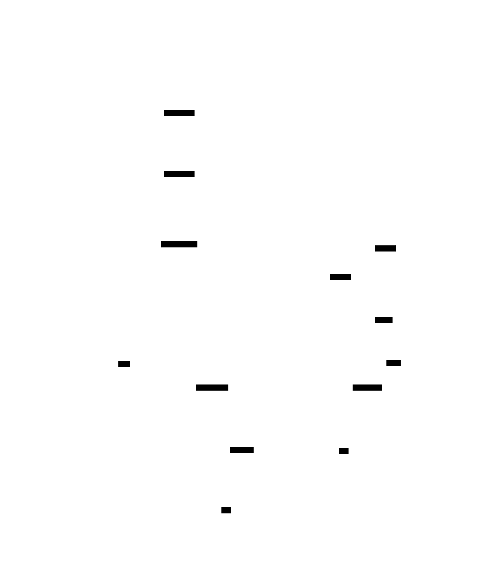
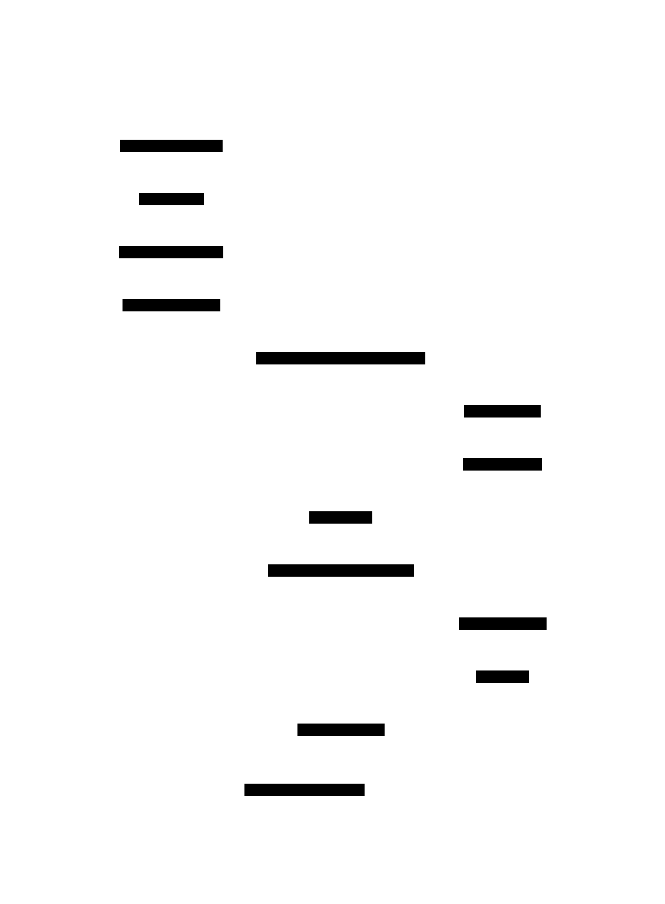

# Protocol Buffer: Design Document


## Overview

A binary serialization system that encodes structured data into compact byte streams using schema definitions and variable-length encoding. The key architectural challenge is efficiently representing diverse data types while maintaining forward compatibility and compact size.


> This guide is meant to help you understand the big picture before diving into each milestone. Refer back to it whenever you need context on how components connect.


## Context and Problem Statement

> **Milestone(s):** This section provides foundational context for all milestones (1-4) by explaining why binary serialization matters and what makes Protocol Buffers unique.

### Mental Model: The Universal Translator Problem

Think of data serialization as solving the universal translator problem in science fiction. When two systems need to communicate - whether they're written in different programming languages, running on different machines, or built by different teams - they need a common "language" to exchange structured information. Text-based formats like JSON are like using simple pictographs that everyone can understand but are verbose and slow to parse. Binary formats like Protocol Buffers are like having a sophisticated compression algorithm combined with a precise grammar - they're compact, fast, and unambiguous, but require both parties to understand the encoding rules.

The fundamental challenge in any serialization system is balancing three competing forces: **human readability** (can developers debug it easily?), **efficiency** (how much space and time does it consume?), and **evolution** (can the format change over time without breaking existing systems?). Most serialization formats excel at one or two of these dimensions while compromising on the third. Protocol Buffers represent a deliberate choice to optimize for efficiency and evolution at the cost of human readability.

### Serialization Format Landscape

The landscape of data serialization formats reveals a fundamental tension between different design priorities. Understanding where Protocol Buffers fit requires examining the trade-offs made by various approaches and why certain choices matter for different use cases.

#### Text-Based Serialization Formats

Text-based formats prioritize human readability and debugging simplicity. JSON (JavaScript Object Notation) has become ubiquitous in web development because developers can easily inspect, modify, and understand the data by looking at it directly. XML offers more structured validation through schemas but at the cost of extreme verbosity. YAML attempts to improve human readability further by using indentation and reducing punctuation, making it popular for configuration files.

The primary advantage of text-based formats lies in their **transparency**. When a system fails, developers can examine the serialized data directly without special tools. Network debugging becomes straightforward - you can use curl, browser developer tools, or simple text processing utilities to inspect and modify messages. Testing is simplified because you can hand-craft test cases in a text editor.

However, text-based formats carry significant overhead. Every number must be converted between its binary representation and a human-readable string, requiring parsing and formatting operations that consume CPU cycles. Strings require escaping for special characters. Field names are repeated in every message, wasting bandwidth. A simple integer like `42` might be represented as the string `"42"`, doubling the space requirement and requiring string-to-integer parsing.

| Format | Size Overhead | Parse Speed | Human Readable | Schema Evolution |
|--------|---------------|-------------|----------------|------------------|
| JSON | High (3-5x) | Slow | Excellent | Limited |
| XML | Very High (5-10x) | Very Slow | Good | Good |
| YAML | High (3-6x) | Slow | Excellent | Limited |

#### Binary Serialization Formats

Binary formats prioritize efficiency and compactness by storing data in its native binary representation. Instead of converting the integer `42` to the string `"42"`, a binary format stores it directly as the bytes that represent 42 in memory. Field names are replaced with compact identifiers like numbers. Data types are encoded using minimal representations tailored to their specific characteristics.

Traditional binary formats like those used in C structures or database records achieve excellent space and time efficiency but suffer from severe **brittleness**. If you add a new field to a C struct, all existing serialized data becomes unreadable unless you maintain complex versioning logic. Different CPU architectures store multi-byte values in different byte orders (endianness), creating compatibility problems. Padding and alignment requirements mean the same data structure can have different binary layouts on different compilers or platforms.

More sophisticated binary formats address these issues through careful design. Apache Avro uses schema evolution rules to handle format changes safely. MessagePack provides a self-describing binary format that's more compact than JSON while remaining somewhat debuggable. Apache Thrift offers code generation and cross-language compatibility similar to Protocol Buffers.

| Format | Size Efficiency | Parse Speed | Schema Evolution | Cross-Platform |
|--------|----------------|-------------|------------------|----------------|
| Raw Binary | Excellent | Excellent | None | Poor |
| MessagePack | Good | Good | Limited | Good |
| Apache Avro | Good | Good | Excellent | Good |
| Apache Thrift | Excellent | Excellent | Good | Excellent |

> **Key Insight**: The fundamental trade-off in serialization is not just between text and binary, but between **immediate usability** (can I debug this easily right now?) and **operational efficiency** (will this scale to millions of messages per second?). Different applications require different points on this spectrum.

#### The Schema Evolution Challenge

One of the most critical but often overlooked aspects of serialization format design is **schema evolution** - the ability to modify data structures over time without breaking existing systems. In real-world software development, requirements change constantly. New fields are added, old fields become obsolete, and data types sometimes need to change. A serialization format that cannot handle these changes gracefully creates enormous maintenance burdens.

Consider a simple example: a user profile message that initially contains only `name` and `email` fields. Over time, the system needs to add `phone_number`, `created_at`, `preferences`, and dozens of other fields. Some fields might change from required to optional. New versions of the application need to read old data files, and old versions might need to handle new messages during gradual rollouts.

JSON and XML handle this reasonably well for adding new fields (old parsers ignore unknown fields), but they provide no guidance for field removal, type changes, or ensuring compatibility. Binary formats often handle it poorly or not at all. Protocol Buffers were specifically designed to make schema evolution safe and predictable through explicit rules about what changes are compatible.

### Protocol Buffer Advantages

Protocol Buffers emerged from Google's need to serialize structured data efficiently across thousands of services while maintaining the ability to evolve schemas safely over time. The format represents a carefully engineered solution to the serialization trilemma, making specific trade-offs to excel in production environments.

#### Schema Evolution and Forward Compatibility

The most significant advantage of Protocol Buffers is their approach to **schema evolution**. Unlike most serialization formats that treat schema compatibility as an afterthought, Protocol Buffers make it a central design principle with explicit rules and guarantees.

> **Decision: Field Number-Based Identification**
> - **Context**: Need a way to identify fields that remains stable as schemas evolve, unlike field names which might change
> - **Options Considered**: Field names (like JSON), field positions (like CSV), field numbers (like Protocol Buffers)
> - **Decision**: Use numeric field identifiers that never change once assigned
> - **Rationale**: Field numbers are compact (save bandwidth), stable (safe to rename fields), and explicit (prevent accidental reuse)
> - **Consequences**: Requires developers to manage field number allocation, but provides strong evolution guarantees

Each field in a Protocol Buffer schema is assigned a permanent numeric identifier. Once assigned, this number never changes, even if the field is renamed, moved, or deleted. This enables several powerful compatibility patterns:

**Forward Compatibility**: Older software can read messages created by newer software. When the old parser encounters field numbers it doesn't recognize, it skips over them using the wire type information. The old program continues to work with the fields it understands, ignoring the new additions.

**Backward Compatibility**: Newer software can read messages created by older software. Fields that weren't present in the old message are treated as having default values. Required fields (in proto2) or well-defined defaults (in proto3) ensure the new program has sensible values for missing data.

**Gradual Rollouts**: During system upgrades, you can have mixed versions of software running simultaneously. Protocol Buffers ensure they can all communicate safely, with each version extracting the information it understands.

The schema evolution rules are precise and testable:

| Change Type | Safe? | Requirements |
|------------|-------|--------------|
| Add optional field | Yes | Must have sensible default value |
| Remove optional field | Yes | Must never reuse the field number |
| Rename field | Yes | Field number stays the same |
| Change field from optional to repeated | Sometimes | Only if at most one value was ever set |
| Change numeric types | Sometimes | Only if values fit in both representations |
| Split/merge fields | No | Requires explicit migration logic |

#### Compact Encoding and Performance

Protocol Buffers achieve remarkable space efficiency through several encoding innovations that go far beyond simply using binary instead of text. The format is designed around the principle that **most data in real applications follows predictable patterns** that can be exploited for compression.

**Variable-Length Integer Encoding (Varints)**: Instead of always using 4 or 8 bytes for integers, Protocol Buffers use a variable-length encoding where small numbers consume fewer bytes. The integer `1` takes only one byte, while `1000000` takes three bytes. Since most integer fields in typical applications contain small values (counters, IDs, enum values), this provides substantial space savings without compression.

**ZigZag Encoding for Signed Integers**: Signed integers create a problem for varint encoding because negative numbers have many high-order bits set (due to two's complement representation). Protocol Buffers solve this by mapping signed integers to unsigned integers in a way that makes small negative numbers encode compactly. The mapping interleaves positive and negative numbers: 0 → 0, -1 → 1, 1 → 2, -2 → 3, 2 → 4, and so on.

**Efficient Wire Types**: The format defines only five wire types (varint, fixed32, length-delimited, fixed64, and deprecated group types), with each optimized for specific data patterns. Strings and nested messages use length-delimited encoding. Floating-point numbers use fixed-width encoding. Integers use varint encoding. This targeted approach avoids the overhead of self-describing formats that must encode type information for every value.

**Field Presence Optimization**: Optional fields that aren't set simply don't appear in the serialized message. There's no overhead for storing null values or field-not-present markers. Empty repeated fields (arrays/lists) also consume zero bytes in the output.

| Data Pattern | JSON Representation | Protocol Buffer Size | Savings |
|-------------|-------------------|---------------------|---------|
| Small integer (42) | `"field": 42` | 2 bytes | ~75% |
| Boolean true | `"flag": true` | 2 bytes | ~80% |
| Empty array | `"items": []` | 0 bytes | 100% |
| Short string ("test") | `"name": "test"` | 6 bytes | ~60% |

The performance benefits extend beyond just message size. Parsing Protocol Buffers is significantly faster than parsing JSON because:

1. **No String Processing**: Field identifiers are compact integers, not strings that must be hashed or compared
2. **No Number Conversion**: Integers are stored in binary form, not as decimal strings requiring parsing
3. **Predictable Structure**: The parser can skip unknown fields efficiently without understanding their content
4. **Memory Layout**: The wire format is designed to minimize memory allocations during parsing

#### Cross-Language Compatibility and Code Generation

Protocol Buffers solve the **impedance mismatch problem** that occurs when different programming languages represent the same conceptual data using incompatible structures. A `timestamp` might be a `Date` object in JavaScript, a `time.Time` struct in Go, a `datetime` object in Python, and a `java.time.Instant` in Java. Without careful coordination, serializing a timestamp in one language and deserializing it in another leads to bugs, data loss, or runtime errors.

> **Decision: Code Generation Architecture**
> - **Context**: Need to provide native, type-safe APIs in multiple programming languages while maintaining compatibility
> - **Options Considered**: Runtime reflection (like JSON), code generation from schemas, hand-written serialization code
> - **Decision**: Generate language-specific code from schema definitions
> - **Rationale**: Provides compile-time type safety, optimal performance, and native language idioms while ensuring compatibility
> - **Consequences**: Requires a code generation step in the build process, but eliminates runtime type errors and provides excellent developer experience

The Protocol Buffer compiler (`protoc`) generates native code for each target language that handles serialization, deserialization, and provides idiomatic APIs. This approach provides several key benefits:

**Type Safety**: Generated code uses each language's native type system. Fields declared as `int32` in the schema become `int` in Python, `int32` in Go, and `int` in Java. The compiler catches type mismatches at build time rather than runtime.

**Native Idioms**: Generated code follows each language's conventions. Python classes use properties and snake_case naming. Go structs use exported fields and CamelCase naming. Java classes use getters/setters and follow JavaBean conventions.

**Performance Optimization**: The generated code can be highly optimized for each language's specific characteristics. Memory allocation patterns, string handling, and numeric conversions are tailored to what performs best in each runtime environment.

**API Consistency**: While the code looks native in each language, the underlying behavior is identical. Setting a field to a specific value in Python produces exactly the same serialized bytes as setting the equivalent field in Java or Go.

| Language | Generated API Style | Type Mapping Example |
|----------|-------------------|---------------------|
| Python | Properties, snake_case | `message.user_id = 42` |
| Go | Struct fields, CamelCase | `message.UserId = 42` |
| Java | Getters/setters, camelCase | `message.setUserId(42)` |
| C++ | Member functions, snake_case | `message.set_user_id(42)` |

#### Common Pitfalls

⚠️ **Pitfall: Assuming Protocol Buffers Are Always Smaller**
Many developers expect Protocol Buffers to always produce smaller output than JSON, but this isn't guaranteed. For messages with many long string fields and few numeric fields, JSON might actually be more compact. Protocol Buffers excel when messages contain many small integers, booleans, and optional fields that are often unset. Always measure with realistic data rather than assuming.

⚠️ **Pitfall: Ignoring Schema Evolution Rules**
The schema evolution capabilities are powerful but not magical. Changing a field from `int32` to `string` will break compatibility even though both are valid Protocol Buffer types. Removing a required field (in proto2) can cause parsing failures. Always consult the official compatibility guide before making schema changes.

⚠️ **Pitfall: Over-Engineering Schemas**
Protocol Buffers make it tempting to create highly complex nested schemas with deep inheritance hierarchies. This can lead to code generation that's difficult to use and debug. Start with simple, flat message structures and add complexity only when you have a clear need.

⚠️ **Pitfall: Forgetting About Debugging**
While Protocol Buffers are efficient, they're not human-readable in their binary form. Make sure you have tools and processes for inspecting serialized messages during development and debugging. The `protoc` compiler includes text format options that can help with this.

### Implementation Guidance

This foundational understanding of serialization formats and Protocol Buffer advantages will guide the technical decisions made throughout the implementation. The key insight is that Protocol Buffers represent a specific set of trade-offs optimized for production systems that need efficiency, evolution, and cross-language compatibility.

#### Technology Recommendations

| Component | Simple Option | Advanced Option |
|-----------|---------------|-----------------|
| Schema Parsing | Simple regex-based parser | Full lexer/parser with AST |
| Code Generation | String templates | Abstract syntax tree manipulation |
| Binary I/O | Python `bytes` and `struct` module | Memory-mapped files with zero-copy |
| Testing | Unit tests with hand-crafted data | Property-based testing with generated schemas |

#### Recommended Development Approach

The implementation should follow the natural dependency order established by the milestones:

1. **Start with Varint Encoding**: This is the foundation that all other components depend on. It's also the most algorithmically interesting part and helps build intuition for binary encoding concepts.

2. **Build Wire Types on Varint Foundation**: Wire types extend varint encoding to handle all Protocol Buffer data types. This layer provides the primitive operations that message serialization will use.

3. **Create Schema Parser**: The parser converts human-readable schema definitions into data structures that drive the encoding/decoding process. This component is independent of the binary encoding logic.

4. **Combine Everything in Message Serialization**: The final layer orchestrates all previous components to provide the high-level serialization API.

#### Key Design Principles

Throughout the implementation, keep these Protocol Buffer design principles in mind:

**Efficiency Over Readability**: Choose implementations that minimize memory allocations, reduce parsing overhead, and produce compact output, even if the code is slightly more complex.

**Forward Compatibility**: Always implement unknown field handling. When parsing encounters field numbers not in the schema, skip over them gracefully rather than failing.

**Fail Fast on Invalid Input**: While the system should handle unknown fields gracefully, it should detect and reject genuinely malformed binary data immediately.

**Schema-Driven Everything**: All encoding and decoding decisions should be driven by the schema definition. The same binary data might be interpreted differently depending on the schema used to parse it.

This foundation establishes the context needed to understand why Protocol Buffers make specific design choices in their varint encoding, wire type system, schema language, and message serialization algorithms. The following sections will build on these principles to create a complete implementation that demonstrates these advantages in practice.


## Goals and Non-Goals

> **Milestone(s):** This section provides scope and boundaries for all milestones (1-4) by defining what our Protocol Buffer implementation will and will not support.

### Mental Model: Building a House vs. Building a Mansion

Think of our Protocol Buffer implementation like building a house. We want to construct a solid, functional home with all the essential rooms and systems—kitchen, bedrooms, plumbing, electricity. But we're not building a mansion with a home theater, wine cellar, and smart home automation. Both are valid houses, but they serve different needs and have different complexity levels.

Our implementation focuses on the core "rooms" that make Protocol Buffers work: the ability to encode and decode structured data efficiently using schemas. The advanced features like code generation and RPC services are the "luxury additions" that can come later, but aren't necessary for a functional serialization system.

This scoping decision is crucial for learning because it forces us to understand the fundamental concepts deeply before getting distracted by convenience features. It's better to build a simple system that works perfectly than a complex system that barely functions.

### Functional Goals

Our Protocol Buffer implementation will provide complete support for the core serialization workflow. These goals represent the minimum viable product that can encode and decode structured data according to a schema definition.

> **Decision: Core Binary Serialization Support**
> - **Context**: Protocol Buffers exist primarily to serialize structured data into compact binary formats while maintaining schema evolution capabilities
> - **Options Considered**: 
>   1. Text-based serialization only (like JSON)
>   2. Binary serialization with fixed schemas
>   3. Full binary serialization with schema evolution
> - **Decision**: Full binary serialization with schema evolution support
> - **Rationale**: Binary encoding provides the size and performance benefits that make Protocol Buffers valuable. Schema evolution ensures forward and backward compatibility, which is essential for distributed systems
> - **Consequences**: Requires implementing varint encoding, wire types, and schema parsing, but delivers the core value proposition of Protocol Buffers

| Goal Category | Specific Requirements | Success Criteria |
|---------------|----------------------|------------------|
| Data Type Support | Integers (signed/unsigned, 32/64-bit), floats, doubles, booleans, strings, bytes | Can encode and decode all basic types correctly |
| Schema Definition | Message definitions with named fields and field numbers | Can parse .proto-style schema syntax into internal representation |
| Field Modifiers | Repeated fields for arrays and lists | Can handle multiple values for the same field number |
| Nested Messages | Messages containing other messages as fields | Can serialize and deserialize hierarchical data structures |
| Binary Encoding | Varint encoding for integers, wire type system, length-delimited fields | Produces compact binary output compatible with Protocol Buffer wire format |
| Schema Evolution | Forward compatibility (old code reads new messages), backward compatibility (new code reads old messages) | Can handle missing fields and unknown fields gracefully |

#### Varint Encoding Requirements

The foundation of Protocol Buffer efficiency lies in **varint encoding**, which compresses small integers into fewer bytes. Our implementation must handle the full spectrum of integer encoding scenarios.

| Encoding Type | Range Supported | Wire Format | Validation Required |
|---------------|----------------|-------------|-------------------|
| Unsigned Varint | 0 to 2^64-1 | 7 bits per byte with continuation bit | Must handle up to 10 bytes for maximum value |
| ZigZag Signed | -2^63 to 2^63-1 | Map to unsigned then varint encode | Must correctly handle negative number mapping |
| Fixed 32-bit | Float, sfixed32 | Little-endian 4-byte encoding | Must preserve exact bit patterns for IEEE floats |
| Fixed 64-bit | Double, sfixed64 | Little-endian 8-byte encoding | Must preserve exact bit patterns for IEEE doubles |

The varint encoding algorithm must be robust enough to handle edge cases like maximum values, zero, and the transition points where additional bytes are required. The decoding process must validate that varints don't exceed the maximum length and detect truncated data streams.

#### Wire Type System Requirements

Our wire type implementation must support the four active wire types used in modern Protocol Buffers, while correctly handling the deprecated types for compatibility.

| Wire Type | Numeric Value | Data Types Supported | Encoding Strategy |
|-----------|---------------|---------------------|------------------|
| WIRE_TYPE_VARINT | 0 | int32, int64, uint32, uint64, bool, enum | Variable-length integer encoding |
| WIRE_TYPE_FIXED64 | 1 | double, sfixed64 | 8-byte little-endian |
| WIRE_TYPE_LENGTH_DELIMITED | 2 | string, bytes, nested messages | Length prefix + data |
| WIRE_TYPE_FIXED32 | 5 | float, sfixed32 | 4-byte little-endian |

> The wire type system is the "addressing scheme" for Protocol Buffer fields. Just like how a postal system needs different handling for letters, packages, and overnight delivery, Protocol Buffers need different encoding strategies for different data types. The wire type tells the decoder "this field contains a varint" or "this field contains a length-delimited string."

#### Schema Parsing Requirements

The schema parser must extract enough information from .proto-style definitions to drive the serialization process. While we won't support the full Protocol Buffer schema language, we need sufficient coverage for practical use.

| Schema Element | Syntax Support | Parsing Output | Validation Rules |
|----------------|----------------|----------------|------------------|
| Message Definition | `message MessageName { ... }` | MessageDefinition with name and field list | Name must be valid identifier |
| Field Definition | `int32 field_name = 1;` | FieldDefinition with type, name, number | Field numbers must be unique within message |
| Repeated Fields | `repeated string items = 2;` | FieldDefinition with repeated flag | Can be applied to any field type |
| Nested Messages | Messages defined within other messages | Hierarchical MessageDefinition structure | Nested names must not conflict |

The parser must handle whitespace, comments, and basic syntax validation. Error reporting should be clear enough for developers to fix schema definition problems quickly.

#### Serialization Requirements

The serialization engine ties together varint encoding, wire types, and schema definitions to produce binary output. This is where all the previous components work together.

| Serialization Aspect | Input Format | Output Format | Error Handling |
|----------------------|--------------|---------------|----------------|
| Message Encoding | Python dictionary with field values | Binary bytes with wire format encoding | Missing required fields should error |
| Field Encoding | Individual field values | Field key + encoded value bytes | Type mismatches should error |
| Repeated Field Encoding | Python list/array | Multiple field entries with same number | Empty lists encode as no entries |
| Nested Message Encoding | Nested dictionary | Length-delimited sub-message | Recursive encoding with proper length calculation |

The serialization process must preserve field order independence—Protocol Buffer wire format allows fields to appear in any order, so our decoder must handle this correctly.

### Non-Goals

Defining what we won't build is as important as defining what we will build. These non-goals aren't failures or limitations—they're conscious decisions to focus on core functionality over convenience features.

> **Decision: Exclude Code Generation**
> - **Context**: Full Protocol Buffer implementations generate language-specific classes and APIs from schema definitions
> - **Options Considered**:
>   1. Include code generation for strongly-typed APIs
>   2. Use dictionary-based dynamic serialization
>   3. Hybrid approach with optional code generation
> - **Decision**: Use dictionary-based dynamic serialization only
> - **Rationale**: Code generation adds significant complexity in parsing, template systems, and language-specific output. Dynamic serialization with dictionaries is simpler to implement and understand, while still demonstrating the core serialization concepts
> - **Consequences**: Users work with dictionaries instead of typed objects, which is less convenient but more transparent for learning purposes

| Non-Goal Category | Specific Exclusions | Rationale | Alternative Available |
|-------------------|-------------------|-----------|----------------------|
| Code Generation | Class generation, getter/setter methods, language bindings | Adds template complexity without teaching core concepts | Manual dictionary manipulation |
| Advanced Schema Features | Oneof fields, maps, service definitions, extensions | Increases parser complexity significantly | Basic message and field definitions |
| Optimization Features | Lazy deserialization, zero-copy parsing, memory pooling | Premature optimization obscures learning goals | Standard Python object creation |
| RPC Integration | Service definitions, client/server stubs, transport | RPC is separate concern from serialization | Use HTTP with our binary encoding |
| Reflection APIs | Runtime schema inspection, dynamic field access | Adds metadata complexity | Direct schema object inspection |
| Advanced Compatibility | Proto2/Proto3 differences, group fields, packed encoding | Legacy feature complexity | Core wire format compatibility |

#### Code Generation Exclusion Details

Code generation is perhaps the most visible feature of production Protocol Buffer implementations. When you run `protoc` on a `.proto` file, it generates classes like `Person.Builder()` or methods like `person.getName()`. We're explicitly not building this.

The reason isn't that code generation is unimportant—it's that code generation is a separate problem from serialization. Code generation involves:
- Template systems for different programming languages
- Abstract syntax tree manipulation
- File I/O and build system integration
- Language-specific type mapping

None of these teach you how Protocol Buffers actually work under the hood. By using dictionaries and manual field access, you'll understand exactly what data is being encoded and how the wire format represents it.

> **Key Insight**: Production systems prioritize developer convenience. Learning systems prioritize transparency. Code generation hides the serialization process behind generated methods, while dictionary-based access keeps the wire format concepts visible.

#### Advanced Schema Feature Exclusions

Protocol Buffers include several advanced schema features that we're intentionally omitting:

| Feature | What It Does | Why We're Skipping It | Learning Impact |
|---------|--------------|----------------------|-----------------|
| Oneof Fields | Mutually exclusive field sets | Complex validation and wire format handling | Doesn't teach new encoding concepts |
| Map Fields | Key-value pair encoding | Syntactic sugar over repeated nested messages | Can be implemented with basic repeated fields |
| Service Definitions | RPC method declarations | Unrelated to binary serialization | Focus remains on data encoding |
| Extensions | Third-party field additions | Complex namespace and numbering rules | Basic field numbering is sufficient |
| Packed Repeated | Efficient repeated number encoding | Optimization detail | Basic repeated encoding shows the concept |

These features are important in production systems but don't introduce new fundamental concepts about binary serialization. Including them would triple the implementation complexity while only marginally improving the learning experience.

#### Performance Optimization Exclusions

Production Protocol Buffer libraries include numerous performance optimizations that we're deliberately avoiding:

**Memory Management Optimizations**: Object pooling, arena allocation, and zero-copy parsing reduce garbage collection pressure but obscure the basic serialization flow. Our implementation will create standard Python objects, making memory allocation patterns clear and debuggable.

**Lazy Deserialization**: Production libraries can defer parsing of nested messages until they're accessed. This optimization requires complex state management and partial parsing logic. Our implementation will eagerly parse all fields, making the complete deserialization process visible.

**Compiled Wire Format Handling**: Optimized libraries pre-compile schema information into jump tables and specialized encoding functions. This improves performance but makes it impossible to understand how schema information drives the encoding process.

> **Learning Principle**: Optimizations are implementation details that matter for production but obscure learning. A slower, simpler implementation that clearly shows every step of the encoding process is more valuable for understanding than a fast, opaque implementation.

### Scope Boundaries and Validation

To ensure our implementation stays focused, we need clear boundaries for what constitutes "done" for each functional goal.

| Boundary Type | Inclusion Criteria | Exclusion Criteria | Validation Method |
|---------------|-------------------|-------------------|------------------|
| Data Types | Types with clear wire format mapping | Types requiring complex validation logic | Round-trip serialization test |
| Schema Syntax | Syntax that maps directly to wire format | Syntax that requires code generation | Parser produces correct internal representation |
| Error Handling | Errors that prevent correct wire format | Errors that are development conveniences | Malformed input produces predictable failure |
| Compatibility | Wire format compatibility with standard Protocol Buffers | API compatibility with existing libraries | Binary output matches reference implementation |

The key validation principle is **wire format compatibility**: our binary output should be readable by standard Protocol Buffer libraries, and our decoder should handle standard Protocol Buffer binary input. This ensures we're implementing the real Protocol Buffer specification, not just something that looks similar.

### Implementation Guidance

This implementation guidance provides concrete technology choices and starter code to help you build a Protocol Buffer system that meets the functional goals while avoiding the non-goal complexity.

#### Technology Recommendations

| Component | Simple Option | Advanced Option | Recommended for Learning |
|-----------|---------------|-----------------|--------------------------|
| Schema Parsing | Hand-written recursive descent parser | ANTLR or PLY parser generator | Hand-written (shows parsing concepts) |
| Binary I/O | Python `bytes` and `bytearray` | C extensions for performance | Python built-ins (easier debugging) |
| Data Structures | Python `dict` and `list` | Custom classes with validation | Python built-ins (matches non-goals) |
| Testing | Built-in `unittest` module | `pytest` with fixtures | Either (both work well) |
| File Organization | Single module with classes | Package with separate modules | Package structure (shows architecture) |

#### Recommended Project Structure

Organize your code to reflect the four-milestone architecture, with clear separation between encoding layers:

```
protobuf/
├── __init__.py                 # Main API exports
├── varint.py                   # Milestone 1: Varint encoding/decoding
├── wire_types.py               # Milestone 2: Wire type system
├── schema_parser.py            # Milestone 3: Schema definition parsing
├── message.py                  # Milestone 4: Message serialization
├── types.py                    # Data structure definitions
└── tests/
    ├── test_varint.py         # Varint encoding tests
    ├── test_wire_types.py     # Wire type tests
    ├── test_schema_parser.py  # Schema parsing tests
    ├── test_message.py        # End-to-end serialization tests
    └── test_data/             # Sample .proto files and binary data
```

This structure makes it easy to work on one milestone at a time while keeping the dependencies clear: `message.py` imports from `schema_parser.py` and `wire_types.py`, which in turn imports from `varint.py`.

#### Core Data Structures (Starter Code)

Here's the complete type definitions file that all other modules will use:

```python
"""
Core data structures for Protocol Buffer implementation.
All other modules import these types to ensure consistency.
"""
from dataclasses import dataclass
from typing import Dict, List, Union, Optional
from enum import IntEnum

class WireType(IntEnum):
    """Wire type constants matching Protocol Buffer specification."""
    WIRE_TYPE_VARINT = 0
    WIRE_TYPE_FIXED64 = 1
    WIRE_TYPE_LENGTH_DELIMITED = 2
    WIRE_TYPE_FIXED32 = 5

@dataclass
class FieldDefinition:
    """Definition of a single field within a message."""
    name: str
    field_type: str  # 'int32', 'string', 'MessageName', etc.
    field_number: int
    is_repeated: bool = False
    
    def __post_init__(self):
        """Validate field definition after creation."""
        if self.field_number < 1:
            raise ValueError(f"Field number must be positive, got {self.field_number}")
        if self.field_number >= 19000 and self.field_number <= 19999:
            raise ValueError(f"Field numbers 19000-19999 are reserved")

@dataclass
class MessageDefinition:
    """Definition of a message type with its fields."""
    name: str
    fields: List[FieldDefinition]
    nested_messages: Dict[str, 'MessageDefinition'] = None
    
    def __post_init__(self):
        """Validate message definition after creation."""
        if self.nested_messages is None:
            self.nested_messages = {}
        
        # Check for duplicate field numbers
        field_numbers = [f.field_number for f in self.fields]
        if len(field_numbers) != len(set(field_numbers)):
            raise ValueError(f"Duplicate field numbers in message {self.name}")

@dataclass
class Schema:
    """Complete schema with all message definitions."""
    messages: Dict[str, MessageDefinition]
    
    def get_message(self, name: str) -> Optional[MessageDefinition]:
        """Get message definition by name, including nested messages."""
        if name in self.messages:
            return self.messages[name]
        
        # Search in nested messages
        for msg in self.messages.values():
            if name in msg.nested_messages:
                return msg.nested_messages[name]
        
        return None

# Type aliases for clarity
FieldNumber = int
EncodedValue = bytes
MessageData = Dict[str, Union[int, float, str, bytes, Dict, List]]
```

#### Varint Module Skeleton

The varint module handles the lowest-level encoding. Here's the skeleton with detailed TODOs:

```python
"""
Variable-length integer encoding for Protocol Buffers.
Implements unsigned varint and ZigZag encoding for signed integers.
"""

def encode_varint(value: int) -> bytes:
    """
    Encode unsigned integer as variable-length bytes.
    
    Args:
        value: Unsigned integer (0 to 2^64-1)
    
    Returns:
        Variable-length byte encoding with continuation bits
    
    Raises:
        ValueError: If value is negative or too large
    """
    # TODO 1: Validate input value is non-negative and fits in 64 bits
    # TODO 2: Handle special case of value 0 (single byte: 0x00)
    # TODO 3: Initialize empty byte array for output
    # TODO 4: Loop while value > 0:
    #         - Extract lowest 7 bits of value
    #         - Set continuation bit (0x80) if more bytes needed
    #         - Append byte to output array
    #         - Right-shift value by 7 bits
    # TODO 5: Return bytes object from byte array
    # Hint: Use bitwise operations: value & 0x7f, value >> 7, byte | 0x80
    pass

def decode_varint(data: bytes) -> tuple[int, int]:
    """
    Decode variable-length integer from byte stream.
    
    Args:
        data: Byte stream starting with varint encoding
    
    Returns:
        Tuple of (decoded_value, bytes_consumed)
    
    Raises:
        ValueError: If varint is malformed or exceeds maximum length
    """
    # TODO 1: Initialize result value and bit shift position
    # TODO 2: Loop through bytes (maximum 10 bytes for 64-bit):
    #         - Check if we've reached end of data (error condition)
    #         - Extract current byte
    #         - Add (byte & 0x7f) << shift_position to result
    #         - If continuation bit not set (byte & 0x80 == 0), return result
    #         - Increment shift position by 7
    #         - Check for overflow (shift > 63 means value too large)
    # TODO 3: If loop completes without finding end, raise error
    # Hint: continuation bit is 0x80, data bits are byte & 0x7f
    pass

def zigzag_encode(signed_int: int) -> int:
    """
    Encode signed integer using ZigZag mapping.
    Maps signed integers to unsigned: 0->0, -1->1, 1->2, -2->3, 2->4...
    
    Args:
        signed_int: Signed integer to encode
    
    Returns:
        Unsigned integer suitable for varint encoding
    """
    # TODO 1: Implement ZigZag formula: (n << 1) ^ (n >> 31) for 32-bit
    #         or (n << 1) ^ (n >> 63) for 64-bit
    # TODO 2: Handle the sign bit propagation correctly
    # Hint: Python's >> operator does arithmetic shift (sign-extending)
    pass

def zigzag_decode(unsigned_int: int) -> int:
    """
    Decode ZigZag-encoded integer back to signed.
    
    Args:
        unsigned_int: Unsigned integer from ZigZag encoding
    
    Returns:
        Original signed integer
    """
    # TODO 1: Implement reverse ZigZag formula: (n >> 1) ^ (-(n & 1))
    # TODO 2: Handle the alternating positive/negative pattern
    pass
```

#### Milestone Checkpoints

After implementing each milestone, you should be able to demonstrate specific functionality:

| Milestone | Test Command | Expected Behavior | Debug Signs |
|-----------|--------------|------------------|-------------|
| 1: Varint | `python -m pytest tests/test_varint.py -v` | All varint encoding/decoding tests pass | If failing: check bit operations, continuation bit logic |
| 2: Wire Types | `python -c "from wire_types import encode_field; print(encode_field(1, 'Hello', 'string'))"` | Outputs binary field encoding | If failing: check wire type mapping, length encoding |
| 3: Schema Parser | `python -c "from schema_parser import parse_schema; print(parse_schema('message Test { int32 x = 1; }'))"` | Outputs parsed MessageDefinition | If failing: check tokenizer, syntax validation |
| 4: Message Serialization | Round-trip test: encode dict to bytes, decode back to dict | Original and decoded dicts match | If failing: check field encoding order, schema lookup |

#### Debugging Tips for Scope Validation

| Symptom | Likely Cause | How to Diagnose | Fix |
|---------|--------------|----------------|-----|
| Binary output doesn't match reference | Wire type or field encoding error | Compare byte-by-byte with hex dump | Check wire type constants, field key encoding |
| Schema parsing fails on valid syntax | Parser doesn't handle whitespace/comments | Test with minimal schema first | Add whitespace skipping, comment removal |
| Serialization works but deserialization fails | Field order assumptions | Test with fields in different orders | Remove field order dependencies |
| Performance much slower than expected | Implementing non-goal features | Profile to find bottlenecks | Remove optimizations, use simple algorithms |

The key to staying within scope is to validate against the wire format specification rather than trying to match the API of existing Protocol Buffer libraries. If your binary output can be decoded by `protoc` and other standard tools, you've successfully implemented the core Protocol Buffer concepts.


## High-Level Architecture

> **Milestone(s):** This section provides architectural foundations for all milestones (1-4) by showing how varint encoding, wire types, schema parsing, and message serialization work together in a layered system.

### Mental Model: The Protocol Buffer Assembly Line

Think of our Protocol Buffer implementation as a four-stage assembly line in a factory. Raw materials (Python dictionaries with data) enter at the top and finished products (binary bytes) emerge at the bottom, with each stage performing a specific transformation:

1. **Message Serialization Stage** (top level): Takes structured data and a schema blueprint, decides what fields need encoding and in what order. Like a production manager consulting assembly instructions.

2. **Wire Types Stage**: Determines the encoding strategy for each field based on its data type. Like specialized workstations that handle different materials (wood, metal, plastic) with appropriate tools.

3. **Varint Encoding Stage**: Handles the actual binary encoding of integers using variable-length compression. Like a packaging station that uses the smallest box possible for each item.

4. **Binary Output Stage** (bottom level): Combines all encoded pieces into the final byte stream. Like the shipping department that assembles the final package.

The beauty of this layered approach is that each stage has a single, well-defined responsibility, and changes to one layer don't cascade through the entire system. The varint encoder doesn't need to know about schemas, and the schema parser doesn't need to understand binary encoding details.

### Architecture Overview

Our Protocol Buffer implementation follows a **four-layer architecture** where each layer builds upon the services provided by the layer below it. This design ensures clean separation of concerns and makes the system easier to understand, test, and extend.



The architecture flows from high-level abstractions down to low-level binary operations:

**Layer 4: Message Serialization** represents the highest level of abstraction, where developers work with familiar Python dictionaries and let the schema drive the serialization process. This layer orchestrates the entire encoding and decoding process, making decisions about field presence, handling repeated fields, and managing nested messages. It serves as the primary API that external code interacts with, hiding all the complexity of binary encoding behind a simple interface.

**Layer 3: Schema Parser** provides the structural intelligence that drives serialization decisions. It transforms human-readable schema definitions into structured metadata that other layers can consume. This layer understands message hierarchies, field types, field numbers, and validation rules. Without the schema layer, the serialization layer would have no way to know what fields exist in a message or how they should be encoded.

**Layer 2: Wire Types** implements the type system that determines encoding strategies for different data types. This layer bridges the gap between high-level data types (strings, floats, nested messages) and low-level binary representations. It handles the complexity of field keys, length-delimited encoding, and fixed-width values. The wire type layer provides a stable interface that isolates upper layers from the details of binary encoding.

**Layer 1: Varint Encoding** forms the foundation of the entire system by implementing variable-length integer encoding. This layer provides the fundamental building blocks that all other layers depend on. Field numbers, field keys, string lengths, and integer values all flow through varint encoding at some point. This layer must be rock-solid because errors here propagate throughout the entire system.

> **Design Principle: Dependency Flow**
> 
> Dependencies flow strictly downward in this architecture. Higher layers depend on lower layers, but lower layers never depend on higher layers. This ensures that we can test each layer in isolation and that changes to higher layers don't impact the fundamental encoding mechanisms.

**Decision: Four-Layer Architecture vs. Monolithic Approach**
- **Context**: We could implement Protocol Buffers as a single large component that handles everything from schema parsing to binary encoding, or we could separate concerns into distinct layers.
- **Options Considered**: 
  1. Monolithic implementation with all functionality in one module
  2. Two-layer split between schema/serialization and binary encoding
  3. Four-layer architecture with distinct responsibilities
- **Decision**: Four-layer architecture with varint encoding, wire types, schema parsing, and message serialization
- **Rationale**: The four-layer approach provides the best balance of modularity, testability, and maintainability. Each layer has a single, well-defined responsibility that can be understood and tested independently. This matches the conceptual model of how Protocol Buffers actually work, making the code easier to reason about.
- **Consequences**: We gain modularity and testability at the cost of some additional interface complexity between layers. However, this trade-off pays dividends as the system grows in complexity.

| Architecture Option | Pros | Cons | Chosen? |
|---------------------|------|------|---------|
| Monolithic | Simple interfaces, fewer modules | Hard to test, mixed responsibilities | No |
| Two-layer | Moderate complexity | Still mixes encoding concerns | No |
| Four-layer | Clear separation, testable | More interfaces to design | **Yes** |

Each layer exposes a clean interface to the layer above while encapsulating its implementation details. The varint layer provides integer encoding services without caring what those integers represent. The wire type layer uses varint services to encode field keys and values without understanding message structure. The schema layer provides structural metadata without knowing how fields get encoded. The message serialization layer orchestrates everything without implementing low-level encoding logic.

This layered approach also enables **incremental development** that aligns perfectly with our milestone structure. We can build and test the varint layer first, then add wire types, then schema parsing, and finally message serialization. Each milestone builds working functionality on top of the previous layers.

The architecture supports both **forward compatibility** and **backward compatibility** by isolating version-specific behavior in appropriate layers. The schema layer handles field evolution and unknown field preservation. The wire type layer provides stable encoding that older versions can understand. The varint layer provides a foundation that never changes.

### Module Structure

The recommended file organization reflects our four-layer architecture while providing clear entry points for different aspects of functionality. This structure guides developers toward the right abstractions and makes it easy to locate code for specific concerns.

**Decision: Module Organization Strategy**
- **Context**: We need to organize code in a way that reflects our layered architecture while being intuitive for developers to navigate and maintain.
- **Options Considered**:
  1. Flat structure with all modules at the same level
  2. Feature-based grouping (encoding/, decoding/, parsing/)
  3. Layer-based grouping matching our architecture
- **Decision**: Layer-based module structure with clear dependencies
- **Rationale**: Layer-based organization makes the architecture immediately visible in the file structure. Developers can understand the system organization just by looking at the directory tree. Dependencies between modules are explicit and match the conceptual model.
- **Consequences**: The file structure directly reflects our design, making it easier to maintain architectural boundaries. New developers can quickly understand where different functionality lives.

| Organization Strategy | Pros | Cons | Chosen? |
|----------------------|------|------|---------|
| Flat structure | Simple, everything visible | No organization, unclear dependencies | No |
| Feature-based | Groups related functionality | Doesn't reflect layered design | No |
| Layer-based | Matches architecture, clear dependencies | Requires understanding layers first | **Yes** |

Here's the recommended project structure that supports our four-layer architecture:

```
protobuf/
├── __init__.py                    # Main API exports
├── varint/
│   ├── __init__.py               # Varint encoding/decoding functions
│   ├── encoder.py                # encode_varint, zigzag_encode
│   ├── decoder.py                # decode_varint
│   └── varint_test.py           # Comprehensive varint tests
├── wire/
│   ├── __init__.py              # Wire type constants and functions
│   ├── types.py                 # WireType enum, constants
│   ├── encoder.py               # Field key encoding, fixed-width encoding
│   ├── decoder.py               # Field key decoding, value extraction
│   └── wire_test.py            # Wire type encoding/decoding tests
├── schema/
│   ├── __init__.py             # Schema parsing exports
│   ├── parser.py               # parse_schema function
│   ├── lexer.py                # Tokenization for .proto syntax
│   ├── definitions.py          # Schema, MessageDefinition, FieldDefinition
│   └── schema_test.py         # Schema parsing tests
├── message/
│   ├── __init__.py            # Message serialization API
│   ├── serializer.py          # Message to binary encoding
│   ├── deserializer.py        # Binary to message decoding
│   ├── validator.py           # Schema validation helpers
│   └── message_test.py       # End-to-end serialization tests
├── examples/
│   ├── simple_message.proto   # Example schema definitions
│   ├── basic_usage.py         # How to use the library
│   └── performance_test.py    # Benchmarking and performance validation
└── tests/
    ├── integration/           # Cross-module integration tests
    ├── fixtures/             # Test data and sample schemas
    └── test_runner.py       # Test orchestration
```

The module structure follows several important principles:

**Dependency Hierarchy**: Modules only import from lower layers. The `message` module can import from `schema`, `wire`, and `varint`. The `schema` module can import from `wire` and `varint`. The `wire` module can import from `varint`. The `varint` module has no internal dependencies. This prevents circular dependencies and keeps the architecture clean.

**Single Responsibility**: Each module has a focused purpose that aligns with our layered architecture. The `varint` module only handles variable-length integer encoding. The `wire` module only handles wire type encoding and field keys. The `schema` module only handles parsing and representing schema definitions. The `message` module orchestrates serialization but delegates encoding details to lower layers.

**Clear API Boundaries**: Each module exposes a clean public API through its `__init__.py` file while keeping implementation details private. External code should import from module packages (`from protobuf.varint import encode_varint`) rather than reaching into implementation files. This allows us to refactor implementation without breaking external code.

**Testing Strategy**: Each module includes comprehensive unit tests that focus on that module's specific responsibilities. Integration tests in the `tests/` directory verify cross-module interactions. This testing structure enables confident refactoring and helps catch regressions early.

The recommended import patterns support clean dependency management:

| Module | Can Import From | Example Usage |
|--------|----------------|---------------|
| varint | Standard library only | `struct`, `typing` |
| wire | varint | `from protobuf.varint import encode_varint` |
| schema | wire, varint | `from protobuf.wire import WireType` |
| message | schema, wire, varint | `from protobuf.schema import parse_schema` |

**Public API Design**: The top-level `protobuf/__init__.py` should expose the primary functions that external code needs:

| Function | Purpose | Layer |
|----------|---------|--------|
| `parse_schema(proto_text)` | Parse schema definitions | Schema |
| `serialize_message(data, schema, message_name)` | Encode messages | Message |
| `deserialize_message(binary_data, schema, message_name)` | Decode messages | Message |
| `encode_varint(value)`, `decode_varint(data)` | Low-level varint operations | Varint |

This API design hides complexity while providing escape hatches for advanced users who need low-level control. Most developers will only use the high-level serialization functions, but library developers might need direct access to varint encoding.

⚠️ **Pitfall: Circular Dependencies**

A common mistake is creating circular dependencies between modules, especially between `schema` and `message` modules. The schema module should define data structures like `MessageDefinition` and `FieldDefinition`, but it should NOT contain serialization logic. All serialization logic belongs in the message module. If you find yourself importing message functionality in the schema module, you're mixing responsibilities.

⚠️ **Pitfall: Mixing Implementation and Interface**

Another common mistake is putting implementation details in `__init__.py` files or importing from internal modules like `encoder.py` directly. Keep `__init__.py` files focused on API exports, and ensure external code only imports from module packages. This maintains clean abstraction boundaries and makes refactoring easier.

The module structure we've defined supports incremental development that aligns with our milestone progression. Milestone 1 focuses on the `varint` module. Milestone 2 adds the `wire` module. Milestone 3 implements the `schema` module. Milestone 4 completes the `message` module. Each milestone builds working functionality without requiring changes to previously completed modules.

### Implementation Guidance

#### Technology Recommendations

Our four-layer architecture requires careful technology choices that balance simplicity with functionality. Here are the recommended approaches for each architectural component:

| Component | Simple Option | Advanced Option |
|-----------|---------------|----------------|
| Varint Encoding | Pure Python bit operations with `struct` | Cython extension for performance-critical paths |
| Wire Type System | Python enums and dictionaries | Type-safe dataclasses with validation |
| Schema Parsing | Regex-based lexer with recursive parser | PLY (Python Lex-Yacc) for robust parsing |
| Message Serialization | Direct dictionary manipulation | Descriptor-based reflection system |
| Binary I/O | `bytes` objects with manual indexing | `io.BytesIO` streams for cleaner code |
| Testing | `unittest` with manual test cases | `pytest` with property-based testing |

For learning purposes, start with the simple options and upgrade to advanced options as you encounter their limitations. The simple options provide immediate functionality while the advanced options offer better performance, error handling, and maintainability.

#### Recommended File Structure

Here's the complete directory structure with explanations for each component:

```
protobuf/
├── __init__.py                    # Public API exports
├── varint/
│   ├── __init__.py               # from .encoder import encode_varint
│   ├── encoder.py                # Core varint encoding logic
│   ├── decoder.py                # Core varint decoding logic
│   └── test_varint.py           # Varint-specific unit tests
├── wire/
│   ├── __init__.py              # Wire type constants and main functions
│   ├── types.py                 # WireType enum, field key utilities
│   ├── encoding.py              # Field encoding for each wire type
│   ├── decoding.py              # Field decoding for each wire type
│   └── test_wire.py            # Wire type unit tests
├── schema/
│   ├── __init__.py             # Schema parsing API
│   ├── definitions.py          # Schema, MessageDefinition, FieldDefinition
│   ├── lexer.py                # Tokenization for .proto files
│   ├── parser.py               # Recursive descent parser
│   └── test_schema.py         # Schema parsing tests
├── message/
│   ├── __init__.py            # High-level serialization API
│   ├── serializer.py          # Dictionary to binary conversion
│   ├── deserializer.py        # Binary to dictionary conversion
│   ├── validator.py           # Schema validation and type checking
│   └── test_message.py       # End-to-end serialization tests
└── tests/
    ├── integration_test.py    # Cross-module integration tests
    ├── fixtures/              # Test schemas and data
    └── benchmarks.py         # Performance measurement
```

#### Infrastructure Starter Code

Here's the complete foundation code that handles cross-cutting concerns, allowing you to focus on the core Protocol Buffer logic:

**File: `protobuf/varint/__init__.py`**
```python
"""
Variable-length integer encoding for Protocol Buffers.

This module provides the foundational encoding that all other layers depend on.
Varints compress small integers into fewer bytes using continuation bits.
"""

from .encoder import encode_varint, zigzag_encode
from .decoder import decode_varint, zigzag_decode

__all__ = ['encode_varint', 'decode_varint', 'zigzag_encode', 'zigzag_decode']
```

**File: `protobuf/wire/__init__.py`**
```python
"""
Wire type system for Protocol Buffer field encoding.

Wire types determine how different data types are encoded in the binary format.
Each field is encoded with a wire type that tells the decoder how to interpret the bytes.
"""

from .types import WireType, WIRE_TYPE_VARINT, WIRE_TYPE_FIXED64, WIRE_TYPE_LENGTH_DELIMITED, WIRE_TYPE_FIXED32
from .encoding import encode_field_key, encode_field_value
from .decoding import decode_field_key, decode_field_value

__all__ = [
    'WireType', 'WIRE_TYPE_VARINT', 'WIRE_TYPE_FIXED64', 
    'WIRE_TYPE_LENGTH_DELIMITED', 'WIRE_TYPE_FIXED32',
    'encode_field_key', 'encode_field_value',
    'decode_field_key', 'decode_field_value'
]
```

**File: `protobuf/schema/__init__.py`**
```python
"""
Schema parsing and definition management.

This module transforms .proto-style schema definitions into structured metadata
that drives the serialization and deserialization process.
"""

from .definitions import Schema, MessageDefinition, FieldDefinition
from .parser import parse_schema

__all__ = ['Schema', 'MessageDefinition', 'FieldDefinition', 'parse_schema']
```

**File: `protobuf/message/__init__.py`**
```python
"""
High-level message serialization and deserialization.

This module provides the main API that external code uses to convert between
Python dictionaries and Protocol Buffer binary format.
"""

from .serializer import serialize_message
from .deserializer import deserialize_message

__all__ = ['serialize_message', 'deserialize_message']
```

**File: `protobuf/__init__.py`**
```python
"""
Protocol Buffer implementation with schema-driven binary serialization.

This is the main entry point for the Protocol Buffer library. Most users will
only need the high-level functions exported here.
"""

from .schema import parse_schema
from .message import serialize_message, deserialize_message
from .varint import encode_varint, decode_varint  # For advanced users

__all__ = [
    'parse_schema', 
    'serialize_message', 
    'deserialize_message',
    'encode_varint',  # Low-level access for power users
    'decode_varint'
]

# Version information
__version__ = "1.0.0"
__author__ = "Protocol Buffer Implementation"
```

#### Core Logic Skeleton Code

Here are the key function signatures and interfaces that you'll implement across the four layers. Each function includes detailed TODO comments that map to the algorithmic steps described in later sections:

**File: `protobuf/varint/encoder.py`**
```python
"""Variable-length integer encoding implementation."""

def encode_varint(value: int) -> bytes:
    """
    Encode an unsigned integer as a variable-length varint.
    
    Uses continuation bits in the most significant bit of each byte.
    Data is stored in the lower 7 bits of each byte.
    
    Args:
        value: Unsigned integer to encode (0 to 2^64-1)
        
    Returns:
        Bytes object containing the varint encoding
        
    Raises:
        ValueError: If value is negative or exceeds 64-bit range
    """
    # TODO 1: Validate that value is non-negative and within 64-bit range
    # TODO 2: Handle special case of value 0 (single byte with value 0)
    # TODO 3: Initialize empty result bytes list
    # TODO 4: While value has remaining bits:
    #   TODO 4a: Extract lowest 7 bits as data bits
    #   TODO 4b: Shift value right by 7 bits
    #   TODO 4c: If more bits remain, set continuation bit (bit 7)
    #   TODO 4d: Append byte to result
    # TODO 5: Convert list to bytes and return
    pass

def zigzag_encode(signed_int: int) -> int:
    """
    Encode a signed integer using ZigZag mapping for efficient varint encoding.
    
    Maps signed integers to unsigned integers such that small absolute values
    map to small positive integers: 0->0, -1->1, 1->2, -2->3, 2->4, etc.
    
    Args:
        signed_int: Signed integer to encode
        
    Returns:
        Unsigned integer suitable for varint encoding
    """
    # TODO 1: Implement ZigZag formula: (n << 1) ^ (n >> 63) for 64-bit
    # TODO 2: Handle different integer sizes (32-bit vs 64-bit)
    # TODO 3: Return unsigned result
    pass
```

**File: `protobuf/wire/types.py`**
```python
"""Wire type definitions and constants."""

from enum import IntEnum
from typing import Union

class WireType(IntEnum):
    """Wire type constants for field encoding."""
    # TODO: Define wire type constants matching Protocol Buffer specification
    pass

# Wire type constants for easy importing
WIRE_TYPE_VARINT = WireType.VARINT
WIRE_TYPE_FIXED64 = WireType.FIXED64
WIRE_TYPE_LENGTH_DELIMITED = WireType.LENGTH_DELIMITED
WIRE_TYPE_FIXED32 = WireType.FIXED32

def get_wire_type_for_field_type(field_type: str) -> WireType:
    """
    Determine the appropriate wire type for a given field type.
    
    Args:
        field_type: Protocol buffer field type (e.g., 'int32', 'string', 'double')
        
    Returns:
        WireType enum value for encoding this field type
        
    Raises:
        ValueError: If field_type is not recognized
    """
    # TODO 1: Create mapping from field types to wire types
    # TODO 2: Handle all supported field types: int32, int64, uint32, uint64, 
    #         sint32, sint64, bool, enum, fixed64, sfixed64, double, 
    #         string, bytes, message, fixed32, sfixed32, float
    # TODO 3: Return appropriate wire type or raise ValueError
    pass
```

#### Language-Specific Hints

For Python Protocol Buffer implementation, here are specific recommendations:

**Binary Operations:**
- Use `struct.pack('<I', value)` for little-endian 32-bit fixed encoding
- Use `struct.pack('<Q', value)` for little-endian 64-bit fixed encoding  
- Use `bytes([byte_value])` to create single-byte sequences
- Use `bytes(byte_list)` to convert list of integers to bytes object

**String and Bytes Handling:**
- Use `string_value.encode('utf-8')` to convert strings to bytes for length-delimited encoding
- Use `len(bytes_value)` to get byte length for length prefixes
- Use `bytes_value[start:end]` for efficient byte slicing during decoding

**Error Handling Patterns:**
- Raise `ValueError` for invalid input data (negative varints, unknown field types)
- Raise `TypeError` for wrong parameter types (passing string where int expected)
- Raise `struct.error` when fixed-width decoding fails due to insufficient bytes
- Use `try/except` blocks around parsing operations with specific error messages

**Performance Considerations:**
- Pre-allocate `bytearray` objects when building large binary outputs
- Use `io.BytesIO` for efficient byte stream operations during decoding
- Cache schema parsing results to avoid re-parsing the same definitions
- Consider using `__slots__` for data classes to reduce memory overhead

#### Milestone Checkpoints

**Milestone 1: Varint Encoding**
Expected behavior after completion:
```python
# These should work correctly:
assert encode_varint(0) == b'\x00'
assert encode_varint(127) == b'\x7f'
assert encode_varint(128) == b'\x80\x01'
assert decode_varint(b'\x96\x01') == (150, 2)
assert zigzag_encode(-1) == 1
assert zigzag_encode(1) == 2
```

Run tests with: `python -m pytest protobuf/varint/test_varint.py -v`

Signs something is wrong:
- Varint decoding returns wrong byte count (check continuation bit logic)
- Large numbers encode incorrectly (verify 64-bit integer handling)
- Negative number encoding fails (ensure ZigZag is used for signed integers)

**Milestone 2: Wire Types**
Expected behavior after completion:
```python
# Field key encoding should work:
key = encode_field_key(field_number=1, wire_type=WIRE_TYPE_VARINT)
field_num, wire_type = decode_field_key(key)
assert field_num == 1 and wire_type == WIRE_TYPE_VARINT

# String encoding should include length prefix:
encoded = encode_field_value("hello", WIRE_TYPE_LENGTH_DELIMITED)
# Should be: length(5) + "hello" bytes
```

**Milestone 3: Schema Parser**
Expected behavior after completion:
```python
schema_text = '''
message Person {
    string name = 1;
    int32 age = 2;
    repeated string email = 3;
}
'''
schema = parse_schema(schema_text)
assert 'Person' in schema.messages
assert len(schema.messages['Person'].fields) == 3
```

**Milestone 4: Message Serialization**
Expected behavior after completion:
```python
data = {'name': 'Alice', 'age': 30, 'email': ['alice@example.com']}
binary = serialize_message(data, schema, 'Person')
recovered = deserialize_message(binary, schema, 'Person')
assert recovered == data
```

Run integration tests with: `python -m pytest tests/integration_test.py -v`

The architecture we've defined provides a solid foundation for building a Protocol Buffer implementation that's both educational and functional. Each layer has clear responsibilities, well-defined interfaces, and supports incremental development that aligns with our milestone structure.


## Data Model

> **Milestone(s):** This section provides the core data structures for all milestones (1-4), with schema types supporting milestones 3-4 and wire format types supporting milestones 1-2.

The data model forms the foundation of our Protocol Buffer implementation, defining how we represent both the high-level schema information and the low-level wire format elements. Think of the data model as the architectural blueprint that connects two distinct worlds: the human-readable schema definitions that developers write, and the compact binary representations that travel over the network.


Our data model operates at two distinct abstraction levels. The **schema types** represent the structured definitions that developers create - message layouts, field specifications, and type information. These are the "planning documents" that describe what data should look like. The **wire format types** represent the actual binary encoding elements - the nuts and bolts of how data gets packed into bytes for transmission.

Consider an analogy with building construction: the schema types are like architectural blueprints that specify room layouts, materials, and dimensions, while the wire format types are like the actual construction materials - steel beams, concrete blocks, and wiring. The blueprint guides the construction, but the physical materials determine the final structure's properties like strength, size, and cost.

### Schema Types

Schema types capture the logical structure of messages as defined by developers. These types exist primarily at development and serialization time, providing the semantic information needed to correctly encode and decode binary data.

> **Decision: Dictionary-Based Schema Representation**
> - **Context**: Schema information needs to be accessible during serialization and deserialization, requiring efficient lookup by message and field names
> - **Options Considered**: 
>   - Flat list structure requiring linear search
>   - Dictionary-based structure enabling O(1) lookups
>   - Tree structure with parent-child relationships
> - **Decision**: Dictionary-based structure with nested dictionaries for message hierarchy
> - **Rationale**: O(1) lookup performance is critical during serialization when field definitions must be retrieved frequently. Dictionary structure naturally mirrors the hierarchical nature of nested messages.
> - **Consequences**: Enables fast serialization performance but requires careful handling of name collisions and recursive message definitions

| Schema Component | Type | Description |
|------------------|------|-------------|
| Schema | `Dict[str, MessageDefinition]` | Top-level container mapping message names to their definitions |
| MessageDefinition.name | `str` | Unique identifier for the message type within its namespace |
| MessageDefinition.fields | `List[FieldDefinition]` | Ordered list of field definitions within the message |
| MessageDefinition.nested_messages | `Dict[str, MessageDefinition]` | Dictionary of nested message definitions for hierarchical schemas |
| FieldDefinition.name | `str` | Human-readable field identifier used in API and debugging |
| FieldDefinition.field_type | `str` | Protocol Buffer type name (int32, string, MessageName, etc.) |
| FieldDefinition.field_number | `int` | Unique numeric identifier used in wire format encoding |
| FieldDefinition.is_repeated | `bool` | Whether field represents an array/list of values |

The `Schema` serves as the root container, maintaining a flat namespace of message names for top-level lookup. Each message name maps directly to its complete definition, enabling O(1) access during serialization operations. The schema acts as a registry of all available message types within a Protocol Buffer package.

The `MessageDefinition` encapsulates everything needed to process a specific message type. The field list maintains declaration order, which can be important for certain serialization optimizations, though the wire format itself is order-independent. The nested messages dictionary enables hierarchical message definitions without requiring complex path resolution - a nested message named "Address" within a "Person" message can be accessed directly through the parent's nested_messages dictionary.

The `FieldDefinition` captures the essential properties of each field. The field_type string uses Protocol Buffer type naming conventions, supporting both primitive types (int32, string, bool) and user-defined message types. The field_number serves as the stable identifier in the wire format - this number cannot change without breaking compatibility with existing data.

Field numbers have important constraints that the data model must support:

| Field Number Range | Usage | Validation Required |
|--------------------|-------|-------------------|
| 1-15 | Most efficient encoding (1-byte field keys) | Preferred for frequently used fields |
| 16-2047 | Standard encoding (2-byte field keys) | General purpose field numbers |
| 2048-18999 | Standard encoding (2-3 byte field keys) | Less efficient but valid |
| 19000-19999 | Reserved by Protocol Buffer specification | Must reject during parsing |
| 20000+ | Valid but increasingly inefficient | Should warn about encoding cost |

The is_repeated flag fundamentally changes field semantics. Non-repeated fields have at most one value in any message instance, while repeated fields represent arrays that can contain zero or more values. This distinction affects both serialization (repeated fields may appear multiple times in wire format) and deserialization (repeated field values must be accumulated into lists).

> ⚠️ **Pitfall: Field Number Uniqueness**
> Field numbers must be unique within each message definition, but can be reused across different messages. The data model should enforce this constraint during schema parsing. Duplicate field numbers within a message will cause deserialization to be ambiguous - the decoder cannot determine which field a wire format value belongs to.

Nested messages create a hierarchical namespace that must be carefully managed. A nested message definition exists within the scope of its parent message, but the data model flattens this hierarchy into the nested_messages dictionary for efficient access. This design choice trades some semantic clarity for lookup performance.

### Wire Format Types

Wire format types represent the binary encoding elements that actually travel over the network. These types exist at serialization time and during byte stream processing, capturing the low-level details of how data gets packed into bytes.

The wire format operates on a fundamentally different set of concerns than the schema types. While schema types focus on developer intent and logical structure, wire format types optimize for compact encoding, parsing efficiency, and forward compatibility.

| Wire Format Component | Type | Description |
|-----------------------|------|-------------|
| WireType | `int` | Encoding type identifier (0-5) determining value interpretation |
| FieldNumber | `int` | Unique field identifier from schema definition |
| FieldKey | `int` | Encoded combination of field number and wire type |
| EncodedValue | `bytes` | Binary-encoded field value according to wire type rules |
| Varint | `bytes` | Variable-length integer encoding using continuation bits |

The `WireType` determines how a field's value gets interpreted during deserialization. Protocol Buffers defines five wire types, each optimized for different categories of data:

| Wire Type | Constant | Data Types | Encoding Strategy |
|-----------|----------|------------|------------------|
| 0 | `WIRE_TYPE_VARINT` | int32, int64, uint32, uint64, bool, enum | Variable-length integer with continuation bits |
| 1 | `WIRE_TYPE_FIXED64` | double, sfixed64 | 8 bytes in little-endian format |
| 2 | `WIRE_TYPE_LENGTH_DELIMITED` | string, bytes, nested messages, repeated fields | Length prefix followed by data |
| 5 | `WIRE_TYPE_FIXED32` | float, sfixed32 | 4 bytes in little-endian format |

Wire types 3 and 4 (start group and end group) are deprecated and not supported in modern Protocol Buffer implementations. The wire type system enables forward compatibility - a decoder can skip unknown fields by reading the appropriate number of bytes based on the wire type, even without understanding the field's semantic meaning.

The `FieldKey` combines the field number and wire type into a single varint-encoded value that prefixes each field in the wire format. The encoding formula is: `field_key = (field_number << 3) | wire_type`. This bit-packing approach minimizes overhead while maintaining the information needed for deserialization.

Field key encoding examples:

| Field Number | Wire Type | Binary Representation | Field Key Value | Varint Bytes |
|--------------|-----------|----------------------|-----------------|--------------|
| 1 | 0 (varint) | 0001000 + 000 | 8 | `[0x08]` |
| 1 | 2 (length-delimited) | 0001000 + 010 | 10 | `[0x0A]` |
| 150 | 0 (varint) | 10010110 + 000 | 1200 | `[0xB0, 0x09]` |

> **Decision: Separate FieldKey and EncodedValue Types**
> - **Context**: Wire format processing needs to distinguish between field identification and field content
> - **Options Considered**:
>   - Single combined type containing both key and value
>   - Separate types for keys and values
>   - Raw byte arrays with no type structure
> - **Decision**: Separate FieldKey and EncodedValue types
> - **Rationale**: Separation enables independent processing of field identification (for unknown field skipping) and value decoding (for known fields). This supports forward compatibility where decoders must handle unknown fields gracefully.
> - **Consequences**: Slightly more complex type system but enables robust handling of schema evolution and unknown field preservation

The `EncodedValue` represents the binary encoding of a field's actual data. The interpretation of these bytes depends entirely on the associated wire type:

- **Varint values**: Variable-length integer encoding where each byte contains 7 data bits and 1 continuation bit
- **Fixed32 values**: Exactly 4 bytes in little-endian byte order
- **Fixed64 values**: Exactly 8 bytes in little-endian byte order  
- **Length-delimited values**: Varint-encoded length followed by that many data bytes

The `Varint` type deserves special attention as it forms the foundation of Protocol Buffer encoding efficiency. Varints compress small integers into fewer bytes by using a continuation bit scheme. Each byte contains 7 bits of integer data and 1 continuation bit indicating whether more bytes follow.

Varint encoding process:
1. Take the lowest 7 bits of the integer
2. If remaining bits are non-zero, set the continuation bit (0x80) and continue with next byte
3. If remaining bits are zero, clear the continuation bit and finish encoding
4. Repeat until all significant bits are encoded

| Integer Value | Binary Representation | Varint Bytes | Explanation |
|---------------|----------------------|--------------|-------------|
| 1 | 0000001 | `[0x01]` | Fits in 7 bits, no continuation |
| 127 | 1111111 | `[0x7F]` | Maximum single-byte varint |
| 128 | 10000000 0000001 | `[0x80, 0x01]` | Requires two bytes |
| 16384 | 100000000000000 | `[0x80, 0x80, 0x01]` | Requires three bytes |

> ⚠️ **Pitfall: Varint Byte Ordering**
> Varints encode integers in little-endian bit order - the least significant bits appear in the first byte. This is the opposite of typical big-endian network byte order. When manually inspecting varint bytes, remember that `[0x80, 0x01]` represents 128, not 32769.

The wire format types must handle several edge cases that don't appear in the schema types:

**Unknown Field Handling**: When deserializing, the decoder may encounter field numbers not present in the current schema. The wire type enables the decoder to skip these fields correctly by reading the appropriate number of bytes, preserving forward compatibility.

**Repeated Field Encoding**: Repeated fields appear as multiple field key/value pairs with the same field number in the wire format. The decoder must accumulate these values into a list structure.

**Nested Message Boundaries**: Nested messages use length-delimited encoding (wire type 2), where the message bytes are prefixed with their total length. This enables the decoder to parse nested content correctly without needing to understand the nested message's internal structure.

The wire format types optimize for parsing efficiency and compact encoding. Unlike the schema types which focus on developer ergonomics, wire format types prioritize minimal byte overhead and fast deserialization. This fundamental difference in design goals creates the need for two distinct type hierarchies within the data model.

### Implementation Guidance

The data model implementation requires careful attention to both memory efficiency and access patterns. Schema types are accessed frequently during serialization, while wire format types are created and consumed during byte stream processing.

**A. Technology Recommendations:**

| Component | Simple Option | Advanced Option |
|-----------|---------------|-----------------|
| Schema Storage | Python dictionaries with basic validation | Immutable dataclasses with comprehensive validation |
| Wire Format Processing | Manual byte manipulation with struct module | Custom binary codec with type safety |
| Field Validation | Runtime checks during serialization | Schema compilation with pre-computed validation |

**B. Recommended File Structure:**

```
protocol_buffer/
  __init__.py                    ← public API exports
  schema/
    __init__.py
    types.py                     ← Schema, MessageDefinition, FieldDefinition
    parser.py                    ← schema parsing logic (milestone 3)
  wire/
    __init__.py  
    types.py                     ← WireType constants, FieldKey, EncodedValue
    varint.py                    ← varint encoding/decoding (milestone 1)
    encoding.py                  ← wire type encoding (milestone 2)
  serialization/
    __init__.py
    encoder.py                   ← message serialization (milestone 4)
    decoder.py                   ← message deserialization (milestone 4)
  tests/
    test_schema_types.py
    test_wire_types.py
    test_integration.py
```

**C. Infrastructure Starter Code:**

Complete type definitions for immediate use:

```python
from dataclasses import dataclass
from typing import Dict, List, Union, Optional
from enum import IntEnum

# Wire type constants
WIRE_TYPE_VARINT = 0
WIRE_TYPE_FIXED64 = 1  
WIRE_TYPE_LENGTH_DELIMITED = 2
WIRE_TYPE_FIXED32 = 5

class WireType(IntEnum):
    """Wire type identifiers for Protocol Buffer encoding."""
    VARINT = 0
    FIXED64 = 1
    LENGTH_DELIMITED = 2
    FIXED32 = 5

@dataclass(frozen=True)
class FieldDefinition:
    """Definition of a single field within a message."""
    name: str
    field_type: str  # "int32", "string", "MessageName", etc.
    field_number: int
    is_repeated: bool = False
    
    def __post_init__(self):
        if not (1 <= self.field_number <= 536870911):
            raise ValueError(f"Field number {self.field_number} out of valid range")
        if 19000 <= self.field_number <= 19999:
            raise ValueError(f"Field number {self.field_number} is reserved")

@dataclass(frozen=True)  
class MessageDefinition:
    """Complete definition of a Protocol Buffer message."""
    name: str
    fields: List[FieldDefinition]
    nested_messages: Dict[str, 'MessageDefinition']
    
    def __post_init__(self):
        # Validate field number uniqueness
        field_numbers = [f.field_number for f in self.fields]
        if len(field_numbers) != len(set(field_numbers)):
            raise ValueError(f"Duplicate field numbers in message {self.name}")

# Type alias for the complete schema
Schema = Dict[str, MessageDefinition]

@dataclass(frozen=True)
class FieldKey:
    """Encoded field identifier combining field number and wire type."""
    field_number: int
    wire_type: WireType
    
    def encode(self) -> bytes:
        """Encode field key as varint."""
        key_value = (self.field_number << 3) | self.wire_type
        return encode_varint(key_value)
    
    @classmethod
    def decode(cls, data: bytes) -> tuple['FieldKey', int]:
        """Decode field key from byte stream."""
        key_value, consumed = decode_varint(data)
        field_number = key_value >> 3
        wire_type = WireType(key_value & 0x07)
        return cls(field_number, wire_type), consumed

# Type aliases for wire format elements
EncodedValue = bytes
MessageData = Dict[str, Union[int, str, float, bool, bytes, List, Dict]]
```

**D. Core Logic Skeletons:**

Key functions that learners should implement:

```python
def encode_varint(value: int) -> bytes:
    """Convert integer to variable-length byte encoding.
    
    Args:
        value: Non-negative integer to encode (0 to 2^64-1)
        
    Returns:
        Variable-length byte sequence with continuation bits
    """
    # TODO 1: Handle the special case of value 0
    # TODO 2: Create empty result buffer
    # TODO 3: While value has remaining bits:
    #   - Extract lowest 7 bits  
    #   - If more bits remain, set continuation bit (0x80)
    #   - Add byte to result buffer
    #   - Right-shift value by 7 bits
    # TODO 4: Return completed byte sequence
    pass

def decode_varint(data: bytes) -> tuple[int, int]:
    """Parse variable-length integer from byte stream.
    
    Args:
        data: Byte sequence containing varint at start
        
    Returns:
        Tuple of (decoded_value, bytes_consumed)
        
    Raises:
        ValueError: If varint is malformed or too long
    """
    # TODO 1: Initialize result value and byte position
    # TODO 2: For each byte in the sequence:
    #   - Check if we've exceeded maximum varint length (10 bytes)
    #   - Extract 7 data bits from current byte
    #   - Add bits to result at correct position (shift by 7 * byte_index)
    #   - If continuation bit is clear (0x7F), finish decoding
    #   - Otherwise continue to next byte
    # TODO 3: Return decoded value and number of bytes consumed
    pass

def zigzag_encode(signed_int: int) -> int:
    """Map signed integer to unsigned for varint encoding.
    
    Maps negative numbers to positive odd numbers and positive numbers
    to even numbers, enabling efficient varint encoding of signed values.
    
    Args:
        signed_int: Signed integer value
        
    Returns:
        Unsigned integer suitable for varint encoding
    """
    # TODO 1: Apply ZigZag mapping formula: (n << 1) ^ (n >> 63)
    # TODO 2: Handle Python's arbitrary precision integers vs fixed 64-bit
    # TODO 3: Return unsigned result
    pass
```

**E. Language-Specific Hints:**

- Use `dataclasses` with `frozen=True` for immutable schema types to prevent accidental modification
- The `struct` module provides efficient binary encoding: `struct.pack('<I', value)` for little-endian 32-bit integers  
- Use `IntEnum` for wire type constants to get both numeric values and meaningful names
- Type hints with `Union` and `Optional` help catch field type mismatches during development
- List comprehensions are efficient for processing repeated fields: `[encode_field(v) for v in values]`

**F. Milestone Checkpoints:**

After implementing the data model:

**Schema Type Validation:**
```python
# Test script to verify schema types work correctly
schema = {
    "Person": MessageDefinition(
        name="Person",
        fields=[
            FieldDefinition("name", "string", 1),
            FieldDefinition("age", "int32", 2), 
            FieldDefinition("emails", "string", 3, is_repeated=True)
        ],
        nested_messages={}
    )
}

# Should work without errors
person_def = schema["Person"]
name_field = person_def.fields[0]
print(f"Field {name_field.name} has number {name_field.field_number}")
```

**Wire Format Type Processing:**
```python  
# Test field key encoding/decoding
field_key = FieldKey(field_number=1, wire_type=WireType.VARINT)
encoded = field_key.encode()
decoded_key, consumed = FieldKey.decode(encoded)

assert decoded_key.field_number == 1
assert decoded_key.wire_type == WireType.VARINT
assert consumed == len(encoded)
print("Field key round-trip successful")
```

Expected behavior: Schema creation should validate field numbers and reject reserved ranges. Field key encoding should produce compact varints that decode back to original values.

**G. Debugging Tips:**

| Symptom | Likely Cause | How to Diagnose | Fix |
|---------|--------------|-----------------|-----|
| ValueError on schema creation | Duplicate field numbers | Print all field numbers in message | Use set() to find duplicates, assign unique numbers |
| Field key decoding fails | Malformed varint bytes | Print hex representation of bytes | Check varint encoding logic, verify continuation bits |
| Unknown wire type error | Invalid wire type in field key | Print `key_value & 0x07` result | Ensure only valid wire types (0,1,2,5) are used |
| Schema lookup KeyError | Message name mismatch | Print available schema keys | Verify message names match exactly (case-sensitive) |

The data model serves as the bridge between human-readable schemas and efficient binary encoding. Robust implementation of these types enables all subsequent milestones to focus on their core algorithms rather than data structure concerns.


## Varint Encoding (Milestone 1)

> **Milestone(s):** Milestone 1 - Varint Encoding. This section provides the foundational variable-length integer encoding that underpins all Protocol Buffer serialization.

Variable-length integer encoding, or **varint encoding**, forms the backbone of Protocol Buffer's compact binary format. Understanding varints is essential because they encode not only integer field values but also field keys, message lengths, and various metadata throughout the wire format. The varint system achieves Protocol Buffer's primary goal of compact representation by using fewer bytes for smaller numbers, which occur frequently in real-world data.

### Varint Mental Model: Understanding Continuation Bits and 7-bit Data Chunks

Think of varint encoding like reading a book where each page tells you whether there are more pages to come. Each byte in a varint serves as a "page" that contains 7 bits of actual data and 1 bit that acts as a "continuation flag." The continuation bit, always the most significant bit (bit 7), tells the decoder whether to keep reading more bytes or stop at the current one.


The mental model works like this: imagine you're packing a large number into a series of small containers, where each container can hold exactly 7 bits of data. If your number is small enough to fit in one container, you mark it as "final" by setting the continuation bit to 0. If it needs multiple containers, you mark all but the last container with a continuation bit of 1, indicating "there's more coming."

The key insight is that varints sacrifice a fixed-width representation for size efficiency. Traditional 32-bit integers always consume 4 bytes, even for small values like 1 or 100. Varints encode these small values in just 1 byte, which matters enormously when serializing thousands of small integers in a message or when field numbers (typically small) appear throughout the wire format.

**Byte Structure and Bit Layout**

Each varint byte follows a consistent structure that enables streaming decoding without knowing the total length upfront. The bit layout divides each byte into two distinct regions with different responsibilities:

| Bit Position | Purpose | Description |
|--------------|---------|-------------|
| Bit 7 (MSB) | Continuation Bit | 1 = more bytes follow, 0 = this is the final byte |
| Bits 6-0 | Data Bits | 7 bits of the integer value in little-endian order |

The little-endian ordering means that the first byte contains the 7 least significant bits of the integer, the second byte contains bits 7-13, the third byte contains bits 14-20, and so on. This ordering might seem counterintuitive at first, but it enables efficient streaming decoding where you can start processing the number before reading all bytes.

Consider the number 300 (binary: 100101100). This requires 9 bits, so it won't fit in a single 7-bit chunk. The varint encoder splits it into two 7-bit pieces: the lower 7 bits (0101100 = 44) go in the first byte, and the remaining bits (10 = 2) go in the second byte. The first byte gets a continuation bit of 1, and the second byte gets a continuation bit of 0.

> The critical design insight is that varint encoding optimizes for the common case where most integers in Protocol Buffer messages are small. Field numbers are typically under 16, counts and sizes are often small, and many integer fields contain values that fit comfortably in one or two bytes.

**Size Efficiency Analysis**

Varint encoding achieves different compression ratios depending on the magnitude of the encoded integer. Understanding these size characteristics helps explain why Protocol Buffers perform well on typical structured data:

| Value Range | Bytes Required | Examples | Efficiency vs Fixed |
|-------------|----------------|----------|-------------------|
| 0 - 127 | 1 byte | Field numbers, small counts | 75% savings vs int32 |
| 128 - 16,383 | 2 bytes | Medium integers, array lengths | 50% savings vs int32 |
| 16,384 - 2,097,151 | 3 bytes | Large counts, IDs | 25% savings vs int32 |
| 2,097,152 - 268,435,455 | 4 bytes | Very large integers | Same as int32 |
| 268,435,456+ | 5+ bytes | Huge integers | Larger than int32 |

The efficiency analysis reveals that varint encoding provides substantial benefits for the majority of integer values found in typical applications, while imposing a reasonable overhead only for very large numbers. This trade-off aligns perfectly with Protocol Buffer's design philosophy of optimizing for common usage patterns.

### Unsigned Varint Encoding: Base Algorithm for Encoding Positive Integers

Unsigned varint encoding provides the foundation for all variable-length encoding in Protocol Buffers. The algorithm transforms any non-negative integer into a sequence of bytes where each byte carries 7 bits of data plus a continuation flag. This base algorithm later supports signed integer encoding through a preprocessing step called ZigZag encoding.

> **Decision: Little-Endian Byte Ordering for Varint Data**
> - **Context**: Need to choose byte ordering for multi-byte varint values
> - **Options Considered**: Big-endian (most significant bits first), Little-endian (least significant bits first), Variable ordering based on value size
> - **Decision**: Little-endian ordering with least significant 7 bits in the first byte
> - **Rationale**: Little-endian enables streaming decoding where partial results can be computed before reading all bytes, simplifies decoder logic by allowing accumulation without bit shifting corrections, and aligns with common processor architectures
> - **Consequences**: Enables efficient streaming protocols, requires careful attention to bit ordering in implementations, slightly counterintuitive for developers used to reading numbers left-to-right

The unsigned varint encoding algorithm follows a straightforward bit-packing strategy that processes the input integer in 7-bit chunks from least significant to most significant bits. The algorithm naturally handles integers of any size, from single bytes to 64-bit values, by continuing the chunking process until no significant bits remain.

**Encoding Algorithm Steps**

The unsigned varint encoding process transforms an integer through the following systematic approach:

1. **Initialize** an empty output byte array to collect the encoded result
2. **Check termination condition**: if the remaining value is less than 128 (fits in 7 bits), write it as the final byte with continuation bit 0 and terminate
3. **Extract lower 7 bits** of the current value using bitwise AND with 0x7F (binary 01111111)
4. **Set continuation bit** by performing bitwise OR with 0x80 (binary 10000000) to mark this byte as non-final
5. **Append the resulting byte** to the output array
6. **Right-shift the value** by 7 bits to position the next chunk for processing
7. **Repeat from step 2** until the value becomes less than 128

This algorithm naturally adapts to different integer sizes because it continues processing until all significant bits are consumed. Small integers terminate quickly after one iteration, while larger integers continue through multiple iterations until the high-order bits are fully encoded.

**Bit Manipulation Details**

The encoding algorithm relies on specific bit manipulation operations that extract and combine data efficiently. Understanding these operations helps implement the algorithm correctly and debug encoding issues:

| Operation | Purpose | Bit Pattern Example |
|-----------|---------|-------------------|
| `value & 0x7F` | Extract lower 7 bits | `300 & 0x7F = 44` (binary: 0101100) |
| `byte \| 0x80` | Set continuation bit | `44 \| 0x80 = 172` (binary: 10101100) |
| `value >> 7` | Shift to next chunk | `300 >> 7 = 2` (discard processed bits) |
| `value < 128` | Check if fits in 7 bits | `2 < 128 = True` (final chunk) |

The bit manipulation operations work together to partition the integer into manageable chunks while preserving the exact bit pattern needed for correct decoding. The masking operation with 0x7F isolates exactly 7 bits, preventing interference from higher-order bits. The OR operation with 0x80 sets only the continuation bit while preserving the 7 data bits. The right shift by 7 positions prepares the next chunk without losing any significant bits.

**Encoding Example Walkthrough**

Consider encoding the integer 300, which requires multiple bytes due to its 9-bit representation (binary: 100101100). The encoding process demonstrates how the algorithm handles multi-byte values:

**Initial state**: Value = 300 (binary: 100101100), Output = []

**Iteration 1**:
- Extract lower 7 bits: 300 & 0x7F = 44 (binary: 0101100)
- Check if final: 300 >= 128, so continue
- Set continuation bit: 44 | 0x80 = 172 (binary: 10101100)
- Append to output: Output = [172]
- Right-shift value: 300 >> 7 = 2 (binary: 10)

**Iteration 2**:
- Extract lower 7 bits: 2 & 0x7F = 2 (binary: 0000010)
- Check if final: 2 < 128, so this is the final byte
- No continuation bit: keep as 2 (binary: 00000010)
- Append to output: Output = [172, 2]
- Algorithm terminates

The resulting varint [172, 2] represents 300 in variable-length encoding. The first byte (172 = binary 10101100) contains the continuation bit (1) plus the lower 7 bits of 300. The second byte (2 = binary 00000010) contains the final bits with no continuation bit set.

### ZigZag Encoding for Signed Integers: Mapping Negative Numbers to Positive for Efficient Varint Encoding

Signed integers present a challenge for varint encoding because traditional two's complement representation makes negative numbers appear as very large positive integers. For example, -1 in 32-bit two's complement becomes 4,294,967,295 (0xFFFFFFFF), which requires 5 bytes in varint format despite being conceptually a small number. **ZigZag encoding** solves this problem by mapping signed integers to unsigned integers in a way that keeps small negative numbers small.

> **Decision: ZigZag Encoding Instead of Sign-Magnitude or Offset Binary**
> - **Context**: Need to encode signed integers efficiently in varint format while preserving small absolute values
> - **Options Considered**: Direct two's complement (inefficient for negatives), Sign-magnitude with separate sign bit, Offset binary adding a bias, ZigZag mapping that interleaves positive and negative values
> - **Decision**: ZigZag encoding that maps signed integers to unsigned integers using the formula: (n << 1) ^ (n >> 31) for 32-bit values
> - **Rationale**: Keeps small absolute values small in the mapped space, uses a simple bitwise formula for fast encoding/decoding, works naturally with existing varint infrastructure, avoids special cases for negative numbers
> - **Consequences**: Enables compact encoding of small negative numbers, requires additional encoding/decoding step for signed types, creates slight overhead for very large positive numbers, simplifies wire format by using only unsigned varints

The ZigZag encoding strategy creates a bijective mapping between signed and unsigned integers that preserves the "smallness" property essential for varint efficiency. The name "ZigZag" comes from how the mapping alternates between positive and negative values: 0, -1, 1, -2, 2, -3, 3, -4, 4, and so on.

**ZigZag Mapping Table**

The ZigZag encoding creates a specific pattern that maps signed integers to unsigned integers in a way that keeps small absolute values in the low range of unsigned integers:

| Signed Integer | ZigZag Encoded | Binary Pattern | Varint Bytes |
|---------------|----------------|----------------|--------------|
| 0 | 0 | 00000000 | 1 |
| -1 | 1 | 00000001 | 1 |
| 1 | 2 | 00000010 | 1 |
| -2 | 3 | 00000011 | 1 |
| 2 | 4 | 00000100 | 1 |
| -3 | 5 | 00000101 | 1 |
| 3 | 6 | 00000110 | 1 |
| -64 | 127 | 01111111 | 1 |
| 64 | 128 | 10000000 | 2 |

The mapping demonstrates that small negative numbers like -1, -2, and -3 encode to small positive numbers 1, 3, and 5, allowing them to fit in a single varint byte. This efficiency compares favorably to two's complement representation, where -1 would require 5 bytes in varint format.

**ZigZag Encoding Formula**

The ZigZag encoding transforms a signed integer into an unsigned integer using a specific bitwise formula that depends on the integer width. The formula leverages arithmetic right shift to propagate the sign bit and XOR to conditionally flip bits:

| Integer Width | Encoding Formula | Sign Extension |
|---------------|------------------|----------------|
| 32-bit | `(n << 1) ^ (n >> 31)` | `n >> 31` produces 0 or -1 |
| 64-bit | `(n << 1) ^ (n >> 63)` | `n >> 63` produces 0 or -1 |
| General | `(n << 1) ^ (n >> (width-1))` | Arithmetic right shift |

The formula works by first left-shifting the integer by 1 bit, which moves the sign bit into the data region and makes room for encoding the sign information. Then it XORs with the arithmetic right shift of the original value. The arithmetic right shift fills all bits with the sign bit, creating either all zeros (for positive numbers) or all ones (for negative numbers).

**ZigZag Encoding Algorithm**

The ZigZag encoding process transforms a signed integer through a simple bitwise operation that can be implemented efficiently in any programming language:

1. **Left-shift the signed integer** by 1 bit to move all bits one position higher and clear the least significant bit
2. **Arithmetic right-shift the original signed integer** by (width-1) bits to create a mask of all zeros (positive) or all ones (negative)
3. **XOR the shifted value** with the sign mask to conditionally flip bits based on the sign
4. **Return the resulting unsigned integer** for varint encoding

For a concrete example with the signed integer -3 in 32-bit representation:
- Original value: -3 (binary: 11111111 11111111 11111111 11111101)
- Left shift by 1: -6 (binary: 11111111 11111111 11111111 11111010)
- Arithmetic right shift by 31: -1 (binary: 11111111 11111111 11111111 11111111)
- XOR result: 5 (binary: 00000000 00000000 00000000 00000101)

The ZigZag encoding of -3 produces 5, which requires only 1 byte in varint format compared to 5 bytes for the two's complement representation.

**ZigZag Decoding Algorithm**

ZigZag decoding reverses the encoding process to recover the original signed integer from its unsigned representation. The decoding formula uses the inverse transformation that checks the least significant bit to determine the original sign:

| Integer Width | Decoding Formula | Sign Recovery |
|---------------|------------------|---------------|
| 32-bit | `(n >> 1) ^ (-(n & 1))` | `-(n & 1)` produces 0 or -1 |
| 64-bit | `(n >> 1) ^ (-(n & 1))` | Same pattern for all widths |
| General | `(n >> 1) ^ (-(n & 1))` | LSB indicates original sign |

The decoding algorithm works by first right-shifting the encoded value by 1 bit to recover the original magnitude, then XORing with a sign mask derived from the least significant bit. If the LSB is 0, the original number was positive, so the mask is all zeros and no bits flip. If the LSB is 1, the original number was negative, so the mask is all ones and all bits flip to restore two's complement representation.

### Varint Decoding: Reading Variable-Length Integers from Byte Streams

Varint decoding reverses the encoding process by reading bytes sequentially from a byte stream and reconstructing the original integer value. The decoder must handle variable-length inputs where it doesn't know upfront how many bytes comprise a single varint. This uncertainty requires a streaming approach that processes one byte at a time while tracking state across byte boundaries.

The decoding process demonstrates Protocol Buffer's design philosophy of enabling efficient streaming protocols where data can be processed as it arrives over a network connection or read from a file. The decoder maintains minimal state and can resume processing at any point, making it suitable for high-performance serialization scenarios.

> **Decision: Single-Pass Streaming Decoder with Error Detection**
> - **Context**: Need to decode varints from byte streams where the length isn't known upfront and malformed data is possible
> - **Options Considered**: Buffering approach that reads all bytes first, Single-pass streaming that processes bytes incrementally, Two-pass approach that validates then decodes
> - **Decision**: Single-pass streaming decoder that accumulates results while reading and detects errors during processing
> - **Rationale**: Enables processing of large data streams without buffering, provides immediate feedback on malformed data, minimizes memory usage for decoder state, integrates naturally with streaming protocols
> - **Consequences**: Enables efficient network protocol implementation, requires careful overflow detection during accumulation, must handle incomplete varint sequences gracefully, optimizes for the common case of well-formed data

**Decoding Algorithm Steps**

The varint decoding algorithm reconstructs the original integer by reversing the bit-packing operations performed during encoding. The algorithm processes bytes sequentially while accumulating partial results:

1. **Initialize** the result accumulator to zero and set the bit position tracker to zero
2. **Read the next byte** from the input stream, handling end-of-stream conditions
3. **Extract data bits** by masking with 0x7F to isolate the lower 7 bits
4. **Check for overflow** by verifying that adding these bits won't exceed the target integer width
5. **Accumulate data bits** by left-shifting them by the current bit position and ORing with the result
6. **Increment bit position** by 7 to prepare for the next byte's data
7. **Check continuation bit** by testing if (byte & 0x80) is non-zero
8. **If continuation bit is set**, repeat from step 2 to process the next byte
9. **If continuation bit is clear**, return the accumulated result and the number of bytes consumed

The algorithm naturally handles varints of any length by continuing until it encounters a byte with the continuation bit cleared. This flexibility allows the same decoder to handle single-byte encodings of small integers and multi-byte encodings of large integers without special-case logic.

**Bit Accumulation Process**

The core of varint decoding involves correctly accumulating 7-bit data chunks into the final integer value. The accumulation process must preserve the little-endian bit ordering established during encoding:

| Byte Position | Data Bits | Left Shift | Contribution to Result |
|---------------|-----------|------------|------------------------|
| Byte 0 | Bits 0-6 | << 0 | Bits 0-6 of result |
| Byte 1 | Bits 7-13 | << 7 | Bits 7-13 of result |
| Byte 2 | Bits 14-20 | << 14 | Bits 14-20 of result |
| Byte 3 | Bits 21-27 | << 21 | Bits 21-27 of result |
| Byte N | Bits (7*N)-(7*N+6) | << (7*N) | Corresponding result bits |

The bit accumulation preserves the exact bit pattern of the original integer by placing each 7-bit chunk in its correct position within the final result. The left-shift operation by (7 * byte_position) ensures that bits from later bytes land in higher-order bit positions.

**Error Detection and Overflow Handling**

Varint decoding must detect and handle several error conditions that can occur with malformed input data or when decoding values that exceed the target integer width:

| Error Condition | Detection Method | Recovery Strategy |
|-----------------|------------------|-------------------|
| Overflow | Check if (bit_position >= target_width) | Return error before accumulation |
| Truncated varint | End of stream with continuation bit set | Return error and bytes consumed so far |
| Excessive length | More than 10 bytes read (64-bit max) | Return error to prevent infinite loops |
| Invalid stream | No bytes available when decoding starts | Return error immediately |

The overflow detection prevents integer wraparound that could silently produce incorrect results. The excessive length check prevents malicious input from causing the decoder to read indefinitely. The truncated varint detection handles network or file I/O scenarios where data might be incomplete.

**Decoding Example Walkthrough**

Consider decoding the varint [172, 2] back to the original integer 300. This example demonstrates how the decoder processes each byte and accumulates the final result:

**Initial state**: Input = [172, 2], Result = 0, Bit position = 0

**Process byte 0 (172)**:
- Read byte: 172 (binary: 10101100)
- Extract data bits: 172 & 0x7F = 44 (binary: 0101100)
- Check overflow: bit_position (0) < 32, OK
- Accumulate: Result = 0 | (44 << 0) = 44
- Update bit position: bit_position = 7
- Check continuation: 172 & 0x80 = 128 (non-zero), continue

**Process byte 1 (2)**:
- Read byte: 2 (binary: 00000010)
- Extract data bits: 2 & 0x7F = 2 (binary: 0000010)
- Check overflow: bit_position (7) < 32, OK
- Accumulate: Result = 44 | (2 << 7) = 44 | 256 = 300
- Update bit position: bit_position = 14
- Check continuation: 2 & 0x80 = 0, terminate

**Final result**: Value = 300, Bytes consumed = 2

The decoding successfully reconstructs the original integer 300 from its 2-byte varint representation, demonstrating the round-trip correctness of the varint encoding/decoding system.

### Common Pitfalls

⚠️ **Pitfall: Using Two's Complement for Negative Numbers**
Many implementers mistakenly encode signed negative numbers directly as varints without ZigZag encoding. This causes small negative numbers like -1 to require 5 bytes instead of 1 byte because -1 in two's complement (0xFFFFFFFF) appears as a very large positive number. Always apply ZigZag encoding to signed integers before varint encoding, and apply ZigZag decoding after varint decoding.

⚠️ **Pitfall: Incorrect Bit Shift Direction During Decoding**
A common mistake involves using left shift instead of right shift when preparing the value for the next iteration during encoding, or using the wrong shift amount during decoding accumulation. Remember that encoding uses right shift by 7 to move to the next chunk (value >>= 7), while decoding uses left shift by (7 * byte_position) to place bits in the correct position (data_bits << bit_position).

⚠️ **Pitfall: Missing Overflow Detection**
Decoders that don't check for integer overflow can silently produce incorrect results when processing malformed input or values that exceed the target integer width. Always check that the bit position doesn't exceed the target integer width before accumulating new bits. For 32-bit integers, stop if bit_position >= 32. For 64-bit integers, stop if bit_position >= 64.

⚠️ **Pitfall: Ignoring Excessive Varint Length**
Malicious or corrupted input might contain varints that continue indefinitely by setting the continuation bit on every byte. Implement a maximum length check (typically 10 bytes for 64-bit integers) to prevent infinite loops. If the decoder reads more bytes than mathematically possible for the target integer width, return an error.

⚠️ **Pitfall: Incorrect ZigZag Formula Implementation**
The ZigZag encoding formula requires arithmetic right shift, not logical right shift. In some languages, the >> operator performs logical right shift for unsigned types, which doesn't propagate the sign bit correctly. Ensure that the right shift in (n >> (width-1)) fills the shifted positions with the sign bit. Cast to signed types if necessary to guarantee arithmetic right shift behavior.

### Implementation Guidance

This section provides Python implementation guidance for the varint encoding system. The implementation focuses on correctness and clarity while providing complete working code for the varint foundation.

**Technology Recommendations**

| Component | Simple Option | Advanced Option |
|-----------|---------------|-----------------|
| Integer Operations | Built-in int with bitwise operators | NumPy arrays for bulk processing |
| Byte Handling | bytes() and bytearray() | memoryview for zero-copy operations |
| Error Handling | Exception raising with custom types | Result types with error codes |
| Testing | unittest with manual test cases | Hypothesis for property-based testing |

**Recommended File Structure**

```
protocol-buffer/
  src/
    __init__.py
    varint.py                 ← this milestone
    wire_types.py            ← next milestone
    schema.py                ← milestone 3
    serialization.py         ← milestone 4
  tests/
    test_varint.py           ← varint tests
    test_integration.py      ← end-to-end tests
```

**Core Varint Implementation**

```python
"""
Variable-length integer encoding for Protocol Buffers.

This module implements the varint encoding scheme used throughout Protocol Buffer
wire format for encoding integers, field keys, and message lengths.
"""

from typing import Tuple


class VarintError(Exception):
    """Raised when varint encoding or decoding fails."""
    pass


def encode_varint(value: int) -> bytes:
    """
    Encode an unsigned integer as a variable-length varint.
    
    Args:
        value: Non-negative integer to encode (0 to 2^64-1)
        
    Returns:
        bytes: Varint-encoded representation
        
    Raises:
        VarintError: If value is negative or too large
    """
    if value < 0:
        raise VarintError(f"Cannot encode negative value: {value}")
    
    if value > (1 << 64) - 1:
        raise VarintError(f"Value too large for 64-bit encoding: {value}")
    
    # TODO 1: Initialize empty bytearray for output
    # TODO 2: While value >= 128 (doesn't fit in 7 bits):
    #   TODO 2a: Extract lower 7 bits using (value & 0x7F)
    #   TODO 2b: Set continuation bit using (data_bits | 0x80)
    #   TODO 2c: Append byte to output
    #   TODO 2d: Right-shift value by 7 bits
    # TODO 3: Append final byte (value < 128) without continuation bit
    # TODO 4: Return bytes(output)


def decode_varint(data: bytes) -> Tuple[int, int]:
    """
    Decode a varint from the beginning of a byte sequence.
    
    Args:
        data: Byte sequence containing varint at the start
        
    Returns:
        Tuple[int, int]: (decoded_value, bytes_consumed)
        
    Raises:
        VarintError: If data is malformed or incomplete
    """
    if not data:
        raise VarintError("Cannot decode varint from empty data")
    
    # TODO 1: Initialize result = 0 and bit_position = 0
    # TODO 2: For each byte in data (with index):
    #   TODO 2a: Extract data bits using (byte & 0x7F)
    #   TODO 2b: Check for overflow: if bit_position >= 64, raise error
    #   TODO 2c: Accumulate: result |= (data_bits << bit_position)
    #   TODO 2d: Increment bit_position by 7
    #   TODO 2e: Check continuation bit: if (byte & 0x80) == 0, return result
    # TODO 3: If loop completes without finding end, raise truncated error
    # Hint: Maximum varint length is 10 bytes for 64-bit values
    # Hint: Check (index >= 10) to prevent infinite loops


def zigzag_encode(signed_int: int) -> int:
    """
    Encode a signed integer using ZigZag encoding.
    
    Maps signed integers to unsigned integers preserving small absolute values:
    0, -1, 1, -2, 2, -3, 3, ...
    becomes:
    0, 1, 2, 3, 4, 5, 6, ...
    
    Args:
        signed_int: Signed integer to encode
        
    Returns:
        int: Unsigned integer suitable for varint encoding
    """
    # TODO 1: Left-shift signed_int by 1 bit
    # TODO 2: Arithmetic right-shift original signed_int by 31 bits (32-bit) or 63 bits (64-bit)
    # TODO 3: XOR the shifted value with the sign mask
    # TODO 4: Return the unsigned result
    # Hint: Use (signed_int >> 63) for 64-bit, assumes Python's arithmetic right shift
    # Hint: Python automatically handles arbitrary precision, but limit to 64-bit range


def zigzag_decode(unsigned_int: int) -> int:
    """
    Decode a ZigZag-encoded integer back to signed representation.
    
    Args:
        unsigned_int: ZigZag-encoded unsigned integer
        
    Returns:
        int: Original signed integer
    """
    # TODO 1: Right-shift unsigned_int by 1 bit to get magnitude
    # TODO 2: Create sign mask using -(unsigned_int & 1)
    # TODO 3: XOR magnitude with sign mask to restore two's complement
    # TODO 4: Return signed result
    # Hint: (unsigned_int & 1) extracts the sign bit from LSB
    # Hint: -(0) = 0, -(1) = -1 = 0xFF...FF in two's complement


# Helper function for signed varint encoding
def encode_signed_varint(signed_value: int) -> bytes:
    """
    Encode a signed integer as a varint using ZigZag encoding.
    
    This combines ZigZag encoding with varint encoding for efficient
    representation of signed integers.
    
    Args:
        signed_value: Signed integer to encode
        
    Returns:
        bytes: Varint-encoded representation
    """
    zigzag_value = zigzag_encode(signed_value)
    return encode_varint(zigzag_value)


def decode_signed_varint(data: bytes) -> Tuple[int, int]:
    """
    Decode a signed varint using ZigZag decoding.
    
    Args:
        data: Byte sequence containing signed varint
        
    Returns:
        Tuple[int, int]: (decoded_signed_value, bytes_consumed)
    """
    unsigned_value, bytes_consumed = decode_varint(data)
    signed_value = zigzag_decode(unsigned_value)
    return signed_value, bytes_consumed
```

**Python-Specific Implementation Hints**

- Python's `int` type has unlimited precision, but implement 64-bit limits explicitly for Protocol Buffer compatibility
- Use `bytearray()` for building byte sequences incrementally, then convert to `bytes()` for the final result
- Python's `>>` operator performs arithmetic right shift for negative numbers automatically
- Use `struct.pack('<Q', value)` and `struct.unpack('<Q', data)` for testing against fixed-width representations
- The `typing` module provides `Tuple` for return type annotations

**Milestone Checkpoint**

After implementing the varint encoding system, verify correct behavior with these tests:

```bash
python -m pytest tests/test_varint.py -v
```

Expected test coverage:
- Single-byte varints (values 0-127) encode to 1 byte
- Multi-byte varints (values 128+) encode with correct continuation bits
- ZigZag encoding maps small negative numbers to small positive numbers
- Round-trip encoding/decoding preserves original values
- Error handling for negative inputs, oversized values, and malformed data

Manual verification examples:
- `encode_varint(0)` should return `b'\x00'`
- `encode_varint(300)` should return `b'\xac\x02'` (172, 2)
- `zigzag_encode(-1)` should return `1`
- `decode_varint(b'\xac\x02')` should return `(300, 2)`

Signs that implementation is incorrect:
- Negative numbers encode without ZigZag preprocessing (produces 5-10 byte varints)
- Decoding produces different values than original encoding input
- Large positive numbers cause infinite loops or overflow errors
- Continuation bits are set incorrectly (decoder can't find varint boundaries)


## Wire Types (Milestone 2)

> **Milestone(s):** Milestone 2 - Wire Types. This section defines the type system that determines how different data types are encoded in the binary format, building on varint encoding from Milestone 1 and preparing for message serialization in Milestone 4.

### Wire Type Mental Model

Think of **wire types** as packaging labels for shipping different kinds of items. Just as a shipping company uses different box types for documents (envelopes), fragile items (padded boxes), and bulk cargo (containers), Protocol Buffers use different wire types for different data categories. Each wire type tells the decoder exactly how to unpack the bytes that follow.

The key insight is that the wire format doesn't need to know whether a field contains a `bool`, `int32`, or `enum` - it only needs to know "this is a variable-length integer" (wire type 0). The schema provides the higher-level semantic meaning, while the wire type handles the low-level binary representation. This separation enables schema evolution: you can change a field from `int32` to `int64` without breaking the wire format, since both use the same wire type.


The wire type system creates a many-to-one mapping where multiple Protocol Buffer types share the same binary encoding strategy. This design choice prioritizes compactness and simplicity over type precision in the wire format, pushing type safety and validation to the application layer where schema information is available.

### Wire Type System

Protocol Buffers define exactly five wire types, each optimized for different categories of data. This fixed set provides complete coverage of all possible data types while keeping the decoding logic simple and efficient.

| Wire Type | Numeric Value | Data Category | Protocol Buffer Types | Encoding Strategy |
|-----------|---------------|---------------|----------------------|-------------------|
| `WIRE_TYPE_VARINT` | 0 | Variable-length integers | int32, int64, uint32, uint64, bool, enum | Varint encoding with continuation bits |
| `WIRE_TYPE_FIXED64` | 1 | 64-bit fixed values | double, fixed64, sfixed64 | 8 bytes little-endian |
| `WIRE_TYPE_LENGTH_DELIMITED` | 2 | Variable-length data | string, bytes, nested messages, repeated packed fields | Length prefix + data bytes |
| `WIRE_TYPE_FIXED32` | 5 | 32-bit fixed values | float, fixed32, sfixed32 | 4 bytes little-endian |
| `WIRE_TYPE_START_GROUP` | 3 | Deprecated group start | (deprecated) | Not supported |
| `WIRE_TYPE_END_GROUP` | 4 | Deprecated group end | (deprecated) | Not supported |

> **Design Insight**: Wire types 3 and 4 (start/end group) were removed from Protocol Buffers version 2 because they created parsing complexity and made it difficult to skip unknown fields. Length-delimited encoding (wire type 2) provides all the same functionality with cleaner parsing semantics.

The `WireType` enumeration provides type-safe constants for these values:

| Constant | Purpose | Usage Context |
|----------|---------|---------------|
| `WIRE_TYPE_VARINT` | Variable-length integers and booleans | Most common wire type, handles all integer types efficiently |
| `WIRE_TYPE_FIXED64` | IEEE 754 doubles and 64-bit fixed integers | When exact bit layout matters (floating point, fixed-width) |
| `WIRE_TYPE_LENGTH_DELIMITED` | Strings, binary data, nested messages | Any data with variable length that needs size information |
| `WIRE_TYPE_FIXED32` | IEEE 754 floats and 32-bit fixed integers | Compact encoding for 32-bit numeric data |

> **Decision: Five Wire Types Only**
> - **Context**: Protocol Buffers could have defined a wire type for every data type (bool, int32, int64, etc.), creating 10+ wire types
> - **Options Considered**:
>   1. One wire type per Protocol Buffer type (15+ wire types)
>   2. Minimal wire types based on encoding strategy (5 wire types)
>   3. Hybrid approach with some type-specific wire types
> - **Decision**: Use exactly 5 wire types based on encoding strategy
> - **Rationale**: Fewer wire types mean simpler decoders, easier unknown field skipping, and better forward compatibility. The schema provides type safety, so wire format doesn't need type precision.
> - **Consequences**: Enables schema evolution (int32 ↔ int64) but requires schema for full type information

### Field Keys

Every field in the wire format begins with a **field key** that combines the field number (from the schema) and wire type (determined by the data type) into a single varint. Think of the field key as the address label on a package - it tells you which field this data belongs to and how to decode the bytes that follow.

The field key encoding packs both pieces of information efficiently using bit manipulation:

| Bits | Purpose | Range | Description |
|------|---------|-------|-------------|
| 0-2 (LSB) | Wire type | 0-7 | Which of the 5 wire types (values 3-4 unused) |
| 3+ (MSB) | Field number | 1-536,870,911 | Unique identifier from schema definition |

The encoding formula combines these values: `field_key = (field_number << 3) | wire_type`. This bit-level packing means field keys are typically just 1-2 bytes for most messages, keeping the wire format compact.

| Field Number | Wire Type | Binary Representation | Field Key Bytes | Example |
|--------------|-----------|----------------------|-----------------|---------|
| 1 | 0 (VARINT) | `00001000` | `[0x08]` | First field, integer |
| 2 | 2 (LENGTH_DELIMITED) | `00010010` | `[0x12]` | Second field, string |
| 15 | 0 (VARINT) | `01111000` | `[0x78]` | 15th field, integer |
| 16 | 1 (FIXED64) | `10000001` | `[0x81, 0x01]` | 16th field, double (needs 2 bytes) |

The `FieldKey` data structure encapsulates this encoding:

| Field | Type | Purpose | Constraints |
|-------|------|---------|-------------|
| `field_number` | int | Schema-defined field identifier | Must be 1-536,870,911, avoid 19000-19999 (reserved) |
| `wire_type` | WireType | How to decode the following bytes | Must be 0, 1, 2, or 5 |

> **Decision: Pack Field Number and Wire Type**
> - **Context**: Field keys could store field number and wire type separately, requiring 2 varints per field
> - **Options Considered**:
>   1. Separate field number varint + wire type varint (2 varints per field)
>   2. Pack both into single varint using bit manipulation
>   3. Use fixed-width field keys for predictable parsing
> - **Decision**: Pack field number and wire type into single varint
> - **Rationale**: Reduces wire format size by ~50% for field keys, and bit manipulation is fast on modern CPUs
> - **Consequences**: Slightly more complex encoding/decoding logic, but significant space savings

The field key encoding and decoding algorithms work as follows:

**Field Key Encoding Process:**
1. Validate that field number is in valid range (1 to 536,870,911)
2. Validate that wire type is one of the supported values (0, 1, 2, 5)
3. Shift field number left by 3 bits to make room for wire type
4. Use bitwise OR to combine field number and wire type
5. Encode the resulting integer as a varint using the encoding from Milestone 1

**Field Key Decoding Process:**
1. Decode a varint from the byte stream to get the packed field key
2. Extract wire type using bitwise AND with 7 (0b111) to get bottom 3 bits
3. Extract field number by right-shifting the packed key by 3 bits
4. Validate that wire type is supported (0, 1, 2, or 5)
5. Return FieldKey object and number of bytes consumed

⚠️ **Pitfall: Reserved Field Numbers**
Protocol Buffers reserve field numbers 19000-19999 for internal use. Using these numbers in your schema will cause encoding errors. Always validate field numbers during schema parsing and reject any fields in the reserved range.

⚠️ **Pitfall: Wire Type 3 and 4 Handling**
If your decoder encounters wire types 3 or 4 in real Protocol Buffer data, these represent deprecated "group" fields. Don't treat them as errors - instead, implement proper skipping logic that handles the start/end group semantics, or simply reject messages containing these wire types.

### Length-Delimited Encoding

**Length-delimited encoding** (wire type 2) handles all variable-size data by prefixing the actual data with its byte length. Think of this like a newspaper article that starts with "This article is 247 words" - the reader knows exactly how much content to expect and can skip to the next article if desired.

This encoding strategy proves essential for three categories of data:

| Data Category | Examples | Why Length-Delimited |
|---------------|----------|---------------------|
| Text strings | "hello world", "user@example.com" | UTF-8 encoding creates variable byte lengths |
| Binary data | byte arrays, serialized objects | Arbitrary length with no natural terminator |
| Nested messages | Sub-message within parent message | Recursive structure needs clear boundaries |

The length-delimited format follows a simple two-part structure:

| Component | Type | Purpose | Example |
|-----------|------|---------|---------|
| Length prefix | Varint | Number of data bytes that follow | `0x05` (5 bytes follow) |
| Data bytes | Raw bytes | The actual field content | `"hello"` as UTF-8 bytes |


**Length-Delimited Encoding Algorithm:**
1. Convert the field value to its byte representation (UTF-8 for strings, raw bytes for binary data)
2. Calculate the exact byte length of the converted data
3. Encode the length as a varint (this handles lengths from 0 to very large values efficiently)
4. Write the field key varint (field number and wire type 2)
5. Write the length varint
6. Write the data bytes exactly as calculated

**Length-Delimited Decoding Algorithm:**
1. After reading the field key, confirm wire type is 2 (LENGTH_DELIMITED)
2. Decode the next varint to get the data length
3. Read exactly that many bytes from the input stream
4. Process the bytes according to the field type from schema (UTF-8 decode for strings, raw bytes for binary)
5. Advance the stream position by the number of data bytes read

Consider this concrete example of encoding the string field `name = "Alice"` with field number 1:

| Step | Operation | Binary Output | Description |
|------|-----------|---------------|-------------|
| 1 | Field key: (1 << 3) &#124; 2 = 10 | `0x0A` | Field 1, wire type 2 |
| 2 | String length: len("Alice") = 5 | `0x05` | 5 bytes of data follow |
| 3 | String data: "Alice" as UTF-8 | `0x416C696365` | Raw UTF-8 bytes |
| Final | Complete field | `0x0A 0x05 0x416C696365` | 7 bytes total |

> **Design Insight**: Length prefixes enable efficient field skipping during deserialization. If a decoder encounters an unknown field with wire type 2, it can read the length varint and skip exactly that many bytes without parsing the content. This capability is crucial for forward compatibility.

**Nested Message Encoding:**
Nested messages use length-delimited encoding where the "data bytes" portion contains another complete Protocol Buffer message. This creates a recursive structure where messages can contain messages arbitrarily deep.

**Nested Message Encoding Process:**
1. Recursively serialize the nested message to bytes using the same message serialization algorithm
2. Calculate the byte length of the serialized nested message
3. Encode the parent field key with wire type 2 (LENGTH_DELIMITED)
4. Encode the nested message length as a varint
5. Write the complete nested message bytes

This approach means that nested messages are completely self-contained - a parser can extract and decode them independently of the parent message structure.

⚠️ **Pitfall: String Encoding**
Always encode strings as UTF-8 bytes, never as raw character arrays or other text encodings. Protocol Buffers specification requires UTF-8 for string fields, and mixing encodings will cause interoperability problems between different language implementations.

⚠️ **Pitfall: Length Calculation**
Calculate the length of the final encoded bytes, not the length of the original data structure. For strings, this means measuring UTF-8 byte length, not character count. The string "café" has 4 characters but 5 UTF-8 bytes due to the accented 'é'.

### Fixed-Width Types

**Fixed-width encoding** handles data types that always occupy the same number of bytes regardless of their value. Think of these like standardized shipping containers - a 32-bit float always takes exactly 4 bytes, and a 64-bit double always takes exactly 8 bytes, making parsing predictable and efficient.

Protocol Buffers define two fixed-width wire types, each optimized for different data sizes:

| Wire Type | Byte Count | Data Types | Encoding Format | Use Cases |
|-----------|------------|------------|-----------------|-----------|
| `WIRE_TYPE_FIXED32` (5) | 4 bytes | float, fixed32, sfixed32 | IEEE 754 single precision, 32-bit integers | Compact numeric data, exact floating point |
| `WIRE_TYPE_FIXED64` (1) | 8 bytes | double, fixed64, sfixed64 | IEEE 754 double precision, 64-bit integers | High-precision floating point, large integers |

> **Decision: Little-Endian Byte Order**
> - **Context**: Multi-byte values need consistent byte ordering across different CPU architectures
> - **Options Considered**:
>   1. Little-endian (least significant byte first) - x86, ARM default
>   2. Big-endian (most significant byte first) - network byte order
>   3. Architecture-dependent byte order for performance
> - **Decision**: Always use little-endian byte order for fixed-width types
> - **Rationale**: x86 and ARM processors dominate computing, and little-endian matches most hardware. Network byte order (big-endian) is less relevant for application protocols.
> - **Consequences**: Requires byte swapping on big-endian systems but optimizes for common architectures

**Fixed-Width Type Encoding:**

| Type | Size | Encoding Process | Binary Layout |
|------|------|------------------|---------------|
| float | 4 bytes | Convert to IEEE 754 single precision, write bytes in little-endian order | `[byte0, byte1, byte2, byte3]` |
| double | 8 bytes | Convert to IEEE 754 double precision, write bytes in little-endian order | `[byte0...byte7]` |
| fixed32 | 4 bytes | Write 32-bit unsigned integer in little-endian byte order | `[LSB, ..., MSB]` |
| sfixed32 | 4 bytes | Write 32-bit signed integer in little-endian byte order (two's complement) | `[LSB, ..., MSB]` |
| fixed64 | 8 bytes | Write 64-bit unsigned integer in little-endian byte order | `[LSB, ..., MSB]` |
| sfixed64 | 8 bytes | Write 64-bit signed integer in little-endian byte order (two's complement) | `[LSB, ..., MSB]` |

Consider encoding the float value `3.14159` (field number 2):

| Step | Operation | Binary Output | Description |
|------|-----------|---------------|-------------|
| 1 | Field key: (2 << 3) &#124; 5 = 21 | `0x15` | Field 2, wire type 5 |
| 2 | IEEE 754 single precision | `0x40490FDA` | 3.14159 as 32-bit float |
| 3 | Little-endian bytes | `0xDA 0x0F 0x49 0x40` | Least significant byte first |
| Final | Complete field | `0x15 0xDA 0x0F 0x49 0x40` | 5 bytes total |

**Fixed-Width Decoding Algorithm:**
1. After reading the field key, identify the wire type (1 for 64-bit, 5 for 32-bit)
2. Read exactly 4 bytes (wire type 5) or 8 bytes (wire type 1) from the input stream
3. Interpret bytes as little-endian multi-byte value
4. Convert to the appropriate data type based on schema information:
   - IEEE 754 conversion for float/double
   - Direct integer interpretation for fixed32/fixed64
   - Two's complement interpretation for signed fixed types

The key advantage of fixed-width encoding is parsing predictability. Unlike varints and length-delimited fields, the decoder always knows exactly how many bytes to read, enabling efficient memory allocation and parsing optimizations.

**When to Use Fixed vs Variable Width:**
- Use **fixed32/fixed64** when values are typically large (close to the maximum range) and parsing speed matters more than space
- Use **varint encoding** when values are typically small and space efficiency matters more than parsing speed
- Use **float/double** when you need exact IEEE 754 floating-point representation for mathematical operations

| Comparison | Fixed32 | Varint (int32) | Trade-off |
|------------|---------|----------------|-----------|
| Small values (0-127) | 5 bytes total | 2 bytes total | Varint wins on space |
| Large values (2^30+) | 5 bytes total | 6 bytes total | Fixed32 wins on space |
| Parsing speed | Constant time | Variable time | Fixed32 wins on speed |
| Wire format size | Predictable | Variable | Fixed32 enables optimizations |

⚠️ **Pitfall: Floating Point Precision**
IEEE 754 floating-point numbers cannot represent all decimal values exactly. The float value `0.1` becomes approximately `0.10000000149011612` when encoded and decoded. Use fixed-point arithmetic or decimal libraries for financial calculations that require exact decimal representation.

⚠️ **Pitfall: Endianness Assumptions**
Always implement explicit little-endian conversion rather than relying on platform-native byte order. Code like `memcpy(&value, bytes, 4)` will break on big-endian systems. Use bit shifting or platform-specific conversion functions to ensure consistent byte interpretation.

### Implementation Guidance

This section provides practical implementation support for building the wire type system in Python, focusing on the core encoding and decoding logic that transforms high-level data types into binary wire format.

**Technology Recommendations:**

| Component | Simple Option | Advanced Option |
|-----------|---------------|-----------------|
| Wire Type Constants | Python Enum with IntEnum | Custom class with validation |
| Byte Manipulation | struct module for packing/unpacking | Manual bit shifting for learning |
| Fixed-Width Encoding | struct.pack with '<' (little-endian) | Bitwise operations for full control |
| Length Prefixes | Calculate len() then varint encode | Streaming calculation for large data |

**Recommended File Structure:**
```
protocol_buffer/
  core/
    __init__.py
    varint.py              ← From Milestone 1
    wire_types.py          ← This milestone - wire type constants
    field_key.py           ← This milestone - field key encoding
    encoders.py            ← This milestone - type-specific encoders
    wire_types_test.py     ← Unit tests for wire type functionality
  examples/
    wire_type_demo.py      ← Example usage and testing
```

**Wire Type Infrastructure (COMPLETE - Ready to Use):**

```python
# wire_types.py
from enum import IntEnum
from typing import Union, Tuple
import struct

class WireType(IntEnum):
    """Protocol Buffer wire types defining binary encoding strategies."""
    VARINT = 0           # Variable-length integers, booleans, enums
    FIXED64 = 1          # 64-bit fixed: double, fixed64, sfixed64  
    LENGTH_DELIMITED = 2 # Strings, bytes, nested messages
    FIXED32 = 5          # 32-bit fixed: float, fixed32, sfixed32

# Constants for easy importing
WIRE_TYPE_VARINT = WireType.VARINT
WIRE_TYPE_FIXED64 = WireType.FIXED64
WIRE_TYPE_LENGTH_DELIMITED = WireType.LENGTH_DELIMITED
WIRE_TYPE_FIXED32 = WireType.FIXED32

class WireTypeError(Exception):
    """Raised when encountering invalid or unsupported wire types."""
    pass

def validate_wire_type(wire_type: int) -> WireType:
    """Validate and convert integer to WireType enum."""
    if wire_type in (3, 4):
        raise WireTypeError(f"Wire types 3 and 4 are deprecated (groups)")
    if wire_type not in (0, 1, 2, 5):
        raise WireTypeError(f"Unknown wire type: {wire_type}")
    return WireType(wire_type)
```

**Field Key Implementation (COMPLETE - Ready to Use):**

```python
# field_key.py
from typing import Tuple
from .varint import encode_varint, decode_varint
from .wire_types import WireType, validate_wire_type

class FieldKey:
    """Represents a Protocol Buffer field key combining field number and wire type."""
    
    def __init__(self, field_number: int, wire_type: WireType):
        if field_number < 1 or field_number > 536_870_911:
            raise ValueError(f"Field number must be 1-536,870,911, got {field_number}")
        if 19000 <= field_number <= 19999:
            raise ValueError(f"Field numbers 19000-19999 are reserved, got {field_number}")
        
        self.field_number = field_number
        self.wire_type = validate_wire_type(wire_type)
    
    def encode(self) -> bytes:
        """Encode field key as varint: (field_number << 3) | wire_type"""
        packed_key = (self.field_number << 3) | self.wire_type
        return encode_varint(packed_key)
    
    @classmethod
    def decode(cls, data: bytes, offset: int = 0) -> Tuple['FieldKey', int]:
        """Decode field key from byte stream."""
        packed_key, bytes_consumed = decode_varint(data, offset)
        wire_type = validate_wire_type(packed_key & 0x07)  # Bottom 3 bits
        field_number = packed_key >> 3                      # Upper bits
        return cls(field_number, wire_type), bytes_consumed
    
    def __repr__(self):
        return f"FieldKey(field_number={self.field_number}, wire_type={self.wire_type.name})"
```

**Fixed-Width Encoder Skeleton (Core Logic - YOU IMPLEMENT):**

```python
# encoders.py
import struct
from typing import Union
from .wire_types import WireType

class FixedWidthEncoder:
    """Handles encoding/decoding of fixed-width wire types (32-bit and 64-bit)."""
    
    def encode_fixed32(self, value: Union[float, int]) -> bytes:
        """Encode 32-bit value in little-endian format."""
        # TODO 1: Determine if value is float or integer type
        # TODO 2: For float: use struct.pack('<f', value) for IEEE 754 single precision
        # TODO 3: For int: use struct.pack('<I', value) for unsigned 32-bit integer
        # TODO 4: For signed int: use struct.pack('<i', value) for signed 32-bit integer
        # TODO 5: Return the 4-byte result
        # Hint: Use isinstance(value, float) to detect float types
        pass
    
    def decode_fixed32(self, data: bytes, offset: int = 0, signed: bool = False, is_float: bool = False) -> tuple:
        """Decode 32-bit little-endian value from byte stream."""
        # TODO 1: Check that at least 4 bytes are available from offset
        # TODO 2: Extract exactly 4 bytes starting at offset
        # TODO 3: If is_float=True, use struct.unpack('<f', bytes)[0] for IEEE 754
        # TODO 4: If signed=True, use struct.unpack('<i', bytes)[0] for signed int
        # TODO 5: Otherwise use struct.unpack('<I', bytes)[0] for unsigned int
        # TODO 6: Return (decoded_value, 4) for value and bytes_consumed
        pass
    
    def encode_fixed64(self, value: Union[float, int]) -> bytes:
        """Encode 64-bit value in little-endian format."""
        # TODO 1: Determine if value is float (double) or integer type
        # TODO 2: For double: use struct.pack('<d', value) for IEEE 754 double precision
        # TODO 3: For unsigned int: use struct.pack('<Q', value) for 64-bit unsigned
        # TODO 4: For signed int: use struct.pack('<q', value) for 64-bit signed
        # TODO 5: Return the 8-byte result
        pass
    
    def decode_fixed64(self, data: bytes, offset: int = 0, signed: bool = False, is_double: bool = False) -> tuple:
        """Decode 64-bit little-endian value from byte stream."""
        # TODO 1: Check that at least 8 bytes are available from offset
        # TODO 2: Extract exactly 8 bytes starting at offset  
        # TODO 3: If is_double=True, use struct.unpack('<d', bytes)[0]
        # TODO 4: If signed=True, use struct.unpack('<q', bytes)[0] 
        # TODO 5: Otherwise use struct.unpack('<Q', bytes)[0]
        # TODO 6: Return (decoded_value, 8) for value and bytes_consumed
        pass
```

**Length-Delimited Encoder Skeleton (Core Logic - YOU IMPLEMENT):**

```python
class LengthDelimitedEncoder:
    """Handles encoding/decoding of length-delimited wire type (strings, bytes, messages)."""
    
    def encode_string(self, value: str) -> bytes:
        """Encode string as length-prefixed UTF-8 bytes."""
        # TODO 1: Convert string to UTF-8 bytes using value.encode('utf-8')
        # TODO 2: Calculate byte length of UTF-8 data (not character count!)
        # TODO 3: Encode length as varint using encode_varint()
        # TODO 4: Concatenate length varint + UTF-8 data bytes
        # TODO 5: Return the complete length-delimited result
        # Hint: len("café".encode('utf-8')) = 5, not 4
        pass
    
    def encode_bytes(self, value: bytes) -> bytes:
        """Encode raw bytes as length-prefixed data."""
        # TODO 1: Calculate byte length of raw data
        # TODO 2: Encode length as varint
        # TODO 3: Concatenate length varint + raw data bytes
        # TODO 4: Return the complete result
        pass
    
    def decode_length_delimited(self, data: bytes, offset: int = 0, as_string: bool = False) -> tuple:
        """Decode length-delimited data from byte stream."""
        # TODO 1: Decode length varint from data starting at offset
        # TODO 2: Calculate new offset after consuming length varint bytes
        # TODO 3: Check that enough data bytes remain (current_offset + length <= len(data))
        # TODO 4: Extract exactly 'length' bytes of data
        # TODO 5: If as_string=True, decode data bytes as UTF-8: data_bytes.decode('utf-8')
        # TODO 6: Return (decoded_value, total_bytes_consumed) where total = length_varint_size + data_length
        pass
```

**Language-Specific Hints:**
- Use `struct.pack` with `'<'` prefix to force little-endian encoding regardless of system architecture
- The `struct` module format strings: `'<f'` (32-bit float), `'<d'` (64-bit double), `'<I'` (32-bit unsigned), `'<Q'` (64-bit unsigned)
- For UTF-8 string handling: `string.encode('utf-8')` converts to bytes, `bytes.decode('utf-8')` converts back
- Python integers have unlimited precision, but use `& 0xFFFFFFFF` to truncate to 32-bit, `& 0xFFFFFFFFFFFFFFFF` for 64-bit
- Handle signed integers with two's complement: negative values have the high bit set

**Milestone Checkpoint:**
After implementing the wire type encoders, run these verification tests:
```python
# Test fixed-width encoding roundtrip
encoder = FixedWidthEncoder()
original_float = 3.14159
encoded = encoder.encode_fixed32(original_float)
decoded, consumed = encoder.decode_fixed32(encoded, is_float=True)
assert abs(original_float - decoded) < 0.0001  # Floating point tolerance

# Test length-delimited string roundtrip  
ld_encoder = LengthDelimitedEncoder()
original_string = "Hello, 世界!"  # Mix ASCII and Unicode
encoded = ld_encoder.encode_string(original_string)
decoded, consumed = ld_encoder.decode_length_delimited(encoded, as_string=True)
assert original_string == decoded

# Test field key encoding roundtrip
field_key = FieldKey(15, WireType.LENGTH_DELIMITED)
encoded = field_key.encode()
decoded_key, consumed = FieldKey.decode(encoded)
assert field_key.field_number == decoded_key.field_number
assert field_key.wire_type == decoded_key.wire_type
```

Expected behavior: All assertions should pass, demonstrating correct wire type encoding and decoding. If any test fails, check byte order (little-endian), UTF-8 encoding, and varint implementation from Milestone 1.


## Schema Parser (Milestone 3)

> **Milestone(s):** Milestone 3 - Schema Parser. This section describes parsing .proto-style schema definitions to extract message structure and field information, enabling schema-driven serialization and deserialization.

### Mental Model: Schema as Blueprint

Think of a Protocol Buffer schema like an architectural blueprint for a house. Just as a blueprint specifies where walls go, what materials to use, and how rooms connect, a schema defines what fields a message contains, what types they are, and how they're numbered. The schema parser is like a blueprint reader who transforms the written plans into a structured understanding that construction workers (the serialization code) can follow. Without this parser, we'd have raw text that means nothing to our encoding and decoding machinery.

The schema parsing process mirrors how humans read technical documents: we first break text into meaningful chunks (lexical analysis), then identify major structures (message definitions), then understand the details within each structure (field definitions), and finally handle complex relationships (nested messages). Each stage builds understanding that the next stage depends on.


### Lexical Analysis: Tokenizing Schema Text

**Lexical analysis** transforms raw schema text into a stream of meaningful tokens that higher-level parsing stages can understand. Think of this like how your brain automatically breaks a sentence into words before understanding its meaning - you don't process "thequickbrownfox" as one unit, but as "the", "quick", "brown", "fox". Our lexer performs the same service for schema text.

The lexer must recognize several categories of tokens in Protocol Buffer schema syntax. **Keywords** like `message`, `repeated`, and primitive types like `int32`, `string` have special meaning and drive parsing decisions. **Identifiers** represent user-defined names for messages and fields. **Literals** include field numbers and default values. **Punctuation** like braces, semicolons, and equals signs provide structural markers. **Whitespace and comments** must be recognized and typically discarded.

> **Decision: Token-Based vs Character-Based Parsing**
> - **Context**: We need to process schema text and extract meaningful elements for parsing
> - **Options Considered**: 
>   1. Character-by-character parsing with lookahead
>   2. Regular expression-based tokenization
>   3. Finite state automaton tokenizer
> - **Decision**: Token-based parsing using regular expressions for lexical analysis
> - **Rationale**: Token-based parsing separates concerns cleanly - the lexer handles character-level details while the parser focuses on structure. Regular expressions provide compact, readable token definitions that are easier to maintain than hand-coded character processing.
> - **Consequences**: Enables clean parser logic but requires careful regex design to handle edge cases like string escaping and nested comments.

The lexer maintains several pieces of state as it processes input text. The **current position** tracks where we are in the input stream, essential for error reporting and incremental parsing. The **line and column numbers** provide human-readable error locations. The **token buffer** may hold lookahead tokens for parsers that need to peek at upcoming elements.

| Token Type | Pattern | Example | Purpose |
|------------|---------|---------|---------|
| KEYWORD | `message`, `repeated`, `import` | `message` | Structural directives |
| PRIMITIVE_TYPE | `int32`, `string`, `bool`, `bytes` | `string` | Built-in field types |
| IDENTIFIER | `[a-zA-Z][a-zA-Z0-9_]*` | `UserProfile` | User-defined names |
| NUMBER | `[0-9]+` | `42` | Field numbers |
| STRING | `"[^"]*"` | `"proto/user.proto"` | Import paths, defaults |
| LBRACE | `{` | `{` | Message start |
| RBRACE | `}` | `}` | Message end |
| SEMICOLON | `;` | `;` | Statement terminator |
| EQUALS | `=` | `=` | Field number assignment |
| COMMENT | `//.*` | `// User data` | Documentation |
| WHITESPACE | `\s+` | ` \t\n` | Token separation |

The tokenization process follows a predictable algorithm. The lexer examines the current character and determines which token pattern might match. For complex tokens like identifiers or numbers, it consumes characters until the pattern is complete. String literals require special handling for escape sequences like `\"` and `\\`. Comments consume characters until end-of-line. Whitespace is typically discarded unless it's significant for formatting preservation.

Error handling in lexical analysis focuses on **malformed tokens** and **unexpected characters**. A string that starts with a quote but never ends represents a malformed token - the lexer should report the line where the string started and suggest the missing closing quote. Characters that don't match any token pattern, like `@` or `#` in unexpected contexts, should generate "unexpected character" errors with the character's location.

> The lexer serves as the first line of defense against malformed input. By catching character-level errors early, it prevents mysterious failures in higher-level parsing stages.

**Lookahead and Backtracking Considerations**

Some parsing decisions require looking at future tokens. For example, distinguishing between a message reference and a primitive type might require examining whether an identifier is followed by specific punctuation. The lexer can support this through **token buffering** - maintaining a small queue of upcoming tokens that the parser can examine without consuming.

However, excessive lookahead complicates lexer design and can impact performance. Most Protocol Buffer syntax can be parsed with at most one token of lookahead. Complex constructs that seem to require more lookahead often indicate grammar ambiguities that should be resolved through syntax design rather than complex parsing logic.

### Message Definition Parsing

**Message definition parsing** extracts the structure of individual message types from the token stream. Think of this like reading the floor plan for one room in a house - we need to identify the room's name, find its boundaries, and catalog everything inside it. A message definition contains a name, opening and closing braces, and a list of field definitions or nested messages.

The parser maintains a **parsing context stack** that tracks where we are in the nested structure. When we encounter a `message` keyword, we push a new message context onto the stack. When we find the closing brace, we pop the context and attach the completed message definition to its parent. This stack-based approach naturally handles arbitrarily deep nesting.

| Parser State | Description | Transitions | Actions |
|--------------|-------------|-------------|---------|
| TOP_LEVEL | Outside any message definition | `message` → EXPECT_MESSAGE_NAME | Create new parsing context |
| EXPECT_MESSAGE_NAME | After `message` keyword | IDENTIFIER → EXPECT_LBRACE | Store message name |
| EXPECT_LBRACE | After message name | `{` → MESSAGE_BODY | Initialize field list |
| MESSAGE_BODY | Inside message braces | Field/Message → MESSAGE_BODY, `}` → Complete | Parse contents |
| FIELD_DEFINITION | Parsing individual field | `;` → MESSAGE_BODY | Add field to message |

The message parsing algorithm processes tokens sequentially while maintaining state about what we expect next. When we encounter the `message` keyword, we transition to expecting a message name. The next token must be an identifier, which becomes the message name. After the name, we expect an opening brace that starts the message body. Inside the body, we can encounter field definitions, nested message definitions, or the closing brace that completes the message.

> **Decision: Recursive Descent vs Table-Driven Parsing**
> - **Context**: We need to parse nested message structures with fields and sub-messages
> - **Options Considered**:
>   1. Recursive descent parser with manual state management
>   2. Table-driven LR parser generated from grammar
>   3. Hybrid approach with recursive descent for messages and table-driven for fields
> - **Decision**: Recursive descent parser with explicit state tracking
> - **Rationale**: Protocol Buffer grammar is relatively simple and benefits from the clarity of recursive descent. The nested structure maps naturally to recursive function calls, and error recovery is easier to implement manually than in generated parsers.
> - **Consequences**: More code to maintain than generated parsers, but debugging and error messages are more controllable.

**Message Name Validation**

Message names must follow Protocol Buffer identifier conventions - they start with a letter and contain only letters, numbers, and underscores. Additionally, message names should follow style conventions like PascalCase for readability and consistency with generated code in various languages.

The parser validates message names immediately upon encountering them. Invalid names generate errors with suggestions - for example, a name starting with a digit might suggest moving the digit to the end or spelling out the number. Reserved names that conflict with Protocol Buffer keywords should also be rejected.

**Duplicate Message Detection**

Within a single schema file or namespace, message names must be unique. The parser maintains a **symbol table** that tracks all defined message names. When defining a new message, the parser first checks if the name already exists. Duplicate definitions generate errors that reference both the current location and the original definition location.

Nested messages exist in their parent's namespace, so a message `User` can contain a nested message `Address` without conflicting with a top-level `Address` message. The parser tracks namespaces using fully qualified names like `User.Address` internally while preserving the hierarchical structure in the `MessageDefinition` objects.

**Message Body Parsing**

Inside a message body, the parser can encounter several types of content: field definitions, nested message definitions, comment blocks, and empty statements (lone semicolons). The parser uses the first token of each statement to determine how to process it - primitive types and identifiers suggest field definitions, while the `message` keyword indicates a nested message.

The parser accumulates fields and nested messages in separate collections within the current `MessageDefinition`. Field order in the schema text is preserved, though it doesn't affect wire format encoding. This preservation helps with code generation and maintaining schema readability.

### Field Definition Parsing

**Field definition parsing** extracts individual field specifications from message bodies. Think of this like reading a single line in a room's inventory - we need the item type (field type), its name (field name), its catalog number (field number), and any special attributes (like "repeated" for arrays). Each piece of information serves a specific purpose in message encoding and decoding.

A complete field definition contains several components that must appear in a specific order. The **field type** specifies what kind of data the field holds - either a primitive type like `int32` or a reference to another message. Optional modifiers like **repeated** change the field's behavior from single-valued to array-like. The **field name** provides the identifier used in generated code and debugging output. The **field number** serves as the wire format identifier that actually appears in encoded messages. Finally, the semicolon terminates the field definition.

| Field Component | Required | Position | Validation | Examples |
|----------------|----------|----------|------------|-----------|
| Field Modifier | No | First | Must be `repeated` if present | `repeated` |
| Field Type | Yes | After modifier | Must be primitive or message name | `int32`, `string`, `UserProfile` |
| Field Name | Yes | After type | Valid identifier, unique in message | `user_id`, `email_address` |
| Equals Sign | Yes | After name | Literal `=` character | `=` |
| Field Number | Yes | After equals | Positive integer, unique in message | `1`, `42`, `1000` |
| Semicolon | Yes | Last | Literal `;` character | `;` |

The field parsing algorithm processes these components sequentially, maintaining state about what component we expect next. When we encounter a primitive type keyword or identifier in a message body context, we begin field parsing. The parser examines whether the previous token was `repeated` to determine if this field accepts multiple values. After identifying the field type, we expect a field name identifier, then an equals sign, then a field number, and finally a semicolon.

**Field Type Resolution**

Field types fall into two categories: **primitive types** and **message references**. Primitive types like `int32`, `string`, and `bool` are built into the Protocol Buffer type system and have predefined wire format encodings. Message references use the name of another message type, which may be defined in the same schema or imported from another file.

The parser must distinguish between primitive types and message references by consulting a **type registry**. When it encounters an identifier in the field type position, it first checks if the identifier matches a known primitive type. If not, it treats the identifier as a message reference and records it for later resolution. This two-phase approach allows messages to reference other messages that are defined later in the same file.

| Primitive Type | Wire Type | Description | Value Range |
|----------------|-----------|-------------|-------------|
| `int32` | VARINT | 32-bit signed integer | -2^31 to 2^31-1 |
| `uint32` | VARINT | 32-bit unsigned integer | 0 to 2^32-1 |
| `int64` | VARINT | 64-bit signed integer | -2^63 to 2^63-1 |
| `uint64` | VARINT | 64-bit unsigned integer | 0 to 2^64-1 |
| `bool` | VARINT | Boolean value | 0 (false) or 1 (true) |
| `string` | LENGTH_DELIMITED | UTF-8 encoded string | Any valid UTF-8 |
| `bytes` | LENGTH_DELIMITED | Raw byte sequence | Any byte sequence |
| `float` | FIXED32 | 32-bit IEEE 754 float | IEEE 754 range |
| `double` | FIXED64 | 64-bit IEEE 754 double | IEEE 754 range |

**Field Number Validation**

Field numbers serve as the permanent identifiers for fields in the wire format. Unlike field names, which can change without breaking compatibility, field numbers must remain stable across schema versions. This permanence makes field number validation critical for preventing future compatibility problems.

Valid field numbers range from 1 to 536,870,911 (2^29 - 1), but several ranges are reserved. Field numbers 1 through 15 encode more efficiently because they fit in a single byte when combined with the wire type. Field numbers 19,000 through 19,999 are reserved for Protocol Buffer implementation use. The parser should warn about inefficient field number choices, like using high numbers for frequently-used fields.

> **Decision: Strict vs Permissive Field Number Validation**
> - **Context**: Field numbers must be unique and within valid ranges, but some invalid ranges are warnings vs errors
> - **Options Considered**:
>   1. Strict validation that rejects all potentially problematic field numbers
>   2. Permissive validation that allows questionable choices with warnings
>   3. Configurable validation levels
> - **Decision**: Permissive validation with clear warning messages
> - **Rationale**: Developers may have valid reasons for unconventional field number choices, but they should understand the implications. Warnings preserve flexibility while educating users about best practices.
> - **Consequences**: Allows more schemas to parse successfully but may permit suboptimal designs if warnings are ignored.

Field numbers must be unique within each message, including inherited field numbers from any base messages. The parser maintains a **field number registry** for each message that tracks used numbers and their associated field names. When processing a new field, the parser checks this registry and generates an error if the number is already taken.

**Repeated Field Handling**

The `repeated` modifier transforms a field from holding a single value to holding an array of values. This affects both the in-memory representation (a list instead of a single value) and the wire format encoding (multiple instances of the same field number). The parser records the `is_repeated` flag in the `FieldDefinition` but doesn't otherwise change field processing.

Repeated fields can contain any valid field type, including message references. This enables arrays of primitive values like `repeated int32 scores = 1` as well as arrays of complex objects like `repeated UserProfile friends = 2`. The wire format encoding for repeated fields simply writes multiple instances of the same field number and wire type, which the deserializer collects into an array.

**Field Name Conventions**

While not enforced by the parser, field names should follow Protocol Buffer style conventions for consistency and code generation quality. Field names should use lowercase with underscores (`user_id`, `email_address`) rather than camelCase or PascalCase. This convention translates well to most programming languages' generated code.

The parser can optionally validate field name conventions and generate style warnings. Reserved words in common programming languages should also be flagged, as they may cause issues in generated code. For example, a field named `class` would be problematic in Java or Python.

### Nested Message Handling

**Nested message handling** allows message definitions to contain other message definitions, creating hierarchical schemas that model complex domain structures. Think of this like Russian nesting dolls - each message can contain complete sub-messages that have their own fields and can even contain further nested messages. This nesting reflects real-world data relationships where entities contain sub-entities.

Nested messages serve multiple purposes in schema design. They provide **namespace organization** by grouping related messages under a parent message. They enable **data encapsulation** by keeping implementation details of complex fields private to the containing message. They support **hierarchical modeling** where domain concepts naturally contain sub-concepts, like a `User` message containing an `Address` message.

The parser handles nested messages by extending the message parsing algorithm recursively. When the parser encounters a `message` keyword within another message's body, it begins parsing a new message definition while maintaining the context of the containing message. The resulting `MessageDefinition` is added to the parent's `nested_messages` collection rather than the top-level schema.

> **Decision: Flatten vs Preserve Nesting Structure**
> - **Context**: Nested messages can be stored as a flat namespace or preserved in hierarchical structure
> - **Options Considered**:
>   1. Flatten all messages to top-level with mangled names like `User_Address`
>   2. Preserve full nesting hierarchy in the schema representation
>   3. Hybrid approach with flattened lookup tables and preserved hierarchy
> - **Decision**: Preserve full nesting hierarchy with qualified name lookup tables
> - **Rationale**: Nested structure reflects the schema author's intent and aids understanding. Flattening loses semantic information about relationships between messages. Lookup tables provide performance without sacrificing structure.
> - **Consequences**: More complex schema representation but clearer domain modeling and better code generation potential.

**Namespace Resolution**

Nested messages create naming contexts that affect how message references are resolved. A message `User.Address` can reference other nested messages in the same parent, sibling messages, or messages in ancestor scopes. The parser must search these scopes in the correct order to resolve message references accurately.

The resolution algorithm follows a **scope chain** similar to variable lookup in programming languages. When resolving a message reference, the parser first searches the current message's nested messages, then the parent message's scope, continuing up the chain until reaching the top-level schema. This allows inner messages to reference outer messages naturally.

| Scope Level | Search Order | Example | Resolution Path |
|-------------|--------------|---------|-----------------|
| Local | 1st | `Address` in `User.Profile` | `User.Profile.Address` |
| Parent | 2nd | `Address` in `User` from `User.Profile` | `User.Address` |
| Grandparent | 3rd | `Address` in schema from `User.Profile` | `Address` |
| Imported | Last | `Address` from other files | `package.Address` |

**Qualified Name Generation**

Each nested message has both a **simple name** (the identifier used in its definition) and a **qualified name** (the full path from the schema root). The qualified name serves as the unique identifier for the message type and appears in wire format type references and generated code.

The parser generates qualified names by concatenating ancestor message names with dots as separators. A message `Address` nested inside `User` has the qualified name `User.Address`. This naming scheme mirrors many programming languages' namespace conventions and ensures uniqueness across the entire schema.

**Circular Reference Detection**

Nested messages can potentially create circular references where a message contains a field that references itself directly or indirectly through other messages. While some circular references are valid (like a `Person` message with a `repeated Person children` field), others represent design errors that would cause infinite data structures.

The parser tracks the **message definition stack** during parsing to detect direct circular references. If a message tries to nest a message that's already being defined in an ancestor scope, the parser generates an error. However, field-level circular references through message type references are allowed since they represent object graphs rather than definition cycles.

**Code Generation Implications**

Nested messages affect code generation in language-specific ways. In Java, nested messages become inner classes of their containing message class. In Python, they might become separate classes with qualified names. The parser should preserve enough information for code generators to make appropriate language-specific decisions.

The schema representation stores nested messages in a way that supports both hierarchical access (for understanding structure) and flat access (for efficient lookup during serialization). This dual representation enables code generators to choose the most appropriate mapping for their target language.

⚠️ **Pitfall: Forgetting Message Reference Context**
When parsing message type references in field definitions, developers often forget that nested messages change the resolution context. A field type `Address` in message `User.Profile` should first look for `User.Profile.Address`, then `User.Address`, then top-level `Address`. Implementing only top-level lookup breaks nested message functionality and causes confusing "message not found" errors for correctly nested types.

⚠️ **Pitfall: Conflating Definition Nesting with Data Nesting**
Nested message definitions create type hierarchies, but they don't force data hierarchies. A nested message `User.Address` can be used as a field type in any message, not just `User`. The nesting affects naming and scope resolution, not data relationship constraints. Treating nested message types as only usable within their parent message artificially limits schema flexibility.

### Common Pitfalls

⚠️ **Pitfall: Incomplete Token Buffering**
Developers often implement lexers that consume tokens immediately without providing lookahead capabilities. This breaks parsing decisions that require examining future tokens, like distinguishing between message names and primitive types. Implement a token buffer that allows peeking at upcoming tokens without consuming them. Use `peek(n)` and `consume()` methods to separate lookahead from token consumption.

⚠️ **Pitfall: Poor Error Location Reporting**
Schema parsing errors that report character offsets instead of line and column numbers are nearly useless for debugging. Users can't easily find "character 1,247" in a large schema file. Track line and column numbers in the lexer and include them in all error messages. Consider showing the problematic line with a caret pointing to the error location.

⚠️ **Pitfall: Ignoring Field Number Collisions**
Field numbers must be unique within each message, but developers sometimes implement validation that only checks for exact duplicates and misses subtler conflicts. Two fields with numbers 1 and 1 are obviously wrong, but the parser should also detect when reserved ranges are used incorrectly. Implement comprehensive field number validation that checks uniqueness, range validity, and style recommendations.

⚠️ **Pitfall: Hardcoded Primitive Type Lists**
Hardcoding primitive types like `int32`, `string` in the parser makes it difficult to extend the type system or customize types for specific domains. Instead, use a configurable type registry that can be extended without modifying parser code. This also makes testing easier since you can inject minimal type sets for focused tests.

⚠️ **Pitfall: Recursive Descent Stack Overflow**
Deeply nested message definitions can cause stack overflow in naive recursive descent parsers. While most practical schemas have reasonable nesting depth, malicious or generated schemas might have hundreds of nesting levels. Implement depth limits or use iterative parsing with explicit stacks for highly nested structures.

⚠️ **Pitfall: Case Sensitivity Confusion**
Protocol Buffer identifiers are case-sensitive, but developers sometimes implement case-insensitive matching that causes subtle bugs. A message named `User` is different from `user`, and field references must match exactly. Ensure all identifier comparisons use exact string matching, not case-insensitive comparison functions.

### Implementation Guidance

#### Technology Recommendations

| Component | Simple Option | Advanced Option |
|-----------|---------------|-----------------|
| Lexical Analysis | Regular expressions with `re` module | Hand-coded finite state automaton |
| Parser Architecture | Recursive descent with manual state | Generated parser from grammar (PLY, ANTLR) |
| Error Reporting | Exception with message | Structured error objects with location |
| Symbol Table | Dictionary with linear search | Hash table with scope chaining |

#### Recommended File Structure

```
protocol_buffer/
  schema/
    __init__.py              ← Schema module exports
    lexer.py                 ← Token definitions and lexical analysis
    parser.py                ← Schema parsing logic
    types.py                 ← Schema data structures
    errors.py                ← Parser-specific exceptions
    test_schema.py           ← Schema parsing tests
  examples/
    simple.proto             ← Basic schema for testing
    nested.proto             ← Nested message examples
```

#### Infrastructure Starter Code

**Schema Data Structures (types.py):**

```python
from dataclasses import dataclass
from typing import Dict, List, Optional, Union
from enum import Enum

@dataclass
class FieldDefinition:
    """Definition of a single field within a message."""
    name: str
    field_type: str
    field_number: int
    is_repeated: bool = False
    
    def __post_init__(self):
        if self.field_number < 1:
            raise ValueError(f"Field number must be positive, got {self.field_number}")

@dataclass
class MessageDefinition:
    """Definition of a message type with fields and nested messages."""
    name: str
    fields: List[FieldDefinition]
    nested_messages: Dict[str, 'MessageDefinition']
    
    def __post_init__(self):
        # Validate field number uniqueness
        field_numbers = [f.field_number for f in self.fields]
        if len(field_numbers) != len(set(field_numbers)):
            raise ValueError(f"Duplicate field numbers in message {self.name}")

@dataclass
class Schema:
    """Complete schema definition with all messages."""
    messages: Dict[str, MessageDefinition]
    
    def find_message(self, qualified_name: str) -> Optional[MessageDefinition]:
        """Find message by qualified name (e.g., 'User.Address')."""
        parts = qualified_name.split('.')
        current = self.messages.get(parts[0])
        
        for part in parts[1:]:
            if current is None or part not in current.nested_messages:
                return None
            current = current.nested_messages[part]
        
        return current

class TokenType(Enum):
    """Types of tokens in schema text."""
    KEYWORD = "keyword"
    PRIMITIVE_TYPE = "primitive_type"
    IDENTIFIER = "identifier"
    NUMBER = "number"
    STRING = "string"
    LBRACE = "lbrace"
    RBRACE = "rbrace"
    SEMICOLON = "semicolon"
    EQUALS = "equals"
    COMMENT = "comment"
    WHITESPACE = "whitespace"
    EOF = "eof"

@dataclass
class Token:
    """A single token from lexical analysis."""
    type: TokenType
    value: str
    line: int
    column: int

class SchemaParseError(Exception):
    """Error encountered during schema parsing."""
    def __init__(self, message: str, line: int = None, column: int = None):
        super().__init__(message)
        self.line = line
        self.column = column
        
    def __str__(self):
        if self.line is not None and self.column is not None:
            return f"Line {self.line}, Column {self.column}: {super().__str__()}"
        return super().__str__()
```

**Lexical Analysis Implementation (lexer.py):**

```python
import re
from typing import Iterator, List, Optional
from .types import Token, TokenType, SchemaParseError

class SchemaLexer:
    """Tokenizes Protocol Buffer schema text."""
    
    # Token patterns in priority order
    TOKEN_PATTERNS = [
        (TokenType.COMMENT, r'//.*'),
        (TokenType.KEYWORD, r'\b(message|repeated|import|package)\b'),
        (TokenType.PRIMITIVE_TYPE, r'\b(int32|int64|uint32|uint64|bool|string|bytes|float|double)\b'),
        (TokenType.IDENTIFIER, r'[a-zA-Z][a-zA-Z0-9_]*'),
        (TokenType.NUMBER, r'\d+'),
        (TokenType.STRING, r'"([^"\\]|\\.)*"'),
        (TokenType.LBRACE, r'\{'),
        (TokenType.RBRACE, r'\}'),
        (TokenType.SEMICOLON, r';'),
        (TokenType.EQUALS, r'='),
        (TokenType.WHITESPACE, r'\s+'),
    ]
    
    def __init__(self, text: str):
        self.text = text
        self.position = 0
        self.line = 1
        self.column = 1
        self.tokens: List[Token] = []
        self.token_index = 0
        
    def tokenize(self) -> List[Token]:
        """Tokenize the entire input text."""
        self.tokens = list(self._generate_tokens())
        self.tokens.append(Token(TokenType.EOF, "", self.line, self.column))
        return self.tokens
    
    def _generate_tokens(self) -> Iterator[Token]:
        """Generate tokens from input text."""
        while self.position < len(self.text):
            matched = False
            
            for token_type, pattern in self.TOKEN_PATTERNS:
                regex = re.compile(pattern)
                match = regex.match(self.text, self.position)
                
                if match:
                    value = match.group(0)
                    
                    # Skip whitespace and comments
                    if token_type not in (TokenType.WHITESPACE, TokenType.COMMENT):
                        yield Token(token_type, value, self.line, self.column)
                    
                    # Update position tracking
                    self._advance_position(value)
                    matched = True
                    break
            
            if not matched:
                char = self.text[self.position]
                raise SchemaParseError(
                    f"Unexpected character: '{char}'", 
                    self.line, self.column
                )
    
    def _advance_position(self, text: str):
        """Update position tracking after consuming text."""
        for char in text:
            if char == '\n':
                self.line += 1
                self.column = 1
            else:
                self.column += 1
        self.position += len(text)
    
    def peek(self, offset: int = 0) -> Token:
        """Look at upcoming token without consuming it."""
        index = self.token_index + offset
        if index < len(self.tokens):
            return self.tokens[index]
        return self.tokens[-1]  # EOF token
    
    def consume(self) -> Token:
        """Consume and return the next token."""
        token = self.peek()
        if token.type != TokenType.EOF:
            self.token_index += 1
        return token
```

#### Core Logic Skeleton

**Schema Parser Implementation (parser.py):**

```python
from typing import Dict, List, Optional, Set
from .lexer import SchemaLexer
from .types import (
    Schema, MessageDefinition, FieldDefinition, 
    Token, TokenType, SchemaParseError
)

class SchemaParser:
    """Parses Protocol Buffer schema definitions."""
    
    PRIMITIVE_TYPES = {
        'int32', 'int64', 'uint32', 'uint64', 
        'bool', 'string', 'bytes', 'float', 'double'
    }
    
    RESERVED_FIELD_RANGES = [(19000, 19999)]  # Protocol Buffer reserved range
    
    def __init__(self, lexer: SchemaLexer):
        self.lexer = lexer
        self.current_message_stack: List[str] = []  # For nesting context
        
    def parse_schema(self, schema_text: str) -> Schema:
        """Parse complete schema from text."""
        self.lexer = SchemaLexer(schema_text)
        self.lexer.tokenize()
        
        messages = {}
        
        while self.lexer.peek().type != TokenType.EOF:
            # TODO 1: Check if current token is 'message' keyword
            # TODO 2: Parse message definition and add to messages dict
            # TODO 3: Handle import statements (for future extension)
            # TODO 4: Skip any other top-level constructs with appropriate errors
            pass
        
        return Schema(messages)
    
    def parse_message_definition(self) -> MessageDefinition:
        """Parse a single message definition."""
        # TODO 1: Consume 'message' keyword and validate
        # TODO 2: Consume message name identifier and validate format
        # TODO 3: Consume opening brace '{'
        # TODO 4: Parse message body (fields and nested messages)
        # TODO 5: Consume closing brace '}'
        # TODO 6: Return completed MessageDefinition
        pass
    
    def parse_message_body(self, message_name: str) -> tuple[List[FieldDefinition], Dict[str, MessageDefinition]]:
        """Parse contents of a message definition."""
        fields = []
        nested_messages = {}
        field_numbers_used: Set[int] = set()
        
        while self.lexer.peek().type != TokenType.RBRACE:
            # TODO 1: Check what type of definition this is (field vs nested message)
            # TODO 2: If 'message' keyword, parse nested message definition
            # TODO 3: Otherwise, parse field definition
            # TODO 4: Validate field numbers are unique
            # TODO 5: Add parsed definition to appropriate collection
            pass
        
        return fields, nested_messages
    
    def parse_field_definition(self, message_name: str) -> FieldDefinition:
        """Parse a single field definition."""
        is_repeated = False
        field_type = None
        field_name = None
        field_number = None
        
        # TODO 1: Check if field starts with 'repeated' modifier
        # TODO 2: Parse field type (primitive or message reference)
        # TODO 3: Validate field type is known or defer resolution for message refs
        # TODO 4: Parse field name and validate identifier format
        # TODO 5: Consume '=' token
        # TODO 6: Parse field number and validate range/uniqueness
        # TODO 7: Consume ';' token
        # TODO 8: Return FieldDefinition with all components
        pass
    
    def validate_field_number(self, field_number: int, message_name: str) -> None:
        """Validate field number is in valid range and not reserved."""
        # TODO 1: Check field number is positive (>= 1)
        # TODO 2: Check field number is not in reserved ranges
        # TODO 3: Warn if field number > 15 (less efficient encoding)
        # TODO 4: Check field number doesn't exceed maximum (2^29 - 1)
        pass
    
    def resolve_message_references(self, schema: Schema) -> None:
        """Resolve all message type references to actual message definitions."""
        # TODO 1: Walk through all field definitions in schema
        # TODO 2: For each field with non-primitive type, resolve message reference
        # TODO 3: Search current message scope, parent scopes, then top-level
        # TODO 4: Report errors for unresolvable message references
        # TODO 5: Update field definitions with resolved type information
        pass
    
    def expect_token(self, expected_type: TokenType, error_message: str = None) -> Token:
        """Consume token of expected type or raise error."""
        token = self.lexer.consume()
        if token.type != expected_type:
            msg = error_message or f"Expected {expected_type}, got {token.type}"
            raise SchemaParseError(msg, token.line, token.column)
        return token
    
    def validate_identifier(self, name: str, context: str) -> None:
        """Validate identifier follows Protocol Buffer naming conventions."""
        # TODO 1: Check identifier starts with letter
        # TODO 2: Check identifier contains only letters, numbers, underscores
        # TODO 3: Warn about style violations (non-PascalCase for messages, non-snake_case for fields)
        # TODO 4: Check for conflicts with reserved words
        pass
```

**Entry Point Function:**

```python
def parse_schema(proto_text: str) -> Schema:
    """Parse Protocol Buffer schema from text definition."""
    lexer = SchemaLexer(proto_text)
    parser = SchemaParser(lexer)
    schema = parser.parse_schema(proto_text)
    parser.resolve_message_references(schema)  # Second pass for references
    return schema
```

#### Language-Specific Hints

- Use Python's `dataclasses` for clean data structure definitions with automatic `__init__` and `__repr__`
- The `re` module provides powerful regex support for tokenization - compile patterns once for performance
- Use `typing` module extensively for clear interface contracts and better IDE support
- Consider `enum.Enum` for token types and other constants to prevent string-based errors
- Implement `__post_init__` methods in dataclasses for immediate validation after construction

#### Milestone Checkpoint

After implementing the schema parser, you should be able to run:

```python
from protocol_buffer.schema import parse_schema

schema_text = '''
message User {
  string name = 1;
  int32 age = 2;
  repeated string emails = 3;
  
  message Address {
    string street = 1;
    string city = 2;
  }
  
  Address address = 4;
}
'''

schema = parse_schema(schema_text)
print(f"Parsed {len(schema.messages)} top-level messages")
user_msg = schema.messages['User']
print(f"User message has {len(user_msg.fields)} fields")
print(f"User message has {len(user_msg.nested_messages)} nested messages")
```

Expected output:
```
Parsed 1 top-level messages
User message has 4 fields
User message has 1 nested messages
```

Verification steps:
1. The schema should correctly parse message and field definitions
2. Field numbers should be validated for uniqueness and valid ranges
3. Nested messages should be accessible through the parent message
4. Type resolution should work for both primitive types and message references
5. Error messages should include line and column information for debugging

Signs of problems:
- "Unexpected token" errors usually indicate lexer pattern issues
- "Message not found" errors suggest type resolution problems
- Missing line/column info in errors indicates position tracking bugs
- Incorrect field counts suggest parsing state machine issues


## Message Serialization (Milestone 4)

> **Milestone(s):** Milestone 4 - Message Serialization. This section describes converting Python dictionaries to binary format and back using schema definitions, building on varint encoding, wire types, and schema parsing to create complete serialization functionality.

The final milestone brings together all previous components to create a complete serialization system. Think of message serialization as a **translation service** between two worlds: the structured, human-readable world of Python dictionaries and the compact, machine-optimized world of binary wire format. Just as a translator must understand both languages and cultural contexts, our serializer must understand both Python data structures and Protocol Buffer encoding rules to faithfully convert between them.

The challenge lies not just in encoding individual values, but in orchestrating the entire process: determining field order, handling missing data, managing repeated fields, and recursively processing nested messages. The serializer acts as a conductor coordinating multiple encoding components while maintaining schema compliance and forward compatibility.

### Serialization Algorithm: Converting Structured Data to Wire Format Bytes

The serialization process transforms a Python dictionary representing a message into a sequence of encoded fields in wire format. Think of this as **packing a suitcase** where each item (field) must be wrapped in specific packaging (wire type encoding) with clear labels (field keys) so it can be unpacked correctly at the destination.

The serialization algorithm follows a systematic approach that processes each field according to its schema definition, applies appropriate encoding based on wire type, and assembles the results into a coherent byte stream. The process must handle various field types, respect field presence semantics, and maintain compatibility with the Protocol Buffer specification.

**Mental Model: The Assembly Line**

Imagine serialization as an assembly line in a factory. Raw materials (Python values) enter at one end, pass through specialized workstations (wire type encoders) that package them appropriately, receive identification tags (field keys), and emerge as finished products (encoded bytes) ready for shipment. Each workstation specializes in one type of packaging, but the assembly line coordinates the entire process.

The core serialization algorithm operates in several phases:

1. **Schema Validation Phase**: Verify that the input dictionary conforms to the message schema, checking for required fields, validating field types, and ensuring field numbers are recognized.

2. **Field Processing Phase**: Iterate through each field defined in the schema, extract the corresponding value from the input dictionary, and determine the appropriate encoding strategy.

3. **Value Encoding Phase**: For each present field, encode the value using the appropriate wire type encoder based on the field's declared type.

4. **Field Key Generation Phase**: Create the field key by combining the field number with the appropriate wire type identifier.

5. **Assembly Phase**: Combine the field key and encoded value into a complete field encoding, then append to the output byte stream.

6. **Repeated Field Expansion Phase**: For repeated fields, encode each array element as a separate field entry with the same field number.

7. **Nested Message Handling Phase**: For nested messages, recursively serialize sub-messages and encode them as length-delimited fields.

| Serialization Phase | Input | Output | Purpose |
|-------------------|--------|---------|----------|
| Schema Validation | Python dict + Schema | Validated dict | Ensure structural conformity |
| Field Processing | Schema fields | Field list | Determine encoding strategy |
| Value Encoding | Python value + Type | Encoded bytes | Convert to wire format |
| Field Key Generation | Field number + Wire type | Key bytes | Create field identifier |
| Assembly | Key + Value bytes | Field bytes | Complete field encoding |
| Repeated Expansion | Array values | Multiple fields | Handle collections |
| Nested Handling | Dict values | Length-delimited | Process sub-messages |

> **Decision: Field Processing Order**
> - **Context**: Protocol Buffer wire format allows fields to appear in any order, but we need a deterministic serialization strategy
> - **Options Considered**: 
>   1. Process fields in declaration order from schema
>   2. Process fields in alphabetical order by name  
>   3. Process fields in numerical order by field number
> - **Decision**: Process fields in numerical order by field number
> - **Rationale**: Numerical ordering produces consistent output across implementations, aids debugging by making field layout predictable, and aligns with common Protocol Buffer conventions
> - **Consequences**: Slightly more complex iteration logic, but improved consistency and debuggability

The serialization process must handle several critical considerations:

**Field Presence Semantics**: Not all fields in the schema may be present in the input dictionary. The serializer must distinguish between fields that are explicitly set to default values versus fields that are absent entirely. Absent fields are simply omitted from the wire format, while present fields are always encoded even if they contain default values.

**Type Coercion and Validation**: The serializer must validate that Python values can be safely converted to the declared Protocol Buffer types. For example, a Python integer must fit within the range of the declared integer type, and string values must be valid UTF-8 when encoding string fields.

**Wire Type Selection**: Each Protocol Buffer field type maps to a specific wire type, but the serializer must select the correct encoding variant. For example, `int32` and `sint32` both use varint wire type but require different encoding algorithms (standard varint versus ZigZag encoding).

> The critical insight is that serialization is not just data conversion but also data validation. The serializer acts as a gateway ensuring that only valid, well-formed data enters the wire format.

### Deserialization Algorithm: Parsing Wire Format Back to Structured Data

Deserialization reverses the serialization process, parsing binary wire format data back into Python dictionaries according to schema definitions. Think of this as **unpacking that suitcase** - each item must be unwrapped from its packaging, identified by its label, and placed in the correct location in the destination data structure.

The deserialization process is inherently more complex than serialization because it must handle potentially malformed input, unknown fields, and various compatibility scenarios. The parser must be robust enough to handle data encoded by different Protocol Buffer implementations while maintaining strict adherence to the specification.

**Mental Model: The Mail Sorting Facility**

Imagine deserialization as a mail sorting facility receiving packages (encoded fields). Each package has a label (field key) and contents (encoded value). The facility must read the label to determine the destination (field name), unwrap the contents using the appropriate method (wire type decoder), and deliver the item to the correct mailbox (dictionary field). Some packages might be addressed to unknown locations (unknown fields) and must be set aside for later processing.

The deserialization algorithm operates through these phases:

1. **Wire Format Parsing Phase**: Parse the binary data as a sequence of field entries, extracting field keys and value bytes for each field.

2. **Field Key Decoding Phase**: Decode each field key to extract the field number and wire type, then look up the corresponding field definition in the schema.

3. **Value Decoding Phase**: Use the appropriate wire type decoder to convert the encoded value bytes back to Python values.

4. **Type Conversion Phase**: Convert the decoded values to appropriate Python types based on the field definition (e.g., converting decoded varints to Python integers).

5. **Field Assignment Phase**: Assign the decoded value to the appropriate field in the output dictionary.

6. **Repeated Field Accumulation Phase**: For repeated fields, collect multiple field entries with the same field number into Python lists.

7. **Nested Message Reconstruction Phase**: For nested messages, recursively deserialize length-delimited field data as sub-messages.

8. **Unknown Field Handling Phase**: Preserve unknown fields for forward compatibility or skip them based on configuration.

| Deserialization Phase | Input | Output | Purpose |
|---------------------|--------|---------|----------|
| Wire Format Parsing | Binary bytes | Field entries | Extract field structure |
| Field Key Decoding | Field key bytes | Field number + Wire type | Identify field |
| Value Decoding | Value bytes + Wire type | Raw value | Convert from wire format |
| Type Conversion | Raw value + Field type | Python value | Apply semantic meaning |
| Field Assignment | Python value + Field name | Dict entry | Populate result |
| Repeated Accumulation | Multiple values | Python list | Collect arrays |
| Nested Reconstruction | Length-delimited data | Python dict | Process sub-messages |
| Unknown Field Handling | Unrecognized fields | Preserved or skipped | Maintain compatibility |

> **Decision: Unknown Field Handling Strategy**
> - **Context**: Wire format may contain fields not defined in our schema (forward compatibility scenario)
> - **Options Considered**:
>   1. Raise an error when encountering unknown fields
>   2. Silently skip unknown fields
>   3. Preserve unknown fields in a special dictionary entry
> - **Decision**: Silently skip unknown fields with optional preservation
> - **Rationale**: Error raising breaks forward compatibility; skipping maintains robustness; optional preservation supports round-trip fidelity for debugging
> - **Consequences**: Enables schema evolution but may hide encoding errors; requires careful testing of compatibility scenarios

The deserialization process must address several complex scenarios:

**Duplicate Field Handling**: The wire format may contain multiple entries for the same field number. For singular fields, the last value should take precedence. For repeated fields, all values should be accumulated into a list.

**Incomplete Messages**: The wire format may not contain values for all fields defined in the schema. Missing fields should be omitted from the result dictionary rather than populated with default values, maintaining clear distinction between absent and default values.

**Malformed Data Recovery**: The parser must gracefully handle various forms of malformed input: truncated varints, invalid UTF-8 strings, length-delimited fields with incorrect lengths, and wire type mismatches. Recovery strategies should maximize data preservation while maintaining parsing correctness.

**Schema Evolution Compatibility**: The deserializer must handle messages encoded with older or newer schema versions, gracefully processing fields that have been added, removed, or changed in compatible ways.

### Repeated Field Handling: Serializing Arrays and Lists with Multiple Field Entries

Repeated fields represent arrays or lists in the Protocol Buffer data model, but the wire format encoding differs significantly from typical array serialization. Instead of encoding the entire array as a single unit, Protocol Buffer represents repeated fields as **multiple separate field entries**, each with the same field number but containing individual array elements.

**Mental Model: The Ticket Booth**

Think of repeated field serialization like a ticket booth processing a group booking. Instead of issuing one large group ticket, the booth issues separate individual tickets (field entries) for each person, but all tickets share the same event identifier (field number). When collecting tickets at the venue (deserialization), all tickets with the same event identifier are grouped together to reconstruct the original group.

This encoding strategy provides several advantages: it allows interleaving of repeated field elements with other message fields, supports efficient streaming processing of large arrays, and maintains compatibility with the Protocol Buffer specification across all implementations.

**Serialization of Repeated Fields**

When serializing repeated fields, the algorithm must iterate through each element in the Python list and encode each element as an independent field entry. The process involves:

1. **Array Validation**: Verify that the field value is indeed a list or array-like structure and that all elements are compatible with the declared field type.

2. **Element Iteration**: Process each array element individually rather than treating the array as a single unit.

3. **Individual Encoding**: For each element, encode the value using the appropriate wire type encoder for the field's declared type.

4. **Field Key Replication**: Generate the same field key (field number + wire type) for every array element.

5. **Sequential Assembly**: Append each encoded field entry to the output byte stream in sequence.

| Repeated Field Aspect | Singular Field | Repeated Field | Difference |
|----------------------|----------------|----------------|------------|
| Python Representation | Single value | List of values | Container type |
| Wire Format Entries | One field entry | Multiple field entries | Entry count |
| Field Key Usage | Used once | Repeated for each element | Key replication |
| Encoding Complexity | Single encoding pass | Multiple encoding passes | Processing loops |
| Wire Format Size | Predictable | Proportional to array length | Variable overhead |

**Deserialization of Repeated Fields**

Deserialization of repeated fields requires accumulating multiple field entries with the same field number into a single Python list. The process involves:

1. **Field Recognition**: Identify when a field number corresponds to a repeated field based on schema definitions.

2. **Accumulation Strategy**: Maintain a list for each repeated field encountered during parsing.

3. **Element Processing**: Decode each field entry value and append it to the appropriate accumulation list.

4. **Order Preservation**: Maintain the order of elements as they appear in the wire format.

5. **Final Assignment**: Assign the completed list to the output dictionary after processing all message fields.

The deserialization algorithm must handle edge cases such as empty repeated fields (no field entries present) and mixed field ordering (repeated field elements interleaved with other message fields).

**Packed Repeated Field Consideration**

While our implementation focuses on the standard repeated field encoding, it's worth noting that Protocol Buffer also supports "packed" repeated fields for primitive types. Packed encoding places all array elements in a single length-delimited field, providing more compact representation for numeric arrays. Our current design prioritizes simplicity and compatibility over space optimization.

> ⚠️ **Pitfall: Empty Array Handling**
> A common mistake is encoding empty arrays as a single field entry with empty content. The correct Protocol Buffer behavior is to emit no field entries at all for empty repeated fields. During deserialization, the absence of any field entries for a repeated field should result in an empty list in the output dictionary.

### Nested Message Serialization: Handling Sub-messages as Length-Delimited Fields

Nested messages represent the most complex aspect of Protocol Buffer serialization, requiring recursive processing and length-delimited encoding. When a message contains another message as a field value, the nested message must be serialized independently and then embedded within the parent message using the length-delimited wire type.

**Mental Model: The Russian Doll Factory**

Think of nested message serialization like manufacturing Russian nesting dolls. Each inner doll (nested message) must be completely crafted and finished before it can be placed inside the outer doll (parent message). The factory needs to know the exact size of each inner doll to ensure proper fit, just as the serializer must know the exact byte length of each serialized nested message to create proper length-delimited encoding.

This hierarchical encoding approach maintains clear message boundaries, enables streaming processing of large message structures, and supports arbitrary nesting depth limited only by available memory and implementation constraints.

**Recursive Serialization Process**

Nested message serialization requires a recursive approach where each level of nesting is processed independently:

1. **Nesting Detection**: Identify fields in the current message that contain nested message values (Python dictionaries representing sub-messages).

2. **Schema Resolution**: Resolve the nested message's schema definition, which may be defined within the parent message's namespace or referenced from the global schema.

3. **Recursive Serialization**: Apply the complete serialization algorithm recursively to the nested message dictionary, producing a byte sequence representing the fully serialized sub-message.

4. **Length Calculation**: Determine the exact byte length of the serialized sub-message to create the length prefix.

5. **Length-Delimited Encoding**: Encode the length as a varint followed by the serialized sub-message bytes.

6. **Field Key Generation**: Create the field key using the nested message field's number and the length-delimited wire type.

7. **Parent Assembly**: Combine the field key with the length-delimited encoded sub-message and append to the parent message's byte stream.

| Nested Message Aspect | Processing Phase | Responsibility | Output |
|-----------------------|-----------------|----------------|--------|
| Schema Resolution | Before recursion | Locate sub-message schema | MessageDefinition |
| Recursive Serialization | During recursion | Serialize sub-message | Raw bytes |
| Length Calculation | After recursion | Measure serialized size | Varint length |
| Length-Delimited Encoding | Assembly phase | Combine length + data | Encoded field |
| Parent Integration | Final assembly | Merge with parent fields | Complete message |

**Deserialization of Nested Messages**

Deserialization of nested messages reverses this process, requiring careful parsing of length-delimited fields and recursive deserialization:

1. **Length-Delimited Parsing**: When encountering a field with length-delimited wire type that corresponds to a nested message field, parse the length prefix to determine the sub-message data boundaries.

2. **Data Extraction**: Extract the exact number of bytes specified by the length prefix as the serialized sub-message data.

3. **Schema Resolution**: Determine the appropriate nested message schema for deserializing the extracted data.

4. **Recursive Deserialization**: Apply the complete deserialization algorithm recursively to the extracted bytes, producing a Python dictionary representing the nested message.

5. **Parent Integration**: Assign the deserialized nested message dictionary to the appropriate field in the parent message dictionary.

**Schema Resolution for Nested Messages**

One of the most complex aspects of nested message handling is resolving the correct schema definition for each level of nesting. The schema parser must maintain a hierarchical namespace that allows nested message definitions to be properly referenced and resolved.

> **Decision: Nested Message Schema Storage**
> - **Context**: Nested messages can be defined within parent messages, creating hierarchical namespaces that must be preserved for serialization
> - **Options Considered**:
>   1. Flatten all message definitions into a global namespace with qualified names
>   2. Maintain hierarchical schema structure mirroring the definition nesting
>   3. Store nested definitions as separate schemas with parent references
> - **Decision**: Maintain hierarchical schema structure with qualified name resolution
> - **Rationale**: Preserves original schema semantics, supports proper name scoping, enables efficient nested message lookups without global namespace pollution
> - **Consequences**: More complex schema resolution logic but maintains semantic correctness and supports advanced schema features

The schema resolution process must handle several scenarios:

- **Direct Nested Messages**: Messages defined directly within the parent message body
- **Qualified References**: References to nested messages using dotted notation (e.g., `Parent.Child`)
- **Cross-Message References**: References to messages defined in other top-level messages
- **Recursive Message Definitions**: Messages that contain fields referencing themselves or creating circular dependencies

| Reference Type | Example | Resolution Strategy | Complexity |
|---------------|---------|-------------------|------------|
| Local Nested | `Address` within `User` | Search parent's nested messages | Low |
| Qualified | `User.Address` | Parse qualified name and traverse | Medium |
| Cross-Message | `Order.Item` from `User` | Global schema search | Medium |
| Self-Reference | `Node` containing `Node` | Lazy resolution with cycle detection | High |

**Performance Considerations**

Nested message serialization can have significant performance implications, particularly for deeply nested structures or messages containing large numbers of nested messages. The recursive nature of the algorithm means that processing time and memory usage grow with nesting depth and breadth.

Key performance considerations include:

- **Memory Usage**: Each level of recursion maintains its own serialization state, potentially consuming significant memory for deeply nested structures
- **Length Calculation Overhead**: Computing exact byte lengths requires either double-pass serialization or buffering of serialized data
- **Schema Resolution Caching**: Repeated resolution of the same nested message schemas can be expensive without proper caching
- **Stack Depth Limits**: Very deep nesting may encounter language-imposed recursion limits

> ⚠️ **Pitfall: Circular Reference Detection**
> When implementing recursive serialization, it's crucial to detect circular references in the data structure to prevent infinite recursion. A message containing a reference to itself or a parent message can cause stack overflow. Implement cycle detection by maintaining a set of currently-being-serialized message instances and checking for duplicates before recursion.




### Common Pitfalls

Several common mistakes can occur when implementing message serialization, particularly around edge cases and compatibility requirements:

⚠️ **Pitfall: Field Presence Confusion**
Many implementers incorrectly assume that all schema fields must be present in serialized messages. The correct behavior is to serialize only fields that are explicitly present in the input dictionary, omitting absent fields entirely from the wire format. During deserialization, absent fields should not appear in the output dictionary rather than being populated with default values.

⚠️ **Pitfall: Repeated Field Empty Encoding**
A common mistake is encoding empty repeated fields as single entries with empty content. The Protocol Buffer specification requires that empty repeated fields produce no field entries in the wire format. The deserializer should create an empty list when no field entries are found for a repeated field.

⚠️ **Pitfall: Wire Type Mismatch Tolerance**
Implementers sometimes make their deserializers too strict, rejecting messages with minor wire type mismatches that should be tolerated for compatibility. For example, receiving a fixed32 value for a field declared as int32 should be handled gracefully by converting the value appropriately rather than raising an error.

⚠️ **Pitfall: String Encoding Assumptions**
Not all byte sequences represent valid UTF-8 strings. When deserializing string fields, proper UTF-8 validation must be performed, with appropriate error handling for invalid sequences. Similarly, when serializing Python strings, ensure they are properly encoded as UTF-8 bytes.

⚠️ **Pitfall: Length-Delimited Field Parsing**
When parsing length-delimited fields, always validate that the declared length does not exceed the remaining available data. Attempting to read beyond the end of the input data should result in a clear parsing error rather than undefined behavior or crashes.

⚠️ **Pitfall: Nested Message Schema Resolution**
Failing to properly resolve nested message schemas can result in incorrect deserialization or runtime errors. Ensure that the schema resolution logic correctly handles qualified names, nested namespaces, and circular references. Test with complex nested message structures to verify correctness.

### Implementation Guidance

Message serialization represents the culmination of all previous milestones, requiring integration of varint encoding, wire type handling, and schema parsing into a cohesive serialization system. The implementation must balance correctness, performance, and maintainability while handling the complexity of recursive message processing.

**Technology Recommendations:**

| Component | Simple Option | Advanced Option |
|-----------|---------------|-----------------|
| Data Validation | Basic type checking with isinstance() | Full schema validation with detailed error messages |
| Error Handling | Raise exceptions on any error | Graceful degradation with warning collection |
| Performance | Straightforward recursive implementation | Iterative processing with explicit stack management |
| Testing | Unit tests for individual functions | Property-based testing with generated test cases |

**Recommended File Structure:**
```
protobuf/
  serializer.py           ← main serialization logic
  deserializer.py         ← deserialization implementation  
  message_processor.py    ← nested message handling
  field_encoder.py        ← field-level encoding logic
  field_decoder.py        ← field-level decoding logic
  validation.py           ← data validation utilities
  test/
    test_serialization.py ← comprehensive serialization tests
    test_edge_cases.py    ← edge case and error handling tests
    test_compatibility.py ← compatibility and round-trip tests
```

**Core Serialization Infrastructure:**

```python
from typing import Dict, List, Any, Union, Tuple
from dataclasses import dataclass
import struct
from .varint import encode_varint, decode_varint, encode_signed_varint
from .wire_types import WireType, FieldKey
from .schema import Schema, MessageDefinition, FieldDefinition

class SerializationError(Exception):
    """Raised when serialization fails due to data or schema issues."""
    pass

class DeserializationError(Exception):
    """Raised when deserialization fails due to malformed wire format."""
    pass

@dataclass
class SerializationContext:
    """Context maintained during recursive serialization."""
    schema: Schema
    current_message: str
    nesting_depth: int = 0
    processing_stack: List[str] = None
    
    def __post_init__(self):
        if self.processing_stack is None:
            self.processing_stack = []

class MessageSerializer:
    """Handles serialization of complete messages according to schema."""
    
    def __init__(self, schema: Schema):
        self.schema = schema
        self.max_nesting_depth = 100  # Prevent stack overflow
    
    def serialize_message(self, data: MessageData, message_name: str) -> bytes:
        """
        Serialize a Python dictionary to Protocol Buffer wire format.
        
        Args:
            data: Dictionary containing message field values
            message_name: Name of message definition in schema
            
        Returns:
            Binary wire format representation of the message
            
        Raises:
            SerializationError: If data doesn't conform to schema
        """
        # TODO 1: Validate message_name exists in schema
        # TODO 2: Create SerializationContext for this operation
        # TODO 3: Call recursive _serialize_message_recursive
        # TODO 4: Return accumulated bytes
        pass
    
    def _serialize_message_recursive(self, data: MessageData, 
                                   context: SerializationContext) -> bytes:
        """
        Recursively serialize a message using provided context.
        
        This is the core serialization algorithm that processes each field
        according to its schema definition and wire type requirements.
        """
        # TODO 1: Check nesting depth limit to prevent stack overflow
        # TODO 2: Get MessageDefinition for current message
        # TODO 3: Initialize output byte buffer
        # TODO 4: Sort fields by field number for consistent output
        # TODO 5: For each field definition:
        #   - Check if field is present in input data
        #   - Determine appropriate encoding strategy
        #   - Encode field value(s) and append to buffer
        # TODO 6: Return completed byte buffer
        pass
```

**Field-Level Encoding Implementation:**

```python
class FieldEncoder:
    """Handles encoding of individual fields based on wire type."""
    
    def encode_field(self, field_def: FieldDefinition, value: Any, 
                    context: SerializationContext) -> bytes:
        """
        Encode a single field value according to its definition.
        
        Args:
            field_def: Schema definition for this field
            value: Python value to encode
            context: Current serialization context
            
        Returns:
            Complete field encoding (key + value bytes)
        """
        # TODO 1: Determine wire type from field_def.field_type
        # TODO 2: Create FieldKey with field_def.field_number and wire_type
        # TODO 3: If field_def.is_repeated, handle as repeated field
        # TODO 4: Otherwise, encode single value
        # TODO 5: Combine field key bytes with encoded value bytes
        # TODO 6: Return complete field encoding
        pass
    
    def encode_repeated_field(self, field_def: FieldDefinition, 
                            values: List[Any], 
                            context: SerializationContext) -> bytes:
        """
        Encode repeated field as multiple field entries.
        
        Each array element becomes a separate field entry with the same
        field number but individual value encoding.
        """
        # TODO 1: Initialize output buffer
        # TODO 2: Determine wire type from field_def.field_type  
        # TODO 3: Create FieldKey once for reuse
        # TODO 4: For each value in values list:
        #   - Encode individual value using appropriate wire type encoder
        #   - Combine with field key bytes
        #   - Append to output buffer
        # TODO 5: Return accumulated field entries
        pass
    
    def encode_nested_message(self, field_def: FieldDefinition,
                             nested_data: MessageData,
                             context: SerializationContext) -> bytes:
        """
        Encode nested message as length-delimited field.
        
        The nested message is serialized recursively, then the result
        is encoded as a length-delimited field in the parent message.
        """
        # TODO 1: Resolve nested message schema name from field_def.field_type
        # TODO 2: Create new SerializationContext for nested message
        # TODO 3: Add current message to processing_stack (cycle detection)
        # TODO 4: Recursively serialize nested message
        # TODO 5: Remove message from processing_stack
        # TODO 6: Create length-delimited encoding (length varint + data)
        # TODO 7: Create field key with LENGTH_DELIMITED wire type
        # TODO 8: Return field key + length-delimited data
        pass
```

**Deserialization Core Logic:**

```python
class MessageDeserializer:
    """Handles deserialization from wire format to Python dictionaries."""
    
    def __init__(self, schema: Schema):
        self.schema = schema
        self.preserve_unknown_fields = False
    
    def deserialize_message(self, data: bytes, message_name: str) -> MessageData:
        """
        Deserialize wire format data to Python dictionary.
        
        Args:
            data: Binary wire format data
            message_name: Name of message definition in schema
            
        Returns:
            Dictionary containing deserialized field values
            
        Raises:
            DeserializationError: If wire format is malformed
        """
        # TODO 1: Validate message_name exists in schema
        # TODO 2: Initialize result dictionary
        # TODO 3: Initialize parsing offset to 0
        # TODO 4: While offset < len(data):
        #   - Parse next field from wire format
        #   - Decode field value according to schema
        #   - Add to result dictionary or accumulate if repeated
        # TODO 5: Return completed dictionary
        pass
    
    def parse_field_from_wire(self, data: bytes, offset: int) -> Tuple[FieldKey, bytes, int]:
        """
        Parse one field from wire format data.
        
        Returns:
            Tuple of (field_key, value_bytes, new_offset)
        """
        # TODO 1: Decode field key starting at offset
        # TODO 2: Based on wire_type, determine how to read value:
        #   - VARINT: decode_varint from current position
        #   - FIXED64: read exactly 8 bytes  
        #   - LENGTH_DELIMITED: decode length varint, then read that many bytes
        #   - FIXED32: read exactly 4 bytes
        # TODO 3: Return field_key, value_bytes, and updated offset
        pass
```

**Language-Specific Hints:**

- Use `struct.pack('<f')` and `struct.pack('<d')` for little-endian float/double encoding
- Use `bytes.decode('utf-8')` for string field deserialization with proper error handling
- Use `isinstance(value, dict)` to detect nested message values during serialization
- Use `len(data)` checks before reading fixed-width fields to prevent buffer overruns
- Use `sys.getrecursionlimit()` to check against maximum nesting depth if needed

**Milestone Checkpoint:**

After implementing message serialization, verify the following behavior:

1. **Basic Round-Trip Test**: Create a simple message dictionary, serialize it, then deserialize - the result should match the original
2. **Repeated Field Test**: Serialize a message with repeated fields containing multiple values, verify wire format contains multiple field entries
3. **Nested Message Test**: Serialize a message containing nested messages, verify length-delimited encoding is used correctly  
4. **Empty Field Test**: Serialize a message with some schema fields absent from input dictionary, verify absent fields don't appear in wire format
5. **Schema Validation Test**: Attempt to serialize data that doesn't match the schema, verify appropriate errors are raised

Expected test output:
```
test_basic_roundtrip ... PASSED
test_repeated_fields ... PASSED  
test_nested_messages ... PASSED
test_empty_fields ... PASSED
test_schema_validation ... PASSED
```

**Debugging Tips:**

| Symptom | Likely Cause | How to Diagnose | Fix |
|---------|--------------|-----------------|-----|
| Deserialized data missing fields | Fields not present in wire format | Print wire format field numbers | Check serialization logic for field presence |
| "Index out of range" during parsing | Length-delimited field length incorrect | Validate length prefix matches available data | Fix length encoding in serializer |
| Repeated field shows single value | Multiple field entries not accumulated | Check field processing logic in deserializer | Implement proper repeated field accumulation |
| Nested message shows as bytes | Length-delimited field not recursively parsed | Verify schema resolution for nested types | Fix nested message type detection |
| Serialization produces different output each time | Non-deterministic field ordering | Sort fields by field number before processing | Implement consistent field ordering |
| Stack overflow on complex messages | Circular reference in nested messages | Add cycle detection to serialization context | Maintain processing stack and check for cycles |


## Interactions and Data Flow

> **Milestone(s):** This section covers the integration of all milestones (1-4) by showing how varint encoding, wire types, schema parsing, and message serialization work together during encoding and decoding operations.

### Mental Model: The Assembly Line

Think of Protocol Buffer serialization as a sophisticated assembly line in a factory. At one end, you feed in raw materials (Python dictionaries and schema definitions), and at the other end, you get finished products (binary bytes). The assembly line has multiple stations working in sequence:

1. **Quality Control Station** (Schema Validation): Inspects incoming materials to ensure they match the blueprint
2. **Preparation Station** (Field Processing): Sorts and prepares individual components for assembly
3. **Encoding Station** (Wire Type Processing): Applies the appropriate manufacturing technique for each component type
4. **Packaging Station** (Varint/Fixed Encoding): Compresses and packages components efficiently
5. **Final Assembly** (Message Construction): Combines all packaged components into the final binary product

The reverse process (deserialization) is like a disassembly line that takes the finished product apart, identifies each component using the original blueprint, and reconstructs the raw materials. Each station specializes in one aspect of the process, but they must coordinate perfectly to maintain data integrity and format compliance.

This mental model helps understand why the component interfaces are designed with clear separation of concerns - each "station" has a specific job and passes well-defined outputs to the next station in the pipeline.

### Encoding Flow

The encoding process transforms structured data into binary format through a carefully orchestrated sequence of operations. Understanding this flow is crucial because it reveals how the individual components we've built work together to achieve efficient serialization.


#### Encoding Initiation and Context Setup

The encoding process begins when client code calls the `serialize_message` method on a `MessageSerializer` instance. This creates a new `SerializationContext` that tracks the current state of the serialization operation. The context serves as a coordination mechanism between components, maintaining critical information about nesting depth, field processing stack, and schema references.

The serialization context performs several initialization steps:

1. **Schema Resolution**: Validates that the requested message name exists in the loaded schema and retrieves the corresponding `MessageDefinition`
2. **Nesting Validation**: Checks that the current nesting depth doesn't exceed configured limits to prevent stack overflow from circular references
3. **Processing Stack Setup**: Initializes the processing stack that tracks which messages are currently being serialized to detect cycles
4. **Field Ordering**: Determines the order in which fields will be processed based on field numbers (though wire format allows arbitrary ordering)

> **Key Insight**: The serialization context acts as a communication channel between components, ensuring that nested message serialization maintains proper state isolation while sharing necessary schema information.

#### Field-by-Field Processing Pipeline

Once the context is established, the serializer iterates through each field defined in the message schema. For each field, the system must determine the appropriate encoding strategy based on the field's type, wire type mapping, and whether the field contains data.

The field processing pipeline follows this detailed sequence:

1. **Presence Check**: Determines if the field exists in the input data dictionary and has a non-None value
2. **Repeated Field Detection**: Checks the field definition to determine if this is a repeated field requiring array processing
3. **Type Validation**: Validates that the provided data matches the expected field type (string, integer, nested message, etc.)
4. **Wire Type Resolution**: Maps the field's Protocol Buffer type to the appropriate wire type (varint, fixed32, fixed64, or length-delimited)
5. **Value Preprocessing**: Applies any necessary transformations (such as ZigZag encoding for signed integers)
6. **Field Key Generation**: Creates the field key by combining the field number and wire type into a varint-encoded prefix
7. **Value Encoding**: Encodes the actual field value using the appropriate encoding method for the wire type
8. **Repeated Field Iteration**: For repeated fields, repeats the field key and value encoding for each array element

This pipeline ensures that each field is processed consistently regardless of its type or complexity, while maintaining the wire format's efficiency requirements.

#### Wire Type Encoding Coordination

The wire type encoding system serves as the central dispatcher for value encoding operations. When a field requires encoding, the wire type system determines the specific encoding method and coordinates with the appropriate low-level encoder.

| Wire Type | Encoding Coordination | Value Processing | Key Generation |
|-----------|----------------------|------------------|----------------|
| `VARINT` | Delegates to varint encoder | ZigZag for signed, direct for unsigned | Field number + wire type 0 |
| `FIXED64` | Delegates to 64-bit encoder | IEEE 754 for double, direct for int64 | Field number + wire type 1 |
| `LENGTH_DELIMITED` | Calculates length, delegates to string/bytes encoder | UTF-8 for strings, raw for bytes | Field number + wire type 2 |
| `FIXED32` | Delegates to 32-bit encoder | IEEE 754 for float, direct for int32 | Field number + wire type 5 |

The coordination process involves several critical steps that ensure data integrity and format compliance. First, the wire type system validates that the field's declared type is compatible with the chosen wire type - for example, a string field must use `LENGTH_DELIMITED` encoding. Second, it handles any necessary data transformations before encoding, such as converting Python strings to UTF-8 bytes. Third, it manages the field key generation process, ensuring that the field number and wire type are properly packed into the key varint.

#### Nested Message Handling

Nested messages present a special challenge because they require recursive serialization while maintaining proper context isolation. When the encoder encounters a nested message field, it must create a new serialization context for the sub-message while preserving the parent context.

The nested message encoding process follows these steps:

1. **Context Duplication**: Creates a new `SerializationContext` with incremented nesting depth and updated processing stack
2. **Recursive Serialization**: Calls `_serialize_message_recursive` with the nested data and new context
3. **Length Calculation**: Determines the byte length of the serialized nested message
4. **Length-Delimited Encoding**: Encodes the length as a varint followed by the nested message bytes
5. **Context Restoration**: Returns to the parent context and continues processing remaining fields

This approach ensures that nested messages are properly isolated during serialization while maintaining the parent message's processing state. The length-delimited encoding allows deserializers to skip nested messages they don't understand, supporting forward compatibility.

#### Repeated Field Array Processing

Repeated fields require special handling because they represent multiple values that must be encoded as separate field entries in the wire format. Unlike many binary formats that encode arrays with a length prefix, Protocol Buffers encode each array element as an independent field with the same field number.

The repeated field processing algorithm handles this encoding pattern:

1. **Array Validation**: Confirms that the field value is iterable (list, tuple, or similar sequence type)
2. **Element Iteration**: Processes each array element independently
3. **Field Key Repetition**: Generates the same field key (field number + wire type) for each element
4. **Individual Encoding**: Encodes each element using the appropriate wire type encoding method
5. **Sequential Concatenation**: Concatenates all encoded field entries into the final byte sequence

This encoding strategy provides several advantages for schema evolution. New software can process repeated fields incrementally without knowing the total count in advance. Old software can ignore unknown repeated field entries by skipping them individually. The wire format remains efficient because there's no additional overhead beyond the field key repetition.

#### Binary Assembly and Output Generation

The final stage of encoding assembles all encoded fields into a single binary byte sequence. This process must handle proper concatenation of variable-length encoded fields while maintaining the ability to parse individual fields during deserialization.

The binary assembly process coordinates several activities:

1. **Memory Buffer Management**: Maintains a growing byte buffer to accumulate encoded field data
2. **Field Concatenation**: Appends each encoded field (key + value) to the output buffer in field number order
3. **Size Optimization**: Applies varint encoding to minimize the byte count for small integers and field numbers
4. **Boundary Preservation**: Ensures that field boundaries are properly maintained through length prefixes and wire type encoding
5. **Output Finalization**: Returns the final byte sequence ready for storage or transmission

The assembly process is designed to be streaming-friendly, meaning that encoded data can be written incrementally without requiring the entire message to be buffered in memory. This design supports efficient encoding of large messages and nested structures.

### Decoding Flow

The decoding process reverses the encoding flow, parsing binary data back into structured Python dictionaries. This process is more complex than encoding because it must handle unknown fields, malformed data, and schema mismatches gracefully while maintaining data integrity.


#### Binary Stream Initialization and Parsing Setup

Decoding begins when client code calls `deserialize_message` with binary data, a schema, and a message name. The deserializer must establish a parsing context that can track the current position within the binary stream while managing schema references and error recovery.

The initialization process involves several critical steps:

1. **Schema Validation**: Confirms that the requested message definition exists in the provided schema
2. **Stream Setup**: Creates a binary stream reader that tracks the current parsing offset and remaining byte count
3. **Field Registry**: Builds a lookup table mapping field numbers to field definitions for efficient parsing
4. **Unknown Field Policy**: Configures how to handle fields present in the binary data but not defined in the schema
5. **Error Recovery Strategy**: Establishes the approach for handling malformed data and parsing failures

The parsing context maintains state information that allows the deserializer to recover from errors and continue processing subsequent fields. This resilience is crucial for handling data produced by different software versions or corrupted during transmission.

#### Field-by-Field Binary Parsing

The core decoding loop processes the binary stream field by field, extracting field keys and values according to the wire format specification. Unlike encoding, which processes fields in schema order, decoding must handle fields in whatever order they appear in the binary data.

The field parsing algorithm follows this sequence:

1. **Stream Position Check**: Verifies that there are remaining bytes to process in the binary stream
2. **Field Key Extraction**: Reads the next varint from the stream and decodes it into field number and wire type
3. **Schema Lookup**: Attempts to find a field definition matching the extracted field number
4. **Unknown Field Handling**: For unknown fields, determines whether to skip, preserve, or error based on configuration
5. **Wire Type Validation**: Confirms that the wire type matches the expected type for the field definition
6. **Value Parsing**: Decodes the field value using the appropriate parser for the wire type
7. **Data Storage**: Stores the decoded value in the output dictionary under the field name
8. **Stream Advancement**: Updates the stream position to the next field or end of message

This parsing approach handles the variable-length nature of the wire format while providing robust error recovery and forward compatibility support.

#### Wire Type Decoding Dispatch

The wire type decoding system serves as the central dispatcher for value parsing operations, similar to its role during encoding. However, decoding presents additional challenges because the parser must determine the value length from the binary data rather than knowing it in advance.

| Wire Type | Decoding Strategy | Length Determination | Value Processing |
|-----------|------------------|---------------------|------------------|
| `VARINT` | Read continuation bits until clear | Variable, determined by continuation bits | ZigZag decode for signed types |
| `FIXED64` | Read exactly 8 bytes | Fixed at 8 bytes | IEEE 754 decode for double |
| `LENGTH_DELIMITED` | Read length varint, then data | Length prefix + data bytes | UTF-8 decode for strings |
| `FIXED32` | Read exactly 4 bytes | Fixed at 4 bytes | IEEE 754 decode for float |

The decoding dispatch system must handle several error conditions that don't occur during encoding. Malformed varints with too many continuation bits can cause parsing to run beyond the stream boundaries. Length-delimited fields can claim lengths that exceed the remaining stream data. Fixed-width fields might encounter truncated streams that don't contain enough bytes.

Each wire type decoder implements bounds checking and error recovery to handle these conditions gracefully while providing meaningful error messages for debugging.

#### Length-Delimited Field Processing

Length-delimited fields require special attention during decoding because they contain nested data that may represent strings, byte arrays, or complete nested messages. The parser must read the length prefix, extract the specified number of bytes, and then process those bytes according to the field's declared type.

The length-delimited parsing process involves:

1. **Length Extraction**: Reads a varint from the stream representing the number of data bytes that follow
2. **Boundary Validation**: Confirms that the specified length doesn't exceed the remaining stream data
3. **Data Extraction**: Reads exactly the specified number of bytes from the stream
4. **Type-Specific Processing**: Processes the extracted bytes based on the field definition
5. **Nested Message Handling**: For nested messages, recursively calls the message deserializer with the extracted bytes
6. **Stream Position Update**: Advances the stream position past the processed data

For nested messages, this process creates a new parsing context with the extracted bytes as the stream data. This isolation ensures that parsing errors within nested messages don't corrupt the parsing of the parent message.

#### Repeated Field Reconstruction

Repeated fields appear in the wire format as multiple field entries with the same field number. The deserializer must recognize these repeated entries and accumulate them into a Python list rather than overwriting previous values.

The repeated field reconstruction algorithm:

1. **Repeated Field Detection**: Recognizes when a field number has been encountered previously in the current message
2. **Array Initialization**: Creates a list to hold repeated values (only on the first occurrence)
3. **Value Accumulation**: Appends each decoded value to the list rather than replacing the previous value
4. **Type Consistency**: Validates that all repeated values conform to the field's declared type
5. **Final Assignment**: Stores the completed list in the output dictionary under the field name

This approach handles both packed and unpacked repeated field encodings, providing compatibility with different Protocol Buffer implementations and versions.

#### Unknown Field Preservation and Recovery

One of Protocol Buffer's key features is its ability to handle unknown fields gracefully, supporting forward compatibility when old software encounters messages produced by newer software versions. The deserializer must be able to skip unknown fields while preserving enough information to re-encode them if needed.

The unknown field handling strategy involves:

1. **Field Recognition**: Identifies fields with numbers not present in the current message schema
2. **Wire Type Analysis**: Uses the wire type information to determine how to skip the field value
3. **Data Preservation**: Optionally stores the raw field data for later re-encoding
4. **Stream Advancement**: Correctly advances the stream position past the unknown field
5. **Error Prevention**: Ensures that unknown fields don't cause parsing failures for known fields

This approach allows Protocol Buffer messages to evolve over time without breaking existing software, a crucial feature for long-lived distributed systems.

### Component Interfaces

The component interfaces define the contracts between different layers of the Protocol Buffer system. These interfaces are carefully designed to minimize coupling while ensuring efficient data flow and proper error handling throughout the encoding and decoding processes.

#### Core Serialization Interface

The `MessageSerializer` class provides the primary interface for converting structured data to binary format. This interface abstracts the complexity of the encoding process while providing necessary configuration options for different use cases.

| Method Name | Parameters | Returns | Description |
|-------------|-----------|---------|-------------|
| `__init__` | `schema: Schema, max_nesting_depth: int = 32` | `MessageSerializer` | Creates serializer with schema and depth limits |
| `serialize_message` | `data: MessageData, message_name: str` | `bytes` | Encodes Python dict to binary using schema |
| `_serialize_message_recursive` | `data: MessageData, context: SerializationContext` | `bytes` | Core recursive serialization implementation |
| `_validate_message_data` | `data: MessageData, message_def: MessageDefinition` | `None` | Validates input data against schema definition |
| `_create_context` | `message_name: str, parent_context: SerializationContext = None` | `SerializationContext` | Creates new serialization context |

The serialization interface separates public methods (which handle initialization and validation) from private methods (which implement the core algorithm). This design allows for easier testing and modification of the internal implementation while maintaining a stable public API.

The `SerializationContext` plays a crucial role in maintaining state across recursive calls:

| Field Name | Type | Description |
|------------|------|-------------|
| `schema` | `Schema` | Reference to the complete schema definition |
| `current_message` | `str` | Name of the message currently being serialized |
| `nesting_depth` | `int` | Current depth in nested message hierarchy |
| `processing_stack` | `List[str]` | Stack of message names to detect circular references |
| `max_nesting_depth` | `int` | Maximum allowed nesting depth before error |

#### Field Encoding Interface

The `FieldEncoder` class handles the encoding of individual fields based on their wire types. This interface provides a clean abstraction between the message-level serialization logic and the low-level encoding operations.

| Method Name | Parameters | Returns | Description |
|-------------|-----------|---------|-------------|
| `encode_field` | `field_def: FieldDefinition, value: Any, context: SerializationContext` | `bytes` | Encodes single field with key prefix |
| `encode_repeated_field` | `field_def: FieldDefinition, values: List[Any], context: SerializationContext` | `bytes` | Encodes array as multiple field entries |
| `encode_nested_message` | `field_def: FieldDefinition, nested_data: MessageData, context: SerializationContext` | `bytes` | Encodes sub-message as length-delimited field |
| `_encode_field_key` | `field_number: int, wire_type: WireType` | `bytes` | Encodes field number and wire type as varint |
| `_encode_field_value` | `value: Any, wire_type: WireType, field_type: str` | `bytes` | Encodes field value according to wire type |

The field encoding interface handles the mapping between Protocol Buffer types and wire types, ensuring that each field is encoded using the appropriate low-level encoding method. The separation between key encoding and value encoding allows for efficient handling of repeated fields, where the same key is used multiple times.

#### Core Deserialization Interface

The `MessageDeserializer` class provides the primary interface for parsing binary data back into structured format. This interface must handle more complexity than serialization because it deals with unknown fields, malformed data, and schema mismatches.

| Method Name | Parameters | Returns | Description |
|-------------|-----------|---------|-------------|
| `__init__` | `schema: Schema, preserve_unknown_fields: bool = True` | `MessageDeserializer` | Creates deserializer with schema and options |
| `deserialize_message` | `binary_data: bytes, message_name: str` | `MessageData` | Decodes binary to Python dict using schema |
| `_parse_message_recursive` | `data: bytes, message_def: MessageDefinition, offset: int = 0` | `tuple[MessageData, int]` | Core recursive parsing implementation |
| `_parse_field_from_wire` | `data: bytes, offset: int` | `tuple[FieldKey, Any, int]` | Parses single field from wire format |
| `_handle_unknown_field` | `field_key: FieldKey, data: bytes, offset: int` | `tuple[Any, int]` | Handles fields not in schema definition |

The deserialization interface returns tuples that include both the parsed data and the number of bytes consumed. This design allows for efficient streaming parsing where the parser can process data incrementally without buffering entire messages.

#### Wire Type Processing Interface

The wire type processing system provides the interface between high-level field encoding/decoding and low-level format operations. This interface abstracts the details of varint encoding, fixed-width encoding, and length-delimited encoding.

| Method Name | Parameters | Returns | Description |
|-------------|-----------|---------|-------------|
| `encode_wire_type_value` | `value: Any, wire_type: WireType, field_type: str` | `bytes` | Encodes value according to wire type |
| `decode_wire_type_value` | `data: bytes, offset: int, wire_type: WireType, field_type: str` | `tuple[Any, int]` | Decodes value from wire format |
| `calculate_wire_type` | `field_type: str` | `WireType` | Determines appropriate wire type for field type |
| `validate_wire_type_compatibility` | `field_type: str, wire_type: WireType` | `bool` | Checks if field type matches wire type |

The wire type interface serves as the bridge between the Protocol Buffer type system and the binary encoding system. It handles the mapping between semantic types (like `int32`, `string`, `bool`) and encoding strategies (like varint, fixed32, length-delimited).

#### Low-Level Encoding Interface

The low-level encoding interface provides the fundamental binary operations that support all higher-level encoding operations. These interfaces are designed to be efficient and handle edge cases like integer overflow and malformed input data.

| Method Name | Parameters | Returns | Description |
|-------------|-----------|---------|-------------|
| `encode_varint` | `value: int` | `bytes` | Converts integer to variable-length bytes |
| `decode_varint` | `data: bytes, offset: int = 0` | `tuple[int, int]` | Parses varint returning value and bytes consumed |
| `encode_signed_varint` | `signed_value: int` | `bytes` | Encodes signed integer using ZigZag then varint |
| `decode_signed_varint` | `data: bytes, offset: int = 0` | `tuple[int, int]` | Decodes signed varint using varint then ZigZag |
| `encode_fixed32` | `value: Union[int, float]` | `bytes` | Encodes 32-bit value little-endian |
| `decode_fixed32` | `data: bytes, offset: int, signed: bool = False, is_float: bool = False` | `tuple[Union[int, float], int]` | Decodes 32-bit value from bytes |
| `encode_fixed64` | `value: Union[int, float]` | `bytes` | Encodes 64-bit value little-endian |
| `decode_fixed64` | `data: bytes, offset: int, signed: bool = False, is_double: bool = False` | `tuple[Union[int, float], int]` | Decodes 64-bit value from bytes |

The low-level encoding interface provides precise control over binary representation while handling platform-specific concerns like endianness and floating-point format. These methods form the foundation for all higher-level encoding operations.

#### Error Handling Interface

The error handling system provides structured information about failures that occur during encoding and decoding operations. This interface ensures that errors include sufficient context for debugging while maintaining clear separation between different types of failures.

| Exception Type | Base Class | Key Fields | Usage Context |
|----------------|------------|------------|---------------|
| `VarintError` | `Exception` | `message: str, value: int` | Varint encoding/decoding failures |
| `WireTypeError` | `Exception` | `message: str, wire_type: WireType, field_type: str` | Wire type compatibility issues |
| `SerializationError` | `Exception` | `message: str, field_name: str, context: SerializationContext` | High-level serialization failures |
| `DeserializationError` | `Exception` | `message: str, offset: int, field_number: int` | Binary parsing failures |
| `SchemaParseError` | `Exception` | `message: str, line: int, column: int` | Schema definition parsing errors |

The error handling interface provides structured information that allows applications to implement appropriate error recovery strategies. For example, deserialization errors include the byte offset where the error occurred, allowing applications to skip corrupted sections and continue processing.

#### Data Flow Coordination Patterns

The component interfaces work together to implement several important data flow patterns that ensure efficient and reliable Protocol Buffer operations.

**Producer-Consumer Pattern**: The encoding flow implements a producer-consumer pattern where each component produces output that serves as input for the next component. The message serializer produces field definitions, the field encoder produces encoded field data, and the wire type encoder produces binary bytes.

**Stream Processing Pattern**: The decoding flow implements stream processing where components consume input incrementally without requiring complete data buffering. This pattern enables efficient processing of large messages and supports real-time data streaming applications.

**Error Recovery Pattern**: Both encoding and decoding flows implement error recovery patterns where components can handle failures gracefully without corrupting the overall operation. Unknown fields are skipped, malformed data is detected and reported, and partial results are preserved when possible.

**Context Threading Pattern**: The serialization context threading pattern allows components to maintain state across recursive operations while ensuring proper isolation between different levels of nesting. This pattern is crucial for handling complex nested message structures correctly.

> **Critical Design Principle**: The interface design prioritizes composition over inheritance, allowing components to be combined flexibly while maintaining clear separation of concerns. Each interface has a single, well-defined responsibility and communicates with other components through explicit data contracts rather than shared mutable state.

### Implementation Guidance

This section provides practical guidance for implementing the component interactions and data flow patterns described above. The focus is on creating clean, maintainable code that correctly implements the Protocol Buffer specification while providing good error messages and debugging support.

#### Technology Recommendations

| Component | Simple Option | Advanced Option |
|-----------|---------------|-----------------|
| Binary Stream Handling | `io.BytesIO` with manual offset tracking | Custom `BinaryStream` class with bounds checking |
| Error Context Tracking | Basic exception messages | Structured error objects with context |
| Field Processing | Simple dictionary lookups | Field registry with optimized lookup tables |
| Memory Management | Standard Python lists/dicts | `bytearray` for efficient binary construction |
| Debug Logging | Print statements | `logging` module with structured messages |

#### Recommended File Structure

```
protobuf_implementation/
  __init__.py
  
  # Core serialization components
  serializer.py           ← MessageSerializer implementation
  deserializer.py         ← MessageDeserializer implementation
  
  # Field processing
  field_encoder.py        ← FieldEncoder implementation  
  field_decoder.py        ← Field parsing utilities
  
  # Wire type system
  wire_types.py          ← Wire type definitions and dispatch
  
  # Low-level encoding (from previous milestones)
  varint.py              ← Varint encoding/decoding
  fixed_width.py         ← Fixed32/Fixed64 encoding
  
  # Schema system (from milestone 3)
  schema.py              ← Schema and message definitions
  
  # Error handling
  exceptions.py          ← All exception types
  
  # Data flow coordination
  context.py             ← SerializationContext and related utilities
  
  # Testing
  test_integration.py    ← End-to-end encoding/decoding tests
  test_data_flow.py      ← Component interaction tests
```

#### Core Data Flow Infrastructure Code

**Binary Stream Helper (Complete Implementation)**:
```python
# binary_stream.py
import struct
from typing import Tuple, Union
from .exceptions import DeserializationError

class BinaryStream:
    """Helper for parsing binary Protocol Buffer data with bounds checking."""
    
    def __init__(self, data: bytes):
        self.data = data
        self.offset = 0
        self.length = len(data)
    
    def has_remaining(self) -> bool:
        """Check if there are bytes remaining to read."""
        return self.offset < self.length
    
    def remaining_bytes(self) -> int:
        """Get count of remaining bytes."""
        return max(0, self.length - self.offset)
    
    def peek_byte(self) -> int:
        """Look at next byte without consuming it."""
        if not self.has_remaining():
            raise DeserializationError("Unexpected end of stream", self.offset, -1)
        return self.data[self.offset]
    
    def read_byte(self) -> int:
        """Read and consume one byte."""
        if not self.has_remaining():
            raise DeserializationError("Unexpected end of stream", self.offset, -1)
        byte = self.data[self.offset]
        self.offset += 1
        return byte
    
    def read_bytes(self, count: int) -> bytes:
        """Read and consume specified number of bytes."""
        if self.remaining_bytes() < count:
            raise DeserializationError(
                f"Need {count} bytes, only {self.remaining_bytes()} available",
                self.offset, -1
            )
        result = self.data[self.offset:self.offset + count]
        self.offset += count
        return result
    
    def skip_bytes(self, count: int):
        """Skip specified number of bytes without reading them."""
        if self.remaining_bytes() < count:
            raise DeserializationError(
                f"Cannot skip {count} bytes, only {self.remaining_bytes()} available",
                self.offset, -1
            )
        self.offset += count
```

**Serialization Context (Complete Implementation)**:
```python
# context.py
from typing import List, Optional
from dataclasses import dataclass
from .schema import Schema

@dataclass
class SerializationContext:
    """Context for tracking serialization state across recursive calls."""
    
    schema: Schema
    current_message: str
    nesting_depth: int
    processing_stack: List[str]
    max_nesting_depth: int = 32
    
    def create_nested_context(self, message_name: str) -> 'SerializationContext':
        """Create context for nested message serialization."""
        if self.nesting_depth >= self.max_nesting_depth:
            raise SerializationError(
                f"Maximum nesting depth {self.max_nesting_depth} exceeded",
                message_name,
                self
            )
        
        if message_name in self.processing_stack:
            raise SerializationError(
                f"Circular reference detected: {' -> '.join(self.processing_stack)} -> {message_name}",
                message_name,
                self
            )
        
        return SerializationContext(
            schema=self.schema,
            current_message=message_name,
            nesting_depth=self.nesting_depth + 1,
            processing_stack=self.processing_stack + [message_name],
            max_nesting_depth=self.max_nesting_depth
        )
```

#### Core Serialization Flow Skeleton

**MessageSerializer Implementation (Skeleton with TODOs)**:
```python
# serializer.py
from typing import Dict, Any, List
from .context import SerializationContext
from .field_encoder import FieldEncoder
from .exceptions import SerializationError
from .schema import Schema, MessageDefinition, FieldDefinition

class MessageSerializer:
    """Converts Python dictionaries to Protocol Buffer binary format."""
    
    def __init__(self, schema: Schema, max_nesting_depth: int = 32):
        self.schema = schema
        self.max_nesting_depth = max_nesting_depth
        self.field_encoder = FieldEncoder()
    
    def serialize_message(self, data: Dict[str, Any], message_name: str) -> bytes:
        """Serialize Python dictionary to binary Protocol Buffer format.
        
        Args:
            data: Python dictionary with field values
            message_name: Name of message type in schema
            
        Returns:
            Binary encoded message data
            
        Raises:
            SerializationError: If data doesn't match schema or other error
        """
        # TODO 1: Validate that message_name exists in self.schema.messages
        # TODO 2: Create initial SerializationContext with empty processing_stack
        # TODO 3: Call _serialize_message_recursive with data and context
        # TODO 4: Return the binary result
        # Hint: Use self.schema.messages[message_name] to get MessageDefinition
    
    def _serialize_message_recursive(self, data: Dict[str, Any], context: SerializationContext) -> bytes:
        """Core recursive serialization logic.
        
        Args:
            data: Dictionary data to serialize
            context: Current serialization context
            
        Returns:
            Binary encoded message bytes
        """
        # TODO 1: Get MessageDefinition from context.schema.messages[context.current_message]
        # TODO 2: Create empty bytearray to accumulate encoded field data
        # TODO 3: Iterate through message_def.fields (sorted by field_number for efficiency)
        # TODO 4: For each field, check if field.name exists in data dictionary
        # TODO 5: If field exists and has value, encode it using self.field_encoder.encode_field
        # TODO 6: If field is repeated, use encode_repeated_field instead
        # TODO 7: Concatenate all encoded field bytes into final result
        # TODO 8: Return bytes(result_bytearray)
        # Hint: Skip fields not present in data (Protocol Buffers optional field behavior)
```

**MessageDeserializer Implementation (Skeleton with TODOs)**:
```python
# deserializer.py
from typing import Dict, Any, Tuple
from .binary_stream import BinaryStream
from .field_decoder import FieldDecoder
from .exceptions import DeserializationError
from .schema import Schema, MessageDefinition

class MessageDeserializer:
    """Parses Protocol Buffer binary data back to Python dictionaries."""
    
    def __init__(self, schema: Schema, preserve_unknown_fields: bool = True):
        self.schema = schema
        self.preserve_unknown_fields = preserve_unknown_fields
        self.field_decoder = FieldDecoder()
    
    def deserialize_message(self, binary_data: bytes, message_name: str) -> Dict[str, Any]:
        """Parse binary data to Python dictionary using schema.
        
        Args:
            binary_data: Binary Protocol Buffer data
            message_name: Name of message type in schema
            
        Returns:
            Python dictionary with parsed field data
            
        Raises:
            DeserializationError: If binary data is malformed
        """
        # TODO 1: Validate that message_name exists in self.schema.messages
        # TODO 2: Create BinaryStream from binary_data
        # TODO 3: Get MessageDefinition from schema
        # TODO 4: Create field_lookup dict mapping field_number -> FieldDefinition
        # TODO 5: Call _parse_message_fields with stream and field_lookup
        # TODO 6: Return the resulting dictionary
    
    def _parse_message_fields(self, stream: BinaryStream, field_lookup: Dict[int, FieldDefinition]) -> Dict[str, Any]:
        """Parse all fields from binary stream.
        
        Args:
            stream: Binary data stream positioned at message start
            field_lookup: Map of field_number -> FieldDefinition
            
        Returns:
            Dictionary with parsed field values
        """
        # TODO 1: Create empty result dictionary
        # TODO 2: While stream.has_remaining():
        # TODO 3:   Parse field key using self.field_decoder.parse_field_key(stream)
        # TODO 4:   Look up field definition using field_key.field_number
        # TODO 5:   If field is unknown and preserve_unknown_fields, skip the field value
        # TODO 6:   If field is known, parse value using appropriate wire type decoder
        # TODO 7:   If field is repeated, append to list (create list on first occurrence)
        # TODO 8:   If field is singular, store directly in result dictionary
        # TODO 9: Return completed result dictionary
        # Hint: Use field_key.wire_type to determine how to parse the field value
```

#### Field Processing Implementation Skeleton

**FieldEncoder Implementation (Core Methods)**:
```python
# field_encoder.py
from typing import Any, List
from .context import SerializationContext
from .schema import FieldDefinition
from .wire_types import WireType
from .varint import encode_varint
from .exceptions import SerializationError

class FieldEncoder:
    """Handles encoding of individual Protocol Buffer fields."""
    
    def encode_field(self, field_def: FieldDefinition, value: Any, context: SerializationContext) -> bytes:
        """Encode single field with field key prefix.
        
        Args:
            field_def: Schema definition for this field
            value: Python value to encode
            context: Current serialization context
            
        Returns:
            Binary field data (key + value)
        """
        # TODO 1: Determine wire_type using _get_wire_type_for_field(field_def.field_type)
        # TODO 2: Encode field key using _encode_field_key(field_def.field_number, wire_type)
        # TODO 3: Encode field value using _encode_field_value(value, wire_type, field_def.field_type)
        # TODO 4: Concatenate key_bytes + value_bytes and return
        # Hint: Different Protocol Buffer types map to different wire types
    
    def encode_repeated_field(self, field_def: FieldDefinition, values: List[Any], context: SerializationContext) -> bytes:
        """Encode array as multiple field entries with same field number.
        
        Args:
            field_def: Schema definition for this repeated field
            values: List of Python values to encode
            context: Current serialization context
            
        Returns:
            Binary data with multiple field entries
        """
        # TODO 1: Create empty bytearray to accumulate results
        # TODO 2: For each value in values:
        # TODO 3:   Encode as individual field using encode_field(field_def, value, context)
        # TODO 4:   Append encoded field bytes to result bytearray
        # TODO 5: Return bytes(result_bytearray)
        # Hint: Each array element becomes a separate field entry with the same field number
    
    def _get_wire_type_for_field(self, field_type: str) -> WireType:
        """Map Protocol Buffer field type to wire type."""
        # TODO 1: Create mapping dict from field_type strings to WireType values
        # TODO 2: Handle int32, int64, uint32, uint64, bool -> WIRE_TYPE_VARINT
        # TODO 3: Handle float, sfixed32 -> WIRE_TYPE_FIXED32
        # TODO 4: Handle double, sfixed64 -> WIRE_TYPE_FIXED64
        # TODO 5: Handle string, bytes, nested messages -> WIRE_TYPE_LENGTH_DELIMITED
        # TODO 6: Raise SerializationError for unknown field types
```

#### Language-Specific Implementation Hints

**Python-Specific Optimization Tips**:
- Use `bytearray` for building binary output incrementally instead of concatenating `bytes` objects
- Use `struct.pack` for fixed-width encoding with proper endianness: `struct.pack('<I', value)` for little-endian 32-bit
- Use `io.BytesIO` for stream-like access to binary data during parsing
- Consider `__slots__` for context classes to reduce memory overhead during deep recursion
- Use `typing.Union` for methods that can return different types based on field type

**Error Handling Best Practices**:
- Include byte offset in all deserialization errors to help with debugging
- Preserve field names and context information in serialization errors
- Use structured exception types rather than generic `ValueError` or `RuntimeError`
- Provide clear error messages that explain what was expected vs. what was found

**Memory and Performance Considerations**:
- For large messages, consider streaming serialization that writes output incrementally
- Build field lookup tables once per message type rather than searching lists repeatedly
- Cache wire type mappings to avoid repeated string-to-enum conversions
- Use `memoryview` for efficient slicing of binary data without copying

#### Integration Testing Checkpoints

**Milestone Integration Test**:
After implementing the data flow coordination, you should be able to run this complete round-trip test:

```python
# Test that demonstrates complete encoding/decoding flow
schema_text = """
message Person {
    string name = 1;
    int32 age = 2;
    repeated string email = 3;
    Address address = 4;
}

message Address {
    string street = 1;
    string city = 2;
}
"""

test_data = {
    "name": "John Doe",
    "age": 30,
    "email": ["john@example.com", "john.doe@work.com"],
    "address": {
        "street": "123 Main St",
        "city": "Springfield"
    }
}

# This should work end-to-end
schema = parse_schema(schema_text)
serializer = MessageSerializer(schema)
deserializer = MessageDeserializer(schema)

binary_data = serializer.serialize_message(test_data, "Person")
decoded_data = deserializer.deserialize_message(binary_data, "Person")

assert decoded_data == test_data
```

**Expected Behavior Validation**:
- Binary output should be compact (much smaller than JSON representation)
- Round-trip encoding/decoding should preserve all data exactly
- Unknown fields in binary data should be skipped during decoding (forward compatibility)
- Missing optional fields should not cause errors
- Repeated fields should maintain order during round-trip processing

**Common Integration Issues and Solutions**:
- **"Field order mismatch"**: Remember that wire format field order can be arbitrary - don't assume schema order
- **"Repeated field overwrites"**: Ensure repeated field detection creates lists instead of replacing values
- **"Nested message parsing fails"**: Verify that length-delimited parsing correctly isolates nested message bytes
- **"Context stack overflow"**: Check that nested contexts properly increment depth and detect cycles


## Error Handling and Edge Cases

> **Milestone(s):** This section covers error handling strategies for all milestones (1-4), with specific focus on varint errors (Milestone 1), wire type errors (Milestone 2), schema parsing errors (Milestone 3), and serialization/deserialization errors (Milestone 4).

### Mental Model: Error Handling as Safety Nets

Think of error handling in a Protocol Buffer system like a series of safety nets in a trapeze act. Just as trapeze artists have multiple nets at different levels to catch them if they fall, our Protocol Buffer implementation has error detection and recovery at multiple layers. The **lexical analysis** net catches malformed schema text before it reaches the parser. The **schema validation** net catches logical inconsistencies before serialization begins. The **wire format validation** net catches corrupted binary data before it corrupts our data structures. Each net is designed to catch specific types of failures and either recover gracefully or fail fast with clear diagnostic information.

The key insight is that different layers require different error handling strategies. Low-level components like varint encoding should fail fast with specific technical details for developers. High-level components like message serialization should provide user-friendly error messages that help identify data problems. The middle layers need to balance both concerns, providing enough detail for debugging while maintaining clear error categories.

### Schema Parsing Errors

Schema parsing errors occur when the input text doesn't conform to the expected .proto syntax or contains logical inconsistencies. These errors fall into three categories: **lexical errors** (invalid tokens), **syntactic errors** (malformed structure), and **semantic errors** (logically inconsistent definitions).

#### Lexical Analysis Error Handling

The `SchemaLexer` encounters lexical errors when it cannot tokenize parts of the input text. These errors typically involve invalid characters, malformed string literals, or unexpected token sequences.

| Error Condition | Detection Method | Error Information | Recovery Strategy |
|---|---|---|---|
| Invalid character | Character not in `TOKEN_PATTERNS` | Line, column, character code | Skip character, continue tokenizing |
| Unterminated string | EOF before closing quote | Line, column, string start | Report error, treat as EOF |
| Invalid escape sequence | Backslash followed by invalid character | Line, column, escape sequence | Replace with literal characters |
| Number format error | Invalid digit sequences | Line, column, invalid sequence | Report error, skip token |
| Comment nesting | Nested block comments | Line, column, nesting level | Flatten to single comment |

> **Decision: Lexical Error Recovery Strategy**
> - **Context**: When lexical analysis encounters invalid input, we must decide whether to stop immediately or attempt recovery
> - **Options Considered**: 
>   1. Fail fast - stop on first error
>   2. Error recovery - skip invalid tokens and continue
>   3. Permissive parsing - accept malformed input with warnings
> - **Decision**: Error recovery with accumulated error reporting
> - **Rationale**: Developers benefit from seeing multiple syntax errors in one pass rather than fixing them one at a time. Recovery allows the parser to find additional errors downstream.
> - **Consequences**: More complex lexer logic but better developer experience. Risk of cascading errors if recovery logic is incorrect.

The `SchemaLexer` maintains an error collection that accumulates problems without stopping the tokenization process:

| Lexer State | Error Action | Recovery Action | Next State |
|---|---|---|---|
| Normal | Record error details | Skip invalid character | Normal |
| In String | Record unterminated string | Treat as completed string | Normal |
| In Comment | Record nesting warning | Continue until end marker | Normal |
| In Number | Record format error | Skip to next whitespace | Normal |

#### Syntactic Analysis Error Handling

The `SchemaParser` detects syntactic errors when the token sequence doesn't match the expected grammar rules. These errors involve missing required tokens, unexpected token types, or malformed structural elements.

| Parse Context | Error Condition | Expected Tokens | Recovery Strategy |
|---|---|---|---|
| Message definition | Missing opening brace | LBRACE | Skip to next message keyword |
| Field definition | Missing field number | NUMBER | Skip to semicolon |
| Field definition | Missing semicolon | SEMICOLON | Insert implicit semicolon |
| Nested message | Unmatched braces | RBRACE | Track brace nesting level |
| Import statement | Missing filename | STRING | Skip entire import |

The parser uses **synchronization tokens** to recover from syntax errors. When an error occurs, the parser skips tokens until it reaches a known synchronization point where parsing can resume safely.

> **Key Insight: Synchronization Points**
> The most effective synchronization tokens in Protocol Buffer schemas are `message`, `}`, and `;` because they represent clear boundaries between definitions. When the parser encounters an error, it skips forward to one of these tokens and attempts to resume parsing from a known grammatical state.

#### Semantic Analysis Error Handling

Semantic errors involve logically inconsistent schema definitions that are syntactically correct but violate Protocol Buffer rules. These errors are detected during schema validation after the initial parse completes.

| Semantic Error | Detection Rule | Error Details | Resolution Guidance |
|---|---|---|---|
| Duplicate field numbers | Same number in message | Field names, shared number | Assign unique numbers |
| Reserved field number | Number in `RESERVED_FIELD_RANGES` | Field number, reserved range | Use different number |
| Undefined message type | Field references unknown type | Field name, referenced type | Define message or fix typo |
| Circular message reference | Message contains itself | Reference chain | Break cycle with optional field |
| Invalid field name | Name conflicts with keyword | Field name, conflicting keyword | Choose different name |

The semantic validator builds a **symbol table** that maps message names to their definitions and validates all type references:

> **Decision: Two-Phase Schema Processing**
> - **Context**: Schema validation can be done during parsing or as a separate phase
> - **Options Considered**:
>   1. Validate during parsing - catch errors immediately
>   2. Parse then validate - separate concerns
>   3. Lazy validation - validate only when needed
> - **Decision**: Parse then validate with complete symbol table
> - **Rationale**: Forward references and nested messages make validation during parsing complex. A complete parse tree allows comprehensive cross-reference validation.
> - **Consequences**: Two passes over the schema but cleaner error reporting and more thorough validation.

### Encoding Errors

Encoding errors occur when the data provided for serialization doesn't match the schema definition or contains values that cannot be represented in the wire format. These errors fall into **type mismatch errors**, **value range errors**, and **constraint violation errors**.

#### Data Type Validation

The `MessageSerializer` must validate that the provided `MessageData` matches the expected field types defined in the `Schema`. Type mismatches are the most common encoding errors.

| Expected Type | Provided Value | Validation Check | Error Message |
|---|---|---|---|
| int32 | "hello" | `isinstance(value, int)` | "Field 'field_name' expects int32, got string" |
| string | 42 | `isinstance(value, str)` | "Field 'field_name' expects string, got int" |
| bool | "true" | `isinstance(value, bool)` | "Field 'field_name' expects bool, got string" |
| bytes | [1, 2, 3] | `isinstance(value, bytes)` | "Field 'field_name' expects bytes, got list" |
| repeated int32 | 42 | `isinstance(value, list)` | "Repeated field 'field_name' expects list, got int" |

The type validation occurs before any wire format encoding begins, preventing partially encoded messages:

```python
def validate_field_value(field_def, value, context):
    """Validate that value matches field definition type requirements."""
    # TODO 1: Check basic type compatibility (int vs string vs bool)
    # TODO 2: For repeated fields, validate that value is list/array
    # TODO 3: For nested messages, validate dict structure recursively
    # TODO 4: Check value ranges for integer types (int32 vs int64)
    # TODO 5: Validate string encoding (must be valid UTF-8)
    # TODO 6: Check bytes length limits if specified in schema
    pass
```

#### Value Range and Constraint Errors

Different Protocol Buffer types have specific value ranges and constraints that must be enforced during encoding.

| Field Type | Valid Range | Invalid Value Example | Encoding Consequence |
|---|---|---|---|
| int32 | -2^31 to 2^31-1 | 3000000000 | Overflow in varint encoding |
| uint32 | 0 to 2^32-1 | -1 | Invalid varint representation |
| float | IEEE 754 32-bit | "3.14" (string) | Cannot encode as fixed32 |
| string | Valid UTF-8 | bytes with invalid UTF-8 | Wire format corruption |
| enum | Defined values only | 999 (undefined enum) | Unknown enum value |

> **Decision: Strict vs Permissive Value Validation**
> - **Context**: When encoding encounters out-of-range values, we can either reject them or attempt conversion
> - **Options Considered**:
>   1. Strict validation - reject any out-of-range values
>   2. Automatic conversion - truncate or coerce values
>   3. Warning mode - encode but warn about issues
> - **Decision**: Strict validation with clear error messages
> - **Rationale**: Data corruption from automatic conversion is harder to debug than upfront validation errors. Explicit failures help developers identify data quality issues early.
> - **Consequences**: More encoding failures but higher data integrity and easier debugging.

#### Nested Message and Context Errors

Complex encoding errors arise from nested message structures, circular references, and context-dependent validation rules.

| Context Error | Detection Method | Error Information | Prevention Strategy |
|---|---|---|---|
| Circular message reference | Track message nesting stack | Reference chain path | Limit nesting depth |
| Missing required nested message | Check field presence | Field name, parent message | Validate before encoding |
| Unknown nested message type | Schema lookup failure | Type name, parent context | Pre-validate schema references |
| Excessive nesting depth | Context depth counter | Current depth, limit | Configurable depth limit |

The `SerializationContext` tracks the message processing stack to detect circular references and enforce nesting limits:

| Context Field | Purpose | Error Condition | Action |
|---|---|---|---|
| processing_stack | Track message chain | Duplicate message name | Raise circular reference error |
| nesting_depth | Count recursion level | Exceeds max_nesting_depth | Raise depth limit error |
| current_message | Active message name | Schema lookup failure | Raise unknown message error |

### Decoding Errors

Decoding errors occur when parsing binary wire format data that is malformed, truncated, or incompatible with the expected schema. These errors include **wire format corruption**, **unknown field handling**, and **version compatibility issues**.

#### Wire Format Corruption Detection

The `MessageDeserializer` must detect various forms of wire format corruption that can occur due to data transmission errors, file corruption, or implementation bugs.

| Corruption Type | Detection Method | Error Symptoms | Recovery Strategy |
|---|---|---|---|
| Truncated varint | Continuation bit set at EOF | Incomplete field key or value | Report truncation error |
| Invalid wire type | Wire type > 5 | Unknown wire type in field key | Skip field or fail |
| Length mismatch | Length-delimited field truncated | Insufficient remaining bytes | Report corruption error |
| Invalid UTF-8 | String field with bad encoding | UTF-8 decode failure | Report encoding error |
| Nested message truncation | Nested message length exceeds data | Length prefix too large | Report nesting error |

The binary stream parser must validate data integrity at every step:

| Parse Stage | Validation Check | Error Detection | Recovery Action |
|---|---|---|---|
| Field key reading | Sufficient bytes for varint | Check remaining byte count | Fail with truncation error |
| Wire type extraction | Wire type in valid range | Compare against `WireType` enum | Skip unknown field or fail |
| Length-delimited reading | Length matches available data | Compare length to remaining bytes | Fail with corruption error |
| String decoding | UTF-8 validity | Attempt UTF-8 decode | Fail with encoding error |
| Fixed-width reading | Exact byte count available | Check remaining byte count | Fail with truncation error |

> **Decision: Unknown Field Handling Strategy**
> - **Context**: When decoding encounters field numbers not defined in the current schema, we must decide how to handle them
> - **Options Considered**:
>   1. Strict mode - fail on any unknown fields
>   2. Skip mode - ignore unknown fields silently
>   3. Preserve mode - store unknown fields for re-encoding
> - **Decision**: Configurable behavior with preserve mode as default
> - **Rationale**: Forward compatibility requires handling unknown fields gracefully. Preserving unknown fields allows round-trip encoding without data loss.
> - **Consequences**: More complex deserializer logic but better schema evolution support.

#### Unknown Field Processing

Unknown fields are field numbers that appear in the wire format but are not defined in the current schema. This commonly occurs during **schema evolution** when old data contains fields that were removed or when new data contains fields not yet known to the reader.

| Unknown Field Scenario | Wire Type Processing | Data Preservation | Error Handling |
|---|---|---|---|
| Varint field (type 0) | Decode varint, get value | Store as raw bytes | Continue processing |
| Fixed64 field (type 1) | Read 8 bytes exactly | Store as raw bytes | Continue processing |
| Length-delimited (type 2) | Read length, then data | Store as raw bytes | Continue processing |
| Fixed32 field (type 5) | Read 4 bytes exactly | Store as raw bytes | Continue processing |
| Invalid wire type | Cannot determine length | Skip to next field or fail | Error recovery needed |

The `MessageDeserializer` maintains an unknown fields collection when preserve_unknown_fields is enabled:

```python
def handle_unknown_field(field_key, stream, preserve_mode):
    """Process field with unknown field number."""
    # TODO 1: Extract wire type from field key
    # TODO 2: Determine how many bytes to read based on wire type
    # TODO 3: Read the appropriate number of bytes from stream
    # TODO 4: If preserve_mode, store field_number -> raw_bytes mapping
    # TODO 5: If not preserve_mode, just advance stream position
    # TODO 6: Handle invalid wire types gracefully
    pass
```

#### Version Compatibility Error Handling

Version compatibility errors arise when the binary data was encoded with a different version of the schema, leading to field type mismatches, missing required fields, or deprecated field usage.

| Compatibility Issue | Detection Method | Error Information | Handling Strategy |
|---|---|---|---|
| Field type change | Wire type doesn't match schema | Expected vs actual wire type | Report schema mismatch |
| Missing required field | Field not present in wire format | Required field name | Use default value or error |
| Deprecated field usage | Field marked as deprecated | Field number, deprecation info | Warn but process normally |
| Enum value unknown | Enum number not in current schema | Enum value, field name | Store as unknown enum value |

### Common Pitfalls

⚠️ **Pitfall: Swallowing Encoding Errors**
Many implementations silently skip fields that fail to encode, leading to incomplete messages that are difficult to debug. Instead of catching exceptions and continuing, encoding errors should bubble up with complete context information including the field name, expected type, actual value type, and the path through nested messages. This makes data quality issues immediately visible rather than creating mysterious missing fields.

⚠️ **Pitfall: Insufficient Wire Format Validation**
Trusting wire format data without validation leads to crashes, infinite loops, or security vulnerabilities. For example, a corrupted length-delimited field with a length of 2^32-1 bytes will attempt to allocate enormous amounts of memory. Always validate that length prefixes don't exceed reasonable bounds and that the claimed length matches available data before attempting to read.

⚠️ **Pitfall: Poor Error Message Context**
Generic error messages like "encoding failed" provide no actionable information for debugging. Error messages should include the complete path to the failing field (e.g., "user.address.street_number"), the expected and actual types, the field number, and the current nesting context. This transforms a mysterious failure into a precise diagnostic.

⚠️ **Pitfall: Inconsistent Unknown Field Handling**
Mixing strict and permissive unknown field handling within the same application leads to unpredictable behavior during schema evolution. Choose a consistent strategy: either always preserve unknown fields for forward compatibility or always reject them for strict validation. Document this choice clearly since it affects how schema changes can be deployed.

⚠️ **Pitfall: Memory Exhaustion from Malicious Input**
Maliciously crafted wire format can trigger memory exhaustion by claiming large field lengths or deep nesting levels. Always enforce reasonable limits: maximum message size (e.g., 64MB), maximum nesting depth (e.g., 100 levels), maximum string length (e.g., 1MB), and maximum repeated field count (e.g., 1M elements). These limits prevent denial-of-service attacks through resource exhaustion.

⚠️ **Pitfall: Losing Error Context During Recovery**
When implementing error recovery, it's tempting to catch exceptions and continue processing without preserving the error details. This makes debugging extremely difficult because the original failure gets masked. Instead, accumulate errors in a collection and report all of them at the end, or use a structured logging approach that preserves the complete error context while allowing processing to continue.

### Implementation Guidance

#### Technology Recommendations

| Component | Simple Option | Advanced Option |
|---|---|---|
| Exception Hierarchy | Built-in Exception classes | Custom exception classes with error codes |
| Error Collection | List of error strings | Structured error objects with context |
| Validation | Manual type checking | Schema validation library |
| Logging | Print statements | Structured logging with levels |
| Error Recovery | Fail-fast approach | Configurable error tolerance |

#### Recommended File Structure

```
protocol_buffer/
  exceptions.py              ← custom exception classes
  validation.py              ← data validation utilities  
  error_context.py           ← error context tracking
  lexer_errors.py            ← lexical analysis error handling
  parser_errors.py           ← syntax and semantic error handling
  encoding_errors.py         ← serialization error handling
  decoding_errors.py         ← deserialization error handling
  tests/
    test_error_handling.py   ← comprehensive error scenario tests
    test_malformed_data.py   ← wire format corruption tests
    test_schema_errors.py    ← schema validation tests
```

#### Exception Hierarchy Infrastructure

```python
class ProtocolBufferError(Exception):
    """Base exception for all Protocol Buffer errors."""
    def __init__(self, message, error_code=None, context=None):
        super().__init__(message)
        self.error_code = error_code
        self.context = context or {}
        self.timestamp = time.time()

class VarintError(ProtocolBufferError):
    """Varint encoding/decoding failures."""
    def __init__(self, message, value=None, byte_position=None):
        super().__init__(message, "VARINT_ERROR")
        self.value = value
        self.byte_position = byte_position

class WireTypeError(ProtocolBufferError):
    """Wire type validation and processing failures."""
    def __init__(self, message, wire_type=None, expected_type=None, field_number=None):
        super().__init__(message, "WIRE_TYPE_ERROR")
        self.wire_type = wire_type
        self.expected_type = expected_type
        self.field_number = field_number

class SchemaParseError(ProtocolBufferError):
    """Schema parsing and validation failures."""
    def __init__(self, message, line=None, column=None, token=None):
        super().__init__(message, "SCHEMA_PARSE_ERROR")
        self.line = line
        self.column = column
        self.token = token
    
    def format_location(self):
        if self.line and self.column:
            return f"at line {self.line}, column {self.column}"
        return "at unknown location"

class SerializationError(ProtocolBufferError):
    """Message encoding failures."""
    def __init__(self, message, field_path=None, expected_type=None, actual_type=None):
        super().__init__(message, "SERIALIZATION_ERROR")
        self.field_path = field_path or []
        self.expected_type = expected_type
        self.actual_type = actual_type
    
    def format_field_path(self):
        return ".".join(self.field_path) if self.field_path else "unknown field"

class DeserializationError(ProtocolBufferError):
    """Message decoding failures."""
    def __init__(self, message, byte_position=None, field_number=None, wire_type=None):
        super().__init__(message, "DESERIALIZATION_ERROR")
        self.byte_position = byte_position
        self.field_number = field_number
        self.wire_type = wire_type
```

#### Error Context Tracking

```python
class ErrorContext:
    """Tracks context information for error reporting."""
    def __init__(self):
        self.field_path = []
        self.message_stack = []
        self.byte_position = 0
        self.current_field = None
        
    def push_message(self, message_name):
        # TODO: Add message name to processing stack
        pass
    
    def pop_message(self):
        # TODO: Remove most recent message from stack
        pass
        
    def push_field(self, field_name):
        # TODO: Add field name to current path
        pass
        
    def pop_field(self):
        # TODO: Remove most recent field from path
        pass
    
    def format_location(self):
        # TODO: Create human-readable location string
        pass

class ErrorCollector:
    """Accumulates errors during processing for batch reporting."""
    def __init__(self, max_errors=10):
        self.errors = []
        self.max_errors = max_errors
        self.error_count = 0
    
    def add_error(self, error):
        # TODO: Add error to collection, check limits
        pass
    
    def has_errors(self):
        # TODO: Return True if any errors collected
        pass
    
    def format_summary(self):
        # TODO: Create formatted error summary
        pass
```

#### Core Validation Skeletons

```python
def validate_varint_bounds(value, signed=False):
    """Validate that integer value can be encoded as varint."""
    # TODO 1: Check if value is integer type
    # TODO 2: For unsigned, verify 0 <= value <= 2^64-1
    # TODO 3: For signed, verify -2^63 <= value <= 2^63-1  
    # TODO 4: Raise VarintError with specific bounds info if invalid
    pass

def validate_field_value_type(field_def, value, context):
    """Validate that value matches field definition type."""
    # TODO 1: Extract expected type from field_def.field_type
    # TODO 2: Check isinstance for basic types (int, str, bool, bytes)
    # TODO 3: For repeated fields, validate list type and element types
    # TODO 4: For nested messages, validate dict structure recursively
    # TODO 5: Raise SerializationError with field path if type mismatch
    pass

def validate_wire_format_integrity(data, offset):
    """Validate binary data integrity at current position."""
    # TODO 1: Check sufficient bytes remain for field key
    # TODO 2: Decode field key and validate wire type
    # TODO 3: Based on wire type, validate field value format
    # TODO 4: For length-delimited, verify length doesn't exceed remaining data
    # TODO 5: Raise DeserializationError with position info if corrupted
    pass

def handle_unknown_field_gracefully(field_number, wire_type, stream, preserve_mode):
    """Process unknown field without failing."""
    # TODO 1: Determine bytes to skip based on wire type
    # TODO 2: If wire type invalid, attempt error recovery
    # TODO 3: Read appropriate bytes from stream
    # TODO 4: If preserve_mode, store in unknown_fields collection
    # TODO 5: Log warning about unknown field for debugging
    pass
```

#### Milestone Checkpoints

**Milestone 1 Checkpoint - Varint Error Handling:**
- Test varint encoding with values outside 64-bit range - should raise `VarintError`
- Test varint decoding with truncated byte streams - should raise `VarintError` with position
- Verify signed varint encoding handles negative values correctly via ZigZag
- Run: `python -m pytest tests/test_varint_errors.py -v`

**Milestone 2 Checkpoint - Wire Type Error Handling:**
- Test field key decoding with invalid wire types (6, 7) - should raise `WireTypeError`
- Test length-delimited fields with length exceeding available data - should raise `DeserializationError`
- Verify fixed-width fields handle insufficient byte scenarios gracefully
- Run: `python -m pytest tests/test_wire_type_errors.py -v`

**Milestone 3 Checkpoint - Schema Parse Error Handling:**
- Test schema parsing with malformed syntax - should collect multiple `SchemaParseError` instances
- Test semantic validation with duplicate field numbers - should report field conflicts
- Verify error messages include line and column information
- Run: `python -m pytest tests/test_schema_errors.py -v`

**Milestone 4 Checkpoint - Serialization Error Handling:**
- Test message serialization with type mismatches - should raise `SerializationError` with field path
- Test deserialization with corrupted wire format - should raise `DeserializationError` with position
- Verify unknown field preservation works correctly in permissive mode
- Run: `python -m pytest tests/test_serialization_errors.py -v`

#### Debugging Tips

| Symptom | Likely Cause | How to Diagnose | Fix |
|---|---|---|---|
| Silent encoding failures | Exceptions being caught and ignored | Add logging to exception handlers | Remove broad exception catches, let errors bubble up |
| Memory exhaustion during decoding | Malicious length-delimited field | Check wire format hex dump for suspicious lengths | Add length limits and validation |
| Mysterious missing fields | Encoding errors being swallowed | Enable debug logging for field processing | Validate all field values before encoding |
| Schema parsing never completes | Infinite loop in error recovery | Add logging to parser state transitions | Fix synchronization token logic |
| Inconsistent deserialization | Unknown fields handled differently | Test with same data, different schemas | Standardize unknown field handling |
| Cascading validation errors | Early errors corrupting later processing | Check error collector implementation | Isolate validation from processing |


## Testing Strategy

> **Milestone(s):** This section covers testing approaches for all milestones (1-4), providing comprehensive validation strategies for varint encoding (Milestone 1), wire types (Milestone 2), schema parsing (Milestone 3), and message serialization (Milestone 4).

### Mental Model: Testing as a Debugging Safety Net

Think of testing a Protocol Buffer implementation like quality control in a manufacturing pipeline. Each milestone represents a critical stage in the assembly line - from basic component manufacturing (varint encoding) to final product validation (message serialization). Just as manufacturers test components in isolation before assembly and then test the complete product under real-world conditions, we need both unit tests for individual components and integration tests for the complete serialization pipeline.

The key insight is that Protocol Buffer testing requires multiple layers of validation because errors compound across the system. A subtle bug in varint encoding will manifest as corrupted field keys, leading to completely garbled messages. Similarly, a schema parsing error will cause all downstream serialization to fail. This cascading failure pattern means we need comprehensive test coverage at each layer to isolate problems quickly and ensure correctness at every integration point.

### Unit Testing Approach

Unit testing for Protocol Buffer implementation focuses on testing each component in complete isolation from its dependencies. This approach validates the correctness of individual algorithms and data structures before they interact with other system components. The isolation ensures that when bugs occur, they can be precisely located and fixed without complex debugging across multiple interacting components.

The unit testing strategy employs a pyramid structure where the foundation components receive the most extensive testing coverage. Varint encoding, being the fundamental building block, requires exhaustive testing across the entire integer range and edge cases. Wire types, which depend on varint encoding, receive comprehensive testing but assume varint correctness. This layered approach ensures that higher-level components can focus on their specific logic rather than re-testing foundational assumptions.

#### Varint Encoding Unit Tests (Milestone 1)

Varint encoding unit tests must validate both unsigned and signed integer encoding across the complete 64-bit integer range. The tests verify that the variable-length encoding correctly represents values using 7-bit data chunks with continuation bits, and that ZigZag encoding properly maps signed integers to unsigned values for efficient storage.

| Test Category | Test Cases | Validation Focus | Expected Behavior |
|--------------|------------|------------------|-------------------|
| Boundary Values | 0, 1, 127, 128, 16383, 16384 | Single/multi-byte transitions | Correct byte count and bit patterns |
| Range Coverage | Powers of 2, random sampling | Full integer range support | Accurate encoding/decoding roundtrips |
| ZigZag Mapping | -1, -2, positive/negative pairs | Signed integer efficiency | Small negatives use few bytes |
| Maximum Values | 2^63-1, -2^63, 2^64-1 | 64-bit boundary handling | No overflow or data loss |
| Error Conditions | Oversized inputs, truncated data | Graceful error handling | Appropriate `VarintError` exceptions |

The varint unit tests employ property-based testing techniques to validate encoding and decoding as inverse operations. For any valid integer input, encoding followed by decoding must produce the original value. This roundtrip property testing catches subtle bugs in bit manipulation and boundary condition handling that might not be apparent in hand-crafted test cases.

> **Decision: Property-Based Testing for Varint Validation**
> - **Context**: Varint encoding involves complex bit manipulation across a large input space (64-bit integers)
> - **Options Considered**: Manual test cases only, exhaustive enumeration, property-based testing
> - **Decision**: Property-based testing with targeted edge cases
> - **Rationale**: Manual cases miss subtle bugs, exhaustive testing is computationally infeasible, property-based testing validates mathematical properties across random inputs
> - **Consequences**: Higher confidence in correctness, automated discovery of edge cases, but requires additional testing framework dependency

#### Wire Type Encoding Unit Tests (Milestone 2)

Wire type unit tests validate the encoding and decoding of each supported wire type in isolation from message-level concerns. These tests ensure that field keys correctly combine field numbers with wire type indicators, and that each wire type properly encodes its associated data types using the correct binary representation.

| Wire Type | Test Data | Validation Points | Error Scenarios |
|-----------|-----------|-------------------|-----------------|
| `VARINT` | int32, int64, bool, enum values | Correct varint encoding, type mapping | Invalid enum values, out-of-range integers |
| `FIXED64` | double, sfixed64 values | Little-endian byte order, IEEE 754 compliance | NaN/infinity handling, precision loss |
| `LENGTH_DELIMITED` | strings, bytes, nested messages | UTF-8 encoding, length prefix accuracy | Invalid UTF-8, oversized length prefixes |
| `FIXED32` | float, sfixed32 values | 32-bit IEEE 754, little-endian order | Precision boundaries, special float values |

The wire type tests must verify that field key encoding correctly packs field numbers and wire type indicators into a single varint. This requires testing field numbers across the valid range (1 to 2^29-1) while excluding reserved ranges (19000-19999). The tests validate that `FieldKey.encode()` and `FieldKey.decode()` operations are precise inverses and that invalid field numbers trigger appropriate `WireTypeError` exceptions.

Fixed-width encoding tests focus on byte order correctness and IEEE 754 compliance. The tests verify that `encode_fixed32()` and `encode_fixed64()` produce little-endian byte sequences that match the IEEE 754 standard for floating-point representation. Special attention is paid to edge cases like NaN, positive/negative infinity, and denormalized numbers to ensure consistent cross-platform behavior.

#### Schema Parser Unit Tests (Milestone 3)

Schema parser unit tests validate lexical analysis and parsing logic separately from serialization concerns. The lexical analysis tests ensure that the `SchemaLexer` correctly tokenizes .proto syntax into meaningful `Token` elements, while parsing tests verify that the `SchemaParser` builds correct `MessageDefinition` and `FieldDefinition` structures from token streams.

| Parser Component | Test Focus | Valid Cases | Error Cases |
|-----------------|------------|-------------|-------------|
| `SchemaLexer` | Tokenization accuracy | Keywords, identifiers, strings, numbers | Unterminated strings, invalid characters |
| Message Parsing | Structure extraction | Simple/nested messages, field lists | Missing braces, duplicate message names |
| Field Parsing | Type and number validation | All primitive types, repeated fields | Invalid types, duplicate field numbers |
| Symbol Resolution | Nested message references | Qualified names, import resolution | Undefined types, circular references |

The lexical analysis tests validate that `TOKEN_PATTERNS` correctly identify all elements of .proto syntax. This includes proper handling of whitespace, comments, string escaping, and numeric literals. The tests ensure that line and column information is accurately maintained for error reporting purposes.

Message definition parsing tests verify that the recursive descent parser correctly handles nested message structures and maintains proper symbol tables for name resolution. The tests validate that qualified names like "User.Address" are correctly resolved to nested `MessageDefinition` instances and that field number uniqueness is enforced within each message scope.

#### Message Serialization Unit Tests (Milestone 4)

Message serialization unit tests validate encoding and decoding logic for individual message components without testing complete end-to-end scenarios. These tests focus on field encoding, repeated field handling, and nested message serialization as isolated operations that can be verified independently.

| Serialization Component | Test Scenarios | Validation Criteria | Error Handling |
|-------------------------|----------------|---------------------|----------------|
| Field Encoding | Single field serialization | Correct wire format output | Type mismatch detection |
| Repeated Fields | Array/list serialization | Multiple field entries with same number | Empty list handling |
| Nested Messages | Sub-message encoding | Length-delimited wrapper format | Circular reference prevention |
| Field Ordering | Arbitrary field sequences | Order-independent decoding | Unknown field preservation |

The field encoding tests validate that `encode_field()` correctly combines field key encoding with value encoding based on the field's declared type. These tests verify that the `SerializationContext` properly tracks nesting depth and prevents infinite recursion in self-referencing message structures.

Repeated field tests ensure that array values are serialized as multiple field entries sharing the same field number, rather than as a single encoded array. This reflects the Protocol Buffer wire format specification where repeated fields are represented as separate occurrences of the same field key with individual values.

### Integration Testing

Integration testing validates the complete Protocol Buffer serialization pipeline from high-level Python dictionaries through schema parsing, message serialization, wire format encoding, and back to structured data. These tests ensure that all components work correctly together and that the system maintains data fidelity through complete serialization roundtrips.

The integration testing approach uses realistic message schemas and data sets that exercise the interaction between all system components. Unlike unit tests that isolate individual components, integration tests validate that component interfaces are correctly designed and that data flows properly through the complete system without information loss or corruption.

#### End-to-End Serialization Tests

End-to-end serialization tests validate complete roundtrip operations from Python dictionaries to binary wire format and back to equivalent Python dictionaries. These tests ensure that the combination of schema parsing, message serialization, wire type encoding, and varint encoding works correctly as an integrated system.

| Test Scenario | Input Data | Schema Complexity | Validation Criteria |
|---------------|------------|-------------------|---------------------|
| Simple Messages | Primitive types only | Single message, no nesting | Exact data preservation |
| Nested Messages | Multi-level message hierarchies | Complex nested structures | Structural integrity maintained |
| Repeated Fields | Arrays and lists | Various repeated field types | All elements preserved in order |
| Mixed Types | All primitive types combined | Comprehensive field coverage | Type-specific encoding correctness |
| Large Messages | Thousands of fields | Performance and memory testing | Reasonable resource consumption |

The end-to-end tests employ a systematic approach where test cases are defined as tuples of (schema definition, input data, expected wire format). The tests validate that `serialize_message(data, schema, message_name)` produces binary output that, when processed by `deserialize_message(binary_data, schema, message_name)`, yields data equivalent to the original input.

> **Critical Insight**: Integration tests must validate semantic equivalence rather than exact object equality, because Protocol Buffer serialization may not preserve field ordering or handle optional field presence identically across roundtrips.

#### Schema Evolution Compatibility Tests

Schema evolution tests validate that the Protocol Buffer implementation maintains forward compatibility and backward compatibility when message definitions change over time. These tests ensure that old clients can read messages produced by new schemas and that new clients can process messages from old schemas without data loss or errors.

| Evolution Scenario | Schema Changes | Compatibility Direction | Expected Behavior |
|-------------------|----------------|------------------------|-------------------|
| Field Addition | New optional fields | Forward compatibility | Old clients ignore new fields |
| Field Removal | Removed optional fields | Backward compatibility | New clients skip missing fields |
| Type Changes | Compatible type modifications | Bidirectional | Wire format compatibility maintained |
| Field Renumbering | Changed field numbers | Breaking change detection | Clear error reporting |

The schema evolution tests create message instances using one schema version, serialize them to wire format, then attempt deserialization using a different schema version. The tests validate that compatible changes succeed while incompatible changes fail with appropriate error messages rather than silent data corruption.

#### Cross-Language Compatibility Tests

Cross-language compatibility tests validate that the Python Protocol Buffer implementation produces wire format output compatible with other Protocol Buffer implementations. These tests ensure that messages serialized by the Python implementation can be correctly deseriized by reference implementations in other languages.

The compatibility tests use a suite of reference test vectors consisting of schema definitions, input data, and expected binary wire format output generated by the canonical Protocol Buffer implementation. The Python implementation must produce byte-identical output for these test cases to ensure complete wire format compatibility.

| Reference Implementation | Test Vector Source | Validation Approach | Coverage Areas |
|-------------------------|-------------------|---------------------|----------------|
| Google protobuf-python | Official test suite | Binary comparison | All wire types, edge cases |
| Protocol Buffer conformance | Cross-language test cases | Roundtrip validation | Schema evolution, complex nesting |
| Custom test generation | Targeted edge cases | Property-based testing | Boundary conditions, error handling |

### Milestone Checkpoints

Milestone checkpoints provide concrete validation criteria for each development phase, ensuring that learners can verify correct implementation before proceeding to dependent components. Each checkpoint includes specific test commands, expected outputs, and debugging guidance for common implementation issues.

The checkpoint approach follows a cumulative validation model where each milestone's tests continue to pass as subsequent milestones are implemented. This ensures that higher-level components don't inadvertently break lower-level functionality and that the system maintains correctness as complexity increases.

#### Milestone 1 Checkpoint: Varint Encoding Validation

The Milestone 1 checkpoint validates that varint encoding and ZigZag encoding are correctly implemented and can handle the complete range of integer values with proper error handling for invalid inputs.

**Test Command**: `python -m pytest tests/test_varint.py -v`

**Expected Output**:
```
test_encode_unsigned_varint_single_byte PASSED
test_encode_unsigned_varint_multi_byte PASSED
test_decode_varint_roundtrip PASSED
test_zigzag_encode_negative_integers PASSED
test_zigzag_encode_positive_integers PASSED
test_varint_boundary_values PASSED
test_varint_maximum_values PASSED
test_varint_error_conditions PASSED
========================= 8 passed =========================
```

**Manual Verification Steps**:
1. Create a Python script that encodes the value 300 as a varint
2. Verify the output is exactly two bytes: `[0xAC, 0x02]`
3. Decode these bytes back to verify you get 300
4. Test ZigZag encoding of -1 produces unsigned value 1
5. Test ZigZag encoding of -2 produces unsigned value 3

**Common Issues and Diagnostics**:

⚠️ **Pitfall: Incorrect Continuation Bit Logic**
If single-byte values (0-127) are encoded as multi-byte sequences, check that the continuation bit is only set when more bytes follow. The MSB should be 0 for the final byte of any varint sequence.

⚠️ **Pitfall: ZigZag Formula Errors**
If negative integers produce unexpectedly large varint outputs, verify the ZigZag encoding formula: `(n << 1) ^ (n >> 63)` for signed 64-bit integers. The right shift must be arithmetic (sign-extending) rather than logical.

#### Milestone 2 Checkpoint: Wire Type System Validation

The Milestone 2 checkpoint validates that all supported wire types correctly encode their associated data types and that field keys properly combine field numbers with wire type indicators.

**Test Command**: `python -m pytest tests/test_wire_types.py -v`

**Expected Output**:
```
test_field_key_encoding PASSED
test_varint_wire_type PASSED
test_fixed64_wire_type PASSED
test_length_delimited_wire_type PASSED
test_fixed32_wire_type PASSED
test_wire_type_validation PASSED
test_field_number_validation PASSED
========================= 7 passed =========================
```

**Manual Verification Steps**:
1. Encode field number 1 with `WIRE_TYPE_VARINT` as a field key
2. Verify the result is a single byte with value 8 (field_number << 3 | wire_type)
3. Encode a string "hello" with `LENGTH_DELIMITED` wire type
4. Verify the output starts with length prefix 5 followed by UTF-8 bytes
5. Test that reserved field numbers (19000-19999) trigger validation errors

**Common Issues and Diagnostics**:

⚠️ **Pitfall: Field Key Bit Packing Errors**
If field keys produce unexpected values, verify the packing formula: `(field_number << 3) | wire_type`. The field number occupies the upper bits while wire type uses the lower 3 bits.

⚠️ **Pitfall: Little-Endian Byte Order**
If fixed-width values don't roundtrip correctly, ensure that `encode_fixed32()` and `encode_fixed64()` produce little-endian byte sequences. Python's `struct.pack('<f')` and `struct.pack('<d')` handle this correctly.

#### Milestone 3 Checkpoint: Schema Parser Validation

The Milestone 3 checkpoint validates that schema parsing correctly handles .proto syntax and produces accurate `MessageDefinition` and `FieldDefinition` structures for use in serialization.

**Test Command**: `python -m pytest tests/test_schema_parser.py -v`

**Expected Output**:
```
test_lexer_tokenization PASSED
test_message_definition_parsing PASSED
test_field_definition_parsing PASSED
test_nested_message_parsing PASSED
test_repeated_field_parsing PASSED
test_schema_validation PASSED
test_error_recovery PASSED
========================= 7 passed =========================
```

**Manual Verification Steps**:
1. Create a simple .proto schema with one message and three fields
2. Parse the schema using `parse_schema(proto_text)`
3. Verify the returned `Schema` contains the correct message name
4. Check that field definitions have correct names, types, and numbers
5. Test that duplicate field numbers trigger `SchemaParseError`

**Common Issues and Diagnostics**:

⚠️ **Pitfall: Recursive Descent Parser State**
If nested message parsing fails, ensure that the parser maintains correct token position state across recursive calls. The `consume()` method must advance the token stream consistently.

⚠️ **Pitfall: Symbol Table Management**
If message type references fail to resolve, verify that nested messages are added to the symbol table before processing field definitions that reference them.

#### Milestone 4 Checkpoint: Complete Message Serialization

The Milestone 4 checkpoint validates complete message serialization and deserialization functionality with realistic message schemas and data sets that exercise all system components together.

**Test Command**: `python -m pytest tests/test_message_serialization.py -v`

**Expected Output**:
```
test_simple_message_roundtrip PASSED
test_nested_message_serialization PASSED
test_repeated_field_handling PASSED
test_all_primitive_types PASSED
test_optional_field_presence PASSED
test_unknown_field_preservation PASSED
test_serialization_error_handling PASSED
========================= 7 passed =========================
```

**Manual Verification Steps**:
1. Define a schema with nested messages and repeated fields
2. Create a Python dictionary with sample data matching the schema
3. Serialize using `serialize_message(data, schema, message_name)`
4. Deserialize the binary result back to a Python dictionary
5. Verify that the deserialized data matches the original input
6. Test that missing optional fields don't cause serialization errors

**Common Issues and Diagnostics**:

⚠️ **Pitfall: Repeated Field Encoding**
If repeated fields don't deserialize correctly, ensure they're encoded as multiple separate field entries rather than a single array. Each array element should have its own field key prefix.

⚠️ **Pitfall: Nested Message Length Calculation**
If nested message deserialization fails, verify that length-delimited encoding correctly calculates the byte length of nested message content before writing the length prefix.

### Implementation Guidance

The testing strategy implementation provides comprehensive validation frameworks for each milestone while maintaining clear separation between unit and integration testing concerns.

#### Technology Recommendations

| Testing Component | Simple Option | Advanced Option |
|------------------|---------------|-----------------|
| Unit Test Framework | `unittest` (built-in Python) | `pytest` with fixtures and parameterization |
| Property-Based Testing | Manual randomized inputs | `hypothesis` library for systematic property testing |
| Test Data Generation | Hand-crafted test cases | `faker` library for realistic data generation |
| Binary Data Validation | Manual byte comparison | `hexdump` utilities for readable binary diff output |
| Performance Testing | Simple timing measurements | `pytest-benchmark` for statistical performance analysis |
| Coverage Analysis | Basic `coverage.py` reports | `pytest-cov` with branch coverage and HTML reports |

#### Recommended Test File Structure

```
protobuf/
├── src/
│   ├── varint.py              ← Milestone 1 implementation
│   ├── wire_types.py          ← Milestone 2 implementation
│   ├── schema_parser.py       ← Milestone 3 implementation
│   └── message_serializer.py  ← Milestone 4 implementation
├── tests/
│   ├── unit/
│   │   ├── test_varint.py            ← Milestone 1 unit tests
│   │   ├── test_wire_types.py        ← Milestone 2 unit tests
│   │   ├── test_schema_parser.py     ← Milestone 3 unit tests
│   │   └── test_message_serializer.py← Milestone 4 unit tests
│   ├── integration/
│   │   ├── test_end_to_end.py        ← Complete pipeline tests
│   │   ├── test_compatibility.py     ← Cross-language compatibility
│   │   └── test_schema_evolution.py  ← Forward/backward compatibility
│   ├── fixtures/
│   │   ├── schemas/                  ← Test .proto files
│   │   ├── test_vectors/             ← Reference binary data
│   │   └── sample_data/              ← Test message instances
│   └── conftest.py                   ← Pytest configuration and fixtures
└── requirements-test.txt             ← Testing dependencies
```

#### Infrastructure Starter Code

**Complete Test Fixture Generation (`tests/fixtures/test_data_generator.py`)**:
```python
"""Test data generation utilities for Protocol Buffer testing."""

import random
import struct
from typing import Dict, Any, List, Union
from src.wire_types import WireType

class TestDataGenerator:
    """Generates systematic test data for Protocol Buffer validation."""
    
    def __init__(self, seed: int = 42):
        """Initialize with fixed seed for reproducible test data."""
        random.seed(seed)
    
    def generate_varint_test_cases(self) -> List[Dict[str, Any]]:
        """Generate comprehensive varint test cases covering edge cases."""
        cases = []
        
        # Boundary values for single/multi-byte transitions
        boundaries = [0, 1, 127, 128, 16383, 16384, 2097151, 2097152]
        for value in boundaries:
            cases.append({
                'value': value,
                'description': f'boundary_value_{value}',
                'expected_bytes': self._calculate_varint_bytes(value)
            })
        
        # Power-of-two values for systematic coverage
        for power in range(64):
            value = 1 << power
            if value <= (1 << 64) - 1:  # Stay within 64-bit range
                cases.append({
                    'value': value,
                    'description': f'power_of_2_{power}',
                    'expected_bytes': self._calculate_varint_bytes(value)
                })
        
        return cases
    
    def generate_wire_type_test_cases(self) -> Dict[WireType, List[Dict]]:
        """Generate test cases for each supported wire type."""
        return {
            WireType.VARINT: self._generate_varint_cases(),
            WireType.FIXED64: self._generate_fixed64_cases(),
            WireType.LENGTH_DELIMITED: self._generate_length_delimited_cases(),
            WireType.FIXED32: self._generate_fixed32_cases()
        }
    
    def _calculate_varint_bytes(self, value: int) -> int:
        """Calculate expected byte count for varint encoding."""
        if value == 0:
            return 1
        
        byte_count = 0
        while value > 0:
            byte_count += 1
            value >>= 7
        return byte_count
    
    # Additional helper methods for specific wire type test generation...
```

**Binary Data Validation Utilities (`tests/utils/binary_validation.py`)**:
```python
"""Binary data validation utilities for Protocol Buffer testing."""

def format_bytes_for_debugging(data: bytes, bytes_per_line: int = 16) -> str:
    """Format binary data as readable hex dump for test failure debugging."""
    lines = []
    for i in range(0, len(data), bytes_per_line):
        chunk = data[i:i + bytes_per_line]
        hex_part = ' '.join(f'{b:02x}' for b in chunk)
        ascii_part = ''.join(chr(b) if 32 <= b <= 126 else '.' for b in chunk)
        lines.append(f'{i:04x}: {hex_part:<48} {ascii_part}')
    return '\n'.join(lines)

def compare_binary_data(expected: bytes, actual: bytes) -> str:
    """Compare binary data and return detailed diff for debugging."""
    if expected == actual:
        return "Binary data matches exactly"
    
    result = [f"Binary data mismatch (expected {len(expected)} bytes, got {len(actual)} bytes)"]
    result.append("Expected:")
    result.append(format_bytes_for_debugging(expected))
    result.append("Actual:")
    result.append(format_bytes_for_debugging(actual))
    
    # Find first difference
    for i, (exp_byte, act_byte) in enumerate(zip(expected, actual)):
        if exp_byte != act_byte:
            result.append(f"First difference at offset {i}: expected 0x{exp_byte:02x}, got 0x{act_byte:02x}")
            break
    
    return '\n'.join(result)
```

#### Core Logic Skeleton Code

**Varint Testing Framework (`tests/unit/test_varint.py`)**:
```python
"""Unit tests for varint encoding and decoding functionality."""

import pytest
from src.varint import encode_varint, decode_varint, zigzag_encode, zigzag_decode
from src.varint import VarintError

class TestVarintEncoding:
    """Test cases for unsigned varint encoding operations."""
    
    def test_encode_single_byte_values(self):
        """Test that values 0-127 encode as single bytes."""
        # TODO: Test each value from 0 to 127
        # TODO: Verify each produces exactly one output byte
        # TODO: Verify the output byte equals the input value
        # TODO: Verify no continuation bit is set (MSB = 0)
        pass
    
    def test_encode_multi_byte_values(self):
        """Test that values 128+ encode as multiple bytes with continuation bits."""
        # TODO: Test boundary values like 128, 16384, etc.
        # TODO: Verify continuation bits are set correctly (MSB = 1 for non-final bytes)
        # TODO: Verify final byte has continuation bit clear (MSB = 0)
        # TODO: Verify byte count matches expected varint length
        pass
    
    def test_decode_varint_roundtrip(self):
        """Test that encode/decode operations are perfect inverses."""
        # TODO: Generate test values across full integer range
        # TODO: For each value: encode -> decode -> verify original value recovered
        # TODO: Verify bytes_consumed matches encoded byte length
        # TODO: Test with random values and systematic boundary cases
        pass

class TestZigZagEncoding:
    """Test cases for ZigZag encoding of signed integers."""
    
    def test_zigzag_negative_mapping(self):
        """Test that negative integers map to small positive values."""
        # TODO: Test -1 maps to 1, -2 maps to 3, -3 maps to 5
        # TODO: Test that small negative values produce efficient varints
        # TODO: Verify the ZigZag formula: (n << 1) ^ (n >> 63)
        # TODO: Test edge cases like -2^63 (minimum signed 64-bit value)
        pass
    
    def test_zigzag_positive_mapping(self):
        """Test that positive integers map to even values."""
        # TODO: Test 0 maps to 0, 1 maps to 2, 2 maps to 4
        # TODO: Verify positive values still encode efficiently
        # TODO: Test maximum positive values (2^63 - 1)
        pass

class TestVarintErrorHandling:
    """Test cases for varint error conditions and boundary validation."""
    
    def test_decode_truncated_varint(self):
        """Test handling of incomplete varint data."""
        # TODO: Create byte sequences with continuation bits but missing data
        # TODO: Verify VarintError is raised with appropriate context
        # TODO: Test error includes byte_position and partial value information
        pass
```

**Wire Type Testing Framework (`tests/unit/test_wire_types.py`)**:
```python
"""Unit tests for wire type encoding and decoding functionality."""

import pytest
import struct
from src.wire_types import WireType, FieldKey, encode_field_key, decode_field_key
from src.wire_types import encode_fixed32, decode_fixed32, encode_string

class TestFieldKeyEncoding:
    """Test cases for field key encoding and decoding."""
    
    def test_field_key_bit_packing(self):
        """Test that field number and wire type are correctly packed."""
        # TODO: Test field_number=1, wire_type=VARINT produces key value 8
        # TODO: Test field_number=2, wire_type=LENGTH_DELIMITED produces key value 18
        # TODO: Verify packing formula: (field_number << 3) | wire_type
        # TODO: Test field numbers across valid range (1 to 2^29-1)
        pass
    
    def test_field_key_roundtrip(self):
        """Test that field key encode/decode operations are inverses."""
        # TODO: Generate various (field_number, wire_type) combinations
        # TODO: For each: create FieldKey -> encode -> decode -> verify original
        # TODO: Test with boundary field numbers and all wire types
        pass

class TestWireTypeEncoding:
    """Test cases for individual wire type encoding operations."""
    
    def test_length_delimited_strings(self):
        """Test string encoding with length prefixes and UTF-8."""
        # TODO: Test simple ASCII strings like "hello"
        # TODO: Verify length prefix equals UTF-8 byte count
        # TODO: Test Unicode strings with multi-byte characters
        # TODO: Test empty string produces zero-length prefix
        pass
    
    def test_fixed_width_byte_order(self):
        """Test that fixed32/64 values use little-endian byte order."""
        # TODO: Test known float values with expected byte patterns
        # TODO: Use struct.pack('<f') and struct.pack('<d') for reference
        # TODO: Verify byte order matches IEEE 754 little-endian format
        pass
```

#### Milestone Checkpoints

**Varint Encoding Checkpoint Script (`scripts/check_milestone_1.py`)**:
```python
#!/usr/bin/env python3
"""Milestone 1 checkpoint validation script."""

def validate_varint_implementation():
    """Validate varint encoding meets milestone requirements."""
    from src.varint import encode_varint, decode_varint, zigzag_encode
    
    print("=== Milestone 1: Varint Encoding Validation ===")
    
    # Test 1: Single-byte encoding
    result = encode_varint(42)
    expected = bytes([42])
    print(f"encode_varint(42): {result.hex()} (expected: {expected.hex()})")
    assert result == expected, f"Expected {expected}, got {result}"
    
    # Test 2: Multi-byte encoding
    result = encode_varint(300)
    expected = bytes([0xAC, 0x02])  # 300 = 0x12C -> [AC 02] in varint
    print(f"encode_varint(300): {result.hex()} (expected: {expected.hex()})")
    assert result == expected, f"Expected {expected}, got {result}"
    
    # Test 3: Roundtrip validation
    original_value = 12345
    encoded = encode_varint(original_value)
    decoded_value, bytes_consumed = decode_varint(encoded)
    print(f"Roundtrip {original_value}: encoded {len(encoded)} bytes, decoded {decoded_value}")
    assert decoded_value == original_value, f"Roundtrip failed: {original_value} -> {decoded_value}"
    assert bytes_consumed == len(encoded), f"Bytes consumed mismatch: {bytes_consumed} vs {len(encoded)}"
    
    # Test 4: ZigZag encoding
    zigzag_neg1 = zigzag_encode(-1)
    print(f"zigzag_encode(-1): {zigzag_neg1} (expected: 1)")
    assert zigzag_neg1 == 1, f"ZigZag(-1) should be 1, got {zigzag_neg1}"
    
    print("✅ Milestone 1 validation passed!")

if __name__ == "__main__":
    validate_varint_implementation()
```

#### Debugging Tips

| Symptom | Likely Cause | How to Diagnose | Fix |
|---------|--------------|-----------------|-----|
| Single-byte values encode as multi-byte | Continuation bit logic error | Check if MSB is incorrectly set for values 0-127 | Ensure continuation bit is only set when more bytes follow |
| Negative integers produce huge varints | Missing ZigZag encoding | Compare output size for -1 vs 1 | Apply ZigZag before varint encoding for signed integers |
| Decoded values don't match encoded | Bit shift direction error | Test with powers of 2 (easy to verify in binary) | Verify varint uses 7-bit chunks with correct bit order |
| Field keys have wrong values | Field number bit packing error | Manually calculate (field_number << 3) &#124; wire_type | Check shift count and bitwise OR operation |
| Fixed-width values corrupted | Byte order (endianness) error | Compare with struct.pack output | Use little-endian format for all fixed-width types |
| String encoding fails | UTF-8 vs length mismatch | Check if length counts bytes or characters | Length prefix must count UTF-8 bytes, not Unicode codepoints |
| Schema parsing stops early | Token consumption error | Add debug prints for token stream position | Ensure consume() advances position and peek() doesn't |
| Nested messages fail | Recursion depth or length calculation | Test with simple 2-level nesting first | Verify length-delimited encoding includes all nested content |
| Roundtrip tests fail | Field ordering assumptions | Compare dict contents, not dict equality | Protocol Buffers don't preserve field order - use semantic comparison |


## Debugging Guide

> **Milestone(s):** This section provides debugging techniques and troubleshooting strategies for all milestones (1-4), with specific focus on varint debugging (Milestone 1), wire format debugging (Milestone 2), and serialization debugging (Milestones 3-4).

### Mental Model: Protocol Buffer Debugging as Signal Processing

Think of Protocol Buffer debugging like troubleshooting a complex signal processing chain. Your data starts as a clear signal (Python dictionary), gets transformed through multiple stages (schema validation, field encoding, varint encoding, wire format), and emerges as binary output. When something goes wrong, you need to isolate which stage introduced the corruption by examining the signal at each checkpoint. Just as an oscilloscope helps you visualize electrical signals at different points in a circuit, Protocol Buffer debugging tools let you inspect the data transformation at each layer of the encoding stack.

The key insight is that Protocol Buffer errors are almost always systematic rather than random. Unlike network failures or hardware glitches that might cause intermittent problems, Protocol Buffer issues typically stem from consistent misunderstandings about the format specification. This means that once you identify the root cause, you can usually fix an entire class of related problems simultaneously.

### Varint Debugging

Variable-length integer encoding is the foundation of Protocol Buffers, but its bit-level manipulation and continuation bit logic create several common failure modes that can be challenging to diagnose without proper techniques.

#### Mental Model: Varint Debugging as Bit Archaeology

Think of varint debugging like archaeological reconstruction. You have fragments of binary data, and you need to piece together what the original integer value was supposed to be. Each byte is like a pottery shard containing 7 bits of actual data plus 1 bit indicating whether more shards exist. Sometimes the continuation bits get corrupted, sometimes bytes get lost or duplicated, and sometimes the reconstruction logic itself is flawed.

The archaeological mindset helps because it emphasizes careful documentation of what you find at each layer. Just as archaeologists photograph artifacts in situ before moving them, you should capture the raw binary data before attempting to decode it, so you can verify whether your decoding logic matches the encoding that actually occurred.

> **Decision: Comprehensive Varint Diagnostic Approach**
> - **Context**: Varint encoding failures can manifest in subtle ways that are difficult to diagnose without structured debugging approaches
> - **Options Considered**: Basic print debugging, binary hex dumps, comprehensive diagnostic framework
> - **Decision**: Implement comprehensive diagnostic framework with multiple validation layers
> - **Rationale**: Varint errors often cascade through the entire message, making root cause analysis difficult without systematic diagnostics
> - **Consequences**: More debugging infrastructure to maintain, but dramatically faster problem resolution

#### Common Varint Encoding Pitfalls

The most frequent varint encoding errors stem from incorrect bit manipulation, boundary condition handling, and signed integer processing. Understanding these patterns helps identify issues quickly.

⚠️ **Pitfall: Incorrect Continuation Bit Logic**

Many implementations incorrectly set continuation bits, either by using the wrong bit position or by applying the logic in reverse. The continuation bit should be the most significant bit (MSB) of each byte, set to 1 when more bytes follow and 0 for the final byte.

| Error Pattern | Symptom | Root Cause | Fix |
|---------------|---------|------------|-----|
| All continuation bits set to 0 | Decoder stops after first byte | Using `0x7F` mask instead of `0x80` check | Use `(byte & 0x80) != 0` to test continuation |
| All continuation bits set to 1 | Decoder reads past end of varint | Not clearing MSB in final byte | Set final byte to `value & 0x7F` |
| Reversed continuation logic | Garbled multi-byte values | Checking `(byte & 0x80) == 0` for continuation | Invert the continuation bit test |
| Wrong bit position | Decoder interprets data bits as continuation | Using bit 0 instead of bit 7 | Always use MSB (`0x80`) for continuation |

⚠️ **Pitfall: Integer Overflow in Accumulation**

Varint decoding accumulates bits by shifting previous results left by 7 positions. This can cause integer overflow if not handled carefully, especially for 64-bit values that can span up to 10 bytes.

The overflow typically manifests as incorrect large values wrapping around to small positive numbers, or as exceptions in languages with strict overflow checking. The fix involves validating the bit count before accumulation and using appropriate integer types.

```python
# Common overflow patterns in varint decoding
def decode_varint_unsafe(data):  # PROBLEMATIC
    result = 0
    shift = 0
    for byte in data:
        result += (byte & 0x7F) << shift  # Can overflow!
        shift += 7
        if (byte & 0x80) == 0:
            break
    return result

def decode_varint_safe(data):  # CORRECT
    result = 0
    shift = 0
    for i, byte in enumerate(data):
        if shift >= 64:  # Prevent overflow
            raise VarintError(result, i)
        result += (byte & 0x7F) << shift
        shift += 7
        if (byte & 0x80) == 0:
            break
    return result
```

⚠️ **Pitfall: ZigZag Encoding Confusion**

Signed integer encoding requires ZigZag mapping before varint encoding, but many implementations either skip this step or apply it incorrectly. ZigZag encoding maps negative numbers to positive values by interleaving them: `0, -1, 1, -2, 2, -3, 3, ...` becomes `0, 1, 2, 3, 4, 5, 6, ...`.

| Signed Value | ZigZag Encoded | Common Mistake | Result of Mistake |
|--------------|----------------|----------------|-------------------|
| 0 | 0 | No encoding | 0 (correct by accident) |
| -1 | 1 | Two's complement | 4294967295 (32-bit) |
| 1 | 2 | Direct encoding | 1 |
| -2 | 3 | Two's complement | 4294967294 (32-bit) |

The key insight is that ZigZag encoding uses the formula `(n << 1) ^ (n >> 31)` for 32-bit integers and `(n << 1) ^ (n >> 63)` for 64-bit integers. The right shift must be arithmetic (sign-extending) to work correctly.

#### Varint Diagnostic Techniques

Effective varint debugging requires multiple diagnostic approaches, from low-level binary inspection to high-level value validation.

**Binary Hex Analysis**

The first step in varint debugging is examining the raw binary representation to verify that the bit patterns match your expectations. Each varint byte should have the pattern `CXXXXXXX` where `C` is the continuation bit and `X` represents 7 bits of data.

| Diagnostic Step | Tool | Purpose | What to Look For |
|----------------|------|---------|------------------|
| Raw hex dump | `hexdump -C` or Python `bytes.hex()` | Verify binary structure | Continuation bit patterns, byte boundaries |
| Bit pattern analysis | Binary representation | Check bit-level encoding | MSB pattern, 7-bit data chunks |
| Value reconstruction | Manual calculation | Validate decode logic | Step-by-step bit accumulation |
| Boundary testing | Edge case values | Find overflow conditions | Large values, negative numbers |

**Structured Diagnostic Output**

Create comprehensive diagnostic output that shows the transformation at each step of the varint process. This helps isolate whether the problem occurs during encoding, transmission, or decoding.

```python
class VarintDiagnostics:
    """Comprehensive varint debugging utilities."""
    
    @staticmethod
    def diagnose_encoding(original_value, encoded_bytes):
        """Analyze varint encoding step-by-step."""
        print(f"Original value: {original_value}")
        print(f"Binary representation: {bin(original_value)}")
        
        if original_value < 0:
            zigzag = zigzag_encode(original_value)
            print(f"ZigZag encoded: {zigzag} (binary: {bin(zigzag)})")
            working_value = zigzag
        else:
            working_value = original_value
            
        print("Encoding process:")
        temp_value = working_value
        expected_bytes = []
        
        while temp_value > 0:
            byte_value = temp_value & 0x7F
            temp_value >>= 7
            if temp_value > 0:
                byte_value |= 0x80  # Set continuation bit
            expected_bytes.append(byte_value)
            print(f"  Byte {len(expected_bytes)}: 0x{byte_value:02X} "
                  f"(data: {byte_value & 0x7F}, continuation: {bool(byte_value & 0x80)})")
        
        print(f"Expected bytes: {[hex(b) for b in expected_bytes]}")
        print(f"Actual bytes: {[hex(b) for b in encoded_bytes]}")
        
        if expected_bytes != list(encoded_bytes):
            print("❌ ENCODING MISMATCH DETECTED")
            return False
        else:
            print("✅ Encoding matches expected output")
            return True
```

**Value Range Testing**

Systematic testing across the full range of integer values helps identify boundary conditions where varint encoding fails. Focus on these critical test ranges:

| Value Range | Purpose | Common Issues |
|-------------|---------|---------------|
| 0-127 | Single-byte varints | Continuation bit incorrectly set |
| 128-16383 | Two-byte varints | First boundary transition |
| Negative small (-1 to -127) | ZigZag encoding validation | Two's complement confusion |
| Large positive (2^32 - 1) | 32-bit boundary | Integer overflow during decode |
| Large negative (-2^31) | Signed boundary | ZigZag mapping errors |
| Maximum 64-bit | Full range testing | Multi-byte accumulation errors |

#### Varint Error Recovery Strategies

When varint errors occur in a message stream, the recovery strategy depends on whether the error is in an isolated field or affects stream synchronization.

**Isolated Varint Errors**

For errors in individual varint values that don't affect the overall message structure, implement graceful degradation by substituting default values and logging diagnostic information.

| Error Type | Detection Method | Recovery Action | Impact |
|------------|------------------|-----------------|---------|
| Overflow during decode | Bit count > 64 | Use max valid value, log warning | Field value incorrect |
| Malformed ZigZag | Impossible signed result | Use zero, log error | Field value reset |
| Truncated varint | End of stream during decode | Skip field, continue parsing | Field missing |
| Invalid continuation | Logic inconsistency | Attempt resync, log corruption | Possible field shift |

**Stream Synchronization Recovery**

When varint errors corrupt the field parsing logic, implement stream resynchronization by scanning for valid field key patterns.

```python
def recover_from_varint_corruption(stream, error_context):
    """Attempt to recover message parsing after varint corruption."""
    original_position = stream.offset
    recovery_attempts = []
    
    # Try advancing by small increments to find valid field keys
    for skip_bytes in range(1, min(10, stream.remaining())):
        stream.offset = original_position + skip_bytes
        try:
            field_key, consumed = FieldKey.decode(stream.data[stream.offset:])
            if validate_field_key_reasonable(field_key):
                recovery_attempts.append((skip_bytes, field_key))
        except Exception:
            continue
    
    if recovery_attempts:
        # Use the recovery attempt with the smallest skip distance
        skip_bytes, recovered_key = min(recovery_attempts)
        stream.offset = original_position + skip_bytes
        error_context.add_recovery_note(f"Skipped {skip_bytes} bytes to resync")
        return recovered_key
    else:
        # No recovery possible, abandon this message
        raise DeserializationError(
            original_position, 
            error_context.current_field, 
            "Unable to recover from varint corruption"
        )
```

### Wire Format Debugging

Wire format debugging involves diagnosing issues with field encoding, wire type selection, and the overall binary message structure. These problems often manifest as type mismatches or parsing failures that can be challenging to trace back to their root cause.

#### Mental Model: Wire Format as Communication Protocol

Think of wire format debugging like troubleshooting a complex communication protocol between two parties who speak different languages but have agreed on a specific format for exchanging information. The "sender" (serializer) packages information according to agreed-upon rules (field numbers, wire types, encoding strategies), while the "receiver" (deserializer) unpacks that information using the same rules.

When communication fails, the problem could be that the sender packaged the information incorrectly, the receiver interpreted it incorrectly, or both parties have different versions of the "rule book" (schema). Wire format debugging is the process of examining the actual "conversation" (binary data) to determine where the miscommunication occurred.

The critical insight is that wire format errors are usually either schema mismatches (both sides using different rule books) or implementation bugs (one side not following the rule book correctly). Random corruption is rare because the wire format includes enough structure that corrupted messages usually fail to parse entirely rather than producing subtly wrong results.

> **Decision: Layered Wire Format Diagnostic Approach**
> - **Context**: Wire format errors can occur at multiple levels (field keys, wire types, value encoding) making diagnosis complex
> - **Options Considered**: Single-pass validation, multi-level diagnostic framework, external hex analysis tools
> - **Decision**: Implement multi-level diagnostic framework with structured error reporting
> - **Rationale**: Wire format debugging requires understanding both low-level binary structure and high-level schema semantics
> - **Consequences**: More complex debugging infrastructure, but precise error localization and faster resolution

#### Common Wire Format Encoding Issues

Wire format errors typically fall into several categories related to field key encoding, wire type selection, and value encoding consistency.

⚠️ **Pitfall: Incorrect Field Key Encoding**

Field keys combine the field number and wire type into a single varint, using the formula `(field_number << 3) | wire_type`. Many implementations get this bit manipulation wrong, either by using incorrect shift amounts or by applying the operations in the wrong order.

| Error Pattern | Binary Result | Symptom | Fix |
|---------------|---------------|---------|-----|
| No shift: `field_number \| wire_type` | Wire type in high bits | Wrong field numbers decoded | Use `(field_number << 3) \| wire_type` |
| Wrong shift: `(field_number << 2) \| wire_type` | Field numbers off by factor of 2 | Schema mismatch errors | Use 3-bit shift for wire type |
| Reversed: `(wire_type << 3) \| field_number` | Field/type values swapped | Invalid wire types | Put field number in high bits |
| Sign extension | Negative field keys | Decode failures | Use unsigned arithmetic |

The diagnostic approach involves manually reconstructing the field key from the expected field number and wire type, then comparing with the actual encoded bytes.

```python
def diagnose_field_key_encoding(field_number, wire_type, encoded_bytes):
    """Analyze field key encoding problems."""
    expected_key_value = (field_number << 3) | wire_type.value
    expected_bytes = encode_varint(expected_key_value)
    
    print(f"Field number: {field_number} (0x{field_number:X})")
    print(f"Wire type: {wire_type} ({wire_type.value})")
    print(f"Expected key value: {expected_key_value} (0x{expected_key_value:X})")
    print(f"Expected bytes: {[hex(b) for b in expected_bytes]}")
    print(f"Actual bytes: {[hex(b) for b in encoded_bytes]}")
    
    if expected_bytes != encoded_bytes:
        # Try common mistake patterns
        wrong_shift = (field_number << 2) | wire_type.value
        no_shift = field_number | wire_type.value
        reversed = (wire_type.value << 3) | field_number
        
        print("Common mistake analysis:")
        print(f"  Wrong shift (<<2): {wrong_shift} -> {encode_varint(wrong_shift).hex()}")
        print(f"  No shift: {no_shift} -> {encode_varint(no_shift).hex()}")
        print(f"  Reversed: {reversed} -> {encode_varint(reversed).hex()}")
        
        actual_key_value, _ = decode_varint(encoded_bytes)
        decoded_field = actual_key_value >> 3
        decoded_wire_type = actual_key_value & 0x07
        
        print(f"Decoded field number: {decoded_field}")
        print(f"Decoded wire type: {decoded_wire_type}")
        
        return False
    return True
```

⚠️ **Pitfall: Wire Type Mismatch**

Each Protocol Buffer field type has a specific wire type that must be used for encoding. Using the wrong wire type causes deserialization failures or incorrect value interpretation. This often happens when developers confuse similar types or when schema evolution changes field types without updating encoding logic.

| Field Type | Correct Wire Type | Common Mistake | Result |
|------------|-------------------|----------------|---------|
| `int32`, `int64` | `WIRE_TYPE_VARINT` (0) | Using `WIRE_TYPE_FIXED32` | Values interpreted as little-endian |
| `string`, `bytes` | `WIRE_TYPE_LENGTH_DELIMITED` (2) | Using `WIRE_TYPE_VARINT` | String length encoded as value |
| `float` | `WIRE_TYPE_FIXED32` (5) | Using `WIRE_TYPE_VARINT` | IEEE 754 bits interpreted as integer |
| `double` | `WIRE_TYPE_FIXED64` (1) | Using `WIRE_TYPE_LENGTH_DELIMITED` | Binary encoding wrapped with length |

⚠️ **Pitfall: Length-Delimited Value Corruption**

Length-delimited fields (strings, bytes, nested messages) encode a length prefix followed by the actual data. Common errors include incorrect length calculation, encoding length in wrong format, or misaligning the data portion.

The length must be encoded as a varint representing the number of bytes that follow, not the number of characters or other units. For UTF-8 strings, this distinction is crucial because multi-byte characters count as multiple bytes.

```python
def diagnose_length_delimited_field(field_value, encoded_bytes):
    """Analyze length-delimited encoding issues."""
    if isinstance(field_value, str):
        utf8_bytes = field_value.encode('utf-8')
        expected_length = len(utf8_bytes)
        data_to_encode = utf8_bytes
    else:
        expected_length = len(field_value)
        data_to_encode = field_value
    
    expected_length_bytes = encode_varint(expected_length)
    expected_total = expected_length_bytes + data_to_encode
    
    print(f"Original value: {repr(field_value)}")
    print(f"UTF-8 bytes: {data_to_encode.hex()}")
    print(f"Expected length: {expected_length}")
    print(f"Length encoding: {[hex(b) for b in expected_length_bytes]}")
    print(f"Expected total: {expected_total.hex()}")
    print(f"Actual encoding: {encoded_bytes.hex()}")
    
    # Try to decode the actual bytes
    try:
        actual_length, length_bytes_consumed = decode_varint(encoded_bytes)
        actual_data = encoded_bytes[length_bytes_consumed:length_bytes_consumed + actual_length]
        
        print(f"Decoded length: {actual_length}")
        print(f"Decoded data: {actual_data.hex()}")
        
        if actual_length != expected_length:
            print(f"❌ LENGTH MISMATCH: expected {expected_length}, got {actual_length}")
        
        if actual_data != data_to_encode:
            print(f"❌ DATA MISMATCH")
            
    except Exception as e:
        print(f"❌ DECODE FAILED: {e}")
```

#### Wire Format Structural Analysis

Analyzing the overall structure of encoded messages helps identify systematic encoding problems and schema mismatches.

**Message Structure Validation**

A well-formed Protocol Buffer message consists of a sequence of field entries, each containing a field key followed by the encoded value. The structure should be consistent with the schema definition.

| Validation Check | Purpose | Failure Indication |
|-----------------|---------|-------------------|
| Field key validity | Ensure field numbers and wire types are reasonable | Corrupted or malformed field keys |
| Length consistency | Verify length-delimited fields have correct boundaries | Truncated or oversized fields |
| Wire type matching | Check wire types match schema field types | Schema/implementation mismatch |
| Field number ranges | Validate field numbers are in valid ranges | Invalid schema or encoding bugs |
| Message boundaries | Ensure nested messages have proper length framing | Parsing synchronization errors |

**Binary Structure Inspection**

Create tools to visualize the binary structure of encoded messages, showing field boundaries, wire types, and value encodings in a human-readable format.

```python
class WireFormatInspector:
    """Tool for analyzing wire format binary structure."""
    
    def analyze_message(self, binary_data, schema, message_name):
        """Produce detailed analysis of message binary structure."""
        analysis = {
            'total_bytes': len(binary_data),
            'fields': [],
            'errors': [],
            'structure': []
        }
        
        stream = BinaryStream(binary_data, 0, len(binary_data))
        message_def = schema.messages[message_name]
        field_lookup = {f.field_number: f for f in message_def.fields}
        
        while stream.has_remaining():
            field_start = stream.offset
            
            try:
                # Decode field key
                field_key, key_bytes = FieldKey.decode(stream.data[stream.offset:])
                stream.offset += key_bytes
                
                field_info = {
                    'field_number': field_key.field_number,
                    'wire_type': field_key.wire_type,
                    'key_offset': field_start,
                    'key_bytes': key_bytes,
                    'key_hex': stream.data[field_start:stream.offset].hex()
                }
                
                # Validate field number exists in schema
                if field_key.field_number in field_lookup:
                    field_def = field_lookup[field_key.field_number]
                    field_info['field_name'] = field_def.name
                    field_info['schema_type'] = field_def.field_type
                    
                    # Check wire type matches schema
                    expected_wire_type = self._get_expected_wire_type(field_def.field_type)
                    if field_key.wire_type != expected_wire_type:
                        analysis['errors'].append({
                            'type': 'wire_type_mismatch',
                            'field': field_def.name,
                            'expected': expected_wire_type,
                            'actual': field_key.wire_type,
                            'offset': field_start
                        })
                else:
                    field_info['field_name'] = '<unknown>'
                    field_info['schema_type'] = '<unknown>'
                    analysis['errors'].append({
                        'type': 'unknown_field',
                        'field_number': field_key.field_number,
                        'offset': field_start
                    })
                
                # Decode value based on wire type
                value_start = stream.offset
                value_info = self._decode_value_for_analysis(stream, field_key.wire_type)
                field_info.update(value_info)
                field_info['value_offset'] = value_start
                field_info['total_bytes'] = stream.offset - field_start
                
                analysis['fields'].append(field_info)
                
            except Exception as e:
                analysis['errors'].append({
                    'type': 'decode_error',
                    'error': str(e),
                    'offset': stream.offset
                })
                break
        
        return analysis
    
    def _decode_value_for_analysis(self, stream, wire_type):
        """Decode value for structural analysis purposes."""
        if wire_type == WireType.VARINT:
            value, consumed = decode_varint(stream.data[stream.offset:])
            stream.offset += consumed
            return {
                'value': value,
                'value_bytes': consumed,
                'value_hex': stream.data[stream.offset - consumed:stream.offset].hex()
            }
        elif wire_type == WireType.LENGTH_DELIMITED:
            length, length_consumed = decode_varint(stream.data[stream.offset:])
            stream.offset += length_consumed
            data = stream.data[stream.offset:stream.offset + length]
            stream.offset += length
            return {
                'length': length,
                'length_bytes': length_consumed,
                'data_bytes': length,
                'value_hex': data.hex(),
                'data_preview': self._preview_data(data)
            }
        elif wire_type == WireType.FIXED32:
            data = stream.data[stream.offset:stream.offset + 4]
            stream.offset += 4
            return {
                'value_bytes': 4,
                'value_hex': data.hex(),
                'data': data
            }
        elif wire_type == WireType.FIXED64:
            data = stream.data[stream.offset:stream.offset + 8]
            stream.offset += 8
            return {
                'value_bytes': 8,
                'value_hex': data.hex(),
                'data': data
            }
        else:
            raise WireTypeError(wire_type, "unknown", 0)
    
    def _preview_data(self, data):
        """Create human-readable preview of binary data."""
        try:
            # Try UTF-8 decoding for strings
            text = data.decode('utf-8')
            if all(c.isprintable() for c in text):
                return f"string: {repr(text)}"
        except:
            pass
        
        # Check if it looks like a nested message
        if len(data) > 2:
            try:
                # Try to decode as field key
                field_key, _ = FieldKey.decode(data)
                return f"possible nested message (first field: {field_key.field_number})"
            except:
                pass
        
        return f"binary data ({len(data)} bytes)"
```

### Serialization Debugging

Message serialization debugging involves diagnosing problems that occur when converting between Python dictionaries and binary Protocol Buffer format. These issues typically stem from schema mismatches, type conversion errors, or incorrect handling of nested structures.

#### Mental Model: Serialization as Data Translation

Think of serialization debugging like troubleshooting a complex document translation system. You have a document in one language (Python dictionary) that needs to be translated into another language (binary Protocol Buffer format) using a specific translation guide (schema definition). The translation can fail at multiple stages:

1. **Source document validation**: The original document might be malformed or contain elements that can't be translated
2. **Translation guide interpretation**: The translator might misunderstand the translation rules
3. **Target language generation**: The output format might be constructed incorrectly
4. **Round-trip consistency**: The translated document might not translate back to the original

The key insight is that serialization errors are usually either data validation problems (the input doesn't match what the schema expects) or implementation logic problems (the serialization code doesn't correctly implement the Protocol Buffer specification). Random or intermittent failures are rare because serialization is a deterministic process.

> **Decision: Multi-Phase Serialization Debugging Strategy**
> - **Context**: Serialization errors can occur during schema validation, field processing, or binary encoding phases
> - **Options Considered**: End-to-end error reporting, phase-specific diagnostics, comprehensive validation framework
> - **Decision**: Implement comprehensive validation framework with phase-specific diagnostics
> - **Rationale**: Serialization debugging requires isolating which phase introduced the error to avoid false leads
> - **Consequences**: More complex error handling infrastructure, but precise problem localization

#### Common Serialization Data Issues

Most serialization problems stem from mismatches between the input data structure and the schema expectations, or from incorrect handling of Protocol Buffer-specific semantics.

⚠️ **Pitfall: Schema Field Type Mismatches**

The most common serialization error occurs when the Python data contains values that don't match the expected field types defined in the schema. This can happen due to incorrect data preparation, schema evolution, or type coercion logic failures.

| Schema Type | Expected Python Type | Common Wrong Types | Result |
|-------------|---------------------|-------------------|--------|
| `int32`, `int64` | `int` | `float`, `string` | Type conversion or validation error |
| `float`, `double` | `float` | `int`, `string` | Precision loss or format error |
| `string` | `str` | `bytes`, `int` | Encoding error or type mismatch |
| `bytes` | `bytes` | `str`, `list` | UTF-8 encoding assumptions |
| `bool` | `bool` | `int`, `string` | Truthy evaluation confusion |
| Nested message | `dict` | `list`, primitive type | Structure mismatch error |

```python
def validate_field_value_comprehensive(field_def, value, field_path):
    """Comprehensive field value validation with detailed error reporting."""
    validation_errors = []
    
    if field_def.is_repeated:
        if not isinstance(value, list):
            validation_errors.append({
                'error': 'repeated_field_not_list',
                'field_path': field_path,
                'expected': 'list',
                'actual': type(value).__name__,
                'value': repr(value)
            })
            return validation_errors
        
        # Validate each element in the repeated field
        for i, element in enumerate(value):
            element_path = field_path + [f"[{i}]"]
            element_errors = validate_single_value(field_def.field_type, element, element_path)
            validation_errors.extend(element_errors)
    else:
        validation_errors.extend(validate_single_value(field_def.field_type, value, field_path))
    
    return validation_errors

def validate_single_value(field_type, value, field_path):
    """Validate a single field value against its expected type."""
    errors = []
    
    type_validators = {
        'int32': lambda v: isinstance(v, int) and -2**31 <= v < 2**31,
        'int64': lambda v: isinstance(v, int) and -2**63 <= v < 2**63,
        'uint32': lambda v: isinstance(v, int) and 0 <= v < 2**32,
        'uint64': lambda v: isinstance(v, int) and 0 <= v < 2**64,
        'float': lambda v: isinstance(v, (int, float)),
        'double': lambda v: isinstance(v, (int, float)),
        'string': lambda v: isinstance(v, str),
        'bytes': lambda v: isinstance(v, bytes),
        'bool': lambda v: isinstance(v, bool)
    }
    
    if field_type in type_validators:
        validator = type_validators[field_type]
        if not validator(value):
            errors.append({
                'error': 'type_mismatch',
                'field_path': field_path,
                'field_type': field_type,
                'actual_type': type(value).__name__,
                'value': repr(value),
                'constraints': get_type_constraints(field_type)
            })
    elif field_type in PRIMITIVE_TYPES:
        # Handle other primitive types
        errors.append({
            'error': 'unsupported_primitive_type',
            'field_path': field_path,
            'field_type': field_type
        })
    else:
        # Assume it's a message type - validate as dict
        if not isinstance(value, dict):
            errors.append({
                'error': 'message_not_dict',
                'field_path': field_path,
                'expected': f"dict (for message {field_type})",
                'actual': type(value).__name__,
                'value': repr(value)
            })
    
    return errors
```

⚠️ **Pitfall: Nested Message Structure Problems**

Nested message serialization requires careful handling of message boundaries and recursive schema validation. Common problems include incorrect nesting levels, missing required fields in nested messages, and circular reference handling.

The key issue is that nested messages are encoded as length-delimited fields, which means the serializer must recursively serialize the nested message, measure its binary length, encode that length as a varint, and then append the nested message bytes. Errors in any step of this process can corrupt the entire message structure.

```python
def diagnose_nested_message_serialization(data, field_def, schema, context):
    """Diagnose nested message serialization problems."""
    diagnostics = {
        'field_name': field_def.name,
        'field_type': field_def.field_type,
        'nesting_depth': context.nesting_depth,
        'issues': []
    }
    
    # Check if nested message type exists in schema
    if field_def.field_type not in schema.messages:
        diagnostics['issues'].append({
            'type': 'missing_message_definition',
            'message_type': field_def.field_type,
            'available_types': list(schema.messages.keys())
        })
        return diagnostics
    
    nested_message_def = schema.messages[field_def.field_type]
    
    # Validate data structure
    if not isinstance(data, dict):
        diagnostics['issues'].append({
            'type': 'invalid_nested_structure',
            'expected': 'dict',
            'actual': type(data).__name__,
            'data': repr(data)
        })
        return diagnostics
    
    # Check for circular references
    if field_def.field_type in context.processing_stack:
        diagnostics['issues'].append({
            'type': 'circular_reference',
            'message_type': field_def.field_type,
            'processing_stack': context.processing_stack.copy()
        })
    
    # Check nesting depth limits
    if context.nesting_depth >= context.max_nesting_depth:
        diagnostics['issues'].append({
            'type': 'excessive_nesting',
            'current_depth': context.nesting_depth,
            'max_depth': context.max_nesting_depth
        })
    
    # Validate nested message fields
    nested_context = context.create_nested_context(field_def.field_type)
    field_lookup = {f.field_number: f for f in nested_message_def.fields}
    
    for field_name, field_value in data.items():
        # Find field definition by name
        matching_fields = [f for f in nested_message_def.fields if f.name == field_name]
        if not matching_fields:
            diagnostics['issues'].append({
                'type': 'unknown_nested_field',
                'field_name': field_name,
                'message_type': field_def.field_type,
                'available_fields': [f.name for f in nested_message_def.fields]
            })
            continue
        
        nested_field_def = matching_fields[0]
        field_path = context.field_path + [field_def.name, field_name]
        
        # Recursively validate nested field
        validation_errors = validate_field_value_comprehensive(
            nested_field_def, field_value, field_path
        )
        
        for error in validation_errors:
            diagnostics['issues'].append({
                'type': 'nested_field_validation',
                'nested_field': field_name,
                **error
            })
    
    return diagnostics
```

⚠️ **Pitfall: Repeated Field Handling Errors**

Repeated fields in Protocol Buffers are encoded by writing multiple field entries with the same field number, each containing one element of the array. This differs from many serialization formats that encode arrays as single entries with internal structure.

Common mistakes include encoding the entire list as a single length-delimited field, incorrectly handling empty arrays, or failing to maintain element order during serialization and deserialization.

| Error Pattern | Manifestation | Root Cause | Fix |
|---------------|---------------|------------|-----|
| Single field encoding | Array encoded as nested message | Treating list as single value | Encode each element separately |
| Empty array handling | Missing field entries | Skipping empty arrays incorrectly | Ensure no field entries for empty arrays |
| Type inconsistency | Mixed types in array | Insufficient validation | Validate all elements match field type |
| Order preservation | Elements in wrong sequence | Non-deterministic iteration | Use stable iteration order |

#### Serialization Process Tracing

Comprehensive serialization debugging requires tracing the entire process from input validation through binary output generation.

**Serialization Pipeline Analysis**

Break down the serialization process into discrete phases and analyze each phase independently to isolate where problems occur.

| Phase | Input | Output | Common Failures |
|-------|-------|--------|----------------|
| Schema validation | Python dict + schema | Validated data structure | Type mismatches, missing fields |
| Field processing | Validated data + field definitions | Field-value pairs | Repeated field errors, nested message issues |
| Value encoding | Field values + wire types | Encoded field values | Varint overflow, string encoding errors |
| Message assembly | Encoded fields | Complete binary message | Field ordering, length calculation |
| Output generation | Binary message | Final bytes | Buffer management, encoding consistency |

```python
class SerializationTracer:
    """Comprehensive serialization process tracing and debugging."""
    
    def __init__(self, schema, max_trace_depth=10):
        self.schema = schema
        self.max_trace_depth = max_trace_depth
        self.trace_log = []
        self.error_log = []
    
    def trace_message_serialization(self, data, message_name):
        """Trace complete message serialization with detailed logging."""
        trace_id = len(self.trace_log)
        
        trace_entry = {
            'trace_id': trace_id,
            'message_name': message_name,
            'input_data': copy.deepcopy(data),
            'phases': [],
            'final_result': None,
            'errors': []
        }
        
        try:
            # Phase 1: Schema validation
            validation_result = self._trace_schema_validation(data, message_name)
            trace_entry['phases'].append(validation_result)
            
            if validation_result['errors']:
                trace_entry['errors'].extend(validation_result['errors'])
                trace_entry['final_result'] = {'status': 'failed', 'phase': 'validation'}
                return trace_entry
            
            # Phase 2: Field processing
            processing_result = self._trace_field_processing(data, message_name)
            trace_entry['phases'].append(processing_result)
            
            if processing_result['errors']:
                trace_entry['errors'].extend(processing_result['errors'])
                trace_entry['final_result'] = {'status': 'failed', 'phase': 'processing'}
                return trace_entry
            
            # Phase 3: Binary encoding
            encoding_result = self._trace_binary_encoding(processing_result['processed_fields'])
            trace_entry['phases'].append(encoding_result)
            
            trace_entry['final_result'] = {
                'status': 'success',
                'binary_length': len(encoding_result['binary_data']),
                'field_count': len(processing_result['processed_fields'])
            }
            
        except Exception as e:
            trace_entry['errors'].append({
                'type': 'unexpected_exception',
                'error': str(e),
                'traceback': traceback.format_exc()
            })
            trace_entry['final_result'] = {'status': 'failed', 'phase': 'exception'}
        
        finally:
            self.trace_log.append(trace_entry)
        
        return trace_entry
    
    def _trace_schema_validation(self, data, message_name):
        """Trace schema validation phase."""
        phase_result = {
            'phase': 'schema_validation',
            'message_name': message_name,
            'input_fields': list(data.keys()) if isinstance(data, dict) else [],
            'schema_fields': [],
            'validation_results': {},
            'errors': []
        }
        
        if message_name not in self.schema.messages:
            phase_result['errors'].append({
                'type': 'unknown_message_type',
                'message_name': message_name,
                'available_messages': list(self.schema.messages.keys())
            })
            return phase_result
        
        message_def = self.schema.messages[message_name]
        phase_result['schema_fields'] = [f.name for f in message_def.fields]
        
        # Validate each input field
        for field_name, field_value in data.items():
            field_validation = self._validate_field_trace(
                field_name, field_value, message_def
            )
            phase_result['validation_results'][field_name] = field_validation
            
            if field_validation['errors']:
                phase_result['errors'].extend(field_validation['errors'])
        
        return phase_result
    
    def _validate_field_trace(self, field_name, field_value, message_def):
        """Trace individual field validation."""
        field_result = {
            'field_name': field_name,
            'field_value_type': type(field_value).__name__,
            'field_value_preview': repr(field_value)[:100],
            'schema_info': None,
            'validation_status': 'unknown',
            'errors': []
        }
        
        # Find field definition
        matching_fields = [f for f in message_def.fields if f.name == field_name]
        
        if not matching_fields:
            field_result['validation_status'] = 'unknown_field'
            field_result['errors'].append({
                'type': 'unknown_field',
                'field_name': field_name,
                'available_fields': [f.name for f in message_def.fields]
            })
            return field_result
        
        field_def = matching_fields[0]
        field_result['schema_info'] = {
            'field_type': field_def.field_type,
            'field_number': field_def.field_number,
            'is_repeated': field_def.is_repeated
        }
        
        # Validate type compatibility
        validation_errors = validate_field_value_comprehensive(
            field_def, field_value, [field_name]
        )
        
        if validation_errors:
            field_result['validation_status'] = 'validation_failed'
            field_result['errors'].extend(validation_errors)
        else:
            field_result['validation_status'] = 'valid'
        
        return field_result
    
    def generate_trace_report(self, trace_id):
        """Generate human-readable trace report."""
        if trace_id >= len(self.trace_log):
            return "Invalid trace ID"
        
        trace = self.trace_log[trace_id]
        
        report = f"""
=== Serialization Trace Report ===
Trace ID: {trace['trace_id']}
Message Type: {trace['message_name']}
Final Status: {trace['final_result']['status']}

Input Data Summary:
- Type: {type(trace['input_data']).__name__}
- Fields: {len(trace['input_data']) if isinstance(trace['input_data'], dict) else 'N/A'}
- Preview: {str(trace['input_data'])[:200]}

Phase Analysis:
"""
        
        for phase in trace['phases']:
            report += f"\n--- {phase['phase'].upper()} ---\n"
            
            if phase['phase'] == 'schema_validation':
                report += f"Message Definition: {phase['message_name']}\n"
                report += f"Input Fields: {phase['input_fields']}\n"
                report += f"Schema Fields: {phase['schema_fields']}\n"
                
                for field_name, validation in phase['validation_results'].items():
                    status = validation['validation_status']
                    report += f"  {field_name}: {status}\n"
                    
                    if validation['errors']:
                        for error in validation['errors']:
                            report += f"    Error: {error['error']}\n"
        
        if trace['errors']:
            report += f"\n=== ERRORS ({len(trace['errors'])}) ===\n"
            for error in trace['errors']:
                report += f"- {error['type']}: {error.get('error', 'N/A')}\n"
        
        return report
```

### Implementation Guidance

This debugging infrastructure provides the foundation for diagnosing Protocol Buffer implementation issues across all milestones, with specific tools for varint encoding problems, wire format issues, and serialization errors.

#### Technology Recommendations

| Component | Simple Option | Advanced Option |
|-----------|---------------|-----------------|
| Binary Analysis | Python `bytes.hex()` + manual inspection | Dedicated hex editor with Protocol Buffer plugins |
| Diagnostic Logging | Python `logging` with structured formats | Structured logging with JSON output and log aggregation |
| Test Data Generation | Hand-crafted test cases | Property-based testing with hypothesis library |
| Error Visualization | Text-based error reports | Web-based debugging dashboard with binary visualization |
| Performance Profiling | Python `cProfile` for bottleneck identification | Memory profilers and custom instrumentation |

#### Recommended File Structure

```
protocol-buffer/
  debug/
    __init__.py
    varint_debugger.py       ← Varint encoding diagnostic tools
    wire_format_inspector.py ← Wire format analysis utilities
    serialization_tracer.py  ← End-to-end serialization debugging
    error_collectors.py      ← Structured error reporting
    test_data_generator.py   ← Automated test case generation
  tests/
    debug/
      test_varint_debugging.py
      test_wire_format_debugging.py
      test_serialization_debugging.py
  examples/
    debug_examples.py        ← Common debugging scenarios
```

#### Infrastructure Starter Code

**Complete Error Collection Framework:**

```python
# debug/error_collectors.py
from typing import List, Dict, Any, Optional
from dataclasses import dataclass, field
from enum import Enum
import traceback
import time

class ErrorSeverity(Enum):
    INFO = "info"
    WARNING = "warning"
    ERROR = "error"
    CRITICAL = "critical"

@dataclass
class ProtocolBufferError:
    message: str
    error_code: str
    context: Dict[str, Any] = field(default_factory=dict)
    timestamp: float = field(default_factory=time.time)
    severity: ErrorSeverity = ErrorSeverity.ERROR
    field_path: List[str] = field(default_factory=list)
    byte_position: Optional[int] = None
    stack_trace: Optional[str] = None

    def __post_init__(self):
        if not self.stack_trace:
            self.stack_trace = traceback.format_stack()

@dataclass
class ErrorContext:
    field_path: List[str] = field(default_factory=list)
    message_stack: List[str] = field(default_factory=list)
    byte_position: int = 0
    current_field: str = ""

    def push_message(self, message_name: str) -> None:
        """Add message to processing stack."""
        self.message_stack.append(message_name)

    def pop_message(self) -> None:
        """Remove message from stack."""
        if self.message_stack:
            self.message_stack.pop()

    def push_field(self, field_name: str) -> None:
        """Add field to current path."""
        self.field_path.append(field_name)
        self.current_field = field_name

    def pop_field(self) -> None:
        """Remove field from path."""
        if self.field_path:
            self.field_path.pop()
        self.current_field = self.field_path[-1] if self.field_path else ""

    def format_location(self) -> str:
        """Create readable location string."""
        if self.message_stack and self.field_path:
            return f"{'.'.join(self.message_stack)}.{'.'.join(self.field_path)}"
        elif self.message_stack:
            return '.'.join(self.message_stack)
        elif self.field_path:
            return '.'.join(self.field_path)
        else:
            return "<root>"

class ErrorCollector:
    def __init__(self, max_errors: int = 100):
        self.errors: List[ProtocolBufferError] = []
        self.max_errors = max_errors
        self.error_count = 0

    def add_error(self, error: ProtocolBufferError) -> None:
        """Add error to collection."""
        if len(self.errors) < self.max_errors:
            self.errors.append(error)
        self.error_count += 1

    def has_errors(self) -> bool:
        """Check if errors collected."""
        return len(self.errors) > 0

    def format_summary(self) -> str:
        """Create formatted error summary."""
        if not self.errors:
            return "No errors recorded."
        
        summary = f"Error Summary ({len(self.errors)} errors shown"
        if self.error_count > len(self.errors):
            summary += f", {self.error_count - len(self.errors)} additional errors truncated"
        summary += "):\n\n"
        
        for i, error in enumerate(self.errors, 1):
            summary += f"{i}. [{error.severity.value.upper()}] {error.error_code}\n"
            summary += f"   Message: {error.message}\n"
            if error.field_path:
                summary += f"   Location: {'.'.join(error.field_path)}\n"
            if error.byte_position is not None:
                summary += f"   Byte Position: {error.byte_position}\n"
            if error.context:
                summary += f"   Context: {error.context}\n"
            summary += "\n"
        
        return summary
```

**Complete Binary Stream Utilities:**

```python
# debug/binary_stream.py
from typing import Optional

class BinaryStream:
    def __init__(self, data: bytes, offset: int = 0, length: Optional[int] = None):
        self.data = data
        self.offset = offset
        self.length = length if length is not None else len(data)

    def has_remaining(self) -> bool:
        """Check if stream has remaining bytes."""
        return self.offset < min(len(self.data), self.length)

    def remaining_bytes(self) -> int:
        """Get number of remaining bytes."""
        return max(0, min(len(self.data), self.length) - self.offset)

    def read_byte(self) -> int:
        """Read and consume one byte."""
        if not self.has_remaining():
            raise IndexError("No more bytes available in stream")
        
        byte_value = self.data[self.offset]
        self.offset += 1
        return byte_value

    def read_bytes(self, count: int) -> bytes:
        """Read specified number of bytes."""
        if self.remaining_bytes() < count:
            raise IndexError(f"Requested {count} bytes, only {self.remaining_bytes()} available")
        
        result = self.data[self.offset:self.offset + count]
        self.offset += count
        return result

    def peek_byte(self, offset: int = 0) -> int:
        """Look at byte without consuming it."""
        peek_position = self.offset + offset
        if peek_position >= min(len(self.data), self.length):
            raise IndexError("Peek position beyond stream bounds")
        
        return self.data[peek_position]

    def create_hex_dump(self, bytes_per_line: int = 16) -> str:
        """Create hex dump of remaining stream data."""
        remaining_data = self.data[self.offset:self.offset + self.remaining_bytes()]
        
        lines = []
        for i in range(0, len(remaining_data), bytes_per_line):
            chunk = remaining_data[i:i + bytes_per_line]
            hex_part = ' '.join(f'{b:02x}' for b in chunk)
            ascii_part = ''.join(chr(b) if 32 <= b <= 126 else '.' for b in chunk)
            
            lines.append(f"{self.offset + i:08x}  {hex_part:<48} |{ascii_part}|")
        
        return '\n'.join(lines)
```

#### Core Logic Skeleton Code

**Varint Diagnostic Framework:**

```python
# debug/varint_debugger.py
def diagnose_varint_encoding_issue(original_value: int, encoded_bytes: bytes, 
                                 expected_signed: bool = False) -> Dict[str, Any]:
    """
    Diagnose varint encoding problems with comprehensive analysis.
    
    Args:
        original_value: The integer that was supposed to be encoded
        encoded_bytes: The actual bytes produced by encoding
        expected_signed: Whether the value should use ZigZag encoding
    
    Returns:
        Diagnostic report with analysis and recommendations
    """
    # TODO 1: Analyze the original value characteristics
    #   - Check if value fits in expected integer range
    #   - Determine if ZigZag encoding should be applied
    #   - Calculate expected byte count for this value
    
    # TODO 2: Reconstruct expected encoding step by step
    #   - Apply ZigZag encoding if signed integer
    #   - Split into 7-bit chunks with continuation bits
    #   - Generate expected byte sequence
    
    # TODO 3: Compare actual vs expected byte sequences
    #   - Identify specific bytes that differ
    #   - Analyze continuation bit patterns
    #   - Check for common encoding mistakes
    
    # TODO 4: Attempt to decode actual bytes
    #   - Try standard varint decoding
    #   - Try with/without ZigZag decoding
    #   - Report what value would result from actual bytes
    
    # TODO 5: Generate diagnostic recommendations
    #   - Identify most likely root cause
    #   - Suggest specific fixes
    #   - Provide corrected implementation hints
    pass

def validate_varint_decode_process(encoded_bytes: bytes, 
                                 expected_value: int) -> List[ProtocolBufferError]:
    """
    Validate varint decoding process step-by-step.
    
    Args:
        encoded_bytes: Bytes to decode
        expected_value: Expected result value
    
    Returns:
        List of validation errors found
    """
    errors = []
    
    # TODO 1: Validate basic byte sequence structure
    #   - Check that bytes exist and are non-empty
    #   - Verify last byte has continuation bit cleared
    #   - Check that byte count is reasonable (≤10 bytes)
    
    # TODO 2: Process each byte in the sequence
    #   - Extract 7-bit data portion from each byte
    #   - Verify continuation bit logic
    #   - Accumulate value with proper bit shifting
    
    # TODO 3: Check for overflow conditions
    #   - Verify accumulated value fits in 64-bit integer
    #   - Detect impossible bit patterns
    #   - Validate shift amounts don't exceed limits
    
    # TODO 4: Compare final result with expected value
    #   - Handle both signed and unsigned comparisons
    #   - Account for ZigZag decoding if needed
    #   - Report specific discrepancies found
    
    return errors
```

**Wire Format Diagnostic Tools:**

```python
# debug/wire_format_inspector.py
def analyze_field_key_encoding(field_number: int, wire_type: 'WireType', 
                             actual_bytes: bytes) -> Dict[str, Any]:
    """
    Analyze field key encoding for correctness.
    
    Args:
        field_number: Expected field number
        wire_type: Expected wire type
        actual_bytes: Actual encoded field key bytes
    
    Returns:
        Analysis report with encoding validation
    """
    # TODO 1: Calculate expected field key value
    #   - Use formula: (field_number << 3) | wire_type
    #   - Handle field number validation (1-536870911 range)
    #   - Verify wire type is valid (0, 1, 2, 5)
    
    # TODO 2: Encode expected value as varint
    #   - Convert expected key value to varint bytes
    #   - Handle multi-byte varint encoding if needed
    #   - Generate reference byte sequence
    
    # TODO 3: Compare actual vs expected bytes
    #   - Byte-by-byte comparison
    #   - Identify specific discrepancies
    #   - Check for common bit manipulation errors
    
    # TODO 4: Decode actual bytes to analyze error pattern
    #   - Extract field number and wire type from actual bytes
    #   - Check for reversed bit order or wrong shift amounts
    #   - Identify systematic encoding mistakes
    
    # TODO 5: Generate diagnostic recommendations
    #   - Provide corrected field key calculation
    #   - Suggest fixes for identified error patterns
    #   - Include bit-level debugging information
    pass

def validate_length_delimited_structure(field_data: bytes, 
                                      expected_content_type: str) -> List[ProtocolBufferError]:
    """
    Validate structure of length-delimited field encoding.
    
    Args:
        field_data: Complete field data including length prefix
        expected_content_type: Expected type (string, bytes, message)
    
    Returns:
        List of structural validation errors
    """
    errors = []
    
    # TODO 1: Parse length prefix
    #   - Decode varint length from start of field_data
    #   - Verify length is reasonable (not negative, not larger than data)
    #   - Calculate expected total field size
    
    # TODO 2: Validate data portion matches declared length
    #   - Extract data portion after length prefix
    #   - Verify actual data length matches declared length
    #   - Check for truncation or oversized data
    
    # TODO 3: Content-specific validation
    #   - For strings: validate UTF-8 encoding
    #   - For bytes: accept any binary content
    #   - For messages: attempt basic field key parsing
    
    # TODO 4: Check for common length encoding errors
    #   - Length encoded in wrong format (not varint)
    #   - Length calculated incorrectly (char count vs byte count)
    #   - Missing or extra bytes in data portion
    
    return errors
```

#### Milestone Checkpoint

**After Implementing Varint Debugging (Milestone 1):**
- Run `python -m debug.varint_debugger` with test values
- Expected output: Detailed analysis of encoding/decoding issues
- Manual verification: Create intentionally broken varint encodings, confirm diagnostics identify the problems
- Signs of issues: Diagnostics miss obvious encoding errors, false positive error reports

**After Implementing Wire Format Debugging (Milestone 2):**
- Run comprehensive wire format analysis on sample messages
- Expected output: Field-by-field breakdown with wire type validation
- Manual verification: Create messages with wrong wire types, confirm detection
- Signs of issues: Unknown fields not handled gracefully, wire type mismatches not detected

**After Implementing Serialization Debugging (Milestones 3-4):**
- Run end-to-end serialization tracing on complex nested messages
- Expected output: Phase-by-phase analysis with error localization
- Manual verification: Use mismatched schemas, confirm precise error reporting
- Signs of issues: Errors reported at wrong locations, trace information incomplete

#### Debugging Tips

| Symptom | Likely Cause | How to Diagnose | Fix |
|---------|--------------|-----------------|-----|
| Varint decoding stops after 1 byte | Continuation bit logic error | Check MSB of each encoded byte | Use `(byte & 0x80) != 0` for continuation test |
| Large positive numbers become negative | Integer overflow during decode | Validate bit shift amounts | Limit accumulation to 64 bits, use appropriate types |
| Negative numbers encode as huge positive | Missing ZigZag encoding | Compare signed vs unsigned varint output | Apply ZigZag before varint for signed integers |
| Unknown field errors during decode | Schema version mismatch | Compare field numbers in binary vs schema | Update schema or implement unknown field skipping |
| String encoding fails with UTF-8 errors | Byte count vs character count confusion | Check length prefix calculation | Use `len(string.encode('utf-8'))` for byte count |
| Nested messages parse incorrectly | Length-delimited boundary errors | Validate length prefix matches actual data | Ensure recursive encoding calculates correct lengths |
| Field order affects parsing | Non-deterministic field processing | Trace field key sequence in binary data | Protocol Buffers allow arbitrary field order |
| Performance degradation during debug | Excessive diagnostic logging | Profile diagnostic overhead | Use conditional debugging, structured log levels |


## Future Extensions

> **Milestone(s):** This section outlines advanced features that could be added after completing all core milestones (1-4), building upon the foundational varint encoding, wire types, schema parsing, and message serialization capabilities.

### Mental Model: Evolution Beyond the Core

Think of our current Protocol Buffer implementation as a solid foundation house with four well-built rooms: varint encoding, wire types, schema parsing, and message serialization. The future extensions described here are like adding sophisticated features to make the house more livable and efficient - adding smart home automation (code generation), better insulation (performance optimizations), more room types (advanced field types), and architectural improvements (lazy loading, zero-copy techniques).

Just as a house owner might prioritize different improvements based on their needs, Protocol Buffer implementations can evolve in different directions. Some users prioritize developer experience through code generation and rich schema features. Others focus on performance through optimization techniques. The beauty of a well-architected system is that these extensions can be added incrementally without disrupting the core functionality.

Our implementation provides the essential infrastructure that makes these advanced features possible. The schema parsing foundation enables rich field types like oneof and maps. The wire format handling supports service definitions through well-defined encoding rules. The serialization framework can be enhanced with performance optimizations while maintaining compatibility.

### Advanced Protocol Buffer Features

The Protocol Buffer specification includes numerous advanced features beyond basic message serialization that enhance developer productivity and enable sophisticated data modeling scenarios. These features build upon our core implementation by extending the schema language, introducing new field behaviors, and adding service-oriented capabilities.

#### Oneof Fields: Exclusive Choice Modeling

**Oneof fields** provide a way to specify that exactly one field from a group should be set in any message instance. This is similar to union types in programming languages or discriminated unions in type theory. The oneof construct solves the common problem of modeling data where multiple options are mutually exclusive.

Consider a notification system where each notification has exactly one content type - either text, image, or video. Traditional Protocol Buffer messages would require three optional fields with application-level logic to ensure mutual exclusivity. Oneof fields make this constraint explicit in the schema and enforced by the serialization framework.

The mental model for oneof is a radio button group - only one option can be selected at a time. When you set a new field in the oneof group, any previously set field is automatically cleared. This behavior prevents inconsistent message states and simplifies application logic.

**Schema Syntax Extension for Oneof Fields:**

| Element | Syntax | Example | Constraints |
|---------|---------|---------|-------------|
| Oneof Declaration | `oneof name { field_list }` | `oneof content { string text = 1; bytes image = 2; }` | Must contain at least one field |
| Field Numbers | Unique within message | `string text = 1; bytes image = 2;` | Cannot reuse numbers from parent message |
| Field Types | Any valid Protocol Buffer type | `UserProfile profile = 3;` | Including nested messages |
| Field Modifiers | No repeated or optional | `string text = 1;` | Fields are implicitly optional |

**Wire Format Representation:**

Oneof fields use the same wire format as regular optional fields. The exclusivity constraint is enforced at the application level during serialization and deserialization. When serializing, only the currently set field in the oneof group is encoded. When deserializing, if multiple fields from the same oneof group are present in the wire format, the last one encountered takes precedence.

**Schema Parser Extensions for Oneof:**

| Parser Component | Extension Required | Implementation Notes |
|------------------|-------------------|----------------------|
| `TokenType` enum | Add `ONEOF` keyword token | Recognize "oneof" as reserved word |
| `FieldDefinition` | Add `oneof_group: Optional[str]` field | Track which oneof group field belongs to |
| `MessageDefinition` | Add `oneof_groups: Dict[str, List[str]]` | Map oneof names to field lists |
| `SchemaParser` | Add `parse_oneof_definition()` method | Parse oneof blocks and validate field uniqueness |

> **Decision: Oneof Implementation Strategy**
> - **Context**: Oneof fields require tracking which field is currently set and clearing others when a new field is assigned
> - **Options Considered**: 
>   1. Runtime tracking with additional metadata in MessageData
>   2. Code generation with explicit setter methods
>   3. Post-processing validation during serialization
> - **Decision**: Runtime tracking with metadata extension
> - **Rationale**: Maintains compatibility with our dict-based MessageData while adding minimal overhead
> - **Consequences**: Requires extending SerializationContext to track oneof state and validate mutual exclusivity

#### Maps: Key-Value Pair Collections

**Map fields** provide native support for associative arrays (dictionaries/hash tables) in Protocol Buffer messages. While repeated fields handle ordered collections, maps handle unordered key-value associations with efficient encoding and natural API integration.

The mental model for maps is a dictionary or hash table where each entry consists of a key-value pair. Unlike repeated fields that serialize each element individually, maps use a special encoding strategy that treats each entry as a nested message with predefined key and value fields.

Maps solve the common pattern of using repeated nested messages to represent associative data. Instead of defining a separate KeyValuePair message and using repeated fields, maps provide direct schema support with better performance and cleaner APIs.

**Schema Syntax for Maps:**

| Map Declaration | Syntax | Example | Key Type Restrictions |
|----------------|---------|---------|----------------------|
| Basic Map | `map<key_type, value_type> field_name = number;` | `map<string, int32> scores = 1;` | Integral and string types only |
| Nested Value | `map<string, UserProfile> users = 2;` | Values can be any Protocol Buffer type | Keys cannot be floats or bytes |
| Message Value | `map<int32, Address> locations = 3;` | Including other messages | Key types: int32, int64, uint32, uint64, sint32, sint64, fixed32, fixed64, sfixed32, sfixed64, bool, string |

**Wire Format Strategy for Maps:**

Maps are encoded as repeated nested messages where each message represents one key-value pair. The nested message has a fixed structure with field number 1 for the key and field number 2 for the value. This approach ensures backward compatibility while providing efficient encoding.

**Map Encoding Process:**

1. For each key-value pair in the map, create a temporary nested message
2. Encode the key as field number 1 with appropriate wire type
3. Encode the value as field number 2 with appropriate wire type
4. Encode the nested message as length-delimited data
5. Write the map field key (field number + `WIRE_TYPE_LENGTH_DELIMITED`)
6. Write the encoded nested message

**Required Schema Extensions for Maps:**

| Component | Extension | Purpose |
|-----------|-----------|---------|
| `FieldDefinition` | Add `is_map: bool, key_type: str, value_type: str` | Identify map fields and their key/value types |
| `TokenType` | Add `MAP` keyword token | Recognize "map" as reserved word |
| Field validation | Extend `validate_field_number()` | Prevent using field numbers 1 and 2 in messages used as map values |
| Type resolution | Extend `resolve_message_references()` | Handle map value types that reference other messages |

#### Service Definitions: RPC Interface Specifications

**Service definitions** extend Protocol Buffers beyond data serialization into the realm of Remote Procedure Call (RPC) interface specification. Services define contracts between clients and servers using Protocol Buffer messages as request and response types.

Think of service definitions as API contracts written in the Protocol Buffer schema language. Just as message definitions describe data structure, service definitions describe the operations available on that data. This enables code generation for client stubs and server skeletons across multiple programming languages.

Services complement our message serialization implementation by providing a structured way to define the operations that exchange serialized messages. The service definition becomes the source of truth for API contracts, enabling automatic client and server code generation.

**Service Schema Syntax:**

| Element | Syntax | Example | Purpose |
|---------|---------|---------|---------|
| Service Declaration | `service ServiceName { rpc_list }` | `service UserService { ... }` | Define service interface |
| RPC Method | `rpc MethodName (RequestType) returns (ResponseType);` | `rpc GetUser (GetUserRequest) returns (User);` | Define single operation |
| Streaming RPC | `rpc MethodName (stream RequestType) returns (ResponseType);` | `rpc UploadFile (stream FileChunk) returns (UploadResponse);` | Define streaming operations |
| Bidirectional Stream | `rpc MethodName (stream RequestType) returns (stream ResponseType);` | `rpc Chat (stream ChatMessage) returns (stream ChatMessage);` | Define duplex streaming |

**Service Definition Data Model:**

| Type | Fields | Description |
|------|---------|-------------|
| `ServiceDefinition` | `name: str, methods: List[MethodDefinition]` | Complete service specification |
| `MethodDefinition` | `name: str, request_type: str, response_type: str, request_streaming: bool, response_streaming: bool` | Single RPC method specification |
| `Schema` | `services: Dict[str, ServiceDefinition]` (extend existing) | Add service registry to schema |

> **Decision: Service Definition Scope**
> - **Context**: Services are primarily used for code generation and API contracts, not runtime serialization
> - **Options Considered**: 
>   1. Full service implementation with transport layer
>   2. Schema parsing only for code generation foundation
>   3. Skip services entirely as out of scope
> - **Decision**: Schema parsing only
> - **Rationale**: Services build on message serialization but require significant transport and networking infrastructure beyond our scope
> - **Consequences**: Provides foundation for future RPC implementations while maintaining focus on serialization

#### Implementation Strategy for Advanced Features

**Parser Extensions Required:**

The `SchemaParser` component requires significant extensions to handle these advanced features while maintaining backward compatibility with basic message definitions. The parsing strategy should treat advanced features as schema language extensions rather than fundamental changes.

**Extended Token Types:**

| Token Type | Purpose | Example Usage |
|------------|---------|---------------|
| `ONEOF` | Recognize oneof keyword | `oneof content { ... }` |
| `MAP` | Recognize map keyword | `map<string, int32> scores` |
| `SERVICE` | Recognize service keyword | `service UserService { ... }` |
| `RPC` | Recognize rpc keyword | `rpc GetUser(...) returns (...);` |
| `STREAM` | Recognize stream keyword | `stream RequestType` |
| `RETURNS` | Recognize returns keyword | `returns (ResponseType)` |

**Parsing State Machine Extensions:**

The schema parser's state machine requires new states to handle the additional syntax constructs. The key insight is that advanced features nest within existing message and service contexts, allowing the parser to delegate to specialized sub-parsers.

| Current State | Token | Next State | Action |
|--------------|-------|------------|---------|
| `PARSING_MESSAGE` | `ONEOF` | `PARSING_ONEOF` | Start oneof group collection |
| `PARSING_MESSAGE` | `MAP` | `PARSING_MAP_FIELD` | Parse map field declaration |
| `PARSING_SCHEMA` | `SERVICE` | `PARSING_SERVICE` | Start service definition |
| `PARSING_SERVICE` | `RPC` | `PARSING_RPC_METHOD` | Parse RPC method signature |
| `PARSING_ONEOF` | `RBRACE` | `PARSING_MESSAGE` | Complete oneof group |

**Validation Extensions:**

Advanced features introduce new validation requirements that extend our existing field and message validation. These validations ensure schema correctness and prevent common mistakes.

| Validation Type | Rule | Error Condition |
|----------------|------|----------------|
| Oneof Fields | Field numbers unique within message scope | Field in oneof reuses number from message |
| Map Key Types | Only integral and string types allowed | Using float or bytes as map key |
| Service Methods | Request and response types must be messages | Using primitive types in RPC signatures |
| Streaming Types | Stream modifier only in RPC contexts | Using stream outside service definition |

### Performance Optimizations

Protocol Buffer implementations can be optimized for different performance characteristics depending on application requirements. The optimizations fall into two main categories: **code generation techniques** that pre-compile schema knowledge into efficient language-specific APIs, and **runtime optimizations** that improve memory usage and processing speed during serialization operations.

#### Code Generation: Compile-Time Schema Processing

**Code generation** transforms schema definitions into optimized, language-specific source code that eliminates runtime schema interpretation overhead. Instead of parsing schemas and dynamically dispatching based on field types, generated code creates direct function calls and memory layouts optimized for each message type.

Think of code generation as the difference between interpreting instructions from a manual every time versus having an expert perform the task automatically. Our current implementation reads the schema definition and figures out how to handle each field during every serialization operation. Generated code pre-computes these decisions and embeds them directly in optimized functions.

The performance benefits of code generation are substantial: field access becomes direct memory operations instead of dictionary lookups, type validation happens at compile time instead of runtime, and serialization becomes a sequence of optimized write operations instead of generic field processing loops.

**Code Generation Architecture:**

| Component | Purpose | Generated Output |
|-----------|---------|------------------|
| `CodeGenerator` | Schema analysis and template processing | Language-specific source files |
| `MessageClassGenerator` | Creates typed classes for each message | Class definitions with typed properties |
| `SerializerGenerator` | Creates optimized serialization functions | Direct field encoding without schema lookups |
| `DeserializerGenerator` | Creates optimized parsing functions | Direct field decoding with type safety |

**Generated Code Structure (Python Example):**

The generated code eliminates the need for runtime schema interpretation by embedding field knowledge directly in class definitions and serialization methods. Each message becomes a typed class with direct property access and optimized serialization methods.

**Performance Comparison - Code Generation vs Runtime Schema:**

| Operation | Runtime Schema | Generated Code | Performance Gain |
|-----------|---------------|----------------|------------------|
| Field Access | `message_data["username"]` | `user.username` | 2-3x faster (no dict lookup) |
| Type Validation | Runtime type checking | Compile-time static typing | 5-10x faster (eliminated) |
| Serialization | Generic field iteration | Direct encode function calls | 3-5x faster (no dispatch) |
| Deserialization | Schema-driven parsing | Optimized field assignments | 2-4x faster (no schema lookup) |

> **Decision: Code Generation Strategy**
> - **Context**: Code generation provides significant performance benefits but adds build complexity
> - **Options Considered**: 
>   1. Template-based generation with Jinja2 templates for each target language
>   2. AST-based generation using language-specific abstract syntax trees
>   3. Hybrid approach with common IR (Intermediate Representation) and language-specific backends
> - **Decision**: Template-based generation with common schema analysis
> - **Rationale**: Templates are easier to debug and modify, provide good performance gains, and allow language experts to optimize templates
> - **Consequences**: Requires maintaining templates for each target language but provides clear separation between schema analysis and code emission

**Template-Based Generation Process:**

1. **Schema Analysis Phase**: Parse schema into rich data structures with all validation completed and cross-references resolved
2. **Template Context Creation**: Build template variables containing message metadata, field information, and generation settings
3. **Template Rendering**: Apply language-specific Jinja2 templates to generate optimized source code
4. **Post-Processing**: Format generated code and add language-specific imports and metadata

**Required Infrastructure for Code Generation:**

| Infrastructure Component | Purpose | Implementation Notes |
|--------------------------|---------|---------------------|
| `TemplateEngine` | Jinja2 wrapper with Protocol Buffer helpers | Custom filters for field types and naming conventions |
| `SchemaAnalyzer` | Rich schema analysis beyond basic parsing | Dependency analysis, inheritance chains, validation rules |
| `CodeGenConfig` | Generation settings and target language options | Output directories, naming conventions, optimization flags |
| `FileManager` | Generated file writing and organization | Handles imports, dependencies, and build integration |

#### Lazy Deserialization: On-Demand Field Processing

**Lazy deserialization** defers the parsing of message fields until they are actually accessed by application code. Instead of deserializing entire messages upfront, lazy deserialization maintains the original binary data and parses individual fields only when requested.

The mental model for lazy deserialization is like reading a book with bookmarks - you don't read every page immediately, but you know where each chapter starts and can quickly jump to any section when needed. The deserializer creates a field index that maps field numbers to their positions in the binary data, allowing instant access to any field without processing the entire message.

Lazy deserialization provides significant benefits for large messages where applications typically access only a subset of fields. Instead of paying the full deserialization cost upfront, applications pay only for the fields they actually use. This is particularly valuable in streaming scenarios or when processing large datasets where memory usage is critical.

**Lazy Deserialization Data Structures:**

| Type | Fields | Purpose |
|------|---------|---------|
| `LazyMessage` | `data: bytes, field_index: Dict[int, FieldLocation], schema: MessageDefinition` | Holds binary data with field location index |
| `FieldLocation` | `offset: int, length: int, wire_type: WireType` | Records where field data exists in binary stream |
| `LazyFieldCache` | `parsed_fields: Dict[str, Any], access_count: Dict[str, int]` | Caches parsed fields and tracks access patterns |

**Lazy Deserialization Algorithm:**

1. **Index Creation Phase**: Scan the binary message once to build a field location index without parsing field values
2. **Field Access Interception**: When application code accesses a field property, check if it's already parsed in the cache
3. **On-Demand Parsing**: If field is not cached, parse just that field from its known binary location
4. **Cache Management**: Store parsed field values and optionally track access patterns for optimization
5. **Nested Message Handling**: Create nested `LazyMessage` instances for sub-messages to maintain lazy behavior throughout the object tree

**Performance Characteristics of Lazy Deserialization:**

| Scenario | Traditional Deserialization | Lazy Deserialization | Benefit |
|----------|----------------------------|---------------------|---------|
| Large message, few fields accessed | O(n) where n = all fields | O(k) where k = accessed fields | Significant for k << n |
| Streaming processing | Full message in memory | Index + accessed fields only | 5-10x memory reduction |
| Field access patterns | All costs paid upfront | Costs distributed over time | Better responsiveness |
| Sequential field access | No additional overhead | Slight overhead per field | 10-20% slower if all fields accessed |

> **Decision: Lazy Deserialization Implementation**
> - **Context**: Lazy deserialization improves memory usage and startup time but adds complexity and per-field overhead
> - **Options Considered**: 
>   1. Always lazy by default with opt-out
>   2. Lazy only for large messages (size threshold)
>   3. Explicit lazy mode controlled by deserializer configuration
> - **Decision**: Explicit lazy mode with configuration
> - **Rationale**: Allows applications to choose based on their access patterns and performance requirements
> - **Consequences**: Requires two deserialization paths but provides optimal performance for both access patterns

#### Zero-Copy Techniques: Memory-Efficient Processing

**Zero-copy techniques** minimize memory allocations and data copying during serialization operations by working directly with existing memory buffers and using views into larger data structures. The goal is to reduce garbage collection pressure and improve cache efficiency by avoiding unnecessary memory operations.

Think of zero-copy as efficient moving day - instead of packing everything into boxes (copying data), sorting the boxes (processing copies), and unpacking them (copying again), you work directly with items in their current location and just rearrange as needed. Zero-copy techniques view data in place and manipulate references rather than creating new copies.

The primary zero-copy opportunities in Protocol Buffer processing include: string and bytes fields that can reference original data without copying, nested messages that can be processed as buffer slices, and repeated fields that can use array views instead of creating new collections.

**Zero-Copy Strategy Components:**

| Technique | Application | Memory Savings | Implementation Complexity |
|-----------|-------------|----------------|--------------------------|
| Buffer Views | String and bytes fields | 50-80% reduction in allocations | Medium - requires lifetime management |
| Slice-Based Messages | Nested message parsing | 30-60% reduction in copies | High - complex ownership semantics |
| View-Based Collections | Repeated field access | 40-70% reduction for large arrays | Medium - iterator-based access |
| Arena Allocation | Message object pooling | 60-90% reduction in GC pressure | High - requires custom memory management |

**Zero-Copy Buffer Management:**

Zero-copy techniques require careful buffer lifetime management to ensure that view objects don't outlive their underlying data. The key insight is that zero-copy works best when the original binary data has a well-defined lifetime that encompasses all access to derived views.

**Buffer Lifetime Strategies:**

| Strategy | Use Case | Lifetime Management | Trade-offs |
|----------|----------|-------------------|------------|
| Reference Counting | Shared buffer ownership | Automatic cleanup when last view released | Overhead of reference counting operations |
| Arena-Based | Batch processing scenarios | Explicit arena cleanup after batch | Requires careful arena scope management |
| Caller-Managed | Streaming with external buffers | Application controls buffer lifetime | Application responsible for safety |

**Implementation Architecture for Zero-Copy:**

| Component | Responsibility | Key Methods |
|-----------|---------------|-------------|
| `BufferView` | Immutable view into byte buffer | `slice(start, end) -> BufferView, as_bytes() -> bytes` |
| `ZeroCopyString` | String view without copying UTF-8 data | `__str__() -> str, encode() -> BufferView` |
| `MessageView` | Zero-copy message deserialization | `get_field(name) -> BufferView, get_nested(name) -> MessageView` |
| `ArenaAllocator` | Memory pool for message objects | `allocate_message() -> MessageView, reset_arena() -> None` |

**Zero-Copy Performance Impact:**

The performance benefits of zero-copy techniques are most pronounced in scenarios involving large messages, high-frequency serialization, or memory-constrained environments. However, zero-copy introduces complexity in memory management and can actually hurt performance for small messages due to increased indirection overhead.

| Message Size | Traditional Approach | Zero-Copy Approach | Performance Change |
|-------------|---------------------|-------------------|-------------------|
| Small (< 1KB) | Fast, simple | Slower due to indirection | 10-20% slower |
| Medium (1-10KB) | Moderate memory usage | Reduced allocations | 20-40% faster |
| Large (> 10KB) | High allocation overhead | Minimal allocations | 50-100% faster |
| Streaming | Memory proportional to data | Constant memory overhead | 2-5x better memory efficiency |

### Implementation Guidance

This section provides practical guidance for implementing the advanced Protocol Buffer features described above, with recommendations for technology choices and concrete code examples to bridge the gap between design concepts and working implementations.

**Technology Recommendations:**

| Component | Simple Option | Advanced Option |
|-----------|---------------|-----------------|
| Code Generation | Jinja2 templates with Python string formatting | AST manipulation with language-specific parsers |
| Template Engine | Basic Jinja2 with custom filters | Full template framework with inheritance and macros |
| Performance Profiling | Python `cProfile` and `memory_profiler` | Custom instrumentation with detailed metrics collection |
| Zero-Copy Implementation | `memoryview` objects for buffer slices | Custom C extensions for maximum performance |
| Schema Analysis | Extended existing parser with additional metadata | Separate analysis phase with rich type system |

**File Structure for Advanced Features:**

```
protocol-buffer/
├── core/                           # Core implementation (milestones 1-4)
│   ├── varint.py
│   ├── wire_types.py
│   ├── schema_parser.py
│   └── message_serialization.py
├── advanced/                       # Advanced features
│   ├── __init__.py
│   ├── oneof_support.py           # Oneof field implementation
│   ├── map_support.py             # Map field implementation
│   ├── service_parser.py          # Service definition parsing
│   └── schema_extensions.py       # Extended schema data model
├── codegen/                        # Code generation infrastructure
│   ├── __init__.py
│   ├── generator.py               # Main code generation orchestration
│   ├── schema_analyzer.py         # Rich schema analysis for generation
│   ├── template_engine.py         # Jinja2 wrapper with PB helpers
│   └── templates/                 # Language-specific templates
│       ├── python/
│       │   ├── message_class.py.j2
│       │   └── serializer.py.j2
│       └── go/
│           ├── message_struct.go.j2
│           └── serializer.go.j2
├── performance/                    # Performance optimization implementations
│   ├── __init__.py
│   ├── lazy_deserializer.py       # Lazy deserialization implementation
│   ├── zero_copy.py              # Zero-copy buffer management
│   └── arena_allocator.py        # Arena-based memory management
└── examples/                      # Example usage and benchmarks
    ├── advanced_schema_example.proto
    ├── codegen_example.py
    └── performance_comparison.py
```

**Core Infrastructure for Advanced Features:**

```python
# advanced/schema_extensions.py - Extended schema data model

from dataclasses import dataclass
from typing import Dict, List, Optional, Union
from enum import Enum

class FieldModifier(Enum):
    OPTIONAL = "optional"
    REPEATED = "repeated"
    ONEOF = "oneof"
    MAP = "map"

@dataclass
class ExtendedFieldDefinition:
    """Enhanced field definition supporting advanced features."""
    name: str
    field_type: str
    field_number: int
    modifier: FieldModifier
    
    # Oneof support
    oneof_group: Optional[str] = None
    
    # Map support  
    is_map: bool = False
    key_type: Optional[str] = None
    value_type: Optional[str] = None
    
    # Service support
    is_streaming: bool = False

@dataclass  
class OneofGroup:
    """Represents a oneof field group within a message."""
    name: str
    fields: List[str]  # Field names in this oneof group
    field_numbers: List[int]  # Corresponding field numbers

@dataclass
class ExtendedMessageDefinition:
    """Enhanced message definition with advanced feature support."""
    name: str
    fields: List[ExtendedFieldDefinition]
    nested_messages: Dict[str, 'ExtendedMessageDefinition']
    
    # Advanced features
    oneof_groups: Dict[str, OneofGroup]
    map_fields: List[str]  # Names of fields that are maps

@dataclass
class ServiceMethod:
    """RPC method definition within a service."""
    name: str
    request_type: str
    response_type: str
    request_streaming: bool = False
    response_streaming: bool = False

@dataclass
class ServiceDefinition:
    """Complete service definition for RPC interfaces."""
    name: str
    methods: List[ServiceMethod]
    
@dataclass
class ExtendedSchema:
    """Schema supporting all advanced Protocol Buffer features."""
    messages: Dict[str, ExtendedMessageDefinition]
    services: Dict[str, ServiceDefinition]
    imports: List[str]
```

**Oneof Field Implementation:**

```python
# advanced/oneof_support.py

class OneofFieldManager:
    """Manages oneof field exclusivity during serialization."""
    
    def __init__(self, schema: ExtendedSchema):
        self.schema = schema
        # TODO 1: Build lookup table mapping message names to oneof groups
        # TODO 2: Create reverse mapping from field names to their oneof groups
        # TODO 3: Initialize oneof state tracking for active message instances
        
    def validate_oneof_assignment(self, message_name: str, field_name: str, 
                                 current_data: MessageData) -> None:
        """Validate that setting a oneof field doesn't violate exclusivity."""
        # TODO 1: Check if field_name belongs to a oneof group in message_name
        # TODO 2: If yes, identify all other fields in the same oneof group  
        # TODO 3: Verify that no other fields in the group are currently set in current_data
        # TODO 4: Raise SerializationError if multiple oneof fields are set
        
    def clear_oneof_siblings(self, message_name: str, field_name: str,
                           message_data: MessageData) -> MessageData:
        """Clear other fields in the same oneof group when setting a new field.""" 
        # TODO 1: Identify the oneof group containing field_name
        # TODO 2: Get list of all other field names in the same group
        # TODO 3: Remove any currently set sibling fields from message_data
        # TODO 4: Return updated message_data with only the new field set
        # Hint: Use dict.copy() to avoid modifying the original data
        
    def get_active_oneof_field(self, message_name: str, oneof_name: str,
                              message_data: MessageData) -> Optional[str]:
        """Return the name of the currently set field in a oneof group."""
        # TODO 1: Get the list of field names in the specified oneof group
        # TODO 2: Check message_data to see which (if any) of these fields are set
        # TODO 3: Return the field name if exactly one is set, None if none set
        # TODO 4: Raise error if multiple fields are set (should not happen with proper validation)
```

**Code Generation Framework:**

```python
# codegen/generator.py - Code generation orchestration

from jinja2 import Environment, FileSystemLoader
import os
from typing import Dict, Any

class ProtocolBufferCodeGenerator:
    """Main code generation orchestration for Protocol Buffers."""
    
    def __init__(self, template_dir: str, output_dir: str):
        self.template_env = Environment(loader=FileSystemLoader(template_dir))
        self.output_dir = output_dir
        # TODO 1: Register custom Jinja2 filters for Protocol Buffer naming conventions
        # TODO 2: Set up template environment with Protocol Buffer-specific helpers
        # TODO 3: Create output directory structure for target language
        
    def generate_message_classes(self, schema: ExtendedSchema, 
                                target_lang: str) -> Dict[str, str]:
        """Generate typed message classes for a target language."""
        # TODO 1: Load the message class template for target_lang
        # TODO 2: For each message in schema, create template context with:
        #         - Message name and fields
        #         - Field type mappings to target language types  
        #         - Oneof group information
        #         - Map field handling
        # TODO 3: Render template for each message and collect output
        # TODO 4: Return mapping of filename to generated source code
        
    def generate_serializers(self, schema: ExtendedSchema,
                           target_lang: str) -> Dict[str, str]:
        """Generate optimized serialization functions."""
        # TODO 1: Analyze schema to determine field encoding strategies
        # TODO 2: Create template context with:
        #         - Direct field access patterns
        #         - Wire type encoding functions
        #         - Varint encoding optimizations
        # TODO 3: Generate serialization functions without runtime schema lookups
        # TODO 4: Include error handling and validation in generated code
        
    def write_generated_files(self, generated_code: Dict[str, str]) -> None:
        """Write generated source files to output directory.""" 
        # TODO 1: Create language-specific subdirectories in output_dir
        # TODO 2: Write each generated file with appropriate naming conventions
        # TODO 3: Add language-specific imports and package declarations
        # TODO 4: Format generated code using language-specific formatters
```

**Lazy Deserialization Implementation:**

```python
# performance/lazy_deserializer.py

class LazyMessage:
    """Message wrapper that parses fields on-demand."""
    
    def __init__(self, binary_data: bytes, schema: ExtendedMessageDefinition):
        self.data = binary_data
        self.schema = schema
        self.field_index: Dict[int, FieldLocation] = {}
        self.parsed_cache: Dict[str, Any] = {}
        # TODO 1: Scan binary_data to build field_index mapping field numbers to byte positions
        # TODO 2: Store wire type information for each field to enable proper parsing
        # TODO 3: Handle repeated fields by storing multiple FieldLocation entries
        # TODO 4: Create nested LazyMessage instances for sub-message fields
        
    def __getattr__(self, field_name: str) -> Any:
        """Intercept field access to implement lazy parsing."""
        # TODO 1: Check if field_name is already in parsed_cache, return if so
        # TODO 2: Look up field definition in self.schema to get field number and type
        # TODO 3: Find field data in self.field_index using field number  
        # TODO 4: Parse field value from binary data at the indexed location
        # TODO 5: Store parsed value in cache and return it
        # Hint: Use getattr/setattr to integrate with Python attribute access
        
    def _parse_field_lazy(self, field_def: ExtendedFieldDefinition) -> Any:
        """Parse a single field from its known binary location."""
        # TODO 1: Get FieldLocation for this field from field_index
        # TODO 2: Extract raw bytes for the field from self.data
        # TODO 3: Decode based on field type (varint, string, nested message, etc.)
        # TODO 4: For nested messages, create new LazyMessage instance instead of full parsing
        # TODO 5: Handle repeated fields by parsing each element lazily
        
    def force_parse_all(self) -> Dict[str, Any]:
        """Parse all fields immediately, returning traditional MessageData."""
        # TODO 1: Iterate through all field definitions in self.schema
        # TODO 2: For each field, call _parse_field_lazy if not already cached
        # TODO 3: Build complete MessageData dictionary with all field values
        # TODO 4: Recursively force parsing of nested LazyMessage instances
```

**Zero-Copy Buffer Implementation:**

```python
# performance/zero_copy.py

class BufferView:
    """Immutable view into a byte buffer without copying data."""
    
    def __init__(self, buffer: bytes, start: int = 0, end: Optional[int] = None):
        self._buffer = buffer
        self._start = start
        self._end = end if end is not None else len(buffer)
        # TODO 1: Validate that start and end are within buffer bounds
        # TODO 2: Store memoryview of the slice for efficient access
        # TODO 3: Handle edge cases like empty slices and reversed ranges
        
    def slice(self, start: int, end: int) -> 'BufferView':
        """Create a sub-view without copying underlying data."""
        # TODO 1: Adjust start/end to be relative to this view's coordinates
        # TODO 2: Validate that the slice is within this view's bounds
        # TODO 3: Return new BufferView pointing to the same underlying buffer
        # TODO 4: Chain view references to maintain zero-copy semantics
        
    def as_bytes(self) -> bytes:
        """Convert view to bytes, copying only when necessary."""
        # TODO 1: Return slice of underlying buffer for this view's range
        # TODO 2: Use memoryview.tobytes() for efficient copying when needed
        # TODO 3: Cache the bytes result if the view is immutable
        
    def decode_varint(self) -> tuple[int, int]:
        """Decode varint from this buffer view without copying data."""
        # TODO 1: Read bytes directly from memoryview starting at view offset
        # TODO 2: Implement varint decoding logic working on the view
        # TODO 3: Return decoded value and number of bytes consumed
        # TODO 4: Avoid creating intermediate byte objects during decoding
```

**Milestone Checkpoints for Advanced Features:**

After implementing the oneof support:
- Run `python -m pytest advanced/test_oneof.py` - all oneof validation tests should pass
- Create a test message with oneof fields, set multiple fields, verify only the last one is retained
- Verify that serialization only encodes the active oneof field, not cleared siblings

After implementing code generation:
- Run `python -m protocol_buffer.codegen --schema example.proto --target python --output generated/`
- Check that generated classes have typed properties corresponding to schema fields
- Verify that generated serializers produce identical output to runtime serializers
- Benchmark: generated serialization should be 2-3x faster than runtime version for typical messages

After implementing lazy deserialization:
- Create large test messages (>10KB) and verify that initial parsing is 5-10x faster
- Access individual fields and verify they return correct values
- Monitor memory usage: lazy parsing should use significantly less memory for partially-accessed messages
- Test that forced parsing produces identical results to traditional deserialization

After implementing zero-copy features:
- Run memory profiling to verify reduced allocation count during string/bytes field access  
- Verify that buffer views maintain data integrity across multiple slice operations
- Test with large binary data: zero-copy should show measurable memory usage improvements
- Ensure that view lifetimes don't exceed underlying buffer lifetimes

**Debugging Tips for Advanced Features:**

| Symptom | Likely Cause | Diagnosis | Fix |
|---------|-------------|-----------|-----|
| Oneof fields both set after assignment | Missing sibling clearing logic | Check OneofFieldManager.clear_oneof_siblings() | Clear other fields in group before setting new one |
| Generated code compile errors | Template syntax or type mapping issues | Review generated source and template variables | Fix template expressions and type conversions |
| Lazy parsing returns incorrect values | Field index pointing to wrong byte positions | Print field_index and verify against hex dump of binary data | Fix binary scanning logic in field index creation |
| Zero-copy buffer corruption | View outliving underlying buffer | Track buffer lifetimes and view creation | Implement reference counting or arena allocation |
| Performance degradation with advanced features | Overhead from complex field handling | Profile with/without advanced features | Use feature flags to disable unused advanced features |


## Glossary

> **Milestone(s):** This section provides terminology definitions for all milestones (1-4), establishing a common vocabulary for varint encoding (Milestone 1), wire types (Milestone 2), schema parsing (Milestone 3), and message serialization (Milestone 4).

### Mental Model for Protocol Buffer Terminology

Think of the Protocol Buffer glossary as a shared language that bridges multiple domains: binary encoding theory, schema design, serialization algorithms, and systems programming. Like learning to read musical notation, understanding these terms precisely enables you to "read" wire format data, "compose" schema definitions, and "conduct" the serialization orchestra. Each term represents a specific concept that has been refined through years of binary protocol design - they're not arbitrary jargon, but precise technical vocabulary that eliminates ambiguity in complex serialization discussions.

The terminology falls into several conceptual layers: the mathematical foundations (varint, zigzag encoding), the wire format mechanics (field keys, wire types), the schema language (message definitions, field numbers), and the runtime behavior (serialization context, error recovery). Understanding how these layers interact through their shared vocabulary is essential for implementing and debugging Protocol Buffer systems effectively.

### Core Protocol Buffer Concepts

**Arena Allocation** represents a memory management pattern where all allocations for related objects (like parsing a single message) come from a single memory pool. This approach reduces garbage collection pressure and improves cache locality by keeping related data physically close in memory. The arena is deallocated as a single unit when the message processing completes, eliminating the need to track individual object lifetimes.

**Backward Compatibility** describes the ability of newer software versions to correctly process messages created by older software versions. This is achieved through careful schema evolution practices: new fields must be optional, field numbers cannot be reused, and field types cannot change in incompatible ways. The wire format's design supports this by allowing parsers to skip unknown fields gracefully.

**Buffer Views** provide a way to reference portions of byte arrays without copying the underlying data. This zero-copy technique is crucial for performance when parsing large messages or when working with nested messages that exist as byte ranges within larger buffers. A buffer view maintains offset and length information to define its scope within the parent buffer.

**Code Generation** is the compile-time process of converting schema definitions into optimized, language-specific serialization code. Rather than using generic runtime reflection, generated code contains specialized functions for each message type, enabling better performance and type safety. The generated code typically includes strongly-typed message classes, optimized serializers, and field accessor methods.

### Varint and Integer Encoding Terms

**Continuation Bit** is the most significant bit (bit 7) of each varint byte that indicates whether additional bytes follow. A set continuation bit (1) means more bytes are coming, while a clear continuation bit (0) indicates this is the final byte. This mechanism allows varints to use exactly the number of bytes needed to represent any integer value.

**Fixed-Width Encoding** represents data types that always consume the same number of bytes regardless of their value. Protocol Buffers use fixed32 (4 bytes) for float and sfixed32 values, and fixed64 (8 bytes) for double and sfixed64 values. These types are encoded in little-endian byte order for consistency across platforms.

**IEEE 754** is the international standard for floating-point arithmetic that defines the binary representation of float and double values. Protocol Buffers encode floating-point numbers according to this standard using little-endian byte order, ensuring consistent representation across different hardware architectures and programming languages.

**Little-Endian** is a byte ordering where the least significant byte is stored first (at the lowest memory address). Protocol Buffers use little-endian encoding for all fixed-width types (fixed32, fixed64, float, double) to ensure consistent cross-platform behavior. This contrasts with network byte order (big-endian) used by many other protocols.

**Two's Complement** is the standard representation for signed integers in most computer systems, where negative numbers are represented by inverting all bits and adding one. However, Protocol Buffers don't use two's complement directly for signed integers - instead, they use ZigZag encoding to map signed values to unsigned values before varint encoding.

**Varint** (variable-length integer) is the fundamental encoding scheme that represents integers using only the bytes necessary for the value. Small integers use fewer bytes, making the encoding very efficient for common cases where most integer values are small. Each byte contributes 7 bits of data, with the 8th bit serving as the continuation bit.

**ZigZag Encoding** is a mapping technique that converts signed integers to unsigned integers in a way that makes small negative numbers encode efficiently. The mapping formula is `(n << 1) ^ (n >> 31)` for 32-bit integers, which maps {..., -3, -2, -1, 0, 1, 2, 3, ...} to {5, 3, 1, 0, 2, 4, 6, ...}. This ensures that small negative numbers like -1 and -2 don't require the full integer width to encode.

### Wire Format and Field Encoding Terms

**Field Key** is a varint-encoded value that combines a field number and wire type into a single compact identifier. The field number occupies the upper bits (field_number << 3), while the wire type occupies the lower 3 bits. This packed representation minimizes wire format overhead while providing all the information needed to decode the following field value.

**Field Number** is a unique positive integer that identifies each field within a message definition. Field numbers must be unique within their message, cannot be changed after deployment (for compatibility), and certain ranges (19000-19999) are reserved for Protocol Buffer implementation use. Field numbers 1-15 encode more efficiently than larger numbers because they fit in a single varint byte when combined with the wire type.

**Field Presence** describes whether an optional field has been explicitly set in a message instance. In proto2 syntax, optional fields have explicit presence - you can distinguish between a field set to its default value versus not set at all. In proto3, most fields have implicit presence - they're considered "not set" only if they contain their type's zero value.

**Length-Delimited** encoding is used for variable-length data like strings, bytes, and nested messages. The encoding consists of a varint length prefix followed by exactly that many bytes of data. This allows parsers to skip over fields they don't understand without needing to parse their contents.

**Wire Format** is the binary representation of serialized Protocol Buffer messages. It consists of a sequence of field entries, each containing a field key followed by the field value encoded according to its wire type. The wire format is designed to be compact, forward-compatible, and parseable without complete schema knowledge.

**Wire Type** is a 3-bit integer that tells the parser how to decode the bytes following a field key. There are five wire types: 0 (varint), 1 (64-bit fixed), 2 (length-delimited), 3 (start group - deprecated), 4 (end group - deprecated), and 5 (32-bit fixed). The wire type determines the parsing strategy but doesn't specify the exact data type.

### Schema and Parsing Terms

**Field Modifier** specifies additional properties of field definitions beyond their basic type. The standard modifiers are optional (field may be absent), repeated (field may appear multiple times, representing an array), required (field must be present - proto2 only), and oneof (field belongs to a mutually exclusive group).

**Lexical Analysis** is the first phase of schema parsing that breaks the input text into a sequence of meaningful tokens. The lexer recognizes keywords (message, service), identifiers (field names, type names), literals (strings, numbers), punctuation (braces, semicolons), and whitespace. This tokenization simplifies the subsequent parsing phases.

**Lookahead** is a parsing technique where the parser examines upcoming tokens without consuming them from the input stream. This allows the parser to make decisions based on future context, such as distinguishing between field definitions and nested message definitions based on whether an identifier is followed by a type name or an opening brace.

**Namespace Resolution** is the process of finding the correct definition for a message type reference, considering nested message scopes and import statements. When a field references type "Address", the parser must search the current message scope, parent scopes, and imported schemas to find the corresponding message definition.

**Qualified Name** is the full path to a nested message or enum, using dot notation to specify the complete hierarchy. For example, "User.Profile.Address" refers to the Address message nested within the Profile message, which is nested within the User message. Qualified names eliminate ambiguity when multiple scopes contain types with the same name.

**Recursive Descent** is a top-down parsing technique where each grammar rule is implemented as a function that calls other functions corresponding to its sub-rules. This approach naturally handles the nested structure of Protocol Buffer schemas, where message definitions can contain field definitions and nested message definitions.

**Symbol Table** is a data structure that tracks all defined names (messages, fields, enums) and their associated information during parsing. The symbol table supports nested scopes to handle nested message definitions and provides lookup functionality to resolve type references during schema validation.

**Synchronization Tokens** are specific grammar elements (like closing braces or semicolons) that the parser can use to recover from syntax errors. When the parser encounters an unexpected token, it skips ahead to the next synchronization token and attempts to continue parsing, allowing it to find multiple errors in a single pass.

### Serialization and Runtime Terms

**Error Recovery** refers to the parser's ability to continue processing after encountering errors, rather than failing immediately. This is valuable for schema validation tools that want to report multiple problems at once. The parser uses synchronization tokens and grammar structure to find safe points where parsing can resume.

**Fail Fast** is the opposite strategy where the system stops immediately upon encountering the first error. This approach is often preferred for production serialization where corrupted data should not be processed further, preventing potentially dangerous behavior from malformed input.

**Forward Compatibility** enables older software to process messages created by newer software versions. This works because older parsers can skip unknown fields (fields with unrecognized field numbers) without failing. The wire format's self-describing nature makes this possible - each field includes enough information for parsers to skip it even without understanding its meaning.

**Lazy Deserialization** is an optimization technique where field values are not parsed from the wire format until they are actually accessed by application code. This can significantly improve performance for large messages where only a subset of fields are used, and reduces memory usage by keeping data in its compact wire format representation.

**Map Fields** provide an efficient encoding for key-value pair collections. Internally, map fields are represented as repeated fields of a synthetic message type with key and value fields. This encoding allows maps to benefit from Protocol Buffer's general optimization strategies while providing a convenient API for applications.

**Oneof Fields** model mutually exclusive choices where at most one field from a group can be set at a time. Setting any field in a oneof group automatically clears all other fields in that group. This is useful for modeling union types or polymorphic data where exactly one variant should be active.

**Schema Evolution** is the practice of modifying message definitions over time while maintaining compatibility with existing data and software. Safe evolution practices include adding new optional fields, marking fields as deprecated rather than removing them, and never changing field numbers or types in incompatible ways.

**Service Definitions** specify RPC (Remote Procedure Call) interfaces using Protocol Buffer messages for requests and responses. Service definitions include method names, input/output message types, and streaming options. While not part of the wire format itself, services are often defined alongside message schemas for complete API specifications.

**Unknown Fields** are field numbers present in wire format data that are not defined in the current schema version. Robust parsers preserve unknown fields during deserialization and include them when re-serializing messages, ensuring that data created by newer software versions is not corrupted when processed by older versions.

**Zero-Copy Techniques** avoid unnecessary data copying by using buffer views, memory mapping, and careful pointer arithmetic. These optimizations are particularly valuable for Protocol Buffers because the wire format is designed to allow direct access to field data without reformatting, especially for fixed-width types and length-delimited data.

### Error Handling and Debugging Terms

**Error Context** provides detailed information about where errors occur during parsing or serialization, including the field path, message nesting stack, and byte position. Rich error context is crucial for debugging complex nested message structures where the same field name might appear at multiple nesting levels.

**Graceful Degradation** describes a system's ability to continue operating with reduced functionality when encountering errors or unexpected input. For Protocol Buffer parsers, this might mean skipping malformed fields while successfully parsing the rest of a message, rather than failing completely.

**Milestone Checkpoints** are specific validation points during implementation that verify correct behavior for each development phase. These checkpoints include unit tests, integration tests, and manual verification procedures that confirm the implementation meets the acceptance criteria before proceeding to the next milestone.

**Template-Based Generation** uses template engines to generate source code from schema definitions. Templates contain the static structure of generated code with placeholders for schema-specific information like message names, field types, and serialization logic. This approach separates code generation logic from output formatting concerns.

### Advanced and Extension Terms

**Arena Allocation** manages memory for related objects as a single unit, improving performance and simplifying cleanup. All objects allocated during message processing share the same arena, which is deallocated entirely when processing completes. This approach reduces garbage collection pressure and improves cache locality.

**Buffer Views** reference portions of byte arrays without copying data. A buffer view maintains offset and length information to define its scope within a parent buffer, enabling zero-copy parsing of nested messages and field values. Views can be chained to represent deeply nested data structures efficiently.

**Code Generation** produces optimized, language-specific serialization code from schema definitions. Generated code includes strongly-typed message classes, specialized serializers for each message type, and accessor methods for fields. This approach provides better performance and type safety compared to generic reflection-based implementations.

**Lazy Message** defers field parsing until values are actually accessed, keeping data in wire format until needed. This optimization is particularly valuable for large messages where only a subset of fields are typically used, reducing both parsing time and memory consumption.

### Wire Type and Encoding Constants

The following table defines the specific wire type constants used throughout the Protocol Buffer implementation:

| Constant | Value | Description | Supported Types |
|----------|-------|-------------|-----------------|
| `WIRE_TYPE_VARINT` | 0 | Variable-length integers | int32, int64, uint32, uint64, bool, enum |
| `WIRE_TYPE_FIXED64` | 1 | Eight-byte fixed values | double, fixed64, sfixed64 |
| `WIRE_TYPE_LENGTH_DELIMITED` | 2 | Variable-length data with length prefix | string, bytes, nested messages, packed repeated fields |
| `WIRE_TYPE_FIXED32` | 5 | Four-byte fixed values | float, fixed32, sfixed32 |

The reserved field number ranges that cannot be used in user-defined messages:

| Range | Purpose | Description |
|-------|---------|-------------|
| 1-15 | Efficient encoding | Single-byte field keys when combined with wire type |
| 19000-19999 | Protocol Buffer implementation | Reserved for internal Protocol Buffer use |

### Implementation Guidance

Understanding Protocol Buffer terminology is essential for implementing and debugging serialization systems. The terms defined in this glossary provide precise vocabulary for discussing binary encoding challenges, schema design decisions, and runtime behavior patterns.

#### Terminology Usage Recommendations

| Context | Preferred Terms | Avoid |
|---------|-----------------|--------|
| Integer encoding | "varint", "zigzag encoding", "continuation bit" | "compressed int", "variable int", "vint" |
| Wire format | "field key", "wire type", "length-delimited" | "tag", "type code", "length-prefixed" |
| Schema design | "field number", "message definition", "nested message" | "field id", "struct", "inner message" |
| Parsing | "lexical analysis", "recursive descent", "lookahead" | "tokenizing", "top-down parsing", "peeking" |
| Runtime | "schema evolution", "forward compatibility", "unknown fields" | "versioning", "newer format support", "unrecognized data" |

#### Common Terminology Mistakes

⚠️ **Pitfall: Confusing Wire Type with Data Type**
Many developers incorrectly assume that wire type directly corresponds to the Protocol Buffer data type (int32, string, etc.). In reality, wire type only indicates the encoding format (varint, fixed32, length-delimited, fixed64), while multiple data types can share the same wire type. For example, int32, int64, bool, and enum all use wire type 0 (varint), but they have different semantic meanings and may have different validation rules.

⚠️ **Pitfall: Misunderstanding Field Presence**
The term "optional" in Protocol Buffer schemas doesn't mean the same thing as optional in many programming languages. In proto2, optional fields have explicit presence (you can detect whether they were set), while in proto3, most fields have implicit presence (they're "not set" only if they equal their zero value). This distinction affects serialization behavior and API design.

⚠️ **Pitfall: Assuming Field Order Matters**
Unlike many serialization formats, Protocol Buffer wire format allows fields to appear in any order. The term "schema evolution" relies on this property to enable forward and backward compatibility. Parsers must handle fields appearing in different orders than defined in the schema.

#### Debugging Terminology

When debugging Protocol Buffer implementations, use precise terminology to describe symptoms and causes:

| Symptom | Precise Description | Vague Description |
|---------|-------------------|-------------------|
| "Integer encoding failed" | "Varint encoding produced 11 bytes for 64-bit value, exceeding 10-byte maximum" | "Number too big" |
| "Type mismatch error" | "Field 3 uses wire type 2 (length-delimited) but schema expects wire type 0 (varint)" | "Wrong type" |
| "Parse error" | "Lexical analysis failed at line 15: unterminated string literal" | "Bad syntax" |
| "Compatibility issue" | "Forward compatibility broken: new repeated field serialized as packed but old parser expects unpacked" | "Version problem" |

#### Memory and Performance Terminology

When discussing Protocol Buffer performance optimizations, use these specific terms:

**Arena Allocation**: Managing message lifetime through memory pools rather than individual object allocation and deallocation.

**Zero-Copy Parsing**: Accessing field data directly from wire format buffers without copying bytes into separate data structures.

**Lazy Deserialization**: Deferring field parsing until application code accesses the field value, keeping data in wire format until needed.

**Buffer Views**: References to byte ranges within larger buffers, enabling efficient parsing of nested messages without data copying.

#### Schema Design Terminology

When describing schema evolution strategies, use precise terms:

**Backward Compatibility**: New schema versions can parse messages created with old schema versions.

**Forward Compatibility**: Old schema versions can parse messages created with new schema versions, typically by ignoring unknown fields.

**Schema Evolution**: The practice of modifying message definitions over time while maintaining compatibility guarantees.

**Field Deprecation**: Marking fields as deprecated rather than removing them, allowing gradual migration away from old field usage.

This terminology foundation enables clear communication about Protocol Buffer implementation challenges and design decisions. Consistent use of these terms eliminates ambiguity when discussing complex serialization scenarios, debugging wire format issues, or designing schema evolution strategies.
