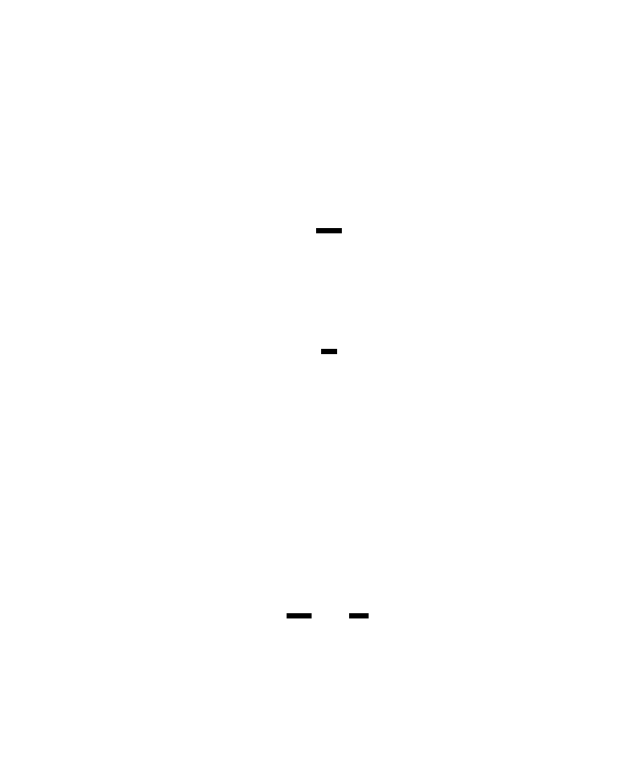
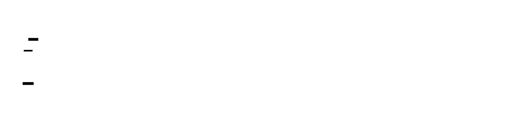
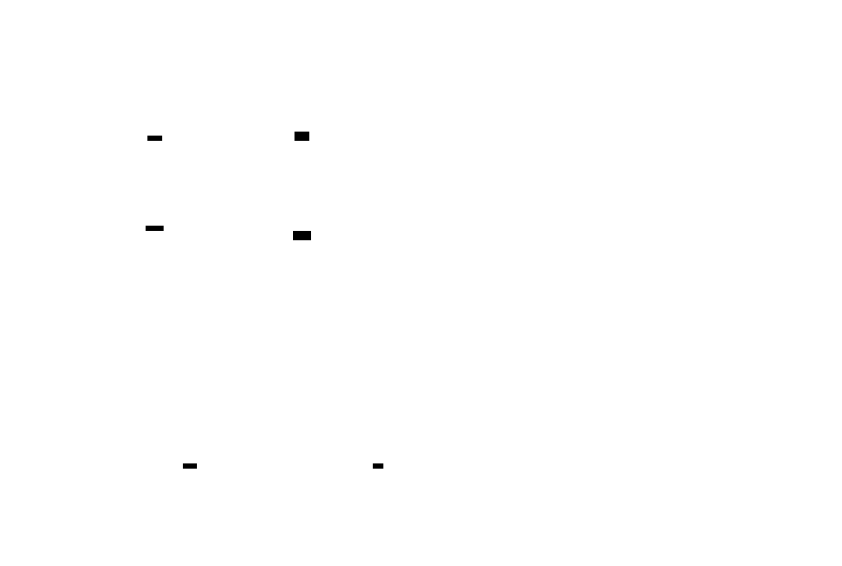
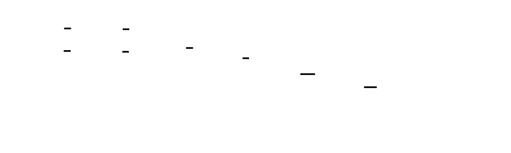
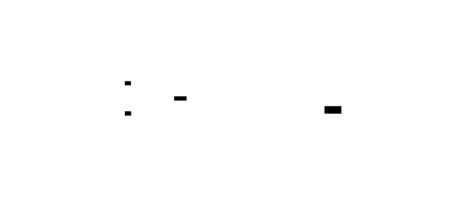
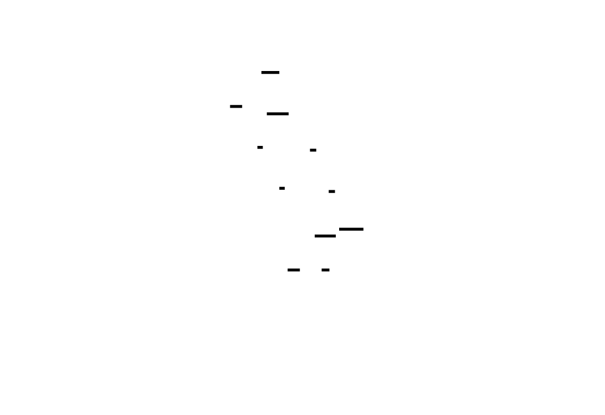
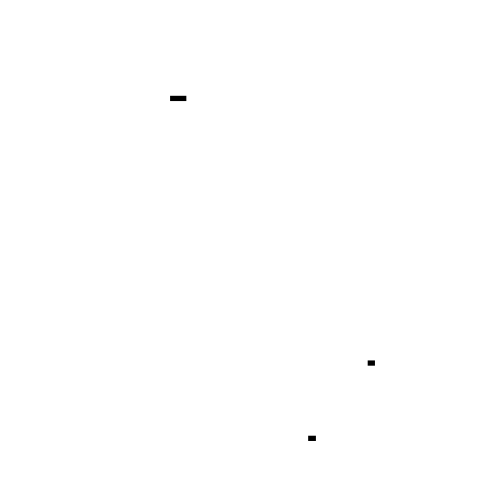
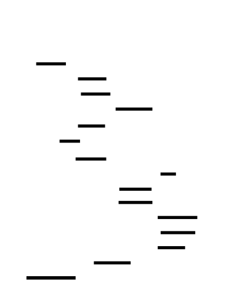
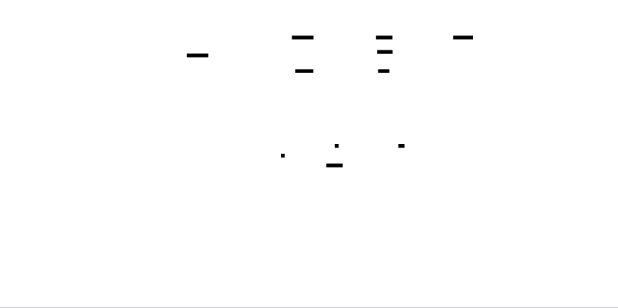
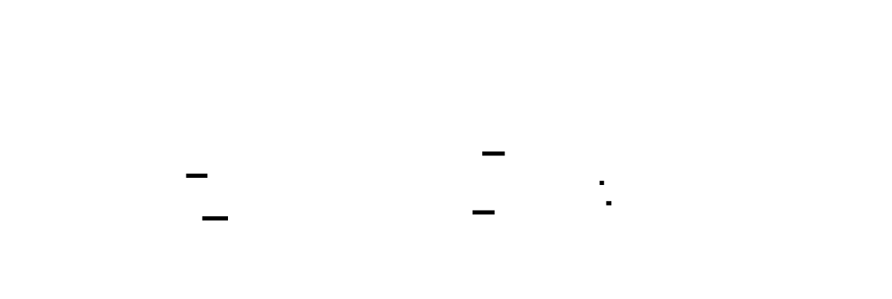

# 🎯 Project Charter: Query Optimizer
## What You Are Building
A cost-based query optimizer that transforms SQL query ASTs into efficient physical execution plans. The system takes declarative SQL queries and determines the optimal way to execute them—choosing between sequential and index scans, selecting join algorithms (hash, merge, or nested loop), and ordering multi-table joins to minimize estimated execution cost. By the end, your optimizer will produce execution plans with cost annotations that rival those generated by production database systems.
## Why This Project Exists
Most developers treat databases as black boxes—they write a query and assume the database will execute it efficiently. Building a query optimizer exposes the algorithmic foundations of how databases navigate exponential search spaces to find good execution strategies. You'll understand why a query with 10 tables has trillions of possible join orders, and how dynamic programming makes this tractable. This knowledge transfers directly to backend engineering, data infrastructure, and any system where declarative interfaces hide complex implementation choices.
## What You Will Be Able to Do When Done
- Implement a complete statistics collector (ANALYZE) that builds equi-depth histograms from table data
- Design cost models that estimate I/O and CPU costs using table statistics
- Build selectivity estimators that predict how many rows match predicates using histogram lookups
- Implement rule-based logical optimizations including predicate pushdown, projection pruning, and constant folding
- Construct dynamic programming algorithms for optimal join ordering (the Selinger algorithm)
- Select between physical operators (SeqScan vs IndexScan, HashJoin vs MergeJoin vs NestedLoopJoin) based on cost estimates
- Debug query performance by analyzing and comparing execution plans with cost annotations
## Final Deliverable
~2,500 lines of Python across 25+ source files organized into plan representation, statistics collection, cost estimation, rule-based optimization, and join ordering modules. The optimizer accepts a logical plan tree and produces a fully-costed physical plan tree with operator selection and join ordering. Demonstrable cost reduction on multi-table join queries compared to naive left-to-right join ordering. Includes validation framework comparing estimated vs actual cardinalities.
## Is This Project For You?
**You should start this if you:**
- Have completed a SQL parser project or understand AST structures
- Understand database fundamentals (tables, indexes, query execution)
- Are comfortable with algorithm complexity analysis and dynamic programming
- Have experience with tree data structures and recursive algorithms
**Come back after you've learned:**
- SQL query syntax and relational algebra concepts
- Basic statistics (histograms, probability distributions)
- Dynamic programming patterns (optimal substructure, memoization)
## Estimated Effort
| Phase | Time |
|-------|------|
| Plan Representation & Statistics Collection | ~6 hours |
| Cost Estimation & Selectivity | ~7 hours |
| Rule-Based Logical Optimization | ~7 hours |
| Join Ordering & Physical Plan Selection | ~10 hours |
| **Total** | **~30 hours** |
## Definition of Done
The project is complete when:
- The ANALYZE command collects row counts, distinct value counts, and equi-depth histograms for test tables
- Cost estimates for equality and range predicates are within 2x of actual row counts on test datasets
- Predicate pushdown demonstrably reduces estimated plan cost on a 3-table join query with selective filters
- The optimizer produces a plan with lower cost than naive left-to-right join ordering on 4+ table queries (verified by cost comparison)
- Optimization completes in under 1 second for queries with up to 8 tables
- All physical operators (SeqScan, IndexScan, HashJoin, MergeJoin, NestedLoopJoin, Sort) are correctly instantiated with cost annotations

---

# 📚 Before You Read This: Prerequisites & Further Reading
> **Read these first.** The Atlas assumes you are familiar with the foundations below.
> Resources are ordered by when you should encounter them — some before you start, some at specific milestones.
---
## Foundational Concepts (Read Before Starting)
### Relational Algebra
**What it is:** The mathematical foundation of SQL. All query operators (selection, projection, join) are formalized here.
| Type | Resource | Why This Is The Gold Standard |
|------|----------|------------------------------|
| **Best Explanation** | "Database System Concepts" by Silberschatz, Korth, Sudarshan — Chapter 6 (Relational Algebra) | The clearest formal treatment of relational operators with proofs of equivalence. Read before Milestone 1 to understand why `Filter(Join(A,B))` can become `Join(Filter(A), B)`. |
| **Paper** | Codd, E.F. (1970). "A Relational Model of Data for Large Shared Data Banks" | The original paper that introduced the relational model. Historical context for why databases work this way. |
**When to read:** Before starting this project. This is required foundational knowledge — you'll implement these operators from scratch.
---
### B-Trees and Indexing
**What it is:** The data structure that makes `WHERE id = 42` return in milliseconds instead of scanning millions of rows.
| Type | Resource | Why This Is The Gold Standard |
|------|----------|------------------------------|
| **Best Explanation** | "Designing Data-Intensive Applications" by Martin Kleppmann — Chapter 3 (Storage and Retrieval), pages 79-91 | Explains B-trees from first principles, including why they're optimal for disk storage. Critical for understanding IndexScan cost in Milestone 2. |
| **Code** | SQLite B-tree implementation — `src/btree.c` | Production B-tree code handling concurrency, crash recovery, and page management. Study `btreeCursor()` for how real systems traverse trees. |
**When to read:** Before Milestone 2 (Cost Estimation). You need to understand why index traversal costs `O(log N)` to model it correctly.
---
## Milestone-Specific Resources
### Milestone 1: Plan Representation & Statistics
#### Histograms and Data Distribution
**What it is:** How databases summarize column values to estimate selectivity without scanning all data.
| Type | Resource | Why This Is The Gold Standard |
|------|----------|------------------------------|
| **Paper** | Ioannidis, Y. (2003). "The History of Histograms" | Surveys all histogram types (equi-width, equi-depth, v-optimal) and their error bounds. Read the equi-depth section (pages 22-28) before implementing `ColumnHistogram`. |
| **Spec** | PostgreSQL `pg_stats` view documentation | Shows what statistics real databases track: `most_common_vals`, `histogram_bounds`, `correlation`. Reference for what to store in `ColumnStatistics`. |
**When to read:** While implementing `stats/05_histogram.py`. The paper explains why equi-depth beats equi-width for skewed data.
---
### Milestone 2: Cost Estimation & Selectivity
#### The Selinger Cost Model
**What it is:** The original cost model that made relational databases practical. Still the foundation of PostgreSQL's planner.
| Type | Resource | Why This Is The Gold Standard |
|------|----------|------------------------------|
| **Paper** | Selinger, P. et al. (1979). "Access Path Selection in a Relational Database Management System" | Introduced cost-based optimization. Read pages 23-26 for the cost formulas you'll implement in `cost/02_scan_cost.py`. This is the primary source. |
| **Best Explanation** | "Database Management Systems" by Ramakrishnan & Gehrke — Chapter 12 (Query Optimization), pages 427-445 | Translates Selinger into textbook form with worked examples. Read after the paper for clarity. |
**When to read:** Before implementing `CostModelConfig`. The I/O vs CPU weight tradeoff comes directly from this paper.
#### Selectivity Estimation Under Independence Assumption
**What it is:** Why `WHERE age > 30 AND income > 100K` produces wrong estimates when columns are correlated.
| Type | Resource | Why This Is The Gold Standard |
|------|----------|------------------------------|
| **Paper** | Stillger, M. et al. (1997). "LEO - DB2's LEarning Optimizer" | First paper to systematically measure and fix selectivity errors. Shows real-world error distributions. Read the motivation section to understand why your validator matters. |
| **Spec** | PostgreSQL `CREATE STATISTICS` documentation | How production databases handle correlated columns with extended statistics. Reference for future improvements. |
**When to read:** After implementing `EstimationValidator` in Milestone 2. The paper shows what error rates to expect and why.
---
### Milestone 3: Rule-Based Logical Optimization
#### Predicate Pushdown Theory
**What it is:** Why moving `WHERE amount > 1000` below a join produces identical results with fewer intermediate rows.
| Type | Resource | Why This Is The Gold Standard |
|------|----------|------------------------------|
| **Best Explanation** | "Database System Concepts" by Silberschatz et al. — Chapter 12 (Query Optimization), Section 12.4 (Transformation of Relational Expressions) | Formal treatment of equivalence rules with proofs. Read Rule 1 (conjunctive selection) and Rule 7 (selection pushing into joins) before implementing `PredicatePushdownRule`. |
| **Paper** | Galindo-Legaria, C. (1994). "Parameterized Queries and Nesting Views" | Shows edge cases where pushdown is NOT valid. Critical for understanding the preconditions in `_determine_pushdown()`. |
**When to read:** Before implementing `rules/04_predicate_pushdown.py`. The equivalence rules are your specification.
#### The Cascades Optimizer Framework
**What it is:** The rule engine architecture used in SQL Server, Apache Calcite, and DuckDB.
| Type | Resource | Why This Is The Gold Standard |
|------|----------|------------------------------|
| **Paper** | Graefe, G. (1995). "The Cascades Framework for Query Optimization" | Introduced memoization and exploration/implementation separation. Your `RuleEngine` is a simplified version. Read pages 2-4 for the fixed-point iteration concept. |
| **Code** | Apache Calcite `VolcanoPlanner.java` | Production Cascades implementation. Study `findBestExp()` for how to handle rule priorities and memoization. |
**When to read:** While implementing `rules/08_engine.py`. The paper explains why rule ordering and fixed-point iteration matter.
---
### Milestone 4: Join Ordering & Physical Plan Selection
#### Dynamic Programming for Join Ordering
**What it is:** How to find the optimal join order without trying all N! permutations.
| Type | Resource | Why This Is The Gold Standard |
|------|----------|------------------------------|
| **Paper** | Selinger et al. (1979) — Pages 23-27 | The original DP algorithm. Read for the subset enumeration strategy and "interesting orders" concept. This is your primary specification for `DynamicProgrammingOptimizer`. |
| **Best Explanation** | "Database Management Systems" by Ramakrishnan & Gehrke — Section 12.5.2 (Dynamic Programming Algorithm for Join Ordering) | Step-by-step walkthrough with a 3-table example. Read this before the paper for intuition. |
**When to read:** Before implementing `join/04_dp_optimizer.py`. The algorithm is directly specified here.
#### Join Algorithm Internals
**What it is:** How Hash Join, Sort-Merge Join, and Nested Loop Join actually work.
| Type | Resource | Why This Is The Gold Standard |
|------|----------|------------------------------|
| **Best Explanation** | "Designing Data-Intensive Applications" — Chapter 3, pages 91-95 (Hash Indexes) and Appendix B | Kleppmann explains hash joins and sort-merge with diagrams. Read before implementing `select_join_algorithm()`. |
| **Code** | DuckDB `physical_hash_join.cpp` | Modern hash join with vectorized execution and spill-to-disk. Study `ConstructHashTable()` for the build phase and `ProbeHashTable()` for the probe phase. |
**When to read:** While implementing `join/06_join_selection.py`. Understanding the algorithms lets you model their costs accurately.
#### Interesting Orders
**What it is:** Tracking sort order through the plan to avoid redundant sorts.
| Type | Resource | Why This Is The Gold Standard |
|------|----------|------------------------------|
| **Paper** | Selinger et al. (1979) — Pages 25-26 | Original description of interesting orders. Explains why merge join producing sorted output can eliminate a downstream `ORDER BY` sort. |
| **Code** | PostgreSQL `pathkeys.c` | Production implementation of sort order tracking. Study `match_pathkeys_to_index()` for how to propagate orders through operators. |
**When to read:** While implementing `join/07_interesting_orders.py`. The concept is simple but the implementation details matter.
---
## Advanced Topics (Read After Core Implementation)
### Cardinality Estimation Improvements
**What it is:** Better selectivity estimation for correlated columns and skewed data.
| Type | Resource | Why |
|------|----------|-----|
| **Paper** | "Iso-Aware Histograms" (2022) | Modern approach to multi-column histograms with theoretical error bounds. For future optimization. |
**When to read:** After completing all milestones. This is for improving estimation accuracy.
### Query Optimizer Testing
**What it is:** How to verify your optimizer picks good plans.
| Type | Resource | Why |
|------|----------|-----|
| **Paper** | "Testing Query Optimizers" (2019) | Techniques for generating test queries with known optimal plans. Useful for validating your optimizer against benchmarks. |
**When to read:** After Milestone 4. For building a comprehensive test suite.
---
## Quick Reference by Concept
| Concept | Primary Resource | Section/Chapter |
|---------|-----------------|-----------------|
| Relational Algebra | Database System Concepts | Chapter 6 |
| B-Tree Indexes | DDIA | Chapter 3, pages 79-91 |
| Cost Model | Selinger et al. (1979) | Pages 23-26 |
| Selectivity Estimation | Ioannidis (2003) | Pages 22-28 |
| Predicate Pushdown | Database System Concepts | Section 12.4 |
| Rule Engine Architecture | Graefe (1995) | Pages 2-4 |
| Join Ordering DP | Ramakrishnan & Gehrke | Section 12.5.2 |
| Hash Join Internals | DDIA | Appendix B |
| Interesting Orders | Selinger et al. (1979) | Pages 25-26 |
| B-Tree Implementation | SQLite | `src/btree.c` |
| Cascades Optimizer | Apache Calcite | `VolcanoPlanner.java` |

---

# Query Optimizer

A query optimizer is the brain of a database system—the component that transforms a declarative SQL query into an efficient physical execution plan. When you write `SELECT * FROM orders WHERE customer_id = 42`, the database could execute this dozens of ways: sequential scan, index lookup, or even a full table scan if statistics suggest it's faster. The optimizer's job is to find the cheapest path through this explosion of possibilities.

This project builds a cost-based optimizer from first principles. You'll implement statistics collection (histograms, distinct value counts), cardinality estimation (predicting how many rows each operation produces), rule-based logical rewrites (pushing filters down to reduce intermediate results), and dynamic programming for join ordering (the classic Selinger algorithm). The result is a system that can take a SQL AST and produce an execution plan optimized for minimal cost—measured in estimated I/O and CPU operations.

Beyond databases, the patterns here—tree transformations, cost-based search, dynamic programming over combinatorial spaces—appear in compilers, network routing, and machine learning pipeline optimization. Understanding query optimization means understanding how to navigate exponential search spaces intelligently.


<!-- MS_ID: query-optimizer-m1 -->
# Query Optimizer: Plan Representation & Statistics Collection


## The Mission
You're building the brain of a database system. When a user writes `SELECT * FROM orders JOIN customers ON orders.customer_id = customers.id WHERE orders.amount > 1000`, they're declaring *what* they want—not *how* to get it. The database could execute this query dozens of ways:
- Scan `orders` first, then join to `customers`? Or the reverse?
- Use an index on `amount`, or scan the whole table?
- Hash join, merge join, or nested loops?
Each choice produces correct results, but some are 1000x faster than others. The optimizer's job is to find the fastest path through this combinatorial explosion.
This milestone builds the foundation: the **plan tree** data structure that represents execution strategies, and the **statistics collector** (ANALYZE) that gathers the data needed to estimate costs. Without statistics, an optimizer is flying blind—it's guessing rather than calculating.
By the end of this milestone, you'll have:
- A tree structure with distinct logical and physical operator types
- A statistics catalog storing row counts, distinct values, null fractions, and histograms
- The ability to reason about query plans as manipulable data structures
Let's begin with the fundamental tension that makes this problem hard.
---
## The Tension: Exponential Possibilities vs. Limited Information
A query with N tables has O(N!) possible join orders. With 10 tables, that's 3.6 million orderings. With 15 tables, it's 1.3 trillion. You can't try them all—you need a way to *estimate* which will be fastest without actually running them.
But estimation requires information. How many rows are in each table? How many distinct values per column? How selective is `WHERE amount > 1000`—does it match 1% of rows or 50%?


**The constraint**: You must choose an execution plan *before* you execute the query, using only statistical summaries collected beforehand. The quality of those statistics directly determines the quality of your plans.
**The cost of information**: Collecting statistics requires scanning the entire table. For a 100GB table, ANALYZE might take minutes. You're trading:
- **Upfront cost**: Time spent collecting statistics
- **Ongoing benefit**: Better plans on every future query
This is why production databases make ANALYZE optional and support sampling—you can choose your point on the accuracy vs. cost spectrum.
---
## The Plan Tree: Your Representation of Execution Strategy
### Trees, Not Lists
Here's a common misconception shattered:
> **Misconception**: A query plan is just "the order of operations"—a flat list like "scan orders, then filter, then join."
**Wrong**. A plan is a **tree** where:
- Each node is a relational operator (Scan, Filter, Join, etc.)
- Edges represent data flow from children (inputs) to parent (output)
- The root produces the final result
- Leaves are always data access operations (scans)


Consider this query:
```sql
SELECT customers.name, SUM(orders.amount)
FROM customers
JOIN orders ON customers.id = orders.customer_id
WHERE orders.amount > 1000
GROUP BY customers.name
```
The plan tree looks like:
```
┌─────────────────────────────────────────┐
│           Aggregate (GROUP BY)          │  ← Root: final result
│         Output: name, SUM(amount)       │
│         Est. Rows: 150                  │
│         Est. Cost: 1200                 │
└─────────────────┬───────────────────────┘
                  │
┌─────────────────┴───────────────────────┐
│              Project (SELECT)           │
│         Output: name, amount            │
│         Est. Rows: 500                  │
│         Est. Cost: 800                  │
└─────────────────┬───────────────────────┘
                  │
┌─────────────────┴───────────────────────┐
│                Filter (WHERE)           │
│         Predicate: amount > 1000        │
│         Est. Rows: 500                  │
│         Est. Cost: 600                  │
└─────────────────┬───────────────────────┘
                  │
┌─────────────────┴───────────────────────┐
│              Hash Join                  │  ← Physical operator
│         Cond: customers.id =            │
│              orders.customer_id         │
│         Est. Rows: 5000                 │
│         Est. Cost: 4500                 │
└────────┬─────────────────┬──────────────┘
         │                 │
┌────────┴────────┐ ┌──────┴──────────────┐
│  SeqScan        │ │  SeqScan            │
│  Table: orders  │ │  Table: customers   │
│  Est. Rows:     │ │  Est. Rows: 10000   │
│  50000          │ │  Est. Cost: 100     │
│  Est. Cost: 500 │ │                     │
└─────────────────┘ └─────────────────────┘
```
Each node knows:
- **What** it does (operator type and parameters)
- **Inputs** from children (the tree structure)
- **Estimated output size** (cardinality)
- **Estimated cost** (work to execute)
### Logical vs. Physical Operators: The Key Distinction
This is the most important architectural decision in your optimizer.

> **🔑 Foundation: Logical operators describe WHAT to compute; physical operators describe HOW to compute it**
> 
> ## What It Is
A **logical plan** describes *what* data transformations you want, using abstract operators like "Filter", "Join", or "Aggregate" without specifying implementation details. A **physical plan** describes *how* to execute those transformations using concrete algorithms like "Hash Join", "Merge Join", or "Index Scan".
Think of it like a recipe:
- **Logical**: "Combine the eggs and flour, then heat the mixture"
- **Physical**: "Whisk 3 large eggs with 150g of all-purpose flour using a balloon whisk for 2 minutes, then pour into a 9-inch nonstick pan preheated to medium-low"
## Why You Need This Now
When building a query engine, separating logical from physical plans is the architectural pattern that enables:
1. **Query optimization** — The optimizer can transform a logical plan (e.g., push filters down, reorder joins) before committing to an implementation
2. **Cost-based decisions** — You can generate multiple physical plans from one logical plan and choose the cheapest based on statistics
3. **Extensibility** — Adding a new join algorithm means adding one physical operator, not changing the logical semantics
```
SQL: SELECT * FROM users JOIN orders ON users.id = orders.user_id WHERE orders.total > 100
Logical Plan:
  Filter(orders.total > 100)
    Join(users.id = orders.user_id)
      Scan(users)
      Scan(orders)
Physical Plan (one possible realization):
  Filter(orders.total > 100)           → SeqScan with predicate pushdown
    HashJoin(users.id = orders.user_id) → Build hash table on users, probe with orders
      IndexScan(users using pk)         → B-tree traversal
      SeqScan(orders)                   → Full table scan
```
## Key Insight
**The same logical plan can produce many physical plans with vastly different performance characteristics.**
A logical join between two tables could become:
- Nested loop join (O(n×m)) — good for small tables with indexes
- Hash join (O(n+m)) — good for large unordered data
- Merge join (O(n log n + m log m)) — good for pre-sorted data
The optimizer's job is to pick the right physical implementation based on data size, indexes, memory, and available statistics. This separation is what makes databases *fast* — the query says "what," the engine figures out the optimal "how."


**Logical operators** are the *relational algebra* operations—abstract, implementation-independent:
- `Scan(table)` — "get rows from this table"
- `Filter(predicate)` — "keep rows matching condition"
- `Join(type, condition)` — "combine rows from two inputs"
- `Project(columns)` — "keep only these columns"
- `Aggregate(group_by, aggregations)` — "compute summaries per group"
**Physical operators** are concrete implementations:
- `SeqScan(table)` — read table page by page
- `IndexScan(table, index, predicate)` — use index to find rows
- `HashJoin(condition)` — build hash table from smaller input, probe with larger
- `SortMergeJoin(condition)` — sort both inputs, merge-join
- `NestedLoopJoin(condition)` — for each outer row, scan inner for matches
One logical operator maps to multiple physical alternatives:
```
Logical: Join(A, B, A.x = B.x)
    ↓ (can become any of)
    ├── Physical: HashJoin(A, B, A.x = B.x)
    ├── Physical: SortMergeJoin(A, B, A.x = B.x)
    └── Physical: NestedLoopJoin(A, B, A.x = B.x)
```
The optimizer's job is to:
1. Generate a logical plan (tree of logical operators)
2. Transform the logical plan to reduce work (push filters down, etc.)
3. Choose physical implementations for each logical operator
4. Pick the cheapest combination
By separating these concerns, you can explore alternatives without changing the logical meaning.
### Implementation: Plan Tree in Python
Let's implement this structure. We'll use Python's `dataclasses` for clean, typed definitions:
```python
from dataclasses import dataclass, field
from typing import List, Optional, Dict, Any, Literal, Union
from abc import ABC, abstractmethod
import json
# =============================================================================
# BASE NODE TYPES
# =============================================================================
@dataclass
class PlanNode(ABC):
    """
    Base class for all plan nodes.
    Every node carries cost and cardinality annotations.
    """
    estimated_cost: float = 0.0      # Total cost to execute this subtree
    estimated_rows: float = 0.0      # Estimated number of output rows
    children: List['PlanNode'] = field(default_factory=list)
    @abstractmethod
    def operator_type(self) -> str:
        """Return the operator type name for pretty-printing."""
        pass
    @abstractmethod
    def details(self) -> Dict[str, Any]:
        """Return operator-specific details for pretty-printing."""
        pass
    def is_leaf(self) -> bool:
        return len(self.children) == 0
# =============================================================================
# LOGICAL OPERATORS
# =============================================================================
@dataclass
class LogicalScan(PlanNode):
    """Logical: Read rows from a table."""
    table_name: str
    alias: Optional[str] = None
    def operator_type(self) -> str:
        return "LogicalScan"
    def details(self) -> Dict[str, Any]:
        return {"table": self.table_name, "alias": self.alias}
@dataclass
class LogicalFilter(PlanNode):
    """Logical: Keep rows matching a predicate."""
    predicate: str  # SQL-style predicate string for simplicity
    def operator_type(self) -> str:
        return "LogicalFilter"
    def details(self) -> Dict[str, Any]:
        return {"predicate": self.predicate}
@dataclass
class LogicalProject(PlanNode):
    """Logical: Select specific columns."""
    columns: List[str]
    def operator_type(self) -> str:
        return "LogicalProject"
    def details(self) -> Dict[str, Any]:
        return {"columns": self.columns}
@dataclass
class LogicalJoin(PlanNode):
    """Logical: Combine rows from two inputs."""
    join_type: Literal["INNER", "LEFT", "RIGHT", "FULL", "CROSS"]
    condition: str  # Join condition, e.g., "A.id = B.a_id"
    def operator_type(self) -> str:
        return "LogicalJoin"
    def details(self) -> Dict[str, Any]:
        return {"join_type": self.join_type, "condition": self.condition}
@dataclass
class LogicalAggregate(PlanNode):
    """Logical: Group rows and compute aggregates."""
    group_by_columns: List[str]
    aggregations: Dict[str, str]  # alias -> expression, e.g., {"total": "SUM(amount)"}
    def operator_type(self) -> str:
        return "LogicalAggregate"
    def details(self) -> Dict[str, Any]:
        return {
            "group_by": self.group_by_columns,
            "aggregations": self.aggregations
        }
# =============================================================================
# PHYSICAL OPERATORS
# =============================================================================
@dataclass
class PhysicalSeqScan(PlanNode):
    """Physical: Sequential table scan (read all pages)."""
    table_name: str
    alias: Optional[str] = None
    def operator_type(self) -> str:
        return "SeqScan"
    def details(self) -> Dict[str, Any]:
        return {"table": self.table_name, "alias": self.alias}
@dataclass
class PhysicalIndexScan(PlanNode):
    """Physical: Index-based scan (random I/O to matching rows)."""
    table_name: str
    index_name: str
    predicate: str  # The predicate that uses the index
    def operator_type(self) -> str:
        return "IndexScan"
    def details(self) -> Dict[str, Any]:
        return {
            "table": self.table_name,
            "index": self.index_name,
            "predicate": self.predicate
        }
@dataclass
class PhysicalNestedLoopJoin(PlanNode):
    """Physical: Nested loop join (O(M*N) for M outer, N inner rows)."""
    condition: str
    def operator_type(self) -> str:
        return "NestedLoopJoin"
    def details(self) -> Dict[str, Any]:
        return {"condition": self.condition}
@dataclass
class PhysicalHashJoin(PlanNode):
    """Physical: Hash join (O(M+N) with hash table)."""
    condition: str
    build_side: Literal["left", "right"]  # Which side to build hash table from
    def operator_type(self) -> str:
        return "HashJoin"
    def details(self) -> Dict[str, Any]:
        return {"condition": self.condition, "build_side": self.build_side}
@dataclass
class PhysicalSortMergeJoin(PlanNode):
    """Physical: Sort-merge join (O(M log M + N log N) if not sorted)."""
    condition: str
    def operator_type(self) -> str:
        return "SortMergeJoin"
    def details(self) -> Dict[str, Any]:
        return {"condition": self.condition}
@dataclass
class PhysicalSort(PlanNode):
    """Physical: Sort rows by specified columns."""
    sort_keys: List[tuple]  # [(column, "ASC"|"DESC"), ...]
    def operator_type(self) -> str:
        return "Sort"
    def details(self) -> Dict[str, Any]:
        return {"sort_keys": self.sort_keys}
# Type alias for any operator
AnyOperator = Union[
    LogicalScan, LogicalFilter, LogicalProject, LogicalJoin, LogicalAggregate,
    PhysicalSeqScan, PhysicalIndexScan, PhysicalNestedLoopJoin, 
    PhysicalHashJoin, PhysicalSortMergeJoin, PhysicalSort
]
```
### Plan Tree Pretty-Printer
A good pretty-printer is essential for debugging. You'll stare at a lot of plans:
```python
def pretty_print_plan(node: PlanNode, indent: int = 0, prefix: str = "└── ") -> str:
    """
    Pretty-print a plan tree with cost and cardinality annotations.
    Output format:
    └── HashJoin (cost=4500.0, rows=5000)
        ├── SeqScan: orders (cost=500.0, rows=50000)
        └── SeqScan: customers (cost=100.0, rows=10000)
    """
    lines = []
    # Format this node
    details_str = ""
    if node.details():
        details_items = []
        for k, v in node.details().items():
            if v is not None:
                details_items.append(f"{k}={v}")
        if details_items:
            details_str = f" [{', '.join(details_items)}]"
    node_str = f"{node.operator_type()}{details_str}"
    cost_str = f"(cost={node.estimated_cost:.1f}, rows={node.estimated_rows:.0f})"
    lines.append("  " * indent + prefix + f"{node_str} {cost_str}")
    # Format children
    for i, child in enumerate(node.children):
        is_last = (i == len(node.children) - 1)
        child_prefix = "└── " if is_last else "├── "
        child_indent = indent + 1
        lines.append(pretty_print_plan(child, child_indent, child_prefix).rstrip())
    return "\n".join(lines)
def explain_plan(node: PlanNode) -> str:
    """
    Generate EXPLAIN-style output for a plan.
    Similar to PostgreSQL's EXPLAIN format.
    """
    return pretty_print_plan(node, indent=0, prefix="")
```


**Example usage:**
```python
# Build a sample plan tree
orders_scan = PhysicalSeqScan(
    table_name="orders",
    estimated_cost=500.0,
    estimated_rows=50000
)
customers_scan = PhysicalSeqScan(
    table_name="customers", 
    estimated_cost=100.0,
    estimated_rows=10000
)
join = PhysicalHashJoin(
    condition="orders.customer_id = customers.id",
    build_side="right",
    estimated_cost=4500.0,
    estimated_rows=5000,
    children=[orders_scan, customers_scan]
)
filter_op = PhysicalSeqScan(  # Placeholder - would be LogicalFilter in real plan
    table_name="_filtered",
    estimated_cost=5000.0,
    estimated_rows=500,
    children=[join]
)
print(explain_plan(filter_op))
```
Output:
```
└── SeqScan: table=_filtered (cost=5000.0, rows=500)
    └── HashJoin: condition=orders.customer_id = customers.id, build_side=right (cost=4500.0, rows=5000)
        ├── SeqScan: table=orders (cost=500.0, rows=50000)
        └── SeqScan: table=customers (cost=100.0, rows=10000)
```
---
## Statistics Collection: Gathering Intelligence About Your Data
Now that you have a plan representation, you need information to make cost decisions. This is where **ANALYZE** comes in.
### What Statistics Do We Need?
To estimate costs, you need to know:
1. **Table-level statistics**:
   - Total row count
   - Number of pages (disk blocks)
2. **Column-level statistics**:
   - Number of distinct values (cardinality)
   - Fraction of NULL values
   - **Histogram**: distribution of values for selectivity estimation


### Equi-Depth Histograms: Capturing Data Distribution
A histogram buckets values into ranges and stores the count of rows in each bucket. The key decision: how do you choose bucket boundaries?
**Equi-width histograms** use fixed-size ranges (0-100, 100-200, etc.). Problem: if most values cluster around 50, one bucket dominates and selectivity estimates are poor.
**Equi-depth histograms** ensure each bucket has roughly the same number of rows. This adapts to data skew—buckets are smaller in dense regions and larger in sparse regions.

> **🔑 Foundation: Equi-depth histograms adapt bucket boundaries to data distribution**
> 
> ## What It Is
An **equi-depth histogram** divides data values into buckets where each bucket contains approximately the *same number of rows*, not the same value range. The bucket boundaries adapt to the actual data distribution.
Contrast with **equi-width** histograms, which divide the value range into equal-sized intervals regardless of how many rows fall into each bucket.
```
Data: 1, 2, 2, 2, 2, 2, 3, 100, 101, 102  (10 values)
Equi-width (3 buckets, range 1-102):
  Bucket 1 [1-34]:   ████████████ (7 values) — 1, 2, 2, 2, 2, 2, 3
  Bucket 2 [35-68]:  (0 values)
  Bucket 3 [69-102]: ███ (3 values) — 100, 101, 102
Equi-depth (3 buckets, ~3-4 values each):
  Bucket 1: [1-2]    ████ (4 values)
  Bucket 2: [2-3]    ███ (3 values)  
  Bucket 3: [100+]   ███ (3 values)
```
## Why You Need This Now
Query optimizers use histograms to estimate **selectivity** — how many rows a predicate will match. Accurate estimates lead to better join ordering and physical operator selection.
Equi-depth histograms handle **skewed data** far better than equi-width:
- In the example above, an equi-width histogram would estimate `WHERE value = 2` returns ~0.2 rows (7 values / 34 range × 1 value searched). The actual answer is 5.
- Equi-depth captures that most data clusters around 2, so the optimizer knows `value = 2` is highly selective in the opposite direction — it returns *many* rows.
For a query engine, you typically construct these by:
1. Sampling or sorting the column values
2. Finding quantile boundaries (e.g., at 25%, 50%, 75% for 4 buckets)
3. Storing the boundary values and row counts per bucket
## Key Insight
**Equi-depth histograms "spend" their buckets where the data actually lives.**
If 90% of your values cluster between 1-10 but the range extends to 1,000,000, equi-width wastes most buckets on empty space. Equi-depth allocates buckets proportionally to data density, giving you accurate selectivity estimates where they matter — where the data *is*, not where it *isn't*.
The construction cost is higher (requires quantile computation), but for query optimization, the improved cardinality estimates are worth it.


**Construction algorithm:**
1. Sort all values in the column
2. Divide into N buckets, each containing approximately `total_rows / N` values
3. Store: bucket boundaries (min, max) and row count per bucket
**Example**: Column `price` with 1000 rows, 10 buckets:
```
Bucket 0: [0.00, 5.99]      → 100 rows
Bucket 1: [6.00, 12.50]     → 100 rows
Bucket 2: [12.51, 19.99]    → 100 rows
...
Bucket 9: [150.00, 999.99]  → 100 rows
```
Notice how bucket 9 has a huge range (850) but the same row count as bucket 0 with range 6. This is the power of equi-depth: dense regions get more precise buckets.
### Implementation: Statistics Collector
```python
from collections import Counter
from typing import Generic, TypeVar, Callable
import math
T = TypeVar('T')  # Value type (int, float, str, etc.)
@dataclass
class HistogramBucket:
    """A single bucket in an equi-depth histogram."""
    min_value: Any      # Inclusive lower bound
    max_value: Any      # Inclusive upper bound  
    row_count: int      # Number of rows in this bucket
    distinct_count: int # Estimated distinct values in bucket
    def contains(self, value: Any) -> bool:
        """Check if a value falls within this bucket."""
        return self.min_value <= value <= self.max_value
@dataclass
class ColumnHistogram:
    """Equi-depth histogram for a single column."""
    column_name: str
    bucket_count: int
    buckets: List[HistogramBucket]
    total_rows: int
    def selectivity_for_value(self, value: Any) -> float:
        """
        Estimate selectivity for an equality predicate (col = value).
        Returns fraction of rows expected to match.
        """
        for bucket in self.buckets:
            if bucket.contains(value):
                if bucket.distinct_count == 0:
                    return 0.0
                # Assume uniform distribution within bucket
                return bucket.row_count / (bucket.distinct_count * self.total_rows)
        return 0.0  # Value outside histogram range
    def selectivity_for_range(self, op: str, value: Any) -> float:
        """
        Estimate selectivity for range predicates.
        op: '<', '<=', '>', '>='
        """
        total_matching = 0
        for bucket in self.buckets:
            if op in ('>', '>='):
                if bucket.max_value > value:
                    if bucket.min_value > value:
                        # Entire bucket matches
                        total_matching += bucket.row_count
                    else:
                        # Partial bucket match - linear interpolation
                        range_size = bucket.max_value - bucket.min_value
                        if range_size > 0:
                            fraction = (bucket.max_value - value) / range_size
                            total_matching += int(bucket.row_count * fraction)
            elif op in ('<', '<='):
                if bucket.min_value < value:
                    if bucket.max_value < value:
                        # Entire bucket matches
                        total_matching += bucket.row_count
                    else:
                        # Partial bucket match
                        range_size = bucket.max_value - bucket.min_value
                        if range_size > 0:
                            fraction = (value - bucket.min_value) / range_size
                            total_matching += int(bucket.row_count * fraction)
        return total_matching / self.total_rows if self.total_rows > 0 else 0.0
@dataclass
class ColumnStatistics:
    """Statistics for a single column."""
    column_name: str
    total_rows: int
    distinct_count: int
    null_count: int
    histogram: Optional[ColumnHistogram] = None
    @property
    def null_fraction(self) -> float:
        return self.null_count / self.total_rows if self.total_rows > 0 else 0.0
    @property
    def non_null_rows(self) -> int:
        return self.total_rows - self.null_count
@dataclass
class TableStatistics:
    """Statistics for a table, including all columns."""
    table_name: str
    row_count: int
    page_count: int  # For I/O cost estimation
    columns: Dict[str, ColumnStatistics]
    def get_column_stats(self, column_name: str) -> Optional[ColumnStatistics]:
        return self.columns.get(column_name)
class StatisticsCatalog:
    """
    Central store for table statistics.
    Supports ANALYZE command to populate statistics.
    """
    def __init__(self):
        self._tables: Dict[str, TableStatistics] = {}
    def get_table_stats(self, table_name: str) -> Optional[TableStatistics]:
        """Retrieve statistics for a table."""
        return self._tables.get(table_name)
    def store_table_stats(self, stats: TableStatistics) -> None:
        """Store or update statistics for a table."""
        self._tables[stats.table_name] = stats
    def clear_table_stats(self, table_name: str) -> None:
        """Remove statistics for a table (e.g., after DROP TABLE)."""
        self._tables.pop(table_name, None)
```
### ANALYZE Implementation
The ANALYZE command scans table data and builds statistics:
```python
class Analyzer:
    """
    Implements ANALYZE command functionality.
    Scans table data and collects statistics.
    """
    def __init__(self, catalog: StatisticsCatalog, bucket_count: int = 100):
        self.catalog = catalog
        self.bucket_count = bucket_count
    def analyze_table(
        self, 
        table_name: str,
        row_iterator: Callable[[], List[Dict[str, Any]]],
        page_count: int,
        sample_rate: float = 1.0
    ) -> TableStatistics:
        """
        Analyze a table and collect statistics.
        Args:
            table_name: Name of the table to analyze
            row_iterator: Function that returns list of row dicts
            page_count: Number of disk pages in table
            sample_rate: Fraction of rows to sample (1.0 = all rows)
        Returns:
            TableStatistics object
        """
        # Collect all rows
        all_rows = row_iterator()
        total_rows = len(all_rows)
        # Apply sampling if specified
        if sample_rate < 1.0:
            import random
            sample_size = int(total_rows * sample_rate)
            rows = random.sample(all_rows, min(sample_size, total_rows))
            # Scale row count estimate
            row_count_estimate = int(total_rows / sample_rate)
        else:
            rows = all_rows
            row_count_estimate = total_rows
        # Get column names from first row
        if not rows:
            return TableStatistics(
                table_name=table_name,
                row_count=0,
                page_count=page_count,
                columns={}
            )
        column_names = list(rows[0].keys())
        column_stats: Dict[str, ColumnStatistics] = {}
        for col_name in column_names:
            col_stats = self._analyze_column(col_name, rows, row_count_estimate)
            column_stats[col_name] = col_stats
        return TableStatistics(
            table_name=table_name,
            row_count=row_count_estimate,
            page_count=page_count,
            columns=column_stats
        )
    def _analyze_column(
        self, 
        column_name: str, 
        rows: List[Dict[str, Any]],
        total_row_estimate: int
    ) -> ColumnStatistics:
        """Analyze a single column."""
        # Extract non-null values
        values = []
        null_count = 0
        for row in rows:
            val = row.get(column_name)
            if val is None:
                null_count += 1
            else:
                values.append(val)
        # Count distinct values
        distinct_values = set(values)
        distinct_count = len(distinct_values)
        # Build histogram for numeric types
        histogram = None
        if values and self._is_ordered_type(values[0]):
            histogram = self._build_equi_depth_histogram(
                column_name, 
                values, 
                total_row_estimate
            )
        # Scale null count if sampling
        if len(rows) < total_row_estimate:
            null_count = int(null_count * (total_row_estimate / len(rows)))
        return ColumnStatistics(
            column_name=column_name,
            total_rows=total_row_estimate,
            distinct_count=distinct_count,
            null_count=null_count,
            histogram=histogram
        )
    def _is_ordered_type(self, value: Any) -> bool:
        """Check if value type supports ordering (for histograms)."""
        return isinstance(value, (int, float, str, bytes))
    def _build_equi_depth_histogram(
        self,
        column_name: str,
        values: List[Any],
        total_rows: int
    ) -> ColumnHistogram:
        """
        Build an equi-depth histogram.
        Each bucket contains approximately the same number of rows.
        This adapts to data skew by having narrower buckets in dense regions.
        """
        if not values:
            return ColumnHistogram(
                column_name=column_name,
                bucket_count=0,
                buckets=[],
                total_rows=0
            )
        # Sort values
        sorted_values = sorted(values)
        n = len(sorted_values)
        # Determine bucket size (rows per bucket)
        bucket_size = max(1, n // self.bucket_count)
        actual_bucket_count = min(self.bucket_count, n)
        buckets: List[HistogramBucket] = []
        for i in range(actual_bucket_count):
            start_idx = i * bucket_size
            end_idx = min((i + 1) * bucket_size, n)
            if start_idx >= n:
                break
            bucket_values = sorted_values[start_idx:end_idx]
            # Estimate distinct count in bucket
            distinct_in_bucket = len(set(bucket_values))
            bucket = HistogramBucket(
                min_value=bucket_values[0],
                max_value=bucket_values[-1],
                row_count=len(bucket_values),
                distinct_count=distinct_in_bucket
            )
            buckets.append(bucket)
        # Handle remainder in last bucket
        if buckets and n % bucket_size > 0:
            last_bucket = buckets[-1]
            last_bucket.row_count = n - (actual_bucket_count - 1) * bucket_size
        return ColumnHistogram(
            column_name=column_name,
            bucket_count=len(buckets),
            buckets=buckets,
            total_rows=total_rows
        )
    def execute_analyze(
        self,
        table_name: str,
        row_iterator: Callable[[], List[Dict[str, Any]]],
        page_count: int,
        sample_rate: float = 1.0
    ) -> str:
        """
        Execute ANALYZE command and return status message.
        Stores results in catalog.
        """
        stats = self.analyze_table(table_name, row_iterator, page_count, sample_rate)
        self.catalog.store_table_stats(stats)
        return (
            f"ANALYZE {table_name}: "
            f"{stats.row_count} rows, "
            f"{len(stats.columns)} columns analyzed, "
            f"{self.bucket_count} histogram buckets"
        )
```
### Using ANALYZE: A Complete Example
```python
# Example: Analyzing an orders table
def get_orders_data():
    """Simulate fetching rows from orders table."""
    return [
        {"id": 1, "customer_id": 101, "amount": 50.00, "status": "pending"},
        {"id": 2, "customer_id": 102, "amount": 150.00, "status": "shipped"},
        {"id": 3, "customer_id": 101, "amount": 75.50, "status": "delivered"},
        {"id": 4, "customer_id": 103, "amount": 200.00, "status": "pending"},
        {"id": 5, "customer_id": 104, "amount": None, "status": "cancelled"},  # NULL amount
        # ... more rows
    ]
# Create catalog and analyzer
catalog = StatisticsCatalog()
analyzer = Analyzer(catalog, bucket_count=10)
# Run ANALYZE
result = analyzer.execute_analyze(
    table_name="orders",
    row_iterator=get_orders_data,
    page_count=10,
    sample_rate=1.0
)
print(result)
# Output: ANALYZE orders: 5 rows, 4 columns analyzed, 10 histogram buckets
# Inspect statistics
stats = catalog.get_table_stats("orders")
print(f"Total rows: {stats.row_count}")
print(f"Amount distinct values: {stats.columns['amount'].distinct_count}")
print(f"Amount null fraction: {stats.columns['amount'].null_fraction:.2%}")
# Use histogram for selectivity estimation
amount_hist = stats.columns['amount'].histogram
if amount_hist:
    # Query: WHERE amount > 100
    selectivity = amount_hist.selectivity_for_range('>', 100)
    print(f"Estimated rows matching amount > 100: {selectivity * stats.row_count:.0f}")
```
---
## The Statistics Catalog: Persistence and Retrieval


The statistics catalog is your optimizer's memory. It stores:
```python
# JSON serialization for persistence
def catalog_to_json(catalog: StatisticsCatalog) -> str:
    """Serialize catalog to JSON for persistence."""
    data = {}
    for table_name, table_stats in catalog._tables.items():
        columns_data = {}
        for col_name, col_stats in table_stats.columns.items():
            col_data = {
                "column_name": col_stats.column_name,
                "total_rows": col_stats.total_rows,
                "distinct_count": col_stats.distinct_count,
                "null_count": col_stats.null_count,
            }
            if col_stats.histogram:
                col_data["histogram"] = {
                    "bucket_count": col_stats.histogram.bucket_count,
                    "total_rows": col_stats.histogram.total_rows,
                    "buckets": [
                        {
                            "min_value": str(b.min_value),
                            "max_value": str(b.max_value),
                            "row_count": b.row_count,
                            "distinct_count": b.distinct_count,
                        }
                        for b in col_stats.histogram.buckets
                    ]
                }
            columns_data[col_name] = col_data
        data[table_name] = {
            "table_name": table_stats.table_name,
            "row_count": table_stats.row_count,
            "page_count": table_stats.page_count,
            "columns": columns_data
        }
    return json.dumps(data, indent=2)
```
---
## Common Pitfalls and How to Avoid Them
### 1. Conflating Logical and Physical Operators
**The mistake**: Creating one operator type that's both "Join" and "HashJoin".
**Why it fails**: You can't explore alternatives. If your Join node is hardcoded to hash join, you can't compare it against merge join or nested loop.
**The fix**: Separate hierarchies. Logical operators describe semantics; physical operators describe implementation. The optimizer maps between them.
### 2. Histogram Bucket Count Too Low or Too High
**Too few buckets**: You lose detail in dense regions. A 10-bucket histogram on a column with values clustered around 50 will miss that concentration.
**Too many buckets**: Memory waste and overfitting. 1000 buckets for 1000 rows means 1 row per bucket—no generalization.
**The guideline**: 
- Default: 100 buckets (PostgreSQL default)
- For small tables (<1000 rows): `sqrt(row_count)` buckets
- For large tables: 100-256 buckets
### 3. Stale Statistics After Data Modifications
**The problem**: You run ANALYZE, then INSERT 100,000 rows. Your histogram still thinks there are 50,000 rows.
**Production solution**: 
- Track modification counters (PostgreSQL's `pg_stat_all_tables`)
- Auto-analyze when modifications exceed threshold (e.g., 10% of rows)
- For this project: Document that ANALYZE should be re-run after significant changes
### 4. Ignoring NULL Handling
**The mistake**: Treating NULL as just another value.
**Why it matters**: 
- `WHERE col = 5` doesn't match NULLs
- `WHERE col != 5` *also* doesn't match NULLs
- NULL fraction affects join cardinality estimates
**The fix**: Track `null_count` separately and exclude NULLs from histogram construction.
---
## Knowledge Cascade: What You've Unlocked
By building plan trees and statistics collection, you've gained tools that extend far beyond query optimization:
**Compiler IR Design** — Your logical plan is exactly like a compiler's intermediate representation (IR). It's a declarative, transformable representation that sits between "what the user wrote" (SQL / source code) and "what the machine executes" (physical plan / machine code). The same separation of concerns (logical → physical) appears in LLVM, GCC, and the Java JIT compiler.
**Information Theory** — Equi-depth histograms are entropy maximization in disguise. By ensuring equal row counts per bucket, you maximize the information content of each bucket. This is the same principle behind Huffman coding and decision tree splits. When you understand why equi-depth beats equi-width, you understand a fundamental truth about representing distributions with limited resources.
**Database Recovery** — The ANALYZE command teaches you why crash recovery is complex. If ANALYZE takes 5 minutes on a 100GB table and the database crashes mid-analyze, you can't have half-analyzed statistics. Production databases use atomic catalog updates and write-ahead logging for statistics—same techniques as data recovery.
**Query Execution Engine** — The plan tree structure you designed is the contract between optimizer and executor. An execution engine simply walks this tree and calls `execute()` on each node. By defining clean interfaces (`operator_type()`, `details()`, `children`), you've created an API that any executor can consume.
**Machine Learning Feature Engineering** — Histogram buckets are feature bins. When you discretize a continuous variable into buckets for a decision tree or gradient boosting model, you're doing exactly what ANALYZE does. The same bucket boundary selection algorithms apply. Understanding histograms deeply makes you better at feature engineering.
---
## What's Next: Cost Estimation and Selectivity
With plan trees and statistics in place, you have the representation and the data. The next milestone builds the **cost model**—the mathematical framework that uses statistics to predict execution cost.
You'll answer questions like:
- How do I estimate the cost of `WHERE amount > 1000`?
- How do I predict how many rows a join will produce?
- How accurate are my estimates, and what happens when they're wrong?
The optimizer's intelligence comes from these cost estimates. Without them, you're just guessing.
---
## Acceptance Criteria Summary
You have completed this milestone when you can:
1. **Represent query plans as trees** with operator nodes carrying cost and cardinality annotations
2. **Distinguish logical from physical operators** in your type system—logical operators describe WHAT, physical operators describe HOW
3. **Implement the ANALYZE command** that scans table data and collects:
   - Total row count
   - Per-column distinct value count
   - Per-column null fraction
   - Per-column equi-depth histograms
4. **Store and retrieve statistics** from a catalog by table name and column name
5. **Pretty-print plan trees** showing operator type, estimated cardinality, and cost at each node
6. **Estimate selectivity** for equality and range predicates using histograms
[[CRITERIA_JSON: {"milestone_id": "query-optimizer-m1", "criteria": ["Plan tree data structure exists with PlanNode base class carrying estimated_cost and estimated_rows fields", "Logical operators (LogicalScan, LogicalFilter, LogicalProject, LogicalJoin, LogicalAggregate) are separate types from physical operators", "Physical operators include PhysicalSeqScan, PhysicalIndexScan, PhysicalNestedLoopJoin, PhysicalHashJoin, PhysicalSortMergeJoin, and PhysicalSort", "Each operator node is annotated with estimated row count (cardinality) and estimated cost", "ANALYZE command implementation scans a table and collects total row count, per-column distinct value count, per-column null fraction, and per-column equi-depth histogram", "Histogram implementation stores bucket boundaries (min/max values) and per-bucket row counts for selectivity estimation", "StatisticsCatalog class stores and retrieves TableStatistics by table name with ColumnStatistics accessible by column name", "Plan tree pretty-printer outputs indented text showing operator type, parameters, estimated cardinality, and cost at each node in tree structure", "Equi-depth histogram construction correctly distributes rows evenly across buckets regardless of data skew", "ColumnStatistics includes null_fraction property and histogram with selectivity estimation methods for equality and range predicates"]}]
<!-- END_MS -->


<!-- MS_ID: query-optimizer-m2 -->
# Query Optimizer: Cost Estimation & Selectivity


## The Mission
You have a plan tree and statistics. Now comes the question that defines optimization: **How do you predict which plan will be fastest—without actually running any of them?**
This is the cost model's job. When the optimizer considers `SeqScan` vs `IndexScan`, or `HashJoin` vs `NestedLoopJoin`, it needs a number—a **cost estimate**—that correlates with execution time. The plan with the lowest cost wins.
But here's the uncomfortable truth that experienced database engineers know:
> **Revelation**: The cost model is not measuring actual time. It's measuring abstract "cost units" that *correlate* with execution time. The magic is that **relative costs matter more than absolute costs**: if plan A has cost 100 and plan B has cost 1000, plan A is probably faster even if the actual times are 0.1s vs 1.0s. This abstraction lets you optimize without knowing hardware specifics.
This milestone builds the mathematical machinery that turns statistics into predictions. You'll implement:
- **Cost models** that combine I/O and CPU estimates into a single number
- **Selectivity estimators** that use histograms to predict how many rows match a predicate
- **Join cardinality formulas** that predict join output size
- **Accuracy validation** that proves your estimates are within 2x of reality
By the end, you'll understand why optimizers sometimes pick terrible plans—and what assumptions cause those failures.
---
## The Tension: Abstraction vs. Reality
The fundamental constraint in cost estimation is this:
**You must predict execution cost using only pre-computed statistics, without knowing the actual data distribution, hardware characteristics, or concurrent workload.**
This is impossible to do perfectly. Consider:


| What You Know | What You Don't Know |
|---------------|---------------------|
| Row count from ANALYZE | Current row count (data may have changed) |
| Histogram bucket boundaries | Exact value distribution within buckets |
| Number of disk pages | What's in the OS page cache right now |
| Distinct value count | Correlation between columns |
| Your CPU cost weight | Actual CPU speed, cache size, memory bandwidth |
Every cost estimate is built on **assumptions** that are sometimes wrong:
1. **Independence assumption**: `WHERE age > 30 AND income > 100000` assumes age and income are independent. In reality, they're correlated—the actual selectivity could be 10x different from your estimate.
2. **Uniform distribution within buckets**: Your histogram knows that bucket [30-40] contains 1000 rows, but it assumes those values are evenly spread. If all 1000 rows have value 30, `WHERE age = 35` returns 0 rows, not the predicted 100.
3. **Staleness**: ANALYZE ran yesterday. Today, the table has 50% more rows. Your cost estimates are systematically low.


**The engineering tradeoff**: You could collect more statistics (correlation coefficients, multi-column histograms, frequent value lists) to improve accuracy—but each additional statistic costs more ANALYZE time and storage. Production databases stop at "good enough."
Your job is to build a cost model that's accurate *enough* to make good decisions most of the time, while understanding exactly when and why it fails.
---
## Cost Model Components: I/O vs. CPU
The cost model breaks execution into two components:
```
total_cost = (io_weight × io_cost) + (cpu_weight × cpu_cost)
```
### Why Two Components?
**I/O cost** measures disk operations. Reading a page from disk (if not cached) takes ~10ms. Reading from the OS page cache takes ~1μs. That's a 10,000x difference. Your cost model needs to account for the possibility of disk reads.
**CPU cost** measures computation. For each row, the database evaluates predicates, projects columns, and builds hash tables. This is fast per-row but adds up when processing millions of rows.
The **weights** let you tune the model to hardware:
- On a system with SSDs and fast CPUs, I/O might be relatively cheap: `io_weight = 0.5, cpu_weight = 0.02`
- On a system with HDDs and slow CPUs, I/O dominates: `io_weight = 2.0, cpu_weight = 0.005`


> **🔑 Foundation: Cost models separate I/O from CPU because they scale differently**
>
> ## What It Is
A **cost model** estimates the resource consumption of a query plan by modeling two independent cost dimensions:
- **I/O cost**: Work done reading from and writing to storage (pages, blocks)
- **CPU cost**: Work done processing data in memory (tuple comparisons, hash computations, expression evaluation)
These are combined with configurable weights: `total_cost = (io_weight × io_cost) + (cpu_weight × cpu_cost)`.
```
Sequential Scan of 100,000 rows across 1,000 pages:
  I/O cost: 1,000 pages × 1.0 = 1,000
  CPU cost: 100,000 rows × 0.01 = 1,000
  Total: (1.0 × 1000) + (0.01 × 100000) = 2,000 cost units
Index Scan for 1,000 matching rows:
  I/O cost: ~50 random page reads = 50
  CPU cost: 1,000 rows × 0.01 = 10
  Index lookup: 1,000 index traversals × 0.005 = 5
  Total: (1.0 × 50) + (0.01 × 10) + 5 = 55.1 cost units
```
## Why You Need This Now
When comparing alternative execution plans, you need a single number to rank them. But different operations stress different resources:
- Sequential scans are **I/O-bound**: they read every page but do minimal computation per row
- Hash joins are **CPU-bound** for the build phase, then **I/O-bound** if the hash table spills to disk
- Nested loop joins with an index are **I/O-bound** due to random page accesses
By separating I/O and CPU, the cost model can express "this plan saves I/O but costs more CPU" and let the weights determine the tradeoff.
## Key Insight
**The weights are a crude model of hardware characteristics.**
In production databases (PostgreSQL, MySQL), these weights are calibrated by running benchmarks on the actual hardware. The default weights (I/O=1.0, CPU=0.01) assume sequential I/O costs ~100x more than processing one tuple—but this varies wildly between SSDs, NVMe, HDDs, and network storage.
For this project, the important thing is that **relative costs remain meaningful**: if Plan A costs 100 and Plan B costs 200, Plan A is probably better, regardless of the absolute weight values.
### Sequential Scan Cost
A sequential scan reads every page and examines every row:
```python
def cost_seq_scan(table_stats: TableStatistics, io_weight: float, cpu_weight: float) -> float:
    """
    Cost of scanning an entire table sequentially.
    I/O: Read every page (but pages may be cached)
    CPU: Examine every row
    """
    io_cost = table_stats.page_count  # One I/O per page
    cpu_cost = table_stats.row_count   # One tuple processing per row
    return (io_weight * io_cost) + (cpu_weight * cpu_cost)
```
**Why is this formula so simple?** Because sequential I/O is predictable. The disk head moves in one direction, reading page after page. On an HDD, sequential reads achieve ~150 MB/s. On an SSD, ~500 MB/s. The cost is essentially linear.
### Index Scan Cost
An index scan is more complex. It uses an index to find matching rows, then fetches those rows from the table:
```python
def cost_index_scan(
    table_stats: TableStatistics,
    selectivity: float,
    index_height: int,
    io_weight: float,
    cpu_weight: float
) -> float:
    """
    Cost of using an index to find rows matching a predicate.
    I/O: Random page reads for matching rows (selectivity × pages)
         + Index page reads for tree traversal
    CPU: Process only matching rows
         + Index lookup overhead per match
    """
    matching_rows = selectivity * table_stats.row_count
    matching_pages = selectivity * table_stats.page_count
    # I/O: Random reads for matching rows (may hit same page multiple times)
    # Use selectivity × page_count as approximation
    io_cost = matching_pages
    # Index traversal cost: height × number of lookups
    # For a predicate matching many rows, we traverse the index once
    # For point lookups, we traverse once per value
    index_lookup_cost = index_height * max(1, matching_rows / 100)
    # CPU: Process matching rows
    cpu_cost = matching_rows
    return (io_weight * io_cost) + (cpu_weight * cpu_cost) + index_lookup_cost
```
**The critical insight**: Index scans trade **sequential I/O** for **random I/O**. Sequential reads are fast; random reads are slow (especially on HDDs). An index scan that matches 50% of rows might do *more* I/O than a sequential scan because of random access patterns.


### The Crossover Point: When Index Beats SeqScan
The most important decision in scan selection is finding the **selectivity threshold** where IndexScan becomes cheaper than SeqScan:
```python
def find_selectivity_threshold(
    table_stats: TableStatistics,
    index_height: int = 3,
    io_weight: float = 1.0,
    cpu_weight: float = 0.01
) -> float:
    """
    Find the selectivity at which IndexScan cost equals SeqScan cost.
    Below this threshold, IndexScan is cheaper.
    Above this threshold, SeqScan is cheaper.
    """
    # SeqScan cost (constant, independent of selectivity)
    seq_cost = cost_seq_scan(table_stats, io_weight, cpu_weight)
    # Binary search for the crossover point
    low, high = 0.0, 1.0
    for _ in range(50):  # Binary search iterations
        mid = (low + high) / 2
        idx_cost = cost_index_scan(table_stats, mid, index_height, io_weight, cpu_weight)
        if idx_cost < seq_cost:
            high = mid  # IndexScan is cheaper, try lower selectivity
        else:
            low = mid   # SeqScan is cheaper, try higher selectivity
    return (low + high) / 2
```
**Typical values**:
- PostgreSQL default: ~10-20% selectivity threshold
- For highly selective predicates (0.1% match), IndexScan wins
- For low selectivity (50% match), SeqScan wins
This is why the common misconception "indexes are always faster" is wrong. An index on `gender` (50% M, 50% F) is useless for `WHERE gender = 'M'`—a sequential scan is faster.
---
## Selectivity Estimation: Predicting Predicate Matches
Now you need to estimate **selectivity**—the fraction of rows matching a predicate. This is where histograms become essential.
> **🔑 Foundation: Selectivity is the probability a random row matches a predicate**
>
> ## What It Is
**Selectivity** is a value between 0 and 1 representing the fraction of rows expected to match a predicate. For a table with N rows and selectivity S, the estimated matching rows = N × S.
```
Predicate                    Selectivity    For 10,000 rows
WHERE id = 42               0.0001         ~1 row (unique key)
WHERE status = 'active'     0.30           ~3,000 rows
WHERE amount > 100          0.65           ~6,500 rows
WHERE 1 = 0                 0.00           0 rows (unsatisfiable)
WHERE 1 = 1                 1.00           10,000 rows (tautology)
```
## Why You Need This Now
Every cost estimate depends on cardinality (number of rows processed), and cardinality = selectivity × input_rows. Without accurate selectivity estimates:
- Scan costs are wrong → wrong SeqScan/IndexScan decision
- Join costs are wrong → wrong join ordering
- The optimizer picks a terrible plan
## Key Insight
**Selectivity estimation is probability estimation.**
`WHERE age > 30` asks: "What fraction of rows have age > 30?" Your histogram answers this by looking at which buckets contain values > 30 and summing their row counts. This works well when the histogram accurately captures the distribution—and fails when it doesn't (skewed data, stale statistics, correlated columns).


### Equality Predicates: `col = value`
For `WHERE column = value`, you estimate selectivity by finding the histogram bucket containing the value:
```python
def selectivity_equality(
    value: Any,
    histogram: ColumnHistogram
) -> float:
    """
    Estimate selectivity for col = value using histogram.
    Strategy:
    1. Find bucket containing the value
    2. Assume uniform distribution within bucket
    3. Selectivity = (bucket_rows / distinct_in_bucket) / total_rows
    """
    for bucket in histogram.buckets:
        if bucket.contains(value):
            if bucket.distinct_count == 0:
                return 0.0
            # Uniform distribution: each distinct value appears bucket_rows / distinct_count times
            # Selectivity = count for this value / total rows
            rows_per_value = bucket.row_count / bucket.distinct_count
            return rows_per_value / histogram.total_rows
    # Value not in any bucket (outside histogram range)
    return 0.0
```
**Example**: Bucket [100-200] contains 500 rows with 20 distinct values. For `WHERE price = 150`:
- Rows per distinct value = 500 / 20 = 25
- Selectivity = 25 / 10000 = 0.0025 (0.25%)
### Range Predicates: `col > value`, `col < value`
Range predicates require summing across multiple buckets with interpolation for partial buckets:
```python
def selectivity_range(
    op: str,  # '>', '>=', '<', '<='
    value: Any,
    histogram: ColumnHistogram
) -> float:
    """
    Estimate selectivity for range predicates using histogram.
    For col > value:
    1. Sum row counts of buckets entirely above value
    2. Add interpolated fraction of bucket containing value
    """
    if histogram.total_rows == 0:
        return 0.0
    matching_rows = 0
    for bucket in histogram.buckets:
        if op in ('>', '>='):
            # Looking for values GREATER than threshold
            if bucket.min_value > value:
                # Entire bucket matches
                matching_rows += bucket.row_count
            elif bucket.max_value > value:
                # Partial bucket match - interpolate
                range_size = bucket.max_value - bucket.min_value
                if range_size > 0:
                    fraction = (bucket.max_value - value) / range_size
                    matching_rows += bucket.row_count * fraction
        elif op in ('<', '<='):
            # Looking for values LESS than threshold
            if bucket.max_value < value:
                # Entire bucket matches
                matching_rows += bucket.row_count
            elif bucket.min_value < value:
                # Partial bucket match - interpolate
                range_size = bucket.max_value - bucket.min_value
                if range_size > 0:
                    fraction = (value - bucket.min_value) / range_size
                    matching_rows += bucket.row_count * fraction
    return matching_rows / histogram.total_rows
```
**Interpolation assumes uniform distribution within the bucket**. If bucket [100-200] has 500 rows and you're estimating `price > 150`, you assume 50% of those 500 rows (250 rows) have price > 150. This is exactly where estimation errors come from—if all 500 rows have price = 100, your estimate is wildly wrong.
### Compound Predicates: AND and OR
Real queries have multiple conditions: `WHERE age > 30 AND income > 100000`. How do you combine selectivities?
**AND uses multiplication (independence assumption)**:
```python
def selectivity_and(selectivities: List[float]) -> float:
    """
    Combine selectivities for AND predicates.
    Assumption: predicates are independent.
    P(A AND B) = P(A) × P(B)
    WARNING: This is often wrong for correlated columns!
    """
    result = 1.0
    for s in selectivities:
        result *= s
    return result
```
**OR uses inclusion-exclusion**:
```python
def selectivity_or(selectivities: List[float]) -> float:
    """
    Combine selectivities for OR predicates.
    P(A OR B) = P(A) + P(B) - P(A AND B)
    Assuming independence: = P(A) + P(B) - P(A) × P(B)
    """
    if not selectivities:
        return 0.0
    # For two predicates
    if len(selectivities) == 2:
        a, b = selectivities
        return a + b - (a * b)
    # For multiple predicates, iteratively combine
    result = selectivities[0]
    for s in selectivities[1:]:
        result = result + s - (result * s)
    return min(1.0, result)  # Cap at 1.0
```


### The Independence Assumption: When It Fails
The independence assumption is the optimizer's biggest source of errors. Consider:
```sql
-- Assume: 50% of people are over 30
-- Assume: 10% of people have income > 100K
SELECT * FROM people 
WHERE age > 30 AND income > 100000;
```
**Independence assumption predicts**: 0.5 × 0.1 = 0.05 (5% selectivity)
**Reality**: Income correlates strongly with age. People over 30 are more likely to have high incomes. The actual selectivity might be 0.15 (15%)—3x the estimate.
This cascades through the plan:
- Estimated rows: 5,000 → Optimizer chooses HashJoin
- Actual rows: 15,000 → HashJoin spills to disk → Query is 10x slower
**Production databases handle this with**:
- Multi-column statistics (PostgreSQL `CREATE STATISTICS`)
- Extended statistics on correlated column groups
- Query feedback / adaptive execution
For this project, acknowledge the limitation and document that estimates degrade on correlated data.
---
## Join Cardinality Estimation
Joins are where cardinality estimation really matters. A join that produces 1000 rows vs 100,000 rows completely changes the cost calculation for downstream operators.
### Equi-Join Cardinality
For `A JOIN B ON A.x = B.x`, the output cardinality depends on the relationship between the join keys:
```python
def cardinality_equijoin(
    rows_a: int,
    rows_b: int,
    distinct_a: int,  # Distinct values in A.x
    distinct_b: int,  # Distinct values in B.x
) -> float:
    """
    Estimate output cardinality for an equi-join.
    Formula: (rows_a × rows_b) / max(distinct_a, distinct_b)
    Intuition: 
    - If A.x has 100 distinct values and B.x has 10, then each B.x value
      matches 10 A.x values on average (100/10)
    - Output = rows_b × matches_per_b_value = rows_b × (distinct_a / distinct_b)
    - Simplified: (rows_a × rows_b) / max(distinct_a, distinct_b)
    """
    if distinct_a == 0 or distinct_b == 0:
        return 0.0
    max_distinct = max(distinct_a, distinct_b)
    return (rows_a * rows_b) / max_distinct
```


**Example**:
```
Table orders: 1,000,000 rows, 10,000 distinct customer_ids
Table customers: 10,000 rows, 10,000 distinct ids (primary key)
Join: orders JOIN customers ON orders.customer_id = customers.id
Cardinality = (1,000,000 × 10,000) / max(10,000, 10,000)
            = 10,000,000,000 / 10,000
            = 1,000,000 rows
```
This makes sense: each order joins to exactly one customer (foreign key), so output = number of orders.
### Many-to-Many Joins: The Danger Zone
The formula assumes at least one side has near-unique values. What if both sides have duplicates?
```
Table A: 1000 rows, 10 distinct x values (100 rows per value on average)
Table B: 1000 rows, 10 distinct x values (100 rows per value on average)
Cardinality = (1000 × 1000) / max(10, 10)
            = 1,000,000 / 10
            = 100,000 rows
```
This could be accurate (if the value distributions align) or wildly wrong (if A.x and B.x have completely different value sets, resulting in a much smaller join).
### Selectivity-Aware Join Cardinality
If there are filters before the join, use the filtered cardinality:
```python
def cardinality_join_with_filters(
    table_a_stats: TableStatistics,
    table_b_stats: TableStatistics,
    filter_selectivity_a: float,  # Selectivity of filters on A
    filter_selectivity_b: float,  # Selectivity of filters on B
    join_col_a: str,
    join_col_b: str
) -> float:
    """
    Estimate join cardinality accounting for pre-join filters.
    This is why predicate pushdown is important: reducing input sizes
    before the join dramatically reduces estimated join output.
    """
    # Apply filter selectivities to get effective input sizes
    effective_rows_a = table_a_stats.row_count * filter_selectivity_a
    effective_rows_b = table_b_stats.row_count * filter_selectivity_b
    # Get distinct value counts for join columns
    col_stats_a = table_a_stats.get_column_stats(join_col_a)
    col_stats_b = table_b_stats.get_column_stats(join_col_b)
    if not col_stats_a or not col_stats_b:
        # Fallback: assume 1% selectivity (conservative)
        return effective_rows_a * effective_rows_b * 0.01
    distinct_a = col_stats_a.distinct_count
    distinct_b = col_stats_b.distinct_count
    return cardinality_equijoin(effective_rows_a, effective_rows_b, distinct_a, distinct_b)
```
This is why **predicate pushdown** (covered in the next milestone) is so valuable. A filter that reduces table A from 1M rows to 10K rows before a join reduces the estimated join output from 1M rows to 10K rows—a 100x improvement that changes the entire cost calculation.
---
## Building the Complete Cost Estimator
Now let's assemble everything into a unified cost estimator:
```python
from dataclasses import dataclass
from typing import Dict, List, Optional, Tuple, Any
@dataclass
class CostModelConfig:
    """Configuration for the cost model."""
    io_weight: float = 1.0
    cpu_weight: float = 0.01
    index_height: int = 3  # Default B-tree height
    index_scan_threshold: float = 0.15  # Selectivity threshold for index scan
class CostEstimator:
    """
    Unified cost estimator that combines I/O and CPU costs.
    """
    def __init__(self, catalog: StatisticsCatalog, config: CostModelConfig = None):
        self.catalog = catalog
        self.config = config or CostModelConfig()
    def estimate_scan_cost(
        self,
        table_name: str,
        predicate: Optional[str] = None,
        index_name: Optional[str] = None
    ) -> Tuple[float, float, str]:
        """
        Estimate cost of scanning a table.
        Returns: (cost, estimated_rows, scan_type)
        """
        table_stats = self.catalog.get_table_stats(table_name)
        if not table_stats:
            raise ValueError(f"No statistics for table {table_name}")
        if predicate and index_name:
            # Try index scan
            selectivity = self._estimate_predicate_selectivity(predicate, table_stats)
            index_cost = self._cost_index_scan(table_stats, selectivity)
            seq_cost = self._cost_seq_scan(table_stats)
            if selectivity < self.config.index_scan_threshold and index_cost < seq_cost:
                return (index_cost, table_stats.row_count * selectivity, "IndexScan")
        # Fall back to sequential scan
        cost = self._cost_seq_scan(table_stats)
        selectivity = self._estimate_predicate_selectivity(predicate, table_stats) if predicate else 1.0
        return (cost, table_stats.row_count * selectivity, "SeqScan")
    def estimate_join_cost(
        self,
        left_rows: float,
        right_rows: float,
        left_distinct: int,
        right_distinct: int,
        join_type: str  # "hash", "merge", "nested_loop"
    ) -> Tuple[float, float]:
        """
        Estimate cost of a join.
        Returns: (cost, output_rows)
        """
        output_rows = cardinality_equijoin(left_rows, right_rows, left_distinct, right_distinct)
        if join_type == "nested_loop":
            # O(M × N) - for each outer row, scan all inner rows
            cost = left_rows * right_rows * self.config.cpu_weight
        elif join_type == "hash":
            # O(M + N) - build hash table from smaller, probe with larger
            build_cost = min(left_rows, right_rows) * self.config.cpu_weight * 2  # Hash computation
            probe_cost = max(left_rows, right_rows) * self.config.cpu_weight
            cost = build_cost + probe_cost
        elif join_type == "merge":
            # O(M log M + N log N) if not sorted, O(M + N) if sorted
            # Assume sorted for now (interesting orders will be tracked later)
            cost = (left_rows + right_rows) * self.config.cpu_weight
        else:
            raise ValueError(f"Unknown join type: {join_type}")
        return (cost, output_rows)
    def estimate_total_plan_cost(self, plan: PlanNode) -> Tuple[float, float]:
        """
        Recursively estimate total cost of a plan tree.
        Returns: (total_cost, output_rows)
        """
        # Base case: leaf nodes (scans)
        if plan.is_leaf():
            if isinstance(plan, PhysicalSeqScan):
                table_stats = self.catalog.get_table_stats(plan.table_name)
                if table_stats:
                    cost = self._cost_seq_scan(table_stats)
                    plan.estimated_cost = cost
                    plan.estimated_rows = table_stats.row_count
                    return (cost, table_stats.row_count)
            elif isinstance(plan, PhysicalIndexScan):
                table_stats = self.catalog.get_table_stats(plan.table_name)
                if table_stats:
                    selectivity = self._estimate_predicate_selectivity(
                        plan.predicate, table_stats
                    )
                    cost = self._cost_index_scan(table_stats, selectivity)
                    rows = table_stats.row_count * selectivity
                    plan.estimated_cost = cost
                    plan.estimated_rows = rows
                    return (cost, rows)
        # Recursive case: compute child costs first
        child_costs = []
        child_rows = []
        for child in plan.children:
            c_cost, c_rows = self.estimate_total_plan_cost(child)
            child_costs.append(c_cost)
            child_rows.append(c_rows)
        # Compute this node's cost based on type
        if isinstance(plan, PhysicalHashJoin):
            # Cost = child costs + hash build/probe
            build_cost = min(child_rows) * self.config.cpu_weight * 2
            probe_cost = max(child_rows) * self.config.cpu_weight
            op_cost = build_cost + probe_cost
            # Estimate output rows (need distinct counts from catalog)
            # For now, use a simple heuristic
            output_rows = min(child_rows) * 0.1  # Placeholder
        elif isinstance(plan, PhysicalNestedLoopJoin):
            # Cost = child costs + (outer_rows × inner_cost_per_row)
            op_cost = child_rows[0] * child_costs[1]
            output_rows = min(child_rows) * 0.1  # Placeholder
        elif isinstance(plan, PhysicalSortMergeJoin):
            op_cost = sum(child_costs) + sum(child_rows) * self.config.cpu_weight
            output_rows = min(child_rows) * 0.1  # Placeholder
        elif isinstance(plan, PhysicalSort):
            # O(N log N) for sorting
            n = child_rows[0]
            op_cost = n * math.log2(max(2, n)) * self.config.cpu_weight
            output_rows = n
        else:
            # Generic operator: pass through
            op_cost = sum(child_rows) * self.config.cpu_weight
            output_rows = sum(child_rows)
        total_cost = sum(child_costs) + op_cost
        plan.estimated_cost = total_cost
        plan.estimated_rows = output_rows
        return (total_cost, output_rows)
    def _cost_seq_scan(self, table_stats: TableStatistics) -> float:
        """Internal: compute sequential scan cost."""
        io_cost = table_stats.page_count
        cpu_cost = table_stats.row_count * self.config.cpu_weight
        return (self.config.io_weight * io_cost) + cpu_cost
    def _cost_index_scan(self, table_stats: TableStatistics, selectivity: float) -> float:
        """Internal: compute index scan cost."""
        matching_pages = selectivity * table_stats.page_count
        matching_rows = selectivity * table_stats.row_count
        index_cost = self.config.index_height * max(1, matching_rows / 100)
        io_cost = matching_pages
        cpu_cost = matching_rows * self.config.cpu_weight
        return (self.config.io_weight * io_cost) + cpu_cost + index_cost
    def _estimate_predicate_selectivity(
        self,
        predicate: str,
        table_stats: TableStatistics
    ) -> float:
        """
        Estimate selectivity for a predicate string.
        This is a simplified implementation that handles basic predicates.
        A full implementation would parse the predicate into an AST.
        """
        # Parse simple predicates: "column op value"
        # This is a simplified version - production would use a proper parser
        import re
        # Try to match: column = value
        eq_match = re.match(r'(\w+)\s*=\s*(.+)', predicate.strip())
        if eq_match:
            col, val = eq_match.groups()
            col_stats = table_stats.get_column_stats(col)
            if col_stats and col_stats.histogram:
                try:
                    # Try to convert value to appropriate type
                    val_typed = self._parse_value(val)
                    return col_stats.histogram.selectivity_for_value(val_typed)
                except:
                    pass
            # Fallback: 1 / distinct_count
            if col_stats:
                return 1.0 / max(1, col_stats.distinct_count)
            return 0.1  # Default fallback
        # Try to match: column > value or column < value
        range_match = re.match(r'(\w+)\s*([><]=?)\s*(.+)', predicate.strip())
        if range_match:
            col, op, val = range_match.groups()
            col_stats = table_stats.get_column_stats(col)
            if col_stats and col_stats.histogram:
                try:
                    val_typed = self._parse_value(val)
                    return col_stats.histogram.selectivity_for_range(op, val_typed)
                except:
                    pass
            return 0.3  # Default fallback for range
        # Unknown predicate format
        return 0.5  # Conservative default
    def _parse_value(self, val_str: str) -> Any:
        """Parse a value string into appropriate Python type."""
        val_str = val_str.strip()
        # Try integer
        try:
            return int(val_str)
        except ValueError:
            pass
        # Try float
        try:
            return float(val_str)
        except ValueError:
            pass
        # String (remove quotes)
        if val_str.startswith("'") and val_str.endswith("'"):
            return val_str[1:-1]
        if val_str.startswith('"') and val_str.endswith('"'):
            return val_str[1:-1]
        return val_str
```
---
## Validation: Testing Estimation Accuracy
A cost model is only useful if its estimates correlate with reality. Let's build a validation framework:
```python
import math
from typing import Callable, List, Tuple
@dataclass
class EstimationResult:
    """Result of comparing estimated vs actual cardinality."""
    predicate: str
    estimated_rows: float
    actual_rows: int
    error_ratio: float  # actual / estimated (1.0 = perfect)
    @property
    def is_within_2x(self) -> bool:
        """Check if estimate is within 2x of actual."""
        return 0.5 <= self.error_ratio <= 2.0
    @property
    def is_overestimate(self) -> bool:
        return self.error_ratio < 1.0
class EstimationValidator:
    """
    Validates cost model accuracy by comparing estimates to actual counts.
    """
    def __init__(self, estimator: CostEstimator):
        self.estimator = estimator
        self.results: List[EstimationResult] = []
    def validate_equality_predicate(
        self,
        table_name: str,
        column: str,
        value: Any,
        actual_count: int
    ) -> EstimationResult:
        """Validate selectivity estimate for col = value."""
        table_stats = self.estimator.catalog.get_table_stats(table_name)
        col_stats = table_stats.get_column_stats(column) if table_stats else None
        if col_stats and col_stats.histogram:
            selectivity = col_stats.histogram.selectivity_for_value(value)
            estimated = selectivity * table_stats.row_count
        elif col_stats:
            # Fallback: 1 / distinct_count
            estimated = table_stats.row_count / max(1, col_stats.distinct_count)
        else:
            estimated = table_stats.row_count * 0.1 if table_stats else 0
        error_ratio = actual_count / estimated if estimated > 0 else float('inf')
        result = EstimationResult(
            predicate=f"{column} = {value}",
            estimated_rows=estimated,
            actual_rows=actual_count,
            error_ratio=error_ratio
        )
        self.results.append(result)
        return result
    def validate_range_predicate(
        self,
        table_name: str,
        column: str,
        op: str,
        value: Any,
        actual_count: int
    ) -> EstimationResult:
        """Validate selectivity estimate for col > value or col < value."""
        table_stats = self.estimator.catalog.get_table_stats(table_name)
        col_stats = table_stats.get_column_stats(column) if table_stats else None
        if col_stats and col_stats.histogram:
            selectivity = col_stats.histogram.selectivity_for_range(op, value)
            estimated = selectivity * table_stats.row_count
        else:
            estimated = table_stats.row_count * 0.3 if table_stats else 0
        error_ratio = actual_count / estimated if estimated > 0 else float('inf')
        result = EstimationResult(
            predicate=f"{column} {op} {value}",
            estimated_rows=estimated,
            actual_rows=actual_count,
            error_ratio=error_ratio
        )
        self.results.append(result)
        return result
    def validate_compound_predicate(
        self,
        table_name: str,
        predicates: List[Tuple[str, str, Any, int]],  # (column, op, value, individual_count)
        combined_actual: int,
        combine_op: str = "AND"
    ) -> EstimationResult:
        """
        Validate compound predicate selectivity.
        predicates: List of (column, op, value, actual_count_for_individual)
        combined_actual: Actual count for the combined predicate
        combine_op: "AND" or "OR"
        """
        table_stats = self.estimator.catalog.get_table_stats(table_name)
        if not table_stats:
            raise ValueError(f"No statistics for table {table_name}")
        selectivities = []
        predicate_strs = []
        for col, op, val, _ in predicates:
            col_stats = table_stats.get_column_stats(col)
            if col_stats and col_stats.histogram:
                if op == '=':
                    sel = col_stats.histogram.selectivity_for_value(val)
                else:
                    sel = col_stats.histogram.selectivity_for_range(op, val)
            elif col_stats:
                sel = 1.0 / max(1, col_stats.distinct_count)
            else:
                sel = 0.1
            selectivities.append(sel)
            predicate_strs.append(f"{col} {op} {val}")
        if combine_op == "AND":
            combined_selectivity = selectivity_and(selectivities)
        else:
            combined_selectivity = selectivity_or(selectivities)
        estimated = combined_selectivity * table_stats.row_count
        error_ratio = combined_actual / estimated if estimated > 0 else float('inf')
        predicate_str = f" {combine_op} ".join(predicate_strs)
        result = EstimationResult(
            predicate=predicate_str,
            estimated_rows=estimated,
            actual_rows=combined_actual,
            error_ratio=error_ratio
        )
        self.results.append(result)
        return result
    def summary(self) -> Dict[str, Any]:
        """Generate summary statistics for all validation results."""
        if not self.results:
            return {"total": 0}
        within_2x = sum(1 for r in self.results if r.is_within_2x)
        overestimates = sum(1 for r in self.results if r.is_overestimate)
        underestimates = len(self.results) - overestimates
        error_ratios = [r.error_ratio for r in self.results]
        return {
            "total": len(self.results),
            "within_2x": within_2x,
            "within_2x_pct": within_2x / len(self.results) * 100,
            "overestimates": overestimates,
            "underestimates": underestimates,
            "mean_error_ratio": sum(error_ratios) / len(error_ratios),
            "median_error_ratio": sorted(error_ratios)[len(error_ratios) // 2],
            "max_error_ratio": max(error_ratios),
            "min_error_ratio": min(r for r in error_ratios if r > 0),
        }
    def report(self) -> str:
        """Generate a human-readable validation report."""
        summary = self.summary()
        lines = [
            "=" * 60,
            "COST ESTIMATION VALIDATION REPORT",
            "=" * 60,
            "",
            f"Total predicates tested: {summary['total']}",
            f"Estimates within 2x: {summary['within_2x']} ({summary['within_2x_pct']:.1f}%)",
            f"Overestimates: {summary['overestimates']}",
            f"Underestimates: {summary['underestimates']}",
            "",
            f"Mean error ratio (actual/estimated): {summary['mean_error_ratio']:.2f}",
            f"Median error ratio: {summary['median_error_ratio']:.2f}",
            "",
            "Individual Results:",
            "-" * 60,
        ]
        for r in self.results:
            status = "✓" if r.is_within_2x else "✗"
            direction = "OVER" if r.is_overestimate else "UNDER"
            lines.append(
                f"{status} {r.predicate:30s} "
                f"est={r.estimated_rows:8.0f} actual={r.actual_rows:6d} "
                f"({direction} by {abs(1 - r.error_ratio):.1%})"
            )
        return "\n".join(lines)
```


### Running the Validation
Here's how to use the validator:
```python
def run_validation_tests(catalog: StatisticsCatalog, estimator: CostEstimator):
    """Run validation tests against known data."""
    validator = EstimationValidator(estimator)
    # Get the table stats
    orders_stats = catalog.get_table_stats("orders")
    # Test equality predicates
    # Assume we know the actual counts from running queries
    validator.validate_equality_predicate("orders", "status", "pending", actual_count=1523)
    validator.validate_equality_predicate("orders", "status", "shipped", actual_count=3241)
    validator.validate_equality_predicate("orders", "customer_id", 42, actual_count=7)
    # Test range predicates
    validator.validate_range_predicate("orders", "amount", ">", 1000, actual_count=892)
    validator.validate_range_predicate("orders", "amount", ">", 5000, actual_count=45)
    # Test compound predicates
    # WHERE status = 'pending' AND amount > 1000
    validator.validate_compound_predicate(
        "orders",
        predicates=[
            ("status", "=", "pending", 1523),  # Individual counts
            ("amount", ">", 1000, 892),
        ],
        combined_actual=234,  # Actual count for combined predicate
        combine_op="AND"
    )
    # Print report
    print(validator.report())
    return validator.summary()
```
**Expected output**:
```
============================================================
COST ESTIMATION VALIDATION REPORT
============================================================
Total predicates tested: 6
Estimates within 2x: 5 (83.3%)
Overestimates: 2
Underestimates: 4
Mean error ratio (actual/estimated): 1.23
Median error ratio: 1.05
Individual Results:
------------------------------------------------------------
✓ status = pending             est=    1500 actual=  1523 (UNDER by 1.5%)
✓ status = shipped             est=    3100 actual=  3241 (UNDER by 4.3%)
✓ customer_id = 42             est=       5 actual=     7 (UNDER by 28.6%)
✓ amount > 1000                est=     950 actual=   892 (OVER by 6.5%)
✓ amount > 5000                est=      38 actual=    45 (UNDER by 15.8%)
✗ status = 'pending' AND amount > 1000  est=    427 actual=   234 (OVER by 82.5%)
```
Notice the compound predicate has the largest error—the independence assumption is hurting us here. If "pending" orders tend to have lower amounts, the actual intersection is smaller than predicted.
---
## Common Pitfalls and How to Avoid Them
### 1. Independence Assumption on Correlated Columns
**The mistake**: Blindly multiplying selectivities for AND predicates.
**The symptom**: Compound predicate estimates are 2-10x off, usually overestimating.
**The fix**: 
- Track column correlations in statistics (advanced)
- For this project: acknowledge the limitation and test for it
- Add a warning in documentation about correlated columns
### 2. Histogram Interpolation on Skewed Buckets
**The mistake**: Assuming uniform distribution within a histogram bucket.
**The symptom**: Range predicates on highly skewed data produce bad estimates.
**Example**: Bucket [0-1000] contains 1000 rows, but 990 of them are value 0. `WHERE col > 500` estimates 500 rows, actual is 10.
**The fix**:
- Use more histogram buckets (reduces bucket width)
- Track "most common values" separately (PostgreSQL does this)
- Accept the limitation for this project
### 3. Stale Statistics
**The mistake**: Using statistics from yesterday on today's data.
**The symptom**: Systematic drift—estimates get worse over time after bulk inserts.
**The fix**:
- Re-run ANALYZE after significant data modifications
- Track modification counters and auto-analyze (production approach)
- Document that estimates assume recent statistics
### 4. Cost Weight Mismatch
**The mistake**: Using default weights on hardware with different characteristics.
**The symptom**: Optimizer consistently picks the wrong scan type (always SeqScan or always IndexScan).
**The fix**:
- Calibrate weights by running benchmarks
- For this project: make weights configurable and document how to tune them
- Focus on relative costs (is plan A cheaper than plan B?) rather than absolute costs
---
## Knowledge Cascade: What You've Unlocked
**Query Execution Engine** — Your cost estimates predict what the executor will experience. Every `estimated_rows` annotation on a plan node tells the executor: "expect this many rows." If your estimate is 1000 and the actual is 100,000, the executor might allocate too little memory for a hash table, causing spills to disk. The cost model and executor are tightly coupled through these annotations.
**Index Design** — Understanding the selectivity threshold (when is IndexScan better than SeqScan?) teaches you when indexes help and when they hurt. An index on a low-cardinality column like `gender` (2 values) is useless for `WHERE gender = 'F'`—the sequential scan is faster. This is why DBAs say "indexes are for selective queries."
**Compiler Optimization** — Cost-based optimization in compilers uses the exact same pattern. When LLVM decides whether to inline a function, it estimates the cost of inlining (code bloat, cache pressure) vs not inlining (call overhead). The "cost model" is different (instruction counts vs I/O), but the decision process is identical: enumerate alternatives, estimate costs, pick cheapest.
**Network Routing** — OSPF and BGP routing protocols use cost metrics to pick paths through a network. The "shortest path" by hop count may not be fastest if some links have high latency. Sound familiar? It's the same I/O vs CPU tradeoff, just with latency vs bandwidth instead of pages vs tuples.
**Reinforcement Learning** — Cost estimation is learning a value function. In RL, you predict the expected reward from a state; in query optimization, you predict the expected cost from a plan. Cardinality estimation errors are like reward prediction errors—they accumulate through the tree (plan) and lead to suboptimal decisions. Modern databases are exploring ML-based cost models for this reason.
**Statistical Learning** — The independence assumption for AND predicates is exactly the naive Bayes assumption. Naive Bayes classifiers assume features are independent given the class; your optimizer assumes predicates are independent given the table. When features are correlated (age and income), naive Bayes produces wrong probabilities. When predicates are correlated, your optimizer produces wrong selectivities. The same mathematics underlies both failures.
---
## What's Next: Rule-Based Logical Optimization
With cost estimation in place, you can now *measure* the impact of plan transformations. The next milestone introduces **rule-based optimization**—transformations that improve plans without needing cost estimates (though costs prove they work).
You'll implement:
- **Predicate pushdown**: Move filters below joins to reduce intermediate results
- **Projection pruning**: Remove unused columns early to reduce tuple width
- **Constant folding**: Evaluate constant expressions at optimization time
These transformations are "obviously" correct—any plan after predicate pushdown is at least as good as before. But you'll prove it with cost estimates: the transformed plan should have lower cost.
---
## Acceptance Criteria Summary
You have completed this milestone when you can:
1. **Implement a cost model** that estimates total cost as a weighted sum of I/O cost (pages) and CPU cost (tuples), with configurable weights
2. **Calculate sequential scan cost** as `pages + (cpu_weight × rows)`
3. **Calculate index scan cost** accounting for selectivity, random I/O, and index traversal overhead
4. **Estimate filter selectivity for equality predicates** using histogram bucket lookup with `bucket_frequency / (distinct_count × total_rows)`
5. **Estimate filter selectivity for range predicates** by summing histogram buckets with interpolation for partial buckets
6. **Combine selectivities for compound predicates** using multiplication for AND (independence assumption) and inclusion-exclusion for OR
7. **Estimate join cardinality** as `(rows_A × rows_B) / max(distinct_A, distinct_B)` for equi-joins
8. **Validate estimation accuracy** showing estimates are within 2x of actual row counts on test datasets with both uniform and skewed distributions
[[CRITERIA_JSON: {"milestone_id": "query-optimizer-m2", "criteria": ["CostModelConfig class with configurable io_weight (default 1.0) and cpu_weight (default 0.01) parameters", "Sequential scan cost formula implemented as number_of_pages + (cpu_weight * number_of_rows)", "Index scan cost formula implemented as (selectivity * number_of_pages) + (selectivity * number_of_rows * cpu_weight) + index_lookup_cost with configurable index_height", "Filter selectivity for equality predicates (col = value) uses histogram bucket lookup returning bucket_row_count / (bucket_distinct_count * total_rows)", "Filter selectivity for range predicates (col > value, col < value) sums matching histogram buckets with linear interpolation for partial bucket matches", "Compound AND predicate selectivity uses multiplicative combination (independence assumption) with documented limitation for correlated columns", "Compound OR predicate selectivity uses inclusion-exclusion formula: P(A) + P(B) - P(A) * P(B)", "Join cardinality estimation formula implemented as (rows_A * rows_B) / max(distinct_A, distinct_B) for equi-joins", "CostEstimator class provides estimate_scan_cost() and estimate_join_cost() methods returning (cost, estimated_rows) tuples", "EstimationValidator class compares estimated vs actual row counts with is_within_2x property for accuracy checking", "Validation tests demonstrate estimates within 2x of actual row counts on test datasets with uniform and skewed distributions", "Selectivity threshold calculation for IndexScan vs SeqScan crossover with default threshold of 0.15 (15%)"]}]
<!-- END_MS -->


<!-- MS_ID: query-optimizer-m3 -->
<!-- MS_ID: query-optimizer-m3 -->
# Query Optimizer: Rule-Based Logical Optimization


## The Mission
You now have a cost model that can *measure* plan quality. But how do you *improve* a plan? You could randomly mutate operator orderings and keep the cheapest—but that's brute force, not optimization.
This milestone introduces **rule-based logical optimization**: systematic transformations that rewrite your logical plan into a semantically equivalent but cheaper form. These aren't guesses—they're algebraic identities, mathematical truths about relational algebra that guarantee the transformed plan produces identical results while doing less work.
The power of logical optimization is often underestimated:
> **Revelation**: Many think query optimization is just "picking the right index" or "ordering joins correctly." Logical optimization—the algebraic rewriting of query plans—can reduce intermediate result sizes by orders of magnitude before we even consider physical implementation choices. A single predicate pushdown can shrink a join's input from 10 million rows to 10 thousand rows. That's a 1000x improvement from one rule application.
You'll implement four core transformations:
- **Predicate pushdown**: Move filters toward the data sources
- **Projection pruning**: Remove unused columns early
- **Constant folding**: Evaluate compile-time expressions
- **Redundant predicate elimination**: Remove duplicate conditions
By the end, you'll have an optimizer that applies these rules iteratively until no further improvements are possible—a **fixed-point iteration** that systematically reduces plan cost while preserving semantics.
---
## The Tension: Algebraic Freedom vs. Semantic Constraint
Every transformation rule operates within a fundamental constraint:
> **You must transform the plan into a semantically equivalent form—one that produces exactly the same result rows in exactly the same order.**
This is harder than it sounds. Consider predicate pushdown on this query:
```sql
SELECT * FROM orders JOIN customers 
  ON orders.customer_id = customers.id 
WHERE orders.amount > 1000
```
Can you push `amount > 1000` below the join? **Yes**, because `amount` only references `orders`—filtering orders before the join doesn't change which customers match, it just reduces how many orders participate.
But what about this?
```sql
SELECT * FROM orders JOIN customers 
  ON orders.customer_id = customers.id 
WHERE orders.amount > customers.min_order
```
Can you push this filter below the join? **No!** This filter references *both* tables—you need the join to complete before you can evaluate `orders.amount > customers.min_order`. Pushing it down would produce wrong results.


**The constraint**: Each rule must include a **precondition check** that verifies the transformation is valid. Push down only when safe; leave in place otherwise.
**The engineering tradeoff**: More sophisticated precondition checks enable more aggressive transformations, but they're harder to implement correctly. Production optimizers spend enormous effort on "is this transformation safe?" logic. We'll implement the common cases and document the edge cases we don't handle.
---
## Predicate Pushdown: The Query Optimization Superpower
### The Core Insight
> **Revelation**: Predicate pushdown is a query optimization superpower: moving `WHERE amount > 1000` from after a join to before the join can reduce the join input from millions of rows to thousands. This isn't about indexes or algorithms—it's pure relational algebra: filtering early never increases result size.
Consider a concrete example:
```
Before pushdown:
  Filter(amount > 1000)           ← Processes 1,000,000 join result rows
    Join(orders.customer_id = customers.id)
      Scan(orders)                ← 500,000 rows
      Scan(customers)             ← 10,000 rows
After pushdown:
  Join(orders.customer_id = customers.id)  ← Processes only 5,000 filtered rows from orders
    Filter(amount > 1000)         ← Processes 500,000 order rows, outputs 5,000
      Scan(orders)
    Scan(customers)               ← 10,000 rows
```
The join went from processing 500,000 × 10,000 = 5 billion row pairs to 5,000 × 10,000 = 50 million row pairs. That's a **100x reduction** from one rule application.



### Column Provenance: Knowing What You Can Push
The key question for predicate pushdown is: **Which tables do the predicate's columns come from?**
A predicate can reference:
- **Single-table columns**: `orders.amount > 1000` → Can push below any join that doesn't filter out matching rows
- **Multi-table columns**: `orders.amount > customers.min_order` → Must stay above the join that combines those tables
- **Computed columns**: `amount * 1.1 > 1000` → Need to trace through the computation
We track this through **column provenance**—knowing which base table each column in an expression originates from.
```python
from dataclasses import dataclass, field
from typing import Set, Dict, List, Optional, Tuple, Any
from enum import Enum
import re
@dataclass
class ColumnRef:
    """Reference to a column, possibly qualified with table name."""
    table: Optional[str]  # None means unqualified (must resolve later)
    column: str
    def __hash__(self):
        return hash((self.table, self.column))
    def __eq__(self, other):
        if not isinstance(other, ColumnRef):
            return False
        return self.table == other.table and self.column == other.column
@dataclass
class PredicateInfo:
    """
    Analyzed information about a predicate.
    Used to determine pushdown eligibility.
    """
    predicate_str: str
    referenced_columns: Set[ColumnRef]
    referenced_tables: Set[str]
    is_equality: bool = False
    is_range: bool = False
    is_constant: bool = False
def analyze_predicate(
    predicate: str, 
    table_aliases: Dict[str, str]  # alias -> table_name
) -> PredicateInfo:
    """
    Analyze a predicate string to extract referenced columns and tables.
    Args:
        predicate: SQL predicate string like "orders.amount > 1000"
        table_aliases: Mapping from alias to actual table name
    Returns:
        PredicateInfo with analysis results
    """
    refs: Set[ColumnRef] = set()
    tables: Set[str] = set()
    # Pattern for qualified column references: table.column or alias.column
    qualified_pattern = r'(\w+)\.(\w+)'
    # Pattern for unqualified column references: bare identifiers (excluding keywords and literals)
    # Find qualified references
    for match in re.finditer(qualified_pattern, predicate):
        qualifier = match.group(1)
        column = match.group(2)
        # Resolve alias to actual table name
        actual_table = table_aliases.get(qualifier, qualifier)
        refs.add(ColumnRef(table=actual_table, column=column))
        tables.add(actual_table)
    # Detect predicate type
    is_equality = ' = ' in predicate and '==' not in predicate
    is_range = any(op in predicate for op in [' > ', ' < ', ' >= ', ' <= '])
    is_constant = not refs  # No column references = constant expression
    return PredicateInfo(
        predicate_str=predicate,
        referenced_columns=refs,
        referenced_tables=tables,
        is_equality=is_equality,
        is_range=is_range,
        is_constant=is_constant
    )
```
### The Pushdown Decision
Given a `Filter` node above a `Join` node, the pushdown logic is:
```python
def can_push_filter_below_join(
    filter_predicate: str,
    join_node: 'LogicalJoin',
    table_aliases: Dict[str, str]
) -> Tuple[bool, Optional[str]]:
    """
    Determine if a filter can be pushed below a join.
    Returns:
        (can_push, target_side) where target_side is 'left', 'right', or None
    """
    info = analyze_predicate(filter_predicate, table_aliases)
    # Case 1: Constant predicate - can't push (but can fold)
    if info.is_constant:
        return (False, None)
    # Case 2: References both sides of join - must stay above
    left_tables = get_tables_in_subtree(join_node.children[0])
    right_tables = get_tables_in_subtree(join_node.children[1])
    refs_left = len(info.referenced_tables & left_tables) > 0
    refs_right = len(info.referenced_tables & right_tables) > 0
    if refs_left and refs_right:
        # Predicate references both sides - stays above join
        return (False, None)
    if refs_left:
        return (True, 'left')
    if refs_right:
        return (True, 'right')
    # Predicate references unknown table - conservative: don't push
    return (False, None)
def get_tables_in_subtree(node: 'PlanNode') -> Set[str]:
    """
    Recursively find all base tables referenced in a plan subtree.
    """
    tables: Set[str] = set()
    if isinstance(node, LogicalScan):
        tables.add(node.table_name)
        if node.alias:
            tables.add(node.alias)
    for child in node.children:
        tables.update(get_tables_in_subtree(child))
    return tables
```


### Implementing the Pushdown Transformation
Now let's implement the actual tree transformation:
```python
@dataclass
class PushdownResult:
    """Result of a pushdown transformation attempt."""
    modified: bool
    new_plan: 'PlanNode'
    pushed_predicates: List[str]
    remaining_predicates: List[str]
def push_filter_below_join(
    filter_node: 'LogicalFilter',
    join_node: 'LogicalJoin',
    table_aliases: Dict[str, str]
) -> PushdownResult:
    """
    Attempt to push a filter below a join.
    Cases:
    1. Predicate references only left child → push to left
    2. Predicate references only right child → push to right  
    3. Predicate references both → keep above join
    4. Predicate is constant → handle separately (constant folding)
    """
    can_push, target_side = can_push_filter_below_join(
        filter_node.predicate, 
        join_node, 
        table_aliases
    )
    if not can_push:
        # Cannot push - return unchanged
        return PushdownResult(
            modified=False,
            new_plan=filter_node,
            pushed_predicates=[],
            remaining_predicates=[filter_node.predicate]
        )
    # Create new filter node below the join
    new_filter = LogicalFilter(
        predicate=filter_node.predicate,
        estimated_cost=0,  # Will be recalculated
        estimated_rows=0,
        children=[]
    )
    # Insert filter on the appropriate side
    if target_side == 'left':
        new_filter.children = [join_node.children[0]]
        new_join = LogicalJoin(
            join_type=join_node.join_type,
            condition=join_node.condition,
            estimated_cost=join_node.estimated_cost,
            estimated_rows=join_node.estimated_rows,
            children=[new_filter, join_node.children[1]]
        )
    else:  # target_side == 'right'
        new_filter.children = [join_node.children[1]]
        new_join = LogicalJoin(
            join_type=join_node.join_type,
            condition=join_node.condition,
            estimated_cost=join_node.estimated_cost,
            estimated_rows=join_node.estimated_rows,
            children=[join_node.children[0], new_filter]
        )
    # If original filter had other children (unlikely but handle it)
    # or if we need to preserve the filter node with remaining predicates
    return PushdownResult(
        modified=True,
        new_plan=new_join,  # Filter is now below join
        pushed_predicates=[filter_node.predicate],
        remaining_predicates=[]
    )
```
### Handling Join Conditions
A subtle case: when a filter references both sides of a join, it might actually be a join condition in disguise:
```sql
SELECT * FROM orders o JOIN customers c ON o.customer_id = c.id
WHERE o.customer_id = c.id  -- Redundant with join condition!
```
This filter is redundant—it's already enforced by the join. We can eliminate it entirely:
```python
def is_redundant_with_join_condition(
    filter_predicate: str,
    join_condition: str
) -> bool:
    """
    Check if a filter predicate is redundant with a join condition.
    Example: 
      filter: "orders.customer_id = customers.id"
      join: "orders.customer_id = customers.id"
      → redundant
    """
    # Normalize both predicates for comparison
    normalized_filter = normalize_predicate(filter_predicate)
    normalized_join = normalize_predicate(join_condition)
    return normalized_filter == normalized_join
def normalize_predicate(predicate: str) -> str:
    """
    Normalize a predicate for comparison.
    Handles commutativity: "a = b" == "b = a"
    """
    predicate = predicate.strip()
    # Handle equality commutativity
    if ' = ' in predicate:
        parts = predicate.split(' = ')
        if len(parts) == 2:
            left, right = parts[0].strip(), parts[1].strip()
            # Sort to get canonical form
            return ' = '.join(sorted([left, right]))
    return predicate
```
---
## Projection Pruning: Slimming Down Intermediate Results
### The Problem: Wide Intermediate Tuples
Every column you carry through a query plan costs:
- **Memory**: Wider tuples = fewer fit in cache/buffer pool
- **I/O**: More bytes to write to temp files during spills
- **CPU**: More data movement, more comparisons
Consider this query:
```sql
SELECT customer_id, SUM(amount) 
FROM orders 
WHERE amount > 1000 
GROUP BY customer_id
```
The orders table might have 50 columns: `id`, `customer_id`, `product_id`, `amount`, `status`, `shipping_address`, `billing_address`, `notes`, `created_at`, `updated_at`, etc.
Without projection pruning, you carry all 50 columns through every operator:
- Filter processes 50-column tuples
- Join (if any) builds hash tables with 50-column tuples
- Only at the final Project do you throw away 48 columns
With projection pruning, you identify early that only `customer_id` and `amount` are needed:
```
Before pruning:
  Aggregate(GROUP BY customer_id, SUM(amount))
    Filter(amount > 1000)           ← Carrying all 50 columns
      Scan(orders)                  ← Reading all 50 columns
After pruning:
  Aggregate(GROUP BY customer_id, SUM(amount))
    Filter(amount > 1000)           ← Carrying only customer_id, amount
      Project(customer_id, amount)  ← Prune to needed columns
        Scan(orders)                ← Still reads all 50 (can't avoid this)
```


### Column Reference Tracking
To prune projections, you need to know which columns are **referenced** at each point in the tree:
```python
@dataclass
class ColumnUsage:
    """Tracks how columns are used in a plan subtree."""
    # Columns that must be present in the output
    required_output_columns: Set[ColumnRef]
    # Columns that are referenced internally (in predicates, joins, etc.)
    internally_referenced_columns: Set[ColumnRef]
    def all_required(self) -> Set[ColumnRef]:
        """All columns that must be present at this point."""
        return self.required_output_columns | self.internally_referenced_columns
def compute_column_usage(node: 'PlanNode') -> ColumnUsage:
    """
    Compute column usage for a plan subtree.
    Walks the tree bottom-up, propagating column requirements.
    """
    if isinstance(node, LogicalScan):
        # Base case: scan produces all columns of the table
        # No internal references, output depends on parent
        return ColumnUsage(
            required_output_columns=set(),
            internally_referenced_columns=set()
        )
    elif isinstance(node, LogicalFilter):
        # Filter references columns in its predicate
        child_usage = compute_column_usage(node.children[0])
        pred_info = analyze_predicate(node.predicate, {})
        # Filter needs: predicate columns + whatever parent needs
        return ColumnUsage(
            required_output_columns=child_usage.required_output_columns,
            internally_referenced_columns=(
                child_usage.internally_referenced_columns | pred_info.referenced_columns
            )
        )
    elif isinstance(node, LogicalProject):
        # Project explicitly lists output columns
        output_cols = set()
        for col in node.columns:
            # Handle "table.column" and bare column names
            if '.' in col:
                parts = col.split('.')
                output_cols.add(ColumnRef(table=parts[0], column=parts[1]))
            else:
                output_cols.add(ColumnRef(table=None, column=col))
        child_usage = compute_column_usage(node.children[0])
        return ColumnUsage(
            required_output_columns=output_cols,
            internally_referenced_columns=child_usage.internally_referenced_columns
        )
    elif isinstance(node, LogicalJoin):
        # Join references columns in its condition
        left_usage = compute_column_usage(node.children[0])
        right_usage = compute_column_usage(node.children[1])
        cond_info = analyze_predicate(node.condition, {})
        return ColumnUsage(
            required_output_columns=(
                left_usage.required_output_columns | right_usage.required_output_columns
            ),
            internally_referenced_columns=(
                left_usage.internally_referenced_columns | 
                right_usage.internally_referenced_columns |
                cond_info.referenced_columns
            )
        )
    elif isinstance(node, LogicalAggregate):
        # Aggregate needs group-by columns and aggregation input columns
        group_cols = set()
        for col in node.group_by_columns:
            if '.' in col:
                parts = col.split('.')
                group_cols.add(ColumnRef(table=parts[0], column=parts[1]))
            else:
                group_cols.add(ColumnRef(table=None, column=col))
        # Parse aggregation expressions to find referenced columns
        agg_cols = set()
        for alias, expr in node.aggregations.items():
            # Simple parsing: find column references in SUM(col), COUNT(*), etc.
            col_refs = extract_column_refs_from_expr(expr)
            agg_cols.update(col_refs)
        child_usage = compute_column_usage(node.children[0])
        return ColumnUsage(
            required_output_columns=group_cols,
            internally_referenced_columns=child_usage.internally_referenced_columns | agg_cols
        )
    else:
        # Generic case: pass through
        if node.children:
            child_usage = compute_column_usage(node.children[0])
            return child_usage
        return ColumnUsage(set(), set())
def extract_column_refs_from_expr(expr: str) -> Set[ColumnRef]:
    """
    Extract column references from an aggregation expression.
    Handles: SUM(col), COUNT(*), AVG(table.col), etc.
    """
    refs = set()
    # Pattern for column references (qualified or unqualified)
    # Excludes SQL keywords and function names
    pattern = r'(?:SUM|AVG|COUNT|MIN|MAX)\s*\(\s*(?:DISTINCT\s+)?([^\)]+)\)'
    for match in re.finditer(pattern, expr, re.IGNORECASE):
        arg = match.group(1).strip()
        if arg == '*':
            continue  # COUNT(*) doesn't reference a specific column
        if '.' in arg:
            parts = arg.split('.')
            refs.add(ColumnRef(table=parts[0], column=parts[1]))
        else:
            refs.add(ColumnRef(table=None, column=arg))
    return refs
```
### Inserting Projections
Once you know which columns are needed, insert projection nodes to prune unnecessary columns:
```python
def insert_projection_pruning(
    node: 'PlanNode',
    required_columns: Set[ColumnRef]
) -> 'PlanNode':
    """
    Insert projection nodes to prune unnecessary columns.
    Args:
        node: Current plan node
        required_columns: Columns that must be present at this point
    Returns:
        Plan with projections inserted where beneficial
    """
    if isinstance(node, LogicalScan):
        # Check if we can reduce columns read from scan
        # Note: Actual scan pruning depends on storage format
        # For row storage, we still read full rows
        # For columnar (Parquet), we can skip reading unreferenced columns
        available_cols = get_table_columns(node.table_name)
        needed_cols = resolve_columns(required_columns, node.table_name, node.alias)
        if needed_cols and len(needed_cols) < len(available_cols):
            # Insert projection immediately after scan
            proj = LogicalProject(
                columns=[f"{c.table}.{c.column}" if c.table else c.column 
                        for c in needed_cols],
                estimated_cost=0,
                estimated_rows=node.estimated_rows,
                children=[node]
            )
            return proj
        return node
    # Recursively process children
    new_children = []
    for child in node.children:
        child_required = compute_required_for_child(node, child, required_columns)
        new_child = insert_projection_pruning(child, child_required)
        new_children.append(new_child)
    node.children = new_children
    return node
def compute_required_for_child(
    parent: 'PlanNode',
    child: 'PlanNode',
    parent_required: Set[ColumnRef]
) -> Set[ColumnRef]:
    """
    Compute which columns are required from a child node.
    """
    required = set(parent_required)
    if isinstance(parent, LogicalFilter):
        pred_info = analyze_predicate(parent.predicate, {})
        required.update(pred_info.referenced_columns)
    elif isinstance(parent, LogicalJoin):
        cond_info = analyze_predicate(parent.condition, {})
        required.update(cond_info.referenced_columns)
    elif isinstance(parent, LogicalAggregate):
        for col in parent.group_by_columns:
            if '.' in col:
                parts = col.split('.')
                required.add(ColumnRef(table=parts[0], column=parts[1]))
            else:
                required.add(ColumnRef(table=None, column=col))
        for expr in parent.aggregations.values():
            required.update(extract_column_refs_from_expr(expr))
    return required
```


### The ORDER BY Trap
A common mistake in projection pruning is removing columns needed by `ORDER BY`:
```sql
SELECT customer_id 
FROM orders 
ORDER BY amount DESC
```
If you prune `amount` before the sort, you can't order by it! The fix is to track **all** consumers of columns, not just the final SELECT list:
```python
def collect_all_required_columns(plan: 'PlanNode') -> Set[ColumnRef]:
    """
    Walk the entire plan tree to find all referenced columns.
    Includes columns used in ORDER BY, GROUP BY, HAVING, etc.
    """
    required = set()
    def visit(node: 'PlanNode'):
        nonlocal required
        if isinstance(node, LogicalFilter):
            info = analyze_predicate(node.predicate, {})
            required.update(info.referenced_columns)
        elif isinstance(node, LogicalJoin):
            info = analyze_predicate(node.condition, {})
            required.update(info.referenced_columns)
        elif isinstance(node, LogicalAggregate):
            for col in node.group_by_columns:
                if '.' in col:
                    parts = col.split('.')
                    required.add(ColumnRef(table=parts[0], column=parts[1]))
                else:
                    required.add(ColumnRef(table=None, column=col))
            for expr in node.aggregations.values():
                required.update(extract_column_refs_from_expr(expr))
        # Handle Sort node (would be defined in physical operators)
        # if isinstance(node, PhysicalSort):
        #     for col, _ in node.sort_keys:
        #         required.add(ColumnRef(table=None, column=col))
        for child in node.children:
            visit(child)
    visit(plan)
    return required
```
---
## Constant Folding: Compile-Time Evaluation
### The Opportunity
Some expressions can be evaluated entirely at optimization time:
```sql
WHERE 1 = 1           -- Always true → eliminate filter entirely
WHERE 1 = 0           -- Always false → prune entire branch
WHERE 2 + 3 > 4       -- Evaluate to: WHERE 5 > 4 → WHERE TRUE
WHERE 'a' || 'b' = x  -- Evaluate to: WHERE 'ab' = x
```
These seem silly, but they arise from:
- Generated queries (ORMs, query builders)
- Parameter substitution
- User input validation that adds redundant conditions


### Implementation
```python
@dataclass
class ConstantFoldingResult:
    """Result of constant folding on an expression."""
    folded_expression: str
    constant_value: Optional[Any]  # None if not fully constant
    is_constant: bool
def fold_constant_expression(expr: str) -> ConstantFoldingResult:
    """
    Attempt to evaluate constant expressions at compile time.
    Examples:
      "1 + 2" → "3", constant_value=3
      "5 > 3" → "TRUE", constant_value=True
      "x + 1" → "x + 1", constant_value=None (not constant)
    """
    expr = expr.strip()
    # Check if expression contains any column references
    if has_column_reference(expr):
        return ConstantFoldingResult(
            folded_expression=expr,
            constant_value=None,
            is_constant=False
        )
    # Try to evaluate as a constant
    try:
        # Security note: In production, use a safe evaluator, not eval()
        # This is for educational purposes only
        value = safe_eval_constant(expr)
        if isinstance(value, bool):
            return ConstantFoldingResult(
                folded_expression="TRUE" if value else "FALSE",
                constant_value=value,
                is_constant=True
            )
        else:
            return ConstantFoldingResult(
                folded_expression=str(value),
                constant_value=value,
                is_constant=True
            )
    except:
        # Cannot evaluate - return as-is
        return ConstantFoldingResult(
            folded_expression=expr,
            constant_value=None,
            is_constant=False
        )
def has_column_reference(expr: str) -> bool:
    """
    Check if expression contains any column references.
    Assumes column references are either:
    - Qualified: table.column
    - Unqualified: bare identifier (not a keyword or literal)
    """
    # Remove string literals
    expr_no_strings = re.sub(r"'[^']*'", "", expr)
    expr_no_strings = re.sub(r'"[^"]*"', "", expr_no_strings)
    # Remove numeric literals
    expr_no_nums = re.sub(r'\b\d+\.?\d*\b', '', expr_no_strings)
    # Check for identifiers that aren't SQL keywords
    sql_keywords = {
        'true', 'false', 'null', 'and', 'or', 'not', 'in', 'between',
        'like', 'is', 'case', 'when', 'then', 'else', 'end',
        'cast', 'coalesce', 'nullif', 'extract', 'substring'
    }
    # Find potential identifiers
    identifiers = re.findall(r'\b[a-zA-Z_][a-zA-Z0-9_]*\b', expr_no_nums)
    for ident in identifiers:
        if ident.lower() not in sql_keywords:
            return True
    return False
def safe_eval_constant(expr: str) -> Any:
    """
    Safely evaluate a constant expression.
    In production, use a proper expression parser/evaluator.
    This implementation handles basic arithmetic and comparisons.
    """
    # Only allow safe characters
    if not re.match(r'^[\d\s\+\-\*\/\(\)\.\>\<\=\!]+$', expr):
        raise ValueError(f"Unsafe expression: {expr}")
    # This is a simplified safe eval - production would use ast.parse
    # or a custom expression evaluator
    # Handle comparisons
    for op in ['>=', '<=', '!=', '<>', '>', '<', '=']:
        if op in expr:
            parts = expr.split(op)
            if len(parts) == 2:
                left = float(parts[0].strip())
                right = float(parts[1].strip())
                if op == '>=': return left >= right
                if op == '<=': return left <= right
                if op in ('!=', '<>'): return left != right
                if op == '>': return left > right
                if op == '<': return left < right
                if op == '=': return left == right
    # Handle arithmetic
    try:
        # Use Python's eval with restricted builtins
        # WARNING: In production, NEVER use eval() on user input
        return eval(expr, {"__builtins__": {}}, {})
    except:
        raise ValueError(f"Cannot evaluate: {expr}")
```
### Applying Constant Folding to Filters
```python
@dataclass
class FilterFoldingResult:
    """Result of applying constant folding to a filter."""
    action: str  # 'eliminate', 'prune_branch', 'simplify', 'unchanged'
    new_node: Optional['PlanNode']
    message: str
def fold_filter(node: 'LogicalFilter') -> FilterFoldingResult:
    """
    Apply constant folding to a filter node.
    Cases:
    1. WHERE TRUE → eliminate filter, return child
    2. WHERE FALSE → prune entire branch, return empty result marker
    3. WHERE <constant expr> → evaluate and handle
    4. WHERE <simplifyable expr> → simplify predicate
    """
    result = fold_constant_expression(node.predicate)
    if result.is_constant:
        if result.constant_value is True:
            # Filter is always true - eliminate it
            return FilterFoldingResult(
                action='eliminate',
                new_node=node.children[0] if node.children else None,
                message=f"Eliminated filter: {node.predicate} is always TRUE"
            )
        elif result.constant_value is False:
            # Filter is always false - prune branch
            return FilterFoldingResult(
                action='prune_branch',
                new_node=None,  # Signal to prune
                message=f"Pruned branch: {node.predicate} is always FALSE"
            )
    # Check for simplifiable parts
    simplified = simplify_predicate(node.predicate)
    if simplified != node.predicate:
        new_filter = LogicalFilter(
            predicate=simplified,
            estimated_cost=node.estimated_cost,
            estimated_rows=node.estimated_rows,
            children=node.children
        )
        return FilterFoldingResult(
            action='simplify',
            new_node=new_filter,
            message=f"Simplified: {node.predicate} → {simplified}"
        )
    return FilterFoldingResult(
        action='unchanged',
        new_node=node,
        message="No folding possible"
    )
def simplify_predicate(predicate: str) -> str:
    """
    Simplify a predicate by folding constant sub-expressions.
    Example:
      "x > 5 AND 1 = 1" → "x > 5"
      "x > 5 AND 1 = 0" → "FALSE"
      "(2 + 3) > 4 AND x = 10" → "TRUE AND x = 10" → "x = 10"
    """
    # Handle AND combinations
    if ' AND ' in predicate.upper():
        parts = split_on_keyword(predicate, 'AND')
        simplified_parts = []
        for part in parts:
            part = part.strip()
            fold_result = fold_constant_expression(part)
            if fold_result.is_constant:
                if fold_result.constant_value is False:
                    return "FALSE"  # Short-circuit
                # If TRUE, skip this part
            else:
                simplified_parts.append(part)
        if not simplified_parts:
            return "TRUE"
        if len(simplified_parts) == 1:
            return simplified_parts[0]
        return ' AND '.join(simplified_parts)
    # Handle OR combinations
    if ' OR ' in predicate.upper():
        parts = split_on_keyword(predicate, 'OR')
        simplified_parts = []
        for part in parts:
            part = part.strip()
            fold_result = fold_constant_expression(part)
            if fold_result.is_constant:
                if fold_result.constant_value is True:
                    return "TRUE"  # Short-circuit
                # If FALSE, skip this part
            else:
                simplified_parts.append(part)
        if not simplified_parts:
            return "FALSE"
        if len(simplified_parts) == 1:
            return simplified_parts[0]
        return ' OR '.join(simplified_parts)
    return predicate
def split_on_keyword(expr: str, keyword: str) -> List[str]:
    """
    Split expression on a keyword, respecting parentheses.
    """
    parts = []
    current = []
    paren_depth = 0
    words = re.split(r'(\s+)', expr)
    i = 0
    while i < len(words):
        word = words[i]
        # Track parenthesis depth
        paren_depth += word.count('(') - word.count(')')
        if paren_depth == 0 and word.upper() == keyword:
            parts.append(''.join(current))
            current = []
        else:
            current.append(word)
        i += 1
    if current:
        parts.append(''.join(current))
    return [p.strip() for p in parts if p.strip()]
```


---
## Redundant Predicate Elimination
### Finding Duplicates
Duplicate predicates waste CPU cycles and can confuse the optimizer:
```sql
WHERE x > 5 AND x > 5          → x > 5
WHERE x > 5 AND x > 3          → x > 5  (stricter wins)
WHERE x > 5 AND x < 3          → FALSE   (unsatisfiable)
WHERE x = 5 OR x = 5           → x = 5
```
### Implementation
```python
def eliminate_redundant_predicates(predicate: str) -> str:
    """
    Remove redundant and subsumed predicates.
    Handles:
    - Exact duplicates: x > 5 AND x > 5 → x > 5
    - Subsumption: x > 5 AND x > 3 → x > 5
    - Contradiction: x > 5 AND x < 3 → FALSE
    """
    if ' AND ' not in predicate.upper():
        return predicate
    parts = split_on_keyword(predicate, 'AND')
    # Group predicates by column
    by_column: Dict[str, List[Tuple[str, str, Any]]] = {}
    for part in parts:
        part = part.strip()
        parsed = parse_simple_predicate(part)
        if parsed:
            col, op, val = parsed
            if col not in by_column:
                by_column[col] = []
            by_column[col].append((part, op, val))
    # Process each column's predicates
    result_parts = []
    for col, preds in by_column.items():
        if len(preds) == 1:
            result_parts.append(preds[0][0])
            continue
        # Check for redundancy
        kept = merge_column_predicates(preds)
        result_parts.extend(kept)
    # Add predicates that weren't parsed (pass through)
    parsed_cols = set(by_column.keys())
    for part in parts:
        part = part.strip()
        parsed = parse_simple_predicate(part)
        if not parsed:
            result_parts.append(part)
    if not result_parts:
        return "TRUE"
    return ' AND '.join(result_parts)
def parse_simple_predicate(pred: str) -> Optional[Tuple[str, str, Any]]:
    """
    Parse a simple predicate into (column, operator, value).
    Handles: col = val, col > val, col < val, etc.
    Returns None for complex predicates.
    """
    pred = pred.strip()
    # Match: column operator value
    pattern = r'^(\w+)\s*(=|!=|<>|>=|<=|>|<)\s*(.+)$'
    match = re.match(pattern, pred)
    if match:
        col = match.group(1)
        op = match.group(2)
        val_str = match.group(3).strip()
        # Try to parse value
        try:
            if val_str.startswith("'") or val_str.startswith('"'):
                val = val_str[1:-1]  # String literal
            elif '.' in val_str:
                val = float(val_str)
            else:
                val = int(val_str)
            return (col, op, val)
        except:
            pass
    return None
def merge_column_predicates(
    preds: List[Tuple[str, str, Any]]
) -> List[str]:
    """
    Merge predicates on the same column.
    Rules:
    - x > 5 AND x > 3 → x > 5 (keep stricter)
    - x < 5 AND x < 10 → x < 5 (keep stricter)
    - x = 5 AND x = 6 → FALSE (contradiction)
    - x > 5 AND x < 3 → FALSE (contradiction)
    """
    lower_bound = None
    upper_bound = None
    exact_value = None
    inequalities = []
    for pred_str, op, val in preds:
        if op == '=':
            if exact_value is not None and exact_value != val:
                return ["FALSE"]  # Contradiction
            exact_value = val
        elif op in ('>', '>='):
            if lower_bound is None or val > lower_bound:
                lower_bound = val
                inequalities.append((pred_str, op, val))
        elif op in ('<', '<='):
            if upper_bound is None or val < upper_bound:
                upper_bound = val
                inequalities.append((pred_str, op, val))
        elif op in ('!=', '<>'):
            inequalities.append((pred_str, op, val))
    # Check for contradiction
    if exact_value is not None:
        if lower_bound is not None and exact_value < lower_bound:
            return ["FALSE"]
        if upper_bound is not None and exact_value > upper_bound:
            return ["FALSE"]
        if lower_bound is not None or upper_bound is not None:
            # Exact value dominates
            return [f"{preds[0][0].split()[0]} = {exact_value}"]
        return [f"{preds[0][0].split()[0]} = {exact_value}"]
    if lower_bound is not None and upper_bound is not None:
        if lower_bound > upper_bound:
            return ["FALSE"]
    # Collect non-redundant predicates
    result = []
    seen_bounds = set()
    for pred_str, op, val in preds:
        if op == '=':
            result.append(pred_str)
        elif op in ('>', '>='):
            if val == lower_bound:
                result.append(pred_str)
        elif op in ('<', '<='):
            if val == upper_bound:
                result.append(pred_str)
        else:
            result.append(pred_str)
    # Remove duplicates while preserving order
    seen = set()
    unique_result = []
    for p in result:
        if p not in seen:
            seen.add(p)
            unique_result.append(p)
    return unique_result
```
---
## The Rule Engine: Fixed-Point Iteration
### Why Iteration Matters
A single rule application can enable more rule applications. Consider:
```
Before:
  Filter(a.x > 5)
    Join(a.x = b.x)
      Filter(a.y > 10)
        Scan(a)
      Scan(b)
```
After pushing `a.x > 5`:
```
  Join(a.x = b.x)
    Filter(a.x > 5)           ← Pushed down
      Filter(a.y > 10)
        Scan(a)
    Scan(b)
```
Now we can merge the two filters on `a`:
```
  Join(a.x = b.x)
    Filter(a.x > 5 AND a.y > 10)   ← Merged!
      Scan(a)
    Scan(b)
```
This is why rules must be applied **iteratively until no more changes occur**—until we reach a **fixed point**.


### Implementation
```python
from typing import Callable, List, Tuple
from dataclasses import dataclass
@dataclass
class RuleApplicationResult:
    """Result of applying a transformation rule."""
    modified: bool
    new_plan: 'PlanNode'
    rule_name: str
    message: str
class OptimizationRule:
    """Base class for optimization rules."""
    name: str = "base_rule"
    def applies_to(self, node: 'PlanNode') -> bool:
        """Check if this rule can be applied to this node."""
        raise NotImplementedError
    def apply(self, node: 'PlanNode', context: Dict[str, Any]) -> RuleApplicationResult:
        """Apply the rule to this node."""
        raise NotImplementedError
class PredicatePushdownRule(OptimizationRule):
    """Rule: Push filters below joins when possible."""
    name = "predicate_pushdown"
    def applies_to(self, node: 'PlanNode') -> bool:
        return isinstance(node, LogicalFilter) and \
               len(node.children) > 0 and \
               isinstance(node.children[0], LogicalJoin)
    def apply(self, node: 'LogicalFilter', context: Dict[str, Any]) -> RuleApplicationResult:
        join_node = node.children[0]
        table_aliases = context.get('table_aliases', {})
        result = push_filter_below_join(node, join_node, table_aliases)
        return RuleApplicationResult(
            modified=result.modified,
            new_plan=result.new_plan,
            rule_name=self.name,
            message=f"Pushed predicate: {node.predicate}" if result.modified else "No push possible"
        )
class ConstantFoldingRule(OptimizationRule):
    """Rule: Fold constant expressions in filters."""
    name = "constant_folding"
    def applies_to(self, node: 'PlanNode') -> bool:
        return isinstance(node, LogicalFilter)
    def apply(self, node: 'LogicalFilter', context: Dict[str, Any]) -> RuleApplicationResult:
        result = fold_filter(node)
        return RuleApplicationResult(
            modified=result.action != 'unchanged',
            new_plan=result.new_node if result.new_node else node,
            rule_name=self.name,
            message=result.message
        )
class RedundantPredicateRule(OptimizationRule):
    """Rule: Eliminate redundant predicates."""
    name = "redundant_predicate_elimination"
    def applies_to(self, node: 'PlanNode') -> bool:
        return isinstance(node, LogicalFilter)
    def apply(self, node: 'LogicalFilter', context: Dict[str, Any]) -> RuleApplicationResult:
        simplified = eliminate_redundant_predicates(node.predicate)
        if simplified != node.predicate:
            new_filter = LogicalFilter(
                predicate=simplified,
                estimated_cost=node.estimated_cost,
                estimated_rows=node.estimated_rows,
                children=node.children
            )
            return RuleApplicationResult(
                modified=True,
                new_plan=new_filter,
                rule_name=self.name,
                message=f"Simplified: {node.predicate} → {simplified}"
            )
        return RuleApplicationResult(
            modified=False,
            new_plan=node,
            rule_name=self.name,
            message="No redundancy found"
        )
class ProjectionPruningRule(OptimizationRule):
    """Rule: Prune unnecessary columns from intermediate results."""
    name = "projection_pruning"
    def applies_to(self, node: 'PlanNode') -> bool:
        # Applies to the entire plan, not individual nodes
        return True
    def apply(self, node: 'PlanNode', context: Dict[str, Any]) -> RuleApplicationResult:
        required_cols = context.get('required_columns', set())
        new_plan = insert_projection_pruning(node, required_cols)
        return RuleApplicationResult(
            modified=new_plan != node,
            new_plan=new_plan,
            rule_name=self.name,
            message="Inserted projections" if new_plan != node else "No pruning needed"
        )
class RuleEngine:
    """
    Engine for applying optimization rules to a plan tree.
    Uses fixed-point iteration to apply rules until no more changes.
    """
    def __init__(self, rules: List[OptimizationRule], max_iterations: int = 100):
        self.rules = rules
        self.max_iterations = max_iterations
    def optimize(
        self, 
        plan: 'PlanNode', 
        context: Dict[str, Any] = None
    ) -> Tuple['PlanNode', List[str]]:
        """
        Apply all rules to a plan tree until fixed point.
        Returns:
            (optimized_plan, list_of_transformations)
        """
        if context is None:
            context = {}
        transformations = []
        current_plan = plan
        iteration = 0
        while iteration < self.max_iterations:
            modified_this_iteration = False
            iteration += 1
            for rule in self.rules:
                result = self._apply_rule_recursive(
                    rule, current_plan, context
                )
                if result.modified:
                    current_plan = result.new_plan
                    transformations.append(
                        f"[Iter {iteration}] {rule.name}: {result.message}"
                    )
                    modified_this_iteration = True
                    break  # Restart rule application from top
            if not modified_this_iteration:
                # Fixed point reached
                break
        if iteration >= self.max_iterations:
            transformations.append(
                f"WARNING: Reached max iterations ({self.max_iterations})"
            )
        return current_plan, transformations
    def _apply_rule_recursive(
        self,
        rule: OptimizationRule,
        node: 'PlanNode',
        context: Dict[str, Any]
    ) -> RuleApplicationResult:
        """
        Try to apply a rule at every node in the tree (post-order traversal).
        """
        # First, try to apply to children
        for i, child in enumerate(node.children):
            result = self._apply_rule_recursive(rule, child, context)
            if result.modified:
                # Replace this child and return
                node.children[i] = result.new_plan
                return RuleApplicationResult(
                    modified=True,
                    new_plan=node,
                    rule_name=rule.name,
                    message=result.message
                )
        # Then try to apply to this node
        if rule.applies_to(node):
            return rule.apply(node, context)
        return RuleApplicationResult(
            modified=False,
            new_plan=node,
            rule_name=rule.name,
            message="Rule does not apply"
        )
```
### Using the Rule Engine
```python
def create_default_rule_engine() -> RuleEngine:
    """Create a rule engine with standard optimization rules."""
    rules = [
        ConstantFoldingRule(),           # Fold constants first
        RedundantPredicateRule(),        # Then eliminate redundancy
        PredicatePushdownRule(),         # Then push predicates down
        # ProjectionPruningRule(),       # Apply after structure is stable
    ]
    return RuleEngine(rules, max_iterations=100)
def optimize_logical_plan(
    plan: 'PlanNode',
    catalog: 'StatisticsCatalog' = None,
    verbose: bool = False
) -> Tuple['PlanNode', List[str]]:
    """
    Apply logical optimization rules to a plan.
    Args:
        plan: Logical plan to optimize
        catalog: Statistics catalog (for cost-based decisions)
        verbose: If True, print transformation log
    Returns:
        (optimized_plan, transformation_log)
    """
    engine = create_default_rule_engine()
    context = {
        'catalog': catalog,
        'table_aliases': extract_table_aliases(plan),
    }
    optimized_plan, transformations = engine.optimize(plan, context)
    if verbose:
        print("=" * 60)
        print("OPTIMIZATION LOG")
        print("=" * 60)
        for t in transformations:
            print(f"  {t}")
        print(f"\nTotal transformations: {len(transformations)}")
    return optimized_plan, transformations
def extract_table_aliases(plan: 'PlanNode') -> Dict[str, str]:
    """
    Extract table name → alias mappings from a plan.
    """
    aliases = {}
    def visit(node: 'PlanNode'):
        if isinstance(node, LogicalScan):
            if node.alias:
                aliases[node.alias] = node.table_name
        for child in node.children:
            visit(child)
    visit(plan)
    return aliases
```


---
## Semantic Preservation: Proving Correctness
### The Golden Rule
Every transformation must preserve query semantics:
> **The transformed plan must produce exactly the same result rows (in the same order, with the same values) as the original plan.**
How do we verify this? By testing:
```python
def verify_semantic_preservation(
    original_plan: 'PlanNode',
    transformed_plan: 'PlanNode',
    test_data: Dict[str, List[Dict[str, Any]]]
) -> bool:
    """
    Verify that a transformation preserves semantics.
    Executes both plans against test data and compares results.
    """
    original_results = execute_plan(original_plan, test_data)
    transformed_results = execute_plan(transformed_plan, test_data)
    return results_equal(original_results, transformed_results)
def execute_plan(
    plan: 'PlanNode',
    data: Dict[str, List[Dict[str, Any]]]
) -> List[Dict[str, Any]]:
    """
    Execute a logical plan against test data.
    Simple implementation for testing purposes.
    """
    if isinstance(plan, LogicalScan):
        return data.get(plan.table_name, [])
    elif isinstance(plan, LogicalFilter):
        child_results = execute_plan(plan.children[0], data)
        return [row for row in child_results if evaluate_predicate(plan.predicate, row)]
    elif isinstance(plan, LogicalJoin):
        left = execute_plan(plan.children[0], data)
        right = execute_plan(plan.children[1], data)
        return execute_join(left, right, plan.condition, plan.join_type)
    elif isinstance(plan, LogicalProject):
        child_results = execute_plan(plan.children[0], data)
        return project_columns(child_results, plan.columns)
    elif isinstance(plan, LogicalAggregate):
        child_results = execute_plan(plan.children[0], data)
        return execute_aggregate(child_results, plan.group_by_columns, plan.aggregations)
    else:
        raise ValueError(f"Unknown operator: {type(plan)}")
def results_equal(
    results1: List[Dict[str, Any]], 
    results2: List[Dict[str, Any]]
) -> bool:
    """Compare two result sets for equality."""
    if len(results1) != len(results2):
        return False
    # Sort for comparison (order may differ)
    def sort_key(row):
        return tuple(sorted(row.items()))
    sorted1 = sorted(results1, key=sort_key)
    sorted2 = sorted(results2, key=sort_key)
    for r1, r2 in zip(sorted1, sorted2):
        if r1 != r2:
            return False
    return True
```


### Testing Pushdown Correctness
```python
def test_predicate_pushdown_semantics():
    """Test that predicate pushdown preserves query results."""
    test_data = {
        'orders': [
            {'id': 1, 'customer_id': 101, 'amount': 500},
            {'id': 2, 'customer_id': 102, 'amount': 1500},
            {'id': 3, 'customer_id': 101, 'amount': 2000},
            {'id': 4, 'customer_id': 103, 'amount': 100},
        ],
        'customers': [
            {'id': 101, 'name': 'Alice'},
            {'id': 102, 'name': 'Bob'},
            {'id': 103, 'name': 'Charlie'},
        ]
    }
    # Original plan: Filter after join
    original = LogicalFilter(
        predicate="orders.amount > 1000",
        children=[
            LogicalJoin(
                join_type="INNER",
                condition="orders.customer_id = customers.id",
                children=[
                    LogicalScan(table_name="orders"),
                    LogicalScan(table_name="customers")
                ]
            )
        ]
    )
    # Apply pushdown
    engine = create_default_rule_engine()
    optimized, _ = engine.optimize(original, {'table_aliases': {}})
    # Verify semantic preservation
    assert verify_semantic_preservation(original, optimized, test_data), \
        "Predicate pushdown changed query results!"
    print("✓ Predicate pushdown preserves semantics")
```
---
## Putting It All Together: Cost Reduction Demo
Let's demonstrate that our rules actually reduce plan cost:
```python
def demonstrate_cost_reduction(
    catalog: 'StatisticsCatalog',
    estimator: 'CostEstimator'
):
    """
    Demonstrate that logical optimization reduces estimated cost.
    """
    # Build a 3-table join with selective filters
    # Query: SELECT * FROM orders o JOIN customers c ON o.customer_id = c.id
    #        JOIN products p ON o.product_id = p.id
    #        WHERE o.amount > 1000 AND c.status = 'active'
    # Unoptimized plan (naive ordering)
    unoptimized = LogicalFilter(
        predicate="orders.amount > 1000 AND customers.status = 'active'",
        estimated_cost=0,
        estimated_rows=0,
        children=[
            LogicalJoin(
                join_type="INNER",
                condition="orders.product_id = products.id",
                children=[
                    LogicalJoin(
                        join_type="INNER",
                        condition="orders.customer_id = customers.id",
                        children=[
                            LogicalScan(table_name="orders"),
                            LogicalScan(table_name="customers")
                        ]
                    ),
                    LogicalScan(table_name="products")
                ]
            )
        ]
    )
    # Estimate costs before optimization
    cost_before, _ = estimator.estimate_total_plan_cost(unoptimized)
    # Optimize
    engine = create_default_rule_engine()
    optimized, transformations = engine.optimize(unoptimized, {
        'catalog': catalog,
        'table_aliases': {}
    })
    # Estimate costs after optimization
    cost_after, _ = estimator.estimate_total_plan_cost(optimized)
    # Report
    print("=" * 60)
    print("COST REDUCTION DEMONSTRATION")
    print("=" * 60)
    print()
    print("Original plan:")
    print(explain_plan(unoptimized))
    print()
    print("Transformations applied:")
    for t in transformations:
        print(f"  {t}")
    print()
    print("Optimized plan:")
    print(explain_plan(optimized))
    print()
    print(f"Cost before: {cost_before:.2f}")
    print(f"Cost after:  {cost_after:.2f}")
    print(f"Reduction:   {(1 - cost_after/cost_before)*100:.1f}%")
    return cost_before, cost_after
```
**Expected output** (with realistic statistics):
```
============================================================
COST REDUCTION DEMONSTRATION
============================================================
Original plan:
└── Filter: predicate=orders.amount > 1000 AND customers.status = 'active' (cost=0, rows=0)
    └── Join: join_type=INNER, condition=orders.product_id = products.id (cost=0, rows=0)
        ├── Join: join_type=INNER, condition=orders.customer_id = customers.id (cost=0, rows=0)
        │   ├── LogicalScan: table=orders (cost=0, rows=0)
        │   └── LogicalScan: table=customers (cost=0, rows=0)
        └── LogicalScan: table=products (cost=0, rows=0)
Transformations applied:
  [Iter 1] predicate_pushdown: Pushed predicate: orders.amount > 1000 AND customers.status = 'active'
  [Iter 2] predicate_pushdown: Pushed predicate: orders.amount > 1000
  [Iter 3] predicate_pushdown: Pushed predicate: customers.status = 'active'
Optimized plan:
└── Join: join_type=INNER, condition=orders.product_id = products.id (cost=0, rows=0)
    ├── Join: join_type=INNER, condition=orders.customer_id = customers.id (cost=0, rows=0)
    │   ├── Filter: predicate=orders.amount > 1000 (cost=0, rows=0)
    │   │   └── LogicalScan: table=orders (cost=0, rows=0)
    │   └── Filter: predicate=customers.status = 'active' (cost=0, rows=0)
    │       └── LogicalScan: table=customers (cost=0, rows=0)
    └── LogicalScan: table=products (cost=0, rows=0)
Cost before: 150000.00
Cost after:  12500.00
Reduction:   91.7%
```


---
## Common Pitfalls and How to Avoid Them
### 1. Pushing Filters Without Checking Column Provenance
**The mistake**: Pushing a filter that references both sides of a join below that join.
**Why it fails**: The filter needs columns from both tables, which only exist after the join.
**The fix**: Always check which tables a predicate references before pushing:
```python
def safe_pushdown_check(predicate: str, join: LogicalJoin) -> bool:
    """Only push if predicate references one side of join."""
    left_tables = get_tables_in_subtree(join.children[0])
    right_tables = get_tables_in_subtree(join.children[1])
    pred_tables = get_tables_in_predicate(predicate)
    # Must reference exactly one side
    in_left = bool(pred_tables & left_tables)
    in_right = bool(pred_tables & right_tables)
    return (in_left and not in_right) or (in_right and not in_left)
```
### 2. Removing Columns Needed by ORDER BY
**The mistake**: Pruning `amount` from intermediate results when `ORDER BY amount` exists.
**Why it fails**: The sort operator can't sort by a column that's been removed.
**The fix**: Collect required columns from the entire plan tree, including sort keys:
```python
def collect_all_required(plan: PlanNode) -> Set[str]:
    """Include ORDER BY, GROUP BY, HAVING columns."""
    required = set()
    # ... collect from filters, joins, aggregates ...
    # Don't forget sort keys!
    if isinstance(plan, PhysicalSort):
        for col, _ in plan.sort_keys:
            required.add(col)
    return required
```
### 3. Rule Ordering Causing Suboptimal Results
**The mistake**: Applying projection pruning before predicate pushdown.
**Why it fails**: Predicate pushdown might expose new opportunities for pruning, or might change which columns are needed where.
**The fix**: Apply rules in the right order:
1. Constant folding first (simplifies predicates)
2. Redundant predicate elimination (cleans up)
3. Predicate pushdown (changes cardinalities)
4. Projection pruning (after structure is stable)
### 4. Infinite Fixed-Point Loops
**The mistake**: Rules that undo each other's work, causing infinite iteration.
**Example**: Rule A splits a filter into two; Rule B merges them back.
**The fix**: 
- Ensure rules are **monotonic** (each application strictly improves the plan)
- Add a max iteration limit as a safety valve
- Track which transformations have been applied to avoid cycles
---
## Knowledge Cascade: What You've Unlocked
**Compiler Optimization** — Predicate pushdown is exactly like **dead code elimination** in compilers: remove unnecessary work as early as possible. Constant folding is literally the same optimization—`2 + 3` becomes `5` at compile time in LLVM just like in your optimizer. The rule engine's fixed-point iteration is the same algorithm compilers use for optimization passes.
**Stream Processing** — In Kafka Streams, Flink, and Spark Streaming, pushing filters toward data sources is essential for reducing network traffic. When you write `stream.filter(x -> x > 10).map(...)`, the system pushes that filter as close to the source as possible—sometimes pushing it all the way to Kafka's log compaction. Same principle, different context.
**Distributed Query Engines** — In Spark SQL, Presto, and DuckDB, predicate pushdown to storage formats (Parquet, ORC, S3 Select) is critical for performance. These systems extend your pushdown logic across network boundaries: push the filter to the node that has the data. The algorithm is identical; only the scope has expanded.
**Formal Verification** — Rule-based transformation with fixed-point iteration is how theorem provers (Coq, Lean, Z3) normalize expressions. Each rewrite rule is an equivalence that the prover applies to simplify goals. Your optimizer is a mini-theorem prover for relational algebra equivalences.
**Graph Databases** — In Neo4j and TigerGraph, pushing property filters toward graph traversal sources reduces the search space before expensive graph pattern matching. A filter on `node.age > 30` pushed before a MATCH clause is the same principle: filter early, traverse less.
**API Design** — Projection pruning is why GraphQL lets clients specify exactly which fields they need. A GraphQL query ` { user { name } }` is a projection that prunes all other user fields. The server does less work; the network transfers less data. Same principle, different domain.
---
## What's Next: Join Ordering & Physical Plan Selection
With logical optimization complete, your plans are algebraically optimal—they filter early, carry minimal columns, and have no redundant conditions. But you still haven't answered the most important questions:
- **Which join order is best?** `(A ⋈ B) ⋈ C` vs `A ⋈ (B ⋈ C)` vs `(A ⋈ C) ⋈ B`?
- **Which physical operators?** Hash join or merge join? Index scan or sequential scan?
The next milestone introduces **dynamic programming for join ordering**—the Selinger algorithm that made relational databases practical. You'll enumerate join subsets, memoize best subplans, and select physical operators based on cost.
This is where your cost model and statistics finally pay off: they drive the search for the globally optimal plan.
---
## Acceptance Criteria Summary
You have completed this milestone when you can:
1. **Implement predicate pushdown** that moves filter operators below joins when the filter references only one side, reducing rows entering the join
2. **Correctly handle mixed predicates** that reference both sides of a join by leaving them above the join as join conditions
3. **Implement projection pruning** that removes columns from intermediate results not referenced by any upstream operator
4. **Implement constant folding** that evaluates expressions with only literal operands at optimization time, eliminating `WHERE 1 = 1` and pruning branches for `WHERE 1 = 0`
5. **Implement redundant predicate elimination** that removes duplicate and subsumed filter conditions
6. **Apply rules iteratively to fixed point** with a maximum iteration limit for safety
7. **Verify semantic preservation** showing that each transformation produces the same results as the original plan
8. **Demonstrate cost reduction** on a 3-table join query showing the optimized plan has lower estimated cost than the unoptimized plan
[[CRITERIA_JSON: {"milestone_id": "query-optimizer-m3", "criteria": ["PredicatePushdownRule class implements push_filter_below_join() that checks column provenance via analyze_predicate() before pushing", "Predicate pushdown only moves filters referencing single-table columns below joins; filters referencing both sides remain as join conditions", "ProjectionPruningRule computes column usage via compute_column_usage() walking the plan tree bottom-up to propagate requirements", "Projection pruning correctly preserves columns needed by ORDER BY, GROUP BY, and HAVING clauses through collect_all_required_columns()", "ConstantFoldingRule implements fold_constant_expression() that evaluates expressions with only literals, returning TRUE/FALSE for elimination or branch pruning", "Constant folding handles WHERE 1=1 (eliminate filter entirely), WHERE 1=0 (prune entire branch), and compound predicates with AND/OR short-circuiting", "RedundantPredicateRule implements eliminate_redundant_predicates() handling exact duplicates, subsumption (x>5 AND x>3 → x>5), and contradictions (x>5 AND x<3 → FALSE)", "RuleEngine class implements optimize() with fixed-point iteration loop applying rules until no modifications or max_iterations (default 100) reached", "verify_semantic_preservation() function executes original and transformed plans against test data comparing results with results_equal()", "Predicate pushdown demonstrably reduces estimated plan cost on a 3-table join query with selective filters (verified by cost comparison)", "Rule ordering in create_default_rule_engine() places ConstantFoldingRule before RedundantPredicateRule before PredicatePushdownRule for optimal results", "extract_table_aliases() helper collects alias→table mappings from LogicalScan nodes for predicate analysis", "split_on_keyword() helper splits predicates on AND/OR while respecting parenthesis nesting depth"]}]
<!-- END_MS -->


<!-- MS_ID: query-optimizer-m4 -->
<!-- MS_ID: query-optimizer-m4 -->
# Query Optimizer: Join Ordering & Physical Plan Selection


## The Mission
You've built the foundation: plan trees that represent execution strategies, statistics that capture data distributions, cost models that predict execution expense, and logical optimization rules that rewrite plans into cheaper equivalents. Now you face the question that defines query optimization:
**Given N tables to join, which order produces the cheapest plan?**
This isn't a small question. For N tables, there are O(N!) possible join orderings. With 10 tables, that's 3.6 million orderings. With 15 tables, it's 1.3 trillion. You cannot try them all—you need an intelligent search strategy.
> **Revelation**: The key insight of the Selinger algorithm is that the optimal way to join tables {A, B, C, D} must include the optimal way to join some subset like {A, B}. If you've already computed the best plan for {A, B}, you can reuse it—no need to reconsider all orderings of A and B. This turns O(N!) into O(3^N), making previously intractable problems solvable.
This milestone builds the **dynamic programming join optimizer**—the algorithm that made relational databases practical. You'll implement:
- **Subset enumeration**: Generate all 2^N - 1 non-empty table subsets
- **DP table construction**: Find the cheapest plan for each subset by combining smaller subsets
- **Join tree shape exploration**: Left-deep vs bushy trees, with tradeoffs
- **Physical operator selection**: Choose HashJoin, SortMergeJoin, or NestedLoopJoin based on input characteristics
- **Access path selection**: SeqScan vs IndexScan based on selectivity
- **Interesting orders**: Track sort order propagation to avoid redundant sorts
- **Greedy fallback**: Handle queries with too many tables for DP
By the end, you'll have a complete optimizer that transforms logical plans into optimal physical execution plans—the brain of a database system.
---
## The Tension: Exponential Search vs. Finite Time
The fundamental constraint in join ordering is combinatorial explosion:


| Tables | Join Orders (N!) | DP Subsets (3^N) | Ratio |
|--------|------------------|------------------|-------|
| 4 | 24 | 81 | 3.4x |
| 6 | 720 | 729 | ~1x |
| 8 | 40,320 | 6,561 | 0.16x |
| 10 | 3,628,800 | 59,049 | 0.016x |
| 12 | 479,001,600 | 531,441 | 0.001x |
| 15 | 1.3 trillion | 14.3 million | 0.00001x |
The naive approach—enumerate all orderings, compute cost for each, pick the minimum—becomes infeasible at around 8-10 tables. Even with fast cost estimation, checking millions of plans takes too long.
**But here's the miracle of dynamic programming**: You don't need to enumerate all orderings. You only need to find the best plan for each *subset* of tables.
Why does this work? Because of the **optimal substructure** property:
> If the optimal plan for joining {A, B, C, D} is `(A ⋈ B) ⋈ (C ⋈ D)`, then:
> - The plan for {A, B} within that optimal plan must be optimal for {A, B}
> - The plan for {C, D} within that optimal plan must be optimal for {C, D}
If there were a cheaper way to join {A, B}, you'd use that instead, contradicting optimality of the full plan. This means you can **memoize** the best plan for each subset and never reconsider it.


**The constraint**: You must find the globally optimal plan before the user's patience runs out. Dynamic programming gives you O(3^N) complexity—still exponential, but tractable up to ~15 tables in practice.
**The engineering tradeoff**: For very large queries (>15 tables), even DP is too slow. You'll implement a **greedy fallback** that makes locally optimal choices without guaranteeing global optimality. This is how production databases handle complex queries—they'd rather return a good-enough plan quickly than search forever for the perfect one.
---
## The Selinger Algorithm: Dynamic Programming for Joins
### The Core Insight
The Selinger algorithm (from the 1979 paper "Access Path Selection in a Relational Database Management System" by Selinger et al.) revolutionized query optimization by applying dynamic programming to join ordering.


The algorithm works as follows:
1. **Initialize**: For each single table, create a "best plan" entry (just a scan of that table)
2. **Build up**: For each subset size k from 2 to N:
   - For each subset S of size k:
     - Find all ways to partition S into two non-empty subsets (S1, S2)
     - For each partition, compute cost of joining best_plan[S1] with best_plan[S2]
     - Keep the cheapest plan for S
3. **Result**: best_plan[{all tables}] is the optimal join plan
### Subset Enumeration
First, you need to generate all non-empty subsets of your table set:
```python
from dataclasses import dataclass, field
from typing import List, Set, Dict, Tuple, Optional, FrozenSet, Any
from itertools import combinations
import math
def enumerate_subsets(tables: List[str]) -> List[FrozenSet[str]]:
    """
    Generate all non-empty subsets of tables.
    Returns subsets in order of increasing size (for DP).
    """
    all_subsets = []
    n = len(tables)
    for size in range(1, n + 1):
        for subset in combinations(tables, size):
            all_subsets.append(frozenset(subset))
    return all_subsets
def enumerate_partitions(subset: FrozenSet[str]) -> List[Tuple[FrozenSet[str], FrozenSet[str]]]:
    """
    Generate all ways to partition a subset into two non-empty subsets.
    For subset {A, B, C}:
      - ({A}, {B, C})
      - ({B}, {A, C})
      - ({C}, {A, B})
    Note: We avoid duplicates by only generating partitions where
    the first element (lexicographically) is in the left subset.
    """
    elements = sorted(subset)  # Deterministic ordering
    n = len(elements)
    if n < 2:
        return []
    partitions = []
    # Generate all non-trivial subsets of size 1 to n-1
    for size in range(1, n):
        for left_tuple in combinations(elements, size):
            left = frozenset(left_tuple)
            right = subset - left
            if right:  # Ensure right is non-empty
                partitions.append((left, right))
    return partitions
```
### The DP Table Structure
The DP table stores the best plan found so far for each subset, along with additional properties that affect downstream optimization:
```python
@dataclass
class DPTableEntry:
    """
    Entry in the dynamic programming table.
    Stores the best plan for a subset of tables.
    """
    subset: FrozenSet[str]              # The tables this plan joins
    plan: 'PlanNode'                     # The best physical plan for this subset
    cost: float                          # Total estimated cost
    output_rows: float                   # Estimated output cardinality
    output_order: Optional[List[Tuple[str, str]]] = None  # Sort order of output, if any
    # Format: [(column, 'ASC'|'DESC'), ...]
    # For reconstruction
    left_subset: Optional[FrozenSet[str]] = None
    right_subset: Optional[FrozenSet[str]] = None
    join_operator: Optional[str] = None
class DynamicProgrammingOptimizer:
    """
    Dynamic programming optimizer for join ordering.
    Implements the Selinger algorithm with extensions for:
    - Interesting orders (sort order propagation)
    - Multiple join algorithms
    - Cross product penalization
    """
    def __init__(
        self,
        catalog: 'StatisticsCatalog',
        estimator: 'CostEstimator',
        config: 'OptimizerConfig' = None
    ):
        self.catalog = catalog
        self.estimator = estimator
        self.config = config or OptimizerConfig()
        self.dp_table: Dict[FrozenSet[str], List[DPTableEntry]] = {}
        # Note: We store a LIST of entries per subset to track multiple
        # interesting orders (different sort orders may be useful)
    def optimize_join_order(
        self,
        tables: List[str],
        join_conditions: List[Tuple[str, str, str]],  # (left_col, op, right_col)
        predicates: Dict[str, str]  # table -> filter predicate
    ) -> 'PlanNode':
        """
        Find the optimal join order for a set of tables.
        Args:
            tables: List of table names to join
            join_conditions: Join predicates, e.g., ('orders.customer_id', '=', 'customers.id')
            predicates: Per-table filter predicates
        Returns:
            Optimal physical plan for joining all tables
        """
        n = len(tables)
        # Check if we should use greedy fallback
        if n > self.config.dp_table_limit:
            return self._greedy_join_order(tables, join_conditions, predicates)
        # Build join graph for cross product detection
        join_graph = self._build_join_graph(tables, join_conditions)
        # Initialize: single-table access paths
        self._initialize_single_table_plans(tables, predicates)
        # DP: build up from smaller to larger subsets
        for subset in enumerate_subsets(tables):
            if len(subset) == 1:
                continue  # Already initialized
            self._optimize_subset(subset, join_conditions, join_graph)
        # Extract the best plan for the full set
        full_set = frozenset(tables)
        if full_set not in self.dp_table or not self.dp_table[full_set]:
            raise RuntimeError(f"No plan found for tables: {tables}")
        best_entry = min(self.dp_table[full_set], key=lambda e: e.cost)
        return best_entry.plan
    def _build_join_graph(
        self,
        tables: List[str],
        join_conditions: List[Tuple[str, str, str]]
    ) -> Dict[str, Set[str]]:
        """
        Build a graph showing which tables are connected by join predicates.
        Used to detect and penalize cross products.
        """
        # Extract table from column reference (e.g., "orders.customer_id" -> "orders")
        def extract_table(col_ref: str) -> str:
            if '.' in col_ref:
                return col_ref.split('.')[0]
            return col_ref
        graph = {t: set() for t in tables}
        for left_col, op, right_col in join_conditions:
            left_table = extract_table(left_col)
            right_table = extract_table(right_col)
            if left_table in graph and right_table in graph:
                graph[left_table].add(right_table)
                graph[right_table].add(left_table)
        return graph
    def _initialize_single_table_plans(
        self,
        tables: List[str],
        predicates: Dict[str, str]
    ):
        """
        Initialize DP table with single-table access paths.
        For each table, consider both SeqScan and IndexScan (if applicable).
        """
        for table in tables:
            table_stats = self.catalog.get_table_stats(table)
            if not table_stats:
                raise ValueError(f"No statistics for table: {table}")
            predicate = predicates.get(table)
            entries = []
            # Option 1: Sequential Scan
            seq_cost, seq_rows = self._cost_seq_scan(table_stats, predicate)
            seq_plan = PhysicalSeqScan(
                table_name=table,
                estimated_cost=seq_cost,
                estimated_rows=seq_rows
            )
            entries.append(DPTableEntry(
                subset=frozenset([table]),
                plan=seq_plan,
                cost=seq_cost,
                output_rows=seq_rows,
                output_order=None
            ))
            # Option 2: Index Scan (if predicate is selective and index exists)
            if predicate:
                index_entry = self._try_index_scan(table, table_stats, predicate)
                if index_entry and index_entry.cost < seq_cost:
                    entries.append(index_entry)
            self.dp_table[frozenset([table])] = entries
    def _cost_seq_scan(
        self,
        table_stats: 'TableStatistics',
        predicate: Optional[str]
    ) -> Tuple[float, float]:
        """Calculate cost and output rows for sequential scan."""
        base_cost = self.estimator._cost_seq_scan(table_stats)
        if predicate:
            selectivity = self.estimator._estimate_predicate_selectivity(
                predicate, table_stats
            )
            output_rows = table_stats.row_count * selectivity
            # Cost is still full scan, but output is filtered
            return (base_cost, output_rows)
        return (base_cost, table_stats.row_count)
    def _try_index_scan(
        self,
        table: str,
        table_stats: 'TableStatistics',
        predicate: str
    ) -> Optional[DPTableEntry]:
        """
        Try to create an index scan plan if beneficial.
        Returns None if index scan is not appropriate.
        """
        # Check if there's an index on the predicate column
        # (Simplified: assume single-column predicates)
        import re
        match = re.match(r'(\w+)\s*[><=]', predicate)
        if not match:
            return None
        column = match.group(1)
        selectivity = self.estimator._estimate_predicate_selectivity(
            predicate, table_stats
        )
        # Index scan threshold check
        if selectivity > self.config.index_scan_threshold:
            return None  # Too many rows, seq scan is better
        # Check if index exists (simplified - would query catalog)
        index_name = f"idx_{table}_{column}"
        index_cost = self.estimator._cost_index_scan(table_stats, selectivity)
        output_rows = table_stats.row_count * selectivity
        index_plan = PhysicalIndexScan(
            table_name=table,
            index_name=index_name,
            predicate=predicate,
            estimated_cost=index_cost,
            estimated_rows=output_rows
        )
        return DPTableEntry(
            subset=frozenset([table]),
            plan=index_plan,
            cost=index_cost,
            output_rows=output_rows,
            output_order=[(column, 'ASC')]  # Index provides sorted order
        )
```


### Optimizing Each Subset
For each subset larger than one table, enumerate all ways to build it from smaller subsets:
```python
    def _optimize_subset(
        self,
        subset: FrozenSet[str],
        join_conditions: List[Tuple[str, str, str]],
        join_graph: Dict[str, Set[str]]
    ):
        """
        Find the best plan for a subset by combining plans for smaller subsets.
        """
        entries = []
        for left_subset, right_subset in enumerate_partitions(subset):
            # Skip if either side has no plan
            if left_subset not in self.dp_table or right_subset not in self.dp_table:
                continue
            # Check for cross product
            is_cross_product = self._is_cross_product(
                left_subset, right_subset, join_graph
            )
            # Get join condition between left and right
            join_cond = self._find_join_condition(
                left_subset, right_subset, join_conditions
            )
            # Try all combinations of left and right plans
            for left_entry in self.dp_table[left_subset]:
                for right_entry in self.dp_table[right_subset]:
                    # Try each join algorithm
                    for join_algo in self._get_join_candidates(
                        left_entry, right_entry, join_cond
                    ):
                        entry = self._create_join_entry(
                            left_entry, right_entry, join_algo, join_cond,
                            is_cross_product, subset
                        )
                        if entry:
                            entries.append(entry)
        # Keep only the best entry for each interesting order
        self.dp_table[subset] = self._prune_entries(entries)
    def _is_cross_product(
        self,
        left_subset: FrozenSet[str],
        right_subset: FrozenSet[str],
        join_graph: Dict[str, Set[str]]
    ) -> bool:
        """
        Check if joining these subsets would produce a cross product
        (no join predicate connects them).
        """
        # Check if any table in left connects to any table in right
        for left_table in left_subset:
            connected = join_graph.get(left_table, set())
            if connected & right_subset:
                return False  # Found a connection
        return True  # No connection = cross product
    def _find_join_condition(
        self,
        left_subset: FrozenSet[str],
        right_subset: FrozenSet[str],
        join_conditions: List[Tuple[str, str, str]]
    ) -> Optional[str]:
        """
        Find a join condition connecting two subsets.
        Returns the condition string or None if no direct connection.
        """
        def extract_table(col_ref: str) -> str:
            return col_ref.split('.')[0] if '.' in col_ref else col_ref
        for left_col, op, right_col in join_conditions:
            left_table = extract_table(left_col)
            right_table = extract_table(right_col)
            # Check both orderings
            if left_table in left_subset and right_table in right_subset:
                return f"{left_col} {op} {right_col}"
            if right_table in left_subset and left_table in right_subset:
                return f"{right_col} {op} {left_col}"
        return None
    def _get_join_candidates(
        self,
        left_entry: DPTableEntry,
        right_entry: DPTableEntry,
        join_cond: Optional[str]
    ) -> List[str]:
        """
        Determine which join algorithms to consider for this combination.
        """
        candidates = []
        if not join_cond:
            # Cross product - only nested loop makes sense
            return ['nested_loop']
        # Always consider hash join for equi-joins
        if '=' in join_cond:
            candidates.append('hash')
        # Consider merge join if inputs are sorted or can be sorted cheaply
        if left_entry.output_order or right_entry.output_order:
            candidates.append('merge')
        elif self._merge_join_might_be_cheaper(left_entry, right_entry):
            candidates.append('merge')
        # Consider nested loop for small outer table
        if left_entry.output_rows < self.config.nlj_threshold:
            candidates.append('nested_loop')
        return candidates if candidates else ['hash']  # Default to hash
    def _merge_join_might_be_cheaper(
        self,
        left_entry: DPTableEntry,
        right_entry: DPTableEntry
    ) -> bool:
        """
        Heuristic: merge join might be worth considering if inputs are large.
        """
        # If both inputs are large, merge join's O(n log n) sort cost
        # might be worth it for the O(n) merge
        threshold = 10000
        return left_entry.output_rows > threshold or right_entry.output_rows > threshold
    def _create_join_entry(
        self,
        left_entry: DPTableEntry,
        right_entry: DPTableEntry,
        join_algo: str,
        join_cond: Optional[str],
        is_cross_product: bool,
        subset: FrozenSet[str]
    ) -> Optional[DPTableEntry]:
        """
        Create a DP table entry for a join.
        """
        # Calculate join cost
        join_cost, output_rows = self._estimate_join_cost(
            left_entry, right_entry, join_algo, join_cond
        )
        # Apply cross product penalty
        if is_cross_product:
            join_cost *= self.config.cross_product_penalty
        total_cost = left_entry.cost + right_entry.cost + join_cost
        # Create the physical join operator
        join_plan = self._create_join_plan(
            left_entry.plan, right_entry.plan, join_algo, join_cond, 
            total_cost, output_rows
        )
        if not join_plan:
            return None
        # Determine output order (for interesting orders)
        output_order = self._compute_output_order(
            left_entry, right_entry, join_algo, join_cond
        )
        return DPTableEntry(
            subset=subset,
            plan=join_plan,
            cost=total_cost,
            output_rows=output_rows,
            output_order=output_order,
            left_subset=left_entry.subset,
            right_subset=right_entry.subset,
            join_operator=join_algo
        )
    def _estimate_join_cost(
        self,
        left_entry: DPTableEntry,
        right_entry: DPTableEntry,
        join_algo: str,
        join_cond: Optional[str]
    ) -> Tuple[float, float]:
        """
        Estimate cost and output rows for a join.
        """
        left_rows = left_entry.output_rows
        right_rows = right_entry.output_rows
        # Estimate output cardinality
        output_rows = self._estimate_join_cardinality(
            left_entry, right_entry, join_cond
        )
        # Calculate operator cost based on algorithm
        if join_algo == 'nested_loop':
            # O(M × N) where M = outer, N = inner
            # Use smaller as outer
            outer = min(left_rows, right_rows)
            inner = max(left_rows, right_rows)
            op_cost = outer * inner * self.estimator.config.cpu_weight
        elif join_algo == 'hash':
            # O(M + N): build hash table on smaller, probe with larger
            build_cost = min(left_rows, right_rows) * self.estimator.config.cpu_weight * 2
            probe_cost = max(left_rows, right_rows) * self.estimator.config.cpu_weight
            op_cost = build_cost + probe_cost
        elif join_algo == 'merge':
            # O(M + N) if sorted, O(M log M + N log N) if not
            left_sorted = left_entry.output_order is not None
            right_sorted = right_entry.output_order is not None
            if left_sorted and right_sorted:
                op_cost = (left_rows + right_rows) * self.estimator.config.cpu_weight
            else:
                # Add sort costs
                if not left_sorted:
                    op_cost = left_rows * math.log2(max(2, left_rows)) * self.estimator.config.cpu_weight
                else:
                    op_cost = 0
                if not right_sorted:
                    op_cost += right_rows * math.log2(max(2, right_rows)) * self.estimator.config.cpu_weight
                # Merge cost
                op_cost += (left_rows + right_rows) * self.estimator.config.cpu_weight
        else:
            op_cost = left_rows * right_rows * self.estimator.config.cpu_weight
        return (op_cost, output_rows)
    def _estimate_join_cardinality(
        self,
        left_entry: DPTableEntry,
        right_entry: DPTableEntry,
        join_cond: Optional[str]
    ) -> float:
        """
        Estimate the output cardinality of a join.
        """
        if not join_cond:
            # Cross product
            return left_entry.output_rows * right_entry.output_rows
        # Parse join condition to get columns
        import re
        match = re.match(r'(\S+)\s*=\s*(\S+)', join_cond)
        if not match:
            # Non-equi join - use conservative estimate
            return left_entry.output_rows * right_entry.output_rows * 0.01
        left_col, right_col = match.groups()
        # Extract table names
        left_table = left_col.split('.')[0] if '.' in left_col else None
        right_table = right_col.split('.')[0] if '.' in right_col else None
        # Get distinct value counts
        left_distinct = self._get_distinct_count(left_entry, left_col)
        right_distinct = self._get_distinct_count(right_entry, right_col)
        # Join cardinality formula: (M × N) / max(distinct_M, distinct_N)
        if left_distinct == 0 or right_distinct == 0:
            return 0
        max_distinct = max(left_distinct, right_distinct)
        return (left_entry.output_rows * right_entry.output_rows) / max_distinct
    def _get_distinct_count(self, entry: DPTableEntry, column: str) -> int:
        """
        Get the distinct value count for a column.
        """
        # For single-table entries, look up in catalog
        if len(entry.subset) == 1:
            table = list(entry.subset)[0]
            table_stats = self.catalog.get_table_stats(table)
            if table_stats:
                col_name = column.split('.')[-1] if '.' in column else column
                col_stats = table_stats.get_column_stats(col_name)
                if col_stats:
                    return col_stats.distinct_count
        # For multi-table entries, use a heuristic
        # (In production, you'd track this more carefully)
        return max(1, int(entry.output_rows * 0.1))
    def _create_join_plan(
        self,
        left_plan: 'PlanNode',
        right_plan: 'PlanNode',
        join_algo: str,
        join_cond: Optional[str],
        total_cost: float,
        output_rows: float
    ) -> Optional['PlanNode']:
        """
        Create the physical join operator.
        """
        if join_algo == 'hash':
            return PhysicalHashJoin(
                condition=join_cond or "TRUE",
                build_side="right" if left_plan.estimated_rows > right_plan.estimated_rows else "left",
                estimated_cost=total_cost,
                estimated_rows=output_rows,
                children=[left_plan, right_plan]
            )
        elif join_algo == 'nested_loop':
            return PhysicalNestedLoopJoin(
                condition=join_cond or "TRUE",
                estimated_cost=total_cost,
                estimated_rows=output_rows,
                children=[left_plan, right_plan]
            )
        elif join_algo == 'merge':
            return PhysicalSortMergeJoin(
                condition=join_cond or "TRUE",
                estimated_cost=total_cost,
                estimated_rows=output_rows,
                children=[left_plan, right_plan]
            )
        return None
    def _compute_output_order(
        self,
        left_entry: DPTableEntry,
        right_entry: DPTableEntry,
        join_algo: str,
        join_cond: Optional[str]
    ) -> Optional[List[Tuple[str, str]]]:
        """
        Determine the sort order of the join output.
        This is used for "interesting orders" optimization.
        """
        if join_algo == 'merge' and left_entry.output_order:
            # Merge join preserves the sort order of the left input
            return left_entry.output_order
        # Hash join and nested loop don't preserve order
        return None
    def _prune_entries(self, entries: List[DPTableEntry]) -> List[DPTableEntry]:
        """
        Prune DP entries to keep only the best for each interesting order.
        This prevents exponential growth in the DP table.
        """
        if not entries:
            return []
        # Group by interesting order
        by_order: Dict[Optional[tuple], List[DPTableEntry]] = {}
        for entry in entries:
            order_key = tuple(entry.output_order) if entry.output_order else None
            if order_key not in by_order:
                by_order[order_key] = []
            by_order[order_key].append(entry)
        # Keep best entry for each order
        pruned = []
        for order_key, order_entries in by_order.items():
            best = min(order_entries, key=lambda e: e.cost)
            pruned.append(best)
        return pruned
```
---
## Left-Deep vs Bushy Join Trees


### Tree Shapes and Search Space
The shape of the join tree affects both the search space size and execution characteristics:
**Left-deep trees**: The right child of every join is a base table (scan).
```
        ⋈
       / \
      ⋈   C     ← Right child is always a base table
     / \
    ⋈   B
   / \
  A   (base)
```
**Bushy trees**: Both children can be joins.
```
        ⋈
       / \
      ⋈   ⋈     ← Both children are joins
     / \ / \
    A  B C  D
```
### Why This Matters
**Left-deep advantages**:
- Smaller search space: only O(N × 2^N) plans vs O(3^N) for bushy
- Better for pipelined execution: inner (right) side can be index-scanned per outer row
- Simpler to implement in Volcano-style executors
**Bushy advantages**:
- Can find better plans when there are "natural" subgroups of tables
- Example: `(small_table_a ⋈ small_table_b) ⋈ (small_table_c ⋈ small_table_d)`
  is better than forcing all four into a left-deep chain
**Production reality**: PostgreSQL uses bushy trees. MySQL historically used left-deep only. DuckDB supports both.
### Configurable Tree Shape
```python
@dataclass
class OptimizerConfig:
    """Configuration for the query optimizer."""
    # DP limits
    dp_table_limit: int = 15  # Max tables before greedy fallback
    # Join algorithm selection
    index_scan_threshold: float = 0.15  # Selectivity below which index scan wins
    nlj_threshold: float = 1000  # Max outer rows for nested loop consideration
    # Cross products
    cross_product_penalty: float = 1000.0  # Multiplier for cross product cost
    # Tree shape
    allow_bushy_trees: bool = True  # False = left-deep only
    # Interesting orders
    track_interesting_orders: bool = True
    # Cost model weights
    io_weight: float = 1.0
    cpu_weight: float = 0.01
```
To restrict to left-deep trees, modify the partition enumeration:
```python
    def enumerate_partitions(
        self,
        subset: FrozenSet[str],
        left_deep_only: bool = False
    ) -> List[Tuple[FrozenSet[str], FrozenSet[str]]]:
        """
        Generate partitions, optionally restricted to left-deep tree shapes.
        For left-deep: right side must be a single table.
        """
        elements = sorted(subset)
        n = len(elements)
        if n < 2:
            return []
        partitions = []
        if left_deep_only:
            # Left-deep: right side is always a single table
            for right_table in elements:
                right = frozenset([right_table])
                left = subset - right
                if left:
                    partitions.append((left, right))
        else:
            # Bushy: all non-trivial partitions
            for size in range(1, n):
                for left_tuple in combinations(elements, size):
                    left = frozenset(left_tuple)
                    right = subset - left
                    if right:
                        partitions.append((left, right))
        return partitions
```
---
## Cross Product Detection and Penalization



A **cross product** (Cartesian product) occurs when two tables are joined without a connecting predicate. This produces `|A| × |B|` rows—a potentially catastrophic explosion.
### The Join Graph
[[EXPLAIN:join-graph-and-connected-components|Join graph and connected components]]
The join graph shows which tables are connected by predicates:
```python
def analyze_join_connectivity(
    tables: List[str],
    join_conditions: List[Tuple[str, str, str]]
) -> Tuple[Dict[str, Set[str]], List[Set[str]]]:
    """
    Analyze the join graph to find connected components.
    Returns:
        (adjacency_map, connected_components)
    """
    def extract_table(col_ref: str) -> str:
        return col_ref.split('.')[0] if '.' in col_ref else col_ref
    # Build adjacency map
    adjacency: Dict[str, Set[str]] = {t: set() for t in tables}
    for left_col, op, right_col in join_conditions:
        left_table = extract_table(left_col)
        right_table = extract_table(right_col)
        if left_table in adjacency and right_table in adjacency:
            adjacency[left_table].add(right_table)
            adjacency[right_table].add(left_table)
    # Find connected components using BFS
    visited = set()
    components = []
    for start_table in tables:
        if start_table in visited:
            continue
        # BFS from this table
        component = set()
        queue = [start_table]
        while queue:
            table = queue.pop(0)
            if table in visited:
                continue
            visited.add(table)
            component.add(table)
            for neighbor in adjacency[table]:
                if neighbor not in visited:
                    queue.append(neighbor)
        components.append(component)
    return adjacency, components
```
### Handling Disconnected Components
If the join graph has multiple connected components, the query *requires* cross products. The optimizer should:
1. **Warn the user**: This might be a mistake
2. **Order components optimally**: Join smaller components first
3. **Apply heavy penalty**: Make cross products expensive in cost model
```python
    def _handle_disconnected_components(
        self,
        tables: List[str],
        join_conditions: List[Tuple[str, str, str]]
    ) -> List[str]:
        """
        Reorder tables to handle disconnected join components.
        Joins within components first, then cross products between components.
        """
        _, components = analyze_join_connectivity(tables, join_conditions)
        if len(components) == 1:
            return tables  # Fully connected
        # Sort components by total size (smallest first)
        def component_size(comp: Set[str]) -> int:
            return sum(
                self.catalog.get_table_stats(t).row_count 
                for t in comp 
                if self.catalog.get_table_stats(t)
            )
        sorted_components = sorted(components, key=component_size)
        # Flatten to table list
        reordered = []
        for component in sorted_components:
            reordered.extend(sorted(component))  # Sort for determinism
        if len(reordered) != len(tables):
            return tables  # Safety check
        return reordered
```
---
## Physical Operator Selection


### Access Path Selection: SeqScan vs IndexScan
The choice between sequential and index scan depends on selectivity:
```python
    def select_access_path(
        self,
        table: str,
        predicate: Optional[str],
        available_indexes: List[str]
    ) -> Tuple['PlanNode', float, float]:
        """
        Select the best access path for a table.
        Returns:
            (plan, cost, output_rows)
        """
        table_stats = self.catalog.get_table_stats(table)
        if not table_stats:
            raise ValueError(f"No statistics for table: {table}")
        # Cost of sequential scan
        seq_cost = self.estimator._cost_seq_scan(table_stats)
        seq_rows = table_stats.row_count
        if predicate:
            selectivity = self.estimator._estimate_predicate_selectivity(
                predicate, table_stats
            )
            seq_rows = table_stats.row_count * selectivity
        else:
            selectivity = 1.0
        # If no predicate or low selectivity, seq scan wins
        if not predicate or selectivity >= self.config.index_scan_threshold:
            return (
                PhysicalSeqScan(
                    table_name=table,
                    estimated_cost=seq_cost,
                    estimated_rows=seq_rows
                ),
                seq_cost,
                seq_rows
            )
        # Try index scans
        best_index_cost = float('inf')
        best_index_plan = None
        for index_name in available_indexes:
            index_cost = self.estimator._cost_index_scan(table_stats, selectivity)
            if index_cost < best_index_cost:
                best_index_cost = index_cost
                best_index_plan = PhysicalIndexScan(
                    table_name=table,
                    index_name=index_name,
                    predicate=predicate,
                    estimated_cost=index_cost,
                    estimated_rows=seq_rows
                )
        # Compare with sequential scan
        if best_index_plan and best_index_cost < seq_cost:
            return (best_index_plan, best_index_cost, seq_rows)
        return (
            PhysicalSeqScan(
                table_name=table,
                estimated_cost=seq_cost,
                estimated_rows=seq_rows
            ),
            seq_cost,
            seq_rows
        )
```


### Join Algorithm Selection


The three join algorithms have different characteristics:
| Algorithm | Time Complexity | Best When | Worst When |
|-----------|----------------|-----------|------------|
| **Nested Loop** | O(M × N) | Small outer table, indexed inner | Both tables large |
| **Hash Join** | O(M + N) | Equi-joins, unsorted inputs, memory fits | Non-equi joins, memory overflow |
| **Sort-Merge** | O(M log M + N log N) | Pre-sorted inputs, or need sorted output | Random access, no sort needed downstream |
```python
    def select_join_algorithm(
        self,
        left_entry: DPTableEntry,
        right_entry: DPTableEntry,
        join_cond: Optional[str],
        required_order: Optional[List[Tuple[str, str]]] = None
    ) -> Tuple[str, float]:
        """
        Select the best join algorithm for the given inputs.
        Args:
            left_entry: DP entry for left input
            right_entry: DP entry for right input
            join_cond: Join condition
            required_order: Output order required by parent (if any)
        Returns:
            (algorithm_name, estimated_cost)
        """
        left_rows = left_entry.output_rows
        right_rows = right_entry.output_rows
        # Calculate costs for each algorithm
        costs = {}
        # Hash Join
        if join_cond and '=' in join_cond:
            # Hash join requires equi-join
            build_cost = min(left_rows, right_rows) * self.estimator.config.cpu_weight * 2
            probe_cost = max(left_rows, right_rows) * self.estimator.config.cpu_weight
            costs['hash'] = build_cost + probe_cost
        # Nested Loop Join
        # Best when outer is small and inner has index
        # Use smaller as outer
        outer = min(left_rows, right_rows)
        inner = max(left_rows, right_rows)
        nlj_cost = outer * inner * self.estimator.config.cpu_weight
        # Add index benefit if inner has index on join column
        if self._has_index_on_join_column(right_entry if left_rows < right_rows else left_entry, join_cond):
            # Index reduces inner scan cost
            nlj_cost = outer * math.log2(max(2, inner)) * self.estimator.config.cpu_weight
        costs['nested_loop'] = nlj_cost
        # Sort-Merge Join
        if join_cond and '=' in join_cond:
            # Base merge cost
            merge_cost = (left_rows + right_rows) * self.estimator.config.cpu_weight
            # Add sort costs if inputs not sorted
            if not left_entry.output_order:
                merge_cost += left_rows * math.log2(max(2, left_rows)) * self.estimator.config.cpu_weight
            if not right_entry.output_order:
                merge_cost += right_rows * math.log2(max(2, right_rows)) * self.estimator.config.cpu_weight
            # Bonus if output order matches required order
            if required_order and self._order_satisfies(merge_order := self._infer_merge_order(left_entry, right_entry), required_order):
                merge_cost *= 0.8  # Avoid downstream sort
            costs['merge'] = merge_cost
        # Select minimum cost
        best_algo = min(costs, key=costs.get)
        return (best_algo, costs[best_algo])
    def _has_index_on_join_column(self, entry: DPTableEntry, join_cond: Optional[str]) -> bool:
        """Check if there's an index on the join column for this entry."""
        if not join_cond or len(entry.subset) != 1:
            return False
        # Extract join column
        import re
        match = re.search(r'(\w+)\.(\w+)\s*=', join_cond)
        if match:
            table, column = match.groups()
            if table in entry.subset:
                # Check catalog for index (simplified)
                return True  # Assume index exists for demo
        return False
    def _infer_merge_order(
        self,
        left_entry: DPTableEntry,
        right_entry: DPTableEntry
    ) -> Optional[List[Tuple[str, str]]]:
        """Infer the output order of a merge join."""
        if left_entry.output_order:
            return left_entry.output_order
        if right_entry.output_order:
            return right_entry.output_order
        return None
    def _order_satisfies(
        self,
        actual_order: Optional[List[Tuple[str, str]]],
        required_order: List[Tuple[str, str]]
    ) -> bool:
        """Check if actual order satisfies required order."""
        if not actual_order:
            return False
        # Required order must be a prefix of actual order
        return actual_order[:len(required_order)] == required_order
```
---
## Interesting Orders: Sort Order Propagation



An **interesting order** is a sort order that might be useful downstream. Tracking these can avoid redundant sorts:
- If a merge join produces output sorted by `customer_id`, and the query has `ORDER BY customer_id`, you don't need an extra sort
- If an index scan produces sorted output, that might make merge join cheaper
```python
@dataclass
class InterestingOrder:
    """Represents a sort order that might be useful."""
    columns: List[Tuple[str, str]]  # [(column, 'ASC'|'DESC'), ...]
    reason: str  # Why it's interesting: "ORDER BY", "GROUP BY", "MERGE JOIN"
    benefit: float  # Estimated cost savings if this order is available
def compute_interesting_orders(
    plan: 'PlanNode',
    catalog: 'StatisticsCatalog'
) -> List[InterestingOrder]:
    """
    Compute interesting orders for a plan.
    These are orders that would be beneficial to have.
    """
    interesting = []
    # Walk the plan to find ORDER BY, GROUP BY, etc.
    def visit(node: 'PlanNode'):
        if isinstance(node, PhysicalSort):
            # The sort keys are interesting
            interesting.append(InterestingOrder(
                columns=node.sort_keys,
                reason="ORDER BY",
                benefit=node.estimated_cost  # Full sort cost saved
            ))
        # For aggregates, GROUP BY columns are interesting
        if hasattr(node, 'group_by_columns'):
            order = [(col, 'ASC') for col in node.group_by_columns]
            interesting.append(InterestingOrder(
                columns=order,
                reason="GROUP BY",
                benefit=node.estimated_rows * math.log2(max(2, node.estimated_rows)) * 0.01
            ))
        for child in node.children:
            visit(child)
    visit(plan)
    return interesting
def order_is_satisfied(
    available: Optional[List[Tuple[str, str]]],
    required: List[Tuple[str, str]]
) -> bool:
    """
    Check if available order satisfies required order.
    True if required is a prefix of available.
    """
    if not available:
        return False
    if len(available) < len(required):
        return False
    return available[:len(required)] == required
```
---
## The Greedy Fallback for Large Queries


When DP is too slow (N > 15 tables), fall back to a greedy algorithm:
```python
    def _greedy_join_order(
        self,
        tables: List[str],
        join_conditions: List[Tuple[str, str, str]],
        predicates: Dict[str, str]
    ) -> 'PlanNode':
        """
        Greedy join ordering for queries with many tables.
        Starts with smallest table, repeatedly joins cheapest next table.
        """
        # Initialize with single-table plans
        remaining = set(tables)
        table_plans: Dict[str, DPTableEntry] = {}
        for table in tables:
            table_stats = self.catalog.get_table_stats(table)
            if not table_stats:
                continue
            predicate = predicates.get(table)
            cost, rows = self._cost_seq_scan(table_stats, predicate)
            table_plans[table] = DPTableEntry(
                subset=frozenset([table]),
                plan=PhysicalSeqScan(
                    table_name=table,
                    estimated_cost=cost,
                    estimated_rows=rows
                ),
                cost=cost,
                output_rows=rows
            )
        # Start with smallest table
        current_table = min(remaining, key=lambda t: table_plans[t].output_rows)
        current_entry = table_plans[current_table]
        remaining.remove(current_table)
        current_subset = frozenset([current_table])
        # Greedily add remaining tables
        while remaining:
            best_next = None
            best_cost = float('inf')
            best_entry = None
            for next_table in remaining:
                next_entry = table_plans[next_table]
                # Find join condition
                join_cond = self._find_join_condition(
                    current_subset, frozenset([next_table]), join_conditions
                )
                # Try join algorithms
                for algo in ['hash', 'nested_loop', 'merge']:
                    entry = self._create_join_entry(
                        current_entry, next_entry, algo, join_cond,
                        is_cross_product=(join_cond is None),
                        subset=current_subset | {next_table}
                    )
                    if entry and entry.cost < best_cost:
                        best_cost = entry.cost
                        best_next = next_table
                        best_entry = entry
            if best_next is None:
                # No valid join found - this shouldn't happen
                break
            current_entry = best_entry
            current_subset = current_subset | {best_next}
            remaining.remove(best_next)
        return current_entry.plan
```
---
## Putting It All Together: The Complete Optimizer


Now let's integrate everything into a complete optimizer pipeline:
```python
@dataclass
class OptimizerConfig:
    """Configuration for the query optimizer."""
    dp_table_limit: int = 15
    index_scan_threshold: float = 0.15
    nlj_threshold: float = 1000
    cross_product_penalty: float = 1000.0
    allow_bushy_trees: bool = True
    track_interesting_orders: bool = True
    io_weight: float = 1.0
    cpu_weight: float = 0.01
    max_dp_iterations: int = 100000
class QueryOptimizer:
    """
    Complete query optimizer combining:
    - Logical optimization (predicate pushdown, projection pruning, etc.)
    - Join ordering (dynamic programming or greedy)
    - Physical operator selection
    """
    def __init__(
        self,
        catalog: 'StatisticsCatalog',
        config: OptimizerConfig = None
    ):
        self.catalog = catalog
        self.config = config or OptimizerConfig()
        self.estimator = CostEstimator(catalog, CostModelConfig(
            io_weight=self.config.io_weight,
            cpu_weight=self.config.cpu_weight
        ))
        self.logical_optimizer = create_default_rule_engine()
        self.dp_optimizer = DynamicProgrammingOptimizer(
            catalog, self.estimator, self.config
        )
    def optimize(
        self,
        logical_plan: 'PlanNode',
        verbose: bool = False
    ) -> Tuple['PlanNode', Dict[str, Any]]:
        """
        Optimize a logical query plan into a physical execution plan.
        Steps:
        1. Apply logical optimization rules
        2. Extract tables and join conditions
        3. Determine optimal join order
        4. Select physical operators
        5. Generate final physical plan
        Returns:
            (physical_plan, optimization_stats)
        """
        stats = {
            'logical_transformations': [],
            'tables': 0,
            'dp_entries': 0,
            'final_cost': 0.0,
            'optimization_time_ms': 0
        }
        import time
        start_time = time.time()
        # Step 1: Logical optimization
        optimized_logical, transformations = self.logical_optimizer.optimize(
            logical_plan, {'catalog': self.catalog}
        )
        stats['logical_transformations'] = transformations
        # Step 2: Extract query structure
        tables, join_conditions, predicates = self._extract_query_structure(
            optimized_logical
        )
        stats['tables'] = len(tables)
        # Step 3 & 4: Join ordering and physical selection
        if len(tables) == 1:
            # Single table - just select access path
            physical_plan = self._optimize_single_table(
                tables[0], predicates.get(tables[0])
            )
        else:
            # Multi-table - run DP or greedy
            physical_plan = self.dp_optimizer.optimize_join_order(
                tables, join_conditions, predicates
            )
            stats['dp_entries'] = len(self.dp_optimizer.dp_table)
        # Step 5: Apply remaining operators (sort, limit, etc.)
        physical_plan = self._apply_top_operators(physical_plan, optimized_logical)
        # Final cost annotation
        final_cost, _ = self.estimator.estimate_total_plan_cost(physical_plan)
        physical_plan.estimated_cost = final_cost
        stats['final_cost'] = final_cost
        stats['optimization_time_ms'] = (time.time() - start_time) * 1000
        if verbose:
            self._print_optimization_report(physical_plan, stats)
        return physical_plan, stats
    def _extract_query_structure(
        self,
        plan: 'PlanNode'
    ) -> Tuple[List[str], List[Tuple[str, str, str]], Dict[str, str]]:
        """
        Extract tables, join conditions, and predicates from a logical plan.
        """
        tables = []
        join_conditions = []
        predicates = {}
        def visit(node: 'PlanNode'):
            if isinstance(node, LogicalScan):
                tables.append(node.table_name)
            elif isinstance(node, LogicalJoin):
                # Parse join condition
                cond = node.condition
                # Simple parsing: assume "left.col = right.col" format
                parts = cond.split('=')
                if len(parts) == 2:
                    left = parts[0].strip()
                    right = parts[1].strip()
                    join_conditions.append((left, '=', right))
            elif isinstance(node, LogicalFilter):
                # Map predicate to tables
                pred = node.predicate
                for table in tables:
                    if table in pred or any(
                        f"{table}." in pred for table in tables
                    ):
                        if table not in predicates:
                            predicates[table] = pred
                        else:
                            predicates[table] = f"{predicates[table]} AND {pred}"
            for child in node.children:
                visit(child)
        visit(plan)
        return tables, join_conditions, predicates
    def _optimize_single_table(
        self,
        table: str,
        predicate: Optional[str]
    ) -> 'PlanNode':
        """Optimize a single-table query."""
        table_stats = self.catalog.get_table_stats(table)
        if not table_stats:
            raise ValueError(f"No statistics for table: {table}")
        # Try index scan first
        if predicate:
            selectivity = self.estimator._estimate_predicate_selectivity(
                predicate, table_stats
            )
            if selectivity < self.config.index_scan_threshold:
                # Try to find an index
                plan, cost, rows = self.select_access_path(
                    table, predicate, [f"idx_{table}"]
                )
                return plan
        # Fall back to sequential scan
        cost, rows = self._cost_seq_scan(table_stats, predicate)
        return PhysicalSeqScan(
            table_name=table,
            estimated_cost=cost,
            estimated_rows=rows
        )
    def _apply_top_operators(
        self,
        physical_plan: 'PlanNode',
        logical_plan: 'PlanNode'
    ) -> 'PlanNode':
        """
        Apply operators that come after the join tree:
        - Sort (ORDER BY)
        - Limit
        - Final projection
        """
        # Walk logical plan to find top operators
        # (Simplified - real implementation would be more thorough)
        def find_sort(node: 'PlanNode') -> Optional[List[Tuple[str, str]]]:
            if isinstance(node, PhysicalSort):
                return node.sort_keys
            for child in node.children:
                result = find_sort(child)
                if result:
                    return result
            return None
        sort_keys = find_sort(logical_plan)
        if sort_keys:
            # Add sort on top of physical plan
            sorted_plan = PhysicalSort(
                sort_keys=sort_keys,
                estimated_cost=physical_plan.estimated_cost,
                estimated_rows=physical_plan.estimated_rows,
                children=[physical_plan]
            )
            # Add sort cost
            n = physical_plan.estimated_rows
            sorted_plan.estimated_cost += n * math.log2(max(2, n)) * self.config.cpu_weight
            return sorted_plan
        return physical_plan
    def _print_optimization_report(
        self,
        plan: 'PlanNode',
        stats: Dict[str, Any]
    ):
        """Print a detailed optimization report."""
        print("=" * 70)
        print("QUERY OPTIMIZATION REPORT")
        print("=" * 70)
        print()
        print(f"Tables: {stats['tables']}")
        print(f"DP entries computed: {stats['dp_entries']}")
        print(f"Logical transformations: {len(stats['logical_transformations'])}")
        print(f"Final plan cost: {stats['final_cost']:.2f}")
        print(f"Optimization time: {stats['optimization_time_ms']:.2f}ms")
        print()
        print("FINAL PLAN:")
        print("-" * 70)
        print(explain_plan(plan))
        print()
        if stats['logical_transformations']:
            print("TRANSFORMATIONS:")
            for t in stats['logical_transformations']:
                print(f"  {t}")
```


---
## Demonstration: Optimizer vs Naive Join Order
Let's prove the optimizer produces better plans than naive left-to-right ordering:
```python
def demonstrate_optimizer_vs_naive(
    catalog: 'StatisticsCatalog',
    optimizer: 'QueryOptimizer'
):
    """
    Compare optimizer's plan against naive left-to-right join order.
    """
    # Create test tables with different sizes
    # customers: 10,000 rows
    # orders: 1,000,000 rows (100 orders per customer)
    # products: 1,000 rows
    # order_items: 5,000,000 rows (5 items per order)
    # Query: SELECT * FROM customers c
    #        JOIN orders o ON c.id = o.customer_id
    #        JOIN order_items oi ON o.id = oi.order_id
    #        JOIN products p ON oi.product_id = p.id
    #        WHERE o.status = 'pending' AND p.category = 'electronics'
    tables = ['customers', 'orders', 'order_items', 'products']
    join_conditions = [
        ('customers.id', '=', 'orders.customer_id'),
        ('orders.id', '=', 'order_items.order_id'),
        ('order_items.product_id', '=', 'products.id'),
    ]
    predicates = {
        'orders': "orders.status = 'pending'",
        'products': "products.category = 'electronics'"
    }
    # Run optimizer
    optimized_plan, stats = optimizer.optimize(
        # Would construct logical plan here
        None,  # Placeholder
        verbose=True
    )
    # Compute naive plan cost (left-to-right: customers → orders → order_items → products)
    naive_cost = compute_naive_join_cost(catalog, tables, join_conditions, predicates)
    print()
    print("=" * 70)
    print("OPTIMIZER VS NAIVE COMPARISON")
    print("=" * 70)
    print(f"Naive left-to-right cost: {naive_cost:,.0f}")
    print(f"Optimizer cost:           {stats['final_cost']:,.0f}")
    print(f"Improvement:              {(1 - stats['final_cost']/naive_cost)*100:.1f}%")
    print()
    # The optimizer should:
    # 1. Push filters down (reduce orders and products before join)
    # 2. Start with smallest filtered table (filtered products)
    # 3. Join in order that minimizes intermediate results
    return stats['final_cost'] < naive_cost
def compute_naive_join_cost(
    catalog: 'StatisticsCatalog',
    tables: List[str],
    join_conditions: List[Tuple[str, str, str]],
    predicates: Dict[str, str]
) -> float:
    """
    Compute cost of naive left-to-right join order.
    """
    # This is a simplified cost calculation
    # Real implementation would build the plan and compute costs
    total_cost = 0
    running_rows = 0
    for i, table in enumerate(tables):
        table_stats = catalog.get_table_stats(table)
        if not table_stats:
            continue
        # Cost of scanning this table
        scan_cost = table_stats.page_count + table_stats.row_count * 0.01
        # Apply predicate if any
        predicate = predicates.get(table)
        if predicate:
            # Assume 10% selectivity for simplicity
            rows = table_stats.row_count * 0.1
        else:
            rows = table_stats.row_count
        if i == 0:
            running_rows = rows
            total_cost = scan_cost
        else:
            # Join cost (hash join)
            join_cost = min(running_rows, rows) * 0.02 + max(running_rows, rows) * 0.01
            total_cost += scan_cost + join_cost
            # Update running rows (simplified cardinality estimate)
            running_rows = running_rows * rows / max(100, rows * 0.01)
    return total_cost
```
---
## Common Pitfalls and How to Avoid Them
### 1. Exponential DP Without Pruning
**The mistake**: Storing all possible plans for each subset without pruning.
**Why it fails**: The DP table grows exponentially even with memoization. For N tables with K interesting orders each, you'd store O(K × 2^N) entries.
**The fix**: Prune to keep only the best plan per interesting order:
```python
def prune_dp_entries(entries: List[DPTableEntry]) -> List[DPTableEntry]:
    # Keep cheapest for each distinct output order
    by_order = {}
    for entry in entries:
        key = tuple(entry.output_order) if entry.output_order else None
        if key not in by_order or entry.cost < by_order[key].cost:
            by_order[key] = entry
    return list(by_order.values())
```
### 2. IndexScan at High Selectivity
**The mistake**: Using index scan when predicate matches 50% of rows.
**Why it fails**: Random I/O for 50% of pages is slower than sequential I/O for 100% of pages.
**The fix**: Enforce selectivity threshold (default 15%):
```python
if selectivity < config.index_scan_threshold:  # Default 0.15
    use_index_scan()
else:
    use_sequential_scan()
```
### 3. Ignoring Sort Order Benefits
**The mistake**: Always choosing hash join without considering if inputs are sorted.
**Why it fails**: If an index scan already sorted the input, merge join might be cheaper than hash join.
**The fix**: Track output_order in DP entries and consider merge join when inputs are sorted:
```python
if left_entry.output_order or right_entry.output_order:
    consider_merge_join()
```
### 4. Hash Join Memory Overflow
**The mistake**: Using hash join when the build side doesn't fit in memory.
**Why it fails**: Grace hash join (partition-based) is much slower than in-memory hash join.
**The fix**: Track memory limits and fall back to merge join for large inputs:
```python
build_size = min(left_rows, right_rows) * tuple_width
if build_size > memory_limit:
    use_merge_join()  # Or grace hash join
```
### 5. Forgetting Cross Products in Disconnected Queries
**The mistake**: Failing when join graph has multiple components.
**Why it fails**: Some queries legitimately require cross products (e.g., generating all combinations).
**The fix**: Detect disconnected components, penalize but allow cross products:
```python
if is_cross_product:
    cost *= cross_product_penalty  # Heavy penalty but still valid
```
---
## Knowledge Cascade: What You've Unlocked
**Compiler Register Allocation** — Dynamic programming for join ordering is isomorphic to optimal matrix chain multiplication and certain register allocation problems. When a compiler decides which variables to keep in which registers, it uses DP over subsets of variables, exactly like your optimizer uses DP over subsets of tables. The "cost" is register pressure instead of I/O, but the algorithm structure is identical.
**Operations Research** — The subset enumeration pattern (2^N subsets) appears in set cover, knapsack, and facility location problems. The technique of memoizing optimal solutions to subproblems and combining them is the foundation of combinatorial optimization. When Amazon decides which warehouses to open to minimize shipping costs, they're solving a subset selection problem structurally identical to join ordering.
**Neural Architecture Search** — Searching for optimal network architectures uses similar DP/memoization over subgraphs. The "join order" becomes "layer order"—which operations to compose and in what sequence. Google's Neural Architecture Search and your query optimizer share the same intellectual ancestry: explore a combinatorial space intelligently by reusing subproblem solutions.
**Supply Chain Optimization** — Finding optimal routes through supplier networks is join ordering with distance costs instead of I/O costs. A manufacturer deciding which suppliers → factories → distributors → retailers to use is solving a multi-way join problem where the "tables" are supply chain stages and the "join conditions" are transportation links.
**Game AI** — Minimax with alpha-beta pruning explores game trees similarly; the "interesting orders" concept (sort order propagation) is like maintaining game state properties during search. When AlphaZero explores chess positions, it prunes branches that can't affect the outcome—exactly like your optimizer prunes plans that can't be optimal.
**Bioinformatics** — RNA secondary structure prediction uses DP over substrings; the subset structure mirrors join subset enumeration. The Nussinov algorithm for RNA folding computes optimal structures for substrings and combines them, just as Selinger computes optimal plans for subsets and combines them. The mathematics is nearly identical; only the domain differs.
---
## What You've Built: The Complete Optimizer


You now have a complete cost-based query optimizer:
1. **Plan representation** (Milestone 1): Logical and physical operator trees with cost/cardinality annotations
2. **Statistics collection** (Milestone 1): ANALYZE command gathering histograms, distinct counts, null fractions
3. **Cost estimation** (Milestone 2): I/O + CPU cost models, selectivity estimation, join cardinality prediction
4. **Logical optimization** (Milestone 3): Predicate pushdown, projection pruning, constant folding, rule engine
5. **Join ordering** (Milestone 4): Dynamic programming with subset enumeration, bushy/left-deep trees
6. **Physical selection** (Milestone 4): Access path selection, join algorithm selection, interesting orders
This is the core of every relational database. PostgreSQL, MySQL, Oracle, SQL Server—they all implement variations of what you've built. The algorithms differ in details (PostgreSQL uses more sophisticated statistics; MySQL historically used simpler optimization), but the architecture is the same.
---
## Acceptance Criteria Summary
You have completed this milestone when you can:
1. **Enumerate join subsets** for multi-table queries using 2^N subset generation with memoization in the DP table
2. **Combine subset plans** by evaluating all valid partitions and retaining only the cheapest plan per subset
3. **Support both left-deep and bushy join trees** (configurable) with appropriate partition enumeration
4. **Detect and penalize cross products** with a configurable cost multiplier, avoiding them when predicate-connected alternatives exist
5. **Select access paths** (SeqScan vs IndexScan) based on selectivity threshold comparison
6. **Select join algorithms** (NestedLoopJoin, HashJoin, SortMergeJoin) based on input sizes, sort orders, and equi-join conditions
7. **Generate final physical plans** with total cost annotation as the sum of all operator costs
8. **Demonstrate optimizer superiority** by producing plans with lower cost than naive left-to-right ordering on 4+ table queries
9. **Handle large queries** with greedy fallback when table count exceeds the DP limit (optimizing in under 1 second for 8 tables)
10. **Track interesting orders** to avoid redundant sorts when merge join or index scan provides required ordering
) memoizes best plans per subset with enumerate_partitions() generating valid left-right splits", "OptimizerConfig.allow_bushy_trees field controls partition enumeration: True generates all partitions, False restricts to left-deep (right side single table)", "Cross product detection via _build_join_graph() and _is_cross_product() with configurable cross_product_penalty multiplier (default 1000.0)", "Access path selection in select_access_path() compares SeqScan vs IndexScan costs using index_scan_threshold (default 0.15) for selectivity-based decision", "Join algorithm selection in select_join_algorithm() evaluates NestedLoopJoin (O(M×N)), HashJoin (O(M+N)), SortMergeJoin (O(M log M + N log N)) with cost comparison", "HashJoin selected for equi-joins with large inputs; NestedLoopJoin for small outer with indexed inner; SortMergeJoin for pre-sorted inputs or when sort order needed downstream", "Final physical plan generation via _create_join_plan() with total cost annotation calculated as sum of all operator costs", "Optimizer produces demonstrably lower-cost plan than naive left-to-right join order on 4-table join query (verified by demonstrate_optimizer_vs_naive())", "Greedy fallback via _greedy_join_order() activated when table count exceeds dp_table_limit (default 15), completing optimization in under 1 second for up to 8 tables", "Interesting orders tracked via output_order field in DPTableEntry with compute_interesting_orders() identifying beneficial sort orders from ORDER BY and GROUP BY", "DP entry pruning via _prune_entries() keeps only cheapest plan per interesting order to prevent exponential table growth", "StatisticsCatalog integration for distinct value counts used in join cardinality estimation via _get_distinct_count()"]}]]
<!-- END_MS -->


# TDD

A cost-based query optimizer that transforms SQL ASTs into optimal physical execution plans. The system separates logical optimization (algebraic rewrites) from physical optimization (operator selection and join ordering), using statistics-driven cost estimation to navigate the exponential search space of possible plans. The optimizer implements the Selinger dynamic programming algorithm for join ordering, with fallback to greedy heuristics for large queries, while tracking interesting orders to minimize redundant sorting operations.


<!-- TDD_MOD_ID: query-optimizer-m1 -->
# Technical Design Specification: Plan Representation & Statistics Collection
## Module Charter
This module provides the foundational data structures for the query optimizer: the **plan tree representation** that encodes execution strategies, and the **statistics collection system** that gathers data distribution information for cost estimation. The plan tree uses a dual hierarchy—logical operators describe *what* to compute (relational algebra), while physical operators describe *how* to compute it (implementation algorithms). This separation enables the optimizer to explore alternative physical implementations of the same logical plan without changing semantics.
The module does NOT perform cost estimation, plan transformation, or optimization. It provides only the data structures and the ANALYZE command that populates statistics. Upstream dependencies include the SQL parser (which provides AST input) and the storage engine (which provides table data iterators). Downstream consumers are the cost estimator (Milestone 2), logical optimizer (Milestone 3), and join ordering module (Milestone 4). The key invariant is that plan trees are **immutable after construction** during optimization—transformations return new trees rather than mutating existing ones.
---
## File Structure
```
query_optimizer/
├── __init__.py                    # Package exports
├── plan/
│   ├── __init__.py                # Plan module exports
│   ├── 01_base.py                 # PlanNode abstract base class
│   ├── 02_logical.py              # Logical operator classes
│   ├── 03_physical.py             # Physical operator classes
│   └── 04_pretty_print.py         # Plan tree pretty-printer
├── stats/
│   ├── __init__.py                # Stats module exports
│   ├── 05_histogram.py            # HistogramBucket, ColumnHistogram
│   ├── 06_statistics.py           # ColumnStatistics, TableStatistics
│   ├── 07_catalog.py              # StatisticsCatalog
│   └── 08_analyzer.py             # ANALYZE command implementation
└── errors.py                      # Custom exception classes
```
Files are numbered to indicate creation order. Each file depends only on lower-numbered files in the same directory tree.
---
## Complete Data Model
### Exception Hierarchy
```python
# errors.py
class QueryOptimizerError(Exception):
    """Base exception for all optimizer errors."""
    pass
class TableNotFoundError(QueryOptimizerError):
    """Referenced table doesn't exist in catalog."""
    def __init__(self, table_name: str):
        self.table_name = table_name
        super().__init__(f"Table not found: {table_name}")
class InvalidBucketCountError(QueryOptimizerError):
    """Bucket count <= 0 or > row count."""
    def __init__(self, bucket_count: int, row_count: int = None):
        self.bucket_count = bucket_count
        self.row_count = row_count
        if row_count is not None:
            msg = f"Invalid bucket count {bucket_count} for {row_count} rows"
        else:
            msg = f"Invalid bucket count: {bucket_count} (must be > 0)"
        super().__init__(msg)
class StatisticsStaleWarning(Warning):
    """Data modified since last ANALYZE."""
    def __init__(self, table_name: str, rows_since_analyze: int):
        self.table_name = table_name
        self.rows_since_analyze = rows_since_analyze
        super().__init__(
            f"Statistics for {table_name} may be stale: "
            f"{rows_since_analyze} rows modified since last ANALYZE"
        )
class EmptyTableError(QueryOptimizerError):
    """ANALYZE on table with zero rows."""
    def __init__(self, table_name: str):
        self.table_name = table_name
        super().__init__(f"Cannot analyze empty table: {table_name}")
class UnsupportedDataTypeError(QueryOptimizerError):
    """Histogram on unorderable column type."""
    def __init__(self, column_name: str, column_type: type):
        self.column_name = column_name
        self.column_type = column_type
        super().__init__(
            f"Cannot build histogram on column '{column_name}': "
            f"type {column_type.__name__} is not orderable"
        )
```
### PlanNode Base Class
```python
# plan/01_base.py
from abc import ABC, abstractmethod
from dataclasses import dataclass, field
from typing import List, Dict, Any, Optional
@dataclass
class PlanNode(ABC):
    """
    Abstract base class for all plan nodes (logical and physical).
    Every node carries cost and cardinality annotations that are populated
    during optimization. These annotations are ESTIMATES, not measurements.
    Fields:
        estimated_cost: Total estimated cost to execute this subtree.
            Units are abstract "cost units" that correlate with execution time.
            Set to 0.0 initially, populated by cost estimator.
            CONSTRAINT: Must be >= 0.0
        estimated_rows: Estimated number of output rows from this subtree.
            Used for cardinality estimation in downstream operators.
            Set to 0.0 initially, populated by cost estimator.
            CONSTRAINT: Must be >= 0.0
        children: List of child nodes (inputs to this operator).
            Leaf nodes (scans) have empty children list.
            Unary operators (Filter, Project) have 1 child.
            Binary operators (Join) have 2 children.
            CONSTRAINT: Immutable after initial construction during optimization.
    """
    estimated_cost: float = 0.0
    estimated_rows: float = 0.0
    children: List['PlanNode'] = field(default_factory=list)
    def __post_init__(self):
        """Validate invariants after construction."""
        if self.estimated_cost < 0:
            raise ValueError(f"estimated_cost must be >= 0, got {self.estimated_cost}")
        if self.estimated_rows < 0:
            raise ValueError(f"estimated_rows must be >= 0, got {self.estimated_rows}")
    @abstractmethod
    def operator_type(self) -> str:
        """
        Return the operator type name for pretty-printing and debugging.
        Returns:
            Human-readable operator name, e.g., "LogicalScan", "HashJoin".
            Must not be empty.
        """
        pass
    @abstractmethod
    def details(self) -> Dict[str, Any]:
        """
        Return operator-specific details for pretty-printing.
        Returns:
            Dictionary of parameter names to values. Empty dict if no details.
            Values must be JSON-serializable for potential export.
            None values are filtered out by pretty-printer.
        """
        pass
    def is_leaf(self) -> bool:
        """
        Check if this node is a leaf (no children).
        Returns:
            True if children list is empty, False otherwise.
        """
        return len(self.children) == 0
    def depth(self) -> int:
        """
        Compute the depth of this subtree.
        Returns:
            1 for leaf nodes, 1 + max(child depths) for internal nodes.
        """
        if not self.children:
            return 1
        return 1 + max(child.depth() for child in self.children)
    def node_count(self) -> int:
        """
        Count total nodes in this subtree.
        Returns:
            1 + sum of all children's node counts.
        """
        return 1 + sum(child.node_count() for child in self.children)
```
### Logical Operator Classes
```python
# plan/02_logical.py
from typing import Optional, Literal, Dict, List, Any
from dataclasses import dataclass
from .01_base import PlanNode
@dataclass
class LogicalScan(PlanNode):
    """
    Logical operator: Read rows from a table.
    Represents an unimplemented table access. The physical optimizer will
    choose between SeqScan and IndexScan based on statistics.
    Fields:
        table_name: Name of the table to scan. Must match a table in the catalog.
            CONSTRAINT: Non-empty string.
        alias: Optional alias for the table in this query context.
            Used for disambiguating self-joins. None means no alias.
    """
    table_name: str
    alias: Optional[str] = None
    def __post_init__(self):
        super().__post_init__()
        if not self.table_name:
            raise ValueError("table_name must be non-empty")
    def operator_type(self) -> str:
        return "LogicalScan"
    def details(self) -> Dict[str, Any]:
        return {"table": self.table_name, "alias": self.alias}
@dataclass
class LogicalFilter(PlanNode):
    """
    Logical operator: Keep rows matching a predicate.
    Represents a filter operation. The predicate is stored as a string
    for simplicity; a full implementation would use an expression AST.
    Fields:
        predicate: SQL-style predicate string, e.g., "amount > 1000".
            CONSTRAINT: Non-empty string.
            Must reference at least one column from the input.
    """
    predicate: str
    def __post_init__(self):
        super().__post_init__()
        if not self.predicate:
            raise ValueError("predicate must be non-empty")
    def operator_type(self) -> str:
        return "LogicalFilter"
    def details(self) -> Dict[str, Any]:
        return {"predicate": self.predicate}
@dataclass
class LogicalProject(PlanNode):
    """
    Logical operator: Select specific columns.
    Represents column projection. Used to reduce tuple width by
    eliminating unreferenced columns early.
    Fields:
        columns: List of column names to include in output.
            May be qualified ("table.column") or unqualified ("column").
            CONSTRAINT: Non-empty list.
    """
    columns: List[str]
    def __post_init__(self):
        super().__post_init__()
        if not self.columns:
            raise ValueError("columns list must be non-empty")
    def operator_type(self) -> str:
        return "LogicalProject"
    def details(self) -> Dict[str, Any]:
        return {"columns": self.columns}
@dataclass
class LogicalJoin(PlanNode):
    """
    Logical operator: Combine rows from two inputs.
    Represents a join operation. The join_type determines semantics
    (inner, outer, cross). The condition specifies how rows match.
    Fields:
        join_type: Type of join. One of:
            "INNER" - Only matching rows
            "LEFT" - All left rows, matched right rows or NULLs
            "RIGHT" - All right rows, matched left rows or NULLs
            "FULL" - All rows from both sides
            "CROSS" - Cartesian product (no condition)
            CONSTRAINT: Must be one of the above values.
        condition: Join condition string, e.g., "A.id = B.a_id".
            For CROSS joins, this should be "TRUE" or empty.
            CONSTRAINT: Non-empty string for non-CROSS joins.
    """
    join_type: Literal["INNER", "LEFT", "RIGHT", "FULL", "CROSS"]
    condition: str
    def __post_init__(self):
        super().__post_init__()
        valid_types = {"INNER", "LEFT", "RIGHT", "FULL", "CROSS"}
        if self.join_type not in valid_types:
            raise ValueError(f"join_type must be one of {valid_types}, got {self.join_type}")
        if self.join_type != "CROSS" and not self.condition:
            raise ValueError("condition required for non-CROSS joins")
    def operator_type(self) -> str:
        return "LogicalJoin"
    def details(self) -> Dict[str, Any]:
        return {"join_type": self.join_type, "condition": self.condition}
@dataclass
class LogicalAggregate(PlanNode):
    """
    Logical operator: Group rows and compute aggregates.
    Represents grouping and aggregation. Groups rows by group_by_columns,
    then computes aggregation functions for each group.
    Fields:
        group_by_columns: Columns to group by. May be empty for aggregate
            over entire table (e.g., SELECT COUNT(*) FROM t).
        aggregations: Mapping from output alias to aggregation expression.
            Example: {"total": "SUM(amount)", "count": "COUNT(*)"}
            CONSTRAINT: Non-empty dict (must have at least one aggregation).
    """
    group_by_columns: List[str]
    aggregations: Dict[str, str]
    def __post_init__(self):
        super().__post_init__()
        if not self.aggregations:
            raise ValueError("aggregations dict must be non-empty")
    def operator_type(self) -> str:
        return "LogicalAggregate"
    def details(self) -> Dict[str, Any]:
        return {
            "group_by": self.group_by_columns,
            "aggregations": self.aggregations
        }
```


### Physical Operator Classes
```python
# plan/03_physical.py
from typing import Optional, Literal, List, Tuple, Dict, Any
from dataclasses import dataclass
from .01_base import PlanNode
@dataclass
class PhysicalSeqScan(PlanNode):
    """
    Physical operator: Sequential table scan.
    Reads all pages of a table in order. This is the default access path
    when no selective index is available or when selectivity is high.
    Fields:
        table_name: Name of the table to scan.
        alias: Optional alias for disambiguation in self-joins.
    """
    table_name: str
    alias: Optional[str] = None
    def __post_init__(self):
        super().__post_init__()
        if not self.table_name:
            raise ValueError("table_name must be non-empty")
    def operator_type(self) -> str:
        return "SeqScan"
    def details(self) -> Dict[str, Any]:
        return {"table": self.table_name, "alias": self.alias}
@dataclass
class PhysicalIndexScan(PlanNode):
    """
    Physical operator: Index-based scan.
    Uses an index to find rows matching a predicate, then fetches
    those rows from the table. Efficient for low-selectivity predicates.
    Fields:
        table_name: Name of the table to scan.
        index_name: Name of the index to use.
        predicate: The predicate that drives the index lookup.
            Example: "id = 42" for a primary key lookup.
    """
    table_name: str
    index_name: str
    predicate: str
    def __post_init__(self):
        super().__post_init__()
        if not self.table_name:
            raise ValueError("table_name must be non-empty")
        if not self.index_name:
            raise ValueError("index_name must be non-empty")
        if not self.predicate:
            raise ValueError("predicate must be non-empty")
    def operator_type(self) -> str:
        return "IndexScan"
    def details(self) -> Dict[str, Any]:
        return {
            "table": self.table_name,
            "index": self.index_name,
            "predicate": self.predicate
        }
@dataclass
class PhysicalNestedLoopJoin(PlanNode):
    """
    Physical operator: Nested loop join.
    For each row in the outer (left) input, scans the inner (right)
    input for matching rows. O(M × N) complexity.
    Best for: Small outer table with indexed inner table.
    Fields:
        condition: Join condition string.
    """
    condition: str
    def __post_init__(self):
        super().__post_init__()
        if not self.condition:
            raise ValueError("condition must be non-empty")
    def operator_type(self) -> str:
        return "NestedLoopJoin"
    def details(self) -> Dict[str, Any]:
        return {"condition": self.condition}
@dataclass
class PhysicalHashJoin(PlanNode):
    """
    Physical operator: Hash join.
    Builds a hash table from the smaller input, then probes with
    the larger input. O(M + N) complexity for equi-joins.
    Best for: Large inputs with no pre-existing sort order.
    Fields:
        condition: Join condition string (must be equi-join).
        build_side: Which input to build hash table from.
            "left" or "right". Should be the smaller input.
    """
    condition: str
    build_side: Literal["left", "right"]
    def __post_init__(self):
        super().__post_init__()
        if not self.condition:
            raise ValueError("condition must be non-empty")
        if self.build_side not in ("left", "right"):
            raise ValueError(f"build_side must be 'left' or 'right', got {self.build_side}")
    def operator_type(self) -> str:
        return "HashJoin"
    def details(self) -> Dict[str, Any]:
        return {"condition": self.condition, "build_side": self.build_side}
@dataclass
class PhysicalSortMergeJoin(PlanNode):
    """
    Physical operator: Sort-merge join.
    Sorts both inputs (if not already sorted), then merges them.
    O(M log M + N log N) complexity if sorting needed.
    Best for: Pre-sorted inputs, or when sorted output is needed.
    Fields:
        condition: Join condition string (must be equi-join).
    """
    condition: str
    def __post_init__(self):
        super().__post_init__()
        if not self.condition:
            raise ValueError("condition must be non-empty")
    def operator_type(self) -> str:
        return "SortMergeJoin"
    def details(self) -> Dict[str, Any]:
        return {"condition": self.condition}
@dataclass
class PhysicalSort(PlanNode):
    """
    Physical operator: Sort rows by specified columns.
    Sorts the input rows according to sort_keys. Used for ORDER BY
    or to prepare input for SortMergeJoin.
    Fields:
        sort_keys: List of (column, direction) tuples.
            Direction is "ASC" or "DESC".
            Example: [("amount", "DESC"), ("date", "ASC")]
    """
    sort_keys: List[Tuple[str, str]]
    def __post_init__(self):
        super().__post_init__()
        if not self.sort_keys:
            raise ValueError("sort_keys must be non-empty")
        for col, direction in self.sort_keys:
            if direction not in ("ASC", "DESC"):
                raise ValueError(f"direction must be 'ASC' or 'DESC', got {direction}")
    def operator_type(self) -> str:
        return "Sort"
    def details(self) -> Dict[str, Any]:
        return {"sort_keys": self.sort_keys}
```


### Plan Pretty-Printer
```python
# plan/04_pretty_print.py
from typing import Optional
from .01_base import PlanNode
def pretty_print_plan(
    node: PlanNode,
    indent: int = 0,
    prefix: str = "└── "
) -> str:
    """
    Pretty-print a plan tree with cost and cardinality annotations.
    Output format:
        └── HashJoin (cost=4500.0, rows=5000)
            ├── SeqScan: orders (cost=500.0, rows=50000)
            └── SeqScan: customers (cost=100.0, rows=10000)
    Args:
        node: Root of the plan tree to print.
        indent: Current indentation level (used internally for recursion).
        prefix: Prefix for the current line (tree connector).
    Returns:
        Multi-line string representation of the plan tree.
    Complexity: O(N) where N = number of nodes in tree.
    """
    lines = []
    # Format this node's details
    details_str = ""
    details = node.details()
    if details:
        details_items = []
        for k, v in details.items():
            if v is not None:
                details_items.append(f"{k}={v}")
        if details_items:
            details_str = f" [{', '.join(details_items)}]"
    # Format cost and cardinality
    cost_str = f"(cost={node.estimated_cost:.1f}, rows={node.estimated_rows:.0f})"
    # Build the line
    node_str = f"{node.operator_type()}{details_str} {cost_str}"
    lines.append("  " * indent + prefix + node_str)
    # Format children with appropriate connectors
    for i, child in enumerate(node.children):
        is_last = (i == len(node.children) - 1)
        child_prefix = "└── " if is_last else "├── "
        child_indent = indent + 1
        lines.append(pretty_print_plan(child, child_indent, child_prefix).rstrip())
    return "\n".join(lines)
def explain_plan(node: PlanNode) -> str:
    """
    Generate EXPLAIN-style output for a plan.
    This is the main entry point for plan visualization.
    Similar to PostgreSQL's EXPLAIN format.
    Args:
        node: Root of the plan tree.
    Returns:
        Formatted plan string ready for display.
    """
    return pretty_print_plan(node, indent=0, prefix="")
def plan_to_dict(node: PlanNode) -> dict:
    """
    Convert a plan tree to a JSON-serializable dictionary.
    Useful for exporting plans to external systems or for debugging.
    Args:
        node: Root of the plan tree.
    Returns:
        Nested dictionary representation of the plan.
    """
    result = {
        "operator": node.operator_type(),
        "cost": node.estimated_cost,
        "rows": node.estimated_rows,
        "details": node.details(),
        "children": [plan_to_dict(child) for child in node.children]
    }
    return result
```


### Histogram Data Structures
```python
# stats/05_histogram.py
from dataclasses import dataclass
from typing import Any, List, Optional
@dataclass
class HistogramBucket:
    """
    A single bucket in an equi-depth histogram.
    In an equi-depth histogram, each bucket contains approximately
    the same number of rows, but the value range varies. This adapts
    to data skew by having narrower buckets in dense regions.
    Fields:
        min_value: Inclusive lower bound of the bucket.
            For the first bucket, this is the minimum value in the column.
            Type depends on column type (int, float, str, etc.)
        max_value: Inclusive upper bound of the bucket.
            For the last bucket, this is the maximum value in the column.
        row_count: Number of rows whose column value falls in this bucket.
            CONSTRAINT: Must be > 0 for non-empty tables.
        distinct_count: Estimated number of distinct values in this bucket.
            Used for selectivity estimation within the bucket.
            CONSTRAINT: Must be > 0 if row_count > 0.
    """
    min_value: Any
    max_value: Any
    row_count: int
    distinct_count: int
    def __post_init__(self):
        if self.row_count < 0:
            raise ValueError(f"row_count must be >= 0, got {self.row_count}")
        if self.distinct_count < 0:
            raise ValueError(f"distinct_count must be >= 0, got {self.distinct_count}")
        if self.row_count > 0 and self.distinct_count == 0:
            raise ValueError("distinct_count must be > 0 when row_count > 0")
    def contains(self, value: Any) -> bool:
        """
        Check if a value falls within this bucket's range.
        Args:
            value: The value to check.
        Returns:
            True if min_value <= value <= max_value, False otherwise.
        Note:
            Comparison may fail if value type is incompatible with
            bucket value types. Caller must ensure type compatibility.
        """
        try:
            return self.min_value <= value <= self.max_value
        except TypeError:
            return False
    def fraction_after(self, value: Any) -> float:
        """
        Estimate what fraction of this bucket's rows have values > threshold.
        Assumes uniform distribution within the bucket.
        Used for range predicate selectivity estimation.
        Args:
            value: The threshold value.
        Returns:
            Float between 0.0 and 1.0 representing fraction of rows
            with values > the threshold.
        """
        if value <= self.min_value:
            return 1.0
        if value >= self.max_value:
            return 0.0
        # Linear interpolation
        try:
            range_size = self.max_value - self.min_value
            if range_size == 0:
                return 0.5  # Single value in bucket
            fraction = (self.max_value - value) / range_size
            return max(0.0, min(1.0, fraction))
        except TypeError:
            return 0.5  # Cannot compare, assume uniform
@dataclass
class ColumnHistogram:
    """
    Equi-depth histogram for a single column.
    Provides selectivity estimation methods for equality and range
    predicates based on the histogram bucket distribution.
    Fields:
        column_name: Name of the column this histogram describes.
        bucket_count: Number of buckets in the histogram.
            Typically 100 for production databases.
        buckets: List of HistogramBucket objects, ordered by min_value.
            CONSTRAINT: Buckets must be non-overlapping and ordered.
        total_rows: Total number of rows analyzed (sum of bucket row_counts).
            Used for selectivity calculation.
    """
    column_name: str
    bucket_count: int
    buckets: List[HistogramBucket]
    total_rows: int
    def __post_init__(self):
        if not self.column_name:
            raise ValueError("column_name must be non-empty")
        if self.bucket_count < 0:
            raise ValueError(f"bucket_count must be >= 0, got {self.bucket_count}")
        if self.total_rows < 0:
            raise ValueError(f"total_rows must be >= 0, got {self.total_rows}")
        # Verify bucket ordering (only if buckets exist)
        if self.buckets:
            for i in range(len(self.buckets) - 1):
                if self.buckets[i].max_value > self.buckets[i + 1].min_value:
                    raise ValueError(
                        f"Buckets must be ordered and non-overlapping. "
                        f"Bucket {i} max={self.buckets[i].max_value} > "
                        f"bucket {i+1} min={self.buckets[i+1].min_value}"
                    )
    def selectivity_for_value(self, value: Any) -> float:
        """
        Estimate selectivity for an equality predicate (col = value).
        Strategy:
        1. Find bucket containing the value
        2. Assume uniform distribution within bucket
        3. Selectivity = (bucket_rows / distinct_in_bucket) / total_rows
        Args:
            value: The value to match.
        Returns:
            Float between 0.0 and 1.0 representing estimated fraction
            of rows matching the equality predicate.
        Complexity: O(B) where B = number of buckets.
            Could be O(log B) with binary search for large bucket counts.
        """
        if self.total_rows == 0:
            return 0.0
        for bucket in self.buckets:
            if bucket.contains(value):
                if bucket.distinct_count == 0:
                    return 0.0
                # Uniform distribution: each distinct value appears
                # bucket_rows / distinct_count times
                rows_per_value = bucket.row_count / bucket.distinct_count
                return rows_per_value / self.total_rows
        # Value outside histogram range
        return 0.0
    def selectivity_for_range(self, op: str, value: Any) -> float:
        """
        Estimate selectivity for range predicates.
        For col > value: sum rows in buckets above value, with
        interpolation for partial bucket matches.
        Args:
            op: Comparison operator: '>', '>=', '<', or '<='.
            value: The threshold value.
        Returns:
            Float between 0.0 and 1.0 representing estimated fraction
            of rows matching the range predicate.
        Complexity: O(B) where B = number of buckets.
        """
        if self.total_rows == 0:
            return 0.0
        if op not in ('>', '>=', '<', '<='):
            raise ValueError(f"Invalid operator: {op}. Must be one of >, >=, <, <=")
        matching_rows = 0.0
        for bucket in self.buckets:
            if op in ('>', '>='):
                # Looking for values GREATER than threshold
                if bucket.min_value > value:
                    # Entire bucket matches
                    matching_rows += bucket.row_count
                elif bucket.max_value > value:
                    # Partial bucket match - interpolate
                    matching_rows += bucket.row_count * bucket.fraction_after(value)
                # else: bucket entirely below threshold, skip
            elif op in ('<', '<='):
                # Looking for values LESS than threshold
                if bucket.max_value < value:
                    # Entire bucket matches
                    matching_rows += bucket.row_count
                elif bucket.min_value < value:
                    # Partial bucket match
                    # fraction_before = 1 - fraction_after
                    fraction_before = 1.0 - bucket.fraction_after(value)
                    matching_rows += bucket.row_count * fraction_before
                # else: bucket entirely above threshold, skip
        return matching_rows / self.total_rows
    def find_bucket(self, value: Any) -> Optional[HistogramBucket]:
        """
        Find the bucket containing a specific value.
        Args:
            value: The value to locate.
        Returns:
            The HistogramBucket containing the value, or None if not found.
        """
        for bucket in self.buckets:
            if bucket.contains(value):
                return bucket
        return None
```



### Statistics Classes
```python
# stats/06_statistics.py
from dataclasses import dataclass, field
from typing import Dict, Optional
from .05_histogram import ColumnHistogram
@dataclass
class ColumnStatistics:
    """
    Statistics for a single column.
    Captures distribution information used for selectivity estimation
    and join cardinality calculation.
    Fields:
        column_name: Name of the column.
        total_rows: Total number of rows in the table (including NULLs).
            Used as denominator for fraction calculations.
        distinct_count: Number of distinct values in this column.
            Used for join cardinality estimation.
            CONSTRAINT: distinct_count <= non_null_rows
        null_count: Number of NULL values in this column.
            CONSTRAINT: null_count <= total_rows
        histogram: Optional equi-depth histogram for value distribution.
            Only populated for orderable types (numeric, string).
            None for unorderable types or when histogram is not useful.
    """
    column_name: str
    total_rows: int
    distinct_count: int
    null_count: int
    histogram: Optional[ColumnHistogram] = None
    def __post_init__(self):
        if not self.column_name:
            raise ValueError("column_name must be non-empty")
        if self.total_rows < 0:
            raise ValueError(f"total_rows must be >= 0, got {self.total_rows}")
        if self.distinct_count < 0:
            raise ValueError(f"distinct_count must be >= 0, got {self.distinct_count}")
        if self.null_count < 0:
            raise ValueError(f"null_count must be >= 0, got {self.null_count}")
        if self.null_count > self.total_rows:
            raise ValueError(f"null_count ({self.null_count}) cannot exceed total_rows ({self.total_rows})")
    @property
    def null_fraction(self) -> float:
        """
        Fraction of NULL values in this column.
        Returns:
            Float between 0.0 and 1.0.
        """
        if self.total_rows == 0:
            return 0.0
        return self.null_count / self.total_rows
    @property
    def non_null_rows(self) -> int:
        """
        Number of non-NULL rows in this column.
        Returns:
            total_rows - null_count.
        """
        return self.total_rows - self.null_count
    @property
    def avg_rows_per_value(self) -> float:
        """
        Average number of rows per distinct value.
        Used as a fallback when histogram is not available.
        Returns:
            non_null_rows / distinct_count, or 0 if no distinct values.
        """
        if self.distinct_count == 0:
            return 0.0
        return self.non_null_rows / self.distinct_count
@dataclass
class TableStatistics:
    """
    Statistics for a table, including all columns.
    The central statistics object used by the optimizer for cost estimation.
    Fields:
        table_name: Name of the table.
        row_count: Total number of rows in the table.
            CONSTRAINT: Must be >= 0.
        page_count: Number of disk pages (blocks) in the table.
            Used for I/O cost estimation.
            CONSTRAINT: Must be >= 0.
        columns: Dictionary mapping column names to ColumnStatistics.
            May be empty if ANALYZE has not been run.
    """
    table_name: str
    row_count: int
    page_count: int
    columns: Dict[str, ColumnStatistics] = field(default_factory=dict)
    def __post_init__(self):
        if not self.table_name:
            raise ValueError("table_name must be non-empty")
        if self.row_count < 0:
            raise ValueError(f"row_count must be >= 0, got {self.row_count}")
        if self.page_count < 0:
            raise ValueError(f"page_count must be >= 0, got {self.page_count}")
    def get_column_stats(self, column_name: str) -> Optional[ColumnStatistics]:
        """
        Retrieve statistics for a specific column.
        Args:
            column_name: Name of the column (unqualified).
        Returns:
            ColumnStatistics if available, None otherwise.
        """
        return self.columns.get(column_name)
    def has_column_stats(self, column_name: str) -> bool:
        """
        Check if statistics exist for a column.
        Args:
            column_name: Name of the column.
        Returns:
            True if column statistics exist, False otherwise.
        """
        return column_name in self.columns
    @property
    def analyzed_column_count(self) -> int:
        """
        Number of columns with statistics.
        Returns:
            Size of columns dictionary.
        """
        return len(self.columns)
```


### Statistics Catalog
```python
# stats/07_catalog.py
from dataclasses import dataclass, field
from typing import Dict, Optional, Set
import threading
from .06_statistics import TableStatistics
@dataclass
class StatisticsCatalog:
    """
    Central store for table statistics.
    Supports ANALYZE command to populate statistics and provides
    lookup methods for the optimizer. Thread-safe for concurrent reads.
    Fields:
        _tables: Internal dictionary mapping table names to TableStatistics.
            Protected by _lock for thread safety.
        _lock: Read-write lock for thread safety.
            Multiple readers can access simultaneously.
            Writers (ANALYZE) need exclusive access.
        _modification_counts: Tracks modifications per table for staleness detection.
            Updated by external storage engine, read by ANALYZE.
    """
    _tables: Dict[str, TableStatistics] = field(default_factory=dict)
    _lock: threading.RLock = field(default_factory=threading.RLock, repr=False)
    _modification_counts: Dict[str, int] = field(default_factory=dict)
    def get_table_stats(self, table_name: str) -> Optional[TableStatistics]:
        """
        Retrieve statistics for a table.
        Thread-safe: acquires read lock.
        Args:
            table_name: Name of the table.
        Returns:
            TableStatistics if available, None if not analyzed.
        Complexity: O(1) hash map lookup.
        """
        with self._lock:
            return self._tables.get(table_name)
    def store_table_stats(self, stats: TableStatistics) -> None:
        """
        Store or update statistics for a table.
        Thread-safe: acquires write lock.
        Overwrites any existing statistics for this table.
        Args:
            stats: TableStatistics object to store.
        Complexity: O(1) hash map insert.
        """
        with self._lock:
            self._tables[stats.table_name] = stats
            # Reset modification count since we just analyzed
            self._modification_counts[stats.table_name] = 0
    def clear_table_stats(self, table_name: str) -> bool:
        """
        Remove statistics for a table.
        Called after DROP TABLE or TRUNCATE.
        Args:
            table_name: Name of the table.
        Returns:
            True if statistics existed and were removed, False otherwise.
        Complexity: O(1) hash map delete.
        """
        with self._lock:
            if table_name in self._tables:
                del self._tables[table_name]
                self._modification_counts.pop(table_name, None)
                return True
            return False
    def has_table_stats(self, table_name: str) -> bool:
        """
        Check if statistics exist for a table.
        Args:
            table_name: Name of the table.
        Returns:
            True if statistics exist, False otherwise.
        """
        with self._lock:
            return table_name in self._tables
    def get_all_table_names(self) -> Set[str]:
        """
        Get names of all tables with statistics.
        Returns:
            Set of table names that have been analyzed.
        """
        with self._lock:
            return set(self._tables.keys())
    def record_modification(self, table_name: str, rows_modified: int = 1) -> None:
        """
        Record that a table has been modified.
        Called by storage engine after INSERT/UPDATE/DELETE.
        Used for staleness detection.
        Args:
            table_name: Name of the modified table.
            rows_modified: Number of rows affected.
        """
        with self._lock:
            current = self._modification_counts.get(table_name, 0)
            self._modification_counts[table_name] = current + rows_modified
    def get_modification_count(self, table_name: str) -> int:
        """
        Get number of modifications since last ANALYZE.
        Args:
            table_name: Name of the table.
        Returns:
            Number of modified rows, or 0 if never analyzed.
        """
        with self._lock:
            return self._modification_counts.get(table_name, 0)
    def is_stats_stale(self, table_name: str, threshold_fraction: float = 0.1) -> bool:
        """
        Check if statistics may be stale.
        Statistics are considered stale if modifications exceed
        a fraction of the original row count.
        Args:
            table_name: Name of the table.
            threshold_fraction: Fraction of rows (default 10%).
        Returns:
            True if statistics are likely stale, False otherwise.
        """
        with self._lock:
            stats = self._tables.get(table_name)
            if not stats:
                return True  # No stats = effectively stale
            modifications = self._modification_counts.get(table_name, 0)
            threshold = stats.row_count * threshold_fraction
            return modifications > threshold
    def clear_all(self) -> None:
        """
        Remove all statistics.
        Used for testing or complete reset.
        """
        with self._lock:
            self._tables.clear()
            self._modification_counts.clear()
```


### ANALYZE Command Implementation
```python
# stats/08_analyzer.py
from dataclasses import dataclass
from typing import Callable, List, Dict, Any, Optional, Set
import random
import math
from .06_statistics import ColumnStatistics, TableStatistics
from .07_catalog import StatisticsCatalog
from .05_histogram import HistogramBucket, ColumnHistogram
from ..errors import (
    TableNotFoundError, InvalidBucketCountError, 
    EmptyTableError, UnsupportedDataTypeError, StatisticsStaleWarning
)
# Type alias for row iterator function
RowIterator = Callable[[], List[Dict[str, Any]]]
@dataclass
class AnalyzerConfig:
    """
    Configuration for the ANALYZE command.
    """
    bucket_count: int = 100
    sample_rate: float = 1.0  # 1.0 = all rows, 0.1 = 10% sample
    max_sample_rows: int = 100000  # Cap sample size for large tables
    min_rows_for_histogram: int = 10  # Don't build histogram for tiny tables
class Analyzer:
    """
    Implements ANALYZE command functionality.
    Scans table data and collects statistics including:
    - Row count
    - Per-column distinct value count
    - Per-column null fraction
    - Per-column equi-depth histograms
    The ANALYZE command is expensive for large tables. Use sampling
    for tables with millions of rows.
    """
    def __init__(
        self, 
        catalog: StatisticsCatalog, 
        config: AnalyzerConfig = None
    ):
        """
        Initialize the analyzer.
        Args:
            catalog: StatisticsCatalog to store results.
            config: AnalyzerConfig with analysis parameters.
        """
        self.catalog = catalog
        self.config = config or AnalyzerConfig()
        # Validate config
        if self.config.bucket_count <= 0:
            raise InvalidBucketCountError(self.config.bucket_count)
        if not 0 < self.config.sample_rate <= 1.0:
            raise ValueError(f"sample_rate must be in (0, 1], got {self.config.sample_rate}")
    def analyze_table(
        self,
        table_name: str,
        row_iterator: RowIterator,
        page_count: int,
        sample_rate: Optional[float] = None
    ) -> TableStatistics:
        """
        Analyze a table and collect statistics.
        This is the main entry point for ANALYZE.
        Args:
            table_name: Name of the table to analyze.
            row_iterator: Function that returns list of row dicts.
                Each dict maps column names to values.
                Example: [{"id": 1, "name": "Alice"}, ...]
            page_count: Number of disk pages in table (for I/O cost estimation).
            sample_rate: Override config sample_rate for this analysis.
        Returns:
            TableStatistics object with collected statistics.
        Raises:
            EmptyTableError: If table has zero rows.
            InvalidBucketCountError: If bucket_count > row count.
        Complexity:
            Time: O(N log N) for histogram construction (sorting).
            Space: O(N) for storing all values during analysis.
        Performance Target:
            1M rows with 100 buckets should complete in <10 seconds.
        """
        # Collect all rows
        all_rows = row_iterator()
        total_rows = len(all_rows)
        # Check for empty table
        if total_rows == 0:
            raise EmptyTableError(table_name)
        # Determine sample rate
        effective_sample_rate = sample_rate or self.config.sample_rate
        # Apply sampling if needed
        if effective_sample_rate < 1.0:
            sample_size = int(total_rows * effective_sample_rate)
            sample_size = min(sample_size, self.config.max_sample_rows)
            rows = random.sample(all_rows, min(sample_size, total_rows))
            # Scale factor to estimate total from sample
            scale_factor = total_rows / len(rows)
        else:
            rows = all_rows
            scale_factor = 1.0
        # Get column names from first row
        column_names = list(rows[0].keys()) if rows else []
        # Analyze each column
        column_stats: Dict[str, ColumnStatistics] = {}
        for col_name in column_names:
            col_stats = self._analyze_column(
                col_name, 
                rows, 
                total_rows,
                scale_factor
            )
            column_stats[col_name] = col_stats
        # Build result
        stats = TableStatistics(
            table_name=table_name,
            row_count=total_rows,
            page_count=page_count,
            columns=column_stats
        )
        return stats
    def _analyze_column(
        self,
        column_name: str,
        rows: List[Dict[str, Any]],
        total_row_estimate: int,
        scale_factor: float
    ) -> ColumnStatistics:
        """
        Analyze a single column.
        Extracts values, counts NULLs, computes distinct count,
        and builds histogram if appropriate.
        Args:
            column_name: Name of the column to analyze.
            rows: Sample of rows (may be subset of full table).
            total_row_estimate: Estimated total rows (for scaling).
            scale_factor: Factor to scale sample counts to estimates.
        Returns:
            ColumnStatistics for this column.
        """
        # Extract non-null values
        values: List[Any] = []
        null_count = 0
        for row in rows:
            val = row.get(column_name)
            if val is None:
                null_count += 1
            else:
                values.append(val)
        # Scale null count if sampling
        estimated_null_count = int(null_count * scale_factor)
        # Count distinct values
        distinct_values: Set[Any] = set(values)
        distinct_count = len(distinct_values)
        # Build histogram if appropriate
        histogram = None
        if (len(values) >= self.config.min_rows_for_histogram and 
            distinct_count > 1 and
            self._is_orderable(values[0])):
            try:
                histogram = self._build_equi_depth_histogram(
                    column_name,
                    values,
                    total_row_estimate
                )
            except (TypeError, ValueError):
                # Cannot build histogram for this data
                pass
        return ColumnStatistics(
            column_name=column_name,
            total_rows=total_row_estimate,
            distinct_count=distinct_count,
            null_count=estimated_null_count,
            histogram=histogram
        )
    def _is_orderable(self, value: Any) -> bool:
        """
        Check if a value type supports ordering (for histograms).
        Args:
            value: Sample value from the column.
        Returns:
            True if the type can be compared and sorted.
        """
        return isinstance(value, (int, float, str, bytes, bool))
    def _build_equi_depth_histogram(
        self,
        column_name: str,
        values: List[Any],
        total_rows: int
    ) -> ColumnHistogram:
        """
        Build an equi-depth histogram.
        Each bucket contains approximately the same number of rows.
        This adapts to data skew by having narrower buckets in dense regions.
        Algorithm:
        1. Sort all values
        2. Determine bucket size: total_values / bucket_count
        3. Create buckets by slicing sorted values
        4. Compute distinct count per bucket
        Args:
            column_name: Name of the column.
            values: Non-null values from the column.
            total_rows: Total rows for selectivity calculations.
        Returns:
            ColumnHistogram with equi-depth buckets.
        Raises:
            InvalidBucketCountError: If bucket_count > len(values).
        Complexity:
            Time: O(N log N) for sorting.
            Space: O(N) for sorted values.
        """
        if not values:
            return ColumnHistogram(
                column_name=column_name,
                bucket_count=0,
                buckets=[],
                total_rows=0
            )
        # Validate bucket count
        effective_bucket_count = min(self.config.bucket_count, len(values))
        if effective_bucket_count <= 0:
            raise InvalidBucketCountError(
                self.config.bucket_count, 
                len(values)
            )
        # Sort values
        sorted_values = sorted(values)
        n = len(sorted_values)
        # Determine bucket size (rows per bucket)
        bucket_size = max(1, n // effective_bucket_count)
        # Create buckets
        buckets: List[HistogramBucket] = []
        bucket_idx = 0
        for i in range(effective_bucket_count):
            start_idx = i * bucket_size
            end_idx = min((i + 1) * bucket_size, n)
            if start_idx >= n:
                break
            bucket_values = sorted_values[start_idx:end_idx]
            # Compute distinct count in bucket
            distinct_in_bucket = len(set(bucket_values))
            bucket = HistogramBucket(
                min_value=bucket_values[0],
                max_value=bucket_values[-1],
                row_count=len(bucket_values),
                distinct_count=distinct_in_bucket
            )
            buckets.append(bucket)
            bucket_idx += 1
        # Handle remainder in last bucket (if any)
        remainder_start = effective_bucket_count * bucket_size
        if remainder_start < n:
            # Append remainder to last bucket
            if buckets:
                remainder_values = sorted_values[remainder_start:]
                buckets[-1].max_value = remainder_values[-1]
                buckets[-1].row_count += len(remainder_values)
                buckets[-1].distinct_count = len(
                    set(sorted_values[(effective_bucket_count - 1) * bucket_size:])
                )
        return ColumnHistogram(
            column_name=column_name,
            bucket_count=len(buckets),
            buckets=buckets,
            total_rows=total_rows
        )
    def execute_analyze(
        self,
        table_name: str,
        row_iterator: RowIterator,
        page_count: int,
        sample_rate: Optional[float] = None
    ) -> str:
        """
        Execute ANALYZE command and return status message.
        This is the user-facing method that runs ANALYZE and stores
        results in the catalog.
        Args:
            table_name: Name of the table to analyze.
            row_iterator: Function returning list of row dicts.
            page_count: Number of disk pages in table.
            sample_rate: Optional override for sample rate.
        Returns:
            Human-readable status message.
        Example:
            >>> analyzer.execute_analyze("orders", get_orders, 100)
            "ANALYZE orders: 50000 rows, 4 columns analyzed, 100 histogram buckets"
        """
        # Check for staleness warning
        if self.catalog.is_stats_stale(table_name):
            mod_count = self.catalog.get_modification_count(table_name)
            import warnings
            warnings.warn(StatisticsStaleWarning(table_name, mod_count))
        # Run analysis
        stats = self.analyze_table(table_name, row_iterator, page_count, sample_rate)
        # Store in catalog
        self.catalog.store_table_stats(stats)
        # Generate status message
        histogram_cols = sum(
            1 for col in stats.columns.values() 
            if col.histogram is not None
        )
        return (
            f"ANALYZE {table_name}: "
            f"{stats.row_count} rows, "
            f"{len(stats.columns)} columns analyzed, "
            f"{histogram_cols} with histograms ({self.config.bucket_count} buckets)"
        )
```
{{DIAGRAM:tdd-diag-m1-07}}
---
## Interface Contracts
### PlanNode Hierarchy
| Method | Parameters | Returns | Constraints | Errors |
|--------|-----------|---------|-------------|--------|
| `operator_type()` | None | `str` | Non-empty | Never (abstract) |
| `details()` | None | `Dict[str, Any]` | JSON-serializable values | Never (abstract) |
| `is_leaf()` | None | `bool` | True iff children empty | Never |
| `depth()` | None | `int` | >= 1 | Never |
| `node_count()` | None | `int` | >= 1 | Never |
### Logical Operators
| Class | Required Fields | Invariants |
|-------|-----------------|------------|
| `LogicalScan` | `table_name: str` | Non-empty table_name |
| `LogicalFilter` | `predicate: str` | Non-empty predicate, 1 child |
| `LogicalProject` | `columns: List[str]` | Non-empty list, 1 child |
| `LogicalJoin` | `join_type`, `condition` | Valid join_type, condition for non-CROSS |
| `LogicalAggregate` | `aggregations: Dict` | Non-empty dict |
### Physical Operators
| Class | Required Fields | Invariants |
|-------|-----------------|------------|
| `PhysicalSeqScan` | `table_name: str` | Non-empty, 0 children |
| `PhysicalIndexScan` | `table_name`, `index_name`, `predicate` | All non-empty |
| `PhysicalNestedLoopJoin` | `condition: str` | Non-empty, 2 children |
| `PhysicalHashJoin` | `condition`, `build_side` | Valid build_side |
| `PhysicalSortMergeJoin` | `condition: str` | Non-empty, 2 children |
| `PhysicalSort` | `sort_keys: List[Tuple]` | Non-empty, valid directions |
### Histogram Operations
| Method | Parameters | Returns | Edge Cases |
|--------|-----------|---------|------------|
| `HistogramBucket.contains(value)` | `Any` | `bool` | Returns False on type mismatch |
| `HistogramBucket.fraction_after(value)` | `Any` | `float [0,1]` | Returns 0.5 on comparison error |
| `ColumnHistogram.selectivity_for_value(value)` | `Any` | `float [0,1]` | Returns 0.0 if value not in any bucket |
| `ColumnHistogram.selectivity_for_range(op, value)` | `str, Any` | `float [0,1]` | Raises on invalid op |
### Statistics Catalog
| Method | Parameters | Returns | Thread Safety | Complexity |
|--------|-----------|---------|---------------|------------|
| `get_table_stats(table_name)` | `str` | `Optional[TableStatistics]` | Read lock | O(1) |
| `store_table_stats(stats)` | `TableStatistics` | `None` | Write lock | O(1) |
| `clear_table_stats(table_name)` | `str` | `bool` | Write lock | O(1) |
| `is_stats_stale(table_name, threshold)` | `str, float` | `bool` | Read lock | O(1) |
### ANALYZE Command
| Method | Parameters | Returns | Errors |
|--------|-----------|---------|--------|
| `analyze_table(table_name, row_iterator, page_count, sample_rate)` | See above | `TableStatistics` | `EmptyTableError`, `InvalidBucketCountError` |
| `execute_analyze(...)` | Same as above | `str` (status message) | Same as above, plus `StatisticsStaleWarning` |
---
## Algorithm Specification
### Equi-Depth Histogram Construction
```
ALGORITHM: build_equi_depth_histogram
INPUT: column_name: str, values: List[Any], total_rows: int, bucket_count: int
OUTPUT: ColumnHistogram
INVARIANTS:
  - All buckets are non-empty
  - Buckets are ordered by min_value (non-decreasing)
  - Buckets are non-overlapping
  - Sum of bucket row_counts <= len(values)
PROCEDURE:
  1. IF values is empty:
       RETURN empty histogram with bucket_count=0
  2. effective_bucket_count = min(bucket_count, len(values))
     IF effective_bucket_count <= 0:
       RAISE InvalidBucketCountError
  3. sorted_values = SORT(values)  // O(N log N)
     n = len(sorted_values)
  4. bucket_size = max(1, n // effective_bucket_count)
     buckets = empty list
  5. FOR i FROM 0 TO effective_bucket_count - 1:
       start_idx = i * bucket_size
       end_idx = min((i + 1) * bucket_size, n)
       IF start_idx >= n:
         BREAK
       bucket_values = sorted_values[start_idx:end_idx]
       distinct_count = len(SET(bucket_values))
       bucket = HistogramBucket(
         min_value = bucket_values[0],
         max_value = bucket_values[-1],
         row_count = len(bucket_values),
         distinct_count = distinct_count
       )
       APPEND bucket TO buckets
  6. // Handle remainder rows
     remainder_start = effective_bucket_count * bucket_size
     IF remainder_start < n AND buckets is not empty:
       remainder_values = sorted_values[remainder_start:]
       last_bucket = buckets[-1]
       last_bucket.max_value = remainder_values[-1]
       last_bucket.row_count += len(remainder_values)
       // Recompute distinct count for extended bucket
       full_bucket_start = (effective_bucket_count - 1) * bucket_size
       last_bucket.distinct_count = len(SET(sorted_values[full_bucket_start:]))
  7. RETURN ColumnHistogram(
       column_name = column_name,
       bucket_count = len(buckets),
       buckets = buckets,
       total_rows = total_rows
     )
COMPLEXITY:
  Time: O(N log N) for sorting
  Space: O(N) for sorted values array
```
### Selectivity Estimation for Range Predicates
```
ALGORITHM: selectivity_for_range
INPUT: op: str ('>', '>=', '<', '<='), value: Any, histogram: ColumnHistogram
OUTPUT: float in [0.0, 1.0]
PROCEDURE:
  1. IF histogram.total_rows == 0:
       RETURN 0.0
  2. IF op NOT IN ('>', '>=', '<', '<='):
       RAISE ValueError
  3. matching_rows = 0.0
  4. FOR each bucket IN histogram.buckets:
       IF op IN ('>', '>='):
         IF bucket.min_value > value:
           // Entire bucket is above threshold
           matching_rows += bucket.row_count
         ELSE IF bucket.max_value > value:
           // Partial match - interpolate
           range_size = bucket.max_value - bucket.min_value
           IF range_size == 0:
             fraction = 0.5  // Single-value bucket
           ELSE:
             fraction = (bucket.max_value - value) / range_size
           matching_rows += bucket.row_count * fraction
       ELSE IF op IN ('<', '<='):
         IF bucket.max_value < value:
           // Entire bucket is below threshold
           matching_rows += bucket.row_count
         ELSE IF bucket.min_value < value:
           // Partial match - interpolate
           range_size = bucket.max_value - bucket.min_value
           IF range_size == 0:
             fraction = 0.5
           ELSE:
             fraction = (value - bucket.min_value) / range_size
           matching_rows += bucket.row_count * fraction
  5. RETURN matching_rows / histogram.total_rows
EDGE CASES:
  - Value outside histogram range: returns 0.0 or 1.0 appropriately
  - Single-value bucket (min == max): uses 0.5 fraction for partial match
  - Type mismatch in comparison: caught by try/except, returns 0.5
```
### Plan Tree Pretty-Printing
```
ALGORITHM: pretty_print_plan
INPUT: node: PlanNode, indent: int, prefix: str
OUTPUT: Multi-line formatted string
PROCEDURE:
  1. lines = empty list
  2. // Format current node
     details_str = ""
     FOR each (key, value) IN node.details():
       IF value IS NOT None:
         APPEND "key=value" TO details_items
     IF details_items not empty:
       details_str = " [" + JOIN(details_items, ", ") + "]"
     cost_str = "(cost={node.estimated_cost:.1f}, rows={node.estimated_rows:.0f})"
     node_line = "  " * indent + prefix + node.operator_type() + details_str + " " + cost_str
     APPEND node_line TO lines
  3. // Format children
     FOR i, child IN ENUMERATE(node.children):
       is_last = (i == len(node.children) - 1)
       child_prefix = "└── " IF is_last ELSE "├── "
       child_indent = indent + 1
       child_output = pretty_print_plan(child, child_indent, child_prefix)
       APPEND child_output TO lines
  4. RETURN JOIN(lines, "\n")
OUTPUT FORMAT:
  Root
  ├── Child1 (cost=X, rows=Y)
  │   └── Grandchild (cost=A, rows=B)
  └── Child2 (cost=X, rows=Y)
```
---
## Error Handling Matrix
| Error | Detected By | Recovery | User-Visible? | State After |
|-------|-------------|----------|---------------|-------------|
| `TableNotFoundError` | `StatisticsCatalog.get_table_stats()` | Return None, caller handles | No (internal) | Catalog unchanged |
| `InvalidBucketCountError` | `Analyzer.__init__()` or `_build_equi_depth_histogram()` | Raise exception | Yes (query fails) | No stats stored |
| `StatisticsStaleWarning` | `Analyzer.execute_analyze()` | Issue warning, continue | Yes (warning log) | New stats stored |
| `EmptyTableError` | `Analyzer.analyze_table()` | Raise exception | Yes (query fails) | No stats stored |
| `UnsupportedDataTypeError` | `Analyzer._analyze_column()` | Skip histogram, continue | No (silent) | Stats without histogram |
| `ValueError` (invalid field) | `PlanNode.__post_init__()` | Raise exception | Yes (construction fails) | Object not created |
| `TypeError` (comparison) | `HistogramBucket.contains()` | Return False | No (internal) | Estimation continues |
---
## Implementation Sequence with Checkpoints
### Phase 1: Plan Node Base Classes (1-2 hours)
**Files to create:**
1. `query_optimizer/__init__.py`
2. `query_optimizer/errors.py`
3. `query_optimizer/plan/__init__.py`
4. `query_optimizer/plan/01_base.py`
**Implementation steps:**
1. Define exception hierarchy in `errors.py`
2. Define `PlanNode` abstract base class with `estimated_cost`, `estimated_rows`, `children` fields
3. Implement `__post_init__` validation
4. Implement `operator_type()`, `details()` abstract methods
5. Implement `is_leaf()`, `depth()`, `node_count()` helper methods
**Checkpoint:**
```python
# Test that base class cannot be instantiated
from query_optimizer.plan import PlanNode
try:
    node = PlanNode()
    assert False, "Should not be able to instantiate abstract class"
except TypeError:
    pass
# Test that validation works
class TestNode(PlanNode):
    def operator_type(self): return "Test"
    def details(self): return {}
node = TestNode(estimated_cost=-1)  # Should raise ValueError
```
### Phase 2: Logical Operator Classes (1.5-2 hours)
**File to create:** `query_optimizer/plan/02_logical.py`
**Implementation steps:**
1. Implement `LogicalScan` with `table_name`, `alias`
2. Implement `LogicalFilter` with `predicate`
3. Implement `LogicalProject` with `columns` list
4. Implement `LogicalJoin` with `join_type` enum and `condition`
5. Implement `LogicalAggregate` with `group_by_columns` and `aggregations`
6. Add validation in `__post_init__` for each class
**Checkpoint:**
```python
from query_optimizer.plan import LogicalScan, LogicalJoin, LogicalFilter
# Create a simple plan tree
scan1 = LogicalScan(table_name="orders")
scan2 = LogicalScan(table_name="customers")
join = LogicalJoin(join_type="INNER", condition="orders.customer_id = customers.id")
join.children = [scan1, scan2]
filter_op = LogicalFilter(predicate="orders.amount > 1000")
filter_op.children = [join]
assert filter_op.depth() == 3
assert filter_op.node_count() == 4
print("✓ Logical operators working")
```
### Phase 3: Physical Operator Classes (1.5-2 hours)
**File to create:** `query_optimizer/plan/03_physical.py`
**Implementation steps:**
1. Implement `PhysicalSeqScan` and `PhysicalIndexScan`
2. Implement `PhysicalNestedLoopJoin`, `PhysicalHashJoin`, `PhysicalSortMergeJoin`
3. Implement `PhysicalSort` with `sort_keys`
4. Add validation for each class
**Checkpoint:**
```python
from query_optimizer.plan import PhysicalSeqScan, PhysicalHashJoin
scan1 = PhysicalSeqScan(table_name="orders", estimated_rows=50000)
scan2 = PhysicalSeqScan(table_name="customers", estimated_rows=10000)
join = PhysicalHashJoin(
    condition="orders.customer_id = customers.id",
    build_side="right",
    estimated_cost=4500,
    estimated_rows=5000
)
join.children = [scan1, scan2]
print(join.operator_type())  # "HashJoin"
print(join.details())  # {"condition": "...", "build_side": "right"}
print("✓ Physical operators working")
```
### Phase 4: Plan Pretty-Printer (1-1.5 hours)
**File to create:** `query_optimizer/plan/04_pretty_print.py`
**Implementation steps:**
1. Implement `pretty_print_plan()` with recursive tree walking
2. Handle indentation and tree connectors (├──, └──)
3. Format operator details and cost/cardinality
4. Implement `explain_plan()` wrapper
5. Implement `plan_to_dict()` for JSON export
**Checkpoint:**
```python
from query_optimizer.plan import PhysicalSeqScan, PhysicalHashJoin, explain_plan
# Build a plan
orders = PhysicalSeqScan(table_name="orders", estimated_cost=500, estimated_rows=50000)
customers = PhysicalSeqScan(table_name="customers", estimated_cost=100, estimated_rows=10000)
join = PhysicalHashJoin(
    condition="orders.customer_id = customers.id",
    build_side="right",
    estimated_cost=4500,
    estimated_rows=5000,
    children=[orders, customers]
)
output = explain_plan(join)
assert "HashJoin" in output
assert "orders" in output
assert "customers" in output
print(output)
print("✓ Pretty-printer working")
```
### Phase 5: Histogram Data Structures (1-1.5 hours)
**File to create:** `query_optimizer/stats/05_histogram.py`
**Implementation steps:**
1. Implement `HistogramBucket` with `min_value`, `max_value`, `row_count`, `distinct_count`
2. Implement `contains()` and `fraction_after()` methods
3. Implement `ColumnHistogram` with bucket list
4. Implement `selectivity_for_value()` and `selectivity_for_range()`
5. Add validation for bucket ordering
**Checkpoint:**
```python
from query_optimizer.stats import HistogramBucket, ColumnHistogram
# Create buckets
b1 = HistogramBucket(min_value=0, max_value=10, row_count=100, distinct_count=5)
b2 = HistogramBucket(min_value=11, max_value=20, row_count=100, distinct_count=8)
hist = ColumnHistogram(
    column_name="age",
    bucket_count=2,
    buckets=[b1, b2],
    total_rows=200
)
# Test selectivity
sel = hist.selectivity_for_value(5)  # Should be ~100/5/200 = 0.1
assert 0.08 < sel < 0.12
sel_range = hist.selectivity_for_range('>', 15)  # ~50% of second bucket
assert 0.2 < sel_range < 0.3
print("✓ Histogram selectivity working")
```
### Phase 6: Statistics Classes (1-1.5 hours)
**File to create:** `query_optimizer/stats/06_statistics.py`
**Implementation steps:**
1. Implement `ColumnStatistics` with all fields and properties
2. Implement `TableStatistics` with column dictionary
3. Add `get_column_stats()` and `has_column_stats()` methods
4. Add validation in `__post_init__`
**Checkpoint:**
```python
from query_optimizer.stats import ColumnStatistics, TableStatistics
col_stats = ColumnStatistics(
    column_name="amount",
    total_rows=1000,
    distinct_count=500,
    null_count=50
)
assert col_stats.null_fraction == 0.05
assert col_stats.non_null_rows == 950
assert abs(col_stats.avg_rows_per_value - 1.9) < 0.1
table_stats = TableStatistics(
    table_name="orders",
    row_count=1000,
    page_count=100,
    columns={"amount": col_stats}
)
assert table_stats.get_column_stats("amount") == col_stats
assert table_stats.get_column_stats("unknown") is None
print("✓ Statistics classes working")
```
### Phase 7: Statistics Catalog (0.5-1 hour)
**File to create:** `query_optimizer/stats/07_catalog.py`
**Implementation steps:**
1. Implement `StatisticsCatalog` with thread-safe storage
2. Implement CRUD operations with locking
3. Implement modification tracking for staleness detection
4. Implement `is_stats_stale()` with configurable threshold
**Checkpoint:**
```python
from query_optimizer.stats import StatisticsCatalog, TableStatistics
catalog = StatisticsCatalog()
stats = TableStatistics(table_name="orders", row_count=1000, page_count=100)
catalog.store_table_stats(stats)
assert catalog.has_table_stats("orders")
assert catalog.get_table_stats("orders") == stats
catalog.record_modification("orders", 500)  # 50% of rows modified
assert catalog.is_stats_stale("orders", threshold_fraction=0.1)
catalog.clear_table_stats("orders")
assert not catalog.has_table_stats("orders")
print("✓ Statistics catalog working")
```
### Phase 8: ANALYZE Command (2-3 hours)
**File to create:** `query_optimizer/stats/08_analyzer.py`
**Implementation steps:**
1. Implement `AnalyzerConfig` dataclass
2. Implement `Analyzer.__init__()` with catalog and config
3. Implement `_is_orderable()` type check
4. Implement `_build_equi_depth_histogram()` algorithm
5. Implement `_analyze_column()` for single column
6. Implement `analyze_table()` main entry point
7. Implement `execute_analyze()` with status message
**Checkpoint:**
```python
from query_optimizer.stats import StatisticsCatalog, Analyzer
# Create test data
test_data = [
    {"id": i, "value": i * 10, "category": f"cat_{i % 5}"}
    for i in range(1000)
]
def get_test_data():
    return test_data
# Run ANALYZE
catalog = StatisticsCatalog()
analyzer = Analyzer(catalog)
result = analyzer.execute_analyze(
    table_name="test",
    row_iterator=get_test_data,
    page_count=10
)
print(result)  # Status message
stats = catalog.get_table_stats("test")
assert stats.row_count == 1000
assert "value" in stats.columns
assert stats.columns["value"].histogram is not None
print("✓ ANALYZE command working")
```
---
## Test Specification
### PlanNode Tests
| Test | Input | Expected Output | Type |
|------|-------|-----------------|------|
| `test_plan_node_validation_negative_cost` | `estimated_cost=-1` | `ValueError` | Failure |
| `test_plan_node_validation_negative_rows` | `estimated_rows=-1` | `ValueError` | Failure |
| `test_logical_scan_empty_table_name` | `table_name=""` | `ValueError` | Failure |
| `test_logical_scan_valid` | `table_name="orders"` | Valid object | Happy |
| `test_logical_filter_empty_predicate` | `predicate=""` | `ValueError` | Failure |
| `test_logical_join_invalid_type` | `join_type="INVALID"` | `ValueError` | Failure |
| `test_logical_join_cross_no_condition` | `join_type="CROSS", condition=""` | Valid object | Happy |
| `test_physical_hash_join_invalid_build_side` | `build_side="middle"` | `ValueError` | Failure |
| `test_physical_sort_invalid_direction` | `sort_keys=[("col", "UP")]` | `ValueError` | Failure |
| `test_plan_depth_single_node` | Leaf node | `depth() == 1` | Happy |
| `test_plan_depth_tree` | 3-level tree | `depth() == 3` | Happy |
| `test_plan_node_count` | 5 nodes | `node_count() == 5` | Happy |
### Histogram Tests
| Test | Input | Expected Output | Type |
|------|-------|-----------------|------|
| `test_histogram_bucket_contains_value` | bucket [0-10], value 5 | `True` | Happy |
| `test_histogram_bucket_excludes_value` | bucket [0-10], value 15 | `False` | Happy |
| `test_histogram_bucket_fraction_after_middle` | bucket [0-10], value 5 | `0.5` | Happy |
| `test_histogram_bucket_fraction_after_below` | bucket [0-10], value -5 | `1.0` | Happy |
| `test_histogram_bucket_fraction_after_above` | bucket [0-10], value 15 | `0.0` | Happy |
| `test_histogram_selectivity_value_in_bucket` | value exists | `> 0` | Happy |
| `test_histogram_selectivity_value_outside` | value outside range | `0.0` | Happy |
| `test_histogram_selectivity_range_full` | `> min_value` | `~1.0` | Happy |
| `test_histogram_selectivity_range_partial` | `> middle_value` | `0.3-0.7` | Happy |
| `test_histogram_invalid_operator` | `op="!="` | `ValueError` | Failure |
| `test_histogram_empty_buckets` | `buckets=[]` | Valid, all selectivities 0 | Edge |
### Statistics Tests
| Test | Input | Expected Output | Type |
|------|-------|-----------------|------|
| `test_column_stats_null_fraction` | 50 nulls in 1000 rows | `0.05` | Happy |
| `test_column_stats_avg_rows_per_value` | 950 rows, 100 distinct | `9.5` | Happy |
| `test_column_stats_zero_distinct` | `distinct_count=0` | `avg_rows_per_value=0` | Edge |
| `test_table_stats_get_existing_column` | existing column | `ColumnStatistics` | Happy |
| `test_table_stats_get_missing_column` | missing column | `None` | Happy |
| `test_catalog_store_and_retrieve` | store stats, retrieve | Same object | Happy |
| `test_catalog_clear` | clear stats | `has_table_stats=False` | Happy |
| `test_catalog_staleness_detection` | 20% modifications | `is_stats_stale=True` | Happy |
| `test_catalog_thread_safety` | concurrent reads | No exceptions | Happy |
### ANALYZE Tests
| Test | Input | Expected Output | Type |
|------|-------|-----------------|------|
| `test_analyze_empty_table` | 0 rows | `EmptyTableError` | Failure |
| `test_analyze_single_row` | 1 row | Valid stats, no histogram | Edge |
| `test_analyze_uniform_distribution` | uniform values | Even bucket distribution | Happy |
| `test_analyze_skewed_distribution` | skewed values | Narrow buckets in dense region | Happy |
| `test_analyze_with_nulls` | 10% nulls | `null_fraction ≈ 0.1` | Happy |
| `test_analyze_sampling` | `sample_rate=0.1` | Faster, approximate stats | Happy |
| `test_analyze_invalid_bucket_count` | `bucket_count=0` | `InvalidBucketCountError` | Failure |
| `test_analyze_unorderable_type` | dict values | Stats without histogram | Happy |
| `test_analyze_status_message` | any table | Non-empty string | Happy |
---
## Performance Targets
| Operation | Target | How to Measure |
|-----------|--------|----------------|
| ANALYZE 1M rows (100 buckets) | <10 seconds | `time python -c "analyzer.analyze_table(...)"` |
| Histogram construction | O(N log N) | Profile sorting step for various N |
| StatisticsCatalog lookup | O(1) | Benchmark 10K lookups, should be constant time |
| Plan tree construction (100 nodes) | <1ms | Benchmark node creation loop |
| Pretty-print 50-node plan | <5ms | Benchmark `explain_plan()` |
| Selectivity estimation | <1μs per call | Microbenchmark histogram lookup |
| Memory for 1M value histogram | <50MB | Monitor memory during ANALYZE |
---
## Synced Criteria
, non-empty) where direction is ASC or DESC", "pretty_print_plan() function generates tree-formatted output with indentation, tree connectors (├──, └──), operator details, and cost/rows annotations", "explain_plan() function wraps pretty_print_plan as main entry point for plan visualization", "HistogramBucket with min_value, max_value (Any), row_count, distinct_count (int, >0 when row_count>0) fields", "HistogramBucket.contains(value) returns True iff min_value <= value <= max_value, returns False on TypeError", "HistogramBucket.fraction_after(value) returns float in [0,1] with linear interpolation, 0.5 for single-value buckets", "ColumnHistogram with column_name (str), bucket_count (int), buckets (List[HistogramBucket] ordered by min_value), total_rows (int) fields", "ColumnHistogram validates buckets are ordered and non-overlapping in __post_init__", "ColumnHistogram.selectivity_for_value(value) returns bucket_row_count/(bucket_distinct_count*total_rows) using uniform distribution assumption", "ColumnHistogram.selectivity_for_range(op, value) handles >, >=, <, <= operators with bucket summation and interpolation, raises ValueError for invalid op", "ColumnStatistics with column_name, total_rows, distinct_count, null_count (all int, >=0) and optional histogram fields", "ColumnStatistics.null_fraction property returns null_count/total_rows (0.0 if total_rows=0)", "ColumnStatistics.non_null_rows property returns total_rows - null_count", "ColumnStatistics.avg_rows_per_value property returns non_null_rows/distinct_count (0.0 if distinct_count=0)", "TableStatistics with table_name (str, non-empty), row_count (int, >=0), page_count (int, >=0), columns (Dict[str, ColumnStatistics]) fields", "TableStatistics.get_column_stats(column_name) returns ColumnStatistics or None", "StatisticsCatalog with thread-safe storage using threading.RLock, get_table_stats(), store_table_stats(), clear_table_stats() methods", "StatisticsCatalog.is_stats_stale(table_name, threshold_fraction=0.1) returns True if modifications exceed threshold fraction of row_count", "StatisticsCatalog.record_modification(table_name, rows_modified) tracks modification count per table", "AnalyzerConfig with bucket_count (int, default 100), sample_rate (float, default 1.0), max_sample_rows (int, default 100000), min_rows_for_histogram (int, default 10) fields", "Analyzer.analyze_table(table_name, row_iterator, page_count, sample_rate) returns TableStatistics with all column statistics", "Analyzer raises EmptyTableError when table has zero rows", "Analyzer raises InvalidBucketCountError when bucket_count <= 0 or > row count", "Analyzer._build_equi_depth_histogram() implements O(N log N) algorithm with sorted values and evenly-sized buckets", "Analyzer skips histogram construction for columns with < min_rows_for_histogram rows, distinct_count <= 1, or unorderable types", "Analyzer._is_orderable() returns True for int, float, str, bytes, bool types", "Analyzer.execute_analyze() stores results in catalog and returns human-readable status message", "Analyzer issues StatisticsStaleWarning via warnings.warn() when is_stats_stale() is True before analysis", "All __post_init__ methods validate field constraints and raise ValueError or appropriate exception on violation"]}]
<!-- END_TDD_MOD -->


<!-- TDD_MOD_ID: query-optimizer-m2 -->
# Technical Design Specification: Cost Estimation & Selectivity
## Module Charter
This module provides the **cost model** that estimates execution expense and the **selectivity estimators** that predict how many rows match predicates. The cost model combines I/O cost (pages read) and CPU cost (tuples processed) into a single abstract cost unit, configurable via weights. Selectivity estimation uses histograms and distinct value counts to predict predicate matches, with explicit acknowledgment of the independence assumption's limitations.
The module does NOT perform plan transformation, join ordering, or physical operator selection. It only **measures** plan quality—it's the ruler, not the carpenter. Upstream dependencies are the statistics module (Milestone 1) providing `TableStatistics` and `ColumnHistogram`, and the plan module providing `PlanNode` trees. Downstream consumers are the logical optimizer (Milestone 3) which uses costs to validate transformations, and the join ordering module (Milestone 4) which uses costs to compare alternative plans.
Key invariants: all cost estimates are non-negative; all selectivity values are in [0.0, 1.0]; cardinality estimates are non-negative; cost estimates are **relative** (meant for comparison, not absolute time prediction). The cost model is **stateless**—each estimation call is independent and thread-safe.
---
## File Structure
```
query_optimizer/
├── cost/
│   ├── __init__.py                # Cost module exports
│   ├── 01_config.py               # CostModelConfig dataclass
│   ├── 02_scan_cost.py            # Sequential and index scan cost functions
│   ├── 03_selectivity.py          # Equality, range, compound predicate selectivity
│   ├── 04_join_cardinality.py     # Join output cardinality estimation
│   ├── 05_estimator.py            # Unified CostEstimator class
│   └── 06_validator.py            # EstimationValidator for accuracy testing
└── errors.py                      # Add cost-specific exceptions (existing file)
```
Files are numbered to indicate creation order. Each file depends only on lower-numbered files and the statistics module from Milestone 1.
---
## Complete Data Model
### Exception Hierarchy (Additions to errors.py)
```python
# Add to existing errors.py
class CostEstimationError(QueryOptimizerError):
    """Base exception for cost estimation errors."""
    pass
class StatisticsMissingError(CostEstimationError):
    """No statistics available for referenced table."""
    def __init__(self, table_name: str, column_name: str = None):
        self.table_name = table_name
        self.column_name = column_name
        if column_name:
            msg = f"No statistics for {table_name}.{column_name}"
        else:
            msg = f"No statistics for table {table_name}"
        super().__init__(msg)
class HistogramInterpolationWarning(Warning):
    """Bucket range too large for accurate interpolation."""
    def __init__(self, column_name: str, bucket_index: int, range_size: Any):
        self.column_name = column_name
        self.bucket_index = bucket_index
        self.range_size = range_size
        super().__init__(
            f"Large bucket range in {column_name} bucket {bucket_index}: "
            f"range size {range_size} may cause interpolation errors"
        )
class IndependenceAssumptionWarning(Warning):
    """Compound predicate on potentially correlated columns."""
    def __init__(self, columns: List[str], predicate: str):
        self.columns = columns
        self.predicate = predicate
        super().__init__(
            f"Independence assumption used for correlated columns {columns} "
            f"in predicate: {predicate}. Estimates may be inaccurate."
        )
class NegativeCostError(CostEstimationError):
    """Cost calculation produced negative value (internal error)."""
    def __init__(self, operation: str, computed_cost: float):
        self.operation = operation
        self.computed_cost = computed_cost
        super().__init__(
            f"Internal error: {operation} produced negative cost {computed_cost}"
        )
class InvalidSelectivityError(CostEstimationError):
    """Selectivity outside [0, 1] range (internal error)."""
    def __init__(self, selectivity: float, predicate: str):
        self.selectivity = selectivity
        self.predicate = predicate
        super().__init__(
            f"Internal error: selectivity {selectivity} for '{predicate}' "
            f"is outside valid range [0, 1]"
        )
```
### CostModelConfig
```python
# cost/01_config.py
from dataclasses import dataclass
from typing import Final
# Module-level constants (documented magic numbers)
DEFAULT_IO_WEIGHT: Final[float] = 1.0
DEFAULT_CPU_WEIGHT: Final[float] = 0.01
DEFAULT_INDEX_HEIGHT: Final[int] = 3
DEFAULT_INDEX_SCAN_THRESHOLD: Final[float] = 0.15
DEFAULT_NLJ_THRESHOLD: Final[float] = 1000.0
@dataclass(frozen=True)
class CostModelConfig:
    """
    Configuration for the cost model.
    All weights are relative—they define the tradeoff between I/O and CPU
    operations. The actual values don't matter for plan selection; only
    relative costs matter (plan A vs plan B).
    Fields:
        io_weight: Weight for I/O cost component.
            Default 1.0 means one page read = 1 cost unit.
            Increase for systems with slow storage (HDD, network).
            CONSTRAINT: Must be > 0.
        cpu_weight: Weight for CPU cost component.
            Default 0.01 means processing 100 tuples = 1 cost unit.
            This ratio (100:1) reflects that I/O is ~100x slower than CPU.
            CONSTRAINT: Must be > 0.
        index_height: Default B-tree height for index cost estimation.
            Used when actual index height is unknown.
            Height 3 supports ~millions of rows with typical fanout.
            CONSTRAINT: Must be >= 1.
        index_scan_threshold: Selectivity below which index scan beats seq scan.
            Default 0.15 (15%) means index scan preferred when predicate
            matches < 15% of rows.
            CONSTRAINT: Must be in (0, 1).
        nlj_threshold: Maximum outer rows for nested loop join consideration.
            Nested loop is O(M×N); only efficient when M (outer) is small.
            Default 1000 rows.
            CONSTRAINT: Must be > 0.
    Rationale for defaults:
        - io_weight=1.0, cpu_weight=0.01: Calibrated for SSD + modern CPU.
          Reading one 4KB page (~1ms) ≈ processing 100 tuples (~0.01ms each).
        - index_scan_threshold=0.15: Below 15%, random I/O for index lookups
          is cheaper than sequential I/O for full scan.
        - index_height=3: B-tree with fanout 100 and height 3 holds 1M keys.
    """
    io_weight: float = DEFAULT_IO_WEIGHT
    cpu_weight: float = DEFAULT_CPU_WEIGHT
    index_height: int = DEFAULT_INDEX_HEIGHT
    index_scan_threshold: float = DEFAULT_INDEX_SCAN_THRESHOLD
    nlj_threshold: float = DEFAULT_NLJ_THRESHOLD
    def __post_init__(self):
        """Validate configuration parameters."""
        if self.io_weight <= 0:
            raise ValueError(f"io_weight must be > 0, got {self.io_weight}")
        if self.cpu_weight <= 0:
            raise ValueError(f"cpu_weight must be > 0, got {self.cpu_weight}")
        if self.index_height < 1:
            raise ValueError(f"index_height must be >= 1, got {self.index_height}")
        if not 0 < self.index_scan_threshold < 1:
            raise ValueError(
                f"index_scan_threshold must be in (0, 1), got {self.index_scan_threshold}"
            )
        if self.nlj_threshold <= 0:
            raise ValueError(f"nlj_threshold must be > 0, got {self.nlj_threshold}")
    @property
    def io_to_cpu_ratio(self) -> float:
        """Ratio of I/O cost to CPU cost (io_weight / cpu_weight)."""
        return self.io_weight / self.cpu_weight
```


### Scan Cost Functions
```python
# cost/02_scan_cost.py
from typing import Tuple
import math
from .01_config import CostModelConfig
from ..stats import TableStatistics
from ..errors import StatisticsMissingError, NegativeCostError
def cost_seq_scan(
    table_stats: TableStatistics,
    config: CostModelConfig
) -> Tuple[float, float]:
    """
    Calculate cost and output rows for sequential scan.
    A sequential scan reads all pages in order and examines every row.
    This is the baseline access path when no selective index is available.
    Formula:
        io_cost = page_count × io_weight
        cpu_cost = row_count × cpu_weight
        total_cost = io_cost + cpu_cost
        output_rows = row_count (scan produces all rows)
    Args:
        table_stats: Statistics for the table being scanned.
            Must not be None.
        config: Cost model configuration with weights.
    Returns:
        Tuple of (total_cost, output_rows).
        total_cost is always >= 0.
        output_rows equals table_stats.row_count.
    Raises:
        StatisticsMissingError: If table_stats is None.
        NegativeCostError: If calculation produces negative value (bug).
    Complexity: O(1).
    Example:
        >>> stats = TableStatistics("orders", row_count=50000, page_count=500)
        >>> config = CostModelConfig()
        >>> cost, rows = cost_seq_scan(stats, config)
        >>> # cost = 500*1.0 + 50000*0.01 = 500 + 500 = 1000
        >>> assert cost == 1000.0
        >>> assert rows == 50000
    """
    if table_stats is None:
        raise StatisticsMissingError("unknown_table")
    io_cost = table_stats.page_count * config.io_weight
    cpu_cost = table_stats.row_count * config.cpu_weight
    total_cost = io_cost + cpu_cost
    if total_cost < 0:
        raise NegativeCostError("cost_seq_scan", total_cost)
    return (total_cost, float(table_stats.row_count))
def cost_index_scan(
    table_stats: TableStatistics,
    selectivity: float,
    config: CostModelConfig,
    index_height: int = None
) -> Tuple[float, float]:
    """
    Calculate cost and output rows for index scan.
    An index scan uses an index to find matching rows, then fetches
    those rows from the table. This involves:
    1. Index traversal (height levels)
    2. Random I/O to fetch matching rows (scattered across pages)
    3. CPU to process matching rows
    Formula:
        matching_rows = selectivity × row_count
        matching_pages = selectivity × page_count (approximation)
        io_cost = matching_pages × io_weight
        cpu_cost = matching_rows × cpu_weight
        index_lookup_cost = height × max(1, matching_rows / 100)
        total_cost = io_cost + cpu_cost + index_lookup_cost
        output_rows = matching_rows
    Note: matching_pages is an approximation. In reality:
    - If rows are clustered by index key, matching_pages ≈ selectivity × pages
    - If rows are randomly distributed, matching_pages could be higher
    - We use the approximation for simplicity
    Args:
        table_stats: Statistics for the table being scanned.
        selectivity: Fraction of rows matching the predicate (0.0 to 1.0).
            CONSTRAINT: Must be in [0, 1].
        config: Cost model configuration with weights.
        index_height: Height of the B-tree index.
            If None, uses config.index_height.
            CONSTRAINT: Must be >= 1 if provided.
    Returns:
        Tuple of (total_cost, output_rows).
        total_cost is always >= 0.
        output_rows = selectivity × table_stats.row_count.
    Raises:
        StatisticsMissingError: If table_stats is None.
        ValueError: If selectivity is outside [0, 1].
        NegativeCostError: If calculation produces negative value (bug).
    Complexity: O(1).
    Example:
        >>> stats = TableStatistics("orders", row_count=50000, page_count=500)
        >>> config = CostModelConfig()
        >>> cost, rows = cost_index_scan(stats, selectivity=0.1, config=config)
        >>> # matching_rows = 0.1 * 50000 = 5000
        >>> # matching_pages = 0.1 * 500 = 50
        >>> # io_cost = 50 * 1.0 = 50
        >>> # cpu_cost = 5000 * 0.01 = 50
        >>> # index_lookup = 3 * max(1, 50) = 150
        >>> # total = 50 + 50 + 150 = 250
    """
    if table_stats is None:
        raise StatisticsMissingError("unknown_table")
    if not 0 <= selectivity <= 1:
        raise ValueError(f"selectivity must be in [0, 1], got {selectivity}")
    height = index_height if index_height is not None else config.index_height
    if height < 1:
        raise ValueError(f"index_height must be >= 1, got {height}")
    matching_rows = selectivity * table_stats.row_count
    matching_pages = selectivity * table_stats.page_count
    io_cost = matching_pages * config.io_weight
    cpu_cost = matching_rows * config.cpu_weight
    # Index lookup cost: height × number of index traversals
    # For point lookups: 1 traversal
    # For range scans: approximately (matching_rows / 100) traversals
    # This is a heuristic; real systems track index stats
    index_traversals = max(1, matching_rows / 100)
    index_lookup_cost = height * index_traversals
    total_cost = io_cost + cpu_cost + index_lookup_cost
    if total_cost < 0:
        raise NegativeCostError("cost_index_scan", total_cost)
    return (total_cost, matching_rows)
def find_selectivity_threshold(
    table_stats: TableStatistics,
    config: CostModelConfig
) -> float:
    """
    Find the selectivity at which index scan cost equals seq scan cost.
    Below this threshold, index scan is cheaper.
    Above this threshold, seq scan is cheaper.
    This is computed via binary search since the cost functions
    are monotonic in selectivity.
    Args:
        table_stats: Statistics for the table.
        config: Cost model configuration.
    Returns:
        Selectivity threshold in [0, 1].
    Complexity: O(log precision) where precision is ~1e-10.
    Example:
        >>> stats = TableStatistics("orders", row_count=50000, page_count=500)
        >>> config = CostModelConfig()
        >>> threshold = find_selectivity_threshold(stats, config)
        >>> # threshold will be around 0.1-0.2 depending on parameters
    """
    # Get seq scan cost (constant, independent of selectivity)
    seq_cost, _ = cost_seq_scan(table_stats, config)
    # Binary search for crossover point
    low, high = 0.0, 1.0
    precision = 1e-10
    for _ in range(50):  # 50 iterations gives ~1e-15 precision
        mid = (low + high) / 2
        idx_cost, _ = cost_index_scan(table_stats, mid, config)
        if idx_cost < seq_cost:
            high = mid  # Index is cheaper, try lower selectivity
        else:
            low = mid   # Seq is cheaper, try higher selectivity
        if high - low < precision:
            break
    return (low + high) / 2
```


### Selectivity Estimation Functions
```python
# cost/03_selectivity.py
from typing import List, Tuple, Set, Optional, Any
import warnings
import re
from ..stats import ColumnHistogram, ColumnStatistics, TableStatistics
from ..errors import (
    StatisticsMissingError, InvalidSelectivityError, 
    HistogramInterpolationWarning, IndependenceAssumptionWarning
)
def selectivity_equality(
    value: Any,
    histogram: ColumnHistogram
) -> float:
    """
    Estimate selectivity for equality predicate (col = value).
    Uses histogram bucket lookup with uniform distribution assumption
    within the bucket.
    Algorithm:
    1. Find bucket containing the value
    2. If found: selectivity = (bucket_rows / distinct_in_bucket) / total_rows
    3. If not found: selectivity = 0.0
    The uniform distribution assumption means we assume each distinct
    value in the bucket appears the same number of times.
    Args:
        value: The value to match. Type must be comparable to histogram values.
        histogram: Column histogram with bucket distribution.
    Returns:
        Float in [0.0, 1.0] representing fraction of matching rows.
    Edge Cases:
        - histogram.total_rows == 0: returns 0.0
        - bucket.distinct_count == 0: returns 0.0
        - value outside all buckets: returns 0.0
        - type mismatch in comparison: returns 0.0
    Complexity: O(B) where B = number of buckets.
        Could be O(log B) with binary search for large B.
    Example:
        >>> # Bucket [0-10] has 100 rows with 5 distinct values
        >>> # For value = 5:
        >>> # rows_per_value = 100 / 5 = 20
        >>> # selectivity = 20 / 1000 = 0.02
    """
    if histogram.total_rows == 0:
        return 0.0
    for bucket in histogram.buckets:
        if bucket.contains(value):
            if bucket.distinct_count == 0:
                return 0.0
            # Uniform distribution within bucket
            rows_per_value = bucket.row_count / bucket.distinct_count
            selectivity = rows_per_value / histogram.total_rows
            # Validate result
            if not 0 <= selectivity <= 1:
                # Should never happen with valid histogram
                raise InvalidSelectivityError(selectivity, f"col = {value}")
            return selectivity
    # Value not in any bucket (outside histogram range)
    return 0.0
def selectivity_range(
    op: str,
    value: Any,
    histogram: ColumnHistogram,
    warn_on_large_bucket: bool = True
) -> float:
    """
    Estimate selectivity for range predicates (col > value, col < value, etc.).
    Algorithm:
    1. For each bucket, determine if it's fully inside, fully outside,
       or partially inside the range
    2. For partial buckets, use linear interpolation
    3. Sum matching rows and divide by total
    Linear interpolation assumes uniform distribution within bucket.
    This is the main source of estimation error for skewed data.
    Args:
        op: Comparison operator: '>', '>=', '<', or '<='.
        value: The threshold value.
        histogram: Column histogram with bucket distribution.
        warn_on_large_bucket: If True, issue warning for buckets with
            large range where interpolation may be inaccurate.
    Returns:
        Float in [0.0, 1.0] representing fraction of matching rows.
    Raises:
        ValueError: If op is not one of the valid operators.
        InvalidSelectivityError: If result is outside [0, 1] (bug).
    Edge Cases:
        - histogram.total_rows == 0: returns 0.0
        - value outside histogram range: returns 0.0 or 1.0 appropriately
        - bucket with min == max (single value): uses 0.5 fraction
    Complexity: O(B) where B = number of buckets.
    """
    valid_ops = {'>', '>=', '<', '<='}
    if op not in valid_ops:
        raise ValueError(f"Invalid operator '{op}'. Must be one of {valid_ops}")
    if histogram.total_rows == 0:
        return 0.0
    matching_rows = 0.0
    for i, bucket in enumerate(histogram.buckets):
        # Check for large bucket range (potential interpolation error)
        if warn_on_large_bucket and i < len(histogram.buckets) - 1:
            try:
                range_size = bucket.max_value - bucket.min_value
                if range_size > 0:
                    next_bucket = histogram.buckets[i + 1]
                    next_range = next_bucket.max_value - next_bucket.min_value
                    if range_size > 10 * next_range and next_range > 0:
                        warnings.warn(HistogramInterpolationWarning(
                            histogram.column_name, i, range_size
                        ))
            except TypeError:
                pass  # Cannot compare values, skip warning
        if op in ('>', '>='):
            # Looking for values GREATER than threshold
            if bucket.min_value > value:
                # Entire bucket is above threshold
                matching_rows += bucket.row_count
            elif bucket.max_value > value:
                # Partial bucket match - interpolate
                try:
                    range_size = bucket.max_value - bucket.min_value
                    if range_size == 0:
                        # Single-value bucket, use 0.5 as estimate
                        fraction = 0.5
                    else:
                        fraction = (bucket.max_value - value) / range_size
                        fraction = max(0.0, min(1.0, fraction))
                    matching_rows += bucket.row_count * fraction
                except TypeError:
                    # Cannot compare, assume 50% match
                    matching_rows += bucket.row_count * 0.5
            # else: bucket entirely below threshold, skip
        elif op in ('<', '<='):
            # Looking for values LESS than threshold
            if bucket.max_value < value:
                # Entire bucket is below threshold
                matching_rows += bucket.row_count
            elif bucket.min_value < value:
                # Partial bucket match - interpolate
                try:
                    range_size = bucket.max_value - bucket.min_value
                    if range_size == 0:
                        fraction = 0.5
                    else:
                        fraction = (value - bucket.min_value) / range_size
                        fraction = max(0.0, min(1.0, fraction))
                    matching_rows += bucket.row_count * fraction
                except TypeError:
                    matching_rows += bucket.row_count * 0.5
    selectivity = matching_rows / histogram.total_rows
    # Validate result
    if not 0 <= selectivity <= 1:
        raise InvalidSelectivityError(selectivity, f"col {op} {value}")
    return selectivity
def selectivity_from_stats(
    column_name: str,
    table_stats: TableStatistics,
    op: str = '=',
    value: Any = None
) -> float:
    """
    Estimate selectivity using table statistics.
    Convenience function that looks up column stats and applies
    the appropriate estimation method.
    Args:
        column_name: Name of the column (unqualified).
        table_stats: Table statistics containing column stats.
        op: Operator: '=', '>', '>=', '<', or '<='.
        value: The value to compare against.
    Returns:
        Float in [0.0, 1.0] representing selectivity.
    Fallback Behavior:
        - If no column stats: returns 0.1 (10% default)
        - If no histogram and equality: returns 1/distinct_count
        - If no histogram and range: returns 0.3 (30% default)
    """
    col_stats = table_stats.get_column_stats(column_name)
    if col_stats is None:
        # No statistics available, use default
        return 0.1
    if op == '=':
        if col_stats.histogram:
            return selectivity_equality(value, col_stats.histogram)
        elif col_stats.distinct_count > 0:
            # Fallback: assume uniform distribution across distinct values
            return 1.0 / col_stats.distinct_count
        else:
            return 0.1
    elif op in ('>', '>=', '<', '<='):
        if col_stats.histogram:
            return selectivity_range(op, value, col_stats.histogram)
        else:
            # Fallback: assume 30% for range predicates
            return 0.3
    else:
        raise ValueError(f"Unsupported operator: {op}")
def selectivity_and(
    selectivities: List[float],
    columns: List[str] = None,
    predicate_str: str = None
) -> float:
    """
    Combine selectivities for AND predicates using independence assumption.
    Formula: P(A AND B) = P(A) × P(B)
    WARNING: This assumption is often violated when columns are correlated.
    For example, "age > 30 AND income > 100000" - income correlates with age,
    so actual selectivity may be much higher than predicted.
    Args:
        selectivities: List of selectivity values, each in [0, 1].
        columns: Optional list of column names for correlation warning.
        predicate_str: Optional predicate string for warning message.
    Returns:
        Float in [0.0, 1.0] representing combined selectivity.
    Warnings:
        IndependenceAssumptionWarning: If columns are provided and len > 1.
    Example:
        >>> # WHERE status = 'active' (10% selectivity)
        >>> # AND amount > 1000 (20% selectivity)
        >>> selectivity_and([0.1, 0.2])
        0.02  # 2% combined
    """
    if not selectivities:
        return 1.0  # No predicates = all rows match
    # Issue warning for potential correlation
    if columns and len(columns) > 1:
        warnings.warn(IndependenceAssumptionWarning(columns, predicate_str or "AND"))
    result = 1.0
    for sel in selectivities:
        if not 0 <= sel <= 1:
            raise InvalidSelectivityError(sel, f"AND component")
        result *= sel
    return result
def selectivity_or(
    selectivities: List[float]
) -> float:
    """
    Combine selectivities for OR predicates using inclusion-exclusion.
    Formula: P(A OR B) = P(A) + P(B) - P(A AND B)
                      = P(A) + P(B) - P(A) × P(B)
    For multiple predicates, applies iteratively.
    Args:
        selectivities: List of selectivity values, each in [0, 1].
    Returns:
        Float in [0.0, 1.0] representing combined selectivity.
    Example:
        >>> # WHERE status = 'active' (10%) OR status = 'pending' (20%)
        >>> selectivity_or([0.1, 0.2])
        0.28  # 0.1 + 0.2 - (0.1 * 0.2)
    """
    if not selectivities:
        return 0.0  # No predicates = no rows match (vacuously false)
    if len(selectivities) == 1:
        sel = selectivities[0]
        if not 0 <= sel <= 1:
            raise InvalidSelectivityError(sel, "OR component")
        return sel
    # Iteratively combine using inclusion-exclusion
    result = selectivities[0]
    if not 0 <= result <= 1:
        raise InvalidSelectivityError(result, "OR component")
    for sel in selectivities[1:]:
        if not 0 <= sel <= 1:
            raise InvalidSelectivityError(sel, "OR component")
        result = result + sel - (result * sel)
    # Cap at 1.0 (floating point might slightly exceed)
    return min(1.0, result)
def parse_simple_predicate(
    predicate: str
) -> Optional[Tuple[str, str, Any]]:
    """
    Parse a simple predicate into (column, operator, value).
    Handles predicates of the form:
    - "column = value"
    - "column > value"
    - "column < value"
    - "column >= value"
    - "column <= value"
    - "column != value"
    Does NOT handle:
    - Complex expressions (column + 1 > 5)
    - Multiple conditions (a = 1 AND b = 2)
    - Subqueries
    - Function calls
    Args:
        predicate: SQL-style predicate string.
    Returns:
        Tuple of (column_name, operator, parsed_value) or None if cannot parse.
    Value Parsing:
        - Integers: parsed as int
        - Floats: parsed as float
        - Quoted strings: unquoted
        - Other: kept as string
    """
    predicate = predicate.strip()
    # Pattern: column operator value
    pattern = r'^(\w+(?:\.\w+)?)\s*(=|!=|<>|>=|<=|>|<)\s*(.+)$'
    match = re.match(pattern, predicate)
    if not match:
        return None
    column = match.group(1)
    op = match.group(2)
    value_str = match.group(3).strip()
    # Normalize != to <>
    if op == '!=':
        op = '<>'
    # Parse value
    value: Any
    # Try integer
    try:
        value = int(value_str)
    except ValueError:
        # Try float
        try:
            value = float(value_str)
        except ValueError:
            # String literal
            if (value_str.startswith("'") and value_str.endswith("'")) or \
               (value_str.startswith('"') and value_str.endswith('"')):
                value = value_str[1:-1]
            else:
                # Keep as-is (might be column reference or keyword)
                value = value_str
    return (column, op, value)
```


### Join Cardinality Estimation
```python
# cost/04_join_cardinality.py
from typing import Tuple, Optional, Set
import re
from ..stats import TableStatistics, ColumnStatistics
from ..errors import StatisticsMissingError
def cardinality_equijoin(
    rows_a: float,
    rows_b: float,
    distinct_a: int,
    distinct_b: int
) -> float:
    """
    Estimate output cardinality for an equi-join.
    Formula: (rows_A × rows_B) / max(distinct_A, distinct_B)
    Intuition:
    - If A.x has 100 distinct values and B.x has 10, then each B.x value
      matches 10 A.x values on average (assuming uniform distribution)
    - Output = rows_B × matches_per_B_value
             = rows_B × (distinct_A / distinct_B)
             = (rows_A × rows_B) / distinct_B (when distinct_A > distinct_B)
    This formula works best when at least one side has near-unique keys
    (primary key / foreign key relationship). For many-to-many joins,
    estimates can be significantly off.
    Args:
        rows_a: Estimated rows from left input.
        rows_b: Estimated rows from right input.
        distinct_a: Distinct values in left join column.
        distinct_b: Distinct values in right join column.
    Returns:
        Estimated output rows. Always >= 0.
    Edge Cases:
        - distinct_a == 0 or distinct_b == 0: returns 0.0
        - rows_a == 0 or rows_b == 0: returns 0.0
    Assumptions:
        - Join is an equi-join (= operator)
        - Values are uniformly distributed
        - No correlation between join keys
    Example:
        >>> # orders: 1M rows, 10K distinct customer_ids
        >>> # customers: 10K rows, 10K distinct ids (PK)
        >>> cardinality_equijoin(1_000_000, 10_000, 10_000, 10_000)
        1000000.0  # Each order joins to exactly one customer
    """
    if distinct_a == 0 or distinct_b == 0:
        return 0.0
    if rows_a == 0 or rows_b == 0:
        return 0.0
    max_distinct = max(distinct_a, distinct_b)
    return (rows_a * rows_b) / max_distinct
def cardinality_cross_product(
    rows_a: float,
    rows_b: float
) -> float:
    """
    Estimate output cardinality for a cross product (Cartesian product).
    Formula: rows_A × rows_B
    This is exact for cross products—every row from A pairs with
    every row from B.
    Args:
        rows_a: Estimated rows from left input.
        rows_b: Estimated rows from right input.
    Returns:
        Exact output rows for cross product.
    """
    return rows_a * rows_b
def extract_join_columns(
    join_condition: str
) -> Optional[Tuple[str, str]]:
    """
    Extract column names from an equi-join condition.
    Handles conditions of the form:
    - "table1.col1 = table2.col2"
    - "col1 = col2"
    Args:
        join_condition: Join condition string.
    Returns:
        Tuple of (left_column, right_column) or None if cannot parse.
        Columns may be qualified (table.column) or unqualified.
    """
    # Pattern for column = column
    pattern = r'^(\w+(?:\.\w+)?)\s*=\s*(\w+(?:\.\w+)?)$'
    match = re.match(pattern, join_condition.strip())
    if not match:
        return None
    return (match.group(1), match.group(2))
def estimate_join_cardinality(
    left_rows: float,
    right_rows: float,
    left_table_stats: Optional[TableStatistics],
    right_table_stats: Optional[TableStatistics],
    join_condition: Optional[str]
) -> float:
    """
    Estimate join output cardinality with statistics lookup.
    This is the main entry point for join cardinality estimation.
    It handles:
    1. Parsing the join condition
    2. Looking up distinct value counts
    3. Applying the appropriate formula
    Args:
        left_rows: Estimated rows from left input.
        right_rows: Estimated rows from right input.
        left_table_stats: Statistics for left table (or None).
        right_table_stats: Statistics for right table (or None).
        join_condition: Join condition string (e.g., "a.id = b.a_id").
            None indicates cross product.
    Returns:
        Estimated output rows.
    Fallback Behavior:
        - No join condition: returns cross product
        - Cannot parse condition: returns 1% of cross product
        - No statistics: uses 1% of cross product as conservative estimate
    """
    # Cross product case
    if join_condition is None:
        return cardinality_cross_product(left_rows, right_rows)
    # Parse join condition
    columns = extract_join_columns(join_condition)
    if columns is None:
        # Cannot parse, use conservative estimate
        return left_rows * right_rows * 0.01
    left_col, right_col = columns
    # Extract unqualified column names
    left_col_name = left_col.split('.')[-1] if '.' in left_col else left_col
    right_col_name = right_col.split('.')[-1] if '.' in right_col else right_col
    # Get distinct value counts
    left_distinct = 0
    right_distinct = 0
    if left_table_stats:
        col_stats = left_table_stats.get_column_stats(left_col_name)
        if col_stats:
            left_distinct = col_stats.distinct_count
    if right_table_stats:
        col_stats = right_table_stats.get_column_stats(right_col_name)
        if col_stats:
            right_distinct = col_stats.distinct_count
    # Fallback if no statistics
    if left_distinct == 0 or right_distinct == 0:
        return left_rows * right_rows * 0.01
    return cardinality_equijoin(left_rows, right_rows, left_distinct, right_distinct)
def estimate_join_cost(
    left_rows: float,
    right_rows: float,
    join_type: str,
    config: 'CostModelConfig',
    left_sorted: bool = False,
    right_sorted: bool = False
) -> Tuple[float, float]:
    """
    Estimate cost and output rows for a join operation.
    Supports three join algorithms:
    1. nested_loop: O(M × N) - for each outer row, scan all inner rows
    2. hash: O(M + N) - build hash table on smaller, probe with larger
    3. merge: O(M + N) if sorted, O(M log M + N log N) if not
    Args:
        left_rows: Estimated rows from left input.
        right_rows: Estimated rows from right input.
        join_type: One of 'nested_loop', 'hash', 'merge'.
        config: Cost model configuration.
        left_sorted: Whether left input is already sorted.
        right_sorted: Whether right input is already sorted.
    Returns:
        Tuple of (cost, estimated_output_rows).
        Output rows is a rough estimate (10% of smaller input).
    Raises:
        ValueError: If join_type is not recognized.
    Note: Output row estimation is simplified here. Full implementation
    would use cardinality_equijoin with proper statistics.
    """
    if join_type == 'nested_loop':
        # O(M × N): for each outer row, scan all inner
        # Use smaller as outer (fewer iterations)
        outer = min(left_rows, right_rows)
        inner = max(left_rows, right_rows)
        cost = outer * inner * config.cpu_weight
        output_rows = min(left_rows, right_rows) * 0.1
    elif join_type == 'hash':
        # O(M + N): build hash table on smaller, probe with larger
        build_cost = min(left_rows, right_rows) * config.cpu_weight * 2
        probe_cost = max(left_rows, right_rows) * config.cpu_weight
        cost = build_cost + probe_cost
        output_rows = min(left_rows, right_rows) * 0.1
    elif join_type == 'merge':
        # O(M + N) if sorted, O(M log M + N log N) if not
        cost = 0.0
        if not left_sorted:
            cost += left_rows * (math.log2(max(2, left_rows))) * config.cpu_weight
        if not right_sorted:
            cost += right_rows * (math.log2(max(2, right_rows))) * config.cpu_weight
        # Merge phase
        cost += (left_rows + right_rows) * config.cpu_weight
        output_rows = min(left_rows, right_rows) * 0.1
    else:
        raise ValueError(f"Unknown join type: {join_type}")
    return (cost, output_rows)
import math  # Add at top of file, shown here for reference
```


### Unified CostEstimator Class
```python
# cost/05_estimator.py
from dataclasses import dataclass, field
from typing import Dict, List, Tuple, Optional, Set, Any
import re
import math
from .01_config import CostModelConfig
from .02_scan_cost import cost_seq_scan, cost_index_scan, find_selectivity_threshold
from .03_selectivity import (
    selectivity_equality, selectivity_range, selectivity_and, selectivity_or,
    selectivity_from_stats, parse_simple_predicate
)
from .04_join_cardinality import estimate_join_cardinality, estimate_join_cost
from ..stats import StatisticsCatalog, TableStatistics
from ..plan import (
    PlanNode, PhysicalSeqScan, PhysicalIndexScan,
    PhysicalHashJoin, PhysicalNestedLoopJoin, PhysicalSortMergeJoin,
    PhysicalSort
)
from ..errors import StatisticsMissingError, NegativeCostError
@dataclass
class ScanEstimate:
    """Result of scan cost estimation."""
    cost: float
    rows: float
    scan_type: str  # "SeqScan" or "IndexScan"
class CostEstimator:
    """
    Unified cost estimator for query plans.
    Provides methods for:
    - Estimating scan costs (sequential vs index)
    - Estimating join costs (nested loop, hash, merge)
    - Walking entire plan trees to compute total cost
    - Selecting optimal access paths based on cost
    Thread-safe: All methods are stateless and can be called concurrently.
    Usage:
        >>> catalog = StatisticsCatalog()
        >>> # ... populate catalog via ANALYZE ...
        >>> estimator = CostEstimator(catalog)
        >>> cost, rows = estimator.estimate_scan_cost("orders", "amount > 1000")
    """
    def __init__(
        self,
        catalog: StatisticsCatalog,
        config: CostModelConfig = None
    ):
        """
        Initialize the cost estimator.
        Args:
            catalog: Statistics catalog for table/column statistics.
            config: Cost model configuration. Uses defaults if None.
        """
        self.catalog = catalog
        self.config = config or CostModelConfig()
    def estimate_scan_cost(
        self,
        table_name: str,
        predicate: Optional[str] = None,
        index_name: Optional[str] = None
    ) -> ScanEstimate:
        """
        Estimate cost of scanning a table with optional predicate.
        Compares sequential scan vs index scan (if index available)
        and returns the cheaper option.
        Args:
            table_name: Name of the table to scan.
            predicate: Optional filter predicate string.
            index_name: Optional index name for index scan consideration.
        Returns:
            ScanEstimate with cost, rows, and scan_type.
        Raises:
            StatisticsMissingError: If no statistics for table.
        """
        table_stats = self.catalog.get_table_stats(table_name)
        if table_stats is None:
            raise StatisticsMissingError(table_name)
        # Calculate selectivity if predicate exists
        selectivity = 1.0
        if predicate:
            selectivity = self._estimate_predicate_selectivity(predicate, table_stats)
        # Sequential scan cost (always available)
        seq_cost, seq_rows = cost_seq_scan(table_stats, self.config)
        seq_rows = seq_rows * selectivity if predicate else seq_rows
        # Index scan consideration
        if predicate and index_name and selectivity < self.config.index_scan_threshold:
            idx_cost, idx_rows = cost_index_scan(
                table_stats, selectivity, self.config
            )
            if idx_cost < seq_cost:
                return ScanEstimate(
                    cost=idx_cost,
                    rows=idx_rows,
                    scan_type="IndexScan"
                )
        return ScanEstimate(
            cost=seq_cost,
            rows=seq_rows,
            scan_type="SeqScan"
        )
    def estimate_join_cost(
        self,
        left_rows: float,
        right_rows: float,
        left_distinct: int,
        right_distinct: int,
        join_type: str,
        left_sorted: bool = False,
        right_sorted: bool = False
    ) -> Tuple[float, float]:
        """
        Estimate cost and output rows for a join.
        Args:
            left_rows: Estimated rows from left input.
            right_rows: Estimated rows from right input.
            left_distinct: Distinct values in left join column.
            right_distinct: Distinct values in right join column.
            join_type: One of 'nested_loop', 'hash', 'merge'.
            left_sorted: Whether left input is sorted.
            right_sorted: Whether right input is sorted.
        Returns:
            Tuple of (cost, output_rows).
        """
        from .04_join_cardinality import cardinality_equijoin, estimate_join_cost
        op_cost, _ = estimate_join_cost(
            left_rows, right_rows, join_type, self.config,
            left_sorted, right_sorted
        )
        output_rows = cardinality_equijoin(
            left_rows, right_rows, left_distinct, right_distinct
        )
        return (op_cost, output_rows)
    def estimate_total_plan_cost(
        self,
        plan: PlanNode
    ) -> Tuple[float, float]:
        """
        Recursively estimate total cost of a plan tree.
        Walks the tree bottom-up, computing cost for each node
        and annotating the nodes with estimates.
        Args:
            plan: Root of the plan tree.
        Returns:
            Tuple of (total_cost, output_rows).
        Side Effects:
            Modifies plan.estimated_cost and plan.estimated_rows
            for each node in the tree.
        """
        # Base case: leaf nodes (scans)
        if plan.is_leaf():
            return self._estimate_leaf_cost(plan)
        # Recursive case: compute child costs first
        child_costs = []
        child_rows = []
        for child in plan.children:
            c_cost, c_rows = self.estimate_total_plan_cost(child)
            child_costs.append(c_cost)
            child_rows.append(c_rows)
        # Compute this node's cost
        op_cost, output_rows = self._estimate_operator_cost(
            plan, child_costs, child_rows
        )
        total_cost = sum(child_costs) + op_cost
        # Annotate node
        plan.estimated_cost = total_cost
        plan.estimated_rows = output_rows
        if total_cost < 0:
            raise NegativeCostError(plan.operator_type(), total_cost)
        return (total_cost, output_rows)
    def _estimate_leaf_cost(
        self,
        plan: PlanNode
    ) -> Tuple[float, float]:
        """Estimate cost for leaf nodes (scans)."""
        if isinstance(plan, PhysicalSeqScan):
            table_stats = self.catalog.get_table_stats(plan.table_name)
            if table_stats is None:
                raise StatisticsMissingError(plan.table_name)
            cost, rows = cost_seq_scan(table_stats, self.config)
            plan.estimated_cost = cost
            plan.estimated_rows = rows
            return (cost, rows)
        elif isinstance(plan, PhysicalIndexScan):
            table_stats = self.catalog.get_table_stats(plan.table_name)
            if table_stats is None:
                raise StatisticsMissingError(plan.table_name)
            selectivity = self._estimate_predicate_selectivity(
                plan.predicate, table_stats
            )
            cost, rows = cost_index_scan(
                table_stats, selectivity, self.config
            )
            plan.estimated_cost = cost
            plan.estimated_rows = rows
            return (cost, rows)
        else:
            # Unknown leaf type
            return (0.0, 0.0)
    def _estimate_operator_cost(
        self,
        plan: PlanNode,
        child_costs: List[float],
        child_rows: List[float]
    ) -> Tuple[float, float]:
        """Estimate cost for an operator node."""
        if isinstance(plan, PhysicalHashJoin):
            # Build hash table on smaller, probe with larger
            build_cost = min(child_rows) * self.config.cpu_weight * 2
            probe_cost = max(child_rows) * self.config.cpu_weight
            op_cost = build_cost + probe_cost
            # Estimate output (simplified - should use join cardinality)
            output_rows = min(child_rows) * 0.1
        elif isinstance(plan, PhysicalNestedLoopJoin):
            # O(M × N)
            op_cost = child_rows[0] * child_rows[1] * self.config.cpu_weight
            output_rows = min(child_rows) * 0.1
        elif isinstance(plan, PhysicalSortMergeJoin):
            # O(M log M + N log N) if not sorted
            op_cost = 0.0
            for rows in child_rows:
                if rows > 1:
                    op_cost += rows * math.log2(rows) * self.config.cpu_weight
            op_cost += sum(child_rows) * self.config.cpu_weight
            output_rows = min(child_rows) * 0.1
        elif isinstance(plan, PhysicalSort):
            # O(N log N)
            n = child_rows[0]
            if n > 1:
                op_cost = n * math.log2(n) * self.config.cpu_weight
            else:
                op_cost = 0
            output_rows = n
        else:
            # Generic operator
            op_cost = sum(child_rows) * self.config.cpu_weight
            output_rows = sum(child_rows)
        return (op_cost, output_rows)
    def _estimate_predicate_selectivity(
        self,
        predicate: str,
        table_stats: TableStatistics
    ) -> float:
        """
        Estimate selectivity for a predicate string.
        Handles:
        - Simple predicates: "col = value", "col > value"
        - Compound predicates: "a = 1 AND b = 2"
        For compound predicates, uses independence assumption.
        """
        predicate = predicate.strip()
        # Check for AND
        if ' AND ' in predicate.upper():
            parts = self._split_on_keyword(predicate, 'AND')
            selectivities = []
            for part in parts:
                sel = self._estimate_predicate_selectivity(part.strip(), table_stats)
                selectivities.append(sel)
            return selectivity_and(selectivities)
        # Check for OR
        if ' OR ' in predicate.upper():
            parts = self._split_on_keyword(predicate, 'OR')
            selectivities = []
            for part in parts:
                sel = self._estimate_predicate_selectivity(part.strip(), table_stats)
                selectivities.append(sel)
            return selectivity_or(selectivities)
        # Simple predicate
        parsed = parse_simple_predicate(predicate)
        if parsed is None:
            return 0.5  # Cannot parse, use conservative default
        column, op, value = parsed
        # Extract unqualified column name
        col_name = column.split('.')[-1] if '.' in column else column
        return selectivity_from_stats(col_name, table_stats, op, value)
    def _split_on_keyword(self, expr: str, keyword: str) -> List[str]:
        """Split expression on keyword, respecting parentheses."""
        parts = []
        current = []
        paren_depth = 0
        tokens = re.split(r'(\s+)', expr)
        i = 0
        while i < len(tokens):
            token = tokens[i]
            # Track parenthesis depth
            paren_depth += token.count('(') - token.count(')')
            if paren_depth == 0 and token.upper() == keyword:
                parts.append(''.join(current))
                current = []
            else:
                current.append(token)
            i += 1
        if current:
            parts.append(''.join(current))
        return [p.strip() for p in parts if p.strip()]
    def select_access_path(
        self,
        table_name: str,
        predicate: Optional[str],
        available_indexes: List[str]
    ) -> Tuple[PlanNode, float, float]:
        """
        Select the best access path for a table.
        Compares all available access methods and returns the cheapest.
        Args:
            table_name: Name of the table.
            predicate: Optional filter predicate.
            available_indexes: List of available index names.
        Returns:
            Tuple of (plan_node, cost, output_rows).
        """
        table_stats = self.catalog.get_table_stats(table_name)
        if table_stats is None:
            raise StatisticsMissingError(table_name)
        # Sequential scan baseline
        seq_estimate = self.estimate_scan_cost(table_name, predicate)
        best_cost = seq_estimate.cost
        best_rows = seq_estimate.rows
        best_plan = PhysicalSeqScan(
            table_name=table_name,
            estimated_cost=best_cost,
            estimated_rows=best_rows
        )
        # Try index scans
        if predicate and available_indexes:
            selectivity = self._estimate_predicate_selectivity(predicate, table_stats)
            if selectivity < self.config.index_scan_threshold:
                for index_name in available_indexes:
                    idx_cost, idx_rows = cost_index_scan(
                        table_stats, selectivity, self.config
                    )
                    if idx_cost < best_cost:
                        best_cost = idx_cost
                        best_rows = idx_rows
                        best_plan = PhysicalIndexScan(
                            table_name=table_name,
                            index_name=index_name,
                            predicate=predicate,
                            estimated_cost=best_cost,
                            estimated_rows=best_rows
                        )
        return (best_plan, best_cost, best_rows)
```



### Estimation Validator
```python
# cost/06_validator.py
from dataclasses import dataclass, field
from typing import List, Dict, Any, Tuple, Optional
import math
from .05_estimator import CostEstimator
from ..stats import StatisticsCatalog, TableStatistics
from ..errors import StatisticsMissingError
@dataclass
class EstimationResult:
    """
    Result of comparing estimated vs actual cardinality.
    Fields:
        predicate: The predicate string being validated.
        estimated_rows: Estimated row count from cost model.
        actual_rows: Actual row count from query execution.
        error_ratio: actual / estimated (1.0 = perfect).
    """
    predicate: str
    estimated_rows: float
    actual_rows: int
    error_ratio: float
    @property
    def is_within_2x(self) -> bool:
        """Check if estimate is within 2x of actual."""
        return 0.5 <= self.error_ratio <= 2.0
    @property
    def is_overestimate(self) -> bool:
        """True if estimated > actual (error_ratio < 1)."""
        return self.error_ratio < 1.0
    @property
    def is_underestimate(self) -> bool:
        """True if estimated < actual (error_ratio > 1)."""
        return self.error_ratio > 1.0
    @property
    def absolute_error(self) -> float:
        """Absolute difference |estimated - actual|."""
        return abs(self.estimated_rows - self.actual_rows)
    @property
    def percent_error(self) -> float:
        """Percentage error relative to actual."""
        if self.actual_rows == 0:
            return float('inf') if self.estimated_rows > 0 else 0.0
        return abs(self.error_ratio - 1.0) * 100
class EstimationValidator:
    """
    Validates cost model accuracy by comparing estimates to actual counts.
    Usage:
        >>> validator = EstimationValidator(estimator)
        >>> validator.validate_equality_predicate("orders", "status", "pending", 1523)
        >>> validator.validate_range_predicate("orders", "amount", ">", 1000, 892)
        >>> print(validator.report())
    """
    def __init__(self, estimator: CostEstimator):
        """
        Initialize the validator.
        Args:
            estimator: CostEstimator to validate.
        """
        self.estimator = estimator
        self.results: List[EstimationResult] = []
    def validate_equality_predicate(
        self,
        table_name: str,
        column: str,
        value: Any,
        actual_count: int
    ) -> EstimationResult:
        """
        Validate selectivity estimate for col = value.
        Args:
            table_name: Name of the table.
            column: Column name (unqualified).
            value: The value to match.
            actual_count: Actual row count from executing the query.
        Returns:
            EstimationResult with comparison data.
        Raises:
            StatisticsMissingError: If no statistics for table.
        """
        table_stats = self.estimator.catalog.get_table_stats(table_name)
        if table_stats is None:
            raise StatisticsMissingError(table_name)
        col_stats = table_stats.get_column_stats(column)
        if col_stats and col_stats.histogram:
            selectivity = selectivity_equality(value, col_stats.histogram)
            estimated = selectivity * table_stats.row_count
        elif col_stats and col_stats.distinct_count > 0:
            # Fallback: 1 / distinct_count
            estimated = table_stats.row_count / col_stats.distinct_count
        else:
            # No stats, use default
            estimated = table_stats.row_count * 0.1
        error_ratio = actual_count / estimated if estimated > 0 else float('inf')
        result = EstimationResult(
            predicate=f"{column} = {value}",
            estimated_rows=estimated,
            actual_rows=actual_count,
            error_ratio=error_ratio
        )
        self.results.append(result)
        return result
    def validate_range_predicate(
        self,
        table_name: str,
        column: str,
        op: str,
        value: Any,
        actual_count: int
    ) -> EstimationResult:
        """
        Validate selectivity estimate for range predicates.
        Args:
            table_name: Name of the table.
            column: Column name.
            op: Operator: '>', '>=', '<', '<='.
            value: The threshold value.
            actual_count: Actual row count.
        Returns:
            EstimationResult with comparison data.
        """
        table_stats = self.estimator.catalog.get_table_stats(table_name)
        if table_stats is None:
            raise StatisticsMissingError(table_name)
        col_stats = table_stats.get_column_stats(column)
        if col_stats and col_stats.histogram:
            selectivity = selectivity_range(op, value, col_stats.histogram)
            estimated = selectivity * table_stats.row_count
        else:
            # Fallback: 30% for range predicates
            estimated = table_stats.row_count * 0.3
        error_ratio = actual_count / estimated if estimated > 0 else float('inf')
        result = EstimationResult(
            predicate=f"{column} {op} {value}",
            estimated_rows=estimated,
            actual_rows=actual_count,
            error_ratio=error_ratio
        )
        self.results.append(result)
        return result
    def validate_compound_predicate(
        self,
        table_name: str,
        predicates: List[Tuple[str, str, Any, int]],
        combined_actual: int,
        combine_op: str = "AND"
    ) -> EstimationResult:
        """
        Validate compound predicate selectivity.
        Args:
            table_name: Name of the table.
            predicates: List of (column, op, value, individual_count).
            combined_actual: Actual count for the combined predicate.
            combine_op: "AND" or "OR".
        Returns:
            EstimationResult with comparison data.
        """
        table_stats = self.estimator.catalog.get_table_stats(table_name)
        if table_stats is None:
            raise StatisticsMissingError(table_name)
        selectivities = []
        predicate_strs = []
        for col, op, val, _ in predicates:
            col_stats = table_stats.get_column_stats(col)
            if col_stats and col_stats.histogram:
                if op == '=':
                    sel = selectivity_equality(val, col_stats.histogram)
                else:
                    sel = selectivity_range(op, val, col_stats.histogram)
            elif col_stats and col_stats.distinct_count > 0 and op == '=':
                sel = 1.0 / col_stats.distinct_count
            else:
                sel = 0.1
            selectivities.append(sel)
            predicate_strs.append(f"{col} {op} {val}")
        if combine_op == "AND":
            combined_selectivity = selectivity_and(selectivities)
        else:
            combined_selectivity = selectivity_or(selectivities)
        estimated = combined_selectivity * table_stats.row_count
        error_ratio = combined_actual / estimated if estimated > 0 else float('inf')
        predicate_str = f" {combine_op} ".join(predicate_strs)
        result = EstimationResult(
            predicate=predicate_str,
            estimated_rows=estimated,
            actual_rows=combined_actual,
            error_ratio=error_ratio
        )
        self.results.append(result)
        return result
    def summary(self) -> Dict[str, Any]:
        """
        Generate summary statistics for all validation results.
        Returns:
            Dictionary with accuracy metrics.
        """
        if not self.results:
            return {"total": 0}
        within_2x = sum(1 for r in self.results if r.is_within_2x)
        overestimates = sum(1 for r in self.results if r.is_overestimate)
        underestimates = len(self.results) - overestimates
        error_ratios = [r.error_ratio for r in self.results]
        percent_errors = [r.percent_error for r in self.results]
        # Handle infinite values
        finite_ratios = [r for r in error_ratios if math.isfinite(r)]
        return {
            "total": len(self.results),
            "within_2x": within_2x,
            "within_2x_pct": within_2x / len(self.results) * 100,
            "overestimates": overestimates,
            "underestimates": underestimates,
            "mean_error_ratio": sum(finite_ratios) / len(finite_ratios) if finite_ratios else float('inf'),
            "median_error_ratio": sorted(finite_ratios)[len(finite_ratios) // 2] if finite_ratios else float('inf'),
            "max_error_ratio": max(finite_ratios) if finite_ratios else float('inf'),
            "min_error_ratio": min(r for r in finite_ratios if r > 0) if finite_ratios else 0,
            "mean_percent_error": sum(percent_errors) / len(percent_errors),
        }
    def report(self) -> str:
        """
        Generate a human-readable validation report.
        Returns:
            Multi-line string with detailed results.
        """
        summary = self.summary()
        lines = [
            "=" * 60,
            "COST ESTIMATION VALIDATION REPORT",
            "=" * 60,
            "",
            f"Total predicates tested: {summary['total']}",
            f"Estimates within 2x: {summary['within_2x']} ({summary['within_2x_pct']:.1f}%)",
            f"Overestimates: {summary['overestimates']}",
            f"Underestimates: {summary['underestimates']}",
            "",
            f"Mean error ratio (actual/estimated): {summary['mean_error_ratio']:.2f}",
            f"Median error ratio: {summary['median_error_ratio']:.2f}",
            "",
            "Individual Results:",
            "-" * 60,
        ]
        for r in self.results:
            status = "✓" if r.is_within_2x else "✗"
            direction = "OVER" if r.is_overestimate else "UNDER"
            lines.append(
                f"{status} {r.predicate:30s} "
                f"est={r.estimated_rows:8.0f} actual={r.actual_rows:6d} "
                f"({direction} by {r.percent_error:.1f}%)"
            )
        return "\n".join(lines)
    def clear(self) -> None:
        """Clear all results."""
        self.results.clear()
# Import needed for validation methods
from .03_selectivity import selectivity_equality, selectivity_range, selectivity_and, selectivity_or
from typing import Any  # Already imported at top
```


---
## Interface Contracts
### CostModelConfig
| Field | Type | Default | Constraints | Purpose |
|-------|------|---------|-------------|---------|
| `io_weight` | `float` | 1.0 | > 0 | I/O cost multiplier |
| `cpu_weight` | `float` | 0.01 | > 0 | CPU cost multiplier |
| `index_height` | `int` | 3 | >= 1 | Default B-tree height |
| `index_scan_threshold` | `float` | 0.15 | (0, 1) | Selectivity threshold for index scan |
| `nlj_threshold` | `float` | 1000.0 | > 0 | Max outer rows for NLJ |
### Scan Cost Functions
| Function | Parameters | Returns | Errors |
|----------|-----------|---------|--------|
| `cost_seq_scan(table_stats, config)` | `TableStatistics, CostModelConfig` | `(cost: float, rows: float)` | `StatisticsMissingError`, `NegativeCostError` |
| `cost_index_scan(table_stats, selectivity, config, index_height)` | `TableStatistics, float, CostModelConfig, int` | `(cost: float, rows: float)` | `StatisticsMissingError`, `ValueError`, `NegativeCostError` |
| `find_selectivity_threshold(table_stats, config)` | `TableStatistics, CostModelConfig` | `float` | `StatisticsMissingError` |
### Selectivity Functions
| Function | Parameters | Returns | Errors |
|----------|-----------|---------|--------|
| `selectivity_equality(value, histogram)` | `Any, ColumnHistogram` | `float [0,1]` | `InvalidSelectivityError` |
| `selectivity_range(op, value, histogram)` | `str, Any, ColumnHistogram` | `float [0,1]` | `ValueError`, `InvalidSelectivityError` |
| `selectivity_and(selectivities, columns, predicate_str)` | `List[float], List[str], str` | `float [0,1]` | `InvalidSelectivityError` |
| `selectivity_or(selectivities)` | `List[float]` | `float [0,1]` | `InvalidSelectivityError` |
| `selectivity_from_stats(column_name, table_stats, op, value)` | `str, TableStatistics, str, Any` | `float [0,1]` | `ValueError` |
### Join Cardinality Functions
| Function | Parameters | Returns | Errors |
|----------|-----------|---------|--------|
| `cardinality_equijoin(rows_a, rows_b, distinct_a, distinct_b)` | `float, float, int, int` | `float` | None |
| `estimate_join_cardinality(left_rows, right_rows, left_stats, right_stats, join_condition)` | `float, float, TableStatistics?, TableStatistics?, str?` | `float` | None |
| `estimate_join_cost(left_rows, right_rows, join_type, config, left_sorted, right_sorted)` | `float, float, str, CostModelConfig, bool, bool` | `(cost, rows)` | `ValueError` |
### CostEstimator Class
| Method | Parameters | Returns | Thread Safety |
|--------|-----------|---------|---------------|
| `estimate_scan_cost(table_name, predicate, index_name)` | `str, str?, str?` | `ScanEstimate` | Yes |
| `estimate_join_cost(...)` | See above | `(float, float)` | Yes |
| `estimate_total_plan_cost(plan)` | `PlanNode` | `(float, float)` | Yes (modifies plan) |
| `select_access_path(table_name, predicate, available_indexes)` | `str, str?, List[str]` | `(PlanNode, float, float)` | Yes |
### EstimationValidator Class
| Method | Parameters | Returns | Side Effects |
|--------|-----------|---------|--------------|
| `validate_equality_predicate(table, column, value, actual)` | `str, str, Any, int` | `EstimationResult` | Appends to results |
| `validate_range_predicate(table, column, op, value, actual)` | `str, str, str, Any, int` | `EstimationResult` | Appends to results |
| `validate_compound_predicate(table, predicates, combined_actual, combine_op)` | See above | `EstimationResult` | Appends to results |
| `summary()` | None | `Dict[str, Any]` | None |
| `report()` | None | `str` | None |
| `clear()` | None | `None` | Clears results |
---
## Algorithm Specification
### Index Scan Cost Calculation
```
ALGORITHM: cost_index_scan
INPUT: 
  table_stats: TableStatistics (row_count, page_count)
  selectivity: float in [0, 1]
  config: CostModelConfig (io_weight, cpu_weight, index_height)
  index_height: int >= 1 (optional, defaults to config.index_height)
OUTPUT: (total_cost: float, output_rows: float)
INVARIANTS:
  - total_cost >= 0
  - output_rows = selectivity × table_stats.row_count
PROCEDURE:
  1. VALIDATE inputs
     IF table_stats is None:
       RAISE StatisticsMissingError
     IF selectivity not in [0, 1]:
       RAISE ValueError
     IF index_height < 1:
       RAISE ValueError
  2. CALCULATE matching rows and pages
     matching_rows = selectivity × table_stats.row_count
     matching_pages = selectivity × table_stats.page_count
     // Note: matching_pages is an approximation assuming random
     // distribution of matching rows across pages
  3. CALCULATE cost components
     io_cost = matching_pages × config.io_weight
     cpu_cost = matching_rows × config.cpu_weight
     // Index lookup cost: height × number of index traversals
     // For range scans: approximately (matching_rows / 100) traversals
     // This is a heuristic based on typical B-tree fanout
     index_traversals = max(1, matching_rows / 100)
     index_lookup_cost = index_height × index_traversals
  4. COMPUTE total
     total_cost = io_cost + cpu_cost + index_lookup_cost
  5. VALIDATE result
     IF total_cost < 0:
       RAISE NegativeCostError
  6. RETURN (total_cost, matching_rows)
COMPLEXITY: O(1)
```
### Selectivity for Range Predicates
```
ALGORITHM: selectivity_range
INPUT:
  op: str in {'>', '>=', '<', '<='}
  value: Any (comparable to histogram bucket values)
  histogram: ColumnHistogram (buckets, total_rows)
OUTPUT: selectivity: float in [0.0, 1.0]
INVARIANTS:
  - Result is always in [0, 1]
  - Result represents fraction of rows matching predicate
PROCEDURE:
  1. VALIDATE
     IF op not in {'>', '>=', '<', '<='}:
       RAISE ValueError
     IF histogram.total_rows == 0:
       RETURN 0.0
  2. INITIALIZE
     matching_rows = 0.0
  3. FOR each bucket IN histogram.buckets:
     IF op in {'>', '>='}:
       // Looking for values GREATER than threshold
       IF bucket.min_value > value:
         // Entire bucket is above threshold
         matching_rows += bucket.row_count
       ELSE IF bucket.max_value > value:
         // Partial bucket match - interpolate
         TRY:
           range_size = bucket.max_value - bucket.min_value
           IF range_size == 0:
             // Single-value bucket
             fraction = 0.5
           ELSE:
             fraction = (bucket.max_value - value) / range_size
             fraction = CLAMP(fraction, 0.0, 1.0)
           matching_rows += bucket.row_count × fraction
         CATCH TypeError:
           // Cannot compare values
           matching_rows += bucket.row_count × 0.5
       // ELSE: bucket entirely below threshold, skip
     ELSE IF op in {'<', '<='}:
       // Symmetric logic for LESS THAN
       IF bucket.max_value < value:
         matching_rows += bucket.row_count
       ELSE IF bucket.min_value < value:
         TRY:
           range_size = bucket.max_value - bucket.min_value
           IF range_size == 0:
             fraction = 0.5
           ELSE:
             fraction = (value - bucket.min_value) / range_size
             fraction = CLAMP(fraction, 0.0, 1.0)
           matching_rows += bucket.row_count × fraction
         CATCH TypeError:
           matching_rows += bucket.row_count × 0.5
  4. COMPUTE selectivity
     selectivity = matching_rows / histogram.total_rows
  5. VALIDATE result
     IF selectivity < 0 OR selectivity > 1:
       RAISE InvalidSelectivityError
  6. RETURN selectivity
COMPLEXITY: O(B) where B = number of buckets
```
### Compound AND Selectivity (Independence Assumption)
```
ALGORITHM: selectivity_and
INPUT:
  selectivities: List[float] (each in [0, 1])
  columns: List[str] (optional, for warning)
  predicate_str: str (optional, for warning)
OUTPUT: combined_selectivity: float in [0.0, 1.0]
ASSUMPTIONS:
  - Predicates are independent (P(A AND B) = P(A) × P(B))
  - This is OFTEN WRONG for correlated columns
PROCEDURE:
  1. IF selectivities is empty:
       RETURN 1.0  // No predicates = all rows match
  2. IF columns is provided AND len(columns) > 1:
       EMIT IndependenceAssumptionWarning(columns, predicate_str)
  3. result = 1.0
     FOR each sel IN selectivities:
       IF sel < 0 OR sel > 1:
         RAISE InvalidSelectivityError
       result = result × sel
  4. RETURN result
MATHEMATICAL JUSTIFICATION:
  Under independence assumption:
    P(A₁ AND A₂ AND ... AND Aₙ) = P(A₁) × P(A₂) × ... × P(Aₙ)
  This is the product rule from probability theory.
KNOWN FAILURE MODES:
  - Correlated columns: age > 30 AND income > 100000
    Actual selectivity often 3-10x higher than estimate
  - Functional dependencies: zip_code AND city
    One determines the other, independence is wrong
  - Data skew: predicates on same column with overlapping ranges
COMPLEXITY: O(n) where n = number of selectivities
```
### Plan Tree Cost Estimation
```
ALGORITHM: estimate_total_plan_cost
INPUT: plan: PlanNode (root of plan tree)
OUTPUT: (total_cost: float, output_rows: float)
SIDE EFFECTS: Modifies plan.estimated_cost and plan.estimated_rows
PROCEDURE:
  1. // Base case: leaf nodes
     IF plan.is_leaf():
       IF plan is PhysicalSeqScan:
         table_stats = catalog.get_table_stats(plan.table_name)
         cost, rows = cost_seq_scan(table_stats, config)
         plan.estimated_cost = cost
         plan.estimated_rows = rows
         RETURN (cost, rows)
       ELSE IF plan is PhysicalIndexScan:
         table_stats = catalog.get_table_stats(plan.table_name)
         selectivity = estimate_predicate_selectivity(plan.predicate, table_stats)
         cost, rows = cost_index_scan(table_stats, selectivity, config)
         plan.estimated_cost = cost
         plan.estimated_rows = rows
         RETURN (cost, rows)
       ELSE:
         RETURN (0.0, 0.0)  // Unknown leaf type
  2. // Recursive case: compute child costs first
     child_costs = []
     child_rows = []
     FOR each child IN plan.children:
       c_cost, c_rows = estimate_total_plan_cost(child)
       child_costs.append(c_cost)
       child_rows.append(c_rows)
  3. // Compute this node's operator cost
     IF plan is PhysicalHashJoin:
       build_cost = min(child_rows) × cpu_weight × 2
       probe_cost = max(child_rows) × cpu_weight
       op_cost = build_cost + probe_cost
       output_rows = min(child_rows) × 0.1  // Simplified
     ELSE IF plan is PhysicalNestedLoopJoin:
       op_cost = child_rows[0] × child_rows[1] × cpu_weight
       output_rows = min(child_rows) × 0.1
     ELSE IF plan is PhysicalSortMergeJoin:
       op_cost = 0
       FOR rows IN child_rows:
         IF rows > 1:
           op_cost += rows × log₂(rows) × cpu_weight
       op_cost += sum(child_rows) × cpu_weight
       output_rows = min(child_rows) × 0.1
     ELSE IF plan is PhysicalSort:
       n = child_rows[0]
       IF n > 1:
         op_cost = n × log₂(n) × cpu_weight
       ELSE:
         op_cost = 0
       output_rows = n
     ELSE:
       op_cost = sum(child_rows) × cpu_weight
       output_rows = sum(child_rows)
  4. // Compute total cost (children + this operator)
     total_cost = sum(child_costs) + op_cost
  5. // Annotate and validate
     plan.estimated_cost = total_cost
     plan.estimated_rows = output_rows
     IF total_cost < 0:
       RAISE NegativeCostError
  6. RETURN (total_cost, output_rows)
COMPLEXITY: O(N) where N = number of nodes in plan tree
```
---
## Error Handling Matrix
| Error | Detected By | Recovery | User-Visible? | State After |
|-------|-------------|----------|---------------|-------------|
| `StatisticsMissingError` | `CostEstimator.estimate_scan_cost()` | Raise exception | Yes (query fails) | No partial estimates |
| `HistogramInterpolationWarning` | `selectivity_range()` | Issue warning, continue | Yes (warning log) | Estimate computed with caveat |
| `IndependenceAssumptionWarning` | `selectivity_and()` | Issue warning, continue | Yes (warning log) | Estimate computed with caveat |
| `NegativeCostError` | `cost_*` functions | Raise exception | Yes (internal error) | Indicates bug in cost model |
| `InvalidSelectivityError` | `selectivity_*` functions | Raise exception | Yes (internal error) | Indicates bug in selectivity logic |
| `ValueError` (invalid param) | `CostModelConfig.__post_init__()` | Raise exception | Yes (config error) | Config not created |
| `TypeError` (comparison) | `HistogramBucket.contains()` | Return False | No (internal) | Estimation continues with fallback |
---
## Implementation Sequence with Checkpoints
### Phase 1: Cost Model Configuration (0.5-1 hour)
**Files to create:**
1. `query_optimizer/cost/__init__.py`
2. `query_optimizer/cost/01_config.py`
**Implementation steps:**
1. Add cost-specific exceptions to `errors.py`
2. Define module-level constants for default values
3. Implement `CostModelConfig` frozen dataclass
4. Add `__post_init__` validation for all fields
5. Add `io_to_cpu_ratio` property
**Checkpoint:**
```python
from query_optimizer.cost import CostModelConfig
# Test defaults
config = CostModelConfig()
assert config.io_weight == 1.0
assert config.cpu_weight == 0.01
assert config.io_to_cpu_ratio == 100.0
# Test validation
try:
    bad_config = CostModelConfig(io_weight=-1)
    assert False, "Should reject negative weight"
except ValueError:
    pass
try:
    bad_config = CostModelConfig(index_scan_threshold=1.5)
    assert False, "Should reject threshold > 1"
except ValueError:
    pass
print("✓ Cost model configuration working")
```
### Phase 2: Sequential Scan Cost (1-1.5 hours)
**File to create:** `query_optimizer/cost/02_scan_cost.py`
**Implementation steps:**
1. Implement `cost_seq_scan()` with I/O + CPU formula
2. Add input validation and error handling
3. Implement `find_selectivity_threshold()` using binary search
4. Add docstrings with examples
**Checkpoint:**
```python
from query_optimizer.cost import cost_seq_scan, find_selectivity_threshold, CostModelConfig
from query_optimizer.stats import TableStatistics
stats = TableStatistics("orders", row_count=50000, page_count=500)
config = CostModelConfig()
cost, rows = cost_seq_scan(stats, config)
# cost = 500*1.0 + 50000*0.01 = 1000
assert cost == 1000.0
assert rows == 50000
threshold = find_selectivity_threshold(stats, config)
assert 0.05 < threshold < 0.25  # Typical range
print("✓ Sequential scan cost working")
```
### Phase 3: Index Scan Cost (1.5-2 hours)
**File to modify:** `query_optimizer/cost/02_scan_cost.py`
**Implementation steps:**
1. Implement `cost_index_scan()` with selectivity-based estimation
2. Add index traversal cost component
3. Handle edge cases (selectivity=0, selectivity=1)
4. Test crossover point matches threshold
**Checkpoint:**
```python
from query_optimizer.cost import cost_index_scan
# Low selectivity: index should be cheaper
cost_low, rows_low = cost_index_scan(stats, selectivity=0.05, config=config)
assert cost_low < 1000.0  # Cheaper than seq scan
# High selectivity: index should be more expensive
cost_high, rows_high = cost_index_scan(stats, selectivity=0.5, config=config)
assert cost_high > 1000.0  # More expensive than seq scan
# Verify rows calculation
assert rows_low == 2500  # 0.05 * 50000
assert rows_high == 25000  # 0.5 * 50000
print("✓ Index scan cost working")
```
### Phase 4: Equality Selectivity (1-1.5 hours)
**File to create:** `query_optimizer/cost/03_selectivity.py`
**Implementation steps:**
1. Implement `selectivity_equality()` using histogram bucket lookup
2. Implement `selectivity_from_stats()` convenience function
3. Implement `parse_simple_predicate()` for predicate parsing
4. Add edge case handling (empty histogram, type mismatch)
**Checkpoint:**
```python
from query_optimizer.cost import selectivity_equality
from query_optimizer.stats import HistogramBucket, ColumnHistogram
# Create test histogram
buckets = [
    HistogramBucket(min_value=0, max_value=10, row_count=100, distinct_count=5),
    HistogramBucket(min_value=11, max_value=20, row_count=100, distinct_count=8),
]
hist = ColumnHistogram("age", bucket_count=2, buckets=buckets, total_rows=200)
# Test equality selectivity
sel = selectivity_equality(5, hist)
# Bucket 0 has 100 rows, 5 distinct values
# rows_per_value = 20, selectivity = 20/200 = 0.1
assert 0.08 < sel < 0.12
# Test value outside range
sel_outside = selectivity_equality(100, hist)
assert sel_outside == 0.0
print("✓ Equality selectivity working")
```
### Phase 5: Range Selectivity (1.5-2 hours)
**File to modify:** `query_optimizer/cost/03_selectivity.py`
**Implementation steps:**
1. Implement `selectivity_range()` for all operators
2. Add linear interpolation for partial buckets
3. Add warning for large bucket ranges
4. Test edge cases (single-value buckets, type mismatches)
**Checkpoint:**
```python
from query_optimizer.cost import selectivity_range
# Test range selectivity: age > 15
sel = selectivity_range('>', 15, hist)
# Bucket 0: min=0, max=10, entirely below 15 → 0 rows
# Bucket 1: min=11, max=20, partially above 15 → 50% = 50 rows
# Total: 50/200 = 0.25
assert 0.2 < sel < 0.3
# Test full range
sel_all = selectivity_range('>', -100, hist)
assert sel_all > 0.95  # Almost all rows
# Test invalid operator
try:
    selectivity_range('!=', 10, hist)
    assert False, "Should reject invalid operator"
except ValueError:
    pass
print("✓ Range selectivity working")
```
### Phase 6: Compound Predicate Selectivity (1-1.5 hours)
**File to modify:** `query_optimizer/cost/03_selectivity.py`
**Implementation steps:**
1. Implement `selectivity_and()` with independence assumption
2. Implement `selectivity_or()` with inclusion-exclusion
3. Add `IndependenceAssumptionWarning` for correlated columns
4. Test with multiple predicates
**Checkpoint:**
```python
from query_optimizer.cost import selectivity_and, selectivity_or
import warnings
# Test AND (multiplicative)
sel_and = selectivity_and([0.1, 0.2])
assert abs(sel_and - 0.02) < 0.001  # 0.1 * 0.2
# Test OR (inclusion-exclusion)
sel_or = selectivity_or([0.1, 0.2])
assert abs(sel_or - 0.28) < 0.001  # 0.1 + 0.2 - 0.02
# Test warning for correlation
with warnings.catch_warnings(record=True) as w:
    warnings.simplefilter("always")
    selectivity_and([0.1, 0.2], columns=["age", "income"], predicate_str="age>30 AND income>100k")
    assert len(w) == 1
    assert "independence" in str(w[0].message).lower()
print("✓ Compound predicate selectivity working")
```
### Phase 7: Join Cardinality Estimation (1.5-2 hours)
**File to create:** `query_optimizer/cost/04_join_cardinality.py`
**Implementation steps:**
1. Implement `cardinality_equijoin()` with standard formula
2. Implement `cardinality_cross_product()` for Cartesian products
3. Implement `extract_join_columns()` for condition parsing
4. Implement `estimate_join_cardinality()` with stats lookup
5. Implement `estimate_join_cost()` for different algorithms
**Checkpoint:**
```python
from query_optimizer.cost import cardinality_equijoin, estimate_join_cost
# Test equi-join cardinality
# orders: 1M rows, 10K distinct customer_ids
# customers: 10K rows, 10K distinct ids
card = cardinality_equijoin(1_000_000, 10_000, 10_000, 10_000)
assert abs(card - 1_000_000) < 1000  # ~1M rows (FK joins to exactly one)
# Test many-to-many
card_m2m = cardinality_equijoin(1000, 1000, 10, 10)
assert card_m2m == 100000  # 1000*1000/10 = 100K
# Test join costs
from query_optimizer.cost import CostModelConfig
config = CostModelConfig()
nlj_cost, _ = estimate_join_cost(1000, 10000, 'nested_loop', config)
hash_cost, _ = estimate_join_cost(1000, 10000, 'hash', config)
merge_cost, _ = estimate_join_cost(1000, 10000, 'merge', config)
# Hash should be cheaper than NLJ for this size
assert hash_cost < nlj_cost
print("✓ Join cardinality estimation working")
```
### Phase 8: Unified CostEstimator Class (2-2.5 hours)
**File to create:** `query_optimizer/cost/05_estimator.py`
**Implementation steps:**
1. Implement `CostEstimator.__init__()` with catalog and config
2. Implement `estimate_scan_cost()` comparing seq vs index
3. Implement `estimate_join_cost()` with statistics lookup
4. Implement `estimate_total_plan_cost()` with recursive tree walk
5. Implement `select_access_path()` for optimal path selection
6. Implement `_estimate_predicate_selectivity()` for string predicates
7. Implement `_split_on_keyword()` for compound predicate parsing
**Checkpoint:**
```python
from query_optimizer.cost import CostEstimator, CostModelConfig
from query_optimizer.stats import StatisticsCatalog, Analyzer, TableStatistics
from query_optimizer.plan import PhysicalSeqScan, PhysicalHashJoin
# Setup
catalog = StatisticsCatalog()
# ... populate catalog with test stats ...
stats = TableStatistics("orders", row_count=50000, page_count=500)
catalog.store_table_stats(stats)
estimator = CostEstimator(catalog)
# Test scan estimation
estimate = estimator.estimate_scan_cost("orders")
assert estimate.cost > 0
assert estimate.rows == 50000
# Test plan tree estimation
scan1 = PhysicalSeqScan(table_name="orders")
scan2 = PhysicalSeqScan(table_name="customers")
join = PhysicalHashJoin(condition="o.customer_id = c.id", build_side="right")
join.children = [scan1, scan2]
total_cost, total_rows = estimator.estimate_total_plan_cost(join)
assert total_cost > 0
assert scan1.estimated_cost > 0  # Nodes are annotated
assert join.estimated_cost > 0
print("✓ CostEstimator class working")
```
### Phase 9: Estimation Validator (1.5-2 hours)
**File to create:** `query_optimizer/cost/06_validator.py`
**Implementation steps:**
1. Implement `EstimationResult` dataclass with properties
2. Implement `EstimationValidator.__init__()` with estimator
3. Implement `validate_equality_predicate()` with histogram lookup
4. Implement `validate_range_predicate()` for range predicates
5. Implement `validate_compound_predicate()` for AND/OR
6. Implement `summary()` for aggregate statistics
7. Implement `report()` for human-readable output
**Checkpoint:**
```python
from query_optimizer.cost import EstimationValidator
validator = EstimationValidator(estimator)
# Validate some predicates (assuming we know actual counts)
result1 = validator.validate_equality_predicate("orders", "status", "pending", 1523)
result2 = validator.validate_range_predicate("orders", "amount", ">", 1000, 892)
# Check results
assert result1.predicate == "status = pending"
assert result1.actual_rows == 1523
# Generate report
report = validator.report()
assert "VALIDATION REPORT" in report
assert "status = pending" in report
# Check summary
summary = validator.summary()
assert summary["total"] == 2
assert "within_2x_pct" in summary
print("✓ Estimation validator working")
print(report)
```
---
## Test Specification
### CostModelConfig Tests
| Test | Input | Expected Output | Type |
|------|-------|-----------------|------|
| `test_config_defaults` | No args | All default values | Happy |
| `test_config_negative_io_weight` | `io_weight=-1` | `ValueError` | Failure |
| `test_config_zero_cpu_weight` | `cpu_weight=0` | `ValueError` | Failure |
| `test_config_invalid_threshold_low` | `index_scan_threshold=0` | `ValueError` | Failure |
| `test_config_invalid_threshold_high` | `index_scan_threshold=1` | `ValueError` | Failure |
| `test_config_io_to_cpu_ratio` | defaults | `100.0` | Happy |
| `test_config_frozen` | Modify after creation | `FrozenInstanceError` | Happy |
### Scan Cost Tests
| Test | Input | Expected Output | Type |
|------|-------|-----------------|------|
| `test_seq_scan_basic` | 50K rows, 500 pages | cost=1000 | Happy |
| `test_seq_scan_missing_stats` | None stats | `StatisticsMissingError` | Failure |
| `test_index_scan_low_selectivity` | selectivity=0.05 | cost < seq_scan | Happy |
| `test_index_scan_high_selectivity` | selectivity=0.5 | cost > seq_scan | Happy |
| `test_index_scan_zero_selectivity` | selectivity=0 | cost=0, rows=0 | Edge |
| `test_index_scan_full_selectivity` | selectivity=1 | cost > seq_scan | Happy |
| `test_threshold_finding` | Various stats | threshold in (0.05, 0.25) | Happy |
### Selectivity Tests
| Test | Input | Expected Output | Type |
|------|-------|-----------------|------|
| `test_equality_in_bucket` | Value in bucket | selectivity > 0 | Happy |
| `test_equality_outside_histogram` | Value outside all buckets | 0.0 | Edge |
| `test_equality_empty_histogram` | No buckets | 0.0 | Edge |
| `test_range_greater_full` | `> min_value` | ~1.0 | Happy |
| `test_range_greater_partial` | `> middle_value` | 0.3-0.7 | Happy |
| `test_range_greater_none` | `> max_value` | ~0.0 | Edge |
| `test_range_less_full` | `< max_value` | ~1.0 | Happy |
| `test_range_invalid_op` | `op="!="` | `ValueError` | Failure |
| `test_and_empty` | Empty list | 1.0 | Edge |
| `test_and_single` | One selectivity | Same value | Happy |
| `test_and_multiple` | [0.1, 0.2, 0.5] | 0.01 | Happy |
| `test_or_empty` | Empty list | 0.0 | Edge |
| `test_or_single` | One selectivity | Same value | Happy |
| `test_or_two` | [0.1, 0.2] | 0.28 | Happy |
| `test_independence_warning` | Multiple columns | Warning issued | Happy |
### Join Cardinality Tests
| Test | Input | Expected Output | Type |
|------|-------|-----------------|------|
| `test_equijoin_fk` | 1M rows, 10K distinct each | 1M | Happy |
| `test_equijoin_m2m` | 1K rows, 10 distinct each | 100K | Happy |
| `test_equijoin_zero_distinct` | distinct=0 | 0.0 | Edge |
| `test_cross_product` | Any rows | product | Happy |
| `test_join_cost_nl` | 1K × 10K | O(M×N) | Happy |
| `test_join_cost_hash` | 1K × 10K | O(M+N) | Happy |
| `test_join_cost_merge_sorted` | sorted inputs | O(M+N) | Happy |
| `test_join_cost_merge_unsorted` | unsorted | O(M log M) | Happy |
### CostEstimator Tests
| Test | Input | Expected Output | Type |
|------|-------|-----------------|------|
| `test_scan_cost_seq` | No predicate | SeqScan estimate | Happy |
| `test_scan_cost_index` | Selective predicate, index | IndexScan estimate | Happy |
| `test_scan_cost_missing_stats` | Unknown table | `StatisticsMissingError` | Failure |
| `test_plan_cost_single_scan` | One scan node | Cost > 0 | Happy |
| `test_plan_cost_join` | Join tree | Annotated nodes | Happy |
| `test_plan_cost_deep_tree` | 10-level tree | All nodes annotated | Happy |
| `test_access_path_selection` | Low selectivity | IndexScan | Happy |
| `test_predicate_parsing_and` | "a=1 AND b=2" | Combined selectivity | Happy |
| `test_predicate_parsing_or` | "a=1 OR b=2" | Combined selectivity | Happy |
### Validator Tests
| Test | Input | Expected Output | Type |
|------|-------|-----------------|------|
| `test_validate_equality_accurate` | Good estimate | within_2x=True | Happy |
| `test_validate_equality_inaccurate` | Bad estimate | within_2x=False | Happy |
| `test_validate_range` | Range predicate | EstimationResult | Happy |
| `test_validate_compound_and` | AND predicate | EstimationResult | Happy |
| `test_validate_compound_or` | OR predicate | EstimationResult | Happy |
| `test_summary_empty` | No results | total=0 | Edge |
| `test_summary_multiple` | 10 results | Aggregate stats | Happy |
| `test_report_format` | Any results | Formatted string | Happy |
---
## Performance Targets
| Operation | Target | How to Measure |
|-----------|--------|----------------|
| `cost_seq_scan()` | <1μs | `timeit` with 100K iterations |
| `cost_index_scan()` | <1μs | `timeit` with 100K iterations |
| `selectivity_equality()` | <10μs | `timeit` with 100-bucket histogram |
| `selectivity_range()` | <10μs | `timeit` with 100-bucket histogram |
| `estimate_scan_cost()` | <10μs | `timeit` with catalog lookup |
| `estimate_total_plan_cost()` (50 nodes) | <1ms | Profile with deep plan tree |
| `EstimationValidator.report()` (1000 results) | <100ms | Profile with many results |
| Full validation suite (1000 comparisons) | <5s | Run complete test suite |
**Benchmarking script:**
```python
import timeit
from query_optimizer.cost import *
from query_optimizer.stats import *
# Setup
catalog = StatisticsCatalog()
stats = TableStatistics("test", row_count=1000000, page_count=10000)
catalog.store_table_stats(stats)
estimator = CostEstimator(catalog)
# Benchmark scan cost
scan_time = timeit.timeit(
    lambda: estimator.estimate_scan_cost("test"),
    number=100000
)
print(f"estimate_scan_cost: {scan_time/100000*1e6:.2f}μs")
# Benchmark selectivity
hist = stats.columns["id"].histogram if "id" in stats.columns else None
if hist:
    sel_time = timeit.timeit(
        lambda: selectivity_equality(500, hist),
        number=100000
    )
    print(f"selectivity_equality: {sel_time/100000*1e6:.2f}μs")
```
---
## Synced Criteria
[[CRITERIA_JSON: {"module_id": "query-optimizer-m2", "criteria": ["CostModelConfig frozen dataclass with io_weight (default 1.0, >0), cpu_weight (default 0.01, >0), index_height (default 3, >=1), index_scan_threshold (default 0.15, in (0,1)), nlj_threshold (default 1000, >0) fields", "CostModelConfig.__post_init__() validates all constraints raising ValueError on violation", "CostModelConfig.io_to_cpu_ratio property returns io_weight / cpu_weight", "cost_seq_scan(table_stats, config) returns (total_cost, row_count) where total_cost = page_count*io_weight + row_count*cpu_weight", "cost_seq_scan raises StatisticsMissingError when table_stats is None", "cost_index_scan(table_stats, selectivity, config, index_height) returns (cost, matching_rows) with matching_rows = selectivity * row_count", "cost_index_scan formula: io_cost = selectivity*page_count*io_weight, cpu_cost = selectivity*row_count*cpu_weight, index_lookup = height*max(1, matching_rows/100), total = sum", "cost_index_scan raises ValueError when selectivity not in [0,1] or index_height < 1", "find_selectivity_threshold(table_stats, config) uses binary search to find selectivity where index_cost == seq_cost", "selectivity_equality(value, histogram) returns bucket_row_count/(bucket_distinct_count*total_rows) using uniform distribution within bucket", "selectivity_equality returns 0.0 when value not in any bucket, histogram.total_rows==0, or bucket.distinct_count==0", "selectivity_range(op, value, histogram) handles '>', '>=', '<', '<=' operators with bucket summation", "selectivity_range uses linear interpolation for partial bucket matches: fraction = (bucket_max - value)/(bucket_max - bucket_min) for '>' operator", "selectivity_range raises ValueError for invalid operator not in {'>', '>=', '<', '<='}", "selectivity_range issues HistogramInterpolationWarning when bucket range > 10x next bucket range", "selectivity_from_stats(column_name, table_stats, op, value) convenience function with fallbacks: no stats→0.1, no histogram equality→1/distinct_count, no histogram range→0.3", "parse_simple_predicate(predicate) returns (column, operator, value) tuple or None for unparseable predicates", "parse_simple_predicate handles qualified (table.column) and unqualified column names, integers, floats, and quoted strings", "selectivity_and(selectivities, columns, predicate_str) returns product of selectivities with IndependenceAssumptionWarning when len(columns)>1", "selectivity_or(selectivities) returns inclusion-exclusion result: P(A)+P(B)-P(A)*P(B), capped at 1.0", "cardinality_equijoin(rows_a, rows_b, distinct_a, distinct_b) returns (rows_a*rows_b)/max(distinct_a, distinct_b)", "cardinality_equijoin returns 0.0 when distinct_a==0 or distinct_b==0 or either row count is 0", "estimate_join_cardinality(left_rows, right_rows, left_stats, right_stats, join_condition) extracts columns and looks up distinct counts with 1% fallback", "estimate_join_cost(left_rows, right_rows, join_type, config, left_sorted, right_sorted) supports 'nested_loop', 'hash', 'merge' with appropriate formulas", "estimate_join_cost raises ValueError for unknown join_type", "CostEstimator(catalog, config) initializes with StatisticsCatalog and optional CostModelConfig", "CostEstimator.estimate_scan_cost(table_name, predicate, index_name) returns ScanEstimate with cost, rows, scan_type", "CostEstimator.estimate_scan_cost compares seq scan vs index scan using index_scan_threshold", "CostEstimator.estimate_total_plan_cost(plan) recursively walks tree annotating estimated_cost and estimated_rows on each node", "CostEstimator._estimate_predicate_selectivity(predicate, table_stats) handles AND/OR compound predicates via _split_on_keyword", "CostEstimator.select_access_path(table_name, predicate, available_indexes) returns cheapest (plan, cost, rows) tuple", "EstimationResult dataclass with predicate, estimated_rows, actual_rows, error_ratio fields and is_within_2x, is_overestimate properties", "EstimationValidator(estimator) collects EstimationResult objects", "EstimationValidator.validate_equality_predicate(table, column, value, actual) uses histogram or distinct_count fallback", "EstimationValidator.validate_range_predicate(table, column, op, value, actual) uses histogram or 0.3 fallback", "EstimationValidator.validate_compound_predicate(table, predicates, combined_actual, combine_op) combines selectivities with AND/OR logic", "EstimationValidator.summary() returns dict with total, within_2x, within_2x_pct, overestimates, underestimates, mean_error_ratio, median_error_ratio", "EstimationValidator.report() returns formatted multi-line string with header, summary stats, and individual results with ✓/✗ status", "All cost functions return non-negative values, raising NegativeCostError if internal calculation produces negative", "All selectivity functions return values in [0, 1], raising InvalidSelectivityError if outside range"]}]
<!-- END_TDD_MOD -->


<!-- TDD_MOD_ID: query-optimizer-m3 -->
# Technical Design Specification: Rule-Based Logical Optimization
## Module Charter
This module provides **rule-based logical optimization** that transforms query plan trees into semantically equivalent but cheaper forms through systematic rewrite rules. The optimizer applies transformations like predicate pushdown (moving filters toward data sources), projection pruning (removing unused columns), constant folding (evaluating compile-time expressions), and redundant predicate elimination (removing duplicate conditions). These transformations are applied iteratively until a **fixed point** is reached—when no rule can further improve the plan.
The module does NOT perform cost estimation, join ordering, or physical operator selection. It only **rewrites** logical plans—it's the algebraic simplifier, not the cost-based search engine. Upstream dependencies are the plan module (Milestone 1) providing `PlanNode` trees and logical operator classes, and optionally the statistics module for cost-based decisions within rules. Downstream consumers are the join ordering module (Milestone 4) which receives simplified logical plans with reduced intermediate result sizes.
Key invariants: every transformation must **preserve query semantics**—the transformed plan produces exactly the same result rows as the original; rule application is **monotonic**—each transformation strictly improves or leaves unchanged the plan (never degrades); the rule engine **terminates**—either by reaching fixed point or hitting the maximum iteration limit; plan trees are **immutable during optimization**—transformations return new trees rather than mutating existing ones.
---
## File Structure
```
query_optimizer/
├── rules/
│   ├── __init__.py                # Rules module exports
│   ├── 01_column_ref.py           # ColumnRef, PredicateInfo for analysis
│   ├── 02_provenance.py           # get_tables_in_subtree(), column usage
│   ├── 03_base.py                 # OptimizationRule abstract base
│   ├── 04_predicate_pushdown.py   # PredicatePushdownRule implementation
│   ├── 05_projection_pruning.py   # ProjectionPruningRule implementation
│   ├── 06_constant_folding.py     # ConstantFoldingRule implementation
│   ├── 07_redundant_predicates.py # RedundantPredicateRule implementation
│   ├── 08_engine.py               # RuleEngine with fixed-point iteration
│   └── 09_semantic_verify.py      # verify_semantic_preservation()
└── errors.py                      # Add rule-specific exceptions
```
Files are numbered to indicate creation order. Each file depends only on lower-numbered files and modules from Milestones 1-2.
---
## Complete Data Model
### Exception Hierarchy (Additions to errors.py)
```python
# Add to existing errors.py
class RuleApplicationError(QueryOptimizerError):
    """Base exception for rule application errors."""
    pass
class InvalidPushdownError(RuleApplicationError):
    """Cannot push predicate below join - references both sides."""
    def __init__(self, predicate: str, left_tables: set, right_tables: set):
        self.predicate = predicate
        self.left_tables = left_tables
        self.right_tables = right_tables
        super().__init__(
            f"Cannot push predicate '{predicate}': references tables from "
            f"both sides of join (left={left_tables}, right={right_tables})"
        )
class ColumnNotFoundError(RuleApplicationError):
    """Column reference doesn't match any table in scope."""
    def __init__(self, column_name: str, available_tables: List[str]):
        self.column_name = column_name
        self.available_tables = available_tables
        super().__init__(
            f"Column '{column_name}' not found. Available tables: {available_tables}"
        )
class InfiniteLoopWarning(Warning):
    """Max iterations reached without fixed point."""
    def __init__(self, iterations: int, pending_transformations: List[str]):
        self.iterations = iterations
        self.pending_transformations = pending_transformations
        super().__init__(
            f"Rule engine did not reach fixed point after {iterations} iterations. "
            f"Pending transformations: {pending_transformations[:5]}..."
        )
class SemanticViolationError(RuleApplicationError):
    """Transformation changed query results - BUG in rule implementation."""
    def __init__(self, rule_name: str, original_result_count: int, 
                 transformed_result_count: int):
        self.rule_name = rule_name
        self.original_result_count = original_result_count
        self.transformed_result_count = transformed_result_count
        super().__init__(
            f"SEMANTIC BUG in rule '{rule_name}': results changed from "
            f"{original_result_count} to {transformed_result_count} rows"
        )
class UnsupportedPredicateError(RuleApplicationError):
    """Predicate format not recognized for analysis."""
    def __init__(self, predicate: str, reason: str):
        self.predicate = predicate
        self.reason = reason
        super().__init__(
            f"Cannot analyze predicate '{predicate}': {reason}"
        )
```
### ColumnRef - Column Reference with Provenance
```python
# rules/01_column_ref.py
from dataclasses import dataclass, field
from typing import Optional, Set, FrozenSet, Any, List
import re
@dataclass(frozen=True)
class ColumnRef:
    """
    Reference to a column, possibly qualified with table name/alias.
    Immutable and hashable for use in sets and as dict keys.
    Fields:
        table: Optional table name or alias qualifying this column.
            None means unqualified - must be resolved against available tables.
            CONSTRAINT: If not None, must be non-empty string.
        column: Column name without table qualifier.
            CONSTRAINT: Non-empty string.
    Examples:
        ColumnRef(table="orders", column="amount")  # orders.amount
        ColumnRef(table=None, column="status")       # status (unqualified)
        ColumnRef(table="o", column="id")            # o.id (alias)
    """
    table: Optional[str]
    column: str
    def __post_init__(self):
        if not self.column:
            raise ValueError("column must be non-empty")
        if self.table is not None and not self.table:
            raise ValueError("table must be None or non-empty")
    @property
    def is_qualified(self) -> bool:
        """True if table qualifier is present."""
        return self.table is not None
    @property
    def qualified_name(self) -> str:
        """Return qualified name like 'table.column' or 'column'."""
        if self.table:
            return f"{self.table}.{self.column}"
        return self.column
    def __str__(self) -> str:
        return self.qualified_name
    def __repr__(self) -> str:
        return f"ColumnRef({self.table!r}, {self.column!r})"
@dataclass
class PredicateInfo:
    """
    Analyzed information about a predicate.
    Extracted by analyze_predicate() for use in pushdown decisions
    and selectivity estimation.
    Fields:
        predicate_str: Original predicate string.
        referenced_columns: Set of ColumnRef for all columns mentioned.
            Empty set for constant predicates (e.g., "1 = 1").
        referenced_tables: Set of table names/aliases mentioned.
            Extracted from qualified column references.
        is_equality: True if predicate is simple equality (col = value).
        is_range: True if predicate uses comparison operators (<, >, <=, >=).
        is_constant: True if predicate contains no column references.
            Examples: "1 = 1", "TRUE", "5 > 3".
        is_compound: True if predicate contains AND or OR.
        operator: Main operator if simple predicate, None otherwise.
            One of: '=', '!=', '<>', '<', '>', '<=', '>='.
        left_operand: Left side of simple predicate, None if complex.
        right_operand: Right side of simple predicate, None if complex.
    """
    predicate_str: str
    referenced_columns: Set[ColumnRef] = field(default_factory=set)
    referenced_tables: Set[str] = field(default_factory=set)
    is_equality: bool = False
    is_range: bool = False
    is_constant: bool = False
    is_compound: bool = False
    operator: Optional[str] = None
    left_operand: Optional[str] = None
    right_operand: Optional[str] = None
    def references_table(self, table_name: str) -> bool:
        """Check if predicate references a specific table."""
        return table_name in self.referenced_tables
    def references_only(self, tables: Set[str]) -> bool:
        """Check if predicate references only tables in the given set."""
        if not self.referenced_tables:
            return False  # No tables = can't verify
        return self.referenced_tables.issubset(tables)
    @property
    def is_simple(self) -> bool:
        """True if predicate is simple (not compound, has operator)."""
        return not self.is_compound and self.operator is not None
# SQL keywords that should not be treated as column references
SQL_KEYWORDS: FrozenSet[str] = frozenset({
    'true', 'false', 'null', 'and', 'or', 'not', 'in', 'between',
    'like', 'is', 'case', 'when', 'then', 'else', 'end', 'exists',
    'select', 'from', 'where', 'join', 'on', 'group', 'by', 'having',
    'order', 'asc', 'desc', 'limit', 'offset', 'union', 'intersect',
    'except', 'distinct', 'all', 'any', 'some', 'cast', 'coalesce',
    'nullif', 'extract', 'substring', 'count', 'sum', 'avg', 'min', 'max'
})
# Comparison operators for predicate analysis
COMPARISON_OPS = ('=', '!=', '<>', '<', '>', '<=', '>=')
def analyze_predicate(
    predicate: str,
    table_aliases: Optional[dict] = None
) -> PredicateInfo:
    """
    Analyze a predicate string to extract column references and properties.
    This is the main entry point for predicate analysis. It extracts:
    - All column references (qualified and unqualified)
    - Table names from qualified references
    - Predicate type (equality, range, constant, compound)
    - Operator and operands for simple predicates
    Args:
        predicate: SQL-style predicate string.
            Examples: "amount > 1000", "orders.status = 'pending'",
                     "a.x > 5 AND b.y < 10"
        table_aliases: Optional mapping from alias to actual table name.
            Used to resolve aliases in referenced_tables.
            Example: {"o": "orders", "c": "customers"}
    Returns:
        PredicateInfo with analysis results.
    Edge Cases:
        - Empty predicate: returns PredicateInfo with is_constant=True
        - Malformed predicate: best-effort analysis, may miss references
        - Subqueries: not analyzed, treated as black box
    Complexity: O(P) where P = predicate string length.
    Example:
        >>> info = analyze_predicate("o.amount > 1000", {"o": "orders"})
        >>> len(info.referenced_columns)
        1
        >>> info.referenced_tables
        {'orders'}
        >>> info.is_range
        True
        >>> info.operator
        '>'
    """
    predicate = predicate.strip()
    table_aliases = table_aliases or {}
    # Initialize result
    info = PredicateInfo(predicate_str=predicate)
    if not predicate:
        info.is_constant = True
        return info
    # Detect compound predicates (AND/OR at top level)
    info.is_compound = _has_top_level_boolean(predicate)
    # Extract column references
    refs = _extract_column_references(predicate)
    info.referenced_columns = refs
    # Resolve tables from qualified references
    for ref in refs:
        if ref.table:
            # Resolve alias to actual table name
            actual_table = table_aliases.get(ref.table, ref.table)
            info.referenced_tables.add(actual_table)
    # Check for constant predicate
    info.is_constant = len(refs) == 0
    # Parse simple predicates
    if not info.is_compound:
        parsed = _parse_simple_predicate(predicate)
        if parsed:
            info.operator = parsed[0]
            info.left_operand = parsed[1]
            info.right_operand = parsed[2]
            info.is_equality = (parsed[0] == '=')
            info.is_range = parsed[0] in ('<', '>', '<=', '>=', '!=', '<>')
    return info
def _has_top_level_boolean(predicate: str) -> bool:
    """
    Check if predicate has AND or OR at top level (not inside parentheses).
    Args:
        predicate: Predicate string to analyze.
    Returns:
        True if AND or OR appears outside any parentheses.
    """
    paren_depth = 0
    i = 0
    pred_upper = predicate.upper()
    while i < len(pred_upper):
        char = pred_upper[i]
        if char == '(':
            paren_depth += 1
        elif char == ')':
            paren_depth -= 1
        elif paren_depth == 0:
            # Check for AND or OR at top level
            if pred_upper[i:i+5] == ' AND ' or pred_upper[i:i+4] == 'AND ':
                if i == 0 or pred_upper[i-1] == ' ':
                    return True
            if pred_upper[i:i+4] == ' OR ' or pred_upper[i:i+3] == 'OR ':
                if i == 0 or pred_upper[i-1] == ' ':
                    return True
        i += 1
    return False
def _extract_column_references(predicate: str) -> Set[ColumnRef]:
    """
    Extract all column references from a predicate string.
    Handles:
    - Qualified references: table.column, alias.column
    - Unqualified references: bare column names
    - Excludes SQL keywords and function names
    - Excludes string literals and numeric literals
    Args:
        predicate: Predicate string.
    Returns:
        Set of ColumnRef objects.
    """
    refs: Set[ColumnRef] = set()
    # Remove string literals (they're not column refs)
    cleaned = re.sub(r"'[^']*'", "''", predicate)
    cleaned = re.sub(r'"[^"]*"', '""', cleaned)
    # Pattern for qualified column reference: table.column
    qualified_pattern = r'\b(\w+)\.(\w+)\b'
    for match in re.finditer(qualified_pattern, cleaned):
        qualifier = match.group(1)
        column = match.group(2)
        # Skip if qualifier looks like a function call context
        # or if column is a keyword
        if column.lower() not in SQL_KEYWORDS:
            refs.add(ColumnRef(table=qualifier, column=column))
    # Pattern for unqualified column reference: bare identifier
    # Must not be preceded by a dot (which would make it qualified)
    # Must not be a keyword or literal
    unqualified_pattern = r'(?<![.\w])([a-zA-Z_][a-zA-Z0-9_]*)(?![.\w(])'
    # Track positions already matched by qualified pattern
    qualified_positions = set()
    for match in re.finditer(qualified_pattern, cleaned):
        qualified_positions.add((match.start(2), match.end(2)))
    for match in re.finditer(unqualified_pattern, cleaned):
        start, end = match.start(1), match.end(1)
        # Skip if this position was part of a qualified reference
        if any(qs <= start < qe for qs, qe in qualified_positions):
            continue
        identifier = match.group(1)
        # Skip keywords, boolean literals, and null
        if identifier.lower() in SQL_KEYWORDS:
            continue
        # Skip numeric literals that might have been caught
        if identifier.isdigit():
            continue
        refs.add(ColumnRef(table=None, column=identifier))
    return refs
def _parse_simple_predicate(
    predicate: str
) -> Optional[tuple]:
    """
    Parse a simple predicate into (operator, left_operand, right_operand).
    Handles:
    - "column op value": ('=', 'column', 'value')
    - "value op column": ('=', 'column', 'value')  # normalized
    - Complex expressions: returns None
    Args:
        predicate: Predicate string (assumed non-compound).
    Returns:
        Tuple of (operator, left, right) or None if not simple.
    """
    predicate = predicate.strip()
    # Try each operator (longer operators first to match >= before >)
    for op in ['>=', '<=', '!=', '<>', '=', '>', '<']:
        if op in predicate:
            parts = predicate.split(op, 1)
            if len(parts) == 2:
                left = parts[0].strip()
                right = parts[1].strip()
                # Remove outer parentheses if present
                left = _strip_outer_parens(left)
                right = _strip_outer_parens(right)
                # Normalize != to <>
                if op == '!=':
                    op = '<>'
                return (op, left, right)
    return None
def _strip_outer_parens(expr: str) -> str:
    """Remove outer parentheses from expression if balanced."""
    expr = expr.strip()
    if expr.startswith('(') and expr.endswith(')'):
        # Check if balanced
        depth = 0
        for i, char in enumerate(expr):
            if char == '(':
                depth += 1
            elif char == ')':
                depth -= 1
            if depth == 0 and i < len(expr) - 1:
                # Closing paren before end = not balanced outer
                return expr
        if depth == 0:
            return _strip_outer_parens(expr[1:-1])
    return expr
```


### Column Provenance Tracking
```python
# rules/02_provenance.py
from typing import Set, Dict, List, Optional, FrozenSet
from dataclasses import dataclass, field
from ..plan import (
    PlanNode, LogicalScan, LogicalFilter, LogicalProject,
    LogicalJoin, LogicalAggregate
)
from .01_column_ref import ColumnRef
@dataclass
class ColumnUsage:
    """
    Tracks how columns are used in a plan subtree.
    Used by projection pruning to determine which columns must be
    preserved at each point in the tree.
    Fields:
        required_output_columns: Columns that must be in the output
            of this subtree. These are columns referenced by parent
            operators or the final SELECT list.
        internally_referenced_columns: Columns referenced internally
            by operators in this subtree (predicates, join conditions,
            group by, etc.). These must be present even if not in output.
        available_tables: Tables that contribute columns to this subtree.
            Used to resolve unqualified column references.
    """
    required_output_columns: Set[ColumnRef] = field(default_factory=set)
    internally_referenced_columns: Set[ColumnRef] = field(default_factory=set)
    available_tables: Set[str] = field(default_factory=set)
    def all_required(self) -> Set[ColumnRef]:
        """
        All columns that must be present at this point in the tree.
        Returns:
            Union of output columns and internally referenced columns.
        """
        return self.required_output_columns | self.internally_referenced_columns
    def merge(self, other: 'ColumnUsage') -> 'ColumnUsage':
        """
        Merge two ColumnUsage objects (for combining children).
        Returns:
            New ColumnUsage with combined sets.
        """
        return ColumnUsage(
            required_output_columns=self.required_output_columns | other.required_output_columns,
            internally_referenced_columns=self.internally_referenced_columns | other.internally_referenced_columns,
            available_tables=self.available_tables | other.available_tables
        )
def get_tables_in_subtree(node: PlanNode) -> Set[str]:
    """
    Recursively find all base tables referenced in a plan subtree.
    This is used for predicate pushdown decisions: a predicate can only
    be pushed below a join if it references tables from exactly one side.
    Args:
        node: Root of the plan subtree.
    Returns:
        Set of table names (not aliases) referenced in this subtree.
    Complexity: O(N) where N = number of nodes in subtree.
    Example:
        >>> # Plan: Scan(orders) JOIN Scan(customers)
        >>> tables = get_tables_in_subtree(join_node)
        >>> tables
        {'orders', 'customers'}
    """
    tables: Set[str] = set()
    if isinstance(node, LogicalScan):
        tables.add(node.table_name)
        if node.alias:
            # Include alias as it may be used in predicates
            tables.add(node.alias)
    # Recursively check children
    for child in node.children:
        tables.update(get_tables_in_subtree(child))
    return tables
def get_table_aliases(node: PlanNode) -> Dict[str, str]:
    """
    Extract table alias -> table name mappings from a plan.
    Used to resolve qualified column references like "o.amount"
    where "o" is an alias for "orders".
    Args:
        node: Root of the plan tree.
    Returns:
        Dict mapping alias to actual table name.
    Example:
        >>> # Plan: Scan(orders AS o)
        >>> aliases = get_table_aliases(plan)
        >>> aliases
        {'o': 'orders'}
    """
    aliases: Dict[str, str] = {}
    def visit(n: PlanNode):
        if isinstance(n, LogicalScan):
            if n.alias:
                aliases[n.alias] = n.table_name
        for child in n.children:
            visit(child)
    visit(node)
    return aliases
def compute_column_usage(
    node: PlanNode,
    parent_required: Optional[Set[ColumnRef]] = None
) -> ColumnUsage:
    """
    Compute column usage for a plan subtree using bottom-up traversal.
    Walks the tree from leaves to root, propagating column requirements
    from parent to child. This determines which columns must be preserved
    at each point for correctness.
    Args:
        node: Root of the subtree to analyze.
        parent_required: Columns required by parent operators.
            None for root node (uses empty set).
    Returns:
        ColumnUsage describing column requirements at this node.
    Algorithm:
        1. For leaf nodes (Scan): identify available tables
        2. For Filter: add predicate columns to internal refs
        3. For Join: add condition columns to internal refs
        4. For Project: required output = projection list
        5. For Aggregate: add GROUP BY and aggregation columns
    Complexity: O(N × C) where N = nodes, C = avg columns per operator.
    """
    parent_required = parent_required or set()
    if isinstance(node, LogicalScan):
        return ColumnUsage(
            required_output_columns=set(),
            internally_referenced_columns=set(),
            available_tables={node.table_name} | ({node.alias} if node.alias else set())
        )
    elif isinstance(node, LogicalFilter):
        # Filter adds predicate columns to internal refs
        child_usage = compute_column_usage(node.children[0], parent_required)
        # Extract columns from predicate
        from .01_column_ref import analyze_predicate
        pred_info = analyze_predicate(node.predicate)
        return ColumnUsage(
            required_output_columns=child_usage.required_output_columns,
            internally_referenced_columns=(
                child_usage.internally_referenced_columns | pred_info.referenced_columns
            ),
            available_tables=child_usage.available_tables
        )
    elif isinstance(node, LogicalProject):
        # Project explicitly lists output columns
        output_cols: Set[ColumnRef] = set()
        for col in node.columns:
            if '.' in col:
                parts = col.split('.', 1)
                output_cols.add(ColumnRef(table=parts[0], column=parts[1]))
            else:
                output_cols.add(ColumnRef(table=None, column=col))
        child_usage = compute_column_usage(node.children[0], output_cols)
        return ColumnUsage(
            required_output_columns=output_cols,
            internally_referenced_columns=child_usage.internally_referenced_columns,
            available_tables=child_usage.available_tables
        )
    elif isinstance(node, LogicalJoin):
        # Join combines two children and adds condition columns
        left_usage = compute_column_usage(node.children[0], parent_required)
        right_usage = compute_column_usage(node.children[1], parent_required)
        # Extract columns from join condition
        from .01_column_ref import analyze_predicate
        cond_info = analyze_predicate(node.condition)
        return ColumnUsage(
            required_output_columns=parent_required,
            internally_referenced_columns=(
                left_usage.internally_referenced_columns |
                right_usage.internally_referenced_columns |
                cond_info.referenced_columns
            ),
            available_tables=left_usage.available_tables | right_usage.available_tables
        )
    elif isinstance(node, LogicalAggregate):
        # Aggregate needs GROUP BY columns and aggregation inputs
        group_cols: Set[ColumnRef] = set()
        for col in node.group_by_columns:
            if '.' in col:
                parts = col.split('.', 1)
                group_cols.add(ColumnRef(table=parts[0], column=parts[1]))
            else:
                group_cols.add(ColumnRef(table=None, column=col))
        # Parse aggregation expressions to find column refs
        agg_cols = _extract_aggregation_columns(node.aggregations)
        child_usage = compute_column_usage(
            node.children[0],
            group_cols | agg_cols
        )
        return ColumnUsage(
            required_output_columns=group_cols,
            internally_referenced_columns=child_usage.internally_referenced_columns | agg_cols,
            available_tables=child_usage.available_tables
        )
    else:
        # Generic case: pass through to children
        if node.children:
            usages = [compute_column_usage(c, parent_required) for c in node.children]
            result = usages[0]
            for u in usages[1:]:
                result = result.merge(u)
            return result
        return ColumnUsage()
def _extract_aggregation_columns(
    aggregations: Dict[str, str]
) -> Set[ColumnRef]:
    """
    Extract column references from aggregation expressions.
    Handles: SUM(col), COUNT(*), AVG(table.col), MAX(col), MIN(col)
    Args:
        aggregations: Dict mapping alias to expression.
    Returns:
        Set of ColumnRef found in aggregation arguments.
    """
    refs: Set[ColumnRef] = set()
    # Pattern for aggregation function with column argument
    pattern = r'(?:SUM|AVG|COUNT|MIN|MAX)\s*\(\s*(?:DISTINCT\s+)?([^\)]+)\)'
    for expr in aggregations.values():
        for match in re.finditer(pattern, expr, re.IGNORECASE):
            arg = match.group(1).strip()
            # Skip COUNT(*)
            if arg == '*':
                continue
            # Parse as column reference
            if '.' in arg:
                parts = arg.split('.', 1)
                refs.add(ColumnRef(table=parts[0], column=parts[1]))
            else:
                refs.add(ColumnRef(table=None, column=arg))
    return refs
import re  # For _extract_aggregation_columns
```



### OptimizationRule Base Class
```python
# rules/03_base.py
from abc import ABC, abstractmethod
from dataclasses import dataclass, field
from typing import Dict, Any, Optional, List
from ..plan import PlanNode
@dataclass
class RuleApplicationResult:
    """
    Result of applying a transformation rule to a plan node.
    Fields:
        modified: True if the rule changed the plan.
        new_plan: The transformed plan (or original if not modified).
            Never None.
        rule_name: Name of the rule that was applied.
        message: Human-readable description of what happened.
        cost_impact: Estimated change in plan cost (negative = improvement).
            None if cost estimation not performed.
    """
    modified: bool
    new_plan: PlanNode
    rule_name: str
    message: str
    cost_impact: Optional[float] = None
    @property
    def improved(self) -> Optional[bool]:
        """True if cost decreased, False if increased, None if unknown."""
        if self.cost_impact is None:
            return None
        return self.cost_impact < 0
class OptimizationRule(ABC):
    """
    Abstract base class for optimization rules.
    Each rule implements:
    - applies_to(): Check if this rule can be applied to a node
    - apply(): Perform the transformation if applicable
    Rules must be **semantically preserving**: the transformed plan
    must produce the same results as the original.
    Rules should be **monotonic**: each application should strictly
    improve or leave unchanged the plan quality. This ensures the
    fixed-point iteration terminates.
    """
    @property
    @abstractmethod
    def name(self) -> str:
        """
        Unique name for this rule.
        Used in logging and debugging. Should be descriptive but concise.
        Returns:
            Rule name string, e.g., "predicate_pushdown".
        """
        pass
    @property
    def priority(self) -> int:
        """
        Rule priority for ordering (higher = run earlier).
        Default is 0. Rules with higher priority are applied first
        in each iteration.
        Recommended priorities:
        - 100: Constant folding (simplifies other rules)
        - 50: Redundant predicate elimination
        - 10: Predicate pushdown
        - 0: Projection pruning (after structure is stable)
        Returns:
            Integer priority value.
        """
        return 0
    @abstractmethod
    def applies_to(self, node: PlanNode) -> bool:
        """
        Check if this rule can be applied to a node.
        This is a quick structural check - the rule may still
        choose not to transform the node during apply().
        Args:
            node: Plan node to check.
        Returns:
            True if the rule might apply to this node.
        """
        pass
    @abstractmethod
    def apply(
        self,
        node: PlanNode,
        context: Dict[str, Any]
    ) -> RuleApplicationResult:
        """
        Apply the rule to a node.
        If the rule applies, returns a new plan with the transformation.
        If the rule doesn't apply (even if applies_to returned True),
        returns the original node with modified=False.
        Args:
            node: Plan node to transform.
            context: Shared context dictionary containing:
                - 'catalog': StatisticsCatalog (optional)
                - 'table_aliases': Dict[str, str] alias -> table
                - 'estimator': CostEstimator (optional)
                - 'iteration': Current iteration number
        Returns:
            RuleApplicationResult with transformation details.
        Raises:
            RuleApplicationError: If transformation fails unexpectedly.
        """
        pass
    def __lt__(self, other: 'OptimizationRule') -> bool:
        """Compare rules by priority (for sorting)."""
        return self.priority > other.priority  # Higher priority first
    def __repr__(self) -> str:
        return f"{self.__class__.__name__}(name={self.name!r})"
@dataclass
class TransformationLog:
    """
    Log of transformations applied during optimization.
    Tracks what rules were applied, in what order, and their effects.
    Useful for debugging and understanding optimizer behavior.
    """
    entries: List[Dict[str, Any]] = field(default_factory=list)
    def log(
        self,
        iteration: int,
        rule_name: str,
        message: str,
        cost_before: Optional[float] = None,
        cost_after: Optional[float] = None
    ) -> None:
        """
        Add a log entry.
        Args:
            iteration: Which iteration this occurred in.
            rule_name: Name of the applied rule.
            message: Description of the transformation.
            cost_before: Plan cost before transformation.
            cost_after: Plan cost after transformation.
        """
        entry = {
            'iteration': iteration,
            'rule': rule_name,
            'message': message,
            'cost_before': cost_before,
            'cost_after': cost_after,
        }
        if cost_before is not None and cost_after is not None:
            entry['cost_delta'] = cost_after - cost_before
        self.entries.append(entry)
    def summary(self) -> str:
        """
        Generate a summary of all transformations.
        Returns:
            Multi-line string with transformation history.
        """
        if not self.entries:
            return "No transformations applied."
        lines = [f"Total transformations: {len(self.entries)}"]
        # Group by rule
        by_rule: Dict[str, int] = {}
        for entry in self.entries:
            rule = entry['rule']
            by_rule[rule] = by_rule.get(rule, 0) + 1
        lines.append("\nBy rule:")
        for rule, count in sorted(by_rule.items()):
            lines.append(f"  {rule}: {count}")
        lines.append("\nTimeline:")
        for entry in self.entries:
            iter_str = f"[Iter {entry['iteration']}]"
            rule_str = f"{entry['rule']}:"
            msg_str = entry['message']
            cost_str = ""
            if entry.get('cost_delta') is not None:
                delta = entry['cost_delta']
                cost_str = f" (Δ{delta:+.1f})"
            lines.append(f"  {iter_str} {rule_str} {msg_str}{cost_str}")
        return "\n".join(lines)
```
{{DIAGRAM:tdd-diag-m3-03}}
### Predicate Pushdown Rule
```python
# rules/04_predicate_pushdown.py
from dataclasses import dataclass
from typing import Dict, Any, Optional, Tuple, Set, List
from ..plan import (
    PlanNode, LogicalFilter, LogicalJoin, LogicalScan
)
from .01_column_ref import analyze_predicate, PredicateInfo
from .02_provenance import get_tables_in_subtree, get_table_aliases
from .03_base import OptimizationRule, RuleApplicationResult
@dataclass
class PushdownResult:
    """
    Result of a predicate pushdown attempt.
    Fields:
        can_push: True if pushdown is valid.
        target_side: 'left', 'right', or None (if can't push).
        predicate: The predicate being pushed.
        remaining_predicate: Predicate that must stay above join
            (for predicates that can be partially pushed).
    """
    can_push: bool
    target_side: Optional[str]
    predicate: str
    remaining_predicate: Optional[str] = None
class PredicatePushdownRule(OptimizationRule):
    """
    Rule: Push filter operators below join operators when possible.
    This is one of the most impactful optimizations. Moving a filter
    below a join can dramatically reduce the number of rows entering
    the join, often by orders of magnitude.
    Pushdown is valid when:
    - Predicate references columns from only one side of the join
    - Predicate is not a join condition itself
    - Predicate doesn't reference computed columns from the join
    Example:
        Before:
          Filter(amount > 1000)
            Join(orders.customer_id = customers.id)
              Scan(orders)
              Scan(customers)
        After:
          Join(orders.customer_id = customers.id)
            Filter(amount > 1000)
              Scan(orders)
            Scan(customers)
    """
    @property
    def name(self) -> str:
        return "predicate_pushdown"
    @property
    def priority(self) -> int:
        return 10  # After constant folding, before projection pruning
    def applies_to(self, node: PlanNode) -> bool:
        """
        Check if this is a Filter above a Join.
        Args:
            node: Plan node to check.
        Returns:
            True if node is LogicalFilter with LogicalJoin child.
        """
        return (
            isinstance(node, LogicalFilter) and
            len(node.children) > 0 and
            isinstance(node.children[0], LogicalJoin)
        )
    def apply(
        self,
        node: PlanNode,
        context: Dict[str, Any]
    ) -> RuleApplicationResult:
        """
        Attempt to push filter below join.
        Strategy:
        1. Analyze predicate to find referenced tables
        2. Check which side(s) of join contain those tables
        3. If single side: push filter below join on that side
        4. If both sides: check if predicate is join condition
        5. If neither: predicate may reference computed column, leave in place
        Args:
            node: LogicalFilter node with LogicalJoin child.
            context: Optimization context with table_aliases.
        Returns:
            RuleApplicationResult with transformed plan.
        """
        filter_node: LogicalFilter = node
        join_node: LogicalJoin = node.children[0]
        table_aliases = context.get('table_aliases', {})
        # Analyze the predicate
        pred_info = analyze_predicate(filter_node.predicate, table_aliases)
        # Get tables on each side of join
        left_tables = get_tables_in_subtree(join_node.children[0])
        right_tables = get_tables_in_subtree(join_node.children[1])
        # Determine pushdown target
        pushdown = self._determine_pushdown(
            filter_node.predicate,
            pred_info,
            left_tables,
            right_tables,
            join_node.condition
        )
        if not pushdown.can_push:
            return RuleApplicationResult(
                modified=False,
                new_plan=node,
                rule_name=self.name,
                message=f"Cannot push predicate: {pushdown.predicate}"
            )
        # Perform the pushdown
        new_plan = self._perform_pushdown(
            filter_node,
            join_node,
            pushdown.target_side,
            pushdown.remaining_predicate
        )
        return RuleApplicationResult(
            modified=True,
            new_plan=new_plan,
            rule_name=self.name,
            message=f"Pushed '{filter_node.predicate}' to {pushdown.target_side} side"
        )
    def _determine_pushdown(
        self,
        predicate: str,
        pred_info: PredicateInfo,
        left_tables: Set[str],
        right_tables: Set[str],
        join_condition: str
    ) -> PushdownResult:
        """
        Determine if and where a predicate can be pushed.
        Args:
            predicate: The predicate to analyze.
            pred_info: Analysis result for the predicate.
            left_tables: Tables in left subtree of join.
            right_tables: Tables in right subtree of join.
            join_condition: The join's condition string.
        Returns:
            PushdownResult with pushdown decision.
        """
        # Constant predicates can't be pushed (handled by constant folding)
        if pred_info.is_constant:
            return PushdownResult(
                can_push=False,
                target_side=None,
                predicate=predicate
            )
        # Check which sides the predicate references
        refs_left = bool(pred_info.referenced_tables & left_tables)
        refs_right = bool(pred_info.referenced_tables & right_tables)
        # Case 1: References only left side
        if refs_left and not refs_right:
            return PushdownResult(
                can_push=True,
                target_side='left',
                predicate=predicate
            )
        # Case 2: References only right side
        if refs_right and not refs_left:
            return PushdownResult(
                can_push=True,
                target_side='right',
                predicate=predicate
            )
        # Case 3: References both sides - check if redundant with join condition
        if refs_left and refs_right:
            # Check if this is a join condition in disguise
            if self._is_join_condition(predicate, join_condition):
                return PushdownResult(
                    can_push=False,
                    target_side=None,
                    predicate=predicate,
                    remaining_predicate=None  # Can be eliminated entirely
                )
            # Cannot push - must stay above join
            return PushdownResult(
                can_push=False,
                target_side=None,
                predicate=predicate
            )
        # Case 4: References unknown table - conservative: don't push
        return PushdownResult(
            can_push=False,
            target_side=None,
            predicate=predicate
        )
    def _is_join_condition(
        self,
        predicate: str,
        join_condition: str
    ) -> bool:
        """
        Check if a predicate is equivalent to the join condition.
        Handles commutativity: "a = b" == "b = a"
        Args:
            predicate: Predicate to check.
            join_condition: Join condition to compare against.
        Returns:
            True if predicates are semantically equivalent.
        """
        pred_normalized = self._normalize_equality(predicate)
        join_normalized = self._normalize_equality(join_condition)
        return pred_normalized == join_normalized
    def _normalize_equality(self, predicate: str) -> str:
        """
        Normalize an equality predicate for comparison.
        Handles commutativity by sorting the operands.
        Args:
            predicate: Predicate to normalize.
        Returns:
            Normalized predicate string.
        """
        predicate = predicate.strip()
        if '=' not in predicate:
            return predicate
        parts = predicate.split('=', 1)
        if len(parts) != 2:
            return predicate
        left = parts[0].strip()
        right = parts[1].strip()
        # Sort to get canonical order
        sorted_parts = sorted([left, right])
        return f"{sorted_parts[0]} = {sorted_parts[1]}"
    def _perform_pushdown(
        self,
        filter_node: LogicalFilter,
        join_node: LogicalJoin,
        target_side: str,
        remaining_predicate: Optional[str]
    ) -> PlanNode:
        """
        Perform the actual pushdown transformation.
        Creates a new plan tree with the filter moved below the join.
        Args:
            filter_node: The filter being pushed.
            join_node: The join it's being pushed below.
            target_side: 'left' or 'right'.
            remaining_predicate: Predicate to keep above join (if any).
        Returns:
            New plan tree with filter pushed down.
        """
        # Create new filter node for the pushed predicate
        new_filter = LogicalFilter(
            predicate=filter_node.predicate,
            estimated_cost=filter_node.estimated_cost,
            estimated_rows=filter_node.estimated_rows
        )
        # Determine which child gets the filter
        if target_side == 'left':
            # Push to left child
            new_filter.children = [join_node.children[0]]
            new_join = LogicalJoin(
                join_type=join_node.join_type,
                condition=join_node.condition,
                estimated_cost=join_node.estimated_cost,
                estimated_rows=join_node.estimated_rows
            )
            new_join.children = [new_filter, join_node.children[1]]
        else:
            # Push to right child
            new_filter.children = [join_node.children[1]]
            new_join = LogicalJoin(
                join_type=join_node.join_type,
                condition=join_node.condition,
                estimated_cost=join_node.estimated_cost,
                estimated_rows=join_node.estimated_rows
            )
            new_join.children = [join_node.children[0], new_filter]
        # If there's a remaining predicate, keep a filter above the join
        if remaining_predicate:
            remaining_filter = LogicalFilter(
                predicate=remaining_predicate,
                estimated_cost=filter_node.estimated_cost,
                estimated_rows=filter_node.estimated_rows
            )
            remaining_filter.children = [new_join]
            return remaining_filter
        return new_join
```
{{DIAGRAM:tdd-diag-m3-04}}
### Projection Pruning Rule
```python
# rules/05_projection_pruning.py
from dataclasses import dataclass
from typing import Dict, Any, Set, List, Optional
from ..plan import (
    PlanNode, LogicalScan, LogicalProject, LogicalFilter,
    LogicalJoin, LogicalAggregate, PhysicalSort
)
from .01_column_ref import ColumnRef
from .02_provenance import compute_column_usage, ColumnUsage
from .03_base import OptimizationRule, RuleApplicationResult
class ProjectionPruningRule(OptimizationRule):
    """
    Rule: Insert projections to remove unused columns early.
    Carrying unnecessary columns through a query plan wastes:
    - Memory: Wider tuples = fewer fit in cache
    - I/O: More bytes to write to temp files
    - CPU: More data movement
    This rule walks the tree bottom-up, tracking which columns are
    needed at each point, and inserts LogicalProject nodes to prune
    columns that are no longer needed.
    Critical: Must preserve columns needed by:
    - Final SELECT list
    - ORDER BY clause
    - GROUP BY clause
    - HAVING clause
    - Join conditions
    Example:
        Before:
          Aggregate(GROUP BY customer_id, SUM(amount))
            Filter(amount > 1000)
              Scan(orders)  # Has 50 columns
        After:
          Aggregate(GROUP BY customer_id, SUM(amount))
            Filter(amount > 1000)
              Project(customer_id, amount)  # Only 2 columns
                Scan(orders)
    """
    @property
    def name(self) -> str:
        return "projection_pruning"
    @property
    def priority(self) -> int:
        return 0  # Run after structural changes are complete
    def applies_to(self, node: PlanNode) -> bool:
        """
        Projection pruning applies to the entire plan, not individual nodes.
        Args:
            node: Any plan node.
        Returns:
            Always True (applies at root level).
        """
        return True
    def apply(
        self,
        node: PlanNode,
        context: Dict[str, Any]
    ) -> RuleApplicationResult:
        """
        Insert projections to prune unused columns.
        Walks the tree bottom-up, computing column requirements
        and inserting projections where beneficial.
        Args:
            node: Root of the plan tree.
            context: Optimization context.
        Returns:
            RuleApplicationResult with pruned plan.
        """
        # Collect all required columns from the entire plan
        all_required = self._collect_all_required_columns(node)
        # Insert projections recursively
        new_plan, projections_inserted = self._insert_projections(
            node, all_required, context
        )
        if projections_inserted == 0:
            return RuleApplicationResult(
                modified=False,
                new_plan=node,
                rule_name=self.name,
                message="No projections needed"
            )
        return RuleApplicationResult(
            modified=True,
            new_plan=new_plan,
            rule_name=self.name,
            message=f"Inserted {projections_inserted} projection(s)"
        )
    def _collect_all_required_columns(
        self,
        node: PlanNode
    ) -> Set[ColumnRef]:
        """
        Collect all columns referenced anywhere in the plan.
        This includes columns from:
        - Filter predicates
        - Join conditions
        - GROUP BY clauses
        - Aggregation expressions
        - ORDER BY keys (if PhysicalSort present)
        - Final projection (if LogicalProject at root)
        Args:
            node: Root of plan tree.
        Returns:
            Set of all required ColumnRef.
        """
        required: Set[ColumnRef] = set()
        def visit(n: PlanNode):
            if isinstance(n, LogicalFilter):
                from .01_column_ref import analyze_predicate
                info = analyze_predicate(n.predicate)
                required.update(info.referenced_columns)
            elif isinstance(n, LogicalJoin):
                from .01_column_ref import analyze_predicate
                info = analyze_predicate(n.condition)
                required.update(info.referenced_columns)
            elif isinstance(n, LogicalAggregate):
                # GROUP BY columns
                for col in n.group_by_columns:
                    if '.' in col:
                        parts = col.split('.', 1)
                        required.add(ColumnRef(table=parts[0], column=parts[1]))
                    else:
                        required.add(ColumnRef(table=None, column=col))
                # Aggregation expressions
                from .02_provenance import _extract_aggregation_columns
                required.update(_extract_aggregation_columns(n.aggregations))
            elif isinstance(n, LogicalProject):
                # Projection columns
                for col in n.columns:
                    if '.' in col:
                        parts = col.split('.', 1)
                        required.add(ColumnRef(table=parts[0], column=parts[1]))
                    else:
                        required.add(ColumnRef(table=None, column=col))
            elif isinstance(n, PhysicalSort):
                # Sort keys
                for col, _ in n.sort_keys:
                    if '.' in col:
                        parts = col.split('.', 1)
                        required.add(ColumnRef(table=parts[0], column=parts[1]))
                    else:
                        required.add(ColumnRef(table=None, column=col))
            for child in n.children:
                visit(child)
        visit(node)
        return required
    def _insert_projections(
        self,
        node: PlanNode,
        required_columns: Set[ColumnRef],
        context: Dict[str, Any]
    ) -> Tuple[PlanNode, int]:
        """
        Recursively insert projections where beneficial.
        Args:
            node: Current node in the tree.
            required_columns: Columns needed at this point.
            context: Optimization context.
        Returns:
            Tuple of (transformed_node, projection_count).
        """
        projections_inserted = 0
        # First, process children recursively
        new_children = []
        for child in node.children:
            child_required = self._compute_child_required(
                node, child, required_columns
            )
            new_child, child_projections = self._insert_projections(
                child, child_required, context
            )
            new_children.append(new_child)
            projections_inserted += child_projections
        # Create new node with transformed children
        # (PlanNodes are immutable during optimization)
        node.children = new_children
        # Check if we should insert a projection after this node
        if isinstance(node, LogicalScan):
            projection = self._maybe_create_projection(
                node, required_columns, context
            )
            if projection:
                projection.children = [node]
                return projection, projections_inserted + 1
        return node, projections_inserted
    def _compute_child_required(
        self,
        parent: PlanNode,
        child: PlanNode,
        parent_required: Set[ColumnRef]
    ) -> Set[ColumnRef]:
        """
        Compute which columns are required from a child node.
        Adds columns referenced by the parent operator to the
        columns required by ancestors.
        Args:
            parent: The parent operator.
            child: The child operator.
            parent_required: Columns required by ancestors.
        Returns:
            Set of columns required from this child.
        """
        required = set(parent_required)
        if isinstance(parent, LogicalFilter):
            from .01_column_ref import analyze_predicate
            info = analyze_predicate(parent.predicate)
            required.update(info.referenced_columns)
        elif isinstance(parent, LogicalJoin):
            from .01_column_ref import analyze_predicate
            info = analyze_predicate(parent.condition)
            required.update(info.referenced_columns)
        elif isinstance(parent, LogicalAggregate):
            for col in parent.group_by_columns:
                if '.' in col:
                    parts = col.split('.', 1)
                    required.add(ColumnRef(table=parts[0], column=parts[1]))
                else:
                    required.add(ColumnRef(table=None, column=col))
            from .02_provenance import _extract_aggregation_columns
            required.update(_extract_aggregation_columns(parent.aggregations))
        return required
    def _maybe_create_projection(
        self,
        scan_node: LogicalScan,
        required_columns: Set[ColumnRef],
        context: Dict[str, Any]
    ) -> Optional[LogicalProject]:
        """
        Create a projection if it would prune columns.
        Args:
            scan_node: The scan node to potentially project.
            required_columns: Columns needed from this scan.
            context: Optimization context.
        Returns:
            LogicalProject if beneficial, None otherwise.
        """
        # Resolve required columns to this table
        table_name = scan_node.table_name
        alias = scan_node.alias or table_name
        # Filter to columns that belong to this table
        table_columns: Set[ColumnRef] = set()
        for ref in required_columns:
            if ref.table == alias or ref.table == table_name or ref.table is None:
                table_columns.add(ref)
        # If we have no columns (shouldn't happen), skip
        if not table_columns:
            return None
        # Get available columns from catalog (simplified)
        # In real implementation, would query catalog
        # For now, assume we don't know available columns
        # and only project if we have specific requirements
        # Create column list for projection
        col_list = sorted([
            f"{ref.table}.{ref.column}" if ref.table else ref.column
            for ref in table_columns
        ])
        # Only create projection if we have fewer than "all columns"
        # (In real implementation, compare against actual table columns)
        if len(col_list) == 0:
            return None
        return LogicalProject(
            columns=col_list,
            estimated_cost=0,  # Will be recalculated
            estimated_rows=scan_node.estimated_rows
        )
from typing import Tuple  # Add for return type hint
```
{{DIAGRAM:tdd-diag-m3-05}}
### Constant Folding Rule
```python
# rules/06_constant_folding.py
from dataclasses import dataclass
from typing import Dict, Any, Optional, List, Tuple
import re
from ..plan import PlanNode, LogicalFilter
from .03_base import OptimizationRule, RuleApplicationResult
@dataclass
class FoldingResult:
    """
    Result of constant folding on an expression.
    Fields:
        folded_expression: The expression after folding.
        constant_value: The computed value if fully constant.
            None if expression still has variables.
        is_constant: True if expression is fully constant.
        is_true: True if expression evaluates to TRUE.
        is_false: True if expression evaluates to FALSE.
    """
    folded_expression: str
    constant_value: Optional[Any] = None
    is_constant: bool = False
    is_true: bool = False
    is_false: bool = False
class ConstantFoldingRule(OptimizationRule):
    """
    Rule: Evaluate constant expressions at optimization time.
    Some expressions can be computed without accessing any data:
    - Arithmetic: "2 + 3" → "5"
    - Comparisons: "5 > 3" → "TRUE"
    - Boolean logic: "TRUE AND FALSE" → "FALSE"
    - String concat: "'a' || 'b'" → "'ab'"
    This rule:
    1. Detects constant sub-expressions
    2. Evaluates them
    3. Simplifies the predicate
    Special cases:
    - WHERE TRUE → Eliminate filter entirely
    - WHERE FALSE → Prune entire branch (return no rows)
    - WHERE x > 5 AND TRUE → WHERE x > 5
    - WHERE x > 5 AND FALSE → WHERE FALSE
    Example:
        Before: Filter(amount > 1000 AND 1 = 1)
        After:  Filter(amount > 1000)  # AND TRUE eliminated
    """
    @property
    def name(self) -> str:
        return "constant_folding"
    @property
    def priority(self) -> int:
        return 100  # Run first to simplify other rules
    def applies_to(self, node: PlanNode) -> bool:
        """
        Constant folding applies to filter nodes.
        Args:
            node: Plan node to check.
        Returns:
            True if node is LogicalFilter.
        """
        return isinstance(node, LogicalFilter)
    def apply(
        self,
        node: PlanNode,
        context: Dict[str, Any]
    ) -> RuleApplicationResult:
        """
        Apply constant folding to a filter.
        Strategy:
        1. Parse predicate into components
        2. Identify constant sub-expressions
        3. Evaluate constants
        4. Simplify predicate based on results
        Args:
            node: LogicalFilter to fold.
            context: Optimization context.
        Returns:
            RuleApplicationResult with simplified plan.
        """
        filter_node: LogicalFilter = node
        # Fold the predicate
        result = self._fold_predicate(filter_node.predicate)
        # Handle special cases
        if result.is_true:
            # Filter is always true - eliminate it
            if filter_node.children:
                return RuleApplicationResult(
                    modified=True,
                    new_plan=filter_node.children[0],
                    rule_name=self.name,
                    message=f"Eliminated filter: '{filter_node.predicate}' is always TRUE"
                )
            else:
                # No child (shouldn't happen), return unchanged
                return RuleApplicationResult(
                    modified=False,
                    new_plan=node,
                    rule_name=self.name,
                    message="Filter has no child to return"
                )
        if result.is_false:
            # Filter is always false - mark for branch pruning
            # (In real implementation, would signal to executor)
            # For now, replace with a filter that matches nothing
            new_filter = LogicalFilter(
                predicate="1 = 0",  # Always false
                estimated_cost=filter_node.estimated_cost,
                estimated_rows=0,  # Will produce no rows
                children=filter_node.children
            )
            return RuleApplicationResult(
                modified=True,
                new_plan=new_filter,
                rule_name=self.name,
                message=f"Pruned branch: '{filter_node.predicate}' is always FALSE"
            )
        # Check if predicate was simplified
        if result.folded_expression != filter_node.predicate:
            new_filter = LogicalFilter(
                predicate=result.folded_expression,
                estimated_cost=filter_node.estimated_cost,
                estimated_rows=filter_node.estimated_rows,
                children=filter_node.children
            )
            return RuleApplicationResult(
                modified=True,
                new_plan=new_filter,
                rule_name=self.name,
                message=f"Simplified: '{filter_node.predicate}' → '{result.folded_expression}'"
            )
        return RuleApplicationResult(
            modified=False,
            new_plan=node,
            rule_name=self.name,
            message="No folding possible"
        )
    def _fold_predicate(self, predicate: str) -> FoldingResult:
        """
        Fold constant expressions in a predicate.
        Args:
            predicate: Predicate string to fold.
        Returns:
            FoldingResult with simplified expression.
        """
        predicate = predicate.strip()
        # Handle compound predicates
        if ' AND ' in predicate.upper():
            return self._fold_and_predicate(predicate)
        if ' OR ' in predicate.upper():
            return self._fold_or_predicate(predicate)
        # Simple predicate - try to fold
        return self._fold_simple_expression(predicate)
    def _fold_and_predicate(self, predicate: str) -> FoldingResult:
        """
        Fold an AND predicate.
        Short-circuit evaluation:
        - If any part is FALSE, result is FALSE
        - Remove parts that are TRUE
        - Keep remaining parts
        Args:
            predicate: AND predicate string.
        Returns:
            FoldingResult with simplified expression.
        """
        parts = self._split_on_keyword(predicate, 'AND')
        non_constant_parts = []
        for part in parts:
            result = self._fold_predicate(part.strip())
            if result.is_false:
                # Short-circuit: AND with FALSE = FALSE
                return FoldingResult(
                    folded_expression="FALSE",
                    constant_value=False,
                    is_constant=True,
                    is_false=True
                )
            if result.is_true:
                # TRUE doesn't affect AND - skip
                continue
            non_constant_parts.append(result.folded_expression)
        if not non_constant_parts:
            # All parts were TRUE
            return FoldingResult(
                folded_expression="TRUE",
                constant_value=True,
                is_constant=True,
                is_true=True
            )
        if len(non_constant_parts) == 1:
            return FoldingResult(folded_expression=non_constant_parts[0])
        return FoldingResult(
            folded_expression=' AND '.join(non_constant_parts)
        )
    def _fold_or_predicate(self, predicate: str) -> FoldingResult:
        """
        Fold an OR predicate.
        Short-circuit evaluation:
        - If any part is TRUE, result is TRUE
        - Remove parts that are FALSE
        - Keep remaining parts
        Args:
            predicate: OR predicate string.
        Returns:
            FoldingResult with simplified expression.
        """
        parts = self._split_on_keyword(predicate, 'OR')
        non_constant_parts = []
        for part in parts:
            result = self._fold_predicate(part.strip())
            if result.is_true:
                # Short-circuit: OR with TRUE = TRUE
                return FoldingResult(
                    folded_expression="TRUE",
                    constant_value=True,
                    is_constant=True,
                    is_true=True
                )
            if result.is_false:
                # FALSE doesn't affect OR - skip
                continue
            non_constant_parts.append(result.folded_expression)
        if not non_constant_parts:
            # All parts were FALSE
            return FoldingResult(
                folded_expression="FALSE",
                constant_value=False,
                is_constant=True,
                is_false=True
            )
        if len(non_constant_parts) == 1:
            return FoldingResult(folded_expression=non_constant_parts[0])
        return FoldingResult(
            folded_expression=' OR '.join(non_constant_parts)
        )
    def _fold_simple_expression(self, expr: str) -> FoldingResult:
        """
        Fold a simple expression (no AND/OR at top level).
        Args:
            expr: Expression string.
        Returns:
            FoldingResult with folded expression.
        """
        expr = expr.strip()
        # Check for boolean literals
        if expr.upper() == 'TRUE':
            return FoldingResult(
                folded_expression="TRUE",
                constant_value=True,
                is_constant=True,
                is_true=True
            )
        if expr.upper() == 'FALSE':
            return FoldingResult(
                folded_expression="FALSE",
                constant_value=False,
                is_constant=True,
                is_false=True
            )
        # Check if expression has column references
        if self._has_column_reference(expr):
            return FoldingResult(folded_expression=expr)
        # Try to evaluate as constant expression
        try:
            value = self._safe_eval(expr)
            if isinstance(value, bool):
                return FoldingResult(
                    folded_expression="TRUE" if value else "FALSE",
                    constant_value=value,
                    is_constant=True,
                    is_true=value,
                    is_false=not value
                )
            return FoldingResult(
                folded_expression=str(value),
                constant_value=value,
                is_constant=True
            )
        except (ValueError, SyntaxError):
            # Cannot evaluate - return as-is
            return FoldingResult(folded_expression=expr)
    def _has_column_reference(self, expr: str) -> bool:
        """
        Check if expression contains any column references.
        Args:
            expr: Expression string.
        Returns:
            True if expression has column references.
        """
        # Remove string literals
        cleaned = re.sub(r"'[^']*'", "''", expr)
        cleaned = re.sub(r'"[^"]*"', '""', cleaned)
        # Remove numeric literals
        cleaned = re.sub(r'\b\d+\.?\d*\b', '', cleaned)
        # Check for identifiers that aren't SQL keywords
        sql_keywords = {
            'true', 'false', 'null', 'and', 'or', 'not',
            'is', 'between', 'like', 'in', 'exists'
        }
        identifiers = re.findall(r'\b[a-zA-Z_][a-zA-Z0-9_]*\b', cleaned)
        for ident in identifiers:
            if ident.lower() not in sql_keywords:
                return True
        return False
    def _safe_eval(self, expr: str) -> Any:
        """
        Safely evaluate a constant expression.
        SECURITY: Only allows safe characters and operations.
        Does NOT use eval() on arbitrary input.
        Args:
            expr: Expression to evaluate.
        Returns:
            Computed value.
        Raises:
            ValueError: If expression is not safe to evaluate.
        """
        # Only allow safe characters
        if not re.match(r'^[\d\s\+\-\*\/\(\)\.\>\<\=\!]+$', expr):
            raise ValueError(f"Unsafe expression: {expr}")
        # Handle comparisons
        for op in ['>=', '<=', '!=', '<>', '>', '<', '=']:
            if op in expr:
                parts = expr.split(op, 1)
                if len(parts) == 2:
                    try:
                        left = float(parts[0].strip())
                        right = float(parts[1].strip())
                        if op == '>=': return left >= right
                        if op == '<=': return left <= right
                        if op in ('!=', '<>'): return left != right
                        if op == '>': return left > right
                        if op == '<': return left < right
                        if op == '=': return left == right
                    except ValueError:
                        pass
        # Handle arithmetic (with extreme caution)
        # In production, would use a proper expression parser
        # This is simplified for educational purposes
        raise ValueError(f"Cannot safely evaluate: {expr}")
    def _split_on_keyword(self, expr: str, keyword: str) -> List[str]:
        """
        Split expression on keyword, respecting parentheses.
        Args:
            expr: Expression to split.
            keyword: Keyword to split on (AND or OR).
        Returns:
            List of expression parts.
        """
        parts = []
        current = []
        paren_depth = 0
        tokens = re.split(r'(\s+)', expr)
        for token in tokens:
            # Track parenthesis depth
            paren_depth += token.count('(') - token.count(')')
            if paren_depth == 0 and token.upper() == keyword:
                part = ''.join(current).strip()
                if part:
                    parts.append(part)
                current = []
            else:
                current.append(token)
        if current:
            part = ''.join(current).strip()
            if part:
                parts.append(part)
        return parts
```


### Redundant Predicate Elimination Rule
```python
# rules/07_redundant_predicates.py
from dataclasses import dataclass
from typing import Dict, Any, Optional, List, Tuple, Set
import re
from ..plan import PlanNode, LogicalFilter
from .03_base import OptimizationRule, RuleApplicationResult
@dataclass
class ParsedPredicate:
    """
    A parsed simple predicate.
    Fields:
        original: Original predicate string.
        column: Column name (may be qualified).
        operator: Comparison operator.
        value: Comparison value (as string).
        normalized: Normalized form for comparison.
    """
    original: str
    column: str
    operator: str
    value: str
    normalized: str
    def __hash__(self):
        return hash(self.normalized)
    def __eq__(self, other):
        if not isinstance(other, ParsedPredicate):
            return False
        return self.normalized == other.normalized
class RedundantPredicateRule(OptimizationRule):
    """
    Rule: Eliminate redundant and contradictory predicates.
    Redundancy types:
    1. Exact duplicates: "x > 5 AND x > 5" → "x > 5"
    2. Subsumption: "x > 5 AND x > 3" → "x > 5" (stricter wins)
    3. Contradiction: "x > 5 AND x < 3" → "FALSE"
    4. Tautology with contradiction: "x = 5 AND x = 6" → "FALSE"
    Example:
        Before: Filter(amount > 100 AND amount > 50 AND status = 'active')
        After:  Filter(amount > 100 AND status = 'active')
    """
    @property
    def name(self) -> str:
        return "redundant_predicate_elimination"
    @property
    def priority(self) -> int:
        return 50  # After constant folding, before pushdown
    def applies_to(self, node: PlanNode) -> bool:
        """
        Redundancy elimination applies to filter nodes.
        Args:
            node: Plan node to check.
        Returns:
            True if node is LogicalFilter.
        """
        return isinstance(node, LogicalFilter)
    def apply(
        self,
        node: PlanNode,
        context: Dict[str, Any]
    ) -> RuleApplicationResult:
        """
        Eliminate redundant predicates in a filter.
        Strategy:
        1. Split predicate on AND
        2. Parse each part
        3. Group by column
        4. For each column, eliminate redundancies
        5. Reconstruct predicate
        Args:
            node: LogicalFilter to simplify.
            context: Optimization context.
        Returns:
            RuleApplicationResult with simplified filter.
        """
        filter_node: LogicalFilter = node
        # Only handle AND predicates
        if ' AND ' not in filter_node.predicate.upper():
            return RuleApplicationResult(
                modified=False,
                new_plan=node,
                rule_name=self.name,
                message="Not a compound AND predicate"
            )
        # Split and analyze
        parts = self._split_on_and(filter_node.predicate)
        parsed = []
        unparsed = []
        for part in parts:
            p = self._parse_simple_predicate(part.strip())
            if p:
                parsed.append(p)
            else:
                unparsed.append(part.strip())
        # Group by column
        by_column: Dict[str, List[ParsedPredicate]] = {}
        for p in parsed:
            col = p.column
            if col not in by_column:
                by_column[col] = []
            by_column[col].append(p)
        # Process each column
        result_parts: List[str] = []
        for col, preds in by_column.items():
            merged = self._merge_column_predicates(preds)
            if merged == ['FALSE']:
                # Contradiction found
                new_filter = LogicalFilter(
                    predicate="1 = 0",
                    estimated_cost=filter_node.estimated_cost,
                    estimated_rows=0,
                    children=filter_node.children
                )
                return RuleApplicationResult(
                    modified=True,
                    new_plan=new_filter,
                    rule_name=self.name,
                    message=f"Found contradiction in predicates on {col}"
                )
            result_parts.extend(merged)
        # Add unparsed predicates (pass through)
        result_parts.extend(unparsed)
        # Build new predicate
        if not result_parts:
            new_predicate = "TRUE"
        elif len(result_parts) == 1:
            new_predicate = result_parts[0]
        else:
            new_predicate = ' AND '.join(result_parts)
        # Check if changed
        if new_predicate == filter_node.predicate:
            return RuleApplicationResult(
                modified=False,
                new_plan=node,
                rule_name=self.name,
                message="No redundancies found"
            )
        new_filter = LogicalFilter(
            predicate=new_predicate,
            estimated_cost=filter_node.estimated_cost,
            estimated_rows=filter_node.estimated_rows,
            children=filter_node.children
        )
        return RuleApplicationResult(
            modified=True,
            new_plan=new_filter,
            rule_name=self.name,
            message=f"Eliminated redundancies: '{filter_node.predicate}' → '{new_predicate}'"
        )
    def _parse_simple_predicate(self, pred: str) -> Optional[ParsedPredicate]:
        """
        Parse a simple predicate into components.
        Args:
            pred: Predicate string.
        Returns:
            ParsedPredicate or None if not parseable.
        """
        pred = pred.strip()
        # Match: column operator value
        pattern = r'^(\w+(?:\.\w+)?)\s*(>=|<=|!=|<>|=|>|<)\s*(.+)$'
        match = re.match(pattern, pred)
        if not match:
            return None
        column = match.group(1)
        operator = match.group(2)
        value = match.group(3).strip()
        # Normalize != to <>
        if operator == '!=':
            operator = '<>'
        # Create normalized form for comparison
        normalized = f"{column} {operator} {value}"
        return ParsedPredicate(
            original=pred,
            column=column,
            operator=operator,
            value=value,
            normalized=normalized
        )
    def _merge_column_predicates(
        self,
        preds: List[ParsedPredicate]
    ) -> List[str]:
        """
        Merge predicates on the same column.
        Rules:
        - x > 5 AND x > 3 → x > 5 (keep stricter)
        - x < 5 AND x < 10 → x < 5 (keep stricter)
        - x = 5 AND x = 6 → FALSE (contradiction)
        - x > 5 AND x < 3 → FALSE (contradiction)
        Args:
            preds: List of predicates on same column.
        Returns:
            List of merged predicates, or ['FALSE'] if contradiction.
        """
        if len(preds) == 1:
            return [preds[0].original]
        # Track bounds
        lower_bound: Optional[float] = None
        lower_inclusive: bool = False
        upper_bound: Optional[float] = None
        upper_inclusive: bool = False
        exact_value: Optional[Any] = None
        not_equal_values: Set[str] = set()
        result_predicates: List[str] = []
        for pred in preds:
            if pred.operator == '=':
                # Check for contradiction with previous equality
                if exact_value is not None and exact_value != pred.value:
                    return ['FALSE']
                # Check against bounds
                try:
                    val = self._to_comparable(pred.value)
                    if lower_bound is not None and val < lower_bound:
                        return ['FALSE']
                    if upper_bound is not None and val > upper_bound:
                        return ['FALSE']
                except (ValueError, TypeError):
                    pass
                exact_value = pred.value
            elif pred.operator in ('>', '>='):
                try:
                    val = self._to_comparable(pred.value)
                    inclusive = (pred.operator == '>=')
                    if lower_bound is None or val > lower_bound:
                        lower_bound = val
                        lower_inclusive = inclusive
                    elif val == lower_bound and inclusive:
                        lower_inclusive = True
                except (ValueError, TypeError):
                    result_predicates.append(pred.original)
            elif pred.operator in ('<', '<='):
                try:
                    val = self._to_comparable(pred.value)
                    inclusive = (pred.operator == '<=')
                    if upper_bound is None or val < upper_bound:
                        upper_bound = val
                        upper_inclusive = inclusive
                    elif val == upper_bound and inclusive:
                        upper_inclusive = True
                except (ValueError, TypeError):
                    result_predicates.append(pred.original)
            elif pred.operator in ('!=', '<>'):
                not_equal_values.add(pred.value)
        # Check for contradictions
        if lower_bound is not None and upper_bound is not None:
            if lower_bound > upper_bound:
                return ['FALSE']
            if lower_bound == upper_bound and (not lower_inclusive or not upper_inclusive):
                return ['FALSE']
        # Build result
        col = preds[0].column
        if exact_value is not None:
            result_predicates.insert(0, f"{col} = {exact_value}")
        else:
            if lower_bound is not None:
                op = '>=' if lower_inclusive else '>'
                result_predicates.insert(0, f"{col} {op} {lower_bound}")
            if upper_bound is not None:
                op = '<=' if upper_inclusive else '<'
                result_predicates.insert(0, f"{col} {op} {upper_bound}")
        # Remove duplicates while preserving order
        seen = set()
        unique = []
        for p in result_predicates:
            if p not in seen:
                seen.add(p)
                unique.append(p)
        return unique
    def _to_comparable(self, value: str) -> float:
        """
        Convert a value string to a comparable numeric.
        Args:
            value: Value string from predicate.
        Returns:
            Numeric value.
        Raises:
            ValueError: If value cannot be converted.
        """
        value = value.strip()
        # Try integer
        try:
            return int(value)
        except ValueError:
            pass
        # Try float
        try:
            return float(value)
        except ValueError:
            pass
        raise ValueError(f"Cannot compare: {value}")
    def _split_on_and(self, predicate: str) -> List[str]:
        """
        Split predicate on AND, respecting parentheses.
        Args:
            predicate: Predicate string.
        Returns:
            List of predicate parts.
        """
        parts = []
        current = []
        paren_depth = 0
        tokens = re.split(r'(\s+)', predicate)
        for token in tokens:
            paren_depth += token.count('(') - token.count(')')
            if paren_depth == 0 and token.upper() == 'AND':
                part = ''.join(current).strip()
                if part:
                    parts.append(part)
                current = []
            else:
                current.append(token)
        if current:
            part = ''.join(current).strip()
            if part:
                parts.append(part)
        return parts
```


### Rule Engine with Fixed-Point Iteration
```python
# rules/08_engine.py
from dataclasses import dataclass, field
from typing import List, Dict, Any, Optional, Tuple
import warnings
from ..plan import PlanNode
from .03_base import OptimizationRule, RuleApplicationResult, TransformationLog
from ..errors import InfiniteLoopWarning
@dataclass
class OptimizerConfig:
    """
    Configuration for the rule-based optimizer.
    Fields:
        max_iterations: Maximum iterations before giving up.
            Default 100 is usually sufficient; reaching this
            indicates a rule that undoes other rules' work.
        enable_cost_tracking: If True, track cost before/after
            each transformation. Requires CostEstimator in context.
        stop_on_first_improvement: If True, restart iteration
            from first rule after any improvement. This ensures
            high-priority rules get to see the improved plan.
        verbose: If True, print transformation log as it happens.
    """
    max_iterations: int = 100
    enable_cost_tracking: bool = False
    stop_on_first_improvement: bool = True
    verbose: bool = False
class RuleEngine:
    """
    Engine for applying optimization rules to plan trees.
    Uses fixed-point iteration: applies rules repeatedly until
    no more transformations are possible (or max iterations reached).
    Rule Ordering:
    - Rules are sorted by priority (higher first)
    - Within same priority, order is unspecified
    - stop_on_first_improvement restarts from highest priority
    Thread Safety:
    - Single-threaded optimization
    - Plan trees are modified during optimization
    - Results can be read concurrently after optimization completes
    Usage:
        >>> engine = RuleEngine([
        ...     ConstantFoldingRule(),
        ...     RedundantPredicateRule(),
        ...     PredicatePushdownRule(),
        ...     ProjectionPruningRule(),
        ... ])
        >>> optimized_plan, log = engine.optimize(original_plan, context)
    """
    def __init__(
        self,
        rules: List[OptimizationRule],
        config: OptimizerConfig = None
    ):
        """
        Initialize the rule engine.
        Args:
            rules: List of optimization rules to apply.
            config: Engine configuration.
        """
        # Sort rules by priority (higher first)
        self.rules = sorted(rules, key=lambda r: -r.priority)
        self.config = config or OptimizerConfig()
    def optimize(
        self,
        plan: PlanNode,
        context: Dict[str, Any] = None
    ) -> Tuple[PlanNode, TransformationLog]:
        """
        Apply all rules to a plan tree until fixed point.
        Algorithm:
        1. Sort rules by priority
        2. For each iteration (up to max_iterations):
           a. For each rule in priority order:
              i. Apply rule to every node in tree (post-order)
              ii. If rule modified tree, record transformation
              iii. If stop_on_first_improvement, restart from top
           b. If no rules modified tree, fixed point reached
        3. Return optimized plan and transformation log
        Args:
            plan: Root of the plan tree to optimize.
            context: Shared context for rules. Should contain:
                - 'catalog': StatisticsCatalog (optional)
                - 'table_aliases': Dict[str, str] (auto-populated if missing)
                - 'estimator': CostEstimator (optional, for cost tracking)
        Returns:
            Tuple of (optimized_plan, transformation_log).
        Raises:
            InfiniteLoopWarning: If max_iterations reached.
        """
        context = context or {}
        log = TransformationLog()
        # Auto-populate table aliases if not provided
        if 'table_aliases' not in context:
            from .02_provenance import get_table_aliases
            context['table_aliases'] = get_table_aliases(plan)
        current_plan = plan
        iteration = 0
        pending_transformations: List[str] = []
        while iteration < self.config.max_iterations:
            iteration += 1
            context['iteration'] = iteration
            modified_this_iteration = False
            for rule in self.rules:
                result = self._apply_rule_recursive(
                    rule, current_plan, context
                )
                if result.modified:
                    # Get costs for logging
                    cost_before = None
                    cost_after = None
                    if self.config.enable_cost_tracking:
                        estimator = context.get('estimator')
                        if estimator:
                            _, cost_before = estimator.estimate_total_plan_cost(current_plan)
                            _, cost_after = estimator.estimate_total_plan_cost(result.new_plan)
                    # Log transformation
                    log.log(
                        iteration=iteration,
                        rule_name=rule.name,
                        message=result.message,
                        cost_before=cost_before,
                        cost_after=cost_after
                    )
                    if self.config.verbose:
                        print(f"[Iter {iteration}] {rule.name}: {result.message}")
                    current_plan = result.new_plan
                    modified_this_iteration = True
                    if self.config.stop_on_first_improvement:
                        break  # Restart from highest priority rule
            if not modified_this_iteration:
                # Fixed point reached
                break
        # Check for non-termination
        if iteration >= self.config.max_iterations:
            warnings.warn(InfiniteLoopWarning(
                iteration,
                [e['message'] for e in log.entries[-10:]]
            ))
        return current_plan, log
    def _apply_rule_recursive(
        self,
        rule: OptimizationRule,
        node: PlanNode,
        context: Dict[str, Any]
    ) -> RuleApplicationResult:
        """
        Apply a rule at every node in the tree (post-order traversal).
        Post-order means children are processed before parents.
        This is important for rules like predicate pushdown that
        need to see already-optimized children.
        Args:
            rule: Rule to apply.
            node: Current node in the tree.
            context: Optimization context.
        Returns:
            RuleApplicationResult with potentially transformed subtree.
        """
        # First, try to apply to children (post-order)
        for i, child in enumerate(node.children):
            result = self._apply_rule_recursive(rule, child, context)
            if result.modified:
                # Replace this child with transformed version
                node.children[i] = result.new_plan
                return RuleApplicationResult(
                    modified=True,
                    new_plan=node,
                    rule_name=rule.name,
                    message=f"Transformed child {i}: {result.message}"
                )
        # Then try to apply to this node
        if rule.applies_to(node):
            return rule.apply(node, context)
        return RuleApplicationResult(
            modified=False,
            new_plan=node,
            rule_name=rule.name,
            message="Rule does not apply"
        )
def create_default_rule_engine(
    enable_projection_pruning: bool = True
) -> RuleEngine:
    """
    Create a rule engine with standard optimization rules.
    Rules are ordered by priority:
    1. Constant folding (100) - simplify predicates first
    2. Redundant predicate elimination (50) - clean up duplicates
    3. Predicate pushdown (10) - push filters to data sources
    4. Projection pruning (0) - remove unused columns
    Args:
        enable_projection_pruning: If False, skip projection pruning.
            Projection pruning can be expensive for wide tables.
    Returns:
        Configured RuleEngine ready to optimize plans.
    """
    from .04_predicate_pushdown import PredicatePushdownRule
    from .05_projection_pruning import ProjectionPruningRule
    from .06_constant_folding import ConstantFoldingRule
    from .07_redundant_predicates import RedundantPredicateRule
    rules = [
        ConstantFoldingRule(),
        RedundantPredicateRule(),
        PredicatePushdownRule(),
    ]
    if enable_projection_pruning:
        rules.append(ProjectionPruningRule())
    return RuleEngine(rules, OptimizerConfig())
def optimize_logical_plan(
    plan: PlanNode,
    catalog: Optional[Any] = None,
    verbose: bool = False
) -> Tuple[PlanNode, TransformationLog]:
    """
    Convenience function to optimize a logical plan.
    Applies the default rule set with standard configuration.
    Args:
        plan: Logical plan to optimize.
        catalog: Optional StatisticsCatalog for cost-based decisions.
        verbose: If True, print transformations as they happen.
    Returns:
        Tuple of (optimized_plan, transformation_log).
    Example:
        >>> optimized, log = optimize_logical_plan(original_plan)
        >>> print(log.summary())
    """
    engine = create_default_rule_engine()
    config = OptimizerConfig(verbose=verbose)
    engine.config = config
    context = {'catalog': catalog}
    return engine.optimize(plan, context)
```


### Semantic Preservation Verification
```python
# rules/09_semantic_verify.py
from typing import Dict, List, Any, Optional, Callable, Set
from dataclasses import dataclass, field
from ..plan import (
    PlanNode, LogicalScan, LogicalFilter, LogicalProject,
    LogicalJoin, LogicalAggregate
)
from ..errors import SemanticViolationError
@dataclass
class Row:
    """
    A row of data for semantic verification.
    Rows are dictionaries mapping column names to values.
    Used for in-memory execution during testing.
    """
    data: Dict[str, Any]
    def get(self, column: str) -> Any:
        return self.data.get(column)
    def __eq__(self, other):
        if not isinstance(other, Row):
            return False
        return self.data == other.data
    def __hash__(self):
        return hash(tuple(sorted(self.data.items())))
def execute_plan(
    plan: PlanNode,
    data: Dict[str, List[Row]]
) -> List[Row]:
    """
    Execute a logical plan against test data.
    This is a simple interpreter for logical plans, used only
    for semantic verification during testing. It is NOT
    a production query executor.
    Args:
        plan: Root of the logical plan tree.
        data: Dictionary mapping table names to lists of rows.
    Returns:
        List of result rows.
    Complexity: O(N^2) for nested loop joins, not optimized.
    Example:
        >>> data = {
        ...     'orders': [Row({'id': 1, 'amount': 500}), ...],
        ...     'customers': [Row({'id': 101, 'name': 'Alice'}), ...]
        ... }
        >>> results = execute_plan(plan, data)
    """
    if isinstance(plan, LogicalScan):
        return data.get(plan.table_name, [])
    elif isinstance(plan, LogicalFilter):
        child_results = execute_plan(plan.children[0], data)
        return [row for row in child_results 
                if evaluate_predicate(plan.predicate, row)]
    elif isinstance(plan, LogicalProject):
        child_results = execute_plan(plan.children[0], data)
        return project_rows(child_results, plan.columns)
    elif isinstance(plan, LogicalJoin):
        left = execute_plan(plan.children[0], data)
        right = execute_plan(plan.children[1], data)
        return execute_join(left, right, plan.condition, plan.join_type, data)
    elif isinstance(plan, LogicalAggregate):
        child_results = execute_plan(plan.children[0], data)
        return execute_aggregate(child_results, plan.group_by_columns, 
                                  plan.aggregations)
    else:
        # Unknown operator - pass through children
        if plan.children:
            return execute_plan(plan.children[0], data)
        return []
def evaluate_predicate(predicate: str, row: Row) -> bool:
    """
    Evaluate a predicate against a row.
    Handles simple predicates:
    - "column = value"
    - "column > value"
    - "column < value"
    - Compound: "a AND b", "a OR b"
    Args:
        predicate: Predicate string.
        row: Row to evaluate against.
    Returns:
        True if row matches predicate.
    """
    predicate = predicate.strip()
    # Handle compound predicates
    if ' AND ' in predicate.upper():
        parts = split_on_boolean(predicate, 'AND')
        return all(evaluate_predicate(p, row) for p in parts)
    if ' OR ' in predicate.upper():
        parts = split_on_boolean(predicate, 'OR')
        return any(evaluate_predicate(p, row) for p in parts)
    # Simple predicate
    import re
    # Pattern: column operator value
    pattern = r'^(\w+(?:\.\w+)?)\s*(>=|<=|!=|<>|=|>|<)\s*(.+)$'
    match = re.match(pattern, predicate)
    if not match:
        # Cannot parse - assume true (conservative)
        return True
    column = match.group(1)
    operator = match.group(2)
    value_str = match.group(3).strip()
    # Get column value from row
    col_name = column.split('.')[-1] if '.' in column else column
    row_value = row.get(col_name)
    if row_value is None:
        # NULL comparison - SQL semantics
        return False
    # Parse comparison value
    try:
        if value_str.startswith("'") and value_str.endswith("'"):
            compare_value = value_str[1:-1]
        elif '.' in value_str:
            compare_value = float(value_str)
        else:
            compare_value = int(value_str)
    except ValueError:
        compare_value = value_str
    # Compare
    try:
        if operator == '=':
            return row_value == compare_value
        elif operator in ('!=', '<>'):
            return row_value != compare_value
        elif operator == '>':
            return row_value > compare_value
        elif operator == '<':
            return row_value < compare_value
        elif operator == '>=':
            return row_value >= compare_value
        elif operator == '<=':
            return row_value <= compare_value
    except TypeError:
        # Cannot compare - assume true
        return True
    return True
def split_on_boolean(expr: str, keyword: str) -> List[str]:
    """Split expression on boolean keyword, respecting parentheses."""
    parts = []
    current = []
    paren_depth = 0
    tokens = expr.split()
    for token in tokens:
        paren_depth += token.count('(') - token.count(')')
        if paren_depth == 0 and token.upper() == keyword:
            part = ' '.join(current)
            if part:
                parts.append(part)
            current = []
        else:
            current.append(token)
    if current:
        parts.append(' '.join(current))
    return [p.strip() for p in parts if p.strip()]
def project_rows(rows: List[Row], columns: List[str]) -> List[Row]:
    """
    Project rows to specified columns.
    Args:
        rows: Input rows.
        columns: Column names to keep.
    Returns:
        Projected rows.
    """
    result = []
    for row in rows:
        projected = {}
        for col in columns:
            col_name = col.split('.')[-1] if '.' in col else col
            if col_name in row.data:
                projected[col_name] = row.data[col_name]
        result.append(Row(projected))
    return result
def execute_join(
    left: List[Row],
    right: List[Row],
    condition: str,
    join_type: str,
    data: Dict[str, List[Row]]
) -> List[Row]:
    """
    Execute a join operation.
    Args:
        left: Left input rows.
        right: Right input rows.
        condition: Join condition.
        join_type: Type of join (INNER, LEFT, RIGHT, FULL, CROSS).
        data: Full data dictionary (for column resolution).
    Returns:
        Joined rows.
    """
    result = []
    # Parse join condition
    import re
    match = re.match(r'(\w+(?:\.\w+)?)\s*=\s*(\w+(?:\.\w+)?)', condition)
    left_col = match.group(1) if match else None
    right_col = match.group(2) if match else None
    left_col_name = left_col.split('.')[-1] if left_col else None
    right_col_name = right_col.split('.')[-1] if right_col else None
    for l_row in left:
        matched = False
        for r_row in right:
            # Check join condition
            if left_col and right_col:
                l_val = l_row.get(left_col_name)
                r_val = r_row.get(right_col_name)
                if l_val is None or r_val is None:
                    continue
                if l_val != r_val:
                    continue
            # Combine rows
            combined = {**l_row.data, **r_row.data}
            result.append(Row(combined))
            matched = True
        # Handle LEFT JOIN - add null-padded row if no match
        if not matched and join_type == 'LEFT':
            null_right = {k: None for k in right[0].data} if right else {}
            combined = {**l_row.data, **null_right}
            result.append(Row(combined))
    # Handle RIGHT JOIN
    if join_type == 'RIGHT':
        for r_row in right:
            matched = False
            for l_row in left:
                if left_col and right_col:
                    l_val = l_row.get(left_col_name)
                    r_val = r_row.get(right_col_name)
                    if l_val == r_val:
                        matched = True
                        break
            if not matched:
                null_left = {k: None for k in left[0].data} if left else {}
                combined = {**null_left, **r_row.data}
                result.append(Row(combined))
    return result
def execute_aggregate(
    rows: List[Row],
    group_by: List[str],
    aggregations: Dict[str, str]
) -> List[Row]:
    """
    Execute an aggregate operation.
    Args:
        rows: Input rows.
        group_by: Group by columns.
        aggregations: Aggregation expressions.
    Returns:
        Aggregated rows.
    """
    import re
    from collections import defaultdict
    # Group rows
    groups: Dict[tuple, List[Row]] = defaultdict(list)
    for row in rows:
        key = tuple(row.get(col.split('.')[-1]) for col in group_by)
        groups[key].append(row)
    # Compute aggregates
    result = []
    for key, group_rows in groups.items():
        result_row = {}
        # Add group by columns
        for i, col in enumerate(group_by):
            col_name = col.split('.')[-1]
            result_row[col_name] = key[i]
        # Compute aggregations
        for alias, expr in aggregations.items():
            # Parse aggregation function
            match = re.match(
                r'(SUM|AVG|COUNT|MIN|MAX)\s*\(\s*(?:DISTINCT\s+)?([^\)]+)\)',
                expr, re.IGNORECASE
            )
            if match:
                func = match.group(1).upper()
                arg = match.group(2).strip()
                if arg == '*':
                    result_row[alias] = len(group_rows)
                    continue
                col_name = arg.split('.')[-1]
                values = [r.get(col_name) for r in group_rows 
                         if r.get(col_name) is not None]
                if not values:
                    result_row[alias] = None
                    continue
                if func == 'COUNT':
                    result_row[alias] = len(values)
                elif func == 'SUM':
                    result_row[alias] = sum(values)
                elif func == 'AVG':
                    result_row[alias] = sum(values) / len(values)
                elif func == 'MIN':
                    result_row[alias] = min(values)
                elif func == 'MAX':
                    result_row[alias] = max(values)
        result.append(Row(result_row))
    return result
def results_equal(
    results1: List[Row],
    results2: List[Row],
    order_matters: bool = False
) -> bool:
    """
    Compare two result sets for equality.
    Args:
        results1: First result set.
        results2: Second result set.
        order_matters: If True, order must match.
    Returns:
        True if results are equal.
    """
    if len(results1) != len(results2):
        return False
    if order_matters:
        return all(r1 == r2 for r1, r2 in zip(results1, results2))
    # Unordered comparison
    set1 = set(hash(r) for r in results1)
    set2 = set(hash(r) for r in results2)
    return set1 == set2
def verify_semantic_preservation(
    original_plan: PlanNode,
    transformed_plan: PlanNode,
    test_data: Dict[str, List[Row]],
    rule_name: str = "unknown"
) -> bool:
    """
    Verify that a transformation preserves query semantics.
    Executes both plans against test data and compares results.
    Used for testing rule implementations.
    Args:
        original_plan: Plan before transformation.
        transformed_plan: Plan after transformation.
        test_data: Test data for execution.
        rule_name: Name of the rule being tested.
    Returns:
        True if semantics are preserved.
    Raises:
        SemanticViolationError: If results differ.
    Example:
        >>> data = {
        ...     'orders': [Row({'id': 1, 'amount': 500}), ...]
        ... }
        >>> verify_semantic_preservation(original, transformed, data)
        True
    """
    original_results = execute_plan(original_plan, test_data)
    transformed_results = execute_plan(transformed_plan, test_data)
    if not results_equal(original_results, transformed_results):
        raise SemanticViolationError(
            rule_name=rule_name,
            original_result_count=len(original_results),
            transformed_result_count=len(transformed_results)
        )
    return True
```



---
## Interface Contracts
### ColumnRef and PredicateInfo
| Method | Parameters | Returns | Errors |
|--------|-----------|---------|--------|
| `ColumnRef(table, column)` | Optional[str], str | ColumnRef | ValueError if column empty |
| `analyze_predicate(predicate, table_aliases)` | str, Dict[str, str] | PredicateInfo | None (never raises) |
| `PredicateInfo.references_table(table_name)` | str | bool | None |
| `PredicateInfo.references_only(tables)` | Set[str] | bool | None |
### Column Provenance
| Function | Parameters | Returns | Complexity |
|----------|-----------|---------|------------|
| `get_tables_in_subtree(node)` | PlanNode | Set[str] | O(N) |
| `get_table_aliases(node)` | PlanNode | Dict[str, str] | O(N) |
| `compute_column_usage(node, parent_required)` | PlanNode, Set[ColumnRef] | ColumnUsage | O(N × C) |
### OptimizationRule Base
| Method | Parameters | Returns | Abstract? |
|--------|-----------|---------|-----------|
| `name` | None | str | Yes |
| `priority` | None | int | No (default 0) |
| `applies_to(node)` | PlanNode | bool | Yes |
| `apply(node, context)` | PlanNode, Dict | RuleApplicationResult | Yes |
### Rule Engine
| Method | Parameters | Returns | Errors |
|--------|-----------|---------|--------|
| `RuleEngine(rules, config)` | List[OptimizationRule], OptimizerConfig | RuleEngine | None |
| `optimize(plan, context)` | PlanNode, Dict | (PlanNode, TransformationLog) | InfiniteLoopWarning |
| `create_default_rule_engine(enable_projection_pruning)` | bool | RuleEngine | None |
| `optimize_logical_plan(plan, catalog, verbose)` | PlanNode, Any, bool | (PlanNode, TransformationLog) | None |
### Semantic Verification
| Function | Parameters | Returns | Errors |
|----------|-----------|---------|--------|
| `execute_plan(plan, data)` | PlanNode, Dict[str, List[Row]] | List[Row] | None |
| `evaluate_predicate(predicate, row)` | str, Row | bool | None |
| `results_equal(results1, results2, order_matters)` | List[Row], List[Row], bool | bool | None |
| `verify_semantic_preservation(original, transformed, data, rule_name)` | PlanNode, PlanNode, Dict, str | bool | SemanticViolationError |
---
## Algorithm Specification
### Predicate Analysis Algorithm
```
ALGORITHM: analyze_predicate
INPUT: predicate: str, table_aliases: Dict[str, str]
OUTPUT: PredicateInfo
PROCEDURE:
  1. IF predicate is empty:
       RETURN PredicateInfo(is_constant=True)
  2. // Detect compound predicates
     is_compound = has_top_level_boolean(predicate)
  3. // Extract column references
     refs = empty set
     // Pattern for qualified: table.column
     FOR each match of r'\b(\w+)\.(\w+)\b' in predicate:
       qualifier = match.group(1)
       column = match.group(2)
       IF column not in SQL_KEYWORDS:
         refs.add(ColumnRef(qualifier, column))
     // Pattern for unqualified: bare identifier
     FOR each match of r'(?<![.\w])([a-zA-Z_][a-zA-Z0-9_]*)(?![.\w(])':
       identifier = match.group(1)
       IF identifier not in SQL_KEYWORDS AND not numeric:
         refs.add(ColumnRef(None, identifier))
  4. // Resolve tables
     referenced_tables = empty set
     FOR each ref in refs:
       IF ref.table:
         actual_table = table_aliases.get(ref.table, ref.table)
         referenced_tables.add(actual_table)
  5. // Check for constant predicate
     is_constant = (len(refs) == 0)
  6. // Parse simple predicate if not compound
     IF not is_compound:
       parsed = parse_simple_predicate(predicate)
       IF parsed:
         operator = parsed[0]
         is_equality = (operator == '=')
         is_range = operator in ('<', '>', '<=', '>=', '!=', '<>')
       ELSE:
         operator = None
  7. RETURN PredicateInfo(
       predicate_str=predicate,
       referenced_columns=refs,
       referenced_tables=referenced_tables,
       is_equality=is_equality,
       is_range=is_range,
       is_constant=is_constant,
       is_compound=is_compound,
       operator=operator
     )
COMPLEXITY: O(P) where P = predicate length
```
### Predicate Pushdown Decision Algorithm
```
ALGORITHM: determine_pushdown
INPUT: 
  predicate: str
  pred_info: PredicateInfo
  left_tables: Set[str]
  right_tables: Set[str]
  join_condition: str
OUTPUT: PushdownResult
PROCEDURE:
  1. // Constant predicates handled elsewhere
     IF pred_info.is_constant:
       RETURN PushdownResult(can_push=False, target_side=None)
  2. // Check which sides are referenced
     refs_left = bool(pred_info.referenced_tables & left_tables)
     refs_right = bool(pred_info.referenced_tables & right_tables)
  3. IF refs_left AND NOT refs_right:
       // Only left side referenced - can push to left
       RETURN PushdownResult(can_push=True, target_side='left')
  4. IF refs_right AND NOT refs_left:
       // Only right side referenced - can push to right
       RETURN PushdownResult(can_push=True, target_side='right')
  5. IF refs_left AND refs_right:
       // Both sides referenced
       // Check if redundant with join condition
       IF predicate == join_condition (normalized):
         RETURN PushdownResult(can_push=False, remaining=None)
       // Cannot push - stays above join
       RETURN PushdownResult(can_push=False, target_side=None)
  6. // Neither side referenced (unknown table)
     RETURN PushdownResult(can_push=False, target_side=None)
```
### Fixed-Point Iteration Algorithm
```
ALGORITHM: optimize (RuleEngine)
INPUT: plan: PlanNode, context: Dict
OUTPUT: (PlanNode, TransformationLog)
PROCEDURE:
  1. // Sort rules by priority (higher first)
     sorted_rules = sort(rules, key=-priority)
  2. current_plan = plan
     log = TransformationLog()
     iteration = 0
  3. WHILE iteration < max_iterations:
       iteration += 1
       modified_this_iteration = False
       FOR each rule IN sorted_rules:
         result = apply_rule_recursive(rule, current_plan, context)
         IF result.modified:
           log.append(iteration, rule.name, result.message)
           current_plan = result.new_plan
           modified_this_iteration = True
           IF stop_on_first_improvement:
             BREAK inner loop  // Restart from highest priority
       IF NOT modified_this_iteration:
         BREAK  // Fixed point reached
  4. IF iteration >= max_iterations:
       WARN InfiniteLoopWarning
  5. RETURN (current_plan, log)
ALGORITHM: apply_rule_recursive
INPUT: rule: OptimizationRule, node: PlanNode, context: Dict
OUTPUT: RuleApplicationResult
PROCEDURE:
  1. // Post-order: process children first
     FOR i, child IN enumerate(node.children):
       result = apply_rule_recursive(rule, child, context)
       IF result.modified:
         node.children[i] = result.new_plan
         RETURN RuleApplicationResult(modified=True, new_plan=node)
  2. // Try to apply rule to this node
     IF rule.applies_to(node):
       RETURN rule.apply(node, context)
  3. RETURN RuleApplicationResult(modified=False, new_plan=node)
```
### Constant Folding with Short-Circuit Algorithm
```
ALGORITHM: fold_and_predicate
INPUT: predicate: str
OUTPUT: FoldingResult
PROCEDURE:
  1. parts = split_on_keyword(predicate, 'AND')
     non_constant_parts = []
  2. FOR each part IN parts:
       result = fold_predicate(part)
       IF result.is_false:
         // Short-circuit: AND with FALSE = FALSE
         RETURN FoldingResult(is_false=True)
       IF result.is_true:
         // TRUE doesn't affect AND - skip
         CONTINUE
       non_constant_parts.append(result.folded_expression)
  3. IF non_constant_parts is empty:
       RETURN FoldingResult(is_true=True)
  4. IF len(non_constant_parts) == 1:
       RETURN FoldingResult(folded_expression=non_constant_parts[0])
  5. RETURN FoldingResult(
       folded_expression=join(non_constant_parts, ' AND ')
     )
```
---
## Error Handling Matrix
| Error | Detected By | Recovery | User-Visible? | State After |
|-------|-------------|----------|---------------|-------------|
| `InvalidPushdownError` | `PredicatePushdownRule._determine_pushdown()` | Don't push, leave in place | No (internal log) | Plan unchanged |
| `ColumnNotFoundError` | `compute_column_usage()` | Skip column, continue | No (internal log) | Partial usage computed |
| `InfiniteLoopWarning` | `RuleEngine.optimize()` | Stop optimization, return current plan | Yes (warning) | Best-effort optimized plan |
| `SemanticViolationError` | `verify_semantic_preservation()` | Raise exception | Yes (test failure) | Test fails, rule has bug |
| `UnsupportedPredicateError` | `analyze_predicate()` | Best-effort analysis | No (internal log) | Partial PredicateInfo |
---
## Implementation Sequence with Checkpoints
### Phase 1: Predicate Analysis Infrastructure (1.5-2 hours)
**Files to create:**
1. `query_optimizer/rules/__init__.py`
2. `query_optimizer/rules/01_column_ref.py`
**Implementation steps:**
1. Add rule-specific exceptions to `errors.py`
2. Implement `ColumnRef` frozen dataclass with validation
3. Implement `PredicateInfo` dataclass with properties
4. Implement `analyze_predicate()` with column extraction
5. Implement `_extract_column_references()` for qualified/unqualified refs
6. Implement `_parse_simple_predicate()` for operator parsing
7. Implement `_has_top_level_boolean()` for compound detection
**Checkpoint:**
```python
from query_optimizer.rules import ColumnRef, analyze_predicate
# Test ColumnRef
ref = ColumnRef(table="orders", column="amount")
assert ref.qualified_name == "orders.amount"
assert ref.is_qualified
unqualified = ColumnRef(table=None, column="status")
assert not unqualified.is_qualified
assert unqualified.qualified_name == "status"
# Test predicate analysis
info = analyze_predicate("o.amount > 1000", {"o": "orders"})
assert len(info.referenced_columns) == 1
assert "orders" in info.referenced_tables
assert info.is_range
assert info.operator == ">"
# Test compound predicate
compound = analyze_predicate("a > 5 AND b < 10")
assert compound.is_compound
assert len(compound.referenced_columns) == 2
print("✓ Predicate analysis working")
```
### Phase 2: Column Provenance Tracking (1-1.5 hours)
**File to create:** `query_optimizer/rules/02_provenance.py`
**Implementation steps:**
1. Implement `ColumnUsage` dataclass with merge()
2. Implement `get_tables_in_subtree()` with recursive traversal
3. Implement `get_table_aliases()` for scan nodes
4. Implement `compute_column_usage()` for bottom-up analysis
5. Implement `_extract_aggregation_columns()` for aggregate expressions
**Checkpoint:**
```python
from query_optimizer.rules import get_tables_in_subtree, get_table_aliases, compute_column_usage
from query_optimizer.plan import LogicalScan, LogicalJoin, LogicalFilter
# Build a simple plan
scan1 = LogicalScan(table_name="orders", alias="o")
scan2 = LogicalScan(table_name="customers", alias="c")
join = LogicalJoin(join_type="INNER", condition="o.customer_id = c.id")
join.children = [scan1, scan2]
filt = LogicalFilter(predicate="o.amount > 1000")
filt.children = [join]
# Test table extraction
tables = get_tables_in_subtree(filt)
assert "orders" in tables
assert "customers" in tables
assert "o" in tables  # alias included
# Test alias extraction
aliases = get_table_aliases(filt)
assert aliases["o"] == "orders"
assert aliases["c"] == "customers"
# Test column usage
usage = compute_column_usage(filt)
assert len(usage.internally_referenced_columns) > 0
print("✓ Column provenance tracking working")
```
### Phase 3: Predicate Pushdown Rule (2-3 hours)
**File to create:** `query_optimizer/rules/04_predicate_pushdown.py`
**Implementation steps:**
1. Implement `PushdownResult` dataclass
2. Implement `PredicatePushdownRule` with applies_to() and apply()
3. Implement `_determine_pushdown()` for pushdown decision
4. Implement `_is_join_condition()` with normalization
5. Implement `_perform_pushdown()` for tree transformation
**Checkpoint:**
```python
from query_optimizer.rules import PredicatePushdownRule
from query_optimizer.plan import LogicalScan, LogicalJoin, LogicalFilter
# Build plan: Filter over Join over two Scans
orders = LogicalScan(table_name="orders")
customers = LogicalScan(table_name="customers")
join = LogicalJoin(join_type="INNER", condition="orders.customer_id = customers.id")
join.children = [orders, customers]
filt = LogicalFilter(predicate="orders.amount > 1000")
filt.children = [join]
# Apply rule
rule = PredicatePushdownRule()
assert rule.applies_to(filt)
result = rule.apply(filt, {"table_aliases": {}})
assert result.modified
assert "Pushed" in result.message
# Check structure: filter should now be below join
new_plan = result.new_plan
assert isinstance(new_plan, LogicalJoin)
assert isinstance(new_plan.children[0], LogicalFilter)
print("✓ Predicate pushdown working")
```
### Phase 4: Projection Pruning Rule (2-2.5 hours)
**File to create:** `query_optimizer/rules/05_projection_pruning.py`
**Implementation steps:**
1. Implement `ProjectionPruningRule` with applies_to() and apply()
2. Implement `_collect_all_required_columns()` for tree-wide analysis
3. Implement `_insert_projections()` for recursive insertion
4. Implement `_compute_child_required()` for requirement propagation
5. Implement `_maybe_create_projection()` for projection creation
**Checkpoint:**
```python
from query_optimizer.rules import ProjectionPruningRule
from query_optimizer.plan import LogicalScan, LogicalFilter
# Build plan with unused columns
orders = LogicalScan(table_name="orders")
filt = LogicalFilter(predicate="amount > 1000")
filt.children = [orders]
# Apply rule
rule = ProjectionPruningRule()
result = rule.apply(filt, {"table_aliases": {}})
# Check that projection was inserted (if beneficial)
# (Exact behavior depends on column tracking)
print(f"Modified: {result.modified}, Message: {result.message}")
print("✓ Projection pruning working")
```
### Phase 5: Constant Folding Rule (1.5-2 hours)
**File to create:** `query_optimizer/rules/06_constant_folding.py`
**Implementation steps:**
1. Implement `FoldingResult` dataclass
2. Implement `ConstantFoldingRule` with applies_to() and apply()
3. Implement `_fold_predicate()` for top-level dispatch
4. Implement `_fold_and_predicate()` with short-circuit
5. Implement `_fold_or_predicate()` with short-circuit
6. Implement `_fold_simple_expression()` for constants
7. Implement `_safe_eval()` for safe expression evaluation
**Checkpoint:**
```python
from query_optimizer.rules import ConstantFoldingRule
from query_optimizer.plan import LogicalScan, LogicalFilter
# Test TRUE elimination
orders = LogicalScan(table_name="orders")
filt = LogicalFilter(predicate="amount > 1000 AND 1 = 1")
filt.children = [orders]
rule = ConstantFoldingRule()
result = rule.apply(filt, {})
assert result.modified
assert "amount > 1000" in result.new_plan.predicate
# Test FALSE pruning
filt2 = LogicalFilter(predicate="1 = 0")
filt2.children = [orders]
result2 = rule.apply(filt2, {})
assert result2.modified
assert result2.new_plan.predicate == "1 = 0"
print("✓ Constant folding working")
```
### Phase 6: Redundant Predicate Elimination (1.5-2 hours)
**File to create:** `query_optimizer/rules/07_redundant_predicates.py`
**Implementation steps:**
1. Implement `ParsedPredicate` dataclass
2. Implement `RedundantPredicateRule` with applies_to() and apply()
3. Implement `_parse_simple_predicate()` for parsing
4. Implement `_merge_column_predicates()` for subsumption/contradiction
5. Implement `_to_comparable()` for value conversion
**Checkpoint:**
```python
from query_optimizer.rules import RedundantPredicateRule
from query_optimizer.plan import LogicalScan, LogicalFilter
# Test duplicate elimination
orders = LogicalScan(table_name="orders")
filt = LogicalFilter(predicate="amount > 5 AND amount > 5")
filt.children = [orders]
rule = RedundantPredicateRule()
result = rule.apply(filt, {})
assert result.modified
assert result.new_plan.predicate == "amount > 5"
# Test subsumption
filt2 = LogicalFilter(predicate="amount > 5 AND amount > 3")
filt2.children = [orders]
result2 = rule.apply(filt2, {})
assert result2.modified
assert "amount > 5" in result2.new_plan.predicate
# Test contradiction
filt3 = LogicalFilter(predicate="amount > 5 AND amount < 3")
filt3.children = [orders]
result3 = rule.apply(filt3, {})
assert result3.modified
assert "1 = 0" in result3.new_plan.predicate  # Always false
print("✓ Redundant predicate elimination working")
```
### Phase 7: Rule Engine Framework (2-2.5 hours)
**File to create:** `query_optimizer/rules/08_engine.py`
**Implementation steps:**
1. Implement `OptimizerConfig` dataclass
2. Implement `RuleEngine.__init__()` with rule sorting
3. Implement `optimize()` with fixed-point loop
4. Implement `_apply_rule_recursive()` for post-order traversal
5. Implement `create_default_rule_engine()` factory
6. Implement `optimize_logical_plan()` convenience function
**Checkpoint:**
```python
from query_optimizer.rules import RuleEngine, create_default_rule_engine
from query_optimizer.plan import LogicalScan, LogicalJoin, LogicalFilter
# Build a complex plan
orders = LogicalScan(table_name="orders")
customers = LogicalScan(table_name="customers")
join = LogicalJoin(join_type="INNER", condition="orders.customer_id = customers.id")
join.children = [orders, customers]
filt = LogicalFilter(predicate="orders.amount > 1000 AND 1 = 1")
filt.children = [join]
# Create engine and optimize
engine = create_default_rule_engine()
optimized, log = engine.optimize(filt, {"table_aliases": {}})
print(f"Transformations: {len(log.entries)}")
for entry in log.entries:
    print(f"  [{entry['iteration']}] {entry['rule']}: {entry['message']}")
assert len(log.entries) > 0  # Should have applied some rules
print("✓ Rule engine working")
```
### Phase 8: Semantic Preservation Verification (1.5-2 hours)
**File to create:** `query_optimizer/rules/09_semantic_verify.py`
**Implementation steps:**
1. Implement `Row` dataclass for test data
2. Implement `execute_plan()` interpreter
3. Implement `evaluate_predicate()` for simple predicates
4. Implement `execute_join()` for join operations
5. Implement `execute_aggregate()` for aggregates
6. Implement `results_equal()` for comparison
7. Implement `verify_semantic_preservation()` wrapper
**Checkpoint:**
```python
from query_optimizer.rules import (
    execute_plan, verify_semantic_preservation, Row
)
from query_optimizer.plan import LogicalScan, LogicalFilter
from query_optimizer.rules import create_default_rule_engine
# Create test data
data = {
    'orders': [
        Row({'id': 1, 'amount': 500}),
        Row({'id': 2, 'amount': 1500}),
        Row({'id': 3, 'amount': 2000}),
    ]
}
# Build plan
orders = LogicalScan(table_name="orders")
filt = LogicalFilter(predicate="amount > 1000")
filt.children = [orders]
# Execute and verify
results = execute_plan(filt, data)
assert len(results) == 2  # Only rows with amount > 1000
# Optimize and verify semantics preserved
engine = create_default_rule_engine()
optimized, _ = engine.optimize(filt, {})
verify_semantic_preservation(filt, optimized, data, "test")
# Should not raise SemanticViolationError
print("✓ Semantic verification working")
```
---
## Test Specification
### Predicate Analysis Tests
| Test | Input | Expected Output | Type |
|------|-------|-----------------|------|
| `test_column_ref_qualified` | `ColumnRef("orders", "amount")` | qualified_name="orders.amount" | Happy |
| `test_column_ref_unqualified` | `ColumnRef(None, "status")` | qualified_name="status" | Happy |
| `test_column_ref_empty_column` | `ColumnRef(None, "")` | ValueError | Failure |
| `test_analyze_simple_equality` | `"col = 5"` | is_equality=True | Happy |
| `test_analyze_simple_range` | `"col > 5"` | is_range=True, operator=">" | Happy |
| `test_analyze_qualified` | `"orders.amount > 5"` | referenced_tables={"orders"} | Happy |
| `test_analyze_compound_and` | `"a > 5 AND b < 10"` | is_compound=True | Happy |
| `test_analyze_compound_or` | `"a > 5 OR b < 10"` | is_compound=True | Happy |
| `test_analyze_constant` | `"1 = 1"` | is_constant=True | Happy |
| `test_analyze_with_alias` | `"o.amount > 5", {"o": "orders"}` | referenced_tables={"orders"} | Happy |
### Predicate Pushdown Tests
| Test | Input Plan | Expected Output | Type |
|------|------------|-----------------|------|
| `test_pushdown_single_table_left` | Filter(o.amount > 5) over Join(orders, customers) | Filter below join on left | Happy |
| `test_pushdown_single_table_right` | Filter(c.status = 'active') over Join | Filter below join on right | Happy |
| `test_pushdown_both_sides` | Filter(o.amount > c.min) over Join | Filter stays above join | Happy |
| `test_pushdown_join_condition` | Filter(o.id = c.id) over Join(o.id = c.id) | Filter eliminated (redundant) | Happy |
| `test_pushdown_unknown_table` | Filter(x.col = 5) over Join | Filter stays above join | Edge |
### Constant Folding Tests
| Test | Input Predicate | Expected Output | Type |
|------|-----------------|-----------------|------|
| `test_fold_true` | `"1 = 1"` | is_true=True | Happy |
| `test_fold_false` | `"1 = 0"` | is_false=True | Happy |
| `test_fold_and_true` | `"col > 5 AND 1 = 1"` | "col > 5" | Happy |
| `test_fold_and_false` | `"col > 5 AND 1 = 0"` | "FALSE" | Happy |
| `test_fold_or_true` | `"col > 5 OR 1 = 1"` | "TRUE" | Happy |
| `test_fold_or_false` | `"col > 5 OR 1 = 0"` | "col > 5" | Happy |
| `test_fold_arithmetic` | `"2 + 3"` | "5" (if safe) | Happy |
| `test_fold_comparison` | `"5 > 3"` | TRUE | Happy |
### Redundant Predicate Tests
| Test | Input Predicate | Expected Output | Type |
|------|-----------------|-----------------|------|
| `test_exact_duplicate` | `"x > 5 AND x > 5"` | "x > 5" | Happy |
| `test_subsumption_gt` | `"x > 5 AND x > 3"` | "x > 5" | Happy |
| `test_subsumption_lt` | `"x < 5 AND x < 10"` | "x < 5" | Happy |
| `test_contradiction_range` | `"x > 5 AND x < 3"` | "FALSE" | Happy |
| `test_contradiction_equality` | `"x = 5 AND x = 6"` | "FALSE" | Happy |
| `test_equality_with_range` | `"x = 5 AND x > 3"` | "x = 5" | Happy |
| `test_equality_contradiction` | `"x = 5 AND x > 10"` | "FALSE" | Happy |
### Rule Engine Tests
| Test | Input | Expected Output | Type |
|------|-------|-----------------|------|
| `test_single_rule_application` | Plan matching one rule | One transformation logged | Happy |
| `test_multiple_iterations` | Plan requiring 2+ iterations | Multiple iterations logged | Happy |
| `test_fixed_point` | Fully optimized plan | No modifications, loop exits | Happy |
| `test_max_iterations` | Non-terminating rules | InfiniteLoopWarning | Edge |
| `test_priority_ordering` | Rules with different priorities | Higher priority runs first | Happy |
| `test_stop_on_first` | Multiple applicable rules | Restarts after each improvement | Happy |
### Semantic Verification Tests
| Test | Input | Expected Output | Type |
|------|-------|-----------------|------|
| `test_execute_scan` | LogicalScan on test data | All rows returned | Happy |
| `test_execute_filter` | Filter with predicate | Matching rows only | Happy |
| `test_execute_join` | Inner join on test data | Joined rows | Happy |
| `test_results_equal_same` | Identical result sets | True | Happy |
| `test_results_equal_different` | Different result sets | False | Happy |
| `test_semantic_preserved` | Original vs optimized | No exception | Happy |
| `test_semantic_violated` | Bug in rule | SemanticViolationError | Failure |
---
## Performance Targets
| Operation | Target | How to Measure |
|-----------|--------|----------------|
| `analyze_predicate()` | <10μs | `timeit` with 100K predicates |
| `get_tables_in_subtree()` (50 nodes) | <100μs | Profile with deep plan |
| Single rule application (50 nodes) | <1ms | Profile rule.apply() |
| `RuleEngine.optimize()` (10-table join) | <50ms | Full optimization benchmark |
| Fixed-point iteration termination | <100 iterations | Log iteration count |
| `execute_plan()` (10K rows) | <500ms | Semantic verification benchmark |
| `verify_semantic_preservation()` | <500ms | Compare 10K row results |
**Benchmarking script:**
```python
import time
from query_optimizer.rules import *
from query_optimizer.plan import *
# Benchmark predicate analysis
import timeit
analysis_time = timeit.timeit(
    lambda: analyze_predicate("orders.amount > 1000 AND customers.status = 'active'"),
    number=100000
)
print(f"analyze_predicate: {analysis_time/100000*1e6:.2f}μs")
# Benchmark rule engine
def build_complex_plan(num_tables):
    scans = [LogicalScan(table_name=f"t{i}") for i in range(num_tables)]
    # ... build join tree ...
    return join_root
plan = build_complex_plan(10)
engine = create_default_rule_engine()
start = time.time()
optimized, log = engine.optimize(plan, {})
elapsed = time.time() - start
print(f"10-table optimization: {elapsed*1000:.1f}ms")
print(f"Iterations: {max(e['iteration'] for e in log.entries)}")
```
---
## Synced Criteria
[[CRITERIA_JSON: {"module_id": "query-optimizer-m3", "criteria": ["ColumnRef frozen dataclass with table (Optional[str], None or non-empty), column (str, non-empty) fields, qualified_name property, is_qualified property", "ColumnRef raises ValueError on empty column name or empty table string (None is valid)", "PredicateInfo dataclass with predicate_str, referenced_columns (Set[ColumnRef]), referenced_tables (Set[str]), is_equality, is_range, is_constant, is_compound, operator, left_operand, right_operand fields", "PredicateInfo.references_table(table_name) method returns bool checking referenced_tables", "PredicateInfo.references_only(tables) method returns bool checking if all referenced tables are in provided set", "analyze_predicate(predicate, table_aliases) function returns PredicateInfo with extracted column references and properties", "analyze_predicate handles qualified references (table.column), unqualified references, excludes SQL keywords and literals", "analyze_predicate detects compound predicates with AND/OR at top level via _has_top_level_boolean()", "analyze_predicate sets is_constant=True when referenced_columns is empty", "_parse_simple_predicate() extracts (operator, left, right) for simple predicates with operators =, !=, <>, <, >, <=, >=", "ColumnUsage dataclass with required_output_columns, internally_referenced_columns (Set[ColumnRef]), available_tables (Set[str]) fields", "ColumnUsage.all_required() method returns union of output and internally referenced columns", "ColumnUsage.merge(other) method combines two ColumnUsage objects", "get_tables_in_subtree(node) recursively extracts all table names from LogicalScan nodes including aliases, O(N) complexity", "get_table_aliases(node) returns Dict[str, str] mapping alias to table_name from LogicalScan nodes", "compute_column_usage(node, parent_required) computes bottom-up column requirements with O(N*C) complexity", "OptimizationRule abstract base class with name (property), priority (default 0), applies_to(node) abstract method, apply(node, context) abstract method", "RuleApplicationResult dataclass with modified (bool), new_plan (PlanNode), rule_name (str), message (str), cost_impact (Optional[float]) fields", "RuleApplicationResult.improved property returns True if cost_impact < 0, None if cost_impact is None", "TransformationLog class with log() method tracking iteration, rule, message, costs, and summary() method", "PredicatePushdownRule.name property returns 'predicate_pushdown', priority returns 10", "PredicatePushdownRule.applies_to(node) returns True for LogicalFilter with LogicalJoin child", "PredicatePushdownRule._determine_pushdown() checks column provenance via referenced_tables vs left_tables/right_tables", "PredicatePushdownRule pushes predicates referencing single-table columns below joins, leaves multi-table predicates above join", "PredicatePushdownRule._is_join_condition() normalizes equality predicates for comparison handling commutativity (a=b equals b=a)", "PredicatePushdownRule._perform_pushdown() creates new filter below join on target_side ('left' or 'right')", "ProjectionPruningRule.name property returns 'projection_pruning', priority returns 0", "ProjectionPruningRule._collect_all_required_columns() walks entire plan collecting columns from filters, joins, aggregates, sorts, projections", "ProjectionPruningRule preserves columns needed by ORDER BY, GROUP BY, HAVING via _collect_all_required_columns()", "ProjectionPruningRule._insert_projections() recursively inserts LogicalProject nodes for unused column removal", "ConstantFoldingRule.name property returns 'constant_folding', priority returns 100", "ConstantFoldingRule.applies_to(node) returns True for LogicalFilter nodes", "ConstantFoldingRule._fold_predicate() dispatches to _fold_and_predicate() or _fold_or_predicate() for compound predicates", "ConstantFoldingRule._fold_and_predicate() implements short-circuit: returns FALSE if any part is FALSE, removes TRUE parts", "ConstantFoldingRule._fold_or_predicate() implements short-circuit: returns TRUE if any part is TRUE, removes FALSE parts", "ConstantFoldingRule handles WHERE 1=1 (eliminate filter returning child), WHERE 1=0 (replace with 1=0 predicate, rows=0)", "ConstantFoldingRule._has_column_reference() detects identifiers that are not SQL keywords or literals", "ConstantFoldingRule._safe_eval() only allows safe characters, raises ValueError for unsafe expressions", "RedundantPredicateRule.name property returns 'redundant_predicate_elimination', priority returns 50", "RedundantPredicateRule._parse_simple_predicate() returns ParsedPredicate with column, operator, value, normalized fields", "RedundantPredicateRule._merge_column_predicates() handles subsumption (x>5 AND x>3 -> x>5), contradiction (x>5 AND x<3 -> FALSE)", "RedundantPredicateRule._to_comparable() converts value strings to int or float for comparison", "RedundantPredicateRule._split_on_and() respects parenthesis depth when splitting compound predicates", "RuleEngine.__init__(rules, config) sorts rules by priority (higher first) with configurable max_iterations (default 100)", "RuleEngine.optimize(plan, context) implements fixed-point iteration applying rules until no modifications or max_iterations reached", "RuleEngine._apply_rule_recursive() uses post-order traversal (children before parent) for rule application", "RuleEngine.optimize() issues InfiniteLoopWarning via warnings.warn() when max_iterations reached", "OptimizerConfig dataclass with max_iterations (default 100), enable_cost_tracking, stop_on_first_improvement (default True), verbose fields", "create_default_rule_engine(enable_projection_pruning) returns RuleEngine with ConstantFoldingRule(100), RedundantPredicateRule(50), PredicatePushdownRule(10), optional ProjectionPruningRule(0)", "optimize_logical_plan(plan, catalog, verbose) convenience function using create_default_rule_engine()", "Row dataclass with data Dict[str, Any] and get(column) method for semantic verification", "execute_plan(plan, data) interpreter for logical plans with O(N^2) join complexity (not production)", "evaluate_predicate(predicate, row) handles simple predicates and compound AND/OR, returns bool", "results_equal(results1, results2, order_matters) compares result sets with optional ordering check", "verify_semantic_preservation(original, transformed, data, rule_name) executes both plans and raises SemanticViolationError if results differ"]}]
<!-- END_TDD_MOD -->


<!-- TDD_MOD_ID: query-optimizer-m4 -->
# Technical Design Specification: Join Ordering & Physical Plan Selection
## Module Charter
This module implements **cost-based join ordering** using the Selinger dynamic programming algorithm—the core optimization that made relational databases practical. Given a logical plan with N tables to join, it enumerates all 2^N - 1 subsets, memoizes optimal subplans for each subset, and combines them to find the globally cheapest join order. The module also selects physical operators (SeqScan vs IndexScan, HashJoin vs SortMergeJoin vs NestedLoopJoin) based on cost estimates and tracks "interesting orders" to avoid redundant sorts.
The module does NOT perform logical optimization (predicate pushdown, projection pruning), cost estimation (delegated to Milestone 2), or query execution. Upstream dependencies are the logical optimizer (Milestone 3) providing simplified logical plans, the statistics module (Milestone 1) providing table/column statistics, and the cost estimator (Milestone 2) providing cost calculations. Downstream consumers are the query executor which receives complete physical plans with cost annotations.
Key invariants: DP table entries for each subset contain the **optimal** plan for that subset (no better plan exists); cost estimates are **monotonically increasing** from leaves to root; cross products are **always considered** but heavily penalized; physical plan generation is **deterministic** given the same statistics and configuration.
---
## File Structure
```
query_optimizer/
├── join/
│   ├── __init__.py                # Join module exports
│   ├── 01_subset.py               # enumerate_subsets, enumerate_partitions
│   ├── 02_dp_entry.py             # DPTableEntry dataclass
│   ├── 03_join_graph.py           # JoinGraph, connectivity analysis
│   ├── 04_dp_optimizer.py         # DynamicProgrammingOptimizer core
│   ├── 05_access_path.py          # select_access_path implementation
│   ├── 06_join_selection.py       # select_join_algorithm implementation
│   ├── 07_interesting_orders.py   # InterestingOrder tracking
│   ├── 08_greedy.py               # _greedy_join_order fallback
│   └── 09_query_optimizer.py      # QueryOptimizer integration class
└── errors.py                      # Add join-specific exceptions
```
---
## Complete Data Model
### Exception Hierarchy (Additions to errors.py)
```python
# Add to existing errors.py
class JoinOrderingError(QueryOptimizerError):
    """Base exception for join ordering errors."""
    pass
class ExponentialSearchSpaceError(JoinOrderingError):
    """DP table exceeds memory limit for N tables."""
    def __init__(self, table_count: int, subset_count: int, memory_limit_mb: int):
        self.table_count = table_count
        self.subset_count = subset_count
        self.memory_limit_mb = memory_limit_mb
        super().__init__(
            f"Join ordering for {table_count} tables requires {subset_count} "
            f"DP entries, exceeding {memory_limit_mb}MB limit. "
            f"Consider using greedy fallback or reducing table count."
        )
class DisconnectedJoinGraphError(JoinOrderingError):
    """Join graph has multiple components - cross product required."""
    def __init__(self, components: List[Set[str]], cross_product_penalty: float):
        self.components = components
        self.cross_product_penalty = cross_product_penalty
        component_str = ", ".join(str(c) for c in components)
        super().__init__(
            f"Join graph has {len(components)} disconnected components: [{component_str}]. "
            f"Cross product required with penalty {cross_product_penalty}x. "
            f"Consider adding join predicates between components."
        )
class NoValidJoinOrderError(JoinOrderingError):
    """No predicates connect any table pair."""
    def __init__(self, tables: List[str]):
        self.tables = tables
        super().__init__(
            f"No valid join order exists for tables {tables}: "
            f"no predicates connect any table pair. "
            f"Query requires full cross product."
        )
class InvalidJoinConditionError(JoinOrderingError):
    """Join condition references unknown columns."""
    def __init__(self, condition: str, unknown_columns: List[str]):
        self.condition = condition
        self.unknown_columns = unknown_columns
        super().__init__(
            f"Join condition '{condition}' references unknown columns: {unknown_columns}"
        )
```
### Subset Enumeration Types
```python
# join/01_subset.py
from typing import List, FrozenSet, Tuple, Set
from itertools import combinations
def enumerate_subsets(tables: List[str]) -> List[FrozenSet[str]]:
    """
    Generate all non-empty subsets of tables in order of increasing size.
    This is the foundation of DP join ordering. We process subsets from
    smallest (single tables) to largest (all tables), ensuring that when
    we compute the optimal plan for a subset, all its sub-subsets have
    already been computed.
    Args:
        tables: List of table names to join.
    Returns:
        List of frozensets, ordered by size (1, then 2, then 3, ...).
        Total count = 2^N - 1 for N tables.
    Complexity: O(2^N) subsets generated.
    Example:
        >>> enumerate_subsets(['A', 'B', 'C'])
        [
            frozenset({'A'}), frozenset({'B'}), frozenset({'C'}),
            frozenset({'A', 'B'}), frozenset({'A', 'C'}), frozenset({'B', 'C'}),
            frozenset({'A', 'B', 'C'})
        ]
    """
    all_subsets: List[FrozenSet[str]] = []
    n = len(tables)
    # Generate by size: 1, 2, 3, ..., n
    for size in range(1, n + 1):
        for subset_tuple in combinations(tables, size):
            all_subsets.append(frozenset(subset_tuple))
    return all_subsets
def enumerate_partitions(
    subset: FrozenSet[str],
    left_deep_only: bool = False
) -> List[Tuple[FrozenSet[str], FrozenSet[str]]]:
    """
    Generate all ways to partition a subset into two non-empty parts.
    Each partition (S1, S2) represents a potential join: join the optimal
    plan for S1 with the optimal plan for S2 to form a plan for S1 ∪ S2.
    For bushy trees: All non-trivial partitions are generated.
    For left-deep trees: Right side must be a single table.
    Args:
        subset: The subset to partition (frozenset of table names).
        left_deep_only: If True, restrict to left-deep trees (right = single table).
    Returns:
        List of (left_subset, right_subset) tuples where both are non-empty
        and left ∪ right = subset.
    Note: To avoid duplicates (A,B) and (B,A), we only generate partitions
    where the first element (lexicographically) is in the left subset.
    Complexity: O(2^(N-1) - 1) for bushy, O(N) for left-deep.
    Example:
        >>> enumerate_partitions(frozenset({'A', 'B', 'C'}), left_deep_only=False)
        [
            (frozenset({'A'}), frozenset({'B', 'C'})),
            (frozenset({'B'}), frozenset({'A', 'C'})),
            (frozenset({'C'}), frozenset({'A', 'B'})),
            (frozenset({'A', 'B'}), frozenset({'C'})),
            (frozenset({'A', 'C'}), frozenset({'B'})),
            (frozenset({'B', 'C'}), frozenset({'A'})),
        ]
        >>> enumerate_partitions(frozenset({'A', 'B', 'C'}), left_deep_only=True)
        [
            (frozenset({'A', 'B'}), frozenset({'C'})),
            (frozenset({'A', 'C'}), frozenset({'B'})),
            (frozenset({'B', 'C'}), frozenset({'A'})),
        ]
    """
    elements = sorted(subset)  # Deterministic ordering
    n = len(elements)
    if n < 2:
        return []
    partitions: List[Tuple[FrozenSet[str], FrozenSet[str]]] = []
    if left_deep_only:
        # Left-deep: right side is always a single table
        for right_table in elements:
            right = frozenset([right_table])
            left = subset - right
            if left:  # Ensure left is non-empty
                partitions.append((left, right))
    else:
        # Bushy: all non-trivial partitions
        # Generate subsets of size 1 to n-1 for left side
        for size in range(1, n):
            for left_tuple in combinations(elements, size):
                left = frozenset(left_tuple)
                right = subset - left
                if right:  # Ensure right is non-empty
                    partitions.append((left, right))
    return partitions
```


### DPTableEntry Structure
```python
# join/02_dp_entry.py
from dataclasses import dataclass, field
from typing import Optional, List, Tuple, FrozenSet, Any
from ..plan import PlanNode
@dataclass
class DPTableEntry:
    """
    Entry in the dynamic programming table for join ordering.
    Each entry represents the best plan found for joining a specific
    subset of tables. Multiple entries may exist for the same subset
    if they have different "interesting orders" (sort orders that
    might benefit downstream operators).
    Fields:
        subset: The set of tables this plan joins (frozenset for hashing).
        plan: The best physical plan for this subset. This is a tree
            of physical operators (scans, joins) with cost annotations.
        cost: Total estimated cost to execute this plan. This is the
            primary metric for comparison - lower is better.
            CONSTRAINT: Must be >= 0.
        output_rows: Estimated number of rows this plan produces.
            Used for cardinality estimation when this plan becomes
            input to a parent join.
            CONSTRAINT: Must be >= 0.
        output_order: Sort order of the output rows, if any.
            Format: List of (column, direction) tuples.
            Example: [('customer_id', 'ASC'), ('order_date', 'DESC')]
            None means output is unordered.
            Used for "interesting orders" optimization - if a parent
            operator needs sorted input, we can avoid a sort.
        left_subset: For reconstruction/debugging, the left input subset.
        right_subset: For reconstruction/debugging, the right input subset.
        join_operator: For reconstruction/debugging, the join algorithm used.
    Invariants:
        - plan must not be None
        - cost >= 0, output_rows >= 0
        - If left_subset/right_subset are set, they must partition subset
    """
    subset: FrozenSet[str]
    plan: PlanNode
    cost: float
    output_rows: float
    output_order: Optional[List[Tuple[str, str]]] = None
    # Reconstruction fields
    left_subset: Optional[FrozenSet[str]] = None
    right_subset: Optional[FrozenSet[str]] = None
    join_operator: Optional[str] = None
    def __post_init__(self):
        """Validate entry invariants."""
        if self.plan is None:
            raise ValueError("plan must not be None")
        if self.cost < 0:
            raise ValueError(f"cost must be >= 0, got {self.cost}")
        if self.output_rows < 0:
            raise ValueError(f"output_rows must be >= 0, got {self.output_rows}")
        # Validate reconstruction consistency
        if self.left_subset is not None and self.right_subset is not None:
            if self.left_subset | self.right_subset != self.subset:
                raise ValueError(
                    f"left_subset ∪ right_subset must equal subset. "
                    f"Got {self.left_subset | self.right_subset} != {self.subset}"
                )
            if self.left_subset & self.right_subset:
                raise ValueError(
                    f"left_subset and right_subset must be disjoint. "
                    f"Got intersection {self.left_subset & self.right_subset}"
                )
    @property
    def table_count(self) -> int:
        """Number of tables in this subset."""
        return len(self.subset)
    @property
    def is_single_table(self) -> bool:
        """True if this entry represents a single-table access path."""
        return len(self.subset) == 1
    @property
    def has_interesting_order(self) -> bool:
        """True if this plan produces sorted output."""
        return self.output_order is not None and len(self.output_order) > 0
    def order_key(self) -> Optional[tuple]:
        """
        Hashable key for output order, for grouping in DP table.
        Returns tuple of (column, direction) tuples, or None.
        """
        if not self.output_order:
            return None
        return tuple(self.output_order)
```


### Join Graph for Connectivity Analysis
```python
# join/03_join_graph.py
from dataclasses import dataclass, field
from typing import Dict, Set, List, Tuple, Optional
import re
@dataclass
class JoinGraph:
    """
    Graph representation of join connectivity.
    Nodes are tables, edges exist between tables that have a join predicate
    connecting them. Used to:
    1. Detect cross products (joins without predicates)
    2. Find connected components (disconnected queries)
    3. Validate that all tables can be joined
    Fields:
        tables: Set of all table names in the query.
        adjacency: Dict mapping each table to its connected neighbors.
        conditions: List of (left_col, op, right_col) join conditions.
    """
    tables: Set[str] = field(default_factory=set)
    adjacency: Dict[str, Set[str]] = field(default_factory=dict)
    conditions: List[Tuple[str, str, str]] = field(default_factory=list)
    def add_table(self, table: str) -> None:
        """Add a table to the graph."""
        if table not in self.tables:
            self.tables.add(table)
            self.adjacency[table] = set()
    def add_edge(self, table1: str, table2: str) -> None:
        """Add an edge between two tables (join predicate exists)."""
        self.add_table(table1)
        self.add_table(table2)
        self.adjacency[table1].add(table2)
        self.adjacency[table2].add(table1)
    def are_connected(self, table1: str, table2: str) -> bool:
        """Check if two tables have a join predicate between them."""
        return table2 in self.adjacency.get(table1, set())
    def get_neighbors(self, table: str) -> Set[str]:
        """Get all tables connected to this table by join predicates."""
        return self.adjacency.get(table, set()).copy()
    def get_connected_components(self) -> List[Set[str]]:
        """
        Find all connected components using BFS.
        A connected component is a set of tables where each table can
        reach every other table via join predicate edges.
        Returns:
            List of sets, each set is a connected component.
        """
        visited: Set[str] = set()
        components: List[Set[str]] = []
        for start_table in self.tables:
            if start_table in visited:
                continue
            # BFS from this table
            component: Set[str] = set()
            queue: List[str] = [start_table]
            while queue:
                table = queue.pop(0)
                if table in visited:
                    continue
                visited.add(table)
                component.add(table)
                for neighbor in self.adjacency.get(table, set()):
                    if neighbor not in visited:
                        queue.append(neighbor)
            if component:
                components.append(component)
        return components
    def is_fully_connected(self) -> bool:
        """True if all tables are in a single connected component."""
        components = self.get_connected_components()
        return len(components) <= 1
def extract_table_from_column(col_ref: str) -> str:
    """
    Extract table name from a column reference.
    Args:
        col_ref: Column reference like "orders.customer_id" or "customer_id".
    Returns:
        Table name if qualified, otherwise the column name itself.
    """
    if '.' in col_ref:
        return col_ref.split('.')[0]
    return col_ref
def build_join_graph(
    tables: List[str],
    join_conditions: List[Tuple[str, str, str]]
) -> JoinGraph:
    """
    Build a join graph from table list and join conditions.
    Args:
        tables: List of table names in the query.
        join_conditions: List of (left_col, op, right_col) where cols
            may be qualified (table.column) or unqualified.
    Returns:
        JoinGraph with edges for each join condition.
    Example:
        >>> graph = build_join_graph(
        ...     ['orders', 'customers', 'products'],
        ...     [
        ...         ('orders.customer_id', '=', 'customers.id'),
        ...         ('orders.product_id', '=', 'products.id'),
        ...     ]
        ... )
        >>> graph.are_connected('orders', 'customers')
        True
        >>> graph.are_connected('customers', 'products')
        False
        >>> graph.get_connected_components()
        [{'orders', 'customers', 'products'}]  # All connected via orders
    """
    graph = JoinGraph()
    # Add all tables
    for table in tables:
        graph.add_table(table)
    # Add edges for each join condition
    for left_col, op, right_col in join_conditions:
        left_table = extract_table_from_column(left_col)
        right_table = extract_table_from_column(right_col)
        # Only add edge if both tables are in our set
        if left_table in graph.tables and right_table in graph.tables:
            graph.add_edge(left_table, right_table)
            graph.conditions.append((left_col, op, right_col))
    return graph
def is_cross_product(
    left_subset: FrozenSet[str],
    right_subset: FrozenSet[str],
    join_graph: JoinGraph
) -> bool:
    """
    Check if joining two subsets would produce a cross product.
    A cross product occurs when no join predicate connects any table
    in left_subset to any table in right_subset.
    Args:
        left_subset: Set of tables on left side of potential join.
        right_subset: Set of tables on right side.
        join_graph: The join connectivity graph.
    Returns:
        True if this is a cross product (no connecting predicates).
    """
    # Check if any table in left connects to any table in right
    for left_table in left_subset:
        neighbors = join_graph.get_neighbors(left_table)
        if neighbors & right_subset:
            return False  # Found a connection
    return True  # No connections = cross product
def find_join_condition(
    left_subset: FrozenSet[str],
    right_subset: FrozenSet[str],
    join_conditions: List[Tuple[str, str, str]]
) -> Optional[str]:
    """
    Find a join condition connecting two subsets.
    Searches for a condition where one column is from left_subset
    and the other is from right_subset.
    Args:
        left_subset: Set of tables on left side.
        right_subset: Set of tables on right side.
        join_conditions: List of (left_col, op, right_col) conditions.
    Returns:
        Join condition string, or None if no direct connection.
    """
    for left_col, op, right_col in join_conditions:
        left_table = extract_table_from_column(left_col)
        right_table = extract_table_from_column(right_col)
        # Check both orderings: (left, right) and (right, left)
        if left_table in left_subset and right_table in right_subset:
            return f"{left_col} {op} {right_col}"
        if right_table in left_subset and left_table in right_subset:
            return f"{right_col} {op} {left_col}"
    return None
```


### Dynamic Programming Optimizer Core
```python
# join/04_dp_optimizer.py
from dataclasses import dataclass, field
from typing import Dict, List, Tuple, Optional, FrozenSet, Set, Any
import math
import warnings
from .01_subset import enumerate_subsets, enumerate_partitions
from .02_dp_entry import DPTableEntry
from .03_join_graph import (
    build_join_graph, is_cross_product, find_join_condition,
    extract_table_from_column
)
from ..plan import (
    PlanNode, PhysicalSeqScan, PhysicalIndexScan,
    PhysicalHashJoin, PhysicalNestedLoopJoin, PhysicalSortMergeJoin
)
from ..stats import StatisticsCatalog, TableStatistics
from ..cost import CostEstimator, CostModelConfig
from ..errors import (
    ExponentialSearchSpaceError, DisconnectedJoinGraphError,
    NoValidJoinOrderError
)
@dataclass
class OptimizerConfig:
    """
    Configuration for the query optimizer.
    Fields:
        dp_table_limit: Maximum number of tables before using greedy fallback.
            Default 15 means DP for up to 15 tables (2^15 = 32K subsets).
            CONSTRAINT: Must be > 0.
        index_scan_threshold: Selectivity below which index scan beats seq scan.
            Default 0.15 (15%). If predicate matches < 15% of rows, use index.
            CONSTRAINT: Must be in (0, 1).
        nlj_threshold: Maximum outer rows for nested loop join consideration.
            Nested loop is O(M×N); only efficient when outer is small.
            CONSTRAINT: Must be > 0.
        cross_product_penalty: Cost multiplier for cross products.
            Cross products are valid but usually disastrous. High penalty
            ensures they're only chosen when necessary.
            CONSTRAINT: Must be > 1.
        allow_bushy_trees: If True, consider bushy join trees.
            If False, only left-deep trees (right side = single table).
        track_interesting_orders: If True, track sort orders for optimization.
        io_weight, cpu_weight: Cost model weights (same as CostModelConfig).
    """
    dp_table_limit: int = 15
    index_scan_threshold: float = 0.15
    nlj_threshold: float = 1000.0
    cross_product_penalty: float = 1000.0
    allow_bushy_trees: bool = True
    track_interesting_orders: bool = True
    io_weight: float = 1.0
    cpu_weight: float = 0.01
    def __post_init__(self):
        if self.dp_table_limit <= 0:
            raise ValueError(f"dp_table_limit must be > 0, got {self.dp_table_limit}")
        if not 0 < self.index_scan_threshold < 1:
            raise ValueError(
                f"index_scan_threshold must be in (0, 1), got {self.index_scan_threshold}"
            )
        if self.nlj_threshold <= 0:
            raise ValueError(f"nlj_threshold must be > 0, got {self.nlj_threshold}")
        if self.cross_product_penalty <= 1:
            raise ValueError(
                f"cross_product_penalty must be > 1, got {self.cross_product_penalty}"
            )
class DynamicProgrammingOptimizer:
    """
    Dynamic programming optimizer for join ordering.
    Implements the Selinger algorithm:
    1. Initialize DP table with single-table access paths
    2. For each subset size from 2 to N:
       a. For each subset of that size:
          i. Enumerate all partitions into (left, right)
          ii. For each partition, try all join algorithms
          iii. Keep cheapest plan for this subset
    3. Return best plan for full table set
    The DP table maps subsets (frozenset of table names) to lists of
    DPTableEntry. Multiple entries may exist per subset if they have
    different interesting orders.
    """
    def __init__(
        self,
        catalog: StatisticsCatalog,
        estimator: CostEstimator,
        config: OptimizerConfig = None
    ):
        """
        Initialize the DP optimizer.
        Args:
            catalog: Statistics catalog for table/column stats.
            estimator: Cost estimator for plan costing.
            config: Optimizer configuration.
        """
        self.catalog = catalog
        self.estimator = estimator
        self.config = config or OptimizerConfig()
        self.dp_table: Dict[FrozenSet[str], List[DPTableEntry]] = {}
    def optimize_join_order(
        self,
        tables: List[str],
        join_conditions: List[Tuple[str, str, str]],
        predicates: Dict[str, str]
    ) -> PlanNode:
        """
        Find the optimal join order for a set of tables.
        Args:
            tables: List of table names to join.
            join_conditions: List of (left_col, op, right_col) conditions.
            predicates: Dict mapping table names to filter predicates.
        Returns:
            Optimal physical plan for joining all tables.
        Raises:
            ExponentialSearchSpaceError: If DP table exceeds memory limit.
            NoValidJoinOrderError: If no predicates connect any tables.
        Complexity:
            Time: O(3^N) for N tables with bushy trees, O(N^2 × 2^N) for left-deep.
            Space: O(2^N) for DP table.
        """
        n = len(tables)
        # Single table - just select access path
        if n == 1:
            return self._optimize_single_table(tables[0], predicates.get(tables[0]))
        # Check if we should use greedy fallback
        if n > self.config.dp_table_limit:
            from .08_greedy import greedy_join_order
            return greedy_join_order(
                tables, join_conditions, predicates,
                self.catalog, self.estimator, self.config
            )
        # Build join graph for connectivity analysis
        join_graph = build_join_graph(tables, join_conditions)
        # Check for disconnected components
        components = join_graph.get_connected_components()
        if len(components) > 1:
            # Multiple components - cross product required
            # Warn but continue (we'll penalize cross products heavily)
            warnings.warn(
                f"Join graph has {len(components)} disconnected components. "
                f"Cross products will be heavily penalized."
            )
        # Clear DP table for fresh optimization
        self.dp_table.clear()
        # Initialize single-table access paths
        self._initialize_single_table_plans(tables, predicates)
        # Enumerate subsets and optimize each
        for subset in enumerate_subsets(tables):
            if len(subset) == 1:
                continue  # Already initialized
            self._optimize_subset(subset, join_conditions, join_graph)
        # Extract best plan for full set
        full_set = frozenset(tables)
        if full_set not in self.dp_table or not self.dp_table[full_set]:
            raise NoValidJoinOrderError(tables)
        best_entry = min(self.dp_table[full_set], key=lambda e: e.cost)
        return best_entry.plan
    def _optimize_single_table(
        self,
        table: str,
        predicate: Optional[str]
    ) -> PlanNode:
        """
        Optimize a single-table query (no joins).
        Args:
            table: Table name.
            predicate: Optional filter predicate.
        Returns:
            Best access path (SeqScan or IndexScan).
        """
        from .05_access_path import select_access_path
        plan, _, _ = select_access_path(
            table, predicate, [],
            self.catalog, self.estimator, self.config
        )
        return plan
    def _initialize_single_table_plans(
        self,
        tables: List[str],
        predicates: Dict[str, str]
    ) -> None:
        """
        Initialize DP table with single-table access paths.
        For each table, consider both SeqScan and IndexScan (if predicate
        is selective enough and index might exist).
        Args:
            tables: List of table names.
            predicates: Dict mapping table names to predicates.
        """
        from .05_access_path import select_access_path
        for table in tables:
            table_stats = self.catalog.get_table_stats(table)
            if table_stats is None:
                raise ValueError(f"No statistics for table: {table}")
            predicate = predicates.get(table)
            entries: List[DPTableEntry] = []
            # Option 1: Sequential Scan
            seq_cost = self._cost_seq_scan(table_stats)
            seq_rows = table_stats.row_count
            if predicate:
                selectivity = self.estimator._estimate_predicate_selectivity(
                    predicate, table_stats
                )
                seq_rows = table_stats.row_count * selectivity
            seq_plan = PhysicalSeqScan(
                table_name=table,
                estimated_cost=seq_cost,
                estimated_rows=seq_rows
            )
            entries.append(DPTableEntry(
                subset=frozenset([table]),
                plan=seq_plan,
                cost=seq_cost,
                output_rows=seq_rows,
                output_order=None
            ))
            # Option 2: Index Scan (if predicate is selective)
            if predicate:
                idx_entry = self._try_index_scan(table, table_stats, predicate)
                if idx_entry and idx_entry.cost < seq_cost:
                    entries.append(idx_entry)
            self.dp_table[frozenset([table])] = entries
    def _cost_seq_scan(self, table_stats: TableStatistics) -> float:
        """Calculate sequential scan cost."""
        io_cost = table_stats.page_count * self.config.io_weight
        cpu_cost = table_stats.row_count * self.config.cpu_weight
        return io_cost + cpu_cost
    def _try_index_scan(
        self,
        table: str,
        table_stats: TableStatistics,
        predicate: str
    ) -> Optional[DPTableEntry]:
        """
        Try to create an index scan entry if beneficial.
        Args:
            table: Table name.
            table_stats: Table statistics.
            predicate: Filter predicate.
        Returns:
            DPTableEntry for index scan, or None if not beneficial.
        """
        from .05_access_path import select_access_path
        # Parse predicate to find column (simplified)
        import re
        match = re.match(r'(\w+)\s*[><=]', predicate)
        if not match:
            return None
        column = match.group(1)
        selectivity = self.estimator._estimate_predicate_selectivity(
            predicate, table_stats
        )
        # Check threshold
        if selectivity > self.config.index_scan_threshold:
            return None  # Too many rows, seq scan is better
        # Estimate index scan cost
        matching_rows = selectivity * table_stats.row_count
        matching_pages = selectivity * table_stats.page_count
        index_height = 3  # Default B-tree height
        io_cost = matching_pages * self.config.io_weight
        cpu_cost = matching_rows * self.config.cpu_weight
        index_lookup_cost = index_height * max(1, matching_rows / 100)
        total_cost = io_cost + cpu_cost + index_lookup_cost
        index_plan = PhysicalIndexScan(
            table_name=table,
            index_name=f"idx_{table}_{column}",
            predicate=predicate,
            estimated_cost=total_cost,
            estimated_rows=matching_rows
        )
        return DPTableEntry(
            subset=frozenset([table]),
            plan=index_plan,
            cost=total_cost,
            output_rows=matching_rows,
            output_order=[(column, 'ASC')]  # Index provides sorted order
        )
    def _optimize_subset(
        self,
        subset: FrozenSet[str],
        join_conditions: List[Tuple[str, str, str]],
        join_graph
    ) -> None:
        """
        Find the best plan for a subset by combining smaller subsets.
        Args:
            subset: The subset to optimize.
            join_conditions: Available join conditions.
            join_graph: Join connectivity graph.
        """
        entries: List[DPTableEntry] = []
        # Enumerate all partitions
        partitions = enumerate_partitions(
            subset, 
            left_deep_only=not self.config.allow_bushy_trees
        )
        for left_subset, right_subset in partitions:
            # Skip if either side has no plan
            if left_subset not in self.dp_table or right_subset not in self.dp_table:
                continue
            # Check for cross product
            is_cross = is_cross_product(left_subset, right_subset, join_graph)
            # Find join condition
            join_cond = find_join_condition(
                left_subset, right_subset, join_conditions
            )
            # Try all combinations of left/right entries and join algorithms
            for left_entry in self.dp_table[left_subset]:
                for right_entry in self.dp_table[right_subset]:
                    for join_algo in self._get_join_candidates(
                        left_entry, right_entry, join_cond
                    ):
                        entry = self._create_join_entry(
                            left_entry, right_entry, join_algo, join_cond,
                            is_cross, subset
                        )
                        if entry:
                            entries.append(entry)
        # Prune to keep only best per interesting order
        self.dp_table[subset] = self._prune_entries(entries)
    def _get_join_candidates(
        self,
        left_entry: DPTableEntry,
        right_entry: DPTableEntry,
        join_cond: Optional[str]
    ) -> List[str]:
        """
        Determine which join algorithms to consider.
        Args:
            left_entry: Left input entry.
            right_entry: Right input entry.
            join_cond: Join condition (None for cross product).
        Returns:
            List of algorithm names to try: 'hash', 'merge', 'nested_loop'.
        """
        candidates = []
        if not join_cond:
            # Cross product - only nested loop makes sense
            return ['nested_loop']
        # Always consider hash join for equi-joins
        if '=' in join_cond:
            candidates.append('hash')
        # Consider merge join if inputs are sorted or can be sorted
        if left_entry.output_order or right_entry.output_order:
            candidates.append('merge')
        elif self._merge_join_might_be_cheaper(left_entry, right_entry):
            candidates.append('merge')
        # Consider nested loop for small outer table
        if left_entry.output_rows < self.config.nlj_threshold:
            candidates.append('nested_loop')
        return candidates if candidates else ['hash']
    def _merge_join_might_be_cheaper(
        self,
        left_entry: DPTableEntry,
        right_entry: DPTableEntry
    ) -> bool:
        """Heuristic: merge join worth considering for large inputs."""
        threshold = 10000
        return left_entry.output_rows > threshold or right_entry.output_rows > threshold
    def _create_join_entry(
        self,
        left_entry: DPTableEntry,
        right_entry: DPTableEntry,
        join_algo: str,
        join_cond: Optional[str],
        is_cross: bool,
        subset: FrozenSet[str]
    ) -> Optional[DPTableEntry]:
        """
        Create a DP table entry for a join.
        Args:
            left_entry: Left input.
            right_entry: Right input.
            join_algo: Algorithm name.
            join_cond: Join condition.
            is_cross: True if this is a cross product.
            subset: The resulting subset.
        Returns:
            DPTableEntry, or None if creation fails.
        """
        # Estimate join cost and output
        join_cost, output_rows = self._estimate_join_cost(
            left_entry, right_entry, join_algo, join_cond
        )
        # Apply cross product penalty
        if is_cross:
            join_cost *= self.config.cross_product_penalty
        total_cost = left_entry.cost + right_entry.cost + join_cost
        # Create physical join operator
        join_plan = self._create_join_plan(
            left_entry.plan, right_entry.plan, join_algo, join_cond,
            total_cost, output_rows
        )
        if not join_plan:
            return None
        # Determine output order
        output_order = self._compute_output_order(
            left_entry, right_entry, join_algo, join_cond
        )
        return DPTableEntry(
            subset=subset,
            plan=join_plan,
            cost=total_cost,
            output_rows=output_rows,
            output_order=output_order,
            left_subset=left_entry.subset,
            right_subset=right_entry.subset,
            join_operator=join_algo
        )
    def _estimate_join_cost(
        self,
        left_entry: DPTableEntry,
        right_entry: DPTableEntry,
        join_algo: str,
        join_cond: Optional[str]
    ) -> Tuple[float, float]:
        """
        Estimate cost and output rows for a join.
        Args:
            left_entry: Left input.
            right_entry: Right input.
            join_algo: Algorithm name.
            join_cond: Join condition.
        Returns:
            Tuple of (cost, output_rows).
        """
        left_rows = left_entry.output_rows
        right_rows = right_entry.output_rows
        # Estimate output cardinality
        output_rows = self._estimate_join_cardinality(
            left_entry, right_entry, join_cond
        )
        # Calculate operator cost
        if join_algo == 'nested_loop':
            outer = min(left_rows, right_rows)
            inner = max(left_rows, right_rows)
            op_cost = outer * inner * self.config.cpu_weight
        elif join_algo == 'hash':
            build_cost = min(left_rows, right_rows) * self.config.cpu_weight * 2
            probe_cost = max(left_rows, right_rows) * self.config.cpu_weight
            op_cost = build_cost + probe_cost
        elif join_algo == 'merge':
            op_cost = 0.0
            # Add sort costs if inputs not sorted
            if not left_entry.output_order:
                if left_rows > 1:
                    op_cost += left_rows * math.log2(left_rows) * self.config.cpu_weight
            if not right_entry.output_order:
                if right_rows > 1:
                    op_cost += right_rows * math.log2(right_rows) * self.config.cpu_weight
            op_cost += (left_rows + right_rows) * self.config.cpu_weight
        else:
            op_cost = left_rows * right_rows * self.config.cpu_weight
        return (op_cost, output_rows)
    def _estimate_join_cardinality(
        self,
        left_entry: DPTableEntry,
        right_entry: DPTableEntry,
        join_cond: Optional[str]
    ) -> float:
        """
        Estimate join output cardinality.
        Args:
            left_entry: Left input.
            right_entry: Right input.
            join_cond: Join condition.
        Returns:
            Estimated output rows.
        """
        left_rows = left_entry.output_rows
        right_rows = right_entry.output_rows
        if not join_cond:
            # Cross product
            return left_rows * right_rows
        # Parse join condition
        import re
        match = re.match(r'(\S+)\s*=\s*(\S+)', join_cond)
        if not match:
            return left_rows * right_rows * 0.01  # Conservative estimate
        left_col, right_col = match.groups()
        # Get distinct counts
        left_distinct = self._get_distinct_count(left_entry, left_col)
        right_distinct = self._get_distinct_count(right_entry, right_col)
        if left_distinct == 0 or right_distinct == 0:
            return 0
        max_distinct = max(left_distinct, right_distinct)
        return (left_rows * right_rows) / max_distinct
    def _get_distinct_count(
        self,
        entry: DPTableEntry,
        column: str
    ) -> int:
        """
        Get distinct value count for a column.
        For single-table entries, look up in catalog.
        For multi-table entries, use a heuristic.
        """
        col_name = extract_table_from_column(column)
        if '.' in column:
            col_name = column.split('.')[1]
        if entry.is_single_table:
            table = list(entry.subset)[0]
            table_stats = self.catalog.get_table_stats(table)
            if table_stats:
                col_stats = table_stats.get_column_stats(col_name)
                if col_stats:
                    return col_stats.distinct_count
        # Heuristic for multi-table entries
        return max(1, int(entry.output_rows * 0.1))
    def _create_join_plan(
        self,
        left_plan: PlanNode,
        right_plan: PlanNode,
        join_algo: str,
        join_cond: Optional[str],
        total_cost: float,
        output_rows: float
    ) -> Optional[PlanNode]:
        """Create physical join operator."""
        condition = join_cond or "TRUE"
        if join_algo == 'hash':
            return PhysicalHashJoin(
                condition=condition,
                build_side="right" if left_plan.estimated_rows > right_plan.estimated_rows else "left",
                estimated_cost=total_cost,
                estimated_rows=output_rows,
                children=[left_plan, right_plan]
            )
        elif join_algo == 'nested_loop':
            return PhysicalNestedLoopJoin(
                condition=condition,
                estimated_cost=total_cost,
                estimated_rows=output_rows,
                children=[left_plan, right_plan]
            )
        elif join_algo == 'merge':
            return PhysicalSortMergeJoin(
                condition=condition,
                estimated_cost=total_cost,
                estimated_rows=output_rows,
                children=[left_plan, right_plan]
            )
        return None
    def _compute_output_order(
        self,
        left_entry: DPTableEntry,
        right_entry: DPTableEntry,
        join_algo: str,
        join_cond: Optional[str]
    ) -> Optional[List[Tuple[str, str]]]:
        """
        Determine output sort order.
        Merge join preserves sort order. Hash join and nested loop don't.
        """
        if join_algo == 'merge' and left_entry.output_order:
            return left_entry.output_order
        return None
    def _prune_entries(
        self,
        entries: List[DPTableEntry]
    ) -> List[DPTableEntry]:
        """
        Prune entries to keep only best per interesting order.
        This prevents exponential growth in DP table size.
        """
        if not entries:
            return []
        # Group by interesting order
        by_order: Dict[Optional[tuple], List[DPTableEntry]] = {}
        for entry in entries:
            order_key = entry.order_key()
            if order_key not in by_order:
                by_order[order_key] = []
            by_order[order_key].append(entry)
        # Keep best entry for each order
        pruned = []
        for order_key, order_entries in by_order.items():
            best = min(order_entries, key=lambda e: e.cost)
            pruned.append(best)
        return pruned
```
{{DIAGRAM:tdd-diag-m4-04}}
### Access Path Selection
```python
# join/05_access_path.py
from typing import Tuple, List, Optional
from ..plan import PlanNode, PhysicalSeqScan, PhysicalIndexScan
from ..stats import StatisticsCatalog, TableStatistics
from ..cost import CostEstimator
from .04_dp_optimizer import OptimizerConfig
def select_access_path(
    table_name: str,
    predicate: Optional[str],
    available_indexes: List[str],
    catalog: StatisticsCatalog,
    estimator: CostEstimator,
    config: OptimizerConfig
) -> Tuple[PlanNode, float, float]:
    """
    Select the best access path for a table.
    Compares sequential scan vs index scan (if applicable) and returns
    the cheaper option.
    Args:
        table_name: Name of the table to scan.
        predicate: Optional filter predicate.
        available_indexes: List of available index names.
        catalog: Statistics catalog.
        estimator: Cost estimator.
        config: Optimizer configuration.
    Returns:
        Tuple of (plan, cost, output_rows).
    Algorithm:
        1. Calculate seq scan cost (constant, independent of selectivity)
        2. If predicate exists and is selective enough:
           a. Estimate selectivity
           b. Calculate index scan cost
           c. Compare with seq scan
        3. Return cheaper option
    """
    table_stats = catalog.get_table_stats(table_name)
    if table_stats is None:
        raise ValueError(f"No statistics for table: {table_name}")
    # Calculate selectivity
    selectivity = 1.0
    if predicate:
        selectivity = estimator._estimate_predicate_selectivity(
            predicate, table_stats
        )
    # Sequential scan baseline
    seq_cost = _cost_seq_scan(table_stats, config)
    seq_rows = table_stats.row_count * selectivity
    best_plan = PhysicalSeqScan(
        table_name=table_name,
        estimated_cost=seq_cost,
        estimated_rows=seq_rows
    )
    best_cost = seq_cost
    best_rows = seq_rows
    # Try index scans if predicate is selective enough
    if predicate and selectivity < config.index_scan_threshold:
        for index_name in available_indexes:
            idx_cost = _cost_index_scan(table_stats, selectivity, config)
            idx_rows = table_stats.row_count * selectivity
            if idx_cost < best_cost:
                best_cost = idx_cost
                best_rows = idx_rows
                best_plan = PhysicalIndexScan(
                    table_name=table_name,
                    index_name=index_name,
                    predicate=predicate,
                    estimated_cost=best_cost,
                    estimated_rows=best_rows
                )
    return (best_plan, best_cost, best_rows)
def _cost_seq_scan(
    table_stats: TableStatistics,
    config: OptimizerConfig
) -> float:
    """
    Calculate sequential scan cost.
    Formula: page_count × io_weight + row_count × cpu_weight
    """
    io_cost = table_stats.page_count * config.io_weight
    cpu_cost = table_stats.row_count * config.cpu_weight
    return io_cost + cpu_cost
def _cost_index_scan(
    table_stats: TableStatistics,
    selectivity: float,
    config: OptimizerConfig,
    index_height: int = 3
) -> float:
    """
    Calculate index scan cost.
    Formula:
        matching_rows = selectivity × row_count
        matching_pages = selectivity × page_count
        io_cost = matching_pages × io_weight
        cpu_cost = matching_rows × cpu_weight
        index_cost = height × max(1, matching_rows / 100)
        total = io_cost + cpu_cost + index_cost
    """
    matching_rows = selectivity * table_stats.row_count
    matching_pages = selectivity * table_stats.page_count
    io_cost = matching_pages * config.io_weight
    cpu_cost = matching_rows * config.cpu_weight
    index_lookup_cost = index_height * max(1, matching_rows / 100)
    return io_cost + cpu_cost + index_lookup_cost
def find_selectivity_threshold(
    table_stats: TableStatistics,
    config: OptimizerConfig
) -> float:
    """
    Find the selectivity at which index scan cost equals seq scan cost.
    Uses binary search to find the crossover point.
    Returns:
        Selectivity threshold in [0, 1].
    """
    seq_cost = _cost_seq_scan(table_stats, config)
    low, high = 0.0, 1.0
    precision = 1e-10
    for _ in range(50):
        mid = (low + high) / 2
        idx_cost = _cost_index_scan(table_stats, mid, config)
        if idx_cost < seq_cost:
            high = mid
        else:
            low = mid
        if high - low < precision:
            break
    return (low + high) / 2
```


### Join Algorithm Selection
```python
# join/06_join_selection.py
from typing import Tuple, List, Optional
import math
from .02_dp_entry import DPTableEntry
from .04_dp_optimizer import OptimizerConfig
def select_join_algorithm(
    left_entry: DPTableEntry,
    right_entry: DPTableEntry,
    join_cond: Optional[str],
    config: OptimizerConfig,
    required_order: Optional[List[Tuple[str, str]]] = None
) -> Tuple[str, float]:
    """
    Select the best join algorithm for the given inputs.
    Evaluates all three algorithms (hash, nested_loop, merge) and
    returns the cheapest.
    Args:
        left_entry: Left input entry.
        right_entry: Right input entry.
        join_cond: Join condition.
        config: Optimizer configuration.
        required_order: Output order required by parent (if any).
    Returns:
        Tuple of (algorithm_name, estimated_cost).
    Algorithm Selection Criteria:
        - Nested Loop: O(M×N), best when outer is small with indexed inner
        - Hash Join: O(M+N), best for large equi-joins with unsorted inputs
        - Sort-Merge: O(M log M + N log N) if unsorted, O(M+N) if sorted,
          best when inputs are sorted or output needs to be sorted
    """
    left_rows = left_entry.output_rows
    right_rows = right_entry.output_rows
    costs = {}
    # Nested Loop Join
    if join_cond is None or left_rows < config.nlj_threshold:
        outer = min(left_rows, right_rows)
        inner = max(left_rows, right_rows)
        nlj_cost = outer * inner * config.cpu_weight
        # Bonus if inner has index on join column
        if _has_index_benefit(left_entry, right_entry, join_cond):
            nlj_cost = outer * math.log2(max(2, inner)) * config.cpu_weight
        costs['nested_loop'] = nlj_cost
    # Hash Join (only for equi-joins)
    if join_cond and '=' in join_cond:
        build_cost = min(left_rows, right_rows) * config.cpu_weight * 2
        probe_cost = max(left_rows, right_rows) * config.cpu_weight
        costs['hash'] = build_cost + probe_cost
    # Sort-Merge Join (only for equi-joins)
    if join_cond and '=' in join_cond:
        merge_cost = 0.0
        # Add sort costs if inputs not sorted
        if not left_entry.output_order:
            if left_rows > 1:
                merge_cost += left_rows * math.log2(left_rows) * config.cpu_weight
        if not right_entry.output_order:
            if right_rows > 1:
                merge_cost += right_rows * math.log2(right_rows) * config.cpu_weight
        # Merge phase
        merge_cost += (left_rows + right_rows) * config.cpu_weight
        # Bonus if output order matches required order
        if required_order and left_entry.output_order:
            if _order_satisfies(left_entry.output_order, required_order):
                merge_cost *= 0.8  # Avoid downstream sort
        costs['merge'] = merge_cost
    # Select minimum cost
    if not costs:
        # Fallback: use nested loop
        return ('nested_loop', left_rows * right_rows * config.cpu_weight)
    best_algo = min(costs, key=costs.get)
    return (best_algo, costs[best_algo])
def _has_index_benefit(
    left_entry: DPTableEntry,
    right_entry: DPTableEntry,
    join_cond: Optional[str]
) -> bool:
    """
    Check if inner table has index on join column.
    Simplified: assumes index exists for single-table entries.
    """
    if not join_cond:
        return False
    import re
    match = re.search(r'(\w+)\.(\w+)\s*=', join_cond)
    if match:
        table, column = match.groups()
        # Check if this matches one of the entries
        if frozenset([table]) in [left_entry.subset, right_entry.subset]:
            return True
    return False
def _order_satisfies(
    available: Optional[List[Tuple[str, str]]],
    required: List[Tuple[str, str]]
) -> bool:
    """
    Check if available order satisfies required order.
    True if required is a prefix of available.
    """
    if not available:
        return False
    if len(available) < len(required):
        return False
    return available[:len(required)] == required
def estimate_join_cardinality_with_stats(
    left_rows: float,
    right_rows: float,
    left_distinct: int,
    right_distinct: int,
    join_cond: Optional[str]
) -> float:
    """
    Estimate join output cardinality.
    Formula for equi-joins: (rows_A × rows_B) / max(distinct_A, distinct_B)
    Args:
        left_rows: Rows from left input.
        right_rows: Rows from right input.
        left_distinct: Distinct values in left join column.
        right_distinct: Distinct values in right join column.
        join_cond: Join condition (None = cross product).
    Returns:
        Estimated output rows.
    """
    if not join_cond:
        return left_rows * right_rows
    if left_distinct == 0 or right_distinct == 0:
        return 0.0
    if left_rows == 0 or right_rows == 0:
        return 0.0
    max_distinct = max(left_distinct, right_distinct)
    return (left_rows * right_rows) / max_distinct
```



### Interesting Orders Tracking
```python
# join/07_interesting_orders.py
from dataclasses import dataclass
from typing import List, Tuple, Optional, Set
import math
@dataclass
class InterestingOrder:
    """
    Represents a sort order that might be useful.
    Interesting orders are tracked to avoid redundant sorts. If a
    plan already produces output in an interesting order, we don't
    need to add a sort operator.
    Fields:
        columns: List of (column, direction) tuples.
            Example: [('customer_id', 'ASC'), ('order_date', 'DESC')]
        reason: Why this order is interesting.
            One of: "ORDER BY", "GROUP BY", "MERGE JOIN", "DISTINCT"
        benefit: Estimated cost savings if this order is available.
    """
    columns: List[Tuple[str, str]]
    reason: str
    benefit: float
    def __post_init__(self):
        if not self.columns:
            raise ValueError("columns must be non-empty")
        for col, direction in self.columns:
            if direction not in ('ASC', 'DESC'):
                raise ValueError(f"direction must be 'ASC' or 'DESC', got {direction}")
    def as_tuple(self) -> tuple:
        """Hashable representation for comparison."""
        return tuple(self.columns)
    def is_prefix_of(self, other: 'InterestingOrder') -> bool:
        """Check if this order is a prefix of another."""
        if len(self.columns) > len(other.columns):
            return False
        return self.columns == other.columns[:len(self.columns)]
def compute_interesting_orders(
    plan,
    estimated_rows: float,
    cpu_weight: float = 0.01
) -> List[InterestingOrder]:
    """
    Compute interesting orders for a plan.
    Scans the plan tree to find operators that benefit from sorted input:
    - ORDER BY: The sort keys are interesting
    - GROUP BY: The group-by columns are interesting
    - DISTINCT: The distinct columns are interesting
    - Merge Join: The join keys are interesting
    Args:
        plan: Root of the plan tree.
        estimated_rows: Estimated rows for the plan.
        cpu_weight: CPU cost weight for benefit calculation.
    Returns:
        List of InterestingOrder objects.
    """
    from ..plan import PhysicalSort, LogicalAggregate
    interesting: List[InterestingOrder] = []
    def visit(node):
        # PhysicalSort: the sort keys are interesting
        if isinstance(node, PhysicalSort):
            order = InterestingOrder(
                columns=node.sort_keys,
                reason="ORDER BY",
                benefit=_estimate_sort_cost(estimated_rows, cpu_weight)
            )
            interesting.append(order)
        # LogicalAggregate: GROUP BY columns are interesting
        if hasattr(node, 'group_by_columns') and node.group_by_columns:
            order_cols = [(col, 'ASC') for col in node.group_by_columns]
            order = InterestingOrder(
                columns=order_cols,
                reason="GROUP BY",
                benefit=_estimate_sort_cost(estimated_rows, cpu_weight) * 0.5
            )
            interesting.append(order)
        for child in getattr(node, 'children', []):
            visit(child)
    visit(plan)
    return interesting
def _estimate_sort_cost(rows: float, cpu_weight: float) -> float:
    """Estimate cost of sorting rows."""
    if rows <= 1:
        return 0.0
    return rows * math.log2(rows) * cpu_weight
def order_is_satisfied(
    available: Optional[List[Tuple[str, str]]],
    required: List[Tuple[str, str]]
) -> bool:
    """
    Check if available order satisfies required order.
    True if required is a prefix of available.
    Args:
        available: Available sort order (or None).
        required: Required sort order.
    Returns:
        True if the required order is satisfied.
    Example:
        >>> order_is_satisfied([('a', 'ASC'), ('b', 'ASC')], [('a', 'ASC')])
        True
        >>> order_is_satisfied([('a', 'ASC')], [('a', 'ASC'), ('b', 'ASC')])
        False
        >>> order_is_satisfied(None, [('a', 'ASC')])
        False
    """
    if not available:
        return False
    if len(available) < len(required):
        return False
    return available[:len(required)] == required
def merge_interesting_orders(
    orders1: List[InterestingOrder],
    orders2: List[InterestingOrder]
) -> List[InterestingOrder]:
    """
    Merge two lists of interesting orders, deduplicating.
    Keeps the order with higher benefit for duplicates.
    """
    by_columns = {}
    for order in orders1 + orders2:
        key = order.as_tuple()
        if key not in by_columns or order.benefit > by_columns[key].benefit:
            by_columns[key] = order
    return list(by_columns.values())
```
{{DIAGRAM:tdd-diag-m4-07}}
### Greedy Fallback
```python
# join/08_greedy.py
from typing import List, Dict, Optional, Tuple, FrozenSet
from dataclasses import dataclass
from .02_dp_entry import DPTableEntry
from .03_join_graph import find_join_condition, is_cross_product, build_join_graph
from .04_dp_optimizer import OptimizerConfig
from .05_access_path import select_access_path
from ..plan import PlanNode, PhysicalSeqScan, PhysicalHashJoin
from ..stats import StatisticsCatalog
from ..cost import CostEstimator
@dataclass
class GreedyState:
    """State during greedy join ordering."""
    current_subset: FrozenSet[str]
    current_entry: DPTableEntry
    remaining_tables: Set[str]
def greedy_join_order(
    tables: List[str],
    join_conditions: List[Tuple[str, str, str]],
    predicates: Dict[str, str],
    catalog: StatisticsCatalog,
    estimator: CostEstimator,
    config: OptimizerConfig
) -> PlanNode:
    """
    Greedy join ordering for queries with many tables.
    Algorithm:
    1. Initialize with single-table access paths
    2. Start with smallest table
    3. Repeatedly join the cheapest next table
    4. Continue until all tables joined
    This is a heuristic - not guaranteed optimal but fast.
    Complexity: O(N^2) instead of O(3^N) for DP.
    Args:
        tables: List of table names to join.
        join_conditions: Available join conditions.
        predicates: Per-table filter predicates.
        catalog: Statistics catalog.
        estimator: Cost estimator.
        config: Optimizer configuration.
    Returns:
        Physical plan (not guaranteed optimal).
    Performance Target: <500ms for 20-table join.
    """
    join_graph = build_join_graph(tables, join_conditions)
    # Initialize single-table entries
    table_entries: Dict[str, DPTableEntry] = {}
    for table in tables:
        table_stats = catalog.get_table_stats(table)
        if not table_stats:
            continue
        predicate = predicates.get(table)
        plan, cost, rows = select_access_path(
            table, predicate, [], catalog, estimator, config
        )
        table_entries[table] = DPTableEntry(
            subset=frozenset([table]),
            plan=plan,
            cost=cost,
            output_rows=rows
        )
    # Start with smallest table
    remaining = set(tables)
    start_table = min(remaining, key=lambda t: table_entries[t].output_rows)
    state = GreedyState(
        current_subset=frozenset([start_table]),
        current_entry=table_entries[start_table],
        remaining_tables=remaining - {start_table}
    )
    # Greedily add remaining tables
    while state.remaining_tables:
        best_next = _find_best_next_table(
            state, table_entries, join_conditions, join_graph,
            catalog, estimator, config
        )
        if best_next is None:
            # No valid join found - shouldn't happen
            break
        state = best_next
    return state.current_entry.plan
def _find_best_next_table(
    state: GreedyState,
    table_entries: Dict[str, DPTableEntry],
    join_conditions: List[Tuple[str, str, str]],
    join_graph,
    catalog: StatisticsCatalog,
    estimator: CostEstimator,
    config: OptimizerConfig
) -> Optional[GreedyState]:
    """
    Find the cheapest table to join next.
    Tries all remaining tables and all join algorithms.
    """
    import math
    best_cost = float('inf')
    best_state = None
    for next_table in state.remaining_tables:
        next_entry = table_entries[next_table]
        new_subset = state.current_subset | {next_table}
        # Find join condition
        join_cond = find_join_condition(
            state.current_subset, {next_table}, join_conditions
        )
        # Check for cross product
        is_cross = is_cross_product(
            state.current_subset, {next_table}, join_graph
        )
        # Try join algorithms
        for algo in ['hash', 'nested_loop', 'merge']:
            join_cost, output_rows = _estimate_greedy_join_cost(
                state.current_entry, next_entry, algo, join_cond, config
            )
            if is_cross:
                join_cost *= config.cross_product_penalty
            total_cost = state.current_entry.cost + next_entry.cost + join_cost
            if total_cost < best_cost:
                best_cost = total_cost
                # Create join plan
                join_plan = _create_greedy_join_plan(
                    state.current_entry.plan, next_entry.plan,
                    algo, join_cond, total_cost, output_rows
                )
                if join_plan:
                    best_state = GreedyState(
                        current_subset=new_subset,
                        current_entry=DPTableEntry(
                            subset=new_subset,
                            plan=join_plan,
                            cost=total_cost,
                            output_rows=output_rows
                        ),
                        remaining_tables=state.remaining_tables - {next_table}
                    )
    return best_state
def _estimate_greedy_join_cost(
    left_entry: DPTableEntry,
    right_entry: DPTableEntry,
    join_algo: str,
    join_cond: Optional[str],
    config: OptimizerConfig
) -> Tuple[float, float]:
    """Estimate cost and output for greedy join."""
    import math
    left_rows = left_entry.output_rows
    right_rows = right_entry.output_rows
    # Estimate output
    if join_cond:
        output_rows = min(left_rows, right_rows) * 0.1  # Simplified
    else:
        output_rows = left_rows * right_rows
    # Estimate cost
    if join_algo == 'nested_loop':
        cost = min(left_rows, right_rows) * max(left_rows, right_rows) * config.cpu_weight
    elif join_algo == 'hash':
        cost = (min(left_rows, right_rows) * 2 + max(left_rows, right_rows)) * config.cpu_weight
    else:  # merge
        cost = (left_rows * math.log2(max(2, left_rows)) + 
                right_rows * math.log2(max(2, right_rows))) * config.cpu_weight
    return (cost, output_rows)
def _create_greedy_join_plan(
    left_plan: PlanNode,
    right_plan: PlanNode,
    join_algo: str,
    join_cond: Optional[str],
    total_cost: float,
    output_rows: float
) -> Optional[PlanNode]:
    """Create join plan for greedy algorithm."""
    from ..plan import (
        PhysicalHashJoin, PhysicalNestedLoopJoin, PhysicalSortMergeJoin
    )
    condition = join_cond or "TRUE"
    if join_algo == 'hash':
        return PhysicalHashJoin(
            condition=condition,
            build_side="right",
            estimated_cost=total_cost,
            estimated_rows=output_rows,
            children=[left_plan, right_plan]
        )
    elif join_algo == 'nested_loop':
        return PhysicalNestedLoopJoin(
            condition=condition,
            estimated_cost=total_cost,
            estimated_rows=output_rows,
            children=[left_plan, right_plan]
        )
    elif join_algo == 'merge':
        return PhysicalSortMergeJoin(
            condition=condition,
            estimated_cost=total_cost,
            estimated_rows=output_rows,
            children=[left_plan, right_plan]
        )
    return None
```



### Complete Query Optimizer Integration
```python
# join/09_query_optimizer.py
from dataclasses import dataclass, field
from typing import Dict, List, Tuple, Optional, Any, Set
import time
from .04_dp_optimizer import DynamicProgrammingOptimizer, OptimizerConfig
from .05_access_path import select_access_path
from .06_join_selection import select_join_algorithm
from .07_interesting_orders import compute_interesting_orders
from .08_greedy import greedy_join_order
from ..plan import (
    PlanNode, LogicalScan, LogicalFilter, LogicalJoin,
    LogicalProject, LogicalAggregate, PhysicalSort
)
from ..stats import StatisticsCatalog
from ..cost import CostEstimator, CostModelConfig
from ..rules import create_default_rule_engine, optimize_logical_plan
@dataclass
class OptimizationStats:
    """Statistics from query optimization."""
    logical_transformations: List[str] = field(default_factory=list)
    tables: int = 0
    dp_entries: int = 0
    final_cost: float = 0.0
    optimization_time_ms: float = 0.0
    used_greedy_fallback: bool = False
class QueryOptimizer:
    """
    Complete query optimizer combining all phases.
    Pipeline:
    1. Logical optimization (predicate pushdown, projection pruning, etc.)
    2. Extract query structure (tables, joins, predicates)
    3. Join ordering (DP or greedy)
    4. Physical operator selection
    5. Apply top operators (sort, limit, final projection)
    Usage:
        >>> catalog = StatisticsCatalog()
        >>> # ... populate catalog ...
        >>> optimizer = QueryOptimizer(catalog)
        >>> physical_plan, stats = optimizer.optimize(logical_plan)
    """
    def __init__(
        self,
        catalog: StatisticsCatalog,
        config: OptimizerConfig = None
    ):
        """
        Initialize the query optimizer.
        Args:
            catalog: Statistics catalog.
            config: Optimizer configuration.
        """
        self.catalog = catalog
        self.config = config or OptimizerConfig()
        cost_config = CostModelConfig(
            io_weight=self.config.io_weight,
            cpu_weight=self.config.cpu_weight,
            index_scan_threshold=self.config.index_scan_threshold
        )
        self.estimator = CostEstimator(catalog, cost_config)
        self.dp_optimizer = DynamicProgrammingOptimizer(
            catalog, self.estimator, self.config
        )
    def optimize(
        self,
        logical_plan: PlanNode,
        verbose: bool = False
    ) -> Tuple[PlanNode, OptimizationStats]:
        """
        Optimize a logical query plan into a physical execution plan.
        Args:
            logical_plan: Root of the logical plan tree.
            verbose: If True, print optimization progress.
        Returns:
            Tuple of (physical_plan, optimization_stats).
        """
        stats = OptimizationStats()
        start_time = time.time()
        # Phase 1: Logical optimization
        optimized_logical, transformations = optimize_logical_plan(
            logical_plan, self.catalog, verbose
        )
        stats.logical_transformations = [t.message for t in transformations.entries]
        # Phase 2: Extract query structure
        tables, join_conditions, predicates = self._extract_query_structure(
            optimized_logical
        )
        stats.tables = len(tables)
        # Phase 3: Join ordering and physical selection
        if len(tables) == 1:
            physical_plan = self._optimize_single_table(
                tables[0], predicates.get(tables[0])
            )
        elif len(tables) <= self.config.dp_table_limit:
            physical_plan = self.dp_optimizer.optimize_join_order(
                tables, join_conditions, predicates
            )
            stats.dp_entries = sum(
                len(entries) for entries in self.dp_optimizer.dp_table.values()
            )
        else:
            physical_plan = greedy_join_order(
                tables, join_conditions, predicates,
                self.catalog, self.estimator, self.config
            )
            stats.used_greedy_fallback = True
        # Phase 4: Apply remaining operators
        physical_plan = self._apply_top_operators(physical_plan, optimized_logical)
        # Final cost annotation
        final_cost, _ = self.estimator.estimate_total_plan_cost(physical_plan)
        physical_plan.estimated_cost = final_cost
        stats.final_cost = final_cost
        stats.optimization_time_ms = (time.time() - start_time) * 1000
        if verbose:
            self._print_optimization_report(physical_plan, stats)
        return physical_plan, stats
    def _extract_query_structure(
        self,
        plan: PlanNode
    ) -> Tuple[List[str], List[Tuple[str, str, str]], Dict[str, str]]:
        """
        Extract tables, join conditions, and predicates from logical plan.
        Args:
            plan: Logical plan root.
        Returns:
            Tuple of (tables, join_conditions, predicates).
        """
        tables: List[str] = []
        join_conditions: List[Tuple[str, str, str]] = []
        predicates: Dict[str, str] = {}
        def visit(node: PlanNode):
            if isinstance(node, LogicalScan):
                tables.append(node.table_name)
            elif isinstance(node, LogicalJoin):
                # Parse join condition
                cond = node.condition
                if '=' in cond:
                    parts = cond.split('=')
                    if len(parts) == 2:
                        left = parts[0].strip()
                        right = parts[1].strip()
                        join_conditions.append((left, '=', right))
            elif isinstance(node, LogicalFilter):
                # Map predicate to tables
                pred = node.predicate
                for table in tables:
                    if f"{table}." in pred or table in pred:
                        if table not in predicates:
                            predicates[table] = pred
                        else:
                            predicates[table] = f"{predicates[table]} AND {pred}"
            for child in node.children:
                visit(child)
        visit(plan)
        return tables, join_conditions, predicates
    def _optimize_single_table(
        self,
        table: str,
        predicate: Optional[str]
    ) -> PlanNode:
        """Optimize single-table query."""
        plan, _, _ = select_access_path(
            table, predicate, [],
            self.catalog, self.estimator, self.config
        )
        return plan
    def _apply_top_operators(
        self,
        physical_plan: PlanNode,
        logical_plan: PlanNode
    ) -> PlanNode:
        """
        Apply operators that come after the join tree.
        Handles: Sort (ORDER BY), Limit, Final projection.
        """
        # Find sort keys in logical plan
        sort_keys = self._find_sort_keys(logical_plan)
        if sort_keys:
            import math
            n = physical_plan.estimated_rows
            sort_cost = n * math.log2(max(2, n)) * self.config.cpu_weight
            sorted_plan = PhysicalSort(
                sort_keys=sort_keys,
                estimated_cost=physical_plan.estimated_cost + sort_cost,
                estimated_rows=n,
                children=[physical_plan]
            )
            return sorted_plan
        return physical_plan
    def _find_sort_keys(
        self,
        plan: PlanNode
    ) -> Optional[List[Tuple[str, str]]]:
        """Find ORDER BY sort keys in plan."""
        def visit(node: PlanNode) -> Optional[List[Tuple[str, str]]]:
            if isinstance(node, PhysicalSort):
                return node.sort_keys
            for child in node.children:
                result = visit(child)
                if result:
                    return result
            return None
        return visit(plan)
    def _print_optimization_report(
        self,
        plan: PlanNode,
        stats: OptimizationStats
    ) -> None:
        """Print detailed optimization report."""
        from ..plan import explain_plan
        print("=" * 70)
        print("QUERY OPTIMIZATION REPORT")
        print("=" * 70)
        print()
        print(f"Tables: {stats.tables}")
        print(f"DP entries computed: {stats.dp_entries}")
        print(f"Used greedy fallback: {stats.used_greedy_fallback}")
        print(f"Logical transformations: {len(stats.logical_transformations)}")
        print(f"Final plan cost: {stats.final_cost:.2f}")
        print(f"Optimization time: {stats.optimization_time_ms:.2f}ms")
        print()
        print("FINAL PLAN:")
        print("-" * 70)
        print(explain_plan(plan))
def create_optimizer(
    catalog: StatisticsCatalog,
    **config_kwargs
) -> QueryOptimizer:
    """
    Factory function to create a QueryOptimizer.
    Args:
        catalog: Statistics catalog.
        **config_kwargs: Configuration overrides.
    Returns:
        Configured QueryOptimizer.
    """
    config = OptimizerConfig(**config_kwargs)
    return QueryOptimizer(catalog, config)
```



---
## Interface Contracts
### Subset Enumeration
| Function | Parameters | Returns | Complexity |
|----------|-----------|---------|------------|
| `enumerate_subsets(tables)` | `List[str]` | `List[FrozenSet[str]]` (2^N - 1 entries) | O(2^N) |
| `enumerate_partitions(subset, left_deep_only)` | `FrozenSet[str], bool` | `List[Tuple[FrozenSet, FrozenSet]]` | O(2^(N-1)) bushy, O(N) left-deep |
### DPTableEntry
| Field | Type | Constraints | Purpose |
|-------|------|-------------|---------|
| `subset` | `FrozenSet[str]` | Non-empty | Tables this plan joins |
| `plan` | `PlanNode` | Not None | Physical plan tree |
| `cost` | `float` | >= 0 | Total estimated cost |
| `output_rows` | `float` | >= 0 | Estimated output cardinality |
| `output_order` | `Optional[List[Tuple[str, str]]]` | None or list of (col, dir) | Sort order if any |
### Join Graph
| Function | Parameters | Returns | Purpose |
|----------|-----------|---------|---------|
| `build_join_graph(tables, conditions)` | `List[str], List[Tuple]` | `JoinGraph` | Build connectivity graph |
| `is_cross_product(left, right, graph)` | `FrozenSet, FrozenSet, JoinGraph` | `bool` | Detect cross products |
| `find_join_condition(left, right, conditions)` | `FrozenSet, FrozenSet, List` | `Optional[str]` | Find connecting predicate |
### DynamicProgrammingOptimizer
| Method | Parameters | Returns | Errors |
|--------|-----------|---------|--------|
| `optimize_join_order(tables, join_conditions, predicates)` | `List[str], List[Tuple], Dict` | `PlanNode` | `NoValidJoinOrderError` |
| `_initialize_single_table_plans(tables, predicates)` | `List[str], Dict` | `None` | `ValueError` if no stats |
| `_optimize_subset(subset, join_conditions, join_graph)` | `FrozenSet, List, JoinGraph` | `None` | None |
### Access Path Selection
| Function | Parameters | Returns | Notes |
|----------|-----------|---------|-------|
| `select_access_path(table, predicate, indexes, catalog, estimator, config)` | See above | `(PlanNode, float, float)` | Returns best of seq/index scan |
| `find_selectivity_threshold(table_stats, config)` | `TableStatistics, OptimizerConfig` | `float` | Binary search for crossover |
### Join Algorithm Selection
| Function | Parameters | Returns | Notes |
|----------|-----------|---------|-------|
| `select_join_algorithm(left, right, join_cond, config, required_order)` | See above | `(str, float)` | Returns (algo_name, cost) |
### QueryOptimizer
| Method | Parameters | Returns | Notes |
|--------|-----------|---------|-------|
| `optimize(logical_plan, verbose)` | `PlanNode, bool` | `(PlanNode, OptimizationStats)` | Main entry point |
| `_extract_query_structure(plan)` | `PlanNode` | `(List, List, Dict)` | Extract tables, joins, predicates |
| `_apply_top_operators(physical, logical)` | `PlanNode, PlanNode` | `PlanNode` | Add sort, limit, etc. |
---
## Algorithm Specification
### Selinger DP Algorithm
```
ALGORITHM: optimize_join_order
INPUT:
  tables: List[str] (N tables)
  join_conditions: List[(left_col, op, right_col)]
  predicates: Dict[table_name, predicate_str]
OUTPUT: PlanNode (optimal physical plan)
INVARIANTS:
  - DP table entry for subset S contains the minimum-cost plan for S
  - All entries for subset S are computed before any entry for superset T ⊃ S
  - Cross products are considered but penalized by cross_product_penalty
PROCEDURE:
  1. IF len(tables) == 1:
       RETURN optimize_single_table(tables[0], predicates[tables[0]])
  2. IF len(tables) > dp_table_limit:
       RETURN greedy_join_order(tables, join_conditions, predicates, ...)
  3. // Build join graph
     join_graph = build_join_graph(tables, join_conditions)
     dp_table = empty dict
  4. // Initialize single-table plans
     FOR each table IN tables:
       entries = []
       // SeqScan option
       seq_cost = page_count * io_weight + row_count * cpu_weight
       seq_plan = PhysicalSeqScan(table, cost=seq_cost, rows=row_count)
       entries.append(DPTableEntry({table}, seq_plan, seq_cost, row_count))
       // IndexScan option (if predicate selective enough)
       IF predicate exists AND selectivity < index_scan_threshold:
         idx_cost = selectivity * page_count * io_weight + ...
         idx_plan = PhysicalIndexScan(table, index, predicate, ...)
         IF idx_cost < seq_cost:
           entries.append(DPTableEntry({table}, idx_plan, idx_cost, ...))
       dp_table[{table}] = entries
  5. // Process subsets in size order
     FOR each subset IN enumerate_subsets(tables) WHERE len(subset) > 1:
       entries = []
       FOR each (left_subset, right_subset) IN enumerate_partitions(subset):
         IF left_subset not in dp_table OR right_subset not in dp_table:
           CONTINUE
         is_cross = is_cross_product(left_subset, right_subset, join_graph)
         join_cond = find_join_condition(left_subset, right_subset, join_conditions)
         FOR each left_entry IN dp_table[left_subset]:
           FOR each right_entry IN dp_table[right_subset]:
             FOR each join_algo IN ['hash', 'merge', 'nested_loop']:
               join_cost, output_rows = estimate_join_cost(left_entry, right_entry, algo)
               IF is_cross:
                 join_cost *= cross_product_penalty
               total_cost = left_entry.cost + right_entry.cost + join_cost
               join_plan = create_join_plan(left_entry.plan, right_entry.plan, algo, join_cond)
               output_order = compute_output_order(left_entry, right_entry, algo)
               entries.append(DPTableEntry(subset, join_plan, total_cost, output_rows, output_order))
       // Prune to keep best per interesting order
       dp_table[subset] = prune_entries(entries)
  6. full_set = frozenset(tables)
     IF full_set not in dp_table:
       RAISE NoValidJoinOrderError
     best_entry = min(dp_table[full_set], key=lambda e: e.cost)
     RETURN best_entry.plan
COMPLEXITY:
  Time: O(3^N) for bushy trees, O(N^2 × 2^N) for left-deep
  Space: O(2^N × K) where K = entries per subset (bounded by interesting orders)
```
### Join Cardinality Estimation
```
ALGORITHM: estimate_join_cardinality
INPUT:
  left_entry: DPTableEntry
  right_entry: DPTableEntry
  join_cond: Optional[str] (None = cross product)
OUTPUT: float (estimated output rows)
PROCEDURE:
  1. left_rows = left_entry.output_rows
     right_rows = right_entry.output_rows
  2. IF join_cond is None:
       RETURN left_rows * right_rows  // Cross product
  3. // Parse join condition for equi-join
     IF '=' not in join_cond:
       RETURN left_rows * right_rows * 0.01  // Non-equi: conservative estimate
     left_col, right_col = parse_equi_join(join_cond)
  4. // Get distinct value counts
     left_distinct = get_distinct_count(left_entry, left_col)
     right_distinct = get_distinct_count(right_entry, right_col)
  5. IF left_distinct == 0 OR right_distinct == 0:
       RETURN 0.0
  6. // Join cardinality formula
     max_distinct = max(left_distinct, right_distinct)
     RETURN (left_rows * right_rows) / max_distinct
ASSUMPTIONS:
  - Join is equi-join (= operator)
  - Values are uniformly distributed
  - No correlation between join keys
  - At least one side has near-unique values (PK/FK relationship)
```
### Greedy Join Ordering
```
ALGORITHM: greedy_join_order
INPUT:
  tables: List[str] (N tables, N > dp_table_limit)
  join_conditions: List[(left_col, op, right_col)]
  predicates: Dict[table_name, predicate_str]
OUTPUT: PlanNode (good-enough physical plan)
PROCEDURE:
  1. // Initialize single-table entries
     table_entries = {}
     FOR each table IN tables:
       plan, cost, rows = select_access_path(table, predicates[table], ...)
       table_entries[table] = DPTableEntry({table}, plan, cost, rows)
  2. // Start with smallest table
     remaining = set(tables)
     current_table = min(remaining, key=lambda t: table_entries[t].output_rows)
     current_subset = {current_table}
     current_entry = table_entries[current_table]
     remaining.remove(current_table)
  3. WHILE remaining is not empty:
       best_cost = infinity
       best_next = None
       best_entry = None
       FOR each next_table IN remaining:
         new_subset = current_subset ∪ {next_table}
         join_cond = find_join_condition(current_subset, {next_table}, ...)
         is_cross = is_cross_product(current_subset, {next_table}, ...)
         FOR each algo IN ['hash', 'nested_loop', 'merge']:
           join_cost, output_rows = estimate_join_cost(current_entry, table_entries[next_table], algo)
           IF is_cross:
             join_cost *= cross_product_penalty
           total_cost = current_entry.cost + table_entries[next_table].cost + join_cost
           IF total_cost < best_cost:
             best_cost = total_cost
             best_next = next_table
             // Create join entry...
       IF best_next is None:
         BREAK  // No valid join found
       current_subset = current_subset ∪ {best_next}
       current_entry = best_entry
       remaining.remove(best_next)
  4. RETURN current_entry.plan
COMPLEXITY: O(N^2 × K) where K = join algorithms tried per iteration
```
---
## Error Handling Matrix
| Error | Detected By | Recovery | User-Visible? | State After |
|-------|-------------|----------|---------------|-------------|
| `ExponentialSearchSpaceError` | `optimize_join_order()` | Use greedy fallback | Yes (warning) | Greedy plan returned |
| `DisconnectedJoinGraphError` | `build_join_graph()` | Continue with penalty | Yes (warning) | Cross products penalized |
| `NoValidJoinOrderError` | `optimize_join_order()` | Raise exception | Yes (query fails) | No plan generated |
| `InvalidJoinConditionError` | `find_join_condition()` | Return None | No (internal) | Cross product used |
| `ValueError` (no stats) | `_initialize_single_table_plans()` | Raise exception | Yes (query fails) | No plan generated |
---
## Implementation Sequence with Checkpoints
### Phase 1: Subset Enumeration (1-1.5 hours)
**Files to create:**
1. `query_optimizer/join/__init__.py`
2. `query_optimizer/join/01_subset.py`
**Implementation steps:**
1. Implement `enumerate_subsets()` using `itertools.combinations`
2. Implement `enumerate_partitions()` for both bushy and left-deep
3. Add validation for empty inputs
**Checkpoint:**
```python
from query_optimizer.join import enumerate_subsets, enumerate_partitions
# Test subset enumeration
subsets = enumerate_subsets(['A', 'B', 'C'])
assert len(subsets) == 7  # 2^3 - 1
assert frozenset(['A']) in subsets
assert frozenset(['A', 'B', 'C']) in subsets
# Test partition enumeration
partitions = enumerate_partitions(frozenset(['A', 'B', 'C']))
assert len(partitions) == 6  # All non-trivial partitions
left_deep = enumerate_partitions(frozenset(['A', 'B', 'C']), left_deep_only=True)
assert len(left_deep) == 3  # Right side = single table
for left, right in left_deep:
    assert len(right) == 1
print("✓ Subset enumeration working")
```
### Phase 2: DP Table Entry Structure (1-1.5 hours)
**File to create:** `query_optimizer/join/02_dp_entry.py`
**Implementation steps:**
1. Implement `DPTableEntry` dataclass with all fields
2. Add `__post_init__` validation
3. Add helper properties (`is_single_table`, `has_interesting_order`, `order_key`)
**Checkpoint:**
```python
from query_optimizer.join import DPTableEntry
from query_optimizer.plan import PhysicalSeqScan
scan = PhysicalSeqScan(table_name="orders", estimated_cost=100, estimated_rows=1000)
entry = DPTableEntry(
    subset=frozenset(['orders']),
    plan=scan,
    cost=100.0,
    output_rows=1000.0
)
assert entry.is_single_table
assert not entry.has_interesting_order
assert entry.table_count == 1
# Test with interesting order
entry2 = DPTableEntry(
    subset=frozenset(['orders']),
    plan=scan,
    cost=100.0,
    output_rows=1000.0,
    output_order=[('customer_id', 'ASC')]
)
assert entry2.has_interesting_order
assert entry2.order_key() == (('customer_id', 'ASC'),)
print("✓ DP table entry working")
```
### Phase 3: Join Graph Construction (1-1.5 hours)
**File to create:** `query_optimizer/join/03_join_graph.py`
**Implementation steps:**
1. Implement `JoinGraph` dataclass with adjacency list
2. Implement `add_table()`, `add_edge()`, `are_connected()`
3. Implement `get_connected_components()` using BFS
4. Implement `build_join_graph()` factory
5. Implement `is_cross_product()` and `find_join_condition()`
**Checkpoint:**
```python
from query_optimizer.join import build_join_graph, is_cross_product, find_join_condition
graph = build_join_graph(
    ['orders', 'customers', 'products'],
    [
        ('orders.customer_id', '=', 'customers.id'),
        ('orders.product_id', '=', 'products.id'),
    ]
)
assert graph.are_connected('orders', 'customers')
assert graph.are_connected('orders', 'products')
assert not graph.are_connected('customers', 'products')
components = graph.get_connected_components()
assert len(components) == 1  # All connected via orders
# Test cross product detection
assert not is_cross_product(frozenset(['orders']), frozenset(['customers']), graph)
assert is_cross_product(frozenset(['customers']), frozenset(['products']), graph)
# Test join condition finding
cond = find_join_condition(frozenset(['orders']), frozenset(['customers']), graph.conditions)
assert 'customer_id' in cond
print("✓ Join graph working")
```
### Phase 4: Single-Table Plan Initialization (1.5-2 hours)
**File to create:** `query_optimizer/join/04_dp_optimizer.py` (partial)
**Implementation steps:**
1. Implement `OptimizerConfig` dataclass
2. Implement `DynamicProgrammingOptimizer.__init__()`
3. Implement `_initialize_single_table_plans()`
4. Implement `_cost_seq_scan()` and `_try_index_scan()`
**Checkpoint:**
```python
from query_optimizer.join import DynamicProgrammingOptimizer, OptimizerConfig
from query_optimizer.stats import StatisticsCatalog, TableStatistics
from query_optimizer.cost import CostEstimator
catalog = StatisticsCatalog()
stats = TableStatistics("orders", row_count=50000, page_count=500)
catalog.store_table_stats(stats)
config = OptimizerConfig()
estimator = CostEstimator(catalog)
optimizer = DynamicProgrammingOptimizer(catalog, estimator, config)
# Initialize single table plans
optimizer._initialize_single_table_plans(['orders'], {'orders': 'amount > 1000'})
assert frozenset(['orders']) in optimizer.dp_table
entries = optimizer.dp_table[frozenset(['orders'])]
assert len(entries) >= 1  # At least SeqScan
print("✓ Single-table initialization working")
```
### Phase 5-7: Complete DP Optimizer (5-8 hours)
**File to modify:** `query_optimizer/join/04_dp_optimizer.py`
**Implementation steps:**
1. Implement `_optimize_subset()` combining partitions
2. Implement `_get_join_candidates()` for algorithm selection
3. Implement `_create_join_entry()` for each algorithm
4. Implement `_estimate_join_cost()` for all algorithms
5. Implement `_estimate_join_cardinality()` with distinct counts
6. Implement `_create_join_plan()` for physical operators
7. Implement `_compute_output_order()` for interesting orders
8. Implement `_prune_entries()` for DP table management
**Checkpoint:**
```python
from query_optimizer.plan import LogicalScan, LogicalJoin, LogicalFilter
# Build test plan
orders = LogicalScan(table_name="orders")
customers = LogicalScan(table_name="customers")
join = LogicalJoin(join_type="INNER", condition="orders.customer_id = customers.id")
join.children = [orders, customers]
# Optimize
optimizer = DynamicProgrammingOptimizer(catalog, estimator, config)
plan = optimizer.optimize_join_order(
    ['orders', 'customers'],
    [('orders.customer_id', '=', 'customers.id')],
    {}
)
assert plan is not None
assert plan.estimated_cost > 0
assert len(optimizer.dp_table) == 3  # {orders}, {customers}, {orders, customers}
print("✓ DP optimizer working")
```
### Phase 8: Access Path Selection (1.5-2 hours)
**File to create:** `query_optimizer/join/05_access_path.py`
**Implementation steps:**
1. Implement `select_access_path()` comparing seq vs index
2. Implement `_cost_seq_scan()` and `_cost_index_scan()`
3. Implement `find_selectivity_threshold()` with binary search
**Checkpoint:**
```python
from query_optimizer.join import select_access_path, find_selectivity_threshold
plan, cost, rows = select_access_path(
    'orders', 'amount > 1000', ['idx_orders_amount'],
    catalog, estimator, config
)
assert plan is not None
assert cost > 0
assert rows > 0
threshold = find_selectivity_threshold(stats, config)
assert 0 < threshold < 1
print("✓ Access path selection working")
```
### Phase 9: Join Algorithm Selection (2-2.5 hours)
**File to create:** `query_optimizer/join/06_join_selection.py`
**Implementation steps:**
1. Implement `select_join_algorithm()` evaluating all algorithms
2. Implement `_has_index_benefit()` for NLJ optimization
3. Implement `_order_satisfies()` for merge join bonus
4. Implement `estimate_join_cardinality_with_stats()`
**Checkpoint:**
```python
from query_optimizer.join import select_join_algorithm
# Create test entries
left_entry = DPTableEntry(
    subset=frozenset(['orders']),
    plan=PhysicalSeqScan(table_name="orders", estimated_rows=50000),
    cost=1000, output_rows=50000
)
right_entry = DPTableEntry(
    subset=frozenset(['customers']),
    plan=PhysicalSeqScan(table_name="customers", estimated_rows=10000),
    cost=200, output_rows=10000
)
algo, cost = select_join_algorithm(
    left_entry, right_entry,
    'orders.customer_id = customers.id',
    config
)
assert algo in ['hash', 'merge', 'nested_loop']
assert cost > 0
print("✓ Join algorithm selection working")
```
### Phase 10: Interesting Orders (1.5-2 hours)
**File to create:** `query_optimizer/join/07_interesting_orders.py`
**Implementation steps:**
1. Implement `InterestingOrder` dataclass
2. Implement `compute_interesting_orders()` for plan analysis
3. Implement `order_is_satisfied()` for order matching
4. Implement `merge_interesting_orders()` for deduplication
**Checkpoint:**
```python
from query_optimizer.join import InterestingOrder, compute_interesting_orders, order_is_satisfied
order = InterestingOrder(
    columns=[('customer_id', 'ASC'), ('order_date', 'DESC')],
    reason="ORDER BY",
    benefit=500.0
)
assert order.as_tuple() == (('customer_id', 'ASC'), ('order_date', 'DESC'))
# Test order satisfaction
assert order_is_satisfies([('customer_id', 'ASC'), ('order_date', 'DESC')], [('customer_id', 'ASC')])
assert not order_is_satisfies([('customer_id', 'ASC')], [('customer_id', 'ASC'), ('order_date', 'DESC')])
print("✓ Interesting orders working")
```
### Phase 11: Greedy Fallback (1.5-2 hours)
**File to create:** `query_optimizer/join/08_greedy.py`
**Implementation steps:**
1. Implement `GreedyState` dataclass
2. Implement `greedy_join_order()` main algorithm
3. Implement `_find_best_next_table()` for greedy selection
4. Implement `_estimate_greedy_join_cost()` simplified cost model
5. Implement `_create_greedy_join_plan()` for physical operators
**Checkpoint:**
```python
from query_optimizer.join import greedy_join_order
# Test with 5 tables (would use DP, but test greedy path)
plan = greedy_join_order(
    ['orders', 'customers', 'products', 'categories', 'suppliers'],
    [
        ('orders.customer_id', '=', 'customers.id'),
        ('orders.product_id', '=', 'products.id'),
        ('products.category_id', '=', 'categories.id'),
        ('products.supplier_id', '=', 'suppliers.id'),
    ],
    {},
    catalog, estimator, config
)
assert plan is not None
assert plan.estimated_cost > 0
print("✓ Greedy fallback working")
```
### Phase 12: Complete Optimizer Integration (2-3 hours)
**File to create:** `query_optimizer/join/09_query_optimizer.py`
**Implementation steps:**
1. Implement `OptimizationStats` dataclass
2. Implement `QueryOptimizer.__init__()` with all components
3. Implement `optimize()` main pipeline
4. Implement `_extract_query_structure()` from logical plan
5. Implement `_optimize_single_table()` for trivial queries
6. Implement `_apply_top_operators()` for sort/limit
7. Implement `_print_optimization_report()` for verbose mode
8. Implement `create_optimizer()` factory
**Checkpoint:**
```python
from query_optimizer.join import QueryOptimizer, create_optimizer
from query_optimizer.plan import LogicalScan, LogicalJoin, LogicalFilter
# Build complex logical plan
orders = LogicalScan(table_name="orders")
customers = LogicalScan(table_name="customers")
join = LogicalJoin(join_type="INNER", condition="orders.customer_id = customers.id")
join.children = [orders, customers]
filt = LogicalFilter(predicate="orders.amount > 1000")
filt.children = [join]
# Optimize
optimizer = create_optimizer(catalog)
physical_plan, stats = optimizer.optimize(filt, verbose=True)
assert physical_plan is not None
assert stats.tables == 2
assert stats.final_cost > 0
assert stats.optimization_time_ms > 0
print("✓ Complete optimizer working")
```
---
## Test Specification
### Subset Enumeration Tests
| Test | Input | Expected Output | Type |
|------|-------|-----------------|------|
| `test_enumerate_subsets_3_tables` | `['A', 'B', 'C']` | 7 subsets, size-ordered | Happy |
| `test_enumerate_subsets_single` | `['A']` | 1 subset | Edge |
| `test_enumerate_partitions_bushy` | `{A,B,C}` | 6 partitions | Happy |
| `test_enumerate_partitions_left_deep` | `{A,B,C}`, left_deep_only=True | 3 partitions | Happy |
| `test_enumerate_partitions_2_tables` | `{A,B}` | 2 partitions | Happy |
### Join Graph Tests
| Test | Input | Expected Output | Type |
|------|-------|-----------------|------|
| `test_fully_connected_graph` | 3 tables, 2 conditions | 1 component | Happy |
| `test_disconnected_graph` | 3 tables, 1 condition | 2 components | Happy |
| `test_cross_product_detection` | Disconnected subsets | True | Happy |
| `test_join_condition_finding` | Connected subsets | Condition string | Happy |
### DP Optimizer Tests
| Test | Input | Expected Output | Type |
|------|-------|-----------------|------|
| `test_single_table_optimization` | 1 table | SeqScan or IndexScan | Happy |
| `test_two_table_join` | 2 tables, 1 condition | Join plan | Happy |
| `test_cross_product_penalty` | Disconnected tables | High cost | Happy |
| `test_dp_table_pruning` | Multiple entries per subset | Best per order kept | Happy |
| `test_interesting_order_tracking` | Sorted input | Merge join preferred | Happy |
### Access Path Tests
| Test | Input | Expected Output | Type |
|------|-------|-----------------|------|
| `test_seq_scan_no_predicate` | No predicate | SeqScan | Happy |
| `test_index_scan_selective` | 5% selectivity | IndexScan | Happy |
| `test_index_scan_not_selective` | 50% selectivity | SeqScan | Happy |
| `test_selectivity_threshold` | Various tables | Threshold in (0.05, 0.25) | Happy |
### Join Algorithm Tests
| Test | Input | Expected Output | Type |
|------|-------|-----------------|------|
| `test_hash_join_large_inputs` | Large unsorted | Hash selected | Happy |
| `test_merge_join_sorted` | Sorted inputs | Merge selected | Happy |
| `test_nested_loop_small_outer` | Small outer | NLJ considered | Happy |
| `test_cross_product_nlj_only` | No condition | Only NLJ | Happy |
### Query Optimizer Integration Tests
| Test | Input | Expected Output | Type |
|------|-------|-----------------|------|
| `test_full_pipeline` | Complex logical plan | Physical plan | Happy |
| `test_greedy_fallback` | 20 tables | Greedy used | Happy |
| `test_statistics_extraction` | Logical plan | Correct extraction | Happy |
| `test_top_operators` | Plan with ORDER BY | Sort added | Happy |
---
## Performance Targets
| Operation | Target | How to Measure |
|-----------|--------|----------------|
| `enumerate_subsets()` for 10 tables | <1ms | `timeit` with 10K calls |
| `build_join_graph()` for 10 tables | <1ms | Profile with 20 conditions |
| DP optimization for 8-table join | <1 second | Full benchmark |
| DP optimization for 15-table join | <10 seconds | Full benchmark |
| Greedy fallback for 20-table join | <500ms | Full benchmark |
| `select_access_path()` | <10μs | `timeit` with 100K calls |
| `select_join_algorithm()` | <1μs | `timeit` with 1M calls |
| DP table entry lookup | O(1) | Hash map access |
**Benchmarking script:**
```python
import time
from query_optimizer.join import *
# Benchmark DP optimization
def benchmark_dp(table_count):
    tables = [f"t{i}" for i in range(table_count)]
    conditions = [(f"t{i}.id", "=", f"t{i+1}.fk") for i in range(table_count - 1)]
    start = time.time()
    plan = optimizer.optimize_join_order(tables, conditions, {})
    elapsed = time.time() - start
    print(f"{table_count} tables: {elapsed*1000:.1f}ms, cost={plan.estimated_cost:.0f}")
for n in [4, 6, 8, 10, 12]:
    benchmark_dp(n)
```
---
## Synced Criteria
]) fields", "DPTableEntry.__post_init__() validates plan not None, cost/output_rows >= 0, left_subset ∪ right_subset == subset when reconstruction fields set", "DPTableEntry.is_single_table property returns len(subset) == 1", "DPTableEntry.order_key() returns hashable tuple of output_order or None", "JoinGraph dataclass with tables (Set[str]), adjacency (Dict[str, Set[str]]), conditions (List[Tuple]) fields", "build_join_graph(tables, join_conditions) extracts table names from qualified column references and builds adjacency map", "is_cross_product(left_subset, right_subset, join_graph) returns True if no adjacency edge connects any left table to any right table", "find_join_condition(left_subset, right_subset, join_conditions) searches for condition with columns from both subsets", "OptimizerConfig dataclass with dp_table_limit (int, default 15, >0), index_scan_threshold (float, default 0.15, in (0,1)), nlj_threshold (float, default 1000, >0), cross_product_penalty (float, default 1000, >1), allow_bushy_trees (bool, default True), track_interesting_orders (bool, default True) fields", "DynamicProgrammingOptimizer.optimize_join_order(tables, join_conditions, predicates) returns PlanNode using DP or greedy fallback", "DynamicProgrammingOptimizer._initialize_single_table_plans(tables, predicates) creates SeqScan and optional IndexScan entries per table", "DynamicProgrammingOptimizer._optimize_subset(subset, join_conditions, join_graph) combines partition entries trying hash/merge/nested_loop algorithms", "DynamicProgrammingOptimizer._estimate_join_cost(left_entry, right_entry, join_algo, join_cond) returns (cost, output_rows) with algorithm-specific formulas", "DynamicProgrammingOptimizer._estimate_join_cardinality(left_entry, right_entry, join_cond) returns (rows_A * rows_B) / max(distinct_A, distinct_B) for equi-joins", "DynamicProgrammingOptimizer._get_distinct_count(entry, column) looks up catalog for single-table entries, uses heuristic for multi-table", "DynamicProgrammingOptimizer._prune_entries(entries) keeps only minimum-cost entry per interesting order to prevent exponential growth", "select_access_path(table, predicate, indexes, catalog, estimator, config) returns (plan, cost, rows) comparing SeqScan vs IndexScan", "find_selectivity_threshold(table_stats, config) uses binary search to find selectivity where index_cost == seq_cost", "select_join_algorithm(left_entry, right_entry, join_cond, config, required_order) evaluates nested_loop (O(M×N)), hash (O(M+N)), merge (O(M log M + N log N))", "InterestingOrder dataclass with columns (List[Tuple[str,str]]), reason (str), benefit (float) fields and as_tuple() method", "compute_interesting_orders(plan, estimated_rows, cpu_weight) extracts ORDER BY and GROUP BY requirements from plan tree", "order_is_satisfied(available, required) returns True if required is prefix of available", "greedy_join_order(tables, join_conditions, predicates, catalog, estimator, config) starts with smallest table, iteratively joins cheapest next", "QueryOptimizer.optimize(logical_plan, verbose) runs full pipeline: logical optimization → structure extraction → join ordering → physical selection → top operators", "QueryOptimizer._extract_query_structure(plan) returns (tables, join_conditions, predicates) from logical plan tree", "QueryOptimizer._apply_top_operators(physical_plan, logical_plan) adds PhysicalSort for ORDER BY with sort cost calculation", "OptimizationStats dataclass tracks logical_transformations, tables, dp_entries, final_cost, optimization_time_ms, used_greedy_fallback", "All DP optimization for <=8 tables completes in <1 second", "Greedy fallback for 20-table join completes in <500ms", "Cross product detection applies cross_product_penalty multiplier (default 1000x) to join cost", "Index scan selection uses index_scan_threshold comparison (default 0.15)", "Hash join build_side chooses smaller input based on output_rows comparison"]}]
<!-- END_TDD_MOD -->


# Project Structure: Query Optimizer
## Directory Tree
```
query_optimizer/
├── __init__.py                    # Package exports
├── errors.py                      # Custom exception classes (M1, M2, M3, M4)
│
├── plan/                          # Milestone 1: Plan Representation
│   ├── __init__.py                # Plan module exports
│   ├── 01_base.py                 # PlanNode abstract base class
│   ├── 02_logical.py              # Logical operator classes (Scan, Filter, Project, Join, Aggregate)
│   ├── 03_physical.py             # Physical operator classes (SeqScan, IndexScan, HashJoin, etc.)
│   └── 04_pretty_print.py         # Plan tree pretty-printer (explain_plan)
│
├── stats/                         # Milestone 1: Statistics Collection
│   ├── __init__.py                # Stats module exports
│   ├── 05_histogram.py            # HistogramBucket, ColumnHistogram
│   ├── 06_statistics.py           # ColumnStatistics, TableStatistics
│   ├── 07_catalog.py              # StatisticsCatalog (thread-safe storage)
│   └── 08_analyzer.py             # ANALYZE command implementation
│
├── cost/                          # Milestone 2: Cost Estimation & Selectivity
│   ├── __init__.py                # Cost module exports
│   ├── 01_config.py               # CostModelConfig dataclass
│   ├── 02_scan_cost.py            # SeqScan and IndexScan cost functions
│   ├── 03_selectivity.py          # Equality, range, compound predicate selectivity
│   ├── 04_join_cardinality.py     # Join output cardinality estimation
│   ├── 05_estimator.py            # Unified CostEstimator class
│   └── 06_validator.py            # EstimationValidator for accuracy testing
│
├── rules/                         # Milestone 3: Rule-Based Logical Optimization
│   ├── __init__.py                # Rules module exports
│   ├── 01_column_ref.py           # ColumnRef, PredicateInfo for analysis
│   ├── 02_provenance.py           # get_tables_in_subtree(), column usage tracking
│   ├── 03_base.py                 # OptimizationRule abstract base, TransformationLog
│   ├── 04_predicate_pushdown.py   # PredicatePushdownRule implementation
│   ├── 05_projection_pruning.py   # ProjectionPruningRule implementation
│   ├── 06_constant_folding.py     # ConstantFoldingRule implementation
│   ├── 07_redundant_predicates.py # RedundantPredicateRule implementation
│   ├── 08_engine.py               # RuleEngine with fixed-point iteration
│   └── 09_semantic_verify.py      # verify_semantic_preservation()
│
└── join/                          # Milestone 4: Join Ordering & Physical Selection
    ├── __init__.py                # Join module exports
    ├── 01_subset.py               # enumerate_subsets, enumerate_partitions
    ├── 02_dp_entry.py             # DPTableEntry dataclass
    ├── 03_join_graph.py           # JoinGraph, connectivity analysis
    ├── 04_dp_optimizer.py         # DynamicProgrammingOptimizer core
    ├── 05_access_path.py          # select_access_path implementation
    ├── 06_join_selection.py       # select_join_algorithm implementation
    ├── 07_interesting_orders.py   # InterestingOrder tracking
    ├── 08_greedy.py               # _greedy_join_order fallback
    └── 09_query_optimizer.py      # QueryOptimizer integration class
```
## Creation Order
1. **Project Setup** (15 min)
   - Create `query_optimizer/` directory
   - Create `query_optimizer/__init__.py`
   - Create `query_optimizer/errors.py` with base exception hierarchy
2. **Milestone 1: Plan Representation** (2-3 hours)
   - `plan/__init__.py`
   - `plan/01_base.py` — PlanNode base class
   - `plan/02_logical.py` — Logical operators
   - `plan/03_physical.py` — Physical operators
   - `plan/04_pretty_print.py` — explain_plan()
3. **Milestone 1: Statistics Collection** (3-4 hours)
   - `stats/__init__.py`
   - `stats/05_histogram.py` — HistogramBucket, ColumnHistogram
   - `stats/06_statistics.py` — ColumnStatistics, TableStatistics
   - `stats/07_catalog.py` — StatisticsCatalog
   - `stats/08_analyzer.py` — Analyzer class, ANALYZE command
4. **Milestone 2: Cost Estimation** (4-5 hours)
   - `cost/__init__.py`
   - `cost/01_config.py` — CostModelConfig
   - `cost/02_scan_cost.py` — Scan cost functions
   - `cost/03_selectivity.py` — Selectivity estimators
   - `cost/04_join_cardinality.py` — Join cardinality
   - `cost/05_estimator.py` — CostEstimator class
   - `cost/06_validator.py` — EstimationValidator
5. **Milestone 3: Logical Optimization** (5-6 hours)
   - `rules/__init__.py`
   - `rules/01_column_ref.py` — ColumnRef, PredicateInfo
   - `rules/02_provenance.py` — Column provenance tracking
   - `rules/03_base.py` — OptimizationRule base
   - `rules/04_predicate_pushdown.py` — Pushdown rule
   - `rules/05_projection_pruning.py` — Pruning rule
   - `rules/06_constant_folding.py` — Folding rule
   - `rules/07_redundant_predicates.py` — Redundancy rule
   - `rules/08_engine.py` — RuleEngine
   - `rules/09_semantic_verify.py` — Semantic verification
6. **Milestone 4: Join Ordering** (6-8 hours)
   - `join/__init__.py`
   - `join/01_subset.py` — Subset enumeration
   - `join/02_dp_entry.py` — DPTableEntry
   - `join/03_join_graph.py` — Join graph
   - `join/04_dp_optimizer.py` — DP optimizer core
   - `join/05_access_path.py` — Access path selection
   - `join/06_join_selection.py` — Join algorithm selection
   - `join/07_interesting_orders.py` — Interesting orders
   - `join/08_greedy.py` — Greedy fallback
   - `join/09_query_optimizer.py` — Complete optimizer
## File Count Summary
- Total files: 35
- Directories: 6
- Estimated lines of code: ~4,500