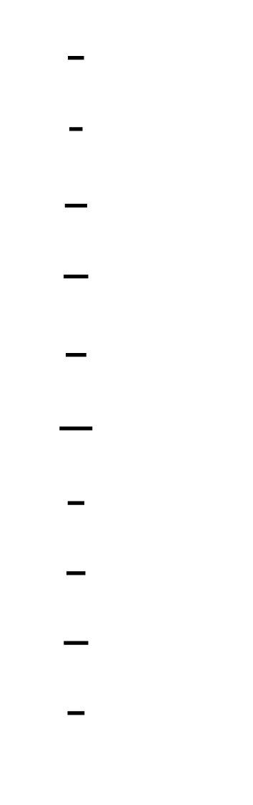
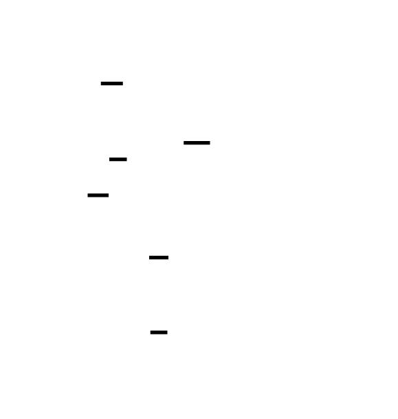
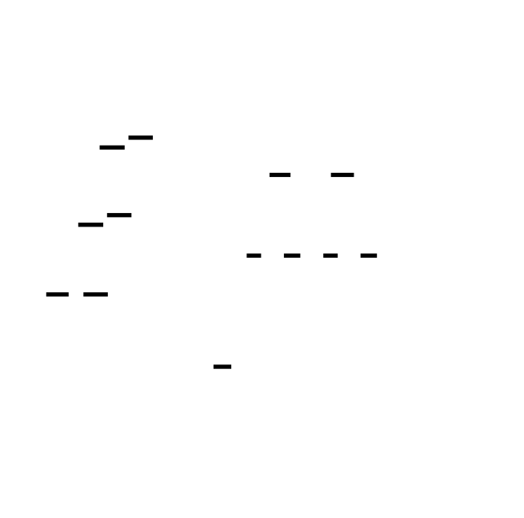
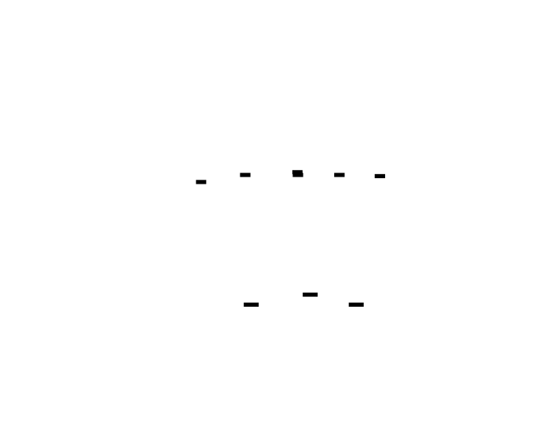
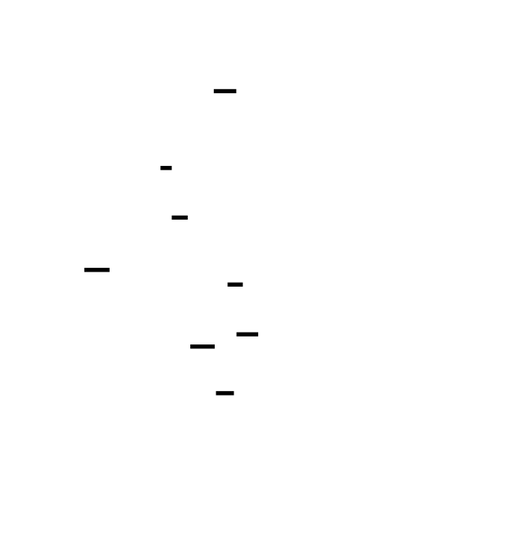

# 🎯 Project Charter: Query Optimizer

## What You Are Building
A cost-based query optimization engine that transforms high-level SQL query representations into efficient physical execution plans. You will build a system that performs statistical profiling of data (using equi-depth histograms), estimates the cost of different execution paths based on I/O and CPU weights, and uses Selinger-style dynamic programming to find the optimal order for multi-table joins. By the end, your optimizer will be able to take a complex multi-table query and automatically decide whether to use Hash Joins, Index Scans, or Nested Loops based on the underlying data distribution.

## Why This Project Exists
The query optimizer is the most complex "brain" inside modern databases like PostgreSQL, Snowflake, and BigQuery. Most developers treat SQL as a black box, but building an optimizer exposes the mathematical foundations of relational algebra and the combinatorial explosion of query planning. Learning to build a cost-based optimizer is the best way to move from "writing SQL" to "understanding data infrastructure" and distributed systems performance.

## What You Will Be Able to Do When Done
- **Implement Statistical Profiling:** Write an `ANALYZE` command that builds equi-depth histograms to model skewed data distributions.
- **Predict Query Performance:** Design cost models that use probability and linear interpolation to estimate row counts (cardinality) and execution effort.
- **Perform Logical Rewrites:** Build a rule-based engine to automate "no-brainer" optimizations like predicate pushdown, constant folding, and projection pruning.
- **Solve Join Ordering:** Implement a dynamic programming search space that evaluates millions of possible join sequences to find the cheapest path.
- **Select Physical Algorithms:** Programmatically choose between algorithms like Hash Join, Sort-Merge Join, and Index Scans based on hardware-specific cost weights.

## Final Deliverable
A modular query optimization library (~2,500 lines of code) that accepts a logical query plan and a statistics catalog as input. The engine outputs a pretty-printed Physical Plan tree where every node is annotated with its estimated row count and total cost. It will include a test suite demonstrating that for a 4+ table join, the optimizer identifies a plan significantly faster than a naive execution order.

## Is This Project For You?
**You should start this if you:**
- Understand basic SQL (JOINs, WHERE clauses, Indexes).
- Are comfortable with tree data structures and recursive algorithms.
- Can implement basic object-oriented patterns (Polymorphism/Inheritance).
- Have a passing familiarity with probability (e.g., "What is the likelihood of A and B happening?").

**Come back after you've learned:**
- **Relational Algebra Basics:** Understand Selection, Projection, and Joins as mathematical operations ([CMU 15-445/645 Intro to Database Systems](https://15445.courses.cs.cmu.edu/)).
- **Dynamic Programming:** Be comfortable with memoization and breaking large problems into sub-problems.

## Estimated Effort
| Phase | Time |
|-------|------|
| Plan Representation & Statistics Collection | ~6 hours |
| Cost Estimation & Selectivity | ~7 hours |
| Rule-Based Logical Optimization | ~7 hours |
| Join Ordering & Physical Selection | ~10 hours |
| **Total** | **~30 hours** |

## Definition of Done
The project is complete when:
- The `ANALYZE` command generates equi-depth histograms that correctly divide a skewed dataset into balanced buckets.
- Predicate pushdown successfully moves filters below join operators in a 3-table join query.
- The optimizer correctly selects an `IndexScan` over a `SeqScan` when a filter's selectivity is below a 15% threshold.
- A 4-table join is optimized using dynamic programming in under 500ms, producing a plan with a lower cost than a naive left-to-right join.
- All unit tests pass for cardinality estimation, showing estimates within a 2x margin of error on uniform test data.

---

# 📚 Before You Read This: Prerequisites & Further Reading

> **Read these first.** The Atlas assumes you are familiar with the foundations below.
> Resources are ordered by when you should encounter them — some before you start, some at specific milestones.

## 📐 Relational Foundations
### A Relational Model of Data for Large Shared Data Banks
- **Paper**: E.F. Codd (1970).
- **Best Explanation**: *Database System Concepts (Silberschatz, Korth, Sudarshan)*, Chapter 2: Relational Model.
- **Why**: This is the seminal paper that defined the relational algebra your entire optimizer is built to manipulate.
- **Pedagogical Timing**: Read BEFORE starting the project — you cannot build a logical plan tree without understanding the mathematical definitions of Projection, Selection, and Join.

## 📊 Statistics & Estimation
### Random Sampling for Histogram Construction: How much is enough?
- **Paper**: Chaudhuri, Motwani, & Narasayya (1998).
- **Code**: [PostgreSQL: `analyze.c`](https://github.com/postgres/postgres/blob/master/src/backend/commands/analyze.c) — See `do_analyze_rel`.
- **Best Explanation**: [Harnessing the Power of Histograms](https://dbmsmusings.blogspot.com/2013/05/harnessing-power-of-histograms.html) by Daniel Abadi.
- **Why**: This defines the math behind why 100 buckets is often "enough" to represent 100 million rows accurately.
- **Pedagogical Timing**: Read during Milestone 1 (Statistics Collection) — it provides the theoretical justification for the `build_histogram` logic.

## 🧠 Cost-Based Optimization (CBO)
### Access Path Selection in a Relational Database Management System
- **Paper**: P. Selinger et al. (1979).
- **Code**: [PostgreSQL: `costsize.c`](https://github.com/postgres/postgres/blob/master/src/backend/optimizer/path/costsize.c) — See `cost_seqscan` and `cost_index`.
- **Best Explanation**: [The Selinger Paper and Why It Matters](https://coderpacing.com/the-selinger-paper/) by Justin Jaffray.
- **Why**: This is the most influential paper in database history, introducing the concepts of cost-based search and interesting orders.
- **Pedagogical Timing**: Read BEFORE Milestone 2 (Cost Estimation) — it introduces the cost weights ($W_{io}, W_{cpu}$) you will implement.

## 🔄 Rule-Based Optimization (RBO)
### The Volcano Optimizer Generator: Extensibility and Efficient Search
- **Paper**: Goetz Graefe & William J. McKenna (1993).
- **Code**: [Apache Calcite: `RelOptRule.java`](https://github.com/apache/calcite/blob/main/core/src/main/java/org/apache/calcite/plan/RelOptRule.java).
- **Best Explanation**: [Introduction to Apache Calcite](https://www.ververica.com/blog/introduction-apache-calcite) (Rule Engine Section).
- **Why**: Volcano/Cascades is the industry-standard framework for modern rule-based rewrites.
- **Pedagogical Timing**: Read after Milestone 3 (Rule-Based Optimization) — you will have implemented a simple RBO and be ready to see how professional engines generalize rules.

## 🧩 Join Ordering & Search
### Dynamic Programming Strikes Back
- **Paper**: Guido Moerkotte & Thomas Neumann (2008).
- **Code**: [DuckDB: `join_order_optimizer.cpp`](https://github.com/duckdb/duckdb/blob/master/src/optimizer/join_order/join_order_optimizer.cpp).
- **Best Explanation**: *Database Internals (Alex Petrov)*, Chapter 11: Query Optimization.
- **Why**: While Selinger started it, Moerkotte and Neumann perfected the modern approach to bushy-tree join enumeration.
- **Pedagogical Timing**: Read BEFORE Milestone 4 (Join Ordering) — it explains the graph-based search space you are about to traverse.

## 🛠️ Modern Systems Context
### Architecture of a Database System
- **Paper**: Hellerstein, Stonebraker, & Hamilton (2007).
- **Best Explanation**: Section 4: "Query Processor".
- **Why**: This provides the "Big Picture" of how the optimizer fits between the parser and the execution engine.
- **Pedagogical Timing**: Read after Milestone 4 — once the project is finished, this resource ties your individual components back into the global architecture of systems like Postgres and SQL Server.

---

# Query Optimizer: The Database Brain

A query optimizer is the most complex component of a modern database. It acts as a bridge between high-level declarative SQL and low-level physical execution, transforming a user's intent into an efficient machine-executable strategy. This project involves building a cost-based optimizer (CBO) that uses table statistics, mathematical models, and dynamic programming to navigate the astronomical number of possible execution paths for a single query.


<!-- MS_ID: query-optimizer-m1 -->
# Milestone 1: Plan Representation & Statistics Collection

Welcome to the bridge of the database engine. You are about to build the **Optimizer**, the component responsible for transforming a user's high-level SQL intent into a concrete, high-performance execution strategy. 

In this first milestone, you aren't just writing code; you are defining the "eyes" and "limbs" of the optimizer. Without a way to represent a plan (the limbs) and a way to see the data (the eyes), your optimizer is a blind architect. We will build the foundational tree structures for query plans and the `ANALYZE` infrastructure required to gather table statistics.

## The Blind Architect Tension

The fundamental tension in query optimization is **Information vs. Overhead**. To find the perfect plan, you would need to know the exact location and value of every byte on disk. But calculating that would take longer than simply running the query poorly. 

Most developers treat table statistics as optional metadata—a "nice to have" for the DBA. **This is a misconception.** In the world of cost-based optimization (CBO), statistics are the only thing that makes one plan look better than another. Without them, the optimizer cannot distinguish between a table with 10 rows and a table with 10 billion rows. It is a blind architect trying to design a foundation without knowing if it's sitting on bedrock or swamp-mud.





## The Three-Level View of Optimization

To understand where we are building, look at the layers of an optimizer:

1.  **Logical Layer (The "What"):** Defines the mathematical operations required. "I need to join Table A and Table B, then filter by Date." This is rooted in 
> **🔑 Foundation: Relational Algebra**
> 
> 1. **What it IS**: Relational Algebra (RA) is the mathematical language used to describe how data is manipulated in a relational database. Think of it as the "assembly language" behind SQL. While SQL is declarative (you say *what* you want), Relational Algebra is procedural (it describes *how* to get it) using operations like Selection (filtering rows), Projection (choosing columns), and Joins.

2. **WHY you need it**: Understanding RA allows you to see beyond SQL syntax and visualize a query as a "logical plan" or a tree of operations. This is crucial for performance tuning: it's the framework that allows a database optimizer to take your query and rearrange the steps—like moving a filter (Selection) to happen before a Join—without changing the final result.

3. **Key Insight**: **The Closure Property.** Every operation in Relational Algebra takes one or more relations (tables) as input and produces a new relation as output. This means you can infinitely nest operations because the output of one step is always the valid input for the next.
.
2.  **Physical Layer (The "How"):** Defines the specific algorithms used. "I will use a Hash Join to combine A and B, using a Sequential Scan on A and an Index Scan on B."
3.  **Statistical Layer (The "Why"):** The underlying data distributions (histograms, row counts) that justify choosing one physical plan over another.

---

## Part 1: Representing the Plan Tree

A query plan is a directed acyclic graph (DAG), though in most simple optimizers, it is structured as a tree. Data flows from the leaves (scans) up through the internal nodes (joins, filters) to the root (projection/limit).

### Logical vs. Physical Operators

You must maintain a strict separation between **Logical Operators** and **Physical Operators**. 

*   **Logical Operators** represent the relational intent. A `LogicalJoin` simply says "these two sets of data must be joined."
*   **Physical Operators** are the implementation. A `LogicalJoin` could be realized as a `NestedLoopJoin`, a `HashJoin`, or a `SortMergeJoin`.

If you conflate these two, your optimizer will lose the ability to explore different execution strategies for the same query logic.


### Implementation in Python

You will implement these as a class hierarchy. Every node in your tree must carry two critical annotations that the optimizer will fill in later: `estimated_rows` (
> **🔑 Foundation: Cardinality Estimation**
> 
> 1. **What it IS**: Cardinality Estimation (CE) is the process by which a database optimizer guesses how many rows will be returned by a specific operation in a query plan. It is an "educated guess" made before the query actually runs, based on stored statistics about the data (like histograms).

2. **WHY you need it**: This estimate is the single most important factor in how the database decides to execute your query. If the CE thinks a filter will return 10 rows, it might choose a Index Seek; if it predicts 1 million rows, it will likely choose a Full Table Scan. When queries are unexpectedly slow, it is frequently because the CE was "fooled" by stale statistics or complex correlations, leading to a suboptimal execution plan.

3. **Key Insight**: **The Optimizer’s Map.** If the execution plan is a map, Cardinality Estimation is the scale. If the scale is wrong (e.g., thinking 1 inch equals 1 mile instead of 100 miles), the optimizer will choose the "shortest" path that actually ends up being the longest.
) and `estimated_cost`.

```python
from typing import List, Optional

class PlanNode:
    """Base class for all query plan nodes."""
    def __init__(self):
        self.children: List['PlanNode'] = []
        self.estimated_rows: float = 0.0
        self.estimated_cost: float = 0.0

    def __repr__(self):
        return self.pretty_print()

    def pretty_print(self, indent=0) -> str:
        """Outputs an indented text representation of the plan."""
        name = self.__class__.__name__
        stats = f"(rows={self.estimated_rows:.1f} cost={self.estimated_cost:.1f})"
        lines = ["  " * indent + f"-> {name} {stats}"]
        for child in self.children:
            lines.append(child.pretty_print(indent + 1))
        return "\n".join(lines)

# --- Logical Operators ---

class LogicalScan(PlanNode):
    def __init__(self, table_name: str):
        super().__init__()
        self.table_name = table_name

class LogicalFilter(PlanNode):
    def __init__(self, child: PlanNode, predicate: str):
        super().__init__()
        self.children = [child]
        self.predicate = predicate

class LogicalJoin(PlanNode):
    def __init__(self, left: PlanNode, right: PlanNode, on_condition: str, join_type: str = "INNER"):
        super().__init__()
        self.children = [left, right]
        self.on_condition = on_condition
        self.join_type = join_type

# --- Physical Operators ---

class PhysicalSeqScan(LogicalScan):
    """Scan a table by reading every page sequentially."""
    pass

class PhysicalIndexScan(LogicalScan):
    """Scan a table using a B-Tree or similar index."""
    def __init__(self, table_name: str, index_name: str):
        super().__init__(table_name)
        self.index_name = index_name

class PhysicalHashJoin(LogicalJoin):
    """Join using a hash table. Efficient for large, unsorted inputs."""
    pass
```

### The Pretty Printer
Your `pretty_print` method is your primary debugging tool. When you eventually implement complex join ordering, the only way to verify the optimizer's "thought process" is to look at the indented tree. It should clearly show the flow of data from bottom to top.

---

## Part 2: Statistics Collection (ANALYZE)

To make cost-based decisions, the optimizer needs to know the "shape" of the data. This is handled by the `ANALYZE` command. In a real database, this is often a background process that periodically scans tables to update the **Catalog**.

### The Metadata Catalog
The Catalog is a persistent store (often internal system tables) that tracks:
1.  **Table-level stats:** Total row count, number of pages/blocks on disk.
2.  **Column-level stats:** Number of distinct values (NDV), fraction of NULLs, and data distribution.

### Understanding Data Distribution: Histograms
A simple row count isn't enough. If you have a `users` table where 90% of users are from "USA" and 0.1% are from "Iceland", a query `WHERE country = 'Iceland'` is much more 
> **🔑 Foundation: selective**
> 
> 1. **What it IS**: Selectivity is a measure of how much a filter (predicate) narrows down a dataset. It is expressed as a fraction between 0 and 1. High selectivity (closer to 0) means the filter is "picky" and returns very few rows; low selectivity (closer to 1) means the filter is "permissive" and returns most of the data. 
   * *Formula: (Rows matching criteria) / (Total rows)*

2. **WHY you need it**: Selectivity dictates whether an index is actually useful. An index on a `Gender` column has low selectivity (returning roughly 50% of the table), so the database engine will often ignore it because it's faster to just scan the whole table. An index on a `Unique_ID` has maximum selectivity, making it the most efficient way to access data.

3. **Key Insight**: **The "Fail Fast" Rule.** In query optimization, you want to apply your most selective filters (the ones that discard the most data) as early as possible. The smaller the intermediate result set, the less work every subsequent Join and Sort operation has to do.
 than one for "USA". 

To capture this "clumpiness," we use **Equi-Depth Histograms**.

| Feature | Equi-Width Histogram | Equi-Depth Histogram (Our Choice) |
| :--- | :--- | :--- |
| **Logic** | Divides the value range (1-100) into equal intervals (1-10, 11-20...). | Divides values so each bucket has roughly the same number of rows. |
| **Handling Skew** | Poor. One bucket might have 1 million rows, another zero. | Excellent. Buckets are "narrower" where data is dense and "wider" where data is sparse. |
| **Used By** | Simple monitoring tools. | PostgreSQL, SQL Server, Oracle. |


### Implementing the Histogram
In an equi-depth histogram, you sort the column data and pick values at specific percentiles to be your bucket boundaries. For 100 buckets, you would pick the value at every 1% increment of the sorted data.

```python
import math

class ColumnStats:
    def __init__(self, row_count: int):
        self.total_rows = row_count
        self.distinct_values = 0
        self.null_fraction = 0.0
        self.histogram_boundaries = []  # The 'depth' boundaries

    def build_histogram(self, values: list, bucket_count: int = 100):
        """
        Builds an equi-depth histogram from a list of raw values.
        """
        if not values:
            return
        
        # 1. Filter out NULLs and sort
        non_nulls = sorted([v for v in values if v is not None])
        self.total_rows = len(values)
        self.null_fraction = (self.total_rows - len(non_nulls)) / self.total_rows
        
        if not non_nulls:
            return

        # 2. Pick boundaries
        # We want bucket_count buckets, so we need bucket_count + 1 boundaries
        step = len(non_nulls) / bucket_count
        for i in range(bucket_count):
            index = int(i * step)
            self.histogram_boundaries.append(non_nulls[index])
        
        # Add the max value as the final boundary
        self.histogram_boundaries.append(non_nulls[-1])
        
        # 3. Rough distinct value estimation (Simplified)
        self.distinct_values = len(set(non_nulls))
```

### The ANALYZE Logic
When your system receives an `ANALYZE table_name` command:
1.  Perform a **Sequential Scan** of the table.
2.  For every column, collect the values into memory (or a sample).
3.  Calculate the `total_row_count`.
4.  For each column, instantiate a `ColumnStats` object and call `build_histogram`.
5.  Store these in a global `Catalog` dictionary.

> 🔭 **Deep Dive**: In massive tables, scanning every row for statistics is too slow. Databases use **Reservoir Sampling** to maintain a statistically significant sample of the data (usually a few thousand rows) without reading the whole table. For a robust implementation, see the paper *Random Sampling for Histogram Construction: How much is enough?* (Chaudhuri et al., 1998).

---

## Part 3: The Catalog Structure

The `Catalog` is the source of truth for the optimizer. It maps table names to their metadata.

```python
class TableMetadata:
    def __init__(self, name: str, row_count: int, pages: int):
        self.name = name
        self.row_count = row_count
        self.pages = pages
        self.columns = {}  # Map: column_name -> ColumnStats

class Catalog:
    def __init__(self):
        self.tables = {}

    def add_table_stats(self, table_name: str, meta: TableMetadata):
        self.tables[table_name] = meta

    def get_table_stats(self, table_name: str) -> Optional[TableMetadata]:
        return self.tables.get(table_name)
```

---

## Why This Matters: The Knowledge Cascade

By completing this milestone, you have built the infrastructure for every performance optimization that follows. Here is how this knowledge connects to the broader world of systems:

1.  **Data Distribution Awarenes**: Once you understand histograms, you understand why "Index Scans" are sometimes slower than "Sequential Scans." If the histogram tells you that 99% of the rows match your filter, using an index (which involves random I/O) is much slower than just reading the whole file.
2.  **Polymorphism in Systems**: By separating Logical and Physical nodes, you are using the same pattern found in **Compilers** (AST vs. Machine Code) and **Graphics Engines** (Scene Graph vs. Draw Calls).
3.  **Sampling Theory**: The `ANALYZE` sampling technique is the same principle used by **Prometheus** for metrics, **New Relic** for tracing, and even **Nielsen Ratings** for TV—observing a small, well-chosen subset to predict the behavior of the whole.
4.  **Metadata Management**: This "Catalog" is a micro-version of what tools like **Apache Hive Metastore** or **AWS Glue** do for entire data lakes.

## Design Decisions: "Why This, Not That"

| Option | Pros | Cons | Used By |
| :--- | :--- | :--- | :--- |
| **Equi-Depth Histogram ✓** | Accurate for skewed data; constant number of buckets. | More complex to build (requires sorting). | PostgreSQL, MySQL 8.0+ |
| **Equi-Width Histogram** | Extremely easy to implement; fast to update. | Useless for data with "heavy tails" or outliers. | Basic visualization tools |
| **HyperLogLog (HLL)** | Estimates distinct values in O(1) space without storing values. | Cannot estimate range selectivity (only NDV). | Redis, Presto, BigQuery |

In this project, we choose **Equi-Depth** because our primary goal is cardinality estimation for filters like `WHERE age > 25`, which HLL cannot help with.

---

## Technical Pitfalls to Avoid

*   **Stale Stats**: Remind yourself (and document) that statistics are a snapshot. If you `INSERT` 1 million rows after running `ANALYZE`, your optimizer will produce terrible plans because its "eyes" are seeing the old version of the world.
*   **The Uniformity Assumption**: Within a single histogram bucket, we assume the data is spread out evenly. This is rarely true in reality, but it's a necessary compromise. If your bucket is `[10, 100]` and contains 1000 rows, we assume there are roughly 11 rows for the value `50`.
*   **Memory Exhaustion**: If you `ANALYZE` a table with 100 columns and 10 million rows by loading everything into Python lists, your process will crash. For this milestone, assume your test data fits in memory, but in a production system, you would stream the data and use a sample.

You are now ready to build the plan nodes and the statistics collector. Once these are in place, we can begin the "math" of optimization: **Cost Estimation.**
<!-- END_MS -->


<!-- MS_ID: query-optimizer-m2 -->
<!-- MS_ID: query-optimizer-m2 -->
# Milestone 2: Cost Estimation & Selectivity

In Milestone 1, you gave your optimizer "eyes" by building a statistics catalog. Now, it’s time to give it a "brain"—a mathematical engine capable of predicting the future. 

The goal of this milestone is to implement **Cost Estimation**. You will build the logic that looks at a potential execution plan and assigns it a numeric score (the "Cost"). This score allows the optimizer to compare a Sequential Scan against an Index Scan or a Hash Join against a Nested Loop Join and say, with mathematical confidence, "This one is cheaper."

## The Revelation: The Optimizer is a Gambler

There is a common misconception among developers: *The optimizer predicts exactly how many rows a query will return.*

**This is false.** In reality, optimization is an exercise in **probability**. When an optimizer looks at a filter like `WHERE price > 100`, it isn't counting rows; it is calculating the **area under a curve**. It treats the data distribution (your histogram) as a probability density function. 

The "Cost" isn't a measurement of time in seconds; it’s an abstract unit representing the total "effort" required by the hardware. Because the optimizer has to make these guesses millions of times per second during join ordering, it cannot afford to be perfectly accurate—it just needs to be "accurate enough" to avoid disastrously slow plans.


## The Three-Level View: What is "Cost"?

To build a cost model, you must understand what the database is actually "paying" for.

1.  **Level 1 — The API (Logical Unit)**: The optimizer sees a `Filter` or a `Join`. Its unit of work is the **Tuple** (row).
2.  **Level 2 — The Engine (The Cost Model)**: The engine translates these logical units into physical work: **I/O Operations** and **CPU Cycles**. 
3.  **Level 3 — The Hardware (The Bottleneck)**: The cost model must reflect hardware reality. Reading 1MB from a sequential file on an NVMe SSD is orders of magnitude cheaper than seeking 1MB of random blocks on an old HDD.

---

## Part 1: The Anatomy of a Cost Model

A modern cost model is a weighted sum of two primary factors: **I/O Cost** and **CPU Cost**.

$$TotalCost = (W_{io} \times \text{PagesRead}) + (W_{cpu} \times \text{TuplesProcessed})$$

### Why the Weights Matter
*   **$W_{io}$ (Default: 1.0)**: Traditionally, I/O is the king of costs. Fetching a page from disk involves storage latency. 
*   **$W_{cpu}$ (Default: 0.01)**: Processing a tuple in memory (evaluating a predicate, hashing a key) is fast, but when you process 100 million tuples, the CPU time adds up.

By making these weights configurable, you allow your database to be tuned for different hardware. On a system with slow disks, you increase $W_{io}$. On a system with a massive RAM cache (where I/O is effectively zero), you increase $W_{cpu}$ to focus on algorithmic efficiency.

### Implementing the Cost Model in Python

```python
class CostModel:
    def __init__(self, io_weight: float = 1.0, cpu_weight: float = 0.01):
        self.io_weight = io_weight
        self.cpu_weight = cpu_weight

    def estimate_seq_scan(self, table_pages: int, table_rows: int) -> float:
        """
        Cost = Reading every page + processing every row.
        """
        io_cost = table_pages * self.io_weight
        cpu_cost = table_rows * self.cpu_weight
        return io_cost + cpu_cost

    def estimate_index_scan(self, selectivity: float, table_pages: int, 
                            table_rows: int, index_height: int) -> float:
        """
        Cost = Index lookup + reading ONLY the matching pages/rows.
        """
        # Assume 1 I/O per level of the B-Tree to find the start point
        index_lookup_cost = index_height * self.io_weight
        
        # We only read a fraction of the pages (Selectivity)
        # Note: In reality, random I/O is more expensive than sequential,
        # but for this intermediate model, we use a simple linear fraction.
        io_cost = (selectivity * table_pages) * self.io_weight
        cpu_cost = (selectivity * table_rows) * self.cpu_weight
        
        return index_lookup_cost + io_cost + cpu_cost
```

---

## Part 2: Selectivity — Estimating the "Picky-ness"

Before you can calculate cost, you need to know the **Selectivity** ($S$). 
Selectivity is a value between 0.0 and 1.0 representing the fraction of rows that satisfy a predicate.

*   $S = 1.0$: Every row matches (e.g., `WHERE 1=1`).
*   $S = 0.0$: No rows match (e.g., `WHERE 1=0`).
*   $S = 0.1$: 10% of the table matches.

### Equality Predicates (`col = 'value'`)
Using the Equi-Depth histogram from Milestone 1, we find the bucket that contains the value. If we have 100 buckets, each bucket represents roughly 1% of the data.
*   **Simple Guess**: If the value is in a bucket, selectivity $\approx 1 / \text{total\_buckets}$.
*   **Better Guess**: Use the number of distinct values (NDV). If a column has 10,000 rows and 1,000 distinct values, and the data is uniform, selectivity is $1/1000 = 0.001$.

### Range Predicates (`col > 50`)
This is where histograms shine. To estimate `col > 50`, we:
1.  Find the bucket where `50` resides.
2.  Count all buckets strictly greater than that bucket.
3.  Perform **Linear Interpolation** for the bucket containing `50`.





> **🔑 Foundation: Linear Interpolation**
> 
> 1. **What it IS**: In the context of histograms, linear interpolation is a method of estimating a value that falls between two known points (the bucket boundaries). It assumes that the data within a single bucket is spread out perfectly evenly (the Uniformity Assumption).
> 2. **WHY you need it**: If a histogram bucket covers the range `[10, 20]` and contains 100 rows, and your query asks for `WHERE val > 15`, interpolation allows you to estimate that exactly 50% of that bucket (50 rows) matches your criteria.
> 3. **Key Insight**: While data is rarely perfectly uniform, interpolation is the standard "best guess" in database engines. It prevents the optimizer from seeing a bucket as an "all or nothing" block, allowing for much finer-grained cost estimates.

### Implementation: The Selectivity Estimator

```python
class SelectivityEstimator:
    @staticmethod
    def estimate_filter(stats: 'ColumnStats', operator: str, value: any) -> float:
        if not stats.histogram_boundaries:
            return 0.05 # Default "magic number" if no stats exist
        
        boundaries = stats.histogram_boundaries
        num_buckets = len(boundaries) - 1
        
        if operator == "=":
            # If we know the number of distinct values, use that
            if stats.distinct_values > 0:
                return 1.0 / stats.distinct_values
            return 1.0 / num_buckets
            
        if operator == ">":
            if value >= boundaries[-1]: return 0.0
            if value < boundaries[0]: return 1.0
            
            # Find the bucket index
            for i in range(num_buckets):
                low, high = boundaries[i], boundaries[i+1]
                if low <= value < high:
                    # 1. Part of this bucket matches (Interpolation)
                    proportion_of_bucket = (high - value) / (high - low)
                    matching_rows_in_bucket = proportion_of_bucket * (1.0 / num_buckets)
                    
                    # 2. All subsequent buckets match
                    remaining_buckets = num_buckets - (i + 1)
                    matching_rows_after = remaining_buckets * (1.0 / num_buckets)
                    
                    return matching_rows_in_bucket + matching_rows_after
            return 0.0
```

---

## Part 3: Compound Predicates & The Independence Assumption

What happens when a user runs `WHERE city = 'New York' AND weather = 'Sunny'`?

To calculate the combined selectivity, databases typically use the **Independence Assumption**. This treats the two filters as independent events in a probability space.

1.  **AND (Intersection)**: Multiply the selectivities. 
    *   $S(A \text{ and } B) = S(A) \times S(B)$
2.  **OR (Union)**: Sum the selectivities and subtract the intersection (to avoid double counting).
    *   $S(A \text{ or } B) = S(A) + S(B) - (S(A) \times S(B))$

> 🔭 **Deep Dive**: The Independence Assumption is the "Great Lie" of database systems. In reality, data is often highly correlated (e.g., `city = 'San Francisco'` and `zip_code = 94105`). When the optimizer treats these as independent, it underestimates the number of rows (the "Staten Island" problem), often leading to a nested loop join that runs for hours. Modern databases solve this using **Multivariate Statistics** or **Correlated Column Stats**.

---

## Part 4: Join Cardinality — The Billion-Row Mistake

Estimating the size of a join is the most critical task in this milestone. If you join Table A (1,000 rows) and Table B (1,000 rows), the output could be 0 rows (no matches) or 1,000,000 rows (a Cartesian product).

For an **Equi-Join** (`A.id = B.id`), we use a formula based on the **Inclusion Principle**:

$$\text{JoinRows} = \frac{\text{Rows}_A \times \text{Rows}_B}{\max(\text{Distinct}_A, \text{Distinct}_B)}$$

### The Logic:
1.  Assume every value in the table with *fewer* distinct values has a matching value in the other table.
2.  The "spread" of the join is determined by the "more diverse" column. 
3.  By dividing by the maximum number of distinct values, we effectively calculate how many pairs are likely to form given the overlap of the two sets.

---

## Knowledge Cascade: The Web of Systems

By mastering these estimations, you are unlocking concepts used across the entire stack:

1.  **Queueing Theory**: The way we model I/O vs CPU cost is identical to how 

> **🔑 Foundation: Little's Law**
> 
> ### What it IS
Little’s Law is a fundamental theorem from queueing theory that describes the relationship between three variables in any stable system: **Work in Progress (L)**, **Throughput (λ)**, and **Lead Time (W)**. 

In plain language, it states that the average number of items in a system is equal to the average rate at which items arrive, multiplied by the average time an item spends in that system. 

Mathematically, it is expressed as: **$L = \lambda \times W$**

*   **$L$ (Inventory/WIP):** How many requests are currently "in flight" or being processed.
*   **$\lambda$ (Arrival Rate/Throughput):** How many requests arrive (or leave) per unit of time (e.g., 100 requests/sec).
*   **$W$ (Wait Time/Latency):** The average duration an item stays in the system from start to finish.

### WHY the reader needs it right now
In the context of system design and performance tuning, Little’s Law acts as the "Physics of the Pipeline." It allows you to derive a third, hard-to-measure metric from two easy-to-measure ones. 

For example, if you know your web server handles 500 requests per second (Throughput) and your monitoring tool says the average response time is 200ms (Latency), Little’s Law tells you that you have exactly 100 concurrent requests (WIP) living in your memory at any given time. This is critical for **capacity planning**: if you know your server crashes at 200 concurrent connections, and your latency spikes to 500ms, you can mathematically predict exactly when your system will fail based on incoming traffic.

### ONE key insight or mental model
**The "Fixed Pipe" Constraint:** To reduce latency ($W$) without changing your throughput ($\lambda$), you *must* reduce the amount of work currently in the system ($L$). 

Think of a coffee shop. If 10 people arrive per hour and each stays for 1 hour, there are 10 people in the shop. If you want people to spend less time there (lower latency) but still want to serve 10 people per hour (same throughput), the only way is to ensure there are fewer people sitting in the shop at once. If the shop is crowded ($L$ is high) and the staff's speed ($\lambda$) is fixed, the wait time ($W$) **mathematically must** increase. There is no middle ground.

 is used to calculate wait times in networking and server scaling.
2.  **Search Engines**: Relevance ranking in Lucene (Elasticsearch) uses similar "score" models where term frequency (selectivity) determines the "cost" of a document's relevance.
3.  **B-Tree and Hash Index Primitives**: 
> **🔑 Foundation: B-Tree and Hash Index Primitives**
> 
> 1. **What it IS**: These are the two fundamental data structures used for indexing. A **B-Tree** stores data in a sorted, balanced tree, allowing for fast searches, insertions, and—crucially—range scans (e.g., "find everyone aged 20 to 30"). A **Hash Index** uses a hash table to map keys to locations, offering nearly instantaneous (O(1)) lookups for specific values but zero support for ranges.

2. **WHY you need it**: Your cost model depends entirely on which primitive is available. If you have a B-Tree, `WHERE age > 25` is an efficient "Index Scan." If you only have a Hash Index, that same query forces a "Sequential Scan" because a hash table can't help you find a range of values.

3. **Key Insight**: **Sorted vs. Unsorted.** B-Trees maintain order, which is why they are the default for most databases (PostgreSQL, MySQL). Hash indexes are "specialists"—faster for point lookups but useless for everything else. Understanding this helps you write the `estimate_index_scan` logic correctly.
.
4.  **Machine Learning**: Modern "Learned Optimizers" (like Neo or SageDB) replace these manual formulas with Neural Networks that predict selectivity based on query history—but they still use your $W_{io} / W_{cpu}$ framework as the target loss function!

---

## Technical Pitfalls to Avoid

*   **The "Zero-Row" Trap**: If your selectivity math results in 0.00000001, your optimizer might think the join returns 0 rows and pick a plan that is only fast for 0 rows. **Always enforce a minimum cardinality of 1 row** (unless you can prove the filter is a constant contradiction like `1=0`).
*   **Stale Stats Divergence**: If your stats say a table has 100 rows, but it actually has 100 million, your cost estimates will be off by a factor of 1,000,000. This is why `ANALYZE` is the DBA's best friend.
*   **Float Precision**: When multiplying many small selectivities (e.g., 5 AND conditions), you can quickly run into underflow issues. Many production optimizers perform these calculations in **Log-Space** (adding logarithms instead of multiplying fractions) to maintain precision.

## Design Decisions: Choosing the Cost Unit

| Unit | Pros | Cons | Used By |
| :--- | :--- | :--- | :--- |
| **Microseconds (Wall Time)** | Intuitive; matches real-world performance. | Impossible to predict; varies by CPU load and disk contention. | High-end specialized DBs |
| **Generic "Cost Units" ✓** | Stable across different runs; focuses on relative plan comparison. | Hard for humans to interpret (What is "1540.2 units"?). | PostgreSQL, Oracle, SQL Server |

We use **Generic Cost Units** because our goal is to rank plans against each other, not to predict the wall-clock time perfectly.

---
<!-- END_MS -->


<!-- MS_ID: query-optimizer-m3 -->
<!-- MS_ID: query-optimizer-m3 -->

# Milestone 3: Rule-Based Logical Optimization

You have built the "eyes" (statistics) and the "brain" (cost models) for your optimizer. But before you unleash the heavy machinery of Dynamic Programming to find the perfect join order, you need to perform what engineers call **"The No-Brainers."**

In this milestone, you will implement a **Rule-Based Optimizer (RBO)**. Think of this as the "algebraic simplification" phase of a query. If you were solving a math equation like `2x + 4 = 10`, you wouldn't start by guessing values for `x`; you would first subtract 4 from both sides. Rule-based optimization applies these same types of "always-good" transformations to the query tree.

## The Revelation: The SQL Order Illusion

There is a massive misconception among SQL users: *The way I write my query—the order of my JOINs and the placement of my WHERE clauses—dictates how the database executes it.*

**This is entirely false.** SQL is a **declarative** language, not a procedural one. You are describing the *result* you want, not the *steps* to get it. 

### The Illusion Broken
A user might write:
```sql
SELECT * 
FROM users 
JOIN orders ON users.id = orders.user_id 
WHERE users.country = 'Iceland';
```
The user might think the database will:
1. Join all `users` with all `orders` (creating a massive intermediate table).
2. Filter that massive table for people from 'Iceland'.

If the database actually did this, it would crash on any moderately sized dataset. The **Predicate Pushdown** rule ensures that the filter `country = 'Iceland'` is shoved "down" the tree, applied directly to the `users` table *before* the join even starts. The optimizer doesn't care where you wrote the `WHERE` clause; it only cares about the most efficient path to the truth.


---

## The Three-Level View of RBO

Rule-based optimization operates at the intersection of logic and performance:

1.  **Level 1 — The Logical Intent (The API)**: The user provides a query tree. Our goal is to preserve the **Query Semantics** (the results must be identical) while changing the structure.
2.  **Level 2 — The Rule Engine (The Middleware)**: This is a loop that applies transformation rules iteratively. We use [[EXPLAIN:fixed-point-iteration|Fixed-Point Iteration]] to ensure that if Rule A creates an opportunity for Rule B, we don't miss it.
3.  **Level 3 — The Reduced Search Space (The Physical Impact)**: By simplifying the tree now, we give the Cost-Based Optimizer (CBO) a much smaller and "cleaner" problem to solve in the next milestone.

---

## Part 1: Constant Folding

The simplest rule is **Constant Folding**. Why waste CPU cycles at runtime evaluating `WHERE price > 10 * 1.05` for every single row? We can calculate `10.5` once during optimization.

This rule also handles **Trivial Predicates**:
*   `WHERE 1 = 1`: This is always true. The filter can be removed entirely.
*   `WHERE 1 = 0`: This is always false. The optimizer can replace this entire branch of the tree with an empty result set (an "Empty Relation" node), preventing the query from even touching the disk.

### Implementation Logic
You will walk the tree recursively. For every expression or predicate, check if all operands are "Literals" (constants). If they are, evaluate the expression and replace the node with a single literal.

---

## Part 2: Predicate Pushdown (The Descent of the Filter)

This is the "King of Rules." Every row you discard early is a row you don't have to copy in memory, hash, or compare during a join.

### The Mechanics
When the Rule Engine encounters a `LogicalFilter` node, it looks at its child.
1.  **If the child is another Filter**: Merge them into a single `LogicalFilter` with an `AND` condition.
2.  **If the child is a Join**: Look at the columns referenced in the filter.
    *   If the filter *only* references columns from the **Left** side of the join, move the filter below the join onto the left child.
    *   If it *only* references the **Right** side, move it to the right child.
    *   If it references **Both** (e.g., `A.val > B.val`), it must stay above the join (or be converted into a join condition).


### Why it's harder than it looks
You must ensure **Column Provenance**. A filter `WHERE age > 21` can only be pushed down if the child operator actually provides the `age` column. If you push a filter past a `Projection` that has already discarded that column, your query will fail.

---

## Part 3: Projection Pruning (The Squeeze)

In Milestone 1, we learned about [[EXPLAIN:tuple-width|Tuple Width]]. The wider your rows (the more columns they have), the fewer of them fit on a single 8KB page. 

**Projection Pruning** is the process of removing columns as early as possible. If your table has 100 columns but your query only uses `name` and `email`, we should "prune" the other 98 columns at the Scan level.

### The "Top-Down" Requirement
Unlike Predicate Pushdown, which can be done looking "down," Projection Pruning is best done by walking **top-down**:
1.  Start at the `Root` (the final `SELECT`). Note which columns are required.
2.  Move down to the next node (e.g., a `Join`). Add any columns needed for the `Join Condition` to your "Required" set.
3.  When you hit the `Scan` node, only request the columns in your "Required" set.


---

## Part 4: The Rule Engine and Fixed-Point Iteration

Rules are not independent. Applying one rule often "unblocks" another.
*   **Constant Folding** might change `WHERE price > 10 + 5` to `WHERE price > 15`.
*   Now, a **Redundant Predicate** rule might notice you already have `WHERE price > 15` elsewhere and merge them.

To handle this, we use a **Rule Engine** that applies a list of rules in a loop.

```python
class RuleEngine:
    def __init__(self, rules: List['Rule']):
        self.rules = rules

    def optimize(self, root: PlanNode) -> PlanNode:
        """
        Applies rules iteratively until the tree stops changing 
        (Fixed-Point Iteration).
        """
        max_iterations = 100
        for _ in range(max_iterations):
            changed = False
            for rule in self.rules:
                # Every rule returns (new_node, has_changed)
                root, rule_changed = rule.apply(root)
                if rule_changed:
                    changed = True
            
            if not changed:
                break # We have reached a 'Fixed Point'
        return root
```

---

## Python Implementation: Defining a Rule

To keep your code clean, define an abstract `Rule` class. This allows you to add new optimizations later (like Decorrelating Subqueries or Outer-to-Inner Join conversion) without rewriting the engine.

```python
class Rule:
    def apply(self, node: PlanNode) -> (PlanNode, bool):
        """
        Returns the (potentially) modified node and a boolean 
        indicating if any change occurred.
        """
        raise NotImplementedError()

class ConstantFoldingRule(Rule):
    def apply(self, node: PlanNode) -> (PlanNode, bool):
        # 1. Recursively apply to children first (Bottom-Up)
        changed = False
        for i, child in enumerate(node.children):
            new_child, child_changed = self.apply(child)
            if child_changed:
                node.children[i] = new_child
                changed = True
        
        # 2. Logic for current node
        if isinstance(node, LogicalFilter):
            # Simplified example: check if predicate is a constant expression
            if node.predicate == "1=1":
                # Remove the filter: return the child directly
                return node.children[0], True
            if node.predicate == "1=0":
                # In a real system, replace with EmptyRelationNode
                pass
                
        return node, changed

class PredicatePushdownRule(Rule):
    def apply(self, node: PlanNode) -> (PlanNode, bool):
        # This rule is more complex as it involves swapping node positions
        if isinstance(node, LogicalFilter) and isinstance(node.children[0], LogicalJoin):
            filter_node = node
            join_node = node.children[0]
            
            # Can we push the filter to the left child?
            if self._can_push(filter_node.predicate, join_node.left):
                join_node.left = LogicalFilter(join_node.left, filter_node.predicate)
                return join_node, True # Join is now the parent
                
        # Fallback: recurse
        # ... logic to recurse through the tree ...
        return node, False

    def _can_push(self, predicate: str, target_node: PlanNode) -> bool:
        """Helper to check if all columns in predicate exist in target_node."""
        # implementation: parse predicate and check against target_node schema
        pass
```

---

## Knowledge Cascade: The Universal Pattern of Optimization

Rule-based logic is the "hidden architecture" of almost all high-performance software. By implementing this, you are learning patterns used in:

1.  **Compiler Theory**: Modern compilers like **LLVM** or **GCC** use exactly this approach. They have hundreds of "Passes" (rules) that do things like "Dead Code Elimination" (the compiler version of Projection Pruning) and "Loop Unrolling."
2.  **Big Data Engines**: **Apache Spark's Catalyst Optimizer** is a massive rule-based engine. It converts high-level DataFrame code into optimized RDD operations using these exact rules (Predicate Pushdown is its most famous optimization).
3.  **Data Governance**: The logic you used for **Projection Pruning** is used in security filters. If a user doesn't have permission to see `SSN`, a "Security Rule" in the optimizer can prune that column from the plan before the data is ever fetched.
4.  **Hardware Synthesis**: When Verilog code is compiled into an FPGA or ASIC, the synthesizer uses rule-based logic to simplify Boolean gates (e.g., `A AND (A OR B)` becomes just `A`).

## Design Decisions: Ordering the Rules

Does it matter if you run **Constant Folding** before **Predicate Pushdown**?

**Yes.** If you have `WHERE price > 10 + 5`, and you run Predicate Pushdown first, the rule might not recognize that `10 + 5` is a constant and might fail to push it. 

| Order | Result |
| :--- | :--- |
| **Folding → Pushdown ✓** | `price > 15` is pushed deep into the scan. Maximum efficiency. |
| **Pushdown → Folding** | The complex expression `10 + 5` stays high in the tree because the pushdown rule was "too shy" to move it. |

This is why we use **Fixed-Point Iteration**. It makes the order *less* critical because the engine will just keep looping until all opportunities are exhausted. However, a good default order saves CPU time during optimization.

---

## Technical Pitfalls to Avoid

*   **The Infinite Loop**: If Rule A changes `X` to `Y`, and Rule B changes `Y` back to `X`, your optimizer will hang forever. Ensure your rules are **monotonically reducing** (the tree gets simpler or smaller). Always include a `max_iterations` safety break.
*   **Join Condition Confusion**: Be careful not to push "Join Conditions" (the `ON` clause) as if they were "Filter Conditions" (the `WHERE` clause). Pushing an `Outer Join` condition incorrectly can change the result of the query (e.g., changing which rows are NULL-extended).
*   **Column Shadowing**: If you have two tables with the same column name (e.g., `users.id` and `orders.id`), your rule logic must be "Schema-Aware." Never rely on just the string "id"; always track the fully qualified name or a unique internal ID for every column.

## Mission Verification

To verify your RBO is working, you should be able to pass it a "messy" logical plan and get back a "clean" one.

**Input:**
```
-> LogicalProject [name]
  -> LogicalFilter [country = 'Iceland']
    -> LogicalJoin [users.id = orders.user_id]
      -> LogicalScan [users] (columns: id, name, country, age, bio)
      -> LogicalScan [orders] (columns: id, user_id, amount)
```

**Output (After RBO):**
```
-> LogicalJoin [users.id = orders.user_id]
  -> LogicalProject [id, name]
    -> LogicalFilter [country = 'Iceland']
      -> LogicalScan [users] (columns: id, name, country)
  -> LogicalProject [user_id]
    -> LogicalScan [orders] (columns: user_id)
```
Note how the `Filter` moved down, and the `Scans` now only fetch the bare minimum columns. You are now ready to build the final piece: **Join Ordering.**


<!-- END_MS -->
<!-- END_MS -->


<!-- MS_ID: query-optimizer-m4 -->
# Milestone 4: Join Ordering & Physical Plan Selection

You have arrived at the final, most prestigious stage of query optimization: the **Search Engine**. 

Up until now, you have built the "eyes" to see the data (Statistics), the "brain" to value operations (Cost Models), and the "reflexes" to simplify logic (Rule-Based Rewriting). Now, you must build the **Strategist**. This milestone is where you solve the "Grand Puzzle"—determining the exact sequence in which tables should be joined and which physical algorithms should execute those joins.

In a system with four tables, there are dozens of ways to join them. In a system with twelve, there are millions. Your task is to find the needle in that haystack without spending more time searching than the query itself would take to run.

## The Revelation: The Combinatorial Explosion

There is a dangerous misconception among developers: *Joining four tables is roughly four times harder than joining one table.*

**This is mathematically false.** The difficulty of join ordering does not grow linearly; it grows **super-exponentially**. 

When you join two tables, $\{A, B\}$, there is only one order: $(A \Join B)$. 
When you add a third table, $C$, you could do $((A \Join B) \Join C)$, $((A \Join C) \Join B)$, or $((B \Join C) \Join A)$. 
By the time you reach 10 tables, the number of possible "left-deep" join trees (where the right child is always a base table) is $10!$, or 3.6 million. If you allow "bushy trees" (where you can join two intermediate join results together), the number of possibilities is described by [[EXPLAIN:catalan-numbers|Catalan Numbers]], reaching into the billions.

### The Optimizer's Gamble
If you choose the wrong order, a query that should take 500ms might take 5 hours. But if you spend 10 seconds trying to find the "perfect" order for a query that only runs for 1 second, you have also failed. This is the fundamental tension of the search phase: **Search Exhaustion vs. Execution Disaster.**

---

## The Three-Level View of Join Selection

To navigate this explosion, we view the problem through three layers of abstraction:

1.  **Level 1 — The Goal (The API)**: Produce a `PhysicalPlan` that minimizes the total estimated cost calculated in Milestone 2.
2.  **Level 2 — The Strategy (The Search Algorithm)**: Use **Dynamic Programming** (the "Selinger" approach) to prune the search space. We break the $N$-table problem into smaller sub-problems, solve them once, and reuse the results.
3.  **Level 3 — The Tactics (Physical Selection)**: For every join, choose the specific weapon: `NestedLoopJoin`, `HashJoin`, or `SortMergeJoin`.

---

## Part 1: The Search Space — Shapes of Trees

Before we code the search, you must understand the "topologies" your optimizer will consider.

*   **Left-Deep Trees**: Every join has a base table (a scan) as its right child. These are favored because they allow for **Pipelining**. 
> **🔑 Foundation: Pipelining**
> 
> 1. **What it IS**: Pipelining is an execution strategy where the output of one operator is "streamed" directly into the next operator without being written to temporary disk storage. 
> 2. **WHY you need it**: It drastically reduces memory and I/O overhead. In a left-deep tree, the rows from the leftmost table can often flow all the way to the top of the tree, one by one, staying in the CPU cache.
> 3. **Key Insight**: Left-deep trees are the "default" for most optimizers (like PostgreSQL) because they minimize the "materialization" of intermediate results.

*   **Bushy Trees**: These allow joining the result of $(A \Join B)$ with the result of $(C \Join D)$. These are much harder to find (the search space is massive) but are often the only way to efficiently execute queries on distributed systems or massive star-schema data warehouses.





---

## Part 2: The Selinger Algorithm (Dynamic Programming)

Named after P. Selinger's seminal 1979 paper, this algorithm is the heart of almost every relational optimizer. It uses **Memoization** to avoid re-calculating the cost of joining the same subset of tables multiple times.

### The Algorithm Flow

1.  **Size 1 (Base Tables)**: Find the cheapest access path (SeqScan vs. IndexScan) for every individual table. Store them in a map: `{ {A}: PlanA, {B}: PlanB, ... }`.
2.  **Size 2 (Pairs)**: Look at every pair of tables $\{A, B\}$. Find the cheapest way to join them. Store it: `{ {A, B}: PlanAB }`.
3.  **Size N (Subsets)**: To find the cheapest plan for a subset of size $k$, look at all ways to split that subset into two smaller subsets (e.g., to solve $\{A, B, C\}$, try $\{A, B\} \Join \{C\}$, $\{A, C\} \Join \{B\}$, and $\{B, C\} \Join \{A\}$).

Because we already know the cheapest way to join $\{A, B\}$ from step 2, we don't re-calculate it!





### Implementation in Python

```python
class DPOptimizer:
    def __init__(self, catalog, cost_model):
        self.catalog = catalog
        self.cost_model = cost_model
        # memo maps frozenset of table_names -> PhysicalPlanNode
        self.memo = {}

    def find_optimal_plan(self, tables: List[str], join_conditions: List[str]):
        # 1. Base Case: Single tables
        for table in tables:
            self.memo[frozenset([table])] = self._find_cheapest_access_path(table)

        # 2. Build up to size N
        for size in range(2, len(tables) + 1):
            for subset in self._get_subsets_of_size(tables, size):
                best_plan_for_subset = None
                
                # Split the subset into two parts: (Left, Right)
                # To restrict to left-deep, 'right' must always be a single table
                for left_subset, right_subset in self._generate_splits(subset):
                    left_plan = self.memo.get(left_subset)
                    right_plan = self.memo.get(right_subset)
                    
                    if left_plan and right_plan:
                        # Find the cheapest physical join algorithm for these two
                        join_plan = self._find_cheapest_join(
                            left_plan, right_plan, join_conditions
                        )
                        
                        if best_plan_for_subset is None or \
                           join_plan.estimated_cost < best_plan_for_subset.estimated_cost:
                            best_plan_for_subset = join_plan
                
                self.memo[subset] = best_plan_for_subset

        return self.memo[frozenset(tables)]

    def _generate_splits(self, subset):
        """Yields all (left, right) partitions of the subset."""
        # For Bushy: all partitions. For Left-Deep: only where len(right) == 1.
        pass
```

---

## Part 3: Physical Operator Selection

During the DP search, for every "join" you consider, you must evaluate multiple **Physical Implementations**. You don't just pick one; you calculate the cost for all applicable algorithms and keep the winner.

### 1. Access Method: SeqScan vs. IndexScan
In Milestone 2, you built the cost functions for these. Now apply them:
*   If a filter is highly **Selective** (e.g., `< 15%`), an `IndexScan` is usually the winner.
*   If the filter is permissive (e.g., `> 80%`), a `SeqScan` wins because sequential I/O is faster than the random I/O required to bounce between an index and data pages.





### 2. Join Algorithms: The Toolbox

| Algorithm | Best For | Requirement |
| :--- | :--- | :--- |
| **Nested Loop Join (NLJ)** | Small "Outer" table, Index on "Inner" table. | None (Universal). |
| **Hash Join** | Large, unsorted tables with Equi-Join conditions. | Enough memory to hold the smaller table's hash table. |
| **Sort-Merge Join** | Large tables where both are already sorted (e.g., via Index). | Join keys must be comparable and sorted. |

#### The "Interesting Orders" Secret
Sometimes, the optimizer chooses a `PhysicalIndexScan` even if it's slightly more expensive than a `SeqScan`. Why? Because the index provides the data **pre-sorted**. 

If the next operation in the query is a `GROUP BY` or a `Sort-Merge Join`, having sorted data is an [[EXPLAIN:interesting-orders|Interesting Order]]. It saves the cost of an explicit `Sort` node later. A truly advanced optimizer (like yours) must track the "Sort Order" produced by every plan and factor that into the cost.

### Implementation: The Join Selector

```python
def _find_cheapest_join(self, left, right, conditions):
    # Calculate costs for different strategies
    options = []
    
    # Strategy 1: Nested Loop
    options.append(self._cost_nlj(left, right, conditions))
    
    # Strategy 2: Hash Join (only for = conditions)
    if self._is_equi_join(conditions):
        options.append(self._cost_hash_join(left, right, conditions))
        
    # Strategy 3: Sort-Merge (is data already sorted?)
    options.append(self._cost_merge_join(left, right, conditions))
    
    # Return the plan with the minimum cost
    return min(options, key=lambda p: p.estimated_cost)
```

---

## Part 4: Handling the Abyss — Greedy Fallbacks

As we noted, DP is $O(2^N)$. When a user joins 20 tables (common in ERP systems or BI tools), your optimizer will freeze. 

To prevent this, you must implement a **Threshold Fallback**.
*   If $N \le 10$: Use Dynamic Programming (Guaranteed optimal).
*   If $N > 10$: Use a **Greedy Search** or a **Genetic Algorithm**.

### The Greedy Approach
1.  Start with all base tables.
2.  Find the single "cheapest" join possible between any two tables. Join them.
3.  Treat that join result as a new "table" and repeat until only one plan remains.
This is $O(N^2)$, which is lightning fast, but it is "Short-Sighted." It might pick a cheap join now that leads to an incredibly expensive join later.

---

## Knowledge Cascade: The Global Utility of Search

The skills you are using to build this join orderer are the same skills required in the most advanced fields of computer science:

1.  **Compiler Instruction Scheduling**: When an LLVM compiler decides which CPU instructions to run in which order to minimize "stalls," it uses a DP search space almost identical to Selinger Join Ordering.
2.  **Robotics Pathfinding**: $A^*$ search and other pathfinding algorithms face the same tension: "How much of the map should I explore (cost of search) vs. how long will the path be (cost of execution)?"
3.  **DNA Sequence Alignment**: Computational biology uses DP (the Needleman-Wunsch algorithm) to find the best "match" between two strings of DNA. The "memoization" of sub-sequences is the same principle as your sub-join memoization.
4.  **Network Routing**: BGP and other routing protocols must find the "cheapest" path through a graph of nodes, dealing with the same combinatorial explosion of paths.

## Design Decisions: Cross-Products

Should your optimizer ever consider a join that has no join condition? (e.g., `SELECT * FROM A, B` where no columns match). 

This is a **Cartesian Product** (or Cross Join).
*   **The Problem**: The output size is $Rows_A \times Rows_B$. It is almost always a disaster.
*   **The Decision**: Most optimizers **penalize** cross-products with a massive cost multiplier (e.g., $1000x$). They only pick a cross-product if it is literally the only way to connect the tables.

---

## Technical Pitfalls to Avoid

*   **The Identity Crisis**: When using a `frozenset` for your memoization keys, ensure that `{A, B}` is treated the same as `{B, A}`. The logical result is the same, even if the physical implementation might differ (Outer vs. Inner).
*   **Memory Pressure**: `HashJoin` assumes the "Build" side (the smaller table) fits in memory. If your cost model doesn't account for "Spilling to Disk" (when the hash table is too big), you will choose Hash Joins that crash your system. For this project, assume it fits, but add a comment acknowledging [[EXPLAIN:grace-hash-join|Grace Hash Join]].
*   **Missing Predicates**: If you push a predicate down too far (Milestone 3), the join ordering phase might not see it. Ensure your "Join Conditions" are tracked separately from "Filter Predicates."

## Mission Complete: The Fully Optimized Plan

You have now built a system that can take a raw SQL query and transform it into a sophisticated, cost-aware execution tree. 

**Query**: `SELECT * FROM users, orders, items WHERE users.id = orders.uid AND orders.iid = items.id AND users.country = 'UK'`

**Optimizer Process**:
1.  **RBO**: Pushes `country = 'UK'` down to the `users` scan.
2.  **Stats**: Notes `users` is now very small (high selectivity).
3.  **DP Search**: 
    *   Finds that `{users} \Join {orders}` is cheaper than `{orders} \Join {items}` because the filtered `users` table makes a small Hash Table.
    *   Decides to use an `IndexScan` on `items` for the final join.
4.  **Result**: A physical plan that runs 100x faster than a naive implementation.

You are no longer just a coder; you are a **Systems Architect**. You have conquered the most difficult component of database engineering.
<!-- END_MS -->


# TDD

A modular, cost-based optimizer (CBO) that decouples query intent (Logical) from execution strategy (Physical). It uses equi-depth histograms for high-fidelity selectivity estimation and Selinger-style dynamic programming to navigate the combinatorial explosion of join ordering.


<!-- TDD_MOD_ID: query-optimizer-m1 -->
# MODULE: Plan Representation & Statistics Collection (query-optimizer-m1)

## 1. Module Charter

This module establishes the structural and informational foundation for the entire query optimizer. It defines the hierarchical tree representation of query plans, strictly decoupling relational intent (Logical Operators) from execution strategies (Physical Operators). Additionally, it implements the "eyes" of the optimizer through the `ANALYZE` infrastructure, which performs data sampling and statistical profiling (including equi-depth histograms) to populate a persistent Metadata Catalog.

**Key Responsibilities:**
- Define a polymorphic tree structure for query plans with cost and cardinality annotations.
- Implement a comprehensive statistics model including row counts, distinct value counts (NDV), and null fractions.
- Design and implement Equi-Depth Histogram construction for modeling non-uniform data distributions.
- Provide a thread-safe Catalog to store and retrieve table/column metadata.

**Non-Goals:**
- This module does NOT perform cost estimation (Milestone 2).
- This module does NOT perform logical rewrites (Milestone 3).
- This module does NOT execute the queries.

**Invariants:**
- Every `PlanNode` must be capable of representing its subtree as a string (pretty-printing).
- Histogram boundaries must be monotonically increasing.
- The separation between Logical and Physical nodes must be maintained; a Physical node may inherit from a Logical one for type-checking, but the Optimizer must explicitly transition between them.

---

## 2. File Structure

The implementation follows a strict sequence to build internal structures before the statistics engine.

1. `optimizer/models/base.py`: Abstract base classes for plan nodes and expressions.
2. `optimizer/models/logical.py`: Definitions for Relational Algebra nodes (Scan, Filter, Join).
3. `optimizer/models/physical.py`: Definitions for specific execution algorithms (SeqScan, HashJoin).
4. `optimizer/stats/histogram.py`: Equi-depth histogram logic and bucket management.
5. `optimizer/stats/column_stats.py`: Per-column metadata container.
6. `optimizer/stats/table_stats.py`: Per-table metadata container and ANALYZE logic.
7. `optimizer/catalog/manager.py`: The persistent Metadata Catalog (JSON-backed).

---

## 3. Complete Data Model

### 3.1. Plan Tree Hierarchy
All nodes in the optimizer inherit from a base `PlanNode`. In Python, we use `abc.ABC` to enforce interface compliance.

```python
from abc import ABC, abstractmethod
from typing import List, Optional, Dict, Any

class PlanNode(ABC):
    """
    The base unit of the query plan.
    Memory Note: In a production C++ engine, this would be a cache-aligned 
    structure. In Python, we use __slots__ to minimize memory overhead 
    for large plan trees.
    """
    __slots__ = ['children', 'estimated_rows', 'estimated_cost', 'properties']

    def __init__(self):
        self.children: List['PlanNode'] = []
        self.estimated_rows: float = 0.0
        self.estimated_cost: float = 0.0
        # Stores 'interesting orders' or partition info
        self.properties: Dict[str, Any] = {}

    @abstractmethod
    def node_name(self) -> str:
        pass

    def pretty_print(self, indent: int = 0) -> str:
        header = f"{'  ' * indent}-> {self.node_name()} (rows={self.estimated_rows:.2f} cost={self.estimated_cost:.2f})"
        lines = [header]
        for child in self.children:
            lines.append(child.pretty_print(indent + 1))
        return "\n".join(lines)
```

### 3.2. Logical vs. Physical Operators
Logical operators represent "The What" (Relational Algebra). Physical operators represent "The How" (Algorithms).

| Logical Operator | Physical Counterparts | Fields |
|:---|:---|:---|
| `LogicalScan` | `PhysicalSeqScan`, `PhysicalIndexScan` | `table_name` |
| `LogicalFilter` | `PhysicalFilter` | `predicate_expression` |
| `LogicalJoin` | `PhysicalHashJoin`, `PhysicalNLJoin`, `PhysicalMergeJoin` | `left_keys`, `right_keys`, `join_type` |
| `LogicalProject` | `PhysicalProject` | `columns` |

### 3.3. Statistics & Histogram Model
The `ColumnStats` object is the most dense data structure in this module.

```python
class EquiDepthHistogram:
    """
    Represents data distribution. 
    Layout: A list of N+1 boundaries defining N buckets.
    """
    def __init__(self, boundaries: List[float], total_elements: int):
        self.boundaries = boundaries  # Sorted boundaries
        self.total_elements = total_elements
        self.bucket_count = len(boundaries) - 1

class ColumnStats:
    def __init__(self):
        self.ndv: int = 0              # Number of Distinct Values
        self.null_fraction: float = 0.0 # 0.0 to 1.0
        self.avg_width: float = 0.0     # Average byte width of values
        self.histogram: Optional[EquiDepthHistogram] = None
        self.min_val: Any = None
        self.max_val: Any = None
```

### 3.4. Catalog Persistence Format (JSON)
The catalog is serialized to disk for durability.

```json
{
  "tables": {
    "users": {
      "row_count": 1000000,
      "page_count": 5000,
      "columns": {
        "age": {
          "ndv": 100,
          "null_fraction": 0.01,
          "histogram": [0, 18, 25, 35, 45, 65, 100]
        }
      }
    }
  }
}
```

---

## 4. Interface Contracts

### 4.1. The Statistics Collector (ANALYZE)
**Function**: `analyze_table(table_name: str, sample_size: Optional[int] = None) -> TableStats`
- **Parameters**: 
    - `table_name`: Valid string name of a table in the database.
    - `sample_size`: Optional integer. If provided, use Reservoir Sampling. If None, full scan.
- **Returns**: A populated `TableStats` object.
- **Errors**: `INVALID_TABLE_REFERENCE` if table doesn't exist.

### 4.2. The Catalog Manager
**Function**: `get_column_stats(table: str, column: str) -> ColumnStats`
- **Pre-condition**: Table and Column must exist in metadata.
- **Recovery**: If stats are missing, return a "Default Stats" object (assumes uniform distribution, NDV=100) to avoid optimizer crash, but log a warning.

---

## 5. Algorithm Specification: Equi-Depth Histogram Construction

The goal is to divide data into $B$ buckets such that each bucket contains approximately the same number of rows ($N/B$).

**Input**: A list of raw values $V$ from a column, number of buckets $B$.
**Output**: A list of $B+1$ boundaries.

1. **Cleanse**: Remove all `NULL` values from $V$. Store count for `null_fraction`.
2. **Sort**: Sort $V$ in ascending order.
3. **Handle Edge Case**: If $V$ is empty, return empty boundaries.
4. **Define Step**: Let $N = len(V)$. Calculate $step = N / B$.
5. **Extract Boundaries**:
    - Add $V[0]$ as the first boundary.
    - For $i$ from 1 to $B-1$:
        - Calculate $index = \text{round}(i \times step)$.
        - Add $V[index]$ to boundaries.
    - Add $V[N-1]$ as the final boundary.
6. **Unique Check**: If data is highly skewed (e.g., 90% of values are '0'), consecutive boundaries might be identical. This is acceptable for Equi-Depth, though some systems merge these into "Frequency Cells." For this implementation, allow duplicates.


[[DYNAMIC_DIAGRAM|Histogram Logic|Visual representation of sorting values and picking indices 0, N/4, N/2, 3N/4, N for 4 buckets]]

---

## 6. Error Handling Matrix

| Error | Detected By | Recovery | User-Visible? |
|:---|:---|:---|:---|
| `MISSING_STATISTICS` | Cost Estimator (Downstream) | Use heuristic defaults (0.1 selectivity). | Yes (Warning) |
| `INVALID_TABLE_REFERENCE` | Catalog Manager | Raise `ValueError`. | Yes (Error) |
| `HISTOGRAM_OVERFLOW` | Statistics Collector | Cap max buckets at 1024; sample if memory is low. | No |
| `UNSUPPORTED_DATA_TYPE` | Histogram Builder | Skip histogram; provide min/max only. | Yes (Log) |

---

## 7. Implementation Sequence

### Phase 1: Plan Representation (3 Hours)
- **Goal**: Define the node hierarchy and pretty-printer.
- **Tasks**:
    1. Implement `PlanNode` base class in `base.py`.
    2. Implement `LogicalScan`, `LogicalFilter`, `LogicalJoin` in `logical.py`.
    3. Implement `PhysicalSeqScan`, `PhysicalHashJoin` in `physical.py`.
- **Checkpoint**: Create a manual tree of 3 nodes and call `print(root.pretty_print())`. Verify indentation.

### Phase 2: Statistics & Histogram (4 Hours)
- **Goal**: Implement the math for data profiling.
- **Tasks**:
    1. Implement `EquiDepthHistogram` in `histogram.py`.
    2. Write unit test for histogram with skewed data (e.g., `[1, 1, 1, 1, 2, 5, 10, 10, 10, 10]`).
    3. Implement `ColumnStats` and `TableStats`.
- **Checkpoint**: Run a mock `ANALYZE` on a list of 1000 integers. Verify boundaries divide the list into equal parts.

### Phase 3: The Catalog (2 Hours)
- **Goal**: Persist and retrieve stats.
- **Tasks**:
    1. Implement `CatalogManager` with JSON load/save.
    2. Ensure singleton access or dependency injection for the catalog.
- **Checkpoint**: Save stats for Table A, restart the script, and verify stats for Table A are correctly loaded.

---

## 8. Test Specification

### 8.1. Tree Structure Test
- **Input**: A `LogicalFilter` node with a `LogicalScan` child.
- **Assertion**: `filter_node.children[0]` is an instance of `LogicalScan`. `pretty_print()` output contains both node names.

### 8.2. Histogram Accuracy Test
- **Input**: Values `[0, 10, 20, 30, 40, 50, 60, 70, 80, 90, 100]`, $B=2$.
- **Expected Boundaries**: `[0, 50, 100]`.
- **Edge Case**: Input values all identical `[5, 5, 5, 5]`. Boundaries should be `[5, 5, 5]`.

### 8.3. Reservoir Sampling Test (Optional/Stretch)
- **Input**: Stream of 1,000,000 values, sample size 1,000.
- **Assertion**: Resulting histogram is within 5% error margin of the full-scan histogram for the median value.

---

## 9. Performance Targets

| Operation | Target | How to Measure |
|:---|:---|:---|
| **Tree Construction** | < 0.1ms for 10 nodes | `timeit` over 10,000 iterations. |
| **ANALYZE Scan** | 1M rows/sec (Memory) | Profiler on a large Python list scan. |
| **Histogram Build** | < 50ms for 100k rows | `time.perf_counter()` around the sort/step logic. |
| **Catalog Lookup** | < 0.01ms | Dictionary lookup performance. |

---

## 10. Memory Layout & Physical Aspects

While Python handles memory, the **Logical Memory Layout** for serialization is critical for catalog durability:

| Offset | Field | Type | Description |
|:---|:---|:---|:---|
| 0x00 | Magic Number | 4 Bytes | `0x51544154` ('STAT') |
| 0x04 | Version | 2 Bytes | Catalog schema version |
| 0x06 | Table Count | 2 Bytes | Total number of tables profiled |
| 0x08 | Table Name Len | 1 Byte | Length of table name string |
| 0x09 | Table Name | N Bytes | UTF-8 encoded name |
| ... | ... | ... | Recursive Column Metadata |

*Note: For this milestone, we will use JSON for the physical catalog file to aid debugging, but the logic should treat stats as immutable once loaded into the `CatalogManager`.*

---

## 11. Concurrency Specification

The `CatalogManager` must support concurrent reads by multiple query optimization threads. 
- Use a `threading.Lock` during the `update_table_stats` (ANALYZE) operation.
- Use a "Snapshot" approach: when a query begins optimization, it receives a reference to the current immutable state of the catalog metadata to ensure consistency throughout the DP search, even if an `ANALYZE` command completes mid-optimization.

```python
import threading

class CatalogManager:
    _instance = None
    _lock = threading.Lock()

    def __init__(self):
        self._stats_snapshot = {}
        self._write_lock = threading.Lock()

    def get_stats_snapshot(self):
        """Returns a thread-safe view of current stats."""
        with self._lock:
            return self._stats_snapshot

    def update_table_stats(self, table_name, stats):
        with self._write_lock:
            # Perform atomic swap
            new_stats = dict(self._stats_snapshot)
            new_stats[table_name] = stats
            with self._lock:
                self._stats_snapshot = new_stats
```
<!-- END_TDD_MOD -->


<!-- TDD_MOD_ID: query-optimizer-m2 -->
# MODULE: Cost Estimation & Selectivity (query-optimizer-m2)

## 1. Module Charter

This module serves as the "Analytical Engine" of the query optimizer. Its primary responsibility is to transform a Logical Plan into a Costed Plan by predicting two values for every operator: **Cardinality** (how many rows come out) and **Cost** (how much effort goes in). It consumes the `ColumnStats` and `TableStats` generated in Milestone 1 and applies mathematical models derived from relational algebra and hardware performance profiles.

**Key Responsibilities:**
- Implement the `SelectivityEstimator` to determine the "filter factor" of predicates using linear interpolation on equi-depth histograms.
- Implement the `CardinalityEstimator` to predict output row counts for Filters, Joins, and Projections.
- Implement the `CostModel` which calculates a weighted sum of I/O and CPU costs for various physical access methods and join strategies.
- Provide a stateless interface for "Costing" a plan node given its inputs and statistics.

**Non-Goals:**
- This module does NOT choose the best plan (Milestone 4). It only evaluates the one it is given.
- This module does NOT perform logical rewrites or tree transformations (Milestone 3).

**Invariants:**
- Every estimated cardinality must be $\ge 1.0$ (The "At-Least-One-Row" rule) to avoid zero-cost traps.
- Selectivity for any predicate or combination of predicates must be bounded in the range $[0.0, 1.0]$.
- Total cost must be monotonically increasing as one moves up the query tree (children must be costed before parents).

---

## 2. File Structure

The implementation follows a sequence from basic probability math to complex physical costing.

1. `optimizer/cost/weights.py`: Definition of I/O and CPU cost constants.
2. `optimizer/cost/selectivity.py`: The math for equality, range, and compound predicates.
3. `optimizer/cost/cardinality.py`: Logic for estimating output sizes of relational operators.
4. `optimizer/cost/model.py`: Physical operator cost formulas (SeqScan, HashJoin, etc.).
5. `optimizer/cost/engine.py`: The recursive "Annotator" that fills the tree with metadata.

---

## 3. Complete Data Model

### 3.1. Cost Weights
Hardware performance is modeled via weights. These are configurable to allow tuning for SSD vs HDD or high-CPU environments.

```python
from dataclasses import dataclass

@dataclass(frozen=True)
class CostWeights:
    """
    Model parameters for hardware behavior.
    Defaults are tuned for a standard SSD-based system.
    """
    seq_page_read: float = 1.0     # Cost to read one page sequentially
    rand_page_read: float = 4.0    # Cost to read one page randomly (higher for HDD)
    cpu_tuple_cost: float = 0.01   # Cost to process one row (e.g., filter check)
    cpu_index_tuple: float = 0.005 # Cost to process one row in an index
    cpu_hash_cost: float = 0.02    # Cost to hash one row for a HashJoin
    cpu_operator_cost: float = 0.002 # Fixed overhead per operator node
```

### 3.2. Operator Metadata
While Milestone 1 defined the tree nodes, this module populates the `PlanMetadata`.

```python
@dataclass
class PlanMetadata:
    """
    Result of a costing pass for a specific node.
    """
    cardinality: float     # Estimated rows out
    total_cost: float      # Cumulative cost (Self + Children)
    self_cost: float       # Cost of just this operator's logic
    output_width: int      # Average row size in bytes
```


[[DYNAMIC_DIAGRAM|Cost Flow|Sequence: LogicalNode -> SelectivityEstimator -> Cardinality -> CostModel -> AnnotatedNode]]

---

## 4. Interface Contracts

### 4.1. Selectivity Estimator
**Function**: `estimate_selectivity(stats: ColumnStats, op: str, value: Any) -> float`
- **op**: One of `["=", ">", "<", ">=", "<=", "!="]`.
- **Pre-condition**: `stats` must contain a valid histogram for range queries.
- **Recovery**: If stats are missing, return a default heuristic (e.g., `0.1` for equality, `0.3` for ranges).

### 4.2. Cardinality Estimator
**Function**: `estimate_join_cardinality(left_rows: float, right_rows: float, left_stats: ColumnStats, right_stats: ColumnStats) -> float`
- **Logic**: Implements the formula $\frac{N_L \times N_R}{\max(NDV_L, NDV_R)}$.
- **Error Handling**: If $NDV=0$, treat as $NDV=1$ to avoid `DivisionByZero`.

### 4.3. Physical Cost Model
**Function**: `calculate_hash_join_cost(left_meta: PlanMetadata, right_meta: PlanMetadata, weights: CostWeights) -> float`
- **Input**: Metadata from both child branches.
- **Returns**: A float representing total cumulative cost.

---

## 5. Algorithm Specification

### 5.1. Range Selectivity with Linear Interpolation
To estimate `WHERE age > 30` using an equi-depth histogram:

1. **Find Bucket**: Locate index $i$ such that $Boundaries[i] \le 30 < Boundaries[i+1]$.
2. **Interpolate Fraction**:
   - $BucketWidth = Boundaries[i+1] - Boundaries[i]$
   - If $BucketWidth == 0$, $FractionInBucket = 0.5$ (Safety for skewed duplicates).
   - Else, $FractionInBucket = \frac{Boundaries[i+1] - 30}{BucketWidth}$
3. **Sum Full Buckets**:
   - Let $B$ be the total number of buckets.
   - $RemainingBuckets = B - (i + 1)$
   - $Selectivity = \frac{FractionInBucket + RemainingBuckets}{B}$
4. **NULL Correction**: $Selectivity = Selectivity \times (1.0 - stats.null\_fraction)$.


[[DYNAMIC_DIAGRAM|Linear Interpolation|Graphic showing a bucket [20, 40] with 30 in the middle. The area to the right is 0.5 of the bucket.]]

### 5.2. Compound Predicate Selectivity (Independence Assumption)
For a `LogicalFilter` with multiple conditions:

- **AND**: $S_{total} = \prod S_i$
- **OR**: $S_{total} = 1.0 - \prod (1.0 - S_i)$
- **NOT**: $S_{total} = 1.0 - S_{original}$

### 5.3. Join Cardinality (Equi-Join)
When joining tables $A$ and $B$ on $A.x = B.y$:

1. Identify $NDV(A.x)$ and $NDV(B.y)$ from `ColumnStats`.
2. Apply the **Inclusion Principle**: Every row in the table with fewer distinct values is assumed to have at least one match in the table with more distinct values.
3. Formula: $Rows_{out} = \frac{Rows_A \times Rows_B}{\max(NDV_{A.x}, NDV_{B.y})}$.
4. If $NDV$ info is missing, use $Rows_{out} = \min(Rows_A, Rows_B)$ as a conservative heuristic.


[[DYNAMIC_DIAGRAM|Join Cardinality|Visualizing two sets of distinct values. The overlap is limited by the larger NDV set "spreading out" the matches.]]

### 5.4. Physical Costing: Sequential Scan
**Algorithm**: `cost_seq_scan(table_stats, weights)`
1. $I/O\_Cost = table\_stats.page\_count \times weights.seq\_page\_read$
2. $CPU\_Cost = table\_stats.row\_count \times weights.cpu\_tuple\_cost$
3. $Total = I/O\_Cost + CPU\_Cost$

### 5.5. Physical Costing: Hash Join
**Algorithm**: `cost_hash_join(left_child, right_child, weights)`
1. Assume `left_child` is the **Build** side (smaller) and `right_child` is the **Probe** side.
2. $Build\_Cost = left\_child.cardinality \times weights.cpu\_hash\_cost$
3. $Probe\_Cost = right\_child.cardinality \times weights.cpu\_tuple\_cost$
4. $Join\_Cost = Build\_Cost + Probe\_Cost$
5. $Total\_Cumulative = Join\_Cost + left\_child.total\_cost + right\_child.total\_cost$


[[DYNAMIC_DIAGRAM|SeqScan Cost|Formula visualization: (Pages * W_io) + (Rows * W_cpu)]]

---

## 6. Error Handling Matrix

| Error | Detected By | Recovery | User-Visible? |
|:---|:---|:---|:---|
| `CARDINALITY_UNDERFLOW` | Cardinality Estimator | If `rows < 1.0`, set `rows = 1.0`. | No |
| `DIVISION_BY_ZERO` | Cardinality/Selectivity | Check if `NDV == 0` or `BucketWidth == 0`; use defaults. | No |
| `CORRUPT_HISTOGRAM` | Selectivity Estimator | If `Boundaries` not sorted or empty, fallback to 0.1 selectivity. | Yes (Log) |
| `MISSING_STATS` | Any Estimator | Use "Rule of Thumb" constants (Equality: 0.1, Range: 0.3). | No |
| `OVERFLOW_COST` | Cost Model | Use `sys.float_info.max` but log as warning. | No |

---

## 7. Implementation Sequence

### Phase 1: Selectivity Math (4 Hours)
- **Goal**: Implement the pure mathematical functions for probability.
- **Tasks**:
    1. Create `selectivity.py`.
    2. Implement `linear_interpolation` helper function.
    3. Implement `estimate_equality` and `estimate_range` functions.
    4. Implement `combine_selectivity` for AND/OR logic.
- **Checkpoint**: Test `estimate_range` with a histogram `[0, 100]` and input `> 25`. Assert result is `0.75`.

### Phase 2: Cost Model & Annotator (4 Hours)
- **Goal**: Apply math to plan nodes.
- **Tasks**:
    1. Create `weights.py` with standard constants.
    2. Implement `model.py` containing `cost_seq_scan`, `cost_index_scan`, and `cost_hash_join`.
    3. Implement `engine.py` using a **Post-Order Traversal** (Bottom-Up) to annotate the tree.
- **Checkpoint**: Pass a 2-table join logical plan to the `CostEngine`. Verify the root node has a higher cost than the leaf nodes.

---

## 8. Test Specification

### 8.1. Selectivity Edge Cases
- **Test**: `WHERE age > 100` where histogram max is `80`.
- **Assertion**: Selectivity should be exactly `0.0`.
- **Test**: `WHERE age = 25` with `NDV = 4`.
- **Assertion**: Selectivity should be `0.25`.

### 8.2. Cardinality Stability
- **Test**: Join a table of 10 rows with a table of 0 rows (mocked stats).
- **Assertion**: Cardinality should be `1.0` (At-Least-One-Row invariant).

### 8.3. Compound Predicate Test
- **Test**: `WHERE age > 50 AND gender = 'M'`.
- **Stats**: `age > 50` (Selectivity 0.5), `gender = 'M'` (Selectivity 0.5).
- **Assertion**: Combined selectivity `0.25`.

### 8.4. Cost Weight Sensitivity
- **Test**: Calculate cost of `SeqScan` with `weights.seq_page_read = 1.0` vs `100.0`.
- **Assertion**: Cost should scale linearly with the weight.

---

## 9. Performance Targets

| Operation | Target | How to Measure |
|:---|:---|:---|
| **Selectivity Calculation** | < 100ns / predicate | `timeit` for 10 predicates in a loop. |
| **Join Estimation** | < 1µs / join | `timeit` for cardinality/cost calc. |
| **Full Tree Costing** | < 1ms for 100 nodes | Profile recursive annotator on deep tree. |

---

## 10. Implementation Notes: The "At-Least-One-Row" Rule

In query optimization, an estimate of 0 rows is extremely dangerous. If the optimizer believes a branch returns 0 rows, it may assign that branch a total cost of 0. This makes it look infinitely attractive compared to other plans. When the query runs, if that branch actually returns even 1 row, the chosen plan (e.g., a nested loop join) might explode in complexity.

**Implementation detail:**
```python
def sanitize_cardinality(rows: float) -> float:
    # We use 1.0 as the floor for all row estimations
    return max(1.0, rows)
```

---

## 11. Implementation Notes: Linear Interpolation within Buckets

When a value $V$ falls into bucket $[B_{low}, B_{high}]$, we assume a uniform distribution within that specific bucket.

**For a "Greater Than" ($>$) predicate:**
$S = \frac{B_{high} - V}{B_{high} - B_{low}} \times \frac{1}{TotalBuckets}$

If $V$ matches $B_{low}$, the entire bucket is included ($S = 1/TotalBuckets$).
If $V$ matches $B_{high}$, none of the bucket is included ($S = 0$).

**Handling identical boundaries:**
If $B_{low} == B_{high}$, the data is perfectly skewed. In this case, if $V == B_{low}$, selectivity for that bucket is $1.0$. If $V \ne B_{low}$, it is $0.0$.

```python
def interpolate_bucket(v: float, low: float, high: float) -> float:
    if v <= low: return 1.0
    if v >= high: return 0.0
    if high == low: return 0.5 # Heuristic for degenerate buckets
    return (high - v) / (high - low)
```
<!-- END_TDD_MOD -->


<!-- TDD_MOD_ID: query-optimizer-m3 -->
# MODULE: Rule-Based Logical Optimization (query-optimizer-m3)

## 1. Module Charter

This module implements the **Rule-Based Optimizer (RBO)**, the component responsible for performing algebraic and logical transformations on the query plan before cost-based physical selection occurs. The RBO treats the query plan as a tree of relational algebra operators and applies a set of heuristic "always-win" transformations. Its primary goal is to minimize the search space for the subsequent Cost-Based Optimizer (CBO) and ensure that filters and projections are applied as close to the data source as possible.

**Key Responsibilities:**
- Implement a robust **Rule Engine** that applies transformations iteratively until a "fixed-point" (no further changes) is reached or a safety limit is hit.
- Implement **Predicate Pushdown** to migrate filters below joins and closer to scans, reducing intermediate tuple counts.
- Implement **Projection Pruning** to eliminate unreferenced columns early in the execution pipeline, reducing tuple width and memory pressure.
- Implement **Constant Folding** to evaluate deterministic expressions (e.g., `5 + 10`) at optimization time rather than execution time.
- Ensure **Semantic Preservation**: Transformations must never change the result set of the query.

**Non-Goals:**
- This module does NOT choose between physical algorithms (e.g., Hash Join vs. Merge Join).
- This module does NOT use table statistics or cost models (reserved for M4).
- This module does NOT handle subquery decorrelation (advanced scope).

**Invariants:**
- Every transformation must return a valid, well-formed `PlanNode` tree.
- A rule must explicitly signal if it made a change to allow the `RuleEngine` to track convergence.
- The output of the RBO must be a `LogicalPlan` that is functionally equivalent to the input `LogicalPlan`.

---

## 2. File Structure

Implementation follows a sequence from the engine infrastructure to specific algebraic rules.

1. `optimizer/rules/base.py`: Abstract `OptimizationRule` class and `RuleResult` definition.
2. `optimizer/rules/engine.py`: The `RuleEngine` implementing fixed-point iteration.
3. `optimizer/rules/expression.py`: Logic for expression tree walking and constant folding.
4. `optimizer/rules/pushdown.py`: The `PredicatePushdown` rule implementation.
5. `optimizer/rules/pruning.py`: The `ProjectionPruning` rule implementation.
6. `optimizer/rules/util.py`: Helper functions for column provenance and schema resolution.

---

## 3. Complete Data Model

### 3.1. OptimizationRule Interface
Rules are encapsulated objects that perform pattern matching on plan nodes.

```python
from abc import ABC, abstractmethod
from typing import Tuple, List, Set, Optional
from optimizer.models.logical import PlanNode

class RuleResult:
    """Encapsulates the outcome of a rule application."""
    __slots__ = ['node', 'changed']
    
    def __init__(self, node: PlanNode, changed: bool):
        self.node = node
        self.changed = changed

class OptimizationRule(ABC):
    """
    Base class for all logical rewrite rules.
    Rules can be applied Top-Down or Bottom-Up.
    """
    @abstractmethod
    def apply(self, node: PlanNode) -> RuleResult:
        """
        Attempts to transform the given node. 
        Returns RuleResult containing the (possibly new) node and change flag.
        """
        pass
```

### 3.2. Expression Tree Model
To support Constant Folding and Predicate Pushdown, we need a way to represent expressions inside `LogicalFilter` nodes.

```python
class ExpressionNode(ABC):
    """Nodes for the expression AST (e.g., in a WHERE clause)."""
    pass

class ColumnReference(ExpressionNode):
    def __init__(self, table: Optional[str], name: str):
        self.table = table # Optional: users
        self.name = name   # e.g., age
        
    def __repr__(self):
        return f"{self.table}.{self.name}" if self.table else self.name

class Literal(ExpressionNode):
    def __init__(self, value: Any):
        self.value = value

class BinaryOp(ExpressionNode):
    def __init__(self, left: ExpressionNode, op: str, right: ExpressionNode):
        self.left = left
        self.op = op # e.g., '+', '=', '>', 'AND'
        self.right = right
```

### 3.3. Optimization Context
Used to track metadata during a single optimization pass.

```python
class OptimizationContext:
    def __init__(self):
        self.iteration_count = 0
        self.max_iterations = 100
        # Track columns required by parent nodes for Projection Pruning
        self.required_columns: Set[ColumnReference] = set()
```


[[DYNAMIC_DIAGRAM|Rule Engine Loop|Plan -> Rule 1 -> Plan' (changed?) -> Rule 2 -> Plan'' -> ... -> Fixed Point]]

---

## 4. Interface Contracts

### 4.1. The Rule Engine
**Function**: `RuleEngine.optimize(root: PlanNode) -> PlanNode`
- **Logic**: Executes a `while` loop applying all registered rules.
- **Constraints**: Breaks if `changed == False` for an entire pass OR if `iteration_count >= 100`.
- **Error**: Raises `InfiniteLoopError` if limit is hit (indicates oscillating rules).

### 4.2. Schema Resolution
**Function**: `PlanNode.get_output_schema() -> List[ColumnReference]`
- **Requirement**: Every `LogicalNode` must be able to report the columns it produces. 
- **LogicalJoin**: Returns union of left and right schemas.
- **LogicalProject**: Returns only the projected columns.
- **LogicalScan**: Returns all columns defined in the Catalog for that table.

---

## 5. Algorithm Specification

### 5.1. Fixed-Point Iteration (Rule Engine)
1. Initialize `current_root = root`.
2. Loop while `iteration < max_iterations`:
    a. `pass_changed = False`
    b. For each `rule` in `self.rules`:
        i. `result = rule.apply(current_root)`
        ii. If `result.changed`: `pass_changed = True`, `current_root = result.node`.
    c. If `not pass_changed`: return `current_root` (Converged).
3. If loop ends without returning: Raise `INFINITE_LOOP_DETECTED`.

### 5.2. Constant Folding Algorithm
**Recursive Function**: `fold(expr: ExpressionNode) -> ExpressionNode`
1. If `expr` is `Literal`: return `expr`.
2. If `expr` is `BinaryOp(left, op, right)`:
    a. `L = fold(left)`, `R = fold(right)`
    b. If `L` and `R` are both `Literal`:
        i. Evaluate `L.value op R.value` (e.g., `5 + 10`).
        ii. Return `Literal(new_value)`.
    c. Return `BinaryOp(L, op, R)`.
3. If `expr` is `LogicalFilter`: Replace its internal expression tree with the folded version.


[[DYNAMIC_DIAGRAM|Constant Folding Tree|BinaryOp(+) -> [Literal(5), Literal(10)] collapses to Literal(15)]]

### 5.3. Predicate Pushdown Algorithm
This rule targets `LogicalFilter` nodes.

1. **Match**: Node is `LogicalFilter` with child `LogicalJoin`.
2. **Analysis**: Extract all `ColumnReference` nodes from the filter predicate.
3. **Provenance Check**:
    - Let `L_cols = join.left.get_output_schema()`
    - Let `R_cols = join.right.get_output_schema()`
    - If `predicate_cols` is a subset of `L_cols`:
        - Create `NewFilter(join.left, predicate)`
        - Replace `join.left` with `NewFilter`.
        - Return `join` as the new root of this subtree, `changed=True`.
    - Else if `predicate_cols` is a subset of `R_cols`:
        - Create `NewFilter(join.right, predicate)`
        - Replace `join.right` with `NewFilter`.
        - Return `join`, `changed=True`.
4. **Fallback**: If predicate references both sides, it cannot be pushed past the join. Keep as is.


[[DYNAMIC_DIAGRAM|Pushdown Swap|Filter(A.id=5) above Join(A, B) -> Join(Filter(A.id=5), B)]]

### 5.4. Projection Pruning (Top-Down)
1. Maintain a `required_columns` set (starts with the columns in the final `SELECT`).
2. Traverse tree **Top-Down**:
    - **LogicalProject**: Update `required_columns` to include only columns needed by the expressions in this projection.
    - **LogicalFilter**: Add all columns referenced in the filter predicate to `required_columns`.
    - **LogicalJoin**: Add all columns in the `ON` condition to `required_columns`.
    - **LogicalScan**: Modify the `Scan` node to only fetch `required_columns` $\cap$ `table_schema`.
3. If a node produces a column that is **not** in `required_columns`, remove that column from the node's output metadata.

---

## 6. Error Handling Matrix

| Error | Detected By | Recovery | User-Visible? |
|:---|:---|:---|:---|
| `INFINITE_LOOP_DETECTED` | RuleEngine | Break loop; return the last "best" tree; log warning. | Yes (Log) |
| `COLUMN_REFERENCE_LOST` | Schema Resolver | Raise `ValidationError`. Occurs if a rule pushes a filter past a projection that discarded the column. | Yes (Error) |
| `INVALID_TREE_TRANSFORMATION` | Rule Engine | If a rule returns `None` or an invalid object, skip rule. | No |
| `EXPRESSION_EVAL_ERROR` | Constant Folder | If `5 / 0` is found, do NOT fold; leave as expression for runtime to handle. | No |

---

## 7. Implementation Sequence

### Phase 1: Engine & Folding (3 Hours)
- **Goal**: Implement the iteration logic and basic expression cleanup.
- **Tasks**:
    1. Create `engine.py` with the `while` loop logic.
    2. Implement `ConstantFoldingRule`.
    3. Implement `ExpressionNode` hierarchy.
- **Checkpoint**: Pass a filter `WHERE 10 + 5 > 20` and verify the optimizer reduces it to `WHERE 15 > 20`.

### Phase 2: Predicate Pushdown (3 Hours)
- **Goal**: Move filters through joins.
- **Tasks**:
    1. Implement `get_output_schema()` for all `LogicalNodes`.
    2. Implement `PredicatePushdownRule`.
    3. Support multi-condition pushdown (split `AND` into separate filters).
- **Checkpoint**: Query `JOIN users, orders WHERE users.id = 1`. Verify `Filter(id=1)` is the child of `Scan(users)`.

### Phase 3: Projection Pruning (2 Hours)
- **Goal**: Minimize tuple width.
- **Tasks**:
    1. Implement top-down column tracking.
    2. Update `LogicalScan` to accept a `required_columns` list.
- **Checkpoint**: Query `SELECT name FROM users`. Verify `Scan(users)` only lists `name` in its column metadata.

---

## 8. Test Specification

### 8.1. Rule Convergence Test
- **Input**: A complex query with redundant filters and constant math.
- **Assertion**: `RuleEngine` finishes in $< 10$ iterations. Resulting tree matches the manually optimized expectation.

### 8.2. Pushdown Safety Test
- **Input**: `SELECT * FROM A JOIN B ON A.id = B.id WHERE A.val + B.val > 100`.
- **Assertion**: Rule Engine does **not** push the filter below the join because it references both tables.

### 8.3. Constant Folding Edge Case
- **Input**: `WHERE name = 'Alice' AND 1=1`.
- **Assertion**: The `AND 1=1` is eliminated; the filter becomes just `name = 'Alice'`.

### 8.4. Column Shadowing Test
- **Input**: `JOIN users, orders WHERE id = 5` (ambiguous).
- **Assertion**: Optimizer correctly identifies if `id` belongs to `users` or `orders` based on Catalog lookup, or raises error if truly ambiguous.

---

## 9. Performance Targets

| Operation | Target | How to Measure |
|:---|:---|:---|
| **Rule Application** | < 0.5ms per rule | `timeit` on 100-node tree. |
| **Total Optimization** | < 5ms for 3-join query | Measure `engine.optimize()` wall-clock time. |
| **Memory Overhead** | < 2x input tree size | Measure memory footprint of `LogicalPlan` before/after. |

---

## 10. Implementation Notes: Column Provenance

To correctly push filters, the optimizer must know which side of a join "provides" a column. 

**Logic for `get_columns(node)`**:
- `LogicalScan(Table T)`: Returns `{T.col1, T.col2, ...}`.
- `LogicalJoin(L, R)`: Returns `get_columns(L) | get_columns(R)`.
- `LogicalFilter(Child, Pred)`: Returns `get_columns(Child)`.
- `LogicalProject(Child, Exprs)`: Returns columns defined in `Exprs`.

**Predicate Splitting**:
A complex predicate `A.x = 1 AND B.y = 2` should be split into two `LogicalFilter` nodes. This allows the Rule Engine to push the `A.x` filter to the left and the `B.y` filter to the right independently. 

```python
def split_conjunctions(expr: ExpressionNode) -> List[ExpressionNode]:
    """Flattens a tree of ANDs into a list of individual predicates."""
    if isinstance(expr, BinaryOp) and expr.op == 'AND':
        return split_conjunctions(expr.left) + split_conjunctions(expr.right)
    return [expr]
```

---

## 11. Implementation Notes: Projection Pruning State

Unlike Pushdown, Projection Pruning is "Greedy" and "Top-Down".
1. Start at the root with an empty `RequiredSet`.
2. Add all columns in the `SELECT` list to `RequiredSet`.
3. As you move down:
    - If you hit a `Filter`, add all columns in the filter's predicate to `RequiredSet`.
    - If you hit a `Join`, add all columns in the `JOIN ON` clause to `RequiredSet`.
4. When you hit a `Scan(Table T)`, the final `RequiredSet` filtered by `T`'s schema is exactly the set of columns to read from disk.

{{DIAGRAM:tdd-diag-m3-pruning-flow}}
[[DYNAMIC_DIAGRAM|Pruning Flow|SELECT a -> [Required: {a}] -> JOIN ON a=b -> [Required: {a, b}] -> SCAN A [Required: {a}]] ]
<!-- END_TDD_MOD -->


<!-- TDD_MOD_ID: query-optimizer-m4 -->
# MODULE: Join Ordering & Physical Plan Selection (query-optimizer-m4)

## 1. Module Charter

This module is the "Strategic Command" of the query optimizer. It is responsible for solving the most complex combinatorial problem in database systems: finding the optimal sequence and algorithmic implementation for multi-table joins. It consumes the refined logical plan from the Rule-Based Optimizer (M3) and uses the Cost Model (M2) to navigate the search space. 

The module implements a **Selinger-style Dynamic Programming** algorithm to find the globally optimal plan for queries with up to 12 tables, after which it pivots to a **Greedy Heuristic** to prevent exponential execution time. It is also responsible for "Interesting Orders"—ensuring that physical plans that produce sorted data are valued appropriately even if their local cost is higher.

**Key Responsibilities:**
- Implement a **Memoization Table** to store the cheapest physical sub-plans for every table subset.
- Execute **Join Order Enumeration** for both left-deep and bushy tree topologies.
- Implement **Physical Operator Selection** (choosing between HashJoin, NestedLoopJoin, and SortMergeJoin).
- Enforce **Cross-Product Penalties** to steer the search toward predicate-connected joins.
- Provide a **Greedy Search Fallback** for high-cardinality table joins ($N > 12$).

**Non-Goals:**
- This module does NOT perform predicate pushdown or logical rewriting (handled in M3).
- This module does NOT execute the plan; it produces a static tree of physical operators.

**Invariants:**
- For any subset of tables $\{A, B, C\}$, the DP table must only retain the "cheapest" plan found so far for that specific set, unless multiple plans have different "Interesting Orders" (sort properties).
- The final physical plan must include all tables present in the original logical query.

---

## 2. File Structure

Implementation follows this sequence to build the search infrastructure before the strategy logic:

1. `optimizer/search/memo.py`: The `DPTable` and `PlanGroup` structures for memoization.
2. `optimizer/search/candidates.py`: Data structures for physical implementation candidates.
3. `optimizer/search/selinger.py`: The core Dynamic Programming enumeration logic.
4. `optimizer/search/greedy.py`: Heuristic fallback for large-scale joins.
5. `optimizer/search/phys_selectors.py`: Cost-based selection for specific algorithms (Hash, NLJ, Merge).
6. `optimizer/search/optimizer.py`: The top-level coordinator class.

---

## 3. Complete Data Model

### 3.1. The Plan Candidate
A candidate represents a specific way to execute a subset of joins.

```python
from dataclasses import dataclass
from typing import List, Set, Optional, Any, Dict
from optimizer.models.physical import PhysicalNode

@dataclass
class PlanCandidate:
    """
    A specific physical implementation of a table subset.
    """
    plan: PhysicalNode       # The root physical operator of this sub-plan
    cost: float              # Total estimated cost
    cardinality: float       # Estimated output rows
    sort_order: List[str]    # Columns this plan is currently sorted by (Interesting Order)
    table_ids: frozenset     # The set of base tables covered by this plan
```

### 3.2. The Memoization Table (DPTable)
The search space is organized by the set of tables involved.

```python
class PlanGroup:
    """
    A collection of equivalent plans for the same subset of tables.
    We keep the cheapest overall plan, plus the cheapest plans for 
    specific sort orders (Interesting Orders).
    """
    def __init__(self, table_ids: frozenset):
        self.table_ids = table_ids
        self.cheapest_overall: Optional[PlanCandidate] = None
        # Maps SortOrder tuple -> PlanCandidate
        self.order_specific_cheapest: Dict[tuple, PlanCandidate] = {}

    def add_candidate(self, candidate: PlanCandidate):
        # Update cheapest overall
        if not self.cheapest_overall or candidate.cost < self.cheapest_overall.cost:
            self.cheapest_overall = candidate
            
        # Update order-specific
        order_key = tuple(candidate.sort_order)
        if order_key not in self.order_specific_cheapest or \
           candidate.cost < self.order_specific_cheapest[order_key].cost:
            self.order_specific_cheapest[order_key] = candidate

class DPTable:
    """
    The core memoization structure for Selinger DP.
    Maps frozenset(table_names) -> PlanGroup
    """
    def __init__(self):
        self.entries: Dict[frozenset, PlanGroup] = {}

    def update(self, tables: frozenset, candidate: PlanCandidate):
        if tables not in self.entries:
            self.entries[tables] = PlanGroup(tables)
        self.entries[tables].add_candidate(candidate)

    def get_best(self, tables: frozenset) -> Optional[PlanCandidate]:
        group = self.entries.get(tables)
        return group.cheapest_overall if group else None
```


[[DYNAMIC_DIAGRAM|Memo Layout|Visualization: Map of {A,B,C} -> [Candidate(HashJoin, cost=100), Candidate(MergeJoin, cost=120, sorted_by='id')]]]

---

## 4. Interface Contracts

### 4.1. The Join Optimizer
**Function**: `find_optimal_plan(logical_plan: LogicalNode) -> PhysicalNode`
- **Input**: A tree of logical operators from the RBO.
- **Internal State**: Initializes a fresh `DPTable`.
- **Constraint**: If `len(tables) > 12`, automatically switch to `greedy_search()`.
- **Output**: The root of a physical operator tree annotated with total cost.

### 4.2. Access Method Selector
**Function**: `select_access_paths(table_name: str) -> List[PlanCandidate]`
- **Logic**: Consults Catalog for indices. Compares `PhysicalSeqScan` cost with all possible `PhysicalIndexScan` options.
- **Returns**: A list containing the cheapest `SeqScan` and any `IndexScan` that provides a potentially "Interesting Order".

### 4.3. Join Algorithm Selector
**Function**: `enumerate_joins(left: PlanGroup, right: PlanGroup) -> List[PlanCandidate]`
- **Logic**: For every pair of plans in the left and right groups, evaluate `NLJoin`, `HashJoin`, and `MergeJoin`.
- **Cross-Product**: If no join condition exists between the two table sets, apply a `1000.0x` multiplier to the cost of the resulting join.

---

## 5. Algorithm Specification

### 5.1. Selinger Dynamic Programming (Bushy Tree Search)
This algorithm iterates through subset sizes to build the optimal plan bottom-up.

1. **Initialization (Size 1)**:
   - For each table $T_i$ in the query:
     - Generate all access paths (SeqScan, IndexScans).
     - Store each as a `PlanCandidate` in `DPTable[frozenset({T_i})]`.

2. **Iteration (Size 2 to N)**:
   - For $S$ from 2 to $N$ (current subset size):
     - For each subset $T_{sub}$ of size $S$:
       - For each split of $T_{sub}$ into two disjoint, non-empty sets $L$ and $R$ ($L \cup R = T_{sub}$):
         - `LeftGroup = DPTable[L]`, `RightGroup = DPTable[R]`
         - For each `left_candidate` in `LeftGroup` and `right_candidate` in `RightGroup`:
           - **Evaluate Join Algorithms**:
             - Calculate `HashJoinCost`, `NLJoinCost`, `MergeJoinCost`.
             - **Cross Product Check**: If no predicate connects $L$ and $R$, `Cost *= 1000`.
             - Create `PlanCandidate` for each valid algorithm.
             - `DPTable.update(T_sub, new_candidate)`

3. **Finalization**:
   - Return `DPTable.get_best(frozenset(all_tables))`.


[[DYNAMIC_DIAGRAM|DP Steps|Visualizing the build-up: {A}, {B}, {C} -> {A,B}, {B,C}, {A,C} -> {A,B,C}]]

### 5.2. Greedy Heuristic Fallback ($N > 12$)
Used when the search space $2^N$ becomes computationally prohibitive.

1. **Pool**: Create a list of `PlanGroup` objects, one for each base table (using best access path).
2. **Loop**: While `len(Pool) > 1`:
   - Evaluate all possible pairs $(P_i, P_j)$ in the `Pool`.
   - Calculate the cost of the cheapest join between $P_i$ and $P_j$.
   - Find the pair $(P_{best\_i}, P_{best\_j})$ that results in the **lowest incremental cost**.
   - Remove $P_{best\_i}$ and $P_{best\_j}$ from `Pool`.
   - Add the new joined `PlanGroup` to `Pool`.
3. **Return**: The final remaining group's cheapest candidate.


[[DYNAMIC_DIAGRAM|Greedy Search|Visualizing picking the cheapest local join at each step until one table set remains.]]

### 5.3. Handling Interesting Orders
A plan $P_1$ is kept even if its cost is higher than $P_2$ if $P_1$ provides a sort order that $P_2$ does not.

- **Check**: When `DPTable.update(subset, candidate)` is called:
  - If `candidate.cost < cheapest_for_subset`: **KEEP**.
  - If `candidate.sort_order` is not in `cheapest_by_order`: **KEEP**.
  - Else if `candidate.cost < cheapest_by_order[candidate.sort_order]`: **KEEP**.
  - Otherwise: **DISCARD**.

---

## 6. Error Handling Matrix

| Error | Detected By | Recovery | User-Visible? |
|:---|:---|:---|:---|
| `SEARCH_SPACE_EXHAUSTED` | Selinger DP | If DP table exceeds 100,000 entries, abort and force `Greedy Search`. | Yes (Log) |
| `NO_VALID_JOIN_PATH` | Join Selector | If no predicates exist and `CROSS_JOIN_ALLOWED` is false, raise `OptimizerError`. | Yes (Error) |
| `MEMOIZATION_CORRUPTION` | DPTable | If a subset split refers to a missing key in the table, raise `InternalError`. | No |
| `STATISTICS_STALENESS` | Cost Model | If estimated rows < 1.0 but stats say table is huge, use default heuristic. | Yes (Warning) |

---

## 7. Implementation Sequence

### Phase 1: DP Infrastructure (4 Hours)
- **Goal**: Implement the `DPTable` and subset enumeration logic.
- **Tasks**:
    1. Implement `frozenset` based mapping in `memo.py`.
    2. Implement `subset_generator` that yields disjoint partitions (e.g., `{A,B,C}` -> `({A}, {B,C}), ({A,B}, {C}), ({A,C}, {B})`).
    3. Implement the `PlanCandidate` data class.
- **Checkpoint**: Run `subset_generator` for a 4-table set and verify all 7 partitions (bushy) are generated.

### Phase 2: Operator Selection (5 Hours)
- **Goal**: Implement the cost-based choice between physical algorithms.
- **Tasks**:
    1. Implement `phys_selectors.py` with `cost_hash_join`, `cost_nl_join`, and `cost_merge_join`.
    2. Integrate **Interesting Orders** logic into `DPTable.update`.
    3. Implement the **Cross-Product Penalty** logic.
- **Checkpoint**: Optimize a 2-table join where an index exists. Verify the optimizer picks `IndexScan` + `NLJoin` if selectivity is high, and `SeqScan` + `HashJoin` if low.

### Phase 3: Large Query Support (3 Hours)
- **Goal**: Handle $N > 12$ and final physical tree construction.
- **Tasks**:
    1. Implement `greedy.py`.
    2. Implement the `PhysicalPlan` builder that recursively converts `PlanCandidate` back into a `PhysicalNode` tree.
- **Checkpoint**: Run optimization on a 15-table join. Verify it completes in under 1 second.

---

## 8. Test Specification

### 8.1. The "Star Schema" Test
- **Input**: 1 Large Fact Table, 3 Small Dimension Tables.
- **Assertion**: Optimizer must pick the Fact table as the "Probe" side of Hash Joins and the Dimensions as the "Build" (inner) side.

### 8.2. Sort-Merge Join Preference
- **Input**: Join on `A.id = B.id` where both tables have clustered indices on `id`.
- **Assertion**: Optimizer should pick `SortMergeJoin` because the input cost of sorting is zero.

### 8.3. Disconnected Graph Test
- **Input**: Tables `{A, B}` and `{C, D}` joined as `(A.x=B.x AND C.y=D.y)`.
- **Assertion**: Optimizer must produce a plan containing a `NestedLoopJoin` (representing the cross-product) at the root, with the 1000x penalty applied.

### 8.4. Greedy vs. DP Accuracy
- **Input**: 10 table join.
- **Assertion**: Compare costs of `find_optimal_plan(use_dp=True)` vs `use_dp=False`. DP cost must be $\le$ Greedy cost.

---

## 9. Performance Targets

| Operation | Target | How to Measure |
|:---|:---|:---|
| **Join Enumeration (N=8)** | < 100ms | `time.perf_counter()` over the DP loop. |
| **Join Enumeration (N=12)** | < 1.0s | `time.perf_counter()` over the DP loop. |
| **Greedy Search (N=50)** | < 200ms | Ensure $O(N^2)$ scaling. |
| **Memory Footprint** | < 256MB for N=12 | `tracemalloc` to monitor DPTable growth. |

---

## 10. Concurrency Specification: Parallel Path Exploration

While query optimization is typically single-threaded per query, the search for sub-plans can be parallelized.

- **Locking**: If parallelizing, the `DPTable` must use a `threading.Lock` per "Size" bucket. Since size $S$ only depends on sizes $< S$, threads can safely process all subsets of size $S$ concurrently once size $S-1$ is fully committed.
- **Thread-Local Storage**: Keep the `SelectivityEstimator` state local to avoid lock contention on histogram lookups.

---

## 11. Algorithm Detail: Merge Join & Interesting Orders

A `SortMergeJoin` requires both inputs to be sorted by the join key. 

**Selection Logic**:
1. Check if `left_candidate.sort_order` matches `left_join_key`.
2. Check if `right_candidate.sort_order` matches `right_join_key`.
3. If not, add `PhysicalSort` cost to the implementation candidate.
4. Total Cost = `left.cost + right.cost + sort_L_cost + sort_R_cost + merge_cpu_cost`.

The `DPTable` must preserve the "Sorted" plan even if it is more expensive than a "Hash" plan, because a parent operator (like `GROUP BY`) might later negate the cost of that sorting.

```python
def is_interesting(candidate, current_best_cost):
    # An order is interesting if it exists 
    # and the plan is not "too much" more expensive 
    # than the cheapest unsorted plan (e.g., within 2x)
    return len(candidate.sort_order) > 0 and \
           candidate.cost < (current_best_cost * 2.0)
```
<!-- END_TDD_MOD -->


# Project Structure: Query Optimizer

## Directory Tree

```markdown
query-optimizer/
├── optimizer/
│   ├── catalog/             # Metadata & stats persistence (M1)
│   │   └── manager.py       # JSON-backed Catalog Manager & Singleton
│   ├── cost/                # Analytical engine for plans (M2)
│   │   ├── cardinality.py   # Join/Filter row count estimation
│   │   ├── engine.py        # Recursive post-order plan annotator
│   │   ├── model.py         # Physical operator cost formulas (I/O & CPU)
│   │   ├── selectivity.py   # Histogram interpolation & probability math
│   │   └── weights.py       # Hardware constants (SSD/CPU costs)
│   ├── models/              # Plan node definitions (M1)
│   │   ├── base.py          # Abstract PlanNode and Expression classes
│   │   ├── logical.py       # Relational algebra (Scan, Join, Filter)
│   │   └── physical.py      # Execution algorithms (HashJoin, SeqScan)
│   ├── rules/               # Rule-Based Optimizer / RBO (M3)
│   │   ├── base.py          # Rule interface and RuleResult definition
│   │   ├── engine.py        # Fixed-point iteration rule engine
│   │   ├── expression.py    # Expression AST walking & folding
│   │   ├── pruning.py       # Projection pruning (Top-Down)
│   │   ├── pushdown.py      # Predicate pushdown logic
│   │   └── util.py          # Schema resolution & column provenance
│   ├── search/              # Cost-Based Optimizer / CBO (M4)
│   │   ├── candidates.py    # Physical implementation candidates
│   │   ├── greedy.py        # Heuristic fallback for N > 12 joins
│   │   ├── memo.py          # DPTable & PlanGroup memoization
│   │   ├── optimizer.py     # Top-level search coordinator
│   │   ├── phys_selectors.py# Algorithm selection (Hash vs. NLJ)
│   │   └── selinger.py      # Selinger Dynamic Programming enumeration
│   └── stats/               # Data profiling tools (M1)
│       ├── column_stats.py  # Container for NDV & histograms
│       ├── histogram.py     # Equi-depth histogram construction
│       └── table_stats.py   # Table-level stats & ANALYZE logic
├── data/                    # Storage for statistics
│   └── catalog.json         # Serialized table/column metadata
├── tests/                   # Unit and integration tests
│   ├── test_m1_stats.py     # Histogram and catalog tests
│   ├── test_m2_cost.py      # Selectivity and cost model tests
│   ├── test_m3_rules.py     # Pushdown and folding tests
│   └── test_m4_search.py    # DP and join ordering tests
├── Makefile                 # Build and test automation
├── requirements.txt         # Project dependencies (Python 3.8+)
└── README.md                # Project overview and usage
```

## Creation Order

1.  **Skeleton & Data Model** (M1)
    *   `optimizer/models/base.py`, `logical.py`, `physical.py`
    *   Implement the `PlanNode` and `pretty_print` logic first.

2.  **Statistics Infrastructure** (M1)
    *   `optimizer/stats/histogram.py`, `column_stats.py`, `table_stats.py`
    *   `optimizer/catalog/manager.py`
    *   Implement `ANALYZE` to populate the `catalog.json`.

3.  **The Probability Engine** (M2)
    *   `optimizer/cost/selectivity.py`, `cardinality.py`
    *   `optimizer/cost/weights.py`, `model.py`
    *   `optimizer/cost/engine.py` (The annotator that links stats to nodes).

4.  **Logical Rewriter** (M3)
    *   `optimizer/rules/base.py`, `engine.py`, `expression.py`
    *   `optimizer/rules/pushdown.py`, `pruning.py`
    *   Implement the fixed-point loop to clean plans before search.

5.  **Search & Strategy** (M4)
    *   `optimizer/search/memo.py`, `candidates.py`
    *   `optimizer/search/phys_selectors.py`
    *   `optimizer/search/selinger.py`
    *   Implement the DP table and bushy-tree enumeration.

6.  **Full Pipeline Integration** (Final)
    *   `optimizer/search/optimizer.py`
    *   Connect Logical Plan -> RBO -> CBO -> Physical Plan.

## File Count Summary
- **Total files**: 22 source files, 4 test files, 4 config/data files.
- **Directories**: 8
- **Estimated lines of code**: ~2,500 - 3,500 LOC (highly logic-dense).