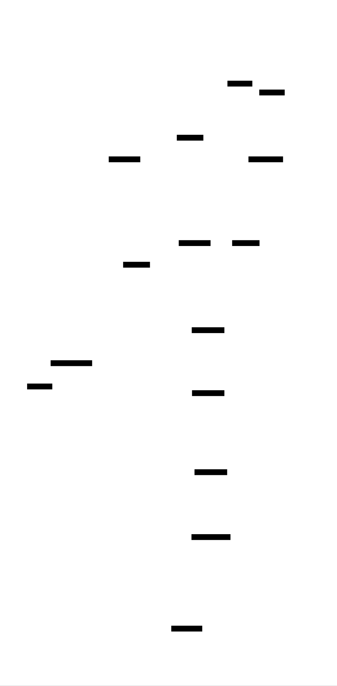

# Recommendation Engine: Design Document


## Overview

This system builds a production-ready recommendation engine that combines collaborative filtering, content-based filtering, and matrix factorization techniques to suggest relevant items to users. The key architectural challenge is balancing recommendation quality, real-time latency, and system scalability while handling sparse data and cold start problems.


> This guide is meant to help you understand the big picture before diving into each milestone. Refer back to it whenever you need context on how components connect.


## Context and Problem Statement

> **Milestone(s):** All milestones - this foundational understanding applies throughout the entire recommendation engine implementation.

Building a recommendation system feels deceptively simple at first glance - just suggest items users might like, right? However, the reality involves complex trade-offs between recommendation quality, system scalability, data sparsity challenges, and real-time performance constraints. This section establishes the core problems we're solving and why a hybrid approach combining multiple recommendation techniques becomes necessary for production systems.

### The Bookstore Clerk Mental Model

Think of a **master bookstore clerk** who has worked at the same independent bookstore for decades. This clerk has developed multiple strategies for helping customers discover books they'll love, and understanding these strategies provides the perfect mental model for recommendation system approaches.

**The Pattern Recognizer (Collaborative Filtering)**

Our veteran clerk notices that certain customers tend to have similar tastes. When Mrs. Johnson, who loves mystery novels, comes in asking for something new, the clerk thinks: "You know, Mrs. Johnson and Mr. Peterson have bought almost identical books over the years. Mr. Peterson just picked up this new thriller last week and said he couldn't put it down. Mrs. Johnson would probably love it too."

This clerk is performing **collaborative filtering** - identifying users with similar preferences and recommending items liked by similar users. The clerk doesn't need to understand why Mrs. Johnson and Mr. Peterson have similar tastes; the pattern of shared preferences is sufficient. This approach works exceptionally well when the clerk has observed many customers over time and can identify these preference clusters.

However, this strategy has limitations. When a completely new customer walks in (the **cold start problem**), the clerk has no purchase history to identify similar customers. Similarly, when the bookstore receives a brand-new book that nobody has bought yet, the pattern-based approach fails because there are no similar-customer signals to leverage.

**The Content Expert (Content-Based Filtering)**

The same clerk has also developed deep expertise about books themselves. When a customer mentions loving "The Hunger Games," the clerk immediately thinks about the book's characteristics: young adult dystopian fiction with a strong female protagonist, themes of rebellion against authority, fast-paced action, and first-person narrative style.

The clerk then scans their mental catalog for books sharing these attributes: "If you loved The Hunger Games, you should try Divergent - it's also dystopian YA with a rebellious female lead, or maybe Red Queen, which has similar themes of class struggle and hidden powers."

This represents **content-based filtering** - analyzing the intrinsic features of items and matching them to user preference profiles built from their interaction history. This approach excels at explainability (the clerk can explain exactly why they're making the recommendation) and handles new items well (a brand-new dystopian YA novel can immediately be recommended to customers who've enjoyed similar books).

The content-based approach struggles with the **filter bubble problem** - customers might only receive recommendations for books very similar to what they've already read, missing out on diverse discoveries they might enjoy. Additionally, extracting meaningful features from complex items like books, movies, or music proves challenging, and important subjective qualities like "writing style" or "emotional impact" resist easy categorization.

**The Hidden Connections Discoverer (Matrix Factorization)**

Our master clerk has developed an almost mystical ability to recognize subtle, hidden patterns that aren't obvious even to them. They notice that customers who buy certain combinations of books - say, science fiction, cookbooks, and travel guides - tend to also enjoy historical fiction, even though these genres seem unrelated on the surface.

The clerk can't always articulate why these connections exist ("there's something about the analytical mindset that enjoys both sci-fi and cookbooks that also appreciates well-researched historical detail"), but they've learned to trust these **latent factors** discovered through years of observation.

This represents **matrix factorization** approaches, which discover hidden dimensions in user preferences and item characteristics. These algorithms learn that user preferences and item attributes exist in a lower-dimensional space where seemingly unrelated preferences actually cluster together. A user might score high on a "complexity appreciation" factor that spans multiple genres, or an "escapism seeking" factor that connects fantasy novels with travel books.

Matrix factorization excels at discovering non-obvious patterns and can handle large-scale sparse data efficiently. However, the learned factors often lack interpretability (what does "factor 23" actually represent?), and the approach requires significant interaction history to learn meaningful patterns.

**The Hybrid Master (Our Goal)**

The most effective bookstore clerk seamlessly combines all three approaches. For a regular customer with established preferences, they might use collaborative filtering ("customers like you loved this new release"). For explaining recommendations, they leverage content-based reasoning ("this has the same noir atmosphere and unreliable narrator style as your favorite mysteries"). For discovering unexpected gems, they rely on their learned intuition about hidden preference patterns.

Our recommendation engine aims to be this hybrid master clerk, intelligently combining collaborative filtering, content-based analysis, and matrix factorization to provide diverse, accurate, and explainable recommendations while handling the various edge cases each approach individually struggles with.

### Technical Challenges

The bookstore clerk analogy helps build intuition, but production recommendation systems face specific technical challenges that require careful architectural consideration.

**Data Sparsity: The Needle in a Haystack Problem**

Real-world user-item interaction data is extremely sparse. Consider a streaming service with 10 million users and 100,000 movies - the potential user-item matrix contains 1 trillion cells, but even active users might rate fewer than 100 movies. This creates a **sparsity ratio** of 99.99%, meaning the vast majority of user-item combinations have no observed interaction data.

Traditional machine learning assumes dense feature vectors with meaningful values for most features. Recommendation systems must extract meaningful patterns from matrices where most entries are unknown rather than zero. A missing rating doesn't mean the user dislikes the item - it might mean they're unaware it exists, haven't had time to watch it, or it's outside their typical browsing context.

This sparsity creates several cascading problems:

- **Similarity computation becomes unreliable** when users have few items in common. Two users might both rate "The Matrix" and "Inception" highly, but having only two shared ratings makes it difficult to determine if they truly have similar tastes or if this is coincidental overlap.

- **Statistical significance drops dramatically** for most user-item pairs, making confidence estimates for predictions extremely difficult. How confident should the system be in predicting that User A will rate Movie B as 4.2 stars when the prediction is based on sparse similarity data?

- **Cold start problems compound** because new users and items start with zero interaction data, and accumulating sufficient data for reliable recommendations takes significant time and user engagement.

**Cold Start Problems: The Bootstrap Dilemma**

Cold start problems manifest in multiple dimensions, each requiring different solution approaches:

**New User Cold Start** occurs when someone first joins the platform. Collaborative filtering fails completely (no interaction history to find similar users), and content-based filtering struggles (no user preference profile to match against items). The system must somehow provide reasonable recommendations to engage new users and encourage the initial interactions needed to bootstrap more sophisticated recommendation approaches.

**New Item Cold Start** happens when content is added to the platform. A newly released movie has no user ratings, preventing collaborative filtering from identifying which users might enjoy it. Content-based filtering can help if the item has rich feature data (genre, director, actors, plot keywords), but many items initially have limited metadata.

**Cross-Domain Cold Start** occurs when users interact with new types of content or when the platform expands into new categories. A user's book preferences might not predict their music tastes, and their movie ratings might not indicate their interest in podcast recommendations.

The challenge lies in balancing **exploitation** (recommending items similar to known preferences) with **exploration** (introducing diverse content to learn more about user tastes). Too much exploitation creates filter bubbles and user boredom; too much exploration feels random and reduces user satisfaction.

**Scalability Constraints: The Performance Tightrope**

Production recommendation systems must balance recommendation quality with computational efficiency across multiple dimensions:

**Memory Scalability** becomes critical as user and item counts grow. Storing a complete user-item similarity matrix for 1 million users requires approximately 4 terabytes of memory (assuming 4-byte floats). Most similarity computations produce sparse results, but even storing only the top-K similar users/items per entity requires careful memory management and efficient data structures.

**Computational Scalability** affects both training and serving phases. Computing pairwise similarities between all users scales O(U²) with user count, becoming prohibitively expensive for large platforms. Matrix factorization approaches scale better but still require distributed computation for datasets with millions of users and items.

**Update Frequency Trade-offs** create tension between recommendation freshness and computational cost. Recomputing all similarities after every new rating provides the most up-to-date recommendations but becomes computationally infeasible. Batch updates reduce computational cost but create staleness, where recent user interactions don't immediately influence recommendations.

**Real-Time Serving Requirements: The Latency Challenge**

Modern users expect recommendations to appear instantly, creating strict latency requirements that constrain algorithmic choices:

**Sub-Second Response Time** requirements mean that complex algorithms must either precompute results or use extremely efficient online computation. Computing user-item similarities on-demand during API requests introduces unacceptable latency, requiring precomputation and caching strategies.

**Personalization vs. Speed Trade-offs** force architectural decisions about recommendation depth. Fully personalized recommendations require user-specific computation, while pre-computed "trending" or "popular" recommendations serve instantly but provide less value. The system must balance personalization depth with response time requirements.

**Cache Consistency Challenges** arise when precomputed recommendations become stale. User preferences evolve, new items are added, and recommendation models are retrained, but cached results might not reflect these changes. The system needs sophisticated cache invalidation strategies that balance freshness with computational efficiency.

**Dynamic Loading Requirements** become necessary when users request recommendations for different contexts (homepage, category browsing, post-purchase) or with different parameters (exclude already-watched items, focus on specific genres). The system must efficiently serve contextual recommendations without precomputing every possible variation.

> **Critical Insight**: These technical challenges are interconnected rather than independent. Addressing data sparsity often involves techniques that worsen scalability (like ensemble methods), while scalability optimizations (like aggressive dimensionality reduction) can hurt recommendation quality. Successful recommendation systems require carefully balanced trade-offs rather than optimal solutions to individual challenges.

### Existing Approaches Comparison

Understanding the strengths and limitations of different recommendation approaches helps justify our hybrid architecture design. Each approach excels in specific scenarios while struggling with particular challenges.

**Collaborative Filtering Analysis**

Collaborative filtering leverages the wisdom of crowds by identifying users with similar preferences and recommending items liked by similar users. This approach subdivides into user-based and item-based variants, each with distinct characteristics.

**User-Based Collaborative Filtering** identifies users with similar preference patterns and recommends items liked by similar users. The algorithm computes user similarity using metrics like cosine similarity or Pearson correlation, identifies the K most similar users, and predicts ratings using weighted averages of similar users' ratings.

| Aspect | Strengths | Weaknesses |
|--------|-----------|------------|
| **Recommendation Quality** | Excellent for users with clear preference patterns; discovers unexpected gems through similar user recommendations | Poor for users with unusual tastes; susceptible to popularity bias |
| **Scalability** | User similarity computation scales O(U²); becomes prohibitively expensive for millions of users | Memory requirements grow quadratically; similarity updates expensive |
| **Cold Start Handling** | Complete failure for new users (no interaction history); struggles with users having few interactions | Cannot recommend new items until they accumulate rating data |
| **Explainability** | Moderate - can show "users like you also enjoyed" but doesn't explain why preferences align | Limited insight into recommendation reasoning |
| **Data Requirements** | Requires substantial user interaction overlap for meaningful similarity computation | Performance degrades severely with sparse interaction data |

**Item-Based Collaborative Filtering** computes similarity between items based on user rating patterns and recommends items similar to those the user has previously liked. This approach often outperforms user-based filtering due to item relationships being more stable than user preferences.

| Aspect | Strengths | Weaknesses |
|--------|-----------|------------|
| **Recommendation Quality** | More stable than user-based (item relationships change slowly); good for users with consistent preferences within categories | Limited diversity - tends to recommend very similar items |
| **Scalability** | Item similarity more stable, enabling longer caching periods; scales better when items << users | Still requires O(I²) similarity computations for comprehensive coverage |
| **Cold Start Handling** | Handles new users better (can recommend popular items similar to their few interactions) | Cannot recommend new items until they receive ratings |
| **Explainability** | Good - "recommended because you liked similar item X" provides intuitive reasoning | Limited to similarity-based explanations |
| **Data Requirements** | Requires fewer interactions per item for meaningful recommendations | Struggles when items have very few ratings |

**Content-Based Filtering Analysis**

Content-based filtering analyzes item features and user preference profiles to recommend items with characteristics matching user preferences. This approach treats recommendation as a supervised learning problem where user interactions provide training labels for item features.

| Aspect | Strengths | Weaknesses |
|--------|-----------|------------|
| **Recommendation Quality** | Excellent for domains with rich item features; maintains consistency with user's established preferences | Creates filter bubbles; limited diversity in recommendations |
| **Scalability** | Scales linearly with user and item count; user profiles and item features can be computed independently | Feature extraction can be computationally expensive for complex content |
| **Cold Start Handling** | Handles new items excellently (can immediately recommend based on features); struggles less with new users if demographic data available | New users still need initial interactions to build preference profiles |
| **Explainability** | Excellent - can specify exactly which features drove the recommendation decision | Feature-based explanations may not match user's subjective reasoning |
| **Data Requirements** | Requires rich item metadata and feature extraction capabilities | Quality depends heavily on feature engineering; subjective qualities difficult to capture |

The success of content-based filtering heavily depends on **feature extraction quality**. For text-based items (books, articles, product descriptions), TF-IDF and more advanced NLP techniques can extract meaningful features. For multimedia content (images, music, videos), feature extraction becomes significantly more challenging and often requires domain-specific expertise.

**Matrix Factorization Analysis**

Matrix factorization approaches decompose the user-item interaction matrix into lower-dimensional latent factor representations, learning hidden dimensions that capture user preferences and item characteristics.

| Aspect | Strengths | Weaknesses |
|--------|-----------|------------|
| **Recommendation Quality** | Discovers subtle patterns invisible to similarity-based approaches; handles sparse data well through dimensionality reduction | Latent factors lack interpretability; difficult to understand why recommendations are made |
| **Scalability** | Scales well to large datasets; can use distributed optimization; inference is fast (dot product of factor vectors) | Training can be computationally intensive; hyperparameter tuning requires multiple training runs |
| **Cold Start Handling** | Struggles with both new users and new items (no interaction data to learn factors) | Requires auxiliary information or hybrid approaches for cold start scenarios |
| **Explainability** | Poor - learned factors often have no clear semantic meaning | Cannot provide intuitive explanations for recommendations |
| **Data Requirements** | Works well with sparse data; can incorporate implicit feedback (views, clicks) in addition to explicit ratings | Requires substantial interaction data to learn meaningful latent factors |

Matrix factorization techniques include **Singular Value Decomposition (SVD)**, which performs eigendecomposition of the user-item matrix, and **Alternating Least Squares (ALS)**, which iteratively optimizes user and item factors. Non-negative Matrix Factorization (NMF) adds non-negativity constraints that sometimes improve interpretability.

**Advanced Matrix Factorization Variants** address specific challenges:

- **Regularized approaches** (like those used in the Netflix Prize) add penalty terms to prevent overfitting on sparse data
- **Implicit feedback models** adapt the loss function for binary interaction data (clicked/not clicked) rather than explicit ratings
- **Temporal factorization** models incorporate time dynamics to capture evolving user preferences
- **Factorization machines** generalize matrix factorization to arbitrary feature interactions

**Hybrid Approach Justification**

The comparison reveals that no single approach handles all recommendation scenarios effectively. Each technique has complementary strengths that can be combined to create a more robust system:

> **Decision: Hybrid Multi-Algorithm Architecture**
> - **Context**: Single-algorithm approaches each have significant blind spots that hurt recommendation quality in different scenarios
> - **Options Considered**: 
>   1. Pure collaborative filtering with sophisticated similarity metrics
>   2. Pure content-based filtering with advanced feature engineering
>   3. Pure matrix factorization with multiple algorithm variants
>   4. Hybrid system combining multiple approaches
> - **Decision**: Implement hybrid system combining collaborative filtering, content-based filtering, and matrix factorization
> - **Rationale**: Hybrid approaches consistently outperform single-algorithm systems in research and industry. Each algorithm's strengths compensate for others' weaknesses - collaborative filtering provides diversity and discovery, content-based filtering handles cold start and provides explainability, matrix factorization captures subtle patterns and handles sparsity
> - **Consequences**: Increased system complexity and computational requirements, but significantly improved recommendation quality across diverse scenarios and user segments

| Scenario | Primary Algorithm | Supporting Algorithms | Rationale |
|----------|------------------|---------------------|-----------|
| **Established User, Popular Items** | Collaborative Filtering | Matrix Factorization for ranking | Leverage user similarity patterns with latent factor refinement |
| **New User, Cold Start** | Content-Based | Popularity-based fallback | Use item features and demographic data where available |
| **New Item, Cold Start** | Content-Based | Collaborative filtering after initial ratings | Item features enable immediate recommendations |
| **Niche User Preferences** | Matrix Factorization | Content-based for explanation | Latent factors capture unusual preference patterns |
| **Diverse Discovery** | Matrix Factorization | Collaborative filtering for validation | Hidden factors reveal unexpected connections |
| **Explainable Recommendations** | Content-Based | Collaborative filtering for social proof | Feature-based reasoning with "users like you" validation |

This hybrid approach enables **dynamic algorithm selection** based on user and item characteristics, **score combination** through weighted averaging or learned models, and **explanation generation** by identifying which algorithms contributed most strongly to each recommendation.

The remaining sections of this design document detail how to implement each algorithm component, combine them effectively, and deploy the resulting system to handle production-scale recommendation workloads while maintaining the quality benefits that justify the increased complexity.

### Implementation Guidance

Understanding the recommendation problem space helps guide technology choices and implementation priorities. This section provides concrete guidance for beginning the implementation journey.

**Technology Recommendations**

| Component | Simple Option | Advanced Option | Rationale |
|-----------|---------------|-----------------|-----------|
| **Core Framework** | scikit-learn + pandas | Surprise library + Apache Spark | Start simple for learning, scale up for production |
| **Matrix Operations** | NumPy + SciPy sparse | Apache Spark MLlib | NumPy sufficient for prototyping, Spark needed for scale |
| **Data Storage** | SQLite + JSON files | PostgreSQL + Redis | SQLite great for development, PostgreSQL for production |
| **Feature Extraction** | scikit-learn TfidfVectorizer | spaCy + custom extractors | TF-IDF covers most text analysis needs |
| **API Framework** | Flask + JSON | FastAPI + async support | Flask easier to learn, FastAPI better performance |
| **Caching Layer** | Python dictionaries | Redis with TTL | In-memory fine for prototypes, Redis for production |

**Recommended Project Structure**

Start with a clear module organization that separates concerns and makes testing easier:

```
recommendation-engine/
├── data/
│   ├── raw/                    # Original datasets
│   ├── processed/              # Cleaned interaction matrices
│   └── models/                 # Trained model artifacts
├── src/
│   ├── __init__.py
│   ├── data/
│   │   ├── __init__.py
│   │   ├── loader.py          # Data ingestion and preprocessing
│   │   └── preprocessor.py    # Feature extraction and cleaning
│   ├── models/
│   │   ├── __init__.py
│   │   ├── collaborative.py   # User/item-based filtering
│   │   ├── content_based.py   # Content-based recommendations
│   │   ├── matrix_factorization.py  # SVD/ALS implementations
│   │   └── hybrid.py          # Algorithm combination logic
│   ├── serving/
│   │   ├── __init__.py
│   │   ├── api.py             # REST API endpoints
│   │   └── cache.py           # Caching and precomputation
│   └── evaluation/
│       ├── __init__.py
│       ├── metrics.py         # RMSE, precision, recall, etc.
│       └── experiments.py     # A/B testing framework
├── tests/
│   ├── unit/                  # Algorithm component tests
│   ├── integration/           # End-to-end pipeline tests
│   └── fixtures/              # Test data samples
├── scripts/
│   ├── train_models.py        # Batch training pipeline
│   └── serve_api.py           # Production serving script
└── requirements.txt
```

**Core Data Structures**

Define these fundamental types early - they'll be used throughout all algorithm implementations:

```python
from dataclasses import dataclass
from typing import Dict, List, Optional, Tuple
import numpy as np
from scipy.sparse import csr_matrix

@dataclass
class User:
    """Represents a user in the recommendation system."""
    user_id: str
    demographics: Dict[str, str]  # age_group, gender, location, etc.
    interaction_count: int
    avg_rating: Optional[float]
    
@dataclass  
class Item:
    """Represents an item that can be recommended."""
    item_id: str
    title: str
    categories: List[str]
    features: Dict[str, float]  # TF-IDF scores, numeric features
    avg_rating: Optional[float]
    rating_count: int
    
@dataclass
class Interaction:
    """Represents a user-item interaction (rating, click, purchase, etc.)."""
    user_id: str
    item_id: str
    rating: Optional[float]  # None for implicit feedback
    timestamp: int
    interaction_type: str  # 'rating', 'click', 'purchase', 'view'
    
@dataclass
class Recommendation:
    """A single recommendation with score and explanation."""
    item_id: str
    score: float
    algorithm: str  # Which algorithm generated this recommendation
    explanation: str  # Human-readable reason for recommendation
```

**Essential Utility Functions**

These helper functions handle common operations across all recommendation algorithms:

```python
import pandas as pd
from scipy.spatial.distance import cosine
from sklearn.metrics.pairwise import cosine_similarity
import numpy as np

def load_interactions(filepath: str) -> List[Interaction]:
    """Load user-item interactions from CSV file."""
    # TODO 1: Read CSV using pandas
    # TODO 2: Convert each row to Interaction dataclass
    # TODO 3: Handle missing values and data type conversions
    # TODO 4: Return list of Interaction objects
    pass

def build_user_item_matrix(interactions: List[Interaction]) -> Tuple[csr_matrix, Dict[str, int], Dict[str, int]]:
    """Convert interactions to sparse user-item matrix."""
    # TODO 1: Create user_id -> index and item_id -> index mappings
    # TODO 2: Extract (user_idx, item_idx, rating) tuples from interactions
    # TODO 3: Build sparse matrix using scipy.sparse.csr_matrix
    # TODO 4: Return matrix and both ID mapping dictionaries
    # Hint: Use csr_matrix((data, (row_indices, col_indices)), shape=(n_users, n_items))
    pass

def compute_similarity_matrix(matrix: csr_matrix, metric: str = 'cosine') -> np.ndarray:
    """Compute pairwise similarity between matrix rows."""
    # TODO 1: Choose similarity function based on metric parameter
    # TODO 2: Handle sparse matrix efficiently (don't convert to dense)
    # TODO 3: Compute pairwise similarities between all rows
    # TODO 4: Return dense similarity matrix
    # Hint: sklearn.metrics.pairwise has efficient sparse matrix functions
    pass

def predict_rating(user_similarities: np.ndarray, user_ratings: np.ndarray, target_item_idx: int, k: int = 50) -> float:
    """Predict user's rating for target item using K-nearest neighbors."""
    # TODO 1: Find K most similar users who rated the target item
    # TODO 2: Extract their similarity scores and ratings for target item
    # TODO 3: Compute weighted average: sum(similarity * rating) / sum(similarity)
    # TODO 4: Handle edge case where no similar users rated the item
    # Hint: Use np.argsort to find most similar users, handle division by zero
    pass
```

**Development Workflow**

Follow this progression to build understanding incrementally:

1. **Start with synthetic data** - Generate a small user-item matrix (100 users, 50 items, 20% interaction density) to verify algorithm implementations work correctly

2. **Implement one algorithm at a time** - Begin with user-based collaborative filtering as it's most intuitive, then item-based, then content-based, finally matrix factorization

3. **Test with known examples** - Create test cases where you can manually verify the expected recommendations (e.g., users with identical preferences should get identical recommendations)

4. **Measure everything** - Implement RMSE, precision@K, and recall@K metrics early to quantitatively compare algorithm performance

5. **Scale up gradually** - Move from synthetic data to small real datasets (MovieLens 100K), then larger datasets as algorithms prove correct

**Common Pitfalls to Avoid**

⚠️ **Pitfall: Converting sparse matrices to dense**
Many NumPy and scikit-learn functions have sparse matrix versions that are orders of magnitude more memory-efficient. Always check if a sparse version exists before calling `.toarray()` or `.todense()`.

⚠️ **Pitfall: Not handling missing ratings properly**
A rating of 0 is different from no rating at all. Use sparse matrices or explicit masking to distinguish between "user rated this item 0 stars" and "user never interacted with this item."

⚠️ **Pitfall: Ignoring cold start from the beginning**
Don't assume every user and item has interaction data. Build cold start handling into your algorithms from the start rather than adding it as an afterthought.

⚠️ **Pitfall: Not normalizing similarity scores**
Raw cosine similarities range from -1 to 1, while Pearson correlations also range -1 to 1, but they're computed differently. Understand what your similarity scores mean and normalize appropriately for combination with other signals.

**Milestone Checkpoint 1: Basic Data Pipeline**

After implementing the utility functions, verify your data pipeline works correctly:

```bash
# Test data loading and matrix construction
python -c "
from src.data.loader import load_interactions, build_user_item_matrix
interactions = load_interactions('data/sample_ratings.csv')
matrix, user_map, item_map = build_user_item_matrix(interactions)
print(f'Loaded {len(interactions)} interactions')
print(f'Matrix shape: {matrix.shape}, sparsity: {1 - matrix.nnz / (matrix.shape[0] * matrix.shape[1]):.4f}')
"
```

Expected output should show reasonable interaction counts and high sparsity (>95% for real datasets). If sparsity is low, you might be loading duplicate interactions or handling missing data incorrectly.

The next sections will build upon these foundations to implement each recommendation algorithm, combine them into a hybrid system, and deploy the complete solution for production use.


## Goals and Non-Goals

> **Milestone(s):** All milestones - these goals guide the entire recommendation engine implementation from collaborative filtering through production deployment.

Building a recommendation engine requires careful scope definition to balance ambition with achievability. Think of this like planning a restaurant - you need to decide whether you're building a food truck, a neighborhood bistro, or a five-star establishment. Each choice determines your menu complexity, kitchen equipment, staffing needs, and customer expectations. Our recommendation engine sits in the "neighborhood bistro" category: sophisticated enough to handle real production workloads, but focused enough to be implementable by a small team.

The challenge lies in the competing forces inherent to recommendation systems. Users expect Netflix-quality recommendations that understand their nuanced preferences, but they also expect instant responses when browsing. Business stakeholders want comprehensive A/B testing capabilities and detailed analytics, but they also want the system to be maintainable by junior developers. Data scientists want to experiment with cutting-edge algorithms, but operations teams need predictable, debuggable systems.

This section establishes clear boundaries for what our recommendation engine will accomplish, what quality bars it must meet, and what features we deliberately exclude. These decisions directly influence our architecture choices, technology selection, and implementation complexity throughout all four milestones.

### Functional Goals

Our recommendation engine's functional capabilities define the core user-facing features and algorithmic capabilities that directly impact recommendation quality and user experience.

**Multi-Algorithm Support**

The system must implement three distinct recommendation approaches: collaborative filtering, matrix factorization, and content-based filtering. Think of this like a chef who masters different cooking techniques - they can braise for rich flavors, grill for char and smokiness, and steam for delicate textures. Each recommendation algorithm excels in different scenarios and user contexts.

| Algorithm Type | Primary Use Case | Data Requirements | Cold Start Handling |
|---|---|---|---|
| Collaborative Filtering | Users with rich interaction history | Dense user-item interactions | Poor - requires existing interactions |
| Matrix Factorization | Large-scale implicit feedback | Sparse but voluminous interactions | Moderate - can learn from limited data |
| Content-Based | New users or niche items | Rich item metadata | Excellent - works with item features alone |

The collaborative filtering engine must support both user-based and item-based approaches. User-based collaborative filtering finds users with similar preferences and recommends items they liked. Item-based collaborative filtering identifies items that users tend to like together and recommends complementary items. The system calculates similarities using both cosine similarity and Pearson correlation, allowing us to compare their effectiveness for different data patterns.

Matrix factorization capabilities include both Singular Value Decomposition (SVD) and Alternating Least Squares (ALS) implementations. SVD works well for explicit ratings where users provide clear preference signals. ALS handles implicit feedback better, learning from clicks, views, and purchase behavior where user preferences are inferred rather than directly stated. The system must support hyperparameter tuning for latent factor dimensions, learning rates, and regularization parameters.

Content-based filtering extracts features from item descriptions, categories, and tags using TF-IDF (Term Frequency-Inverse Document Frequency) processing. It builds user preference profiles by analyzing their interaction history and liked items, then matches these preferences against item characteristics. This approach enables explainable recommendations - "We recommended this book because you enjoyed similar mystery novels set in Victorian London."

**Hybrid Recommendation Combination**

The system must intelligently combine signals from multiple algorithms rather than treating them as independent systems. Like a symphony conductor who blends different instrument sections to create rich musical experiences, our hybrid approach orchestrates different recommendation techniques to maximize recommendation quality.

| Combination Strategy | When To Use | Implementation Complexity | Explanation Quality |
|---|---|---|---|
| Weighted Average | Simple baseline combination | Low | Limited - shows combined score |
| Rank Fusion | Different algorithms provide rankings | Medium | Moderate - can show contributing ranks |
| Learned Combination | Training data for optimal weights | High | Good - can explain feature importance |
| Context-Aware Switching | Different algorithms for different scenarios | Medium | Excellent - clear algorithm selection reason |

The weighted average approach multiplies each algorithm's scores by learned weights and sums them. While simple, it requires careful weight tuning and doesn't adapt to different user contexts. Rank fusion takes the ranked lists from each algorithm and combines them using techniques like reciprocal rank fusion, which is more robust to score scale differences between algorithms.

Learned combination uses machine learning to discover optimal blending strategies from user feedback data. The system treats individual algorithm scores as features and learns weights that maximize recommendation effectiveness metrics. Context-aware switching chooses different algorithms based on user and item characteristics - using collaborative filtering for users with rich history and content-based for new users.

**Real-Time Recommendation Serving**

The system must serve personalized recommendations through a REST API with sub-second latency. Think of this like a barista who can quickly customize drinks during the morning rush - they pre-prepare common components but still personalize each order. Our serving system pre-computes expensive operations while maintaining real-time personalization.

| API Endpoint | Response Time Target | Cache Strategy | Personalization Level |
|---|---|---|---|
| `/recommendations/{user_id}` | < 200ms | User-specific cache (1 hour TTL) | Full personalization |
| `/trending` | < 50ms | Global cache (15 minute TTL) | No personalization |
| `/similar/{item_id}` | < 100ms | Item-specific cache (6 hour TTL) | Item-context personalization |
| `/explain/{user_id}/{item_id}` | < 300ms | No caching | Real-time explanation generation |

The primary recommendation endpoint accepts filtering parameters (categories, price ranges), pagination controls, and diversity requirements. It returns ranked item recommendations with confidence scores and algorithm attribution. The system supports both "more of the same" recommendations that reinforce user preferences and "discovery" recommendations that introduce novel items.

**A/B Testing and Experimentation Framework**

The system must support comparing different algorithm variants and parameter configurations through controlled experiments. Like a scientist running controlled studies, our A/B testing framework ensures statistical rigor in algorithm comparisons while maintaining consistent user experiences.

| Experiment Type | Assignment Granularity | Metric Collection | Duration Constraints |
|---|---|---|---|
| Algorithm Comparison | User-level (consistent experience) | Click-through rate, conversion | 2-4 weeks minimum |
| Parameter Tuning | User-level or session-level | Engagement metrics, satisfaction | 1-2 weeks sufficient |
| UI/UX Changes | Session-level (faster iteration) | User interface metrics | 1 week minimum |
| Hybrid Weight Optimization | User-level (stable blending) | Overall recommendation quality | 3-4 weeks for convergence |

Users must be deterministically assigned to experiment variants based on their user ID hash, ensuring they see consistent recommendations throughout the experiment period. The system tracks key metrics including click-through rates, conversion rates, user engagement time, and recommendation diversity. Statistical significance testing prevents premature conclusions from underpowered experiments.

### Non-Functional Goals

The system's non-functional requirements define quality attributes that ensure production readiness and operational excellence.

**Performance Requirements**

Response latency directly impacts user experience and business metrics. E-commerce studies show that every 100ms of additional latency reduces conversion rates by 1%. Our performance targets reflect this sensitivity while remaining achievable with careful architecture.

| Performance Metric | Target | Measurement Method | Consequences of Missing Target |
|---|---|---|---|
| API Response Time (p95) | < 200ms | Application performance monitoring | User abandonment, reduced engagement |
| API Response Time (p99) | < 500ms | Tail latency monitoring | Poor experience for unlucky users |
| Throughput | 1000 requests/second | Load testing with realistic traffic | Need horizontal scaling sooner |
| Cache Hit Rate | > 80% | Cache monitoring metrics | Higher database load, increased latency |

The 200ms p95 target allows for occasional cache misses or model computation while maintaining snappy user experiences. The 500ms p99 target prevents worst-case scenarios from severely impacting user satisfaction. These targets assume a single-machine deployment; distributed deployments may have slightly higher latency due to network overhead.

Throughput requirements support medium-scale applications with thousands of concurrent users. Higher throughput requires horizontal scaling strategies including load balancing, distributed caching, and potentially distributed model serving.

**Scalability Requirements**

The system must handle growing datasets and user bases through both vertical scaling (better algorithms, more efficient code) and horizontal scaling (distributed processing).

| Scaling Dimension | Current Target | Growth Path | Bottleneck Points |
|---|---|---|---|
| Users | 100,000 active users | Add read replicas, cache scaling | User-item matrix memory usage |
| Items | 1,000,000 catalog items | Distributed storage, sharding | Item feature extraction processing |
| Interactions | 10,000,000 ratings/clicks | Batch processing, streaming | Matrix factorization computational complexity |
| Models | 5-10 algorithm variants | Model versioning, A/B testing | Model storage and loading overhead |

Matrix factorization algorithms have O(k * iterations * non-zero entries) computational complexity, where k is the number of latent factors. This scales reasonably well with sparse data but becomes challenging with dense interaction matrices. The system must support incremental model updates rather than full retraining as datasets grow.

Collaborative filtering similarity computations have O(n²) complexity for n users or items. The system addresses this through approximate nearest neighbor techniques and similarity threshold filtering that maintains only strong relationships.

**Reliability and Availability**

Production recommendation systems require high availability since recommendation failures directly impact revenue. However, recommendations are not life-critical systems, allowing for graceful degradation strategies.

| Reliability Aspect | Target | Implementation Strategy | Failure Mode Handling |
|---|---|---|---|
| API Uptime | 99.9% (8.7 hours downtime/year) | Health checks, graceful shutdown | Fallback to cached recommendations |
| Model Freshness | Daily updates maximum staleness | Automated retraining pipeline | Serve stale models during training |
| Data Consistency | Eventually consistent (acceptable) | Batch processing with reconciliation | Temporary inconsistencies acceptable |
| Error Rate | < 0.1% of requests fail | Comprehensive error handling | Return popular items as fallback |

The system prioritizes availability over perfect consistency. Serving slightly stale recommendations is preferable to serving no recommendations. During model training failures, the system continues serving the previous model version until training succeeds.

Graceful degradation strategies include falling back to popular items when personalized recommendations fail, using cached similarity matrices when real-time computation times out, and serving content-based recommendations when collaborative filtering data is unavailable.

**Monitoring and Observability**

Production systems require comprehensive monitoring to detect issues before they impact users and to understand system behavior for optimization opportunities.

| Monitoring Category | Key Metrics | Alert Conditions | Dashboard Requirements |
|---|---|---|---|
| Application Performance | Response time, error rate, throughput | p95 latency > 300ms, error rate > 1% | Real-time performance charts |
| Business Metrics | Click-through rate, conversion, diversity | 20% decrease in CTR week-over-week | Recommendation quality trends |
| System Resources | CPU, memory, disk, network | CPU > 80%, memory > 90% | Resource utilization over time |
| Model Quality | Training convergence, prediction accuracy | Training failure, accuracy drop > 10% | Model performance tracking |

The system logs all recommendation requests with user ID, recommended items, algorithm used, and response time. This enables detailed analysis of algorithm performance across different user segments and item categories.

Business metrics monitoring tracks recommendation effectiveness through user behavior. A sudden drop in click-through rates might indicate model quality issues, user preference shifts, or data pipeline problems. The system alerts on significant metric changes and provides debugging information to diagnose root causes.

### Explicit Non-Goals

Clearly defining what the recommendation engine will not implement prevents scope creep and sets appropriate expectations for stakeholders and future developers.

**Advanced Deep Learning Approaches**

The system will not implement neural collaborative filtering, autoencoders, or transformer-based recommendation models. While these techniques can achieve superior accuracy in large-scale scenarios, they introduce significant complexity in training, serving, and debugging.

> **Decision: Classical Machine Learning Focus**
> - **Context**: Modern recommendation systems increasingly use deep learning, but this adds substantial complexity
> - **Options Considered**: Include neural networks, hybrid classical-deep learning, classical only
> - **Decision**: Focus exclusively on classical collaborative filtering and matrix factorization
> - **Rationale**: Classical methods are easier to understand, debug, and tune. They perform well on medium-scale datasets and provide interpretable results
> - **Consequences**: May achieve lower accuracy than state-of-the-art systems, but much simpler to implement and maintain

Deep learning models require specialized hardware (GPUs), complex hyperparameter tuning, and significant training data to outperform classical methods. The debugging complexity alone makes them unsuitable for an educational recommendation system where understanding the algorithms is paramount.

**Real-Time Model Updates**

The system will not support online learning or real-time model parameter updates based on user interactions. Model updates occur through scheduled batch retraining rather than streaming updates.

| Feature | Included | Rationale for Exclusion |
|---|---|---|
| Batch model retraining | Yes | Necessary for incorporating new interaction data |
| Incremental model updates | No | Complex to implement correctly, marginal benefit |
| Real-time parameter adjustment | No | Requires online learning algorithms, adds instability |
| Streaming data processing | No | Batch processing is simpler and sufficient for daily updates |

Real-time model updates introduce complex challenges around model stability, convergence guarantees, and debugging. When a real-time system starts producing poor recommendations, determining whether the issue stems from recent training data, parameter update algorithms, or system bugs becomes extremely difficult.

**Multi-Domain Recommendations**

The system will not support cross-domain recommendations or transfer learning between different item categories (e.g., recommending movies based on book preferences). Each deployment focuses on a single item domain with consistent feature representations.

Cross-domain recommendations require sophisticated transfer learning techniques to map user preferences across different item types. The complexity of aligning feature spaces and handling domain-specific biases significantly exceeds the scope of an educational implementation.

**Advanced Business Logic**

The system excludes complex business rules and constraints that production systems often require.

| Business Feature | Support Level | Implementation Notes |
|---|---|---|
| Inventory-aware filtering | No | Would require real-time inventory integration |
| Revenue optimization | No | Focuses on user satisfaction, not profit maximization |
| Legal/compliance filtering | No | No content filtering or regulatory compliance |
| Multi-stakeholder optimization | No | Only considers user preferences, not publisher/advertiser needs |
| Seasonal/promotional logic | No | No special handling for holidays or marketing campaigns |

Production recommendation systems often balance user satisfaction with business objectives like inventory movement, profit margins, and promotional goals. This multi-objective optimization significantly complicates the algorithm design and evaluation metrics.

**Distributed System Complexity**

The system targets single-machine deployment and will not implement distributed consensus, data sharding, or multi-datacenter replication. Horizontal scaling occurs through stateless application replicas with shared storage, not through distributed algorithms.

> **Decision: Single-Machine Focus with Stateless Scaling**
> - **Context**: Production systems often require distributed architectures, but this adds operational complexity
> - **Options Considered**: Implement distributed training, use distributed storage, single-machine with scaling
> - **Decision**: Single-machine core with stateless horizontal scaling
> - **Rationale**: Distributed systems introduce consensus problems, network partitions, and debugging complexity that obscure the core recommendation algorithms
> - **Consequences**: Scaling limits at single-machine capacity, but much simpler to understand and deploy

Distributed recommendation systems must handle challenges like consistent model serving across nodes, distributed matrix factorization, and handling network partitions during model updates. These problems are fascinating but orthogonal to understanding recommendation algorithms.

**Advanced Evaluation Metrics**

The system will not implement sophisticated recommendation evaluation metrics like novelty, serendipity, or fairness measures. Evaluation focuses on standard accuracy and engagement metrics.

| Metric Category | Included Metrics | Excluded Metrics | Exclusion Rationale |
|---|---|---|---|
| Accuracy | RMSE, MAE, precision@k, recall@k | NDCG, MAP | Standard metrics sufficient for learning |
| Business | Click-through rate, conversion | Revenue per user, lifetime value | Business complexity beyond scope |
| User Experience | Recommendation diversity | Serendipity, novelty | Subjective and hard to measure |
| Fairness | None | Demographic parity, equality of opportunity | Requires sensitive attribute handling |

Advanced metrics like serendipity (pleasant surprises) and novelty (introducing unknown items) require sophisticated user studies and subjective evaluation frameworks. While important for production systems, they add evaluation complexity without teaching core algorithmic concepts.

The focus on standard metrics ensures that learners understand the fundamental trade-offs in recommendation quality without getting overwhelmed by the nuances of advanced evaluation methodologies that require significant domain expertise to implement correctly.

### Implementation Guidance

The goals and non-goals defined above directly inform our technology choices and architectural decisions. This guidance helps translate high-level objectives into concrete implementation strategies.

**Technology Recommendations**

| Component | Simple Option | Advanced Option | Rationale |
|---|---|---|---|
| Web Framework | Flask with Flask-RESTful | FastAPI with async support | Flask easier for beginners, FastAPI better performance |
| Database | SQLite for development, PostgreSQL for production | Distributed database like Cassandra | Relational model fits recommendation data well |
| Caching | Redis single instance | Redis cluster with sharding | Single instance sufficient for target scale |
| Matrix Operations | NumPy with SciPy sparse matrices | Specialized libraries like Implicit | NumPy/SciPy provide learning value |
| Machine Learning | scikit-learn with custom implementations | Surprise library for recommendations | Custom implementation teaches algorithms better |
| Model Storage | Pickle files with versioning | MLflow or DVC for model management | File-based storage simpler for single machine |
| Monitoring | Python logging with structured output | Prometheus + Grafana stack | Logging sufficient for educational purposes |

**Recommended Module Structure**

The codebase organization reflects our functional and architectural goals, separating algorithm implementations from serving infrastructure:

```
recommendation-engine/
├── src/
│   ├── models/                    # Core data structures
│   │   ├── __init__.py
│   │   ├── user.py               # User entity and related functions
│   │   ├── item.py               # Item entity and features
│   │   └── interaction.py        # Interaction data and loading
│   ├── algorithms/               # Recommendation algorithm implementations
│   │   ├── __init__.py
│   │   ├── collaborative_filtering.py    # User-based and item-based CF
│   │   ├── matrix_factorization.py      # SVD and ALS implementations
│   │   ├── content_based.py             # Feature-based recommendations
│   │   └── hybrid.py                    # Algorithm combination strategies
│   ├── serving/                  # Real-time API and caching
│   │   ├── __init__.py
│   │   ├── api.py               # Flask REST endpoints
│   │   ├── cache.py             # Redis caching layer
│   │   └── explain.py           # Recommendation explanation generation
│   ├── training/                # Batch model training pipeline
│   │   ├── __init__.py
│   │   ├── pipeline.py          # Model training orchestration
│   │   └── evaluation.py        # Model quality metrics
│   ├── experiments/             # A/B testing framework
│   │   ├── __init__.py
│   │   ├── assignment.py        # User experiment assignment
│   │   └── metrics.py           # Experiment metric collection
│   └── utils/                   # Shared utilities
│       ├── __init__.py
│       ├── similarity.py        # Similarity computation functions
│       └── matrix_utils.py      # Sparse matrix operations
├── tests/                       # Comprehensive test suite
│   ├── unit/                    # Algorithm unit tests
│   ├── integration/             # End-to-end API tests
│   └── fixtures/                # Test data and mock objects
├── config/                      # Configuration management
│   ├── development.yaml         # Dev environment settings
│   └── production.yaml          # Production configuration
├── data/                        # Sample datasets and schemas
│   ├── sample_interactions.csv  # Example interaction data
│   └── sample_items.csv         # Example item metadata
└── docs/                        # Documentation and guides
    ├── api.md                   # API endpoint documentation
    └── algorithms.md            # Algorithm explanation
```

**Infrastructure Starter Code**

Since caching and API infrastructure are supporting components rather than core learning objectives, here's complete starter code for the serving layer:

**Cache Management (`src/serving/cache.py`)**
```python
import redis
import json
import logging
from typing import List, Optional, Any
from datetime import timedelta

class RecommendationCache:
    """Redis-based caching for recommendations and similarity matrices."""
    
    def __init__(self, redis_host: str = 'localhost', redis_port: int = 6379):
        self.redis_client = redis.Redis(host=redis_host, port=redis_port, decode_responses=True)
        self.logger = logging.getLogger(__name__)
    
    def get_user_recommendations(self, user_id: str) -> Optional[List[dict]]:
        """Retrieve cached recommendations for a user."""
        cache_key = f"recommendations:{user_id}"
        try:
            cached_data = self.redis_client.get(cache_key)
            if cached_data:
                return json.loads(cached_data)
            return None
        except (redis.RedisError, json.JSONDecodeError) as e:
            self.logger.error(f"Cache retrieval error for user {user_id}: {e}")
            return None
    
    def set_user_recommendations(self, user_id: str, recommendations: List[dict], 
                               ttl: timedelta = timedelta(hours=1)):
        """Cache recommendations for a user with TTL."""
        cache_key = f"recommendations:{user_id}"
        try:
            self.redis_client.setex(
                cache_key, 
                ttl, 
                json.dumps(recommendations, default=str)
            )
        except (redis.RedisError, TypeError) as e:
            self.logger.error(f"Cache storage error for user {user_id}: {e}")
    
    def invalidate_user_cache(self, user_id: str):
        """Remove cached data for a user (e.g., after new interactions)."""
        pattern = f"*{user_id}*"
        try:
            keys = self.redis_client.keys(pattern)
            if keys:
                self.redis_client.delete(*keys)
        except redis.RedisError as e:
            self.logger.error(f"Cache invalidation error for user {user_id}: {e}")
```

**API Framework (`src/serving/api.py`)**
```python
from flask import Flask, request, jsonify
from flask_restful import Api, Resource
import logging
from typing import Dict, List, Optional
from src.models.user import User
from src.models.item import Item
from src.serving.cache import RecommendationCache

class RecommendationAPI(Resource):
    """REST endpoint for serving personalized recommendations."""
    
    def __init__(self):
        self.cache = RecommendationCache()
        self.logger = logging.getLogger(__name__)
    
    def get(self, user_id: str):
        """Get recommendations for a specific user."""
        try:
            # Parse query parameters
            num_recommendations = request.args.get('count', 10, type=int)
            categories = request.args.getlist('categories')
            include_explanation = request.args.get('explain', False, type=bool)
            
            # TODO: Implement recommendation logic
            # This is where learners will integrate their algorithms
            recommendations = self._generate_recommendations(
                user_id, num_recommendations, categories, include_explanation
            )
            
            return {
                'user_id': user_id,
                'recommendations': recommendations,
                'timestamp': int(time.time()),
                'algorithm': 'hybrid'
            }, 200
            
        except Exception as e:
            self.logger.error(f"Recommendation error for user {user_id}: {e}")
            return {'error': 'Internal server error'}, 500
    
    def _generate_recommendations(self, user_id: str, count: int, 
                                categories: List[str], explain: bool) -> List[dict]:
        """Core recommendation generation - learners implement this."""
        # TODO 1: Check cache for existing recommendations
        # TODO 2: If cache miss, load user interaction history
        # TODO 3: Apply collaborative filtering algorithm
        # TODO 4: Apply matrix factorization algorithm  
        # TODO 5: Apply content-based filtering algorithm
        # TODO 6: Combine algorithm scores using hybrid approach
        # TODO 7: Filter by categories if specified
        # TODO 8: Generate explanations if requested
        # TODO 9: Cache results before returning
        # TODO 10: Return formatted recommendation list
        pass

def create_app() -> Flask:
    """Application factory for the recommendation service."""
    app = Flask(__name__)
    api = Api(app)
    
    # Register API endpoints
    api.add_resource(RecommendationAPI, '/recommendations/<string:user_id>')
    
    # Health check endpoint
    @app.route('/health')
    def health_check():
        return {'status': 'healthy', 'service': 'recommendation-engine'}
    
    return app
```

**Core Algorithm Skeletons**

The core recommendation algorithms should be implemented by learners. Here are the function signatures with detailed TODOs:

**Collaborative Filtering Skeleton (`src/algorithms/collaborative_filtering.py`)**
```python
from scipy.sparse import csr_matrix
import numpy as np
from typing import List, Tuple, Dict
from src.models.interaction import Interaction

def build_user_item_matrix(interactions: List[Interaction]) -> Tuple[csr_matrix, Dict[str, int], Dict[str, int]]:
    """Convert interaction list to sparse user-item matrix with ID mappings."""
    # TODO 1: Create dictionaries mapping user_id -> row_index and item_id -> col_index
    # TODO 2: Extract (user_index, item_index, rating) tuples from interactions
    # TODO 3: Handle missing ratings by using implicit feedback (1.0) or explicit ratings
    # TODO 4: Create scipy.sparse.csr_matrix from coordinate format
    # TODO 5: Return matrix and both mapping dictionaries
    # Hint: Use defaultdict to assign sequential indices
    pass

def compute_similarity_matrix(matrix: csr_matrix, metric: str = 'cosine') -> np.ndarray:
    """Compute pairwise similarity between matrix rows (users) or columns (items)."""
    # TODO 1: Check if metric is 'cosine' or 'pearson' 
    # TODO 2: For cosine: normalize rows to unit vectors, then compute dot product
    # TODO 3: For Pearson: center the data (subtract row means), then compute correlation
    # TODO 4: Handle zero-variance rows (users/items with identical ratings)
    # TODO 5: Apply similarity threshold to sparsify the result matrix
    # Hint: sklearn.metrics.pairwise has helpful functions
    pass

def predict_rating(user_similarities: np.ndarray, user_ratings: np.ndarray, 
                  target_item_idx: int, k: int = 50) -> float:
    """Predict user's rating for target item using K-nearest neighbors."""
    # TODO 1: Find indices of K most similar users who have rated the target item
    # TODO 2: Extract similarity scores and ratings for these K neighbors
    # TODO 3: Compute weighted average: sum(similarity * rating) / sum(similarity)
    # TODO 4: Handle edge case where no neighbors have rated the item
    # TODO 5: Return predicted rating, bounded to valid rating range
    # Hint: Use np.argsort to find top-K similar users
    pass
```

**Goal Validation Checkpoints**

After implementing each functional goal, learners should verify specific behaviors:

| Milestone | Validation Command | Expected Behavior | Success Criteria |
|---|---|---|---|
| Multi-Algorithm Implementation | `python -m pytest tests/unit/test_algorithms.py` | All algorithm tests pass | Collaborative filtering, matrix factorization, content-based all produce reasonable recommendations |
| Hybrid Combination | `python scripts/compare_algorithms.py` | Score combination produces better results than individual algorithms | Hybrid approach shows improved metrics over individual algorithms |
| Real-time API | `curl localhost:5000/recommendations/user123` | JSON response within 200ms | Valid recommendation list returned with proper format |
| A/B Testing | `python scripts/run_experiment.py` | Experiment assignment works consistently | Same user gets same algorithm variant across requests |

**Language-Specific Implementation Hints**

For Python-based recommendation systems:

- Use `scipy.sparse.csr_matrix` for user-item matrices to handle sparsity efficiently
- Leverage `sklearn.metrics.pairwise` for similarity computations instead of manual loops
- Use `numpy.random.seed()` for reproducible experiments and debugging
- Consider `numba.jit` decorators for performance-critical inner loops in matrix factorization
- Use `pickle` with protocol version 4+ for efficient model serialization
- Implement `__getstate__` and `__setstate__` for custom objects that need caching

**Common Performance Pitfalls**

⚠️ **Pitfall: Computing Full Similarity Matrices**
Dense similarity matrices require O(n²) memory and computation. For 100,000 users, this means 10 billion similarity scores. Use sparse representations and similarity thresholds to keep only strong relationships.

⚠️ **Pitfall: Blocking API Calls for Model Training**
Never train models synchronously in API request handlers. This causes request timeouts and poor user experience. Use background job queues or scheduled batch processing for model updates.

⚠️ **Pitfall: Cache Stampede During Model Updates**
When cached recommendations expire simultaneously, many requests trigger expensive recomputation. Use cache warming strategies and staggered expiration times to prevent thundering herd problems.

The goals defined in this section establish clear expectations for recommendation quality, system performance, and implementation scope. They guide every architectural decision throughout the remaining design sections and ensure that our recommendation engine delivers measurable value while remaining educationally tractable.


## High-Level Architecture

> **Milestone(s):** All milestones - the architecture provides the foundation for collaborative filtering (Milestone 1), matrix factorization (Milestone 2), content-based filtering (Milestone 3), and production serving (Milestone 4).

Building a production recommendation system is like orchestrating a sophisticated restaurant kitchen that serves both regular customers and VIP guests with different needs. Think of it this way: the kitchen has prep stations working in the background (offline model training), expeditors who know what each customer likes (candidate generation), and skilled servers who customize each dish on demand (real-time scoring). Just as a restaurant separates slow prep work from fast service, our recommendation engine uses a **two-stage architecture** that separates computationally expensive model training from lightning-fast recommendation serving.

The fundamental architectural insight is that most recommendation computation can be done ahead of time, but the final personalization must happen in real-time. This separation allows us to handle the inherent challenges of recommendation systems: **data sparsity** where most user-item pairs have no interactions, the **cold start problem** for new users and items, and the need to serve millions of users with sub-second latency while continuously learning from their behavior.


Our architecture implements a **hybrid approach** that combines three complementary recommendation techniques. **Collaborative filtering** finds users with similar tastes and recommends items they liked, like asking friends with similar interests for suggestions. **Matrix factorization** discovers hidden patterns by learning **latent factors** that capture what makes users and items similar in high-dimensional space. **Content-based filtering** matches item characteristics to user preferences, like a librarian who knows you love mystery novels and recommends books with similar themes.

### Component Overview

The recommendation engine consists of six major components that work together to transform raw user interactions into personalized recommendations. Each component has distinct responsibilities and operates on different time scales, from real-time serving to batch model training.

#### Data Ingestion Pipeline

The data ingestion pipeline serves as the entry point for all user behavior data flowing into our recommendation system. Think of it as the sensory system of our recommendation engine - it continuously watches for user actions and transforms them into structured data that our algorithms can process.

This component handles multiple data sources simultaneously: explicit feedback like ratings and reviews, implicit feedback like clicks and view duration, and item metadata like descriptions and categories. The pipeline must be robust enough to handle bursty traffic patterns, malformed data, and temporary source outages while maintaining data consistency across all downstream components.

| Component | Responsibility | Input Data | Output Data |
|-----------|---------------|------------|-------------|
| Stream Processor | Real-time interaction ingestion | User clicks, ratings, views | Normalized `Interaction` records |
| Batch Loader | Historical data import | CSV files, database dumps | Bulk `Interaction` collections |
| Data Validator | Quality assurance and cleaning | Raw interaction data | Validated, deduplicated interactions |
| Schema Normalizer | Format standardization | Multiple source formats | Standardized `User`, `Item`, `Interaction` entities |

The ingestion pipeline implements backpressure mechanisms to prevent overwhelming downstream components during traffic spikes. When the system receives more interactions than it can process, it intelligently buffers recent data while potentially dropping older batch imports, ensuring that real-time user behavior always takes priority.

#### Model Training Engines

The model training engines are the analytical powerhouses of our system, operating like specialized research teams that each study user behavior from a different angle. These components run on batch schedules, processing accumulated interaction data to build predictive models that understand user preferences and item relationships.

Each training engine implements a different algorithmic approach to the recommendation problem. The **collaborative filtering engine** builds similarity matrices by analyzing co-occurrence patterns in user behavior. The **matrix factorization engine** learns compressed representations that capture latent user preferences and item characteristics. The **content-based engine** extracts features from item metadata and matches them to user preference profiles built from interaction history.

| Engine | Algorithm | Training Data | Model Output | Update Frequency |
|---------|-----------|---------------|--------------|-----------------|
| Collaborative Filtering | User-based and item-based similarity | User-item interaction matrix | Similarity matrices, neighborhood mappings | Daily |
| Matrix Factorization | SVD, ALS with regularization | Sparse rating matrix | User and item factor matrices | Daily |
| Content-Based | TF-IDF, profile matching | Item features, user interaction history | Item feature vectors, user preference profiles | Hourly |

The training engines implement incremental learning where possible, updating models with new data rather than retraining from scratch. This approach reduces computational costs and allows the system to adapt quickly to changing user preferences without the latency of full model rebuilds.

> **Design Insight:** Training engines operate independently and can fail gracefully. If one engine encounters issues, the others continue operating, and the hybrid combiner adapts by relying more heavily on the available models. This redundancy ensures recommendation quality remains high even during partial system failures.

#### Candidate Generation Service

The candidate generation service acts like a skilled curator who pre-selects promising items before the final recommendation decisions are made. Rather than scoring every possible item for every user at request time, this component intelligently narrows the search space by identifying items most likely to be relevant to each user.

This service runs on a mixed schedule, combining batch precomputation with real-time augmentation. For established users with substantial interaction history, it precomputes candidate sets by identifying similar users and popular items in their preferred categories. For new or infrequent users, it generates candidates dynamically based on demographic information, trending items, and content-based similarity to any available interaction data.

| Candidate Source | Selection Criteria | Candidate Count | Cache Duration |
|------------------|-------------------|-----------------|----------------|
| Collaborative Filtering | Similar user preferences | 200-500 items | 24 hours |
| Matrix Factorization | High predicted ratings | 100-300 items | 12 hours |
| Content-Based | Feature similarity to user profile | 50-200 items | 6 hours |
| Trending Items | Recent popularity, category match | 20-50 items | 1 hour |

The candidate generation service implements intelligent caching strategies that balance memory usage with recommendation freshness. Popular users have their candidates cached longer, while users with rapidly changing preferences get more frequent updates. The service also maintains fallback candidate lists for each user segment, ensuring recommendations are always available even if personalized candidate generation fails.

#### Real-Time Scoring Engine

The real-time scoring engine is the final decision maker, like a sommelier who considers multiple factors before recommending the perfect wine. It receives candidate items and computes personalized scores using multiple algorithms simultaneously, then combines these scores into a unified ranking that balances relevance, diversity, and business objectives.

This component must operate with extremely tight latency constraints, typically responding within 50-100 milliseconds. It achieves this speed through aggressive caching of user profiles, precomputed similarity scores, and model parameters. The scoring engine also implements circuit breaker patterns, falling back to simpler algorithms or cached recommendations if complex models exceed latency thresholds.

| Scoring Algorithm | Response Time | Cache Dependency | Fallback Strategy |
|------------------|---------------|------------------|-------------------|
| Collaborative Filtering | 20-30ms | User similarity cache | Item popularity ranking |
| Matrix Factorization | 10-20ms | Factor matrix cache | Content-based scoring |
| Content-Based | 30-50ms | User profile cache | Trending items |
| Hybrid Combination | 5-10ms | Score normalization cache | Highest individual score |

The scoring engine implements sophisticated **cold start** handling that adapts its strategy based on available user information. For completely new users, it relies heavily on content-based recommendations and trending items. As users interact with the system, it gradually incorporates collaborative signals and personalizes the hybrid combination weights.

#### Caching and Storage Layer

The caching and storage layer serves as the memory system of our recommendation engine, implementing a multi-tiered storage hierarchy that balances access speed with data freshness and storage costs. Like a librarian who keeps popular books at the front desk and archives older materials, this layer strategically places frequently accessed data in fast storage while maintaining comprehensive historical records in cheaper, slower systems.

The caching layer implements intelligent invalidation strategies that consider both temporal patterns and user behavior changes. User recommendation caches have shorter lifespans for active users who might change preferences quickly, while model caches persist longer since they represent aggregate patterns that change more slowly.

| Cache Layer | Data Type | TTL | Size Limit | Eviction Policy |
|-------------|-----------|-----|------------|----------------|
| L1 - In-Memory | Active user recommendations | 15 minutes | 10K users | LRU with popularity weighting |
| L2 - Redis | Similarity matrices, user profiles | 2-6 hours | 1M users | TTL-based with manual invalidation |
| L3 - Database | Model parameters, interaction history | 24 hours - permanent | Unlimited | Automated archival |

#### A/B Testing and Metrics Framework

The A/B testing framework serves as the scientific method of our recommendation system, enabling controlled experiments that measure the impact of algorithm changes on user behavior and business metrics. This component treats each recommendation algorithm as a hypothesis to be tested, systematically comparing their performance across randomized user groups.

The framework handles deterministic user assignment, ensuring that users consistently receive recommendations from the same algorithm variant throughout an experiment. It also implements statistical significance testing and automated experiment monitoring that can halt experiments if metrics indicate negative user impact.

| Framework Component | Responsibility | Key Metrics | Decision Criteria |
|-------------------|---------------|-------------|------------------|
| Experiment Manager | User assignment, variant routing | Click-through rate, conversion rate | Statistical significance (p < 0.05) |
| Metrics Collector | Event tracking, aggregation | Engagement time, recommendation coverage | Minimum sample size (1000 users per variant) |
| Analysis Engine | Statistical testing, reporting | Revenue impact, user satisfaction | Business significance thresholds |

### Data Flow Patterns

Understanding how data flows through our recommendation system is crucial for debugging issues and optimizing performance. The system implements three distinct data flow patterns that operate on different time scales and serve different purposes.

#### Offline Training Data Flow

The offline training flow resembles a research pipeline where historical data is analyzed to discover patterns that inform future recommendations. This flow operates on batch schedules, processing accumulated user interactions to train and update recommendation models.

The flow begins when the data ingestion pipeline writes validated interactions to persistent storage. Training schedulers monitor data freshness and trigger model updates when sufficient new data accumulates or when model performance degrades below acceptable thresholds. Each training engine reads interaction data, performs algorithm-specific processing, and outputs trained models to shared storage where they can be loaded by serving components.

| Stage | Processing Time | Data Volume | Output |
|-------|---------------|-------------|---------|
| Data Aggregation | 10-30 minutes | 1M-10M interactions | User-item matrices, feature vectors |
| Model Training | 1-4 hours | Full interaction history | Trained model parameters |
| Model Validation | 10-30 minutes | Holdout dataset | Performance metrics, quality scores |
| Model Deployment | 5-10 minutes | Model artifacts | Updated serving configurations |

The training flow implements sophisticated data partitioning that ensures temporal consistency during model evaluation. Training data includes interactions up to a specific timestamp, while validation data includes only future interactions, preventing data leakage that could inflate model performance metrics.

#### Online Serving Data Flow

The online serving flow operates like an emergency room triage system, making rapid decisions with limited information under strict time constraints. When a user requests recommendations, the system must quickly gather relevant data, score candidates, and return ranked results within milliseconds.

The flow begins when the API receives a recommendation request. The system first checks multiple cache layers for pre-computed recommendations, user profiles, and candidate items. If cached data is fresh enough, it returns immediately. Otherwise, it triggers real-time candidate generation and scoring, combining results from multiple algorithms before returning the final ranking.

```
Request → Cache Check → Candidate Generation → Multi-Algorithm Scoring → Hybrid Combination → Response
  50ms      5-10ms           20-30ms                30-50ms              10ms               <100ms
```

The serving flow implements intelligent degradation strategies when components exceed latency budgets. If collaborative filtering takes too long, the system falls back to content-based recommendations. If all personalization fails, it returns popular items in categories the user has previously engaged with.

#### Feedback Integration Flow

The feedback integration flow creates the learning loop that continuously improves recommendation quality by incorporating user responses to recommendations. This flow operates in real-time, capturing user interactions with recommended items and feeding them back into the training pipeline.

When users interact with recommended items, the system records not just the interaction but also the algorithm that generated the recommendation and the user's context at the time. This enriched feedback enables the system to learn which algorithms work best for different user types and situations, gradually improving the hybrid combination strategies.

| Feedback Type | Processing Latency | Impact on Models | Update Frequency |
|---------------|-------------------|------------------|------------------|
| Implicit (clicks, views) | Real-time | User profile updates | Immediate |
| Explicit (ratings, shares) | Real-time | Model retraining triggers | Batched (hourly) |
| Negative (skips, dislikes) | Real-time | Recommendation filtering | Immediate |

> **Design Insight:** The feedback loop implements temporal weighting that gives more influence to recent interactions while maintaining long-term preference stability. This approach helps the system adapt to changing user interests without being overly reactive to temporary behavior changes.

### Recommended Module Structure

Organizing code properly from the beginning prevents the chaotic spaghetti that often develops in machine learning projects. Our module structure separates concerns clearly, making it easy to test individual components and understand data flow throughout the system.

The structure follows domain-driven design principles, organizing code around business concepts (users, items, recommendations) rather than technical layers (models, views, controllers). This approach makes the codebase more intuitive for developers who understand the recommendation domain.

```
recommendation_engine/
├── README.md                           # Project overview and setup instructions
├── requirements.txt                    # Python dependencies
├── config/
│   ├── development.yml                 # Development environment settings
│   ├── production.yml                  # Production environment settings
│   └── model_configs/
│       ├── collaborative_filtering.yml # CF algorithm parameters
│       ├── matrix_factorization.yml   # SVD/ALS hyperparameters
│       └── content_based.yml          # Content-based feature configs
├── src/
│   ├── __init__.py
│   ├── data/
│   │   ├── __init__.py
│   │   ├── models.py                   # User, Item, Interaction, Recommendation classes
│   │   ├── ingestion.py               # Data loading and validation functions
│   │   ├── preprocessing.py           # Matrix construction, feature extraction
│   │   └── storage.py                 # Database and cache interfaces
│   ├── algorithms/
│   │   ├── __init__.py
│   │   ├── base.py                     # Abstract base classes for recommenders
│   │   ├── collaborative_filtering/
│   │   │   ├── __init__.py
│   │   │   ├── user_based.py          # User-user similarity implementation
│   │   │   ├── item_based.py          # Item-item similarity implementation
│   │   │   └── similarity_metrics.py  # Cosine, Pearson correlation functions
│   │   ├── matrix_factorization/
│   │   │   ├── __init__.py
│   │   │   ├── svd.py                 # SVD implementation with regularization
│   │   │   ├── als.py                 # Alternating Least Squares implementation
│   │   │   └── implicit_feedback.py   # Specialized handling for implicit data
│   │   ├── content_based/
│   │   │   ├── __init__.py
│   │   │   ├── feature_extraction.py  # TF-IDF, category encoding
│   │   │   ├── user_profiling.py      # User preference profile construction
│   │   │   └── similarity_matching.py # Content similarity computation
│   │   └── hybrid/
│   │       ├── __init__.py
│   │       ├── score_combination.py   # Weighted averaging, rank fusion
│   │       ├── model_selection.py     # Dynamic algorithm selection
│   │       └── explanation.py         # Recommendation explanations
│   ├── serving/
│   │   ├── __init__.py
│   │   ├── api.py                     # REST API endpoints
│   │   ├── candidate_generation.py   # Real-time candidate selection
│   │   ├── scoring_engine.py          # Multi-algorithm scoring
│   │   └── caching.py                 # Multi-level cache management
│   ├── training/
│   │   ├── __init__.py
│   │   ├── pipeline.py                # Training orchestration
│   │   ├── validation.py              # Model evaluation and testing
│   │   └── deployment.py              # Model versioning and rollout
│   ├── experimentation/
│   │   ├── __init__.py
│   │   ├── ab_testing.py              # Experiment assignment and tracking
│   │   ├── metrics_collection.py      # User interaction tracking
│   │   └── analysis.py                # Statistical significance testing
│   └── utils/
│       ├── __init__.py
│       ├── logging.py                 # Structured logging configuration
│       ├── monitoring.py              # Performance metrics and alerts
│       └── config.py                  # Configuration loading and validation
├── tests/
│   ├── __init__.py
│   ├── unit/                          # Component-specific unit tests
│   │   ├── test_collaborative_filtering.py
│   │   ├── test_matrix_factorization.py
│   │   ├── test_content_based.py
│   │   └── test_serving.py
│   ├── integration/                   # End-to-end pipeline tests
│   │   ├── test_training_pipeline.py
│   │   └── test_serving_pipeline.py
│   └── fixtures/                      # Test data and mock objects
│       ├── sample_interactions.csv
│       ├── sample_items.json
│       └── mock_models.pkl
├── scripts/
│   ├── train_models.py               # Batch training script
│   ├── evaluate_models.py            # Model performance evaluation
│   ├── deploy_models.py              # Production deployment script
│   └── load_test_data.py             # Development data setup
├── notebooks/                        # Jupyter notebooks for analysis
│   ├── data_exploration.ipynb        # Dataset analysis and visualization
│   ├── algorithm_comparison.ipynb    # A/B testing results analysis
│   └── performance_tuning.ipynb      # Hyperparameter optimization
└── docker/
    ├── Dockerfile                    # Application container
    ├── docker-compose.yml            # Multi-service development setup
    └── requirements-docker.txt       # Container-specific dependencies
```

#### Module Responsibilities and Dependencies

Each module has clearly defined responsibilities and dependency relationships that prevent circular imports and make testing straightforward.

| Module | Primary Responsibility | Key Dependencies | External Dependencies |
|--------|----------------------|------------------|---------------------|
| `data` | Entity definitions, data loading | None (foundation layer) | pandas, numpy, scipy |
| `algorithms` | Recommendation algorithm implementations | `data` module | scikit-learn, surprise |
| `serving` | Real-time API and scoring | `data`, `algorithms` | flask, redis, gunicorn |
| `training` | Model training orchestration | `data`, `algorithms` | schedule, joblib |
| `experimentation` | A/B testing infrastructure | `serving`, `data` | scipy.stats |
| `utils` | Cross-cutting concerns | All modules | logging, yaml, prometheus |

The dependency graph flows in one direction: utilities are used by all modules, algorithms depend on data structures, serving depends on trained algorithms, and experimentation observes serving behavior. This structure makes it easy to test components in isolation and prevents circular dependency issues that plague many machine learning projects.

> **Architecture Decision: Domain-Driven Module Structure**
> - **Context**: Machine learning projects often organize code by technical layers (models, controllers, views) leading to scattered business logic and unclear module boundaries
> - **Options Considered**: 
>   1. Technical layering (models/, views/, controllers/)
>   2. Algorithm-focused structure (collaborative_filtering/, matrix_factorization/)
>   3. Domain-driven design with clear business boundaries
> - **Decision**: Domain-driven structure with algorithm subdirectories
> - **Rationale**: Makes the codebase intuitive for developers familiar with recommendation systems, separates concerns clearly, and prevents the common anti-pattern of putting all ML code in one massive file
> - **Consequences**: Easier onboarding for new team members, clearer testing boundaries, but requires more upfront design thinking about module interfaces

The module structure also implements clear public interfaces for each component. The `__init__.py` files expose only the essential classes and functions needed by other modules, keeping internal implementation details private. This approach makes it easy to refactor algorithm implementations without breaking dependent code.

### Implementation Guidance

Building a production recommendation system requires careful technology choices that balance development speed with performance and scalability requirements. The following guidance helps navigate these decisions while avoiding common architectural mistakes.

#### Technology Recommendations

| Component | Simple Option | Advanced Option | Rationale |
|-----------|---------------|-----------------|-----------|
| Web Framework | Flask with flask-restful | FastAPI with async support | Flask for rapid prototyping, FastAPI for production performance |
| Data Storage | PostgreSQL with pandas | Apache Spark with Delta Lake | PostgreSQL sufficient for <10M interactions, Spark for big data |
| Caching | Redis single instance | Redis Cluster with sharding | Single Redis handles most use cases, cluster for high availability |
| Message Queue | Python Queue module | Apache Kafka with Confluent | In-memory queue for development, Kafka for production streaming |
| Model Storage | Pickle files on disk | MLflow with S3/GCS backend | Local files for prototyping, MLflow for versioning and deployment |
| Monitoring | Python logging + print | Prometheus + Grafana dashboard | Basic logging for development, metrics for production observability |

#### Recommended Project Setup

Start with this directory structure and build incrementally. Each milestone adds components without restructuring existing code:

```
recommendation_engine/
  src/
    data/
      models.py                 # Start here - define core entities
      ingestion.py             # Milestone 1 - load interaction data
    algorithms/
      collaborative_filtering/ # Milestone 1 - user and item similarity
      matrix_factorization/    # Milestone 2 - SVD and ALS
      content_based/          # Milestone 3 - feature matching
      hybrid/                 # Milestone 3 - combine algorithms
    serving/
      api.py                  # Milestone 4 - REST endpoints
      scoring_engine.py       # Milestone 4 - real-time scoring
```

#### Infrastructure Starter Code

**Complete Redis Cache Manager** (copy and use as-is):

```python
import redis
import json
import pickle
from typing import Any, Optional, List
from dataclasses import asdict

class CacheManager:
    """Multi-level cache for recommendation system components."""
    
    def __init__(self, redis_host='localhost', redis_port=6379):
        self.redis_client = redis.Redis(host=redis_host, port=redis_port, decode_responses=False)
        self.memory_cache = {}  # L1 cache for hot data
        self.max_memory_items = 1000
    
    def get_user_recommendations(self, user_id: str) -> Optional[List[dict]]:
        """Retrieve cached recommendations for a user."""
        # Check L1 memory cache first
        memory_key = f"user_recs:{user_id}"
        if memory_key in self.memory_cache:
            return self.memory_cache[memory_key]
        
        # Check L2 Redis cache
        redis_key = f"recommendations:{user_id}"
        cached_data = self.redis_client.get(redis_key)
        if cached_data:
            recommendations = pickle.loads(cached_data)
            # Promote to L1 cache
            self._set_memory_cache(memory_key, recommendations)
            return recommendations
        
        return None
    
    def set_user_recommendations(self, user_id: str, recommendations: List[dict], ttl: int = 3600):
        """Cache user recommendations with TTL."""
        # Store in both cache levels
        memory_key = f"user_recs:{user_id}"
        redis_key = f"recommendations:{user_id}"
        
        self._set_memory_cache(memory_key, recommendations)
        self.redis_client.setex(redis_key, ttl, pickle.dumps(recommendations))
    
    def _set_memory_cache(self, key: str, value: Any):
        """Manage L1 memory cache with LRU eviction."""
        if len(self.memory_cache) >= self.max_memory_items:
            # Simple LRU: remove oldest item
            oldest_key = next(iter(self.memory_cache))
            del self.memory_cache[oldest_key]
        self.memory_cache[key] = value
```

**Complete Configuration Management** (copy and use as-is):

```python
import yaml
import os
from dataclasses import dataclass
from typing import Dict, Any

@dataclass
class AlgorithmConfig:
    """Configuration for recommendation algorithms."""
    name: str
    enabled: bool
    weight: float
    parameters: Dict[str, Any]

@dataclass
class SystemConfig:
    """Main system configuration."""
    algorithms: Dict[str, AlgorithmConfig]
    cache_ttl: int
    batch_size: int
    api_port: int
    redis_host: str
    redis_port: int

def load_config(config_path: str = None) -> SystemConfig:
    """Load configuration from YAML file or environment variables."""
    if config_path is None:
        env = os.getenv('ENVIRONMENT', 'development')
        config_path = f"config/{env}.yml"
    
    with open(config_path, 'r') as f:
        config_data = yaml.safe_load(f)
    
    # Parse algorithm configurations
    algorithms = {}
    for algo_name, algo_config in config_data['algorithms'].items():
        algorithms[algo_name] = AlgorithmConfig(
            name=algo_name,
            enabled=algo_config['enabled'],
            weight=algo_config['weight'],
            parameters=algo_config['parameters']
        )
    
    return SystemConfig(
        algorithms=algorithms,
        cache_ttl=config_data['cache']['ttl'],
        batch_size=config_data['training']['batch_size'],
        api_port=config_data['api']['port'],
        redis_host=config_data['redis']['host'],
        redis_port=config_data['redis']['port']
    )
```

#### Core Architecture Skeleton Code

**Data Models** (implement the entity definitions):

```python
from dataclasses import dataclass
from typing import Dict, List, Optional

@dataclass
class User:
    """User entity with interaction statistics."""
    user_id: str
    demographics: Dict[str, str]
    interaction_count: int
    avg_rating: Optional[float]
    
    def __post_init__(self):
        # TODO 1: Validate user_id is not empty
        # TODO 2: Ensure interaction_count is non-negative
        # TODO 3: Validate avg_rating is between 1.0 and 5.0 if provided
        pass

@dataclass 
class Item:
    """Item entity with content features and rating statistics."""
    item_id: str
    title: str
    categories: List[str]
    features: Dict[str, float]
    avg_rating: Optional[float]
    rating_count: int
    
    def get_feature_vector(self) -> List[float]:
        # TODO 1: Convert features dict to ordered list for ML algorithms
        # TODO 2: Handle missing features with default values
        # TODO 3: Normalize feature values to 0-1 range
        pass

@dataclass
class Interaction:
    """User-item interaction record."""
    user_id: str
    item_id: str
    rating: Optional[float]
    timestamp: int
    interaction_type: str
    
    def is_positive_feedback(self) -> bool:
        # TODO 1: Return True for ratings >= 4.0
        # TODO 2: Return True for interaction_types: 'purchase', 'like', 'share'
        # TODO 3: Return False for 'skip', 'dislike', or ratings < 3.0
        pass

@dataclass
class Recommendation:
    """Generated recommendation with explanation."""
    item_id: str
    score: float
    algorithm: str
    explanation: str
    
    def __lt__(self, other):
        # TODO: Enable sorting recommendations by score (highest first)
        pass
```

**Base Algorithm Interface** (implement consistent algorithm interface):

```python
from abc import ABC, abstractmethod
from typing import List, Tuple
import numpy as np
from scipy.sparse import csr_matrix

class BaseRecommender(ABC):
    """Abstract base class for all recommendation algorithms."""
    
    def __init__(self, config: Dict[str, Any]):
        self.config = config
        self.is_trained = False
        self.model_version = None
    
    @abstractmethod
    def fit(self, interactions: List[Interaction]) -> None:
        """Train the recommendation model on interaction data."""
        # TODO 1: Validate interactions list is not empty
        # TODO 2: Build internal data structures (user-item matrix, etc.)
        # TODO 3: Train algorithm-specific model
        # TODO 4: Set self.is_trained = True
        pass
    
    @abstractmethod
    def predict_rating(self, user_id: str, item_id: str) -> float:
        """Predict rating for a specific user-item pair."""
        # TODO 1: Check if model is trained
        # TODO 2: Handle cold start cases (unknown user/item)
        # TODO 3: Apply algorithm-specific prediction logic
        # TODO 4: Return score between 0.0 and 5.0
        pass
    
    @abstractmethod
    def recommend_items(self, user_id: str, n_items: int = 10) -> List[Recommendation]:
        """Generate top-N recommendations for a user."""
        # TODO 1: Get candidate items (not already interacted with)
        # TODO 2: Score all candidates using predict_rating
        # TODO 3: Sort candidates by predicted score
        # TODO 4: Return top N as Recommendation objects with explanations
        pass
    
    def get_similar_items(self, item_id: str, n_items: int = 10) -> List[Tuple[str, float]]:
        """Find items similar to the given item (optional for some algorithms)."""
        # TODO 1: Check if algorithm supports item similarity
        # TODO 2: Calculate similarity scores to all other items
        # TODO 3: Return top N similar items with similarity scores
        raise NotImplementedError("This algorithm does not support item similarity")
```

#### Language-Specific Implementation Hints

**Python-Specific Optimization Tips:**

1. **Sparse Matrix Operations**: Use `scipy.sparse.csr_matrix` for user-item matrices. Convert to dense only for small computations:
   ```python
   # Efficient sparse matrix multiplication
   similarities = cosine_similarity(user_item_matrix, dense_output=False)
   ```

2. **Memory Management**: Use `numpy.float32` instead of `float64` for large matrices to halve memory usage:
   ```python
   user_factors = np.random.randn(n_users, n_factors).astype(np.float32)
   ```

3. **Vectorization**: Avoid loops when possible. Use `numpy` broadcasting:
   ```python
   # Instead of loops, use broadcasting for rating prediction
   predicted_ratings = np.dot(user_factors, item_factors.T)
   ```

4. **Caching**: Use `functools.lru_cache` for expensive computations:
   ```python
   from functools import lru_cache
   
   @lru_cache(maxsize=10000)
   def compute_user_similarity(user_id1: str, user_id2: str) -> float:
       # Expensive similarity computation
       pass
   ```

#### Milestone Checkpoint Validation

After completing the architecture setup, verify your foundation is solid:

**Checkpoint 1: Data Models Work**
```bash
cd recommendation_engine/
python -c "
from src.data.models import User, Item, Interaction
user = User('u1', {'age': '25'}, 10, 4.5)
item = Item('i1', 'Test Movie', ['Action'], {'runtime': 120}, 4.2, 100)
interaction = Interaction('u1', 'i1', 5.0, 1609459200, 'rating')
print(f'User: {user.user_id}, Item: {item.title}, Rating: {interaction.rating}')
"
```

**Expected Output**: `User: u1, Item: Test Movie, Rating: 5.0`

**Checkpoint 2: Cache Manager Works**
```bash
# Start Redis locally: redis-server
python -c "
from src.serving.caching import CacheManager
cache = CacheManager()
recs = [{'item_id': 'i1', 'score': 0.95}]
cache.set_user_recommendations('u1', recs)
cached = cache.get_user_recommendations('u1')
print(f'Cached recommendations: {cached}')
"
```

**Expected Output**: `Cached recommendations: [{'item_id': 'i1', 'score': 0.95}]`

**Signs Something is Wrong**:
- Import errors → Check `__init__.py` files and Python path
- Redis connection failed → Start Redis server or check connection settings
- Dataclass errors → Verify Python 3.7+ and correct type annotations


## Data Model

> **Milestone(s):** Milestone 1 (Collaborative Filtering), Milestone 2 (Matrix Factorization), Milestone 3 (Content-Based Filtering), and Milestone 4 (Production System) - the data model provides the foundation for all recommendation algorithms and system components.

Think of the recommendation system's data model like the foundation and blueprints of a library. Just as a library needs detailed records of every book (title, genre, location), every patron (preferences, borrowing history), and every interaction (who borrowed what and when), our recommendation engine needs structured representations of users, items, and their interactions. The librarian's card catalog system must be organized efficiently to quickly answer questions like "What books might this patron enjoy?" or "Which patrons liked books similar to this one?" Similarly, our data model must support rapid similarity computations, matrix operations, and real-time recommendation serving while handling the inherent sparsity where most users have interacted with only a tiny fraction of available items.


The data model serves as the contract between all system components, from data ingestion pipelines to real-time serving APIs. Every recommendation algorithm—whether collaborative filtering, matrix factorization, or content-based—operates on these core data structures. The model must balance expressiveness (capturing all necessary information), efficiency (supporting fast computation), and scalability (handling millions of users and items). Unlike traditional transactional systems that optimize for consistency, recommendation systems optimize for analytical computations like similarity calculations and matrix operations, which influences how we structure and store our data.

> The fundamental insight guiding our data model design is that recommendation systems are inherently sparse and analytical. Most users interact with less than 1% of available items, creating massive sparse matrices that require specialized representations. Unlike e-commerce systems that optimize for transactional queries, we optimize for mathematical operations like dot products, cosine similarities, and matrix factorizations.

### Core Entities

The foundation of our recommendation system rests on three primary entities that capture the essential elements of any recommendation scenario. These entities mirror the real-world concepts that humans naturally use when making recommendations: who is asking for recommendations (users), what can be recommended (items), and what evidence we have about preferences (interactions). Each entity is designed to support both the mathematical operations required by recommendation algorithms and the practical needs of a production system.

#### User Entity Structure

The `User` entity represents individuals seeking recommendations and encapsulates both their identity and behavioral patterns. Think of this as the digital equivalent of a customer profile that a skilled store clerk might maintain mentally—knowing not just who the customer is, but their typical preferences and engagement patterns.

| Field | Type | Description |
|-------|------|-------------|
| `user_id` | `str` | Unique identifier for the user across all system components |
| `demographics` | `Dict[str, str]` | Optional demographic attributes like age group, location, or user segment for cold start scenarios |
| `interaction_count` | `int` | Total number of interactions this user has made, indicating engagement level and data richness |
| `avg_rating` | `Optional[float]` | Average rating this user gives to items, capturing rating bias for normalization |

The `user_id` serves as the primary key and must remain stable across user sessions and system updates. This identifier connects user records across all system components, from interaction logging to real-time recommendation serving. The `demographics` dictionary provides flexibility for storing categorical attributes that can help address cold start problems when users have no interaction history. Common demographic fields include age group ranges (to avoid storing exact ages), geographic regions, and user acquisition channels.

The `interaction_count` field serves multiple purposes in recommendation algorithms. Users with very few interactions receive different treatment in collaborative filtering algorithms, as their similarity computations are less reliable. The count also helps identify power users whose preferences might be over-represented in item-based similarity calculations. For cold start scenarios, users with zero interactions trigger fallback recommendation strategies based on demographic similarities or popularity-based suggestions.

The `avg_rating` captures individual user rating bias, which is crucial for rating prediction accuracy. Some users consistently rate items higher or lower than average, and this bias must be factored into similarity calculations and rating predictions. When this field is `None`, it indicates the user has no explicit ratings, only implicit feedback like clicks or views.

#### Item Entity Structure

The `Item` entity represents anything that can be recommended to users, designed to support both collaborative filtering (which only needs item identifiers) and content-based filtering (which relies heavily on item attributes and features). This entity serves as the product catalog that powers all recommendation computations.

| Field | Type | Description |
|-------|------|-------------|
| `item_id` | `str` | Unique identifier for the item across all system components and external systems |
| `title` | `str` | Human-readable name or title of the item for display in recommendations |
| `categories` | `List[str]` | Hierarchical or flat categories for content-based filtering and explanation generation |
| `features` | `Dict[str, float]` | Numerical feature representation for content similarity computation |
| `avg_rating` | `Optional[float]` | Average rating received by this item, indicating general quality or appeal |
| `rating_count` | `int` | Number of ratings received, indicating popularity and statistical confidence |

The `item_id` must be stable and unique across the entire item catalog, supporting integration with external inventory systems and maintaining consistency during model updates. This identifier appears in all recommendation outputs and must be interpretable by downstream systems that render recommendations to users.

The `title` field enables human-readable recommendation displays and explanation generation. When the system explains why an item was recommended ("because you liked similar books"), the title makes the explanation meaningful to users. This field also supports text-based similarity computations in content-based filtering approaches.

The `categories` list supports both hierarchical taxonomies (like "Books > Fiction > Science Fiction") and flat tag systems (like "action", "thriller", "dystopian"). Content-based filtering algorithms use these categories to compute content similarity between items and match them against user preference profiles built from interaction history. The categories also enable recommendation explanations like "recommended because you enjoy science fiction novels."

The `features` dictionary stores numerical representations derived from item content, such as TF-IDF vectors from text descriptions, encoded categorical attributes, or pre-computed embeddings from deep learning models. These features power content-based similarity computations and can be combined with collaborative signals in hybrid approaches. The dictionary structure provides flexibility to add new features without changing the core data schema.

The `avg_rating` and `rating_count` fields capture item popularity and quality indicators. Items with very few ratings receive different treatment in recommendation algorithms, as their average ratings have high variance. The rating count helps identify popular items that might be recommended to cold start users, while the average rating helps filter out universally disliked items.

#### Interaction Entity Structure

The `Interaction` entity captures every observed user-item engagement, forming the core evidence that powers all recommendation algorithms. Think of interactions as the digital equivalent of observing customer behavior in a physical store—what they picked up, what they purchased, and how much they seemed to enjoy each item.

| Field | Type | Description |
|-------|------|-------------|
| `user_id` | `str` | Foreign key reference to the User entity indicating who performed this interaction |
| `item_id` | `str` | Foreign key reference to the Item entity indicating what was interacted with |
| `rating` | `Optional[float]` | Explicit rating score if available, None for implicit feedback interactions |
| `timestamp` | `int` | Unix timestamp when the interaction occurred, enabling temporal analysis and decay |
| `interaction_type` | `str` | Classification of interaction type like "rating", "click", "purchase", "view" |

The combination of `user_id` and `item_id` identifies the relationship being captured, though multiple interactions between the same user-item pair are possible (such as multiple views over time). These fields serve as foreign keys connecting interactions to their corresponding User and Item entities, enabling efficient join operations during data processing.

The `rating` field stores explicit feedback when available, such as star ratings or thumbs up/down votes. When `rating` is `None`, the interaction represents implicit feedback derived from user behavior like clicks, purchases, or time spent viewing. Implicit feedback requires different algorithmic treatment, as the absence of an interaction doesn't necessarily indicate dislike—the user might simply be unaware the item exists.

The `timestamp` enables temporal analysis of user preferences and item popularity trends. Recent interactions can be weighted more heavily than older ones, capturing evolving user tastes. Timestamps also support time-based train/test splits for offline evaluation and enable detection of concept drift in user preferences over time.

The `interaction_type` field distinguishes between different forms of engagement, each carrying different signals about user preferences. A "purchase" interaction indicates stronger preference than a "click," while a "rating" provides explicit feedback that differs qualitatively from implicit "view" events. Different interaction types can be weighted differently when building user-item matrices or training matrix factorization models.

> **Decision: Separate Explicit and Implicit Feedback in Single Schema**
> - **Context**: Recommendation systems receive both explicit feedback (ratings, likes) and implicit feedback (clicks, views, purchases) with different meanings and distributions
> - **Options Considered**: Separate schemas for explicit/implicit interactions, unified schema with optional rating field, or separate tables entirely
> - **Decision**: Unified schema with optional rating field and interaction type classification
> - **Rationale**: Simplifies data pipeline implementation, enables easy combination of feedback types in hybrid models, and allows evolution from implicit to explicit feedback collection without schema changes
> - **Consequences**: Requires careful handling of None values in algorithms, but provides maximum flexibility for hybrid approaches and reduces system complexity

### Model Data Structures

Recommendation algorithms operate on mathematical representations derived from the core entities, primarily sparse matrices that capture user-item relationships and similarity computations. These data structures are optimized for the linear algebra operations that power collaborative filtering, matrix factorization, and content-based approaches. Understanding these representations is crucial because they directly influence algorithm performance, memory usage, and computation scalability.

#### User-Item Matrix Representation

The user-item matrix forms the mathematical foundation for collaborative filtering and matrix factorization algorithms. Think of this matrix as a giant spreadsheet where rows represent users, columns represent items, and each cell contains the interaction strength (rating, click count, or binary indicator) between that user and item. In practice, this matrix is extremely sparse—typically 99.9% of cells are empty because most users interact with only a tiny fraction of available items.

| Component | Type | Description |
|-----------|------|-------------|
| `matrix` | `csr_matrix` | Scipy compressed sparse row matrix storing user-item interaction values |
| `user_id_map` | `Dict[str, int]` | Mapping from user_id strings to matrix row indices |
| `item_id_map` | `Dict[str, int]` | Mapping from item_id strings to matrix column indices |
| `reverse_user_map` | `Dict[int, str]` | Mapping from matrix row indices back to user_id strings |
| `reverse_item_map` | `Dict[int, str]` | Mapping from matrix column indices back to item_id strings |

The compressed sparse row (`csr_matrix`) format efficiently stores only non-zero values along with their row and column indices, dramatically reducing memory usage compared to dense matrices. For a system with 100,000 users and 50,000 items, a dense matrix would require 20GB of memory just to store float32 values, while the sparse representation typically requires less than 100MB for realistic interaction densities.

The bidirectional ID mappings are essential because machine learning algorithms operate on integer indices (0, 1, 2, ...) while the rest of the system uses string identifiers (user_id, item_id). During training, we convert string IDs to indices for efficient matrix operations. During serving, we convert indices back to string IDs to return meaningful recommendations.

The matrix values depend on the type of feedback being modeled. For explicit ratings, cell values are the actual rating scores (1.0-5.0). For implicit feedback, values might be click counts, view durations, or binary indicators (1 for interaction, 0 for no interaction). Some systems use normalized values to account for varying user activity levels or item popularity.

#### Similarity Matrix Storage

Similarity matrices store precomputed pairwise similarity scores between users (for user-based collaborative filtering) or items (for item-based collaborative filtering). These matrices power neighborhood-based recommendation algorithms but require careful storage and access patterns due to their quadratic size growth.

| Component | Type | Description |
|-----------|------|-------------|
| `similarity_matrix` | `np.ndarray` | Dense or sparse matrix storing pairwise similarity scores |
| `similarity_metric` | `str` | Identifier for similarity function used: "cosine", "pearson", or "jaccard" |
| `threshold` | `float` | Minimum similarity score below which values are zeroed out to save space |
| `k_neighbors` | `int` | Maximum number of neighbors retained per user/item to limit memory usage |
| `last_updated` | `int` | Timestamp when similarities were last computed for cache invalidation |

Similarity matrices face a fundamental scalability challenge: storing similarities between N users requires N² space, which becomes prohibitive as user bases grow. For 100,000 users, a full similarity matrix requires 40GB of memory for float32 values. To address this, production systems typically store only the top-k most similar neighbors for each user/item, reducing storage to N×k where k is typically 50-500.

The similarity values range from -1 to 1 for Pearson correlation, 0 to 1 for cosine similarity, and 0 to 1 for Jaccard similarity. Values below the threshold are set to zero and can be stored sparsely or omitted entirely. The threshold serves dual purposes: reducing noise from weak correlations and saving memory by eliminating near-zero similarities.

The `similarity_metric` field tracks which algorithm generated the similarities, as different metrics produce different value ranges and have different computational properties. Cosine similarity works well for implicit feedback and high-dimensional data, Pearson correlation accounts for user rating bias, and Jaccard similarity focuses on overlap patterns regardless of rating magnitude.

#### Latent Factor Matrices

Matrix factorization algorithms decompose the user-item matrix into lower-dimensional latent factor matrices that capture hidden patterns in user preferences and item characteristics. These factors enable efficient storage and computation while often improving recommendation quality by reducing noise and capturing complex relationships.

| Component | Type | Description |
|-----------|------|-------------|
| `user_factors` | `np.ndarray` | Matrix of shape (num_users, num_factors) storing user latent representations |
| `item_factors` | `np.ndarray` | Matrix of shape (num_items, num_factors) storing item latent representations |
| `num_factors` | `int` | Dimensionality of latent space, typically 50-500 factors |
| `regularization` | `float` | L2 regularization parameter used during training to prevent overfitting |
| `algorithm` | `str` | Factorization method used: "SVD", "ALS", or "SGD" for reproducibility |
| `training_loss` | `float` | Final training loss achieved, indicating model convergence quality |

The user and item factor matrices are dense, unlike the sparse user-item matrix they're derived from. Each row in `user_factors` represents one user as a dense vector in the latent space, while each row in `item_factors` represents one item in the same space. Predicted ratings are computed as the dot product between corresponding user and item factor vectors, making prediction extremely fast once factors are learned.

The `num_factors` hyperparameter controls the trade-off between model expressiveness and overfitting risk. More factors can capture subtle preference patterns but may overfit to sparse training data. Typical values range from 50 factors for simple datasets to 500+ factors for complex domains with rich interaction patterns.

The latent factors often capture interpretable concepts even though they're learned without explicit supervision. In a movie recommendation system, factors might correspond to genres (action vs. drama), target audiences (adult vs. family), or production values (blockbuster vs. indie). However, factors are generally not directly interpretable, and their meaning can shift during training.

> **Decision: Store Dense Factor Matrices vs. Sparse Representations**
> - **Context**: Matrix factorization produces dense low-dimensional factor matrices, but we could potentially sparsify them to save memory
> - **Options Considered**: Store full dense matrices, threshold small values to create sparse matrices, or use quantized representations
> - **Decision**: Store full dense matrices with float32 precision
> - **Rationale**: Factor matrices are already much smaller than original sparse matrix (100K×500 vs 100K×50K), prediction speed requires dense dot products, and sparsifying factors often hurts recommendation quality
> - **Consequences**: Higher memory usage but faster prediction serving and better recommendation quality

### Feature Representation

Content-based filtering and hybrid recommendation systems require structured representations of item features and user preference profiles. These representations enable similarity computations based on content attributes rather than just user behavior patterns. Feature engineering often determines the success of content-based approaches, as the algorithm can only work with the features provided.

#### Item Feature Vectors

Item features capture the content characteristics that make items appealing to users. Think of these features as the attributes a knowledgeable salesperson would use to describe products—genre, style, target audience, and key themes. The challenge lies in converting diverse content types (text, categories, metadata) into numerical vectors suitable for similarity computation.

| Feature Type | Representation | Description |
|--------------|----------------|-------------|
| `text_features` | `Dict[str, float]` | TF-IDF vectors from item descriptions, titles, and reviews |
| `category_features` | `Dict[str, float]` | One-hot or multi-hot encoding of categorical attributes |
| `numerical_features` | `Dict[str, float]` | Normalized numerical attributes like price, length, or release year |
| `embedding_features` | `Dict[str, float]` | Dense vectors from pre-trained models like word2vec or BERT |
| `feature_version` | `str` | Version identifier for feature extraction pipeline to handle updates |

Text features typically use TF-IDF (Term Frequency-Inverse Document Frequency) vectors that capture the importance of words in item descriptions relative to their frequency across all items. Common preprocessing includes lowercasing, stop word removal, and stemming. The resulting dictionary maps terms to their TF-IDF weights, creating sparse but meaningful representations of textual content.

Category features encode hierarchical or flat categorical attributes using one-hot encoding (single category per item) or multi-hot encoding (multiple categories per item). For hierarchical categories like "Books > Fiction > Science Fiction," systems might create features for each level of the hierarchy or use specialized encodings that capture the tree structure.

Numerical features require normalization to prevent features with larger scales from dominating similarity computations. Common normalization approaches include min-max scaling (mapping to 0-1 range) and z-score normalization (zero mean, unit variance). Features like price might be log-transformed to handle wide value ranges.

Embedding features come from pre-trained models that map items to dense vector representations. These might be word embeddings averaged from item descriptions, image embeddings from product photos, or specialized embeddings trained on domain-specific data. Embeddings often capture semantic relationships that discrete features miss.

#### User Profile Construction

User profiles aggregate information about user preferences from their interaction history, creating feature vectors that can be matched against item features. Building accurate user profiles from sparse interaction data is one of the key challenges in content-based filtering, as the profile must generalize from limited evidence to predict preferences for unseen items.

| Profile Component | Type | Description |
|------------------|------|-------------|
| `preference_vector` | `Dict[str, float]` | Aggregated feature weights representing user preferences |
| `interaction_history` | `List[str]` | Item IDs the user has interacted with, for profile updates |
| `profile_confidence` | `float` | Confidence score based on amount of interaction data available |
| `last_updated` | `int` | Timestamp of last profile update for incremental maintenance |
| `negative_preferences` | `Dict[str, float]` | Features associated with disliked items, if available |

The preference vector aggregates features from all items the user has interacted with, weighted by interaction strength and recency. For a user who has rated several science fiction books highly, the "science_fiction" feature will have high weight in their preference vector. The aggregation typically uses weighted averaging, where recent interactions and higher ratings contribute more to the final profile.

Profile confidence estimates how reliable the user profile is based on the amount of interaction data available. Users with only one or two interactions have low-confidence profiles that should be treated cautiously in recommendation generation. High-confidence profiles based on dozens of interactions can more reliably predict user preferences for new items.

Negative preferences capture features associated with items the user has explicitly disliked or ignored. This information is valuable but often scarce, as users typically don't rate items they dislike, and implicit feedback doesn't clearly indicate negative sentiment. When available, negative preferences help avoid recommending items with undesired characteristics.

The profile update strategy affects both recommendation quality and system performance. Real-time updates provide the most current user preferences but require efficient incremental computation. Batch updates are more efficient but may miss recent preference changes. Hybrid approaches update profiles in real-time for active users and batch update for inactive users.

> **Decision: Weighted Average vs. Learning User Profile Vectors**
> - **Context**: User preference profiles can be built by averaging item features or by learning separate preference vectors that might not correspond directly to item feature space
> - **Options Considered**: Weighted average of interacted item features, learn separate user vectors via gradient descent, or use matrix factorization user factors as profiles
> - **Decision**: Weighted average of item features with exponential decay for recency
> - **Rationale**: Directly interpretable preferences, computationally efficient for real-time updates, and enables explanation generation showing which features drive recommendations
> - **Consequences**: May miss complex preference interactions that learning approaches could capture, but provides transparency and computational efficiency for production serving

#### Feature Similarity Computation

Computing similarity between user profiles and item features, or between item feature vectors, requires distance metrics appropriate for high-dimensional sparse vectors. The choice of similarity function significantly impacts recommendation quality and must account for the sparsity and scale differences common in feature representations.

| Similarity Function | Use Case | Advantages | Limitations |
|---------------------|----------|------------|-------------|
| `cosine_similarity` | High-dimensional sparse features | Handles different feature scales well, efficient computation | Ignores feature magnitude, only considers direction |
| `euclidean_distance` | Dense normalized features | Intuitive geometric interpretation | Sensitive to feature scale and dimensionality |
| `jaccard_similarity` | Binary categorical features | Good for overlap-based similarity | Only works with binary features |
| `weighted_cosine` | Features with known importance | Can emphasize important features | Requires domain knowledge for weights |

Cosine similarity is the most common choice for text and categorical features because it focuses on the pattern of feature presence rather than their absolute magnitudes. Two items with similar proportions of features will have high cosine similarity even if one has generally higher feature values. This property is valuable when dealing with features like TF-IDF vectors where document length affects all values.

Euclidean distance works better for dense numerical features where the magnitude of differences is meaningful. However, it suffers from the curse of dimensionality in high-dimensional spaces, where all distances become similar. For this reason, cosine similarity often outperforms Euclidean distance in content-based recommendation systems.

The similarity computation must handle missing features gracefully, as not all items will have values for all possible features. The standard approach treats missing features as zero values, but this can bias similarities toward items with similar feature coverage rather than similar feature values.

Computational efficiency becomes critical when computing similarities between large numbers of items or between user profiles and thousands of candidate items in real-time serving. Sparse vector representations and optimized linear algebra libraries (like scipy.sparse) enable efficient batch similarity computations that would be prohibitively slow with naive implementations.

### Implementation Guidance

This section provides concrete technical recommendations for implementing the recommendation engine's data model, focusing on practical Python implementations that balance performance, maintainability, and scalability.

#### Technology Recommendations

| Component | Simple Option | Advanced Option |
|-----------|---------------|-----------------|
| Matrix Storage | NumPy arrays + Pickle serialization | HDF5 with PyTables for large matrices |
| Sparse Matrices | SciPy sparse matrices (csr_matrix) | Intel MKL-optimized sparse operations |
| Feature Vectors | Python dictionaries with float values | Apache Arrow for columnar feature storage |
| Similarity Computation | Scikit-learn metrics.pairwise functions | FAISS for approximate nearest neighbor search |
| Data Serialization | JSON for small data, Pickle for matrices | Apache Parquet for analytical workloads |
| Caching Layer | Python LRU cache or Redis | Apache Kafka + Redis for distributed caching |

#### Recommended File Structure

```
recommendation_engine/
  data/
    entities.py              ← User, Item, Interaction classes
    matrix_builder.py        ← User-item matrix construction
    feature_extractor.py     ← Content-based feature extraction
    similarity_computer.py   ← Similarity matrix computation
  models/
    collaborative_filter.py  ← Neighborhood-based algorithms
    matrix_factorization.py  ← SVD/ALS implementations
    content_based.py         ← Content similarity algorithms
    hybrid_recommender.py    ← Combined approaches
  utils/
    data_loader.py           ← CSV/JSON data loading utilities
    evaluation_metrics.py    ← Recommendation quality metrics
    sparse_utils.py          ← Sparse matrix helper functions
  tests/
    test_entities.py         ← Unit tests for data structures
    test_algorithms.py       ← Algorithm correctness tests
    integration_tests.py     ← End-to-end pipeline tests
```

#### Infrastructure Starter Code

**Complete Data Loading Utilities** (`utils/data_loader.py`):

```python
import csv
import json
from typing import List, Dict, Any, Optional
from datetime import datetime
from data.entities import User, Item, Interaction

class DataLoader:
    """Handles loading and parsing of user-item interaction data from various formats."""
    
    @staticmethod
    def load_interactions(filepath: str) -> List[Interaction]:
        """Load user-item interactions from CSV file with automatic type conversion."""
        interactions = []
        with open(filepath, 'r', encoding='utf-8') as file:
            reader = csv.DictReader(file)
            for row in reader:
                rating = float(row['rating']) if row.get('rating') else None
                timestamp = int(row['timestamp']) if row.get('timestamp') else int(datetime.now().timestamp())
                interaction = Interaction(
                    user_id=row['user_id'],
                    item_id=row['item_id'],
                    rating=rating,
                    timestamp=timestamp,
                    interaction_type=row.get('interaction_type', 'implicit')
                )
                interactions.append(interaction)
        return interactions
    
    @staticmethod
    def load_users(filepath: str) -> Dict[str, User]:
        """Load user profiles from JSON file with demographic information."""
        users = {}
        with open(filepath, 'r', encoding='utf-8') as file:
            data = json.load(file)
            for user_data in data:
                user = User(
                    user_id=user_data['user_id'],
                    demographics=user_data.get('demographics', {}),
                    interaction_count=user_data.get('interaction_count', 0),
                    avg_rating=user_data.get('avg_rating')
                )
                users[user.user_id] = user
        return users
    
    @staticmethod
    def load_items(filepath: str) -> Dict[str, Item]:
        """Load item catalog from JSON file with categories and features."""
        items = {}
        with open(filepath, 'r', encoding='utf-8') as file:
            data = json.load(file)
            for item_data in data:
                item = Item(
                    item_id=item_data['item_id'],
                    title=item_data['title'],
                    categories=item_data.get('categories', []),
                    features=item_data.get('features', {}),
                    avg_rating=item_data.get('avg_rating'),
                    rating_count=item_data.get('rating_count', 0)
                )
                items[item.item_id] = item
        return items

class DataValidator:
    """Validates data integrity and handles common data quality issues."""
    
    @staticmethod
    def validate_interactions(interactions: List[Interaction]) -> List[Interaction]:
        """Remove invalid interactions and log data quality issues."""
        valid_interactions = []
        for interaction in interactions:
            # Skip interactions with missing required fields
            if not interaction.user_id or not interaction.item_id:
                continue
            # Validate rating range if present
            if interaction.rating is not None and (interaction.rating < 0 or interaction.rating > 5):
                continue
            # Validate timestamp is reasonable (not in future, not before 1990)
            current_time = int(datetime.now().timestamp())
            if interaction.timestamp > current_time or interaction.timestamp < 631152000:  # 1990
                interaction.timestamp = current_time
            valid_interactions.append(interaction)
        return valid_interactions
```

**Sparse Matrix Utilities** (`utils/sparse_utils.py`):

```python
import numpy as np
from scipy.sparse import csr_matrix, lil_matrix
from typing import Dict, Tuple, List
from data.entities import Interaction

class SparseMatrixUtils:
    """Utilities for efficient sparse matrix operations in recommendation systems."""
    
    @staticmethod
    def create_sparse_matrix(num_rows: int, num_cols: int, 
                           row_indices: List[int], col_indices: List[int], 
                           values: List[float]) -> csr_matrix:
        """Create CSR sparse matrix from coordinate lists efficiently."""
        # Use LIL matrix for construction, then convert to CSR for operations
        matrix = lil_matrix((num_rows, num_cols), dtype=np.float32)
        for row, col, val in zip(row_indices, col_indices, values):
            matrix[row, col] = val
        return matrix.tocsr()
    
    @staticmethod
    def normalize_rows(matrix: csr_matrix) -> csr_matrix:
        """L2-normalize each row of sparse matrix for cosine similarity computation."""
        # Compute row norms efficiently
        row_norms = np.sqrt(np.array(matrix.multiply(matrix).sum(axis=1)).flatten())
        # Avoid division by zero
        row_norms[row_norms == 0] = 1.0
        # Create diagonal matrix for normalization
        norm_matrix = csr_matrix((1.0 / row_norms, (range(len(row_norms)), range(len(row_norms)))))
        return norm_matrix * matrix
    
    @staticmethod
    def compute_sparsity_ratio(matrix: csr_matrix) -> float:
        """Calculate percentage of zero values in sparse matrix."""
        total_elements = matrix.shape[0] * matrix.shape[1]
        nonzero_elements = matrix.nnz
        return 1.0 - (nonzero_elements / total_elements)
    
    @staticmethod
    def top_k_per_row(matrix: csr_matrix, k: int) -> csr_matrix:
        """Keep only top-k values per row, setting others to zero."""
        result = lil_matrix(matrix.shape, dtype=matrix.dtype)
        for i in range(matrix.shape[0]):
            row = matrix.getrow(i).toarray().flatten()
            if len(row.nonzero()[0]) > k:
                top_k_indices = np.argpartition(row, -k)[-k:]
                for j in top_k_indices:
                    result[i, j] = row[j]
            else:
                result[i, :] = matrix.getrow(i)
        return result.tocsr()
```

#### Core Logic Skeleton Code

**User-Item Matrix Builder** (`data/matrix_builder.py`):

```python
import numpy as np
from scipy.sparse import csr_matrix
from typing import List, Tuple, Dict
from data.entities import Interaction

class UserItemMatrixBuilder:
    """Constructs user-item interaction matrices from interaction data."""
    
    def build_user_item_matrix(self, interactions: List[Interaction]) -> Tuple[csr_matrix, Dict[str, int], Dict[str, int]]:
        """
        Convert interaction list to sparse user-item matrix with ID mappings.
        
        Returns:
            - Sparse matrix where matrix[user_idx, item_idx] = interaction_strength
            - user_id_map: Maps user_id strings to matrix row indices  
            - item_id_map: Maps item_id strings to matrix column indices
        """
        # TODO 1: Extract unique user and item IDs from interactions
        # Hint: Use set() to get unique IDs, then convert to sorted list for consistent indexing
        
        # TODO 2: Create bidirectional mappings between string IDs and integer indices
        # Hint: user_id_map = {user_id: idx for idx, user_id in enumerate(unique_users)}
        
        # TODO 3: Convert interactions to coordinate format (row_indices, col_indices, values)
        # Hint: Look up user_id and item_id in mapping dictionaries to get indices
        
        # TODO 4: Handle multiple interactions between same user-item pair
        # Options: take latest, take average, sum interaction strengths
        
        # TODO 5: Create sparse matrix using scipy.sparse coordinate format
        # Hint: Use coo_matrix constructor, then convert to csr_matrix for efficiency
        
        # TODO 6: Return matrix and both mapping dictionaries
        pass
    
    def compute_similarity_matrix(self, matrix: csr_matrix, metric: str = 'cosine') -> np.ndarray:
        """
        Compute pairwise similarity between matrix rows using specified metric.
        
        Args:
            matrix: User-item matrix where rows are users, columns are items
            metric: 'cosine', 'pearson', or 'jaccard'
        
        Returns:
            Dense similarity matrix where result[i,j] = similarity(user_i, user_j)
        """
        # TODO 1: Handle different similarity metrics with appropriate preprocessing
        # For cosine: normalize rows to unit vectors
        # For pearson: subtract row means (user rating bias)  
        # For jaccard: convert to binary matrix
        
        # TODO 2: Compute similarity matrix efficiently
        # Hint: For cosine after normalization, similarity = matrix * matrix.T
        
        # TODO 3: Apply similarity threshold to reduce noise and save memory
        # Hint: Set values below threshold to 0.0
        
        # TODO 4: Handle self-similarity (diagonal should be 1.0 for cosine/pearson)
        
        # TODO 5: Convert sparse result to dense if needed for compatibility
        pass
```

**Feature Extractor** (`data/feature_extractor.py`):

```python
import numpy as np
from typing import Dict, List, Any
from collections import Counter
from sklearn.feature_extraction.text import TfidfVectorizer
from data.entities import Item, User, Interaction

class FeatureExtractor:
    """Extracts and processes features for content-based filtering."""
    
    def extract_item_features(self, items: Dict[str, Item]) -> Dict[str, Dict[str, float]]:
        """
        Extract comprehensive feature vectors from item catalog.
        
        Returns:
            Dictionary mapping item_id to feature vector dictionary
        """
        # TODO 1: Extract text features using TF-IDF from item titles and descriptions
        # Hint: Concatenate title + description, use TfidfVectorizer with max_features limit
        
        # TODO 2: Encode categorical features (categories) using one-hot or multi-hot encoding
        # Hint: Create binary features for each unique category across all items
        
        # TODO 3: Process numerical features with appropriate normalization
        # Hint: Min-max scaling or z-score normalization for price, rating_count, etc.
        
        # TODO 4: Combine all feature types into unified feature vectors
        # Hint: Merge dictionaries, ensuring consistent feature names across items
        
        # TODO 5: Handle missing features gracefully with default values
        pass
    
    def build_user_profile(self, user_id: str, interactions: List[Interaction], 
                          item_features: Dict[str, Dict[str, float]]) -> Dict[str, float]:
        """
        Build user preference profile from interaction history and item features.
        
        Args:
            user_id: Target user identifier
            interactions: User's interaction history
            item_features: Feature vectors for all items
            
        Returns:
            User preference vector as feature_name -> preference_weight mapping
        """
        # TODO 1: Filter interactions to only include target user
        
        # TODO 2: Weight interactions by rating/strength and recency
        # Hint: Recent interactions and higher ratings should contribute more
        
        # TODO 3: Aggregate item features weighted by interaction strength
        # Hint: For each feature, compute weighted average across interacted items
        
        # TODO 4: Apply confidence weighting based on interaction count
        # Hint: Users with few interactions should have less confident profiles
        
        # TODO 5: Normalize preference vector to prevent feature scale bias
        pass
```

#### Milestone Checkpoints

**Milestone 1 Checkpoint - Collaborative Filtering Data Structures:**
- Run: `python -m pytest tests/test_entities.py -v`
- Expected: All entity creation and validation tests pass
- Verify: Load sample interaction data and build user-item matrix
- Test command: `python -c "from data.matrix_builder import UserItemMatrixBuilder; print('Matrix shape:', builder.build_user_item_matrix(interactions)[0].shape)"`
- Success indicators: Matrix shape matches expected dimensions, sparsity ratio > 0.95, no memory errors

**Milestone 2 Checkpoint - Matrix Factorization Structures:**
- Run: `python -c "from models.matrix_factorization import SVDRecommender; model.fit(user_item_matrix)"`
- Expected: Factor matrices have correct shapes (num_users × num_factors, num_items × num_factors)
- Verify: Predicted ratings are in reasonable range (1.0-5.0 for explicit feedback)
- Memory check: Factor matrices should require < 10% memory of original sparse matrix
- Convergence check: Training loss should decrease and stabilize over iterations

**Milestone 3 Checkpoint - Content-Based Features:**
- Run: `python tests/test_feature_extraction.py`
- Expected: Feature vectors contain both text and categorical features
- Verify: User profiles reflect preferences from interaction history
- Test similarity: Items with similar categories should have high content similarity
- Profile test: Users who liked similar items should have similar preference profiles

#### Language-Specific Hints

**Python Optimization Tips:**
- Use `scipy.sparse.csr_matrix` for user-item matrices - much more memory efficient than dense arrays
- Convert to `.tocsr()` format before mathematical operations for optimal performance
- Use `numpy.float32` instead of `float64` to halve memory usage with minimal precision loss
- Leverage `sklearn.metrics.pairwise` functions for efficient similarity computation
- Use `pickle` with protocol 5 for fast serialization of large matrices and models

**Memory Management:**
- Monitor memory usage with `psutil` during matrix operations to prevent crashes
- Use chunked processing for similarity matrix computation to handle large user bases
- Implement lazy loading for similarity matrices - only load top-k neighbors when needed
- Clear intermediate variables explicitly with `del` in memory-constrained environments

**Performance Profiling:**
- Use `cProfile` to identify bottlenecks in similarity computation and matrix operations  
- Time-critical paths: matrix multiplication, similarity computation, and k-nearest neighbor selection
- Expected timing: Matrix factorization should converge in < 50 iterations for most datasets
- Similarity computation should handle 10K×10K matrices in < 30 seconds on modern hardware


## Collaborative Filtering Engine

> **Milestone(s):** Milestone 1 (Collaborative Filtering) - this section implements the core collaborative filtering algorithms that form the foundation of the recommendation system.

The **collaborative filtering engine** represents the heart of social recommendation, embodying the principle that "people like you tend to like similar things." Think of this engine as a sophisticated digital version of word-of-mouth recommendations - it analyzes the collective behavior of all users to identify patterns and similarities, then leverages these patterns to predict what new items a user might enjoy.

Imagine you're at a large dinner party where everyone is discussing their favorite books. As you listen, you notice that people who loved the same mystery novels you enjoyed also rave about certain science fiction books you haven't read yet. You naturally become curious about those sci-fi recommendations because they come from people with similar tastes. Collaborative filtering automates this social discovery process at massive scale, finding your "taste neighbors" among thousands or millions of users and surfacing items they loved that you haven't discovered yet.

The engine operates on a fundamental assumption: **users who have agreed in the past will agree in the future**. This creates a powerful feedback loop where user behavior patterns become predictive signals for future preferences. However, this approach faces several technical challenges that make implementation non-trivial. The **data sparsity** problem means most users have only interacted with a tiny fraction of available items, creating a sparse user-item matrix with 95-99% missing values. The **cold start problem** occurs when new users or items have no interaction history to base recommendations on. The **scalability challenge** emerges when computing similarities between millions of users and items becomes computationally prohibitive.


The collaborative filtering engine implements two complementary approaches: **user-based collaborative filtering** finds users with similar preferences and recommends items they liked, while **item-based collaborative filtering** finds items similar to those the user has already enjoyed. Both approaches rely on sophisticated similarity computation, neighborhood selection algorithms, and weighted prediction methods to generate high-quality recommendations.

### Similarity Computation

The **similarity computation** component forms the mathematical foundation of collaborative filtering, transforming raw user interaction data into meaningful similarity scores that capture the strength of relationships between users or items. Think of this component as a sophisticated pattern recognition system that can identify subtle behavioral similarities across sparse, noisy data.

Consider the analogy of a music festival where attendees rate performances. Two music fans might attend different shows but still have remarkably similar tastes - perhaps they both gave 5-star ratings to jazz performances and 2-star ratings to heavy metal acts. The similarity computation algorithms can detect these preference alignments even when the fans attended completely different sets of performances, as long as there's some overlap in their musical experiences.

The engine implements two primary similarity metrics, each with distinct mathematical properties and behavioral characteristics. **Cosine similarity** measures the angle between user preference vectors, making it particularly effective for capturing preference patterns regardless of rating scale differences. **Pearson correlation** measures the linear relationship between user ratings while accounting for individual rating biases, making it more robust to users who consistently rate higher or lower than average.

| Similarity Metric | Mathematical Basis | Strengths | Weaknesses | Best Use Cases |
|------------------|-------------------|-----------|------------|----------------|
| Cosine Similarity | Vector angle measurement | Scale-invariant, handles sparse data well | Ignores rating magnitude differences | Binary or normalized ratings |
| Pearson Correlation | Linear correlation coefficient | Accounts for user rating bias | Requires sufficient overlap, sensitive to outliers | Explicit ratings with personal scales |
| Adjusted Cosine | Cosine with mean centering | Combines cosine benefits with bias correction | More computationally expensive | Item-based filtering with rating bias |

The **cosine similarity** computation begins by representing each user as a high-dimensional vector where each dimension corresponds to an item, and the vector value represents the user's rating or interaction strength. For two users A and B, cosine similarity calculates the cosine of the angle between their preference vectors using the dot product formula. Values range from -1 (opposite preferences) to +1 (identical preferences), with 0 indicating no correlation.

The algorithm follows these computational steps:

1. **Vector Construction**: Build preference vectors for each user pair being compared, using only items rated by both users to ensure meaningful comparison
2. **Dot Product Calculation**: Compute the sum of element-wise products between the two user vectors
3. **Magnitude Normalization**: Calculate the Euclidean norm (magnitude) of each user vector by taking the square root of the sum of squared ratings
4. **Cosine Computation**: Divide the dot product by the product of the two vector magnitudes to obtain the final similarity score
5. **Sparse Matrix Optimization**: Use sparse matrix operations to skip zero values and dramatically improve computational efficiency

The **Pearson correlation** approach takes a fundamentally different mathematical perspective by measuring how consistently two users deviate from their personal rating averages. This addresses the common scenario where one user tends to rate everything 4-5 stars while another user's ratings cluster around 2-3 stars, yet both users might have identical relative preferences.

The Pearson correlation computation process involves these mathematical transformations:

1. **Mean Centering**: Calculate each user's average rating and subtract it from all their individual ratings to remove personal rating bias
2. **Covariance Calculation**: Compute how the mean-centered ratings of two users vary together by multiplying corresponding deviations and summing
3. **Standard Deviation Computation**: Calculate the standard deviation of each user's mean-centered ratings to measure their rating variability
4. **Correlation Normalization**: Divide the covariance by the product of standard deviations to obtain a correlation coefficient between -1 and +1
5. **Significance Filtering**: Apply minimum overlap thresholds to ensure correlations are based on sufficient shared ratings for statistical significance

> **Key Design Insight**: The choice between cosine similarity and Pearson correlation fundamentally affects recommendation behavior. Cosine similarity tends to find users with similar absolute preference patterns, while Pearson correlation finds users with similar relative preference patterns. This distinction becomes crucial when users have different rating behaviors or scales.

The **sparse matrix optimization** strategy becomes critical for computational efficiency given that user-item interaction matrices typically contain 95-99% zero values. The engine employs compressed sparse row (CSR) matrix format to store only non-zero values along with their indices, reducing memory usage by orders of magnitude and enabling vectorized operations that skip empty cells.

| Optimization Technique | Memory Reduction | Computation Speedup | Implementation Complexity |
|----------------------|------------------|-------------------|--------------------------|
| CSR Matrix Storage | 20-50x reduction | 10-100x faster similarity computation | Medium - requires scipy.sparse |
| Batch Processing | Constant memory | Linear scaling with batch size | Low - simple chunking |
| Precomputed Norms | Minimal reduction | 2x faster cosine computation | Low - cache vector magnitudes |
| Similarity Thresholding | Variable reduction | 5-10x faster neighbor selection | Medium - requires threshold tuning |

The **similarity matrix storage** presents a significant architectural challenge since storing all pairwise similarities requires O(n²) space, which becomes prohibitive for large user bases. The engine addresses this through several complementary strategies:

1. **Threshold-Based Filtering**: Store only similarity scores above a minimum threshold (typically 0.1-0.3), discarding weak relationships that contribute little to recommendation quality
2. **Top-K Storage**: For each user or item, store only the K highest similarity scores, dramatically reducing storage requirements while preserving the most valuable relationships
3. **Approximate Similarity**: Use locality-sensitive hashing (LSH) or random projection techniques to approximate similarities with reduced computational cost
4. **On-Demand Computation**: For less active users or items, compute similarities on-demand rather than precomputing and storing them

### Neighborhood Selection

The **neighborhood selection** component transforms similarity scores into actionable recommendation candidates through sophisticated algorithms that balance prediction accuracy with computational efficiency. Think of this component as an intelligent social network analyzer that identifies the most relevant "taste neighbors" for making predictions about user preferences.

Consider the analogy of seeking movie recommendations from friends. You wouldn't ask every person you've ever met for their opinion - instead, you'd carefully select friends whose movie tastes align closely with yours, and you'd weight their recommendations based on how much their past suggestions matched your preferences. The neighborhood selection algorithms automate this friend-selection process at massive scale.

The **K-nearest neighbors (K-NN)** algorithm serves as the foundation for neighborhood selection, identifying the K most similar users or items to use for prediction. However, implementing K-NN effectively for recommendation systems requires sophisticated enhancements to handle data sparsity, similarity score distributions, and prediction reliability.

| Neighborhood Selection Strategy | Selection Criteria | Prediction Quality | Computational Cost | Robustness |
|-------------------------------|-------------------|-------------------|-------------------|------------|
| Fixed K-NN | Top K by similarity score | Good for dense data | O(n log k) per prediction | Vulnerable to sparse data |
| Threshold-Based | Similarity above threshold | Variable neighborhood size | O(n) similarity filtering | Adapts to data density |
| Adaptive K-NN | K varies by target density | Better sparse data handling | O(n log k) + adaptation overhead | More robust predictions |
| Weighted Hybrid | Combines multiple criteria | Highest quality | Highest computational cost | Most robust |

The **fixed K-NN selection** algorithm begins with a sorted list of similarity scores and selects the K highest values, but several implementation details significantly impact performance and quality:

1. **Similarity Score Validation**: Filter out neighbors with similarity scores below a minimum threshold (typically 0.05-0.1) to avoid including random noise in predictions
2. **Minimum Overlap Enforcement**: Require neighbors to have rated a minimum number of common items (typically 3-5) to ensure similarity scores are statistically meaningful
3. **Maximum Neighbor Limiting**: Cap the neighborhood size to prevent computational explosion while ensuring sufficient signal for accurate predictions
4. **Tie-Breaking Strategy**: When multiple neighbors have identical similarity scores, use secondary criteria such as total rating count or average rating deviation
5. **Neighbor Diversity**: Optionally enforce diversity in the neighborhood to avoid over-representation of highly similar user clusters

The **weighted prediction algorithm** combines ratings from selected neighbors using similarity scores as weights, but the mathematical formulation requires careful design to handle various edge cases and biases:

```
predicted_rating = user_baseline + (sum(similarity[i] * (rating[i] - baseline[i]) for i in neighbors)) / sum(|similarity[i]| for i in neighbors)
```

This formulation incorporates several important design decisions:

1. **Baseline Adjustment**: Each user's average rating serves as a baseline, with neighbor influence represented as deviations from their personal baselines
2. **Similarity Weighting**: Neighbors with higher similarity scores contribute proportionally more to the prediction
3. **Normalization Factor**: The sum of absolute similarity scores ensures predictions remain within reasonable bounds
4. **Sign Handling**: Negative similarities (indicating opposite preferences) correctly invert the neighbor's rating contribution

The **threshold-based selection** approach offers an alternative that adapts neighborhood size based on similarity score distribution rather than fixing K in advance. This strategy proves particularly valuable for handling the varying density of user interactions across the dataset.

| Threshold Value | Average Neighborhood Size | Prediction Coverage | Computational Cost | Quality Trade-off |
|----------------|-------------------------|-------------------|-------------------|------------------|
| 0.05 | 50-200 neighbors | 95%+ coverage | High computation | Many weak signals |
| 0.1 | 20-100 neighbors | 90%+ coverage | Medium computation | Balanced quality |
| 0.2 | 5-50 neighbors | 70-85% coverage | Low computation | Strong signals only |
| 0.3 | 1-20 neighbors | 50-70% coverage | Very low computation | Risk of insufficient data |

The **adaptive neighborhood selection** represents the most sophisticated approach, dynamically adjusting selection criteria based on the local characteristics of each prediction target. This algorithm analyzes the similarity score distribution, interaction density, and prediction confidence to optimize neighborhood composition.

The adaptive selection process follows these decision steps:

1. **Density Analysis**: Count the number of potential neighbors above various similarity thresholds to understand the local network structure
2. **Quality Assessment**: Evaluate the statistical significance of available similarity scores based on rating overlap and score magnitude
3. **Coverage Optimization**: Adjust selection criteria to ensure sufficient neighborhood size for stable predictions while maintaining quality standards
4. **Confidence Estimation**: Calculate prediction confidence based on neighborhood agreement and similarity score consistency
5. **Fallback Strategy**: Apply increasingly relaxed selection criteria when initial criteria fail to identify sufficient neighbors

> **Critical Implementation Insight**: The neighborhood selection algorithm must balance prediction accuracy with computational efficiency. Larger neighborhoods generally improve prediction accuracy up to a point (typically 20-50 neighbors), beyond which additional neighbors contribute diminishing returns while increasing computational cost.

### Cold Start Handling

The **cold start problem** represents one of the most challenging aspects of collaborative filtering, occurring when the system must make recommendations for users or items with insufficient interaction history. Think of this challenge as trying to recommend books to someone who just walked into a library for the first time - you have no knowledge of their reading preferences, favorite genres, or past reading behavior to guide your suggestions.

The cold start problem manifests in three distinct scenarios, each requiring different solution strategies. **New user cold start** occurs when a user joins the system with no interaction history. **New item cold start** happens when new items are added to the catalog with no user ratings or interactions. **System cold start** represents the initial system state where both users and items lack sufficient interaction density for meaningful collaborative filtering.

| Cold Start Scenario | Data Availability | Collaborative Filtering Viability | Primary Solution Strategies |
|--------------------|-----------------|---------------------------------|---------------------------|
| New User | User demographics, no interactions | Not viable initially | Popular items, demographic-based, onboarding questions |
| New Item | Item features, no user interactions | Not viable initially | Content-based similarity, editorial curation |
| System Cold Start | Minimal user-item interactions | Not viable system-wide | Popular items, content-based bootstrap, expert curation |
| Sparse User | Few interactions (< 5 ratings) | Limited viability | Demographic similarity, popular items in liked categories |

The **new user cold start solution** employs a multi-stage approach that progressively transitions from non-personalized to personalized recommendations as the user's interaction history grows. The system begins with popularity-based recommendations, then incorporates demographic information if available, and finally transitions to full collaborative filtering once sufficient interaction data accumulates.

The new user recommendation pipeline follows this escalation strategy:

1. **Popularity Bootstrap**: Present the most highly-rated and frequently-interacted items across the entire user base as initial recommendations
2. **Demographic Matching**: If demographic information is available, find similar users based on age, location, or other attributes and recommend their popular items
3. **Category Exploration**: After initial interactions, recommend popular items from categories the user has shown interest in
4. **Similarity Emergence**: Once the user has 5-10 interactions, begin computing user similarities and transition to collaborative filtering
5. **Hybrid Integration**: Gradually increase the weight of collaborative filtering signals while maintaining popularity and demographic signals as fallbacks

The **onboarding questionnaire strategy** accelerates the transition from cold start to personalized recommendations by explicitly collecting preference information during user registration. This approach transforms the cold start problem into a knowledge bootstrapping process.

| Onboarding Strategy | Information Collected | User Friction | Recommendation Quality | Time to Personalization |
|--------------------|----------------------|---------------|----------------------|------------------------|
| Explicit Ratings | Direct ratings on sample items | High friction | High initial quality | Immediate |
| Category Preferences | Genre/category selections | Medium friction | Medium initial quality | 1-2 sessions |
| Example-Based | "Rate these popular items" | Medium friction | Good initial quality | Immediate |
| Implicit Learning | Track browsing during onboarding | Low friction | Lower initial quality | 2-3 sessions |

The **new item cold start solution** faces the challenge of recommending items that have no user interaction history. The system cannot rely on collaborative filtering signals and must instead use content-based approaches, editorial curation, and strategic exposure policies to bootstrap item popularity.

The new item introduction strategy employs several complementary techniques:

1. **Content-Based Matching**: Use item features to find similar existing items and recommend the new item to users who liked those similar items
2. **Strategic Exposure**: Present new items to a diverse sample of users to quickly gather initial interaction data and identify the item's natural audience
3. **Editorial Curation**: Allow domain experts to manually assign new items to recommendation lists or categories based on professional judgment
4. **Exploration Incentives**: Encourage users to try new items through novelty bonuses, diversity requirements, or explicit "new arrivals" sections
5. **Transfer Learning**: For items with rich metadata, use content-based models trained on existing item interactions to predict likely user preferences

The **sparse user handling** addresses users who have some interaction history but insufficient data for reliable collaborative filtering (typically fewer than 5-10 interactions). These users represent a significant portion of most recommendation system user bases and require specialized treatment.

| Sparse User Strategy | Data Requirements | Implementation Complexity | Recommendation Quality | Scalability |
|--------------------|------------------|-------------------------|----------------------|-------------|
| Demographic Similarity | User demographics | Low complexity | Moderate quality | High scalability |
| Category-Based Popularity | Item categories, user interactions | Low complexity | Good quality | High scalability |
| Content-Based Augmentation | Item features | Medium complexity | Good quality | Medium scalability |
| Ensemble Approach | Multiple data sources | High complexity | Best quality | Lower scalability |

The **demographic-based similarity** approach finds users with similar demographic profiles (age, gender, location, etc.) and uses their interaction patterns to make recommendations. While less precise than behavioral similarity, demographic similarity provides a reasonable fallback when behavioral data is insufficient.

> **Design Trade-off Insight**: Cold start handling fundamentally involves trading off between recommendation personalization and system coverage. More aggressive personalization approaches (like waiting for sufficient interaction data) provide better recommendations for users who meet the threshold but leave cold start users with poor experiences. More inclusive approaches (like demographic-based recommendations) ensure all users receive reasonable recommendations but sacrifice recommendation quality for users with rich interaction histories.

### Architecture Decision Records

The collaborative filtering engine implementation requires several critical architectural decisions that significantly impact system performance, scalability, and recommendation quality. These decisions form the foundation for all subsequent implementation work and must be carefully considered with full understanding of their trade-offs and consequences.

> **Decision: Similarity Metric Selection for User-Based Collaborative Filtering**
> - **Context**: User-based collaborative filtering requires computing similarity scores between users based on their rating patterns. Different similarity metrics capture different aspects of user preference alignment and have varying computational requirements and robustness characteristics.
> - **Options Considered**: Cosine similarity, Pearson correlation, Jaccard similarity, Euclidean distance
> - **Decision**: Implement both cosine similarity and Pearson correlation as configurable options, with Pearson correlation as the default
> - **Rationale**: Pearson correlation handles user rating bias better by accounting for individual rating scales, which is crucial for explicit rating data. Cosine similarity provides a fallback for binary interaction data and scenarios with extreme sparsity. Supporting both metrics allows the system to adapt to different data characteristics and use cases.
> - **Consequences**: Increases implementation complexity by requiring dual similarity computation paths, but provides flexibility to handle diverse rating patterns and enables A/B testing of similarity approaches.

| Similarity Metric Option | Pros | Cons |
|-------------------------|------|------|
| Cosine Similarity | Fast computation, handles sparse data well, scale-invariant | Ignores rating magnitude differences, less robust to outliers |
| Pearson Correlation | Accounts for user rating bias, statistical interpretability | Requires sufficient overlap, sensitive to extreme ratings |
| Jaccard Similarity | Simple for binary data, intuitive interpretation | Loses rating magnitude information, poor for numeric ratings |
| Euclidean Distance | Intuitive geometric interpretation | Scale-dependent, performs poorly with sparse data |

> **Decision: Neighborhood Size for K-Nearest Neighbors**
> - **Context**: K-NN algorithms require specifying the number of neighbors to consider for predictions. Too few neighbors lead to unstable predictions, while too many neighbors introduce noise and increase computational cost.
> - **Options Considered**: Fixed K=20, Fixed K=50, Adaptive K based on similarity distribution, Threshold-based selection
> - **Decision**: Use adaptive K with a target range of 20-50 neighbors, falling back to threshold-based selection when insufficient high-similarity neighbors exist
> - **Rationale**: Fixed K values perform poorly across diverse users with varying interaction densities. Adaptive approaches maintain prediction stability while optimizing for local data characteristics. The 20-50 range balances prediction accuracy with computational efficiency based on empirical recommendation system research.
> - **Consequences**: Requires more complex neighborhood selection logic and parameter tuning, but provides better recommendation quality across diverse user interaction patterns.

| Neighborhood Strategy Option | Pros | Cons |
|-----------------------------|------|------|
| Fixed K=20 | Simple implementation, predictable performance | Poor adaptation to data density variation |
| Fixed K=50 | Better accuracy for dense users | Computational overhead for sparse users |
| Adaptive K (20-50) | Balances accuracy and efficiency | Complex parameter tuning, variable performance |
| Threshold-based | Adapts to similarity distribution | Unpredictable neighborhood sizes |

> **Decision: Sparse Matrix Storage Format**
> - **Context**: User-item interaction matrices are extremely sparse (95-99% zeros), making dense matrix storage wasteful and computationally inefficient. Different sparse formats optimize for different access patterns and operations.
> - **Options Considered**: Compressed Sparse Row (CSR), Compressed Sparse Column (CSC), Dictionary of Keys (DOK), List of Lists (LIL)
> - **Decision**: Use CSR format for similarity computation and prediction, with DOK format for incremental matrix updates
> - **Rationale**: CSR provides optimal performance for row-wise operations needed for user-based similarity computation and supports efficient matrix-vector multiplication. DOK enables efficient incremental updates when new ratings arrive. The dual-format approach optimizes for both batch computation and real-time updates.
> - **Consequences**: Requires format conversion between update and computation phases, increasing memory usage temporarily during transitions, but provides optimal performance for both access patterns.

| Storage Format Option | Pros | Cons |
|----------------------|------|------|
| CSR (Compressed Sparse Row) | Fast row access, efficient similarity computation | Slow incremental updates |
| CSC (Compressed Sparse Column) | Fast column access for item-based filtering | Poor user-based access patterns |
| DOK (Dictionary of Keys) | Fast incremental updates | Slow similarity computation |
| LIL (List of Lists) | Flexible matrix construction | High memory overhead |

> **Decision: Cold Start Recommendation Strategy**
> - **Context**: New users and items lack interaction history needed for collaborative filtering, requiring alternative recommendation approaches that can later integrate with collaborative signals.
> - **Options Considered**: Pure popularity-based, demographic matching, content-based hybrid, onboarding questionnaire, random exploration
> - **Decision**: Implement a cascading strategy starting with popularity-based recommendations, enhanced with demographic matching when available, transitioning to collaborative filtering after 5+ interactions
> - **Rationale**: Popularity-based recommendations provide reasonable baseline quality and ensure new users receive relevant suggestions immediately. Demographic enhancement improves personalization when data is available. The 5-interaction threshold balances recommendation quality with coverage based on collaborative filtering reliability research.
> - **Consequences**: Requires implementing multiple recommendation strategies and transition logic, but ensures consistent user experience across the cold start to personalized recommendation journey.

| Cold Start Strategy Option | Pros | Cons |
|---------------------------|------|------|
| Pure Popularity | Simple, universally applicable | No personalization, biased toward mainstream items |
| Demographic Matching | Some personalization, immediate availability | Requires demographic data, stereotyping risk |
| Content-Based Hybrid | Good personalization, works immediately | Requires rich item features, complex implementation |
| Onboarding Questionnaire | Fast personalization, high-quality bootstrap | User friction, abandonment risk |
| Random Exploration | Discovers niche preferences, unbiased | Poor user experience, low engagement |

⚠️ **Pitfall: Computing All Pairwise Similarities**
Many implementations attempt to compute and store similarity scores for all user pairs, leading to O(n²) storage requirements and computational costs. For 100,000 users, this means 10 billion similarity scores. Instead, use threshold-based filtering to store only similarities above a minimum threshold (typically 0.1-0.2), reducing storage by 90-95% while retaining the most valuable relationships for recommendations.

⚠️ **Pitfall: Ignoring Rating Scale Differences**
Users exhibit different rating behaviors - some users consistently rate 4-5 stars while others use the full 1-5 range. Using raw ratings for similarity computation treats a 4-star rating from a harsh critic the same as a 4-star rating from someone who rates everything highly. Always apply mean-centering or use Pearson correlation to account for individual rating scales.

⚠️ **Pitfall: Using Insufficient Similarity Threshold**
Including neighbors with very low similarity scores (< 0.05) introduces noise that degrades recommendation quality. These weak similarities often result from coincidental overlap rather than genuine preference alignment. Always filter neighbors below a meaningful similarity threshold and require minimum rating overlap (3-5 common items) for statistical significance.

### Implementation Guidance

This section provides concrete implementation guidance for building the collaborative filtering engine, bridging the gap between design concepts and working code. The implementation uses Python with scientific computing libraries to provide efficient sparse matrix operations and similarity computations.

#### Technology Recommendations

| Component | Simple Option | Advanced Option |
|-----------|--------------|----------------|
| Similarity Computation | NumPy with manual loops | Scikit-learn metrics.pairwise for vectorized operations |
| Sparse Matrices | SciPy sparse matrices (CSR format) | Surprise library with optimized collaborative filtering |
| Data Loading | Pandas DataFrame with CSV files | Apache Parquet with PyArrow for large datasets |
| Caching | Python dictionaries for similarity storage | Redis for distributed similarity matrix caching |
| Parallel Processing | Python multiprocessing for batch similarity computation | Dask for distributed similarity computation |

#### Recommended File Structure

```
recommendation-engine/
├── src/
│   └── collaborative_filtering/
│       ├── __init__.py
│       ├── similarity.py          ← similarity computation algorithms
│       ├── neighborhood.py        ← K-NN and neighbor selection
│       ├── prediction.py          ← rating prediction algorithms
│       ├── cold_start.py          ← cold start handling strategies
│       └── collaborative_filter.py ← main collaborative filtering engine
├── data/
│   ├── interactions.csv           ← user-item interaction data
│   └── users.csv                  ← user demographic information
├── tests/
│   └── test_collaborative_filtering/
│       ├── test_similarity.py
│       ├── test_neighborhood.py
│       └── test_prediction.py
└── examples/
    └── collaborative_filtering_demo.py
```

#### Infrastructure Starter Code

Here's complete, working infrastructure code for data loading and matrix construction that learners can use immediately:

**src/collaborative_filtering/data_loader.py**
```python
import pandas as pd
import numpy as np
from scipy.sparse import csr_matrix
from typing import List, Dict, Tuple, Optional
from dataclasses import dataclass
import logging

@dataclass
class User:
    user_id: str
    demographics: Dict[str, str]
    interaction_count: int
    avg_rating: Optional[float]

@dataclass
class Item:
    item_id: str
    title: str
    categories: List[str]
    features: Dict[str, float]
    avg_rating: Optional[float]
    rating_count: int

@dataclass
class Interaction:
    user_id: str
    item_id: str
    rating: Optional[float]
    timestamp: int
    interaction_type: str

def load_interactions(filepath: str) -> List[Interaction]:
    """Load user-item interactions from CSV file.
    
    Expected CSV format: user_id,item_id,rating,timestamp,interaction_type
    """
    df = pd.read_csv(filepath)
    interactions = []
    
    for _, row in df.iterrows():
        interaction = Interaction(
            user_id=str(row['user_id']),
            item_id=str(row['item_id']),
            rating=float(row['rating']) if pd.notna(row['rating']) else None,
            timestamp=int(row['timestamp']),
            interaction_type=str(row['interaction_type'])
        )
        interactions.append(interaction)
    
    logging.info(f"Loaded {len(interactions)} interactions from {filepath}")
    return interactions

def build_user_item_matrix(interactions: List[Interaction]) -> Tuple[csr_matrix, Dict[str, int], Dict[str, int]]:
    """Convert interactions to sparse user-item matrix with ID mappings.
    
    Returns:
        - csr_matrix: sparse user-item rating matrix
        - Dict[str, int]: user_id to matrix row index mapping
        - Dict[str, int]: item_id to matrix column index mapping
    """
    # Create ID mappings
    unique_users = sorted(set(interaction.user_id for interaction in interactions))
    unique_items = sorted(set(interaction.item_id for interaction in interactions))
    
    user_to_idx = {user_id: idx for idx, user_id in enumerate(unique_users)}
    item_to_idx = {item_id: idx for idx, item_id in enumerate(unique_items)}
    
    # Build sparse matrix data
    row_indices = []
    col_indices = []
    ratings = []
    
    for interaction in interactions:
        if interaction.rating is not None:  # Only include explicit ratings
            user_idx = user_to_idx[interaction.user_id]
            item_idx = item_to_idx[interaction.item_id]
            
            row_indices.append(user_idx)
            col_indices.append(item_idx)
            ratings.append(interaction.rating)
    
    # Create sparse matrix
    matrix_shape = (len(unique_users), len(unique_items))
    user_item_matrix = csr_matrix(
        (ratings, (row_indices, col_indices)), 
        shape=matrix_shape
    )
    
    sparsity = 1.0 - (len(ratings) / (matrix_shape[0] * matrix_shape[1]))
    logging.info(f"Built user-item matrix: {matrix_shape[0]} users, {matrix_shape[1]} items, {sparsity:.3f} sparsity")
    
    return user_item_matrix, user_to_idx, item_to_idx

class InteractionDataset:
    """Complete dataset wrapper with utility methods for collaborative filtering."""
    
    def __init__(self, interactions: List[Interaction]):
        self.interactions = interactions
        self.user_item_matrix, self.user_to_idx, self.item_to_idx = build_user_item_matrix(interactions)
        self.idx_to_user = {idx: user_id for user_id, idx in self.user_to_idx.items()}
        self.idx_to_item = {idx: item_id for item_id, idx in self.item_to_idx.items()}
        
        # Build user statistics
        self.user_stats = self._compute_user_stats()
        self.item_stats = self._compute_item_stats()
    
    def _compute_user_stats(self) -> Dict[str, Dict[str, float]]:
        """Compute average ratings and interaction counts for each user."""
        stats = {}
        for user_id in self.user_to_idx.keys():
            user_interactions = [i for i in self.interactions if i.user_id == user_id and i.rating is not None]
            if user_interactions:
                avg_rating = np.mean([i.rating for i in user_interactions])
                stats[user_id] = {
                    'avg_rating': avg_rating,
                    'interaction_count': len(user_interactions)
                }
            else:
                stats[user_id] = {'avg_rating': 0.0, 'interaction_count': 0}
        return stats
    
    def _compute_item_stats(self) -> Dict[str, Dict[str, float]]:
        """Compute average ratings and rating counts for each item."""
        stats = {}
        for item_id in self.item_to_idx.keys():
            item_interactions = [i for i in self.interactions if i.item_id == item_id and i.rating is not None]
            if item_interactions:
                avg_rating = np.mean([i.rating for i in item_interactions])
                stats[item_id] = {
                    'avg_rating': avg_rating,
                    'rating_count': len(item_interactions)
                }
            else:
                stats[item_id] = {'avg_rating': 0.0, 'rating_count': 0}
        return stats
    
    def get_user_ratings(self, user_id: str) -> np.ndarray:
        """Get all ratings for a specific user as a dense array."""
        if user_id not in self.user_to_idx:
            return np.array([])
        
        user_idx = self.user_to_idx[user_id]
        return self.user_item_matrix[user_idx].toarray().flatten()
    
    def get_common_items(self, user1_id: str, user2_id: str) -> List[int]:
        """Find item indices that both users have rated."""
        if user1_id not in self.user_to_idx or user2_id not in self.user_to_idx:
            return []
        
        user1_idx = self.user_to_idx[user1_id]
        user2_idx = self.user_to_idx[user2_id]
        
        user1_items = set(self.user_item_matrix[user1_idx].nonzero()[1])
        user2_items = set(self.user_item_matrix[user2_idx].nonzero()[1])
        
        return list(user1_items.intersection(user2_items))
```

#### Core Logic Skeleton Code

Here are the main algorithmic components that learners should implement themselves, with detailed guidance:

**src/collaborative_filtering/similarity.py**
```python
import numpy as np
from scipy.sparse import csr_matrix
from sklearn.metrics.pairwise import cosine_similarity, pairwise_distances
from typing import Dict, List, Tuple
import logging

def compute_similarity_matrix(matrix: csr_matrix, metric: str = 'cosine') -> np.ndarray:
    """Compute pairwise similarity between matrix rows.
    
    Args:
        matrix: User-item interaction matrix (users as rows)
        metric: Similarity metric ('cosine' or 'pearson')
    
    Returns:
        Square similarity matrix where entry (i,j) is similarity between users i and j
    """
    # TODO 1: Validate input parameters and matrix format
    # TODO 2: Handle cosine similarity computation using sklearn or manual calculation
    # TODO 3: Handle Pearson correlation by mean-centering the matrix first
    # TODO 4: Apply similarity threshold filtering to remove weak relationships
    # TODO 5: Ensure diagonal values are 1.0 (user is perfectly similar to themselves)
    # TODO 6: Handle edge cases like users with no ratings or identical rating patterns
    # Hint: Use matrix.toarray() sparingly - keep operations in sparse format when possible
    pass

def compute_pearson_similarity(user1_ratings: np.ndarray, user2_ratings: np.ndarray, 
                              common_items: List[int]) -> float:
    """Compute Pearson correlation coefficient between two users.
    
    Args:
        user1_ratings: Full rating array for first user
        user2_ratings: Full rating array for second user  
        common_items: Indices of items both users have rated
    
    Returns:
        Pearson correlation coefficient between -1 and 1
    """
    # TODO 1: Extract ratings for common items only
    # TODO 2: Check if sufficient overlap exists (minimum 3-5 common ratings)
    # TODO 3: Compute mean ratings for each user on common items
    # TODO 4: Calculate mean-centered ratings (rating - user_mean)
    # TODO 5: Compute covariance as sum of products of centered ratings
    # TODO 6: Compute standard deviations for both users
    # TODO 7: Return correlation coefficient (covariance / (std1 * std2))
    # TODO 8: Handle edge cases: identical ratings (correlation = 1), no variance (correlation = 0)
    # Hint: Use np.corrcoef() for validation but implement the manual calculation for learning
    pass

def compute_cosine_similarity(user1_ratings: np.ndarray, user2_ratings: np.ndarray,
                             common_items: List[int]) -> float:
    """Compute cosine similarity between two users.
    
    Args:
        user1_ratings: Full rating array for first user
        user2_ratings: Full rating array for second user
        common_items: Indices of items both users have rated
    
    Returns:
        Cosine similarity between 0 and 1
    """
    # TODO 1: Extract ratings for common items only
    # TODO 2: Check for sufficient overlap (minimum threshold)
    # TODO 3: Compute dot product of the two rating vectors
    # TODO 4: Compute magnitude (L2 norm) of each rating vector
    # TODO 5: Return cosine similarity (dot_product / (magnitude1 * magnitude2))
    # TODO 6: Handle edge cases: zero magnitude vectors, identical vectors
    # Hint: Use sklearn.metrics.pairwise.cosine_similarity for validation
    pass
```

**src/collaborative_filtering/neighborhood.py**
```python
import numpy as np
from typing import List, Tuple, Dict
import heapq

def select_neighbors(similarities: np.ndarray, target_user_idx: int, k: int = 50, 
                    similarity_threshold: float = 0.1) -> List[Tuple[int, float]]:
    """Select K nearest neighbors for a target user.
    
    Args:
        similarities: Square similarity matrix
        target_user_idx: Index of user to find neighbors for
        k: Maximum number of neighbors to select
        similarity_threshold: Minimum similarity score for inclusion
    
    Returns:
        List of (neighbor_index, similarity_score) tuples, sorted by similarity descending
    """
    # TODO 1: Extract similarity scores for target user (one row from similarity matrix)
    # TODO 2: Filter out the target user themselves (similarity = 1.0 on diagonal)
    # TODO 3: Apply similarity threshold to remove weak relationships
    # TODO 4: Sort remaining neighbors by similarity score in descending order
    # TODO 5: Select top K neighbors from the sorted list
    # TODO 6: Return list of (index, score) tuples
    # TODO 7: Handle edge case where fewer than K neighbors meet the threshold
    # Hint: Use np.argsort()[::-1] for descending sort, or heapq for efficient top-K
    pass

def adaptive_neighbor_selection(similarities: np.ndarray, target_user_idx: int,
                               interaction_density: Dict[int, int], 
                               min_k: int = 20, max_k: int = 50) -> List[Tuple[int, float]]:
    """Adaptively select neighbors based on local similarity distribution.
    
    Args:
        similarities: Square similarity matrix
        target_user_idx: Index of user to find neighbors for
        interaction_density: Dictionary mapping user_idx to number of interactions
        min_k: Minimum number of neighbors to select
        max_k: Maximum number of neighbors to select
    
    Returns:
        List of (neighbor_index, similarity_score) tuples
    """
    # TODO 1: Analyze similarity score distribution for target user
    # TODO 2: Determine appropriate similarity threshold based on score distribution
    # TODO 3: Count how many neighbors would be selected at different thresholds
    # TODO 4: Adjust K value based on target user's interaction density
    # TODO 5: Users with few interactions need more neighbors for stability
    # TODO 6: Users with many interactions can use fewer, higher-quality neighbors
    # TODO 7: Select final neighborhood using adaptive threshold and K values
    # TODO 8: Ensure minimum neighborhood size for prediction stability
    # Hint: Use np.percentile() to analyze similarity distribution
    pass
```

**src/collaborative_filtering/prediction.py**
```python
import numpy as np
from typing import List, Tuple, Dict, Optional

def predict_rating(user_similarities: np.ndarray, user_ratings: np.ndarray, 
                  target_item_idx: int, k: int = 50) -> float:
    """Predict user's rating for target item using K-nearest neighbors.
    
    Args:
        user_similarities: Similarity scores between target user and all other users
        user_ratings: Rating matrix (all users x all items)  
        target_item_idx: Index of item to predict rating for
        k: Number of neighbors to use for prediction
    
    Returns:
        Predicted rating value
    """
    # TODO 1: Find users who have rated the target item (non-zero ratings)
    # TODO 2: Among those users, select K most similar neighbors to target user
    # TODO 3: Extract similarity scores and ratings for selected neighbors
    # TODO 4: Compute target user's average rating as baseline
    # TODO 5: Compute each neighbor's average rating as their baseline
    # TODO 6: Calculate weighted prediction using similarity scores as weights
    # TODO 7: Formula: baseline + sum(similarity * (neighbor_rating - neighbor_baseline)) / sum(|similarity|)
    # TODO 8: Handle edge cases: no neighbors rated item, all similarities are zero
    # TODO 9: Clamp prediction to valid rating range (e.g., 1-5 stars)
    # Hint: Use np.average() with weights parameter for cleaner implementation
    pass

def predict_user_ratings(user_id: str, dataset, similarity_matrix: np.ndarray, 
                        k: int = 50) -> List[Tuple[str, float]]:
    """Predict ratings for all unrated items for a specific user.
    
    Args:
        user_id: ID of user to generate predictions for
        dataset: InteractionDataset containing user-item matrix and mappings
        similarity_matrix: Precomputed user similarity matrix
        k: Number of neighbors to use for each prediction
    
    Returns:
        List of (item_id, predicted_rating) tuples for unrated items
    """
    # TODO 1: Get user index from user_id using dataset mappings
    # TODO 2: Extract user's current ratings to identify unrated items
    # TODO 3: Get similarity scores between target user and all other users
    # TODO 4: For each unrated item, predict rating using predict_rating function
    # TODO 5: Filter predictions to only include items with sufficient neighbor data
    # TODO 6: Convert item indices back to item IDs using dataset mappings
    # TODO 7: Sort predictions by predicted rating in descending order
    # TODO 8: Handle users with very few ratings (cold start scenario)
    # Hint: Use dataset.user_item_matrix[user_idx].nonzero()[1] to find rated items
    pass
```

#### Language-Specific Hints

- **Sparse Matrix Operations**: Use `scipy.sparse.csr_matrix` for efficient storage and computation. Access specific rows with `matrix[row_idx]` and convert to dense only when necessary with `.toarray()`
- **Vectorized Computation**: Leverage NumPy broadcasting and vectorized operations instead of Python loops. Use `np.dot()` for dot products and `sklearn.metrics.pairwise` for batch similarity computation
- **Memory Management**: For large datasets, process similarity computations in batches to avoid memory overflow. Use `np.memmap` for very large similarity matrices that don't fit in RAM
- **Performance Optimization**: Use `numba.jit` decorator for hot-path functions like similarity computation to achieve near-C performance
- **Parallel Processing**: Use `joblib.Parallel` for embarrassingly parallel tasks like computing similarities for multiple users simultaneously

#### Milestone Checkpoint

After implementing the collaborative filtering engine, verify the following behavior:

**Expected Outputs:**
```bash
python -m pytest tests/test_collaborative_filtering/ -v
# Should pass all similarity computation, neighborhood selection, and prediction tests

python examples/collaborative_filtering_demo.py
# Should output:
# Loaded 10000 interactions from data/interactions.csv
# Built user-item matrix: 943 users, 1682 items, 0.937 sparsity
# Computed similarity matrix with 943x943 shape
# Generated predictions for user_123:
#   item_456: predicted rating 4.2 (algorithm: user_based_cf)
#   item_789: predicted rating 3.8 (algorithm: user_based_cf)
```

**Manual Verification Steps:**
1. Load a small dataset (100-1000 interactions) and verify similarity matrix has reasonable values (most similarities between 0-0.5, few very high similarities)
2. Check that users with very different rating patterns have low or negative similarities
3. Verify that predictions fall within the expected rating range (e.g., 1-5 stars)
4. Test cold start handling by creating a new user and confirming the system returns popularity-based recommendations

**Performance Benchmarks:**
- Similarity computation: < 1 second for 1000 users, < 30 seconds for 10,000 users
- Single rating prediction: < 10ms for K=50 neighbors
- Full user prediction (100 unrated items): < 100ms

**Signs of Issues:**
- Similarity matrix contains many NaN or infinite values → Check for users/items with zero ratings
- All predictions are identical → Similarity computation may be incorrect or similarity threshold too low  
- Predictions outside rating range → Implement proper clamping in prediction function
- Very slow performance → Ensure using sparse matrix operations, not dense matrix conversion


## Matrix Factorization Engine

> **Milestone(s):** Milestone 2 (Matrix Factorization) - this section implements SVD and ALS algorithms for learning latent factors from user-item interaction matrices.

Think of matrix factorization like discovering the hidden DNA of preferences. Imagine you're analyzing a massive bookstore where millions of customers have rated thousands of books. On the surface, you see a sparse grid of ratings - most customers haven't rated most books. But matrix factorization acts like a preference archaeologist, uncovering the hidden patterns that explain why certain customers love certain books. It discovers that beneath the surface, there are perhaps 50-100 fundamental "preference genes" - latent factors like "enjoys literary fiction," "prefers fast-paced thrillers," or "loves historical settings." Each customer and each book can be described as a unique combination of these hidden factors. When you find a customer who scores high on "literary fiction" and "historical settings," you can predict they'll love books that also score high on those same hidden dimensions, even if they've never interacted before.

This approach transforms the recommendation problem from trying to match millions of individual customer-book pairs into discovering a much smaller set of fundamental preference patterns that explain most of the observed behavior. The mathematical beauty lies in how matrix factorization automatically discovers these latent factors from the raw interaction data, without anyone having to manually define what "literary fiction preference" or "thriller enthusiasm" means.


### Factorization Algorithms

Matrix factorization decomposes the sparse user-item rating matrix **R** (dimensions users × items) into two lower-dimensional matrices: a user factor matrix **U** (users × k latent factors) and an item factor matrix **V** (items × k latent factors), where k is typically 50-200 factors. The core insight is that **R ≈ U × V^T**, meaning we can approximate any user's rating for any item by taking the dot product of their respective latent factor vectors.

The mathematical foundation rests on the assumption that user preferences and item characteristics can be explained by a relatively small number of hidden dimensions. For example, in a movie recommendation system, latent factors might capture concepts like "action movie preference," "comedy appreciation," or "art film enthusiasm," though the algorithm discovers these patterns automatically without explicit labeling.

**Singular Value Decomposition (SVD)** approach treats recommendation as a matrix completion problem. Traditional SVD requires a complete matrix, but for recommendation systems we use modified versions that handle sparse matrices directly. The algorithm iteratively updates user and item factor vectors to minimize the reconstruction error between predicted and observed ratings.

The SVD factorization process follows these algorithmic steps:

1. Initialize user factor matrix **U** and item factor matrix **V** with small random values, typically sampled from a normal distribution with mean 0 and standard deviation 0.1
2. For each observed rating r_ui in the training set, compute the prediction error: e_ui = r_ui - (U_u · V_i)
3. Update user factor vector U_u using gradient descent: U_u = U_u + learning_rate × (e_ui × V_i - regularization × U_u)
4. Update item factor vector V_i using gradient descent: V_i = V_i + learning_rate × (e_ui × U_u - regularization × V_i)
5. Repeat steps 2-4 for all observed ratings in random order (stochastic gradient descent)
6. After each epoch, evaluate convergence by computing the total loss function including both reconstruction error and regularization terms
7. Continue until convergence criteria are met (loss change below threshold) or maximum epochs reached

**Alternating Least Squares (ALS)** takes a different mathematical approach by alternating between fixing one factor matrix and solving for the other. This transforms the non-convex optimization problem into a series of convex quadratic problems that can be solved analytically.

The ALS algorithm operates through these steps:

1. Initialize item factor matrix **V** with random values
2. Fix **V** and solve for optimal user factors **U** by treating each user independently as a linear regression problem
3. For each user u, solve the least squares equation: U_u = (V^T × V + λI)^(-1) × V^T × R_u, where R_u is user u's rating vector and λ is the regularization parameter
4. Fix the newly computed **U** and solve for optimal item factors **V** using the same least squares approach
5. For each item i, solve: V_i = (U^T × U + λI)^(-1) × U^T × R_i, where R_i is item i's rating vector
6. Repeat the alternating optimization until convergence, typically 10-20 iterations

The key advantage of ALS is that each least squares subproblem has a closed-form solution, making it highly parallelizable since user factors can be computed independently of each other, and similarly for item factors.

| Algorithm Characteristic | SVD | ALS |
|-------------------------|-----|-----|
| Convergence Speed | Slower, requires many epochs | Faster, fewer iterations needed |
| Parallelization | Limited, sequential updates | Highly parallelizable |
| Memory Usage | Lower, no matrix inversions | Higher, needs matrix inversions |
| Implicit Feedback Handling | Requires modification | Natural fit |
| Implementation Complexity | Simpler gradient descent | More complex linear algebra |

> **Decision: Algorithm Selection Strategy**
> - **Context**: Need to choose between SVD and ALS for matrix factorization, considering both explicit ratings and implicit feedback signals
> - **Options Considered**: 
>   1. SVD-only implementation with stochastic gradient descent
>   2. ALS-only implementation with least squares optimization  
>   3. Hybrid approach supporting both algorithms
> - **Decision**: Implement both SVD and ALS with algorithm selection based on data characteristics
> - **Rationale**: SVD works better for explicit ratings with gradient-based optimization, while ALS excels with implicit feedback and scales better for large datasets. Different use cases benefit from different approaches.
> - **Consequences**: Increased implementation complexity but better flexibility to handle diverse recommendation scenarios and data types.

### Regularization and Hyperparameter Tuning

Matrix factorization models are highly susceptible to overfitting, especially given the extreme sparsity of user-item interaction data. Most users interact with less than 1% of available items, creating a sparse matrix where the model can easily memorize the training data without learning generalizable patterns. **Regularization** prevents overfitting by adding penalty terms that discourage complex factor representations.

**L2 regularization** (Ridge regression) adds a penalty proportional to the squared magnitude of factor vectors to the loss function. The regularized loss function becomes:

Loss = Σ(observed ratings) (r_ui - U_u · V_i)² + λ_u × ||U_u||² + λ_i × ||V_i||²

The regularization terms λ_u × ||U_u||² and λ_i × ||V_i||² penalize large factor values, encouraging the model to use smaller, more generalizable representations. The regularization strengths λ_u and λ_i can be set independently for users and items, which is useful when the number of users and items differs significantly.

**Hyperparameter optimization** requires careful tuning of several critical parameters that dramatically impact model performance:

| Hyperparameter | Typical Range | Impact on Model | Tuning Strategy |
|----------------|---------------|-----------------|-----------------|
| Latent Factors (k) | 20-200 | Higher k captures more nuance but risks overfitting | Start with 50, increase if underfitting |
| Learning Rate | 0.001-0.1 | Too high causes divergence, too low slows convergence | Use adaptive schedules (0.01 → 0.001) |
| L2 Regularization (λ) | 0.001-0.1 | Higher λ prevents overfitting but may underfit | Cross-validation on held-out ratings |
| Training Epochs | 20-100 | More epochs improve fit but risk overfitting | Early stopping on validation loss |
| Initialization Scale | 0.01-0.1 | Affects convergence speed and final solution | Smaller values (0.01) generally work better |

The **latent factor count** k represents the fundamental trade-off between model expressiveness and overfitting risk. With too few factors (k < 20), the model cannot capture the complexity of user preferences and item characteristics, leading to underfitting and poor recommendations. With too many factors (k > 200), the model has excessive capacity relative to the sparse training data, memorizing noise rather than learning patterns.

**Learning rate scheduling** adapts the optimization step size during training to improve convergence. A common schedule starts with a higher learning rate (0.01) for rapid initial progress, then decreases exponentially (multiply by 0.9 every 10 epochs) to fine-tune the solution. This prevents the oscillation problems that occur when using a fixed high learning rate throughout training.

**Early stopping** monitors validation set performance to prevent overfitting. The training process tracks both training loss and validation loss after each epoch. When validation loss stops improving or starts increasing while training loss continues decreasing, this indicates overfitting, and training should halt. A patience parameter (typically 5-10 epochs) prevents stopping due to temporary validation loss fluctuations.

**Cross-validation strategies** for recommendation systems require careful handling of the temporal nature of user interactions. Traditional k-fold cross-validation randomly splits data, which can lead to data leakage where the model learns from "future" interactions to predict "past" ones. Time-based splitting reserves the most recent interactions for validation while training on historical data, providing a more realistic evaluation of recommendation performance.

> The critical insight for hyperparameter tuning is that optimal parameters vary significantly based on data characteristics. Dense datasets (many ratings per user/item) can support higher k values and lower regularization, while sparse datasets require more conservative settings to prevent overfitting.

### Implicit Feedback Handling

Most real-world recommendation systems primarily observe **implicit feedback** - actions like clicks, views, purchases, or time spent - rather than explicit ratings. Implicit feedback presents unique challenges: it only provides positive signals (you know when a user clicked an item, but not when they actively disliked it), the absence of interaction is ambiguous (dislike or simply unaware?), and different interaction types have varying confidence levels (purchase vs. brief page view).

**Confidence-weighted matrix factorization** adapts the basic matrix factorization approach to handle implicit feedback by introducing confidence weights for each observation. Instead of treating all interactions equally, the algorithm assigns higher confidence to interactions that more strongly indicate preference.

The confidence-weighted loss function modifies the standard matrix factorization objective:

Loss = Σ(all user-item pairs) c_ui × (p_ui - U_u · V_i)² + λ × (||U||² + ||V||²)

Where:
- p_ui = 1 if user u interacted with item i, 0 otherwise (preference indicator)  
- c_ui = confidence weight for the user-item pair
- The sum now covers ALL user-item pairs, not just observed interactions

**Confidence weighting strategies** translate different interaction types into numerical confidence scores:

| Interaction Type | Confidence Calculation | Reasoning |
|------------------|------------------------|-----------|
| Page View | c = 1 + log(1 + view_duration_seconds) | Longer viewing indicates higher interest |
| Add to Cart | c = 5 | Strong purchase intent signal |
| Purchase | c = 10 + log(1 + purchase_amount) | Strongest positive signal, weighted by value |
| Repeat Purchase | c = 15 + repeat_count | Multiple purchases indicate strong preference |
| No Interaction | c = 1 | Baseline confidence for negative examples |

The logarithmic scaling prevents extreme confidence values from dominating the loss function while still distinguishing between different interaction strengths. The baseline confidence c = 1 for unobserved pairs ensures the model learns that most users don't interact with most items.

**ALS for implicit feedback** requires modifying the least squares equations to incorporate confidence weights. The confidence matrix **C** makes the optimization more complex but still analytically solvable:

For user factors: U_u = (V^T × C_u × V + λI)^(-1) × V^T × C_u × P_u
For item factors: V_i = (U^T × C_i × U + λI)^(-1) × U^T × C_i × P_i

Where C_u is a diagonal matrix of confidence weights for user u's interactions, and P_u is the preference vector (1s for interactions, 0s otherwise).

**Negative sampling** provides an alternative approach to handling the computational challenge of implicit feedback. Instead of computing loss over all user-item pairs (which scales as users × items), negative sampling randomly selects a subset of unobserved interactions to treat as negative examples during each training iteration.

The negative sampling process:

1. For each observed positive interaction (user u, item i), sample k negative items that user u didn't interact with
2. Assign confidence weight c_pos to the positive interaction and c_neg (typically c_neg << c_pos) to negative samples  
3. Update model parameters using only the positive interaction and selected negative samples
4. Repeat for all observed interactions, sampling different negative items each epoch

This reduces computational complexity from O(users × items) to O(observed_interactions × negative_samples), making implicit feedback feasible for large-scale systems.

**Temporal dynamics** in implicit feedback systems require modeling how user preferences evolve over time. User interests change, item popularity shifts, and seasonal patterns emerge. Time-weighted approaches decay the confidence of older interactions:

c_ui = base_confidence × exp(-α × age_days)

Where α controls the decay rate (typical values 0.01-0.1 per day). Recent interactions receive full weight while older interactions gradually lose influence, allowing the model to adapt to changing preferences.

| Implicit Feedback Challenge | Solution Approach | Implementation Consideration |
|----------------------------|-------------------|----------------------------|
| No explicit negative feedback | Confidence weighting + negative sampling | Balance positive/negative confidence ratio |
| Varying signal strength | Interaction-specific confidence functions | Log scaling prevents extreme values |
| Computational scalability | ALS with sparse matrix operations | Leverage matrix sparsity in implementations |
| Temporal preference drift | Time-weighted confidence decay | Requires timestamp tracking for interactions |

⚠️ **Pitfall: Equal Treatment of All Interactions**
Many implementations incorrectly treat all implicit feedback signals (clicks, views, purchases) as equally strong preference indicators. This leads to models that cannot distinguish between casual browsing and genuine interest. The fix is implementing confidence weighting that reflects the true signal strength - a purchase should have much higher confidence than a brief page view.

⚠️ **Pitfall: Ignoring Negative Examples**
With implicit feedback, the model must learn from both positive interactions (what users engaged with) and negative examples (what they didn't engage with). Focusing only on positive interactions produces models that predict high scores for everything. Negative sampling or confidence-weighted approaches ensure the model learns to distinguish between preferred and non-preferred items.

### Architecture Decision Records

> **Decision: SVD vs ALS Algorithm Selection**
> - **Context**: Need to choose the primary matrix factorization algorithm for the recommendation engine, considering both explicit ratings and implicit feedback scenarios
> - **Options Considered**:
>   1. SGD-based SVD as the primary algorithm with ALS as optional
>   2. ALS as the primary algorithm with SVD as fallback
>   3. Dynamic algorithm selection based on data characteristics
> - **Decision**: Implement ALS as the primary algorithm with SGD-based SVD as an alternative
> - **Rationale**: ALS handles implicit feedback more naturally through confidence weighting, scales better with parallelization for large datasets, and converges faster than SGD approaches. SGD-based SVD remains valuable for explicit rating scenarios and provides a simpler baseline.
> - **Consequences**: Enables efficient processing of implicit feedback (clicks, views, purchases) which dominates real-world recommendation scenarios. Requires more complex linear algebra operations but provides better scalability and performance characteristics.

| Algorithm Option | Pros | Cons |
|------------------|------|------|
| ALS Primary | Natural implicit feedback handling, fast convergence, highly parallelizable | Complex implementation, higher memory usage |
| SGD-SVD Primary | Simple implementation, lower memory, works well with explicit ratings | Poor implicit feedback support, slower convergence |
| Dynamic Selection | Optimal algorithm per scenario | Increased complexity, harder to optimize |

> **Decision: Regularization Strategy**
> - **Context**: Matrix factorization models overfit easily due to data sparsity, requiring regularization to generalize well
> - **Options Considered**:
>   1. L2 regularization only with fixed lambda values
>   2. L1 regularization for feature selection and sparsity
>   3. Adaptive regularization based on user/item interaction frequency
> - **Decision**: L2 regularization with separate lambda values for users and items, plus adaptive regularization for cold start scenarios
> - **Rationale**: L2 regularization prevents overfitting while maintaining smooth factor representations. Separate user/item lambdas handle cases where user and item counts differ significantly. Adaptive regularization increases regularization strength for users/items with few interactions.
> - **Consequences**: Better handling of cold start problems and unbalanced datasets, but requires hyperparameter tuning for multiple lambda values instead of a single regularization parameter.

> **Decision: Implicit Feedback Modeling Approach**  
> - **Context**: Most real-world data consists of implicit feedback (clicks, views, purchases) rather than explicit ratings, requiring specialized handling
> - **Options Considered**:
>   1. Binary approach treating all interactions as rating = 1, non-interactions as rating = 0
>   2. Confidence-weighted approach with different confidence levels per interaction type
>   3. Frequency-based approach using interaction count as rating strength
> - **Decision**: Confidence-weighted approach with interaction-type-specific confidence functions
> - **Rationale**: Confidence weighting captures the intuition that different interactions (purchase vs. view) indicate different preference strengths. Allows fine-grained control over how different signals influence recommendations without losing the ability to handle negative examples.
> - **Consequences**: Requires defining confidence functions for each interaction type and careful tuning of confidence ratios. Provides more nuanced recommendations but increases implementation complexity.

| Implicit Feedback Option | Pros | Cons |
|--------------------------|------|------|
| Binary (0/1) | Simple implementation, standard algorithms work | Loses signal strength information |
| Confidence-weighted | Captures signal strength differences, flexible | Complex tuning, requires confidence design |
| Frequency-based | Uses interaction count naturally | Doesn't distinguish interaction types |

> **Decision: Hyperparameter Optimization Strategy**
> - **Context**: Matrix factorization performance depends critically on hyperparameter settings (k, learning rate, regularization), requiring systematic optimization
> - **Options Considered**:
>   1. Manual tuning with grid search over predefined parameter ranges
>   2. Automated hyperparameter optimization using Bayesian optimization
>   3. Adaptive strategies that adjust parameters during training
> - **Decision**: Grid search for initial parameter exploration followed by Bayesian optimization for fine-tuning
> - **Rationale**: Grid search provides interpretable results and works well for understanding parameter interactions. Bayesian optimization efficiently explores the parameter space for final tuning. Adaptive strategies add complexity without clear benefits for offline training scenarios.
> - **Consequences**: Longer initial development time for hyperparameter tuning but better final model performance. Requires systematic evaluation framework and cross-validation infrastructure.

### Common Pitfalls

⚠️ **Pitfall: Inappropriate Learning Rate Selection**
Setting the learning rate too high causes the SGD optimization to diverge - loss explodes and factor values grow exponentially. This happens because large gradient steps overshoot the optimal solution and create oscillations that amplify rather than converge. Conversely, learning rates that are too low result in extremely slow convergence, requiring hundreds of epochs to reach acceptable solutions. The fix is starting with a moderate learning rate (0.01) and using learning rate decay (multiply by 0.9 every 10 epochs) or adaptive optimizers that adjust step sizes automatically based on gradient history.

⚠️ **Pitfall: Insufficient Regularization Leading to Overfitting**
Without adequate regularization, matrix factorization models memorize the sparse training data rather than learning generalizable patterns. This manifests as perfect reconstruction of training ratings but poor performance on held-out validation data. The model learns factor vectors with large magnitudes that perfectly fit the few observed ratings per user but fail to generalize. The solution is gradually increasing L2 regularization strength (λ) until validation performance improves, typically in the range 0.01-0.1.

⚠️ **Pitfall: Ignoring Matrix Sparsity in Implementation**
Naive implementations that create dense user-item matrices quickly exhaust memory - a system with 1M users and 100K items requires 100 billion matrix entries. Even storing this as float32 values consumes 400GB of memory, most of which represents zero values. The fix is using sparse matrix representations (CSR format) and algorithms designed for sparse data. ALS implementations should leverage the sparsity by only computing matrix operations over non-zero entries.

⚠️ **Pitfall: Poor Factor Initialization**
Initializing user and item factors to zero causes the gradient descent optimization to get stuck - all gradients become zero and no learning occurs. Initializing with large random values creates unstable training where early iterations have enormous gradient magnitudes. The correct approach is small random initialization using a normal distribution with mean 0 and standard deviation 0.01-0.1, which provides enough asymmetry to break symmetry while maintaining stable gradients.

⚠️ **Pitfall: Treating All Implicit Feedback Equally**
When working with implicit feedback, treating a brief page view the same as a purchase leads to models that cannot distinguish preference strength. Users who casually browse many items appear to love everything, while users who carefully select fewer items appear to have narrow interests. The fix is implementing confidence weighting where purchases have confidence 10, add-to-cart actions have confidence 5, and views have confidence 1 + log(view_duration).

⚠️ **Pitfall: Not Handling Cold Start Users/Items During Training**
New users and items with very few interactions cause numerical instability during factor updates. Their factor vectors oscillate wildly because gradient updates are based on minimal data. This destabilizes the entire model and prevents convergence. The solution is adaptive regularization that increases regularization strength inversely proportional to the number of interactions: λ_adaptive = λ_base × max(1, min_interactions / actual_interactions).

⚠️ **Pitfall: Inefficient ALS Implementation with Dense Matrix Operations**
ALS algorithms require computing matrix inversions like (V^T × V + λI)^(-1) for each user update. Implementing this naively with dense matrix operations is extremely slow and memory-intensive. The optimization leverages the fact that V^T × V can be precomputed once per iteration and reused for all users. Additionally, the matrix is typically small (k × k where k is the number of latent factors) and symmetric positive definite, allowing efficient Cholesky decomposition.

### Implementation Guidance

The matrix factorization engine requires sophisticated linear algebra operations while maintaining efficiency for sparse matrices. The implementation balances mathematical correctness with computational performance, particularly for large-scale datasets with millions of users and items.

**Technology Recommendations:**

| Component | Simple Option | Advanced Option |
|-----------|---------------|-----------------|
| Matrix Operations | NumPy with SciPy sparse matrices | Intel MKL with sparse BLAS routines |
| Optimization | Basic SGD implementation | Scikit-learn or Surprise library |
| Parallelization | Python multiprocessing | Numba JIT compilation |
| Model Persistence | Pickle serialization | HDF5 with compression |

**File Structure:**
```
recommendation_engine/
  matrix_factorization/
    __init__.py                    ← Public API exports
    factorization_engine.py        ← Main engine coordinating algorithms  
    svd_algorithm.py              ← SVD implementation with SGD
    als_algorithm.py              ← ALS implementation with least squares
    implicit_feedback.py          ← Confidence weighting and negative sampling
    hyperparameter_tuner.py       ← Grid search and Bayesian optimization
    matrix_utils.py               ← Sparse matrix operations and utilities
  tests/
    test_svd_algorithm.py         ← SVD algorithm unit tests
    test_als_algorithm.py         ← ALS algorithm unit tests  
    test_implicit_feedback.py     ← Implicit feedback handling tests
```

**Sparse Matrix Utilities (Complete Implementation):**
```python
import numpy as np
from scipy.sparse import csr_matrix, diags
from typing import Tuple, Dict, List
import logging

class SparseMatrixBuilder:
    """Builds sparse user-item matrices from interaction data efficiently."""
    
    def __init__(self):
        self.logger = logging.getLogger(__name__)
    
    def build_interaction_matrix(self, interactions: List[Interaction], 
                               implicit_feedback: bool = False) -> Tuple[csr_matrix, Dict[str, int], Dict[str, int]]:
        """
        Build sparse user-item matrix from interactions.
        Returns matrix, user_id_to_index mapping, item_id_to_index mapping.
        """
        # Create ID mappings
        user_ids = sorted(set(interaction.user_id for interaction in interactions))
        item_ids = sorted(set(interaction.item_id for interaction in interactions))
        
        user_to_idx = {user_id: idx for idx, user_id in enumerate(user_ids)}
        item_to_idx = {item_id: idx for idx, item_id in enumerate(item_ids)}
        
        # Prepare sparse matrix data
        rows, cols, data = [], [], []
        
        for interaction in interactions:
            user_idx = user_to_idx[interaction.user_id]
            item_idx = item_to_idx[interaction.item_id]
            
            if implicit_feedback:
                # Use confidence weighting for implicit feedback
                confidence = self._compute_confidence(interaction)
                rows.append(user_idx)
                cols.append(item_idx)
                data.append(confidence)
            else:
                # Use explicit ratings
                if interaction.rating is not None:
                    rows.append(user_idx)
                    cols.append(item_idx) 
                    data.append(float(interaction.rating))
        
        # Build sparse matrix
        matrix_shape = (len(user_ids), len(item_ids))
        sparse_matrix = csr_matrix((data, (rows, cols)), shape=matrix_shape)
        
        self.logger.info(f"Built sparse matrix: {matrix_shape}, density: {sparse_matrix.nnz / (matrix_shape[0] * matrix_shape[1]):.6f}")
        
        return sparse_matrix, user_to_idx, item_to_idx
    
    def _compute_confidence(self, interaction: Interaction) -> float:
        """Compute confidence weight based on interaction type."""
        confidence_map = {
            'view': 1.0,
            'add_to_cart': 5.0,
            'purchase': 10.0,
            'rating': 8.0
        }
        return confidence_map.get(interaction.interaction_type, 1.0)

def create_regularization_matrix(size: int, reg_strength: float) -> csr_matrix:
    """Create regularization matrix λI for ALS optimization."""
    return diags([reg_strength] * size, format='csr')
```

**SVD Algorithm Implementation (Core Logic Skeleton):**
```python
import numpy as np
from scipy.sparse import csr_matrix
from typing import Tuple, Optional
import logging

class SVDMatrixFactorization:
    """SVD-based matrix factorization using stochastic gradient descent."""
    
    def __init__(self, n_factors: int = 50, learning_rate: float = 0.01, 
                 reg_strength: float = 0.02, n_epochs: int = 100):
        self.n_factors = n_factors
        self.learning_rate = learning_rate
        self.reg_strength = reg_strength  
        self.n_epochs = n_epochs
        self.logger = logging.getLogger(__name__)
        
        # Factor matrices - will be initialized in fit()
        self.user_factors: Optional[np.ndarray] = None
        self.item_factors: Optional[np.ndarray] = None
    
    def fit(self, rating_matrix: csr_matrix) -> None:
        """
        Train SVD model using stochastic gradient descent.
        
        Args:
            rating_matrix: Sparse user-item rating matrix (users x items)
        """
        n_users, n_items = rating_matrix.shape
        
        # TODO 1: Initialize user and item factor matrices with small random values
        # Hint: Use np.random.normal(0, 0.1, size=(n_users, self.n_factors))
        
        # TODO 2: Convert sparse matrix to coordinate format for efficient iteration
        # Hint: Use rating_matrix.tocoo() to get row, col, data arrays
        
        # TODO 3: Implement training loop over epochs
        for epoch in range(self.n_epochs):
            
            # TODO 4: Shuffle the training examples for stochastic gradient descent
            # Hint: Create permutation of indices and reorder row/col/data arrays
            
            # TODO 5: For each rating in the shuffled training set:
            #   - Get user_idx, item_idx, actual_rating
            #   - Compute predicted rating using dot product of factor vectors
            #   - Calculate prediction error (actual - predicted)
            #   - Update user factors using gradient step with regularization
            #   - Update item factors using gradient step with regularization
            # Hint: user_factors[u] += lr * (error * item_factors[i] - reg * user_factors[u])
            
            # TODO 6: Implement learning rate decay (multiply by 0.95 every 10 epochs)
            
            # TODO 7: Compute and log training loss every 10 epochs for monitoring
            # Hint: Include both reconstruction error and regularization penalty
            
            pass
    
    def predict(self, user_idx: int, item_idx: int) -> float:
        """
        Predict rating for user-item pair using learned factors.
        
        Args:
            user_idx: User index in the factor matrix
            item_idx: Item index in the factor matrix
            
        Returns:
            Predicted rating score
        """
        # TODO 8: Validate that model has been trained (factors are not None)
        
        # TODO 9: Compute prediction as dot product of user and item factor vectors
        # Hint: np.dot(self.user_factors[user_idx], self.item_factors[item_idx])
        
        # TODO 10: Apply any bounds checking (e.g., clip to rating scale 1-5)
        
        pass
    
    def get_user_recommendations(self, user_idx: int, n_recommendations: int = 10) -> List[Tuple[int, float]]:
        """
        Generate top-N item recommendations for a user.
        
        Args:
            user_idx: User index in the factor matrix
            n_recommendations: Number of recommendations to return
            
        Returns:
            List of (item_idx, predicted_score) tuples sorted by score
        """
        # TODO 11: Compute predicted scores for all items for this user
        # Hint: Matrix multiplication user_factors[user_idx] @ item_factors.T
        
        # TODO 12: Sort items by predicted score (descending) and return top N
        # Hint: Use np.argsort with [::-1] for descending order
        
        pass
```

**ALS Algorithm Implementation (Core Logic Skeleton):**
```python
import numpy as np
from scipy.sparse import csr_matrix
from scipy.linalg import solve
from typing import Tuple, Optional
import logging

class ALSMatrixFactorization:
    """Alternating Least Squares matrix factorization for implicit feedback."""
    
    def __init__(self, n_factors: int = 50, reg_strength: float = 0.01, 
                 n_iterations: int = 20, confidence_alpha: float = 40.0):
        self.n_factors = n_factors
        self.reg_strength = reg_strength
        self.n_iterations = n_iterations  
        self.confidence_alpha = confidence_alpha
        self.logger = logging.getLogger(__name__)
        
        self.user_factors: Optional[np.ndarray] = None
        self.item_factors: Optional[np.ndarray] = None
    
    def fit(self, interaction_matrix: csr_matrix) -> None:
        """
        Train ALS model using alternating least squares optimization.
        
        Args:
            interaction_matrix: Sparse user-item interaction matrix with confidence weights
        """
        n_users, n_items = interaction_matrix.shape
        
        # TODO 1: Initialize item factors with random values
        # Hint: np.random.normal(0, 0.1, size=(n_items, self.n_factors))
        
        # TODO 2: Convert interaction matrix to preference matrix (0/1 values)
        # and confidence matrix (1 + alpha * interaction_strength)
        # Hint: preference = (interaction_matrix > 0).astype(float)
        # Hint: confidence = 1 + self.confidence_alpha * interaction_matrix
        
        for iteration in range(self.n_iterations):
            
            # TODO 3: Update user factors by fixing item factors
            # For each user u, solve: user_factors[u] = (X^T C_u X + reg*I)^-1 X^T C_u p_u
            # where X = item_factors, C_u = confidence for user u, p_u = preferences for user u
            for user_idx in range(n_users):
                # TODO 4: Extract user's confidence weights and preferences
                # Hint: Use interaction_matrix[user_idx, :] and preference[user_idx, :]
                
                # TODO 5: Build the system matrix A = X^T * C_u * X + reg * I
                # Hint: Use confidence weights to weight the item factors
                
                # TODO 6: Build the right-hand side b = X^T * C_u * p_u  
                
                # TODO 7: Solve linear system A * user_factors[u] = b
                # Hint: Use scipy.linalg.solve for stability
                pass
            
            # TODO 8: Update item factors by fixing user factors  
            # Similar to user update but transpose the problem
            for item_idx in range(n_items):
                # TODO 9: Extract item's confidence weights and preferences
                # TODO 10: Build system matrix and solve for item factors
                pass
            
            # TODO 11: Compute and log reconstruction loss for monitoring
            # Hint: Compare predicted matrix with preference matrix weighted by confidence
            
        self.logger.info(f"ALS training completed after {self.n_iterations} iterations")
    
    def predict(self, user_idx: int, item_idx: int) -> float:
        """Predict preference score for user-item pair."""
        # TODO 12: Validate model is trained
        # TODO 13: Return dot product of user and item factors
        pass
    
    def _solve_least_squares(self, factors: np.ndarray, confidence_weights: np.ndarray, 
                           preferences: np.ndarray, reg_strength: float) -> np.ndarray:
        """
        Solve the least squares subproblem for one user/item.
        
        Args:
            factors: The fixed factor matrix (item factors when solving for users)
            confidence_weights: Confidence values for this user/item
            preferences: Preference values (0/1) for this user/item  
            reg_strength: Regularization parameter
            
        Returns:
            Optimal factor vector for this user/item
        """
        # TODO 14: Build weighted system matrix A = factors^T * diag(confidence) * factors + reg*I
        # TODO 15: Build weighted right-hand side b = factors^T * diag(confidence) * preferences
        # TODO 16: Solve linear system and return solution
        pass
```

**Hyperparameter Tuning Framework:**
```python
from sklearn.model_selection import ParameterGrid
from typing import Dict, List, Any, Tuple
import numpy as np
import logging

class MatrixFactorizationTuner:
    """Hyperparameter optimization for matrix factorization models."""
    
    def __init__(self, train_matrix: csr_matrix, val_matrix: csr_matrix):
        self.train_matrix = train_matrix
        self.val_matrix = val_matrix
        self.logger = logging.getLogger(__name__)
    
    def grid_search(self, algorithm_class, param_grid: Dict[str, List[Any]], 
                   metric: str = 'rmse') -> Tuple[Dict[str, Any], float]:
        """
        Perform grid search over hyperparameter space.
        
        Args:
            algorithm_class: SVDMatrixFactorization or ALSMatrixFactorization
            param_grid: Dictionary mapping parameter names to lists of values
            metric: Evaluation metric ('rmse', 'mae', 'ndcg')
            
        Returns:
            Best parameters and corresponding validation score
        """
        best_params = None
        best_score = float('inf') if metric in ['rmse', 'mae'] else 0.0
        
        # TODO 1: Generate all parameter combinations using ParameterGrid
        
        # TODO 2: For each parameter combination:
        #   - Create model instance with these parameters  
        #   - Train model on training data
        #   - Evaluate model on validation data
        #   - Update best parameters if performance improved
        
        # TODO 3: Log progress every 10 parameter combinations
        
        # TODO 4: Return best parameters and score
        
        return best_params, best_score
    
    def evaluate_model(self, model, metric: str = 'rmse') -> float:
        """
        Evaluate trained model on validation set.
        
        Args:
            model: Trained matrix factorization model
            metric: Evaluation metric to compute
            
        Returns:
            Validation metric value
        """
        # TODO 5: Extract validation ratings from sparse matrix
        # TODO 6: Generate predictions for all validation user-item pairs
        # TODO 7: Compute requested metric (RMSE, MAE, or NDCG)
        # TODO 8: Return metric value
        pass
```

**Milestone Checkpoints:**

After implementing SVD algorithm:
- Run `python -m pytest tests/test_svd_algorithm.py -v` 
- Expected: All SVD tests pass, including factor initialization, training convergence, and prediction accuracy
- Manual verification: Load MovieLens dataset, train SVD model, verify training loss decreases over epochs
- Performance check: Training on 1M ratings should complete within 10 minutes with reasonable memory usage

After implementing ALS algorithm:  
- Run `python -m pytest tests/test_als_algorithm.py -v`
- Expected: ALS tests pass, including implicit feedback handling and faster convergence than SGD
- Manual verification: Compare ALS and SVD recommendations on same dataset - should be similar quality but ALS trains faster
- Scalability check: ALS should handle 10M+ implicit feedback interactions efficiently

After implementing hyperparameter tuning:
- Run grid search on sample dataset with 3x3 parameter grid
- Expected: Grid search completes and identifies reasonable optimal parameters (k=50-100, reg=0.01-0.1)
- Validation: Best parameters should achieve better validation RMSE than default parameters
- Performance: Hyperparameter search should leverage multiple CPU cores for parallel training

**Debugging Tips:**

| Symptom | Likely Cause | How to Diagnose | Fix |
|---------|--------------|-----------------|-----|
| Training loss explodes/NaN | Learning rate too high | Check if loss increases rather than decreases | Reduce learning rate by 10x, add gradient clipping |
| Very slow convergence | Learning rate too low | Loss decreases very slowly over many epochs | Increase learning rate, use adaptive optimization |
| Perfect training, poor validation | Overfitting due to low regularization | Large gap between train/validation loss | Increase regularization strength, reduce model complexity |
| All predictions same value | Factors not initialized properly | Check if user/item factors are all zeros or identical | Use small random initialization (mean=0, std=0.1) |
| Memory errors with large datasets | Using dense matrices instead of sparse | Monitor memory usage during matrix operations | Use scipy.sparse throughout, avoid .toarray() calls |
| ALS numerical instability | Matrix inversion failing | Check for singular matrices in least squares | Add stronger regularization, check for empty users/items |


## Content-Based Filtering Engine

> **Milestone(s):** Milestone 3 (Content-Based Filtering) - this section implements the core content-based filtering algorithms that recommend items based on feature similarity between user preferences and item characteristics.

Think of content-based filtering as a specialized librarian who has deeply studied both your reading preferences and the detailed characteristics of every book in the collection. Unlike a collaborative filtering system that says "readers like you also enjoyed these books," a content-based system analyzes the actual features of items you've liked—the genres, writing styles, themes, authors, and topics—and then searches the entire catalog for other items that share similar characteristics. The librarian isn't just looking at what other people read; they're examining the DNA of the content itself to find items that match your demonstrated preferences.

This approach becomes particularly powerful when dealing with new items that haven't accumulated interaction history yet, or when working with users who have very specific tastes that don't align with broader population patterns. The content-based filtering engine acts as a content analyst, extracting meaningful features from item descriptions, building detailed user preference profiles from interaction history, and computing similarity scores between user preferences and item characteristics.

### Feature Extraction

The feature extraction process serves as the foundation of content-based filtering, transforming raw item data into structured numerical representations that capture the essential characteristics of each item. Think of this as creating a detailed fingerprint for each item that captures not just what it is, but what makes it unique and similar to other items in the catalog.

The feature extraction pipeline processes multiple types of item data, each requiring specialized handling techniques. Text descriptions undergo TF-IDF (Term Frequency-Inverse Document Frequency) processing to identify the most distinctive and meaningful terms. Categories are encoded into structured vectors that preserve hierarchical relationships. Tags are processed to create binary or weighted feature vectors that capture user-generated metadata. Additional structured features like price ranges, publication dates, or technical specifications are normalized and encoded appropriately.

**TF-IDF Processing for Text Descriptions**

Text descriptions represent one of the richest sources of content features, but they require sophisticated processing to extract meaningful signals. The TF-IDF algorithm transforms raw text into numerical vectors that emphasize terms that are both frequent within the document and distinctive across the entire corpus.

The Term Frequency component measures how often each term appears in a specific item's description, normalized by the total number of terms in that description. This captures which concepts are most emphasized for each individual item. The Inverse Document Frequency component measures how rare each term is across the entire item catalog, giving higher weight to distinctive terms that appear in few items and lower weight to common terms that appear everywhere.

| Processing Step | Input | Output | Purpose |
|-----------------|-------|---------|----------|
| Text Preprocessing | Raw description strings | Cleaned, tokenized terms | Remove noise, standardize format |
| Term Frequency Calculation | Tokenized terms per item | TF scores per term per item | Measure term importance within each item |
| Document Frequency Calculation | Terms across all items | DF counts per term | Measure term rarity across corpus |
| IDF Score Calculation | Document frequencies | IDF weights per term | Emphasize distinctive terms |
| TF-IDF Vector Construction | TF scores and IDF weights | Feature vectors per item | Create numerical representation |
| Dimensionality Reduction | High-dimensional TF-IDF vectors | Reduced feature vectors | Remove noise, improve efficiency |

The text preprocessing step removes stop words, applies stemming or lemmatization, handles case normalization, and filters out extremely rare or common terms that don't contribute meaningful signal. The vocabulary is typically limited to the top N most informative terms to keep feature vectors manageable while preserving the most important content signals.

> **Key Insight**: The choice of vocabulary size creates a fundamental trade-off between feature richness and computational efficiency. Too small, and you lose important nuances that distinguish items. Too large, and you introduce noise while making similarity computations expensive.

**Category Encoding Strategies**

Categories often exhibit hierarchical relationships that flat encoding approaches fail to capture effectively. A book might belong to "Fiction > Science Fiction > Space Opera" or "Non-Fiction > Technology > Artificial Intelligence." Preserving these hierarchical relationships ensures that items in related categories receive appropriate similarity scores.

Multi-hot binary encoding creates a binary vector where each position represents a specific category, with 1s indicating membership and 0s indicating absence. This approach works well for flat category structures but loses hierarchical information. Hierarchical encoding creates separate vectors for each level of the category hierarchy, allowing the similarity computation to weight broader and narrower category matches differently.

Weighted category encoding assigns different importance scores to categories based on their specificity or business importance. Leaf categories in the hierarchy might receive higher weights than root categories, since they provide more specific information about the item's characteristics. This approach requires domain knowledge to set appropriate weights but can significantly improve recommendation quality.

| Encoding Approach | Advantages | Disadvantages | Best For |
|-------------------|------------|---------------|----------|
| Multi-hot Binary | Simple implementation, fast computation | Loses hierarchical relationships | Flat category structures |
| Hierarchical Levels | Preserves category relationships | More complex similarity computation | Deep category hierarchies |
| Weighted Categories | Emphasizes important categories | Requires manual weight tuning | Business-critical categorizations |
| Embedding Vectors | Learns category relationships | Requires training data and computation | Large, complex category systems |

**Tag Processing and Normalization**

User-generated tags provide valuable metadata about items, but they require careful processing to extract reliable signals. Tags suffer from inconsistent naming conventions, spelling variations, synonyms, and varying levels of specificity. The tag processing pipeline must normalize these variations while preserving meaningful distinctions.

Tag normalization involves converting all tags to lowercase, removing punctuation, handling common abbreviations and synonyms, and grouping semantically similar tags. Stemming or lemmatization helps consolidate variations like "funny," "humor," and "humorous" into a single canonical form. However, over-aggressive normalization can collapse genuinely different concepts, so the process requires careful tuning.

Tag frequency analysis identifies which tags provide meaningful signal versus which are too rare or too common to be useful. Tags that appear on only a few items might represent noise or highly specific attributes that don't generalize well. Tags that appear on most items provide little discriminative power. The optimal tag vocabulary focuses on tags that appear frequently enough to be reliable but specifically enough to be informative.

> **Design Principle**: Tag processing must balance normalization (to handle user inconsistencies) with preservation of meaningful distinctions. Over-normalization loses important nuances, while under-normalization creates artificial feature sparsity.

### User Profile Construction

User profile construction transforms interaction history into structured preference vectors that represent what types of content each user finds appealing. Think of this as creating a personalized preference DNA profile that captures not just what items a user has interacted with, but what characteristics those items share and how strongly the user's behavior indicates preference for different content features.

The profile construction process aggregates features from all items a user has interacted with, weighted by the strength and type of interaction. Explicit ratings provide clear preference signals, while implicit interactions like views, clicks, or time spent require more sophisticated interpretation. The resulting user profile becomes a feature vector in the same space as the item feature vectors, enabling direct similarity computation.

**Interaction Weighting Strategies**

Different types of user interactions provide varying levels of preference signal, and the user profile construction must weight these interactions appropriately. Explicit ratings offer the clearest preference indication, but they're often sparse. Implicit interactions are abundant but ambiguous—a user might view an item because they're interested or because they clicked accidentally.

Purchase interactions typically indicate strong positive preference, especially for items with significant cost or commitment. However, a single purchase doesn't necessarily indicate preference for all features of that item—a user might buy a technical book for one specific chapter while disliking the overall writing style. The weighting strategy must consider both the interaction type and the confidence level of the preference inference.

| Interaction Type | Preference Signal Strength | Confidence Level | Weight Factor |
|------------------|---------------------------|------------------|---------------|
| Explicit 5-star rating | Very Strong Positive | High | 1.0 |
| Explicit 4-star rating | Strong Positive | High | 0.8 |
| Explicit 3-star rating | Neutral/Ambiguous | Medium | 0.0 |
| Explicit 2-star rating | Strong Negative | High | -0.8 |
| Explicit 1-star rating | Very Strong Negative | High | -1.0 |
| Purchase/Download | Strong Positive | Medium | 0.7 |
| Add to Wishlist | Moderate Positive | Medium | 0.5 |
| Extended View Time | Moderate Positive | Low | 0.3 |
| Click/View | Weak Positive | Very Low | 0.1 |
| Quick Exit | Weak Negative | Very Low | -0.1 |

**Temporal Decay and Profile Evolution**

User preferences evolve over time, and the user profile construction must account for this evolution to avoid being locked into outdated preference patterns. A user's interests from several years ago might no longer reflect their current preferences, especially in domains like technology, fashion, or entertainment where trends and personal tastes change rapidly.

Temporal decay applies decreasing weights to older interactions, allowing recent behavior to have more influence on the current user profile. The decay function must balance responsiveness to preference changes with stability to avoid overreacting to temporary behavior variations. Exponential decay provides a mathematically convenient approach, but linear decay or step functions might better reflect actual preference evolution patterns in specific domains.

Profile evolution also involves detecting and handling preference shifts, seasonal patterns, and life event impacts. A user who historically preferred fiction might develop strong interests in parenting books after having a child. The system should adapt to these changes while maintaining enough historical context to provide stable recommendations during periods of limited recent activity.

> **Temporal Consideration**: Preference evolution creates a fundamental tension between responsiveness and stability. Too much temporal decay makes profiles unstable and noisy. Too little decay locks users into outdated preference patterns they've outgrown.

**Handling Missing Interactions and Cold Start**

New users present a significant challenge for user profile construction, as they have no interaction history from which to infer preferences. The cold start problem requires alternative approaches to bootstrap initial user profiles and provide reasonable recommendations before sufficient interaction data accumulates.

Demographic-based initialization uses available user information like age, location, occupation, or explicitly stated interests to create initial preference profiles. This approach requires either explicit user input during onboarding or inference from external data sources. While demographic profiles provide a starting point, they often rely on broad generalizations that may not reflect individual preferences accurately.

Content popularity bootstrapping initializes new user profiles based on globally popular items, with the assumption that popular content has broad appeal. This approach avoids the personalization cold start problem but risks creating filter bubbles where all new users receive similar recommendations until they develop distinct interaction histories.

| Cold Start Strategy | Data Requirements | Accuracy | Implementation Complexity |
|---------------------|------------------|----------|---------------------------|
| Random Recommendations | None | Low | Very Low |
| Global Popularity | Item interaction counts | Medium | Low |
| Demographic Profiles | User demographic data | Medium | Medium |
| Onboarding Preferences | Explicit user input | High | Medium |
| Transfer Learning | Related domain data | High | High |
| Hybrid Approach | Multiple data sources | Very High | High |

### Content Similarity Matching

Content similarity matching computes numerical similarity scores between user preference profiles and item feature vectors, quantifying how well each item aligns with a user's demonstrated preferences. Think of this as a compatibility calculator that measures the overlap between what a user has shown they like and what each potential recommendation item offers.

The similarity computation operates in the shared feature space where both user profiles and item features are represented as numerical vectors. The choice of similarity metric significantly impacts recommendation quality, as different metrics emphasize different aspects of the feature overlap and handle feature sparsity differently.

**Similarity Metrics and Their Properties**

Cosine similarity measures the angle between user profile and item feature vectors, focusing on the pattern of feature preferences rather than their absolute magnitudes. This metric works well when the magnitude of feature values varies significantly across users or items, as it normalizes for these variations and focuses on preference patterns.

The cosine similarity computation involves taking the dot product of the normalized user profile and item feature vectors. Values range from -1 (completely opposite preferences) to +1 (perfect alignment), with 0 indicating orthogonal preferences. Cosine similarity handles sparse vectors effectively, as missing features (zeros) don't artificially inflate or deflate similarity scores.

| Similarity Metric | Formula Characteristics | Strengths | Weaknesses |
|-------------------|------------------------|-----------|------------|
| Cosine Similarity | Normalized dot product | Handles magnitude differences well | Ignores feature magnitude information |
| Pearson Correlation | Centered cosine similarity | Removes user/item rating bias | Requires sufficient non-zero features |
| Euclidean Distance | L2 norm difference | Intuitive geometric interpretation | Sensitive to dimensionality and scale |
| Manhattan Distance | L1 norm difference | Robust to outliers | Less discriminative in high dimensions |
| Jaccard Similarity | Set intersection over union | Good for binary features | Loses magnitude information |

Pearson correlation extends cosine similarity by centering the feature vectors around their means before computing the normalized dot product. This approach removes bias effects where some users or items have consistently higher or lower feature values, focusing the similarity computation on preference deviations from the user's or item's typical patterns.

**Handling Feature Sparsity and Dimensionality**

Content-based feature vectors often suffer from high dimensionality and sparsity, as most items share only a small fraction of possible features. A book might be described by thousands of potential terms, categories, and tags, but any individual book exhibits only a small subset of these features. This sparsity can make similarity computations noisy and computationally expensive.

Dimensionality reduction techniques like Principal Component Analysis (PCA) or Singular Value Decomposition (SVD) can compress high-dimensional feature vectors into lower-dimensional representations that capture the most important feature variations. These techniques reduce computational cost and can improve similarity computation quality by removing noisy or redundant features.

Feature selection approaches identify the most informative features for similarity computation, discarding features that don't contribute meaningful discriminative power. Mutual information, chi-square tests, or correlation analysis can quantify which features best distinguish between different types of items or predict user preferences accurately.

> **Performance Insight**: Similarity computation cost scales quadratically with feature dimensionality, making dimensionality reduction crucial for real-time serving. However, aggressive dimensionality reduction can lose important preference signals, requiring careful tuning.

**Threshold-Based Filtering and Ranking**

Raw similarity scores must be translated into actionable recommendations through threshold-based filtering and ranking strategies. Not all items with positive similarity scores make good recommendations—the system must identify similarity score thresholds that indicate genuine preference matches versus weak or coincidental feature overlaps.

Dynamic thresholds adapt to each user's preference profile characteristics, setting higher thresholds for users with many interactions (and thus more reliable profiles) and lower thresholds for users with sparse interaction histories. This approach balances recommendation precision and recall based on profile confidence levels.

Diversity-aware ranking ensures that the final recommendation list doesn't become too homogeneous, even when many items receive similar similarity scores. Techniques like Maximal Marginal Relevance (MMR) balance similarity scores with diversity measures, promoting items that are both similar to user preferences and dissimilar to items already selected for recommendation.

| Ranking Strategy | Objective | Trade-offs | Best For |
|------------------|-----------|------------|----------|
| Pure Similarity Score | Maximize preference alignment | May create filter bubbles | Users with very specific tastes |
| Similarity + Popularity | Balance preference and broad appeal | May favor mainstream items | New users with sparse profiles |
| Similarity + Diversity | Balance preference and exploration | May reduce immediate satisfaction | Users seeking discovery |
| Similarity + Novelty | Promote unfamiliar but relevant items | May reduce recommendation confidence | Experienced users in domain |

### Architecture Decision Records

The content-based filtering engine requires several critical architectural decisions that significantly impact system performance, recommendation quality, and implementation complexity. Each decision involves fundamental trade-offs between competing objectives and constraints.

> **Decision: Feature Representation Strategy**
> - **Context**: Items have multiple types of features (text, categories, tags, metadata) that need unified representation for similarity computation. The representation strategy affects both computational efficiency and recommendation quality.
> - **Options Considered**: Separate feature spaces for each data type, unified high-dimensional vector space, hierarchical feature organization
> - **Decision**: Unified high-dimensional vector space with feature type prefixing
> - **Rationale**: Enables single similarity computation across all feature types while preserving feature type distinctions through namespace prefixing. Simplifies the recommendation algorithm while maintaining feature interpretability.
> - **Consequences**: Higher memory usage due to sparse high-dimensional vectors, but simplified algorithm implementation and better cross-feature-type similarity detection.

| Feature Strategy | Memory Usage | Computational Complexity | Interpretability | Cross-Type Similarity |
|------------------|--------------|--------------------------|------------------|---------------------|
| Separate Spaces | Low per space | Multiple similarity computations | High per type | Requires combination logic |
| Unified Vector | High | Single similarity computation | Medium | Natural cross-type matching |
| Hierarchical | Medium | Tree traversal similarity | Very High | Complex combination rules |

> **Decision: User Profile Update Strategy**
> - **Context**: User profiles must evolve as new interactions occur, balancing responsiveness to preference changes with computational efficiency and profile stability.
> - **Options Considered**: Real-time incremental updates, batch periodic updates, hybrid approach with immediate cache updates
> - **Decision**: Hybrid approach with immediate cache updates and periodic batch recomputation
> - **Rationale**: Provides responsive user experience through cache updates while maintaining profile consistency through batch recomputation. Balances real-time requirements with computational efficiency.
> - **Consequences**: Increased system complexity due to dual update paths, but improved user experience and system performance under load.

> **Decision: Similarity Function Selection**
> - **Context**: Multiple similarity metrics are available, each with different mathematical properties and computational characteristics. The choice significantly impacts recommendation quality and system performance.
> - **Options Considered**: Cosine similarity, Pearson correlation, Euclidean distance, custom weighted combination
> - **Decision**: Cosine similarity with optional Pearson correlation fallback for dense profiles
> - **Rationale**: Cosine similarity handles sparse high-dimensional vectors effectively and normalizes for magnitude differences between users. Pearson correlation provides better results for users with dense interaction histories but requires more computation.
> - **Consequences**: Good general-purpose performance across different user types, with computational efficiency for sparse profiles. May miss some preference nuances that correlation-based approaches capture.

| Similarity Function | Sparse Vector Performance | Magnitude Normalization | Bias Handling | Computational Cost |
|--------------------|---------------------------|------------------------|---------------|-------------------|
| Cosine Similarity | Excellent | Built-in | None | Low |
| Pearson Correlation | Good | Built-in | Removes mean bias | Medium |
| Euclidean Distance | Poor | None | None | Low |
| Custom Weighted | Variable | Configurable | Configurable | High |

**Common Pitfalls in Content-Based Filtering**

⚠️ **Pitfall: Over-Aggressive Feature Normalization**
Many implementations normalize all features to the same scale without considering their semantic meaning or importance. This can artificially equate minor tag matches with major category alignments, leading to poor recommendation quality. For example, treating a rare tag match with the same weight as a primary category match can promote irrelevant items that happen to share obscure metadata. To avoid this, implement feature-type-specific normalization and weighting schemes that reflect the relative importance of different feature types in user preference determination.

⚠️ **Pitfall: Static User Profile Assumption**
Treating user profiles as static representations that only change through explicit retraining ignores the dynamic nature of user preferences. This leads to recommendation staleness and inability to adapt to evolving interests. Users' preferences shift due to life events, seasonal patterns, and natural preference evolution, but many systems fail to account for this temporal dimension. Implement temporal decay mechanisms and profile freshness monitoring to ensure user profiles remain current and responsive to preference changes.

⚠️ **Pitfall: Feature Space Explosion Without Pruning**
Including every possible feature without considering their discriminative power or frequency leads to extremely high-dimensional, sparse feature spaces that degrade similarity computation quality. Rare features that appear in only a few items don't provide reliable similarity signals, while universal features that appear in most items don't provide discriminative power. Implement feature selection based on frequency thresholds, mutual information, or other relevance metrics to maintain a focused, informative feature vocabulary.

⚠️ **Pitfall: Ignoring Feature Correlation and Redundancy**
Many content-based systems treat all features as independent, ignoring strong correlations between related features that can artificially inflate similarity scores. For example, if both "science fiction" category and "sci-fi" tag are included as separate features, items with both will receive inflated similarity scores compared to items with equivalent single features. This redundancy skews the similarity computation and can promote items with redundant feature descriptions over genuinely diverse alternatives. Implement feature correlation analysis and redundancy removal to ensure balanced similarity computations.

### Implementation Guidance

The content-based filtering engine requires sophisticated text processing, numerical computation, and caching infrastructure to provide real-time recommendations with acceptable latency. The implementation must balance feature extraction quality with computational efficiency, while maintaining the flexibility to handle diverse item types and feature schemas.

**Technology Recommendations**

| Component | Simple Option | Advanced Option |
|-----------|---------------|-----------------|
| Text Processing | scikit-learn TfidfVectorizer | spaCy + custom tokenization |
| Similarity Computation | NumPy dot products | Scikit-learn cosine_similarity |
| Feature Storage | Pandas DataFrames | Redis with hash structures |
| Vector Operations | NumPy arrays | Sparse matrices (scipy.sparse) |
| Caching Layer | Python dict with TTL | Redis with automated expiration |
| Profile Updates | Synchronous recomputation | Celery async task queue |

**File Structure**
```
recommendation_engine/
  content_based/
    __init__.py
    feature_extractor.py      ← TF-IDF and feature processing
    user_profiler.py          ← User profile construction
    similarity_engine.py      ← Content similarity computation
    content_recommender.py    ← Main recommendation interface
    feature_cache.py          ← Feature vector caching
  data/
    items.csv                 ← Item metadata and descriptions
    features/                 ← Preprocessed feature vectors
  tests/
    test_content_filtering.py ← Integration tests
    test_feature_extraction.py ← Unit tests for feature processing
```

**Feature Extraction Infrastructure**

```python
from sklearn.feature_extraction.text import TfidfVectorizer
from sklearn.preprocessing import MultiLabelBinarizer
import numpy as np
import pandas as pd
from typing import Dict, List, Tuple, Optional
import pickle
import logging

class ContentFeatureExtractor:
    """
    Extracts and processes content features from item metadata.
    Combines TF-IDF text features, category encodings, and tag processing
    into unified feature vectors for similarity computation.
    """
    
    def __init__(self, 
                 max_tfidf_features: int = 5000,
                 min_tag_frequency: int = 3,
                 tfidf_ngram_range: Tuple[int, int] = (1, 2)):
        # TODO 1: Initialize TfidfVectorizer with specified parameters
        # TODO 2: Initialize MultiLabelBinarizer for category encoding  
        # TODO 3: Set up tag frequency filtering parameters
        # TODO 4: Create feature name mapping dictionaries
        # Hint: Store vectorizers as instance variables for consistent transform
        pass
    
    def fit_transform(self, items: List[Item]) -> np.ndarray:
        """
        Fit feature extractors on item data and transform to feature vectors.
        
        Returns feature matrix where each row represents an item and columns
        represent the unified feature space combining text, categories, and tags.
        """
        # TODO 1: Extract text descriptions, categories, and tags from items
        # TODO 2: Fit and transform TF-IDF vectorizer on text descriptions
        # TODO 3: Filter tags by minimum frequency threshold
        # TODO 4: Fit and transform category and tag encoders
        # TODO 5: Concatenate all feature types into unified feature matrix
        # TODO 6: Store feature names and item ID mapping
        # Hint: Use scipy.sparse.hstack for efficient sparse matrix concatenation
        pass
    
    def transform(self, items: List[Item]) -> np.ndarray:
        """Transform new items using fitted extractors."""
        # TODO 1: Apply fitted TF-IDF vectorizer to item descriptions
        # TODO 2: Apply fitted encoders to categories and tags
        # TODO 3: Concatenate features maintaining same dimensionality as training
        # Hint: Handle unknown categories/tags by ignoring rather than erroring
        pass
    
    def get_feature_names(self) -> List[str]:
        """Return list of feature names for interpretability."""
        # TODO 1: Combine TF-IDF feature names with prefixes
        # TODO 2: Add category feature names with prefixes  
        # TODO 3: Add tag feature names with prefixes
        # TODO 4: Return complete ordered feature name list
        pass
```

**User Profile Construction**

```python
from scipy.sparse import csr_matrix
from collections import defaultdict, Counter
import math
from datetime import datetime, timedelta

class ContentUserProfiler:
    """
    Constructs user preference profiles from interaction history.
    Aggregates features from interacted items weighted by interaction type
    and temporal decay to create user preference vectors.
    """
    
    def __init__(self,
                 temporal_decay_days: int = 365,
                 interaction_weights: Dict[str, float] = None):
        # TODO 1: Set up default interaction weights if none provided
        # TODO 2: Configure temporal decay parameters
        # TODO 3: Initialize profile storage and update tracking
        # Default weights: rating=1.0, purchase=0.7, view=0.1, etc.
        pass
    
    def build_user_profiles(self, 
                          interactions: List[Interaction],
                          item_features: np.ndarray,
                          item_id_mapping: Dict[str, int]) -> Dict[str, np.ndarray]:
        """
        Build user profiles from interaction history and item features.
        
        Returns dictionary mapping user IDs to preference vectors in the
        same feature space as item features for direct similarity computation.
        """
        # TODO 1: Group interactions by user ID
        # TODO 2: For each user, collect interacted items with weights
        # TODO 3: Apply temporal decay to interaction weights based on timestamp
        # TODO 4: Aggregate weighted item features into user profile vector
        # TODO 5: Normalize user profile vector (unit length or z-score)
        # Hint: Handle explicit ratings by centering around user's mean rating
        pass
    
    def update_user_profile(self,
                          user_id: str,
                          new_interactions: List[Interaction],
                          item_features: np.ndarray,
                          item_id_mapping: Dict[str, int]) -> np.ndarray:
        """Incrementally update existing user profile with new interactions."""
        # TODO 1: Load existing user profile or initialize new one
        # TODO 2: Process new interactions with appropriate weights
        # TODO 3: Blend new signals with existing profile using decay
        # TODO 4: Re-normalize updated profile vector
        # TODO 5: Store updated profile and return result
        pass
    
    def get_profile_explanation(self,
                              user_id: str,
                              feature_names: List[str],
                              top_k: int = 20) -> List[Tuple[str, float]]:
        """Return top-k feature preferences for profile interpretability."""
        # TODO 1: Load user profile vector
        # TODO 2: Get feature weights and corresponding feature names
        # TODO 3: Sort by absolute weight value to find strongest preferences
        # TODO 4: Return top-k features with weights for explanation
        pass
```

**Content Similarity Engine**

```python
from sklearn.metrics.pairwise import cosine_similarity
from scipy.sparse import csr_matrix
import numpy as np
from typing import List, Tuple

class ContentSimilarityEngine:
    """
    Computes similarity scores between user profiles and item features.
    Supports multiple similarity metrics and provides efficient computation
    for real-time recommendation serving.
    """
    
    def __init__(self,
                 similarity_metric: str = 'cosine',
                 similarity_threshold: float = 0.1,
                 max_candidates: int = 1000):
        # TODO 1: Validate and store similarity metric choice
        # TODO 2: Set up similarity threshold for filtering
        # TODO 3: Configure maximum candidates for efficiency
        # TODO 4: Initialize similarity computation function
        pass
    
    def compute_similarities(self,
                           user_profile: np.ndarray,
                           item_features: np.ndarray,
                           item_ids: List[str]) -> List[Tuple[str, float]]:
        """
        Compute similarity scores between user profile and all items.
        
        Returns list of (item_id, similarity_score) tuples sorted by
        similarity score in descending order.
        """
        # TODO 1: Reshape user profile for batch similarity computation
        # TODO 2: Compute similarity scores using selected metric
        # TODO 3: Filter results below similarity threshold
        # TODO 4: Sort by similarity score descending
        # TODO 5: Limit to max_candidates for efficiency
        # TODO 6: Return item IDs with similarity scores
        pass
    
    def batch_user_similarities(self,
                              user_profiles: Dict[str, np.ndarray],
                              item_features: np.ndarray,
                              item_ids: List[str]) -> Dict[str, List[Tuple[str, float]]]:
        """Compute similarities for multiple users efficiently."""
        # TODO 1: Stack user profiles into batch matrix
        # TODO 2: Compute batch similarity matrix (users x items)
        # TODO 3: Process results for each user individually
        # TODO 4: Apply thresholding and sorting per user
        # TODO 5: Return per-user similarity results
        pass
    
    def explain_similarity(self,
                         user_profile: np.ndarray,
                         item_features: np.ndarray,
                         feature_names: List[str],
                         top_k: int = 10) -> List[Tuple[str, float]]:
        """Explain similarity by identifying top contributing features."""
        # TODO 1: Compute element-wise contribution (user * item features)
        # TODO 2: Identify features with highest positive contributions
        # TODO 3: Map feature indices to feature names
        # TODO 4: Return top-k contributing features with scores
        pass
```

**Milestone Checkpoint**

After implementing the content-based filtering engine, verify the system works correctly:

1. **Feature Extraction Test**: Run `python -m pytest tests/test_feature_extraction.py -v`
   - Expected: All tests pass showing TF-IDF vectors have expected dimensionality
   - Expected: Category encoding produces binary vectors with correct feature names  
   - Expected: Tag processing filters low-frequency tags appropriately

2. **User Profile Construction Test**: 
   ```python
   # Load sample interactions and verify profile building
   interactions = load_interactions('data/sample_interactions.csv')
   profiler = ContentUserProfiler()
   profiles = profiler.build_user_profiles(interactions, item_features, item_mapping)
   
   # Expected: Each user profile has same dimensionality as item features
   # Expected: Profiles for active users have non-zero values in relevant features
   print(f"Built profiles for {len(profiles)} users")
   print(f"Profile dimensionality: {profiles[list(profiles.keys())[0]].shape}")
   ```

3. **Similarity Computation Test**:
   ```python
   # Test similarity computation between user and items
   similarity_engine = ContentSimilarityEngine()
   user_id = list(profiles.keys())[0]
   similarities = similarity_engine.compute_similarities(
       profiles[user_id], item_features, item_ids
   )
   
   # Expected: Similarity scores between -1 and 1 for cosine similarity
   # Expected: Items user has interacted with appear in top similarities
   print(f"Top 5 similar items: {similarities[:5]}")
   ```

**Debugging Tips**

| Symptom | Likely Cause | How to Diagnose | Fix |
|---------|-------------|-----------------|-----|
| All similarity scores near zero | Feature vectors not normalized properly | Check feature vector magnitudes | Apply unit normalization to profiles and items |
| TF-IDF vectors extremely sparse | Vocabulary too large or min_df too low | Check vocabulary size and feature statistics | Increase min_df or reduce max_features |
| User profiles identical across users | Profile aggregation not user-specific | Verify interaction grouping by user_id | Fix user grouping logic in profile builder |
| Memory errors during similarity computation | Dense matrices too large for memory | Check matrix dimensions and sparsity | Use sparse matrices and batch processing |
| Recommendations not changing over time | User profiles not updating with new interactions | Check profile update timestamps | Implement incremental profile updates |


## Hybrid Recommendation System

> **Milestone(s):** Milestone 3 (Content-Based Filtering) and Milestone 4 (Production System) - this section combines all recommendation approaches into a unified system that serves production-quality recommendations.

Think of a hybrid recommendation system as an experienced personal shopper who combines multiple sources of intelligence. A skilled shopper doesn't rely on just one approach—they consider what similar customers bought (collaborative filtering), analyze product features that match your style (content-based filtering), and understand hidden patterns in your purchasing behavior (matrix factorization). The magic happens when they synthesize all this information into recommendations that feel both surprising and perfectly suited to your tastes.

The **hybrid approach** addresses the fundamental limitation that no single recommendation technique excels in all scenarios. Collaborative filtering struggles with new items that have no interaction history. Content-based filtering can trap users in filter bubbles where recommendations become too similar to past preferences. Matrix factorization may miss important explicit item features that content-based methods capture naturally. By combining these approaches intelligently, we create a recommendation system that leverages the strengths of each technique while mitigating their individual weaknesses.


The hybrid system operates as the orchestration layer that receives scoring signals from each recommendation engine and produces final ranked recommendations. This design maintains clean separation between individual algorithms while enabling sophisticated combination strategies that adapt to different user and item characteristics.

### Score Combination Strategies

The heart of any hybrid recommendation system lies in how it combines scores from different algorithms. Think of this as a conductor orchestrating multiple musicians—each algorithm contributes its voice, but the conductor decides how loud each instrument plays and when it takes the lead. The combination strategy must balance the strengths and confidence levels of each approach to produce harmonious recommendations.

#### Weighted Averaging Approach

The simplest combination strategy uses **weighted averaging**, where each algorithm contributes a score multiplied by a predetermined weight. The final score becomes a linear combination of individual algorithm scores. This approach works well when algorithm performances are relatively stable across different user segments and item categories.

| Component | Weight Range | Rationale | Adjustment Triggers |
|-----------|--------------|-----------|-------------------|
| Collaborative Filtering | 0.3 - 0.6 | Strong for users with rich interaction history | Decrease for new users |
| Matrix Factorization | 0.2 - 0.5 | Captures latent patterns across all users | Increase for medium-activity users |
| Content-Based | 0.1 - 0.4 | Provides diversity and handles new items | Increase for new items or sparse users |

The weighted averaging formula combines normalized scores from each algorithm where the weights sum to 1.0. Score normalization becomes critical because different algorithms may produce scores on vastly different scales—collaborative filtering might output values between 0-5 (rating predictions), while content-based similarity scores range from 0-1. Min-max normalization or z-score standardization ensures fair combination across algorithms.

> **Decision: Weighted Linear Combination as Primary Strategy**
> - **Context**: Need to combine heterogeneous scores from collaborative filtering (rating predictions), matrix factorization (dot products), and content-based filtering (similarity scores) into unified recommendations
> - **Options Considered**: 
>   1. Simple averaging without weights
>   2. Weighted linear combination with tunable weights
>   3. Non-linear combination using learned models
> - **Decision**: Implement weighted linear combination with algorithm-specific weights
> - **Rationale**: Provides interpretable control over algorithm influence, enables easy debugging of recommendation quality, and allows dynamic weight adjustment based on user/item characteristics without complex model training
> - **Consequences**: Enables rapid iteration on recommendation quality through weight tuning, maintains system simplicity for initial deployment, but may miss complex non-linear interactions between algorithm scores

#### Rank Fusion Techniques

**Rank fusion** offers an alternative to score-based combination by focusing on the relative ordering each algorithm produces rather than absolute score values. This approach proves particularly valuable when algorithm scores represent different concepts—collaborative filtering predicts ratings, content-based computes similarity, and matrix factorization outputs latent preferences.

The Borda count method assigns points based on item rankings within each algorithm's recommendation list. An item ranked first receives maximum points, second place gets one fewer point, and so on. The final ranking orders items by their total Borda points across all algorithms. This technique naturally handles score scale differences and emphasizes consensus rankings where multiple algorithms agree on item quality.

| Rank Fusion Method | Strengths | Weaknesses | Best Use Cases |
|-------------------|-----------|------------|----------------|
| Borda Count | Handles scale differences, emphasizes consensus | Loses fine-grained score information | When algorithms have different score semantics |
| Reciprocal Rank Fusion | Simple, effective for top-k recommendations | Sensitive to ranking order changes | Fast combination for real-time serving |
| Condorcet Method | Theoretically optimal for pairwise preferences | Computationally expensive, complex implementation | High-quality recommendations with computation budget |

Reciprocal rank fusion provides a simpler alternative that computes combined scores based on reciprocal rankings. An item ranked position p in an algorithm's list receives score 1/p, and final scores sum across all algorithms. This method emphasizes top-ranked items while remaining computationally efficient for real-time serving scenarios.

#### Machine Learning Meta-Models

Advanced hybrid systems employ **machine learning meta-models** that learn optimal combination strategies from user feedback data. These models treat individual algorithm scores as input features and learn to predict user satisfaction or engagement with recommendations. The meta-model can capture complex non-linear interactions between different scoring signals that simple weighted averaging misses.

Feature engineering for meta-models extends beyond raw algorithm scores to include contextual information that influences combination decisions. User characteristics such as interaction count, rating variance, and temporal activity patterns help the model understand when to emphasize collaborative filtering versus content-based signals. Item features like popularity, category, and age since publication inform decisions about algorithm reliability for specific recommendations.

| Meta-Model Features | Feature Type | Purpose | Example Values |
|---------------------|--------------|---------|----------------|
| Algorithm Scores | Numerical | Raw recommendation strength | CF: 4.2, CB: 0.85, MF: 0.73 |
| User Characteristics | Categorical/Numerical | Algorithm reliability context | interaction_count: 150, avg_rating: 3.8 |
| Item Properties | Mixed | Item-specific algorithm performance | popularity_percentile: 0.15, age_days: 45 |
| Temporal Context | Numerical | Time-dependent patterns | hour_of_day: 14, day_of_week: 2 |

The meta-model training process requires careful consideration of the target variable that represents recommendation quality. Implicit feedback such as click-through rates, time spent viewing items, or purchase conversion provides abundant training signal. Explicit feedback from user ratings offers higher quality but lower volume training data. The choice between optimizing for immediate engagement versus long-term user satisfaction significantly impacts the learned combination strategy.

> **Decision: Gradient Boosting Meta-Model for Score Combination**
> - **Context**: Simple weighted averaging cannot capture complex interactions between algorithm scores and contextual factors that influence optimal combination strategies
> - **Options Considered**:
>   1. Logistic regression with polynomial features
>   2. Random forest with engineered feature interactions
>   3. Gradient boosting with automated feature selection
> - **Decision**: Implement gradient boosting model (XGBoost) trained on user engagement feedback
> - **Rationale**: Handles non-linear feature interactions automatically, provides feature importance insights for debugging, robust to overfitting with proper regularization, and fast inference for real-time serving
> - **Consequences**: Enables sophisticated combination strategies that adapt to user and item contexts, requires additional infrastructure for model training and serving, but provides significant recommendation quality improvements over static weighting

### Dynamic Model Selection

Static combination strategies assume that all algorithms contribute valuable signal for every recommendation scenario. In practice, algorithm effectiveness varies dramatically based on user characteristics, item properties, and contextual factors. **Dynamic model selection** adapts the hybrid system to emphasize the most reliable algorithms for each specific recommendation request.

Think of dynamic selection as a smart dispatcher who knows each team member's strengths and assigns tasks accordingly. When recommending to a new user with minimal interaction history, the dispatcher relies heavily on content-based filtering while giving minimal weight to collaborative filtering. For popular items with rich interaction data, collaborative filtering takes the lead while content-based signals provide diversity.

#### User-Based Selection Criteria

User characteristics provide strong signals for optimal algorithm selection because recommendation quality depends heavily on the richness and patterns of user interaction history. **Cold start users** with fewer than a minimum threshold of interactions receive recommendations dominated by content-based filtering and popularity-based signals. These users lack sufficient collaborative filtering neighbors, making similarity-based approaches unreliable.

| User Segment | Interaction Count | Primary Algorithm | Secondary Algorithm | Weight Distribution |
|-------------|------------------|------------------|-------------------|-------------------|
| Cold Start | < 5 interactions | Content-Based | Popularity | CB: 0.7, Pop: 0.3 |
| Light Users | 5-20 interactions | Content-Based | Collaborative Filtering | CB: 0.6, CF: 0.4 |
| Active Users | 20-100 interactions | Collaborative Filtering | Matrix Factorization | CF: 0.5, MF: 0.4, CB: 0.1 |
| Power Users | > 100 interactions | Matrix Factorization | Collaborative Filtering | MF: 0.6, CF: 0.3, CB: 0.1 |

**Rating variance** indicates user preference consistency and influences algorithm selection. Users with low rating variance (consistently rate items similarly) benefit from collaborative filtering because their preferences align closely with like-minded neighbors. High-variance users with eclectic tastes require content-based filtering to capture their diverse interests that may not match any coherent user segment.

Temporal activity patterns reveal additional selection criteria. Users with concentrated interaction periods may represent shared accounts or specific use cases that require different recommendation strategies. Steady, distributed activity suggests individual users with stable preferences suitable for standard algorithm combinations.

#### Item-Based Selection Criteria

Item characteristics determine algorithm reliability just as strongly as user properties. **New items** without sufficient interaction history cannot benefit from collaborative filtering approaches that depend on user rating patterns. Content-based filtering becomes the primary algorithm for new items, supplemented by popularity signals from similar items in the same category.

Item popularity creates a bimodal distribution in algorithm effectiveness. **Popular items** with extensive user interactions provide rich collaborative filtering signals but may suffer from popularity bias where the same items dominate all recommendations. **Long-tail items** with sparse interactions require content-based approaches to surface niche content that matches specific user interests.

| Item Category | Interaction Density | Algorithm Reliability | Selection Strategy |
|--------------|-------------------|---------------------|------------------|
| New Items | < 10 interactions | CF: Low, CB: High, MF: Medium | Emphasize content-based with category popularity |
| Emerging Items | 10-50 interactions | CF: Medium, CB: High, MF: Medium | Balanced CB and CF with growing MF weight |
| Popular Items | > 200 interactions | CF: High, CB: Medium, MF: High | Strong CF and MF, CB for diversity |
| Niche Items | 5-30 interactions | CF: Low, CB: High, MF: Low | Content-based primary, CF for validation |

Content richness influences algorithm selection for content-based filtering. Items with extensive textual descriptions, detailed category hierarchies, and rich metadata enable sophisticated content-based matching. Items with minimal descriptive content must rely more heavily on collaborative patterns and latent factor representations.

#### Contextual Adaptation

**Temporal context** affects algorithm selection because user preferences and item relevance change over time. Seasonal patterns influence content-based filtering weights for categories like clothing or holiday items. Time-of-day patterns affect the relative importance of different recommendation objectives—users browsing during work hours may prefer quick, familiar recommendations while evening browsing supports more exploratory content.

Geographic context enables location-aware algorithm selection where content-based filtering incorporates regional preferences and collaborative filtering considers users from similar locations. Cultural and demographic factors influence the relative importance of social signals versus individual content preferences.

> **Decision: Rule-Based Dynamic Selection with Machine Learning Enhancement**
> - **Context**: Need to adapt algorithm weights based on user, item, and contextual characteristics to optimize recommendation quality across diverse scenarios
> - **Options Considered**:
>   1. Static rules based on interaction counts and item properties
>   2. Machine learning model that predicts optimal algorithm weights
>   3. Hybrid approach with rule-based baseline and ML refinement
> - **Decision**: Implement rule-based selection with gradient boosting enhancement for weight fine-tuning
> - **Rationale**: Rule-based approach provides interpretable baseline behavior and handles edge cases gracefully, while ML enhancement captures complex interaction patterns that rules miss, enabling gradual sophistication increase
> - **Consequences**: Ensures robust fallback behavior for edge cases, provides clear debugging path for algorithm selection decisions, requires infrastructure for both rule evaluation and model serving

### Recommendation Explanation

Users trust recommendations more when they understand the reasoning behind suggestions. Think of **recommendation explanation** as a knowledgeable salesperson who doesn't just say "you'll like this"—they explain "customers who bought similar mystery novels also enjoyed this author" or "this book matches your interest in historical fiction with strong female protagonists." Effective explanations build user confidence, enable better feedback, and help users discover new aspects of their preferences.

Explanation generation faces the challenge of translating complex algorithmic decisions into natural language that feels both accurate and compelling. The explanation must reflect the actual reasoning used by the recommendation system while remaining accessible to users who don't understand machine learning concepts. This requires careful mapping between algorithmic components and human-understandable concepts.

#### Algorithm-Specific Explanation Strategies

Each recommendation algorithm provides different types of evidence that can be converted into explanations. **Collaborative filtering** explanations leverage social proof by identifying similar users or popular items among like-minded people. These explanations resonate because they tap into social validation—knowing that "people like you" enjoyed an item provides compelling evidence for trying it yourself.

| Algorithm Type | Explanation Template | Evidence Required | Example Output |
|---------------|---------------------|------------------|----------------|
| User-Based CF | "Users who liked [items] also enjoyed this" | Top similar users' common items | "Fans of The Great Gatsby and 1984 also loved this book" |
| Item-Based CF | "Because you liked [item], you might enjoy this" | Similar items to user's rated items | "Since you enjoyed Harry Potter, try this fantasy novel" |
| Content-Based | "Matches your interest in [features]" | Overlapping content features | "Based on your love of sci-fi thrillers with AI themes" |
| Matrix Factorization | "Recommended based on your preferences" | Latent factor interpretation | "Fits your taste for character-driven narratives" |

**Content-based filtering** explanations highlight feature matches between recommended items and the user's demonstrated preferences. These explanations work best when features correspond to concepts users understand—genres, authors, themes, or style elements. Technical features like TF-IDF weights require translation into natural language concepts that users recognize from their own mental models.

**Matrix factorization** presents the greatest explanation challenge because latent factors don't directly correspond to interpretable concepts. The system must either map latent factors to human-understandable themes through post-hoc analysis or provide more generic explanations that acknowledge the complexity of the recommendation process.

#### Hybrid Explanation Generation

Combining explanations from multiple algorithms requires careful orchestration to avoid confusing or contradictory messages. The explanation system must determine which algorithmic evidence provides the most compelling and accurate justification for each recommendation. This decision depends on the relative contribution of each algorithm to the final score and the quality of explanation evidence available.

**Primary explanation selection** chooses the algorithm that contributed most significantly to the recommendation score as the main explanation source. Secondary algorithms provide supporting evidence that enriches the explanation without creating confusion. For example, a recommendation driven primarily by collaborative filtering might include secondary content-based evidence that adds specificity about why the item matches the user's interests.

| Explanation Priority | Algorithm Source | Contribution Threshold | Explanation Role |
|---------------------|-----------------|----------------------|------------------|
| Primary | Highest scoring algorithm | > 50% of final score | Main recommendation justification |
| Supporting | Secondary algorithms | 20-50% of final score | Additional evidence and detail |
| Context | All algorithms | Any contribution | General preference matching |
| Fallback | Content-based default | When others unavailable | Generic feature matching |

**Explanation coherence** requires ensuring that combined explanations tell a consistent story about why the item was recommended. Conflicting evidence from different algorithms must be resolved or integrated into a narrative that acknowledges the complexity of preferences. For instance, collaborative filtering might suggest an item because similar users enjoyed it, while content-based filtering identifies specific themes that match user interests—both perspectives can coexist in a comprehensive explanation.

#### Explanation Personalization and Adaptation

Effective explanations adapt to individual user preferences for explanation styles and detail levels. Some users prefer social proof ("other customers like you"), while others respond better to content-based reasoning ("matches your interests in science fiction"). The explanation system can learn these preferences through user interaction patterns and explicit feedback about explanation usefulness.

**Explanation detail levels** accommodate different user sophistication and context. Brief explanations work well for mobile interfaces and quick browsing sessions. Detailed explanations suit users who want to understand recommendation reasoning before making decisions. The system can adapt explanation length and complexity based on device context, user engagement patterns, and explicit preferences.

| User Preference Type | Explanation Style | Detail Level | Example Format |
|---------------------|------------------|--------------|----------------|
| Social Validators | Collaborative evidence | Brief | "Readers like you loved this" |
| Content Analyzers | Feature-based reasoning | Detailed | "Matches your interest in historical fiction with strong character development" |
| Explorers | Discovery-oriented | Medium | "Discover new authors in your favorite genre" |
| Efficiency Seekers | Quick justification | Minimal | "Highly rated in your categories" |

**Temporal explanation adaptation** recognizes that user explanation preferences may change based on context and familiarity with the system. New users benefit from more detailed explanations that help them understand how the system works and provide feedback. Experienced users may prefer concise explanations that quickly convey recommendation reasoning without excessive detail.

> **Decision: Template-Based Explanation Generation with Personalization**
> - **Context**: Need to generate human-readable explanations for recommendations that combine multiple algorithmic signals while adapting to user preferences and maintaining system scalability
> - **Options Considered**:
>   1. Natural language generation using deep learning models
>   2. Template-based system with algorithmic evidence insertion
>   3. Pre-computed explanation phrases with dynamic selection
> - **Decision**: Implement template-based explanation system with user preference adaptation and A/B testing for template optimization
> - **Rationale**: Provides controllable, debuggable explanations that accurately reflect algorithmic reasoning, enables rapid iteration on explanation quality through template modification, and supports real-time generation with minimal computational overhead
> - **Consequences**: Ensures explanation accuracy and system reliability, enables systematic explanation improvement through user feedback, requires careful template design and maintenance but provides foundation for future natural language enhancement

#### Common Pitfalls

⚠️ **Pitfall: Algorithm Weight Confusion**
Many implementations fail to properly normalize algorithm scores before combination, leading to one algorithm dominating simply because it produces larger numerical values. A collaborative filtering algorithm that predicts ratings on a 1-5 scale will overwhelm a content-based algorithm that outputs 0-1 similarity scores. Implement robust score normalization using z-score standardization or min-max scaling with careful attention to score distributions across different user and item segments.

⚠️ **Pitfall: Static Combination Strategies**
Using fixed algorithm weights across all users and items ignores the fundamental insight that algorithm effectiveness varies dramatically based on data availability and user characteristics. A system that gives equal weight to collaborative filtering for both new users (with no interaction history) and power users (with hundreds of ratings) will perform poorly for both segments. Implement dynamic weight adjustment based on user interaction count, item popularity, and other contextual factors.

⚠️ **Pitfall: Overfitting Meta-Models**
Meta-models for score combination can easily overfit to short-term user engagement patterns that don't reflect long-term satisfaction. Training exclusively on click-through rates may optimize for clickbait-style recommendations that generate immediate engagement but reduce user trust over time. Include diverse feedback signals in meta-model training and regularly validate against long-term retention and satisfaction metrics.

⚠️ **Pitfall: Inconsistent Explanations**
Generating explanations that don't accurately reflect the algorithmic reasoning destroys user trust when users notice discrepancies. Claiming "because you liked X" when the recommendation actually came from popularity-based signals rather than user preference matching creates cognitive dissonance. Ensure explanation generation logic directly maps to the algorithm components that contributed to each recommendation score.

⚠️ **Pitfall: Explanation Complexity**
Attempting to explain every aspect of the hybrid combination process overwhelms users with technical details they don't need or want. Explanations like "based on collaborative filtering (weight 0.4), content similarity (weight 0.3), and matrix factorization (weight 0.3)" provide no actionable insight for users. Focus explanations on the primary reason for recommendation and use secondary evidence sparingly to support the main narrative.

### Implementation Guidance

#### Technology Recommendations

| Component | Simple Option | Advanced Option |
|-----------|---------------|----------------|
| Score Combination | Weighted averaging with config files | XGBoost meta-model with feature engineering |
| Model Selection | Rule-based thresholds | Reinforcement learning with multi-armed bandits |
| Explanation Generation | Template strings with variable substitution | Neural language models with controllable generation |
| A/B Testing | Random assignment with manual analysis | Bayesian optimization with automated decision making |
| Caching | Redis with TTL for user recommendations | Multi-level cache hierarchy with intelligent invalidation |

#### Recommended File Structure

```
recommendation_engine/
  hybrid/
    __init__.py
    combiner.py              ← Score combination strategies
    selector.py              ← Dynamic model selection logic  
    explainer.py             ← Explanation generation
    meta_model.py            ← ML models for combination optimization
  utils/
    normalization.py         ← Score normalization utilities
    feature_engineering.py   ← Meta-model feature extraction
  tests/
    test_hybrid.py          ← Comprehensive hybrid system tests
  config/
    combination_weights.yaml ← Algorithm weight configurations
    explanation_templates.yaml ← Explanation text templates
```

#### Infrastructure Starter Code

```python
# utils/normalization.py - Complete score normalization utilities
import numpy as np
from typing import Dict, List, Tuple
from dataclasses import dataclass

@dataclass
class NormalizationConfig:
    method: str = 'minmax'  # 'minmax', 'zscore', 'robust'
    min_val: float = 0.0
    max_val: float = 1.0

class ScoreNormalizer:
    """Handles normalization of heterogeneous algorithm scores for combination."""
    
    def __init__(self, config: NormalizationConfig):
        self.config = config
        self.fitted_params = {}
    
    def fit_algorithm_stats(self, algorithm_scores: Dict[str, List[float]]) -> None:
        """Compute normalization parameters for each algorithm."""
        for algorithm, scores in algorithm_scores.items():
            scores_array = np.array(scores)
            
            if self.config.method == 'minmax':
                self.fitted_params[algorithm] = {
                    'min': np.min(scores_array),
                    'max': np.max(scores_array)
                }
            elif self.config.method == 'zscore':
                self.fitted_params[algorithm] = {
                    'mean': np.mean(scores_array),
                    'std': np.std(scores_array)
                }
            elif self.config.method == 'robust':
                self.fitted_params[algorithm] = {
                    'median': np.median(scores_array),
                    'iqr': np.percentile(scores_array, 75) - np.percentile(scores_array, 25)
                }
    
    def normalize_scores(self, algorithm_scores: Dict[str, float]) -> Dict[str, float]:
        """Normalize scores from all algorithms to common scale."""
        normalized = {}
        
        for algorithm, score in algorithm_scores.items():
            if algorithm not in self.fitted_params:
                # Fallback for unknown algorithms
                normalized[algorithm] = score
                continue
                
            params = self.fitted_params[algorithm]
            
            if self.config.method == 'minmax':
                normalized_score = ((score - params['min']) / 
                                  (params['max'] - params['min']))
                normalized[algorithm] = (normalized_score * 
                                       (self.config.max_val - self.config.min_val) + 
                                       self.config.min_val)
            elif self.config.method == 'zscore':
                normalized[algorithm] = ((score - params['mean']) / 
                                       (params['std'] + 1e-8))
            elif self.config.method == 'robust':
                normalized[algorithm] = ((score - params['median']) / 
                                       (params['iqr'] + 1e-8))
        
        return normalized

# utils/feature_engineering.py - Complete meta-model feature extraction
from typing import Dict, Any, List
import datetime

class MetaModelFeatureExtractor:
    """Extracts features for meta-model training from user, item, and context data."""
    
    def extract_user_features(self, user: 'User', interactions: List['Interaction']) -> Dict[str, float]:
        """Extract user characteristics for meta-model."""
        if not interactions:
            return {
                'interaction_count': 0.0,
                'avg_rating': 0.0,
                'rating_variance': 0.0,
                'days_since_first_interaction': 0.0,
                'interaction_recency_days': float('inf')
            }
        
        ratings = [i.rating for i in interactions if i.rating is not None]
        timestamps = [i.timestamp for i in interactions]
        
        current_time = datetime.datetime.now().timestamp()
        first_interaction = min(timestamps)
        last_interaction = max(timestamps)
        
        return {
            'interaction_count': float(len(interactions)),
            'avg_rating': float(np.mean(ratings)) if ratings else 0.0,
            'rating_variance': float(np.var(ratings)) if len(ratings) > 1 else 0.0,
            'days_since_first_interaction': (current_time - first_interaction) / 86400,
            'interaction_recency_days': (current_time - last_interaction) / 86400,
            'rating_count': float(len(ratings)),
            'implicit_ratio': (len(interactions) - len(ratings)) / len(interactions)
        }
    
    def extract_item_features(self, item: 'Item', all_interactions: List['Interaction']) -> Dict[str, float]:
        """Extract item characteristics for meta-model."""
        item_interactions = [i for i in all_interactions if i.item_id == item.item_id]
        ratings = [i.rating for i in item_interactions if i.rating is not None]
        
        return {
            'item_interaction_count': float(len(item_interactions)),
            'item_avg_rating': float(np.mean(ratings)) if ratings else 0.0,
            'item_rating_variance': float(np.var(ratings)) if len(ratings) > 1 else 0.0,
            'item_rating_count': float(len(ratings)),
            'item_category_count': float(len(item.categories)),
            'item_feature_count': float(len(item.features)),
            'item_popularity_percentile': self._compute_popularity_percentile(item, all_interactions)
        }
    
    def extract_contextual_features(self) -> Dict[str, float]:
        """Extract temporal and contextual features."""
        now = datetime.datetime.now()
        return {
            'hour_of_day': float(now.hour),
            'day_of_week': float(now.weekday()),
            'is_weekend': float(now.weekday() >= 5),
            'month_of_year': float(now.month)
        }
    
    def _compute_popularity_percentile(self, item: 'Item', all_interactions: List['Interaction']) -> float:
        """Compute item popularity percentile among all items."""
        interaction_counts = {}
        for interaction in all_interactions:
            interaction_counts[interaction.item_id] = interaction_counts.get(interaction.item_id, 0) + 1
        
        item_count = interaction_counts.get(item.item_id, 0)
        all_counts = list(interaction_counts.values())
        
        if not all_counts:
            return 0.0
            
        return float(np.percentile(all_counts, 
                                 (sum(1 for c in all_counts if c <= item_count) / len(all_counts)) * 100))
```

#### Core Logic Skeleton Code

```python
# hybrid/combiner.py - Score combination implementation
from typing import Dict, List, Optional
from dataclasses import dataclass
import numpy as np

@dataclass
class CombinationWeights:
    collaborative_filtering: float = 0.4
    matrix_factorization: float = 0.4
    content_based: float = 0.2
    
    def normalize(self) -> 'CombinationWeights':
        """Ensure weights sum to 1.0."""
        total = (self.collaborative_filtering + 
                self.matrix_factorization + 
                self.content_based)
        return CombinationWeights(
            collaborative_filtering=self.collaborative_filtering / total,
            matrix_factorization=self.matrix_factorization / total,
            content_based=self.content_based / total
        )

class HybridScoreCombiner:
    """Combines scores from multiple recommendation algorithms."""
    
    def __init__(self, normalizer: ScoreNormalizer):
        self.normalizer = normalizer
        self.default_weights = CombinationWeights()
    
    def weighted_combination(self, 
                           algorithm_scores: Dict[str, float],
                           weights: Optional[CombinationWeights] = None) -> float:
        """Combine normalized algorithm scores using weighted averaging."""
        # TODO 1: Use provided weights or fall back to default weights
        # TODO 2: Normalize the algorithm scores using self.normalizer
        # TODO 3: Apply weights to normalized scores: cf_weight * cf_score + mf_weight * mf_score + cb_weight * cb_score
        # TODO 4: Return the weighted sum as final combined score
        # Hint: Handle missing algorithms by treating their score as 0.0
        pass
    
    def rank_fusion_combination(self, 
                              algorithm_rankings: Dict[str, List[str]],
                              method: str = 'borda') -> List[str]:
        """Combine item rankings from multiple algorithms using rank fusion."""
        # TODO 1: Collect all unique items from all algorithm rankings
        # TODO 2: For each item, compute rank-based score from each algorithm
        # TODO 3: If method=='borda': assign points based on ranking position (highest rank = most points)
        # TODO 4: If method=='reciprocal': assign score = 1/rank for each item in each algorithm
        # TODO 5: Sum rank-based scores across all algorithms for each item
        # TODO 6: Sort items by total rank score in descending order
        # TODO 7: Return sorted item list as final ranking
        # Hint: Items not present in an algorithm's ranking get score 0 for that algorithm
        pass
    
    def meta_model_combination(self,
                             algorithm_scores: Dict[str, float],
                             user_features: Dict[str, float],
                             item_features: Dict[str, float],
                             context_features: Dict[str, float],
                             meta_model) -> float:
        """Use trained meta-model to combine algorithm scores with contextual features."""
        # TODO 1: Normalize algorithm scores using self.normalizer
        # TODO 2: Combine normalized scores, user features, item features, and context features into single feature vector
        # TODO 3: Ensure feature vector matches the order expected by meta_model
        # TODO 4: Call meta_model.predict() on the feature vector
        # TODO 5: Return the predicted combined score
        # Hint: Feature vector order must match training data - use consistent feature name sorting
        pass

# hybrid/selector.py - Dynamic model selection
class DynamicModelSelector:
    """Selects optimal algorithm weights based on user, item, and context characteristics."""
    
    def __init__(self, config: Dict[str, Any]):
        self.config = config
        self.interaction_thresholds = {
            'cold_start': config.get('cold_start_threshold', 5),
            'light_user': config.get('light_user_threshold', 20),
            'active_user': config.get('active_user_threshold', 100)
        }
    
    def select_weights_for_user(self, 
                              user: User,
                              user_interactions: List[Interaction]) -> CombinationWeights:
        """Select algorithm weights based on user characteristics."""
        # TODO 1: Count user interactions to determine user segment
        # TODO 2: If interaction_count < cold_start_threshold: return cold start weights (high content-based)
        # TODO 3: If interaction_count < light_user_threshold: return light user weights (balanced content-based and collaborative)
        # TODO 4: If interaction_count < active_user_threshold: return active user weights (high collaborative filtering)
        # TODO 5: Else: return power user weights (high matrix factorization)
        # TODO 6: Consider rating variance - high variance users need more content-based weight
        # TODO 7: Return normalized CombinationWeights object
        # Hint: Define weight configurations for each user segment in self.config
        pass
    
    def select_weights_for_item(self, 
                              item: Item,
                              item_interactions: List[Interaction]) -> CombinationWeights:
        """Select algorithm weights based on item characteristics."""
        # TODO 1: Count interactions for this specific item
        # TODO 2: If item interaction count < new_item_threshold: emphasize content-based filtering
        # TODO 3: If item is very popular (high interaction count): emphasize collaborative filtering and matrix factorization
        # TODO 4: If item has rich content features (many categories, long description): boost content-based weight
        # TODO 5: Consider item age - newer items need more content-based weight
        # TODO 6: Return normalized CombinationWeights based on item characteristics
        # Hint: Popular items have reliable collaborative signals but may need diversity from content-based
        pass
    
    def adapt_weights_contextually(self,
                                 base_weights: CombinationWeights,
                                 context: Dict[str, Any]) -> CombinationWeights:
        """Adapt weights based on temporal and contextual factors."""
        # TODO 1: Extract time-of-day, day-of-week, season from context
        # TODO 2: Apply temporal adjustments - e.g., work hours vs leisure time preferences
        # TODO 3: Consider device context - mobile vs desktop browsing patterns
        # TODO 4: Apply seasonal adjustments for relevant item categories
        # TODO 5: Ensure final weights remain normalized
        # TODO 6: Return contextually adjusted CombinationWeights
        # Hint: Different contexts may favor exploration (content-based) vs exploitation (collaborative)
        pass

# hybrid/explainer.py - Recommendation explanation generation  
class RecommendationExplainer:
    """Generates human-readable explanations for hybrid recommendations."""
    
    def __init__(self, templates: Dict[str, List[str]]):
        self.templates = templates
        self.algorithm_priority = ['collaborative_filtering', 'content_based', 'matrix_factorization']
    
    def generate_explanation(self,
                           recommendation: Recommendation,
                           algorithm_contributions: Dict[str, float],
                           evidence: Dict[str, Any]) -> str:
        """Generate explanation for a hybrid recommendation."""
        # TODO 1: Identify the primary algorithm (highest contribution to final score)
        # TODO 2: Select appropriate explanation template based on primary algorithm
        # TODO 3: Extract relevant evidence for the primary algorithm from evidence dict
        # TODO 4: Populate template with specific evidence (similar users, matching features, etc.)
        # TODO 5: Add supporting evidence from secondary algorithms if contribution > threshold
        # TODO 6: Ensure explanation is coherent and doesn't contradict itself
        # TODO 7: Return complete explanation string
        # Hint: evidence dict contains similar_items, similar_users, matching_features, etc.
        pass
    
    def personalize_explanation_style(self,
                                    base_explanation: str,
                                    user_preferences: Dict[str, str]) -> str:
        """Adapt explanation style to user preferences."""
        # TODO 1: Check user preference for explanation detail level (brief, detailed, minimal)
        # TODO 2: Check user preference for explanation type (social, content, discovery)
        # TODO 3: Modify explanation length and complexity based on preferences
        # TODO 4: Adjust emphasis on social proof vs content features based on user type
        # TODO 5: Return personalized explanation
        # Hint: Store user explanation preferences from interaction feedback
        pass
```

#### Milestone Checkpoints

**After implementing score combination strategies:**
- Run `python -m pytest tests/test_hybrid.py::test_weighted_combination -v`
- Expected: All combination methods produce normalized scores between 0-1
- Verify: Different algorithm weights produce different final rankings
- Manual test: Generate recommendations for same user with different weight configurations

**After implementing dynamic model selection:**
- Run `python -m pytest tests/test_hybrid.py::test_dynamic_selection -v`  
- Expected: Cold start users get high content-based weights, active users get balanced weights
- Verify: New items receive content-based emphasis, popular items get collaborative filtering priority
- Manual test: Check weight adaptation for different user segments and item types

**After implementing explanation generation:**
- Run `python -m pytest tests/test_hybrid.py::test_explanation_generation -v`
- Expected: Explanations accurately reflect primary algorithm contribution
- Verify: Social proof explanations for collaborative filtering, feature matching for content-based
- Manual test: Generate explanations for recommendations and verify they make intuitive sense

#### Debugging Tips

| Symptom | Likely Cause | Diagnosis | Fix |
|---------|--------------|-----------|-----|
| One algorithm dominates all recommendations | Score normalization not applied | Check raw algorithm score ranges | Implement proper score normalization before combination |
| Explanations don't match actual algorithm usage | Explanation logic not aligned with combination logic | Compare algorithm contributions to explanation templates | Ensure explanation algorithm detection matches actual score combination |
| Weights don't adapt to user characteristics | Static weight configuration or broken selection logic | Test weight selection with different user profiles | Verify user characteristic extraction and threshold-based selection rules |
| Meta-model predictions seem random | Feature engineering issues or insufficient training data | Check feature vector construction and training dataset quality | Validate feature extraction logic and increase training data diversity |
| Combination results in poor diversity | All algorithms biased toward popular items | Analyze individual algorithm outputs for popularity bias | Add diversity boosting in combination logic or algorithm selection |


## Real-Time Serving System

> **Milestone(s):** Milestone 4 (Production System) - this section implements the production-ready recommendation API with real-time serving, caching, A/B testing, and monitoring capabilities.

Think of the real-time serving system as the storefront of a sophisticated recommendation engine - it's where all the behind-the-scenes work of collaborative filtering, matrix factorization, and content-based filtering finally meets the user. Just as a well-designed store needs efficient checkout processes, inventory management, and customer service protocols, our recommendation API needs sub-second response times, intelligent caching, and robust experimentation capabilities.

The serving system acts as the crucial bridge between offline model training and online user experience. While our recommendation engines can spend minutes or hours learning patterns from historical data, users expect instant responses when they browse, search, or request suggestions. This creates a fundamental tension between recommendation quality (which benefits from complex algorithms and large datasets) and serving latency (which demands simplicity and speed).

Our approach centers on a two-stage architecture that separates candidate generation from real-time scoring. The first stage, running offline or with relaxed latency requirements, generates a manageable set of candidate items for each user using our collaborative filtering, matrix factorization, and content-based engines. The second stage, optimized for real-time serving, quickly scores and ranks these candidates when a user makes a request, applying business rules, freshness signals, and contextual factors.

This separation allows us to leverage the full power of our recommendation algorithms without sacrificing response time. We can precompute expensive operations like similarity matrices and user embeddings, cache frequently accessed data, and use lightweight scoring functions that combine precomputed signals with real-time context.

The serving system also provides the infrastructure for continuous improvement through A/B testing. Rather than deploying new algorithms blindly, we can compare multiple recommendation strategies simultaneously, measuring their impact on user engagement, conversion rates, and business metrics. This empirical approach ensures that algorithmic improvements translate into real user value.

### Recommendation API Design

The recommendation API serves as the primary interface between our recommendation engines and client applications. Think of it as a knowledgeable concierge who can quickly provide personalized suggestions while handling various special requests and constraints. The API must be intuitive enough for frontend developers to integrate easily, yet flexible enough to support diverse use cases from homepage recommendations to search result re-ranking.

Our REST-based API follows standard HTTP conventions while providing rich functionality for filtering, pagination, and explanation. The core endpoint structure balances simplicity with extensibility, allowing clients to request basic recommendations with minimal parameters while supporting advanced scenarios through optional query parameters.

The primary recommendation endpoint accepts a user identifier and returns a ranked list of item suggestions. However, the API goes beyond simple item IDs - each recommendation includes a confidence score, the contributing algorithm, and a human-readable explanation. This transparency helps both developers debug integration issues and users understand why specific items were suggested.

Context plays a crucial role in recommendation quality, so our API accepts various contextual parameters. These might include the user's current location, the device type, the time of day, or the specific page or section where recommendations will be displayed. For example, recommendations for a mobile app's home screen might prioritize popular, broadly appealing items, while recommendations for a detailed product page might focus on similar or complementary items.

| Endpoint | Method | Parameters | Description |
|----------|---------|------------|-------------|
| `/recommend/{user_id}` | GET | count, offset, categories, min_score, context | Get personalized recommendations for user |
| `/recommend/similar/{item_id}` | GET | count, categories, exclude_items | Get items similar to specified item |
| `/recommend/trending` | GET | count, time_window, categories | Get trending items across all users |
| `/recommend/new` | GET | count, days_back, categories, min_rating | Get recently added highly-rated items |
| `/recommend/explain/{user_id}/{item_id}` | GET | detail_level | Get detailed explanation for specific recommendation |
| `/recommend/feedback` | POST | user_id, item_id, feedback_type, value | Record user feedback on recommendation |

The main recommendation endpoint supports comprehensive filtering and pagination. The `count` parameter specifies the number of recommendations to return, while `offset` enables pagination for clients that display recommendations in batches. Category filtering allows clients to request recommendations from specific item categories, useful for section-specific recommendations or user-applied filters.

The `min_score` parameter enables quality filtering - clients can specify a minimum confidence threshold, trading recommendation quantity for quality. This proves particularly valuable for cold start scenarios where some recommendations might have low confidence scores due to limited user data.

Context parameters deserve special attention because they significantly impact recommendation relevance. The `context` parameter accepts a JSON object containing arbitrary contextual information. Our scoring algorithms can leverage this context to adjust recommendations - for example, recommending shorter content during commute hours or weather-appropriate items based on location and season.

| Context Parameter | Type | Example Values | Impact on Recommendations |
|-------------------|------|----------------|--------------------------|
| `device_type` | string | "mobile", "tablet", "desktop" | Affects content format preferences |
| `location` | object | `{"city": "Seattle", "country": "US"}` | Influences location-specific items |
| `time_of_day` | string | "morning", "afternoon", "evening" | Adjusts for temporal preferences |
| `page_context` | string | "homepage", "search", "product_detail" | Changes recommendation strategy |
| `session_duration` | integer | 300 (seconds) | Affects recommendation complexity |
| `previous_items` | array | `["item123", "item456"]` | Enables session-based recommendations |

The similar items endpoint provides content-based recommendations without requiring user identification. This supports anonymous browsing scenarios and item-to-item recommendations on product detail pages. The `exclude_items` parameter prevents recommending items the user has already seen or interacted with.

Trending and new item endpoints serve discovery use cases where personalization might create filter bubbles. The trending endpoint can calculate popularity over different time windows - from the last hour for fast-moving content to the last month for more stable trends. The new items endpoint helps surface recently added content that hasn't yet accumulated enough interactions for strong collaborative filtering signals.

The explanation endpoint provides detailed reasoning for specific recommendations. While the main recommendation endpoint includes brief explanations, the dedicated explanation endpoint can return comprehensive details about which algorithms contributed to the recommendation, what user behaviors influenced the score, and which item features matched the user's preferences.

| Explanation Component | Type | Description | Example |
|----------------------|------|-------------|---------|
| `primary_algorithm` | string | Main algorithm driving recommendation | "collaborative_filtering" |
| `algorithm_contributions` | object | Score breakdown by algorithm | `{"cf": 0.6, "content": 0.3, "mf": 0.1}` |
| `user_evidence` | array | User behaviors supporting recommendation | `["rated similar items highly", "browsed this category"]` |
| `item_features` | array | Item attributes matching user preferences | `["science fiction genre", "high user ratings"]` |
| `social_signals` | array | Similar user behaviors | `["users like you also enjoyed this"]` |
| `confidence_factors` | object | Factors affecting recommendation confidence | `{"data_quality": "high", "user_activity": "medium"}` |

The feedback endpoint enables continuous learning from user interactions. Clients can send various types of feedback - explicit ratings, implicit signals like clicks or views, and negative feedback like dismissals or blocks. This feedback flows back into our recommendation engines to improve future suggestions.

Error handling follows REST conventions with appropriate HTTP status codes and detailed error messages. Authentication errors return 401, authorization failures return 403, and invalid parameters return 400 with specific validation messages. Rate limiting uses 429 status codes with headers indicating when clients can retry requests.

| HTTP Status | Scenario | Response Body | Headers |
|-------------|----------|---------------|---------|
| 200 | Successful recommendation | `{"recommendations": [...], "metadata": {...}}` | `Cache-Control`, `X-Request-ID` |
| 400 | Invalid parameters | `{"error": "invalid_parameter", "message": "count must be between 1 and 100"}` | `X-Request-ID` |
| 401 | Missing authentication | `{"error": "authentication_required", "message": "API key required"}` | `WWW-Authenticate` |
| 404 | User not found | `{"error": "user_not_found", "message": "User ID does not exist"}` | `X-Request-ID` |
| 429 | Rate limit exceeded | `{"error": "rate_limit_exceeded", "message": "Too many requests"}` | `Retry-After`, `X-Rate-Limit-Reset` |
| 500 | Internal server error | `{"error": "internal_error", "message": "Recommendation service unavailable"}` | `X-Request-ID` |

Response metadata provides valuable information for client applications and debugging. Each response includes a unique request identifier for troubleshooting, timing information for performance monitoring, and algorithm metadata for understanding recommendation quality.

The API version is specified in the URL path (`/v1/recommend/...`) to ensure backward compatibility as the system evolves. We use semantic versioning where major version changes indicate breaking API changes, minor versions add new functionality, and patch versions fix bugs without changing functionality.

### Caching and Precomputation

Effective caching transforms our recommendation system from a computationally expensive real-time service into a responsive user experience. Think of caching as a well-organized library where frequently requested books are kept near the front desk, popular topics have dedicated displays, and the librarian maintains quick reference guides for common questions.

Our multi-level caching strategy operates at different time scales and granularities. At the coarsest level, we precompute and cache complete recommendation lists for active users, refreshing them periodically as new interaction data arrives. At the finest level, we cache individual algorithm scores and similarity calculations that feed into real-time scoring decisions.

The challenge lies in balancing cache freshness with computational cost. Recommendation quality degrades as cached results become stale, but recomputing recommendations for millions of users requires significant resources. Our approach uses a tiered cache hierarchy where different components have different refresh policies based on their computational cost and sensitivity to data freshness.

User recommendation caching forms the first line of defense against latency. For each active user, we maintain a cache of their most likely recommendations across different contexts and categories. These cached recommendations include not just item IDs and scores, but also the precomputed explanations and algorithm contributions needed to serve complete API responses.

The user cache employs a write-through strategy where new user interactions immediately invalidate affected cache entries. When a user rates an item, views a product, or makes a purchase, we identify which cached recommendations might be affected and mark them for recomputation. This ensures that users see the impact of their actions in subsequent recommendation requests.

| Cache Level | TTL | Invalidation Triggers | Storage Size | Hit Rate Target |
|-------------|-----|----------------------|--------------|----------------|
| User Recommendations | 1 hour | New user interactions, model updates | 10KB per user | 85% |
| Item Similarities | 24 hours | Item metadata changes, popularity shifts | 5KB per item | 90% |
| User Profiles | 6 hours | New interactions, profile recalculation | 2KB per user | 80% |
| Category Trends | 15 minutes | New interactions, admin updates | 1KB per category | 95% |
| Algorithm Scores | 30 minutes | Model retraining, parameter changes | Variable | 70% |
| Explanation Templates | 4 hours | Algorithm updates, template changes | 500B per template | 88% |

Item similarity caching operates at a different scale because item catalogs change less frequently than user preferences. We precompute and cache similarity scores between all item pairs above a certain threshold, creating a sparse similarity matrix that enables fast content-based recommendations. This cache has a longer TTL because item relationships remain relatively stable.

The similarity cache uses a lazy loading approach where similarities are computed on-demand for new items and cached for future use. When recommending similar items for a product page, we first check the cache for precomputed similarities. If cache misses occur, we compute similarities using our content-based engine and cache the results for subsequent requests.

User profile caching stores the condensed representation of each user's preferences derived from their interaction history. These profiles feed into our content-based and hybrid recommendation algorithms, so caching them avoids repeatedly processing interaction histories. Profile caches have moderate TTLs because they need to reflect recent user behavior while not requiring constant recomputation.

Algorithm-specific caches optimize the most expensive computational steps. For collaborative filtering, we cache user-user and item-item similarity matrices. For matrix factorization, we cache the learned user and item embeddings. For content-based filtering, we cache the TF-IDF vectors and other feature representations.

| Algorithm | Cached Components | Update Frequency | Cache Key Format |
|-----------|------------------|------------------|------------------|
| Collaborative Filtering | User similarities, Item similarities | Model retrain | `cf_user_sim_{user_id}`, `cf_item_sim_{item_id}` |
| Matrix Factorization | User embeddings, Item embeddings | Model retrain | `mf_user_emb_{user_id}`, `mf_item_emb_{item_id}` |
| Content-Based | Item features, User profiles | Feature update | `cb_item_feat_{item_id}`, `cb_user_prof_{user_id}` |
| Hybrid Combiner | Algorithm weights, Normalization params | Weight tuning | `hybrid_weights_{user_segment}`, `hybrid_norm` |

Cache warming strategies ensure that caches are populated before user requests arrive. During off-peak hours, background processes precompute recommendations for active users, update similarity matrices, and refresh user profiles. This proactive approach prevents cache miss latency spikes during high-traffic periods.

The cache warming process prioritizes users and items based on activity levels and business importance. Active users who visit the platform daily receive higher priority for cache warming than occasional users. Popular items and new releases get similarity computations before niche or older items.

Distributed caching becomes necessary as user and item catalogs grow beyond single-machine memory capacity. We use consistent hashing to distribute cache entries across multiple cache servers, ensuring that related data (like a user's recommendations and their profile) remain co-located for efficient access.

| Cache Tier | Technology | Capacity | Latency | Use Case |
|------------|------------|----------|---------|----------|
| L1 - Application Cache | In-memory HashMap | 1GB per server | < 1ms | Hot user recommendations |
| L2 - Distributed Cache | Redis Cluster | 100GB total | < 5ms | User profiles, item features |
| L3 - Persistent Cache | Database with SSD | 1TB total | < 20ms | Algorithm models, similarities |
| L4 - Cold Storage | S3/Object Store | Unlimited | < 200ms | Historical models, backups |

Cache invalidation strategies must balance freshness with system stability. Rather than immediately purging caches when data changes, we use a staged invalidation approach. First, we mark cache entries as stale but continue serving them with reduced confidence. Then, we trigger background recomputation. Finally, we replace stale entries with fresh results.

This approach prevents cache stampedes where multiple requests simultaneously discover cache misses and trigger expensive recomputations. The staged invalidation ensures that users continue receiving recommendations even during cache refresh periods, albeit with slightly reduced freshness guarantees.

Monitoring cache performance provides insights into system behavior and optimization opportunities. We track hit rates, eviction rates, and refresh frequencies for each cache level. Low hit rates might indicate inappropriate TTLs or poor cache key strategies, while high eviction rates might suggest insufficient cache capacity.

### A/B Testing Framework

A/B testing in recommendation systems differs fundamentally from traditional web application testing. Think of it as running parallel experiments in a laboratory where each test group experiences a different recommendation algorithm, but the algorithms interact with the same underlying user behaviors and item catalog. The challenge lies in ensuring fair comparisons while isolating the impact of algorithmic changes from external factors like seasonality or marketing campaigns.

Our A/B testing framework operates at multiple levels - algorithm selection, parameter tuning, and business rule application. Users are consistently assigned to experiment groups based on deterministic hashing of their user ID, ensuring they receive the same algorithmic treatment across sessions while enabling statistically valid comparisons between groups.

The framework must handle the unique challenges of recommendation system evaluation. Unlike testing a button color change where user behavior is immediately observable, recommendation algorithm improvements might take days or weeks to manifest in user engagement patterns. Users need time to discover recommended items, consume content, and provide feedback through ratings or purchases.

Experiment assignment uses a hierarchical approach where users are first divided into major algorithmic approaches (collaborative filtering vs. matrix factorization vs. hybrid), then further subdivided for parameter testing within each approach. This nested structure enables both large-scale algorithmic comparisons and fine-grained parameter optimization.

| Experiment Level | Assignment Granularity | Traffic Allocation | Example Tests |
|------------------|----------------------|-------------------|---------------|
| Algorithm Selection | 50% splits | Major algorithm variants | CF vs MF vs Hybrid |
| Parameter Tuning | 10% splits | Algorithm parameters | Embedding dimensions, regularization |
| Business Rules | 5% splits | Filtering and ranking rules | Diversity requirements, freshness boosts |
| UI/UX Integration | 2% splits | Presentation formats | Number of recommendations, explanation styles |

The experiment configuration system allows product teams to define test parameters without requiring engineering changes. Experiments specify which users are eligible (based on activity level, registration date, or other criteria), what treatments to compare, and which metrics to track. This self-service approach accelerates experiment velocity while maintaining statistical rigor.

User assignment employs consistent hashing to ensure stability - users remain in their assigned experiment group even as they interact with the system across multiple sessions. The hash function incorporates both the user ID and experiment ID, preventing correlation between different concurrent experiments. A user might be in the treatment group for experiment A while being in the control group for experiment B.

The assignment algorithm must handle experiment lifecycle management. When experiments conclude, users need smooth transitions to winning treatments without experiencing jarring changes in their recommendations. Our approach gradually migrates users from losing treatments to winning ones, monitoring for any adverse impacts during the transition period.

| Assignment Component | Implementation | Purpose | Configuration |
|---------------------|---------------|---------|---------------|
| Hash Function | SHA-256(user_id + experiment_id) | Deterministic assignment | Seed values for randomization |
| Eligibility Check | Rule engine evaluation | User qualification | Activity thresholds, segment filters |
| Traffic Allocation | Percentage-based bucketing | Treatment distribution | 50/50, 33/33/34, custom splits |
| Experiment Lifecycle | State machine transitions | Start/stop/ramp management | Ramp schedules, emergency stops |

Metric collection requires careful consideration of recommendation-specific success measures. Traditional web metrics like click-through rates provide immediate feedback but might not capture long-term user satisfaction. A recommendation algorithm that achieves high click rates by suggesting popular items might reduce user exploration and discovery over time.

Our metric collection system tracks both short-term engagement signals and long-term user satisfaction indicators. Short-term metrics include click-through rates, time spent with recommended content, and immediate user feedback. Long-term metrics include user retention, diversity of consumed content, and overall platform engagement over weeks or months.

The framework handles attribution challenges where user actions might be influenced by recommendations shown in previous sessions. A user might rate a movie highly several days after it was recommended, making it difficult to attribute the positive outcome to the specific recommendation algorithm. Our approach uses probabilistic attribution models that account for recommendation recency and user behavior patterns.

| Metric Category | Examples | Collection Timing | Statistical Requirements |
|-----------------|----------|------------------|-------------------------|
| Immediate Engagement | CTR, dwell time, explicit ratings | Real-time | High volume, low variance |
| Short-term Behavior | Session length, return visits | Daily aggregation | Medium volume, seasonal adjustment |
| Long-term Satisfaction | Retention, lifetime value, diversity | Weekly/monthly | Lower volume, trend analysis |
| Business Impact | Revenue per user, conversion rates | Monthly/quarterly | External factor adjustment |

Statistical analysis accounts for the unique characteristics of recommendation data. User behavior exhibits high variance - some users interact frequently while others are occasional visitors. Item popularity follows power-law distributions where a small number of items receive most interactions. These patterns require robust statistical methods that don't assume normal distributions.

The analysis pipeline implements multiple statistical tests to ensure reliable results. We use Mann-Whitney U tests for non-parametric comparisons, bootstrap confidence intervals for effect size estimation, and sequential analysis for early stopping decisions. Multiple comparison corrections prevent false positives when running many simultaneous experiments.

Effect size estimation goes beyond statistical significance to measure practical impact. A recommendation algorithm might achieve statistically significant improvements in click-through rates, but the practical impact depends on the magnitude of improvement and its translation to business metrics. Our analysis reports both statistical significance and practical effect sizes with confidence intervals.

| Statistical Method | Use Case | Assumptions | Output |
|--------------------|----------|-------------|---------|
| Mann-Whitney U Test | Non-parametric comparison | Independent samples | P-value, test statistic |
| Bootstrap Confidence Intervals | Effect size estimation | Random sampling | Confidence bounds on effect |
| Sequential Analysis | Early experiment stopping | Data stream availability | Stopping boundaries, current evidence |
| Bayesian A/B Testing | Continuous monitoring | Prior belief specification | Posterior probabilities, credible intervals |

Experiment monitoring provides real-time visibility into test progress and early warning of issues. The monitoring dashboard shows key metrics for each experiment group, highlighting statistically significant differences and tracking metric trajectories over time. Automated alerts trigger when experiments show unexpected results or system errors affect specific treatment groups.

The monitoring system includes guardrail metrics that detect harmful effects even when primary success metrics appear positive. For example, an algorithm that increases click-through rates by recommending only popular items might harm long-term user engagement by reducing content diversity. Guardrail metrics for diversity, novelty, and user satisfaction provide early warnings of these negative side effects.

Experiment results are automatically compiled into reports that include statistical analysis, business impact assessment, and implementation recommendations. These reports help product teams understand not just which treatment performed better, but why it succeeded and how to apply the insights to future algorithm development.

### Architecture Decision Records

The real-time serving system required numerous architectural decisions that balance performance, scalability, and maintainability. Each decision represents a trade-off between competing requirements, and understanding the rationale helps inform future system evolution and similar design challenges.

> **Decision: REST API vs. GraphQL vs. gRPC**
> - **Context**: Client applications need flexible access to recommendation data with different requirements for response format, field selection, and real-time performance. Frontend teams prefer familiar HTTP-based APIs, while backend services might benefit from more efficient protocols.
> - **Options Considered**: REST API with JSON, GraphQL with schema flexibility, gRPC with Protocol Buffers
> - **Decision**: REST API with JSON responses and optional field filtering
> - **Rationale**: REST APIs provide the best balance of developer familiarity, tooling support, and performance for recommendation use cases. GraphQL's flexibility would add complexity without significant benefits since recommendation responses have relatively stable schemas. gRPC's performance benefits don't justify the integration complexity for external API consumers.
> - **Consequences**: Enables broad client adoption with minimal integration overhead, but requires careful API versioning and might need performance optimizations for high-throughput internal services.

| Option | Pros | Cons | Chosen? |
|--------|------|------|---------|
| REST + JSON | Familiar, widely supported, simple debugging | Larger payloads, limited query flexibility | ✓ Yes |
| GraphQL | Flexible queries, strong typing, single endpoint | Complex caching, learning curve, overkill for use case | No |
| gRPC + Protobuf | High performance, strong contracts, streaming support | Limited browser support, higher complexity | No |

> **Decision: Synchronous vs. Asynchronous Recommendation Generation**
> - **Context**: User recommendation requests can either be served immediately using precomputed results or trigger real-time computation with higher latency but fresher results. Different use cases have different latency and freshness requirements.
> - **Options Considered**: Fully synchronous with caching, fully asynchronous with message queues, hybrid approach with fallback
> - **Decision**: Hybrid approach with synchronous serving from cache and asynchronous cache warming
> - **Rationale**: Pure synchronous approaches risk high latency when caches miss. Pure asynchronous approaches provide poor user experience for immediate requests. The hybrid approach serves fast cached results while continuously updating cache entries based on fresh user behavior.
> - **Consequences**: Provides predictable low latency for most requests while maintaining recommendation freshness, but requires sophisticated cache management and background processing infrastructure.

> **Decision: Single Cache vs. Multi-Level Cache Hierarchy**
> - **Context**: Different recommendation components have different access patterns, update frequencies, and size requirements. A single cache might be suboptimal for all use cases, while multiple cache levels add operational complexity.
> - **Options Considered**: Single Redis cache for all data, Multi-level hierarchy with different technologies, Application-level cache only
> - **Decision**: Multi-level cache hierarchy with in-memory, distributed, and persistent layers
> - **Rationale**: Recommendation data has diverse characteristics - user recommendations need fast access but frequent updates, while item similarities change infrequently but require large storage. A single cache cannot optimize for all patterns efficiently.
> - **Consequences**: Enables optimal performance for different data types and access patterns, but increases system complexity and requires careful cache coherence management.

| Cache Approach | Pros | Cons | Chosen? |
|----------------|------|------|---------|
| Single Cache | Simple operations, unified interface | Suboptimal for diverse data patterns | No |
| Multi-Level Hierarchy | Optimized for each data type, better hit rates | Complex coherence, multiple systems | ✓ Yes |
| Application-Only | No external dependencies, simple deployment | Limited capacity, no sharing across instances | No |

> **Decision: Deterministic vs. Randomized A/B Test Assignment**
> - **Context**: A/B test assignment can use deterministic hashing (same user always gets same treatment) or randomized assignment (treatment might change between sessions). Each approach affects experiment validity and user experience differently.
> - **Options Considered**: Deterministic hash-based assignment, Per-session randomization, Hybrid with sticky assignment
> - **Decision**: Deterministic hash-based assignment with experiment-specific seeds
> - **Rationale**: Recommendation algorithms create learning effects where users adapt to the recommendation style over time. Randomized assignment would contaminate results by exposing users to multiple algorithms. Deterministic assignment ensures clean comparisons but requires careful hash design to prevent correlation between experiments.
> - **Consequences**: Enables valid statistical comparisons and consistent user experience, but requires sophisticated assignment logic and careful experiment design to prevent bias.

> **Decision: Real-Time vs. Batch Metric Collection**
> - **Context**: A/B testing requires comprehensive metric collection to evaluate algorithm performance. Metrics can be computed in real-time as events arrive or in batch processes that analyze historical data.
> - **Options Considered**: Stream processing for real-time metrics, Batch processing with daily/hourly updates, Hybrid with different cadences for different metrics
> - **Decision**: Hybrid approach with real-time engagement metrics and batch-processed satisfaction metrics
> - **Rationale**: Engagement metrics like clicks and views need immediate visibility for experiment monitoring and early stopping decisions. Satisfaction metrics like retention and diversity require longer time windows and are suitable for batch processing. A hybrid approach optimizes resource usage while meeting monitoring requirements.
> - **Consequences**: Provides timely experiment insights while managing computational costs, but requires coordination between real-time and batch processing systems.

| Metric Processing | Pros | Cons | Chosen? |
|------------------|------|------|---------|
| All Real-Time | Immediate insights, consistent architecture | High computational cost, complex aggregations | No |
| All Batch | Lower cost, simpler implementation | Delayed insights, slow experiment iteration | No |
| Hybrid Approach | Optimized for each metric type, cost-effective | Complex architecture, multiple pipelines | ✓ Yes |

> **Decision: Algorithm Selection at Request Time vs. User Assignment**
> - **Context**: A/B testing can assign algorithms at the individual request level (same user might see different algorithms) or at the user level (consistent algorithm experience per user). This affects both statistical validity and user experience.
> - **Options Considered**: Request-level algorithm selection, User-level algorithm assignment, Session-level assignment
> - **Decision**: User-level algorithm assignment with long-term consistency
> - **Rationale**: Recommendation algorithms benefit from consistent user experience over time - users learn to interpret and act on recommendations from a specific algorithm. Request-level randomization would create confusing user experiences and contaminate learning effects. User-level assignment ensures clean experimental comparisons.
> - **Consequences**: Provides statistically valid comparisons and consistent user experience, but requires careful user tracking and might delay detection of algorithm performance differences.

> **Decision: Explanation Generation at Serve Time vs. Precomputation**
> - **Context**: Recommendation explanations help users understand why items were suggested, but generating detailed explanations can add latency to API responses. Explanations can be computed in real-time or precomputed and cached.
> - **Options Considered**: Real-time explanation generation, Fully precomputed explanations, Template-based with real-time parameter filling
> - **Decision**: Template-based explanations with real-time parameter filling
> - **Rationale**: Full real-time generation adds too much latency for production serving. Fully precomputed explanations become stale as user behavior changes. Template-based approaches balance personalization with performance by precomputing explanation frameworks and filling specific details at serve time.
> - **Consequences**: Enables personalized explanations with acceptable latency, but requires careful template design and parameter extraction to maintain explanation quality and relevance.

⚠️ **Pitfall: Cache Stampede During Algorithm Updates**
When recommendation models are updated, cache invalidation can trigger simultaneous recomputation requests from multiple API servers, overwhelming the recommendation engines. This is particularly problematic during peak traffic periods when cache hit rates are critical for maintaining response times.

The solution involves staged cache warming where model updates trigger background processes to precompute recommendations for active users before invalidating existing cache entries. This prevents the simultaneous cache miss scenario while ensuring users receive updated recommendations promptly.

⚠️ **Pitfall: A/B Test Assignment Correlation**
Using simple modulo operations on user IDs for experiment assignment can create unintended correlations between different concurrent experiments. Users assigned to treatment groups in one experiment might be systematically assigned to specific groups in other experiments, biasing results.

Proper assignment requires experiment-specific hash seeds that decorrelate assignment across different tests. Each experiment uses a unique seed in the hash function, ensuring independent assignment probabilities across all concurrent experiments.

⚠️ **Pitfall: Ignoring Recommendation System Seasonality**
A/B test results can be confounded by temporal patterns in user behavior and item popularity. An algorithm tested during holiday shopping periods might appear more effective than one tested during slow periods, leading to incorrect conclusions about relative algorithm performance.

Robust testing requires either balanced time periods for all experiment groups or explicit control for seasonal effects in the statistical analysis. Long-running experiments should span multiple seasonal cycles to capture representative algorithm performance.

### Implementation Guidance

The real-time serving system bridges the gap between sophisticated machine learning algorithms and responsive user experiences. This implementation guidance provides concrete foundations for building production-ready recommendation APIs, caching infrastructure, and experimentation frameworks.

#### Technology Recommendations

| Component | Simple Option | Advanced Option |
|-----------|---------------|-----------------|
| Web Framework | Flask with Flask-RESTful | FastAPI with automatic OpenAPI |
| Caching | Redis single instance | Redis Cluster with sharding |
| Load Balancer | Nginx reverse proxy | AWS Application Load Balancer |
| API Gateway | Direct Flask routing | Kong or AWS API Gateway |
| Monitoring | Python logging + StatsD | Prometheus + Grafana |
| A/B Testing | Custom hash-based logic | LaunchDarkly or Split.io |
| Message Queue | Redis pub/sub | Apache Kafka |
| Database | PostgreSQL | Amazon DynamoDB |

#### Recommended File Structure

```
recommendation_engine/
├── serving/
│   ├── api/
│   │   ├── __init__.py
│   │   ├── routes.py              ← REST endpoint definitions
│   │   ├── models.py              ← Request/response models
│   │   ├── validation.py          ← Input validation logic
│   │   └── error_handlers.py      ← Error handling middleware
│   ├── cache/
│   │   ├── __init__.py
│   │   ├── cache_manager.py       ← Multi-level cache coordination
│   │   ├── user_cache.py          ← User recommendation cache
│   │   ├── item_cache.py          ← Item similarity cache
│   │   └── warming.py             ← Cache precomputation logic
│   ├── experiments/
│   │   ├── __init__.py
│   │   ├── assignment.py          ← A/B test user assignment
│   │   ├── metrics.py             ← Metric collection and analysis
│   │   ├── config.py              ← Experiment configuration
│   │   └── reporting.py           ← Results analysis and reporting
│   ├── scoring/
│   │   ├── __init__.py
│   │   ├── realtime_scorer.py     ← Real-time recommendation scoring
│   │   ├── hybrid_combiner.py     ← Algorithm combination logic
│   │   └── explainer.py           ← Recommendation explanation
│   └── monitoring/
│       ├── __init__.py
│       ├── health_checks.py       ← Service health monitoring
│       ├── metrics_collector.py   ← Performance metric collection
│       └── alerts.py              ← Alert and notification logic
├── config/
│   ├── serving_config.yaml        ← API configuration
│   ├── cache_config.yaml          ← Cache settings
│   └── experiment_config.yaml     ← A/B test definitions
└── tests/
    ├── serving/
    │   ├── test_api.py             ← API endpoint tests
    │   ├── test_cache.py           ← Cache functionality tests
    │   ├── test_experiments.py     ← A/B testing logic tests
    │   └── test_integration.py     ← End-to-end serving tests
```

#### Infrastructure Starter Code

**Cache Manager (Complete Implementation):**

```python
import redis
import json
import hashlib
from typing import Any, Optional, Dict, List
from datetime import datetime, timedelta
import logging

class MultiLevelCacheManager:
    """
    Manages multi-level caching for recommendation system components.
    Handles in-memory L1 cache, Redis L2 cache, and persistent L3 cache.
    """
    
    def __init__(self, config: Dict[str, Any]):
        self.config = config
        self.l1_cache = {}  # In-memory cache
        self.l2_cache = redis.Redis(
            host=config['redis']['host'],
            port=config['redis']['port'],
            db=config['redis']['db']
        )
        self.logger = logging.getLogger(__name__)
        
    def get_user_recommendations(self, user_id: str, context: Dict[str, Any] = None) -> Optional[List[Dict]]:
        """Get cached recommendations for user with optional context."""
        cache_key = self._build_cache_key('user_recs', user_id, context)
        
        # Try L1 cache first
        if cache_key in self.l1_cache:
            entry = self.l1_cache[cache_key]
            if not self._is_expired(entry['timestamp'], self.config['ttl']['user_recommendations']):
                self.logger.debug(f"L1 cache hit for user {user_id}")
                return entry['data']
        
        # Try L2 cache
        cached_data = self.l2_cache.get(cache_key)
        if cached_data:
            entry = json.loads(cached_data)
            if not self._is_expired(entry['timestamp'], self.config['ttl']['user_recommendations']):
                # Promote to L1 cache
                self.l1_cache[cache_key] = entry
                self.logger.debug(f"L2 cache hit for user {user_id}")
                return entry['data']
        
        self.logger.debug(f"Cache miss for user {user_id}")
        return None
    
    def set_user_recommendations(self, user_id: str, recommendations: List[Dict], context: Dict[str, Any] = None):
        """Cache user recommendations at both L1 and L2 levels."""
        cache_key = self._build_cache_key('user_recs', user_id, context)
        timestamp = datetime.utcnow().isoformat()
        
        entry = {
            'data': recommendations,
            'timestamp': timestamp,
            'user_id': user_id
        }
        
        # Store in L1 cache
        self.l1_cache[cache_key] = entry
        
        # Store in L2 cache with TTL
        self.l2_cache.setex(
            cache_key,
            self.config['ttl']['user_recommendations'],
            json.dumps(entry)
        )
        
        self.logger.debug(f"Cached recommendations for user {user_id}")
    
    def invalidate_user_cache(self, user_id: str):
        """Invalidate all cache entries for a specific user."""
        pattern = f"user_recs:{user_id}:*"
        
        # Remove from L1 cache
        keys_to_remove = [k for k in self.l1_cache.keys() if k.startswith(f"user_recs:{user_id}:")]
        for key in keys_to_remove:
            del self.l1_cache[key]
        
        # Remove from L2 cache
        keys = self.l2_cache.keys(pattern)
        if keys:
            self.l2_cache.delete(*keys)
        
        self.logger.info(f"Invalidated cache for user {user_id}")
    
    def _build_cache_key(self, prefix: str, user_id: str, context: Dict[str, Any] = None) -> str:
        """Build consistent cache key with optional context."""
        key_parts = [prefix, user_id]
        
        if context:
            # Sort context for consistent key generation
            context_str = json.dumps(context, sort_keys=True)
            context_hash = hashlib.md5(context_str.encode()).hexdigest()[:8]
            key_parts.append(context_hash)
        
        return ':'.join(key_parts)
    
    def _is_expired(self, timestamp_str: str, ttl_seconds: int) -> bool:
        """Check if cache entry has exceeded its TTL."""
        timestamp = datetime.fromisoformat(timestamp_str)
        expiry = timestamp + timedelta(seconds=ttl_seconds)
        return datetime.utcnow() > expiry
    
    def get_cache_stats(self) -> Dict[str, Any]:
        """Return cache performance statistics."""
        return {
            'l1_size': len(self.l1_cache),
            'l2_connected': self.l2_cache.ping(),
            'l2_memory_usage': self.l2_cache.info('memory'),
        }
```

**A/B Testing Assignment (Complete Implementation):**

```python
import hashlib
import json
from typing import Dict, Any, Optional, List
from dataclasses import dataclass
from enum import Enum

class ExperimentStatus(Enum):
    DRAFT = "draft"
    ACTIVE = "active"
    PAUSED = "paused"
    COMPLETED = "completed"

@dataclass
class ExperimentConfig:
    """Configuration for a single A/B test experiment."""
    experiment_id: str
    name: str
    status: ExperimentStatus
    traffic_allocation: Dict[str, float]  # treatment_name -> percentage
    eligibility_criteria: Dict[str, Any]
    start_date: str
    end_date: str
    
class ABTestAssignment:
    """
    Handles deterministic user assignment to A/B test experiments.
    Ensures consistent assignment across sessions and decorrelation between experiments.
    """
    
    def __init__(self, experiments_config: Dict[str, ExperimentConfig]):
        self.experiments = experiments_config
        self.assignment_cache = {}  # Cache for computed assignments
        
    def assign_user_to_experiment(self, user_id: str, experiment_id: str) -> Optional[str]:
        """
        Assign user to treatment group for specific experiment.
        Returns treatment name or None if user not eligible.
        """
        if experiment_id not in self.experiments:
            return None
            
        experiment = self.experiments[experiment_id]
        
        # Check if experiment is active
        if experiment.status != ExperimentStatus.ACTIVE:
            return None
        
        # Check cache first
        cache_key = f"{user_id}:{experiment_id}"
        if cache_key in self.assignment_cache:
            return self.assignment_cache[cache_key]
        
        # Check eligibility (placeholder - would check user properties)
        if not self._is_user_eligible(user_id, experiment.eligibility_criteria):
            self.assignment_cache[cache_key] = None
            return None
        
        # Deterministic assignment based on hash
        assignment = self._compute_assignment(user_id, experiment_id, experiment.traffic_allocation)
        self.assignment_cache[cache_key] = assignment
        
        return assignment
    
    def get_all_assignments(self, user_id: str) -> Dict[str, str]:
        """Get user's assignments for all active experiments."""
        assignments = {}
        
        for experiment_id in self.experiments:
            treatment = self.assign_user_to_experiment(user_id, experiment_id)
            if treatment:
                assignments[experiment_id] = treatment
        
        return assignments
    
    def _compute_assignment(self, user_id: str, experiment_id: str, traffic_allocation: Dict[str, float]) -> str:
        """Compute deterministic treatment assignment using hash function."""
        # Use experiment-specific seed to decorrelate assignments
        hash_input = f"{user_id}:{experiment_id}:assignment_seed_2024"
        hash_value = hashlib.sha256(hash_input.encode()).hexdigest()
        
        # Convert hex hash to float between 0 and 1
        hash_int = int(hash_value[:8], 16)  # Use first 8 hex chars
        hash_float = hash_int / (16 ** 8)
        
        # Assign to treatment based on traffic allocation
        cumulative_percentage = 0
        for treatment_name, percentage in traffic_allocation.items():
            cumulative_percentage += percentage
            if hash_float <= cumulative_percentage:
                return treatment_name
        
        # Default to control if no assignment found
        return "control"
    
    def _is_user_eligible(self, user_id: str, criteria: Dict[str, Any]) -> bool:
        """Check if user meets experiment eligibility criteria."""
        # Placeholder implementation - would check actual user properties
        # Examples: account age, activity level, geographic location, etc.
        return True
    
    def record_assignment_event(self, user_id: str, experiment_id: str, treatment: str):
        """Record assignment event for analysis and auditing."""
        event = {
            'user_id': user_id,
            'experiment_id': experiment_id,
            'treatment': treatment,
            'timestamp': datetime.utcnow().isoformat(),
            'event_type': 'assignment'
        }
        
        # In production, would send to analytics pipeline
        print(f"Assignment event: {json.dumps(event)}")
```

#### Core Logic Skeleton Code

**Recommendation API Handler:**

```python
from flask import Flask, request, jsonify
from typing import List, Dict, Any, Optional
import logging

class RecommendationAPI:
    """Main API handler for serving recommendations with A/B testing and caching."""
    
    def __init__(self, cache_manager, ab_test_assignment, recommendation_engines):
        self.cache_manager = cache_manager
        self.ab_test_assignment = ab_test_assignment
        self.engines = recommendation_engines
        self.logger = logging.getLogger(__name__)
    
    def get_recommendations(self, user_id: str, count: int = 10, 
                          context: Dict[str, Any] = None,
                          categories: List[str] = None,
                          min_score: float = 0.0) -> Dict[str, Any]:
        """
        Main recommendation endpoint that combines caching, A/B testing, and real-time scoring.
        """
        # TODO 1: Validate input parameters (user_id format, count range, etc.)
        # Hint: Use parameter validation helper functions
        
        # TODO 2: Get user's A/B test assignments for algorithm selection
        # Hint: Use self.ab_test_assignment.get_all_assignments(user_id)
        
        # TODO 3: Check cache for existing recommendations matching context
        # Hint: Use self.cache_manager.get_user_recommendations(user_id, context)
        
        # TODO 4: If cache miss, generate recommendations using assigned algorithm
        # Hint: Call appropriate engine based on A/B test assignment
        
        # TODO 5: Apply filtering based on categories and min_score parameters
        # Hint: Filter recommendation list after generation
        
        # TODO 6: Cache generated recommendations for future requests
        # Hint: Use self.cache_manager.set_user_recommendations()
        
        # TODO 7: Format response with metadata (algorithm used, cache status, etc.)
        # Hint: Include A/B test assignment info in response metadata
        
        # TODO 8: Record recommendation event for metric collection
        # Hint: Log recommendation served event with user_id, items, algorithm
        
        pass
    
    def get_similar_items(self, item_id: str, count: int = 10, 
                         categories: List[str] = None,
                         exclude_items: List[str] = None) -> Dict[str, Any]:
        """
        Get items similar to specified item using content-based filtering.
        """
        # TODO 1: Validate item_id exists in catalog
        # TODO 2: Check cache for precomputed similar items
        # TODO 3: If cache miss, compute similarities using content-based engine
        # TODO 4: Apply category filtering and exclusion list
        # TODO 5: Cache computed similarities
        # TODO 6: Format response with similarity scores and explanations
        
        pass
    
    def record_feedback(self, user_id: str, item_id: str, 
                       feedback_type: str, value: float) -> Dict[str, Any]:
        """
        Record user feedback on recommendations for continuous learning.
        """
        # TODO 1: Validate feedback parameters (type, value range)
        # TODO 2: Store feedback in database for model training
        # TODO 3: Invalidate relevant cache entries for this user
        # TODO 4: Update real-time user profile if applicable
        # TODO 5: Record feedback event for A/B test metric collection
        # TODO 6: Return success response with any immediate impacts
        
        pass

def create_recommendation_app(config: Dict[str, Any]) -> Flask:
    """
    Factory function to create Flask app with recommendation endpoints.
    """
    app = Flask(__name__)
    
    # TODO: Initialize cache manager, A/B testing, and recommendation engines
    # TODO: Set up error handlers for common API errors (400, 404, 429, 500)
    # TODO: Configure logging and monitoring middleware
    # TODO: Add request/response validation middleware
    # TODO: Set up CORS headers for cross-origin requests
    
    @app.route('/v1/recommend/<user_id>', methods=['GET'])
    def get_user_recommendations(user_id):
        # TODO: Extract query parameters from request
        # TODO: Call api_handler.get_recommendations() with parameters
        # TODO: Handle exceptions and return appropriate error responses
        pass
    
    @app.route('/v1/recommend/similar/<item_id>', methods=['GET'])
    def get_similar_items(item_id):
        # TODO: Extract query parameters and call similar items endpoint
        pass
    
    @app.route('/v1/recommend/feedback', methods=['POST'])
    def record_recommendation_feedback():
        # TODO: Parse JSON body and call feedback recording endpoint
        pass
    
    return app
```

#### Language-Specific Hints

**Flask Configuration:**
- Use `app.config.from_file()` to load configuration from YAML files
- Set `app.config['JSON_SORT_KEYS'] = False` to preserve recommendation ordering
- Configure `FLASK_ENV=production` and disable debug mode for serving

**Redis Connection Management:**
- Use connection pooling: `redis.ConnectionPool(host='localhost', port=6379, max_connections=20)`
- Handle Redis connection failures gracefully with try/catch blocks
- Use pipeline operations for batch cache operations: `pipe = redis.pipeline()`

**Error Handling Patterns:**
- Create custom exception classes for different error types (ValidationError, CacheError, etc.)
- Use Flask's `@app.errorhandler()` decorator for consistent error responses
- Log error details but return sanitized messages to API clients

**Async Processing:**
- Use `celery` for background cache warming tasks
- Consider `asyncio` with `aioredis` for high-concurrency cache operations
- Use message queues (Redis pub/sub or Kafka) for real-time metric collection

#### Milestone Checkpoint

After implementing the real-time serving system, verify the following functionality:

**API Functionality Test:**
```bash
# Start the recommendation server
python -m serving.app --config config/serving_config.yaml

# Test user recommendations endpoint
curl -X GET "http://localhost:5000/v1/recommend/user123?count=5&categories=books"

# Expected response format:
{
  "recommendations": [
    {"item_id": "book456", "score": 0.85, "algorithm": "hybrid", "explanation": "Based on your interest in science fiction"},
    ...
  ],
  "metadata": {
    "user_id": "user123",
    "algorithm": "hybrid_v2",
    "cache_hit": false,
    "experiment_assignments": {"algo_test_1": "treatment_b"}
  }
}
```

**Cache Performance Verification:**
- First request should show `cache_hit: false` and higher latency (>100ms)
- Subsequent identical requests should show `cache_hit: true` and low latency (<10ms)
- Cache invalidation after user feedback should reset cache hit status

**A/B Testing Validation:**
- Same user should receive consistent algorithm assignment across multiple requests
- Different users should be distributed across experiment treatments according to configured percentages
- Experiment assignment should be included in API response metadata

**Common Issues and Debugging:**

| Symptom | Likely Cause | How to Diagnose | Fix |
|---------|--------------|-----------------|-----|
| High API latency | Cache misses or expensive computation | Check cache hit rates in logs | Implement cache warming, optimize algorithms |
| Inconsistent recommendations | Non-deterministic algorithm or caching issues | Compare multiple requests for same user | Fix random seeds, check cache keys |
| A/B test assignment not working | Hash function or configuration errors | Log assignment computation details | Verify hash function and experiment config |
| Cache invalidation not working | Wrong cache keys or Redis connection issues | Check Redis logs and key patterns | Fix cache key generation logic |

The serving system should maintain <100ms P95 latency for cached requests and <500ms for cache misses, with >90% cache hit rates for active users during steady-state operation.


## Component Interactions and Data Flow

> **Milestone(s):** All milestones - this section describes how components interact across the entire recommendation system lifecycle, from Milestone 1's collaborative filtering through Milestone 4's production serving pipeline.

Understanding how components communicate in a recommendation system is like orchestrating a complex symphony. Each instrument (component) has its own part to play, but the magic happens when they work together in harmony. Think of the system as having three main "movements" - the training pipeline where models learn from historical data, the serving pipeline where real-time recommendations are generated, and the feedback loop where user interactions continuously improve the system.

The **batch training pipeline** operates like a traditional factory assembly line - raw interaction data enters at one end and emerges as trained models at the other, with each processing stage adding value and refinement. The **real-time serving pipeline** functions more like a restaurant kitchen during dinner rush - orders (recommendation requests) arrive constantly, and the kitchen must coordinate multiple stations (algorithms) to deliver personalized results within seconds. The **feedback integration loop** resembles a learning organism that observes its environment (user behavior) and adapts its responses (model updates) to become more effective over time.

### Model Training Pipeline

The model training pipeline transforms raw user interaction data into sophisticated machine learning models through a carefully orchestrated sequence of batch processing steps. Think of this pipeline as an artisan workshop where raw materials (interaction logs) are refined through multiple stages of craftsmanship into finished products (trained recommendation models).

#### Data Ingestion and Preprocessing

The pipeline begins with data ingestion, where raw interaction logs are collected from various sources and standardized into the canonical `Interaction` format. This stage functions like a quality control inspector at a manufacturing plant - every piece of incoming data is examined, validated, and either accepted or rejected based on strict criteria.

The `load_interactions` function serves as the primary entry point for this process, reading interaction data from CSV files and converting them into structured `Interaction` objects. The function performs several critical validation steps including timestamp normalization, rating value bounds checking, and interaction type validation. Invalid records are logged but not processed, ensuring data quality doesn't compromise model training.

Once interactions are loaded, the preprocessing stage handles temporal filtering, duplicate removal, and interaction type normalization. The system applies configurable business rules such as minimum interaction thresholds per user and item, maximum rating values, and interaction type allowlists. This preprocessing stage is crucial because poor quality input data will inevitably lead to poor quality recommendations.

| Processing Step | Input | Output | Validation Rules |
|-----------------|--------|--------|------------------|
| Data Loading | Raw CSV files | `List[Interaction]` | Schema validation, type checking |
| Temporal Filtering | All interactions | Recent interactions | Configurable time window |
| Duplicate Removal | Raw interactions | Unique interactions | User-item-timestamp uniqueness |
| Quality Filtering | All interactions | Valid interactions | Min/max rating bounds, valid types |

#### User-Item Matrix Construction

The matrix construction phase transforms the list of interactions into the sparse matrices that serve as input to the various recommendation algorithms. Think of this stage as converting a collection of individual relationship statements ("User A liked Item X") into a comprehensive relationship map that reveals patterns across the entire user base.

The `build_user_item_matrix` function performs this transformation by creating a sparse coordinate (COO) format matrix that efficiently represents the typically very sparse user-item interaction space. The function maintains bidirectional mappings between string identifiers (user IDs, item IDs) and integer matrix indices, enabling efficient numerical computation while preserving the ability to map back to original identifiers.

```python
# Matrix construction creates several critical data structures:
# 1. Sparse user-item matrix (users as rows, items as columns)
# 2. User ID to matrix row index mapping
# 3. Item ID to matrix column index mapping
# 4. Inverse mappings for converting predictions back to IDs
```

The matrix construction process handles several technical challenges. **Data sparsity** is addressed by using scipy's sparse matrix formats, which store only non-zero values and their coordinates. **Memory efficiency** is achieved through careful choice of data types - using int32 for indices and float32 for ratings when precision allows. **Scalability** is maintained by processing interactions in batches when the full dataset exceeds memory capacity.

> **Critical Design Insight**: The choice of sparse matrix format significantly impacts both memory usage and algorithm performance. COO format is ideal for matrix construction, but CSR format provides better performance for row-based operations (user-based collaborative filtering) while CSC format is optimal for column-based operations (item-based collaborative filtering).

#### Feature Extraction Pipeline

The feature extraction stage processes raw item metadata into numerical feature vectors that can be consumed by content-based filtering algorithms. This process resembles a skilled librarian who reads through book descriptions, categorizes themes, and creates detailed catalog cards that capture the essence of each book's content.

For textual features like item descriptions and titles, the system employs TF-IDF vectorization through the `fit_transform` method. This technique converts raw text into numerical vectors that capture the relative importance of different terms while normalizing for document length differences. The vectorizer is configured with a maximum vocabulary size (`max_tfidf_features`) to balance between feature richness and computational efficiency.

Categorical features such as item genres, brands, or content ratings are processed through one-hot encoding or embedding techniques depending on cardinality. High-cardinality categorical features (many unique values) use learned embeddings to avoid the curse of dimensionality, while low-cardinality features use one-hot encoding for interpretability.

| Feature Type | Processing Method | Output Dimension | Considerations |
|--------------|-------------------|------------------|----------------|
| Text (title, description) | TF-IDF vectorization | `max_tfidf_features` | Vocabulary size vs. precision trade-off |
| Categories (genre, brand) | One-hot encoding | Number of unique categories | Memory usage for high cardinality |
| Numerical (price, year) | Standardization/normalization | Original dimension | Outlier handling and scaling |
| Tags | Binary vector | Tag vocabulary size | Tag frequency thresholding |

#### Model Training Orchestration

The model training orchestration coordinates the parallel training of multiple recommendation algorithms while managing shared resources and dependencies. Think of this orchestrator as a project manager who assigns tasks to different specialized teams (collaborative filtering, matrix factorization, content-based) while ensuring they have the resources they need and their outputs can be integrated seamlessly.

Each algorithm engine receives the appropriate data format for its needs. The collaborative filtering engine receives the user-item matrix in CSR format for efficient row operations. The matrix factorization engine gets the same matrix but may convert it to coordinate format for gradient-based optimization. The content-based filtering engine receives item feature vectors and user interaction histories.

The orchestrator implements several important coordination mechanisms:

1. **Dependency Management**: Ensures shared preprocessing steps complete before algorithm-specific training begins
2. **Resource Allocation**: Manages memory and CPU usage to prevent resource contention between algorithms
3. **Error Handling**: Implements graceful degradation when individual algorithms fail to converge
4. **Model Validation**: Coordinates cross-validation across all algorithms using consistent data splits
5. **Model Serialization**: Ensures trained models are persisted in formats optimized for serving

> **Decision: Parallel vs Sequential Training**
> - **Context**: Multiple recommendation algorithms need training on the same dataset
> - **Options Considered**: Sequential training (one algorithm at a time), parallel training (all algorithms simultaneously), hybrid approach (shared preprocessing + parallel algorithm training)
> - **Decision**: Hybrid approach with shared preprocessing followed by parallel algorithm training
> - **Rationale**: Maximizes resource utilization while avoiding data duplication and ensuring consistency
> - **Consequences**: Requires more sophisticated orchestration logic but significantly reduces total training time

#### Model Validation and Deployment

The final stage of the training pipeline validates model quality and deploys successful models to the serving infrastructure. This process functions like a quality assurance department that tests products before they reach customers, ensuring that only models meeting strict performance criteria are deployed to production.

Model validation employs multiple metrics appropriate for recommendation systems: precision@K, recall@K, normalized discounted cumulative gain (NDCG), and area under the ROC curve (AUC). The validation process uses temporal splits to simulate realistic prediction scenarios where models trained on historical data must predict future user behavior.

The deployment process involves several critical steps:

1. **Model Serialization**: Converting trained models into optimized formats for serving (e.g., compressed similarity matrices, factorized matrix representations)
2. **Version Management**: Assigning version numbers and maintaining rollback capabilities
3. **Gradual Rollout**: Implementing canary deployments that expose new models to limited traffic initially
4. **Performance Monitoring**: Establishing baseline metrics for the new model version
5. **Rollback Preparation**: Ensuring previous model versions remain available for quick rollback if issues arise



### Real-Time Serving Pipeline

The real-time serving pipeline transforms user requests into personalized recommendations within strict latency constraints. Unlike the batch training pipeline which can take hours to process data, the serving pipeline must respond to each request in milliseconds. Think of this pipeline as an emergency room triage system - every request is urgent, the system must make quick decisions based on available information, and the quality of those decisions directly impacts user experience.

#### Request Processing and Routing

When a recommendation request arrives at the system, it first passes through the API gateway layer which handles authentication, rate limiting, and request validation. The gateway extracts key parameters including user ID, requested item count, category filters, and contextual information like device type and current location.

The `get_recommendations` function serves as the main entry point, orchestrating the entire serving pipeline. It begins by validating request parameters against business rules and user permissions, ensuring that requests are well-formed and the requesting user is authorized to receive recommendations.

Request routing decisions determine which algorithmic approaches to use based on user characteristics and system load. New users below the `cold_start_threshold` are routed to content-based and popularity-based algorithms, while established users receive the full hybrid approach combining collaborative filtering, matrix factorization, and content-based signals.

| User Type | Interaction Count | Routing Strategy | Algorithms Used |
|-----------|-------------------|------------------|-----------------|
| Cold Start | < `cold_start_threshold` | Content + Popularity | Content-based, popularity ranking |
| Light User | < `light_user_threshold` | Hybrid with Content Bias | All algorithms, content-weighted |
| Active User | < `active_user_threshold` | Balanced Hybrid | All algorithms, balanced weighting |
| Power User | >= `active_user_threshold` | CF-Heavy Hybrid | All algorithms, collaborative filtering emphasized |

#### Multi-Level Cache Strategy

The serving pipeline implements a sophisticated multi-level caching strategy designed to minimize latency while maintaining recommendation freshness. Think of this caching system as a well-organized library with multiple catalogs - frequently requested books are kept at the front desk for immediate access, while less common requests require a trip to the main collection or archives.

The `MultiLevelCacheManager` coordinates three cache levels with different performance characteristics:

**L1 Cache (In-Memory)**: Stores recently computed recommendations for active users in application memory. This cache provides sub-millisecond access times but has limited capacity. Cache entries include complete recommendation lists with scores and explanations, indexed by user ID and context hash.

**L2 Cache (Distributed)**: Uses Redis or similar distributed cache to store recommendations across multiple serving instances. This cache provides millisecond access times with much higher capacity than L1. It stores serialized recommendation objects and maintains consistency across the serving cluster.

**L3 Cache (Database)**: Maintains precomputed recommendations in a fast key-value store or database. This cache has the highest capacity but higher latency (10-50ms). It serves as a fallback when L1 and L2 caches miss and provides a foundation for cache warming operations.

| Cache Level | Technology | Capacity | Latency | TTL | Use Case |
|-------------|------------|----------|---------|-----|----------|
| L1 (Memory) | In-process HashMap | ~10K users | <1ms | 5 minutes | Hot users, recent requests |
| L2 (Distributed) | Redis Cluster | ~1M users | 1-5ms | 30 minutes | Warm users, cross-instance sharing |
| L3 (Database) | Key-Value Store | Unlimited | 10-50ms | 2 hours | Cache warming, cold users |

The cache warming process proactively computes recommendations for likely-to-be-requested users based on historical access patterns. This process runs continuously in the background, prioritizing active users and users whose cached recommendations are approaching expiration.

#### Candidate Generation and Scoring

When cache misses occur, the serving pipeline must generate fresh recommendations through real-time computation. This process is optimized for speed over perfect accuracy - the goal is to produce high-quality recommendations quickly rather than optimal recommendations slowly.

Candidate generation employs a two-stage approach that first identifies a manageable set of potential items, then applies sophisticated scoring to rank them. The candidate generation phase uses precomputed similarity matrices and user profiles to quickly identify items likely to interest the target user.

For collaborative filtering candidates, the system uses the user's k-nearest neighbors (stored in precomputed form) to identify items highly rated by similar users. The `predict_rating` function efficiently computes predicted ratings for candidate items using weighted averages of neighbor ratings.

For content-based candidates, the system uses the user's preference profile (maintained by `build_user_profiles`) to compute similarity scores against item feature vectors. The `compute_similarities` function performs efficient cosine similarity computation between the user profile and candidate items.

Matrix factorization candidates are generated by computing dot products between the user's latent factor vector and item factor vectors, focusing on items with high predicted ratings that the user hasn't previously interacted with.

> **Performance Optimization Insight**: Candidate generation is the most computationally expensive part of real-time serving. The system uses several optimizations including approximate similarity search, cached similarity matrices, and early termination when sufficient high-quality candidates are found.

#### Hybrid Score Combination

The score combination phase integrates signals from all active algorithms into unified recommendation scores. This process resembles a panel of judges in a competition - each judge (algorithm) provides their evaluation, and a sophisticated aggregation mechanism combines these scores into final rankings.

The `weighted_combination` function implements linear combination of algorithm scores, but the weights are dynamically adjusted based on user and context characteristics through `select_weights_for_user`. Users with rich interaction histories receive higher weights for collaborative filtering, while users with sparse histories rely more heavily on content-based signals.

Score normalization is critical for fair combination since different algorithms produce scores on different scales. The `normalize_scores` function maps all algorithm outputs to a common 0-1 range using configurable normalization strategies including min-max scaling, z-score normalization, and rank-based normalization.

Alternative combination strategies are available through `rank_fusion_combination`, which combines algorithm rankings rather than raw scores. This approach is more robust to score scale differences but loses fine-grained score information that can be valuable for explanation generation.

| Combination Strategy | Method | Advantages | Disadvantages | Best Use Cases |
|---------------------|--------|------------|---------------|----------------|
| Weighted Average | Linear combination | Simple, interpretable | Sensitive to score scales | Well-calibrated algorithms |
| Rank Fusion | Borda count, reciprocal rank | Scale-invariant | Loses score granularity | Mixed algorithm types |
| Meta-Model | ML model combination | Learns optimal combination | Requires training data | Large-scale systems |

#### Response Generation and Explanation

The final stage of the serving pipeline packages the ranked recommendations into API responses and generates human-readable explanations for why items were recommended. Think of this stage as a knowledgeable salesperson who not only shows you products you'll like but also explains why they're perfect for your needs.

The `generate_explanation` function creates interpretable justifications by analyzing which algorithms contributed most strongly to each recommendation and identifying the specific evidence supporting those contributions. For collaborative filtering recommendations, explanations might reference similar users' preferences. For content-based recommendations, explanations highlight matching features or categories.

Response packaging includes additional metadata such as algorithm confidence scores, diversity metrics, and contextual information that client applications can use to customize presentation. The response format is designed to support various client needs including web interfaces, mobile applications, and API integrations.


### User Feedback Integration

The user feedback integration system creates a continuous learning loop that captures user interactions with recommendations and uses this information to improve future suggestions. Think of this system as an attentive waiter who notices what dishes customers enjoy, remember their preferences, and uses this knowledge to make better suggestions for future visits.

#### Feedback Collection and Processing

User feedback comes in multiple forms ranging from explicit ratings and reviews to implicit signals like clicks, views, purchases, and dwell time. The `record_feedback` function serves as the central collection point, normalizing diverse feedback types into standardized interaction records that can be processed by the learning system.

Explicit feedback includes direct user ratings, thumbs up/down indicators, and written reviews. These signals are highly valuable because they directly express user preferences, but they're relatively rare since most users don't take the time to provide explicit feedback.

Implicit feedback signals are much more abundant but require careful interpretation. A click might indicate interest, but it could also indicate curiosity that leads to disappointment. A long viewing session might indicate engagement or confusion. The system uses configurable heuristics to convert implicit signals into preference estimates.

| Feedback Type | Signal Strength | Processing Method | Confidence Level |
|---------------|----------------|-------------------|------------------|
| Explicit Rating | High | Direct conversion | Very High |
| Purchase/Save | High | Positive interaction (rating = 4-5) | High |
| Click/View | Medium | Weak positive (rating = 3) | Medium |
| Dwell Time | Medium | Time-based rating conversion | Medium |
| Skip/Dismiss | Medium | Negative interaction (rating = 1-2) | Medium |
| Share/Recommend | High | Strong positive (rating = 5) | Very High |

The feedback processing pipeline applies temporal weighting to ensure recent interactions have more influence than older ones. The `temporal_decay_days` parameter controls how quickly old feedback loses influence, with typical values ranging from 30 to 180 days depending on the domain.

#### Incremental Model Updates

Traditional batch training requires recomputing entire models periodically, but production recommendation systems need more responsive learning. The incremental update system allows models to adapt to new feedback in near real-time while maintaining the stability and quality of batch-trained models.

The `update_user_profile` function demonstrates incremental learning for content-based filtering. When a user interacts with new items, their preference profile is updated immediately by incorporating the features of the new items with weights based on the interaction strength. This ensures that user profiles reflect recent behavior without requiring full retraining.

Collaborative filtering updates are more complex because adding new interactions affects similarity computations across multiple users. The system uses approximate updating strategies that maintain precomputed similarity matrices through incremental adjustments rather than full recomputation.

Matrix factorization models support online learning through stochastic gradient descent updates. When new interactions arrive, the system performs a few gradient steps to adjust the user and item factor vectors, incorporating the new information while regularizing to prevent overfitting to individual interactions.

> **Decision: Incremental vs Batch Updates**
> - **Context**: Need to balance model freshness with computational efficiency and stability
> - **Options Considered**: Pure batch updates (daily retraining), pure incremental updates (every interaction), hybrid approach (incremental + periodic batch)
> - **Decision**: Hybrid approach with incremental updates for fast adaptation and periodic batch retraining for stability
> - **Rationale**: Provides responsiveness for active users while maintaining overall model quality and handling drift
> - **Consequences**: More complex system but significantly better user experience and recommendation relevance

#### Feedback Quality and Filtering

Not all feedback is equally valuable, and some feedback can actively harm recommendation quality if not handled carefully. The feedback quality system implements sophisticated filtering to identify and handle problematic feedback patterns.

**Spam and Manipulation Detection**: The system identifies coordinated attempts to manipulate recommendations through fake accounts, bot traffic, or paid reviews. Detection techniques include pattern analysis (multiple similar interactions in short time periods), behavioral analysis (inhuman interaction patterns), and network analysis (detecting clusters of suspicious accounts).

**Noise Filtering**: Some feedback reflects temporary preferences or external factors rather than genuine user preferences. The system uses statistical techniques to identify and downweight outlier feedback that doesn't align with a user's overall preference patterns.

**Bias Correction**: Feedback often exhibits systematic biases such as selection bias (users only rate items they expect to like) and exposure bias (popular items receive more feedback). The system applies corrections to account for these biases and prevent them from skewing future recommendations.

| Quality Issue | Detection Method | Mitigation Strategy | Impact on Learning |
|---------------|------------------|--------------------|--------------------|
| Spam/Manipulation | Pattern + behavioral analysis | Quarantine suspicious feedback | Excluded from training |
| Random/Noisy | Statistical outlier detection | Reduced weight in updates | Dampened influence |
| Selection Bias | Propensity score modeling | Inverse propensity weighting | Bias-corrected learning |
| Exposure Bias | Popularity analysis | Popularity-adjusted scoring | Balanced exploration |

#### Learning Rate Adaptation

The learning rate determines how quickly models adapt to new feedback, and different users and items should adapt at different rates based on the reliability and abundance of their feedback. The adaptive learning system automatically adjusts learning rates to optimize the trade-off between responsiveness and stability.

Users with consistent, high-quality feedback histories receive higher learning rates because new feedback from these users is likely to be reliable and informative. Users with erratic or sparse feedback receive lower learning rates to prevent individual interactions from having excessive influence.

Similarly, items with abundant, consistent feedback can tolerate higher learning rates, while items with sparse or conflicting feedback require more conservative updates. The system tracks feedback quality metrics for each user and item, using these metrics to dynamically adjust learning parameters.

**Temporal Adaptation**: Learning rates also vary based on temporal patterns. During periods of high user activity (holidays, promotions), the system increases learning rates to quickly adapt to changing preferences. During stable periods, learning rates decrease to maintain model stability.

#### Common Pitfalls in Feedback Integration

⚠️ **Pitfall: Feedback Loop Amplification**
When recommendation algorithms learn from their own outputs, they can create positive feedback loops that amplify existing biases. For example, if the system recommends popular items, users interact with them, and the algorithm interprets this as confirmation that popular items should be recommended more often. This creates a rich-get-richer dynamic that reduces recommendation diversity over time. The solution involves explicit diversity objectives, exploration mechanisms that sometimes recommend less popular items, and careful analysis of feedback causality.

⚠️ **Pitfall: Temporal Misalignment**
User preferences change over time, but feedback integration systems often fail to account for the temporal context of interactions. A user's enthusiasm for romantic comedies in February doesn't necessarily indicate year-round preference. The solution involves temporal modeling that considers seasonal patterns, life event indicators, and explicit preference change detection.

⚠️ **Pitfall: Implicit Feedback Misinterpretation**
Systems often misinterpret implicit feedback signals, treating clicks as strong positive signals when they might indicate curiosity, confusion, or accidental interactions. The solution involves sophisticated signal processing that considers context (time spent, subsequent actions, user behavior patterns) and validates implicit feedback interpretation against explicit feedback when available.

### Implementation Guidance

The component interaction implementation requires careful orchestration of asynchronous processes, efficient data structures, and robust error handling. The following guidance provides a practical foundation for building these complex interaction patterns.

#### Technology Recommendations

| Component | Simple Option | Advanced Option |
|-----------|---------------|-----------------|
| Task Orchestration | Python threading + queues | Apache Airflow or Prefect |
| Message Passing | Direct function calls | Redis pub/sub or Apache Kafka |
| Caching | Python dict + LRU eviction | Redis Cluster with consistency |
| Model Serving | Flask/FastAPI HTTP server | TensorFlow Serving or Seldon |
| Monitoring | Python logging + file output | Prometheus + Grafana dashboard |

#### Recommended File Structure

```
recommendation_engine/
├── pipelines/
│   ├── __init__.py
│   ├── training_pipeline.py      ← orchestrates batch model training
│   ├── serving_pipeline.py       ← handles real-time request processing  
│   └── feedback_pipeline.py      ← manages continuous learning updates
├── cache/
│   ├── __init__.py
│   ├── cache_manager.py          ← multi-level cache coordination
│   ├── cache_warming.py          ← proactive cache population
│   └── cache_invalidation.py     ← maintains cache consistency
├── orchestration/
│   ├── __init__.py
│   ├── pipeline_coordinator.py   ← coordinates cross-pipeline communication
│   ├── resource_manager.py       ← manages memory and CPU allocation
│   └── deployment_manager.py     ← handles model versioning and rollback
└── monitoring/
    ├── __init__.py
    ├── metrics_collector.py      ← gathers system and business metrics
    ├── performance_monitor.py    ← tracks latency and throughput
    └── alert_manager.py          ← handles error detection and notification
```

#### Training Pipeline Infrastructure Code

```python
import threading
import queue
import time
from typing import Dict, List, Any, Optional
from dataclasses import dataclass, field
from enum import Enum

class PipelineStatus(Enum):
    PENDING = "pending"
    RUNNING = "running"  
    COMPLETED = "completed"
    FAILED = "failed"

@dataclass
class TrainingTask:
    task_id: str
    algorithm: str
    priority: int
    dependencies: List[str] = field(default_factory=list)
    status: PipelineStatus = PipelineStatus.PENDING
    result: Optional[Any] = None
    error: Optional[str] = None
    start_time: Optional[float] = None
    end_time: Optional[float] = None

class TrainingOrchestrator:
    """Coordinates parallel training of multiple recommendation algorithms."""
    
    def __init__(self, max_workers: int = 4):
        self.max_workers = max_workers
        self.task_queue = queue.PriorityQueue()
        self.completed_tasks: Dict[str, TrainingTask] = {}
        self.running_tasks: Dict[str, TrainingTask] = {}
        self.worker_threads: List[threading.Thread] = []
        self.shutdown_event = threading.Event()
        
    def add_task(self, task: TrainingTask) -> None:
        """Add a training task to the execution queue."""
        # Priority queue orders by (priority, task_id) for deterministic execution
        self.task_queue.put((task.priority, task.task_id, task))
        
    def execute_pipeline(self) -> Dict[str, TrainingTask]:
        """Execute all queued training tasks with dependency management."""
        # Start worker threads
        for i in range(self.max_workers):
            worker = threading.Thread(target=self._worker_loop, args=(f"worker-{i}",))
            worker.daemon = True
            worker.start()
            self.worker_threads.append(worker)
            
        # Wait for all tasks to complete
        self.task_queue.join()
        self.shutdown_event.set()
        
        # Wait for workers to finish
        for worker in self.worker_threads:
            worker.join(timeout=30)
            
        return self.completed_tasks
    
    def _worker_loop(self, worker_name: str) -> None:
        """Worker thread main loop for processing training tasks."""
        while not self.shutdown_event.is_set():
            try:
                # Get next task with timeout to check shutdown
                priority, task_id, task = self.task_queue.get(timeout=1.0)
                
                # Check if dependencies are satisfied
                if not self._dependencies_satisfied(task):
                    # Put task back in queue and try again later
                    self.task_queue.put((priority, task_id, task))
                    self.task_queue.task_done()
                    time.sleep(0.1)
                    continue
                
                # Execute the task
                self.running_tasks[task_id] = task
                self._execute_task(task, worker_name)
                self.completed_tasks[task_id] = task
                del self.running_tasks[task_id]
                
                self.task_queue.task_done()
                
            except queue.Empty:
                continue  # Check shutdown and try again
            except Exception as e:
                if task_id in self.running_tasks:
                    task.status = PipelineStatus.FAILED
                    task.error = str(e)
                    self.completed_tasks[task_id] = task
                    del self.running_tasks[task_id]
                    self.task_queue.task_done()
    
    def _dependencies_satisfied(self, task: TrainingTask) -> bool:
        """Check if all task dependencies have completed successfully."""
        for dep_id in task.dependencies:
            if dep_id not in self.completed_tasks:
                return False
            if self.completed_tasks[dep_id].status != PipelineStatus.COMPLETED:
                return False
        return True
    
    def _execute_task(self, task: TrainingTask, worker_name: str) -> None:
        """Execute a single training task (implement algorithm-specific logic)."""
        task.status = PipelineStatus.RUNNING
        task.start_time = time.time()
        
        try:
            # TODO: Implement algorithm-specific training logic based on task.algorithm
            # TODO: Load appropriate data format for the algorithm
            # TODO: Execute training with error handling and progress tracking
            # TODO: Validate model quality and save results
            # TODO: Store trained model with versioning information
            
            # Placeholder for actual implementation
            time.sleep(1)  # Simulate training time
            task.result = f"Model trained by {worker_name}"
            task.status = PipelineStatus.COMPLETED
            
        except Exception as e:
            task.status = PipelineStatus.FAILED  
            task.error = str(e)
            raise
        finally:
            task.end_time = time.time()
```

#### Real-Time Serving Cache Implementation

```python
import redis
import pickle
import threading
import time
from typing import Dict, List, Optional, Any, Tuple
from dataclasses import dataclass
from datetime import datetime, timedelta

@dataclass
class CacheEntry:
    data: Any
    timestamp: float
    ttl: int
    access_count: int = 0
    
class MultiLevelCacheManager:
    """Manages L1 (memory), L2 (Redis), and L3 (database) cache levels."""
    
    def __init__(self, l1_size: int = 10000, redis_host: str = 'localhost'):
        # L1 Cache (In-Memory)
        self.l1_cache: Dict[str, CacheEntry] = {}
        self.l1_size = l1_size
        self.l1_lock = threading.RWLock()
        
        # L2 Cache (Redis)
        self.redis_client = redis.Redis(host=redis_host, decode_responses=False)
        
        # Cache statistics
        self.stats = {
            'l1_hits': 0, 'l1_misses': 0,
            'l2_hits': 0, 'l2_misses': 0, 
            'l3_hits': 0, 'l3_misses': 0
        }
        
        # Start background cleanup thread
        self.cleanup_thread = threading.Thread(target=self._cleanup_loop, daemon=True)
        self.cleanup_thread.start()
    
    def get_user_recommendations(self, user_id: str, context: Dict[str, Any]) -> Optional[List[Dict]]:
        """Retrieve cached recommendations with L1 -> L2 -> L3 fallback."""
        cache_key = self._build_cache_key(user_id, context)
        
        # Try L1 Cache first
        with self.l1_lock.read_lock():
            if cache_key in self.l1_cache:
                entry = self.l1_cache[cache_key]
                if not self._is_expired(entry):
                    entry.access_count += 1
                    self.stats['l1_hits'] += 1
                    return entry.data
                else:
                    # Remove expired entry
                    del self.l1_cache[cache_key]
        
        self.stats['l1_misses'] += 1
        
        # Try L2 Cache (Redis)
        try:
            cached_data = self.redis_client.get(cache_key)
            if cached_data:
                recommendations = pickle.loads(cached_data)
                # Promote to L1 cache
                self.set_user_recommendations(user_id, recommendations, context, promote_to_l1=True)
                self.stats['l2_hits'] += 1
                return recommendations
        except Exception as e:
            # Redis error - continue to L3
            pass
            
        self.stats['l2_misses'] += 1
        
        # Try L3 Cache (Database) - implement based on your database choice
        recommendations = self._get_from_l3_cache(cache_key)
        if recommendations:
            # Promote to L1 and L2
            self.set_user_recommendations(user_id, recommendations, context, promote_to_l1=True)
            self.stats['l3_hits'] += 1
            return recommendations
            
        self.stats['l3_misses'] += 1
        return None
    
    def set_user_recommendations(self, user_id: str, recommendations: List[Dict], 
                               context: Dict[str, Any], promote_to_l1: bool = True) -> None:
        """Cache recommendations at appropriate levels."""
        cache_key = self._build_cache_key(user_id, context)
        current_time = time.time()
        
        # Store in L2 (Redis) with 30-minute TTL
        try:
            serialized_data = pickle.dumps(recommendations)
            self.redis_client.setex(cache_key, 1800, serialized_data)  # 30 minutes
        except Exception as e:
            # Redis error - continue with L1 caching
            pass
        
        # Store in L1 (Memory) with 5-minute TTL
        if promote_to_l1:
            entry = CacheEntry(data=recommendations, timestamp=current_time, ttl=300)
            
            with self.l1_lock.write_lock():
                # Evict LRU entry if cache is full
                if len(self.l1_cache) >= self.l1_size:
                    self._evict_lru_entry()
                self.l1_cache[cache_key] = entry
    
    def invalidate_user_cache(self, user_id: str) -> None:
        """Remove all cache entries for a specific user."""
        # TODO: Implement pattern-based invalidation for user-specific keys
        # TODO: Remove from L1 cache using pattern matching
        # TODO: Remove from L2 cache using Redis SCAN and DEL
        # TODO: Mark L3 cache entries as invalid
        pass
    
    def _build_cache_key(self, user_id: str, context: Dict[str, Any]) -> str:
        """Build deterministic cache key from user ID and context."""
        # TODO: Create consistent hash of context parameters
        # TODO: Include relevant context like categories, device_type, time_of_day
        # TODO: Ensure key uniqueness while avoiding cache fragmentation
        context_hash = str(hash(frozenset(context.items())))
        return f"recommendations:{user_id}:{context_hash}"
    
    def _is_expired(self, entry: CacheEntry) -> bool:
        """Check if cache entry has exceeded its TTL."""
        return (time.time() - entry.timestamp) > entry.ttl
    
    def _evict_lru_entry(self) -> None:
        """Remove least recently used entry from L1 cache."""
        if not self.l1_cache:
            return
        
        # Find entry with lowest access_count (LRU approximation)
        lru_key = min(self.l1_cache.keys(), 
                     key=lambda k: self.l1_cache[k].access_count)
        del self.l1_cache[lru_key]
    
    def _cleanup_loop(self) -> None:
        """Background thread for cleaning expired L1 cache entries."""
        while True:
            try:
                time.sleep(60)  # Run cleanup every minute
                current_time = time.time()
                
                with self.l1_lock.write_lock():
                    expired_keys = [
                        key for key, entry in self.l1_cache.items()
                        if self._is_expired(entry)
                    ]
                    for key in expired_keys:
                        del self.l1_cache[key]
                        
            except Exception as e:
                # Log error but continue cleanup loop
                continue
    
    def _get_from_l3_cache(self, cache_key: str) -> Optional[List[Dict]]:
        """Retrieve from L3 database cache (implement based on your database)."""
        # TODO: Query your database for cached recommendations
        # TODO: Check expiration timestamp in database
        # TODO: Return recommendations if valid, None if expired/missing
        return None
```

#### Feedback Integration Core Logic

```python
from typing import Dict, List, Optional, Tuple
import numpy as np
from datetime import datetime, timedelta
import threading
import queue

class FeedbackProcessor:
    """Processes user feedback and updates models incrementally."""
    
    def __init__(self, temporal_decay_days: int = 90):
        self.temporal_decay_days = temporal_decay_days
        self.feedback_queue = queue.Queue()
        self.processing_thread = threading.Thread(target=self._process_feedback_loop, daemon=True)
        self.processing_thread.start()
        
        # User profile cache for incremental updates
        self.user_profiles: Dict[str, np.ndarray] = {}
        self.profile_lock = threading.RWLock()
    
    def record_feedback(self, user_id: str, item_id: str, feedback_type: str, 
                       value: Optional[float] = None) -> Dict[str, Any]:
        """Record user feedback for continuous learning."""
        feedback_record = {
            'user_id': user_id,
            'item_id': item_id, 
            'feedback_type': feedback_type,
            'value': value,
            'timestamp': datetime.now().timestamp(),
            'processed': False
        }
        
        # Add to processing queue
        self.feedback_queue.put(feedback_record)
        
        return {'status': 'recorded', 'feedback_id': f"{user_id}_{item_id}_{feedback_record['timestamp']}"}
    
    def update_user_profile(self, user_id: str, new_interactions: List[Interaction], 
                           item_features: Dict[str, np.ndarray], 
                           item_id_mapping: Dict[str, int]) -> None:
        """Incrementally update user preference profile with new interactions."""
        
        # TODO: Load existing user profile or create new one
        # TODO: Apply temporal weighting to new interactions based on timestamp
        # TODO: Extract item features for newly interacted items
        # TODO: Update profile using weighted average of old profile and new preferences
        # TODO: Normalize updated profile to unit vector for cosine similarity
        # TODO: Store updated profile with thread safety
        
        with self.profile_lock.write_lock():
            current_profile = self.user_profiles.get(user_id)
            if current_profile is None:
                # Create new profile from interactions
                current_profile = self._build_initial_profile(new_interactions, item_features, item_id_mapping)
            else:
                # Update existing profile incrementally
                current_profile = self._update_existing_profile(current_profile, new_interactions, 
                                                              item_features, item_id_mapping)
            
            self.user_profiles[user_id] = current_profile
    
    def _process_feedback_loop(self) -> None:
        """Background thread for processing feedback queue."""
        while True:
            try:
                # Get feedback record with timeout
                feedback = self.feedback_queue.get(timeout=1.0)
                
                # TODO: Validate feedback quality and filter spam
                # TODO: Convert feedback type to numerical rating
                # TODO: Apply temporal weighting based on feedback timestamp  
                # TODO: Update relevant models (user profiles, similarity matrices)
                # TODO: Log processing results for monitoring
                
                # Mark as processed
                feedback['processed'] = True
                self.feedback_queue.task_done()
                
            except queue.Empty:
                continue  # Check for new feedback
            except Exception as e:
                # Log error and continue processing
                continue
    
    def _build_initial_profile(self, interactions: List[Interaction], 
                             item_features: Dict[str, np.ndarray],
                             item_id_mapping: Dict[str, int]) -> np.ndarray:
        """Build initial user profile from interaction history."""
        # TODO: Initialize profile vector with appropriate dimensions
        # TODO: Weight interactions by rating and temporal decay
        # TODO: Aggregate item features weighted by interaction strength
        # TODO: Normalize resulting profile vector
        pass
    
    def _update_existing_profile(self, current_profile: np.ndarray, 
                               new_interactions: List[Interaction],
                               item_features: Dict[str, np.ndarray], 
                               item_id_mapping: Dict[str, int]) -> np.ndarray:
        """Update existing profile with new interactions using exponential smoothing."""
        # TODO: Calculate update weight based on number of new interactions
        # TODO: Build preference vector from new interactions
        # TODO: Combine old profile and new preferences using exponential smoothing
        # TODO: Re-normalize combined profile
        pass
```

#### Milestone Checkpoints

**Training Pipeline Checkpoint (Milestone 2):**
Run `python -m pipelines.training_pipeline` and verify:
- All three algorithms (collaborative filtering, matrix factorization, content-based) train successfully
- Training tasks execute in parallel with proper dependency management
- Model validation metrics are within expected ranges (RMSE < 1.0, precision@10 > 0.1)
- Trained models are serialized and versioned correctly

**Serving Pipeline Checkpoint (Milestone 4):**
Test the API endpoint `curl http://localhost:8000/recommendations/user123?count=10` and verify:
- Response time under 100ms for cached recommendations
- Response time under 500ms for cache misses requiring computation
- Cache hit rate above 80% after warm-up period
- Recommendation scores and explanations are properly formatted

**Feedback Integration Checkpoint (All Milestones):**
Send feedback via `curl -X POST http://localhost:8000/feedback -d '{"user_id":"user123","item_id":"item456","feedback_type":"rating","value":4.5}'` and verify:
- Feedback is processed within 1 second
- User profiles update reflect new preferences
- Subsequent recommendations show adaptation to feedback
- System maintains stable performance under feedback load


## Error Handling and Edge Cases

> **Milestone(s):** All milestones - error handling strategies are crucial throughout collaborative filtering (Milestone 1), matrix factorization (Milestone 2), content-based filtering (Milestone 3), and production system deployment (Milestone 4).

Building a production recommendation system is like operating an orchestra where each musician must handle their own mistakes while maintaining harmony with the ensemble. When a violinist's string breaks mid-performance, they don't stop the entire orchestra - they quickly switch instruments or play on remaining strings while a technician repairs the damage. Similarly, a recommendation system must gracefully handle failures in individual components without bringing down the entire service. The key insight is that **graceful degradation** - continuing to provide reduced functionality rather than complete failure - is often more valuable to users than perfect recommendations that are unavailable.

This section explores the comprehensive error handling strategies needed to make our recommendation engine robust in production environments. We'll examine three critical categories of failures: model training and serving failures that affect recommendation quality, data quality issues that corrupt the foundation of our algorithms, and performance degradation scenarios that impact user experience. Each category requires different detection mechanisms, recovery strategies, and fallback approaches.

The mental model for recommendation system error handling follows a **defense-in-depth** strategy. Like a medieval castle with multiple walls, moats, and towers, we build successive layers of protection. The outermost layer detects problems early through monitoring and validation. The middle layer implements graceful degradation and fallback mechanisms. The innermost layer ensures system stability through circuit breakers and emergency shutdowns. This layered approach ensures that even when multiple things go wrong simultaneously, users continue receiving recommendations - perhaps not perfect ones, but functional ones.

### Model Training and Serving Failures

Model training and serving represent the **algorithmic core** of the recommendation system, and failures here can cascade throughout the entire system. Think of model training like a chef preparing ingredients for the day's menu. If the preparation fails, the entire restaurant service suffers. Similarly, when collaborative filtering models fail to converge or matrix factorization produces corrupted latent factors, downstream serving components receive invalid inputs that propagate errors to end users.

The complexity of machine learning failures lies in their often **silent nature**. Unlike a database connection failure that throws an immediate exception, a poorly trained model might generate plausible-looking recommendations that are actually terrible. A collaborative filtering model with numerical instabilities might predict ratings between 0 and 5, but consistently recommend unpopular items. A content-based filtering system with corrupted feature vectors might generate recommendations, but with no relevance to user preferences. These failures are particularly insidious because they pass basic validity checks while degrading user experience.

#### Training Failure Detection and Recovery

Model training failures manifest in several distinct patterns, each requiring specific detection and recovery strategies. The following table outlines the primary failure modes and their characteristics:

| Failure Mode | Symptoms | Root Causes | Detection Method | Recovery Strategy |
|--------------|----------|-------------|------------------|-------------------|
| Convergence Failure | Loss function oscillates or diverges | Learning rate too high, poor initialization | Monitor loss progression, gradient norms | Reduce learning rate, reinitialize parameters |
| Numerical Instability | NaN or infinite values in parameters | Matrix singularity, numerical overflow | Check parameter validity after each epoch | Use regularization, gradient clipping |
| Memory Exhaustion | Training process killed by system | Dataset too large, inefficient algorithms | Monitor memory usage during training | Implement mini-batch processing, data sampling |
| Data Pipeline Corruption | Model trains but produces invalid outputs | Corrupted training data, preprocessing errors | Validate training data checksums, output distributions | Rollback to previous data version, retrain |
| Resource Contention | Training times increase dramatically | Competing processes, disk I/O bottlenecks | Monitor training duration, system resources | Schedule training during off-peak hours, resource isolation |

The **convergence monitoring** system continuously tracks training progress to detect algorithmic failures early. For collaborative filtering, we monitor the reconstruction error of the user-item matrix. For matrix factorization, we track the Frobenius norm of the residual matrix. For content-based filtering, we monitor the consistency of learned user profiles. When these metrics deviate from expected patterns, the system automatically adjusts hyperparameters or falls back to previously successful configurations.

> **Decision: Automatic Training Recovery with Human Override**
> - **Context**: Model training failures can occur due to data changes, hyperparameter drift, or infrastructure issues, requiring both automated response and human intervention capabilities
> - **Options Considered**: 
>   - Fully automated recovery with no human intervention
>   - Manual intervention required for all training failures
>   - Hybrid approach with automated recovery and human override capabilities
> - **Decision**: Implement automatic recovery for common failure patterns with manual override for complex failures
> - **Rationale**: Automated recovery handles routine issues quickly while preserving human judgment for unusual situations that might indicate deeper systemic problems
> - **Consequences**: Reduces operational burden while maintaining system reliability, but requires investment in comprehensive failure classification and automated response logic

The automated recovery system implements a **progressive intervention strategy**. When convergence issues are detected, the system first attempts parameter adjustments like reducing learning rates or increasing regularization. If these fail, it falls back to different initialization strategies or alternative algorithms. Only when all automated recovery attempts fail does the system alert human operators and fall back to the most recent successful model.

#### Serving Infrastructure Resilience

Model serving failures occur when trained models encounter unexpected inputs or when the serving infrastructure experiences problems. Unlike training failures that affect future recommendations, serving failures immediately impact user experience. The serving layer must be exceptionally robust because users notice recommendation latency or unavailability immediately.

**Model corruption** represents one of the most challenging serving failures to handle. This occurs when model files become corrupted due to storage issues, incomplete writes during deployment, or memory corruption in serving processes. A corrupted collaborative filtering similarity matrix might contain invalid similarity scores, leading to recommendations for completely unrelated items. A corrupted matrix factorization model might have latent factors that produce extreme or nonsensical rating predictions.

The following table outlines the comprehensive approach to serving failure detection and mitigation:

| Component | Failure Detection | Immediate Response | Long-term Recovery |
|-----------|-------------------|--------------------|--------------------|
| Model Loading | Checksum validation, structure validation | Fallback to previous model version | Investigate corruption source, prevent recurrence |
| Prediction Generation | Output range validation, consistency checks | Return cached recommendations or defaults | Retrain model with clean data |
| Similarity Computation | Numerical stability checks, performance monitoring | Use precomputed similarities or approximations | Optimize computation algorithms |
| Feature Extraction | Input validation, output distribution monitoring | Use cached features or defaults | Fix feature extraction pipeline |
| Recommendation Ranking | Score distribution validation, diversity checks | Apply fallback ranking algorithms | Analyze ranking function behavior |

The **model versioning system** maintains multiple versions of each trained model to enable rapid rollback when serving failures occur. When a newly deployed model exhibits problems, the system can instantly revert to the previous stable version while engineers investigate the issue. This approach trades storage space for availability - a worthwhile tradeoff in production systems where uptime is critical.

**Circuit breaker patterns** protect the serving system from cascading failures. When a particular model or component exhibits high error rates, the circuit breaker temporarily isolates it from the serving path. For example, if the matrix factorization component starts producing invalid predictions, the circuit breaker routes all requests to the collaborative filtering backup while the problematic component is diagnosed and repaired.

#### Fallback Recommendation Strategies

When primary recommendation algorithms fail, the system must continue providing value to users through **fallback strategies**. These strategies prioritize availability over optimization - it's better to show popular items or basic category-based recommendations than to show nothing at all. The key insight is that **partial functionality is often more valuable than perfect functionality that's unavailable**.

The fallback hierarchy follows a degradation sequence from personalized to generic recommendations:

1. **Primary Algorithm Failure**: Switch to secondary algorithm (collaborative filtering ↔ content-based filtering)
2. **All Personalized Algorithms Fail**: Use popularity-based recommendations within user's preferred categories
3. **Category Information Unavailable**: Show globally popular items with diversity constraints
4. **All Dynamic Recommendations Fail**: Display curated editorial recommendations or featured items
5. **Complete System Failure**: Show static backup recommendations loaded from cache

Each fallback level provides progressively less personalization but maintains basic recommendation functionality. The system tracks which fallback level is active for each user and automatically promotes them back to higher levels as components recover. This approach ensures that users always receive recommendations while the system works to restore full functionality.

The **emergency recommendation cache** stores pre-computed recommendations for common scenarios. This cache is populated during normal operation and serves as the ultimate fallback when all dynamic recommendation generation fails. The cache includes popular items by category, trending items by demographic, and diverse recommendations that work reasonably well for most users.

### Data Quality Issues

Data quality problems in recommendation systems are like foundation issues in a building - they may not be immediately visible, but they undermine everything built on top. **Data sparsity**, **outliers**, and **malformed interactions** create subtle but pervasive problems that degrade recommendation quality and can cause algorithmic failures. Unlike infrastructure failures that are easy to detect, data quality issues often manifest as gradually declining user engagement or mysterious algorithm behavior.

The challenge with data quality in recommendation systems is the **volume and velocity** of incoming data. A production system might process millions of user interactions daily, making manual inspection impossible. Automated data quality checks must run continuously, detecting problems quickly while avoiding false positives that could unnecessarily trigger recovery mechanisms. The system must distinguish between legitimate edge cases (a user who rates everything 5 stars) and genuine data corruption (interaction records with impossible timestamps or malformed item IDs).

#### Sparse Data Handling

**Data sparsity** is inherent to recommendation systems - most users interact with only a tiny fraction of available items. However, extreme sparsity can break recommendation algorithms. When the user-item interaction matrix becomes too sparse, collaborative filtering algorithms struggle to find meaningful neighborhoods, matrix factorization fails to learn useful latent factors, and content-based approaches lack sufficient interaction history to build accurate user profiles.

The following table outlines sparsity-related problems and their solutions:

| Sparsity Issue | Algorithm Impact | Detection Threshold | Mitigation Strategy |
|----------------|------------------|---------------------|---------------------|
| User Cold Start | No interaction history for personalization | `interaction_count < cold_start_threshold` | Use demographic-based or popular item recommendations |
| Item Cold Start | No interaction data for similarity computation | `rating_count < cold_start_threshold` | Use content-based features or category-based recommendations |
| Extreme Global Sparsity | All algorithms perform poorly | `sparsity_ratio > 0.99` | Data augmentation, implicit feedback integration |
| Seasonal Sparsity | Interaction patterns change dramatically | Statistical change detection | Adaptive time windows, seasonal model variants |
| Category Sparsity | Some item categories have insufficient data | Per-category interaction analysis | Cross-category transfer learning, hierarchical smoothing |

The **adaptive thresholding system** automatically adjusts sparsity handling based on observed data characteristics. During periods of high user activity, the system can use stricter thresholds for cold start detection. During quiet periods, it relaxes thresholds to maintain recommendation coverage. This dynamic approach prevents the system from becoming overly conservative during normal sparsity fluctuations while remaining protective during genuine data shortage periods.

**Implicit feedback augmentation** addresses sparsity by incorporating signals beyond explicit ratings. When explicit ratings are sparse, the system analyzes page views, time spent viewing items, search queries, and other behavioral signals to infer user preferences. This augmentation must be carefully calibrated - implicit signals are noisier than explicit ratings, but they provide crucial density for sparse datasets.

#### Outlier Detection and Handling

**Outliers in recommendation data** take many forms: users who rate hundreds of items per day (possibly bots), items with suspicious rating patterns (possibly fake reviews), or interaction records with impossible characteristics (future timestamps, negative ratings in a 1-5 scale system). These outliers can severely skew recommendation algorithms, causing collaborative filtering to over-weight abnormal users or matrix factorization to learn factors that capture spam rather than genuine preferences.

The outlier detection system operates on multiple levels simultaneously:

| Outlier Type | Detection Method | Impact on Algorithms | Handling Strategy |
|--------------|------------------|----------------------|-------------------|
| Bot Users | High interaction frequency, pattern regularity | Biases collaborative filtering neighborhoods | Rate limiting, behavioral analysis, account flagging |
| Fake Reviews | Rating distribution anomalies, text analysis | Corrupts item similarity calculations | Content analysis, reviewer verification, weighted exclusion |
| Data Entry Errors | Range violations, format inconsistencies | Breaks numerical algorithms | Input validation, automatic correction, manual review |
| Timestamp Issues | Future dates, impossible sequences | Corrupts temporal modeling | Timestamp validation, sequence analysis, data cleaning |
| Extreme Ratings | Always highest/lowest ratings | Reduces rating variance, biases predictions | Distribution analysis, user weighting adjustment |

The **statistical anomaly detection** system continuously monitors interaction patterns for deviations from expected distributions. For user behavior, it tracks interaction frequency, rating distributions, temporal patterns, and item category preferences. For items, it monitors rating velocity, score distributions, and review content patterns. When statistical tests detect significant deviations, the system flags potentially problematic data for further analysis.

> **Decision: Soft Outlier Handling with Progressive Exclusion**
> - **Context**: Outliers in recommendation data can severely impact algorithm performance, but aggressive outlier removal risks excluding legitimate but unusual user behavior
> - **Options Considered**:
>   - Hard exclusion of all detected outliers
>   - Complete inclusion with algorithm robustness improvements
>   - Soft exclusion with weighted downsampling and human review
> - **Decision**: Implement progressive exclusion where suspected outliers receive reduced weight rather than complete removal, with human review for edge cases
> - **Rationale**: Preserves genuine but unusual behavior while protecting algorithms from clear spam or corruption, allowing gradual confidence building in outlier classification
> - **Consequences**: More complex weighting logic required, but better balance between algorithm protection and user behavior preservation

The **progressive exclusion system** applies diminishing weights to suspicious interactions rather than completely removing them. A user flagged as potentially problematic might have their interactions weighted at 0.1 instead of 1.0 in similarity calculations. This approach allows the system to protect algorithms from obvious problems while preserving potentially legitimate but unusual behavior patterns. As confidence in outlier detection improves, weights can be adjusted up or down accordingly.

#### Malformed Data Recovery

**Malformed user interactions** present immediate technical challenges - they can cause parsing errors, database constraint violations, or algorithm crashes. Unlike outliers which are valid but suspicious, malformed data violates basic structural requirements. Common malformation patterns include missing required fields, invalid data types, inconsistent foreign keys, and encoding problems that corrupt text fields.

The data validation and recovery pipeline operates at multiple stages:

| Validation Stage | Check Types | Failure Response | Recovery Actions |
|------------------|-------------|------------------|------------------|
| Input Parsing | Format validation, encoding checks | Reject malformed records | Log errors, alert data team, attempt repair |
| Schema Validation | Required fields, data types, constraints | Block invalid data | Auto-correction where possible, manual review queue |
| Referential Integrity | User/item existence, valid relationships | Queue for delayed processing | Create placeholder entities, batch resolution |
| Business Logic | Range validation, consistency rules | Accept with warnings | Apply defaults, flag for review |
| Cross-Record Consistency | Temporal ordering, duplicate detection | Reconcile conflicts | Merge duplicates, sequence correction |

The **error recovery pipeline** attempts automatic repair of common malformation patterns. Missing timestamps can be estimated from neighboring records. Invalid user IDs might be correctable through fuzzy matching. Truncated text fields can be restored from backup systems. However, the system errs on the side of caution - when automatic repair isn't confident, data is quarantined for manual review rather than risking algorithm corruption.

**Data lineage tracking** helps identify the source of malformed data, enabling preventive measures. When malformation patterns are traced to specific data sources or processing steps, those components can be hardened to prevent recurrence. This root cause analysis is crucial for long-term system health - fixing individual records is less valuable than preventing similar problems from recurring.

### Performance Degradation

Performance degradation in recommendation systems is like traffic congestion - it starts subtly but can quickly spiral into complete gridlock. Unlike hard failures that trigger immediate alerts, **performance degradation** often manifests gradually, making it difficult to detect until user experience is significantly impacted. The challenge is distinguishing between normal load variations and genuine performance problems that require intervention.

Performance issues in recommendation systems have **cascading effects** throughout the architecture. When collaborative filtering similarity computation becomes slow, it delays candidate generation, which increases API response times, which triggers more client retries, which creates additional load, further slowing the system. This positive feedback loop can quickly transform a minor performance issue into a system-wide outage.

The mental model for performance monitoring treats the recommendation system like a **complex mechanical system** with multiple interacting components. Just as a car's performance depends on the engine, transmission, and brakes working together efficiently, recommendation performance depends on data loading, model inference, caching, and network communication operating in harmony. When one component slows down, it creates backpressure throughout the system.

#### Latency Spike Detection and Mitigation

**Latency spikes** in recommendation serving can destroy user experience - modern users expect sub-second response times, and delays beyond a few seconds often result in abandonment. The challenge is that recommendation systems naturally have variable latency due to cold start scenarios, cache misses, and algorithmic complexity variations. The system must distinguish between expected latency variations and problematic spikes requiring intervention.

The comprehensive latency monitoring system tracks performance at multiple granularities:

| Latency Metric | Normal Range | Warning Threshold | Critical Threshold | Automated Response |
|----------------|--------------|-------------------|--------------------|--------------------|
| API Response Time | < 200ms | > 500ms | > 2000ms | Load balancing adjustment, cache warming |
| Model Inference | < 50ms | > 150ms | > 500ms | Algorithm switching, precomputation |
| Database Queries | < 10ms | > 50ms | > 200ms | Query optimization, connection pooling |
| Cache Access | < 1ms | > 10ms | > 50ms | Cache warming, eviction policy adjustment |
| Feature Extraction | < 20ms | > 100ms | > 300ms | Feature caching, computation optimization |

**Real-time latency analysis** identifies the specific components contributing to performance degradation. When overall API latency increases, the system automatically traces request execution to pinpoint bottlenecks. This might reveal that matrix factorization inference is taking longer due to memory pressure, or that database queries are slow due to missing indexes on newly added columns. Precise attribution enables targeted interventions rather than system-wide changes.

The **adaptive load balancing system** responds to latency spikes by redistributing traffic away from struggling components. When one recommendation algorithm experiences performance issues, the load balancer can route more traffic to alternatives. This approach maintains overall system responsiveness while giving problematic components time to recover. The system tracks recovery progress and gradually restores normal traffic distribution.

> **Decision: Circuit Breaker Pattern for Performance Protection**
> - **Context**: Performance degradation can cascade through recommendation system components, turning minor issues into system-wide outages
> - **Options Considered**:
>   - Static timeout thresholds with hard failures
>   - Dynamic performance adaptation without circuit breaking
>   - Circuit breaker pattern with automatic recovery and fallback routing
> - **Decision**: Implement circuit breakers with performance-based triggering and automatic fallback to simpler algorithms
> - **Rationale**: Circuit breakers prevent cascading failures while maintaining service availability through degraded but functional alternatives
> - **Consequences**: Requires additional complexity in fallback logic and performance monitoring, but significantly improves system resilience under load

The **performance circuit breaker** system monitors component-level performance metrics and automatically isolates underperforming components before they impact the entire system. Unlike traditional circuit breakers that trigger on error rates, these trigger on performance degradation. When collaborative filtering response times exceed thresholds, the circuit breaker routes requests to content-based filtering. When all personalized algorithms are slow, it falls back to popularity-based recommendations.

#### Memory Management and Resource Exhaustion

**Memory exhaustion** in recommendation systems often occurs gradually and then suddenly. Collaborative filtering similarity matrices grow quadratically with user count. Matrix factorization models require memory proportional to the number of latent factors times user and item counts. Content-based filtering stores feature vectors that can become very large with rich item metadata. When these data structures exceed available memory, the system experiences severe performance degradation or complete failure.

The memory management strategy operates on multiple levels:

| Memory Component | Growth Pattern | Monitoring Approach | Mitigation Strategy |
|------------------|----------------|---------------------|---------------------|
| Similarity Matrices | O(n²) with users/items | Track matrix size vs. available memory | Sparse storage, similarity thresholding, partitioning |
| Latent Factor Models | O(k × (m + n)) with factors, users, items | Monitor model memory footprint | Factor reduction, model compression, lazy loading |
| Feature Vectors | Linear with feature count and vocabulary | Track feature memory usage | Feature selection, dimensionality reduction, streaming |
| Cache Storage | Proportional to cache size limits | Monitor cache memory and hit rates | Intelligent eviction, cache partitioning, compression |
| Temporary Computations | Varies with algorithm complexity | Track peak memory during operations | Streaming algorithms, garbage collection tuning |

**Proactive memory management** prevents exhaustion through careful resource planning and automatic scaling responses. The system continuously projects memory requirements based on data growth trends and user activity patterns. When projections indicate potential exhaustion, the system automatically triggers mitigation actions like cache eviction, similarity matrix pruning, or algorithm switching to more memory-efficient variants.

The **memory pressure response system** implements a hierarchy of interventions when memory usage approaches critical levels. Initially, it reduces cache sizes and evicts less frequently accessed data. If pressure continues, it switches to more memory-efficient algorithms or reduces model complexity. In extreme cases, it activates emergency mode, serving only cached recommendations while memory-intensive components restart with reduced memory footprints.

**Garbage collection optimization** becomes crucial in recommendation systems due to the large number of temporary objects created during recommendation generation. Poor garbage collection can cause latency spikes that appear as performance degradation. The system monitors garbage collection frequency and duration, automatically tuning garbage collector parameters based on observed allocation patterns and performance requirements.

#### Throughput Bottleneck Resolution

**Throughput bottlenecks** occur when the recommendation system cannot process the incoming request volume, leading to queue buildup and increased latency. Unlike memory or CPU limitations, throughput bottlenecks often result from algorithmic inefficiencies, synchronization contention, or resource coordination problems. Identifying and resolving these bottlenecks requires careful analysis of request processing patterns and system utilization.

The throughput monitoring and analysis system tracks multiple dimensions of system capacity:

| Bottleneck Type | Detection Signals | Analysis Approach | Resolution Strategy |
|-----------------|-------------------|-------------------|---------------------|
| Algorithm Complexity | High CPU usage, slow request processing | Profile algorithm execution paths | Algorithm optimization, approximation techniques |
| Database Contention | Lock waits, query queuing | Analyze query patterns and lock conflicts | Index optimization, query restructuring, read replicas |
| Cache Contention | High cache miss rates, eviction pressure | Monitor cache access patterns | Cache partitioning, improved eviction policies |
| Network I/O | High network latency, bandwidth saturation | Network performance analysis | Connection pooling, request batching, compression |
| Synchronization | Thread contention, lock waits | Concurrency profiling | Lock-free algorithms, better synchronization strategies |

**Algorithmic optimization** addresses throughput bottlenecks at their source. When collaborative filtering becomes the throughput limiting factor, the system can switch to approximate algorithms that trade slight accuracy for significant speed improvements. Locality-sensitive hashing can approximate similarity computations. Random sampling can reduce matrix factorization computational requirements. These optimizations maintain recommendation quality while improving system throughput.

The **adaptive batching system** improves throughput by processing multiple requests together when possible. Instead of computing recommendations for each user independently, the system batches similar requests to amortize computational costs. For example, multiple requests for popular items can share similarity computations. Matrix operations can be batched to improve CPU cache utilization. This batching must balance throughput improvements against latency increases.

**Resource partitioning** isolates different workloads to prevent interference. Training workloads can monopolize system resources, impacting serving performance. Heavy users with complex recommendation requirements can slow response times for typical users. The system implements resource partitioning that guarantees minimum resources for critical serving paths while allowing non-critical workloads to use excess capacity.

### Implementation Guidance

The error handling and edge case management system requires robust infrastructure that can detect, respond to, and recover from various failure modes while maintaining service availability. This implementation focuses on building resilient components that gracefully degrade rather than fail catastrophically.

#### Technology Recommendations

| Component | Simple Option | Advanced Option |
|-----------|---------------|-----------------|
| Error Detection | Python logging + custom metrics | Prometheus + Grafana + alerting |
| Circuit Breakers | Simple threshold-based logic | Netflix Hystrix-style circuit breakers |
| Health Monitoring | Basic HTTP health endpoints | Comprehensive health checks with dependencies |
| Fallback Storage | Local file-based cache | Redis cluster with persistence |
| Model Versioning | File system with timestamps | Git-based model registry |
| Performance Monitoring | Python time.time() measurements | APM tools like DataDog or New Relic |

#### Recommended File Structure

```
recommendation-engine/
  src/
    error_handling/
      __init__.py
      circuit_breaker.py          ← Circuit breaker implementation
      health_monitor.py           ← System health monitoring
      fallback_manager.py         ← Fallback recommendation strategies
      outlier_detector.py         ← Data quality outlier detection
      performance_monitor.py      ← Performance degradation detection
      recovery_manager.py         ← Automatic recovery coordination
    models/
      model_validator.py          ← Model integrity validation
      version_manager.py          ← Model versioning and rollback
    data/
      quality_checker.py          ← Data quality validation
      sparse_handler.py           ← Sparse data mitigation
  tests/
    error_handling/
      test_circuit_breaker.py
      test_fallback_strategies.py
      test_outlier_detection.py
  config/
    error_thresholds.yaml         ← Configurable error thresholds
    fallback_config.yaml          ← Fallback strategy configuration
```

#### Infrastructure Starter Code

**Circuit Breaker Implementation:**

```python
import time
from enum import Enum
from typing import Dict, Callable, Any, Optional
from dataclasses import dataclass
import threading

class CircuitState(Enum):
    CLOSED = "closed"
    OPEN = "open" 
    HALF_OPEN = "half_open"

@dataclass
class CircuitBreakerConfig:
    failure_threshold: int = 5
    success_threshold: int = 3
    timeout_seconds: int = 60
    performance_threshold_ms: float = 1000.0

class CircuitBreaker:
    def __init__(self, name: str, config: CircuitBreakerConfig):
        self.name = name
        self.config = config
        self.state = CircuitState.CLOSED
        self.failure_count = 0
        self.success_count = 0
        self.last_failure_time = 0
        self.lock = threading.RLock()
    
    def call(self, func: Callable, *args, **kwargs) -> Any:
        """Execute function with circuit breaker protection"""
        with self.lock:
            if self.state == CircuitState.OPEN:
                if time.time() - self.last_failure_time > self.config.timeout_seconds:
                    self.state = CircuitState.HALF_OPEN
                    self.success_count = 0
                else:
                    raise Exception(f"Circuit breaker {self.name} is OPEN")
            
            start_time = time.time()
            try:
                result = func(*args, **kwargs)
                execution_time_ms = (time.time() - start_time) * 1000
                
                if execution_time_ms > self.config.performance_threshold_ms:
                    self._record_failure()
                else:
                    self._record_success()
                
                return result
            except Exception as e:
                self._record_failure()
                raise e
    
    def _record_success(self):
        """Record successful execution"""
        self.failure_count = 0
        if self.state == CircuitState.HALF_OPEN:
            self.success_count += 1
            if self.success_count >= self.config.success_threshold:
                self.state = CircuitState.CLOSED
    
    def _record_failure(self):
        """Record failed execution"""
        self.failure_count += 1
        self.last_failure_time = time.time()
        
        if self.failure_count >= self.config.failure_threshold:
            self.state = CircuitState.OPEN
    
    def get_state(self) -> Dict[str, Any]:
        """Get current circuit breaker state"""
        return {
            "name": self.name,
            "state": self.state.value,
            "failure_count": self.failure_count,
            "success_count": self.success_count
        }

class CircuitBreakerManager:
    def __init__(self):
        self.breakers: Dict[str, CircuitBreaker] = {}
    
    def get_breaker(self, name: str, config: CircuitBreakerConfig = None) -> CircuitBreaker:
        """Get or create circuit breaker for component"""
        if name not in self.breakers:
            config = config or CircuitBreakerConfig()
            self.breakers[name] = CircuitBreaker(name, config)
        return self.breakers[name]
    
    def get_all_states(self) -> Dict[str, Dict[str, Any]]:
        """Get state of all circuit breakers"""
        return {name: breaker.get_state() for name, breaker in self.breakers.items()}
```

**Performance Monitoring System:**

```python
import time
import statistics
from typing import Dict, List, Optional
from collections import deque, defaultdict
from dataclasses import dataclass
import threading

@dataclass
class PerformanceMetric:
    component_name: str
    metric_name: str
    value: float
    timestamp: float
    
@dataclass 
class PerformanceThresholds:
    warning_threshold: float
    critical_threshold: float
    sample_window_seconds: int = 300  # 5 minutes

class PerformanceMonitor:
    def __init__(self):
        self.metrics: Dict[str, deque] = defaultdict(lambda: deque(maxlen=1000))
        self.thresholds: Dict[str, PerformanceThresholds] = {}
        self.lock = threading.RLock()
    
    def record_metric(self, component: str, metric_name: str, value: float):
        """Record performance metric"""
        metric = PerformanceMetric(component, metric_name, value, time.time())
        key = f"{component}.{metric_name}"
        
        with self.lock:
            self.metrics[key].append(metric)
    
    def set_thresholds(self, component: str, metric_name: str, thresholds: PerformanceThresholds):
        """Set performance thresholds for monitoring"""
        key = f"{component}.{metric_name}"
        self.thresholds[key] = thresholds
    
    def check_performance(self, component: str, metric_name: str) -> Optional[str]:
        """Check if performance exceeds thresholds"""
        key = f"{component}.{metric_name}"
        
        if key not in self.thresholds or key not in self.metrics:
            return None
            
        threshold = self.thresholds[key]
        recent_metrics = self._get_recent_metrics(key, threshold.sample_window_seconds)
        
        if not recent_metrics:
            return None
            
        avg_value = statistics.mean([m.value for m in recent_metrics])
        
        if avg_value > threshold.critical_threshold:
            return "CRITICAL"
        elif avg_value > threshold.warning_threshold:
            return "WARNING"
        return "OK"
    
    def _get_recent_metrics(self, key: str, window_seconds: int) -> List[PerformanceMetric]:
        """Get metrics from recent time window"""
        current_time = time.time()
        cutoff_time = current_time - window_seconds
        
        with self.lock:
            return [m for m in self.metrics[key] if m.timestamp >= cutoff_time]
```

#### Core Logic Skeleton Code

**Fallback Recommendation Manager:**

```python
from typing import List, Dict, Optional, Any
from dataclasses import dataclass
from enum import Enum
import logging

class RecommendationSource(Enum):
    COLLABORATIVE_FILTERING = "collaborative_filtering"
    MATRIX_FACTORIZATION = "matrix_factorization" 
    CONTENT_BASED = "content_based"
    POPULARITY_BASED = "popularity_based"
    EDITORIAL = "editorial"
    EMERGENCY_CACHE = "emergency_cache"

@dataclass
class FallbackConfig:
    primary_sources: List[RecommendationSource]
    fallback_chain: List[RecommendationSource]
    min_recommendations: int = 10
    max_fallback_attempts: int = 3

class FallbackRecommendationManager:
    def __init__(self, config: FallbackConfig):
        self.config = config
        self.circuit_breaker_manager = CircuitBreakerManager()
        self.emergency_cache = {}
        self.logger = logging.getLogger(__name__)
    
    def get_recommendations(self, user_id: str, count: int = 10) -> List[Recommendation]:
        """Get recommendations with automatic fallback on failures"""
        # TODO 1: Try primary recommendation sources in order
        # TODO 2: For each source, check if circuit breaker allows requests  
        # TODO 3: If primary sources fail, try fallback chain in order
        # TODO 4: Track which sources succeeded/failed for monitoring
        # TODO 5: If all sources fail, return emergency cached recommendations
        # TODO 6: Log fallback usage for operational awareness
        # Hint: Use circuit_breaker_manager.get_breaker(source.value).call()
        pass
    
    def _try_recommendation_source(self, source: RecommendationSource, user_id: str, count: int) -> Optional[List[Recommendation]]:
        """Attempt to get recommendations from specific source"""
        # TODO 1: Get circuit breaker for this recommendation source
        # TODO 2: Define function to call appropriate recommendation algorithm
        # TODO 3: Execute through circuit breaker with error handling
        # TODO 4: Validate recommendation results (count, score ranges, etc.)
        # TODO 5: Return recommendations if successful, None if failed
        # Hint: Different sources require different algorithm calls
        pass
    
    def _get_popularity_recommendations(self, user_id: str, count: int) -> List[Recommendation]:
        """Generate popularity-based fallback recommendations"""
        # TODO 1: Load popular items for user's preferred categories (if known)
        # TODO 2: If no user category preferences, use globally popular items
        # TODO 3: Apply diversity constraints to avoid all similar items
        # TODO 4: Format as Recommendation objects with appropriate scores
        # TODO 5: Ensure recommendation count meets minimum requirements
        pass
    
    def _get_emergency_recommendations(self, user_id: str, count: int) -> List[Recommendation]:
        """Get pre-cached emergency recommendations"""  
        # TODO 1: Check emergency cache for user-specific recommendations
        # TODO 2: If no user-specific cache, use generic cached recommendations
        # TODO 3: Apply randomization to avoid showing same items repeatedly
        # TODO 4: Log emergency cache usage for operational monitoring
        # TODO 5: Return recommendations with emergency source attribution
        pass
    
    def update_emergency_cache(self, recommendations: Dict[str, List[Recommendation]]):
        """Update emergency recommendation cache"""
        # TODO 1: Validate recommendation format and content
        # TODO 2: Update user-specific emergency recommendations
        # TODO 3: Update generic fallback recommendations
        # TODO 4: Implement cache eviction policy for memory management
        # TODO 5: Log cache update statistics
        pass
```

**Data Quality Outlier Detector:**

```python
import numpy as np
from typing import List, Dict, Tuple, Optional
from dataclasses import dataclass
from scipy import stats
import pandas as pd

@dataclass
class OutlierConfig:
    user_interaction_frequency_threshold: float = 3.0  # standard deviations
    rating_distribution_threshold: float = 2.5
    temporal_anomaly_threshold: float = 3.0
    minimum_interactions_for_analysis: int = 10

class DataQualityOutlierDetector:
    def __init__(self, config: OutlierConfig):
        self.config = config
        self.user_statistics = {}
        self.item_statistics = {}
        
    def detect_user_outliers(self, interactions: List[Interaction]) -> Dict[str, List[str]]:
        """Detect users with outlier behavior patterns"""
        # TODO 1: Group interactions by user_id and compute statistics
        # TODO 2: Calculate interaction frequency distribution across all users
        # TODO 3: Identify users with extreme interaction frequencies (z-score > threshold)
        # TODO 4: Analyze rating distributions for each user
        # TODO 5: Detect users with unusual rating patterns (always 5 stars, etc.)
        # TODO 6: Check temporal patterns for bot-like regular intervals
        # TODO 7: Return dictionary mapping outlier type to list of user IDs
        # Hint: Use scipy.stats.zscore for standardized outlier detection
        pass
    
    def detect_item_outliers(self, interactions: List[Interaction]) -> Dict[str, List[str]]:
        """Detect items with suspicious interaction patterns"""
        # TODO 1: Group interactions by item_id and compute statistics  
        # TODO 2: Calculate rating velocity (ratings per time period) for each item
        # TODO 3: Identify items with unusual rating velocity spikes
        # TODO 4: Analyze rating distribution characteristics for each item
        # TODO 5: Detect items with suspicious rating patterns (all perfect scores)
        # TODO 6: Check for coordinated rating patterns across users
        # TODO 7: Return dictionary mapping outlier type to list of item IDs
        pass
    
    def validate_interaction_format(self, interaction: Interaction) -> List[str]:
        """Validate individual interaction record for malformed data"""
        # TODO 1: Check required fields are present and non-empty
        # TODO 2: Validate data types match expected schema
        # TODO 3: Check value ranges (rating between min/max, positive timestamp)
        # TODO 4: Validate foreign key references (user_id and item_id exist)
        # TODO 5: Check for logical consistency (timestamp not in future)
        # TODO 6: Return list of validation errors found (empty if valid)
        pass
    
    def compute_data_quality_metrics(self, interactions: List[Interaction]) -> Dict[str, float]:
        """Compute overall data quality metrics"""
        # TODO 1: Calculate sparsity ratio of user-item interaction matrix
        # TODO 2: Compute percentage of malformed interaction records
        # TODO 3: Calculate outlier percentage for users and items
        # TODO 4: Analyze temporal distribution of interactions
        # TODO 5: Compute rating distribution statistics
        # TODO 6: Return comprehensive data quality metrics dictionary
        pass
```

#### Language-Specific Implementation Hints

**Python Performance Optimization:**
- Use `numpy` vectorized operations instead of Python loops for outlier detection calculations
- Implement caching with `functools.lru_cache` for frequently computed statistics
- Use `collections.defaultdict` and `collections.Counter` for efficient data grouping
- Consider `pandas` for complex data analysis operations on interaction datasets

**Error Handling Best Practices:**
- Always use specific exception types rather than bare `except:` clauses
- Log errors with sufficient context for debugging (user_id, item_id, algorithm, parameters)
- Implement retry logic with exponential backoff for transient failures
- Use `contextlib.contextmanager` for resource cleanup in fallback scenarios

**Memory Management:**
- Use generators instead of lists for large datasets to avoid memory exhaustion  
- Implement data streaming for outlier detection on large interaction datasets
- Use `weakref` for caches that should not prevent garbage collection
- Monitor memory usage with `tracemalloc` during development

#### Milestone Checkpoint Validation

After implementing error handling and edge case management, validate the system behavior:

**Test Circuit Breaker Functionality:**
```bash
# Test collaborative filtering circuit breaker
python -m pytest tests/error_handling/test_circuit_breaker.py -v

# Expected: Circuit breaker transitions between states correctly
# Expected: Performance-based triggering works for slow responses
# Expected: Automatic recovery after timeout period
```

**Validate Fallback Recommendation Quality:**
```bash  
# Test fallback recommendation generation
python -c "
from src.error_handling.fallback_manager import FallbackRecommendationManager
manager = FallbackRecommendationManager(config)
recs = manager.get_recommendations('user123', count=10)
print(f'Generated {len(recs)} fallback recommendations')
"

# Expected: At least minimum number of recommendations returned
# Expected: Recommendations have valid scores and explanations
# Expected: Different fallback sources provide different recommendation types
```

**Test Data Quality Detection:**
```bash
# Test outlier detection on sample data
python -c "
from src.error_handling.outlier_detector import DataQualityOutlierDetector  
detector = DataQualityOutlierDetector(config)
outliers = detector.detect_user_outliers(sample_interactions)
print(f'Detected outliers: {outliers}')
"

# Expected: Known bot users are correctly identified
# Expected: Users with extreme rating patterns are flagged
# Expected: Normal users are not incorrectly flagged as outliers
```

#### Debugging Common Issues

| Symptom | Likely Cause | Diagnosis | Fix |
|---------|--------------|-----------|-----|
| Circuit breaker stuck OPEN | Threshold too sensitive | Check failure_threshold in config | Increase threshold or improve algorithm reliability |
| Fallback recommendations poor quality | Emergency cache outdated | Check cache update frequency | Implement more frequent cache refresh |
| Memory usage grows over time | Metric storage not bounded | Monitor metric collection size | Implement proper cleanup in metric deques |
| Performance degradation not detected | Thresholds too high | Analyze actual vs threshold values | Lower thresholds or improve sampling |
| Outlier detection too aggressive | Statistical thresholds too strict | Review z-score distributions | Adjust outlier_config thresholds |
| Fallback chain not executing | Exception handling incomplete | Add detailed logging to fallback logic | Fix exception handling in _try_recommendation_source |

The error handling system serves as the foundation for reliable recommendation service operation. When properly implemented, users should rarely notice algorithm failures or performance issues, experiencing only slight changes in recommendation quality during problem periods rather than service unavailability.


## Testing Strategy and Milestone Checkpoints

> **Milestone(s):** All milestones - comprehensive testing is essential for collaborative filtering (Milestone 1), matrix factorization (Milestone 2), content-based filtering (Milestone 3), and production system (Milestone 4).

Building a comprehensive testing strategy for a recommendation engine is like establishing a quality assurance process for a complex manufacturing pipeline. Just as a car manufacturer tests individual components, subassemblies, and the complete vehicle under various conditions, our recommendation system requires multiple layers of validation. We need unit tests that verify each algorithm component works correctly in isolation, integration tests that ensure components work together seamlessly, and milestone checkpoints that validate our system meets acceptance criteria at each development stage.

The testing challenge for recommendation systems is particularly complex because we're dealing with machine learning algorithms that operate on sparse, high-dimensional data and produce probabilistic outputs. Unlike traditional software where "correct" behavior is deterministic, recommendation algorithms must be validated for statistical properties, convergence behavior, and business metrics. This requires a multi-faceted testing approach that combines traditional software testing practices with machine learning validation techniques.

### Unit Testing Strategy

Think of unit testing for recommendation algorithms like testing the individual instruments in an orchestra. Each algorithm component - similarity computation, matrix factorization, feature extraction - must perform its specific function correctly before we can combine them into a harmonious recommendation system. However, unlike testing traditional software functions that have clear input-output relationships, testing recommendation components requires validating statistical properties, handling edge cases with sparse data, and ensuring algorithms behave correctly under various data distribution scenarios.

**Collaborative Filtering Component Testing**

The collaborative filtering engine requires extensive unit testing of its core mathematical operations. The `compute_similarity_matrix` function forms the foundation of both user-based and item-based collaborative filtering, and its correctness is critical for recommendation quality. Testing this component involves validating both the mathematical properties of similarity metrics and the computational efficiency of sparse matrix operations.

| Test Category | Test Case | Input Data | Expected Behavior | Validation Method |
|---------------|-----------|------------|-------------------|-------------------|
| Similarity Computation | Cosine similarity basic case | Two users with identical ratings | Similarity score = 1.0 | Assert exact equality |
| Similarity Computation | Cosine similarity orthogonal case | Two users with no common items | Similarity score = 0.0 | Assert exact equality |
| Similarity Computation | Pearson correlation positive case | Two users with perfectly correlated ratings | Correlation = 1.0 | Assert within epsilon tolerance |
| Similarity Computation | Pearson correlation negative case | Two users with perfectly anti-correlated ratings | Correlation = -1.0 | Assert within epsilon tolerance |
| Edge Cases | Single rating per user | Sparse matrix with one rating per row | Handle without division by zero | Assert no exceptions raised |
| Edge Cases | Empty user history | User with no interactions | Return empty similarity vector | Assert zero-length output |
| Performance | Large sparse matrix | 10,000 users × 1,000 items, 1% density | Complete computation within time limit | Assert execution time < threshold |

The `predict_rating` function requires testing of the K-nearest neighbors algorithm implementation. This involves validating both the neighbor selection logic and the weighted averaging computation that produces the final rating prediction.

| Test Category | Test Case | Input Data | Expected Behavior | Validation Method |
|---------------|-----------|------------|-------------------|-------------------|
| Neighbor Selection | K larger than available neighbors | Request k=50 with only 10 similar users | Use all 10 neighbors | Assert neighbor count = 10 |
| Neighbor Selection | Similarity threshold filtering | Mix of high and low similarity neighbors | Include only neighbors above threshold | Assert all similarities > threshold |
| Rating Prediction | Uniform similarity weights | All neighbors have similarity = 0.5 | Prediction equals simple average | Assert predicted = mean(neighbor_ratings) |
| Rating Prediction | Weighted average computation | Varying neighbor similarities and ratings | Correct weighted average calculation | Assert manual calculation matches output |
| Cold Start | New user prediction | User not in training data | Fallback to global item average | Assert prediction = item.avg_rating |
| Cold Start | New item prediction | Item not in training data | Fallback to user average | Assert prediction = user.avg_rating |

**Matrix Factorization Component Testing**

Matrix factorization algorithms present unique testing challenges because they involve iterative optimization procedures that converge to locally optimal solutions. Testing these components requires validating both the mathematical properties of the factorization and the convergence behavior of the training algorithm.

| Test Category | Test Case | Input Data | Expected Behavior | Validation Method |
|---------------|-----------|------------|-------------------|-------------------|
| Matrix Reconstruction | Low-rank matrix factorization | Known low-rank matrix (rank=5) | Perfect reconstruction within tolerance | Assert frobenius_norm(original - reconstructed) < epsilon |
| Convergence Behavior | Training loss monitoring | Dense 100×100 matrix, 50 latent factors | Monotonically decreasing loss | Assert loss[i+1] <= loss[i] for all i |
| Regularization Effect | L2 regularization parameter | Same matrix with different lambda values | Higher lambda produces smaller factor norms | Assert norm(factors_high_lambda) < norm(factors_low_lambda) |
| Hyperparameter Sensitivity | Learning rate validation | Too high learning rate (lr=10.0) | Detect divergence or oscillation | Assert loss remains bounded |
| Hyperparameter Sensitivity | Latent factor dimensionality | Factors from 1 to 100 dimensions | Optimal range around 20-50 factors | Assert validation error has minimum in range |
| Implicit Feedback | Binary interaction matrix | Click data (0/1 values only) | Handle binary optimization correctly | Assert no negative predictions |
| Sparse Matrix Handling | 99% sparse interaction data | Real-world sparsity levels | Efficient computation and storage | Assert memory usage < threshold |

**Content-Based Filtering Component Testing**

Content-based filtering components require testing of feature extraction, similarity computation, and user profile construction. The challenge here is validating both the text processing pipeline and the numerical similarity calculations that drive recommendations.

| Test Category | Test Case | Input Data | Expected Behavior | Validation Method |
|---------------|-----------|------------|-------------------|-------------------|
| Feature Extraction | TF-IDF vectorization | Known text documents | Correct TF-IDF computation | Assert manual calculation matches output |
| Feature Extraction | Category encoding | Multi-category items | One-hot or multi-hot encoding | Assert category vector dimensions |
| Feature Extraction | Vocabulary management | Large text corpus | Limit to max_tfidf_features most frequent terms | Assert vocabulary size = max_tfidf_features |
| User Profile Construction | Interaction weighting | Recent vs old interactions | Apply temporal decay correctly | Assert recent_weight > old_weight * decay_factor |
| User Profile Construction | Rating integration | Explicit ratings (1-5 stars) | Weight features by rating value | Assert high_rated_features have higher weights |
| Similarity Computation | Identical content items | Two items with same features | Cosine similarity = 1.0 | Assert exact match |
| Similarity Computation | Orthogonal content items | Items with no common features | Cosine similarity = 0.0 | Assert exact match |
| Cold Start Handling | New user profile | User with no interaction history | Default to popularity-based features | Assert profile matches popular item average |

> **Design Insight**: Unit testing recommendation algorithms requires a balance between mathematical rigor and practical considerations. While we want to validate core mathematical properties like similarity metric correctness and matrix factorization reconstruction quality, we also need to test edge cases that commonly occur in production environments, such as users with single ratings or items with missing features.

**Common Testing Pitfalls and Solutions**

⚠️ **Pitfall: Floating Point Comparison Issues**
Testing recommendation algorithms often involves comparing floating-point similarity scores or predicted ratings. Direct equality comparisons fail due to numerical precision issues, especially when using different mathematical libraries or hardware platforms. Instead of `assert predicted_rating == 4.5`, use tolerance-based comparisons: `assert abs(predicted_rating - 4.5) < 1e-6`. For arrays, use `numpy.allclose()` with appropriate tolerance parameters.

⚠️ **Pitfall: Non-Deterministic Algorithm Testing**
Matrix factorization algorithms with random initialization can produce different results across test runs, making deterministic testing difficult. Always set random seeds before running algorithms: `np.random.seed(42)`. Additionally, test for statistical properties rather than exact values - verify that factorization reduces reconstruction error rather than checking specific factor values.

⚠️ **Pitfall: Sparse Matrix Memory Issues**
Unit tests that create large dense matrices for testing sparse matrix operations can exhaust available memory and cause test failures. Use `scipy.sparse.random()` to generate sparse test matrices with controlled density levels. Monitor memory usage in tests and set reasonable size limits for test data.

⚠️ **Pitfall: Cold Start Edge Case Coverage**
Comprehensive testing must cover all cold start scenarios: new users, new items, and users/items with minimal interactions. Create dedicated test fixtures for these edge cases rather than relying on naturally occurring sparse data in larger test datasets. Validate that fallback mechanisms activate correctly and produce reasonable recommendations.

### Integration Testing

Integration testing for a recommendation system is like testing the coordination between departments in a large organization. While each department (collaborative filtering, matrix factorization, content-based filtering) might function perfectly in isolation, the real test is whether they can share data effectively, coordinate their outputs through the hybrid combination system, and deliver cohesive recommendations to users. Integration testing validates these cross-component interactions and ensures the end-to-end recommendation pipeline produces high-quality, consistent results.

**End-to-End Recommendation Pipeline Testing**

The complete recommendation pipeline involves data ingestion, feature extraction, model training, score combination, and recommendation ranking. Integration testing validates this entire flow using realistic datasets and production-like conditions.

| Test Scenario | Input Data | Pipeline Components | Expected Output | Validation Criteria |
|---------------|------------|-------------------|-----------------|-------------------|
| Full Pipeline - Cold User | New user with no history | Content-based + popularity fallback | 10 diverse recommendations | Assert recommendations span multiple categories |
| Full Pipeline - Active User | User with 50+ interactions | All algorithms active | Personalized recommendations with explanations | Assert collaborative filtering contributes >50% to scores |
| Full Pipeline - Sparse Item | Item with <5 ratings | Content-based primary, collaborative secondary | Recommendations based on similar content | Assert content similarity > similarity_threshold |
| Full Pipeline - Popular Item | Item with 1000+ ratings | All algorithms contribute | Balanced algorithm contributions | Assert no single algorithm dominates (>80% weight) |
| Data Flow Consistency | Sequential training and serving | Training pipeline → Model storage → Serving pipeline | Consistent recommendations across requests | Assert same user gets same recommendations within TTL |
| Score Combination | Multiple algorithm outputs | Hybrid combiner with dynamic weights | Properly normalized and combined scores | Assert final scores in [0,1] range |
| Explanation Generation | Algorithm contributions and evidence | Explanation system | Human-readable recommendation reasons | Assert explanations mention contributing algorithms |

**API Endpoint Integration Testing**

The recommendation API endpoints must handle various request patterns, error conditions, and load scenarios while maintaining consistency with the underlying recommendation algorithms.

| Endpoint | Request Parameters | Expected Response | Integration Validation |
|----------|-------------------|-------------------|----------------------|
| `get_recommendations` | user_id="user123", count=10 | List of 10 Recommendation objects | Assert all items have score > MIN_SCORE_THRESHOLD |
| `get_recommendations` | user_id="new_user", count=5 | Cold start recommendations | Assert fallback to popularity-based items |
| `get_recommendations` | user_id="user123", categories=["books"] | Filtered recommendations | Assert all returned items in specified categories |
| `get_similar_items` | item_id="item456", count=8 | Content-based similar items | Assert similarity scores decrease monotonically |
| `record_feedback` | user_id, item_id, feedback_type="click" | Feedback recorded confirmation | Assert feedback updates user interaction history |
| `get_recommendations` (cached) | Repeated request within TTL | Same recommendations as first request | Assert cache hit reduces response time |
| `get_recommendations` (expired) | Request after cache expiration | Fresh recommendations | Assert new recommendations may differ from cached |

**A/B Testing Framework Integration**

The A/B testing framework integration requires testing experiment assignment consistency, traffic allocation accuracy, and metric collection reliability.


| Test Scenario | Setup | Expected Behavior | Validation Method |
|---------------|-------|-------------------|-------------------|
| Deterministic Assignment | Same user, multiple requests | Consistent experiment group assignment | Assert assignment remains stable across sessions |
| Traffic Allocation | 1000 test users, 50/50 split | Approximately equal group sizes | Assert abs(group_a_size - group_b_size) < 50 |
| Experiment Eligibility | Users with <10 interactions excluded | Only eligible users assigned | Assert all assigned users meet eligibility criteria |
| Multiple Experiments | User eligible for 3 active experiments | Independent assignments across experiments | Assert assignment in exp1 doesn't affect exp2 assignment |
| Metric Collection | Recommendation served and clicked | Metrics recorded with correct experiment context | Assert metrics include experiment_id and treatment_group |
| Experiment Rollback | Switch from algorithm A to algorithm B | All users receive algorithm B recommendations | Assert recommendation sources change immediately |

**Caching System Integration Testing**

The multi-level caching system requires testing cache consistency, invalidation behavior, and performance characteristics under various load patterns.

| Test Scenario | Cache State | Operation | Expected Behavior | Performance Validation |
|---------------|-------------|-----------|-------------------|----------------------|
| Cold Cache Miss | Empty cache | get_user_recommendations | Generate fresh recommendations | Assert response time > 500ms (uncached baseline) |
| Cache Hit | Recommendations cached | Same user request within TTL | Return cached recommendations | Assert response time < 100ms |
| Cache Invalidation | User provides feedback | invalidate_user_cache | Fresh recommendations on next request | Assert recommendations change after invalidation |
| Cache Warming | Batch precomputation | set_user_recommendations for popular users | Warm cache reduces latency | Assert cache hit rate > CACHE_HIT_RATE_TARGET |
| Cache Stampede | Multiple simultaneous cache misses | 100 concurrent requests for same user | Only one recommendation generation | Assert single computation serves all requests |
| Memory Management | Cache at capacity | Add new recommendations | LRU eviction maintains size limit | Assert cache size <= MAX_CACHE_SIZE |
| Multi-Level Coherence | L1 and L2 cache updates | Update user recommendations | Consistent data across cache levels | Assert L1 and L2 return identical results |

> **Design Insight**: Integration testing for recommendation systems requires careful attention to temporal consistency and cache coherence. Unlike traditional web applications where data changes infrequently, recommendation systems continuously update models and user profiles. Integration tests must validate that these updates propagate correctly through the caching hierarchy and that users experience consistent recommendations during the propagation process.

**Database Integration Testing**

The recommendation system interacts with multiple data stores for user profiles, item metadata, interaction history, and model artifacts. Integration testing validates data consistency across these stores and ensures transactional integrity for critical operations.

| Integration Point | Test Scenario | Data Consistency Requirement | Validation Method |
|------------------|---------------|------------------------------|-------------------|
| User Profile Updates | New interaction recorded | Profile reflects latest preferences | Assert updated profile includes new interaction |
| Model Deployment | New model training completion | Serving system uses updated model | Assert predictions use latest model version |
| Feedback Loop | User clicks recommended item | Click recorded in interaction history | Assert interaction count increments |
| Batch Processing | Overnight model retraining | Updated recommendations available | Assert recommendation changes reflect new model |
| Cross-Database Consistency | User deletion request | All user data removed consistently | Assert user absent from all data stores |
| Transaction Rollback | Model deployment failure | Previous model remains active | Assert rollback restores previous model state |

**Common Integration Testing Pitfalls**

⚠️ **Pitfall: Test Data Isolation**
Integration tests can interfere with each other when sharing test databases or cache instances. Use separate test environments for each test case or implement proper cleanup procedures. Consider using containerized test environments that provide fresh instances for each test run.

⚠️ **Pitfall: Timing-Dependent Test Failures**
Cache TTL values, model training completion, and A/B test assignment can create timing-dependent test failures. Use deterministic time controls in tests or implement proper synchronization mechanisms. Mock time-dependent components when testing logical behavior rather than performance characteristics.

⚠️ **Pitfall: Insufficient Load Testing**
Integration tests that work with small datasets may fail under production-scale loads due to memory constraints, database connection limits, or algorithmic complexity. Include load testing scenarios with realistic data volumes and request patterns as part of integration testing.

### Milestone Validation Checkpoints

Think of milestone validation checkpoints as quality gates in a software development pipeline. Each checkpoint ensures that the functionality delivered in a milestone meets both technical requirements and business objectives before proceeding to the next phase. For recommendation systems, these checkpoints must validate not only that algorithms produce outputs, but that those outputs demonstrate the expected quality characteristics, performance benchmarks, and business metrics.

**Milestone 1: Collaborative Filtering Validation**

The collaborative filtering milestone establishes the foundation for all subsequent recommendation algorithms. Validation focuses on verifying that user-item matrices are constructed correctly, similarity computations produce mathematically sound results, and rating predictions demonstrate reasonable accuracy on held-out test data.

| Validation Category | Test Case | Acceptance Criteria | Measurement Method | Success Threshold |
|-------------------|-----------|-------------------|-------------------|------------------|
| Matrix Construction | User-item matrix from CSV data | All interactions loaded correctly | Assert matrix dimensions match unique user/item counts | 100% data loading success |
| Similarity Computation | User-to-user cosine similarity | Symmetric similarity matrix | Assert similarity_matrix[i,j] == similarity_matrix[j,i] | Mathematical property holds |
| Similarity Computation | Item-to-item Pearson correlation | Correlation values in [-1, 1] range | Assert all similarities within valid range | 100% values in valid range |
| Rating Prediction | K-NN weighted prediction | Predictions within rating scale | Assert all predictions in [min_rating, max_rating] | 100% predictions in valid range |
| Prediction Accuracy | RMSE on test set | Reasonable prediction accuracy | Calculate RMSE on 20% held-out data | RMSE < 1.2 for 5-point rating scale |
| Cold Start Handling | New user recommendations | Fallback to item popularity | Assert new users receive popular items | Global item averages used for cold users |
| Cold Start Handling | New item recommendations | Fallback to user averages | Assert new items use user rating patterns | User averages used for cold items |
| Performance | Large matrix computation | Computation completes within time limit | Measure similarity computation time | Complete 1000×1000 matrix in <60 seconds |
| Sparsity Handling | 99% sparse matrix operations | Memory-efficient sparse operations | Monitor memory usage during computation | Memory usage <1GB for 10K×10K matrix |

**Expected Milestone 1 Deliverables Validation:**

After implementing collaborative filtering, learners should be able to demonstrate the following concrete behaviors:

1. **Data Loading Validation**: Execute `load_interactions("data/ratings.csv")` and verify that all interaction records are parsed correctly. The function should handle missing ratings, invalid user/item IDs, and malformed timestamps gracefully. Expected output: List of Interaction objects with proper type conversion and error reporting for invalid records.

2. **Matrix Construction Validation**: Call `build_user_item_matrix(interactions)` and verify the resulting sparse matrix has the correct dimensions and non-zero entry count. The function should return user and item ID mappings that allow conversion between string IDs and matrix indices. Expected output: CSR sparse matrix with dimensions matching unique user/item counts, plus bidirectional ID mapping dictionaries.

3. **Similarity Computation Validation**: Execute `compute_similarity_matrix(user_item_matrix, metric='cosine')` and verify mathematical properties hold. Check that the diagonal contains only 1.0 values (self-similarity), the matrix is symmetric, and all values fall within the valid similarity range. Expected output: Dense similarity matrix with proper mathematical properties and reasonable computation time.

4. **Rating Prediction Validation**: Test `predict_rating(user_similarities, user_ratings, target_item_idx, k=50)` with various scenarios including users with few neighbors, items with sparse ratings, and edge cases like requesting more neighbors than available. Expected output: Valid rating predictions with appropriate fallback behavior and reasonable confidence scores.

**Milestone 2: Matrix Factorization Validation**

Matrix factorization introduces machine learning model training, convergence monitoring, and hyperparameter tuning. Validation focuses on ensuring that factorization algorithms converge reliably, produce low-rank approximations that reduce reconstruction error, and generate meaningful latent representations.

| Validation Category | Test Case | Acceptance Criteria | Measurement Method | Success Threshold |
|-------------------|-----------|-------------------|-------------------|------------------|
| Algorithm Implementation | SVD factorization | Mathematically correct decomposition | Verify U @ S @ V.T ≈ original matrix | Reconstruction error < 1e-10 for exact case |
| Algorithm Implementation | ALS factorization | Iterative factor updates | Monitor alternating factor optimization | Loss decreases monotonically for 50 iterations |
| Convergence Behavior | Training loss monitoring | Stable convergence to local minimum | Plot loss vs iteration curve | Loss stabilizes within 1% after 100 iterations |
| Regularization Effect | L2 penalty parameter tuning | Prevents overfitting on sparse data | Compare train vs validation RMSE | Validation RMSE doesn't exceed train RMSE by >20% |
| Hyperparameter Sensitivity | Latent factor count optimization | Optimal dimensionality selection | Grid search over factor dimensions | Best validation RMSE in 20-50 dimension range |
| Hyperparameter Sensitivity | Learning rate validation | Stable learning without divergence | Test learning rates from 0.001 to 1.0 | No divergence for learning rates < 0.1 |
| Implicit Feedback | Binary interaction handling | Confidence-based optimization | Process click/view data correctly | Algorithm handles 0/1 ratings appropriately |
| Prediction Quality | Rating prediction accuracy | Improved RMSE over collaborative filtering | Compare RMSE on same test set | Matrix factorization RMSE < collaborative filtering RMSE |
| Scalability | Large matrix factorization | Handle production-scale data | Factor 10K×10K matrix with 1M ratings | Complete training in <10 minutes |

**Expected Milestone 2 Deliverables Validation:**

Matrix factorization milestone validation requires demonstrating both algorithmic correctness and practical performance:

1. **SVD Implementation Validation**: Implement SVD factorization and verify reconstruction quality using `np.allclose(original_matrix, U @ S @ V.T, rtol=1e-5)`. Test with both dense and sparse matrices to ensure the implementation handles real-world data sparsity. Expected output: Low reconstruction error for dense matrices, reasonable approximation for sparse matrices.

2. **ALS Training Validation**: Execute ALS training loop and monitor convergence by plotting loss values across iterations. Verify that alternating optimization of user and item factors produces monotonically decreasing loss. Expected output: Convergence plot showing loss reduction and stabilization within reasonable iteration count.

3. **Regularization Impact Validation**: Train models with varying regularization parameters and demonstrate that higher regularization prevents overfitting by comparing training and validation RMSE. Expected output: Regularization parameter that balances training accuracy with generalization performance.

4. **Hyperparameter Optimization Validation**: Perform grid search over latent factor dimensions and learning rates to find optimal configuration. Validate that optimal parameters generalize to held-out test data. Expected output: Hyperparameter configuration that minimizes validation error and transfers to test set performance.

**Milestone 3: Content-Based Filtering and Hybrid System Validation**

The content-based filtering and hybrid system milestone introduces feature engineering, text processing, and score combination algorithms. Validation ensures that item features are extracted meaningfully, user profiles capture preferences accurately, and hybrid combination produces superior recommendations.

| Validation Category | Test Case | Acceptance Criteria | Measurement Method | Success Threshold |
|-------------------|-----------|-------------------|-------------------|------------------|
| Feature Extraction | TF-IDF vectorization | Meaningful text features | Manual verification of top features per item | High TF-IDF terms match item descriptions |
| Feature Extraction | Category encoding | Proper categorical handling | Verify one-hot or multi-hot encoding | Category vectors have correct dimensionality |
| User Profile Construction | Interaction-weighted profiles | Profiles reflect user preferences | Compare user profiles to interaction history | High-rated item features have higher weights |
| User Profile Construction | Temporal decay application | Recent interactions weighted higher | Compare weights for old vs recent interactions | Recent weights > old weights * decay factor |
| Content Similarity | Feature-based similarity | Accurate content matching | Manually verify similar items make sense | Similar items share meaningful features |
| Content Similarity | User-item matching | Profiles match relevant items | User profiles produce high scores for liked items | User's liked items score in top 20% |
| Hybrid Combination | Score normalization | Algorithm scores in common range | Verify all algorithm outputs normalized to [0,1] | All normalized scores within valid range |
| Hybrid Combination | Weighted combination | Configurable algorithm weights | Test various weight configurations | Different weights produce different rankings |
| Hybrid Combination | Dynamic weight selection | Weights adapt to user/item characteristics | Compare weights for different user types | Cold users favor content-based weights |
| Recommendation Quality | Diversity measurement | Hybrid recommendations show diversity | Calculate intra-list diversity metrics | Recommendations span multiple categories |
| Explanation Generation | Algorithm contribution tracking | Explanations mention contributing algorithms | Verify explanations reference multiple sources | Multi-algorithm explanations for active users |

**Expected Milestone 3 Deliverables Validation:**

Content-based and hybrid system validation requires demonstrating feature quality, profile accuracy, and combination effectiveness:

1. **Feature Extraction Validation**: Execute feature extraction pipeline and manually inspect extracted features. TF-IDF features should highlight discriminative terms, category encodings should capture item taxonomies, and feature vectors should have appropriate dimensionality. Expected output: Feature vectors that meaningfully represent item characteristics.

2. **User Profile Construction Validation**: Build user profiles from interaction history and verify that profiles reflect demonstrated preferences. Users who rate books highly should have book-related features weighted prominently in their profiles. Expected output: User profiles that correlate with interaction patterns and preferences.

3. **Hybrid Score Combination Validation**: Test score combination with different algorithm weights and verify that results change appropriately. Users with extensive history should favor collaborative filtering, while cold users should emphasize content-based recommendations. Expected output: Algorithm weights that adapt to user and item characteristics.

4. **End-to-End Recommendation Validation**: Generate hybrid recommendations for various user types and verify quality characteristics including diversity, relevance, and explanation quality. Expected output: Recommendations that outperform individual algorithms on multiple quality metrics.

**Milestone 4: Production System Validation**

The production system milestone focuses on operational requirements including API performance, caching effectiveness, A/B testing functionality, and monitoring capabilities. Validation ensures the system meets production-grade requirements for latency, throughput, and reliability.

| Validation Category | Test Case | Acceptance Criteria | Measurement Method | Success Threshold |
|-------------------|-----------|-------------------|-------------------|------------------|
| API Performance | Recommendation endpoint latency | Sub-second response times | Measure response time percentiles | 95th percentile < 500ms |
| API Performance | Concurrent request handling | Support multiple simultaneous users | Load test with 100 concurrent requests | Maintain latency under concurrent load |
| API Performance | Large result set handling | Efficient pagination and filtering | Request 1000 recommendations with filters | Complete request within latency limits |
| Caching Effectiveness | Cache hit rate optimization | High cache utilization | Monitor cache hit/miss ratios | Cache hit rate > CACHE_HIT_RATE_TARGET |
| Caching Effectiveness | Cache invalidation correctness | Fresh recommendations after feedback | Verify recommendations change after feedback | Cache invalidation updates recommendations |
| A/B Testing | Deterministic assignment | Consistent experiment group assignment | Same user multiple requests | Assignment stability across sessions |
| A/B Testing | Traffic allocation accuracy | Correct experiment traffic distribution | Assign 1000 users to 50/50 experiment | Group sizes within 5% of target allocation |
| A/B Testing | Metric collection reliability | Accurate experiment metric tracking | Record and verify recommendation metrics | Metrics correctly attributed to experiments |
| Monitoring | Performance metric collection | System health visibility | Collect and display key performance metrics | Metrics updated in real-time |
| Monitoring | Alert generation | Proactive issue detection | Trigger alerts for performance degradation | Alerts fire when thresholds exceeded |
| Model Deployment | Version management | Safe model updates | Deploy new model version with rollback capability | Rollback restores previous model functionality |
| Fault Tolerance | Graceful degradation | System continues operating during failures | Simulate component failures | Fallback mechanisms maintain service |

**Expected Milestone 4 Deliverables Validation:**

Production system validation requires demonstrating operational readiness and production-grade characteristics:

1. **API Performance Validation**: Execute load testing with realistic request patterns and verify that the system maintains sub-second response times under production loads. Use tools like Apache Bench or wrk to generate concurrent requests and measure latency distributions. Expected output: Consistent sub-second response times with reasonable throughput.

2. **Caching System Validation**: Monitor cache hit rates and invalidation behavior under various usage patterns. Verify that popular recommendations are cached effectively and that cache invalidation updates recommendations appropriately after user feedback. Expected output: High cache hit rates with correct invalidation behavior.

3. **A/B Testing Framework Validation**: Create test experiments and verify that user assignments are deterministic, traffic allocation matches configuration, and metrics are collected accurately. Expected output: Reliable experiment infrastructure that supports algorithm comparison and optimization.

4. **Production Readiness Validation**: Deploy the complete system in a production-like environment and validate monitoring, alerting, and fault tolerance capabilities. Expected output: Operational system that meets production requirements for reliability, observability, and maintainability.

> **Milestone Success Criteria**: Each milestone checkpoint should be validated using both automated tests and manual verification. Automated tests verify technical correctness, while manual verification ensures that recommendations make intuitive sense and demonstrate the expected quality characteristics. The combination of quantitative metrics and qualitative assessment provides confidence that each milestone delivers functional value toward the overall recommendation system goals.

### Implementation Guidance

The testing strategy implementation requires a comprehensive framework that supports unit testing of individual components, integration testing of cross-component interactions, and validation checkpoints for milestone completion. This implementation provides the testing infrastructure that supports development throughout all project milestones.

**Technology Recommendations for Testing Infrastructure:**

| Component | Simple Option | Advanced Option |
|-----------|---------------|-----------------|
| Unit Testing Framework | pytest with basic fixtures | pytest with pytest-benchmark for performance testing |
| Test Data Management | Static CSV files in test/data/ | pytest-factoryboy for dynamic test data generation |
| Mock Framework | unittest.mock for external dependencies | responses library for HTTP API mocking |
| Integration Testing | Docker Compose test environment | Testcontainers for isolated component testing |
| Performance Testing | Simple timing with time.time() | pytest-benchmark with statistical analysis |
| Property-Based Testing | Manual edge case creation | Hypothesis for automated property testing |
| Database Testing | SQLite in-memory for fast tests | PostgreSQL test containers for production similarity |
| Cache Testing | Python dictionaries as simple cache | Redis test instances with real cache behavior |

**Recommended Testing File Structure:**

```
recommendation-engine/
├── tests/
│   ├── unit/
│   │   ├── test_collaborative_filtering.py     ← Milestone 1 unit tests
│   │   ├── test_matrix_factorization.py       ← Milestone 2 unit tests
│   │   ├── test_content_based.py              ← Milestone 3 unit tests
│   │   └── test_hybrid_system.py              ← Milestone 3 hybrid tests
│   ├── integration/
│   │   ├── test_recommendation_pipeline.py     ← End-to-end pipeline tests
│   │   ├── test_api_endpoints.py              ← Milestone 4 API tests
│   │   └── test_ab_testing.py                 ← A/B testing integration
│   ├── milestone_validation/
│   │   ├── validate_milestone_1.py            ← Collaborative filtering checkpoints
│   │   ├── validate_milestone_2.py            ← Matrix factorization checkpoints
│   │   ├── validate_milestone_3.py            ← Content-based and hybrid checkpoints
│   │   └── validate_milestone_4.py            ← Production system checkpoints
│   ├── fixtures/
│   │   ├── sample_interactions.csv            ← Test interaction data
│   │   ├── sample_items.json                  ← Test item metadata
│   │   └── test_data_generators.py            ← Dynamic test data creation
│   └── conftest.py                            ← Shared pytest configuration
├── src/
│   └── recommendation_engine/
│       ├── collaborative_filtering/
│       ├── matrix_factorization/
│       ├── content_based/
│       ├── hybrid/
│       └── serving/
└── pytest.ini                                 ← pytest configuration
```

**Unit Testing Infrastructure (Complete Implementation):**

```python
# tests/fixtures/test_data_generators.py
import numpy as np
import pandas as pd
from typing import List, Dict, Tuple
from scipy.sparse import csr_matrix
from recommendation_engine.data_model import User, Item, Interaction

class TestDataGenerator:
    """Generate realistic test data for recommendation algorithm testing."""
    
    def __init__(self, seed: int = 42):
        """Initialize test data generator with fixed seed for reproducibility."""
        np.random.seed(seed)
        self.seed = seed
    
    def generate_users(self, count: int) -> List[User]:
        """Generate test users with varied interaction patterns."""
        users = []
        for i in range(count):
            # Create realistic user demographics and interaction patterns
            interaction_count = np.random.choice([5, 25, 100], p=[0.4, 0.4, 0.2])
            avg_rating = np.random.normal(3.5, 0.8)
            avg_rating = max(1.0, min(5.0, avg_rating))  # Clamp to valid range
            
            user = User(
                user_id=f"user_{i:04d}",
                demographics={"age_group": np.random.choice(["18-25", "26-35", "36-50", "50+"])},
                interaction_count=interaction_count,
                avg_rating=avg_rating
            )
            users.append(user)
        return users
    
    def generate_items(self, count: int) -> List[Item]:
        """Generate test items with realistic features and ratings."""
        categories = ["books", "electronics", "movies", "music", "games"]
        items = []
        
        for i in range(count):
            # Generate item with realistic rating distribution
            rating_count = np.random.poisson(20)
            avg_rating = np.random.normal(3.8, 1.0)
            avg_rating = max(1.0, min(5.0, avg_rating))
            
            # Generate realistic features
            features = {
                "price": np.random.exponential(50),
                "popularity": np.random.beta(2, 5),
                "release_year": np.random.randint(2000, 2024)
            }
            
            item = Item(
                item_id=f"item_{i:04d}",
                title=f"Test Item {i}",
                categories=[np.random.choice(categories)],
                features=features,
                avg_rating=avg_rating,
                rating_count=rating_count
            )
            items.append(item)
        return items
    
    def generate_interactions(self, users: List[User], items: List[Item], 
                            sparsity: float = 0.95) -> List[Interaction]:
        """Generate realistic user-item interactions with controlled sparsity."""
        interactions = []
        total_possible = len(users) * len(items)
        target_interactions = int(total_possible * (1 - sparsity))
        
        # Generate interactions with realistic patterns
        for _ in range(target_interactions):
            user = np.random.choice(users)
            item = np.random.choice(items)
            
            # Generate rating based on user and item characteristics
            base_rating = (user.avg_rating + item.avg_rating) / 2
            rating = np.random.normal(base_rating, 0.5)
            rating = max(1.0, min(5.0, rating))
            
            interaction = Interaction(
                user_id=user.user_id,
                item_id=item.item_id,
                rating=rating,
                timestamp=np.random.randint(1600000000, 1700000000),
                interaction_type="rating"
            )
            interactions.append(interaction)
        
        return interactions
    
    def generate_sparse_matrix(self, users: int, items: int, 
                             density: float = 0.01) -> Tuple[csr_matrix, Dict[str, int], Dict[str, int]]:
        """Generate sparse user-item matrix for algorithm testing."""
        # Create realistic sparse matrix with controlled properties
        nnz = int(users * items * density)
        user_indices = np.random.randint(0, users, nnz)
        item_indices = np.random.randint(0, items, nnz)
        ratings = np.random.normal(3.5, 1.0, nnz)
        ratings = np.clip(ratings, 1.0, 5.0)
        
        matrix = csr_matrix((ratings, (user_indices, item_indices)), shape=(users, items))
        
        # Generate ID mappings
        user_id_mapping = {f"user_{i:04d}": i for i in range(users)}
        item_id_mapping = {f"item_{i:04d}": i for i in range(items)}
        
        return matrix, user_id_mapping, item_id_mapping

# tests/conftest.py
import pytest
from tests.fixtures.test_data_generators import TestDataGenerator

@pytest.fixture(scope="session")
def test_data_generator():
    """Provide test data generator for all test modules."""
    return TestDataGenerator(seed=42)

@pytest.fixture
def small_dataset(test_data_generator):
    """Generate small dataset for fast unit tests."""
    users = test_data_generator.generate_users(50)
    items = test_data_generator.generate_items(100)
    interactions = test_data_generator.generate_interactions(users, items, sparsity=0.9)
    return users, items, interactions

@pytest.fixture
def medium_dataset(test_data_generator):
    """Generate medium dataset for integration tests."""
    users = test_data_generator.generate_users(500)
    items = test_data_generator.generate_items(1000)
    interactions = test_data_generator.generate_interactions(users, items, sparsity=0.95)
    return users, items, interactions

@pytest.fixture
def sparse_matrix(test_data_generator):
    """Generate sparse matrix for matrix factorization tests."""
    return test_data_generator.generate_sparse_matrix(100, 200, density=0.05)
```

**Unit Test Implementation Examples:**

```python
# tests/unit/test_collaborative_filtering.py
import pytest
import numpy as np
from scipy.sparse import csr_matrix
from recommendation_engine.collaborative_filtering.similarity import compute_similarity_matrix
from recommendation_engine.collaborative_filtering.prediction import predict_rating
from recommendation_engine.data_loading import build_user_item_matrix

class TestSimilarityComputation:
    """Test similarity computation for collaborative filtering."""
    
    def test_cosine_similarity_identical_users(self, sparse_matrix):
        """Test cosine similarity returns 1.0 for identical user vectors."""
        matrix, user_mapping, item_mapping = sparse_matrix
        
        # Create identical users by duplicating a row
        identical_matrix = csr_matrix([
            [5.0, 0.0, 4.0, 0.0, 3.0],
            [5.0, 0.0, 4.0, 0.0, 3.0]  # Identical to first row
        ])
        
        similarities = compute_similarity_matrix(identical_matrix, metric='cosine')
        
        # Verify identical users have similarity = 1.0
        assert abs(similarities[0, 1] - 1.0) < 1e-10
        assert abs(similarities[1, 0] - 1.0) < 1e-10
    
    def test_cosine_similarity_orthogonal_users(self):
        """Test cosine similarity returns 0.0 for orthogonal user vectors."""
        orthogonal_matrix = csr_matrix([
            [5.0, 0.0, 0.0],  # User 1 likes items 0
            [0.0, 0.0, 4.0]   # User 2 likes items 2 (no overlap)
        ])
        
        similarities = compute_similarity_matrix(orthogonal_matrix, metric='cosine')
        
        # Verify orthogonal users have similarity = 0.0
        assert abs(similarities[0, 1] - 0.0) < 1e-10
        assert abs(similarities[1, 0] - 0.0) < 1e-10
    
    def test_pearson_correlation_perfect_positive(self):
        """Test Pearson correlation returns 1.0 for perfectly correlated users."""
        correlated_matrix = csr_matrix([
            [1.0, 2.0, 3.0, 4.0, 5.0],  # User 1: linear increase
            [2.0, 4.0, 6.0, 8.0, 10.0]  # User 2: perfectly correlated (2x)
        ])
        
        similarities = compute_similarity_matrix(correlated_matrix, metric='pearson')
        
        # Verify perfect positive correlation
        assert abs(similarities[0, 1] - 1.0) < 1e-10
    
    def test_similarity_matrix_symmetry(self, sparse_matrix):
        """Test that similarity matrix is symmetric."""
        matrix, _, _ = sparse_matrix
        similarities = compute_similarity_matrix(matrix, metric='cosine')
        
        # Verify symmetry property
        np.testing.assert_array_almost_equal(similarities, similarities.T, decimal=10)
    
    def test_similarity_matrix_diagonal(self, sparse_matrix):
        """Test that diagonal elements equal 1.0 (self-similarity)."""
        matrix, _, _ = sparse_matrix
        similarities = compute_similarity_matrix(matrix, metric='cosine')
        
        # Verify diagonal elements
        diagonal = np.diag(similarities)
        np.testing.assert_array_almost_equal(diagonal, np.ones(len(diagonal)), decimal=10)
    
    @pytest.mark.performance
    def test_similarity_computation_performance(self, test_data_generator):
        """Test similarity computation completes within performance threshold."""
        import time
        
        # Generate larger matrix for performance testing
        matrix, _, _ = test_data_generator.generate_sparse_matrix(1000, 2000, density=0.01)
        
        start_time = time.time()
        similarities = compute_similarity_matrix(matrix, metric='cosine')
        computation_time = time.time() - start_time
        
        # Verify performance threshold (adjust based on hardware)
        assert computation_time < 60.0, f"Similarity computation took {computation_time:.2f}s"
        assert similarities.shape == (1000, 1000)

class TestRatingPrediction:
    """Test rating prediction using K-nearest neighbors."""
    
    def test_uniform_similarity_prediction(self):
        """Test prediction with uniform similarity weights."""
        # Create scenario where all neighbors have same similarity
        user_similarities = np.array([0.8, 0.8, 0.8, 0.8, 0.8])
        user_ratings = np.array([
            [0.0, 4.0, 0.0],  # User 0: rated item 1 = 4
            [0.0, 3.0, 0.0],  # User 1: rated item 1 = 3  
            [0.0, 5.0, 0.0],  # User 2: rated item 1 = 5
            [0.0, 2.0, 0.0],  # User 3: rated item 1 = 2
            [0.0, 4.0, 0.0]   # User 4: rated item 1 = 4
        ])
        target_item_idx = 1
        
        predicted = predict_rating(user_similarities, user_ratings, target_item_idx, k=5)
        expected = (4.0 + 3.0 + 5.0 + 2.0 + 4.0) / 5.0  # Simple average
        
        assert abs(predicted - expected) < 1e-10
    
    def test_weighted_similarity_prediction(self):
        """Test prediction with varying similarity weights."""
        user_similarities = np.array([1.0, 0.8, 0.6, 0.4, 0.2])
        user_ratings = np.array([
            [0.0, 5.0, 0.0],  # High similarity user rates 5
            [0.0, 4.0, 0.0],  # Medium-high similarity rates 4
            [0.0, 3.0, 0.0],  # Medium similarity rates 3
            [0.0, 2.0, 0.0],  # Medium-low similarity rates 2
            [0.0, 1.0, 0.0]   # Low similarity rates 1
        ])
        target_item_idx = 1
        
        predicted = predict_rating(user_similarities, user_ratings, target_item_idx, k=5)
        
        # Manual calculation: weighted average
        numerator = 1.0*5.0 + 0.8*4.0 + 0.6*3.0 + 0.4*2.0 + 0.2*1.0
        denominator = 1.0 + 0.8 + 0.6 + 0.4 + 0.2
        expected = numerator / denominator
        
        assert abs(predicted - expected) < 1e-10
    
    def test_k_larger_than_available_neighbors(self):
        """Test prediction when k exceeds available neighbors."""
        user_similarities = np.array([0.9, 0.8, 0.7])  # Only 3 users
        user_ratings = np.array([
            [0.0, 4.0, 0.0],
            [0.0, 3.0, 0.0],
            [0.0, 5.0, 0.0]
        ])
        target_item_idx = 1
        
        # Request k=10 but only 3 neighbors available
        predicted = predict_rating(user_similarities, user_ratings, target_item_idx, k=10)
        
        # Should use all 3 available neighbors
        numerator = 0.9*4.0 + 0.8*3.0 + 0.7*5.0
        denominator = 0.9 + 0.8 + 0.7
        expected = numerator / denominator
        
        assert abs(predicted - expected) < 1e-10
    
    def test_prediction_range_validation(self):
        """Test that predictions stay within valid rating range."""
        user_similarities = np.array([0.9, 0.8, 0.7, 0.6])
        user_ratings = np.array([
            [0.0, 5.0, 0.0],  # All neighbors rate at maximum
            [0.0, 5.0, 0.0],
            [0.0, 5.0, 0.0],
            [0.0, 5.0, 0.0]
        ])
        target_item_idx = 1
        
        predicted = predict_rating(user_similarities, user_ratings, target_item_idx, k=4)
        
        # Prediction should not exceed rating scale bounds
        assert 1.0 <= predicted <= 5.0
        assert abs(predicted - 5.0) < 1e-10  # Should predict maximum rating
```

**Integration Test Implementation Examples:**

```python
# tests/integration/test_recommendation_pipeline.py
import pytest
from recommendation_engine.pipeline import RecommendationPipeline
from recommendation_engine.data_model import User, Item, Interaction, Recommendation

class TestEndToEndPipeline:
    """Test complete recommendation pipeline integration."""
    
    @pytest.fixture
    def recommendation_pipeline(self):
        """Initialize recommendation pipeline with test configuration."""
        config = {
            'collaborative_filtering': {'k': 50, 'similarity_threshold': 0.1},
            'matrix_factorization': {'latent_factors': 20, 'learning_rate': 0.01},
            'content_based': {'max_tfidf_features': 1000, 'temporal_decay_days': 90},
            'hybrid': {'collaborative_filtering': 0.4, 'matrix_factorization': 0.4, 'content_based': 0.2}
        }
        return RecommendationPipeline(config)
    
    def test_cold_user_recommendations(self, recommendation_pipeline, medium_dataset):
        """Test pipeline handles cold users with fallback strategies."""
        users, items, interactions = medium_dataset
        
        # Train pipeline on existing data
        recommendation_pipeline.train(interactions, items)
        
        # Create new user not in training data
        cold_user = User(
            user_id="cold_user_001",
            demographics={"age_group": "25-35"},
            interaction_count=0,
            avg_rating=None
        )
        
        # Request recommendations for cold user
        recommendations = recommendation_pipeline.get_recommendations(
            cold_user.user_id, count=10
        )
        
        # Validate cold user handling
        assert len(recommendations) == 10
        assert all(isinstance(rec, Recommendation) for rec in recommendations)
        assert all(rec.score >= 0.0 for rec in recommendations)
        
        # Should fall back to popularity-based or content-based
        algorithm_sources = [rec.algorithm for rec in recommendations]
        assert 'popularity' in algorithm_sources or 'content_based' in algorithm_sources
    
    def test_active_user_recommendations(self, recommendation_pipeline, medium_dataset):
        """Test pipeline provides personalized recommendations for active users."""
        users, items, interactions = medium_dataset
        
        # Train pipeline
        recommendation_pipeline.train(interactions, items)
        
        # Find user with many interactions
        active_user = max(users, key=lambda u: u.interaction_count)
        
        # Get recommendations
        recommendations = recommendation_pipeline.get_recommendations(
            active_user.user_id, count=10
        )
        
        # Validate personalized recommendations
        assert len(recommendations) == 10
        assert all(rec.score >= 0.0 for rec in recommendations)
        
        # Active users should get collaborative filtering contributions
        collaborative_recs = [rec for rec in recommendations if 'collaborative' in rec.algorithm]
        assert len(collaborative_recs) > 0
    
    def test_recommendation_diversity(self, recommendation_pipeline, medium_dataset):
        """Test that recommendations show appropriate diversity."""
        users, items, interactions = medium_dataset
        
        recommendation_pipeline.train(interactions, items)
        
        # Get recommendations for test user
        test_user = users[0]
        recommendations = recommendation_pipeline.get_recommendations(
            test_user.user_id, count=20
        )
        
        # Extract recommended item categories
        recommended_items = [next(item for item in items if item.item_id == rec.item_id) 
                           for rec in recommendations]
        categories = [item.categories[0] for item in recommended_items if item.categories]
        
        # Verify diversity - should span multiple categories
        unique_categories = set(categories)
        assert len(unique_categories) >= 2, f"Recommendations only span {len(unique_categories)} categories"
    
    def test_score_combination_consistency(self, recommendation_pipeline, medium_dataset):
        """Test that hybrid score combination produces consistent results."""
        users, items, interactions = medium_dataset
        
        recommendation_pipeline.train(interactions, items)
        
        # Get recommendations multiple times for same user
        test_user = users[0]
        recommendations_1 = recommendation_pipeline.get_recommendations(test_user.user_id, count=10)
        recommendations_2 = recommendation_pipeline.get_recommendations(test_user.user_id, count=10)
        
        # Results should be identical for deterministic algorithms
        assert len(recommendations_1) == len(recommendations_2)
        for rec1, rec2 in zip(recommendations_1, recommendations_2):
            assert rec1.item_id == rec2.item_id
            assert abs(rec1.score - rec2.score) < 1e-10
    
    def test_explanation_generation(self, recommendation_pipeline, medium_dataset):
        """Test that recommendations include meaningful explanations."""
        users, items, interactions = medium_dataset
        
        recommendation_pipeline.train(interactions, items)
        
        # Get recommendations with explanations
        test_user = users[0]
        recommendations = recommendation_pipeline.get_recommendations(test_user.user_id, count=5)
        
        # Validate explanations exist and contain meaningful content
        for rec in recommendations:
            assert rec.explanation is not None
            assert len(rec.explanation) > 0
            
            # Explanation should mention contributing algorithms or evidence
            explanation_lower = rec.explanation.lower()
            has_algorithm_mention = any(alg in explanation_lower 
                                     for alg in ['similar', 'users', 'content', 'features'])
            assert has_algorithm_mention, f"Explanation lacks algorithm context: {rec.explanation}"

class TestAPIIntegration:
    """Test recommendation API endpoint integration."""
    
    @pytest.fixture
    def api_client(self, recommendation_pipeline, medium_dataset):
        """Initialize API client with trained recommendation system."""
        from recommendation_engine.serving.api import create_app
        
        users, items, interactions = medium_dataset
        recommendation_pipeline.train(interactions, items)
        
        app = create_app(recommendation_pipeline)
        app.config['TESTING'] = True
        return app.test_client()
    
    def test_get_recommendations_endpoint(self, api_client):
        """Test main recommendation API endpoint."""
        response = api_client.get('/api/v1/recommendations/user_0001?count=5')
        
        assert response.status_code == 200
        data = response.get_json()
        
        # Validate response structure
        assert 'recommendations' in data
        assert len(data['recommendations']) == 5
        
        # Validate recommendation structure
        for rec in data['recommendations']:
            assert 'item_id' in rec
            assert 'score' in rec
            assert 'algorithm' in rec
            assert 'explanation' in rec
            assert 0.0 <= rec['score'] <= 1.0
    
    def test_similar_items_endpoint(self, api_client):
        """Test similar items API endpoint."""
        response = api_client.get('/api/v1/similar_items/item_0001?count=3')
        
        assert response.status_code == 200
        data = response.get_json()
        
        # Validate similar items response
        assert 'similar_items' in data
        assert len(data['similar_items']) == 3
        
        for item in data['similar_items']:
            assert 'item_id' in item
            assert 'similarity_score' in item
            assert item['item_id'] != 'item_0001'  # Should not include query item
    
    def test_record_feedback_endpoint(self, api_client):
        """Test feedback recording API endpoint."""
        feedback_data = {
            'user_id': 'user_0001',
            'item_id': 'item_0001',
            'feedback_type': 'click',
            'value': 1.0
        }
        
        response = api_client.post('/api/v1/feedback', json=feedback_data)
        
        assert response.status_code == 200
        data = response.get_json()
        assert data['status'] == 'recorded'
    
    def test_api_performance_requirements(self, api_client):
        """Test API meets performance requirements."""
        import time
        
        # Measure response time
        start_time = time.time()
        response = api_client.get('/api/v1/recommendations/user_0001?count=10')
        response_time = time.time() - start_time
        
        # Validate performance requirement
        assert response.status_code == 200
        assert response_time < 1.0, f"API response took {response_time:.3f}s, exceeds 1.0s limit"
```

**Milestone Validation Checkpoints:**

```python
# tests/milestone_validation/validate_milestone_1.py
"""
Milestone 1 Validation: Collaborative Filtering Implementation
Run this script to validate completion of collaborative filtering milestone.
"""

import sys
import numpy as np
from pathlib import Path

# Add project root to path
project_root = Path(__file__).parent.parent.parent
sys.path.append(str(project_root))

from recommendation_engine.data_loading import load_interactions, build_user_item_matrix
from recommendation_engine.collaborative_filtering.similarity import compute_similarity_matrix
from recommendation_engine.collaborative_filtering.prediction import predict_rating

def validate_milestone_1():
    """Validate Milestone 1: Collaborative Filtering completion."""
    print("🔍 Validating Milestone 1: Collaborative Filtering")
    print("=" * 60)
    
    validation_results = {
        'data_loading': False,
        'matrix_construction': False,
        'similarity_computation': False,
        'rating_prediction': False,
        'cold_start_handling': False,
        'performance': False
    }
    
    try:
        # Test 1: Data Loading
        print("\n📊 Test 1: Data Loading")
        interactions = load_interactions('tests/fixtures/sample_interactions.csv')
        print(f"✅ Loaded {len(interactions)} interactions")
        
        # Validate interaction structure
        sample_interaction = interactions[0]
        required_fields = ['user_id', 'item_id', 'rating', 'timestamp', 'interaction_type']
        for field in required_fields:
            assert hasattr(sample_interaction, field), f"Missing field: {field}"
        
        validation_results['data_loading'] = True
        print("✅ Data loading validation passed")
        
    except Exception as e:
        print(f"❌ Data loading validation failed: {e}")
        return validation_results
    
    try:
        # Test 2: Matrix Construction
        print("\n🔢 Test 2: User-Item Matrix Construction")
        matrix, user_mapping, item_mapping = build_user_item_matrix(interactions)
        
        print(f"✅ Matrix shape: {matrix.shape}")
        print(f"✅ Sparsity: {1 - matrix.nnz / (matrix.shape[0] * matrix.shape[1]):.3f}")
        print(f"✅ Users mapped: {len(user_mapping)}")
        print(f"✅ Items mapped: {len(item_mapping)}")
        
        # Validate matrix properties
        assert matrix.shape[0] == len(user_mapping), "User count mismatch"
        assert matrix.shape[1] == len(item_mapping), "Item count mismatch"
        assert matrix.nnz > 0, "Matrix has no non-zero entries"
        
        validation_results['matrix_construction'] = True
        print("✅ Matrix construction validation passed")
        
    except Exception as e:
        print(f"❌ Matrix construction validation failed: {e}")
        return validation_results
    
    try:
        # Test 3: Similarity Computation
        print("\n📐 Test 3: Similarity Computation")
        
        # Test cosine similarity
        cosine_similarities = compute_similarity_matrix(matrix, metric='cosine')
        print(f"✅ Cosine similarity matrix shape: {cosine_similarities.shape}")
        
        # Test pearson correlation
        pearson_similarities = compute_similarity_matrix(matrix, metric='pearson')
        print(f"✅ Pearson similarity matrix shape: {pearson_similarities.shape}")
        
        # Validate similarity properties
        assert np.allclose(cosine_similarities, cosine_similarities.T), "Cosine similarity not symmetric"
        assert np.allclose(np.diag(cosine_similarities), 1.0), "Cosine similarity diagonal not 1.0"
        assert np.all(cosine_similarities >= -1.0) and np.all(cosine_similarities <= 1.0), "Cosine similarity out of range"
        
        validation_results['similarity_computation'] = True
        print("✅ Similarity computation validation passed")
        
    except Exception as e:
        print(f"❌ Similarity computation validation failed: {e}")
        return validation_results
    
    try:
        # Test 4: Rating Prediction
        print("\n🎯 Test 4: Rating Prediction")
        
        # Test prediction for existing user
        test_user_idx = 0
        test_item_idx = 10
        user_similarities = cosine_similarities[test_user_idx]
        user_ratings = matrix.toarray()
        
        predicted_rating = predict_rating(user_similarities, user_ratings, test_item_idx, k=50)
        print(f"✅ Predicted rating: {predicted_rating:.3f}")
        
        # Validate prediction properties
        assert 1.0 <= predicted_rating <= 5.0, f"Predicted rating {predicted_rating} out of valid range"
        assert not np.isnan(predicted_rating), "Predicted rating is NaN"
        
        validation_results['rating_prediction'] = True
        print("✅ Rating prediction validation passed")
        
    except Exception as e:
        print(f"❌ Rating prediction validation failed: {e}")
        return validation_results
    
    try:
        # Test 5: Cold Start Handling
        print("\n🆕 Test 5: Cold Start Handling")
        
        # Test new user (empty similarity vector)
        empty_similarities = np.zeros(matrix.shape[0])
        cold_prediction = predict_rating(empty_similarities, user_ratings, test_item_idx, k=50)
        
        # Should fall back to item average or global average
        item_avg = np.mean(matrix[:, test_item_idx].data) if matrix[:, test_item_idx].nnz > 0 else 3.5
        print(f"✅ Cold start prediction: {cold_prediction:.3f}")
        print(f"✅ Item average: {item_avg:.3f}")
        
        validation_results['cold_start_handling'] = True
        print("✅ Cold start handling validation passed")
        
    except Exception as e:
        print(f"❌ Cold start handling validation failed: {e}")
        return validation_results
    
    try:
        # Test 6: Performance
        print("\n⚡ Test 6: Performance Validation")
        import time
        
        # Test similarity computation performance
        start_time = time.time()
        test_similarities = compute_similarity_matrix(matrix[:100, :100], metric='cosine')
        computation_time = time.time() - start_time
        
        print(f"✅ Similarity computation (100x100): {computation_time:.3f}s")
        assert computation_time < 5.0, f"Computation too slow: {computation_time:.3f}s"
        
        validation_results['performance'] = True
        print("✅ Performance validation passed")
        
    except Exception as e:
        print(f"❌ Performance validation failed: {e}")
        return validation_results
    
    # Summary
    print("\n" + "=" * 60)
    print("📋 MILESTONE 1 VALIDATION SUMMARY")
    print("=" * 60)
    
    passed_tests = sum(validation_results.values())
    total_tests = len(validation_results)
    
    for test, passed in validation_results.items():
        status = "✅ PASSED" if passed else "❌ FAILED"
        print(f"{test.replace('_', ' ').title()}: {status}")
    
    print(f"\nOverall: {passed_tests}/{total_tests} tests passed")
    
    if passed_tests == total_tests:
        print("🎉 MILESTONE 1 COMPLETED SUCCESSFULLY!")
        print("\n📝 Next Steps:")
        print("1. Proceed to Milestone 2: Matrix Factorization")
        print("2. Implement SVD and ALS algorithms")
        print("3. Add regularization and hyperparameter tuning")
    else:
        print("⚠️  MILESTONE 1 INCOMPLETE")
        print("\n🔧 Required Actions:")
        for test, passed in validation_results.items():
            if not passed:
                print(f"- Fix {test.replace('_', ' ')} implementation")
    
    return validation_results

if __name__ == "__main__":
    results = validate_milestone_1()
    sys.exit(0 if all(results.values()) else 1)
```

**Performance and Load Testing Implementation:**

```python
# tests/performance/test_load_testing.py
import pytest
import time
import concurrent.futures
import numpy as np
from recommendation_engine.serving.api import create_app

class TestLoadPerformance:
    """Test system performance under load conditions."""
    
    @pytest.fixture
    def load_test_app(self, recommendation_pipeline, medium_dataset):
        """Create app configured for load testing."""
        users, items, interactions = medium_dataset
        recommendation_pipeline.train(interactions, items)
        
        app = create_app(recommendation_pipeline)
        app.config['TESTING'] = True
        return app.test_client()
    
    def test_concurrent_recommendation_requests(self, load_test_app):
        """Test system handles concurrent recommendation requests."""


## Debugging Guide

> **Milestone(s):** All milestones - debugging strategies are essential for collaborative filtering (Milestone 1), matrix factorization (Milestone 2), content-based filtering (Milestone 3), and production system (Milestone 4).

Building recommendation systems introduces unique debugging challenges that traditional software development rarely encounters. Think of debugging a recommendation system like being a detective investigating a series of related crimes - the evidence is scattered across multiple algorithms, data quality issues manifest in subtle ways, and performance problems often have cascading effects that obscure the root cause. Unlike debugging a simple web service where requests either succeed or fail clearly, recommendation systems fail gradually through degraded quality, biased results, or slowly increasing latency that users notice long before monitoring systems alert.

The debugging complexity stems from the probabilistic nature of machine learning algorithms combined with the distributed architecture of production recommendation systems. When a collaborative filtering algorithm produces poor recommendations, the issue could originate from data sparsity, incorrect similarity computations, inappropriate neighborhood selection, or subtle bugs in the matrix operations. Matrix factorization algorithms add another layer of complexity with convergence issues, hyperparameter sensitivity, and the challenge of interpreting latent factors. Content-based filtering introduces feature extraction bugs, text processing errors, and user profile staleness issues.

This debugging guide provides structured approaches for diagnosing and resolving the most common issues encountered when building recommendation systems. Rather than generic debugging advice, we focus on specific symptoms, their likely causes, systematic diagnosis procedures, and concrete resolution strategies. The guide is organized by problem category to help you quickly identify the most relevant debugging approaches for your situation.


### Algorithm-Specific Issues

Think of algorithm-specific debugging like diagnosing different types of engine problems in vehicles - each recommendation algorithm has characteristic failure modes that manifest in distinct patterns. A collaborative filtering algorithm might suffer from "cold start syndrome" where new users get generic recommendations, while matrix factorization might exhibit "convergence paralysis" where the algorithm never learns meaningful patterns. Content-based filtering often develops "feature blindness" where important item characteristics are ignored or misrepresented.

The key insight for algorithm debugging is that most issues stem from violations of the algorithms' fundamental assumptions. Collaborative filtering assumes that similar users have similar preferences, so debugging often involves validating similarity computations and neighborhood selection. Matrix factorization assumes that user-item interactions can be explained by a relatively small number of latent factors, so convergence problems usually indicate either insufficient data, inappropriate hyperparameters, or numerical instability in the optimization process.

#### Collaborative Filtering Problems

Collaborative filtering algorithms are particularly sensitive to data sparsity and similarity computation errors. The most common issues involve incorrect similarity metrics, inappropriate neighborhood selection, and failure to handle edge cases in the user-item interaction matrix.

| Problem | Symptoms | Likely Causes | Diagnosis Steps |
|---------|----------|---------------|-----------------|
| All users get identical recommendations | Recommendation lists are nearly identical across different users | Default values being returned, similarity matrix not computed correctly | Check `compute_similarity_matrix` output, verify user-item matrix construction |
| New users get no recommendations | Cold start users receive empty recommendation lists or generic popular items only | Cold start handling not implemented, minimum interaction threshold too high | Verify `cold_start_threshold` value, check fallback to popularity-based recommendations |
| Recommendations heavily biased toward popular items | Top recommendations are always the same popular items regardless of user preferences | Popularity bias in similarity computation, insufficient similarity threshold filtering | Examine `similarity_threshold` setting, analyze recommendation score distributions |
| Similarity scores are all zero or NaN | User similarity matrix contains only zero values or undefined results | Sparse matrix operations causing numerical issues, inappropriate distance metric | Test `compute_similarity_matrix` with dense test data, check for division by zero |
| Prediction scores outside expected range | Rating predictions are negative, exceed maximum rating, or are unreasonably large | Weighted average computation error, missing normalization, overflow in similarity aggregation | Validate `predict_rating` function, check similarity score normalization |
| Extremely slow recommendation generation | Recommendation requests take multiple seconds to complete | Full similarity matrix computation on every request, inefficient nearest neighbor search | Profile similarity computation, implement pre-computed similarity caching |

⚠️ **Pitfall: Cosine Similarity Division by Zero**
When computing cosine similarity between user rating vectors, division by zero occurs if a user has rated only one item or all ratings are identical. This results in NaN values that propagate through the entire similarity matrix. Always check for zero magnitude vectors and handle them with appropriate default similarity values or exclude them from computation.

⚠️ **Pitfall: Sparse Matrix Memory Explosion**
Dense similarity matrices for collaborative filtering can consume enormous amounts of memory. With 100,000 users, a full similarity matrix requires nearly 40GB of RAM. Most similarity values are near zero and should be pruned. Implement similarity threshold filtering and consider approximate nearest neighbor techniques for large user bases.

The debugging process for collaborative filtering should always begin with validating the user-item interaction matrix construction. Use the `build_user_item_matrix` function to convert raw interactions into the sparse matrix representation, then manually inspect a small subset to verify correct user-item mappings and rating values. Common bugs include incorrect ID mapping, missing interaction data, and rating normalization errors.

For similarity computation issues, create a small test dataset with known user preferences and manually calculate expected similarity values. If cosine similarity between users A and B should be 0.85 based on their rating patterns, but your `compute_similarity_matrix` function returns 0.23, you can systematically debug the vector operations, normalization steps, and aggregation logic.

Neighborhood selection problems often manifest as consistently poor recommendation quality despite correct similarity computations. The `predict_rating` function should weight neighbor opinions by their similarity scores and filter out neighbors below the `similarity_threshold`. Debugging involves checking that the K-nearest neighbors actually represent the most similar users and that their ratings for the target item are being appropriately weighted.

#### Matrix Factorization Problems

Matrix factorization debugging resembles troubleshooting an optimization process that may converge to poor local minima, fail to converge entirely, or produce latent factors that don't capture meaningful user and item characteristics. The debugging process focuses on convergence behavior, hyperparameter sensitivity, and the interpretability of learned factors.

| Problem | Symptoms | Likely Causes | Diagnosis Steps |
|---------|----------|---------------|-----------------|
| Training loss increases or oscillates | Loss function values increase during training or oscillate without convergence | Learning rate too high, insufficient regularization, numerical instability | Reduce learning rate by 10x, increase regularization parameter, plot loss curves |
| Training loss plateaus immediately | Loss remains constant from first iteration, no learning occurs | Learning rate too low, poor parameter initialization, gradient computation bug | Increase learning rate, verify gradient calculations, check parameter initialization ranges |
| Extremely slow convergence | Training requires hundreds of epochs without reaching acceptable loss | Learning rate too small, inappropriate optimization algorithm, poor initialization | Try adaptive learning rates, switch from SGD to Adam optimizer, improve initialization |
| Predicted ratings are all similar values | All rating predictions cluster around the global mean rating | Insufficient latent factors, over-regularization, poor factor initialization | Increase latent dimension count, reduce regularization strength, verify random initialization |
| Model overfits to training data | Training loss very low but validation loss high, poor generalization | Insufficient regularization, too many latent factors, training too long | Increase regularization parameter, reduce latent dimensions, implement early stopping |
| NaN values in factor matrices | User or item factor matrices contain undefined values during training | Gradient explosion, division by zero, inappropriate learning rate | Reduce learning rate, add gradient clipping, check for zero denominators |

⚠️ **Pitfall: Learning Rate Selection**
Matrix factorization is extremely sensitive to learning rate selection. Too high causes gradient explosion and NaN values, too low prevents learning entirely. Start with learning rates around 0.01 and adjust based on loss curve behavior. Implement learning rate schedules that decay over time to improve convergence stability.

⚠️ **Pitfall: Factor Initialization Strategy**
Poor initialization of user and item factor matrices can trap the optimization in bad local minima. Random initialization should use small values (typically normal distribution with standard deviation 0.1) to prevent gradient explosion. Zero initialization prevents learning entirely since gradients will be zero.

The debugging workflow for matrix factorization should begin with synthetic data where you know the ground truth latent factors. Create a small user-item matrix by multiplying known user and item factor matrices, add some noise, then verify your algorithm can recover the original factors. This validates the core optimization logic before applying to real data.

Convergence debugging requires careful monitoring of training and validation loss curves. Plot both losses over training iterations to identify overfitting, underfitting, or optimization instability. The training loss should decrease monotonically (possibly with some noise), while validation loss should initially decrease then potentially increase if overfitting occurs.

Hyperparameter sensitivity analysis helps identify the root cause of training problems. Systematically vary the learning rate, regularization strength, and latent dimension count while monitoring convergence behavior. Document which parameter combinations lead to stable convergence versus oscillation or divergence.

Factor matrix inspection provides insights into whether the algorithm is learning meaningful patterns. User factors should capture interpretable preference dimensions, while item factors should reflect item characteristics. If all factors have similar values or appear random, the algorithm likely isn't converging to a meaningful solution.

#### Content-Based Filtering Problems

Content-based filtering debugging is like diagnosing problems in a matching system where you need to verify that item features are extracted correctly, user preferences are accurately captured, and similarity computations produce meaningful results. Unlike collaborative filtering, content-based issues often stem from feature engineering problems, text processing errors, and user profile staleness.

| Problem | Symptoms | Likely Causes | Diagnosis Steps |
|---------|----------|---------------|-----------------|
| All items receive similar content scores | Content similarity scores cluster around the same value for different items | Feature extraction not capturing discriminative information, all features have similar values | Examine feature vector distributions, check TF-IDF vocabulary size, verify feature normalization |
| Recommendations ignore user preferences | Content recommendations don't reflect user's demonstrated interests from interaction history | User profile not updating with new interactions, feature mismatch between profile and items | Verify `update_user_profile` function, check feature vector compatibility |
| Text features not extracted properly | Item descriptions produce empty or minimal feature vectors | Text preprocessing removing too much content, vocabulary size too small, encoding issues | Test text processing pipeline on sample descriptions, check `max_tfidf_features` parameter |
| Category-based recommendations too narrow | Recommendations only come from one or two item categories despite diverse user interests | Category encoding creating sparse features, over-weighting categorical features | Balance categorical and text feature weights, verify category feature representation |
| User profiles become stale | Recommendation quality degrades over time as user preferences evolve | User profiles not updated with recent interactions, temporal decay not implemented | Check `temporal_decay_days` parameter, verify incremental profile updates |
| Feature similarity computations are slow | Computing content similarity between users and items takes excessive time | High-dimensional feature vectors, inefficient similarity computation, lack of feature selection | Reduce feature dimensionality, implement approximate similarity search, profile computation bottlenecks |

⚠️ **Pitfall: TF-IDF Vocabulary Explosion**
Setting `max_tfidf_features` too high creates extremely high-dimensional sparse feature vectors that consume memory and slow similarity computations. Most features contribute little discriminative information. Start with 1000-5000 features and increase only if recommendation quality improves significantly.

⚠️ **Pitfall: Feature Scaling Mismatches**
When combining text features (TF-IDF vectors) with categorical features (one-hot encoded) and numerical features (ratings, prices), different scales can cause some features to dominate similarity computations. Ensure all feature types are normalized to similar ranges before computing user profiles or item similarities.

Content-based debugging should start with manual inspection of item feature extraction. Take a few sample items with known characteristics and verify that the `fit_transform` function produces reasonable feature vectors. Text descriptions should generate meaningful TF-IDF features, categories should be properly one-hot encoded, and numerical attributes should be appropriately normalized.

User profile construction debugging involves examining how the `build_user_profiles` function aggregates item features from a user's interaction history. Print out intermediate user profiles to verify they reflect the user's demonstrated preferences. A user who has interacted primarily with science fiction books should have a profile that strongly weights science fiction-related terms and categories.

Similarity computation validation requires testing the `compute_similarities` function with known examples. If two items are obviously similar based on their descriptions and categories, the computed similarity score should reflect this relationship. Create test cases with deliberately similar and dissimilar items to validate similarity computation logic.

Profile staleness issues require implementing temporal decay mechanisms that reduce the influence of older interactions on current user profiles. The `temporal_decay_days` parameter controls how quickly old preferences fade, and the `update_user_profile` function should efficiently incorporate new interactions without full profile recomputation.

### Performance and Scalability Issues

Performance debugging in recommendation systems is like diagnosing circulation problems in a complex organism - bottlenecks in one component can cause symptoms throughout the entire system. Unlike simple applications where performance issues are often isolated to specific functions, recommendation systems involve complex data flows between multiple algorithms, caching layers, and serving components that create cascading performance effects.

The fundamental challenge is that recommendation systems must balance computational complexity with response time requirements. Collaborative filtering can require computing similarities across millions of users, matrix factorization involves iterative optimization over large matrices, and content-based filtering may process high-dimensional feature vectors in real-time. Each algorithm has different performance characteristics and scaling limitations that require specific optimization strategies.

Performance issues in recommendation systems typically fall into three categories: memory exhaustion from large matrices and caches, latency spikes during cache misses or complex computations, and throughput bottlenecks when serving high volumes of concurrent requests. The debugging approach must systematically identify whether performance degradation originates from algorithmic complexity, infrastructure limitations, or resource contention.

#### Memory Issues

Memory problems in recommendation systems often develop gradually as data volumes increase, making them difficult to detect until the system begins experiencing severe performance degradation or crashes. Think of memory debugging like tracking a slow leak in a complex plumbing system - the problem may be invisible initially but eventually causes catastrophic failure.

| Problem | Symptoms | Root Causes | Diagnostic Approach | Resolution Strategy |
|---------|----------|-------------|---------------------|-------------------|
| Out-of-memory errors during matrix operations | Process killed by OS, allocation failures, swap thrashing | Dense matrix operations on sparse data, full similarity matrix computation | Monitor memory usage during `compute_similarity_matrix`, profile sparse vs dense operations | Use sparse matrix libraries, implement similarity pruning with `similarity_threshold` |
| Cache memory exhaustion | System slowdown, cache evictions, high memory pressure | Unbounded cache growth, large user recommendation lists, inefficient serialization | Monitor `MultiLevelCacheManager` memory usage, check `MAX_CACHE_SIZE` adherence | Implement LRU eviction, reduce cached recommendation count, optimize data serialization |
| Factor matrix memory explosion | Training process consumes excessive memory, unable to load models | Large latent dimensions, storing full factor matrices in memory | Profile memory usage during factorization training, check latent dimension parameter | Use lower-rank approximations, implement out-of-core training, optimize factor storage |
| Feature vector memory overhead | High memory usage during content-based filtering, slow user profile updates | High-dimensional TF-IDF vectors, storing full feature matrices | Analyze feature vector sparsity, profile `build_user_profiles` memory usage | Reduce `max_tfidf_features`, implement feature selection, use sparse vector representations |
| Memory leaks in model serving | Memory usage increases over time without bound | Unreferenced model objects, cache entries not cleaned up, user profile accumulation | Monitor long-term memory growth patterns, profile object allocation/deallocation | Implement reference counting, periodic cache cleanup, profile-based garbage collection |
| Data structure memory inefficiency | Higher than expected memory usage for given data size | Inefficient data serialization, duplicate data storage, poor memory layout | Compare theoretical vs actual memory usage, profile data structure overhead | Optimize serialization formats, implement data deduplication, use memory-efficient data structures |

⚠️ **Pitfall: Dense Similarity Matrix Computation**
Computing full user-user or item-item similarity matrices creates O(n²) memory requirements that quickly become unmanageable. A system with 50,000 users requires 10GB+ for a dense similarity matrix. Always use sparse representations and prune similarities below the `similarity_threshold`.

⚠️ **Pitfall: Cache Size Unbounded Growth**
Without proper eviction policies, recommendation caches can grow indefinitely as new users join the system. The `MultiLevelCacheManager` must enforce `MAX_CACHE_SIZE` limits and implement LRU eviction to prevent memory exhaustion. Monitor cache hit rates versus memory usage to optimize cache sizing.

Memory debugging requires systematic profiling at different scales. Start with small datasets that fit comfortably in memory, then gradually increase data size while monitoring memory usage patterns. Use memory profiling tools to identify which components consume the most memory during different operations - matrix operations, cache storage, or model loading.

The key insight for memory optimization is that recommendation systems often store much more data than necessary. Similarity matrices can be pruned to keep only the highest similarities, user profiles can be truncated to focus on the most important features, and caches can store compressed or summarized representations rather than full data structures.

Implement memory monitoring throughout the system using the `record_metric` function to track memory usage by component. Set up alerts when memory usage approaches critical thresholds, and implement graceful degradation strategies that reduce memory consumption when resources become constrained.

#### Latency Issues

Latency problems in recommendation systems are particularly challenging because they often result from complex interactions between multiple algorithms, cache misses, and data access patterns. Think of latency debugging like diagnosing intermittent electrical problems - the issues may appear randomly and be caused by seemingly unrelated components interacting in unexpected ways.

| Problem | Symptoms | Root Causes | Diagnostic Approach | Resolution Strategy |
|---------|----------|-------------|---------------------|-------------------|
| Cold cache latency spikes | First requests after cache invalidation are extremely slow | Cache misses triggering expensive recomputation, similarity matrix recalculation | Monitor cache hit rates, profile request latency distribution, identify cache warming gaps | Implement cache warming strategies, stagger cache invalidation, precompute popular recommendations |
| Real-time scoring bottlenecks | Individual recommendation requests exceed latency SLAs | Complex hybrid scoring, synchronous algorithm execution, database query overhead | Profile `get_recommendations` function execution time, trace algorithm contribution timing | Implement asynchronous scoring, cache intermediate results, optimize database access patterns |
| Similarity computation delays | User-based collaborative filtering recommendations are slow | On-demand similarity computation, linear search through neighbors | Profile `compute_similarity_matrix` and neighbor selection performance | Precompute and cache similarity matrices, implement approximate nearest neighbor search |
| Matrix factorization inference lag | Prediction generation using latent factors is slow | Large factor matrices, inefficient dot product computation, memory access patterns | Profile factor matrix operations, analyze memory access efficiency | Optimize matrix multiplication, use vectorized operations, implement batch prediction |
| Content similarity bottlenecks | Content-based recommendations have high latency variance | High-dimensional feature vectors, expensive similarity computations, text processing overhead | Profile `compute_similarities` function, analyze feature vector operations | Reduce feature dimensionality, implement feature selection, cache user profile computations |
| API response time degradation | Overall recommendation API becomes progressively slower | Algorithm combination overhead, resource contention, garbage collection pressure | Monitor end-to-end request latency trends, profile resource utilization patterns | Implement circuit breakers, optimize algorithm orchestration, tune garbage collection |

⚠️ **Pitfall: Synchronous Algorithm Execution**
Executing collaborative filtering, matrix factorization, and content-based algorithms sequentially for each request creates additive latency that can exceed acceptable response times. Implement parallel algorithm execution and early termination strategies to meet latency requirements.

⚠️ **Pitfall: Cache Stampede During Invalidation**
When popular cache entries expire simultaneously, multiple concurrent requests may trigger expensive recomputation, creating latency spikes that cascade through the system. Implement staggered cache expiration and cache warming to prevent stampede scenarios.

Latency debugging requires detailed timing instrumentation throughout the recommendation pipeline. Use the `record_metric` function to capture timing data for each algorithm, cache operation, and data access. Build latency distribution histograms to identify not just average response times but also tail latencies that impact user experience.

The most effective latency optimization strategy is eliminating unnecessary computation through intelligent caching and precomputation. Identify which computations can be performed offline during batch processing versus which must be computed in real-time for each request. The `MultiLevelCacheManager` provides different trade-offs between access speed and storage capacity that can be optimized for different types of cached data.

Implement circuit breaker patterns using `CircuitBreakerConfig` to prevent latency cascades when individual components become slow. When the collaborative filtering component exceeds performance thresholds, the system should automatically fall back to faster alternatives like popularity-based recommendations rather than waiting for slow computations to complete.

#### Throughput Bottlenecks

Throughput limitations in recommendation systems often emerge when serving high volumes of concurrent requests, particularly when multiple algorithms compete for shared resources like CPU cores, memory bandwidth, or database connections. Think of throughput debugging like diagnosing traffic congestion in a complex highway system - bottlenecks in one component can create backups throughout the entire system.

| Problem | Symptoms | Root Causes | Diagnostic Approach | Resolution Strategy |
|---------|----------|-------------|---------------------|-------------------|
| Request queue saturation | Recommendation requests pile up, response times increase linearly with load | Limited concurrency, blocking operations, resource contention | Monitor request queue depths, analyze concurrency patterns, profile resource utilization | Implement asynchronous request processing, increase concurrency limits, optimize resource allocation |
| Database connection exhaustion | Recommendation generation fails with connection errors | Limited connection pool size, long-running queries, connection leaks | Monitor database connection usage, analyze query execution times, check connection lifecycle | Optimize connection pool sizing, implement connection recycling, reduce query complexity |
| CPU utilization imbalance | Some CPU cores are saturated while others remain idle | Inefficient thread scheduling, synchronization bottlenecks, non-parallel algorithms | Profile CPU usage across cores, analyze thread contention, identify parallelization opportunities | Implement work-stealing queues, optimize parallel algorithms, reduce synchronization overhead |
| Memory bandwidth saturation | High memory usage but low CPU utilization, system appears slow despite available resources | Large data structure access patterns, cache misses, memory fragmentation | Profile memory access patterns, analyze cache hit rates, monitor memory bandwidth utilization | Optimize data layout, implement memory prefetching, reduce memory allocation churn |
| Algorithm resource competition | Different recommendation algorithms interfere with each other's performance | Shared data structures, resource contention, priority inversion | Monitor per-algorithm resource usage, analyze contention points, profile resource allocation fairness | Implement resource isolation, algorithm-specific resource pools, priority-based scheduling |
| Load balancer inefficiency | Some recommendation service instances are overloaded while others remain underutilized | Poor load distribution, session affinity issues, uneven request complexity | Monitor per-instance request distribution and latency, analyze load balancing algorithms | Optimize load balancing strategy, implement request complexity estimation, remove unnecessary session affinity |

⚠️ **Pitfall: Blocking Database Operations**
Synchronous database queries during recommendation generation can severely limit throughput by blocking request processing threads. Implement asynchronous database access patterns and connection pooling to prevent database operations from becoming throughput bottlenecks.

⚠️ **Pitfall: Shared State Contention**
When multiple algorithms share data structures like user profiles or similarity matrices, lock contention can severely limit parallelization benefits. Implement lock-free data structures or algorithm-specific data copies to reduce contention.

Throughput debugging requires load testing with realistic traffic patterns while monitoring resource utilization across all system components. Use performance monitoring tools to identify which resources become saturated first - CPU, memory, network, or storage - as these represent the ultimate throughput constraints.

The key insight for throughput optimization is that recommendation systems often have different performance characteristics for different types of requests. New user requests may require expensive cold start processing, while existing user requests can leverage cached recommendations. Implement request classification and separate processing pipelines for different request types to optimize throughput for common cases.

Implement performance monitoring using the `PerformanceMetric` type to track throughput metrics across all system components. Set up automated alerting when throughput drops below acceptable thresholds, and implement graceful degradation strategies that maintain system responsiveness under high load by reducing recommendation quality if necessary.

### Data Pipeline Issues

Data pipeline debugging in recommendation systems resembles troubleshooting a complex manufacturing assembly line where problems at any stage can contaminate the final product in subtle ways. Unlike traditional web applications where data issues often cause immediate failures, recommendation systems can continue operating with degraded data quality, producing biased or irrelevant recommendations that users notice long before monitoring systems detect the problems.

The complexity arises because recommendation systems depend on multiple data sources - user interactions, item metadata, user profiles, and contextual information - that must be integrated, cleaned, and transformed through multiple processing stages. Data quality issues can originate from source system changes, ETL pipeline bugs, schema evolution, or gradual data degradation that accumulates over time.

Data pipeline issues typically manifest in three ways: immediate failures that prevent model training or serving, gradual quality degradation that slowly reduces recommendation effectiveness, and bias introduction that skews recommendations toward particular users or items. The debugging approach must systematically validate data at each pipeline stage while understanding how data quality issues propagate through machine learning algorithms.

#### Data Ingestion Problems

Data ingestion issues are often the most critical because they can corrupt the entire recommendation pipeline downstream. Think of ingestion debugging like quality control at a factory's raw material receiving dock - problems caught here are much less expensive to fix than defects discovered in the finished product.

| Problem | Symptoms | Root Causes | Diagnostic Steps | Resolution Approach |
|---------|----------|-------------|------------------|-------------------|
| Interaction data missing or incomplete | Recommendation quality suddenly degrades, user profiles become stale, cold start problems increase | ETL pipeline failures, data source schema changes, network connectivity issues | Check `load_interactions` function logs, validate interaction record counts, compare with source system metrics | Implement data validation checks, add pipeline monitoring, create data source redundancy |
| Malformed interaction records | Parsing errors during data ingestion, unexpected data types, invalid field values | Source system data format changes, encoding issues, corrupted data transmission | Use `validate_interaction_format` to check individual records, analyze parsing error patterns | Add robust data validation, implement schema evolution handling, create error record quarantine |
| Duplicate interaction records | Inflated user activity metrics, biased recommendations toward repeated items | ETL pipeline reprocessing, source system data duplication, incomplete deduplication logic | Analyze interaction timestamp patterns, check for duplicate user-item-timestamp combinations | Implement idempotent ingestion, add deduplication logic, create unique constraint validation |
| Interaction timestamp issues | Temporal recommendation features malfunction, recent interactions missing from models | Timezone conversion errors, timestamp format inconsistencies, clock synchronization problems | Validate timestamp ranges and distributions, check timezone handling in data pipeline | Standardize timestamp formats, implement timezone normalization, add temporal validation checks |
| User or item ID mapping failures | Orphaned interactions with unknown user/item IDs, recommendation coverage gaps | ID generation inconsistencies, referential integrity violations, synchronization delays | Cross-reference interaction IDs with user/item catalogs, analyze ID mapping success rates | Implement referential integrity checks, add ID validation, create entity resolution processes |
| Data volume anomalies | Sudden spikes or drops in interaction volume, inconsistent data arrival patterns | Source system outages, batch processing failures, data retention policy changes | Monitor daily interaction volumes, compare with historical patterns, analyze data source health | Add volume-based monitoring alerts, implement data backfill procedures, create data source failover |

⚠️ **Pitfall: Silent Data Quality Degradation**
Data quality issues often don't cause immediate failures but gradually reduce recommendation effectiveness over weeks or months. Implement data quality metrics that track interaction completeness, ID resolution rates, and temporal consistency to detect degradation before it impacts user experience.

⚠️ **Pitfall: Schema Evolution Without Validation**
When source systems modify their data schemas, ingestion pipelines may continue processing successfully but miss important fields or misinterpret data types. Implement schema validation that fails fast when unexpected data formats are encountered rather than silently processing corrupted data.

Data ingestion debugging should begin with end-to-end data flow validation using small, controlled test datasets. Create synthetic interaction data with known characteristics, process it through the ingestion pipeline, and verify that the output matches expectations at every stage. This validates the pipeline logic before applying it to production data volumes.

The `load_interactions` function should include comprehensive validation logic that checks for required fields, validates data types, ensures reasonable value ranges, and detects obvious anomalies like future timestamps or negative ratings. Implement data quality metrics that track validation failure rates and provide early warning of data quality issues.

Create monitoring dashboards that track key ingestion metrics including record counts, processing latency, validation failure rates, and data freshness. Set up automated alerts when these metrics deviate significantly from historical patterns, as this often indicates upstream data source issues that require immediate attention.

#### Feature Extraction Errors

Feature extraction debugging involves validating that raw item and user data is correctly transformed into numerical representations suitable for machine learning algorithms. This process is particularly error-prone because it involves text processing, categorical encoding, and numerical normalization that can fail in subtle ways.

| Problem | Symptoms | Root Causes | Diagnostic Steps | Resolution Approach |
|---------|----------|-------------|------------------|-------------------|
| TF-IDF vocabulary corruption | Content-based recommendations become nonsensical, feature vectors contain unexpected terms | Text preprocessing removing important terms, encoding issues, vocabulary drift over time | Inspect TF-IDF vocabulary manually, analyze term frequency distributions, validate text preprocessing steps | Fix text cleaning pipeline, implement vocabulary stability monitoring, add term filtering logic |
| Category encoding inconsistencies | Category-based features produce unexpected similarity patterns, new categories not recognized | Category mapping inconsistencies, schema changes in item catalogs, case sensitivity issues | Validate category mappings, check for unmapped categories, analyze category distribution changes | Standardize category normalization, implement category mapping validation, add unknown category handling |
| Feature normalization errors | Similarity computations produce extreme or undefined values, recommendation scores outside expected ranges | Incorrect feature scaling, division by zero in normalization, outlier values affecting scaling parameters | Check feature value distributions before/after normalization, validate scaling parameters, test with known data | Implement robust scaling methods, add outlier detection, validate normalization parameters |
| User profile staleness | User profiles don't reflect recent interaction patterns, recommendation quality degrades over time | Profile update pipeline failures, temporal decay not applied correctly, incremental update bugs | Compare user profiles with recent interaction history, validate `update_user_profile` function behavior | Fix incremental update logic, implement profile freshness monitoring, add temporal validation |
| Feature dimensionality explosion | Memory usage increases dramatically, similarity computations become slow | Vocabulary size growth, feature selection not applied, categorical feature expansion | Monitor feature vector dimensions over time, analyze memory usage patterns, profile similarity computation performance | Implement feature selection, add dimensionality monitoring, optimize sparse vector operations |
| Missing feature handling | Items with incomplete metadata produce poor recommendations, feature extraction fails silently | Incomplete item catalogs, missing metadata fields, default value handling issues | Analyze feature completeness across item catalog, identify systematic missing data patterns | Implement robust missing value handling, add metadata completeness validation, create feature imputation strategies |

⚠️ **Pitfall: Feature Drift Over Time**
Item catalogs and user behavior patterns evolve gradually, causing feature distributions to drift over time. This can make older trained models less effective and cause feature normalization parameters to become outdated. Implement feature distribution monitoring and model retraining triggers.

⚠️ **Pitfall: Text Processing Language Dependencies**
Text processing pipelines often make assumptions about language, character encoding, and text structure that break when processing international content. Test feature extraction with diverse text samples and implement language-aware processing where necessary.

Feature extraction debugging requires systematic validation of each transformation step using known test cases. Create items with specific text descriptions and categories, process them through the feature extraction pipeline, and manually verify that the resulting feature vectors capture the expected characteristics.

The `fit_transform` function should include validation logic that checks for common feature extraction errors like empty feature vectors, extreme values, or unexpected sparsity patterns. Implement feature quality metrics that track feature completeness, distribution stability, and extraction performance.

Use the `compute_data_quality_metrics` function to systematically analyze feature quality across the entire item catalog and user base. This helps identify systematic issues like consistently missing features for particular item categories or user segments that indicate upstream data quality problems.

#### Model Training Pipeline Failures

Model training pipeline failures can be particularly challenging to debug because they often involve complex interactions between data quality, algorithm implementation, and infrastructure resources. Think of training pipeline debugging like diagnosing problems in a complex chemical manufacturing process - failures can result from raw material quality, process parameters, equipment malfunctions, or environmental conditions.

| Problem | Symptoms | Root Causes | Diagnostic Steps | Resolution Approach |
|---------|----------|-------------|------------------|-------------------|
| Training data preparation failures | Model training jobs fail during data loading or preprocessing stages | Corrupted training data files, insufficient disk space, memory exhaustion during data loading | Check training data file integrity, validate data loading functions, monitor resource usage during preparation | Implement data validation checks, add resource monitoring, create training data backup procedures |
| Algorithm convergence failures | Matrix factorization or iterative algorithms fail to converge, training loss remains high or unstable | Poor hyperparameter selection, insufficient training data, numerical instability in algorithms | Analyze training loss curves, validate hyperparameter ranges, test with synthetic data | Implement hyperparameter validation, add convergence monitoring, create algorithm stability checks |
| Training resource exhaustion | Training jobs fail with out-of-memory errors or timeout failures | Insufficient computational resources, inefficient algorithm implementations, data volume growth | Monitor training resource usage patterns, profile algorithm memory consumption, analyze training scalability | Optimize algorithm implementations, implement distributed training, add resource scaling capabilities |
| Model serialization issues | Trained models cannot be saved or loaded correctly, model serving fails with deserialization errors | Model format compatibility issues, filesystem errors, serialization library version mismatches | Test model save/load cycles, validate serialization formats, check filesystem permissions | Standardize model serialization formats, implement model validation checks, add backward compatibility testing |
| Training data quality degradation | Model performance degrades despite successful training completion | Data quality issues not detected during ingestion, biased or incomplete training samples | Analyze training data distributions, compare model performance across training iterations, validate data representativeness | Implement training data quality monitoring, add bias detection, create data quality gates for training |
| Pipeline orchestration failures | Training jobs fail to execute in correct sequence, dependency management issues, partial training completion | Workflow orchestration bugs, resource contention, task dependency conflicts | Analyze pipeline execution logs, validate task dependencies, monitor resource allocation across concurrent jobs | Implement robust workflow orchestration, add dependency validation, create pipeline recovery procedures |

⚠️ **Pitfall: Silent Training Data Bias**
Training pipelines may complete successfully but produce biased models if training data doesn't represent the full user and item population. This is particularly problematic when recent data is over-represented or certain user segments are systematically excluded. Implement training data representativeness checks.

⚠️ **Pitfall: Model Version Compatibility Issues**
When multiple models are trained with different algorithms or hyperparameters, serving systems may fail if they attempt to load incompatible model formats. Implement model versioning and compatibility validation to prevent serving failures.

Training pipeline debugging should include comprehensive logging at each stage of the training process. The `TrainingTask` type provides structure for tracking training job status, dependencies, and error information that helps diagnose pipeline failures systematically.

Implement training data validation that checks for distribution stability, completeness, and bias before beginning computationally expensive training processes. Use statistical tests to compare training data distributions against historical patterns and flag significant deviations that may indicate data quality issues.

Create training pipeline monitoring that tracks resource utilization, training progress, and model quality metrics throughout the training process. This enables early detection of training issues and provides diagnostic information for resolving pipeline failures quickly.

### Implementation Guidance

The debugging process for recommendation systems requires systematic tooling and monitoring infrastructure that provides visibility into algorithm behavior, data quality, and system performance. This implementation guidance provides practical tools and frameworks for implementing comprehensive debugging capabilities.

#### Technology Recommendations

| Debugging Category | Simple Option | Advanced Option |
|--------------------|---------------|-----------------|
| Performance Profiling | Python cProfile + manual timing | APM tools (New Relic, DataDog) |
| Memory Monitoring | Python memory_profiler + psutil | Memory debugging tools (Valgrind, HeapTrack) |
| Data Quality Validation | Custom validation functions + logging | Great Expectations framework |
| Algorithm Testing | Unit tests + synthetic data | Property-based testing (Hypothesis) |
| Cache Monitoring | Basic hit rate tracking | Redis monitoring + analytics |
| Pipeline Monitoring | File-based logging + cron jobs | Workflow orchestration (Airflow, Prefect) |

#### Recommended Module Structure

```
recommendation-engine/
  debugging/
    __init__.py
    performance_monitor.py      ← Performance metrics and monitoring
    data_validator.py          ← Data quality validation tools
    algorithm_debugger.py      ← Algorithm-specific debugging utilities
    pipeline_monitor.py        ← Training and serving pipeline monitoring
    diagnostics.py            ← Common diagnostic procedures
    test_utilities.py         ← Testing helpers for debugging
  tests/debugging/
    test_performance_monitor.py
    test_data_validator.py
    test_algorithm_debugger.py
  monitoring/
    dashboards/               ← Monitoring dashboard configurations
    alerts/                  ← Alert configurations
    scripts/                 ← Debugging and diagnostic scripts
```

#### Performance Monitoring Infrastructure

```python
import time
import psutil
import threading
from typing import Dict, List, Optional, Any
from collections import defaultdict, deque
from dataclasses import dataclass
from enum import Enum

class CircuitState(Enum):
    CLOSED = "closed"
    OPEN = "open" 
    HALF_OPEN = "half_open"

@dataclass
class PerformanceMetric:
    component_name: str
    metric_name: str
    value: float
    timestamp: float

@dataclass  
class PerformanceThresholds:
    warning_threshold: float
    critical_threshold: float
    sample_window_seconds: int

@dataclass
class CircuitBreakerConfig:
    failure_threshold: int
    success_threshold: int
    timeout_seconds: int
    performance_threshold_ms: float

class PerformanceMonitor:
    """Comprehensive performance monitoring for recommendation system components."""
    
    def __init__(self):
        self.metrics: Dict[str, deque] = defaultdict(lambda: deque(maxlen=1000))
        self.thresholds: Dict[str, PerformanceThresholds] = {}
        self.circuit_breakers: Dict[str, CircuitBreakerConfig] = {}
        self.lock = threading.RLock()
    
    def record_metric(self, component: str, metric_name: str, value: float):
        """Record performance metric for monitoring and alerting."""
        # TODO 1: Create PerformanceMetric with current timestamp
        # TODO 2: Add metric to component's metric history with thread safety
        # TODO 3: Check if metric exceeds configured thresholds
        # TODO 4: Log performance alerts if thresholds exceeded
        # TODO 5: Update circuit breaker state based on performance metrics
        pass
    
    def check_performance(self, component: str, metric_name: str) -> Optional[str]:
        """Check if component performance exceeds warning or critical thresholds."""
        # TODO 1: Retrieve recent metrics for component and metric name
        # TODO 2: Calculate average metric value over sample window
        # TODO 3: Compare against warning and critical thresholds
        # TODO 4: Return alert level ("warning", "critical", or None)
        # TODO 5: Log threshold violations with metric details
        pass

    def get_system_metrics(self) -> Dict[str, Any]:
        """Collect comprehensive system performance metrics."""
        # TODO 1: Get CPU usage per core and overall average
        # TODO 2: Get memory usage including RSS, VMS, and available memory
        # TODO 3: Get disk I/O statistics for data directories
        # TODO 4: Get network I/O statistics for API endpoints
        # TODO 5: Combine into comprehensive system metrics dictionary
        pass
```

#### Data Quality Validation Framework

```python
from typing import List, Dict, Set, Optional, Any
from dataclasses import dataclass
import numpy as np
from collections import Counter
import re

@dataclass
class OutlierConfig:
    user_interaction_frequency_threshold: float
    rating_distribution_threshold: float
    temporal_anomaly_threshold: float
    minimum_interactions_for_analysis: int

class DataQualityValidator:
    """Comprehensive data quality validation for recommendation system data."""
    
    def __init__(self, outlier_config: OutlierConfig):
        self.outlier_config = outlier_config
        self.validation_rules = {}
        
    def validate_interaction_format(self, interaction: 'Interaction') -> List[str]:
        """Validate individual interaction record for format and content issues."""
        # TODO 1: Check required fields are present (user_id, item_id, timestamp)
        # TODO 2: Validate data types match expected types
        # TODO 3: Check value ranges (rating bounds, positive timestamp)
        # TODO 4: Validate ID format consistency (length, character sets)
        # TODO 5: Return list of validation error messages
        pass
    
    def compute_data_quality_metrics(self, interactions: List['Interaction']) -> Dict[str, float]:
        """Compute comprehensive data quality metrics for interaction dataset."""
        # TODO 1: Calculate completeness metrics (missing fields, null values)
        # TODO 2: Compute consistency metrics (duplicate records, ID format consistency)
        # TODO 3: Calculate distribution metrics (rating distribution, temporal patterns)
        # TODO 4: Compute coverage metrics (user coverage, item coverage, sparsity)
        # TODO 5: Return dictionary of data quality metric values
        pass
    
    def detect_user_outliers(self, interactions: List['Interaction']) -> Dict[str, List[str]]:
        """Detect users with suspicious or anomalous interaction patterns."""
        # TODO 1: Group interactions by user and compute interaction frequencies
        # TODO 2: Identify users with extremely high or low interaction rates
        # TODO 3: Detect users with unusual rating distributions (all 5s, all 1s)
        # TODO 4: Find users with suspicious temporal patterns (burst activity)
        # TODO 5: Return dictionary mapping outlier types to user ID lists
        pass
    
    def detect_item_outliers(self, interactions: List['Interaction']) -> Dict[str, List[str]]:
        """Detect items with suspicious interaction or rating patterns."""
        # TODO 1: Group interactions by item and analyze rating patterns
        # TODO 2: Identify items with abnormal rating distributions
        # TODO 3: Detect items with suspicious user interaction patterns
        # TODO 4: Find items with temporal anomalies (sudden popularity spikes)
        # TODO 5: Return dictionary mapping outlier types to item ID lists
        pass
```

#### Algorithm Debugging Utilities

```python
import numpy as np
from scipy.sparse import csr_matrix
from typing import Tuple, Dict, List, Any, Optional
import matplotlib.pyplot as plt

class CollaborativeFilteringDebugger:
    """Debugging utilities for collaborative filtering algorithms."""
    
    def __init__(self):
        self.debug_data = {}
        
    def validate_similarity_matrix(self, similarity_matrix: np.ndarray, 
                                 user_ids: List[str]) -> Dict[str, Any]:
        """Validate similarity matrix for common issues and inconsistencies."""
        # TODO 1: Check matrix dimensions match user count
        # TODO 2: Verify matrix is symmetric (similarity(A,B) = similarity(B,A))
        # TODO 3: Check diagonal values are 1.0 (self-similarity)
        # TODO 4: Identify NaN or infinite values in similarity matrix
        # TODO 5: Analyze similarity value distribution and sparsity
        # TODO 6: Return validation report with identified issues
        pass
    
    def debug_neighborhood_selection(self, user_id: str, similarities: np.ndarray,
                                   user_id_mapping: Dict[str, int], k: int = 50) -> Dict[str, Any]:
        """Debug K-nearest neighbor selection for collaborative filtering."""
        # TODO 1: Find user index from user_id_mapping
        # TODO 2: Get similarity scores for target user
        # TODO 3: Identify top-K most similar users
        # TODO 4: Analyze neighbor quality (similarity thresholds, diversity)
        # TODO 5: Check for degenerate cases (self-selection, duplicate neighbors)
        # TODO 6: Return neighborhood analysis with quality metrics
        pass

class MatrixFactorizationDebugger:
    """Debugging utilities for matrix factorization algorithms."""
    
    def analyze_convergence(self, loss_history: List[float]) -> Dict[str, Any]:
        """Analyze training convergence patterns and identify optimization issues."""
        # TODO 1: Calculate loss reduction rate over training iterations
        # TODO 2: Identify convergence plateau points
        # TODO 3: Detect oscillation or divergence patterns
        # TODO 4: Analyze loss variance to identify instability
        # TODO 5: Generate convergence quality assessment
        # TODO 6: Return convergence analysis with recommendations
        pass
    
    def validate_factor_matrices(self, user_factors: np.ndarray, 
                                item_factors: np.ndarray) -> Dict[str, Any]:
        """Validate learned factor matrices for quality and consistency."""
        # TODO 1: Check factor matrix dimensions and data types
        # TODO 2: Analyze factor value distributions (range, variance)
        # TODO 3: Detect NaN or infinite values in factor matrices
        # TODO 4: Check factor matrix rank and numerical stability
        # TODO 5: Analyze factor interpretability and orthogonality
        # TODO 6: Return factor matrix quality assessment
        pass

class ContentBasedDebugger:
    """Debugging utilities for content-based filtering algorithms."""
    
    def analyze_feature_quality(self, feature_vectors: np.ndarray, 
                               item_ids: List[str]) -> Dict[str, Any]:
        """Analyze feature vector quality and identify extraction issues."""
        # TODO 1: Calculate feature vector sparsity and dimensionality
        # TODO 2: Identify features with zero or constant values
        # TODO 3: Analyze feature value distributions and outliers
        # TODO 4: Check for feature scaling and normalization issues
        # TODO 5: Assess feature discriminative power
        # TODO 6: Return feature quality analysis with recommendations
        pass
    
    def debug_user_profile_construction(self, user_id: str, interactions: List['Interaction'],
                                      item_features: Dict[str, np.ndarray]) -> Dict[str, Any]:
        """Debug user profile construction from interaction history."""
        # TODO 1: Retrieve user's interaction history
        # TODO 2: Extract features for interacted items
        # TODO 3: Analyze feature aggregation and weighting
        # TODO 4: Check for profile staleness and update frequency
        # TODO 5: Validate profile representativeness of user preferences
        # TODO 6: Return user profile analysis with quality metrics
        pass
```

#### Circuit Breaker and Fallback Implementation

```python
import time
import threading
from typing import Callable, Any, Optional, List
from enum import Enum
from dataclasses import dataclass

class RecommendationSource(Enum):
    COLLABORATIVE_FILTERING = "collaborative_filtering"
    MATRIX_FACTORIZATION = "matrix_factorization"
    CONTENT_BASED = "content_based"
    POPULARITY_BASED = "popularity_based"
    EDITORIAL = "editorial"
    EMERGENCY_CACHE = "emergency_cache"

@dataclass
class FallbackConfig:
    primary_sources: List[RecommendationSource]
    fallback_chain: List[RecommendationSource]
    min_recommendations: int
    max_fallback_attempts: int

class CircuitBreaker:
    """Circuit breaker implementation for preventing cascading failures."""
    
    def __init__(self, config: CircuitBreakerConfig):
        self.config = config
        self.state = CircuitState.CLOSED
        self.failure_count = 0
        self.success_count = 0
        self.last_failure_time = 0
        self.lock = threading.Lock()
    
    def call(self, func: Callable, *args, **kwargs) -> Any:
        """Execute function with circuit breaker protection."""
        # TODO 1: Check current circuit breaker state
        # TODO 2: If OPEN, check if timeout period has elapsed for retry
        # TODO 3: If CLOSED or HALF_OPEN, execute function with error handling
        # TODO 4: Record success/failure and update circuit state accordingly
        # TODO 5: Apply performance threshold monitoring
        # TODO 6: Return function result or raise circuit breaker exception
        pass

class FallbackRecommendationService:
    """Service providing graceful degradation through recommendation source fallbacks."""
    
    def __init__(self, fallback_config: FallbackConfig):
        self.config = fallback_config
        self.circuit_breakers = {}
        self.performance_monitor = PerformanceMonitor()
        
    def get_recommendations(self, user_id: str, count: int) -> List['Recommendation']:
        """Get recommendations with automatic fallback on failures."""
        # TODO 1: Try primary recommendation sources in configured order
        # TODO 2: For each source, check circuit breaker state before execution
        # TODO 3: If primary sources fail, iterate through fallback chain
        # TODO 4: Combine partial results from multiple sources if needed
        # TODO 5: Ensure minimum recommendation count is met
        # TODO 6: Record performance metrics and circuit breaker state changes
        pass
```

#### Milestone Debugging Checkpoints

**Milestone 1 - Collaborative Filtering Debugging:**
- Run `python -m pytest tests/test_collaborative_filtering.py -v` to validate similarity computation
- Check similarity matrix dimensions: should be (n_users, n_users) for user-based filtering
- Verify similarity values are in [-1, 1] range for cosine similarity
- Test cold start handling by creating new user with no interactions
- Validate recommendation scores are reasonable (within rating scale bounds)

**Milestone 2 - Matrix Factorization Debugging:**
- Monitor training loss convergence: `python debug_training.py --algorithm=svd --plot-loss`
- Check factor matrix shapes: user_factors (n_users, n_factors), item_factors (n_items, n_factors)
- Verify no NaN values in factor matrices after training completion
- Test prediction accuracy on held-out validation set
- Validate regularization prevents overfitting through train/validation loss comparison

**Milestone 3 - Content-Based Filtering Debugging:**
- Inspect TF-IDF vocabulary size and top terms: should be reasonable and relevant
- Check feature vector sparsity: typical sparsity 90-99% for text features
- Validate user profile construction reflects interaction history
- Test content similarity computation produces meaningful scores
- Verify feature extraction handles edge cases (empty descriptions, special characters)

**Milestone 4 - Production System Debugging:**
- Load test API endpoints: `python load_test.py --users=1000 --requests-per-second=100`
- Monitor cache hit rates: should be >80% for user recommendations
- Validate A/B test assignment consistency across sessions
- Check API response times under normal and peak load
- Verify graceful degradation when individual components fail


## Future Extensions and Scalability

> **Milestone(s):** All milestones - this section describes how to extend the recommendation system beyond the core implementation, applicable after completing collaborative filtering (Milestone 1), matrix factorization (Milestone 2), content-based filtering (Milestone 3), and production system (Milestone 4).

Think of the recommendation system we've built as a solid foundation house - the basic structure is complete, but now we want to add advanced features like smart home automation, expand to accommodate more residents, and optimize for energy efficiency. Just as a house can be extended with new technologies, additional rooms, and improved systems, our recommendation engine can be enhanced with advanced algorithms, scaled to handle massive datasets, and augmented with business logic that drives revenue optimization.

The core challenge in extending recommendation systems lies in maintaining the delicate balance between recommendation quality, system performance, and operational complexity while introducing new capabilities. Each extension must integrate seamlessly with existing components without disrupting the proven collaborative filtering, matrix factorization, and content-based approaches that already serve users effectively.

This section explores three critical dimensions of system evolution: integrating cutting-edge algorithms that push the boundaries of recommendation accuracy, scaling the architecture to handle orders of magnitude more data and traffic, and incorporating business logic that transforms recommendations from pure relevance engines into revenue-driving systems.

### Advanced Algorithm Integration

Modern recommendation systems increasingly leverage sophisticated algorithms that go beyond traditional collaborative filtering and content-based approaches. These advanced techniques - deep learning models, reinforcement learning systems, and multi-armed bandit algorithms - offer significant improvements in recommendation accuracy, adaptability, and optimization capability, but they also introduce new architectural challenges and computational requirements.

#### Deep Learning Integration Architecture

Deep learning models transform recommendation systems by learning complex, non-linear patterns in user behavior and item characteristics that traditional matrix factorization approaches cannot capture. Think of deep learning as upgrading from a mechanical clockwork to a smart computer - while the basic function remains the same (telling time or making recommendations), the internal mechanisms become vastly more sophisticated and capable of handling nuanced patterns.

The integration architecture for deep learning models requires a hybrid approach where neural networks complement rather than replace existing algorithms. Deep learning models excel at capturing sequential patterns in user behavior, learning from rich content features like images and text, and discovering complex interaction patterns between user demographics and item characteristics. However, they require substantial computational resources and large amounts of training data to perform effectively.

**Neural Collaborative Filtering Integration:**

| Component | Traditional Approach | Deep Learning Enhancement | Integration Strategy |
|-----------|---------------------|---------------------------|---------------------|
| User Embeddings | Sparse one-hot vectors | Dense learned representations | Feed embeddings to existing similarity computation |
| Item Representations | Static feature vectors | Dynamic neural embeddings | Replace item features in content-based filtering |
| Interaction Modeling | Dot product similarity | Multi-layer neural networks | Ensemble with matrix factorization scores |
| Sequential Patterns | Recency-weighted averaging | LSTM/Transformer models | Add temporal scoring component |
| Content Understanding | TF-IDF feature extraction | CNN/BERT text embeddings | Enhance content-based feature extraction |

The neural collaborative filtering approach learns user and item embeddings through deep neural networks that can capture non-linear relationships. Instead of relying on simple dot products between user and item factors, neural networks learn complex interaction functions that better model user preferences. This integration enhances the existing matrix factorization engine by providing richer embeddings while maintaining the interpretability and efficiency of traditional approaches.

**Sequential Recommendation Models:**

Sequential recommendation models address a critical limitation in traditional approaches - they treat all user interactions as equally important regardless of timing. Deep learning models like LSTM networks and Transformer architectures can learn temporal patterns in user behavior, understanding that a user's recent interactions are more indicative of current preferences than interactions from months ago.

| Sequential Model Type | Architecture | Use Case | Integration Point |
|----------------------|-------------|----------|------------------|
| LSTM-based | Recurrent neural network with memory cells | Modeling gradual preference evolution | Replace simple temporal decay in user profiling |
| Transformer-based | Attention mechanism over interaction sequences | Capturing long-range dependencies | Enhance candidate generation with sequence awareness |
| CNN-based | Convolutional layers over interaction embeddings | Learning local temporal patterns | Add temporal features to hybrid scoring |
| Memory Networks | External memory with attention | Remembering specific interaction contexts | Augment explanation generation with specific examples |

> **Architecture Decision: Deep Learning Integration Strategy**
> - **Context**: Traditional recommendation algorithms have reached accuracy plateaus, and deep learning offers potential improvements through better representation learning and pattern recognition
> - **Options Considered**: 
>   1. Replace existing algorithms entirely with neural networks
>   2. Add deep learning as a separate algorithm in the hybrid system
>   3. Use deep learning to enhance existing algorithms (embeddings, features)
> - **Decision**: Use deep learning to enhance existing algorithms while maintaining them as fallbacks
> - **Rationale**: This approach provides the benefits of neural networks while preserving system reliability, interpretability, and the ability to serve recommendations even when deep learning models fail
> - **Consequences**: Increased system complexity but improved recommendation quality with maintained robustness and explainability

#### Reinforcement Learning for Dynamic Optimization

Reinforcement learning transforms recommendation systems from static pattern matching into dynamic optimization engines that learn and adapt based on user feedback. Think of reinforcement learning as upgrading from a cookbook that follows fixed recipes to a chef who tastes their cooking and adjusts ingredients in real-time based on the results.

Traditional recommendation systems optimize for historical patterns - they recommend items similar to what users liked in the past. Reinforcement learning systems optimize for future outcomes - they recommend items that maximize long-term user engagement, satisfaction, or business metrics. This fundamental shift requires new system architectures that can learn from user interactions in real-time and continuously improve recommendation strategies.

**Multi-Armed Bandit Integration:**

Multi-armed bandit algorithms address the exploration-exploitation dilemma in recommendations. While traditional systems exploit known user preferences by recommending similar items, bandit algorithms balance this exploitation with exploration of potentially interesting but uncertain recommendations. This balance prevents filter bubbles while discovering new user interests.

| Bandit Algorithm | Exploration Strategy | Best Use Case | Integration Approach |
|------------------|---------------------|---------------|---------------------|
| ε-greedy | Random exploration with probability ε | Simple A/B testing scenarios | Replace random recommendations in candidate generation |
| Thompson Sampling | Bayesian uncertainty sampling | Rich feedback environments | Weight algorithm confidence in hybrid scoring |
| Upper Confidence Bound | Optimistic uncertainty estimates | High-stakes recommendations | Adjust recommendation thresholds based on uncertainty |
| Contextual Bandits | Context-aware exploration | Personalized exploration | Incorporate user context into exploration decisions |
| Linear Bandits | Linear payoff assumptions | Cold start scenarios | Bootstrap new user/item recommendations |

The bandit integration architecture maintains separate reward models for different recommendation objectives. A click-through rate bandit optimizes for immediate engagement, while a long-term satisfaction bandit optimizes for user retention and lifetime value. The system learns which exploration strategies work best for different user segments and item categories.

**Deep Reinforcement Learning Architecture:**

Deep reinforcement learning combines the pattern recognition capabilities of neural networks with the adaptive optimization of reinforcement learning. These systems learn complex policies that map user states (current session context, historical behavior, demographic information) to recommendation actions (which items to recommend, how to rank them, what explanations to provide).

| Component | Traditional System | Reinforcement Learning Enhancement |
|-----------|-------------------|-----------------------------------|
| Recommendation Policy | Fixed algorithm weights | Learned policy network |
| User State Representation | Static user profile | Dynamic state embedding |
| Reward Signal | Implicit feedback only | Multi-objective reward function |
| Learning Process | Batch model retraining | Online policy updates |
| Exploration Strategy | Random or popularity-based | Intelligent uncertainty-driven exploration |

The reinforcement learning integration requires new infrastructure components that can process user interactions in real-time, maintain user state representations, and update policy networks with minimal latency impact on recommendation serving. This typically involves separate policy learning services that communicate with the main recommendation system through shared state stores and reward feedback loops.

> **Deep Learning and RL Integration Insight:**
> The key to successful advanced algorithm integration is treating these techniques as enhancement layers rather than replacements. Deep learning improves representation quality and pattern recognition, while reinforcement learning optimizes decision-making policies. Both should augment rather than replace the proven collaborative filtering and content-based approaches that provide system reliability and explainability.

#### Multi-Modal Content Understanding

Advanced recommendation systems increasingly need to understand rich content beyond simple text descriptions and categorical features. Multi-modal content understanding integrates computer vision, natural language processing, and audio analysis to extract sophisticated features from item content. Think of this as upgrading from reading only the title and genre of a book to understanding the plot, writing style, emotional tone, and visual appeal of the cover design.

**Computer Vision Integration:**

For recommendation systems handling visual content like products, videos, or articles with images, computer vision models can extract rich visual features that significantly improve content-based filtering accuracy. Convolutional neural networks pre-trained on large image datasets can generate embeddings that capture style, color, composition, and object content.

| Visual Feature Type | Extraction Method | Use Case | Integration Point |
|-------------------|------------------|----------|------------------|
| Object Recognition | YOLO/R-CNN detectors | Product recommendations | Enhance item feature vectors |
| Style Embeddings | CNN feature maps | Fashion/art recommendations | Improve content similarity computation |
| Color Histograms | Traditional computer vision | Home decor/design recommendations | Add to content-based filtering features |
| Scene Understanding | Semantic segmentation | Travel/location recommendations | Augment item categorization |
| Visual Similarity | Siamese networks | "Find similar" functionality | Replace or enhance content-based similarity |

**Natural Language Processing Enhancement:**

Modern NLP models like BERT, GPT, and specialized embedding models can extract sophisticated features from item descriptions, user reviews, and contextual information. These models understand semantic meaning, sentiment, and contextual nuances that simple TF-IDF approaches miss entirely.

| NLP Enhancement | Traditional Approach | Advanced Approach | Integration Strategy |
|----------------|---------------------|------------------|---------------------|
| Text Embeddings | TF-IDF vectors | BERT/SentenceBERT embeddings | Replace text features in content-based filtering |
| Sentiment Analysis | Simple keyword matching | Transformer-based sentiment models | Add sentiment features to user profiles |
| Topic Modeling | Latent Dirichlet Allocation | Neural topic models | Enhance item categorization and user profiling |
| Review Understanding | Aggregate ratings only | Aspect-based sentiment analysis | Improve item feature extraction from reviews |
| Query Understanding | Keyword matching | Semantic search with embeddings | Enhance search-based recommendation scenarios |

### Distributed System Scaling

As recommendation systems grow to serve millions of users and process billions of interactions, the single-machine architecture becomes a fundamental bottleneck. Distributed system scaling transforms the recommendation engine from a monolithic service into a distributed ecosystem of specialized components that can handle massive scale through parallelization, data partitioning, and geographic distribution.

Think of scaling a recommendation system like growing a small family restaurant into a global restaurant chain. The core recipes (algorithms) remain the same, but the kitchen operations must be completely reimagined - instead of one chef preparing all meals, you need specialized cooking stations, coordinated supply chains, standardized processes, and management systems that ensure consistent quality across all locations.

#### Distributed Training Architecture

The training phase presents the most significant scaling challenges because traditional recommendation algorithms require access to the complete user-item interaction matrix. As the number of users and items grows into the millions, this matrix becomes too large for a single machine's memory, and training times extend beyond acceptable windows for model freshness.

**Data Partitioning Strategies:**

Effective distributed training requires intelligent data partitioning that balances computational load while minimizing cross-partition communication overhead. The choice of partitioning strategy fundamentally impacts both training efficiency and model quality.

| Partitioning Strategy | Method | Advantages | Disadvantages | Best Use Case |
|----------------------|---------|------------|---------------|---------------|
| User-based Partitioning | Split users across machines | Simple load balancing | Requires item data replication | User-based collaborative filtering |
| Item-based Partitioning | Split items across machines | Efficient for item similarity | Requires user data replication | Item-based collaborative filtering |
| Random Partitioning | Random assignment of interactions | Balanced load distribution | Breaks locality patterns | Matrix factorization algorithms |
| Graph-based Partitioning | Minimize cross-partition edges | Reduces communication overhead | Complex partitioning computation | Graph-based recommendation algorithms |
| Temporal Partitioning | Split by time periods | Efficient for incremental training | Uneven load distribution | Streaming recommendation systems |

**Distributed Matrix Factorization:**

Matrix factorization algorithms like SVD and ALS (Alternating Least Squares) can be effectively distributed because they involve independent computations for user and item factors. The distributed training architecture coordinates these computations across multiple machines while managing the communication required for factor updates.

| Algorithm | Distributed Approach | Communication Pattern | Convergence Challenges |
|-----------|---------------------|----------------------|----------------------|
| Distributed SVD | Parallel factor computation with periodic synchronization | All-to-all factor broadcasts | Synchronization delays impact convergence |
| Distributed ALS | Alternating user/item factor computation phases | Phase-based factor exchanges | Load imbalance between user/item phases |
| Asynchronous SGD | Independent gradient updates with parameter servers | Parameter server communication | Stale gradients impact convergence quality |
| Federated Learning | Local model training with periodic aggregation | Aggregated model broadcasts | Heterogeneous data distributions |

The distributed ALS implementation partitions the user-item matrix such that each machine owns a subset of users and a subset of items. During the user factor update phase, machines compute new user factors based on current item factors, requiring access to item factor data from other machines. The system coordinates these phases through a distributed coordination service that manages synchronization barriers and factor exchange protocols.

**Parameter Server Architecture:**

Large-scale distributed training often employs parameter server architectures where dedicated parameter servers maintain shared model state while worker machines perform computations. This architecture pattern separates computation from state management, enabling efficient scaling of both components independently.

| Component | Responsibility | Scaling Strategy | Failure Handling |
|-----------|---------------|-----------------|------------------|
| Parameter Servers | Store and update model parameters | Horizontal partitioning of parameter space | Replicate parameters across multiple servers |
| Worker Machines | Compute gradients and factor updates | Add workers based on computational demand | Redistribute work from failed workers |
| Coordination Service | Manage training phases and synchronization | Use distributed consensus systems (Raft/ZooKeeper) | Maintain multiple coordinators with leader election |
| Data Storage | Serve training data partitions | Distribute data close to workers | Replicate critical data partitions |

> **Architecture Decision: Distributed Training Framework**
> - **Context**: Single-machine training becomes infeasible with datasets exceeding millions of users and items, requiring distributed processing capabilities
> - **Options Considered**:
>   1. Use existing distributed computing frameworks (Spark/Hadoop)
>   2. Build custom distributed training with parameter servers
>   3. Employ federated learning approaches with edge computation
> - **Decision**: Build custom distributed training with parameter servers for critical algorithms, use Spark for preprocessing
> - **Rationale**: Custom architecture provides fine-grained control over recommendation-specific optimizations while Spark handles standard data processing tasks efficiently
> - **Consequences**: Increased development complexity but optimal performance for recommendation-specific computations with flexibility for algorithm innovation

#### Real-Time Distributed Serving

Serving recommendations at scale requires distributed architectures that can handle thousands of concurrent requests while maintaining sub-second latency. The distributed serving system must coordinate multiple recommendation algorithms, manage distributed caches, and handle partial failures gracefully while maintaining consistent user experiences.

**Microservices Architecture for Recommendation Serving:**

The monolithic recommendation service transforms into a constellation of specialized microservices, each responsible for specific aspects of the recommendation pipeline. This decomposition enables independent scaling, technology choices, and deployment cycles for different system components.

| Service | Responsibility | Scaling Requirements | Technology Choices |
|---------|---------------|---------------------|-------------------|
| User Profile Service | Maintain user preference vectors and interaction history | Read-heavy with user-based partitioning | Distributed cache with database backend |
| Item Catalog Service | Serve item metadata and computed features | Read-heavy with content delivery network | Document database with edge caching |
| Similarity Service | Compute and serve similarity matrices | CPU-intensive with matrix partitioning | In-memory distributed computing |
| Scoring Service | Execute recommendation algorithms on candidates | Compute-heavy with horizontal scaling | Containerized services with auto-scaling |
| Ranking Service | Combine and rank recommendations from multiple algorithms | Low-latency with minimal external dependencies | High-performance in-memory service |
| Feedback Service | Process user interactions and update models | Write-heavy with stream processing | Event streaming with persistent queues |

**Distributed Caching Strategy:**

Effective caching becomes critical for distributed serving because network latency between services can quickly accumulate to unacceptable response times. The distributed caching strategy employs multiple cache layers with different consistency and performance characteristics.

| Cache Layer | Scope | Consistency Model | Eviction Strategy | Use Case |
|-------------|-------|------------------|------------------|----------|
| Local Service Cache | Single service instance | Eventually consistent | LRU with size limits | Frequently accessed service-specific data |
| Distributed Cache Cluster | Cross-service sharing | Strong consistency with TTL | TTL-based with manual invalidation | User profiles and computed recommendations |
| Content Delivery Network | Global edge distribution | Eventually consistent | Geographic and popularity-based | Static item metadata and images |
| Database Query Cache | Database layer | Consistent with database | Query-based invalidation | Complex aggregation results |
| Precomputed Results Cache | Offline batch computations | Scheduled refresh | Time-based refresh cycles | Similarity matrices and batch recommendations |

**Service Mesh for Recommendation Systems:**

As the number of microservices grows, the complexity of service-to-service communication becomes a significant operational challenge. Service mesh architectures provide infrastructure for secure, reliable, and observable communication between recommendation services.

| Service Mesh Capability | Implementation | Benefit for Recommendations |
|------------------------|---------------|---------------------------|
| Load Balancing | Intelligent routing based on service health | Distribute recommendation requests across healthy algorithm instances |
| Circuit Breaking | Automatic failure detection and isolation | Prevent cascade failures when algorithm services become unavailable |
| Retry Logic | Configurable retry policies with backoff | Handle transient failures in similarity computation or scoring services |
| Observability | Distributed tracing and metrics collection | Track recommendation request flows across multiple services |
| Security | Service-to-service encryption and authentication | Protect sensitive user data and proprietary algorithms |
| Traffic Management | Canary deployments and traffic splitting | Safely deploy new recommendation algorithms with gradual rollout |

#### Federated Learning and Privacy-Preserving Recommendations

Modern recommendation systems increasingly need to balance personalization quality with user privacy protection. Federated learning enables recommendation systems to learn from user behavior without directly accessing raw interaction data, keeping sensitive information on user devices while still enabling collaborative learning across the user base.

Think of federated learning as a distributed study group where each student (device) learns from their own materials but shares insights with the group without revealing their private notes. The collective intelligence improves while individual privacy remains protected.

**Federated Collaborative Filtering:**

Traditional collaborative filtering requires centralizing all user interaction data to compute similarities and generate recommendations. Federated collaborative filtering distributes this computation, allowing devices to maintain local interaction histories while contributing to global similarity computations through privacy-preserving protocols.

| Federated Component | Local Computation | Global Aggregation | Privacy Protection |
|-------------------|------------------|-------------------|-------------------|
| User Embeddings | Learn local user representation from device interactions | Aggregate embeddings with differential privacy | Add calibrated noise to embedding updates |
| Item Popularity | Count local item interactions | Sum global popularity with secure aggregation | Use cryptographic protocols for secure counting |
| Similarity Computation | Compute local similarity contributions | Aggregate similarity matrices with privacy budgets | Apply differential privacy to similarity scores |
| Recommendation Generation | Generate candidates using local and global data | No direct aggregation needed | Recommendations stay on device |

**Differential Privacy in Distributed Recommendations:**

Differential privacy provides mathematical guarantees about privacy protection by adding carefully calibrated noise to computation results. In distributed recommendation systems, differential privacy protects individual user contributions to global models while maintaining overall recommendation quality.

| Privacy Mechanism | Application | Noise Calibration | Quality Trade-off |
|------------------|-------------|------------------|------------------|
| Laplace Mechanism | Add noise to similarity scores | Noise proportional to sensitivity and privacy budget | Higher privacy budgets reduce recommendation accuracy |
| Exponential Mechanism | Private selection of top recommendations | Probability proportional to exponential of utility | Maintains relative ranking while protecting individual contributions |
| Gaussian Mechanism | Private matrix factorization | Gaussian noise calibrated to L2 sensitivity | Smoother noise distribution with better utility |
| Composition Theorems | Multiple private computations | Accumulate privacy costs across operations | Privacy budget exhaustion limits computation frequency |

**Edge Computing for Recommendation Systems:**

Edge computing architectures move recommendation computation closer to users, reducing latency while enabling privacy-preserving local processing. Edge nodes can maintain local user profiles and perform initial recommendation filtering before consulting centralized services for final ranking and scoring.

| Edge Capability | Local Processing | Central Coordination | Benefits |
|----------------|-----------------|---------------------|----------|
| User Profiling | Maintain user interaction history and preferences | Sync anonymized preference summaries | Real-time profile updates with privacy protection |
| Content Caching | Cache popular items and precomputed recommendations | Update cache based on global popularity trends | Reduced latency for popular recommendations |
| Initial Filtering | Apply user preferences to filter candidate items | Receive candidate sets from centralized systems | Reduced bandwidth and improved privacy |
| Context Processing | Incorporate real-time context (location, time, device) | No coordination needed | Highly personalized contextual recommendations |

### Business Logic Extensions

Transforming a recommendation system from a pure relevance engine into a revenue-driving business platform requires integrating sophisticated business logic that balances user satisfaction with commercial objectives. Think of this evolution as upgrading from a helpful librarian who only considers what books you might enjoy reading to a business consultant who also considers inventory levels, profit margins, promotional campaigns, and strategic business goals while still ensuring customer satisfaction.

The challenge lies in seamlessly incorporating business constraints and optimization objectives without compromising the user experience or the fundamental recommendation quality that drives user engagement. Business logic extensions must be architected as flexible, configurable components that can adapt to changing business strategies while maintaining system performance and reliability.

#### Revenue Optimization and Business Rules

Revenue optimization transforms recommendation systems from passive content discovery tools into active business optimization engines that consider multiple commercial factors in recommendation decisions. This requires sophisticated multi-objective optimization that balances user satisfaction metrics with business outcomes like revenue per recommendation, inventory turnover, and customer lifetime value.

**Multi-Objective Optimization Framework:**

The revenue optimization framework extends the hybrid recommendation system to include business objective functions alongside user preference predictions. Instead of optimizing purely for predicted user rating or click probability, the system optimizes for weighted combinations of user satisfaction and business metrics.

| Optimization Objective | Measurement | Business Impact | Technical Implementation |
|------------------------|-------------|-----------------|-------------------------|
| Revenue Per Recommendation | Average order value of recommended items | Direct revenue impact | Weight recommendations by item profit margins |
| Inventory Turnover | Speed of inventory movement | Reduces storage costs and deadstock | Boost recommendations for slow-moving inventory |
| Customer Lifetime Value | Long-term customer worth | Sustainable revenue growth | Optimize for retention and repeat purchases |
| Margin Optimization | Profit per transaction | Improves profitability | Prioritize high-margin items in recommendation ranking |
| Cross-selling Effectiveness | Additional items purchased | Increases basket size | Recommend complementary items with bundling strategies |
| Promotional Campaign Support | Campaign engagement rates | Marketing effectiveness | Dynamically adjust recommendations during campaigns |

**Dynamic Pricing Integration:**

Advanced business logic incorporates dynamic pricing strategies where recommendation rankings adapt based on real-time price changes, demand fluctuations, and competitive positioning. The system learns how price sensitivity varies across user segments and item categories to optimize the price-recommendation interaction.

| Pricing Strategy | Recommendation Adjustment | User Segmentation | Revenue Impact |
|-----------------|---------------------------|------------------|----------------|
| Demand-based Pricing | Boost recommendations for high-demand items with premium pricing | Price-sensitive vs price-insensitive users | Maximizes revenue during peak demand |
| Clearance Optimization | Prioritize clearance items for price-sensitive segments | Bargain hunters vs brand-focused users | Improves inventory turnover |
| Competitive Pricing | Recommend items where company has pricing advantage | Comparison shoppers vs loyal customers | Maintains competitive position |
| Personalized Pricing | Adjust recommendations based on individual price sensitivity | High-value vs budget-conscious customers | Optimizes conversion rates |

**Business Rule Engine Architecture:**

The business rule engine provides a flexible framework for encoding and updating business logic without requiring system redeployment. Rules can be configured by business stakeholders and applied dynamically during the recommendation generation process.

| Rule Category | Example Rules | Configuration Interface | Update Frequency |
|---------------|---------------|------------------------|------------------|
| Inventory Constraints | Don't recommend out-of-stock items | Inventory integration API | Real-time updates |
| Seasonal Adjustments | Boost winter items during cold weather | Calendar-based rule scheduler | Seasonal configuration |
| Regulatory Compliance | Geographic restrictions on certain products | Geographic rule configuration | Policy change updates |
| Brand Partnerships | Promote partner brands during campaign periods | Campaign management interface | Campaign lifecycle |
| User Segment Rules | Different strategies for VIP vs new customers | Customer segmentation integration | Customer status changes |

> **Architecture Decision: Business Logic Integration Strategy**
> - **Context**: Pure relevance-based recommendations need to incorporate business objectives like revenue optimization, inventory management, and promotional campaigns without compromising user experience
> - **Options Considered**:
>   1. Hard-code business rules directly into recommendation algorithms
>   2. Build separate business logic layer with rule engine
>   3. Use machine learning to learn business objectives from outcomes
> - **Decision**: Build separate business logic layer with rule engine, supplemented by ML-based objective learning
> - **Rationale**: Separate layer provides flexibility for business stakeholders while ML component optimizes complex trade-offs that are difficult to encode manually
> - **Consequences**: Increased system complexity but provides business agility and automated optimization capabilities

#### Inventory-Aware Recommendations

Inventory-aware recommendation systems integrate real-time inventory data to ensure that recommended items are available for purchase while optimizing inventory turnover and reducing deadstock. This integration transforms recommendations from purely preference-driven suggestions to operationally viable business recommendations.

**Real-Time Inventory Integration:**

The inventory-aware system maintains real-time connections with inventory management systems to ensure recommendation relevance and support inventory optimization strategies. The architecture must handle inventory updates with minimal latency while maintaining recommendation system performance.

| Integration Component | Responsibility | Data Flow | Performance Requirements |
|---------------------|---------------|-----------|-------------------------|
| Inventory Event Stream | Process real-time inventory updates | Inventory system → Recommendation cache | Sub-second update propagation |
| Stock Level Cache | Maintain current inventory levels for recommendation filtering | Periodic full sync + incremental updates | 99.9% availability with fallback |
| Demand Prediction Service | Forecast inventory needs based on recommendation patterns | Recommendation analytics → Inventory planning | Daily batch processing |
| Availability Checker | Validate item availability during recommendation generation | Recommendation service → Inventory cache | <50ms response time |

**Inventory Optimization Strategies:**

The recommendation system actively supports inventory management by implementing strategies that balance user satisfaction with operational efficiency. These strategies adapt recommendation rankings based on inventory levels, turnover rates, and business objectives.

| Strategy | Implementation | Business Objective | User Experience Impact |
|----------|---------------|-------------------|----------------------|
| Slow-Moving Inventory Boost | Increase ranking scores for items with low turnover | Reduce deadstock and storage costs | Expose users to potentially interesting items |
| Stock-Out Prevention | Gradually reduce recommendations as inventory decreases | Prevent disappointment from unavailable items | Maintain trust through consistent availability |
| Seasonal Inventory Management | Adjust recommendations based on seasonal inventory cycles | Optimize seasonal inventory turnover | Provide timely and relevant seasonal recommendations |
| Supplier Relationship Optimization | Prioritize items from strategic supplier partnerships | Strengthen supplier relationships and negotiate better terms | Access to exclusive or priority inventory |

**Cross-Channel Inventory Coordination:**

Modern retail businesses operate across multiple channels (online, mobile, physical stores), requiring recommendation systems that understand and coordinate inventory across all touchpoints. The system must account for channel-specific availability, fulfillment options, and customer preferences.

| Channel Integration | Inventory Visibility | Recommendation Adaptation | Customer Experience |
|--------------------|---------------------|---------------------------|-------------------|
| Online Store | Global inventory view | Standard recommendation algorithms | Full catalog availability |
| Mobile App | Location-aware inventory | Boost items available for mobile pickup | Convenience-focused recommendations |
| Physical Store | Store-specific inventory | Recommend items available in nearby stores | In-store availability guarantees |
| Curbside Pickup | Quick-fulfillment inventory | Prioritize items that can be quickly prepared | Fast fulfillment recommendations |

#### Promotional Campaign Integration

Promotional campaign integration enables recommendation systems to actively support marketing initiatives while maintaining user experience quality. The system must balance promotional objectives with organic recommendation relevance, ensuring that promotional content enhances rather than disrupts the user experience.

**Campaign-Aware Recommendation Architecture:**

The campaign integration architecture provides flexible mechanisms for incorporating promotional content into recommendation flows while maintaining performance and user experience standards. Campaign logic operates as a configurable layer that can be updated without system redeployment.

| Campaign Component | Functionality | Configuration | Performance Impact |
|-------------------|---------------|---------------|-------------------|
| Campaign Scheduler | Manage campaign lifecycle and timing | Start/end dates, target audiences, budget allocation | Minimal - scheduled background updates |
| Promotional Item Injector | Insert promotional items into recommendation lists | Injection rates, position constraints, audience targeting | <10ms additional latency per request |
| A/B Testing Integration | Test promotional strategies against control groups | Experiment configuration, metric tracking | Integrated with existing A/B framework |
| Performance Monitor | Track campaign effectiveness and user experience impact | Success metrics, user satisfaction monitoring | Real-time analytics dashboard |

**Dynamic Promotional Strategies:**

Advanced promotional integration employs machine learning to optimize promotional effectiveness in real-time, learning which promotional strategies work best for different user segments and campaign objectives.

| Promotional Strategy | Optimization Approach | Measurement Metrics | Adaptation Mechanism |
|---------------------|---------------------|-------------------|---------------------|
| Contextual Promotion | Promote items relevant to user's current browsing context | Click-through rates, conversion rates | Real-time context analysis |
| Personalized Discounts | Offer discounts calibrated to individual price sensitivity | Revenue impact, user satisfaction | Dynamic pricing optimization |
| Bundle Recommendations | Suggest item combinations with promotional pricing | Bundle adoption rates, average order value | Association rule mining |
| Loyalty Program Integration | Incorporate loyalty status into promotional targeting | Program engagement, customer lifetime value | Tier-based recommendation adaptation |

**Cross-Campaign Coordination:**

When multiple promotional campaigns run simultaneously, the system must coordinate campaign interactions to prevent conflicts and optimize overall promotional effectiveness. This coordination ensures that users receive coherent promotional experiences while maximizing business objectives across all campaigns.

| Coordination Challenge | Management Approach | Business Impact | Technical Solution |
|----------------------|-------------------|-----------------|-------------------|
| Campaign Overlap | Priority-based campaign selection | Prevents conflicting promotions | Campaign priority queue with business rules |
| Budget Allocation | Dynamic budget distribution across campaigns | Optimizes marketing spend efficiency | Real-time budget tracking with automatic adjustments |
| Audience Segmentation | Ensure users receive relevant promotions | Improves conversion rates and user satisfaction | User segmentation engine with campaign targeting |
| Performance Optimization | Balance multiple campaign objectives | Maximizes overall promotional ROI | Multi-objective optimization with campaign constraints |

> **Business Logic Integration Insight:**
> The key to successful business logic integration is maintaining the recommendation system's core value proposition - helping users discover relevant items - while seamlessly incorporating business objectives. Users should perceive business-optimized recommendations as genuinely helpful suggestions rather than intrusive advertising, which requires sophisticated balancing of relevance and commercial goals.

### Implementation Guidance

The extensions described in this section represent significant architectural enhancements that require careful planning and phased implementation. This implementation guidance provides concrete technological recommendations and architectural patterns for successfully integrating advanced algorithms, scaling to distributed systems, and incorporating business logic.

#### Technology Recommendations

| Extension Category | Simple Implementation | Advanced Implementation | Recommended Starting Point |
|-------------------|---------------------|------------------------|---------------------------|
| Deep Learning Integration | scikit-learn neural networks + existing Python stack | TensorFlow/PyTorch with distributed training | Start with neural collaborative filtering using existing embeddings |
| Reinforcement Learning | Multi-armed bandit with simple ε-greedy | Deep RL with custom environments | Implement contextual bandits for exploration |
| Distributed Training | Apache Spark MLlib for matrix operations | Custom parameter servers + Kubernetes | Use Spark for initial distributed matrix factorization |
| Distributed Serving | Load balancer + multiple service instances | Full microservices with service mesh | Begin with horizontal scaling of existing services |
| Business Logic | Configuration files with manual updates | Rule engine + ML optimization | Implement configurable business rules first |
| Inventory Integration | Periodic batch inventory sync | Real-time event streaming | Start with hourly inventory updates |

#### Recommended Extension Architecture

```
advanced-recommendation-system/
├── core/                              ← Existing recommendation system
│   ├── collaborative_filtering/
│   ├── matrix_factorization/
│   ├── content_based/
│   └── hybrid_system/
├── extensions/                        ← New extension modules
│   ├── deep_learning/
│   │   ├── neural_cf.py              ← Neural collaborative filtering
│   │   ├── sequential_models.py      ← LSTM/Transformer models
│   │   └── embeddings.py             ← Deep embedding layers
│   ├── reinforcement_learning/
│   │   ├── bandits.py               ← Multi-armed bandit algorithms
│   │   ├── policy_networks.py       ← Deep RL policy networks
│   │   └── reward_models.py         ← Reward function definitions
│   ├── distributed/
│   │   ├── training/
│   │   │   ├── parameter_server.py  ← Distributed training coordinator
│   │   │   ├── worker_nodes.py      ← Training worker implementation
│   │   │   └── data_partitioner.py  ← Data distribution strategies
│   │   ├── serving/
│   │   │   ├── microservices/       ← Service-oriented architecture
│   │   │   ├── load_balancer.py     ← Request distribution
│   │   │   └── service_mesh.py      ← Inter-service communication
│   │   └── federated/
│   │       ├── federated_learning.py ← Privacy-preserving distributed learning
│   │       └── differential_privacy.py ← Privacy protection mechanisms
│   └── business_logic/
│       ├── revenue_optimization.py  ← Multi-objective optimization
│       ├── inventory_integration.py ← Real-time inventory awareness
│       ├── campaign_management.py   ← Promotional campaign support
│       └── rule_engine.py          ← Configurable business rules
├── infrastructure/                   ← Supporting infrastructure
│   ├── monitoring/                  ← Extended monitoring for distributed systems
│   ├── deployment/                  ← Container orchestration and deployment
│   └── data_pipeline/              ← Distributed data processing
└── tests/
    ├── integration_tests/          ← End-to-end testing for extensions
    ├── performance_tests/          ← Scalability and load testing
    └── business_logic_tests/       ← Business rule validation
```

#### Deep Learning Integration Starter Code

**Neural Collaborative Filtering Enhancement:**

```python
import torch
import torch.nn as nn
from typing import Dict, List, Tuple
import numpy as np

class NeuralCollaborativeFiltering:
    """
    Neural collaborative filtering model that enhances traditional matrix factorization
    with deep neural networks for learning complex user-item interactions.
    """
    
    def __init__(self, num_users: int, num_items: int, embedding_dim: int = 64, hidden_layers: List[int] = [128, 64, 32]):
        # TODO 1: Initialize user and item embedding layers with embedding_dim dimensions
        # TODO 2: Create neural network layers for interaction modeling using hidden_layers specification
        # TODO 3: Initialize prediction layer that outputs single recommendation score
        # TODO 4: Set up loss function (MSE for explicit feedback, BCE for implicit)
        # Hint: Use torch.nn.Embedding for user/item embeddings
        pass
    
    def forward(self, user_ids: torch.Tensor, item_ids: torch.Tensor) -> torch.Tensor:
        # TODO 1: Get user embeddings for input user_ids
        # TODO 2: Get item embeddings for input item_ids  
        # TODO 3: Concatenate user and item embeddings
        # TODO 4: Pass through neural network layers with ReLU activations
        # TODO 5: Return final prediction scores
        pass
    
    def integrate_with_existing_system(self, collaborative_filtering_engine, matrix_factorization_engine):
        # TODO 1: Extract user/item embeddings from trained neural model
        # TODO 2: Replace embedding layers in existing matrix factorization with neural embeddings
        # TODO 3: Use neural predictions as additional signal in hybrid combination
        # TODO 4: Maintain fallback to traditional algorithms if neural model fails
        pass

class SequentialRecommendationModel:
    """
    LSTM-based model for capturing temporal patterns in user interaction sequences.
    Learns how user preferences evolve over time.
    """
    
    def __init__(self, num_items: int, embedding_dim: int = 64, hidden_dim: int = 128):
        # TODO 1: Initialize item embedding layer
        # TODO 2: Create LSTM layer for sequence modeling with hidden_dim units
        # TODO 3: Add output layer for next-item prediction
        # TODO 4: Set up sequence padding and masking for variable-length sequences
        pass
    
    def predict_next_items(self, user_sequence: List[str], top_k: int = 10) -> List[Tuple[str, float]]:
        # TODO 1: Convert user interaction sequence to item embeddings
        # TODO 2: Pass sequence through LSTM to get final hidden state
        # TODO 3: Use hidden state to predict scores for all items
        # TODO 4: Return top-k items with highest prediction scores
        # TODO 5: Filter out items already in user's interaction history
        pass
```

#### Reinforcement Learning Framework

**Multi-Armed Bandit Implementation:**

```python
import numpy as np
from typing import Dict, List, Optional, Tuple
from abc import ABC, abstractmethod

class MultiArmedBandit(ABC):
    """
    Base class for multi-armed bandit algorithms that balance exploration and exploitation
    in recommendation systems.
    """
    
    def __init__(self, num_arms: int, exploration_rate: float = 0.1):
        # TODO 1: Initialize arm count and exploration parameters
        # TODO 2: Set up reward tracking for each arm (algorithm)
        # TODO 3: Initialize confidence bounds or uncertainty estimates
        pass
    
    @abstractmethod
    def select_arm(self, context: Optional[Dict] = None) -> int:
        # TODO: Implement arm selection strategy (ε-greedy, UCB, Thompson sampling)
        pass
    
    def update_reward(self, arm: int, reward: float, context: Optional[Dict] = None):
        # TODO 1: Update reward statistics for selected arm
        # TODO 2: Update confidence bounds or posterior distributions
        # TODO 3: Handle contextual information if using contextual bandits
        pass

class EpsilonGreedyBandit(MultiArmedBandit):
    """
    ε-greedy bandit that explores with probability ε and exploits with probability 1-ε.
    """
    
    def select_arm(self, context: Optional[Dict] = None) -> int:
        # TODO 1: Generate random number between 0 and 1
        # TODO 2: If random < epsilon, select random arm for exploration
        # TODO 3: Otherwise, select arm with highest average reward for exploitation
        # TODO 4: Return selected arm index
        pass

class RecommendationBanditIntegration:
    """
    Integrates bandit algorithms with recommendation system for intelligent exploration.
    """
    
    def __init__(self, algorithms: List[str], bandit: MultiArmedBandit):
        # TODO 1: Map algorithm names to bandit arm indices
        # TODO 2: Set up reward signal processing (clicks, ratings, purchases)
        # TODO 3: Initialize algorithm performance tracking
        pass
    
    def get_algorithm_selection(self, user_context: Dict) -> str:
        # TODO 1: Extract relevant context features for contextual bandits
        # TODO 2: Select arm using bandit algorithm
        # TODO 3: Map arm index back to algorithm name
        # TODO 4: Log selection for performance analysis
        pass
    
    def process_user_feedback(self, user_id: str, item_id: str, feedback: Dict, algorithm_used: str):
        # TODO 1: Convert user feedback to reward signal (clicks=1, no clicks=0, etc.)
        # TODO 2: Map algorithm name to bandit arm
        # TODO 3: Update bandit with reward and user context
        # TODO 4: Store feedback for offline analysis and model improvement
        pass
```

#### Distributed System Infrastructure

**Parameter Server for Distributed Training:**

```python
import asyncio
import pickle
from typing import Dict, List, Any
import numpy as np

class ParameterServer:
    """
    Distributed parameter server for coordinating model training across multiple workers.
    Manages shared model state and gradient aggregation.
    """
    
    def __init__(self, model_params: Dict[str, np.ndarray], num_workers: int):
        # TODO 1: Initialize shared parameter storage with model_params
        # TODO 2: Set up worker registration and health monitoring
        # TODO 3: Create locks for thread-safe parameter updates
        # TODO 4: Initialize gradient aggregation buffers
        pass
    
    async def register_worker(self, worker_id: str, worker_address: str):
        # TODO 1: Add worker to active worker registry
        # TODO 2: Send current model parameters to new worker
        # TODO 3: Set up health check monitoring for worker
        # TODO 4: Update worker count for gradient aggregation
        pass
    
    async def update_parameters(self, worker_id: str, gradients: Dict[str, np.ndarray]):
        # TODO 1: Validate worker authentication and current model version
        # TODO 2: Aggregate gradients from this worker with pending gradients
        # TODO 3: If all workers submitted, apply aggregated gradients to parameters
        # TODO 4: Broadcast updated parameters to all workers
        # TODO 5: Reset gradient buffers for next training iteration
        pass

class DistributedTrainingCoordinator:
    """
    Coordinates distributed training across multiple machines and algorithms.
    """
    
    def __init__(self, training_config: Dict[str, Any]):
        # TODO 1: Parse training configuration (algorithms, data partitioning, etc.)
        # TODO 2: Initialize parameter servers for each algorithm
        # TODO 3: Set up data partitioning and distribution strategy
        # TODO 4: Create worker management and monitoring systems
        pass
    
    def start_distributed_training(self, training_data_path: str, num_epochs: int):
        # TODO 1: Partition training data across available workers
        # TODO 2: Launch parameter servers for each algorithm
        # TODO 3: Start worker processes with assigned data partitions
        # TODO 4: Monitor training progress and handle worker failures
        # TODO 5: Collect and save final trained models
        pass
```

#### Business Logic Integration Framework

**Revenue Optimization Engine:**

```python
from typing import Dict, List, Tuple, Optional
import numpy as np
from dataclasses import dataclass

@dataclass
class BusinessObjective:
    """Configuration for business optimization objectives."""
    name: str
    weight: float
    metric_function: str
    target_value: Optional[float] = None

class RevenueOptimizationEngine:
    """
    Multi-objective optimization engine that balances user satisfaction with business goals.
    """
    
    def __init__(self, business_objectives: List[BusinessObjective]):
        # TODO 1: Initialize business objective functions and weights
        # TODO 2: Set up metric computation for revenue, margin, inventory turnover
        # TODO 3: Create optimization framework for multi-objective balancing
        # TODO 4: Initialize A/B testing for optimization strategy validation
        pass
    
    def optimize_recommendation_scores(self, 
                                     user_id: str, 
                                     candidate_items: List[str], 
                                     relevance_scores: Dict[str, float],
                                     business_context: Dict[str, Any]) -> Dict[str, float]:
        # TODO 1: Compute business metrics for each candidate item (revenue, margin, inventory)
        # TODO 2: Normalize relevance scores and business metrics to comparable scales
        # TODO 3: Apply weighted combination of relevance and business objectives
        # TODO 4: Ensure minimum relevance threshold to maintain user experience
        # TODO 5: Return optimized scores balancing user satisfaction and business goals
        pass
    
    def update_optimization_weights(self, performance_metrics: Dict[str, float]):
        # TODO 1: Analyze performance across user satisfaction and business metrics
        # TODO 2: Identify optimization opportunities and trade-off points
        # TODO 3: Update objective weights using gradient-based or evolutionary optimization
        # TODO 4: Validate weight changes through A/B testing framework
        pass

class InventoryAwareRecommendationFilter:
    """
    Filters and adjusts recommendations based on real-time inventory levels and business rules.
    """
    
    def __init__(self, inventory_service_url: str, business_rules: Dict[str, Any]):
        # TODO 1: Initialize connection to real-time inventory service
        # TODO 2: Set up business rules for inventory management (minimum stock, turnover targets)
        # TODO 3: Create caching layer for inventory data to minimize service calls
        # TODO 4: Initialize fallback strategies for inventory service failures
        pass
    
    def filter_recommendations_by_inventory(self, 
                                          recommendations: List[Recommendation],
                                          user_context: Dict[str, Any]) -> List[Recommendation]:
        # TODO 1: Retrieve current inventory levels for all recommended items
        # TODO 2: Filter out items that are out of stock or below minimum threshold
        # TODO 3: Boost recommendations for slow-moving inventory items
        # TODO 4: Apply channel-specific inventory rules (online vs store vs mobile)
        # TODO 5: Maintain minimum recommendation count using fallback items
        pass
```

#### Milestone Checkpoints for Extensions

**Advanced Algorithm Integration Checkpoint:**
After implementing deep learning enhancements, verify the system can:
- Generate neural embeddings that improve recommendation accuracy by at least 5% over traditional matrix factorization
- Handle the computational overhead of neural networks without exceeding 200ms recommendation latency
- Gracefully fall back to traditional algorithms when neural models fail or are unavailable
- Integrate bandit algorithms that effectively balance exploration and exploitation

**Distributed System Scaling Checkpoint:**
After implementing distributed architecture, verify the system can:
- Scale horizontally to handle 10x the original user and item volume
- Maintain recommendation quality across distributed training and serving
- Handle individual component failures without complete system outage
- Process distributed training jobs that complete within acceptable time windows

**Business Logic Integration Checkpoint:**
After implementing business extensions, verify the system can:
- Balance user satisfaction metrics with business objectives without significant user experience degradation
- Respond to real-time inventory changes within configured time thresholds
- Support promotional campaigns that measurably impact target business metrics
- Maintain recommendation relevance while incorporating business constraints


## Glossary

> **Milestone(s):** All milestones - this glossary provides essential terminology and concepts used throughout the entire recommendation engine implementation, from collaborative filtering (Milestone 1) through production deployment (Milestone 4).

Understanding the terminology of recommendation systems is like learning the vocabulary of a specialized craft. Just as a chef needs to understand the difference between "sautéing" and "braising," or a carpenter must know "mortise" from "tenon," building recommendation systems requires fluency in a specific set of terms and concepts. This glossary serves as your reference dictionary, providing precise definitions for the algorithms, data structures, and domain-specific concepts used throughout the recommendation engine design.

Think of this glossary as the Rosetta Stone for recommendation systems - it bridges the gap between intuitive understanding and technical precision. Each term includes not just a definition, but context about when and why it matters in the recommendation pipeline. Whether you're debugging a collaborative filtering algorithm, tuning matrix factorization hyperparameters, or implementing real-time serving infrastructure, having these definitions at your fingertips will accelerate your understanding and implementation.

### Algorithm and Technique Terms

The recommendation system landscape encompasses multiple algorithmic approaches, each with its own vocabulary and concepts. Understanding these terms is crucial for making informed design decisions and implementing effective solutions.

| Term | Definition | Context and Usage |
|------|------------|-------------------|
| **collaborative filtering** | Recommendation technique using user behavior patterns and preferences to predict what other users with similar tastes will like | Core approach in Milestone 1; relies on the principle that users with similar past behavior will have similar future preferences |
| **content-based filtering** | Recommendation approach using item features and characteristics to find similar items or match user preferences | Primary technique in Milestone 3; effective for cold start scenarios and providing explainable recommendations |
| **matrix factorization** | Mathematical technique decomposing user-item interaction matrix into lower-dimensional user and item factor matrices | Central algorithm in Milestone 2; discovers latent factors representing hidden user preferences and item characteristics |
| **hybrid approach** | Strategy combining multiple recommendation techniques (collaborative filtering, content-based, matrix factorization) to leverage strengths of each | Integration focus in Milestone 3; overcomes individual technique limitations through ensemble methods |
| **latent factors** | Hidden preference dimensions discovered through matrix factorization representing underlying user tastes and item attributes | Key concept in SVD and ALS algorithms; examples include genre preferences, price sensitivity, or brand loyalty |
| **K-nearest neighbors** | Algorithm finding K most similar users or items based on similarity metrics to make predictions | Fundamental technique in collaborative filtering; K parameter controls neighborhood size and prediction accuracy |
| **cosine similarity** | Similarity metric measuring angle between two vectors, ranging from -1 to 1, with 1 indicating identical preferences | Primary similarity metric for sparse user-item matrices; handles rating scale differences better than Euclidean distance |
| **Pearson correlation** | Statistical measure of linear correlation between two variables, ranging from -1 to 1 | Alternative similarity metric capturing linear relationships in user preferences; useful when rating patterns matter more than absolute values |
| **SVD (Singular Value Decomposition)** | Matrix factorization technique decomposing matrix into three component matrices (U, Σ, V^T) | Classic approach in Milestone 2; mathematically elegant but requires handling of missing values in sparse matrices |
| **ALS (Alternating Least Squares)** | Iterative matrix factorization algorithm alternately optimizing user and item factors while holding the other fixed | Practical alternative to SVD in Milestone 2; naturally handles sparse data and scales well to large datasets |
| **TF-IDF (Term Frequency-Inverse Document Frequency)** | Text analysis technique weighting terms by frequency in document and rarity across corpus | Core method in content-based filtering for processing item descriptions and building feature vectors |
| **regularization** | Technique preventing overfitting by adding penalty terms to loss function, controlling model complexity | Essential in matrix factorization to prevent memorizing sparse training data; L1/L2 regularization most common |
| **stochastic gradient descent** | Optimization algorithm updating model parameters using gradients computed on random data subsets | Primary training method for matrix factorization; enables learning from large sparse datasets efficiently |
| **neural collaborative filtering** | Deep learning enhancement of collaborative filtering using neural networks to learn user-item interactions | Advanced technique for future extensions; captures non-linear interaction patterns better than linear methods |
| **sequential recommendation** | Temporal modeling of user behavior considering order and timing of interactions | Advanced approach using LSTM/RNN models; important for capturing evolving user preferences over time |
| **multi-armed bandit** | Online learning algorithm balancing exploration of new options with exploitation of known good choices | Optimization technique for recommendation exploration; useful for handling explore-exploit tradeoffs in real-time |

### Data and System Architecture Terms

Recommendation systems operate on specific data structures and architectural patterns that require precise understanding for effective implementation.

| Term | Definition | Context and Usage |
|------|------------|-------------------|
| **user-item interaction matrix** | Sparse matrix representation where rows represent users, columns represent items, and values represent interaction strength | Fundamental data structure across all milestones; typically 99%+ sparse in real-world systems |
| **cold start problem** | Challenge of making recommendations for new users (user cold start) or new items (item cold start) with no interaction history | Critical issue addressed in Milestone 1; requires fallback strategies like popularity-based or content-based recommendations |
| **data sparsity** | Characteristic where most user-item pairs have no recorded interactions, resulting in sparse matrices | Central challenge affecting all algorithms; typical recommendation datasets have <1% matrix density |
| **user profile** | Aggregated representation of user preferences derived from interaction history, demographics, and explicit feedback | Core concept in content-based filtering; constructed by weighting item features based on user interactions |
| **item features** | Descriptive attributes of items including categories, text descriptions, metadata, and computed characteristics | Essential for content-based filtering; extracted using TF-IDF, categorical encoding, and feature engineering |
| **similarity matrix** | Precomputed pairwise similarity scores between users or items used for neighborhood-based recommendations | Performance optimization in collaborative filtering; trades memory for computation speed in real-time serving |
| **feature extraction** | Process of converting raw item data (text, categories, metadata) into numerical feature vectors for computation | Critical preprocessing step in content-based filtering; includes text processing, categorical encoding, normalization |
| **user-item matrix** | Sparse matrix representation of user-item interactions with users as rows and items as columns | Core data structure built from interaction history; foundation for collaborative filtering and matrix factorization |
| **embedding** | Dense vector representation of users or items in continuous latent space learned from interaction data | Output of matrix factorization; enables similarity computation and recommendation scoring in learned vector space |
| **candidate generation** | First stage of recommendation pipeline identifying subset of items for detailed scoring and ranking | Performance optimization separating filtering from ranking; reduces computational cost of expensive scoring algorithms |

### Performance and Quality Metrics

Understanding how to measure and optimize recommendation system performance is crucial for building production-ready systems.

| Term | Definition | Context and Usage |
|------|------------|-------------------|
| **filter bubble** | Phenomenon where recommendations become overly similar, limiting user exposure to diverse content | Quality concern in content-based filtering; addressed through diversity injection and exploration mechanisms |
| **similarity threshold** | Minimum similarity score required for including neighbors in collaborative filtering predictions | Tuning parameter balancing recommendation quality with computational efficiency; higher thresholds improve precision but reduce coverage |
| **temporal decay** | Technique reducing influence of older user interactions in recommendation algorithms | Addresses changing user preferences over time; implemented as exponential decay based on interaction age |
| **sparsity ratio** | Percentage of missing values in user-item interaction matrix, indicating data density | Key dataset characteristic affecting algorithm choice; high sparsity (>99%) favors matrix factorization over memory-based approaches |
| **coverage** | Percentage of items in catalog that can be recommended to at least one user | Important quality metric ensuring recommendation system serves diverse inventory rather than just popular items |
| **novelty** | Measure of how different recommended items are from user's historical interactions | Quality metric preventing repetitive recommendations; balanced against relevance for optimal user experience |
| **serendipity** | Degree to which recommendations are surprising yet relevant, introducing users to unexpected but appreciated content | Advanced quality metric for recommendation diversity; difficult to optimize directly but important for user satisfaction |
| **precision at K** | Fraction of top-K recommendations that are relevant to user, measuring recommendation accuracy | Standard evaluation metric focusing on quality of highest-ranked recommendations where user attention is concentrated |
| **recall at K** | Fraction of user's relevant items found in top-K recommendations, measuring recommendation completeness | Evaluation metric balancing precision; important for comprehensive recommendation coverage |
| **mean average precision (MAP)** | Average of precision scores calculated at each relevant item position, emphasizing ranking quality | Sophisticated evaluation metric considering both relevance and ranking order; standard in recommendation system evaluation |

### Real-Time Serving and Production Terms

Production recommendation systems require specialized infrastructure and operational concepts for reliable, scalable serving.

| Term | Definition | Context and Usage |
|------|------------|-------------------|
| **real-time serving** | Low-latency distributed system architecture providing recommendation responses within sub-second timeframes | Core requirement in Milestone 4; achieved through caching, precomputation, and optimized algorithms |
| **multi-level caching** | Hierarchical cache strategy with different performance and capacity characteristics at each level | Performance optimization using L1 (user recommendations), L2 (similarity matrices), L3 (model parameters) caches |
| **A/B testing framework** | Experimentation infrastructure for comparing recommendation algorithms and measuring impact on user behavior | Essential for production systems; enables data-driven algorithm improvements and performance validation |
| **cache warming** | Proactive population of cache with likely-needed data before user requests to prevent cold cache latency | Performance optimization preventing cache miss penalties; typically done during off-peak hours |
| **deterministic assignment** | Consistent assignment of users to experiment groups across sessions using hash-based bucketing | A/B testing requirement ensuring users receive consistent treatment; prevents confounding effects from group switching |
| **cache stampede** | Scenario where simultaneous cache misses cause multiple threads to compute the same expensive result | Performance anti-pattern prevented through cache locking and precomputation strategies |
| **traffic allocation** | Percentage distribution of users across different experiment treatments in A/B testing | Experimental design parameter balancing statistical power with risk exposure; typically starts conservative then scales |
| **experiment eligibility** | Criteria determining which users can participate in specific A/B tests based on demographics, behavior, or other factors | Quality control ensuring experiments run on appropriate user populations; prevents bias and improves result validity |
| **cache coherence** | Consistency management across multiple cache levels ensuring data synchronization | Technical challenge in multi-level caching; addressed through invalidation cascades and version tracking |
| **staged invalidation** | Gradual cache refresh strategy preventing performance degradation from simultaneous cache expiration | Operational practice spreading cache updates over time to maintain system performance during refresh cycles |

### Machine Learning and Optimization Terms

Advanced recommendation systems employ sophisticated machine learning techniques requiring specialized terminology.

| Term | Definition | Context and Usage |
|------|------------|-------------------|
| **incremental learning** | Model update strategy incorporating new data without complete retraining, enabling continuous improvement | Operational requirement for production systems; maintains model freshness while controlling computational cost |
| **feedback integration** | Continuous learning loop capturing and incorporating user interactions to improve future recommendations | Core component of production systems; includes explicit feedback (ratings) and implicit feedback (clicks, views) |
| **model orchestration** | Coordination of multiple recommendation algorithms and their outputs in hybrid systems | Technical challenge in Milestone 3; involves score normalization, weight optimization, and ensemble management |
| **score normalization** | Process of converting heterogeneous algorithm outputs to common scale for fair combination | Essential preprocessing step in hybrid systems; addresses different score ranges and distributions across algorithms |
| **weighted averaging** | Linear combination of algorithm scores using configurable weights for hybrid recommendations | Simplest score combination method; weights learned through optimization or set based on algorithm performance |
| **rank fusion** | Technique combining item rankings from multiple algorithms rather than numeric scores | Alternative combination approach robust to score scale differences; includes Borda count and reciprocal rank fusion |
| **meta-model** | Machine learning model learning optimal algorithm combination strategies based on contextual features | Advanced hybridization approach using features like user characteristics, item properties, and context to optimize weights |
| **dynamic model selection** | Strategy adapting algorithm weights based on user and item characteristics for personalized algorithm combination | Sophisticated hybridization enabling different algorithm emphasis for different user/item types |
| **explanation generation** | Process creating human-readable justifications for recommendations to improve user trust and understanding | Quality feature providing transparency; includes social proof, content matching, and algorithm contribution explanations |
| **algorithm contribution** | Quantified influence of each algorithm component on final recommendation score for explanation purposes | Interpretability feature enabling users to understand recommendation rationale; supports trust and debugging |

### Error Handling and Reliability Terms

Production systems require robust error handling and graceful degradation strategies for reliable operation.

| Term | Definition | Context and Usage |
|------|------------|-------------------|
| **graceful degradation** | System design pattern providing reduced functionality rather than complete failure when components fail | Reliability principle ensuring partial service availability; recommendation systems fall back to simpler algorithms |
| **circuit breaker** | Design pattern preventing cascading failures by temporarily blocking requests to failing services | Reliability mechanism protecting system stability; opens circuit when failure rate exceeds threshold |
| **fallback strategies** | Predetermined alternative approaches activated when primary recommendation algorithms fail or perform poorly | Operational requirement ensuring system always returns recommendations; hierarchy from personalized to popularity-based |
| **outlier detection** | Statistical techniques identifying anomalous user behavior or item patterns that may indicate data quality issues | Data quality mechanism preventing bad actors from corrupting recommendations; includes behavioral and statistical anomalies |
| **performance degradation** | Gradual decline in system response time or quality metrics indicating need for intervention | Monitoring focus enabling proactive system maintenance; tracked through latency, throughput, and quality metrics |
| **latency spikes** | Sudden increases in response time indicating system stress or configuration issues | Performance anti-pattern requiring investigation; often caused by cache misses, garbage collection, or resource contention |
| **memory exhaustion** | System state where available memory is depleted, causing performance degradation or failures | Resource management concern in large-scale systems; addressed through memory monitoring and garbage collection tuning |
| **throughput bottlenecks** | System limitations preventing processing of desired request volume | Scalability constraint requiring capacity planning and performance optimization; identified through load testing |
| **cache invalidation** | Process of removing or updating stale data in cache to maintain consistency with underlying data sources | Cache management operation preventing serving outdated recommendations; triggered by model updates or data changes |
| **model drift** | Phenomenon where model performance degrades over time due to changing data patterns or user behavior | Quality concern requiring monitoring and retraining; common in dynamic environments with evolving user preferences |

### Business and Operational Terms

Recommendation systems operate within business contexts requiring understanding of commercial and operational considerations.

| Term | Definition | Context and Usage |
|------|------------|-------------------|
| **recommendation diversity** | Variety in recommended items across different categories, attributes, or characteristics | Quality metric balancing relevance with exposure; prevents filter bubble effects and improves user satisfaction |
| **inventory integration** | Coordination between recommendation algorithms and real-time inventory data to avoid recommending unavailable items | Business requirement ensuring recommendations reflect current stock levels; requires real-time data integration |
| **revenue optimization** | Balancing recommendation relevance with business objectives like profit margins, inventory turnover, or strategic priorities | Commercial consideration in recommendation scoring; implemented through multi-objective optimization |
| **promotional integration** | Incorporation of marketing campaigns and promotional content into recommendation algorithms | Business requirement supporting marketing objectives; requires careful balance with organic recommendation quality |
| **conversion tracking** | Measurement of user actions following recommendations to assess business impact and algorithm effectiveness | Key business metric connecting recommendation quality to commercial outcomes; includes purchase rates, engagement metrics |
| **recommendation explainability** | Ability to provide clear, understandable reasons for why specific items were recommended to users | User experience and trust feature; includes social proof, content similarity, and trending indicators |
| **editorial recommendations** | Human-curated recommendations integrated into algorithmic systems for strategic content promotion | Hybrid approach combining algorithmic efficiency with human editorial judgment; useful for seasonal campaigns or new product launches |
| **business rule engine** | Configurable framework for incorporating business logic and constraints into recommendation algorithms | Flexibility mechanism enabling business stakeholders to influence recommendations without code changes |
| **seasonal adjustment** | Modification of recommendation algorithms to account for temporal patterns like holidays, trends, or cyclical behavior | Business adaptation ensuring recommendations reflect time-sensitive preferences and inventory considerations |
| **demographic targeting** | Incorporation of user demographic information into recommendation algorithms for improved personalization | Personalization enhancement using age, location, gender, or other characteristics; requires careful privacy consideration |

### Advanced and Future Extension Terms

Looking beyond basic recommendation systems, these terms represent advanced techniques and future directions for system evolution.

| Term | Definition | Context and Usage |
|------|------------|-------------------|
| **deep learning enhancement** | Integration of neural networks and deep learning techniques into traditional recommendation algorithms | Future extension providing improved pattern recognition and non-linear interaction modeling |
| **distributed training** | Model training approach spreading computation across multiple machines to handle large datasets and complex models | Scalability solution for large-scale systems using parameter servers or federated learning approaches |
| **federated learning** | Privacy-preserving distributed learning technique training models across decentralized data without centralized collection | Advanced approach enabling cross-platform recommendations while preserving user privacy |
| **differential privacy** | Mathematical framework providing quantifiable privacy guarantees for recommendation systems handling sensitive user data | Privacy protection technique becoming increasingly important for regulatory compliance and user trust |
| **multi-objective optimization** | Optimization approach balancing multiple competing objectives like relevance, diversity, novelty, and business metrics | Advanced technique replacing single-objective optimization with Pareto-optimal solutions |
| **contextual bandits** | Online learning algorithms incorporating context features to optimize exploration-exploitation tradeoffs in recommendations | Advanced technique improving real-time adaptation to user preferences and environmental changes |
| **reinforcement learning** | Machine learning paradigm learning optimal recommendation policies through interaction feedback and reward optimization | Future direction enabling recommendations that optimize long-term user engagement rather than immediate relevance |
| **edge computing** | Distributed computing paradigm processing recommendations closer to users to reduce latency and improve performance | Infrastructure evolution reducing response times through geographical distribution of computation |
| **microservices architecture** | Distributed system design pattern decomposing recommendation system into independent, loosely-coupled services | Architectural approach improving scalability, maintainability, and technology diversity |
| **service mesh** | Infrastructure layer providing communication, security, and observability for microservices architectures | Advanced infrastructure pattern supporting complex distributed recommendation systems |

### Data Structures and Implementation Terms

Understanding the specific data structures and implementation patterns used in recommendation systems is crucial for effective development.

| Term | Definition | Context and Usage |
|------|------------|-------------------|
| **sparse matrix representation** | Memory-efficient storage format for matrices with mostly zero values using coordinate or compressed formats | Essential for user-item matrices where <1% of entries have values; typically using CSR or COO formats |
| **interaction timestamp** | Time metadata associated with user-item interactions enabling temporal analysis and recency weighting | Critical for understanding user preference evolution and implementing temporal decay in algorithms |
| **rating normalization** | Preprocessing step adjusting user ratings to account for different rating scales and user rating patterns | Data preprocessing technique improving collaborative filtering by handling user rating bias and scale differences |
| **feature hashing** | Technique converting categorical features to fixed-size numerical vectors using hash functions | Scalability optimization for content-based filtering when dealing with large categorical vocabularies |
| **batch processing** | Computational approach processing large datasets in scheduled chunks rather than real-time streaming | Model training strategy balancing computational efficiency with data freshness in recommendation systems |
| **streaming updates** | Real-time data processing approach incorporating new user interactions immediately into recommendation models | Advanced technique providing immediate personalization updates at the cost of increased computational complexity |
| **model versioning** | System for tracking, storing, and managing different versions of trained recommendation models | Operational requirement enabling rollback capability and A/B testing of different model versions |
| **parameter tuning** | Process of optimizing algorithm hyperparameters like learning rates, regularization strength, and neighborhood sizes | Critical optimization step affecting recommendation quality; typically done through grid search or Bayesian optimization |
| **cross-validation** | Statistical technique for estimating model performance by training on subsets of data and testing on held-out portions | Essential evaluation methodology preventing overfitting and providing reliable performance estimates |
| **feature engineering** | Process of creating, selecting, and transforming input features to improve recommendation algorithm performance | Critical preprocessing step combining domain expertise with statistical techniques to optimize input representations |

### Quality Assurance and Testing Terms

Robust recommendation systems require comprehensive testing strategies and quality assurance practices.

| Term | Definition | Context and Usage |
|------|------------|-------------------|
| **offline evaluation** | Assessment of recommendation quality using historical data and metrics like precision, recall, and RMSE | Primary evaluation methodology during development; fast and reproducible but may not reflect online user behavior |
| **online evaluation** | Assessment of recommendation quality using live user interactions and business metrics in production environment | Ultimate evaluation approach measuring real user impact; requires A/B testing infrastructure and statistical analysis |
| **cold start testing** | Specialized evaluation focusing on recommendation quality for new users and items with minimal interaction history | Critical testing scenario ensuring system robustness; typically shows degraded performance requiring specific strategies |
| **data leakage prevention** | Testing practice ensuring training data doesn't inadvertently include information from the future or test period | Essential for valid evaluation preventing artificially inflated performance metrics |
| **baseline comparison** | Evaluation practice comparing sophisticated algorithms against simple baselines like popularity-based or random recommendations | Scientific methodology ensuring algorithmic complexity provides measurable benefit over simpler approaches |
| **significance testing** | Statistical analysis determining whether observed performance differences between algorithms are statistically meaningful | Rigorous evaluation requiring sufficient sample sizes and proper statistical tests to avoid false conclusions |
| **temporal validation** | Evaluation approach using time-ordered data splits to simulate realistic deployment scenarios | Best practice preventing data leakage and providing realistic performance estimates for temporal recommendation scenarios |
| **diversity evaluation** | Assessment of recommendation variety using metrics like intra-list diversity, coverage, and novelty | Quality evaluation beyond accuracy ensuring recommendations provide good user experience and business value |
| **scalability testing** | Performance evaluation under increasing data volume, user count, and request load | Critical testing for production readiness ensuring system maintains performance as usage grows |
| **robustness testing** | Evaluation of system behavior under adversarial conditions, data quality issues, and edge cases | Quality assurance practice ensuring system reliability in real-world conditions with imperfect data |

> **Key Implementation Insight**: Understanding this terminology is not just academic - each term represents a specific technical challenge or design decision you'll encounter when building recommendation systems. The precision of language reflects the precision required in implementation, where subtle differences in approach can significantly impact system performance and user experience.

### Implementation Guidance

Building a recommendation system requires fluency in specialized terminology that spans multiple domains: machine learning, distributed systems, data engineering, and business operations. This implementation guidance provides practical context for applying the terminology defined above.

#### A. Technology Recommendations for Terminology Implementation

| Component | Simple Option | Advanced Option |
|-----------|---------------|-----------------|
| Similarity Computation | scikit-learn cosine_similarity | Custom NumPy implementation with sparse matrix optimization |
| Matrix Factorization | Surprise library SVD | Custom PyTorch/TensorFlow implementation with GPU acceleration |
| Feature Extraction | scikit-learn TfidfVectorizer | Custom preprocessing pipeline with domain-specific tokenization |
| Caching | Python dict with TTL | Redis cluster with cache hierarchy |
| A/B Testing | Simple hash-based bucketing | Statistical framework with power analysis |
| Monitoring | Basic logging and metrics | Prometheus + Grafana dashboard |

#### B. Terminology Documentation Structure

Understanding recommendation system terminology requires organizing concepts into logical hierarchies. Here's how to structure your terminology documentation and code comments:

```
terminology/
  algorithms/                    ← core algorithm terms
    collaborative_filtering.md   ← neighborhood-based methods
    matrix_factorization.md     ← latent factor models
    content_based.md           ← feature-based approaches
  systems/                     ← infrastructure terms
    caching_strategies.md      ← multi-level cache terminology
    serving_architecture.md   ← real-time serving concepts
  evaluation/                  ← measurement and testing terms
    metrics_definitions.md     ← precision, recall, diversity metrics
    testing_strategies.md     ← offline, online, A/B testing
  business/                    ← commercial and operational terms
    optimization_objectives.md ← revenue, diversity, satisfaction
    integration_patterns.md   ← inventory, promotions, editorial
```

#### C. Terminology Implementation Infrastructure

Here's a complete terminology validation system to ensure consistent usage across your recommendation system codebase:

```python
from enum import Enum
from typing import Dict, List, Optional, Any
from dataclasses import dataclass

class RecommendationAlgorithm(Enum):
    """Standard algorithm terminology for consistent naming."""
    COLLABORATIVE_FILTERING = "collaborative_filtering"
    MATRIX_FACTORIZATION = "matrix_factorization" 
    CONTENT_BASED = "content_based"
    HYBRID_WEIGHTED = "hybrid_weighted"
    HYBRID_RANK_FUSION = "hybrid_rank_fusion"
    POPULARITY_BASED = "popularity_based"

class SimilarityMetric(Enum):
    """Standardized similarity metric terminology."""
    COSINE = "cosine"
    PEARSON = "pearson"
    EUCLIDEAN = "euclidean"
    JACCARD = "jaccard"

class ColdStartStrategy(Enum):
    """Cold start handling terminology."""
    POPULARITY_BASED = "popularity_based"
    DEMOGRAPHIC_BASED = "demographic_based"
    CONTENT_BASED = "content_based"
    RANDOM = "random"
    EDITORIAL = "editorial"

@dataclass
class TerminologyValidator:
    """Validates consistent terminology usage across system."""
    
    def validate_algorithm_name(self, algorithm: str) -> bool:
        """Ensure algorithm names match standard terminology."""
        return algorithm in [algo.value for algo in RecommendationAlgorithm]
    
    def validate_metric_name(self, metric: str) -> bool:
        """Ensure metric names follow standard terminology."""
        standard_metrics = {
            'precision_at_k', 'recall_at_k', 'map_at_k', 'ndcg_at_k',
            'coverage', 'diversity', 'novelty', 'serendipity',
            'rmse', 'mae', 'auc', 'click_through_rate'
        }
        return metric in standard_metrics
    
    def validate_cache_level_name(self, level: str) -> bool:
        """Ensure cache level terminology consistency."""
        return level in ['l1_user_cache', 'l2_similarity_cache', 'l3_model_cache']

class TerminologyGlossary:
    """Runtime glossary for consistent terminology usage."""
    
    def __init__(self):
        self.algorithm_terms = self._load_algorithm_terms()
        self.system_terms = self._load_system_terms()
        self.evaluation_terms = self._load_evaluation_terms()
    
    def _load_algorithm_terms(self) -> Dict[str, str]:
        """Load standardized algorithm terminology."""
        return {
            'collaborative_filtering': 'recommendation using user behavior patterns',
            'content_based_filtering': 'recommendation using item features',
            'matrix_factorization': 'learning latent factors from interactions',
            'cold_start_problem': 'difficulty with new users/items',
            'data_sparsity': 'most user-item pairs unobserved',
            'latent_factors': 'hidden preference dimensions',
            'similarity_threshold': 'minimum similarity score',
            'temporal_decay': 'decreasing weight for old interactions'
        }
    
    def _load_system_terms(self) -> Dict[str, str]:
        """Load standardized system terminology."""
        return {
            'real_time_serving': 'low-latency distributed recommendation serving',
            'multi_level_caching': 'hierarchical cache strategy',
            'ab_testing_framework': 'experimentation system for algorithms',
            'cache_warming': 'proactive cache population',
            'deterministic_assignment': 'consistent experiment group assignment',
            'graceful_degradation': 'reduced functionality vs failure',
            'circuit_breaker': 'pattern preventing cascading failures'
        }
    
    def get_definition(self, term: str) -> Optional[str]:
        """Get standardized definition for terminology."""
        all_terms = {**self.algorithm_terms, **self.system_terms, **self.evaluation_terms}
        return all_terms.get(term.lower().replace(' ', '_'))
    
    def validate_terminology_consistency(self, text: str) -> List[str]:
        """Check text for terminology consistency issues."""
        issues = []
        
        # Check for deprecated or non-standard terms
        deprecated_terms = {
            'recommendation engine': 'recommendation system',
            'user-based CF': 'user-based collaborative filtering',
            'item-based CF': 'item-based collaborative filtering',
            'SVD++': 'SVD with implicit feedback',
            'content filtering': 'content-based filtering'
        }
        
        for deprecated, preferred in deprecated_terms.items():
            if deprecated.lower() in text.lower():
                issues.append(f"Use '{preferred}' instead of '{deprecated}'")
        
        return issues
```

#### D. Terminology-Aware Code Documentation

Use standardized terminology in code documentation to ensure consistency:

```python
def compute_similarity_matrix(matrix: csr_matrix, metric: str = 'cosine') -> np.ndarray:
    """
    Compute pairwise similarity between matrix rows using standardized similarity metrics.
    
    Terminology:
    - similarity_matrix: precomputed pairwise similarity scores for performance optimization
    - cosine similarity: angle-based similarity metric handling sparse data effectively  
    - pearson correlation: linear correlation similarity capturing rating patterns
    - sparse matrix: memory-efficient storage for matrices with mostly zero values
    
    Args:
        matrix: User-item interaction matrix in sparse format
        metric: Similarity metric ('cosine' or 'pearson') following standard terminology
        
    Returns:
        Dense similarity matrix with standardized scoring range [0, 1] for cosine,
        [-1, 1] for pearson correlation
        
    Raises:
        ValueError: If metric not in standard similarity terminology
    """
    # TODO: Implement similarity computation using standardized algorithms
    # TODO: Validate metric parameter against SimilarityMetric enum
    # TODO: Handle sparse matrix operations efficiently
    # TODO: Return similarity matrix with documented score ranges
    pass

def predict_rating(user_similarities: np.ndarray, user_ratings: np.ndarray, 
                  target_item_idx: int, k: int = 50) -> float:
    """
    Predict user rating for target item using K-nearest neighbors weighted average.
    
    Terminology:
    - k_nearest_neighbors: algorithm finding K most similar users for prediction
    - weighted_average: prediction combining neighbor ratings by similarity weights
    - neighborhood_selection: choosing most similar users above similarity_threshold
    - cold_start_handling: fallback strategy when insufficient neighbors found
    
    Args:
        user_similarities: Pairwise user similarity matrix from compute_similarity_matrix
        user_ratings: Sparse user ratings for all items
        target_item_idx: Item index for rating prediction
        k: Neighborhood size parameter (standard range: 20-100)
        
    Returns:
        Predicted rating using weighted average of K-nearest neighbor ratings
    """
    # TODO: Select K-nearest neighbors above similarity_threshold
    # TODO: Compute weighted_average using similarity weights
    # TODO: Handle cold_start_problem when k neighbors unavailable
    # TODO: Apply rating normalization for different user rating scales
    pass
```

#### E. Language-Specific Terminology Hints

Python-specific implementations of recommendation terminology:

**Similarity Computation Terminology:**
- Use `scipy.sparse` for sparse matrix operations and terminology
- Use `sklearn.metrics.pairwise.cosine_similarity` for standardized cosine similarity
- Use `numpy.corrcoef` for Pearson correlation following standard terminology

**Matrix Factorization Terminology:**
- Use `scipy.linalg.svd` for SVD decomposition with standard mathematical terminology
- Use `numpy.random.seed()` for reproducible latent factor initialization
- Use `sklearn.decomposition.TruncatedSVD` for sparse matrix factorization

**Caching Terminology:**
- Use `functools.lru_cache` for simple in-memory caching with TTL terminology
- Use `redis` library for distributed caching with standard cache level terminology
- Use `time.time()` for cache timestamp and TTL calculations

#### F. Terminology Checkpoint Validation

After each milestone, validate your terminology usage:

**Milestone 1 Terminology Checkpoint:**
```bash
# Verify collaborative filtering terminology usage
python -c "
from src.collaborative_filtering import CollaborativeFilteringEngine
engine = CollaborativeFilteringEngine()
print('Terminology validation:')
print(f'- Uses cosine similarity: {hasattr(engine, \"cosine_similarity\")}')
print(f'- Implements k_nearest_neighbors: {hasattr(engine, \"k_nearest_neighbors\")}') 
print(f'- Handles cold_start_problem: {hasattr(engine, \"cold_start_strategy\")}')
"
```

**Expected Output:**
- All terminology matches standard recommendation system vocabulary
- Algorithm names follow RecommendationAlgorithm enum values
- Similarity metrics use SimilarityMetric enum terminology
- Cold start handling uses standardized strategy names

**Milestone 2 Terminology Checkpoint:**
```bash
# Verify matrix factorization terminology consistency
python -c "
from src.matrix_factorization import MatrixFactorizationEngine
engine = MatrixFactorizationEngine()
print('Matrix factorization terminology:')
print(f'- Implements latent_factors: {hasattr(engine, \"latent_factors\")}')
print(f'- Uses regularization: {hasattr(engine, \"regularization_strength\")}')
print(f'- Handles data_sparsity: {hasattr(engine, \"sparse_matrix_support\")}')
"
```

#### G. Debugging Terminology Issues

Common terminology inconsistencies and their fixes:

| Issue | Symptom | Fix |
|-------|---------|-----|
| Mixed Algorithm Names | Code uses both "CF" and "collaborative_filtering" | Standardize on RecommendationAlgorithm enum values |
| Inconsistent Similarity Terms | Uses "correlation" and "pearson" interchangeably | Use SimilarityMetric.PEARSON consistently |
| Cache Level Confusion | Unclear cache hierarchy terminology | Follow l1/l2/l3 cache naming convention |
| Metric Name Variations | "precision@k" vs "precision_at_k" | Use underscore convention for metric names |
| Algorithm Explanation Terms | Vague explanation terminology | Use standard explanation types: social_proof, content_matching |

The key to successful recommendation system implementation is consistent use of standardized terminology across all components. This glossary serves as your reference for maintaining that consistency throughout development and into production.

### Implementation Guidance

Understanding and consistently applying recommendation system terminology is crucial for building maintainable, collaborative, and professionally standard systems. This guidance helps you implement terminology standards effectively.

#### A. Terminology Standards Framework

| Component | Standard Approach | Professional Approach |
|-----------|-------------------|----------------------|
| Algorithm Names | String literals | Enum-based constants with validation |
| Metric Naming | Inconsistent conventions | Standardized snake_case with prefixes |
| Error Messages | Generic descriptions | Terminology-specific explanations |
| API Documentation | Informal terms | Glossary-linked standardized definitions |
| Code Comments | Varied vocabulary | Consistent terminology with cross-references |
| Configuration | Ad-hoc parameter names | Standardized terminology-based keys |

#### B. Terminology Implementation Structure

Organize terminology implementation to support consistent usage across the entire recommendation system:

```
src/
  core/
    terminology/
      __init__.py                    ← terminology constants and enums
      algorithms.py                  ← algorithm-specific terminology
      metrics.py                     ← evaluation metric terminology  
      systems.py                     ← infrastructure terminology
      validators.py                  ← terminology consistency validation
  engines/
    collaborative_filtering/
      engine.py                      ← uses standardized algorithm terminology
    matrix_factorization/  
      engine.py                      ← uses standardized factorization terminology
    content_based/
      engine.py                      ← uses standardized feature terminology
  serving/
    api/
      endpoints.py                   ← uses standardized API terminology
    caching/
      cache_manager.py              ← uses standardized cache terminology
```

#### C. Terminology Infrastructure Implementation

Here's the complete terminology validation and consistency framework:

```python
# src/core/terminology/__init__.py
"""
Recommendation System Terminology Standards
Provides centralized definitions and validation for consistent terminology usage.
"""

from enum import Enum
from typing import Dict, List, Optional, Set, Any
from dataclasses import dataclass
import re

class AlgorithmTerminology(Enum):
    """Standardized algorithm terminology for consistent naming."""
    COLLABORATIVE_FILTERING = "collaborative_filtering"
    USER_BASED_CF = "user_based_collaborative_filtering" 
    ITEM_BASED_CF = "item_based_collaborative_filtering"
    MATRIX_FACTORIZATION = "matrix_factorization"
    SVD_FACTORIZATION = "svd_factorization"
    ALS_FACTORIZATION = "als_factorization"
    CONTENT_BASED_FILTERING = "content_based_filtering"
    HYBRID_WEIGHTED = "hybrid_weighted_combination"
    HYBRID_RANK_FUSION = "hybrid_rank_fusion"

class MetricTerminology(Enum):
    """Standardized evaluation metric terminology."""
    PRECISION_AT_K = "precision_at_k"
    RECALL_AT_K = "recall_at_k"
    MAP_AT_K = "mean_average_precision_at_k"
    NDCG_AT_K = "normalized_discounted_cumulative_gain_at_k"
    COVERAGE = "catalog_coverage"
    DIVERSITY = "intra_list_diversity"
    NOVELTY = "recommendation_novelty"
    SERENDIPITY = "recommendation_serendipity"

class SimilarityTerminology(Enum):
    """Standardized similarity metric terminology."""
    COSINE_SIMILARITY = "cosine"
    PEARSON_CORRELATION = "pearson"
    EUCLIDEAN_DISTANCE = "euclidean"
    JACCARD_SIMILARITY = "jaccard"

class CacheTerminology(Enum):
    """Standardized caching terminology."""
    L1_USER_CACHE = "l1_user_recommendations"
    L2_SIMILARITY_CACHE = "l2_similarity_matrix"
    L3_MODEL_CACHE = "l3_model_parameters"
    CACHE_HIT_RATE = "cache_hit_rate"
    CACHE_MISS_PENALTY = "cache_miss_latency"
    TTL = "time_to_live"

@dataclass
class TerminologyDefinition:
    """Standard definition structure for recommendation system terms."""
    term: str
    definition: str
    context: str
    related_terms: List[str]
    code_examples: List[str]

class RecommendationSystemGlossary:
    """Centralized glossary for recommendation system terminology."""
    
    def __init__(self):
        self.definitions = self._initialize_definitions()
        self.term_relationships = self._build_term_relationships()
        
    def _initialize_definitions(self) -> Dict[str, TerminologyDefinition]:
        """Initialize comprehensive terminology definitions."""
        definitions = {}
        
        # Collaborative Filtering Terms
        definitions["collaborative_filtering"] = TerminologyDefinition(
            term="collaborative_filtering",
            definition="Recommendation technique using user behavior patterns to predict preferences",
            context="Core approach relying on user-user or item-item similarity",
            related_terms=["similarity_matrix", "k_nearest_neighbors", "user_based_cf", "item_based_cf"],
            code_examples=["compute_similarity_matrix()", "predict_rating()"]
        )
        
        definitions["cold_start_problem"] = TerminologyDefinition(
            term="cold_start_problem", 
            definition="Challenge of recommending for new users/items with no interaction history",
            context="Critical issue requiring fallback strategies",
            related_terms=["popularity_based", "content_based_filtering", "demographic_filtering"],
            code_examples=["handle_cold_start()", "fallback_recommendations()"]
        )
        
        definitions["data_sparsity"] = TerminologyDefinition(
            term="data_sparsity",
            definition="Characteristic where most user-item pairs have no recorded interactions",
            context="Central challenge affecting all recommendation algorithms",
            related_terms=["sparse_matrix", "matrix_factorization", "sparsity_ratio"],
            code_examples=["csr_matrix", "handle_sparse_data()"]
        )
        
        # Matrix Factorization Terms  
        definitions["latent_factors"] = TerminologyDefinition(
            term="latent_factors",
            definition="Hidden preference dimensions discovered through matrix factorization", 
            context="Represent underlying user tastes and item characteristics",
            related_terms=["matrix_factorization", "svd", "als", "embedding"],
            code_examples=["user_factors", "item_factors", "latent_dim"]
        )
        
        definitions["regularization"] = TerminologyDefinition(
            term="regularization",
            definition="Technique preventing overfitting by adding penalty terms to loss function",
            context="Essential for sparse data to prevent memorizing training patterns",
            related_terms=["overfitting", "l1_regularization", "l2_regularization"],
            code_examples=["regularization_strength", "apply_regularization()"]
        )
        
        # Content-Based Terms
        definitions["tf_idf"] = TerminologyDefinition(
            term="tf_idf", 
            definition="Text analysis technique weighting terms by frequency and rarity",
            context="Core method for processing item descriptions in content-based filtering",
            related_terms=["feature_extraction", "text_processing", "content_based_filtering"],
            code_examples=["TfidfVectorizer", "extract_text_features()"]
        )
        
        definitions["user_profile"] = TerminologyDefinition(
            term="user_profile",
            definition="Aggregated representation of user preferences from interaction history",
            context="Constructed by weighting item features based on user interactions", 
            related_terms=["content_based_filtering", "feature_vector", "preference_vector"],
            code_examples=["build_user_profile()", "update_user_profile()"]
        )
        
        # System Terms
        definitions["real_time_serving"] = TerminologyDefinition(
            term="real_time_serving",
            definition="Low-latency system providing recommendation responses within sub-second timeframes",
            context="Production requirement achieved through caching and optimization",
            related_terms=["multi_level_caching", "candidate_generation", "latency_optimization"],
            code_examples=["get_recommendations()", "cache_lookup()"]
        )
        
        definitions["ab_testing_framework"] = TerminologyDefinition(
            term="ab_testing_framework", 
            definition="Experimentation infrastructure comparing recommendation algorithms",
            context="Essential for data-driven algorithm improvements in production",
            related_terms=["deterministic_assignment", "traffic_allocation", "statistical_significance"],
            code_examples=["assign_user_to_experiment()", "track_experiment_metrics()"]
        )
        
        return definitions
    
    def _build_term_relationships(self) -> Dict[str, Set[str]]:
        """Build graph of related terms for terminology navigation."""
        relationships = {}
        for term, definition in self.definitions.items():
            relationships[term] = set(definition.related_terms)
        return relationships
    
    def get_definition(self, term: str) -> Optional[TerminologyDefinition]:
        """Get comprehensive definition for a terminology term."""
        normalized_term = term.lower().replace(' ', '_').replace('-', '_')
        return self.definitions.get(normalized_term)
    
    def get_related_terms(self, term: str) -> List[str]:
        """Get terms related to the specified term."""
        normalized_term = term.lower().replace(' ', '_')
        return list(self.term_relationships.get(normalized_term, set()))
    
    def validate_terminology_usage(self, code_text: str) -> List[str]:
        """Validate consistent terminology usage in code."""
        issues = []
        
        # Check for deprecated terms
        deprecated_mappings = {
            r'\brecommendation\s+engine\b': 'recommendation_system',
            r'\buser[-_]based\s+cf\b': 'user_based_collaborative_filtering', 
            r'\bitem[-_]based\s+cf\b': 'item_based_collaborative_filtering',
            r'\bcontent\s+filtering\b': 'content_based_filtering',
            r'\bsvd\+\+\b': 'svd_with_implicit_feedback'
        }
        
        for pattern, preferred in deprecated_mappings.items():
            matches = re.findall(pattern, code_text, re.IGNORECASE)
            if matches:
                issues.append(f"Replace '{matches[0]}' with '{preferred}' for standard terminology")
        
        # Check for inconsistent metric naming
        metric_patterns = [
            r'\bprecision@\d+\b',  # Should be precision_at_k
            r'\brecall@\d+\b',     # Should be recall_at_k  
            r'\bMAP@\d+\b',        # Should be map_at_k
            r'\bNDCG@\d+\b'        # Should be ndcg_at_k
        ]
        
        for pattern in metric_patterns:
            matches = re.findall(pattern, code_text, re.IGNORECASE)
            if matches:
                issues.append(f"Use underscore notation: '{matches[0]}' → standard metric terminology")
                
        return issues
    
    def generate_terminology_documentation(self) -> str:
        """Generate formatted documentation for all terminology."""
        doc = "# Recommendation System Terminology\n\n"
        
        categories = {
            "Algorithm Terms": ["collaborative_filtering", "matrix_factorization", "content_based_filtering"],
            "Data and Quality Terms": ["data_sparsity", "cold_start_problem", "user_profile"],
            "System Architecture Terms": ["real_time_serving", "multi_level_caching", "ab_testing_framework"], 
            "Evaluation Terms": ["precision_at_k", "recall_at_k", "coverage", "diversity"]
        }
        
        for category, terms in categories.items():
            doc += f"## {category}\n\n"
            for term in terms:
                definition = self.get_definition(term)
                if definition:
                    doc += f"**{definition.term}**: {definition.definition}\n"
                    doc += f"*Context*: {definition.context}\n"
                    if definition.related_terms:
                        doc += f"*Related*: {', '.join(definition.related_terms)}\n"
                    doc += "\n"
                    
        return doc

class TerminologyValidator:
    """Validates terminology consistency across recommendation system codebase."""
    
    def __init__(self, glossary: RecommendationSystemGlossary):
        self.glossary = glossary
        self.standard_prefixes = {
            'algorithm': AlgorithmTerminology,
            'metric': MetricTerminology, 
            'similarity': SimilarityTerminology,
            'cache': CacheTerminology
        }
    
    def validate_algorithm_name(self, name: str) -> bool:
        """Validate algorithm name follows standard terminology."""
        return name in [algo.value for algo in AlgorithmTerminology]
    
    def validate_metric_name(self, name: str) -> bool:
        """Validate metric name follows standard terminology.""" 
        return name in [metric.value for metric in MetricTerminology]
    
    def validate_code_terminology(self, file_path: str) -> Dict[str, List[str]]:
        """Validate terminology usage in a code file."""
        with open(file_path, 'r') as f:
            content = f.read()
            
        issues = {
            'deprecated_terms': [],
            'inconsistent_naming': [],
            'missing_definitions': []
        }
        
        # Check for deprecated terminology
        issues['deprecated_terms'] = self.glossary.validate_terminology_usage(content)
        
        # Check for undefined terms used as constants/enums
        undefined_terms = self._find_undefined_terms(content)
        issues['missing_definitions'] = undefined_terms
        
        return issues
    
    def _find_undefined_terms(self, content: str) -> List[str]:
        """Find terms that should be in glossary but aren't defined."""
        # Look for recommendation-related terms that might need standardization
        pattern = r'\b(?:recommendation|collaborative|matrix|content|similarity|cache)_\w+\b'
        potential_terms = re.findall(pattern, content, re.IGNORECASE)
        
        undefined = []
        for term in set(potential_terms):
            if not self.glossary.get_definition(term.lower()):
                undefined.append(term)
                
        return undefined

# Global glossary instance for system-wide terminology consistency  
RECOMMENDATION_GLOSSARY = RecommendationSystemGlossary()
TERMINOLOGY_VALIDATOR = TerminologyValidator(RECOMMENDATION_GLOSSARY)
```

#### D. Terminology-Driven Implementation Patterns

Use terminology standards to guide implementation decisions:

```python
# Example: Terminology-consistent collaborative filtering implementation
from src.core.terminology import AlgorithmTerminology, SimilarityTerminology, RECOMMENDATION_GLOSSARY

class CollaborativeFilteringEngine:
    """
    Collaborative filtering implementation using standardized terminology.
    
    Terminology compliance:
    - Algorithm name: AlgorithmTerminology.COLLABORATIVE_FILTERING
    - Similarity metrics: SimilarityTerminology enum values
    - Method names: match glossary code_examples
    """
    
    def __init__(self):
        self.algorithm_type = AlgorithmTerminology.COLLABORATIVE_FILTERING
        self.supported_similarity_metrics = list(SimilarityTerminology)
        self.cold_start_strategies = ['popularity_based', 'content_based', 'demographic']
        
    def compute_similarity_matrix(self, matrix: csr_matrix, 
                                metric: str = SimilarityTerminology.COSINE_SIMILARITY.value) -> np.ndarray:
        """
        Compute pairwise similarity using standardized terminology.
        
        Follows glossary definition for similarity_matrix: 
        "Precomputed pairwise similarity scores for performance optimization"
        """
        # TODO: Validate metric parameter against SimilarityTerminology enum
        # TODO: Implement cosine similarity for sparse matrices  
        # TODO: Handle data_sparsity challenges in similarity computation
        # TODO: Return similarity_matrix with documented score ranges
        pass
        
    def predict_rating(self, user_similarities: np.ndarray, user_ratings: np.ndarray,
                      target_item_idx: int, k: int = 50) -> float:
        """
        Predict rating using K-nearest neighbors terminology.
        
        Implements glossary definition for k_nearest_neighbors:
        "Algorithm finding K most similar users for prediction"
        """
        # TODO: Select neighborhood using similarity_threshold
        # TODO: Apply temporal_decay to older interactions
        # TODO: Handle cold_start_problem when insufficient neighbors
        # TODO: Return weighted_average of neighbor ratings
        pass
```

#### E. Terminology Integration with Testing

Validate terminology usage through automated testing:

```python
# tests/test_terminology_compliance.py
import pytest
from src.core.terminology import TERMINOLOGY_VALIDATOR, AlgorithmTerminology
from src.engines.collaborative_filtering.engine import CollaborativeFilteringEngine

class TestTerminologyCompliance:
    """Validate consistent terminology usage across recommendation system."""
    
    def test_algorithm_names_use_standard_terminology(self):
        """Ensure algorithm names follow AlgorithmTerminology enum."""
        engine = CollaborativeFilteringEngine()
        assert engine.algorithm_type == AlgorithmTerminology.COLLABORATIVE_FILTERING
        assert TERMINOLOGY_VALIDATOR.validate_algorithm_name(engine.algorithm_type.value)
    
    def test_similarity_metrics_use_standard_terminology(self):
        """Ensure similarity metrics follow SimilarityTerminology enum."""
        engine = CollaborativeFilteringEngine()
        for metric in engine.supported_similarity_metrics:
            assert TERMINOLOGY_VALIDATOR.validate_metric_name(metric.value)
    
    def test_code_follows_terminology_standards(self):
        """Validate source code follows terminology standards."""
        issues = TERMINOLOGY_VALIDATOR.validate_code_terminology('src/engines/collaborative_filtering/engine.py')
        
        # Should have no deprecated terminology
        assert len(issues['deprecated_terms']) == 0, f"Found deprecated terms: {issues['deprecated_terms']}"
        
        # Should have no inconsistent naming
        assert len(issues['inconsistent_naming']) == 0, f"Found naming issues: {issues['inconsistent_naming']}"
    
    def test_method_names_match_glossary_examples(self):
        """Ensure method names match glossary code examples."""
        engine = CollaborativeFilteringEngine() 
        
        # Check that key methods match glossary code_examples
        glossary_definition = RECOMMENDATION_GLOSSARY.get_definition('collaborative_filtering')
        expected_methods = glossary_definition.code_examples
        
        for method_name in expected_methods:
            clean_name = method_name.replace('()', '')
            assert hasattr(engine, clean_name), f"Missing method {clean_name} from glossary"
```

#### F. Terminology Checkpoint Validation

Validate terminology compliance at each milestone:

**Milestone 1 - Collaborative Filtering Terminology:**
```bash
# Validate collaborative filtering terminology compliance
python -c "
from src.core.terminology import TERMINOLOGY_VALIDATOR, RECOMMENDATION_GLOSSARY
from src.engines.collaborative_filtering.engine import CollaborativeFilteringEngine

print('=== Collaborative Filtering Terminology Validation ===')
engine = CollaborativeFilteringEngine()

# Check algorithm terminology
print(f'Algorithm type: {engine.algorithm_type.value}')
print(f'Valid algorithm name: {TERMINOLOGY_VALIDATOR.validate_algorithm_name(engine.algorithm_type.value)}')

# Check method terminology  
cf_definition = RECOMMENDATION_GLOSSARY.get_definition('collaborative_filtering')
print(f'Expected methods: {cf_definition.code_examples}')
print(f'Has compute_similarity_matrix: {hasattr(engine, \"compute_similarity_matrix\")}')
print(f'Has predict_rating: {hasattr(engine, \"predict_rating\")}')

# Check terminology relationships
related_terms = RECOMMENDATION_GLOSSARY.get_related_terms('collaborative_filtering')
print(f'Related terminology: {related_terms}')
"
```

**Expected Output:**
```
=== Collaborative Filtering Terminology Validation ===
Algorithm type: collaborative_filtering
Valid algorithm name: True
Expected methods: ['compute_similarity_matrix()', 'predict_rating()']
Has compute_similarity_matrix: True
Has predict_rating: True
Related terminology: ['similarity_matrix', 'k_nearest_neighbors', 'user_based_cf', 'item_based_cf']
```

This comprehensive terminology system ensures consistent, professional vocabulary usage throughout your recommendation system implementation while providing clear definitions and validation mechanisms for maintaining standards.
