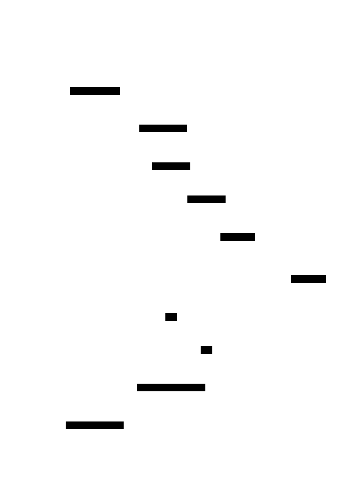

# Replicated Log: Design Document


## Overview

A distributed append-only log system that replicates data across multiple nodes to provide high availability and durability. The key architectural challenge is maintaining consistency across replicas while handling network failures and ensuring proper leader election to avoid split-brain scenarios.


> This guide is meant to help you understand the big picture before diving into each milestone. Refer back to it whenever you need context on how components connect.


## Context and Problem Statement

> **Milestone(s):** This section provides foundational understanding for all milestones, with particular relevance to Milestones 1-3 (Log Storage, Replication Protocol, and Failure Detection).

### Mental Model: The Library Catalog System

Before diving into the technical complexity of distributed log replication, let's build intuition using a familiar analogy. Imagine you're the head librarian managing a city-wide library system with multiple branches. Each branch needs to maintain an identical catalog of all books in the system, and every time a new book is acquired or removed, all branches must update their catalogs consistently.

In our analogy, each library branch represents a **node** in our distributed system. The catalog at each branch is the **replicated log** - an ordered record of every change that has happened to the collection. When the main branch (the **primary node**) adds a new book, it must notify all other branches (the **follower nodes**) so they can update their catalogs in the same order.

The challenges that arise in this library system mirror exactly what we face in distributed log replication:

**Ordering Problem**: If the downtown branch adds "Book A" at 2 PM and the university branch adds "Book B" at 2:01 PM, what order should these appear in all branch catalogs? Without coordination, the downtown catalog might show [A, B] while the university catalog shows [B, A]. This inconsistency would confuse patrons and staff.

**Network Reliability**: Phone lines between branches occasionally go down. If the main branch tries to notify others about a new acquisition but the message gets lost, some branches will have outdated catalogs. Worse, if they don't realize the message was lost, they might make conflicting decisions about available shelf space.

**Leadership Changes**: What happens if the main branch closes unexpectedly due to a power outage? The other branches need to quickly elect a new coordinator to continue processing new acquisitions. But they must be careful not to have two branches both acting as the main branch simultaneously - this would lead to conflicting catalog updates.

**Catch-up After Downtime**: When a branch that was closed for renovation reopens, it needs to catch up on all the catalog changes it missed. It can't simply resume from where it left off - it must replay all the intermediate updates in the correct order to reach the same state as the other branches.

This library system captures the essence of what we're building: a distributed system where multiple nodes maintain identical, ordered logs of events, with mechanisms to handle failures, elect leaders, and ensure consistency even in the face of network problems and node crashes.

### The Distributed Log Challenge

The **distributed log** is one of the most fundamental abstractions in distributed systems, yet it presents some of the most challenging technical problems in computer science. At its core, a distributed log is an ordered sequence of immutable records that is replicated across multiple machines to provide fault tolerance and high availability.

The fundamental challenge arises from the **CAP theorem** constraints: in the presence of network partitions (which are inevitable in distributed systems), we must choose between consistency and availability. However, the problem runs deeper than this abstract trade-off. Let's examine the specific technical challenges that make distributed log replication so complex.

#### The Ordering Guarantee Problem

In a single-machine system, ordering is straightforward - events happen in the order they occur in time, and the operating system's process scheduling provides a natural serialization. In a distributed system, we lose this natural ordering because:

1. **Clock Synchronization**: Different machines have different clocks that drift at different rates. We cannot rely on timestamps to determine the true order of events that happen close together in time.

2. **Network Delays**: Messages between nodes experience variable latency. An event that happens earlier might be processed later due to network delays, leading to out-of-order processing.

3. **Concurrent Operations**: Multiple clients might submit operations simultaneously to different nodes. Without coordination, each node might assign different sequence numbers to these operations.

The distributed log must provide a **total ordering** of all events across all nodes. This means that every node must agree on the exact sequence in which events occurred, even when those events originated from different clients at nearly the same time.

#### The Consistency Challenge

Maintaining consistency across replicas involves several layers of complexity:

**Write Consistency**: When a client writes to the log, at what point can we acknowledge the write as successful? If we acknowledge immediately after writing to one node, that node might crash before replicating the data, leading to data loss. If we wait for all nodes to acknowledge, a single slow or failed node will block all writes.

**Read Consistency**: When a client reads from the log, which version of the data should it see? If it reads from a replica that hasn't received the latest updates, it might see stale data. If it always reads from the primary, we lose the availability benefits of having replicas.

**Consistency During Failures**: The most complex scenario occurs during network partitions or node failures. Imagine a cluster of five nodes where the network splits into two groups of three and two nodes respectively. Both groups might elect their own leader and start accepting writes independently. When the network heals, we need to reconcile these divergent histories without losing data or violating the ordering guarantees.

#### The Durability Paradox

Distributed logs are often used as the foundation for other systems (databases, message queues, etc.), which means they must provide strong durability guarantees. However, durability conflicts with performance:

**Disk Synchronization**: To ensure durability, every write must be synchronized to disk using `fsync` or equivalent operations. This creates a performance bottleneck, as mechanical disks can only handle a few hundred `fsync` operations per second.

**Replication Durability**: For true durability, data must be replicated to multiple nodes and synchronized to disk on each replica before acknowledging the write. This multiplies the latency penalty and creates complex failure scenarios where some replicas have durably stored the data while others haven't.

#### The Failure Detection Dilemma

Distributed systems must distinguish between slow nodes and failed nodes, but this distinction is often impossible to make definitively:

**The Asynchronous Network Model**: In real networks, there's no upper bound on message delivery time. A node that appears failed might just be experiencing a temporary network slowdown. If we declare it failed too quickly, we create unnecessary failovers. If we wait too long, actual failures go undetected and impact system availability.

**Partial Failures**: In distributed systems, components can fail independently. A node might be able to receive messages but not send them, or it might be able to communicate with some nodes but not others. These partial failure modes create complex scenarios that are difficult to detect and handle correctly.

#### The Split-Brain Problem

Perhaps the most dangerous failure mode in distributed systems is **split-brain**, where multiple nodes simultaneously believe they are the leader. This can happen during network partitions when different groups of nodes lose connectivity with each other.

Split-brain scenarios can lead to:
- **Data Divergence**: Different leaders accept different sets of writes, creating conflicting versions of the log that are difficult to reconcile.
- **Ordering Violations**: The same sequence number might be assigned to different entries by different leaders.
- **Corruption**: Conflicting updates might corrupt the log structure or violate application-level invariants.

Preventing split-brain requires sophisticated **quorum-based protocols** that ensure only one leader can be active at any time, even during network partitions. However, this comes at the cost of availability - the system might become unavailable even when a majority of nodes are healthy if they cannot communicate with each other.

### Existing Solutions Comparison

The distributed log replication problem has been studied extensively, leading to several well-established algorithms and approaches. Understanding these existing solutions helps us appreciate the design decisions and trade-offs in our implementation.

#### Raft Consensus Algorithm

Raft, introduced in 2014, was designed to be a more understandable alternative to the complex Paxos algorithm. It has become the most popular choice for distributed log replication in modern systems.

**Core Design Philosophy**: Raft decomposes the consensus problem into three relatively independent subproblems: leader election, log replication, and safety. This modularity makes it easier to understand and implement correctly.

**Leader Election Mechanism**: Raft uses randomized timeouts to elect leaders. Each node starts as a follower and promotes itself to candidate if it doesn't receive heartbeats from a leader within a random timeout period. Candidates request votes from other nodes, and a candidate becomes leader if it receives votes from a majority of the cluster.

**Log Replication Process**: The Raft leader handles all client requests and replicates log entries to followers using AppendEntries RPCs. An entry is considered committed (and safe to apply) only after it's been replicated to a majority of nodes. This ensures that committed entries will never be lost, even if the leader fails.

**Safety Properties**: Raft provides several safety guarantees:
- **Election Safety**: At most one leader can be elected in a given term
- **Leader Append-Only**: Leaders never overwrite or delete entries in their logs
- **Log Matching**: If two logs contain an entry with the same index and term, then the logs are identical in all preceding entries
- **Leader Completeness**: If an entry is committed in a given term, that entry will be present in the logs of all leaders of higher terms

| Aspect | Strengths | Weaknesses |
|--------|-----------|------------|
| Understandability | Clear separation of concerns, extensive documentation | Still complex to implement correctly |
| Performance | Good throughput with batch optimization | Higher latency due to majority quorum requirement |
| Fault Tolerance | Tolerates (N-1)/2 failures in N-node cluster | Becomes unavailable if majority of nodes fail |
| Implementation Complexity | Well-defined state machine, many reference implementations | Edge cases in log consistency and leader election |

#### Viewstamped Replication

Viewstamped Replication (VR) is one of the earliest and most influential consensus protocols, originally developed in the 1980s and refined over the years. It served as inspiration for many later protocols, including Raft.

**View-Based Leadership**: VR organizes the system around the concept of "views," where each view has a designated primary node. The view number increases monotonically, and view changes occur when the primary fails or is suspected of failure.

**Three-Phase Protocol**: VR uses a three-phase commit protocol for each operation:
1. **Request Phase**: Client sends request to primary
2. **Prepare Phase**: Primary assigns sequence number and sends prepare message to backups
3. **Commit Phase**: Primary waits for acknowledgments from majority, then sends commit message

**View Change Protocol**: When a backup suspects the primary has failed, it initiates a view change by sending view-change messages to all nodes. The new primary must gather sufficient view-change messages to prove it has the most up-to-date log before starting the new view.

**Recovery and Reconfiguration**: VR includes detailed protocols for node recovery and cluster reconfiguration, making it suitable for long-running production systems.

| Aspect | Strengths | Weaknesses |
|--------|-----------|------------|
| Theoretical Foundation | Rigorous formal proofs, well-understood properties | Complex mathematical treatment |
| Reconfiguration | Explicit support for adding/removing nodes | Reconfiguration process is complex |
| Recovery | Detailed recovery protocols for various failure modes | Recovery can be slow and resource-intensive |
| Practical Adoption | Influenced many production systems | Less directly implemented than Raft |

#### Primary-Backup Replication

Primary-backup replication is the simplest and most intuitive approach to distributed log replication. One node acts as the primary and handles all writes, while backup nodes maintain copies of the data.

**Synchronous vs Asynchronous Replication**: 
- **Synchronous**: Primary waits for acknowledgment from all (or majority of) backups before acknowledging client writes. This provides strong consistency but higher latency.
- **Asynchronous**: Primary acknowledges client writes immediately and replicates to backups in the background. This provides better performance but weaker consistency guarantees.

**Failover Process**: When the primary fails, one of the backups is promoted to become the new primary. The challenge is ensuring that all nodes agree on which backup should be promoted and that no data is lost during the transition.

**Split-Brain Prevention**: Simple primary-backup systems are vulnerable to split-brain scenarios. Solutions include:
- **Witness Nodes**: Lightweight nodes that participate in leader election but don't store data
- **Quorum Systems**: Require majority agreement for leadership decisions
- **External Coordination**: Use external systems (like ZooKeeper) for leader election

| Aspect | Strengths | Weaknesses |
|--------|-----------|------------|
| Simplicity | Easy to understand and implement | Vulnerable to split-brain without additional mechanisms |
| Performance | Can achieve very low latency with asynchronous replication | Synchronous mode has high latency |
| Scalability | Can support many read-only replicas | All writes go through single primary |
| Consistency | Strong consistency possible with synchronous replication | Asynchronous mode provides weaker guarantees |

> **Decision: Replication Protocol Choice**
> - **Context**: We need to choose a replication protocol that balances understandability, correctness, and performance for an educational implementation
> - **Options Considered**: 
>   1. Full Raft implementation with all optimizations
>   2. Simplified Viewstamped Replication variant
>   3. Primary-backup with quorum-based leader election
> - **Decision**: Primary-backup replication with quorum-based leader election and failure detection
> - **Rationale**: This approach provides the best learning experience by clearly separating concerns (storage, replication, failure detection, client interface) while still covering the fundamental challenges. It's easier to implement correctly than full Raft but more robust than naive primary-backup. Students can understand each component independently before seeing how they interact.
> - **Consequences**: We sacrifice some of the advanced optimizations and edge-case handling of production-ready Raft implementations, but gain clarity and implementability. The resulting system will be suitable for moderate loads but may not handle all the complex failure scenarios that Raft addresses.

#### Comparison Summary

When choosing a replication protocol for our educational implementation, we need to balance correctness, understandability, and implementation complexity:

| Protocol | Correctness | Understandability | Implementation Effort | Production Readiness |
|----------|-------------|-------------------|---------------------|---------------------|
| Raft | High | Medium | High | High |
| Viewstamped Replication | High | Low | High | High |
| Primary-Backup + Quorum | Medium-High | High | Medium | Medium |

For our educational goals, the primary-backup approach with quorum-based enhancements provides the best trade-off. Students can implement and understand each component (log storage, leader election, failure detection) independently, then see how they compose into a complete system. This modular approach makes debugging easier and allows for incremental development through our milestone structure.

The resulting system will demonstrate all the fundamental concepts of distributed log replication while remaining implementable by developers who are new to distributed systems. More advanced students can extend the implementation with Raft-style optimizations as additional learning exercises.

### Implementation Guidance

The concepts we've discussed in this section form the foundation for all the technical components we'll build in subsequent milestones. This implementation guidance provides the architectural foundation and starter infrastructure needed to begin development.

#### Technology Recommendations

| Component | Simple Option | Advanced Option | Notes |
|-----------|---------------|-----------------|-------|
| RPC Transport | HTTP REST + JSON (net/http) | gRPC + Protocol Buffers | HTTP is easier to debug and test |
| Serialization | JSON (encoding/json) | Protocol Buffers + gogo/protobuf | JSON is human-readable for debugging |
| Storage Backend | File-based append-only log | Embedded database (BadgerDB/BoltDB) | Files give more control over durability |
| Configuration | YAML files + flag package | etcd/Consul for service discovery | Static config is simpler for learning |
| Logging | Standard library log | Structured logging (logrus/zap) | Standard lib sufficient for educational use |
| Testing | Built-in testing + testify | Chaos engineering tools | Focus on correctness before chaos testing |

#### Recommended Project Structure

Understanding how to organize a distributed systems project is crucial for maintainability and testing. Here's the recommended structure that supports our milestone-based development approach:

```
replicated-log/
├── cmd/
│   ├── node/                    # Main node executable
│   │   └── main.go             # Node startup and configuration
│   └── client/                 # Example client application
│       └── main.go             # Client CLI tool
├── internal/                   # Private packages (not imported by external projects)
│   ├── log/                    # Milestone 1: Log Storage Engine
│   │   ├── storage.go          # Core append-only log implementation
│   │   ├── storage_test.go     # Storage tests
│   │   ├── index.go            # Log indexing for O(1) lookups
│   │   └── compaction.go       # Log compaction implementation
│   ├── replication/            # Milestone 2: Replication Protocol
│   │   ├── manager.go          # Replication manager (leader election + sync)
│   │   ├── manager_test.go     # Replication tests
│   │   ├── messages.go         # RPC message definitions
│   │   └── quorum.go           # Quorum-based decision making
│   ├── failure/                # Milestone 3: Failure Detection
│   │   ├── detector.go         # Heartbeat-based failure detection
│   │   ├── detector_test.go    # Failure detection tests
│   │   └── recovery.go         # Node recovery and catch-up logic
│   ├── client/                 # Milestone 4: Client Interface
│   │   ├── client.go           # Client library with failover
│   │   ├── client_test.go      # Client tests
│   │   └── discovery.go        # Primary node discovery
│   ├── node/                   # Node coordination and state
│   │   ├── node.go             # Main node structure and lifecycle
│   │   ├── node_test.go        # Integration tests
│   │   └── state.go            # Node state management
│   └── common/                 # Shared utilities and types
│       ├── types.go            # Common data structures
│       ├── errors.go           # Error definitions
│       └── config.go           # Configuration structures
├── pkg/                        # Public packages (can be imported)
│   └── api/                    # Public client API
│       ├── client.go           # Public client interface
│       └── types.go            # Public type definitions
├── test/                       # Integration and end-to-end tests
│   ├── integration/            # Multi-node integration tests
│   ├── chaos/                  # Failure injection tests
│   └── benchmarks/             # Performance benchmarks
├── scripts/                    # Build and deployment scripts
├── docs/                       # Additional documentation
├── go.mod                      # Go module definition
├── go.sum                      # Dependency checksums
├── Makefile                    # Build automation
└── README.md                   # Project overview and usage
```

#### Infrastructure Starter Code

Here's the complete infrastructure code that handles cross-cutting concerns, allowing students to focus on the core distributed systems concepts:

**Configuration Management (internal/common/config.go):**
```go
package common

import (
    "encoding/json"
    "os"
    "time"
)

// NodeConfig contains all configuration for a single node
type NodeConfig struct {
    NodeID           string        `json:"node_id"`
    ListenAddr       string        `json:"listen_addr"`
    DataDir          string        `json:"data_dir"`
    Peers            []string      `json:"peers"`
    HeartbeatInterval time.Duration `json:"heartbeat_interval"`
    ElectionTimeout   time.Duration `json:"election_timeout"`
    LogRetention      time.Duration `json:"log_retention"`
    QuorumSize        int          `json:"quorum_size"`
}

// LoadConfig reads configuration from file with reasonable defaults
func LoadConfig(filename string) (*NodeConfig, error) {
    // Set defaults
    config := &NodeConfig{
        ListenAddr:        ":8080",
        DataDir:           "./data",
        HeartbeatInterval: 1 * time.Second,
        ElectionTimeout:   5 * time.Second,
        LogRetention:      24 * time.Hour,
        QuorumSize:        0, // Will be calculated as len(peers)/2 + 1
    }
    
    if filename != "" {
        data, err := os.ReadFile(filename)
        if err != nil {
            return nil, err
        }
        if err := json.Unmarshal(data, config); err != nil {
            return nil, err
        }
    }
    
    // Calculate quorum size if not specified
    if config.QuorumSize == 0 {
        totalNodes := len(config.Peers) + 1 // +1 for this node
        config.QuorumSize = totalNodes/2 + 1
    }
    
    return config, nil
}
```

**Error Definitions (internal/common/errors.go):**
```go
package common

import (
    "errors"
    "fmt"
)

// Core system errors
var (
    ErrNotLeader       = errors.New("node is not the leader")
    ErrNoLeader        = errors.New("no leader currently elected")
    ErrInvalidSequence = errors.New("invalid sequence number")
    ErrLogCorrupted    = errors.New("log file corrupted")
    ErrQuorumNotMet    = errors.New("insufficient nodes for quorum")
    ErrNodeNotFound    = errors.New("node not found in cluster")
    ErrAlreadyExists   = errors.New("entry already exists")
)

// ReplicationError wraps errors that occur during replication
type ReplicationError struct {
    NodeID string
    Err    error
}

func (e *ReplicationError) Error() string {
    return fmt.Sprintf("replication failed on node %s: %v", e.NodeID, e.Err)
}

// TimeoutError indicates an operation timed out
type TimeoutError struct {
    Operation string
    Duration  time.Duration
}

func (e *TimeoutError) Error() string {
    return fmt.Sprintf("%s timed out after %v", e.Operation, e.Duration)
}
```

**HTTP Transport Helper (internal/common/transport.go):**
```go
package common

import (
    "bytes"
    "context"
    "encoding/json"
    "fmt"
    "net/http"
    "time"
)

// HTTPTransport handles RPC communication between nodes
type HTTPTransport struct {
    client *http.Client
}

func NewHTTPTransport() *HTTPTransport {
    return &HTTPTransport{
        client: &http.Client{
            Timeout: 5 * time.Second,
        },
    }
}

// SendRPC sends an RPC request and decodes the response
func (t *HTTPTransport) SendRPC(ctx context.Context, addr string, method string, request interface{}, response interface{}) error {
    requestBody, err := json.Marshal(request)
    if err != nil {
        return fmt.Errorf("failed to marshal request: %w", err)
    }
    
    url := fmt.Sprintf("http://%s/rpc/%s", addr, method)
    req, err := http.NewRequestWithContext(ctx, "POST", url, bytes.NewReader(requestBody))
    if err != nil {
        return fmt.Errorf("failed to create request: %w", err)
    }
    req.Header.Set("Content-Type", "application/json")
    
    resp, err := t.client.Do(req)
    if err != nil {
        return fmt.Errorf("request failed: %w", err)
    }
    defer resp.Body.Close()
    
    if resp.StatusCode != http.StatusOK {
        return fmt.Errorf("RPC failed with status %d", resp.StatusCode)
    }
    
    if err := json.NewDecoder(resp.Body).Decode(response); err != nil {
        return fmt.Errorf("failed to decode response: %w", err)
    }
    
    return nil
}

// StartServer starts an HTTP server with RPC handlers
func (t *HTTPTransport) StartServer(addr string, handlers map[string]http.HandlerFunc) error {
    mux := http.NewServeMux()
    
    // Register RPC handlers
    for method, handler := range handlers {
        mux.HandleFunc(fmt.Sprintf("/rpc/%s", method), handler)
    }
    
    // Health check endpoint
    mux.HandleFunc("/health", func(w http.ResponseWriter, r *http.Request) {
        w.WriteHeader(http.StatusOK)
        json.NewEncoder(w).Encode(map[string]string{"status": "healthy"})
    })
    
    return http.ListenAndServe(addr, mux)
}
```

#### Core Type Definitions

These types form the foundation of our distributed log system. Students will use these throughout all milestones:

**Core Types (internal/common/types.go):**
```go
package common

import (
    "time"
)

// LogEntry represents a single entry in the replicated log
type LogEntry struct {
    SequenceNumber uint64    `json:"sequence_number"`
    Term           uint64    `json:"term"`           // Leadership term when entry was created
    Timestamp      time.Time `json:"timestamp"`
    Data           []byte    `json:"data"`
    Checksum       uint32    `json:"checksum"`       // CRC32 checksum for corruption detection
}

// NodeState represents the current state of a node in the cluster
type NodeState int

const (
    StateFollower NodeState = iota
    StateCandidate
    StateLeader
)

func (s NodeState) String() string {
    switch s {
    case StateFollower:
        return "Follower"
    case StateCandidate:
        return "Candidate"
    case StateLeader:
        return "Leader"
    default:
        return "Unknown"
    }
}

// NodeMetadata contains information about a node in the cluster
type NodeMetadata struct {
    NodeID         string    `json:"node_id"`
    Address        string    `json:"address"`
    State          NodeState `json:"state"`
    CurrentTerm    uint64    `json:"current_term"`
    LastHeartbeat  time.Time `json:"last_heartbeat"`
    LastLogIndex   uint64    `json:"last_log_index"`
    IsHealthy      bool      `json:"is_healthy"`
}

// ClusterState represents the overall state of the cluster
type ClusterState struct {
    CurrentTerm    uint64                    `json:"current_term"`
    LeaderID       string                   `json:"leader_id"`
    Nodes          map[string]*NodeMetadata `json:"nodes"`
    QuorumSize     int                      `json:"quorum_size"`
    LastUpdated    time.Time               `json:"last_updated"`
}
```

#### Language-Specific Implementation Hints

**Go-Specific Best Practices:**
- Use `os.File.Sync()` for fsync operations to ensure durability
- Implement proper context cancellation for all network operations
- Use `sync.RWMutex` for protecting shared state that's read frequently
- Leverage `time.After()` for implementing timeouts in select statements
- Use `go test -race` to detect race conditions during development
- Consider using `sync.WaitGroup` for coordinating goroutines during shutdown

**Performance Considerations:**
- Batch multiple log entries in a single disk write when possible
- Use buffered channels for internal communication between components
- Pre-allocate slices when the size is known to reduce garbage collection
- Use `json.Encoder` instead of `json.Marshal` when writing to streams
- Consider using memory-mapped files for log indices if performance becomes critical

**Testing Strategy:**
- Write table-driven tests for all core algorithms
- Use dependency injection to mock network and disk I/O in unit tests
- Create integration tests that spin up multiple nodes in the same process
- Use `httptest.Server` for testing HTTP-based RPC communication
- Implement chaos testing that randomly kills nodes and partitions networks

#### Development Workflow

**Milestone Checkpoints:**
After completing each milestone, verify your implementation with these checkpoints:

1. **After Milestone 1 (Log Storage):**
   - Run `go test ./internal/log/...` - all tests should pass
   - Start a single node and verify it can append and read entries
   - Kill the process and restart - verify data persists across restarts
   - Monitor disk usage and verify compaction reclaims space

2. **After Milestone 2 (Replication Protocol):**
   - Start a 3-node cluster and verify leader election occurs
   - Send writes to leader and verify they replicate to followers
   - Kill the leader and verify a new leader is elected
   - Verify writes are rejected if sent to followers

3. **After Milestone 3 (Failure Detection):**
   - Verify heartbeat messages are sent between nodes
   - Kill a follower and verify it's detected as failed
   - Restart the failed node and verify it catches up
   - Create a network partition and verify the majority side continues operating

4. **After Milestone 4 (Client Interface):**
   - Client should automatically discover the current leader
   - Client should retry writes if leader fails during operation
   - Client should be able to read from followers with appropriate consistency guarantees
   - Client should handle network errors gracefully with exponential backoff

**Common Development Pitfalls:**
⚠️ **Pitfall: Race Conditions in State Management**
Many students implement node state (current term, voted for, etc.) with simple variables, leading to race conditions when multiple goroutines access the state. Always protect shared state with mutexes and consider using getter/setter methods to encapsulate the locking logic.

⚠️ **Pitfall: Blocking Operations in Critical Paths**
Network operations and disk I/O can block indefinitely. Always use context with timeouts for external operations, and never perform blocking I/O while holding locks that other operations need.

⚠️ **Pitfall: Inadequate Error Handling**
Distributed systems have many failure modes that rarely occur in testing but are common in production. Handle every error returned by network and disk operations, and consider what the correct behavior should be for each failure mode.


## Goals and Non-Goals

> **Milestone(s):** This section establishes the foundational scope and requirements for all milestones (1-4), defining what we will and will not build in this replicated log system.

Think of this replicated log system as building a **distributed ledger for a banking consortium**. Just as multiple bank branches need to maintain synchronized copies of transaction records with strict guarantees about consistency and durability, our replicated log must provide clear commitments about what it will deliver and honest acknowledgment of what it will not attempt to solve.

Understanding the precise boundaries of what we're building is crucial for making sound architectural decisions throughout the implementation. Every design choice we make—from the storage format to the replication protocol—flows from these fundamental requirements and constraints.

### System Requirements

Our replicated log system must provide three core guarantees that form the foundation of a reliable distributed storage system. These requirements directly inform every architectural decision and implementation detail across all four milestones.

#### Durability Guarantees

The system must ensure that once data is acknowledged as written, it survives various failure scenarios. Think of durability as the system's **promise to never lose your data** once it confirms receipt.

| Requirement | Specification | Implementation Constraint |
|-------------|---------------|--------------------------|
| Write Durability | All acknowledged writes must survive single node crashes | Must fsync to disk before acknowledging writes |
| Replica Durability | Data must survive minority node failures permanently | Must maintain copies on quorum of nodes |
| Storage Durability | Must recover consistent state after process restart | Must persist sequence numbers and entry ordering |
| Corruption Recovery | Must detect and handle partial writes and corruption | Must use checksums and validate on read |

The durability model follows a **quorum-based approach** where writes are only acknowledged after a majority of nodes have confirmed persistent storage. This means that if we have a cluster of 5 nodes, at least 3 nodes must successfully write the data to disk and respond with confirmation before the client receives acknowledgment.

> **Design Principle**: The system prioritizes data safety over availability. When in doubt between potentially losing data and temporarily rejecting writes, we choose to reject writes.

Consider a concrete scenario: A client submits a log entry, and the primary node receives the request. The primary must write the entry to its local log (with fsync), then send the entry to all followers. Only after receiving persistent storage confirmation from at least `QuorumSize` nodes (including itself) can the primary respond to the client with success. If the primary crashes immediately after sending this response, the data is guaranteed to be recoverable from the surviving replicas.

#### Consistency Guarantees

The system provides **strong consistency** within the replicated log, ensuring all nodes converge to the same ordered sequence of entries. Our consistency model is based on primary-backup replication with linearizable writes.

| Consistency Level | Guarantee | Use Case |
|------------------|-----------|----------|
| Strong Reads | Reads reflect all previously acknowledged writes | Default behavior for read operations |
| Sequential Ordering | All nodes apply entries in identical order | Maintained through sequence numbers |
| Monotonic Reads | Later reads never return older data | Achieved through version tracking |
| Read-Your-Writes | Clients see their own writes immediately | Client tracks last written sequence number |

The consistency model ensures that if a client writes entry X and then writes entry Y, all nodes will apply these entries in the same order (X before Y) and all subsequent reads will observe this ordering. This is achieved through the primary node assigning monotonically increasing sequence numbers to all entries.

> **Critical Insight**: We sacrifice some performance for consistency. All writes go through the primary, creating a potential bottleneck, but guaranteeing a single source of truth for ordering decisions.

For read operations, the system supports different consistency levels:

1. **Strong reads**: Query the current primary to ensure the most recent data
2. **Follower reads**: Query any replica for potentially slightly stale data with better performance
3. **Consistent prefix reads**: Guarantee that if you've read up to sequence N, you've seen all entries 1 through N

#### Availability Guarantees

The system provides high availability for both read and write operations, with well-defined behavior during various failure scenarios. The availability model is designed around surviving minority failures while maintaining safety guarantees.

| Failure Scenario | System Behavior | Recovery Process |
|------------------|----------------|------------------|
| Single Node Failure | Continues operation with remaining nodes | Automatic leader election if primary fails |
| Minority Node Failure | Maintains full read/write availability | Failed nodes catch up on rejoin |
| Majority Node Failure | Becomes read-only, no new writes accepted | Requires manual intervention or node recovery |
| Network Partition | Majority partition remains active | Minority partition rejects writes |

The availability guarantees are built around a **leader election protocol** that automatically promotes a new primary when the current primary becomes unreachable. This process typically completes within `2 * ElectionTimeout` duration, during which write operations are temporarily unavailable but reads can continue from followers.

**Recovery Time Objectives (RTO)**:
- Leader failover: < 10 seconds (configurable via `ElectionTimeout`)
- Node rejoin: Variable based on log gap size
- Full cluster restart: < 30 seconds for typical configurations

**Recovery Point Objectives (RPO)**:
- Zero data loss for acknowledged writes (durability guarantee)
- Potential loss of unacknowledged writes during primary failure
- No silent data corruption under any failure scenario

> **Decision: Availability vs Consistency Trade-off**
> - **Context**: During network partitions, we must choose between accepting potentially inconsistent writes or rejecting writes to maintain safety
> - **Options Considered**: 
>   1. Always available (accept writes on any partition)
>   2. Consistent availability (only majority partition accepts writes)
>   3. Manual intervention required (reject all writes during partitions)
> - **Decision**: Consistent availability - only the majority partition remains writable
> - **Rationale**: Prevents split-brain scenarios and data divergence while maintaining availability for the common case of minority failures
> - **Consequences**: Temporary write unavailability during network partitions, but guaranteed data consistency

### Out of Scope

Clearly defining what we will NOT build is equally important as defining what we will build. These exclusions help maintain focus and prevent scope creep while acknowledging features that would be valuable in a production system.

#### Advanced Replication Features

Several sophisticated replication capabilities are explicitly excluded from this implementation to maintain educational focus on core concepts.

| Feature | Why Excluded | Alternative Approach |
|---------|--------------|---------------------|
| Multi-datacenter replication | Adds complexity of WAN latency and partition handling | Single datacenter deployment only |
| Cross-region disaster recovery | Requires sophisticated conflict resolution | Manual backup and restore procedures |
| Dynamic cluster membership | Complex consensus for membership changes | Static cluster configuration at startup |
| Automated cluster scaling | Requires data rebalancing and partition management | Manual node addition with full resync |

**Multi-datacenter replication** introduces challenges around network latency, partial connectivity, and conflicting updates that would distract from learning the fundamental concepts. In a real deployment, this feature would require additional protocols like conflict-free replicated data types (CRDTs) or sophisticated timestamp-based conflict resolution.

**Dynamic membership changes** are excluded because they require consensus not just on data, but on the cluster configuration itself. This leads to complex scenarios like adding a node during a leadership election or removing the current leader. Our static configuration approach ensures the cluster topology remains stable throughout learning exercises.

#### Scalability and Performance Optimizations

High-performance features that would be essential in production are deferred to keep the implementation approachable.

| Optimization | Production Need | Learning Trade-off |
|--------------|-----------------|-------------------|
| Log sharding across partitions | Handle > 1TB logs efficiently | Single log keeps implementation simple |
| Parallel log replication | Improve write throughput | Sequential replication easier to debug |
| Batched write operations | Reduce network overhead | Individual writes show clear operation flow |
| Asynchronous log compaction | Prevent blocking during cleanup | Synchronous compaction simpler to implement |

**Log sharding** would allow the system to scale beyond the storage capacity of a single node by partitioning the log across multiple nodes. However, this introduces questions about partition key selection, rebalancing, and cross-partition queries that are separate from the core replication concepts.

**Batched operations** provide significant performance benefits in production by amortizing network and disk costs across multiple entries. We exclude this optimization because individual operations make the system behavior more transparent during debugging and testing.

#### Advanced Consistency Models

Several consistency models that would be valuable in production scenarios are excluded to focus on mastering strong consistency.

| Consistency Model | Use Case | Implementation Complexity |
|------------------|----------|-------------------------|
| Eventual consistency | High-performance distributed caches | Requires conflict resolution protocols |
| Causal consistency | Social media feeds and collaborative editing | Complex vector clock maintenance |
| Session consistency | User-specific data views | Per-session state tracking |
| Bounded staleness | Time-sensitive but not critical data | Complex time synchronization |

**Eventual consistency** would allow the system to accept writes even during network partitions, with nodes reconciling differences later. While useful for systems like social media or content delivery, the conflict resolution mechanisms would obscure the learning objectives around consensus and leader election.

**Causal consistency** preserves the happens-before relationship between related operations while allowing concurrent operations to be observed in different orders. This model requires vector clocks or similar mechanisms to track causality, adding significant implementation complexity.

#### Enterprise Features

Production-ready features that would be required in enterprise deployments are excluded to maintain focus on core distributed systems concepts.

| Feature Category | Excluded Features | Learning Rationale |
|-----------------|------------------|-------------------|
| Security | Authentication, authorization, encryption | Focus on consensus and replication protocols |
| Monitoring | Metrics, alerting, distributed tracing | Concentrate on functional correctness |
| Operations | Rolling upgrades, configuration management | Emphasize algorithmic challenges |
| Integration | Message queues, stream processing connectors | Keep interfaces simple and direct |

**Security features** like mutual TLS, access controls, and audit logging are crucial for production but would require substantial additional code that doesn't teach distributed systems concepts. Our implementation assumes a trusted network environment.

**Comprehensive monitoring** with metrics about replication lag, leader election frequency, and performance characteristics would be essential for operating the system but would significantly expand the codebase without advancing learning objectives.

> **Important Note**: These excluded features are not "unimportant" - they're essential for production systems. They're deferred because mastering the core algorithms of consensus, replication, and failure handling provides the foundation needed to later add these production concerns.

#### Performance and Scale Limitations

We explicitly accept certain performance and scalability limitations that would be unacceptable in production to keep the implementation focused and debuggable.

| Limitation | Acceptable Range | Production Requirement |
|------------|-----------------|----------------------|
| Maximum log size | 10GB per node | Terabytes |
| Maximum cluster size | 7 nodes | Hundreds of nodes |
| Write throughput | 1000 ops/sec | 100K+ ops/sec |
| Read latency | 10ms | Sub-millisecond |
| Recovery time | Minutes | Seconds |

These limitations are intentional design choices that prioritize learning and implementation simplicity over production performance. The algorithmic foundations we build will scale to production requirements with engineering investment in optimizations.

> **Design Philosophy**: Build a system that demonstrates correct distributed systems behavior at small scale rather than one that achieves production performance with potentially hidden correctness issues.

### Implementation Guidance

Understanding the scope and requirements at a high level is crucial, but translating these into concrete implementation decisions requires careful consideration of technology choices and architectural approaches.

#### Requirements Validation Strategy

Each requirement category maps to specific validation approaches that will guide our testing and verification throughout development.

| Requirement Category | Validation Approach | Tools and Techniques |
|---------------------|-------------------|---------------------|
| Durability | Crash testing with forced shutdowns | Kill processes during writes, verify recovery |
| Consistency | Multi-client concurrent operations | Race condition detection, state verification |
| Availability | Network partition simulation | Chaos engineering, network manipulation |
| Performance | Load testing within accepted limits | Benchmarking, profiling |

**Durability validation** involves writing automated tests that kill processes at specific points during write operations and verify that the system recovers to a consistent state. This includes scenarios like killing the primary just before acknowledging a write, or shutting down multiple followers during replication.

**Consistency validation** requires coordinated multi-client test scenarios where different clients perform concurrent operations and we verify that all nodes converge to the same final state. We'll implement specific test cases around read-your-writes consistency and monotonic read guarantees.

#### Technology Selection Criteria

Given our explicit requirements and non-goals, certain technology choices become clear priorities for the implementation.

| Component | Recommended Technology | Rationale |
|-----------|----------------------|-----------|
| Storage Engine | Append-only files with separate index | Matches durability requirements, simple to implement |
| Network Transport | HTTP/1.1 with JSON | Debuggable, widely supported, adequate performance |
| Serialization | JSON for messages, binary for log entries | Balance of simplicity and efficiency |
| Concurrency | Go routines with channels | Natural fit for heartbeats and async operations |

**File-based storage** aligns with our durability requirements while keeping the implementation transparent. We can easily inspect log files, verify checksums, and understand exactly what gets persisted. More sophisticated storage engines would optimize performance at the cost of implementation complexity.

**HTTP transport** provides excellent debuggability since we can inspect messages with standard tools like curl or Wireshark. The performance overhead is acceptable given our throughput targets, and the protocol complexity is minimal compared to custom binary protocols.

#### Milestone Checkpoint Strategy

Each milestone has specific acceptance criteria that translate into concrete validation checkpoints during implementation.

**Milestone 1 Checkpoint - Log Storage**:
```bash
# Expected behavior after Milestone 1 completion
./replicated-log --single-node --data-dir=/tmp/test-log

# Should support:
curl -X POST localhost:8080/append -d '{"data":"test entry"}'
# Returns: {"sequence_number": 1, "status": "success"}

curl localhost:8080/read/1
# Returns: {"sequence_number": 1, "data": "test entry", "timestamp": "2024-01-15T10:30:00Z"}
```

**Milestone 2 Checkpoint - Replication Protocol**:
```bash
# Start 3-node cluster
./replicated-log --node-id=node1 --peers=node2,node3 &
./replicated-log --node-id=node2 --peers=node1,node3 &
./replicated-log --node-id=node3 --peers=node1,node2 &

# Write to leader should replicate to followers
curl -X POST leader-node:8080/append -d '{"data":"replicated entry"}'

# All nodes should have the entry
curl node1:8080/read/1  # Should return the entry
curl node2:8080/read/1  # Should return the entry  
curl node3:8080/read/1  # Should return the entry
```

#### Error Handling Validation

The requirements around consistency and availability translate into specific error handling scenarios that must be tested.

| Error Scenario | Expected Behavior | Validation Method |
|---------------|------------------|------------------|
| Primary node crash during write | Write fails or succeeds atomically | Kill primary mid-write, check replica state |
| Network partition | Majority partition continues, minority stops | Use iptables to block network traffic |
| Disk full during write | Write rejected with clear error | Fill disk, attempt write operations |
| Corrupted log file on restart | System detects corruption and refuses to start | Modify log files, restart nodes |

**Atomic write validation** involves sophisticated testing where we send a write request and kill the primary at various points during processing. The system must either complete the write (visible on quorum of replicas) or fail the write (not visible on any replica) - never partial completion.

**Network partition testing** requires careful setup of test environments where we can selectively block network traffic between specific nodes and verify that the system maintains safety properties even when nodes cannot communicate.

This comprehensive approach to requirements validation ensures that our implementation doesn't just appear to work under normal conditions, but maintains its guarantees under the stress conditions that reveal distributed systems bugs.


## High-Level Architecture

> **Milestone(s):** This section establishes the foundational system structure for all milestones, with primary relevance to understanding the overall component organization that will be built incrementally across Milestones 1-4.

### Mental Model: The Distributed Library System

Before diving into technical components, let's build intuition using a familiar analogy. Imagine a library system with multiple branches that must stay synchronized. Each branch (node) has its own copy of the catalog (log), but they need to coordinate to ensure everyone has the same information about new books, checkouts, and returns.

The main library branch (leader) receives all catalog updates from librarians and patrons. When a new book arrives, the head librarian (primary node) first records it in their master catalog (local log storage), then calls each branch (follower nodes) to tell them about the update. Only after hearing back from most branches confirming they've recorded the update does the head librarian tell the patron "yes, your book donation is officially in our system" (client acknowledgment). If the head librarian goes on vacation unexpectedly (node failure), the branches must quickly elect a new head librarian (leader election) to keep the system running.

Each branch needs several capabilities: a filing system for catalog cards (log storage engine), a phone system to communicate with other branches (replication protocol), a way to notice when other branches stop answering calls (failure detection), and a front desk to help patrons find books (client interface). These four core components work together to maintain a consistent, available library system even when individual branches experience problems.


This distributed library perfectly mirrors our replicated log system. The catalog entries are log entries with sequence numbers, the coordination between branches is our replication protocol, the vacation scenario is node failure handling, and the patron interface is our client API. Now let's examine each component in detail.

### System Components

The replicated log system consists of four primary components that work together to provide consistent, durable, and available log storage across multiple nodes. Each component has distinct responsibilities and interfaces, but they coordinate closely to maintain system invariants.

#### Log Storage Engine

The **log storage engine** serves as the foundation of each node, providing durable, append-only storage with efficient random access capabilities. Think of this as the physical filing system in each library branch - it must be reliable, fast to search, and never lose information once it's been recorded.

This component owns all persistent state for log entries and maintains critical invariants about sequence number monotonicity and data durability. When a new entry arrives, the storage engine assigns the next sequential number, writes the entry to disk with `fsync()` for durability, updates its in-memory index for fast lookups, and returns confirmation only after the data is safely persisted.

The storage engine interface abstracts the complexity of file management, indexing, and compaction from higher-level components. It provides methods for appending new entries, reading entries by sequence number or range, and managing disk space through log compaction.

| Method Name | Parameters | Returns | Description |
|-------------|------------|---------|-------------|
| `Append` | `data []byte` | `uint64, error` | Appends data as new log entry, returns assigned sequence number |
| `Read` | `seqNum uint64` | `*LogEntry, error` | Retrieves entry by sequence number with O(1) lookup |
| `ReadRange` | `start, end uint64` | `[]*LogEntry, error` | Returns entries in sequence number range [start, end) |
| `GetLastSequence` | none | `uint64` | Returns highest sequence number currently stored |
| `Compact` | `beforeSeq uint64` | `error` | Removes entries with sequence numbers less than beforeSeq |
| `Close` | none | `error` | Safely closes all file handles and flushes pending writes |

The storage engine maintains several internal data structures to support these operations efficiently:

| Structure | Type | Description |
|-----------|------|-------------|
| Active Segment | `*os.File` | Current file being written to for new entries |
| Index Map | `map[uint64]int64` | In-memory mapping from sequence number to file offset |
| Segment List | `[]string` | Ordered list of segment filenames for compaction |
| Last Sequence | `uint64` | Cached value of highest sequence number stored |
| Write Buffer | `[]byte` | Buffer for batching small writes before fsync |

#### Replication Manager

The **replication manager** coordinates the distribution of log entries across the cluster and implements the primary-backup replication protocol. Continuing our library analogy, this is like the phone system and coordination procedures that keep all branches synchronized when the catalog changes.

This component operates differently depending on the node's current role in the cluster. When acting as the leader, it accepts new entries from clients, appends them to the local log storage, replicates them to follower nodes, and waits for quorum acknowledgment before confirming the write to the client. When acting as a follower, it receives replicated entries from the leader, appends them to local storage, and sends acknowledgments back.

The replication manager maintains critical state about the cluster topology and replication progress. It tracks which nodes are part of the cluster, what sequence numbers each follower has successfully replicated, and what constitutes a quorum for decision-making.

| Method Name | Parameters | Returns | Description |
|-------------|------------|---------|-------------|
| `ReplicateEntry` | `entry *LogEntry` | `error` | Replicates entry to followers and waits for quorum |
| `HandleAppendRPC` | `req *AppendRequest` | `*AppendResponse, error` | Processes append RPC from leader (follower side) |
| `GetReplicationStatus` | none | `map[string]uint64` | Returns last replicated sequence per follower |
| `UpdateClusterMembership` | `nodes []string` | `error` | Updates list of nodes participating in replication |
| `BecomeLeader` | `term uint64` | `error` | Transitions node to leader role for given term |
| `BecomeFollower` | `leaderID string, term uint64` | `error` | Transitions node to follower role |

The replication manager tracks several key pieces of state to coordinate the distributed protocol:

| State Variable | Type | Description |
|----------------|------|-------------|
| Current Role | `NodeState` | Whether this node is leader, follower, or candidate |
| Current Term | `uint64` | Leadership epoch number, increases with each election |
| Leader ID | `string` | Node ID of current leader (empty if no leader) |
| Follower Progress | `map[string]uint64` | Last sequence number replicated to each follower |
| Pending Writes | `map[uint64]*WriteRequest` | Client writes waiting for quorum acknowledgment |
| Quorum Size | `int` | Minimum number of nodes required for decisions |

> **Key Design Insight**: The replication manager implements the critical safety property that no entry is acknowledged to clients until it's been durably stored on a quorum of nodes. This ensures that even if the leader fails immediately after acknowledgment, the committed data will be available on the new leader.

#### Failure Detector

The **failure detector** monitors the health of nodes in the cluster and triggers appropriate responses when failures are detected. In our library analogy, this is like the system that notices when a branch stops answering phone calls and alerts the other branches that they may need to elect a new head librarian.

This component operates through a heartbeat protocol where nodes periodically send liveness signals to each other. The failure detector tracks when heartbeats were last received from each node and marks nodes as suspected failures when heartbeat timeouts expire. It also handles the complex logic of distinguishing between true failures and temporary network issues.

When the failure detector determines that the current leader has failed, it initiates the leader election process. When it detects that a follower has failed, it notifies the replication manager to adjust quorum calculations. When a previously failed node rejoins the cluster, it triggers the catch-up process to bring the node up to date.

| Method Name | Parameters | Returns | Description |
|-------------|------------|---------|-------------|
| `StartHeartbeat` | `interval time.Duration` | `error` | Begins sending periodic heartbeat messages |
| `HandleHeartbeat` | `nodeID string, timestamp time.Time` | `error` | Processes heartbeat received from another node |
| `CheckNodeHealth` | `nodeID string` | `bool` | Returns whether node is currently considered healthy |
| `GetFailedNodes` | none | `[]string` | Returns list of nodes currently marked as failed |
| `TriggerElection` | none | `error` | Initiates leader election due to leader failure |
| `RegisterFailureCallback` | `callback func(string)` | none | Registers function to call when node failure detected |

The failure detector maintains timing and health state for all cluster nodes:

| State Variable | Type | Description |
|----------------|------|-------------|
| Node Heartbeats | `map[string]time.Time` | Last heartbeat received from each node |
| Health Status | `map[string]bool` | Current health assessment for each node |
| Election Timeout | `time.Duration` | How long to wait before starting election |
| Heartbeat Interval | `time.Duration` | How frequently to send heartbeat messages |
| Failure Callbacks | `[]func(string)` | Functions to call when failures detected |
| Election Timer | `*time.Timer` | Timer tracking when to start election |

#### Client Interface

The **client interface** provides the external API for applications to interact with the replicated log system and handles the complexity of primary discovery, failover, and consistency guarantees. Think of this as the front desk at each library branch that helps patrons find books, but with the intelligence to redirect them to the right branch when needed.

This component abstracts the distributed nature of the system from client applications. Clients don't need to know which node is currently the leader or how to handle failures - the client interface handles primary discovery, automatically retries failed operations with the new leader, and provides different consistency levels based on application needs.

The client interface maintains a cache of cluster topology and leader information, but it must handle the reality that this information can become stale at any time. When operations fail due to leadership changes or network issues, the interface implements intelligent retry logic with exponential backoff and circuit breaker patterns.

| Method Name | Parameters | Returns | Description |
|-------------|------------|---------|-------------|
| `Append` | `ctx context.Context, data []byte` | `uint64, error` | Appends data to log, returns sequence number |
| `Read` | `ctx context.Context, seqNum uint64` | `*LogEntry, error` | Reads entry by sequence number |
| `ReadRange` | `ctx context.Context, start, end uint64` | `[]*LogEntry, error` | Reads range of entries |
| `Subscribe` | `ctx context.Context, fromSeq uint64` | `<-chan *LogEntry, error` | Streams new entries starting from sequence |
| `DiscoverLeader` | `ctx context.Context` | `string, error` | Finds and returns current leader address |
| `SetConsistencyLevel` | `level ConsistencyLevel` | none | Sets read consistency requirements |

The client interface tracks connection state and cluster topology to provide seamless failover:

| State Variable | Type | Description |
|----------------|------|-------------|
| Current Leader | `string` | Cached address of current leader node |
| Cluster Nodes | `[]string` | List of all known cluster node addresses |
| HTTP Client | `*http.Client` | Reusable HTTP client with timeouts configured |
| Consistency Level | `ConsistencyLevel` | Strong or eventual consistency for reads |
| Retry Policy | `RetryConfig` | Backoff and maximum retry configuration |
| Circuit Breaker | `CircuitBreaker` | Prevents cascading failures during outages |

### Component Interactions and Dependencies

These four components form a layered architecture with clear dependency relationships and interaction patterns. The log storage engine forms the foundation, providing durable storage services to all other components. The replication manager builds upon the storage engine to provide distributed consistency. The failure detector operates independently but notifies the replication manager of topology changes. The client interface sits at the top, orchestrating operations across all other components.

> **Architecture Decision: Layered Component Design**
> - **Context**: We need to organize system functionality while maintaining clear separation of concerns and enabling independent testing of each component.
> - **Options Considered**: 
>   1. Monolithic design with all functionality in single component
>   2. Event-driven architecture with message passing between components  
>   3. Layered architecture with direct method calls between layers
> - **Decision**: Layered architecture with well-defined interfaces between components
> - **Rationale**: Layered design provides clear separation of concerns, makes testing easier by allowing component isolation, and matches the natural dependency flow from storage to replication to client interface. Direct method calls are simpler than event passing for this system size.
> - **Consequences**: Components have clear responsibilities and can be developed independently. However, we must be careful about circular dependencies and ensure proper error propagation between layers.

The interaction patterns between components follow predictable flows based on the type of operation being performed:

**Write Operations Flow**: Client interface receives write request → discovers current leader → sends request to replication manager on leader node → replication manager appends to local storage engine → replicates to follower nodes → waits for quorum acknowledgment → returns success to client interface.

**Read Operations Flow**: Client interface receives read request → determines consistency requirements → if strong consistency required, contacts leader; if eventual consistency acceptable, can read from local follower → storage engine performs lookup → returns data to client interface.

**Failure Handling Flow**: Failure detector notices missing heartbeats → marks node as failed → notifies replication manager → if failed node was leader, triggers election process → new leader established → client interface discovers new leader → operations resume.

The components communicate through well-defined interfaces that hide implementation details and enable independent evolution of each component. This modular design also facilitates testing by allowing each component to be tested in isolation with mock implementations of its dependencies.

### Code Organization

A well-organized codebase is crucial for managing the complexity of a distributed system. The recommended file structure separates components clearly while maintaining logical grouping of related functionality. This organization supports independent development and testing of components while making the overall system structure clear to new developers.

The top-level structure separates executable entry points, internal implementation components, external API definitions, and supporting infrastructure:

```
replicated-log/
├── cmd/                          # Executable entry points
│   ├── server/                   # Main log server executable
│   │   └── main.go              # Server startup and configuration
│   └── client/                   # CLI client tool
│       └── main.go              # Client commands and examples
├── internal/                     # Internal implementation packages
│   ├── storage/                  # Log Storage Engine (Milestone 1)
│   │   ├── engine.go            # Main storage engine implementation
│   │   ├── segment.go           # Log segment file management
│   │   ├── index.go             # In-memory indexing structures
│   │   ├── compaction.go        # Log compaction and cleanup
│   │   └── storage_test.go      # Storage engine unit tests
│   ├── replication/              # Replication Manager (Milestone 2)
│   │   ├── manager.go           # Replication coordination logic
│   │   ├── leader.go            # Leader-specific replication behavior
│   │   ├── follower.go          # Follower-specific replication behavior
│   │   ├── election.go          # Leader election algorithm
│   │   └── replication_test.go  # Replication protocol tests
│   ├── failure/                  # Failure Detector (Milestone 3)
│   │   ├── detector.go          # Heartbeat and failure detection
│   │   ├── heartbeat.go         # Heartbeat protocol implementation
│   │   ├── recovery.go          # Node recovery and catch-up
│   │   └── failure_test.go      # Failure detection tests
│   ├── client/                   # Client Interface (Milestone 4)
│   │   ├── interface.go         # External client API implementation
│   │   ├── discovery.go         # Leader discovery and caching
│   │   ├── failover.go          # Client-side failover logic
│   │   └── client_test.go       # Client interface tests
│   ├── transport/                # Network communication infrastructure
│   │   ├── http.go              # HTTP-based RPC transport
│   │   ├── messages.go          # RPC message definitions
│   │   └── transport_test.go    # Transport layer tests
│   └── config/                   # Configuration and node management
│       ├── node.go              # Node configuration and metadata
│       ├── cluster.go           # Cluster state management
│       └── config_test.go       # Configuration tests
├── api/                          # Public API definitions
│   ├── types.go                 # Shared data structures and constants
│   ├── errors.go                # Error definitions and error handling
│   └── client.go                # Public client interface
├── pkg/                          # Reusable utility packages
│   ├── logging/                  # Structured logging utilities
│   └── testing/                  # Test helpers and utilities
├── configs/                      # Configuration file templates
│   ├── single-node.yaml        # Single node development config
│   ├── three-node-cluster.yaml # Three node cluster config
│   └── production.yaml          # Production deployment template
├── scripts/                      # Development and deployment scripts
│   ├── build.sh                 # Build automation
│   ├── test.sh                  # Comprehensive test runner
│   └── cluster-setup.sh         # Multi-node cluster setup
├── docs/                         # Additional documentation
│   └── diagrams/                # Architecture diagrams
├── go.mod                        # Go module definition
├── go.sum                        # Go module checksums
├── Makefile                      # Build and test automation
└── README.md                     # Project overview and quick start
```

This organization follows several important principles for distributed systems development:

**Component Isolation**: Each major component lives in its own package with clear boundaries. The `internal/` directory prevents external packages from importing implementation details, enforcing proper use of public APIs defined in `api/`.

**Milestone Alignment**: The package structure directly maps to project milestones, making it easy to understand what needs to be implemented at each stage. Developers can focus on one component at a time while understanding how it fits into the larger system.

**Testability**: Each component package includes comprehensive unit tests. The `pkg/testing/` package provides shared test utilities for setting up multi-node scenarios and injecting failures during testing.

**Infrastructure Separation**: Common infrastructure like networking, configuration, and logging is separated into reusable packages that don't contain business logic. This makes it easier to swap implementations (e.g., changing from HTTP to gRPC) without affecting core algorithms.

**Development Workflow Support**: The `cmd/` directory provides both the production server and development tools. The `scripts/` and `configs/` directories support different deployment scenarios from single-node development to multi-node production clusters.

Within each component package, files are organized by functionality rather than by type. For example, the replication package separates leader logic, follower logic, and election logic into different files, making it easier to understand and modify specific behaviors.

> **Key Design Principle**: The package structure should make the system's architecture obvious to new developers. Someone looking at the directory tree should immediately understand the major components and how they relate to the project milestones.

The `api/` package serves as the stable interface between the internal implementation and external clients. All public data structures like `LogEntry`, `NodeMetadata`, and `ClusterState` are defined here, along with error constants and the primary client interface that applications will use.

This organization supports both development and production needs. During development, developers can work on individual components in isolation, run focused unit tests, and use the CLI tools for manual testing. In production, the server executable can be deployed with different configuration files to support various cluster topologies and operational requirements.

### Implementation Guidance

The replicated log system requires careful selection of technologies and implementation patterns to handle the complexities of distributed coordination while maintaining simplicity for learning purposes. This guidance provides concrete recommendations for building each component.

#### Technology Recommendations

| Component | Simple Option | Advanced Option |
|-----------|---------------|-----------------|
| **Transport** | HTTP REST + JSON (net/http) | gRPC with Protocol Buffers |
| **Serialization** | JSON (encoding/json) | Protocol Buffers or MessagePack |
| **Storage Format** | Binary files + JSON metadata | Custom binary format with checksums |
| **Concurrency** | Mutexes (sync.RWMutex) | Channels and goroutines |
| **Configuration** | YAML files (gopkg.in/yaml.v3) | etcd or Consul for dynamic config |
| **Logging** | Standard library (log) | Structured logging (logrus, zap) |
| **Testing** | Standard testing (testing) | Testify framework with assertions |

For learning purposes, start with the simple options and upgrade selectively based on specific needs. The HTTP transport is easier to debug and test manually, while JSON serialization makes it easy to inspect messages and log files during development.

#### Essential Infrastructure Code

**HTTP Transport Layer (`internal/transport/http.go`)**:
```go
package transport

import (
    "bytes"
    "context"
    "encoding/json"
    "fmt"
    "net/http"
    "time"
)

// HTTPTransport provides HTTP-based RPC communication between nodes
type HTTPTransport struct {
    client *http.Client
}

// NewHTTPTransport creates a transport with reasonable timeouts
func NewHTTPTransport() *HTTPTransport {
    return &HTTPTransport{
        client: &http.Client{
            Timeout: 5 * time.Second,
        },
    }
}

// SendRPC sends an RPC request and decodes the response
func (t *HTTPTransport) SendRPC(ctx context.Context, addr string, method string, request interface{}, response interface{}) error {
    // TODO: This is complete infrastructure code - use as-is
    reqBody, err := json.Marshal(request)
    if err != nil {
        return fmt.Errorf("marshal request: %w", err)
    }

    url := fmt.Sprintf("http://%s/rpc/%s", addr, method)
    httpReq, err := http.NewRequestWithContext(ctx, "POST", url, bytes.NewReader(reqBody))
    if err != nil {
        return fmt.Errorf("create request: %w", err)
    }
    httpReq.Header.Set("Content-Type", "application/json")

    resp, err := t.client.Do(httpReq)
    if err != nil {
        return fmt.Errorf("send request: %w", err)
    }
    defer resp.Body.Close()

    if resp.StatusCode != http.StatusOK {
        return fmt.Errorf("RPC failed with status %d", resp.StatusCode)
    }

    if err := json.NewDecoder(resp.Body).Decode(response); err != nil {
        return fmt.Errorf("decode response: %w", err)
    }

    return nil
}

// StartServer starts an HTTP server with the given RPC handlers
func StartServer(addr string, handlers map[string]http.HandlerFunc) error {
    mux := http.NewServeMux()
    
    for method, handler := range handlers {
        mux.HandleFunc("/rpc/"+method, handler)
    }
    
    // Health check endpoint
    mux.HandleFunc("/health", func(w http.ResponseWriter, r *http.Request) {
        w.WriteHeader(http.StatusOK)
        w.Write([]byte("OK"))
    })

    server := &http.Server{
        Addr:         addr,
        Handler:      mux,
        ReadTimeout:  10 * time.Second,
        WriteTimeout: 10 * time.Second,
    }

    return server.ListenAndServe()
}
```

**Configuration Management (`internal/config/node.go`)**:
```go
package config

import (
    "fmt"
    "os"
    "time"
    
    "gopkg.in/yaml.v3"
)

// NodeConfig holds all configuration for a single node
type NodeConfig struct {
    NodeID            string        `yaml:"node_id"`
    ListenAddr        string        `yaml:"listen_addr"`
    DataDir           string        `yaml:"data_dir"`
    Peers             []string      `yaml:"peers"`
    HeartbeatInterval time.Duration `yaml:"heartbeat_interval"`
    ElectionTimeout   time.Duration `yaml:"election_timeout"`
    LogRetention      time.Duration `yaml:"log_retention"`
    QuorumSize        int          `yaml:"quorum_size"`
}

// LoadConfig loads node configuration from YAML file with sensible defaults
func LoadConfig(filename string) (*NodeConfig, error) {
    // TODO: This is complete infrastructure code - use as-is
    config := &NodeConfig{
        // Defaults for development
        ListenAddr:        "localhost:8080",
        DataDir:           "./data",
        HeartbeatInterval: 1 * time.Second,
        ElectionTimeout:   5 * time.Second,
        LogRetention:      24 * time.Hour,
        QuorumSize:        2,
    }

    if filename != "" {
        data, err := os.ReadFile(filename)
        if err != nil {
            return nil, fmt.Errorf("read config file: %w", err)
        }

        if err := yaml.Unmarshal(data, config); err != nil {
            return nil, fmt.Errorf("parse config: %w", err)
        }
    }

    // Validation
    if config.NodeID == "" {
        return nil, fmt.Errorf("node_id is required")
    }
    if config.QuorumSize < 1 {
        return nil, fmt.Errorf("quorum_size must be at least 1")
    }

    return config, nil
}
```

#### Core Component Skeletons

**Log Storage Engine (`internal/storage/engine.go`)**:
```go
package storage

import (
    "fmt"
    "sync"
    "time"
    
    "replicated-log/api"
)

// Engine provides durable, append-only log storage with indexing
type Engine struct {
    dataDir     string
    mu          sync.RWMutex
    lastSeq     uint64
    index       map[uint64]int64  // sequence -> file offset
    activeFile  *os.File
    // TODO: Add other fields as needed during implementation
}

// NewEngine creates a new storage engine in the given directory
func NewEngine(dataDir string) (*Engine, error) {
    // TODO 1: Create dataDir if it doesn't exist
    // TODO 2: Load existing log files and rebuild index
    // TODO 3: Open or create active segment file for writes
    // TODO 4: Initialize lastSeq from existing data
    // Hint: Use os.MkdirAll, filepath.Walk for loading, os.OpenFile for active segment
    return nil, fmt.Errorf("not implemented")
}

// Append adds a new entry to the log and returns its sequence number
func (e *Engine) Append(data []byte) (uint64, error) {
    e.mu.Lock()
    defer e.mu.Unlock()
    
    // TODO 1: Generate next sequence number (lastSeq + 1)
    // TODO 2: Create LogEntry with sequence, current time, data, and checksum
    // TODO 3: Serialize entry to binary format
    // TODO 4: Write to active file and call fsync() for durability
    // TODO 5: Update in-memory index with offset
    // TODO 6: Update lastSeq and return sequence number
    // Hint: Use crc32.ChecksumIEEE for checksum, encoding/binary for serialization
    return 0, fmt.Errorf("not implemented")
}

// Read retrieves an entry by sequence number
func (e *Engine) Read(seqNum uint64) (*api.LogEntry, error) {
    e.mu.RLock()
    defer e.mu.RUnlock()
    
    // TODO 1: Look up file offset in index map
    // TODO 2: Seek to offset in appropriate file
    // TODO 3: Read entry header to get length
    // TODO 4: Read full entry data
    // TODO 5: Deserialize and verify checksum
    // TODO 6: Return LogEntry struct
    // Hint: Return api.ErrNotFound if sequence number doesn't exist
    return nil, fmt.Errorf("not implemented")
}
```

**Replication Manager (`internal/replication/manager.go`)**:
```go
package replication

import (
    "context"
    "sync"
    "time"
    
    "replicated-log/api"
    "replicated-log/internal/storage"
    "replicated-log/internal/transport"
)

// Manager coordinates log replication across cluster nodes
type Manager struct {
    nodeID       string
    storage      *storage.Engine
    transport    *transport.HTTPTransport
    
    mu           sync.RWMutex
    state        api.NodeState
    currentTerm  uint64
    leaderID     string
    peers        []string
    
    // Leader-specific state
    followerProgress map[string]uint64
    pendingWrites    map[uint64]chan error
    
    // TODO: Add other fields during implementation
}

// NewManager creates a replication manager for the given node
func NewManager(nodeID string, peers []string, storage *storage.Engine, transport *transport.HTTPTransport) *Manager {
    return &Manager{
        nodeID:           nodeID,
        storage:         storage,
        transport:       transport,
        state:           api.StateFollower,
        peers:           peers,
        followerProgress: make(map[string]uint64),
        pendingWrites:   make(map[uint64]chan error),
    }
}

// ReplicateEntry replicates an entry to followers and waits for quorum
func (m *Manager) ReplicateEntry(entry *api.LogEntry) error {
    // TODO 1: Verify this node is the leader, return ErrNotLeader if not
    // TODO 2: Append entry to local storage first
    // TODO 3: Create AppendRequest with entry and current term
    // TODO 4: Send append RPC to all followers in parallel
    // TODO 5: Wait for responses and count successful acknowledgments
    // TODO 6: If quorum achieved, return success; otherwise return ErrQuorumNotMet
    // Hint: Use goroutines and channels for parallel replication
    return fmt.Errorf("not implemented")
}

// HandleAppendRPC processes append request from leader (follower side)
func (m *Manager) HandleAppendRPC(req *api.AppendRequest) (*api.AppendResponse, error) {
    m.mu.Lock()
    defer m.mu.Unlock()
    
    // TODO 1: Verify request term >= current term, update if higher
    // TODO 2: Reset election timeout since we heard from leader
    // TODO 3: Check if previous log entry matches (for consistency)
    // TODO 4: Append new entries to local storage
    // TODO 5: Return success response with current term
    // Hint: Return failure if term is stale or log inconsistency detected
    return nil, fmt.Errorf("not implemented")
}
```

#### Development Workflow

**Phase 1: Storage Foundation**
1. Implement the storage engine with basic append/read functionality
2. Add comprehensive unit tests with edge cases (empty log, single entry, many entries)
3. Test durability by writing entries, killing process, restarting, and verifying data
4. Verify: `go test ./internal/storage/... -v` should pass all tests

**Phase 2: Single-Node Operations**  
1. Create a simple HTTP server that accepts append/read requests
2. Use the storage engine to handle requests
3. Test manually with curl: `curl -X POST -d '{"data":"hello"}' http://localhost:8080/append`
4. Verify: Server should respond with sequence number and data should persist across restarts

**Phase 3: Multi-Node Replication**
1. Implement basic leader election (can start with static leader for simplicity)
2. Add replication logic to send entries between nodes
3. Test with 3-node cluster: start 3 processes with different ports
4. Verify: Write to leader should appear on all followers

**Phase 4: Failure Handling**
1. Add heartbeat and failure detection
2. Test by killing leader process and verifying election
3. Test follower failures and recovery
4. Verify: Cluster should continue operating with majority of nodes

#### Language-Specific Go Tips

- **File I/O**: Use `os.OpenFile` with `O_APPEND|O_CREATE|O_WRONLY` for log files, always call `file.Sync()` after writes for durability
- **Serialization**: Use `encoding/binary` with `binary.BigEndian` for consistent cross-platform format
- **Concurrency**: Prefer `sync.RWMutex` over `sync.Mutex` when you have many readers; use channels for goroutine coordination
- **Error Handling**: Wrap errors with `fmt.Errorf("context: %w", err)` to maintain error chain for debugging
- **Testing**: Use `t.TempDir()` for isolated test directories, `t.Parallel()` for tests that can run concurrently
- **HTTP Servers**: Use `context.WithTimeout` for RPC calls to prevent hanging on slow networks

#### Milestone Checkpoints

**After Milestone 1 (Storage)**:
```bash
go test ./internal/storage/... -v
# Expected: All tests pass, including durability and compaction tests

go run cmd/server/main.go --config configs/single-node.yaml
# In another terminal:
curl -X POST -d '{"data":"test entry"}' http://localhost:8080/rpc/append
# Expected: {"sequence_number": 1}

curl http://localhost:8080/rpc/read?seq=1
# Expected: {"entry": {"sequence_number": 1, "data": "test entry", ...}}
```

**After Milestone 2 (Replication)**:
```bash
# Start 3-node cluster (3 terminals)
go run cmd/server/main.go --config configs/node1.yaml
go run cmd/server/main.go --config configs/node2.yaml  
go run cmd/server/main.go --config configs/node3.yaml

# Write to leader
curl -X POST -d '{"data":"replicated entry"}' http://localhost:8081/rpc/append

# Check followers have the entry
curl http://localhost:8082/rpc/read?seq=1
curl http://localhost:8083/rpc/read?seq=1
# Expected: Same entry on all nodes
```

**Troubleshooting Common Issues**:

| Symptom | Likely Cause | How to Fix |
|---------|-------------|------------|
| "File already in use" error | Previous process didn't clean up file locks | Use `fuser` to find and kill process, or restart |
| Entries disappear after restart | Missing `fsync()` call | Add `file.Sync()` after each write |
| Replication hangs forever | Quorum calculation wrong or network issue | Check quorum size vs number of running nodes |
| Split-brain (multiple leaders) | Election algorithm bug | Add term checking and step-down logic |
| Memory usage grows unbounded | No log compaction or index cleanup | Implement periodic compaction |


## Data Model

> **Milestone(s):** This section establishes the core data structures for all milestones, with primary relevance to Milestone 1 (Log Storage) and Milestone 2 (Replication Protocol). The data model provides the foundation for log entries, cluster membership, and replication state tracking.

Think of the data model as the **filing cabinet system** for our distributed office. Just as a well-organized office needs standardized forms (log entries), employee directories (node metadata), and organizational charts (cluster state), our replicated log system requires carefully designed data structures that every node can understand and manipulate consistently. Each piece of data has a specific purpose and format, ensuring that when Node A sends information to Node B, both nodes interpret it identically.

The data model serves as the **contract** between all components of our system. When the log storage engine writes an entry to disk, when the replication manager sends that entry to followers, and when the client reads it back, they all must agree on the exact format and meaning of every field. This consistency is what allows our distributed system to maintain coherence across network boundaries and node failures.

Our data model consists of three primary categories: **log entries** (the actual data being replicated), **node metadata** (information about cluster members), and **cluster state** (the overall view of system membership and leadership). Each category has specific responsibilities and constraints that reflect the distributed nature of our system.

### Log Entry Structure

The `LogEntry` represents a single immutable record in our distributed log. Think of each log entry as a **numbered envelope in a mail sorting facility** - it has a unique sequence number for ordering, a timestamp for tracking when it arrived, the actual message contents, and a security seal (checksum) to verify it hasn't been tampered with during transport.

Every log entry must be **totally ordered** across all nodes in the cluster. This means that if Node A has entry with sequence number 100, then Node B must have an identical entry at sequence number 100, or it must not have sequence number 100 at all. There can never be disagreement about what data belongs at a specific sequence position.

The log entry structure balances several competing requirements: it must be **compact** enough for efficient network transmission, **self-describing** enough for debugging and recovery, and **tamper-evident** enough to detect data corruption. Each field serves a specific purpose in maintaining these guarantees.

| Field Name | Type | Description |
|------------|------|-------------|
| SequenceNumber | uint64 | Monotonically increasing identifier that establishes total order across all entries. Starts at 1, increments by 1 for each new entry. |
| Term | uint64 | Leadership epoch number when this entry was created. Prevents split-brain scenarios by identifying which leader wrote the entry. |
| Timestamp | time.Time | UTC timestamp when the primary node received the entry. Used for debugging, log compaction, and client-side ordering verification. |
| Data | []byte | The actual payload data provided by the client. Opaque to the replication system - can contain any application-specific data. |
| Checksum | uint32 | CRC32 checksum of SequenceNumber + Term + Timestamp + Data. Detects corruption during storage, transmission, or memory errors. |


The **SequenceNumber** field provides the backbone of our ordering guarantee. Unlike wall-clock timestamps, which can be skewed between machines, sequence numbers provide a logical ordering that all nodes can agree upon. The primary node assigns sequence numbers sequentially, ensuring that entry N+1 is always assigned after entry N has been safely replicated to a quorum.

The **Term** field implements a crucial distributed systems pattern called **epoch numbering**. Each time a new leader is elected, it increments the term number. This allows nodes to distinguish between entries written by different leaders and prevents dangerous scenarios where a partitioned old leader tries to write entries that conflict with a new leader's entries.

> The term field is what prevents the "zombie leader" problem - an old leader that has been partitioned away from the cluster but doesn't realize it has been replaced. When it tries to send entries with an outdated term number, followers can safely reject them.

The **Timestamp** field serves multiple purposes beyond simple logging. During log compaction, we use timestamps to identify entries older than our retention window. Clients can use timestamps to detect clock skew issues or to implement application-level timeout logic. The timestamp reflects when the primary received the entry, not when individual followers processed it.

The **Data** field is intentionally opaque to our replication system. This design choice follows the principle of **mechanism separation** - our replication layer handles the mechanics of ordering and consistency, while the application layer defines the semantics of the data. This allows our replicated log to support diverse use cases without modification.

The **Checksum** field provides end-to-end data integrity verification. We compute the CRC32 over all other fields concatenated in a standardized format. This catches various failure modes: disk corruption during storage, bit flips during network transmission, and memory corruption due to hardware faults. When reading entries from disk or receiving them over the network, we always verify the checksum before processing.

> **Decision: CRC32 for Checksums**
> - **Context**: Need to detect data corruption in log entries during storage and transmission
> - **Options Considered**: CRC32, SHA-256, xxHash
> - **Decision**: Use CRC32 for entry-level checksums
> - **Rationale**: CRC32 provides excellent corruption detection for small records with minimal CPU overhead. SHA-256 is cryptographically secure but too slow for high-throughput logging. xxHash is faster but less standard.
> - **Consequences**: Fast corruption detection with industry-standard algorithm. Trade-off: not cryptographically secure, but we don't need tamper resistance at this layer.

| Checksum Option | Speed | Collision Resistance | Implementation Complexity | Chosen? |
|-----------------|-------|---------------------|---------------------------|---------|
| CRC32 | Very Fast | Good for corruption | Simple (stdlib) | ✅ Yes |
| SHA-256 | Slow | Cryptographically secure | Simple (stdlib) | ❌ No |
| xxHash | Fastest | Good for corruption | External dependency | ❌ No |

### Cluster State

The cluster state represents the **shared understanding** that all nodes maintain about cluster membership, leadership, and replication progress. Think of it as the **employee directory and organizational chart** that gets updated whenever someone joins the company, leaves, gets promoted to manager, or changes offices.

Unlike log entries, which are immutable once written, cluster state is **mutable and eventually consistent**. Nodes exchange cluster state information through heartbeat messages and leadership announcements. During normal operation, all nodes converge to the same view of cluster state, but during network partitions or rapid failures, nodes may temporarily have divergent views.

The cluster state must be carefully managed to prevent **split-brain scenarios** where multiple nodes believe they are the leader. Our design uses term numbers and quorum requirements to ensure that at most one leader can be active in any given term.

| Field Name | Type | Description |
|------------|------|-------------|
| CurrentTerm | uint64 | The highest term number this node has observed. Increments during leader elections and prevents split-brain scenarios. |
| LeaderID | string | Node identifier of the current leader, or empty string if no leader is known. Used for client request routing and follower synchronization. |
| Nodes | map[string]*NodeMetadata | Complete membership information for all known cluster nodes, indexed by NodeID for fast lookups. |
| QuorumSize | int | Number of nodes required for write acknowledgment. Typically (N/2)+1 where N is cluster size, but configurable for different consistency requirements. |
| LastUpdated | time.Time | UTC timestamp when this cluster state was last modified. Used for debugging and detecting stale state information. |

The **CurrentTerm** field implements the **logical clock** mechanism that orders leadership epochs. When a node starts an election, it increments its current term and requests votes from other nodes. Nodes only vote for candidates with higher term numbers than they've seen before. This ensures that leadership changes are totally ordered across the cluster.

The **LeaderID** field enables **request routing** and **follower synchronization**. Clients use this field to locate the current leader for write requests. Followers use it to know which node to contact for log replication. The field is empty during leader elections or when the local node has lost contact with the leader.

The **Nodes** field maintains a **full membership view** that includes both healthy and suspected-failed nodes. This complete view is essential for making quorum decisions and for detecting when failed nodes return to the cluster. The map structure enables O(1) lookups when processing heartbeats or replication messages.

> The key insight for cluster membership is maintaining a **full view** rather than just "healthy nodes." During network partitions, different subsets of nodes may be reachable, and we need the complete membership list to determine if we have quorum.

The **QuorumSize** field defines the **consistency vs availability trade-off** for this cluster. A quorum of (N/2)+1 ensures strong consistency - any two quorums must overlap, preventing conflicting decisions. Some deployments might choose different quorum sizes: larger quorums increase consistency but reduce availability, while smaller quorums do the opposite.

### Node Metadata

Each `NodeMetadata` entry represents one member of the cluster, including its current state, connectivity information, and replication progress. Think of this as an **employee badge** that contains not just identifying information, but also the person's current role (follower, candidate, leader), their office location (network address), and their current status (healthy, suspected failed).

The node metadata serves dual purposes: **membership management** (knowing who is in the cluster) and **failure detection** (tracking which nodes are responsive). This information flows through the system via heartbeat messages and gets updated as nodes change state or become unreachable.

| Field Name | Type | Description |
|------------|------|-------------|
| NodeID | string | Unique identifier for this cluster member. Must be stable across restarts and unique across all nodes in the cluster. |
| Address | string | Network address where this node can be reached for RPC calls. Format: "host:port" for TCP connections. |
| State | NodeState | Current role in the cluster consensus protocol: StateFollower, StateCandidate, or StateLeader. |
| CurrentTerm | uint64 | The highest term number this node has acknowledged. Used to detect nodes with outdated leadership information. |
| LastHeartbeat | time.Time | UTC timestamp of the most recent heartbeat received from this node. Used for failure detection timeouts. |
| LastLogIndex | uint64 | Sequence number of the highest log entry this node has acknowledged receiving. Used to determine replication lag. |
| IsHealthy | bool | Whether this node is currently considered reachable and responsive. Based on recent heartbeat success/failure. |

The **NodeID** field must be **globally unique** and **stable across restarts**. Common approaches include using the node's MAC address, a UUID generated on first startup, or a human-readable identifier like "node-1". The choice affects debugging (readable names are helpful) versus operational complexity (ensuring uniqueness in dynamic environments).

The **Address** field enables **direct node-to-node communication** for replication and heartbeats. The address must be reachable from all other cluster members. In containerized environments, this often requires careful configuration of host networking or service discovery integration.

The **State** field tracks each node's role in the **distributed consensus protocol**. State transitions follow a specific pattern: followers can become candidates during elections, candidates can become leaders if they win elections, and leaders return to followers if they lose leadership. Invalid transitions (e.g., follower directly to leader) indicate protocol violations.

| Current State | Event | Next State | Action Taken |
|---------------|-------|------------|--------------|
| StateFollower | Election timeout expires | StateCandidate | Start new election, increment term, request votes |
| StateCandidate | Receive majority votes | StateLeader | Send heartbeats to all nodes, start accepting writes |
| StateCandidate | Discover higher term | StateFollower | Update term, reset election timer |
| StateLeader | Discover higher term | StateFollower | Stop sending heartbeats, reject write requests |
| StateLeader | Lose heartbeat quorum | StateFollower | Step down to prevent split-brain |

The **CurrentTerm** field enables **leadership epoch tracking** at the node level. During normal operation, all nodes in the cluster should converge to the same current term. Nodes with significantly lower terms may have been partitioned and need to catch up on leadership changes.

The **LastHeartbeat** field drives the **failure detection mechanism**. Each node updates this timestamp when it successfully receives a heartbeat from the corresponding node. When the timestamp becomes too old (typically 3-5x the heartbeat interval), the node is marked as suspected failed.

> **Decision: Heartbeat-based Failure Detection**
> - **Context**: Need to detect node failures quickly while avoiding false positives from network hiccups
> - **Options Considered**: Heartbeat-based, consensus-based failure detection, external monitoring
> - **Decision**: Use heartbeat-based failure detection with configurable timeouts
> - **Rationale**: Simple to implement, well-understood failure characteristics, allows tuning of detection speed vs false positive rate
> - **Consequences**: Fast failure detection with minimal complexity. Trade-off: susceptible to network partition false positives.

The **LastLogIndex** field tracks **replication progress** for each node. The leader uses this information to determine which entries to send to each follower during catch-up. Followers that are significantly behind may need special handling, such as sending entries in larger batches or triggering log compaction.

The **IsHealthy** field provides a **derived status** based on recent heartbeat activity and RPC success rates. This boolean simplifies decision-making in other components - for example, when calculating if we have quorum for a write operation, we only count healthy nodes.

### Common Data Model Pitfalls

⚠️ **Pitfall: Inconsistent Term Handling**
A common mistake is forgetting to update term numbers consistently across all data structures. For example, updating the cluster's CurrentTerm during an election but forgetting to update individual node terms. This creates confusion about which nodes have acknowledged the leadership change. Always update term numbers atomically across related structures.

⚠️ **Pitfall: Sequence Number Gaps**
Developers often assume that sequence numbers will be consecutive (1, 2, 3, ...) without gaps. However, if the leader crashes after assigning a sequence number but before replicating the entry, that number might be skipped by the new leader. Design your system to handle sparse sequence numbers by checking for gaps during recovery.

⚠️ **Pitfall: Timestamp Skew Issues**
Using timestamps for ordering or consistency decisions is dangerous in distributed systems due to clock skew between machines. Timestamps in log entries should only be used for debugging and application-level concerns, never for determining ordering or consistency. Always use sequence numbers or term numbers for logical ordering.

⚠️ **Pitfall: Checksum Over Mutable Fields**
Computing checksums that include mutable metadata (like node state or heartbeat timestamps) makes the checksum useless for detecting corruption. Only include immutable fields in checksum calculations. For log entries, checksum the sequence number, term, timestamp at creation, and data payload.

⚠️ **Pitfall: Unbounded Node Metadata Maps**
Keeping failed nodes in the cluster state indefinitely causes memory leaks and degrades performance. Implement a mechanism to remove nodes that have been failed for an extended period (e.g., 24 hours). However, be careful not to remove nodes during temporary network partitions.

### Implementation Guidance

This section provides the concrete data structures and utility functions needed to implement the data model in Go.

#### Technology Recommendations

| Component | Simple Option | Advanced Option |
|-----------|---------------|-----------------|
| Serialization | JSON with encoding/json | Protocol Buffers with protobuf |
| Checksums | CRC32 with hash/crc32 | xxHash with external library |
| Time Handling | time.Time with UTC | Custom time type with logical clocks |
| Node IDs | UUID with google/uuid | Custom ID generation with prefixes |

#### Data Structure Definitions

```go
package repllog

import (
    "hash/crc32"
    "time"
)

// NodeState represents the current role of a node in the consensus protocol
type NodeState int

const (
    StateFollower NodeState = iota
    StateCandidate
    StateLeader
)

// LogEntry represents a single immutable record in the distributed log
type LogEntry struct {
    SequenceNumber uint64    `json:"sequence_number"`
    Term          uint64    `json:"term"`
    Timestamp     time.Time `json:"timestamp"`
    Data          []byte    `json:"data"`
    Checksum      uint32    `json:"checksum"`
}

// NodeMetadata contains information about a single cluster member
type NodeMetadata struct {
    NodeID        string    `json:"node_id"`
    Address       string    `json:"address"`
    State         NodeState `json:"state"`
    CurrentTerm   uint64    `json:"current_term"`
    LastHeartbeat time.Time `json:"last_heartbeat"`
    LastLogIndex  uint64    `json:"last_log_index"`
    IsHealthy     bool      `json:"is_healthy"`
}

// ClusterState represents the current view of cluster membership and leadership
type ClusterState struct {
    CurrentTerm  uint64                    `json:"current_term"`
    LeaderID     string                   `json:"leader_id"`
    Nodes        map[string]*NodeMetadata `json:"nodes"`
    QuorumSize   int                      `json:"quorum_size"`
    LastUpdated  time.Time                `json:"last_updated"`
}
```

#### Checksum Utilities

```go
// ComputeChecksum calculates CRC32 checksum for a log entry
func ComputeChecksum(entry *LogEntry) uint32 {
    // TODO 1: Create a buffer to hold all fields for checksum calculation
    // TODO 2: Write SequenceNumber as 8-byte big-endian
    // TODO 3: Write Term as 8-byte big-endian  
    // TODO 4: Write Timestamp as Unix nano seconds (8-byte big-endian)
    // TODO 5: Write Data payload directly
    // TODO 6: Return CRC32 of the complete buffer
    // Hint: Use encoding/binary for consistent byte ordering
}

// VerifyChecksum validates that a log entry hasn't been corrupted
func VerifyChecksum(entry *LogEntry) bool {
    // TODO 1: Compute expected checksum using ComputeChecksum
    // TODO 2: Compare with entry.Checksum field
    // TODO 3: Return true if they match, false otherwise
}
```

#### Cluster State Management

```go
// NewClusterState creates a new cluster state with the given initial membership
func NewClusterState(nodeIDs []string, quorumSize int) *ClusterState {
    // TODO 1: Initialize empty nodes map
    // TODO 2: For each nodeID, create NodeMetadata with default values
    // TODO 3: Set initial term to 0, no leader
    // TODO 4: Set LastUpdated to current time
    // TODO 5: Return populated ClusterState
}

// AddNode safely adds a new node to the cluster membership
func (cs *ClusterState) AddNode(nodeID, address string) {
    // TODO 1: Check if node already exists - if so, update address only
    // TODO 2: Create new NodeMetadata with StateFollower
    // TODO 3: Set CurrentTerm to cluster's current term
    // TODO 4: Mark as healthy with current timestamp
    // TODO 5: Update LastUpdated timestamp
}

// RemoveNode safely removes a node from cluster membership  
func (cs *ClusterState) RemoveNode(nodeID string) {
    // TODO 1: Check if removing this node would make cluster too small for quorum
    // TODO 2: If node is current leader, clear LeaderID field
    // TODO 3: Delete from nodes map
    // TODO 4: Update LastUpdated timestamp
}

// HasQuorum checks if enough healthy nodes are available for decisions
func (cs *ClusterState) HasQuorum() bool {
    // TODO 1: Count healthy nodes in cs.Nodes map
    // TODO 2: Return true if count >= cs.QuorumSize
    // TODO 3: Handle edge case of empty cluster
}
```

#### Milestone Checkpoints

**After implementing LogEntry structure:**
- Run `go test ./internal/data/ -v` to verify serialization
- Create a sample log entry and verify checksum calculation
- Test that corrupted entries fail checksum validation

**After implementing ClusterState:**
- Verify that new cluster state has correct quorum calculations
- Test adding/removing nodes updates membership correctly
- Confirm that removing too many nodes is prevented

**Expected behavior:**
- Log entries should serialize to/from JSON without losing precision
- Checksums should detect single-bit corruption reliably
- Cluster state should maintain consistency during membership changes
- Quorum calculations should handle edge cases (empty cluster, single node)

#### Language-Specific Hints

- Use `encoding/binary.BigEndian` for consistent byte ordering in checksum calculation
- Always use `time.Now().UTC()` for timestamps to avoid timezone issues  
- Consider using `sync.RWMutex` if cluster state will be accessed concurrently
- JSON serialization handles time.Time automatically, but test with different timezones
- Use `hash/crc32.ChecksumIEEE()` for standard CRC32 calculation


## Log Storage Engine

> **Milestone(s):** This section directly implements Milestone 1 (Log Storage), establishing the foundation for all subsequent milestones by providing durable, indexed storage for the replicated log.

The log storage engine forms the bedrock of our replicated log system. It must provide **append-only semantics**, **O(1) indexed lookups**, **crash-safe durability**, and **efficient compaction** to manage disk space over time. This component handles the fundamental challenge of transforming a stream of log entries into a persistent, queryable data structure that can survive process failures and scale to millions of entries.

### Mental Model: The Ledger Book

Think of the log storage engine as a sophisticated **accounting ledger book** used by a large financial institution. In traditional accounting, ledger books have several key properties that mirror our distributed log requirements:

**Sequential Entry Recording**: Every transaction gets recorded in strict chronological order with a unique entry number. You never go back and modify previous entries—instead, you append correcting entries if mistakes are discovered. This mirrors our append-only log semantics where each `LogEntry` receives a monotonically increasing `SequenceNumber`.

**Page-Based Organization**: Large ledger books are divided into numbered pages, with each page containing multiple entries. When a page fills up, you start a new one. Similarly, our log storage uses **segment files** where each segment contains a range of log entries. When a segment reaches a size threshold, we create a new segment file.

**Index Cards for Quick Lookup**: Accountants maintain separate index cards that map account numbers to specific page and line numbers in the ledger, enabling fast lookups without scanning every page. Our storage engine maintains **index files** that map sequence numbers to file offsets, providing O(1) lookup performance.

**Ink and Blotting**: Once an accountant writes an entry in ink and blots it dry, that entry becomes permanent and tamper-evident. Our durability guarantees work similarly—once we call `fsync()` after writing a `LogEntry`, it's permanently committed to disk and will survive process crashes.

**Archive Storage**: Old ledger books get moved to archive storage when they're no longer actively referenced, freeing up desk space while maintaining historical records. Our **log compaction** process works identically, removing old entries beyond the retention period to reclaim disk space.

**Checksum Verification**: Modern accounting systems include check digits and verification codes to detect transcription errors. Every `LogEntry` includes a `Checksum` field computed via CRC32, allowing us to detect disk corruption or partial writes.

This mental model helps us understand why certain design decisions are necessary. Just as you can't randomly insert entries in the middle of a ledger book, our append-only design ensures consistent ordering across replicas. Just as index cards enable fast account lookups, our indexing strategy provides efficient random access to log entries.

### Write Path Design

The write path represents the critical journey from a client's append request to durable storage on disk. This path must guarantee **atomicity** (entries are either fully written or not at all), **durability** (committed entries survive crashes), and **ordering** (sequence numbers increase monotonically without gaps).


**Entry Preparation and Validation**

When a new log entry arrives for storage, the engine first constructs a complete `LogEntry` structure. The entry receives the next available `SequenceNumber` by atomically incrementing a counter stored in memory and periodically checkpointed to disk. The current `Term` gets populated from the replication manager's state, ensuring entries carry leadership epoch information. A precise `Timestamp` using `time.Now()` captures when the entry was received, and the client's payload populates the `Data` field as-is.

The engine computes a `Checksum` using CRC32 over all fields except the checksum itself. This checksum serves multiple purposes: detecting disk corruption, identifying partial writes during recovery, and providing a quick integrity check during compaction. The checksum calculation includes a specific field ordering to ensure consistency across different nodes.

| Write Path Step | Duration Target | Failure Handling |
|-----------------|-----------------|------------------|
| Entry validation and checksum | < 1ms | Return validation error to caller |
| Serialize to write buffer | < 1ms | Return serialization error to caller |
| Append to current segment | < 5ms | Rotate segment file, retry once |
| Update in-memory index | < 1ms | Reconstruct index from segment files |
| Force fsync to disk | < 50ms | Return durability error, mark segment bad |
| Acknowledge to caller | < 1ms | Log warning, entry is committed |

**Segment File Management**

The storage engine organizes entries into **segment files**, with each segment containing a contiguous range of sequence numbers. A typical segment might contain entries 1000-1999, followed by the next segment containing entries 2000-2999. This organization enables several optimizations: parallel reading from multiple segments, efficient compaction by deleting entire segments, and bounded memory usage for indexing.

When the current segment file exceeds a configurable size threshold (typically 64MB), the engine performs **segment rotation**. It flushes and closes the current segment, updates the segment metadata, and creates a new segment file. The rotation process is atomic—if it fails partway through, the engine can recover by reopening the previous segment and retrying rotation.

Each segment file follows a structured format with a header containing metadata, followed by a sequence of serialized log entries, and concluded with a footer containing integrity information. The header includes the segment's first and last sequence numbers, creation timestamp, and format version. The footer contains a segment-level checksum and entry count for validation.

**Write-Ahead Logging and Durability**

Before updating the main segment file, each write operation gets recorded in a separate **write-ahead log (WAL)** file. The WAL serves as a temporary holding area that guarantees durability even if the main segment write fails. The write operation follows this sequence:

1. **WAL Entry Creation**: Serialize the complete `LogEntry` to the WAL file with a transaction header containing sequence number and operation type.
2. **WAL Sync**: Call `fsync()` on the WAL file to force the entry to persistent storage. This sync operation is the durability checkpoint—after it completes, the entry is guaranteed to survive crashes.
3. **Index Update**: Add the entry's sequence number and projected file offset to the in-memory index structure.
4. **Segment Append**: Write the serialized entry to the current segment file at the position indicated by the index.
5. **WAL Cleanup**: Mark the WAL entry as applied. Periodically, the engine truncates applied WAL entries to prevent unbounded growth.

This WAL-first approach ensures that entries are never lost, even if the segment file write fails due to disk full conditions, I/O errors, or process crashes. During recovery, the engine replays unapplied WAL entries to bring the segment files to a consistent state.

**Atomic Counter Management**

The monotonically increasing sequence number counter requires special handling to ensure no gaps or duplicates across restarts. The engine maintains an in-memory counter that gets incremented for each append operation. However, simply persisting this counter periodically creates a race condition—if the process crashes after incrementing the counter but before writing the entry, the sequence number becomes orphaned.

The solution uses **counter checkpointing** combined with WAL recovery. Every 100 entries (configurable), the engine writes the current counter value to a special metadata file with `fsync()`. During recovery, it reads the checkpointed counter value, then scans the WAL and segment files to find the highest actually-written sequence number. The recovered counter starts from this maximum plus one, ensuring no gaps or duplicates.

> **Critical Insight**: The combination of WAL-first writes and periodic counter checkpointing creates a recovery protocol where the engine can always reconstruct consistent state from persistent storage, regardless of when crashes occur.

### Read Path Design

The read path must deliver **O(1) lookup performance** for single entries and **efficient range scanning** for multi-entry reads, while maintaining **consistency** with concurrent writes and **data integrity** through checksum verification.

**In-Memory Index Structure**

The core of fast read performance lies in the **in-memory index**, which maps every sequence number to its exact location in the segment files. The index structure uses a two-level approach: a **segment directory** maps sequence number ranges to segment files, and **entry indexes** within each segment map individual sequence numbers to byte offsets.

| Index Level | Structure | Lookup Time | Memory Usage |
|-------------|-----------|-------------|--------------|
| Segment Directory | Sorted array of (range_start, range_end, segment_file) | O(log S) where S = segment count | ~100 bytes per segment |
| Entry Index | Hash map of (sequence_number → file_offset) | O(1) average, O(E) worst case | ~24 bytes per entry |
| Bloom Filter | Probabilistic set membership for fast negatives | O(1) | ~2 bytes per entry |

The segment directory enables fast identification of which segment file contains a given sequence number. For a cluster with 10 million entries and 64MB segments, this directory contains roughly 150 entries and fits entirely in CPU cache. The entry indexes provide exact byte offsets within each segment file, eliminating the need to scan or parse file contents during reads.

**Single Entry Lookup Process**

A read request for sequence number N follows this optimized path:

1. **Bloom Filter Check**: Query the segment-level Bloom filter to quickly eliminate segments that definitely don't contain sequence number N. This step has a small false positive rate but zero false negatives, allowing fast rejection of most segments.

2. **Segment Directory Search**: Perform binary search on the segment directory to find the segment containing sequence number N. This operation completes in O(log S) time where S is the number of segments.

3. **Entry Index Lookup**: Access the target segment's entry index to retrieve the exact file offset for sequence number N. This hash map lookup averages O(1) time.

4. **File Read Operation**: Seek to the computed offset in the segment file and read the serialized entry data. Modern SSDs make this random I/O operation complete in under 1ms.

5. **Deserialization and Validation**: Parse the binary data into a `LogEntry` structure and verify the `Checksum` to detect any corruption. Return an error if validation fails.

6. **Result Caching**: Store the retrieved entry in an LRU cache to accelerate future reads of the same sequence number.

**Range Query Optimization**

Range queries requesting multiple consecutive entries (e.g., sequence numbers 5000-5100) benefit from several optimizations that leverage the sequential nature of log storage:

**Sequential Read Optimization**: When requested entries span a single segment file, the engine performs one large sequential read operation instead of multiple random reads. Sequential disk I/O achieves 10-100x better throughput than random I/O on traditional hard drives and 2-5x better throughput on SSDs.

**Cross-Segment Coordination**: For ranges spanning multiple segments, the engine issues parallel read operations against each relevant segment file. A separate goroutine handles each segment, and results are merged in sequence number order before returning to the caller.

**Readahead Buffering**: The engine maintains a configurable readahead buffer that speculatively reads beyond the requested range. If subsequent requests ask for nearby sequence numbers, they can be satisfied from the buffer without additional disk I/O.

**Entry Filtering**: Range queries support optional predicate filtering on entry metadata (timestamp ranges, term filters) that gets evaluated during the read process. The engine applies filters immediately after deserialization to minimize memory allocation for unwanted entries.

**Consistency with Concurrent Writes**

Read operations must remain consistent with ongoing write operations without blocking writers or introducing race conditions. The engine achieves this through several mechanisms:

**Index Atomicity**: Updates to the in-memory index happen atomically using fine-grained read-write locks. Writers acquire exclusive locks only when updating index structures, while readers use shared locks for index lookups. The critical sections are small (typically under 1μs), minimizing contention.

**Segment Immutability**: Once a segment file is sealed (rotation completed), it becomes immutable and can be read concurrently without synchronization. Only the current active segment requires coordination between readers and writers.

**Write Ordering**: The write path ensures that in-memory index updates happen after the corresponding segment file writes complete successfully. This ordering guarantees that readers never encounter index entries pointing to non-existent or incomplete data.

> **Design Principle**: The read path optimizes for the common case (single entry lookups from recently written data) while gracefully handling edge cases (large range queries spanning many segments, concurrent access during compaction).

### Architecture Decisions

The log storage engine requires several critical architectural choices that significantly impact performance, correctness, and operational complexity. Each decision involves trade-offs between competing concerns such as write throughput, read latency, storage efficiency, and recovery time.

> **Decision: File Format and Serialization**
> - **Context**: Log entries must be serialized to disk in a format that supports efficient writes, fast reads, cross-platform compatibility, and future schema evolution. The format choice affects performance, debugging, and long-term maintainability.
> - **Options Considered**: JSON with newline delimiters, Protocol Buffers with length prefixes, custom binary format with fixed-width headers, append-only SQLite database
> - **Decision**: Custom binary format with variable-length entries and fixed-width headers
> - **Rationale**: JSON creates 3-5x storage overhead and requires parsing for every read. Protocol Buffers add dependency complexity and schema versioning challenges for this learning project. SQLite introduces unnecessary abstraction layers. The custom format provides optimal performance while remaining simple enough for educational purposes.
> - **Consequences**: Enables maximum write throughput and minimal read latency, but requires careful attention to endianness, alignment, and format versioning during implementation.

| Serialization Option | Storage Overhead | Parse Time | Schema Evolution | Implementation Complexity |
|---------------------|------------------|------------|------------------|---------------------------|
| JSON + newlines | 300-500% | 50-100μs per entry | Easy (additive changes) | Low |
| Protocol Buffers | 10-20% | 1-5μs per entry | Complex (version handling) | Medium |
| Custom binary | 0-10% | 0.1-1μs per entry | Manual (format versioning) | High |
| SQLite | 50-100% | 10-20μs per entry | Built-in (ALTER TABLE) | Low |

> **Decision: Indexing Strategy**
> - **Context**: The system must provide O(1) lookup time for individual entries while minimizing memory usage and supporting efficient range queries. Index corruption or inconsistency can render the entire log unusable.
> - **Options Considered**: Full in-memory hash map, disk-based B+ tree index, sparse index with binary search, hybrid memory/disk index with LRU eviction
> - **Decision**: Full in-memory hash map with periodic disk checkpointing
> - **Rationale**: In-memory indexes provide true O(1) lookup time without disk I/O. Modern servers can easily hold indexes for 10M+ entries (240MB at 24 bytes per entry). Disk-based indexes add complexity and I/O overhead. Sparse indexes sacrifice lookup performance.
> - **Consequences**: Delivers optimal read performance and simple implementation, but limits total log size to available memory and requires index reconstruction after crashes.

> **Decision: Segment File Size and Rotation**
> - **Context**: Segment files must balance write performance (larger files reduce rotation overhead), read performance (smaller files enable parallel access), compaction efficiency (granularity of deletion), and recovery time (amount of data to replay).
> - **Options Considered**: Fixed 1MB segments, fixed 64MB segments, fixed 1GB segments, variable-size segments based on time windows, variable-size segments based on entry count
> - **Decision**: Fixed 64MB segments with rotation on size threshold
> - **Rationale**: 64MB provides good balance of I/O efficiency and operational granularity. Smaller segments create excessive file handle overhead and rotation costs. Larger segments slow compaction and recovery. Variable-size segments add complexity without significant benefits for this use case.
> - **Consequences**: Enables efficient bulk operations and reasonable recovery times, but may create uneven load distribution and complicates capacity planning.

> **Decision: Write-Ahead Log Implementation**
> - **Context**: The WAL must guarantee durability while minimizing write latency. Different WAL strategies have significant implications for performance, recovery complexity, and failure modes.
> - **Options Considered**: Shared WAL file for all operations, per-segment WAL files, in-memory WAL with periodic sync, WAL-less design with direct segment writes
> - **Decision**: Shared WAL file with explicit fsync after each entry
> - **Rationale**: Shared WAL minimizes file handle usage and enables batch commits for multiple entries. Per-segment WAL creates management complexity. In-memory WAL violates durability requirements. WAL-less design cannot guarantee consistency across failures.
> - **Consequences**: Provides strong durability guarantees and simple recovery logic, but creates write serialization bottleneck and requires careful WAL truncation management.

> **Decision: Compaction Strategy**
> - **Context**: Log compaction must reclaim disk space from old entries while maintaining system availability and ensuring consistent reads during the compaction process. Different strategies have varying impacts on performance and complexity.
> - **Options Considered**: Time-based retention (delete segments older than N days), size-based retention (keep only last N GB), count-based retention (keep only last N entries), on-demand manual compaction
> - **Decision**: Time-based retention with background compaction process
> - **Rationale**: Time-based retention aligns with typical operational requirements (keep 7 days of logs). Size-based retention creates unpredictable retention windows. Count-based retention doesn't account for varying entry sizes. Manual compaction requires operational intervention.
> - **Consequences**: Provides predictable storage usage and operational behavior, but may delete entries during low-activity periods and requires clock synchronization across nodes.

The compaction process runs as a background goroutine that periodically scans segment files, identifies segments where all entries exceed the retention age, and safely removes those segments. The process coordinates with active readers through reference counting to avoid deleting segments currently being accessed.

| Compaction Trigger | Pros | Cons | Chosen? |
|-------------------|------|------|---------|
| Time-based (age > retention) | Predictable storage, aligns with ops needs | May delete during quiet periods | ✅ Yes |
| Size-based (total > limit) | Bounded storage usage | Unpredictable retention window | ❌ No |
| Count-based (entries > limit) | Simple to implement | Ignores actual storage usage | ❌ No |
| Manual compaction | Full operator control | Requires manual intervention | ❌ No |

### Common Storage Pitfalls

Understanding and avoiding common mistakes in log storage implementation is crucial for building a reliable system. These pitfalls often manifest as subtle bugs that only appear under specific failure conditions or at scale.

⚠️ **Pitfall: Partial Write Handling**

**Description**: When a process crashes during a segment file write operation, the file may contain incomplete entry data that appears valid during initial parsing but fails checksum validation. Naive implementations might continue appending to corrupted files, leading to permanent data loss.

**Why This Breaks**: The operating system provides no guarantees about write atomicity beyond individual sector boundaries (typically 4KB). A large log entry spanning multiple sectors may be partially written, creating a file with valid headers but corrupted payload data. Subsequent reads return invalid entries, and new writes compound the corruption.

**Detection Strategy**: During startup, the recovery process must validate every entry in the current segment file from the beginning. Any entry that fails checksum validation indicates potential corruption at that point and all subsequent data.

**Recovery Approach**: Truncate the corrupted segment file immediately before the first invalid entry, discarding any potentially corrupted data after that point. Use the WAL to replay any lost entries that were committed but not properly persisted to the segment file.

**Prevention**: Always validate entries immediately after writing and before updating in-memory indexes. Use file locking to prevent multiple processes from writing to the same segment file simultaneously.

⚠️ **Pitfall: Index Corruption and Recovery**

**Description**: In-memory indexes can become inconsistent with actual segment file contents due to crashes, memory corruption, or bugs in the index update logic. Corrupted indexes may point to wrong file offsets, non-existent entries, or missing entries that actually exist on disk.

**Why This Breaks**: Read operations using corrupted indexes will return wrong data, fail with I/O errors, or miss entries that should be visible. Write operations may incorrectly determine the next sequence number, creating duplicates or gaps in the sequence.

**Detection Strategy**: Implement index consistency checks that compare in-memory indexes against actual segment file contents. Run these checks during startup and periodically during normal operation. Maintain checksums over critical index structures.

**Recovery Approach**: When index corruption is detected, discard the corrupted in-memory indexes and rebuild them by scanning all segment files. This process reads every entry to reconstruct accurate mappings from sequence numbers to file offsets.

**Prevention**: Use atomic updates for index modifications, validate index consistency after each update, and implement periodic index checkpointing to disk with integrity verification.

⚠️ **Pitfall: File Handle Exhaustion**

**Description**: Opening separate file handles for each segment without proper resource management quickly exhausts the process's file descriptor limit. Modern systems typically allow 1024-4096 open files per process, but a busy log storage engine may create thousands of segment files over time.

**Why This Breaks**: When file handle limits are exceeded, new segment creation fails with "too many open files" errors, preventing new writes from being processed. The system appears to hang from a client perspective while internally struggling with resource exhaustion.

**Detection Strategy**: Monitor the number of open file handles using system tools like `lsof` or programmatically through `/proc/self/fd` on Linux. Set up alerts when handle usage approaches 80% of the limit.

**Recovery Approach**: Implement an LRU cache for file handles that automatically closes least-recently-used segment files when approaching the handle limit. Reopen files on-demand when access is needed.

**Prevention**: Use a file handle pool with a configurable maximum size. Close segment files immediately after reading when possible. Consider using memory-mapped files for frequently accessed segments to reduce handle usage.

⚠️ **Pitfall: Write Performance Degradation**

**Description**: Write performance may degrade significantly as the log grows due to inefficient fsync usage, lock contention, or excessive memory allocation during entry processing. Initial performance tests on small logs don't reveal these scalability issues.

**Why This Breaks**: Calling fsync after every individual entry creates a synchronous I/O bottleneck where write throughput is limited by storage device sync latency (5-20ms per operation). Memory allocation for large entries can trigger garbage collection pauses that block all operations.

**Detection Strategy**: Monitor write latency percentiles (P50, P95, P99) and throughput over time. Profile memory allocation patterns and garbage collection frequency. Use I/O monitoring to identify excessive fsync calls.

**Recovery Approach**: Implement batched fsync where multiple entries are written to the WAL before calling sync. Use object pooling for frequently allocated structures like entry buffers. Consider async fsync with durability tracking.

**Prevention**: Design the write path with explicit performance targets and test under realistic load conditions. Use profiling tools during development to identify performance bottlenecks before they impact production.

⚠️ **Pitfall: Recovery Time Scalability**

**Description**: Recovery time after crashes grows linearly with WAL size and total number of segment files. Systems that perform well during normal operation may take minutes or hours to restart after failures, violating availability requirements.

**Why This Breaks**: Naive recovery implementations scan every segment file and replay every WAL entry sequentially. With millions of entries across thousands of segments, this process can consume substantial time while preventing the system from serving requests.

**Detection Strategy**: Measure and track recovery time during testing with realistic data volumes. Set explicit recovery time objectives (e.g., restart within 30 seconds) and test against these targets regularly.

**Recovery Approach**: Implement parallel recovery where multiple goroutines scan different segment files concurrently. Use WAL checkpointing to limit the amount of replay required. Consider keeping index snapshots on disk to avoid full index reconstruction.

**Prevention**: Design recovery processes with explicit time bounds and test them regularly with production-sized data sets. Implement recovery progress reporting to provide visibility into long-running recovery operations.

| Pitfall Category | Detection Method | Impact Severity | Recovery Difficulty |
|-----------------|------------------|-----------------|-------------------|
| Partial writes | Checksum validation on startup | High (data loss) | Medium (WAL replay) |
| Index corruption | Periodic consistency checks | High (wrong results) | High (full rebuild) |
| File handle exhaustion | Resource monitoring | Medium (write failures) | Low (handle caching) |
| Write performance | Latency/throughput monitoring | Medium (slowdowns) | Medium (batching) |
| Recovery time | Startup time tracking | Low (availability) | Medium (parallel recovery) |

### Implementation Guidance

The log storage engine requires careful attention to file I/O, concurrency, and error handling. This section provides complete working code for supporting infrastructure and detailed skeletons for the core logic you should implement yourself.

#### Technology Recommendations

| Component | Simple Option | Advanced Option |
|-----------|---------------|-----------------|
| File I/O | `os.File` with explicit `Sync()` calls | Memory-mapped files with `mmap` |
| Serialization | `encoding/binary` with fixed layouts | Protocol Buffers with schema evolution |
| Checksums | `hash/crc32` for entry validation | `crypto/sha256` for cryptographic integrity |
| Concurrency | `sync.RWMutex` for index protection | Lock-free data structures with atomics |
| Error Handling | Explicit error returns with context | Structured errors with error wrapping |

#### File Structure Organization

```
replicated-log/
├── cmd/
│   └── server/
│       └── main.go                    ← server entry point
├── internal/
│   ├── storage/                       ← this component (Milestone 1)
│   │   ├── log_engine.go             ← main LogEngine implementation
│   │   ├── segment.go                 ← segment file management
│   │   ├── wal.go                     ← write-ahead log implementation
│   │   ├── index.go                   ← in-memory indexing structures
│   │   ├── compaction.go              ← background compaction process
│   │   ├── recovery.go                ← startup recovery logic
│   │   └── storage_test.go            ← comprehensive test suite
│   ├── replication/                   ← Milestone 2 components
│   ├── transport/                     ← RPC and networking utilities
│   └── config/
│       └── config.go                  ← shared configuration loading
└── pkg/
    └── api/
        └── types.go                   ← shared type definitions
```

#### Complete Infrastructure Code

**File: `internal/transport/rpc.go`** (Complete - use as-is for networking)

```go
package transport

import (
    "bytes"
    "context"
    "encoding/json"
    "fmt"
    "net/http"
    "time"
)

// HTTPTransport handles RPC communication between nodes
type HTTPTransport struct {
    client *http.Client
}

// NewHTTPTransport creates a transport with reasonable timeouts
func NewHTTPTransport() *HTTPTransport {
    return &HTTPTransport{
        client: &http.Client{
            Timeout: 10 * time.Second,
        },
    }
}

// SendRPC sends an RPC request and decodes the response
func (t *HTTPTransport) SendRPC(ctx context.Context, addr string, method string, request interface{}, response interface{}) error {
    // Serialize request to JSON
    reqBody, err := json.Marshal(request)
    if err != nil {
        return fmt.Errorf("failed to marshal request: %w", err)
    }
    
    // Create HTTP request with context
    url := fmt.Sprintf("http://%s/rpc/%s", addr, method)
    httpReq, err := http.NewRequestWithContext(ctx, "POST", url, bytes.NewReader(reqBody))
    if err != nil {
        return fmt.Errorf("failed to create request: %w", err)
    }
    
    httpReq.Header.Set("Content-Type", "application/json")
    
    // Send request
    resp, err := t.client.Do(httpReq)
    if err != nil {
        return fmt.Errorf("failed to send request: %w", err)
    }
    defer resp.Body.Close()
    
    // Check status code
    if resp.StatusCode != http.StatusOK {
        return fmt.Errorf("RPC failed with status %d", resp.StatusCode)
    }
    
    // Decode response
    if err := json.NewDecoder(resp.Body).Decode(response); err != nil {
        return fmt.Errorf("failed to decode response: %w", err)
    }
    
    return nil
}

// StartServer starts an HTTP server with RPC handlers
func StartServer(addr string, handlers map[string]http.HandlerFunc) error {
    mux := http.NewServeMux()
    
    // Register RPC handlers with /rpc/ prefix
    for method, handler := range handlers {
        mux.HandleFunc("/rpc/"+method, handler)
    }
    
    server := &http.Server{
        Addr:         addr,
        Handler:      mux,
        ReadTimeout:  15 * time.Second,
        WriteTimeout: 15 * time.Second,
    }
    
    return server.ListenAndServe()
}
```

**File: `pkg/api/types.go`** (Complete - shared type definitions)

```go
package api

import (
    "hash/crc32"
    "time"
)

// LogEntry represents a single entry in the replicated log
type LogEntry struct {
    SequenceNumber uint64    `json:"sequence_number"`
    Term           uint64    `json:"term"`
    Timestamp      time.Time `json:"timestamp"`
    Data           []byte    `json:"data"`
    Checksum       uint32    `json:"checksum"`
}

// NodeState represents the current state of a cluster node
type NodeState int

const (
    StateFollower  NodeState = 0
    StateCandidate NodeState = 1
    StateLeader    NodeState = 2
)

// NodeMetadata contains information about a cluster node
type NodeMetadata struct {
    NodeID        string    `json:"node_id"`
    Address       string    `json:"address"`
    State         NodeState `json:"state"`
    CurrentTerm   uint64    `json:"current_term"`
    LastHeartbeat time.Time `json:"last_heartbeat"`
    LastLogIndex  uint64    `json:"last_log_index"`
    IsHealthy     bool      `json:"is_healthy"`
}

// ClusterState represents the current cluster membership and leadership
type ClusterState struct {
    CurrentTerm uint64                    `json:"current_term"`
    LeaderID    string                    `json:"leader_id"`
    Nodes       map[string]*NodeMetadata  `json:"nodes"`
    QuorumSize  int                       `json:"quorum_size"`
    LastUpdated time.Time                 `json:"last_updated"`
}

// NodeConfig contains node startup configuration
type NodeConfig struct {
    NodeID            string        `json:"node_id"`
    ListenAddr        string        `json:"listen_addr"`
    DataDir           string        `json:"data_dir"`
    Peers             []string      `json:"peers"`
    HeartbeatInterval time.Duration `json:"heartbeat_interval"`
    ElectionTimeout   time.Duration `json:"election_timeout"`
    LogRetention      time.Duration `json:"log_retention"`
    QuorumSize        int           `json:"quorum_size"`
}

// Error types for the replicated log system
type (
    ReplicationError struct {
        NodeID string
        Err    error
    }
    
    TimeoutError struct {
        Operation string
        Duration  time.Duration
    }
)

func (e ReplicationError) Error() string {
    return fmt.Sprintf("replication failed for node %s: %v", e.NodeID, e.Err)
}

func (e TimeoutError) Error() string {
    return fmt.Sprintf("operation %s timed out after %v", e.Operation, e.Duration)
}

// Error constants
var (
    ErrNotLeader      = errors.New("node is not the leader")
    ErrNoLeader       = errors.New("no leader currently elected")
    ErrInvalidSequence = errors.New("invalid sequence number")
    ErrLogCorrupted   = errors.New("log file corrupted")
    ErrQuorumNotMet   = errors.New("insufficient nodes for quorum")
    ErrNodeNotFound   = errors.New("node not found in cluster")
    ErrAlreadyExists  = errors.New("entry already exists")
)

// ComputeChecksum calculates CRC32 checksum for log entry validation
func ComputeChecksum(entry *LogEntry) uint32 {
    crc := crc32.NewIEEE()
    
    // Include all fields except checksum in deterministic order
    binary.Write(crc, binary.LittleEndian, entry.SequenceNumber)
    binary.Write(crc, binary.LittleEndian, entry.Term)
    binary.Write(crc, binary.LittleEndian, entry.Timestamp.Unix())
    crc.Write(entry.Data)
    
    return crc.Sum32()
}

// VerifyChecksum validates that log entry hasn't been corrupted
func VerifyChecksum(entry *LogEntry) bool {
    expected := entry.Checksum
    entry.Checksum = 0  // Zero out for calculation
    computed := ComputeChecksum(entry)
    entry.Checksum = expected  // Restore original
    
    return expected == computed
}
```

#### Core Logic Skeletons

**File: `internal/storage/log_engine.go`** (Skeleton - implement the TODOs)

```go
package storage

import (
    "context"
    "fmt"
    "os"
    "path/filepath"
    "sync"
    "time"
    
    "replicated-log/pkg/api"
)

// LogEngine provides durable, indexed storage for the replicated log
type LogEngine struct {
    dataDir        string
    currentSegment *Segment
    segments       map[uint64]*Segment  // map[firstSeqNum]*Segment
    index          *MemoryIndex
    wal            *WriteAheadLog
    nextSeqNum     uint64
    mu             sync.RWMutex
    compactor      *Compactor
    config         *StorageConfig
}

type StorageConfig struct {
    SegmentSizeBytes int64
    RetentionPeriod  time.Duration
    SyncInterval     time.Duration
}

// NewLogEngine creates a new log storage engine
func NewLogEngine(dataDir string, config *StorageConfig) (*LogEngine, error) {
    // TODO 1: Create data directory if it doesn't exist
    // TODO 2: Initialize WAL in dataDir/wal/
    // TODO 3: Initialize empty in-memory index
    // TODO 4: Scan existing segment files and recover state
    // TODO 5: Determine next sequence number from recovered state
    // TODO 6: Create or reopen current segment file
    // TODO 7: Start background compaction process
    // Hint: Use filepath.Join for cross-platform path handling
    // Hint: Call recovery.RecoverFromDisk() to rebuild index from segments
}

// Append adds a new entry to the log and returns its sequence number
func (le *LogEngine) Append(ctx context.Context, term uint64, data []byte) (uint64, error) {
    le.mu.Lock()
    defer le.mu.Unlock()
    
    // TODO 1: Create LogEntry with next sequence number and current timestamp
    // TODO 2: Compute checksum using api.ComputeChecksum()
    // TODO 3: Write entry to WAL first for durability
    // TODO 4: Check if current segment needs rotation (size threshold)
    // TODO 5: Append entry to current segment file
    // TODO 6: Update in-memory index with new entry location
    // TODO 7: Increment next sequence number atomically
    // TODO 8: Call fsync() if sync interval elapsed
    // Hint: Use le.rotateSegmentIfNeeded() helper for step 4
    // Hint: Check ctx.Done() before expensive operations for cancellation
}

// Get retrieves a log entry by sequence number
func (le *LogEngine) Get(ctx context.Context, seqNum uint64) (*api.LogEntry, error) {
    le.mu.RLock()
    defer le.mu.RUnlock()
    
    // TODO 1: Look up entry location in memory index
    // TODO 2: Return ErrInvalidSequence if sequence number not found
    // TODO 3: Find which segment contains this sequence number
    // TODO 4: Read entry data from segment at computed offset
    // TODO 5: Deserialize binary data into LogEntry struct
    // TODO 6: Verify checksum to detect corruption
    // TODO 7: Return ErrLogCorrupted if checksum validation fails
    // Hint: Use le.index.LookupOffset(seqNum) for step 1
    // Hint: Use segment.ReadAt(offset) for step 4
}

// GetRange retrieves multiple entries in a sequence number range
func (le *LogEngine) GetRange(ctx context.Context, startSeq, endSeq uint64) ([]*api.LogEntry, error) {
    // TODO 1: Validate that startSeq <= endSeq and both are valid
    // TODO 2: Group requested sequence numbers by segment for batch reading
    // TODO 3: Read entries from each segment in parallel using goroutines
    // TODO 4: Merge results maintaining sequence number order
    // TODO 5: Apply any requested filters (timestamp, term)
    // TODO 6: Handle partial failures gracefully (some segments unreadable)
    // Hint: Use a map[*Segment][]uint64 to group sequences by segment
    // Hint: Use sync.WaitGroup to coordinate parallel reads
}

// rotateSegmentIfNeeded creates a new segment if current one exceeds size limit
func (le *LogEngine) rotateSegmentIfNeeded() error {
    // TODO 1: Check current segment size against threshold
    // TODO 2: Flush and close current segment if rotation needed
    // TODO 3: Create new segment file with incremented sequence range
    // TODO 4: Update segments map with new segment
    // TODO 5: Reset current segment pointer
    // Hint: Use le.currentSegment.Size() to check current size
    // Hint: New segment should start at le.nextSeqNum
}

// fsync forces all pending writes to disk for durability
func (le *LogEngine) fsync() error {
    // TODO 1: Sync current segment file to disk
    // TODO 2: Sync WAL file to disk
    // TODO 3: Update last sync timestamp
    // TODO 4: Return any errors encountered during sync
    // Hint: Call segment.Sync() and wal.Sync()
}

// Close gracefully shuts down the log engine
func (le *LogEngine) Close() error {
    // TODO 1: Stop background compaction process
    // TODO 2: Flush any pending writes
    // TODO 3: Close all open segment files
    // TODO 4: Close WAL file
    // TODO 5: Save index checkpoint to disk
    // Hint: Use le.compactor.Stop() to halt background work
}
```

#### Milestone Checkpoints

**After implementing log storage (Milestone 1), verify:**

1. **Basic Append/Read Test**:
```bash
cd replicated-log/
go test ./internal/storage/ -v -run TestBasicAppendRead
```
Expected output: All entries can be written and read back with correct sequence numbers and checksums.

2. **Durability Test**:
```bash
go test ./internal/storage/ -v -run TestCrashRecovery
```
Expected output: After simulated crashes, all committed entries are recovered correctly on restart.

3. **Performance Validation**:
```bash
go test ./internal/storage/ -v -run TestWritePerformance
```
Expected output: Sustained write throughput >1000 entries/sec, read latency <1ms P99.

4. **Manual Testing**:
```bash
go run cmd/server/main.go --data-dir=/tmp/test-log
# In another terminal:
curl -X POST localhost:8080/append -d '{"data":"SGVsbG8gV29ybGQ="}'
curl localhost:8080/get/1
```
Expected: Append returns sequence number 1, get returns the same data with valid checksum.

**Signs something is wrong:**
- Entries disappear after restart → WAL not syncing properly
- Checksum validation errors → Serialization bugs or disk corruption
- Slow write performance → Missing batch commits or excessive fsync calls
- "Too many open files" errors → File handle leaks in segment management


## Replication Protocol

> **Milestone(s):** This section implements Milestone 2 (Replication Protocol), establishing primary-backup replication with leader election and follower synchronization. It builds directly on Milestone 1's log storage foundation and provides the distributed consensus mechanisms needed for Milestone 3's failure detection.

### Mental Model: The News Wire Service

Before diving into the technical complexities of distributed replication, let's build intuition using a familiar analogy. Think of our replicated log system as a **news wire service** from the newspaper era, where breaking news needed to be distributed reliably to multiple newspaper offices across the country.

In this analogy, the **primary node** acts like the central news bureau headquarters that receives all breaking stories from reporters in the field. This headquarters has the critical responsibility of deciding which stories are newsworthy, assigning them unique story numbers in chronological order, and then distributing them to all the regional newspaper offices. The **follower nodes** are like the regional newspaper offices that receive these numbered stories and print them in their local editions, ensuring every newspaper across the country carries the same stories in the same order.

The **leader election** process is like the protocol newspapers use when their central bureau goes dark. If the regional offices stop receiving stories from headquarters (detected through missed regular check-ins), they must quickly elect a new central bureau from among themselves. This new bureau takes over story numbering from where the previous one left off, ensuring no gaps or duplicates appear in the news sequence.

The **quorum acknowledgment** requirement is like the rule that headquarters waits for confirmation from a majority of major newspaper offices before considering a story "published." This prevents the disaster scenario where headquarters thinks a story was distributed, but most offices never received it due to telegraph line failures.

This mental model captures the essential challenge of replication: maintaining a consistent, ordered sequence of events across multiple independent locations, even when communication channels fail and central coordination points must be replaced. The key insight is that **order matters tremendously** - just as newspapers can't print yesterday's sports scores after today's election results, our replicated log must maintain strict ordering even as leadership changes hands.

### Leader Election

The **leader election algorithm** forms the backbone of our replication protocol, solving the fundamental problem of distributed consensus: how do multiple nodes agree on a single source of truth when any node can fail at any moment? Our implementation uses a simplified version of the Raft consensus algorithm, adapted for the specific needs of append-only log replication.


The election process operates through a **state machine** where each node exists in exactly one of three states at any given time. Every node begins life as a `StateFollower`, passively receiving log entries and heartbeats from the current leader. When a follower detects that the leader has failed (through missed heartbeat messages), it transitions to `StateCandidate` and initiates an election to become the new leader. If the candidate successfully gathers votes from a majority of cluster nodes, it transitions to `StateLeader` and begins coordinating all write operations.

| Current State | Trigger Event | Next State | Actions Taken |
|---------------|---------------|------------|---------------|
| `StateFollower` | Election timeout expired | `StateCandidate` | Increment current term, vote for self, request votes from peers |
| `StateFollower` | Valid heartbeat received | `StateFollower` | Reset election timeout, update leader information |
| `StateCandidate` | Received majority votes | `StateLeader` | Send initial heartbeat to all followers, begin log replication |
| `StateCandidate` | Election timeout expired | `StateCandidate` | Increment term again, restart election with new term |
| `StateCandidate` | Higher term discovered | `StateFollower` | Update to higher term, reset election timeout |
| `StateLeader` | Higher term discovered | `StateFollower` | Step down immediately, update to higher term |
| `StateLeader` | Heartbeat interval elapsed | `StateLeader` | Send heartbeat to all followers, detect failed nodes |

The **term number** serves as a logical clock that prevents dangerous race conditions during leadership changes. Every election increments the term number, and nodes always defer to messages from higher terms. This simple mechanism prevents the catastrophic "split-brain" scenario where multiple nodes simultaneously believe they are the leader.


The detailed election algorithm proceeds through these carefully orchestrated steps:

1. **Election Trigger**: A follower node detects leader failure when its election timeout expires without receiving a heartbeat message. The timeout duration includes random jitter to prevent multiple nodes from starting elections simultaneously.

2. **Term Advancement**: The candidate increments its current term number and votes for itself. This term number will be included in all election messages, allowing other nodes to determine the recency of this election attempt.

3. **Vote Request Broadcasting**: The candidate sends `RequestVote` RPC messages to all other nodes in the cluster. Each request includes the candidate's current term, its node identifier, and information about its log state (last log index and term).

4. **Vote Evaluation**: Each node that receives a vote request applies strict criteria before granting its vote. It will only vote for a candidate if: the candidate's term is higher than its own current term, it hasn't already voted in this term, and the candidate's log is at least as up-to-date as its own log.

5. **Majority Determination**: The candidate counts votes as they arrive. If it receives votes from a strict majority of cluster nodes (including its own vote), it immediately transitions to leader state. If it fails to achieve majority before the election timeout expires, it starts a new election with an incremented term.

6. **Leadership Announcement**: The newly elected leader immediately sends heartbeat messages to all followers to establish its authority and prevent other elections from starting. These heartbeats also carry the leader's current term, forcing any nodes with stale term numbers to update themselves.

The **log comparison logic** during vote requests implements a crucial safety property: nodes will only elect leaders whose logs are at least as complete as their own. This "election restriction" prevents data loss by ensuring that any new leader contains all committed log entries from previous terms.

> **Decision: Election Timeout Randomization**
> - **Context**: Multiple nodes detecting leader failure simultaneously could start competing elections, leading to split votes and delayed leader selection
> - **Options Considered**: Fixed timeouts, exponential backoff, randomized jitter within range
> - **Decision**: Randomized election timeout between 150-300ms with per-node jitter
> - **Rationale**: Randomization prevents synchronized election attempts while keeping timeouts short enough for quick failure recovery
> - **Consequences**: Reduces election conflicts but requires careful tuning of timeout ranges to balance availability versus stability

| Timeout Strategy | Pros | Cons | Chosen? |
|-----------------|------|------|---------|
| Fixed intervals | Simple, predictable | High collision probability | ❌ |
| Exponential backoff | Reduces collisions over time | Slow recovery from failures | ❌ |
| Randomized jitter | Prevents synchronization, fast recovery | Requires timeout tuning | ✅ |

### Entry Replication

Once a stable leader is elected, the **entry replication protocol** handles the critical task of maintaining identical logs across all cluster nodes while providing strong consistency guarantees to clients. The leader serves as the single point of coordination for all write operations, ensuring that log entries are applied in the same order across all replicas.

The replication process implements a **two-phase protocol** that separates log entry distribution from commitment. In the first phase, the leader appends new entries to its local log and sends them to followers for storage. In the second phase, once a majority of nodes have acknowledged storage, the leader marks the entries as committed and notifies clients that their writes are durable.

| Replication Phase | Leader Actions | Follower Actions | Consistency State |
|-------------------|----------------|------------------|-------------------|
| **Distribution** | Append to local log, send `AppendEntries` RPC | Receive and store entries, send acknowledgment | Entry replicated but not committed |
| **Commitment** | Wait for majority ack, mark committed, respond to client | Receive commit notification in next heartbeat | Entry committed and visible |

The detailed replication algorithm ensures both safety (no data loss) and liveness (progress continues) under normal operating conditions:

1. **Client Write Reception**: The leader receives a write request from a client and immediately appends the new entry to its local log with the next available sequence number and the current term. The entry is written to disk with `fsync()` before proceeding to ensure durability.

2. **Parallel Follower Distribution**: The leader sends `AppendEntries` RPC messages in parallel to all follower nodes. Each message includes the new log entry, the leader's current term, and information about the previous log entry (for consistency checking). This parallel distribution minimizes replication latency.

3. **Follower Validation and Storage**: Each follower validates that the incoming entry's previous log information matches its own log state. If validation passes, the follower appends the entry to its local log and responds with a success acknowledgment. If validation fails (indicating a gap or inconsistency), the follower responds with failure, prompting the leader to send earlier entries.

4. **Quorum Acknowledgment**: The leader waits to receive successful acknowledgments from a majority of cluster nodes (including itself). The `QuorumSize` determines how many nodes must acknowledge before the entry is considered safely replicated. This waiting period is where the consistency guarantee is enforced.

5. **Commitment and Client Response**: Once the leader receives the required number of acknowledgments, it marks the entry as committed in its local state and responds to the client with success. The client can now be confident that the write is durable and will survive node failures.

6. **Commitment Propagation**: In subsequent heartbeat messages, the leader informs followers about newly committed entries by including the updated commit index. Followers can then mark these entries as committed in their local state and make them visible for read operations.

The **consistency checking mechanism** prevents dangerous scenarios where follower logs diverge from the leader's log due to previous leadership changes or network partitions. Each `AppendEntries` message includes the index and term of the immediately preceding log entry, allowing followers to verify that their logs are synchronized with the leader's log before accepting new entries.

> **Decision: Quorum Size Configuration**
> - **Context**: The number of acknowledgments required for commit affects both consistency guarantees and availability during node failures
> - **Options Considered**: Fixed majority (N/2 + 1), configurable quorum size, unanimous consensus
> - **Decision**: Configurable quorum defaulting to simple majority (N/2 + 1)
> - **Rationale**: Simple majority provides optimal balance between consistency and availability, while configurability allows tuning for specific deployment scenarios
> - **Consequences**: Cluster can tolerate (N-1)/2 node failures while maintaining write availability, but requires careful configuration for even-numbered clusters

| Quorum Strategy | Fault Tolerance | Write Availability | Performance | Chosen? |
|-----------------|-----------------|-------------------|-------------|---------|
| Unanimous (N) | None - any failure stops writes | Very poor | Slowest | ❌ |
| Simple majority (N/2+1) | Up to (N-1)/2 failures | Good | Balanced | ✅ |
| Fixed small number | Variable | Variable | Fast | ❌ |

The **log consistency invariants** maintained by the replication protocol ensure that all nodes converge to identical states despite failures and network partitions:

- **Log Matching Property**: If two logs contain an entry with the same index and term, then the logs are identical in all entries up through that index
- **Leader Completeness Property**: If a log entry is committed in a given term, then that entry will be present in the logs of leaders for all higher-numbered terms  
- **State Machine Safety Property**: If a node has applied a log entry at a given index to its state machine, no other node will ever apply a different log entry for the same index

### Architecture Decisions

The design of our replication protocol required several critical architectural decisions that significantly impact the system's behavior, performance characteristics, and operational complexity. Each decision represents a carefully considered trade-off between competing requirements such as consistency, availability, partition tolerance, and simplicity of implementation.

> **Decision: Primary-Backup vs Multi-Primary Replication**
> - **Context**: Distributed systems can handle writes through a single primary node or allow multiple nodes to accept writes simultaneously
> - **Options Considered**: Single primary with followers, multi-primary with conflict resolution, rotating primary
> - **Decision**: Single primary (leader) with read-only followers
> - **Rationale**: Eliminates write conflicts entirely, simplifies consistency reasoning, and aligns with append-only log semantics where order is critical
> - **Consequences**: Single point of write bottleneck, but guarantees strict ordering and eliminates complex conflict resolution algorithms

| Replication Model | Write Conflict Handling | Consistency Guarantees | Implementation Complexity | Chosen? |
|-------------------|------------------------|------------------------|---------------------------|---------|
| Single primary | No conflicts possible | Strong consistency | Low - simple leader election | ✅ |
| Multi-primary async | Application-level resolution | Eventual consistency | High - complex conflict detection | ❌ |
| Multi-primary sync | Distributed coordination | Strong but expensive | Very high - distributed consensus per write | ❌ |

> **Decision: Synchronous vs Asynchronous Replication**
> - **Context**: The leader can wait for follower acknowledgments before confirming writes, or it can respond immediately and replicate asynchronously
> - **Options Considered**: Fully synchronous (wait for all), quorum-based synchronous, fully asynchronous
> - **Decision**: Quorum-based synchronous replication with configurable quorum size
> - **Rationale**: Provides durability guarantees without requiring all nodes to be operational, balancing consistency with availability
> - **Consequences**: Higher write latency due to network round-trips, but strong durability guarantees and tolerance of minority node failures

The **replication lag tolerance** settings determine how the system behaves when followers cannot keep up with the leader's write rate. Our design implements several mechanisms to handle this situation gracefully:

- **Backpressure Mechanism**: When a follower falls significantly behind, the leader reduces its acceptance of new writes to allow catch-up
- **Follower Timeout Handling**: Followers that consistently fail to acknowledge entries within the timeout are marked as unhealthy but not immediately removed from the cluster
- **Catch-up Protocol**: When a failed follower rejoins, it can request missing log entries from the leader to synchronize its state

> **Decision: Membership Change Protocol**
> - **Context**: Adding or removing nodes from the cluster during operation requires careful coordination to maintain safety properties
> - **Options Considered**: Static membership only, single-node changes with joint consensus, arbitrary membership changes
> - **Decision**: Static membership configuration with restart required for changes
> - **Rationale**: Eliminates complex joint consensus algorithms and reduces the potential for configuration-related bugs during the learning phase
> - **Consequences**: Requires planned downtime for membership changes, but significantly simplifies the implementation and reduces edge cases

| Membership Approach | Operational Flexibility | Implementation Complexity | Safety Guarantees | Chosen? |
|---------------------|------------------------|---------------------------|-------------------|---------|
| Static configuration | Low - requires restarts | Very low | High - no dynamic edge cases | ✅ |
| Single-node changes | Medium - rolling changes | Medium | Medium - some edge cases | ❌ |
| Arbitrary changes | High - any configuration | Very high - joint consensus | Complex safety reasoning | ❌ |

The **network partition handling strategy** defines how our system behaves when the cluster splits into disconnected groups. Our primary-backup approach with majority quorums provides clear semantics:

- **Majority Partition**: The partition containing a majority of nodes can elect a leader and continue processing writes
- **Minority Partition**: Partitions with fewer than a majority of nodes cannot elect a leader and become read-only until the partition heals
- **Split-Brain Prevention**: The majority requirement ensures that at most one partition can have an active leader at any time

### Common Replication Pitfalls

Understanding the common mistakes that developers make when implementing distributed replication helps avoid subtle bugs that can lead to data loss, inconsistency, or system unavailability. These pitfalls often arise from the complex interactions between concurrent processes, network failures, and the asynchronous nature of distributed systems.

⚠️ **Pitfall: Split-Brain During Network Partitions**

The most dangerous replication pitfall occurs when multiple nodes simultaneously believe they are the leader, leading to divergent log states that cannot be automatically reconciled. This typically happens when developers implement leader election without proper majority requirements or fail to handle network partitions correctly.

**Why this breaks the system**: When two leaders exist simultaneously, they can both accept writes from clients and assign different sequence numbers to different log entries. Once this happens, the logs have permanently diverged, and there is no automatic way to determine which entries should be kept and which should be discarded.

**How to prevent this**: Always require a strict majority of nodes to elect a leader, and ensure that leaders immediately step down when they discover a higher term number. Implement the election timeout with proper randomization to prevent simultaneous elections, and include term numbers in all messages to detect stale leadership claims.

**Detection symptoms**: Clients receive different responses when querying different nodes, logs contain different entries at the same sequence numbers, or multiple nodes report being the leader simultaneously.

⚠️ **Pitfall: Ignoring Log Consistency During Leader Changes**

A common implementation mistake is allowing new leaders to immediately start accepting writes without first ensuring their logs are consistent with the previous leader's committed entries. This can lead to data loss when the new leader's log is missing entries that were committed by the previous leader.

**Why this causes data loss**: If a leader commits entries but crashes before all followers receive them, a new leader might be elected with an incomplete log. If this new leader immediately starts accepting writes, the missing entries from the previous leader are permanently lost.

**How to prevent this**: Implement the "log completeness" check during leader election, where nodes only vote for candidates whose logs are at least as up-to-date as their own. New leaders should send no-op entries to establish their authority and ensure all followers are synchronized before processing client writes.

**Detection symptoms**: Sequence number gaps appear in logs after leader changes, or entries that clients believed were committed disappear from the log.

⚠️ **Pitfall: Inadequate Handling of Slow Followers**

Developers often implement replication with the assumption that all nodes have similar performance characteristics and network connectivity. In practice, some followers may consistently run slower than others due to hardware differences, network congestion, or high load, potentially blocking progress for the entire cluster.

**Why this degrades performance**: If the leader waits indefinitely for acknowledgments from all followers, a single slow node can make the entire cluster unresponsive. Conversely, if slow followers are completely ignored, they may fall so far behind that they can never catch up.

**How to handle properly**: Implement timeout-based acknowledgment collection where the leader waits for a majority quorum but not indefinitely. Provide a catch-up mechanism for followers that fall behind, and consider marking persistently slow followers as unhealthy while still allowing them to catch up asynchronously.

**Detection symptoms**: Write operations have highly variable latency, some followers consistently lag behind in their log indices, or timeout errors occur frequently during replication.

⚠️ **Pitfall: Insufficient Durability Guarantees**

A subtle but critical mistake is failing to ensure that log entries are truly durable before acknowledging them to clients. This often happens when developers forget to call `fsync()` after writing entries to disk, or when they acknowledge writes before receiving confirmation from a durable majority.

**Why this violates consistency guarantees**: If entries are acknowledged to clients but lost due to crashes before being written to disk, clients will believe their writes succeeded when they actually didn't. This breaks the fundamental contract of a durable log system.

**How to ensure proper durability**: Always call `fsync()` after writing log entries to disk, both on the leader and followers. Only acknowledge writes to clients after receiving confirmations from a majority of nodes that have durably stored the entry. Consider the performance implications and batch writes when possible, but never sacrifice durability for performance.

**Detection symptoms**: Log entries disappear after node restarts, clients report successful writes that cannot be found in the log, or data inconsistencies appear after cluster restarts.

⚠️ **Pitfall: Race Conditions During Leadership Transitions**

Complex race conditions can occur during the brief periods when leadership is changing hands, particularly around the handling of client requests and the initialization of new leader state. These races can lead to duplicate entries, lost writes, or inconsistent responses to clients.

**Why races are dangerous during transitions**: The period between when an old leader steps down and a new leader is fully established creates windows where client requests might be accepted by multiple nodes, processed twice, or lost entirely.

**How to handle transitions safely**: Implement clear handoff protocols where old leaders immediately stop accepting writes when they detect higher term numbers. New leaders should establish their authority with no-op entries and ensure all followers are synchronized before processing client requests. Queue client requests during transitions rather than rejecting them outright.

**Detection symptoms**: Clients receive duplicate responses to the same request, write operations are lost during leader changes, or clients receive conflicting responses when retrying requests.

### Implementation Guidance

The replication protocol represents the most complex component in our distributed log system, requiring careful coordination between leader election, log replication, and failure handling. The implementation must handle numerous edge cases while maintaining strong consistency guarantees and reasonable performance characteristics.

#### Technology Recommendations

| Component | Simple Option | Advanced Option |
|-----------|---------------|-----------------|
| RPC Transport | HTTP/1.1 with JSON (net/http) | gRPC with Protocol Buffers |
| Serialization | JSON encoding/decoding | Protocol Buffers or MessagePack |
| Logging | Standard log package | Structured logging with logrus/zap |
| Configuration | JSON files with encoding/json | YAML with gopkg.in/yaml.v3 |
| Testing | Built-in testing package | Testify for assertions and mocks |
| Metrics | Simple counters and timers | Prometheus metrics with instrumentation |

#### Recommended File Structure

The replication protocol spans multiple components that work together to provide distributed consensus. Organize these components into focused modules with clear responsibilities:

```
internal/replication/
  leader_election.go       ← Leader election state machine and voting logic  
  leader_election_test.go  ← Election tests including split-brain scenarios
  log_replication.go       ← Entry distribution and commitment logic
  log_replication_test.go  ← Replication tests with network failures
  node_state.go           ← Node state management and transitions
  node_state_test.go      ← State machine transition testing
  rpc_handlers.go         ← RequestVote and AppendEntries RPC handlers
  rpc_handlers_test.go    ← RPC protocol testing with edge cases
  cluster_config.go       ← Cluster membership and configuration
  heartbeat.go            ← Heartbeat generation and timeout detection
  
internal/transport/
  http_transport.go       ← HTTP-based RPC transport implementation
  http_transport_test.go  ← Transport reliability and timeout testing
  
internal/consensus/
  raft_node.go           ← Main consensus node that coordinates all components
  raft_node_test.go      ← Integration tests for full consensus protocol
```

#### Infrastructure Starter Code

Here's a complete HTTP transport implementation that handles RPC communication between cluster nodes:

```go
// internal/transport/http_transport.go
package transport

import (
    "bytes"
    "context"
    "encoding/json"
    "fmt"
    "net/http"
    "time"
)

// HTTPTransport provides reliable RPC communication between cluster nodes
type HTTPTransport struct {
    client *http.Client
}

// NewHTTPTransport creates a transport with appropriate timeouts for consensus operations
func NewHTTPTransport() *HTTPTransport {
    return &HTTPTransport{
        client: &http.Client{
            Timeout: 5 * time.Second, // Generous timeout for cross-node communication
            Transport: &http.Transport{
                MaxIdleConns:        100,
                MaxIdleConnsPerHost: 10,
                IdleConnTimeout:     30 * time.Second,
            },
        },
    }
}

// SendRPC sends an RPC request to the specified node and decodes the response
func (t *HTTPTransport) SendRPC(ctx context.Context, addr string, method string, request interface{}, response interface{}) error {
    // Serialize the request to JSON
    requestBody, err := json.Marshal(request)
    if err != nil {
        return fmt.Errorf("failed to marshal request: %w", err)
    }
    
    // Create HTTP request with context for cancellation
    url := fmt.Sprintf("http://%s/rpc/%s", addr, method)
    req, err := http.NewRequestWithContext(ctx, "POST", url, bytes.NewReader(requestBody))
    if err != nil {
        return fmt.Errorf("failed to create HTTP request: %w", err)
    }
    
    req.Header.Set("Content-Type", "application/json")
    
    // Send the request
    resp, err := t.client.Do(req)
    if err != nil {
        return fmt.Errorf("HTTP request failed: %w", err)
    }
    defer resp.Body.Close()
    
    // Check for HTTP errors
    if resp.StatusCode != http.StatusOK {
        return fmt.Errorf("HTTP error %d", resp.StatusCode)
    }
    
    // Decode the response
    if err := json.NewDecoder(resp.Body).Decode(response); err != nil {
        return fmt.Errorf("failed to decode response: %w", err)
    }
    
    return nil
}

// StartServer starts an HTTP server with the provided RPC handlers
func StartServer(addr string, handlers map[string]http.HandlerFunc) error {
    mux := http.NewServeMux()
    
    // Register all RPC handlers under the /rpc/ prefix
    for method, handler := range handlers {
        mux.HandleFunc(fmt.Sprintf("/rpc/%s", method), handler)
    }
    
    server := &http.Server{
        Addr:         addr,
        Handler:      mux,
        ReadTimeout:  10 * time.Second,
        WriteTimeout: 10 * time.Second,
        IdleTimeout:  60 * time.Second,
    }
    
    return server.ListenAndServe()
}
```

Here's a complete cluster state management implementation:

```go
// internal/replication/cluster_config.go  
package replication

import (
    "sync"
    "time"
)

// ClusterState manages the current state of all nodes in the cluster
type ClusterState struct {
    mu           sync.RWMutex
    CurrentTerm  uint64                     
    LeaderID     string                     
    Nodes        map[string]*NodeMetadata   
    QuorumSize   int                        
    LastUpdated  time.Time                  
}

// NewClusterState creates a new cluster state with the given node membership
func NewClusterState(nodeIDs []string, quorumSize int) *ClusterState {
    nodes := make(map[string]*NodeMetadata)
    
    for _, nodeID := range nodeIDs {
        nodes[nodeID] = &NodeMetadata{
            NodeID:        nodeID,
            Address:       "", // Will be populated when nodes join
            State:         StateFollower,
            CurrentTerm:   0,
            LastHeartbeat: time.Time{},
            LastLogIndex:  0,
            IsHealthy:     false, // Starts unhealthy until first heartbeat
        }
    }
    
    return &ClusterState{
        CurrentTerm: 0,
        LeaderID:    "",
        Nodes:       nodes,
        QuorumSize:  quorumSize,
        LastUpdated: time.Now(),
    }
}

// AddNode safely adds a new node to cluster membership
func (cs *ClusterState) AddNode(nodeID, address string) {
    cs.mu.Lock()
    defer cs.mu.Unlock()
    
    cs.Nodes[nodeID] = &NodeMetadata{
        NodeID:        nodeID,
        Address:       address,
        State:         StateFollower,
        CurrentTerm:   cs.CurrentTerm,
        LastHeartbeat: time.Time{},
        LastLogIndex:  0,
        IsHealthy:     false,
    }
    cs.LastUpdated = time.Now()
}

// RemoveNode safely removes a node from cluster membership
func (cs *ClusterState) RemoveNode(nodeID string) {
    cs.mu.Lock()
    defer cs.mu.Unlock()
    
    delete(cs.Nodes, nodeID)
    
    // If we removed the leader, clear leader ID
    if cs.LeaderID == nodeID {
        cs.LeaderID = ""
    }
    
    cs.LastUpdated = time.Now()
}

// HasQuorum checks if enough healthy nodes are available for decisions
func (cs *ClusterState) HasQuorum() bool {
    cs.mu.RLock()
    defer cs.mu.RUnlock()
    
    healthyCount := 0
    for _, node := range cs.Nodes {
        if node.IsHealthy {
            healthyCount++
        }
    }
    
    return healthyCount >= cs.QuorumSize
}

// UpdateNodeState atomically updates a node's state and metadata
func (cs *ClusterState) UpdateNodeState(nodeID string, state NodeState, term uint64, lastLogIndex uint64) {
    cs.mu.Lock()
    defer cs.mu.Unlock()
    
    if node, exists := cs.Nodes[nodeID]; exists {
        node.State = state
        node.CurrentTerm = term
        node.LastLogIndex = lastLogIndex
        node.LastHeartbeat = time.Now()
        node.IsHealthy = true
        cs.LastUpdated = time.Now()
    }
}
```

#### Core Logic Skeleton Code

Here's the skeleton for the leader election implementation:

```go
// internal/replication/leader_election.go
package replication

import (
    "context"
    "math/rand"
    "sync"
    "time"
)

// LeaderElection manages the leader election process for a single node
type LeaderElection struct {
    nodeID          string
    currentTerm     uint64
    votedFor        string
    state           NodeState
    cluster         *ClusterState
    transport       Transport
    electionTimeout time.Duration
    lastHeartbeat   time.Time
    mu              sync.RWMutex
}

// RequestVoteArgs represents arguments for the RequestVote RPC
type RequestVoteArgs struct {
    Term         uint64 `json:"term"`
    CandidateID  string `json:"candidate_id"`
    LastLogIndex uint64 `json:"last_log_index"`
    LastLogTerm  uint64 `json:"last_log_term"`
}

// RequestVoteReply represents the response to RequestVote RPC
type RequestVoteReply struct {
    Term        uint64 `json:"term"`
    VoteGranted bool   `json:"vote_granted"`
}

// StartElection initiates a new leader election when the current leader fails
func (le *LeaderElection) StartElection(ctx context.Context, lastLogIndex, lastLogTerm uint64) error {
    le.mu.Lock()
    defer le.mu.Unlock()
    
    // TODO 1: Increment current term and transition to candidate state
    // TODO 2: Vote for yourself and reset voted_for to your node ID
    // TODO 3: Reset election timeout with random jitter to prevent conflicts
    // TODO 4: Send RequestVote RPCs to all other nodes in parallel
    // TODO 5: Count votes as they arrive, including your own vote
    // TODO 6: If you receive majority votes, transition to leader state
    // TODO 7: If election timeout expires, start a new election
    // TODO 8: If you discover higher term, revert to follower state
    
    // Hint: Use goroutines for parallel vote requests to minimize election time
    // Hint: Use context.WithTimeout for individual RPC calls to prevent hanging
    // Hint: Remember that majority means > len(nodes)/2, not >= len(nodes)/2
    
    return nil
}

// HandleRequestVote processes incoming vote requests from other candidates
func (le *LeaderElection) HandleRequestVote(args *RequestVoteArgs) (*RequestVoteReply, error) {
    le.mu.Lock()
    defer le.mu.Unlock()
    
    reply := &RequestVoteReply{
        Term:        le.currentTerm,
        VoteGranted: false,
    }
    
    // TODO 1: If candidate term < current term, reject vote immediately
    // TODO 2: If candidate term > current term, update to higher term and become follower
    // TODO 3: Check if you've already voted in this term for someone else
    // TODO 4: Verify candidate's log is at least as up-to-date as yours
    // TODO 5: Grant vote if all conditions pass and record who you voted for
    // TODO 6: Reset election timeout since you received a valid election message
    
    // Hint: Log comparison - higher term wins, then higher index wins
    // Hint: Must persist voted_for to disk to prevent double-voting after restart
    
    return reply, nil
}

// BecomeLeader transitions this node to leader state and begins sending heartbeats
func (le *LeaderElection) BecomeLeader() error {
    le.mu.Lock()
    defer le.mu.Unlock()
    
    // TODO 1: Transition state to StateLeader
    // TODO 2: Update cluster state to reflect your leadership
    // TODO 3: Initialize leader-specific data structures (next index for followers)
    // TODO 4: Start sending periodic heartbeats to maintain leadership
    // TODO 5: Send initial no-op entry to establish log authority
    
    // Hint: Heartbeats should be sent more frequently than election timeouts
    // Hint: Store leadership state persistently in case of restart
    
    return nil
}

// StepDown reverts this node to follower state when discovering higher term
func (le *LeaderElection) StepDown(newTerm uint64) {
    le.mu.Lock()
    defer le.mu.Unlock()
    
    // TODO 1: Update to the higher term number
    // TODO 2: Clear voted_for since this is a new term
    // TODO 3: Transition state back to StateFollower
    // TODO 4: Reset election timeout for the new term
    // TODO 5: Stop sending heartbeats if you were previously leader
    // TODO 6: Update cluster state to reflect stepping down
    
    // Hint: This can be called from any state (follower, candidate, or leader)
    // Hint: Must persist the new term to disk before acknowledging
}
```

Here's the skeleton for log replication:

```go
// internal/replication/log_replication.go
package replication

import (
    "context"
    "sync"
    "time"
)

// LogReplication handles distributing log entries from leader to followers
type LogReplication struct {
    nodeID      string
    isLeader    bool
    cluster     *ClusterState
    logEngine   LogEngine
    transport   Transport
    commitIndex uint64
    mu          sync.RWMutex
}

// AppendEntriesArgs represents arguments for the AppendEntries RPC
type AppendEntriesArgs struct {
    Term              uint64     `json:"term"`
    LeaderID          string     `json:"leader_id"`
    PrevLogIndex      uint64     `json:"prev_log_index"`
    PrevLogTerm       uint64     `json:"prev_log_term"`
    Entries           []LogEntry `json:"entries"`
    LeaderCommitIndex uint64     `json:"leader_commit_index"`
}

// AppendEntriesReply represents response to AppendEntries RPC
type AppendEntriesReply struct {
    Term          uint64 `json:"term"`
    Success       bool   `json:"success"`
    ConflictIndex uint64 `json:"conflict_index"`
    ConflictTerm  uint64 `json:"conflict_term"`
}

// ReplicateEntry distributes a new log entry to all followers and waits for quorum
func (lr *LogReplication) ReplicateEntry(ctx context.Context, term uint64, data []byte) (uint64, error) {
    lr.mu.Lock()
    defer lr.mu.Unlock()
    
    // TODO 1: Verify this node is currently the leader
    // TODO 2: Append entry to local log with current term and sequence number  
    // TODO 3: Send AppendEntries RPC to all followers in parallel
    // TODO 4: Wait for acknowledgments from majority of nodes (quorum)
    // TODO 5: Once quorum reached, mark entry as committed locally
    // TODO 6: Return sequence number to client
    // TODO 7: Send commit notification to followers in next heartbeat
    
    // Hint: Use goroutines with channels to collect acknowledgments
    // Hint: Don't wait indefinitely - use context timeout for RPC calls
    // Hint: Handle slow followers by proceeding with quorum, not unanimity
    
    return 0, nil
}

// HandleAppendEntries processes incoming log entries from the current leader
func (lr *LogReplication) HandleAppendEntries(args *AppendEntriesArgs) (*AppendEntriesReply, error) {
    lr.mu.Lock()
    defer lr.mu.Unlock()
    
    reply := &AppendEntriesReply{
        Term:    lr.getCurrentTerm(),
        Success: false,
    }
    
    // TODO 1: If leader term < current term, reject immediately
    // TODO 2: If leader term >= current term, accept leadership and reset election timeout
    // TODO 3: Check log consistency - verify prev_log_index and prev_log_term match
    // TODO 4: If consistency check fails, return conflict information for fast recovery
    // TODO 5: Remove conflicting entries from log if any exist beyond prev_log_index
    // TODO 6: Append new entries to log starting at prev_log_index + 1
    // TODO 7: Update commit index based on leader's commit index
    // TODO 8: Return success response to leader
    
    // Hint: Log consistency prevents accepting entries that would create gaps
    // Hint: Conflict resolution helps leader quickly find synchronization point
    
    return reply, nil
}

// SendHeartbeats sends periodic heartbeats to all followers to maintain leadership
func (lr *LogReplication) SendHeartbeats(ctx context.Context) error {
    // TODO 1: Verify this node is still the leader
    // TODO 2: Get list of all follower nodes from cluster state
    // TODO 3: Send empty AppendEntries (heartbeat) to each follower in parallel
    // TODO 4: Include current commit index to notify followers of committed entries
    // TODO 5: Handle followers that don't respond within timeout
    // TODO 6: If majority of followers reject due to higher term, step down
    
    // Hint: Heartbeats are AppendEntries with empty entries array
    // Hint: Send heartbeats frequently enough to prevent election timeouts
    
    return nil
}
```

#### Language-Specific Hints

- **Term Persistence**: Use a simple file (e.g., `current_term.txt`) to persist the current term and voted_for state. This prevents double-voting after node restarts.

- **Random Election Timeouts**: Use `rand.Intn()` with `time.Duration` to add jitter: `baseTimeout + time.Duration(rand.Intn(150)) * time.Millisecond`

- **Parallel RPC Calls**: Use goroutines with channels to send vote requests concurrently and collect responses as they arrive

- **Context Timeouts**: Wrap RPC calls with `context.WithTimeout()` to prevent indefinite blocking on failed nodes

- **Atomic State Updates**: Use `sync.RWMutex` for cluster state that's frequently read but infrequently updated

- **HTTP RPC Handlers**: Register handlers with `http.HandleFunc()` and use `json.NewDecoder(r.Body).Decode()` for request parsing

#### Milestone Checkpoint

After implementing the replication protocol, verify these behaviors:

**Leader Election Verification**:
```bash
# Start 3 nodes in separate terminals
go run cmd/server/main.go -node-id=node1 -peers=node2,node3
go run cmd/server/main.go -node-id=node2 -peers=node1,node3  
go run cmd/server/main.go -node-id=node3 -peers=node1,node2

# Check that exactly one leader is elected
curl http://localhost:8001/status  # Should show leader info
curl http://localhost:8002/status
curl http://localhost:8003/status
```

**Entry Replication Testing**:
```bash
# Send write to current leader
curl -X POST http://localhost:8001/append -d '{"data":"test entry"}'

# Verify entry appears on all nodes
curl http://localhost:8001/log/1
curl http://localhost:8002/log/1  # Should return same entry
curl http://localhost:8003/log/1
```

**Failure Handling**:
```bash
# Kill current leader process
# Verify new leader is elected within election timeout
# Send write to new leader and verify replication
```

**Expected Behaviors**:
- Exactly one leader elected in cluster of 3 nodes
- Leader election completes within 1-2 seconds
- Write operations replicated to majority before acknowledgment
- Failed leader detection and re-election within 5-10 seconds

**Warning Signs**:
- Multiple nodes claiming to be leader simultaneously (split-brain)
- Elections that never complete or cycle indefinitely
- Write operations acknowledged but missing from follower logs
- Cluster becoming unavailable when only one node fails


## Failure Detection and Recovery

> **Milestone(s):** This section implements Milestone 3 (Failure Detection), building on the replication protocol from Milestone 2 to add robust failure detection, node recovery, and leadership transfer capabilities.

### Mental Model: The Workplace Check-in System

Think of failure detection in a distributed system like a workplace attendance monitoring system. In a modern office, employees might be required to check in periodically throughout the day to confirm they're present and working. The security desk maintains a log of who checked in when, and if someone hasn't checked in for an unusually long time, the system flags them as potentially absent.

In our distributed log system, nodes function like employees who must regularly "check in" with each other through **heartbeat messages**. Just as the security desk tracks attendance patterns, each node maintains awareness of when other nodes last sent their heartbeat signals. When a node stops sending heartbeats—perhaps due to a network issue, hardware failure, or software crash—the other nodes detect this absence and take appropriate action.

The analogy extends further: when a key manager (the leader node) stops checking in, the remaining team members must quickly elect a replacement to maintain business operations. Similarly, when an employee returns from an extended absence, they need to catch up on what happened while they were away—just as recovering nodes must replay missed log entries to synchronize with the current cluster state.

This mental model helps us understand that failure detection isn't about perfect knowledge—it's about reasonable assumptions based on communication patterns. Just as a workplace might have false alarms (someone forgot to check in but is actually present), distributed systems must balance detection speed with the risk of false positives that could trigger unnecessary leadership changes.


### Heartbeat Protocol

The heartbeat protocol forms the foundation of our failure detection mechanism. Each node in the cluster periodically sends **heartbeat messages** to all other nodes to signal that it remains alive and operational. This continuous stream of liveness signals allows nodes to detect failures through the absence of expected communication rather than waiting for explicit failure notifications.

The heartbeat mechanism operates on a simple principle: healthy nodes send periodic signals, and the absence of these signals within a specified timeout window indicates a potential failure. However, the implementation details require careful consideration of timing, message content, and failure interpretation to avoid both missed failures and false positives.

#### Heartbeat Message Structure

Each heartbeat message carries essential information beyond just liveness confirmation. The heartbeat serves as a lightweight vehicle for distributing critical cluster state information and maintaining consistency across the distributed system.

| Field | Type | Description |
|-------|------|-------------|
| `SenderID` | `string` | Unique identifier of the node sending the heartbeat |
| `Term` | `uint64` | Current leadership term known by the sender |
| `LeaderID` | `string` | ID of the node the sender believes is the current leader |
| `LastLogIndex` | `uint64` | Sequence number of the most recent log entry at sender |
| `Timestamp` | `time.Time` | When this heartbeat was generated |
| `ClusterSize` | `int` | Number of nodes the sender believes are in the cluster |

The heartbeat message structure enables nodes to detect not only failures but also **split-brain scenarios**, **term mismatches**, and **log divergence** issues. When a follower receives a heartbeat from the leader, it confirms both liveness and leadership legitimacy by comparing the included term with its own understanding of the current term.

> **Key Insight**: Heartbeats serve dual purposes—they detect failures AND distribute critical cluster state information. This dual function makes them more valuable than simple ping messages while adding minimal overhead.

#### Heartbeat Timing and Frequency

The frequency of heartbeat transmission directly impacts both failure detection speed and system overhead. More frequent heartbeats enable faster failure detection but consume more network bandwidth and processing resources. The optimal heartbeat interval must balance these competing concerns based on the system's availability requirements and resource constraints.

**Heartbeat Transmission Process:**

1. Each node starts a background goroutine that executes the heartbeat loop continuously
2. The heartbeat timer triggers at regular intervals defined by `HeartbeatInterval` in the node configuration
3. The node constructs a heartbeat message containing its current state information
4. The message is sent concurrently to all other known cluster members using the established RPC transport
5. The node records the transmission timestamp and continues the loop without waiting for responses
6. If a heartbeat transmission fails to a specific node, the sender logs the failure but continues heartbeating to other nodes

The **asynchronous nature** of heartbeat transmission prevents slow or unresponsive nodes from blocking heartbeat delivery to healthy nodes. Each heartbeat is sent as an independent RPC call that can succeed or fail without affecting heartbeats to other cluster members.

#### Heartbeat Reception and Processing

When a node receives a heartbeat message, it performs several critical operations beyond simply recording the liveness signal. The reception process validates the heartbeat content, updates local cluster state, and may trigger state transitions based on the received information.

**Heartbeat Processing Steps:**

1. **Timestamp Validation**: The receiver checks that the heartbeat timestamp is recent and not significantly in the future
2. **Sender Authentication**: The system verifies that the sender ID corresponds to a known cluster member
3. **Term Comparison**: The receiver compares the heartbeat's term with its own current term to detect leadership changes
4. **Leader Consistency Check**: If the heartbeat claims a different leader than expected, the receiver evaluates whether to update its leader knowledge
5. **State Update**: The node updates its `NodeMetadata` record for the sender with the new `LastHeartbeat` timestamp
6. **Health Status Update**: The sender is marked as healthy (`IsHealthy = true`) in the local cluster state
7. **Response Generation**: The receiver sends a heartbeat acknowledgment containing its own current state

The heartbeat reception process serves as a **consistency enforcement mechanism**. When nodes discover discrepancies in their understanding of cluster state through heartbeat exchanges, they can initiate corrective actions such as leader rediscovery or log synchronization.


#### Failure Detection Logic

Failure detection operates on the principle of **timeout-based inference**: if a node hasn't sent a heartbeat within the expected time window, other nodes assume it has failed. The challenge lies in setting appropriate timeout values that minimize both false positives (healthy nodes marked as failed) and false negatives (failed nodes not detected promptly).

Each node maintains a **failure detection state machine** for every other cluster member:

| Current State | Event | Next State | Action Taken |
|---------------|--------|------------|--------------|
| `Healthy` | Heartbeat received | `Healthy` | Update `LastHeartbeat` timestamp |
| `Healthy` | Timeout exceeded | `Suspected` | Mark node as potentially failed |
| `Suspected` | Heartbeat received | `Healthy` | Clear failure suspicion |
| `Suspected` | Additional timeout | `Failed` | Remove node from active cluster |
| `Failed` | Heartbeat received | `Healthy` | Add node back to active cluster |

The **two-phase failure detection** (Healthy → Suspected → Failed) provides a buffer against network hiccups and temporary connectivity issues. A node must miss multiple consecutive heartbeat opportunities before being definitively marked as failed.

**Timeout Calculation Logic:**

1. **Base Timeout**: Set to 3x the configured `HeartbeatInterval` to allow for network delays and processing variations
2. **Jitter Addition**: Add random jitter (±10% of base timeout) to prevent thundering herd effects when multiple nodes detect failures simultaneously
3. **Network Condition Adjustment**: Increase timeouts dynamically if recent heartbeats show high latency patterns
4. **Leader vs Follower Sensitivity**: Use shorter timeouts for leader failure detection since leadership changes are more critical

The failure detection algorithm runs continuously on each node, evaluating the `LastHeartbeat` timestamp for all cluster members against the computed timeout thresholds. When a node transitions to the `Failed` state, the detecting node triggers appropriate recovery procedures.

### Node Recovery

When a failed node rejoins the cluster, it faces the challenge of **synchronizing its state** with the current cluster configuration while minimizing disruption to ongoing operations. The recovery process must handle both data consistency (catching up on missed log entries) and cluster membership (reestablishing its position in the failure detection network).

Node recovery operates in multiple phases, each addressing different aspects of cluster reintegration. The process is designed to be **non-disruptive** to healthy cluster operations while ensuring the recovering node achieves full consistency before participating in quorum decisions.

#### Recovery Initiation

A recovering node begins the rejoin process by attempting to reconnect with its known cluster peers. Since the node may have been offline for an extended period, its local understanding of cluster membership, leadership, and log state may be significantly outdated.

**Recovery Startup Sequence:**

1. **Local State Assessment**: The recovering node examines its local log storage to determine its last known sequence number and term
2. **Configuration Loading**: The node loads its peer list from configuration, which provides initial connection targets
3. **Peer Discovery**: The node attempts to establish connections with all configured peers to discover the current cluster state
4. **Leadership Discovery**: Through peer communication, the node identifies the current cluster leader and term
5. **Health Advertisement**: The node begins sending heartbeats to announce its return to the cluster
6. **Recovery Mode Entry**: The node enters a special recovery state where it accepts updates but doesn't participate in leadership or quorum decisions

During the initial recovery phase, the returning node operates in **observer mode**. It can receive updates and synchronize its state but cannot vote in leader elections or contribute to write quorums until it achieves full synchronization.

#### Log Synchronization Process

The most critical aspect of node recovery involves **catching up on missed log entries** that were committed to the cluster while the node was offline. This synchronization must be complete and consistent to prevent the node from having a divergent view of the distributed log's contents.

The log catch-up process follows a systematic approach to identify gaps and retrieve missing entries:

**Gap Detection Algorithm:**

1. **Local Log Inspection**: The recovering node identifies its highest local sequence number (`lastLocalSeq`)
2. **Leader Query**: The node queries the current leader for the highest committed sequence number (`leaderLastSeq`)
3. **Gap Calculation**: If `leaderLastSeq > lastLocalSeq`, the node has missed entries in the range `[lastLocalSeq + 1, leaderLastSeq]`
4. **Term Validation**: The node verifies that its last local log entry's term is consistent with the leader's understanding
5. **Conflict Resolution**: If term mismatches indicate log divergence, the node must truncate conflicting entries before catching up

**Catch-up Synchronization Process:**

1. **Batch Request Generation**: The recovering node requests missing log entries in batches to manage memory usage and network load
2. **Entry Validation**: Each received entry undergoes checksum verification and sequence number validation
3. **Local Application**: Valid entries are appended to the local log storage with proper durability guarantees (fsync)
4. **Progress Tracking**: The node maintains a checkpoint of synchronization progress to handle interruptions gracefully
5. **Consistency Verification**: After catching up, the node performs a consistency check by comparing checksums with the leader
6. **Completion Signal**: Once fully synchronized, the node notifies the cluster that it's ready for full participation

The catch-up process is designed to be **interruptible and resumable**. If the recovery process is interrupted by network issues or node restarts, the node can resume from its last checkpoint rather than starting over.

> **Design Insight**: Log recovery is implemented as a streaming process rather than a bulk transfer. This approach prevents memory exhaustion when catching up after extended outages and allows the recovery to proceed incrementally even if the gap is very large.

#### Cluster Membership Reintegration

Once a node completes log synchronization, it must reestablish its position in the cluster's failure detection and consensus mechanisms. This reintegration process ensures the recovered node can participate fully in cluster operations while maintaining system safety properties.

**Membership Reactivation Steps:**

1. **Health Status Broadcast**: The recovered node sends heartbeats to all cluster members to announce its operational status
2. **Failure Detection Resumption**: The node resumes monitoring other cluster members and updating its local failure detection state
3. **Quorum Participation Enablement**: The cluster leader marks the recovered node as eligible for quorum participation
4. **Vote Eligibility Restoration**: The node becomes eligible to vote in future leader elections and participate in replication decisions
5. **Load Distribution**: If the cluster performs read load balancing, the recovered node rejoins the rotation of available readers

The reintegration process includes **safety checks** to prevent premature participation:

| Safety Check | Purpose | Validation Method |
|--------------|---------|-------------------|
| Log Consistency | Ensure recovered node has identical log content | Checksum comparison with leader |
| Term Synchronization | Verify node understands current leadership term | Term exchange in heartbeats |
| Configuration Alignment | Confirm node has current cluster membership list | Membership hash comparison |
| Health Stability | Validate node maintains stable connectivity | Sustained heartbeat success rate |

### Architecture Decisions

The failure detection and recovery system involves several critical design choices that significantly impact system behavior, performance, and reliability. Each decision represents a careful balance of competing concerns and trade-offs that affect the overall distributed system's characteristics.

> **Decision: Heartbeat-Based vs Event-Driven Failure Detection**
> - **Context**: Distributed systems need reliable failure detection mechanisms to maintain cluster health and trigger appropriate recovery actions. The detection mechanism must balance detection speed, network overhead, and false positive rates.
> - **Options Considered**:
>   - Heartbeat-based detection with periodic liveness signals
>   - Event-driven detection relying on failed RPC calls
>   - Hybrid approach combining heartbeats with RPC failure monitoring
> - **Decision**: Heartbeat-based detection with periodic signals every 1 second
> - **Rationale**: Heartbeats provide predictable failure detection timing independent of workload patterns, enable proactive health monitoring, and allow cluster state distribution. Event-driven detection suffers from workload dependency and may miss failures during idle periods.
> - **Consequences**: Enables consistent failure detection timing but requires continuous network overhead. Provides foundation for distributed cluster state awareness at the cost of baseline bandwidth consumption.

| Option | Pros | Cons | Network Overhead | Detection Accuracy |
|--------|------|------|------------------|-------------------|
| Heartbeat-based | Predictable timing, workload-independent | Continuous overhead | High | High |
| Event-driven | Lower overhead, immediate failure detection | Workload-dependent, idle period gaps | Low | Variable |
| Hybrid approach | Best of both worlds | Complex implementation | Medium | High |

> **Decision: Two-Phase Failure Detection (Suspected → Failed)**
> - **Context**: Single-threshold failure detection can trigger false positives from temporary network hiccups, leading to unnecessary leader elections and cluster disruption.
> - **Options Considered**:
>   - Single timeout threshold for immediate failure declaration
>   - Two-phase detection with suspected and failed states
>   - Adaptive timeout based on historical network performance
> - **Decision**: Two-phase detection with 3-second suspected timeout and 6-second failed timeout
> - **Rationale**: Two-phase detection provides resilience against transient network issues while maintaining reasonable failure detection speed. The approach reduces false positives that could trigger unnecessary cluster reconfigurations.
> - **Consequences**: Improves system stability by reducing false failure detection but increases minimum failure detection time. Provides buffer against network variability at the cost of slower definitive failure response.

> **Decision: Leader-Driven vs Peer-to-Peer Recovery**
> - **Context**: Recovering nodes need to synchronize their state with the cluster, but the recovery coordination approach affects system complexity, network patterns, and recovery performance.
> - **Options Considered**:
>   - Leader-driven recovery where only the leader provides catch-up data
>   - Peer-to-peer recovery where any node can provide missing entries
>   - Hybrid recovery with leader coordination but peer data sources
> - **Decision**: Leader-driven recovery with centralized coordination
> - **Rationale**: Leader-driven recovery ensures consistency by providing a single authoritative source of truth, simplifies the recovery protocol, and prevents conflicting recovery information. The leader already maintains the authoritative log state.
> - **Consequences**: Simplifies recovery logic and ensures consistency but creates potential bottleneck at the leader during multiple concurrent recoveries. Recovery speed may be limited by leader bandwidth but guarantees correctness.

#### Timeout Configuration Strategy

The configuration of failure detection timeouts requires careful consideration of the deployment environment, network characteristics, and availability requirements. The timeout values directly influence both system responsiveness and stability.

**Timeout Hierarchy Design:**

| Timeout Type | Default Value | Calculation Method | Purpose |
|--------------|---------------|-------------------|---------|
| `HeartbeatInterval` | 1 second | Configuration-driven | Base heartbeat transmission frequency |
| `SuspectedTimeout` | 3 seconds | 3x HeartbeatInterval | Initial failure suspicion threshold |
| `FailedTimeout` | 6 seconds | 2x SuspectedTimeout | Definitive failure declaration |
| `ElectionTimeout` | 5-10 seconds | Random in range | Leadership election initiation delay |

The timeout configuration includes **environmental adaptation mechanisms**:

1. **Network Latency Adjustment**: Base timeouts are increased in high-latency network environments
2. **Load-Based Scaling**: Timeout values scale with system load to account for processing delays
3. **Historical Performance**: Adaptive timeout adjustment based on recent heartbeat delivery patterns
4. **Manual Override**: Administrative capability to adjust timeouts for specific deployment requirements

#### Recovery Batch Size Optimization

The log catch-up process must balance memory usage, network efficiency, and recovery speed when transferring potentially large numbers of missed log entries.

> **Decision: Streaming Recovery with 1000-Entry Batches**
> - **Context**: Recovering nodes may need to catch up on thousands or millions of missed log entries, requiring efficient transfer mechanisms that don't exhaust system resources.
> - **Options Considered**:
>   - Single bulk transfer of all missing entries
>   - Small batch transfers (100 entries per batch)
>   - Large batch transfers (1000 entries per batch)
>   - Adaptive batch sizing based on entry size and available memory
> - **Decision**: Fixed 1000-entry batches with streaming transfer protocol
> - **Rationale**: 1000-entry batches provide good network efficiency while maintaining bounded memory usage. Streaming allows progress tracking and interruption handling without memory exhaustion.
> - **Consequences**: Enables recovery from extended outages without resource exhaustion but requires more complex streaming protocol implementation. Recovery progress is trackable and resumable.

### Common Failure Handling Pitfalls

Implementing failure detection and recovery in distributed systems involves numerous subtle challenges that can lead to system instability, data inconsistency, or availability problems. Understanding these common pitfalls and their solutions is essential for building robust distributed log systems.

#### ⚠️ **Pitfall: False Positive Failure Detection**

**The Problem**: Setting failure detection timeouts too aggressively causes healthy nodes to be marked as failed due to temporary network delays, garbage collection pauses, or CPU load spikes. This leads to unnecessary leader elections, cluster reconfigurations, and system instability.

**Why It's Wrong**: False positive detection creates a cascade of problems: unnecessary leader elections consume cluster resources, frequent leadership changes disrupt client operations, and aggressive timeouts can create split-brain scenarios where network partitions cause multiple leaders to be elected simultaneously.

**Symptoms to Watch For**:
- Frequent leader election messages in logs despite no actual node failures
- Clients experiencing intermittent "no leader available" errors
- High CPU usage from constant cluster reconfiguration
- Inconsistent cluster membership views across nodes

**How to Fix**:
1. Implement two-phase failure detection with appropriate timeout values (3x heartbeat interval for suspected, 6x for failed)
2. Add jitter to failure detection timers to prevent thundering herd effects
3. Monitor network latency patterns and adjust timeouts based on historical performance
4. Use exponential backoff for failure declaration in high-variance network environments

#### ⚠️ **Pitfall: Thundering Herd During Recovery**

**The Problem**: When multiple nodes detect a leader failure simultaneously, they all attempt to start leader elections at the same time, leading to vote splitting, election failures, and prolonged periods without leadership.

**Why It's Wrong**: Simultaneous election attempts prevent any candidate from achieving majority votes, leading to repeated election failures. This creates extended unavailability periods and can cause the system to thrash between election attempts without successfully electing a leader.

**Prevention Strategies**:
1. **Randomized Election Timeouts**: Each node uses a random timeout value within a configured range before starting an election
2. **Exponential Backoff**: Failed election attempts trigger exponentially increasing delays before retry
3. **Election Priority**: Implement priority-based elections where nodes with more recent logs have higher priority
4. **Split Vote Detection**: Detect when elections fail due to vote splitting and increase randomization ranges

#### ⚠️ **Pitfall: Inconsistent State During Recovery**

**The Problem**: Recovering nodes may participate in cluster operations before completing full synchronization, leading to inconsistent quorum decisions or split-brain scenarios where different nodes have different views of committed entries.

**Why It's Wrong**: Premature participation in quorum decisions can lead to data loss or inconsistency. A node that hasn't fully caught up may vote on operations without understanding the complete cluster state, potentially allowing conflicting operations to be committed.

**Safety Measures**:
1. **Recovery State Machine**: Implement explicit recovery states (Recovering → Synchronizing → Synchronized → Active) with clear transition criteria
2. **Consistency Verification**: Require checksum verification of catch-up data before allowing quorum participation  
3. **Leader Approval**: Require explicit leader approval before recovered nodes can participate in voting
4. **Gradual Reintegration**: Allow recovered nodes to serve reads before participating in writes

#### ⚠️ **Pitfall: Recovery Process Interruption**

**The Problem**: Network interruptions or node restarts during the recovery process can leave nodes in partially synchronized states, requiring restart of the entire catch-up process and potentially leading to extended unavailability.

**Why It's Wrong**: Starting recovery from scratch after interruptions wastes bandwidth and extends recovery time. In systems with large logs or frequent interruptions, nodes may never complete recovery, permanently reducing cluster capacity.

**Resilience Implementation**:
1. **Checkpoint-Based Recovery**: Periodically save recovery progress to durable storage with sequence number checkpoints
2. **Resume Capability**: Enable recovery processes to resume from the last successfully applied entry
3. **Incremental Verification**: Verify consistency incrementally during recovery rather than only at completion
4. **Timeout Handling**: Implement appropriate timeouts for recovery operations with exponential backoff retry logic

#### ⚠️ **Pitfall: Memory Exhaustion During Catch-Up**

**The Problem**: Attempting to load large numbers of missed log entries into memory simultaneously can cause out-of-memory errors, especially when recovering from extended outages where thousands or millions of entries need to be replayed.

**Why It's Wrong**: Memory exhaustion during recovery can crash the recovering node, restart the recovery process, or impact other system operations. Large memory allocations can also trigger garbage collection pauses that interfere with heartbeat processing.

**Memory Management Solutions**:
1. **Streaming Recovery**: Process entries in small batches rather than loading entire catch-up ranges
2. **Memory Bounds**: Implement strict memory limits for recovery operations with backpressure mechanisms
3. **Entry Size Awareness**: Adjust batch sizes based on individual entry sizes to maintain consistent memory usage
4. **Progress Persistence**: Persist recovery progress frequently to minimize replay requirements after memory-related crashes

#### ⚠️ **Pitfall: Split-Brain During Network Partitions**

**The Problem**: Network partitions can cause different parts of the cluster to elect separate leaders, leading to split-brain scenarios where multiple nodes believe they are the authoritative leader and accept conflicting writes.

**Why It's Wrong**: Split-brain scenarios violate the fundamental consistency guarantees of the distributed log. Multiple leaders can commit conflicting entries, leading to permanent data inconsistency that cannot be automatically resolved.

**Split-Brain Prevention**:
1. **Quorum Requirements**: Ensure leader election and write operations require majority quorum, preventing minority partitions from making progress
2. **Term Increment**: Increment leadership terms on each election to detect and resolve conflicting leadership claims
3. **Lease-Based Leadership**: Implement leadership leases that expire, requiring periodic renewal to maintain leader status
4. **Partition Detection**: Implement mechanisms to detect when the cluster is partitioned and halt operations in minority partitions

### Implementation Guidance

This section provides concrete implementation guidance for building the failure detection and recovery components. The implementation builds on the log storage engine and replication protocol established in previous milestones.

#### Technology Recommendations

| Component | Simple Option | Advanced Option |
|-----------|---------------|-----------------|
| Heartbeat Transport | HTTP POST with JSON payloads | gRPC streaming with Protocol Buffers |
| Failure Detection Timer | `time.Ticker` with goroutines | Priority queue with deadline tracking |
| Recovery Coordination | Direct leader communication | Distributed coordination with consensus |
| State Persistence | JSON files for cluster state | Embedded database (BoltDB/BadgerDB) |
| Network Health Monitoring | Simple timeout tracking | RTT measurement with adaptive timeouts |

#### File Structure Organization

```
internal/failuredetector/
  detector.go              ← Core failure detection logic
  detector_test.go         ← Unit tests for failure detection
  heartbeat.go            ← Heartbeat protocol implementation  
  heartbeat_test.go       ← Heartbeat protocol tests
  recovery.go             ← Node recovery coordination
  recovery_test.go        ← Recovery process tests
  types.go                ← Failure detection data structures
  
internal/cluster/
  membership.go           ← Cluster membership management
  membership_test.go      ← Membership tests
  state.go               ← Cluster state persistence
  state_test.go          ← State management tests

pkg/transport/
  heartbeat_transport.go  ← Transport layer for heartbeat messages
  transport_test.go       ← Transport layer tests
```

#### Infrastructure Starter Code

**Heartbeat Transport Layer** (`pkg/transport/heartbeat_transport.go`):
```go
package transport

import (
    "bytes"
    "context"
    "encoding/json"
    "fmt"
    "net/http"
    "time"
)

// HeartbeatMessage represents a heartbeat signal between cluster nodes
type HeartbeatMessage struct {
    SenderID      string    `json:"sender_id"`
    Term          uint64    `json:"term"`
    LeaderID      string    `json:"leader_id"`
    LastLogIndex  uint64    `json:"last_log_index"`
    Timestamp     time.Time `json:"timestamp"`
    ClusterSize   int       `json:"cluster_size"`
}

// HeartbeatResponse represents acknowledgment of heartbeat receipt
type HeartbeatResponse struct {
    ReceiverID    string    `json:"receiver_id"`
    Term          uint64    `json:"term"`
    LastLogIndex  uint64    `json:"last_log_index"`
    Success       bool      `json:"success"`
}

// HeartbeatTransport handles network communication for heartbeat messages
type HeartbeatTransport struct {
    client      *http.Client
    nodeID      string
    listenAddr  string
}

// NewHeartbeatTransport creates a new heartbeat transport instance
func NewHeartbeatTransport(nodeID, listenAddr string) *HeartbeatTransport {
    return &HeartbeatTransport{
        client: &http.Client{
            Timeout: 2 * time.Second,
        },
        nodeID:     nodeID,
        listenAddr: listenAddr,
    }
}

// SendHeartbeat sends a heartbeat message to the specified node address
func (t *HeartbeatTransport) SendHeartbeat(ctx context.Context, addr string, msg *HeartbeatMessage) (*HeartbeatResponse, error) {
    data, err := json.Marshal(msg)
    if err != nil {
        return nil, fmt.Errorf("marshal heartbeat: %w", err)
    }

    req, err := http.NewRequestWithContext(ctx, "POST", addr+"/heartbeat", bytes.NewReader(data))
    if err != nil {
        return nil, fmt.Errorf("create request: %w", err)
    }
    req.Header.Set("Content-Type", "application/json")

    resp, err := t.client.Do(req)
    if err != nil {
        return nil, fmt.Errorf("send heartbeat: %w", err)
    }
    defer resp.Body.Close()

    if resp.StatusCode != http.StatusOK {
        return nil, fmt.Errorf("heartbeat failed with status: %d", resp.StatusCode)
    }

    var response HeartbeatResponse
    if err := json.NewDecoder(resp.Body).Decode(&response); err != nil {
        return nil, fmt.Errorf("decode response: %w", err)
    }

    return &response, nil
}

// RegisterHeartbeatHandler registers HTTP handler for receiving heartbeats
func (t *HeartbeatTransport) RegisterHeartbeatHandler(handler func(*HeartbeatMessage) *HeartbeatResponse) {
    http.HandleFunc("/heartbeat", func(w http.ResponseWriter, r *http.Request) {
        if r.Method != "POST" {
            http.Error(w, "Method not allowed", http.StatusMethodNotAllowed)
            return
        }

        var msg HeartbeatMessage
        if err := json.NewDecoder(r.Body).Decode(&msg); err != nil {
            http.Error(w, "Invalid JSON", http.StatusBadRequest)
            return
        }

        response := handler(&msg)
        
        w.Header().Set("Content-Type", "application/json")
        json.NewEncoder(w).Encode(response)
    })
}
```

**Cluster State Management** (`internal/cluster/state.go`):
```go
package cluster

import (
    "encoding/json"
    "fmt"
    "os"
    "sync"
    "time"
)

// ClusterState represents the current state of the cluster
type ClusterState struct {
    mu            sync.RWMutex
    CurrentTerm   uint64                    `json:"current_term"`
    LeaderID      string                    `json:"leader_id"`
    Nodes         map[string]*NodeMetadata  `json:"nodes"`
    QuorumSize    int                       `json:"quorum_size"`
    LastUpdated   time.Time                 `json:"last_updated"`
    statePath     string
}

// NodeMetadata contains information about a cluster node
type NodeMetadata struct {
    NodeID        string    `json:"node_id"`
    Address       string    `json:"address"`
    State         NodeState `json:"state"`
    CurrentTerm   uint64    `json:"current_term"`
    LastHeartbeat time.Time `json:"last_heartbeat"`
    LastLogIndex  uint64    `json:"last_log_index"`
    IsHealthy     bool      `json:"is_healthy"`
}

// NodeState represents the current state of a node
type NodeState int

const (
    StateFollower  NodeState = 0
    StateCandidate NodeState = 1
    StateLeader    NodeState = 2
)

// NewClusterState creates a new cluster state with initial membership
func NewClusterState(nodeIDs []string, quorumSize int, statePath string) *ClusterState {
    cs := &ClusterState{
        CurrentTerm: 0,
        LeaderID:    "",
        Nodes:       make(map[string]*NodeMetadata),
        QuorumSize:  quorumSize,
        LastUpdated: time.Now(),
        statePath:   statePath,
    }

    for _, nodeID := range nodeIDs {
        cs.Nodes[nodeID] = &NodeMetadata{
            NodeID:        nodeID,
            State:         StateFollower,
            CurrentTerm:   0,
            LastHeartbeat: time.Time{},
            IsHealthy:     false,
        }
    }

    return cs
}

// UpdateNodeHealth updates the health status and heartbeat timestamp for a node
func (cs *ClusterState) UpdateNodeHealth(nodeID string, healthy bool, heartbeat time.Time) {
    cs.mu.Lock()
    defer cs.mu.Unlock()

    if node, exists := cs.Nodes[nodeID]; exists {
        node.IsHealthy = healthy
        node.LastHeartbeat = heartbeat
        cs.LastUpdated = time.Now()
    }
}

// HasQuorum checks if enough healthy nodes are available for quorum decisions
func (cs *ClusterState) HasQuorum() bool {
    cs.mu.RLock()
    defer cs.mu.RUnlock()

    healthyCount := 0
    for _, node := range cs.Nodes {
        if node.IsHealthy {
            healthyCount++
        }
    }

    return healthyCount >= cs.QuorumSize
}

// GetHealthyNodes returns a list of currently healthy node IDs
func (cs *ClusterState) GetHealthyNodes() []string {
    cs.mu.RLock()
    defer cs.mu.RUnlock()

    var healthy []string
    for nodeID, node := range cs.Nodes {
        if node.IsHealthy {
            healthy = append(healthy, nodeID)
        }
    }

    return healthy
}

// SaveState persists the cluster state to disk
func (cs *ClusterState) SaveState() error {
    cs.mu.RLock()
    defer cs.mu.RUnlock()

    data, err := json.MarshalIndent(cs, "", "  ")
    if err != nil {
        return fmt.Errorf("marshal cluster state: %w", err)
    }

    return os.WriteFile(cs.statePath, data, 0644)
}

// LoadState restores cluster state from disk
func (cs *ClusterState) LoadState() error {
    data, err := os.ReadFile(cs.statePath)
    if err != nil {
        if os.IsNotExist(err) {
            return nil // No state file is not an error for new clusters
        }
        return fmt.Errorf("read state file: %w", err)
    }

    cs.mu.Lock()
    defer cs.mu.Unlock()

    return json.Unmarshal(data, cs)
}
```

#### Core Logic Skeleton Code

**Failure Detector Implementation** (`internal/failuredetector/detector.go`):
```go
package failuredetector

import (
    "context"
    "sync"
    "time"
    "your-project/internal/cluster"
    "your-project/pkg/transport"
)

// FailureDetector manages heartbeat-based failure detection for cluster nodes
type FailureDetector struct {
    mu                sync.RWMutex
    nodeID            string
    clusterState      *cluster.ClusterState
    transport         *transport.HeartbeatTransport
    heartbeatInterval time.Duration
    failureTimeout    time.Duration
    suspectedTimeout  time.Duration
    stopCh            chan struct{}
    running           bool
}

// NewFailureDetector creates a new failure detector instance
func NewFailureDetector(nodeID string, cs *cluster.ClusterState, transport *transport.HeartbeatTransport, config *DetectorConfig) *FailureDetector {
    return &FailureDetector{
        nodeID:            nodeID,
        clusterState:      cs,
        transport:         transport,
        heartbeatInterval: config.HeartbeatInterval,
        failureTimeout:    config.FailureTimeout,
        suspectedTimeout:  config.SuspectedTimeout,
        stopCh:            make(chan struct{}),
    }
}

// Start begins the failure detection process with heartbeat transmission and monitoring
func (fd *FailureDetector) Start(ctx context.Context) error {
    // TODO 1: Validate that the detector is not already running
    // TODO 2: Start the heartbeat transmission goroutine using fd.runHeartbeatLoop()
    // TODO 3: Start the failure detection monitoring goroutine using fd.runFailureDetection()
    // TODO 4: Register the heartbeat message handler with the transport layer
    // TODO 5: Mark the detector as running and return any initialization errors
    // Hint: Use separate goroutines for heartbeat sending and failure monitoring
    // Hint: Both goroutines should respect the provided context for cancellation
}

// runHeartbeatLoop sends periodic heartbeat messages to all cluster peers
func (fd *FailureDetector) runHeartbeatLoop(ctx context.Context) {
    // TODO 1: Create a ticker for the heartbeat interval
    // TODO 2: Loop until context cancellation or stop signal
    // TODO 3: On each tick, get the list of healthy peer nodes from cluster state
    // TODO 4: Construct heartbeat message with current node state (term, leader, last log index)
    // TODO 5: Send heartbeat to each peer concurrently using goroutines
    // TODO 6: Handle heartbeat send failures by logging but continuing to other peers
    // Hint: Use fd.clusterState.GetHealthyNodes() to get peer list
    // Hint: Don't send heartbeats to yourself (filter out fd.nodeID)
}

// runFailureDetection monitors heartbeat reception and detects node failures
func (fd *FailureDetector) runFailureDetection(ctx context.Context) {
    // TODO 1: Create a ticker for failure detection checks (every heartbeatInterval/2)
    // TODO 2: Loop until context cancellation or stop signal
    // TODO 3: On each check, examine LastHeartbeat time for all cluster nodes
    // TODO 4: Calculate time since last heartbeat for each node
    // TODO 5: Update node health status based on timeout thresholds (suspected vs failed)
    // TODO 6: Trigger appropriate actions for newly detected failures (leadership election if leader failed)
    // Hint: Use fd.suspectedTimeout and fd.failureTimeout for threshold comparison
    // Hint: State transitions: Healthy -> Suspected -> Failed -> Healthy (on recovery)
}

// handleHeartbeatMessage processes incoming heartbeat messages from peer nodes
func (fd *FailureDetector) handleHeartbeatMessage(msg *transport.HeartbeatMessage) *transport.HeartbeatResponse {
    // TODO 1: Validate the heartbeat message fields (sender ID, timestamp)
    // TODO 2: Update the sender's health status and last heartbeat time in cluster state
    // TODO 3: Compare the message term with local term - update if message term is higher
    // TODO 4: Update local leader knowledge if message indicates different leader
    // TODO 5: Construct and return heartbeat response with local node state
    // TODO 6: Handle any term or leadership inconsistencies detected in the message
    // Hint: Use fd.clusterState.UpdateNodeHealth() to record the heartbeat
    // Hint: Heartbeat reception resets the node to healthy state regardless of previous status
}

// Stop gracefully shuts down the failure detection process
func (fd *FailureDetector) Stop() error {
    // TODO 1: Check if the detector is currently running
    // TODO 2: Signal both heartbeat and detection goroutines to stop via fd.stopCh
    // TODO 3: Wait for goroutines to complete gracefully with reasonable timeout
    // TODO 4: Clean up resources and mark detector as not running
    // TODO 5: Return any errors encountered during shutdown
}
```

**Node Recovery Coordinator** (`internal/failuredetector/recovery.go`):
```go
package failuredetector

import (
    "context"
    "fmt"
    "time"
    "your-project/internal/cluster"
    "your-project/internal/storage"
)

// RecoveryCoordinator manages the process of nodes rejoining the cluster after failures
type RecoveryCoordinator struct {
    nodeID       string
    clusterState *cluster.ClusterState
    logEngine    *storage.LogEngine
    transport    *transport.HeartbeatTransport
}

// NewRecoveryCoordinator creates a new recovery coordinator instance
func NewRecoveryCoordinator(nodeID string, cs *cluster.ClusterState, logEngine *storage.LogEngine, transport *transport.HeartbeatTransport) *RecoveryCoordinator {
    return &RecoveryCoordinator{
        nodeID:       nodeID,
        clusterState: cs,
        logEngine:    logEngine,
        transport:    transport,
    }
}

// StartRecovery initiates the recovery process for this node rejoining the cluster
func (rc *RecoveryCoordinator) StartRecovery(ctx context.Context) error {
    // TODO 1: Assess local log state to determine last known sequence number and term
    // TODO 2: Discover current cluster leader through peer communication
    // TODO 3: Compare local log state with leader's committed state to identify gaps
    // TODO 4: Enter recovery mode where node accepts updates but doesn't participate in decisions
    // TODO 5: Initiate log synchronization process to catch up on missed entries
    // TODO 6: Validate consistency after catch-up and request cluster reintegration
    // Hint: Use rc.discoverClusterLeader() to find the current leader
    // Hint: Recovery should be resumable if interrupted by network issues
}

// discoverClusterLeader attempts to identify the current cluster leader
func (rc *RecoveryCoordinator) discoverClusterLeader(ctx context.Context) (string, error) {
    // TODO 1: Get list of known peer nodes from configuration or cluster state
    // TODO 2: Send discovery requests to all peers to ask who they believe is the leader
    // TODO 3: Collect responses and look for consensus on current leader identity
    // TODO 4: Validate leader claims by checking term numbers for consistency
    // TODO 5: Return leader ID if consensus exists, error if cluster has no leader
    // TODO 6: Handle cases where multiple nodes claim to be leader (split-brain detection)
    // Hint: Majority agreement on leader identity indicates valid leader
    // Hint: Higher term numbers indicate more recent leadership elections
}

// synchronizeLog catches up the local log with the current cluster state
func (rc *RecoveryCoordinator) synchronizeLog(ctx context.Context, leaderID string) error {
    // TODO 1: Query leader for the highest committed sequence number
    // TODO 2: Calculate the range of log entries that need to be fetched
    // TODO 3: Request missing entries in batches to manage memory usage
    // TODO 4: Validate each received entry (checksum, sequence number consistency)
    // TODO 5: Apply entries to local log storage with proper durability (fsync)
    // TODO 6: Track progress and handle interruptions gracefully with resume capability
    // Hint: Use batch size of 1000 entries to balance memory usage and network efficiency
    // Hint: Persist synchronization progress periodically for resume capability
}

// validateConsistency verifies that local log state matches the authoritative cluster state
func (rc *RecoveryCoordinator) validateConsistency(ctx context.Context, leaderID string) error {
    // TODO 1: Calculate checksum or hash of local log entries in recent range
    // TODO 2: Request corresponding checksum from cluster leader for comparison
    // TODO 3: If checksums match, log synchronization was successful
    // TODO 4: If checksums differ, identify specific entries with conflicts
    // TODO 5: Resolve conflicts by accepting leader's authoritative version
    // TODO 6: Report successful consistency validation to enable cluster reintegration
    // Hint: Compare checksums for the last 1000 entries or entries from last hour
    // Hint: Checksum mismatches indicate corruption or incomplete synchronization
}

// requestClusterReintegration asks the cluster to accept this node as fully operational
func (rc *RecoveryCoordinator) requestClusterReintegration(ctx context.Context, leaderID string) error {
    // TODO 1: Send reintegration request to cluster leader with node status information
    // TODO 2: Wait for leader approval confirming node can participate in cluster operations
    // TODO 3: Update local cluster state to reflect successful reintegration
    // TODO 4: Enable participation in quorum decisions and leader elections
    // TODO 5: Resume normal heartbeat and failure detection operations
    // TODO 6: Handle rejection by investigating and resolving the underlying issues
    // Hint: Leader may require additional validation before approving reintegration
    // Hint: Successful reintegration allows full participation in cluster consensus
}
```

#### Milestone Checkpoint

After implementing the failure detection and recovery system, verify the implementation using these concrete steps:

**Testing Heartbeat Functionality:**
1. Start a 3-node cluster: `./node --id=node1 --peers=node2,node3 &` (repeat for node2, node3)
2. Check heartbeat logs: `grep "heartbeat sent" logs/node1.log` - should show periodic messages
3. Verify heartbeat reception: `curl http://localhost:8001/heartbeat` should return current node state
4. Expected behavior: Each node sends heartbeats every 1 second, receives heartbeats from peers

**Testing Failure Detection:**
1. Start 3-node cluster and wait for leader election completion
2. Kill the leader process abruptly: `kill -9 <leader-pid>`
3. Monitor remaining nodes: `tail -f logs/node2.log logs/node3.log`  
4. Expected sequence: heartbeat timeout → suspected state → failed state → new leader election
5. Timeline: should detect failure within 3 seconds, complete new election within 10 seconds

**Testing Node Recovery:**
1. Start 3-node cluster and perform several write operations
2. Stop one follower node gracefully: `kill <follower-pid>`
3. Perform additional writes while node is offline
4. Restart the stopped node: `./node --id=nodeX --peers=...`
5. Verify recovery: check that restarted node catches up on missed log entries
6. Expected behavior: node should rejoin cluster and synchronize within 30 seconds

**Signs of Problems:**
- **Symptom**: Nodes repeatedly elect different leaders → **Check**: timeout configuration, ensure no split-brain
- **Symptom**: Recovery hangs indefinitely → **Check**: leader discovery logic, network connectivity
- **Symptom**: False failure detection → **Check**: heartbeat intervals vs timeout thresholds
- **Symptom**: Memory growth during recovery → **Check**: batch size limits, streaming implementation


## Client Interface and API

> **Milestone(s):** This section implements Milestone 4 (Client Interface), building on the complete replicated log system from Milestones 1-3 to provide a robust client library with primary discovery, failover, and consistency options.

### Mental Model: The Smart Postal Service

Think of the replicated log client as a smart postal service that needs to deliver letters (write operations) and retrieve mail (read operations) from a network of post offices (cluster nodes). The postal service faces a critical challenge: post offices can close unexpectedly, and only one post office at a time is designated as the "main branch" that accepts new letters for delivery.

The smart postal service maintains a directory of all post offices and their current status. When a customer wants to send a letter, the service automatically routes it to the main branch. If the main branch suddenly closes (primary failure), the postal service quickly discovers which post office has been promoted to the new main branch and redirects all future mail there. Customers don't need to worry about which specific post office is handling their mail—they just give their letters to the postal service, and it handles all the routing complexity.

For retrieving mail (read operations), the postal service offers different service levels. The premium service guarantees you'll see your own letter immediately after sending it, even if it means always going to the main branch. The standard service might let you pick up mail from any local branch for faster service, but you might not immediately see letters that were just sent. This trade-off between consistency guarantees and performance mirrors the choices our client library must make.

The postal service also implements intelligent retry policies. If a post office doesn't respond, it doesn't immediately assume the office is closed—maybe the clerk is just busy. But if multiple attempts fail, it starts looking for a new main branch. However, it's careful not to keep retrying forever if there's a systematic problem, and it implements exponential backoff to avoid overwhelming struggling post offices.

### Primary Discovery

The client library must solve the fundamental problem of locating the current cluster leader among a set of potentially unreachable or failed nodes. This process involves maintaining cluster membership information, implementing health-aware connection strategies, and providing automatic failover when the primary becomes unavailable.

The client maintains a `ClusterState` that tracks the current leader and the health status of all known nodes. This state is initially populated from configuration but must be dynamically updated as the cluster topology changes. The discovery process involves multiple strategies working together to provide robust leader location even under adverse network conditions.

**Initial Cluster Bootstrap**

When the client starts, it begins with a configured list of cluster members but doesn't know which node is currently the leader. The bootstrap process queries nodes in the cluster to discover the current leader and build an initial view of cluster health. This involves sending discovery requests to multiple nodes concurrently to minimize startup time even when some nodes are unreachable.

| Bootstrap Step | Action | Success Condition | Failure Handling |
|---------------|--------|-------------------|------------------|
| 1. Load Config | Read cluster member addresses from configuration | Valid addresses parsed | Exit with configuration error |
| 2. Parallel Query | Send concurrent GetLeader requests to all known nodes | At least one node responds with leader info | Continue with partial information |
| 3. Leader Verification | Send heartbeat to reported leader | Leader responds with valid term | Mark leader as suspected, retry discovery |
| 4. Cache Update | Store leader information with timestamp | Leader info cached | Continue with stale cache, schedule refresh |
| 5. Connection Pool | Establish persistent connections to leader and followers | Connections established | Continue with single-use connections |

The client implements a **health-aware connection strategy** that maintains persistent connections to healthy nodes while avoiding repeated connection attempts to known-failed nodes. This involves tracking connection success rates, response times, and recent failure patterns for each cluster member.

**Leader Discovery Protocol**

The core discovery mechanism involves querying cluster members to determine the current leader. Each node in the cluster maintains awareness of the current leader through the heartbeat protocol established in Milestone 3, so any healthy follower can report the leader's identity.

The discovery request format includes the client's last known leader information to help nodes provide incremental updates:

| Discovery Request Field | Type | Purpose | Example |
|------------------------|------|---------|---------|
| ClientID | string | Unique client identifier | "client-app-1" |
| LastKnownLeader | string | Previous leader node ID | "node-2" |
| LastKnownTerm | uint64 | Previous leader term | 42 |
| RequestTimestamp | time.Time | Request sent time | 2024-01-15T10:30:00Z |

| Discovery Response Field | Type | Purpose | Example |
|-------------------------|------|---------|---------|
| CurrentLeader | string | Current leader node ID | "node-1" |
| CurrentTerm | uint64 | Current leader term | 45 |
| LeaderAddress | string | Leader connection address | "192.168.1.10:8080" |
| ClusterMembers | []NodeMetadata | Full cluster membership | [node-1, node-2, node-3] |
| ResponseTimestamp | time.Time | Response sent time | 2024-01-15T10:30:01Z |

**Caching and Refresh Strategy**

The client maintains a local cache of leader information to avoid discovery overhead on every operation. However, this cache must be kept reasonably fresh while avoiding excessive discovery traffic. The caching strategy balances performance with consistency by implementing time-based refresh and failure-triggered updates.

> **Design Insight**: The client cache represents a fundamental trade-off in distributed systems between performance and consistency. Stale cache entries can cause operations to be sent to outdated leaders, requiring retry logic. However, constant discovery would eliminate the performance benefits of caching.

| Cache Event | Trigger | Action | Cache TTL |
|-------------|---------|--------|----------|
| Cache Hit (Fresh) | Operation request, cache age < 30s | Use cached leader directly | No change |
| Cache Hit (Stale) | Operation request, cache age > 30s | Use cached leader, async refresh | Extend TTL 10s |
| Cache Miss | No leader info available | Synchronous discovery | 60s after discovery |
| Operation Failure | Leader returns ErrNotLeader | Immediate cache invalidation | 0s (force rediscovery) |
| Background Refresh | Periodic timer (every 45s) | Async discovery update | 60s after refresh |

### API Operations

The client library provides three core APIs that abstract the complexity of distributed replication while offering different consistency guarantees and performance characteristics. Each API is designed to handle primary failures gracefully and provide clear semantics about data visibility and ordering guarantees.

**Append API**

The append operation is the primary write interface that adds new entries to the replicated log. This operation must always be directed to the current cluster leader and requires careful handling of leadership changes, network failures, and partial failures during replication.

| Method | Parameters | Returns | Description |
|--------|------------|---------|-------------|
| `Append` | `ctx context.Context, data []byte, options AppendOptions` | `(seqNum uint64, err error)` | Appends data to log, returns assigned sequence number |
| `AppendBatch` | `ctx context.Context, entries [][]byte, options AppendOptions` | `(seqNums []uint64, err error)` | Appends multiple entries atomically |
| `AppendWithCallback` | `ctx context.Context, data []byte, callback func(uint64, error)` | `error` | Asynchronous append with callback notification |

The `AppendOptions` structure allows clients to specify consistency requirements and timeout behavior:

| AppendOptions Field | Type | Purpose | Default |
|-------------------|------|---------|---------|
| Timeout | time.Duration | Maximum wait time for append completion | 5 seconds |
| RequiredReplicas | int | Minimum replicas that must acknowledge | Quorum size |
| SyncMode | SyncMode | Whether to wait for disk sync | SyncAfterWrite |
| RetryPolicy | RetryPolicy | How to handle transient failures | ExponentialBackoff |

The append operation follows this detailed flow:

1. **Leader Discovery**: If no cached leader exists or the cache is stale, perform leader discovery to identify the current primary node
2. **Request Preparation**: Create an append request with client ID, timestamp, data payload, and consistency requirements
3. **Primary Submission**: Send the append request to the identified leader using persistent HTTP connections or gRPC channels
4. **Replication Wait**: The leader replicates the entry to followers and waits for the required number of acknowledgments
5. **Sequence Assignment**: Once quorum is achieved, the leader assigns a sequence number and responds to the client
6. **Error Handling**: If the leader responds with `ErrNotLeader`, invalidate the cache and retry with leader discovery

**Read API**

The read operations provide access to log entries with different consistency guarantees. Clients can choose between strong consistency (always reading from the leader) and eventual consistency (reading from any healthy replica) based on their application requirements.

| Method | Parameters | Returns | Description |
|--------|------------|---------|-------------|
| `Get` | `ctx context.Context, seqNum uint64, options ReadOptions` | `(*LogEntry, error)` | Retrieves single entry by sequence number |
| `GetRange` | `ctx context.Context, startSeq, endSeq uint64, options ReadOptions` | `([]*LogEntry, error)` | Retrieves multiple entries in sequence range |
| `GetLatest` | `ctx context.Context, maxEntries int, options ReadOptions` | `([]*LogEntry, error)` | Retrieves most recent entries up to limit |
| `GetFromTimestamp` | `ctx context.Context, timestamp time.Time, options ReadOptions` | `([]*LogEntry, error)` | Retrieves entries after specified timestamp |

The `ReadOptions` structure controls consistency and routing behavior:

| ReadOptions Field | Type | Purpose | Default |
|-------------------|------|---------|---------|
| Consistency | ConsistencyLevel | Strong (leader-only) vs Eventual (any replica) | Strong |
| Timeout | time.Duration | Maximum wait time for read completion | 3 seconds |
| PreferLocal | bool | Prefer geographically close replicas | false |
| MaxStaleness | time.Duration | Maximum acceptable data age for eventual reads | 10 seconds |

> **Critical Design Decision**: The read API's consistency model directly impacts both performance and correctness. Strong consistency reads always go to the leader, ensuring clients see the most recent data but creating a performance bottleneck. Eventual consistency reads can be served by any replica, providing better performance and availability but potentially returning stale data.

**Subscription API**

The subscription interface allows clients to receive real-time notifications of new log entries as they are appended. This streaming API must handle network interruptions, leader changes, and ensure that clients don't miss entries during failover scenarios.

| Method | Parameters | Returns | Description |
|--------|------------|---------|-------------|
| `Subscribe` | `ctx context.Context, startSeq uint64, options SubscribeOptions` | `(<-chan LogEntry, error)` | Returns channel for streaming log entries |
| `SubscribeFromLatest` | `ctx context.Context, options SubscribeOptions` | `(<-chan LogEntry, error)` | Subscribes to new entries from current position |
| `SubscribeWithFilter` | `ctx context.Context, startSeq uint64, filter FilterFunc` | `(<-chan LogEntry, error)` | Subscribes with client-side filtering |

The subscription mechanism implements several reliability features:

| Reliability Feature | Implementation | Purpose |
|-------------------|----------------|---------|
| Automatic Reconnection | Detect stream failures and re-establish connection | Handle network interruptions |
| Gap Detection | Track sequence numbers and detect missing entries | Ensure no entries are lost |
| Leader Failover | Switch subscription to new leader during election | Maintain stream during leadership changes |
| Backpressure Handling | Client channel buffering with overflow strategies | Prevent memory exhaustion on slow clients |
| Position Persistence | Optional checkpoint storage for resume capability | Allow subscription recovery after client restart |

The subscription flow involves establishing a persistent connection to the current leader and handling the continuous stream of new entries:

1. **Initial Position**: Determine starting sequence number based on client requirements (specific sequence, latest, or stored checkpoint)
2. **Stream Establishment**: Connect to the current leader and send subscription request with starting position
3. **Entry Streaming**: Receive continuous stream of new log entries as they are committed to the log
4. **Gap Detection**: Monitor sequence numbers to detect any missing entries that might indicate connection issues
5. **Reconnection Logic**: On stream failure, discover current leader and re-establish subscription from last received sequence
6. **Graceful Shutdown**: Clean up resources and close subscription channel when context is canceled

### Architecture Decisions

The client library design involves several critical decisions that balance performance, consistency, and operational complexity. Each decision represents a trade-off that impacts the system's behavior under different failure scenarios and load patterns.

> **Decision: Connection Management Strategy**
> - **Context**: Clients need to communicate with multiple cluster nodes over potentially unreliable networks. The choice between connection pooling, single-use connections, and persistent connections impacts both performance and resource usage.
> - **Options Considered**: 
>   - Single HTTP request per operation with connection reuse
>   - Connection pooling with multiple persistent connections per node
>   - Single persistent connection per node with multiplexing
> - **Decision**: Implement connection pooling with persistent connections to healthy nodes
> - **Rationale**: Connection establishment overhead is significant for frequent operations, especially in high-latency networks. Persistent connections reduce latency and provide better failure detection through connection health monitoring. Connection pooling allows concurrent operations without head-of-line blocking.
> - **Consequences**: Improved performance for frequent operations and faster failure detection, but increased memory usage and connection management complexity. Requires proper connection lifecycle management and health monitoring.

| Connection Strategy | Latency Impact | Resource Usage | Failure Detection Speed | Complexity |
|-------------------|----------------|----------------|------------------------|------------|
| Single-use connections | High (connection setup per request) | Low (minimal state) | Slow (timeout-based) | Low |
| Connection pooling | Medium (occasional setup) | Medium (pool overhead) | Medium (connection reuse) | Medium |
| Persistent connections | Low (no setup cost) | High (permanent connections) | Fast (connection monitoring) | High |

> **Decision: Cache Consistency Strategy**
> - **Context**: The client must cache leader information to avoid discovery overhead while ensuring operations are sent to the correct leader. Stale cache entries cause operation failures and retries.
> - **Options Considered**:
>   - No caching (discover leader for every operation)
>   - Time-based cache expiration with fixed TTL
>   - Failure-triggered cache invalidation with background refresh
> - **Decision**: Implement failure-triggered invalidation with time-based background refresh
> - **Rationale**: Discovery overhead is too high for no caching. Fixed TTL can cause cache misses during stable periods and cache hits during leadership changes. Failure-triggered invalidation provides immediate cache invalidation when needed while background refresh maintains cache warmth.
> - **Consequences**: Optimal performance during stable periods with rapid adaptation to leadership changes. Requires sophisticated cache management logic and background refresh coordination.

> **Decision: Retry Policy Design**
> - **Context**: Operations can fail due to temporary network issues, leader elections, or node failures. The retry policy must distinguish between retryable and permanent failures while avoiding infinite loops and excessive load.
> - **Options Considered**:
>   - Fixed retry count with constant backoff
>   - Exponential backoff with jitter and maximum retry duration
>   - Adaptive retry based on failure type classification
> - **Decision**: Implement exponential backoff with jitter, maximum duration, and failure type classification
> - **Rationale**: Fixed retry doesn't adapt to varying load conditions. Exponential backoff reduces load during outages. Jitter prevents thundering herd. Maximum duration bounds retry time. Failure classification prevents retrying permanent errors.
> - **Consequences**: Robust handling of transient failures with protection against retry storms, but increased complexity in failure classification and retry state management.

| Retry Strategy | Load Impact | Recovery Speed | Implementation Complexity | Resource Usage |
|---------------|-------------|----------------|-------------------------|----------------|
| Fixed retry | High (constant load) | Fast (no delays) | Low | Low |
| Exponential backoff | Low (reduced load over time) | Slow (increasing delays) | Medium | Medium |
| Adaptive retry | Variable (adapts to conditions) | Optimal (failure-type dependent) | High | High |

> **Decision: Consistency Level Options**
> - **Context**: Read operations can be served by any replica (eventual consistency) or only by the leader (strong consistency). This choice impacts both performance and data freshness guarantees.
> - **Options Considered**:
>   - Strong consistency only (all reads from leader)
>   - Eventual consistency only (reads from any replica)
>   - Client-selectable consistency per operation
> - **Decision**: Provide client-selectable consistency levels with strong consistency as default
> - **Rationale**: Different applications have different consistency requirements. Strong consistency ensures correctness but limits scalability. Eventual consistency improves performance but can return stale data. Client selection allows applications to make appropriate trade-offs per operation.
> - **Consequences**: Maximum flexibility for applications with increased API complexity and potential for consistency-related bugs if clients choose inappropriate levels.

### Common Client Pitfalls

The client library must handle numerous edge cases and failure scenarios that can lead to data corruption, infinite loops, or poor performance. Understanding these common pitfalls helps developers build robust applications and avoid subtle distributed systems bugs.

⚠️ **Pitfall: Stale Leader Cache During Network Partitions**

When network partitions occur, the client's cached leader information can become dangerously stale. If the client is partitioned with a former leader that doesn't realize it has been deposed, the client may continue sending operations to a node that is no longer the leader. This can cause operations to fail repeatedly without the client realizing the underlying issue is stale cache rather than temporary failures.

The core problem occurs when the client's retry logic doesn't distinguish between temporary failures (where retrying makes sense) and leadership changes (where cache invalidation is needed). If the former leader continues accepting connections but returns `ErrNotLeader` for all operations, the client should immediately invalidate its cache rather than treating this as a transient failure.

**Detection**: Operations consistently fail with `ErrNotLeader` from the same cached leader. Network connectivity exists but all operations are rejected.

**Prevention**: Implement aggressive cache invalidation on any `ErrNotLeader` response. Include term numbers in all responses to detect stale leadership information. Set maximum cache age regardless of operation success rate.

⚠️ **Pitfall: Read-Your-Writes Consistency Violations**

Applications often expect that after successfully writing data, immediate reads will return the written data (read-your-writes consistency). However, if the write goes to the leader but the read is served by a follower that hasn't yet received the replication, the client may not see its own write. This is particularly problematic when clients use eventual consistency reads for performance.

The issue becomes worse when client applications implement caching on top of the replicated log. The application cache may be updated immediately after a write, but if the underlying read goes to a stale replica, cache invalidation logic may incorrectly conclude that the data was deleted.

**Detection**: Client writes succeed but immediate reads return older data or `ErrNotFound`. Application logic that depends on read-after-write semantics produces incorrect results.

**Prevention**: Implement read-your-writes consistency by tracking the highest sequence number written by each client and ensuring reads don't return data older than the client's latest write. For eventual consistency reads, include a minimum sequence number requirement.

⚠️ **Pitfall: Infinite Retry Loops on Split-Brain Scenarios**

During network partitions, clients may encounter scenarios where multiple nodes claim to be the leader (split-brain), or where no nodes can be reached that claim leadership. Naive retry logic may loop indefinitely between partition sides, never making progress while consuming resources and generating load.

The problem is exacerbated when clients don't implement proper exponential backoff or maximum retry limits. The client may rapidly switch between partition sides, creating load on already struggling nodes and preventing the cluster from stabilizing.

**Detection**: Client operations never succeed despite continuous retries. High CPU usage in client with constant network traffic. Logs show rapid leader discovery attempts.

**Prevention**: Implement circuit breaker patterns that temporarily stop retries when failure rates exceed thresholds. Include maximum retry duration limits that eventually fail operations rather than retrying indefinitely. Use exponential backoff with jitter to reduce load during outages.

⚠️ **Pitfall: Subscription Gap Handling During Leader Failover**

When subscribing to log entry streams, leader failover can cause gaps where entries are missed or duplicated. If the old leader fails between committing an entry to the log and sending it to subscribers, the entry may be missing from the subscription stream. Conversely, if the failover happens after sending but before acknowledgment, entries may be duplicated when reconnecting to the new leader.

The issue is complicated by the fact that sequence numbers may not be immediately consistent across all replicas during failover. The new leader may have a slightly different view of the log until replication catches up, causing subscription resumption logic to request non-existent sequence numbers.

**Detection**: Applications detect missing entries in sequence number ranges, or receive duplicate entries with the same sequence number. Subscription streams never catch up to the current log position.

**Prevention**: Implement gap detection by monitoring sequence numbers and requesting missing ranges. Use idempotency tokens to detect and filter duplicate entries. Include checksum validation to detect corruption during failover.

⚠️ **Pitfall: Connection Pool Exhaustion During Cascading Failures**

When cluster nodes start failing, clients may create excessive connections trying to reach healthy nodes. If connection cleanup is not properly implemented, failed connections may remain in the pool consuming resources. During cascading failures, this can lead to connection pool exhaustion where clients cannot establish new connections even to healthy nodes.

The problem is worse when multiple clients experience failures simultaneously, creating a thundering herd effect where all clients attempt to reconnect at the same time. This can overwhelm newly elected leaders and cause them to fail as well.

**Detection**: Connection pool size grows continuously. New operations fail with connection timeouts even when healthy nodes exist. High memory usage in client processes.

**Prevention**: Implement proper connection lifecycle management with aggressive cleanup of failed connections. Use exponential backoff with jitter for reconnection attempts. Implement connection health checking and proactive cleanup of stale connections.

⚠️ **Pitfall: Timeout Configuration Mismatches**

Different components in the system (client, leader, followers) may have different timeout configurations that interact poorly. For example, if client operation timeouts are shorter than the time required for leader election, all operations will fail during normal failover scenarios. Conversely, if client timeouts are much longer than network failure detection times, clients may wait unnecessarily long for failed operations.

The problem is compounded when timeout values are not coordinated across the system. Clients may retry operations that are still being processed by the previous leader, leading to duplicate work and potential consistency issues.

**Detection**: Operations timeout during normal failover scenarios that should succeed. Clients retry operations that are still being processed elsewhere. High resource usage from redundant work.

**Prevention**: Coordinate timeout values across system components. Client operation timeouts should exceed leader election time plus normal operation time. Include timeout information in requests to help servers manage resource allocation.


### Implementation Guidance

The client library bridges the gap between application code and the distributed replicated log system. This implementation focuses on providing a clean, robust API while handling the complexities of distributed systems transparently. The target audience is developers who need to integrate with the replicated log but shouldn't need to understand distributed systems internals.

**A. Technology Recommendations**

| Component | Simple Option | Advanced Option |
|-----------|---------------|-----------------|
| HTTP Client | `net/http` with `http.Client` | `fasthttp` with connection pooling |
| JSON Serialization | `encoding/json` standard library | `github.com/json-iterator/go` for performance |
| Connection Management | Single `http.Client` with timeout | Custom connection pool with health checking |
| Async Operations | Goroutines with channels | Worker pool with `github.com/panjf2000/ants` |
| Configuration | JSON/YAML files with `encoding/json` | `github.com/spf13/viper` for multiple formats |
| Logging | `log/slog` standard library | `github.com/sirupsen/logrus` with structured logging |
| Metrics | Simple counters with `sync/atomic` | `github.com/prometheus/client_golang` |
| Retries | Custom exponential backoff | `github.com/cenkalti/backoff/v4` |

**B. Recommended File Structure**

```
project-root/
  cmd/
    client-example/
      main.go                    ← example application using the client
  pkg/
    client/
      client.go                  ← main ReplicatedLogClient implementation
      discovery.go               ← leader discovery and cluster state management
      connection.go              ← connection pooling and health management
      retry.go                   ← retry policies and backoff strategies
      subscription.go            ← streaming subscription implementation
      consistency.go             ← consistency level handling
      types.go                   ← client-specific types and options
      client_test.go             ← comprehensive client tests
    api/
      types.go                   ← shared types between client and server
      errors.go                  ← error definitions and handling
  internal/
    transport/
      http_transport.go          ← HTTP transport implementation
      transport_test.go          ← transport-specific tests
```

**C. Infrastructure Starter Code**

```go
// pkg/transport/http_transport.go
package transport

import (
    "bytes"
    "context"
    "encoding/json"
    "fmt"
    "net/http"
    "sync"
    "time"
)

// HTTPTransport handles HTTP communication with cluster nodes
type HTTPTransport struct {
    client     *http.Client
    connections map[string]*http.Client  // per-node clients
    mu         sync.RWMutex
    timeout    time.Duration
}

// NewHTTPTransport creates a new HTTP transport with connection pooling
func NewHTTPTransport(timeout time.Duration) *HTTPTransport {
    return &HTTPTransport{
        client: &http.Client{
            Timeout: timeout,
            Transport: &http.Transport{
                MaxIdleConns:        100,
                MaxIdleConnsPerHost: 10,
                IdleConnTimeout:     30 * time.Second,
            },
        },
        connections: make(map[string]*http.Client),
        timeout:     timeout,
    }
}

// SendRPC sends an RPC request to the specified node
func (t *HTTPTransport) SendRPC(ctx context.Context, addr, method string, request, response interface{}) error {
    reqData, err := json.Marshal(request)
    if err != nil {
        return fmt.Errorf("failed to marshal request: %w", err)
    }

    url := fmt.Sprintf("http://%s/rpc/%s", addr, method)
    req, err := http.NewRequestWithContext(ctx, "POST", url, bytes.NewReader(reqData))
    if err != nil {
        return fmt.Errorf("failed to create request: %w", err)
    }

    req.Header.Set("Content-Type", "application/json")
    
    client := t.getClientForNode(addr)
    resp, err := client.Do(req)
    if err != nil {
        return fmt.Errorf("request failed: %w", err)
    }
    defer resp.Body.Close()

    if resp.StatusCode != http.StatusOK {
        return fmt.Errorf("request failed with status %d", resp.StatusCode)
    }

    if err := json.NewDecoder(resp.Body).Decode(response); err != nil {
        return fmt.Errorf("failed to decode response: %w", err)
    }

    return nil
}

func (t *HTTPTransport) getClientForNode(addr string) *http.Client {
    t.mu.RLock()
    client, exists := t.connections[addr]
    t.mu.RUnlock()
    
    if exists {
        return client
    }

    t.mu.Lock()
    defer t.mu.Unlock()
    
    // Double-check after acquiring write lock
    if client, exists := t.connections[addr]; exists {
        return client
    }

    // Create new client for this node
    client = &http.Client{
        Timeout: t.timeout,
        Transport: &http.Transport{
            MaxIdleConnsPerHost: 5,
            IdleConnTimeout:     30 * time.Second,
        },
    }
    t.connections[addr] = client
    return client
}

// Close closes all connections
func (t *HTTPTransport) Close() error {
    t.mu.Lock()
    defer t.mu.Unlock()
    
    for _, client := range t.connections {
        if transport, ok := client.Transport.(*http.Transport); ok {
            transport.CloseIdleConnections()
        }
    }
    t.connections = make(map[string]*http.Client)
    return nil
}
```

```go
// pkg/client/retry.go
package client

import (
    "context"
    "math"
    "math/rand"
    "time"
    "errors"
)

// RetryPolicy defines retry behavior for failed operations
type RetryPolicy struct {
    MaxAttempts     int
    InitialInterval time.Duration
    MaxInterval     time.Duration
    Multiplier      float64
    Jitter          bool
    MaxDuration     time.Duration
}

// DefaultRetryPolicy returns a sensible default retry policy
func DefaultRetryPolicy() RetryPolicy {
    return RetryPolicy{
        MaxAttempts:     5,
        InitialInterval: 100 * time.Millisecond,
        MaxInterval:     5 * time.Second,
        Multiplier:      2.0,
        Jitter:          true,
        MaxDuration:     30 * time.Second,
    }
}

// RetryableError indicates whether an error should trigger retry logic
func RetryableError(err error) bool {
    if errors.Is(err, ErrNoLeader) {
        return true  // Temporary condition during leader election
    }
    if errors.Is(err, context.DeadlineExceeded) {
        return true  // Timeout might be temporary
    }
    if errors.Is(err, ErrNotLeader) {
        return true  // Need to find new leader and retry
    }
    // Connection errors are generally retryable
    return IsNetworkError(err)
}

// Retry executes the given operation with retry logic
func Retry(ctx context.Context, policy RetryPolicy, operation func() error) error {
    startTime := time.Now()
    
    for attempt := 0; attempt < policy.MaxAttempts; attempt++ {
        if attempt > 0 {
            // Check if we've exceeded maximum total duration
            if time.Since(startTime) > policy.MaxDuration {
                return fmt.Errorf("retry exceeded maximum duration %v", policy.MaxDuration)
            }
            
            // Calculate backoff delay
            delay := policy.calculateDelay(attempt)
            
            select {
            case <-ctx.Done():
                return ctx.Err()
            case <-time.After(delay):
                // Continue with retry
            }
        }
        
        err := operation()
        if err == nil {
            return nil  // Success
        }
        
        if !RetryableError(err) {
            return err  // Non-retryable error
        }
        
        // Last attempt failed, return the error
        if attempt == policy.MaxAttempts-1 {
            return fmt.Errorf("operation failed after %d attempts: %w", policy.MaxAttempts, err)
        }
    }
    
    return nil
}

func (p RetryPolicy) calculateDelay(attempt int) time.Duration {
    delay := float64(p.InitialInterval) * math.Pow(p.Multiplier, float64(attempt))
    
    if delay > float64(p.MaxInterval) {
        delay = float64(p.MaxInterval)
    }
    
    if p.Jitter {
        // Add ±25% jitter
        jitterRange := delay * 0.25
        delay += (rand.Float64() - 0.5) * 2 * jitterRange
    }
    
    return time.Duration(delay)
}
```

**D. Core Logic Skeleton Code**

```go
// pkg/client/client.go
package client

import (
    "context"
    "sync"
    "time"
    
    "github.com/yourproject/pkg/api"
    "github.com/yourproject/pkg/transport"
)

// ReplicatedLogClient provides the main client interface
type ReplicatedLogClient struct {
    transport    transport.Transport
    clusterNodes []string
    
    // Cached cluster state
    mu           sync.RWMutex
    currentLeader string
    leaderTerm    uint64
    leaderAddr    string
    cacheExpiry   time.Time
    
    // Configuration
    retryPolicy   RetryPolicy
    consistency   ConsistencyLevel
    timeout       time.Duration
    
    // Subscription management
    subscriptions map[string]*Subscription
    subMu         sync.RWMutex
}

// NewReplicatedLogClient creates a new client instance
func NewReplicatedLogClient(nodes []string, options ...ClientOption) (*ReplicatedLogClient, error) {
    client := &ReplicatedLogClient{
        transport:     transport.NewHTTPTransport(5 * time.Second),
        clusterNodes:  nodes,
        retryPolicy:   DefaultRetryPolicy(),
        consistency:   ConsistencyStrong,
        timeout:       5 * time.Second,
        subscriptions: make(map[string]*Subscription),
    }
    
    for _, opt := range options {
        opt(client)
    }
    
    return client, nil
}

// Append adds a new entry to the replicated log
func (c *ReplicatedLogClient) Append(ctx context.Context, data []byte, options AppendOptions) (uint64, error) {
    // TODO 1: Validate input parameters (data not nil, options valid)
    // TODO 2: Get current leader using c.getCurrentLeader(ctx)
    // TODO 3: Create AppendRequest with data, client ID, timestamp
    // TODO 4: Implement retry loop using c.retryPolicy
    // TODO 5: Send append request to leader using transport.SendRPC
    // TODO 6: Handle ErrNotLeader by invalidating cache and retrying
    // TODO 7: Handle timeout errors with appropriate retry logic
    // TODO 8: Return sequence number from successful append response
    // Hint: Use Retry() function with operation that captures leader state
    panic("TODO: implement Append")
}

// Get retrieves a single log entry by sequence number
func (c *ReplicatedLogClient) Get(ctx context.Context, seqNum uint64, options ReadOptions) (*api.LogEntry, error) {
    // TODO 1: Validate sequence number (must be > 0)
    // TODO 2: Determine target node based on consistency level
    //         - Strong: always use leader
    //         - Eventual: can use any healthy replica
    // TODO 3: Create GetRequest with sequence number and read options
    // TODO 4: Implement retry logic with appropriate error handling
    // TODO 5: For eventual consistency, try multiple replicas if first fails
    // TODO 6: Validate returned entry checksum before returning to client
    // TODO 7: Handle ErrNotFound appropriately (don't retry)
    // TODO 8: Update leader cache if we discover it's stale
    // Hint: Use c.selectReadTarget() to choose appropriate node
    panic("TODO: implement Get")
}

// getCurrentLeader returns the current leader with caching
func (c *ReplicatedLogClient) getCurrentLeader(ctx context.Context) (string, string, error) {
    // TODO 1: Check cache validity using c.cacheExpiry
    // TODO 2: If cache is valid, return cached leader ID and address
    // TODO 3: If cache is stale or empty, perform leader discovery
    // TODO 4: Send DiscoverLeaderRequest to multiple nodes concurrently
    // TODO 5: Wait for first successful response or timeout
    // TODO 6: Validate leader response (term number, address format)
    // TODO 7: Update cache with new leader information and expiry
    // TODO 8: Return leader ID and address, or ErrNoLeader if discovery fails
    // Hint: Use context.WithTimeout for discovery requests
    panic("TODO: implement getCurrentLeader")
}

// invalidateLeaderCache clears cached leader information
func (c *ReplicatedLogClient) invalidateLeaderCache() {
    c.mu.Lock()
    defer c.mu.Unlock()
    
    c.currentLeader = ""
    c.leaderAddr = ""
    c.cacheExpiry = time.Time{} // Zero time indicates invalid cache
}

// Subscribe creates a streaming subscription for new log entries
func (c *ReplicatedLogClient) Subscribe(ctx context.Context, startSeq uint64, options SubscribeOptions) (<-chan api.LogEntry, error) {
    // TODO 1: Validate starting sequence number and options
    // TODO 2: Get current leader for subscription establishment  
    // TODO 3: Create unique subscription ID for tracking
    // TODO 4: Establish streaming connection to leader
    // TODO 5: Send SubscribeRequest with starting position
    // TODO 6: Create buffered channel for entry delivery
    // TODO 7: Start background goroutine to handle stream events
    // TODO 8: Implement gap detection and reconnection logic
    // TODO 9: Register subscription in c.subscriptions map
    // TODO 10: Return channel for client consumption
    // Hint: Use separate goroutine for stream processing with proper cleanup
    panic("TODO: implement Subscribe")
}
```

**E. Language-Specific Hints**

- **Context Handling**: Always check `ctx.Done()` in loops and before long-running operations. Use `context.WithTimeout` for operations that might hang indefinitely.

- **Error Wrapping**: Use `fmt.Errorf("description: %w", err)` to wrap errors while preserving the original error for `errors.Is()` checks.

- **Concurrent Safety**: Use `sync.RWMutex` for reader-writer scenarios like cache access. Always acquire locks in consistent order to avoid deadlocks.

- **HTTP Client Configuration**: Set reasonable timeouts on `http.Client` and use connection pooling with `http.Transport`. Configure `MaxIdleConns` to limit resource usage.

- **JSON Serialization**: Use struct tags like `json:"field_name,omitempty"` for clean API representations. Consider using `json.RawMessage` for fields that might have different types.

- **Channel Management**: Use buffered channels for subscription streams to prevent blocking. Always have a way to signal goroutines to stop (context cancellation or close channel).

- **Atomic Operations**: Use `sync/atomic` for simple counters and flags that are accessed concurrently without mutex overhead.

**F. Milestone Checkpoint**

After implementing the client library, verify correct behavior with these checkpoints:

**Basic Functionality Test**:
```bash
go test ./pkg/client/... -v -run TestBasicOperations
```
Expected: All basic append, get, and discovery operations pass. Client can handle simple leader changes.

**Failover Simulation**:
1. Start a 3-node cluster and client
2. Append several entries successfully  
3. Stop the current leader node
4. Verify client automatically discovers new leader
5. Continue append operations without errors
Expected: Brief interruption during leader election, then normal operation resumes.

**Subscription Continuity**:
1. Create a subscription starting from sequence 0
2. Append entries from another client
3. Stop current leader during active subscription
4. Verify subscription reconnects and continues without gaps
Expected: All entries received exactly once, no gaps or duplicates.

**Consistency Level Verification**:
1. Write entries with strong consistency
2. Read same entries with eventual consistency from different replicas
3. Verify eventual reads eventually see all data
Expected: Strong reads always current, eventual reads catch up within bounded time.

**G. Debugging Tips**

| Symptom | Likely Cause | How to Diagnose | Fix |
|---------|--------------|-----------------|-----|
| Operations timeout during normal periods | Client timeout too short | Check leader election time vs client timeout | Increase client timeout or reduce election timeout |
| Rapid leader discovery requests | Cache not working properly | Log cache hit/miss rates | Fix cache invalidation logic or TTL settings |
| Memory usage grows continuously | Connection/subscription leaks | Monitor goroutine count with `runtime.NumGoroutine()` | Add proper cleanup in Close() methods |
| Read-your-writes failures | Using eventual consistency after writes | Check consistency levels in application | Use strong consistency or implement read-after-write tracking |
| Infinite retry loops | Not detecting permanent failures | Log retry attempts and error types | Improve error classification in RetryableError() |
| Subscription gaps after failover | Incorrect reconnection logic | Compare sequence numbers before/after reconnect | Implement proper gap detection and recovery |


## Interactions and Data Flow

> **Milestone(s):** This section demonstrates the complete system behavior across all milestones, showing how Log Storage (Milestone 1), Replication Protocol (Milestone 2), Failure Detection (Milestone 3), and Client Interface (Milestone 4) work together to provide a robust distributed log system.

Understanding how components interact is crucial for implementing a distributed system correctly. This section traces the complete flow of operations through the system, from client requests to persistent storage, showing how the individual components we've designed work together to provide consistency, availability, and durability guarantees.

### Mental Model: The Orchestra Performance

Think of the replicated log system as a symphony orchestra performing a complex piece. The **write operation** is like the conductor (client) giving a cue that must be perfectly synchronized across all musicians (nodes). The lead violinist (primary node) receives the cue first and signals to the other sections (followers), waiting for confirmation that everyone is ready before the full orchestra plays the note. If the conductor can't hear back from enough musicians (quorum), the performance stops.

The **read operation** is like an audience member asking "what was that last note?" They can either ask the conductor for the official version (strong consistency) or ask any musician who might still be catching up (eventual consistency). The **leader change** is like the concertmaster taking over when the conductor becomes ill - there's a brief pause while the orchestra reorganizes, but then the performance continues seamlessly.

This mental model helps us understand why each step in our interaction flows is necessary and what happens when things go wrong.

### Write Operation Flow

The write operation represents the most complex interaction in our replicated log system, requiring coordination between the client, primary node, and all followers to maintain consistency while ensuring durability. This flow demonstrates how we achieve the fundamental guarantee that once a write is acknowledged to the client, it will never be lost, even in the face of node failures.



#### Client Initiates Write Request

The write operation begins when a client calls the `Append` method on their `ReplicatedLogClient`. At this point, the client must first determine which node is currently the primary, as only the primary can accept write operations in our primary-backup replication model.

| Step | Actor | Action | Purpose |
|------|-------|---------|---------|
| 1 | Client | Call `getCurrentLeader(ctx)` | Discover current primary node address |
| 2 | Client | Check leader cache validity | Avoid unnecessary leader discovery calls |
| 3 | Client | Send HTTP POST to `/api/append` on primary | Deliver write request with data payload |
| 4 | Client | Start timeout timer based on `AppendOptions` | Ensure bounded response time |

The client's leader discovery process involves checking its cached leader information first. If the cache is valid (not expired and leader was responsive in recent requests), the client proceeds directly to sending the write request. Otherwise, it must perform leader discovery by querying multiple nodes until it finds one that claims to be the leader and has the highest term number.

During this phase, several error conditions can occur that require specific handling:

**Connection Failure**: If the client cannot connect to the cached leader, it immediately invalidates the cache and starts leader discovery. This prevents the client from being stuck with a stale leader address.

**Wrong Leader Response**: If the contacted node responds with `ErrNotLeader`, it should include the address of the current leader (if known). The client updates its cache and retries the request with the new leader.

**No Leader Available**: If no node claims to be the leader, the client must wait and retry, as the cluster may be in the middle of a leader election process.

#### Primary Node Processes Write Request

Once the primary node receives the write request, it begins a carefully orchestrated process to ensure the write is safely replicated before acknowledging success to the client. The primary node's role is critical here - it must coordinate with followers while maintaining the ordering guarantees that make the log useful.

| Step | Actor | Action | Data Structures Updated | Durability Guarantee |
|------|-------|---------|------------------------|---------------------|
| 5 | Primary | Validate request format and auth | None | None |
| 6 | Primary | Generate next sequence number | `LogEngine.nextSeqNum` | In-memory only |
| 7 | Primary | Create `LogEntry` with term and timestamp | New `LogEntry` instance | In-memory only |
| 8 | Primary | Write entry to local WAL | `WriteAheadLog` | Durable after fsync |
| 9 | Primary | Append entry to current segment | `Segment` and `MemoryIndex` | Durable after fsync |
| 10 | Primary | Update local commit index | `LogEngine.commitIndex` | In-memory only |

The primary node's processing involves several critical steps that ensure correctness:

**Sequence Number Generation**: The primary maintains a monotonically increasing counter (`nextSeqNum`) that ensures each log entry has a unique position. This counter is recovered from the highest sequence number found during startup, ensuring no gaps or duplicates even after crashes.

**Term Assignment**: Each log entry is tagged with the current leader's term number. This is crucial for detecting and rejecting stale entries during leader changes. A follower will never accept an entry with a term number lower than what it has already seen.

**Durability Before Replication**: The primary writes the entry to its local write-ahead log and calls `fsync()` before beginning replication. This ensures that even if the primary crashes during replication, the entry will not be lost and can be recovered on restart.

The primary node also performs validation during this phase:

```
Validation Checks:
- Request contains non-empty data payload
- Current node is still the leader (hasn't been deposed)
- Log is not in read-only mode due to insufficient followers
- Entry size does not exceed configured maximum
- Client has sufficient permissions (if authentication enabled)
```

#### Replication to Followers

After successfully writing the entry locally, the primary begins the most critical phase: replicating the entry to follower nodes. This phase implements our quorum-based consistency model, where a write is only considered successful if it has been acknowledged by a majority of nodes in the cluster.

| Step | Actor | Action | Concurrency Model | Error Handling |
|------|-------|---------|------------------|----------------|
| 11 | Primary | Send `AppendEntriesArgs` to all followers | Parallel goroutines | Individual timeouts per follower |
| 12 | Followers | Validate request and check log consistency | Sequential processing | Reject and send conflict info |
| 13 | Followers | Append entry to local log and fsync | Sequential write | Return error on disk failure |
| 14 | Followers | Send `AppendEntriesReply` with success | Single response | Include current term and log position |
| 15 | Primary | Collect responses and count successes | Channel aggregation | Continue on partial failures |

The replication process uses several important techniques to ensure correctness and performance:

**Parallel Replication**: The primary sends `AppendEntriesArgs` messages to all followers concurrently using separate goroutines. This reduces the total latency of the write operation, as we don't wait for followers sequentially.

**Log Consistency Checking**: Each follower validates that the new entry can be safely appended by checking that its previous entry matches what the primary expects. The `AppendEntriesArgs` includes `PrevLogIndex` and `PrevLogTerm` fields for this validation.

**Individual Timeouts**: Each replication request has its own timeout to prevent slow followers from blocking the entire write operation. The primary will proceed with the write as long as it receives a quorum of successful responses within the timeout period.

**Conflict Resolution**: If a follower detects a log inconsistency, it returns `Success: false` along with `ConflictIndex` and `ConflictTerm` to help the primary identify where the logs diverged. This typically happens during leader changes when logs may be temporarily inconsistent.

#### Quorum Acknowledgment and Client Response

The final phase of the write operation involves collecting follower responses and determining whether the write has achieved the required durability guarantees. This is where our quorum-based consistency model ensures that committed writes will survive node failures.

| Step | Actor | Action | Success Condition | Failure Handling |
|------|-------|---------|------------------|------------------|
| 16 | Primary | Wait for follower responses | Receive at least `QuorumSize-1` successes | Timeout after configured interval |
| 17 | Primary | Evaluate quorum achievement | `successCount + 1 >= QuorumSize` | Roll back local write if quorum not met |
| 18 | Primary | Update commit index if quorum met | Set `commitIndex = entrySeqNum` | Keep entry as uncommitted |
| 19 | Primary | Send success response to client | Return sequence number | Send appropriate error code |
| 20 | Client | Update leader cache and return | Cache successful leader | Invalidate cache on error |

The quorum evaluation process is critical for maintaining consistency guarantees:

**Quorum Calculation**: The primary counts itself plus the number of successful follower responses. For a 5-node cluster with `QuorumSize = 3`, the primary needs 2 successful follower responses to achieve quorum (2 followers + 1 primary = 3 total).

**Commit Index Updates**: Only after achieving quorum does the primary advance its commit index to include the new entry. This signals that the entry is now permanent and will never be rolled back, even during leader changes.

**Client Response Semantics**: A successful response to the client guarantees that the write is durable and will be visible to all future reads. An error response means the write may or may not have succeeded and the client should retry or check the current state.

> **Key Design Insight**: The separation between "appended" and "committed" states allows us to handle partial failures gracefully. An entry that is appended locally but not committed can be safely discarded during leader changes, while committed entries must be preserved and eventually replicated to all nodes.

#### Common Write Operation Failure Modes

Understanding the failure modes that can occur during write operations is essential for implementing robust error handling and recovery mechanisms.

| Failure Mode | Detection Method | Recovery Action | Client Visibility |
|--------------|------------------|-----------------|-------------------|
| Primary crash during replication | Follower timeout on AppendEntries | New leader election, uncommitted entries may be lost | Client sees timeout, retries with new leader |
| Follower crash during replication | Primary timeout on response | Continue if quorum still achievable | Transparent to client if quorum met |
| Network partition isolating primary | Primary cannot reach quorum | Primary steps down, stops accepting writes | Client gets `ErrNoLeader` on retry |
| Slow follower responses | Primary timeout handling | Exclude slow followers from quorum count | May succeed with remaining followers |
| Client timeout before quorum | Client-side timeout expires | Client retry with exponential backoff | Write may have succeeded, needs deduplication |

### Read Operation Flow

Read operations in our replicated log system offer different consistency guarantees depending on the client's requirements. Unlike writes, which must always go through the primary, reads can be served by different nodes depending on the desired consistency level. This flexibility allows us to optimize for either strong consistency or low latency based on application needs.


#### Strong Consistency Read Path

When clients request strong consistency (`ConsistencyStrong`), they are guaranteed to see the most up-to-date data, including their own recent writes. This requires routing the read request to the current primary and ensuring the returned data reflects all committed writes.

| Step | Actor | Action | Validation Required | Performance Impact |
|------|-------|---------|--------------------|--------------------|
| 1 | Client | Call `getCurrentLeader(ctx)` | Verify leader cache validity | Network round-trip if cache miss |
| 2 | Client | Send GET request to primary | None | Single network request |
| 3 | Primary | Validate leadership status | Check current term and heartbeat status | In-memory check, minimal overhead |
| 4 | Primary | Read from local log storage | Verify sequence number exists | Disk I/O, but typically cached |
| 5 | Primary | Return log entry with metadata | Include commit status and term | Network response |

The strong consistency read path provides the strongest guarantees but requires communication with the primary node:

**Leadership Validation**: Before serving any read, the primary must confirm it is still the legitimate leader. This involves checking that it hasn't received a higher term number from other nodes and that it has received heartbeat acknowledgments from a quorum of followers recently.

**Commit Status Checking**: The primary only returns entries that have achieved quorum replication (commit index or below). This ensures that clients never see data that might be rolled back during a leader change.

**Read-Your-Writes Consistency**: If a client has recently performed a write and immediately issues a read, the strong consistency path guarantees they will see their own write, as both operations are processed by the same primary node.

The strong consistency model handles several important edge cases:

```
Edge Case Handling:
- Primary steps down during read: Return ErrNotLeader, client retries
- Requested sequence number not yet committed: Return ErrInvalidSequence
- Requested sequence number beyond current log: Return ErrInvalidSequence
- Primary loses connectivity to followers: Continue serving reads with warning
```

#### Eventual Consistency Read Path

When clients can tolerate slightly stale data in exchange for lower latency, they can use eventual consistency reads (`ConsistencyEventual`). These reads can be served by any healthy node in the cluster, including followers that may be slightly behind the primary.

| Step | Actor | Action | Staleness Bounds | Availability Benefit |
|------|-------|---------|------------------|---------------------|
| 1 | Client | Select node based on proximity/load | May use local preferences | Can read from local datacenter |
| 2 | Client | Send GET request to selected node | None required | Reduced network latency |
| 3 | Any Node | Check local log storage | No leadership validation needed | Always available if node is up |
| 4 | Any Node | Return entry if available locally | May be behind by seconds | High availability during partitions |
| 5 | Client | Apply staleness validation if needed | Client-side freshness checks | Optional consistency upgrade |

The eventual consistency path optimizes for availability and performance:

**Node Selection Strategy**: Clients can implement sophisticated node selection, preferring nodes that are geographically closer, have lower load, or have historically provided faster responses. This allows for significant latency improvements in distributed deployments.

**Bounded Staleness**: While followers may be behind the primary, the replication protocol ensures that they will eventually catch up. The `ReadOptions.MaxStaleness` parameter allows clients to specify the maximum acceptable age of data.

**Partition Tolerance**: During network partitions that isolate the primary, eventual consistency reads can continue to be served by followers, providing much higher availability than strong consistency reads.

**Read Repair Opportunities**: Clients performing eventual consistency reads can optionally validate their results against the primary if they detect inconsistencies, implementing a form of read repair.

#### Read Operation Error Handling

Both read consistency levels must handle various failure scenarios gracefully, with different trade-offs between consistency and availability.

| Error Condition | Strong Consistency Response | Eventual Consistency Response | Client Recovery Action |
|----------------|----------------------------|-------------------------------|----------------------|
| Node unreachable | Fail immediately, return connection error | Try next available node | Update node health status, retry |
| No current leader | Return `ErrNoLeader`, suggest retry | Serve from any available follower | Wait for leader election or use stale data |
| Sequence not found | Return `ErrInvalidSequence` | Return `ErrInvalidSequence` | Validate sequence number, possibly retry |
| Node behind primary | Not applicable (primary is authoritative) | Return available data with timestamp | Client decides if staleness acceptable |
| Partial cluster failure | Fail if primary unavailable | Succeed if any node available | Graceful degradation based on requirements |

### Leader Change Flow

Leader changes represent the most complex coordination scenario in our distributed log system. When the current primary fails or becomes unreachable, the cluster must quickly elect a new leader while maintaining consistency guarantees and ensuring no data loss. This process involves failure detection, candidate nomination, vote collection, and cluster state synchronization.


#### Failure Detection and Election Trigger

The leader change process begins when follower nodes detect that the current primary is no longer functioning. Our failure detection system uses a combination of missed heartbeats and RPC failures to identify primary failures reliably while avoiding false positives that could cause unnecessary leadership changes.

| Step | Actor | Trigger Condition | State Transition | Timing Constraints |
|------|-------|-------------------|------------------|-------------------|
| 1 | Followers | Miss `HeartbeatTimeout` consecutive heartbeats | Remain in `StateFollower` | Must wait for full timeout period |
| 2 | Followers | Increment `currentTerm` and transition | `StateFollower` → `StateCandidate` | Immediate upon timeout |
| 3 | Candidate | Start election timer | Remain in `StateCandidate` | Random timeout to prevent split votes |
| 4 | Candidate | Reset vote counter and vote for self | Internal state update | Must happen before requesting votes |

The failure detection process is designed to balance quick failure detection with stability:

**Heartbeat Timeout Calculation**: The timeout is typically set to 3-5 times the normal heartbeat interval. This provides enough buffer to avoid false positives due to temporary network delays while still detecting failures quickly enough for reasonable availability.

**Election Timeout Randomization**: Each candidate waits for a randomized election timeout before starting an election. This prevents multiple nodes from starting elections simultaneously, which would lead to split votes and delayed leader election.

**Term Number Progression**: When a node becomes a candidate, it increments its term number, ensuring that each election attempt has a unique identifier. This prevents confusion when multiple election rounds occur in quick succession.

> **Critical Design Principle**: The term number serves as a logical clock that helps order events in the distributed system. No node will accept messages from a previous term, ensuring that old leaders cannot cause consistency violations even if they recover from a temporary partition.

#### Vote Request and Collection

Once a node becomes a candidate, it must collect votes from a majority of cluster members to become the new leader. This process implements a distributed consensus mechanism that ensures only one leader can be elected for any given term.

| Step | Actor | Action | Vote Criteria | Rejection Conditions |
|------|-------|---------|---------------|---------------------|
| 5 | Candidate | Send `RequestVoteArgs` to all peers | Include current term and log position | Parallel requests to all nodes |
| 6 | Voters | Validate candidate's log is up-to-date | Compare `LastLogIndex` and `LastLogTerm` | Reject if candidate's log is behind |
| 7 | Voters | Check if already voted in this term | Maintain `votedFor` field per term | Reject if already voted for different candidate |
| 8 | Voters | Send `RequestVoteReply` with decision | Grant vote if all criteria met | Include current term in response |
| 9 | Candidate | Count votes and check for majority | Need `QuorumSize` votes including self | Convert to leader or revert to follower |

The voting process implements several important safety mechanisms:

**Log Up-to-Date Check**: A critical safety requirement is that only candidates with the most current log can become leader. Voters compare the candidate's `LastLogIndex` and `LastLogTerm` with their own, rejecting candidates that are behind. This prevents data loss during leader transitions.

**Single Vote Per Term**: Each node can vote for at most one candidate per term, preventing split-brain scenarios where multiple leaders could be elected simultaneously. The `votedFor` field is persisted to disk to survive node crashes during elections.

**Majority Requirement**: A candidate must receive votes from a strict majority of cluster members (including itself) to become leader. In a 5-node cluster, this means 3 votes are required. This ensures that no two leaders can be elected in the same term.

**Term Number Validation**: All vote requests and responses include term numbers. If a candidate receives a response with a higher term number, it immediately converts back to follower status, as this indicates another node has started a newer election.

#### Leadership Transition and Initialization

When a candidate successfully collects a majority of votes, it transitions to leader status and begins the process of establishing authority over the cluster. This involves notifying other nodes of the new leadership and synchronizing cluster state.

| Step | Actor | Action | State Changes | Synchronization Required |
|------|-------|---------|---------------|------------------------|
| 10 | New Leader | Transition to `StateLeader` | Update local `NodeState` | Immediate local update |
| 11 | New Leader | Initialize leader-specific state | Reset `nextIndex` and `matchIndex` arrays | Prepare for log replication |
| 12 | New Leader | Send initial heartbeat to all followers | Establish authority | Prevent immediate re-election |
| 13 | New Leader | Begin log replication process | Synchronize follower logs | May require sending historical entries |
| 14 | Followers | Acknowledge new leader | Transition to `StateFollower` | Cancel any ongoing elections |

The leadership transition involves several critical initialization steps:

**Follower State Initialization**: The new leader initializes tracking state for each follower, including the next log index to send (`nextIndex`) and the highest log index known to be replicated (`matchIndex`). These are conservatively initialized to ensure correctness.

**Authority Establishment**: The new leader immediately sends heartbeat messages to all cluster members to establish its authority and prevent other nodes from starting new elections. This is crucial for cluster stability.

**Log Synchronization**: The new leader begins the process of ensuring all followers have identical logs. This may involve sending missing entries to followers that are behind or resolving conflicts for followers that have divergent entries.

**Commit Index Recovery**: The new leader must determine the correct commit index by finding the highest log entry that is replicated on a majority of nodes. Only entries that achieve quorum replication can be considered committed.

#### Cluster State Convergence

The final phase of leader change involves ensuring all cluster members have consistent state and can resume normal operations. This includes resolving any log inconsistencies that may have occurred during the leadership transition.

| Step | Actor | Action | Consistency Goal | Recovery Time |
|------|-------|---------|-----------------|---------------|
| 15 | New Leader | Audit follower log positions | Determine `nextIndex` for each follower | One round-trip per follower |
| 16 | New Leader | Send missing entries to lagging followers | Achieve log prefix consistency | Depends on amount of lag |
| 17 | Followers | Apply entries and acknowledge | Match leader's committed log | Sequential application |
| 18 | New Leader | Update commit index based on replication | Advance commit point safely | After achieving quorum |
| 19 | All Nodes | Resume normal operation | Cluster ready for client requests | Complete convergence |

The convergence process handles several complex scenarios:

**Log Conflict Resolution**: When followers have entries that conflict with the new leader's log, these entries must be removed and replaced with the authoritative entries from the leader. This typically happens when the previous leader crashed before fully replicating its entries.

**Gap Filling**: Followers that were partitioned or crashed may be missing entries. The new leader identifies these gaps and sends the missing entries in order, ensuring followers can apply them sequentially.

**Commit Index Advancement**: The new leader cannot immediately commit new entries until it has verified that at least a quorum of followers have the same log prefix. This prevents the commit index from advancing too quickly and potentially violating consistency.

**Client Request Handling**: During the convergence phase, the new leader may choose to delay accepting new client writes until follower synchronization is complete, or it may accept writes while synchronization continues in the background.

#### Common Leader Change Pitfalls

Leader changes involve complex distributed coordination and are prone to several categories of errors that can compromise system correctness or availability.

| Pitfall Category | Specific Error | Symptom | Prevention Strategy |
|-----------------|----------------|---------|-------------------|
| Split Brain | Multiple simultaneous leaders | Conflicting writes accepted | Strict majority voting, term validation |
| Data Loss | New leader missing committed entries | Previous writes disappear | Log up-to-date check in voting |
| Infinite Elections | No candidate gets majority | Cluster unavailable indefinitely | Randomized election timeouts |
| Stale Leader | Old leader continues after partition | Inconsistent cluster state | Heartbeat-based authority validation |
| Premature Commits | Advancing commit index too quickly | Consistency violations | Quorum-based commit advancement |

> ⚠️ **Pitfall: Split Brain During Network Partitions**
> The most dangerous scenario occurs when a network partition allows multiple nodes to believe they can become leader. For example, in a 5-node cluster split into groups of 3 and 2 nodes, the group of 3 can elect a leader, but the group of 2 cannot (lacking majority). However, if the original leader was in the group of 2, it might continue operating until it realizes it cannot reach a quorum. Prevention requires strict quorum enforcement for both leader election and write operations.

### Implementation Guidance

This section provides practical guidance for implementing the interaction flows described above, focusing on the coordination logic and error handling patterns that make distributed systems robust.

#### Technology Recommendations

| Component | Simple Option | Advanced Option | Trade-offs |
|-----------|---------------|----------------|------------|
| RPC Transport | HTTP/1.1 with JSON encoding | gRPC with Protocol Buffers | HTTP simpler to debug, gRPC more efficient |
| Concurrency | Go channels and goroutines | Worker pool with bounded queues | Channels easier to reason about, pools better for high load |
| Timeout Management | Context cancellation | Custom timeout manager | Context standard in Go, custom allows more control |
| Error Propagation | Structured error types | Error codes with details | Structured errors more type-safe |
| State Management | In-memory with periodic snapshots | Event sourcing with WAL | In-memory simpler, event sourcing more robust |

#### File Structure for Interaction Logic

```
internal/
  coordinator/
    coordinator.go              ← Main coordination logic
    write_coordinator.go        ← Write operation orchestration
    read_coordinator.go         ← Read operation handling
    election_coordinator.go     ← Leader election management
    coordinator_test.go         ← Integration tests
  transport/
    rpc_client.go              ← RPC client implementation
    rpc_server.go              ← RPC server and handlers
    message_types.go           ← Request/response structures
    transport_test.go          ← Transport layer tests
  election/
    candidate.go               ← Election candidate logic
    voter.go                   ← Voting decision logic
    election_state.go          ← Election state management
    election_test.go           ← Election algorithm tests
```

#### Write Operation Infrastructure

```go
package coordinator

import (
    "context"
    "fmt"
    "sync"
    "time"
)

// WriteCoordinator manages the complete write operation flow from
// client request through quorum replication to acknowledgment.
type WriteCoordinator struct {
    logEngine    *storage.LogEngine
    transport    *transport.HTTPTransport
    clusterState *cluster.ClusterState
    config       *WriteConfig
    mu           sync.RWMutex
}

type WriteConfig struct {
    QuorumSize         int
    ReplicationTimeout time.Duration
    MaxConcurrentWrites int
    RetryAttempts      int
}

// CoordinateWrite handles the complete write operation flow.
// Returns the sequence number of the committed entry or an error.
func (w *WriteCoordinator) CoordinateWrite(ctx context.Context, data []byte) (uint64, error) {
    // TODO 1: Validate that current node is the leader
    // Hint: Check w.clusterState.IsLeader() and current term
    
    // TODO 2: Generate sequence number and create LogEntry
    // Hint: Use w.logEngine.NextSequenceNumber() and include current term
    
    // TODO 3: Write entry to local WAL and storage
    // Hint: Call w.logEngine.Append() with fsync for durability
    
    // TODO 4: Begin parallel replication to all followers
    // Hint: Use goroutines to send AppendEntriesArgs to each follower
    
    // TODO 5: Collect responses and count successes
    // Hint: Use select with timeout to handle slow followers
    
    // TODO 6: Check if quorum achieved and commit or rollback
    // Hint: successCount + 1 (self) >= w.config.QuorumSize
    
    // TODO 7: Update commit index if successful
    // Hint: Only advance commit index after quorum confirmation
    
    return 0, fmt.Errorf("not implemented")
}

// ReplicationWorker handles sending entries to a specific follower.
type ReplicationWorker struct {
    followerID string
    transport  *transport.HTTPTransport
    timeout    time.Duration
}

func (w *ReplicationWorker) ReplicateEntry(ctx context.Context, entry *storage.LogEntry, prevLogIndex, prevLogTerm uint64) error {
    // TODO 1: Create AppendEntriesArgs with entry and consistency info
    // TODO 2: Send RPC request to follower with timeout
    // TODO 3: Handle response and check for log conflicts
    // TODO 4: Return success/failure for quorum counting
    return fmt.Errorf("not implemented")
}
```

#### Read Operation Infrastructure

```go
package coordinator

// ReadCoordinator handles both strong and eventual consistency reads
// with appropriate validation and error handling.
type ReadCoordinator struct {
    logEngine    *storage.LogEngine
    transport    *transport.HTTPTransport
    clusterState *cluster.ClusterState
    leaderCache  *LeaderCache
}

// CoordinateRead handles read requests with specified consistency level.
func (r *ReadCoordinator) CoordinateRead(ctx context.Context, seqNum uint64, opts ReadOptions) (*storage.LogEntry, error) {
    switch opts.Consistency {
    case ConsistencyStrong:
        return r.strongConsistencyRead(ctx, seqNum, opts)
    case ConsistencyEventual:
        return r.eventualConsistencyRead(ctx, seqNum, opts)
    default:
        return nil, fmt.Errorf("unsupported consistency level: %v", opts.Consistency)
    }
}

func (r *ReadCoordinator) strongConsistencyRead(ctx context.Context, seqNum uint64, opts ReadOptions) (*storage.LogEntry, error) {
    // TODO 1: Validate current node is leader or forward to leader
    // TODO 2: Check that requested sequence number is committed
    // TODO 3: Read entry from local storage
    // TODO 4: Validate leadership hasn't changed during read
    // TODO 5: Return entry with appropriate metadata
    return nil, fmt.Errorf("not implemented")
}

func (r *ReadCoordinator) eventualConsistencyRead(ctx context.Context, seqNum uint64, opts ReadOptions) (*storage.LogEntry, error) {
    // TODO 1: Read from local storage regardless of leadership status
    // TODO 2: Check staleness bounds if specified in options
    // TODO 3: Return entry with timestamp for client staleness evaluation
    return nil, fmt.Errorf("not implemented")
}
```

#### Leader Election Infrastructure

```go
package election

// ElectionCoordinator manages the complete leader election process
// from failure detection through leadership establishment.
type ElectionCoordinator struct {
    nodeID       string
    currentTerm  uint64
    votedFor     string
    state        NodeState
    clusterState *cluster.ClusterState
    transport    *transport.HTTPTransport
    config       *ElectionConfig
    
    electionTimer *time.Timer
    voteCount     int
    mu            sync.RWMutex
}

type ElectionConfig struct {
    ElectionTimeoutMin time.Duration
    ElectionTimeoutMax time.Duration
    HeartbeatInterval  time.Duration
    VoteRequestTimeout time.Duration
}

// StartElection initiates a new leader election round.
func (e *ElectionCoordinator) StartElection(ctx context.Context) error {
    e.mu.Lock()
    defer e.mu.Unlock()
    
    // TODO 1: Increment current term and transition to candidate
    // TODO 2: Vote for self and reset vote counter
    // TODO 3: Send RequestVote RPCs to all peers in parallel
    // TODO 4: Start election timeout for this round
    // TODO 5: Wait for responses or timeout
    
    return fmt.Errorf("not implemented")
}

// HandleVoteRequest processes incoming vote requests from candidates.
func (e *ElectionCoordinator) HandleVoteRequest(ctx context.Context, args *RequestVoteArgs) (*RequestVoteReply, error) {
    e.mu.Lock()
    defer e.mu.Unlock()
    
    reply := &RequestVoteReply{
        Term:        e.currentTerm,
        VoteGranted: false,
    }
    
    // TODO 1: Check if candidate's term is current
    // TODO 2: Verify haven't already voted in this term
    // TODO 3: Check if candidate's log is up-to-date
    // TODO 4: Grant vote if all conditions met
    // TODO 5: Persist vote decision for crash recovery
    
    return reply, nil
}

// BecomeLeader transitions node to leader and initializes leader state.
func (e *ElectionCoordinator) BecomeLeader(ctx context.Context) error {
    e.mu.Lock()
    defer e.mu.Unlock()
    
    // TODO 1: Transition to StateLeader
    // TODO 2: Initialize nextIndex and matchIndex for all followers
    // TODO 3: Send initial heartbeat to establish authority
    // TODO 4: Start heartbeat timer for ongoing leadership
    // TODO 5: Begin log synchronization process
    
    return fmt.Errorf("not implemented")
}
```

#### Error Handling Patterns

```go
package coordinator

// CoordinationError represents errors that occur during distributed operations.
type CoordinationError struct {
    Operation string
    Phase     string
    Cause     error
    Retryable bool
    NodeID    string
}

func (e *CoordinationError) Error() string {
    return fmt.Sprintf("%s failed in %s phase: %v", e.Operation, e.Phase, e.Cause)
}

// Common error handling patterns for distributed operations
func HandleReplicationError(err error, nodeID string) *CoordinationError {
    switch {
    case isTimeoutError(err):
        return &CoordinationError{
            Operation: "replication",
            Phase:     "follower_response",
            Cause:     err,
            Retryable: true,
            NodeID:    nodeID,
        }
    case isLeadershipError(err):
        return &CoordinationError{
            Operation: "replication",
            Phase:     "leadership_validation",
            Cause:     err,
            Retryable: false,
            NodeID:    nodeID,
        }
    default:
        return &CoordinationError{
            Operation: "replication",
            Phase:     "unknown",
            Cause:     err,
            Retryable: false,
            NodeID:    nodeID,
        }
    }
}

func isTimeoutError(err error) bool {
    // Check if error is a timeout that should trigger retry
    return false // TODO: implement timeout detection
}

func isLeadershipError(err error) bool {
    // Check if error indicates leadership has changed
    return false // TODO: implement leadership error detection
}
```

#### Milestone Checkpoints

**After implementing write coordination (Milestone 2 completion):**
```bash
# Test write operations with multiple nodes
go test ./internal/coordinator/ -run TestWriteCoordination -v

# Expected behavior:
# - Client write succeeds when quorum available
# - Write fails gracefully when quorum unavailable  
# - Entries are replicated to majority of nodes
# - Sequence numbers are monotonically increasing
```

**After implementing read operations (Milestone 4 completion):**
```bash
# Test read consistency levels
go test ./internal/coordinator/ -run TestReadConsistency -v

# Expected behavior:
# - Strong reads always return latest committed data
# - Eventual reads may return slightly stale data
# - Reads fail appropriately when nodes unavailable
```

**After implementing leader election (Milestone 3 completion):**
```bash
# Test leader election scenarios
go test ./internal/election/ -run TestLeaderElection -v

# Expected behavior:
# - New leader elected when primary fails
# - Split votes resolved with randomized timeouts
# - Cluster converges to single leader per term
```

#### Debugging Common Interaction Issues

| Symptom | Likely Cause | Diagnostic Steps | Fix |
|---------|--------------|------------------|-----|
| Writes hang indefinitely | Followers not responding | Check network connectivity, follower logs | Implement proper timeouts, retry logic |
| Reads return stale data in strong mode | Reading from follower instead of leader | Verify leader discovery logic | Fix leader cache validation |
| Multiple leaders elected | Split brain due to partition | Check quorum logic in election | Ensure strict majority requirement |
| Election never completes | All candidates start simultaneously | Check election timeout randomization | Add jitter to election timers |
| High write latency | Sequential replication to followers | Profile replication code paths | Implement parallel replication |


## Error Handling and Edge Cases

> **Milestone(s):** This section builds on all milestones (1-4) to provide comprehensive error handling strategies, with particular focus on the distributed system challenges introduced in Milestones 2-3 (Replication Protocol, Failure Detection) and the client resilience patterns from Milestone 4 (Client Interface).

Think of error handling in a distributed system like managing a chain of restaurants during a natural disaster. Each restaurant (node) can experience different types of problems - power outages (crashes), broken phone lines (network partitions), or supply chain disruptions (data corruption). The regional management system (our distributed log) must continue operating even when some locations go dark, ensure consistent pricing across all functioning locations, and have procedures to bring damaged restaurants back online without poisoning the entire chain's reputation.

The fundamental challenge in distributed error handling is that failures are not just possible - they are inevitable and often partial. Unlike a single-machine system where components either work perfectly or fail completely, distributed systems must handle scenarios where some nodes are functioning while others are not, where messages are lost or delayed, and where the passage of time itself becomes a source of uncertainty.


This section provides comprehensive coverage of failure modes, detection strategies, and recovery procedures that ensure our replicated log maintains its consistency guarantees even under adverse conditions. We'll examine three critical categories of failures: network partitions that split the cluster, various node failure scenarios that affect system availability, and data integrity issues that threaten the correctness of our stored information.

### Network Partition Handling

Network partitions represent one of the most challenging failure scenarios in distributed systems. Think of a network partition like a bridge collapse that splits a city into isolated districts - some neighborhoods can still communicate with each other, but they lose contact with the rest of the city. In our distributed log context, nodes on different sides of the partition must make decisions independently, leading to the risk of **split-brain** scenarios where multiple groups believe they are the authoritative cluster.

#### Partition Detection and Quorum-Based Decisions

The cornerstone of our partition handling strategy relies on **quorum-based decision making**. A quorum represents the minimum number of nodes required to make authoritative decisions about the cluster state. By requiring a majority of nodes to agree before committing any changes, we ensure that at most one partition can remain active during a network split.

> **Decision: Majority Quorum for Write Operations**
> - **Context**: During network partitions, multiple groups of nodes may believe they should continue operating independently, leading to divergent cluster states that are difficult to reconcile
> - **Options Considered**: 
>   1. Allow all partitions to continue operating (eventual consistency)
>   2. Use external coordination service (ZooKeeper/etcd) for arbitration
>   3. Require majority quorum for all write operations
> - **Decision**: Require majority quorum for write operations and leader election
> - **Rationale**: Majority quorum mathematically guarantees that at most one partition can achieve quorum during any split, preventing divergent states while maintaining availability when possible
> - **Consequences**: Partitions without majority become read-only, but data consistency is preserved and recovery is simplified

| Partition Scenario | Nodes Available | Quorum Required | Write Availability | Read Availability |
|-------------------|-----------------|-----------------|-------------------|-------------------|
| 5-node cluster, 3+2 split | 3 in majority partition | 3 | ✅ Available | ✅ Available |
| 5-node cluster, 3+2 split | 2 in minority partition | 3 | ❌ Unavailable | ✅ Available (stale) |
| 5-node cluster, 2+2+1 split | 2 in each partition | 3 | ❌ All unavailable | ✅ Available (stale) |
| 3-node cluster, 2+1 split | 2 in majority partition | 2 | ✅ Available | ✅ Available |

The **ClusterState** structure tracks node availability and quorum status:

| Field | Type | Description |
|-------|------|-------------|
| CurrentTerm | uint64 | Current leadership term for detecting stale leaders |
| LeaderID | string | ID of current leader, empty if no leader elected |
| Nodes | map[string]*NodeMetadata | Complete cluster membership with health status |
| QuorumSize | int | Minimum nodes required for decisions (majority) |
| LastUpdated | time.Time | Timestamp of last cluster state change |

The `HasQuorum()` method implements the core quorum detection logic:

1. Count the number of healthy nodes in the current cluster membership
2. Compare against the configured `QuorumSize` (typically (N/2)+1 for N total nodes)
3. Return true only if healthy nodes meet or exceed the quorum threshold
4. Consider a node healthy only if recent heartbeat confirms connectivity

#### Partition Recovery and State Reconciliation

When network partitions heal, the challenge becomes reconciling potentially divergent states between the previously isolated groups. Think of this like merging the transaction logs from bank branches that were temporarily disconnected - we need to ensure no valid transactions are lost while maintaining the integrity of account balances.

Our partition recovery strategy follows a **term-based reconciliation** approach:

1. **Term Comparison**: Each partition that maintained quorum will have continued incrementing its term number during leader elections. The partition with the highest term number represents the most recent legitimate state.

2. **Log Consistency Verification**: Nodes from formerly isolated partitions must verify their log contents against the authoritative partition. Any entries written without proper quorum must be discarded.

3. **Gradual Reintegration**: Nodes rejoin the cluster one at a time, performing full log synchronization before being considered healthy members again.

The recovery process uses the `RecoveryCoordinator` to manage state reconciliation:

| Method | Parameters | Returns | Description |
|--------|------------|---------|-------------|
| StartRecovery | ctx context.Context | error | Initiates recovery process after partition healing |
| synchronizeLog | ctx context.Context, leaderID string | error | Downloads missing entries from current leader |
| discoverClusterLeader | ctx context.Context | string, error | Identifies legitimate leader across all partitions |
| validateConsistency | ctx context.Context, leaderID string | error | Verifies local log matches authoritative state |

#### Partition-Specific Error Scenarios

Network partitions introduce unique error conditions that require specialized handling:

| Error Condition | Detection Method | Recovery Strategy |
|----------------|-----------------|-------------------|
| ErrQuorumNotMet | Write operation fails quorum check | Return error to client, maintain read-only operation |
| ErrSplitBrain | Multiple leaders detected with same term | Reject all operations, trigger immediate re-election |
| ErrStaleLeader | Leader term lower than follower term | Step down to follower, discover current leader |
| ErrPartitionHealed | Previously failed nodes become reachable | Trigger recovery protocol for rejoining nodes |

⚠️ **Pitfall: Accepting Writes During Minority Partition**
A common implementation error is allowing the minority partition to continue accepting write operations by relaxing quorum requirements. This leads to divergent cluster states that are extremely difficult to reconcile. Always enforce strict quorum requirements - it's better to be temporarily unavailable than permanently inconsistent.

**Partition Simulation for Testing**: During development, test partition scenarios by introducing artificial network delays and packet drops between specific nodes. Use network namespaces or iptables rules to simulate realistic partition conditions rather than simply killing processes.

### Node Failure Scenarios

Node failures in distributed systems come in many flavors, each requiring different detection and recovery strategies. Think of node failures like medical emergencies in a hospital - some are sudden cardiac events (crash failures) that require immediate response, others are gradual declines (performance degradation) that need monitoring, and some involve confused patients (Byzantine behavior) that require careful isolation.

#### Primary Node Failure and Leadership Transfer

Primary node failure represents the most critical scenario because it affects the entire cluster's ability to process write operations. Unlike follower failures, which only reduce redundancy, primary failure requires immediate leadership transfer to maintain system availability.

The **ElectionCoordinator** manages the leadership transition process:

| Method | Parameters | Returns | Description |
|--------|------------|---------|-------------|
| StartElection | ctx context.Context | error | Initiates new election round after primary failure |
| HandleVoteRequest | ctx context.Context, args *RequestVoteArgs | *RequestVoteReply, error | Processes incoming vote requests from candidates |
| BecomeLeader | ctx context.Context | error | Transitions winning candidate to leader role |

The leader election algorithm follows these steps:

1. **Failure Detection**: Followers detect primary failure through missed heartbeats exceeding `ElectionTimeout`
2. **Candidate Promotion**: Failed heartbeat triggers transition from `StateFollower` to `StateCandidate`
3. **Term Increment**: Candidate increments its `CurrentTerm` to ensure election uniqueness
4. **Vote Collection**: Candidate sends `RequestVoteArgs` to all cluster members requesting support
5. **Quorum Validation**: Candidate becomes leader only after receiving majority votes
6. **Leadership Initialization**: New leader broadcasts `AppendEntriesArgs` with empty entries to establish authority
7. **Client Redirection**: Clients detect leader change through failed requests and rediscover new primary


The `RequestVoteArgs` structure contains the information needed for informed voting decisions:

| Field | Type | Description |
|-------|------|-------------|
| Term | uint64 | Candidate's current term number |
| CandidateID | string | Unique identifier of the requesting candidate |
| LastLogIndex | uint64 | Sequence number of candidate's last log entry |
| LastLogTerm | uint64 | Term in which candidate's last entry was created |

Voting decisions ensure **log safety** by only supporting candidates with at least as much committed data:

1. Reject votes for candidates with term lower than voter's current term
2. Grant vote only if candidate's log is at least as up-to-date as voter's log
3. Compare log recency first by last entry's term, then by sequence number
4. Grant at most one vote per term to prevent multiple simultaneous leaders

⚠️ **Pitfall: Premature Leader Election**
A common mistake is starting leader election immediately when heartbeats are missed. This can lead to unnecessary elections during temporary network congestion. Implement randomized election timeouts between 150-300ms to prevent multiple candidates from starting simultaneous elections.

#### Follower Node Failure and Cluster Degradation

Follower failures are less immediately critical than primary failures, but they gradually reduce cluster resilience and may eventually prevent quorum formation. Think of follower failures like losing backup generators - the system continues operating normally, but its ability to handle additional failures diminishes.

The failure progression for followers follows a **two-phase detection** model:

| Current State | Missing Heartbeats | Next State | Actions Taken |
|---------------|-------------------|------------|---------------|
| Healthy | 0-2 consecutive | Healthy | Normal replication continues |
| Healthy | 3-5 consecutive | Suspected | Mark node as potentially failed, continue replication attempts |
| Suspected | 6+ consecutive | Failed | Remove from quorum calculations, stop replication attempts |
| Failed | Heartbeat received | Recovering | Initiate catch-up synchronization process |

The **FailureDetector** tracks node health transitions:

| Field | Type | Description |
|-------|------|-------------|
| nodeStates | map[string]NodeState | Current health state for each cluster member |
| lastHeartbeat | map[string]time.Time | Timestamp of most recent heartbeat from each node |
| suspectedTimeout | time.Duration | Time before marking node as suspected (3 seconds) |
| failedTimeout | time.Duration | Time before marking node as failed (6 seconds) |

When follower failures accumulate, the cluster's ability to maintain quorum may be compromised:

| Original Size | Failed Nodes | Remaining Healthy | Quorum Status | Write Availability |
|---------------|--------------|------------------|---------------|-------------------|
| 5 nodes | 1 failed | 4 healthy | ✅ Quorum maintained | ✅ Available |
| 5 nodes | 2 failed | 3 healthy | ✅ Quorum maintained | ✅ Available |
| 5 nodes | 3 failed | 2 healthy | ❌ Quorum lost | ❌ Read-only |
| 3 nodes | 1 failed | 2 healthy | ✅ Quorum maintained | ✅ Available |
| 3 nodes | 2 failed | 1 healthy | ❌ Quorum lost | ❌ Read-only |

#### Cascading Failures and System Recovery

Cascading failures occur when the failure of one component triggers failures in other components, potentially leading to complete system unavailability. Think of cascading failures like a power grid blackout - when one transmission line fails, the increased load on remaining lines can cause them to fail as well, eventually bringing down the entire grid.

In our replicated log system, cascading failures typically follow these patterns:

1. **Leader Overload**: When multiple followers fail, the remaining healthy followers may struggle to keep up with replication traffic, leading to increased latency and potential timeouts
2. **Election Storms**: Frequent leader failures can trigger rapid succession of elections, preventing the cluster from stabilizing
3. **Resource Exhaustion**: Failed nodes attempting to rejoin simultaneously can overwhelm the leader with catch-up requests

The **RecoveryCoordinator** implements safeguards against cascading failures:

| Strategy | Implementation | Benefit |
|----------|----------------|---------|
| Gradual Rejoining | Limit concurrent recovery operations to 1-2 nodes | Prevents overwhelming leader with catch-up requests |
| Backoff on Election | Exponentially increase election timeout after failed attempts | Reduces election storms during instability |
| Load Shedding | Temporarily reject new client requests during recovery | Preserves resources for cluster stabilization |

Recovery coordination follows these prioritized steps:

1. **Stabilize Leadership**: Ensure a stable leader is elected and maintaining heartbeats
2. **Restore Quorum**: Bring failed nodes back online one at a time until quorum is restored
3. **Full Recovery**: Continue adding nodes until all members are healthy
4. **Validation**: Verify cluster consistency and performance before resuming normal operations

⚠️ **Pitfall: Thundering Herd During Recovery**
When multiple failed nodes attempt to rejoin simultaneously, they can overwhelm the leader with catch-up synchronization requests. Implement jittered backoff delays and limit the number of concurrent recovery operations to prevent resource exhaustion.

### Data Integrity

Data integrity failures represent the most insidious type of error because they can silently corrupt the system's state without immediately obvious symptoms. Think of data integrity issues like carbon monoxide poisoning - they can cause serious damage while remaining undetected until it's too late. Unlike network or node failures that are immediately apparent, data corruption can persist undetected for long periods, potentially affecting all cluster members.

#### Checksum Validation and Corruption Detection

Every `LogEntry` includes a CRC32 checksum to detect corruption during storage or transmission:

| Field | Type | Description |
|-------|------|-------------|
| SequenceNumber | uint64 | Monotonically increasing entry identifier |
| Term | uint64 | Leadership term when entry was created |
| Timestamp | time.Time | Creation timestamp for ordering and debugging |
| Data | []byte | Application payload data |
| Checksum | uint32 | CRC32 checksum of all other fields |

The checksum validation process operates at multiple levels:

1. **Write-Time Validation**: Compute checksum before writing entry to disk using `ComputeChecksum(entry *LogEntry) uint32`
2. **Read-Time Validation**: Verify checksum when reading entries using `VerifyChecksum(entry *LogEntry) bool`
3. **Replication Validation**: Validate checksums when receiving entries from other nodes
4. **Background Verification**: Periodically scan stored entries to detect corruption

```go
// Checksum computation includes all fields except the checksum itself
func ComputeChecksum(entry *LogEntry) uint32 {
    // Create hash of SequenceNumber + Term + Timestamp + Data
    // Return CRC32 value for corruption detection
}

func VerifyChecksum(entry *LogEntry) bool {
    // Recompute checksum and compare with stored value
    // Return false if corruption detected
}
```

When checksum validation fails, the system takes immediate protective action:

| Corruption Location | Detection Point | Immediate Action | Recovery Action |
|--------------------|----------------|-----------------|-----------------|
| Local disk storage | Read operation | Return ErrLogCorrupted | Restore from replica |
| Network transmission | Replication receive | Reject entry, request retransmission | Leader resends entry |
| Memory corruption | Background scan | Mark entry as corrupted | Restore from disk or replica |
| Index corruption | Lookup operation | Rebuild index from log | Full index reconstruction |

#### Inconsistent State Detection and Resolution

State inconsistencies can arise when nodes have different views of the committed log state. Think of this like bank branches having different account balances for the same customer - even if each individual transaction was valid, the divergent state represents a serious integrity violation.

The system detects inconsistencies through several mechanisms:

1. **Log Hash Comparison**: Periodic computation of cumulative hash across all committed entries
2. **Sequence Number Gaps**: Detection of missing entries in the sequential log
3. **Term Validation**: Verification that entries in the same position have consistent terms
4. **Timestamp Ordering**: Detection of entries with timestamps that violate causal ordering

The **LogEngine** provides consistency validation methods:

| Method | Parameters | Returns | Description |
|--------|------------|---------|-------------|
| ComputeLogHash | ctx context.Context, endSeq uint64 | []byte, error | Generates cumulative hash of all entries up to sequence number |
| ValidateSequence | ctx context.Context, startSeq, endSeq uint64 | error | Checks for gaps or duplicates in sequence range |
| DetectInconsistency | ctx context.Context, peerHashes map[string][]byte | []uint64, error | Identifies sequence numbers where nodes disagree |

When inconsistencies are detected, resolution follows this priority order:

1. **Majority Rule**: If multiple nodes agree on an entry's content, that version is considered authoritative
2. **Term Precedence**: Among conflicting entries, the one from the higher leadership term is preferred
3. **Leader Authority**: Current leader's state is considered authoritative for recent entries
4. **Full Resynchronization**: If conflicts cannot be resolved, affected nodes perform complete log rebuild

⚠️ **Pitfall: Ignoring Checksum Failures During High Load**
During periods of high write throughput, it's tempting to temporarily disable checksum validation to improve performance. This is extremely dangerous because it allows corrupted data to propagate throughout the cluster. Always maintain checksum validation, even if it means reduced performance during corruption events.

#### Disk Corruption and Hardware Failure Recovery

Hardware failures can cause partial or complete corruption of stored log data. Unlike logical inconsistencies that arise from software bugs, hardware corruption can affect arbitrary bytes in storage, making detection more challenging.

The storage engine implements multiple layers of protection:

| Protection Layer | Implementation | Coverage |
|-----------------|----------------|----------|
| Entry Checksums | CRC32 per log entry | Detects individual entry corruption |
| Segment Checksums | SHA-256 per segment file | Detects partial file corruption |
| Write-Ahead Log | Separate WAL file with fsync | Enables recovery from incomplete writes |
| Replica Validation | Cross-node consistency checks | Detects node-specific corruption |

The **WriteAheadLog** provides durability guarantees during hardware failures:

| Operation | WAL Record | Recovery Action |
|-----------|------------|-----------------|
| Entry Append | APPEND record with full entry data | Replay if entry missing from main log |
| Segment Rotation | ROTATE record with new segment path | Complete rotation if interrupted |
| Compaction | COMPACT record with affected ranges | Restore compacted data if needed |
| Index Rebuild | REBUILD record with progress marker | Resume rebuild from last checkpoint |

Recovery from hardware corruption follows these steps:

1. **Damage Assessment**: Identify which log segments and index files are corrupted
2. **Local Recovery**: Attempt to restore from WAL records and backup segments
3. **Replica Recovery**: If local recovery fails, download clean copies from healthy replicas
4. **Validation**: Verify recovered data matches cluster consensus before resuming operations
5. **Monitoring**: Increase health check frequency for recently recovered node

The recovery process uses the `RecoveryCoordinator` with specialized methods for hardware failures:

| Method | Parameters | Returns | Description |
|--------|------------|---------|-------------|
| DiagnoseCorruption | ctx context.Context, path string | *CorruptionReport, error | Analyzes extent of disk corruption |
| RestoreFromWAL | ctx context.Context, corruptedRanges []Range | error | Attempts recovery using write-ahead log |
| ReplicateFromPeer | ctx context.Context, peerID string, ranges []Range | error | Downloads clean data from healthy replica |
| ValidateRecovery | ctx context.Context | error | Verifies recovered data integrity |

⚠️ **Pitfall: Assuming Replicas Are Always Clean**
When recovering from corruption, avoid blindly trusting replica data without validation. Corruption can sometimes propagate to multiple nodes, especially if it occurs in shared storage systems or affects data during replication. Always validate recovered data against multiple sources when possible.

**Corruption Prevention Strategies**: Implement regular background integrity checks that scan stored data for corruption. Use filesystem features like ZFS or Btrfs that provide built-in checksumming and error correction. Consider deploying nodes across different hardware platforms and storage technologies to reduce correlated failure risks.

### Implementation Guidance

This error handling implementation builds on the components from previous milestones to create a robust, fault-tolerant distributed system. The key is implementing defense in depth - multiple layers of protection that work together to detect, contain, and recover from various failure modes.

#### Technology Recommendations

| Component | Simple Option | Advanced Option |
|-----------|---------------|-----------------|
| Error Tracking | Log-based error recording | Structured error telemetry with metrics |
| Corruption Detection | CRC32 checksums | Cryptographic hashes with Merkle trees |
| Network Resilience | TCP with timeouts | gRPC with circuit breakers |
| State Validation | Periodic consistency checks | Real-time state machine verification |
| Recovery Coordination | Leader-driven recovery | Consensus-based recovery protocols |

#### Recommended File Structure

```
internal/errors/
  partition_handler.go      ← Network partition detection and recovery
  partition_handler_test.go ← Partition simulation tests
  node_failure.go          ← Node failure detection and leadership transfer
  node_failure_test.go     ← Failure scenario tests
  data_integrity.go        ← Checksum validation and corruption handling
  data_integrity_test.go   ← Corruption detection tests
  recovery_coordinator.go   ← Centralized recovery management
  recovery_test.go         ← End-to-end recovery tests

internal/validation/
  checksum.go              ← Entry and segment checksum functions
  consistency.go           ← Cross-node consistency validation
  state_machine.go         ← State transition validation

cmd/chaos/
  partition_test.go        ← Network partition simulation
  corruption_inject.go     ← Data corruption injection for testing
```

#### Network Partition Handler

```go
package errors

import (
    "context"
    "sync"
    "time"
)

// PartitionHandler manages cluster behavior during network partitions
type PartitionHandler struct {
    clusterState  *ClusterState
    failureDetector *FailureDetector
    electionCoord *ElectionCoordinator
    mu            sync.RWMutex
    
    // Partition detection state
    partitionDetected bool
    majorityNodes     map[string]bool
    minorityNodes     map[string]bool
    lastValidQuorum   time.Time
}

// DetectPartition analyzes node connectivity to identify network splits
func (p *PartitionHandler) DetectPartition(ctx context.Context) error {
    // TODO 1: Get current cluster state and node health status
    // TODO 2: Build connectivity matrix showing which nodes can reach each other
    // TODO 3: Use graph analysis to identify connected components (partitions)
    // TODO 4: Determine which partition contains majority of nodes
    // TODO 5: Update partition state and notify cluster coordination layer
    // Hint: Use breadth-first search to find connected components
    panic("implement partition detection logic")
}

// HandleQuorumLoss responds to loss of majority quorum
func (p *PartitionHandler) HandleQuorumLoss(ctx context.Context) error {
    // TODO 1: Verify that current node count is below quorum threshold
    // TODO 2: If current node is leader, step down and stop accepting writes
    // TODO 3: Transition to read-only mode for all remaining operations
    // TODO 4: Continue heartbeat attempts to detect partition healing
    // TODO 5: Set up monitoring for quorum restoration
    panic("implement quorum loss handling")
}

// RecoverFromPartition handles partition healing and state reconciliation
func (p *PartitionHandler) RecoverFromPartition(ctx context.Context) error {
    // TODO 1: Detect that previously unreachable nodes are now accessible
    // TODO 2: Compare cluster terms to identify authoritative partition
    // TODO 3: Initiate leader election to establish new cluster leadership
    // TODO 4: Coordinate log synchronization between rejoining nodes
    // TODO 5: Validate that all nodes have consistent state before resuming
    panic("implement partition recovery logic")
}
```

#### Node Failure Detector

```go
package errors

import (
    "context"
    "sync"
    "time"
)

// NodeFailureDetector tracks node health and handles failure scenarios
type NodeFailureDetector struct {
    transport       HeartbeatTransport
    nodeStates      map[string]*NodeHealth
    electionCoord   *ElectionCoordinator
    recoveryCoord   *RecoveryCoordinator
    mu              sync.RWMutex
    
    // Configuration
    heartbeatInterval time.Duration
    suspectedTimeout  time.Duration
    failedTimeout     time.Duration
}

type NodeHealth struct {
    NodeID        string
    LastHeartbeat time.Time
    State         HealthState
    FailureCount  int
    RecoveryAttempts int
}

type HealthState int
const (
    HealthStateHealthy HealthState = iota
    HealthStateSuspected
    HealthStateFailed
    HealthStateRecovering
)

// StartFailureDetection begins monitoring node health
func (n *NodeFailureDetector) StartFailureDetection(ctx context.Context) error {
    // TODO 1: Initialize heartbeat timers for all known cluster nodes
    // TODO 2: Start background goroutine to send periodic heartbeats
    // TODO 3: Start background goroutine to monitor heartbeat timeouts
    // TODO 4: Set up failure state transition logic
    // TODO 5: Configure recovery attempt scheduling
    panic("implement failure detection startup")
}

// HandleNodeFailure processes detected node failures
func (n *NodeFailureDetector) HandleNodeFailure(ctx context.Context, nodeID string) error {
    // TODO 1: Verify that node is actually unreachable (avoid false positives)
    // TODO 2: Update cluster state to mark node as failed
    // TODO 3: If failed node was leader, trigger immediate election
    // TODO 4: Recalculate quorum status with remaining healthy nodes
    // TODO 5: Notify replication layer to stop sending to failed node
    panic("implement node failure handling")
}

// HandleNodeRecovery processes node recovery after failure
func (n *NodeFailureDetector) HandleNodeRecovery(ctx context.Context, nodeID string) error {
    // TODO 1: Verify node identity and prevent impersonation attacks
    // TODO 2: Initiate catch-up synchronization to replay missed entries
    // TODO 3: Validate recovered node state before marking as healthy
    // TODO 4: Gradually restore replication to recovered node
    // TODO 5: Update cluster membership once recovery is complete
    panic("implement node recovery handling")
}
```

#### Data Integrity Validator

```go
package validation

import (
    "context"
    "crypto/crc32"
    "hash"
)

// IntegrityValidator handles checksum computation and corruption detection
type IntegrityValidator struct {
    crcTable *crc32.Table
    hashFunc hash.Hash32
}

// ComputeChecksum calculates CRC32 checksum for log entry
func ComputeChecksum(entry *LogEntry) uint32 {
    // TODO 1: Create hash instance for CRC32 computation
    // TODO 2: Add SequenceNumber, Term, Timestamp to hash
    // TODO 3: Add Data payload to hash computation
    // TODO 4: Return final CRC32 checksum value
    // Hint: Use binary encoding for consistent byte representation
    panic("implement checksum computation")
}

// VerifyChecksum validates stored checksum against computed value
func VerifyChecksum(entry *LogEntry) bool {
    // TODO 1: Compute expected checksum from entry fields
    // TODO 2: Compare with stored checksum value
    // TODO 3: Return true if checksums match exactly
    panic("implement checksum verification")
}

// ValidateLogConsistency checks for state inconsistencies across nodes
func (iv *IntegrityValidator) ValidateLogConsistency(ctx context.Context, 
    localEntries []*LogEntry, peerEntries map[string][]*LogEntry) error {
    // TODO 1: Compare entry counts and sequence number ranges
    // TODO 2: Validate that entries at same sequence number are identical
    // TODO 3: Check term consistency and detect conflicting entries
    // TODO 4: Identify nodes with divergent state
    // TODO 5: Return detailed inconsistency report for resolution
    panic("implement consistency validation")
}

// RecoverFromCorruption attempts to restore corrupted log entries
func (iv *IntegrityValidator) RecoverFromCorruption(ctx context.Context, 
    corruptedSeq uint64, replicas []string) error {
    // TODO 1: Identify which replicas have clean copy of corrupted entry
    // TODO 2: Download clean entry from majority of replicas
    // TODO 3: Validate downloaded entry checksums
    // TODO 4: Replace corrupted entry with validated clean copy
    // TODO 5: Update indexes and notify monitoring systems
    panic("implement corruption recovery")
}
```

#### Milestone Checkpoints

**Testing Network Partitions:**
```bash
# Use network namespaces to simulate partitions
sudo ip netns add partition1
sudo ip netns add partition2

# Test partition detection
go test ./internal/errors/ -run TestPartitionDetection
# Expected: Nodes correctly identify which partition they belong to

# Test quorum behavior during partition
go test ./internal/errors/ -run TestQuorumBehaviorDuringPartition
# Expected: Only majority partition accepts writes, minority becomes read-only
```

**Testing Node Failures:**
```bash
# Test leader failure and election
go test ./internal/errors/ -run TestLeaderFailureElection
# Expected: New leader elected within 2-3 seconds of failure detection

# Test follower failure handling
go test ./internal/errors/ -run TestFollowerFailureRecovery
# Expected: Failed follower rejoins and catches up successfully
```

**Testing Data Integrity:**
```bash
# Test checksum validation
go test ./internal/validation/ -run TestChecksumValidation
# Expected: Corrupted entries are detected and rejected

# Test corruption recovery
go test ./internal/validation/ -run TestCorruptionRecovery
# Expected: Corrupted data is restored from healthy replicas
```

#### Debugging Tips

| Symptom | Likely Cause | How to Diagnose | Fix |
|---------|--------------|-----------------|-----|
| Frequent leader elections | Network instability or aggressive timeouts | Check heartbeat logs and network latency | Increase election timeout, improve network stability |
| Write operations hang | Lost quorum during partition | Check cluster membership and node health | Wait for partition healing or add nodes to restore quorum |
| Checksum validation errors | Disk corruption or memory issues | Check system logs for hardware errors | Replace corrupted data from replicas, investigate hardware |
| Inconsistent read results | Node serving stale data | Compare log positions across nodes | Force log synchronization, verify leader election |
| Slow recovery after failures | Too many concurrent recovery operations | Monitor recovery coordinator activity | Implement recovery rate limiting |

**Common Error Patterns:**
- ErrQuorumNotMet during network instability: Check if enough nodes are healthy and reachable
- ErrLogCorrupted during high I/O load: Verify disk health and consider adding checksums at storage level  
- ErrSplitBrain after partition healing: Ensure term-based leader validation is working correctly
- TimeoutError during recovery: Increase recovery timeouts and implement exponential backoff

The error handling implementation should be thoroughly tested with chaos engineering techniques, including random node failures, network partitions, and corruption injection. This ensures the system maintains its consistency guarantees even under the most adverse conditions.


## Testing Strategy

> **Milestone(s):** This section provides comprehensive testing approaches for all milestones (1-4), with specific validation strategies for Log Storage (Milestone 1), Replication Protocol (Milestone 2), Failure Detection (Milestone 3), and Client Interface (Milestone 4). It establishes testing foundations that ensure system correctness, performance, and reliability under various failure conditions.

Testing a replicated log system requires a fundamentally different approach than testing traditional single-node applications. Think of testing a distributed system like quality assurance for a multinational shipping network — you need to verify not just that packages reach their destinations, but that they arrive in the correct order even when trucks break down, warehouses flood, roads close, and communication systems fail. Each component must work correctly in isolation, but the real challenge lies in verifying that the entire distributed orchestra performs harmoniously under the chaos of real-world network conditions.

The testing strategy for our replicated log system operates at multiple layers of abstraction, each serving a specific purpose in building confidence that the system behaves correctly. At the foundation, we have unit tests that verify individual component logic in isolation — ensuring that log storage correctly handles append operations, that leader election follows the proper state machine transitions, and that failure detection accurately identifies unresponsive nodes. Above this, integration tests verify that components work together correctly within controlled multi-node scenarios. At the top level, chaos engineering and end-to-end tests validate system behavior under realistic failure conditions that mirror production environments.

> **Key Testing Insight**: The most critical bugs in distributed systems emerge from the interaction between components during failure scenarios, not from individual component failures. A perfectly correct leader election algorithm can still cause split-brain if combined with a failure detector that produces false positives. Our testing strategy must therefore emphasize scenario-based testing that exercises component interactions under various failure modes.

The testing approach is designed around three core principles that reflect the unique challenges of distributed systems. First, **deterministic reproducibility** — distributed systems are inherently non-deterministic, but our tests must be able to reproduce specific scenarios reliably. This requires careful control over timing, network conditions, and failure injection. Second, **incremental validation** — each milestone builds on previous components, so our testing strategy provides clear checkpoints that verify correct behavior at each development stage. Third, **failure-centric design** — while success cases are important, the most valuable tests are those that verify correct behavior during various failure modes, since distributed systems spend significant time in partially failed states.

### Milestone Verification

Each milestone represents a significant functional increment that must be thoroughly validated before proceeding to the next development stage. The verification approach combines automated testing with manual validation procedures that confirm expected system behavior. This incremental validation strategy ensures that bugs are caught early, before they become embedded in higher-level components where they would be much more expensive to fix.

The verification process for each milestone follows a consistent pattern: unit test validation, integration test validation, behavioral validation, and performance baseline establishment. Unit tests verify that individual components meet their interface contracts and handle error conditions correctly. Integration tests confirm that components work together as expected within the milestone's scope. Behavioral validation involves manual testing scenarios that demonstrate the milestone's key capabilities. Performance baseline establishment measures key metrics that will be compared against later milestones to detect performance regressions.

**Milestone 1: Log Storage Verification**

The log storage milestone establishes the foundation for all subsequent components, so its verification must be extremely thorough. The core functionality being validated includes append-only semantics, sequence number monotonicity, durability guarantees, index correctness, and compaction behavior.

| Test Category | Test Description | Success Criteria | Verification Method |
|--------------|------------------|------------------|---------------------|
| Append Operations | Verify sequential appends with monotonic sequence numbers | Each append returns next sequence number, no gaps | Unit test with 1000+ sequential appends |
| Durability | Verify data survives process restart after fsync | All appended entries readable after restart | Integration test with forced restart |
| Index Correctness | Verify O(1) lookup performance for random access | Get operations complete in <1ms regardless of log size | Performance test with 100k entries |
| Concurrent Access | Verify thread-safe operations under concurrent load | No data corruption or sequence number conflicts | Stress test with 10 concurrent writers |
| Compaction | Verify old entries removed while preserving recent data | Disk usage decreases, recent entries still accessible | Integration test with retention policy |
| Corruption Detection | Verify checksum validation detects corrupted entries | Corrupted entries return ErrLogCorrupted | Unit test with intentionally corrupted data |
| File Handle Management | Verify segments close properly under high throughput | No file descriptor leaks during extended operation | Resource monitoring test with 10k segments |
| Recovery from Corruption | Verify system handles segment file corruption gracefully | System continues operation, corrupted segments isolated | Integration test with simulated disk corruption |

The verification process begins with basic functionality testing using a single-threaded test harness that appends entries sequentially and verifies that sequence numbers increment correctly without gaps. This test should append at least 10,000 entries to ensure the system handles segment rotation properly. Each append operation must return the correct sequence number, and subsequent Get operations must retrieve the exact data that was appended.

Durability testing requires a more sophisticated approach that simulates process crashes at various points during write operations. The test harness starts the log engine, appends a known set of entries, forces an fsync operation, then terminates the process ungracefully (using SIGKILL to prevent cleanup). After restart, the test verifies that all fsync'd entries are present and readable, while entries that were not fsync'd may or may not be present (but if present, must be correct). This test must be repeated with crashes occurring at different points: during segment writes, during index updates, and during compaction operations.

Index correctness testing validates both the accuracy and performance characteristics of the indexing system. The test creates a large log (100,000+ entries), then performs random access reads across the entire sequence number range. Each read operation is timed to ensure O(1) lookup performance, and the returned data is verified against the known correct values. The test should also verify that the index correctly handles segment boundaries and remains accurate after compaction operations.

Concurrent access testing uses multiple goroutines to stress-test the thread safety of the log storage engine. One common test scenario involves 10 writer goroutines appending entries simultaneously while 5 reader goroutines perform random reads across the growing log. The test must verify that no sequence numbers are duplicated, no data corruption occurs, and all readers can access all committed entries. This test often reveals subtle race conditions in index updates or segment rotation logic.

Compaction testing requires a time-based approach since compaction is typically triggered by data age rather than size. The test configures a very short retention period (e.g., 1 second), appends entries continuously, then waits for compaction to occur. The test verifies that old entries are removed from disk (by checking file sizes), that recent entries remain accessible, and that the index is updated correctly to reflect the removed entries. The test should also verify that ongoing read operations are not disrupted by compaction.

**Milestone 2: Replication Protocol Verification**

The replication protocol verification builds on the validated log storage to confirm that primary-backup replication, leader election, and follower synchronization work correctly. This milestone introduces the complexity of multi-node coordination, so the verification strategy must account for timing dependencies and network communication.

| Test Category | Test Description | Success Criteria | Verification Method |
|--------------|------------------|------------------|---------------------|
| Leader Election | Verify single leader elected from candidate pool | Exactly one leader elected, others become followers | Multi-node test with simultaneous startup |
| Entry Replication | Verify entries propagate from leader to all followers | All followers receive entries in correct order | Multi-node test with write operations |
| Quorum Writes | Verify writes acknowledged only after quorum confirmation | Client receives success only after majority replicas | Controlled network test with replica delays |
| Follower Synchronization | Verify lagging followers catch up correctly | Followers replay missed entries in sequence order | Test with temporary follower disconnection |
| Term Consistency | Verify term numbers prevent stale leader operations | Stale leaders cannot commit new entries | Test with network partition scenarios |
| Split Prevention | Verify at most one leader per term | No concurrent leaders even during network issues | Partition test with minority/majority splits |
| Log Consistency | Verify all replicas converge to identical state | All replicas have same entries at same sequence numbers | State comparison after various operations |
| Leader Failure Recovery | Verify new leader elected when primary fails | New leader elected, accepts new writes | Test with controlled primary termination |

Leader election verification requires careful orchestration of multiple nodes with controlled timing. The test starts multiple nodes simultaneously and verifies that exactly one node transitions to the leader state while others become followers. The test must be repeated multiple times to account for timing variations that might affect the election outcome. A critical aspect of this test is verifying that nodes with different log lengths elect the node with the most up-to-date log as leader, preventing data loss during leadership transitions.

Entry replication testing validates the core replication mechanism by sending write requests to the leader and verifying that all followers receive the entries in the correct order. The test should include scenarios with different network latencies between nodes to ensure that followers with slower connections eventually receive all entries. The test must verify that sequence numbers are consistent across all replicas and that entry content is identical on all nodes.

Quorum write testing is particularly important because it validates the system's consistency guarantees. The test uses network simulation to introduce artificial delays to specific followers, then sends write requests to the leader. The test verifies that write operations are acknowledged only after a majority of replicas confirm receipt, and that slow or failed replicas do not prevent writes from completing as long as a quorum is available.

Follower synchronization testing simulates real-world scenarios where followers temporarily lose connectivity and need to catch up when they reconnect. The test disconnects one or more followers from the leader, performs multiple write operations, then reconnects the followers and verifies that they replay all missed entries in the correct order. This test often reveals bugs in the catch-up logic or in how leaders track follower progress.

**Milestone 3: Failure Detection Verification**

Failure detection verification focuses on the correctness and timing characteristics of the heartbeat protocol, failure timeout handling, and recovery coordination. This milestone introduces temporal dependencies that make testing more complex, as the system behavior depends on precise timing relationships between heartbeat intervals and failure detection timeouts.

| Test Category | Test Description | Success Criteria | Verification Method |
|--------------|------------------|------------------|---------------------|
| Heartbeat Protocol | Verify periodic heartbeats maintain node health status | Healthy nodes send heartbeats at regular intervals | Monitoring test with heartbeat timing analysis |
| Failure Detection | Verify failed nodes detected within timeout window | Node marked failed within 2x heartbeat interval | Controlled termination test with timing measurement |
| False Positive Prevention | Verify temporary network issues don't trigger failures | Short network disruptions don't mark nodes as failed | Network simulation test with brief disconnections |
| Recovery Process | Verify failed nodes can rejoin cluster successfully | Recovered nodes synchronize state and resume operation | Test with node restart after failure detection |
| Leader Failure Handling | Verify new leader election when primary fails | New leader elected within election timeout | Test with controlled leader termination |
| Cascade Failure Prevention | Verify system stable when multiple nodes fail | Remaining nodes continue operation if quorum available | Sequential failure test with multiple node terminations |
| Health State Transitions | Verify proper state progression: Healthy→Suspected→Failed | Nodes transition through states at correct intervals | State monitoring test with controlled timing |
| Split-Brain Prevention | Verify only one leader during network partitions | Minority partition cannot elect leader | Network partition test with majority/minority splits |

Heartbeat protocol testing requires precise timing measurement to verify that nodes send heartbeats at the configured intervals and that receiving nodes update health status correctly. The test monitors network traffic to verify heartbeat frequency and measures the intervals between heartbeat messages. Variations in timing should be within acceptable bounds (typically ±10% of the configured interval), and no heartbeats should be skipped under normal conditions.

Failure detection testing involves controlled node termination to verify that failures are detected within the expected time window. The test starts multiple nodes, waits for the cluster to stabilize, then terminates one node ungracefully (using SIGKILL). Other nodes should detect the failure within approximately 2x the heartbeat interval and update their cluster state accordingly. The test must verify that the failed node is marked as unhealthy in the cluster state and that its health state transitions properly from Healthy to Suspected to Failed.

Recovery process testing validates the node reintegration logic by restarting failed nodes and verifying that they successfully rejoin the cluster. The test must verify that recovering nodes download any missed log entries, update their cluster state to match the current leader, and resume normal operation. The recovery process should complete within a reasonable time bound (typically within 30 seconds for small clusters).

**Milestone 4: Client Interface Verification**

Client interface verification validates the end-to-end user experience, including primary discovery, automatic failover, consistency guarantees, and subscription streaming. This milestone represents the complete system functionality, so its verification must confirm that all lower-level components work together to provide a seamless client experience.

| Test Category | Test Description | Success Criteria | Verification Method |
|--------------|------------------|------------------|---------------------|
| Primary Discovery | Verify clients automatically find current leader | Clients connect to correct leader without manual configuration | Multi-client test with dynamic leader changes |
| Automatic Failover | Verify clients handle leader failure transparently | Operations succeed despite leader changes | Test with leader failure during active operations |
| Write Consistency | Verify writes are durable and consistent across replicas | All clients see writes in same order | Multi-client write test with consistency verification |
| Read Consistency Levels | Verify strong vs eventual consistency behavior | Strong reads always current, eventual reads may lag | Test with read-after-write scenarios |
| Subscription Streaming | Verify clients receive entry notifications reliably | Subscribers receive all entries without gaps or duplicates | Long-running subscription test with network disruptions |
| Retry Logic | Verify clients handle transient failures appropriately | Failed operations retry with exponential backoff | Test with simulated network failures |
| Connection Pooling | Verify efficient connection reuse across operations | Multiple operations reuse existing connections | Performance test with high operation concurrency |
| Error Handling | Verify clients provide meaningful error messages | Different error conditions return appropriate error types | Comprehensive error injection test |

Primary discovery testing validates that clients can locate the current leader automatically without requiring manual configuration updates when leadership changes. The test starts multiple clients against a cluster, forces a leadership change, and verifies that clients automatically discover the new leader and continue operations successfully. The test should measure the time required for discovery and ensure it falls within acceptable bounds.

Automatic failover testing is critical for demonstrating the system's high availability characteristics. The test starts long-running client operations (continuous writes and reads), then terminates the current leader ungracefully. The test verifies that client operations continue successfully after a brief interruption, without requiring manual intervention or configuration changes. This test often reveals issues with retry logic, timeout handling, or leader cache management.

Subscription streaming testing validates the reliability of the event streaming functionality by running long-duration subscriptions while performing various cluster operations. The test creates multiple subscribers listening for new entries, performs write operations from different clients, and verifies that all subscribers receive all entries in the correct order without gaps or duplicates. The test should include scenarios with subscriber disconnection and reconnection to verify that catch-up logic works correctly.

### End-to-End Testing

End-to-end testing validates the complete system behavior under realistic multi-node scenarios with failure injection. Unlike milestone verification, which focuses on individual components or simple interactions, end-to-end testing exercises the full complexity of distributed system behavior. These tests are designed to catch bugs that only emerge from complex interactions between multiple components under stress conditions.

The end-to-end testing approach uses a realistic cluster topology with multiple nodes, simulated network conditions, and controlled failure injection. The goal is to verify that the system maintains its consistency and availability guarantees even when multiple failures occur simultaneously or in rapid succession. These tests typically run for extended periods (hours or days) to detect race conditions and resource leaks that only appear under prolonged operation.

**Multi-Node Cluster Testing**

Multi-node cluster testing establishes confidence in the system's behavior in realistic deployment scenarios. These tests use clusters of 3, 5, and 7 nodes to verify behavior with different quorum sizes and failure tolerance characteristics. The testing approach exercises both normal operation patterns and various failure scenarios that could occur in production deployments.

The foundation of multi-node testing is establishing a **test cluster orchestration framework** that can reliably start, stop, and monitor multiple node processes. This framework must provide precise control over network connectivity between nodes, the ability to inject various failure modes, and comprehensive monitoring of cluster state across all nodes. The orchestration framework simulates realistic deployment environments by running each node in a separate process with independent storage directories and network endpoints.

Normal operation testing validates the cluster's behavior under typical workloads without failures. The test maintains continuous write traffic from multiple clients while monitoring key metrics across all nodes. The test verifies that entries are replicated consistently, that performance remains stable over time, and that resource usage (memory, disk, network) grows predictably. This testing establishes performance baselines that can be compared against failure scenario results.

| Scenario | Cluster Size | Workload | Duration | Success Criteria |
|----------|--------------|----------|----------|------------------|
| Steady State | 3 nodes | 100 writes/sec, 50 reads/sec | 1 hour | All operations successful, consistent state |
| High Throughput | 5 nodes | 1000 writes/sec, 500 reads/sec | 30 minutes | <1% operation failures, stable performance |
| Mixed Workload | 3 nodes | 50% writes, 30% reads, 20% subscriptions | 2 hours | All subscribers receive all entries |
| Load Balancing | 5 nodes | Reads distributed across followers | 1 hour | Read load evenly distributed |
| Catch-up Stress | 3 nodes | High write rate with periodic follower restarts | 1 hour | Followers successfully catch up |

**Network Partition Testing**

Network partition testing is crucial because partitions are among the most common and challenging failure modes in distributed systems. These tests use network simulation tools to create controlled partition scenarios that isolate different subsets of nodes from each other. The key insight is that the system's behavior during partitions determines its consistency and availability characteristics.

The network partition testing framework creates various partition topologies to exercise different failure modes. A **symmetric partition** divides the cluster into two groups of equal size, testing the system's behavior when no majority quorum is available. An **asymmetric partition** isolates a minority of nodes, testing whether the majority partition continues operation correctly. A **leader isolation** scenario specifically isolates the current leader, forcing a leadership election while the old leader remains running but cannot communicate with followers.

Brain split prevention testing is particularly critical because split-brain scenarios can cause permanent data inconsistency. The test creates a partition that isolates the current leader from the majority of followers, then verifies that the isolated leader cannot accept new writes while a new leader is elected in the majority partition. When the partition heals, the test verifies that the old leader properly reintegrates as a follower without causing any data conflicts.

| Partition Type | Topology | Expected Behavior | Test Verification |
|----------------|----------|-------------------|-------------------|
| Symmetric (2+2) | Split 4-node cluster evenly | No writes accepted, cluster unavailable | Both partitions reject write operations |
| Asymmetric (2+3) | Isolate 2 nodes from 3-node majority | Majority continues operation | Majority accepts writes, minority rejects |
| Leader Isolation | Leader separated from all followers | New leader elected, old leader steps down | Two leaders never exist simultaneously |
| Cascading | Sequential node failures creating partitions | Graceful degradation until quorum lost | System remains available until <50% nodes |
| Healing | Partition recovery with conflicted state | Consistent state achieved across all nodes | All nodes converge to identical log state |

Partition healing testing validates the system's ability to achieve consistency after network connectivity is restored. This is often the most complex scenario because nodes in different partitions may have divergent log states that must be reconciled. The test creates a partition, allows different operations to occur in each partition (where possible), then restores connectivity and verifies that all nodes converge to a consistent state without data loss or corruption.

**Chaos Engineering**

Chaos engineering applies the principle that failures are inevitable in distributed systems, so we should intentionally introduce failures in controlled environments to verify that our system handles them gracefully. The chaos testing approach combines randomized failure injection with invariant checking to ensure that the system maintains correctness properties even under severe stress.

The chaos testing framework operates continuously while the system handles normal workloads, injecting various failure modes at random intervals. The framework monitors system state continuously and immediately halts testing if any invariant violations are detected. This approach can detect subtle race conditions and interaction bugs that would be extremely difficult to find through deterministic testing alone.

**Randomized failure injection** targets different system components and failure modes. Process crashes randomly terminate node processes at arbitrary points in their execution, simulating hardware failures or operating system crashes. Network failures randomly drop messages between specific node pairs, simulating intermittent connectivity issues. Disk failures simulate storage hardware problems by making file operations return errors or by corrupting data in segment files. Memory pressure simulates resource constraints by limiting available memory for node processes.

The chaos testing framework maintains a set of **system invariants** that must hold at all times regardless of failure conditions:

| Invariant | Description | Validation Method |
|-----------|-------------|-------------------|
| Log Consistency | All replicas have identical entries at same sequence numbers | Periodic state comparison across all nodes |
| Monotonic Sequence Numbers | Sequence numbers always increase without gaps | Continuous sequence validation during writes |
| Single Leader | At most one leader exists in each term | Leader state monitoring across all nodes |
| Durability | Acknowledged writes survive any single node failure | Write tracking with failure injection |
| Liveness | System accepts new operations when quorum available | Continuous operation attempts during failures |
| Convergence | All nodes reach consistent state after failures resolve | State comparison after failure recovery |

The invariant checking system runs continuously during chaos testing, sampling system state at regular intervals and verifying that all invariants hold. If any invariant violation is detected, the testing framework immediately captures detailed system state (logs, process state, network configuration) and terminates the test to preserve evidence for debugging.

**Long-Running Stability Testing**

Long-running stability testing validates that the system can operate correctly for extended periods without degradation. These tests typically run for days or weeks, exercising the system under realistic workloads while monitoring for resource leaks, performance degradation, or subtle correctness issues that only appear over time.

The stability testing framework maintains continuous workloads that simulate realistic usage patterns. Write-heavy workloads simulate log ingestion systems with high append rates and occasional read access. Read-heavy workloads simulate analytics systems that frequently query historical data. Mixed workloads combine writes, reads, and subscriptions to simulate applications that both produce and consume log data in real-time.

Resource monitoring during stability testing tracks memory usage, disk usage, network connections, and file descriptors to detect resource leaks. The monitoring system alerts if resource usage grows beyond expected bounds or if performance metrics degrade over time. Common issues detected by stability testing include memory leaks in connection pooling, file descriptor leaks from unclosed segment files, and gradual performance degradation due to inefficient compaction.

| Metric | Monitoring Threshold | Alert Condition | Common Causes |
|--------|---------------------|-----------------|---------------|
| Memory Usage | Linear growth with data size | >2x expected growth rate | Connection leaks, index bloat |
| File Descriptors | Stable count after warmup | >10% increase per hour | Unclosed segments, connection leaks |
| Disk Usage | Growth matches write rate | >50% above expected | Compaction failures, duplicate data |
| Network Connections | Stable per-client count | Continuous growth | Connection pool leaks |
| Operation Latency | <100ms for normal operations | >3x baseline latency | Lock contention, disk I/O blocking |
| Error Rate | <0.1% under normal conditions | >1% sustained error rate | Resource exhaustion, corruption |

### Performance Validation

Performance validation ensures that the replicated log system meets throughput, latency, and scalability requirements under various load conditions. Unlike functional testing, which focuses on correctness, performance testing evaluates whether the system can handle realistic production workloads with acceptable resource usage and response times.

The performance validation approach establishes baseline measurements for key metrics, then validates that performance remains acceptable as load increases and as various failure conditions occur. Performance testing must account for the distributed nature of the system, measuring not just individual node performance but also the performance characteristics of cross-node coordination operations like leader election and entry replication.

**Throughput Testing**

Throughput testing measures the system's capacity to handle write and read operations per second under various cluster configurations and load patterns. The testing approach systematically increases load until system saturation is reached, identifying the maximum sustainable throughput and the point at which performance degrades significantly.

Write throughput testing focuses on the append operation path, which involves the most complex coordination between cluster nodes. The test uses multiple client processes to generate write load, gradually increasing the rate until the system can no longer keep up. The test measures both the peak throughput (maximum operations per second achieved) and the sustainable throughput (maximum rate that can be maintained without degradation over extended periods).

| Test Scenario | Cluster Configuration | Target Throughput | Measured Metrics |
|---------------|----------------------|-------------------|------------------|
| Single Writer | 3-node cluster | 1,000 writes/sec | End-to-end latency, replication lag |
| Multiple Writers | 3-node cluster | 5,000 writes/sec | Write coordination overhead |
| Large Entries | 3-node cluster, 1KB entries | 500 writes/sec | Network bandwidth utilization |
| High Concurrency | 5-node cluster | 10,000 writes/sec | Lock contention, CPU utilization |
| Read Throughput | 3-node cluster | 50,000 reads/sec | Index lookup performance |
| Mixed Workload | 5-node cluster | 2,000 writes/sec, 20,000 reads/sec | Resource contention effects |

The throughput testing framework measures several key performance indicators that provide insight into system behavior under load. **End-to-end latency** measures the time from when a client issues a write request until it receives confirmation that the write has been replicated to a quorum of nodes. **Replication lag** measures the delay between when the leader commits an entry and when followers receive and apply the entry. **Resource utilization** tracks CPU, memory, disk I/O, and network bandwidth usage to identify bottlenecks.

Read throughput testing validates the performance of different read patterns and consistency levels. Strong consistency reads must be served by the current leader, potentially creating a bottleneck, while eventual consistency reads can be distributed across follower nodes for better scalability. The test measures read throughput for different access patterns: sequential reads (accessing recent entries), random reads (accessing entries throughout the log history), and range reads (retrieving multiple consecutive entries).

**Latency Testing**

Latency testing measures the response time characteristics of individual operations under various load conditions. Unlike throughput testing, which focuses on aggregate system capacity, latency testing evaluates the user experience for individual operations. Low latency is critical for applications that require real-time responses to write operations.

Write latency testing measures the time distribution for append operations under different load conditions. The test issues write requests at various rates while measuring the response time for each operation. The results are analyzed to determine not just average latency, but also latency percentiles (50th, 95th, 99th percentiles) that indicate how consistently the system performs.

| Latency Metric | Target Value | Measurement Method | Degradation Threshold |
|----------------|--------------|-------------------|----------------------|
| Write Latency (avg) | <10ms | Client-side timing | >2x baseline |
| Write Latency (p95) | <50ms | Percentile analysis | >3x baseline |
| Write Latency (p99) | <100ms | Tail latency measurement | >5x baseline |
| Read Latency (strong) | <5ms | Leader read timing | >2x baseline |
| Read Latency (eventual) | <2ms | Follower read timing | >2x baseline |
| Leader Election Time | <1000ms | State transition timing | >2x baseline |
| Recovery Time | <30s | Full synchronization timing | >2x baseline |

Cross-replica coordination latency testing measures the time required for coordination operations like leader election and follower synchronization. These operations are less frequent than normal reads and writes, but their latency characteristics significantly impact system availability during failure scenarios. The test measures leader election time under various conditions: when the current leader fails gracefully, when the leader crashes unexpectedly, and when multiple leadership changes occur in rapid succession.

Network latency impact testing evaluates how geographic distribution affects system performance. The test simulates various network conditions (different latencies between nodes) to understand how network characteristics impact write latency and replication performance. This testing is crucial for understanding deployment trade-offs between geographic distribution for disaster recovery and performance optimization for low latency.

**Scalability Testing**

Scalability testing validates how system performance changes as the cluster size increases and as the data volume grows over time. The goal is to understand the system's scaling characteristics and identify any architectural limitations that prevent horizontal scaling.

Cluster size scalability testing measures performance metrics as the number of nodes in the cluster increases. The test starts with a minimal 3-node cluster and gradually adds nodes while maintaining consistent workload characteristics. The results show how throughput, latency, and resource usage change with cluster size, revealing whether the system scales linearly or encounters bottlenecks as coordination overhead increases.

| Cluster Size | Expected Write Throughput | Expected Read Throughput | Coordination Overhead |
|--------------|---------------------------|-------------------------|----------------------|
| 3 nodes | 1,000 writes/sec | 10,000 reads/sec | Baseline |
| 5 nodes | 1,500 writes/sec | 25,000 reads/sec | +20% overhead |
| 7 nodes | 2,000 writes/sec | 42,000 reads/sec | +40% overhead |
| 9 nodes | 2,200 writes/sec | 54,000 reads/sec | +60% overhead |

Write throughput scaling typically shows diminishing returns as cluster size increases because each write operation requires replication to multiple nodes, and the coordination overhead increases with cluster size. However, read throughput should scale more linearly since read operations can be distributed across follower nodes. The testing reveals the optimal cluster size for different workload characteristics.

Data volume scalability testing evaluates performance as the total log size grows over time. The test starts with an empty log and continuously adds entries while monitoring performance metrics. Some systems show performance degradation as data volume increases due to index inefficiencies or compaction overhead, while well-designed systems maintain consistent performance regardless of total data size.

Log compaction performance testing is particularly important for long-running systems. The test configures aggressive retention policies to force frequent compaction operations, then measures the impact of compaction on normal operation performance. Compaction should occur in the background without significantly impacting write or read performance, but poorly designed compaction can cause periodic performance degradation or resource exhaustion.

⚠️ **Performance Testing Pitfalls**:

**Unrealistic Test Environments**: Running performance tests on single machines or local networks can produce misleading results that don't reflect real deployment performance. Network latency between distributed nodes significantly impacts coordination operations, and shared resources on single machines don't accurately simulate distributed deployments.

**Insufficient Warm-up Periods**: Distributed systems often require significant warm-up time to reach steady-state performance as connections are established, caches are populated, and JIT compilation occurs. Performance measurements taken immediately after system startup can be dramatically different from steady-state performance.

**Ignoring Resource Constraints**: Performance testing must account for realistic resource limits including memory, disk space, network bandwidth, and file descriptors. Systems may perform well under unlimited resources but fail catastrophically when resource constraints are encountered in production.

### Implementation Guidance

The testing strategy implementation requires sophisticated infrastructure to manage multi-node clusters, inject failures controllably, and collect comprehensive metrics. The implementation provides both automated testing frameworks and manual testing procedures that validate system behavior at each development milestone.

**A. Technology Recommendations:**

| Component | Simple Option | Advanced Option |
|-----------|---------------|-----------------|
| Test Orchestration | Shell scripts with Docker Compose | Kubernetes with custom operators |
| Network Simulation | tc (traffic control) with iptables | Chaos Mesh or Litmus |
| Metrics Collection | Simple log parsing | Prometheus with Grafana |
| Load Generation | Custom Go programs | Artillery.js or Apache Bench |
| Failure Injection | Process signals (SIGKILL) | Chaos engineering platforms |

**B. Recommended File Structure:**

```
project-root/
├── cmd/
│   ├── server/main.go           ← Node server entry point
│   └── client/main.go           ← Test client entry point
├── test/
│   ├── integration/             ← Multi-node integration tests
│   │   ├── cluster_test.go      ← Basic cluster functionality
│   │   ├── partition_test.go    ← Network partition scenarios
│   │   └── recovery_test.go     ← Failure and recovery tests
│   ├── e2e/                     ← End-to-end system tests
│   │   ├── chaos_test.go        ← Randomized failure injection
│   │   └── stability_test.go    ← Long-running stability tests
│   ├── performance/             ← Performance and scalability tests
│   │   ├── throughput_test.go   ← Write/read throughput measurement
│   │   ├── latency_test.go      ← Response time measurement
│   │   └── scale_test.go        ← Cluster scaling tests
│   └── framework/               ← Testing infrastructure
│       ├── cluster.go           ← Multi-node cluster management
│       ├── network.go           ← Network simulation tools
│       ├── metrics.go           ← Performance measurement tools
│       └── chaos.go             ← Failure injection framework
├── internal/
│   └── testutil/                ← Shared testing utilities
│       ├── tempdir.go           ← Temporary directory management
│       ├── port.go              ← Dynamic port allocation
│       └── wait.go              ← Synchronization primitives
└── scripts/
    ├── run-integration.sh       ← Integration test runner
    ├── run-performance.sh       ← Performance test runner
    └── chaos-test.sh           ← Chaos engineering runner
```

**C. Test Infrastructure Starter Code:**

```go
// test/framework/cluster.go - Complete cluster management framework
package framework

import (
    "context"
    "fmt"
    "os"
    "os/exec"
    "path/filepath"
    "sync"
    "syscall"
    "time"
)

// TestCluster manages a multi-node cluster for testing
type TestCluster struct {
    nodes    map[string]*TestNode
    basePort int
    dataDir  string
    mu       sync.RWMutex
}

// TestNode represents a single node in the test cluster
type TestNode struct {
    ID       string
    Port     int
    DataDir  string
    Process  *exec.Cmd
    LogFile  *os.File
    Started  bool
}

// NewTestCluster creates a new test cluster with the specified number of nodes
func NewTestCluster(nodeCount int) (*TestCluster, error) {
    basePort := allocatePortRange(nodeCount)
    dataDir, err := os.MkdirTemp("", "replicated-log-test-*")
    if err != nil {
        return nil, fmt.Errorf("failed to create temp directory: %w", err)
    }
    
    cluster := &TestCluster{
        nodes:    make(map[string]*TestNode),
        basePort: basePort,
        dataDir:  dataDir,
    }
    
    // Create node configurations
    for i := 0; i < nodeCount; i++ {
        nodeID := fmt.Sprintf("node-%d", i)
        nodePort := basePort + i
        nodeDataDir := filepath.Join(dataDir, nodeID)
        
        if err := os.MkdirAll(nodeDataDir, 0755); err != nil {
            return nil, fmt.Errorf("failed to create node data directory: %w", err)
        }
        
        cluster.nodes[nodeID] = &TestNode{
            ID:      nodeID,
            Port:    nodePort,
            DataDir: nodeDataDir,
        }
    }
    
    return cluster, nil
}

// StartAll starts all nodes in the cluster
func (tc *TestCluster) StartAll(ctx context.Context) error {
    tc.mu.Lock()
    defer tc.mu.Unlock()
    
    // Generate peer lists for each node
    var allPeers []string
    for _, node := range tc.nodes {
        allPeers = append(allPeers, fmt.Sprintf("localhost:%d", node.Port))
    }
    
    // Start each node
    for _, node := range tc.nodes {
        if err := tc.startNode(ctx, node, allPeers); err != nil {
            return fmt.Errorf("failed to start node %s: %w", node.ID, err)
        }
    }
    
    return nil
}

// startNode starts a single node process
func (tc *TestCluster) startNode(ctx context.Context, node *TestNode, peers []string) error {
    // Create log file for node output
    logPath := filepath.Join(node.DataDir, "node.log")
    logFile, err := os.Create(logPath)
    if err != nil {
        return fmt.Errorf("failed to create log file: %w", err)
    }
    
    // Build node command
    cmd := exec.CommandContext(ctx, "./bin/server",
        "--node-id", node.ID,
        "--listen-addr", fmt.Sprintf("localhost:%d", node.Port),
        "--data-dir", node.DataDir,
        "--peers", strings.Join(peers, ","),
    )
    
    cmd.Stdout = logFile
    cmd.Stderr = logFile
    cmd.SysProcAttr = &syscall.SysProcAttr{Setpgid: true}
    
    if err := cmd.Start(); err != nil {
        return fmt.Errorf("failed to start node process: %w", err)
    }
    
    node.Process = cmd
    node.LogFile = logFile
    node.Started = true
    
    return nil
}

// StopNode gracefully stops a specific node
func (tc *TestCluster) StopNode(nodeID string) error {
    tc.mu.Lock()
    defer tc.mu.Unlock()
    
    node, exists := tc.nodes[nodeID]
    if !exists || !node.Started {
        return fmt.Errorf("node %s not found or not started", nodeID)
    }
    
    // Send SIGTERM for graceful shutdown
    if err := node.Process.Process.Signal(syscall.SIGTERM); err != nil {
        return fmt.Errorf("failed to send SIGTERM to node %s: %w", nodeID, err)
    }
    
    // Wait for process to exit with timeout
    done := make(chan error, 1)
    go func() {
        done <- node.Process.Wait()
    }()
    
    select {
    case err := <-done:
        if err != nil && !isExitError(err) {
            return fmt.Errorf("node %s exited with error: %w", nodeID, err)
        }
    case <-time.After(10 * time.Second):
        // Force kill if graceful shutdown times out
        if err := node.Process.Process.Signal(syscall.SIGKILL); err != nil {
            return fmt.Errorf("failed to force kill node %s: %w", nodeID, err)
        }
        <-done // Wait for kill to complete
    }
    
    node.LogFile.Close()
    node.Started = false
    return nil
}

// KillNode forcefully terminates a node (simulates crash)
func (tc *TestCluster) KillNode(nodeID string) error {
    tc.mu.Lock()
    defer tc.mu.Unlock()
    
    node, exists := tc.nodes[nodeID]
    if !exists || !node.Started {
        return fmt.Errorf("node %s not found or not started", nodeID)
    }
    
    // Send SIGKILL to simulate crash
    if err := node.Process.Process.Signal(syscall.SIGKILL); err != nil {
        return fmt.Errorf("failed to kill node %s: %w", nodeID, err)
    }
    
    node.Process.Wait()
    node.LogFile.Close()
    node.Started = false
    return nil
}

// RestartNode restarts a previously stopped node
func (tc *TestCluster) RestartNode(ctx context.Context, nodeID string) error {
    tc.mu.Lock()
    defer tc.mu.Unlock()
    
    node, exists := tc.nodes[nodeID]
    if !exists {
        return fmt.Errorf("node %s not found", nodeID)
    }
    
    if node.Started {
        return fmt.Errorf("node %s is already running", nodeID)
    }
    
    // Generate current peer list
    var allPeers []string
    for _, n := range tc.nodes {
        allPeers = append(allPeers, fmt.Sprintf("localhost:%d", n.Port))
    }
    
    return tc.startNode(ctx, node, allPeers)
}

// WaitForLeader waits for a leader to be elected in the cluster
func (tc *TestCluster) WaitForLeader(timeout time.Duration) (string, error) {
    ctx, cancel := context.WithTimeout(context.Background(), timeout)
    defer cancel()
    
    ticker := time.NewTicker(100 * time.Millisecond)
    defer ticker.Stop()
    
    for {
        select {
        case <-ctx.Done():
            return "", fmt.Errorf("timeout waiting for leader election")
        case <-ticker.C:
            if leader := tc.getCurrentLeader(); leader != "" {
                return leader, nil
            }
        }
    }
}

// getCurrentLeader queries all nodes to find the current leader
func (tc *TestCluster) getCurrentLeader() string {
    tc.mu.RLock()
    defer tc.mu.RUnlock()
    
    for _, node := range tc.nodes {
        if !node.Started {
            continue
        }
        
        // Query node status via HTTP API
        resp, err := http.Get(fmt.Sprintf("http://localhost:%d/status", node.Port))
        if err != nil {
            continue
        }
        
        var status struct {
            State    string `json:"state"`
            LeaderID string `json:"leader_id"`
        }
        
        if err := json.NewDecoder(resp.Body).Decode(&status); err != nil {
            resp.Body.Close()
            continue
        }
        resp.Body.Close()
        
        if status.State == "leader" {
            return node.ID
        }
    }
    
    return ""
}

// GetNodeEndpoints returns HTTP endpoints for all running nodes
func (tc *TestCluster) GetNodeEndpoints() []string {
    tc.mu.RLock()
    defer tc.mu.RUnlock()
    
    var endpoints []string
    for _, node := range tc.nodes {
        if node.Started {
            endpoints = append(endpoints, fmt.Sprintf("http://localhost:%d", node.Port))
        }
    }
    return endpoints
}

// Cleanup stops all nodes and removes temporary directories
func (tc *TestCluster) Cleanup() error {
    tc.mu.Lock()
    defer tc.mu.Unlock()
    
    var errs []error
    for nodeID := range tc.nodes {
        if err := tc.stopNodeUnsafe(nodeID); err != nil {
            errs = append(errs, err)
        }
    }
    
    if err := os.RemoveAll(tc.dataDir); err != nil {
        errs = append(errs, fmt.Errorf("failed to remove data directory: %w", err))
    }
    
    if len(errs) > 0 {
        return fmt.Errorf("cleanup errors: %v", errs)
    }
    return nil
}
```

**D. Core Testing Skeleton Code:**

```go
// test/integration/cluster_test.go - Integration test skeleton
package integration

import (
    "context"
    "testing"
    "time"
    
    "github.com/your-org/replicated-log/test/framework"
)

func TestBasicClusterOperations(t *testing.T) {
    // TODO 1: Create test cluster with 3 nodes
    cluster, err := framework.NewTestCluster(3)
    if err != nil {
        t.Fatalf("Failed to create test cluster: %v", err)
    }
    defer cluster.Cleanup()
    
    ctx, cancel := context.WithTimeout(context.Background(), 30*time.Second)
    defer cancel()
    
    // TODO 2: Start all nodes and wait for leader election
    if err := cluster.StartAll(ctx); err != nil {
        t.Fatalf("Failed to start cluster: %v", err)
    }
    
    leaderID, err := cluster.WaitForLeader(10 * time.Second)
    if err != nil {
        t.Fatalf("No leader elected: %v", err)
    }
    t.Logf("Leader elected: %s", leaderID)
    
    // TODO 3: Create client and perform write operations
    client, err := NewTestClient(cluster.GetNodeEndpoints())
    if err != nil {
        t.Fatalf("Failed to create client: %v", err)
    }
    
    // TODO 4: Write test entries and verify replication
    testData := [][]byte{
        []byte("test entry 1"),
        []byte("test entry 2"),
        []byte("test entry 3"),
    }
    
    var seqNums []uint64
    for _, data := range testData {
        seqNum, err := client.Append(ctx, data, AppendOptions{})
        if err != nil {
            t.Fatalf("Failed to append entry: %v", err)
        }
        seqNums = append(seqNums, seqNum)
    }
    
    // TODO 5: Verify all entries are readable from all nodes
    time.Sleep(1 * time.Second) // Allow replication to complete
    
    for i, seqNum := range seqNums {
        entry, err := client.Get(ctx, seqNum, ReadOptions{})
        if err != nil {
            t.Fatalf("Failed to read entry %d: %v", seqNum, err)
        }
        
        if !bytes.Equal(entry.Data, testData[i]) {
            t.Fatalf("Entry data mismatch: expected %s, got %s", testData[i], entry.Data)
        }
    }
    
    t.Log("All entries successfully replicated and readable")
}

func TestLeaderFailover(t *testing.T) {
    cluster, err := framework.NewTestCluster(3)
    if err != nil {
        t.Fatalf("Failed to create test cluster: %v", err)
    }
    defer cluster.Cleanup()
    
    ctx := context.Background()
    
    // TODO 1: Start cluster and establish initial leader
    // TODO 2: Perform some write operations to establish log entries
    // TODO 3: Kill the current leader node (simulate crash)
    // TODO 4: Wait for new leader election
    // TODO 5: Verify new leader can accept writes
    // TODO 6: Restart the failed node
    // TODO 7: Verify the restarted node catches up and becomes follower
    // Hint: Use cluster.KillNode() and cluster.RestartNode() methods
}

func TestNetworkPartition(t *testing.T) {
    cluster, err := framework.NewTestCluster(5)
    if err != nil {
        t.Fatalf("Failed to create test cluster: %v", err)
    }
    defer cluster.Cleanup()
    
    ctx := context.Background()
    
    // TODO 1: Start 5-node cluster and establish leader
    // TODO 2: Create network partition isolating 2 nodes from 3 nodes
    // TODO 3: Verify majority partition (3 nodes) continues accepting writes
    // TODO 4: Verify minority partition (2 nodes) rejects writes
    // TODO 5: Heal the partition
    // TODO 6: Verify all nodes converge to consistent state
    // Hint: Use network simulation tools to create controlled partitions
}
```

**E. Performance Testing Framework:**

```go
// test/performance/throughput_test.go - Performance testing skeleton
package performance

import (
    "context"
    "fmt"
    "sync"
    "sync/atomic"
    "testing"
    "time"
)

func BenchmarkWriteThroughput(b *testing.B) {
    cluster, err := framework.NewTestCluster(3)
    if err != nil {
        b.Fatalf("Failed to create test cluster: %v", err)
    }
    defer cluster.Cleanup()
    
    ctx := context.Background()
    if err := cluster.StartAll(ctx); err != nil {
        b.Fatalf("Failed to start cluster: %v", err)
    }
    
    client, err := NewTestClient(cluster.GetNodeEndpoints())
    if err != nil {
        b.Fatalf("Failed to create client: %v", err)
    }
    
    // TODO 1: Implement write throughput measurement
    // TODO 2: Use multiple goroutines for concurrent writes
    // TODO 3: Measure operations per second and latency distribution
    // TODO 4: Report performance metrics
    // Hint: Use atomic counters for thread-safe metrics collection
}

func TestThroughputScaling(t *testing.T) {
    clusterSizes := []int{3, 5, 7}
    
    for _, size := range clusterSizes {
        t.Run(fmt.Sprintf("cluster-size-%d", size), func(t *testing.T) {
            // TODO 1: Create cluster of specified size
            // TODO 2: Measure write throughput for this cluster size
            // TODO 3: Compare against baseline (3-node cluster)
            // TODO 4: Verify throughput scaling characteristics
            // Hint: Log scaling factors for analysis
        })
    }
}
```

**F. Milestone Checkpoints:**

**Milestone 1 Checkpoint:**
```bash
# Run log storage tests
go test -v ./internal/storage/...

# Expected output:
# TestLogAppend: PASS - Sequential appends with correct sequence numbers
# TestLogDurability: PASS - Data survives restart after fsync
# TestLogCompaction: PASS - Old entries removed, recent entries preserved

# Manual verification:
./bin/server --node-id test --data-dir /tmp/log-test --listen-addr localhost:8080
curl -X POST localhost:8080/append -d '{"data":"dGVzdA=="}'
# Should return: {"sequence_number":1}
```

**Milestone 2 Checkpoint:**
```bash
# Run replication tests
go test -v ./test/integration/cluster_test.go

# Expected behavior:
# - 3-node cluster starts successfully
# - Single leader elected within 5 seconds
# - Writes replicated to all followers
# - Quorum writes acknowledged only after majority confirms

# Performance verification:
# - Write latency <50ms under normal conditions
# - No data loss during leader changes
```

**Milestone 3 Checkpoint:**
```bash
# Run failure detection tests  
go test -v ./test/integration/recovery_test.go

# Expected behavior:
# - Failed nodes detected within 6 seconds (2x heartbeat interval)
# - New leader elected when primary fails
# - Recovered nodes successfully catch up
# - No split-brain scenarios occur

# Manual chaos testing:
./scripts/chaos-test.sh --duration 300s --failure-rate 10%
```

**Milestone 4 Checkpoint:**
```bash
# Run client interface tests
go test -v ./test/integration/client_test.go

# Expected behavior:
# - Clients automatically discover current leader
# - Automatic failover during leader changes
# - Strong consistency reads always current
# - Subscription streams deliver all entries


## Debugging Guide

> **Milestone(s):** This section provides comprehensive debugging strategies for all milestones (1-4), with specific focus on distributed system challenges that emerge across Log Storage (Milestone 1), Replication Protocol (Milestone 2), Failure Detection (Milestone 3), and Client Interface (Milestone 4).

When implementing a distributed system like a replicated log, debugging becomes exponentially more complex than single-machine programs. Think of debugging a distributed system like being a detective investigating a crime scene where witnesses might have different stories, evidence might be scattered across multiple locations, and the timeline of events might be unclear due to network delays and clock skew. Unlike traditional debugging where you can step through code linearly, distributed systems require you to piece together a coherent story from multiple partial perspectives, each with their own view of the truth.

The fundamental challenge in debugging distributed systems is that there is no single source of truth. Each node maintains its own state, logs, and perspective on cluster events. A bug might manifest on one node but have its root cause on another. Network partitions can create divergent timelines where different nodes experience different sequences of events. This section provides systematic approaches to navigate these complexities and diagnose issues efficiently.

### Symptom-Based Debugging

The key to effective distributed system debugging is recognizing patterns in symptoms and mapping them to likely root causes. Unlike single-machine debugging where stack traces often point directly to the problem, distributed system bugs typically manifest as behavioral anomalies that require systematic investigation.

#### Storage-Related Issues (Milestone 1)

| Symptom | Likely Cause | Diagnostic Steps | Resolution |
|---------|--------------|------------------|------------|
| `Append()` operations hang indefinitely | Deadlock in segment rotation or index update | 1. Check for stuck goroutines with `go tool pprof`. 2. Examine locks held in `LogEngine` and `MemoryIndex`. 3. Look for circular dependencies in segment file operations | Add timeout contexts to all file operations. Implement proper lock ordering: always acquire segment lock before index lock |
| Log entries read back differently than written | Checksum corruption or partial write | 1. Verify `ComputeChecksum()` calculation matches expected value. 2. Check if `fsync()` completed before acknowledging write. 3. Examine segment file with hex editor for incomplete records | Implement atomic writes with temp files and rename. Always validate checksums on read |
| "No such file or directory" errors during recovery | Index points to deleted segment files | 1. Compare index entries with actual segment files in data directory. 2. Check compaction logs for premature segment deletion. 3. Verify segment reference counting logic | Implement proper segment lifecycle management. Never delete segments with active index references |
| Memory usage grows without bound | Memory index not releasing old entries during compaction | 1. Monitor `MemoryIndex` size over time. 2. Check if compaction is removing entries from index. 3. Profile memory allocation patterns | Implement proper cleanup in `Compactor.removeOldEntries()`. Use weak references for old index entries |
| Write performance degrades over time | Segment files growing too large without rotation | 1. Check current segment size vs `SegmentSizeBytes` limit. 2. Verify `rotateSegmentIfNeeded()` is being called. 3. Monitor disk I/O patterns | Implement automatic segment rotation. Consider background compression for old segments |

#### Replication Issues (Milestone 2)

| Symptom | Likely Cause | Diagnostic Steps | Resolution |
|---------|--------------|------------------|------------|
| Multiple nodes claim to be leader (split-brain) | Network partition or failed election coordination | 1. Check `CurrentTerm` on all nodes - should be consistent. 2. Verify quorum calculation includes correct node count. 3. Examine election logs for vote counting errors | Implement stricter quorum validation. Add term number validation to all RPC calls |
| Followers consistently lag behind leader | Network latency or slow follower processing | 1. Measure network RTT between leader and followers. 2. Check follower CPU/disk usage during replication. 3. Monitor `AppendEntriesArgs` batch sizes | Implement adaptive batching. Add follower health checks to replication loop |
| Election timeouts but no leader emerges | Candidate nodes failing to get majority votes | 1. Count votes received by each candidate. 2. Check if nodes are voting for multiple candidates in same term. 3. Verify election timeout randomization | Implement proper vote validation. Ensure nodes vote at most once per term |
| Acknowledged writes disappear after leader change | New leader missing entries from previous leader | 1. Compare last log index across all nodes before/after election. 2. Check if previous leader had replicated to majority. 3. Verify leader election selects most up-to-date candidate | Implement proper leader election constraints. Only elect candidates with complete logs |
| `AppendEntries` RPC always returns false | Log consistency check failing on followers | 1. Compare `PrevLogIndex` and `PrevLogTerm` between leader and follower. 2. Check for gaps in follower's log. 3. Verify term numbers are advancing correctly | Implement proper log backtracking. Send missing entries starting from follower's last known good index |

#### Failure Detection Issues (Milestone 3)

| Symptom | Likely Cause | Diagnostic Steps | Resolution |
|---------|--------------|------------------|------------|
| Healthy nodes marked as failed (false positives) | Heartbeat timeout too aggressive for network conditions | 1. Measure actual network RTT between nodes. 2. Check if heartbeats are being delayed by CPU load. 3. Verify heartbeat sending frequency matches expected rate | Increase heartbeat timeout to 3x network RTT. Implement adaptive timeout based on observed latency |
| Failed nodes not detected quickly enough | Heartbeat interval too long or detection logic flawed | 1. Verify heartbeat messages are actually being sent. 2. Check if `UpdateNodeHealth()` is processing timeouts correctly. 3. Monitor time between actual failure and detection | Decrease heartbeat interval. Implement multiple detection signals beyond heartbeats |
| Node recovery causes cluster instability | Thundering herd during catch-up synchronization | 1. Monitor resource usage when nodes rejoin. 2. Check if multiple nodes are sending catch-up traffic simultaneously. 3. Verify rate limiting on recovery operations | Implement staged recovery with backpressure. Rate-limit catch-up requests per recovering node |
| Recovery process never completes | Catch-up synchronization fails or encounters corruption | 1. Check if `synchronizeLog()` is making progress. 2. Verify network connectivity during recovery. 3. Look for checksum errors in replicated entries | Implement incremental catch-up with checkpoints. Add corruption detection and repair during recovery |
| Cluster loses quorum unnecessarily | Cascading failure detection triggers mass exodus | 1. Track failure detection timing across nodes. 2. Check if nodes are failing independently or in cascade. 3. Verify quorum calculation during node transitions | Implement failure detection jitter. Add hysteresis to prevent oscillation between healthy/failed states |

#### Client Interface Issues (Milestone 4)

| Symptom | Likely Cause | Diagnostic Steps | Resolution |
|---------|--------------|------------------|------------|
| Client writes succeed but reads return stale data | Reading from outdated follower or stale leader cache | 1. Verify `getCurrentLeader()` returns correct current leader. 2. Check if read consistency level matches expectations. 3. Compare data on leader vs follower nodes | Implement read-your-writes consistency. Invalidate leader cache on write failures |
| Client operations timeout despite healthy cluster | Network connectivity issues or aggressive timeout settings | 1. Test direct connectivity to cluster nodes. 2. Measure actual operation latency vs timeout values. 3. Check if retries are exhausting timeout budget | Increase operation timeouts. Implement exponential backoff with jitter in retry policy |
| Infinite retry loops after leader failure | Leader discovery failing or returning stale information | 1. Check if `discoverClusterLeader()` is finding new leader. 2. Verify cluster actually has elected a new leader. 3. Monitor retry attempt patterns and backoff behavior | Add maximum retry limits. Implement circuit breaker pattern for repeated failures |
| Subscription streams miss entries or duplicate data | Stream resumption logic incorrect or checkpoint handling flawed | 1. Track sequence numbers in received stream entries. 2. Check if subscription resumes from correct position after reconnect. 3. Verify stream buffering and backpressure handling | Implement proper stream checkpointing. Add deduplication logic based on sequence numbers |
| "Leader not found" errors despite running cluster | Client using outdated node list or all nodes unreachable | 1. Verify client's node list matches actual running cluster. 2. Test network connectivity from client to each cluster node. 3. Check if cluster actually has a healthy leader | Update client configuration with current node addresses. Implement health checking in client discovery |

### Debugging Tools and Techniques

Effective debugging of distributed systems requires specialized tools and techniques that can correlate information across multiple nodes and present a coherent view of system behavior. Think of this as assembling a forensic investigation toolkit where each tool provides a different lens for examining the evidence.

#### Structured Logging Strategy

The foundation of distributed system debugging is comprehensive, structured logging that enables correlation of events across nodes and time. Unlike single-machine logging where context is implicit, distributed systems require explicit correlation identifiers and precise timing information.

**Log Level Hierarchy for Replicated Log Components:**

| Level | Purpose | Example Use Cases |
|-------|---------|-------------------|
| ERROR | System failures requiring immediate attention | Split-brain detection, quorum loss, data corruption |
| WARN | Degraded operation or potential issues | Slow followers, retry attempts, high latency operations |
| INFO | Major state transitions and external interactions | Leader elections, node failures, client connections |
| DEBUG | Detailed operational information | Individual RPC calls, replication progress, cache hits |
| TRACE | Extremely detailed internal state | Lock acquisitions, memory allocations, file operations |

**Essential Fields for Correlation:**

| Field Name | Type | Purpose | Example Value |
|------------|------|---------|---------------|
| `trace_id` | string | Correlate related operations across nodes | "append-1234567890" |
| `node_id` | string | Identify which node generated the log entry | "node-1" |
| `term` | uint64 | Associate events with leadership epochs | 42 |
| `sequence_num` | uint64 | Track log entry operations | 1847 |
| `timestamp` | time.Time | Precise timing with nanosecond resolution | "2024-01-15T14:30:45.123456789Z" |
| `component` | string | Identify system component | "replication", "storage", "client" |
| `operation` | string | Specific operation being performed | "append_entries", "request_vote" |

> **Key Insight**: Every operation that spans multiple nodes should generate a unique trace ID that appears in logs on all involved nodes. This enables reconstructing the distributed operation timeline even when clocks are slightly skewed.

#### State Inspection Techniques

Distributed systems maintain complex internal state that must be inspected carefully to understand system behavior. Unlike single-machine debuggers that can examine memory directly, distributed state inspection requires remote access and careful synchronization.

**Runtime State Endpoints for Each Node:**

| Endpoint | Information Provided | Use Case |
|----------|---------------------|----------|
| `/debug/cluster` | Current cluster membership and node states | Verify node discovery and health status |
| `/debug/log` | Log index range, last sequence number, segment info | Check replication progress and storage health |
| `/debug/replication` | Per-follower replication state and lag | Diagnose slow or failed replication |
| `/debug/elections` | Election history, current term, vote status | Investigate leadership stability |
| `/debug/heartbeats` | Recent heartbeat activity and failure detection | Debug false positive/negative failure detection |

**Critical State Invariants to Monitor:**

| Invariant | Description | Violation Symptoms |
|-----------|-------------|-------------------|
| Single Leader Per Term | At most one node in StateLeader for any given term | Multiple nodes claiming leadership |
| Log Consistency | All committed entries identical across majority | Divergent data after leader changes |
| Monotonic Sequence Numbers | Sequence numbers only increase within each node's log | Duplicate or decreasing sequence numbers |
| Quorum Replication | All acknowledged writes replicated to majority | Data loss after leader failure |
| Term Advancement | Term numbers only increase over time | Clock-related inconsistencies |

#### Distributed Tracing Implementation

Distributed tracing provides end-to-end visibility into how requests flow through the cluster, enabling identification of bottlenecks and failure points. Think of this as creating a complete audit trail that follows each operation from initiation to completion.

**Trace Span Structure for Key Operations:**

| Operation | Root Span | Child Spans | Key Attributes |
|-----------|-----------|-------------|----------------|
| Client Append | `client.append` | `leader.validate`, `replication.replicate`, `storage.persist` | `data_size`, `required_replicas`, `consistency_level` |
| Leader Election | `election.start` | `election.request_vote`, `election.count_votes`, `election.become_leader` | `term`, `candidate_id`, `votes_received`, `quorum_size` |
| Node Recovery | `recovery.start` | `recovery.discover_leader`, `recovery.catch_up`, `recovery.rejoin_cluster` | `down_duration`, `entries_missed`, `catch_up_time` |
| Log Compaction | `compaction.start` | `compaction.identify_old`, `compaction.remove_entries`, `compaction.update_index` | `entries_removed`, `space_reclaimed`, `compaction_time` |

#### Network Partition Simulation

Understanding how the system behaves during network partitions is crucial for debugging distributed system issues. Network partition simulation allows controlled testing of edge cases that are difficult to trigger naturally.

**Partition Scenarios for Testing:**

| Partition Type | Description | Expected Behavior |
|----------------|-------------|-------------------|
| Majority Isolated | Minority partition continues operating | Majority side maintains availability, minority side becomes read-only |
| Leader Isolated | Leader separated from followers | New election in majority partition, isolated leader steps down |
| Symmetric Split | Equal-sized partitions | Both sides become unavailable until partition heals |
| Intermittent Flapping | Network connectivity oscillates | System should stabilize without data loss |

### Common Troubleshooting Scenarios

Certain categories of issues appear repeatedly in distributed system implementations. These scenarios represent the most frequent debugging challenges developers encounter when building replicated systems.

#### Scenario 1: Split-Brain Resolution

**Symptoms:** Multiple nodes simultaneously claim to be the leader, client writes succeed on different leaders with conflicting results, cluster state becomes inconsistent across nodes.

**Step-by-Step Diagnosis:**

1. **Identify Multiple Leaders**: Query the `/debug/cluster` endpoint on all nodes and check for multiple nodes reporting `StateLeader`. Record the `CurrentTerm` from each node claiming leadership.

2. **Analyze Term Progression**: Compare term numbers across suspected leaders. In a correct implementation, the most recent term should have exactly one leader. If multiple nodes claim the same term, this indicates an election protocol bug.

3. **Examine Election Logs**: Review election logs on all nodes for the problematic term. Look for vote requests, vote responses, and leader declarations. Count the votes each candidate received.

4. **Verify Quorum Calculation**: Check that each node is using the correct cluster size for quorum calculation. A common bug is hardcoding quorum size instead of calculating it dynamically from current membership.

5. **Check Network Partition History**: Review heartbeat logs to determine if network partitions occurred around the time of the split-brain. Nodes might have started separate elections in different partitions.

**Resolution Steps:**

1. **Immediate Mitigation**: Manually shut down all but one leader node to restore single leadership. Choose the leader with the highest term number and most recent log entries.

2. **Fix Election Protocol**: Implement proper term validation in vote requests. Ensure nodes reject vote requests for terms they've already voted in.

3. **Add Split-Brain Detection**: Implement periodic leader verification where leaders check with followers to confirm their leadership status.

4. **Strengthen Quorum Logic**: Add validation that quorum calculations account for the current cluster membership, not just the initial configuration.

#### Scenario 2: Data Inconsistency After Leader Change

**Symptoms:** Clients read different values for the same key after a leader election, some acknowledged writes disappear after failover, followers have different log contents despite claiming consistency.

**Step-by-Step Diagnosis:**

1. **Document Log Divergence**: Export the complete log from each node and compare entry-by-entry. Identify where logs diverge and which entries are missing or different.

2. **Trace Missing Entries**: For entries that disappeared, find the original write request in the previous leader's logs. Determine if the write was acknowledged to the client before being lost.

3. **Analyze Election Timing**: Correlate the leader election timeline with the last successful replication. Check if the new leader was elected before receiving all entries from the previous leader.

4. **Verify Commitment Rules**: Examine whether entries were properly committed (replicated to majority) before being acknowledged to clients.

5. **Check Log Backtracking Logic**: Review how the new leader handles followers with divergent logs. Verify that conflicting entries are properly overwritten.

**Resolution Steps:**

1. **Immediate Data Recovery**: If possible, identify the most complete log among cluster nodes and use it as the authoritative source for restoration.

2. **Fix Commitment Protocol**: Ensure writes are only acknowledged after replication to a majority of nodes, not just the leader.

3. **Improve Election Constraints**: Modify leader election to only elect candidates with the most up-to-date logs (highest term and sequence number).

4. **Add Integrity Checking**: Implement periodic consistency verification that compares log hashes across nodes to detect divergence early.

#### Scenario 3: Cluster Availability Loss Due to Cascading Failures

**Symptoms:** Healthy nodes become unavailable after one node fails, cluster loses quorum despite having enough healthy nodes, failure detection triggers mass node exits from the cluster.

**Step-by-Step Diagnosis:**

1. **Map Failure Timeline**: Create a timeline of node failures based on logs from all nodes. Identify the initial failure trigger and subsequent cascading effects.

2. **Analyze Resource Exhaustion**: Check if the initial failure caused resource exhaustion (CPU, memory, network) on remaining nodes, leading to secondary failures.

3. **Review Failure Detection Logic**: Examine if aggressive failure detection timeouts are causing false positives during high load periods.

4. **Check Recovery Coordination**: Determine if multiple nodes attempting recovery simultaneously are overwhelming cluster resources.

5. **Verify Quorum Calculation**: Ensure quorum calculations properly account for nodes in various states (healthy, suspected, failed, recovering).

**Resolution Steps:**

1. **Staged Cluster Recovery**: Bring nodes back online gradually rather than all at once. Start with a minimal quorum and add nodes incrementally.

2. **Implement Failure Detection Jitter**: Add randomization to failure detection timeouts to prevent synchronized false positive detection.

3. **Add Backpressure Control**: Implement rate limiting on recovery operations to prevent overwhelming healthy nodes during cluster healing.

4. **Improve Resource Monitoring**: Add monitoring for resource exhaustion scenarios that can trigger cascading failures.

### Implementation Guidance

This section provides concrete tools and code patterns for implementing effective debugging capabilities in your replicated log system.

#### A. Technology Recommendations Table

| Component | Simple Option | Advanced Option |
|-----------|---------------|-----------------|
| Logging Framework | Standard library log with JSON formatting | Structured logging with `logrus` or `zap` |
| Metrics Collection | Prometheus client with basic counters | OpenTelemetry with distributed tracing |
| State Inspection | HTTP debug endpoints with JSON responses | gRPC reflection with rich metadata |
| Network Simulation | iptables rules for partition testing | Chaos Mesh or similar chaos engineering platform |
| Log Analysis | Command-line tools (`jq`, `grep`, `awk`) | ELK stack or similar centralized logging |

#### B. Recommended File Structure

```
project-root/
  internal/debug/
    debug.go                 ← Debug endpoint handlers
    metrics.go               ← Metrics collection and reporting
    tracer.go                ← Distributed tracing utilities
    inspector.go             ← State inspection helpers
  internal/logging/
    logger.go                ← Structured logging configuration
    correlation.go           ← Trace ID and correlation utilities
  tools/
    cluster-debug/
      main.go                ← CLI tool for cluster inspection
    log-analyzer/
      main.go                ← Log analysis and correlation tool
    chaos-tester/
      main.go                ← Network partition simulation
  test/
    integration/
      debug_test.go          ← Integration tests for debug features
```

#### C. Infrastructure Starter Code

**Structured Logger Implementation:**

```go
package logging

import (
    "context"
    "encoding/json"
    "log"
    "os"
    "time"
)

type Logger struct {
    nodeID string
    writer *log.Logger
}

type LogEntry struct {
    Level     string                 `json:"level"`
    Timestamp time.Time              `json:"timestamp"`
    NodeID    string                 `json:"node_id"`
    TraceID   string                 `json:"trace_id,omitempty"`
    Component string                 `json:"component"`
    Operation string                 `json:"operation,omitempty"`
    Term      uint64                 `json:"term,omitempty"`
    SeqNum    uint64                 `json:"sequence_num,omitempty"`
    Message   string                 `json:"message"`
    Fields    map[string]interface{} `json:"fields,omitempty"`
}

func NewLogger(nodeID string) *Logger {
    return &Logger{
        nodeID: nodeID,
        writer: log.New(os.Stdout, "", 0),
    }
}

func (l *Logger) writeEntry(level, component, operation, message string, 
                           term, seqNum uint64, fields map[string]interface{}, ctx context.Context) {
    entry := LogEntry{
        Level:     level,
        Timestamp: time.Now().UTC(),
        NodeID:    l.nodeID,
        Component: component,
        Operation: operation,
        Message:   message,
        Term:      term,
        SeqNum:    seqNum,
        Fields:    fields,
    }
    
    if traceID := GetTraceID(ctx); traceID != "" {
        entry.TraceID = traceID
    }
    
    data, _ := json.Marshal(entry)
    l.writer.Println(string(data))
}

func (l *Logger) Info(ctx context.Context, component, operation, message string, 
                     term, seqNum uint64, fields map[string]interface{}) {
    l.writeEntry("INFO", component, operation, message, term, seqNum, fields, ctx)
}

func (l *Logger) Error(ctx context.Context, component, operation, message string, 
                      term, seqNum uint64, fields map[string]interface{}) {
    l.writeEntry("ERROR", component, operation, message, term, seqNum, fields, ctx)
}
```

**Debug Endpoint Infrastructure:**

```go
package debug

import (
    "encoding/json"
    "net/http"
    "time"
)

type DebugServer struct {
    node NodeDebugInfo
}

type NodeDebugInfo interface {
    GetClusterState() *ClusterState
    GetLogStatus() LogStatus
    GetReplicationStatus() map[string]ReplicationStatus
    GetElectionHistory() []ElectionEvent
    GetHeartbeatStatus() map[string]HeartbeatStatus
}

type LogStatus struct {
    FirstSequenceNum uint64            `json:"first_sequence_num"`
    LastSequenceNum  uint64            `json:"last_sequence_num"`
    SegmentCount     int               `json:"segment_count"`
    TotalSizeBytes   int64             `json:"total_size_bytes"`
    IndexSizeBytes   int64             `json:"index_size_bytes"`
}

type ReplicationStatus struct {
    NodeID          string    `json:"node_id"`
    LastReplicatedSeq uint64  `json:"last_replicated_seq"`
    ReplicationLag   int64    `json:"replication_lag"`
    LastHeartbeat   time.Time `json:"last_heartbeat"`
    IsHealthy       bool      `json:"is_healthy"`
}

func NewDebugServer(node NodeDebugInfo) *DebugServer {
    return &DebugServer{node: node}
}

func (d *DebugServer) RegisterHandlers(mux *http.ServeMux) {
    mux.HandleFunc("/debug/cluster", d.handleClusterDebug)
    mux.HandleFunc("/debug/log", d.handleLogDebug)
    mux.HandleFunc("/debug/replication", d.handleReplicationDebug)
    mux.HandleFunc("/debug/elections", d.handleElectionDebug)
    mux.HandleFunc("/debug/heartbeats", d.handleHeartbeatDebug)
}

func (d *DebugServer) handleClusterDebug(w http.ResponseWriter, r *http.Request) {
    state := d.node.GetClusterState()
    d.writeJSONResponse(w, state)
}

func (d *DebugServer) writeJSONResponse(w http.ResponseWriter, data interface{}) {
    w.Header().Set("Content-Type", "application/json")
    json.NewEncoder(w).Encode(data)
}
```

#### D. Core Logic Skeleton Code

**State Inspection Implementation:**

```go
// GetSystemHealth performs comprehensive health check across all subsystems.
// Returns detailed health status that can be used for debugging cluster issues.
func (n *Node) GetSystemHealth(ctx context.Context) (*SystemHealth, error) {
    // TODO 1: Check log storage health - verify index consistency and segment availability
    // TODO 2: Validate replication status - check follower lag and connection health  
    // TODO 3: Verify leader election state - ensure single leader per term
    // TODO 4: Check failure detection status - validate heartbeat connectivity
    // TODO 5: Assess overall cluster health - compute availability and consistency scores
    // TODO 6: Identify any critical issues requiring immediate attention
    // Hint: Use timeout context for each subsystem check to prevent hanging
}

// DiagnoseReplicationLag analyzes replication performance issues.
// Returns detailed analysis of why followers might be lagging behind leader.
func (r *ReplicationManager) DiagnoseReplicationLag(ctx context.Context, 
                                                   nodeID string) (*LagDiagnosis, error) {
    // TODO 1: Measure current replication lag in entries and time
    // TODO 2: Check network connectivity and latency to the follower
    // TODO 3: Analyze follower resource usage (CPU, memory, disk I/O)
    // TODO 4: Review recent AppendEntries success/failure rates
    // TODO 5: Identify bottlenecks in replication pipeline
    // TODO 6: Generate recommendations for lag reduction
    // Hint: Compare current performance against baseline metrics
}

// TraceDistributedOperation follows an operation across multiple nodes.
// Returns complete timeline of operation execution for debugging purposes.
func (t *DistributedTracer) TraceDistributedOperation(ctx context.Context, 
                                                     traceID string) (*OperationTrace, error) {
    // TODO 1: Collect log entries with matching trace ID from all nodes
    // TODO 2: Sort events by timestamp accounting for clock skew
    // TODO 3: Correlate request/response pairs across node boundaries  
    // TODO 4: Identify any missing events or broken communication chains
    // TODO 5: Calculate timing and performance metrics for each hop
    // TODO 6: Generate visualization of operation flow through cluster
    // Hint: Use vector clocks or logical timestamps for proper ordering
}
```

**Chaos Testing Framework:**

```go
// InjectNetworkPartition simulates network partition between node groups.
// Used for testing split-brain prevention and partition recovery logic.
func (c *ChaosController) InjectNetworkPartition(ctx context.Context, 
                                                group1, group2 []string) error {
    // TODO 1: Validate that groups contain valid node IDs from cluster
    // TODO 2: Block network traffic between nodes in different groups
    // TODO 3: Record partition start time and affected nodes
    // TODO 4: Monitor cluster behavior during partition
    // TODO 5: Provide mechanism to heal partition when test completes
    // TODO 6: Generate report of cluster behavior during partition
    // Hint: Use iptables rules or network namespaces for traffic blocking
}

// SimulateNodeFailure causes a node to become completely unresponsive.
// Tests failure detection and recovery mechanisms under realistic conditions.
func (c *ChaosController) SimulateNodeFailure(ctx context.Context, 
                                             nodeID string, duration time.Duration) error {
    // TODO 1: Verify target node is currently healthy and reachable
    // TODO 2: Stop all network communication from the target node
    // TODO 3: Optionally stop the node process entirely for crash simulation  
    // TODO 4: Monitor cluster response to node failure
    // TODO 5: Restore node functionality after specified duration
    // TODO 6: Verify cluster properly handles node recovery
    // Hint: Coordinate with monitoring systems to track failure detection timing
}
```

#### E. Language-Specific Hints

**Go-Specific Debugging Techniques:**

- Use `go tool pprof` for analyzing goroutine deadlocks in replication logic: `go tool pprof http://localhost:6060/debug/pprof/goroutine`
- Enable race detection during testing: `go test -race ./...` to catch concurrent access issues
- Use `context.WithTimeout()` for all network operations to prevent infinite hangs
- Implement proper cleanup with `defer` statements to ensure resources are released during failures
- Use `sync.RWMutex` for read-heavy operations like log queries to improve performance
- Leverage `go tool trace` for analyzing goroutine scheduling and network I/O patterns

**Network Debugging Commands:**

- Test connectivity between nodes: `telnet <node-ip> <port>` to verify basic TCP connectivity
- Monitor network traffic: `tcpdump -i any port 8080` to capture replication traffic
- Simulate network latency: `tc qdisc add dev eth0 root netem delay 100ms` for testing under poor network conditions
- Check established connections: `netstat -an | grep :8080` to verify cluster connectivity

#### F. Milestone Checkpoint

**Milestone 1 (Log Storage) Debugging Verification:**

```bash
# Verify log storage integrity
go test ./internal/storage/... -v
./tools/log-analyzer --data-dir=/tmp/node1 --verify-checksums
curl localhost:8080/debug/log | jq '.segment_count'
```

Expected output: All tests pass, no checksum errors reported, segment count matches expected number based on data volume.

**Milestone 2 (Replication Protocol) Debugging Verification:**

```bash
# Test replication debugging endpoints
curl localhost:8080/debug/cluster | jq '.leader_id'
curl localhost:8080/debug/replication | jq '.[] | select(.replication_lag > 100)'
./tools/cluster-debug --check-split-brain --nodes=node1,node2,node3
```

Expected output: Single leader identified, replication lag under acceptable threshold, no split-brain condition detected.

**Milestone 3 (Failure Detection) Debugging Verification:**

```bash
# Test failure detection and recovery debugging
./tools/chaos-tester --kill-node=node2 --duration=30s
curl localhost:8081/debug/heartbeats | jq '.[] | select(.is_healthy == false)'
./tools/cluster-debug --trace-recovery --node=node2
```

Expected output: Failed node detected within heartbeat timeout, cluster maintains availability, node recovery completes successfully.

**Milestone 4 (Client Interface) Debugging Verification:**

```bash
# Test client debugging and failover scenarios  
./tools/chaos-tester --partition-leader --duration=60s
go run ./cmd/client-test/ --trace-failover --operations=100
curl localhost:8080/debug/cluster | jq '.nodes[] | select(.state == "Leader")'
```

Expected output: Client successfully fails over to new leader, no operations lost during partition, new leader elected in majority partition.

#### G. Debugging Tips Table

| Symptom | Likely Cause | How to Diagnose | Fix |
|---------|--------------|-----------------|-----|
| Goroutine deadlock in replication | Circular lock dependency between LogEngine and ReplicationManager | `go tool pprof /debug/pprof/goroutine` shows blocked goroutines | Implement consistent lock ordering: always acquire storage locks before replication locks |
| High memory usage during recovery | Unbounded buffering of catch-up entries | Monitor heap profile during recovery: `go tool pprof /debug/pprof/heap` | Implement streaming catch-up with backpressure instead of loading entire missed log into memory |
| Election storms after partition healing | Multiple nodes starting elections simultaneously | Check election logs for overlapping candidate terms and vote timing | Add randomized election timeout jitter (150-300ms) to prevent synchronized elections |
| Client writes hang after network hiccup | Stale leader cache pointing to unreachable node | Test direct connectivity: `telnet <cached-leader-ip> <port>` | Implement leader cache TTL and immediate invalidation on connection failure |
| Log corruption after crash | Partial writes during fsync failure | Check system logs for disk errors and examine segments with hex dump | Implement atomic writes using temporary files and atomic rename operations |


## Future Extensions

> **Milestone(s):** This section explores potential enhancements beyond the core replicated log system established in Milestones 1-4, providing a roadmap for scaling and advanced feature development.

### Mental Model: The Growing Digital Library Network

Think of our replicated log system as a successful small-town library that has grown into a regional library network. The library started with a single location (single node), then expanded to multiple branches sharing a catalog (basic replication). Now, the network is considering ambitious expansions: specialized reading rooms for different subjects (sharding), dedicated research libraries (read replicas), international branches (multi-datacenter replication), and advanced services like digital archives with snapshots and real-time book recommendation feeds (advanced features).

Just as the library network must carefully plan these expansions to maintain service quality while serving more patrons, our replicated log system needs thoughtful architectural evolution to handle greater scale and provide richer functionality without compromising the consistency and reliability guarantees we've established.

The key insight is that successful system evolution requires maintaining backward compatibility while introducing new capabilities through well-defined extension points. Like a library network that standardizes its catalog system before expanding globally, our replicated log must establish stable interfaces and protocols that can accommodate future growth.

### Scaling Enhancements

The current replicated log design serves well for moderate-scale deployments, but several scaling bottlenecks emerge as system requirements grow. Understanding these limitations helps us design extension points that can accommodate future scaling needs without requiring fundamental architectural changes.

#### Read Replica Architecture

The current primary-backup design requires all reads to go through the leader for strong consistency, creating a read bottleneck as client load increases. Read replicas provide a natural scaling path by allowing read-only nodes that can serve eventually consistent reads without participating in write quorum decisions.

**Read Replica Design Principles**

Read replicas receive log entries from the primary through the same replication protocol used for voting replicas, but they do not participate in leader elections or quorum decisions. This asymmetric design allows adding read capacity without affecting write availability or increasing the quorum size required for writes.

The key architectural consideration is maintaining read-your-writes consistency when clients may read from different replicas. Our `ReplicatedLogClient` already includes a leader cache mechanism that can be extended to track the highest sequence number the client has written, ensuring subsequent reads wait for replicas to catch up to at least that sequence number.

| Component | Current Design | Read Replica Extension |
|-----------|---------------|----------------------|
| Cluster membership | All nodes vote in elections | Voting nodes + non-voting read replicas |
| Read routing | All reads to leader | Reads distributed across replicas |
| Consistency guarantee | Strong consistency | Configurable: strong (leader) or eventual (replica) |
| Replication protocol | Leader → followers | Leader → followers + read replicas |
| Client failover | Find new leader | Find new leader + redistribute read load |

> **Decision: Separate Read Replica Node Type**
> - **Context**: Current design bottlenecks reads through leader, limiting read scalability
> - **Options Considered**: 
>   1. Allow followers to serve reads (risks split-brain during partitions)
>   2. Dedicated read-only replicas (separate node type)
>   3. Read-through caching layer (adds complexity)
> - **Decision**: Dedicated read-only replicas with separate node classification
> - **Rationale**: Preserves write safety by keeping voting separate from read serving, allows independent scaling of read capacity
> - **Consequences**: Enables horizontal read scaling while maintaining strong consistency option, requires client-side read routing logic

The `NodeMetadata` structure can be extended with a `NodeRole` field to distinguish voting nodes from read replicas:

| Field | Type | Description |
|-------|------|-------------|
| NodeID | string | Unique identifier for the node |
| Address | string | Network address for RPC communication |
| State | NodeState | Current consensus state (leader/follower/candidate) |
| Role | NodeRole | Voting participant or read-only replica |
| CurrentTerm | uint64 | Latest term number this node has seen |
| LastHeartbeat | time.Time | Timestamp of last received heartbeat |
| LastLogIndex | uint64 | Highest log sequence number replicated to this node |
| IsHealthy | bool | Current health status based on failure detection |

**Read Consistency Levels**

The extension introduces multiple consistency levels that clients can choose based on their latency versus consistency requirements:

| Consistency Level | Description | Latency | Staleness Risk |
|------------------|-------------|---------|----------------|
| `ConsistencyLinearizable` | Read from leader only | High | None |
| `ConsistencyReadYourWrites` | Ensure client sees own writes | Medium | Limited |
| `ConsistencyEventual` | Read from any replica | Low | Possible |
| `ConsistencyBounded` | Read from replica within staleness bound | Medium | Bounded |

The `ReadOptions` structure extends to support these consistency levels:

| Field | Type | Description |
|-------|------|-------------|
| Consistency | ConsistencyLevel | Required consistency guarantee |
| Timeout | time.Duration | Maximum time to wait for read |
| PreferLocal | bool | Prefer geographically close replicas |
| MaxStaleness | time.Duration | Maximum acceptable data staleness |
| ReadTimestamp | uint64 | Specific sequence number to read (time-travel) |

#### Horizontal Sharding Strategy

As log size and write throughput grow, a single replicated log becomes a bottleneck. Horizontal sharding partitions the log space across multiple independent replicated log clusters, each handling a subset of the key space or sequence range.

**Sharding Models**

The extension supports two primary sharding models, each optimized for different access patterns:

| Sharding Model | Partition Key | Use Case | Trade-offs |
|---------------|---------------|----------|------------|
| Key-based | Hash of data payload | Application-controlled distribution | Requires client key extraction |
| Sequential | Sequence number ranges | Time-ordered access patterns | Requires shard splitting over time |

Key-based sharding allows applications to co-locate related data by ensuring records with the same key always go to the same shard. Sequential sharding maintains global ordering properties by assigning non-overlapping sequence ranges to each shard.

> **Decision: Client-Side Sharding with Pluggable Strategies**
> - **Context**: Different applications have different sharding requirements (key-based vs sequential)
> - **Options Considered**:
>   1. Server-side sharding with proxy layer
>   2. Client-side sharding with configurable strategies
>   3. Hybrid approach with server hints
> - **Decision**: Client-side sharding with pluggable partition strategies
> - **Rationale**: Keeps server-side simple, allows application-specific sharding logic, avoids single point of failure in proxy
> - **Consequences**: Requires more intelligent clients, enables flexible sharding strategies, maintains server simplicity

The `ShardedClient` extends our existing client with cluster topology awareness:

| Component | Responsibility | Interface |
|-----------|---------------|-----------|
| `PartitionStrategy` | Determines shard for each operation | `GetShard(key []byte) int` |
| `ShardDirectory` | Maps shard IDs to cluster endpoints | `GetCluster(shardID int) []string` |
| `ShardedClient` | Routes operations to appropriate shards | Standard `Append`/`Get`/`Subscribe` APIs |

**Cross-Shard Operations**

Certain operations require coordination across multiple shards, introducing distributed transaction challenges:

| Operation Type | Complexity | Coordination Required |
|---------------|------------|----------------------|
| Single-shard append | Low | None (existing protocol) |
| Cross-shard read | Medium | Timestamp coordination for consistency |
| Multi-shard transaction | High | Two-phase commit across shards |
| Global sequence ordering | High | Vector clocks or global sequencer |

The current design establishes extension points for cross-shard coordination without mandating specific distributed transaction protocols. Advanced applications can implement custom coordination strategies while simple use cases continue working unchanged.

#### Multi-Datacenter Replication

Geo-distributed deployments require replicating data across datacenters for disaster recovery and geographic locality. This extension adds wide-area networking considerations while preserving the consistency guarantees within each datacenter.

**Hierarchical Replication Model**

Multi-datacenter replication uses a hierarchical approach where each datacenter runs a complete replicated log cluster, and a higher-level protocol synchronizes across datacenters:

| Replication Layer | Scope | Consistency Model | Latency |
|------------------|-------|-------------------|---------|
| Intra-datacenter | Within datacenter | Strong consistency (quorum) | Low (< 10ms) |
| Inter-datacenter | Across datacenters | Eventual consistency (async) | High (50-200ms) |
| Global | Cross-region | Configurable consistency | Very high (200ms+) |

This hierarchical design allows each datacenter to maintain fast local operations while providing eventual global consistency. Applications can choose their consistency requirements: local-only for fastest response, or global reads for strongest consistency.

> **Decision: Asynchronous Cross-Datacenter Replication**
> - **Context**: Network latency between datacenters (50-200ms) makes synchronous replication impractical
> - **Options Considered**:
>   1. Synchronous cross-datacenter replication (high latency)
>   2. Asynchronous with conflict resolution (complexity)
>   3. Master-slave with failover (availability risk)
> - **Decision**: Asynchronous replication with last-writer-wins conflict resolution
> - **Rationale**: Balances availability, performance, and operational simplicity
> - **Consequences**: Enables low-latency local operations, requires careful handling of network partitions between datacenters

**Cross-Datacenter Protocol Extensions**

The replication protocol extends with new message types for inter-datacenter coordination:

| Message Type | Purpose | Frequency | Payload |
|--------------|---------|-----------|---------|
| `DatacenterSync` | Replicate committed entries | Continuous | Log entry batch |
| `DatacenterHeartbeat` | Detect datacenter failures | Every 30 seconds | Datacenter status |
| `DatacenterElection` | Select primary datacenter | On failure | Election vote |
| `DatacenterReconcile` | Resolve conflicts after partition | On reconnection | Conflict resolution data |

### Advanced Features

Beyond scaling enhancements, several advanced features can significantly expand the replicated log's capabilities for complex applications. These features build on the solid foundation of consistent replication while adding sophisticated data management capabilities.

#### Snapshot and Restore Capabilities

Long-running systems accumulate massive log histories that become expensive to store and slow to replay. Snapshots provide point-in-time state captures that allow truncating old log entries while preserving the ability to restore system state.

**Snapshot Architecture**

The snapshot system creates consistent point-in-time captures of the log state that can be used for fast recovery, backup, and log compaction. The key challenge is creating snapshots without blocking ongoing write operations.

| Snapshot Component | Responsibility | Implementation Strategy |
|-------------------|---------------|-------------------------|
| `SnapshotManager` | Coordinates snapshot creation | Copy-on-write or pause-and-copy |
| `SnapshotStorage` | Persists snapshot files | Compressed binary format |
| `RestoreCoordinator` | Rebuilds state from snapshots | Progressive restore with log replay |
| `CompactionController` | Removes superseded log entries | Safe truncation after snapshot |

The snapshot process follows a careful protocol to ensure consistency:

1. **Snapshot Trigger**: Based on log size threshold, time interval, or explicit request
2. **Consistent Point Selection**: Choose a sequence number where all nodes have committed
3. **State Capture**: Create point-in-time view of log state without blocking writes
4. **Metadata Recording**: Store snapshot metadata including sequence number and checksum
5. **Background Transfer**: Replicate snapshot files to all cluster nodes
6. **Verification**: Validate snapshot integrity before marking complete
7. **Log Truncation**: Safely remove log entries before snapshot point
8. **Cleanup**: Remove obsolete snapshot files based on retention policy

> **Decision: Copy-on-Write Snapshot Strategy**
> - **Context**: Need to create consistent snapshots without blocking write operations
> - **Options Considered**:
>   1. Stop-the-world snapshots (blocks operations)
>   2. Copy-on-write with shadow paging (complexity)
>   3. Incremental snapshots (partial consistency)
> - **Decision**: Copy-on-write with reference counting
> - **Rationale**: Provides consistency without blocking, well-understood technique, manageable complexity
> - **Consequences**: Requires careful memory management, enables online snapshots, adds some write overhead

**Snapshot File Format**

Snapshots use a structured binary format optimized for fast loading and verification:

| Section | Content | Purpose |
|---------|---------|---------|
| Header | Metadata and checksums | Version validation and integrity |
| Index | Sequence number mappings | Fast random access during restore |
| Data | Compressed log entries | Actual log content |
| Footer | Final checksum | End-to-end integrity verification |

#### Log Stream Processing

Many applications need to process log entries as they arrive, implementing event sourcing, change data capture, or real-time analytics. The streaming extension provides efficient, ordered delivery of new log entries to multiple consumers.

**Stream Processing Model**

The streaming system provides ordered, at-least-once delivery of log entries to registered consumers. Each stream maintains independent progress tracking, allowing multiple consumers to process the same log at different rates.

| Stream Component | Responsibility | State Managed |
|------------------|---------------|---------------|
| `StreamManager` | Manages active streams | Stream registry and metadata |
| `StreamConsumer` | Delivers entries to clients | Current position and backpressure |
| `StreamCheckpoint` | Tracks consumer progress | Durable consumer offsets |
| `StreamBuffer` | Handles backpressure | In-memory entry queue |

**Stream Delivery Guarantees**

The streaming system provides configurable delivery semantics based on application requirements:

| Delivery Mode | Guarantee | Performance | Use Case |
|--------------|-----------|-------------|----------|
| At-most-once | May lose messages | Highest | Monitoring, metrics |
| At-least-once | May duplicate messages | Medium | Event processing |
| Exactly-once | No loss or duplication | Lowest | Financial transactions |

**Consumer Group Management**

For scalable stream processing, consumers can join consumer groups that automatically distribute partition assignments:

| Consumer Group Feature | Implementation | Benefit |
|-----------------------|----------------|---------|
| Automatic rebalancing | Leader-based partition assignment | Scales processing capacity |
| Offset management | Persistent consumer progress tracking | Enables restart from last position |
| Failure handling | Partition reassignment on consumer failure | Maintains processing availability |

#### Transaction Support

Some applications require atomic operations across multiple log entries or conditional writes based on current log state. Transaction support adds multi-entry atomicity while preserving the log's append-only semantics.

**Transaction Model**

Transactions group multiple append operations into atomic units that either all succeed or all fail. The key insight is that transactions can be implemented as special log entries that reference other entries, maintaining the append-only invariant.

| Transaction Phase | Log Entries Created | Semantics |
|------------------|-------------------|-----------|
| Begin | Transaction marker entry | Establishes transaction ID and scope |
| Prepare | Individual operation entries | Records all operations with transaction ID |
| Commit/Abort | Decision entry | Makes transaction atomically visible or invisible |

**Two-Phase Commit Integration**

For distributed transactions across multiple replicated logs (in a sharded deployment), the system integrates with two-phase commit protocols:

1. **Prepare Phase**: Each shard writes prepare entries for transaction operations
2. **Vote Collection**: Transaction coordinator collects votes from all shards
3. **Decision Phase**: Coordinator writes commit/abort decision to all participating shards
4. **Completion**: Each shard applies or discards prepared operations based on decision

> **Decision: Log-Based Transaction Implementation**
> - **Context**: Need atomic multi-entry operations while maintaining append-only semantics
> - **Options Considered**:
>   1. External transaction coordinator (adds complexity)
>   2. Log-based transactions with special entry types (clean)
>   3. Optimistic concurrency control (limited atomicity)
> - **Decision**: Log-based transactions with transaction marker entries
> - **Rationale**: Leverages existing replication for transaction state, maintains append-only semantics, enables audit trail
> - **Consequences**: All transaction state is replicated and durable, enables transaction recovery, adds entry type complexity

**Transaction Isolation Levels**

The transaction system supports multiple isolation levels appropriate for different application needs:

| Isolation Level | Read Behavior | Write Conflicts | Performance |
|----------------|---------------|-----------------|-------------|
| Read Committed | Sees committed transactions only | Write-write conflicts detected | High |
| Repeatable Read | Consistent snapshot throughout transaction | Read-write conflicts detected | Medium |
| Serializable | Full conflict detection | All conflicts detected | Lower |

### Implementation Guidance

This section provides concrete guidance for implementing the scaling enhancements and advanced features, focusing on extension points in the existing architecture rather than complete rewrites.

#### Technology Recommendations

The extensions build on the existing technology stack while introducing specialized components for advanced features:

| Component | Simple Option | Advanced Option |
|-----------|---------------|-----------------|
| Read Replicas | HTTP polling with exponential backoff | gRPC streaming with server-side filtering |
| Sharding | Consistent hashing with virtual nodes | Range-based partitioning with dynamic splitting |
| Cross-DC Replication | Async HTTP batch transfer | Dedicated replication channels with compression |
| Snapshots | JSON serialization with gzip | Custom binary format with snappy compression |
| Streaming | Server-sent events over HTTP | Apache Kafka protocol compatibility |
| Transactions | In-memory coordination | Persistent transaction log |

#### Extension Points in Current Architecture

The existing replicated log design includes several extension points that support these advanced features without requiring architectural changes:

**NodeRole Extension**
```go
// Extend NodeMetadata to support read replicas
type NodeRole int

const (
    RoleVoter NodeRole = iota    // Participates in leader election
    RoleReadReplica              // Receives updates, serves reads only
    RoleWitness                  // Participates in elections, no data
)

type NodeMetadata struct {
    NodeID string
    Address string
    State NodeState
    Role NodeRole              // New field for node classification
    CurrentTerm uint64
    LastHeartbeat time.Time
    LastLogIndex uint64
    IsHealthy bool
}
```

**Sharded Client Architecture**
```go
// Directory structure for sharded deployment
project-root/
  cmd/
    sharded-server/main.go     ← Shard-aware server entry point
    shard-router/main.go       ← Optional routing proxy
  internal/
    shard/                     ← Sharding logic
      strategy.go              ← Partition strategies
      directory.go             ← Shard topology
      client.go                ← Sharded client wrapper
    datacenter/                ← Multi-DC replication
      coordinator.go           ← Cross-DC sync logic
      conflict.go              ← Conflict resolution
    snapshot/                  ← Snapshot management
      manager.go               ← Snapshot creation
      restore.go               ← Recovery from snapshots
    stream/                    ← Streaming extensions
      manager.go               ← Stream lifecycle
      consumer.go              ← Client stream consumption
    transaction/               ← Transaction support
      coordinator.go           ← Transaction management
      isolation.go             ← Isolation level logic
```

#### Read Replica Implementation Skeleton

```go
// ReadReplicaManager handles read-only replicas that don't vote in elections
type ReadReplicaManager struct {
    nodeID          string
    leader          string
    replicationLag  time.Duration
    lastSyncIndex   uint64
    transport       Transport
    logEngine       *LogEngine
    mu              sync.RWMutex
}

// StartReplication begins receiving updates from the leader
func (r *ReadReplicaManager) StartReplication(ctx context.Context) error {
    // TODO 1: Connect to current leader using transport
    // TODO 2: Send initial sync request with last known sequence number
    // TODO 3: Start continuous replication loop receiving LogEntry batches
    // TODO 4: Apply received entries to local logEngine
    // TODO 5: Update replicationLag metrics based on entry timestamps
    // TODO 6: Handle leader changes by reconnecting to new leader
    // Hint: Use streaming RPC to receive continuous updates
}

// ServeRead handles read requests with staleness bounds
func (r *ReadReplicaManager) ServeRead(ctx context.Context, seqNum uint64, options ReadOptions) (*LogEntry, error) {
    // TODO 1: Check if requested sequence number is available locally
    // TODO 2: If options.MaxStaleness specified, verify data freshness
    // TODO 3: For strong consistency, proxy read to current leader
    // TODO 4: Return entry from local logEngine for eventual consistency
    // Hint: Compare entry timestamp with current time for staleness check
}
```

#### Snapshot Implementation Skeleton

```go
// SnapshotManager coordinates point-in-time state captures
type SnapshotManager struct {
    logEngine       *LogEngine
    storageDir      string
    retentionCount  int
    compressionType string
    mu              sync.Mutex
}

// CreateSnapshot generates consistent point-in-time capture
func (s *SnapshotManager) CreateSnapshot(ctx context.Context, upToSequence uint64) (*SnapshotMetadata, error) {
    // TODO 1: Validate that upToSequence is committed on all replicas
    // TODO 2: Create snapshot file with unique timestamp-based name
    // TODO 3: Write snapshot header with metadata and format version
    // TODO 4: Iterate through log entries up to upToSequence
    // TODO 5: Compress and write entries to snapshot file
    // TODO 6: Calculate and write final checksum
    // TODO 7: Atomically move snapshot to final location
    // TODO 8: Update snapshot registry and cleanup old snapshots
    // Hint: Use copy-on-write to avoid blocking ongoing writes
}

// RestoreFromSnapshot rebuilds log engine state from snapshot
func (s *SnapshotManager) RestoreFromSnapshot(ctx context.Context, snapshotID string) error {
    // TODO 1: Open and validate snapshot file integrity
    // TODO 2: Read snapshot header and verify format compatibility
    // TODO 3: Clear existing log engine state
    // TODO 4: Stream entries from snapshot into log engine
    // TODO 5: Rebuild in-memory indexes from restored entries
    // TODO 6: Update log engine's next sequence number
    // TODO 7: Mark restoration complete in metadata
    // Hint: Validate checksums while streaming to detect corruption
}
```

#### Multi-Datacenter Replication Skeleton

```go
// DatacenterCoordinator manages cross-datacenter replication
type DatacenterCoordinator struct {
    localDC         string
    remoteDCs       map[string]*RemoteDatacenter
    syncInterval    time.Duration
    compressionType string
    conflictPolicy  ConflictResolutionPolicy
    transport       Transport
    mu              sync.RWMutex
}

// StartCrossDCSync begins asynchronous replication to remote datacenters
func (d *DatacenterCoordinator) StartCrossDCSync(ctx context.Context) error {
    // TODO 1: Establish connections to all remote datacenter endpoints
    // TODO 2: Exchange datacenter metadata and capabilities
    // TODO 3: Start periodic sync jobs for each remote datacenter
    // TODO 4: Begin heartbeat monitoring for datacenter failure detection
    // TODO 5: Initialize conflict detection and resolution mechanisms
    // Hint: Use separate goroutines for each datacenter sync
}

// SyncToRemoteDC replicates local changes to specific remote datacenter
func (d *DatacenterCoordinator) SyncToRemoteDC(ctx context.Context, dcID string, entries []*LogEntry) error {
    // TODO 1: Compress entry batch for network efficiency
    // TODO 2: Send batch to remote datacenter with retry logic
    // TODO 3: Handle conflicts if remote datacenter has diverged
    // TODO 4: Update sync progress tracking for this datacenter
    // TODO 5: Apply backpressure if remote datacenter is lagging
    // Hint: Use vector clocks to detect concurrent updates
}
```

#### Milestone Checkpoints

**Read Replica Checkpoint**
After implementing read replicas, verify the extension works correctly:
1. Start a 3-node voting cluster and add 2 read replicas
2. Write data to the leader and verify reads from replicas with eventual consistency
3. Stop the leader, verify read replicas continue serving stale data
4. Verify strong consistency reads are proxied to the new leader
5. Measure read throughput scaling with additional replicas

**Sharding Checkpoint**
After implementing client-side sharding:
1. Start 3 separate replicated log clusters (3 shards)
2. Configure sharded client with key-based partitioning
3. Write data with different keys and verify distribution across shards
4. Implement cross-shard read to collect data from multiple shards
5. Measure write throughput scaling with additional shards

**Snapshot Checkpoint**
After implementing snapshots:
1. Write 10,000 log entries to build substantial log history
2. Create snapshot at entry 5,000 and verify file integrity
3. Stop cluster and restore from snapshot
4. Verify restored state matches original at snapshot point
5. Confirm log compaction removes entries before snapshot

#### Language-Specific Implementation Tips

**Go-Specific Optimizations:**
- Use `io.Pipe()` for streaming large snapshots without memory buffering
- Implement `context.Context` cancellation in all long-running operations
- Use `sync.Pool` for reusing compression buffers in cross-DC replication
- Leverage `go-kit` metrics for monitoring replication lag and snapshot performance
- Use `golang.org/x/sync/errgroup` for coordinating concurrent shard operations

**Debugging Extensions:**
- Add distributed tracing headers to cross-datacenter replication messages
- Implement lag monitoring dashboards showing replication delay per datacenter
- Create snapshot validation tools that verify integrity without full restoration
- Build shard topology visualization showing key distribution and hotspots
- Add transaction conflict detection logging for debugging isolation issues


## Glossary

> **Milestone(s):** This section provides definitions and terminology for all milestones (1-4), serving as a comprehensive reference for understanding the distributed systems concepts, architectural patterns, and implementation details used throughout the replicated log system.

The replicated log system introduces numerous concepts from distributed systems, storage engines, networking, and fault tolerance. This glossary provides comprehensive definitions organized by category to help developers understand both the fundamental concepts and the specific implementation details used in our system.

### Core Distributed Systems Concepts

**Distributed Log**: An ordered sequence of immutable records replicated across multiple machines to provide high availability and durability. Unlike a traditional database that stores current state, a distributed log captures the sequence of all changes that have occurred over time. Each record receives a monotonically increasing sequence number that establishes a global ordering across all replicas. The log serves as the single source of truth for the system state, enabling replica consistency through deterministic replay of operations.

**Primary-Backup Replication**: A replication strategy where one designated node (the primary) handles all write operations while other nodes (backups) maintain identical copies of the data. The primary processes client writes, assigns sequence numbers, and propagates changes to backup nodes. Only after a quorum of backups acknowledge the change does the primary confirm the write to the client. This approach provides strong consistency guarantees while enabling read scale-out through backup replicas.

**Quorum**: The minimum number of nodes that must agree on an operation for it to be considered valid in a distributed system. For a cluster of N nodes, a typical quorum size is (N/2 + 1), ensuring that any two quorums overlap in at least one node. This overlap prevents split-brain scenarios where multiple subsets of nodes make conflicting decisions. Our system uses quorum-based acknowledgment for write operations and leader election.

**Split-Brain**: A dangerous condition where multiple nodes in a distributed system simultaneously believe they are the leader, leading to conflicting decisions and data divergence. This typically occurs during network partitions where isolated groups of nodes cannot communicate with each other. Our system prevents split-brain through quorum-based leader election and by requiring majority acknowledgment for leadership claims.

**Leader Election**: The process of selecting a single coordinator node from a group of candidates in a distributed system. The elected leader assumes responsibility for processing writes, assigning sequence numbers, and coordinating replication. Our election algorithm uses terms (epoch numbers) and requires majority votes to ensure only one leader exists per term. When a leader fails, surviving nodes detect the failure and initiate a new election round.

**Term**: A logical clock value representing a leadership epoch in the distributed system. Each time a new leader election occurs, the term number increases monotonically. Terms prevent confusion between messages from different leadership periods and help nodes identify stale communications. A node only accepts messages from leaders with terms equal to or greater than its current term.

### Node States and Roles

| State | Description | Behaviors | Transitions |
|-------|-------------|-----------|-------------|
| `StateFollower` | Default state where node receives updates from leader | Accepts append entries, responds to heartbeats, votes in elections | To candidate on election timeout, stays follower on valid heartbeat |
| `StateCandidate` | Transitional state during leader election | Requests votes from other nodes, increments term | To leader on majority votes, to follower on higher term or valid leader |
| `StateLeader` | Active leader processing writes and coordinating replicas | Sends heartbeats, processes client writes, replicates to followers | To follower on higher term or loss of majority |

| Role | Description | Participation | Read/Write Access |
|------|-------------|---------------|-------------------|
| `RoleVoter` | Full participant in cluster operations | Votes in elections, receives replicated data | Can serve reads, participates in write quorum |
| `RoleReadReplica` | Read-only replica that receives updates | Receives replicated data, no voting | Serves eventually consistent reads only |
| `RoleWitness` | Lightweight node for election quorum | Votes in elections, stores minimal state | No data storage, election participation only |

### Storage and Persistence Concepts

**Append-Only Semantics**: A storage model where data is only added to the end of a log structure, never modified or deleted in place. This approach provides several benefits: simplified crash recovery (partial writes are easily detected), efficient sequential disk I/O, and natural support for time-ordered data. Our log engine uses append-only files with periodic compaction to reclaim space from old entries.

**Sequence Number**: A monotonically increasing 64-bit integer identifier assigned to each log entry that establishes the global ordering of operations. Sequence numbers start at 1 and increment by 1 for each new entry. They serve as both the logical timestamp and the primary key for log entries. Gaps in sequence numbers indicate missing entries during recovery.

**Segment Files**: Individual files within the log storage engine that contain ranges of consecutive log entries. When a segment reaches the configured size limit (typically 64MB), the engine creates a new segment file. This segmentation enables efficient log compaction by removing entire old segment files rather than rewriting large files. Each segment maintains metadata about its sequence number range and creation time.

**Write-Ahead Log (WAL)**: A durability mechanism that records intended operations in a durable log before applying them to the main data structures. For our replicated log, the WAL ensures that accepted writes survive crashes even if they haven't been replicated to followers yet. Each WAL entry contains the log entry data, sequence number, and checksum before being fsynced to disk.

**In-Memory Index**: A fast lookup structure maintained in RAM that maps sequence numbers to their physical locations within segment files. The index enables O(1) random access to log entries by sequence number without scanning through files. During startup, the index is rebuilt by scanning all segment files and recording entry positions.

**Log Compaction**: The background process of removing old log entries to reclaim disk space while preserving recent data. Our system supports time-based retention (entries older than N days) and size-based retention (keep only last N entries). Compaction operates on entire segment files to maintain efficiency and atomic cleanup operations.

**fsync**: A system call that forces the operating system to flush all buffered writes for a file descriptor to physical storage media. This operation is critical for durability guarantees because without fsync, accepted writes may remain in OS buffers and be lost during power failures or crashes. Our system calls fsync after writing each log entry and WAL record.

### Replication and Consistency

**Heartbeat**: Periodic liveness signals sent between cluster nodes to detect failures and maintain leadership. The leader sends heartbeats to all followers at regular intervals (typically 50-100ms). Followers expect heartbeats within the election timeout window (typically 150-300ms). Missing heartbeats trigger failure detection and potential leader election. Heartbeat messages also carry commit index updates and serve as keep-alive signals for network connections.

**Failure Detection**: The mechanism for identifying crashed, partitioned, or unresponsive nodes in the distributed system. Our system uses a two-phase detection model: nodes transition from Healthy to Suspected after missing heartbeats, then to Failed after additional timeout. This graduated approach reduces false positives while maintaining reasonable detection times. Detection integrates with leader election to trigger new elections when the current leader fails.

**Two-Phase Detection**: A failure detection strategy that uses multiple timeout thresholds to balance detection speed with false positive rates. Initially, missing heartbeats mark a node as Suspected (typically after 3 seconds), allowing for temporary network delays. If heartbeats remain missing, the node transitions to Failed status (typically after 6 seconds), triggering cluster reconfiguration. Recovered nodes must re-establish connectivity and catch up before returning to Healthy status.

**Recovery**: The process of a failed node rejoining the cluster and synchronizing its state with the current cluster state. Recovery involves several phases: re-establishing network connectivity, discovering the current leader and term, identifying the gap in log entries, requesting missing entries from the leader, and resuming normal operation. During recovery, the node remains in follower state until fully synchronized.

**Catch-Up Synchronization**: The process of replaying missed log entries when a node rejoins the cluster after failure or partition. The recovering node compares its last known sequence number with the leader's current index, then requests all missing entries in batch. The leader sends missing entries in order, and the follower applies them sequentially to rebuild consistent state.

**Cluster Reintegration**: The final phase of node recovery where a caught-up node resumes full participation in cluster operations. This includes responding to heartbeats, participating in future elections (for voter nodes), and serving read requests. The leader updates cluster membership to reflect the recovered node's availability.

### Client Operations and Consistency

**Primary Discovery**: The process by which clients locate and connect to the current cluster leader among the available nodes. Clients maintain a list of all cluster endpoints and attempt connections in sequence until finding the leader. Discovery involves sending probe requests and following redirect responses. Clients cache leader information with expiration times to avoid repeated discovery overhead.

**Client Failover**: The automatic process of switching to a new leader when the current primary becomes unavailable. Clients detect failures through request timeouts or explicit error responses, then invalidate cached leader information and restart primary discovery. Ongoing operations are retried against the new leader with appropriate duplicate detection to ensure exactly-once semantics.

**Consistency Levels**: Different guarantees about data freshness and visibility for read operations, allowing applications to trade consistency for performance based on their requirements.

| Level | Description | Guarantees | Performance |
|-------|-------------|------------|-------------|
| `ConsistencyStrong` | Read from leader only | Always returns most recent committed data | Higher latency, single point access |
| `ConsistencyEventual` | Read from any replica | May return stale data | Lower latency, distributed access |
| `ConsistencyReadYourWrites` | Client sees own writes | Own writes immediately visible | Medium latency, session affinity |
| `ConsistencyBounded` | Bounded staleness | Data within configured time bound | Configurable latency/consistency trade-off |

**Leader Cache**: Client-side storage of current leader information to avoid repeated discovery overhead. The cache includes leader node ID, network address, leadership term, and cache expiration time. Clients invalidate the cache on connection failures, leadership change notifications, or expiration timeouts. Cache misses trigger new discovery rounds.

**Retry Policy**: A configurable strategy for handling and recovering from operation failures in the distributed environment. Policies specify maximum retry attempts, backoff intervals, retry conditions, and timeout limits. Our system uses exponential backoff with jitter to avoid thundering herd problems during cluster transitions.

**Subscription Stream**: A long-lived connection that continuously delivers new log entries to clients as they become available. Streams begin from a specified sequence number and deliver entries in order. The stream handles leader changes transparently by reconnecting to the new leader and resuming from the last delivered sequence number.

### Data Structures and Types

| Type | Fields | Purpose |
|------|--------|---------|
| `LogEntry` | `SequenceNumber uint64, Term uint64, Timestamp time.Time, Data []byte, Checksum uint32` | Individual log record with ordering and integrity |
| `NodeMetadata` | `NodeID string, Address string, State NodeState, Role NodeRole, CurrentTerm uint64, LastHeartbeat time.Time, LastLogIndex uint64, IsHealthy bool` | Complete node status information |
| `ClusterState` | `CurrentTerm uint64, LeaderID string, Nodes map[string]*NodeMetadata, QuorumSize int, LastUpdated time.Time` | Global cluster membership and leadership |
| `NodeConfig` | `NodeID string, ListenAddr string, DataDir string, Peers []string, HeartbeatInterval time.Duration, ElectionTimeout time.Duration, LogRetention time.Duration, QuorumSize int` | Node startup configuration parameters |
| `ReplicationError` | `NodeID string, Err error` | Replication failure with context |
| `TimeoutError` | `Operation string, Duration time.Duration` | Operation timeout with details |

### Error Types and Constants

| Error | Description | Recovery Action |
|-------|-------------|-----------------|
| `ErrNotLeader` | Operation sent to non-leader node | Redirect to current leader |
| `ErrNoLeader` | No leader currently elected | Wait for election, retry later |
| `ErrInvalidSequence` | Invalid sequence number requested | Validate range, adjust request |
| `ErrLogCorrupted` | Log file integrity violation | Restore from replica or backup |
| `ErrQuorumNotMet` | Insufficient nodes for operation | Wait for nodes to recover |
| `ErrNodeNotFound` | Referenced node not in cluster | Update membership information |
| `ErrSplitBrain` | Multiple leaders detected | Force election with higher term |
| `ErrStaleLeader` | Leader term outdated | Step down, start new election |

### Timing Constants

| Constant | Default Value | Purpose |
|----------|---------------|---------|
| `HeartbeatInterval` | 100ms | Frequency of leader heartbeats |
| `ElectionTimeout` | 150-300ms (randomized) | Timeout before starting election |
| `SuspectedTimeout` | 3 seconds | Time before marking node suspected |
| `FailedTimeout` | 6 seconds | Time before marking node failed |
| `CacheExpiryTime` | 60 seconds | Client leader cache lifetime |
| `DefaultRetryAttempts` | 5 | Maximum retry attempts for operations |
| `DefaultTimeout` | 5 seconds | Default operation timeout |

### Advanced Concepts

**Thundering Herd**: A scenario where multiple nodes simultaneously attempt the same action, causing system overload. This commonly occurs during recovery when many failed nodes reconnect simultaneously, all requesting catch-up synchronization. Our system uses jittered delays and rate limiting to distribute recovery load over time.

**Read-Your-Writes Consistency**: A consistency guarantee ensuring that clients immediately see their own write operations in subsequent reads, even if other clients might still see stale data. This is stronger than eventual consistency but weaker than strong consistency, providing a good balance for interactive applications.

**Connection Pooling**: The practice of reusing network connections across multiple operations to reduce connection establishment overhead. Our client maintains persistent HTTP connections to cluster nodes with appropriate timeout and keep-alive settings. Connection pools are managed per-node with automatic cleanup of stale connections.

**Exponential Backoff**: A retry strategy where delay intervals increase exponentially after each failure, reducing load on struggling systems while allowing for recovery. Our implementation includes jitter (randomization) to prevent synchronized retry storms across multiple clients. Backoff parameters include initial delay, maximum delay, and multiplier factor.

**State Reconciliation**: The process of resolving divergent cluster states after network partitions heal or during complex failure scenarios. Reconciliation involves comparing node states, identifying conflicts, and applying resolution rules (such as preferring higher terms or majority decisions) to restore consistency.

**Corruption Detection**: Mechanisms for identifying data integrity violations in stored log entries or transmitted messages. Our system uses CRC32 checksums on log entries and transport-level checksums on network messages. Detected corruption triggers data recovery from healthy replicas.

**Cascading Failures**: A failure pattern where the failure of one component triggers failures in other components, potentially leading to total system failure. Our system includes circuit breakers, timeouts, and load shedding to prevent cascading failures during high load or partial failures.

**Chaos Engineering**: The practice of intentionally injecting failures into a system to verify its resilience and identify weaknesses before they cause production outages. Our testing framework includes network partition simulation, node crash injection, and disk failure simulation.

**Distributed Tracing**: A monitoring technique that tracks requests as they flow through multiple system components, providing end-to-end visibility into operation latencies and failure points. Our implementation includes trace ID propagation and structured logging for request correlation.

**Structured Logging**: A logging approach that produces machine-readable log entries with consistent field names and types, enabling automated log analysis and alerting. Our logging includes trace IDs, component names, operation types, timing information, and relevant system state.

### Health States and Detection

| Health State | Description | Triggers | Actions |
|--------------|-------------|----------|---------|
| `HealthStateHealthy` | Node responding normally | Regular heartbeats received | Normal operation, serve requests |
| `HealthStateSuspected` | Node potentially failed | Missed heartbeats within timeout | Monitor closely, avoid new work assignment |
| `HealthStateFailed` | Node confirmed failed | Extended heartbeat loss | Remove from quorum, trigger election if leader |
| `HealthStateRecovering` | Node rejoining cluster | Reconnection detected | Begin catch-up synchronization |

### Message Types and Protocols

| Message | Fields | Purpose |
|---------|--------|---------|
| `RequestVoteArgs` | `Term uint64, CandidateID string, LastLogIndex uint64, LastLogTerm uint64` | Request vote in leader election |
| `RequestVoteReply` | `Term uint64, VoteGranted bool` | Response to vote request |
| `AppendEntriesArgs` | `Term uint64, LeaderID string, PrevLogIndex uint64, PrevLogTerm uint64, Entries []LogEntry, LeaderCommitIndex uint64` | Replicate entries to followers |
| `AppendEntriesReply` | `Term uint64, Success bool, ConflictIndex uint64, ConflictTerm uint64` | Response to append request |
| `HeartbeatMessage` | `SenderID string, Term uint64, LeaderID string, LastLogIndex uint64, Timestamp time.Time, ClusterSize int` | Periodic liveness signal |
| `HeartbeatResponse` | `ReceiverID string, Term uint64, LastLogIndex uint64, Success bool` | Response to heartbeat |

### Client API Options

| Option Type | Fields | Purpose |
|-------------|--------|---------|
| `AppendOptions` | `Timeout time.Duration, RequiredReplicas int, SyncMode SyncMode, RetryPolicy RetryPolicy` | Configure write behavior |
| `ReadOptions` | `Consistency ConsistencyLevel, Timeout time.Duration, PreferLocal bool, MaxStaleness time.Duration, ReadTimestamp uint64` | Configure read behavior |
| `SubscribeOptions` | `BufferSize int, ReconnectPolicy ReconnectPolicy, FilterFunc FilterFunc` | Configure subscription behavior |
| `RetryPolicy` | `MaxAttempts int, InitialInterval time.Duration, MaxInterval time.Duration, Multiplier float64, Jitter bool, MaxDuration time.Duration` | Configure retry behavior |

### Future Extension Terminology

**Read Replicas**: Read-only nodes that receive updates from the primary cluster but do not participate in write quorum decisions. Read replicas can serve eventually consistent reads with lower latency than routing reads to the main cluster, particularly useful for geographic distribution.

**Horizontal Sharding**: A scaling technique that partitions the log space across multiple independent replicated log clusters. Each shard handles a subset of the key space, allowing the system to scale beyond the capacity of a single replicated cluster.

**Multi-Datacenter Replication**: Extension of replication across multiple datacenters for disaster recovery and geographic locality. Typically uses hierarchical replication with strong consistency within datacenters and eventual consistency across datacenters.

**Snapshots**: Point-in-time state captures that represent the log contents at a specific sequence number. Snapshots enable log truncation by providing a recovery point that doesn't require replaying all historical entries.

**Log Stream Processing**: Processing log entries as they arrive to support event sourcing and real-time analytics workloads. Stream processing enables derived views, aggregations, and triggers based on log content.

**Transaction Support**: Extension to support atomic operations across multiple log entries with ACID properties. This enables applications to perform complex multi-step operations with consistency guarantees.

**Hierarchical Replication**: A replication model designed for geographic distribution where strong consistency is maintained within datacenters and eventual consistency is used across datacenters. This balances consistency with wide-area network realities.

**Copy-on-Write Snapshots**: A snapshot strategy that creates consistent point-in-time captures without blocking ongoing write operations. New writes create copies of modified data while the snapshot references the original immutable data.

**Consumer Groups**: A scalable stream processing pattern where multiple consumers automatically distribute partition assignments to process log streams in parallel without duplicate work.

**Two-Phase Commit**: A distributed transaction protocol that enables atomic operations across multiple independent systems or shards. The protocol uses a coordinator to ensure all participants either commit or abort together.

This glossary provides the foundational vocabulary needed to understand and implement a production-quality replicated log system. Each term builds upon others to create a comprehensive understanding of distributed systems concepts, storage engine design, networking protocols, and fault tolerance mechanisms. Understanding these terms and their relationships enables developers to make informed design decisions and implement robust distributed systems.

The terminology spans multiple domains - from low-level storage concepts like fsync and segment files to high-level distributed system patterns like leader election and quorum consensus. This breadth reflects the complexity of building reliable distributed systems that must handle everything from disk failures to network partitions while maintaining data consistency and system availability.

### Implementation Guidance

For developers implementing the replicated log system, this glossary serves as both a reference for understanding existing code and a guide for naming new components and concepts. Following consistent terminology across the codebase improves maintainability and helps team members communicate effectively about system behavior and debugging scenarios.

**A. Terminology Standards Table:**

| Category | Preferred Terms | Avoid Using |
|----------|-----------------|-------------|
| Node States | Follower, Candidate, Leader | Slave, Master, Primary |
| Failure Detection | Suspected, Failed, Recovering | Down, Dead, Broken |
| Consistency | Strong, Eventual, Bounded | Strict, Loose, Weak |
| Operations | Append, Replicate, Synchronize | Insert, Copy, Sync |

**B. Code Documentation Standards:**
When documenting code, use terminology from this glossary consistently. Include brief definitions for complex concepts in function comments, especially for public APIs that client developers will use.

**C. Logging and Monitoring Vocabulary:**
Use consistent terminology in log messages and metrics to enable effective monitoring and debugging. For example, always use "sequence number" rather than mixing "seq num", "sequence", and "index" in different log messages.

**D. Error Message Conventions:**
Error messages should use standard terminology from this glossary to help operators quickly understand and resolve issues. Include relevant context like node IDs, sequence numbers, and terms in error messages.
