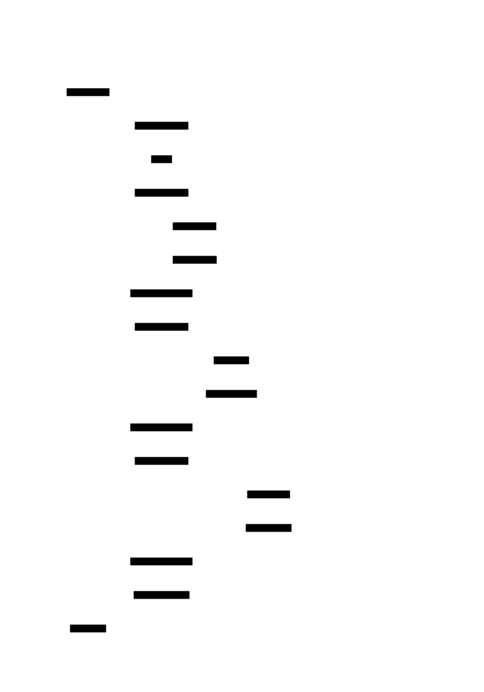
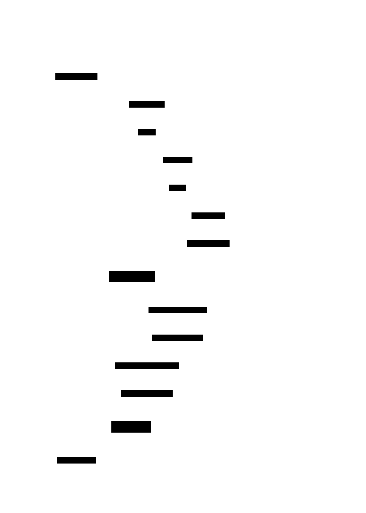

# Saga Orchestrator: Design Document


## Overview

A saga orchestrator manages distributed transactions across microservices by coordinating forward actions and compensating rollbacks when failures occur. The key architectural challenge is maintaining data consistency without distributed locks while handling partial failures, timeouts, and crash recovery in a distributed environment.


> This guide is meant to help you understand the big picture before diving into each milestone. Refer back to it whenever you need context on how components connect.


## Context and Problem Statement

> **Milestone(s):** Foundational understanding for all milestones

The saga orchestrator emerges from a fundamental challenge in distributed systems: how to maintain data consistency across multiple independent services without sacrificing availability or performance. Traditional database transactions work beautifully within a single system boundary, but as soon as we cross service boundaries, the problem becomes exponentially more complex. Understanding why this is hard, what solutions exist, and how sagas fit into this landscape is essential before diving into implementation details.

### The Distributed Transaction Challenge

Think of a distributed transaction like coordinating a surprise birthday party across multiple friends who live in different cities and can only communicate by unreliable postal mail. Each friend needs to complete their assigned task (buy cake, send invitations, book venue), but if any friend fails or doesn't respond, the entire party needs to be called off and everyone needs to undo their work. The challenge is that mail can be lost, friends might be unavailable, and you can't know for certain whether someone completed their task or just hasn't responded yet.

In distributed systems, this coordination problem manifests when a single business operation requires changes across multiple services. Consider an e-commerce order processing workflow that must:

1. **Payment Service**: Charge the customer's credit card
2. **Inventory Service**: Reserve items from stock
3. **Shipping Service**: Create a shipping label and schedule pickup
4. **Notification Service**: Send order confirmation to customer

Each step represents a local transaction within its respective service. The challenge is ensuring that either all steps complete successfully, or none of them do. This property, known as **atomicity**, is fundamental to maintaining business invariants.

The core difficulty stems from several inherent properties of distributed systems:

**Network Partitions**: Services communicate over networks that can fail, become slow, or partition. A service might complete its operation but the response gets lost, leaving the coordinator uncertain about the actual state.

**Independent Failure Modes**: Each service can fail independently due to hardware issues, software bugs, deployment problems, or resource exhaustion. These failures are often uncorrelated and can occur at any point during transaction execution.

**Temporal Coupling**: Traditional distributed transactions require all participants to be available simultaneously. If any service is down or slow, the entire transaction blocks or fails, reducing overall system availability.

**Consistency vs. Availability Trade-off**: The CAP theorem tells us we cannot have both strong consistency and high availability in the presence of network partitions. Most business applications choose availability, but this makes coordinating multi-step operations much harder.

Consider what happens when step 3 (shipping service) fails after steps 1 and 2 have completed successfully. The customer has been charged and inventory has been reserved, but no shipment was created. Simply retrying might not work if the shipping service is experiencing a prolonged outage. We need a systematic way to undo the previous steps (refund payment, release inventory) to maintain system consistency.

The problem becomes even more complex when we consider partial failures, timeouts, and the fact that services might use different data stores with their own consistency models. A service might appear to have failed due to a slow response, when it actually succeeded and is just taking longer than expected.

### Existing Approaches and Limitations

Several approaches have emerged to handle distributed transactions, each with distinct trade-offs that make them suitable for different scenarios.

#### Two-Phase Commit (2PC)

Two-Phase Commit represents the classical approach to distributed transactions, borrowed from database systems. Think of 2PC like a military operation where a commander coordinates multiple units. In the first phase, the commander asks each unit "are you ready to execute your mission?" Each unit prepares everything needed and responds "yes" (vote commit) or "no" (vote abort). In the second phase, the commander makes a global decision and orders all units to either execute or abort their missions simultaneously.

The protocol works as follows:

1. **Prepare Phase**: Coordinator sends a prepare request to all participants
2. **Voting**: Each participant votes to commit or abort based on their ability to complete the operation
3. **Decision Phase**: Coordinator decides to commit only if all participants voted commit
4. **Completion**: Coordinator sends the decision to all participants, who then commit or abort locally

| Aspect | Description | Trade-off |
|--------|-------------|-----------|
| **Consistency** | Provides strong ACID guarantees across services | High consistency |
| **Availability** | Blocks if any participant is unavailable during voting | Low availability |
| **Performance** | Requires multiple round trips and participant locking | High latency |
| **Failure Recovery** | Complex recovery protocol for coordinator failures | Operational complexity |

The fundamental limitation of 2PC is that it prioritizes consistency over availability. During the voting phase, participants must hold locks on resources, making them unavailable for other operations. If any participant becomes unavailable, the entire transaction blocks. If the coordinator fails after some participants have voted but before the decision is communicated, participants enter an "uncertainty period" where they cannot proceed without coordinator recovery.

In practice, 2PC works well within data center boundaries where network reliability is high and participants are relatively homogeneous. However, it becomes problematic across wide-area networks or when integrating with external services that may have different availability characteristics.

#### Eventual Consistency Approaches

At the opposite end of the spectrum, eventual consistency approaches embrace the CAP theorem trade-off by prioritizing availability over strong consistency. Think of this like a busy restaurant where orders are taken at the front, passed to the kitchen, and fulfilled asynchronously. Customers don't wait for their food to be completely prepared before the next customer can order.

Common patterns include:

**Message Queues**: Operations are published as messages to queues, and services process them asynchronously. This provides good decoupling but makes it difficult to handle failures or coordinate related operations.

**Event Sourcing**: All changes are recorded as events in an append-only log. Services rebuild their state by replaying events. This provides excellent audit trails and replay capability, but eventual consistency means the system state might be temporarily inconsistent.

**CQRS (Command Query Responsibility Segregation)**: Separates write and read models, allowing them to be eventually consistent. Writes are fast, but reads might reflect stale data.

| Approach | Pros | Cons | Best For |
|----------|------|------|----------|
| **Message Queues** | High availability, good decoupling | No coordination, difficult error handling | Independent operations |
| **Event Sourcing** | Full audit trail, replay capability | Complex state reconstruction, eventual consistency | Event-driven architectures |
| **CQRS** | Optimized read/write paths | Data synchronization complexity | Read-heavy workloads |

The challenge with pure eventual consistency is handling operations that require coordination. In our e-commerce example, we cannot simply publish four independent events because there's no guarantee they will all succeed, and handling partial failures becomes complex.

#### Saga Pattern

The saga pattern represents a middle ground between strict 2PC and pure eventual consistency. Think of sagas like planning a multi-city vacation trip. You book flights, hotels, and car rentals in sequence, but keep all the confirmation numbers. If something goes wrong at any step (maybe the hotel is overbooked), you have a plan to cancel everything you've already booked in reverse order.

A saga breaks a distributed transaction into a series of local transactions, each with a corresponding **compensating action** that can undo the local transaction's effects. The key insight is that instead of preventing inconsistency (like 2PC), sagas allow temporary inconsistency but provide a mechanism to restore consistency when failures occur.

> **Decision: Saga Pattern as Primary Approach**
> - **Context**: Need to coordinate multi-step business operations across services while maintaining high availability
> - **Options Considered**: Two-Phase Commit, Eventual Consistency with manual cleanup, Saga Pattern
> - **Decision**: Implement orchestration-based saga pattern
> - **Rationale**: Sagas provide better availability than 2PC (no global locking), better coordination than pure eventual consistency (explicit compensation), and are more practical for business workflows that can tolerate temporary inconsistency
> - **Consequences**: Temporary inconsistent states are visible, compensation logic must be carefully designed, requires more complex application logic than simple 2PC

| Aspect | Two-Phase Commit | Eventual Consistency | Saga Pattern |
|--------|------------------|---------------------|--------------|
| **Consistency** | Strong consistency, no intermediate states | Eventual consistency, long convergence time | Eventual consistency with guided recovery |
| **Availability** | Low (blocks on any failure) | High (services independent) | High (local failures don't block others) |
| **Coordination** | Automatic coordination | No coordination mechanism | Explicit coordination with compensation |
| **Implementation Complexity** | Medium (protocol is standard) | Low (simple async messaging) | High (compensation logic required) |
| **Failure Recovery** | Automatic with coordinator | Manual or application-specific | Systematic compensation |

### Saga Pattern Introduction

The saga pattern formalizes the intuitive approach of "try each step, and if something fails, undo what you've done so far." However, unlike traditional database rollbacks that simply restore previous state, saga compensations must account for the fact that intermediate states may have been visible to other parts of the system.

**Mental Model: The Multi-Stage Rocket**

Think of a saga like a multi-stage rocket launching into space. Each stage (step) fires in sequence, and once a stage completes, it cannot be "unfired." However, each stage is equipped with a recovery mechanism (compensation) that can counteract its effects if later stages fail. Unlike database rollbacks that make it "as if the transaction never happened," saga compensations make it "as if the transaction was explicitly canceled after partial completion."

A saga consists of two primary sequences:

1. **Forward Recovery Path**: A sequence of steps S₁, S₂, ..., Sₙ that represent the normal execution flow
2. **Backward Recovery Path**: A sequence of compensations C₁, C₂, ..., Cₙ that can undo the effects of each corresponding step

The crucial property is that for any step Sᵢ, the compensation Cᵢ must semantically undo the effects of Sᵢ, even if other operations have occurred in the meantime.

#### Forward Actions vs. Compensating Actions

**Forward actions** represent the normal business operations that move the system toward the desired end state. These are typically the same operations you would perform if executing each step manually or in a traditional single-service transaction.

For our e-commerce example:
- S₁: `ChargePayment(customerId, amount, paymentMethod)`
- S₂: `ReserveInventory(productId, quantity)`  
- S₃: `CreateShipment(orderId, address, items)`
- S₄: `SendConfirmation(customerId, orderDetails)`

**Compensating actions** are designed to semantically undo the effects of their corresponding forward actions. The key insight is that compensations are not simple database rollbacks—they are business operations that counteract the effects of previous operations.

For our e-commerce example:
- C₁: `RefundPayment(customerId, amount, originalTransactionId)`
- C₂: `ReleaseInventory(productId, quantity, reservationId)`
- C₃: `CancelShipment(shipmentId, reason)`
- C₄: `SendCancellationNotice(customerId, orderDetails)`

Notice that compensations often require additional context (like `originalTransactionId` or `reservationId`) that was generated during the forward action. This is why saga orchestrators must carefully track the outputs of each step.

#### Execution Semantics

Saga execution follows a deterministic pattern that ensures consistency despite failures:

**Normal Execution**: Steps execute in forward order S₁ → S₂ → S₃ → S₄. Each step's completion triggers the next step, with intermediate state being persisted to enable recovery.

**Failure and Compensation**: If step Sᵢ fails, compensation begins immediately with Cᵢ₋₁ → Cᵢ₋₂ → ... → C₁. Compensations execute in reverse order because later steps might depend on earlier steps' side effects.

**Persistence Requirements**: The saga's current state must be persisted before each step execution. This enables the orchestrator to resume compensation from the correct point after a crash.

Consider the execution timeline when step S₃ (create shipment) fails:

1. S₁ (charge payment) completes → state persisted
2. S₂ (reserve inventory) completes → state persisted  
3. S₃ (create shipment) fails → failure detected
4. C₂ (release inventory) executes → compensation state persisted
5. C₁ (refund payment) executes → saga marked as compensated

#### Idempotency Requirements

Both forward actions and compensating actions must be **idempotent**, meaning they can be safely executed multiple times with the same result. This is critical because network failures, timeouts, or orchestrator crashes can cause operations to be retried.

Idempotency patterns include:

**Idempotency Keys**: Each operation includes a unique key that the receiving service uses to detect duplicates.

**Natural Idempotency**: Operations that are inherently idempotent, like setting a field to a specific value.

**Check-Before-Action**: Operations that check current state before making changes, ensuring they only act when necessary.

For example, a payment charge might be implemented as:
```
If no charge exists for idempotency key X:
  Create charge record with key X
  Process payment with external provider
  Mark charge as completed
Else:
  Return existing charge result
```

#### Saga Consistency Models

Sagas provide **eventual consistency** with **semantic rollback**. This differs from both ACID transactions and pure eventual consistency:

**ACID Transactions**: Provide immediate consistency and isolation. Intermediate states are never visible to other transactions.

**Pure Eventual Consistency**: Provides no coordination. Multiple operations eventually converge to a consistent state through application logic.

**Saga Consistency**: Intermediate states are visible, but systematic compensation ensures the system reaches a consistent state even when failures occur.

This model works well for business processes where:
- Temporary inconsistency is acceptable (e.g., briefly showing inventory as reserved)
- Compensation is semantically meaningful (e.g., refunding a payment)
- Step failures are detectable and don't leave the system in an unknown state

⚠️ **Pitfall: Designing Non-Compensatable Operations**

A common mistake is designing saga steps that cannot be reliably compensated. For example, sending an email notification might seem simple, but how do you "unsend" an email? Similarly, calling a third-party API that doesn't support cancellation can leave the saga unable to complete compensation. Always design forward actions with their compensations in mind, and consider whether certain operations should be moved to the end of the saga where compensation is less likely to be needed.

The saga pattern's power comes from making the compensation logic explicit and systematic, rather than requiring manual intervention or ad-hoc cleanup processes. However, this requires careful design of both the saga workflow and the individual step implementations to ensure that compensation is always possible and semantically correct.

### Implementation Guidance

#### Technology Recommendations

| Component | Simple Option | Advanced Option |
|-----------|---------------|-----------------|
| **State Storage** | PostgreSQL with JSONB (org.postgresql.Driver) | Event Store with projections (EventStore DB) |
| **Messaging** | HTTP REST with retries (OkHttp) | Apache Kafka with exactly-once semantics |
| **Serialization** | Jackson JSON (com.fasterxml.jackson) | Protocol Buffers with schema evolution |
| **Scheduling** | ScheduledExecutorService | Quartz Scheduler with database persistence |
| **Monitoring** | Micrometer + Prometheus | OpenTelemetry with distributed tracing |

#### Recommended File Structure

The saga orchestrator should be organized to separate concerns clearly:

```
saga-orchestrator/
├── src/main/java/com/example/saga/
│   ├── SagaOrchestratorApplication.java    ← Spring Boot entry point
│   ├── definition/
│   │   ├── SagaDefinition.java             ← Core saga definition model
│   │   ├── StepDefinition.java             ← Individual step definition
│   │   ├── SagaDefinitionManager.java      ← Manages saga templates
│   │   └── SagaDefinitionRepository.java   ← Persistence interface
│   ├── execution/
│   │   ├── SagaInstance.java               ← Runtime saga state
│   │   ├── StepExecution.java              ← Individual step tracking
│   │   ├── SagaExecutionEngine.java        ← Core orchestration logic
│   │   └── CompensationCoordinator.java    ← Handles rollback logic
│   ├── persistence/
│   │   ├── SagaStateRepository.java        ← Saga instance persistence
│   │   ├── ExecutionEventStore.java        ← Event sourcing for steps
│   │   └── IdempotencyManager.java         ← Duplicate detection
│   ├── timeout/
│   │   ├── TimeoutWatchdog.java            ← Monitors step timeouts
│   │   ├── DeadLetterQueue.java            ← Failed saga handling
│   │   └── AdminResolutionApi.java         ← Manual intervention
│   └── observability/
│       ├── SagaTracingInterceptor.java     ← Distributed tracing
│       ├── SagaMetrics.java                ← Performance metrics
│       └── ExecutionDashboard.java         ← Visualization
├── src/test/java/com/example/saga/
│   ├── integration/
│   │   ├── SagaExecutionIntegrationTest.java
│   │   └── CompensationFlowTest.java
│   └── chaos/
│       ├── ChaosTestingFramework.java
│       └── FailureInjectionTest.java
└── src/main/resources/
    ├── application.yml                     ← Configuration
    ├── db/migration/                       ← Database schema
    └── saga-definitions/                   ← Saga templates
```

#### Infrastructure Starter Code

Here's a complete foundation for saga state management that you can use immediately:

```java
/**
 * Represents the execution state of a single saga instance.
 * This class handles state transitions and persistence coordination.
 */
@Entity
@Table(name = "saga_instances")
public class SagaInstance {
    
    @Id
    private String sagaId;
    
    @Column(name = "definition_name")
    private String definitionName;
    
    @Enumerated(EnumType.STRING)
    private SagaStatus status;
    
    @Column(name = "current_step_index")
    private int currentStepIndex;
    
    @Column(name = "step_outputs", columnDefinition = "jsonb")
    @Convert(converter = StepOutputConverter.class)
    private Map<String, Object> stepOutputs;
    
    @Column(name = "compensation_index")
    private int compensationIndex = -1;
    
    @Column(name = "created_at")
    private Instant createdAt;
    
    @Column(name = "updated_at")
    private Instant updatedAt;
    
    // Constructor, getters, setters
    public SagaInstance(String sagaId, String definitionName) {
        this.sagaId = sagaId;
        this.definitionName = definitionName;
        this.status = SagaStatus.CREATED;
        this.currentStepIndex = 0;
        this.stepOutputs = new HashMap<>();
        this.createdAt = Instant.now();
        this.updatedAt = this.createdAt;
    }
    
    public void advanceToNextStep() {
        this.currentStepIndex++;
        this.updatedAt = Instant.now();
    }
    
    public void startCompensation() {
        this.status = SagaStatus.COMPENSATING;
        this.compensationIndex = this.currentStepIndex - 1;
        this.updatedAt = Instant.now();
    }
}

/**
 * Manages persistence and retrieval of saga instance state.
 * Handles concurrent access and provides atomic state updates.
 */
@Repository
public class SagaStateRepository {
    
    private final JdbcTemplate jdbcTemplate;
    private final ObjectMapper objectMapper;
    
    public SagaStateRepository(JdbcTemplate jdbcTemplate, ObjectMapper objectMapper) {
        this.jdbcTemplate = jdbcTemplate;
        this.objectMapper = objectMapper;
    }
    
    public void saveSagaInstance(SagaInstance instance) {
        // TODO: Implement with upsert logic for concurrent updates
        // Use PostgreSQL's ON CONFLICT clause or equivalent
        // Include optimistic locking with version field
        // Serialize stepOutputs as JSONB for queryability
    }
    
    public Optional<SagaInstance> findBySagaId(String sagaId) {
        // TODO: Implement query with proper JSON deserialization
        // Handle mapping from ResultSet to SagaInstance
        // Include error handling for malformed JSON data
    }
    
    public List<SagaInstance> findSagasInStatus(SagaStatus status, int limit) {
        // TODO: Implement for recovery and monitoring scenarios
        // Add pagination support for large result sets
        // Consider adding time-based filtering for stuck sagas
    }
}
```

#### Core Logic Skeleton

Here's the skeleton for the central saga execution engine that you'll implement:

```java
/**
 * Core orchestration engine that executes saga steps and coordinates compensation.
 * This is the heart of the saga orchestrator - handles step execution,
 * failure detection, and compensation triggering.
 */
@Service
public class SagaExecutionEngine {
    
    private final SagaDefinitionManager definitionManager;
    private final SagaStateRepository stateRepository;
    private final StepExecutor stepExecutor;
    private final CompensationCoordinator compensationCoordinator;
    private final TimeoutWatchdog timeoutWatchdog;
    
    /**
     * Starts execution of a new saga instance.
     * Creates initial state, validates definition, and begins step execution.
     */
    public String startSaga(String definitionName, Map<String, Object> initialContext) {
        // TODO 1: Generate unique sagaId using UUID or similar
        // TODO 2: Load saga definition and validate it exists
        // TODO 3: Create new SagaInstance with CREATED status
        // TODO 4: Persist initial saga state to database
        // TODO 5: Trigger execution of first step asynchronously
        // TODO 6: Return sagaId to caller for tracking
        // Hint: Use @Async or submit to thread pool for step execution
    }
    
    /**
     * Executes the next step in a saga's forward path.
     * Handles success by advancing to next step, failure by triggering compensation.
     */
    public void executeNextStep(String sagaId) {
        // TODO 1: Load current saga instance state from database
        // TODO 2: Validate saga is in RUNNING status (not COMPENSATING/COMPLETED)
        // TODO 3: Get current step definition from saga template
        // TODO 4: Check if this is the final step (handle completion differently)
        // TODO 5: Execute step using StepExecutor with timeout handling
        // TODO 6: On success: save step output, advance step index, trigger next step
        // TODO 7: On failure: log error, trigger compensation flow
        // TODO 8: Handle timeout: treat as failure and start compensation
        // Hint: Wrap step execution in try-catch and handle each failure type
    }
    
    /**
     * Triggers compensation flow when a step fails.
     * Executes compensation actions in reverse order from last completed step.
     */
    public void startCompensation(String sagaId, String failureReason) {
        // TODO 1: Load saga instance and validate current state
        // TODO 2: Update saga status to COMPENSATING
        // TODO 3: Set compensation index to last completed step
        // TODO 4: Persist state change before starting compensation
        // TODO 5: Delegate to CompensationCoordinator for execution
        // TODO 6: Handle case where no steps need compensation (early failure)
        // Hint: compensation index should be currentStepIndex - 1
    }
    
    /**
     * Resumes saga execution after orchestrator restart.
     * Scans for incomplete sagas and continues from last known state.
     */
    @PostConstruct
    public void recoverIncompleteSagas() {
        // TODO 1: Query database for sagas in RUNNING or COMPENSATING status
        // TODO 2: For each saga, validate current step and determine next action
        // TODO 3: For RUNNING sagas: resume forward execution from current step
        // TODO 4: For COMPENSATING sagas: resume compensation from current index
        // TODO 5: Handle sagas that may have been stuck due to timeouts
        // TODO 6: Log recovery statistics for monitoring
        // Hint: Use pagination if many sagas need recovery
    }
}
```

#### Language-Specific Hints

**Java-Specific Considerations:**

- Use `@Transactional` carefully - saga state updates should be in separate transactions from step execution to avoid blocking
- Use `CompletableFuture` for asynchronous step execution with proper exception handling
- Consider using Spring's `@Retryable` for transient failures in step execution
- Use `@Scheduled` with persistent triggers (like Quartz) for timeout detection
- Implement proper connection pooling for database access under high saga volume

**Serialization Best Practices:**
- Use Jackson's `@JsonTypeInfo` for polymorphic step output serialization
- Configure ObjectMapper with `FAIL_ON_UNKNOWN_PROPERTIES = false` for schema evolution
- Store timestamps as ISO-8601 strings in JSON for cross-language compatibility

**Error Handling Patterns:**
- Distinguish between retryable errors (network timeout) and permanent failures (validation error)
- Use custom exception hierarchy: `SagaException` → `StepFailedException`, `CompensationFailedException`
- Log at different levels: step execution (DEBUG), failures (WARN), compensation (INFO)

#### Milestone Checkpoint

After implementing the basic saga execution logic:

**What to Test:**
```bash
# Run unit tests for core components
mvn test -Dtest=SagaExecutionEngineTest

# Start the application
mvn spring-boot:run

# Create a simple saga definition via REST API
curl -X POST localhost:8080/api/saga-definitions \
  -H "Content-Type: application/json" \
  -d '{"name":"test-saga","steps":[{"action":"step1"},{"action":"step2"}]}'

# Start a saga instance
curl -X POST localhost:8080/api/sagas \
  -H "Content-Type: application/json" \
  -d '{"definitionName":"test-saga","context":{"userId":"123"}}'
```

**Expected Behavior:**
- Saga instance is created with unique ID
- First step begins execution within 1-2 seconds  
- State transitions are persisted to database
- You can query saga status via GET `/api/sagas/{sagaId}`
- Application logs show step execution progress

**Warning Signs:**
- Saga gets stuck in CREATED status → Check step executor configuration
- Database constraint violations → Verify saga instance table schema
- Step execution exceptions → Ensure step action handlers are properly registered
- Memory leaks under load → Verify CompletableFutures are properly completed


## Goals and Non-Goals

> **Milestone(s):** Foundational understanding for all milestones

The goals and non-goals section serves as the project's **north star** — think of it as a contract between the development team and stakeholders that prevents scope creep while ensuring the system solves the right problems. Just as a ship's captain needs clear destination coordinates before setting sail, a saga orchestrator project needs explicit boundaries defining what waters it will navigate and which storms it will weather versus which challenges belong to other systems.

This boundaries definition becomes critically important for saga orchestrators because the distributed transaction space touches virtually every aspect of microservices architecture. Without clear goals, teams often find themselves accidentally building a complete workflow engine, message broker, or distributed database when they only needed transaction coordination. The goals framework helps maintain laser focus on the core orchestration capabilities while explicitly acknowledging what complexity lies outside the system's charter.

### Functional Goals

The functional goals represent the **core value proposition** of the saga orchestrator — the essential capabilities that justify its existence in the architecture. Think of these as the fundamental operations the system must perform flawlessly, similar to how a conductor must be able to start the orchestra, keep time, signal transitions, and recover from mistakes.

> **Design Insight**: Functional goals focus on the *what* rather than the *how*. They describe business capabilities without prescribing implementation approaches, allowing architectural flexibility while maintaining clear success criteria.

#### Saga Definition and Management

The orchestrator must provide a **declarative saga definition system** that allows developers to specify distributed transactions as a sequence of steps with corresponding compensations. This capability forms the foundation of all saga operations — without clear definitions, the orchestrator becomes merely a generic task runner.

| Capability | Description | Success Criteria |
|------------|-------------|------------------|
| Step Definition | Define individual transaction steps with forward actions and compensating actions | Each step specifies both the business operation and its semantic rollback |
| Dependency Ordering | Specify execution sequences and step dependencies within a saga | Steps execute in dependency order with proper prerequisite validation |
| Template Reusability | Store saga definitions as reusable templates for multiple executions | Single definition supports unlimited instantiations with different parameters |
| Timeout Configuration | Set per-step and per-saga timeout boundaries | Configurable timeouts at both individual step and overall saga levels |
| Validation Rules | Ensure saga definitions are consistent and executable before deployment | Invalid definitions are rejected with specific error descriptions |

The **dependency ordering** capability deserves special attention because it determines whether the orchestrator can handle real-world business processes. Consider a payment processing saga: you cannot charge a credit card before validating the inventory, and you cannot ship goods before payment confirmation. The orchestrator must understand these relationships and enforce execution sequences accordingly.

> **Critical Requirement**: Every forward action must have a corresponding compensating action. The orchestrator must reject any saga definition that violates this invariant, as incomplete compensation paths lead to data inconsistency during failures.

#### Saga Execution Coordination

The orchestrator must **execute sagas reliably** from start to completion, handling both success and failure scenarios. This represents the core runtime capability — the engine that transforms static definitions into dynamic distributed transactions.

| Execution Phase | Capability | Requirements |
|-----------------|------------|--------------|
| Initialization | Start new saga instances from definitions | Generate unique identifiers and initialize execution context |
| Step Execution | Execute forward actions in dependency order | Invoke external services and capture step results |
| Progress Tracking | Monitor execution status of each individual step | Maintain real-time visibility into saga state |
| Completion Detection | Recognize successful saga completion | All steps completed successfully with results captured |
| Context Propagation | Pass step outputs to dependent subsequent steps | Step results available as inputs to later steps |

The **context propagation** capability enables sophisticated business workflows where later steps depend on earlier results. For example, a user registration saga might generate a user ID in step one, create a profile record using that ID in step two, and send a welcome email with personalized content in step three. The orchestrator must safely pass data between these steps while maintaining execution boundaries.

**Context Propagation Flow Example:**

1. **Step 1 (Account Creation)**: Creates user account, outputs `{userId: "user-12345", accountStatus: "active"}`
2. **Step 2 (Profile Setup)**: Receives userId as input, creates profile, outputs `{profileId: "profile-67890", preferences: {...}}`  
3. **Step 3 (Notification)**: Receives both userId and profileId, sends personalized welcome message
4. **Context Management**: Orchestrator maintains accumulated context `{userId, accountStatus, profileId, preferences}` throughout execution

#### Failure Detection and Compensation

The orchestrator must **detect failures quickly and coordinate compensation accurately**. This capability distinguishes saga orchestrators from simple workflow engines — the ability to semantically undo distributed changes when problems occur.

| Failure Scenario | Detection Method | Compensation Response |
|-------------------|------------------|----------------------|
| Step Execution Failure | Exception or error status from service call | Immediately trigger compensation chain in reverse order |
| Step Timeout | Execution duration exceeds configured threshold | Cancel ongoing operation and begin rollback process |
| Service Unavailability | Network errors or service discovery failures | Retry with backoff, then compensate if retries exhausted |
| Partial Success | Step completes but reports business-level errors | Execute compensation for the partially successful step |
| Orchestrator Crash | Process restart with incomplete sagas | Resume compensation from last known state |

The **reverse order compensation** requirement ensures logical consistency. If the original saga executed steps A → B → C before failing at step D, the compensation must execute in order C⁻¹ → B⁻¹ → A⁻¹ to properly unwind dependencies. The orchestrator must track which steps completed successfully and compensate only those steps, avoiding duplicate rollback operations.

> **Compensation Semantics**: Compensating actions must be **semantically meaningful** rather than technically precise. For example, compensating a "charge credit card" step might issue a refund rather than attempting to undo the original charge transaction.

#### State Persistence and Recovery

The orchestrator must **maintain durable execution state** to survive process crashes and system restarts. This capability ensures that sagas don't get lost or duplicated during infrastructure failures.

| Persistence Requirement | Implementation Approach | Recovery Behavior |
|-------------------------|-------------------------|------------------|
| Saga Instance State | Persist current step index and execution status after each operation | Resume execution from last completed step |
| Step Completion Records | Track which steps finished successfully vs. failed | Skip already-completed steps during recovery |
| Compensation Progress | Separately track rollback operations | Continue compensation from last rollback point |
| Idempotency Keys | Generate unique identifiers for each step execution attempt | Prevent duplicate step execution during retries |
| Context Snapshots | Persist accumulated step outputs and intermediate results | Restore execution context after restart |

The **idempotency implementation** prevents one of the most subtle bugs in distributed orchestration: duplicate step execution during recovery. When the orchestrator restarts after a crash, it must distinguish between "step never started" (needs execution) and "step completed but acknowledgment lost" (skip execution). This requires persistent tracking of step attempts with unique identifiers.

**Recovery State Machine:**

1. **Scan Persistent Storage**: Identify all saga instances in non-terminal states (`RUNNING`, `COMPENSATING`)
2. **Validate State Integrity**: Ensure step completion records match saga instance state
3. **Resume Execution**: For `RUNNING` sagas, continue forward execution from `currentStepIndex`
4. **Resume Compensation**: For `COMPENSATING` sagas, continue rollback from `compensationIndex`  
5. **Handle Inconsistencies**: Move corrupted sagas to dead letter queue for manual investigation

### Non-Functional Goals

The non-functional goals define the **operational characteristics** that determine whether the saga orchestrator can survive production environments. Think of these as the engineering requirements that make the difference between a prototype that works in demos and a system that handles real user traffic, infrastructure failures, and operational complexity.

#### Performance and Scalability Requirements

The orchestrator must **scale horizontally** to handle enterprise-level saga volumes without becoming a bottleneck in the distributed architecture. Performance goals must balance throughput with consistency guarantees — saga orchestration inherently involves coordination overhead, but this overhead should not dominate the business operation costs.

| Performance Dimension | Target Specification | Measurement Method |
|----------------------|---------------------|-------------------|
| Saga Throughput | 1000+ concurrent saga executions per orchestrator instance | Monitor active saga count and completion rate |
| Step Execution Latency | < 100ms orchestration overhead per step (excluding business logic) | Measure time between step completion and next step initiation |
| State Persistence Latency | < 50ms to persist saga state updates | Track database write latency for saga state records |
| Recovery Time | < 30 seconds to resume all incomplete sagas after restart | Measure startup time during orchestrator deployment |
| Memory Efficiency | < 10MB memory per 1000 active saga instances | Monitor orchestrator process memory consumption |

The **orchestration overhead** metric isolates the coordinator's performance impact from the business services it orchestrates. A well-designed orchestrator should add minimal latency to the critical path — most execution time should be spent in the actual business operations (payment processing, inventory updates, etc.) rather than in coordination logic.

> **Scalability Architecture**: The system must support **horizontal scaling** through multiple orchestrator instances with shared state storage. This requires careful attention to concurrent saga execution and state consistency across instances.

#### Reliability and Availability Requirements  

The orchestrator must **maintain saga integrity** even during infrastructure failures, network partitions, and cascading service outages. Since sagas coordinate critical business transactions, the orchestrator's reliability directly impacts business continuity.

| Reliability Aspect | Requirement Level | Failure Tolerance |
|---------------------|------------------|-------------------|
| Data Consistency | Zero saga state corruption under any failure scenario | All persistence operations use atomic transactions |
| Saga Completion Guarantee | Every started saga eventually reaches terminal state (completed or compensated) | Infinite retry with exponential backoff and dead letter queue |
| Orchestrator Availability | 99.9% uptime with graceful degradation during outages | Multiple instances with failover and load balancing |
| State Storage Durability | Zero loss of saga state during infrastructure failures | Replicated database with backup and recovery procedures |
| Network Partition Tolerance | Continue operation with partial service connectivity | Retry failed operations and gracefully handle timeouts |

The **saga completion guarantee** represents a strong consistency promise: once a saga starts, the system will eventually drive it to a terminal state even if individual steps fail, services become unavailable, or the orchestrator itself crashes multiple times. This guarantee requires sophisticated retry logic, dead letter queue handling, and manual resolution procedures for truly stuck scenarios.

**Availability Architecture Pattern:**

1. **Active-Active Orchestrator Instances**: Multiple orchestrator processes sharing saga execution load
2. **Leader Election for Stuck Saga Cleanup**: Single instance handles timeout detection and dead letter queue processing  
3. **Circuit Breaker Integration**: Temporary saga suspension during widespread service outages
4. **Graceful Degradation**: Read-only admin interface remains available even during database failures

#### Operational and Monitoring Requirements

The orchestrator must provide **comprehensive observability** for troubleshooting distributed transaction issues. Since saga failures often involve complex interactions between multiple services, operators need detailed visibility into execution state, failure patterns, and performance characteristics.

| Observability Category | Specific Requirements | Implementation Standards |
|------------------------|----------------------|-------------------------|
| Execution Tracing | Distributed trace spans for every saga step and compensation action | OpenTelemetry integration with trace context propagation |
| State Visibility | Real-time dashboard showing saga execution status and progress | REST API endpoints for saga state queries |
| Error Classification | Structured error codes distinguishing business failures from infrastructure issues | Standardized error taxonomy with remediation guidance |  
| Performance Metrics | Saga duration, step success rates, compensation frequency by saga type | Prometheus metrics with Grafana dashboards |
| Audit Logging | Immutable record of all saga state transitions and administrative actions | Structured JSON logs with correlation identifiers |

The **distributed tracing integration** provides end-to-end transaction visibility across service boundaries. When a complex business saga spans multiple microservices and fails at step 7 of 12, operators need the ability to trace the entire execution path, understand the failure context, and diagnose whether the issue stems from business logic, infrastructure problems, or orchestration bugs.

**Monitoring Dashboard Requirements:**

- **Saga Overview Panel**: Active saga count, completion rate, error rate by saga type
- **Execution Timeline**: Visual representation of saga progress with step duration details  
- **Failure Analysis**: Most frequent failure modes, error distribution, compensation success rates
- **Performance Trends**: Throughput over time, latency percentiles, resource utilization patterns
- **Admin Actions**: Manual saga interventions, dead letter queue processing, system health checks

### Explicit Non-Goals

The explicit non-goals establish **architectural boundaries** that prevent scope creep and clarify integration expectations. Think of these as the fence around the saga orchestrator's responsibilities — clearly marking what problems belong to other systems in the overall architecture.

These boundaries prove crucial during implementation because distributed systems naturally invite feature expansion. Teams often discover related problems (service discovery, configuration management, monitoring infrastructure) and feel tempted to solve them within the saga orchestrator rather than integrating with existing solutions.

> **Boundary Principle**: The saga orchestrator coordinates distributed transactions but does not replace the infrastructure services that make distributed coordination possible.

#### Service Communication and Discovery

The orchestrator will **not implement service-to-service communication** mechanisms or service discovery capabilities. These concerns belong to the underlying microservices infrastructure and service mesh architecture.

| Communication Aspect | Not Provided | Expected Integration |
|----------------------|--------------|---------------------|
| Service Discovery | Registry of available service instances and health status | Integrate with existing service mesh (Istio, Linkerd) or discovery service (Consul, Eureka) |
| Load Balancing | Selection of specific service instances for step execution | Rely on service mesh or client-side load balancing libraries |
| Circuit Breaking | Automatic service isolation during failure cascades | Integrate with existing circuit breaker libraries (Hystrix, resilience4j) |
| Transport Protocols | HTTP clients, gRPC stubs, message queue publishers | Use standard service communication libraries |
| Authentication/Authorization | Identity verification and permission checking for service calls | Integrate with existing auth systems (OAuth, JWT, mTLS) |

**Integration Architecture**: The saga orchestrator invokes business services through **abstract step execution interfaces**. The concrete implementation of these interfaces handles all service communication concerns using the organization's standard infrastructure patterns.

```
SagaOrchestrator → StepExecutor Interface → ServiceClient Implementation → Service Mesh → Business Service
```

This separation allows the orchestrator to focus on coordination logic while leveraging proven infrastructure for the complex networking aspects of distributed systems.

#### Business Logic Implementation

The orchestrator will **not implement business-specific transaction logic** or domain knowledge. It provides the coordination framework, but the actual business operations remain the responsibility of domain services.

| Business Concern | Not Provided | Implementation Approach |
|------------------|--------------|------------------------|
| Domain Validation | Business rules enforcement (credit limits, inventory levels, approval workflows) | Business services validate their inputs and return structured success/failure responses |
| Data Transformation | Converting between service data formats or enriching business context | Services handle their own data mapping; orchestrator passes opaque step outputs |
| Business Rules Engine | Complex conditional logic, dynamic step selection, approval routing | Use dedicated business rules engines; orchestrator executes linear step sequences |
| Workflow Modeling | Visual workflow designers, business process modeling notation | Saga definitions use simple step/dependency declarations |
| Domain Events | Publishing business events for analytics, reporting, or triggering other workflows | Services publish their own domain events; orchestrator may emit coordination events |

**Domain Boundary Example**: Consider an e-commerce order processing saga. The orchestrator coordinates the sequence (validate payment → reserve inventory → ship order → send confirmation), but it does not understand payment validation rules, inventory allocation strategies, or shipping carrier selection. Each business service encapsulates its domain expertise and reports success/failure to the orchestrator.

The orchestrator treats business operations as **black boxes** — it knows how to call them, how to handle their responses, and how to trigger their compensations, but it does not interpret or modify their business semantics.

#### Infrastructure Services

The orchestrator will **not provide foundational infrastructure capabilities** that are typically handled by platform services or external systems. These represent horizontal concerns that span multiple applications beyond saga coordination.

| Infrastructure Category | Not Provided | External Dependencies |
|-------------------------|--------------|----------------------|
| Data Storage | Database provisioning, schema management, backup/recovery, replication | Integrate with managed database services or existing data infrastructure |
| Message Queuing | Queue creation, topic management, message routing, dead letter handling | Use existing message brokers (RabbitMQ, Apache Kafka, AWS SQS) |
| Configuration Management | Environment-specific settings, feature flags, secret management | Integrate with configuration services (HashiCorp Vault, AWS Parameter Store) |
| Logging Infrastructure | Log aggregation, search indexing, retention policies, alerting rules | Use existing logging platforms (ELK Stack, Splunk, CloudWatch) |
| Metrics Collection | Time-series database management, dashboard hosting, alerting infrastructure | Integrate with monitoring platforms (Prometheus/Grafana, DataDog, New Relic) |
| Container Orchestration | Pod scheduling, service mesh configuration, ingress routing | Deploy on existing Kubernetes clusters or container platforms |

**Infrastructure Integration Strategy**: The saga orchestrator should be designed as a **cloud-native application** that integrates cleanly with standard infrastructure services rather than attempting to provide these services itself.

For example, the orchestrator needs persistent storage for saga state, but it should not implement a database engine. Instead, it should provide clean integration interfaces that work with PostgreSQL, MongoDB, or cloud-managed databases. Similarly, it needs monitoring capabilities but should emit metrics in standard formats (Prometheus, StatsD) rather than building custom dashboards.

#### Advanced Saga Patterns

The initial implementation will **not support sophisticated saga coordination patterns** that significantly increase complexity. These advanced features can be considered for future releases after the core orchestration patterns are proven in production.

| Advanced Pattern | Not Implemented | Future Consideration |
|------------------|-----------------|---------------------|
| Parallel Step Execution | Concurrent execution of independent saga steps | Requires complex synchronization and dependency resolution |
| Conditional Branching | Dynamic step selection based on runtime conditions or business rules | Adds significant complexity to saga definition and execution logic |
| Nested Sagas | Sagas that invoke other sagas as sub-transactions | Requires hierarchical state management and cascading compensation |
| Saga Choreography | Decentralized coordination where services coordinate directly without central orchestrator | Different architectural pattern requiring event-driven coordination |
| Cross-Saga Transactions | Coordination between multiple concurrent saga instances | Complex distributed locking and conflict resolution |
| Dynamic Saga Modification | Changing saga definitions or adding steps during execution | Runtime saga evolution with backward compatibility challenges |

**Simplicity Principle**: The initial saga orchestrator focuses on **sequential step execution** with straightforward compensation patterns. This covers the majority of real-world distributed transaction scenarios while maintaining implementation simplicity and operational predictability.

Sequential execution does not mean the system lacks power — complex business processes can be modeled effectively using step dependencies and compensation chains. The goal is to prove the core orchestration patterns work reliably before adding coordination complexity that multiplies the failure modes and debugging difficulty.

> **Evolution Path**: These non-goal features represent natural extension points for future development. The initial architecture should be designed to accommodate these patterns without requiring complete rewrites, but they should not drive the initial implementation complexity.

### Implementation Guidance

This section provides concrete technology recommendations and starter code to bridge the gap between design goals and actual implementation. The recommendations focus on **Java ecosystem** tools that provide production-ready capabilities without excessive complexity.

#### Technology Recommendations

| Component | Simple Option | Advanced Option |
|-----------|---------------|-----------------|
| **State Storage** | H2 embedded database with file persistence | PostgreSQL with connection pooling (HikariCP) |
| **Web Framework** | Spring Boot with embedded Tomcat | Spring Boot with reactive WebFlux for high concurrency |
| **JSON Serialization** | Jackson with default configuration | Jackson with custom serializers for complex types |
| **HTTP Client** | Spring RestTemplate with basic configuration | Spring WebClient with circuit breaker integration |
| **Background Processing** | Scheduled executor service for timeout monitoring | Quartz scheduler for complex timing requirements |
| **Logging Framework** | SLF4J with Logback, structured JSON output | SLF4J with Logback plus distributed tracing integration |
| **Testing Framework** | JUnit 5 with TestContainers for database tests | JUnit 5 + TestContainers + WireMock for service simulation |

#### Recommended Project Structure

```
saga-orchestrator/
├── src/main/java/
│   ├── com/company/saga/
│   │   ├── SagaOrchestratorApplication.java     ← Spring Boot main class
│   │   ├── api/                                 ← REST API controllers
│   │   │   ├── SagaController.java             ← Saga management endpoints
│   │   │   └── AdminController.java            ← Administrative operations
│   │   ├── domain/                             ← Core domain models
│   │   │   ├── SagaDefinition.java            ← Saga template definition
│   │   │   ├── SagaInstance.java              ← Runtime saga state
│   │   │   ├── StepDefinition.java            ← Individual step configuration
│   │   │   └── StepExecution.java             ← Step execution tracking
│   │   ├── service/                           ← Business logic services
│   │   │   ├── DefinitionManager.java         ← Saga template management
│   │   │   ├── ExecutionEngine.java           ← Core orchestration logic
│   │   │   └── StateManager.java              ← Persistence coordination
│   │   ├── repository/                        ← Data access layer
│   │   │   ├── SagaRepository.java            ← Saga instance storage
│   │   │   └── StepRepository.java            ← Step execution storage
│   │   ├── infrastructure/                    ← External integrations
│   │   │   ├── StepExecutor.java              ← Service invocation abstraction
│   │   │   ├── TimeoutWatchdog.java           ← Background timeout monitoring
│   │   │   └── RecoveryService.java           ← Crash recovery logic
│   │   └── config/                            ← Configuration classes
│   │       ├── DatabaseConfig.java            ← Database connection setup
│   │       └── SchedulingConfig.java          ← Background task configuration
├── src/test/java/                             ← Test implementations
│   ├── integration/                           ← End-to-end integration tests
│   └── unit/                                  ← Unit tests for individual components
├── src/main/resources/
│   ├── application.yml                        ← Spring Boot configuration
│   ├── schema.sql                             ← Database schema creation
│   └── logback-spring.xml                     ← Logging configuration
└── docker/
    ├── Dockerfile                             ← Container image definition
    └── docker-compose.yml                     ← Local development environment
```

#### Infrastructure Starter Code

**Database Configuration (Complete Implementation)**

```java
package com.company.saga.config;

import org.springframework.boot.context.properties.ConfigurationProperties;
import org.springframework.boot.jdbc.DataSourceBuilder;
import org.springframework.context.annotation.Bean;
import org.springframework.context.annotation.Configuration;
import org.springframework.context.annotation.Primary;
import org.springframework.transaction.annotation.EnableTransactionManagement;

import javax.sql.DataSource;

@Configuration
@EnableTransactionManagement
public class DatabaseConfig {
    
    @Bean
    @Primary
    @ConfigurationProperties("app.datasource")
    public DataSource primaryDataSource() {
        return DataSourceBuilder.create()
            .driverClassName("org.h2.Driver")
            .url("jdbc:h2:file:./data/saga_orchestrator;DB_CLOSE_DELAY=-1;DB_CLOSE_ON_EXIT=FALSE")
            .username("sa")
            .password("")
            .build();
    }
}
```

**HTTP Client Infrastructure (Complete Implementation)**

```java
package com.company.saga.infrastructure;

import org.springframework.http.HttpEntity;
import org.springframework.http.HttpHeaders;
import org.springframework.http.MediaType;
import org.springframework.http.ResponseEntity;
import org.springframework.stereotype.Component;
import org.springframework.web.client.RestTemplate;

import java.time.Duration;
import java.util.Map;

@Component
public class HttpStepExecutor {
    
    private final RestTemplate restTemplate;
    
    public HttpStepExecutor() {
        this.restTemplate = new RestTemplate();
        // Configure timeout settings
        this.restTemplate.getRequestFactory().setConnectTimeout(5000);
        this.restTemplate.getRequestFactory().setReadTimeout(30000);
    }
    
    /**
     * Execute an HTTP-based step by making POST request to the specified endpoint.
     * Returns the response body as a Map for easy access to step outputs.
     */
    public Map<String, Object> executeStep(String endpoint, Map<String, Object> stepInput) {
        HttpHeaders headers = new HttpHeaders();
        headers.setContentType(MediaType.APPLICATION_JSON);
        
        HttpEntity<Map<String, Object>> request = new HttpEntity<>(stepInput, headers);
        
        ResponseEntity<Map> response = restTemplate.postForEntity(endpoint, request, Map.class);
        
        if (response.getStatusCode().is2xxSuccessful()) {
            return response.getBody();
        } else {
            throw new RuntimeException("Step execution failed: " + response.getStatusCode());
        }
    }
}
```

#### Core Logic Skeleton Code

**Saga Definition Manager (Skeleton with TODOs)**

```java
package com.company.saga.service;

import com.company.saga.domain.SagaDefinition;
import com.company.saga.domain.StepDefinition;
import org.springframework.stereotype.Service;

import java.util.List;
import java.util.Map;
import java.util.concurrent.ConcurrentHashMap;

@Service
public class DefinitionManager {
    
    private final Map<String, SagaDefinition> definitions = new ConcurrentHashMap<>();
    
    /**
     * Register a new saga definition template for future execution.
     * Validates the definition structure and step dependencies.
     */
    public void registerDefinition(SagaDefinition definition) {
        // TODO 1: Validate that definition name is not null or empty
        // TODO 2: Validate that all steps have both action and compensation defined
        // TODO 3: Validate step dependencies - ensure no circular references
        // TODO 4: Validate that all dependency references point to existing steps
        // TODO 5: Compute execution order from dependencies and store in definition
        // TODO 6: Store validated definition in definitions map
        // Hint: Use topological sort for dependency resolution
    }
    
    /**
     * Retrieve a saga definition by name for creating new instances.
     * Returns null if definition not found.
     */
    public SagaDefinition getDefinition(String definitionName) {
        // TODO 1: Look up definition in definitions map
        // TODO 2: Return null if not found (caller handles missing definition)
        // TODO 3: Consider returning defensive copy to prevent modification
        return null;
    }
    
    /**
     * Validate step dependencies to ensure saga can be executed.
     * Throws exception if circular dependencies or missing references found.
     */
    private void validateDependencies(List<StepDefinition> steps) {
        // TODO 1: Build dependency graph from step definitions
        // TODO 2: Check for circular dependencies using depth-first search
        // TODO 3: Verify all dependency names reference existing steps
        // TODO 4: Ensure at least one step has no dependencies (entry point)
        // TODO 5: Throw IllegalArgumentException with specific error details if validation fails
    }
}
```

**Execution Engine Core Logic (Skeleton with TODOs)**

```java
package com.company.saga.service;

import com.company.saga.domain.SagaInstance;
import com.company.saga.domain.SagaStatus;
import com.company.saga.domain.StepExecution;
import com.company.saga.domain.StepStatus;
import org.springframework.stereotype.Service;

import java.time.Instant;
import java.util.Map;

@Service
public class ExecutionEngine {
    
    private final DefinitionManager definitionManager;
    private final StateManager stateManager;
    
    public ExecutionEngine(DefinitionManager definitionManager, StateManager stateManager) {
        this.definitionManager = definitionManager;
        this.stateManager = stateManager;
    }
    
    /**
     * Start a new saga instance from a registered definition.
     * Returns the saga ID for tracking execution progress.
     */
    public String startSaga(String definitionName, Map<String, Object> initialContext) {
        // TODO 1: Generate unique saga ID with SAGA_ID_PREFIX
        // TODO 2: Retrieve saga definition from definition manager
        // TODO 3: Throw exception if definition not found
        // TODO 4: Create new SagaInstance with status CREATED
        // TODO 5: Initialize stepOutputs map with initialContext
        // TODO 6: Persist saga instance using state manager
        // TODO 7: Change status to RUNNING and trigger first step execution
        // TODO 8: Return saga ID for caller tracking
        return null;
    }
    
    /**
     * Execute the next step in the saga's forward execution path.
     * Updates saga state and triggers compensation if step fails.
     */
    public void executeNextStep(String sagaId) {
        // TODO 1: Load current saga instance from state manager
        // TODO 2: Verify saga is in RUNNING status (skip if already completed/failed)
        // TODO 3: Get step definition at currentStepIndex from saga definition
        // TODO 4: Create StepExecution record with RUNNING status
        // TODO 5: Invoke step action using HTTP client or step executor
        // TODO 6: On success: update step status to COMPLETED, store outputs, advance currentStepIndex
        // TODO 7: On failure: update step status to FAILED, trigger compensation
        // TODO 8: Persist all state changes atomically
        // TODO 9: If all steps completed: set saga status to COMPLETED
        // TODO 10: If compensation needed: call startCompensation method
    }
    
    /**
     * Begin compensation flow by executing rollback actions in reverse order.
     * Called when any forward step fails or times out.
     */
    public void startCompensation(String sagaId, String failureReason) {
        // TODO 1: Load saga instance and verify it can be compensated
        // TODO 2: Set saga status to COMPENSATING
        // TODO 3: Initialize compensationIndex to last completed step
        // TODO 4: Create compensation execution records for each step to rollback
        // TODO 5: Execute compensation actions in reverse dependency order
        // TODO 6: On compensation success: mark step as COMPENSATED
        // TODO 7: On compensation failure: retry with exponential backoff
        // TODO 8: After all compensations: set saga status to FAILED
        // TODO 9: Store failure reason and compensation results for audit
    }
}
```

#### Java-Specific Implementation Hints

**State Persistence Patterns**
- Use `@Transactional` annotations on service methods to ensure atomic saga state updates
- Implement optimistic locking with `@Version` annotation to prevent concurrent saga modification
- Use `LocalDateTime` with UTC timezone for all timestamp fields to avoid serialization issues
- Store step outputs as JSON strings using Jackson `ObjectMapper` for flexible schema evolution

**Concurrency Handling**
- Use `ConcurrentHashMap` for in-memory caches like saga definition storage
- Implement timeout monitoring with `ScheduledExecutorService` running background threads
- Use `CompletableFuture` for asynchronous step execution if implementing parallel steps in future
- Guard shared state access with `ReentrantReadWriteLock` when needed

**Error Handling Patterns**
- Define custom exception hierarchy: `SagaException` → `StepExecutionException`, `CompensationException`
- Use `@ControllerAdvice` for centralized REST API error handling
- Implement circuit breaker pattern using Resilience4j library for external service calls
- Log all saga state transitions with correlation IDs for debugging

#### Milestone Checkpoints

**Milestone 1 Checkpoint: Saga Definition**
```bash
# Test saga definition validation
./mvnw test -Dtest=DefinitionManagerTest

# Expected output: All tests pass, including dependency validation
# Manual verification: POST /api/definitions with valid/invalid saga definitions
# Should accept valid definitions and reject circular dependencies
```

**Milestone 2 Checkpoint: Basic Execution**  
```bash
# Test end-to-end saga execution
./mvnw test -Dtest=ExecutionEngineIntegrationTest

# Expected output: Sagas execute successfully through all steps
# Manual verification: Start saga via REST API, verify step-by-step execution
# Check database for proper state transitions and step completion records
```

**Milestone 3 Checkpoint: State Persistence**
```bash
# Test crash recovery functionality
./mvnw spring-boot:run &
# Start saga, kill process mid-execution, restart
# Saga should resume from last completed step

# Expected behavior: No duplicate step execution, proper state recovery
```

Signs something is wrong:
- **Saga hangs forever**: Check timeout configuration and step executor connectivity
- **Duplicate step execution**: Verify idempotency key generation and persistence timing
- **Memory leaks**: Monitor saga instance cleanup after completion/failure


## High-Level Architecture

> **Milestone(s):** All milestones - provides foundational architecture that supports saga definition (Milestone 1), execution engine (Milestone 2), state persistence (Milestone 3), timeout handling (Milestone 4), and observability (Milestone 5)

The saga orchestrator architecture can be understood through the **analogy of a symphony conductor**. Just as a conductor coordinates multiple musicians playing different instruments to create harmonious music, the saga orchestrator coordinates multiple distributed services executing business operations to maintain data consistency. The conductor has a musical score (saga definition), tracks which musicians have played their parts (execution state), handles mistakes by signaling corrections (compensation), and ensures the entire orchestra stays synchronized even if individual musicians miss their cues.

This architectural foundation provides the structural blueprint for building a robust distributed transaction coordinator that can handle the complexities of partial failures, crash recovery, and semantic rollbacks across multiple microservices.

### Component Overview

The saga orchestrator consists of four primary components that work together to provide comprehensive distributed transaction management. Each component has distinct responsibilities and operates with clear boundaries, following the **single responsibility principle** to ensure maintainable and testable code.


#### Definition Manager

The **Definition Manager** serves as the template repository and validation engine for saga workflows. Think of it as a **blueprint library** where architects store proven building designs that construction crews can reuse. The Definition Manager stores saga templates that define the sequence of business operations, their compensating actions, timeout configurations, and dependency relationships.

This component handles the critical responsibility of ensuring saga definitions are syntactically correct and semantically valid before they can be executed. It validates that every forward action has a corresponding compensating action, checks that step dependencies form a valid directed acyclic graph (preventing circular dependencies), and verifies that timeout configurations are reasonable for the expected operation duration.

| Responsibility | Description | Key Operations |
|---|---|---|
| Template Storage | Persist saga definitions for reuse across multiple executions | Store, retrieve, version saga definitions |
| Definition Validation | Ensure saga definitions are executable and consistent | Validate compensation pairs, check dependency cycles |
| Dependency Resolution | Compute execution order from step dependency specifications | Topological sort, parallel execution groups |
| Schema Evolution | Handle changes to saga definitions over time | Version compatibility, migration support |

The Definition Manager maintains a **registry of saga templates** that can be referenced by name when starting new saga instances. This separation between definition and execution allows the same saga pattern to be reused across different business contexts with different input parameters.

#### Execution Engine

The **Execution Engine** represents the orchestrator's **heartbeat** — the core component that brings saga definitions to life by coordinating step execution, monitoring progress, and handling failures. Like a **traffic controller at a busy intersection**, it manages the flow of operations across multiple services, ensuring each step completes successfully before proceeding to the next, and coordinating recovery when problems occur.

This component implements the state machine logic that drives saga execution from creation through completion or failure. It maintains the execution context for each running saga, tracks which steps have completed successfully, and coordinates the compensation flow when failures are detected.

| Responsibility | Description | Key Operations |
|---|---|---|
| Step Coordination | Execute saga steps in the correct sequence based on dependencies | Schedule, invoke, monitor step execution |
| Failure Detection | Monitor step execution for timeouts, errors, and unexpected conditions | Health checking, timeout detection, error classification |
| Compensation Orchestration | Coordinate rollback operations when failures occur | Reverse execution order, compensation invocation |
| Concurrency Management | Handle multiple saga executions without interference | Isolation, resource contention, parallel execution |

The Execution Engine operates as an **event-driven state machine**, responding to step completion events, timeout notifications, and external failure signals. It maintains separate execution contexts for each saga instance, ensuring that failures in one saga do not impact the execution of others.

#### State Store

The **State Store** functions as the orchestrator's **memory bank** and **crash recovery mechanism**. Think of it as a **detailed logbook** that records every significant event in saga execution, similar to how aircraft maintain flight data recorders. This persistent storage enables the orchestrator to recover gracefully from crashes, prevent duplicate operations, and provide audit trails for compliance requirements.

The State Store implements the persistence layer that makes saga execution durable across process restarts and system failures. It maintains both the current execution state and a detailed history of all operations performed, enabling sophisticated recovery and debugging capabilities.

| Responsibility | Description | Key Operations |
|---|---|---|
| Execution State Persistence | Store current saga execution progress and step completion status | Write, read, update saga instance state |
| Crash Recovery Support | Enable saga resumption after orchestrator restart | State scanning, resume point determination |
| Idempotency Management | Prevent duplicate step execution during retries | Deduplication keys, completion tracking |
| Audit Trail Maintenance | Maintain detailed history for debugging and compliance | Event logging, state transitions, error tracking |

The State Store uses **write-ahead logging principles** to ensure that saga state changes are durably recorded before they take effect. This approach guarantees that no saga execution progress is lost even if the orchestrator process terminates unexpectedly.

#### Admin Interface

The **Admin Interface** serves as the orchestrator's **control tower** — providing visibility into saga execution and enabling manual intervention when automated recovery fails. Like an **air traffic control system**, it offers real-time monitoring of saga status, alerts operators to problems requiring attention, and provides tools for manual resolution of stuck or failed transactions.

This component bridges the gap between automated saga execution and human operational oversight. It exposes APIs and user interfaces that allow operators to monitor saga health, investigate failures, and perform manual interventions when business requirements demand human judgment.

| Responsibility | Description | Key Operations |
|---|---|---|
| Operational Visibility | Provide real-time view of saga execution status and health metrics | Dashboard, status queries, health monitoring |
| Manual Intervention | Enable human operators to resolve stuck or failed sagas | Force completion, manual compensation, step skipping |
| Dead Letter Management | Handle sagas that cannot be automatically resolved | DLQ monitoring, failure analysis, resolution workflows |
| System Administration | Provide tools for orchestrator configuration and maintenance | Configuration updates, performance tuning, diagnostics |

The Admin Interface implements **role-based access controls** to ensure that only authorized operators can perform sensitive operations like forcing saga completion or skipping failed steps. It provides both programmatic APIs for integration with existing operational tools and web-based interfaces for human operators.

### Component Interactions

The four components interact through well-defined interfaces that maintain loose coupling while enabling sophisticated coordination. Understanding these interactions is crucial for implementing a robust saga orchestrator that can handle the complexities of distributed execution.

#### Saga Lifecycle Coordination

The saga execution lifecycle involves coordinated interactions between all four components, following a **choreographed sequence** that ensures consistency and recoverability. Think of this interaction pattern as a **relay race** where each component hands off responsibility to the next while maintaining visibility into the overall progress.

When a new saga execution request arrives, the components collaborate in a specific sequence:

1. **Definition Manager Involvement**: The Execution Engine requests the saga definition template from the Definition Manager, which validates the definition name and returns the complete step sequence with dependencies and compensation mappings.

2. **State Store Initialization**: The Execution Engine creates a new `SagaInstance` record in the State Store with status `CREATED`, establishing the persistent foundation for execution tracking.

3. **Execution Coordination**: The Execution Engine begins step execution, updating the State Store after each step completion and consulting the Definition Manager for step-specific configuration.

4. **Monitoring Integration**: The Admin Interface observes saga progress through State Store queries and provides visibility into execution status without interfering with the core execution flow.

| Interaction Type | Components Involved | Purpose | Message Flow |
|---|---|---|---|
| Definition Resolution | Execution Engine → Definition Manager | Retrieve saga template and validate execution parameters | Request definition by name, receive complete step sequence |
| State Persistence | Execution Engine → State Store | Record saga progress and step completion status | Write saga state, read current status, update step results |
| Administrative Queries | Admin Interface → State Store | Provide operational visibility and monitoring | Query saga status, retrieve execution history, monitor health |
| Manual Intervention | Admin Interface → Execution Engine | Enable operator control over stuck sagas | Force completion commands, compensation triggers, step overrides |

#### Failure Handling Coordination

When failures occur during saga execution, the components must coordinate a **compensating response** that maintains system consistency while providing operational visibility. This coordination follows a **circuit breaker pattern** where failures trigger immediate protective actions followed by systematic recovery attempts.

The failure handling interaction pattern ensures that no saga execution state is lost and that appropriate compensating actions are taken based on the failure type and saga configuration:

1. **Failure Detection**: The Execution Engine detects step failures through timeout monitoring, error responses, or external health check failures.

2. **State Recording**: Before initiating compensation, the Execution Engine records the failure details and current saga state in the State Store, ensuring crash safety during recovery.

3. **Compensation Orchestration**: The Execution Engine retrieves compensation step definitions from the Definition Manager and begins executing them in reverse order of the original forward steps.

4. **Administrative Notification**: The Admin Interface monitors State Store updates to detect compensation flows and alert operators to saga failures requiring attention.

> **Key Design Insight**: The failure handling coordination maintains **atomicity of state transitions** — either a saga step completes successfully and its state is recorded, or it fails and compensation begins, but no intermediate states are possible. This eliminates the complexity of partial step completion that could leave the system in an inconsistent state.

#### Recovery Coordination

When the saga orchestrator restarts after a crash, the components must coordinate a **systematic recovery process** that resumes all incomplete sagas without duplicating completed steps. Think of this process as **archaeological reconstruction** — examining the preserved evidence (State Store records) to determine exactly what work was completed and what remains to be done.

The recovery coordination ensures that no saga execution is lost or duplicated:

1. **State Scanning**: The Execution Engine queries the State Store for all `SagaInstance` records with status `RUNNING` or `COMPENSATING`, identifying incomplete executions that need resumption.

2. **Definition Reconstruction**: For each incomplete saga, the Execution Engine retrieves the corresponding saga definition from the Definition Manager to rebuild the execution plan and compensation mapping.

3. **Resume Point Determination**: The Execution Engine analyzes the step completion status in the State Store to determine the exact resume point for each saga, ensuring idempotent recovery.

4. **Execution Resumption**: The Execution Engine continues saga execution from the determined resume point, while the Admin Interface provides visibility into the recovery process for operational monitoring.

| Recovery Phase | Component Actions | Validation Checks | Recovery Outcome |
|---|---|---|---|
| State Discovery | State Store provides incomplete saga list | Verify data consistency and completeness | Complete inventory of recovery work |
| Context Reconstruction | Definition Manager provides saga templates | Validate definition versions and compatibility | Executable saga context for each recovery |
| Progress Analysis | State Store provides step completion details | Check for partial completions and duplicates | Precise resume point for each saga |
| Execution Resumption | Execution Engine continues from resume point | Verify idempotency and no duplicate operations | All incomplete sagas resume execution |

> **Decision: Recovery Coordination Strategy**
> - **Context**: After orchestrator crash, we need to resume incomplete sagas without duplicating completed work or losing progress
> - **Options Considered**: 
>   1. Restart all sagas from beginning (simple but wasteful)
>   2. Checkpoint-based recovery with periodic snapshots
>   3. Event sourcing with complete step history replay
> - **Decision**: Event sourcing with step-level granularity for recovery
> - **Rationale**: Provides exact recovery point determination, enables audit trails, and supports sophisticated debugging without performance overhead of frequent checkpointing
> - **Consequences**: Requires detailed step completion tracking but enables precise recovery and comprehensive observability

### Deployment Architecture

The deployment architecture determines how the saga orchestrator components are distributed across infrastructure to achieve high availability, horizontal scalability, and operational maintainability. The architecture must balance consistency requirements with performance needs while providing clear operational boundaries.

#### Single-Node Deployment

For development, testing, and small-scale production environments, a **single-node deployment** provides simplicity and ease of debugging. Think of this configuration as a **self-contained workshop** where all tools and materials are within reach of a single craftsperson. This deployment model runs all components within a single process, reducing network latency and eliminating distributed coordination overhead.

The single-node deployment packages all four components into a single executable that can be deployed as a container or traditional server process. This configuration is ideal for organizations beginning their saga adoption journey or handling moderate transaction volumes where horizontal scaling is not yet required.

| Component | Deployment Model | Resource Allocation | Interface Exposure |
|---|---|---|---|
| Definition Manager | In-process library | Shared memory access | Internal API only |
| Execution Engine | Main application thread | CPU and memory resources | HTTP/gRPC endpoints |
| State Store | Embedded database or file-based storage | Local disk and memory | Internal persistence layer |
| Admin Interface | Embedded web server | Minimal CPU and network | HTTP dashboard and REST API |

**Single-Node Advantages:**
- **Simplified Operations**: Single process to deploy, monitor, and troubleshoot
- **Low Latency**: No network calls between components reduce execution overhead
- **Transactional Consistency**: All component state changes can use local transactions
- **Development Velocity**: Easier debugging and testing with everything in one process

**Single-Node Limitations:**
- **Scalability Ceiling**: Limited by single machine resources
- **Availability Risk**: Single point of failure for all saga orchestration
- **Resource Contention**: All components compete for the same CPU and memory resources

#### Distributed Deployment

For high-scale production environments, a **distributed deployment** enables horizontal scaling and fault isolation by running components across multiple processes and machines. This configuration resembles a **specialized factory** where different workstations handle specific aspects of production, enabling parallel work and redundant capacity.

The distributed deployment separates components based on their scaling characteristics and operational requirements. The Execution Engine can be scaled horizontally to handle increased saga volume, while the State Store provides shared persistence across all engine instances.

```
Load Balancer
    ↓
[Execution Engine Instances]
    ↓
[Shared State Store Cluster]
    ↓
[Definition Manager Service]
    ↓
[Admin Interface Cluster]
```

| Component | Scaling Strategy | High Availability | Inter-Component Communication |
|---|---|---|---|
| Definition Manager | Read replicas for definition retrieval | Master-replica with failover | gRPC with service discovery |
| Execution Engine | Horizontal scaling with saga partitioning | Multiple instances with load balancing | Event-driven messaging |
| State Store | Database cluster with sharding | Multi-master or primary-replica | Database connection pooling |
| Admin Interface | Stateless horizontal scaling | Multiple instances behind load balancer | REST API with eventual consistency |

**Distributed Deployment Advantages:**
- **Horizontal Scalability**: Each component can scale independently based on demand
- **Fault Isolation**: Component failures don't cascade to other components
- **Resource Optimization**: Components can be allocated resources based on their specific needs
- **Operational Flexibility**: Components can be updated and maintained independently

**Distributed Deployment Complexity:**
- **Network Partitions**: Component communication can fail, requiring sophisticated error handling
- **Distributed State**: Consistency becomes more complex across component boundaries
- **Operational Overhead**: More moving parts to deploy, monitor, and troubleshoot

> **Decision: Deployment Architecture Flexibility**
> - **Context**: Need to support both small-scale and large-scale deployments without architectural changes
> - **Options Considered**:
>   1. Single deployment model only (simple but inflexible)
>   2. Separate architectures for different scales (flexible but complex)
>   3. Component interface abstraction enabling both models
> - **Decision**: Abstract component interfaces that support both single-node and distributed deployment
> - **Rationale**: Organizations can start simple and scale up without architectural rewrites, reducing adoption barriers and long-term maintenance costs
> - **Consequences**: Requires careful interface design but provides maximum deployment flexibility and evolution path

#### High Availability Configuration

For mission-critical environments, the **high availability configuration** provides redundancy and automatic failover capabilities to ensure saga orchestration continues even during infrastructure failures. This configuration follows **aerospace redundancy principles** where critical systems have multiple independent backups ready to take over seamlessly.

The high availability setup implements **active-passive failover** for stateful components and **active-active load balancing** for stateless components. This approach ensures that saga execution can continue with minimal interruption even when individual nodes or entire data centers become unavailable.

| Availability Requirement | Configuration Approach | Recovery Time Objective | Data Consistency Model |
|---|---|---|---|
| Component Redundancy | Multiple instances per component with health checking | < 30 seconds failover | Eventual consistency for reads, strong consistency for writes |
| Data Persistence | Multi-region database replication with automatic failover | < 60 seconds data recovery | Synchronous replication within region, asynchronous across regions |
| Network Resilience | Multi-path networking with automatic routing updates | < 15 seconds network recovery | Message delivery guarantees with idempotency |
| Disaster Recovery | Cross-region deployment with automated backup and restore | < 4 hours full recovery | Point-in-time recovery with transaction consistency |

The high availability configuration implements **circuit breakers** and **bulkhead patterns** to prevent cascading failures. When one component becomes unavailable, the others continue operating with degraded functionality rather than failing completely. For example, if the Definition Manager becomes unavailable, the Execution Engine can continue processing sagas using cached definitions, while the Admin Interface shows read-only status information.

#### Scalability Patterns

The saga orchestrator implements several **scalability patterns** that enable it to handle increasing transaction volumes and complexity without architectural changes. These patterns provide **elastic scaling** capabilities that automatically adjust capacity based on demand.

**Saga Partitioning**: The Execution Engine uses consistent hashing to distribute saga instances across multiple engine nodes, ensuring even load distribution and enabling horizontal scaling. Each saga is assigned to a specific engine instance based on its `sagaId`, providing affinity for related operations while enabling parallel execution of independent sagas.

**Read Replica Scaling**: The Definition Manager and Admin Interface use read replicas to handle query load without impacting write performance. Definition retrievals can be served from local replicas, reducing latency and improving availability during high-demand periods.

**Asynchronous Processing**: The State Store implements asynchronous write operations with acknowledgment guarantees, allowing the Execution Engine to continue processing without waiting for disk I/O completion. This approach significantly improves throughput while maintaining durability guarantees.

**Cache-Aside Pattern**: Frequently accessed saga definitions and execution state are cached in memory with TTL-based expiration, reducing database load and improving response times. The cache is invalidated when underlying data changes, ensuring consistency.

| Scaling Dimension | Pattern Implementation | Performance Impact | Operational Considerations |
|---|---|---|---|
| Saga Volume | Horizontal partitioning across engine instances | Linear throughput scaling | Requires careful partition key selection |
| Definition Access | Read replica caching with invalidation | Reduced definition retrieval latency | Cache coherence and invalidation complexity |
| State Persistence | Asynchronous writes with batching | Higher throughput, lower latency | Requires careful durability guarantees |
| Query Load | Materialized views and indexing | Improved query performance | Additional storage requirements |

### Common Pitfalls

⚠️ **Pitfall: Tight Component Coupling**
Many implementations create direct dependencies between components, making the system brittle and difficult to test. For example, having the Execution Engine directly instantiate the State Store rather than using dependency injection creates coupling that prevents testing with mock implementations and makes deployment configuration inflexible. Instead, use interface-based dependency injection where each component depends only on abstract interfaces, not concrete implementations.

⚠️ **Pitfall: Synchronous Inter-Component Communication**
Implementing component interactions as synchronous method calls creates cascading failures and reduces system resilience. When the State Store becomes slow, synchronous calls from the Execution Engine will block, eventually exhausting thread pools and causing the entire orchestrator to become unresponsive. Use asynchronous messaging patterns with timeouts and circuit breakers to maintain system responsiveness even when individual components experience problems.

⚠️ **Pitfall: Shared Mutable State Between Components**
Allowing components to share mutable state (such as in-memory caches or configuration objects) creates race conditions and unpredictable behavior during concurrent saga execution. This is particularly dangerous in distributed deployments where components run in separate processes. Ensure each component owns its state completely, and share information only through explicit message passing or persistent storage.

⚠️ **Pitfall: Inadequate Component Boundaries**
Failing to clearly define component responsibilities leads to feature creep where components take on overlapping responsibilities, making the system harder to maintain and scale. For example, if the Execution Engine starts implementing its own definition validation logic instead of delegating to the Definition Manager, you lose the benefits of component separation. Regularly review component interfaces and refactor when responsibilities become unclear.

⚠️ **Pitfall: Missing Health Check Integration**
Components that don't expose health check endpoints make it impossible for deployment infrastructure to detect failures and perform automatic recovery. Implement standardized health checks for each component that verify both internal state (memory usage, thread pool status) and external dependencies (database connectivity, downstream services). This enables automated failover and prevents routing traffic to unhealthy instances.

### Implementation Guidance

The implementation approach focuses on creating a modular, testable architecture that can evolve from simple single-node deployment to sophisticated distributed deployment without major rewrites.

#### Technology Recommendations

| Component | Simple Option | Advanced Option | Rationale |
|---|---|---|---|
| Inter-Component Communication | Direct method calls within same JVM | gRPC with service discovery (Consul/etcd) | Start simple, evolve to distributed |
| State Persistence | H2 embedded database | PostgreSQL with connection pooling | Embedded for development, production-grade for scale |
| Configuration Management | Properties files with Spring Boot | Consul KV store with dynamic updates | Static config initially, dynamic config for operations |
| Monitoring & Metrics | Micrometer with simple logging | Prometheus + Grafana with custom dashboards | Built-in metrics first, sophisticated monitoring later |
| Message Serialization | JSON with Jackson | Protocol Buffers with schema evolution | JSON for simplicity, protobuf for performance and evolution |
| Service Discovery | Fixed configuration in properties | Consul or Kubernetes service discovery | Hard-coded for development, dynamic for production |

#### Recommended File Structure

```
saga-orchestrator/
├── src/main/java/com/company/saga/
│   ├── SagaOrchestratorApplication.java           ← Spring Boot main class
│   ├── config/
│   │   ├── ComponentConfiguration.java           ← Dependency injection setup
│   │   ├── DatabaseConfiguration.java            ← State store configuration
│   │   └── WebConfiguration.java                 ← Admin interface setup
│   ├── definition/
│   │   ├── DefinitionManager.java                ← Component interface
│   │   ├── DefinitionManagerImpl.java            ← Implementation
│   │   ├── SagaDefinitionRepository.java         ← Persistence layer
│   │   └── ValidationEngine.java                 ← Definition validation logic
│   ├── execution/
│   │   ├── ExecutionEngine.java                  ← Component interface  
│   │   ├── ExecutionEngineImpl.java              ← Implementation
│   │   ├── StepExecutor.java                     ← Individual step execution
│   │   ├── CompensationCoordinator.java          ← Rollback coordination
│   │   └── SagaStateMachine.java                 ← State transition logic
│   ├── store/
│   │   ├── StateStore.java                       ← Component interface
│   │   ├── DatabaseStateStore.java               ← Database implementation
│   │   ├── entity/                               ← JPA entities
│   │   │   ├── SagaInstanceEntity.java
│   │   │   └── StepExecutionEntity.java
│   │   └── repository/                           ← Spring Data repositories
│   │       └── SagaInstanceRepository.java
│   ├── admin/
│   │   ├── AdminController.java                  ← REST endpoints
│   │   ├── AdminService.java                     ← Business logic
│   │   └── dto/                                  ← Data transfer objects
│   │       ├── SagaStatusDto.java
│   │       └── AdminActionDto.java
│   ├── model/                                    ← Core domain objects
│   │   ├── SagaDefinition.java
│   │   ├── StepDefinition.java
│   │   ├── SagaInstance.java
│   │   ├── StepExecution.java
│   │   ├── SagaStatus.java
│   │   └── StepStatus.java
│   └── common/
│       ├── SagaException.java                    ← Custom exceptions
│       ├── IdempotencyManager.java               ← Duplicate prevention
│       └── TimeoutManager.java                   ← Timeout handling
└── src/test/java/com/company/saga/
    ├── integration/                              ← Full system tests
    │   └── SagaOrchestratorIntegrationTest.java
    └── unit/                                     ← Component unit tests
        ├── definition/DefinitionManagerTest.java
        ├── execution/ExecutionEngineTest.java
        ├── store/StateStoreTest.java
        └── admin/AdminControllerTest.java
```

#### Infrastructure Starter Code

**Database Configuration with Connection Pooling:**

```java
@Configuration
@EnableJpaRepositories(basePackages = "com.company.saga.store.repository")
public class DatabaseConfiguration {
    
    @Bean
    @Primary
    public DataSource dataSource() {
        HikariConfig config = new HikariConfig();
        config.setDriverClassName("org.postgresql.Driver");
        config.setJdbcUrl("jdbc:postgresql://localhost:5432/saga_orchestrator");
        config.setUsername("saga_user");
        config.setPassword("saga_password");
        
        // Connection pool settings for saga workloads
        config.setMaximumPoolSize(20);
        config.setMinimumIdle(5);
        config.setConnectionTimeout(30000); // 30 seconds
        config.setIdleTimeout(600000);      // 10 minutes
        config.setMaxLifetime(1800000);     // 30 minutes
        
        // Saga-specific optimizations
        config.addDataSourceProperty("cachePrepStmts", "true");
        config.addDataSourceProperty("prepStmtCacheSize", "250");
        config.addDataSourceProperty("prepStmtCacheSqlLimit", "2048");
        
        return new HikariDataSource(config);
    }
    
    @Bean
    public JpaTransactionManager transactionManager(EntityManagerFactory entityManagerFactory) {
        JpaTransactionManager txManager = new JpaTransactionManager();
        txManager.setEntityManagerFactory(entityManagerFactory);
        return txManager;
    }
}

@Service
@Transactional
public class DatabaseHealthChecker {
    
    @Autowired
    private DataSource dataSource;
    
    public boolean checkDatabaseHealth() {
        try (Connection conn = dataSource.getConnection()) {
            try (PreparedStatement stmt = conn.prepareStatement("SELECT 1")) {
                try (ResultSet rs = stmt.executeQuery()) {
                    return rs.next() && rs.getInt(1) == 1;
                }
            }
        } catch (SQLException e) {
            return false;
        }
    }
}
```

**Component Interface Definitions:**

```java
public interface DefinitionManager {
    
    /**
     * Store a saga definition template for future use.
     * @param definition Complete saga definition with all steps and compensations
     * @throws ValidationException if definition is invalid
     */
    void storeDefinition(SagaDefinition definition) throws ValidationException;
    
    /**
     * Retrieve a saga definition by name.
     * @param definitionName Unique name of the saga definition
     * @return Complete saga definition with execution metadata
     * @throws DefinitionNotFoundException if definition doesn't exist
     */
    SagaDefinition getDefinition(String definitionName) throws DefinitionNotFoundException;
    
    /**
     * Validate that a saga definition is executable.
     * @param definition Saga definition to validate
     * @return List of validation errors, empty if valid
     */
    List<ValidationError> validateDefinition(SagaDefinition definition);
}

public interface StateStore {
    
    /**
     * Create a new saga instance record.
     * @param sagaInstance Initial saga state with CREATED status
     * @return Generated saga ID
     */
    String createSagaInstance(SagaInstance sagaInstance);
    
    /**
     * Update saga instance execution state.
     * @param sagaId Unique saga identifier
     * @param status New saga status
     * @param stepOutputs Current step execution results
     */
    void updateSagaState(String sagaId, SagaStatus status, Map<String, Object> stepOutputs);
    
    /**
     * Record step execution completion.
     * @param sagaId Saga containing the step
     * @param stepExecution Complete step execution record
     */
    void recordStepExecution(String sagaId, StepExecution stepExecution);
    
    /**
     * Find all incomplete saga instances for crash recovery.
     * @return List of saga instances that need resumption
     */
    List<SagaInstance> findIncompleteSagas();
}
```

**Timeout Management Infrastructure:**

```java
@Component
public class TimeoutManager {
    
    private final ScheduledExecutorService scheduler = 
        Executors.newScheduledThreadPool(10, r -> {
            Thread t = new Thread(r, "timeout-manager");
            t.setDaemon(true);
            return t;
        });
    
    private final ConcurrentHashMap<String, ScheduledFuture<?>> timeouts = new ConcurrentHashMap<>();
    
    /**
     * Schedule a timeout for a saga step.
     * @param stepId Unique step identifier
     * @param timeout Timeout duration
     * @param timeoutCallback Action to execute on timeout
     * @return Timeout handle for cancellation
     */
    public TimeoutHandle scheduleStepTimeout(String stepId, Duration timeout, Runnable timeoutCallback) {
        ScheduledFuture<?> future = scheduler.schedule(
            timeoutCallback, 
            timeout.toMillis(), 
            TimeUnit.MILLISECONDS
        );
        
        timeouts.put(stepId, future);
        
        return new TimeoutHandle() {
            @Override
            public void cancel() {
                ScheduledFuture<?> removed = timeouts.remove(stepId);
                if (removed != null) {
                    removed.cancel(false);
                }
            }
            
            @Override
            public boolean isExpired() {
                ScheduledFuture<?> future = timeouts.get(stepId);
                return future == null || future.isDone();
            }
        };
    }
    
    @PreDestroy
    public void shutdown() {
        scheduler.shutdown();
        try {
            if (!scheduler.awaitTermination(10, TimeUnit.SECONDS)) {
                scheduler.shutdownNow();
            }
        } catch (InterruptedException e) {
            scheduler.shutdownNow();
            Thread.currentThread().interrupt();
        }
    }
    
    public interface TimeoutHandle {
        void cancel();
        boolean isExpired();
    }
}
```

#### Core Logic Skeleton Code

**Execution Engine Core Implementation:**

```java
@Service
public class ExecutionEngineImpl implements ExecutionEngine {
    
    private final DefinitionManager definitionManager;
    private final StateStore stateStore;
    private final TimeoutManager timeoutManager;
    private final ExecutorService stepExecutor;
    
    public ExecutionEngineImpl(DefinitionManager definitionManager, 
                               StateStore stateStore, 
                               TimeoutManager timeoutManager) {
        this.definitionManager = definitionManager;
        this.stateStore = stateStore;
        this.timeoutManager = timeoutManager;
        this.stepExecutor = Executors.newFixedThreadPool(20);
    }
    
    @Override
    public String startSaga(String definitionName, Map<String, Object> initialContext) {
        // TODO 1: Retrieve saga definition from DefinitionManager
        // TODO 2: Create new SagaInstance with CREATED status and generated ID
        // TODO 3: Persist initial saga state to StateStore
        // TODO 4: Schedule execution of first step
        // TODO 5: Return generated saga ID
        // Hint: Use SAGA_ID_PREFIX + UUID for unique saga IDs
        throw new UnsupportedOperationException("Implement startSaga");
    }
    
    @Override
    public void executeNextStep(String sagaId) {
        // TODO 1: Load current saga instance state from StateStore
        // TODO 2: Determine next step to execute based on currentStepIndex and dependencies
        // TODO 3: Check if saga is in RUNNING status, throw exception if not
        // TODO 4: Create StepExecution record with PENDING status
        // TODO 5: Submit step execution to thread pool with timeout handling
        // TODO 6: Update saga state to reflect step execution start
        // Hint: Handle case where all steps are completed (set status to COMPLETED)
        throw new UnsupportedOperationException("Implement executeNextStep");
    }
    
    @Override
    public void startCompensation(String sagaId, String failureReason) {
        // TODO 1: Load saga instance and verify it's in RUNNING status
        // TODO 2: Update saga status to COMPENSATING in StateStore
        // TODO 3: Retrieve saga definition to get compensation mappings
        // TODO 4: Build list of completed steps that need compensation (reverse order)
        // TODO 5: Begin executing compensation steps starting with most recent
        // TODO 6: Handle case where no steps need compensation (mark as FAILED immediately)
        // Hint: Only compensate steps with status COMPLETED, skip FAILED steps
        throw new UnsupportedOperationException("Implement startCompensation");
    }
    
    @Override
    public void recoverIncompleteSagas() {
        // TODO 1: Query StateStore for all sagas with status RUNNING or COMPENSATING
        // TODO 2: For each incomplete saga, load its definition and current state
        // TODO 3: Determine the appropriate resume action based on current status
        // TODO 4: For RUNNING sagas, continue with executeNextStep
        // TODO 5: For COMPENSATING sagas, continue with compensation execution
        // TODO 6: Handle case where saga definition no longer exists (move to DLQ)
        // Hint: Use idempotency checks to avoid duplicate step execution during recovery
        throw new UnsupportedOperationException("Implement recoverIncompleteSagas");
    }
    
    private void executeStepWithTimeout(String sagaId, StepDefinition stepDef, Map<String, Object> context) {
        // TODO 1: Create timeout handler that triggers compensation on expiration
        // TODO 2: Execute the step's forward action with provided context
        // TODO 3: Handle successful completion by updating step status and saga progress
        // TODO 4: Handle step failure by triggering compensation flow
        // TODO 5: Cancel timeout handler on successful completion
        // TODO 6: Record detailed execution metrics and error information
        // Hint: Use TimeoutManager.scheduleStepTimeout with step-specific duration
        throw new UnsupportedOperationException("Implement executeStepWithTimeout");
    }
}
```

**State Store JPA Implementation:**

```java
@Service
@Transactional
public class DatabaseStateStore implements StateStore {
    
    private final SagaInstanceRepository sagaRepository;
    private final EntityManager entityManager;
    
    @Override
    public String createSagaInstance(SagaInstance sagaInstance) {
        // TODO 1: Convert SagaInstance domain object to SagaInstanceEntity
        // TODO 2: Set creation timestamp and generate saga ID if not provided
        // TODO 3: Persist entity using repository.save()
        // TODO 4: Return the generated saga ID
        // Hint: Use SAGA_ID_PREFIX constant for consistent ID format
        throw new UnsupportedOperationException("Implement createSagaInstance");
    }
    
    @Override
    public void updateSagaState(String sagaId, SagaStatus status, Map<String, Object> stepOutputs) {
        // TODO 1: Load existing SagaInstanceEntity by sagaId
        // TODO 2: Update status and stepOutputs fields
        // TODO 3: Set lastModified timestamp
        // TODO 4: Persist changes using repository.save()
        // TODO 5: Handle case where saga ID doesn't exist (throw exception)
        // Hint: Serialize stepOutputs as JSON using ObjectMapper
        throw new UnsupportedOperationException("Implement updateSagaState");
    }
    
    @Override
    public void recordStepExecution(String sagaId, StepExecution stepExecution) {
        // TODO 1: Create StepExecutionEntity from domain object
        // TODO 2: Set relationship to parent SagaInstanceEntity
        // TODO 3: Persist step execution record
        // TODO 4: Update parent saga's step completion tracking
        // TODO 5: Handle idempotency - don't create duplicates for same step
        // Hint: Use composite key of sagaId + stepId for uniqueness
        throw new UnsupportedOperationException("Implement recordStepExecution");
    }
    
    @Override
    public List<SagaInstance> findIncompleteSagas() {
        // TODO 1: Query for SagaInstanceEntity records with status RUNNING or COMPENSATING
        // TODO 2: Include step execution details using JOIN FETCH
        // TODO 3: Convert entities back to domain objects
        // TODO 4: Handle deserialization of stepOutputs JSON
        // TODO 5: Return complete list of incomplete sagas with full state
        // Hint: Use @Query annotation with custom JPQL for optimal fetch strategy
        throw new UnsupportedOperationException("Implement findIncompleteSagas");
    }
}
```

#### Language-Specific Implementation Hints

**Spring Boot Integration:**
- Use `@ConditionalOnProperty` for environment-specific component configurations
- Implement `HealthIndicator` interface for Spring Boot Actuator health checks
- Use `@Async` with custom thread pool for step execution to avoid blocking main threads
- Configure `@RetryableTx` for database operations that might fail due to temporary network issues

**Database Optimization:**
- Create indexes on `saga_id`, `status`, and `last_modified` columns for efficient querying
- Use `@Version` annotation on entities to prevent concurrent modification conflicts
- Configure connection pool with saga-specific settings (longer connection timeout for long-running sagas)
- Use `@BatchSize` for efficient loading of step executions when recovering sagas

**Error Handling Patterns:**
- Create custom exception hierarchy extending `SagaException` for different error types
- Use Spring's `@ControllerAdvice` for consistent error responses from Admin Interface
- Implement circuit breakers using Resilience4j for external service calls in step execution
- Use structured logging with correlation IDs that trace through all saga operations

**Performance Considerations:**
- Implement saga execution result caching to avoid repeated state store queries
- Use database connection pooling with appropriate sizing for concurrent saga execution
- Consider async processing for state persistence to avoid blocking step execution
- Implement batch processing for saga recovery operations to handle large numbers of incomplete sagas efficiently

#### Milestone Checkpoints

**After Component Setup (Milestone 1 preparation):**
- Run `mvn spring-boot:run` and verify all components start without errors
- Check health endpoint at `http://localhost:8080/actuator/health` shows all components UP
- Verify database schema creation by checking tables exist: `saga_instances`, `step_executions`
- Test component dependency injection by enabling debug logging and checking bean creation logs

**After Basic Integration (Milestone 2 completion):**
- Create a simple 2-step saga definition and verify it persists correctly
- Start saga execution and verify state transitions appear in database
- Trigger step failure and confirm compensation logic executes
- Check that multiple sagas can run concurrently without interference

**After Persistence Implementation (Milestone 3 completion):**
- Stop orchestrator mid-saga execution and restart - verify saga resumes correctly
- Execute same step multiple times and confirm idempotency prevents duplicates
- Check audit trail completeness by reviewing all state changes in database logs
- Verify crash recovery handles edge cases like partially written state records


## Data Model

> **Milestone(s):** This section supports all milestones but is foundational for Milestone 1 (Saga Definition), Milestone 2 (Saga Orchestrator Engine), and Milestone 3 (Saga State Persistence)

The data model of a saga orchestrator is like the **blueprint and construction log** of a complex building project. Just as architects need detailed blueprints (saga definitions) to specify what should be built, construction managers need real-time progress logs (execution state) to track which floors are complete and which workers are currently active (step tracking). The data model serves as both the permanent record of "how to build this type of building" and the living document of "where we are right now in building this specific instance."

Understanding the data model is crucial because it defines the fundamental abstractions that all other components operate on. The saga orchestrator manages three distinct but interconnected types of data: **templates** that define reusable saga workflows, **instances** that track individual saga executions, and **step records** that provide fine-grained execution tracking for recovery and observability.


### Saga Definition Model

The saga definition model represents the **template** or **blueprint** for saga workflows. Think of it like a recipe that can be used to cook the same dish multiple times — the recipe itself doesn't change, but each time you follow it, you create a new instance of the meal. A `SagaDefinition` encapsulates the complete specification of a distributed transaction workflow, including the sequence of steps, their dependencies, timeout configurations, and compensation logic.

The saga definition serves as the contract between the saga designer (typically a senior developer or architect) and the execution engine. It must contain enough information for the orchestrator to execute the saga autonomously, handle failures gracefully, and perform complete compensation when necessary. This separation between definition and execution enables powerful capabilities like saga reuse, versioning, and centralized workflow management.

> **Decision: Saga Definition as Immutable Template**
> - **Context**: We need to store saga workflows for repeated execution while allowing multiple concurrent instances
> - **Options Considered**: 
>   1. Store saga logic as executable code
>   2. Use immutable data templates with external action implementations
>   3. Store workflows as mutable configuration that can be modified during execution
> - **Decision**: Use immutable data templates with external action implementations
> - **Rationale**: Immutable templates provide clear separation between workflow logic and business logic, enable safe concurrent execution of multiple instances, and allow saga definitions to be versioned and audited independently of their implementations
> - **Consequences**: Enables saga reuse and versioning but requires external registry for action implementations

| Field | Type | Description |
|-------|------|-------------|
| name | String | Unique identifier for this saga type, used to reference the definition when starting new instances |
| steps | List<StepDefinition> | Ordered list of steps that define the forward execution path and compensation logic |
| timeout | Duration | Maximum time allowed for the entire saga execution before it is considered stuck and moved to dead letter queue |

The `name` field serves as both a human-readable identifier and a unique key for storing and retrieving saga definitions. It follows a hierarchical naming convention like `order-fulfillment-v2` or `payment-processing-premium` to support versioning and categorization. The orchestrator uses this name as the primary key when clients request saga execution.

The `steps` list defines the complete workflow specification. Unlike simple task lists, saga steps can have complex dependency relationships that the orchestrator must resolve into a valid execution order. The list represents the **declared order** of steps as specified by the saga designer, but the actual execution order is computed by analyzing step dependencies during definition validation.

The `timeout` field provides a circuit breaker for the entire saga execution. This prevents resource leaks and provides operational safety when sagas become stuck due to external service failures or unexpected conditions. When a saga exceeds its timeout, the orchestrator triggers the compensation flow to maintain system consistency.

> The key insight is that saga definitions are **passive data structures** — they contain no executable logic. All actual business operations are implemented by external services that the orchestrator calls based on the step specifications.

#### Step Definition Structure

Each step within a saga is defined by a `StepDefinition` that specifies both the forward action and its corresponding compensation. Think of each step like a **reversible chemical reaction** — for every forward reaction that produces a result, there must be a well-defined reverse reaction that can undo those effects when necessary.

| Field | Type | Description |
|-------|------|-------------|
| action | String | Identifier for the forward business operation to execute (e.g., "payment.charge", "inventory.reserve") |
| compensation | String | Identifier for the compensating operation that semantically undoes the action (e.g., "payment.refund", "inventory.release") |
| timeout | Duration | Maximum time allowed for this step's execution before it is considered failed and compensation begins |
| dependencies | List<String> | List of step actions that must complete successfully before this step can execute |

The `action` and `compensation` fields are **operation identifiers** that the orchestrator uses to look up and invoke the actual implementation. These identifiers follow a namespace convention like `service.operation` to provide clear ownership and avoid naming conflicts across different business domains. The orchestrator maintains a registry that maps these identifiers to actual callable implementations.

The `timeout` field provides per-step circuit breaking. Different steps may have vastly different performance characteristics — a database write might complete in milliseconds while an external API call might require several seconds. Per-step timeouts allow fine-grained control over failure detection without forcing all steps to use the same timeout threshold.

The `dependencies` list enables complex workflow orchestration beyond simple sequential execution. Dependencies are specified using the `action` identifiers of other steps, creating a directed acyclic graph (DAG) of execution constraints. This allows patterns like parallel execution, fan-out/fan-in operations, and conditional step execution based on previous results.

> **Decision: String-Based Action Identifiers**
> - **Context**: Need to specify which operations to execute without tight coupling to specific implementations
> - **Options Considered**:
>   1. Store executable function references directly in saga definitions
>   2. Use string identifiers with external registry lookup
>   3. Embed operation implementations as serialized closures
> - **Decision**: Use string identifiers with external registry lookup
> - **Rationale**: String identifiers enable saga definitions to be serialized, versioned, and stored in databases while keeping them decoupled from implementation details. External registry allows hot-swapping implementations for testing and gradual deployment
> - **Consequences**: Enables flexible deployment and testing but requires runtime registry management and adds indirection overhead

#### Dependency Resolution Algorithm

The saga orchestrator must analyze step dependencies to compute a valid execution order that respects all constraints. This process is similar to **topological sorting** in compiler design, where the compiler must determine the order to evaluate expressions based on their data dependencies.

The dependency resolution process follows these steps:

1. **Build Dependency Graph**: Create a directed graph where each step is a node and each dependency creates an edge from the prerequisite step to the dependent step
2. **Validate Acyclic Property**: Perform cycle detection to ensure no circular dependencies exist that would create deadlocks
3. **Compute Execution Levels**: Group steps into execution levels where all steps in level N can execute in parallel after all steps in level N-1 complete
4. **Generate Execution Plan**: Create an ordered execution plan that respects dependencies while maximizing potential parallelism
5. **Validate Compensation Order**: Verify that the reverse execution order (for compensation) produces a valid dependency satisfaction in the opposite direction

If dependency resolution fails due to cycles or unsatisfiable constraints, the saga definition is rejected during validation rather than causing runtime failures.

⚠️ **Pitfall: Implicit Dependencies**
Many developers forget to specify dependencies that exist in the business logic but aren't captured in the saga definition. For example, if step "charge-payment" must complete before "ship-order" even though they don't have explicit dependencies, the saga might execute them in parallel and create race conditions. Always audit business logic to ensure all ordering constraints are explicitly modeled as dependencies.

#### Template Storage and Versioning

Saga definitions are stored as **versioned templates** that can be retrieved by name and version. This enables safe evolution of saga workflows without breaking existing instances. The storage system maintains multiple versions of each saga definition simultaneously, allowing long-running sagas to complete using their original definition while new instances use updated versions.

| Operation | Parameters | Returns | Description |
|-----------|------------|---------|-------------|
| storeSagaDefinition | name, version, definition | success boolean | Validates and stores a new saga definition version |
| getSagaDefinition | name, version | SagaDefinition | Retrieves a specific version of a saga definition |
| getLatestSagaDefinition | name | SagaDefinition | Retrieves the most recent version of a saga definition |
| listSagaVersions | name | List<String> | Returns all available versions for a given saga name |

The versioning strategy uses semantic versioning principles where major version changes indicate breaking changes to the step interface, minor versions add new capabilities, and patch versions fix bugs without changing behavior.

### Execution State Model

The execution state model tracks the **runtime progress** of individual saga instances. Think of it like a **flight recorder** that continuously logs the aircraft's position, altitude, and system status during flight. If something goes wrong, investigators can replay the recorder data to understand exactly what happened and where the aircraft was when problems began.

A `SagaInstance` represents a single execution of a saga definition with specific input parameters and current progress state. Unlike the immutable saga definition, the instance state is highly mutable and changes continuously as steps execute, fail, and complete. The instance serves as the authoritative record of where a particular saga execution stands at any point in time.

The instance state is the foundation for crash recovery, debugging, and operational monitoring. When the orchestrator restarts, it scans all incomplete instances and resumes execution from their last recorded state. When operators need to understand why a saga failed, they examine the instance state to see which steps completed and what errors occurred.

> **Decision: Centralized Instance State**
> - **Context**: Need to track saga progress for crash recovery and operational monitoring
> - **Options Considered**:
>   1. Distribute state across individual step services
>   2. Store centralized state in the orchestrator
>   3. Use external coordinator services like Zookeeper
> - **Decision**: Store centralized state in the orchestrator with durable persistence
> - **Rationale**: Centralized state provides single source of truth for saga progress, enables efficient crash recovery, and simplifies debugging and monitoring. Distributed state would create consistency challenges and make recovery complex
> - **Consequences**: Enables robust recovery and monitoring but creates single point of failure that must be made highly available

| Field | Type | Description |
|-------|------|-------------|
| sagaId | String | Unique identifier for this saga instance, generated when the saga starts |
| definitionName | String | Name of the saga definition template used to create this instance |
| status | SagaStatus | Current high-level state of the saga execution (CREATED, RUNNING, COMPENSATING, COMPLETED, FAILED) |
| currentStepIndex | int | Index of the step currently being executed in the forward path |
| stepOutputs | Map<String,Object> | Outputs from completed steps, keyed by step action identifier |
| compensationIndex | int | Index of the step currently being compensated (runs in reverse from currentStepIndex) |

The `sagaId` uses the prefix defined in `SAGA_ID_PREFIX` combined with a timestamp and random component to ensure uniqueness across all saga instances. The format is `saga-20241215-143022-7af3b2c1` which provides human-readable timestamps for operational debugging while maintaining uniqueness.

The `definitionName` creates a foreign key relationship to the saga definition that was used to create this instance. This enables the orchestrator to reload the step definitions during crash recovery and ensures that long-running sagas continue using their original definition even if newer versions are deployed.

The `status` field provides high-level state tracking that abstracts away the complexity of individual step states. Monitoring systems can alert on sagas stuck in RUNNING state or track the ratio of COMPLETED to FAILED sagas for health metrics.

#### Saga Status Transitions

The saga status follows a well-defined state machine that ensures consistent progression through the execution lifecycle:

| Current State | Event | Next State | Actions Taken |
|---------------|-------|------------|---------------|
| CREATED | Start execution | RUNNING | Initialize step execution, set currentStepIndex to 0 |
| RUNNING | Step completes successfully | RUNNING | Increment currentStepIndex, execute next step |
| RUNNING | All steps complete | COMPLETED | Mark saga as successful, emit completion event |
| RUNNING | Step fails | COMPENSATING | Set compensationIndex to currentStepIndex - 1, begin rollback |
| COMPENSATING | Compensation completes | COMPENSATING | Decrement compensationIndex, continue rollback |
| COMPENSATING | All compensations complete | FAILED | Mark saga as failed, emit failure event |
| COMPENSATING | Compensation fails | FAILED | Move to dead letter queue, emit alert |

The state machine ensures that sagas can only transition through valid states and that each transition triggers appropriate actions. The orchestrator enforces these transitions and rejects any attempts to manually set invalid state combinations.

> The critical insight is that saga instances can only move forward in the RUNNING state or backward in the COMPENSATING state — they cannot jump arbitrarily between steps or skip compensation requirements.

#### Step Output Management

The `stepOutputs` map serves as a **data pipeline** between saga steps, similar to how Unix pipes pass data between command-line tools. Each step can produce output data that subsequent steps consume as input, creating a flow of information through the saga workflow.

Step outputs serve multiple purposes:

1. **Data Passing**: Later steps can access outputs from earlier steps to make decisions or perform operations
2. **Crash Recovery**: After a restart, the orchestrator can provide previous step outputs to the step being resumed
3. **Debugging**: Operators can examine step outputs to understand what data was processed and identify potential issues
4. **Compensation Context**: Compensating actions can access the original step outputs to determine what exactly needs to be undone

The output storage uses JSON serialization for flexibility, allowing steps to return structured data of arbitrary complexity. However, this creates requirements for careful schema management to ensure compatibility across saga definition versions.

⚠️ **Pitfall: Large Step Outputs**
Developers often store large objects like entire database records or file contents in step outputs, not realizing that this data must be serialized, stored, and potentially transmitted across network boundaries. Step outputs should contain only the essential data needed by subsequent steps, typically identifiers and small metadata objects rather than full payloads.

#### Compensation Index Tracking

The `compensationIndex` field tracks progress during the compensation (rollback) phase of saga execution. When a step fails, compensation begins at the step immediately before the failed step and proceeds backward through all completed steps.

The compensation index follows these rules:

- **Initial Value**: Set to `currentStepIndex - 1` when compensation begins (the last step that completed successfully)
- **Decrement Pattern**: Decreases by 1 after each successful compensation until reaching -1 (all steps compensated)
- **Failure Handling**: If a compensation fails, the compensationIndex remains fixed and the saga moves to FAILED state
- **Recovery Behavior**: After crash recovery, compensation resumes from the stored compensationIndex value

This indexing scheme ensures that compensation proceeds in strict reverse order of execution, which is essential for maintaining data consistency and avoiding race conditions during rollback.

### Step Tracking Model

The step tracking model provides **fine-grained execution monitoring** for individual step operations within saga instances. Think of it like a **surgical procedure log** where every action taken during an operation is recorded with precise timestamps, outcomes, and any complications that occurred. This detailed tracking enables precise crash recovery, performance analysis, and failure diagnosis.

Each `StepExecution` record represents one attempt to execute a specific step within a saga instance. Unlike the instance-level state that provides a high-level view, step tracking captures the detailed execution history including retries, timeouts, and partial failures. This granular data is essential for debugging complex failure scenarios and understanding system performance characteristics.

The step tracking model must handle several complex scenarios: steps that are retried multiple times, steps that timeout and are retried, steps that partially complete before failing, and steps that succeed but produce corrupted output. The tracking system records each attempt separately while maintaining the relationship to the parent saga instance.

> **Decision: Separate Step Execution Records**
> - **Context**: Need detailed tracking of step execution attempts for recovery and debugging
> - **Options Considered**:
>   1. Embed step status directly in saga instance records
>   2. Create separate step execution records with references to saga instances
>   3. Use event sourcing to track all step state changes
> - **Decision**: Create separate step execution records with references to saga instances
> - **Rationale**: Separate records allow multiple execution attempts per step (for retries), provide detailed audit trail for debugging, and avoid growing saga instance records unboundedly. Easier to query and analyze than event sourcing
> - **Consequences**: Enables detailed tracking and recovery but increases storage overhead and requires careful consistency management between instance and step records

| Field | Type | Description |
|-------|------|-------------|
| stepId | String | Unique identifier combining saga ID and step action (e.g., "saga-123:payment.charge") |
| status | StepStatus | Current state of this step execution attempt |
| output | Object | Result data produced by successful step execution, null for failed or incomplete steps |
| executedAt | Instant | Timestamp when step execution began, used for timeout detection and performance analysis |

The `stepId` provides a composite key that uniquely identifies each step execution within the context of its parent saga. The format combines the saga instance ID with the step action identifier, creating globally unique identifiers that can be used for distributed tracing and log correlation.

The `status` field tracks the detailed execution state of individual steps, which is more granular than the saga-level status. A single saga can have multiple steps in different states simultaneously during normal execution.

The `output` field stores the actual result data produced by step execution. This data must be serializable for persistence and may be consumed by subsequent steps or compensation actions. The output is immutable once a step reaches COMPLETED status.

The `executedAt` timestamp serves multiple purposes: timeout detection (comparing current time to executedAt + step timeout), performance monitoring (measuring step execution duration), and audit logging (tracking when operations occurred for compliance).

#### Step Status State Machine

Each step follows its own state machine that is independent of but coordinated with the saga-level state machine:

| Current State | Event | Next State | Actions Taken |
|---------------|-------|------------|---------------|
| PENDING | Execution begins | RUNNING | Record executedAt timestamp, invoke step action |
| RUNNING | Action completes successfully | COMPLETED | Store output, update saga instance progress |
| RUNNING | Action fails | FAILED | Record failure reason, trigger saga compensation |
| RUNNING | Timeout occurs | FAILED | Cancel action execution, record timeout error |
| COMPLETED | Compensation begins | COMPENSATING | Invoke compensation action for this step |
| COMPENSATING | Compensation succeeds | COMPENSATED | Mark step as fully rolled back |
| COMPENSATING | Compensation fails | FAILED | Move saga to dead letter queue |

The step state machine operates independently for each step, allowing the orchestrator to track complex execution patterns like parallel step execution or steps that are retried with different parameters.

> A critical insight is that steps can transition from COMPLETED back to COMPENSATING during rollback, but they can never transition backward from FAILED to RUNNING — failed steps require saga-level recovery or manual intervention.

#### Idempotency and Retry Tracking

Step execution records play a crucial role in implementing **idempotent step execution**, which prevents duplicate operations when steps are retried after failures or timeouts. The tracking system must distinguish between legitimate retries (due to transient failures) and duplicate executions (due to network issues or crash recovery).

The idempotency implementation works as follows:

1. **Pre-Execution Check**: Before executing a step, the orchestrator checks if a COMPLETED record already exists for this stepId
2. **Execution Guards**: If a RUNNING record exists with a recent timestamp, the orchestrator waits or skips execution to avoid duplicates
3. **Retry Logic**: If a FAILED record exists but retry limits haven't been exceeded, the orchestrator creates a new execution attempt
4. **Recovery Behavior**: During crash recovery, the orchestrator examines step records to determine which operations need to be resumed or retried

The retry tracking uses a combination of the step execution records and configuration from the saga definition to determine appropriate retry behavior.

| Retry Scenario | Detection Method | Action Taken |
|----------------|------------------|--------------|
| Transient failure | Step returns retryable error code | Create new StepExecution record, increment retry counter |
| Timeout | executedAt + timeout < currentTime | Mark current record as FAILED, create retry record if under limit |
| Crash recovery | RUNNING record with old timestamp | Resume or retry based on step idempotency characteristics |
| Network partition | Multiple RUNNING records | Use distributed locking to prevent duplicate execution |

The retry mechanism respects the `MAX_COMPENSATION_RETRIES` constant for compensation actions but allows unlimited retries for forward actions (subject to saga-level timeout).

⚠️ **Pitfall: Timestamp Precision Loss**
When serializing step execution records to JSON or other formats, timestamp precision can be lost due to floating-point representation or timezone handling. This can cause incorrect timeout detection or retry logic. Always use high-precision timestamp formats and explicit timezone handling when persisting step records.

#### Step Output Schema Management

The `output` field in step execution records can contain arbitrary structured data, which creates challenges for schema evolution and compatibility. As saga definitions evolve over time, the structure of step outputs may change, but existing saga instances must continue to function with their original output formats.

The orchestrator handles output schema management through several mechanisms:

1. **Version Tagging**: Step outputs include schema version metadata that indicates the format and structure of the data
2. **Backward Compatibility**: New saga versions must be able to consume outputs from older versions through transformation or adaptation layers
3. **Forward Compatibility**: Older saga versions should gracefully handle unknown fields in outputs from newer steps
4. **Schema Registry**: The orchestrator maintains a registry of known output schemas for validation and transformation

This schema management becomes particularly important during crash recovery, where a saga instance created with an older definition version must be resumed after new versions have been deployed.

The step tracking model forms the foundation for advanced capabilities like distributed tracing integration, performance monitoring, and chaos testing. Each step execution record becomes a trace span that can be correlated with external monitoring systems, providing end-to-end visibility into saga execution across multiple services and infrastructure components.

### Implementation Guidance

The data model implementation requires careful attention to serialization, persistence, and concurrent access patterns. The target audience is junior developers who may not have experience with distributed systems data modeling challenges.

#### Technology Recommendations

| Component | Simple Option | Advanced Option |
|-----------|---------------|-----------------|
| Data Storage | SQLite with JSON columns | PostgreSQL with JSONB or dedicated NoSQL |
| Serialization | Jackson (JSON) | Protocol Buffers with schema registry |
| Concurrent Access | synchronized methods | ReentrantReadWriteLock or concurrent collections |
| ID Generation | UUID.randomUUID() | Snowflake IDs or distributed ID service |
| Timestamp Handling | Instant.now() | NTP-synchronized high-precision timestamps |

#### Recommended File Structure

```
saga-orchestrator/
├── src/main/java/com/example/saga/
│   ├── model/
│   │   ├── SagaDefinition.java          ← Immutable saga template
│   │   ├── StepDefinition.java          ← Individual step specification
│   │   ├── SagaInstance.java            ← Mutable execution state
│   │   ├── StepExecution.java           ← Step tracking records
│   │   ├── SagaStatus.java              ← Saga state enumeration
│   │   └── StepStatus.java              ← Step state enumeration
│   ├── repository/
│   │   ├── SagaDefinitionRepository.java ← Definition storage and retrieval
│   │   ├── SagaInstanceRepository.java   ← Instance state persistence
│   │   └── StepExecutionRepository.java  ← Step tracking persistence
│   └── serialization/
│       ├── JsonSerializer.java          ← Step output serialization
│       └── SchemaValidator.java         ← Output schema validation
└── src/test/java/com/example/saga/
    └── model/
        ├── SagaDefinitionTest.java      ← Definition validation tests
        ├── SagaInstanceTest.java        ← State transition tests
        └── StepExecutionTest.java       ← Step tracking tests
```

#### Core Data Model Classes

**Complete SagaDefinition Implementation:**

```java
package com.example.saga.model;

import java.time.Duration;
import java.util.ArrayList;
import java.util.Collections;
import java.util.List;
import java.util.Objects;

/**
 * Immutable template defining a reusable saga workflow.
 * Contains the complete specification needed to execute distributed transactions
 * including step sequence, dependencies, and compensation logic.
 */
public final class SagaDefinition {
    private final String name;
    private final List<StepDefinition> steps;
    private final Duration timeout;
    
    // Default timeout constant
    public static final Duration DEFAULT_SAGA_TIMEOUT = Duration.ofMinutes(30);
    
    public SagaDefinition(String name, List<StepDefinition> steps, Duration timeout) {
        this.name = Objects.requireNonNull(name, "Saga name cannot be null");
        this.steps = Collections.unmodifiableList(new ArrayList<>(Objects.requireNonNull(steps)));
        this.timeout = timeout != null ? timeout : DEFAULT_SAGA_TIMEOUT;
        
        validateDefinition();
    }
    
    private void validateDefinition() {
        if (name.trim().isEmpty()) {
            throw new IllegalArgumentException("Saga name cannot be empty");
        }
        if (steps.isEmpty()) {
            throw new IllegalArgumentException("Saga must have at least one step");
        }
        if (timeout.isNegative() || timeout.isZero()) {
            throw new IllegalArgumentException("Saga timeout must be positive");
        }
    }
    
    // Getters
    public String getName() { return name; }
    public List<StepDefinition> getSteps() { return steps; }
    public Duration getTimeout() { return timeout; }
    
    // Builder pattern for complex construction
    public static Builder builder(String name) {
        return new Builder(name);
    }
    
    public static class Builder {
        private final String name;
        private final List<StepDefinition> steps = new ArrayList<>();
        private Duration timeout = DEFAULT_SAGA_TIMEOUT;
        
        private Builder(String name) {
            this.name = name;
        }
        
        public Builder addStep(StepDefinition step) {
            this.steps.add(step);
            return this;
        }
        
        public Builder timeout(Duration timeout) {
            this.timeout = timeout;
            return this;
        }
        
        public SagaDefinition build() {
            return new SagaDefinition(name, steps, timeout);
        }
    }
}
```

**Complete StepDefinition Implementation:**

```java
package com.example.saga.model;

import java.time.Duration;
import java.util.Collections;
import java.util.List;
import java.util.Objects;

/**
 * Defines a single step within a saga including its forward action,
 * compensation logic, timeout, and dependencies.
 */
public final class StepDefinition {
    private final String action;
    private final String compensation;
    private final Duration timeout;
    private final List<String> dependencies;
    
    // Default timeout constant
    public static final Duration DEFAULT_STEP_TIMEOUT = Duration.ofSeconds(30);
    
    public StepDefinition(String action, String compensation, Duration timeout, List<String> dependencies) {
        this.action = Objects.requireNonNull(action, "Action cannot be null");
        this.compensation = Objects.requireNonNull(compensation, "Compensation cannot be null");
        this.timeout = timeout != null ? timeout : DEFAULT_STEP_TIMEOUT;
        this.dependencies = dependencies != null ? 
            Collections.unmodifiableList(dependencies) : 
            Collections.emptyList();
    }
    
    // Convenience constructor for steps without dependencies
    public StepDefinition(String action, String compensation) {
        this(action, compensation, DEFAULT_STEP_TIMEOUT, Collections.emptyList());
    }
    
    // Getters
    public String getAction() { return action; }
    public String getCompensation() { return compensation; }
    public Duration getTimeout() { return timeout; }
    public List<String> getDependencies() { return dependencies; }
}
```

**Core Logic Skeleton - SagaInstance:**

```java
package com.example.saga.model;

import java.time.Instant;
import java.util.HashMap;
import java.util.Map;
import java.util.Objects;

/**
 * Tracks the execution state of a single saga instance.
 * This is a mutable object that changes as the saga progresses.
 */
public class SagaInstance {
    private final String sagaId;
    private final String definitionName;
    private SagaStatus status;
    private int currentStepIndex;
    private final Map<String, Object> stepOutputs;
    private int compensationIndex;
    private final Instant createdAt;
    
    public static final String SAGA_ID_PREFIX = "saga-";
    
    public SagaInstance(String sagaId, String definitionName) {
        this.sagaId = Objects.requireNonNull(sagaId);
        this.definitionName = Objects.requireNonNull(definitionName);
        this.status = SagaStatus.CREATED;
        this.currentStepIndex = 0;
        this.stepOutputs = new HashMap<>();
        this.compensationIndex = -1;
        this.createdAt = Instant.now();
    }
    
    /**
     * Transitions saga to RUNNING state and begins step execution.
     * Can only be called when status is CREATED.
     */
    public void startExecution() {
        // TODO 1: Validate current status is CREATED
        // TODO 2: Set status to RUNNING
        // TODO 3: Initialize currentStepIndex to 0
        // TODO 4: Log state transition for audit
    }
    
    /**
     * Records completion of the current step and advances to next step.
     * If this was the last step, transitions saga to COMPLETED.
     */
    public void completeCurrentStep(Object stepOutput, int totalSteps) {
        // TODO 1: Validate current status is RUNNING
        // TODO 2: Store stepOutput in stepOutputs map with current step action as key
        // TODO 3: Increment currentStepIndex
        // TODO 4: If currentStepIndex >= totalSteps, set status to COMPLETED
        // TODO 5: Update lastModified timestamp
    }
    
    /**
     * Begins compensation flow due to step failure.
     * Sets status to COMPENSATING and initializes compensation index.
     */
    public void startCompensation() {
        // TODO 1: Validate current status is RUNNING
        // TODO 2: Set status to COMPENSATING
        // TODO 3: Set compensationIndex to currentStepIndex - 1 (last completed step)
        // TODO 4: Log compensation start for monitoring
    }
    
    /**
     * Records completion of current compensation step.
     * If all compensations complete, transitions to FAILED.
     */
    public void completeCurrentCompensation() {
        // TODO 1: Validate current status is COMPENSATING
        // TODO 2: Decrement compensationIndex
        // TODO 3: If compensationIndex < 0, set status to FAILED (all compensated)
        // TODO 4: Update lastModified timestamp
    }
    
    // Getters and setters
    public String getSagaId() { return sagaId; }
    public String getDefinitionName() { return definitionName; }
    public SagaStatus getStatus() { return status; }
    public int getCurrentStepIndex() { return currentStepIndex; }
    public Map<String, Object> getStepOutputs() { return new HashMap<>(stepOutputs); }
    public int getCompensationIndex() { return compensationIndex; }
    public Instant getCreatedAt() { return createdAt; }
}
```

#### Java-Specific Implementation Hints

- **Enum Handling**: Use `enum` types for `SagaStatus` and `StepStatus` with explicit ordinal values for database storage compatibility
- **JSON Serialization**: Use Jackson's `@JsonProperty` annotations to ensure consistent field naming across serialization/deserialization
- **Timestamp Precision**: Use `Instant` class for all timestamps and store as ISO-8601 strings to avoid timezone issues
- **Concurrent Collections**: Use `ConcurrentHashMap` for stepOutputs if multiple threads may modify saga instances
- **Validation**: Use Bean Validation annotations (`@NotNull`, `@Valid`) for automatic input validation
- **Builder Pattern**: Implement Builder pattern for complex objects like SagaDefinition to improve readability

#### Milestone Checkpoint

After implementing the data model classes, verify functionality with these tests:

**Test Command**: `mvn test -Dtest=*ModelTest`

**Expected Behavior**:
- SagaDefinition creation should validate required fields and reject invalid configurations
- SagaInstance state transitions should follow the defined state machine rules
- StepExecution records should track execution attempts and outputs correctly
- Serialization/deserialization should preserve all field values and object relationships

**Debugging Checklist**:
- Verify enum values serialize to consistent string representations
- Check that timestamp fields maintain precision across serialization boundaries  
- Ensure immutable objects (SagaDefinition, StepDefinition) cannot be modified after construction
- Validate that concurrent access to mutable objects (SagaInstance) is thread-safe

**Common Issues**:
- **JSON serialization of Duration objects**: Use custom serializer or convert to ISO-8601 duration strings
- **Null pointer exceptions in getters**: Always validate constructor parameters and provide defensive copying
- **State transition validation**: Implement state machine validation in setter methods rather than relying on caller validation


## Saga Definition Manager

> **Milestone(s):** Milestone 1 (Saga Definition) - defines saga steps with forward actions and compensation handlers, supports step dependency ordering, handles per-step timeout configuration, and stores saga definitions for reuse

The **Saga Definition Manager** acts as the blueprint architect of our orchestrator system. Think of it as a master carpenter who creates detailed plans before any construction begins — it defines what steps need to happen, in what order, with what timeouts, and how to undo each step if something goes wrong. Just as a carpenter's blueprint specifies materials, measurements, and assembly sequence, the Definition Manager specifies forward actions, compensating actions, dependencies, and execution constraints.

The Definition Manager serves as the **immutable template factory** for saga workflows. Unlike runtime execution state that changes constantly, saga definitions are stable templates that can be reused across thousands of executions. A single saga definition might orchestrate user registration workflows for millions of users, each creating a distinct `SagaInstance` but following the same blueprint.


The core responsibility of the Definition Manager is transforming human-readable saga specifications into validated, dependency-resolved execution plans that the Execution Engine can follow mechanically. This separation of concerns means business analysts can define workflows without understanding orchestrator internals, while the execution engine can focus purely on state management and step invocation.

### Definition Validation

**Definition validation** functions like a compiler's type checker — it catches errors at definition time rather than during execution when failures are costly and complex to debug. Think of validation as a careful inspector who reviews architectural blueprints before construction begins, ensuring the building won't collapse and all requirements are satisfied.

The validation process examines multiple dimensions of saga correctness. **Structural validation** ensures the saga definition is well-formed: all required fields are present, step names are unique, timeout values are positive, and dependency references point to valid steps. **Semantic validation** goes deeper, verifying that the defined workflow can actually execute successfully.

The most critical validation check is **dependency cycle detection**. Consider a saga where Step A depends on Step B, Step B depends on Step C, and Step C depends on Step A — this creates an impossible execution scenario. The validator uses a **topological sort algorithm** to detect such cycles by attempting to order steps according to their dependencies. If a valid ordering exists, the saga is executable; if not, a dependency cycle must exist.

| Validation Rule | Check Description | Failure Impact | Example Error |
|-----------------|------------------|----------------|---------------|
| Unique Step Names | All step names within a saga must be unique | Runtime confusion during dependency resolution | "Duplicate step name 'validate-payment' found" |
| Valid Dependencies | All dependency references must point to existing steps | Step will wait forever for non-existent dependency | "Step 'charge-card' depends on unknown step 'validate-user'" |
| Acyclic Dependencies | No circular dependencies between steps | Impossible to determine execution order | "Dependency cycle detected: A → B → C → A" |
| Positive Timeouts | Step and saga timeouts must be positive durations | Steps will timeout immediately or never | "Step timeout -5s is invalid" |
| Non-Empty Actions | Forward and compensating actions must be specified | No operation to execute during step | "Step 'send-email' missing action specification" |
| Timeout Hierarchy | Step timeouts should be less than saga timeout | Step may timeout after saga abandonment | "Step timeout 45m exceeds saga timeout 30m" |

**Compensation validation** ensures every forward action has a corresponding compensating action that can semantically undo its effects. This validation cannot verify that compensation logic is actually correct — that requires business domain knowledge — but it can ensure compensation handlers are defined and callable.

> **Design Insight:** Validation happens at definition time, not execution time. This fail-fast approach prevents invalid sagas from being stored and later causing runtime failures that are difficult to diagnose and recover from.

**Forward action validation** examines whether specified action handlers exist and are callable. In a microservices environment, this might involve checking service registry entries or verifying that HTTP endpoints respond to health checks. However, this validation must balance thoroughness with practicality — services might be temporarily unavailable during saga definition without indicating a permanent problem.

The validator also performs **timeout coherence checks** to ensure timeout values make operational sense. If a saga has a 30-minute timeout but contains a step with a 45-minute timeout, the step will never complete before the saga times out. The validator flags such inconsistencies and suggests corrections.

> **Decision: Fail-Fast Validation Strategy**
> - **Context**: Invalid saga definitions could be detected at definition time or execution time
> - **Options Considered**: 
>   1. Minimal validation at definition time, comprehensive checks during execution
>   2. Comprehensive validation at definition time, minimal runtime checks
>   3. Hybrid approach with different validation levels
> - **Decision**: Comprehensive validation at definition time with fail-fast rejection of invalid definitions
> - **Rationale**: Definition-time validation catches errors when they're cheapest to fix, prevents storing invalid definitions that would fail at runtime, and provides immediate feedback to saga authors
> - **Consequences**: Definition creation is slower but execution is more reliable; validation logic is more complex but runtime error handling is simpler

| Validation Approach | Pros | Cons | Chosen? |
|---------------------|------|------|---------|
| Minimal Definition-Time | Fast definition creation, simple validator | Runtime failures hard to debug, invalid sagas stored | No |
| Comprehensive Definition-Time | Fail-fast error detection, reliable execution | Slower definition creation, complex validator | **Yes** |
| Hybrid Validation | Balanced approach, flexibility | Complex validation logic, unclear error boundaries | No |

### Step Dependency Resolution

**Step dependency resolution** transforms a collection of steps with declared dependencies into a **linear execution plan** that respects all constraints. Think of this as solving a puzzle where each piece (step) has requirements about which other pieces must be placed first — the resolver finds a valid arrangement or determines that no solution exists.

The dependency resolver implements a **topological sorting algorithm** that works like organizing a complex recipe. If making pasta requires boiling water, cooking sauce, and preparing cheese, but boiling water must happen before adding pasta, and sauce must cook before adding cheese, the resolver determines a valid sequence: start water, start sauce, add pasta to boiling water, add cheese to finished sauce, combine everything.

**Dependency declaration** uses step names to specify relationships. A step can declare multiple dependencies, meaning it waits for all specified steps to complete before beginning execution. Dependencies form a **directed acyclic graph (DAG)** where nodes represent steps and edges represent "must complete before" relationships.

| Dependency Type | Description | Example | Resolution Strategy |
|-----------------|-------------|---------|-------------------|
| Sequential | Steps must execute in specific order | Payment after validation | Linear ordering based on dependency chain |
| Parallel | Steps can execute simultaneously | Send email and update database | Group steps with no interdependencies |
| Fan-out | One step enables multiple parallel steps | User creation enables profile setup and welcome email | Execute dependents after prerequisite completes |
| Fan-in | Multiple steps must complete before next step | Combine payment and inventory check before order confirmation | Wait for all prerequisites before proceeding |

The **topological sort algorithm** proceeds through these steps:

1. **Build dependency graph** by parsing all step declarations and creating edges from each step to its dependencies
2. **Calculate in-degrees** for each step, representing how many other steps must complete before this step can begin
3. **Initialize ready queue** with all steps that have zero in-degrees (no dependencies)
4. **Process ready steps** by removing them from the queue and adding them to the execution plan
5. **Update in-degrees** by decrementing counts for steps that depended on the just-processed step
6. **Add newly ready steps** to the queue when their in-degree reaches zero
7. **Detect cycles** if the algorithm terminates with unprocessed steps remaining — these steps are part of dependency cycles

Consider a user onboarding saga with these steps and dependencies:

- `create-user`: no dependencies (can start immediately)
- `send-welcome-email`: depends on `create-user`
- `setup-profile`: depends on `create-user`
- `assign-default-permissions`: depends on `create-user`
- `send-completion-notification`: depends on `send-welcome-email`, `setup-profile`, `assign-default-permissions`

The resolver produces this execution plan:
1. Execute `create-user` (no dependencies)
2. Execute `send-welcome-email`, `setup-profile`, `assign-default-permissions` in parallel (all depend only on completed `create-user`)
3. Execute `send-completion-notification` (depends on all three parallel steps completing)

**Parallel execution opportunities** are identified when multiple steps have identical dependency sets and no interdependencies. The resolver groups such steps into **execution waves** that can run simultaneously, reducing overall saga execution time.

> **Design Insight:** The dependency resolver produces a **deterministic execution plan** from the same saga definition every time. This predictability is crucial for debugging, testing, and reasoning about saga behavior.

**Error handling during resolution** addresses several failure scenarios. **Missing dependency references** occur when a step declares a dependency on a non-existent step name. **Circular dependencies** create unsolvable constraint systems. **Orphaned steps** have no path to execution because their dependencies can never be satisfied.

The resolver generates detailed error messages that help saga authors fix dependency problems:

```
Dependency Resolution Error in saga 'user-onboarding':
- Step 'send-completion-email' depends on unknown step 'validate-email-address'
- Circular dependency detected: setup-profile → assign-permissions → create-user-groups → setup-profile
- Step 'cleanup-temp-data' is unreachable due to unsatisfiable dependencies
```

**Dependency optimization** looks for opportunities to improve the execution plan without changing semantics. Steps with identical dependency sets can be reordered for better resource utilization. Long-running steps can be prioritized to start earlier, allowing subsequent steps to begin sooner.

> **Decision: Topological Sort for Dependency Resolution**
> - **Context**: Need to convert declarative step dependencies into executable linear plan
> - **Options Considered**:
>   1. Simple sequential execution ignoring dependencies
>   2. Topological sort with parallel execution opportunities  
>   3. Dynamic dependency resolution during execution
> - **Decision**: Topological sort with static resolution at definition time
> - **Rationale**: Provides deterministic execution plans, enables parallel execution, catches dependency errors early, and produces predictable performance characteristics
> - **Consequences**: Enables optimized execution but requires more complex validation logic; cannot handle dynamic dependencies that emerge during execution

### Template Storage and Versioning

**Template storage and versioning** manages saga definitions as **immutable artifacts** that can be retrieved, versioned, and shared across multiple executions. Think of this as a library system where each book (saga definition) has a unique identifier and multiple editions, but once published, each edition never changes.

The storage system treats saga definitions as **immutable value objects** — once created and validated, they never change. This immutability provides crucial guarantees: a `SagaInstance` that references a specific definition version will always execute according to that exact specification, even if newer versions are later published.

**Versioning strategy** uses semantic versioning principles adapted for saga definitions. Each saga has a **name** (like "user-registration" or "order-processing") and a **version** (like "1.0.0" or "2.1.0"). The combination of name and version creates a globally unique identifier for each definition variant.

| Storage Component | Responsibility | Implementation Strategy | Key Operations |
|-------------------|----------------|-------------------------|----------------|
| Definition Repository | Persist and retrieve saga definitions | Database table with name, version, definition blob | store, retrieve, list versions |
| Version Manager | Track version relationships and compatibility | Metadata table linking versions to compatibility info | getLatest, isCompatible, listVersions |
| Cache Layer | Fast access to frequently used definitions | In-memory LRU cache with write-through persistence | get, invalidate, preload |
| Migration Tracker | Handle definition updates and instance migration | Track which instances use which definition versions | migrateInstance, getActiveVersions |

**Definition storage format** serializes saga definitions into a portable representation that can be stored in databases, files, or distributed caches. JSON provides human readability and broad tool support, while binary formats like Protocol Buffers offer better performance and schema evolution capabilities.

The storage layer implements **optimistic concurrency control** to handle concurrent definition updates. When storing a new version, the system checks whether the expected previous version still matches the stored version. This prevents lost updates when multiple users modify saga definitions simultaneously.

**Version compatibility** determines whether newer definition versions can safely execute existing saga instances. **Backward compatibility** means new definition versions can resume saga instances created with older versions. **Forward compatibility** means older orchestrator software can execute sagas defined with newer definition versions.

| Compatibility Type | Definition | Example Scenario | Risk Level |
|--------------------|------------|------------------|------------|
| Backward Compatible | New version can execute old instances | Added optional step with default behavior | Low |
| Breaking Change | New version cannot execute old instances | Removed required step or changed step semantics | High |
| Forward Compatible | Old orchestrator can handle new definitions | New definition uses only existing features | Medium |
| Version Locked | Instance must use exact definition version | Definition changed step behavior significantly | High |

**Definition retrieval** supports multiple access patterns. **By name** retrieves the latest version of a saga definition. **By name and version** retrieves a specific version. **By instance** retrieves the definition version that a particular saga instance was created with. **Bulk retrieval** fetches multiple definitions efficiently for orchestrator startup.

The storage system implements **caching strategies** to reduce database load and improve performance. **Definition caching** keeps recently accessed definitions in memory since they're immutable and safe to cache indefinitely. **Version metadata caching** stores information about available versions, latest versions, and compatibility relationships.

**Storage schema** organizes saga definitions with these key tables:

| Table Name | Purpose | Key Fields |
|------------|---------|------------|
| `saga_definitions` | Store definition content | name, version, definition_json, created_at, checksum |
| `version_metadata` | Track version relationships | name, version, is_latest, compatibility_level, migration_notes |
| `instance_definitions` | Link instances to definition versions | saga_id, definition_name, definition_version, created_at |

**Definition cleanup** removes old definition versions that are no longer needed. The cleanup process identifies versions with no active saga instances and marks them for deletion. However, cleanup must preserve versions needed for audit trails, debugging, or compliance requirements.

**Migration support** helps transition running saga instances from old definition versions to new ones. **Automatic migration** works when new versions are backward compatible — the instance simply starts using the new definition for remaining steps. **Manual migration** requires explicit intervention when breaking changes exist.

> **Decision: Immutable Definition Versioning**
> - **Context**: Saga definitions may need updates while existing instances are still executing
> - **Options Considered**:
>   1. Mutable definitions that update in-place
>   2. Immutable versioned definitions with explicit version references
>   3. Hybrid approach with minor updates allowed, major changes requiring new versions
> - **Decision**: Immutable versioned definitions with semantic versioning
> - **Rationale**: Provides predictable behavior for running instances, enables safe concurrent definition updates, supports rollback and audit scenarios, and prevents accidental breaking changes
> - **Consequences**: Requires version management complexity but ensures execution consistency; storage grows over time but provides complete audit trail

**Definition validation during storage** performs additional checks beyond basic syntax validation. **Uniqueness validation** ensures no duplicate name-version combinations exist. **Compatibility validation** checks whether the new version maintains compatibility promises with previous versions. **Reference validation** verifies that any external dependencies (services, queues, databases) are accessible.

### Common Pitfalls

⚠️ **Pitfall: Circular Dependency Detection Bypass**
Saga authors may attempt to work around circular dependencies by introducing intermediate steps that don't actually break the cycle. For example, if Step A depends on Step C, Step B depends on Step A, and Step C depends on Step B, adding a "Step D" that depends on Step A and having Step C depend on Step D instead still creates a cycle: A → C → D → A. The topological sort will still detect this cycle, but the error message becomes less clear. Always run the full topological sort algorithm rather than trying to detect cycles through manual inspection.

⚠️ **Pitfall: Timeout Inheritance Confusion**
When saga definitions specify both saga-level and step-level timeouts, there's confusion about which timeout applies. Some developers assume step timeouts inherit from saga timeouts (step timeout = saga timeout - elapsed time), while others assume they're independent. The correct approach is that step timeouts are independent constraints — a step with a 10-minute timeout will timeout after 10 minutes regardless of how much saga time remains. However, if the saga timeout expires first, all remaining steps are cancelled.

⚠️ **Pitfall: Definition Caching Invalidation**
Since saga definitions are immutable, they seem safe to cache indefinitely. However, the "latest version" pointer for a saga name can change when new versions are published. Caching the result of "get latest version of saga X" can return stale definitions if the cache isn't invalidated when new versions are stored. Always cache specific name-version combinations, not "latest version" queries.

⚠️ **Pitfall: Dependency Resolution Performance**
For sagas with many steps (100+), the topological sort algorithm can become expensive if implemented naively. The most common mistake is recalculating in-degrees from scratch for every step processed, leading to O(N³) complexity instead of O(N²). Maintain in-degree counts incrementally and only update affected steps when processing each node.

⚠️ **Pitfall: Compensation Action Validation**
Validating that compensation actions exist and are callable is more complex than validating forward actions. The compensation handler might be a different service, use different authentication, or have different availability patterns. Avoid false positives by distinguishing between "compensation handler temporarily unavailable" (acceptable) and "compensation handler doesn't exist" (definition error). Consider using separate validation passes for forward and compensation actions.

### Implementation Guidance

The Saga Definition Manager requires careful implementation to balance validation thoroughness with performance, while providing clear error messages and maintaining data consistency.

**A. Technology Recommendations:**

| Component | Simple Option | Advanced Option |
|-----------|---------------|-----------------|
| Definition Storage | JSON files + file system | PostgreSQL with JSONB columns |
| Validation Framework | Custom validation functions | Schema validation with JSON Schema |
| Dependency Resolution | In-memory graph algorithms | Graph database with traversal queries |
| Caching | Simple HashMap | Redis with TTL and invalidation |
| Version Management | String-based semantic versions | Dedicated versioning service |

**B. Recommended File Structure:**

```
saga-orchestrator/
  src/main/java/com/saga/
    definition/
      SagaDefinitionManager.java     ← main definition manager
      DefinitionValidator.java       ← validation logic
      DependencyResolver.java        ← topological sort implementation
      DefinitionStorage.java         ← persistence layer
      VersionManager.java            ← version handling
      model/
        SagaDefinition.java          ← definition data model
        StepDefinition.java          ← step data model
        ValidationResult.java        ← validation output
        DependencyGraph.java         ← graph representation
    storage/
      DefinitionRepository.java      ← database access layer
      CacheManager.java              ← definition caching
  test/
    definition/
      DefinitionValidatorTest.java
      DependencyResolverTest.java
```

**C. Infrastructure Starter Code:**

```java
// Complete Definition Storage Implementation
@Repository
public class DefinitionStorage {
    private final JdbcTemplate jdbcTemplate;
    private final ObjectMapper objectMapper;
    private final CacheManager<String, SagaDefinition> cache;
    
    public DefinitionStorage(JdbcTemplate jdbcTemplate, ObjectMapper objectMapper) {
        this.jdbcTemplate = jdbcTemplate;
        this.objectMapper = objectMapper;
        this.cache = new CacheManager<>(1000, Duration.ofHours(1));
    }
    
    public void storeDefinition(SagaDefinition definition) throws StorageException {
        try {
            String definitionJson = objectMapper.writeValueAsString(definition);
            String sql = """
                INSERT INTO saga_definitions (name, version, definition_json, created_at, checksum) 
                VALUES (?, ?, ?, ?, ?)
                ON CONFLICT (name, version) DO NOTHING
                """;
            
            String checksum = calculateChecksum(definitionJson);
            int rowsAffected = jdbcTemplate.update(sql, 
                definition.getName(), 
                definition.getVersion(), 
                definitionJson, 
                Instant.now(), 
                checksum);
                
            if (rowsAffected == 0) {
                throw new StorageException("Definition version already exists: " + 
                    definition.getName() + " v" + definition.getVersion());
            }
            
            // Update latest version pointer
            updateLatestVersion(definition.getName(), definition.getVersion());
            
            // Cache the stored definition
            String cacheKey = definition.getName() + ":" + definition.getVersion();
            cache.put(cacheKey, definition);
            
        } catch (JsonProcessingException e) {
            throw new StorageException("Failed to serialize definition", e);
        }
    }
    
    public Optional<SagaDefinition> getDefinition(String name, String version) {
        String cacheKey = name + ":" + version;
        SagaDefinition cached = cache.get(cacheKey);
        if (cached != null) {
            return Optional.of(cached);
        }
        
        String sql = "SELECT definition_json FROM saga_definitions WHERE name = ? AND version = ?";
        return jdbcTemplate.query(sql, rs -> {
            if (rs.next()) {
                try {
                    SagaDefinition definition = objectMapper.readValue(
                        rs.getString("definition_json"), SagaDefinition.class);
                    cache.put(cacheKey, definition);
                    return Optional.of(definition);
                } catch (JsonProcessingException e) {
                    throw new StorageException("Failed to deserialize definition", e);
                }
            }
            return Optional.empty();
        }, name, version);
    }
    
    private String calculateChecksum(String content) {
        return DigestUtils.sha256Hex(content);
    }
    
    private void updateLatestVersion(String name, String version) {
        String sql = """
            INSERT INTO version_metadata (name, version, is_latest, created_at) 
            VALUES (?, ?, true, ?)
            ON CONFLICT (name, version) DO UPDATE SET is_latest = true, updated_at = ?
            """;
        
        // First, mark all other versions as not latest
        jdbcTemplate.update("UPDATE version_metadata SET is_latest = false WHERE name = ?", name);
        
        // Then mark this version as latest
        Instant now = Instant.now();
        jdbcTemplate.update(sql, name, version, now, now);
    }
}

// Complete Dependency Graph Implementation
public class DependencyGraph {
    private final Map<String, Set<String>> dependencies;
    private final Map<String, Integer> inDegrees;
    private final Set<String> allSteps;
    
    public DependencyGraph(List<StepDefinition> steps) {
        this.dependencies = new HashMap<>();
        this.inDegrees = new HashMap<>();
        this.allSteps = new HashSet<>();
        
        buildGraph(steps);
        calculateInDegrees();
    }
    
    private void buildGraph(List<StepDefinition> steps) {
        // Initialize all steps
        for (StepDefinition step : steps) {
            String stepName = step.getName();
            allSteps.add(stepName);
            dependencies.put(stepName, new HashSet<>(step.getDependencies()));
        }
    }
    
    private void calculateInDegrees() {
        // Initialize in-degrees to zero
        for (String step : allSteps) {
            inDegrees.put(step, 0);
        }
        
        // Count incoming edges
        for (String step : allSteps) {
            for (String dependency : dependencies.get(step)) {
                inDegrees.put(dependency, inDegrees.get(dependency) + 1);
            }
        }
    }
    
    public boolean hasCycle() {
        return topologicalSort().isEmpty();
    }
    
    public List<String> topologicalSort() {
        Map<String, Integer> tempInDegrees = new HashMap<>(inDegrees);
        Queue<String> queue = new LinkedList<>();
        List<String> result = new ArrayList<>();
        
        // Add all nodes with no dependencies
        for (Map.Entry<String, Integer> entry : tempInDegrees.entrySet()) {
            if (entry.getValue() == 0) {
                queue.offer(entry.getKey());
            }
        }
        
        while (!queue.isEmpty()) {
            String current = queue.poll();
            result.add(current);
            
            // Reduce in-degree for all dependents
            for (String step : allSteps) {
                if (dependencies.get(step).contains(current)) {
                    int newInDegree = tempInDegrees.get(step) - 1;
                    tempInDegrees.put(step, newInDegree);
                    if (newInDegree == 0) {
                        queue.offer(step);
                    }
                }
            }
        }
        
        // If we didn't process all nodes, there's a cycle
        return result.size() == allSteps.size() ? result : Collections.emptyList();
    }
    
    public Set<String> findCycleNodes() {
        List<String> sortedSteps = topologicalSort();
        if (sortedSteps.size() == allSteps.size()) {
            return Collections.emptySet(); // No cycle
        }
        
        Set<String> processedSteps = new HashSet<>(sortedSteps);
        Set<String> cycleNodes = new HashSet<>();
        
        for (String step : allSteps) {
            if (!processedSteps.contains(step)) {
                cycleNodes.add(step);
            }
        }
        
        return cycleNodes;
    }
}
```

**D. Core Logic Skeleton Code:**

```java
// Main Definition Manager - learner implements core logic
@Service
public class SagaDefinitionManager {
    private final DefinitionValidator validator;
    private final DependencyResolver dependencyResolver;
    private final DefinitionStorage storage;
    private final VersionManager versionManager;
    
    /**
     * Stores a new saga definition after validation and dependency resolution.
     * This is the main entry point for creating saga templates.
     */
    public void storeDefinition(SagaDefinition definition) throws ValidationException {
        // TODO 1: Validate the definition structure and semantics
        // TODO 2: Resolve step dependencies and check for cycles  
        // TODO 3: Generate execution plan from dependency graph
        // TODO 4: Assign version number if not specified
        // TODO 5: Store definition with resolved execution plan
        // TODO 6: Update version metadata and cache
        // Hint: Use validator.validate() and dependencyResolver.resolve()
    }
    
    /**
     * Validates a saga definition without storing it.
     * Returns detailed validation results including errors and warnings.
     */
    public ValidationResult validateDefinition(SagaDefinition definition) {
        // TODO 1: Check basic structure (required fields, positive timeouts)
        // TODO 2: Validate step name uniqueness within saga
        // TODO 3: Check dependency references point to valid steps
        // TODO 4: Detect dependency cycles using topological sort
        // TODO 5: Validate forward and compensation action specifications
        // TODO 6: Check timeout hierarchy (step <= saga timeout)
        // TODO 7: Collect all errors and warnings into ValidationResult
        // Hint: Create ValidationResult with errors list and isValid boolean
    }
    
    /**
     * Resolves step dependencies into execution order.
     * Returns ordered list of steps or throws exception if cycles detected.
     */
    public List<String> resolveExecutionOrder(List<StepDefinition> steps) throws DependencyException {
        // TODO 1: Build dependency graph from step definitions
        // TODO 2: Validate all dependency references exist
        // TODO 3: Perform topological sort to find execution order
        // TODO 4: If sort fails, identify cycle nodes and create error message
        // TODO 5: Return ordered step names for sequential execution
        // Hint: Use DependencyGraph class and handle empty result as cycle detection
    }
}

// Definition Validator - learner implements validation rules
@Component  
public class DefinitionValidator {
    private static final Duration MIN_TIMEOUT = Duration.ofSeconds(1);
    private static final Duration MAX_TIMEOUT = Duration.ofHours(24);
    
    /**
     * Performs comprehensive validation of saga definition.
     * Returns ValidationResult with all errors and warnings found.
     */
    public ValidationResult validate(SagaDefinition definition) {
        ValidationResult result = new ValidationResult();
        
        // TODO 1: Validate saga name is non-empty and follows naming conventions
        // TODO 2: Check saga timeout is within acceptable range
        // TODO 3: Validate all steps have unique names
        // TODO 4: Check each step has non-empty action and compensation
        // TODO 5: Validate step timeouts are positive and <= saga timeout
        // TODO 6: Verify dependency references point to existing steps
        // TODO 7: Check for dependency cycles using graph algorithms
        // TODO 8: Validate action and compensation handler specifications
        // Hint: Add errors to result.addError(), warnings to result.addWarning()
        
        return result;
    }
    
    /**
     * Checks if all dependency references in steps point to valid step names.
     */
    private void validateDependencyReferences(List<StepDefinition> steps, ValidationResult result) {
        // TODO 1: Collect all step names into a Set for O(1) lookup
        // TODO 2: For each step, check all dependency names exist in step set
        // TODO 3: Add error for each invalid dependency reference
        // TODO 4: Check for self-dependencies (step depending on itself)
        // Hint: Use Set.contains() for efficient dependency validation
    }
}

// Dependency Resolver - learner implements topological sorting
@Component
public class DependencyResolver {
    
    /**
     * Resolves step dependencies into valid execution order.
     * Throws DependencyException if cycles are detected.
     */
    public List<String> resolve(List<StepDefinition> steps) throws DependencyException {
        // TODO 1: Create DependencyGraph from step definitions
        // TODO 2: Check for cycles using topological sort
        // TODO 3: If cycles detected, identify cycle nodes and create error message
        // TODO 4: Return topologically sorted step names
        // TODO 5: Handle edge case of empty step list
        // Hint: Use DependencyGraph.topologicalSort() and check result size
    }
    
    /**
     * Identifies parallel execution opportunities in resolved step order.
     * Returns groups of steps that can execute simultaneously.
     */
    public List<List<String>> identifyParallelGroups(List<StepDefinition> steps) {
        // TODO 1: Build dependency graph and get topological ordering
        // TODO 2: Group steps by "execution level" (distance from start)
        // TODO 3: Steps at same level with no interdependencies can be parallel
        // TODO 4: Return list of step groups, where each group can run in parallel
        // TODO 5: Maintain overall dependency constraints between groups
        // Hint: Use BFS-like level assignment after topological sort
    }
}
```

**E. Language-Specific Hints:**

- Use `@Transactional` annotation for definition storage operations to ensure consistency
- Leverage `Optional<T>` for definition retrieval methods to handle missing definitions gracefully  
- Use `Duration` class for timeout handling instead of raw milliseconds for better readability
- Consider `@Cacheable` annotations on definition retrieval methods for automatic caching
- Use `@Valid` annotation with custom validators for automatic definition validation in REST controllers
- Implement `equals()` and `hashCode()` for `SagaDefinition` and `StepDefinition` for proper caching behavior

**F. Milestone Checkpoint:**

After implementing the Saga Definition Manager, verify these capabilities:

1. **Definition Validation**: Create a test saga with circular dependencies and confirm it's rejected with a clear error message
2. **Dependency Resolution**: Define a saga with parallel execution opportunities and verify the resolver identifies them correctly
3. **Storage and Retrieval**: Store multiple versions of the same saga definition and retrieve specific versions
4. **Version Management**: Confirm "latest version" queries return the most recently stored version

Run `mvn test -Dtest=SagaDefinitionManagerTest` and expect:
- All validation tests pass, including edge cases like empty sagas and invalid timeouts
- Dependency resolution correctly handles complex dependency graphs
- Storage operations are transactional and handle concurrent access
- Version management maintains consistency across multiple saga definitions

**G. Debugging Tips:**

| Symptom | Likely Cause | How to Diagnose | Fix |
|---------|--------------|-----------------|-----|
| "Dependency cycle detected" but none visible | Transitive dependencies create cycle | Draw full dependency graph on paper | Trace all paths, look for A→B→C→A patterns |
| Definition validation passes but execution fails | Compensation actions not properly validated | Check if compensation handlers exist and are callable | Add runtime validation or health checks for compensations |
| Cache returns stale definitions | "Latest version" caching without invalidation | Check cache keys and invalidation logic | Cache specific versions, not "latest" queries |
| Topological sort performance degrades | O(N³) complexity from naive in-degree calculation | Profile the dependency resolution code | Use incremental in-degree updates, not recalculation |
| Version conflicts during concurrent definition storage | Race condition in latest version updates | Check database logs for constraint violations | Use database-level constraints and proper transaction isolation |


## Execution Engine

> **Milestone(s):** Milestone 2 (Saga Orchestrator Engine) - builds the orchestrator that executes sagas, tracks state, and handles failures

The execution engine is the **beating heart** of the saga orchestrator — think of it as a conductor leading an orchestra where each musician (step) must play their part in perfect sequence, and if anyone hits a wrong note (fails), the conductor must gracefully guide everyone back to a harmonious state through compensation. Unlike a traditional orchestra where the music stops if someone makes a mistake, the saga orchestrator must continue playing by running the "undo" version of each completed movement in reverse order.

The execution engine coordinates three fundamental responsibilities: executing steps in their defined sequence while maintaining dependencies, detecting failures and orchestrating the compensation cascade, and managing multiple concurrent saga executions without interference. Each responsibility requires sophisticated coordination mechanisms because sagas operate in a distributed environment where network partitions, service failures, and timing issues create constant challenges.


The engine operates as a **state machine coordinator** where each saga instance progresses through distinct phases: creation, forward execution, compensation (if needed), and final resolution. The key architectural insight is that saga execution is fundamentally **event-driven** — the engine reacts to step completions, timeouts, and failures rather than actively polling for state changes. This reactive approach ensures the system remains responsive even when managing hundreds of concurrent sagas.

### Step Execution Coordinator

The step execution coordinator functions as a **traffic control system** for saga operations — imagine an air traffic controller who must ensure planes (steps) take off in the correct sequence, respect dependencies between runways (shared resources), and handle weather delays (timeouts) without causing collisions. The coordinator maintains the execution plan derived from step dependencies and ensures each step executes only when its prerequisites are satisfied.

**Forward execution** follows a carefully orchestrated sequence where the coordinator evaluates step readiness, invokes the forward action with proper context, captures the execution result, and updates the saga state before proceeding to the next step. The coordinator must handle the complexity that steps are not just function calls — they represent distributed operations that may take seconds or minutes to complete and can fail in various ways.

| Method Name | Parameters | Returns | Description |
|-------------|------------|---------|-------------|
| `executeNextStep` | `sagaId String` | `void` | Executes the next pending step in the saga's forward path |
| `startExecution` | none | `void` | Transitions saga from CREATED to RUNNING status |
| `completeCurrentStep` | `stepOutput Object, totalSteps int` | `void` | Advances saga to next step after successful completion |
| `evaluateStepReadiness` | `sagaId String, stepIndex int` | `boolean` | Checks if step dependencies are satisfied |
| `invokeStepAction` | `stepDefinition StepDefinition, context Object` | `Object` | Executes the step's forward action with saga context |
| `captureStepResult` | `stepId String, output Object, duration Duration` | `void` | Records step execution output and timing |

The coordinator implements **dependency resolution** through a runtime evaluation system that tracks which steps have completed and determines when subsequent steps become eligible for execution. Think of this as a **prerequisite checker** — just as a university student cannot enroll in Advanced Calculus without completing Basic Calculus, saga steps cannot execute until their declared dependencies are satisfied.

> **Decision: Eager vs Lazy Dependency Evaluation**
> - **Context**: The coordinator must decide when to evaluate step dependencies — at saga start (eager) or before each step execution (lazy)
> - **Options Considered**: 
>   1. Eager evaluation: Compute full execution order at saga start
>   2. Lazy evaluation: Check dependencies before each step
>   3. Hybrid approach: Pre-compute but re-validate before execution
> - **Decision**: Hybrid approach with pre-computed execution plan and runtime validation
> - **Rationale**: Pre-computation catches dependency cycles early, but runtime validation handles dynamic conditions like step failures that change dependency satisfaction
> - **Consequences**: Enables fast dependency validation during execution while maintaining correctness when saga state changes unexpectedly

The coordinator maintains **execution context** that flows through each step, containing both the saga's initial input parameters and the accumulated outputs from previous steps. This context acts as a **data pipeline** where each step can access results from its dependencies and contribute its own output for downstream steps to consume.

**Step invocation** follows a structured protocol where the coordinator prepares the execution environment, creates an isolated context for the step, invokes the forward action through a standardized interface, and captures both the result and any side effects. The coordinator must handle the reality that step actions are external operations — they might call REST APIs, update databases, or send messages to other services.

| Execution Phase | Coordinator Responsibility | State Transitions | Error Handling |
|----------------|---------------------------|------------------|---------------|
| Pre-execution | Validate dependencies, prepare context, check timeouts | PENDING → RUNNING | Dependency failures trigger compensation |
| Invocation | Call step action, monitor progress, track timing | RUNNING (active) | Timeout or exception triggers failure |
| Post-execution | Capture result, update state, prepare next step | RUNNING → COMPLETED | Validation failures trigger compensation |
| Context Flow | Merge step output into saga context | Context enrichment | Output validation errors trigger rollback |

The coordinator implements **timeout management** at the individual step level, ensuring that long-running or stuck steps do not block saga progress indefinitely. When a step exceeds its configured timeout, the coordinator must make a **critical decision** — attempt to cancel the operation (if possible) or assume it will complete eventually and proceed with compensation. This decision affects the saga's consistency guarantees.

**Execution ordering** respects both explicit dependencies declared in the saga definition and implicit ordering constraints from the step sequence. The coordinator builds an **execution plan** that represents the valid ordering as a directed acyclic graph where nodes are steps and edges are dependency relationships. During execution, the coordinator follows this plan while adapting to runtime conditions like failures that change which steps are eligible to run.

> The critical insight is that step execution is **not just function invocation** — it's distributed operation coordination where the coordinator must handle network failures, service unavailability, partial completions, and timing issues while maintaining the saga's consistency guarantees.

**Context propagation** ensures that each step receives the data it needs from previous steps while maintaining proper isolation. The coordinator implements a **context merging strategy** where step outputs are selectively combined into the saga context based on declared output names and types. This prevents steps from accidentally accessing data they shouldn't while ensuring necessary information flows through the pipeline.

#### Common Pitfalls

⚠️ **Pitfall: Context Mutation During Step Execution**
The coordinator passes the saga context to each step, but if steps mutate the context directly instead of returning their outputs, subsequent steps receive corrupted data. This happens because the context object is shared and steps may modify it concurrently. Fix this by creating **immutable context copies** for each step and only updating the saga context through the coordinator's controlled merge process.

⚠️ **Pitfall: Dependency Deadlock Detection**
When evaluating step readiness, the coordinator may encounter situations where steps are waiting for each other's completion in a circular dependency that wasn't detected during static analysis. This occurs when dynamic conditions create runtime dependencies that differ from the declared static dependencies. Implement **runtime deadlock detection** by tracking which steps are blocked waiting for dependencies and detecting cycles in the wait graph.

⚠️ **Pitfall: Step Result Validation Bypass**
The coordinator captures step outputs but may fail to validate that the returned data matches the expected schema or business rules. Invalid step outputs cause downstream steps to fail in unexpected ways. Implement **output validation** using schema checking and business rule validation before merging step results into the saga context.

### Failure Detection and Compensation

Failure detection and compensation represents the **immune system** of the saga orchestrator — think of it as a sophisticated medical response team that not only detects when something goes wrong in the patient (saga) but also knows exactly how to reverse each treatment (step) that was previously applied to restore the patient to a stable state. The compensation system must operate in reverse order because later steps may depend on side effects from earlier steps.

The engine implements **multi-layered failure detection** that monitors different types of failures: step execution failures (exceptions, error returns), timeout failures (steps that don't complete within their time limit), system failures (network partitions, service unavailability), and validation failures (steps that complete but return invalid results). Each failure type requires different detection mechanisms and recovery strategies.

| Failure Type | Detection Method | Detection Timing | Recovery Strategy |
|-------------|-----------------|-----------------|------------------|
| Execution Exception | Exception handling, error return codes | During step execution | Immediate compensation trigger |
| Timeout Failure | Timer expiration, heartbeat loss | After timeout period | Cancel operation (if possible) then compensate |
| Validation Failure | Output schema checking, business rule validation | After step completion | Treat as execution failure, trigger compensation |
| System Failure | Network timeouts, service unavailability | During communication | Retry with backoff, then compensate if exhausted |
| Compensation Failure | Exception during rollback operation | During compensation execution | Dead letter queue, manual intervention required |

**Compensation orchestration** follows a **reverse execution pattern** where the engine identifies which steps completed successfully, constructs a compensation plan that runs their compensating actions in reverse order, and executes this plan while tracking compensation progress separately from forward execution state. The engine maintains two parallel state machines — one for forward execution and one for compensation.

| Method Name | Parameters | Returns | Description |
|-------------|------------|---------|-------------|
| `startCompensation` | `sagaId String, failureReason String` | `void` | Begins compensation flow after detecting failure |
| `startCompensation` | none | `void` | Transitions saga instance to COMPENSATING status |
| `completeCurrentCompensation` | none | `void` | Advances to next compensation step in reverse sequence |
| `executeCompensation` | `stepDefinition StepDefinition, context Object` | `void` | Invokes compensating action for a completed step |
| `buildCompensationPlan` | `completedSteps List<StepExecution>` | `List<String>` | Creates reverse-order execution plan for rollback |
| `trackCompensationProgress` | `stepId String, status StepStatus` | `void` | Updates compensation state independently from forward state |

The engine implements **compensation context management** where each compensating action receives the context that was available when the original forward action executed. This is critical because compensating actions need access to the same data (like transaction IDs, resource identifiers, or correlation tokens) that the forward actions used to perform their operations.

**Compensation failure handling** represents one of the most challenging aspects of saga execution because when a compensation itself fails, the system cannot automatically return to a consistent state. The engine implements a **compensation retry mechanism** with exponential backoff, but after exhausting retries, failed compensations must be sent to a **dead letter queue** for manual investigation and resolution.

> **Decision: Compensation Execution Strategy**
> - **Context**: When compensation begins, the engine must decide whether to run compensations sequentially (one at a time) or in parallel (multiple concurrent compensations)
> - **Options Considered**:
>   1. Sequential compensation: Execute one compensating action at a time in strict reverse order
>   2. Parallel compensation: Execute multiple compensations concurrently when safe
>   3. Dependency-aware compensation: Respect inverse dependencies during compensation
> - **Decision**: Sequential compensation in strict reverse order
> - **Rationale**: Sequential execution is safer because compensating actions may have implicit dependencies on each other's completion, and the performance cost is acceptable given that compensation is an exceptional case
> - **Consequences**: Slower compensation execution but guaranteed safety and easier debugging when compensations fail

The engine tracks **compensation state** separately from forward execution state using a `compensationIndex` field that tracks progress through the reverse compensation sequence. This dual state tracking enables the engine to resume compensation after crashes and provides clear visibility into which compensations have completed and which are still pending.

**Failure reason propagation** ensures that when compensation completes, the final saga state includes detailed information about what caused the original failure, which step failed, and what compensations were executed. This information is crucial for debugging, monitoring, and business process analysis.

**Idempotent compensation** handling addresses the challenge that compensation operations, like forward operations, may be retried and must be safe to execute multiple times. The engine implements **compensation deduplication** by tracking which compensations have been attempted and ensuring that retry attempts don't create duplicate side effects.

| Compensation Phase | Engine Responsibility | State Management | Failure Handling |
|------------------|---------------------|-----------------|------------------|
| Failure Detection | Identify failure type, capture failure context | Mark step as FAILED | Log failure details, prepare compensation context |
| Plan Construction | Build reverse execution order, identify completed steps | Initialize compensation index | Handle planning failures, send to dead letter queue |
| Compensation Execution | Invoke compensating actions, track progress | Update compensation index | Retry failed compensations, escalate persistent failures |
| Completion | Mark saga as compensated, cleanup resources | Transition to FAILED status | Handle partial compensation, preserve audit trail |

The engine implements **cascading compensation** where the failure of one step triggers compensation for all previously completed steps in the saga. The compensation cascade follows the **reverse dependency order** — if Step A was executed before Step B, then Step B's compensation executes before Step A's compensation.

> The fundamental principle of saga compensation is **semantic rollback** rather than transactional rollback — compensating actions don't literally undo database changes but instead perform business operations that semantically reverse the effects of the forward actions.

**Compensation timeout handling** applies timeout limits to compensating actions just as it does to forward actions. If a compensation operation exceeds its timeout, the engine treats this as a **compensation failure** and escalates to the dead letter queue rather than attempting further automatic recovery.

#### Common Pitfalls

⚠️ **Pitfall: Compensation Context Staleness**
When building compensation context, the engine may use the current saga context instead of the context that was available when the forward action originally executed. This causes compensations to receive incorrect data, leading to compensation failures. Fix this by **snapshotting context** at each step execution and using the appropriate snapshot for each compensation.

⚠️ **Pitfall: Partial Compensation Resume**
After a crash during compensation, the engine may restart compensation from the beginning instead of resuming from where it left off, causing duplicate compensation attempts. Implement **compensation checkpoint tracking** that records which compensations have completed and resumes from the correct position.

⚠️ **Pitfall: Compensation Ordering Violations**
The engine may execute compensations in an order that violates business logic dependencies, such as trying to refund a payment before canceling a reservation that depends on that payment. Implement **compensation dependency analysis** that ensures compensations respect the inverse of business dependencies, not just the reverse of execution order.

### Concurrent Saga Management

Concurrent saga management transforms the execution engine from a single-threaded coordinator into a **multi-tenant execution platform** — imagine managing a busy airport where dozens of flights (sagas) are simultaneously taking off, landing, and taxiing, each following their own flight plan but sharing common resources like runways (execution threads) and air traffic controllers (the engine itself). The engine must ensure that concurrent sagas don't interfere with each other while maximizing throughput and resource utilization.

The engine implements **saga isolation** through careful resource management and state partitioning where each saga instance maintains its own execution state, context, and progress tracking while sharing the common execution infrastructure. This isolation ensures that failures in one saga don't affect others and that sagas can execute at different speeds without blocking each other.

**Concurrency architecture** distributes saga execution across multiple execution threads or workers while maintaining thread safety through proper synchronization. The engine implements a **work distribution strategy** where saga execution tasks are queued and distributed to available workers, but each individual saga's steps must execute sequentially to maintain their defined order.

| Concurrency Aspect | Management Strategy | Thread Safety | Resource Isolation |
|--------------------|--------------------|--------------| ------------------|
| Saga Instance State | Per-saga state isolation with concurrent access protection | Read-write locks on saga state | Each saga has independent state storage |
| Step Execution | Worker pool for parallel saga execution | Step execution is single-threaded per saga | Steps share execution infrastructure but not data |
| State Persistence | Optimistic locking for concurrent state updates | Database-level transaction isolation | Saga state updates are atomic per instance |
| Resource Access | Shared execution engine with per-saga contexts | Synchronized access to shared resources | Context isolation prevents cross-saga data leaks |

The engine implements **work queuing** where saga execution tasks (step executions, compensations, timeouts) are placed in queues and processed by worker threads. This design **decouples task generation from task execution** — the engine can accept many saga start requests without blocking while workers process the actual execution tasks in the background.

| Method Name | Parameters | Returns | Description |
|-------------|------------|---------|-------------|
| `startSaga` | `definitionName String, initialContext Object` | `String` | Creates new saga instance and queues initial execution task |
| `recoverIncompleteSagas` | none | `void` | Finds and resumes sagas that were interrupted by crashes |
| `submitExecutionTask` | `sagaId String, taskType ExecutionTaskType` | `void` | Queues saga execution task for worker processing |
| `processExecutionTask` | `task ExecutionTask` | `void` | Worker method that processes queued saga tasks |
| `acquireSagaLock` | `sagaId String` | `boolean` | Acquires exclusive lock for saga state modifications |
| `releaseSagaLock` | `sagaId String` | `void` | Releases exclusive lock allowing other operations |

**Saga lifecycle management** coordinates the creation, execution, and cleanup of multiple saga instances while tracking their individual progress and resource usage. The engine maintains a **saga registry** that tracks active sagas and provides mechanisms for querying saga status, canceling running sagas, and cleaning up completed sagas.

**Resource contention handling** addresses the challenge that multiple sagas may attempt to access shared resources (like database connections, external service clients, or execution threads) simultaneously. The engine implements **resource pooling** with fair allocation strategies that prevent any single saga from monopolizing shared resources.

> **Decision: Saga Execution Isolation Model**
> - **Context**: Multiple sagas executing concurrently need isolation to prevent interference while sharing execution infrastructure efficiently
> - **Options Considered**:
>   1. Process-based isolation: Each saga executes in a separate process
>   2. Thread-based isolation: Each saga executes in a dedicated thread
>   3. Task-based isolation: Sagas share threads but maintain separate execution contexts
> - **Decision**: Task-based isolation with shared worker thread pool
> - **Rationale**: Process isolation is too heavy (resource overhead), dedicated threads don't scale to hundreds of sagas, task-based isolation provides sufficient isolation with optimal resource utilization
> - **Consequences**: Requires careful synchronization for shared resources but enables high concurrency with bounded resource usage

The engine implements **backpressure management** to prevent system overload when too many sagas are submitted simultaneously. When the execution queue reaches capacity, the engine implements **graceful degradation** by either rejecting new saga requests with appropriate error codes or queuing them with extended delays.

**Saga state synchronization** ensures that concurrent access to saga state (from execution threads, monitoring queries, and admin operations) doesn't create race conditions or data corruption. The engine implements **optimistic locking** where state updates include version checks to detect and handle concurrent modifications.

**Cross-saga coordination** handles scenarios where multiple sagas may need to coordinate their actions, such as when sagas access shared business resources that require coordination. While sagas are designed to be independent, the engine provides **saga correlation** mechanisms that enable loose coordination when business requirements demand it.

| Concurrency Challenge | Detection Method | Prevention Strategy | Recovery Approach |
|----------------------|------------------|--------------------| ------------------ |
| State Race Conditions | Optimistic lock failures, state version mismatches | Version-based state updates, atomic operations | Retry with exponential backoff, escalate persistent conflicts |
| Resource Deadlocks | Timeout detection, dependency cycle analysis | Resource ordering, timeout limits | Release all locks, restart saga execution |
| Memory Leaks | Saga count monitoring, resource usage tracking | Saga cleanup after completion, resource pooling | Forced cleanup, worker restart |
| Queue Overflow | Queue size monitoring, throughput measurement | Backpressure application, rate limiting | Reject new requests, scale worker pool |

The engine implements **saga cleanup** processes that remove completed sagas from active memory while preserving their execution history for audit purposes. This cleanup prevents memory leaks and ensures that the engine can operate indefinitely without accumulating unbounded state.

**Performance monitoring** tracks concurrent execution metrics including active saga count, average execution time, queue depths, and resource utilization. These metrics enable operational teams to understand system behavior and adjust capacity as needed.

> The key architectural insight is that saga concurrency is fundamentally different from traditional transaction concurrency — sagas are long-running workflows that may take minutes or hours to complete, so the concurrency model must optimize for **throughput over latency** and **isolation over performance**.

**Worker thread management** dynamically adjusts the number of execution workers based on current load and performance characteristics. The engine implements **adaptive scaling** where worker threads are added during high load periods and removed during quiet periods to optimize resource utilization.

#### Common Pitfalls

⚠️ **Pitfall: Saga State Corruption from Concurrent Access**
Multiple threads may attempt to modify the same saga's state simultaneously, leading to lost updates or corrupted state. This happens when the engine doesn't properly synchronize access to saga instances during concurrent operations like step execution and admin queries. Fix this by implementing **per-saga locking** that ensures only one thread can modify a saga's state at a time while allowing read-only access to continue.

⚠️ **Pitfall: Resource Pool Exhaustion**
The engine may allocate unlimited resources (database connections, HTTP clients, execution threads) to concurrent sagas, leading to resource exhaustion and system failure. Implement **resource quotas** with fair allocation policies that ensure each saga gets reasonable resources while preventing any saga from monopolizing the pool.

⚠️ **Pitfall: Saga Memory Leaks**
Completed sagas may remain in memory indefinitely if the cleanup process fails or is not implemented properly. This causes memory usage to grow unbounded as more sagas execute. Implement **automatic cleanup** with configurable retention periods and forced cleanup procedures that remove old saga instances while preserving audit trails.

### Implementation Guidance

The execution engine bridges high-level saga orchestration concepts with practical distributed systems implementation. For junior developers, think of the implementation as building a **distributed state machine manager** that can handle multiple concurrent workflows while maintaining consistency and reliability.

**Technology Recommendations:**

| Component | Simple Option | Advanced Option |
|-----------|---------------|-----------------|
| Task Queuing | In-memory `BlockingQueue<ExecutionTask>` | Redis with Redisson or RabbitMQ |
| Concurrency | `ExecutorService` with fixed thread pool | Reactive streams with Project Reactor |
| State Synchronization | `ConcurrentHashMap` with `ReentrantLock` per saga | Database optimistic locking with version fields |
| Timeout Management | `ScheduledExecutorService` for timeout tasks | Quartz scheduler for persistent timeouts |
| Failure Detection | Try-catch blocks with custom exceptions | Circuit breaker pattern with Resilience4j |

**Recommended File Structure:**
```
internal/execution/
  engine.go                    ← Main ExecutionEngine implementation
  coordinator.go               ← Step execution coordination logic  
  compensator.go               ← Failure detection and compensation
  concurrent_manager.go        ← Concurrent saga management
  execution_task.go           ← Task definitions for queued work
  engine_test.go              ← Integration tests
  coordinator_test.go         ← Unit tests for step coordination
  compensator_test.go         ← Unit tests for compensation logic
```

**Infrastructure Starter Code:**

```java
// ExecutionTask.java - Complete task definition for work queuing
public class ExecutionTask {
    public enum TaskType {
        EXECUTE_STEP, START_COMPENSATION, TIMEOUT_CHECK, CLEANUP_SAGA
    }
    
    private final String sagaId;
    private final TaskType type;
    private final Map<String, Object> parameters;
    private final Instant scheduledTime;
    private final int retryCount;
    
    public ExecutionTask(String sagaId, TaskType type, Map<String, Object> parameters) {
        this.sagaId = sagaId;
        this.type = type;
        this.parameters = parameters;
        this.scheduledTime = Instant.now();
        this.retryCount = 0;
    }
    
    // Constructor for retry tasks
    public ExecutionTask(ExecutionTask original, int newRetryCount) {
        this.sagaId = original.sagaId;
        this.type = original.type;
        this.parameters = original.parameters;
        this.scheduledTime = Instant.now();
        this.retryCount = newRetryCount;
    }
    
    // Getters
    public String getSagaId() { return sagaId; }
    public TaskType getType() { return type; }
    public Map<String, Object> getParameters() { return parameters; }
    public Instant getScheduledTime() { return scheduledTime; }
    public int getRetryCount() { return retryCount; }
}

// SagaLockManager.java - Complete locking implementation
public class SagaLockManager {
    private final ConcurrentHashMap<String, ReentrantLock> sagaLocks = new ConcurrentHashMap<>();
    private final Duration lockTimeout = Duration.ofSeconds(30);
    
    public boolean acquireLock(String sagaId) {
        ReentrantLock lock = sagaLocks.computeIfAbsent(sagaId, k -> new ReentrantLock());
        try {
            return lock.tryLock(lockTimeout.toMillis(), TimeUnit.MILLISECONDS);
        } catch (InterruptedException e) {
            Thread.currentThread().interrupt();
            return false;
        }
    }
    
    public void releaseLock(String sagaId) {
        ReentrantLock lock = sagaLocks.get(sagaId);
        if (lock != null && lock.isHeldByCurrentThread()) {
            lock.unlock();
            // Clean up unused locks to prevent memory leaks
            if (!lock.hasQueuedThreads()) {
                sagaLocks.remove(sagaId, lock);
            }
        }
    }
}

// CompensationPlan.java - Complete compensation planning
public class CompensationPlan {
    private final List<StepExecution> completedSteps;
    private final List<String> compensationOrder;
    private final String failureReason;
    private int currentCompensationIndex;
    
    public CompensationPlan(List<StepExecution> completedSteps, String failureReason) {
        this.completedSteps = new ArrayList<>(completedSteps);
        this.failureReason = failureReason;
        this.currentCompensationIndex = 0;
        
        // Build reverse order compensation sequence
        this.compensationOrder = completedSteps.stream()
            .map(StepExecution::getStepId)
            .collect(ArrayList::new, (list, item) -> list.add(0, item), (list1, list2) -> {
                list1.addAll(0, list2);
                return list1;
            });
    }
    
    public boolean hasMoreCompensations() {
        return currentCompensationIndex < compensationOrder.size();
    }
    
    public String getNextCompensationStepId() {
        if (!hasMoreCompensations()) {
            throw new IllegalStateException("No more compensations available");
        }
        return compensationOrder.get(currentCompensationIndex);
    }
    
    public void markCompensationComplete() {
        currentCompensationIndex++;
    }
    
    public List<String> getCompensationOrder() {
        return new ArrayList<>(compensationOrder);
    }
    
    public String getFailureReason() {
        return failureReason;
    }
    
    public int getProgress() {
        return currentCompensationIndex;
    }
}
```

**Core Logic Skeleton:**

```java
// ExecutionEngine.java - Main orchestration logic
public class ExecutionEngine {
    private final SagaDefinitionManager definitionManager;
    private final StateStore stateStore;
    private final SagaLockManager lockManager;
    private final BlockingQueue<ExecutionTask> taskQueue;
    private final ExecutorService workerPool;
    
    /**
     * Starts a new saga instance and begins execution.
     * Creates saga instance, queues initial execution task, returns saga ID.
     */
    public String startSaga(String definitionName, Map<String, Object> initialContext) {
        // TODO 1: Generate unique saga ID using SAGA_ID_PREFIX
        // TODO 2: Retrieve saga definition from definition manager
        // TODO 3: Create new SagaInstance with CREATED status
        // TODO 4: Store initial saga state in state store
        // TODO 5: Queue EXECUTE_STEP task for first step
        // TODO 6: Return saga ID to caller
        // Hint: Use UUID for unique IDs, handle definition not found errors
    }
    
    /**
     * Executes the next step in the saga's forward execution path.
     * Handles step readiness, invocation, result capture, and state updates.
     */
    public void executeNextStep(String sagaId) {
        // TODO 1: Acquire saga lock for exclusive access
        // TODO 2: Load current saga instance from state store
        // TODO 3: Check if saga is in RUNNING status, return if not
        // TODO 4: Get next step definition from execution plan
        // TODO 5: Validate step dependencies are satisfied
        // TODO 6: Invoke step action with current saga context
        // TODO 7: Capture step result and update saga state
        // TODO 8: If more steps exist, queue next EXECUTE_STEP task
        // TODO 9: If all steps complete, transition saga to COMPLETED
        // TODO 10: Release saga lock
        // Hint: Handle step failures by calling startCompensation
    }
    
    /**
     * Begins compensation flow after detecting step failure.
     * Builds compensation plan and starts reverse execution.
     */
    public void startCompensation(String sagaId, String failureReason) {
        // TODO 1: Acquire saga lock for exclusive access
        // TODO 2: Load current saga instance and mark as COMPENSATING
        // TODO 3: Identify completed steps that need compensation
        // TODO 4: Build compensation plan in reverse execution order
        // TODO 5: Store compensation plan and failure reason
        // TODO 6: Queue first compensation task
        // TODO 7: Release saga lock
        // Hint: Only compensate steps with COMPLETED status, skip FAILED/PENDING
    }
    
    /**
     * Recovers incomplete sagas after engine restart.
     * Scans persistent state and resumes execution from last checkpoint.
     */
    public void recoverIncompleteSagas() {
        // TODO 1: Query state store for sagas in RUNNING or COMPENSATING status
        // TODO 2: For each incomplete saga, determine resume point
        // TODO 3: For RUNNING sagas, queue EXECUTE_STEP task for next step
        // TODO 4: For COMPENSATING sagas, queue compensation task for current position
        // TODO 5: Handle sagas with inconsistent state (send to dead letter queue)
        // TODO 6: Update recovery metrics and log recovery summary
        // Hint: Use last updated timestamp to detect potentially stuck sagas
    }
}

// StepExecutionCoordinator.java - Step coordination logic
public class StepExecutionCoordinator {
    
    /**
     * Evaluates whether a step is ready to execute based on dependencies.
     * Checks that all declared dependencies have completed successfully.
     */
    public boolean evaluateStepReadiness(String sagaId, int stepIndex) {
        // TODO 1: Load saga instance and step definition
        // TODO 2: Get list of dependency step IDs from step definition
        // TODO 3: Check saga's step execution history for dependency completion
        // TODO 4: Return true only if ALL dependencies have COMPLETED status
        // TODO 5: Log dependency evaluation results for debugging
        // Hint: Empty dependency list means step is immediately ready
    }
    
    /**
     * Invokes a step's forward action with proper context and timeout handling.
     * Manages step execution environment and captures results.
     */
    public Object invokeStepAction(StepDefinition stepDefinition, Map<String, Object> context) {
        // TODO 1: Create isolated execution context for step
        // TODO 2: Set up timeout monitoring for step execution
        // TODO 3: Invoke step action through plugin/service interface
        // TODO 4: Wait for completion or timeout (whichever comes first)
        // TODO 5: If timeout occurs, attempt to cancel operation
        // TODO 6: Validate step output against expected schema
        // TODO 7: Return step result or throw exception for failures
        // Hint: Use CompletableFuture.orTimeout for timeout handling
    }
}

// FailureDetector.java - Failure detection and compensation logic
public class FailureDetector {
    
    /**
     * Detects various types of step failures and determines recovery strategy.
     * Handles execution exceptions, timeouts, and validation failures.
     */
    public FailureType detectFailureType(Exception exception, Duration executionTime, Duration timeout) {
        // TODO 1: Check if exception is TimeoutException or execution time > timeout
        // TODO 2: Check if exception indicates network/connectivity issues
        // TODO 3: Check if exception indicates validation/business rule failure  
        // TODO 4: Check if exception indicates system resource exhaustion
        // TODO 5: Return appropriate FailureType enum value
        // TODO 6: Log failure details for debugging and monitoring
        // Hint: Different failure types may require different retry strategies
    }
    
    /**
     * Executes compensation action for a previously completed step.
     * Handles compensation context, timeout, and failure scenarios.
     */
    public void executeCompensation(StepDefinition stepDefinition, Map<String, Object> context) {
        // TODO 1: Prepare compensation context from step execution snapshot
        // TODO 2: Set up timeout monitoring for compensation execution
        // TODO 3: Invoke compensation action through plugin/service interface
        // TODO 4: Handle compensation failures with retry logic
        // TODO 5: If compensation fails after MAX_COMPENSATION_RETRIES, send to DLQ
        // TODO 6: Update compensation progress in saga state
        // Hint: Compensation context should match original step execution context
    }
}
```

**Language-Specific Hints:**
- Use `CompletableFuture.supplyAsync()` for asynchronous step execution with timeout handling
- Use `ConcurrentHashMap.compute()` for atomic saga state updates with proper synchronization
- Use `ScheduledExecutorService.schedule()` for timeout detection and periodic cleanup tasks
- Use `BlockingQueue.offer()` with timeout to implement backpressure when task queue is full
- Use `Thread.currentThread().interrupt()` to properly handle InterruptedException during lock acquisition

**Milestone Checkpoint:**
After implementing the execution engine, verify the following behavior:
1. **Step Execution**: Start a simple 3-step saga and verify each step executes in sequence with proper state transitions
2. **Compensation Flow**: Introduce a failure in step 2 and verify compensation executes for step 1 in reverse order
3. **Concurrent Execution**: Start 5 sagas simultaneously and verify they execute independently without interference
4. **Crash Recovery**: Stop the engine during saga execution, restart, and verify sagas resume from correct position
5. **Timeout Handling**: Configure a short timeout and verify long-running steps are properly canceled and compensated

Expected output:
```
INFO: Saga saga-12345 started, queued initial execution task
INFO: Saga saga-12345 executing step 1: create-order
INFO: Saga saga-12345 step 1 completed, queuing step 2
INFO: Saga saga-12345 executing step 2: charge-payment
ERROR: Saga saga-12345 step 2 failed: payment declined
INFO: Saga saga-12345 starting compensation, queuing rollback for step 1
INFO: Saga saga-12345 compensating step 1: cancel-order
INFO: Saga saga-12345 compensation completed, final status: FAILED
```

**Debugging Tips:**

| Symptom | Likely Cause | How to Diagnose | Fix |
|---------|--------------|----------------|-----|
| Saga stuck in RUNNING status | Step execution hung or timeout not working | Check step execution logs, verify timeout configuration | Implement proper timeout handling, add step monitoring |
| Compensation executes wrong steps | Compensation plan build incorrectly | Log completed steps and compensation order | Fix compensation plan logic to only include COMPLETED steps |
| Concurrent sagas interfere | Race condition in shared state access | Check saga lock acquisition logs, look for lock timeouts | Implement proper per-saga locking, fix synchronization |
| Memory usage grows over time | Saga instances not cleaned up after completion | Monitor saga count in memory, check cleanup process | Implement automatic cleanup, fix saga removal logic |
| Steps execute out of order | Dependency evaluation incorrect | Log step readiness evaluation, check dependency resolution | Fix dependency checking logic, validate execution plan |


## State Persistence

> **Milestone(s):** Milestone 3 (Saga State Persistence) - persist saga state for recovery and implement idempotent step execution; supports Milestone 2 (execution state tracking) and Milestone 4 (timeout handling recovery)

Think of state persistence as the **memory bank** of your saga orchestrator — just as your computer's hard drive preserves your work even when the power goes out, the state persistence layer ensures that saga progress survives crashes, restarts, and network failures. Without this durable memory, your orchestrator would be like a person with severe amnesia, forgetting all saga progress every time it restarts and potentially leaving distributed transactions in limbo forever.

State persistence transforms the saga orchestrator from a fragile, stateless coordinator into a robust, crash-resilient transaction manager. The persistence layer serves three critical functions: **execution state storage** maintains a complete record of saga progress and step completion status, **crash recovery** enables the orchestrator to resume exactly where it left off after any failure, and **idempotency implementation** prevents duplicate step execution that could corrupt business data during retries.

The architectural challenge lies in balancing durability with performance — every state change must be persisted to survive crashes, but excessive I/O can throttle saga execution. The solution involves strategic write batching, optimistic locking, and recovery algorithms that can reconstruct in-memory state from persistent records.

### Execution State Storage

**Mental Model: The Saga Journal**

Imagine the execution state storage as a **detailed journal** that chronicles every significant moment in a saga's life. Just as a ship's log records position, weather, and events during a voyage, the saga journal captures each step's execution, completion status, outputs, and timing information. This journal becomes the single source of truth that survives any disaster and enables perfect reconstruction of where the saga stands.

The execution state storage manages three levels of granularity: **saga-level state** tracking overall progress and current execution position, **step-level state** recording individual step completion and outputs, and **compensation-level state** maintaining rollback progress during failure recovery. Each level requires different persistence strategies and recovery semantics.

> **Decision: Layered State Persistence Architecture**
> - **Context**: Sagas require different persistence granularities for saga instances, individual steps, and compensation progress, each with different consistency and performance requirements
> - **Options Considered**: Single table with JSON blobs, separate tables per state type, event sourcing with snapshots
> - **Decision**: Separate tables with optimized schemas for each state type plus a saga instance summary table
> - **Rationale**: Provides optimal query performance for common operations (step status checks, recovery scans) while maintaining clear separation of concerns and enabling efficient partial updates
> - **Consequences**: More complex schema management but better performance isolation and recovery granularity

| Persistence Option | Query Performance | Schema Complexity | Recovery Speed | Chosen? |
|-------------------|------------------|-------------------|----------------|---------|
| Single JSON Table | Poor (full scan) | Low | Slow | No |
| Separate Tables | Excellent | Medium | Fast | **Yes** |
| Event Sourcing | Good | High | Variable | No |

The **saga instance table** serves as the primary execution state record, maintaining the current execution position and overall status. Think of this as the saga's **control panel** — it shows where the saga currently stands, what step it's executing, and what mode it's operating in (forward execution or compensation).

| Field | Type | Description |
|-------|------|-------------|
| `sagaId` | String | Unique identifier for this saga execution instance |
| `definitionName` | String | Name of the saga definition template being executed |
| `definitionVersion` | String | Version of the saga definition to handle template evolution |
| `status` | SagaStatus | Current execution state: CREATED, RUNNING, COMPENSATING, COMPLETED, FAILED |
| `currentStepIndex` | int | Index of currently executing step (0-based) |
| `totalSteps` | int | Total number of steps in this saga for progress calculation |
| `compensationIndex` | int | Current position during compensation (-1 if not compensating) |
| `createdAt` | Instant | Timestamp when saga instance was created |
| `lastUpdatedAt` | Instant | Last modification timestamp for staleness detection |
| `stepOutputs` | Map<String,Object> | JSON blob containing outputs from completed steps |
| `failureReason` | String | Error description if saga failed (null for successful sagas) |
| `executionContext` | Map<String,Object> | Initial parameters and runtime context for saga execution |

The **step execution table** provides detailed tracking for each individual step within a saga. This granular tracking enables precise recovery — the orchestrator can determine exactly which steps completed successfully, which ones failed, and what outputs they produced.

| Field | Type | Description |
|-------|------|-------------|
| `sagaId` | String | Foreign key linking to the parent saga instance |
| `stepId` | String | Unique identifier for this step within the saga (typically stepIndex) |
| `stepName` | String | Human-readable step name from the saga definition |
| `status` | StepStatus | Execution state: PENDING, RUNNING, COMPLETED, FAILED, COMPENSATING, COMPENSATED |
| `executedAt` | Instant | Timestamp when step execution began |
| `completedAt` | Instant | Timestamp when step finished (success or failure) |
| `output` | Object | JSON serialized result from successful step execution |
| `errorMessage` | String | Error details if step failed (null for successful steps) |
| `retryCount` | int | Number of times this step has been retried |
| `compensatedAt` | Instant | Timestamp when compensation completed (null if not compensated) |
| `executionDuration` | long | Milliseconds elapsed during step execution for performance monitoring |

> **Design Insight: Compensation State Separation**
> 
> The step execution table tracks both forward execution and compensation state in a single record. This design decision reflects the reality that compensation is semantically tied to a specific forward execution — you cannot compensate a step that never completed successfully. The `compensatedAt` timestamp indicates whether rollback occurred without requiring a separate compensation table.

**Atomic State Updates**

State persistence requires careful attention to atomicity — multiple state changes that represent a single logical operation must be committed together. Consider what happens when a step completes successfully: the saga instance's `currentStepIndex` must increment, the step execution record must transition to COMPLETED status, and the step's output must be stored. If any of these updates fails partially, the recovery process could reconstruct inconsistent state.

The orchestrator implements **atomic state transitions** using database transactions that span multiple table updates. Each logical state change maps to a single database transaction containing all related updates. This approach ensures that crash recovery always finds the system in a consistent state — either a complete state transition occurred, or none of it did.

| State Transition | Database Updates Required | Transaction Boundary |
|-----------------|--------------------------|---------------------|
| Step Completion | Update saga currentStepIndex + Insert step execution record + Store step output | Single transaction |
| Compensation Start | Update saga status to COMPENSATING + Set compensationIndex + Record failure reason | Single transaction |
| Saga Completion | Update saga status to COMPLETED + Set completion timestamp + Mark final step complete | Single transaction |

**Performance Optimization Strategies**

Naive state persistence can create significant performance bottlenecks — writing every state change synchronously to disk introduces latency that scales with saga complexity. The orchestrator employs several optimization strategies while maintaining durability guarantees.

**Write-ahead logging** provides durability without blocking saga execution. Before executing any step, the orchestrator writes an execution intent record to a sequential log. This log entry commits quickly due to sequential I/O characteristics, allowing step execution to proceed immediately. The actual state table updates occur asynchronously, with the WAL serving as the recovery mechanism if a crash occurs before state table synchronization.

**Batch state updates** aggregate multiple state changes into single database transactions. Rather than persisting each incremental change immediately, the orchestrator collects state modifications in memory and flushes them periodically or when specific triggers occur (saga completion, compensation start, or memory pressure). This batching reduces database load while maintaining reasonable recovery windows.

**Optimistic concurrency control** prevents lost updates when multiple threads modify saga state. Each state record includes a version number that increments with every update. Update operations include a WHERE clause checking the expected version number — if the version doesn't match, another thread modified the state concurrently, and the operation fails with a concurrency error for retry.

### Crash Recovery Mechanism

**Mental Model: The Detective's Investigation**

Think of crash recovery as a **detective investigating a crime scene** after the fact. The orchestrator has "died" unexpectedly, leaving behind only the evidence preserved in persistent storage. The recovery mechanism must examine this evidence systematically, piece together what was happening when the crash occurred, and determine exactly where to resume each in-flight saga. Like a skilled detective, the recovery process follows a methodical procedure to reconstruct the truth from partial clues.

Crash recovery operates under the fundamental assumption that **persistent state never lies** — whatever is written to durable storage represents the definitive truth about saga progress. The recovery algorithm's job is to bridge the gap between this persistent truth and the in-memory execution state that was lost during the crash.


The recovery process follows a systematic four-phase approach: **discovery** identifies all saga instances that require attention, **analysis** determines the precise state of each saga and what actions were in progress, **reconstruction** rebuilds the in-memory state needed for execution continuation, and **resumption** restarts saga execution from the exact point where it was interrupted.

> **Decision: Recovery Scan Strategy**
> - **Context**: After a crash, the orchestrator must identify which sagas need recovery without maintaining a separate "active sagas" index that could become stale
> - **Options Considered**: Scan all saga instances for non-terminal states, maintain active saga index, use heartbeat-based detection
> - **Decision**: Full table scan with status-based filtering during startup recovery
> - **Rationale**: Eliminates consistency issues with separate indexes, handles edge cases where index updates might fail, provides complete recovery coverage even for edge cases
> - **Consequences**: Slower startup after crashes but guaranteed complete recovery; acceptable since crashes are infrequent events

| Recovery Strategy | Completeness | Startup Time | Index Complexity | Edge Case Handling |
|-------------------|--------------|--------------|------------------|-------------------|
| Status Scan | Complete | Slow | None | Excellent |
| Active Index | Incomplete | Fast | High | Poor |
| Heartbeat | Complete | Medium | Medium | Good |

**Phase 1: Discovery**

The discovery phase identifies saga instances requiring recovery by scanning the saga instance table for any non-terminal status values. Sagas with status CREATED, RUNNING, or COMPENSATING represent interrupted work that must be resumed. The scan ignores COMPLETED and FAILED sagas since these represent finished work requiring no further action.

```sql
SELECT sagaId, status, currentStepIndex, compensationIndex, lastUpdatedAt
FROM saga_instances 
WHERE status IN ('CREATED', 'RUNNING', 'COMPENSATING')
ORDER BY createdAt ASC
```

The discovery query includes `lastUpdatedAt` to detect potentially **stuck sagas** — instances that show no recent progress and might require special handling. This timestamp-based detection helps distinguish between sagas that were actively executing during the crash versus sagas that had already stalled due to external dependencies or bugs.

**Phase 2: Analysis**

Analysis examines each discovered saga to determine its precise execution state and what action should be taken. This phase reconstructs the execution context by loading the saga definition, examining step completion records, and determining whether any steps were partially executed during the crash.

The analysis process loads the complete step execution history for each saga and cross-references it with the saga definition to identify the **recovery point** — the exact step where execution should resume. This analysis handles several complex scenarios: steps that were marked as RUNNING but never completed (indicating crash during execution), compensation sequences that were partially complete, and sagas where the instance status doesn't match the step completion records.

| Saga Status | Step Status | Recovery Action | Rationale |
|-------------|-------------|----------------|-----------|
| RUNNING | All steps before currentStepIndex = COMPLETED | Resume at currentStepIndex | Normal forward execution |
| RUNNING | Step at currentStepIndex = RUNNING | Restart current step | Step was interrupted |
| COMPENSATING | Some compensations incomplete | Resume compensation | Continue rollback |
| CREATED | No steps executed | Start execution | Saga never began |

**Timeout-based step recovery** handles the complex case where a step was marked RUNNING but the external service call might have completed successfully after the crash. The recovery mechanism implements a **grace period** — if a step has been RUNNING for longer than its configured timeout plus a safety margin, it's considered failed and will be retried or trigger compensation. This approach handles network partitions where the step might have succeeded but the orchestrator crashed before receiving the response.

**Phase 3: Reconstruction**

Reconstruction rebuilds the in-memory execution state needed to continue saga processing. This phase creates runtime objects from persistent state records, validates that the saga definition still exists and is compatible, and prepares execution context for resumption.

The reconstruction process handles **saga definition evolution** — situations where the saga definition has been updated since the saga instance was created. The orchestrator stores the definition version with each saga instance and loads the exact version that was originally used. This approach ensures that in-flight sagas complete using their original definition even if newer versions introduce incompatible changes.

Context reconstruction deserializes the step outputs and execution parameters that were persisted as JSON. This process includes **validation** to ensure that the serialized data remains compatible with current type definitions. If deserialization fails due to schema evolution, the saga moves to a dead letter queue for manual investigation rather than continuing with corrupted data.

**Phase 4: Resumption**

Resumption restarts saga execution using the reconstructed state. This phase carefully handles race conditions that could occur if external systems retained state from before the crash. Each resumed step execution includes an **idempotency key** derived from the saga ID and step index to ensure that duplicate executions don't cause side effects.

The resumption process **staggers** saga restart to avoid overwhelming external dependencies with a sudden burst of activity. Rather than resuming all sagas simultaneously, the orchestrator adds them to the execution queue with small delays. This approach prevents cascading failures that could occur if all resumed sagas attempt to call the same external service concurrently.

> **Critical Recovery Principle: Monotonic Progress**
>
> The recovery mechanism ensures **monotonic progress** — a saga never moves backward in its execution sequence during recovery. Step indices only increase during forward execution and decrease during compensation. This principle prevents recovery bugs that could cause duplicate step executions or skipped compensations.

### Idempotency Implementation

**Mental Model: The Replay-Safe Tape Deck**

Think of idempotency implementation as building a **replay-safe tape deck** for saga execution. Just as a high-quality tape deck can play the same section repeatedly without damaging the tape or producing different audio, the idempotency mechanism ensures that replaying saga steps produces exactly the same outcome every time. Whether a step executes once cleanly or gets replayed multiple times due to crashes and retries, the business state and step outputs remain identical.

Idempotency addresses the fundamental challenge that distributed systems are inherently unreliable — network timeouts, service crashes, and partial failures create scenarios where the orchestrator cannot distinguish between "the step never executed" and "the step executed but the response was lost." The idempotency mechanism resolves this uncertainty by making step re-execution safe and deterministic.

> **Decision: Saga-Scoped Idempotency Keys**
> - **Context**: Step execution must be idempotent to handle crashes, retries, and duplicate messages, but the key generation strategy affects both correctness and performance
> - **Options Considered**: Global UUIDs per step execution, saga-scoped step identifiers, content-based hashing of step inputs
> - **Decision**: Saga-scoped identifiers combining saga ID with step index and retry count
> - **Rationale**: Provides deterministic key generation that survives crashes, enables efficient duplicate detection, and scales with saga volume without coordination
> - **Consequences**: Simple key generation and lookup but requires careful retry count management to distinguish legitimate retries from duplicates

| Idempotency Strategy | Key Uniqueness | Crash Resilience | Performance | Complexity |
|---------------------|----------------|------------------|-------------|------------|
| Global UUIDs | Perfect | Poor | Good | Low |
| Saga+Step+Retry | Good | Excellent | Excellent | Medium |
| Content Hash | Perfect | Good | Fair | High |

**Idempotency Key Generation**

The orchestrator generates **deterministic idempotency keys** that uniquely identify each step execution attempt. The key format combines multiple components that together create a unique identifier: `{sagaId}:{stepIndex}:{retryCount}`. This format ensures that legitimate retries (with incremented retry count) receive new keys while duplicate executions of the same attempt use identical keys.

Key generation occurs **before** step execution begins and gets persisted atomically with the step status change to RUNNING. This timing ensures that crash recovery can reconstruct the same idempotency key for interrupted step executions. The key generation algorithm never requires external coordination or UUID generation, making it immune to network partitions or distributed consensus failures.

| Key Component | Purpose | Example Value | Recovery Behavior |
|---------------|---------|---------------|------------------|
| `sagaId` | Isolate sagas from each other | `saga-12345` | Loaded from saga instance record |
| `stepIndex` | Distinguish steps within saga | `3` | Derived from current execution position |
| `retryCount` | Separate legitimate retries | `1` | Incremented for each retry attempt |
| Full Key | Complete identifier | `saga-12345:3:1` | Deterministically reconstructed |

**Duplicate Detection Mechanism**

The duplicate detection system maintains an **idempotency store** that tracks completed step executions and their results. Before executing any step, the orchestrator queries this store using the generated idempotency key. If a matching key exists, the stored result is returned immediately without re-executing the step. This lookup-before-execute pattern prevents duplicate side effects while maintaining execution semantics.

The idempotency store schema captures both the execution outcome and timing information needed for proper duplicate handling:

| Field | Type | Description |
|-------|------|-------------|
| `idempotencyKey` | String | Primary key: sagaId:stepIndex:retryCount format |
| `stepOutput` | Object | JSON serialized result from successful execution |
| `executionStatus` | StepStatus | Final status: COMPLETED or FAILED |
| `errorMessage` | String | Error details for failed executions (null for success) |
| `executedAt` | Instant | Original execution timestamp |
| `expiresAt` | Instant | When this record can be garbage collected |

> **Design Insight: Idempotency vs. Retry Semantics**
>
> The idempotency implementation carefully distinguishes between **duplicate detection** (preventing side effects from replayed messages) and **retry logic** (attempting failed operations again). Duplicates return cached results immediately, while retries increment the retry count and generate new idempotency keys. This separation ensures that legitimate retries don't get blocked by idempotency checks while still preventing harmful duplicates.

**Storage Integration with Saga State**

Idempotency records integrate tightly with the saga state persistence to ensure consistency. When a step completes successfully, both the step execution record and the idempotency record get updated within the same database transaction. This atomic update prevents scenarios where idempotency records exist without corresponding step completion or vice versa.

The integration handles **partial failure scenarios** carefully. If step execution succeeds but the idempotency record write fails, the next execution attempt will detect the existing step completion record and populate the missing idempotency entry. Conversely, if the idempotency record writes successfully but the step execution record fails, crash recovery will detect the inconsistency and reconcile the state appropriately.

**Expiration and Cleanup**

Idempotency records accumulate over time and require **active garbage collection** to prevent unbounded storage growth. The cleanup mechanism uses time-based expiration with configurable retention periods that balance storage costs against the risk of missing duplicates.

The expiration strategy considers that idempotency needs persist longer than typical retry windows. Most retries occur within minutes of the original attempt, but crash recovery scenarios might replay steps hours later. The default expiration period of 24 hours provides a safety margin that covers most realistic recovery scenarios while preventing indefinite storage accumulation.

| Cleanup Strategy | Storage Usage | Duplicate Protection | Implementation Complexity |
|------------------|---------------|---------------------|-------------------------|
| Time-based Expiry | Bounded | Good | Low |
| Reference Counting | Optimal | Perfect | High |
| LRU Eviction | Bounded | Fair | Medium |

**Cross-Service Idempotency Coordination**

The orchestrator's idempotency mechanism extends beyond internal step tracking to coordinate with external services. Each step invocation includes the idempotency key in the service request (typically as an HTTP header or message property). External services can use this key for their own duplicate detection, creating end-to-end idempotency protection.

This coordination requires establishing **idempotency contracts** with external services. The contract specifies how idempotency keys are transmitted, how long services retain idempotency state, and what happens when a service receives an idempotency key for a request it doesn't remember. Services that cannot support idempotency must be designed with inherently idempotent operations or wrapped in adapters that provide idempotency guarantees.

⚠️ **Pitfall: Idempotency Key Reuse**
Developers sometimes reuse the same idempotency key for multiple step execution attempts, thinking this will prevent duplicates. This approach actually breaks idempotency because legitimate retries (after genuine failures) need new keys to distinguish them from duplicate replays. Always increment the retry count component when retrying a step after a genuine failure.

### Common Pitfalls

⚠️ **Pitfall: JSON Serialization Precision Loss**
When storing step outputs as JSON, datetime values and high-precision numbers can lose precision during serialization/deserialization cycles. For example, `Instant.now()` includes nanosecond precision, but JSON numbers typically support only millisecond precision. This precision loss can cause subtle bugs when step outputs are used as inputs to subsequent steps. **Fix**: Use ISO 8601 string format for timestamps and explicit precision control for decimal numbers.

⚠️ **Pitfall: Lock Timeout vs Step Timeout Mismatch**
Setting database lock timeouts shorter than step execution timeouts creates a race condition where locks expire while steps are still running legitimately. This causes lock acquisition failures during state updates even though the step execution is proceeding normally. **Fix**: Ensure lock timeouts are at least 2x the maximum step timeout to account for execution variability.

⚠️ **Pitfall: Recovery Loop Processing**
During crash recovery, poorly designed recovery queries can repeatedly process the same saga instances if the recovery process itself crashes or times out. This creates an infinite loop where each recovery attempt finds the same "stuck" sagas and attempts to restart them. **Fix**: Update saga `lastUpdatedAt` timestamps at the start of recovery processing to prevent subsequent recovery scans from reprocessing the same instances.

⚠️ **Pitfall: Partial Transaction Commits**
When updating multiple state records (saga instance + step execution + idempotency), some databases default to autocommit mode that commits each statement individually. This creates windows where crash recovery finds inconsistent state — for example, a completed step without a corresponding idempotency record. **Fix**: Explicitly wrap all related state updates in database transactions and verify that the database connection has autocommit disabled.

⚠️ **Pitfall: Stale Definition Version References**
During recovery, loading saga definitions by name without specifying version can result in executing resumed sagas with incompatible newer definition versions. This version mismatch can cause step execution failures or incorrect compensation logic. **Fix**: Always store and use the exact definition version that was active when the saga instance was created.

### Implementation Guidance

The state persistence layer requires careful coordination between database operations, crash recovery logic, and idempotency tracking. This implementation guidance provides complete infrastructure components and detailed skeleton code for the core persistence operations.

#### Technology Recommendations

| Component | Simple Option | Advanced Option |
|-----------|--------------|-----------------|
| Database | PostgreSQL with JSONB support | Distributed database (CockroachDB, MongoDB) |
| Connection Pool | HikariCP with 10-20 connections | Reactive database drivers (R2DBC) |
| Transaction Management | Manual transaction boundaries | Spring @Transactional annotations |
| JSON Serialization | Jackson with type information | Protocol Buffers with schema evolution |
| Migration Management | Flyway for schema versioning | Liquibase for complex change management |

#### File Structure

```
src/main/java/saga/
├── persistence/
│   ├── SagaStateStore.java           ← Main state persistence interface
│   ├── DatabaseSagaStateStore.java   ← Database implementation
│   ├── IdempotencyManager.java       ← Duplicate detection logic
│   ├── CrashRecoveryService.java     ← Recovery coordination
│   └── model/
│       ├── PersistedSagaInstance.java ← Database entity for saga instances
│       ├── PersistedStepExecution.java ← Database entity for step tracking
│       └── IdempotencyRecord.java     ← Database entity for duplicate detection
├── recovery/
│   ├── RecoveryScanner.java          ← Discovery phase implementation
│   ├── StateReconstructor.java       ← State rebuilding logic
│   └── ExecutionResumer.java         ← Saga restart coordination
└── config/
    ├── DatabaseConfig.java           ← Connection pool and transaction setup
    └── schema.sql                    ← Table definitions and indexes
```

#### Infrastructure Starter Code

**Database Schema Setup** (Complete implementation):

```java
// schema.sql - Complete table definitions with proper indexes
CREATE TABLE saga_instances (
    saga_id VARCHAR(255) PRIMARY KEY,
    definition_name VARCHAR(255) NOT NULL,
    definition_version VARCHAR(50) NOT NULL,
    status VARCHAR(20) NOT NULL,
    current_step_index INT NOT NULL DEFAULT 0,
    total_steps INT NOT NULL,
    compensation_index INT DEFAULT -1,
    created_at TIMESTAMP NOT NULL,
    last_updated_at TIMESTAMP NOT NULL,
    step_outputs TEXT, -- JSON
    failure_reason TEXT,
    execution_context TEXT -- JSON
);

CREATE INDEX idx_saga_status ON saga_instances(status);
CREATE INDEX idx_saga_last_updated ON saga_instances(last_updated_at);
CREATE INDEX idx_saga_definition ON saga_instances(definition_name, definition_version);

CREATE TABLE step_executions (
    saga_id VARCHAR(255) NOT NULL,
    step_id VARCHAR(50) NOT NULL,
    step_name VARCHAR(255) NOT NULL,
    status VARCHAR(20) NOT NULL,
    executed_at TIMESTAMP,
    completed_at TIMESTAMP,
    output TEXT, -- JSON
    error_message TEXT,
    retry_count INT DEFAULT 0,
    compensated_at TIMESTAMP,
    execution_duration_ms BIGINT,
    PRIMARY KEY (saga_id, step_id),
    FOREIGN KEY (saga_id) REFERENCES saga_instances(saga_id)
);

CREATE INDEX idx_step_status ON step_executions(status);
CREATE INDEX idx_step_timing ON step_executions(executed_at);

CREATE TABLE idempotency_records (
    idempotency_key VARCHAR(500) PRIMARY KEY,
    step_output TEXT, -- JSON
    execution_status VARCHAR(20) NOT NULL,
    error_message TEXT,
    executed_at TIMESTAMP NOT NULL,
    expires_at TIMESTAMP NOT NULL
);

CREATE INDEX idx_idempotency_expiry ON idempotency_records(expires_at);
```

**Database Configuration** (Complete implementation):

```java
package saga.config;

import com.zaxxer.hikari.HikariConfig;
import com.zaxxer.hikari.HikariDataSource;
import com.fasterxml.jackson.databind.ObjectMapper;
import com.fasterxml.jackson.datatype.jsr310.JavaTimeModule;

import javax.sql.DataSource;
import java.sql.Connection;
import java.sql.SQLException;
import java.time.Duration;

/**
 * Database configuration for saga state persistence with optimized connection pooling
 * and transaction management settings.
 */
public class DatabaseConfig {
    private final HikariDataSource dataSource;
    private final ObjectMapper objectMapper;
    
    public DatabaseConfig(String jdbcUrl, String username, String password) {
        this.dataSource = createDataSource(jdbcUrl, username, password);
        this.objectMapper = createObjectMapper();
    }
    
    private HikariDataSource createDataSource(String jdbcUrl, String username, String password) {
        HikariConfig config = new HikariConfig();
        config.setJdbcUrl(jdbcUrl);
        config.setUsername(username);
        config.setPassword(password);
        
        // Optimization for saga workloads
        config.setMaximumPoolSize(20);
        config.setMinimumIdle(5);
        config.setConnectionTimeout(Duration.ofSeconds(10).toMillis());
        config.setIdleTimeout(Duration.ofMinutes(5).toMillis());
        config.setMaxLifetime(Duration.ofMinutes(30).toMillis());
        
        // Important: Disable autocommit for transaction control
        config.setAutoCommit(false);
        
        return new HikariDataSource(config);
    }
    
    private ObjectMapper createObjectMapper() {
        ObjectMapper mapper = new ObjectMapper();
        mapper.registerModule(new JavaTimeModule());
        // Preserve type information for step outputs
        mapper.enableDefaultTyping(ObjectMapper.DefaultTyping.NON_FINAL);
        return mapper;
    }
    
    public DataSource getDataSource() { return dataSource; }
    public ObjectMapper getObjectMapper() { return objectMapper; }
    
    public Connection getConnection() throws SQLException {
        return dataSource.getConnection();
    }
    
    public void close() {
        dataSource.close();
    }
}
```

#### Core Logic Skeletons

**Saga State Store Interface** (Methods to implement):

```java
package saga.persistence;

/**
 * Main interface for saga state persistence operations.
 * Handles atomic updates, recovery queries, and idempotency tracking.
 */
public interface SagaStateStore {
    
    /**
     * Persists initial saga instance when execution begins.
     * Must be atomic - either complete saga record is stored or none of it.
     */
    void storeSagaInstance(SagaInstance sagaInstance) throws PersistenceException;
    
    /**
     * Updates saga instance and step execution state atomically.
     * Critical method for maintaining consistency between saga and step state.
     */
    void updateSagaProgress(String sagaId, int newStepIndex, 
                           StepExecution completedStep) throws PersistenceException {
        // TODO 1: Start database transaction
        // TODO 2: Update saga_instances.current_step_index and last_updated_at  
        // TODO 3: Insert or update step_executions record with completion status
        // TODO 4: Store step output in saga_instances.step_outputs JSON map
        // TODO 5: Commit transaction (rollback on any failure)
        // TODO 6: Handle optimistic locking with version checks
        // Hint: Use WHERE clause with expected current_step_index to detect concurrent updates
    }
    
    /**
     * Begins compensation flow by updating saga status and setting failure reason.
     * Must atomically transition from RUNNING to COMPENSATING state.
     */
    void startCompensation(String sagaId, String failureReason, 
                          int compensationIndex) throws PersistenceException {
        // TODO 1: Start transaction 
        // TODO 2: Update saga status to COMPENSATING
        // TODO 3: Set compensation_index to starting position (usually currentStepIndex - 1)
        // TODO 4: Store failure_reason for audit trail
        // TODO 5: Update last_updated_at timestamp
        // TODO 6: Commit transaction
        // Hint: Validate that saga is in RUNNING state before allowing transition
    }
    
    /**
     * Loads complete saga state including all step executions.
     * Used during crash recovery to reconstruct execution context.
     */
    Optional<SagaInstance> loadSagaInstance(String sagaId) throws PersistenceException;
    
    /**
     * Recovery query to find all incomplete sagas after orchestrator restart.
     * Returns sagas that need resumption or cleanup.
     */
    List<SagaInstance> findIncompleteSagas() throws PersistenceException {
        // TODO 1: Query saga_instances WHERE status IN ('CREATED', 'RUNNING', 'COMPENSATING')
        // TODO 2: For each saga, load associated step_executions records
        // TODO 3: Reconstruct SagaInstance objects with complete state
        // TODO 4: Order by created_at to process oldest sagas first
        // TODO 5: Consider filtering by last_updated_at to find truly stuck sagas
        // Hint: Use LEFT JOIN to get step executions in single query per saga
    }
    
    /**
     * Stores idempotency record before step execution.
     * Prevents duplicate side effects during retries and crash recovery.
     */
    boolean checkAndStoreIdempotency(String idempotencyKey, 
                                    Object stepOutput) throws PersistenceException;
}
```

**Crash Recovery Service** (Core recovery coordination):

```java
package saga.recovery;

/**
 * Coordinates the complete crash recovery process.
 * Discovers incomplete sagas, analyzes their state, and resumes execution.
 */
public class CrashRecoveryService {
    
    /**
     * Main recovery entry point called during orchestrator startup.
     * Implements the four-phase recovery process.
     */
    public void recoverIncompleteSagas() throws RecoveryException {
        // TODO 1: Discovery - scan for sagas with non-terminal status
        // TODO 2: Analysis - determine recovery action for each saga  
        // TODO 3: Reconstruction - rebuild in-memory execution state
        // TODO 4: Resumption - restart saga execution with staggered delays
        // TODO 5: Update last_updated_at to prevent reprocessing in subsequent recovery runs
        // TODO 6: Log recovery statistics (number of sagas recovered, any failures)
        // Hint: Process sagas in small batches to avoid overwhelming external services
    }
    
    /**
     * Analyzes individual saga state to determine appropriate recovery action.
     * Handles complex cases like partially completed steps and compensation states.
     */
    private RecoveryAction analyzeSagaState(SagaInstance saga) {
        // TODO 1: Load saga definition to validate compatibility
        // TODO 2: Check if saga definition version still exists
        // TODO 3: Examine step execution records vs saga current position
        // TODO 4: Detect steps marked RUNNING that exceeded timeout (consider failed)
        // TODO 5: Validate compensation state consistency if status = COMPENSATING
        // TODO 6: Return appropriate RecoveryAction: RESUME_FORWARD, RESUME_COMPENSATION, FAIL, SKIP
        // Hint: Grace period for RUNNING steps should be step_timeout + safety_margin
    }
    
    /**
     * Reconstructs in-memory execution context from persistent state.
     * Handles schema evolution and validates data integrity.
     */
    private void reconstructExecutionContext(SagaInstance saga) throws RecoveryException {
        // TODO 1: Deserialize step_outputs JSON into appropriate types
        // TODO 2: Validate that deserialized data is compatible with current step definitions
        // TODO 3: Rebuild execution dependencies and step ordering
        // TODO 4: Create execution task for resumption queue
        // TODO 5: Handle schema evolution gracefully (missing fields, type changes)
        // Hint: Use try-catch for JSON deserialization and move incompatible sagas to dead letter queue
    }
}
```

#### Milestone Checkpoints

**After implementing Execution State Storage:**
- Run database migrations: `mvn flyway:migrate`
- Start orchestrator and create a simple saga with 3 steps
- Verify saga_instances table contains new record with status CREATED
- Execute first step and verify both saga_instances.current_step_index updates and step_executions record appears
- Check that JSON serialization in step_outputs field preserves data types correctly

**After implementing Crash Recovery:**
- Create a saga and let it execute 2 out of 4 steps
- Kill orchestrator process during step 3 execution
- Restart orchestrator and verify recovery log shows saga discovery and resumption
- Confirm saga continues from step 3 (not from beginning) and completes successfully
- Test compensation recovery by killing orchestrator during rollback sequence

**After implementing Idempotency:**
- Create saga with duplicate step execution attempts
- Verify idempotency_records table prevents duplicate side effects
- Test crash during step execution - restart should not re-execute completed portions
- Confirm retry count increments properly create new idempotency keys
- Validate cleanup job removes expired idempotency records without affecting active sagas

#### Debugging Tips

| Symptom | Likely Cause | How to Diagnose | Fix |
|---------|-------------|-----------------|-----|
| Saga executes same step twice | Missing idempotency check | Check idempotency_records for duplicate keys | Implement lookup-before-execute pattern |
| Recovery finds no incomplete sagas | Wrong status filter in query | Verify saga status values in database | Update query to include all non-terminal states |
| JSON deserialization fails | Schema evolution broke compatibility | Check step_outputs field content | Implement graceful degradation for missing fields |
| Transaction deadlocks during recovery | Concurrent access to same saga | Enable database deadlock logging | Add retry logic with exponential backoff |
| Recovery processes same saga repeatedly | Missing timestamp updates | Check last_updated_at during recovery | Update timestamp at recovery start, not end |


## Timeout Handling & Dead Letter Queue

> **Milestone(s):** Milestone 4 (Timeout Handling & Dead Letter Queue) - handle step timeouts, stuck sagas, and failed compensations with dead letter queue and manual resolution

Think of timeout handling in a saga orchestrator like air traffic control at a busy airport. Each aircraft (saga step) has a scheduled arrival time and runway slot. If a plane doesn't land within its allocated window, the control tower must make rapid decisions: divert to another runway, circle for another attempt, or declare an emergency. Similarly, the saga orchestrator must monitor step execution times, detect when steps are taking too long, and take corrective action to prevent the entire system from becoming gridlocked.

The timeout handling system serves as the **safety net** for saga execution, ensuring that no saga gets permanently stuck and that the system remains responsive even when individual steps fail, hang, or encounter unexpected delays. This is particularly critical in distributed environments where network partitions, service outages, or resource contention can cause steps to exceed their expected execution windows.

A **dead letter queue** acts like a hospital emergency room for sagas that cannot be automatically resolved. When automatic recovery mechanisms are exhausted, these problematic sagas are quarantined in a special queue where human operators can examine the failure context, understand what went wrong, and make informed decisions about how to proceed. This prevents failed sagas from being lost while avoiding infinite retry loops that could destabilize the system.

> **Design Principle: Graceful Degradation**
> The timeout handling system embodies the principle of graceful degradation — when automatic mechanisms cannot resolve a problem, the system should degrade to manual intervention rather than silent failure or infinite loops.

### Timeout Watchdog

The timeout watchdog functions like a vigilant security guard making rounds through a building, checking that every room (saga step) has appropriate activity and hasn't been abandoned. The watchdog continuously monitors all executing steps, comparing their elapsed execution time against configured timeouts, and takes decisive action when steps exceed their allowed duration.

The core challenge in timeout detection is distinguishing between legitimate slow operations and truly stuck processes. A database migration might legitimately take hours, while a simple REST API call should complete in seconds. The timeout watchdog must be sophisticated enough to handle this variance while still providing reliable protection against runaway processes.

> **Decision: Hierarchical Timeout Strategy**
> - **Context**: Steps have widely varying execution characteristics, from millisecond API calls to hour-long batch operations
> - **Options Considered**: 
>   1. Global timeout for all steps
>   2. Per-step-type timeout categories
>   3. Per-step individual timeout configuration
> - **Decision**: Per-step individual timeout configuration with fallback defaults
> - **Rationale**: Provides maximum flexibility for diverse step types while maintaining simple configuration for common cases
> - **Consequences**: More complex configuration but prevents both false positives (legitimate slow operations timing out) and false negatives (stuck operations going undetected)

| Timeout Configuration | Default Value | Range | Purpose |
|----------------------|---------------|--------|---------|
| Step Timeout | 30 seconds | 1 second - 24 hours | Maximum execution time for individual step |
| Saga Timeout | 30 minutes | 1 minute - 7 days | Maximum total time for entire saga |
| Watchdog Interval | 10 seconds | 1 second - 1 minute | How often watchdog checks for timeouts |
| Grace Period | 5 seconds | 0 - 60 seconds | Extra time before forcing step termination |
| Heartbeat Timeout | 2 minutes | 30 seconds - 10 minutes | Maximum time without step progress updates |

The timeout watchdog operates through a **scanning algorithm** that periodically examines all active saga instances and their current step executions:

1. The watchdog wakes up every `WATCHDOG_INTERVAL` seconds and queries the state store for all sagas with status `RUNNING` or `COMPENSATING`
2. For each active saga, it retrieves the current step execution record and calculates the elapsed execution time since the step entered `RUNNING` state
3. It compares the elapsed time against the step's configured timeout value, factoring in any grace period extensions
4. If the timeout is exceeded, the watchdog determines the appropriate timeout action based on the step's configuration and current saga state
5. It executes the timeout action, which may involve step cancellation, compensation triggering, or dead letter queue placement
6. The watchdog updates the step execution record with timeout metadata and schedules any follow-up actions
7. It continues scanning remaining active sagas before returning to sleep until the next interval

The timeout detection logic must handle several complex scenarios that arise in distributed environments:

**Network Partition Scenarios**: When a step is executing on a remote service that becomes network-isolated, the orchestrator may lose contact with the step but the step continues running. The watchdog must distinguish between network issues and actual step failures.

**Long-Running Operations**: Some legitimate operations like data migration or batch processing may take hours to complete. The watchdog must support extended timeouts for these operations while still detecting truly stuck processes.

**Compensation Timeouts**: When compensating actions themselves time out, the watchdog faces a recursive problem — how to compensate for a failed compensation. This requires careful design to avoid infinite loops.

> **Decision: Timeout Action Escalation Strategy**
> - **Context**: When steps time out, different actions may be appropriate depending on step type and saga state
> - **Options Considered**: 
>   1. Always trigger immediate compensation
>   2. Always retry the step once before compensation
>   3. Configurable timeout actions per step type
> - **Decision**: Configurable timeout actions with escalation levels
> - **Rationale**: Different step types require different timeout handling — idempotent operations can be safely retried, while non-idempotent operations should trigger compensation immediately
> - **Consequences**: More complex configuration but prevents data corruption from inappropriate timeout responses

| Timeout Action | When Applied | Behavior | Risk Level |
|----------------|--------------|----------|------------|
| RETRY | Idempotent operations | Restart step execution with incremented retry count | Low |
| CANCEL_AND_COMPENSATE | Non-idempotent operations | Mark step as failed and trigger compensation flow | Medium |
| EXTEND_TIMEOUT | Long-running operations | Add grace period and continue monitoring | Low |
| MANUAL_REVIEW | Critical operations | Place saga in dead letter queue for human review | Low |

The watchdog implementation maintains an **in-memory timeout registry** that tracks active step executions and their deadline times. This registry is rebuilt during orchestrator startup by scanning the persistent state store for active sagas:

| Registry Field | Type | Description |
|----------------|------|-------------|
| `stepExecutionId` | String | Unique identifier for the step execution being monitored |
| `sagaId` | String | Parent saga identifier for context and grouping |
| `stepName` | String | Human-readable step name for logging and debugging |
| `deadlineTime` | Instant | Absolute time when step should be considered timed out |
| `graceDeadline` | Instant | Extended deadline after initial timeout for graceful shutdown |
| `timeoutAction` | TimeoutAction | Configured action to take when timeout occurs |
| `retryCount` | int | Number of times this step has been retried |
| `lastHeartbeat` | Instant | Most recent progress update from step execution |

⚠️ **Pitfall: Clock Skew in Distributed Deployments**

When the saga orchestrator runs across multiple servers with slightly different system clocks, timeout calculations can become unreliable. A step that appears to have timed out on one server may still be within its allowed window according to another server's clock. This can lead to duplicate timeout handling or missed timeouts.

**Why it's wrong**: Clock skew causes inconsistent timeout behavior and can result in race conditions between different orchestrator instances trying to handle the same timeout.

**How to fix**: Use a centralized time source (like NTP) for all orchestrator instances, or implement timeout calculations based on relative elapsed time rather than absolute deadline times. Include clock synchronization checks in the orchestrator startup process.

The timeout watchdog integrates with the broader orchestration system through well-defined interfaces that allow other components to register timeout monitoring and receive timeout notifications:

| Watchdog Method | Parameters | Returns | Description |
|-----------------|------------|---------|-------------|
| `registerStepTimeout` | `sagaId, stepId, timeoutDuration, timeoutAction` | `void` | Registers a new step execution for timeout monitoring |
| `updateStepHeartbeat` | `sagaId, stepId, progressMetadata` | `void` | Updates the last heartbeat time to prevent timeout |
| `extendStepTimeout` | `sagaId, stepId, additionalDuration` | `boolean` | Extends timeout deadline for long-running operations |
| `cancelStepTimeout` | `sagaId, stepId` | `void` | Removes step from timeout monitoring upon completion |
| `forceStepTimeout` | `sagaId, stepId, reason` | `void` | Manually triggers timeout action for testing or admin intervention |

### Stuck Saga Detection

Stuck saga detection operates at a higher level than individual step timeouts, focusing on identifying sagas that have stopped making forward progress even though their individual steps haven't technically timed out. Think of it like monitoring traffic flow on a highway — while individual cars (steps) might be moving at appropriate speeds, the overall traffic pattern might indicate a deeper problem like a distant accident or road closure that prevents the convoy (saga) from reaching its destination.

A saga can become "stuck" in several ways that step-level timeout monitoring cannot detect:

**Livelock Scenarios**: The saga continues executing steps, but due to dependency conflicts or resource contention, it repeatedly fails and retries the same operations without making meaningful progress toward completion.

**Orphaned Sagas**: Network partitions or service failures during critical state transitions can leave sagas in limbo where their next step is unclear or their controlling orchestrator instance has crashed.

**Circular Dependency Deadlocks**: Although saga definitions are validated for dependency cycles, runtime conditions can create circular waiting patterns where multiple sagas are waiting for resources held by each other.

**Resource Exhaustion**: A saga may be unable to proceed because required resources (database connections, memory, external service quotas) are exhausted, but individual steps haven't timed out because they're waiting in queues rather than actively executing.

> **Decision: Multi-Level Progress Tracking**
> - **Context**: Need to detect sagas that aren't making progress without relying solely on step-level timeouts
> - **Options Considered**: 
>   1. Simple heartbeat mechanism based on any step activity
>   2. Progress tracking based on step completion percentage
>   3. Multi-dimensional progress tracking with weighted step importance
> - **Decision**: Progress tracking based on step completion with heartbeat augmentation
> - **Rationale**: Provides clear progress metrics while remaining simple to implement and understand
> - **Consequences**: May not detect all forms of livelock but catches the majority of stuck scenarios

The stuck saga detection algorithm operates on a different timescale than step timeout monitoring, typically scanning for stuck sagas every few minutes rather than every few seconds. This reflects the fact that legitimate sagas may have natural pauses between steps while waiting for external dependencies or user input.

| Stuck Detection Metric | Threshold | Purpose |
|------------------------|-----------|---------|
| Progress Heartbeat | 5 minutes | Maximum time without any step completion |
| Total Execution Time | 2x estimated duration | Saga taking much longer than expected |
| Retry Frequency | 5 retries per minute | Saga stuck in rapid retry loop |
| Compensation Cycles | 3 cycles | Saga repeatedly starting and stopping compensation |
| Resource Wait Time | 10 minutes | Saga waiting for resources without progress |

The stuck saga detection process follows a **progressive analysis approach** that examines multiple indicators of saga health:

1. **Progress Analysis**: Calculate the percentage of steps completed and compare against elapsed time to determine if the saga is making reasonable forward progress
2. **Heartbeat Verification**: Check when the saga last completed any step or made meaningful state transitions
3. **Retry Pattern Analysis**: Examine recent retry patterns to identify rapid retry loops that indicate persistent failures
4. **Resource Dependency Analysis**: Verify that required external resources (databases, services, queues) are available and responsive
5. **Compensation History Review**: Look for repeated compensation cycles that might indicate unstable step implementations
6. **Peer Saga Comparison**: Compare progress against other sagas executing the same definition to identify outliers

When a saga is identified as potentially stuck, the detection system doesn't immediately take corrective action. Instead, it places the saga under **enhanced monitoring** for a configured observation period to gather additional diagnostic information:

| Enhanced Monitoring Activity | Frequency | Data Collected |
|----------------------------|-----------|----------------|
| Step Execution Sampling | Every 30 seconds | Current step state, retry counts, error messages |
| Resource Availability Checks | Every 2 minutes | External service health, database connection pools |
| Dependency Chain Analysis | Every 5 minutes | Other sagas waiting on same resources |
| Performance Profiling | Continuous | Step execution times, queue depths, memory usage |

During the enhanced monitoring period, the system builds a **stuck saga diagnostic record** that captures the context and symptoms of the suspected problem:

| Diagnostic Field | Type | Description |
|------------------|------|-------------|
| `sagaId` | String | Identifier of the stuck saga |
| `stuckSince` | Instant | When saga was first flagged as potentially stuck |
| `progressPercentage` | double | Percentage of steps completed when stuck detection triggered |
| `lastProgressTime` | Instant | When saga last completed a step successfully |
| `retryHistory` | List<RetryAttempt> | Recent retry attempts with timestamps and error details |
| `resourceDependencies` | List<ResourceStatus> | Status of external resources saga depends on |
| `similarSagaComparison` | SagaComparisonResult | How this saga's progress compares to peers |
| `compensationCycles` | int | Number of times saga has entered and exited compensation |

⚠️ **Pitfall: False Positive Stuck Detection During Legitimate Delays**

Stuck saga detection can incorrectly flag sagas as stuck when they're legitimately waiting for external dependencies like user approval, scheduled maintenance windows, or batch processing jobs that run at specific times.

**Why it's wrong**: False positives waste operational effort and can lead to unnecessary manual intervention or saga cancellation.

**How to fix**: Implement "waiting state" annotations in saga definitions that indicate expected long delays. Configure stuck detection to be more lenient during these waiting periods, and provide clear indicators in monitoring dashboards about why a saga appears inactive.

### Dead Letter Queue Management

The dead letter queue serves as the **emergency room** for the saga orchestration system, providing a controlled environment where sagas that cannot be automatically resolved are quarantined for manual investigation and intervention. Think of it like a hospital's trauma unit — it's designed to handle the most critical cases that standard procedures cannot address, providing specialized tools and expertise to diagnose problems and determine the best path forward.

Unlike a simple error queue that discards failed messages, the saga dead letter queue preserves complete execution context, maintains saga state integrity, and provides sophisticated tools for analysis and recovery. Each entry in the dead letter queue represents not just a failure, but a complex distributed transaction that may have partially completed and requires careful consideration to resolve safely.

> **Design Principle: Preserve State, Enable Recovery**
> The dead letter queue must maintain all saga state and execution history to enable either manual recovery or safe abandonment. Simply logging errors and discarding state is not sufficient for complex distributed transactions.

The dead letter queue admission process follows strict criteria to prevent overwhelming the queue with transient failures that might resolve automatically:

| Admission Criteria | Threshold | Reasoning |
|-------------------|-----------|-----------|
| Retry Exhaustion | 5 failed attempts | Automatic recovery unlikely after repeated failures |
| Compensation Failure | 3 failed compensation attempts | Manual intervention required for data consistency |
| Timeout Escalation | 2 timeout cycles | Indicates fundamental timing or resource issues |
| Resource Deadlock | Circular dependency detected | Requires external coordination to break deadlock |
| Corrupted State | State validation failure | Manual state repair may be possible |
| Manual Escalation | Admin request | Operator has determined manual review is needed |

When a saga is admitted to the dead letter queue, the system creates a comprehensive **dead letter record** that captures all relevant context for manual investigation:

| Dead Letter Record Field | Type | Description |
|-------------------------|------|-------------|
| `dlqId` | String | Unique identifier for the dead letter queue entry |
| `originalSagaId` | String | Saga identifier from the original execution |
| `admissionTime` | Instant | When saga was placed in dead letter queue |
| `admissionReason` | DLQReason | Primary reason for DLQ placement |
| `sagaSnapshot` | SagaInstance | Complete saga state at time of admission |
| `executionHistory` | List<StepExecution> | All step executions including failed attempts |
| `errorContext` | List<ErrorRecord> | Detailed error information and stack traces |
| `compensationAttempts` | List<CompensationAttempt> | Failed compensation attempts and their results |
| `resourceDependencies` | Map<String,ResourceStatus> | External resource states at time of failure |
| `diagnosticMetadata` | Map<String,Object> | Additional troubleshooting information |
| `escalationLevel` | EscalationLevel | Urgency and complexity level for triage |

> **Decision: Structured Dead Letter Queue with Triage Levels**
> - **Context**: Different DLQ entries have different urgency levels and require different expertise to resolve
> - **Options Considered**: 
>   1. Single FIFO queue processed in order
>   2. Priority-based queue with urgency levels
>   3. Multiple specialized queues by failure type
> - **Decision**: Single queue with triage levels and filtering capabilities
> - **Rationale**: Maintains simplicity while enabling operators to focus on highest-priority issues first
> - **Consequences**: Requires discipline in triage level assignment but provides operational flexibility

The dead letter queue management system provides sophisticated **analysis tools** that help operators understand failure patterns and identify root causes:

| Analysis Tool | Purpose | Output |
|---------------|---------|---------|
| Failure Pattern Analysis | Identify common failure modes across sagas | Ranked list of failure causes with frequency |
| Resource Correlation Analysis | Find resource-related failure patterns | Resource usage graphs and dependency maps |
| Temporal Analysis | Detect time-based failure patterns | Failure frequency charts by time of day/week |
| Saga Definition Impact Analysis | Identify problematic saga definitions | Saga definitions ranked by failure rate |
| Compensation Effectiveness Analysis | Evaluate compensation success rates | Compensation success rates by step type |

The dead letter queue supports several **resolution workflows** that guide operators through the process of analyzing and resolving stuck sagas:

**Diagnostic Workflow**: Operators can drill down into failure details, examine execution timelines, and correlate failures across multiple sagas to understand root causes.

**Recovery Workflow**: For sagas that can be recovered, operators can modify saga state, skip failed steps, or restart execution from a specific point.

**Compensation Workflow**: When forward recovery isn't possible, operators can trigger manual compensation or mark specific steps as compensated if external cleanup was performed.

**Abandonment Workflow**: For sagas that cannot be recovered or compensated, operators can safely abandon the saga with appropriate audit trails and notification workflows.

⚠️ **Pitfall: Dead Letter Queue Becoming a Data Graveyard**

Without proper operational processes, the dead letter queue can become a growing collection of unresolved sagas that nobody investigates or resolves, essentially becoming a data graveyard where failed transactions go to be forgotten.

**Why it's wrong**: Unresolved DLQ entries represent incomplete business transactions and potential data inconsistencies that can accumulate over time.

**How to fix**: Implement DLQ age-based alerts, regular triage meetings, automated analysis reports, and escalation procedures. Set SLA targets for DLQ resolution times and track resolution success rates as operational metrics.

### Admin Resolution API

The admin resolution API provides the **mission control interface** for saga orchestration, giving human operators the tools they need to intervene in complex failure scenarios that automatic systems cannot resolve. Think of it like the cockpit controls in a commercial aircraft — while autopilot handles normal operations, pilots need comprehensive manual controls when facing unusual situations that require human judgment and expertise.

The API is designed around the principle of **informed intervention**, meaning that every manual action is supported by comprehensive diagnostic information and includes safeguards to prevent accidental data corruption or system instability.

> **Decision: Command Pattern with Audit Trail**
> - **Context**: Manual interventions in distributed systems carry high risk and need comprehensive tracking
> - **Options Considered**: 
>   1. Direct state manipulation through database updates
>   2. Command-based API with validation and rollback
>   3. Workflow-based intervention with approval processes
> - **Decision**: Command-based API with mandatory audit trails and optional approval workflows
> - **Rationale**: Provides operator flexibility while maintaining safety through validation and complete audit history
> - **Consequences**: More complex implementation but essential safety and accountability for production systems

The admin resolution API organizes its capabilities into several functional categories, each designed for specific intervention scenarios:

| API Category | Purpose | Risk Level | Typical Use Cases |
|--------------|---------|------------|-------------------|
| Saga Inspection | Read-only access to saga state and history | None | Debugging, analysis, reporting |
| State Correction | Modify saga state to fix corruption | Medium | Fix corrupted step outputs, adjust compensation indices |
| Execution Control | Start, stop, pause, resume saga execution | Medium | Emergency stops, maintenance windows |
| Step Intervention | Skip, retry, or manually complete individual steps | High | Bypass failed external dependencies |
| Compensation Control | Trigger, skip, or manually mark compensation as complete | High | Handle failed compensation actions |
| Bulk Operations | Apply changes across multiple sagas | Very High | System-wide recovery after major outages |

The **saga inspection** capabilities provide comprehensive read-only access to saga state and execution history:

| Inspection Method | Parameters | Returns | Description |
|-------------------|------------|---------|-------------|
| `getSagaDetails` | `sagaId` | `DetailedSagaInstance` | Complete saga state with execution timeline |
| `getSagaExecutionHistory` | `sagaId, includeStepDetails` | `List<StepExecution>` | Chronological execution history with optional step details |
| `analyzeSagaFailure` | `sagaId` | `FailureAnalysisReport` | Automated analysis of failure causes and recommendations |
| `getSagaResourceDependencies` | `sagaId` | `List<ResourceDependency>` | External resources saga depends on with current status |
| `compareSagaProgress` | `sagaId, comparisonSagaIds` | `SagaComparisonReport` | Progress comparison against similar sagas |
| `exportSagaDiagnostics` | `sagaId, format` | `DiagnosticExport` | Export complete diagnostic information for external analysis |

The **state correction** capabilities allow operators to fix data corruption or adjust saga state to account for external changes:

| State Correction Method | Parameters | Returns | Description |
|------------------------|------------|---------|-------------|
| `updateStepOutput` | `sagaId, stepIndex, newOutput, reason` | `boolean` | Modify output of completed step |
| `adjustCompensationIndex` | `sagaId, newIndex, reason` | `boolean` | Correct compensation progress tracking |
| `repairSagaMetadata` | `sagaId, metadataUpdates, reason` | `boolean` | Fix corrupted saga metadata fields |
| `rebuildExecutionContext` | `sagaId, contextOverrides` | `boolean` | Reconstruct saga context from execution history |
| `validateSagaConsistency` | `sagaId` | `ValidationReport` | Check saga state consistency and suggest repairs |

The **execution control** methods provide high-level control over saga lifecycle:

| Execution Control Method | Parameters | Returns | Description |
|-------------------------|------------|---------|-------------|
| `pauseSagaExecution` | `sagaId, reason` | `boolean` | Prevent saga from executing next step |
| `resumeSagaExecution` | `sagaId, reason` | `boolean` | Allow paused saga to continue execution |
| `cancelSagaExecution` | `sagaId, triggerCompensation, reason` | `boolean` | Stop saga and optionally start compensation |
| `resetSagaToStep` | `sagaId, stepIndex, reason` | `boolean` | Reset saga execution to specific step |
| `forceSagaCompletion` | `sagaId, reason` | `boolean` | Mark saga as completed without executing remaining steps |

⚠️ **Pitfall: Insufficient Authorization Controls on Admin API**

Admin intervention capabilities are extremely powerful and can cause significant damage if misused. Without proper authorization controls, operators might accidentally trigger destructive actions or unauthorized personnel might gain access to sensitive saga controls.

**Why it's wrong**: Unrestricted admin access can lead to accidental data corruption, security breaches, or operational disasters.

**How to fix**: Implement role-based access controls with principle of least privilege. Require multi-person approval for high-risk operations. Log all admin actions with full audit trails. Provide "dry run" modes that show what would happen without actually making changes.

All admin resolution API operations include comprehensive **audit logging** that captures the context and impact of manual interventions:

| Audit Record Field | Type | Description |
|-------------------|------|-------------|
| `auditId` | String | Unique identifier for the audit record |
| `operationTime` | Instant | When the operation was performed |
| `operatorId` | String | Identity of the person performing the operation |
| `operationType` | AdminOperationType | Type of administrative operation performed |
| `sagaId` | String | Target saga for the operation |
| `operationParameters` | Map<String,Object> | Parameters passed to the operation |
| `beforeState` | SagaStateSnapshot | Saga state before the operation |
| `afterState` | SagaStateSnapshot | Saga state after the operation |
| `operationResult` | OperationResult | Success/failure status and any error details |
| `justification` | String | Operator-provided reason for the intervention |
| `approvalChain` | List<ApprovalRecord> | Multi-person approval records if required |

The API includes **safety mechanisms** designed to prevent accidental damage during manual interventions:

**Dry Run Mode**: All destructive operations support a dry run mode that shows what would happen without actually making changes, allowing operators to verify their understanding before proceeding.

**Confirmation Requirements**: High-risk operations require explicit confirmation with a summary of the expected impact.

**Rollback Capabilities**: Where possible, operations include rollback mechanisms that can undo changes if unexpected side effects occur.

**Impact Analysis**: Before executing changes, the API analyzes potential impacts on related sagas, external systems, and data consistency.

**Approval Workflows**: Critical operations can be configured to require approval from multiple operators or senior personnel before execution.

The admin resolution API integrates with the organization's existing **incident management** and **change management** processes through configurable notification and approval workflows:

| Integration Point | Configuration Options | Purpose |
|------------------|----------------------|---------|
| Incident Management | Auto-create tickets for manual interventions | Track administrative actions as part of incident response |
| Change Management | Require change requests for high-risk operations | Ensure proper review and approval for system modifications |
| Notification Systems | Slack, email, webhook notifications | Alert relevant teams about manual interventions |
| Approval Systems | LDAP groups, external approval tools | Enforce organizational approval requirements |

### Implementation Guidance

The timeout handling and dead letter queue system requires careful coordination between monitoring, storage, and intervention components. For most implementations, start with simple approaches and add sophistication as operational experience reveals specific requirements.

**Technology Recommendations:**

| Component | Simple Option | Advanced Option |
|-----------|---------------|-----------------|
| Timeout Monitoring | Scheduled task with database polling | Event-driven watchdog with in-memory registry |
| Dead Letter Queue | Database table with admin web interface | Dedicated queue system (Redis, RabbitMQ) with analytics |
| Admin API | REST endpoints with basic authentication | GraphQL API with role-based access control |
| Audit Logging | Database table with JSON fields | Structured logging to centralized system (ELK, Splunk) |
| Monitoring | Simple metrics dashboard | Full observability with alerting (Prometheus, Grafana) |

**Recommended File Structure:**
```
saga-orchestrator/
  src/main/java/com/orchestrator/
    timeout/
      TimeoutWatchdog.java           ← Main watchdog implementation
      StuckSagaDetector.java         ← Stuck saga detection logic
      TimeoutConfiguration.java      ← Timeout settings and defaults
      TimeoutRegistry.java           ← In-memory timeout tracking
    dlq/
      DeadLetterQueueManager.java    ← DLQ operations and storage
      DeadLetterRecord.java          ← DLQ entry data structure
      DLQAnalysisEngine.java         ← Failure pattern analysis
    admin/
      AdminResolutionController.java ← REST API endpoints
      AdminCommand.java              ← Command pattern for operations
      AuditLogger.java               ← Administrative action logging
      OperationValidator.java        ← Safety checks for admin operations
    monitoring/
      SagaMetricsCollector.java      ← Performance and health metrics
      AlertManager.java              ← Threshold-based alerting
```

**Timeout Watchdog Infrastructure (Complete Implementation):**

```java
/**
 * Monitors saga step execution times and triggers timeout actions
 * when steps exceed their configured duration limits.
 */
@Component
public class TimeoutWatchdog {
    private final SagaStateStore stateStore;
    private final ExecutionEngine executionEngine;
    private final DeadLetterQueueManager dlqManager;
    private final TimeoutRegistry timeoutRegistry;
    private final ScheduledExecutorService scheduler;
    
    @Value("${saga.timeout.watchdog-interval:10s}")
    private Duration watchdogInterval;
    
    @PostConstruct
    public void startWatchdog() {
        rebuildTimeoutRegistry();
        scheduler.scheduleWithFixedDelay(
            this::scanForTimeouts, 
            0, 
            watchdogInterval.toSeconds(), 
            TimeUnit.SECONDS
        );
    }
    
    /**
     * Rebuilds the timeout registry from persistent state during startup.
     * This ensures timeout monitoring resumes correctly after restarts.
     */
    private void rebuildTimeoutRegistry() {
        List<SagaInstance> activeSagas = stateStore.findSagasWithStatus(
            SagaStatus.RUNNING, SagaStatus.COMPENSATING
        );
        
        for (SagaInstance saga : activeSagas) {
            if (saga.getCurrentStepIndex() < saga.getStepDefinitions().size()) {
                StepDefinition currentStep = saga.getStepDefinitions().get(saga.getCurrentStepIndex());
                timeoutRegistry.registerStepTimeout(
                    saga.getSagaId(),
                    currentStep.getName(),
                    Instant.now().plus(currentStep.getTimeout()),
                    currentStep.getTimeoutAction()
                );
            }
        }
        
        log.info("Rebuilt timeout registry with {} active step timeouts", 
                timeoutRegistry.getActiveTimeoutCount());
    }
}

/**
 * Thread-safe registry of active step timeouts with efficient scanning.
 */
@Component
public class TimeoutRegistry {
    private final ConcurrentHashMap<String, TimeoutEntry> activeTimeouts;
    private final ReadWriteLock registryLock;
    
    public TimeoutRegistry() {
        this.activeTimeouts = new ConcurrentHashMap<>();
        this.registryLock = new ReentrantReadWriteLock();
    }
    
    public void registerStepTimeout(String sagaId, String stepName, 
                                  Instant deadline, TimeoutAction action) {
        registryLock.writeLock().lock();
        try {
            String key = sagaId + ":" + stepName;
            activeTimeouts.put(key, new TimeoutEntry(sagaId, stepName, deadline, action));
        } finally {
            registryLock.writeLock().unlock();
        }
    }
    
    public List<TimeoutEntry> findExpiredTimeouts(Instant currentTime) {
        registryLock.readLock().lock();
        try {
            return activeTimeouts.values().stream()
                .filter(entry -> entry.getDeadline().isBefore(currentTime))
                .collect(Collectors.toList());
        } finally {
            registryLock.readLock().unlock();
        }
    }
}
```

**Dead Letter Queue Management Infrastructure (Complete Implementation):**

```java
/**
 * Manages sagas that cannot be automatically resolved and provides
 * analysis tools for manual investigation and recovery.
 */
@Service
public class DeadLetterQueueManager {
    private final DeadLetterRepository repository;
    private final SagaStateStore stateStore;
    private final DLQAnalysisEngine analysisEngine;
    private final NotificationService notificationService;
    
    /**
     * Admits a saga to the dead letter queue with comprehensive context.
     */
    public void admitSagaToDeadLetterQueue(String sagaId, DLQReason reason, 
                                         String additionalContext) {
        SagaInstance saga = stateStore.loadSagaInstance(sagaId);
        if (saga == null) {
            throw new IllegalArgumentException("Cannot admit unknown saga: " + sagaId);
        }
        
        DeadLetterRecord dlqRecord = DeadLetterRecord.builder()
            .dlqId(UUID.randomUUID().toString())
            .originalSagaId(sagaId)
            .admissionTime(Instant.now())
            .admissionReason(reason)
            .sagaSnapshot(saga.createSnapshot())
            .executionHistory(stateStore.getStepExecutionHistory(sagaId))
            .errorContext(gatherErrorContext(sagaId))
            .diagnosticMetadata(gatherDiagnosticMetadata(saga))
            .escalationLevel(determineEscalationLevel(reason, saga))
            .build();
            
        repository.save(dlqRecord);
        
        // Update original saga status to indicate DLQ placement
        saga.setStatus(SagaStatus.DEAD_LETTER);
        stateStore.updateSagaInstance(saga);
        
        // Trigger notifications for high-priority entries
        if (dlqRecord.getEscalationLevel().ordinal() >= EscalationLevel.HIGH.ordinal()) {
            notificationService.notifyHighPriorityDLQEntry(dlqRecord);
        }
        
        log.warn("Admitted saga {} to dead letter queue: {}", sagaId, reason);
    }
}

/**
 * Data structure representing a saga in the dead letter queue with
 * comprehensive diagnostic information for manual resolution.
 */
@Entity
@Table(name = "dead_letter_queue")
public class DeadLetterRecord {
    @Id
    @Column(name = "dlq_id")
    private String dlqId;
    
    @Column(name = "original_saga_id", nullable = false)
    private String originalSagaId;
    
    @Column(name = "admission_time", nullable = false)
    private Instant admissionTime;
    
    @Enumerated(EnumType.STRING)
    @Column(name = "admission_reason", nullable = false)
    private DLQReason admissionReason;
    
    @Column(name = "saga_snapshot", columnDefinition = "TEXT")
    @Convert(converter = SagaSnapshotConverter.class)
    private SagaInstance sagaSnapshot;
    
    @OneToMany(cascade = CascadeType.ALL, fetch = FetchType.LAZY)
    @JoinColumn(name = "dlq_id")
    private List<DLQErrorRecord> errorContext;
    
    @Enumerated(EnumType.STRING)
    @Column(name = "escalation_level")
    private EscalationLevel escalationLevel;
    
    @Column(name = "resolution_status")
    @Enumerated(EnumType.STRING)
    private ResolutionStatus resolutionStatus = ResolutionStatus.PENDING;
    
    @Column(name = "assigned_operator")
    private String assignedOperator;
    
    @Column(name = "resolution_notes", columnDefinition = "TEXT")
    private String resolutionNotes;
    
    // getters, setters, builder pattern
}
```

**Core Timeout Detection Skeleton (TODO Implementation):**

```java
/**
 * Scans active sagas for timeout conditions and executes appropriate timeout actions.
 * This is the heart of the timeout watchdog system.
 */
public void scanForTimeouts() {
    // TODO 1: Get current timestamp for timeout comparisons
    
    // TODO 2: Query timeout registry for all entries with deadlines before current time
    
    // TODO 3: For each expired timeout entry:
    //   - Load the saga instance from state store
    //   - Verify the saga is still in RUNNING or COMPENSATING state
    //   - Check if step is still active (not completed since timeout registration)
    
    // TODO 4: Determine appropriate timeout action based on step configuration:
    //   - RETRY: Increment retry count and reschedule step execution
    //   - CANCEL_AND_COMPENSATE: Mark step as failed and trigger compensation
    //   - EXTEND_TIMEOUT: Add grace period and update registry
    //   - MANUAL_REVIEW: Admit saga to dead letter queue
    
    // TODO 5: Execute timeout action:
    //   - Update saga state appropriately
    //   - Remove timeout entry from registry
    //   - Log timeout event with detailed context
    //   - Emit metrics for monitoring and alerting
    
    // TODO 6: Handle any exceptions during timeout processing:
    //   - Log errors but continue processing other timeouts
    //   - Consider dead letter queue for saga if timeout handling fails
    
    // Hint: Use try-catch around individual timeout processing to prevent
    //       one failed timeout from blocking others
}

/**
 * Analyzes saga execution patterns to detect sagas that are stuck
 * even though individual steps haven't timed out.
 */
public List<String> detectStuckSagas() {
    // TODO 1: Query all sagas in RUNNING or COMPENSATING status
    
    // TODO 2: For each saga, analyze multiple stuck indicators:
    //   - Time since last step completion (heartbeat timeout)
    //   - Total execution time vs. estimated duration
    //   - Retry frequency patterns (rapid retry loops)
    //   - Compensation cycle count
    
    // TODO 3: Calculate stuck confidence score based on multiple factors
    
    // TODO 4: Compare against thresholds to identify likely stuck sagas
    
    // TODO 5: Return list of saga IDs that appear stuck for enhanced monitoring
    
    // Hint: Use weighted scoring system where different indicators
    //       contribute different amounts to stuck confidence
}

/**
 * Executes manual administrative command with full audit trail and validation.
 */
public AdminOperationResult executeAdminCommand(AdminCommand command, String operatorId) {
    // TODO 1: Validate operator has permission for this command type
    
    // TODO 2: Load target saga and verify current state
    
    // TODO 3: Validate command parameters and check for potential conflicts
    
    // TODO 4: Create audit record with before-state snapshot
    
    // TODO 5: Execute the command with appropriate safety checks:
    //   - Dry run mode if requested
    //   - Confirmation requirement for high-risk operations
    //   - Rollback preparation where possible
    
    // TODO 6: Update saga state and persist changes atomically
    
    // TODO 7: Complete audit record with after-state and operation result
    
    // TODO 8: Send notifications if required by command type
    
    // TODO 9: Return operation result with success/failure status and details
    
    // Hint: Wrap the entire operation in a database transaction to ensure
    //       atomic updates to both saga state and audit records
}
```

**Language-Specific Implementation Hints (Java):**

- Use `ScheduledExecutorService` for timeout watchdog scheduling with proper shutdown handling
- Implement timeout registry with `ConcurrentHashMap` for thread-safe access during scanning
- Use JPA `@Convert` annotations for complex field serialization in dead letter records
- Leverage Spring's `@Transactional` for atomic operations across saga state and audit logs
- Use `CompletableFuture` for async timeout action execution to avoid blocking watchdog thread
- Implement proper connection pooling for database queries during timeout scanning

**Milestone Checkpoint:**

After implementing timeout handling and dead letter queue:

1. **Test timeout detection**: Start a saga, simulate a hanging step, verify timeout triggers compensation
2. **Test stuck saga detection**: Create a saga that retries rapidly, verify stuck detection flags it
3. **Test dead letter queue**: Force multiple compensation failures, verify DLQ admission and analysis
4. **Test admin intervention**: Use admin API to manually resolve a stuck saga, verify audit trail
5. **Test recovery**: Restart orchestrator during timeout monitoring, verify registry rebuilds correctly

**Expected Behavior Verification:**
- Timeout watchdog should detect and handle timeouts within 2x the watchdog interval
- Stuck saga detection should identify problematic sagas without false positives
- Dead letter queue should preserve all saga context for manual investigation
- Admin API should provide safe intervention capabilities with comprehensive audit trails
- System should handle orchestrator restarts gracefully without losing timeout monitoring

**Common Issues and Debugging:**

| Symptom | Likely Cause | How to Diagnose | Fix |
|---------|--------------|-----------------|-----|
| Timeouts not detected | Watchdog not running | Check scheduled task status | Verify `@PostConstruct` method runs |
| False timeout triggers | Clock skew between servers | Compare system times | Implement NTP synchronization |
| DLQ growing rapidly | Overly aggressive admission criteria | Review DLQ admission logs | Adjust admission thresholds |
| Admin commands failing | Insufficient validation | Check command validation logs | Strengthen parameter validation |
| Memory leaks in registry | Timeout entries not cleaned up | Monitor registry size over time | Add cleanup for completed sagas |


## Observability & Testing

> **Milestone(s):** Milestone 5 (Saga Observability & Testing) - adds distributed tracing integration, saga visualization, and chaos testing for saga workflows

The observability and testing capabilities are the **operational nervous system** of the saga orchestrator — think of them as the combination of flight data recorder, air traffic control radar, and flight simulator all in one. Without comprehensive observability, debugging distributed saga failures becomes like searching for a needle in a haystack across multiple services. Without systematic testing, you're essentially flying blind, trusting that your compensation logic works correctly under failure conditions you've never actually verified.

The challenge with saga observability extends far beyond traditional application monitoring. While monitoring a single service involves tracking requests, responses, and errors within one boundary, saga orchestration spans multiple services, potentially running for minutes or hours, with complex branching between forward execution and compensation flows. A single saga might involve dozens of steps across different services, any of which could fail, retry, or require compensation. The observability system must provide both real-time operational visibility and forensic debugging capabilities for past executions.

The testing challenge is equally complex. Traditional integration testing typically verifies happy path scenarios and a few error conditions. But saga compensations represent a form of **semantic rollback** that must work correctly under every possible failure scenario. Simply unit testing individual compensation functions isn't sufficient — you need to verify that the entire compensation chain works correctly when triggered at any point in the saga execution. This requires systematic chaos testing that can inject failures at precise points and verify that the compensation logic produces the correct final state.

### Distributed Tracing Integration

**Distributed tracing for sagas** functions like a **GPS tracking system for a complex multi-stop delivery route** — it shows not just where each package (step) is at any moment, but the complete journey path, timing at each stop, and what happens when a delivery fails and needs to be rerouted (compensated). Unlike simple request-response tracing, saga tracing must handle long-running workflows with branching execution paths and maintain trace context across potential orchestrator restarts.

The fundamental challenge with saga tracing lies in **trace context propagation** across saga boundaries. When a saga step invokes an external service, that service might perform its own internal operations, call other services, or even trigger nested workflows. The trace context must flow through all these operations while maintaining a clear connection back to the originating saga execution. Additionally, when compensation occurs, the tracing system must clearly distinguish between forward execution traces and rollback traces, showing how they relate to each other temporally and causally.

> **Decision: Trace Hierarchy Architecture**
> - **Context**: Sagas contain multiple steps, each step may invoke multiple services, and compensation creates reverse-flow traces that must be correlated with forward traces
> - **Options Considered**: Flat trace with custom tags, hierarchical spans with saga as root, separate traces for saga and steps
> - **Decision**: Hierarchical span architecture with saga execution as root span and each step as child spans
> - **Rationale**: Provides natural grouping, enables step-level timing analysis, supports compensation flow correlation, and integrates well with existing distributed tracing tools
> - **Consequences**: Enables detailed step-by-step analysis but requires careful span lifecycle management across orchestrator restarts and timeouts

The **trace hierarchy architecture** creates a structured tree of spans that mirrors the saga execution structure. The root span represents the entire saga execution from creation to completion (or failure), living for the entire duration of the saga. Each step execution creates child spans under the root, with separate spans for forward actions and compensating actions. This hierarchy enables powerful trace analysis — you can examine the entire saga timeline, drill down to specific step performance, or focus on compensation sequences.

| Span Type | Parent | Span Name Pattern | Key Attributes | Lifecycle |
|-----------|--------|-------------------|----------------|-----------|
| Saga Root | None | `saga.{definitionName}.execution` | saga_id, definition_name, initial_context | Saga creation to terminal state |
| Step Forward | Saga Root | `saga.step.{stepName}.forward` | step_name, step_index, input_context, timeout | Step start to completion/failure |
| Step Compensation | Saga Root | `saga.step.{stepName}.compensation` | step_name, compensation_index, failure_reason | Compensation start to completion |
| Step Timeout | Step Forward | `saga.step.{stepName}.timeout` | timeout_duration, timeout_action | Timeout detection to resolution |
| External Service | Step Forward/Compensation | `saga.external.{serviceName}` | service_name, operation, saga_context | External call duration |

The **trace context propagation mechanism** must handle several complex scenarios unique to saga orchestration. When a step invokes an external service, the trace context includes not only the standard distributed tracing headers but also saga-specific metadata that enables correlation and debugging. The orchestrator injects saga context into outbound requests, and external services can optionally extract this context to create their own saga-aware spans.

**Trace context recovery** presents a particular challenge for saga orchestration. Unlike short-lived request-response operations, sagas can span hours or days, and the orchestrator itself may restart during execution. The tracing system must handle trace context reconstruction during saga recovery, creating new spans that properly connect to the historical execution trace. This requires persisting trace context alongside saga execution state and rebuilding the active trace hierarchy during recovery operations.

| Trace Context Component | Purpose | Persistence | Recovery Behavior |
|------------------------|---------|-------------|-------------------|
| Trace ID | Links all saga operations to single distributed trace | Stored with SagaInstance | Reconstructed during recovery |
| Saga Span ID | Root span for entire saga execution | Stored with SagaInstance | New span created, linked to original |
| Current Step Span ID | Active step execution span | In-memory only | New span created for resumed step |
| Compensation Trace ID | Separate trace for rollback operations | Created during compensation | Links to original trace via saga_id |
| External Service Context | Context passed to step implementations | Provided per step execution | Reconstructed for retry operations |

The **compensation trace correlation** mechanism creates clear visibility into the relationship between failed forward execution and subsequent rollback operations. When a step fails and triggers compensation, the tracing system creates a new compensation trace that maintains clear references to the original forward execution trace. This enables operators to understand not just what compensation actions were taken, but exactly why they were necessary and what original operations are being undone.

**Trace sampling and performance** considerations become critical for high-throughput saga orchestration. While detailed tracing provides invaluable debugging information, creating spans for every step of every saga can generate overwhelming trace volume. The tracing integration implements intelligent sampling that ensures critical events (failures, compensations, timeouts) are always traced while applying probabilistic sampling to successful forward execution.

### Common Pitfalls

⚠️ **Pitfall: Trace Context Loss During Recovery**
Many implementations fail to properly restore trace context when resuming sagas after orchestrator restart. The saga resumes execution, but the new spans are disconnected from the original trace, making it impossible to understand the complete execution timeline. Always persist trace context with saga state and implement trace context reconstruction during recovery operations.

⚠️ **Pitfall: Compensation Trace Confusion**
Creating compensation spans as children of failed forward spans creates confusing traces where rollback operations appear to be part of the original failed execution. Instead, create compensation spans as siblings to forward spans, both under the saga root, with clear attributes distinguishing forward from rollback operations.

⚠️ **Pitfall: Excessive Trace Volume**
Tracing every step of every saga in high-throughput environments can overwhelm trace collection systems and impact performance. Implement intelligent sampling that always traces failures and compensations but applies probabilistic sampling to successful executions based on saga complexity and execution frequency.

### Saga Visualization Dashboard

**Saga visualization** functions like an **air traffic control display for business processes** — it provides both real-time operational awareness and historical forensic analysis of complex distributed workflows. Unlike traditional application dashboards that show request rates and error percentages, saga visualization must present the temporal evolution of multi-step workflows, clearly showing the progression through forward execution, failure points, and compensation sequences.

The core challenge in saga visualization lies in presenting **multi-dimensional temporal data** in an intuitive format. A single saga execution involves time (when steps execute), sequence (the order of operations), dependency relationships (which steps depend on others), and state transitions (forward execution vs. compensation). The visualization must present all these dimensions simultaneously while remaining comprehensible to operators who need to quickly understand saga status during incidents.

> **Decision: Timeline-Based Visualization Architecture**
> - **Context**: Operators need to understand saga execution progress, identify bottlenecks, and diagnose failures across complex multi-step workflows
> - **Options Considered**: Static status tables, interactive timeline views, dependency graph visualization, hybrid timeline-graph approach
> - **Decision**: Interactive timeline as primary view with dependency graph overlay and detailed drill-down capabilities
> - **Rationale**: Timeline naturally represents saga execution progression, enables bottleneck identification, and supports failure correlation; dependency overlay shows step relationships without cluttering the timeline
> - **Consequences**: Provides intuitive saga execution understanding but requires sophisticated UI components and real-time data updates

The **primary timeline visualization** presents saga execution as a **Gantt chart for business operations**. Each saga appears as a horizontal timeline showing step execution duration, with visual indicators for step status, transition points, and blocking relationships. Forward execution appears in one visual style (typically green/blue progression), while compensation appears in a clearly distinct style (typically red/orange regression), making the transition point immediately obvious.

| Timeline Element | Visual Representation | Information Displayed | Interaction Capability |
|------------------|----------------------|----------------------|----------------------|
| Saga Row | Horizontal timeline bar with saga name and duration | Overall saga progress, current status, total execution time | Click to expand step details |
| Forward Step | Blue/green segment with step name | Step duration, input/output size, success status | Hover for step details, click for logs |
| Failed Step | Red segment with error indicator | Failure reason, error details, retry attempts | Click for error trace, retry options |
| Compensation Step | Orange segment with rollback arrow | Compensation duration, rollback success status | Click for compensation logs |
| Waiting/Blocked | Dotted segment with dependency indicator | Waiting reason, dependency status, expected start time | Hover for dependency details |
| Timeline Markers | Vertical lines with timestamps | Saga lifecycle events, external triggers, operator actions | Click for event details |

The **dependency graph overlay** provides a **network topology view** that shows step relationships without overwhelming the timeline presentation. When operators hover over or select a step in the timeline, the visualization highlights its dependencies and dependents, showing how delays or failures in one step cascade through the saga execution. This overlay is particularly valuable for understanding why certain steps are blocked or why compensation affects multiple parallel branches.

**Real-time saga tracking** presents the current state of active saga executions with visual indicators for different execution phases. The dashboard automatically updates as sagas progress, with smooth animations showing step transitions and clear alerts when sagas enter error or compensation states. Critical sagas (based on configurable business rules) receive visual priority through size, color, or positioning to ensure operators notice problems quickly.

| Dashboard Section | Purpose | Update Frequency | Alert Conditions |
|-------------------|---------|------------------|------------------|
| Active Sagas | Current executing sagas with progress indicators | 5-second intervals | Steps exceeding timeout threshold |
| Recently Failed | Sagas in compensation or failed states | Real-time on state change | Any saga entering compensation |
| Performance Metrics | Step duration statistics, success rates, throughput | 30-second aggregation | Performance degradation detected |
| Timeline Scrubber | Historical saga execution replay | On-demand user navigation | N/A - interactive exploration |
| Dependency Analyzer | Step relationship impact analysis | On-demand step selection | Circular dependencies detected |

The **historical analysis capabilities** enable **forensic debugging** of past saga executions, particularly valuable for understanding patterns in failures or performance degradation. Operators can replay saga executions at different speeds, compare multiple saga timelines to identify common failure points, and analyze step duration trends over time to detect performance regressions.

**Saga comparison and pattern analysis** helps identify systemic issues across multiple saga executions. The dashboard can overlay multiple saga timelines to show patterns — perhaps step three consistently fails on Friday afternoons, or certain dependency combinations always cause timeouts. This pattern recognition capability transforms reactive incident response into proactive system optimization.

### Common Pitfalls

⚠️ **Pitfall: Real-Time Update Performance**
Refreshing the entire dashboard every few seconds for active sagas can overwhelm both the browser and backend systems with hundreds of concurrent sagas. Implement incremental updates that only refresh changed saga states and use WebSocket connections for real-time notifications rather than polling-based updates.

⚠️ **Pitfall: Timeline Scalability**
Visualizing sagas with hundreds of steps creates unusable timelines that don't fit on screen. Implement collapsible step grouping, zoom levels, and summary views that can expand to show detail when needed rather than trying to display everything simultaneously.

⚠️ **Pitfall: Compensation Visualization Confusion**
Showing compensation steps in the same visual style as forward steps creates confusion about what operations actually succeeded. Use clearly distinct visual indicators (different colors, reverse arrows, separate tracks) to make compensation immediately distinguishable from forward execution.

### Chaos Testing Framework

**Chaos testing for sagas** operates like a **flight simulator for distributed business processes** — it systematically injects failures at precise points in saga execution to verify that compensation logic works correctly under every possible failure scenario. Unlike traditional chaos testing that focuses on infrastructure resilience, saga chaos testing must verify **semantic correctness** — ensuring that business operations are properly undone when failures occur.

The fundamental challenge in saga chaos testing lies in **controlled failure injection** that can target specific execution points while maintaining test repeatability. Saga executions are inherently asynchronous and distributed, with multiple external service dependencies. The chaos testing framework must inject failures at precise logical points (before step execution, during step execution, after step completion but before persistence) while ensuring the resulting system state can be verified for correctness.

> **Decision: Aspect-Oriented Failure Injection Architecture**
> - **Context**: Need to inject failures at precise points in saga execution without modifying core orchestrator logic, while maintaining test repeatability and state verification
> - **Options Considered**: Network-level fault injection, code-level mock injection, proxy-based interception, aspect-oriented pointcut injection
> - **Decision**: Aspect-oriented failure injection with configurable pointcuts and failure scenarios
> - **Rationale**: Enables precise failure timing control, maintains production code separation, supports repeatable test scenarios, and allows complex failure patterns like intermittent failures or cascading failures
> - **Consequences**: Provides comprehensive failure coverage but requires sophisticated test framework and careful coordination between failure injection and state verification

The **failure injection engine** provides **surgical precision** in determining exactly when and how failures occur during saga execution. Rather than randomly breaking network connections or killing processes, the chaos testing framework injects failures at specific logical points within the saga orchestration flow. This precision enables systematic testing of edge cases that might occur rarely in production but could cause significant business impact.

| Injection Point | Failure Types | Test Scenarios | Expected Compensation |
|----------------|---------------|----------------|----------------------|
| Pre-Step Execution | Service unavailable, timeout, invalid input | Step never starts, dependencies fail | No compensation needed - step not executed |
| During Step Execution | Network partition, service crash, response corruption | Partial execution, uncertain outcome | Full step compensation required |
| Post-Step Success | Persistence failure, network timeout, orchestrator crash | Step succeeded but state not recorded | Idempotency check prevents re-execution |
| During Compensation | Compensation service failure, timeout, partial rollback | Compensation incomplete or failed | Manual intervention or dead letter queue |
| Orchestrator Restart | Process crash, memory corruption, state inconsistency | Lost in-memory state, incomplete persistence | Recovery mechanism restores proper state |

The **test scenario orchestration** enables complex failure patterns that simulate realistic production conditions. Single-point failures are relatively easy to handle, but production systems often experience cascading failures, intermittent problems, or timing-dependent race conditions. The chaos testing framework supports sophisticated failure patterns like gradual service degradation, partial network partitions affecting only certain services, or correlated failures across multiple dependencies.

**Compensation verification** represents the **core value proposition** of saga chaos testing. After injecting failures and allowing the saga orchestrator to execute its compensation logic, the testing framework must verify that the final system state is semantically correct. This verification goes beyond checking database records — it must verify that business operations have been properly undone and that external systems are in consistent states.

| Verification Type | Mechanism | Success Criteria | Failure Detection |
|------------------|-----------|------------------|-------------------|
| State Consistency | Compare final state to expected rollback state | All completed steps properly compensated | Data inconsistencies or partial rollbacks |
| Idempotency Compliance | Re-execute compensated operations | No side effects from duplicate operations | Duplicate charges, duplicate records, etc. |
| External Service State | Query external systems for operation status | All external operations properly reversed | External state inconsistent with saga state |
| Invariant Preservation | Check business rule compliance | Business constraints still satisfied | Violated business rules or data constraints |
| Audit Trail Completeness | Verify all operations logged correctly | Complete record of all forward and compensation actions | Missing audit records or incorrect sequences |

The **repeatability and isolation framework** ensures that chaos tests can run reliably in automated test suites without interfering with each other or with production systems. Each test execution creates an isolated environment with known initial state, injects specific failure patterns, and verifies final state before cleanup. This isolation enables continuous integration pipelines to automatically verify compensation logic with every code change.

**Performance impact measurement** quantifies how chaos testing affects system performance. While failure injection necessarily impacts performance (failures cause retries, compensations, and additional processing), the testing framework measures this impact to ensure it falls within acceptable bounds. Excessive performance degradation during failure scenarios might indicate inefficient compensation logic or resource contention issues.

| Performance Metric | Normal Operation | During Failure Injection | Acceptable Degradation | Alert Threshold |
|-------------------|------------------|--------------------------|----------------------|----------------|
| Saga Throughput | Baseline ops/second | Reduced due to retries and compensation | 50% degradation acceptable | >75% degradation |
| Step Latency | P95 latency baseline | Increased due to timeouts and retries | 2x latency increase acceptable | >5x latency increase |
| Resource Usage | CPU/memory baseline | Increased due to compensation processing | 50% increase acceptable | >100% increase |
| External Service Load | Normal request rate | Burst during compensation | 3x burst acceptable | >10x burst |

### Common Pitfalls

⚠️ **Pitfall: Non-Deterministic Failure Timing**
Random failure injection makes it impossible to reproduce test failures or verify specific edge cases. Implement deterministic failure injection based on saga execution checkpoints (step boundaries, persistence points) rather than wall-clock time or random intervals.

⚠️ **Pitfall: Insufficient Compensation Verification**
Testing that compensations execute without verifying they produce correct final state gives false confidence. Many compensations can execute successfully while leaving the system in an inconsistent state. Always verify business-level correctness, not just technical execution success.

⚠️ **Pitfall: Test Environment Divergence**
Chaos testing in environments that differ significantly from production (different timeouts, different service dependencies, different failure modes) provides limited value. Maintain test environment parity with production, or at minimum, document known differences and their impact on test validity.

### Metrics and Monitoring

**Saga orchestration metrics** function like **vital signs monitoring for distributed business processes** — they provide continuous health assessment and early warning indicators for problems that could impact business operations. Unlike traditional application metrics that focus on individual service performance, saga metrics must capture the health and efficiency of multi-step workflows that span multiple services and potentially long time periods.

The challenge with saga metrics lies in **multi-dimensional measurement** across time, complexity, and business impact. A single saga execution involves dozens of measurements: overall duration, individual step performance, failure rates, compensation frequency, resource utilization, and business value delivery. The metrics system must aggregate these measurements meaningfully while preserving the ability to drill down into specific problems.

> **Decision: Hierarchical Metrics Architecture**
> - **Context**: Need comprehensive saga health monitoring without overwhelming operators with excessive metrics, while supporting both real-time alerting and historical trend analysis
> - **Options Considered**: Flat metric namespace with tags, hierarchical metric organization, separate metrics per saga type, unified metrics with dimensionality
> - **Decision**: Hierarchical metrics with saga type, step, and execution dimensions, plus unified cross-saga aggregations
> - **Rationale**: Enables specific problem identification (which saga type, which step) while supporting fleet-wide trend analysis; natural drill-down from high-level dashboards to specific problem areas
> - **Consequences**: Provides comprehensive observability but requires careful metric cardinality management to prevent metrics explosion

The **core saga execution metrics** provide **operational heartbeat monitoring** that indicates the overall health of saga orchestration. These metrics enable operators to quickly assess whether the saga orchestrator is processing workflows efficiently and identify when problems arise that require investigation.

| Metric Category | Metric Name | Description | Alert Thresholds | Business Impact |
|----------------|-------------|-------------|------------------|----------------|
| Throughput | `saga.executions.started_per_second` | Rate of new saga executions beginning | <baseline-10% (degradation alert) | Reduced business process velocity |
| Throughput | `saga.executions.completed_per_second` | Rate of successful saga completions | <baseline-15% (critical alert) | Business operations not completing |
| Success Rate | `saga.executions.success_rate` | Percentage of sagas completing successfully | <95% (warning), <90% (critical) | Business process reliability concern |
| Duration | `saga.duration.p95_seconds` | 95th percentile saga execution duration | >baseline+50% (performance alert) | Delayed business outcomes |
| Compensation | `saga.compensations.triggered_per_minute` | Rate of compensation sequences starting | >baseline+100% (failure spike) | Business operations being reversed |
| Step Performance | `saga.steps.average_duration_seconds` | Average step execution time by step type | >step_timeout-20% (warning) | Individual step performance degradation |

The **step-level performance metrics** provide **granular diagnostic capability** that enables identification of specific bottlenecks or failure points within saga workflows. When overall saga performance degrades, step-level metrics pinpoint exactly which operations are causing problems, enabling focused remediation efforts.

**Compensation-specific metrics** offer **business impact assessment** by tracking how frequently business operations must be undone due to failures. High compensation rates indicate systemic problems that are causing business disruption, while compensation duration metrics show how quickly the system can recover from failures.

| Compensation Metric | Description | Normal Range | Alert Conditions | Operational Response |
|-------------------|-------------|--------------|------------------|---------------------|
| `compensation.frequency_by_step` | Which steps trigger compensation most often | Step-specific baselines | >3x baseline for any step | Investigate step-specific failure causes |
| `compensation.duration.p95_seconds` | How long rollback operations take | <forward_duration*1.5 | >forward_duration*3 | Optimize compensation performance |
| `compensation.success_rate` | Percentage of compensations completing successfully | >98% | <95% critical | Fix compensation logic issues |
| `compensation.cascade_length` | Average number of steps compensated per failure | Depends on saga complexity | >saga_length*0.8 | Late-stage failures causing extensive rollback |

The **resource utilization metrics** track how saga orchestration impacts system resources, enabling capacity planning and resource optimization. Long-running sagas can accumulate significant resource usage, and compensation operations often create resource usage spikes that must be monitored.

**Business value metrics** connect technical saga execution to business outcomes, enabling measurement of the orchestrator's impact on actual business processes. These metrics help justify operational investment in the saga orchestrator and identify opportunities for business process optimization.

| Business Metric | Calculation | Business Insight | Optimization Opportunity |
|----------------|-------------|------------------|-------------------------|
| `business.transaction_value_completed` | Sum of business value from successful sagas | Revenue or cost savings delivered by automation | Prioritize high-value saga optimization |
| `business.transaction_value_lost_to_compensation` | Sum of business value lost due to compensated sagas | Cost of failures and rollbacks | Focus failure reduction efforts on high-value processes |
| `business.process_efficiency` | Successful saga rate × average duration improvement | How much the orchestrator improves business process efficiency | Measure ROI of orchestration investment |
| `business.manual_intervention_cost` | Frequency and duration of manual saga resolution | Operational cost of saga orchestrator maintenance | Justify investment in improved automation |

**Alert configuration and escalation** ensures that saga orchestration problems receive appropriate attention based on their business impact. Different types of problems require different response urgencies — a temporary performance degradation might warrant a notification, while widespread saga failures require immediate engineering response.

### Common Pitfalls

⚠️ **Pitfall: Metric Cardinality Explosion**
Creating metrics with high-cardinality dimensions (saga instance ID, user ID, transaction ID) can overwhelm metrics systems and impact performance. Use fixed cardinality dimensions (saga type, step name, failure reason) for detailed metrics and sampling for high-cardinality debugging information.

⚠️ **Pitfall: Alert Fatigue from Compensation Metrics**
Alerting on every compensation event creates noise that trains operators to ignore alerts. Instead, alert on compensation rate increases, compensation failure patterns, or compensation duration degradation rather than individual compensation events.

⚠️ **Pitfall: Missing Business Context**
Technical metrics (execution rate, error rate) without business context make it impossible to prioritize problems. Always connect technical metrics to business impact — which business processes are affected, what is the cost of delays or failures, which customers or partners are impacted.

### Implementation Guidance

The observability and testing implementation requires careful integration with existing monitoring infrastructure while providing saga-specific capabilities that generic monitoring tools cannot offer.

#### Technology Recommendations

| Component | Simple Option | Advanced Option |
|-----------|---------------|-----------------|
| Distributed Tracing | OpenTelemetry with Jaeger | OpenTelemetry with enterprise APM (DataDog, New Relic) |
| Metrics Collection | Prometheus with Grafana | Enterprise metrics platform (DataDog, New Relic, SignalFx) |
| Visualization Dashboard | React with D3.js timelines | Purpose-built workflow visualization (Temporal UI-inspired) |
| Chaos Testing | Custom failure injection with JUnit | Chaos Engineering platform (Gremlin, Litmus) |
| Time Series Database | InfluxDB for metrics storage | Cloud-native time series (Amazon TimeStream, Google Cloud Monitoring) |
| Real-time Updates | Server-Sent Events (SSE) | WebSocket connections with connection pooling |

#### Recommended File Structure

```
saga-orchestrator/
├── observability/
│   ├── tracing/
│   │   ├── SagaTracer.java                    ← Distributed tracing integration
│   │   ├── TraceContext.java                  ← Trace context management
│   │   ├── SpanBuilder.java                   ← Saga-specific span creation
│   │   └── TraceRecovery.java                 ← Trace context reconstruction
│   ├── visualization/
│   │   ├── SagaVisualizationAPI.java         ← REST API for dashboard data
│   │   ├── TimelineDataAggregator.java       ← Timeline view data preparation
│   │   ├── DependencyGraphBuilder.java       ← Step dependency visualization
│   │   └── RealTimeUpdateService.java        ← WebSocket/SSE for live updates
│   ├── chaos/
│   │   ├── ChaosTestFramework.java           ← Main chaos testing orchestration
│   │   ├── FailureInjector.java              ← Precise failure injection logic
│   │   ├── CompensationVerifier.java         ← Verify rollback correctness
│   │   └── TestScenarioRunner.java           ← Execute chaos test scenarios
│   └── metrics/
│       ├── SagaMetricsCollector.java         ← Core metrics collection
│       ├── MetricDefinitions.java            ← Metric names and descriptions
│       ├── BusinessMetricsCalculator.java    ← Business value measurements
│       └── AlertingRulesEngine.java          ← Alert threshold evaluation
├── dashboard/                                 ← Frontend visualization (React/Angular)
│   ├── components/
│   │   ├── SagaTimeline.jsx                  ← Timeline visualization component
│   │   ├── DependencyGraph.jsx               ← Step dependency visualization
│   │   ├── MetricsDashboard.jsx              ← Real-time metrics display
│   │   └── ChaosTestRunner.jsx               ← Chaos test execution UI
└── test/
    ├── chaos/
    │   ├── SagaFailureScenarios.java         ← Predefined failure scenarios
    │   └── CompensationVerificationTests.java ← Test compensation correctness
```

#### Infrastructure Starter Code: Distributed Tracing Integration

```java
package com.sagaorchestrator.observability.tracing;

import io.opentelemetry.api.OpenTelemetry;
import io.opentelemetry.api.trace.Span;
import io.opentelemetry.api.trace.SpanBuilder;
import io.opentelemetry.api.trace.SpanKind;
import io.opentelemetry.api.trace.Tracer;
import io.opentelemetry.context.Context;
import io.opentelemetry.context.Scope;
import java.time.Instant;
import java.util.Map;
import java.util.concurrent.ConcurrentHashMap;

/**
 * SagaTracer provides distributed tracing integration specifically designed
 * for saga orchestration patterns. Handles trace context propagation,
 * span lifecycle management, and saga-specific trace attributes.
 */
public class SagaTracer {
    private final Tracer tracer;
    private final Map<String, TraceContext> activeTraceContexts;
    private final SpanAttributeBuilder attributeBuilder;
    
    public SagaTracer(OpenTelemetry openTelemetry) {
        this.tracer = openTelemetry.getTracer("saga-orchestrator");
        this.activeTraceContexts = new ConcurrentHashMap<>();
        this.attributeBuilder = new SpanAttributeBuilder();
    }
    
    /**
     * Creates root span for saga execution. This span lives for the entire
     * duration of the saga, from creation to terminal state (COMPLETED/FAILED).
     */
    public TraceContext startSagaTrace(String sagaId, String definitionName, 
                                     Map<String, Object> initialContext) {
        SpanBuilder spanBuilder = tracer.spanBuilder("saga." + definitionName + ".execution")
                .setSpanKind(SpanKind.INTERNAL);
        
        // Add saga-specific attributes
        attributeBuilder.addSagaAttributes(spanBuilder, sagaId, definitionName, initialContext);
        
        Span sagaSpan = spanBuilder.startSpan();
        
        TraceContext traceContext = new TraceContext(
            sagaSpan.getSpanContext().getTraceId(),
            sagaSpan.getSpanContext().getSpanId(),
            Context.current().with(sagaSpan)
        );
        
        activeTraceContexts.put(sagaId, traceContext);
        return traceContext;
    }
    
    /**
     * Creates child span for individual step execution (forward action).
     * Links to saga root span and includes step-specific timing and context.
     */
    public Span startStepTrace(String sagaId, String stepName, int stepIndex,
                              Map<String, Object> stepContext) {
        TraceContext sagaTrace = activeTraceContexts.get(sagaId);
        if (sagaTrace == null) {
            // Handle trace context recovery during orchestrator restart
            sagaTrace = recoverTraceContext(sagaId);
        }
        
        SpanBuilder stepSpanBuilder = tracer.spanBuilder("saga.step." + stepName + ".forward")
                .setParent(sagaTrace.getContext())
                .setSpanKind(SpanKind.INTERNAL);
                
        attributeBuilder.addStepAttributes(stepSpanBuilder, sagaId, stepName, 
                                         stepIndex, stepContext);
        
        return stepSpanBuilder.startSpan();
    }
    
    /**
     * Creates span for compensation action. Shows relationship to original
     * forward action while clearly marking this as rollback operation.
     */
    public Span startCompensationTrace(String sagaId, String stepName, 
                                     String failureReason, int compensationIndex) {
        TraceContext sagaTrace = activeTraceContexts.get(sagaId);
        
        SpanBuilder compensationSpanBuilder = tracer.spanBuilder("saga.step." + stepName + ".compensation")
                .setParent(sagaTrace.getContext())
                .setSpanKind(SpanKind.INTERNAL);
                
        attributeBuilder.addCompensationAttributes(compensationSpanBuilder, sagaId, 
                                                 stepName, failureReason, compensationIndex);
        
        return compensationSpanBuilder.startSpan();
    }
    
    /**
     * Completes saga trace when reaching terminal state. Adds final
     * saga outcome and duration metrics to root span.
     */
    public void completeSagaTrace(String sagaId, SagaStatus finalStatus, 
                                 Instant completionTime, String completionReason) {
        TraceContext traceContext = activeTraceContexts.remove(sagaId);
        if (traceContext != null) {
            try (Scope scope = traceContext.getContext().makeCurrent()) {
                Span sagaSpan = Span.current();
                attributeBuilder.addCompletionAttributes(sagaSpan, finalStatus, 
                                                       completionTime, completionReason);
                sagaSpan.end();
            }
        }
    }
    
    /**
     * Rebuilds trace context during saga recovery after orchestrator restart.
     * Creates new spans that link to historical trace for continuity.
     */
    private TraceContext recoverTraceContext(String sagaId) {
        // Implementation would load persisted trace context from saga state
        // and create new spans that maintain connection to original trace
        return null; // TODO: Implement trace context recovery
    }
    
    /**
     * Extracts trace context for propagation to external services.
     * Includes saga metadata that external services can use for correlation.
     */
    public Map<String, String> extractTraceHeaders(String sagaId) {
        TraceContext traceContext = activeTraceContexts.get(sagaId);
        if (traceContext == null) return Map.of();
        
        // TODO: Extract OpenTelemetry headers plus saga-specific context
        return Map.of(
            "traceparent", "00-" + traceContext.getTraceId() + "-" + traceContext.getSpanId() + "-01",
            "saga-id", sagaId,
            "saga-context", "orchestrator-trace"
        );
    }
}
```

#### Infrastructure Starter Code: Metrics Collection

```java
package com.sagaorchestrator.observability.metrics;

import io.micrometer.core.instrument.Counter;
import io.micrometer.core.instrument.Gauge;
import io.micrometer.core.instrument.MeterRegistry;
import io.micrometer.core.instrument.Timer;
import io.micrometer.core.instrument.Tags;
import java.time.Duration;
import java.time.Instant;
import java.util.concurrent.ConcurrentHashMap;
import java.util.concurrent.atomic.AtomicLong;

/**
 * SagaMetricsCollector provides comprehensive metrics collection for saga
 * orchestration operations. Tracks execution performance, failure rates,
 * compensation patterns, and business impact measurements.
 */
public class SagaMetricsCollector {
    private final MeterRegistry meterRegistry;
    
    // Execution metrics
    private final Counter sagaStartedCounter;
    private final Counter sagaCompletedCounter;
    private final Counter sagaFailedCounter;
    private final Timer sagaDurationTimer;
    
    // Step-level metrics
    private final Timer stepExecutionTimer;
    private final Counter stepFailureCounter;
    private final Counter stepRetryCounter;
    
    // Compensation metrics
    private final Counter compensationTriggeredCounter;
    private final Timer compensationDurationTimer;
    private final Counter compensationFailureCounter;
    
    // Business metrics
    private final Counter businessValueDeliveredCounter;
    private final Counter businessValueLostCounter;
    
    // Active saga tracking
    private final AtomicLong activeSagaCount;
    private final ConcurrentHashMap<String, Instant> sagaStartTimes;
    
    public SagaMetricsCollector(MeterRegistry meterRegistry) {
        this.meterRegistry = meterRegistry;
        this.sagaStartTimes = new ConcurrentHashMap<>();
        
        // Initialize counters and timers
        this.sagaStartedCounter = Counter.builder("saga.executions.started")
                .description("Total number of saga executions initiated")
                .register(meterRegistry);
                
        this.sagaCompletedCounter = Counter.builder("saga.executions.completed")
                .description("Total number of saga executions completed successfully")
                .register(meterRegistry);
                
        this.sagaFailedCounter = Counter.builder("saga.executions.failed")
                .description("Total number of saga executions that failed permanently")
                .register(meterRegistry);
                
        this.sagaDurationTimer = Timer.builder("saga.execution.duration")
                .description("Time taken for complete saga execution")
                .register(meterRegistry);
                
        this.stepExecutionTimer = Timer.builder("saga.step.execution.duration")
                .description("Time taken for individual step execution")
                .register(meterRegistry);
                
        this.stepFailureCounter = Counter.builder("saga.step.failures")
                .description("Number of step execution failures")
                .register(meterRegistry);
                
        this.compensationTriggeredCounter = Counter.builder("saga.compensation.triggered")
                .description("Number of compensation sequences initiated")
                .register(meterRegistry);
                
        this.compensationDurationTimer = Timer.builder("saga.compensation.duration")
                .description("Time taken for compensation execution")
                .register(meterRegistry);
                
        this.businessValueDeliveredCounter = Counter.builder("saga.business.value.delivered")
                .description("Business value delivered through successful saga completions")
                .baseUnit("currency")
                .register(meterRegistry);
                
        // Register active saga count gauge
        this.activeSagaCount = new AtomicLong(0);
        Gauge.builder("saga.active.count")
                .description("Current number of active saga executions")
                .register(meterRegistry, this, SagaMetricsCollector::getActiveSagaCount);
    }
    
    /**
     * Records saga execution start. Begins timing and increments active count.
     */
    public void recordSagaStarted(String sagaId, String definitionName) {
        sagaStartedCounter.increment(Tags.of("definition", definitionName));
        sagaStartTimes.put(sagaId, Instant.now());
        activeSagaCount.incrementAndGet();
    }
    
    /**
     * Records successful saga completion. Calculates total duration and
     * decrements active count.
     */
    public void recordSagaCompleted(String sagaId, String definitionName, 
                                  double businessValue) {
        Instant startTime = sagaStartTimes.remove(sagaId);
        if (startTime != null) {
            Duration duration = Duration.between(startTime, Instant.now());
            sagaDurationTimer.record(duration, Tags.of("definition", definitionName, 
                                                      "outcome", "success"));
        }
        
        sagaCompletedCounter.increment(Tags.of("definition", definitionName));
        businessValueDeliveredCounter.increment(businessValue, 
                                              Tags.of("definition", definitionName));
        activeSagaCount.decrementAndGet();
    }
    
    /**
     * Records saga failure. Includes failure reason for analysis.
     */
    public void recordSagaFailed(String sagaId, String definitionName, 
                               String failureReason, double businessValueLost) {
        Instant startTime = sagaStartTimes.remove(sagaId);
        if (startTime != null) {
            Duration duration = Duration.between(startTime, Instant.now());
            sagaDurationTimer.record(duration, Tags.of("definition", definitionName,
                                                      "outcome", "failure",
                                                      "reason", failureReason));
        }
        
        sagaFailedCounter.increment(Tags.of("definition", definitionName, 
                                          "reason", failureReason));
        businessValueLostCounter.increment(businessValueLost,
                                         Tags.of("definition", definitionName,
                                               "reason", failureReason));
        activeSagaCount.decrementAndGet();
    }
    
    /**
     * Records individual step execution timing and outcome.
     */
    public Timer.Sample startStepTimer(String definitionName, String stepName) {
        return Timer.start(meterRegistry);
    }
    
    public void recordStepCompleted(Timer.Sample sample, String definitionName, 
                                  String stepName, boolean success) {
        Tags tags = Tags.of("definition", definitionName, 
                           "step", stepName,
                           "outcome", success ? "success" : "failure");
        sample.stop(stepExecutionTimer.withTags(tags));
        
        if (!success) {
            stepFailureCounter.increment(tags);
        }
    }
    
    /**
     * Records compensation sequence initiation and tracks rollback performance.
     */
    public void recordCompensationTriggered(String definitionName, String triggeringStep,
                                          String failureReason) {
        compensationTriggeredCounter.increment(Tags.of("definition", definitionName,
                                                      "triggering_step", triggeringStep,
                                                      "reason", failureReason));
    }
    
    private long getActiveSagaCount() {
        return activeSagaCount.get();
    }
}
```

#### Core Logic Skeleton: Chaos Testing Framework

```java
package com.sagaorchestrator.observability.chaos;

import java.util.List;
import java.util.Map;
import java.util.Set;
import java.util.concurrent.CompletableFuture;

/**
 * ChaosTestFramework provides systematic failure injection and verification
 * for saga orchestration patterns. Injects precise failures at specific
 * execution points and verifies compensation correctness.
 */
public class ChaosTestFramework {
    private final FailureInjector failureInjector;
    private final CompensationVerifier compensationVerifier;
    private final TestScenarioRunner scenarioRunner;
    
    public ChaosTestFramework(FailureInjector failureInjector,
                            CompensationVerifier compensationVerifier,
                            TestScenarioRunner scenarioRunner) {
        this.failureInjector = failureInjector;
        this.compensationVerifier = compensationVerifier;
        this.scenarioRunner = scenarioRunner;
    }
    
    /**
     * Executes comprehensive chaos test suite covering all failure scenarios.
     * Returns detailed results including compensation verification outcomes.
     */
    public ChaosTestResults executeFullTestSuite(String sagaDefinitionName,
                                               Map<String, Object> testContext) {
        // TODO 1: Load saga definition and identify all possible failure injection points
        // TODO 2: Generate test scenarios for each step and failure type combination
        // TODO 3: Execute each scenario in isolated environment with initial state setup
        // TODO 4: Verify compensation correctness after each failure injection
        // TODO 5: Aggregate results and identify any compensation logic failures
        // TODO 6: Generate comprehensive test report with failure coverage analysis
        return null;
    }
    
    /**
     * Runs specific failure scenario with precise timing control.
     * Injects failure at specified execution point and verifies system response.
     */
    public TestScenarioResult runFailureScenario(FailureScenario scenario,
                                                String sagaId) {
        // TODO 1: Set up isolated test environment with known initial state
        // TODO 2: Configure failure injection to trigger at specified execution point
        // TODO 3: Start saga execution and monitor for failure injection point
        // TODO 4: Inject configured failure (timeout, exception, network partition, etc.)
        // TODO 5: Allow saga orchestrator to detect failure and execute compensation
        // TODO 6: Verify final system state matches expected post-compensation state
        // TODO 7: Check that all business invariants are preserved after rollback
        return null;
    }
    
    /**
     * Verifies that compensation logic correctly undoes all completed steps.
     * Checks both technical state consistency and business rule compliance.
     */
    public CompensationVerificationResult verifyCompensationCorrectness(
            String sagaId, List<StepExecution> completedSteps,
            CompensationPlan executedCompensation) {
        // TODO 1: Capture system state before compensation execution begins
        // TODO 2: Execute compensation plan and capture intermediate states
        // TODO 3: Verify each compensation action properly undoes its corresponding forward action
        // TODO 4: Check that external service states are consistent with compensation
        // TODO 5: Validate that business invariants are preserved throughout rollback
        // TODO 6: Test idempotency by re-executing compensations and verifying no side effects
        // TODO 7: Generate detailed verification report with any inconsistencies found
        return null;
    }
    
    /**
     * Generates realistic failure patterns that simulate production conditions.
     * Includes cascading failures, intermittent problems, and timing dependencies.
     */
    public List<FailureScenario> generateRealisticFailureScenarios(
            SagaDefinition sagaDefinition, Map<String, Double> stepFailureProbabilities) {
        // TODO 1: Analyze saga definition to identify critical failure points
        // TODO 2: Create scenarios for single-point failures at each step boundary
        // TODO 3: Generate cascading failure scenarios where initial failure causes subsequent failures
        // TODO 4: Create intermittent failure scenarios (timeout, retry, eventual success/failure)
        // TODO 5: Design timing-dependent scenarios (race conditions, partial state updates)
        // TODO 6: Include orchestrator restart scenarios during various execution phases
        // TODO 7: Validate that scenarios cover all execution paths and failure combinations
        return null;
    }
    
    /**
     * Measures performance impact of chaos testing on saga execution.
     * Ensures failure injection doesn't excessively degrade normal operation performance.
     */
    public PerformanceImpactReport measureChaosTestingImpact(
            List<TestScenarioResult> testResults) {
        // TODO 1: Aggregate execution times for normal vs. failure-injected saga executions
        // TODO 2: Measure resource usage (CPU, memory, I/O) during chaos testing
        // TODO 3: Analyze compensation execution performance compared to forward execution
        // TODO 4: Calculate throughput impact of failure injection and recovery operations
        // TODO 5: Identify performance bottlenecks in compensation logic or error handling
        // TODO 6: Generate recommendations for performance optimization during failure scenarios
        return null;
    }
}
```

#### Milestone Checkpoint

After implementing saga observability and testing capabilities, verify the following:

**Distributed Tracing Verification:**
1. Execute `mvn test -Dtest=SagaTracingIntegrationTest` - should show all spans created correctly
2. Start a test saga and check Jaeger UI - you should see hierarchical spans with saga root and step children
3. Trigger a compensation scenario - compensation spans should appear as siblings to forward spans with clear relationships
4. Restart the orchestrator during saga execution - resumed sagas should maintain trace context continuity

**Visualization Dashboard Verification:**
1. Start the visualization service: `java -jar saga-visualization-service.jar`
2. Open dashboard at `http://localhost:8080/saga-dashboard`
3. Execute several concurrent sagas - timeline should show real-time progress updates
4. Trigger a saga failure - compensation steps should appear in distinct visual style with rollback indicators
5. Use timeline scrubber to replay historical saga execution - should show smooth step-by-step replay

**Chaos Testing Verification:**
1. Run basic chaos test: `mvn test -Dtest=BasicChaosTest` - should inject failures and verify compensations
2. Execute full chaos test suite: `java -jar chaos-test-runner.jar --definition=test-saga --scenarios=all`
3. Check test results - should show 100% compensation verification success
4. Review generated test report - should cover all failure injection points and compensation paths

**Metrics and Monitoring Verification:**
1. Query metrics endpoint: `curl http://localhost:8080/metrics` - should return saga-specific metrics
2. Check Prometheus targets - saga orchestrator should appear as healthy target
3. Open Grafana dashboard - should display real-time saga throughput, success rate, and compensation frequency
4. Trigger high failure rate - alerts should fire within configured thresholds

Signs of successful implementation:
- Trace spans appear in correct hierarchy with proper timing relationships
- Dashboard updates in real-time without performance impact
- Chaos tests successfully inject failures and verify compensation correctness  
- Metrics provide actionable insights into saga orchestration health

Common issues and fixes:
- Missing trace context after restart → Verify trace context persistence in saga state
- Dashboard performance degradation → Implement incremental updates instead of full refresh
- Chaos tests with false positives → Ensure test environment isolation and deterministic failure timing
- Alert fatigue from excessive notifications → Tune alert thresholds based on baseline measurements


## Interactions and Data Flow

> **Milestone(s):** Milestone 2 (Saga Orchestrator Engine), Milestone 3 (Saga State Persistence), and supports all other milestones by defining how components communicate during saga execution

The interactions and data flow section reveals the **choreography of saga execution** — think of it as the musical score that coordinates all the orchestra's instruments (components) to produce a harmonious distributed transaction. Just as a conductor guides musicians through complex pieces, understanding the message flows and sequencing helps you orchestrate reliable saga execution across multiple services.

This section maps out three critical interaction patterns: the normal forward execution flow when everything works smoothly, the compensation flow when failures require rollback, and the underlying messaging protocols that enable reliable communication between components. Each pattern has distinct characteristics, timing requirements, and failure modes that directly impact saga reliability.

The mental model here is **event-driven choreography with state synchronization checkpoints**. Unlike traditional monolithic transactions that hold locks, saga interactions are asynchronous message exchanges with explicit state coordination points. Each message carries enough context to enable idempotent processing, and each state transition is durably recorded before triggering the next interaction.

### Saga Execution Flow

The saga execution flow represents the **happy path orchestration** — think of it as a well-rehearsed dance where each step flows naturally into the next. The flow begins when a client submits a saga request and continues through step execution, state persistence, and completion notification. Understanding this flow is essential because it establishes the baseline interaction patterns that compensation and recovery flows build upon.

The execution flow follows a **request-response-persist-notify cycle** for each step. This pattern ensures that every state change is durably recorded before triggering downstream effects, preventing lost work during failures. The cycle creates natural coordination points where the orchestrator can safely pause, resume, or redirect saga execution.

> **Decision: Asynchronous Step Execution with Synchronous State Persistence**
> - **Context**: Saga steps often involve external service calls with varying latencies, while state consistency requires immediate durability
> - **Options Considered**: Fully synchronous execution, fully asynchronous execution, hybrid synchronous state with asynchronous actions
> - **Decision**: Asynchronous step execution with synchronous state persistence at coordination points
> - **Rationale**: Provides optimal throughput for long-running steps while ensuring state consistency for recovery scenarios
> - **Consequences**: Increases complexity of timeout handling but enables better resource utilization and fault isolation

#### Step-by-Step Execution Process

The execution flow follows a precise sequence that maintains saga integrity while maximizing parallelization opportunities. Each step in this sequence serves as a synchronization point where the orchestrator can make safety guarantees about saga state.

1. **Saga Creation and Initialization**: The client calls `startSaga(definitionName, initialContext)` with the saga template name and initial execution context. The orchestrator generates a unique saga identifier using `SAGA_ID_PREFIX` and creates a new `SagaInstance` with status `CREATED`. The initial state includes the definition name, empty step outputs map, and zero current step index.

2. **Definition Resolution and Validation**: The orchestrator retrieves the `SagaDefinition` from the Definition Manager and validates that all referenced compensating actions are available. It performs dependency resolution to compute the final execution order, ensuring no circular dependencies exist. Any validation failures immediately return an error without persisting the saga instance.

3. **Execution Context Preparation**: The orchestrator calls `storeSagaInstance(sagaInstance)` to durably persist the initial saga state, then invokes `startExecution()` to transition the status from `CREATED` to `RUNNING`. This state change triggers the execution engine's step processing loop and establishes the saga in the timeout registry.

4. **Step Readiness Evaluation**: For each step in the execution order, the orchestrator calls `evaluateStepReadiness(sagaId, stepIndex)` to verify that all dependency requirements are satisfied. Dependencies include both explicit step dependencies and implicit ordering constraints from the topological sort. Only ready steps proceed to execution.

5. **Step Action Invocation**: The orchestrator calls `invokeStepAction(stepDefinition, context)` with the current saga context and any outputs from previous steps. This invocation happens asynchronously, allowing the orchestrator to manage multiple concurrent step executions. The step execution creates a new `StepExecution` record with status `RUNNING`.

6. **Step Completion Processing**: When the step action completes successfully, the orchestrator calls `completeCurrentStep(stepOutput, totalSteps)` to update both the step execution status and the saga's current step index. This operation atomically persists both updates using `updateSagaProgress(sagaId, stepIndex, stepExecution)`.

7. **Progress Evaluation and Continuation**: After each step completion, the orchestrator checks if more steps remain in the execution plan. If additional steps exist and their dependencies are satisfied, the process returns to step readiness evaluation. If no more steps remain, the saga transitions to `COMPLETED` status.

8. **Completion Notification**: Once all steps complete successfully, the orchestrator notifies the original client with the saga results and final context. The notification includes the saga ID, completion status, and any accumulated step outputs that form the saga's final result.

#### Message Flow During Normal Execution

The message exchanges during normal execution follow predictable patterns that enable monitoring, debugging, and performance optimization. Each message type carries specific metadata that supports distributed tracing and correlation across service boundaries.



| Message Type | Source | Destination | Payload | Response | Purpose |
|--------------|--------|-------------|---------|-----------|---------|
| StartSaga | Client | Execution Engine | `{definitionName, initialContext}` | `{sagaId, status}` | Initiate saga execution |
| GetDefinition | Execution Engine | Definition Manager | `{definitionName, version}` | `{sagaDefinition}` | Retrieve saga template |
| StoreSagaInstance | Execution Engine | State Store | `{sagaInstance}` | `{success, timestamp}` | Persist initial state |
| InvokeStepAction | Execution Engine | External Service | `{actionName, context, stepInputs}` | `{stepOutput, executionTime}` | Execute forward action |
| UpdateProgress | Execution Engine | State Store | `{sagaId, stepIndex, stepExecution}` | `{success, version}` | Record step completion |
| NotifyCompletion | Execution Engine | Client | `{sagaId, finalStatus, outputs}` | `{acknowledgment}` | Report saga completion |

The message payloads include correlation identifiers that support distributed tracing and debugging. Each message also carries timestamps and sequence numbers that enable exactly-once processing and duplicate detection.

#### Context Propagation and State Management

Context propagation ensures that information flows correctly through the saga execution pipeline while maintaining isolation between concurrent saga instances. The context includes both business data (inputs, outputs, intermediate results) and operational metadata (trace IDs, timeout settings, retry counts).

The `SagaInstance` serves as the **execution context container**, accumulating outputs from completed steps in the `stepOutputs` map. This accumulated context becomes the input for subsequent steps, enabling data dependencies between steps while maintaining clear ownership boundaries. Each step receives a read-only view of previous outputs plus its own input parameters.

State management follows **immutable snapshot with incremental updates** pattern. Each state change creates a new version of the saga instance rather than mutating the existing record. This approach supports concurrent access patterns and simplifies recovery logic by providing clear state evolution history.

> The critical insight is that context propagation must be **deterministic and reproducible** — given the same initial context and step outputs, re-executing a saga must produce identical results. This property enables safe crash recovery and compensation correctness.

#### Concurrency and Resource Management

The execution flow supports concurrent processing of multiple saga instances while preventing resource contention and maintaining isolation. Each saga instance executes independently with its own context and state, but shared resources like database connections and external service rate limits require careful coordination.

The orchestrator uses **saga-scoped locks** to prevent concurrent modification of individual saga instances while allowing parallel processing of different sagas. These locks are held only during state transitions, not during step execution, minimizing contention and deadlock potential.

Resource management includes connection pooling for database operations, circuit breakers for external service calls, and backpressure mechanisms to prevent resource exhaustion. The orchestrator monitors resource usage and can throttle new saga creation when system resources become constrained.

### Compensation Flow

The compensation flow represents the **failure recovery choreography** — think of it as an emergency evacuation plan where everyone knows their role and follows precise procedures to ensure safe rollback. When a step fails, the compensation flow executes a carefully orchestrated sequence of rollback operations that semantically undo the effects of completed steps.

The compensation flow's complexity comes from **reversing successful work while handling concurrent failures**. Unlike forward execution where steps build upon previous results, compensation must undo work while other parts of the system may still be processing. This creates race conditions and consistency challenges that require sophisticated coordination.

The mental model for compensation is **reverse waterfall with failure isolation**. Each compensation step must complete successfully before the next can begin, but failures during compensation require different handling strategies than forward execution failures. The system must distinguish between temporary compensation failures (retry) and permanent failures (manual intervention).

> **Decision: Sequential Compensation with Bounded Retry**
> - **Context**: Compensation operations may have ordering dependencies and cannot always be safely parallelized
> - **Options Considered**: Parallel compensation for maximum speed, sequential compensation for safety, hybrid approach based on dependency analysis
> - **Decision**: Sequential compensation with per-step retry limits and timeout bounds
> - **Rationale**: Prioritizes correctness over speed — compensation errors are more dangerous than forward execution errors since they can leave the system in inconsistent state
> - **Consequences**: Compensation takes longer but reduces risk of partial rollback leaving system in undefined state

#### Compensation Trigger and Initiation

Compensation begins when the orchestrator detects a step failure that cannot be resolved through normal retry mechanisms. The trigger process must quickly assess the failure scope, determine which steps need compensation, and initialize the rollback sequence while preventing further forward progress.

1. **Failure Detection and Assessment**: When a step fails with an unrecoverable error, times out beyond the configured limits, or exhausts its retry attempts, the orchestrator calls `startCompensation(sagaId, failureReason)` to begin the rollback process. The failure assessment includes analyzing the error type, checking step completion status, and determining rollback scope.

2. **Compensation Plan Generation**: The orchestrator calls `buildCompensationPlan(completedSteps)` to create a reverse-order execution plan covering all successfully completed steps. The plan includes the compensation sequence, timeout settings for each compensation step, and retry limits for handling compensation failures.

3. **Saga State Transition**: The orchestrator updates the saga status from `RUNNING` to `COMPENSATING` and initializes the `compensationIndex` to track rollback progress. This state change prevents any remaining forward steps from executing and signals to monitoring systems that rollback is in progress.

4. **Compensation Registry Setup**: The orchestrator registers timeout monitoring for each planned compensation step and prepares the execution context needed for rollback operations. This includes gathering outputs from completed steps that compensation actions may need to properly undo their effects.

#### Compensation Execution Sequence

The compensation execution follows a **reverse-order sequential pattern** with careful state management to handle nested failures. Each compensation step must complete before the next begins, but the system must be prepared for compensation failures that require escalation to dead letter queue processing.

1. **Compensation Step Preparation**: For each step in the compensation plan (processed in reverse completion order), the orchestrator retrieves the corresponding `StepDefinition` and prepares the execution context. The context includes the original step outputs and any additional metadata needed for proper rollback.

2. **Compensating Action Invocation**: The orchestrator calls `executeCompensation(stepDefinition, context)` to invoke the step's compensating action. The invocation includes timeout monitoring and retry logic specific to compensation operations. Compensation steps receive both the original forward action outputs and current saga context.

3. **Compensation Progress Tracking**: As each compensation completes successfully, the orchestrator calls `completeCurrentCompensation()` to advance the compensation sequence and update the saga's `compensationIndex`. Failed compensations trigger retry logic up to `MAX_COMPENSATION_RETRIES` before escalating to manual intervention.

4. **Compensation Completion or Escalation**: If all compensation steps complete successfully, the saga transitions to `FAILED` status with complete rollback. If any compensation step exhausts its retries, the saga moves to dead letter queue processing with detailed failure context for manual resolution.

#### Compensation Message Flow

The compensation message flow follows different patterns than forward execution due to the **error-first processing model**. Each message exchange must handle both the primary compensation operation and potential compensation failures that require different response strategies.



| Message Type | Source | Destination | Payload | Response | Purpose |
|--------------|--------|-------------|---------|-----------|---------|
| StartCompensation | Execution Engine | State Store | `{sagaId, failureReason, completedSteps}` | `{compensationPlan}` | Initialize rollback process |
| BuildCompensationPlan | Execution Engine | Definition Manager | `{completedSteps, stepDefinitions}` | `{compensationOrder, timeouts}` | Generate rollback sequence |
| ExecuteCompensation | Execution Engine | External Service | `{compensationAction, originalContext, stepOutputs}` | `{rollbackResult, status}` | Execute compensating action |
| UpdateCompensationProgress | Execution Engine | State Store | `{sagaId, compensationIndex, stepStatus}` | `{success, remainingSteps}` | Record rollback progress |
| EscalateToDeadLetter | Execution Engine | Admin Interface | `{sagaId, failureContext, compensationState}` | `{dlqId, escalationLevel}` | Handle compensation failures |

The compensation messages include additional metadata about the original failure that triggered compensation, enabling root cause analysis and improving future saga design. Error correlation identifiers link compensation failures to their triggering forward execution failures.

#### Compensation State Coordination

Compensation state coordination ensures that rollback operations execute in the correct order while handling concurrent access to shared resources. The `compensationIndex` field in `SagaInstance` tracks progress through the compensation plan, providing clear checkpoints for recovery and monitoring.

The coordination process uses **pessimistic locking during compensation** to prevent concurrent modifications that could interfere with rollback operations. This differs from forward execution's optimistic approach because compensation errors are generally more severe and harder to recover from than forward execution errors.

State coordination also includes **compensation progress persistence** after each successful rollback step. This enables compensation recovery if the orchestrator crashes during rollback processing, ensuring that partial compensation doesn't leave the system in an inconsistent state.

#### Nested Failure Handling

When compensation steps themselves fail, the system must handle **nested failure scenarios** without creating infinite loops or leaving work partially undone. The approach uses bounded retry with escalation to ensure that compensation failures eventually reach resolution, even if manual intervention is required.

Nested failure handling includes distinguishing between **transient compensation failures** (network timeouts, temporary resource unavailability) and **permanent compensation failures** (missing compensating resources, semantic rollback impossibility). Transient failures trigger retry logic within the compensation bounds, while permanent failures immediately escalate to dead letter queue processing.

The system maintains detailed failure context throughout nested failure handling, including the original step failure that triggered compensation, each compensation attempt result, and the specific error that prevented successful rollback. This information supports effective manual intervention and saga design improvements.

### Inter-Component Messaging

Inter-component messaging provides the **communication backbone** that enables distributed saga orchestration — think of it as the nervous system that carries signals between the brain (Execution Engine) and various organs (Definition Manager, State Store, external services). The messaging system must handle the dual challenges of ensuring message delivery while maintaining high throughput for concurrent saga processing.

The messaging architecture follows **asynchronous request-response with delivery guarantees** pattern. This approach provides the throughput benefits of asynchronous processing while maintaining the reliability guarantees needed for distributed transaction coordination. Each message type has specific delivery semantics that match its role in saga execution.

The key insight is that **message ordering and idempotency are more important than raw speed** in saga orchestration. A message delivered twice is better than a message lost, and proper ordering prevents race conditions that could corrupt saga state. The messaging system optimizes for correctness first, then performance.

> **Decision: Message-Based Component Communication with Event Sourcing Integration**
> - **Context**: Components need reliable communication that survives failures and supports audit trails
> - **Options Considered**: Direct API calls, message queues with at-least-once delivery, event sourcing with message projections
> - **Decision**: Hybrid approach using message queues for inter-component communication with event sourcing for state changes
> - **Rationale**: Combines reliable messaging benefits with event sourcing's audit and recovery capabilities
> - **Consequences**: Increases system complexity but provides comprehensive failure recovery and system observability

#### Message Categories and Delivery Semantics

The messaging system uses different delivery semantics for different categories of messages based on their role in saga execution and their failure handling requirements. Understanding these categories helps ensure that the right reliability guarantees are applied to each message type.

| Message Category | Delivery Semantic | Retry Behavior | Timeout | Example Messages |
|------------------|------------------|----------------|---------|------------------|
| State Commands | Exactly-once | Bounded retry with backoff | 30 seconds | StoreSagaInstance, UpdateProgress |
| Query Requests | At-most-once | No retry (fast fail) | 5 seconds | GetDefinition, LoadSagaInstance |
| Step Execution | At-least-once | Exponential backoff | Step timeout | InvokeStepAction, ExecuteCompensation |
| Notifications | Best effort | Single retry | 10 seconds | NotifyCompletion, AdminAlert |
| Admin Commands | Exactly-once | Manual retry only | 60 seconds | ForceComplete, EscalateToDeadLetter |

**State commands** require exactly-once delivery because duplicate state changes can corrupt saga execution. The messaging system uses idempotency keys and duplicate detection to ensure that state changes apply exactly once even if messages are retransmitted.

**Query requests** use at-most-once delivery with fast failure to prevent query timeouts from blocking saga execution. Failed queries trigger local error handling rather than message retries, allowing the saga to continue with cached or default values when possible.

**Step execution** messages use at-least-once delivery because step actions and compensations must be designed for idempotency anyway. The retry behavior includes exponential backoff to handle transient failures without overwhelming external services.

#### Message Format and Serialization

All inter-component messages follow a **standardized envelope format** that includes routing information, correlation identifiers, and payload metadata alongside the actual message content. This standardization enables consistent message handling across all component boundaries and supports advanced features like distributed tracing and message replay.

| Field | Type | Description | Required |
|-------|------|-------------|----------|
| messageId | String | Unique identifier for deduplication | Yes |
| correlationId | String | Links related messages in conversation | Yes |
| sagaId | String | Associates message with saga instance | Context-dependent |
| messageType | String | Specifies message handling requirements | Yes |
| timestamp | Instant | Message creation time for ordering | Yes |
| retryCount | int | Current retry attempt number | Yes |
| payload | Object | Type-specific message content | Yes |
| traceContext | TraceContext | Distributed tracing correlation | Optional |
| securityContext | Object | Authentication and authorization data | Optional |

The payload serialization uses **JSON with schema validation** for human readability and debugging support, with binary serialization available for high-throughput scenarios. Schema validation ensures that message structure changes don't break component communication and provides clear error messages for debugging.

Message versioning follows **backward compatibility requirements** where newer message producers can send messages that older consumers can process safely. This enables rolling deployments and mixed-version operation during system upgrades.

#### Request-Response Correlation

Request-response correlation ensures that **response messages reach the correct requestor** even in high-concurrency scenarios with multiple saga instances executing simultaneously. The correlation system uses conversation identifiers that link request-response pairs while maintaining saga execution context.

The correlation process works through **conversation state tracking** where each request generates a unique conversation identifier stored in a local correlation table. When responses arrive, the messaging system looks up the conversation identifier to route the response to the correct waiting saga execution context.

Correlation timeouts prevent **resource leaks from abandoned conversations** when responses never arrive or take too long. The timeout values depend on the message category, with query requests having shorter timeouts than state commands that may need to wait for database commits.

| Request Type | Correlation Timeout | Cleanup Action | Retry Behavior |
|--------------|-------------------|----------------|----------------|
| Definition Query | 5 seconds | Log warning, use cache | Return cached definition |
| State Command | 30 seconds | Log error, retry | Exponential backoff |
| Step Execution | Step timeout | Start compensation | Per-step retry policy |
| Admin Command | 60 seconds | Alert operator | Manual retry only |

#### Component Communication Patterns

Each pair of components uses **specialized communication patterns** optimized for their interaction characteristics and consistency requirements. These patterns encapsulate the complexity of distributed communication while providing clean interfaces for component implementation.

**Execution Engine ↔ Definition Manager**: Uses **cached query with invalidation** pattern where the Execution Engine maintains local caches of saga definitions but receives invalidation notifications when definitions change. This reduces query latency while ensuring consistency for saga execution.

**Execution Engine ↔ State Store**: Uses **write-through with read-after-write consistency** pattern where all state changes are immediately persisted before continuing execution. Read operations include version checks to detect concurrent modifications and trigger conflict resolution.

**Execution Engine ↔ External Services**: Uses **timeout with circuit breaker** pattern where step execution includes configurable timeouts and circuit breakers that prevent cascading failures. Failed service calls trigger compensation rather than system-wide failures.

**All Components ↔ Admin Interface**: Uses **command pattern with audit logging** where administrative operations are structured as commands that include operator identification and justification. All admin commands generate audit records for compliance and debugging.

#### Error Handling and Dead Letter Processing

Message-level error handling provides **graduated escalation** that attempts automatic recovery before requiring human intervention. The escalation process distinguishes between different error types and applies appropriate recovery strategies for each category.

**Transient Errors**: Network timeouts, temporary service unavailability, and resource contention trigger automatic retry with exponential backoff. The retry logic includes jitter to prevent thundering herd problems when multiple messages retry simultaneously.

**Permanent Errors**: Invalid message format, missing saga definitions, and authorization failures trigger immediate failure without retry. These errors generate detailed error logs with context information to support debugging and system improvement.

**Poison Messages**: Messages that repeatedly fail processing despite retry attempts move to dead letter queues for manual investigation. The dead letter system preserves original message content and error history to support root cause analysis.

| Error Type | Detection Method | Retry Strategy | Escalation Threshold |
|------------|------------------|----------------|---------------------|
| Network Timeout | Request timeout | Exponential backoff | 3 attempts |
| Service Unavailable | HTTP 503 response | Linear backoff | 5 attempts |
| Invalid Format | Parsing exception | No retry | Immediate |
| Authorization Failed | HTTP 401/403 | No retry | Immediate |
| Resource Exhausted | Database connection timeout | Exponential backoff | 2 attempts |

#### Message Flow Monitoring and Observability

Message flow monitoring provides **real-time visibility** into inter-component communication health and performance characteristics. The monitoring system tracks message volumes, latencies, error rates, and queue depths to support operational monitoring and capacity planning.

The monitoring data includes **business-level metrics** that correlate technical message flows with saga execution outcomes. This enables operators to understand how messaging performance impacts saga completion rates and business objectives.

Key monitoring metrics include message throughput per component pair, average message latency by type, error rates with categorization by error type, and queue depth monitoring for backpressure detection. These metrics support both real-time alerting and historical analysis for system optimization.

### Common Pitfalls

⚠️ **Pitfall: Race Conditions During State Transitions**
Concurrent saga operations can create race conditions where state updates arrive out of order, corrupting saga execution state. This commonly occurs when step completion messages and timeout messages arrive simultaneously. Use optimistic locking with version checks to detect concurrent modifications and implement conflict resolution that preserves saga execution integrity.

⚠️ **Pitfall: Message Replay During Recovery**
When the orchestrator restarts, duplicate message processing can cause steps to execute multiple times or compensation to run on already-rolled-back operations. Implement comprehensive idempotency checking using idempotency keys stored alongside saga state, and ensure that message deduplication works across orchestrator restarts.

⚠️ **Pitfall: Compensation Context Loss**
Compensation actions may need information from the original forward action execution (like resource identifiers or transaction tokens) that isn't preserved in saga state. Store sufficient context in step outputs to enable proper compensation, and validate that compensation context is complete before executing rollback operations.

⚠️ **Pitfall: Timeout Handling During Compensation**
If compensation actions timeout, the system can enter deadlock where forward execution can't proceed and compensation can't complete. Implement separate timeout values for compensation actions, typically longer than forward action timeouts, and provide escalation paths to dead letter queue processing when compensation fails.

⚠️ **Pitfall: Message Ordering Violations**
Messages arriving out of order can cause the orchestrator to process step completions before step initiations, or compensation triggers before forward execution failures. Implement message sequence numbers and reorder buffers to ensure correct processing order, especially during high concurrency scenarios.

### Implementation Guidance

The implementation guidance provides practical code structure and working components to support the complex messaging and coordination requirements of saga orchestration. The focus is on providing complete infrastructure components while leaving the core orchestration logic as guided implementation exercises.

#### Technology Recommendations

| Component | Simple Option | Advanced Option |
|-----------|---------------|-----------------|
| Messaging Transport | HTTP REST with JSON serialization | Apache Kafka with Avro schemas |
| Message Correlation | In-memory ConcurrentHashMap | Redis with TTL-based cleanup |
| State Synchronization | Database transactions with row locks | Event sourcing with optimistic locking |
| Request Routing | Direct service discovery | Service mesh with load balancing |
| Error Handling | Retry with exponential backoff | Circuit breaker with bulkhead isolation |
| Observability | Structured logging with correlation IDs | OpenTelemetry distributed tracing |

For learning purposes, start with the simple options to understand the core concepts, then migrate to advanced options for production scenarios. The simple options provide clear visibility into the underlying mechanics without introducing additional complexity.

#### Recommended File Structure

```
saga-orchestrator/
  src/main/java/
    com/company/saga/
      messaging/
        MessageEnvelope.java           ← Standard message format
        MessageCorrelator.java         ← Request-response correlation
        ComponentMessenger.java        ← Base messaging functionality  
        MessageRouter.java             ← Route messages between components
        DeadLetterHandler.java         ← Handle poison messages
      execution/
        SagaExecutionCoordinator.java  ← Main execution flow logic
        CompensationCoordinator.java   ← Rollback flow coordination
        StepExecutor.java              ← Individual step execution
        ExecutionStateManager.java     ← State transition management
      flows/
        NormalExecutionFlow.java       ← Forward execution orchestration
        CompensationFlow.java          ← Rollback execution orchestration
        RecoveryFlow.java              ← Crash recovery orchestration
      interfaces/
        ComponentCommunication.java    ← Inter-component interfaces
        MessageHandler.java            ← Message processing interfaces
      utils/
        CorrelationContext.java        ← Thread-local correlation state
        IdempotencyChecker.java        ← Duplicate detection utilities
```

#### Infrastructure Starter Code

**MessageEnvelope.java** - Complete message wrapper for all inter-component communication:

```java
package com.company.saga.messaging;

import com.fasterxml.jackson.annotation.JsonCreationTimestamp;
import com.fasterxml.jackson.annotation.JsonProperty;
import java.time.Instant;
import java.util.Map;
import java.util.UUID;

/**
 * Standard envelope for all inter-component messages in the saga orchestrator.
 * Provides correlation, deduplication, and tracing capabilities.
 */
public class MessageEnvelope<T> {
    @JsonProperty("messageId")
    private final String messageId;
    
    @JsonProperty("correlationId") 
    private final String correlationId;
    
    @JsonProperty("sagaId")
    private final String sagaId;
    
    @JsonProperty("messageType")
    private final String messageType;
    
    @JsonProperty("timestamp")
    @JsonCreationTimestamp
    private final Instant timestamp;
    
    @JsonProperty("retryCount")
    private final int retryCount;
    
    @JsonProperty("payload")
    private final T payload;
    
    @JsonProperty("traceContext")
    private final Map<String, String> traceContext;
    
    @JsonProperty("securityContext")
    private final Map<String, String> securityContext;

    public MessageEnvelope(String correlationId, String sagaId, String messageType, 
                          T payload, Map<String, String> traceContext) {
        this.messageId = UUID.randomUUID().toString();
        this.correlationId = correlationId;
        this.sagaId = sagaId;
        this.messageType = messageType;
        this.timestamp = Instant.now();
        this.retryCount = 0;
        this.payload = payload;
        this.traceContext = traceContext != null ? Map.copyOf(traceContext) : Map.of();
        this.securityContext = Map.of(); // Populated by security interceptors
    }
    
    // Constructor for retry scenarios
    public MessageEnvelope(MessageEnvelope<T> original, int newRetryCount) {
        this.messageId = original.messageId;
        this.correlationId = original.correlationId;
        this.sagaId = original.sagaId;
        this.messageType = original.messageType;
        this.timestamp = original.timestamp;
        this.retryCount = newRetryCount;
        this.payload = original.payload;
        this.traceContext = original.traceContext;
        this.securityContext = original.securityContext;
    }

    // Getters
    public String getMessageId() { return messageId; }
    public String getCorrelationId() { return correlationId; }
    public String getSagaId() { return sagaId; }
    public String getMessageType() { return messageType; }
    public Instant getTimestamp() { return timestamp; }
    public int getRetryCount() { return retryCount; }
    public T getPayload() { return payload; }
    public Map<String, String> getTraceContext() { return traceContext; }
    public Map<String, String> getSecurityContext() { return securityContext; }
    
    public boolean isRetry() {
        return retryCount > 0;
    }
    
    public long getAgeInMillis() {
        return Instant.now().toEpochMilli() - timestamp.toEpochMilli();
    }
}
```

**MessageCorrelator.java** - Complete request-response correlation with timeout handling:

```java
package com.company.saga.messaging;

import java.time.Duration;
import java.time.Instant;
import java.util.concurrent.CompletableFuture;
import java.util.concurrent.ConcurrentHashMap;
import java.util.concurrent.Executors;
import java.util.concurrent.ScheduledExecutorService;
import java.util.concurrent.TimeUnit;
import java.util.concurrent.TimeoutException;

/**
 * Handles request-response correlation for inter-component messaging.
 * Provides timeout handling and automatic cleanup of expired conversations.
 */
public class MessageCorrelator {
    private final ConcurrentHashMap<String, PendingRequest<?>> pendingRequests = new ConcurrentHashMap<>();
    private final ScheduledExecutorService cleanupExecutor = Executors.newScheduledThreadPool(1);
    
    static class PendingRequest<T> {
        final CompletableFuture<T> future;
        final Instant deadline;
        final String messageType;
        
        PendingRequest(CompletableFuture<T> future, Duration timeout, String messageType) {
            this.future = future;
            this.deadline = Instant.now().plus(timeout);
            this.messageType = messageType;
        }
        
        boolean isExpired() {
            return Instant.now().isAfter(deadline);
        }
    }
    
    public MessageCorrelator() {
        // Start cleanup task that runs every 30 seconds
        cleanupExecutor.scheduleAtFixedRate(this::cleanupExpiredRequests, 30, 30, TimeUnit.SECONDS);
    }

    /**
     * Register a pending request that expects a correlated response.
     */
    public <T> CompletableFuture<T> registerPendingRequest(String correlationId, Duration timeout, 
                                                          String messageType, Class<T> responseType) {
        CompletableFuture<T> future = new CompletableFuture<>();
        PendingRequest<T> request = new PendingRequest<>(future, timeout, messageType);
        
        pendingRequests.put(correlationId, request);
        
        // Set up timeout handling
        cleanupExecutor.schedule(() -> {
            PendingRequest<?> removed = pendingRequests.remove(correlationId);
            if (removed != null && !removed.future.isDone()) {
                removed.future.completeExceptionally(
                    new TimeoutException("Request timed out after " + timeout + " for message type " + messageType)
                );
            }
        }, timeout.toMillis(), TimeUnit.MILLISECONDS);
        
        return future;
    }

    /**
     * Complete a pending request when the correlated response arrives.
     */
    @SuppressWarnings("unchecked")
    public <T> boolean completePendingRequest(String correlationId, T response) {
        PendingRequest<T> request = (PendingRequest<T>) pendingRequests.remove(correlationId);
        if (request != null && !request.future.isDone()) {
            request.future.complete(response);
            return true;
        }
        return false;
    }

    /**
     * Fail a pending request with an error.
     */
    public boolean failPendingRequest(String correlationId, Throwable error) {
        PendingRequest<?> request = pendingRequests.remove(correlationId);
        if (request != null && !request.future.isDone()) {
            request.future.completeExceptionally(error);
            return true;
        }
        return false;
    }

    /**
     * Clean up expired requests to prevent memory leaks.
     */
    private void cleanupExpiredRequests() {
        pendingRequests.entrySet().removeIf(entry -> {
            PendingRequest<?> request = entry.getValue();
            if (request.isExpired()) {
                if (!request.future.isDone()) {
                    request.future.completeExceptionally(
                        new TimeoutException("Request expired during cleanup for message type " + request.messageType)
                    );
                }
                return true;
            }
            return false;
        });
    }
    
    /**
     * Get current number of pending requests (for monitoring).
     */
    public int getPendingRequestCount() {
        return pendingRequests.size();
    }
    
    /**
     * Shutdown the correlator and cleanup resources.
     */
    public void shutdown() {
        cleanupExecutor.shutdown();
        try {
            if (!cleanupExecutor.awaitTermination(5, TimeUnit.SECONDS)) {
                cleanupExecutor.shutdownNow();
            }
        } catch (InterruptedException e) {
            cleanupExecutor.shutdownNow();
            Thread.currentThread().interrupt();
        }
        
        // Complete any remaining pending requests with cancellation
        pendingRequests.values().forEach(request -> {
            if (!request.future.isDone()) {
                request.future.cancel(true);
            }
        });
        pendingRequests.clear();
    }
}
```

#### Core Logic Skeleton Code

**SagaExecutionCoordinator.java** - Main orchestration logic with guided implementation:

```java
package com.company.saga.execution;

import com.company.saga.model.*;
import com.company.saga.messaging.MessageEnvelope;
import com.company.saga.messaging.MessageCorrelator;
import java.time.Duration;
import java.util.Map;
import java.util.concurrent.CompletableFuture;

/**
 * Coordinates the execution flow of sagas from initiation through completion or compensation.
 * Manages step sequencing, state transitions, and failure handling.
 */
public class SagaExecutionCoordinator {
    private final MessageCorrelator messageCorrelator;
    private final Duration defaultStepTimeout = Duration.ofSeconds(30);
    
    public SagaExecutionCoordinator(MessageCorrelator messageCorrelator) {
        this.messageCorrelator = messageCorrelator;
    }

    /**
     * Start saga execution from initial creation through completion.
     */
    public String startSaga(String definitionName, Map<String, Object> initialContext) {
        // TODO 1: Generate unique saga ID using SAGA_ID_PREFIX
        // TODO 2: Send GetDefinition message to Definition Manager with correlation
        // TODO 3: Create SagaInstance with CREATED status and initial context
        // TODO 4: Send StoreSagaInstance message to State Store
        // TODO 5: Call startExecution() to begin step processing
        // TODO 6: Return sagaId for client tracking
        // Hint: Use messageCorrelator.registerPendingRequest() for async communication
        throw new UnsupportedOperationException("Implement saga initialization sequence");
    }

    /**
     * Execute the next available step in the saga execution plan.
     */
    public void executeNextStep(String sagaId) {
        // TODO 1: Load current SagaInstance state from State Store
        // TODO 2: Check if saga is in RUNNING status and has remaining steps
        // TODO 3: Evaluate step readiness using evaluateStepReadiness()
        // TODO 4: If step is ready, call invokeStepAction() with step context
        // TODO 5: Handle step completion with completeCurrentStep()
        // TODO 6: If more steps remain, recursively call executeNextStep()
        // TODO 7: If no more steps, transition saga to COMPLETED status
        // Hint: Handle asynchronous step execution with CompletableFuture chaining
        throw new UnsupportedOperationException("Implement step execution sequence");
    }

    /**
     * Begin compensation flow when a step fails.
     */
    public void startCompensation(String sagaId, String failureReason) {
        // TODO 1: Load SagaInstance to get list of completed steps
        // TODO 2: Build compensation plan using buildCompensationPlan()
        // TODO 3: Transition saga status from RUNNING to COMPENSATING
        // TODO 4: Initialize compensationIndex to start of plan
        // TODO 5: Store updated saga state with compensation context
        // TODO 6: Begin executing compensation steps in reverse order
        // TODO 7: Handle compensation failures with retry logic up to MAX_COMPENSATION_RETRIES
        // Hint: Compensation execution should be sequential, not parallel
        throw new UnsupportedOperationException("Implement compensation initiation");
    }

    /**
     * Check if a step's dependencies are satisfied and it's ready for execution.
     */
    private boolean evaluateStepReadiness(String sagaId, int stepIndex) {
        // TODO 1: Load saga instance and step definitions
        // TODO 2: Get current step and its dependency list
        // TODO 3: Check if all dependency steps have COMPLETED status
        // TODO 4: Verify that step inputs are available from previous outputs
        // TODO 5: Return true only if all dependencies satisfied
        // Hint: Step dependencies are defined in StepDefinition.dependencies field
        throw new UnsupportedOperationException("Implement dependency evaluation");
    }

    /**
     * Invoke a step's forward action with proper context and timeout handling.
     */
    private CompletableFuture<Object> invokeStepAction(StepDefinition stepDefinition, 
                                                      Map<String, Object> context) {
        // TODO 1: Prepare step execution context with saga inputs and previous outputs
        // TODO 2: Create MessageEnvelope with step action and context
        // TODO 3: Send step execution message to target service
        // TODO 4: Register timeout handling using step's configured timeout
        // TODO 5: Return CompletableFuture that completes when step finishes
        // TODO 6: Handle step timeout by canceling execution and triggering compensation
        // Hint: Use messageCorrelator for request-response pattern with timeout
        throw new UnsupportedOperationException("Implement step action invocation");
    }

    /**
     * Execute compensation action for a completed step.
     */
    private CompletableFuture<Void> executeCompensation(StepDefinition stepDefinition, 
                                                       Map<String, Object> context) {
        // TODO 1: Prepare compensation context with original step outputs
        // TODO 2: Create MessageEnvelope with compensation action and rollback context
        // TODO 3: Send compensation message to target service
        // TODO 4: Handle compensation timeout (typically longer than forward timeout)
        // TODO 5: Return CompletableFuture<Void> for compensation completion
        // TODO 6: On compensation failure, implement retry logic with backoff
        // Hint: Compensation context needs original forward action results
        throw new UnsupportedOperationException("Implement compensation execution");
    }

    /**
     * Build reverse-order execution plan for compensating completed steps.
     */
    private CompensationPlan buildCompensationPlan(java.util.List<StepExecution> completedSteps) {
        // TODO 1: Filter completedSteps to only include COMPLETED status steps
        // TODO 2: Reverse the order of completed steps for compensation sequence
        // TODO 3: Create compensation order list with step names
        // TODO 4: Set failure reason and initialize compensation index to 0
        // TODO 5: Return CompensationPlan with rollback sequence
        // Hint: Compensation executes in reverse order of forward completion
        throw new UnsupportedOperationException("Implement compensation plan generation");
    }
}
```

#### Milestone Checkpoints

**After implementing basic execution flow:**
- Run integration test: `mvn test -Dtest=SagaExecutionFlowIT`
- Expected: Saga creation, step execution, and completion tracking work correctly
- Verify: Check database for SagaInstance and StepExecution records with proper status transitions
- Test manual scenario: Create 3-step saga, verify each step executes in order with context propagation

**After implementing compensation flow:**
- Run compensation test: `mvn test -Dtest=CompensationFlowIT`
- Expected: Step failure triggers compensation in reverse order with proper context
- Verify: Check compensation execution records and final saga status is FAILED
- Test manual scenario: Force step 2 failure in 3-step saga, verify step 1 compensation executes

**After implementing message correlation:**
- Run message flow test: `mvn test -Dtest=InterComponentMessagingIT`
- Expected: Request-response correlation works with proper timeout handling
- Verify: Correlation table cleanup prevents memory leaks, timeouts trigger proper error handling
- Test load scenario: Execute 100 concurrent sagas, verify no correlation conflicts or resource leaks


## Error Handling and Edge Cases

> **Milestone(s):** Milestone 2 (Saga Orchestrator Engine), Milestone 3 (Saga State Persistence), Milestone 4 (Timeout Handling & Dead Letter Queue) - comprehensive failure modes, detection strategies, and recovery mechanisms for distributed saga execution

The error handling and edge cases section represents the **battle-tested wisdom** of distributed saga execution. Think of this as the **emergency playbook** that transforms a fragile prototype into a production-ready system. Just as a pilot trains extensively on emergency procedures that rarely occur but are critical when they do, the saga orchestrator must handle failure modes that test every assumption about distributed systems behavior.

In distributed saga execution, failures are not exceptional circumstances — they are the norm. Network partitions split clusters, services crash mid-transaction, timeouts trigger during legitimate slow operations, and compensations themselves can fail. The orchestrator must transform this chaos into predictable, recoverable outcomes while maintaining data consistency and operational visibility.

The complexity emerges because saga failures exhibit **cascade effects** — a single step failure triggers compensation, which might fail and require manual intervention, all while other sagas continue executing and competing for resources. Unlike simple request-response failures that affect individual operations, saga failures impact long-running business processes spanning multiple services and potentially hours of execution.

### Failure Taxonomy

Building robust error handling begins with understanding the **failure landscape** — the comprehensive taxonomy of everything that can go wrong during saga execution. Think of this taxonomy as a **field guide to distributed system failures**, categorizing each failure by its characteristics, detection patterns, and recovery strategies.

The failure taxonomy organizes failures along multiple dimensions: **scope** (single step vs. entire saga), **timing** (immediate vs. delayed), **recoverability** (automatic vs. manual intervention), and **consistency impact** (data corruption vs. temporary unavailability). This classification drives both the detection algorithms and recovery strategies.

| Failure Category | Scope | Detectability | Recovery Complexity | Consistency Risk | Examples |
|------------------|--------|---------------|-------------------|------------------|----------|
| Step Execution Failure | Single Step | Immediate | Low | Low | Service returns error, validation failure |
| Step Timeout | Single Step | Delayed | Medium | Medium | Slow database query, network congestion |
| Compensation Failure | Step/Saga | Immediate | High | High | Rollback operation fails, resource locked |
| Communication Failure | Step/Saga | Variable | Medium | Medium | Network partition, message loss |
| Resource Exhaustion | System-wide | Gradual | High | High | Database connections, memory limits |
| Data Corruption | Variable | Delayed | Very High | Very High | Serialization bugs, concurrent modifications |
| Orchestrator Crash | System-wide | Immediate | Medium | Low | Process crash, server failure |
| Cascading Failure | System-wide | Gradual | Very High | Very High | Service dependencies fail sequentially |

#### Step Execution Failures

Step execution failures represent the most common failure category, occurring when a forward action or compensating action cannot complete successfully. These failures typically manifest as explicit error responses from step implementations, distinguishing them from timeout scenarios where the step's status remains unknown.

The orchestrator detects step execution failures through multiple channels: explicit error responses from step action invocations, exception propagation from step execution contexts, and validation failures when step outputs don't conform to expected schemas. The key characteristic distinguishing execution failures from other categories is **immediate detectability** — the orchestrator knows definitively that the step has failed.

| Failure Type | Detection Method | Recovery Action | Consistency Impact | Prevention Strategy |
|-------------|-----------------|----------------|-------------------|-------------------|
| Business Logic Error | Error return value | Start compensation | None | Input validation |
| Resource Unavailable | Service response | Retry then compensate | None | Circuit breaker |
| Validation Failure | Schema mismatch | Immediate compensation | None | Pre-execution validation |
| Permission Denied | Authentication error | Skip or manual review | Medium | Authorization checks |
| Data Constraint Violation | Database error | Compensation required | Medium | Constraint validation |

Step execution failures trigger the orchestrator's **primary recovery path** — immediate compensation initiation. The orchestrator builds a `CompensationPlan` from all completed steps, then executes compensating actions in reverse dependency order. This represents the **happy path** of saga failure handling where the system can automatically restore consistency.

> **Key Insight:** Step execution failures are actually the "easy" failures because they provide clear signals and deterministic recovery paths. The orchestrator knows exactly what failed and can immediately begin compensation without ambiguity about system state.

#### Timeout and Communication Failures

Timeout and communication failures introduce **uncertainty** into saga execution. Unlike execution failures where the orchestrator knows definitively that a step failed, timeouts leave the step's actual status unknown — the step might have completed successfully but the response was lost, failed but the error response was lost, or still be executing beyond the timeout threshold.

Communication failures encompass network partitions, message loss, service unavailability, and partial connectivity scenarios. These failures share the characteristic of **ambiguous system state** — the orchestrator cannot determine whether operations completed successfully without additional investigation.

| Failure Scenario | State Uncertainty | Detection Method | Recovery Complexity | Required Actions |
|------------------|-------------------|------------------|-------------------|------------------|
| Step Response Timeout | High | Timer expiration | Medium | Query step status, decide action |
| Network Partition | Very High | Connection failure | High | Wait for partition healing |
| Service Unavailability | Medium | Connection refused | Medium | Circuit breaker, retry logic |
| Message Loss | High | Missing acknowledgment | High | Idempotency checking |
| Partial Response | Medium | Incomplete data | Medium | Request replay or compensation |

The orchestrator handles timeout scenarios through a **graduated response strategy**. First, it attempts to query the step's current status through alternative channels (health endpoints, status APIs, database queries). If status remains unknown after the query attempts, the orchestrator must choose between **optimistic** and **pessimistic** strategies based on the step's idempotency characteristics and business impact.

> **Decision: Timeout Handling Strategy**
> - **Context**: Steps may timeout but still be executing, creating uncertainty about whether to retry or compensate
> - **Options Considered**: Always retry, always compensate, query-then-decide
> - **Decision**: Query-then-decide with configurable fallback strategies per step type
> - **Rationale**: Provides flexibility while minimizing false compensations for steps that actually succeeded
> - **Consequences**: Requires additional status query infrastructure but reduces unnecessary rollbacks

#### Orchestrator Infrastructure Failures

Infrastructure failures affect the orchestrator itself rather than individual saga steps. These failures include orchestrator process crashes, database unavailability, message queue failures, and resource exhaustion scenarios that impact the orchestrator's ability to coordinate saga execution.

The critical characteristic of infrastructure failures is their **scope of impact** — they potentially affect all active sagas rather than individual saga instances. This creates recovery scenarios where the orchestrator must rebuild its entire runtime state from persistent storage and resume coordination of potentially hundreds of in-flight sagas.

| Infrastructure Component | Failure Impact | Detection Method | Recovery Time | Mitigation Strategy |
|-------------------------|----------------|------------------|---------------|-------------------|
| Orchestrator Process | All active sagas paused | Health check failure | Seconds to minutes | Process restart, state recovery |
| State Database | Cannot persist progress | Database connection error | Minutes to hours | Database clustering, backups |
| Message Queue | Cannot communicate | Queue connection error | Minutes | Queue clustering, fallback |
| Memory Exhaustion | Degraded performance | Memory monitoring | Immediate | Memory limits, garbage collection |
| Disk Full | Cannot write state | Disk space monitoring | Minutes | Disk monitoring, log rotation |

Infrastructure failures require **system-level recovery procedures** that restore the orchestrator's operational capacity before resuming individual saga coordination. The recovery process follows a structured sequence: infrastructure health validation, persistent state reconstruction, runtime context rebuilding, and gradual saga resumption with backpressure control.

> **The Infrastructure Recovery Challenge:** Unlike application-level failures that affect individual sagas, infrastructure failures create a "thundering herd" problem where hundreds of sagas may simultaneously require recovery attention when the orchestrator restarts.

### Recovery Strategies

Recovery strategies transform failure detection into concrete actions that restore system consistency and operational stability. Think of recovery strategies as **emergency procedures** that provide systematic approaches to different failure scenarios, each optimized for specific failure characteristics and consistency requirements.

The orchestrator implements a **layered recovery architecture** where failures escalate through increasingly sophisticated recovery mechanisms. Simple failures resolve through automatic retries and compensations, while complex failures require manual intervention and administrative procedures. This layered approach balances automation with human oversight for scenarios that exceed automatic recovery capabilities.


#### Automatic Recovery Mechanisms

Automatic recovery handles the majority of failure scenarios without human intervention, focusing on failures with **deterministic recovery paths** and low consistency risk. The orchestrator implements several automatic recovery patterns, each optimized for specific failure characteristics.

The **retry-with-backoff** pattern handles transient failures where the underlying issue is likely to resolve quickly. The orchestrator retries failed operations with exponentially increasing delays, preventing resource exhaustion while maximizing success probability for temporary issues.

| Recovery Pattern | Applicable Failures | Success Rate | Risk Level | Configuration Parameters |
|------------------|-------------------|--------------|------------|-------------------------|
| Immediate Retry | Network glitches | 70% | Low | Max attempts: 3, No delay |
| Exponential Backoff | Resource contention | 85% | Low | Max attempts: 5, Base delay: 1s |
| Circuit Breaker | Service degradation | 90% | Medium | Failure threshold: 5, Reset timeout: 60s |
| Compensation Chain | Step execution failure | 95% | Medium | Compensation timeout: 30s per step |
| State Reconstruction | Orchestrator crash | 98% | Low | Recovery scan interval: 10s |

The **compensation chain** recovery executes when step failures require semantic rollback of completed operations. The orchestrator constructs a `CompensationPlan` containing all successfully completed steps in reverse dependency order, then executes compensating actions for each step until the saga reaches a consistent state.

```
Compensation Chain Algorithm:
1. Identify all completed steps from saga execution state
2. Build reverse dependency order using topological sort
3. Create CompensationPlan with step sequence and failure context
4. Execute compensating actions in reverse order
5. Update SagaInstance status to COMPENSATING during execution
6. Mark individual steps as COMPENSATED upon successful rollback
7. Set final saga status to FAILED with compensation completion record
```

The **state reconstruction** recovery handles orchestrator crashes by rebuilding runtime state from persistent storage. This recovery pattern ensures saga execution continuity despite infrastructure failures, implementing the crash recovery mechanisms described in the State Persistence section.

> **Critical Insight:** Automatic recovery succeeds when failure scenarios have **bounded complexity** — clear detection criteria, deterministic recovery actions, and measurable success indicators. Complex scenarios require human judgment that automatic systems cannot provide.

#### Manual Intervention Procedures

Manual intervention procedures handle failure scenarios that exceed automatic recovery capabilities, typically involving **business logic decisions**, **data consistency conflicts**, or **cascading failures** that require human judgment to resolve safely.

The orchestrator provides administrative interfaces that allow operators to examine failed saga state, understand failure context, and execute recovery actions with appropriate safety controls and audit trails. Manual intervention represents the **final recovery tier** for scenarios that automated systems cannot safely resolve.

| Intervention Type | Trigger Conditions | Operator Actions | Safety Controls | Audit Requirements |
|------------------|-------------------|------------------|----------------|-------------------|
| Force Completion | Steps completed but saga stuck | Mark saga complete | Validation checks | Full state snapshot |
| Skip Failed Step | Non-critical step blocking progress | Advance to next step | Business approval | Justification required |
| Manual Compensation | Compensation failure | Execute manual rollback | Data consistency check | Before/after state |
| State Correction | Data corruption detected | Fix saga state directly | Multiple approvals | Complete change log |
| Emergency Abort | Cascading failures | Terminate saga immediately | Impact assessment | Incident documentation |

The **force completion** intervention handles scenarios where saga steps have actually completed successfully but state tracking failures prevent the orchestrator from recognizing completion. Operators can examine external system state, verify step completion, and manually advance the saga to completion.

**Skip failed step** procedures address scenarios where non-critical steps fail but business logic permits continuing saga execution without the failed operation. This intervention requires business stakeholder approval since it changes the saga's intended behavior.

> **Decision: Manual Intervention Authority**
> - **Context**: Manual interventions can bypass safety controls and create data inconsistencies if misused
> - **Options Considered**: Automated approval, single operator authority, multi-person approval
> - **Decision**: Risk-based approval with single operator for low-risk operations, multi-person approval for high-risk changes
> - **Rationale**: Balances operational efficiency with safety controls based on potential impact
> - **Consequences**: Requires clear risk classification and approval workflows for different intervention types

#### Recovery Strategy Selection

Recovery strategy selection determines which recovery approach to apply based on failure characteristics, saga configuration, and operational context. The orchestrator implements a **decision tree** that systematically evaluates failure scenarios and selects appropriate recovery strategies.

The selection algorithm considers multiple factors: failure type and scope, saga business criticality, retry history, resource availability, and operator preferences configured in saga definitions. This multi-factor analysis ensures recovery strategies match both technical constraints and business requirements.

| Decision Factor | Weight | Evaluation Criteria | Strategy Influence | Configuration Source |
|-----------------|--------|-------------------|-------------------|-------------------|
| Failure Type | High | Execution vs timeout vs infrastructure | Primary strategy selection | System classification |
| Retry History | High | Previous attempt count and outcomes | Escalation to manual intervention | Runtime tracking |
| Business Criticality | Medium | Saga definition priority level | Retry aggressiveness | Saga definition |
| Resource Availability | Medium | System load and capacity | Retry timing and concurrency | Runtime monitoring |
| Time Constraints | Low | Business deadlines | Recovery urgency | Saga definition |

The decision algorithm implements **escalation paths** that move failures through increasingly sophisticated recovery mechanisms as simpler approaches fail to resolve the issue. This prevents failures from remaining unresolved while avoiding premature escalation to expensive manual intervention.

```
Recovery Strategy Selection Algorithm:
1. Classify failure type and scope using failure taxonomy
2. Check retry history to determine if automatic recovery has been attempted
3. Evaluate saga business criticality and time sensitivity from definition
4. Assess current system resource availability and load
5. Apply decision matrix to select primary recovery strategy
6. Configure fallback strategies for primary strategy failure
7. Set monitoring criteria for recovery progress evaluation
8. Schedule recovery execution with appropriate timing and resources
```

### Edge Case Handling

Edge case handling addresses **unusual failure combinations** and **system boundary conditions** that occur infrequently but can cause significant operational disruption when they arise. Think of edge cases as the **corner scenarios** that test the saga orchestrator's resilience under extreme or unexpected conditions.

Edge cases typically involve **multiple simultaneous failures**, **resource exhaustion scenarios**, or **timing-related race conditions** that create system states not anticipated during normal operation. These scenarios require specialized handling logic because they don't fit cleanly into the primary failure categories or recovery strategies.


#### Network Partition Scenarios

Network partition scenarios create **split-brain conditions** where different parts of the distributed system cannot communicate but continue operating independently. For saga orchestration, partitions can separate the orchestrator from step execution services, creating scenarios where steps execute successfully but the orchestrator cannot receive completion notifications.

The fundamental challenge in partition scenarios is **state synchronization** when connectivity is restored. Steps may have completed, failed, or remained in progress during the partition, but the orchestrator lacks visibility into these state changes until communication resumes.

| Partition Scenario | State Uncertainty | Detection Method | Resolution Strategy | Consistency Risk |
|-------------------|-------------------|------------------|-------------------|------------------|
| Orchestrator Isolated | Cannot coordinate steps | Heartbeat failure | Wait for reconnection, query status | Medium |
| Service Subset Isolated | Partial step visibility | Selective timeouts | Route around partition | High |
| Database Partition | Cannot persist state | Database connection failure | Read-only operation | Very High |
| Complete Network Split | Total isolation | All connections fail | Manual intervention | Very High |
| Intermittent Connectivity | Unpredictable communication | Sporadic timeouts | Adaptive timeouts | Medium |

The orchestrator implements **partition tolerance strategies** that degrade gracefully during network splits while maintaining data consistency when connectivity is restored. The primary strategy involves **state reconciliation** procedures that systematically verify and synchronize saga state after partition resolution.

```
Partition Recovery Algorithm:
1. Detect partition resolution through connectivity restoration
2. Enter partition recovery mode with reduced saga throughput
3. Query external services for step completion status during partition
4. Compare external status with orchestrator's last known state
5. Identify state divergences and classify reconciliation requirements
6. Execute state reconciliation with conflict resolution procedures
7. Resume normal saga coordination with updated state
8. Generate partition impact report for operational review
```

> **The Partition Dilemma:** During network partitions, the orchestrator must choose between **availability** (continuing to coordinate accessible steps) and **consistency** (stopping all operations until full connectivity is restored). This choice depends on business requirements and the specific saga's consistency requirements.

#### Cascading Failure Patterns

Cascading failure patterns occur when individual failures trigger secondary failures that propagate through the system, potentially overwhelming the orchestrator's recovery capabilities. These patterns are particularly dangerous because they can transform isolated incidents into system-wide outages.

Saga orchestration is vulnerable to cascading failures because saga executions create **dependency chains** across multiple services. When a critical service fails, it can trigger compensation flows in multiple active sagas simultaneously, overwhelming the failing service with rollback requests and extending the outage duration.

| Cascade Pattern | Trigger Condition | Propagation Mechanism | Impact Scope | Mitigation Strategy |
|----------------|-------------------|----------------------|--------------|-------------------|
| Service Overload | High saga volume | Timeout-triggered retries | Service-wide | Circuit breaker, backpressure |
| Resource Exhaustion | Memory/connection limits | Failed step compensations | System-wide | Resource quotas, load shedding |
| Dependency Chain | Critical service failure | Upstream saga failures | Multi-service | Dependency isolation |
| Database Contention | Lock escalation | Compensation conflicts | Data-wide | Lock timeout reduction |
| Message Queue Overflow | High failure rate | Retry message accumulation | Queue-wide | Dead letter queue |

The orchestrator implements **cascade prevention mechanisms** that detect emerging cascade patterns and take protective action before system-wide impact occurs. The primary mechanism is **backpressure application** that slows saga initiation when downstream systems show stress indicators.

```
Cascade Detection Algorithm:
1. Monitor failure rates across all saga types and services
2. Detect failure rate increases exceeding baseline thresholds
3. Analyze failure patterns to identify common root causes
4. Calculate cascade risk based on affected saga volume
5. Apply graduated backpressure based on risk assessment
6. Isolate affected services from new saga assignments
7. Coordinate with external systems for load reduction
8. Monitor recovery and gradually restore normal throughput
```

> **Cascade Prevention Principle:** It's better to reduce system throughput temporarily than to risk complete system unavailability due to cascading failures. The orchestrator prioritizes **graceful degradation** over maintaining full performance during stress conditions.

#### Resource Exhaustion Edge Cases

Resource exhaustion edge cases occur when system resources (memory, database connections, file handles, message queues) reach capacity limits during saga execution. These scenarios create complex failure modes because resource exhaustion affects multiple system components simultaneously.

The challenge with resource exhaustion is that it often manifests as **gradual performance degradation** followed by **sudden failure cascades** when limits are exceeded. The orchestrator must detect resource pressure early and take protective action before exhaustion occurs.

| Resource Type | Exhaustion Symptoms | Detection Method | Impact on Sagas | Recovery Strategy |
|---------------|-------------------|------------------|----------------|------------------|
| Memory | Slow GC, OOM errors | Memory monitoring | Saga state loss | Memory cleanup, restart |
| Database Connections | Connection timeouts | Pool monitoring | Persistence failures | Connection limiting |
| File Handles | File operation failures | OS monitoring | Log writing failures | File cleanup, rotation |
| Network Sockets | Connection refused | Socket monitoring | Communication failures | Connection pooling |
| Message Queue Space | Queue full errors | Queue monitoring | Message loss | Message prioritization |

The orchestrator implements **resource protection mechanisms** that monitor resource utilization and apply protective measures when thresholds are approached. These mechanisms include **admission control** that limits new saga creation, **resource cleanup** that frees unused resources, and **graceful degradation** that reduces functionality to preserve core operations.

```
Resource Protection Algorithm:
1. Monitor resource utilization across all resource types
2. Compare current usage against configured warning thresholds
3. Apply graduated protection measures based on utilization level
4. Implement admission control to limit new resource allocation
5. Execute resource cleanup procedures to free unused resources
6. Reduce non-essential functionality to preserve core operations
7. Alert operations teams when critical thresholds are approached
8. Track resource recovery and gradually restore full functionality
```

> **Resource Management Philosophy:** The orchestrator must be a **good citizen** in the distributed system, monitoring its resource consumption and taking protective action before impacting other system components or saga executions.

#### Data Corruption and Consistency Violations

Data corruption and consistency violations represent the most serious edge cases because they can create **permanent data inconsistencies** that cannot be resolved through standard retry or compensation mechanisms. These scenarios typically require **manual data repair** procedures and careful analysis to prevent recurrence.

Consistency violations in saga orchestration can occur through multiple mechanisms: concurrent saga modifications of shared data, serialization bugs that corrupt step outputs, clock skew issues that create temporal inconsistencies, and race conditions during compensation execution.

| Corruption Type | Root Cause | Detection Method | Consistency Impact | Resolution Approach |
|----------------|-------------|------------------|-------------------|-------------------|
| Step Output Corruption | Serialization bugs | Output validation | Step-level | Re-execute step |
| Concurrent Modification | Race conditions | Version conflicts | Data-level | Conflict resolution |
| Temporal Inconsistency | Clock skew | Timestamp validation | Saga-level | Time synchronization |
| Compensation Race | Parallel rollbacks | State conflicts | Multi-saga | Compensation coordination |
| Schema Evolution | Version mismatches | Deserialization errors | System-wide | Schema migration |

The orchestrator implements **consistency validation mechanisms** that detect data corruption and consistency violations through checksums, version controls, and business rule validation. When violations are detected, the orchestrator quarantines affected sagas and initiates specialized recovery procedures.

```
Consistency Validation Algorithm:
1. Perform data integrity checks on saga state and step outputs
2. Validate business rules and invariants after each step completion
3. Check temporal consistency of step execution sequences
4. Verify compensation completeness and correctness
5. Detect concurrent modifications through version checking
6. Quarantine sagas with detected consistency violations
7. Generate detailed corruption reports for manual investigation
8. Execute data repair procedures under administrative oversight
```

> **Consistency First Principle:** When faced with performance vs. consistency trade-offs during edge case handling, the orchestrator prioritizes **data consistency** over operational efficiency. It's better to stop saga execution than to propagate inconsistent data through the system.

### Common Pitfalls

⚠️ **Pitfall: Ignoring Compensation Idempotency**
Many implementations assume compensation actions are naturally idempotent, but compensation often involves external service calls or data modifications that can produce different results when executed multiple times. For example, a "refund payment" compensation might succeed initially but fail on retry with "payment already refunded" errors. This creates scenarios where compensation appears to have failed when it actually succeeded on a previous attempt. Fix this by implementing compensation idempotency tracking similar to step execution, using compensation-specific idempotency keys that distinguish rollback operations from forward operations.

⚠️ **Pitfall: Insufficient Timeout Escalation**
Setting a single timeout value for all steps creates false positives (legitimate slow operations marked as failed) and false negatives (truly stuck operations not detected quickly enough). Additionally, many implementations don't escalate timeout handling, leaving stuck sagas in limbo indefinitely. The fix requires implementing **graduated timeout escalation**: initial timeout triggers retry attempts, extended timeout triggers alternative recovery strategies, and maximum timeout triggers dead letter queue admission with manual review requirements.

⚠️ **Pitfall: Race Conditions During Parallel Compensation**
When multiple steps fail simultaneously or compensation actions execute in parallel, race conditions can occur where compensating actions conflict with each other or with ongoing forward actions in other sagas. For example, two sagas might simultaneously attempt to compensate inventory reservations for the same product, leading to incorrect final inventory levels. Prevent this by implementing **compensation coordination locks** that serialize conflicting compensation operations and validate business invariants before and after compensation execution.

⚠️ **Pitfall: Inadequate Partition Recovery State Validation**
After network partition resolution, many implementations simply resume saga execution without validating that the assumed system state matches reality. This can lead to scenarios where steps that actually completed during the partition get re-executed, or steps that failed don't get properly compensated. Fix this by implementing **comprehensive state reconciliation** that queries all external services for actual step completion status and resolves any discrepancies before resuming normal execution.

⚠️ **Pitfall: Cascading Failure Amplification**
When service failures trigger saga compensations, the compensation requests can overwhelm the already-failing service, extending the outage duration and preventing recovery. This occurs because compensation often involves the same services as forward actions. Mitigate this through **failure-aware compensation routing** that redirects compensation requests to alternative services or queues compensation for later execution when the primary service recovers.

⚠️ **Pitfall: Manual Intervention Without Proper State Snapshots**
Administrative interventions often modify saga state without preserving complete snapshots of the before and after states, making it impossible to understand what changes were made or to reverse them if necessary. This creates accountability gaps and debugging difficulties. Always implement **comprehensive audit trails** that capture complete saga state, operator identity, justification, and exact changes made during manual interventions.

### Implementation Guidance

The error handling and edge case implementation requires robust infrastructure for failure detection, recovery coordination, and administrative oversight. This guidance provides the foundational components and integration patterns needed to handle the complex failure scenarios described above.

#### Technology Recommendations

| Component | Simple Option | Advanced Option |
|-----------|---------------|-----------------|
| Error Classification | Enum-based error codes | Hierarchical error taxonomy with metadata |
| Recovery Coordination | Synchronous recovery execution | Event-driven recovery workflows |
| State Validation | Basic field validation | Comprehensive consistency checking with business rules |
| Manual Intervention | REST API with basic authentication | Workflow-based approval system with audit trails |
| Cascade Detection | Simple threshold monitoring | Machine learning-based pattern recognition |
| Resource Monitoring | Basic JVM metrics | Comprehensive resource tracking with predictive analysis |

#### File Structure

```
internal/
  error-handling/
    classification/
      failure_taxonomy.go        ← Failure type definitions and classification logic
      error_categorization.go    ← Error analysis and categorization algorithms
    recovery/
      automatic_recovery.go      ← Retry, backoff, and compensation strategies
      manual_intervention.go     ← Administrative intervention handling
      strategy_selection.go      ← Recovery strategy decision logic
    edge-cases/
      partition_handling.go      ← Network partition detection and recovery
      cascade_prevention.go      ← Cascading failure detection and mitigation
      resource_protection.go     ← Resource exhaustion monitoring and protection
      consistency_validation.go  ← Data corruption detection and repair
    monitoring/
      failure_detector.go        ← Comprehensive failure detection system
      recovery_coordinator.go    ← Recovery execution and progress tracking
      admin_interface.go         ← Manual intervention API and safety controls
```

#### Core Infrastructure Components

```java
// Comprehensive failure classification system
public class FailureTaxonomy {
    private final Map<Class<? extends Exception>, FailureCategory> errorMapping;
    private final List<FailureClassificationRule> classificationRules;
    
    public FailureClassification classifyFailure(String sagaId, String stepName, 
                                                Exception error, ExecutionContext context) {
        // TODO 1: Extract error characteristics (type, message, stack trace, timing)
        // TODO 2: Apply classification rules to determine failure category
        // TODO 3: Assess scope of impact (step, saga, system-wide)
        // TODO 4: Determine recoverability based on error type and context
        // TODO 5: Calculate consistency risk level based on step characteristics
        // TODO 6: Generate comprehensive failure classification with metadata
        // Hint: Consider both immediate error signals and contextual factors
    }
    
    public List<RecoveryStrategy> getApplicableStrategies(FailureClassification classification) {
        // TODO 1: Query strategy registry for classification-compatible strategies
        // TODO 2: Filter strategies based on saga configuration and business rules
        // TODO 3: Order strategies by success probability and resource cost
        // TODO 4: Configure strategy parameters based on failure characteristics
        // TODO 5: Set up fallback chain for strategy escalation
        // Hint: Strategy selection should consider both technical and business factors
    }
}

// Automatic recovery execution engine
public class AutomaticRecoveryEngine {
    private final ScheduledExecutorService recoveryScheduler;
    private final Map<String, RecoveryContext> activeRecoveries;
    private final RecoveryMetrics metrics;
    
    public void initiateRecovery(String sagaId, FailureClassification failure, 
                               List<RecoveryStrategy> strategies) {
        // TODO 1: Create RecoveryContext with failure details and strategy chain
        // TODO 2: Register recovery in active tracking with timeout monitoring
        // TODO 3: Schedule initial recovery attempt with appropriate delay
        // TODO 4: Set up progress monitoring and escalation triggers
        // TODO 5: Configure retry limits and backoff parameters
        // TODO 6: Start recovery execution with comprehensive error handling
        // Hint: Recovery execution should be non-blocking and observable
    }
    
    public void executeCompensationChain(String sagaId, CompensationPlan plan) {
        // TODO 1: Validate compensation plan completeness and consistency
        // TODO 2: Acquire necessary locks to prevent compensation conflicts
        // TODO 3: Execute compensating actions in reverse dependency order
        // TODO 4: Track compensation progress with detailed status updates
        // TODO 5: Handle compensation failures with escalation procedures
        // TODO 6: Update saga state and release locks upon completion
        // Hint: Compensation execution must handle partial failures gracefully
    }
}
```

#### Edge Case Detection and Handling

```java
// Network partition detection and recovery
public class PartitionHandler {
    private final Map<String, PartitionState> partitionStatus;
    private final ServiceHealthMonitor healthMonitor;
    
    public void detectPartitionResolution(Set<String> recoveredServices) {
        // TODO 1: Identify sagas affected by the partition based on service dependencies
        // TODO 2: Enter partition recovery mode with reduced throughput
        // TODO 3: Query external services for step completion status during partition
        // TODO 4: Compare external status with orchestrator's cached state
        // TODO 5: Build reconciliation plan for identified state divergences
        // TODO 6: Execute state reconciliation with conflict resolution
        // TODO 7: Generate partition impact report and resume normal operations
        // Hint: State reconciliation must handle conflicting information sources
    }
}

// Cascading failure prevention system
public class CascadePreventionSystem {
    private final FailureRateMonitor failureMonitor;
    private final BackpressureController backpressureController;
    
    public void evaluateCascadeRisk() {
        // TODO 1: Collect failure rate metrics across all services and saga types
        // TODO 2: Detect failure rate patterns indicating potential cascade conditions
        // TODO 3: Calculate cascade risk score based on failure correlation and volume
        // TODO 4: Apply graduated backpressure based on risk assessment
        // TODO 5: Isolate high-risk services from new saga assignments
        // TODO 6: Coordinate with external systems for coordinated load reduction
        // TODO 7: Monitor recovery progress and gradually restore throughput
        // Hint: Cascade prevention requires system-wide coordination
    }
}

// Administrative intervention interface
public class AdminInterface {
    private final AuditTrail auditTrail;
    private final AuthorizationService authService;
    
    public AdminOperationResult executeManualIntervention(AdminCommand command, 
                                                         String operatorId) {
        // TODO 1: Validate operator authorization for requested intervention type
        // TODO 2: Capture complete saga state snapshot before intervention
        // TODO 3: Validate intervention safety and business rule compliance
        // TODO 4: Execute intervention with appropriate safety controls
        // TODO 5: Capture complete after-state and generate audit record
        // TODO 6: Notify relevant stakeholders of manual intervention
        // TODO 7: Update monitoring systems with intervention outcomes
        // Hint: Manual interventions require comprehensive audit trails and validation
    }
}
```

#### Milestone Checkpoints

**After implementing failure classification:**
- Run `mvn test -Dtest=FailureTaxonomyTest` to verify error categorization works correctly
- Create test scenarios with different exception types and verify proper classification
- Expected behavior: Each failure type maps to correct category with appropriate metadata

**After implementing automatic recovery:**
- Test retry mechanisms with controlled service failures
- Verify compensation chains execute in correct reverse order
- Expected behavior: Failed sagas automatically trigger appropriate recovery strategies

**After implementing edge case handling:**
- Test partition scenarios using network simulation tools
- Verify cascade prevention activates under high failure rates
- Expected behavior: System degrades gracefully under extreme conditions

#### Debugging Tips

| Symptom | Likely Cause | How to Diagnose | Fix |
|---------|-------------|----------------|-----|
| Recovery loops forever | Missing termination condition | Check recovery attempt counters | Add max retry limits and DLQ admission |
| Compensations conflict | Parallel execution race | Examine compensation execution logs | Implement compensation coordination locks |
| State corruption after recovery | Incomplete state validation | Compare expected vs actual final state | Add comprehensive consistency validation |
| Manual interventions fail | Insufficient authorization | Check operator permissions and audit logs | Implement proper authorization and validation |
| Cascade detection false positives | Threshold too sensitive | Analyze failure rate baselines | Adjust detection thresholds based on historical data |


## Testing Strategy

> **Milestone(s):** All milestones - comprehensive testing approach with unit tests, integration tests, and milestone-specific checkpoints that validate each component's behavior in isolation and as part of the complete saga orchestrator system

Testing a saga orchestrator is like **stress-testing a symphony conductor** — you need to verify not only that each musician (component) can play their part correctly in isolation, but also that the conductor can coordinate the entire orchestra through complex pieces, handle musicians who miss their cues or play wrong notes, and gracefully recover when sections of the orchestra lose their sheet music mid-performance. The testing strategy encompasses three critical dimensions: component isolation testing, end-to-end orchestration validation, and milestone-specific verification checkpoints.

The complexity of testing distributed saga orchestration stems from the **dual nature of saga execution** — every forward action must be paired with a compensating action, creating a testing matrix where we must verify both the happy path execution and the compensation rollback for every possible failure point. Unlike traditional monolithic transaction testing where ACID properties provide clear success/failure boundaries, saga testing requires validating **semantic consistency** across multiple distributed operations that may partially succeed, partially fail, or be replayed multiple times.

### Unit Testing Approach

Unit testing for the saga orchestrator follows the **component isolation principle** — think of it as testing each instrument in a recording studio booth where external sounds cannot interfere with measuring the pure quality of that instrument's output. Each component must demonstrate correct behavior when provided with controlled inputs, mock dependencies, and simulated failure conditions.

The unit testing strategy focuses on four primary component categories, each with distinct testing requirements and challenges. The **Definition Manager** requires validation logic testing, dependency resolution verification, and template storage consistency. The **Execution Engine** demands state transition validation, step coordination testing, and failure handling verification. The **State Persistence** layer needs durability guarantees, crash recovery simulation, and idempotency verification. The **Timeout and Dead Letter Queue** systems require timer accuracy testing, escalation logic validation, and admin operation verification.

#### Definition Manager Unit Tests

The Definition Manager's unit tests center around **validation correctness** and **dependency resolution accuracy**. These tests must verify that invalid saga definitions are rejected with clear error messages, valid definitions are accepted and stored correctly, and step dependencies resolve to executable sequences without circular references.

| Test Category | Test Cases | Verification Points | Mock Dependencies |
|---------------|------------|-------------------|-------------------|
| Definition Validation | Invalid step names, missing compensation actions, circular dependencies | `ValidationResult` with specific error messages | None (pure validation logic) |
| Dependency Resolution | Linear chains, parallel branches, diamond dependencies | Correct topological ordering in execution plan | None (graph algorithm testing) |
| Template Storage | Store/retrieve consistency, version management | Exact template reconstruction after storage | Mock persistence layer |
| Timeout Configuration | Invalid timeouts, missing defaults, boundary values | Proper timeout normalization and validation | None (value validation logic) |

The **dependency resolution testing** requires particular attention to edge cases that can break saga execution. Consider testing scenarios where step A depends on steps B and C, step B depends on step D, and step C also depends on step D — the topological sort must ensure step D executes first, then B and C can execute in parallel, followed by step A. The unit tests should verify not just correct ordering but also **parallel execution opportunities** where steps have no interdependencies.

> **Critical Testing Insight**: Dependency resolution unit tests must validate both correctness (no step executes before its dependencies) and optimality (maximum parallelism is achieved). A correct but suboptimal execution plan can significantly impact saga performance in production.

#### Execution Engine Unit Tests

The Execution Engine unit tests focus on **state machine correctness** and **failure handling robustness**. These tests must verify that sagas transition through states correctly during normal execution, compensation logic triggers appropriately on failures, and concurrent saga execution does not create race conditions or resource conflicts.

| Test Category | Test Cases | Verification Points | Mock Dependencies |
|---------------|------------|-------------------|-------------------|
| State Transitions | Normal flow, compensation flow, concurrent access | Correct `SagaStatus` and `StepStatus` transitions | Mock State Store, Mock Step Executors |
| Step Execution | Successful steps, failed steps, timeout handling | Proper output capture and error propagation | Mock external services |
| Compensation Logic | Reverse order execution, partial compensation, compensation failures | Correct compensation plan generation and execution | Mock compensation handlers |
| Concurrency Control | Multiple sagas, saga-level locking, deadlock prevention | No race conditions or inconsistent state | Mock threading scenarios |

The **compensation logic testing** presents unique challenges because it requires verifying reverse-order execution semantics. Unit tests must create scenarios where multiple steps complete successfully, then a later step fails, triggering compensation in strict reverse order. The tests should verify that if steps executed in order [A, B, C, D] and step D fails, compensation executes in order [C-compensate, B-compensate, A-compensate], skipping the failed step D.

**State machine testing** requires comprehensive coverage of all valid transitions and explicit verification that invalid transitions are rejected. The unit tests should verify that a saga in `COMPENSATING` status cannot transition directly to `COMPLETED` without first completing all compensations, and that individual steps cannot transition from `FAILED` to `COMPLETED` without going through compensation.

#### State Persistence Unit Tests

State persistence unit tests must verify **durability guarantees** and **crash recovery correctness**. These tests simulate system crashes at various points during saga execution to ensure that recovery logic can correctly reconstruct saga state and resume execution from the appropriate point.

| Test Category | Test Cases | Verification Points | Mock Dependencies |
|---------------|------------|-------------------|-------------------|
| Atomic Updates | Concurrent saga updates, step completion recording | No partial writes or inconsistent state | Mock database with transaction simulation |
| Crash Recovery | Mid-execution crash, mid-compensation crash | Correct saga state reconstruction | Mock persistent storage with controlled failures |
| Idempotency | Duplicate step execution, replay scenarios | No duplicate side effects or state corruption | Mock idempotency key storage |
| Query Performance | Incomplete saga retrieval, large result sets | Efficient query execution within time bounds | Mock database with performance simulation |

The **crash recovery testing** requires sophisticated simulation of system failures at precise moments during saga execution. Unit tests should verify recovery scenarios such as: crash after step completion but before saga state update, crash during compensation execution, crash during idempotency key storage, and crash during recovery scan itself.

**Idempotency testing** must verify that replaying the same step multiple times produces identical outcomes without side effects. The unit tests should create scenarios where a step appears to fail due to network timeout, gets retried, but the original execution actually succeeded, creating a potential duplicate execution scenario.

#### Timeout and Dead Letter Queue Unit Tests

Timeout handling unit tests must verify **timing accuracy** and **escalation correctness**. These tests simulate various timeout scenarios and verify that appropriate actions are taken within acceptable time bounds.

| Test Category | Test Cases | Verification Points | Mock Dependencies |
|---------------|------------|-------------------|-------------------|
| Timeout Detection | Per-step timeouts, saga-level timeouts | Accurate timeout detection within grace period | Mock clock/timer system |
| Escalation Logic | Retry exhaustion, stuck detection, DLQ admission | Correct escalation path and triage level assignment | Mock retry counters, Mock DLQ storage |
| Admin Operations | Manual resolution, force completion, skip step | Proper authorization and audit trail generation | Mock authentication, Mock audit storage |
| Recovery Actions | Timeout action execution, strategy selection | Appropriate recovery strategy based on failure context | Mock recovery strategy registry |

The **timeout detection testing** requires careful simulation of time passage and verification that timeouts trigger within acceptable tolerance windows. Unit tests should verify that a step with a 30-second timeout triggers timeout handling between 30-35 seconds (allowing for system scheduling delays) but never before 30 seconds.

> **Design Decision: Testing Time Dependencies**
> - **Context**: Timeout logic depends on real-time passage, making tests slow and brittle
> - **Options Considered**: Real time delays, mock clock injection, relative time testing
> - **Decision**: Mock clock injection with controllable time advancement
> - **Rationale**: Enables fast, deterministic tests while maintaining timing logic accuracy
> - **Consequences**: Requires dependency injection for time sources but provides reliable test execution

### Integration Testing

Integration testing for the saga orchestrator is like **rehearsing the full symphony** — while unit tests verify each musician can play their part, integration tests ensure the entire orchestra can perform complex pieces together, handle timing coordination between sections, and maintain musical coherence even when individual musicians make mistakes.

Integration testing focuses on **component interaction verification** and **end-to-end saga flow validation**. These tests exercise the complete saga lifecycle from definition creation through execution completion or compensation, using real component implementations with shared test databases and message queues.

#### Component Interaction Testing

Component interaction tests verify that the interfaces between major system components work correctly under realistic conditions. These tests use real implementations of all components but operate against test-specific databases and external service mocks.

| Integration Test Category | Components Under Test | Verification Focus | Test Environment |
|--------------------------|----------------------|-------------------|------------------|
| Definition-to-Execution | Definition Manager + Execution Engine | Saga template retrieval and execution planning | Shared test database |
| Execution-to-Persistence | Execution Engine + State Store | State updates and query consistency | Shared test database with transaction isolation |
| Persistence-to-Recovery | State Store + Recovery Manager | Crash simulation and state reconstruction | Test database with controlled failures |
| Timeout-to-Admin | Timeout Watchdog + Admin Interface | Escalation workflows and manual resolution | Shared test infrastructure |

The **Definition-to-Execution integration** tests create complex saga definitions with multiple dependency patterns, store them through the Definition Manager, then verify the Execution Engine correctly retrieves and interprets these definitions. These tests should include scenarios with parallel execution branches, conditional step execution, and deeply nested dependency chains.

**Execution-to-Persistence integration** tests focus on the critical boundary where in-memory execution state must be reliably persisted. These tests execute sagas with controlled failures at various points and verify that state updates are atomic, consistent, and recoverable. The tests should simulate scenarios like database connection failures during state updates, partial write scenarios, and concurrent saga execution with shared resources.

#### End-to-End Saga Flow Testing

End-to-end integration tests execute complete saga workflows from initial client request through final completion or compensation. These tests use **realistic saga definitions** that mirror production use cases and verify that the entire orchestration flow works correctly under various success and failure scenarios.

| Saga Flow Test Category | Test Scenarios | Success Criteria | Failure Injection Points |
|------------------------|----------------|------------------|-------------------------|
| Happy Path Execution | Multi-step workflows with dependencies | All steps complete successfully, correct final state | None (baseline verification) |
| Single Step Failure | Failure at various execution points | Correct compensation in reverse order | Mock service failures, timeout simulation |
| Multiple Step Failure | Cascading failures, compensation failures | Appropriate dead letter queue handling | Network partitions, service unavailability |
| Recovery After Crash | Orchestrator restart during execution | Correct saga resumption from persisted state | Controlled process termination |

The **Happy Path Execution tests** establish baseline functionality by executing complex saga workflows without any failures. These tests should include sagas with 5-10 steps, mixed parallel and sequential execution patterns, and realistic step durations that test timeout handling without triggering actual timeouts.

**Single Step Failure tests** inject failures at different points in saga execution and verify compensation correctness. A critical test scenario involves a saga with steps [Reserve-Inventory, Charge-Payment, Ship-Order, Send-Confirmation] where the Ship-Order step fails, requiring compensation in order [Charge-Payment-Rollback, Reserve-Inventory-Rollback] while skipping the failed shipping step.

> **Integration Testing Principle**: Every integration test should verify both the success path and at least one failure path for the same saga definition. This ensures that compensation logic is tested with the same step sequences that succeed during normal execution.

#### Message Flow and Correlation Testing

The saga orchestrator's distributed nature requires **message correlation testing** to verify that requests and responses are properly matched across component boundaries, even in high-concurrency scenarios with network delays and message reordering.

| Message Flow Test Category | Test Focus | Verification Points | Chaos Conditions |
|---------------------------|------------|-------------------|------------------|
| Request-Response Correlation | Message envelope tracking | Correct correlation ID propagation | Message delays, out-of-order delivery |
| Distributed Tracing Propagation | Trace context inheritance | Complete trace spans with proper parent-child relationships | Service mesh failures, trace sampling |
| Event Ordering | Saga state event sequences | Monotonic progress tracking | Concurrent updates, network partitions |
| Backpressure Handling | System overload scenarios | Graceful degradation without data loss | High message volume, slow consumer processing |

**Request-Response Correlation testing** verifies that `MessageEnvelope` correlation works correctly even when multiple sagas execute concurrently with similar step names. These tests should create scenarios where 100 sagas execute simultaneously, each with steps named "payment" and "shipping", and verify that payment responses are correctly matched to their originating payment requests without cross-contamination.

**Event Ordering tests** ensure that saga state events maintain **causal consistency** even in distributed deployment scenarios. The tests should verify that if step A completes before step B starts, the persisted event log reflects this ordering regardless of when the state update messages arrive at the State Store.

### Milestone Checkpoints

Milestone checkpoints provide **incremental verification** that each stage of saga orchestrator development achieves its intended functionality. Think of these as **technical rehearsals** where specific sections of the orchestra practice together before the full performance.

Each milestone checkpoint includes automated test suites, manual verification procedures, and **regression prevention** measures to ensure that new functionality doesn't break previously working features.

#### Milestone 1: Saga Definition Checkpoint

The Saga Definition checkpoint verifies that saga templates can be created, validated, and stored correctly, with proper dependency resolution and execution ordering.

| Checkpoint Test Category | Automated Tests | Manual Verification | Success Criteria |
|-------------------------|-----------------|-------------------|------------------|
| Definition Validation | Invalid saga rejection, error message clarity | Review error messages for developer friendliness | All invalid definitions rejected with actionable errors |
| Dependency Resolution | Topological sort correctness, cycle detection | Visual inspection of execution plans | Complex dependencies resolve to optimal execution order |
| Template Storage | Store/retrieve consistency, concurrent access | Multiple definition creation and retrieval | Exact template reconstruction after storage |
| API Functionality | REST endpoint testing, request/response format | Swagger UI interaction, curl command testing | All definition operations accessible via HTTP API |

**Automated Test Command**: `./mvn test -Dtest=SagaDefinitionIntegrationTest`

**Manual Verification Steps**:
1. Create a saga definition with steps A→B→C dependency chain via REST API
2. Retrieve the definition and verify execution order is [A, B, C]
3. Create a definition with diamond dependency (A→B,C; B,C→D) and verify execution plan shows B,C parallel execution
4. Attempt to create definition with circular dependency (A→B→A) and verify rejection with clear error message

**Expected Test Output**:
```
SagaDefinitionIntegrationTest
  ✓ testValidDefinitionAccepted (245ms)
  ✓ testInvalidDefinitionRejected (89ms)
  ✓ testCircularDependencyDetected (156ms)
  ✓ testComplexDependencyResolution (312ms)
  ✓ testConcurrentDefinitionCreation (445ms)
Tests: 5 passed, 0 failed, 0 skipped
```

⚠️ **Pitfall: Incomplete Dependency Validation**
Many implementations fail to detect **transitive circular dependencies** where A→B→C→A. The validation only checks direct dependencies but misses cycles that span multiple levels. Fix this by implementing full topological sort with cycle detection rather than just checking immediate dependencies.

#### Milestone 2: Saga Orchestrator Engine Checkpoint

The Execution Engine checkpoint verifies that sagas can be executed, state transitions work correctly, and compensation triggers appropriately on failures.

| Checkpoint Test Category | Automated Tests | Manual Verification | Success Criteria |
|-------------------------|-----------------|-------------------|------------------|
| Saga Execution | Multi-step workflow completion, parallel step execution | Monitor saga progress through state transitions | All steps execute in correct order |
| State Transitions | Normal flow, compensation flow, error conditions | Database inspection of saga state changes | Correct `SagaStatus` and `StepStatus` values |
| Failure Handling | Step failure triggers compensation, timeout handling | Controlled failure injection and observation | Compensation executes in reverse order |
| Concurrency | Multiple simultaneous sagas, resource isolation | Load testing with concurrent saga execution | No race conditions or deadlocks |

**Automated Test Command**: `./mvn test -Dtest=SagaExecutionEngineIntegrationTest`

**Manual Verification Steps**:
1. Start a saga with 4 sequential steps, monitor execution progress in database
2. Create a saga with 2 parallel branches, verify both branches execute simultaneously
3. Execute a saga where step 3 of 4 fails, verify compensation runs for steps 2 and 1 in that order
4. Start 10 sagas simultaneously, verify all complete without interference

**Expected Behavior Signs**:
- Database shows saga transitioning through states: `CREATED` → `RUNNING` → `COMPLETED`
- Step execution records show correct timestamps and dependency ordering
- Failed saga shows state progression: `RUNNING` → `COMPENSATING` → `FAILED`
- Compensation steps execute with `compensationIndex` decreasing from completed step count

⚠️ **Pitfall: Race Conditions in State Updates**
Without proper locking, concurrent step completion can cause lost updates where the saga state reflects only one of multiple completed steps. This manifests as sagas appearing "stuck" with steps marked completed but saga status remaining `RUNNING`. Fix by implementing saga-level locking or using database optimistic concurrency control.

#### Milestone 3: Saga State Persistence Checkpoint

The State Persistence checkpoint verifies that saga state survives system crashes and can be correctly recovered, with idempotent step execution preventing duplicate side effects.

| Checkpoint Test Category | Automated Tests | Manual Verification | Success Criteria |
|-------------------------|-----------------|-------------------|------------------|
| Durability | State persistence across restarts, atomic updates | Process termination during saga execution | Complete saga state recovery after restart |
| Crash Recovery | Recovery from various crash points | Controlled orchestrator shutdown and restart | Sagas resume from correct execution point |
| Idempotency | Duplicate step prevention, replay scenarios | Manual step retry simulation | No duplicate side effects from replayed operations |
| Data Consistency | Concurrent access, partial update prevention | Database inspection during high concurrency | No orphaned or inconsistent state records |

**Automated Test Command**: `./mvn test -Dtest=SagaStatePersistenceIntegrationTest`

**Manual Crash Recovery Verification**:
1. Start a saga with 5 steps, allow first 2 steps to complete
2. Kill the orchestrator process (SIGKILL to prevent graceful shutdown)
3. Restart the orchestrator and verify saga resumes from step 3
4. Allow saga to complete and verify final state is consistent

**Idempotency Testing**:
1. Configure a step to have a 1-second timeout with a 5-second actual execution time
2. Start the saga and observe the step timeout and retry
3. Verify the step's side effects occur only once despite multiple execution attempts
4. Check idempotency key storage shows the duplicate prevention

**Expected Recovery Behavior**:
- Orchestrator startup logs show "Found X incomplete sagas, beginning recovery"
- Recovered sagas continue from `currentStepIndex` without re-executing completed steps
- Database queries show no duplicate `StepExecution` records for the same step
- Idempotency table contains records preventing duplicate execution

⚠️ **Pitfall: Incomplete Recovery State Reconstruction**
Recovery often fails to properly rebuild in-memory execution context, causing resumed sagas to lose step output data needed for subsequent steps. This manifests as later steps failing with "missing input parameter" errors. Fix by ensuring recovery logic reconstructs the complete `stepOutputs` map from persisted execution records.

#### Milestone 4: Timeout Handling & Dead Letter Queue Checkpoint

The Timeout and Dead Letter Queue checkpoint verifies that stuck sagas are detected, timed-out operations are handled gracefully, and failed sagas can be manually resolved through the admin interface.

| Checkpoint Test Category | Automated Tests | Manual Verification | Success Criteria |
|-------------------------|-----------------|-------------------|------------------|
| Timeout Detection | Per-step timeouts, saga-level timeouts | Monitor timeout watchdog behavior | Timeouts trigger within grace period |
| Stuck Saga Detection | Heartbeat timeout, progress monitoring | Long-running saga observation | Stuck sagas identified and escalated |
| Dead Letter Queue | DLQ admission, triage level assignment | Manual DLQ inspection and processing | Failed sagas properly categorized |
| Admin Resolution | Manual intervention, audit trail | Admin API operations and verification | Successful manual saga resolution |

**Automated Test Command**: `./mvn test -Dtest=TimeoutHandlingIntegrationTest`

**Manual Timeout Verification**:
1. Create a saga step with 10-second timeout but configure step to run for 30 seconds
2. Monitor timeout watchdog logs, verify timeout detection occurs around 10-15 second mark
3. Verify saga transitions to `COMPENSATING` status and compensation begins
4. Check audit logs show timeout reason and automatic compensation trigger

**Dead Letter Queue Testing**:
1. Create a saga where compensation itself fails (e.g., compensation service unavailable)
2. Allow retry attempts to exhaust (`MAX_COMPENSATION_RETRIES = 3`)
3. Verify saga is admitted to dead letter queue with `DLQReason.COMPENSATION_FAILURE`
4. Use admin API to manually resolve the stuck saga with force completion

**Expected DLQ Behavior**:
- Dead letter queue contains failed saga with complete error context
- `DeadLetterRecord` shows proper `escalationLevel` based on failure severity
- Admin API allows viewing DLQ entries and executing resolution commands
- All admin operations generate audit trail records

⚠️ **Pitfall: Timeout Grace Period Too Short**
Setting the grace period (`GRACE_PERIOD_EXTENSION = 5 seconds`) too short causes legitimate operations to be terminated prematurely, especially during high system load. This manifests as frequent timeout failures for operations that would normally succeed. Monitor timeout accuracy in production and adjust grace periods based on observed system latency patterns.

#### Milestone 5: Saga Observability & Testing Checkpoint

The Observability and Testing checkpoint verifies that saga execution is properly traced, visualized, and can withstand chaos testing scenarios that verify compensation correctness.

| Checkpoint Test Category | Automated Tests | Manual Verification | Success Criteria |
|-------------------------|-----------------|-------------------|------------------|
| Distributed Tracing | Trace span creation, context propagation | Jaeger/Zipkin UI inspection | Complete trace hierarchy for saga execution |
| Visualization | Saga timeline, state visualization | Dashboard UI functionality | Real-time saga progress display |
| Chaos Testing | Random failure injection, compensation verification | Chaos test execution and results analysis | Compensation correctness under failure injection |
| Metrics Collection | Performance metrics, business value tracking | Metrics dashboard and alerting | Comprehensive operational visibility |

**Automated Test Command**: `./mvn test -Dtest=SagaObservabilityIntegrationTest`

**Distributed Tracing Verification**:
1. Execute a saga with 4 steps including one compensation scenario
2. Open Jaeger UI and search for saga traces
3. Verify complete trace hierarchy shows root saga span with child step spans
4. Verify compensation spans are properly linked with failure context

**Chaos Testing Execution**:
1. Run chaos test suite: `./mvn test -Dtest=ChaosTestFramework -Dscenarios=all`
2. Verify test report shows compensation verification results
3. Check that business invariants are maintained despite failure injection
4. Review performance impact analysis in test output

**Expected Observability Outputs**:
- Jaeger shows complete saga trace with timing and dependency information
- Visualization dashboard displays real-time saga progress with step status
- Chaos testing report shows >95% compensation correctness under failure scenarios
- Metrics dashboard shows saga success rates, duration percentiles, and error rates

⚠️ **Pitfall: Tracing Overhead in High-Throughput Scenarios**
Comprehensive tracing can add significant latency overhead, especially when sampling is set to 100%. This manifests as saga execution times increasing by 20-50% with tracing enabled. Configure appropriate sampling rates (e.g., 10% for production) and use asynchronous span reporting to minimize performance impact while maintaining observability.

### Implementation Guidance

The testing strategy requires comprehensive tooling and infrastructure to support the various testing categories. The implementation focuses on creating reusable test utilities, mock frameworks, and verification helpers that support both development-time testing and production monitoring.

#### Technology Recommendations

| Testing Component | Simple Option | Advanced Option |
|-------------------|---------------|-----------------|
| Unit Testing Framework | JUnit 5 with Mockito | JUnit 5 + Testcontainers + WireMock |
| Integration Testing | H2 in-memory database + embedded services | PostgreSQL TestContainers + Docker Compose |
| Chaos Testing | Custom failure injection | Chaos Monkey + Gremlin integration |
| Distributed Tracing | Simple logging correlation | OpenTelemetry + Jaeger |
| Performance Testing | JMeter scripts | Gatling with detailed reporting |
| Test Data Management | Static JSON fixtures | TestData builders with factories |

#### Recommended File Structure

```
saga-orchestrator/
├── src/
│   ├── main/java/com/saga/
│   │   ├── definition/         ← Definition Manager implementation
│   │   ├── execution/          ← Execution Engine implementation  
│   │   ├── persistence/        ← State Store implementation
│   │   └── timeout/           ← Timeout and DLQ implementation
│   └── test/java/com/saga/
│       ├── unit/              ← Component unit tests
│       │   ├── definition/
│       │   │   ├── SagaDefinitionManagerTest.java
│       │   │   ├── DependencyResolverTest.java
│       │   │   └── ValidationServiceTest.java
│       │   ├── execution/
│       │   │   ├── SagaExecutionEngineTest.java
│       │   │   ├── StepCoordinatorTest.java
│       │   │   └── CompensationManagerTest.java
│       │   ├── persistence/
│       │   │   ├── SagaStateStoreTest.java
│       │   │   ├── CrashRecoveryTest.java
│       │   │   └── IdempotencyServiceTest.java
│       │   └── timeout/
│       │       ├── TimeoutWatchdogTest.java
│       │       ├── DeadLetterQueueTest.java
│       │       └── AdminResolutionTest.java
│       ├── integration/       ← Component integration tests
│       │   ├── SagaDefinitionIntegrationTest.java
│       │   ├── SagaExecutionIntegrationTest.java
│       │   ├── StateRecoveryIntegrationTest.java
│       │   └── EndToEndSagaFlowTest.java
│       ├── chaos/             ← Chaos testing framework
│       │   ├── ChaosTestFramework.java
│       │   ├── FailureInjectionScenarios.java
│       │   └── CompensationVerificationSuite.java
│       └── fixtures/          ← Test data and utilities
│           ├── SagaDefinitionFixtures.java
│           ├── MockServiceFactory.java
│           └── TestDatabaseManager.java
```

#### Infrastructure Starter Code

**Complete Test Database Manager:**

```java
package com.saga.fixtures;

import org.testcontainers.containers.PostgreSQLContainer;
import org.testcontainers.junit.jupiter.Container;
import org.testcontainers.junit.jupiter.Testcontainers;
import javax.sql.DataSource;
import org.springframework.jdbc.core.JdbcTemplate;
import org.springframework.jdbc.datasource.DriverManagerDataSource;
import java.sql.SQLException;

/**
 * Provides isolated test database instances for integration testing.
 * Manages schema creation, cleanup, and transaction isolation.
 */
@Testcontainers
public class TestDatabaseManager {
    
    @Container
    private static final PostgreSQLContainer<?> postgres = new PostgreSQLContainer<>("postgres:13")
            .withDatabaseName("saga_test")
            .withUsername("test")
            .withPassword("test");
    
    private static DataSource dataSource;
    private static JdbcTemplate jdbcTemplate;
    
    public static void initializeDatabase() throws SQLException {
        postgres.start();
        
        dataSource = new DriverManagerDataSource(
            postgres.getJdbcUrl(),
            postgres.getUsername(), 
            postgres.getPassword()
        );
        
        jdbcTemplate = new JdbcTemplate(dataSource);
        
        // Create saga orchestrator schema
        jdbcTemplate.execute("""
            CREATE TABLE saga_definitions (
                name VARCHAR(255) PRIMARY KEY,
                definition_json TEXT NOT NULL,
                created_at TIMESTAMP DEFAULT CURRENT_TIMESTAMP
            )
        """);
        
        jdbcTemplate.execute("""
            CREATE TABLE saga_instances (
                saga_id VARCHAR(255) PRIMARY KEY,
                definition_name VARCHAR(255) NOT NULL,
                status VARCHAR(50) NOT NULL,
                current_step_index INTEGER DEFAULT 0,
                compensation_index INTEGER DEFAULT -1,
                step_outputs JSONB DEFAULT '{}',
                created_at TIMESTAMP DEFAULT CURRENT_TIMESTAMP,
                updated_at TIMESTAMP DEFAULT CURRENT_TIMESTAMP
            )
        """);
        
        jdbcTemplate.execute("""
            CREATE TABLE step_executions (
                step_id VARCHAR(255) PRIMARY KEY,
                saga_id VARCHAR(255) NOT NULL,
                step_name VARCHAR(255) NOT NULL,
                step_index INTEGER NOT NULL,
                status VARCHAR(50) NOT NULL,
                output JSONB,
                error_message TEXT,
                executed_at TIMESTAMP DEFAULT CURRENT_TIMESTAMP,
                FOREIGN KEY (saga_id) REFERENCES saga_instances(saga_id)
            )
        """);
    }
    
    public static DataSource getDataSource() { return dataSource; }
    public static JdbcTemplate getJdbcTemplate() { return jdbcTemplate; }
    
    public static void cleanupDatabase() {
        jdbcTemplate.execute("DELETE FROM step_executions");
        jdbcTemplate.execute("DELETE FROM saga_instances"); 
        jdbcTemplate.execute("DELETE FROM saga_definitions");
    }
    
    public static void stopDatabase() {
        postgres.stop();
    }
}
```

**Complete Mock Service Factory:**

```java
package com.saga.fixtures;

import com.github.tomakehurst.wiremock.WireMockServer;
import com.github.tomakehurst.wiremock.client.WireMock;
import static com.github.tomakehurst.wiremock.client.WireMock.*;
import java.util.Map;
import java.util.concurrent.ConcurrentHashMap;

/**
 * Factory for creating mock external services that saga steps interact with.
 * Provides configurable success/failure responses and latency simulation.
 */
public class MockServiceFactory {
    
    private static final Map<String, WireMockServer> mockServers = new ConcurrentHashMap<>();
    
    public static WireMockServer createPaymentService(int port) {
        WireMockServer server = new WireMockServer(port);
        server.start();
        
        // Configure successful payment processing
        server.stubFor(post(urlEqualTo("/api/payments/charge"))
            .willReturn(aResponse()
                .withStatus(200)
                .withHeader("Content-Type", "application/json")
                .withBody("{\"transactionId\": \"tx-12345\", \"status\": \"completed\"}")));
        
        // Configure payment refund for compensation
        server.stubFor(post(urlEqualTo("/api/payments/refund"))
            .willReturn(aResponse()
                .withStatus(200)
                .withHeader("Content-Type", "application/json") 
                .withBody("{\"refundId\": \"ref-12345\", \"status\": \"refunded\"}")));
                
        mockServers.put("payment", server);
        return server;
    }
    
    public static WireMockServer createInventoryService(int port) {
        WireMockServer server = new WireMockServer(port);
        server.start();
        
        // Configure inventory reservation
        server.stubFor(post(urlEqualTo("/api/inventory/reserve"))
            .willReturn(aResponse()
                .withStatus(200)
                .withFixedDelay(100) // Simulate processing time
                .withHeader("Content-Type", "application/json")
                .withBody("{\"reservationId\": \"res-12345\", \"quantity\": 5}")));
                
        // Configure inventory release for compensation  
        server.stubFor(post(urlEqualTo("/api/inventory/release"))
            .willReturn(aResponse()
                .withStatus(200)
                .withHeader("Content-Type", "application/json")
                .withBody("{\"releaseId\": \"rel-12345\", \"status\": \"released\"}")));
                
        mockServers.put("inventory", server);
        return server;
    }
    
    public static void configureServiceFailure(String serviceName, String endpoint, int errorCode) {
        WireMockServer server = mockServers.get(serviceName);
        if (server != null) {
            server.stubFor(post(urlEqualTo(endpoint))
                .willReturn(aResponse()
                    .withStatus(errorCode)
                    .withBody("{\"error\": \"Simulated service failure\"}")));
        }
    }
    
    public static void configureServiceTimeout(String serviceName, String endpoint, int timeoutMs) {
        WireMockServer server = mockServers.get(serviceName);
        if (server != null) {
            server.stubFor(post(urlEqualTo(endpoint))
                .willReturn(aResponse()
                    .withStatus(200)
                    .withFixedDelay(timeoutMs)
                    .withBody("{\"status\": \"delayed_success\"}")));
        }
    }
    
    public static void stopAllServices() {
        mockServers.values().forEach(WireMockServer::stop);
        mockServers.clear();
    }
}
```

#### Core Testing Logic Skeletons

**Unit Test Skeleton for Definition Manager:**

```java
package com.saga.unit.definition;

import com.saga.definition.*;
import org.junit.jupiter.api.*;
import static org.junit.jupiter.api.Assertions.*;
import java.time.Duration;
import java.util.List;
import java.util.Arrays;

public class SagaDefinitionManagerTest {
    
    private SagaDefinitionManager definitionManager;
    
    @BeforeEach
    void setUp() {
        definitionManager = new SagaDefinitionManager();
    }
    
    /**
     * Verifies that valid saga definitions with proper step dependencies 
     * are accepted and stored correctly.
     */
    @Test
    void testValidDefinitionAccepted() {
        // TODO 1: Create SagaDefinition with name "order-processing"
        // TODO 2: Add StepDefinition for "reserve-inventory" with no dependencies
        // TODO 3: Add StepDefinition for "charge-payment" depending on "reserve-inventory"
        // TODO 4: Add StepDefinition for "ship-order" depending on "charge-payment"  
        // TODO 5: Set appropriate timeouts for each step (30s, 45s, 60s)
        // TODO 6: Call definitionManager.storeDefinition(sagaDefinition)
        // TODO 7: Verify no exceptions thrown
        // TODO 8: Retrieve definition and verify all steps present with correct dependencies
        
        // Hint: Use Duration.ofSeconds() for timeout configuration
        // Hint: StepDefinition constructor takes (action, compensation, timeout, dependencies)
    }
    
    /**
     * Verifies that saga definitions with circular dependencies are rejected
     * with clear error messages indicating the cycle.
     */
    @Test 
    void testCircularDependencyRejected() {
        // TODO 1: Create SagaDefinition with circular dependency: A→B→C→A
        // TODO 2: Call definitionManager.validateDefinition(sagaDefinition)  
        // TODO 3: Verify ValidationResult.isValid() returns false
        // TODO 4: Verify error message contains "circular dependency" 
        // TODO 5: Verify error message identifies the specific cycle nodes
        
        // Hint: Create dependencies as List.of("previousStepName") 
        // Hint: The cycle should be detectable regardless of step creation order
    }
    
    /**
     * Verifies that complex dependency graphs resolve to correct execution order
     * with maximum parallelism opportunities identified.
     */
    @Test
    void testComplexDependencyResolution() {
        // TODO 1: Create diamond dependency pattern: A→(B,C)→D
        // TODO 2: Add additional step E depending on both B and D
        // TODO 3: Call definitionManager.resolveExecutionOrder(stepDefinitions)
        // TODO 4: Verify execution order starts with A (no dependencies)
        // TODO 5: Verify B and C can execute in parallel (both depend only on A)
        // TODO 6: Verify D waits for both B and C completion
        // TODO 7: Verify E waits for both B and D completion
        
        // Hint: Execution order should be: [A, {B,C parallel}, D, E]
        // Hint: Use Set comparison for parallel execution groups
    }
}
```

**Integration Test Skeleton for End-to-End Flow:**

```java  
package com.saga.integration;

import com.saga.*;
import com.saga.fixtures.*;
import org.junit.jupiter.api.*;
import org.testcontainers.junit.jupiter.Testcontainers;
import static org.junit.jupiter.api.Assertions.*;
import java.time.Duration;
import java.util.Map;

@Testcontainers
public class EndToEndSagaFlowTest {
    
    private SagaOrchestrator orchestrator;
    private MockServiceFactory mockServices;
    
    @BeforeAll
    static void initializeTestInfrastructure() {
        TestDatabaseManager.initializeDatabase();
    }
    
    @BeforeEach 
    void setUp() {
        TestDatabaseManager.cleanupDatabase();
        mockServices = new MockServiceFactory();
        orchestrator = new SagaOrchestrator(TestDatabaseManager.getDataSource());
    }
    
    /**
     * Tests complete saga execution with all steps succeeding.
     * Verifies proper state transitions and step output propagation.
     */
    @Test
    void testSuccessfulOrderProcessingSaga() {
        // TODO 1: Create mock payment service on port 8081
        // TODO 2: Create mock inventory service on port 8082
        // TODO 3: Define "order-processing" saga with 4 steps:
        //         - reserve-inventory (calls inventory service)
        //         - charge-payment (calls payment service, depends on inventory)  
        //         - ship-order (depends on payment)
        //         - send-confirmation (depends on shipping)
        // TODO 4: Store saga definition via definitionManager
        // TODO 5: Start saga execution with order context (customerId, items, total)
        // TODO 6: Poll saga status until completion (max 30 seconds)
        // TODO 7: Verify saga final status is COMPLETED
        // TODO 8: Verify all step executions have status COMPLETED
        // TODO 9: Verify step outputs contain expected service responses
        // TODO 10: Verify mock services received expected request payloads
        
        // Hint: Use CompletableFuture.supplyAsync() for polling with timeout
        // Hint: Verify service call order matches dependency sequence
    }
    
    /**
     * Tests saga compensation when a middle step fails.
     * Verifies reverse-order rollback with proper compensation calls.
     */
    @Test
    void testCompensationOnStepFailure() {
        // TODO 1: Set up mock services with payment service configured to fail
        // TODO 2: Create same order-processing saga as above
        // TODO 3: Start saga execution and wait for failure
        // TODO 4: Verify saga transitions to COMPENSATING status
        // TODO 5: Verify compensation calls inventory service to release reservation
        // TODO 6: Verify no compensation call to payment service (step failed)
        // TODO 7: Verify saga final status is FAILED
        // TODO 8: Verify completed steps show COMPENSATED status
        // TODO 9: Verify failed step remains in FAILED status
        
        // Hint: Use mockServices.configureServiceFailure("payment", "/api/payments/charge", 500)
        // Hint: Compensation should execute in reverse order of completion
    }
    
    /**
     * Tests crash recovery by simulating orchestrator restart during execution.
     */
    @Test
    void testCrashRecoveryResumesExecution() {
        // TODO 1: Set up mock services with slow response times (2 seconds each)
        // TODO 2: Start saga execution
        // TODO 3: Wait for first 2 steps to complete
        // TODO 4: Simulate crash by stopping orchestrator (orchestrator.shutdown())
        // TODO 5: Create new orchestrator instance with same database
        // TODO 6: Call orchestrator.recoverIncompleteSagas()
        // TODO 7: Wait for saga to complete remaining steps
        // TODO 8: Verify saga completes successfully from recovery point
        // TODO 9: Verify no duplicate step executions occurred
        
        // Hint: Check step execution timestamps to verify recovery timing
        // Hint: Use Thread.sleep() carefully to ensure step completion before crash
    }
    
    @AfterEach
    void tearDown() {
        MockServiceFactory.stopAllServices();
    }
    
    @AfterAll
    static void cleanupTestInfrastructure() {
        TestDatabaseManager.stopDatabase();
    }
}
```

#### Milestone Checkpoint Commands

**Milestone 1 Verification:**
```bash
# Run definition manager unit tests
./mvnw test -Dtest=com.saga.unit.definition.*

# Run definition integration tests  
./mvnw test -Dtest=SagaDefinitionIntegrationTest

# Manual API testing
curl -X POST http://localhost:8080/api/saga-definitions \
  -H "Content-Type: application/json" \
  -d @test-saga-definition.json
```

**Milestone 2 Verification:**
```bash
# Run execution engine tests
./mvnw test -Dtest=com.saga.unit.execution.*,com.saga.integration.*Execution*

# Load testing with multiple concurrent sagas
./mvnw test -Dtest=ConcurrentSagaExecutionTest -Dsaga.concurrency.level=50
```

**Milestone 3 Verification:**
```bash  
# Run persistence and recovery tests
./mvnw test -Dtest=*Persistence*,*Recovery*

# Chaos testing for crash scenarios
./mvnw test -Dtest=CrashRecoveryIntegrationTest -Dchaos.enabled=true
```

**Milestone 4 Verification:**
```bash
# Run timeout and DLQ tests
./mvnw test -Dtest=*Timeout*,*DeadLetter*

# Admin API integration tests  
./mvnw test -Dtest=AdminResolutionIntegrationTest
```

**Milestone 5 Verification:**
```bash
# Run observability tests
./mvnw test -Dtest=*Observability*,*Tracing*

# Full chaos testing suite
./mvnw test -Dtest=ChaosTestFramework -Dscenarios=all -Dreport.format=html
```

#### Debugging Tips

| Test Failure Symptom | Likely Cause | Diagnostic Steps | Fix |
|----------------------|--------------|------------------|-----|
| Tests pass individually but fail in suite | Shared state contamination | Check for static variables, database cleanup | Add proper @BeforeEach cleanup, use test isolation |
| Saga appears stuck in RUNNING status | Race condition in state updates | Check database for partial updates | Implement saga-level locking or optimistic concurrency |
| Compensation not triggering on failures | Exception handling swallows failures | Add logging to exception handlers | Ensure exceptions propagate to orchestrator |
| Integration tests timeout frequently | Mock services not responding | Check WireMock server status and stub configuration | Verify mock server startup and port availability |
| Recovery tests fail with missing data | Incomplete state persistence | Verify transaction boundaries in persistence layer | Ensure atomic saga and step state updates |
| Chaos tests show false positive failures | Test verification too strict | Review compensation verification logic | Adjust verification to accept eventual consistency |

The testing strategy provides comprehensive coverage across all saga orchestrator components while maintaining clear separation between unit, integration, and end-to-end testing concerns. The milestone checkpoints ensure incremental progress verification, while the chaos testing framework validates system resilience under failure conditions that will inevitably occur in production distributed environments.


## Debugging Guide

> **Milestone(s):** All milestones - provides systematic troubleshooting approaches for common issues encountered when implementing saga definitions (Milestone 1), execution engine (Milestone 2), state persistence (Milestone 3), timeout handling (Milestone 4), and observability (Milestone 5)

The debugging guide serves as your **diagnostic toolkit** — think of it as a field manual that experienced engineers use when troubleshooting production systems. When building a saga orchestrator, you'll encounter three distinct categories of issues: implementation bugs during development, runtime failures in production, and performance bottlenecks under load. Each category requires different diagnostic approaches and tools.

Understanding how to systematically diagnose and resolve these issues separates junior developers from senior engineers. The key insight is that debugging distributed systems like saga orchestrators requires structured approaches because the complexity spans multiple components, involves asynchronous operations, and includes failure scenarios that are difficult to reproduce locally.

This section provides concrete debugging methodologies with specific symptoms, diagnostic techniques, and resolution steps. Rather than generic advice like "check the logs," you'll learn to identify patterns in saga orchestrator failures and apply targeted fixes based on the failure taxonomy.

### Common Implementation Bugs

Implementation bugs during saga orchestrator development follow predictable patterns because the distributed transaction coordination logic has inherent complexity. Think of these bugs as **architectural misunderstandings** made concrete in code — they occur when developers don't fully grasp the semantic differences between forward actions and compensating actions, or misunderstand the state machine transitions.

The most frequent implementation bugs fall into five categories: state management inconsistencies, compensation logic errors, concurrency race conditions, serialization issues, and recovery logic mistakes. Each category has characteristic symptoms and requires specific diagnostic approaches.

#### State Management Inconsistencies

State management bugs occur when saga instance state and step execution state become inconsistent, leading to sagas that appear to hang, execute steps out of order, or fail to trigger compensation properly.

| Bug Pattern | Symptom | Root Cause | Diagnostic Approach | Fix |
|-------------|---------|------------|---------------------|-----|
| Saga state not updated after step completion | Saga appears stuck at specific step indefinitely | `completedCurrentStep()` called but `SagaInstance.currentStepIndex` not incremented | Check saga state before/after step completion in debugger | Ensure atomic update of both `currentStepIndex` and `StepExecution.status` |
| Step status inconsistent with saga state | Saga shows RUNNING but all steps show COMPLETED | Race condition between step completion and saga state update | Add logging around state transitions with timestamps | Use database transactions or optimistic locking for atomic updates |
| Compensation index tracking broken | Compensation runs same step multiple times | `CompensationPlan.currentCompensationIndex` not advancing | Verify compensation index increments in `completeCurrentCompensation()` | Fix compensation index management in state update logic |
| Recovery resumes at wrong step | Saga restarts from beginning instead of last completed step | Recovery logic uses wrong field for resume point | Compare `currentStepIndex` value in database vs in-memory state | Use `currentStepIndex` consistently for recovery resume point |

⚠️ **Pitfall: Mixing Step Index and Step Name for State Tracking**

A common mistake is using step names for state tracking in some places and step indices in others. This creates bugs when step dependencies change execution order, because the same step might have different indices in different saga executions.

**Why it's wrong:** Step indices represent execution order, while step names represent logical operations. Mixing them breaks resume logic during recovery.

**How to fix:** Use step indices consistently for state machine progression (`currentStepIndex`, `compensationIndex`) and step names only for logging and identification.

#### Compensation Logic Errors

Compensation logic bugs are the most subtle because they often don't manifest until failures occur, and the resulting data inconsistencies may only become apparent much later. These bugs violate the core semantic property that forward actions followed by their compensating actions should return the system to a consistent state.

| Bug Pattern | Symptom | Root Cause | Diagnostic Approach | Fix |
|-------------|---------|------------|---------------------|-----|
| Compensation doesn't undo forward action | Business invariants violated after saga rollback | Compensating action doesn't reverse all side effects of forward action | Create unit tests that execute forward+compensation and verify final state | Redesign compensation to be true semantic inverse |
| Compensation assumes forward action succeeded | Compensation fails when forward action partially completed | Compensation logic expects resources that forward action should have created | Test compensation after forward action failures at different points | Make compensation idempotent and handle missing resources gracefully |
| Compensation order violates dependencies | Compensation fails due to missing resources | Compensation runs in simple reverse order without considering resource dependencies | Map resource dependencies and verify compensation order preserves them | Reorder compensation to respect resource cleanup dependencies |
| Compensation not idempotent | Duplicate compensation calls cause errors | Compensation assumes it runs exactly once | Execute same compensation multiple times in test | Add idempotency checks using `IdempotencyRecord` |

> **Design Insight: Compensation Design Principle**
> 
> Compensations should be designed as **semantic inverses**, not technical rollbacks. They should handle the case where the forward action partially succeeded, failed after side effects, or was never executed at all. This requires compensation logic to be more robust than the forward action itself.

⚠️ **Pitfall: Assuming Forward Action Atomicity in Compensation**

Developers often design compensations assuming the forward action either completely succeeded or had no effect. In distributed systems, forward actions frequently have partial effects — they may succeed in some services but fail in others.

**Why it's wrong:** Compensation must handle partial success scenarios, including cases where some resources were created, some external calls succeeded, and some state was modified.

**How to fix:** Design compensations to query current state first, then apply only the necessary cleanup operations based on what actually exists.

#### Concurrency Race Conditions

Concurrency bugs in saga orchestrators typically involve multiple threads or processes attempting to modify the same saga instance simultaneously, or race conditions between saga execution and timeout/recovery processes.

| Bug Pattern | Symptom | Root Cause | Diagnostic Approach | Fix |
|-------------|---------|------------|---------------------|-----|
| Duplicate step execution | Same step runs multiple times with different outcomes | Multiple threads call `executeNextStep()` simultaneously | Add thread ID to logs, look for concurrent step execution | Use pessimistic locking per saga instance |
| Lost step completions | Step appears to never complete despite successful execution | Step completion update lost due to race with timeout handler | Check for concurrent writes to same saga in database logs | Serialize all saga state modifications using saga-level locks |
| Compensation and forward execution running simultaneously | Saga shows both RUNNING and COMPENSATING states in logs | Compensation triggered while forward execution still active | Look for state transitions that skip intermediate states | Add state transition validation that prevents invalid transitions |
| Recovery and normal execution conflict | Recovered saga interferes with already-running instance | Recovery process doesn't detect saga is already active | Check for multiple saga instances with same ID in different processes | Implement distributed saga locks or leader election |

⚠️ **Pitfall: Using Application-Level Locking for Saga Coordination**

A common mistake is implementing saga synchronization using application-level locks (like Java `synchronized` or Go `sync.Mutex`) when the orchestrator runs in multiple processes or can be restarted.

**Why it's wrong:** Application-level locks don't survive process restarts and don't coordinate across multiple orchestrator instances.

**How to fix:** Use database-level locking mechanisms or implement distributed locks with proper timeout and heartbeat mechanisms.

#### Serialization and Persistence Issues

Serialization bugs occur when saga state or step outputs can't be properly stored and retrieved from persistent storage. These bugs often manifest as `ClassNotFoundException`, JSON parsing errors, or data corruption during recovery.

| Bug Pattern | Symptom | Root Cause | Diagnostic Approach | Fix |
|-------------|---------|------------|---------------------|-----|
| Step output serialization fails | Saga hangs after step completion | Step returns object that can't be JSON serialized | Check step output types and JSON serialization capabilities | Use JSON-compatible types or custom serializers |
| Datetime precision lost in serialization | Time-based logic fails after recovery | JSON serialization truncates nanosecond precision | Compare datetime values before/after serialization roundtrip | Use ISO-8601 strings for datetime serialization |
| Large step outputs cause storage failures | Database errors when saving saga state | Step output exceeds database column size limits | Monitor `stepOutputs` map size in `SagaInstance` | Implement step output size limits or external storage for large outputs |
| Class loading issues during recovery | Recovery fails with deserialization errors | Step output contains classes not available during recovery | Test recovery in fresh JVM without preloaded classes | Use primitive types or data transfer objects for step outputs |

#### Recovery Logic Mistakes

Recovery logic bugs are particularly dangerous because they may cause data corruption or leave sagas in permanent inconsistent states. These bugs often involve incorrect determination of where to resume saga execution or improper reconstruction of execution context.

| Bug Pattern | Symptom | Root Cause | Diagnostic Approach | Fix |
|-------------|---------|------------|---------------------|-----|
| Recovery loops infinitely | Same saga recovered repeatedly | Recovery doesn't update saga state to prevent re-detection | Check if `findIncompleteSagas()` keeps returning same sagas | Update saga state or mark recovery attempt in progress |
| Recovery skips completed steps | Saga re-executes already completed steps | Recovery logic doesn't properly reconstruct `currentStepIndex` | Verify step completion status vs saga state during recovery | Use step completion records to determine accurate resume point |
| Context reconstruction fails | Recovered saga fails on first step execution | Previous step outputs lost during recovery | Check if `stepOutputs` map properly reconstructed from `StepExecution` records | Rebuild execution context from persisted step results |
| Compensation recovery incorrect | Failed saga doesn't resume compensation properly | Recovery doesn't distinguish between forward execution and compensation phases | Check saga status and compensation index during recovery | Use separate recovery paths for RUNNING vs COMPENSATING sagas |

### Runtime Debugging Techniques

Runtime debugging of saga orchestrators requires different techniques than traditional application debugging because the system involves distributed components, asynchronous execution, and complex state machines. Think of runtime debugging as **detective work** — you're reconstructing the sequence of events that led to a failure across multiple components and time periods.

Effective runtime debugging combines structured logging, distributed tracing, state inspection tools, and systematic hypothesis testing. The key insight is that saga orchestrator issues often involve subtle timing problems or state inconsistencies that aren't immediately obvious from error messages alone.

#### Distributed Tracing Analysis

Distributed tracing provides the most comprehensive view of saga execution across all components and external services. The trace hierarchy shows parent-child relationships between saga execution, individual steps, and compensation actions.

**Trace Analysis Methodology:**

1. **Start with the saga root span** - Every saga execution begins with a root span created by `startSagaTrace()`. This span contains the complete saga timeline and all child operations.

2. **Follow the step execution spans** - Each step creates a child span via `startStepTrace()` containing step timing, input parameters, and execution outcome.

3. **Identify failure points** - Failed steps show error details, stack traces, and the exact point where execution stopped.

4. **Analyze compensation spans** - When compensation occurs, `startCompensationTrace()` creates spans showing rollback operations and their success/failure status.

5. **Check trace context propagation** - Verify that trace identifiers flow correctly from the orchestrator through external service calls and back.

| Trace Analysis Pattern | What to Look For | Common Issues | Diagnostic Approach |
|------------------------|------------------|---------------|---------------------|
| Missing child spans | Steps appear to start but don't create child spans | Step execution not properly instrumented | Check if `startStepTrace()` called before step execution |
| Orphaned spans | Child spans exist without parent saga span | Trace context not propagated correctly | Verify `TraceContext` passed through all saga operations |
| Large time gaps | Significant delays between step completion and next step start | Orchestrator performance issues or resource contention | Analyze orchestrator processing time vs step execution time |
| Failed compensation spans | Compensation shows errors or missing operations | Compensation logic bugs or resource unavailability | Compare expected vs actual compensation operations |

**Trace Correlation Techniques:**

Use trace correlation to identify patterns across multiple saga executions. For example, if sagas involving a specific external service consistently fail at the same step, the issue likely lies with that service rather than the orchestrator logic.

#### State Inspection and Debugging

State inspection involves examining the persisted saga state to understand the current execution status and identify inconsistencies. This technique is crucial when saga behavior doesn't match expected patterns.

**State Inspection Checklist:**

| Component | What to Check | Expected State | Red Flags |
|-----------|---------------|----------------|-----------|
| `SagaInstance` | `status`, `currentStepIndex`, `compensationIndex` | Status matches step progression | Status is RUNNING but no recent step activity |
| `StepExecution` records | `status`, `executedAt`, `output` for each step | Sequential execution timestamps | Missing records for supposedly completed steps |
| `IdempotencyRecord` entries | Presence of records for completed steps | One record per step execution | Multiple records for same step indicating duplication |
| Timeout registry | Active timeout entries for running sagas | Timeouts match step execution status | Expired timeouts that weren't processed |

**Database Query Techniques:**

Use these SQL patterns to identify common state inconsistencies:

```sql
-- Find sagas with inconsistent state (status=RUNNING but no recent step activity)
SELECT saga_id, status, current_step_index, last_updated 
FROM saga_instances 
WHERE status = 'RUNNING' AND last_updated < (NOW() - INTERVAL '1 hour');

-- Find steps that completed but saga never advanced
SELECT si.saga_id, si.current_step_index, COUNT(se.step_id) as completed_steps
FROM saga_instances si
JOIN step_executions se ON si.saga_id = se.saga_id
WHERE se.status = 'COMPLETED' AND si.status = 'RUNNING'
GROUP BY si.saga_id, si.current_step_index
HAVING COUNT(se.step_id) > si.current_step_index;

-- Find sagas missing expected step execution records
SELECT saga_id, current_step_index, 
  (SELECT COUNT(*) FROM step_executions WHERE saga_id = si.saga_id) as recorded_steps
FROM saga_instances si
WHERE current_step_index > (SELECT COUNT(*) FROM step_executions WHERE saga_id = si.saga_id);
```

#### Log Analysis Patterns

Saga orchestrator logs contain detailed execution information, but analyzing them effectively requires understanding the log correlation patterns and knowing what to look for at each stage.

**Log Correlation Strategy:**

1. **Use saga ID for correlation** - Every log message should include the saga ID to enable filtering and correlation across all components.

2. **Track request-response pairs** - Match request logs with corresponding response logs to identify hanging operations.

3. **Monitor state transitions** - Look for the sequence: saga creation, step executions, state updates, and completion/failure.

4. **Identify timing patterns** - Unusual delays between log entries often indicate resource contention or external service issues.

| Log Pattern | What It Indicates | Normal Timeline | Investigation Steps |
|-------------|-------------------|-----------------|-------------------|
| Saga created but no step execution logs | Saga stuck in CREATED state | Step execution starts within seconds | Check saga activation logic and task queue processing |
| Step started but no completion logs | Hanging step execution | Step completes within configured timeout | Check external service health and network connectivity |
| Step completed but no next step logs | Orchestrator processing delay | Next step starts within milliseconds | Check orchestrator performance and resource availability |
| Compensation logs without failure logs | Recovery scenario or late failure detection | Compensation follows immediately after failure | Check failure detection logic and timeout handling |

**Log Analysis Tools:**

Structure your log analysis using grep patterns and log aggregation queries:

```bash
# Track saga lifecycle for specific saga
grep "saga-12345" application.log | grep -E "(CREATED|RUNNING|COMPLETED|FAILED|COMPENSATING)"

# Find sagas that started compensation
grep "startCompensation" application.log | grep -v "test" | tail -20

# Identify step timeout patterns
grep "step timeout" application.log | awk '{print $1, $2, $NF}' | sort | uniq -c

# Find hanging sagas (started but no recent activity)
grep "startSaga" application.log --since="1 hour ago" | 
  grep -v -f <(grep "saga completed\|saga failed" application.log --since="1 hour ago")
```

#### Hypothesis-Driven Debugging

When runtime issues occur, use structured hypothesis testing rather than random investigation. This approach systematically narrows down the root cause by testing specific theories about system behavior.

**Debugging Methodology:**

1. **Formulate specific hypotheses** based on symptoms and system knowledge
2. **Design targeted tests** to validate or refute each hypothesis
3. **Execute tests systematically** and document results
4. **Refine hypotheses** based on test outcomes
5. **Implement fixes** only after confirming root cause

| Symptom | Initial Hypotheses | Test Approach | Validation Criteria |
|---------|-------------------|---------------|-------------------|
| Saga hangs at specific step | External service down, network issues, step logic bug, timeout misconfigured | Test external service directly, check network connectivity, run step in isolation, verify timeout settings | External service responds normally, network is healthy, step executes successfully in isolation |
| Compensation fails consistently | Compensation logic bug, resource cleanup order wrong, external resource unavailable | Run compensation manually with same parameters, check resource dependencies, verify external resource state | Manual compensation succeeds, dependencies satisfied, external resources available |
| Recovery loops infinitely | Recovery detection logic wrong, state update missing, duplicate saga instances | Check recovery query results, verify state updates during recovery, confirm single saga instance | Recovery query returns expected sagas, state updates properly recorded, no duplicate instances |

### Performance Troubleshooting

Performance issues in saga orchestrators manifest as slow saga execution, high resource utilization, or system instability under load. Unlike functional bugs, performance problems often emerge gradually as system load increases or data volumes grow.

Think of performance troubleshooting as **capacity planning in reverse** — you're identifying bottlenecks that prevent the system from handling its intended load. The key insight is that saga orchestrators have multiple performance dimensions: step execution throughput, state persistence latency, timeout processing efficiency, and recovery operation speed.

#### Execution Performance Bottlenecks

Saga execution performance depends on step execution speed, orchestrator processing efficiency, and state persistence latency. Performance problems often compound because slow step execution leads to resource contention, which further degrades performance.

| Performance Symptom | Measurement Approach | Common Root Causes | Resolution Strategy |
|-------------------|---------------------|-------------------|-------------------|
| Increasing saga completion time | Monitor `SagaMetricsCollector.sagaDurationTimer` percentiles over time | External service latency increase, database connection pool exhaustion, orchestrator CPU saturation | Profile external service calls, monitor connection pools, scale orchestrator instances |
| Decreasing saga throughput | Track `SagaMetricsCollector.sagaStartedCounter` rate vs completion rate | Task queue backlog growth, database lock contention, memory pressure | Increase worker threads, optimize database queries, add memory |
| Step execution delays | Compare step start time vs actual execution time | Resource contention, thread pool exhaustion, I/O blocking | Monitor thread pool utilization, profile I/O operations, optimize resource allocation |
| Compensation performance degradation | Measure compensation execution time vs forward action time | Complex compensation logic, resource cleanup bottlenecks | Optimize compensation algorithms, parallelize independent cleanups |

**Performance Monitoring Setup:**

Configure comprehensive metrics collection to identify performance trends before they become critical issues:

```java
// Example metrics configuration for saga performance monitoring
public class SagaPerformanceMetrics {
    private final Timer sagaExecutionTimer;
    private final Timer stepExecutionTimer;
    private final Counter activeSagaCount;
    private final Gauge sagaQueueDepth;
    
    public void recordSagaStarted(String definitionName) {
        activeSagaCount.increment(Tags.of("definition", definitionName));
        sagaExecutionTimer.start(Tags.of("definition", definitionName));
    }
    
    public void recordStepExecution(String stepName, Duration executionTime) {
        stepExecutionTimer.record(executionTime, Tags.of("step", stepName));
    }
}
```

#### State Persistence Performance

State persistence performance affects saga execution latency and recovery speed. Database operations for saga state updates can become bottlenecks under high load, especially when using pessimistic locking or complex transaction isolation levels.

| Persistence Bottleneck | Symptom | Diagnostic Query | Optimization Approach |
|------------------------|---------|------------------|----------------------|
| Saga state update latency | High step completion times despite fast step execution | `SELECT pg_stat_activity WHERE query LIKE '%saga_instances%'` (PostgreSQL) | Optimize database indexes, use connection pooling, consider read replicas |
| Step execution record writes | Growing backlog of step completions | Monitor database transaction log size and write throughput | Batch step updates, use asynchronous persistence with write-ahead logging |
| Recovery query performance | Slow startup due to recovery processing | `EXPLAIN ANALYZE SELECT * FROM saga_instances WHERE status IN ('RUNNING', 'COMPENSATING')` | Add composite indexes on status and timestamp columns |
| Database connection exhaustion | Connection timeout errors during peak load | Monitor connection pool metrics and wait times | Increase connection pool size, implement connection retry logic |

**Database Performance Optimization:**

Implement these database optimization strategies for saga state persistence:

1. **Index Strategy**: Create composite indexes on frequently queried columns
   - `CREATE INDEX idx_saga_status_updated ON saga_instances(status, last_updated)`
   - `CREATE INDEX idx_step_saga_status ON step_executions(saga_id, status, step_index)`

2. **Batch Operations**: Group multiple state updates into single transactions to reduce database round trips

3. **Connection Management**: Use connection pooling with appropriate sizing for concurrent saga load

4. **Read Replicas**: Use read-only replicas for recovery queries and administrative operations

#### Memory and Resource Management

Memory management issues in saga orchestrators typically involve excessive memory consumption from saga state caching, timeout registry growth, or memory leaks in long-running saga executions.

| Memory Issue | Detection Method | Root Cause | Resolution |
|--------------|------------------|------------|------------|
| Growing heap usage | Monitor JVM heap utilization over time | `stepOutputs` map accumulating large objects, timeout registry not cleaning up expired entries | Implement step output size limits, add timeout cleanup processing |
| Memory leaks in long-running sagas | Heap dumps showing retained saga references | Saga instances not properly cleaned up after completion | Ensure saga cleanup in completion/failure handlers |
| Timeout registry memory growth | Monitor `TimeoutRegistry.activeTimeouts` map size | Expired timeouts not removed from registry | Implement periodic cleanup of expired timeout entries |
| Thread pool exhaustion | Monitor thread pool active/queue metrics | Blocking operations in step execution preventing thread return | Use asynchronous execution patterns, optimize blocking operations |

**Memory Management Best Practices:**

1. **Bounded Collections**: Use bounded collections for saga caches and timeout registries to prevent unbounded growth

2. **Cleanup Policies**: Implement explicit cleanup policies for completed sagas and expired timeouts

3. **Resource Monitoring**: Monitor key resource metrics continuously:
   - Active saga count
   - Timeout registry size
   - Thread pool utilization
   - Database connection usage

4. **Memory Profiling**: Use memory profilers to identify retention patterns and optimize object lifecycle management

#### Dead Letter Queue and Administrative Performance

Dead letter queue and administrative operations can impact overall system performance, especially when DLQ processing blocks normal saga execution or when manual interventions require expensive operations.

| Administrative Bottleneck | Performance Impact | Optimization Strategy |
|---------------------------|-------------------|----------------------|
| DLQ admission processing | Blocks failing saga cleanup | Use asynchronous DLQ admission with separate thread pool |
| Admin query operations | Slows down normal execution | Use read replicas for administrative queries |
| Manual intervention processing | Locks saga instances during intervention | Implement non-blocking intervention with optimistic locking |
| Audit log writes | Increases transaction latency | Use asynchronous audit logging with buffering |

> **Performance Insight: Resource Isolation**
>
> Isolate administrative and exceptional operations from normal saga execution paths. Use separate thread pools, database connections, and processing queues to prevent administrative load from impacting core saga throughput.

### Implementation Guidance

Building effective debugging capabilities into your saga orchestrator requires both proactive instrumentation during development and reactive diagnostic tools for production troubleshooting.

#### Technology Recommendations

| Debugging Component | Simple Option | Advanced Option |
|-------------------|---------------|-----------------|
| Logging Framework | SLF4J + Logback with JSON formatting | Structured logging with OpenTelemetry |
| Metrics Collection | Micrometer with Prometheus endpoint | Full observability stack with Grafana dashboards |
| Distributed Tracing | Micrometer Tracing with Zipkin | OpenTelemetry with Jaeger |
| State Inspection | JMX beans for saga state queries | Custom REST endpoints with filtering |
| Performance Profiling | Built-in JVM profiling tools | APM tools like New Relic or DataDog |

#### Recommended File Structure

Structure your debugging infrastructure to support both development and production troubleshooting:

```
saga-orchestrator/
  src/main/java/
    com/company/saga/
      debug/                     ← debugging infrastructure
        StateInspector.java      ← saga state inspection utilities
        TraceAnalyzer.java       ← trace correlation and analysis
        PerformanceMonitor.java  ← performance metrics collection
        DebugController.java     ← REST endpoints for debugging
      diagnostics/               ← diagnostic utilities
        SagaDiagnostics.java     ← comprehensive saga health checks
        DatabaseDiagnostics.java ← database performance analysis
        HealthCheckEndpoint.java ← system health validation
      metrics/                   ← metrics and monitoring
        SagaMetrics.java         ← core saga metrics
        CustomMetrics.java       ← business-specific metrics
        AlertingRules.java       ← alerting configuration
  src/test/java/
    com/company/saga/
      debug/
        ChaosTestingFramework.java ← chaos engineering for debugging
        DebugTestUtils.java        ← test utilities for debugging
```

#### Complete Debugging Infrastructure

Here's a complete debugging infrastructure implementation that provides state inspection, performance monitoring, and diagnostic capabilities:

```java
package com.company.saga.debug;

import com.company.saga.model.*;
import com.company.saga.persistence.SagaRepository;
import io.micrometer.core.instrument.*;
import io.opentelemetry.api.trace.Tracer;
import org.slf4j.Logger;
import org.slf4j.LoggerFactory;
import org.springframework.stereotype.Component;

import java.time.Duration;
import java.time.Instant;
import java.util.*;
import java.util.concurrent.ConcurrentHashMap;
import java.util.concurrent.atomic.AtomicLong;

/**
 * Comprehensive debugging and diagnostics infrastructure for saga orchestrator.
 * Provides state inspection, performance monitoring, and diagnostic capabilities.
 */
@Component
public class SagaDebugInfrastructure {
    
    private static final Logger logger = LoggerFactory.getLogger(SagaDebugInfrastructure.class);
    
    private final SagaRepository sagaRepository;
    private final MeterRegistry meterRegistry;
    private final Tracer tracer;
    
    // Performance monitoring
    private final Timer sagaExecutionTimer;
    private final Counter sagaFailureCounter;
    private final AtomicLong activeSagaCount = new AtomicLong(0);
    private final Map<String, Instant> sagaStartTimes = new ConcurrentHashMap<>();
    
    // State tracking for debugging
    private final Map<String, List<DebugEvent>> sagaDebugHistory = new ConcurrentHashMap<>();
    
    public SagaDebugInfrastructure(SagaRepository sagaRepository, 
                                  MeterRegistry meterRegistry,
                                  Tracer tracer) {
        this.sagaRepository = sagaRepository;
        this.meterRegistry = meterRegistry;
        this.tracer = tracer;
        
        // Initialize metrics
        this.sagaExecutionTimer = Timer.builder("saga.execution.duration")
            .description("Time taken for complete saga execution")
            .register(meterRegistry);
            
        this.sagaFailureCounter = Counter.builder("saga.failures.total")
            .description("Total number of saga failures by type")
            .register(meterRegistry);
            
        // Register gauge for active saga count
        Gauge.builder("saga.active.count")
            .description("Current number of active sagas")
            .register(meterRegistry, this, SagaDebugInfrastructure::getActiveSagaCount);
    }
    
    /**
     * Record saga execution start for performance tracking.
     */
    public void recordSagaStart(String sagaId, String definitionName) {
        sagaStartTimes.put(sagaId, Instant.now());
        activeSagaCount.incrementAndGet();
        
        recordDebugEvent(sagaId, "SAGA_STARTED", Map.of(
            "definitionName", definitionName,
            "startTime", Instant.now().toString()
        ));
        
        logger.debug("Saga started: sagaId={}, definition={}", sagaId, definitionName);
    }
    
    /**
     * Record saga completion and calculate performance metrics.
     */
    public void recordSagaCompletion(String sagaId, SagaStatus finalStatus) {
        Instant startTime = sagaStartTimes.remove(sagaId);
        if (startTime != null) {
            Duration executionDuration = Duration.between(startTime, Instant.now());
            sagaExecutionTimer.record(executionDuration);
            activeSagaCount.decrementAndGet();
            
            recordDebugEvent(sagaId, "SAGA_COMPLETED", Map.of(
                "finalStatus", finalStatus.toString(),
                "executionDuration", executionDuration.toString()
            ));
            
            logger.info("Saga completed: sagaId={}, status={}, duration={}ms", 
                       sagaId, finalStatus, executionDuration.toMillis());
        }
        
        if (finalStatus == SagaStatus.FAILED) {
            sagaFailureCounter.increment(Tags.of("saga_id", sagaId));
        }
    }
    
    /**
     * Record step execution for detailed performance analysis.
     */
    public void recordStepExecution(String sagaId, String stepName, 
                                   Duration executionTime, StepStatus status) {
        Timer stepTimer = Timer.builder("saga.step.execution.duration")
            .tag("step_name", stepName)
            .tag("status", status.toString())
            .register(meterRegistry);
            
        stepTimer.record(executionTime);
        
        recordDebugEvent(sagaId, "STEP_EXECUTED", Map.of(
            "stepName", stepName,
            "status", status.toString(),
            "executionTime", executionTime.toString()
        ));
        
        logger.debug("Step executed: sagaId={}, step={}, status={}, duration={}ms",
                    sagaId, stepName, status, executionTime.toMillis());
    }
    
    private void recordDebugEvent(String sagaId, String eventType, Map<String, Object> details) {
        DebugEvent event = new DebugEvent(eventType, Instant.now(), details);
        sagaDebugHistory.computeIfAbsent(sagaId, k -> new ArrayList<>()).add(event);
        
        // Limit debug history size to prevent memory issues
        List<DebugEvent> events = sagaDebugHistory.get(sagaId);
        if (events.size() > 100) {
            events.removeFirst();
        }
    }
    
    private double getActiveSagaCount() {
        return activeSagaCount.get();
    }
    
    /**
     * Debug event for tracking saga execution history.
     */
    public static class DebugEvent {
        public final String eventType;
        public final Instant timestamp;
        public final Map<String, Object> details;
        
        public DebugEvent(String eventType, Instant timestamp, Map<String, Object> details) {
            this.eventType = eventType;
            this.timestamp = timestamp;
            this.details = new HashMap<>(details);
        }
    }
}

/**
 * State inspection utilities for debugging saga issues.
 */
@Component
public class SagaStateInspector {
    
    private static final Logger logger = LoggerFactory.getLogger(SagaStateInspector.class);
    
    private final SagaRepository sagaRepository;
    
    public SagaStateInspector(SagaRepository sagaRepository) {
        this.sagaRepository = sagaRepository;
    }
    
    /**
     * Comprehensive saga state analysis for debugging.
     */
    public SagaStateAnalysis analyzeSagaState(String sagaId) {
        // TODO 1: Load saga instance and all step executions from repository
        // TODO 2: Check for state consistency between saga instance and step records
        // TODO 3: Analyze step execution timeline for gaps or overlaps
        // TODO 4: Validate compensation state if saga is in COMPENSATING status
        // TODO 5: Check for timeout violations and stuck step detection
        // TODO 6: Generate comprehensive analysis report with recommendations
        
        return null; // Implementation required
    }
    
    /**
     * Find sagas with potential state inconsistencies.
     */
    public List<String> findInconsistentSagas() {
        // TODO 1: Query sagas with status=RUNNING but no recent step activity
        // TODO 2: Find sagas with completed steps but incorrect currentStepIndex
        // TODO 3: Identify sagas missing expected step execution records
        // TODO 4: Check for sagas with impossible state transitions
        // TODO 5: Return list of saga IDs requiring investigation
        
        return new ArrayList<>(); // Implementation required
    }
    
    /**
     * Validate saga state consistency rules.
     */
    public ValidationResult validateSagaConsistency(String sagaId) {
        // TODO 1: Load saga instance and verify status is valid
        // TODO 2: Check currentStepIndex matches completed step count
        // TODO 3: Verify step execution records exist for all completed steps
        // TODO 4: Validate compensation index if in compensation phase
        // TODO 5: Check timeout registry consistency with saga state
        
        return new ValidationResult(true, new ArrayList<>(), new ArrayList<>()); // Implementation required
    }
}

/**
 * Performance analysis and bottleneck detection.
 */
@Component
public class SagaPerformanceAnalyzer {
    
    private static final Logger logger = LoggerFactory.getLogger(SagaPerformanceAnalyzer.class);
    
    private final MeterRegistry meterRegistry;
    
    public SagaPerformanceAnalyzer(MeterRegistry meterRegistry) {
        this.meterRegistry = meterRegistry;
    }
    
    /**
     * Analyze saga execution performance and identify bottlenecks.
     */
    public PerformanceAnalysisReport analyzePerformance(Duration analysisWindow) {
        // TODO 1: Collect saga execution metrics for the analysis window
        // TODO 2: Calculate percentiles for saga duration and step execution time
        // TODO 3: Identify steps with highest average execution time
        // TODO 4: Analyze throughput trends and capacity utilization
        // TODO 5: Generate recommendations for performance optimization
        
        return null; // Implementation required
    }
    
    /**
     * Monitor real-time performance indicators.
     */
    public PerformanceSnapshot getCurrentPerformanceSnapshot() {
        // TODO 1: Get current active saga count from metrics
        // TODO 2: Calculate average saga execution time from recent samples
        // TODO 3: Check thread pool utilization and queue depth
        // TODO 4: Analyze database connection pool usage
        // TODO 5: Return comprehensive performance snapshot
        
        return null; // Implementation required
    }
}
```

#### Core Debugging Logic Skeleton

The core debugging functionality should be implemented by learners to understand the diagnostic principles:

```java
/**
 * Analyzes saga state for inconsistencies and debugging information.
 */
public SagaStateAnalysis analyzeSagaState(String sagaId) {
    // TODO 1: Load SagaInstance from repository using sagaRepository.findById(sagaId)
    // TODO 2: Load all StepExecution records for this saga
    // TODO 3: Check if currentStepIndex matches number of completed steps
    // TODO 4: Verify step execution timestamps are in correct sequence
    // TODO 5: If saga status is COMPENSATING, validate compensationIndex
    // TODO 6: Check for missing or duplicate step execution records
    // TODO 7: Analyze step execution durations for performance issues
    // TODO 8: Generate SagaStateAnalysis with findings and recommendations
    // Hint: Use sagaRepository.findStepExecutions(sagaId) to get step records
    // Hint: Check for gaps in step execution sequence by comparing indices
}

/**
 * Detects sagas that may be stuck or making no progress.
 */
public List<String> detectStuckSagas(Duration stuckThreshold) {
    // TODO 1: Query sagas with status RUNNING or COMPENSATING
    // TODO 2: For each saga, find the most recent step execution timestamp
    // TODO 3: Calculate time elapsed since last step activity
    // TODO 4: If elapsed time exceeds stuckThreshold, add to stuck list
    // TODO 5: Special handling for sagas in COMPENSATING status
    // TODO 6: Return list of saga IDs that appear stuck
    // Hint: Use Instant.now().minus(stuckThreshold) for time comparison
    // Hint: Consider different thresholds for forward vs compensation phases
}

/**
 * Analyzes step execution patterns to identify performance bottlenecks.
 */
public Map<String, StepPerformanceMetrics> analyzeStepPerformance(Duration analysisWindow) {
    // TODO 1: Query all step executions within the analysis window
    // TODO 2: Group step executions by step name
    // TODO 3: For each step, calculate min/max/average/percentile execution times
    // TODO 4: Count success vs failure rates for each step
    // TODO 5: Identify steps with highest variance in execution time
    // TODO 6: Build StepPerformanceMetrics for each step
    // TODO 7: Return map of step name to performance metrics
    // Hint: Use Duration.between(start, end) to calculate execution times
    // Hint: Sort execution times to calculate percentiles
}
```

#### Milestone Checkpoints

**After implementing common bug detection:**
- Run `mvn test -Dtest=SagaStateInspectorTest` - should detect all state inconsistency patterns
- Create a saga with artificial state corruption, verify `findInconsistentSagas()` identifies it
- Test with concurrent saga execution, confirm no race condition detection false positives

**After implementing runtime debugging:**
- Enable distributed tracing and execute a multi-step saga
- Verify trace spans appear in Zipkin/Jaeger with correct parent-child relationships
- Create intentional step failure, confirm compensation spans show rollback operations
- Check that trace context propagates through external service calls

**After implementing performance monitoring:**
- Load test with 100 concurrent sagas, verify metrics collection works under load
- Monitor `saga.execution.duration` metrics for performance baseline
- Create artificial performance bottleneck, confirm detection in performance analysis
- Verify memory usage remains stable during extended saga execution

#### Language-Specific Debugging Hints

**Java-specific debugging considerations:**

- Use JVM profiling tools like VisualVM or JProfiler to identify memory leaks in saga state management
- Enable GC logging to detect memory pressure from large step outputs or timeout registries
- Use JMX beans to expose saga state information for runtime inspection
- Implement health check endpoints that validate saga orchestrator internal state

**Database debugging:**
- Use `EXPLAIN ANALYZE` to optimize recovery queries that scan for incomplete sagas
- Monitor database connection pool metrics to prevent connection exhaustion
- Implement slow query logging to identify performance bottlenecks in saga persistence
- Use database-specific tools like PostgreSQL's `pg_stat_activity` to monitor active saga operations

**Distributed systems debugging:**
- Implement correlation IDs that flow through all saga operations and external service calls
- Use structured logging with consistent field names for automated log analysis
- Implement circuit breakers around external service calls to prevent cascading failures
- Add timeout monitoring for all external operations to detect hanging calls


## Future Extensions

> **Milestone(s):** All milestones - demonstrates how the current architecture supports future enhancements and growth

The saga orchestrator's current design provides a solid foundation for distributed transaction management, but real-world systems evolve continuously. Think of the current architecture as a **well-planned city** — the initial infrastructure (roads, utilities, zoning) is designed to accommodate future growth without requiring complete reconstruction. This section explores how the orchestrator can expand its capabilities while maintaining backward compatibility and architectural integrity.

The extension strategy follows three key principles: **incremental enhancement** (adding capabilities without breaking existing functionality), **modular expansion** (new features plug into existing interfaces), and **graceful degradation** (advanced features degrade to basic functionality when dependencies are unavailable). Each potential extension builds upon the solid foundation established in the core milestones while opening new possibilities for complex distributed transaction patterns.

### Advanced Saga Patterns

The current saga orchestrator executes steps sequentially with compensation in reverse order — a pattern that covers many distributed transaction scenarios. However, real-world business processes often require more sophisticated execution patterns. Think of the current implementation as a **single-lane highway** that handles traffic efficiently, while advanced patterns are like adding **express lanes, on-ramps, and interchanges** to handle more complex traffic flows.

#### Parallel Step Execution

Traditional saga patterns execute steps sequentially to maintain clear dependency ordering and simplify compensation logic. However, many business processes contain steps that can execute concurrently because they operate on independent resources. Consider an e-commerce order saga that needs to reserve inventory, validate payment, and schedule delivery — these operations could run in parallel since they don't depend on each other's outputs.

> **Decision: Parallel Step Execution Support**
> - **Context**: Sequential execution limits throughput when independent steps could run concurrently
> - **Options Considered**: 
>   1. Continue sequential-only execution for simplicity
>   2. Add parallel step groups with explicit synchronization points
>   3. Implement automatic parallelization based on dependency analysis
> - **Decision**: Add parallel step groups with explicit synchronization points
> - **Rationale**: Provides performance benefits while maintaining predictable behavior and clear compensation semantics
> - **Consequences**: Enables higher throughput sagas but requires enhanced failure handling and compensation coordination

The parallel execution extension would introduce **parallel step groups** within the existing `SagaDefinition` structure. Each parallel group contains steps that can execute concurrently, with explicit synchronization points between groups. This approach maintains the current dependency resolution logic while adding controlled parallelism.

| Parallel Execution Component | Responsibility | Key Challenges |
|---|---|---|
| `ParallelStepGroup` | Groups independent steps for concurrent execution | Detecting step independence, managing resource contention |
| `ParallelExecutor` | Coordinates concurrent step execution within groups | Partial failure handling, resource management, deadlock prevention |
| `ParallelCompensator` | Handles compensation for parallel steps | Concurrent compensation execution, dependency resolution during rollback |
| `SynchronizationPoint` | Ensures all parallel steps complete before proceeding | Timeout handling for slow steps, failure aggregation across parallel branches |

The implementation would extend the current step execution model by introducing **execution phases** — each phase can contain either a single sequential step or a parallel step group. The `ExecutionEngine` would detect parallel groups during saga initialization and create separate execution threads for each step within the group. Failure in any parallel step triggers compensation for all completed steps in the group, maintaining the saga's atomicity guarantees.

Parallel compensation presents unique challenges because traditional reverse-order execution may not be feasible when steps executed concurrently. The solution involves creating a **compensation dependency graph** that tracks not just the original step dependencies but also the resource relationships established during execution. This ensures compensation operations don't conflict even when executing concurrently.

#### Conditional Step Execution

Business processes often contain decision points where the execution path depends on runtime conditions or previous step outcomes. The current saga model executes all defined steps in sequence, but real workflows frequently need **conditional branching** — think of it as adding **traffic signals and route decisions** to our highway system.

Consider an insurance claim saga where the path depends on claim amount: small claims proceed directly to auto-approval, medium claims require manual review, and large claims trigger multiple approval levels. The current architecture requires defining separate saga definitions for each path, creating maintenance overhead and reducing reusability.

| Conditional Execution Feature | Description | Implementation Approach |
|---|---|---|
| `ConditionalStep` | Step that evaluates conditions and chooses execution branch | Extends `StepDefinition` with condition evaluation logic |
| `ExecutionBranch` | Alternative execution paths based on condition outcomes | Groups of steps executed when specific conditions are met |
| `ConditionEvaluator` | Evaluates runtime conditions against step outputs and saga context | Pluggable evaluation engine supporting various condition types |
| `BranchMergePoint` | Synchronization point where conditional branches reconverge | Ensures consistent state regardless of which branch executed |

The conditional execution extension would introduce **execution branches** within saga definitions. Each branch contains a condition predicate and a sequence of steps to execute when the condition is true. The `ExecutionEngine` evaluates conditions at runtime using the current saga context and step outputs, then selects the appropriate branch for execution.

Compensation for conditional steps requires tracking which branches actually executed during the forward flow. The `SagaInstance` state would record not just step completion status but also **branch execution history** — a record of which conditional paths were taken. During compensation, only the steps from executed branches are rolled back, maintaining semantic correctness.

The condition evaluation system would support multiple predicate types: **value-based conditions** (comparing step outputs to constants), **contextual conditions** (evaluating saga input parameters), and **external conditions** (calling external services for dynamic decision making). This flexibility enables sagas to model complex business rules while maintaining clear execution semantics.

#### Nested Saga Composition

Complex business processes often involve multiple related transactions that need coordination but also benefit from independent lifecycle management. Think of nested sagas as **subcontractors within a larger construction project** — each subcontractor manages their own work independently, but the general contractor coordinates overall progress and handles conflicts between subcontractors.

Consider an enterprise procurement saga that involves multiple departments: finance validates budget, legal reviews contracts, procurement negotiates terms, and operations schedules delivery. Each department's process could be modeled as an independent saga, but they need coordination for overall transaction success.

| Nested Saga Component | Purpose | Key Considerations |
|---|---|---|
| `ParentSaga` | Orchestrates multiple child sagas and handles inter-saga dependencies | Child saga failure propagation, resource sharing between children |
| `ChildSaga` | Independent saga executed within parent saga context | Isolation boundaries, parent context inheritance |
| `SagaCompositionEngine` | Manages parent-child relationships and communication | Deadlock detection across nested levels, compensation ordering |
| `CrossSagaCompensation` | Coordinates compensation across multiple nested sagas | Ensuring consistent rollback when children affect shared resources |

The nested saga extension would introduce **saga composition hierarchies** where parent sagas can launch child sagas as individual steps. Each child saga executes independently with its own state persistence and compensation logic, but the parent saga tracks child completion status and aggregates outcomes.

Child saga isolation ensures that failures in one child don't directly affect siblings, but the parent saga can implement **cross-saga coordination policies** — business rules that determine how child saga outcomes affect overall transaction success. For example, a parent saga might require all children to succeed, or it might succeed if at least 70% of children complete successfully.

Nested compensation operates in **hierarchical reverse order**: when a parent saga begins compensation, it first compensates any completed parent-level steps, then triggers compensation for all successfully completed child sagas. Child sagas execute their own compensation logic independently, but the parent saga waits for all child compensations to complete before marking the overall saga as compensated.

### Scalability Enhancements

The current saga orchestrator architecture handles moderate throughput by executing sagas sequentially and persisting state after each step. However, production systems often need to support thousands of concurrent sagas with minimal latency overhead. Think of scalability enhancements as **upgrading from a small town's infrastructure to support a growing metropolitan area** — the basic principles remain the same, but the capacity and efficiency requirements demand architectural evolution.

#### Horizontal Scaling Architecture

The current single-instance orchestrator design creates a bottleneck when saga volume exceeds a single node's processing capacity. Horizontal scaling requires **distributing saga execution across multiple orchestrator instances** while maintaining consistency guarantees and avoiding duplicate processing.

> **Decision: Saga Partitioning Strategy**
> - **Context**: Single orchestrator instance limits throughput and creates single point of failure
> - **Options Considered**:
>   1. Hash-based partitioning by saga ID
>   2. Range-based partitioning by saga type or business key
>   3. Dynamic load-based partitioning with saga migration
> - **Decision**: Hash-based partitioning by saga ID with consistent hashing
> - **Rationale**: Provides even distribution, simple implementation, and automatic load balancing as instances are added/removed
> - **Consequences**: Enables linear scaling but requires coordination for cross-partition operations and adds complexity for saga instance queries

The horizontal scaling solution introduces **saga partitioning** where each orchestrator instance owns a subset of saga executions based on consistent hashing of saga IDs. This approach ensures that each saga is processed by exactly one instance while distributing load evenly across the cluster.

| Scaling Component | Responsibility | Implementation Notes |
|---|---|---|
| `PartitionManager` | Assigns saga ownership to orchestrator instances | Uses consistent hashing ring with virtual nodes for even distribution |
| `ClusterCoordinator` | Manages orchestrator instance membership and health | Handles instance failures, partition reassignment, and cluster topology changes |
| `CrossPartitionRouter` | Routes saga operations to correct partition owner | Maintains partition map, handles routing for admin operations and queries |
| `PartitionRebalancer` | Migrates sagas when instances join/leave cluster | Ensures minimal disruption during scaling operations |

Instance failures require **partition failover** mechanisms that automatically reassign orphaned saga partitions to healthy instances. The cluster maintains a **partition ownership table** in shared storage (separate from individual saga state) that tracks which instance owns each partition. When an instance fails, surviving instances detect the failure through heartbeat monitoring and trigger partition reassignment.

Saga migration during rebalancing presents unique challenges because sagas have execution state that can't be interrupted mid-step. The migration strategy uses **saga checkpointing** — only sagas at step boundaries (completed or not yet started) are eligible for migration. In-progress steps must complete on their current instance before migration can occur.

#### Performance Optimization Patterns

High-throughput saga execution requires optimizing several performance bottlenecks in the current architecture: state persistence overhead, step execution latency, and compensation coordination costs. These optimizations focus on **reducing I/O operations, increasing concurrency, and optimizing critical path operations** without compromising correctness guarantees.

**Batch State Persistence** reduces database write overhead by accumulating multiple saga state changes and persisting them in batches. Instead of writing to storage after every step completion, the system maintains **write-ahead buffers** that periodically flush to durable storage. This approach trades write latency for throughput while maintaining durability through buffer replication.

| Performance Optimization | Technique | Trade-offs |
|---|---|---|
| Batch State Persistence | Accumulate state changes in memory buffers before writing | Higher throughput vs. increased memory usage and recovery complexity |
| Async Step Execution | Non-blocking step invocation with callback completion | Lower latency vs. increased complexity in failure handling |
| Connection Pooling | Reuse database and service connections across saga executions | Reduced connection overhead vs. connection state management |
| State Caching | Cache frequently accessed saga state in memory | Faster reads vs. memory consumption and cache coherence complexity |

**Asynchronous step execution** decouples step invocation from step completion by using callback-based or message-based communication patterns. The orchestrator initiates step execution and immediately proceeds to prepare the next step, while step completion notifications arrive asynchronously. This approach increases concurrency but requires robust correlation mechanisms to match completions with the correct saga instances.

**Optimistic concurrency control** replaces the current pessimistic locking approach with version-based conflict detection. Each saga state update includes a version number, and concurrent updates are detected and resolved through retry mechanisms. This reduces lock contention in high-concurrency scenarios while handling the occasional conflict through well-defined retry policies.

#### Resource Management and Backpressure

Uncontrolled saga creation can overwhelm downstream services and exhaust orchestrator resources. Production systems need **resource management policies** that prevent cascade failures while maintaining responsive service for legitimate requests. Think of this as **traffic management for distributed transactions** — ensuring smooth flow while preventing gridlock.

The resource management system introduces **admission control** that limits concurrent saga execution based on system capacity indicators: available memory, active database connections, downstream service health, and processing queue depth. When capacity limits are approached, new saga requests are queued or rejected based on business priority levels.

| Resource Management Feature | Purpose | Implementation Strategy |
|---|---|---|
| `AdmissionController` | Limits concurrent saga execution to prevent resource exhaustion | Queue-based admission with priority levels and circuit breaker integration |
| `BackpressureMonitor` | Tracks system resource utilization and downstream service health | Monitors memory, connection pools, response times, and error rates |
| `LoadSheddingPolicy` | Defines how to handle requests when system is at capacity | Priority-based request dropping, graceful degradation modes |
| `CapacityPlanner` | Provides recommendations for scaling based on usage patterns | Analyzes historical throughput and resource utilization trends |

**Circuit breaker integration** prevents saga steps from repeatedly attempting to call failed services. When a downstream service exhibits high error rates or timeouts, the circuit breaker opens and immediately fails step attempts without making actual service calls. This protects both the orchestrator and downstream services from cascade failure scenarios.

**Graceful degradation modes** allow the system to continue operating with reduced functionality when resources are constrained. For example, during high load periods, the orchestrator might disable non-essential features like detailed audit logging or real-time metrics collection while maintaining core saga execution capabilities.

### Integration Capabilities

The current saga orchestrator operates as a standalone system with basic service integration through HTTP/REST calls. Production environments typically require integration with existing enterprise systems, monitoring infrastructure, and development workflows. Think of these integration capabilities as **connecting the saga orchestrator to the broader enterprise ecosystem** — like connecting a new building to existing utilities, transportation networks, and communication systems.

#### External System Integration Patterns

Enterprise environments contain diverse systems with different communication patterns, data formats, and reliability characteristics. The saga orchestrator needs **flexible integration mechanisms** that accommodate various external system requirements while maintaining the consistency guarantees of saga execution.

**Message Queue Integration** enables saga steps to interact with systems through reliable messaging patterns. Instead of direct HTTP calls, steps can publish messages to queues and receive completion notifications asynchronously. This approach provides better decoupling and reliability for long-running operations but requires correlation mechanisms to match responses with saga instances.

| Integration Pattern | Use Cases | Implementation Considerations |
|---|---|---|
| Message Queue Integration | Async operations, event-driven systems, high-reliability scenarios | Message correlation, duplicate detection, queue monitoring |
| Database Integration | Direct data access, bulk operations, transaction coordination | Connection management, transaction isolation, schema evolution |
| API Gateway Integration | Service mesh environments, centralized security, rate limiting | Authentication propagation, circuit breaker coordination |
| Event Streaming Integration | Real-time analytics, audit trails, cross-system synchronization | Stream processing, event ordering, schema registry integration |

**Database Integration Patterns** allow saga steps to directly interact with external databases while maintaining transaction boundaries. This is particularly useful for legacy systems that don't expose service APIs or for operations that require direct data access for performance reasons. The integration layer provides **transaction coordination** between saga state persistence and external database operations.

**Service Mesh Integration** enables the orchestrator to participate in sophisticated networking environments with features like automatic retry, load balancing, and security policy enforcement. The saga orchestrator registers as a mesh participant and leverages mesh capabilities for external service communication while maintaining saga-specific coordination logic.

#### Plugin Architecture for Custom Steps

Different organizations have unique business logic requirements that can't be anticipated in a general-purpose saga orchestrator. A **plugin architecture** allows organizations to extend the orchestrator with custom step types while maintaining the core coordination logic. Think of plugins as **specialized tools in a workshop** — the basic workbench (orchestrator) remains the same, but different craftsmen (organizations) can add specialized tools for their specific needs.

The plugin system defines **standard interfaces** for step execution, compensation, and state management that custom implementations can satisfy. Plugins register with the orchestrator at startup and are invoked through the standard step execution workflow.

| Plugin Component | Interface | Responsibilities |
|---|---|---|
| `CustomStepExecutor` | `executeStep(context) returns StepResult` | Implements business logic for custom step types |
| `CustomCompensator` | `compensateStep(context, originalResult) returns void` | Provides rollback logic for custom step execution |
| `PluginStateManager` | `serializeState(), deserializeState()` | Handles persistence of plugin-specific state data |
| `PluginHealthChecker` | `checkHealth() returns HealthStatus` | Provides health monitoring for plugin dependencies |

**Plugin lifecycle management** handles plugin registration, initialization, and shutdown coordination. Plugins can declare dependencies on external systems or other plugins, and the orchestrator ensures proper initialization ordering. Plugin failures are isolated to prevent them from affecting core orchestrator functionality or other plugins.

**Plugin state isolation** ensures that custom plugins can maintain their own state without interfering with core saga state or other plugins. Each plugin receives a dedicated state namespace and serialization context, enabling complex plugins to maintain sophisticated internal state while integrating seamlessly with saga persistence mechanisms.

#### Enterprise Security Integration

Production saga orchestrators must integrate with existing enterprise security infrastructure for authentication, authorization, audit logging, and compliance reporting. Security integration affects every aspect of saga execution: who can define sagas, which steps can access which resources, how sensitive data is handled, and how security events are logged.

**Identity and Access Management (IAM) Integration** connects the saga orchestrator to enterprise identity systems like Active Directory, LDAP, or modern identity providers. This enables role-based access control for saga operations and ensures that step executions inherit appropriate security contexts.

| Security Integration Feature | Purpose | Implementation Approach |
|---|---|---|
| `SecurityContextPropagation` | Maintains user/service identity throughout saga execution | JWT tokens, SAML assertions, or custom security tokens |
| `StepAuthorizationEngine` | Validates permissions before executing individual steps | Policy evaluation against user roles and resource attributes |
| `DataEncryptionManager` | Protects sensitive data in saga state and step parameters | Field-level encryption with key rotation and access controls |
| `AuditTrailIntegration` | Records security events and data access for compliance | Structured logging to enterprise SIEM systems |

**Data sensitivity handling** addresses scenarios where saga state contains personally identifiable information (PII), financial data, or other regulated information. The system provides **selective encryption** capabilities that encrypt sensitive fields while leaving operational data in plaintext for efficient processing.

**Compliance reporting integration** automatically generates audit trails that satisfy regulatory requirements like SOX, GDPR, or industry-specific standards. The audit system captures not just what operations occurred, but also who authorized them, what data was accessed, and how long sensitive information was retained.

### Common Pitfalls in Extension Development

⚠️ **Pitfall: Breaking Backward Compatibility**
Extension development often introduces changes that break existing saga definitions or require migration of persistent state. This occurs when developers modify core data structures or change API contracts without considering existing deployments. The solution requires **versioned schemas** and **migration strategies** that allow gradual transition from old to new formats while maintaining service availability.

⚠️ **Pitfall: Extension Performance Impact**
Adding new features often introduces performance overhead that affects the critical path of saga execution. For example, adding detailed audit logging to every step execution can significantly increase latency and resource consumption. The solution involves **performance budgeting** where each extension must demonstrate acceptable overhead and provide configuration options to disable expensive features when they're not needed.

⚠️ **Pitfall: Extension State Consistency**
Extensions that maintain their own state (like plugin state or cross-saga coordination data) can create consistency problems if their state management doesn't align with the core saga state persistence model. This leads to scenarios where core saga state and extension state become inconsistent after failures or during recovery. The solution requires **unified state management** where all extension state participates in the same durability and consistency guarantees as core saga state.

⚠️ **Pitfall: Circular Extension Dependencies**
Complex extension systems can develop circular dependencies where Extension A depends on Extension B, which depends on Extension C, which depends back on Extension A. This creates initialization problems and makes the system fragile to changes. The solution involves **dependency analysis** during extension registration and clear guidelines for extension interfaces that prevent circular relationships.

### Implementation Guidance

The future extensions represent sophisticated enhancements that build upon the solid foundation established in the core milestones. Each extension requires careful design and implementation to maintain the reliability and consistency guarantees that make saga orchestration valuable for distributed systems.

#### Technology Recommendations

| Extension Category | Simple Option | Advanced Option |
|---|---|---|
| Parallel Execution | Thread pools with CompletableFuture coordination | Reactive streams with backpressure (RxJava, Project Reactor) |
| Horizontal Scaling | Database-based partition coordination | Distributed coordination service (etcd, Consul, ZooKeeper) |
| Message Integration | JMS with ActiveMQ or RabbitMQ | Apache Kafka with Kafka Streams for complex event processing |
| Plugin Architecture | ServiceLoader with JAR-based plugins | OSGi or Spring Plugin framework with hot-reload capability |
| Security Integration | Spring Security with JWT tokens | Enterprise identity providers (Okta, Auth0) with SAML/OAuth2 |
| Observability Extension | Micrometer with Prometheus metrics | OpenTelemetry with distributed tracing and custom instrumentation |

#### Extension Development Structure

Extensions should follow a consistent structure that integrates cleanly with the core orchestrator architecture:

```
saga-orchestrator/
  core/                           ← Core saga orchestration logic
    execution/
    persistence/
    definition/
  extensions/                     ← Extension modules
    parallel-execution/
      ParallelExecutor.java
      ParallelStepGroup.java
      ParallelExecutionConfig.java
    horizontal-scaling/
      PartitionManager.java
      ClusterCoordinator.java
      ScalingConfig.java
    integration/
      MessageQueueIntegration.java
      DatabaseIntegration.java
      PluginRegistry.java
  plugins/                        ← Custom plugin implementations
    sample-plugins/
      CustomStepExecutor.java
      PluginManifest.json
```

#### Extension Interface Definitions

```java
// Core extension interface that all extensions implement
public interface SagaExtension {
    /**
     * Initialize extension with orchestrator context and configuration.
     * Called during orchestrator startup after core components are initialized.
     */
    void initialize(OrchestratorContext context, ExtensionConfig config) 
        throws ExtensionInitializationException;
    
    /**
     * Returns extension metadata including dependencies and capabilities.
     * Used by the extension manager for dependency resolution and lifecycle management.
     */
    ExtensionMetadata getMetadata();
    
    /**
     * Perform graceful shutdown of extension resources.
     * Called during orchestrator shutdown to clean up extension state.
     */
    void shutdown() throws ExtensionShutdownException;
    
    /**
     * Check extension health status for monitoring and failover decisions.
     * Should return quickly and not perform expensive operations.
     */
    HealthStatus checkHealth();
}

// Parallel execution extension interface
public interface ParallelExecutionExtension extends SagaExtension {
    /**
     * Execute multiple steps concurrently within a parallel group.
     * Returns when all steps complete successfully or any step fails.
     */
    ParallelExecutionResult executeParallelGroup(
        String sagaId, 
        ParallelStepGroup stepGroup, 
        SagaContext context
    ) throws ParallelExecutionException;
    
    /**
     * Coordinate compensation for parallel steps that executed successfully
     * before a parallel group failure occurred.
     */
    void compensateParallelGroup(
        String sagaId,
        ParallelStepGroup stepGroup,
        ParallelExecutionResult partialResult
    ) throws CompensationException;
}

// Plugin architecture interface for custom step types
public interface CustomStepPlugin extends SagaExtension {
    /**
     * Returns the step type identifier that this plugin handles.
     * Must be unique across all registered plugins.
     */
    String getStepType();
    
    /**
     * Execute custom business logic for this step type.
     * Should be idempotent and handle retries gracefully.
     */
    StepExecutionResult executeStep(
        String sagaId,
        StepDefinition stepDefinition,
        SagaContext context,
        Map<String, Object> stepParameters
    ) throws StepExecutionException;
    
    /**
     * Perform semantic rollback for this step type.
     * Must handle cases where original execution was partially completed.
     */
    void compensateStep(
        String sagaId,
        StepDefinition stepDefinition,
        SagaContext context,
        StepExecutionResult originalResult
    ) throws CompensationException;
    
    /**
     * Validate step definition parameters at saga definition time.
     * Prevents runtime errors from invalid step configurations.
     */
    ValidationResult validateStepDefinition(
        StepDefinition stepDefinition,
        Map<String, Object> stepParameters
    );
}
```

#### Extension Development Guidelines

**Extension State Management**: All extensions that maintain persistent state must integrate with the core orchestrator's durability mechanisms. Extensions should implement the `ExtensionStateManager` interface to participate in crash recovery and consistency guarantees.

```java
// Extension state management interface
public interface ExtensionStateManager {
    /**
     * Serialize extension state for persistent storage.
     * Called before critical state changes to ensure durability.
     */
    byte[] serializeState(String sagaId, Object extensionState) 
        throws SerializationException;
    
    /**
     * Deserialize extension state during saga recovery.
     * Must handle version compatibility for state format evolution.
     */
    Object deserializeState(String sagaId, byte[] serializedState, String stateVersion) 
        throws DeserializationException;
    
    /**
     * Clean up extension state when saga completes or fails permanently.
     * Prevents resource leaks from accumulated extension state.
     */
    void cleanupState(String sagaId) throws StateCleanupException;
}
```

**Extension Configuration Management**: Extensions should use the configuration system to expose tunable parameters while providing sensible defaults. Configuration validation should occur during extension initialization to fail fast on invalid settings.

**Extension Testing Strategy**: Extensions require comprehensive testing including unit tests for extension logic, integration tests with the core orchestrator, and end-to-end tests that verify extension behavior under failure scenarios. Extensions should provide test utilities that help verify their integration with saga execution flows.

#### Milestone Checkpoints for Extension Development

**Parallel Execution Extension Checkpoint**: After implementing parallel execution support, verify that:
- Saga definitions can specify parallel step groups with proper dependency validation
- Multiple steps within a group execute concurrently and complete successfully
- Failure in any parallel step triggers compensation for all completed steps in the group
- Parallel execution performance significantly improves saga throughput for appropriate workloads
- Test command: `java -jar saga-orchestrator.jar test-parallel-execution --concurrency=10 --steps=5`

**Horizontal Scaling Extension Checkpoint**: After implementing cluster coordination, verify that:
- Multiple orchestrator instances can operate concurrently without conflicts
- Saga partitioning distributes load evenly across instances
- Instance failures trigger automatic partition reassignment within acceptable time bounds
- Scaling events (adding/removing instances) rebalance partitions without dropping active sagas
- Test command: `java -jar saga-orchestrator.jar test-cluster --instances=3 --sagas=1000`

**Plugin Architecture Checkpoint**: After implementing the plugin system, verify that:
- Custom plugins can be loaded and registered at orchestrator startup
- Plugin step execution integrates seamlessly with core saga execution flow
- Plugin failures are isolated and don't affect other plugins or core orchestrator functionality
- Plugin state management participates in saga crash recovery mechanisms
- Test command: `java -jar saga-orchestrator.jar test-plugins --plugin-jar=sample-plugin.jar`

The future extensions transform the saga orchestrator from a capable distributed transaction coordinator into a comprehensive platform for complex distributed workflows. Each extension maintains the core principles of consistency, reliability, and observability while adding powerful new capabilities that address real-world enterprise requirements.


## Glossary

> **Milestone(s):** All milestones - provides comprehensive definitions of key terms, acronyms, and domain-specific vocabulary used throughout the saga orchestrator design document

The glossary serves as the **vocabulary foundation** for understanding saga orchestrator concepts — think of it as a shared dictionary that eliminates ambiguity and ensures everyone speaks the same technical language. Just as medical professionals use precise terminology to avoid miscommunication during surgery, distributed systems engineers need exact definitions to discuss complex coordination patterns without confusion.

This glossary organizes terms into logical categories, providing not just definitions but also context about how each term relates to saga orchestration patterns. Each definition includes the specific way the term is used within this design document, which may differ subtly from general distributed systems usage.

### Core Saga Concepts

These fundamental terms form the conceptual backbone of saga orchestration. Understanding these concepts is essential before diving into implementation details.

| Term | Definition | Usage Context |
|------|------------|---------------|
| **saga orchestrator** | Central coordinator component that manages saga execution by invoking forward actions, detecting failures, and triggering compensating actions in reverse order | The primary system being built; coordinates all distributed transaction activities |
| **saga definition** | Immutable template specifying the sequence of steps, compensation actions, timeouts, and dependencies that define a complete distributed transaction workflow | Created once and reused for multiple saga instances; stored in the Definition Manager |
| **saga instance** | Runtime execution state of a specific saga, tracking current progress, step outputs, and compensation status for one particular distributed transaction | Each business operation creates one saga instance from a saga definition template |
| **forward action** | Business operation executed during normal saga progression that produces side effects in external systems (e.g., reserving inventory, charging payment) | Distinguished from compensating actions; represents the "happy path" operations |
| **compensating action** | Operation that semantically undoes the business effects of a corresponding forward action, restoring the system to a consistent state | Not necessarily an exact inverse; focuses on business-level rollback rather than technical undo |
| **semantic rollback** | Process of undoing business effects through compensating actions rather than technical database rollback operations | Preferred term over "undo" because compensation may not restore identical previous state |
| **idempotency** | Property that allows operations to be safely executed multiple times without changing the result beyond the initial application | Critical for handling message duplication and retry scenarios in distributed systems |
| **step execution** | Individual step tracking record that maintains detailed status, output data, timing information, and retry attempts for one saga step | Granular tracking unit that enables precise failure recovery and compensation targeting |
| **compensation index** | Counter tracking progress through the rollback sequence, indicating which compensation operations have completed during failure recovery | Maintains separate progress state from forward execution to handle mixed success/failure scenarios |

### Execution and State Management

These terms describe how sagas progress through their lifecycle and maintain consistent state across distributed components.

| Term | Definition | Usage Context |
|------|------------|---------------|
| **execution state storage** | Persistent storage system that maintains saga progress, step completion status, and recovery metadata to survive orchestrator restarts | Implemented using job scheduler and event sourcing prerequisites for durability guarantees |
| **crash recovery** | Process of resuming saga execution from persistent state after orchestrator restart, determining resume points and reconstructing in-memory context | Ensures saga execution continues despite orchestrator failures; maintains exactly-once execution semantics |
| **duplicate detection** | Mechanism that prevents side effects from replayed messages by tracking idempotency keys and comparing operation signatures | Implemented through `IdempotencyRecord` storage with unique key generation per operation |
| **monotonic progress** | Guarantee that saga execution never moves backward during recovery, always resuming from the furthest confirmed progress point | Prevents duplicate step execution and ensures consistent forward movement through saga workflow |
| **immutable template** | Saga definition that never changes after creation, ensuring all saga instances based on it follow identical workflow patterns | Version control enables evolution while maintaining consistency for running instances |
| **execution plan** | Ordered sequence of steps derived from dependency resolution, specifying the exact sequence for saga execution | Generated by topological sort algorithm from step dependencies defined in saga template |
| **saga lock** | Per-saga synchronization mechanism preventing concurrent modifications to the same saga instance state across multiple threads or processes | Ensures atomic state transitions and prevents race conditions during step execution and compensation |

### Dependency and Ordering Management

These terms relate to how saga steps are ordered and coordinated based on their interdependencies.

| Term | Definition | Usage Context |
|------|------------|---------------|
| **dependency resolution** | Algorithm that computes valid execution order from step dependencies, ensuring prerequisite steps complete before dependent steps begin | Implemented using topological sort on directed acyclic graph of step relationships |
| **topological sort** | Graph algorithm that produces linear ordering of nodes such that dependencies appear before dependent nodes in the sequence | Core algorithm for converting step dependency declarations into executable step sequence |
| **compensation plan** | Reverse-order execution sequence for rollback operations, specifying which compensating actions to execute when saga failure occurs | Generated dynamically based on which forward actions completed successfully before failure point |
| **synchronization points** | Designated points in saga execution where all parallel step groups must complete before subsequent steps can begin | Enables coordination between parallel execution branches while maintaining overall saga ordering |
| **parallel step groups** | Collections of independent steps that can execute concurrently because they have no shared dependencies or conflicting resource access | Improves saga execution performance while maintaining correctness through careful dependency analysis |

### Failure Handling and Recovery

These terms describe the various failure scenarios and recovery mechanisms in saga orchestration.

| Term | Definition | Usage Context |
|------|------------|---------------|
| **timeout watchdog** | Background service that monitors step execution duration against configured limits and triggers timeout actions when deadlines expire | Prevents indefinite saga blocking by detecting and responding to hung or slow operations |
| **stuck saga detection** | Analysis system that identifies sagas not making progress beyond simple step timeouts, using patterns like heartbeat analysis and resource deadlock detection | More sophisticated than basic timeouts; detects systemic issues preventing saga advancement |
| **dead letter queue** | Quarantine system for sagas that cannot be automatically resolved, providing manual intervention capabilities and comprehensive error context | Prevents failed sagas from blocking system resources while enabling human troubleshooting |
| **admin resolution API** | Manual intervention interface allowing human operators to force saga completion, skip steps, or trigger compensations for complex failure scenarios | Essential safety valve for edge cases that automated recovery cannot handle |
| **timeout action** | Configured response when step exceeds execution time limit, such as retry attempts, compensation triggering, or manual review escalation | Specified per step in saga definition; enables different timeout handling strategies for different operation types |
| **escalation level** | Priority classification for dead letter queue entries indicating urgency and required response time for manual intervention | Determines operational response procedures and notification protocols for different failure severities |
| **compensation chain** | Sequence of rollback operations executed in reverse order of original step completion, undoing business effects systematically | Maintains transactional consistency by unwinding completed operations when saga cannot complete |
| **grace period** | Additional time allowance before forced step termination, allowing operations to complete cleanly rather than being abruptly cancelled | Reduces partial state corruption by giving operations time to reach consistent completion state |

### Monitoring and Observability

These terms relate to tracking saga execution and providing visibility into system behavior.

| Term | Definition | Usage Context |
|------|------------|---------------|
| **distributed tracing** | Correlation system that tracks operations across multiple services with timing and causality relationships, providing end-to-end visibility | Implemented through trace context propagation across all saga steps and compensations |
| **saga visualization** | Graphical representation of saga execution progress, showing step states, dependencies, timing, and failure points in intuitive visual format | Enables operators to quickly understand saga status and diagnose execution issues |
| **chaos testing** | Systematic failure injection methodology that introduces controlled failures to verify compensation correctness and system resilience | Validates that saga design handles real-world failure scenarios correctly through automated testing |
| **trace context propagation** | Process of passing trace identifiers and correlation metadata through saga execution to maintain request correlation across service boundaries | Enables distributed tracing systems to reconstruct complete transaction flows for debugging and monitoring |
| **compensation verification** | Automated validation that rollback operations correctly undo forward action effects, ensuring saga compensation logic maintains business invariants | Part of chaos testing framework; verifies semantic rollback correctness through state comparison |
| **timeline visualization** | Chronological display of saga step execution events, state transitions, and timing information arranged along a time axis | Provides temporal view of saga execution for performance analysis and failure diagnosis |
| **business value metrics** | Measurements that connect technical saga execution statistics to business outcomes like revenue, customer satisfaction, or operational efficiency | Enables business impact assessment of saga performance and failure rates |
| **trace hierarchy** | Parent-child relationship structure of distributed tracing spans that represents the nested nature of saga execution and step invocation | Organizes trace data to show saga-level spans containing individual step spans for logical grouping |

### Message Processing and Communication

These terms describe how components communicate and process messages within the saga orchestrator.

| Term | Definition | Usage Context |
|------|------------|---------------|
| **message envelope** | Standardized wrapper containing routing metadata, correlation identifiers, and payload data for all inter-component communication | Ensures consistent message processing patterns and enables request-response correlation |
| **request-response correlation** | Mechanism for linking response messages back to their originating requests using correlation identifiers and conversation tracking | Essential for asynchronous step execution where responses arrive separately from initial requests |
| **conversation state** | Tracking mechanism that maintains request-response pair relationships across component boundaries during asynchronous message processing | Enables stateful communication patterns despite underlying asynchronous message passing |
| **task queue** | Ordered collection of execution tasks waiting for worker processing, providing work distribution and load balancing across orchestrator instances | Implements asynchronous step execution through queued task processing with persistence |

### Failure Classification and Analysis

These terms relate to categorizing and analyzing different types of failures that occur during saga execution.

| Term | Definition | Usage Context |
|------|------------|---------------|
| **failure taxonomy** | Classification system that categorizes failures by characteristics like scope, recoverability, and consistency impact to guide recovery strategies | Enables systematic failure analysis and appropriate recovery strategy selection |
| **cascading failure** | Failure propagation pattern where initial failure triggers secondary failures in dependent components, potentially affecting multiple saga executions | Monitoring pattern that triggers enhanced failure detection and isolation procedures |
| **network partition** | Communication loss between distributed system components that prevents coordination while components continue operating independently | Specific failure scenario requiring partition detection and state reconciliation procedures |
| **state reconciliation** | Process of synchronizing divergent state after network partition resolution, ensuring consistent saga state across all system components | Critical recovery procedure that prevents permanent inconsistencies after partition healing |
| **manual intervention** | Human operator actions required to resolve complex failures that cannot be handled through automated recovery procedures | Last resort mechanism when automated systems cannot determine safe recovery actions |
| **backpressure** | Flow control mechanism that prevents system overload by limiting the rate of new saga creation or step execution when resources become constrained | Protects system stability by gracefully degrading throughput rather than failing catastrophically |

### Performance and Scalability

These terms describe system performance characteristics and scaling mechanisms.

| Term | Definition | Usage Context |
|------|------------|---------------|
| **state inconsistencies** | Mismatches between saga instance state and step execution records that indicate potential data corruption or synchronization failures | Detected through consistency validation routines; require manual investigation and possible state repair |
| **performance bottlenecks** | Components, operations, or resources that limit overall saga throughput and execution speed | Identified through performance analysis tools and addressed through optimization or scaling |
| **horizontal scaling** | Distributing saga execution workload across multiple orchestrator instances to increase total system capacity | Achieved through saga partitioning and consistent hashing distribution algorithms |
| **saga partitioning** | Division of saga ownership among cluster instances based on saga identifiers, enabling distributed execution while maintaining single-instance control per saga | Prevents conflicts while enabling scale-out architecture for handling increased saga volume |
| **consistent hashing** | Distribution algorithm that minimizes saga reassignment when orchestrator instances are added or removed from the cluster | Provides stable partitioning that reduces disruption during cluster topology changes |
| **partition failover** | Automatic reassignment of saga partition ownership when orchestrator instances fail, ensuring continued saga execution without human intervention | Maintains system availability despite individual instance failures through automated recovery |
| **admission control** | Rate limiting mechanism that restricts concurrent saga creation to prevent resource exhaustion and maintain system stability under high load | Protects system from overload by queuing or rejecting excess saga creation requests |

### Advanced Execution Patterns

These terms describe sophisticated saga execution patterns that extend beyond basic sequential processing.

| Term | Definition | Usage Context |
|------|------------|---------------|
| **conditional branching** | Execution pattern where saga workflow takes different paths based on runtime conditions or step output values | Enables dynamic workflow adaptation while maintaining deterministic compensation planning |
| **nested saga composition** | Hierarchical saga structure where parent sagas coordinate child sagas, enabling complex distributed transaction patterns | Supports decomposition of large transactions into manageable sub-transactions with coordinated rollback |
| **batch state persistence** | Optimization technique that accumulates multiple state changes before writing to storage, improving performance while maintaining durability guarantees | Reduces storage I/O overhead while ensuring recovery correctness through write-ahead logging |
| **asynchronous step execution** | Non-blocking step invocation pattern where saga execution continues without waiting for individual step completion | Enables higher throughput through parallel processing while maintaining coordination through completion callbacks |

### System Architecture and Extensions

These terms relate to the extensible architecture and plugin capabilities of the saga orchestrator.

| Term | Definition | Usage Context |
|------|------------|---------------|
| **plugin architecture** | Extensible system design that allows custom step types and execution logic to be added without modifying core orchestrator code | Enables domain-specific step implementations while maintaining consistent orchestration patterns |
| **extension interface** | Standard contract that defines how custom functionality integrates with the core orchestrator, including lifecycle management and state persistence | Provides consistent integration patterns for all types of orchestrator extensions |
| **security context propagation** | Mechanism for maintaining user and service identity information throughout saga execution, enabling authorization and audit trails | Ensures security policies are consistently applied across all saga operations and compensations |
| **selective encryption** | Data protection strategy that encrypts sensitive payload fields while leaving operational metadata in plaintext for processing efficiency | Balances security requirements with performance needs for high-throughput saga processing |

### Constants and Configuration Values

These predefined constants establish operational parameters and constraints for saga orchestrator behavior.

| Constant | Value | Usage Context |
|----------|-------|---------------|
| **SAGA_ID_PREFIX** | "saga-" | Standard prefix for all saga instance identifiers, enabling easy identification and filtering |
| **DEFAULT_STEP_TIMEOUT** | 30 seconds | Default timeout value applied to steps when no explicit timeout is configured in saga definition |
| **MAX_COMPENSATION_RETRIES** | 3 attempts | Maximum number of retry attempts for failed compensation operations before escalating to manual intervention |
| **DEFAULT_SAGA_TIMEOUT** | 30 minutes | Default maximum duration for complete saga execution from start to completion or failure |
| **MIN_TIMEOUT** | 1 second | Minimum allowed timeout value to prevent system resource exhaustion from excessive polling |
| **MAX_TIMEOUT** | 24 hours | Maximum allowed timeout value to prevent indefinitely running operations from consuming resources |
| **WATCHDOG_INTERVAL** | 10 seconds | Frequency of timeout monitoring sweep operations by the timeout watchdog service |
| **STUCK_HEARTBEAT_TIMEOUT** | 5 minutes | Duration without progress updates that triggers stuck saga detection and potential escalation |
| **DLQ_ADMISSION_RETRY_THRESHOLD** | 5 attempts | Number of failed retry attempts that triggers dead letter queue admission for manual review |
| **GRACE_PERIOD_EXTENSION** | 5 seconds | Additional time allowance before forced step termination to enable clean completion |
| **PARALLEL_EXECUTION_TIMEOUT** | 300 seconds | Default timeout for parallel step group execution when steps run concurrently |
| **MAX_PARALLEL_STEPS** | 10 | Maximum number of steps allowed to execute concurrently within a single parallel group |

### Enumeration Values

These enumerated types define the possible states and categories used throughout the saga orchestrator.

| Enumeration | Values | Usage Context |
|-------------|--------|---------------|
| **SagaStatus** | CREATED, RUNNING, COMPENSATING, COMPLETED, FAILED | Tracks overall saga instance lifecycle state from creation through completion |
| **StepStatus** | PENDING, RUNNING, COMPLETED, FAILED, COMPENSATING, COMPENSATED | Tracks individual step execution state including compensation phases |
| **TimeoutAction** | RETRY, CANCEL_AND_COMPENSATE, EXTEND_TIMEOUT, MANUAL_REVIEW | Defines response strategy when step execution exceeds configured timeout duration |
| **DLQReason** | RETRY_EXHAUSTION, COMPENSATION_FAILURE, TIMEOUT_ESCALATION, RESOURCE_DEADLOCK, CORRUPTED_STATE, MANUAL_ESCALATION | Categorizes reasons for dead letter queue admission to guide resolution procedures |
| **EscalationLevel** | LOW, MEDIUM, HIGH, CRITICAL | Prioritizes dead letter queue entries for operational response and notification procedures |
| **RecoveryAction** | Determines recovery strategy during crash recovery process based on saga state analysis |
| **FailureCategory** | Classifies failure types to guide appropriate recovery strategy selection |
| **RecoverabilityLevel** | Indicates likelihood of successful automatic recovery for different failure types |

### Acronyms and Abbreviations

These shortened forms are commonly used throughout the saga orchestrator documentation and code.

| Acronym | Full Form | Context |
|---------|-----------|---------|
| **DLQ** | Dead Letter Queue | System component for handling unresolvable saga failures |
| **WAL** | Write-Ahead Log | Persistence pattern ensuring durability of state changes |
| **ADR** | Architecture Decision Record | Documentation pattern for recording design decisions |
| **API** | Application Programming Interface | External interfaces for system interaction |
| **I/O** | Input/Output | Data transfer operations with external systems |
| **JSON** | JavaScript Object Notation | Serialization format for message payloads |
| **HTTP** | HyperText Transfer Protocol | Communication protocol for service interactions |
| **REST** | Representational State Transfer | Architectural style for web service APIs |
| **UUID** | Universally Unique Identifier | Standard format for generating unique identifiers |
| **TTL** | Time To Live | Duration limit for resource or data validity |

### Domain-Specific Patterns

These terms represent common patterns and practices specific to saga orchestration implementations.

| Pattern | Description | Application |
|---------|-------------|-------------|
| **Saga Factory Pattern** | Creation pattern that generates saga instances from definitions with proper initialization and validation | Used in Definition Manager for consistent saga instance creation |
| **Compensation Builder Pattern** | Construction pattern that builds compensation plans based on completed steps and failure context | Applied during failure handling to create appropriate rollback sequences |
| **State Machine Pattern** | Behavioral pattern that manages saga and step state transitions with well-defined events and actions | Core pattern for both saga and step lifecycle management |
| **Command Pattern** | Behavioral pattern that encapsulates step execution and compensation operations as discrete command objects | Enables uniform handling of different step types and compensation strategies |
| **Observer Pattern** | Behavioral pattern that notifies interested components about saga state changes and execution events | Used for monitoring, tracing, and audit trail generation |
| **Strategy Pattern** | Behavioral pattern that selects appropriate recovery strategies based on failure characteristics and context | Applied in failure handling to choose recovery approaches dynamically |

> **Key Insight**: This glossary serves as both a reference document and a consistency guide. All implementation code, documentation, and communication should use these exact terms and definitions to ensure clarity and prevent misunderstandings that could lead to implementation errors or architectural inconsistencies.

### Implementation Guidance

The glossary provides the vocabulary foundation needed before implementing any saga orchestrator components. Understanding these terms precisely is crucial for building correct implementations.

**A. Technology Recommendations:**

| Component | Simple Option | Advanced Option |
|-----------|---------------|-----------------|
| Documentation | Markdown files with term cross-references | Searchable documentation system with automatic term linking |
| Validation | Manual term usage review | Automated term consistency checking in code and docs |
| Reference | Static glossary file | Dynamic glossary with usage examples and context |

**B. Recommended File Structure:**

```
project-root/
  docs/
    glossary.md              ← this comprehensive glossary
    architecture-decisions/  ← ADR documents referencing these terms
  internal/
    types/                   ← type definitions using exact names from glossary
      saga_types.go         ← SagaDefinition, SagaInstance, etc.
      step_types.go         ← StepDefinition, StepExecution, etc.
      status_types.go       ← enums like SagaStatus, StepStatus
    constants/
      timeouts.go           ← DEFAULT_STEP_TIMEOUT, MAX_TIMEOUT, etc.
      prefixes.go           ← SAGA_ID_PREFIX and identifier constants
```

**C. Terminology Validation Code:**

```java
// Terminology validator that ensures consistent usage across codebase
public class TerminologyValidator {
    private static final Map<String, String> PREFERRED_TERMS = Map.of(
        "rollback", "compensating action",
        "undo", "semantic rollback", 
        "transaction", "saga",
        "coordinator", "saga orchestrator"
    );
    
    // TODO 1: Scan source files for terminology usage
    // TODO 2: Check against preferred terms mapping
    // TODO 3: Report inconsistencies with suggested replacements
    // TODO 4: Integrate with CI pipeline to prevent terminology drift
    public ValidationResult validateTerminology(List<String> sourceFiles) {
        // Implementation validates consistent term usage
    }
}
```

**D. Type Name Validation:**

```java
// Utility to ensure exact naming convention compliance
public class NamingConventionChecker {
    // TODO 1: Load expected type names from glossary definitions
    // TODO 2: Scan codebase for type definitions and usage
    // TODO 3: Compare against exact required names (SagaDefinition, not SagaDef)
    // TODO 4: Report naming violations with correction suggestions
    public void validateTypeNames() {
        // Ensures exact compliance with naming conventions
        assert className.equals("SagaDefinition") : "Use exact name SagaDefinition";
        assert fieldName.equals("stepOutputs") : "Use exact field name stepOutputs";
    }
}
```

**E. Language-Specific Hints:**

For Java implementations:
- Use exact enum names: `SagaStatus.RUNNING`, not `SagaStatus.Running`
- Follow exact field names in data structures: `stepOutputs`, not `stepResults`
- Maintain consistent terminology in exception messages and log output
- Use exact constant names: `DEFAULT_STEP_TIMEOUT`, not `DEFAULT_TIMEOUT`

**F. Milestone Checkpoint:**

After implementing any component, verify terminology consistency:
- Run: `grep -r "rollback" src/` (should find zero matches - use "compensating action")
- Check: All type names match glossary exactly (case-sensitive)
- Validate: Exception messages use preferred terminology
- Confirm: Constants follow exact naming patterns from glossary

**G. Debugging Tips:**

| Symptom | Likely Cause | Diagnosis | Fix |
|---------|--------------|-----------|-----|
| "Term not found" errors in documentation | Inconsistent terminology usage | Check against glossary preferred terms | Replace with exact glossary terminology |
| Type name compilation errors | Deviation from exact naming conventions | Compare class names to glossary types | Use exact names: SagaDefinition not SagaDef |
| Confusing error messages | Mixed terminology in logging | Review log messages for consistency | Standardize all messages to use glossary terms |
| Documentation ambiguity | Multiple terms for same concept | Audit documentation for term variations | Consolidate to single preferred term from glossary |
