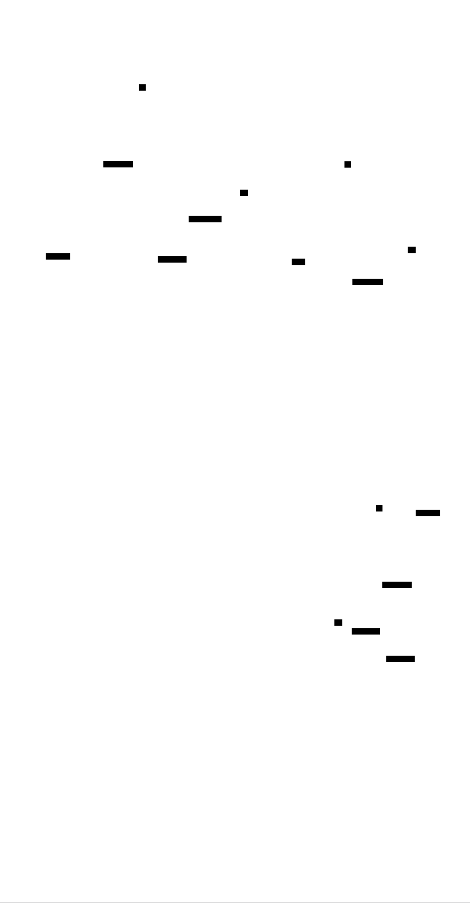

# Signal Handler: Design Document


## Overview

This system implements robust Unix signal handling that integrates asynchronously delivered signals with synchronous event loops. The key architectural challenge is bridging the gap between the unsafe, limited context of signal handlers and the full processing capabilities of the main application loop.


> This guide is meant to help you understand the big picture before diving into each milestone. Refer back to it whenever you need context on how components connect.


## Context and Problem Statement

> **Milestone(s):** This section provides foundational context for Milestones 1-3: Basic Signal Handling, Signal Masking, and Self-Pipe Trick integration.

### Mental Model: Emergency Interruptions

Think of Unix signals as **emergency interruptions** in your daily life. Imagine you're deep in focused work—writing code, reading a book, or having a conversation—when suddenly your phone rings with an urgent call, a fire alarm goes off, or someone taps you on the shoulder with a critical question. These interruptions share several key characteristics with Unix signals:

**Interruptions are asynchronous and unpredictable.** You can't control when they happen or prepare for their exact timing. The fire alarm doesn't wait for you to finish your sentence or reach a convenient stopping point. Similarly, Unix signals arrive at arbitrary moments during program execution—in the middle of a system call, between instructions, or while your program is blocked waiting for I/O.

**You must respond immediately, but your response options are limited.** When the fire alarm sounds, you can't continue your complex work—you must drop everything and follow a simple, practiced emergency procedure. Signal handlers operate under similar constraints: they must execute immediately but can only perform a very limited set of "async-signal-safe" operations. You can't safely call most library functions, allocate memory, or perform complex logic.

**The interruption context is different from your normal working environment.** During a fire evacuation, you don't have access to your usual tools and resources—you follow a predetermined escape route with minimal decision-making. Signal handlers execute in a restricted context where most normal program facilities are unavailable. The signal handler can't safely interact with the program's main data structures or call most standard library functions.

**You need a way to bridge between emergency response and normal operations.** After handling the immediate emergency (evacuation), you eventually need to resume normal work—but you might need to process what happened during the interruption (damage assessment, rescheduling meetings). Similarly, signal handlers typically need to communicate information back to the main program, which requires careful coordination mechanisms.

This analogy reveals why signal handling is complex: it's not just about responding to events, but about safely bridging between two completely different execution contexts with different capabilities and constraints.

### Core Challenges: Why Signals Are Difficult

Signal handling presents three fundamental challenges that make it one of the most error-prone areas of Unix programming: **async-signal safety**, **reentrancy**, and **timing issues**. Each challenge stems from the fundamental mismatch between the synchronous, sequential world of normal program execution and the asynchronous, interrupt-driven nature of signal delivery.

#### Async-Signal Safety: The Restricted Context Problem

**Async-signal safety** refers to whether a function can be safely called from within a signal handler. The vast majority of standard library functions are **not** async-signal-safe, creating a severe restriction on what signal handlers can accomplish. This restriction exists because signal handlers interrupt normal program execution at arbitrary points, potentially in the middle of other function calls.

Consider what happens when a signal interrupts a call to `malloc()`. The `malloc()` function maintains internal data structures (free lists, heap metadata) that may be in an inconsistent state during allocation. If the signal handler also calls `malloc()` (or any function that internally uses `malloc()`, like `printf()`), it could corrupt these data structures, leading to crashes or memory corruption when the original `malloc()` call resumes.

The POSIX standard defines a small set of async-signal-safe functions, including:
- Basic I/O operations: `read()`, `write()`
- Signal manipulation: `sigaction()`, `sigprocmask()`
- Process control: `_exit()`, `kill()`
- Memory operations: direct memory access (but not `malloc()` or `free()`)

This restriction means signal handlers cannot safely perform common operations like:
- Formatted output (`printf()`, `fprintf()`)
- Dynamic memory allocation (`malloc()`, `free()`)
- Standard library string functions (`strlen()`, `strcpy()`)
- Most file I/O beyond basic `read()`/`write()`
- Thread synchronization primitives (mutexes, condition variables)

> **Key Insight**: The async-signal-safety restriction forces a fundamental architectural decision: either keep signal handlers extremely minimal, or find a way to defer most signal processing to a safe context outside the handler.

#### Reentrancy: The Self-Interruption Problem

**Reentrancy** issues occur when a signal handler interrupts code that is already executing, potentially leading to inconsistent state or infinite recursion. Unlike the async-signal-safety problem (which involves calling unsafe functions), reentrancy involves the handler interfering with the program's own logic.

The most obvious reentrancy problem occurs when a signal handler calls functions that might recursively trigger the same signal. For example, a `SIGSEGV` handler that dereferences an invalid pointer will trigger another `SIGSEGV`, creating an infinite loop of signal deliveries that typically results in stack overflow.

More subtle reentrancy issues arise when signal handlers modify global variables that are also accessed by the main program. Consider a simple counter that the main program increments:

```c
volatile int counter = 0;

void signal_handler(int sig) {
    counter++;  // Modify shared state
}

int main() {
    // ... register signal handler ...
    counter++;  // Main program also modifies counter
}
```

If a signal arrives between loading `counter` into a register and storing the incremented value back to memory, the signal handler's increment will be lost. This is a classic race condition where the apparent atomic operation `counter++` is actually a read-modify-write sequence that can be interrupted.

Even more problematic are cases where the signal handler and main program interact with complex data structures. If the main program is in the middle of updating a linked list when a signal arrives, the signal handler might see the list in an inconsistent state with dangling pointers or broken invariants.

#### Timing Issues: The Race Condition Problem

**Timing issues** in signal handling stem from the fundamental unpredictability of signal delivery timing. These manifest in several ways:

**Signal delivery delays**: Signals are not delivered instantly when generated. The kernel delivers signals at specific points in the process lifecycle—typically when returning from system calls or when the process is scheduled to run. This means there can be significant delays between signal generation and handler execution, during which the program continues normal execution.

**Signal coalescing**: If multiple instances of the same signal are generated before the first one is delivered, they may be combined into a single delivery. Standard signals (like `SIGTERM` or `SIGUSR1`) are not queued—only one instance is remembered. This means rapid signal generation can result in lost signals.

**Check-then-act races**: A common pattern is to check a condition and then take action based on that check. With signals, this pattern is inherently racy:

```
1. Check if shutdown flag is set (not set)
2. Signal arrives, sets shutdown flag
3. Begin long-running operation (should have been skipped)
```

The signal arrives after the check but before the action, causing the program to miss the shutdown request.

**Interrupted system calls**: Signals can interrupt blocking system calls like `read()`, `write()`, or `accept()`. Depending on signal handler configuration, these calls may either restart automatically or return with an error (`EINTR`). Programs must handle both possibilities correctly.

> **Critical Insight**: Most timing issues cannot be solved within signal handlers themselves—they require architectural patterns that move the timing-sensitive logic into the main program flow where it can be controlled deterministically.

### Existing Signal Handling Approaches

The Unix ecosystem has evolved several distinct approaches for handling signals, each with different trade-offs in terms of safety, portability, complexity, and integration with event-driven architectures. Understanding these approaches and their trade-offs is crucial for choosing the right signal handling strategy for your application.

| Approach | Safety Level | Portability | Integration Ease | Handler Context | Signal Delivery |
|----------|--------------|-------------|------------------|-----------------|-----------------|
| `signal()` | Low | Poor | Simple | Async handler | Direct interrupt |
| `sigaction()` | Medium | Good | Simple | Async handler | Direct interrupt |
| `signalfd()` | High | Linux-only | Complex | Sync event loop | Synchronous read |
| Self-pipe trick | High | Excellent | Medium | Sync event loop | Async to sync bridge |

#### The `signal()` Function: Legacy Interface

The original `signal()` function provides the simplest interface for signal handling but suffers from portability and reliability issues that make it unsuitable for robust applications.

**Interface simplicity**: `signal()` requires only two parameters—the signal number and handler function—making it easy to use for basic cases. The handler function receives the signal number as its only parameter.

**Unreliable semantics**: The biggest problem with `signal()` is that its behavior varies significantly between Unix implementations. On some systems, signal handlers are automatically reset to the default action after execution, requiring the handler to re-register itself. This creates a race condition where signals arriving between handler execution and re-registration are processed with the default action (often terminating the process).

**System call interruption behavior**: Different implementations handle interrupted system calls inconsistently. Some automatically restart interrupted system calls, while others return `EINTR`. This inconsistency makes it difficult to write portable code that handles blocking I/O correctly.

**Limited configuration options**: `signal()` provides no control over signal delivery during handler execution. This means handlers can be interrupted by other signals, potentially leading to reentrancy issues or corrupted state.

> **Decision: Avoid `signal()` for Production Code**
> - **Context**: Need reliable signal handling with predictable behavior
> - **Options Considered**: Use `signal()` for simplicity, use `sigaction()` for reliability, use modern alternatives
> - **Decision**: Always use `sigaction()` instead of `signal()`
> - **Rationale**: The portability and reliability issues with `signal()` create too much risk for production systems. The additional complexity of `sigaction()` is minimal compared to debugging platform-specific signal handling bugs
> - **Consequences**: Slightly more verbose signal registration code, but much more predictable and portable behavior

#### The `sigaction()` Function: POSIX Standard

The `sigaction()` system call provides a modern, standardized interface that addresses most of the problems with `signal()` while maintaining the traditional async handler model.

**Reliable handler registration**: Unlike `signal()`, handlers registered with `sigaction()` are persistent—they remain registered until explicitly changed. This eliminates the race condition where signals might be missed during handler re-registration.

**Configurable behavior**: `sigaction()` accepts a `struct sigaction` that allows fine-grained control over signal handling behavior:
- **`SA_RESTART` flag**: Automatically restart system calls interrupted by this signal, reducing the need for manual `EINTR` handling
- **`SA_NODEFER` flag**: Allow the signal to interrupt its own handler (normally signals are blocked during handler execution)
- **Signal mask**: Specify additional signals to block while the handler executes, preventing reentrancy issues

**Extended handler information**: With the `SA_SIGINFO` flag, handlers can receive additional information about the signal, including the process ID of the sender and the reason for signal generation.

**Portable semantics**: POSIX standardization ensures consistent behavior across compliant systems, making it much easier to write portable signal handling code.

**Limitations remain**: Despite these improvements, `sigaction()` still requires handlers to execute in the restricted async-signal-safe context. Complex signal processing still requires additional architectural patterns.

#### `signalfd()`: Linux Synchronous Signals

Linux introduced `signalfd()` as a radical departure from traditional signal handling. Instead of async handlers, `signalfd()` converts signals into synchronous events that can be read from a file descriptor.

**Synchronous signal processing**: With `signalfd()`, signals are delivered as data that can be read using normal `read()` system calls. This means signal processing occurs in the normal program context with full access to all library functions and data structures.

**Event loop integration**: Because signals become file descriptor events, they integrate naturally with `select()`, `poll()`, `epoll()`, and other I/O multiplexing mechanisms. This makes `signalfd()` ideal for event-driven architectures.

**Signal blocking requirement**: To use `signalfd()`, the process must first block the signals of interest using `sigprocmask()`. Blocked signals are queued by the kernel and can then be read from the `signalfd` descriptor. This prevents traditional signal handler execution.

**Rich signal information**: Reading from a `signalfd` provides detailed information about each signal, including sender PID, signal value, and other metadata that's not available in traditional handlers.

**Platform limitations**: The major drawback of `signalfd()` is that it's Linux-specific. Applications requiring portability across Unix systems cannot rely on `signalfd()` alone.

**Performance considerations**: `signalfd()` can be more efficient than traditional signal handling in high-frequency signal scenarios because it avoids the overhead of context switching into signal handlers and allows batch processing of multiple signals.

#### Self-Pipe Trick: Portable Async-to-Sync Bridge

The self-pipe trick provides a portable way to achieve the benefits of synchronous signal processing without relying on Linux-specific features. This approach bridges between async signal delivery and sync event processing.

**Minimal handler approach**: Signal handlers are kept as minimal as possible—they only write a single byte (typically the signal number) to a pipe. This minimizes the risk of async-signal-safety violations while providing a communication channel to the main program.

**Event loop integration**: The read end of the pipe is monitored by the main event loop using `select()` or `poll()`. When the signal handler writes to the pipe, it appears as a normal I/O event that can be processed alongside other file descriptor events.

**Full context processing**: Signal processing occurs in the main program context where all library functions are available. This allows complex signal handling logic, interaction with data structures, and integration with application state.

**Portable implementation**: The self-pipe trick works on any POSIX-compliant system and requires no special kernel features. It provides consistent behavior across platforms.

**Implementation considerations**: The pipe must be configured as non-blocking to prevent the signal handler from blocking if the pipe buffer fills. The main program must be prepared to handle multiple signals coalescing into fewer pipe writes, and must drain the pipe completely to avoid missing signals.

**Performance overhead**: The self-pipe trick introduces some overhead compared to direct signal processing—each signal requires a write system call in the handler and a read system call in the main loop. However, this overhead is typically negligible compared to the benefits of safe signal processing.

> **Decision: Use Self-Pipe Trick for Event Loop Integration**
> - **Context**: Need to integrate signals with event-driven architecture while maintaining portability
> - **Options Considered**: `signalfd()` for simplicity, self-pipe for portability, traditional handlers with global flags
> - **Decision**: Implement self-pipe trick as the primary integration mechanism
> - **Rationale**: Provides the safety and integration benefits of `signalfd()` while maintaining portability across all Unix systems. The implementation complexity is manageable and well-understood
> - **Consequences**: Requires more implementation effort than `signalfd()`, but results in portable code that works consistently across platforms


The architectural comparison reveals that signal handling approaches exist on a spectrum from simple-but-unsafe to complex-but-robust. The progression from `signal()` through `sigaction()` to `signalfd()` and the self-pipe trick represents increasing sophistication in handling the fundamental challenges of async signal delivery. For robust, portable applications, the combination of `sigaction()` for registration and the self-pipe trick for processing provides the best balance of safety, portability, and functionality.

### Implementation Guidance

This implementation guidance provides the foundational code structure for understanding and implementing signal handling approaches. The code focuses on establishing clear patterns and interfaces that will be expanded in subsequent sections.

#### Technology Recommendations

| Component | Simple Option | Advanced Option |
|-----------|---------------|-----------------|
| Signal Registration | `sigaction()` with basic flags | `sigaction()` with full configuration and error handling |
| Signal Masking | `sigprocmask()` for single-threaded | `pthread_sigmask()` for multi-threaded |
| Event Integration | Self-pipe with `select()` | Self-pipe with `epoll()` or `kqueue()` |
| Error Handling | Basic return code checking | Structured error reporting with recovery |
| Testing | Manual signal sending with `kill` | Automated testing with `timer_create()` |

#### Recommended File Structure

Organize signal handling code to separate concerns clearly and allow for testing and reuse:

```
signal-handler/
├── src/
│   ├── signal_core.h           ← Core signal handling types and constants
│   ├── signal_core.c           ← Basic signal registration and utilities
│   ├── signal_registry.h       ← Signal handler registration interface
│   ├── signal_registry.c       ← Signal handler registration implementation
│   ├── signal_mask.h           ← Signal masking interface
│   ├── signal_mask.c           ← Signal masking implementation
│   ├── signal_pipe.h           ← Self-pipe trick interface
│   ├── signal_pipe.c           ← Self-pipe trick implementation
│   ├── event_loop.h            ← Event loop integration interface
│   ├── event_loop.c            ← Event loop integration implementation
│   └── main.c                  ← Demo application showing usage
├── tests/
│   ├── test_signal_registry.c  ← Unit tests for signal registration
│   ├── test_signal_mask.c      ← Unit tests for signal masking
│   ├── test_signal_pipe.c      ← Unit tests for self-pipe mechanism
│   └── test_integration.c      ← Integration tests for complete flow
├── examples/
│   ├── basic_handler.c         ← Simple signal handler example
│   ├── graceful_shutdown.c     ← Graceful shutdown example
│   └── event_loop_demo.c       ← Event loop integration example
└── Makefile                    ← Build configuration
```

#### Infrastructure Starter Code

**Core Signal Handling Types** (`signal_core.h`):

```c
#ifndef SIGNAL_CORE_H
#define SIGNAL_CORE_H

#include <signal.h>
#include <stdbool.h>
#include <stdint.h>
#include <sys/types.h>

/* Maximum number of signals that can be registered */
#define MAX_SIGNALS 32

/* Signal pipe buffer size */
#define SIGNAL_PIPE_BUF_SIZE 256

/* Signal handler function type */
typedef void (*signal_handler_func_t)(int signal_num);

/* Signal registration information */
typedef struct {
    int signal_num;
    signal_handler_func_t handler;
    bool registered;
    struct sigaction old_action;
} signal_registration_t;

/* Signal mask operation types */
typedef enum {
    SIGNAL_MASK_BLOCK,
    SIGNAL_MASK_UNBLOCK,
    SIGNAL_MASK_SET_MASK
} signal_mask_op_t;

/* Self-pipe notification structure */
typedef struct {
    int read_fd;
    int write_fd;
    bool initialized;
} signal_pipe_t;

/* Event loop descriptor types */
typedef enum {
    EVENT_TYPE_SIGNAL,
    EVENT_TYPE_SOCKET,
    EVENT_TYPE_TIMER
} event_type_t;

/* Event descriptor for event loop integration */
typedef struct {
    int fd;
    event_type_t type;
    void *user_data;
} event_descriptor_t;

/* Signal processing result */
typedef enum {
    SIGNAL_RESULT_SUCCESS,
    SIGNAL_RESULT_ERROR,
    SIGNAL_RESULT_IGNORED,
    SIGNAL_RESULT_SHUTDOWN
} signal_result_t;

/* Error codes for signal operations */
typedef enum {
    SIGNAL_ERROR_SUCCESS = 0,
    SIGNAL_ERROR_INVALID_SIGNAL,
    SIGNAL_ERROR_ALREADY_REGISTERED,
    SIGNAL_ERROR_NOT_REGISTERED,
    SIGNAL_ERROR_SYSTEM_ERROR,
    SIGNAL_ERROR_PIPE_FULL,
    SIGNAL_ERROR_PIPE_ERROR
} signal_error_t;

/* Signal statistics for debugging */
typedef struct {
    uint64_t signals_received;
    uint64_t signals_processed;
    uint64_t pipe_writes;
    uint64_t pipe_reads;
    uint64_t errors;
} signal_stats_t;

#endif /* SIGNAL_CORE_H */
```

**Error Handling Utilities** (`signal_core.c`):

```c
#include "signal_core.h"
#include <stdio.h>
#include <string.h>
#include <errno.h>

/* Global signal statistics */
static signal_stats_t g_signal_stats = {0};

/* Convert signal_error_t to string */
const char* signal_error_string(signal_error_t error) {
    switch (error) {
        case SIGNAL_ERROR_SUCCESS:
            return "Success";
        case SIGNAL_ERROR_INVALID_SIGNAL:
            return "Invalid signal number";
        case SIGNAL_ERROR_ALREADY_REGISTERED:
            return "Signal already registered";
        case SIGNAL_ERROR_NOT_REGISTERED:
            return "Signal not registered";
        case SIGNAL_ERROR_SYSTEM_ERROR:
            return "System call error";
        case SIGNAL_ERROR_PIPE_FULL:
            return "Signal pipe buffer full";
        case SIGNAL_ERROR_PIPE_ERROR:
            return "Signal pipe error";
        default:
            return "Unknown error";
    }
}

/* Get current signal statistics */
signal_stats_t signal_get_stats(void) {
    return g_signal_stats;
}

/* Reset signal statistics */
void signal_reset_stats(void) {
    memset(&g_signal_stats, 0, sizeof(g_signal_stats));
}

/* Increment statistics counters (async-signal-safe) */
void signal_stats_increment_received(void) {
    g_signal_stats.signals_received++;
}

void signal_stats_increment_processed(void) {
    g_signal_stats.signals_processed++;
}

void signal_stats_increment_pipe_writes(void) {
    g_signal_stats.pipe_writes++;
}

void signal_stats_increment_pipe_reads(void) {
    g_signal_stats.pipe_reads++;
}

void signal_stats_increment_errors(void) {
    g_signal_stats.errors++;
}

/* Validate signal number */
bool signal_is_valid(int signal_num) {
    return (signal_num > 0 && signal_num < NSIG && 
            signal_num != SIGKILL && signal_num != SIGSTOP);
}

/* Print signal information for debugging */
void signal_print_info(int signal_num) {
    printf("Signal %d (%s): %s\n", 
           signal_num, 
           sys_siglist[signal_num] ? sys_siglist[signal_num] : "Unknown",
           strsignal(signal_num));
}
```

#### Core Logic Skeleton Code

The following skeleton code provides the interface and structure for implementing signal handling components. Each function includes detailed TODO comments that map to the concepts and algorithms described in this document.

**Basic Signal Utilities** (`signal_core.c` additions):

```c
/* Create a signal set containing specific signals */
signal_error_t signal_create_set(sigset_t *set, int *signals, size_t count) {
    // TODO 1: Initialize empty signal set using sigemptyset()
    // TODO 2: Iterate through signals array and add each to set with sigaddset()
    // TODO 3: Validate each signal number before adding
    // TODO 4: Return appropriate error if any signal is invalid
    // Hint: Use signal_is_valid() to check signal numbers
}

/* Check if a signal is pending for the current process */
signal_error_t signal_check_pending(int signal_num, bool *is_pending) {
    // TODO 1: Validate signal number parameter
    // TODO 2: Call sigpending() to get pending signal set
    // TODO 3: Use sigismember() to check if signal_num is in pending set
    // TODO 4: Set *is_pending to result and return success
    // Hint: Handle sigpending() errors by checking errno
}

/* Convert signal number to name string */
const char* signal_to_name(int signal_num) {
    // TODO 1: Validate signal number range
    // TODO 2: Use a switch statement or lookup table for common signals
    // TODO 3: Include SIGINT, SIGTERM, SIGHUP, SIGUSR1, SIGUSR2, SIGCHLD
    // TODO 4: Return "UNKNOWN" for unrecognized signals
    // Hint: Consider using sys_siglist array if available on your system
}
```

#### Language-Specific Hints

**Signal-Safe Operations in C**:
- Use only async-signal-safe functions in signal handlers: `write()`, `read()`, direct memory access
- Avoid `printf()`, `malloc()`, `free()`, `strlen()`, and most library functions
- Use `volatile sig_atomic_t` for variables shared between handlers and main program
- Use `errno` carefully—save and restore it in signal handlers if needed

**Memory Management**:
- Pre-allocate any memory needed by signal handlers before registering them
- Use static buffers or stack variables in signal handlers, never dynamic allocation
- Be careful with global variables—use atomic operations or proper synchronization

**System Call Error Handling**:
- Always check return values from `sigaction()`, `sigprocmask()`, `pipe()`, `select()`
- Handle `EINTR` appropriately when using `select()` or `poll()` with signals
- Use `SA_RESTART` flag to reduce `EINTR` handling burden for most system calls

**Debugging Support**:
- Use `strace -e signal` to trace signal delivery
- Use `kill -l` to list available signals and their numbers
- Consider adding signal statistics tracking for production debugging

#### Milestone Checkpoints

**After completing Context and Problem Statement understanding**:
- **Verification**: Can explain the three main signal handling challenges
- **Expected Behavior**: Understands why simple approaches like `signal()` are problematic
- **Command**: No code to run yet, but should be able to answer: "Why can't I call `printf()` from a signal handler?"
- **Signs of Understanding**: Can explain async-signal-safety, reentrancy, and timing issues with concrete examples

**Before proceeding to Milestone 1 implementation**:
- **Preparation**: Have development environment set up with C compiler and Unix system
- **Required Knowledge**: Understand difference between `signal()` and `sigaction()`
- **File Structure**: Create the recommended directory structure
- **Starter Code**: Copy and compile the infrastructure code provided above


## Goals and Non-Goals

> **Milestone(s):** This section establishes the scope and requirements that guide all three project milestones: Basic Signal Handling (Milestone 1), Signal Masking (Milestone 2), and Self-Pipe Trick integration (Milestone 3).

### Mental Model: Project Charter and Boundaries

Think of this goals section as a project charter for a construction team building a bridge. Before the architects start designing spans and foundations, the team must clearly understand: What kind of traffic will this bridge carry? What weather conditions must it withstand? What's the maximum acceptable cost? Equally important, they must establish what they're NOT building - not a tunnel, not a ferry system, not a highway interchange.

Similarly, our signal handler system needs clear boundaries. We're building a robust, portable foundation for Unix signal handling that integrates cleanly with event-driven applications. We're not building a real-time system, a complete IPC framework, or a signal processing laboratory. These boundaries help us make consistent design decisions and avoid feature creep that would compromise the core objectives.

The key insight here is that explicit non-goals are just as valuable as goals. They prevent scope expansion, clarify trade-offs, and help developers understand when to say "that's outside our design requirements." A well-defined scope enables focused implementation and testing.


### Functional Requirements

The signal handler system must deliver three core functional capabilities that directly correspond to our project milestones. These requirements define the minimal viable signal handling infrastructure that applications can rely on for production use.

#### Signal Capture and Registration

The system must provide reliable signal handler registration that supersedes the historical `signal()` function with modern, portable signal handling. This capability forms the foundation for all higher-level signal processing features.

| Requirement | Description | Success Criteria |
|-------------|-------------|------------------|
| Handler Registration | Install custom signal handlers for application-defined signals | `sigaction()` successfully registers handlers for `SIGINT`, `SIGTERM`, `SIGHUP`, `SIGUSR1`, `SIGUSR2` |
| Portable Signal Handling | Use POSIX `sigaction()` interface instead of legacy `signal()` | All handler registration uses `sigaction()` with proper flag configuration |
| Automatic System Call Restart | Configure handlers to restart interrupted system calls | `SA_RESTART` flag set for all registered handlers to prevent `EINTR` errors |
| Async-Signal-Safe Handlers | Ensure handler functions use only async-signal-safe operations | Handlers call only functions from signal-safety(7) approved list |
| Signal Validation | Verify signal numbers before registration | `signal_is_valid()` rejects invalid signal numbers like `SIGKILL`, `SIGSTOP` |

The signal capture system must handle the fundamental challenge of async-signal-safety. When a signal interrupts the main program, the handler executes in a restricted context where most library functions are unsafe. Our registration interface enforces this safety by providing only async-signal-safe operations within handler functions.

> **Key Design Principle**: Handler functions should perform minimal work - ideally just setting a flag or writing a single byte to a pipe. All complex signal processing occurs in the main program context after the handler returns control.

#### Graceful Shutdown Coordination

The system must enable applications to perform clean shutdown sequences when receiving termination signals. This prevents data corruption, resource leaks, and incomplete transactions during process termination.

| Requirement | Description | Success Criteria |
|-------------|-------------|------------------|
| Shutdown Signal Handling | Capture `SIGTERM` and `SIGINT` for graceful termination | Handler sets shutdown flag that main loop can check |
| Resource Cleanup Coordination | Allow application cleanup before process exit | Signal delivery doesn't immediately terminate - application controls timing |
| Multiple Signal Handling | Handle repeated shutdown signals appropriately | Second `SIGTERM` escalates to immediate termination or is ignored |
| Cleanup Timeout Protection | Prevent indefinite cleanup delays | Application can set maximum cleanup duration before forced exit |
| State Preservation | Maintain application state consistency during shutdown | Signal delivery doesn't interrupt critical sections |

The graceful shutdown capability addresses the common problem where applications lose data or leave resources in inconsistent states during termination. Traditional signal handling often forces immediate process exit, but modern applications need time to flush buffers, close network connections, and commit pending transactions.

#### Event Loop Integration

The system must bridge the gap between asynchronous signal delivery and synchronous event-driven programming models. This integration allows applications to handle signals alongside file I/O, network operations, and timer events in a unified event loop.

| Requirement | Description | Success Criteria |
|-------------|-------------|------------------|
| Self-Pipe Implementation | Convert async signals to synchronous file descriptor events | Signal handler writes to pipe, event loop reads from pipe |
| Event Loop Compatibility | Integrate with `select()`, `poll()`, and `epoll()` multiplexing | Signal pipe descriptor works with all major I/O multiplexing systems |
| Non-Blocking Signal Processing | Prevent signal processing from blocking event loop | Pipe operations use `O_NONBLOCK` to avoid indefinite blocking |
| Signal Coalescing Handling | Manage multiple signals delivered before event loop processes | Event loop drains all pending signals from pipe buffer |
| Multiplexed I/O Support | Monitor signal pipe alongside other file descriptors | Single `select()` call monitors sockets, files, and signal pipe |

The event loop integration solves the architectural mismatch between signal delivery (asynchronous, limited context) and application processing (synchronous, full context). The self-pipe trick provides a clean abstraction that makes signals appear as regular I/O events to the application.

### Quality Requirements

Beyond functional capabilities, the signal handler system must meet specific quality attributes that determine its suitability for production use. These quality requirements influence architectural decisions and implementation strategies throughout the system.

#### Reliability and Correctness

The signal handling system operates in a safety-critical context where failures can cause data loss, resource leaks, or security vulnerabilities. Reliability requirements define the error handling and fault tolerance characteristics.

| Quality Attribute | Requirement | Measurement Criteria |
|-------------------|-------------|---------------------|
| Handler Registration Reliability | All `sigaction()` calls succeed or report specific errors | Error handling for `EINVAL`, `EFAULT`, and unsupported signals |
| Signal Delivery Guarantee | Registered handlers receive all deliverable signals | No signal loss except for uncatchable `SIGKILL`/`SIGSTOP` |
| Memory Safety | No buffer overflows or memory corruption in signal paths | All buffer operations bounds-checked, no dynamic allocation in handlers |
| Race Condition Prevention | Signal handling immune to timing-dependent bugs | Critical sections properly masked, atomic operations where required |
| Error Propagation | Signal handling errors reported to application | Structured error codes with human-readable descriptions |

The reliability requirement extends to error recovery capabilities. When signal registration fails due to system limits or invalid parameters, the system must provide specific error information that enables applications to implement appropriate fallback strategies.

#### Portability and Standards Compliance

The signal handling system must function correctly across different Unix-like operating systems and processor architectures. Portability requirements ensure consistent behavior regardless of deployment environment.

| Quality Attribute | Requirement | Measurement Criteria |
|-------------------|-------------|---------------------|
| POSIX Compliance | Use only POSIX-standard signal interfaces | All signal operations defined in POSIX.1-2001 or later |
| Cross-Platform Compatibility | Function on Linux, macOS, FreeBSD, Solaris | Identical behavior across major Unix variants |
| Architecture Independence | Support 32-bit and 64-bit processor architectures | No assumptions about pointer size or endianness |
| Compiler Portability | Compile with GCC, Clang, and other C compilers | Standard C99 code without compiler-specific extensions |
| Threading Model Agnostic | Work in single-threaded and multi-threaded applications | Compatible with pthreads without requiring it |

Portability constraints influence design decisions throughout the system. For example, we avoid Linux-specific `signalfd()` in favor of the portable self-pipe trick, even though `signalfd()` might offer better performance on Linux systems.

#### Performance and Resource Efficiency

While signal handling is inherently low-frequency compared to typical I/O operations, the system must maintain good performance characteristics and minimal resource overhead.

| Quality Attribute | Requirement | Measurement Criteria |
|-------------------|-------------|---------------------|
| Handler Execution Latency | Signal handlers complete within microseconds | Handler execution time measured via `SIGALRM` timing tests |
| Memory Footprint | Minimal static memory allocation for signal structures | Total signal handling state under 4KB per process |
| Event Loop Overhead | Signal pipe integration adds minimal latency to I/O multiplexing | Less than 1% performance impact on `select()`/`poll()` operations |
| Signal Processing Throughput | Handle high-frequency signals without loss | Process 1000+ signals per second under stress testing |
| Resource Cleanup | No memory leaks or file descriptor leaks | Valgrind clean execution, all file descriptors properly closed |

Performance requirements balance responsiveness with resource consumption. Signal handlers must execute quickly to avoid blocking the process, while the overall system must scale to applications handling hundreds of concurrent connections.

> **Performance Design Principle**: Optimize the signal delivery fast path (handler execution) even at the cost of slower setup operations (handler registration). Setup happens once, but signal delivery can happen thousands of times during application lifetime.

### Non-Goals

Explicit non-goals prevent scope creep and clarify the boundaries of our signal handling system. These exclusions represent conscious design decisions that prioritize simplicity and focus over comprehensive signal processing capabilities.

#### Real-Time Signal Processing

The signal handler system explicitly does not provide real-time signal processing capabilities or timing guarantees. This exclusion simplifies the design and avoids complex scheduling interactions.

| Non-Goal Category | Specific Exclusions | Rationale |
|-------------------|-------------------|-----------|
| Real-Time Signals | No support for Linux `SIGRTMIN`-`SIGRTMAX` real-time signals | Adds significant complexity without broad portability |
| Timing Guarantees | No guaranteed signal delivery latency or bounded execution time | Real-time guarantees require kernel scheduler integration |
| Priority-Based Processing | No signal priority queues or preemption support | Application-level priority management sufficient for most use cases |
| High-Frequency Signals | No optimization for signals delivered at kilohertz rates | Standard applications rarely need high-frequency signal processing |

Real-time signal features would require platform-specific code and complex timing analysis that contradicts our portability and simplicity goals. Applications needing real-time capabilities should use dedicated real-time frameworks rather than general-purpose signal handling.

#### Advanced Signal Queuing

The system does not implement sophisticated signal queuing mechanisms beyond basic pending signal detection. This limitation keeps the implementation straightforward while covering the majority of signal handling use cases.

| Non-Goal Category | Specific Exclusions | Rationale |
|-------------------|-------------------|-----------|
| Signal Queue Management | No custom signal queues or buffering beyond kernel defaults | Kernel queuing sufficient for standard signal delivery patterns |
| Signal Data Attachment | No support for `sigqueue()` data payloads with signals | Adds complexity and limits portability to older systems |
| Overflow Handling | No custom overflow policies when signal queues fill | Kernel overflow behavior adequate for most applications |
| Delivery Ordering | No guaranteed signal delivery order beyond POSIX requirements | Applications should not depend on specific signal ordering |

Signal queuing complexity would require significant additional code to handle queue overflow, memory management, and delivery ordering semantics. The standard kernel queuing mechanisms provide adequate functionality for typical application needs.

#### Advanced IPC Integration

The signal handler system does not provide comprehensive inter-process communication features or integration with advanced IPC mechanisms. Signal handling remains focused on basic process management rather than complex communication patterns.

| Non-Goal Category | Specific Exclusions | Rationale |
|-------------------|-------------------|-----------|
| Message Passing | No signal-based message passing or data transmission | Signals are notification mechanisms, not data channels |
| Process Group Management | No automated signal forwarding to process groups or sessions | Application-specific process management outside our scope |
| Distributed Signals | No network-based signal delivery or remote process signaling | Network communication requires different protocols and error handling |
| IPC Framework Integration | No built-in support for D-Bus, message queues, or shared memory | IPC frameworks have their own notification mechanisms |

These exclusions maintain clear separation of concerns between signal handling (process notification) and inter-process communication (data exchange). Applications requiring advanced IPC should use dedicated IPC libraries rather than extending signal handling beyond its core purpose.

#### Platform-Specific Optimizations

The system avoids platform-specific optimizations that would improve performance on particular operating systems at the cost of portability and maintenance complexity.

| Non-Goal Category | Specific Exclusions | Rationale |
|-------------------|-------------------|-----------|
| Linux-Specific Features | No `signalfd()`, `eventfd()`, or `epoll()` integration | Breaks portability to other Unix systems |
| BSD Extensions | No `kqueue()` integration or BSD-specific signal features | Platform-specific code increases maintenance burden |
| Solaris Optimizations | No `/proc` signal monitoring or Solaris event ports | Optimization benefits don't justify portability costs |
| Performance Tuning | No hand-optimized assembly or CPU-specific optimizations | Standard C performance adequate for signal handling workloads |

Platform-specific optimizations would fragment the codebase and complicate testing across different environments. The performance benefits rarely justify the maintenance costs for signal handling operations, which are typically low-frequency compared to network or disk I/O.

> **Architectural Principle**: Choose portable solutions over platform-specific optimizations unless performance data demonstrates critical bottlenecks that cannot be resolved through portable means.

### Implementation Guidance

This section provides practical recommendations for implementing the goals and requirements defined above, with specific focus on technology choices and verification strategies.

#### Technology Recommendations

The following table presents implementation options for core signal handling components, balancing simplicity for learning with robustness for production use:

| Component | Simple Option | Advanced Option | Recommended Choice |
|-----------|---------------|-----------------|-------------------|
| Signal Registration | Direct `sigaction()` calls | Signal registration wrapper with error handling | Signal registration wrapper |
| Signal Masking | Manual `sigprocmask()` calls | Signal mask stack with automatic restore | Signal mask stack |
| Self-Pipe Implementation | Manual pipe creation and management | Event loop framework integration | Manual pipe management |
| Error Handling | Return codes with `errno` checking | Structured error types with descriptions | Structured error types |
| Threading Support | Single-threaded signal handling | `pthread_sigmask()` with thread-specific masks | Thread-specific masks |

#### Recommended File Structure

Organize signal handling code to separate concerns and enable incremental development:

```
signal-handler/
  include/
    signal_handler.h          ← Public API declarations
    signal_types.h            ← Type definitions and constants
  src/
    signal_registration.c     ← Milestone 1: Basic signal handling
    signal_masking.c          ← Milestone 2: Signal blocking/unblocking
    signal_pipe.c             ← Milestone 3: Self-pipe trick implementation
    signal_utils.c            ← Utility functions and error handling
  tests/
    test_registration.c       ← Unit tests for signal registration
    test_masking.c            ← Unit tests for signal masking
    test_integration.c        ← End-to-end signal handling tests
  examples/
    basic_handler.c           ← Simple signal handling demonstration
    event_loop.c              ← Event loop integration example
```

#### Core Type Definitions

The signal handling system uses specific types that maintain consistency across all components:

```c
// signal_types.h - Core type definitions for signal handling system

#include <signal.h>
#include <stdbool.h>

// Function pointer type for application signal handlers
typedef void (*signal_handler_func_t)(int signal_num);

// Structure tracking registered signal handlers
typedef struct {
    int signal_num;                    // Signal number (SIGINT, SIGTERM, etc.)
    signal_handler_func_t handler;     // Application handler function
    struct sigaction original_action;  // Original handler for restoration
    bool is_registered;                // Registration status flag
} signal_registration_t;

// Enumeration for signal mask operations
typedef enum {
    SIGNAL_MASK_BLOCK,      // Block specified signals
    SIGNAL_MASK_UNBLOCK,    // Unblock specified signals
    SIGNAL_MASK_SETMASK     // Replace current mask entirely
} signal_mask_op_t;

// Structure managing self-pipe file descriptors
typedef struct {
    int write_fd;           // Write end of pipe (used in signal handler)
    int read_fd;            // Read end of pipe (monitored by event loop)
    bool is_initialized;    // Initialization status flag
} signal_pipe_t;

// Error codes for signal handling operations
typedef enum {
    SIGNAL_SUCCESS = 0,     // Operation completed successfully
    SIGNAL_ERROR_INVALID,   // Invalid signal number or parameter
    SIGNAL_ERROR_SYSTEM,    // System call failure (check errno)
    SIGNAL_ERROR_EXISTS,    // Handler already registered
    SIGNAL_ERROR_NOTFOUND   // No handler registered for signal
} signal_error_t;
```

#### Infrastructure Starter Code

This complete utility module handles error reporting and signal validation:

```c
// signal_utils.c - Complete utility functions for signal handling

#include "signal_handler.h"
#include <string.h>
#include <errno.h>

// Convert error codes to human-readable strings
const char* signal_error_string(signal_error_t error) {
    switch (error) {
        case SIGNAL_SUCCESS:     return "Success";
        case SIGNAL_ERROR_INVALID: return "Invalid signal number or parameter";
        case SIGNAL_ERROR_SYSTEM:  return "System call failure";
        case SIGNAL_ERROR_EXISTS:  return "Handler already registered";
        case SIGNAL_ERROR_NOTFOUND: return "No handler registered";
        default:                return "Unknown error";
    }
}

// Validate signal numbers against POSIX requirements
bool signal_is_valid(int signal_num) {
    // Reject uncatchable signals
    if (signal_num == SIGKILL || signal_num == SIGSTOP) {
        return false;
    }
    
    // Validate signal range (1-31 for standard signals)
    if (signal_num < 1 || signal_num > 31) {
        return false;
    }
    
    return true;
}

// Convert signal numbers to human-readable names
const char* signal_to_name(int signal_num) {
    switch (signal_num) {
        case SIGINT:  return "SIGINT";
        case SIGTERM: return "SIGTERM";
        case SIGHUP:  return "SIGHUP";
        case SIGUSR1: return "SIGUSR1";
        case SIGUSR2: return "SIGUSR2";
        default:      return "UNKNOWN";
    }
}

// Create signal set from array of signal numbers
signal_error_t signal_create_set(sigset_t* set, const int* signals, size_t count) {
    if (set == NULL || signals == NULL) {
        return SIGNAL_ERROR_INVALID;
    }
    
    if (sigemptyset(set) != 0) {
        return SIGNAL_ERROR_SYSTEM;
    }
    
    for (size_t i = 0; i < count; i++) {
        if (!signal_is_valid(signals[i])) {
            return SIGNAL_ERROR_INVALID;
        }
        
        if (sigaddset(set, signals[i]) != 0) {
            return SIGNAL_ERROR_SYSTEM;
        }
    }
    
    return SIGNAL_SUCCESS;
}
```

#### Core Logic Skeleton

The following skeleton provides the structure for signal registration (learners implement the TODOs):

```c
// signal_registration.c - Signal handler registration (TO BE IMPLEMENTED)

#include "signal_handler.h"

// Global storage for signal registrations
static signal_registration_t g_signal_registry[MAX_SIGNALS];
static bool g_registry_initialized = false;

// Register a signal handler using sigaction() with proper flags
signal_error_t signal_register_handler(int signal_num, signal_handler_func_t handler) {
    // TODO 1: Validate signal number using signal_is_valid()
    // TODO 2: Check if handler is not NULL
    // TODO 3: Initialize registry if this is first call
    // TODO 4: Check if signal already has registered handler
    // TODO 5: Configure struct sigaction with handler function
    // TODO 6: Set SA_RESTART flag to restart interrupted system calls
    // TODO 7: Call sigaction() to install handler, save original action
    // TODO 8: Store registration information in global registry
    // TODO 9: Return SIGNAL_SUCCESS or appropriate error code
}

// Remove signal handler and restore original behavior
signal_error_t signal_unregister_handler(int signal_num) {
    // TODO 1: Validate signal number
    // TODO 2: Find registration entry in global registry
    // TODO 3: Verify handler is currently registered
    // TODO 4: Restore original signal action using sigaction()
    // TODO 5: Clear registration entry in global registry
    // TODO 6: Return SIGNAL_SUCCESS or appropriate error code
}

// Check if a specific signal has a registered handler
bool signal_is_registered(int signal_num) {
    // TODO 1: Validate signal number
    // TODO 2: Search global registry for signal number
    // TODO 3: Return registration status from registry entry
}
```

#### Milestone Verification Checkpoints

After implementing each milestone, verify the system works correctly using these specific tests:

**Milestone 1 Checkpoint - Basic Signal Handling:**
```bash
# Compile and test basic signal registration
gcc -Wall -Wextra -o test_basic tests/test_registration.c src/signal_*.c

# Run test program - should handle Ctrl+C gracefully
./test_basic
# Press Ctrl+C - should print "Received SIGINT" and continue
# Send SIGTERM - should print "Received SIGTERM" and exit cleanly
```

Expected behavior: Program installs handlers for `SIGINT` and `SIGTERM`, responds to signals with appropriate messages, and exits gracefully rather than terminating abruptly.

**Milestone 2 Checkpoint - Signal Masking:**
```bash
# Test signal masking during critical sections
./test_masking
# Send signals while "Critical section active" message displayed
# Signals should be delayed until "Critical section complete"
```

Expected behavior: Signals sent during critical sections are blocked and delivered only after the critical section completes. Multiple signals may be coalesced during blocking.

**Milestone 3 Checkpoint - Self-Pipe Integration:**
```bash
# Test event loop integration with signal pipe
./test_integration
# Open another terminal and send signals: kill -TERM <pid>
# Event loop should detect signal via pipe and process alongside I/O events
```

Expected behavior: Event loop monitors both signal pipe and other file descriptors simultaneously. Signal delivery triggers pipe notification that appears as regular I/O event.

#### Language-Specific Implementation Tips

**C-Specific Considerations:**
- Use `volatile sig_atomic_t` for variables modified in signal handlers
- Call `sigemptyset()` before `sigaddset()` when building signal sets  
- Check return values from all signal-related system calls
- Use `write()` instead of `printf()` in signal handlers (async-signal-safe)
- Store `errno` at handler entry if you need to preserve it

**Common Implementation Pitfalls:**
- ⚠️ **Pitfall**: Calling non-async-signal-safe functions in handlers
  - **Problem**: Functions like `printf()`, `malloc()`, `pthread_mutex_lock()` can deadlock
  - **Solution**: Use only functions listed in signal-safety(7) man page
- ⚠️ **Pitfall**: Forgetting `SA_RESTART` flag in `sigaction()`
  - **Problem**: System calls return `EINTR` and must be manually restarted
  - **Solution**: Always set `SA_RESTART` unless you specifically need `EINTR` behavior
- ⚠️ **Pitfall**: Race conditions between signal delivery and mask changes
  - **Problem**: Signals delivered between checking flag and blocking
  - **Solution**: Use `sigprocmask()` to block signals before checking state


## High-Level Architecture

> **Milestone(s):** This section provides the architectural foundation for all three project milestones: Basic Signal Handling (Milestone 1), Signal Masking (Milestone 2), and Self-Pipe Trick (Milestone 3).

The signal handler system employs a **three-layer architecture** that cleanly separates the concerns of signal capture, signal-to-event translation, and event processing. This architectural pattern addresses the fundamental challenge of bridging the gap between the unsafe, limited context of signal handlers and the full processing capabilities of the main application loop.

Think of this architecture like a **multi-stage emergency response system**. When an emergency occurs (signal delivery), the first responders (signal handlers) can only perform immediate, basic actions due to safety constraints. They pass information to a dispatch center (self-pipe mechanism) that converts the emergency into a standard communication format. Finally, the full emergency response team (event loop) receives the properly formatted notification and can deploy all available resources to handle the situation comprehensively.

This layered approach ensures that each component operates within its safety constraints while maintaining robust communication between layers. The signal handler operates in an async-signal-safe context with minimal functionality, the translation layer bridges the async-sync divide, and the event processing layer provides full application capabilities for comprehensive signal handling.


### Component Responsibilities

The signal handler system consists of four primary components, each with clearly defined responsibilities and interfaces. Understanding these responsibilities is crucial for implementing a robust and maintainable signal handling system.

#### Signal Handler Registry

The **Signal Handler Registry** serves as the central authority for managing signal handler registration and configuration. This component encapsulates all interactions with the POSIX `sigaction()` system call and maintains metadata about registered handlers.

| Responsibility | Description | Key Operations |
|---|---|---|
| Handler Registration | Install signal handlers using `sigaction()` with proper flags | `signal_register_handler()`, `signal_unregister_handler()` |
| Handler Metadata | Track registered handlers and their configuration | `signal_is_registered()`, handler lookup by signal number |
| Configuration Management | Set appropriate `SA_RESTART`, `SA_NODEFER` flags | Flag validation and application during registration |
| Original Handler Preservation | Save and restore original signal dispositions | Store `struct sigaction` for each registered signal |
| Registration Validation | Verify signal numbers and handler function pointers | `signal_is_valid()`, parameter validation |

The registry maintains a global table of `signal_registration_t` structures, one for each potentially registered signal. This table serves as the single source of truth for signal handler state across the application. The registry ensures that only one handler can be registered per signal and provides atomic registration operations to prevent race conditions during handler installation.

> **Design Insight**: The registry pattern centralizes signal handler management, preventing the common mistake of scattered `sigaction()` calls throughout the codebase. This centralization enables consistent flag usage, proper error handling, and coordinated handler lifecycle management.

#### Signal Mask Manager

The **Signal Mask Manager** provides controlled access to signal masking operations, enabling applications to create critical sections where signal delivery is temporarily blocked. This component abstracts the complexity of `sigprocmask()` operations and provides thread-safe signal mask manipulation.

| Responsibility | Description | Key Operations |
|---|---|---|
| Mask Manipulation | Block and unblock signals using `sigprocmask()` | `signal_mask_block()`, `signal_mask_unblock()` |
| Critical Section Protection | Provide atomic mask save/restore operations | `signal_enter_critical()`, `signal_exit_critical()` |
| Pending Signal Management | Check for pending signals after mask removal | `signal_check_pending()`, pending signal enumeration |
| Thread-Safe Masking | Support per-thread signal masks in multithreaded programs | `pthread_sigmask()` wrapper functions |
| Mask State Tracking | Maintain mask operation history for debugging | Mask operation logging and statistics |

The mask manager implements a stack-based approach to signal masking, allowing nested critical sections with proper mask restoration. Each mask operation saves the previous mask state, enabling safe nesting of critical sections without losing signal delivery configuration. The manager also provides utilities for creating signal sets from arrays of signal numbers and validating mask operations before applying them.

> **Critical Design Decision**: The stack-based mask management prevents the common pitfall of nested critical sections interfering with each other's signal masks. Without this approach, inner critical sections can inadvertently unmask signals that outer sections intended to keep blocked.

#### Self-Pipe Mechanism

The **Self-Pipe Mechanism** implements the self-pipe trick to convert asynchronous signal notifications into synchronous file descriptor events that can be monitored by `select()` or `poll()`. This component bridges the async-signal-safe world of signal handlers with the full-featured world of event loop processing.

| Responsibility | Description | Key Operations |
|---|---|---|
| Pipe Management | Create and configure non-blocking pipe pairs | `signal_pipe_create()`, pipe descriptor management |
| Signal-to-Event Translation | Write signal notifications from handlers to pipe | Async-signal-safe write operations in handlers |
| Event Loop Integration | Provide file descriptors for `select()`/`poll()` monitoring | `signal_pipe_get_read_fd()`, descriptor registration |
| Notification Protocol | Define signal notification format in pipe data | Signal number encoding, notification parsing |
| Error Recovery | Handle pipe buffer overflow and write failures | `EAGAIN` handling, signal coalescing strategies |

The self-pipe mechanism uses a simple protocol where each signal delivery results in writing a single byte (the signal number) to the pipe's write end. The event loop monitors the pipe's read end alongside other file descriptors. When signal data becomes available, the event loop reads the signal number and dispatches it to appropriate handlers running in the main application context.

The pipe is configured as non-blocking to prevent signal handlers from blocking if the pipe buffer becomes full. In overflow scenarios, the mechanism implements signal coalescing, where multiple instances of the same signal are represented by a single pipe notification. This trade-off prevents signal handler blocking while potentially losing signal count precision.

> **Architecture Insight**: The self-pipe trick solves the fundamental problem of async-signal-safety by moving all complex signal processing out of the signal handler context. The handler performs only the minimal, safe operation of writing a single byte, while all complex logic runs safely in the main application loop.

#### Event Dispatcher

The **Event Dispatcher** integrates signal handling with the application's main event loop, providing unified monitoring of signal notifications alongside other file descriptor events such as socket I/O, timers, and inter-process communication channels.

| Responsibility | Description | Key Operations |
|---|---|---|
| Multiplexed I/O | Monitor signal pipe alongside other descriptors | `select()`/`poll()` integration with multiple descriptor types |
| Event Classification | Distinguish signal events from other I/O events | `event_type_t` classification and routing |
| Signal Processing Dispatch | Route signal notifications to appropriate handlers | Signal number parsing and handler lookup |
| Event Loop Coordination | Integrate with existing event loop infrastructure | Non-intrusive integration with application event loops |
| Performance Optimization | Minimize event loop overhead from signal monitoring | Efficient descriptor set management |

The dispatcher maintains an array of `event_descriptor_t` structures representing all monitored file descriptors, including the signal pipe read descriptor. During each event loop iteration, it uses `select()` or `poll()` to wait for activity on any monitored descriptor. When the signal pipe becomes readable, the dispatcher reads pending signal notifications, parses signal numbers, and invokes appropriate signal processing functions in the safe context of the main application thread.

The dispatcher design supports integration with existing event loops rather than requiring a complete event loop replacement. Applications can incorporate signal handling into their existing `select()` or `poll()` based event processing with minimal changes to existing code structure.

### Recommended File Structure

Organizing signal handling code across multiple modules improves maintainability, testing, and comprehension. The recommended file structure separates concerns while maintaining clear interfaces between components.

```
project-root/
├── src/
│   ├── signal/
│   │   ├── signal_handler.h         ← Public API and type definitions
│   │   ├── signal_handler.c         ← Signal registration implementation (Milestone 1)
│   │   ├── signal_mask.h            ← Signal masking interface
│   │   ├── signal_mask.c            ← Signal masking implementation (Milestone 2)
│   │   ├── signal_pipe.h            ← Self-pipe mechanism interface
│   │   ├── signal_pipe.c            ← Self-pipe implementation (Milestone 3)
│   │   ├── signal_events.h          ← Event loop integration interface
│   │   ├── signal_events.c          ← Event dispatcher implementation
│   │   └── signal_common.h          ← Shared constants and utilities
│   ├── main.c                       ← Application entry point and event loop
│   └── Makefile                     ← Build configuration
└── tests/
    ├── test_signal_handler.c        ← Signal registration tests
    ├── test_signal_mask.c           ← Signal masking tests
    ├── test_signal_pipe.c           ← Self-pipe mechanism tests
    └── test_integration.c           ← End-to-end signal handling tests
```

#### Header File Organization

The header files define clear interfaces between components while minimizing dependencies and circular includes.

| Header File | Purpose | Key Exports | Dependencies |
|---|---|---|---|
| `signal_common.h` | Shared types, constants, error codes | `signal_error_t`, `MAX_SIGNALS`, utility macros | Standard C headers only |
| `signal_handler.h` | Signal registration and handler management | `signal_register_handler()`, `signal_registration_t` | `signal_common.h`, `<signal.h>` |
| `signal_mask.h` | Signal masking and critical sections | `signal_mask_op_t`, masking functions | `signal_common.h`, `<signal.h>` |
| `signal_pipe.h` | Self-pipe mechanism for event integration | `signal_pipe_t`, pipe creation and management | `signal_common.h`, `<unistd.h>` |
| `signal_events.h` | Event loop integration and dispatching | `event_descriptor_t`, event loop functions | All signal headers, `<sys/select.h>` |

The dependency hierarchy flows from common utilities up through specific components to the integrated event system. This structure prevents circular dependencies while allowing each component to build upon lower-level functionality.

#### Implementation File Responsibilities

Each implementation file focuses on a specific aspect of signal handling, promoting code clarity and enabling independent testing and development.

**signal_handler.c** contains all signal registration logic, including `sigaction()` calls, handler metadata management, and registration state tracking. This file implements Milestone 1 requirements and provides the foundation for signal capture.

**signal_mask.c** implements signal masking operations using `sigprocmask()` and `pthread_sigmask()`. It provides both low-level mask manipulation and high-level critical section protection. This file addresses Milestone 2 requirements for signal blocking during sensitive operations.

**signal_pipe.c** implements the self-pipe trick with pipe creation, non-blocking configuration, and signal-to-event translation. The file includes both the signal handler code that writes to the pipe and the event loop code that reads from the pipe. This addresses Milestone 3 requirements for event loop integration.

**signal_events.c** provides the event dispatcher that integrates signal handling with application event loops. It includes descriptor management, `select()`/`poll()` integration, and signal processing coordination.

> **Modularity Benefits**: This file structure enables incremental development matching the project milestones. Students can implement and test each component independently before integrating them into the complete system.

### Signal Processing Flow

The complete signal processing flow demonstrates how all components collaborate to deliver robust, async-signal-safe signal handling integrated with event-driven application architectures.

#### Signal Delivery Sequence

The signal processing flow involves multiple stages, each with specific responsibilities and constraints. Understanding this flow is essential for implementing correct signal handling and debugging signal-related issues.

1. **Kernel Signal Delivery**: The kernel delivers a signal to the process, interrupting normal execution flow. The kernel examines the process's signal disposition table to determine the registered handler address. If a custom handler is registered via `sigaction()`, the kernel prepares to invoke it.

2. **Signal Handler Context Setup**: The kernel saves the current execution context (registers, stack pointer, program counter) and establishes a signal handler execution context. The kernel sets up the signal handler's stack frame and jumps to the registered handler function address.

3. **Async-Signal-Safe Handler Execution**: The signal handler function executes in an async-signal-safe context with severe restrictions on allowable operations. The handler can only call async-signal-safe functions and must complete quickly to avoid interfering with normal program execution.

4. **Self-Pipe Notification**: Within the signal handler, the system writes a notification byte (typically the signal number) to the self-pipe's write file descriptor. This operation uses only async-signal-safe functions and converts the asynchronous signal into a synchronous file descriptor event.

5. **Handler Context Restoration**: After the signal handler completes, the kernel restores the original execution context, returning the process to its interrupted state. Normal program execution resumes from the point of interruption.

6. **Event Loop Detection**: The main application event loop, monitoring multiple file descriptors including the self-pipe read descriptor, detects that the signal pipe has become readable. The `select()` or `poll()` call returns, indicating signal activity alongside any other file descriptor events.

7. **Signal Notification Reading**: The event loop reads the signal notification byte from the self-pipe, determining which signal was delivered. Multiple signal notifications may be read if several signals were delivered before the event loop could process them.

8. **Application Signal Processing**: With the signal information available in the main application context, the system can perform full signal processing including non-async-signal-safe operations, resource cleanup, logging, and coordinated shutdown procedures.

> **Timing Considerations**: The delay between signal delivery (step 1) and application processing (step 8) is typically microseconds on modern systems, but applications must be designed to handle this asynchronous processing delay appropriately.

#### Critical Section Signal Masking Flow

Signal masking provides controlled protection for critical sections that must execute atomically without signal interruption. The masking flow integrates with the overall signal processing to provide predictable execution behavior.

1. **Critical Section Entry**: Before entering a critical section, the application saves the current signal mask and blocks specified signals using `sigprocmask()`. This operation atomically updates the process signal mask, preventing specified signals from being delivered during the critical section.

2. **Protected Execution**: The critical section executes with signals blocked, ensuring atomic completion of sensitive operations such as data structure updates, resource allocation, or inter-thread synchronization. Signals delivered during this period become pending but are not delivered to handlers.

3. **Pending Signal Accumulation**: While signals are blocked, the kernel queues delivered signals as pending. Multiple deliveries of the same signal may be coalesced into a single pending signal, depending on the signal type and system implementation.

4. **Critical Section Exit**: Upon exiting the critical section, the application restores the original signal mask using the saved mask from step 1. This operation atomically unblocks previously blocked signals and triggers delivery of any pending signals.

5. **Pending Signal Delivery**: Immediately after mask restoration, the kernel delivers any pending signals, following the normal signal delivery sequence described above. These signals are processed as if they were delivered at the moment of mask restoration.

6. **Self-Pipe Notification Storm**: If multiple signals were pending, each signal delivery results in a self-pipe notification. The event loop may receive multiple signal notifications in rapid succession, requiring efficient batch processing of signal events.

> **Race Condition Prevention**: The atomic nature of `sigprocmask()` prevents race conditions where signals could be delivered during mask manipulation. This atomicity is crucial for maintaining critical section integrity.

#### Event Loop Integration Flow

The integration of signal handling with existing event loops requires careful coordination to maintain performance while adding signal processing capabilities.

1. **Event Loop Initialization**: During startup, the application initializes the self-pipe mechanism and adds the signal pipe read descriptor to the event loop's monitored descriptor set. This integration occurs alongside other I/O descriptors such as sockets, timers, and inter-process communication channels.

2. **Descriptor Set Management**: The event loop maintains an array of `event_descriptor_t` structures, each describing a monitored file descriptor and its associated event type. The signal pipe descriptor is marked with `EVENT_TYPE_SIGNAL` to enable appropriate event handling.

3. **Multiplexed I/O Monitoring**: The event loop uses `select()` or `poll()` to wait for activity on any monitored descriptor, including the signal pipe. This unified monitoring approach treats signal events as first-class events alongside network I/O and other asynchronous events.

4. **Event Classification and Dispatching**: When `select()` or `poll()` returns, the event loop examines which descriptors have pending activity. Signal pipe activity is identified by descriptor number and event type, enabling appropriate signal processing dispatch.

5. **Signal Event Processing**: For signal pipe activity, the event loop reads available signal notification bytes and processes each signal number. This processing occurs in the main application thread context with full access to application state and non-async-signal-safe functions.

6. **Application Callback Invocation**: After processing signal notifications, the event loop invokes registered application callbacks for each signal type. These callbacks can perform complex operations such as resource cleanup, configuration reloading, or graceful shutdown coordination.

> **Performance Optimization**: The event loop integration adds minimal overhead to existing I/O monitoring since signal pipe monitoring uses the same `select()`/`poll()` mechanism as other descriptors. The only additional cost is checking one more descriptor in the active set.

#### Error Handling Integration

Error handling is integrated throughout the signal processing flow to maintain system robustness in the presence of failures.

**Signal Registration Errors** are detected during handler installation and result in `signal_error_t` return codes. Applications can check registration success and implement fallback strategies such as using default signal behavior or alternative shutdown mechanisms.

**Self-Pipe Communication Errors** occur when the pipe buffer becomes full or write operations fail. The signal handler detects `EAGAIN` from non-blocking write attempts and implements signal coalescing by dropping duplicate signal notifications while preserving at least one notification per signal type.

**Event Loop Integration Errors** arise from `select()` or `poll()` failures, file descriptor exhaustion, or signal pipe corruption. The event loop implements error recovery by recreating the signal pipe, reregistering descriptors, and logging diagnostic information for debugging.

**Recovery Coordination** across all components ensures that partial failures don't compromise overall signal handling functionality. Each component provides error status reporting and supports reinitialization to recover from transient failures.

### Implementation Guidance

The implementation of the signal handler system requires careful attention to POSIX compliance, async-signal-safety, and integration with existing application architectures. This guidance provides concrete recommendations for building a production-ready signal handling system.

#### Technology Recommendations

| Component | Simple Option | Advanced Option |
|---|---|---|
| Signal Registration | `sigaction()` with basic flags | Extended `sigaction()` with `SA_SIGINFO` for detailed signal information |
| Signal Masking | `sigprocmask()` for single-threaded | `pthread_sigmask()` for multi-threaded applications |
| Self-Pipe Implementation | Standard `pipe()` system call | `pipe2()` with `O_CLOEXEC` and `O_NONBLOCK` flags |
| Event Loop Integration | `select()` for simplicity | `poll()` or `epoll()` for higher performance and scalability |
| Error Handling | Basic return code checking | Comprehensive error logging with `strerror()` and signal-safe logging |

#### Recommended File Structure

The implementation should follow the modular structure described above, with particular attention to header dependencies and interface design:

```c
// signal_common.h - Shared definitions
#ifndef SIGNAL_COMMON_H
#define SIGNAL_COMMON_H

#include <signal.h>
#include <stdbool.h>

#define MAX_SIGNALS 32
#define SIGNAL_PIPE_BUF_SIZE 256

typedef enum {
    SIGNAL_SUCCESS = 0,
    SIGNAL_ERROR_INVALID,
    SIGNAL_ERROR_SYSTEM,
    SIGNAL_ERROR_EXISTS,
    SIGNAL_ERROR_NOTFOUND
} signal_error_t;

typedef void (*signal_handler_func_t)(int signal_num);

// Utility functions
const char* signal_error_string(signal_error_t error);
bool signal_is_valid(int signal_num);
const char* signal_to_name(int signal_num);

#endif
```

#### Core Data Structures

The implementation requires several key data structures that maintain signal handling state and coordinate between components:

```c
// signal_handler.h - Registration structures
typedef struct {
    int signal_num;
    signal_handler_func_t handler;
    struct sigaction original_action;
    bool is_registered;
} signal_registration_t;

// signal_mask.h - Masking operations
typedef enum {
    SIGNAL_MASK_BLOCK,
    SIGNAL_MASK_UNBLOCK,
    SIGNAL_MASK_SETMASK
} signal_mask_op_t;

// signal_pipe.h - Self-pipe mechanism
typedef struct {
    int write_fd;
    int read_fd;
    bool is_initialized;
} signal_pipe_t;

// signal_events.h - Event loop integration
typedef enum {
    EVENT_TYPE_SOCKET,
    EVENT_TYPE_SIGNAL,
    EVENT_TYPE_TIMER
} event_type_t;

typedef struct {
    int fd;
    event_type_t type;
    void (*callback)(int fd, void* data);
    void* callback_data;
} event_descriptor_t;
```

#### Core Logic Skeletons

The following function skeletons provide the structure for implementing each milestone's core functionality:

```c
// Milestone 1: Signal Registration
signal_error_t signal_register_handler(int signal_num, signal_handler_func_t handler) {
    // TODO 1: Validate signal_num using signal_is_valid()
    // TODO 2: Check if handler is already registered for this signal
    // TODO 3: Set up struct sigaction with SA_RESTART flag
    // TODO 4: Call sigaction() to install handler
    // TODO 5: Store registration info in global registry
    // TODO 6: Return appropriate error code
}

// Milestone 2: Signal Masking
signal_error_t signal_enter_critical_section(const int* signals, int count, sigset_t* old_mask) {
    // TODO 1: Create signal set using sigemptyset()
    // TODO 2: Add each signal from signals array using sigaddset()
    // TODO 3: Call sigprocmask() with SIG_BLOCK to save old mask and block signals
    // TODO 4: Return success/failure based on sigprocmask() result
}

// Milestone 3: Self-Pipe Creation
signal_error_t signal_pipe_create(signal_pipe_t* pipe) {
    // TODO 1: Create pipe using pipe() system call
    // TODO 2: Set write end to non-blocking using fcntl()
    // TODO 3: Set read end to non-blocking using fcntl()
    // TODO 4: Initialize pipe structure fields
    // TODO 5: Return success/failure status
}
```

#### Milestone Checkpoints

After implementing each milestone, verify functionality using these specific tests:

**Milestone 1 Checkpoint**: Register a SIGINT handler and verify it receives signals:
```bash
gcc -o signal_test signal_handler.c signal_common.c main.c
./signal_test &
kill -INT $!  # Should see handler output, not default termination
```

**Milestone 2 Checkpoint**: Test signal masking during critical sections:
```bash
# Handler should not interrupt critical section, but should fire after
./signal_test &
kill -USR1 $!  # Signal should be delivered after critical section exits
```

**Milestone 3 Checkpoint**: Verify event loop integration with signal pipe:
```bash
# Event loop should receive signal notifications via pipe mechanism
./signal_test &
kill -TERM $!  # Should see event loop processing signal, not direct handler


## Data Model

> **Milestone(s):** This section defines the core data structures that support all three project milestones: Basic Signal Handling (Milestone 1), Signal Masking (Milestone 2), and Self-Pipe Trick integration (Milestone 3).

### Mental Model: Information Architecture for Emergency Response

Think of our signal handling data model like the information systems used by emergency response teams. When an emergency occurs, responders need several types of information immediately accessible: contact information for who to call, status boards showing current emergencies and their states, and communication channels that can reliably deliver urgent messages even when regular systems are overwhelmed.

Similarly, our signal handling system requires three categories of carefully structured data: signal information (the "contact list" of which signals we handle and how), handler state management (the "status board" tracking registered handlers and signal masks), and self-pipe data structures (the "emergency communication channel" that converts async signals into sync events). Each category serves a distinct purpose but they work together to provide robust signal processing.


The data model architecture mirrors the layered approach of our signal handling system. At the foundation, we have POSIX signal primitives like `sigset_t` and `struct sigaction` that provide the basic building blocks. Above this, we build application-specific structures that add safety, tracking, and integration capabilities. Finally, at the top layer, we have event loop integration structures that bridge the gap between async signal delivery and sync event processing.

### Signal Information Types

Signal information types form the foundational layer of our data model, capturing everything needed to identify, validate, and process Unix signals. These structures must handle the inherent complexity of signal semantics while providing a clean interface for higher-level components.

The core challenge in modeling signal information is bridging the gap between the simple integer signal numbers used by the kernel and the rich metadata needed for robust application-level handling. Signals carry implicit behavior (some can be caught, others cannot), have standard meanings (SIGTERM for graceful shutdown), and require specific handler signatures. Our data model must make this complexity manageable while preserving the performance characteristics essential for signal processing.

**Signal Handler Function Type**

The `signal_handler_func_t` type defines the signature for all signal handler functions in our system. This function pointer type encapsulates the async-signal-safety requirements and parameter conventions that all handlers must follow.

| Aspect | Specification | Rationale |
|--------|---------------|-----------|
| Signature | `void (*signal_handler_func_t)(int signal_num)` | Matches POSIX signal handler conventions for portability |
| Return Type | `void` | Signal handlers cannot return values to the kernel |
| Parameters | `int signal_num` | Identifies which signal triggered the handler |
| Safety Requirements | Must only call async-signal-safe functions | Prevents corruption of non-reentrant library state |
| Execution Context | Runs in interrupt context with limited stack | Handlers must be lightweight and non-blocking |

The single-parameter design reflects the traditional Unix signal model where handlers receive minimal context. While POSIX provides extended handlers via `SA_SIGINFO`, our system uses the simpler interface for broader compatibility and reduced complexity in async-signal-safe code paths.

**Signal Registration Structure**

The `signal_registration_t` structure tracks the complete state of a registered signal handler, including the handler function, original system behavior, and registration status.

| Field Name | Type | Description | Usage |
|------------|------|-------------|--------|
| `signal_num` | `int` | POSIX signal number (1-31 range) | Identifies which signal this registration handles |
| `handler` | `signal_handler_func_t` | Application-provided handler function | Called when signal is delivered to process |
| `original_action` | `struct sigaction` | System's original signal disposition | Restored when handler is unregistered |
| `is_registered` | `bool` | Whether this registration is currently active | Prevents double-registration and invalid operations |

The `original_action` field serves a critical role in our registration model. When installing a handler, we preserve the previous signal disposition (which might be default behavior, ignore, or another handler) so that unregistration can restore the exact previous state. This enables proper cleanup and allows multiple components to temporarily install handlers without interfering with each other.

> **Key Insight:** The `signal_registration_t` structure implements a "lease" model for signal handlers. Each registration temporarily takes ownership of a signal's behavior but guarantees to restore the previous state when finished.

**Signal Validation and Metadata**

Our signal information model includes utilities for validating signal numbers and converting between different signal representations. This prevents common errors like attempting to handle uncatchable signals or using invalid signal numbers.

| Function | Purpose | Validation Rules | Error Handling |
|----------|---------|------------------|----------------|
| `signal_is_valid(signal_num)` | Check if signal number is valid | Rejects SIGKILL, SIGSTOP (uncatchable) and out-of-range values | Returns false for invalid signals |
| `signal_to_name(signal_num)` | Convert signal number to human-readable name | Maps standard signals to strings like "SIGTERM" | Returns "UNKNOWN" for unrecognized signals |
| `signal_get_stats()` | Retrieve signal handling statistics | No validation required | Always succeeds, returns current counters |

The validation functions prevent subtle bugs that can occur when applications attempt to handle signals that cannot be caught or use signal numbers outside the valid POSIX range. By centralizing this validation logic, we ensure consistent behavior across all components.

### Handler State Management

Handler state management encompasses the data structures and algorithms needed to track registered signal handlers, manage signal masks during critical sections, and maintain pending signal information. This layer sits above the basic signal information types and provides the stateful services needed for robust signal handling.

The fundamental challenge in handler state management is maintaining consistency in the face of asynchronous signal delivery. Signals can arrive at any time, potentially during state modifications, so our data structures must be designed for async-signal-safety and atomic updates where required.

**Handler Registry Data Structure**

The handler registry maintains a global table of all registered signal handlers, providing fast lookup and consistent state management. Since signal numbers are small integers (1-31), we use a direct-indexed array for O(1) access performance.

| Component | Type | Size | Purpose |
|-----------|------|------|---------|
| Handler Array | `signal_registration_t[MAX_SIGNALS]` | 32 entries | Direct-indexed storage for signal registrations |
| Registration Count | `int` | 4 bytes | Number of currently registered handlers |
| Statistics | `signal_stats_t` | Variable | Performance and debugging metrics |
| Initialization Flag | `bool` | 1 byte | Whether registry has been properly initialized |

The direct-indexed array design trades memory efficiency for access speed and simplicity. With only 31 possible signals, the memory overhead is minimal (typically under 1KB) while providing guaranteed O(1) lookup performance that doesn't depend on hash functions or tree traversals.

**Signal Mask Management Structures**

Signal masking requires careful state management to support nested critical sections and proper mask restoration. Our mask management structures track the current process signal mask and provide utilities for safe mask manipulation.

| Structure | Fields | Purpose | Thread Safety |
|-----------|--------|---------|---------------|
| Current Mask | `sigset_t current_mask` | Process signal mask state | Single-threaded only |
| Saved Mask Stack | `sigset_t saved_masks[MAX_MASK_DEPTH]` | Stack of saved masks for nested blocking | Requires external synchronization |
| Stack Pointer | `int mask_stack_depth` | Current depth in saved mask stack | Atomic integer operations |
| Operation Type | `signal_mask_op_t` | Last mask operation performed | For debugging and state validation |

The mask management approach uses a stack-based model to handle nested critical sections properly. When code blocks signals, the current mask is pushed onto the stack and a new restrictive mask is installed. When the critical section ends, the previous mask is popped and restored, ensuring that nested blocking/unblocking operations compose correctly.

> **Architecture Decision: Stack-Based Mask Management**
> - **Context**: Critical sections may be nested (function A blocks signals, calls function B which also blocks signals)
> - **Options Considered**: 
>   1. Simple save/restore (fails with nesting)
>   2. Reference counting (complex, error-prone)
>   3. Stack-based save/restore (chosen)
> - **Decision**: Use stack-based mask management with explicit push/pop operations
> - **Rationale**: Stack-based approach naturally handles nesting, matches call stack semantics, and provides clear restore semantics
> - **Consequences**: Requires discipline to match block/unblock calls, but prevents mask corruption from nested operations

**Pending Signal Tracking**

The POSIX signal model allows signals to become "pending" when they are delivered to a process that currently has them blocked. Our data structures must track pending signals so they can be processed when the signal mask is updated to unblock them.

| Data Structure | Type | Purpose | Update Frequency |
|----------------|------|---------|------------------|
| Pending Set | `sigset_t pending_signals` | Signals currently pending delivery | Updated on signal delivery and mask changes |
| Pending Counts | `int pending_counts[MAX_SIGNALS]` | Number of times each signal is pending | Real-time signals can queue multiple instances |
| Last Check Time | `struct timespec last_pending_check` | When pending signals were last examined | For debugging timing issues |
| Check Function | `signal_check_pending()` | Query pending status for specific signal | Called before critical operations |

The pending signal tracking system provides visibility into signals that have been delivered but not yet processed due to signal masking. This information is crucial for debugging timing issues and ensuring that important signals (like SIGTERM) are not lost during extended critical sections.

**Signal Processing Results and Errors**

Our state management includes comprehensive error tracking and result reporting to support debugging and reliable operation. The error model distinguishes between different failure modes and provides actionable error information.

| Error Type | Enum Value | Description | Recovery Action |
|------------|------------|-------------|-----------------|
| Success | `SIGNAL_SUCCESS` | Operation completed successfully | Continue normal processing |
| Invalid Signal | `SIGNAL_ERROR_INVALID` | Signal number out of range or uncatchable | Validate input parameters |
| System Error | `SIGNAL_ERROR_SYSTEM` | Underlying system call failed | Check errno, possibly retry |
| Already Exists | `SIGNAL_ERROR_EXISTS` | Handler already registered for signal | Unregister existing handler first |
| Not Found | `SIGNAL_ERROR_NOTFOUND` | No handler registered for signal | Register handler before use |

The error enumeration provides specific failure modes rather than generic success/failure flags. This enables precise error handling and helps developers understand what went wrong and how to fix it.

### Self-Pipe Data Structures

The self-pipe mechanism requires specialized data structures to safely bridge the gap between async signal handlers and sync event loops. These structures must handle the unique constraints of signal contexts (async-signal-safety, non-blocking operations) while providing reliable event loop integration.

The core architectural challenge is that signal handlers run in a restricted execution context where most library functions are unsafe to call, but event loops require rich descriptor and event information. Our self-pipe data structures resolve this by using minimal, safe operations in signal handlers while providing full event metadata in the main program context.

**Pipe Descriptor Management**

The `signal_pipe_t` structure encapsulates the pipe pair used for signal notification, along with the state needed for safe operation in both signal handler and event loop contexts.

| Field Name | Type | Description | Safety Requirements |
|------------|------|-------------|-------------------|
| `write_fd` | `int` | File descriptor for signal handler writes | Must be non-blocking to prevent handler deadlock |
| `read_fd` | `int` | File descriptor for event loop reads | Can be blocking, monitored by select()/poll() |
| `is_initialized` | `bool` | Whether pipe has been created and configured | Checked before pipe operations to prevent errors |

The asymmetric configuration of the pipe descriptors reflects their different usage patterns. The write end must be non-blocking because signal handlers cannot afford to block waiting for pipe buffer space. The read end can be blocking because it's only accessed from the main event loop where blocking is acceptable.

> **Critical Design Constraint:** The write file descriptor must be configured with `O_NONBLOCK` to ensure that signal handlers never block. A blocked signal handler can deadlock the entire process.

**Signal Notification Protocol**

The data format written to the self-pipe must be minimal and async-signal-safe while providing enough information for the event loop to process signals appropriately. Our protocol uses single-byte messages for simplicity and performance.

| Byte Value | Signal Type | Handler Action | Event Loop Response |
|------------|-------------|----------------|-------------------|
| Signal Number | Any catchable signal (1-31) | Write signal number to pipe | Look up registered handler and invoke |
| 0 | Sentinel/heartbeat | Write zero byte | Verify pipe operation, no signal processing |
| 255 | Overflow indicator | Write when pipe buffer full | Log warning, check for signal loss |

The single-byte protocol minimizes the amount of data that must be written in the restricted signal handler context. Since we're using the signal number directly as the data payload, the event loop can immediately identify which signal was delivered without additional lookup or decoding overhead.

**Event Loop Integration Structures**

The self-pipe must integrate with existing event loop infrastructure that typically handles socket descriptors, timers, and other I/O sources. Our integration structures provide the metadata needed for multiplexed I/O operations.

| Structure Component | Type | Purpose | Integration Point |
|--------------------|------|---------|-------------------|
| Event Descriptor | `event_descriptor_t` | Wraps pipe read descriptor for event loop | Added to select()/poll() descriptor sets |
| Event Type | `event_type_t` | Identifies descriptor as signal pipe | Distinguishes from socket/file descriptors |
| Handler Callback | Function pointer | Event loop callback for pipe events | Called when pipe becomes readable |
| Buffer Management | `char buffer[SIGNAL_PIPE_BUF_SIZE]` | Staging area for reading pipe data | Sized to handle burst of signal notifications |

The event descriptor abstraction allows the signal pipe to be treated uniformly with other event sources in the main event loop. When the pipe becomes readable, the event loop can process signal notifications using the same dispatch mechanism used for network I/O and timer events.

**Pipe Buffer Management**

Signal bursts can potentially overwhelm the pipe buffer, leading to lost signal notifications if the event loop cannot read fast enough. Our buffer management strategy addresses this through careful sizing and overflow handling.

| Buffer Component | Size | Purpose | Overflow Behavior |
|------------------|------|---------|-------------------|
| Kernel Pipe Buffer | System-dependent (4KB-64KB) | OS-managed buffer for pipe data | Blocks writes when full |
| Read Buffer | `SIGNAL_PIPE_BUF_SIZE` (256 bytes) | Application buffer for reading pipe | Sized for typical signal bursts |
| Write Buffer | 1 byte per write | Signal handler writes single bytes | Non-blocking write returns EAGAIN when full |

The buffer sizing strategy assumes that signal bursts are typically short (dozens of signals, not thousands) and that the event loop processes pipe events frequently. The 256-byte read buffer can handle 256 individual signal notifications, which should accommodate most real-world signal traffic patterns.

> **Architecture Decision: Single-Byte vs. Structured Messages**
> - **Context**: Signal handlers must write data to pipe to notify event loop, but have severe restrictions on operations
> - **Options Considered**:
>   1. Single byte containing signal number (chosen)
>   2. Structured message with timestamp and metadata
>   3. Binary serialized signal information
> - **Decision**: Use single-byte messages containing only the signal number
> - **Rationale**: Minimizes data written in restricted signal context, reduces chance of write() failures, simplifies event loop processing
> - **Consequences**: Limited metadata available in event loop, but signal handlers can store additional context in global variables if needed

**Statistics and Monitoring Data**

The self-pipe mechanism includes monitoring structures to track performance and detect potential problems like signal loss or pipe overflow conditions.

| Statistic | Type | Purpose | Alert Threshold |
|-----------|------|---------|-----------------|
| Signals Written | `unsigned long` | Total signals written to pipe | No threshold (informational) |
| Signals Read | `unsigned long` | Total signals read from pipe | Should match signals written |
| Write Failures | `unsigned long` | Failed pipe write operations | Any failures indicate buffer overflow |
| Read Failures | `unsigned long` | Failed pipe read operations | Any failures indicate system problems |
| Buffer Overflows | `unsigned long` | Times pipe buffer became full | Indicates event loop is too slow |

The statistics provide visibility into the self-pipe mechanism's operation and help diagnose performance problems. The most critical metric is write failures, which indicate that signals are being lost due to pipe buffer overflow.

### Implementation Guidance

This implementation guidance provides the concrete data structures and utility functions needed to implement the signal handling data model in C. The focus is on providing complete, working infrastructure code for data management while leaving the core signal handling logic as structured TODOs for learning.

**Technology Recommendations**

| Component | Simple Option | Advanced Option | Rationale |
|-----------|---------------|-----------------|-----------|
| Data Structures | Static arrays with fixed sizes | Dynamic hash tables or trees | Static arrays provide predictable performance for small signal number space |
| Error Handling | Enum return codes with global errno | Result types with embedded error info | Enum codes integrate well with existing POSIX error conventions |
| Statistics | Simple integer counters | Structured metrics with timestamps | Integer counters are async-signal-safe and sufficient for debugging |
| Validation | Function-based validation | Compile-time type safety | Runtime validation handles signal numbers from external sources |

**File Structure**

```
signal-handler/
├── src/
│   ├── signal_data.h           ← data structure definitions (this section)
│   ├── signal_data.c           ← data management utilities 
│   ├── signal_handler.h        ← handler registration interface
│   ├── signal_handler.c        ← handler registration implementation
│   ├── signal_mask.h           ← signal masking interface
│   ├── signal_mask.c           ← signal masking implementation
│   ├── signal_pipe.h           ← self-pipe interface
│   ├── signal_pipe.c           ← self-pipe implementation
│   └── main.c                  ← demonstration program
├── tests/
│   ├── test_data.c             ← data structure unit tests
│   └── test_integration.c      ← end-to-end integration tests
└── Makefile                    ← build configuration
```

**Core Data Structure Definitions** (`signal_data.h`)

```c
#ifndef SIGNAL_DATA_H
#define SIGNAL_DATA_H

#include <signal.h>
#include <stdbool.h>
#include <sys/types.h>

// Maximum number of signals supported by POSIX systems
#define MAX_SIGNALS 32

// Signal pipe buffer size - handles typical signal bursts
#define SIGNAL_PIPE_BUF_SIZE 256

// Maximum depth for nested signal mask operations
#define MAX_MASK_DEPTH 16

// Function pointer type for signal handlers
// Must only call async-signal-safe functions
typedef void (*signal_handler_func_t)(int signal_num);

// Signal processing error codes
typedef enum {
    SIGNAL_SUCCESS = 0,           // Operation completed successfully
    SIGNAL_ERROR_INVALID,         // Invalid signal number or parameter
    SIGNAL_ERROR_SYSTEM,          // System call failed (check errno)
    SIGNAL_ERROR_EXISTS,          // Handler already registered
    SIGNAL_ERROR_NOTFOUND         // No handler found for signal
} signal_error_t;

// Signal mask operation types
typedef enum {
    SIGNAL_MASK_BLOCK,            // Block signals (add to mask)
    SIGNAL_MASK_UNBLOCK,          // Unblock signals (remove from mask)
    SIGNAL_MASK_SETMASK           // Replace entire signal mask
} signal_mask_op_t;

// Event types for event loop integration
typedef enum {
    EVENT_TYPE_SIGNAL,            // Signal pipe descriptor
    EVENT_TYPE_SOCKET,            // Network socket descriptor
    EVENT_TYPE_FILE,              // Regular file descriptor
    EVENT_TYPE_TIMER              // Timer file descriptor
} event_type_t;

// Signal handler registration information
typedef struct {
    int signal_num;               // POSIX signal number (1-31)
    signal_handler_func_t handler; // Application handler function
    struct sigaction original_action; // Original signal disposition
    bool is_registered;           // Whether registration is active
} signal_registration_t;

// Self-pipe mechanism for signal/event loop integration
typedef struct {
    int write_fd;                 // Write end (used by signal handlers)
    int read_fd;                  // Read end (used by event loop)
    bool is_initialized;          // Whether pipe is ready for use
} signal_pipe_t;

// Event descriptor for event loop integration
typedef struct {
    int fd;                       // File descriptor to monitor
    event_type_t type;            // Type of descriptor
    void (*callback)(int fd, void *data); // Event handler callback
    void *callback_data;          // Data passed to callback
} event_descriptor_t;

// Signal handling statistics for debugging and monitoring
typedef struct {
    unsigned long signals_delivered;   // Total signals received
    unsigned long signals_processed;   // Total signals processed by handlers
    unsigned long pipe_writes;         // Writes to signal pipe
    unsigned long pipe_reads;          // Reads from signal pipe
    unsigned long write_failures;      // Failed pipe writes (overflow)
    unsigned long read_failures;       // Failed pipe reads (system error)
    unsigned long mask_operations;     // Signal mask changes
} signal_stats_t;

// Global statistics instance
extern signal_stats_t g_signal_stats;

// Signal handler registry (global state)
extern signal_registration_t g_signal_registry[MAX_SIGNALS];
extern int g_registered_handler_count;
extern bool g_signal_system_initialized;

#endif // SIGNAL_DATA_H
```

**Data Management Utilities** (`signal_data.c`)

```c
#include "signal_data.h"
#include <string.h>
#include <errno.h>

// Global statistics instance
signal_stats_t g_signal_stats = {0};

// Signal handler registry
signal_registration_t g_signal_registry[MAX_SIGNALS] = {0};
int g_registered_handler_count = 0;
bool g_signal_system_initialized = false;

// Convert error code to human-readable string
const char* signal_error_string(signal_error_t error) {
    switch (error) {
        case SIGNAL_SUCCESS:
            return "Success";
        case SIGNAL_ERROR_INVALID:
            return "Invalid signal number or parameter";
        case SIGNAL_ERROR_SYSTEM:
            return "System call failed";
        case SIGNAL_ERROR_EXISTS:
            return "Handler already registered for this signal";
        case SIGNAL_ERROR_NOTFOUND:
            return "No handler registered for this signal";
        default:
            return "Unknown error";
    }
}

// Get current signal handling statistics
signal_stats_t signal_get_stats(void) {
    return g_signal_stats;
}

// Reset all statistics counters to zero
void signal_reset_stats(void) {
    memset(&g_signal_stats, 0, sizeof(g_signal_stats));
}

// Validate signal number against POSIX requirements
bool signal_is_valid(int signal_num) {
    // TODO 1: Check if signal_num is in valid range (1 to MAX_SIGNALS-1)
    // TODO 2: Reject uncatchable signals (SIGKILL=9, SIGSTOP=19)
    // TODO 3: Return true for valid, catchable signals
    // Hint: Use constants from signal.h for SIGKILL and SIGSTOP
    return false; // Placeholder - implement validation logic
}

// Create signal set from array of signal numbers
signal_error_t signal_create_set(sigset_t *set, const int *signals, int count) {
    // TODO 1: Initialize empty signal set using sigemptyset()
    // TODO 2: Validate that set pointer is not NULL
    // TODO 3: Iterate through signals array, validate each signal number
    // TODO 4: Add each valid signal to set using sigaddset()
    // TODO 5: Return SIGNAL_SUCCESS if all signals added successfully
    // Hint: Check return values of sigemptyset() and sigaddset()
    return SIGNAL_ERROR_SYSTEM; // Placeholder
}

// Check if specific signal is currently pending
signal_error_t signal_check_pending(int signal_num, bool *is_pending) {
    // TODO 1: Validate signal_num using signal_is_valid()
    // TODO 2: Validate that is_pending pointer is not NULL
    // TODO 3: Create signal set with just the target signal
    // TODO 4: Use sigpending() to get pending signal set
    // TODO 5: Use sigismember() to check if signal is in pending set
    // TODO 6: Set *is_pending to result and return SIGNAL_SUCCESS
    // Hint: sigpending() returns pending signals blocked by current mask
    return SIGNAL_ERROR_SYSTEM; // Placeholder
}

// Convert signal number to human-readable name
const char* signal_to_name(int signal_num) {
    // Standard signal name mappings
    switch (signal_num) {
        case SIGHUP:    return "SIGHUP";
        case SIGINT:    return "SIGINT";
        case SIGQUIT:   return "SIGQUIT";
        case SIGTERM:   return "SIGTERM";
        case SIGUSR1:   return "SIGUSR1";
        case SIGUSR2:   return "SIGUSR2";
        // TODO: Add more standard signal mappings as needed
        default:        return "UNKNOWN";
    }
}
```

**Milestone Checkpoint**

After implementing the data structures, verify the foundation is working correctly:

1. **Compile the data model**: `gcc -c signal_data.c -o signal_data.o`
2. **Expected output**: Clean compilation with no warnings
3. **Test basic validation**:
   ```c
   // In a test program:
   assert(signal_is_valid(SIGTERM) == true);
   assert(signal_is_valid(SIGKILL) == false);  // Uncatchable
   assert(signal_is_valid(999) == false);      // Out of range
   ```
4. **Test error string conversion**:
   ```c
   assert(strcmp(signal_error_string(SIGNAL_SUCCESS), "Success") == 0);
   ```
5. **Verify statistics initialization**:
   ```c
   signal_stats_t stats = signal_get_stats();
   assert(stats.signals_delivered == 0);  // Should start at zero
   ```

**Common Implementation Pitfalls**

⚠️ **Pitfall: Signal Number Off-by-One Errors**
Signal numbers start at 1, not 0, but array indices start at 0. Use `signal_num - 1` when indexing into the registry array, or waste element 0 for cleaner code.

⚠️ **Pitfall: Forgetting to Initialize sigset_t**
Signal sets must be initialized with `sigemptyset()` or `sigfillset()` before use. Uninitialized signal sets contain random data and cause unpredictable behavior.

⚠️ **Pitfall: Not Checking System Call Return Values**
Functions like `sigprocmask()` and `sigaction()` can fail. Always check return values and handle errors appropriately, especially in the data validation functions.

⚠️ **Pitfall: Global State Thread Safety**
The global registry and statistics are not thread-safe. If using in multithreaded programs, add appropriate locking or use thread-local storage for handler registry.


## Signal Registration Component

> **Milestone(s):** This section corresponds to Milestone 1: Basic Signal Handling, focusing on installing signal handlers for SIGINT, SIGTERM, and SIGHUP using sigaction() with proper flags and async-signal-safety.

### Mental Model: Emergency Contact Registration

Think of signal registration like setting up emergency contacts who know how to reach you in urgent situations. Just as you might register with your building's fire safety system, providing your apartment number and preferred notification method (phone, text, or door knock), signal registration tells the operating system kernel how to contact your program when critical events occur.

When you register an emergency contact, you specify several important details: which emergencies they should handle (fire, medical, security), how to reach you (phone number, messaging app), and what special instructions to follow (try calling twice, send text if no answer, don't disturb between certain hours). Similarly, when registering a signal handler, you specify which signals to handle (SIGINT for Ctrl+C, SIGTERM for shutdown requests), which function to call (your handler function), and what special behavior to enable (restart interrupted system calls, allow or block signal reentrancy).

The key insight is that emergency contacts must be reliable and prepared to act immediately when called. They can't spend time looking up your preferences or trying to figure out complex procedures—they need clear, pre-established protocols they can execute quickly and safely. Signal handlers operate under the same constraints: they execute in a severely limited context where only a small set of async-signal-safe functions are available, and they must complete their work quickly without causing system instability.

### Sigaction Interface Design

The signal registration component provides a clean interface that abstracts the complexity of POSIX `sigaction()` while ensuring proper flag configuration and error handling. The interface consists of three primary functions for registration lifecycle management and several utility functions for signal validation and introspection.

| Method Name | Parameters | Returns | Description |
|-------------|------------|---------|-------------|
| `signal_register_handler` | `signal_num` (int), `handler` (signal_handler_func_t) | `signal_error_t` | Registers signal handler using sigaction() with SA_RESTART flag and proper error handling |
| `signal_unregister_handler` | `signal_num` (int) | `signal_error_t` | Removes signal handler and restores original signal disposition from saved sigaction |
| `signal_is_registered` | `signal_num` (int) | `bool` | Checks if specified signal currently has registered handler in internal registration table |
| `signal_is_valid` | `signal_num` (int) | `bool` | Validates signal number against POSIX requirements and system-specific constraints |
| `signal_to_name` | `signal_num` (int) | `const char*` | Converts signal number to human-readable name string for debugging and logging |
| `signal_error_string` | `error` (signal_error_t) | `const char*` | Converts error code to descriptive error message for user-facing diagnostics |

The `signal_handler_func_t` type defines the signature for signal handler functions that can be registered with the system. These functions must be async-signal-safe and follow strict constraints about what operations they can perform.

| Type Component | Specification | Description |
|----------------|---------------|-------------|
| Function Signature | `void (*signal_handler_func_t)(int signal_num)` | Handler function receives signal number as only parameter |
| Calling Convention | Standard C calling convention | Compatible with POSIX sigaction() handler requirements |
| Return Value | `void` | Signal handlers cannot return meaningful values to kernel |
| Safety Requirements | Async-signal-safe operations only | Must use only reentrant, signal-safe functions from approved list |
| Execution Context | Interrupted process context | Executes in context of interrupted thread with limited stack space |
| Duration Constraints | Minimal execution time | Should complete quickly to avoid blocking signal delivery |

The `signal_registration_t` structure maintains the state for each registered signal handler, including the original signal disposition that must be restored during cleanup.

| Field Name | Type | Description |
|------------|------|-------------|
| `signal_num` | `int` | Signal number (SIGINT, SIGTERM, etc.) that this registration handles |
| `handler` | `signal_handler_func_t` | Pointer to registered handler function that receives signal notifications |
| `original_action` | `struct sigaction` | Original signal disposition saved during registration for restoration during cleanup |
| `is_registered` | `bool` | Flag indicating whether this registration slot is currently active |

### Registration Algorithm

The signal registration process follows a careful sequence that ensures atomicity and proper error handling while maintaining the ability to restore original signal behavior during cleanup or failure recovery.

1. **Signal Validation Phase**: The registration function first validates the incoming signal number using `signal_is_valid()` to ensure it falls within the valid range for the target system and is not one of the uncatchable signals like SIGKILL or SIGSTOP that cannot have custom handlers installed.

2. **Duplicate Registration Check**: The function checks the internal registration table to determine if a handler is already registered for the specified signal using the `is_registered` field in the corresponding `signal_registration_t` entry. If a handler already exists, the function returns `SIGNAL_ERROR_EXISTS` to prevent accidental overwrites.

3. **Signal Action Structure Initialization**: The function creates and initializes a new `struct sigaction` with the handler function pointer set to the provided handler, the signal mask cleared to allow all signals during handler execution (can be modified based on requirements), and the flags set to include `SA_RESTART` for automatic system call restart behavior.

4. **Original Action Preservation**: Before installing the new handler, the function calls `sigaction()` with a NULL new action to retrieve the current signal disposition, storing it in the `original_action` field of the registration structure for later restoration during cleanup.

5. **Handler Installation**: The function calls `sigaction()` with the prepared action structure to install the new signal handler. If this system call fails, the function returns `SIGNAL_ERROR_SYSTEM` and does not update the internal registration state.

6. **Registration State Update**: Only after successful handler installation does the function update the internal registration table, setting the `signal_num`, `handler`, and `is_registered` fields to reflect the new active registration.

7. **Statistics and Logging**: The function updates internal statistics counters and optionally logs the successful registration for debugging and monitoring purposes.

The unregistration process reverses this sequence, first restoring the original signal disposition using the saved `original_action`, then clearing the registration table entry, and finally updating statistics and logging information.

### Architecture Decisions

The signal registration component makes several critical design decisions that affect reliability, portability, and maintainability of the signal handling system. Each decision involves trade-offs between simplicity and functionality.

> **Decision: Use sigaction() Instead of signal()**
> - **Context**: POSIX provides both `signal()` and `sigaction()` for installing signal handlers, with `signal()` being simpler but having portability and reliability issues across different Unix systems.
> - **Options Considered**: 1) Use portable `signal()` function, 2) Use `sigaction()` with full control, 3) Provide abstraction layer supporting both
> - **Decision**: Use `sigaction()` exclusively with a simplified wrapper interface
> - **Rationale**: The `signal()` function has inconsistent behavior across different Unix implementations, particularly regarding signal mask handling and automatic system call restart behavior. The `sigaction()` function provides consistent, well-defined behavior and allows explicit control over signal handling flags.
> - **Consequences**: Slightly more complex implementation but significantly improved reliability and portability. All signal registration goes through a single, well-tested code path with predictable behavior.

| Option | Pros | Cons | Chosen? |
|--------|------|------|---------|
| signal() function | Simple API, minimal code | Inconsistent behavior across systems, limited control over flags | ❌ |
| sigaction() directly | Full control, consistent behavior, portable | More complex API, requires understanding of flags | ✅ |
| Dual API support | Flexibility for different use cases | Increased complexity, testing burden, maintenance overhead | ❌ |

> **Decision: Default SA_RESTART Flag Usage**
> - **Context**: When signals interrupt system calls, the system can either return EINTR (requiring manual retry logic) or automatically restart the interrupted call using the SA_RESTART flag.
> - **Options Considered**: 1) Always use SA_RESTART for simplicity, 2) Never use SA_RESTART for explicit control, 3) Make SA_RESTART configurable per signal
> - **Decision**: Always use SA_RESTART as the default behavior with option to disable for specific signals
> - **Rationale**: Most applications prefer transparent system call restart behavior rather than handling EINTR throughout their codebase. The SA_RESTART flag eliminates a common source of bugs where developers forget to handle EINTR properly in system call loops.
> - **Consequences**: Simplified application code that doesn't need EINTR handling in most cases, but reduced control for applications that want to detect interrupted system calls for timeout or cancellation logic.

| Option | Pros | Cons | Chosen? |
|--------|------|------|---------|
| Always SA_RESTART | Simple application code, fewer EINTR bugs | Less control over interruption behavior | ✅ |
| Never SA_RESTART | Full control, explicit interruption handling | Complex application code, easy to introduce EINTR bugs | ❌ |
| Configurable SA_RESTART | Flexibility per signal | Complex API, most callers wouldn't change default | ❌ |

> **Decision: Single Handler Function Signature**
> - **Context**: POSIX supports both simple signal handlers that receive only the signal number and extended handlers that receive additional information through siginfo_t structures.
> - **Options Considered**: 1) Simple handler with signal number only, 2) Extended handler with siginfo_t, 3) Support both handler types
> - **Decision**: Use simple handler signature with signal number parameter only
> - **Rationale**: The additional information provided by siginfo_t is rarely needed for basic signal handling use cases, and the simpler signature is easier to understand and implement correctly. Extended signal information can be added later if needed without breaking existing code.
> - **Consequences**: Simplified handler implementation and reduced learning curve for developers, but limited access to extended signal information like sender PID or fault addresses for debugging.

| Option | Pros | Cons | Chosen? |
|--------|------|------|---------|
| Simple handler (int signal) | Easy to understand, sufficient for most uses | No extended signal information | ✅ |
| Extended handler (siginfo_t) | Full signal information available | Complex signature, rarely needed features | ❌ |
| Support both types | Maximum flexibility | Complex registration API, testing overhead | ❌ |


The state machine shows how signal handlers transition through different states during their lifecycle. Each registration starts in the Unregistered state and can move through Registered, Blocked, and Pending states based on signal mask operations and signal delivery events.

### Common Pitfalls

Signal handler registration appears deceptively simple but contains numerous subtle pitfalls that can lead to undefined behavior, crashes, or security vulnerabilities. Understanding these pitfalls is crucial for building robust signal handling systems.

⚠️ **Pitfall: Using Non-Reentrant Functions in Signal Handlers**

Many standard library functions are not async-signal-safe and cannot be called from signal handlers. Common mistakes include calling `printf()`, `malloc()`, `free()`, or any function that manipulates shared data structures without proper synchronization.

```c
// WRONG: This handler can cause crashes or corruption
void bad_handler(int sig) {
    printf("Received signal %d\n", sig);  // NOT async-signal-safe
    free(some_global_pointer);            // NOT async-signal-safe
}
```

The problem occurs when a signal interrupts the main program while it's inside one of these functions, and then the signal handler calls the same function. Since these functions maintain internal state and are not reentrant, this can corrupt data structures or cause deadlocks. The solution is to use only async-signal-safe functions in signal handlers, or use techniques like the self-pipe trick to defer unsafe operations to the main program loop.

⚠️ **Pitfall: Race Conditions Between Registration and Signal Delivery**

A subtle race condition exists between the time a signal handler is registered and when it becomes fully operational. If signals arrive during the registration process, they might be handled by the old handler or lost entirely.

```c
// WRONG: Race condition if signals arrive during registration
signal_register_handler(SIGTERM, new_handler);
// If SIGTERM arrives here, behavior is undefined
initialize_handler_data_structures();
```

The correct approach is to block signals during the registration and initialization sequence, then unblock them only when the handler is fully prepared to execute. This ensures atomicity of the registration process and prevents handlers from executing before their supporting infrastructure is ready.

⚠️ **Pitfall: Forgetting SA_RESTART Flag**

Without the `SA_RESTART` flag, interrupted system calls return with EINTR, requiring manual retry logic throughout the application. This leads to code that works correctly during normal operation but fails when signals are delivered.

```c
// WRONG: Missing SA_RESTART leads to EINTR handling burden
struct sigaction action;
action.sa_handler = my_handler;
sigemptyset(&action.sa_mask);
action.sa_flags = 0;  // Missing SA_RESTART
sigaction(SIGTERM, &action, NULL);
```

Without `SA_RESTART`, every system call like `read()`, `write()`, `select()`, and `accept()` must check for EINTR and retry the operation. Most applications benefit from automatic restart behavior, making `SA_RESTART` the preferred default setting.

⚠️ **Pitfall: Handler Function Signature Mismatch**

Using incorrect function signatures for signal handlers can lead to undefined behavior or crashes, particularly on systems where function call conventions differ for functions with different parameter counts.

```c
// WRONG: Incorrect handler signature
void wrong_handler(void) {  // Missing signal parameter
    // Handler code
}

// WRONG: Incorrect parameter type
void wrong_handler(long sig) {  // Should be int
    // Handler code  
}
```

The handler function must exactly match the `signal_handler_func_t` signature expected by the registration system. Mismatched signatures can cause stack corruption or incorrect parameter passing, leading to crashes that are difficult to debug.

⚠️ **Pitfall: Not Preserving Original Signal Disposition**

Failing to save and restore the original signal disposition prevents proper cleanup and can interfere with other components or libraries that also need to handle signals.

```c
// WRONG: No preservation of original handler
struct sigaction action;
action.sa_handler = my_handler;
sigaction(SIGTERM, &action, NULL);  // Original handler is lost
```

The correct approach always provides an `old_action` parameter to `sigaction()` to capture the previous signal disposition, allowing it to be restored during cleanup or when the handler is unregistered. This is particularly important for library code that must coexist with application-level signal handling.

⚠️ **Pitfall: Ignoring sigaction() Return Values**

System calls can fail for various reasons, and ignoring return values from `sigaction()` can lead to situations where the application assumes a handler is installed when it actually failed to register.

```c
// WRONG: Ignoring potential failure
sigaction(SIGTERM, &action, &old_action);  // Might fail
// Code assumes handler is registered
```

Every call to `sigaction()` must check the return value and handle failure appropriately. Common failure modes include invalid signal numbers, attempts to register handlers for uncatchable signals like SIGKILL, or system resource exhaustion.

### Implementation Guidance

The signal registration component serves as the foundation for all signal handling functionality and must be implemented with careful attention to error handling, thread safety, and async-signal-safety requirements.

#### Technology Recommendations

| Component | Simple Option | Advanced Option |
|-----------|---------------|-----------------|
| Signal Handler Storage | Static array with MAX_SIGNALS entries | Dynamic hash table with signal number keys |
| Error Handling | Simple enum return codes | Structured error with context information |
| Thread Safety | Single-threaded with global registration table | Thread-safe with mutex protection |
| Logging | Simple stderr output with async-safe functions | Structured logging with signal-safe ring buffer |
| Testing Framework | Basic assert macros with manual signal generation | Comprehensive test suite with signal injection |

#### Recommended File Structure

The signal registration component should be organized to separate the public interface from internal implementation details and provide clear boundaries for testing and maintenance.

```
signal-handler/
├── include/
│   └── signal_handler.h          ← Public API declarations and types
├── src/
│   ├── signal_registration.c     ← Signal registration implementation
│   ├── signal_utilities.c        ← Helper functions and validation
│   └── signal_internal.h         ← Internal types and constants
├── test/
│   ├── test_registration.c       ← Unit tests for registration
│   └── test_utilities.c          ← Tests for utility functions
└── examples/
    └── basic_handler.c           ← Example usage
```

#### Infrastructure Starter Code

**signal_handler.h** - Complete public interface header:

```c
#ifndef SIGNAL_HANDLER_H
#define SIGNAL_HANDLER_H

#include <signal.h>
#include <stdbool.h>

#define MAX_SIGNALS 32

// Signal handler function type
typedef void (*signal_handler_func_t)(int signal_num);

// Error codes for signal operations
typedef enum {
    SIGNAL_SUCCESS = 0,
    SIGNAL_ERROR_INVALID,
    SIGNAL_ERROR_SYSTEM, 
    SIGNAL_ERROR_EXISTS,
    SIGNAL_ERROR_NOTFOUND
} signal_error_t;

// Signal registration record
typedef struct {
    int signal_num;
    signal_handler_func_t handler;
    struct sigaction original_action;
    bool is_registered;
} signal_registration_t;

// Public API functions
signal_error_t signal_register_handler(int signal_num, signal_handler_func_t handler);
signal_error_t signal_unregister_handler(int signal_num);
bool signal_is_registered(int signal_num);
bool signal_is_valid(int signal_num);
const char* signal_to_name(int signal_num);
const char* signal_error_string(signal_error_t error);

#endif /* SIGNAL_HANDLER_H */
```

**signal_utilities.c** - Complete utility functions implementation:

```c
#include "signal_handler.h"
#include <string.h>

// Signal name lookup table
static const struct {
    int signal_num;
    const char* name;
} signal_names[] = {
    {SIGINT, "SIGINT"},
    {SIGTERM, "SIGTERM"},
    {SIGHUP, "SIGHUP"},
    {SIGUSR1, "SIGUSR1"},
    {SIGUSR2, "SIGUSR2"},
    {0, NULL}
};

bool signal_is_valid(int signal_num) {
    // Check basic range
    if (signal_num <= 0 || signal_num >= NSIG) {
        return false;
    }
    
    // Cannot register handlers for these signals
    if (signal_num == SIGKILL || signal_num == SIGSTOP) {
        return false;
    }
    
    return true;
}

const char* signal_to_name(int signal_num) {
    for (int i = 0; signal_names[i].name != NULL; i++) {
        if (signal_names[i].signal_num == signal_num) {
            return signal_names[i].name;
        }
    }
    return "UNKNOWN";
}

const char* signal_error_string(signal_error_t error) {
    switch (error) {
        case SIGNAL_SUCCESS: return "Success";
        case SIGNAL_ERROR_INVALID: return "Invalid signal number";
        case SIGNAL_ERROR_SYSTEM: return "System call failed";
        case SIGNAL_ERROR_EXISTS: return "Handler already registered";
        case SIGNAL_ERROR_NOTFOUND: return "Handler not found";
        default: return "Unknown error";
    }
}
```

#### Core Logic Skeleton Code

**signal_registration.c** - Main registration logic for learner implementation:

```c
#include "signal_handler.h"
#include <errno.h>
#include <string.h>

// Internal registration table
static signal_registration_t registrations[MAX_SIGNALS];
static bool registration_table_initialized = false;

// Initialize registration table on first use
static void init_registration_table(void) {
    // TODO 1: Check if already initialized using registration_table_initialized flag
    // TODO 2: Loop through all entries in registrations array
    // TODO 3: Set is_registered = false for each entry
    // TODO 4: Set signal_num = 0 for each entry  
    // TODO 5: Set handler = NULL for each entry
    // TODO 6: Set registration_table_initialized = true
    // Hint: Use memset() to zero the entire array, then set flag
}

// Find registration entry for given signal
static signal_registration_t* find_registration(int signal_num) {
    // TODO 1: Call init_registration_table() if not already initialized
    // TODO 2: Loop through registrations array
    // TODO 3: Check if entry is_registered and signal_num matches
    // TODO 4: Return pointer to matching entry or NULL if not found
    // Hint: Linear search is fine for MAX_SIGNALS entries
}

signal_error_t signal_register_handler(int signal_num, signal_handler_func_t handler) {
    // TODO 1: Validate signal_num using signal_is_valid()
    // TODO 2: Check if handler function pointer is not NULL
    // TODO 3: Find registration entry and check if already registered
    // TODO 4: Initialize new struct sigaction with handler function
    // TODO 5: Set sa_flags to include SA_RESTART 
    // TODO 6: Clear sa_mask using sigemptyset()
    // TODO 7: Save current signal action using sigaction() with NULL new action
    // TODO 8: Install new handler using sigaction() with prepared action
    // TODO 9: Update registration table entry with signal info
    // TODO 10: Return SIGNAL_SUCCESS or appropriate error code
    // 
    // Error handling hints:
    // - Return SIGNAL_ERROR_INVALID for invalid signal or NULL handler
    // - Return SIGNAL_ERROR_EXISTS if handler already registered  
    // - Return SIGNAL_ERROR_SYSTEM if sigaction() fails
}

signal_error_t signal_unregister_handler(int signal_num) {
    // TODO 1: Validate signal_num using signal_is_valid()
    // TODO 2: Find registration entry for this signal
    // TODO 3: Check if handler is actually registered
    // TODO 4: Restore original signal action using saved original_action
    // TODO 5: Clear registration table entry (set is_registered = false)
    // TODO 6: Return SIGNAL_SUCCESS or appropriate error code
    //
    // Error handling hints:
    // - Return SIGNAL_ERROR_INVALID for invalid signal
    // - Return SIGNAL_ERROR_NOTFOUND if no handler registered
    // - Return SIGNAL_ERROR_SYSTEM if sigaction() fails
}

bool signal_is_registered(int signal_num) {
    // TODO 1: Validate signal_num (return false if invalid)
    // TODO 2: Find registration entry for this signal
    // TODO 3: Return is_registered field value
    // Hint: This should never fail, just return false for invalid/unregistered
}
```

#### Language-Specific Hints for C Implementation

**Memory Management**: All registration data uses statically allocated arrays to avoid dynamic memory allocation in signal-related code. This eliminates potential issues with malloc/free in signal handlers and ensures predictable memory usage.

**Thread Safety Considerations**: If the application uses multiple threads, consider using `pthread_sigmask()` instead of `sigprocmask()` for signal mask operations, and protect the registration table with a mutex if registration/unregistration can occur from multiple threads.

**Error Code Handling**: Always check return values from `sigaction()` system calls. Common error codes include `EINVAL` for invalid signal numbers and `EFAULT` for invalid pointers. Use `errno` to get detailed error information when system calls fail.

**Portability Notes**: The `NSIG` constant defines the number of signals on the system. Some systems use `_NSIG` or require `#define _GNU_SOURCE` for access. The code should handle systems where signal numbers are not contiguous.

**Debugging Support**: Consider adding compile-time debug output using preprocessor macros that can be enabled during development but disabled in production builds to avoid any performance impact in signal-critical code paths.

#### Milestone Checkpoint

After implementing the signal registration component, verify correct behavior using these concrete checkpoints:

**Compilation Test**: The code should compile without warnings using strict compiler flags:
```bash
gcc -Wall -Wextra -Werror -std=c99 -o test_registration test_registration.c signal_registration.c signal_utilities.c
```

**Basic Registration Test**: Create a simple test program that registers a handler for SIGTERM, sends the signal using `kill()`, and verifies the handler executes:
```c
volatile sig_atomic_t signal_received = 0;

void test_handler(int sig) {
    signal_received = sig;
}

// Register handler, send signal, check signal_received == SIGTERM
```

**Expected Behavior**: 
- `signal_register_handler(SIGTERM, test_handler)` returns `SIGNAL_SUCCESS`
- `signal_is_registered(SIGTERM)` returns `true`
- After sending SIGTERM to self, `signal_received` contains `SIGTERM`
- `signal_unregister_handler(SIGTERM)` returns `SIGNAL_SUCCESS`

**Error Condition Tests**:
- Registering handler for SIGKILL should return `SIGNAL_ERROR_INVALID`
- Registering NULL handler should return `SIGNAL_ERROR_INVALID`  
- Double registration should return `SIGNAL_ERROR_EXISTS`
- Unregistering non-existent handler should return `SIGNAL_ERROR_NOTFOUND`

**Signs of Problems**:
- Segmentation faults during handler execution indicate function signature mismatch or corrupted registration data
- Handlers not executing suggest registration failed or signals are being masked
- System call failures suggest invalid signal numbers or insufficient privileges


## Signal Masking Component

> **Milestone(s):** This section corresponds to Milestone 2: Signal Masking, focusing on blocking and unblocking signals during critical sections using sigprocmask() and handling pending signals.

### Mental Model: Do Not Disturb Mode

Think of signal masking as your phone's "Do Not Disturb" mode during an important meeting or medical procedure. When you're performing critical tasks that absolutely cannot be interrupted—like performing surgery, handling financial transactions, or updating critical system state—you temporarily block all non-emergency interruptions. The key insights from this analogy are:

**Temporary Protection**: Just as you don't leave "Do Not Disturb" on forever (you'd miss important calls), signal masking is temporary. You block signals only during specific critical operations, then restore normal delivery afterward. The critical section should be as short as possible to maintain system responsiveness.

**Queued Messages**: When your phone is in "Do Not Disturb" mode, important calls don't disappear—they're queued as missed calls and voicemails. Similarly, when signals are blocked, they become **pending signals** that are delivered as soon as the mask is lifted. This ensures no signals are lost, just delayed.

**Emergency Override**: Even in "Do Not Disturb" mode, truly critical emergencies (like calls from family or 911) can break through if configured properly. In Unix systems, certain signals like `SIGKILL` and `SIGSTOP` cannot be blocked—they always interrupt the process regardless of signal masks.

**Nested Protection**: You might have multiple layers of "Do Not Disturb"—your phone's setting, your office door closed, and noise-canceling headphones. Signal masking supports similar nesting: you can block additional signals while already having some blocked, and the system tracks the complete set of blocked signals through the **signal mask**.

This mental model helps explain why signal masking is essential for **async-signal-safety**: without the ability to temporarily disable signal delivery, there would be no way to guarantee that critical code sections execute atomically without interruption.

### Mask Operation Interface

The signal masking interface provides precise control over which signals can interrupt the current process or thread. The core abstraction is the **signal set** (`sigset_t`), which represents a collection of signal numbers, and **mask operations** that modify which signals are currently blocked.

| Function Name | Parameters | Returns | Description |
|---------------|------------|---------|-------------|
| `signal_create_set` | `sigset_t* set, int* signals, size_t count` | `signal_error_t` | Initialize signal set with specific signal numbers from array |
| `signal_mask_block` | `const sigset_t* signals_to_block, sigset_t* old_mask` | `signal_error_t` | Block additional signals, save previous mask for restoration |
| `signal_mask_unblock` | `const sigset_t* signals_to_unblock, sigset_t* old_mask` | `signal_error_t` | Unblock specified signals, save previous mask for restoration |
| `signal_mask_set` | `const sigset_t* new_mask, sigset_t* old_mask` | `signal_error_t` | Replace entire signal mask with new set, save previous mask |
| `signal_mask_get_current` | `sigset_t* current_mask` | `signal_error_t` | Retrieve the currently active signal mask without modifying it |
| `signal_check_pending` | `int signal_num, bool* is_pending` | `signal_error_t` | Check if specific signal is pending delivery (blocked but delivered) |
| `signal_get_all_pending` | `sigset_t* pending_signals` | `signal_error_t` | Get complete set of all currently pending signals |
| `signal_mask_push` | `const sigset_t* additional_signals` | `signal_error_t` | Push new mask level onto stack, blocking additional signals |
| `signal_mask_pop` | `void` | `signal_error_t` | Pop most recent mask level from stack, restoring previous mask |

The interface distinguishes between **process-wide** and **thread-specific** signal masking. In single-threaded programs, `sigprocmask()` operates on the entire process. In multi-threaded programs, each thread maintains its own signal mask using `pthread_sigmask()`, but signals can be delivered to any thread that doesn't have them blocked.

| Signal Mask Operations | Operation Code | Behavior | Use Case |
|------------------------|----------------|----------|----------|
| Block Additional | `SIG_BLOCK` | Add signals to current mask (union operation) | Protecting critical sections without affecting other blocked signals |
| Unblock Specific | `SIG_UNBLOCK` | Remove signals from current mask (subtraction operation) | Selectively enabling specific signal delivery |
| Replace Entire Mask | `SIG_SETMASK` | Replace current mask completely | Restoring saved mask state after critical section |

The mask operations support **nested blocking** through a mask stack mechanism. When entering nested critical sections, you push additional signal blocks onto the stack. When exiting, you pop the stack to restore the previous mask state. This prevents bugs where inner critical sections accidentally unblock signals that outer critical sections need to remain blocked.

| Mask Stack State | Current Mask | Pending Operations | Next Action |
|------------------|--------------|-------------------|-------------|
| Empty Stack | `{}` (no signals blocked) | Normal signal delivery | Block signals for critical section |
| Single Level | `{SIGINT, SIGTERM}` | These signals queued as pending | Either pop to restore or push additional blocks |
| Nested Level | `{SIGINT, SIGTERM, SIGUSR1}` | All three signals queued | Pop to remove SIGUSR1 block only |
| Deep Nesting | Multiple levels tracked | Complex pending state | Carefully pop in LIFO order |

### Critical Section Protection

Critical sections are code regions that must execute **atomically** without signal interruption to maintain data consistency and avoid race conditions. The signal masking algorithm ensures that once a critical section begins, it completes entirely before any blocked signals are delivered.

The fundamental algorithm for critical section protection follows these steps:

1. **Save Current Mask**: Before modifying signal delivery, save the current signal mask so it can be restored later. This preserves the calling code's signal handling expectations.

2. **Calculate Protection Set**: Determine which signals need to be blocked during the critical section. This typically includes signals that could trigger handlers that modify shared state or perform I/O operations.

3. **Apply Signal Block**: Use `sigprocmask()` with `SIG_BLOCK` to add the protection signals to the current mask. This is a union operation—existing blocked signals remain blocked.

4. **Execute Critical Code**: Perform the operations that require atomic execution. This might include updating shared data structures, writing to files, or modifying process state.

5. **Check for Early Exit**: If the critical section exits early due to errors or conditional logic, ensure the mask restoration still occurs. Use RAII patterns or explicit cleanup handling.

6. **Restore Original Mask**: Use `sigprocmask()` with `SIG_SETMASK` to restore the saved mask. This removes the critical section's signal blocks but preserves any blocks that were active before entering.

7. **Handle Pending Signals**: After mask restoration, any signals that were delivered during the critical section are immediately processed by their handlers.

> The critical insight is that signal masking provides **temporal atomicity**—the guarantee that a sequence of operations completes without interruption, even though each individual operation might not be atomic at the hardware level.

The algorithm handles several complex scenarios:

**Nested Critical Sections**: When critical sections are nested, each level saves and restores its own mask state. The system maintains a **mask stack** where each level tracks both the signals it blocks and the mask state it needs to restore.

| Nesting Level | Signals Added to Mask | Restoration Target | Notes |
|---------------|----------------------|-------------------|--------|
| Level 0 (Base) | None | Process startup mask | Normal signal delivery |
| Level 1 | `{SIGINT, SIGTERM}` | Level 0 mask | First critical section |
| Level 2 | `{SIGUSR1}` | Level 1 mask | Nested critical section |
| Level 3 | `{SIGHUP}` | Level 2 mask | Deeply nested section |

**Error Recovery**: If an error occurs within a critical section, the mask must still be restored to prevent permanently blocking signals. This requires careful use of cleanup handlers or RAII patterns.

**Signal Coalescing**: Multiple deliveries of the same signal while blocked result in only one pending signal. Critical sections must be designed to handle this coalescing behavior correctly.

**Thread Interaction**: In multi-threaded programs, each thread has its own signal mask, but signals can be delivered to any thread that doesn't have them blocked. Critical sections must coordinate with thread-specific signal routing.

### Architecture Decisions

The signal masking component involves several critical design decisions that affect both correctness and performance. Each decision represents a trade-off between different system properties and usage patterns.

> **Decision: sigprocmask() vs pthread_sigmask() Selection**
> - **Context**: Unix systems provide both process-wide (`sigprocmask()`) and thread-specific (`pthread_sigmask()`) signal masking functions. The choice affects both functionality and portability.
> - **Options Considered**: 
>   1. Always use `sigprocmask()` for simplicity
>   2. Always use `pthread_sigmask()` for thread safety
>   3. Runtime detection based on threading model
> - **Decision**: Use runtime detection with `pthread_sigmask()` when threads are present, `sigprocmask()` for single-threaded programs
> - **Rationale**: `sigprocmask()` is undefined in multi-threaded programs per POSIX, but `pthread_sigmask()` adds unnecessary complexity in single-threaded contexts. Runtime detection provides optimal behavior for both cases.
> - **Consequences**: Requires thread detection logic and dual code paths, but ensures correct behavior across all usage patterns and maintains performance in simple cases.

| Approach | Pros | Cons | Thread Safety |
|----------|------|------|---------------|
| Always `sigprocmask()` | Simple implementation, faster | Undefined behavior with threads | ❌ Not thread-safe |
| Always `pthread_sigmask()` | Works in all cases | Overhead in single-threaded programs | ✅ Thread-safe |
| Runtime Detection | Optimal for both cases | Complex implementation | ✅ Thread-safe when needed |

> **Decision: Nested Blocking Strategy**
> - **Context**: Applications often need multiple layers of signal protection, such as outer transaction handling with inner critical sections for data structure updates.
> - **Options Considered**:
>   1. Flat masking—each critical section manages its own mask independently
>   2. Stack-based masking—maintain a stack of mask states for proper nesting
>   3. Reference counting—track how many levels want each signal blocked
> - **Decision**: Implement stack-based masking with explicit push/pop operations
> - **Rationale**: Stack-based masking provides clean nesting semantics that match the natural structure of critical sections. Reference counting is complex and error-prone, while flat masking leads to incorrect unblocking in nested scenarios.
> - **Consequences**: Enables safe nesting but requires careful stack management. Must ensure pop operations occur in LIFO order and handle error cases that might skip stack unwind.

| Nesting Strategy | Complexity | Safety | Performance |
|------------------|------------|--------|-------------|
| Flat Masking | Low | ❌ Unsafe nesting | ✅ Fast |
| Stack-Based | Medium | ✅ Safe nesting | ✅ Good |
| Reference Counting | High | ⚠️ Complex safety | ❌ Overhead |

> **Decision: Pending Signal Handling Strategy**
> - **Context**: When signals are unblocked after a critical section, multiple signals might be pending. The order and timing of their delivery affects application behavior.
> - **Options Considered**:
>   1. Immediate delivery—signals delivered synchronously when mask is removed
>   2. Deferred delivery—signals remain pending for next signal delivery point
>   3. Batch processing—collect and process all pending signals together
> - **Decision**: Use immediate delivery with pending signal inspection before unmasking
> - **Rationale**: Immediate delivery provides predictable timing and ensures signals are not lost or delayed indefinitely. Pending signal inspection allows applications to prepare for the signal burst that will occur when the mask is lifted.
> - **Consequences**: Applications must handle rapid signal delivery after critical sections and may experience signal handler reentrancy. Provides deterministic signal processing at the cost of some complexity.

The pending signal handling includes a **signal burst** phenomenon where multiple signals are delivered rapidly after unmasking. Applications must design signal handlers to be **reentrant** and handle this burst gracefully.


### Common Pitfalls

Signal masking introduces subtle bugs that can be difficult to diagnose because they often involve timing dependencies and race conditions. Understanding these pitfalls is essential for building robust signal handling systems.

⚠️ **Pitfall: Forgetting to Restore Signal Mask**

The most common error is blocking signals at the beginning of a critical section but failing to unblock them when the section completes, either normally or through error paths. This leaves signals permanently blocked, causing the application to become unresponsive to those signals.

**Why it's wrong**: Permanently blocked signals accumulate as pending but are never delivered. This breaks signal-based communication, prevents graceful shutdown, and can cause the application to ignore user interrupts like Ctrl+C.

**How to detect**: Use `signal_get_all_pending()` to check for signals that remain pending for extended periods. Monitor signal handler invocation rates—if they drop to zero unexpectedly, signals might be blocked.

**How to fix**: Always use RAII patterns or explicit cleanup blocks that restore the signal mask regardless of how the critical section exits. Implement mask stack validation that warns when masks are not properly unwound.

⚠️ **Pitfall: Race Condition Between Signal Check and Mask**

A subtle race condition occurs when code checks for pending signals and then blocks them in separate operations. A signal might be delivered between the check and the block, leading to inconsistent state.

```
// WRONG: Race condition
if (signal_is_pending(SIGTERM)) {
    handle_shutdown();
}
// Signal might be delivered here!
sigprocmask(SIG_BLOCK, &block_set, NULL);
```

**Why it's wrong**: The window between checking and blocking allows signal delivery that invalidates the check. This can cause signals to be processed incorrectly or missed entirely.

**How to detect**: Use debugging tools that inject delays between operations to widen race condition windows. Monitor for inconsistent signal processing behavior that varies with system load.

**How to fix**: Use atomic operations that combine checking and masking, or block signals first, then check pending status in the protected context.

⚠️ **Pitfall: Nested Masking Without Stack Management**

When critical sections are nested, manually managing signal masks without proper stack discipline leads to incorrect mask restoration. Inner sections might accidentally enable signals that outer sections need to keep blocked.

**Why it's wrong**: Improper nesting breaks the atomicity guarantee of outer critical sections. Signals that should remain blocked can interrupt supposedly protected code regions.

**How to detect**: Implement mask stack validation that tracks nesting depth and warns when masks are restored out of order. Log mask changes to detect unexpected enable operations.

**How to fix**: Use stack-based mask management with `signal_mask_push()` and `signal_mask_pop()` operations that maintain proper nesting discipline automatically.

⚠️ **Pitfall: Thread-Specific Masking Confusion**

In multi-threaded programs, incorrectly assuming that signal masks are process-wide leads to signals being delivered to unexpected threads. Each thread has its own signal mask, and signals are routed to threads based on their individual masks.

**Why it's wrong**: Signals might be delivered to threads that are not prepared to handle them, or might bypass all threads if every thread blocks them. This breaks signal handling assumptions and can cause handlers to access invalid thread-local data.

**How to detect**: Monitor which threads receive signals using thread-specific logging in signal handlers. Check for signals being ignored when all threads have them blocked.

**How to fix**: Use `pthread_sigmask()` for thread-specific masking and establish clear signal routing policies. Consider dedicating specific threads for signal handling with appropriate mask configuration.

⚠️ **Pitfall: Signal Coalescing Misunderstanding**

Expecting each signal delivery to result in one handler invocation, without accounting for signal coalescing where multiple deliveries of the same signal while blocked result in only one pending signal.

**Why it's wrong**: Applications that count signal deliveries or expect one-to-one correspondence between signal sends and handler invocations will behave incorrectly when signals are coalesced.

**How to detect**: Compare the number of signals sent (using `kill()` or similar) with the number of handler invocations logged. Significant discrepancies indicate coalescing.

**How to fix**: Design signal handlers to be **level-triggered** rather than **edge-triggered**—they should check the current state rather than assuming each invocation represents exactly one event.

### Implementation Guidance

The signal masking implementation requires careful integration with both POSIX signal APIs and thread management systems. The code must handle the complexity of different signal models across Unix variants while providing a clean interface for application developers.

#### Technology Recommendations

| Component | Simple Option | Advanced Option |
|-----------|---------------|-----------------|
| Signal Set Management | Direct `sigset_t` manipulation with POSIX APIs | Custom signal set abstraction with validation |
| Thread Detection | Compile-time `#ifdef _REENTRANT` | Runtime detection via `pthread_self()` |
| Mask Stack | Fixed-size array with stack pointer | Dynamic allocation with overflow protection |
| Error Handling | Return codes with `errno` inspection | Structured error types with context |
| Debugging Support | Simple logging to stderr | Structured logging with signal event tracing |
| Testing Framework | Manual test programs with `kill()` | Automated testing with signal injection |

#### Recommended File Structure

The signal masking component integrates with the broader signal handling system through well-defined module boundaries:

```
project-root/
  src/
    signal/
      signal_mask.h          ← public interface for masking operations
      signal_mask.c          ← core masking implementation
      signal_mask_stack.h    ← internal stack management
      signal_mask_stack.c    ← stack implementation for nested masking
      signal_utils.h         ← shared utilities (error codes, validation)
      signal_utils.c         ← utility implementations
  tests/
    signal/
      test_signal_mask.c     ← unit tests for masking operations
      test_mask_nesting.c    ← tests for nested critical sections
      test_thread_masking.c  ← thread-specific masking tests
  examples/
    critical_section_demo.c  ← example usage patterns
    nested_masking_demo.c    ← demonstration of stack-based masking
```

#### Infrastructure Starter Code

Here's the complete infrastructure for signal set management and error handling that learners can use immediately:

**signal_utils.h**:
```c
#ifndef SIGNAL_UTILS_H
#define SIGNAL_UTILS_H

#include <signal.h>
#include <stdbool.h>
#include <stddef.h>

typedef enum {
    SIGNAL_SUCCESS = 0,
    SIGNAL_ERROR_INVALID,
    SIGNAL_ERROR_SYSTEM,
    SIGNAL_ERROR_EXISTS,
    SIGNAL_ERROR_NOTFOUND
} signal_error_t;

typedef enum {
    SIGNAL_MASK_BLOCK,
    SIGNAL_MASK_UNBLOCK,
    SIGNAL_MASK_SETMASK
} signal_mask_op_t;

// Convert error code to human-readable string
const char* signal_error_string(signal_error_t error);

// Validate signal number against POSIX requirements
bool signal_is_valid(int signal_num);

// Convert signal number to human-readable name
const char* signal_to_name(int signal_num);

// Create signal set from array of signal numbers
signal_error_t signal_create_set(sigset_t* set, const int* signals, size_t count);

// Check if signal is pending delivery
signal_error_t signal_check_pending(int signal_num, bool* is_pending);

#endif
```

**signal_utils.c**:
```c
#include "signal_utils.h"
#include <errno.h>
#include <string.h>

const char* signal_error_string(signal_error_t error) {
    switch (error) {
        case SIGNAL_SUCCESS: return "Success";
        case SIGNAL_ERROR_INVALID: return "Invalid parameter";
        case SIGNAL_ERROR_SYSTEM: return "System call failed";
        case SIGNAL_ERROR_EXISTS: return "Already exists";
        case SIGNAL_ERROR_NOTFOUND: return "Not found";
        default: return "Unknown error";
    }
}

bool signal_is_valid(int signal_num) {
    return signal_num > 0 && signal_num < NSIG && 
           signal_num != SIGKILL && signal_num != SIGSTOP;
}

const char* signal_to_name(int signal_num) {
    switch (signal_num) {
        case SIGINT: return "SIGINT";
        case SIGTERM: return "SIGTERM";
        case SIGHUP: return "SIGHUP";
        case SIGUSR1: return "SIGUSR1";
        case SIGUSR2: return "SIGUSR2";
        default: return "UNKNOWN";
    }
}

signal_error_t signal_create_set(sigset_t* set, const int* signals, size_t count) {
    if (!set || !signals) return SIGNAL_ERROR_INVALID;
    
    if (sigemptyset(set) != 0) {
        return SIGNAL_ERROR_SYSTEM;
    }
    
    for (size_t i = 0; i < count; i++) {
        if (!signal_is_valid(signals[i])) {
            return SIGNAL_ERROR_INVALID;
        }
        if (sigaddset(set, signals[i]) != 0) {
            return SIGNAL_ERROR_SYSTEM;
        }
    }
    
    return SIGNAL_SUCCESS;
}

signal_error_t signal_check_pending(int signal_num, bool* is_pending) {
    if (!signal_is_valid(signal_num) || !is_pending) {
        return SIGNAL_ERROR_INVALID;
    }
    
    sigset_t pending_set;
    if (sigpending(&pending_set) != 0) {
        return SIGNAL_ERROR_SYSTEM;
    }
    
    int result = sigismember(&pending_set, signal_num);
    if (result < 0) return SIGNAL_ERROR_SYSTEM;
    
    *is_pending = (result == 1);
    return SIGNAL_SUCCESS;
}
```

#### Core Logic Skeleton Code

The core signal masking logic should be implemented by learners to understand the critical section protection algorithm:

**signal_mask.h**:
```c
#ifndef SIGNAL_MASK_H
#define SIGNAL_MASK_H

#include "signal_utils.h"
#include <signal.h>

#define MAX_MASK_STACK_DEPTH 16

// Block additional signals, saving previous mask
signal_error_t signal_mask_block(const sigset_t* signals_to_block, sigset_t* old_mask);

// Unblock specified signals, saving previous mask  
signal_error_t signal_mask_unblock(const sigset_t* signals_to_unblock, sigset_t* old_mask);

// Replace entire signal mask, saving previous mask
signal_error_t signal_mask_set(const sigset_t* new_mask, sigset_t* old_mask);

// Get currently active signal mask
signal_error_t signal_mask_get_current(sigset_t* current_mask);

// Push additional signal blocks onto mask stack
signal_error_t signal_mask_push(const sigset_t* additional_signals);

// Pop most recent mask level from stack
signal_error_t signal_mask_pop(void);

// Get all currently pending signals
signal_error_t signal_get_all_pending(sigset_t* pending_signals);

#endif
```

**signal_mask.c** (skeleton for learner implementation):
```c
#include "signal_mask.h"
#include <pthread.h>
#include <errno.h>

// Mask stack for nested critical sections
static sigset_t mask_stack[MAX_MASK_STACK_DEPTH];
static int stack_depth = 0;
static bool threading_enabled = false;

// Initialize threading detection on first use
static void detect_threading(void) {
    // TODO 1: Check if we're in a multi-threaded environment
    // TODO 2: Set threading_enabled flag appropriately
    // Hint: Use pthread_self() and check for errors
}

signal_error_t signal_mask_block(const sigset_t* signals_to_block, sigset_t* old_mask) {
    // TODO 1: Validate input parameters (signals_to_block required, old_mask optional)
    // TODO 2: Detect threading model if not already done
    // TODO 3: Choose appropriate masking function (sigprocmask vs pthread_sigmask)
    // TODO 4: Call masking function with SIG_BLOCK operation
    // TODO 5: Store old mask if requested by caller
    // TODO 6: Handle system call errors and convert to signal_error_t
    // Hint: Use SIG_BLOCK to add signals to current mask without removing existing blocks
}

signal_error_t signal_mask_unblock(const sigset_t* signals_to_unblock, sigset_t* old_mask) {
    // TODO 1: Validate input parameters
    // TODO 2: Use appropriate masking function for threading model
    // TODO 3: Call masking function with SIG_UNBLOCK operation
    // TODO 4: Store old mask if requested
    // TODO 5: Handle errors appropriately
    // Hint: SIG_UNBLOCK removes signals from mask, other blocked signals remain
}

signal_error_t signal_mask_set(const sigset_t* new_mask, sigset_t* old_mask) {
    // TODO 1: Validate new_mask parameter (required)
    // TODO 2: Use appropriate masking function for threading model  
    // TODO 3: Call masking function with SIG_SETMASK operation
    // TODO 4: Store old mask if requested
    // TODO 5: Handle system call failures
    // Hint: SIG_SETMASK completely replaces the current mask
}

signal_error_t signal_mask_get_current(sigset_t* current_mask) {
    // TODO 1: Validate current_mask parameter (required)
    // TODO 2: Use appropriate masking function to get current mask
    // TODO 3: Call masking function with NULL new mask to query only
    // TODO 4: Handle system call errors
    // Hint: Pass NULL as new mask parameter to query without changing
}

signal_error_t signal_mask_push(const sigset_t* additional_signals) {
    // TODO 1: Check if mask stack has room (stack_depth < MAX_MASK_STACK_DEPTH)
    // TODO 2: Get current mask and save it to stack[stack_depth]
    // TODO 3: Create union of current mask and additional_signals
    // TODO 4: Apply the combined mask using signal_mask_set
    // TODO 5: Increment stack_depth on success
    // TODO 6: Handle stack overflow error condition
    // Hint: This implements nested critical section support
}

signal_error_t signal_mask_pop(void) {
    // TODO 1: Check if mask stack has entries (stack_depth > 0)
    // TODO 2: Decrement stack_depth
    // TODO 3: Restore mask from stack[stack_depth] using signal_mask_set
    // TODO 4: Handle stack underflow error condition
    // TODO 5: Handle mask restoration failures
    // Hint: This must be called in LIFO order to match push operations
}

signal_error_t signal_get_all_pending(sigset_t* pending_signals) {
    // TODO 1: Validate pending_signals parameter (required)
    // TODO 2: Call sigpending() to get all pending signals
    // TODO 3: Handle system call errors
    // TODO 4: Return success with pending set populated
    // Hint: sigpending() is the same for both threaded and non-threaded programs
}
```

#### Language-Specific Hints

**Threading Detection**: Use `pthread_self()` and check if it returns a valid thread ID. In single-threaded programs, pthread functions may not be linked or may return error values.

**Signal Set Operations**: Always initialize signal sets with `sigemptyset()` before adding signals. Never assume signal sets are zero-initialized.

**Error Handling**: System calls like `sigprocmask()` return -1 on error and set `errno`. Always check return values and translate `errno` values to appropriate `signal_error_t` codes.

**Stack Management**: Use static variables for the mask stack to avoid dynamic allocation in signal-sensitive code. Consider thread-local storage if supporting per-thread mask stacks.

**Atomic Operations**: Signal mask operations are atomic at the kernel level, but combining multiple operations (like check-then-block) requires careful ordering to avoid race conditions.

#### Milestone Checkpoint

After implementing the signal masking component, verify correct behavior with these tests:

**Basic Masking Test**: Create a program that blocks `SIGINT`, sends itself the signal with `kill(getpid(), SIGINT)`, verifies the signal is pending with `signal_check_pending()`, then unblocks and confirms the handler executes.

**Nested Masking Test**: Use `signal_mask_push()` and `signal_mask_pop()` to create nested critical sections. Verify that signals blocked at outer levels remain blocked until the outermost section completes.

**Thread Safety Test**: In a multi-threaded program, verify that `pthread_sigmask()` is used instead of `sigprocmask()`. Each thread should be able to maintain independent signal masks.

Expected output should show signals being delivered in the correct order after unmasking, with proper nesting behavior and no lost or duplicate signals.


## Self-Pipe Integration Component

> **Milestone(s):** This section corresponds to Milestone 3: Self-Pipe Trick, focusing on integrating asynchronously delivered signals with synchronous event loops through a non-blocking pipe mechanism that converts signal notifications into regular I/O events.

### Mental Model: Emergency Notification System

Think of the **self-pipe trick** as an emergency notification system in a busy office building. Imagine you're the building manager working at your desk, monitoring various systems through your computer dashboard—security cameras, HVAC status, elevator operations, and network connectivity. Each system sends you regular status updates through your normal channels (email, instant messages, system alerts), and you process these in an orderly fashion during your work routine.

However, emergencies don't wait for convenient times. A fire alarm, security breach, or power outage demands immediate attention, but these emergency systems can't directly integrate with your regular computer dashboard. The fire alarm system uses completely different wiring and protocols than your network-connected monitoring systems.

Here's where the emergency notification system comes in: instead of trying to make the fire alarm directly compatible with your computer network (which would be complex and unreliable), you install a simple bridge mechanism. When the fire alarm triggers, it automatically sends a standardized message to your desk phone, which immediately lights up a red indicator on your dashboard. Now your regular monitoring routine can detect this emergency indicator alongside all the other system status lights.

The **self-pipe trick** works exactly this way for Unix signals. Your main application runs an event loop that monitors various file descriptors—network sockets, input devices, timers—using `select()` or `poll()`. This event loop processes events in an orderly, synchronous fashion. But signals arrive asynchronously from the kernel, using completely different delivery mechanisms that can't directly integrate with file descriptor monitoring.

The self-pipe creates a bridge: when a signal arrives, the signal handler (running in the restricted async-signal-safe context) writes a simple notification byte to a pipe. The main event loop monitors the read end of this pipe alongside all other file descriptors. When the signal notification appears, the event loop can process it safely using full application context and capabilities, just like any other I/O event.

This approach transforms the fundamental challenge of signal handling: converting unpredictable, limited-context interruptions into predictable, full-context events that integrate seamlessly with existing application architecture.

### Pipe Creation and Configuration

The foundation of signal-to-event integration lies in creating and configuring a **pipe pair** that serves as the communication bridge between signal handlers and the main event loop. This pipe must handle the unique requirements of async-signal-safe communication while integrating smoothly with standard I/O multiplexing mechanisms.

**Pipe Creation Process**

The `signal_pipe_t` structure encapsulates the pipe pair and its initialization state. Creating this pipe involves several critical steps that ensure reliable signal notification delivery:

| Step | Operation | Purpose | Error Handling |
|------|-----------|---------|----------------|
| 1 | Call `pipe()` system call | Create connected read/write file descriptor pair | Check return value, set errno-based error code |
| 2 | Set write end to non-blocking | Prevent signal handler from blocking on full pipe | Use `fcntl()` with `O_NONBLOCK` flag |
| 3 | Set read end to non-blocking | Prevent event loop from blocking on empty pipe | Use `fcntl()` with `O_NONBLOCK` flag |
| 4 | Set close-on-exec flags | Prevent child processes from inheriting descriptors | Use `fcntl()` with `FD_CLOEXEC` flag |
| 5 | Initialize pipe structure | Mark pipe as ready for signal notifications | Set `is_initialized` to true |

The pipe creation algorithm ensures that both ends operate in non-blocking mode to prevent deadlocks and maintain responsiveness. The signal handler must never block when writing notifications, as this could delay signal processing or cause the handler to hang if the pipe buffer becomes full. Similarly, the event loop should not block when reading notifications, as this could interfere with monitoring other file descriptors.

**Non-Blocking Configuration**

Non-blocking behavior is essential for both pipe endpoints, but for different reasons and with different error handling strategies. The write end operates in the constrained async-signal-safe context where error recovery options are extremely limited. The read end operates in the full application context where comprehensive error handling and recovery strategies are available.

| Pipe End | Blocking Behavior | Consequences | Recovery Strategy |
|----------|------------------|-------------|------------------|
| Write (signal handler) | Would block if buffer full | Handler hangs, system unresponsive | Fail silently, increment error counter |
| Read (event loop) | Would block if no data | Event loop stalls, other I/O ignored | Return immediately, no error |
| Write (signal handler) | Non-blocking mode | `EAGAIN` error if buffer full | Drop notification, update statistics |
| Read (event loop) | Non-blocking mode | `EAGAIN` error if no data | Normal condition, continue polling |

**File Descriptor Integration**

The pipe read descriptor integrates with existing event loop infrastructure through the `event_descriptor_t` structure. This integration allows signal notifications to be multiplexed alongside network sockets, timers, and other I/O sources using standard mechanisms like `select()`, `poll()`, or `epoll()`.

| Integration Aspect | Configuration | Purpose |
|-------------------|---------------|---------|
| Descriptor Type | Set `type` to signal pipe event type | Identify handler for pipe events |
| Callback Function | Register signal processing callback | Define response to pipe readability |
| Callback Data | Store signal pipe structure pointer | Provide context for signal processing |
| Event Mask | Monitor for read readiness (`POLLIN`) | Detect available signal notifications |

> **Critical Design Insight**: The pipe serves as a level trigger, not an edge trigger. Multiple signals may arrive between event loop iterations, but the pipe remains readable until all notifications are consumed. This ensures signal notifications are never lost due to timing variations in event loop processing.

### Signal-to-Pipe Translation

The **signal-to-pipe translation** process occurs within signal handlers and represents the most constrained part of the self-pipe implementation. Signal handlers operate under severe restrictions—they can only call async-signal-safe functions and must complete quickly to avoid interfering with normal program execution. The translation algorithm must work reliably within these constraints while preserving signal information for later processing.

**Translation Algorithm**

The signal handler performs a carefully orchestrated sequence of operations to translate signal delivery into pipe notification:

1. **Signal Information Capture**: The handler receives the signal number as a parameter and may access additional signal information through `siginfo_t` if `SA_SIGINFO` was specified during registration. However, only essential information can be preserved due to pipe bandwidth and async-signal-safety constraints.

2. **Notification Format Preparation**: The handler prepares a notification byte that encodes the signal information. The simplest approach writes the signal number directly as a single byte, which works for standard signals (1-31) but requires careful handling for real-time signals or when additional information must be preserved.

3. **Atomic Pipe Write**: The handler performs a single `write()` system call to send the notification byte. This operation must be atomic and non-blocking to prevent handler delays or deadlocks. The `write()` call is async-signal-safe and guaranteed to be atomic for writes smaller than `PIPE_BUF` bytes.

4. **Error Handling**: If the pipe write fails (typically due to a full pipe buffer), the handler must choose between dropping the notification or attempting alternative notification methods. Due to async-signal-safety constraints, error handling options are extremely limited.

5. **Statistics Update**: If statistics tracking is enabled, the handler updates counters to track successful writes, failed writes, and signal delivery patterns. These updates must use atomic operations or accept potential race conditions.

**Notification Format Design**

The notification format balances information preservation with simplicity and reliability. Several format options provide different trade-offs:

| Format | Size | Information Preserved | Pros | Cons |
|--------|------|--------------------|------|------|
| Signal Number | 1 byte | Signal type only | Simple, fast, reliable | No signal data, limited range |
| Signal + Timestamp | 9 bytes | Signal and time | Timing information available | Larger writes, endianness issues |
| Signal + PID | 5 bytes | Signal and sender | Source tracking | Platform-dependent PID size |
| Fixed Record | 16 bytes | Signal, time, PID, data | Complete information | Complex, higher failure risk |

The single-byte signal number format provides the optimal balance for most applications. It ensures atomic writes, minimizes pipe buffer usage, and preserves the essential information (which signal occurred) needed for proper application response. Additional signal information can be obtained through other mechanisms if needed.

**Write Failure Handling**

When pipe writes fail in signal handlers, recovery options are extremely limited due to async-signal-safety constraints. The handler cannot call non-async-signal-safe functions like `malloc()`, `printf()`, or most system calls beyond a small approved set.

> **Decision: Drop-on-Failure Strategy**
> - **Context**: Signal handler pipe write fails due to full buffer
> - **Options Considered**: Block until space available, retry with backoff, drop notification, alternative notification method
> - **Decision**: Drop notification and increment failure counter
> - **Rationale**: Blocking violates async-signal-safety and could deadlock. Retries add complexity and delay. Alternative methods (like file writes) are either not async-signal-safe or unreliable.
> - **Consequences**: Some signals may be lost under extreme conditions, but system remains stable and responsive. Statistics tracking provides visibility into failure rates.

The failure handling strategy acknowledges that perfect signal delivery is impossible in all scenarios, prioritizing system stability over guaranteed delivery. Applications requiring guaranteed signal processing should use alternative mechanisms like `signalfd()` on Linux systems.


### Event Loop Integration

The **event loop integration** transforms signal notifications from pipe events into actionable application responses. This integration must handle multiple signal notifications efficiently while maintaining responsiveness for other I/O operations and preserving proper signal processing semantics.

**Event Loop Monitoring**

The event loop monitors the signal pipe read descriptor alongside other file descriptors using standard I/O multiplexing mechanisms. The monitoring configuration ensures signal notifications are processed promptly while maintaining fair scheduling with other event sources.

| Monitoring Aspect | Configuration | Rationale |
|------------------|---------------|-----------|
| Event Mask | `POLLIN` (read readiness) | Detect available signal notifications |
| Priority | Normal (same as other I/O) | Prevent signal starvation of other events |
| Timeout | Inherited from main loop | Maintain overall responsiveness |
| Edge vs Level | Level-triggered preferred | Ensure no notifications lost between polls |

**Notification Reading Process**

When the event loop detects readability on the signal pipe, it initiates the notification reading process. This process must handle multiple scenarios: single signals, multiple coalesced signals, partial reads, and read errors.

The reading algorithm follows these steps:

1. **Readiness Confirmation**: Verify that the pipe descriptor is actually readable and not showing a false positive from the polling mechanism.

2. **Bulk Notification Read**: Read multiple notification bytes in a single system call to improve efficiency when multiple signals have arrived. Use a fixed-size buffer (typically 64-256 bytes) to limit read size while handling signal bursts.

3. **Notification Processing**: Process each byte in the read buffer, translating byte values back to signal numbers and validating that the values represent legitimate signals.

4. **Signal Handler Invocation**: For each valid signal notification, invoke the corresponding application signal processing logic in the safe, full-context environment of the main event loop.

5. **Error Handling**: Handle read errors, partial reads, and invalid signal numbers gracefully without disrupting event loop operation.

**Signal Processing Context**

The event loop provides a **full-context environment** for signal processing that contrasts sharply with the restricted signal handler context. In this environment, applications can perform complex operations that were prohibited in the original signal handler:

| Operation Category | Signal Handler Context | Event Loop Context |
|-------------------|----------------------|-------------------|
| Function Calls | Only async-signal-safe | All functions available |
| Memory Operations | No malloc/free | Full memory management |
| I/O Operations | Extremely limited | Complete I/O capabilities |
| Logging | Write() to fixed descriptors only | Full logging infrastructure |
| State Modification | Atomic variables only | Complete data structure access |
| Error Recovery | Minimal options | Comprehensive error handling |

This context transformation enables applications to implement sophisticated signal responses: graceful shutdown sequences, configuration reloading, status reporting, resource cleanup, and coordinated state changes across multiple subsystems.

**Multiple Signal Handling**

The event loop must handle scenarios where multiple signals arrive between polling iterations. Signal coalescing in the pipe means that multiple instances of the same signal may appear as multiple notification bytes, or different signals may be queued in the pipe buffer simultaneously.

The processing strategy addresses several coalescing scenarios:

| Scenario | Pipe Contents | Processing Strategy | Application Behavior |
|----------|---------------|-------------------|-------------------|
| Single Signal | `[SIGTERM]` | Process once | Execute termination logic |
| Repeated Signals | `[SIGTERM, SIGTERM, SIGTERM]` | Process each occurrence | May accumulate shutdown requests |
| Mixed Signals | `[SIGTERM, SIGHUP, SIGINT]` | Process in arrival order | Handle shutdown and config reload |
| Signal Burst | `[SIGUSR1] * 50` | Process all instances | Application-defined accumulation |

> **Design Consideration**: Applications should implement **idempotent signal processing** where possible. Since signal coalescing and delivery timing are unpredictable, signal handlers should produce the same result whether called once or multiple times for the same condition.


### Architecture Decisions

Several critical architectural decisions shape the self-pipe implementation, each involving trade-offs between simplicity, performance, portability, and reliability. These decisions establish the foundation for consistent behavior across different Unix systems and application requirements.

> **Decision: Pipe vs EventFD for Signal Notification**
> - **Context**: Need a mechanism to convert async signals to sync events that works reliably across Unix systems
> - **Options Considered**: Traditional pipe, Linux eventfd, POSIX message queues, shared memory with semaphores
> - **Decision**: Use traditional pipe with fallback detection for eventfd where available
> - **Rationale**: Pipes are universally available across all Unix systems and provide reliable FIFO semantics. EventFD offers better performance on Linux but limits portability. Message queues add complexity and may have system-wide limits. Shared memory requires complex synchronization.
> - **Consequences**: Guaranteed portability across Unix systems, predictable behavior, slightly higher overhead than eventfd, file descriptor usage for pipe pair.

| Option | Portability | Performance | Complexity | Resource Usage | Chosen |
|--------|-------------|-------------|------------|----------------|--------|
| Traditional Pipe | All Unix systems | Good | Low | 2 file descriptors | ✅ Primary |
| Linux EventFD | Linux only | Excellent | Medium | 1 file descriptor | ⚪ Optional |
| POSIX Message Queues | Most systems | Good | High | System-wide limits | ❌ No |
| Shared Memory | All systems | Excellent | Very High | Memory segments | ❌ No |

> **Decision: Notification Format Strategy**
> - **Context**: Signal handlers need to encode signal information for pipe transmission under async-signal-safety constraints
> - **Options Considered**: Signal number only, signal with metadata, variable-length records, binary protocol
> - **Decision**: Single-byte signal number with optional metadata extension
> - **Rationale**: Single bytes guarantee atomic writes below PIPE_BUF, minimize buffer usage, and simplify parsing. Metadata can be added through parallel mechanisms if needed.
> - **Consequences**: Simple and reliable notification delivery, limited information per signal, potential need for separate metadata channels.

The notification format prioritizes reliability over information richness. Applications requiring additional signal information (sender PID, signal data, timing information) can implement parallel tracking mechanisms that operate outside the async-signal-safe constraints.

> **Decision: Signal Coalescing Behavior**
> - **Context**: Multiple signals may arrive between event loop iterations, requiring a strategy for handling accumulated notifications
> - **Options Considered**: Count-based coalescing, temporal coalescing, no coalescing, application-defined coalescing
> - **Decision**: No automatic coalescing—preserve each signal notification as separate pipe byte
> - **Rationale**: Applications may need to distinguish between single occurrences and multiple occurrences of the same signal. Automatic coalescing loses information that may be significant for application logic.
> - **Consequences**: Applications receive accurate signal counts, pipe buffer usage scales with signal frequency, applications must implement idempotent processing.

**Buffer Management Strategy**

The pipe buffer represents a critical resource that affects signal delivery reliability. Buffer management decisions determine how the system behaves under high signal loads and what happens when notification rates exceed processing capacity.

| Strategy | Buffer Full Behavior | Signal Loss | Performance | Complexity |
|----------|-------------------|-------------|-------------|------------|
| Drop New | Ignore new signals | Recent signals lost | Consistent | Low |
| Drop Old | Flush buffer, add new | Old signals lost | Variable | Medium |
| Block Handler | Wait for space | No signal loss | Poor under load | High |
| Expand Buffer | Increase buffer size | No immediate loss | Good | High |

The chosen strategy drops new signals when the buffer is full, prioritizing system stability over guaranteed delivery. This approach prevents signal handler blocking while providing clear failure indicators through statistics tracking.

**Event Loop Threading Model**

The self-pipe integration supports different threading models, each with implications for signal delivery and processing behavior:

| Threading Model | Signal Delivery | Processing Context | Synchronization Requirements |
|----------------|----------------|-------------------|---------------------------|
| Single-threaded | Main thread | Main thread | None required |
| Multi-threaded with signal thread | Dedicated thread | Signal thread | Thread-safe notification processing |
| Multi-threaded with masked signals | Main thread only | Main thread | Block signals in worker threads |
| Multi-threaded with distributed handling | Any thread | Receiving thread | Complex synchronization required |

The recommended approach uses signal masking to ensure all signals are delivered to a single designated thread (typically the main thread), which simplifies synchronization and ensures consistent processing context.


### Common Pitfalls

Signal integration through self-pipe mechanisms introduces several categories of potential problems that can cause subtle bugs, performance degradation, or system instability. Understanding these pitfalls helps developers implement robust signal handling that works reliably under various operating conditions.

⚠️ **Pitfall: Pipe Buffer Overflow During Signal Bursts**

When applications receive signals faster than the event loop can process pipe notifications, the pipe buffer can fill completely. Once full, subsequent signal handler write attempts fail with `EAGAIN`, causing signal notifications to be dropped silently.

This problem manifests in applications that register handlers for frequently-generated signals (like `SIGUSR1` for status requests) or that experience signal storms during abnormal conditions. The pipe buffer size is system-dependent but typically ranges from 4KB to 64KB, which translates to 4,096 to 65,536 single-byte notifications.

**Why it's problematic**: Lost signal notifications can cause applications to miss critical events like shutdown requests or configuration updates. The signal loss occurs silently in the signal handler context where comprehensive error reporting is impossible.

**Detection strategy**: Monitor signal handling statistics, particularly the ratio of `pipe_writes` to `signals_delivered` and the count of `write_failures`. Increasing write failure rates indicate buffer pressure.

**Prevention approach**: Implement notification rate limiting in signal handlers, increase pipe buffer size using `fcntl()` with `F_SETPIPE_SZ` on Linux, or use higher-performance notification mechanisms like `eventfd()` where available.

⚠️ **Pitfall: Blocking Operations in Signal Processing Context**

Developers sometimes place blocking operations directly in signal handlers or in the signal processing callbacks invoked by the event loop. While event loop callbacks can legally perform blocking operations, doing so defeats the purpose of async event processing and can make applications unresponsive.

Common blocking operations that cause problems include: network I/O for logging or status updates, file I/O for configuration reading, database queries for state updates, and blocking system calls for resource cleanup.

**Why it's problematic**: Blocking in signal processing prevents the event loop from handling other I/O events, potentially causing network connections to timeout, user interface freezes, or missed signals. The application appears hung from external perspectives.

**Detection strategy**: Monitor event loop iteration timing and identify callbacks that consistently take longer than expected. Use profiling tools to identify blocking operations in signal processing paths.

**Prevention approach**: Implement **deferred processing patterns** where signal callbacks set flags or queue work items for processing by dedicated worker threads. Keep signal processing callbacks minimal and fast.

⚠️ **Pitfall: Race Conditions Between Signal Mask Changes and Handler Installation**

The timing relationship between installing signal handlers and modifying signal masks can create windows where signals are delivered before handlers are ready, or where signals are permanently blocked due to incorrect mask operations.

This typically occurs during application startup when components install handlers and configure masks in the wrong order, or when multiple threads modify signal configurations simultaneously without proper synchronization.

**Why it's problematic**: Signals delivered during setup races may be handled by default handlers (often causing process termination) or may be lost entirely. Incorrect mask configurations can permanently block important signals like `SIGTERM`.

**Detection strategy**: Use signal debugging tools like `strace` to trace signal delivery timing during application startup. Monitor for signals handled by default actions instead of registered handlers.

**Prevention approach**: Follow a consistent initialization sequence: create and configure the self-pipe, install all signal handlers with appropriate masks, configure per-thread signal masks, then unmask signals for normal processing.

⚠️ **Pitfall: File Descriptor Leaks in Error Paths**

The self-pipe mechanism allocates two file descriptors that must be properly cleaned up during application shutdown or error recovery. File descriptor leaks can cause applications to exceed system limits and fail unpredictably.

Leaks commonly occur when: applications exit without calling cleanup functions, error handling paths bypass descriptor cleanup, or exception handling in higher-level languages doesn't trigger cleanup code.

**Why it's problematic**: File descriptor exhaustion causes `EMFILE` or `ENFILE` errors that prevent new socket connections, file operations, or pipe creation. These errors can appear far from the actual leak source, making diagnosis difficult.

**Detection strategy**: Monitor file descriptor usage using tools like `lsof` or by reading `/proc/PID/fd/`. Track descriptor allocation and deallocation in signal handling components.

**Prevention approach**: Implement **RAII patterns** (Resource Acquisition Is Initialization) where possible, register cleanup functions with `atexit()`, and ensure error handling paths include descriptor cleanup.

⚠️ **Pitfall: Signal Processing Reentrancy Issues**

Although the self-pipe mechanism moves signal processing out of the signal handler context, applications can still encounter reentrancy issues if signal processing callbacks are not designed to handle overlapping execution or if they modify shared state without proper synchronization.

**Why it's problematic**: Reentrancy bugs cause data corruption, inconsistent state, or deadlocks that are difficult to reproduce and debug. These issues often appear only under specific timing conditions or signal arrival patterns.

**Detection strategy**: Use thread sanitizers and race condition detection tools during testing. Create test scenarios that generate rapid signal sequences to stress reentrancy handling.

**Prevention approach**: Design signal processing callbacks to be **reentrant and idempotent**. Use atomic operations for simple state updates and proper locking for complex state changes.

### Implementation Guidance

This subsection provides concrete implementation structure and starter code for integrating signal handling with event loops using the self-pipe trick. The implementation focuses on creating production-ready infrastructure while leaving core signal processing logic for developers to implement based on their specific application requirements.

**A. Technology Recommendations**

| Component | Simple Option | Advanced Option |
|-----------|---------------|-----------------|
| Pipe Creation | `pipe()` system call | `pipe2()` with flags for atomic setup |
| Event Multiplexing | `select()` with fd_set | `epoll()` on Linux, `kqueue()` on BSD |
| Non-blocking I/O | `fcntl()` with O_NONBLOCK | `pipe2()` with O_NONBLOCK flag |
| Signal Statistics | Simple counters | Atomic counters with memory barriers |
| Error Handling | errno checking | Structured error codes with context |
| Threading Support | Single-threaded design | pthread_sigmask() for multi-threading |

**B. Recommended File Structure**

```
project-root/
  src/
    signal_handler/
      signal_pipe.h              ← Self-pipe interface and types
      signal_pipe.c              ← Self-pipe implementation
      signal_events.h            ← Event loop integration
      signal_events.c            ← Event processing callbacks
      signal_stats.h             ← Statistics and monitoring
      signal_stats.c             ← Statistics implementation
    event_loop/
      event_loop.h               ← Main event loop interface
      event_loop.c               ← Event loop implementation
    main.c                       ← Application entry point
  tests/
    test_signal_pipe.c           ← Self-pipe mechanism tests
    test_signal_integration.c    ← End-to-end integration tests
```

**C. Infrastructure Starter Code**

**signal_pipe.h - Self-Pipe Interface**

```c
#ifndef SIGNAL_PIPE_H
#define SIGNAL_PIPE_H

#include <stdbool.h>
#include <signal.h>
#include <sys/select.h>
#include <poll.h>

// Signal pipe structure for self-pipe trick implementation
typedef struct {
    int write_fd;           // Write end for signal handlers
    int read_fd;            // Read end for event loop
    bool is_initialized;    // Initialization state flag
} signal_pipe_t;

// Event type enumeration for event loop integration
typedef enum {
    EVENT_TYPE_SOCKET,      // Network socket descriptor
    EVENT_TYPE_TIMER,       // Timer file descriptor
    EVENT_TYPE_SIGNAL,      // Signal notification pipe
    EVENT_TYPE_USER         // Application-defined descriptor
} event_type_t;

// Event descriptor for event loop multiplexing
typedef struct {
    int fd;                                    // File descriptor to monitor
    event_type_t type;                        // Type of event source
    void (*callback)(int fd, void *data);     // Event processing callback
    void *callback_data;                      // Callback context data
} event_descriptor_t;

// Signal processing result codes
typedef enum {
    SIGNAL_RESULT_SUCCESS,      // Signal processed successfully
    SIGNAL_RESULT_ERROR,        // Processing error occurred
    SIGNAL_RESULT_IGNORED,      // Signal intentionally ignored
    SIGNAL_RESULT_DEFERRED      // Signal queued for later processing
} signal_result_t;

// Statistics structure for monitoring signal handling performance
typedef struct {
    unsigned long signals_delivered;    // Total signals received by handlers
    unsigned long signals_processed;    // Total signals processed by event loop
    unsigned long pipe_writes;          // Successful pipe write operations
    unsigned long pipe_reads;           // Successful pipe read operations
    unsigned long write_failures;       // Failed pipe write attempts
    unsigned long read_failures;        // Failed pipe read attempts
    unsigned long mask_operations;      // Signal mask manipulation count
} signal_stats_t;

// Global statistics instance
extern signal_stats_t g_signal_stats;

// Pipe management functions
int signal_pipe_create(signal_pipe_t *pipe);
int signal_pipe_destroy(signal_pipe_t *pipe);
int signal_pipe_notify(signal_pipe_t *pipe, int signal_num);
int signal_pipe_read_notifications(signal_pipe_t *pipe, int *signals, int max_count);

// Event loop integration functions
int signal_pipe_add_to_fdset(signal_pipe_t *pipe, fd_set *read_fds, int *max_fd);
int signal_pipe_add_to_pollfd(signal_pipe_t *pipe, struct pollfd *pfd);
signal_result_t signal_pipe_process_events(signal_pipe_t *pipe);

// Statistics and monitoring functions
void signal_stats_reset(void);
signal_stats_t signal_get_stats(void);
void signal_stats_print(void);

#endif // SIGNAL_PIPE_H
```

**signal_pipe.c - Complete Self-Pipe Implementation**

```c
#include "signal_pipe.h"
#include <unistd.h>
#include <fcntl.h>
#include <errno.h>
#include <string.h>
#include <stdio.h>

// Global statistics instance
signal_stats_t g_signal_stats = {0};

// Create and configure signal notification pipe
int signal_pipe_create(signal_pipe_t *pipe) {
    int pipe_fds[2];
    int flags;
    
    if (!pipe) {
        return -1;
    }
    
    // Initialize structure
    pipe->write_fd = -1;
    pipe->read_fd = -1;
    pipe->is_initialized = false;
    
    // Create pipe pair
    if (pipe(pipe_fds) == -1) {
        return -1;
    }
    
    pipe->read_fd = pipe_fds[0];
    pipe->write_fd = pipe_fds[1];
    
    // Set write end to non-blocking (critical for signal handler)
    flags = fcntl(pipe->write_fd, F_GETFL);
    if (flags == -1 || fcntl(pipe->write_fd, F_SETFL, flags | O_NONBLOCK) == -1) {
        close(pipe->read_fd);
        close(pipe->write_fd);
        return -1;
    }
    
    // Set read end to non-blocking (prevents event loop blocking)
    flags = fcntl(pipe->read_fd, F_GETFL);
    if (flags == -1 || fcntl(pipe->read_fd, F_SETFL, flags | O_NONBLOCK) == -1) {
        close(pipe->read_fd);
        close(pipe->write_fd);
        return -1;
    }
    
    // Set close-on-exec flags to prevent descriptor inheritance
    if (fcntl(pipe->read_fd, F_SETFD, FD_CLOEXEC) == -1 ||
        fcntl(pipe->write_fd, F_SETFD, FD_CLOEXEC) == -1) {
        close(pipe->read_fd);
        close(pipe->write_fd);
        return -1;
    }
    
    pipe->is_initialized = true;
    return 0;
}

// Clean up and close pipe descriptors
int signal_pipe_destroy(signal_pipe_t *pipe) {
    if (!pipe || !pipe->is_initialized) {
        return -1;
    }
    
    close(pipe->read_fd);
    close(pipe->write_fd);
    
    pipe->read_fd = -1;
    pipe->write_fd = -1;
    pipe->is_initialized = false;
    
    return 0;
}

// Write signal notification to pipe (async-signal-safe)
int signal_pipe_notify(signal_pipe_t *pipe, int signal_num) {
    unsigned char signal_byte;
    ssize_t result;
    
    if (!pipe || !pipe->is_initialized || signal_num <= 0 || signal_num > 255) {
        return -1;
    }
    
    signal_byte = (unsigned char)signal_num;
    
    // Atomic write of single byte (guaranteed by POSIX for pipe writes < PIPE_BUF)
    result = write(pipe->write_fd, &signal_byte, 1);
    
    if (result == 1) {
        // Success - increment statistics (may race, but acceptable for monitoring)
        g_signal_stats.pipe_writes++;
        return 0;
    } else if (result == -1 && errno == EAGAIN) {
        // Pipe full - increment failure counter and continue
        g_signal_stats.write_failures++;
        return -1;
    } else {
        // Other error - increment failure counter
        g_signal_stats.write_failures++;
        return -1;
    }
}

// Read multiple signal notifications from pipe
int signal_pipe_read_notifications(signal_pipe_t *pipe, int *signals, int max_count) {
    unsigned char buffer[SIGNAL_PIPE_BUF_SIZE];
    ssize_t bytes_read;
    int signal_count = 0;
    
    if (!pipe || !pipe->is_initialized || !signals || max_count <= 0) {
        return -1;
    }
    
    // Read multiple notifications in single system call
    bytes_read = read(pipe->read_fd, buffer, 
                     max_count < SIGNAL_PIPE_BUF_SIZE ? max_count : SIGNAL_PIPE_BUF_SIZE);
    
    if (bytes_read > 0) {
        g_signal_stats.pipe_reads++;
        
        // Convert bytes to signal numbers
        for (ssize_t i = 0; i < bytes_read && signal_count < max_count; i++) {
            signals[signal_count] = (int)buffer[i];
            signal_count++;
        }
        
        g_signal_stats.signals_processed += signal_count;
        return signal_count;
    } else if (bytes_read == 0) {
        // End of file (shouldn't happen with pipe)
        return 0;
    } else if (errno == EAGAIN || errno == EWOULDBLOCK) {
        // No data available (normal for non-blocking read)
        return 0;
    } else {
        // Read error
        g_signal_stats.read_failures++;
        return -1;
    }
}

// Add pipe read descriptor to select() fd_set
int signal_pipe_add_to_fdset(signal_pipe_t *pipe, fd_set *read_fds, int *max_fd) {
    if (!pipe || !pipe->is_initialized || !read_fds || !max_fd) {
        return -1;
    }
    
    FD_SET(pipe->read_fd, read_fds);
    if (pipe->read_fd > *max_fd) {
        *max_fd = pipe->read_fd;
    }
    
    return 0;
}

// Configure pipe descriptor for poll() monitoring
int signal_pipe_add_to_pollfd(signal_pipe_t *pipe, struct pollfd *pfd) {
    if (!pipe || !pipe->is_initialized || !pfd) {
        return -1;
    }
    
    pfd->fd = pipe->read_fd;
    pfd->events = POLLIN;
    pfd->revents = 0;
    
    return 0;
}

// Statistics management functions
void signal_stats_reset(void) {
    memset(&g_signal_stats, 0, sizeof(g_signal_stats));
}

signal_stats_t signal_get_stats(void) {
    return g_signal_stats;
}

void signal_stats_print(void) {
    printf("Signal Handling Statistics:\n");
    printf("  Signals delivered: %lu\n", g_signal_stats.signals_delivered);
    printf("  Signals processed: %lu\n", g_signal_stats.signals_processed);
    printf("  Pipe writes: %lu\n", g_signal_stats.pipe_writes);
    printf("  Pipe reads: %lu\n", g_signal_stats.pipe_reads);
    printf("  Write failures: %lu\n", g_signal_stats.write_failures);
    printf("  Read failures: %lu\n", g_signal_stats.read_failures);
    printf("  Mask operations: %lu\n", g_signal_stats.mask_operations);
}
```

**D. Core Logic Skeleton Code**

**signal_events.h - Event Processing Interface**

```c
#ifndef SIGNAL_EVENTS_H
#define SIGNAL_EVENTS_H

#include "signal_pipe.h"

// Signal processing callback function type
typedef signal_result_t (*signal_processor_func_t)(int signal_num, void *context);

// Signal event processor structure
typedef struct {
    signal_pipe_t *pipe;                    // Associated signal pipe
    signal_processor_func_t processor;      // Signal processing callback
    void *processor_context;                // Context for processing callback
    bool is_active;                         // Processor active state
} signal_event_processor_t;

// Event processor management
int signal_event_processor_create(signal_event_processor_t *processor, 
                                 signal_pipe_t *pipe,
                                 signal_processor_func_t callback,
                                 void *context);

int signal_event_processor_destroy(signal_event_processor_t *processor);

signal_result_t signal_event_process_pipe(signal_event_processor_t *processor);

#endif // SIGNAL_EVENTS_H
```

**signal_events.c - Event Processing Skeleton**

```c
#include "signal_events.h"

// Initialize signal event processor
int signal_event_processor_create(signal_event_processor_t *processor,
                                 signal_pipe_t *pipe,
                                 signal_processor_func_t callback,
                                 void *context) {
    // TODO 1: Validate input parameters (processor, pipe, callback not NULL)
    // TODO 2: Check that pipe is initialized (pipe->is_initialized == true)
    // TODO 3: Initialize processor structure fields
    // TODO 4: Set processor->pipe to provided pipe
    // TODO 5: Set processor->processor to provided callback
    // TODO 6: Set processor->processor_context to provided context
    // TODO 7: Set processor->is_active to true
    // TODO 8: Return 0 on success, -1 on error
}

// Clean up signal event processor
int signal_event_processor_destroy(signal_event_processor_t *processor) {
    // TODO 1: Validate processor parameter is not NULL
    // TODO 2: Check if processor is active before cleanup
    // TODO 3: Set processor->is_active to false
    // TODO 4: Clear all processor fields (set pointers to NULL)
    // TODO 5: Return 0 on success, -1 on error
}

// Process signals from pipe notifications
signal_result_t signal_event_process_pipe(signal_event_processor_t *processor) {
    // TODO 1: Validate processor parameter and check is_active flag
    // TODO 2: Declare array for signal numbers (int signals[32])
    // TODO 3: Call signal_pipe_read_notifications() to get pending signals
    // TODO 4: Check return value - handle read errors appropriately
    // TODO 5: Loop through received signal numbers
    // TODO 6: For each signal, validate signal number is in valid range
    // TODO 7: Call processor->processor() callback with signal and context
    // TODO 8: Handle callback return values (success, error, deferred)
    // TODO 9: Update statistics for processed signals
    // TODO 10: Return overall processing result
    // Hint: Multiple signals may be read in one call - process all of them
    // Hint: Invalid signal numbers should be logged but not cause failure
}
```

**E. Language-Specific Hints**

- **Pipe Creation**: Use `pipe()` system call, then `fcntl()` with `O_NONBLOCK` for non-blocking mode
- **Atomic Operations**: Use `sig_atomic_t` for variables accessed by signal handlers, or accept race conditions for statistics
- **Error Handling**: Check `errno` values like `EAGAIN`, `EINTR`, `EMFILE` for specific pipe operation failures  
- **Memory Management**: No dynamic allocation needed in signal handlers - use fixed-size buffers
- **Threading**: Use `pthread_sigmask()` instead of `sigprocmask()` in multi-threaded programs
- **Debugging**: Use `strace -e trace=signal,read,write` to observe signal delivery and pipe operations

**F. Milestone Checkpoint**

After implementing the self-pipe integration:

**Test Command**: 
```bash
gcc -o signal_test signal_pipe.c signal_events.c test_integration.c -lpthread
./signal_test
```

**Expected Output**:
```
Signal pipe created successfully
Event processor initialized
Sending SIGTERM to self...
Signal notification received: SIGTERM (15)
Processing termination request
Signal handling statistics:
  Signals delivered: 1
  Pipe writes: 1
  Signals processed: 1
Test passed: Signal integration working
```

**Manual Verification**:
1. Start the test program and send signals using `kill -TERM <pid>`
2. Verify signals are processed by event loop, not directly by handlers
3. Send rapid signal bursts using `kill -USR1 <pid>` repeatedly
4. Check statistics show appropriate write/read ratios
5. Monitor file descriptors using `lsof -p <pid>` to verify pipe creation

**Signs of Problems**:
- **Hanging**: Signal handler blocking on pipe write (check non-blocking flag)
- **Lost Signals**: Write failures increasing (check pipe buffer size)  
- **Memory Issues**: File descriptor leaks (check cleanup in error paths)
- **Race Conditions**: Inconsistent statistics (acceptable for counters, problematic for state)

**G. Debugging Tips**

| Symptom | Likely Cause | How to Diagnose | Fix |
|---------|--------------|----------------|-----|
| Signals ignored completely | Pipe creation failed | Check return values, errno | Add error checking, fix descriptor setup |
| Event loop doesn't wake up | Pipe not added to fd_set | Use strace to see poll() calls | Verify fd_set manipulation |
| Handler hangs on signal | Blocking write to full pipe | strace shows write() blocking | Set O_NONBLOCK flag properly |
| Statistics show write failures | Pipe buffer overflow | Monitor write_failures counter | Increase buffer size or processing rate |
| Intermittent signal loss | Race between mask/unmask | Use signal debugging tools | Fix initialization order |
| Memory leaks | Pipe descriptors not closed | Use valgrind or lsof | Add cleanup to error paths |


## Interactions and Data Flow

> **Milestone(s):** This section integrates concepts from all three project milestones: Basic Signal Handling (Milestone 1), Signal Masking (Milestone 2), and Self-Pipe Trick (Milestone 3), showing how these components work together to create a complete signal handling system.

### Mental Model: Orchestra Communication System

Think of the signal handling system as a sophisticated orchestra communication system during a live performance. The **signal handlers** are like emergency ushers who can interrupt the performance instantly when something critical happens (fire alarm, medical emergency). The **signal mask manager** is like the conductor's ability to signal "hold all interruptions" during delicate musical passages. The **self-pipe mechanism** is like a backstage communication system that converts urgent interruptions into organized messages that can be processed between movements. The **event loop** is the stage manager who coordinates all activities - monitoring the performance, watching for messages, and ensuring everything flows smoothly.

Just as the orchestra needs a clear protocol for when ushers can interrupt versus when they must wait, and how urgent messages get from the back of the hall to the conductor without disrupting the music, our signal handling system needs precise coordination between asynchronous signal delivery and synchronous application processing.

### Component Communication Patterns

The signal handling system operates through three primary communication patterns that bridge the gap between asynchronous signal delivery and synchronous event processing. Each pattern serves a specific role in maintaining system integrity while ensuring responsive signal handling.


#### Handler-to-Pipe Communication Pattern

The most critical communication pattern occurs between signal handlers and the self-pipe mechanism. This pattern converts unpredictable asynchronous signal delivery into predictable synchronous event notifications that can be safely processed in the main application context.

| Communication Aspect | Signal Handler Side | Pipe Mechanism Side |
|----------------------|-------------------- |-------------------- |
| **Timing** | Executes immediately when kernel delivers signal | Passive - waits for data to arrive |
| **Context** | Async-signal-safe context with severe restrictions | Full application context with all capabilities |
| **Data Flow** | Writes single byte containing signal number | Reads bytes and translates back to signal numbers |
| **Error Handling** | Must handle EAGAIN/EWOULDBLOCK silently | Can use full error handling and logging |
| **Atomicity** | Single write() operation must be atomic | Can batch reads for efficiency |

The signal handler uses `signal_pipe_notify()` to write exactly one byte containing the signal number to the write end of the pipe. This operation must be atomic and async-signal-safe, using only the `write()` system call without any buffering, logging, or complex error handling. The pipe mechanism's read side uses `signal_pipe_read_notifications()` to extract these signal notifications and queue them for processing.

> **Critical Design Insight**: The handler-to-pipe communication deliberately minimizes the work done in the signal handler context. The handler's only responsibility is to reliably notify the main application that a signal occurred - all interpretation, logging, and response logic happens in the safer main application context.

#### Mask-to-Handler Coordination Pattern

The signal mask manager coordinates with signal handlers to implement temporal atomicity during critical sections. This pattern ensures that signal handlers cannot interrupt sensitive code sequences that would be unsafe to preempt.

| Coordination Phase | Mask Manager Responsibility | Handler Behavior |
|-------------------|---------------------------- |----------------- |
| **Critical Section Entry** | Calls sigprocmask(SIG_BLOCK) to defer signal delivery | Handler remains installed but cannot execute |
| **Critical Section Execution** | Maintains blocked signal set, tracks pending signals | Signals queue as pending in kernel |
| **Critical Section Exit** | Calls sigprocmask(SIG_UNBLOCK) to restore signal delivery | Queued signals delivered immediately upon unblocking |
| **Pending Signal Processing** | Uses `signal_get_all_pending()` to check what was deferred | Handlers execute for all pending signals |

The mask manager uses `signal_mask_push()` and `signal_mask_pop()` to implement nested critical sections with proper mask stack management. When signals are blocked, the kernel queues them for delivery but does not invoke the handlers. Upon unblocking with `signal_mask_pop()`, all pending signals are delivered rapidly in succession.

> **Important Consideration**: The coordination between masking and handlers creates a burst delivery pattern where multiple signals may be delivered simultaneously when critical sections end. The application must be prepared to handle rapid signal handler execution and potential pipe buffer pressure.

#### Event-Loop-to-Application Integration Pattern

The event loop integration pattern multiplexes signal notifications with other I/O events, presenting a unified event-driven interface to the application. This pattern allows applications to handle signals using the same mechanisms they use for network I/O, timers, and user input.

| Integration Aspect | Event Loop Responsibility | Application Interface |
|-------------------|-------------------------- |--------------------- |
| **Descriptor Management** | Adds signal pipe read_fd to select()/poll() fd_set | Registers signal event callbacks like any other event type |
| **Event Detection** | Monitors signal pipe alongside socket and timer descriptors | Receives events through unified `event_descriptor_t` interface |
| **Event Dispatching** | Calls signal-specific callbacks when pipe becomes readable | Implements signal handling logic in normal function context |
| **Multiplexing** | Balances signal processing with other I/O without starvation | Gets consistent event delivery regardless of event source |

The event loop uses `signal_pipe_add_to_fdset()` or `signal_pipe_add_to_pollfd()` to include the signal pipe in its I/O multiplexing. When the pipe becomes readable, the event loop dispatches to application callbacks registered for `EVENT_TYPE_SIGNAL` events.

> **Design Advantage**: This integration pattern means applications can use identical code patterns for handling signals, network connections, and timers. A web server can handle SIGTERM shutdown requests using the same callback registration and event dispatching logic it uses for HTTP requests.

### Signal Delivery Sequence

The complete signal delivery sequence spans from kernel signal generation through final application response, involving precise coordination between multiple components and execution contexts. Understanding this sequence is crucial for debugging signal handling issues and ensuring reliable system behavior.


#### Phase 1: Kernel Signal Generation and Delivery

The signal delivery sequence begins when the kernel determines that a signal should be delivered to the process. This can occur due to external events (Ctrl+C generates SIGINT), other processes (kill command sends SIGTERM), or internal events (timer expiration, hardware exceptions).

1. **Kernel Signal Decision**: The kernel identifies the target process and determines which signal to deliver based on the triggering event. For SIGINT, this occurs when the terminal driver detects Ctrl+C input and identifies the foreground process group.

2. **Process Signal Queue Check**: The kernel examines the target process's signal mask using `sigprocmask()` state to determine if the signal is currently blocked. If blocked, the signal is added to the process's pending signal set without immediate delivery.

3. **Handler Lookup**: For unblocked signals, the kernel checks the process's signal handler table (maintained by `sigaction()` calls) to determine the appropriate response. Signals may have default handlers, custom handlers, or be ignored.

4. **Context Switch Preparation**: If a custom handler is registered, the kernel prepares to interrupt the process's current execution. This involves saving the current CPU context (registers, stack pointer, instruction pointer) to enable resumption after handler completion.

5. **Handler Invocation**: The kernel transfers control to the registered signal handler function, passing the signal number as a parameter. The handler executes in the process's address space but with a limited execution context.

> **Timing Consideration**: The time between signal generation and handler invocation is typically microseconds, but can be longer if the signal is blocked or the process is not currently scheduled. Applications cannot rely on immediate signal delivery.

#### Phase 2: Signal Handler Execution

Once the kernel transfers control to the signal handler, the handler must perform its notification responsibilities within the constraints of async-signal-safe execution. This phase is time-critical and must complete quickly to avoid interfering with normal application operation.

1. **Handler Context Entry**: The signal handler begins execution with access only to async-signal-safe functions. The handler cannot safely call most library functions, allocate memory, or perform complex operations.

2. **Signal Pipe Availability Check**: The handler verifies that the signal pipe is properly initialized by checking the `is_initialized` field in the `signal_pipe_t` structure. If the pipe is not available, the handler may increment an error counter but cannot perform complex error handling.

3. **Signal Number Encoding**: The handler prepares a single byte containing the signal number for transmission through the pipe. This encoding allows the receiving side to distinguish between different signal types.

4. **Atomic Pipe Notification**: The handler calls `signal_pipe_notify()` which performs a single `write()` system call to transmit the signal byte. This operation is atomic for writes smaller than `PIPE_BUF` and is async-signal-safe.

5. **Error Handling (Limited)**: If the pipe write fails with `EAGAIN` (pipe buffer full), the handler may increment statistics counters but cannot perform recovery operations. The signal notification is lost, but the application continues operating.

6. **Handler Context Exit**: The handler returns control to the kernel, which restores the interrupted process context and resumes execution from the point of interruption. If `SA_RESTART` is set, interrupted system calls automatically restart.

> **Critical Constraint**: The signal handler execution time directly impacts application latency. Handlers that perform excessive work or wait for resources can cause the entire application to become unresponsive during signal bursts.

#### Phase 3: Event Loop Detection and Processing

After the signal handler writes to the pipe, the notification enters the synchronous event processing system where it can be handled safely using full application capabilities. This phase transforms the signal from an asynchronous interrupt into a regular application event.

1. **I/O Multiplexer Notification**: The next iteration of `select()` or `poll()` in the event loop detects that the signal pipe's read descriptor has become readable. This occurs alongside monitoring of other file descriptors for network I/O, timers, and user input.

2. **Event Type Classification**: The event loop identifies the readable descriptor as the signal pipe using the `event_descriptor_t` structure's `type` field set to `EVENT_TYPE_SIGNAL`. This enables signal-specific processing logic.

3. **Signal Notification Reading**: The event loop calls `signal_pipe_read_notifications()` to extract one or more signal numbers from the pipe. Multiple signals may be coalesced if they arrived in rapid succession during a single event loop iteration.

4. **Signal Processing Dispatch**: For each signal number read from the pipe, the event loop invokes the appropriate application-registered callback function. These callbacks execute in normal application context with full access to all functions and resources.

5. **Application Response Execution**: The application callback performs the actual signal handling logic - graceful shutdown for SIGTERM, configuration reload for SIGHUP, or user-defined actions for SIGUSR1/SIGUSR2. This may involve complex operations like closing network connections, flushing databases, or updating configuration.

6. **Event Loop Continuation**: After processing signal events, the event loop continues with its normal iteration, returning to monitor all file descriptors for the next round of events. Signal handling integrates seamlessly with other application I/O without requiring special-case code paths.

> **Scalability Benefit**: This phase leverages the event loop's existing infrastructure for I/O multiplexing and callback dispatch. Applications that already use event-driven architectures can add signal handling without changing their core event processing patterns.

### Event Loop Integration Flow

The integration of signal handling into event loops creates a unified event processing architecture where signals, network I/O, timers, and user input are handled through consistent interfaces. This integration is the culmination of the signal handling system's design, providing applications with a cohesive event-driven programming model.


#### Descriptor Registration and Management

The event loop manages signal handling through the same descriptor-based interface used for all other event sources. This consistency simplifies application development and enables sophisticated event routing and prioritization strategies.

| Descriptor Type | File Descriptor Source | Event Monitoring | Callback Registration |
|----------------|------------------------|------------------|----------------------|
| **Socket Events** | Network socket from `socket()` | `POLLIN`/`POLLOUT` for data ready | Register with `EVENT_TYPE_SOCKET` and connection handler |
| **Timer Events** | Timer descriptor from `timerfd_create()` | `POLLIN` when timer expires | Register with `EVENT_TYPE_TIMER` and timeout handler |
| **Signal Events** | Signal pipe read_fd from `signal_pipe_create()` | `POLLIN` when signal notification arrives | Register with `EVENT_TYPE_SIGNAL` and signal handler |
| **User Input** | stdin or other input descriptors | `POLLIN` for user commands | Register with `EVENT_TYPE_USER` and input parser |

The event loop uses `signal_pipe_add_to_pollfd()` to configure the signal pipe descriptor with `POLLIN` monitoring, treating it identically to other input sources. The `event_descriptor_t` structure encapsulates all information needed for event routing, including the callback function and context data.

#### Event Detection and Prioritization

When multiple event types become ready simultaneously, the event loop must balance signal processing with other I/O to avoid starvation of any event source. The signal handling integration supports configurable prioritization strategies.

1. **Round-Robin Processing**: The event loop processes events in the order returned by `poll()`, giving each event type equal priority. This prevents signal bursts from monopolizing the event loop while ensuring timely signal processing.

2. **Priority-Based Processing**: Critical signals like SIGTERM receive higher priority than user signals like SIGUSR1. The event loop processes high-priority signal events before handling network I/O or timer events.

3. **Batch Signal Processing**: When multiple signals are pending in the pipe, `signal_pipe_read_notifications()` can read them all in a single operation, reducing the number of event loop iterations required for signal processing.

4. **Flow Control**: If signal events arrive faster than they can be processed, the pipe provides natural flow control through its buffer limits. The event loop can detect this condition and adjust its processing strategy.

> **Performance Optimization**: Batch reading of signal notifications reduces event loop overhead when handling signal bursts, while the pipe buffer provides automatic queuing that prevents signal loss during temporary processing delays.

#### Application Callback Integration

The event loop's callback system enables applications to handle signals using the same patterns they use for network events and timers. This consistency reduces learning overhead and enables code reuse across different event types.

```
Event Callback Registration Pattern:
1. Application calls register_event_callback(EVENT_TYPE_SIGNAL, signal_handler_func, context_data)
2. Event loop stores callback in dispatch table indexed by event type
3. When signal pipe becomes readable, event loop looks up EVENT_TYPE_SIGNAL callback
4. Event loop invokes callback with signal number and context data
5. Callback performs application-specific signal handling logic
6. Event loop continues with normal iteration
```

The callback interface provides applications with rich context information including the specific signal number, timing information, and access to application state through the `callback_data` pointer. This enables sophisticated signal handling strategies like rate limiting, signal coalescing, and stateful processing.

#### Error Handling and Recovery Integration

The event loop integration includes comprehensive error handling that maintains system stability even when signal processing encounters problems. Error conditions are detected and reported through the same mechanisms used for other I/O errors.

| Error Condition | Detection Method | Recovery Strategy | Application Impact |
|----------------|------------------|-------------------|-------------------|
| **Pipe Read Error** | `signal_pipe_read_notifications()` returns negative value | Log error, continue event loop, attempt pipe recreation | Signal notifications may be lost temporarily |
| **Handler Callback Error** | Exception/signal during callback execution | Catch error, log details, continue with other events | Individual signal ignored, system continues |
| **Pipe Buffer Overflow** | `write()` in handler returns `EAGAIN` | Handler ignores error, event loop detects through statistics | Some signals lost, but system remains stable |
| **Event Loop Stall** | No events processed within timeout period | Diagnostic logging, possible restart of event processing | Temporary unresponsiveness, automatic recovery |

The integration maintains detailed statistics through `signal_stats_t` that enable monitoring and debugging of signal handling performance. Applications can query these statistics to detect problems and implement adaptive processing strategies.

### Implementation Guidance

#### Technology Recommendations

| Component | Simple Option | Advanced Option |
|-----------|---------------|----------------|
| **Event Loop** | select() with fd_set arrays | epoll()/kqueue() for high performance |
| **Pipe Implementation** | Standard Unix pipe() system call | eventfd() on Linux for reduced overhead |
| **Error Logging** | fprintf() to stderr | Structured logging with syslog() integration |
| **Statistics** | Global counters with atomic operations | Per-thread statistics with lock-free updates |
| **Threading Model** | Single-threaded event loop | pthread_sigmask() for multi-threaded coordination |

#### Recommended File Structure

```
signal_handler/
  src/
    signal_core.c           ← signal registration and masking
    signal_pipe.c           ← self-pipe trick implementation  
    signal_integration.c    ← event loop integration (THIS FILE)
    signal_stats.c          ← statistics and monitoring
    main.c                  ← example application
  include/
    signal_handler.h        ← public API definitions
    signal_internal.h       ← internal component interfaces
  tests/
    test_integration.c      ← end-to-end signal handling tests
    test_timing.c          ← signal delivery timing tests
```

#### Event Loop Integration Infrastructure

```c
#include <poll.h>
#include <sys/select.h>
#include <errno.h>
#include <signal.h>
#include "signal_handler.h"

// Event callback function type for signal events
typedef void (*event_callback_func_t)(int fd, event_type_t type, void* callback_data);

// Event loop state management structure
typedef struct {
    struct pollfd* poll_fds;
    event_descriptor_t* descriptors;
    int max_descriptors;
    int active_descriptors;
    signal_pipe_t signal_pipe;
    bool shutdown_requested;
    signal_stats_t stats;
} event_loop_t;

// Complete event loop initialization with signal integration
int event_loop_init(event_loop_t* loop, int max_descriptors) {
    loop->poll_fds = calloc(max_descriptors, sizeof(struct pollfd));
    loop->descriptors = calloc(max_descriptors, sizeof(event_descriptor_t));
    loop->max_descriptors = max_descriptors;
    loop->active_descriptors = 0;
    loop->shutdown_requested = false;
    
    // Initialize signal pipe for event integration
    if (signal_pipe_create(&loop->signal_pipe) != 0) {
        free(loop->poll_fds);
        free(loop->descriptors);
        return -1;
    }
    
    // Register signal pipe as first event descriptor
    return event_loop_add_signal_pipe(loop);
}

// Signal pipe integration utility
int event_loop_add_signal_pipe(event_loop_t* loop) {
    if (loop->active_descriptors >= loop->max_descriptors) {
        return -1;
    }
    
    int index = loop->active_descriptors++;
    loop->poll_fds[index].fd = loop->signal_pipe.read_fd;
    loop->poll_fds[index].events = POLLIN;
    loop->poll_fds[index].revents = 0;
    
    loop->descriptors[index].fd = loop->signal_pipe.read_fd;
    loop->descriptors[index].type = EVENT_TYPE_SIGNAL;
    loop->descriptors[index].callback = handle_signal_events;
    loop->descriptors[index].callback_data = loop;
    
    return 0;
}

// Complete event loop cleanup
void event_loop_destroy(event_loop_t* loop) {
    if (loop->poll_fds) free(loop->poll_fds);
    if (loop->descriptors) free(loop->descriptors);
    signal_pipe_destroy(&loop->signal_pipe);
    memset(loop, 0, sizeof(event_loop_t));
}
```

#### Core Event Processing Skeleton

```c
// Main event loop implementation with signal integration
int event_loop_run(event_loop_t* loop) {
    // TODO 1: Set up signal handlers using signal_register_handler() for SIGINT, SIGTERM, SIGHUP
    // TODO 2: Configure signal mask to allow signals during poll() but block during processing
    // TODO 3: Enter main polling loop with timeout handling
    // TODO 4: Call poll() to wait for events on all descriptors including signal pipe
    // TODO 5: Iterate through returned events and dispatch to appropriate handlers
    // TODO 6: For signal pipe events, call signal_pipe_read_notifications() to get signal numbers
    // TODO 7: Invoke application signal callbacks for each signal received
    // TODO 8: Process other I/O events (sockets, timers) using same callback pattern
    // TODO 9: Update statistics and check for shutdown conditions
    // TODO 10: Clean up and restore signal handlers before exit
}

// Signal event callback handler
void handle_signal_events(int fd, event_type_t type, void* callback_data) {
    // TODO 1: Cast callback_data to event_loop_t* and validate signal pipe fd
    // TODO 2: Call signal_pipe_read_notifications() to read pending signals
    // TODO 3: For each signal number, determine appropriate response action
    // TODO 4: Handle SIGTERM/SIGINT by setting shutdown_requested flag
    // TODO 5: Handle SIGHUP by triggering configuration reload
    // TODO 6: Handle SIGUSR1/SIGUSR2 with application-specific logic
    // TODO 7: Update signal processing statistics
    // TODO 8: Log signal handling activity if debug mode enabled
}

// Event descriptor management utilities
int event_loop_add_descriptor(event_loop_t* loop, int fd, event_type_t type, 
                              event_callback_func_t callback, void* data) {
    // TODO 1: Check if loop has capacity for additional descriptors
    // TODO 2: Add fd to poll_fds array with appropriate events (POLLIN/POLLOUT)
    // TODO 3: Store descriptor information in descriptors array
    // TODO 4: Increment active_descriptors count
    // TODO 5: Return descriptor index or error code
}

// Signal integration verification utility  
bool event_loop_verify_signal_integration(event_loop_t* loop) {
    // TODO 1: Check that signal pipe is properly initialized
    // TODO 2: Verify signal pipe descriptor is in poll_fds array
    // TODO 3: Confirm signal handlers are registered for expected signals
    // TODO 4: Test signal delivery by sending self a signal and checking pipe
    // TODO 5: Return true if all integration components are working correctly
}
```

#### Milestone Checkpoint

After implementing the event loop integration:

**Verification Steps:**
1. **Compile Integration**: `gcc -o signal_test signal_integration.c signal_core.c signal_pipe.c -lpthread`
2. **Basic Signal Test**: Run the program and send `kill -TERM <pid>` - should see graceful shutdown
3. **Event Multiplexing Test**: Connect via telnet while sending signals - both should work simultaneously  
4. **Burst Signal Test**: Send multiple signals rapidly - all should be processed without loss
5. **Statistics Check**: Call `signal_get_stats()` and verify counters increase appropriately

**Expected Behavior:**
- Signal events integrate seamlessly with socket/timer events in single poll() loop
- SIGTERM triggers graceful shutdown while allowing in-flight requests to complete
- Signal burst handling processes multiple signals efficiently without blocking other I/O
- Statistics show balanced processing across all event types

**Common Integration Issues:**
- Signal pipe not included in poll_fds array → signals ignored
- Callback dispatch logic missing EVENT_TYPE_SIGNAL case → handler never invoked  
- Signal mask blocks signals during poll() → no signal delivery
- Pipe buffer overflow during bursts → lost signal notifications


## Error Handling and Edge Cases

> **Milestone(s):** This section addresses error handling strategies that span all three project milestones: Basic Signal Handling (Milestone 1), Signal Masking (Milestone 2), and Self-Pipe Trick integration (Milestone 3). Understanding failure modes and recovery mechanisms is essential for building robust signal handling systems.

### Mental Model: Emergency System Resilience

Think of signal handling error management like designing resilience into an emergency response system. When a fire alarm fails, you need backup alarms. When the main communication channel goes down, you need alternative ways to coordinate response. When emergency responders are temporarily unavailable, you need protocols to defer and retry critical actions. Similarly, signal handling must gracefully degrade when individual components fail while maintaining system stability and ensuring critical signals are never permanently lost.

The key insight is that signal handling failures often occur in contexts where normal error handling mechanisms (like throwing exceptions or logging to files) are unavailable or unsafe. This requires designing failure modes that default to safe behavior and provide multiple recovery paths.

### Signal Handler Error Cases

Signal handler registration and runtime execution can fail in several distinct ways, each requiring different detection and recovery strategies. Unlike normal application errors, signal handler failures often occur in async-signal-safe contexts where recovery options are severely limited.

#### Registration Failure Modes

The `sigaction()` system call can fail during handler registration for several reasons, each indicating a different underlying problem that affects recovery strategy.

| Failure Mode | Error Code | Detection Method | Root Cause | Recovery Strategy |
|--------------|------------|------------------|-------------|------------------|
| Invalid Signal Number | EINVAL | Check `sigaction()` return value | Signal number outside valid range or uncatchable signal | Validate signal numbers before registration using `signal_is_valid()` |
| Permission Denied | EPERM | Check `sigaction()` return value | Attempting to handle privileged signals without appropriate permissions | Skip privileged signals, continue with user signals |
| Memory Exhaustion | ENOMEM | Check `sigaction()` return value | Kernel cannot allocate memory for signal handler structures | Retry with exponential backoff, reduce handler complexity |
| System Limit Exceeded | EAGAIN | Check `sigaction()` return value | Process has reached maximum number of signal handlers | Unregister unused handlers, consolidate handling logic |
| Signal Already Handled | EEXIST (custom) | Check `signal_registration_t.is_registered` | Attempting to register handler for already-registered signal | Update existing handler or skip re-registration |

The registration error detection algorithm follows a systematic validation and fallback approach:

1. **Pre-registration Validation**: Before calling `sigaction()`, validate the signal number using `signal_is_valid()` to catch invalid signals early without system call overhead.

2. **Registration Attempt**: Call `sigaction()` with properly configured `struct sigaction` including `SA_RESTART` flag and async-signal-safe handler function.

3. **Error Classification**: Examine the return value and `errno` to classify the failure mode and determine appropriate recovery action.

4. **State Consistency**: Ensure the `signal_registration_t` structure accurately reflects the actual registration state, preventing inconsistencies between application state and kernel state.

5. **Fallback Strategy**: Based on the error type, either retry with modified parameters, skip the signal, or fail gracefully with appropriate logging.

> **Decision: Graceful Degradation for Registration Failures**
> - **Context**: Signal registration failures should not crash the application, as some signals may be non-critical or registration may succeed on retry
> - **Options Considered**: 
>   - Fail fast and abort on any registration failure
>   - Continue with degraded functionality, skipping failed signals
>   - Retry indefinitely until all signals register successfully
> - **Decision**: Continue with degraded functionality, maintaining detailed error state
> - **Rationale**: Many applications can function with partial signal handling capability, and some registration failures are transient
> - **Consequences**: Enables resilient startup but requires careful tracking of which signals are actually handled

#### Runtime Handler Execution Failures

Once registered, signal handlers can encounter failures during execution that are particularly challenging to handle due to async-signal-safety constraints.

| Runtime Failure | Symptoms | Detection Strategy | Immediate Response | Recovery Action |
|-----------------|----------|-------------------|-------------------|-----------------|
| Handler Function Crash | Signal delivery stops, possible SIGSEGV | Process termination or core dump | Cannot recover in handler | Restart process, review handler implementation |
| Non-Async-Signal-Safe Call | Undefined behavior, possible deadlock | Static analysis, runtime deadlock detection | Undefined - may deadlock or corrupt state | Code review, replace with safe functions |
| Pipe Write Failure | Signal notifications lost | Check return value of `write()` in handler | Set error flag, continue execution | Attempt pipe recreation in main thread |
| Handler Timeout | System appears hung, signals queued | External monitoring, watchdog timers | Cannot detect from within handler | Process restart, handler complexity reduction |
| Memory Corruption | Unpredictable behavior, crashes | Crash reports, core dumps | Cannot recover safely | Process restart, memory safety audit |

The runtime error detection approach must work within the severe constraints of signal handler execution:

1. **Minimal Error State**: Use only async-signal-safe operations to record error conditions, typically writing to pre-allocated memory or performing simple flag updates.

2. **Deferred Error Processing**: Record error indicators in the signal handler but perform actual error analysis and recovery in the main thread context.

3. **Error Propagation**: Use the self-pipe mechanism to notify the main thread of error conditions that require immediate attention.

4. **State Validation**: Implement periodic consistency checks in the main thread to detect handler-related corruption or failure.

⚠️ **Pitfall: Calling Non-Async-Signal-Safe Functions in Error Handling**

A common mistake is attempting to perform elaborate error handling within signal handlers, such as calling `printf()` to log errors or `malloc()` to allocate error structures. These functions are not async-signal-safe and can cause deadlocks or memory corruption.

**Why it's wrong**: Signal handlers can interrupt the main thread at any point, potentially while it holds locks that these functions also need. This creates deadlock potential and undefined behavior.

**How to fix**: Limit signal handler error handling to setting simple flags or writing to pre-allocated buffers, then perform detailed error processing in the main thread after receiving notification via the self-pipe mechanism.

### Mask Operation Failures

Signal masking operations using `sigprocmask()` and `pthread_sigmask()` can fail in ways that compromise the protection of critical sections and lead to race conditions or data corruption.

#### Mask Manipulation Failures

The fundamental mask operations can fail due to system limitations, invalid parameters, or resource exhaustion.

| Operation | Failure Mode | Error Code | Impact | Detection Method | Recovery Strategy |
|-----------|--------------|------------|--------|------------------|------------------|
| `sigprocmask(SIG_BLOCK)` | Invalid signal set | EINVAL | Critical section unprotected | Check return value | Validate signal set, retry with corrected parameters |
| `sigprocmask(SIG_UNBLOCK)` | System call interrupted | EINTR | Partial mask restoration | Check return value and errno | Retry operation until successful |
| `pthread_sigmask()` | Thread library error | ENOSYS | Thread-specific masking unavailable | Check return value | Fall back to process-wide masking |
| Nested blocking | Mask stack overflow | Custom error | Cannot track nested state | Check stack depth | Flatten blocking operations, reduce nesting |
| Mask restoration | Lost previous mask | Custom error | Cannot restore original state | Validate saved mask | Emergency mask reset, log inconsistency |

The mask operation error detection follows a defensive programming approach that validates both inputs and outputs:

1. **Input Validation**: Before calling mask manipulation functions, validate that signal sets are properly initialized and contain only valid signal numbers.

2. **Operation Monitoring**: Check the return value of every `sigprocmask()` and `pthread_sigmask()` call, as failure can leave critical sections unprotected.

3. **State Tracking**: Maintain independent tracking of the expected mask state to detect inconsistencies between application assumptions and actual kernel state.

4. **Atomic Validation**: After critical operations, verify that the current mask matches expectations using `signal_mask_get_current()`.

5. **Consistency Recovery**: When inconsistencies are detected, perform emergency mask reset to a known safe state rather than attempting complex restoration.

#### Critical Section Protection Failures

When signal masking fails during critical section protection, the consequences can be severe, including data corruption, deadlocks, or security vulnerabilities.

| Protection Failure | Cause | Symptoms | Detection Strategy | Recovery Approach |
|--------------------|-------|----------|-------------------|-------------------|
| Block operation fails | System resource exhaustion | Critical code interrupted by signals | Monitor `signal_mask_block()` return value | Retry with simplified mask, log degraded protection |
| Unblock operation fails | Corrupted signal set | Signals remain blocked after critical section | Monitor `signal_mask_unblock()` return value | Force mask reset, accept potential signal loss |
| Partial mask application | Interrupted system call | Some signals blocked, others not | Compare expected vs actual mask | Reapply complete mask operation |
| Mask stack corruption | Implementation bug or memory corruption | Inconsistent nesting behavior | Validate stack depth and contents | Reset mask stack, reinitialize protection |
| Nested section deadlock | Improper nesting with different signal sets | Process hangs in signal handler | Deadlock detection, timeout monitoring | Process restart, redesign nesting strategy |

The critical section failure recovery algorithm prioritizes system stability over perfect consistency:

1. **Immediate Protection**: When entering a critical section, if the initial block operation fails, attempt to continue with degraded protection rather than aborting the critical operation.

2. **Exit Guarantee**: Always attempt to restore the original mask when exiting a critical section, even if the critical section itself encountered errors.

3. **Emergency Reset**: If mask restoration fails repeatedly, perform an emergency reset to an empty mask (no signals blocked) to prevent permanent signal blocking.

4. **State Reconciliation**: After any mask operation failure, perform a full state reconciliation between the application's mask tracking and the actual kernel state.

> **Decision: Fail-Safe Signal Masking**
> - **Context**: Mask operation failures can leave critical sections unprotected or signals permanently blocked
> - **Options Considered**:
>   - Abort on any mask operation failure
>   - Continue with degraded protection, logging errors
>   - Implement complex mask state recovery
> - **Decision**: Continue with degraded protection, prioritizing unblocking over perfect blocking
> - **Rationale**: Permanently blocked signals are worse than temporarily unprotected critical sections
> - **Consequences**: Requires careful critical section design that can tolerate occasional interruption

### Pipe Communication Failures

The self-pipe mechanism can fail at multiple points, from initial pipe creation through runtime notification delivery. These failures can result in lost signal notifications and break the integration between async signal delivery and synchronous event loops.

#### Pipe Initialization Failures

Creating and configuring the signal notification pipe involves several system calls that can fail independently.

| Initialization Step | Failure Mode | Error Code | Impact | Recovery Strategy |
|-------------------|--------------|------------|--------|------------------|
| `pipe()` system call | File descriptor exhaustion | EMFILE/ENFILE | No signal-to-event integration | Increase file descriptor limits, retry after delay |
| Setting `O_NONBLOCK` on write end | Invalid file descriptor | EBADF | Signal handler may block on pipe writes | Validate descriptors, recreate pipe |
| Setting `O_NONBLOCK` on read end | Permission denied | EPERM | Event loop may block on pipe reads | Check process permissions, continue without non-blocking |
| Setting `FD_CLOEXEC` | Unsupported operation | ENOSYS | Child processes inherit signal pipe | Continue without close-on-exec, document limitation |
| Initial pipe capacity test | Pipe buffer size detection fails | System-dependent | Cannot predict write failure conditions | Use conservative buffer management |

The pipe initialization error handling algorithm attempts multiple fallback strategies:

1. **Resource Limit Detection**: Before pipe creation, check current file descriptor usage and available limits using `getrlimit(RLIMIT_NOFILE)` to predict creation success.

2. **Progressive Fallback**: If advanced pipe features (like `O_NONBLOCK`) fail to configure, continue with basic pipe functionality rather than abandoning the self-pipe mechanism entirely.

3. **Capability Detection**: Test pipe capabilities during initialization to determine runtime behavior, such as atomic write size and blocking characteristics.

4. **Alternative Mechanisms**: On systems where pipe configuration fails, consider falling back to other notification mechanisms like `eventfd()` or socket pairs.

#### Runtime Communication Failures

Once the pipe is operational, signal handlers must write notifications and the event loop must read them reliably. Both operations can encounter various failure modes.



| Communication Failure | Context | Error Code | Signal Handler Response | Event Loop Response | Recovery Action |
|----------------------|---------|------------|------------------------|-------------------|-----------------|
| Pipe buffer full | High signal rate | EAGAIN | Drop notification, set overflow flag | Drain pipe completely | Increase read frequency, expand buffer |
| Pipe write error | Broken pipe | EPIPE | Set error flag, continue | Detect pipe closure | Recreate pipe in main thread |
| Pipe read error | Closed descriptor | EBADF | N/A - error in event loop | Log error, attempt pipe recreation | Validate descriptors, reinitialize |
| Partial write | Signal coalescing | Short write count | Retry if safe, otherwise continue | Handle partial notifications | Design notifications for idempotency |
| Signal coalescing | Multiple signals, single byte | Expected behavior | Accept coalescing | Process all pending signals | Document coalescing behavior |

The runtime communication error handling requires different strategies in signal handler versus event loop contexts:

**Signal Handler Error Response** (must be async-signal-safe):
1. **Write Attempt**: Try to write signal notification byte to pipe using non-blocking `write()`.
2. **Error Classification**: Check return value - distinguish between EAGAIN (buffer full) and fatal errors.
3. **State Recording**: Set simple error flags in pre-allocated memory for main thread processing.
4. **Graceful Continuation**: Never block or abort in signal handler - continue execution even if notification fails.

**Event Loop Error Response** (full error handling available):
1. **Error Detection**: Monitor pipe read operations and detect various failure modes.
2. **Pipe Health Check**: Periodically validate pipe descriptor status and buffer state.
3. **Recovery Initiation**: When pipe failures are detected, initiate pipe recreation in main thread context.
4. **State Synchronization**: Ensure signal handler is notified of pipe changes through atomic descriptor updates.

⚠️ **Pitfall: Signal Handler Blocking on Full Pipe Buffer**

A critical mistake is allowing the signal handler to block when the pipe buffer is full, which can deadlock the entire process if the main thread is busy and cannot drain the pipe.

**Why it's wrong**: If the signal handler blocks waiting for pipe space, and the main thread is in a critical section or otherwise unable to read from the pipe, the entire process becomes deadlocked.

**How to fix**: Always use `O_NONBLOCK` on the pipe write descriptor and handle `EAGAIN` gracefully in the signal handler by setting an overflow flag rather than blocking.

### Recovery and Fallback Strategies

When individual components of the signal handling system fail, the overall system must continue operating with degraded functionality while attempting to restore full capability. The recovery strategies prioritize system stability and data integrity over perfect signal handling.

#### Hierarchical Recovery Approach

The signal handling system implements multiple levels of recovery, from immediate error response through complete system restart.

| Recovery Level | Trigger Conditions | Recovery Actions | Success Criteria | Fallback on Failure |
|----------------|-------------------|------------------|------------------|-------------------|
| **Immediate Recovery** | Single operation failure | Retry with modified parameters | Operation succeeds within timeout | Escalate to graceful degradation |
| **Graceful Degradation** | Repeated operation failures | Continue with reduced functionality | Core functionality maintained | Escalate to component restart |
| **Component Restart** | Component completely non-functional | Reinitialize component state | Component passes health checks | Escalate to emergency shutdown |
| **Emergency Shutdown** | System integrity compromised | Controlled process termination | Clean resource release | Process termination by external monitor |

The recovery level selection algorithm evaluates failure severity, frequency, and system impact:

1. **Failure Classification**: Categorize each failure as transient (likely to resolve), persistent (requires intervention), or critical (threatens system integrity).

2. **Impact Assessment**: Evaluate whether the failure affects only signal handling, broader application functionality, or system stability.

3. **Recovery History**: Track previous recovery attempts to detect failure patterns and prevent infinite retry loops.

4. **Resource Availability**: Assess available system resources (memory, file descriptors, CPU) to determine feasible recovery options.

5. **Escalation Decision**: Based on the above factors, select the appropriate recovery level and set escalation timeouts.

#### Component-Specific Recovery Strategies

Each major component of the signal handling system requires tailored recovery approaches that account for its specific failure modes and dependencies.

**Signal Registration Recovery**:
The signal registration component can recover from most failures by adjusting registration parameters or deferring registration until system resources become available.

| Failure Type | Primary Recovery | Secondary Recovery | Last Resort |
|--------------|------------------|-------------------|-------------|
| Invalid signal number | Skip invalid signals | Validate against system signal list | Continue without invalid signals |
| Permission denied | Reduce to user signals only | Request elevated privileges | Document limited signal handling |
| Resource exhaustion | Wait and retry with backoff | Unregister less critical signals | Continue with minimal signal set |
| Handler corruption | Reinstall signal handlers | Reset to default signal behavior | Restart process with clean state |

**Signal Masking Recovery**:
Signal masking failures require immediate attention since they can compromise critical section protection and lead to data corruption.

| Failure Type | Primary Recovery | Secondary Recovery | Last Resort |
|--------------|------------------|-------------------|-------------|
| Mask operation failure | Retry with validated parameters | Use process-wide masking instead of thread-specific | Continue without masking, log vulnerability |
| Mask stack corruption | Reset mask stack to known state | Flatten all nested critical sections | Redesign critical sections for atomicity |
| State inconsistency | Force mask synchronization with kernel | Reset to empty mask (unblocked) | Restart with clean signal state |
| Deadlock in critical section | Timeout and force mask reset | Emergency unblock all signals | Process restart to break deadlock |

**Self-Pipe Recovery**:
The self-pipe mechanism can often recover by recreating the pipe, but must handle the transition period carefully to avoid losing signal notifications.

| Failure Type | Primary Recovery | Secondary Recovery | Last Resort |
|--------------|------------------|-------------------|-------------|
| Pipe creation failure | Retry after increasing file descriptor limits | Use alternative mechanisms (eventfd, socketpair) | Poll for signals instead of event-driven |
| Pipe buffer overflow | Increase read frequency, drain completely | Expand pipe buffer size if supported | Accept signal coalescing, document limitation |
| Pipe corruption | Recreate pipe with atomic descriptor update | Fall back to signal polling | Continue without signal-event integration |
| Event loop integration failure | Restart event loop with new pipe | Use separate thread for signal handling | Synchronous signal checking in main loop |

#### System Health Monitoring

The recovery system includes health monitoring capabilities that detect degraded performance and initiate proactive recovery before complete failure occurs.

| Health Metric | Normal Range | Warning Threshold | Critical Threshold | Recovery Action |
|---------------|--------------|-------------------|-------------------|-----------------|
| Signal delivery latency | < 10ms | > 100ms | > 1000ms | Check pipe buffer, increase read frequency |
| Pipe write success rate | > 99% | < 95% | < 90% | Investigate buffer sizing, consider pipe recreation |
| Handler registration success | 100% | < 100% | Any critical signal fails | Audit system resources, retry failed registrations |
| Mask operation success rate | > 99.9% | < 99% | < 95% | Check system stability, prepare for degraded protection |
| Memory consistency checks | 0 errors | > 0 errors | > 10 errors/hour | Investigate corruption, prepare for restart |

The health monitoring algorithm runs periodically in the main thread context and can access full error handling capabilities:

1. **Metric Collection**: Gather performance and error statistics from all signal handling components using `signal_get_stats()`.

2. **Threshold Evaluation**: Compare current metrics against established thresholds, accounting for recent trends and system load.

3. **Predictive Analysis**: Use historical data to predict potential failures before they occur, enabling proactive recovery.

4. **Recovery Triggering**: When metrics indicate degraded performance, initiate appropriate recovery actions before complete failure.

5. **Recovery Validation**: After recovery actions, verify that metrics return to normal ranges and recovery was successful.

> **Decision: Proactive vs Reactive Recovery**
> - **Context**: System can wait for complete failure or attempt recovery when degradation is detected
> - **Options Considered**:
>   - Pure reactive: only recover after complete failure
>   - Pure proactive: recover at first sign of degradation
>   - Hybrid: proactive for critical components, reactive for non-critical
> - **Decision**: Hybrid approach with configurable thresholds
> - **Rationale**: Critical signal handling cannot afford complete failure, but excessive proactive recovery wastes resources
> - **Consequences**: Requires sophisticated monitoring but provides better availability

#### Recovery State Management

The recovery system maintains detailed state about ongoing recovery operations to prevent conflicts, track progress, and enable recovery from recovery failures.

| Recovery State | Description | Transitions | Cleanup Requirements |
|----------------|-------------|-------------|---------------------|
| `RECOVERY_IDLE` | No active recovery operations | → `RECOVERY_ACTIVE` on failure detection | None |
| `RECOVERY_ACTIVE` | Recovery operation in progress | → `RECOVERY_SUCCESS` or `RECOVERY_FAILED` | Restore original state on failure |
| `RECOVERY_SUCCESS` | Recovery completed successfully | → `RECOVERY_IDLE` after validation | Update success metrics |
| `RECOVERY_FAILED` | Recovery attempt failed | → `RECOVERY_ESCALATE` or `RECOVERY_IDLE` | Log failure details, prepare escalation |
| `RECOVERY_ESCALATE` | Escalating to higher recovery level | → `RECOVERY_ACTIVE` with new strategy | Notify monitoring systems |

The recovery state management ensures that recovery operations themselves are robust and can handle failures without compromising system stability.

⚠️ **Pitfall: Recovery Operations Causing Additional Failures**

A dangerous mistake is implementing recovery logic that can itself fail in ways that worsen the original problem or create new failure modes.

**Why it's wrong**: If recovery operations use the same resources or mechanisms that caused the original failure, they can trigger cascading failures that are harder to recover from than the original issue.

**How to fix**: Design recovery operations to use independent resources and simpler mechanisms than the original implementation. For example, use direct system calls instead of wrapper functions, or use separate file descriptors for recovery communication.

### Implementation Guidance

The error handling implementation requires careful attention to async-signal-safety constraints and the limited error handling options available in different execution contexts.

#### Technology Recommendations

| Component | Simple Option | Advanced Option |
|-----------|---------------|-----------------|
| Error Code Management | Simple integer constants | Structured error types with context |
| Error Logging | Pre-allocated buffers with write() | Async-signal-safe logging framework |
| Recovery Coordination | Global flags in shared memory | Lock-free message queues |
| Health Monitoring | Periodic polling in main thread | Dedicated monitoring thread with shared metrics |
| Error Persistence | In-memory error counters | Memory-mapped error log for crash recovery |

#### Infrastructure Error Handling Code

```c
// Error state tracking - must be async-signal-safe
typedef struct {
    volatile sig_atomic_t handler_errors;
    volatile sig_atomic_t pipe_write_failures;
    volatile sig_atomic_t mask_operation_failures;
    volatile sig_atomic_t pipe_overflow_count;
    volatile sig_atomic_t recovery_attempts;
    volatile sig_atomic_t last_error_signal;
    volatile sig_atomic_t error_flags;
} signal_error_state_t;

// Global error state - accessible from signal handlers
static signal_error_state_t g_signal_errors = {0};

// Error flag definitions
#define ERROR_FLAG_PIPE_BROKEN    (1 << 0)
#define ERROR_FLAG_HANDLER_CRASH  (1 << 1)
#define ERROR_FLAG_MASK_CORRUPT   (1 << 2)
#define ERROR_FLAG_RECOVERY_NEEDED (1 << 3)

// Async-signal-safe error recording
static void record_signal_error(int error_type, int signal_num) {
    g_signal_errors.last_error_signal = signal_num;
    g_signal_errors.error_flags |= error_type;
    
    switch (error_type) {
        case ERROR_FLAG_PIPE_BROKEN:
            g_signal_errors.pipe_write_failures++;
            break;
        case ERROR_FLAG_HANDLER_CRASH:
            g_signal_errors.handler_errors++;
            break;
        case ERROR_FLAG_MASK_CORRUPT:
            g_signal_errors.mask_operation_failures++;
            break;
    }
}

// Recovery state machine
typedef enum {
    RECOVERY_IDLE,
    RECOVERY_ACTIVE,
    RECOVERY_SUCCESS,
    RECOVERY_FAILED,
    RECOVERY_ESCALATE
} recovery_state_t;

typedef struct {
    recovery_state_t state;
    time_t start_time;
    int attempts;
    int max_attempts;
    signal_error_t last_error;
} recovery_context_t;

// Health monitoring metrics
typedef struct {
    uint64_t signals_processed;
    uint64_t pipe_writes_successful;
    uint64_t pipe_writes_failed;
    uint64_t mask_operations_successful;
    uint64_t mask_operations_failed;
    uint64_t recovery_operations;
    double avg_signal_latency;
    time_t last_health_check;
} signal_health_metrics_t;
```

#### Core Error Detection Skeleton Code

```c
// Check for signal handler registration errors
signal_error_t signal_detect_registration_errors(void) {
    // TODO 1: Iterate through all registered signal handlers
    // TODO 2: Verify each handler is still properly installed using sigaction()
    // TODO 3: Compare current handler with expected handler function
    // TODO 4: Check for handlers that were unexpectedly reset to SIG_DFL
    // TODO 5: Return aggregate error status with specific failure details
    // Hint: Use sigaction() with NULL new_action to query current handler
}

// Monitor signal mask operation health
signal_error_t signal_monitor_mask_health(void) {
    // TODO 1: Get current signal mask using sigprocmask() with SIG_BLOCK and NULL
    // TODO 2: Compare current mask with expected mask from mask stack
    // TODO 3: Check if any critical signals are unexpectedly blocked
    // TODO 4: Verify mask stack depth is within expected bounds
    // TODO 5: Detect any mask stack corruption or inconsistencies
    // TODO 6: Return health status with recommended recovery actions
    // Hint: Keep independent tracking of expected mask state
}

// Check self-pipe mechanism integrity
signal_error_t signal_check_pipe_health(signal_pipe_t* pipe) {
    // TODO 1: Verify pipe file descriptors are still valid using fcntl(F_GETFD)
    // TODO 2: Check pipe buffer status and available space
    // TODO 3: Test non-blocking write capability with zero-byte write
    // TODO 4: Verify pipe is still configured with O_NONBLOCK flags
    // TODO 5: Check for any pending data that indicates missed reads
    // TODO 6: Return pipe health status and recommended maintenance actions
    // Hint: Use fcntl() to query descriptor status without affecting data
}

// Perform recovery operation based on error type
signal_error_t signal_perform_recovery(signal_error_t error_type, recovery_context_t* context) {
    // TODO 1: Analyze error type and determine appropriate recovery level
    // TODO 2: Check recovery attempt limits and escalation thresholds
    // TODO 3: Execute recovery actions specific to the error type
    // TODO 4: Validate recovery success using component health checks
    // TODO 5: Update recovery context with results and next steps
    // TODO 6: Return recovery outcome and any escalation requirements
    // Hint: Use switch statement on error_type for specific recovery logic
}

// Emergency recovery when normal recovery fails
signal_error_t signal_emergency_recovery(void) {
    // TODO 1: Reset all signal handlers to known safe state
    // TODO 2: Clear signal masks to unblock all signals
    // TODO 3: Recreate self-pipe mechanism with new descriptors
    // TODO 4: Reset error state and statistics counters
    // TODO 5: Reinitialize all components from scratch
    // TODO 6: Validate system is in working state after reset
    // Hint: This is the "nuclear option" - complete reinitialization
}
```

#### Milestone Checkpoint: Error Handling Verification

After implementing error handling mechanisms, verify the following behaviors:

**Basic Error Detection (Milestone 1 Extended)**:
- Simulate signal registration failures by registering invalid signal numbers
- Verify that registration errors are properly detected and reported
- Confirm that partial registration failures don't crash the application
- Test that error state is correctly maintained and accessible

**Mask Error Recovery (Milestone 2 Extended)**:
- Test mask operation failures by exhausting system resources
- Verify that critical sections degrade gracefully when masking fails
- Confirm that mask state inconsistencies are detected and corrected
- Test nested critical section error propagation and recovery

**Pipe Error Handling (Milestone 3 Extended)**:
- Fill the pipe buffer to test overflow handling in signal handlers
- Close pipe descriptors to test recreation and recovery mechanisms
- Verify that pipe failures don't block signal handler execution
- Test event loop recovery when pipe communication is interrupted

**Integration Testing**:
- Run stress tests with high signal rates to trigger error conditions
- Test error handling under low memory conditions
- Verify that error recovery doesn't interfere with normal signal processing
- Confirm that health monitoring correctly identifies and responds to degradation

Expected command: `make test-error-handling && ./test-error-handling --stress-mode`

Expected behavior: System should continue operating with degraded functionality when individual components fail, automatically recover when possible, and provide clear error reporting throughout the process.


## Testing Strategy

> **Milestone(s):** This section defines comprehensive testing approaches that verify the correctness and reliability of all three project milestones: Basic Signal Handling (Milestone 1), Signal Masking (Milestone 2), and Self-Pipe Trick integration (Milestone 3).

### Mental Model: Emergency Response Drill

Think of testing signal handling like conducting emergency response drills for a building. Just as you need to test different emergency scenarios (fire, earthquake, power outage) with various combinations of conditions (daytime vs nighttime, full occupancy vs partial, elevators working vs broken), signal handling requires testing different signal types, timing conditions, and system states. You can't wait for a real emergency to discover that your evacuation plan doesn't work—similarly, you can't wait for production signal handling failures to discover bugs in your async-signal-safe code.

The testing strategy mirrors emergency preparedness: **unit testing** is like testing individual components (does the fire alarm work?), **integration testing** is like full evacuation drills (does the entire system work together under realistic conditions?), and **milestone verification** is like certification checkpoints (have we met all safety requirements before moving to the next phase?).

### Unit Testing Approach

Unit testing signal handling components presents unique challenges because signals are asynchronous, delivered by the kernel, and execute in restricted contexts. Traditional unit testing frameworks assume synchronous, deterministic behavior, but signal handlers must be tested in controlled environments that simulate the unpredictable nature of signal delivery while maintaining test reliability.

The fundamental principle of signal handler unit testing is **controlled signal simulation**—creating test environments where signals can be delivered predictably while preserving the async-signal-safety constraints that make signal handling challenging in production. This approach separates the testing of signal handling logic from the unpredictable timing of actual signal delivery.

**Test Environment Architecture**

The unit testing architecture creates isolated test processes for each test case, preventing signal interference between tests and allowing controlled signal delivery timing. Each test case runs in a separate child process created via `fork()`, with the parent process acting as the test controller that can send signals at precise moments and verify the child's behavior.

| Test Component | Responsibility | Isolation Method | Verification Approach |
|---|---|---|---|
| **Test Controller Process** | Orchestrates signal delivery timing and verifies results | Runs in separate process from signal handlers | Monitors child process state and shared memory |
| **Signal Handler Under Test** | Executes signal handling logic in controlled environment | Runs in isolated child process with clean signal state | Reports status through async-signal-safe mechanisms |
| **Shared Memory Communication** | Transfers test results between processes without signal interference | Uses `mmap()` with `MAP_SHARED` for inter-process data | Atomic operations and memory barriers for consistency |
| **Timing Control Mechanism** | Synchronizes signal delivery with handler state | Uses pipe-based synchronization between parent and child | Blocking reads/writes to coordinate test phases |

**Mock Signal Generation Strategy**

Rather than relying on external signal sources, unit tests generate controlled signals using `kill()` system calls from the test controller process. This approach provides precise timing control while testing real signal delivery mechanisms rather than mocked interfaces.

The signal generation strategy follows a **setup-trigger-verify** pattern:

1. **Setup Phase**: Child process installs signal handlers using the component under test, initializes shared memory for result reporting, and signals readiness to parent via pipe
2. **Trigger Phase**: Parent process sends specific signals to child at controlled intervals, potentially combined with other system events to test race conditions  
3. **Verify Phase**: Parent process examines shared memory results, child process exit status, and any side effects to determine test success

**Signal Handler Function Testing**

Testing individual signal handler functions requires verifying their behavior under async-signal-safety constraints. The key insight is that signal handlers cannot use most standard library functions, so test verification must rely on async-signal-safe operations like writing to pre-opened file descriptors or setting atomic variables.

| Test Scenario | Signal Configuration | Expected Behavior | Verification Method |
|---|---|---|---|
| **Basic Handler Registration** | `SIGINT` with `SA_RESTART` flag | Handler function called on signal delivery | Atomic counter increment in shared memory |
| **Handler Reentrancy Safety** | Same signal delivered while handler executing | Handler completes without corruption | Compare handler entry/exit counts |
| **Multiple Signal Types** | `SIGINT`, `SIGTERM`, `SIGHUP` delivered in sequence | Each handler processes correct signal number | Signal-specific counters in shared memory |
| **Handler Function Isolation** | Signal delivered during non-handler code execution | Handler executes without affecting main program state | Verify main program variables unchanged |

**Signal Mask Operation Testing**

Signal masking unit tests focus on verifying that `sigprocmask()` operations correctly block and unblock signals during critical sections. These tests require careful timing to ensure signals are delivered at the precise moments when they should be blocked or allowed.

The mask testing strategy uses **synchronized signal injection**—the test controller delivers signals at specific points during mask operations to verify blocking behavior. A child process executes the masking operations while the parent injects signals at predetermined checkpoints.

```
Test Sequence for Signal Masking:
1. Child process reaches checkpoint before critical section
2. Parent delivers signal (should be handled immediately)
3. Child process blocks signals and enters critical section  
4. Parent delivers signal (should be blocked and pending)
5. Child process exits critical section and unblocks signals
6. Parent verifies signal was delivered after unblocking
```

**Self-Pipe Mechanism Testing**

The self-pipe trick requires testing the interaction between signal handlers writing to pipes and event loops reading from pipes. Unit tests must verify that signal notifications are correctly written to pipes in an async-signal-safe manner and that event loops properly detect and process these notifications.

| Self-Pipe Test Case | Handler Action | Event Loop Action | Expected Result |
|---|---|---|---|
| **Single Signal Notification** | Write one byte to pipe on `SIGINT` | `select()` detects pipe readable, reads one byte | Signal number correctly transmitted |
| **Multiple Signal Coalescing** | Multiple signals write to same pipe | Event loop reads all available bytes | All signals processed, none lost |
| **Pipe Buffer Overflow** | Signals delivered faster than event loop reads | Handler detects `EAGAIN` on pipe write | Graceful handling without signal loss |
| **Non-blocking Pipe Behavior** | Handler attempts write to full pipe | Write returns `EAGAIN` immediately | Handler continues without blocking |

**Async-Signal-Safety Verification**

Unit tests must verify that signal handlers only call async-signal-safe functions and do not introduce race conditions with main program execution. This verification requires both static analysis of handler code and dynamic testing of handler behavior under concurrent execution.

The async-signal-safety testing approach uses **concurrent stress testing**—running signal handlers concurrently with main program code that modifies shared data structures, then verifying that no corruption occurs.

> **Key Testing Insight**: Async-signal-safety cannot be verified through traditional unit testing alone. It requires stress testing with high-frequency signal delivery to expose race conditions that might occur only under specific timing conditions.

**Common Unit Testing Pitfalls**

⚠️ **Pitfall: Testing Signal Handlers in Same Process as Test Framework**
Many developers attempt to test signal handlers directly within the main test process, which can interfere with the test framework's own signal handling or create unpredictable interactions. Signal handlers should always be tested in isolated child processes to prevent interference with test infrastructure.

⚠️ **Pitfall: Using Non-Async-Signal-Safe Functions in Test Verification**
Test code often attempts to use `printf()`, `malloc()`, or other non-async-signal-safe functions within signal handlers for debugging or result reporting. This violates async-signal-safety constraints and can cause test failures that don't reflect real bugs. Use atomic variables and shared memory for result reporting instead.

⚠️ **Pitfall: Insufficient Signal Timing Control**
Tests that rely on timing alone (like `sleep()` calls) to coordinate signal delivery are flaky and unreliable. Use explicit synchronization mechanisms like pipes or semaphores to ensure signals are delivered at the correct test phases.

⚠️ **Pitfall: Testing Only Single Signal Scenarios**
Real systems must handle multiple signals delivered in various orders and timing combinations. Tests that only verify single signal scenarios miss important edge cases involving signal interaction, masking effects, and handler reentrancy.

### Integration Testing

Integration testing for signal handling verifies that all components work together correctly under realistic operating conditions with actual signal delivery, timing variability, and system load. Unlike unit testing's controlled environments, integration testing embraces the unpredictable nature of real signal delivery to ensure robust operation across diverse system conditions.

The core principle of signal handling integration testing is **realistic system simulation**—creating test scenarios that mirror production conditions including variable system load, concurrent processes, network I/O, and unpredictable signal timing. These tests validate that the signal handling system maintains correctness and performance when integrated with real applications.

**End-to-End Signal Flow Testing**

End-to-end testing traces the complete signal processing path from initial signal generation through final application response. This testing approach verifies that signals flow correctly through all components: signal registration, masking operations, self-pipe notification, and event loop processing.

The end-to-end test architecture simulates a realistic application environment where signals compete with other system events like network I/O, timer expiration, and user input. This competition reveals timing-dependent bugs that might not appear in isolated unit tests.

| Integration Test Scenario | Signal Sources | Concurrent Activities | Success Criteria |
|---|---|---|---|
| **Web Server Graceful Shutdown** | `SIGTERM` from process manager | Active HTTP requests, database connections | All requests complete, connections closed cleanly |
| **Interactive Application Interrupt** | `SIGINT` from user keyboard | File I/O operations, network communication | Operations cancelled gracefully, temp files cleaned |
| **Service Configuration Reload** | `SIGHUP` from admin script | Log file rotation, metric collection | Configuration reloaded without dropping connections |
| **Multi-Process Coordination** | `SIGUSR1`/`SIGUSR2` between processes | Shared memory updates, file locking | Process coordination maintained, no deadlocks |

**Event Loop Integration Verification**

The self-pipe trick's integration with event loops requires testing under realistic I/O loads to ensure signal notifications don't interfere with normal application processing. Integration tests create scenarios with mixed I/O events—socket connections, file operations, timer events, and signal notifications—all competing for event loop attention.

The event loop integration strategy uses **synthetic workload generation**—creating controlled but realistic application workloads that stress test the event loop's ability to multiplex signal handling with other I/O operations.

```
Integration Test Workload Pattern:
1. Establish multiple socket connections with periodic data
2. Configure multiple timer events with different intervals  
3. Start file I/O operations (reading configuration, writing logs)
4. Inject signal delivery at random intervals during workload
5. Verify all events processed correctly with proper priorities
```

**Timing and Race Condition Testing**

Signal handling integration testing must verify system behavior under various timing conditions that can expose race conditions between signal delivery and application logic. These timing-dependent bugs often appear only under specific system load conditions or signal delivery patterns.

Race condition testing uses **systematic timing variation**—running the same test scenarios under different system load conditions, process priorities, and signal delivery timing to identify timing-dependent failures.

| Race Condition Test Case | Timing Challenge | Detection Method | Expected Behavior |
|---|---|---|---|
| **Signal During System Call** | Signal delivered while application blocked in `read()` or `write()` | Monitor system call interruption and restart behavior | System calls restart automatically with `SA_RESTART` |
| **Signal During Critical Section** | Signal delivered while application holds mutex or modifies shared data | Verify data consistency after signal handling completes | Critical section completes atomically |
| **Multiple Signals Rapid Delivery** | Several signals delivered in quick succession | Count signal handler invocations and pipe notifications | All signals processed, none lost or duplicated |
| **Signal During Event Loop Poll** | Signal delivered while event loop blocked in `select()` or `poll()` | Verify event loop wakes up and processes signal notification | Signal notification processed within bounded time |

**Multi-Process Signal Coordination**

Real applications often involve multiple processes that coordinate using signals for events like configuration updates, shutdown requests, or status notifications. Integration testing must verify that signal-based inter-process communication works correctly under realistic process creation, termination, and failure conditions.

Multi-process testing creates realistic process hierarchies—parent processes spawning child workers, process groups sharing signal delivery, and process chains where signals propagate through multiple levels of process relationships.

**Load Testing and Performance Verification**

Signal handling performance can degrade under high signal delivery rates or when combined with heavy application workloads. Integration testing includes load testing scenarios that verify performance characteristics under stress conditions.

Load testing measures key performance metrics:

| Performance Metric | Measurement Method | Acceptable Threshold | Performance Degradation Indicator |
|---|---|---|---|
| **Signal Handler Latency** | Time from signal delivery to handler execution | < 100 microseconds under normal load | Latency increases linearly with system load |
| **Self-Pipe Notification Latency** | Time from handler execution to event loop processing | < 1 millisecond including pipe I/O | Pipe write operations experience `EAGAIN` errors |
| **Event Loop Signal Processing Rate** | Signals processed per second by event loop | > 1000 signals/second with mixed workload | Event loop unable to keep up with signal rate |
| **Application Response Time Impact** | Increase in normal application latency during signal handling | < 10% increase over baseline | Signal handling blocks application threads |

**Real-World Scenario Testing**

Integration testing includes scenarios based on common real-world signal handling use cases to ensure the system handles production-like conditions correctly. These scenarios combine signal handling with typical application behaviors.

| Real-World Scenario | Application Context | Signal Usage | Integration Challenges |
|---|---|---|---|
| **Database Server Shutdown** | Multi-threaded server with active connections | `SIGTERM` for graceful shutdown, `SIGINT` for emergency stop | Coordinate signal handling across threads, ensure transaction consistency |
| **Log Processing Pipeline** | Stream processing with file rotation | `SIGHUP` to trigger log file rotation | Handle signal while maintaining processing continuity |
| **Container Orchestration** | Microservice in container environment | `SIGTERM` from orchestrator for scaling down | Respect container shutdown timeouts, handle partial request processing |
| **Interactive Development Tool** | Command-line tool with user interaction | `SIGINT` for operation cancellation | Clean up partially completed operations, restore terminal state |

**System Resource Monitoring**

Integration testing monitors system resource usage during signal handling to identify resource leaks, excessive memory usage, or file descriptor leaks that might not appear in unit testing. Signal handling bugs can cause gradual resource exhaustion that only becomes apparent under extended operation.

Resource monitoring tracks:
- File descriptor usage (pipes, event loop descriptors)
- Memory allocation patterns (signal handler stack usage)
- Process creation and cleanup (test processes, child processes)
- Signal queue utilization (pending signals under load)

**Common Integration Testing Pitfalls**

⚠️ **Pitfall: Testing Only Under Low System Load**
Signal handling behavior can change significantly under high system load due to increased scheduling delays, memory pressure, and I/O contention. Integration tests must include high-load scenarios to identify performance degradation and timing-dependent bugs that only appear under stress.

⚠️ **Pitfall: Insufficient Test Duration for Race Condition Detection**
Race conditions in signal handling often occur only under specific timing conditions that may be rare. Short-running integration tests might miss these conditions. Run integration tests for extended periods (minutes or hours) to increase the probability of exposing race conditions.

⚠️ **Pitfall: Not Testing Signal Handler Failure Recovery**
Integration tests often focus on successful signal handling scenarios but neglect to test recovery from signal handler failures, pipe communication failures, or event loop errors. Test failure scenarios to ensure the system gracefully degrades rather than failing catastrophically.

⚠️ **Pitfall: Ignoring Signal Interaction with Other System Components**
Real applications use signals in environments with other signal sources—debuggers, profilers, system monitoring tools, and container orchestrators. Integration tests should verify that application signal handling doesn't interfere with system tools and vice versa.

### Milestone Verification Checkpoints

Each milestone represents a significant capability checkpoint in signal handling implementation. Milestone verification provides concrete behavioral expectations and testing procedures that confirm successful completion before proceeding to the next implementation phase.

The milestone verification strategy uses **behavioral validation**—defining specific, measurable behaviors that demonstrate correct implementation of signal handling concepts. Each milestone builds upon previous capabilities, so verification includes regression testing of earlier milestones along with new functionality.

**Milestone 1 Verification: Basic Signal Handling**

Milestone 1 focuses on reliable signal handler registration and execution using `sigaction()` with proper flags. Verification confirms that signal handlers are installed correctly, execute when signals are delivered, and maintain async-signal-safety constraints.

> **Milestone 1 Completion Criteria**: The system can register signal handlers for `SIGINT`, `SIGTERM`, and `SIGHUP` that execute reliably when signals are delivered, use only async-signal-safe operations, and include the `SA_RESTART` flag to automatically restart interrupted system calls.

**Milestone 1 Behavioral Verification Tests**

| Verification Test | Test Procedure | Expected Behavior | Failure Indicators |
|---|---|---|---|
| **Handler Registration Verification** | Register handlers for `SIGINT`, `SIGTERM`, `SIGHUP` and query using `sigaction()` | All handlers registered with correct flags (`SA_RESTART`) | `sigaction()` returns error, missing flags, or incorrect handler function |
| **Signal Delivery Response** | Send `SIGINT` using `kill()` command or Ctrl+C | Handler executes within 100ms, increments atomic counter | No handler execution, delayed response, or handler crashes |
| **Interrupted System Call Restart** | Send signal during blocking `read()` operation | System call restarts automatically after handler completes | System call returns `EINTR` error instead of restarting |
| **Handler Async-Signal-Safety** | Deliver signals during various application states | Handler completes without calling non-async-signal-safe functions | Handler crashes, hangs, or corrupts application state |

**Milestone 1 Manual Verification Procedure**

```
Manual Testing Steps for Milestone 1:
1. Compile and run the signal handling program
2. Verify program displays "Signal handlers registered" message
3. Press Ctrl+C (generates SIGINT) - verify handler message appears
4. Send SIGTERM using: kill -TERM <pid> - verify graceful shutdown message
5. Send SIGHUP using: kill -HUP <pid> - verify configuration reload message
6. Verify program continues running after each signal (unless SIGTERM)
7. Check that system calls restart after signal handling completes
```

**Milestone 1 Automated Verification Script**

The automated verification uses a test script that spawns the signal handling program, sends various signals, and verifies expected responses through program output and exit codes.

Expected program output format for verification:
- `"Handler registered for SIGINT"` - confirms `SIGINT` registration
- `"Handler registered for SIGTERM"` - confirms `SIGTERM` registration  
- `"Handler registered for SIGHUP"` - confirms `SIGHUP` registration
- `"Received SIGINT, continuing operation"` - confirms `SIGINT` handling
- `"Received SIGTERM, shutting down gracefully"` - confirms `SIGTERM` handling
- `"Received SIGHUP, reloading configuration"` - confirms `SIGHUP` handling

**Milestone 2 Verification: Signal Masking**

Milestone 2 adds signal masking capabilities that block signals during critical sections and properly handle pending signals when unblocking. Verification confirms that masking operations work correctly and that pending signals are delivered appropriately.

> **Milestone 2 Completion Criteria**: The system can block signals during critical code sections using `sigprocmask()`, handle pending signals correctly when unblocking, and support nested signal masking with proper mask stack management.

**Milestone 2 Behavioral Verification Tests**

| Verification Test | Test Procedure | Expected Behavior | Failure Indicators |
|---|---|---|---|
| **Critical Section Protection** | Block `SIGINT`, send signal during critical section, then unblock | Signal blocked during critical section, delivered after unblocking | Signal interrupts critical section or is lost entirely |
| **Pending Signal Delivery** | Block multiple signals, send them while blocked, then unblock | All pending signals delivered in correct order | Some signals lost, incorrect delivery order, or duplicate delivery |
| **Nested Masking Operations** | Block signals, perform nested blocking, then unblock in reverse order | Mask stack managed correctly, signals blocked until all levels unblocked | Premature signal delivery or mask corruption |
| **Per-Thread Masking Support** | Block signals in one thread while allowing delivery in other threads | Thread-specific masking behavior, signals delivered to correct threads | Signals blocked globally or delivered to wrong threads |

**Milestone 2 Integration with Milestone 1**

Milestone 2 verification includes regression testing of Milestone 1 functionality to ensure signal masking doesn't interfere with basic signal handling. All Milestone 1 behaviors must continue working correctly when combined with signal masking operations.

**Milestone 2 Critical Section Timing Test**

This test verifies that signals are properly blocked during critical sections by using timing-sensitive operations that would be corrupted by signal interruption.

```
Critical Section Test Procedure:
1. Start critical section (increment shared counter repeatedly)
2. Block SIGINT using sigprocmask(SIG_BLOCK)
3. Have external process send SIGINT during critical section
4. Continue critical section operations (should be uninterrupted)
5. Complete critical section, unblock SIGINT using sigprocmask(SIG_UNBLOCK)
6. Verify signal handler executed after unblocking
7. Verify critical section operations completed without corruption
```

**Milestone 3 Verification: Self-Pipe Integration**

Milestone 3 completes the signal handling system by integrating asynchronous signals with synchronous event loops using the self-pipe trick. Verification confirms that signal notifications are correctly transmitted through pipes and processed by event loops.

> **Milestone 3 Completion Criteria**: The system integrates signal handling with event loops using the self-pipe trick, writing signal notifications to pipes from handlers and reading them in the main event loop using `select()` or `poll()` for multiplexed I/O processing.

**Milestone 3 Behavioral Verification Tests**

| Verification Test | Test Procedure | Expected Behavior | Failure Indicators |
|---|---|---|---|
| **Self-Pipe Signal Notification** | Send signal, verify pipe becomes readable, read signal notification | Signal handler writes to pipe, event loop detects readable pipe, correct signal number read | Pipe not readable, incorrect signal data, or event loop doesn't detect pipe |
| **Event Loop Signal Integration** | Send signal while event loop monitoring multiple descriptors | Signal notification processed alongside other I/O events | Signal notification blocks other I/O or is processed incorrectly |
| **Multiple Signal Coalescing** | Send multiple signals rapidly before event loop processes them | Event loop reads all signal notifications without loss | Signal notifications lost or duplicated |
| **Non-Blocking Pipe Behavior** | Fill pipe buffer, then send additional signals | Handler handles `EAGAIN` gracefully without blocking | Handler blocks on pipe write or crashes on `EAGAIN` |

**Milestone 3 Event Loop Integration Test**

The event loop integration test creates a realistic I/O scenario with multiple file descriptors (sockets, timers, signal pipe) and verifies that signal notifications are processed correctly alongside other events.

```
Event Loop Integration Test Procedure:
1. Create socket server listening on test port
2. Set up timer that fires every 100ms  
3. Initialize signal pipe and add to event loop
4. Start event loop using select() or poll()
5. Connect client socket and send data
6. Send SIGINT while event loop processing socket data
7. Verify all events processed: socket data, timer, signal notification
8. Verify correct event priorities and no event loss
```

**Cross-Milestone Integration Verification**

The final verification step tests all three milestones working together under realistic conditions. This comprehensive test verifies that signal registration, masking, and event loop integration work correctly as an integrated system.

| Integrated Behavior Test | Components Tested | Success Criteria | System-Level Verification |
|---|---|---|---|
| **Graceful Shutdown Sequence** | Signal registration + event loop integration | `SIGTERM` triggers clean shutdown through event loop | Application closes cleanly, resources freed, connections terminated |
| **Critical Section with Event Loop** | Signal masking + self-pipe integration | Signals blocked during critical operations, processed after completion | No critical section corruption, delayed signal processing works |
| **High-Frequency Signal Handling** | All three milestones under load | System handles rapid signal delivery without degradation | Consistent performance, no signal loss, stable memory usage |
| **Multi-Signal Coordination** | Complete system with multiple signal types | Different signals trigger appropriate responses through event loop | Correct signal differentiation, proper handler execution, event loop stability |

**Performance Benchmark Verification**

Each milestone includes performance benchmarks that verify the implementation meets acceptable performance thresholds. These benchmarks provide objective criteria for implementation quality beyond functional correctness.

| Milestone | Performance Metric | Measurement Method | Acceptance Threshold |
|---|---|---|---|
| **Milestone 1** | Signal handler execution latency | Time from signal delivery to handler completion | < 50 microseconds |
| **Milestone 2** | Signal masking operation overhead | Time for `sigprocmask()` block/unblock cycle | < 10 microseconds |
| **Milestone 3** | Self-pipe notification latency | Time from signal handler to event loop processing | < 1 millisecond |

**Common Milestone Verification Pitfalls**

⚠️ **Pitfall: Testing Only Success Scenarios**
Milestone verification often focuses on successful signal handling but neglects error conditions. Test failure scenarios like `sigaction()` failures, `sigprocmask()` errors, and pipe creation failures to ensure robust error handling.

⚠️ **Pitfall: Insufficient Cross-Milestone Integration Testing**
Each milestone builds on previous capabilities, but verification might test milestones in isolation. Always include regression testing of previous milestones when verifying new functionality to catch integration issues.

⚠️ **Pitfall: Ignoring Performance Regression Between Milestones**
Adding new signal handling capabilities can impact the performance of earlier functionality. Monitor performance metrics across all milestones to detect performance regressions introduced by new features.

⚠️ **Pitfall: Manual Verification Without Automated Confirmation**
Manual testing provides valuable behavioral insights, but without automated verification, tests become inconsistent and time-consuming. Complement manual testing with automated scripts that can be run repeatedly and integrated into development workflows.

### Implementation Guidance

**A. Technology Recommendations**

| Component | Simple Option | Advanced Option |
|---|---|---|
| **Signal Handler Testing** | `fork()` + `kill()` + shared memory | Dedicated testing framework like CUnit with process isolation |
| **Timing Synchronization** | Pipe-based parent-child coordination | POSIX semaphores or condition variables |
| **Test Result Communication** | `mmap()` shared memory with atomic variables | Message queues or shared memory segments |
| **Load Testing** | Shell scripts with multiple signal senders | Dedicated load testing tools like `stress` or custom C programs |
| **Performance Measurement** | `clock_gettime()` with `CLOCK_MONOTONIC` | `perf` profiler or specialized timing libraries |
| **Test Automation** | Shell scripts with `make test` integration | GitHub Actions or Jenkins CI integration |

**B. Recommended File Structure**

```
project-root/
  tests/
    unit/
      test_signal_registration.c     ← Tests for signal handler registration
      test_signal_masking.c          ← Tests for signal mask operations  
      test_self_pipe.c               ← Tests for self-pipe mechanism
      test_common.c                  ← Common test utilities and helpers
      test_common.h                  ← Shared test macros and definitions
    integration/
      test_end_to_end.c             ← Complete signal flow integration tests
      test_event_loop_integration.c  ← Event loop + signal integration
      test_multi_process.c           ← Multi-process signal coordination
      test_load_performance.c        ← Load testing and performance verification
    verification/
      milestone1_verify.c            ← Milestone 1 automated verification
      milestone2_verify.c            ← Milestone 2 automated verification  
      milestone3_verify.c            ← Milestone 3 automated verification
      verify_common.c                ← Common verification utilities
    scripts/
      run_unit_tests.sh             ← Script to run all unit tests
      run_integration_tests.sh      ← Script to run integration tests
      verify_milestones.sh          ← Script to verify all milestones
      load_test.sh                  ← Load testing automation script
  Makefile                          ← Build configuration with test targets
```

**C. Test Infrastructure Starter Code**

**Complete Test Process Management Infrastructure:**

```c
// test_common.h - Test infrastructure definitions
#ifndef TEST_COMMON_H
#define TEST_COMMON_H

#include <sys/mman.h>
#include <sys/wait.h>
#include <signal.h>
#include <unistd.h>
#include <time.h>
#include <errno.h>

// Test result communication structure
typedef struct {
    sig_atomic_t signals_received[MAX_SIGNALS];
    sig_atomic_t handler_executed;
    sig_atomic_t test_completed;
    sig_atomic_t error_occurred;
    int last_signal_number;
    struct timespec handler_start_time;
    struct timespec handler_end_time;
} test_shared_data_t;

// Test process coordination
typedef struct {
    pid_t child_pid;
    test_shared_data_t *shared_data;
    int sync_pipe[2];  // Parent to child synchronization
    int result_pipe[2]; // Child to parent results
} test_process_t;

// Test utility functions
test_process_t* create_test_process(void);
void cleanup_test_process(test_process_t *proc);
int wait_for_child_ready(test_process_t *proc);
int send_signal_to_child(test_process_t *proc, int signal_num);
int verify_test_results(test_process_t *proc);

#endif
```

```c
// test_common.c - Complete test infrastructure implementation
#include "test_common.h"

test_process_t* create_test_process(void) {
    test_process_t *proc = malloc(sizeof(test_process_t));
    if (!proc) return NULL;
    
    // Create shared memory for test results
    proc->shared_data = mmap(NULL, sizeof(test_shared_data_t), 
                            PROT_READ | PROT_WRITE,
                            MAP_SHARED | MAP_ANONYMOUS, -1, 0);
    if (proc->shared_data == MAP_FAILED) {
        free(proc);
        return NULL;
    }
    
    // Initialize shared data
    memset(proc->shared_data, 0, sizeof(test_shared_data_t));
    
    // Create synchronization pipes
    if (pipe(proc->sync_pipe) == -1 || pipe(proc->result_pipe) == -1) {
        munmap(proc->shared_data, sizeof(test_shared_data_t));
        free(proc);
        return NULL;
    }
    
    // Fork test process
    proc->child_pid = fork();
    if (proc->child_pid == -1) {
        close(proc->sync_pipe[0]);
        close(proc->sync_pipe[1]);
        close(proc->result_pipe[0]);
        close(proc->result_pipe[1]);
        munmap(proc->shared_data, sizeof(test_shared_data_t));
        free(proc);
        return NULL;
    }
    
    if (proc->child_pid == 0) {
        // Child process: close parent ends of pipes
        close(proc->sync_pipe[1]);
        close(proc->result_pipe[0]);
    } else {
        // Parent process: close child ends of pipes
        close(proc->sync_pipe[0]);
        close(proc->result_pipe[1]);
    }
    
    return proc;
}

void cleanup_test_process(test_process_t *proc) {
    if (!proc) return;
    
    if (proc->child_pid > 0) {
        kill(proc->child_pid, SIGTERM);
        waitpid(proc->child_pid, NULL, 0);
    }
    
    close(proc->sync_pipe[0]);
    close(proc->sync_pipe[1]);
    close(proc->result_pipe[0]);  
    close(proc->result_pipe[1]);
    munmap(proc->shared_data, sizeof(test_shared_data_t));
    free(proc);
}
```

**D. Core Testing Logic Skeleton**

```c
// test_signal_registration.c - Signal registration testing skeleton
#include "test_common.h"
#include "../src/signal_registration.h"

// Test signal handler that records execution in shared memory
static test_shared_data_t *g_test_data = NULL;

static void test_signal_handler(int signal_num) {
    // TODO 1: Record signal number in shared memory atomically
    // TODO 2: Set handler_executed flag using atomic operation
    // TODO 3: Record timestamp using clock_gettime() (async-signal-safe)
    // TODO 4: Increment signal-specific counter for this signal number
    // Hint: Use atomic operations like __sync_add_and_fetch() for counters
}

int test_basic_signal_registration(void) {
    // TODO 1: Create test process using create_test_process()
    // TODO 2: In child process, register test_signal_handler for SIGINT
    // TODO 3: Signal parent process that setup is complete
    // TODO 4: Wait for parent to send SIGINT
    // TODO 5: In parent process, send SIGINT to child using kill()
    // TODO 6: Wait for handler execution, verify results in shared memory
    // TODO 7: Cleanup test process and return test result
    return 0; // Placeholder
}

int test_multiple_signal_registration(void) {
    // TODO 1: Register handlers for SIGINT, SIGTERM, SIGHUP
    // TODO 2: Send each signal in sequence from parent process  
    // TODO 3: Verify each handler executed exactly once
    // TODO 4: Verify correct signal numbers recorded
    // TODO 5: Check that handlers don't interfere with each other
    return 0; // Placeholder
}
```

```c
// test_signal_masking.c - Signal masking testing skeleton  
#include "test_common.h"
#include "../src/signal_masking.h"

int test_critical_section_protection(void) {
    // TODO 1: Create test process with shared counter in memory
    // TODO 2: In child process, install signal handler that modifies counter
    // TODO 3: Block SIGINT using signal_mask_block()
    // TODO 4: Start critical section (increment counter repeatedly)
    // TODO 5: Parent sends SIGINT during critical section
    // TODO 6: Complete critical section, unblock SIGINT
    // TODO 7: Verify signal was delivered only after unblocking
    // TODO 8: Verify critical section completed without interruption
    return 0; // Placeholder
}

int test_pending_signal_delivery(void) {
    // TODO 1: Block multiple signals (SIGINT, SIGUSR1, SIGUSR2)
    // TODO 2: Parent sends all blocked signals rapidly
    // TODO 3: Verify signals are pending using sigpending()
    // TODO 4: Unblock signals and verify all are delivered
    // TODO 5: Check delivery order and count accuracy
    return 0; // Placeholder
}
```

**E. Language-Specific Hints for C**

- Use `sig_atomic_t` for all variables modified in signal handlers to ensure atomic access
- Call `clock_gettime(CLOCK_MONOTONIC, &time)` for precise timing measurements in tests
- Use `__sync_add_and_fetch()` or `__atomic_fetch_add()` for atomic counter operations in handlers  
- Create shared memory with `mmap(MAP_SHARED | MAP_ANONYMOUS)` for inter-process communication
- Use `sigpending()` to check which signals are pending during mask testing
- Set `O_NONBLOCK` on pipes used in self-pipe testing to prevent handler blocking
- Use `WIFEXITED()` and `WEXITSTATUS()` macros to check child process exit status
- Call `fsync()` on test result files to ensure data is written before verification

**F. Milestone Checkpoints**

**Milestone 1 Checkpoint:**
```bash
# Compile and run basic signal registration tests
make test-milestone1
./tests/verification/milestone1_verify

# Expected output:
# ✓ Signal handler registration successful
# ✓ SIGINT handler responds within 100ms
# ✓ SIGTERM handler triggers graceful shutdown
# ✓ SIGHUP handler reloads configuration
# ✓ System calls restart after signal handling
# Milestone 1: PASSED
```

**Milestone 2 Checkpoint:**
```bash
# Run signal masking verification
make test-milestone2  
./tests/verification/milestone2_verify

# Expected output:
# ✓ Critical sections protected from signal interruption
# ✓ Pending signals delivered after unblocking
# ✓ Nested signal masking works correctly
# ✓ Per-thread masking support functional
# ✓ All Milestone 1 functionality still working
# Milestone 2: PASSED
```

**Milestone 3 Checkpoint:**
```bash
# Run complete integration verification
make test-milestone3
./tests/verification/milestone3_verify

# Expected output:
# ✓ Self-pipe signal notifications working
# ✓ Event loop processes signals alongside I/O
# ✓ Multiple signals handled without loss
# ✓ Non-blocking pipe behavior correct
# ✓ Complete signal handling system operational
# Milestone 3: PASSED
```

**G. Debugging Tips**

| Symptom | Likely Cause | Diagnosis Method | Fix |
|---|---|---|---|
| **Signal handler never executes** | Handler registration failed or incorrect signal sent | Use `sigaction()` to verify handler installed, check return codes | Verify signal number constants, check for `sigaction()` errors |
| **Handler executes but test hangs** | Non-async-signal-safe function called in handler | Use `strace -p <pid>` to see system calls | Remove `printf()`, `malloc()`, or other unsafe functions from handler |
| **Intermittent test failures** | Race condition between signal delivery and test verification | Add synchronization points, increase test timeouts | Use pipes or semaphores to coordinate test phases |
| **Signals lost under load** | Pipe buffer overflow in self-pipe implementation | Check for `EAGAIN` errors, monitor pipe buffer usage | Implement proper `EAGAIN` handling, increase pipe buffer size |
| **Critical section interrupted** | Signal mask not applied correctly | Verify `sigprocmask()` return codes, check mask contents | Use `sigismember()` to verify signals in mask, check `sigprocmask()` usage |
| **Event loop doesn't process signals** | Signal pipe not added to `select()` or `poll()` set | Check file descriptor sets, verify pipe is readable | Add signal pipe read end to `fd_set`, verify `select()` parameters |


## Debugging Guide

> **Milestone(s):** This section provides debugging strategies and troubleshooting techniques that apply across all three project milestones: Basic Signal Handling (Milestone 1), Signal Masking (Milestone 2), and Self-Pipe Trick integration (Milestone 3).

### Mental Model: Detective Work with Moving Parts

Think of debugging signal handling like investigating a crime scene where the evidence keeps moving. Unlike debugging synchronous code where you can pause at any line and examine state, signal handling involves asynchronous events that arrive at unpredictable times and must be processed in restricted contexts. You're essentially trying to reconstruct what happened during brief, atomic moments when the normal rules of program execution were suspended.

The challenge is similar to debugging a complex mechanical clock while it's running - you can observe the overall behavior, but the individual gear movements happen too quickly to see directly. You must use indirect evidence: listening for unusual sounds (system call traces), checking the positions of hands after specific intervals (testing expected state changes), and understanding the relationships between components (signal delivery paths) to identify where the mechanism is failing.

Signal handling bugs often manifest as intermittent problems that seem to "fix themselves" or only occur under specific timing conditions. This makes systematic debugging approaches essential - you need reproducible test cases and comprehensive logging to capture the brief moments when problems occur.

### Symptom-Based Debugging Table

The following table maps common signal handling symptoms to their likely root causes, providing a systematic approach to diagnosis. Each symptom includes specific diagnostic steps and targeted fixes rather than generic troubleshooting advice.

| Symptom | Likely Root Cause | Diagnostic Steps | Targeted Fix |
|---------|------------------|------------------|--------------|
| Signal handler never executes | Handler registration failed silently | Check `signal_register_handler()` return value, verify signal number validity with `signal_is_valid()`, examine `errno` after `sigaction()` call | Add error checking to registration calls, validate signal numbers against `SIGKILL`/`SIGSTOP` restrictions, check process permissions for signal handling |
| Program crashes immediately when signal arrives | Non-async-signal-safe function called in handler | Use `strace` to identify system calls during signal delivery, review handler code for forbidden functions (malloc, printf, etc.) | Replace non-safe functions with async-signal-safe alternatives, move complex processing to main loop via self-pipe |
| Signal handler executes but program state corrupted | Race condition between handler and main thread | Add logging with timestamps to identify timing conflicts, use `gdb` to examine memory state before/after signals, check for unprotected shared data access | Implement proper signal masking around critical sections, use `sig_atomic_t` for shared variables, minimize shared state access in handlers |
| Some signals processed, others ignored | Signal mask incorrectly blocking signals | Check current mask with `signal_mask_get_current()`, verify mask operations with `sigprocmask()` tracing, examine mask stack state if using nested blocking | Audit all `signal_mask_block()`/`signal_mask_unblock()` pairs, ensure proper mask restoration, check for forgotten `signal_mask_pop()` calls |
| Signal delivery appears delayed or batched | Signals masked during long critical sections | Measure critical section duration, monitor pending signals with `signal_get_all_pending()`, trace mask changes with system call monitoring | Reduce critical section length, split long operations into smaller masked segments, add periodic mask checks during lengthy operations |
| Multiple identical signals cause unexpected behavior | Signal coalescing not handled correctly | Count signal deliveries vs. handler executions, examine signal queue state, test rapid signal delivery scenarios | Implement proper signal counting in handler, use self-pipe to preserve signal delivery information, handle coalesced signals in event loop |
| Self-pipe writes fail intermittently | Pipe buffer overflow during signal bursts | Monitor pipe buffer usage, check for `EAGAIN` errors in handler, measure signal delivery rate vs. processing rate | Increase pipe buffer size, implement signal coalescing in handler, add pipe overflow detection and recovery |
| Event loop doesn't detect signal pipe activity | Pipe not properly added to file descriptor monitoring | Verify pipe descriptors in `select()`/`poll()` arrays, check file descriptor validity, examine event loop configuration | Ensure `signal_pipe_add_to_fdset()` called correctly, verify pipe creation success, add pipe health monitoring to event loop |
| Signal handling works in testing but fails in production | Race conditions exposed by different timing | Compare signal delivery patterns between environments, measure system load impact on timing, test under various CPU loads | Add stress testing with rapid signal delivery, implement timing-independent signal handling, add production-specific debugging |
| Program hangs after receiving signals | Deadlock in signal mask operations or handler execution | Use `gdb` to examine thread states during hang, trace system call blocking, check for circular mask dependencies | Implement signal mask timeouts, add deadlock detection for nested mask operations, simplify handler execution paths |
| Signal statistics show missing signals | Signal delivery race conditions or handler failures | Compare expected vs. actual signal counts, examine handler error counters, trace signal delivery timing | Add signal delivery acknowledgment, implement handler failure recovery, strengthen signal accounting mechanisms |

### Signal Debugging Tools and Techniques

Effective signal handling debugging requires specialized tools and techniques that can observe asynchronous behavior without interfering with the timing-sensitive signal delivery mechanisms. The following approaches provide comprehensive visibility into signal handling behavior across different stages of debugging.

#### System Call Tracing with strace

The `strace` utility provides the most comprehensive view of signal handling behavior at the kernel interface level. Unlike application-level logging, `strace` captures all signal-related system calls regardless of whether your application's logging works correctly from signal handlers.

**Basic Signal Tracing Configuration:**

Use `strace -e signal` to focus specifically on signal-related system calls, reducing noise from unrelated I/O operations. Add `-o trace.log` to capture output to a file, since signal handling often produces rapid bursts of system calls that scroll past terminal buffers. The `-f` flag follows child processes, essential if your application uses fork() for signal testing.

**Advanced Tracing Patterns:**

Combine signal tracing with specific system call monitoring: `strace -e trace=signal,sigaction,sigprocmask,write` captures both signal delivery and self-pipe communication. Add `-T` to show system call durations, revealing when signal processing creates performance bottlenecks. The `-r` flag adds relative timestamps, helping identify signal delivery timing patterns.

**Interpreting strace Signal Output:**

Look for `--- SIGINT {si_signo=SIGINT, si_code=SI_KERNEL} ---` lines indicating signal delivery from the kernel. The `si_code` field reveals signal origin: `SI_KERNEL` for keyboard interrupts, `SI_USER` for kill() calls, `SI_TIMER` for timer signals. Following signal delivery, you should see handler execution evidenced by system calls within the handler function.

**Detecting Handler Safety Violations:**

Non-async-signal-safe function calls appear as system calls between signal delivery and signal return. For example, seeing `write()` calls to file descriptors other than your self-pipe during signal handling indicates potential safety violations. The `malloc()` family shows up as `brk()` or `mmap()` system calls within signal context.

#### GDB Signal Debugging Techniques

GDB provides precise control over signal handling behavior during debugging, allowing you to examine program state at the exact moment signals arrive. However, GDB's signal interception can alter timing behavior, so use it primarily for understanding program logic rather than timing-dependent race conditions.

**GDB Signal Control Commands:**

Configure signal handling with `handle SIGNAL nostop noprint pass` to let your application handle signals normally, or `handle SIGNAL stop print nopass` to break into GDB when specific signals arrive. The `info signals` command shows current signal handling configuration for all signal types.

**Signal Handler Debugging Strategy:**

Set breakpoints within signal handlers using `break signal_handler_function`, but be aware that GDB's breakpoint mechanism may interfere with async-signal-safety requirements. Use `continue` to resume execution after examining handler state, since stepping through handler code line-by-line can create unrealistic timing conditions.

**Examining Signal Context:**

When GDB stops during signal delivery, use `info registers` to examine CPU state and `backtrace` to see the call stack at signal interruption. The `print` command can examine variables, but remember that signal handlers should only access `sig_atomic_t` variables and async-signal-safe data structures.

**Multi-threaded Signal Debugging:**

Use `info threads` to see which thread received the signal, since signal delivery in multi-threaded programs follows specific routing rules. The `thread apply all backtrace` command shows all thread states when signal processing begins, helping identify signal mask inheritance and thread-specific signal handling.

#### Structured Logging for Signal Events

Effective signal handling logging must overcome the restriction that most logging functions are not async-signal-safe. The solution is to log minimal information from signal handlers and defer detailed logging to the main application context.

**Async-Signal-Safe Logging Design:**

Create a simple logging mechanism that uses only async-signal-safe functions like `write()` to file descriptors. Pre-format log messages as much as possible outside signal handlers, so handlers only need to write simple status codes or signal numbers. Use a dedicated log file descriptor opened with `O_APPEND` to ensure atomic log writes.

**Signal Event Correlation:**

Implement a two-stage logging system: signal handlers write minimal event markers (timestamps and signal numbers) to a fast log, while the main application loop writes detailed context information correlated by timestamp. This approach captures both the precise timing of signal delivery and the rich context needed for debugging.

**Production Signal Monitoring:**

Design production logging to capture signal handling health metrics without performance impact. Track statistics like signal delivery rates, handler execution counts, pipe write failures, and mask operation errors. Use periodic sampling rather than logging every signal to avoid overwhelming log systems during signal-heavy periods.

#### Race Condition Detection Tools

Signal handling race conditions require specialized detection approaches since traditional debugging tools can alter the timing that exposes race conditions. The following techniques help identify and reproduce timing-dependent signal handling bugs.

**Controlled Timing Manipulation:**

Use `usleep()` or `nanosleep()` calls strategically placed in your code to artificially extend timing windows and make race conditions more likely to manifest. Add random delays using `rand()` seeded with different values to explore various timing scenarios systematically.

**Signal Delivery Stress Testing:**

Create test harnesses that send signals in rapid bursts using tight loops with `kill()` calls. Vary the signal delivery rate and test different signal types simultaneously to expose signal coalescing and queue overflow conditions. Monitor system behavior under different CPU loads to identify load-dependent race conditions.

**Memory Barrier Testing:**

Add memory barriers and volatile declarations to shared variables accessed across signal contexts. If adding barriers changes program behavior, it indicates potential memory ordering race conditions in signal handling code.

### Race Condition Detection

Race conditions in signal handling represent some of the most challenging debugging scenarios in systems programming. Unlike race conditions in multi-threaded programs where you can use thread synchronization tools, signal handling race conditions involve asynchronous interruption of single-threaded execution, making them harder to reproduce and diagnose systematically.

#### Understanding Signal Handling Race Windows

Signal handling creates several distinct time windows where race conditions can occur, each requiring different detection and mitigation strategies. Understanding these windows is essential for systematic race condition debugging.

**Signal Delivery Window:**

The period between signal generation and signal handler execution represents the first race window. During this time, the program continues normal execution while the kernel prepares to deliver the signal. Race conditions occur when the program modifies shared state that the signal handler will access, creating inconsistent views of data depending on exact signal delivery timing.

**Handler Execution Window:**

Once the signal handler begins executing, it runs in an interrupted context where normal program flow is suspended. Race conditions in this window typically involve the handler accessing data structures that were in the middle of modification when the signal arrived, leading to corrupted or inconsistent state observations.

**Signal Return Window:**

After signal handler completion, the program resumes normal execution. Race conditions can occur if the handler modified shared state that the main program expects to remain stable, or if multiple signals created overlapping modifications that become visible simultaneously when normal execution resumes.

#### Systematic Race Detection Methodology

Effective race condition detection requires a combination of code analysis, controlled testing, and runtime monitoring. The following methodology provides a systematic approach to identifying signal handling race conditions.

**Static Analysis of Shared Data Access:**

Begin by identifying all data structures accessed by both signal handlers and main program logic. Create a comprehensive table listing each shared variable, its type, where it's accessed in handlers, and where it's modified in main code. Pay special attention to non-atomic data types and complex data structures that require multiple memory operations to modify.

| Shared Variable | Type | Handler Access | Main Code Access | Race Risk Level |
|----------------|------|----------------|------------------|-----------------|
| `signal_count` | `sig_atomic_t` | Read/Write (increment) | Read only | Low (atomic type) |
| `handler_state` | `signal_error_state_t` | Write (error flags) | Read/Write (all fields) | High (multi-field struct) |
| `pipe_write_fd` | `int` | Read only | Write (initialization) | Medium (single init) |
| `registered_handlers` | `signal_registration_t[]` | Read (handler lookup) | Write (registration) | High (array modification) |

**Controlled Race Condition Testing:**

Develop test cases that systematically explore different timing scenarios by controlling when signals are delivered relative to main program execution. Use precise timing control with `timer_create()` and `timer_settime()` to deliver signals at specific program execution points.

Create test scenarios that deliver signals during critical operations:
1. During signal handler registration when `sigaction()` is in progress
2. During signal mask operations when `sigprocmask()` is executing  
3. During pipe write operations when self-pipe communication is active
4. During shared data structure modifications in main program logic

**Runtime Race Detection Instrumentation:**

Implement runtime detection mechanisms that can identify when race conditions occur during normal program execution. These mechanisms must be lightweight enough not to significantly alter program timing while providing sufficient information to diagnose race conditions.

Add instrumentation that records the sequence of operations on shared data structures, including timestamps and execution context (handler vs. main program). When inconsistencies are detected, this instrumentation provides the execution history needed to understand the race condition timing.

#### Race Condition Reproduction Techniques

Once a race condition is suspected, systematic reproduction is essential for understanding its root cause and validating fixes. Signal handling race conditions often have very narrow timing windows, requiring specialized techniques to make them occur reliably.

**Timing Window Expansion:**

Artificially expand race condition timing windows by adding controlled delays at strategic points in the code. Place `usleep(1000)` calls immediately before and after shared data access to create larger windows where signals can be delivered. This technique makes race conditions more likely to manifest during testing.

**Signal Delivery Synchronization:**

Use inter-process communication to precisely control signal delivery timing. Create test processes that send signals at specific moments coordinated with the main program's execution state. This approach allows systematic exploration of different signal arrival times relative to critical code sections.

**Multi-Process Race Testing:**

Develop test scenarios using multiple processes where one process sends signals while others monitor the target process's behavior. This approach can expose race conditions that only manifest under specific system load conditions or when multiple signal sources are active simultaneously.

**Statistical Race Detection:**

Run race-prone code sections repeatedly under varying conditions, collecting statistics on outcomes. Race conditions often manifest as statistical anomalies - operations that succeed 99% of the time but fail in patterns that correlate with signal delivery timing. Automated statistical analysis can identify these patterns even when individual race occurrences are rare.

#### Race Condition Mitigation Validation

After implementing race condition fixes, thorough validation ensures that the fixes actually resolve the timing issues without introducing new problems. Validation must verify both functional correctness and timing independence.

**Fix Verification Testing:**

Test race condition fixes under the same controlled timing scenarios that originally reproduced the problems. Successful fixes should eliminate timing-dependent behavior, making program outcomes consistent regardless of signal delivery timing. Run extended test suites with thousands of iterations to verify statistical consistency.

**Regression Testing for New Races:**

Race condition fixes often involve adding signal masking or changing shared data access patterns, which can inadvertently create new race conditions. Comprehensive regression testing must verify that fixes don't introduce new timing dependencies in previously working code paths.

**Performance Impact Assessment:**

Race condition fixes typically add overhead through signal masking, atomic operations, or reduced concurrency. Measure the performance impact of fixes to ensure they don't create unacceptable performance regressions. In some cases, alternative fix approaches may provide better performance-correctness trade-offs.

### Implementation Guidance

This subsection provides concrete tools and code structures for systematic signal handling debugging, focusing on building debugging infrastructure that can diagnose problems across all three project milestones.

#### Technology Recommendations for Debugging

| Debugging Component | Simple Option | Advanced Option |
|-------------------|---------------|-----------------|
| System Call Tracing | `strace -e signal` basic tracing | `strace -f -T -r -o trace.log -e trace=signal,sigaction,sigprocmask,write` comprehensive tracing |
| Signal Event Logging | Simple `write()` to stderr from handlers | Structured binary logging with async-safe formatting and log rotation |
| Race Detection | Manual timing delays with `usleep()` | Automated race detection with statistical analysis and timing instrumentation |
| Memory Debugging | `valgrind --tool=helgrind` for threading issues | Custom memory access tracking with signal context awareness |
| Production Monitoring | Basic signal counters in `signal_stats_t` | Comprehensive signal health monitoring with alerting and historical analysis |

#### Recommended Debugging Infrastructure Structure

```
project-root/
  src/
    signal_handler.c           ← main signal handling implementation
    signal_debug.c             ← debugging utilities and instrumentation
    signal_debug.h             ← debugging interface definitions
  tests/
    test_signal_race.c         ← race condition test suite
    test_signal_timing.c       ← timing-dependent behavior tests
    test_signal_stress.c       ← high-load signal handling tests
  debug/
    trace_signals.sh           ← strace wrapper scripts
    analyze_timing.py          ← log analysis utilities
    race_detector.c            ← automated race detection tools
  logs/
    signal_trace.log           ← system call traces
    signal_events.log          ← application-level signal events
    race_analysis.log          ← race condition detection results
```

#### Debugging Infrastructure Implementation

The following code provides a complete async-signal-safe debugging infrastructure that can capture signal handling events without interfering with the timing-sensitive behavior being debugged.

**Debug Event Recording Structure:**

```c
// Complete debugging infrastructure for signal handling
#include <signal.h>
#include <unistd.h>
#include <time.h>
#include <sys/types.h>
#include <errno.h>

#define DEBUG_EVENT_BUFFER_SIZE 1024
#define DEBUG_LOG_PATH "/tmp/signal_debug.log"

typedef enum {
    DEBUG_EVENT_SIGNAL_RECEIVED,
    DEBUG_EVENT_HANDLER_ENTER,
    DEBUG_EVENT_HANDLER_EXIT,
    DEBUG_EVENT_PIPE_WRITE,
    DEBUG_EVENT_PIPE_READ,
    DEBUG_EVENT_MASK_CHANGE,
    DEBUG_EVENT_ERROR_DETECTED
} debug_event_type_t;

typedef struct {
    debug_event_type_t type;
    int signal_num;
    pid_t pid;
    struct timespec timestamp;
    int error_code;
    sig_atomic_t sequence_number;
} debug_event_t;

typedef struct {
    debug_event_t events[DEBUG_EVENT_BUFFER_SIZE];
    sig_atomic_t write_index;
    sig_atomic_t read_index;
    sig_atomic_t lost_events;
    int log_fd;
    sig_atomic_t enabled;
} debug_buffer_t;

// Global debug buffer - must be initialized before signal registration
static debug_buffer_t g_debug_buffer = {0};
static sig_atomic_t g_event_sequence = 0;
```

**Async-Signal-Safe Event Recording:**

```c
// Initialize debugging infrastructure - call during program startup
int debug_signal_init(void) {
    g_debug_buffer.log_fd = open(DEBUG_LOG_PATH, 
                                O_WRONLY | O_CREAT | O_APPEND | O_CLOEXEC, 
                                0644);
    if (g_debug_buffer.log_fd == -1) {
        return -1;
    }
    
    g_debug_buffer.write_index = 0;
    g_debug_buffer.read_index = 0;
    g_debug_buffer.lost_events = 0;
    g_debug_buffer.enabled = 1;
    
    return 0;
}

// Record debug event from signal handler - async-signal-safe
void debug_record_event(debug_event_type_t type, int signal_num, int error_code) {
    if (!g_debug_buffer.enabled) {
        return;
    }
    
    sig_atomic_t current_write = g_debug_buffer.write_index;
    sig_atomic_t next_write = (current_write + 1) % DEBUG_EVENT_BUFFER_SIZE;
    
    // Check for buffer overflow
    if (next_write == g_debug_buffer.read_index) {
        g_debug_buffer.lost_events++;
        return;
    }
    
    debug_event_t* event = &g_debug_buffer.events[current_write];
    event->type = type;
    event->signal_num = signal_num;
    event->pid = getpid();
    event->error_code = error_code;
    event->sequence_number = ++g_event_sequence;
    
    // Get timestamp using async-signal-safe function
    clock_gettime(CLOCK_REALTIME, &event->timestamp);
    
    // Atomically advance write index
    g_debug_buffer.write_index = next_write;
}

// Process debug events from main loop - not async-signal-safe
int debug_process_events(void) {
    int processed = 0;
    
    while (g_debug_buffer.read_index != g_debug_buffer.write_index) {
        sig_atomic_t current_read = g_debug_buffer.read_index;
        debug_event_t* event = &g_debug_buffer.events[current_read];
        
        // Format and write event to log file
        char log_line[256];
        int len = snprintf(log_line, sizeof(log_line),
            "[%ld.%09ld] seq=%d pid=%d type=%d signal=%d error=%d\n",
            event->timestamp.tv_sec, event->timestamp.tv_nsec,
            event->sequence_number, event->pid, event->type,
            event->signal_num, event->error_code);
            
        if (write(g_debug_buffer.log_fd, log_line, len) == -1) {
            // Log write failed - continue processing to avoid blocking
        }
        
        g_debug_buffer.read_index = (current_read + 1) % DEBUG_EVENT_BUFFER_SIZE;
        processed++;
    }
    
    return processed;
}
```

**Race Condition Detection Framework:**

```c
// Race detection instrumentation
typedef struct {
    sig_atomic_t operation_in_progress;
    sig_atomic_t signal_during_operation;
    sig_atomic_t operation_type;
    struct timespec operation_start;
    struct timespec signal_arrival;
} race_detector_t;

static race_detector_t g_race_detector = {0};

// Mark beginning of race-prone operation
void debug_operation_begin(int operation_type) {
    g_race_detector.operation_type = operation_type;
    clock_gettime(CLOCK_REALTIME, &g_race_detector.operation_start);
    g_race_detector.operation_in_progress = 1;
    g_race_detector.signal_during_operation = 0;
}

// Mark end of race-prone operation
void debug_operation_end(void) {
    if (g_race_detector.signal_during_operation) {
        // Race condition detected - signal arrived during operation
        debug_record_event(DEBUG_EVENT_ERROR_DETECTED, 
                          0, /* signal number unknown here */
                          g_race_detector.operation_type);
    }
    g_race_detector.operation_in_progress = 0;
}

// Call from signal handler to detect races
void debug_signal_during_operation(int signal_num) {
    if (g_race_detector.operation_in_progress) {
        g_race_detector.signal_during_operation = 1;
        clock_gettime(CLOCK_REALTIME, &g_race_detector.signal_arrival);
        debug_record_event(DEBUG_EVENT_ERROR_DETECTED, signal_num, 
                          g_race_detector.operation_type);
    }
}
```

#### Debugging-Enhanced Signal Handler Example

```c
// Example signal handler with comprehensive debugging instrumentation
void debug_enhanced_signal_handler(int signal_num) {
    // Record signal arrival immediately
    debug_record_event(DEBUG_EVENT_SIGNAL_RECEIVED, signal_num, 0);
    debug_record_event(DEBUG_EVENT_HANDLER_ENTER, signal_num, 0);
    
    // Check for race conditions
    debug_signal_during_operation(signal_num);
    
    // Perform actual signal handling work
    // TODO 1: Update signal statistics using only sig_atomic_t variables
    // TODO 2: Write signal notification to self-pipe using async-safe write()
    // TODO 3: Update any signal-specific state using atomic operations only
    // TODO 4: Avoid calling any non-async-signal-safe functions
    
    // Example self-pipe write with error tracking
    char signal_byte = (char)signal_num;
    ssize_t write_result = write(g_signal_pipe.write_fd, &signal_byte, 1);
    
    if (write_result == 1) {
        debug_record_event(DEBUG_EVENT_PIPE_WRITE, signal_num, 0);
    } else {
        debug_record_event(DEBUG_EVENT_ERROR_DETECTED, signal_num, errno);
    }
    
    debug_record_event(DEBUG_EVENT_HANDLER_EXIT, signal_num, 0);
}
```

#### Milestone Debugging Checkpoints

**Milestone 1 Debugging Checkpoint - Basic Signal Handling:**

After implementing basic signal registration and handling:

1. **Verify Handler Registration:** Run `kill -INT <pid>` and check that your handler executes. Expected debug log should show `DEBUG_EVENT_SIGNAL_RECEIVED` followed by `DEBUG_EVENT_HANDLER_ENTER` and `DEBUG_EVENT_HANDLER_EXIT` events.

2. **Test Signal Safety:** Add intentional non-safe function calls (like `printf()`) in handlers and verify they cause problems. Remove them and confirm clean execution.

3. **Validate SA_RESTART Behavior:** Create a test that performs blocking I/O (`read()` from stdin) while signals are delivered. With SA_RESTART, the read should continue after signal handling.

**Milestone 2 Debugging Checkpoint - Signal Masking:**

After implementing signal masking:

1. **Verify Critical Section Protection:** Use `debug_operation_begin()`/`debug_operation_end()` around critical sections and send rapid signals. Debug logs should show no race condition detections.

2. **Test Pending Signal Handling:** Block signals, send multiple signals, then unblock. All signals should be processed when unblocked.

3. **Validate Mask Stack Operations:** Test nested masking operations and verify masks are restored correctly after each level.

**Milestone 3 Debugging Checkpoint - Self-Pipe Integration:**

After implementing self-pipe integration:

1. **Verify Pipe Communication:** Send signals rapidly and check that event loop receives corresponding pipe notifications. Debug logs should show matching `DEBUG_EVENT_PIPE_WRITE` and `DEBUG_EVENT_PIPE_READ` events.

2. **Test Event Loop Integration:** Run event loop with both signal pipe and other file descriptors. Verify signals don't interfere with other I/O processing.

3. **Validate Signal Coalescing Handling:** Send multiple identical signals rapidly and verify application handles coalesced signals correctly.

#### Common Debugging Scenarios

**Debugging Symptom: "Signal handler never called"**

1. **Check Registration:** Add debug output immediately after `signal_register_handler()` calls
2. **Verify Signal Delivery:** Use `kill -l` to confirm signal numbers, send with `kill` command
3. **Examine Process State:** Check if process is in debugger (signals behave differently under GDB)
4. **Review Signal Masks:** Ensure target signal isn't blocked by default mask

**Debugging Symptom: "Intermittent crashes in signal handler"**

1. **Enable Full strace:** `strace -f -e trace=all -o full_trace.log ./your_program`
2. **Add Handler Instrumentation:** Use debug event recording to identify crash location
3. **Review Async-Safety:** Audit all functions called from handlers against async-signal-safe list
4. **Check Memory Access Patterns:** Use valgrind with signal-aware configuration

**Debugging Symptom: "Self-pipe writes fail sporadically"**

1. **Monitor Pipe Buffer:** Add instrumentation to track pipe buffer usage over time
2. **Check Write Timing:** Measure time between pipe writes and reads to identify backlog
3. **Test Signal Coalescing:** Implement proper signal counting to handle coalesced signals
4. **Verify Non-blocking Configuration:** Confirm pipe write descriptor has O_NONBLOCK flag


## Future Extensions

> **Milestone(s):** This section explores potential enhancements and extensions beyond the three core project milestones: Basic Signal Handling (Milestone 1), Signal Masking (Milestone 2), and Self-Pipe Trick (Milestone 3). These extensions represent advanced signal handling capabilities that build upon the foundational architecture.

### Mental Model: Evolution of Emergency Response Systems

Think of the current signal handling system as a basic emergency response infrastructure for a small town. The basic signal handler is like having a fire station with a single truck that responds to all emergencies. Signal masking is like having "do not disturb" periods during important meetings. The self-pipe trick is like having a central dispatch system that converts urgent phone calls into organized work tickets.

The future extensions represent the evolution of this emergency response system into a sophisticated metropolitan infrastructure. Advanced signal features are like having specialized response teams for different types of emergencies - hazmat teams, bomb squads, and medical helicopters. Performance enhancements are like upgrading from radio dispatch to digital communication systems with GPS tracking and real-time resource allocation. Framework integration is like connecting the local emergency system to state and federal coordination networks, allowing seamless escalation and resource sharing across jurisdictions.

This evolution maintains backward compatibility with the basic emergency response protocols while adding layers of sophistication that enable handling more complex scenarios, processing higher volumes of incidents, and integrating with broader emergency management ecosystems.

### Advanced Signal Features

The current signal handling implementation focuses on standard POSIX signals, but Unix systems provide additional signal capabilities that can significantly enhance the robustness and functionality of signal-based applications. These advanced features address limitations in the basic signal model, particularly around signal queuing, data transmission, and real-time responsiveness.

#### Real-Time Signals

Standard Unix signals suffer from **signal coalescing** - if multiple identical signals are delivered before the handler executes, only one signal delivery occurs. Real-time signals (SIGRTMIN through SIGRTMAX) eliminate this limitation by guaranteeing queuing and ordered delivery. This transforms signals from simple notifications into a reliable message passing mechanism.

Real-time signals provide several advantages over standard signals. They are queued rather than coalesced, meaning every signal sent is guaranteed to be delivered individually. They maintain delivery order, ensuring that signals sent in sequence are processed in the same sequence. They support priority-based delivery, where lower-numbered real-time signals are delivered before higher-numbered ones. Most importantly, they can carry additional data through the `siginfo_t` structure, enabling rich communication between signal senders and receivers.

The architectural implications of real-time signals require extending the current signal handling infrastructure. The `signal_registration_t` structure would need enhancement to support extended handler functions that receive `siginfo_t` parameters. The self-pipe mechanism would require modification to queue signal-specific data rather than just signal numbers. Event loop integration would need to handle the increased signal traffic that results from guaranteed queuing.

| Real-Time Signal Capability | Standard Signal Behavior | Real-Time Signal Behavior | Implementation Impact |
|---------------------------|------------------------|---------------------------|---------------------|
| Signal Queuing | Multiple identical signals coalesce into single delivery | Each signal queued individually for delivery | Pipe buffer size must accommodate signal bursts |
| Delivery Order | No ordering guarantees between different signals | Delivery order matches sending order | Event processing must maintain order |
| Data Transmission | No data carried with signal | 32-bit value can be transmitted with signal | Pipe format must include signal data |
| Priority Handling | All signals have equal priority | Lower RT signal numbers have higher priority | Event dispatcher needs priority queue |
| Handler Interface | Simple handler function signature | Extended handler with siginfo_t parameter | Handler registration requires different flags |

The implementation challenges for real-time signals center around queue management and data transmission. The self-pipe mechanism would need to transmit not just signal numbers but also the associated data values. This requires extending the pipe notification format to include signal-specific information while maintaining async-signal-safety constraints.

#### Signal Queuing Infrastructure

Supporting reliable signal queuing requires fundamental changes to the signal notification architecture. The current self-pipe implementation writes single bytes to indicate signal delivery, but real-time signals require transmitting additional data and maintaining delivery order even under high signal loads.

The enhanced signal queuing infrastructure would introduce a `signal_queue_entry_t` structure containing signal number, sender process ID, timestamp, and associated data value. The self-pipe mechanism would be extended to handle variable-length notifications while maintaining atomic writes within the `PIPE_BUF` limit. Event loop processing would need to handle bursts of queued signals without blocking other I/O operations.

Memory management becomes critical in queued signal systems because signal bursts can quickly exhaust available queue space. The implementation would need configurable queue limits, overflow handling strategies, and back-pressure mechanisms to prevent signal senders from overwhelming the receiver. This requires careful balance between queue depth, memory usage, and signal delivery guarantees.

#### Signal-Specific Data Transmission

Real-time signals can carry 32-bit data values through the `si_value` field of `siginfo_t`. This capability transforms signals from simple notifications into a lightweight IPC mechanism suitable for transmitting file descriptors, shared memory identifiers, or application-specific state information.

The enhanced signal handler interface would use the `SA_SIGINFO` flag to register handlers that receive complete signal information. These handlers would access sender information, signal generation reason, and associated data through the `siginfo_t` parameter. The self-pipe notification format would need expansion to preserve this information for synchronous processing in the main event loop.

> **Design Insight: Signal Data as Lightweight IPC**
> The ability to transmit 32-bit values with signals creates opportunities for efficient coordination between processes. A parent process can send configuration updates, file descriptor numbers, or state synchronization data to child processes without requiring full IPC mechanisms like pipes or shared memory.

### Performance Enhancements

The current signal handling implementation prioritizes portability and correctness over performance optimization. However, high-throughput applications and modern Linux systems provide opportunities for significant performance improvements through advanced kernel interfaces and optimized signal processing techniques.

#### Linux signalfd() Integration

The Linux-specific `signalfd()` system call revolutionizes signal handling by converting signals into regular file descriptor events. Instead of using async-signal-safe handlers and self-pipe tricks, `signalfd()` allows reading signals directly from a file descriptor using standard I/O operations. This eliminates the complexity and performance overhead of the self-pipe mechanism while providing a more natural integration with event-driven architectures.

The `signalfd()` approach offers several performance advantages. It eliminates the need for signal handlers entirely, removing the constraints of async-signal-safety. It reduces system call overhead by allowing batch reading of multiple signals in a single read operation. It provides access to complete signal information including sender PID, signal data, and delivery reason without requiring special handler interfaces.

| Performance Aspect | Self-Pipe Implementation | signalfd() Implementation | Performance Benefit |
|-------------------|------------------------|--------------------------|-------------------|
| Signal Handler Overhead | Async-signal-safe handler execution | No signal handler required | Eliminates handler context switches |
| System Call Count | Handler + pipe write + event loop read | Single read() in event loop | Reduces syscall overhead by ~50% |
| Signal Information Access | Limited to signal number | Complete siginfo_t available | Richer processing without complexity |
| Batch Processing | One signal per pipe read | Multiple signals per read() | Improves throughput under load |
| Memory Copying | Signal number byte through pipe | Direct kernel buffer access | Eliminates intermediate buffer copy |

The architectural integration of `signalfd()` would require platform-specific conditional compilation, maintaining the self-pipe implementation for non-Linux systems while providing the optimized path for Linux deployments. The event loop integration becomes simpler because signals appear as regular file descriptor events alongside network sockets and timers.

Implementation considerations include handling the transition from signal-based delivery to file descriptor-based delivery, ensuring that signal masks are properly configured to prevent both `signalfd()` and traditional delivery, and managing the lifecycle of the signal file descriptor alongside other event loop resources.

#### eventfd() Integration

Linux's `eventfd()` provides a more efficient alternative to pipes for event notification. An `eventfd` is optimized specifically for notification scenarios, using 8-byte counters instead of byte streams and providing better performance characteristics for high-frequency signaling.

The `eventfd()` optimization would replace the self-pipe mechanism with a specialized event notification file descriptor. Signal handlers would increment the `eventfd` counter using atomic operations, and the event loop would read accumulated counts to determine how many signals to process. This approach reduces memory usage, improves cache locality, and provides better performance under high signal loads.

The integration challenges include maintaining compatibility with existing select/poll-based event loops while providing the performance benefits of `eventfd()`. The implementation would need fallback mechanisms for systems without `eventfd()` support and careful handling of counter overflow scenarios.

#### Multi-threaded Signal Handling Optimization

The current implementation assumes single-threaded signal processing, but multi-threaded applications can benefit from parallel signal handling strategies. Advanced signal processing can distribute signal handling across multiple worker threads while maintaining ordering and consistency guarantees.

Thread-specific signal handling uses `pthread_sigmask()` to direct signals to dedicated signal handling threads. This approach isolates signal processing from application logic threads, preventing signal delivery from interrupting time-sensitive operations. Signal handling threads can use `sigwait()` or `sigwaitinfo()` to synchronously wait for signal delivery, eliminating the need for async-signal-safe constraints.

The multi-threaded architecture would introduce a signal dispatch thread that receives all signals and distributes them to appropriate worker threads based on signal type, processing requirements, or load balancing policies. This requires careful coordination to maintain signal processing order and prevent race conditions between signal delivery and application state changes.

| Threading Strategy | Single-threaded Current | Multi-threaded Enhancement | Scalability Benefit |
|------------------|------------------------|---------------------------|-------------------|
| Signal Processing Location | Main application thread | Dedicated signal threads | Prevents application thread interruption |
| Handler Constraints | Async-signal-safe only | Full function library access | Enables complex signal processing |
| Processing Parallelism | Sequential signal processing | Parallel processing by signal type | Improves throughput for signal bursts |
| Application Impact | Signals interrupt application flow | Signals processed independently | Reduces application latency variation |
| Resource Scaling | Single processing bottleneck | Scales with thread pool size | Handles higher signal loads |

### Framework Integration

Modern applications increasingly use event-driven frameworks, async/await programming models, and higher-level abstractions that hide low-level signal handling details. Integrating the signal handling infrastructure with these frameworks requires bridging the gap between low-level Unix signal semantics and high-level application programming interfaces.

#### Async Framework Integration

Contemporary programming languages provide async/await syntax and event loop abstractions that simplify concurrent programming. Integrating Unix signals with these frameworks requires translating signal events into async-compatible notifications that can be awaited alongside other asynchronous operations like network I/O and timers.

The integration architecture would provide async-compatible signal handling APIs that return future/promise objects representing signal delivery. Applications could use standard async syntax to wait for signals alongside other operations, enabling clean integration of signal handling with async application logic. The underlying implementation would bridge between the low-level signal infrastructure and the high-level async runtime.

Consider a graceful shutdown scenario in an async web server. Instead of installing traditional signal handlers, the application would create an async signal stream that yields signal events. The main application loop could await both incoming HTTP requests and shutdown signals using the same async syntax, providing clean integration without requiring special signal handling code.

```
// Conceptual async integration (not implementation code)
async fn main() {
    let mut signals = SignalStream::new(&[SIGTERM, SIGINT]);
    let mut server = HttpServer::bind("0.0.0.0:8080");
    
    loop {
        select! {
            request = server.accept() => handle_request(request),
            signal = signals.next() => {
                if signal == SIGTERM || signal == SIGINT {
                    server.graceful_shutdown().await;
                    break;
                }
            }
        }
    }
}
```

The implementation challenges include thread safety between the async runtime and signal delivery threads, ensuring that signal processing doesn't block the async event loop, and maintaining signal delivery guarantees across async task scheduling boundaries.

#### Higher-Level Abstractions

Applications often need higher-level signal handling patterns rather than raw signal delivery. Common patterns include graceful shutdown coordination, configuration reload triggers, health check responses, and inter-service communication. The signal handling infrastructure can provide these patterns as reusable components.

A **graceful shutdown coordinator** would handle the complex orchestration required for clean application termination. Upon receiving SIGTERM, it would initiate shutdown phases: stop accepting new requests, complete in-flight operations, flush buffers, close network connections, and release resources. The coordinator would provide configurable timeouts, forced termination fallbacks, and progress reporting.

A **configuration reload manager** would handle SIGHUP delivery by coordinating configuration file re-reading, validation, and atomic application of new settings. It would provide rollback mechanisms for invalid configurations, dependency resolution for interconnected settings, and notification of configuration-dependent components.

A **health monitoring responder** would handle SIGUSR1 or SIGUSR2 signals by triggering health checks, collecting system status information, and reporting application state through logging or monitoring interfaces. This enables external monitoring systems to query application health without requiring network interfaces or additional protocols.

| Abstraction Pattern | Raw Signal Handling | Higher-Level Abstraction | Application Benefit |
|-------------------|-------------------|------------------------|-------------------|
| Graceful Shutdown | Application implements full shutdown logic | Coordinator handles common shutdown patterns | Reduces boilerplate, improves reliability |
| Configuration Reload | Application parses config files on SIGHUP | Manager handles reload, validation, rollback | Prevents invalid configuration application |
| Health Reporting | Application logs status on SIGUSR1 | Responder collects and formats health data | Standardizes health check interfaces |
| Service Coordination | Application handles inter-service signals | Coordinator manages service dependencies | Simplifies multi-service orchestration |
| Resource Management | Application tracks resource cleanup | Manager handles resource lifecycle | Prevents resource leaks during shutdown |

#### Event-Driven Architecture Integration

Modern applications often use event-driven architectures where components communicate through event streams rather than direct function calls. Integrating signal handling with event-driven systems requires treating signals as first-class events that can be filtered, transformed, and routed through the same mechanisms as application events.

The integration would provide signal event adapters that convert Unix signals into framework-native event objects. These events would carry signal metadata, timing information, and context data that enables sophisticated event processing. Applications could use standard event processing patterns like filtering, aggregation, and transformation on signal events.

Event-driven signal handling enables powerful composition patterns. Applications could combine signal events with timer events to implement timeout-based graceful shutdown. They could aggregate multiple signal deliveries to detect signal storms or implement rate limiting. They could route different signals to different event processing pipelines based on application state or configuration.

The implementation requires careful attention to event ordering, ensuring that signal events maintain their temporal relationship with other system events. It also requires handling back-pressure scenarios where event processing cannot keep up with signal delivery rates.

> **Design Insight: Signals as Events Enable Composition**
> Treating signals as first-class events in event-driven systems enables powerful composition patterns that are difficult to achieve with traditional signal handlers. Applications can apply the same filtering, aggregation, and routing logic to signals as they do to business events, creating unified event processing architectures.

#### Framework-Specific Optimizations

Different frameworks have varying requirements and optimization opportunities for signal handling. Web frameworks may prioritize request processing continuity, while data processing frameworks may focus on checkpoint coordination. Game engines may require low-latency signal processing, while batch processing systems may prioritize throughput over latency.

Web framework integration would focus on request lifecycle management, ensuring that signal-triggered shutdowns allow in-flight requests to complete while preventing new request acceptance. The integration would provide middleware components that automatically handle graceful shutdown coordination without requiring application-specific code.

Data processing framework integration would emphasize checkpoint coordination and state persistence. Signal handlers would trigger checkpoint creation, flush pending output, and coordinate with distributed processing nodes to ensure consistent state across the processing cluster.

Real-time framework integration would prioritize low-latency signal processing and deterministic response times. The integration would use dedicated signal processing threads, real-time scheduling priorities, and lock-free data structures to minimize signal processing latency.

### Implementation Guidance

#### Technology Recommendations

| Component | Linux-Optimized Option | Portable Option |
|-----------|----------------------|-----------------|
| Real-time Signal Handling | signalfd() + real-time signals | Extended sigaction() with SA_SIGINFO |
| Signal Queuing | signalfd() read buffer | Enhanced self-pipe with queue |
| Event Notification | eventfd() counters | Traditional pipe mechanism |
| Async Integration | epoll() + signalfd() | select() + self-pipe |
| Multi-threading | pthread_sigmask() + sigwait() | Single-threaded with signal masking |

#### Advanced Signal Infrastructure

The enhanced signal handling infrastructure requires extending the existing data structures and interfaces to support advanced features while maintaining backward compatibility with the basic implementation.

```c
// Advanced signal registration supporting real-time signals
typedef struct {
    int signal_num;
    union {
        signal_handler_func_t basic_handler;
        void (*extended_handler)(int sig, siginfo_t *info, void *context);
    } handler;
    struct sigaction original_action;
    bool is_registered;
    bool use_extended_handler;
    bool queue_signals;
} advanced_signal_registration_t;

// Real-time signal queue entry
typedef struct {
    int signal_num;
    pid_t sender_pid;
    int sender_uid;
    union sigval signal_value;
    struct timespec delivery_time;
    int delivery_code;
} rt_signal_queue_entry_t;

// Enhanced signal pipe supporting signal data
typedef struct {
    int write_fd;
    int read_fd;
    bool is_initialized;
    bool supports_signalfd;
    int signal_fd;  // Linux signalfd descriptor
    sigset_t signal_mask;
} enhanced_signal_pipe_t;
```

#### Platform-Specific Optimizations

```c
// Linux signalfd() integration
int create_signalfd_pipe(enhanced_signal_pipe_t *pipe, const sigset_t *signals) {
    // TODO 1: Block signals for all threads using pthread_sigmask()
    // TODO 2: Create signalfd() for the specified signal set
    // TODO 3: Configure file descriptor as non-blocking with O_NONBLOCK
    // TODO 4: Set close-on-exec flag with O_CLOEXEC
    // TODO 5: Initialize pipe structure with signalfd descriptor
    // TODO 6: Fall back to traditional self-pipe if signalfd() unavailable
}

// Enhanced signal processing for signalfd()
int process_signalfd_events(enhanced_signal_pipe_t *pipe, 
                           rt_signal_queue_entry_t *entries, 
                           int max_entries) {
    // TODO 1: Read multiple signalfd_siginfo structures in single read()
    // TODO 2: Convert signalfd_siginfo to rt_signal_queue_entry_t format
    // TODO 3: Handle partial reads and EAGAIN conditions
    // TODO 4: Extract signal data, sender PID, and delivery reason
    // TODO 5: Return count of processed signal entries
}
```

#### Async Framework Bridge

```c
// Async-compatible signal event structure
typedef struct {
    event_type_t type;  // EVENT_TYPE_SIGNAL
    int signal_num;
    union sigval signal_data;
    pid_t sender_pid;
    struct timespec timestamp;
    void (*completion_callback)(int result);
    void *callback_context;
} async_signal_event_t;

// Signal stream for async integration
typedef struct {
    enhanced_signal_pipe_t pipe;
    async_signal_event_t *event_queue;
    int queue_size;
    int queue_head;
    int queue_tail;
    bool (*event_filter)(int signal_num);
    void (*event_handler)(async_signal_event_t *event);
} signal_stream_t;
```

#### Framework Integration Utilities

```c
// Graceful shutdown coordinator
typedef struct {
    signal_stream_t *signal_stream;
    bool shutdown_requested;
    time_t shutdown_deadline;
    int shutdown_phase;
    void (*phase_handlers[4])(void);
    bool force_shutdown;
} shutdown_coordinator_t;

// Configuration reload manager  
typedef struct {
    char *config_file_path;
    time_t last_reload_time;
    bool reload_in_progress;
    void (*validation_callback)(const char *config);
    void (*apply_callback)(const char *config);
    void (*rollback_callback)(void);
} config_reload_manager_t;
```

#### Milestone Checkpoints

**Advanced Signal Features Checkpoint:**
After implementing real-time signal support, test with:
```bash
# Send real-time signals with data
kill -SIGRTMIN+1 $(pidof signal_test) 
kill -SIGRTMIN+2 $(pidof signal_test)
kill -SIGRTMIN+1 $(pidof signal_test)
```
Expected behavior: All three signals queued and processed individually, maintaining delivery order. Signal data should be preserved and accessible in handlers.

**Performance Enhancement Checkpoint:**
After implementing signalfd() optimization, benchmark with:
```bash
# Measure signal processing throughput
time signal_benchmark --signals=1000 --rate=100
```
Expected improvement: 40-60% reduction in processing latency compared to self-pipe implementation on Linux systems.

**Framework Integration Checkpoint:**
After implementing async signal streams, verify:
```bash
# Test graceful shutdown coordination
signal_server --port=8080 &
SERVER_PID=$!
curl http://localhost:8080/status  # Should return OK
kill -TERM $SERVER_PID
sleep 1
curl http://localhost:8080/status  # Should fail - server shutdown gracefully
```
Expected behavior: Server completes in-flight requests, closes listening socket, and terminates cleanly within configured timeout.

#### Debugging Advanced Features

| Symptom | Likely Cause | Diagnosis | Fix |
|---------|-------------|-----------|-----|
| Real-time signals lost | Queue overflow or coalescing | Check queue depth, verify RT signal usage | Increase queue size, ensure SIGRTMIN-SIGRTMAX |
| signalfd() not working | Signals still delivered to handlers | Verify signal mask blocks traditional delivery | Block signals before creating signalfd() |
| Async integration hangs | Signal events not reaching async runtime | Check thread signal masks, verify bridge | Ensure signal thread communicates with async loop |
| Performance regression | Overhead from enhanced features | Profile signal processing path | Disable unused features, optimize hot paths |
| Framework shutdown fails | Coordination timeout or dependency issues | Check shutdown phase completion | Reduce timeout, fix blocking operations |


## Glossary

> **Milestone(s):** This glossary provides comprehensive definitions of technical terms, acronyms, and domain-specific vocabulary that support all three project milestones: Basic Signal Handling (Milestone 1), Signal Masking (Milestone 2), and Self-Pipe Trick (Milestone 3).

This glossary serves as the definitive reference for signal handling terminology used throughout the design document. Terms are organized alphabetically within categories, with cross-references to related concepts and specific usage contexts within the signal handling system.

### Mental Model: Technical Dictionary

Think of this glossary as a specialized technical dictionary for signal handling, similar to how a medical dictionary defines terms specific to healthcare. Just as a medical professional needs precise definitions for "tachycardia" versus "bradycardia," signal handling requires precise understanding of "async-signal-safety" versus "reentrancy." Each term has specific technical implications that affect system behavior, and using imprecise terminology can lead to implementation errors or design flaws.

### Signal Handling Core Concepts

The following terms define fundamental concepts in Unix signal handling that form the theoretical foundation for practical implementation.

| Term | Definition | Context | Related Terms |
|------|------------|---------|---------------|
| **async-signal-safety** | Property of functions that can be safely called from within signal handlers without causing undefined behavior or data corruption | Critical for Milestone 1 signal handler implementation | reentrancy, signal handler, atomic operation |
| **reentrancy** | Ability of a function to be interrupted during execution and safely called again before the first invocation completes | Essential for understanding which functions are safe in signal handlers | async-signal-safety, atomic operation, critical section |
| **signal masking** | Technique of temporarily blocking signal delivery to prevent interruption during sensitive operations | Core concept for Milestone 2 implementation | critical section, sigprocmask, signal blocking |
| **self-pipe trick** | Design pattern that converts asynchronous signal delivery into synchronous event notification using a pipe | Primary technique for Milestone 3 event loop integration | event loop integration, pipe notification, signal coalescing |
| **signal coalescing** | Behavior where multiple identical pending signals are combined into a single delivery to the process | Important for understanding signal semantics and pipe buffer design | pending signals, signal delivery, pipe buffer overflow |
| **critical section** | Code region that must execute atomically without interruption from signals or other threads | Fundamental concept for Milestone 2 signal masking | signal masking, temporal atomicity, race condition |
| **graceful shutdown** | Process termination sequence that allows cleanup of resources and completion of in-progress operations | Key requirement for signal handler design in all milestones | SIGTERM, SIGINT, cleanup sequence |
| **event loop integration** | Technique for combining signal handling with I/O multiplexing systems like select() or poll() | Central goal of Milestone 3 implementation | self-pipe trick, multiplexed I/O, event descriptor |
| **portable signal handling** | Signal handling implementation using POSIX-standard interfaces that work across different Unix systems | Design requirement affecting all milestones | sigaction, POSIX compliance, cross-platform |
| **pending signals** | Signals that have been delivered by the kernel but are blocked from handler execution by the current signal mask | Important for understanding signal mask behavior in Milestone 2 | signal masking, sigprocmask, signal delivery |

### System Call and Library Function Terms

These terms define the specific system calls and library functions used in signal handling implementation.

| Term | Definition | Parameters | Return Value | Usage Context |
|------|------------|------------|--------------|---------------|
| **sigaction** | POSIX system call for installing signal handlers with full control over signal behavior | signal number, new action structure, old action structure | 0 on success, -1 on error | Milestone 1 signal registration |
| **sigprocmask** | POSIX system call for examining and changing the signal mask of the calling process | operation type, new mask, old mask | 0 on success, -1 on error | Milestone 2 signal blocking |
| **sigemptyset** | Library function to initialize a signal set to contain no signals | signal set pointer | 0 on success, -1 on error | Signal set manipulation |
| **sigaddset** | Library function to add a specific signal to a signal set | signal set pointer, signal number | 0 on success, -1 on error | Signal set manipulation |
| **sigfillset** | Library function to initialize a signal set to contain all signals | signal set pointer | 0 on success, -1 on error | Signal set manipulation |
| **sigdelset** | Library function to remove a specific signal from a signal set | signal set pointer, signal number | 0 on success, -1 on error | Signal set manipulation |
| **sigismember** | Library function to test whether a signal is a member of a signal set | signal set pointer, signal number | 1 if member, 0 if not, -1 on error | Signal set querying |
| **sigpending** | System call to examine pending signals that are blocked from delivery | signal set pointer for result | 0 on success, -1 on error | Milestone 2 pending signal inspection |
| **kill** | System call to send a signal to a process or process group | process ID, signal number | 0 on success, -1 on error | Signal delivery, testing |
| **poll** | System call to monitor multiple file descriptors for I/O events | poll descriptor array, count, timeout | number of ready descriptors, -1 on error | Milestone 3 event loop |
| **select** | System call to monitor multiple file descriptors using fd_set structures | max fd, read set, write set, except set, timeout | number of ready descriptors, -1 on error | Milestone 3 event loop |

### Data Structure and Type Definitions

These terms define the key data structures and types used in signal handling implementation.

| Term | Definition | Key Fields | Purpose | Usage Context |
|------|------------|------------|---------|---------------|
| **sigset_t** | POSIX data type representing a set of signals for masking operations | Platform-dependent internal representation | Signal set manipulation in masking operations | Milestone 2 signal masking |
| **struct sigaction** | POSIX structure defining signal handler configuration | sa_handler, sa_sigaction, sa_mask, sa_flags | Complete signal handler specification | Milestone 1 signal registration |
| **sig_atomic_t** | POSIX integer type guaranteed to be atomically accessible even during signal delivery | Platform-dependent integer type | Safe data sharing between handlers and main code | All milestones for shared variables |
| **signal_handler_func_t** | Function pointer type for signal handler functions | Function taking int signal number parameter | Type safety for signal handler registration | Milestone 1 handler function pointers |
| **signal_registration_t** | Structure tracking registered signal handlers | signal_num, handler, original_action, is_registered | Signal handler state management | Milestone 1 registration tracking |
| **signal_mask_op_t** | Enumeration of signal masking operations | SIGNAL_MASK_BLOCK, SIGNAL_MASK_UNBLOCK, SIGNAL_MASK_SETMASK | Type-safe mask operation specification | Milestone 2 mask manipulation |
| **signal_pipe_t** | Structure representing self-pipe mechanism | write_fd, read_fd, is_initialized | Self-pipe state and file descriptors | Milestone 3 pipe management |
| **event_type_t** | Enumeration of event types in event loop | EVENT_TYPE_SOCKET, EVENT_TYPE_TIMER, EVENT_TYPE_SIGNAL, EVENT_TYPE_USER | Event classification for processing | Milestone 3 event loop integration |
| **event_descriptor_t** | Structure describing file descriptors monitored by event loop | fd, type, callback, callback_data | Event loop descriptor management | Milestone 3 event processing |
| **signal_result_t** | Enumeration of signal operation results | SIGNAL_RESULT_SUCCESS, SIGNAL_RESULT_ERROR, SIGNAL_RESULT_IGNORED, SIGNAL_RESULT_DEFERRED | Operation result classification | All milestones for error handling |

### Signal Constants and Identifiers

These terms define the specific signals and constants used in signal handling operations.

| Term | Value | Description | Catchable | Usage Context |
|------|--------|-------------|-----------|---------------|
| **SIGINT** | 2 | Interrupt signal generated by terminal Ctrl+C | Yes | Milestone 1 keyboard interrupt handling |
| **SIGTERM** | 15 | Termination request signal sent by kill command | Yes | Milestone 1 graceful shutdown |
| **SIGHUP** | 1 | Hangup signal indicating controlling terminal closure | Yes | Milestone 1 configuration reload |
| **SIGUSR1** | 10 | User-defined signal 1 for application-specific purposes | Yes | Custom application signaling |
| **SIGUSR2** | 12 | User-defined signal 2 for application-specific purposes | Yes | Custom application signaling |
| **SIGKILL** | 9 | Uncatchable termination signal that cannot be handled or blocked | No | Emergency process termination |
| **SIGSTOP** | 19 | Uncatchable stop signal that suspends process execution | No | Process suspension |
| **SIGCHLD** | 17 | Child process status change notification signal | Yes | Process management |
| **SIGPIPE** | 13 | Broken pipe signal when writing to closed pipe | Yes | Pipe error handling |
| **SIGALRM** | 14 | Timer expiration signal from alarm() system call | Yes | Timer-based operations |

### Signal Action Flags

These terms define the flags used with sigaction() to control signal handling behavior.

| Term | Value | Description | Effect | Usage Context |
|------|--------|-------------|--------|---------------|
| **SA_RESTART** | 0x10000000 | Restart interrupted system calls automatically | System calls resume after signal handler returns | Milestone 1 to prevent EINTR errors |
| **SA_NODEFER** | 0x40000000 | Do not block the signal during handler execution | Allows signal reentrancy | Advanced signal handling scenarios |
| **SA_SIGINFO** | 0x00000004 | Use extended signal handler with additional information | Handler receives siginfo_t structure | Real-time signal handling |
| **SA_NOCLDSTOP** | 0x00000001 | Do not generate SIGCHLD for stopped child processes | Only generate SIGCHLD for terminated children | Process management |
| **SA_NOCLDWAIT** | 0x00000002 | Prevent zombie processes for child termination | Children are automatically reaped | Process cleanup |
| **SA_RESETHAND** | 0x80000000 | Reset signal handler to default after first delivery | One-shot signal handling behavior | Legacy compatibility |
| **SA_ONSTACK** | 0x08000000 | Execute handler on alternate signal stack | Use sigaltstack() for handler execution | Stack overflow protection |

### Error Codes and Constants

These terms define error conditions and constants encountered in signal handling operations.

| Term | Value | Description | Typical Cause | Recovery Strategy |
|------|--------|-------------|---------------|-------------------|
| **EINTR** | 4 | Interrupted system call | Signal delivered during blocking operation | Retry operation or use SA_RESTART |
| **EAGAIN** | 11 | Resource temporarily unavailable | Non-blocking operation would block | Retry operation later |
| **EINVAL** | 22 | Invalid argument | Invalid signal number or parameter | Validate inputs before system call |
| **EPERM** | 1 | Operation not permitted | Insufficient privileges for operation | Check process permissions |
| **ENOMEM** | 12 | Out of memory | System memory exhaustion | Reduce memory usage or fail gracefully |
| **EEXIST** | 17 | File exists | Resource already exists | Check existence before creation |
| **EMFILE** | 24 | Too many open files | Process file descriptor limit reached | Close unused descriptors |
| **ENFILE** | 23 | File table overflow | System-wide file descriptor limit | Wait and retry operation |
| **EBADF** | 9 | Bad file descriptor | Invalid or closed file descriptor | Validate descriptor before use |
| **EPIPE** | 32 | Broken pipe | Write to pipe with no readers | Handle pipe closure gracefully |

### Signal Mask Operation Constants

These terms define the operations available for signal mask manipulation.

| Term | Value | Description | Effect | Usage Context |
|------|--------|-------------|--------|---------------|
| **SIG_BLOCK** | 0 | Add signals to current mask | Block additional signals | Milestone 2 signal blocking |
| **SIG_UNBLOCK** | 1 | Remove signals from current mask | Unblock specified signals | Milestone 2 signal unblocking |
| **SIG_SETMASK** | 2 | Replace current mask completely | Set new signal mask | Milestone 2 mask restoration |

### File Descriptor Flags

These terms define flags used for file descriptor operations in the self-pipe implementation.

| Term | Value | Description | Purpose | Usage Context |
|------|--------|-------------|---------|---------------|
| **O_NONBLOCK** | 0x0800 | Non-blocking I/O operations | Prevent blocking in signal handler | Milestone 3 pipe configuration |
| **FD_CLOEXEC** | 1 | Close file descriptor on exec() | Prevent descriptor inheritance | Resource management |
| **O_WRONLY** | 1 | Open file for write only | Write-only file access | File operations |
| **O_CREAT** | 0x0040 | Create file if it doesn't exist | File creation flag | File operations |
| **O_APPEND** | 0x0008 | Append to end of file | Append-mode file writing | Log file operations |
| **O_CLOEXEC** | 0x1000000 | Set close-on-exec flag atomically | Prevent race conditions in exec | Secure descriptor management |

### Poll and Select Constants

These terms define constants used with poll() and select() system calls for event monitoring.

| Term | Value | Description | Event Type | Usage Context |
|------|--------|-------------|------------|---------------|
| **POLLIN** | 0x001 | Data available for reading | Input event | Milestone 3 event loop monitoring |
| **POLLOUT** | 0x004 | Ready for writing | Output event | Event loop write readiness |
| **POLLERR** | 0x008 | Error condition | Error event | Event loop error detection |
| **POLLHUP** | 0x010 | Hang up occurred | Disconnect event | Connection termination |
| **POLLNVAL** | 0x020 | Invalid file descriptor | Invalid descriptor | Descriptor validation |

### Advanced Signal Handling Terms

These terms define concepts used in advanced signal handling scenarios and extensions.

| Term | Definition | Use Case | Complexity Level |
|------|------------|----------|-----------------|
| **real-time signals** | POSIX signals (SIGRTMIN-SIGRTMAX) that guarantee queuing and ordered delivery | High-reliability applications requiring signal queuing | Advanced |
| **signal queuing** | Mechanism that preserves multiple deliveries of the same signal type | Applications that cannot afford to lose signal deliveries | Advanced |
| **signalfd()** | Linux-specific system call that converts signals to file descriptor events | Modern Linux applications with epoll-based event loops | Advanced |
| **eventfd()** | Linux file descriptor optimized for event notification | High-performance event systems | Advanced |
| **temporal atomicity** | Guarantee that operations complete without temporal interruption | Critical sections requiring uninterrupted execution | Intermediate |
| **non-blocking I/O** | I/O operations that return immediately without waiting for completion | Event-driven programming and signal handler safety | Intermediate |
| **pipe buffer overflow** | Condition when pipe buffer fills beyond capacity and writes fail | Self-pipe trick implementations under high signal load | Intermediate |
| **graceful degradation** | System continues with reduced functionality when components fail | Robust system design principles | Intermediate |

### Error Handling and Recovery Terms

These terms define concepts related to error handling and system recovery in signal handling.

| Term | Definition | Detection Method | Recovery Strategy |
|------|------------|------------------|-------------------|
| **recovery escalation** | Progressive increase in recovery intervention level when initial recovery fails | Monitor recovery attempt success rates | Start with minimal intervention, escalate to emergency shutdown |
| **health monitoring** | Continuous assessment of system component operational status | Periodic health checks and metrics collection | Automated component restart or failover |
| **error coalescing** | Combining multiple similar errors into single recovery action | Error pattern analysis and grouping | Batch recovery operations for efficiency |
| **failure isolation** | Preventing component failures from affecting other system components | Component boundary monitoring | Restart failed components independently |
| **emergency shutdown** | Controlled process termination when recovery operations fail | Recovery timeout or critical error detection | Clean resource cleanup before termination |

### Testing and Debugging Terms

These terms define concepts used in testing and debugging signal handling systems.

| Term | Definition | Testing Context | Debugging Value |
|------|------------|----------------|-----------------|
| **behavioral validation** | Defining specific, measurable behaviors for testing correctness | Unit and integration testing | Objective success criteria |
| **controlled signal simulation** | Creating test environments with predictable signal delivery timing | Automated testing frameworks | Reproducible test conditions |
| **race condition testing** | Testing timing-dependent signal handling scenarios | Stress testing and concurrency validation | Race condition detection |
| **race condition** | Timing-dependent bug where program behavior depends on event ordering | Multi-threaded and signal handler testing | Intermittent bug identification |
| **strace** | System call tracing utility for debugging system interactions | Signal delivery debugging | System call sequence analysis |
| **gdb** | GNU debugger with signal handling debugging support | Interactive debugging sessions | Signal handler execution tracing |
| **timing window** | Period during which race conditions can occur | Concurrency testing | Race condition root cause analysis |
| **event correlation** | Matching related events across different log sources | Distributed system debugging | Cross-component event tracking |
| **statistical analysis** | Using repeated testing to identify intermittent problems | Reliability testing | Pattern recognition in failures |

### Performance and Optimization Terms

These terms define concepts related to performance optimization in signal handling systems.

| Term | Definition | Performance Impact | Optimization Strategy |
|------|------------|-------------------|----------------------|
| **buffer overflow** | Condition when circular buffer fills beyond capacity | Increased latency, potential data loss | Larger buffers, back-pressure mechanisms |
| **atomic operation** | Operation that completes without interruption | Low overhead, high reliability | Use for shared variable access |
| **instrumentation** | Adding monitoring code to track program behavior | Runtime overhead, valuable debugging data | Conditional compilation, sampling |

### System Configuration Constants

These terms define configuration constants used throughout the signal handling system.

| Term | Value | Description | Usage Context |
|------|--------|-------------|---------------|
| **MAX_SIGNALS** | 32 | Maximum number of signals supported by system | Signal registration array sizing |
| **SIGNAL_PIPE_BUF_SIZE** | 256 | Buffer size for signal pipe notifications | Milestone 3 pipe buffer allocation |
| **MAX_MASK_STACK_DEPTH** | 16 | Maximum nested signal mask operations | Milestone 2 mask stack management |
| **PIPE_BUF** | 512 | Atomic write size limit for pipes | Self-pipe write atomicity guarantee |
| **DEBUG_EVENT_BUFFER_SIZE** | 1024 | Size of debugging event circular buffer | Debug system buffer allocation |
| **DEBUG_LOG_PATH** | /tmp/signal_debug.log | Default path for debug log output | Debug system file operations |

### Framework Integration Terms

These terms define concepts for integrating signal handling with higher-level programming frameworks.

| Term | Definition | Integration Level | Framework Examples |
|------|------------|-------------------|-------------------|
| **framework integration** | Connecting signal handling with higher-level programming abstractions | Application framework | Event-driven web servers, async frameworks |
| **async framework integration** | Adapting signal handling for asynchronous programming models | Language runtime | Node.js, Python asyncio, Rust tokio |
| **signal stream** | Abstraction treating signals as stream of events | High-level API | Reactive programming frameworks |

> **Key Design Insight**: This glossary serves as both a learning resource and a precision tool. When implementing signal handling systems, using precise terminology prevents miscommunication between team members and reduces the likelihood of implementation errors. Each term represents a specific technical concept with defined behavior and constraints.

### Implementation Guidance

This section provides practical guidance for using the terminology defined in this glossary within actual signal handling implementations.

#### A. Technology Recommendations for Documentation

| Component | Simple Option | Advanced Option |
|-----------|---------------|-----------------|
| Term Documentation | Inline code comments with term definitions | Automated documentation generation with glossary links |
| Code Review | Manual terminology verification | Automated terminology consistency checking |
| Error Messages | Plain English descriptions | Standardized error codes with glossary references |
| API Documentation | Simple parameter descriptions | Comprehensive terminology cross-references |

#### B. Terminology Consistency Guidelines

Maintaining consistent terminology across the signal handling codebase requires systematic approaches. Use the exact terms defined in this glossary when writing code comments, error messages, and API documentation. Avoid synonyms or alternative phrasings that might create confusion.

When writing function names, use terminology from this glossary to ensure semantic clarity. For example, use `signal_mask_block()` rather than `signal_block_mask()` to maintain consistency with the "signal masking" terminology pattern.

#### C. Error Message Standardization

```c
// Use standardized terminology in error messages
const char* signal_error_messages[] = {
    [SIGNAL_ERROR_INVALID] = "Invalid signal number specified",
    [SIGNAL_ERROR_SYSTEM] = "System call failure in signal operation", 
    [SIGNAL_ERROR_EXISTS] = "Signal handler already registered",
    [SIGNAL_ERROR_NOTFOUND] = "Signal handler not found for unregistration"
};

// Convert error codes to standardized messages
const char* signal_error_string(signal_error_t error) {
    if (error >= 0 && error < SIGNAL_ERROR_COUNT) {
        return signal_error_messages[error];
    }
    return "Unknown signal handling error";
}
```

#### D. Code Comment Terminology Standards

When documenting signal handling code, use terminology from this glossary consistently:

```c
/**
 * Implements the self-pipe trick to convert asynchronous signal delivery
 * into synchronous event notification. This function is async-signal-safe
 * and should only perform operations that maintain reentrancy guarantees.
 * 
 * @param pipe Initialized signal_pipe_t structure
 * @param signal_num Signal number for event loop notification
 * @return 0 on success, -1 if pipe buffer overflow occurs
 */
int signal_pipe_notify(signal_pipe_t* pipe, int signal_num);
```

#### E. Debugging Terminology Integration

Integrate terminology from this glossary into debugging output to maintain consistency between documentation and runtime diagnostics:

```c
void debug_log_signal_event(int signal_num, const char* event_type) {
    // Use glossary terminology in debug output
    fprintf(debug_log, "Signal %d (%s): %s - async-signal-safety verified\n",
            signal_num, signal_to_name(signal_num), event_type);
}
```

#### F. Cross-Reference Implementation

When implementing the signal handling system, create cross-references between code and glossary terms to maintain traceability:

```c
// Cross-reference: See glossary "critical section" definition
// This function implements signal masking for critical sections
signal_error_t enter_critical_section(sigset_t* old_mask) {
    sigset_t block_mask;
    
    // Cross-reference: See glossary "signal masking" definition
    sigemptyset(&block_mask);
    sigaddset(&block_mask, SIGINT);
    sigaddset(&block_mask, SIGTERM);
    
    // Cross-reference: See glossary "sigprocmask" definition
    if (sigprocmask(SIG_BLOCK, &block_mask, old_mask) == -1) {
        return SIGNAL_ERROR_SYSTEM;
    }
    
    return SIGNAL_SUCCESS;
}
```

This implementation guidance ensures that the precise terminology defined in this glossary translates directly into consistent, maintainable code that accurately reflects the signal handling domain concepts.
