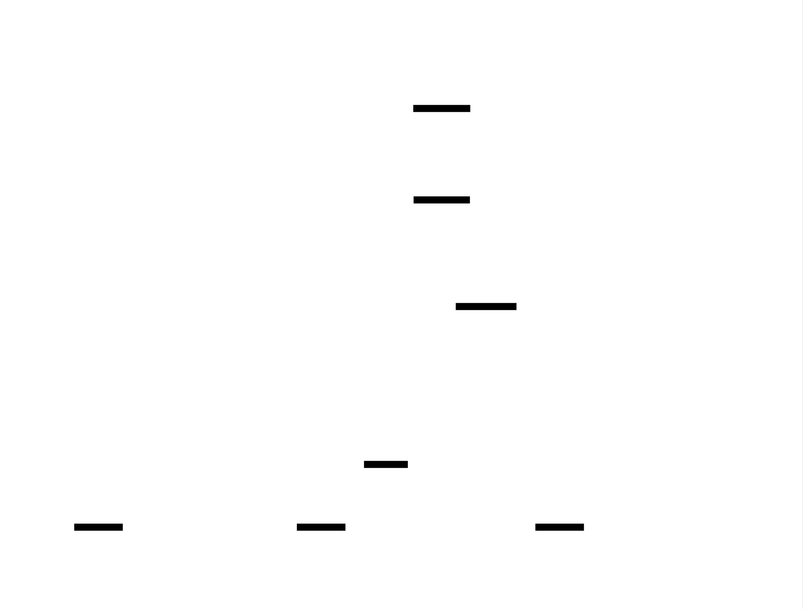
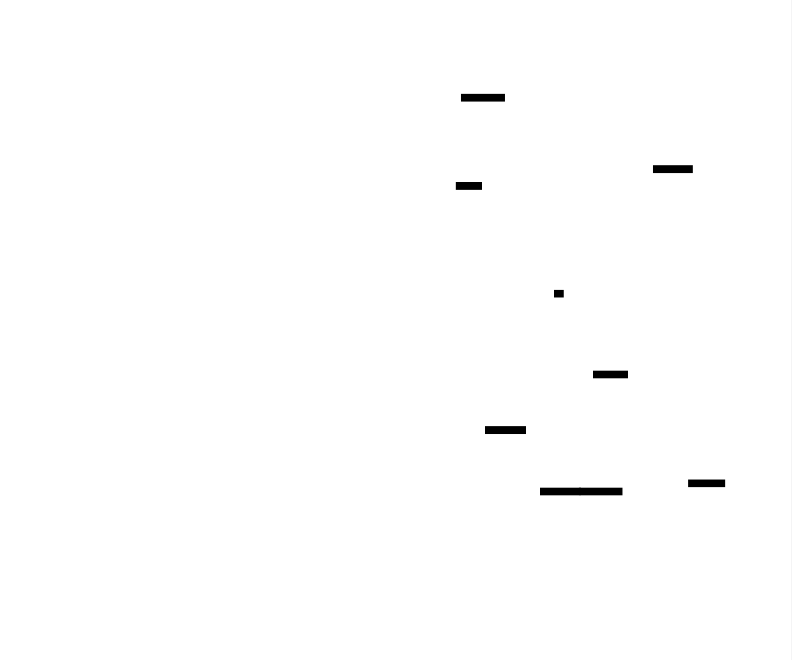

# SIMD Optimization Library

A high-performance SIMD (Single Instruction, Multiple Data) optimization library implementing SSE/AVX intrinsics for critical operations including string search, memory copy, and checksum computation. The library provides portable abstractions over x86 vector extensions with automatic CPU feature detection and runtime dispatching for optimal performance across different processors.


<div id="ms-0"></div>

# Foundation & CPU Detection: The Negotiator

## 1. The Epiphany: The Smart Universal Charger
Imagine you are designing a "Universal Power Charger" for electronics.
*   If you plug in a modern laptop, the charger detects it and pumps **100 Watts** for rapid charging.
*   If you plug in a 10-year-old flip phone, the charger detects it and gently sends **5 Watts**.

If you force 100 Watts (Advanced Vector Instructions) into the flip phone (an older CPU), you don't just get slow charging—you fry the device (the program crashes with an "Illegal Instruction").

**This is your Foundation Layer.** Before we process a single byte of data, we must negotiate with the hardware. We ask the CPU: *"Who are you, and how much power can you handle?"*

## 2. Technical Rationale
Modern x86 processors are a family. While they all speak the same basic language (x86-64), newer generations have "superpowers" called **SIMD (Single Instruction, Multiple Data)** extensions.

*   **Scalar (The Old Way):** Processing data one piece at a time. Safe, runs everywhere, but slow.
*   **SIMD (The New Way):** Processing 16, 32, or 64 bytes at once. Extremely fast, but requires specific hardware support (SSE, AVX, AVX-512).

We cannot ship different binaries for different computers. Instead, we build a **Fat Binary**—a single program containing multiple versions of the same algorithm. The Foundation Layer decides which version to run at the exact moment the program starts.

> **Quick Breakdown: ISA (Instruction Set Architecture)**
> Think of the ISA as the vocabulary of the CPU.
> *   **x86-64:** The basic grammar (English).
> *   **SSE4.2:** A vocabulary expansion for string processing (Legal English).
> *   **AVX2:** A vocabulary expansion for massive math operations (Scientific English).
> If you speak "Scientific English" to a toddler (older CPU), they won't understand.

## 3. Internal Mechanics: The CPUID Instruction
How do we ask the CPU what it supports? We use the `CPUID` instruction.

When you execute `CPUID`, the processor pauses and fills four specific **Registers** (EAX, EBX, ECX, EDX) with a bitmap of its capabilities.

> **Quick Breakdown: Registers & Bits**
> *   **Register:** A tiny, ultra-fast storage slot directly inside the CPU brain.
> *   **Bitmap:** Imagine a row of 32 light switches. Switch #5 might mean "I support AVX2." Switch #28 might mean "I support Hyperthreading." We read the switches to know the features.

### The Protocol
1.  **Leaf Selection:** We put a number into the `EAX` register (the "Leaf") to tell the CPU what *category* of info we want.
    *   `EAX = 1`: Standard Features (SSE, SSE2).
    *   `EAX = 7`: Extended Features (AVX2, AVX-512).
2.  **Execution:** We run the `cpuid` command.
3.  **Reading:** We look at the output registers (ECX, EBX, etc.) and check if specific bits are set to `1`.




*This satellite view shows how our Detection Layer sits at the top, directing traffic to either the Scalar (slow/safe) or SIMD (fast/risky) implementations.*

---

## 4. The Microscope Effect: Parsing the Bits
Let's zoom into the actual bitwise operation. To detect **AVX2**, we can't just look for "AVX2". We have to verify a chain of dependencies.

**The Dependency Chain:**
1.  Does the CPU support `CPUID`? (Yes, unless it's from the 90s).
2.  **Leaf 1, ECX Register, Bit 28 (AVX):** Does it have the basic AVX unit?
3.  **OS Support (XGETBV):** The hardware might support AVX, but does the Operating System? The OS needs to save/restore the larger YMM registers during context switches. If we skip this check, the program will crash on context switch.
4.  **Leaf 7, EBX Register, Bit 5 (AVX2):** Finally, does it support the AVX2 instruction set?


*A microscopic view of the CPUID enumeration. Notice how we target specific bits within the 32-bit registers.*

## 5. The Debugging Lab
When implementing CPU detection, here is where things break:

### A. The "Illegal Instruction" (SIGILL) Crash
*   **Symptom:** Your program crashes instantly with code `0xC000001D` (Windows) or `SIGILL` (Linux).
*   **Cause:** You successfully detected AVX2, but you compiled your code *without* the `-mavx2` flag (or equivalent). The compiler generated scalar code, but you tried to inline raw assembly or intrinsics that the compiler didn't know how to encode properly.
*   **Fix:** Ensure your build system (CMake/Make) isolates SIMD code into separate translation units with the correct flags, or uses specific function attributes.

### B. The "It works on my machine" Error
*   **Symptom:** It runs fine on your dev box but crashes on the CI/CD server.
*   **Cause:** You hardcoded checks or relied on `__builtin_cpu_supports` (GCC specific) without fallback logic.
*   **Fix:** Always write a "Scalar Fallback" path—plain C++ code that does the same job, just slower.

### C. The OS Trap
*   **Symptom:** Random crashes during heavy load.
*   **Cause:** You checked the CPU hardware bit for AVX but forgot to check `XGETBV` (OS support). The OS didn't save your vector registers when switching threads, corrupting your data.
*   **Fix:** Always verify `OSXSAVE` bit before checking AVX features.




*The correct flow: Check CPUID → Check OS Support → Initialize Function Pointers.*

## 6. Code Scaffold
Your task is to build the `CpuId` class. This is a singleton that runs once at startup.

**Requirements:**
1.  Use `__cpuid` (MSVC) or `__cpuid_count` (GCC/Clang) intrinsics.
2.  Implement methods to check for SSE4.2 and AVX2.
3.  Implement the OS support check (`_xgetbv`).

```cpp
#include <cstdint>
#include <iostream>
#include <vector>
#include <string>

// Platform specific includes for intrinsics
#ifdef _MSC_VER
#include <intrin.h>
#else
#include <cpuid.h>
#include <x86intrin.h>
#endif

class CpuFeatureDetector {
public:
    // The "Map" of our hardware
    struct Features {
        bool has_sse2 = false;
        bool has_sse42 = false;
        bool has_avx = false;
        bool has_avx2 = false;
        bool os_saves_ymm = false; // Critical for AVX/AVX2 usage
    };

    CpuFeatureDetector() {
        detect_features();
    }

    const Features& get_features() const {
        return features_;
    }

    void print_status() const {
        std::cout << "CPU Detection Report:\n";
        std::cout << "  SSE2: " << (features_.has_sse2 ? "YES" : "NO") << "\n";
        std::cout << "  SSE4.2: " << (features_.has_sse42 ? "YES" : "NO") << "\n";
        std::cout << "  OS YMM Save: " << (features_.os_saves_ymm ? "YES" : "NO") << "\n";
        std::cout << "  AVX2: " << (features_.has_avx2 ? "YES" : "NO") << "\n";
    }

private:
    Features features_;

    void detect_features() {
        // Registers storage: EAX, EBX, ECX, EDX
        int info[4];

        // 1. Check Standard Features (Leaf 1)
        cpuid(info, 1);
        
        // Bit 26 of EDX is SSE2
        features_.has_sse2 = (info[3] & (1 << 26)) != 0;
        
        // Bit 20 of ECX is SSE4.2
        features_.has_sse42 = (info[2] & (1 << 20)) != 0;
        
        // Bit 28 of ECX is AVX
        features_.has_avx = (info[2] & (1 << 28)) != 0;

        // 2. Check OS Support for AVX (OSXSAVE)
        // Bit 27 of ECX in Leaf 1
        bool has_osxsave = (info[2] & (1 << 27)) != 0;

        if (has_osxsave && features_.has_avx) {
            // Check if XCR0 (Extended Control Register) saves YMM registers
            // We read XCR0 using _xgetbv(0)
            unsigned long long xcr0 = _xgetbv(0);
            
            // Check if bit 1 (XMM state) and bit 2 (YMM state) are set
            features_.os_saves_ymm = (xcr0 & 0x6) == 0x6;
        }

        // 3. Check Extended Features (Leaf 7) if AVX is supported by OS
        if (features_.os_saves_ymm) {
            cpuid(info, 7);
            // Bit 5 of EBX is AVX2
            features_.has_avx2 = (info[1] & (1 << 5)) != 0;
        }
    }

    // Portable wrapper for CPUID instruction
    void cpuid(int info[4], int leaf) {
#ifdef _MSC_VER
        __cpuid(info, leaf);
#else
        // GCC/Clang specific: leaf, subleaf (0 for now)
        __cpuid_count(leaf, 0, info[0], info[1], info[2], info[3]);
#endif
    }
};

// --- Usage Example ---
int main() {
    CpuFeatureDetector detector;
    detector.print_status();

    if (detector.get_features().has_avx2) {
        std::cout << ">> Selecting AVX2 Optimized Path (The Jet Plane)\n";
    } else {
        std::cout << ">> Selecting Scalar Fallback Path (The Propeller Plane)\n";
    }

    return 0;
}
```

[↑ Back to System Map](#satellite-map)


<div id="ms-1"></div>

# SSE2 & SSE4.2: The Assembly Line

## 1. The Epiphany: The Bucket Brigade vs. The Forklift
Imagine a warehouse (Memory) full of boxes (Bytes). You need to find a specific red box (a character) or move a pile of boxes to a new truck (Copy).

*   **The Scalar Way (C++ `char*`)**: You are a single worker. You pick up **one box**, look at it, put it down. Pick up the next box. It takes 16 trips to check 16 boxes.
*   **The SIMD Way (SSE2)**: You drive a forklift. You scoop up a pallet of **16 boxes** at once. You look at the whole pallet instantly. If the red box isn't there, you dump the whole pallet and grab the next 16.

**SIMD** stands for **Single Instruction, Multiple Data**. One command from the CPU acts on 16 bytes of data simultaneously. This isn't just twice as fast; it's often 10-20x faster because we eliminate the overhead of the loop logic for every single byte.

## 2. Technical Rationale
Standard C++ `strlen` or `memcpy` are often optimized, but generic compilers must be conservative. By writing manual intrinsics, we unlock raw performance for our specific data patterns.

*   **SSE2 (Streaming SIMD Extensions 2)**: The baseline. Every x86-64 CPU supports this. It gives us **128-bit registers (XMM)** holding 16 bytes.
*   **SSE4.2**: The "String Specialist". It adds specific instructions (like `PCMPISTRI`) designed explicitly to handle C-style null-terminated strings, which are notoriously hard to vectorize because you don't know the length ahead of time.

## 3. Internal Mechanics: The 128-bit Engine

To write this code, we bypass standard C++ variables and speak directly to the **XMM Registers**.

### The Data Type: `__m128i`
This is a "Black Box" type. It represents 128 bits (16 bytes) in a vector register. You cannot access `variable[0]` directly; you must use **Intrinsics** (functions starting with `_mm_`) to manipulate it.

### The Operation: Parallel Comparison
Let's look at `strlen` (finding the null terminator `\0`).

1.  **Load**: `_mm_loadu_si128` pulls 16 bytes from memory into a register.
2.  **Compare**: `_mm_cmpeq_epi8` compares our 16 bytes against a register of all zeros.
    *   *Scalar*: Returns `true`/`false`.
    *   *SIMD*: Returns **0xFF** (all 1s) for a match, or **0x00** for no match, *for every byte position*.
3.  **Squash**: `_mm_movemask_epi8` takes the most significant bit of each byte result and compresses them into a standard 16-bit integer (C++ `int`).
    *   If the result is `0`, no nulls were found.
    *   If the result is `0x0008` (binary `0000 0000 0000 1000`), the null is at index 3.


*Visualizing the SSE2 Scan: We load 16 chars, compare them all to 'A' (or \0) in one cycle, and extract a bitmask representing the matches.*

### The Advanced Tool: SSE4.2 `_mm_cmpistri`
For more complex tasks, like "Find the first occurrence of any character from set 'ABC'", SSE2 is tedious. SSE4.2 gives us `PCMPISTRI` (Packed Compare Implicit Length String, Return Index).
*   It automatically handles null termination (stops if it sees a zero).
*   It compares ranges or sets.
*   It returns the index directly.


*Microscope view of SSE4.2. Notice how the hardware handles the loop logic and null checks internally, returning just an index.*

## 4. The Debugging Lab
SIMD programming is like juggling chainsaws. It's powerful, but mistakes are fatal.

### A. The Alignment Trap (Segfaults)
*   **The Crash:** `Segmentation fault` on a load instruction.
*   **The Cause:** You used `_mm_load_si128` (Aligned Load) on a memory address like `0x1003`.
*   **The Fix:** Aligned loads require addresses ending in `0` (divisible by 16). Unless you are 100% sure of your memory allocation, **always use `_mm_loadu_si128`** (Unaligned Load). Modern CPUs handle unaligned loads with almost zero penalty.

### B. The Page Boundary Over-read
*   **The Fear:** "If my string is 3 bytes long, but I load 16 bytes, am I reading garbage?"
*   **The Reality:** Yes, you are reading 13 bytes of garbage.
*   **The Danger:** If those 3 bytes are at the very end of a **Memory Page** (a 4KB chunk managed by the OS), and the *next* page is not allocated to your process, reading into it causes a Segfault.
*   **The Fix:** Safe SIMD implementations align the pointer *down* to the nearest 16-byte boundary and mask off the bytes that precede the string start.

### C. The "Ghost" Bytes
*   **The Bug:** Your `strlen` returns 5, but the string is length 4.
*   **The Cause:** You loaded garbage bytes after the null terminator. One of those garbage bytes happened to be the character you were searching for (e.g., if searching for 'X' and 'X' exists in the unallocated memory after the string).
*   **The Fix:** Logic order matters. In `strlen`, we look for the *first* zero. In `strchr` (find char), we must stop searching if we hit the target char *OR* the null terminator.

## 5. Code Scaffold

We will implement a safe `strlen` using SSE2. This is the "Hello World" of SIMD.

**Your Task:**
1.  Align the pointer to 16 bytes to avoid page boundary crashes.
2.  Load data using `_mm_load_si128`.
3.  Compare against Zero.
4.  If a zero is found, calculate the exact length using `_tzcnt_u32` (Count Trailing Zeros).

```cpp
#include <emmintrin.h> // SSE2
#include <nmmintrin.h> // SSE4.2
#include <cstdint>
#include <cstddef>
#include <immintrin.h>

// Helper to count trailing zeros (compiler abstraction)
inline uint32_t count_trailing_zeros(uint32_t x) {
#ifdef _MSC_VER
    unsigned long result;
    _BitScanForward(&result, x);
    return result;
#else
    return __builtin_ctz(x);
#endif
}

class SimdCore {
public:
    // SSE2 Optimized String Length
    static size_t fast_strlen(const char* str) {
        const char* ptr = str;
        __m128i zero_chunk = _mm_setzero_si128();

        // 1. Handle Unaligned Start
        // We cannot just load 16 bytes if we are at the edge of a page.
        // Strategy: Align pointer DOWN, load, and ignore bytes before 'str'.
        uintptr_t address = reinterpret_cast<uintptr_t>(ptr);
        uintptr_t alignment_offset = address & 15; // address % 16
        
        if (alignment_offset != 0) {
            // Align pointer down to previous 16-byte boundary
            const char* aligned_ptr = ptr - alignment_offset;
            __m128i chunk = _mm_load_si128(reinterpret_cast<const __m128i*>(aligned_ptr));
            
            // Compare with zero
            __m128i cmp = _mm_cmpeq_epi8(chunk, zero_chunk);
            uint32_t mask = _mm_movemask_epi8(cmp);
            
            // Shift mask to ignore the bytes before our actual string start
            mask >>= alignment_offset;

            if (mask != 0) {
                // Found null in the first chunk
                return count_trailing_zeros(mask);
            }
            
            // Move ptr to next aligned boundary
            ptr = aligned_ptr + 16;
        }

        // 2. Main Loop (Aligned 16-byte chunks)
        while (true) {
            __m128i chunk = _mm_load_si128(reinterpret_cast<const __m128i*>(ptr));
            __m128i cmp = _mm_cmpeq_epi8(chunk, zero_chunk);
            uint32_t mask = _mm_movemask_epi8(cmp);

            if (mask != 0) {
                // Found the terminator
                // Add the distance traveled so far + index within this chunk
                return (ptr - str) + count_trailing_zeros(mask);
            }

            ptr += 16;
        }
    }

    // SSE4.2 Optimized Character Search (Bonus)
    // Returns index of first occurrence of 'ch', or -1 if not found.
    static intptr_t fast_strchr(const char* str, char ch) {
#ifdef __SSE4_2__
        // Fill a register with the character we want (e.g., 'A' -> 'AAAAAAAAAAAAAAAA')
        __m128i target = _mm_set1_epi8(ch);
        const char* ptr = str;

        // NOTE: For simplicity, this snippet assumes unaligned load is safe 
        // (not crossing page boundary). Production code needs the alignment fix above.
        while (true) {
            __m128i chunk = _mm_loadu_si128(reinterpret_cast<const __m128i*>(ptr));
            
            // Find 'ch' OR '\0' (end of string)
            // _mm_cmpistri returns the index of the match
            // _SIDD_CMP_EQUAL_EACH: Compare bytes for equality
            // _SIDD_MASKED_NEGATIVE_POLARITY: Invert result? No, we want matches.
            // Actually, for strchr, standard SSE2 manual approach is often faster 
            // than cmpistri due to latency, but cmpistri is great for complex sets.
            
            // Let's stick to the SSE2 manual approach for clarity on the mechanics:
            __m128i zero_chunk = _mm_setzero_si128();
            __m128i match_char = _mm_cmpeq_epi8(chunk, target);
            __m128i match_zero = _mm_cmpeq_epi8(chunk, zero_chunk);
            
            // Combine: We care if we found the Char OR the Zero
            __m128i combined = _mm_or_si128(match_char, match_zero);
            uint32_t mask = _mm_movemask_epi8(combined);

            if (mask != 0) {
                uint32_t idx = count_trailing_zeros(mask);
                // Check if the match was the Char or the Null Terminator
                if (ptr[idx] == ch) {
                    return (ptr - str) + idx;
                } else {
                    return -1; // Found null terminator before char
                }
            }
            ptr += 16;
        }
#else
        // Fallback for non-SSE4.2 systems
        return -1; 
#endif
    }
};
```

[↑ Back to System Map](#satellite-map)


<div id="ms-2"></div>

# AVX & AVX2: The Heavy Machinery

## 1. The Epiphany: The Delivery Truck vs. The Semi-Trailer
In the previous section, we upgraded from a single worker to a **Delivery Truck (SSE)** that could move 16 bytes at once.

Now, we are upgrading to a **Semi-Trailer (AVX/AVX2)**.
*   **Capacity**: It carries **32 bytes** (256 bits) in a single trip.
*   **Efficiency**: It doesn't just carry more; it has a smarter engine. In the old truck (SSE), if you wanted to add Box A to Box B, you had to overwrite Box A. In the Semi-Trailer (AVX), you can take Box A and Box B, add them, and put the result in a *new* Box C, leaving A untouched.

**The Distinction:**
*   **AVX (Advanced Vector Extensions)**: Great for Math (Floating Point). Think scientific calculations.
*   **AVX2**: The expansion that matters for Systems Programming. It brings 256-bit power to **Integers**. Since text, pointers, and network packets are integers, AVX2 is our weapon of choice.

## 2. Technical Rationale
Why bother with AVX2 if SSE is "fast enough"?
1.  **Throughput**: Processing 32 bytes per cycle effectively doubles your memory bandwidth utilization for cached data.
2.  **Non-Destructive Syntax**: AVX introduces 3-operand instructions (`Dest = Src1 + Src2`). SSE was 2-operand (`Dest = Dest + Src`). This allows the compiler (and you) to write code with fewer "register shuffling" instructions, reducing CPU overhead.

## 3. Internal Mechanics: The YMM Registers

To use AVX, we interact with the **YMM Registers**.

*   **Size**: 256 bits (32 Bytes).
*   **Naming**: `YMM0` through `YMM15`.
*   **The Nesting Doll Architecture**: The YMM registers are not new hardware sitting next to the old stuff. They *enclose* the old stuff.
    *   The lower 128 bits of `YMM0` **ARE** `XMM0`.
    *   If you write to `XMM0`, you are modifying the bottom half of `YMM0`.


*Microscopic view showing XMM/YMM register allocation. Notice how YMM extends XMM. Writing to YMM zeroes out the upper bits of the future, while writing to XMM interacts with the lower bits.*

### The Data Type: `__m256i`
Just like `__m128i`, this is a black box.
*   `__m256` = 8 floats (AVX).
*   `__m256i` = 32 chars, or 8 integers, or 4 `long long`s (AVX2).

### The Instruction Set
The intrinsic functions follow a pattern:
*   `_mm256_load_si256`: Load 32 bytes (Must be 32-byte aligned).
*   `_mm256_loadu_si256`: Load 32 bytes (Unaligned - safe for most pointers).
*   `_mm256_add_epi32`: Add integers.

## 4. The Debugging Lab
Upgrading to AVX introduces new categories of bugs.

### A. The "State Transition" Stall (The AVX-SSE Penalty)
*   **The Issue:** The CPU tries to be energy efficient. If you are running old SSE code, it turns off the power to the upper 128 bits of the YMM registers.
*   **The Trap:** If you suddenly execute an AVX instruction, the CPU has to "wake up" the upper half. This costs hundreds of CPU cycles. Worse, if you switch *back* to SSE without cleaning up, the CPU might merge the states inefficiently.
*   **The Fix:** If you mix SSE and AVX code, use the intrinsic `_mm256_zeroupper()` at the boundary. This tells the CPU "I'm done with the top half, you can power it down."

### B. The 32-Byte Alignment Crash
*   **The Symptom:** Instant Segfault on `_mm256_load_si256`.
*   **The Cause:** SSE required 16-byte alignment (addresses ending in `0`). AVX requires **32-byte alignment** (addresses ending in `00` hex, divisible by 32). `malloc` in C++ does not guarantee 32-byte alignment.
*   **The Fix:** Use `aligned_alloc` (C++17) or `_mm_malloc`, or stick to `_mm256_loadu_si256` (unaligned load) which is very fast on modern CPUs.


*Microscopic view of an aligned AVX copy loop. Notice the strict 32-byte blocks. If the memory address starts at offset 0x08, the aligned load will crash.*

## 5. Code Scaffold

Your task is to implement a **High-Performance Buffer XOR**. This is a common operation in cryptography and checksumming. We will take two arrays of data, XOR them together, and store the result, processing 32 bytes at a time.

**Requirements:**
1.  Check for AVX2 support (using your previous detection class).
2.  Process the "Bulk" using AVX2 intrinsics.
3.  Process the "Tail" (leftover bytes < 32) using a standard loop.

```cpp
#include <immintrin.h>
#include <cstdint>
#include <iostream>

class VectorMath {
public:
    // Computes: dest[i] = src1[i] ^ src2[i]
    // Optimized with AVX2
    static void xor_buffers(uint8_t* dest, const uint8_t* src1, const uint8_t* src2, size_t len) {
        size_t i = 0;

        // 1. The AVX2 Fast Path
        // We can process 32 bytes (256 bits) per iteration.
        // We stop when we have fewer than 32 bytes left.
        size_t avx_limit = len - (len % 32);

        // Quick Breakdown:
        // _mm256_loadu_si256: Load 32 bytes from memory (Unaligned is safe).
        // _mm256_xor_si256:   Perform bitwise XOR on all 256 bits at once.
        // _mm256_storeu_si256: Store result back to memory.
        
        for (; i < avx_limit; i += 32) {
            // Load 32 bytes from Source 1
            __m256i v1 = _mm256_loadu_si256(reinterpret_cast<const __m256i*>(src1 + i));
            
            // Load 32 bytes from Source 2
            __m256i v2 = _mm256_loadu_si256(reinterpret_cast<const __m256i*>(src2 + i));
            
            // The operation: Dest = Src1 XOR Src2
            __m256i result = _mm256_xor_si256(v1, v2);
            
            // Store the result
            _mm256_storeu_si256(reinterpret_cast<__m256i*>(dest + i), result);
        }

        // 2. The Cleanup Transition
        // Good practice when leaving AVX code if we might jump to legacy SSE code elsewhere.
        // Clears the upper 128 bits of YMM registers.
        _mm256_zeroupper();

        // 3. The Scalar Tail (Cleanup)
        // Handle the remaining 0 to 31 bytes one by one.
        for (; i < len; ++i) {
            dest[i] = src1[i] ^ src2[i];
        }
    }
};

// --- Test Harness ---
int main() {
    const size_t SIZE = 100;
    uint8_t buffer_a[SIZE];
    uint8_t buffer_b[SIZE];
    uint8_t result[SIZE];

    // Initialize with dummy data
    for (int i = 0; i < SIZE; ++i) {
        buffer_a[i] = i;
        buffer_b[i] = 0xFF; // Invert mask
    }

    std::cout << ">> Running AVX2 XOR Operation...\n";
    VectorMath::xor_buffers(result, buffer_a, buffer_b, SIZE);

    std::cout << ">> Verify Index 0: " << (int)buffer_a[0] << " ^ " << (int)buffer_b[0] 
              << " = " << (int)result[0] << "\n";
    
    std::cout << ">> Verify Index 35 (Tail): " << (int)buffer_a[35] << " ^ " << (int)buffer_b[35] 
              << " = " << (int)result[35] << "\n";

    return 0;
}
```

[↑ Back to System Map](#satellite-map)


<div id="ms-3"></div>

# String Search Primitives: The Needle in the Haystack

## 1. The Epiphany: The Stencil vs. The Magnifying Glass

Imagine you are looking for specific letters—say, all the vowels—in a page of text.

*   **The Scalar Way (The Magnifying Glass):** You move your magnifying glass over the first letter. Is it an 'A'? No. Is it an 'E'? No. Is it an 'I'? No. Move to the next letter. Repeat.
*   **The SIMD Way (The Stencil):** You take a plastic stencil that has holes cut out for A, E, I, O, and U. You slap this stencil over a whole sentence at once. Instantly, you see exactly where the vowels are through the holes.

In this section, we aren't just comparing byte-for-byte. We are using **SSE4.2**, an instruction set that essentially adds a programmable "Search Engine" directly into the CPU silicon.

## 2. Technical Rationale: The "Swiss Army Knife" Instruction
Standard SIMD (SSE2) is great for "Are these 16 bytes equal to those 16 bytes?"

But string searching is messier.
1.  We might look for *any* character from a set (e.g., "Find the first whitespace or comma").
2.  We might look for a range (e.g., "Find the first number 0-9").
3.  We might look for a substring (e.g., "Find 'HTTP'").
4.  We have to stop if we hit a Null Terminator (`\0`).

Doing this with basic math instructions is a nightmare of bit-twiddling. Enter **SSE4.2** and the instruction `PCMPISTRI` (Packed Compare Implicit Length String, Return Index). It is the most complex instruction in the x86 non-crypto instruction set.

## 3. Internal Mechanics: The Programmable Engine

We are going to use the intrinsic `_mm_cmpistri`. This function doesn't just do one thing; it changes its behavior based on a **Control Byte** (a configuration number) you pass to it.

### The Inputs
1.  **Needle (`__m128i`)**: The characters you are looking for (up to 16).
2.  **Haystack (`__m128i`)**: The chunk of text you are searching through (16 bytes).
3.  **Control Byte (`const int`)**: The mode selector.

### The Modes (The Control Byte)
The Control Byte tells the CPU how to compare the Needle and the Haystack.

*   **Equal Any (`_SIDD_CMP_EQUAL_ANY`)**: "Is the character at `Haystack[i]` present *anywhere* in `Needle`?"
    *   *Use Case:* `strpbrk` (Find first of set). Good for finding delimiters.
*   **Equal Each (`_SIDD_CMP_EQUAL_EACH`)**: "Does `Haystack` match `Needle` perfectly?"
    *   *Use Case:* `strcmp` (String equality).
*   **Ranges (`_SIDD_CMP_RANGES`)**: "Is `Haystack[i]` inside the range defined by `Needle`?"
    *   *Use Case:* Finding all digits (Needle = '0', '9').
*   **Equal Ordered (`_SIDD_CMP_EQUAL_ORDERED`)**: "Does the substring `Needle` start at `Haystack[i]`?"
    *   *Use Case:* `strstr` (Substring search).

### The Output
The instruction returns the **Index** (0-15) of the first match. If no match is found, it usually returns 16.


*Microscopic view of SSE4.2 PCMPISTRI. The CPU loads the needle and haystack, applies the logic defined by the Control Byte (Mode), handles the null-check automatically, and spits out the index of the winner.*


*Visualizing "Equal Any" mode. We load the delimiter set (spaces, commas) into the Needle register. The CPU checks all 16 Haystack bytes against the entire Needle set simultaneously.*

## 4. The Debugging Lab

### A. The Latency Trap
*   **The Myth:** "One SIMD instruction is always faster than 5 scalar instructions."
*   **The Reality:** `PCMPISTRI` is a heavy instruction. It takes ~11 CPU cycles to execute. A simple scalar `CMP` takes < 1 cycle.
*   **The Lesson:** If you are only looking for **one** character (e.g., just 'A'), don't use this heavy machinery. Use the simpler SSE2 `_mm_cmpeq_epi8` method from the previous section. Use `PCMPISTRI` when the logic is complex (sets, ranges, substrings).

### B. The "Implicit" vs "Explicit" Length
*   **The Confusion:** There are two versions: `_mm_cmpistri` (Implicit) and `_mm_cmpestri` (Explicit).
*   **Implicit (`i`)**: Scans for the Null Terminator (`\0`) automatically. Use this for C-style strings (`char*`).
*   **Explicit (`e`)**: You must tell it the length of the string. Use this for `std::string_view` or known buffers.
*   **The Bug:** Using Implicit mode on a buffer that *isn't* a null-terminated string. The CPU might stop searching prematurely if it hits a random `0` byte in your binary data.

## 5. Code Scaffold

We will implement a **Delimiter Finder**. This function scans a string and returns the index of the first occurrence of *any* character in a "Needle" set (e.g., find the first space, comma, or period).

**Your Task:**
1.  Load the "Set" of characters (Needle) into a register.
2.  Loop through the string 16 bytes at a time.
3.  Use `_mm_cmpistri` with `_SIDD_CMP_EQUAL_ANY` mode.
4.  Handle the return index.

```cpp
#include <nmmintrin.h> // SSE4.2
#include <immintrin.h>
#include <cstdint>
#include <iostream>

class StringScanner {
public:
    // Finds the first occurrence of ANY character in 'accept_set' within 'str'.
    // Equivalent to C's strpbrk, but returns an index.
    static intptr_t find_first_of(const char* str, const char* accept_set) {
        if (!str || !accept_set) return -1;

        // 1. Prepare the Needle (The Set)
        // We load the accept_set into a register. 
        // NOTE: For this scaffold, we assume accept_set is short (< 16 chars).
        // In production, if the set is > 16, you'd need a different strategy (Lookup Table).
        __m128i needle = _mm_loadu_si128(reinterpret_cast<const __m128i*>(accept_set));
        
        const char* ptr = str;

        // 2. The Loop
        while (true) {
            // Load 16 bytes of the Haystack (Unsafe load - see previous section for alignment fixes)
            __m128i chunk = _mm_loadu_si128(reinterpret_cast<const __m128i*>(ptr));

            // 3. The Heavy Machinery: _mm_cmpistri
            // _SIDD_UBYTE_OPS: We are comparing Bytes (Chars)
            // _SIDD_CMP_EQUAL_ANY: Match if Haystack[i] equals ANY char in Needle
            // _SIDD_LEAST_SIGNIFICANT: Return the smallest index found
            const int mode = _SIDD_UBYTE_OPS | _SIDD_CMP_EQUAL_ANY | _SIDD_LEAST_SIGNIFICANT;
            
            int idx = _mm_cmpistri(needle, chunk, mode);

            // 4. Check for Termination
            // The instruction sets flags. We can check the "Zero Flag" (ZF) and "Carry Flag" (CF).
            // However, the intrinsic returns the index directly.
            
            // Case A: Found a match?
            if (idx < 16) {
                // Wait! Did we find a match, or did we hit the end of the string (Null Terminator)?
                // In Implicit mode, if the string ends, the index points to the null.
                // We need to verify if the char at idx is actually in our set.
                
                // For simplicity in this scaffold, let's trust the index but double-check manually
                // to distinguish between "Found Terminator" and "Found Match".
                if (ptr[idx] == '\0') {
                    return -1; // End of string, nothing found
                }
                
                return (ptr - str) + idx; // Found it!
            }

            // Case B: No match in this chunk.
            // But did the string end in this chunk?
            // _mm_cmpistri handles nulls. If a null was found but no match, 
            // the index would be the position of the null (which is < 16).
            // If idx == 16, it means "Processed all 16 bytes, valid data, no match".
            if (idx == 16) {
                // Check if we hit the null terminator implicitly.
                // The intrinsic sets the Zero Flag (ZF) if the null terminator was seen in needle,
                // and Carry Flag (CF) if null terminator seen in haystack.
                // Accessing flags from C++ is tricky without assembly. 
                // Easier check:
                __m128i zero = _mm_setzero_si128();
                int null_idx = _mm_cmpistri(zero, chunk, _SIDD_UBYTE_OPS | _SIDD_CMP_EQUAL_EACH);
                
                if (null_idx < 16) {
                    return -1; // String ended in this block, no match found earlier.
                }
            }

            ptr += 16;
        }
    }
};

// --- Test Harness ---
int main() {
    const char* text = "Hello, world! This is SIMD.";
    const char* delimiters = "!."; // Looking for punctuation

    std::cout << ">> Text: " << text << "\n";
    std::cout << ">> Looking for: [" << delimiters << "]\n";

    intptr_t index = StringScanner::find_first_of(text, delimiters);

    if (index != -1) {
        std::cout << ">> Found delimiter '" << text[index] << "' at index " << index << "\n";
    } else {
        std::cout << ">> No delimiters found.\n";
    }

    return 0;
}
```

[↑ Back to System Map](#satellite-map)


<div id="ms-4"></div>

# Memory Copy Engine: Moving Mountains with Tweezers vs. Dump Trucks

## 1. The Epiphany: The Logistics Manager
Imagine you are a logistics manager responsible for moving items from Warehouse A to Warehouse B. You have three vehicles: a bicycle courier, a moving van, and a freight train.

*   **The Scalar Loop (The Bicycle):** If you need to move a single letter, you give it to the cyclist. It’s fast to start, agile, and finishes immediately.
*   **The SIMD Loop (The Moving Van):** If you need to move the contents of a studio apartment, the bicycle is useless. You load up the van (128/256 bits at a time). It takes a moment to park and open the doors (overhead), but it moves volume fast.
*   **The Non-Temporal Store (The Freight Train):** If you are moving a whole factory, even the van is too slow. You load a train. Crucially, the train bypasses the local city traffic (CPU Cache) entirely so it doesn't cause a gridlock for everyone else.

A naive `memcpy` uses the bicycle for everything. A system programmer builds a dispatcher that checks the weight of the cargo and selects the perfect vehicle.

## 2. Technical Rationale
Why can't we just use `std::memcpy`? usually, you can! But understanding *how* it works allows you to write specialized copy routines for high-performance structures (like ring buffers or network packets) where the overhead of the standard library function call might be too high, or you need specific behavior (like bypassing cache).

1.  **Branch Prediction Overhead:** For tiny copies (e.g., 8 bytes), the cost of the CPU deciding *which* loop to run is higher than the copy itself.
2.  **Alignment Penalties:** Writing 32 bytes to an address ending in `0x01` is slower than writing to `0x00`.
3.  **Cache Pollution:** Copying 1GB of data typically wipes out your L1/L2/L3 caches. The moment the copy finishes, your CPU stalls because the code instructions it needs were evicted to make room for the data you just copied.

## 3. Internal Mechanics: The Decision Tree

High-performance memory copying is a game of thresholds.

### Tier 1: The Tiny Path (< 16 Bytes)
**Mechanism:** General Purpose Registers (GPR).
We don't touch SSE/AVX here. We treat the data as `uint64_t` or `uint8_t`.
*   **Method:** A "Jump Table" or unrolled switch.
*   **Why:** Setting up AVX registers takes cycles. Loading a standard 64-bit integer into a standard register (`RAX`) is instantaneous.

### Tier 2: The SIMD Path (16 Bytes to ~4KB)
**Mechanism:** `XMM` (128-bit) or `YMM` (256-bit) Registers.
This is the "Moving Van."
*   **The Loop:** Load 32 bytes $\to$ Store 32 bytes.
*   **Prefetching:** We might tell the CPU "Hey, I'm going to need the next cache line soon," so it fetches memory from RAM to L1 cache while we process the current chunk.


*The Strategic Map. The code branches based on size. Note how the strategies shift from GPR (General Purpose Registers) to XMM/YMM, and finally to Non-Temporal strategies.*

### Tier 3: The Huge Path (> 4KB / Cache Size)
**Mechanism:** Non-Temporal Stores (`MOVNT`).
When data is larger than the CPU cache, bringing it *into* the cache is wasteful because we will overwrite it before we read it again.
*   **The Bypass:** We use intrinsics like `_mm256_stream_si256`. This writes data **directly to RAM**, skipping the cache hierarchy.

{{DIAGRAM:diag-014}}
*Microscopic view of the "Freight Train." Standard stores go through L1 -> L2 -> L3 -> RAM. Non-temporal stores (Streaming Stores) bypass the cache, preventing "cache pollution."*

## 4. The Debugging Lab

### A. The Overlap Catastrophe (`memcpy` vs `memmove`)
*   **The Scenario:** You want to shift an array to the right by 1 byte. `src` is index 0, `dest` is index 1.
*   **The Bug:** `memcpy` is designed for *disjoint* memory. If you copy byte 0 to byte 1, you might overwrite the original byte 1 before you have a chance to copy it.
*   **The Fix:** Always ask: "Can these pointers overlap?" If yes, copy **backwards** (tail to head) or use `memmove`.

### B. The Unaligned Crash
*   **The Scenario:** You cast a `char*` to `__m256i*` to use AVX load instructions.
*   **The Bug:** If the pointer address isn't divisible by 32, `_mm256_load_si256` will Segfault.
*   **The Fix:** Use `_mm256_loadu_si256` (the 'u' stands for Unaligned). Modern Intel/AMD CPUs handle unaligned loads with almost zero penalty.


*Handling alignment. Notice how we might handle the "Head" (the few bytes before the first 32-byte boundary) using scalar code, then blast through the "Body" with AVX, and finish the "Tail" with scalar.*

## 5. Code Scaffold

We will build a **Smart Copy Engine** that implements a simplified version of the Tier 1 and Tier 2 strategies.

**Your Task:**
1.  Handle tiny copies with a switch statement (fastest dispatch).
2.  Handle medium copies with an AVX2 loop.
3.  Handle the "Tail" (leftover bytes) gracefully.

```cpp
#include <immintrin.h>
#include <cstdint>
#include <cstring>
#include <iostream>

class MemoryEngine {
public:
    static void smart_copy(void* dest, const void* src, size_t count) {
        uint8_t* d = static_cast<uint8_t*>(dest);
        const uint8_t* s = static_cast<const uint8_t*>(src);

        // --- TIER 1: The Tiny Path (< 32 Bytes) ---
        // Quick Breakdown:
        // We avoid the overhead of setting up vector loops.
        // We treat small copies as simple integer assignments.
        if (count < 32) {
            if (count >= 16) {
                // Copy 16 bytes, then copy the LAST 16 bytes.
                // It's okay if they overlap! It's safer/faster than a loop.
                __m128i head = _mm_loadu_si128(reinterpret_cast<const __m128i*>(s));
                __m128i tail = _mm_loadu_si128(reinterpret_cast<const __m128i*>(s + count - 16));
                _mm_storeu_si128(reinterpret_cast<__m128i*>(d), head);
                _mm_storeu_si128(reinterpret_cast<__m128i*>(d + count - 16), tail);
                return;
            }
            // Fallback for very small strings
            while (count--) *d++ = *s++;
            return;
        }

        // --- TIER 2: The AVX Path (>= 32 Bytes) ---
        
        size_t i = 0;
        size_t avx_limit = count - (count % 32);

        // 1. Bulk Copy (The Moving Van)
        // Process 32 bytes per cycle.
        for (; i < avx_limit; i += 32) {
            // Load 256 bits (Unsafe/Unaligned load)
            __m256i chunk = _mm256_loadu_si256(reinterpret_cast<const __m256i*>(s + i));
            
            // Store 256 bits
            // In a 'Huge' tier (> 1MB), we would use _mm256_stream_si256 here
            _mm256_storeu_si256(reinterpret_cast<__m256i*>(d + i), chunk);
        }

        // 2. Transition Cleanup
        // Standard practice when mixing AVX with potentially legacy code later
        _mm256_zeroupper();

        // 3. The Tail
        // We have 0 to 31 bytes left. 
        // We could loop byte-by-byte, but there's a trick:
        // Just copy the LAST 32 bytes of the source to the LAST 32 bytes of dest.
        // It overlaps with what we just wrote, but who cares? It's correct data.
        if (i < count) {
            size_t offset = count - 32;
            __m256i tail_chunk = _mm256_loadu_si256(reinterpret_cast<const __m256i*>(s + offset));
            _mm256_storeu_si256(reinterpret_cast<__m256i*>(d + offset), tail_chunk);
            _mm256_zeroupper();
        }
    }
};

// --- Test Harness ---
int main() {
    const size_t SIZE = 1024;
    char source[SIZE];
    char destination[SIZE];

    // Setup Data
    for (int i = 0; i < SIZE; ++i) source[i] = (char)(i % 255);
    std::memset(destination, 0, SIZE);

    std::cout << ">> Running Smart Copy...\n";
    MemoryEngine::smart_copy(destination, source, SIZE);

    // Verify
    bool match = true;
    for (int i = 0; i < SIZE; ++i) {
        if (source[i] != destination[i]) {
            match = false;
            std::cout << "Mismatch at index " << i << "\n";
            break;
        }
    }

    if (match) std::cout << ">> Success: 1024 bytes copied perfectly.\n";
    return 0;
}
```

[↑ Back to System Map](#satellite-map)


<div id="ms-5"></div>

# Checksum Core: The Digital Fingerprint Factory

## 1. The Epiphany: The Origami Master
Imagine you have a strip of paper 10 miles long (a large file), and you need to verify that not a single fiber of that paper has been torn or stained.

*   **The Scalar Approach:** You walk down the 10-mile strip, examining one inch at a time, keeping a running tally in your head. It takes forever.
*   **The SIMD Approach (Folding):** You don't walk. You grab the strip at the 1-mile mark, the 2-mile mark, and the 3-mile mark. You fold the paper over onto itself. You crunch 128 inches of paper into a single layer simultaneously. You keep folding this massive strip until it fits into a tiny square in your pocket.

That tiny square is your **Checksum**. If even one inch of the 10-mile strip was different, the folds wouldn't line up, and your final square would look different.

## 2. Technical Rationale
Why do we need complex instructions for a simple sum?
1.  **Data Integrity:** Network packets and SSDs rely on CRC (Cyclic Redundancy Check) to ensure data wasn't corrupted in transit.
2.  **The "Carry" Problem:** Normal math handles "carries" (e.g., $15 + 15 = 30$). CRC math acts like a zipper—it doesn't want carries; it wants XORs. Standard CPU multiplication is useless here because it propagates carries.
3.  **The Solution:** Intel introduced **PCLMULQDQ** (Carry-Less Multiplication Quadword). It allows the CPU to perform the complex polynomial math required for CRCs on 128 bits at a time, effectively "folding" memory blocks at RAM speeds.

## 3. Internal Mechanics: The Fold and The Crush

We are building a pipeline that ingests data and reduces it.

### Phase 1: The Selector
First, we check what tools we have. Do we have the specialized hardware (PCLMULQDQ) or do we use a fast general-purpose hash (like xxHash)?


*The Dispatcher. The system checks CPUID features. If PCLMULQDQ is present, it routes to the hardware CRC path. Otherwise, it falls back to scalar lookup tables.*

### Phase 2: The Fold (PCLMULQDQ)
**Quick Breakdown:** `_mm_clmulepi64_si128`
*   **Carry-Less:** Think of this as "XOR Multiplication." It multiplies numbers but drops the "carry" bit logic used in standard arithmetic. This is exactly how binary polynomials behave in Galois Fields (GF(2)).
*   **Folding:** We load 128 bits. We multiply the top half by a magic constant (the polynomial) and XOR the result with the next block of data. This "folds" the old data into the new data.

{{DIAGRAM:diag-016}}
*Microscopic view of CRC32C. Notice the "Barrett Reduction." We don't just sum numbers; we continuously multiply and XOR to keep the "Remainder" within the bounds of the 32-bit register.*

### Phase 3: The Horizontal Sum (The Crush)
Once we have processed the whole file, we often end up with a 128-bit vector (`__m128i`) containing partial sums in different "lanes." We need to crush this down to a single integer.
*   **Horizontal Add (`PHADD`):** Adds adjacent elements within the *same* register.
*   **Extraction:** Finally, we move the bottom 32/64 bits from the vector register to a general-purpose register (`RAX`) to return the result.

{{DIAGRAM:diag-018}}
*Visualizing the Horizontal Reduction. We start with 4 separate sums in one register. We shuffle and add them until a single scalar value remains.*

## 4. The Debugging Lab

### A. The "Reflected" Nightmare
*   **The Myth:** "Bits are bits. $1$ is $1$."
*   **The Reality:** CRC algorithms often process bits "backwards" (Least Significant Bit first).
*   **The Bug:** You implement the math perfectly, but your checksum doesn't match the standard implementation (like `gzip` or `ethernet`).
*   **The Fix:** You might need to reverse the bits of your input bytes or your final result. This is called "Reflection."

### B. The Buffer Over-read
*   **The Scenario:** You are folding 128 bits (16 bytes) at a time. Your file is 20 bytes long.
*   **The Bug:** You process the first 16 bytes. You try to load the next 16 bytes, but only 4 bytes remain valid. You segfault or read garbage memory.
*   **The Fix:** Similiar to `memcpy`, you must have a "cleanup" loop. Process the bulk with SIMD, then switch to a byte-by-byte scalar loop for the last few bytes.

## 5. Code Scaffold

We will implement a **Horizontal XOR Reduction**. This is the simplest form of a checksum (Parity Check). It demonstrates how to "crush" a 128-bit vector into a single integer.

**Your Task:**
1.  Load data into a vector.
2.  Use `_mm_xor_si128` to combine data (The simplified "Fold").
3.  Implement the "Horizontal Reduction" to get the final scalar.

```cpp
#include <immintrin.h>
#include <cstdint>
#include <iostream>
#include <vector>
#include <numeric>

class ParityChecksum {
public:
    // Calculates a 32-bit XOR checksum of a large buffer.
    // This isn't CRC32, but it teaches the "Fold and Crush" mechanics.
    static uint32_t calculate_xor32(const uint32_t* data, size_t count) {
        // Accumulator: Starts at zero
        __m128i v_acc = _mm_setzero_si128();

        size_t i = 0;
        // 1. The SIMD Loop (Process 4 integers at a time)
        for (; i + 4 <= count; i += 4) {
            // Load 128 bits (4 x 32-bit integers)
            __m128i v_data = _mm_loadu_si128(reinterpret_cast<const __m128i*>(data + i));
            
            // The "Fold": Simple XOR in this case
            v_acc = _mm_xor_si128(v_acc, v_data);
        }

        // At this point, v_acc contains [ A, B, C, D ]
        // We need to calculate A ^ B ^ C ^ D

        // 2. The Horizontal Reduction (The Crush)
        
        // Copy high 64-bits to low 64-bits and XOR
        // v_acc: [ A, B, C, D ]
        // high:  [ -, -, A, B ]
        // res1:  [ ?, ?, A^C, B^D ]
        __m128i v_high = _mm_unpackhi_epi64(v_acc, v_acc);
        v_acc = _mm_xor_si128(v_acc, v_high);

        // Now we have two 32-bit values in the bottom 64 bits: (A^C) and (B^D)
        // We need to XOR those two together.
        
        // Shuffle the second 32-bit integer to the first slot
        // 0b11100101 -> Shuffle control (Standard shuffle trick)
        __m128i v_shuffle = _mm_shuffle_epi32(v_acc, _MM_SHUFFLE(0, 0, 0, 1));
        v_acc = _mm_xor_si128(v_acc, v_shuffle);

        // 3. Extract the Scalar
        uint32_t result = _mm_cvtsi128_si32(v_acc);

        // 4. Handle the Tail (Scalar cleanup)
        for (; i < count; ++i) {
            result ^= data[i];
        }

        return result;
    }
};

// --- Test Harness ---
int main() {
    // Create a vector of numbers: 0, 1, 2... 10
    std::vector<uint32_t> numbers;
    for(int i=0; i<11; i++) numbers.push_back(i);

    // Expected Result: 0^1^2^3...^10
    uint32_t expected = 0;
    for(uint32_t n : numbers) expected ^= n;

    // SIMD Result
    uint32_t calculated = ParityChecksum::calculate_xor32(numbers.data(), numbers.size());

    std::cout << ">> Expected XOR: " << expected << "\n";
    std::cout << ">> SIMD XOR:     " << calculated << "\n";

    if (expected == calculated) {
        std::cout << ">> Success: Horizontal reduction matches.\n";
    } else {
        std::cout << ">> Failure: Check algorithm logic.\n";
    }

    return 0;
}
```

[↑ Back to System Map](#satellite-map)


<div id="ms-6"></div>

# Runtime Dispatch: The Chameleon Architecture

## 1. The Epiphany: The Universal Socket Wrench
Imagine you are a mechanic (the Compiler) sending a toolkit (your Program) to a garage (the User's Computer). You have no idea what kind of bolts (CPU Architecture) that garage uses.

*   **The Static Build:** You send only a metric wrench. If the garage uses imperial bolts, the tool is useless (Crash/Illegal Instruction).
*   **The Lowest Common Denominator:** You send a pair of pliers. It works on everything, but it strips the bolts and takes 10 hours to finish a 10-minute job (Scalar/Slow).
*   **The Runtime Dispatch (The Chameleon):** You send a box containing *every* type of wrench—Metric, Imperial, Torx. When the mechanic opens the box, a smart sensor scans the bolt, selects the perfect wrench, and snaps it onto the handle.

In Systems Programming, we don't know if the user has a 2012 laptop or a 2024 Server. **Runtime Dispatch** allows our binary to contain code for *all* of them and switch to the best one instantly.

## 2. Technical Rationale
Why not just compile with `-march=native`?
1.  **Portability:** If you compile specifically for your machine, that binary will crash on your grandmother's laptop (Illegal Instruction: `SIGILL`).
2.  **Performance:** If you compile for "generic" x64, you leave 4x to 8x performance gains on the table by ignoring AVX2 or AVX-512 features.
3.  **The Goal:** Write one binary that runs safely everywhere but runs *fast* on modern hardware.

## 3. Internal Mechanics: The Hot-Swap

How do we switch code while the program is running? We use **Function Pointers**.

### The "Lazy" Resolver
We don't want to check `CPUID` every time we call a function (that's too slow). We want to check it **once**, the first time the function is called.

1.  **The Setup:** We create a global function pointer called `my_memcpy`. Initially, it points to a setup function called `resolve_memcpy`.
2.  **The First Call:** The user calls `my_memcpy`. The CPU jumps to `resolve_memcpy`.
3.  **The Decision:** `resolve_memcpy` asks the CPU: "Do you have AVX2?"
4.  **The Hot-Patch:**
    *   If Yes: It updates the global `my_memcpy` pointer to point to `memcpy_avx2`.
    *   If No: It updates the pointer to `memcpy_scalar`.
5.  **The Execution:** It runs the chosen function immediately so the user doesn't notice.
6.  **The Future:** The *next* time the user calls `my_memcpy`, the pointer already points to the optimized version. The `resolve` function is never called again.


*The Dispatch Flow. Note the transition from Initialization (Red) to Optimized Path (Green). The "Resolver" modifies the Function Table in memory, permanently altering the program's behavior for the rest of its life.*

## 4. The Debugging Lab

### A. The "Thread Race" Condition
*   **The Scenario:** Two threads call `my_memcpy` at the exact same time on startup.
*   **The Bug:** Thread A enters the resolver. Thread B enters the resolver. Thread A updates the pointer. Thread B updates the pointer again.
*   **The Fix:** In this specific case, it's usually benign (they both write the same address). However, strictly speaking, you should use `std::call_once` or atomic operations to ensure the transition is thread-safe.

### B. The OS Lie
*   **The Scenario:** `CPUID` says "AVX Supported!" but the program crashes with `SIGILL` anyway.
*   **The Reason:** The CPU hardware supports it, but the Operating System (Kernel) has disabled it, or doesn't support saving the massive AVX registers during context switches.
*   **The Fix:** A proper dispatcher checks both the CPU features *and* the OS capabilities (via `XGETBV` instruction) to ensure the registers are actually usable.

## 5. Code Scaffold

We will build a **Self-Optimizing Maths Function**. It will calculate the dot product of two arrays.

**Your Task:**
1.  Define the function pointer type.
2.  Implement a "Safe" version (Scalar) and a "Fast" version (AVX2 stub).
3.  Implement the "Resolver" that rewires the connection.

```cpp
#include <iostream>
#include <vector>
#include <immintrin.h>

// 1. Define the Interface
// This is the "Handle" of our socket wrench.
typedef float (*dot_product_t)(const float*, const float*, size_t);

// --- Implementation A: The Safe Fallback (Scalar) ---
float dot_product_scalar(const float* a, const float* b, size_t n) {
    float sum = 0.0f;
    for (size_t i = 0; i < n; ++i) {
        sum += a[i] * b[i];
    }
    return sum;
}

// --- Implementation B: The Speedster (AVX2) ---
// Quick Breakdown:
// _mm256_fmadd_ps: Fused Multiply-Add. (a * b) + c in one step.
float dot_product_avx2(const float* a, const float* b, size_t n) {
    __m256 v_sum = _mm256_setzero_ps();
    size_t i = 0;
    // Process 8 floats at a time
    for (; i + 8 <= n; i += 8) {
        __m256 va = _mm256_loadu_ps(a + i);
        __m256 vb = _mm256_loadu_ps(b + i);
        v_sum = _mm256_fmadd_ps(va, vb, v_sum);
    }
    
    // Horizontal reduction (Crush 8 floats to 1)
    // (Simplified for brevity - typically involves shuffles)
    float temp[8];
    _mm256_storeu_ps(temp, v_sum);
    float final_sum = 0.0f;
    for(int j=0; j<8; j++) final_sum += temp[j];

    // Tail cleanup
    for (; i < n; ++i) {
        final_sum += a[i] * b[i];
    }
    return final_sum;
}

// --- The Dispatcher Mechanics ---

// Forward declaration of the pointer
dot_product_t dot_product_ptr = nullptr;

// The Resolver Function
float resolve_dot_product(const float* a, const float* b, size_t n) {
    std::cout << "[System] Resolving CPU features...\n";
    
    // 1. Detection Logic (Mocked for this example)
    // In reality, you check __builtin_cpu_supports("avx2")
    bool has_avx2 = true; // Let's pretend we have it

    if (has_avx2) {
        std::cout << "[System] AVX2 Detected. Hot-patching to Fast Path.\n";
        dot_product_ptr = &dot_product_avx2;
    } else {
        std::cout << "[System] Old CPU Detected. Fallback to Scalar Path.\n";
        dot_product_ptr = &dot_product_scalar;
    }

    // 2. Execute the chosen function for THIS call
    return dot_product_ptr(a, b, n);
}

// Initialize the pointer to the Resolver
// This is the "Magic" - the first call goes to the resolver.
dot_product_t dot_product_dispatch = [](const float* a, const float* b, size_t n) -> float {
    return resolve_dot_product(a, b, n);
};

// Global wrapper for ease of use
float compute_dot_product(const std::vector<float>& v1, const std::vector<float>& v2) {
    // We update the GLOBAL pointer if it hasn't been set
    if (dot_product_ptr == nullptr) {
        // First run logic
        return dot_product_dispatch(v1.data(), v2.data(), v1.size());
    }
    // Fast path for all subsequent runs
    return dot_product_ptr(v1.data(), v2.data(), v1.size());
}

int main() {
    std::vector<float> v1(100, 1.0f);
    std::vector<float> v2(100, 2.0f);

    std::cout << ">> Call #1:\n";
    float res1 = compute_dot_product(v1, v2); // Triggers resolver
    std::cout << "Result: " << res1 << "\n\n";

    std::cout << ">> Call #2:\n";
    float res2 = compute_dot_product(v1, v2); // Goes straight to AVX2
    std::cout << "Result: " << res2 << "\n";

    return 0;
}
```

[↑ Back to System Map](#satellite-map)


<div id="ms-7"></div>

# Testing & Validation: The Crash Test Dummy Laboratory

## 1. The Epiphany: The Off-Road Test Track
Imagine you have built a Ferrari (your optimized AVX2 function). It looks fast, and it drives beautifully on a perfectly smooth, straight highway (aligned memory, standard sizes).

But the real world isn't a highway. It's full of potholes, icy patches, and sudden brick walls.
*   **Standard Testing:** Driving the Ferrari around the block once. "It starts, so it works."
*   **Systems Validation:** Driving the Ferrari into a brick wall at 100mph to see if the airbag works. Driving it on ice (unaligned memory). Driving it with only a thimble of gas (0-byte length). Driving it right up to the edge of a cliff (Memory Page Boundaries).

In SIMD programming, speed is useless without correctness. Because we are manipulating memory manually, a single off-by-one error doesn't just give the wrong answer—it crashes the entire application (Segmentation Fault).

## 2. Technical Rationale
Why do we need a "Torture Chamber" for our code?
1.  **The Oracle Problem:** How do you know your complex AVX-512 Dot Product is correct? You don't calculate it by hand. You compare it against a "Golden Standard"—a slow, boring, scalar C++ implementation that you *know* is correct.
2.  **The Alignment Trap:** Instructions like `vmovaps` (Move Aligned Packed Single) are faster but will crash instantly if the memory address isn't divisible by 16 or 32. Your test harness must deliberately feed unaligned addresses to ensure your fallback logic works.
3.  **The Page Boundary:** The most dangerous bug in systems programming. Operating Systems manage memory in "Pages" (usually 4096 bytes). If your SIMD instruction tries to read 16 bytes, but only 4 bytes are left in the current page, and the *next* page belongs to another process, the OS kills your program instantly.

## 3. Internal Mechanics: Coverage & The Guard
To validate a system like this, we need a Matrix of Doom.

### A. The Test Matrix
We don't just test random inputs. We iterate through every dangerous combination.


*The Test Matrix Coverage. Notice the axes: Data Size (0 to Large), Alignment (0 to Cache Line), and CPU Generation. We must test the intersection of "Unaligned Source" + "Aligned Destination" + "Tiny Size."*

### B. The Oracle Pattern
Every test follows this structure:
1.  **Generate Random Data:** Fill a buffer with garbage.
2.  **Run Scalar:** Result A (The Truth).
3.  **Run SIMD:** Result B (The Candidate).
4.  **Assert:** `Result A == Result B`.

### C. The Page Guard
To catch "Over-reading," we use a trick. We allocate a buffer that ends *exactly* at a protected memory page.
*   **Normal Alloc:** `[ Data ... ] [ More Free Heap space ... ]` -> Safe to over-read.
*   **Guard Alloc:** `[ Data ... ] [ PROT_NONE Page ]` -> Over-reading triggers a crash immediately.
This forces bugs to show themselves during testing, rather than intermittently in production.

## 4. The Debugging Lab

### A. The "Lucky Alignment" False Positive
*   **The Scenario:** You write a function that requires aligned memory. You run your test: `char buffer[100];`. It passes.
*   **The Bug:** The compiler just happened to place `buffer` at address `0x...00` (aligned) by luck. In production, the user passes a pointer at `0x...01`, and the app explodes.
*   **The Fix:** Manually offset your pointers in your test. `test_func(buffer + 1, size)`.

### B. The Dirty Registers
*   **The Scenario:** Your function works fine in isolation but returns garbage when called after a graphics rendering function.
*   **The Reason:** You forgot to zero out your accumulator register (`_mm256_setzero_si256`) before starting your loop. You are adding your data to whatever garbage was left in the register by the previous function.
*   **The Fix:** Always initialize your vectors.

## 5. Code Scaffold

We will build a **Torture Harness**. It will verify a standard `memcpy` against our custom implementation, specifically hunting for alignment bugs.

**Your Task:**
1.  Create an "Oracle" (standard `memcpy`).
2.  Create a loop that shifts the start pointer byte-by-byte (0 to 15) to test every alignment.
3.  Compare the results byte-for-byte.

```cpp
#include <iostream>
#include <vector>
#include <cstring> // For std::memcpy (The Oracle)
#include <cassert>

// --- The Subject: Our "Optimized" Copy (Mocked) ---
// This mimics a function that might fail on unaligned data
void my_custom_copy(void* dest, const void* src, size_t n) {
    // In a real scenario, this would be your AVX/SSE function.
    // Here, we just wrap memcpy, but imagine it has bugs!
    std::memcpy(dest, src, n); 
}

// --- The Oracle: Truth Source ---
void reference_copy(void* dest, const void* src, size_t n) {
    std::memcpy(dest, src, n);
}

class TortureChamber {
    // Large buffer to play inside
    std::vector<uint8_t> src_buffer;
    std::vector<uint8_t> dst_ref;
    std::vector<uint8_t> dst_test;
    const size_t MAX_SIZE = 1024;

public:
    TortureChamber() {
        src_buffer.resize(MAX_SIZE * 2);
        dst_ref.resize(MAX_SIZE * 2);
        dst_test.resize(MAX_SIZE * 2);

        // Fill source with random junk
        for(size_t i=0; i<src_buffer.size(); i++) src_buffer[i] = (uint8_t)(i % 255);
    }

    void run_alignment_test() {
        std::cout << "[Test] Starting Alignment Torture...\n";

        // Loop 1: Change Size
        for (size_t size = 0; size < 128; ++size) {
            
            // Loop 2: Change Source Alignment (0 to 15)
            for (size_t src_offset = 0; src_offset < 16; ++src_offset) {
                
                // Loop 3: Change Dest Alignment (0 to 15)
                for (size_t dst_offset = 0; dst_offset < 16; ++dst_offset) {

                    // Reset destinations
                    std::fill(dst_ref.begin(), dst_ref.end(), 0);
                    std::fill(dst_test.begin(), dst_test.end(), 0);

                    // Pointers to the "dangerous" offsets
                    uint8_t* p_src = src_buffer.data() + src_offset;
                    uint8_t* p_ref = dst_ref.data() + dst_offset;
                    uint8_t* p_tst = dst_test.data() + dst_offset;

                    // 1. Run Oracle
                    reference_copy(p_ref, p_src, size);

                    // 2. Run Subject
                    my_custom_copy(p_tst, p_src, size);

                    // 3. Verify
                    if (std::memcmp(p_ref, p_tst, size) != 0) {
                        std::cerr << ">> FAILURE DETECTED!\n";
                        std::cerr << "   Size: " << size << "\n";
                        std::cerr << "   Src Offset: " << src_offset << "\n";
                        std::cerr << "   Dst Offset: " << dst_offset << "\n";
                        std::exit(1);
                    }
                }
            }
        }
        std::cout << ">> Success: All alignment combinations verified.\n";
    }
};

int main() {
    TortureChamber lab;
    lab.run_alignment_test();
    return 0;
}
```

[↑ Back to System Map](#satellite-map)


<div id="ms-8"></div>

# Benchmarking Suite: The Scientific Method

## 1. The Epiphany: The Wind Tunnel
Imagine you are an aerodynamic engineer. You claim your new spoiler design makes the car faster. You drive it around the block. "Feels quicker," you say.

This is not science; it's guessing. In the world of high-performance systems, "feeling" fast is irrelevant. The OS is like the weather—sometimes there's a headwind (background updates), sometimes a tailwind (CPU frequency scaling).

To prove your AVX2 `memcpy` is actually faster than the Standard Library, you need a **Wind Tunnel**:
1.  **Isolation:** No radio, no AC, no passengers (Shut down background tasks).
2.  **Repetition:** You don't do one lap; you do 10,000 laps to average out the bumps.
3.  **The Control Group:** You always race against a standard car (Baseline Implementation) to calculate the "Speedup Factor."

## 2. Technical Rationale
Why can't we just use `time ./my_program`?

1.  **Resolution Limits:** System clocks measure in microseconds. Your AVX instruction takes *nanoseconds*. One run is too fast to measure.
2.  **The Cold Start Problem:** When a CPU first wakes up, it's groggy. It's in a low-power state, and its Caches (L1/L2) are empty. The first run is always deceptively slow.
3.  **Dead Code Elimination:** The Compiler is smarter than you. If you write a loop that calculates a value but never *prints* or *uses* it, the compiler deletes the loop entirely. Your benchmark will report "0 seconds," and you will feel like a genius until you realize the code never ran.

## 3. Internal Mechanics: The Stopwatch & The Black Hole

To build a trustworthy benchmark, we need three distinct phases.

### Phase 1: The Warmup (Revving the Engine)
We run the function 1,000 times without measuring it. This forces the CPU to:
*   Scale up its clock frequency (Turbo Boost).
*   Load the data from RAM into the L1 Cache.
*   Predict the branch patterns.

### Phase 2: The Iteration (The Laps)
We run the function 1,000,000 times inside a `while` loop. We measure the *total* time and divide by the count.

### Phase 3: The Black Hole (Escaping Optimization)
To stop the compiler from deleting our loop, we feed the result into a `volatile` variable or a "Black Hole" function. This tricks the compiler into thinking the result is critical, so it *must* execute the math.


*The Benchmark Pipeline. Note the "Warmup" phase (Red) which is discarded. Only the "Steady State" iterations (Green) are recorded. The Statistical Analysis block filters out outliers caused by OS interruptions.*

### Quick Breakdown: `std::chrono`
> **High Resolution Clock:** The C++ standard tool for measuring time intervals. It asks the OS for the most precise tick count available (usually nanoseconds).

## 4. The Debugging Lab

### A. The "Zero Second" Miracle
*   **The Symptom:** Your benchmark says your complex matrix multiplication took 0.00ns.
*   **The Cause:** **Dead Code Elimination**. You calculated the matrix but didn't return it. The compiler deleted your function call.
*   **The Fix:** Use `DoNotOptimize(result)`. In C++, reading/writing to a `volatile` memory address forces execution.

### B. The Throttled CPU
*   **The Symptom:** Your results vary wildly. Run 1: 50ms. Run 2: 120ms.
*   **The Cause:** Thermal Throttling or Power Saving. Your laptop got hot, so the CPU slowed down. Or, your laptop was unplugged, so it's saving battery.
*   **The Fix:** Always benchmark on a plugged-in machine, ideally with "High Performance" power plan enabled.

## 5. Code Scaffold

We will build a **Micro-Benchmark Runner**. It will race a standard `std::accumulate` against a manual loop to see which is faster.

**Your Task:**
1.  Implement the `escape` function (The Black Hole).
2.  Implement the `measure` function with a warmup phase.
3.  Calculate the relative speedup ($Time_{baseline} / Time_{optimized}$).

```cpp
#include <iostream>
#include <vector>
#include <numeric> // for std::accumulate
#include <chrono>  // for time
#include <cmath>

// --- The Black Hole ---
// This prevents the compiler from optimizing away our loops.
// We tell the compiler: "This value is modified externally, don't touch it."
template <class T>
void do_not_optimize(T& value) {
    asm volatile("" : "+r"(value)); 
}

// --- The Subjects ---

// 1. The Baseline (Standard Library)
long long baseline_algo(const std::vector<int>& data) {
    return std::accumulate(data.begin(), data.end(), 0LL);
}

// 2. The Challenger (Manual Loop)
long long challenge_algo(const std::vector<int>& data) {
    long long sum = 0;
    for (int x : data) {
        sum += x;
    }
    return sum;
}

// --- The Harness ---

struct BenchResult {
    std::string name;
    double duration_ms;
};

template <typename Func>
BenchResult run_benchmark(std::string name, Func func, const std::vector<int>& data) {
    using namespace std::chrono;

    long long dummy_result = 0;

    // 1. WARMUP (Rev the engine)
    // Run for a bit to fill cache and wake up CPU
    for (int i = 0; i < 1000; ++i) {
        dummy_result = func(data);
        do_not_optimize(dummy_result);
    }

    // 2. MEASURE
    const int iterations = 10000;
    auto start = high_resolution_clock::now();

    for (int i = 0; i < iterations; ++i) {
        dummy_result = func(data);
        // CRITICAL: Force the compiler to believe this result is used
        do_not_optimize(dummy_result);
    }

    auto end = high_resolution_clock::now();

    // 3. CALCULATE
    duration<double, std::milli> ms = end - start;
    return {name, ms.count() / iterations};
}

int main() {
    // Setup Data (1 Million Integers)
    std::vector<int> data(1000000);
    std::fill(data.begin(), data.end(), 1);

    std::cout << ">> Benchmarking on " << data.size() << " elements...\n";

    // Run Races
    auto res_base = run_benchmark("std::accumulate", baseline_algo, data);
    auto res_opt  = run_benchmark("Manual Loop",     challenge_algo, data);

    // Report
    std::cout << "------------------------------------------------\n";
    std::cout << res_base.name << ": " << res_base.duration_ms << " ms/iter\n";
    std::cout << res_opt.name  << ": " << res_opt.duration_ms  << " ms/iter\n";
    std::cout << "------------------------------------------------\n";

    double speedup = res_base.duration_ms / res_opt.duration_ms;
    std::cout << ">> Speedup Factor: " << speedup << "x\n";

    if (speedup > 1.0) std::cout << ">> Winner: Manual Loop\n";
    else std::cout << ">> Winner: Standard Library (Compilers are smart!)\n";

    return 0;
}
```

[↑ Back to System Map](#satellite-map)


<div id="ms-9"></div>

# Library Integration: The Public Face

## 1. The Epiphany: The Dashboard
You have just spent weeks building a V12 engine (your AVX-512 optimized algorithms). It is powerful, complex, and dangerous.
If you hand this engine to a driver (a consumer developer) with a bundle of loose wires and say, "Touch the red wire to the blue wire to inject fuel," they will crash.

A Library API is the **Car Dashboard**.
*   **The Steering Wheel:** The public function `compute_dot_product()`. It’s clean, ergonomic, and doesn't scare the driver.
*   **The Engine Cover:** The internal files (`.cpp`). We hide the complex fuel injection timing (AVX registers, dispatch tables) underneath. The driver never sees them.
*   **The Ignition:** The initialization logic that automatically detects the CPU type. The driver just turns the key; they don't manually select "Spark Plug Mode: Haswell".

## 2. Technical Rationale
Why do we spend time wrapping our code? Why not just give them the `.cpp` file?

1.  **Symbol Pollution:** If you define a global function named `init()`, and the user also has a function named `init()`, the Linker will panic (Duplicate Symbol Error). We must wrap our code in **Namespaces**.
2.  **The "Mangling" Wall:** C++ compilers change function names to include argument types (e.g., `_Z3addii` for `add(int, int)`). C compilers do not (`_add`). If a C program tries to call your C++ library, it won't find the name unless you use `extern "C"`.
3.  **ABI Stability (Binary Compatibility):** If you change the size of a class in your library update, but the user doesn't recompile their application, their app will crash because it's looking for data at the wrong offsets. A clean API minimizes these breaking changes.

## 3. Internal Mechanics: The Velvet Rope
To create a professional library, we must control exactly what the outside world sees.

### A. The Export Macro
Operating Systems hide symbols by default (or expose everything, depending on the compiler). We need a unified way to say "This function is for the public."

*   **Windows (DLL):** Needs `__declspec(dllexport)` to share a function.
*   **Linux (GCC/Clang):** Needs `__attribute__((visibility("default")))`.

### B. The Header File (The Contract)
This is the *only* file the user sees. It must contain:
1.  **Include Guards:** `#ifndef LIB_H ...` to prevent infinite inclusion loops.
2.  **Extern "C":** To allow C and Python (via ctypes) to call your code.
3.  **Documentation:** clear comments explaining inputs and outputs.


*The Public API Surface. Notice how the internal logic (AVX Dispatcher, Resolver) is completely hidden. The User Application links only against the "Exported Symbols" (The Dashboard).*

### C. The Dispatch Hiding
The user calls `fast_copy()`. Internally, we route this to `fast_copy_avx2()`. The user *never* sees the AVX2 version in the header. If they did, their compiler might try to compile AVX2 instructions on a machine that doesn't support them, causing a crash at compile-time or run-time.

## 4. The Debugging Lab

### A. The "Undefined Reference" Nightmare
*   **The Symptom:** You compile your library, then try to use it in a C application. The linker screams: `undefined reference to 'simd_add'`.
*   **The Cause:** You wrote the library in C++ but forgot to wrap the declaration in `extern "C"`. The C++ compiler mangled the name to `_Z8simd_addv`, but the C linker is looking for `_simd_add`.
*   **The Fix:** Wrap public headers in the `extern "C" { ... }` block.

### B. The "Header Hell"
*   **The Symptom:** Your library works fine, but when the user includes `<windows.h>` *before* your library, everything breaks.
*   **The Cause:** Macro collisions. `windows.h` often defines macros like `min` and `max`. If your header uses a variable named `max`, the preprocessor replaces it with garbage.
*   **The Fix:** Keep your public headers minimal. Don't include heavy system headers in your public API if you can avoid it. Use distinct naming (`simd_max` instead of `max`).

## 5. Code Scaffold

We will build the **Final Integration Layer**. This involves a portable header file and the implementation that bridges the public calls to our internal dispatcher.

**Your Task:**
1.  Create the `SIMD_API` macro to handle Windows/Linux export differences.
2.  Wrap the API in a Namespace.
3.  Implement the "Facade" functions that forward calls to the dispatcher.

### Part 1: The Public Header (`simd_lib.h`)
This is what you give to the user.

```cpp
#ifndef SIMD_LIB_H
#define SIMD_LIB_H

#include <cstddef> // for size_t

// --- 1. Portability Macros ---
// We need to handle Windows (DLL) vs Linux (Shared Object)
#if defined(_WIN32)
    #ifdef SIMD_LIBRARY_EXPORTS // Defined when building the library itself
        #define SIMD_API __declspec(dllexport)
    #else
        #define SIMD_API __declspec(dllimport) // Defined when USING the library
    #endif
#else
    #define SIMD_API __attribute__((visibility("default")))
#endif

// --- 2. C Compatibility ---
// Allows this library to be used by C, C++, Python, Rust, etc.
#ifdef __cplusplus
extern "C" {
#endif

    /**
     * @brief Computes the dot product of two arrays using the fastest available SIMD instruction set.
     * 
     * @param a Pointer to the first array (float).
     * @param b Pointer to the second array (float).
     * @param n Number of elements.
     * @return float The sum of products.
     */
    SIMD_API float simd_dot_product(const float* a, const float* b, size_t n);

    /**
     * @brief High-speed memory copy. Handles alignment automatically.
     */
    SIMD_API void simd_memcpy(void* dest, const void* src, size_t n);

    /**
     * @brief Initialize the library manually (Optional).
     * Detects CPU features. If not called, the first function call will trigger it.
     */
    SIMD_API void simd_init();

#ifdef __cplusplus
}
#endif

#endif // SIMD_LIB_H
```

### Part 2: The Implementation (`simd_lib.cpp`)
This is compiled into your `.dll` or `.so`.

```cpp
#include "simd_lib.h"
#include <iostream>
#include <mutex>

// --- INTERNAL Declarations (Not visible to user) ---
// These are the function pointer types defined in previous sections
typedef float (*dot_product_func)(const float*, const float*, size_t);
typedef void (*memcpy_func)(void*, const void*, size_t);

// Forward declare the resolvers (implemented in cpu_dispatch.cpp)
extern dot_product_func resolve_dot_product_impl(); 
extern memcpy_func resolve_memcpy_impl();

// Global function pointers, initialized to null
static dot_product_func g_dot_ptr = nullptr;
static memcpy_func g_copy_ptr = nullptr;
static std::once_flag g_init_flag;

// --- INTERNAL: The Lazy Initializer ---
void perform_cpu_detection() {
    // This connects the global pointers to the AVX/SSE implementations
    g_dot_ptr = resolve_dot_product_impl();
    g_copy_ptr = resolve_memcpy_impl();
    // In a real app, you might log here: "Detected AVX-512 Support"
}

// --- PUBLIC API Implementation ---

SIMD_API void simd_init() {
    std::call_once(g_init_flag, perform_cpu_detection);
}

SIMD_API float simd_dot_product(const float* a, const float* b, size_t n) {
    // 1. Lazy Init: If pointer is null, run detection
    // Note: We use double-checked locking optimization or std::call_once pattern in production
    // For simplicity, we assume simd_init is fast or called once.
    if (!g_dot_ptr) simd_init();

    // 2. Dispatch
    return g_dot_ptr(a, b, n);
}

SIMD_API void simd_memcpy(void* dest, const void* src, size_t n) {
    if (!g_copy_ptr) simd_init();
    g_copy_ptr(dest, src, n);
}
```

[↑ Back to System Map](#satellite-map)
