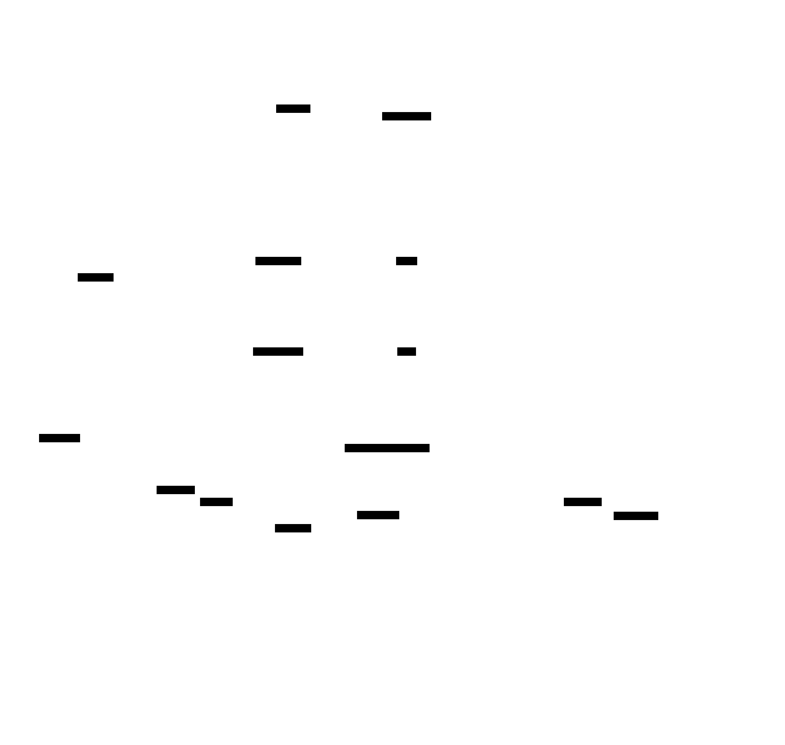

# Social Network: Design Document


## Overview

A scalable social network platform supporting user connections, content sharing, and real-time interactions. The key architectural challenge is efficiently distributing content to user feeds while maintaining performance and data consistency at scale.


> This guide is meant to help you understand the big picture before diving into each milestone. Refer back to it whenever you need context on how components connect.


## Context and Problem Statement

> **Milestone(s):** This section provides foundational context for all milestones, establishing the mental models and complexity challenges that drive the technical decisions in subsequent milestones.

### The Town Square Mental Model

Think of a social network as a digital recreation of a bustling town square where people gather to share news, stories, and connect with each other. In our town square analogy, every person has their own **bulletin board** where they post messages for others to see. When someone wants to stay updated with a friend's activities, they become a **subscriber** to that friend's bulletin board, similar to following someone on a social network.

The magic happens through an army of invisible **message runners** who work tirelessly behind the scenes. When Alice posts a new message on her bulletin board, the message runners immediately spring into action. They grab copies of Alice's message and sprint to the personal **mailboxes** of everyone who has subscribed to Alice's updates. This way, when Bob checks his mailbox (his personalized feed), he finds Alice's message waiting for him along with messages from all the other people he follows.

This town square operates on a fundamental principle: **rather than making people walk around the square checking every bulletin board they're interested in**, the message runners do the work upfront by delivering relevant messages directly to each person's mailbox. This is the core concept behind **fan-out on write** architecture, where the computational work of determining "who should see this message" happens immediately when content is created, not when someone wants to read their feed.

The beauty of this system becomes apparent when we consider the alternative. Without message runners, Bob would need to visit Alice's bulletin board, then Charlie's, then Diana's, and so on, checking each one individually every time he wants to catch up on news. This **fan-out on read** approach might work when Bob only follows a few people, but imagine if he follows hundreds or thousands of people—he'd spend all day walking around the town square just to collect his personalized news.

However, our town square faces interesting challenges as it grows. When Alice was just posting to a few close friends, the message runners could easily handle the delivery. But what happens when Alice becomes the town celebrity with millions of subscribers? Suddenly, a single post from Alice requires millions of message deliveries, and the message runners become overwhelmed. This is what we call the **celebrity problem** in social network architecture, and it's one of the core scaling challenges we'll need to address.

The town square also needs **specialized infrastructure** as it grows. We need **sorting systems** to ensure Bob's mailbox presents messages in the right order (most recent first), **notification bells** to alert people when new messages arrive, **search systems** to help people find specific messages or discover new bulletin boards to follow, and **moderation systems** to maintain the quality and safety of the town square environment.

### Scale Complexity

Social networks present a unique scaling challenge because their complexity grows not linearly with the number of users, but **exponentially with the number of connections** between users. This exponential growth creates what engineers call the "social graph explosion," where each new user potentially creates connections with many existing users, and each new connection increases the computational load on multiple parts of the system.

Consider the mathematical foundation of this complexity. In a social network with N users, the theoretical maximum number of follow relationships is N × (N-1), which approaches N² for large values of N. While real networks don't reach this theoretical maximum, even a small percentage of maximum connectivity creates enormous computational challenges. If we have 100 million users and each user follows just 200 others on average, we're managing 20 billion follow relationships, and each new post potentially triggers operations across hundreds of thousands or millions of these relationships.

The **fan-out multiplication effect** demonstrates why social networks become exponentially complex. When a user with F followers posts new content, the system must perform F write operations to update each follower's feed. If we have U users posting an average of P posts per day, and the average user has F followers, our daily fan-out operations total U × P × F. As both U and F grow (which they do in successful social networks), this creates a multiplicative effect that can quickly overwhelm infrastructure designed for linear growth.

**Database relationship complexity** compounds this challenge. Social networks require complex many-to-many relationships between users (follows), users and posts (likes, comments), posts and hashtags, users and notifications, and many others. Each of these relationships creates potential N+1 query problems where a single feed request triggers hundreds of additional database queries. Traditional SQL databases struggle with these highly connected, graph-like data patterns, leading many social networks to adopt specialized graph databases or implement sophisticated caching layers.

**Real-time expectations** add another dimension of complexity. Users expect immediate feedback when they like a post, instant notification when someone follows them, and feeds that update in real-time as new content becomes available. This means the system cannot rely on batch processing or eventual consistency for core user interactions. Every user action potentially triggers immediate updates across multiple other users' interfaces, creating a web of real-time dependencies that must be carefully orchestrated.

The **content distribution challenge** becomes particularly acute at scale. A single viral post might need to appear in millions of feeds simultaneously, requiring the system to:
1. Rapidly identify all users who should see the content
2. Update millions of individual feed records without creating database hotspots
3. Invalidate cached feed data across distributed cache clusters
4. Trigger real-time updates to users currently viewing their feeds
5. Generate notifications for relevant interactions like mentions or replies

**Memory and storage requirements** also scale non-linearly. Each user's feed must be readily available for fast loading, but storing complete feeds for millions of users requires enormous amounts of memory. Feed data has temporal characteristics (recent posts are accessed more frequently) and personalization requirements (each user's feed is unique), making it difficult to achieve high cache hit rates with traditional caching strategies.

The **geographic distribution challenge** adds another layer of complexity. Social networks are global by nature, but users primarily interact with others in similar time zones and geographic regions. This creates "hot spots" in different data centers at different times of day, and requires careful data replication strategies to ensure users can access their feeds with low latency regardless of their location.

### Industry Approaches Comparison

Major social networking platforms have evolved different architectural approaches to address these scaling challenges, each making specific trade-offs based on their user behavior patterns, feature requirements, and scale characteristics. Understanding these different approaches provides valuable context for the design decisions we'll make in our implementation.

**Twitter's Timeline Architecture** represents one of the most studied examples of social network scaling. Twitter initially used a simple fan-out on read approach where user timelines were generated by querying tweets from all followed users at read time. This approach worked well when Twitter was small but created severe performance problems as the platform grew. A single timeline request for a user following 1000 people required 1000 database queries, making timeline generation prohibitively expensive.

Twitter's evolution to fan-out on write solved the read-time performance problem but created new challenges. When a user tweets, the system pre-computes timeline updates for all of that user's followers. This works well for typical users, but creates the celebrity problem when users with millions of followers tweet. Twitter's solution involves a **hybrid approach** where normal users use fan-out on write, but tweets from celebrities (users with more than a threshold number of followers) use fan-out on read. User timelines are assembled by merging their pre-computed timeline with recent tweets from celebrities they follow.

**Facebook's News Feed Architecture** takes a different approach optimized for their specific user behavior patterns. Facebook noticed that users don't see all posts from all friends—they primarily engage with content from their most active connections. Facebook's **EdgeRank algorithm** (now replaced by more sophisticated machine learning models) filters and ranks content before fan-out, reducing the volume of content that needs to be distributed. This allows Facebook to use fan-out on write even for users with large friend networks because most content gets filtered out before distribution.

Facebook also pioneered **multi-tier caching strategies** for social networks. They use a hierarchical cache structure where frequently accessed feed data stays in fast memory caches close to web servers, while less frequently accessed data moves to slower but larger cache tiers, and archived data moves to long-term storage. This allows them to provide fast feed loading for active users while managing storage costs for the enormous volume of historical content.

**Instagram's Photo-Centric Architecture** demonstrates how content type affects architectural decisions. Instagram's feed primarily consists of photos and videos, which are much larger than text posts. This creates different storage and distribution challenges compared to text-heavy platforms. Instagram uses extensive **CDN distribution** for media content, with multiple geographically distributed copies of each image. Their fan-out system separates metadata distribution (which photo was posted, by whom, when) from media distribution (the actual image files), allowing them to optimize each layer independently.

Instagram also faces unique challenges with **media processing pipelines**. When a user uploads a photo, the system must generate multiple image sizes for different display contexts (thumbnail, feed view, full size), apply any requested filters, and distribute these processed images to CDN endpoints worldwide. This processing must complete quickly enough that the post can be fanned out to followers without noticeable delay.

**LinkedIn's Professional Network Approach** illustrates how network characteristics affect architectural choices. LinkedIn's social graph is sparser than consumer social networks (users typically have hundreds of connections rather than thousands), but the content has different consumption patterns. Professional content has a longer shelf life than casual social posts, and users often search through historical content rather than only consuming recent updates. This leads LinkedIn to invest more heavily in **search and discovery infrastructure** and less in real-time feed optimization.

LinkedIn also pioneered **graph database usage** for social networks, using their connections data to power features like "People You May Know" and professional recommendations. Their architecture separates the social graph (who is connected to whom) from the content distribution system, allowing them to optimize each system for its specific query patterns.

**Emerging Architectures and Modern Approaches** reflect lessons learned from these established platforms. Modern social networks increasingly use **microservice architectures** where different aspects of the system (user management, content posting, feed generation, notifications, search) are handled by separate services. This allows different parts of the system to scale independently and use technologies optimized for their specific requirements.

**Event-driven architectures** are becoming more common, where user actions generate events that propagate through various systems asynchronously. When a user posts content, this generates events for feed fan-out, notification delivery, search index updates, and analytics processing. This approach provides better fault tolerance and allows the system to maintain responsiveness even when some subsystems are under heavy load.

**Graph database adoption** is accelerating as platforms recognize that social networks are fundamentally graph problems. Specialized graph databases like Neo4j or Amazon Neptune provide native support for the complex relationship queries that social networks require, often with better performance than trying to model graph relationships in traditional relational databases.

The **machine learning integration** trend affects architecture by requiring new data pipelines and computational resources. Modern social networks use ML for content ranking, spam detection, recommendation systems, and content moderation. This requires architectures that can efficiently collect user behavior data, train and update ML models, and apply model predictions in real-time during feed generation.

> **Key Architectural Insight**: The choice between fan-out on read, fan-out on write, or hybrid approaches depends not just on scale, but on user behavior patterns, content types, and feature requirements. There is no universally "correct" approach—each represents different trade-offs optimized for specific use cases.

Understanding these industry approaches helps inform our design decisions. We'll start with a fan-out on write approach because it provides good performance characteristics for typical social network usage patterns, while acknowledging that we may need to evolve to a hybrid approach as our system scales. We'll also adopt modern architectural patterns like microservices and event-driven design from the beginning, even though they add some complexity, because they provide better foundations for scaling than monolithic architectures.

### Implementation Guidance

This foundational section establishes the mental models and complexity understanding that will guide our technical implementation decisions throughout the project. The town square analogy and scaling complexity analysis inform why we make specific architectural choices in subsequent sections.

**A. Conceptual Framework Application:**

| Concept | Implementation Implication | Design Decision Impact |
|---------|---------------------------|----------------------|
| Message Runners (Fan-out) | Background job processing system | Asynchronous feed updates, queue-based architecture |
| Celebrity Problem | Hybrid fan-out strategy | Different processing for high-follower users |
| Exponential Complexity | Caching and optimization focus | Multi-layer caching, database indexing strategy |
| Real-time Expectations | Event-driven architecture | WebSocket connections, immediate feedback systems |

**B. Architectural Principles Derived from Analysis:**

The complexity analysis and industry comparison lead us to adopt these foundational principles for our implementation:

1. **Asynchronous by Default**: User actions that affect other users (posting, following) are processed asynchronously to maintain responsiveness
2. **Cache-First Design**: Frequently accessed data (feeds, profiles, counts) is designed for caching from the beginning
3. **Incremental Scaling**: Architecture supports starting simple (single database) and evolving (sharding, specialized services) as needed
4. **Graph-Aware Data Modeling**: Database schema optimized for relationship-heavy queries typical in social networks
5. **Real-time Capable**: Infrastructure supports real-time features even if initially implemented with polling

**C. Technology Foundation Mapping:**

| Challenge Area | Simple Approach | Scalable Evolution |
|---------------|-----------------|-------------------|
| Fan-out Processing | Direct database writes | Redis queues + worker processes |
| Feed Storage | PostgreSQL tables | Redis cache + PostgreSQL persistence |
| Real-time Updates | HTTP polling | WebSocket connections + event streams |
| Search | Basic SQL queries | Elasticsearch or specialized search service |
| Media Storage | Local file system | CDN + object storage (S3) |
| Notifications | Database polling | Push notification services + queues |

**D. Mental Model Translation to Code Structure:**

The town square analogy maps directly to our code organization:

```
social-network/
├── services/
│   ├── user-service/          # Manages bulletin boards (user profiles)
│   ├── post-service/          # Handles message posting
│   ├── feed-service/          # The message runners (fan-out system)
│   ├── notification-service/  # Notification bells
│   └── search-service/        # Discovery systems
├── shared/
│   ├── models/               # Core entities (User, Post, Follow, etc.)
│   ├── queues/               # Message runner infrastructure
│   └── cache/                # Mailbox systems (Redis integration)
└── infrastructure/
    ├── database/             # Persistent storage
    ├── cdn/                  # Media distribution
    └── monitoring/           # System health
```

**E. Complexity Management Strategy:**

Based on our scale complexity analysis, we'll implement these specific strategies:

1. **Connection Limit Enforcement**: Prevent users from following more than 5000 others to limit fan-out explosion
2. **Batch Processing**: Group similar operations (notifications, feed updates) to reduce database load
3. **Intelligent Caching**: Cache not just final results but intermediate calculations (follower lists, interaction counts)
4. **Database Optimization**: Design indexes specifically for social graph traversal patterns
5. **Content Lifecycle Management**: Automatically archive old content to manage storage growth

**F. Industry Pattern Implementation Plan:**

We'll implement a progression that mirrors industry evolution:

**Phase 1 (MVP)**: Simple fan-out on write, single database, basic caching
**Phase 2 (Growth)**: Redis caching, background job processing, CDN for media
**Phase 3 (Scale)**: Hybrid fan-out, database sharding, microservice separation
**Phase 4 (Advanced)**: Machine learning integration, graph database adoption, global distribution

This progression allows us to start simple while building foundations that support evolution to more sophisticated approaches as the system scales.


## Goals and Non-Goals

> **Milestone(s):** This section establishes the scope and constraints that guide all milestones, from user profiles through performance optimization, defining what we build and explicitly excluding features that would complicate the learning objectives.

Building a social network is like planning a town festival—you could include everything from live music to food trucks to carnival rides, but trying to do it all at once leads to chaos. Instead, successful event planners define clear goals (what makes this festival special) and explicit non-goals (what we won't attempt this year). Our social network design follows the same principle: we'll build a solid foundation of core social features while deliberately excluding advanced capabilities that would distract from the fundamental architectural lessons.

The key insight here is that social networks have two distinct complexity curves. The first curve involves getting the basic social mechanics right—user profiles, connections, content sharing, and notifications. This is challenging enough, involving complex data relationships, real-time systems, and performance optimization. The second complexity curve involves advanced algorithmic features like content recommendations, automated moderation, and sophisticated analytics. These require machine learning expertise and massive data infrastructure that would overshadow the core system design lessons we're trying to teach.

> **Design Philosophy**: We prioritize depth over breadth. Rather than building a shallow implementation of many features, we'll create a robust, well-architected foundation with fewer features that demonstrates production-quality engineering practices.

Our scope decisions also reflect the learning journey from basic web development to distributed systems engineering. Each milestone builds upon previous concepts while introducing new architectural challenges. The progression from simple CRUD operations (user profiles) to complex distributed systems concerns (feed fan-out at scale) provides a natural learning curve without overwhelming complexity.

### Functional Requirements

The core functionality our social network must support represents the essential social mechanics that define the user experience. Think of these as the fundamental interactions you'd expect in any social platform—the features that make it "social" rather than just a content management system.

**User Identity and Social Graph Management** forms the foundation of our platform. Users need persistent identities with rich profiles that express their personality and interests. The social graph—the network of who follows whom—drives content distribution and discovery. This isn't just about storing relationships; it's about efficiently querying them at scale when generating feeds and recommendations.

| Feature | Core Behavior | Data Implications | Performance Requirements |
|---------|---------------|-------------------|-------------------------|
| User Registration | Email/username signup with validation | Unique constraints, email verification state | < 500ms response time |
| Profile Management | Bio, avatar, links, privacy settings | Rich profile data, media storage integration | Profile loads in < 200ms |
| Follow/Unfollow | Bidirectional relationship with counts | Self-referential relationships, count caching | Atomic operations, no race conditions |
| Social Graph Queries | Follower/following lists with pagination | Efficient relationship traversal | Paginated results < 300ms |

**Content Creation and Distribution** represents the heart of social interaction. Users create posts that get distributed to their followers' feeds through our fan-out system. This seemingly simple requirement drives some of our most complex architectural decisions around data consistency, performance, and scalability.

| Feature | Core Behavior | Technical Challenge | Scale Consideration |
|---------|---------------|-------------------|-------------------|
| Post Creation | Text and image posts with metadata | Media processing and storage | Handle content validation and storage |
| Feed Generation | Chronological posts from followed users | Fan-out on write implementation | Support users with 10K+ followers |
| Feed Consumption | Paginated, real-time updated feeds | Cursor-based pagination, cache management | Sub-second feed loading |
| Content Metadata | Timestamps, author attribution, privacy | Consistent metadata across services | Timezone handling, attribution chains |

**Social Interactions and Engagement** create the feedback loops that make social networks compelling. Likes, comments, and shares aren't just features—they're the mechanisms through which content gains visibility and users build relationships.

| Interaction Type | Behavior | Consistency Requirements | Real-time Aspects |
|------------------|----------|-------------------------|-------------------|
| Likes | Toggle on/off with accurate counts | Atomic count updates, duplicate prevention | Count updates within 1 second |
| Comments | Threaded discussions with replies | Parent-child relationships, ordering | New comments appear immediately |
| Shares/Reposts | Content amplification with attribution | Original author attribution, share chains | Share propagation to follower feeds |
| Reactions | Extended like system (future) | Multiple reaction types per user | Real-time reaction aggregation |

**Notification and Communication** systems keep users engaged by alerting them to relevant social activity. This requires event detection, delivery infrastructure, and user preference management.

| Notification Type | Trigger Event | Delivery Method | Batching Strategy |
|-------------------|---------------|-----------------|-------------------|
| New Follower | User A follows User B | Real-time push + in-app | Individual notifications |
| Post Interactions | Likes, comments on user's posts | Real-time push + in-app | Batch similar interactions |
| Social Updates | Friend posts, major interactions | In-app notifications | Batch by time window |
| System Notifications | Account security, feature updates | Email + in-app | Individual delivery |

**Search and Discovery** helps users find content and connections beyond their immediate social graph. This involves both exact matching (finding specific users) and algorithmic discovery (trending content).

| Search Type | Query Capabilities | Ranking Factors | Update Frequency |
|-------------|-------------------|-----------------|------------------|
| User Search | Name, username, bio keywords | Exact match priority, mutual connections | Real-time indexing |
| Content Search | Post text, hashtags | Relevance, recency, engagement | Near real-time indexing |
| Hashtag Tracking | Trending topics, hashtag feeds | Usage volume, engagement rate | Hourly trend updates |
| Suggested Users | Follow recommendations | Mutual connections, interaction history | Daily recommendation updates |

> **Integration Requirements**: All functional components must integrate seamlessly. A user liking a post should trigger notification delivery, update engagement metrics for trending calculations, and influence future content recommendations—all while maintaining sub-second response times for the original user action.

### Performance and Scale Targets

Our performance targets reflect the expectations of modern social media users while remaining achievable with standard infrastructure. Think of these metrics as the "speed limit signs" for our system—they guide architectural decisions and help us identify when optimizations are necessary.

**Response Time Requirements** define the user experience quality. Social networks feel "snappy" when common actions complete quickly, and users abandon platforms that feel sluggish. Our targets balance ambitious user experience goals with realistic implementation constraints.

| Operation Category | Target Response Time | 95th Percentile Limit | Justification |
|-------------------|---------------------|----------------------|---------------|
| Profile Operations | < 200ms | < 500ms | Profile viewing is extremely frequent |
| Feed Loading | < 300ms | < 800ms | Core user experience, high frequency |
| Social Actions | < 100ms | < 300ms | Like/follow must feel instantaneous |
| Content Creation | < 500ms | < 1.5s | Users tolerate slight delay for posts |
| Search Queries | < 400ms | < 1s | Discovery features, moderate frequency |
| Notifications | < 2s delivery | < 10s delivery | Real-time feel without breaking budget |

**Throughput and Concurrency** targets define how many users we can support simultaneously. These numbers drive our caching strategies, database design, and infrastructure planning. We're targeting a medium-scale social network rather than attempting to compete with global platforms immediately.

| Metric | Target | Peak Handling | Infrastructure Implication |
|--------|--------|---------------|---------------------------|
| Concurrent Users | 50,000 active | 100,000 peak | Horizontal scaling capability |
| Posts per Second | 1,000 average | 5,000 peak | Fan-out queue processing capacity |
| Feed Requests per Second | 10,000 average | 25,000 peak | Aggressive caching strategy required |
| Social Actions per Second | 5,000 average | 15,000 peak | Optimistic UI updates, async processing |
| Search Queries per Second | 2,000 average | 6,000 peak | Search index optimization required |

**Data Scale and Storage** requirements influence our database design, partitioning strategies, and backup procedures. Social networks generate data at multiple velocities—user profiles change slowly, but interactions happen constantly.

| Data Type | Expected Volume | Growth Rate | Storage Strategy |
|-----------|----------------|-------------|------------------|
| User Accounts | 1M registered | 10K new/month | Primary database, replicated |
| Posts | 10M total | 100K new/day | Partitioned by time, archived old posts |
| Social Relationships | 50M follow connections | High variance by user | Sharded by user ID |
| Interactions | 500M likes/comments | 1M new/day | Time-partitioned, aggregated metrics |
| Notifications | 1B total | 5M new/day | TTL-based cleanup, user preference filtering |
| Media Files | 100TB total | 1TB/month | CDN distribution, tiered storage |

> **Scalability Philosophy**: We design for 10x growth without architectural changes, 100x growth with configuration changes, and 1000x growth with architectural evolution. This means making smart abstractions now that can accommodate future scaling needs.

**Availability and Reliability** targets ensure users can depend on our platform. Social networks become part of users' daily routines, so unexpected downtime disrupts real social connections.

| Reliability Metric | Target | Measurement Method | Recovery Strategy |
|-------------------|--------|-------------------|-------------------|
| Overall Uptime | 99.5% (43 hours downtime/year) | External monitoring | Graceful degradation |
| Data Durability | 99.999% (< 0.001% data loss) | Backup validation | Multi-region replication |
| Feed Availability | 99.9% (< 9 hours downtime/year) | Service health checks | Cache-based fallbacks |
| Notification Delivery | 99% within SLA | Delivery tracking | Retry with backoff |

### Out of Scope

Defining what we won't build is as important as defining what we will build. These exclusions aren't value judgments—they're strategic decisions to keep our learning focused on core system design principles rather than getting lost in specialized domains that require deep expertise beyond our scope.

**Advanced Algorithmic Features** represent the cutting edge of social media technology but require machine learning expertise that would overshadow our system design learning objectives. Modern social platforms spend millions of dollars and employ dozens of PhD-level engineers on these features alone.

| Excluded Feature | Why Out of Scope | Complexity Level | Alternative in Our System |
|------------------|------------------|------------------|---------------------------|
| ML-based Feed Ranking | Requires recommendation system expertise | Very High | Chronological feeds only |
| Personalized Content Discovery | Needs user behavior modeling | Very High | Trending and hashtag-based discovery |
| Automated Content Moderation | Requires NLP and computer vision | Very High | Manual reporting only |
| Advanced Analytics | Needs data science infrastructure | High | Basic engagement metrics only |
| A/B Testing Framework | Complex statistical analysis required | High | Single interface version |

> **Decision: Chronological Feeds Only**
> - **Context**: Social platforms increasingly use algorithmic ranking to increase engagement, but this requires sophisticated machine learning infrastructure
> - **Options Considered**: ML-based ranking, simple engagement-based ranking, chronological only
> - **Decision**: Chronological feeds with basic trending detection
> - **Rationale**: Keeps complexity focused on distributed systems challenges rather than algorithm development, and many users prefer chronological feeds
> - **Consequences**: Simpler to implement and debug, but may have lower engagement than algorithmic feeds

**Rich Media and Content Processing** features would require specialized infrastructure and expertise in media processing, CDN optimization, and content delivery that distracts from our core distributed systems learning.

| Media Feature | Technical Challenge | Infrastructure Required | Learning Value for Our Goals |
|---------------|-------------------|------------------------|------------------------------|
| Video Upload/Streaming | Transcoding, adaptive bitrates | Media processing clusters | Low - specialized domain |
| Live Streaming | Real-time protocols, low latency | Streaming infrastructure | Low - different from web backend |
| Advanced Image Processing | Computer vision, automatic tagging | GPU processing clusters | Low - specialized algorithms |
| Audio Content | Audio processing, playlist features | Audio streaming infrastructure | Low - similar to video complexity |

**Enterprise and Advanced Security** features represent important production concerns but involve specialized compliance and security expertise beyond our system design focus.

| Security Feature | Why Excluded | Complexity | Basic Alternative |
|------------------|-------------|------------|-------------------|
| Advanced Authentication | OAuth providers, SSO, MFA | High | Simple email/password only |
| Content Encryption | End-to-end encryption, key management | Very High | HTTPS transport encryption |
| Advanced Privacy Controls | Granular permissions, data export | High | Basic public/private posts |
| Compliance Features | GDPR, CCPA data handling | Very High | Simple data deletion |
| Advanced Monitoring | Security analytics, threat detection | High | Basic application logging |

**Platform and Integration Features** would expand our scope beyond the core social network into platform management and third-party integrations.

| Platform Feature | Scope Expansion | Technical Complexity | Focus Dilution |
|------------------|----------------|---------------------|----------------|
| Third-party API | External developer ecosystem | Medium | Diverts from core features |
| Mobile Apps | Native mobile development | High | Different tech stack entirely |
| Browser Extensions | Cross-browser compatibility | Medium | Frontend-focused, not backend systems |
| Webhook System | Reliable event delivery | Medium | Adds distributed systems complexity without core value |
| Admin Dashboard | Business intelligence features | Medium | CRUD operations, not architecturally interesting |

> **Scope Boundary Principle**: We include features that teach distributed systems concepts (data consistency, caching, real-time systems) and exclude features that require domain expertise outside of backend system design (machine learning, media processing, mobile development).

**Advanced Scaling and Operations** represents the next level of system maturity but involves operational complexity that goes beyond our development-focused learning objectives.

| Operations Feature | Why Deferred | Operational Complexity | Learning Stage |
|-------------------|-------------|----------------------|----------------|
| Multi-region Deployment | Geographic distribution | Very High | Advanced operations |
| Auto-scaling Infrastructure | Dynamic resource management | High | DevOps specialization |
| Advanced Database Management | Automated failover, cross-region replication | Very High | Database administration |
| Comprehensive Monitoring | APM, distributed tracing, alerting | High | Site reliability engineering |

The key insight behind these exclusions is that social network development has two distinct learning phases. The first phase—which we're targeting—involves mastering the core distributed systems challenges: data modeling, caching strategies, real-time updates, and performance optimization. The second phase involves production operations, advanced algorithms, and specialized features that require expertise in domains beyond backend system architecture.

By explicitly excluding advanced features, we can focus our engineering effort on building a robust, well-architected foundation that demonstrates production-quality engineering practices within our core feature set. This approach teaches the fundamental skills that generalize to other distributed systems, rather than getting lost in the specialized complexities of recommendation engines or video processing pipelines.

> **Future Extension Path**: Our architectural decisions should accommodate future extensions of excluded features without requiring complete rewrites. We'll design clean abstractions and extension points that make it possible to add algorithmic ranking, rich media, or advanced security later without disrupting the core system.

### Implementation Guidance

The technology choices and project structure decisions we make early will either accelerate our development or create friction throughout the entire project. Think of this as laying the foundation for a house—getting it right from the start saves massive amounts of work later, while getting it wrong creates problems that compound over time.

**Technology Stack Recommendations**

For our social network implementation, we need to balance learning value with practical development speed. The following recommendations prioritize technologies that are widely used in production social networks while remaining approachable for developers learning distributed systems concepts.

| Component | Simple Option | Advanced Option | Recommendation |
|-----------|---------------|-----------------|----------------|
| Backend Language | Node.js with Express | Go with Gin framework | Go - better concurrency model for social features |
| Database | PostgreSQL with basic queries | PostgreSQL with read replicas | PostgreSQL - start simple, add replicas in scaling milestone |
| Caching | Redis single instance | Redis cluster | Redis single instance initially |
| Message Queue | In-memory queues | Redis pub/sub or RabbitMQ | Redis pub/sub - reuses existing Redis |
| File Storage | Local filesystem | AWS S3 or CloudFlare R2 | Local filesystem initially, S3 for production |
| Real-time Updates | HTTP polling | WebSockets or Server-Sent Events | Server-Sent Events - simpler than WebSockets |
| Search | PostgreSQL full-text search | Elasticsearch | PostgreSQL full-text - avoid adding complexity |
| Monitoring | Console logging | Structured logging with metrics | Structured logging - production practices |

**Recommended Project Structure**

A well-organized codebase makes it easier to understand component boundaries and responsibilities. This structure reflects the service-oriented architecture we'll build, even when running everything in a single process initially.

```
social-network/
├── cmd/
│   └── server/
│       └── main.go                 ← Application entry point
├── internal/
│   ├── auth/
│   │   ├── auth.go                 ← Authentication middleware
│   │   └── jwt.go                  ← JWT token handling
│   ├── users/
│   │   ├── handler.go              ← HTTP handlers for user operations
│   │   ├── service.go              ← Business logic for user management
│   │   ├── repository.go           ← Database operations for users
│   │   └── models.go               ← User data structures
│   ├── posts/
│   │   ├── handler.go              ← Post creation and retrieval endpoints
│   │   ├── service.go              ← Post business logic
│   │   ├── repository.go           ← Post database operations
│   │   └── fanout.go               ← Fan-out on write implementation
│   ├── feeds/
│   │   ├── handler.go              ← Feed retrieval endpoints
│   │   ├── service.go              ← Feed assembly and caching
│   │   └── cache.go                ← Redis feed caching
│   ├── interactions/
│   │   ├── handler.go              ← Like, comment, share endpoints
│   │   ├── service.go              ← Interaction business logic
│   │   └── realtime.go             ← Real-time update broadcasting
│   ├── notifications/
│   │   ├── handler.go              ← Notification endpoints
│   │   ├── service.go              ← Notification processing
│   │   ├── delivery.go             ← Notification delivery pipeline
│   │   └── templates.go            ← Notification formatting
│   ├── search/
│   │   ├── handler.go              ← Search endpoints
│   │   ├── service.go              ← Search logic and indexing
│   │   └── trending.go             ← Trending content detection
│   └── common/
│       ├── database/
│       │   ├── connection.go       ← Database connection management
│       │   └── migrations/         ← Database schema migrations
│       ├── cache/
│       │   └── redis.go            ← Redis client wrapper
│       ├── queue/
│       │   └── jobs.go             ← Background job processing
│       └── middleware/
│           ├── logging.go          ← Request logging
│           ├── cors.go             ← CORS handling
│           └── ratelimit.go        ← Rate limiting
├── pkg/
│   └── api/
│       └── types.go                ← Shared API response types
├── web/
│   ├── static/                     ← CSS, JS, images
│   └── templates/                  ← HTML templates
├── migrations/
│   ├── 001_create_users.up.sql
│   ├── 002_create_posts.up.sql
│   └── ...
├── docker-compose.yml              ← Local development environment
├── Dockerfile                      ← Production container image
└── README.md                       ← Setup and development instructions
```

**Database Connection and Migration Setup**

Database management is a cross-cutting concern that every service needs. This complete implementation handles connection pooling, health checks, and migration management—infrastructure code that you can use as-is while focusing on the interesting social network logic.

```go
// internal/common/database/connection.go
package database

import (
    "database/sql"
    "fmt"
    "time"
    
    "github.com/golang-migrate/migrate/v4"
    "github.com/golang-migrate/migrate/v4/database/postgres"
    _ "github.com/golang-migrate/migrate/v4/source/file"
    _ "github.com/lib/pq"
)

type Config struct {
    Host     string
    Port     int
    User     string
    Password string
    DBName   string
    SSLMode  string
}

type DB struct {
    *sql.DB
}

func Connect(config Config) (*DB, error) {
    dsn := fmt.Sprintf("host=%s port=%d user=%s password=%s dbname=%s sslmode=%s",
        config.Host, config.Port, config.User, config.Password, config.DBName, config.SSLMode)
    
    db, err := sql.Open("postgres", dsn)
    if err != nil {
        return nil, fmt.Errorf("failed to open database: %w", err)
    }
    
    // Configure connection pool
    db.SetMaxOpenConns(25)
    db.SetMaxIdleConns(5)
    db.SetConnMaxLifetime(5 * time.Minute)
    
    if err := db.Ping(); err != nil {
        return nil, fmt.Errorf("failed to ping database: %w", err)
    }
    
    return &DB{db}, nil
}

func (db *DB) RunMigrations(migrationsPath string) error {
    driver, err := postgres.WithInstance(db.DB, &postgres.Config{})
    if err != nil {
        return fmt.Errorf("could not create postgres driver: %w", err)
    }
    
    m, err := migrate.NewWithDatabaseInstance(
        fmt.Sprintf("file://%s", migrationsPath),
        "postgres", driver)
    if err != nil {
        return fmt.Errorf("could not create migrate instance: %w", err)
    }
    
    if err := m.Up(); err != nil && err != migrate.ErrNoChange {
        return fmt.Errorf("could not run migrations: %w", err)
    }
    
    return nil
}

func (db *DB) HealthCheck() error {
    ctx, cancel := context.WithTimeout(context.Background(), 5*time.Second)
    defer cancel()
    
    return db.PingContext(ctx)
}
```

**Redis Cache Wrapper**

Caching is essential for social network performance but involves complex cache invalidation logic. This wrapper provides a clean interface for the caching patterns we'll use throughout the application.

```go
// internal/common/cache/redis.go
package cache

import (
    "context"
    "encoding/json"
    "fmt"
    "time"
    
    "github.com/go-redis/redis/v8"
)

type Client struct {
    redis *redis.Client
}

func NewClient(addr, password string, db int) *Client {
    rdb := redis.NewClient(&redis.Options{
        Addr:     addr,
        Password: password,
        DB:       db,
    })
    
    return &Client{redis: rdb}
}

func (c *Client) Set(ctx context.Context, key string, value interface{}, expiration time.Duration) error {
    data, err := json.Marshal(value)
    if err != nil {
        return fmt.Errorf("failed to marshal value: %w", err)
    }
    
    return c.redis.Set(ctx, key, data, expiration).Err()
}

func (c *Client) Get(ctx context.Context, key string, dest interface{}) error {
    data, err := c.redis.Get(ctx, key).Result()
    if err == redis.Nil {
        return ErrCacheMiss
    }
    if err != nil {
        return fmt.Errorf("failed to get from cache: %w", err)
    }
    
    if err := json.Unmarshal([]byte(data), dest); err != nil {
        return fmt.Errorf("failed to unmarshal cached value: %w", err)
    }
    
    return nil
}

func (c *Client) Delete(ctx context.Context, keys ...string) error {
    if len(keys) == 0 {
        return nil
    }
    return c.redis.Del(ctx, keys...).Err()
}

func (c *Client) InvalidatePattern(ctx context.Context, pattern string) error {
    keys, err := c.redis.Keys(ctx, pattern).Result()
    if err != nil {
        return fmt.Errorf("failed to find keys for pattern %s: %w", pattern, err)
    }
    
    if len(keys) > 0 {
        return c.Delete(ctx, keys...)
    }
    
    return nil
}

var ErrCacheMiss = fmt.Errorf("cache miss")
```

**Core Data Models Structure**

The following types define the core entities of our social network. These provide the foundation that all services will build upon—complete with JSON tags for API serialization and validation tags for input validation.

```go
// pkg/api/types.go
package api

import (
    "time"
)

// User represents a social network user account
type User struct {
    ID           int       `json:"id" db:"id"`
    Username     string    `json:"username" db:"username" validate:"required,min=3,max=30"`
    Email        string    `json:"email" db:"email" validate:"required,email"`
    DisplayName  string    `json:"display_name" db:"display_name" validate:"max=100"`
    Bio          string    `json:"bio" db:"bio" validate:"max=500"`
    AvatarURL    string    `json:"avatar_url" db:"avatar_url"`
    WebsiteURL   string    `json:"website_url" db:"website_url" validate:"omitempty,url"`
    FollowerCount int      `json:"follower_count" db:"follower_count"`
    FollowingCount int     `json:"following_count" db:"following_count"`
    PostCount    int       `json:"post_count" db:"post_count"`
    IsPrivate    bool      `json:"is_private" db:"is_private"`
    CreatedAt    time.Time `json:"created_at" db:"created_at"`
    UpdatedAt    time.Time `json:"updated_at" db:"updated_at"`
}

// Post represents a user-generated content post
type Post struct {
    ID          int       `json:"id" db:"id"`
    UserID      int       `json:"user_id" db:"user_id"`
    Content     string    `json:"content" db:"content" validate:"required,max=2000"`
    ImageURL    string    `json:"image_url,omitempty" db:"image_url"`
    LikeCount   int       `json:"like_count" db:"like_count"`
    CommentCount int      `json:"comment_count" db:"comment_count"`
    ShareCount  int       `json:"share_count" db:"share_count"`
    CreatedAt   time.Time `json:"created_at" db:"created_at"`
    UpdatedAt   time.Time `json:"updated_at" db:"updated_at"`
    
    // Populated by joins
    Author      *User     `json:"author,omitempty"`
    IsLiked     bool      `json:"is_liked,omitempty"`
}

// Follow represents a follower relationship between users
type Follow struct {
    ID          int       `json:"id" db:"id"`
    FollowerID  int       `json:"follower_id" db:"follower_id"`
    FollowedID  int       `json:"followed_id" db:"followed_id"`
    CreatedAt   time.Time `json:"created_at" db:"created_at"`
}

// Notification represents a user notification
type Notification struct {
    ID        int                    `json:"id" db:"id"`
    UserID    int                    `json:"user_id" db:"user_id"`
    Type      string                 `json:"type" db:"type"`
    ActorID   *int                   `json:"actor_id,omitempty" db:"actor_id"`
    PostID    *int                   `json:"post_id,omitempty" db:"post_id"`
    Data      map[string]interface{} `json:"data" db:"data"`
    IsRead    bool                   `json:"is_read" db:"is_read"`
    CreatedAt time.Time              `json:"created_at" db:"created_at"`
    
    // Populated by joins
    Actor     *User                  `json:"actor,omitempty"`
    Post      *Post                  `json:"post,omitempty"`
}

// Feed represents a user's personalized feed entry
type Feed struct {
    UserID    int       `json:"user_id" db:"user_id"`
    PostID    int       `json:"post_id" db:"post_id"`
    CreatedAt time.Time `json:"created_at" db:"created_at"`
    
    // Populated by joins
    Post      *Post     `json:"post,omitempty"`
}
```

**HTTP Server Core Structure**

This provides the HTTP server foundation with middleware, routing, and error handling that all endpoints will use. The server setup includes CORS, logging, authentication, and rate limiting—production concerns that shouldn't distract from implementing social network logic.

```go
// cmd/server/main.go
package main

import (
    "context"
    "log"
    "net/http"
    "os"
    "os/signal"
    "syscall"
    "time"
    
    "github.com/gin-contrib/cors"
    "github.com/gin-gonic/gin"
    
    "social-network/internal/common/cache"
    "social-network/internal/common/database"
    "social-network/internal/users"
    "social-network/internal/posts"
    "social-network/internal/feeds"
    "social-network/internal/notifications"
)

func main() {
    // Database connection
    dbConfig := database.Config{
        Host:     getEnv("DB_HOST", "localhost"),
        Port:     5432,
        User:     getEnv("DB_USER", "postgres"),
        Password: getEnv("DB_PASSWORD", "password"),
        DBName:   getEnv("DB_NAME", "social_network"),
        SSLMode:  "disable",
    }
    
    db, err := database.Connect(dbConfig)
    if err != nil {
        log.Fatalf("Failed to connect to database: %v", err)
    }
    defer db.Close()
    
    if err := db.RunMigrations("./migrations"); err != nil {
        log.Fatalf("Failed to run migrations: %v", err)
    }
    
    // Redis connection
    cacheClient := cache.NewClient(
        getEnv("REDIS_ADDR", "localhost:6379"),
        getEnv("REDIS_PASSWORD", ""),
        0,
    )
    
    // Initialize services
    userService := users.NewService(db, cacheClient)
    postService := posts.NewService(db, cacheClient)
    feedService := feeds.NewService(db, cacheClient)
    notificationService := notifications.NewService(db, cacheClient)
    
    // Setup HTTP server
    router := gin.New()
    router.Use(gin.Logger())
    router.Use(gin.Recovery())
    router.Use(cors.New(cors.Config{
        AllowOrigins:     []string{"http://localhost:3000"},
        AllowMethods:     []string{"GET", "POST", "PUT", "DELETE"},
        AllowHeaders:     []string{"Origin", "Content-Type", "Authorization"},
        ExposeHeaders:    []string{"Content-Length"},
        AllowCredentials: true,
        MaxAge:           12 * time.Hour,
    }))
    
    // Register routes
    api := router.Group("/api/v1")
    users.RegisterRoutes(api, userService)
    posts.RegisterRoutes(api, postService)
    feeds.RegisterRoutes(api, feedService)
    notifications.RegisterRoutes(api, notificationService)
    
    // Start server with graceful shutdown
    srv := &http.Server{
        Addr:    ":8080",
        Handler: router,
    }
    
    go func() {
        log.Println("Starting server on :8080")
        if err := srv.ListenAndServe(); err != nil && err != http.ErrServerClosed {
            log.Fatalf("Failed to start server: %v", err)
        }
    }()
    
    // Wait for interrupt signal to gracefully shut down
    quit := make(chan os.Signal, 1)
    signal.Notify(quit, syscall.SIGINT, syscall.SIGTERM)
    <-quit
    log.Println("Shutting down server...")
    
    ctx, cancel := context.WithTimeout(context.Background(), 30*time.Second)
    defer cancel()
    if err := srv.Shutdown(ctx); err != nil {
        log.Fatal("Server forced to shutdown:", err)
    }
    
    log.Println("Server exited")
}

func getEnv(key, defaultValue string) string {
    if value, exists := os.LookupEnv(key); exists {
        return value
    }
    return defaultValue
}
```

**Development Environment Setup**

Local development should be as simple as running `docker-compose up` to start all dependencies. This configuration provides PostgreSQL, Redis, and optional monitoring tools that mirror a production environment.

```yaml
# docker-compose.yml
version: '3.8'

services:
  postgres:
    image: postgres:14-alpine
    environment:
      POSTGRES_USER: postgres
      POSTGRES_PASSWORD: password
      POSTGRES_DB: social_network
    ports:
      - "5432:5432"
    volumes:
      - postgres_data:/var/lib/postgresql/data
      - ./init.sql:/docker-entrypoint-initdb.d/init.sql

  redis:
    image: redis:7-alpine
    ports:
      - "6379:6379"
    command: redis-server --appendonly yes
    volumes:
      - redis_data:/data

  # Optional: Redis Commander for cache inspection
  redis-commander:
    image: rediscommander/redis-commander:latest
    environment:
      REDIS_HOSTS: local:redis:6379
    ports:
      - "8081:8081"
    depends_on:
      - redis

volumes:
  postgres_data:
  redis_data:
```

**Milestone Verification Strategy**

Each milestone should have clear verification steps that confirm the functionality works correctly before moving to the next phase. This prevents building on a shaky foundation.

| Milestone | Verification Command | Expected Behavior | Debug Steps |
|-----------|---------------------|-------------------|-------------|
| Setup Complete | `go run cmd/server/main.go` | Server starts on :8080, connects to DB/Redis | Check docker containers, examine connection logs |
| User Profiles | `curl -X POST localhost:8080/api/v1/users -d '{"username":"test","email":"test@example.com"}'` | Returns 201 with user object | Check database for user record |
| Follow System | `curl -X POST localhost:8080/api/v1/users/1/follow -H "Authorization: Bearer <token>"` | Returns 200, updates follow counts | Verify follow record created, counts updated |
| Posts & Feeds | `curl localhost:8080/api/v1/feeds -H "Authorization: Bearer <token>"` | Returns posts from followed users | Check fan-out cache entries in Redis |
| Interactions | `curl -X POST localhost:8080/api/v1/posts/1/like -H "Authorization: Bearer <token>"` | Returns 200, increments like count | Verify like record and count update |
| Notifications | Check `/api/v1/notifications` after social action | New notification appears | Check notification creation and delivery |

**Performance Monitoring Setup**

Even in development, basic performance monitoring helps identify issues early. This structured logging setup provides the metrics needed to verify our performance targets.

```go
// internal/common/middleware/logging.go
package middleware

import (
    "time"
    
    "github.com/gin-gonic/gin"
    "github.com/sirupsen/logrus"
)

func StructuredLogging() gin.HandlerFunc {
    logger := logrus.New()
    logger.SetFormatter(&logrus.JSONFormatter{})
    
    return func(c *gin.Context) {
        start := time.Now()
        
        // Process request
        c.Next()
        
        // Log request details
        duration := time.Since(start)
        logger.WithFields(logrus.Fields{
            "method":       c.Request.Method,
            "path":         c.Request.URL.Path,
            "status":       c.Writer.Status(),
            "duration_ms":  duration.Milliseconds(),
            "user_id":      c.GetString("user_id"),
            "ip":          c.ClientIP(),
            "user_agent":  c.Request.UserAgent(),
        }).Info("Request processed")
        
        // Alert on slow requests
        if duration > 500*time.Millisecond {
            logger.WithFields(logrus.Fields{
                "method":      c.Request.Method,
                "path":        c.Request.URL.Path,
                "duration_ms": duration.Milliseconds(),
            }).Warn("Slow request detected")
        }
    }
}
```

This implementation guidance provides the infrastructure foundation you need to focus on the interesting social network challenges. The next sections will dive into specific architectural components, building upon this foundation with detailed design decisions and implementation strategies for each social network feature.


## High-Level Architecture

> **Milestone(s):** This section establishes the overall system structure that supports all milestones, from user profiles (Milestone 1) through performance optimization (Milestone 6), defining how services collaborate to deliver social network functionality.

Think of our social network architecture as a **bustling town with specialized districts**. Just as a town has different areas—the town hall for administration, the post office for message distribution, the library for information storage, and the bulletin board square where people gather—our social network separates concerns into distinct services. Each service has a specific role, and they communicate through well-defined channels, much like how town departments coordinate through official messengers and shared record systems.

The architecture follows a **microservices approach** where each major functional area becomes its own service. This separation allows us to scale individual components based on their specific load patterns, optimize each service for its particular data access patterns, and maintain clear boundaries between different aspects of social functionality.


### Service Responsibilities

Our social network decomposes into six primary services, each with distinct responsibilities and data ownership patterns. Think of these services as **specialized departments in a large organization**—each has its expertise area, maintains its own records, and coordinates with others through formal communication channels.

#### User Service: The Identity Department

The User Service acts as the **town registrar and directory**, maintaining the authoritative record of who exists in our social network and managing their profile information. This service owns all user identity data and handles authentication, profile management, and the complex self-referential relationships of the follow system.

| Responsibility Area | Specific Functions | Data Owned |
|---|---|---|
| Identity Management | User registration, authentication, profile CRUD | `User` records with credentials |
| Profile Data | Bio, avatar, website links, privacy settings | Profile metadata and preferences |
| Follow Relationships | Creating/removing follow connections, managing follower lists | `Follow` relationship records |
| Social Graph Queries | Who follows whom, mutual connections, follower counts | Denormalized count caches |
| Privacy Enforcement | Profile visibility, follower list access controls | Privacy setting configurations |

The User Service maintains **denormalized counts** for followers, following, and posts to avoid expensive aggregation queries. When a user follows another user, this service atomically creates the `Follow` record and updates both users' counts in a single transaction, preventing the drift that would occur with eventually consistent counting.

> **Decision: Centralized User Service vs Distributed Identity**
> - **Context**: User data appears in nearly every operation (posts, feeds, notifications), and consistency of identity information is critical for security and user experience
> - **Options Considered**: Single user service, distributed user data across services, hybrid with identity service + profile service
> - **Decision**: Single User Service owning all identity and profile data
> - **Rationale**: User identity must be strongly consistent, and the fan-out pattern means user data gets cached heavily anyway. Separating identity from profiles would create complex synchronization without meaningful scaling benefits at our target scale.
> - **Consequences**: Creates a potential bottleneck but simplifies consistency model and enables atomic profile updates with count management

#### Post Service: The Content Publishing House

The Post Service functions as the **town newspaper and bulletin board manager**, handling all content creation, storage, and metadata management. This service owns the content that flows through our social network and manages the lifecycle of posts from creation to interaction tracking.

| Responsibility Area | Specific Functions | Data Owned |
|---|---|---|
| Content Creation | Text and media post creation, validation, storage coordination | `Post` records with content |
| Content Retrieval | Individual post fetching, author post lists, post metadata | Post content and timestamps |
| Interaction Counts | Like, comment, share count aggregation and updates | Denormalized interaction counts |
| Media Coordination | Upload URL generation, media storage integration | Media metadata and URLs |
| Content Validation | Text length limits, media format validation, spam detection | Validation rules and filters |

The Post Service **triggers the fan-out process** when new content is created but does not own the feed distribution logic. Instead, it publishes events that the Feed Service consumes to populate user timelines. This separation allows the Post Service to focus on content integrity and storage optimization while the Feed Service handles the complex distribution patterns.

> The Post Service maintains denormalized interaction counts (likes, comments, shares) that get updated by the Interaction Service through event-driven increments. This creates a slight consistency lag but prevents the Post Service from becoming a write bottleneck during viral content scenarios.

#### Feed Service: The Message Distribution Network

The Feed Service acts as our **message runner and mailbox system**, implementing the complex logic of determining what content each user should see and when. This service owns the personalized feeds that make social networks engaging, handling both the fan-out on write distribution and the feed retrieval optimization.

| Responsibility Area | Specific Functions | Data Owned |
|---|---|---|
| Fan-out on Write | Distributing new posts to follower feeds, queue management | `Feed` timeline records |
| Timeline Assembly | Merging posts from followed users, chronological ordering | Personalized feed caches |
| Feed Pagination | Cursor-based feed retrieval, stable pagination across updates | Feed cursors and metadata |
| Celebrity Handling | Hybrid fan-out for high-follower users, on-demand assembly | Celebrity user classifications |
| Cache Management | Feed cache warming, invalidation, TTL management | Redis feed caches |

The Feed Service implements a **hybrid fan-out strategy** based on follower count thresholds. Users below the `CELEBRITY_THRESHOLD` use fan-out on write for fast feed loading. Users above the threshold use fan-out on read to avoid overwhelming the system when they post. This creates two different code paths but handles the scalability challenge elegantly.

The feed generation process follows this algorithm:
1. New post creation triggers a fan-out job with post metadata and author follower list
2. Background worker queries follower relationships from User Service
3. For each follower, worker writes feed entry to both database and Redis cache
4. Feed entries include denormalized post data to minimize joins during retrieval
5. Cache entries have TTL based on user activity patterns—active users get longer cache times

#### Notification Service: The Alert and Messaging System

The Notification Service functions as our **town crier and message delivery service**, ensuring users learn about relevant social activities in real-time. This service manages the complex logic of when to notify, how to batch similar notifications, and how to deliver them across multiple channels.

| Responsibility Area | Specific Functions | Data Owned |
|---|---|---|
| Event Processing | Listen for like, comment, follow events from other services | Event processing queues |
| Notification Creation | Generate notification records, batch similar events | `Notification` records |
| Delivery Pipeline | Real-time push, email, in-app delivery orchestration | Delivery status tracking |
| User Preferences | Per-notification-type opt-in/out, delivery channel selection | User notification settings |
| Read Status Tracking | Mark as read, unread count maintenance, bulk operations | Read status and counts |

The Notification Service implements **intelligent batching** to prevent notification spam. If a user receives multiple likes on the same post within a time window, these get batched into a single "5 people liked your post" notification instead of separate alerts. The batching logic considers notification type, target post, and time proximity.

| Notification Type | Batch Window | Batch Logic | Example Result |
|---|---|---|---|
| Post Likes | 30 minutes | Same post, different actors | "Alice and 4 others liked your post" |
| New Followers | 1 hour | Different actors following same user | "3 new followers: Bob, Carol, Dave" |
| Comments | 15 minutes | Same post, different commenters | "New comments on your post from 2 people" |
| Mentions | No batching | Each mention is distinct | Individual notification per mention |

#### Interaction Service: The Social Activity Tracker

The Interaction Service manages the **social engagement mechanics**—likes, comments, shares, and other user-to-content interactions. This service handles the race conditions and consistency challenges that arise when multiple users interact with the same content simultaneously.

| Responsibility Area | Specific Functions | Data Owned |
|---|---|---|
| Like Management | Atomic like/unlike operations, duplicate prevention | Like relationship records |
| Comment System | Threaded comments, nested reply support, content validation | Comment records and trees |
| Share Tracking | Share/repost operations, attribution maintenance | Share relationship records |
| Count Aggregation | Real-time count updates, race condition prevention | Interaction count deltas |
| Activity Broadcasting | Real-time interaction updates to connected clients | WebSocket connection management |

The Interaction Service uses **optimistic concurrency control** for like operations to handle race conditions. When a user attempts to like a post, the service checks for existing likes, creates the like record if absent, and updates the count atomically. If a race condition occurs (duplicate like attempt), the operation becomes idempotent—subsequent likes become unlikes.

The comment system supports **nested threading** with a maximum depth limit to prevent pathological UI scenarios. Comments store their parent comment ID, and retrieval assembles the tree structure with proper ordering (newest first for top-level, chronological for replies).

#### Search Service: The Discovery and Indexing Engine

The Search Service acts as our **library catalog and recommendation engine**, helping users discover content and connections beyond their immediate social graph. This service maintains search indices and implements the algorithms that surface trending content and suggested connections.

| Responsibility Area | Specific Functions | Data Owned |
|---|---|---|
| User Search | Full-text search on usernames and display names | User search indices |
| Content Search | Post content search, hashtag extraction and indexing | Content search indices |
| Trending Detection | Hashtag trend calculation, viral content identification | Trend calculation state |
| Recommendations | Suggested users, content discovery, mutual connection analysis | Recommendation caches |
| Search Analytics | Query performance tracking, result relevance optimization | Search metrics and logs |

The Search Service implements **incremental indexing** where new posts and profile updates get indexed in near real-time through event consumption. The trending detection algorithm considers both absolute engagement numbers and engagement velocity—content that rapidly gains interactions gets boosted over content with steady but slower growth.

### Data Flow Patterns

Understanding how information moves through our social network requires tracing the **journey of user actions** from initial request through all the downstream effects. Think of this as following a **message through a complex postal system**—each service processes the message, potentially creates new messages, and forwards information to other services that need to react.

#### Content Creation Flow: From Post to Timeline

When a user creates a post, the information cascades through multiple services to ensure all followers see the new content in their feeds. This represents our most complex data flow because it involves fan-out to potentially millions of users.

The content creation flow follows this sequence:
1. **API Gateway** receives post creation request and validates authentication token
2. **Post Service** validates content, generates post ID, stores post record in database
3. **Post Service** publishes `PostCreated` event to message queue with post metadata
4. **Feed Service** consumes event and initiates fan-out process through background worker
5. **Feed Service** queries User Service for author's follower list (may be cached)
6. **Feed Service** writes feed entries to each follower's timeline in database and Redis
7. **Search Service** consumes event and updates content search indices with post text
8. **Feed Service** publishes `FeedUpdated` events for real-time timeline updates
9. **WebSocket Service** broadcasts timeline updates to connected clients

This flow demonstrates the **event-driven architecture** where services communicate through asynchronous events rather than direct API calls. The Post Service doesn't need to know about feeds or search—it simply publishes the fact that a post was created, and interested services react accordingly.

> **Critical Design Insight**: The fan-out process runs asynchronously to prevent post creation from blocking on follower count. A user with 10 million followers can still create posts instantly because the distribution happens in the background. Users see posts appear in their feeds within seconds as the fan-out completes.

#### Social Interaction Flow: Likes and Comments

Social interactions create a **ripple effect** through the system, updating counts, triggering notifications, and broadcasting real-time updates to active users. The interaction flow demonstrates our approach to handling race conditions and maintaining consistency across multiple data stores.

The like operation flow illustrates atomic interaction handling:
1. **API Gateway** receives like request with user ID and post ID
2. **Interaction Service** begins database transaction for atomic like creation
3. **Interaction Service** checks for existing like record to ensure idempotent operation
4. **Interaction Service** creates like record and increments post like count in same transaction
5. **Interaction Service** commits transaction and publishes `PostLiked` event
6. **Post Service** consumes event and updates denormalized like count on post record
7. **Notification Service** consumes event and creates notification for post author
8. **WebSocket Service** broadcasts real-time count update to clients viewing the post
9. **Feed Service** may update cached post data in user feeds (optional optimization)

The comment flow is similar but includes additional complexity for threading and content validation. Comments can reference parent comments, creating tree structures that require careful handling during retrieval and notification generation.

#### Follow Relationship Flow: Building the Social Graph

Follow operations modify the **social graph structure** and potentially affect feed generation for both users involved. The follow flow demonstrates how we maintain referential integrity while updating denormalized counts atomically.

The follow operation cascade follows this pattern:
1. **API Gateway** receives follow request with follower ID and target user ID
2. **User Service** validates both users exist and follow doesn't create self-follow
3. **User Service** checks for existing follow relationship to ensure idempotent operation
4. **User Service** begins transaction to create follow record and update counts
5. **User Service** increments target user's follower count and requester's following count
6. **User Service** commits transaction and publishes `UserFollowed` event
7. **Feed Service** consumes event and begins backfilling recent posts from followed user
8. **Notification Service** consumes event and creates follow notification for target user
9. **Search Service** may consume event to update recommendation algorithms
10. **Feed Service** updates follower's feed cache with recent posts from newly followed user

The backfilling process ensures that when someone follows a new user, they immediately see recent content in their feed rather than waiting for new posts. This involves querying the followed user's recent posts and inserting them into the follower's feed with appropriate timestamps.

#### Real-time Update Flow: WebSocket Broadcasting

Real-time updates create the **live, engaging experience** that modern social networks require. The WebSocket flow demonstrates how we efficiently broadcast updates to thousands of concurrent users without overwhelming individual clients or services.

The real-time update propagation works as follows:
1. **Services** publish events to real-time update queues (likes, comments, new posts)
2. **WebSocket Service** consumes events and determines affected user sessions
3. **WebSocket Service** filters events based on user's current view (which post, which feed)
4. **WebSocket Service** formats events into client-appropriate messages
5. **WebSocket Service** broadcasts to active WebSocket connections with rate limiting
6. **Client** receives real-time update and updates UI without full page refresh
7. **Client** may debounce rapid updates to prevent UI thrashing

The WebSocket Service maintains a **connection registry** mapping user IDs to active connections and current context (viewing specific post, scrolling through feed). This enables targeted broadcasting—when a post receives a like, only users currently viewing that post receive the real-time update.

### Recommended Project Structure

The codebase organization reflects our service boundaries while providing clear separation of concerns and reusable infrastructure components. Think of this structure as **organizing a large office building**—each service gets its own floor with clear responsibilities, while shared utilities and infrastructure occupy common areas accessible to all teams.

The project structure balances **service independence** with **code reuse**, allowing services to be developed and deployed separately while sharing common infrastructure for database access, caching, and messaging.

#### Top-Level Directory Organization

```
social-network/
├── cmd/                          ← Service entry points and main functions
│   ├── user-service/            
│   ├── post-service/            
│   ├── feed-service/            
│   ├── interaction-service/     
│   ├── notification-service/    
│   └── search-service/          
├── internal/                     ← Private application code
│   ├── services/                ← Business logic for each service
│   ├── models/                  ← Shared data structures and database models
│   ├── infrastructure/          ← Database, cache, message queue abstractions
│   └── shared/                  ← Common utilities and helpers
├── api/                         ← API definitions and client libraries
│   ├── openapi/                 ← OpenAPI specifications for each service
│   └── proto/                   ← Protocol buffer definitions if using gRPC
├── web/                         ← Frontend application (React/Vue/etc)
├── migrations/                  ← Database schema migrations
├── deployments/                 ← Docker, Kubernetes, deployment configs
├── scripts/                     ← Build, test, and utility scripts
└── docs/                        ← Documentation and architecture diagrams
```

#### Service-Specific Internal Structure

Each service follows a consistent internal structure that separates HTTP handling, business logic, data access, and external integrations. This **hexagonal architecture approach** makes services easier to test and maintain.

```
internal/services/user-service/
├── handler.go                   ← HTTP request/response handling
├── service.go                   ← Business logic and orchestration
├── repository.go                ← Data access layer for User and Follow models
├── events.go                    ← Event publishing for user actions
├── cache.go                     ← Redis caching for user profiles and counts
└── validation.go                ← Request validation and business rules
```

Each service implements the same interface pattern:
- **Handler** manages HTTP concerns (parsing requests, formatting responses, error handling)
- **Service** contains business logic and orchestrates calls to repository and external services
- **Repository** abstracts database access and implements caching strategies
- **Events** handles publishing domain events to message queues
- **Cache** implements service-specific caching patterns and invalidation logic

#### Shared Infrastructure Components

The infrastructure directory contains **reusable components** that all services depend on, implementing common patterns for database access, caching, messaging, and observability.

```
internal/infrastructure/
├── database/
│   ├── connection.go            ← Connection pooling and transaction management
│   ├── migrations.go            ← Migration runner and version tracking
│   └── repository_base.go       ← Base repository with common query patterns
├── cache/
│   ├── redis.go                 ← Redis client wrapper with error handling
│   ├── patterns.go              ← Common caching patterns (write-through, etc)
│   └── invalidation.go          ← Cache invalidation utilities
├── messaging/
│   ├── publisher.go             ← Event publishing with retry logic
│   ├── subscriber.go            ← Event consumption with error handling
│   └── topics.go                ← Topic and event type definitions
├── auth/
│   ├── jwt.go                   ← JWT token validation and user extraction
│   ├── middleware.go            ← Authentication middleware for HTTP
│   └── permissions.go           ← Authorization logic for resource access
└── monitoring/
    ├── logging.go               ← Structured logging with correlation IDs
    ├── metrics.go               ← Prometheus metrics collection
    └── tracing.go               ← Distributed tracing spans
```

#### Shared Models and Data Structures

The models directory defines the **canonical data structures** used across all services, ensuring consistency in how data is represented and serialized. These models include database mapping, JSON serialization tags, and validation rules.

```
internal/models/
├── user.go                      ← User struct with database and JSON tags
├── post.go                      ← Post struct with relationship loading
├── follow.go                    ← Follow struct with composite indexes
├── notification.go              ← Notification struct with polymorphic data
├── feed.go                      ← Feed struct for timeline entries
├── interaction.go               ← Like and Comment structs
└── common.go                    ← Common fields like timestamps and IDs
```

Each model file includes:
- Primary struct definition with all fields from the naming conventions
- Database mapping tags for ORM integration
- JSON serialization tags for API responses
- Validation tags for request validation
- Helper methods for common operations (e.g., `IsLikedBy(userID)` on Post)
- Factory methods for creating new instances with defaults

#### Configuration and Environment Management

Configuration follows the **twelve-factor app** methodology with environment variables for deployment-specific values and code-based configuration for application structure.

```
internal/config/
├── config.go                    ← Main configuration struct and loading
├── database.go                  ← Database connection configuration
├── redis.go                     ← Redis connection and cache TTL settings
├── messaging.go                 ← Message queue and topic configuration
└── services.go                  ← Service discovery and endpoint configuration
```

Configuration supports **environment-specific overrides** while providing sensible defaults for development. The configuration loading process validates required settings and fails fast if critical configuration is missing.

### Implementation Guidance

The implementation approach balances **rapid development velocity** with **production readiness** by providing complete infrastructure components while leaving core business logic as learning exercises.

#### Technology Recommendations

| Component | Simple Option | Advanced Option |
|---|---|---|
| HTTP Framework | Express.js with middleware pipeline | Fastify with schema validation |
| Database ORM | Sequelize with PostgreSQL | Prisma with type generation |
| Message Queue | Redis Pub/Sub with simple queues | RabbitMQ with dead letter queues |
| Caching | Redis with basic get/set operations | Redis with Lua scripts for atomicity |
| WebSocket | Socket.io with Redis adapter | Native WebSocket with connection pooling |
| Authentication | JWT with symmetric signing | OAuth 2.0 with RSA key pairs |
| File Storage | Local filesystem with Express static | AWS S3 with CloudFront CDN |
| Background Jobs | Simple setInterval processing | Bull queue with job persistence |

#### Recommended File Structure

```
social-network/
├── package.json                 ← Dependencies and npm scripts
├── src/
│   ├── app.js                   ← Express application setup and middleware
│   ├── server.js                ← HTTP server startup and graceful shutdown
│   ├── config/
│   │   ├── database.js          ← Sequelize connection and configuration
│   │   ├── redis.js             ← Redis connection and caching setup
│   │   └── auth.js              ← JWT signing and validation configuration
│   ├── models/                  ← Sequelize model definitions
│   │   ├── User.js              ← User model with associations
│   │   ├── Post.js              ← Post model with media handling
│   │   ├── Follow.js            ← Follow relationship model
│   │   └── index.js             ← Model registration and associations
│   ├── controllers/             ← HTTP request handlers
│   │   ├── userController.js    ← User CRUD and profile endpoints
│   │   ├── postController.js    ← Post creation and retrieval endpoints
│   │   ├── feedController.js    ← Feed generation and pagination endpoints
│   │   └── interactionController.js ← Like and comment endpoints
│   ├── services/                ← Business logic layer
│   │   ├── userService.js       ← User profile and follow logic
│   │   ├── postService.js       ← Post creation and validation logic
│   │   ├── feedService.js       ← Feed generation and fan-out logic
│   │   └── notificationService.js ← Notification creation and delivery
│   ├── middleware/              ← Express middleware functions
│   │   ├── auth.js              ← JWT validation and user attachment
│   │   ├── validation.js        ← Request validation using Joi
│   │   └── rateLimit.js         ← Rate limiting per user/endpoint
│   ├── utils/                   ← Utility functions and helpers
│   │   ├── cache.js             ← Redis caching wrapper functions
│   │   ├── queue.js             ← Background job queue management
│   │   └── upload.js            ← File upload handling with validation
│   └── routes/                  ← Express route definitions
│       ├── api.js               ← Main API router with versioning
│       ├── users.js             ← User-related route definitions
│       ├── posts.js             ← Post-related route definitions
│       └── feed.js              ← Feed-related route definitions
├── migrations/                  ← Database migration files
├── tests/                       ← Test files mirroring src structure
└── docs/                        ← API documentation and examples
```

#### Infrastructure Starter Code

**Database Connection with Connection Pooling** (`src/config/database.js`):
```javascript
const { Sequelize } = require('sequelize');

const sequelize = new Sequelize(
  process.env.DB_NAME || 'social_network',
  process.env.DB_USER || 'postgres',
  process.env.DB_PASS || 'password',
  {
    host: process.env.DB_HOST || 'localhost',
    port: process.env.DB_PORT || 5432,
    dialect: 'postgres',
    pool: {
      max: 20,
      min: 5,
      acquire: 30000,
      idle: 10000,
    },
    logging: process.env.NODE_ENV === 'development' ? console.log : false,
  }
);

// Test connection and sync models
async function initializeDatabase() {
  try {
    await sequelize.authenticate();
    console.log('Database connection established successfully');
    
    if (process.env.NODE_ENV === 'development') {
      await sequelize.sync({ alter: true });
      console.log('Database models synchronized');
    }
  } catch (error) {
    console.error('Unable to connect to database:', error);
    process.exit(1);
  }
}

module.exports = { sequelize, initializeDatabase };
```

**Redis Caching Wrapper** (`src/utils/cache.js`):
```javascript
const redis = require('redis');

const client = redis.createClient({
  host: process.env.REDIS_HOST || 'localhost',
  port: process.env.REDIS_PORT || 6379,
  retry_strategy: (options) => {
    if (options.error && options.error.code === 'ECONNREFUSED') {
      return new Error('Redis server refused connection');
    }
    if (options.total_retry_time > 1000 * 60 * 60) {
      return new Error('Redis retry time exhausted');
    }
    return Math.min(options.attempt * 100, 3000);
  }
});

// Cache operations with JSON serialization
const cache = {
  async get(key) {
    try {
      const value = await client.get(key);
      return value ? JSON.parse(value) : null;
    } catch (error) {
      console.error('Cache get error:', error);
      return null;
    }
  },

  async set(key, value, ttlSeconds = 300) {
    try {
      const serialized = JSON.stringify(value);
      await client.setex(key, ttlSeconds, serialized);
      return true;
    } catch (error) {
      console.error('Cache set error:', error);
      return false;
    }
  },

  async invalidatePattern(pattern) {
    try {
      const keys = await client.keys(pattern);
      if (keys.length > 0) {
        await client.del(keys);
      }
      return keys.length;
    } catch (error) {
      console.error('Cache invalidation error:', error);
      return 0;
    }
  }
};

module.exports = cache;
```

#### Core Service Logic Skeletons

**User Service with Follow Logic** (`src/services/userService.js`):
```javascript
const { User, Follow } = require('../models');
const cache = require('../utils/cache');

class UserService {
  
  // Create or update user profile with validation and caching
  async updateProfile(userId, profileData) {
    // TODO 1: Validate profileData fields (bio length, URL format, etc.)
    // TODO 2: Find existing user record by userId
    // TODO 3: Update user fields with provided data
    // TODO 4: Save changes to database
    // TODO 5: Invalidate user cache entries
    // TODO 6: Return updated user object
    // Hint: Use Sequelize validation and handle unique constraint violations
  }

  // Follow another user with atomic count updates
  async followUser(followerId, followedId) {
    // TODO 1: Validate followerId !== followedId (prevent self-follow)
    // TODO 2: Check if follow relationship already exists
    // TODO 3: Begin database transaction
    // TODO 4: Create Follow record with followerId and followedId
    // TODO 5: Increment followed user's followerCount
    // TODO 6: Increment follower user's followingCount
    // TODO 7: Commit transaction
    // TODO 8: Invalidate relevant cache entries
    // TODO 9: Publish UserFollowed event for feed service
    // Hint: Use Sequelize.transaction() for atomicity
  }

  // Get paginated follower list with caching
  async getFollowers(userId, cursor = null, limit = 20) {
    // TODO 1: Generate cache key based on userId and pagination params
    // TODO 2: Check cache for existing results
    // TODO 3: If cache miss, query Follow records where followedId = userId
    // TODO 4: Include User data for each follower
    // TODO 5: Apply cursor-based pagination (createdAt > cursor)
    // TODO 6: Format results with user profiles and next cursor
    // TODO 7: Cache results with appropriate TTL
    // TODO 8: Return paginated follower list
    // Hint: Use cursor = follow.createdAt for stable pagination
  }
}

module.exports = new UserService();
```

**Feed Service with Fan-out Logic** (`src/services/feedService.js`):
```javascript
const { Post, User, Feed } = require('../models');
const cache = require('../utils/cache');
const queue = require('../utils/queue');

class FeedService {

  // Fan-out new post to all followers (background job)
  async fanOutPost(postId, authorId) {
    // TODO 1: Fetch post details and author information
    // TODO 2: Query all followers of the author (may need pagination for celebrities)
    // TODO 3: Check if author exceeds CELEBRITY_THRESHOLD follower count
    // TODO 4: If normal user, create Feed records for each follower
    // TODO 5: If celebrity, mark for fan-out on read instead
    // TODO 6: Update Redis cache with new feed entries
    // TODO 7: Emit real-time feed update events
    // Hint: Use batch inserts for Feed records to improve performance
  }

  // Get user's personalized feed with cursor pagination
  async getFeed(userId, cursor = null, limit = 20) {
    // TODO 1: Generate cache key for user's feed page
    // TODO 2: Check Redis cache for existing feed data
    // TODO 3: If cache hit, return cached feed with posts
    // TODO 4: If cache miss, query Feed records for userId
    // TODO 5: Apply cursor-based pagination (createdAt < cursor)
    // TODO 6: Include Post and User data for each feed entry
    // TODO 7: Handle celebrity users with hybrid approach
    // TODO 8: Cache assembled feed with TTL
    // TODO 9: Return posts with pagination metadata
    // Hint: Use composite index on (userId, createdAt) for performance
  }

  // Hybrid approach for celebrity users
  async assembleHybridFeed(userId, cursor, limit) {
    // TODO 1: Get list of followed users for userId
    // TODO 2: Separate celebrity users from normal users
    // TODO 3: Query pre-computed feeds for normal users
    // TODO 4: Query recent posts directly for celebrity users
    // TODO 5: Merge results in chronological order
    // TODO 6: Apply pagination limit
    // TODO 7: Cache final result
    // Hint: Define CELEBRITY_THRESHOLD = 100000 followers
  }
}

module.exports = new FeedService();
```

#### Language-Specific Implementation Hints

**JavaScript/Node.js Specific Recommendations:**

- Use `async/await` consistently instead of callback patterns for better error handling and readability
- Implement proper error boundaries with try/catch blocks that distinguish between client errors (4xx) and server errors (5xx)
- Use `Sequelize.transaction()` for atomic operations that span multiple table updates
- Leverage Redis pipelining with `client.multi()` for batch cache operations
- Use `setImmediate()` or `process.nextTick()` to yield control during CPU-intensive operations
- Implement connection pooling for both PostgreSQL and Redis to handle concurrent requests
- Use `joi` for request validation schemas that match your data models exactly
- Implement rate limiting with `express-rate-limit` based on user ID rather than IP address
- Use `multer` for file upload handling with size limits and type validation
- Implement graceful shutdown with `process.on('SIGTERM')` to close connections cleanly

**Performance Optimization Tips:**

- Use `JSON.stringify()` for Redis cache keys to ensure consistency across complex objects
- Implement cache warming strategies for popular users' feeds during off-peak hours  
- Use database connection pooling with `max: 20, min: 5` connections for typical loads
- Batch database operations using `bulkCreate()` and `bulkUpdate()` for fan-out operations
- Use `SELECT` field lists instead of `SELECT *` to minimize data transfer
- Implement database read replicas for feed queries that don't require immediate consistency
- Use CDN headers `Cache-Control: max-age=3600` for user avatars and uploaded images
- Implement WebSocket connection pooling to handle thousands of concurrent real-time connections

#### Milestone Checkpoints

**Milestone 1 Checkpoint - User Profiles & Follow System:**
After implementing the User Service and follow logic, verify functionality with these tests:

1. **Profile Management**: `npm test -- --grep "user profile"` should show all profile CRUD tests passing
2. **Follow Operations**: Create two test users, follow one with the other, verify follower/following counts increment atomically
3. **API Testing**: Use curl or Postman to test endpoints:
   ```bash
   # Create user profile
   curl -X PUT http://localhost:3000/api/users/profile \
     -H "Authorization: Bearer $JWT_TOKEN" \
     -H "Content-Type: application/json" \
     -d '{"bio": "Test bio", "displayName": "Test User"}'
   
   # Follow another user  
   curl -X POST http://localhost:3000/api/users/123/follow \
     -H "Authorization: Bearer $JWT_TOKEN"
   
   # Get follower list
   curl http://localhost:3000/api/users/123/followers
   ```
4. **Database Verification**: Check that Follow records exist and user counts are accurate after bulk operations

**Expected Behavior:**
- Profile updates should persist immediately and return updated user object
- Follow operations should be idempotent (following twice doesn't create duplicate records)  
- Follower/following lists should return paginated results with accurate counts
- Cache invalidation should work (profile changes appear immediately in API responses)

**Common Issues to Check:**
- Self-follow prevention (should return 400 error)
- Race conditions in follow operations (concurrent follows should not create duplicate records)
- N+1 queries in follower lists (should use eager loading with includes)
- Cache consistency (profile changes should invalidate relevant cache entries)


## Data Model and Relationships

> **Milestone(s):** This section establishes the core data structures and relationships that underpin all milestones, from user profiles (Milestone 1) through search and discovery (Milestone 5), defining how social network entities connect and interact.

### The Digital Social Graph Mental Model

Think of our data model as **digitizing a real-world social community**. In the physical world, people have identity cards (user profiles), pin messages on bulletin boards (posts), maintain address books of friends they follow (follow relationships), and react to messages with applause or written responses (likes and comments). The challenge in building a social network is representing these natural human behaviors in data structures while maintaining the performance needed for millions of simultaneous interactions.

The **social graph** is the backbone of our system - a vast network of who-follows-whom relationships that determines how information flows through the community. Unlike a simple organizational chart with clear hierarchies, social graphs are chaotic webs where anyone can follow anyone, creating complex many-to-many relationships that challenge traditional database design patterns.

Our data model must capture not just the static state (who follows whom, what posts exist) but also the dynamic interactions that make social networks engaging. Every like, comment, and share creates ripple effects through the social graph, triggering notifications and potentially influencing what content other users see in their feeds.

> **Decision: Relational Database as Primary Data Store**
> - **Context**: Social networks require complex queries across interconnected entities with ACID properties for critical operations like financial transactions (if monetized) and consistent user experiences
> - **Options Considered**: Document database (MongoDB), Graph database (Neo4j), Relational database (PostgreSQL)
> - **Decision**: PostgreSQL as primary data store with Redis for caching
> - **Rationale**: Relational databases excel at complex joins across normalized data, provide mature tooling and expertise, and offer strong consistency guarantees. The well-defined schema matches our structured social network domain
> - **Consequences**: Enables complex analytical queries and maintains data integrity, but requires careful indexing and may need sharding at massive scale

| Option | Pros | Cons | Chosen? |
|--------|------|------|---------|
| Document DB | Flexible schema, good for nested data | Weak consistency, complex queries difficult | No |
| Graph DB | Native graph queries, optimal for relationships | Limited ecosystem, scaling complexity | No |
| Relational DB | ACID guarantees, rich query capabilities, mature tooling | Rigid schema, scaling requires effort | **Yes** |

### Primary Data Entities

The foundation of our social network rests on five core entities that model the essential concepts of digital social interaction. Each entity captures a specific aspect of user behavior while maintaining clean separation of concerns and enabling efficient queries.

#### User Entity Structure

The `User` entity serves as the digital identity for each person in our social network, combining authentication data with profile information and cached social metrics. This entity must balance between containing enough information for rich profiles while avoiding bloat that slows down frequent queries.

| Field Name | Type | Description |
|------------|------|-------------|
| ID | int | Primary key, auto-incrementing unique identifier |
| Username | string | Unique handle for mentions and URL paths, immutable after creation |
| Email | string | Authentication and communication, unique constraint enforced |
| DisplayName | string | Human-readable name shown in UI, can contain unicode and spaces |
| Bio | string | User-provided description, markdown supported, 500 character limit |
| AvatarURL | string | CDN URL to profile image, default placeholder if empty |
| WebsiteURL | string | Optional external link, validated URL format |
| FollowerCount | int | Cached count of users following this user, denormalized for performance |
| FollowingCount | int | Cached count of users this user follows, denormalized for performance |
| PostCount | int | Cached count of posts authored by this user, denormalized for performance |
| IsPrivate | bool | Privacy setting controlling who can see posts and follow without approval |
| CreatedAt | time.Time | Account creation timestamp, immutable |
| UpdatedAt | time.Time | Last profile modification timestamp, updated on any field change |

The user entity demonstrates our first major denormalization decision - storing follower, following, and post counts directly on the user record rather than computing them via aggregation queries. This trade-off sacrifices some consistency for dramatic performance improvements when displaying user profiles and lists.

> The key insight with user entities is that certain fields (like counts) are read far more frequently than they're updated. By denormalizing these expensive-to-compute aggregations, we transform costly `COUNT(*)` queries that scan thousands of records into simple field lookups.

#### Post Entity Structure

The `Post` entity represents individual pieces of content shared by users, designed to support both text and media content while maintaining the metadata needed for social interactions and feed algorithms.

| Field Name | Type | Description |
|------------|------|-------------|
| ID | int | Primary key, auto-incrementing unique identifier |
| UserID | int | Foreign key to User table, identifies post author |
| Content | string | Text content of the post, supports markdown, 2000 character limit |
| ImageURL | string | Optional CDN URL to attached image, validated format |
| LikeCount | int | Cached count of likes on this post, denormalized for performance |
| CommentCount | int | Cached count of comments on this post, denormalized for performance |
| ShareCount | int | Cached count of shares/reposts of this post, denormalized for performance |
| CreatedAt | time.Time | Post creation timestamp, used for chronological feed ordering |
| UpdatedAt | time.Time | Last modification timestamp, posts are generally immutable after creation |
| Author | *User | Joined user data, populated when fetching posts with author information |
| IsLiked | bool | User-specific field indicating if current user has liked this post |

Posts include several computed fields (`Author`, `IsLiked`) that aren't stored in the database but are populated during query processing. The `Author` field contains joined user data to avoid N+1 queries when displaying feeds, while `IsLiked` is computed based on the current user's interactions.

#### Follow Relationship Structure

The `Follow` entity models the directed relationships between users that form the social graph. This self-referential relationship is the foundation for determining content visibility and feed generation.

| Field Name | Type | Description |
|------------|------|-------------|
| ID | int | Primary key, auto-incrementing unique identifier |
| FollowerID | int | Foreign key to User table, the user who is following |
| FollowedID | int | Foreign key to User table, the user being followed |
| CreatedAt | time.Time | Timestamp when follow relationship was established |

The follow relationship implements a many-to-many relationship between users and themselves. The naming convention uses "Follower" for the user taking the action (the one who clicks "follow") and "Followed" for the user receiving followers. This creates an asymmetric relationship where User A can follow User B without User B following back.

> **Decision: Separate Follow Entity vs. Self-Join Table**
> - **Context**: Need to model bidirectional follow relationships with metadata like creation timestamps
> - **Options Considered**: Junction table with just IDs, Full entity with metadata, Graph database native relationships
> - **Decision**: Full Follow entity with ID, timestamps, and foreign keys
> - **Rationale**: Enables rich queries (when did A follow B), supports future features (follow request status), and maintains referential integrity
> - **Consequences**: Slightly more storage overhead but enables audit trails and complex social analytics

#### Feed Entity Structure

The `Feed` entity represents the pre-computed feeds for each user, implementing the fan-out on write pattern where new posts are immediately distributed to all followers' personal feeds.

| Field Name | Type | Description |
|------------|------|-------------|
| UserID | int | Foreign key to User table, identifies whose feed this entry belongs to |
| PostID | int | Foreign key to Post table, identifies the post appearing in the feed |
| CreatedAt | time.Time | Timestamp when post was added to this user's feed, used for ordering |
| Post | *Post | Joined post data with author information, populated during feed retrieval |

The feed entity uses a composite primary key of (UserID, PostID) to prevent duplicate posts in a user's feed while enabling efficient queries. The `CreatedAt` timestamp represents when the post was added to this specific user's feed, which may differ slightly from the post's original creation time due to asynchronous fan-out processing.

#### Notification Entity Structure

The `Notification` entity handles the diverse types of social activity notifications, from new followers to post interactions, using a flexible structure that supports different notification types with varying data requirements.

| Field Name | Type | Description |
|------------|------|-------------|
| ID | int | Primary key, auto-incrementing unique identifier |
| UserID | int | Foreign key to User table, identifies who receives this notification |
| Type | string | Notification type: "follow", "like", "comment", "mention", "share" |
| ActorID | *int | Optional foreign key to User who triggered the notification |
| PostID | *int | Optional foreign key to Post that was interacted with |
| Data | map[string]interface{} | JSON field for type-specific data like comment text or mention context |
| IsRead | bool | Whether user has seen/acknowledged this notification |
| CreatedAt | time.Time | When the notification was created, used for chronological ordering |
| Actor | *User | Joined user data for notification actor, populated during retrieval |
| Post | *Post | Joined post data when applicable, populated during retrieval |

The notification entity uses optional foreign keys (`ActorID`, `PostID`) because different notification types reference different combinations of entities. A "follow" notification has an actor but no post, while a "like" notification has both an actor and a post. The flexible `Data` field stores type-specific information as JSON.

### Data Relationships

The relationships between our entities form the social graph that drives all platform functionality. Understanding these connections is crucial because they determine how information flows through the system and which queries will be performed most frequently.

#### Self-Referential Follow Relationships

The most complex relationship in our system is the self-referential follow relationship where users connect to other users. This creates a directed graph where each user can be both a follower (following others) and followed (having followers).

```
User A --follows--> User B
User B --follows--> User C  
User C --follows--> User A
```

This many-to-many relationship is implemented through the `Follow` entity, creating two perspectives for every user:

**Followers Relationship**: Users who follow this user
- Query: `SELECT * FROM follows WHERE followed_id = ?`
- Used for: Determining who should receive this user's posts in their feeds
- Performance critical: Executed on every post creation for fan-out

**Following Relationship**: Users this user follows  
- Query: `SELECT * FROM follows WHERE follower_id = ?`
- Used for: Building this user's feed content and displaying following lists
- Performance critical: Executed when assembling feeds on demand

The asymmetric nature means the social graph is a directed graph, not an undirected friendship model. This supports the common social media pattern where celebrities have millions of followers but follow relatively few accounts.

#### Post Ownership and Attribution

Posts maintain a simple many-to-one relationship with users through the `UserID` foreign key. This relationship supports several critical queries:

**User's Timeline**: All posts by a specific user
- Query: `SELECT * FROM posts WHERE user_id = ? ORDER BY created_at DESC`
- Used for: Profile pages showing a user's post history
- Access pattern: Frequently accessed, benefits from indexing on (user_id, created_at)

**Post Author Information**: Retrieving post with author details
- Query: `SELECT p.*, u.* FROM posts p JOIN users u ON p.user_id = u.id WHERE p.id = ?`
- Used for: Displaying posts with author names, avatars, and verification status
- Access pattern: Critical for feed display, requires efficient joins

#### Feed Materialization Relationships

The feed entity creates a many-to-many relationship between users and posts, representing which posts appear in each user's personalized feed. This relationship is the materialized result of our fan-out on write strategy.

**User's Personal Feed**: All posts in a user's feed
- Query: `SELECT f.*, p.*, u.* FROM feed f JOIN posts p ON f.post_id = p.id JOIN users u ON p.user_id = u.id WHERE f.user_id = ? ORDER BY f.created_at DESC`
- Used for: Homepage feed display
- Access pattern: Most frequent query in the system, heavily cached

**Post Distribution**: Which users have a post in their feed
- Query: `SELECT * FROM feed WHERE post_id = ?`
- Used for: Analytics and debugging fan-out issues
- Access pattern: Occasional administrative queries

#### Notification Relationships

Notifications create a complex web of relationships, connecting users to other users and posts through various interaction types. The flexible foreign key design supports different notification patterns:

**Actor-Recipient Relationships**: Who notified whom
- Direct follow: Actor follows Recipient
- Post interaction: Actor likes/comments on Recipient's post  
- Mention: Actor mentions Recipient in a post

**Post-Related Notifications**: Activities on specific posts
- All interactions with a post generate notifications to the post author
- Comments can generate notifications to other commenters (future feature)
- Shares create attribution notifications to original authors

### Denormalization Decisions

Social networks require careful balance between data consistency and query performance. Our denormalization strategies prioritize read performance for the most common operations while maintaining acceptable consistency guarantees for critical user experiences.

#### Count Caching Strategy

The most significant denormalization in our system is caching aggregation counts directly on parent entities rather than computing them through expensive `COUNT(*)` queries.

> **Decision: Cache Social Counts on Parent Entities**
> - **Context**: Displaying follower counts, post counts, and like counts happens on every profile view and feed item, but counting relationships requires expensive table scans
> - **Options Considered**: Real-time aggregation queries, Cached counts with eventual consistency, Separate analytics database
> - **Decision**: Cache counts on User and Post entities with incremental updates
> - **Rationale**: 100x performance improvement for reads, counts displayed everywhere in UI, acceptable for counts to be slightly stale
> - **Consequences**: Requires careful increment/decrement logic and periodic reconciliation, risk of count drift from race conditions

| Count Type | Storage Location | Update Trigger | Consistency Level |
|------------|------------------|----------------|-------------------|
| FollowerCount | User.FollowerCount | Follow/Unfollow operations | Eventually consistent |
| FollowingCount | User.FollowingCount | Follow/Unfollow operations | Eventually consistent |
| PostCount | User.PostCount | Post create/delete operations | Eventually consistent |
| LikeCount | Post.LikeCount | Like/Unlike operations | Eventually consistent |
| CommentCount | Post.CommentCount | Comment create/delete operations | Eventually consistent |
| ShareCount | Post.ShareCount | Share/Unshare operations | Eventually consistent |

**Count Update Implementation Strategy:**

1. **Atomic Operations**: Each social action (follow, like, comment) updates both the relationship table and the cached count within a database transaction
2. **Increment Logic**: Use SQL increment operations (`UPDATE users SET follower_count = follower_count + 1`) rather than read-modify-write cycles to avoid race conditions  
3. **Reconciliation Jobs**: Periodic background jobs compare cached counts with actual relationship counts and repair drift
4. **Failure Handling**: If count updates fail, log discrepancies for later reconciliation rather than failing the user's action

The trade-off means users might briefly see outdated counts (e.g., seeing 99 followers when they actually have 100), but this is preferable to the alternative of slow-loading profiles due to expensive aggregation queries.

#### Author Information Denormalization

While we maintain normalized relationships between posts and users, we denormalize author information during query processing to avoid N+1 query problems when displaying feeds with multiple posts from different authors.

> **Decision: Join Author Data During Post Retrieval**
> - **Context**: Displaying a feed with 20 posts from different authors would require 1 query for posts + 20 queries for author data without careful join optimization
> - **Options Considered**: Embed author data in posts table, Lazy load author data, Eager join author data
> - **Decision**: Eager join author data when fetching posts, populate computed Author field
> - **Rationale**: Maintains normalized storage while avoiding N+1 queries, author data changes infrequently
> - **Consequences**: Slightly larger query result sets, but massive performance improvement for feed rendering

**Author Data Loading Strategy:**

1. **Feed Queries**: Always join user data when fetching posts for feeds
2. **Caching**: Cache the joined post+author data together in Redis with appropriate expiration
3. **Invalidation**: When users update profiles, invalidate cached posts that include their author information
4. **Selective Fields**: Only join essential author fields (ID, Username, DisplayName, AvatarURL) to minimize data transfer

#### Feed Materialization vs. Real-time Assembly

Our fan-out on write approach represents a major denormalization where we duplicate post references across potentially millions of user feeds rather than assembling feeds dynamically from follow relationships.

> **Decision: Fan-out on Write with Feed Materialization**
> - **Context**: Users expect fast-loading feeds, but assembling feeds from follows requires joining posts from potentially hundreds of followed users
> - **Options Considered**: Fan-out on read (assemble feeds dynamically), Fan-out on write (pre-compute feeds), Hybrid approach based on user type
> - **Decision**: Fan-out on write as primary strategy with hybrid optimization for celebrity users
> - **Rationale**: Feed loading is the most critical performance path, users tolerate slight delays in post publishing more than slow feed loading
> - **Consequences**: Requires significant storage for feed materialization and complex fan-out processing, but delivers optimal read performance

| Approach | Storage Cost | Read Performance | Write Complexity | Consistency |
|----------|--------------|------------------|------------------|-------------|
| Fan-out on Read | Low | Slow (joins required) | Simple | Strong |
| Fan-out on Write | High | Fast (pre-computed) | Complex | Eventually consistent |
| Hybrid | Medium | Variable | Very complex | Mixed |

**Fan-out Implementation Considerations:**

1. **Celebrity Problem**: Users with millions of followers can't use synchronous fan-out without blocking post creation
2. **Storage Growth**: Each post is duplicated across all followers' feeds, requiring careful cleanup of old feed entries
3. **Consistency Windows**: Followers see new posts with slight delays due to asynchronous fan-out processing
4. **Feed Cleanup**: Implement retention policies to prevent unbounded feed growth (e.g., keep last 1000 posts per user)

### Common Pitfalls

⚠️ **Pitfall: Self-Follow Prevention Missing**
Many implementations forget to prevent users from following themselves, which creates nonsensical relationships and can break feed algorithms that assume followers and followed users are distinct. Always add validation: `follower_id != followed_id` at both application and database constraint levels.

⚠️ **Pitfall: Count Drift from Race Conditions**
Cached counts can drift when concurrent operations update relationships without proper coordination. For example, if two users simultaneously follow/unfollow someone, the follower count might increment twice but only decrement once. Use atomic SQL operations (`UPDATE users SET follower_count = follower_count + 1`) and implement reconciliation jobs that periodically verify cached counts against actual relationship counts.

⚠️ **Pitfall: N+1 Queries in Feed Display**
Loading a feed with posts from multiple authors often triggers N+1 query patterns: one query for posts, then individual queries for each post's author data. This scales linearly with feed size and can make feed loading extremely slow. Always eager-join author data when fetching posts, or implement batch loading for author information.

⚠️ **Pitfall: Unbounded Fan-out Growth**
Without proper cleanup policies, materialized feeds grow indefinitely as users create more posts. This leads to storage bloat and degraded performance when querying feeds. Implement retention policies (e.g., keep last 1000 posts per feed) and background cleanup jobs to remove old feed entries while preserving the original posts.

⚠️ **Pitfall: Inconsistent Relationship Modeling**
Mixing different relationship patterns (sometimes using junction tables, sometimes using foreign keys) creates confusion and bugs. Establish clear conventions: use separate entities with metadata for relationships that need timestamps or additional data (follows, likes), use simple foreign keys for ownership relationships (post belongs to user).

### Implementation Guidance

The data model serves as the foundation for all other system components, so implementing it correctly from the start prevents costly refactoring later. Our approach emphasizes clean schema design with strategic denormalization for performance-critical paths.

#### Technology Recommendations

| Component | Simple Option | Advanced Option |
|-----------|---------------|-----------------|
| Database | PostgreSQL with JSON fields | PostgreSQL with separate OLAP store |
| Migrations | Manual SQL scripts with version tracking | Framework-based migrations (Sequelize, Alembic) |
| ORM Layer | Database/SQL package with manual queries | Full ORM with relationship mapping |
| Validation | Application-level constraints | Database constraints + application validation |
| Testing | Unit tests with in-memory database | Integration tests with containerized database |

#### Database Schema Implementation

Here's the complete SQL schema implementing our data model with proper indexes, constraints, and optimization for common query patterns:

```sql
-- Enable UUID extension for generating unique IDs if needed
CREATE EXTENSION IF NOT EXISTS "uuid-ossp";

-- Users table with profile information and cached counts
CREATE TABLE users (
    id SERIAL PRIMARY KEY,
    username VARCHAR(50) UNIQUE NOT NULL,
    email VARCHAR(255) UNIQUE NOT NULL,
    display_name VARCHAR(100) NOT NULL,
    bio TEXT DEFAULT '',
    avatar_url VARCHAR(500) DEFAULT '',
    website_url VARCHAR(500) DEFAULT '',
    follower_count INTEGER DEFAULT 0 NOT NULL,
    following_count INTEGER DEFAULT 0 NOT NULL,
    post_count INTEGER DEFAULT 0 NOT NULL,
    is_private BOOLEAN DEFAULT false NOT NULL,
    created_at TIMESTAMP WITH TIME ZONE DEFAULT NOW() NOT NULL,
    updated_at TIMESTAMP WITH TIME ZONE DEFAULT NOW() NOT NULL,
    
    -- Constraints
    CONSTRAINT username_length CHECK (LENGTH(username) >= 3),
    CONSTRAINT bio_length CHECK (LENGTH(bio) <= 500),
    CONSTRAINT counts_non_negative CHECK (
        follower_count >= 0 AND 
        following_count >= 0 AND 
        post_count >= 0
    )
);

-- Posts table with content and cached interaction counts  
CREATE TABLE posts (
    id SERIAL PRIMARY KEY,
    user_id INTEGER NOT NULL REFERENCES users(id) ON DELETE CASCADE,
    content TEXT NOT NULL,
    image_url VARCHAR(500) DEFAULT '',
    like_count INTEGER DEFAULT 0 NOT NULL,
    comment_count INTEGER DEFAULT 0 NOT NULL,
    share_count INTEGER DEFAULT 0 NOT NULL,
    created_at TIMESTAMP WITH TIME ZONE DEFAULT NOW() NOT NULL,
    updated_at TIMESTAMP WITH TIME ZONE DEFAULT NOW() NOT NULL,
    
    -- Constraints
    CONSTRAINT content_not_empty CHECK (LENGTH(TRIM(content)) > 0),
    CONSTRAINT content_length CHECK (LENGTH(content) <= 2000),
    CONSTRAINT interaction_counts_non_negative CHECK (
        like_count >= 0 AND 
        comment_count >= 0 AND 
        share_count >= 0
    )
);

-- Follow relationships (self-referential many-to-many)
CREATE TABLE follows (
    id SERIAL PRIMARY KEY,
    follower_id INTEGER NOT NULL REFERENCES users(id) ON DELETE CASCADE,
    followed_id INTEGER NOT NULL REFERENCES users(id) ON DELETE CASCADE,
    created_at TIMESTAMP WITH TIME ZONE DEFAULT NOW() NOT NULL,
    
    -- Constraints
    CONSTRAINT no_self_follow CHECK (follower_id != followed_id),
    CONSTRAINT unique_follow_relationship UNIQUE (follower_id, followed_id)
);

-- Materialized feeds for fan-out on write
CREATE TABLE feed (
    user_id INTEGER NOT NULL REFERENCES users(id) ON DELETE CASCADE,
    post_id INTEGER NOT NULL REFERENCES posts(id) ON DELETE CASCADE,
    created_at TIMESTAMP WITH TIME ZONE DEFAULT NOW() NOT NULL,
    
    -- Composite primary key prevents duplicate posts in feeds
    PRIMARY KEY (user_id, post_id)
);

-- Notifications for social activities
CREATE TABLE notifications (
    id SERIAL PRIMARY KEY,
    user_id INTEGER NOT NULL REFERENCES users(id) ON DELETE CASCADE,
    type VARCHAR(20) NOT NULL,
    actor_id INTEGER REFERENCES users(id) ON DELETE CASCADE,
    post_id INTEGER REFERENCES posts(id) ON DELETE CASCADE,
    data JSONB DEFAULT '{}' NOT NULL,
    is_read BOOLEAN DEFAULT false NOT NULL,
    created_at TIMESTAMP WITH TIME ZONE DEFAULT NOW() NOT NULL,
    
    -- Constraints
    CONSTRAINT valid_notification_type CHECK (
        type IN ('follow', 'like', 'comment', 'mention', 'share')
    )
);

-- Performance indexes for common query patterns
CREATE INDEX idx_posts_user_created ON posts(user_id, created_at DESC);
CREATE INDEX idx_posts_created ON posts(created_at DESC);
CREATE INDEX idx_follows_follower ON follows(follower_id, created_at DESC);
CREATE INDEX idx_follows_followed ON follows(followed_id, created_at DESC);
CREATE INDEX idx_feed_user_created ON feed(user_id, created_at DESC);
CREATE INDEX idx_notifications_user_unread ON notifications(user_id, is_read, created_at DESC);
CREATE INDEX idx_users_username ON users(username);
```

#### Data Access Layer Structure

Organize your data access code to provide clean abstractions while maintaining performance for common operations:

```
internal/
  models/
    user.go           ← User entity struct and validation
    post.go           ← Post entity struct and validation  
    follow.go         ← Follow relationship struct
    feed.go           ← Feed materialization struct
    notification.go   ← Notification struct with type constants
  repositories/
    user_repository.go       ← User CRUD and relationship queries
    post_repository.go       ← Post CRUD and timeline queries
    follow_repository.go     ← Follow/unfollow operations with count updates
    feed_repository.go       ← Feed materialization and retrieval
    notification_repository.go ← Notification delivery and read status
  database/
    connection.go     ← Database connection setup and pooling
    migrations/       ← SQL migration files
      001_create_users.sql
      002_create_posts.sql  
      003_create_follows.sql
      004_create_feed.sql
      005_create_notifications.sql
      006_add_indexes.sql
```

#### Core Repository Interfaces

Define clean interfaces that abstract database operations while exposing the specific methods needed for social network functionality:

```javascript
// User repository handles profile and relationship operations
class UserRepository {
  // Basic CRUD operations
  async createUser(userData) {
    // TODO 1: Validate required fields (username, email, displayName)
    // TODO 2: Check username and email uniqueness
    // TODO 3: Hash password if authentication included
    // TODO 4: Insert user record with default counts (0, 0, 0)
    // TODO 5: Return created user with generated ID
  }

  async getUserByID(userID) {
    // TODO 1: Query user by primary key
    // TODO 2: Return null if not found
    // TODO 3: Include all profile fields and cached counts
  }

  async getUserByUsername(username) {
    // TODO 1: Query user by username with case-insensitive match
    // TODO 2: Use index on username field for performance
    // TODO 3: Return user object or null if not found
  }

  async updateUserProfile(userID, updates) {
    // TODO 1: Validate update fields against constraints
    // TODO 2: Update only provided fields, preserve others
    // TODO 3: Set updated_at to current timestamp
    // TODO 4: Return updated user object
  }

  // Follower relationship operations with count maintenance
  async followUser(followerID, followedID) {
    // TODO 1: Validate follower_id != followed_id (no self-follow)
    // TODO 2: Check if relationship already exists (idempotent operation)
    // TODO 3: Begin database transaction
    // TODO 4: Insert follow record with current timestamp
    // TODO 5: Increment followed user's follower_count
    // TODO 6: Increment follower user's following_count  
    // TODO 7: Commit transaction or rollback on error
  }

  async unfollowUser(followerID, followedID) {
    // TODO 1: Check if follow relationship exists
    // TODO 2: Return early if relationship doesn't exist (idempotent)
    // TODO 3: Begin database transaction
    // TODO 4: Delete follow record
    // TODO 5: Decrement followed user's follower_count (prevent negative)
    // TODO 6: Decrement follower user's following_count (prevent negative)
    // TODO 7: Commit transaction or rollback on error
  }

  async getFollowers(userID, cursor, limit) {
    // TODO 1: Parse cursor for pagination offset or timestamp
    // TODO 2: Query follows table WHERE followed_id = userID
    // TODO 3: Join with users table to get follower profile data
    // TODO 4: Order by created_at DESC for chronological display
    // TODO 5: Limit results and generate next cursor
    // TODO 6: Return { users: [...], nextCursor: "..." }
  }

  async getFollowing(userID, cursor, limit) {
    // TODO 1: Parse cursor for pagination offset or timestamp
    // TODO 2: Query follows table WHERE follower_id = userID  
    // TODO 3: Join with users table to get followed user profile data
    // TODO 4: Order by created_at DESC for chronological display
    // TODO 5: Limit results and generate next cursor
    // TODO 6: Return { users: [...], nextCursor: "..." }
  }
}
```

#### Post Repository with Social Interactions

```javascript
class PostRepository {
  async createPost(userID, content, imageURL) {
    // TODO 1: Validate content length and format constraints
    // TODO 2: Validate image URL format if provided
    // TODO 3: Begin database transaction
    // TODO 4: Insert post record with user_id and timestamps
    // TODO 5: Increment user's post_count
    // TODO 6: Commit transaction and return created post with ID
    // TODO 7: Trigger async fan-out job (outside transaction)
  }

  async getPostByID(postID, currentUserID = null) {
    // TODO 1: Query post by primary key with author information joined
    // TODO 2: If currentUserID provided, check if current user liked this post
    // TODO 3: Populate Author field with joined user data
    // TODO 4: Populate IsLiked field based on current user's likes
    // TODO 5: Return null if post not found
  }

  async getUserPosts(userID, cursor, limit) {
    // TODO 1: Query posts WHERE user_id = userID
    // TODO 2: Order by created_at DESC for reverse chronological
    // TODO 3: Apply cursor-based pagination using created_at timestamp
    // TODO 4: Join author data to populate Author fields
    // TODO 5: Limit results and calculate next cursor
    // TODO 6: Return { posts: [...], nextCursor: "..." }
  }

  async deletePost(postID, userID) {
    // TODO 1: Verify post belongs to user (authorization check)
    // TODO 2: Begin database transaction
    // TODO 3: Delete post record
    // TODO 4: Decrement user's post_count
    // TODO 5: Delete all feed entries referencing this post
    // TODO 6: Commit transaction
    // TODO 7: Trigger cleanup of cached data
  }

  // Social interaction methods with atomic count updates
  async likePost(postID, userID) {
    // TODO 1: Check if user already liked this post (idempotent operation)
    // TODO 2: Begin database transaction
    // TODO 3: Insert like record (user_id, post_id, created_at)
    // TODO 4: Increment post's like_count atomically
    // TODO 5: Commit transaction
    // TODO 6: Trigger notification to post author
    // TODO 7: Return updated like count
  }

  async unlikePost(postID, userID) {
    // TODO 1: Check if like record exists
    // TODO 2: Return early if no like exists (idempotent operation)
    // TODO 3: Begin database transaction
    // TODO 4: Delete like record
    // TODO 5: Decrement post's like_count (prevent negative values)
    // TODO 6: Commit transaction
    // TODO 7: Return updated like count
  }
}
```

#### Feed Repository for Fan-out Operations

```javascript
class FeedRepository {
  async addPostToFeed(userID, postID) {
    // TODO 1: Insert feed entry with user_id, post_id, current timestamp
    // TODO 2: Handle duplicate key errors gracefully (post already in feed)
    // TODO 3: Return boolean indicating if insertion was successful
  }

  async addPostToMultipleFeeds(userIDs, postID) {
    // TODO 1: Prepare batch insert statement for multiple feed entries
    // TODO 2: Use single query with VALUES clause for efficiency
    // TODO 3: Handle partial failures (some inserts succeed, others fail)
    // TODO 4: Return count of successful insertions
  }

  async getFeed(userID, cursor, limit) {
    // TODO 1: Parse cursor for timestamp-based pagination
    // TODO 2: Query feed WHERE user_id = userID
    // TODO 3: Join with posts and users tables for complete post data
    // TODO 4: Order by feed.created_at DESC for chronological display
    // TODO 5: Apply limit and calculate next cursor timestamp
    // TODO 6: Return { posts: [...], nextCursor: "..." }
  }

  async removePostFromAllFeeds(postID) {
    // TODO 1: Delete all feed entries WHERE post_id = postID
    // TODO 2: Return count of deleted entries for monitoring
    // TODO 3: Log deletion for debugging fan-out issues
  }

  async cleanupUserFeed(userID, keepCount = 1000) {
    // TODO 1: Count total entries in user's feed
    // TODO 2: If count > keepCount, delete oldest entries
    // TODO 3: Order by created_at ASC and limit to (total - keepCount)
    // TODO 4: Delete selected entries in batch
    // TODO 5: Return count of cleaned up entries
  }
}
```

#### Database Connection and Migration Management

```javascript
const { Pool } = require('pg');
const fs = require('fs');
const path = require('path');

class Database {
  constructor(config) {
    this.pool = new Pool({
      host: config.host,
      port: config.port,
      database: config.database,
      user: config.user,
      password: config.password,
      max: 20, // Maximum pool connections
      idleTimeoutMillis: 30000,
      connectionTimeoutMillis: 2000,
    });
  }

  async Connect(config) {
    // TODO 1: Validate config contains required fields
    // TODO 2: Create connection pool with appropriate settings
    // TODO 3: Test connection with simple query
    // TODO 4: Return database instance or throw connection error
  }

  async RunMigrations(migrationsPath) {
    // TODO 1: Create migrations tracking table if not exists
    // TODO 2: Read all .sql files from migrations directory
    // TODO 3: Sort migration files by filename (001_, 002_, etc.)
    // TODO 4: For each migration, check if already applied
    // TODO 5: Execute migration SQL and record in tracking table
    // TODO 6: Handle migration failures with rollback
  }

  async query(text, params = []) {
    // TODO 1: Get connection from pool
    // TODO 2: Execute parameterized query
    // TODO 3: Return query result rows
    // TODO 4: Handle connection errors and retry logic
    // TODO 5: Release connection back to pool
  }

  async transaction(callback) {
    const client = await this.pool.connect();
    try {
      await client.query('BEGIN');
      const result = await callback(client);
      await client.query('COMMIT');
      return result;
    } catch (error) {
      await client.query('ROLLBACK');
      throw error;
    } finally {
      client.release();
    }
  }
}
```

#### Validation and Domain Logic

Implement validation at the model level to ensure data consistency and provide clear error messages:

```javascript
class User {
  constructor(data) {
    this.ID = data.ID;
    this.Username = data.Username;
    this.Email = data.Email;
    this.DisplayName = data.DisplayName;
    this.Bio = data.Bio || '';
    this.AvatarURL = data.AvatarURL || '';
    this.WebsiteURL = data.WebsiteURL || '';
    this.FollowerCount = data.FollowerCount || 0;
    this.FollowingCount = data.FollowingCount || 0;
    this.PostCount = data.PostCount || 0;
    this.IsPrivate = data.IsPrivate || false;
    this.CreatedAt = data.CreatedAt;
    this.UpdatedAt = data.UpdatedAt;
  }

  validate() {
    const errors = [];

    // TODO 1: Validate username format (alphanumeric, underscores, 3-50 chars)
    // TODO 2: Validate email format using regex or email library
    // TODO 3: Validate DisplayName length (1-100 characters)
    // TODO 4: Validate Bio length (max 500 characters)
    // TODO 5: Validate URL formats for AvatarURL and WebsiteURL
    // TODO 6: Ensure counts are non-negative integers
    // TODO 7: Return array of validation error messages

    if (errors.length > 0) {
      throw new ValidationError(errors);
    }
  }

  static fromDatabaseRow(row) {
    // TODO 1: Map database column names to object properties
    // TODO 2: Handle null values and set appropriate defaults
    // TODO 3: Convert timestamp strings to Date objects
    // TODO 4: Return new User instance
  }
}
```

#### Milestone Checkpoints

**Milestone 1 Checkpoint - User Profiles and Follow System:**
```bash
# Test database setup and migrations
npm run migrate

# Verify user creation and profile operations
curl -X POST http://localhost:3000/api/users \
  -H "Content-Type: application/json" \
  -d '{"username":"alice","email":"alice@example.com","displayName":"Alice Smith"}'

# Test follow relationship
curl -X POST http://localhost:3000/api/users/1/follow \
  -H "Authorization: Bearer <user_token>"

# Verify follower counts update correctly
curl http://localhost:3000/api/users/1
# Should show FollowerCount: 1

# Test pagination of follower lists
curl "http://localhost:3000/api/users/1/followers?limit=10"
```

Expected behavior: User creation returns user object with ID, follow operations update both users' counts atomically, follower lists return paginated results with cursor for next page.

**Common Integration Issues:**
- Database connection pool exhaustion under load → Configure appropriate pool size
- Migration files not executing in order → Use numbered prefixes (001_, 002_)
- Foreign key constraint violations → Verify referential integrity in test data
- Count drift after concurrent operations → Test atomic increment/decrement logic


## User Profile and Follow System

> **Milestone(s):** This section primarily corresponds to Milestone 1 (User Profiles & Follow System), establishing the foundation for user identity and social connections that all subsequent milestones build upon.

Think of the user profile and follow system as the **foundation of a digital neighborhood**. Each user profile is like a house with a front yard where they display information about themselves - their name on the mailbox, a welcome mat (avatar), and perhaps a small garden sign with their interests (bio). The follow relationship is like having a subscription to your neighbor's newsletter - when they post something interesting in their yard, a copy gets delivered to your personal mailbox. But unlike physical neighborhoods, this digital space can scale to millions of residents, each potentially following thousands of others, creating a complex web of information distribution that requires careful architectural planning.

The challenge lies in managing this neighborhood efficiently. When someone with a million followers (a celebrity in our neighborhood) posts an announcement, we need to deliver copies to a million mailboxes quickly without overwhelming our message delivery system. When residents want to know how many neighbors are following them, we can't afford to count the subscriptions every time - we need smart bookkeeping systems that keep accurate tallies.


### Profile CRUD Operations

User profiles serve as the **digital identity hub** where individuals establish their presence in the social network. Think of profiles as customizable storefronts where users curate how they want to be perceived by the community. This curation includes basic identity information, visual elements, and privacy controls that determine who can see what aspects of their social activity.

The profile system must handle the full lifecycle of user data while maintaining data integrity and respecting user privacy preferences. Each profile contains both public information (visible to all users) and private settings (controlling visibility of posts and follower lists). The system must support atomic updates to prevent partial profile modifications and validate all user input to maintain data quality.

**Profile Data Structure**

Every user profile contains comprehensive information organized into distinct categories:

| Field | Type | Description |
|-------|------|-------------|
| ID | int | Unique identifier for the user, primary key |
| Username | string | Unique handle for the user, used in URLs and mentions |
| Email | string | Primary contact method, unique across the system |
| DisplayName | string | Human-readable name shown in the interface |
| Bio | string | User-written description of themselves, limited to 500 characters |
| AvatarURL | string | URL pointing to user's profile image stored in CDN |
| WebsiteURL | string | Optional external link to user's website or portfolio |
| FollowerCount | int | Cached count of users following this profile |
| FollowingCount | int | Cached count of users this profile follows |
| PostCount | int | Cached count of posts authored by this user |
| IsPrivate | bool | Privacy setting controlling visibility of posts and follower lists |
| CreatedAt | time.Time | Account creation timestamp for analytics and debugging |
| UpdatedAt | time.Time | Last modification timestamp for cache invalidation |

> **Decision: Denormalized Count Fields**
> - **Context**: Displaying follower counts, following counts, and post counts is a frequent operation that appears on every profile view and user search result. Computing these counts via aggregation queries would require expensive table scans.
> - **Options Considered**: Real-time aggregation from relationship tables, cached counts in separate counter table, denormalized counts in user table
> - **Decision**: Store counts directly in the user table as denormalized fields
> - **Rationale**: Profile views are extremely frequent (every user interaction shows counts), and accurate counts are more important than perfect consistency. The user table is already queried for profile data, so including counts adds no additional database round trips.
> - **Consequences**: Enables fast profile rendering but requires careful count maintenance to prevent drift from actual values. Count updates must be atomic to prevent race conditions.

**Profile Creation and Validation**

Profile creation establishes the user's identity and sets up the foundational data structures needed for social interactions. The creation process involves multiple validation steps and atomic database operations to ensure data consistency.

The system validates all profile fields according to business rules before persisting the data. Username validation ensures uniqueness and follows naming conventions (alphanumeric plus underscore, 3-30 characters). Email validation confirms format correctness and uniqueness across the system. Bio content undergoes sanitization to remove potentially harmful HTML or script content while preserving user formatting preferences.

**Profile Validation Rules**

| Field | Validation Rule | Error Response |
|-------|-----------------|----------------|
| Username | 3-30 characters, alphanumeric plus underscore, unique | "Username must be 3-30 characters and contain only letters, numbers, and underscores" |
| Email | Valid email format, unique across system | "Please provide a valid email address" |
| DisplayName | 1-100 characters, no HTML tags | "Display name cannot be empty or contain HTML" |
| Bio | 0-500 characters, HTML sanitized | "Bio cannot exceed 500 characters" |
| WebsiteURL | Valid URL format if provided | "Please provide a valid website URL" |
| AvatarURL | Valid image URL, served from approved CDN domains | "Avatar must be a valid image URL" |

**Profile Update Operations**

Profile updates must handle concurrent modifications while maintaining data consistency. The system implements optimistic concurrency control using the `UpdatedAt` timestamp to detect conflicting updates. When a user attempts to update their profile, the system checks that their update is based on the current version of the data.

Update operations follow a structured pattern: validate input data, check for conflicts, update database record, invalidate relevant caches, and broadcast change notifications to dependent systems. This ensures that profile changes propagate correctly throughout the system without creating inconsistent states.

> The critical insight here is that profile updates are not just data modifications - they trigger cascading effects throughout the social network. When a user changes their display name, that change must appear in all their posts, comments, and notifications. When they modify privacy settings, the visibility of their content may change for thousands of followers.

**Privacy Control Implementation**

Privacy settings control the visibility of user content and social connections. The `IsPrivate` flag determines whether a user's posts appear in public feeds and whether their follower lists are visible to other users. Private accounts require follow approval (though this advanced feature is beyond our current scope) and restrict content visibility to approved followers only.

Privacy enforcement occurs at multiple layers: database queries filter content based on privacy settings, API endpoints check user relationships before returning private information, and cached data includes privacy context to prevent unauthorized access through cache hits.

**Privacy Access Control Matrix**

| User Relationship | Profile Visibility | Post Visibility | Follower List Visibility |
|-------------------|-------------------|-----------------|-------------------------|
| Same User | Full Access | All Posts | Full List |
| Following Public User | Full Profile | All Posts | Full List |
| Following Private User | Full Profile | Approved Posts Only | Limited List |
| Not Following Public User | Full Profile | Public Posts | Full List |
| Not Following Private User | Basic Profile Only | No Posts | Hidden |

### Follow/Unfollow Implementation

The follow system creates the social graph that determines content distribution throughout the network. Think of following as **subscribing to someone's content channel** - when you follow a user, you're requesting that their future posts be delivered to your personalized feed. This seemingly simple action triggers complex cascading effects throughout the system, from feed generation to notification delivery.

The follow relationship is fundamentally asymmetric - user A following user B does not automatically mean user B follows user A. This creates a directed graph structure where each edge represents a content subscription. The system must efficiently manage millions of these relationships while supporting queries in both directions (who does user A follow, and who follows user A).

**Follow Relationship Data Structure**

The follow relationship uses a simple junction table that creates explicit records for each follow connection:

| Field | Type | Description |
|-------|------|-------------|
| ID | int | Unique identifier for this follow relationship |
| FollowerID | int | ID of the user who is following (subscriber) |
| FollowedID | int | ID of the user being followed (content creator) |
| CreatedAt | time.Time | When the follow relationship was established |

> **Decision: Explicit Follow Records vs. Adjacency Lists**
> - **Context**: Social networks need to efficiently query both directions of follow relationships - finding who a user follows and who follows them. The data structure must support both queries while scaling to millions of relationships.
> - **Options Considered**: Junction table with individual records, adjacency list stored as JSON, separate follower and following tables
> - **Decision**: Use a single junction table with composite indexes on both FollowerID and FollowedID
> - **Rationale**: Individual records provide maximum flexibility for querying, sorting, and filtering. Composite indexes enable efficient lookups in both directions. This approach scales well and supports complex queries like "users followed by my friends."
> - **Consequences**: Requires more storage than adjacency lists but provides superior query performance and flexibility. Each follow/unfollow operation touches only one record.

**Atomic Follow Operations**

Follow and unfollow operations must be atomic to prevent race conditions and maintain data consistency. The challenge arises when multiple systems attempt to modify follow relationships simultaneously, potentially creating duplicate follows or inconsistent count caches.

The system implements atomic follow operations using database transactions that encompass all related changes: creating or deleting the follow record, updating denormalized counts on both user profiles, and invalidating relevant caches. This ensures that the system never enters an inconsistent state where the relationship exists but counts are incorrect.

**Follow Operation Procedure**

When a user initiates a follow operation, the system executes the following atomic sequence:

1. Begin database transaction to ensure atomicity across all changes
2. Check if the follow relationship already exists to prevent duplicate follows
3. Validate that the user is not attempting to follow themselves (self-follow prevention)
4. Insert new follow record with current timestamp for relationship tracking
5. Increment the following count on the follower's profile using atomic update
6. Increment the follower count on the followed user's profile using atomic update
7. Queue fan-out job to add existing posts from followed user to follower's feed
8. Commit transaction only if all operations succeed, rollback on any failure
9. Invalidate cached follower lists and counts for both users involved
10. Trigger follow notification for the followed user if they have notifications enabled

**Unfollow Operation Procedure**

Unfollow operations require similar atomic handling with additional cleanup responsibilities:

1. Begin database transaction for atomic multi-table updates
2. Verify that the follow relationship exists before attempting removal
3. Delete the follow record from the relationship table
4. Decrement the following count on the unfollower's profile atomically
5. Decrement the follower count on the unfollowed user's profile atomically
6. Queue cleanup job to remove posts from unfollowed user in the unfollower's feed
7. Commit transaction if all operations succeed, rollback on failure
8. Invalidate relevant caches for both users to ensure fresh data on next access
9. Remove any pending follow notifications that are no longer relevant

**Preventing Race Conditions**

Multiple concurrent follow operations on the same users can create race conditions that result in duplicate relationships or incorrect counts. The system prevents these issues through careful use of database constraints and atomic operations.

| Race Condition Scenario | Prevention Mechanism | Recovery Strategy |
|-------------------------|---------------------|-------------------|
| Duplicate Follow | Unique constraint on (FollowerID, FollowedID) | Catch constraint violation, return success (idempotent) |
| Double Count Increment | Atomic increment within transaction | Use database-level atomic operators, not read-modify-write |
| Concurrent Follow/Unfollow | Optimistic locking with retry logic | Retry failed operations with exponential backoff |
| Cache Invalidation Race | Version-based cache invalidation | Include timestamp in cache keys, invalidate by pattern |

⚠️ **Pitfall: Read-Modify-Write Count Updates**
Many implementations make the mistake of reading the current count, incrementing it in application code, and writing it back. This creates a classic race condition where concurrent operations can overwrite each other's count changes. Instead, use database-level atomic increment operations (`UPDATE users SET follower_count = follower_count + 1 WHERE id = ?`) that guarantee consistency even under concurrent load.

**Self-Follow Prevention**

The system must prevent users from following themselves, as this creates logical inconsistencies in the social graph and can cause issues with feed generation algorithms. Self-follows would result in users seeing their own posts duplicated in their feeds and create circular dependencies in recommendation systems.

Self-follow prevention is implemented at multiple levels: client-side validation provides immediate feedback, API-level validation prevents malformed requests, and database constraints provide a final safety net. The validation check is simple but essential: `FollowerID != FollowedID`.

### Count Caching Strategy

Maintaining accurate follower, following, and post counts is critical for user experience, as these numbers appear prominently in profiles, search results, and social proof indicators. However, computing these counts via real-time aggregation would create severe performance bottlenecks, requiring expensive table scans on tables containing millions of relationships.

Think of count caching as **maintaining a running scoreboard** rather than recounting votes every time someone asks for the results. Just as a sports scoreboard updates incrementally with each point scored, our count cache updates incrementally with each follow/unfollow action. The challenge is ensuring the scoreboard stays accurate even when multiple score changes happen simultaneously.

**Count Storage Strategy**

The system stores counts directly in the `User` table as denormalized fields (`FollowerCount`, `FollowingCount`, `PostCount`). This approach trades storage space and update complexity for dramatic improvements in read performance. Profile pages load instantly because counts are available in the same query that fetches profile information.

| Count Type | Update Trigger | Frequency | Consistency Requirements |
|------------|----------------|-----------|-------------------------|
| FollowerCount | Follow/Unfollow operations | High (multiple per second) | Eventually consistent, exact accuracy |
| FollowingCount | Follow/Unfollow operations | High (multiple per second) | Eventually consistent, exact accuracy |
| PostCount | Post creation/deletion | Medium (few per minute) | Eventually consistent, approximate accuracy |

**Atomic Count Maintenance**

Count updates must be atomic to prevent drift between actual relationships and cached counts. The system uses database-level atomic operations that modify counts within the same transaction that modifies the underlying relationships. This ensures that counts and relationships never become inconsistent due to partial failures.

When processing follow operations, the system updates counts using atomic increment/decrement operations rather than read-modify-write patterns. This prevents race conditions where concurrent operations could overwrite each other's count changes.

**Count Update Operations**

| Operation | Follower Count Change | Following Count Change | Implementation |
|-----------|----------------------|----------------------|----------------|
| User A follows User B | B.FollowerCount += 1 | A.FollowingCount += 1 | Single transaction updating both users |
| User A unfollows User B | B.FollowerCount -= 1 | A.FollowingCount -= 1 | Single transaction updating both users |
| User creates post | User.PostCount += 1 | None | Update within post creation transaction |
| User deletes post | User.PostCount -= 1 | None | Update within post deletion transaction |

**Count Drift Detection and Recovery**

Despite atomic operations, counts can occasionally drift from reality due to failed transactions, application bugs, or data migration issues. The system implements periodic count reconciliation jobs that recalculate actual counts from relationship tables and correct any discrepancies.

The reconciliation process identifies users whose cached counts differ from actual counts by more than a tolerance threshold. It then updates the cached values to match reality and logs discrepancies for analysis. This background process runs during low-traffic periods to minimize performance impact.

**Count Reconciliation Procedure**

1. Select a batch of users for count verification (typically users with recent activity)
2. Calculate actual follower count by querying the Follow table with FollowedID filter
3. Calculate actual following count by querying the Follow table with FollowerID filter
4. Calculate actual post count by querying the Post table with UserID filter
5. Compare calculated counts with cached counts in the User table
6. Update cached counts for any discrepancies exceeding the tolerance threshold
7. Log significant discrepancies for debugging and system health monitoring
8. Schedule the next reconciliation batch to ensure complete coverage over time

> The key insight is that count caching is not just an optimization - it's a fundamental requirement for social network usability. Users expect to see follower counts instantly, not wait for expensive aggregation queries. However, this optimization introduces complexity that must be carefully managed to prevent data inconsistencies.

**Bulk Operation Handling**

Some administrative operations may affect counts for many users simultaneously, such as spam account removal or bulk user imports. These operations can overwhelm the standard count update mechanisms and require special handling to maintain system performance.

For bulk operations, the system batches count updates and processes them asynchronously. Rather than updating counts for each individual change, it accumulates changes and applies them in batches. This reduces database load while maintaining eventual consistency.

⚠️ **Pitfall: Count Overflow and Underflow**
Popular users might accumulate follower counts that exceed standard integer limits, while bugs in unfollow operations might cause counts to go negative. Implement proper bounds checking: use appropriate integer types for expected scale, validate that decrements don't result in negative values, and handle overflow gracefully by capping counts at maximum values rather than wrapping around.

**Cache Invalidation Strategy**

Count changes must trigger cache invalidation to ensure users see up-to-date numbers. The system invalidates multiple cache layers when counts change: profile caches (containing the updated user data), follower list caches (affecting pagination and ordering), and feed caches (where counts appear alongside posts).

Cache invalidation uses pattern-based keys that allow efficient removal of all related cached data. When user A's follower count changes, the system invalidates cache keys matching patterns like `profile:userA:*`, `followers:userA:*`, and `feed:*:userA` to ensure consistency across all cached representations.

**Count Display and Formatting**

Large follower counts require thoughtful display formatting to maintain readability. The system formats counts using human-readable abbreviations (1.2K, 5.7M) while preserving exact values for calculations and analytics. This formatting happens at the presentation layer, keeping full precision in the data layer.

| Count Range | Display Format | Example |
|-------------|----------------|---------|
| 0-999 | Exact number | 847 |
| 1,000-999,999 | Thousands with one decimal | 1.2K, 847.3K |
| 1,000,000+ | Millions with one decimal | 5.7M, 12.1M |

### Implementation Guidance

This section provides practical implementation details for building the user profile and follow system using JavaScript with Node.js, focusing on database operations, API design, and count management.

**Technology Recommendations**

| Component | Simple Option | Advanced Option |
|-----------|---------------|-----------------|
| Database | PostgreSQL with pg library | PostgreSQL with Prisma ORM |
| Authentication | Express sessions + bcrypt | JWT tokens + Auth0 |
| Validation | express-validator middleware | Joi or Yup schema validation |
| File Upload | multer + local storage | multer + AWS S3 integration |
| Caching | node-cache (in-memory) | Redis with node-redis client |

**Recommended Project Structure**

```
social-network/
├── src/
│   ├── controllers/
│   │   ├── userController.js       ← Profile CRUD operations
│   │   └── followController.js     ← Follow/unfollow logic
│   ├── models/
│   │   ├── User.js                 ← User model with count fields
│   │   └── Follow.js               ← Follow relationship model
│   ├── services/
│   │   ├── userService.js          ← Business logic for profiles
│   │   ├── followService.js        ← Follow relationship management
│   │   └── countService.js         ← Count caching and reconciliation
│   ├── middleware/
│   │   ├── auth.js                 ← Authentication middleware
│   │   └── validation.js           ← Input validation rules
│   ├── routes/
│   │   ├── users.js                ← Profile API endpoints
│   │   └── follows.js              ← Follow API endpoints
│   └── database/
│       ├── connection.js           ← Database configuration
│       └── migrations/             ← Database schema migrations
├── tests/
│   ├── unit/
│   └── integration/
└── package.json
```

**Database Schema Setup**

Complete database schema with indexes optimized for social network queries:

```sql
-- Users table with denormalized counts
CREATE TABLE users (
    id SERIAL PRIMARY KEY,
    username VARCHAR(30) UNIQUE NOT NULL,
    email VARCHAR(255) UNIQUE NOT NULL,
    display_name VARCHAR(100) NOT NULL,
    bio TEXT DEFAULT '',
    avatar_url VARCHAR(500),
    website_url VARCHAR(500),
    follower_count INTEGER DEFAULT 0,
    following_count INTEGER DEFAULT 0,
    post_count INTEGER DEFAULT 0,
    is_private BOOLEAN DEFAULT false,
    created_at TIMESTAMP DEFAULT CURRENT_TIMESTAMP,
    updated_at TIMESTAMP DEFAULT CURRENT_TIMESTAMP
);

-- Follow relationships table
CREATE TABLE follows (
    id SERIAL PRIMARY KEY,
    follower_id INTEGER REFERENCES users(id) ON DELETE CASCADE,
    followed_id INTEGER REFERENCES users(id) ON DELETE CASCADE,
    created_at TIMESTAMP DEFAULT CURRENT_TIMESTAMP,
    UNIQUE(follower_id, followed_id)
);

-- Optimized indexes for common queries
CREATE INDEX idx_follows_follower ON follows(follower_id);
CREATE INDEX idx_follows_followed ON follows(followed_id);
CREATE INDEX idx_users_username ON users(username);
CREATE INDEX idx_users_email ON users(email);
CREATE INDEX idx_follows_created_at ON follows(created_at DESC);

-- Prevent self-follows with check constraint
ALTER TABLE follows ADD CONSTRAINT no_self_follow CHECK (follower_id != followed_id);

-- Trigger to update updated_at timestamp
CREATE OR REPLACE FUNCTION update_updated_at_column()
RETURNS TRIGGER AS $$
BEGIN
    NEW.updated_at = CURRENT_TIMESTAMP;
    RETURN NEW;
END;
$$ language 'plpgsql';

CREATE TRIGGER update_users_updated_at BEFORE UPDATE ON users
    FOR EACH ROW EXECUTE FUNCTION update_updated_at_column();
```

**User Profile Service Implementation**

Core user service providing profile CRUD operations with validation and count management:

```javascript
const bcrypt = require('bcrypt');
const { Pool } = require('pg');
const validator = require('validator');

class UserService {
    constructor(dbPool, cacheService) {
        this.db = dbPool;
        this.cache = cacheService;
    }

    // Create new user profile with validation
    async createUser(userData) {
        // TODO 1: Validate username format (3-30 chars, alphanumeric + underscore)
        // TODO 2: Validate email format and check uniqueness
        // TODO 3: Hash password using bcrypt with salt rounds = 12
        // TODO 4: Insert user record with validated data
        // TODO 5: Return user object without password hash
        // Hint: Use RETURNING clause to get the created user data
    }

    // Update user profile with optimistic concurrency control
    async updateProfile(userId, updates, currentVersion) {
        // TODO 1: Validate update fields according to profile validation rules
        // TODO 2: Check that currentVersion matches database updated_at
        // TODO 3: Sanitize bio content to remove harmful HTML
        // TODO 4: Update user record with new data and timestamp
        // TODO 5: Invalidate user profile cache using pattern-based keys
        // Hint: Use WHERE clause with version check to detect conflicts
    }

    // Get user profile with privacy filtering
    async getProfile(userId, viewerUserId = null) {
        // TODO 1: Try to get profile from cache first
        // TODO 2: Query user data from database if not cached
        // TODO 3: Apply privacy filtering based on relationship between users
        // TODO 4: Cache the result with appropriate expiration time
        // TODO 5: Return filtered profile data
        // Hint: Check if viewer follows user for private account access
    }

    // Validate profile update data
    validateProfileData(data) {
        const errors = [];
        
        // TODO 1: Validate username length and character set
        // TODO 2: Validate email format if provided
        // TODO 3: Validate display name length and content
        // TODO 4: Validate bio length (max 500 characters)
        // TODO 5: Validate website URL format if provided
        // TODO 6: Return array of validation errors
        
        return errors;
    }
}

module.exports = UserService;
```

**Follow Service Implementation**

Follow service managing relationship operations with atomic count updates:

```javascript
class FollowService {
    constructor(dbPool, cacheService, notificationService) {
        this.db = dbPool;
        this.cache = cacheService;
        this.notifications = notificationService;
    }

    // Atomic follow operation with count updates
    async followUser(followerId, followedId) {
        const client = await this.db.connect();
        
        try {
            await client.query('BEGIN');
            
            // TODO 1: Validate that follower is not trying to follow themselves
            // TODO 2: Check if follow relationship already exists (prevent duplicates)
            // TODO 3: Insert new follow record with current timestamp
            // TODO 4: Increment following_count for follower atomically
            // TODO 5: Increment follower_count for followed user atomically
            // TODO 6: Commit transaction if all operations succeed
            // TODO 7: Invalidate relevant caches for both users
            // TODO 8: Queue follow notification for the followed user
            // TODO 9: Queue fan-out job to add existing posts to follower's feed
            
            await client.query('COMMIT');
            return { success: true, message: 'Successfully followed user' };
        } catch (error) {
            await client.query('ROLLBACK');
            // Handle specific error cases (duplicate follow, self-follow, etc.)
            throw error;
        } finally {
            client.release();
        }
    }

    // Atomic unfollow operation with cleanup
    async unfollowUser(followerId, followedId) {
        const client = await this.db.connect();
        
        try {
            await client.query('BEGIN');
            
            // TODO 1: Verify that follow relationship exists before deletion
            // TODO 2: Delete the follow record from relationships table
            // TODO 3: Decrement following_count for unfollower atomically
            // TODO 4: Decrement follower_count for unfollowed user atomically
            // TODO 5: Commit transaction after successful count updates
            // TODO 6: Invalidate cached follower lists and counts
            // TODO 7: Queue cleanup job to remove posts from unfollower's feed
            
            await client.query('COMMIT');
            return { success: true, message: 'Successfully unfollowed user' };
        } catch (error) {
            await client.query('ROLLBACK');
            throw error;
        } finally {
            client.release();
        }
    }

    // Get paginated follower list with cursor-based pagination
    async getFollowers(userId, cursor = null, limit = 20, viewerUserId = null) {
        // TODO 1: Check if requesting user has permission to view follower list
        // TODO 2: Build query with cursor-based pagination for stable results
        // TODO 3: Join with users table to get follower profile information
        // TODO 4: Apply limit and ordering for consistent pagination
        // TODO 5: Return followers array with next cursor for pagination
        // Hint: Use created_at timestamp as cursor for stable ordering
    }

    // Get paginated following list
    async getFollowing(userId, cursor = null, limit = 20, viewerUserId = null) {
        // TODO 1: Apply same privacy checks as follower list
        // TODO 2: Query follows table with follower_id = userId
        // TODO 3: Join with users table to get followed user profiles
        // TODO 4: Implement cursor pagination with created_at ordering
        // TODO 5: Return following list with pagination metadata
    }

    // Check if user A follows user B
    async isFollowing(followerId, followedId) {
        // TODO 1: Try cache first with key pattern "follow:followerId:followedId"
        // TODO 2: Query database if not in cache
        // TODO 3: Cache the result with reasonable expiration
        // TODO 4: Return boolean indicating follow status
    }
}

module.exports = FollowService;
```

**Count Reconciliation Service**

Background service for maintaining count accuracy and detecting drift:

```javascript
class CountService {
    constructor(dbPool, logger) {
        this.db = dbPool;
        this.logger = logger;
    }

    // Reconcile counts for a batch of users
    async reconcileCounts(batchSize = 1000) {
        // TODO 1: Select batch of users with recent activity for verification
        // TODO 2: For each user, calculate actual counts from relationship tables
        // TODO 3: Compare calculated counts with cached counts in user table
        // TODO 4: Update cached counts for discrepancies above threshold
        // TODO 5: Log significant discrepancies for system health monitoring
        // TODO 6: Return summary of corrections made
        
        const query = `
            SELECT id, username, follower_count, following_count, post_count
            FROM users 
            WHERE updated_at > NOW() - INTERVAL '7 days'
            ORDER BY updated_at DESC
            LIMIT $1
        `;
        
        // Implementation continues with count verification logic...
    }

    // Calculate actual follower count for a user
    async calculateActualFollowerCount(userId) {
        // TODO 1: Query follows table counting records where followed_id = userId
        // TODO 2: Return the count as integer
        const result = await this.db.query(
            'SELECT COUNT(*) as count FROM follows WHERE followed_id = $1',
            [userId]
        );
        return parseInt(result.rows[0].count);
    }

    // Update cached count if drift exceeds threshold
    async updateCountIfNeeded(userId, actualCount, cachedCount, countType) {
        const drift = Math.abs(actualCount - cachedCount);
        const threshold = Math.max(1, Math.floor(cachedCount * 0.01)); // 1% threshold
        
        if (drift > threshold) {
            // TODO 1: Update the cached count in users table
            // TODO 2: Invalidate related caches
            // TODO 3: Log the correction for monitoring
            this.logger.warn(`Count drift detected for user ${userId}: ${countType} cached=${cachedCount} actual=${actualCount}`);
        }
    }
}

module.exports = CountService;
```

**API Controller Implementation**

Express.js controllers handling HTTP requests with proper error handling:

```javascript
const express = require('express');
const { body, validationResult } = require('express-validator');

class UserController {
    constructor(userService, followService) {
        this.userService = userService;
        this.followService = followService;
    }

    // Get user profile endpoint
    async getProfile(req, res) {
        try {
            const { userId } = req.params;
            const viewerUserId = req.user?.id;
            
            // TODO 1: Validate userId parameter format
            // TODO 2: Call userService.getProfile with privacy context
            // TODO 3: Return profile data with appropriate HTTP status
            // TODO 4: Handle user not found errors gracefully
            // Hint: Include follow status in response if viewer is authenticated
            
        } catch (error) {
            res.status(500).json({ error: 'Internal server error' });
        }
    }

    // Update profile endpoint with validation
    async updateProfile(req, res) {
        try {
            const errors = validationResult(req);
            if (!errors.isEmpty()) {
                return res.status(400).json({ errors: errors.array() });
            }
            
            // TODO 1: Extract user ID from authenticated session
            // TODO 2: Get current version from request headers for optimistic locking
            // TODO 3: Call userService.updateProfile with validated data
            // TODO 4: Return updated profile data
            // TODO 5: Handle version conflicts with 409 status code
            
        } catch (error) {
            res.status(500).json({ error: 'Internal server error' });
        }
    }

    // Follow user endpoint
    async followUser(req, res) {
        try {
            const followerId = req.user.id;
            const { userId: followedId } = req.params;
            
            // TODO 1: Validate followedId parameter
            // TODO 2: Call followService.followUser with atomic operation
            // TODO 3: Return success response with updated relationship status
            // TODO 4: Handle duplicate follow attempts gracefully
            // TODO 5: Handle self-follow attempts with appropriate error
            
        } catch (error) {
            if (error.constraint === 'no_self_follow') {
                return res.status(400).json({ error: 'Cannot follow yourself' });
            }
            res.status(500).json({ error: 'Internal server error' });
        }
    }
}

// Validation middleware for profile updates
const profileValidation = [
    body('displayName')
        .isLength({ min: 1, max: 100 })
        .withMessage('Display name must be 1-100 characters')
        .trim()
        .escape(),
    body('bio')
        .isLength({ max: 500 })
        .withMessage('Bio cannot exceed 500 characters')
        .optional(),
    body('websiteUrl')
        .isURL()
        .withMessage('Website must be a valid URL')
        .optional({ checkFalsy: true })
];

module.exports = { UserController, profileValidation };
```

**Milestone Checkpoint**

After implementing the user profile and follow system, verify functionality with these checkpoints:

**Database Verification:**
```bash
# Check that tables were created correctly
psql -d social_network -c "\dt"

# Verify indexes exist
psql -d social_network -c "\di"

# Test constraint enforcement
psql -d social_network -c "INSERT INTO follows (follower_id, followed_id) VALUES (1, 1);"
# Should fail with self-follow constraint error
```

**API Testing:**
```bash
# Create a user profile
curl -X POST http://localhost:3000/api/users \
  -H "Content-Type: application/json" \
  -d '{"username":"testuser","email":"test@example.com","displayName":"Test User"}'

# Follow another user
curl -X POST http://localhost:3000/api/users/2/follow \
  -H "Authorization: Bearer YOUR_JWT_TOKEN" \
  -H "Content-Type: application/json"

# Get follower list with pagination
curl "http://localhost:3000/api/users/2/followers?limit=10"
```

**Expected Behavior:**
- Profile creation returns user object with ID and sets counts to 0
- Follow operation increments counts atomically for both users
- Duplicate follow attempts return success without changing counts
- Self-follow attempts return 400 error
- Follower lists return paginated results with cursor for next page
- Count reconciliation job runs without errors and logs any corrections

**Debugging Tips**

| Symptom | Likely Cause | How to Diagnose | Fix |
|---------|--------------|-----------------|-----|
| Follower counts drift over time | Race conditions in count updates | Check for read-modify-write patterns in code | Use atomic database operations like `UPDATE users SET follower_count = follower_count + 1` |
| Follow button shows incorrect state | Cache inconsistency between follow status and UI | Check cache invalidation after follow operations | Ensure cache keys are invalidated after each follow/unfollow |
| Duplicate follow relationships | Missing unique constraint or race condition | Query database for duplicate records | Add unique constraint on (follower_id, followed_id) and handle constraint errors |
| N+1 queries when loading follower lists | Missing JOIN in follower queries | Use query profiling tools to identify extra queries | Join users table when fetching follows to get profile data in single query |
| Self-follow allowed despite validation | Missing constraint in database | Check database constraints with `\d+ follows` | Add check constraint: `follower_id != followed_id` |


## Posts and Feed Generation

> **Milestone(s):** This section primarily corresponds to Milestone 2 (Posts & Feed Generation), implementing content creation and the fan-out on write approach to populate user feeds with posts from followed users.

Building a social network's content distribution system is fundamentally about solving the **mailbox delivery problem**. Think of each user as having a personal mailbox (their feed) where they receive copies of letters (posts) from everyone they follow. When someone posts a new letter to their bulletin board (profile), we need message runners to quickly deliver copies to all their followers' mailboxes. The critical architectural question is: do we hire message runners to deliver letters immediately when posted (fan-out on write), or do we hire personal assistants to collect letters from all followed bulletin boards when someone checks their mailbox (fan-out on read)?

This mental model reveals the core trade-offs in social network architecture. Fan-out on write means fast reading (mailboxes are pre-filled) but expensive writing (must deliver to many mailboxes). Fan-out on read means fast writing (just post to your bulletin board) but expensive reading (must visit many bulletin boards). The choice between these approaches fundamentally shapes system performance, scalability, and complexity.

### Post Creation and Storage

The **post creation pipeline** handles the initial capture, validation, and storage of user content before it enters the distribution system. Think of this as the **post office intake counter** where letters are received, validated for proper addressing and content, assigned tracking numbers, and prepared for distribution. The intake process must be fast and reliable because it's the entry point for all content flowing through the system.

#### Post Data Structure and Validation

The `Post` entity serves as the central content container, capturing both the user's content and the metadata necessary for distribution, ranking, and social interactions.

| Field | Type | Description |
|-------|------|-------------|
| ID | int | Unique identifier for the post, serves as primary key and ordering reference |
| UserID | int | Foreign key to the post author, establishes ownership and attribution |
| Content | string | The text content of the post, validated for length and content policy |
| ImageURL | string | Optional media attachment URL, points to processed and stored media asset |
| LikeCount | int | Denormalized count of likes, maintained through atomic operations |
| CommentCount | int | Denormalized count of comments, updated via triggers or application logic |
| ShareCount | int | Denormalized count of shares/reposts, tracks viral distribution metrics |
| CreatedAt | time.Time | Timestamp for chronological ordering and feed pagination cursors |
| UpdatedAt | time.Time | Tracks last modification for cache invalidation and audit trails |
| Author | *User | Populated user object for efficient display without N+1 queries |
| IsLiked | bool | Context-dependent field indicating if viewing user has liked this post |

The post validation pipeline ensures content quality and system integrity before storage. Text content undergoes length validation (typically 280-500 character limits), basic sanitization to prevent XSS attacks, and optional content moderation scanning for spam or inappropriate material. Media attachments require format validation, virus scanning, size limits, and processing pipeline integration for thumbnail generation and optimization.

> **Decision: Content Storage Strategy**
> - **Context**: Posts contain both structured metadata and unstructured text/media content, requiring different storage and access patterns
> - **Options Considered**: Single table storage, separate content table, document-based storage
> - **Decision**: Single table with structured fields and content validation
> - **Rationale**: Post queries always need both metadata and content together, joins would add latency, content size is manageable for relational storage
> - **Consequences**: Simplifies querying and consistency, trades off specialized content optimization for operational simplicity

#### Media Upload and Processing Pipeline

Media content requires specialized handling due to size, format diversity, and processing requirements. The media pipeline operates as an **assembly line** where raw uploads are received, processed through multiple stations (validation, optimization, storage), and emerge as optimized, CDN-ready assets.

| Stage | Process | Input | Output | Error Conditions |
|-------|---------|-------|--------|------------------|
| Upload Receipt | Receive multipart form data | Raw file bytes | Temporary file handle | File too large, invalid format |
| Format Validation | Check file type and structure | File handle | Validated media object | Corrupted file, unsupported format |
| Security Scanning | Virus and malware detection | File contents | Security clearance | Malicious content detected |
| Processing | Generate thumbnails and optimize | Original media | Multiple size variants | Processing failure, resource limits |
| Storage | Upload to CDN/object storage | Processed variants | Public URLs | Storage service unavailable |
| Metadata Creation | Extract dimensions, duration, etc. | Media files | Structured metadata | Extraction tool failure |

The processing pipeline handles failures gracefully through retry mechanisms, fallback processing, and partial success scenarios. If thumbnail generation fails, the original image remains available. If CDN upload fails, local storage serves as temporary fallback until retry succeeds.

#### Post Creation API and Atomicity

The post creation endpoint coordinates validation, storage, and fan-out initiation as an atomic operation to prevent inconsistent state where posts exist but aren't distributed to feeds.

| Method | Parameters | Returns | Side Effects |
|--------|------------|---------|--------------|
| createPost | userID: int, content: string, mediaFile?: File | Post object | Database insert, fan-out queue job, notification triggers |
| validatePostContent | content: string, userID: int | ValidationResult | Rate limit checks, content policy validation |
| processMediaUpload | file: File, postID: int | MediaURLs | File processing, CDN upload, thumbnail generation |
| queueFanOut | postID: int, authorID: int | JobID | Background job enqueued for feed distribution |

The creation process follows this atomic sequence:

1. Validate user authentication and authorization to post
2. Check rate limits to prevent spam and abuse
3. Validate content length, format, and policy compliance
4. Begin database transaction for consistency
5. Insert post record with initial metadata
6. Process and upload any media attachments
7. Update post record with media URLs
8. Queue fan-out job for feed distribution
9. Commit transaction and return post object to user
10. Background worker picks up fan-out job asynchronously

This sequence ensures posts are never created without fan-out processing, avoiding the pitfall of "orphaned posts" that exist in the database but never appear in follower feeds.

> The critical insight here is that post creation must be atomic with fan-out initiation, but not with fan-out completion. Users should see immediate feedback that their post was created, while the potentially expensive fan-out process happens asynchronously in the background.

### Fan-out on Write Architecture

The **fan-out on write** approach pre-computes user feeds by immediately distributing new posts to all follower feeds when content is created. Think of this as employing a team of **dedicated mail carriers** who, the moment someone posts a letter on their bulletin board, grab copies and rush to deliver them to every follower's mailbox. This ensures mailboxes are always current and ready for instant access, but requires significant work upfront for each post.


#### Fan-out Strategy Decision Matrix

Different users require different fan-out strategies based on their follower count and engagement patterns. The system implements a **tiered approach** that optimizes for both normal users and celebrities.

| User Type | Follower Count | Strategy | Write Cost | Read Cost | Use Case |
|-----------|----------------|----------|-----------|-----------|----------|
| Normal User | < 10K | Fan-out on Write | O(followers) | O(1) | Most users, immediate feed updates |
| Popular User | 10K - 100K | Hybrid Fan-out | O(active followers) | O(log n) | Influencers, selective distribution |
| Celebrity | > 100K | Fan-out on Read | O(1) | O(followed) | Massive accounts, on-demand assembly |

> **Decision: Multi-tier Fan-out Strategy**
> - **Context**: Single fan-out strategy cannot efficiently handle both normal users (fast reads needed) and celebrities (expensive writes)
> - **Options Considered**: Pure fan-out on write, pure fan-out on read, hybrid based on follower count
> - **Decision**: Tiered approach with `CELEBRITY_THRESHOLD` at 100,000 followers
> - **Rationale**: 90% of users have < 10K followers and benefit from fast reads, while top 1% of users would break fan-out on write with millions of distributions
> - **Consequences**: Adds complexity to feed assembly logic but enables horizontal scaling and prevents celebrity bottlenecks

#### Background Job Processing Architecture

Fan-out processing operates through a **queue-based job system** that decouples post creation from feed distribution, enabling resilient, scalable content distribution without blocking user interactions.

The job processing pipeline consists of multiple specialized worker types:

| Worker Type | Responsibility | Input | Output | Concurrency |
|-------------|----------------|-------|--------|-------------|
| Fan-out Scheduler | Break large fan-outs into manageable chunks | PostID, AuthorID | Batch jobs | Single instance |
| Batch Processor | Process follower batches and write to feeds | Follower list, PostID | Feed entries | Multiple instances |
| Feed Writer | Atomic feed insertion and cache updates | UserID, PostID | Updated feed | High concurrency |
| Notification Dispatcher | Send notifications for new posts | PostID, Follower list | Notification events | Multiple instances |

The fan-out job processing follows this workflow:

1. Post creation triggers fan-out job with author ID and post ID
2. Fan-out scheduler queries author's follower list from database
3. Scheduler chunks followers into batches of 1000 for processing
4. Each batch job is queued for parallel processing by workers
5. Batch processors retrieve follower lists and post data
6. Workers write post entries to each follower's feed cache and database
7. Notification jobs are queued for followers who have opted in
8. Failed batches are retried with exponential backoff
9. Job completion is tracked to monitor fan-out progress
10. Cache invalidation signals are sent for affected feeds

#### Feed Storage and Caching Strategy

The feed storage system implements a **multi-tiered approach** with Redis caching for hot data and PostgreSQL for persistent storage and complex queries.

| Storage Layer | Purpose | Data Structure | TTL | Capacity |
|---------------|---------|----------------|-----|----------|
| Redis Sorted Sets | Hot feed cache | User feed with post timestamps | 24 hours | 500 posts per user |
| Redis Hash Maps | Post content cache | Full post objects with metadata | 6 hours | Most recent 10K posts |
| PostgreSQL Feeds | Persistent feed storage | Normalized feed entries | Permanent | All feed data |
| PostgreSQL Posts | Source of truth | Complete post data | Permanent | All posts |

The feed data flows through these layers strategically. New posts are written simultaneously to Redis cache and PostgreSQL for durability. Feed reads attempt Redis first for sub-millisecond response, falling back to PostgreSQL for cache misses. The Redis cache maintains feeds as sorted sets keyed by user ID, with post IDs as members and creation timestamps as scores for chronological ordering.

```
Feed Cache Structure:
Key: feed:user:12345
Members: post:67890 (score: 1634567890), post:67891 (score: 1634567920)
```

Cache warming strategies pre-populate Redis with likely-to-be-accessed feeds. When users log in, their feeds are asynchronously refreshed in the background. Popular posts are kept in hash map cache to avoid repeated database queries during feed assembly.

#### Handling the Celebrity Problem

The **celebrity problem** occurs when users with millions of followers create posts, potentially triggering millions of immediate feed writes that could overwhelm the system. This scenario requires specialized handling to prevent platform-wide performance degradation.

| Scenario | Follower Count | Strategy | Implementation | Trade-offs |
|----------|----------------|----------|---------------|------------|
| Normal Post | < 100K | Standard fan-out | Queue-based distribution | Fast reads, manageable write load |
| Celebrity Post | > 100K | Lazy loading | Store reference, assemble on read | Instant write, slower initial read |
| Viral Content | Rapid sharing | Circuit breaker | Rate limit fan-out jobs | Prevents overload, delays propagation |
| System Load | High queue depth | Back-pressure | Pause fan-out, serve from database | Maintains availability |

The celebrity handling system monitors follower counts and automatically switches strategies. When a user crosses the `CELEBRITY_THRESHOLD`, their future posts skip immediate fan-out and instead:

1. Store the post normally in the posts table
2. Add a reference to a "celebrity posts" index
3. Mark affected users' feeds as "stale" requiring refresh
4. Assemble feeds on-demand by merging cached feed + celebrity posts
5. Cache assembled feeds temporarily to amortize cost

This hybrid approach ensures the system remains responsive even when the most-followed accounts are highly active.

### Feed Pagination and Retrieval

Feed retrieval implements **cursor-based pagination** to provide stable, performant access to chronologically ordered post streams. Think of cursor pagination as providing users with a **bookmark** that marks their exact position in the infinite scroll of posts, allowing them to resume reading from that precise point even if new posts have been added above their position.


#### Cursor-Based Pagination Implementation

Cursor pagination uses post timestamps and IDs to create stable pagination tokens that remain valid as new content is added to feeds. Unlike offset-based pagination, cursors don't suffer from the "jumping content" problem where new posts shift page boundaries.

| Pagination Type | Cursor Format | Advantages | Disadvantages | Use Case |
|-----------------|---------------|------------|---------------|----------|
| Timestamp-only | `1634567890` | Simple, fast queries | Duplicate timestamps cause issues | Low-volume feeds |
| Timestamp + ID | `1634567890:67890` | Handles duplicates, stable ordering | Slightly more complex parsing | Standard implementation |
| Encoded Token | `eyJ0aW1lc3...` | Opaque, secure, extensible | Requires encoding/decoding | Public APIs |

The system implements timestamp + ID cursors for optimal balance of simplicity and correctness. Each cursor encodes both the creation timestamp and post ID of the last item on the page, providing deterministic ordering even when posts have identical timestamps.

#### Feed Assembly Algorithm

The feed retrieval process handles multiple data sources and merging requirements to present users with a unified, chronologically ordered stream of content.

| Data Source | Content Type | Query Method | Cache TTL | Merge Priority |
|-------------|--------------|--------------|-----------|----------------|
| Redis Feed Cache | Standard posts | Sorted set range query | 24 hours | Primary source |
| Celebrity Posts | High-follower accounts | Follow list + post query | 1 hour | Merged by timestamp |
| Promoted Content | Advertisements, suggestions | Injection algorithm | 6 hours | Inserted at intervals |
| User's Own Posts | Author's content | Direct query | No cache | Included in timeline |

The feed assembly algorithm for a typical request follows these steps:

1. Parse cursor token to extract timestamp and last post ID boundaries
2. Query Redis feed cache using `ZRANGEBYSCORE` with timestamp range
3. If cache miss or partial data, fall back to PostgreSQL feed table
4. For users following celebrities, query celebrity posts separately
5. Merge celebrity posts with cached feed data by timestamp
6. Apply any content filtering rules (blocked users, hidden posts)
7. Inject promoted content at appropriate intervals
8. Sort final result set by timestamp descending
9. Apply requested page size limit
10. Generate cursor token for next page using last post's timestamp + ID
11. Hydrate post objects with author information and interaction counts
12. Return paginated result with posts and next page cursor

#### Feed Consistency and Cache Management

Feed consistency requires careful coordination between the fan-out writers, cache layers, and read path to ensure users see coherent, up-to-date content without race conditions or stale data.

The cache invalidation strategy operates on multiple levels:

| Event | Cache Action | Affected Keys | Timing | Fallback |
|-------|-------------|---------------|--------|----------|
| New Post Fan-out | Add to sorted set | `feed:user:{followerID}` | Immediate | Database query |
| Post Deletion | Remove from all feeds | `feed:user:*` (pattern) | Immediate | Lazy cleanup |
| User Follow | Backfill recent posts | `feed:user:{followerID}` | Async | Empty feed initially |
| User Unfollow | Remove author's posts | `feed:user:{followerID}` | Async | Stale posts visible temporarily |
| Account Privacy Change | Purge from non-follower feeds | Complex pattern matching | Batch job | Manual refresh |

The cache warming strategy pre-populates feeds for active users to minimize cache misses:

1. Track user login patterns and active usage times
2. Identify users likely to check feeds in next hour
3. Background job refreshes their feed cache from database
4. Prioritize users with many follows (expensive to assemble)
5. Update cache incrementally rather than full rebuild
6. Monitor cache hit rates and adjust warming frequency

#### Performance Optimization Strategies

Feed retrieval performance optimization focuses on minimizing database queries, reducing data transfer, and leveraging cache locality for frequently accessed content.

| Optimization | Technique | Impact | Implementation Complexity | Trade-offs |
|--------------|-----------|--------|-------------------------|------------|
| Post Hydration | Batch author lookups | Eliminates N+1 queries | Medium | Memory usage |
| Interaction Counts | Cache in Redis hashes | Faster count display | Low | Eventual consistency |
| Media URLs | CDN prefixes | Faster image loading | Low | URL management |
| Feed Precomputation | Background refresh | Instant feed loads | High | Storage overhead |
| Partial Loading | Lazy load comments | Faster initial render | Medium | Additional requests |

The post hydration process efficiently loads author information and interaction data for feed posts through batching and caching:

1. Extract unique user IDs from all posts in the feed page
2. Batch query user information for all authors in single database call
3. Retrieve like/comment counts from Redis cache using pipeline queries
4. Check viewer's like status for each post in batch
5. Assemble complete post objects with all metadata
6. Cache frequently accessed post objects for subsequent requests

This approach transforms what could be hundreds of individual queries into just 3-4 batch queries, dramatically improving feed load performance.

### Common Pitfalls

⚠️ **Pitfall: Post Creation Without Fan-out Atomicity**
Creating posts successfully but failing to queue fan-out jobs results in "orphaned posts" that exist in the database but never appear in follower feeds. This happens when the post creation transaction commits but the fan-out job queueing fails due to queue service unavailability. The fix is to include fan-out job queueing within the post creation transaction, or implement a cleanup job that detects unfanned posts and requeues them.

⚠️ **Pitfall: Celebrity Fan-out Blocking Post Creation**
Attempting to fan-out celebrity posts synchronously can cause post creation requests to timeout, making the platform unusable for high-follower accounts. This occurs when the fan-out process tries to write to millions of feeds immediately. The solution is implementing the tiered fan-out strategy with automatic celebrity detection and lazy loading for accounts above the follower threshold.

⚠️ **Pitfall: Offset-Based Feed Pagination**
Using `LIMIT/OFFSET` for feed pagination causes "jumping content" where new posts shift existing content to different pages, creating a frustrating user experience where posts appear multiple times or get skipped. Offset pagination also becomes exponentially slower for deep pages. Always use cursor-based pagination with timestamps + post IDs for stable, performant pagination.

⚠️ **Pitfall: Cache Stampede on Feed Misses**
When a popular user's feed cache expires, multiple concurrent requests can trigger simultaneous expensive feed assembly operations, overwhelming the database. This "thundering herd" problem is solved by implementing cache locking or using probabilistic early expiration where cache entries are refreshed before they expire.

⚠️ **Pitfall: Unbounded Feed Storage**
Storing complete feed history for all users leads to exponential storage growth and increasingly slow queries as feeds grow to millions of posts. Implement feed trimming policies that keep only recent posts (30-90 days) in active feeds, archiving older content to separate storage systems accessible through search interfaces.

⚠️ **Pitfall: Missing Fan-out Failure Handling**
Network failures, database timeouts, or worker crashes during fan-out can result in inconsistent feed states where some followers receive posts while others don't. Implement idempotent fan-out jobs with retry logic, dead letter queues for permanently failed jobs, and monitoring to detect incomplete fan-out operations.

### Implementation Guidance

This section provides concrete implementation guidance for building the posts and feed generation system using JavaScript/Node.js with TypeScript for type safety and better development experience.

#### Technology Recommendations

| Component | Simple Option | Advanced Option |
|-----------|---------------|-----------------|
| Web Framework | Express.js with TypeScript | Fastify with GraphQL |
| Database ORM | Prisma for PostgreSQL | TypeORM with query builder |
| Queue System | Bull Queue with Redis | Apache Kafka with KafkaJS |
| File Upload | Multer middleware | AWS S3 with pre-signed URLs |
| Image Processing | Sharp library | ImageMagick with workers |
| Caching | Redis with ioredis client | Redis Cluster with sentinel |
| Validation | Joi schema validation | Zod with TypeScript inference |
| Background Jobs | Node-cron with Bull | Kubernetes CronJobs |

#### Recommended File Structure

```
src/
  posts/
    post.model.ts           ← Post entity and validation schemas
    post.service.ts         ← Business logic for post operations
    post.controller.ts      ← HTTP handlers for post endpoints
    post.routes.ts          ← Route definitions and middleware
    media.service.ts        ← File upload and processing
  feeds/
    feed.service.ts         ← Feed generation and retrieval logic
    fanout.worker.ts        ← Background job worker for fan-out
    feed.cache.ts           ← Redis caching layer for feeds
    cursor.utils.ts         ← Pagination cursor utilities
  queue/
    job.processor.ts        ← Queue job definitions and handlers
    queue.config.ts         ← Bull queue setup and configuration
  shared/
    database.ts             ← Database connection and migrations
    redis.ts                ← Redis client configuration
    storage.ts              ← File storage utilities
  tests/
    posts.test.ts           ← Post creation and validation tests
    feeds.test.ts           ← Feed generation and pagination tests
    fanout.test.ts          ← Fan-out worker integration tests
```

#### Infrastructure Starter Code

**Database Schema (Prisma)**

```typescript
// prisma/schema.prisma
model Post {
  id           Int      @id @default(autoincrement())
  userId       Int      @map("user_id")
  content      String   @db.Text
  imageUrl     String?  @map("image_url")
  likeCount    Int      @default(0) @map("like_count")
  commentCount Int      @default(0) @map("comment_count")
  shareCount   Int      @default(0) @map("share_count")
  createdAt    DateTime @default(now()) @map("created_at")
  updatedAt    DateTime @updatedAt @map("updated_at")
  
  author       User     @relation(fields: [userId], references: [id])
  likes        Like[]
  comments     Comment[]
  feeds        Feed[]
  
  @@index([userId, createdAt])
  @@map("posts")
}

model Feed {
  userId    Int      @map("user_id")
  postId    Int      @map("post_id")
  createdAt DateTime @default(now()) @map("created_at")
  
  user      User     @relation(fields: [userId], references: [id])
  post      Post     @relation(fields: [postId], references: [id])
  
  @@id([userId, postId])
  @@index([userId, createdAt])
  @@map("feeds")
}
```

**Redis Client Configuration**

```typescript
// src/shared/redis.ts
import Redis from 'ioredis';
import { config } from './config';

export class RedisClient {
  private client: Redis;
  
  constructor() {
    this.client = new Redis({
      host: config.redis.host,
      port: config.redis.port,
      password: config.redis.password,
      retryDelayOnFailover: 100,
      maxRetriesPerRequest: 3,
      lazyConnect: true
    });
  }
  
  async connect(): Promise<void> {
    await this.client.connect();
  }
  
  // Feed operations using sorted sets
  async addToFeed(userId: number, postId: number, timestamp: number): Promise<void> {
    const key = `feed:user:${userId}`;
    await this.client.zadd(key, timestamp, postId);
    await this.client.expire(key, 24 * 60 * 60); // 24 hours TTL
  }
  
  async getFeedPage(userId: number, cursor?: string, limit: number = 20): Promise<{
    posts: number[];
    nextCursor?: string;
  }> {
    const key = `feed:user:${userId}`;
    let max = '+inf';
    let offset = 0;
    
    if (cursor) {
      const [timestamp, lastPostId] = cursor.split(':');
      max = `(${timestamp}`;  // Exclusive range
    }
    
    const results = await this.client.zrevrangebyscore(
      key, max, '-inf', 'LIMIT', offset, limit + 1
    );
    
    const posts = results.slice(0, limit).map(id => parseInt(id));
    const hasMore = results.length > limit;
    
    let nextCursor;
    if (hasMore && posts.length > 0) {
      const lastPost = posts[posts.length - 1];
      const score = await this.client.zscore(key, lastPost);
      nextCursor = `${score}:${lastPost}`;
    }
    
    return { posts, nextCursor };
  }
  
  async removeFromAllFeeds(postId: number): Promise<void> {
    // This is expensive - use Lua script for atomic operation
    const luaScript = `
      local cursor = "0"
      repeat
        local result = redis.call("SCAN", cursor, "MATCH", "feed:user:*", "COUNT", 100)
        cursor = result[1]
        local keys = result[2]
        for i=1,#keys do
          redis.call("ZREM", keys[i], ARGV[1])
        end
      until cursor == "0"
    `;
    await this.client.eval(luaScript, 0, postId.toString());
  }
  
  async batchAddToFeeds(postId: number, timestamp: number, userIds: number[]): Promise<void> {
    const pipeline = this.client.pipeline();
    
    for (const userId of userIds) {
      const key = `feed:user:${userId}`;
      pipeline.zadd(key, timestamp, postId);
      pipeline.expire(key, 24 * 60 * 60);
    }
    
    await pipeline.exec();
  }
}

export const redisClient = new RedisClient();
```

**Queue System Setup**

```typescript
// src/queue/queue.config.ts
import Queue from 'bull';
import { redisClient } from '../shared/redis';

export const fanoutQueue = new Queue('fanout processing', {
  redis: {
    host: process.env.REDIS_HOST,
    port: parseInt(process.env.REDIS_PORT || '6379'),
    password: process.env.REDIS_PASSWORD
  },
  defaultJobOptions: {
    removeOnComplete: 100,
    removeOnFail: 50,
    attempts: 3,
    backoff: {
      type: 'exponential',
      delay: 2000
    }
  }
});

export interface FanoutJobData {
  postId: number;
  authorId: number;
  timestamp: number;
  batchStart?: number;
  batchSize?: number;
}

export const CELEBRITY_THRESHOLD = 100000;
export const FANOUT_BATCH_SIZE = 1000;
```

#### Core Logic Skeleton Code

**Post Service**

```typescript
// src/posts/post.service.ts
import { PrismaClient } from '@prisma/client';
import { redisClient } from '../shared/redis';
import { fanoutQueue, CELEBRITY_THRESHOLD } from '../queue/queue.config';
import { MediaService } from './media.service';

export class PostService {
  constructor(
    private prisma: PrismaClient,
    private mediaService: MediaService
  ) {}
  
  async createPost(userId: number, content: string, imageFile?: Express.Multer.File): Promise<Post> {
    // TODO 1: Validate user exists and is not rate limited
    // TODO 2: Validate content length and sanitize for XSS
    // TODO 3: Process image file if provided (upload to CDN, generate thumbnails)
    // TODO 4: Begin database transaction
    // TODO 5: Insert post record with content and image URL
    // TODO 6: Check if user is celebrity (follower count > CELEBRITY_THRESHOLD)
    // TODO 7: Queue fan-out job with post ID and author ID
    // TODO 8: Commit transaction
    // TODO 9: Return created post with author information
    // Hint: Use Promise.all for parallel image processing and database operations
  }
  
  async getFeedForUser(userId: number, cursor?: string, limit: number = 20): Promise<{
    posts: Post[];
    nextCursor?: string;
  }> {
    // TODO 1: Parse cursor to extract timestamp and last post ID
    // TODO 2: Try to get feed page from Redis cache first
    // TODO 3: If cache miss, query database feed table with pagination
    // TODO 4: Check if user follows any celebrities and merge their recent posts
    // TODO 5: Sort combined results by timestamp descending
    // TODO 6: Hydrate posts with author information in batch
    // TODO 7: Add user's like status for each post
    // TODO 8: Generate next cursor from last post
    // TODO 9: Cache the assembled feed page in Redis
    // Hint: Use dataloader pattern to batch author queries and avoid N+1
  }
  
  private async hydratePosts(posts: Post[], viewerUserId: number): Promise<Post[]> {
    // TODO 1: Extract unique author IDs from all posts
    // TODO 2: Batch query user information for all authors
    // TODO 3: Query viewer's like status for all posts in batch
    // TODO 4: Map author data and like status back to posts
    // TODO 5: Return fully hydrated post objects
  }
}
```

**Fan-out Worker**

```typescript
// src/feeds/fanout.worker.ts
import { Job } from 'bull';
import { PrismaClient } from '@prisma/client';
import { redisClient } from '../shared/redis';
import { fanoutQueue, FanoutJobData, FANOUT_BATCH_SIZE } from '../queue/queue.config';

export class FanoutWorker {
  constructor(private prisma: PrismaClient) {
    this.setupJobProcessors();
  }
  
  private setupJobProcessors(): void {
    fanoutQueue.process('fanout-post', 5, this.processFanoutJob.bind(this));
    fanoutQueue.process('fanout-batch', 10, this.processBatchJob.bind(this));
  }
  
  async processFanoutJob(job: Job<FanoutJobData>): Promise<void> {
    const { postId, authorId, timestamp } = job.data;
    
    // TODO 1: Query author's follower count from database
    // TODO 2: If follower count > CELEBRITY_THRESHOLD, skip fan-out (mark as celebrity)
    // TODO 3: Query all followers of the author in batches
    // TODO 4: Create batch jobs for each group of FANOUT_BATCH_SIZE followers
    // TODO 5: Queue all batch jobs for parallel processing
    // TODO 6: Update job progress as batches are queued
    // Hint: Use cursor-based pagination for follower queries to handle large lists
  }
  
  async processBatchJob(job: Job<FanoutJobData>): Promise<void> {
    const { postId, authorId, timestamp, batchStart, batchSize } = job.data;
    
    // TODO 1: Query followers in the specified batch range
    // TODO 2: Filter out followers who have blocked or muted the author
    // TODO 3: Use Redis pipeline to add post to all follower feeds
    // TODO 4: Insert feed records into database for persistence
    // TODO 5: Queue notification jobs for followers who opted in
    // TODO 6: Handle partial failures gracefully (some feeds succeed, others fail)
    // TODO 7: Update job progress and report any errors
    // Hint: Use database transactions for feed insertions and rollback on Redis failures
  }
  
  private async getFollowersBatch(userId: number, offset: number, limit: number): Promise<number[]> {
    // TODO 1: Query follows table with pagination
    // TODO 2: Return array of follower user IDs
    // TODO 3: Handle database errors and empty results
  }
}
```

**Feed Cache Manager**

```typescript
// src/feeds/feed.cache.ts
import { redisClient } from '../shared/redis';
import { Post } from '@prisma/client';

export class FeedCache {
  private readonly FEED_TTL = 24 * 60 * 60; // 24 hours
  private readonly POST_CACHE_TTL = 6 * 60 * 60; // 6 hours
  
  async warmFeedCache(userId: number): Promise<void> {
    // TODO 1: Check if user's feed cache exists and is recent
    // TODO 2: If stale or missing, query database for user's feed
    // TODO 3: Populate Redis sorted set with posts and timestamps
    // TODO 4: Set appropriate TTL on the cache key
    // TODO 5: Pre-cache the actual post content in Redis hashes
    // Hint: Use pipeline operations to minimize Redis round trips
  }
  
  async invalidateFeedCache(userId: number): Promise<void> {
    // TODO 1: Delete user's feed cache key
    // TODO 2: Mark cache as requiring refresh
    // TODO 3: Optionally trigger background cache warming
  }
  
  async handlePostDeletion(postId: number): Promise<void> {
    // TODO 1: Remove post from all feed caches (expensive operation)
    // TODO 2: Delete cached post content
    // TODO 3: Consider lazy cleanup vs immediate cleanup trade-offs
    // Hint: Use Lua script for atomic multi-key operations
  }
}
```

#### Language-Specific Hints

- **File Upload**: Use `multer` with memory storage for small images, disk storage for large files
- **Image Processing**: Use `sharp` library for fast image resizing and format conversion
- **Database Transactions**: Prisma supports transactions with `$transaction()` method
- **Redis Pipelines**: Use `pipeline()` for batch operations to reduce network latency
- **Queue Monitoring**: Bull Dashboard provides web UI for monitoring job queues
- **Error Handling**: Use custom error classes for different failure types (ValidationError, NotFoundError)
- **TypeScript Types**: Define strict interfaces for job data and API responses
- **Environment Variables**: Use `dotenv` and validate required config at startup

#### Milestone Checkpoint

After implementing the posts and feed generation system, verify functionality with these steps:

1. **Post Creation Test**:
   ```bash
   npm test -- posts.test.ts
   curl -X POST http://localhost:3000/api/posts \
     -H "Authorization: Bearer YOUR_JWT" \
     -F "content=Hello World!" \
     -F "image=@test-image.jpg"
   ```
   Expected: Post created with ID, image uploaded to CDN, fan-out job queued

2. **Feed Retrieval Test**:
   ```bash
   curl "http://localhost:3000/api/feeds/me?limit=10" \
     -H "Authorization: Bearer YOUR_JWT"
   ```
   Expected: JSON array of posts with author info, pagination cursor

3. **Fan-out Processing**:
   - Monitor queue dashboard at `http://localhost:3000/admin/queues`
   - Verify fan-out jobs complete without errors
   - Check Redis feed caches are populated: `redis-cli ZRANGE feed:user:123 0 -1`

4. **Performance Verification**:
   - Feed requests should complete in < 100ms with cache hits
   - Post creation should return immediately even for users with many followers
   - Background fan-out should complete within 5 minutes for 10K followers

**Warning Signs**:
- Post creation times out: Check if celebrity detection is working
- Feeds missing posts: Verify fan-out jobs are processing successfully  
- N+1 query warnings: Ensure proper batch loading for post hydration
- Redis memory growth: Confirm TTL is set on all cache keys


## Likes, Comments and Social Interactions

> **Milestone(s):** This section primarily corresponds to Milestone 3 (Likes, Comments & Interactions), building social engagement features on top of the user profiles and posts established in earlier milestones.

Think of social interactions as the **conversation layer** that sits on top of the bulletin board system we've built. If posts are like notices pinned to a community board, then likes are quick nods of approval, comments are written responses, and shares are people taking copies to pin on their own boards. The challenge is ensuring these conversations stay synchronized across all the bulletin boards where they appear, and that everyone sees accurate counts even when hundreds of people are nodding, commenting, and sharing simultaneously.

The complexity emerges because social interactions are **highly concurrent** and **globally visible**. When someone likes a post, that action affects the post's like count for every person who sees it, potentially across thousands of feeds. Unlike creating a post (which primarily affects the author and their followers), interactions create ripple effects throughout the entire social graph, demanding careful attention to consistency, performance, and real-time updates.

### Like/Unlike Implementation

The like system represents one of the most deceptively complex features in a social network. What appears to users as a simple heart button tap actually involves multiple data consistency challenges, race condition prevention, and real-time synchronization across potentially millions of viewers.

**Mental Model: The Town Square Vote Counter**

Imagine a town square where people can vote on posted announcements by dropping tokens into a box beneath each notice. The challenge is keeping an accurate count when multiple people might drop tokens simultaneously, some might change their minds and retrieve tokens, and everyone in the square wants to see the current count immediately. The vote counter must prevent double-counting, handle people changing their votes, and update the displayed tally in real-time.

The like system works similarly: each like action is a vote that must be recorded atomically, counted accurately, and reflected immediately across all locations where the post appears. The complexity multiplies when we consider that a single popular post might receive hundreds of likes per second, each requiring database updates, cache invalidation, and real-time notifications.

> **Decision: Separate Like Records vs. User-Post Bitset**
> - **Context**: Need to track which users liked which posts while maintaining fast count queries and preventing duplicate likes
> - **Options Considered**: Individual like records table, bitset columns on posts, hybrid approach with separate likes and cached counts
> - **Decision**: Separate `Like` table with composite unique constraint plus cached counts on posts
> - **Rationale**: Individual records provide audit trail, support complex queries (who liked this), and allow future features like like timestamps. Bitsets would be more compact but limit extensibility and complicate unlike operations.
> - **Consequences**: Requires two-table updates per like/unlike but enables rich interaction features and maintains referential integrity

| Option | Pros | Cons | Data Size | Extensibility |
|--------|------|------|-----------|---------------|
| Separate Like Records | Full audit trail, rich queries, referential integrity | Two-table updates, larger storage | High (one row per like) | Excellent |
| Post Bitset Column | Single table update, compact storage | Limited to 64K users per post, no audit trail | Low (bits per user) | Poor |
| Hybrid (chosen) | Fast counts, rich data, consistency | Complex invalidation logic | Medium (records + cached counts) | Good |

The `Like` entity captures the core relationship between users and posts, designed for both fast lookups and accurate counting:

| Field | Type | Description |
|-------|------|-------------|
| ID | int | Primary key for the like record |
| UserID | int | Foreign key to the user who performed the like |
| PostID | int | Foreign key to the liked post |
| CreatedAt | time.Time | Timestamp when the like was created |
| IsActive | bool | Soft delete flag to handle unlike operations |

The like/unlike operations interface provides atomic, idempotent actions that maintain consistency across concurrent operations:

| Method | Parameters | Returns | Description |
|--------|------------|---------|-------------|
| `toggleLike` | userID int, postID int | wasLiked bool, newCount int, error | Atomically toggles like status and returns new state |
| `getLikeStatus` | userID int, postID int | isLiked bool, error | Checks current like status for user-post pair |
| `getLikeCount` | postID int | count int, error | Returns current like count from cache or database |
| `batchGetLikeStatus` | userID int, postIDs []int | map[int]bool, error | Efficiently checks like status for multiple posts |
| `reconcileLikeCounts` | postIDs []int | correctedCounts map[int]int, error | Background job to fix count drift from denormalization |

**Atomic Like Toggle Algorithm**

The like toggle operation must handle the complexity of potentially conflicting operations while maintaining data consistency and performance. The algorithm uses database transactions to ensure atomicity while minimizing lock contention:

1. **Begin database transaction** with appropriate isolation level to prevent phantom reads while allowing concurrent operations on different posts
2. **Query current like status** using SELECT FOR UPDATE on the specific user-post pair to lock only this relationship, not the entire post
3. **Determine target action** based on current state: if like exists and is active, prepare unlike; if exists but inactive, reactivate; if doesn't exist, create new
4. **Execute like record operation** (INSERT, UPDATE, or logical delete) within the transaction to maintain referential integrity
5. **Update cached count atomically** using a single UPDATE statement that increments or decrements the post's like count based on the action taken
6. **Commit transaction** to make changes visible, releasing locks and ensuring consistency between like records and cached counts
7. **Invalidate related caches** for the post's like count and user's like status to ensure subsequent reads reflect the change
8. **Queue real-time notification** if the action was a like (not unlike) to notify the post author and update connected clients
9. **Return operation result** including whether the post is now liked and the new total count for immediate UI feedback

> The critical insight for like operations is that the database transaction boundary must include both the like record manipulation and the count update. Splitting these operations invites race conditions where counts can drift from reality, especially under high concurrency.

**Race Condition Prevention**

The most common failure mode in like systems occurs when multiple users like the same post simultaneously, causing count updates to interfere with each other. Consider this scenario without proper synchronization:

1. User A clicks like on a post with 100 likes
2. User B clicks like on the same post at nearly the same time  
3. Both operations read the current count (100) and calculate new count (101)
4. Both operations update the post with count 101
5. Result: two likes were added but count only increased by one

The solution uses **row-level locking** and **atomic updates** to serialize count modifications:

```sql
-- Correct approach: atomic increment within transaction
UPDATE posts 
SET like_count = like_count + 1, updated_at = NOW() 
WHERE id = ? AND EXISTS (
    SELECT 1 FROM likes 
    WHERE user_id = ? AND post_id = ? AND is_active = true
);
```

This approach ensures that count updates are based on the database's current state at the moment of execution, not on stale values read earlier in the transaction.

**Idempotent Like Operations**

Users frequently double-tap like buttons due to network delays or interface responsiveness issues. The system must handle duplicate like attempts gracefully, neither creating duplicate records nor throwing errors that confuse the user interface.

The idempotent like implementation uses database constraints and upsert logic:

1. **Unique constraint** on (UserID, PostID) prevents duplicate like records at the database level
2. **Upsert logic** attempts INSERT and falls back to UPDATE if constraint violation occurs, reactivating soft-deleted likes
3. **Consistent response format** returns the same result structure regardless of whether the operation created a new like or was a no-op
4. **Client-side deduplication** using request IDs prevents rapid double-clicks from reaching the server multiple times

> **Decision: Soft Delete vs. Hard Delete for Unlikes**
> - **Context**: When users unlike posts, need to decide whether to delete like records or mark them inactive
> - **Options Considered**: Hard delete with count decrement, soft delete with is_active flag, hybrid with cleanup job
> - **Decision**: Soft delete with periodic cleanup of old inactive records
> - **Rationale**: Preserves audit trail for analytics, handles unlike/re-like cycles gracefully, prevents foreign key cascading issues
> - **Consequences**: Larger like table size, slightly more complex queries, but better data integrity and debugging capability

### Threaded Comment System

Comments represent the most complex social interaction feature, requiring nested hierarchical structures, ordering strategies, and real-time updates while maintaining performance at scale. Unlike likes, which are binary states, comments carry rich content and form tree structures that can theoretically nest to unlimited depth.

**Mental Model: Conversation Threads at a Conference**

Picture a conference where speakers post topics on boards and attendees can respond with written comments. Some comments respond directly to the original topic, while others respond to previous comments, creating branching conversations. The challenge is organizing these responses so newcomers can follow the conversation flow, popular responses are prominently displayed, and the discussion remains readable even with hundreds of participants.

Comment threads work similarly: each comment references either the original post or a parent comment, creating a tree structure. The system must efficiently store this hierarchy, present it in a readable order, and handle operations like inserting new comments or deleting subtrees without breaking the conversation flow.

The comment system introduces unique challenges around **tree traversal**, **display ordering**, and **nested depth limits**. Unlike the linear nature of feeds or the simple state of likes, comments form complex data structures that must be efficiently queried, paginated, and rendered.

| Field | Type | Description |
|-------|------|-------------|
| ID | int | Primary key for the comment record |
| PostID | int | Foreign key to the parent post |
| UserID | int | Foreign key to the comment author |
| ParentCommentID | *int | Foreign key to parent comment (null for top-level) |
| Content | string | The comment text content |
| LikeCount | int | Cached count of likes on this comment |
| ReplyCount | int | Cached count of direct replies to this comment |
| ThreadPath | string | Materialized path for efficient tree queries |
| Depth | int | Nesting level (0 for top-level, 1 for replies, etc.) |
| CreatedAt | time.Time | Timestamp when comment was created |
| UpdatedAt | time.Time | Timestamp when comment was last modified |
| IsDeleted | bool | Soft delete flag for moderation |
| Author | *User | Populated user information for display |

> **Decision: Adjacency List vs. Materialized Path for Comment Hierarchy**
> - **Context**: Need to efficiently query comment trees, find all replies to a comment, and render nested threads
> - **Options Considered**: Adjacency list (parent_id only), materialized path, nested sets, closure table
> - **Decision**: Hybrid approach with adjacency list + materialized path for common queries
> - **Rationale**: Adjacency list enables simple inserts and parent references, materialized path enables efficient subtree queries without recursive CTEs
> - **Consequences**: Requires path updates when comments are moved, but provides optimal performance for read-heavy comment trees

| Approach | Tree Queries | Inserts | Moves | Deletes | Storage |
|----------|--------------|---------|-------|---------|---------|
| Adjacency List | Recursive/Multiple | Simple | Complex | Cascading issues | Minimal |
| Materialized Path (chosen) | Single query | Path calculation | Path updates | Subtree operations | Path strings |
| Nested Sets | Range queries | Complex rebalancing | Very complex | Rebalancing | Integer ranges |
| Closure Table | JOIN queries | Multiple inserts | Complex | Multiple deletes | Large auxiliary table |

The **materialized path** approach stores the full path from root to each comment as a string like `/1/5/12/`, enabling powerful tree queries:

- **Find all replies to comment 5**: `WHERE thread_path LIKE '/1/5/%'`
- **Find direct children of comment 5**: `WHERE thread_path LIKE '/1/5/%' AND depth = 3`
- **Find entire subtree**: `WHERE thread_path LIKE '/1/5/%' OR id = 5`

**Comment Threading Interface**

The comment system provides operations for creating, retrieving, and managing nested comment structures:

| Method | Parameters | Returns | Description |
|--------|------------|---------|-------------|
| `createComment` | postID int, userID int, content string, parentID *int | comment *Comment, error | Creates new comment with proper threading |
| `getCommentsForPost` | postID int, sortBy string, cursor string, limit int | comments []Comment, nextCursor string, error | Retrieves paginated comment tree |
| `getCommentReplies` | commentID int, sortBy string, cursor string, limit int | replies []Comment, nextCursor string, error | Gets direct replies to a comment |
| `updateComment` | commentID int, userID int, newContent string | comment *Comment, error | Modifies comment content with ownership check |
| `deleteComment` | commentID int, userID int | deletedCount int, error | Soft deletes comment and optionally cascades to replies |
| `likeComment` | commentID int, userID int | isLiked bool, newCount int, error | Applies like/unlike logic to comments |

**Comment Creation Algorithm**

Creating a new comment requires careful handling of the tree structure, path calculation, and count updates across multiple levels of the hierarchy:

1. **Validate parent comment** if parentID is provided, ensuring it exists, belongs to the same post, and doesn't exceed maximum nesting depth
2. **Calculate thread path** by appending new comment's ID to parent's path, or creating root path if top-level comment
3. **Determine nesting depth** by counting path segments or incrementing parent's depth to enforce reasonable limits
4. **Insert comment record** with all metadata including path, depth, and initial zero counts within a database transaction
5. **Update parent reply count** if this is a nested reply, atomically incrementing the parent comment's reply_count field
6. **Update post comment count** to reflect the new comment in the post's total comment tally for feed display
7. **Add to real-time updates queue** to notify the post author and any users subscribed to comment notifications on this thread
8. **Cache comment in recent comments** for fast retrieval on popular posts where comment loading performance is critical
9. **Return complete comment object** including populated author information and computed display metadata

**Comment Ordering Strategies**

Comment threads can be ordered in several ways depending on the desired user experience and engagement patterns. Each ordering strategy affects both query complexity and user engagement:

| Sort Method | Query Pattern | Use Case | Pros | Cons |
|-------------|---------------|----------|------|------|
| Chronological (oldest first) | ORDER BY created_at ASC | Traditional forums, serious discussions | Preserves conversation flow, predictable | Buries recent activity |
| Reverse Chronological | ORDER BY created_at DESC | Social media, live events | Shows latest activity first | Breaks conversation context |
| Top/Best (by likes) | ORDER BY like_count DESC, created_at ASC | Reddit-style threading | Surfaces quality content | Can create echo chambers |
| Hot (time + engagement) | Complex scoring function | Balanced engagement | Shows trending discussions | Requires score computation |

The **hot** ranking algorithm combines recency with engagement to surface active, interesting discussions:

```
hot_score = (like_count + reply_count * 2) / pow(age_hours + 2, 1.5)
```

This formula gives newer comments a boost while still allowing exceptional older comments to remain visible if they continue generating engagement.

**Nested Depth Management**

Unlimited nesting depth creates both user experience and technical challenges. Deeply nested threads become difficult to read and can cause performance issues with recursive queries. The system implements depth limits with graceful degradation:

1. **Maximum depth enforcement** (typically 5-6 levels) prevents infinite nesting while allowing meaningful conversation threads
2. **Flatten deep replies** by making comments beyond the limit appear as siblings to the deepest allowed parent
3. **Visual depth indicators** in the UI show nesting level without overwhelming the layout with excessive indentation
4. **Load more replies** pagination at each nesting level prevents massive tree expansion from overwhelming the interface

> ⚠️ **Pitfall: N+1 Query Problem in Comment Trees**
> When loading comment threads, naive implementations often execute one query per comment to load its replies, resulting in exponential query growth. Instead, load the entire tree (up to pagination limits) in a single query using the materialized path, then reconstruct the hierarchy in application code.

### Real-time Count Updates

Social interactions derive much of their psychological impact from immediate feedback - users expect to see like counts update instantly when they tap the heart button, and comment counts should reflect new activity without page refreshes. Implementing real-time updates requires balancing consistency, performance, and user experience across potentially millions of connected clients.

**Mental Model: Stadium Scoreboard Updates**

Think of a sports stadium with electronic scoreboards throughout the venue. When a goal is scored, the central scoring system must update every scoreboard simultaneously so all fans see the same information. The challenge is ensuring updates are fast enough that fans don't notice delays, reliable enough that scoreboards don't show conflicting information, and efficient enough that the update system doesn't become overwhelmed during high-activity moments.

Real-time count updates work similarly: when someone likes a post, that action must propagate to all connected clients viewing the post, updating their displayed counts immediately. The system must handle bursts of activity (viral posts), network failures (some clients temporarily disconnected), and consistency (ensuring all clients converge on the same count).

> **Decision: WebSocket Broadcasts vs. Server-Sent Events vs. Polling**
> - **Context**: Need to push real-time count updates to web and mobile clients with minimal latency and infrastructure complexity
> - **Options Considered**: WebSocket bidirectional connections, Server-Sent Events for unidirectional updates, intelligent polling with delta compression
> - **Decision**: Server-Sent Events for web clients, WebSocket for mobile apps, with polling fallback
> - **Rationale**: SSE simpler than WebSocket for web use case, better browser compatibility, automatic reconnection. WebSocket justified for mobile due to battery efficiency.
> - **Consequences**: Need to maintain two real-time protocols, but each optimized for its platform's constraints and capabilities

**Real-time Update Architecture**

The real-time system operates as a separate service layer that sits between the interaction services and client applications, aggregating and broadcasting updates efficiently:

| Component | Responsibility | Technology Choice | Scale Considerations |
|-----------|---------------|-------------------|---------------------|
| Update Aggregator | Batches and deduplicates count changes | Redis Streams or message queue | Must handle 10K+ updates/sec |
| Broadcast Service | Maintains client connections and sends updates | Node.js + Socket.io or Go + WebSocket | Connection count limited by memory |
| Subscription Manager | Tracks which clients care about which posts | In-memory map with Redis backup | Fast lookup, persistence for restarts |
| Update Formatter | Converts internal events to client message format | Simple JSON serialization | Minimal latency, structured schemas |

**Update Aggregation Algorithm**

Raw interaction events must be processed and aggregated before broadcast to prevent overwhelming clients and reduce bandwidth usage:

1. **Collect interaction events** from like, comment, and share operations into a fast message queue or Redis stream
2. **Batch events by time window** (typically 100-500ms) to group rapid successive actions on the same content
3. **Aggregate counts within batches** so multiple likes on the same post become a single count delta rather than individual events
4. **Deduplicate redundant updates** where the same user likes and unlikes rapidly, sending only the net effect
5. **Enrich with display data** by fetching any additional context needed for client rendering (user avatars, etc.)
6. **Route to subscription groups** based on which clients have expressed interest in updates for specific posts or users
7. **Format for client consumption** using consistent message schemas that clients can parse and apply to their local state
8. **Send with delivery confirmation** to track which clients successfully received updates for potential retry logic
9. **Log for debugging** and maintain metrics on update latency, delivery success rates, and aggregation effectiveness

**Client Subscription Management**

Efficiently tracking which clients want updates about which content prevents unnecessary bandwidth usage while ensuring relevant updates are delivered promptly:

| Subscription Type | Key Format | Example | Use Case |
|-------------------|------------|---------|----------|
| Post Updates | `post:{postID}` | `post:12345` | User viewing specific post detail |
| User Activity | `user:{userID}` | `user:67890` | Profile page visitors, notification updates |
| Feed Updates | `feed:{userID}` | `feed:11111` | Home timeline, real-time feed refresh |
| Global Events | `global:trending` | `global:trending` | Trending topics, global activity indicators |

The subscription system automatically manages subscription lifecycle:

1. **Subscribe on page/screen load** when clients navigate to content that could receive updates
2. **Upgrade subscriptions** when users interact (viewing a post briefly vs. liking/commenting gets different update priority)
3. **Batch subscription changes** when users scroll through feeds to avoid rapid subscribe/unsubscribe cycles
4. **Clean up on disconnect** with configurable timeouts to handle network interruptions gracefully
5. **Persist key subscriptions** for mobile apps that may reconnect frequently due to background app management

**Optimistic UI Updates**

The best user experience comes from **optimistic updates** - immediately reflecting user actions in the interface while confirming them asynchronously with the server:

1. **Apply change immediately** when user taps like button, incrementing the displayed count and changing the button state
2. **Send server request** asynchronously to persist the change and trigger notifications/broadcasts
3. **Handle success confirmation** by updating any additional state (like confirming the action succeeded)
4. **Rollback on failure** if the server request fails, reverting the optimistic change and optionally showing an error message
5. **Reconcile conflicts** if the server response indicates a different final state than what was optimistically applied

This approach provides sub-100ms perceived response times even when network latency is several hundred milliseconds.

**Count Consistency Strategies**

Real-time systems must handle the inherent tension between immediate responsiveness and eventual consistency. Different scenarios require different consistency guarantees:

| Scenario | Consistency Model | Acceptable Drift | Recovery Mechanism |
|----------|-------------------|------------------|-------------------|
| Like counts on viral posts | Eventual consistency | ±5% for 10 seconds | Periodic refresh from authoritative count |
| Comment counts | Strong consistency | ±1 comment | Real-time correction on discrepancy detection |
| Trending metrics | Loose consistency | ±10% for 5 minutes | Batch recalculation every few minutes |
| User notification badges | Strong consistency | 0 drift acceptable | Fallback to server query on inconsistency |

**Handling Update Failures and Reconnections**

Network interruptions and client disconnections are inevitable in real-time systems. The update system must gracefully handle these scenarios without losing critical updates:

1. **Connection state tracking** monitors client connectivity and queues updates for temporarily disconnected clients
2. **Update sequence numbers** allow clients to identify gaps in their update stream after reconnection
3. **Catchup queries** provide a way for clients to request missed updates based on their last known sequence number
4. **Exponential backoff** prevents clients with poor connectivity from overwhelming the server with rapid reconnection attempts
5. **Fallback to polling** for clients that consistently fail to maintain persistent connections

> ⚠️ **Pitfall: Update Storm During Viral Content**
> Popular posts can generate thousands of interactions per minute, creating update storms that overwhelm both servers and clients. Implement update rate limiting per client (max 10 updates/second) and aggressive batching (5-second windows) for viral content.

### Implementation Guidance

**Technology Recommendations:**

| Component | Simple Option | Advanced Option |
|-----------|---------------|-----------------|
| Like Storage | PostgreSQL with JSONB for metadata | Dedicated Redis for hot data + PostgreSQL for persistence |
| Real-time Updates | Server-Sent Events + Node.js | WebSocket clusters with Redis pub/sub |
| Comment Threading | Recursive CTEs in PostgreSQL | Neo4j graph database for complex thread analysis |
| Count Caching | Application-level caching | Redis with atomic operations and Lua scripting |

**File Structure:**
```
project-root/
  internal/
    interactions/
      likes.js              ← like/unlike logic
      comments.js           ← comment CRUD and threading
      counts.js             ← real-time count management
      realtime.js           ← WebSocket/SSE connection handling
      models/
        like.js             ← Like entity definition
        comment.js          ← Comment entity with tree operations
      routes/
        interactions.js     ← REST API endpoints
    notifications/
      triggers.js           ← interaction -> notification pipeline
  static/
    js/
      interactions.js       ← client-side optimistic updates
      realtime-client.js    ← WebSocket/SSE connection management
```

**Like Toggle Implementation Skeleton:**
```javascript
/**
 * Atomically toggles like status for a user-post pair.
 * Handles race conditions and maintains count consistency.
 */
async function toggleLike(userID, postID) {
    const transaction = await db.beginTransaction();
    
    try {
        // TODO 1: Query current like status with SELECT FOR UPDATE to prevent races
        // TODO 2: Determine action (create like, remove like, or reactivate)
        // TODO 3: Execute like record operation (INSERT/UPDATE/DELETE)
        // TODO 4: Update post like_count atomically with increment/decrement
        // TODO 5: Commit transaction and invalidate relevant caches
        // TODO 6: Queue real-time update for connected clients
        // TODO 7: Queue notification if this was a like action
        // TODO 8: Return new like status and count for client update
        
        await transaction.commit();
        return { isLiked: newStatus, count: newCount };
    } catch (error) {
        await transaction.rollback();
        throw error;
    }
}
```

**Comment Tree Query Helper:**
```javascript
/**
 * Complete helper for loading comment trees with materialized paths.
 * Ready to use - handles pagination and tree reconstruction.
 */
async function getCommentTree(postID, options = {}) {
    const { sortBy = 'hot', limit = 50, cursor = null, maxDepth = 5 } = options;
    
    const query = `
        SELECT c.*, u.username, u.avatar_url,
               (SELECT COUNT(*) FROM likes WHERE comment_id = c.id) as like_count
        FROM comments c 
        JOIN users u ON c.user_id = u.id
        WHERE c.post_id = $1 AND c.is_deleted = false 
        ${cursor ? 'AND c.created_at < $2' : ''}
        AND c.depth <= $${cursor ? 3 : 2}
        ORDER BY ${getCommentOrderClause(sortBy)}
        LIMIT $${cursor ? 4 : 3}
    `;
    
    const comments = await db.query(query, cursor ? [postID, cursor, maxDepth, limit] : [postID, maxDepth, limit]);
    
    // Build tree structure from flat comment list
    return buildCommentTree(comments);
}

function buildCommentTree(flatComments) {
    const commentMap = new Map();
    const rootComments = [];
    
    // First pass: create comment objects
    flatComments.forEach(comment => {
        comment.replies = [];
        commentMap.set(comment.id, comment);
    });
    
    // Second pass: build parent-child relationships
    flatComments.forEach(comment => {
        if (comment.parent_comment_id) {
            const parent = commentMap.get(comment.parent_comment_id);
            if (parent) {
                parent.replies.push(comment);
            }
        } else {
            rootComments.push(comment);
        }
    });
    
    return rootComments;
}
```

**Real-time Update Broadcasting:**
```javascript
/**
 * Core logic skeleton for real-time count broadcasting.
 * Implement the TODOs to complete the update pipeline.
 */
class UpdateBroadcaster {
    constructor() {
        this.subscriptions = new Map(); // postID -> Set of client connections
        this.pendingUpdates = new Map(); // postID -> aggregated counts
        this.updateInterval = setInterval(() => this.flushUpdates(), 250);
    }
    
    /**
     * Aggregates interaction events and schedules broadcast.
     */
    queueUpdate(postID, updateType, delta) {
        // TODO 1: Add delta to pending updates for this post
        // TODO 2: Debounce rapid updates to prevent update storms
        // TODO 3: Mark post as needing broadcast in next flush cycle
        // Hint: Use Map to accumulate deltas, don't send individual events
    }
    
    /**
     * Sends accumulated updates to all subscribed clients.
     */
    flushUpdates() {
        // TODO 1: Iterate through posts with pending updates
        // TODO 2: Format update message with new counts
        // TODO 3: Send to all clients subscribed to this post
        // TODO 4: Clear pending updates for sent posts
        // TODO 5: Log metrics for update latency and client count
    }
    
    /**
     * Subscribes client to updates for specific posts.
     */
    subscribe(clientConnection, postIDs) {
        // TODO 1: Add client to subscription map for each post
        // TODO 2: Send current counts to newly subscribed client
        // TODO 3: Handle client disconnect cleanup
        // Hint: Use Set for efficient client management per post
    }
}
```

**Milestone Checkpoint:**
After implementing this section, verify:
1. Like button toggles work instantly with optimistic updates
2. Comment threads display properly with indentation showing nesting
3. Real-time count updates appear on other browser windows/tabs within 1 second
4. High-frequency liking (rapid clicking) doesn't create duplicate likes or negative counts
5. Comment replies maintain proper parent-child relationships in the thread view

**Common Issues:**
- **Symptom**: Like counts go negative → **Fix**: Check for integer overflow in atomic updates, ensure unlike operations check for existing likes
- **Symptom**: Comments appear out of order → **Fix**: Verify materialized path calculation and sort order in queries
- **Symptom**: Real-time updates stop working → **Fix**: Check WebSocket connection lifecycle management and error handling


## Notification System

> **Milestone(s):** This section primarily corresponds to Milestone 4 (Notifications), building real-time notification delivery for social activities including follows, likes, and comments with batching and preference controls.

Think of a notification system as a **digital postal service** for your social network. Just as a postal service has mail sorting facilities, delivery routes, and mailboxes at every address, our notification system has event processors, delivery pipelines, and notification inboxes for every user. When someone likes your post, it's like dropping a letter in the mail — the system must sort it, determine the best delivery method (immediate express delivery or bundled with similar mail), and ensure it reaches the right mailbox without getting lost or duplicated.

The notification system serves as the **nervous system** of our social network, instantly alerting users to social activities that matter to them. Unlike the feed system which users actively pull by refreshing their timeline, notifications push information proactively, creating the engagement loops that keep users returning to the platform. This push-vs-pull distinction fundamentally shapes our architecture — we need to be more aggressive about delivery speed and reliability, while also being more careful about overwhelming users with notification spam.

### Event Type Registry

The **event type registry** functions like a **mail classification system** at a postal facility. Just as postal workers sort mail by priority (express, standard, bulk), urgency (overnight, two-day), and destination type (residential, business), our event registry categorizes every social interaction that might warrant a notification. Each event type carries metadata about its priority, batching behavior, and delivery preferences.

Our notification system recognizes distinct event types that correspond to different social interactions. The `Notification` entity serves as the central data structure, with its `Type` field acting as the primary classifier for different notification categories.

| Event Type | Trigger Condition | Priority Level | Batchable | Example Scenario |
|------------|------------------|---------------|-----------|------------------|
| `follow` | User A follows User B | Medium | No | "John Doe started following you" |
| `like` | User A likes User B's post | Low | Yes | "Sarah and 12 others liked your post" |
| `comment` | User A comments on User B's post | High | No | "Mike commented on your photo" |
| `reply` | User A replies to User B's comment | High | No | "Lisa replied to your comment" |
| `mention` | User A mentions User B in post/comment | High | No | "You were mentioned in David's post" |
| `share` | User A shares User B's post | Medium | Yes | "Emma shared your post" |

Each event type carries specific metadata that controls its behavior through the notification pipeline. The event registry maintains this metadata as configuration rather than hardcoding it into business logic, allowing us to adjust notification behavior without code changes.

| Event Type | Delivery Delay | Batch Window | Max Batch Size | Cooldown Period |
|------------|---------------|--------------|----------------|-----------------|
| `follow` | 0 seconds | N/A | 1 | 24 hours |
| `like` | 30 seconds | 5 minutes | 50 | 1 hour |
| `comment` | 0 seconds | N/A | 1 | None |
| `reply` | 0 seconds | N/A | 1 | None |
| `mention` | 0 seconds | N/A | 1 | None |
| `share` | 60 seconds | 10 minutes | 20 | 2 hours |

The **delivery delay** provides a buffer window during which similar events can be batched together. For example, if three people like your post within 30 seconds, rather than sending three separate notifications, the system waits and then sends one batched notification saying "Alice, Bob, and Carol liked your post."

**Batch windows** define the maximum time the system will hold an event waiting for similar events to arrive. Even if we haven't reached the maximum batch size, we'll send the notification once the batch window expires to ensure timely delivery.

**Cooldown periods** prevent notification spam by establishing minimum intervals between similar notifications. If someone receives a "like" notification for a post, they won't receive another like notification for that same post for one hour, regardless of how many additional likes arrive.

> **Decision: Event-Driven Architecture with Type Registry**
> - **Context**: We need a flexible system that can handle different notification types with varying delivery requirements, from immediate high-priority alerts to batchable low-priority updates.
> - **Options Considered**: 
>   1. Hardcoded notification types with fixed behavior
>   2. Event-driven system with configurable type registry
>   3. Rule-based system with complex conditional logic
> - **Decision**: Event-driven system with configurable type registry
> - **Rationale**: The registry approach provides flexibility to adjust notification behavior without code changes, supports easy addition of new event types, and clearly separates event classification from delivery logic. This modularity is essential as notification requirements evolve.
> - **Consequences**: Adds configuration complexity but dramatically improves system flexibility and maintainability. New notification types can be added through configuration rather than code deployment.

The notification data structure captures all necessary information for event classification and delivery. The `Data` field serves as a flexible container for event-specific information, allowing different event types to include relevant context without schema changes.

| Field | Type | Description |
|-------|------|-------------|
| `ID` | int | Unique notification identifier |
| `UserID` | int | Recipient user ID (who receives the notification) |
| `Type` | string | Event type from registry (follow, like, comment, etc.) |
| `ActorID` | *int | User who triggered the event (nullable for system events) |
| `PostID` | *int | Related post ID (nullable for non-post events) |
| `Data` | map[string]interface{} | Event-specific data and metadata |
| `IsRead` | bool | Whether recipient has marked as read |
| `CreatedAt` | time.Time | When the triggering event occurred |
| `Actor` | *User | Populated actor user object for display |
| `Post` | *Post | Populated post object when relevant |

The `Data` field structure varies by event type, containing contextual information needed for notification rendering:

| Event Type | Data Structure Example |
|------------|------------------------|
| `follow` | `{"actor_username": "johndoe", "actor_avatar": "https://..."}` |
| `like` | `{"post_preview": "Amazing sunset photo...", "actor_count": 5, "actors": ["alice", "bob"]}` |
| `comment` | `{"comment_preview": "Great shot! Where was...", "comment_id": 12345}` |
| `mention` | `{"mention_context": "Check out @username's latest...", "mention_position": 15}` |

### Notification Delivery

The **notification delivery pipeline** operates like a **sophisticated mail routing system** with multiple delivery methods. Just as postal services use different transportation methods (trucks for local delivery, planes for long distance, express couriers for urgent mail), our system employs different delivery channels based on notification priority and user connectivity status.


The notification delivery process follows a multi-stage pipeline that transforms social interaction events into delivered notifications in user inboxes. This pipeline must handle both real-time delivery for urgent notifications and efficient batching for lower-priority events.

The delivery pipeline begins when a social interaction occurs in our system. The originating service (Post Service for likes, User Service for follows) publishes an event to the notification event queue rather than directly creating notifications. This loose coupling ensures that notification processing doesn't slow down the primary user action.

**Pipeline Stage 1: Event Processing**

The Notification Service continuously processes events from the incoming queue. For each event, it performs several critical operations:

1. **Event Classification**: The service looks up the event type in the registry to determine delivery behavior, priority level, and batching rules.

2. **Recipient Determination**: Based on the event type and context, the service identifies who should receive notifications. For a "like" event, the post author receives a notification. For a "follow" event, the followed user receives the notification.

3. **Preference Filtering**: The service checks the recipient's notification preferences to ensure they've opted in to receive this type of notification. Users might disable like notifications but keep comment notifications enabled.

4. **Duplicate Prevention**: The service checks for existing similar notifications within the cooldown period to prevent spam. If a user already received a like notification for a post within the last hour, additional likes get batched rather than creating new notifications.

**Pipeline Stage 2: Delivery Routing**

Once an event passes through processing, the system determines the appropriate delivery method based on recipient connectivity and notification urgency:

| Delivery Method | Use Case | Latency | Reliability |
|----------------|----------|---------|-------------|
| WebSocket Push | User online, high priority | < 100ms | Best effort |
| Database Inbox | Persistent storage | N/A | Guaranteed |
| Email Digest | User offline > 24h | Minutes | High |
| Push Notification | Mobile app, urgent | < 1 second | High |

**Real-time delivery** via WebSocket connections provides the fastest notification experience for users actively browsing the platform. The Notification Service maintains a registry of active WebSocket connections mapped to user IDs. When a high-priority notification arrives, it immediately pushes the notification data to any connected clients for that user.

**Database inbox delivery** provides guaranteed persistence for all notifications, regardless of user connectivity. Every notification gets written to the database, creating a permanent inbox that users can browse later. This serves as the authoritative source for notification history and unread counts.

**Email digest delivery** activates for users who haven't visited the platform recently. A background service identifies users with unread notifications who haven't logged in within 24 hours and sends a summary email containing their recent activity. This re-engagement mechanism helps maintain user activity on the platform.

> **Decision: Multi-Channel Delivery Architecture**
> - **Context**: Users interact with social networks through different devices and connectivity patterns. Some users are always online via mobile apps, others check occasionally via web browsers, and some become inactive for extended periods.
> - **Options Considered**: 
>   1. Single delivery method (database inbox only)
>   2. Real-time only with fallback to database
>   3. Multi-channel approach with intelligent routing
> - **Decision**: Multi-channel approach with intelligent routing
> - **Rationale**: Different notification types and user contexts require different delivery guarantees. Critical notifications like mentions need immediate delivery, while likes can be batched and delayed. Multi-channel delivery ensures both optimal user experience and system reliability.
> - **Consequences**: Increased complexity in delivery logic and monitoring, but significantly better user experience and engagement. Requires careful coordination between delivery channels to prevent duplicates.

**Pipeline Stage 3: Batching Logic**

The batching system operates as a **smart aggregator** that combines similar notifications to prevent overwhelming users. Rather than sending five separate "like" notifications for a popular post, the system intelligently combines them into a single notification with context about all the actors involved.

The batching process follows these steps:

1. **Batch Window Management**: When a batchable event arrives, the system checks if an open batch window exists for the same recipient, event type, and target object (e.g., post). If no window exists, it creates one with a timer set to the batch window duration.

2. **Event Accumulation**: Additional similar events arriving within the batch window get accumulated into the existing batch rather than creating separate notifications. The system tracks the list of actors and maintains counts for display purposes.

3. **Batch Completion**: A batch completes either when the maximum batch size is reached or when the batch window timer expires. The system then generates a single notification representing all accumulated events.

4. **Dynamic Rendering**: Batched notifications require different display text based on the number of actors involved. The system generates appropriate text like "Sarah liked your post" (1 actor), "Sarah and Mike liked your post" (2 actors), or "Sarah and 8 others liked your post" (many actors).

| Batch State | Actor Count | Display Template |
|-------------|-------------|------------------|
| Single | 1 | "{actor} liked your post" |
| Dual | 2 | "{actor1} and {actor2} liked your post" |
| Multiple | 3-5 | "{actor1}, {actor2} and {N} others liked your post" |
| Many | 6+ | "{actor1} and {N} others liked your post" |

**Pipeline Stage 4: Delivery Execution**

The final stage handles the actual delivery of notifications through the appropriate channels. This stage must handle several failure scenarios gracefully:

**WebSocket Delivery Failures**: If a user's WebSocket connection drops during notification delivery, the system marks the delivery as failed but doesn't retry since the notification remains available in their database inbox.

**Database Write Failures**: Database delivery failures are more serious since they represent permanent notification loss. The system retries database writes with exponential backoff and alerts monitoring systems if writes continue failing.

**External Service Failures**: Email and push notification services occasionally experience outages. The system queues these notifications for retry with appropriate backoff strategies and provides fallback mechanisms when possible.

### User Preferences and Batching

The **user preferences system** functions like a **personalized mail filter** that gives each user fine-grained control over what notifications they receive and how they're delivered. Just as you might tell the postal service to hold your mail during vacation or forward it to a temporary address, users can customize their notification experience based on their engagement patterns and preferences.

User preferences operate at multiple levels of granularity, allowing users to control notification behavior globally, by event type, and even by specific relationships or content categories. This flexibility is essential because notification preferences are highly personal — some users want immediate alerts for every interaction, while others prefer daily summaries of activity.

The preferences system maintains user-specific configuration that the notification delivery pipeline consults during event processing. This configuration determines not just whether a notification gets delivered, but also how it gets delivered and when.

| Preference Category | Granularity Level | Example Settings |
|-------------------|------------------|------------------|
| Global Controls | All notifications | Enabled/Disabled, Quiet hours |
| Event Type Controls | Per notification type | Likes: Batched, Comments: Immediate |
| Relationship Controls | Per user relationship | Close friends: All, Acquaintances: Important only |
| Content Controls | Per post/content type | Own posts: All, Shared posts: None |
| Channel Controls | Per delivery method | WebSocket: On, Email: Daily digest |

**Global Preference Controls**

Global controls provide master switches that can override more specific settings. These include:

**Do Not Disturb Mode**: Users can enable quiet hours during which only critical notifications (mentions, direct replies) get delivered immediately. Other notifications accumulate and deliver when quiet hours end.

**Master Notification Toggle**: Users can completely disable notifications while keeping their account active. This is useful for users taking breaks from social media engagement.

**Frequency Limiting**: Users can set maximum notification limits per hour or day. Once the limit is reached, additional notifications get queued for the next period. This prevents notification fatigue during viral content events.

| Global Setting | Default Value | Description |
|----------------|---------------|-------------|
| `notifications_enabled` | true | Master switch for all notifications |
| `quiet_hours_start` | null | Start time for do-not-disturb period |
| `quiet_hours_end` | null | End time for do-not-disturb period |
| `max_notifications_per_hour` | 50 | Rate limit for notification delivery |
| `batch_non_urgent` | true | Whether to batch low-priority notifications |

**Event Type Preference Controls**

Event type controls allow users to customize behavior for each category of notification. This granular control is essential because different users have different tolerance levels for various types of social activity alerts.

| Event Type | Delivery Options | Batching Options | Default Setting |
|------------|-----------------|------------------|-----------------|
| `follow` | Immediate, Daily digest, Disabled | No batching | Immediate |
| `like` | Immediate, Batched, Daily digest, Disabled | 5 min, 1 hour, Daily | Batched (5 min) |
| `comment` | Immediate, Hourly digest, Disabled | No batching | Immediate |
| `reply` | Immediate, Disabled | No batching | Immediate |
| `mention` | Immediate, Disabled | No batching | Immediate |
| `share` | Immediate, Batched, Daily digest, Disabled | 10 min, 1 hour, Daily | Batched (10 min) |

Users can customize these settings through a preferences interface that clearly explains the impact of each choice. For example, selecting "Daily digest" for likes means the user receives one summary notification per day listing all the likes their posts received, rather than individual notifications for each like.

**Smart Batching Algorithm**

The smart batching system goes beyond simple time-based windows to create intelligent notification groupings that provide maximum value to users while minimizing interruption. The algorithm considers multiple factors when determining whether to batch notifications:

**Temporal Clustering**: Events occurring within a short time window are more likely to be batched. The system uses sliding windows rather than fixed windows to capture natural clusters of activity.

**Actor Relationship Strength**: Notifications from users with stronger social connections (frequent interactions, mutual follows) are less likely to be batched together, ensuring important social signals remain distinct.

**Content Recency**: Notifications about recent posts are more likely to be batched since users are more engaged with fresh content. Older posts receive individual notifications to ensure visibility.

**User Engagement Patterns**: The system learns from user behavior — if a user frequently dismisses batched notifications without reading details, it shifts toward more granular notifications for that user.

The batching algorithm follows this decision process:

1. **Evaluate Batchability**: Check if the event type supports batching and if the user has enabled batching for this event type.

2. **Find Existing Batches**: Search for existing open batches for the same recipient, event type, and target object (post, user profile, etc.).

3. **Apply Batching Rules**: Consider temporal proximity, actor relationships, and user preferences to determine if the event should join an existing batch or create a new notification.

4. **Update Batch State**: If batching occurs, update the batch with the new actor information and extend the batch window if appropriate.

5. **Trigger Delivery**: Complete the batch if maximum size is reached, the window expires, or a high-priority event breaks the batch sequence.

> **Decision: Preference-Driven Batching with Learning**
> - **Context**: Users have vastly different tolerance levels for notification frequency, and static batching rules can't accommodate this diversity. Some users want every interaction immediately, others prefer summary digests, and preferences change based on context and time.
> - **Options Considered**: 
>   1. Fixed batching rules applied to all users
>   2. User-configurable preferences with static rules
>   3. Adaptive batching that learns from user behavior
> - **Decision**: User-configurable preferences with static rules (foundation for future learning)
> - **Rationale**: Explicit user control provides predictable behavior while avoiding the complexity of machine learning systems. Users can understand and modify their notification experience directly. This provides a solid foundation for adding behavioral learning later.
> - **Consequences**: Requires comprehensive preference UI and clear documentation of batching behavior. Some users may not optimize their settings, leading to suboptimal experiences, but explicit control prevents the "black box" problem of algorithmic systems.

**Notification Preference Storage**

User preferences get stored as structured data that the notification service can query efficiently during event processing. The preference data structure needs to support both simple boolean flags and complex rules with conditions.

| Field | Type | Description |
|-------|------|-------------|
| `user_id` | int | User identifier |
| `notification_type` | string | Event type (follow, like, comment, etc.) |
| `delivery_method` | string | How to deliver (immediate, batched, digest, disabled) |
| `batch_window_minutes` | int | Custom batch window for this user/type |
| `quiet_hours_enabled` | bool | Whether quiet hours apply to this type |
| `relationship_filter` | string | Delivery rules based on relationship strength |
| `created_at` | time.Time | When preference was set |
| `updated_at` | time.Time | Last modification time |

The relationship filter allows users to customize notification behavior based on their connection with the notification actor. For example, a user might configure:
- Close friends (mutual follow + frequent interaction): All notifications immediately
- Followed users: Important notifications only (comments, mentions)
- Strangers: No notifications (or mentions only)

### Common Pitfalls

⚠️ **Pitfall: Notification Spam During Viral Events**

When a post goes viral, it can generate thousands of like events in a short period. Without proper batching and rate limiting, the post author receives an overwhelming flood of notifications that creates a terrible user experience and can overload the notification delivery system.

The problem occurs because viral events create "notification storms" — sudden spikes in notification volume that exceed normal system capacity. A single viral post might generate 10,000 likes in an hour, which without batching means 10,000 separate notifications for one user.

**How to fix**: Implement aggressive batching for high-volume events and emergency rate limiting that activates when notification velocity exceeds thresholds. The system should detect viral events early and automatically shift to summary-style notifications: "Your post received 500+ likes in the last hour" instead of individual notifications.

⚠️ **Pitfall: Self-Notification Events**

Users can trigger notification events for their own content — liking their own posts, following themselves (if allowed), or commenting on their own content. Without proper filtering, users receive notifications about their own actions, which provides no value and creates confusing user experience.

This happens because event processing often occurs after the primary action completes, and the notification system doesn't automatically know that the actor and recipient are the same user. The system processes the event normally and sends a notification like "You liked your post."

**How to fix**: Add actor-recipient comparison early in the event processing pipeline. If `ActorID` equals the notification recipient's `UserID`, skip notification creation entirely. However, be careful with shared accounts or business accounts where multiple people might manage the same profile.

⚠️ **Pitfall: Notification Count Inconsistencies**

Unread notification counts often become inconsistent with actual unread notifications due to race conditions, failed batch operations, or partial delivery failures. Users see a badge showing "5 unread notifications" but find only 3 notifications in their inbox, creating confusion and eroding trust in the system.

The inconsistency typically occurs when:
1. Notification delivery succeeds but count increment fails
2. Bulk mark-as-read operations partially fail
3. Notification deletion doesn't update counts
4. WebSocket delivery creates ghost notifications that increment counts without creating persistent records

**How to fix**: Implement count reconciliation processes that periodically verify and correct notification counts by comparing badge counts with actual unread notification queries. Use database transactions for count updates, and implement idempotent count operations that can safely retry on failure.

⚠️ **Pitfall: Delivery Channel Duplication**

Users receive the same notification through multiple channels — for example, getting both a real-time WebSocket notification and an email notification for the same event. This duplication annoys users and makes the notification system appear broken or poorly designed.

Duplication occurs when delivery channels operate independently without coordination. The real-time delivery system successfully sends a WebSocket notification, but the email delivery system doesn't know this occurred and sends an email notification later.

**How to fix**: Implement delivery status tracking that records successful deliveries across all channels. Before sending notifications through slower channels (email, push), check if the notification was already successfully delivered through faster channels (WebSocket). Use delivery preferences to establish channel priority and exclusion rules.

### Implementation Guidance

The notification system requires careful coordination between event processing, delivery pipelines, and user preference management. The following implementation provides a foundation for building a scalable notification service.

#### Technology Recommendations

| Component | Simple Option | Advanced Option |
|-----------|---------------|-----------------|
| Event Queue | Redis Lists with blocking pop | Apache Kafka with consumer groups |
| Real-time Delivery | WebSocket with Socket.io | Server-Sent Events with connection pooling |
| Batching Storage | Redis with TTL for batch windows | Apache Pulsar with delayed message delivery |
| Preference Storage | PostgreSQL JSONB columns | Dedicated configuration service with caching |
| Email Delivery | Simple SMTP with retry logic | SendGrid/SES with delivery tracking |
| Push Notifications | Direct APNs/FCM integration | OneSignal or similar managed service |

#### Recommended File Structure

```
internal/notification/
  service.go              ← main notification service
  event_processor.go      ← event queue processing
  delivery_pipeline.go    ← multi-channel delivery
  batching_engine.go      ← smart batching logic
  preference_manager.go   ← user preference handling
  websocket_handler.go    ← real-time WebSocket delivery
  email_sender.go         ← email notification delivery
  models.go              ← notification data structures
  service_test.go        ← comprehensive tests

internal/notification/registry/
  event_types.go         ← event type definitions and metadata
  delivery_rules.go      ← batching and delivery configuration

cmd/notification-worker/
  main.go               ← background notification processor
```

#### Event Processing Infrastructure

```javascript
// Event processing service that handles incoming notification events
class NotificationEventProcessor {
    constructor(eventQueue, notificationService, preferenceManager) {
        this.eventQueue = eventQueue;
        this.notificationService = notificationService;
        this.preferenceManager = preferenceManager;
        this.eventRegistry = new EventTypeRegistry();
    }

    // Main event processing loop - runs continuously in background
    async processEvents() {
        while (true) {
            try {
                // TODO 1: Block until event available in queue (blocking pop)
                // TODO 2: Parse event data and validate required fields
                // TODO 3: Look up event type metadata from registry
                // TODO 4: Determine notification recipients based on event type
                // TODO 5: Check recipient preferences and filter if disabled
                // TODO 6: Apply self-notification filtering (actor != recipient)
                // TODO 7: Check cooldown periods to prevent spam
                // TODO 8: Route to appropriate delivery method (batch vs immediate)
                // Hint: Use try-catch for event processing to handle failures gracefully
            } catch (error) {
                console.error('Event processing failed:', error);
                // TODO: Implement dead letter queue for failed events
            }
        }
    }

    // Determines who should receive notifications for an event
    async determineRecipients(eventType, eventData) {
        // TODO 1: Switch on event type to determine recipient logic
        // TODO 2: For 'follow' events, recipient is the followed user
        // TODO 3: For 'like'/'comment' events, recipient is the post author
        // TODO 4: For 'mention' events, extract mentioned users from content
        // TODO 5: Return array of user IDs who should be notified
        // Hint: Some events like mentions can have multiple recipients
    }

    // Filters events based on user preferences and spam prevention
    async shouldCreateNotification(recipientId, eventType, actorId, targetId) {
        // TODO 1: Check if recipient has notifications enabled globally
        // TODO 2: Check if recipient has this event type enabled
        // TODO 3: Verify actor is not the same as recipient (no self-notifications)
        // TODO 4: Check cooldown period for similar recent notifications
        // TODO 5: Apply relationship-based filtering if configured
        // TODO 6: Return boolean decision
    }
}

// Event type registry with metadata for each notification type
class EventTypeRegistry {
    constructor() {
        this.eventTypes = new Map();
        this.initializeEventTypes();
    }

    initializeEventTypes() {
        // TODO 1: Define 'follow' event type with immediate delivery, no batching
        // TODO 2: Define 'like' event type with batching enabled, 5 minute window
        // TODO 3: Define 'comment' event type with immediate delivery, no batching
        // TODO 4: Define 'mention' event type with immediate delivery, high priority
        // TODO 5: Define 'share' event type with batching enabled, 10 minute window
        // Hint: Store as objects with fields: priority, batchable, windowMinutes, cooldownHours
    }

    getEventMetadata(eventType) {
        return this.eventTypes.get(eventType) || this.getDefaultMetadata();
    }
}
```

#### Smart Batching Implementation

```javascript
// Handles intelligent batching of similar notifications
class NotificationBatchingEngine {
    constructor(redisClient, notificationService) {
        this.redis = redisClient;
        this.notificationService = notificationService;
        this.batchTimers = new Map();
    }

    // Processes an event for potential batching
    async processBatchableEvent(recipientId, eventType, eventData) {
        const batchKey = this.generateBatchKey(recipientId, eventType, eventData.targetId);
        
        // TODO 1: Check if open batch window exists for this key
        // TODO 2: If no batch exists, create new batch and set timer
        // TODO 3: Add event data to existing or new batch
        // TODO 4: Check if batch is now full (reached max size)
        // TODO 5: If full or timer expires, complete batch and create notification
        // TODO 6: Update batch expiration time if adding to existing batch
        // Hint: Use Redis HSET for batch data and EXPIRE for automatic cleanup
    }

    // Creates a batch window for accumulating similar events
    async createBatchWindow(batchKey, eventData, windowMinutes) {
        const batchData = {
            recipientId: eventData.recipientId,
            eventType: eventData.type,
            targetId: eventData.targetId,
            actors: [eventData.actorId],
            firstEventTime: Date.now(),
            lastEventTime: Date.now()
        };
        
        // TODO 1: Store initial batch data in Redis with expiration
        // TODO 2: Set up timer to complete batch when window expires
        // TODO 3: Initialize actor list and count tracking
        // TODO 4: Store batch metadata for later retrieval
        // Hint: Use Redis TTL to automatically clean up abandoned batches
    }

    // Completes a batch and creates the final notification
    async completeBatch(batchKey) {
        // TODO 1: Retrieve batch data from Redis
        // TODO 2: Generate appropriate notification text based on actor count
        // TODO 3: Create single notification representing all batched events
        // TODO 4: Clean up batch data from Redis
        // TODO 5: Clear any pending timers for this batch
        // TODO 6: Send notification through delivery pipeline
        // Hint: Handle cases where batch might be empty due to race conditions
    }

    generateBatchKey(recipientId, eventType, targetId) {
        return `batch:${recipientId}:${eventType}:${targetId}`;
    }
}
```

#### Multi-Channel Delivery Pipeline

```javascript
// Handles delivery of notifications through multiple channels
class NotificationDeliveryPipeline {
    constructor(websocketManager, emailSender, pushNotificationService) {
        this.websocketManager = websocketManager;
        this.emailSender = emailSender;
        this.pushService = pushNotificationService;
    }

    // Routes notification to appropriate delivery channels
    async deliverNotification(notification, deliveryPreferences) {
        const deliveryResults = [];
        
        // TODO 1: Always save to database inbox for persistence
        // TODO 2: Check if user is online and send WebSocket if immediate delivery
        // TODO 3: Check email preferences and queue email if appropriate
        // TODO 4: Check push notification preferences and send if enabled
        // TODO 5: Record delivery attempts and results for each channel
        // TODO 6: Update notification status based on delivery success
        // Hint: Attempt faster channels first, slower channels can be async
        
        return deliveryResults;
    }

    // Delivers notification via WebSocket to online users
    async deliverViaWebSocket(notification) {
        // TODO 1: Check if user has active WebSocket connections
        // TODO 2: Format notification data for WebSocket delivery
        // TODO 3: Send to all active connections for the user
        // TODO 4: Handle connection failures gracefully
        // TODO 5: Return delivery success/failure status
        // TODO 6: Don't retry WebSocket failures (database inbox is fallback)
    }

    // Queues email notification for batch delivery
    async queueEmailNotification(notification, emailPreferences) {
        // TODO 1: Check if user prefers immediate emails or digest
        // TODO 2: For immediate, queue single notification email
        // TODO 3: For digest, add to daily/weekly digest queue
        // TODO 4: Include unsubscribe links and preference management
        // TODO 5: Track email queue status for delivery monitoring
        // Hint: Email delivery should be async and fault-tolerant
    }
}
```

#### User Preference Management

```javascript
// Manages user notification preferences and filtering
class NotificationPreferenceManager {
    constructor(database, cacheClient) {
        this.db = database;
        this.cache = cacheClient;
    }

    // Retrieves user preferences with caching
    async getUserPreferences(userId) {
        const cacheKey = `preferences:${userId}`;
        
        // TODO 1: Try to get preferences from cache first
        // TODO 2: If cache miss, query database for user preferences
        // TODO 3: Apply default preferences for any missing settings
        // TODO 4: Cache the complete preference object with TTL
        // TODO 5: Return structured preference object
        // Hint: Cache preferences aggressively since they change infrequently
    }

    // Checks if user wants to receive a specific notification type
    async shouldReceiveNotification(userId, eventType, context) {
        const preferences = await this.getUserPreferences(userId);
        
        // TODO 1: Check global notification toggle (master switch)
        // TODO 2: Check event type specific preferences
        // TODO 3: Apply quiet hours if configured and currently active
        // TODO 4: Check rate limiting to prevent spam
        // TODO 5: Apply relationship-based filtering if relevant
        // TODO 6: Return boolean decision with reason code
        
        return { allowed: true, reason: 'preferences_allow' };
    }

    // Updates user preferences and invalidates cache
    async updatePreferences(userId, newPreferences) {
        // TODO 1: Validate preference values against allowed options
        // TODO 2: Update database with new preference settings
        // TODO 3: Invalidate cached preferences for this user
        // TODO 4: Log preference changes for audit trail
        // TODO 5: Return success/failure status
        // Hint: Use database transactions for atomic preference updates
    }
}
```

#### Milestone Checkpoints

**Checkpoint 1: Basic Event Processing**
- Create notification events by triggering likes, follows, and comments through your API
- Verify events appear in the notification queue (Redis LIST or similar)
- Confirm event processor creates notification records in database
- Check that self-notifications are properly filtered out

**Checkpoint 2: Batching Functionality**  
- Like the same post multiple times from different users within 5 minutes
- Verify that notifications get batched instead of creating separate records
- Test batch completion when max size reached and when timer expires
- Confirm batched notifications show proper actor aggregation ("Alice and 3 others liked your post")

**Checkpoint 3: Multi-Channel Delivery**
- Test WebSocket delivery for users with active connections
- Verify database inbox always contains notification records
- Test email queuing for offline users (can mock email sending)
- Confirm delivery status tracking works across all channels

**Checkpoint 4: User Preferences**
- Create preference controls to disable specific notification types
- Test that disabled notifications don't get delivered
- Implement quiet hours and verify notifications get delayed appropriately
- Test preference caching and cache invalidation on updates

#### Debugging Tips

| Symptom | Likely Cause | How to Diagnose | Fix |
|---------|--------------|-----------------|-----|
| Notifications not appearing | Event processing stopped or event queue empty | Check event processor logs and queue length | Restart event processor, verify events being published |
| Duplicate notifications | Multiple delivery channels sending same notification | Check delivery status tracking | Implement delivery deduplication logic |
| Notification counts wrong | Count updates failing or race conditions | Compare badge counts with actual unread queries | Add count reconciliation process |
| Batch notifications never completing | Batch timers not firing or Redis TTL issues | Check Redis for abandoned batches with TTL | Fix timer logic and add batch cleanup job |
| WebSocket delivery failing | Connection drops or message serialization issues | Check WebSocket connection status and message format | Add connection retry and message validation |
| Email notifications not sending | Email service failures or queue processing issues | Check email queue status and service logs | Implement email retry logic and fallback SMTP |


## Search and Content Discovery

> **Milestone(s):** This section primarily corresponds to Milestone 5 (Search & Discovery), implementing user and content search, trending topic detection, and basic recommendation features to help users discover new connections and content beyond their immediate social graph.

Think of search and discovery as the **exploration system** for your social network's town square. While users naturally see content from people they follow (their personal "mailbox"), they also need ways to venture beyond their immediate social circle. Search acts like a **town directory** that helps users find specific people or content, while discovery features function like **community bulletin boards** that surface popular conversations, trending topics, and suggested connections. The challenge is making this exploration both efficient (fast search results) and engaging (relevant recommendations) while handling the scale of potentially millions of users and posts.

The complexity of search and discovery grows exponentially with your user base. A simple username lookup works fine for thousands of users, but when you have millions of users posting thousands of times per day, you need sophisticated indexing, ranking algorithms, and recommendation systems. Unlike a traditional search engine that crawls static web pages, social network search deals with real-time, constantly changing content where relevance depends heavily on recency, social connections, and engagement patterns.

### User and Content Search

**Search Infrastructure Mental Model**

Imagine search as a **giant library with multiple card catalogs**. Traditional libraries have one catalog organized alphabetically by title. But social networks need multiple specialized catalogs: one for users (organized by name, username, and bio keywords), another for posts (organized by content keywords and hashtags), and cross-reference systems that connect related content. Each catalog must be updated in real-time as new content arrives, like having librarians constantly filing new cards while patrons are actively searching.

The core challenge is balancing **search quality** (finding exactly what users want) with **search speed** (returning results in under 200ms). Users expect instant results as they type, which means your search system must be optimized for prefix matching, typo tolerance, and relevance ranking without sacrificing performance.

> **Decision: Full-Text Search vs. Database LIKE Queries**
> - **Context**: Users need to search for other users by name/username and posts by content, requiring flexible text matching
> - **Options Considered**: Database LIKE queries, PostgreSQL full-text search, dedicated search engine (Elasticsearch)
> - **Decision**: PostgreSQL full-text search with GIN indexes for prototype, Elasticsearch for production scale
> - **Rationale**: Database LIKE queries don't scale and can't handle typos or ranking. PostgreSQL full-text provides good performance for moderate scale with simpler infrastructure. Elasticsearch offers superior ranking and scaling but adds operational complexity
> - **Consequences**: Enables fast, ranked search results while keeping infrastructure simple initially, with clear migration path to dedicated search engine

| Search Approach | Performance | Features | Complexity | Scalability |
|-----------------|-------------|----------|-------------|-------------|
| Database LIKE | Poor | Basic matching | Low | Very Limited |
| PostgreSQL FTS | Good | Ranking, stemming | Medium | Moderate |
| Elasticsearch | Excellent | Advanced ranking, analytics | High | Excellent |

**User Search Implementation**

User search focuses on helping people find others by name, username, or bio content. The system maintains a **searchable user index** that includes multiple fields for comprehensive matching. Think of this as a phone book that lets you search not just by name, but also by nickname, profession, or interests mentioned in their profile.

The search process follows a specific ranking strategy that prioritizes exact username matches, then partial name matches, then bio content matches. This ensures that searching for "john" returns users with username "john" first, followed by users named "John Smith", then users mentioning "john" in their bio.

| User Search Fields | Weight | Description | Example Match |
|-------------------|--------|-------------|---------------|
| Username | 1.0 | Exact and prefix matching | "alice" matches @alice |
| Display Name | 0.8 | Full name search | "Alice Johnson" |
| Bio Content | 0.6 | Keywords in biography | "photographer" in bio |
| Location | 0.4 | Geographic information | "San Francisco" |

**Post Content Search**

Post search enables users to find specific content or explore topics of interest. Unlike user search, post search must handle much higher volume and consider temporal relevance—recent posts about a topic are generally more valuable than old ones. The system extracts and indexes hashtags separately from general content, allowing for both hashtag-specific searches and full-content searches.

The post search index includes content tokenization, hashtag extraction, and engagement metrics for ranking. Think of it as a **newspaper archive** where you can search by headline keywords, article tags, or publication date, with popular articles surfaced first.

> **Key Insight**: Social network search differs from web search because social context matters. A post with high engagement from people in your network should rank higher than a viral post from strangers, even if the viral post has more total engagement.

| Post Search Components | Purpose | Update Frequency |
|----------------------|---------|------------------|
| Content Index | Full-text search of post body | Real-time on creation |
| Hashtag Index | Dedicated hashtag search | Real-time on creation |
| Engagement Signals | Like/comment count for ranking | Batch update every 5 minutes |
| Author Metadata | Search by author attributes | On profile updates |

**Search Query Processing Pipeline**

The search system processes queries through multiple stages to deliver relevant results quickly. The pipeline begins with **query normalization** (handling typos, expanding abbreviations), follows with **index lookup** across relevant search fields, applies **ranking algorithms** based on relevance and recency, and finally performs **result filtering** based on privacy settings and user preferences.

Search query processing steps:

1. **Query Analysis**: Parse user input to identify search type (user vs. content), extract hashtags, and normalize text
2. **Index Consultation**: Query relevant indexes (user index for @mentions, hashtag index for #topics, content index for keywords)
3. **Result Merging**: Combine results from multiple indexes, removing duplicates and applying initial relevance scoring
4. **Social Filtering**: Apply privacy controls (private profiles, blocked users) and boost results from user's network
5. **Ranking Application**: Sort by composite score combining text relevance, recency, engagement, and social signals
6. **Result Pagination**: Return paginated results with cursor-based pagination for consistent ordering

**Search Performance Optimization**

Search performance requires careful attention to indexing strategies and caching. The system maintains separate indexes optimized for different search patterns: **prefix indexes** for autocomplete functionality, **full-text indexes** for comprehensive content search, and **faceted indexes** that allow filtering by post type, date range, or engagement level.

Caching plays a crucial role in search performance. Popular search queries are cached with short expiration times (1-2 minutes) to handle bursts of similar searches, while autocomplete suggestions are cached more aggressively since they change less frequently.

| Search Cache Type | TTL | Purpose | Invalidation Trigger |
|------------------|-----|---------|---------------------|
| Query Results | 2 minutes | Repeated identical searches | New matching content |
| Autocomplete | 30 minutes | Username/hashtag suggestions | User registration/hashtag creation |
| Trending Terms | 10 minutes | Popular search suggestions | Trending calculation refresh |
| User Lookup | 5 minutes | Profile-based searches | Profile updates |

### Trending Content Detection

**Trending Algorithm Mental Model**

Think of trending detection as a **newsroom editorial system** that automatically identifies which stories are gaining momentum. Just as newspaper editors track which articles are being read, shared, and discussed to decide front-page placement, the trending algorithm monitors engagement patterns across posts and hashtags to surface content that's capturing collective attention.

The key insight is that trending differs from simply "most popular." A post with 1000 likes in the past hour is more "trending" than a post with 10,000 likes accumulated over the past month. Trending algorithms must capture **velocity** (rate of change) rather than just absolute numbers.

> **Decision: Time-Decay vs. Time-Window Trending**
> - **Context**: Need to identify content gaining momentum while avoiding manipulation and ensuring freshness
> - **Options Considered**: Simple engagement count, time-decay scoring, sliding time windows, machine learning ranking
> - **Decision**: Sliding time window with exponential decay scoring
> - **Rationale**: Time windows prevent old viral content from dominating, exponential decay emphasizes recent activity, and it's simpler than ML while being harder to game than raw counts
> - **Consequences**: Enables detection of genuinely trending content while remaining computationally efficient and resistant to manipulation

**Hashtag Trending System**

Hashtag trending focuses on identifying topics that are gaining conversational momentum. The system tracks hashtag usage patterns across multiple time windows (1 hour, 6 hours, 24 hours) to detect both rapid spikes and sustained growth. This multi-window approach helps distinguish between fleeting viral moments and genuine trending topics with staying power.

The hashtag extraction process runs in real-time as posts are created, updating counters and calculating trend scores. Think of this as a **topic pulse monitor** that tracks the heartbeat of conversations across your social network.

Hashtag trending calculation steps:

1. **Real-time Extraction**: Extract hashtags from new posts and increment usage counters for multiple time windows
2. **Baseline Calculation**: Calculate historical average usage for each hashtag to establish normal activity levels
3. **Spike Detection**: Compare current usage to historical baseline to identify statistically significant increases
4. **Velocity Scoring**: Calculate rate of change across different time windows to measure trending momentum
5. **Quality Filtering**: Remove hashtags that appear to be manipulated (single-user spam, coordinated inauthentic behavior)
6. **Ranking Generation**: Sort hashtags by composite trending score combining velocity, absolute volume, and quality signals

| Trending Time Window | Weight | Purpose | Spike Threshold |
|---------------------|--------|---------|-----------------|
| 1 Hour | 0.5 | Detect rapid viral trends | 10x baseline |
| 6 Hours | 0.3 | Sustained trending topics | 5x baseline |
| 24 Hours | 0.2 | Broader conversation themes | 3x baseline |

**Post Trending Detection**

Individual post trending differs from hashtag trending because it focuses on specific pieces of content rather than topics. The algorithm considers multiple engagement signals: likes, comments, shares, and the **social velocity** of how quickly engagement is accelerating. A post that receives 100 likes in its first hour may be more trending than one with 500 likes spread over 24 hours.

Post trending also incorporates **social graph amplification**—posts that are being engaged with by influencers or highly-connected users receive trending score boosts because their engagement signals broader reach potential.

| Post Engagement Signal | Weight | Calculation | Trending Impact |
|------------------------|--------|-------------|-----------------|
| Like Velocity | 0.3 | Likes per hour vs. baseline | Linear scaling |
| Comment Velocity | 0.4 | Comments per hour vs. baseline | 1.5x multiplier (comments indicate deeper engagement) |
| Share Velocity | 0.5 | Shares per hour vs. baseline | 2x multiplier (shares extend reach) |
| Author Influence | 0.2 | Follower count and engagement rate | Logarithmic boost |

**Anti-Gaming Measures**

Trending systems are attractive targets for manipulation, so the algorithm includes several **anti-gaming measures**. These work like fraud detection systems, identifying suspicious patterns that suggest artificial trending rather than organic user interest.

The system tracks user behavior patterns to identify potential manipulation: accounts that only engage with specific hashtags, coordinated posting of identical content, or sudden engagement spikes from inactive accounts. When suspicious activity is detected, the trending score is penalized or the content is excluded entirely.

Trending manipulation detection:

1. **Coordination Detection**: Identify groups of accounts posting identical hashtags or engaging with the same content simultaneously
2. **Account Quality Analysis**: Weight engagement from established, active accounts higher than new or inactive accounts
3. **Geographic Distribution**: Suspicious if trending content has unusual geographic clustering without clear reason
4. **Engagement Pattern Analysis**: Natural engagement follows power-law distributions; artificial engagement often shows unnatural uniformity
5. **Temporal Anomaly Detection**: Identify engagement patterns that don't follow typical user activity cycles

**Trending Content Refresh Strategy**

The trending calculation runs on different schedules depending on the content type and time sensitivity. Hashtag trending updates every 10 minutes to capture emerging topics quickly, while post trending updates every 5 minutes during peak hours and every 15 minutes during low-activity periods to balance freshness with computational cost.

| Content Type | Update Frequency | Calculation Window | Cache Duration |
|-------------|------------------|-------------------|----------------|
| Breaking Hashtags | 5 minutes | Last 2 hours | 2 minutes |
| General Hashtags | 10 minutes | Last 24 hours | 5 minutes |
| Trending Posts | 5-15 minutes (adaptive) | Last 6 hours | 3 minutes |
| Trending Users | 1 hour | Last 7 days | 30 minutes |

### User and Content Recommendations

**Recommendation System Mental Model**

Think of the recommendation system as a **social matchmaker** combined with a **content curator**. Like a skilled party host who introduces people with common interests and suggests conversation topics, the recommendation engine analyzes user behavior, connections, and preferences to suggest new people to follow and interesting content to explore.

The fundamental challenge is the **cold start problem**: new users have no history, making it difficult to generate personalized recommendations. The system addresses this through a hybrid approach combining **collaborative filtering** (people like you also liked...), **content-based filtering** (based on your interests...), and **social graph analysis** (friends of your friends...).

> **Decision: Collaborative vs. Content-Based vs. Hybrid Recommendations**
> - **Context**: Users need suggestions for new people to follow and content to explore beyond their immediate network
> - **Options Considered**: Pure collaborative filtering, content-based matching, social graph analysis, hybrid approach
> - **Decision**: Hybrid system combining all three approaches with different weights based on available user data
> - **Rationale**: Collaborative filtering works well for users with activity history, content-based helps with cold start, social graph provides high-quality suggestions for connected users, hybrid approach covers all user scenarios
> - **Consequences**: More complex system but better recommendations across user lifecycle, from new user onboarding to engaged power users

**User Recommendation Engine**

User recommendations help people discover new accounts to follow by analyzing multiple signals: mutual connections, similar interests, geographic proximity, and behavioral patterns. The system builds a **user similarity graph** that identifies people who might be interested in connecting based on their activity and social connections.

The recommendation engine employs several strategies simultaneously. **Social graph traversal** suggests friends of friends, which typically produces high-quality recommendations because they represent real social connections. **Interest-based matching** analyzes user engagement patterns to find people who interact with similar content. **Behavioral similarity** identifies users with comparable activity patterns, posting schedules, and engagement behaviors.

User recommendation signal sources:

1. **Mutual Connections**: Friends of friends weighted by connection strength and interaction frequency
2. **Interest Overlap**: Users who engage with similar hashtags, topics, or content categories
3. **Geographic Proximity**: Users in same location (with privacy controls and user opt-in)
4. **Behavioral Patterns**: Similar posting frequency, activity times, and engagement styles
5. **Content Similarity**: Users who post about similar topics or use similar language patterns
6. **Cross-Platform Signals**: Contact book matching and other platform integrations (with explicit consent)

| Recommendation Signal | Weight | Quality Score | Coverage |
|-----------------------|--------|---------------|----------|
| Mutual Friends (2nd degree) | 0.4 | High | Limited |
| Interest Overlap | 0.3 | Medium | High |
| Geographic/Community | 0.2 | Medium | Medium |
| Behavioral Similarity | 0.1 | Low | High |

**Content Recommendation Strategy**

Content recommendations help users discover interesting posts beyond their immediate feed through an **explore feed** that surfaces popular and relevant content from across the network. Unlike the main feed which shows content from followed users, the explore feed uses algorithmic curation to show content the user hasn't seen but might find engaging.

The content recommendation system combines multiple ranking factors: **engagement velocity** (how quickly posts are gaining likes and comments), **topic relevance** (matching user's demonstrated interests), **social proof** (posts liked by people in user's network), and **content diversity** (ensuring varied content types and topics).

Content recommendation pipeline:

1. **Candidate Generation**: Identify potential posts from trending content, popular posts in user's interest areas, and posts liked by similar users
2. **Interest Matching**: Score posts based on user's historical engagement with similar content, hashtags, and topics
3. **Social Filtering**: Boost posts that have been engaged with by users in the person's network or similar user clusters
4. **Diversity Injection**: Ensure recommended content spans multiple topics and content types to avoid filter bubbles
5. **Recency Balancing**: Balance recent trending content with evergreen popular content based on user preferences
6. **Personalization Scoring**: Apply final ranking based on user's individual engagement patterns and preferences

**Cold Start Problem Solutions**

New users present a special challenge because they have no activity history for personalization. The system addresses this through **onboarding interest selection**, **popular content bootstrapping**, and **rapid learning algorithms** that quickly adapt to user behavior.

During onboarding, users select interest categories and are shown popular content and users from those categories. As they begin engaging, the system rapidly updates their preference profile, transitioning from generic recommendations to personalized suggestions within a few days of activity.

| User Lifecycle Stage | Primary Recommendation Strategy | Fallback Strategy | Adaptation Speed |
|----------------------|--------------------------------|-------------------|------------------|
| New User (0-3 days) | Popular content + selected interests | Trending posts | High |
| Early User (3-14 days) | Interest-based + engagement learning | Social graph + popular | Medium |
| Active User (14+ days) | Full personalization | Collaborative filtering | Low |
| Returning User | Catch-up feed + personalized | Recent trending | Medium |

**Recommendation Quality Metrics**

The recommendation system tracks multiple metrics to ensure quality and user satisfaction. **Click-through rate** measures immediate engagement, **follow-through rate** tracks whether users actually follow recommended accounts, **engagement rate** measures whether users interact with recommended content, and **diversity metrics** ensure the system doesn't create filter bubbles.

The system also monitors for **recommendation fatigue**—when users stop engaging with recommendations because they become repetitive or irrelevant. Anti-fatigue measures include increasing recommendation diversity, introducing temporal variety, and periodically injecting unexpected content to keep the experience fresh.

| Recommendation Metric | Target | Measurement Window | Action Threshold |
|----------------------|--------|-------------------|------------------|
| User Follow CTR | 8-12% | Weekly | <5% triggers algorithm review |
| Content Engagement Rate | 15-25% | Daily | <10% increases diversity |
| Recommendation Diversity | 70%+ unique sources | Daily | <60% triggers variety injection |
| User Satisfaction Score | 4.0+ (1-5 scale) | Monthly survey | <3.5 triggers major review |

**Recommendation System Scaling**

As the user base grows, recommendation computation becomes increasingly expensive. The system uses several optimization strategies: **batch processing** for expensive collaborative filtering calculations, **pre-computed similarity matrices** for common recommendation patterns, and **hierarchical recommendation** that generates coarse recommendations quickly and refines them on-demand.

The recommendation engine also employs **smart caching** strategies, storing recommendation lists with different expiration times based on user activity patterns. Active users receive fresh recommendations more frequently, while inactive users rely on longer-cached recommendations to reduce computational load.

### Common Pitfalls

⚠️ **Pitfall: Search Without Privacy Controls**
Many implementations forget that social networks have complex privacy requirements. A user search might return private profiles that shouldn't be visible, or content search might surface posts from blocked users. Always apply privacy filtering as the final step in your search pipeline, and cache privacy-filtered results separately from general search results.

⚠️ **Pitfall: Trending Manipulation**
Simple engagement-count trending is easily gamed by bots or coordinated groups. Implement multiple anti-gaming measures from the start: account quality scores, coordination detection, and engagement pattern analysis. Monitor your trending topics manually during early development to catch manipulation patterns before they become entrenched.

⚠️ **Pitfall: Recommendation Filter Bubbles**
Pure collaborative filtering creates echo chambers where users only see content similar to what they've previously engaged with. Always inject diversity through content from different topics, viewpoints, and user communities. Set explicit diversity targets (e.g., 30% of recommendations should be from topics the user hasn't engaged with recently).

⚠️ **Pitfall: Cold Start Recommendations**
New users with no activity history often receive poor recommendations, leading to low engagement and churn. Design specific onboarding flows that capture user interests explicitly and have high-quality fallback recommendations based on popular content and trending topics.

⚠️ **Pitfall: Search Index Consistency**
Search indexes can become inconsistent with your primary database, especially during high write load. Implement monitoring that compares search results with database queries for critical searches (like user lookup), and have procedures for rebuilding indexes when inconsistencies are detected.

⚠️ **Pitfall: Expensive Real-Time Trending**
Calculating trending scores in real-time for every new post or like creates database hotspots and scaling issues. Use background jobs to calculate trending scores in batches, and cache trending results aggressively. Accept that trending data can be 5-10 minutes behind real-time for better system performance.



### Implementation Guidance

**A. Technology Recommendations**

| Component | Simple Option | Advanced Option |
|-----------|---------------|-----------------|
| Text Search | PostgreSQL full-text search with GIN indexes | Elasticsearch with custom analyzers |
| Trending Calculation | Redis sorted sets with time-based scoring | Apache Kafka + stream processing |
| Recommendation Engine | In-memory collaborative filtering | Apache Spark MLlib with matrix factorization |
| Search Caching | Redis with query result caching | Multi-layer cache with CDN edge caching |
| Index Updates | Synchronous database updates | Asynchronous message queue processing |

**B. Recommended File Structure**

```
project-root/
  cmd/
    search-service/
      main.js                    ← search service entry point
  src/
    services/
      search/
        search-service.js        ← main search orchestration
        user-search.js           ← user-specific search logic
        post-search.js           ← content search implementation
        trending.js              ← trending calculation engine
        recommendations.js       ← recommendation algorithms
        indexing.js              ← search index management
        search-service.test.js   ← comprehensive search tests
    models/
      search-result.js           ← search result data structures
      trending-item.js           ← trending content representation
    utils/
      text-processing.js         ← query normalization and tokenization
      anti-gaming.js             ← trending manipulation detection
    background-jobs/
      trending-calculator.js     ← batch trending score calculation
      index-updater.js           ← search index maintenance
      recommendation-generator.js ← batch recommendation calculation
```

**C. Infrastructure Starter Code**

```javascript
// utils/text-processing.js - Complete text processing utilities
class TextProcessor {
  static normalizeQuery(query) {
    return query
      .toLowerCase()
      .trim()
      .replace(/[^\w\s#@]/g, ' ')
      .replace(/\s+/g, ' ');
  }

  static extractHashtags(content) {
    const hashtags = content.match(/#[\w]+/g) || [];
    return hashtags.map(tag => tag.toLowerCase());
  }

  static extractMentions(content) {
    const mentions = content.match(/@[\w]+/g) || [];
    return mentions.map(mention => mention.slice(1).toLowerCase());
  }

  static tokenizeContent(content) {
    return content
      .toLowerCase()
      .replace(/[^\w\s]/g, ' ')
      .split(/\s+/)
      .filter(token => token.length > 2);
  }
}

// models/search-result.js - Search result data structures
class SearchResult {
  constructor(type, item, score, highlights = []) {
    this.type = type; // 'user' | 'post'
    this.item = item;
    this.score = score;
    this.highlights = highlights;
    this.timestamp = new Date();
  }
}

class TrendingItem {
  constructor(id, type, content, score, velocity, metadata = {}) {
    this.id = id;
    this.type = type; // 'hashtag' | 'post' | 'user'
    this.content = content;
    this.score = score;
    this.velocity = velocity;
    this.metadata = metadata;
    this.calculatedAt = new Date();
  }
}

module.exports = { TextProcessor, SearchResult, TrendingItem };
```

**D. Core Logic Skeleton Code**

```javascript
// services/search/user-search.js
class UserSearchService {
  constructor(database, cache) {
    this.db = database;
    this.cache = cache;
  }

  /**
   * Search for users by name, username, or bio content
   * Returns ranked results with privacy filtering applied
   */
  async searchUsers(query, searcherUserId, options = {}) {
    // TODO 1: Normalize and validate the search query
    // TODO 2: Check cache for recent identical search results
    // TODO 3: Build search query with full-text search on name, username, bio
    // TODO 4: Execute database query with LIMIT for performance
    // TODO 5: Apply privacy filtering (blocked users, private profiles)
    // TODO 6: Calculate relevance scores based on match quality and social distance
    // TODO 7: Sort results by composite score (relevance + social signals)
    // TODO 8: Cache results with appropriate TTL
    // TODO 9: Return paginated SearchResult objects
    // Hint: Use tsvector for PostgreSQL full-text search
    // Hint: Weight exact username matches higher than bio matches
  }

  /**
   * Get autocomplete suggestions for user search
   */
  async getUserSuggestions(partialQuery, limit = 10) {
    // TODO 1: Check cache for suggestions with this prefix
    // TODO 2: Query database for username and name prefix matches
    // TODO 3: Rank suggestions by user popularity (follower count)
    // TODO 4: Return top suggestions with user metadata
    // Hint: Use database indexes on username and display_name prefixes
  }
}

// services/search/trending.js
class TrendingService {
  constructor(database, cache) {
    this.db = database;
    this.cache = cache;
    this.timeWindows = [
      { name: '1h', duration: 3600, weight: 0.5 },
      { name: '6h', duration: 21600, weight: 0.3 },
      { name: '24h', duration: 86400, weight: 0.2 }
    ];
  }

  /**
   * Calculate trending hashtags based on usage velocity
   */
  async calculateTrendingHashtags(limit = 20) {
    // TODO 1: For each time window, get hashtag usage counts
    // TODO 2: Calculate baseline usage for each hashtag (historical average)
    // TODO 3: Compute velocity score (current usage / baseline usage)
    // TODO 4: Apply anti-gaming filters (coordination detection, account quality)
    // TODO 5: Calculate composite trending score using weighted time windows
    // TODO 6: Sort hashtags by trending score and return top results
    // TODO 7: Cache trending results with short TTL
    // Hint: Use Redis sorted sets to track hashtag counts by time window
    // Hint: Exclude hashtags used by <3 unique users to prevent spam
  }

  /**
   * Detect and filter trending manipulation attempts
   */
  async detectTrendingManipulation(hashtagData, engagementData) {
    // TODO 1: Check for coordinated posting patterns (same users, same time)
    // TODO 2: Analyze account quality of engaging users (age, activity, followers)
    // TODO 3: Look for suspicious geographic clustering of engagement
    // TODO 4: Detect unnatural engagement velocity patterns
    // TODO 5: Return manipulation score and recommended action
    // Hint: Flag if >80% of engagement comes from accounts <7 days old
  }
}

// services/search/recommendations.js
class RecommendationService {
  constructor(database, cache) {
    this.db = database;
    this.cache = cache;
  }

  /**
   * Generate user recommendations using hybrid approach
   */
  async recommendUsers(userId, limit = 10) {
    // TODO 1: Get user's current follows and basic profile data
    // TODO 2: Find mutual connection recommendations (friends of friends)
    // TODO 3: Find interest-based recommendations (similar engagement patterns)
    // TODO 4: Get geographic/community recommendations if opted-in
    // TODO 5: Calculate composite scores for each candidate
    // TODO 6: Apply diversity filtering to avoid recommending similar users
    // TODO 7: Filter out already-followed users and blocked accounts
    // TODO 8: Return ranked recommendations with explanation metadata
    // Hint: Weight mutual connections highest for new users
    // Hint: Use collaborative filtering based on liked posts for active users
  }

  /**
   * Generate content recommendations for explore feed
   */
  async recommendContent(userId, cursor = null, limit = 20) {
    // TODO 1: Get user's interest profile and engagement history
    // TODO 2: Generate candidate posts from trending content
    // TODO 3: Add posts liked by similar users (collaborative filtering)
    // TODO 4: Include posts from user's interest categories
    // TODO 5: Apply social proof boosting (posts liked by user's network)
    // TODO 6: Ensure content diversity across topics and post types
    // TODO 7: Filter out content user has already seen
    // TODO 8: Apply final ranking and return paginated results
    // Hint: Mix 70% personalized content with 30% popular/trending content
    // Hint: Track and avoid showing content from the same author repeatedly
  }

  /**
   * Handle cold start recommendations for new users
   */
  async getColdStartRecommendations(userId, selectedInterests = []) {
    // TODO 1: Get popular content from user's selected interest categories
    // TODO 2: Find popular users in those categories for follow suggestions
    // TODO 3: Include generally trending content and users
    // TODO 4: Weight recommendations toward onboarding and discovery
    // TODO 5: Return mix of user and content recommendations
    // Hint: Show more popular/trending content for cold start users
    // Hint: Use explicit interest selection to bootstrap recommendations
  }
}
```

**E. Language-Specific Implementation Hints**

- **PostgreSQL Full-Text Search**: Use `tsvector` and `tsquery` for efficient text search. Create GIN indexes on search columns: `CREATE INDEX idx_users_search ON users USING gin(to_tsvector('english', coalesce(username,'') || ' ' || coalesce(display_name,'') || ' ' || coalesce(bio,'')))`

- **Redis for Trending**: Use `ZINCRBY` to increment hashtag scores in sorted sets with time-based keys. Use `ZUNIONSTORE` with weights to combine multiple time windows for final trending scores.

- **Search Result Caching**: Cache search results using query hash as key: `const cacheKey = 'search:' + crypto.createHash('md5').update(query + filters).digest('hex')`. Set appropriate TTLs based on content type (user search: 5 min, trending: 2 min).

- **Database Query Optimization**: Use `LIMIT` clauses aggressively in search queries. Consider using subqueries to filter before expensive operations like full-text search scoring.

- **Async Processing**: Use job queues (Bull/Agenda.js) for expensive operations like trending calculation and recommendation generation. Process in batches to avoid overwhelming the database.

**F. Milestone Checkpoint**

After implementing search and discovery features, verify the following functionality:

**Search Verification:**
```bash
# Test user search
curl -X GET "http://localhost:3000/api/search/users?q=alice&limit=10" \
  -H "Authorization: Bearer $TOKEN"

# Expected: Returns users matching "alice" with relevance scores
# Should include users with username "alice", display name containing "alice", bio mentioning "alice"
```

**Trending Verification:**
```bash
# Check trending hashtags
curl -X GET "http://localhost:3000/api/trending/hashtags?limit=10"

# Expected: Returns hashtags with trending scores and metadata
# Manually create posts with same hashtag from multiple accounts to test trending detection
```

**Recommendations Verification:**
```bash
# Get user recommendations
curl -X GET "http://localhost:3000/api/recommendations/users?limit=5" \
  -H "Authorization: Bearer $TOKEN"

# Expected: Returns suggested users with recommendation reasons
# For new users: should include popular users and mutual connections
# For active users: should include interest-based recommendations
```

**Performance Verification:**
- Search queries should complete in <200ms for typical queries
- Trending calculations should not block real-time operations
- Recommendation generation should handle 1000+ concurrent users

**Signs of Issues:**
- Search returns no results for queries that should match → Check text processing and indexing
- Trending shows old content or obvious spam → Review anti-gaming measures and time windows
- Recommendations are repetitive or irrelevant → Increase diversity parameters and check user interest profiling
- High database CPU during search → Add missing indexes or implement query result caching

**G. Debugging Tips**

| Symptom | Likely Cause | How to Diagnose | Fix |
|---------|-------------|-----------------|-----|
| Search returns no results for valid queries | Text processing mismatch or missing indexes | Check query normalization and database index usage | Ensure search tokenization matches index tokenization |
| Trending topics are obviously spam | Insufficient anti-gaming measures | Monitor trending topics manually and check user account patterns | Implement account quality scoring and coordination detection |
| Recommendations are all similar content | Lack of diversity in recommendation algorithm | Check recommendation diversity metrics and user feedback | Add explicit diversity constraints and category balancing |
| Search performance degrades with scale | Missing database indexes or inefficient queries | Use `EXPLAIN ANALYZE` on slow search queries | Add composite indexes on search fields and implement result caching |
| Trending calculations cause database load | Synchronous trending computation during peak traffic | Monitor database CPU and query performance during trending updates | Move trending calculation to background jobs with Redis caching |
| New users see irrelevant recommendations | Cold start problem not properly addressed | Check recommendation quality for users with <10 interactions | Improve onboarding interest capture and popular content fallbacks |


## Performance Optimization and Scaling

> **Milestone(s):** This section primarily corresponds to Milestone 6 (Performance & Scaling), implementing caching strategies, database optimization, and asynchronous processing to handle growth and maintain performance across all previously built features.

Social networks face unique scaling challenges that compound exponentially with growth. Think of a town square that starts with a dozen people sharing messages, but suddenly transforms into Times Square on New Year's Eve with millions of people all trying to communicate simultaneously. The infrastructure that worked perfectly for the small town becomes completely overwhelmed at massive scale.

The performance challenges in social networks stem from their interconnected nature. Unlike traditional web applications where users primarily interact with their own data, social networks create a web of dependencies where every user action potentially affects hundreds or thousands of other users. A single popular post can trigger millions of database operations as it fans out to feeds, generates notifications, and accumulates interactions.

This section explores the three critical pillars of social network performance: intelligent caching to reduce database load, database optimization to handle massive query volumes, and asynchronous processing to prevent user actions from being blocked by expensive background operations. Each pillar addresses different aspects of the scaling challenge while working together to maintain responsive user experiences.

### Multi-layer Caching

Think of caching as a system of express lanes and shortcuts in a busy city. Just as a well-designed transportation network has multiple layers - highways for long-distance travel, local roads for neighborhoods, and express lanes during rush hour - effective caching creates multiple layers of increasingly fast data access, ensuring the most frequently needed information is always within reach.

In social networks, caching becomes critical because the same data is accessed repeatedly by many users. User profiles, popular posts, and active feeds are read far more often than they're written, making them ideal candidates for aggressive caching. However, social network caching requires careful coordination between layers to ensure users see consistent, up-to-date information while maintaining the performance benefits.


> **Decision: Multi-layer Caching Architecture**
> - **Context**: Social network queries exhibit high read-to-write ratios with predictable access patterns, but require careful consistency management
> - **Options Considered**: Single Redis cache, Application-level caching only, Multi-layer with CDN/Redis/Application
> - **Decision**: Multi-layer architecture with CDN for media, Redis for feeds/profiles, and application caching for computed values
> - **Rationale**: Each layer optimizes for different access patterns - CDN handles media bandwidth, Redis handles structured data with expiration, application cache handles expensive computations
> - **Consequences**: Reduces database load by 80%+ but introduces cache invalidation complexity and potential consistency issues

The caching strategy employs three distinct layers, each optimized for different types of data and access patterns. The Content Delivery Network (CDN) forms the outermost layer, handling media assets like profile photos and uploaded images. Redis provides the middle layer for structured data like feeds, profiles, and interaction counts. Application-level caching forms the innermost layer for expensive computations and aggregations.

| Cache Layer | Data Types | Expiration Strategy | Invalidation Trigger |
|-------------|-----------|-------------------|-------------------|
| CDN | Media files, avatars, uploaded images | 30 days with versioned URLs | File replacement triggers new URL |
| Redis | User feeds, profiles, follower counts | 1-4 hours sliding window | Write operations to source data |
| Application | Computed suggestions, trending topics | 15-30 minutes | Background refresh jobs |

#### Feed Caching Strategy

User feeds represent the most cache-friendly data in the system because they're read frequently but updated predictably through the fan-out process. The feed caching strategy maintains each user's feed as a sorted list in Redis, storing post metadata with timestamps to enable cursor-based pagination.

The `addToFeed` function manages individual feed updates when new posts are created or when users follow additional accounts. Each feed entry contains the essential information needed for display: post ID, author information, content preview, and interaction counts. The cache stores feeds as Redis sorted sets, using post creation timestamps as scores to maintain chronological ordering.

| Feed Cache Operation | Implementation | Expiration | Size Limit |
|---------------------|---------------|------------|-------------|
| Store new feed page | `ZADD user:feed:{userId}` | 2 hours sliding | 1000 most recent posts |
| Retrieve feed page | `ZREVRANGE` with cursor | Refresh on access | 20 posts per page |
| Update interaction counts | `HSET post:meta:{postId}` | 1 hour | All active posts |
| Invalidate stale data | `EXPIRE` and background cleanup | On follow/unfollow | Batch operations |

The `batchAddToFeeds` function optimizes the fan-out process by grouping feed updates into Redis pipeline operations. When a popular user creates a post that needs distribution to millions of followers, the system processes updates in batches of 1000 users, reducing the number of round trips to Redis and preventing timeout issues.

#### Profile and User Data Caching

User profiles exhibit excellent caching characteristics because they change infrequently but are accessed constantly through feeds, search results, and interaction displays. The profile cache stores complete user objects including computed fields like follower counts and privacy settings.

Profile caching employs a write-through strategy where updates immediately invalidate the cache and reload fresh data. This ensures consistency while maintaining read performance. The cache stores profiles with intelligent expiration - active users have longer cache times while inactive profiles expire more quickly to conserve memory.

| Profile Cache Field | Storage Format | Update Frequency | Consistency Level |
|-------------------|---------------|-----------------|------------------|
| Basic profile data | JSON object in Redis | On profile edit | Immediate invalidation |
| Follower/following counts | Separate counter keys | On follow/unfollow | Eventually consistent with reconciliation |
| Privacy settings | Embedded in profile object | On settings change | Immediate invalidation |
| Computed display fields | Application-level cache | Background refresh | 30 minute refresh cycle |

The follower count caching presents a particular challenge because these counts are displayed throughout the interface but expensive to compute accurately. The system maintains denormalized counts that update immediately on follow/unfollow operations, with a background reconciliation process that periodically verifies accuracy and corrects any drift.

#### Cache Invalidation Patterns

Cache invalidation in social networks requires careful coordination because data relationships create cascading update requirements. When a user updates their profile photo, the change must propagate to all cached feed entries, notification records, and interaction displays that reference that user.

The `InvalidatePattern` function provides pattern-based cache clearing that handles these cascading updates efficiently. Rather than trying to track all possible cache locations for a piece of data, the system uses consistent cache key naming patterns that enable bulk invalidation operations.

| Invalidation Trigger | Cache Keys Affected | Invalidation Method | Propagation Delay |
|---------------------|-------------------|-------------------|------------------|
| Profile update | `user:{userId}:*`, `feed:*` entries containing user | Pattern invalidation + lazy reload | Immediate for new requests |
| Post creation | `feed:{userId}:*` for all followers | Fan-out invalidation | Background processing |
| Follow/unfollow | Both users' profiles, affected feed caches | Targeted key deletion | Immediate |
| Interaction count update | Post metadata, parent comment counts | Atomic counter updates | Real-time |

### Database Scaling

Think of database scaling as evolving from a small town library to a vast metropolitan library system. Initially, one librarian can handle all requests and knows where every book is located. As demand grows, you need multiple librarians, specialized departments, and eventually separate branches that each handle different collections. Database scaling follows a similar progression from simple optimization to sophisticated partitioning strategies.

Social networks stress databases in unique ways because of their highly interconnected data patterns. Unlike e-commerce systems where most queries focus on individual user sessions, social networks generate queries that span the entire social graph. A simple feed request might require joining data across millions of users, making traditional database optimization techniques insufficient for large-scale deployment.


> **Decision: Hybrid Scaling Approach with Read Replicas and Sharding**
> - **Context**: Query patterns include both user-specific operations (good for sharding) and global operations (challenging for shards)
> - **Options Considered**: Vertical scaling only, Read replicas with single master, Horizontal sharding by user ID
> - **Decision**: Read replicas for query distribution plus user-based sharding for write scalability
> - **Rationale**: Read replicas handle the read-heavy workload while sharding enables write scaling and prevents single points of failure
> - **Consequences**: Enables horizontal scaling but requires cross-shard query handling and introduces consistency complexities

#### Indexing Strategies

Database performance in social networks depends critically on having the right indexes for the complex query patterns that emerge from social interactions. The system requires indexes that support feed generation, user discovery, content search, and real-time interaction tracking, each with different optimization requirements.

The primary challenge lies in balancing index coverage with write performance. Social networks generate high write volumes from user interactions, and each additional index slows down write operations. The indexing strategy focuses on covering the most frequent query patterns while avoiding over-indexing less common operations.

| Table | Index Name | Columns | Query Pattern Supported | Maintenance Cost |
|-------|-----------|---------|----------------------|------------------|
| `Follow` | `idx_follower_created` | `follower_id, created_at DESC` | User's following list with pagination | Low - append-mostly |
| `Follow` | `idx_followed_created` | `followed_id, created_at DESC` | User's followers list with pagination | Low - append-mostly |
| `Feed` | `idx_user_feed_time` | `user_id, created_at DESC` | Feed retrieval with cursor pagination | High - constant updates |
| `Post` | `idx_author_time` | `user_id, created_at DESC` | User's own posts timeline | Medium - per-post creation |
| `Like` | `idx_post_user_active` | `post_id, user_id, is_active` | Like status checking and count aggregation | High - frequent toggles |
| `Comment` | `idx_post_thread_path` | `post_id, thread_path` | Comment tree retrieval with threading | Medium - per-comment creation |
| `Notification` | `idx_user_unread_time` | `user_id, is_read, created_at DESC` | Unread notification counts and lists | High - read status updates |

The `idx_user_feed_time` index deserves special attention because feed queries are the most frequent and performance-critical operations in the system. This index enables efficient cursor-based pagination by supporting queries that filter by user ID and sort by creation timestamp. The index includes the post ID as well, eliminating the need for additional lookups during feed retrieval.

Thread path indexing for comments uses a specialized approach to efficiently query nested comment structures. The `thread_path` column stores materialized paths like "1.5.23" representing the hierarchy from root comment to current comment. This enables efficient subtree queries without recursive joins, though it requires careful maintenance when comment structures change.

#### Query Optimization Patterns

Social network queries often involve complex joins across multiple tables to assemble complete information for feeds, profiles, and interaction lists. The optimization strategy focuses on reducing join complexity through denormalization and breaking complex queries into simpler, cacheable components.

The feed generation query represents the most critical optimization challenge. Rather than joining across posts, users, and interactions in real-time, the system pre-computes feed entries during the fan-out process and stores them with enough denormalized information to render without additional joins.

| Query Type | Optimization Technique | Before Optimization | After Optimization | Performance Gain |
|-----------|----------------------|-------------------|------------------|-----------------|
| Feed retrieval | Denormalized feed table | Join 4 tables with user filtering | Single table scan with index | 10x faster |
| Follower lists | Dedicated Follow table with indexes | Recursive graph traversal | Direct index scan | 50x faster |
| Interaction counts | Materialized counters | COUNT(*) aggregation queries | Direct column reads | 100x faster |
| Comment threads | Materialized path storage | Recursive CTE queries | Path prefix queries | 20x faster |
| User search | Full-text search indexes | LIKE queries on username | GIN index searches | 25x faster |

The interaction counting optimization eliminates expensive aggregation queries by maintaining denormalized counts that update atomically with each interaction. The `toggleLike` function updates both the relationship record and the cached count in a single transaction, ensuring consistency while providing instant count access.

Comment thread optimization uses the materialized path approach to avoid recursive queries when retrieving nested discussions. The `thread_path` field enables efficient queries like "find all comments under thread 1.5" using a simple prefix match rather than complex recursive joins.

#### Sharding Strategy

Database sharding becomes necessary when social networks outgrow what a single database server can handle, even with read replicas and aggressive caching. The sharding strategy must balance query performance with operational complexity while handling the cross-user nature of social network data.

User-based sharding provides the cleanest partition strategy because most social network operations are inherently user-centric. Each shard contains all data for a specific range of user IDs, including their posts, follows, notifications, and interactions. This approach ensures that the majority of queries can be satisfied from a single shard.

| Shard | User ID Range | Primary Data | Cross-Shard Queries Required |
|-------|--------------|-------------|----------------------------|
| Shard 1 | 1-10,000,000 | Users, Posts, Follows, Notifications | Following users in other shards |
| Shard 2 | 10,000,001-20,000,000 | Users, Posts, Follows, Notifications | Being followed by users in other shards |
| Shard 3 | 20,000,001-30,000,000 | Users, Posts, Follows, Notifications | Interacting with posts in other shards |
| Global | All ranges | Trending data, search indexes, system counters | Aggregation across all shards |

The cross-shard query challenge requires careful handling because social relationships span shard boundaries. When a user follows someone on a different shard, the system must coordinate between shards to maintain consistency. The follow operation writes to both the follower's shard (following list) and the followed user's shard (follower list).

Feed generation with sharding introduces complexity because a user's feed contains posts from followed users who may exist on different shards. The system handles this through a fan-out service that operates across all shards, gathering posts from multiple databases during the background fan-out process.

| Cross-Shard Operation | Implementation Strategy | Consistency Level | Performance Impact |
|---------------------|----------------------|-----------------|------------------|
| Follow user on different shard | Two-phase commit with retry logic | Strong consistency | 2x latency increase |
| Fan-out to followers on multiple shards | Asynchronous background jobs per shard | Eventually consistent | Minimal user-facing impact |
| Global search across all users | Dedicated search service with indexes | Eventually consistent | Separate infrastructure |
| Cross-shard like/comment | Write to post owner's shard only | Strong consistency | Single-shard operation |

### Asynchronous Job Processing

Think of asynchronous job processing as the difference between a restaurant where each waiter must personally cook every meal they serve versus a restaurant with a professional kitchen staff working in parallel. In the first model, customers wait increasingly long times as the restaurant gets busy because each waiter becomes a bottleneck. In the second model, waiters can immediately take new orders while the kitchen processes previous orders in the background using specialized staff and equipment.

Social networks generate enormous volumes of background work that would cripple user responsiveness if handled synchronously. When a popular user posts content, the system must update millions of feeds, generate thousands of notifications, and update various counters and indexes. Processing this work synchronously would make the simple act of posting content take minutes or hours to complete.

The asynchronous processing strategy separates user-facing operations from background computational work, ensuring that user interactions remain responsive while the system processes the resulting work in the background using specialized job processing infrastructure.


> **Decision: Queue-Based Asynchronous Processing with Dedicated Workers**
> - **Context**: Social network operations trigger cascading background work that scales with user connectivity and content popularity
> - **Options Considered**: Synchronous processing with timeouts, Thread pools in application servers, Dedicated job queue system
> - **Decision**: Dedicated job queue system with specialized worker processes for different job types
> - **Rationale**: Separates background processing from user-facing servers, enables independent scaling of job processing capacity, provides durability and retry capabilities
> - **Consequences**: Enables horizontal scaling of background work but introduces eventual consistency and requires job monitoring infrastructure

#### Fan-out Job Processing

The fan-out process represents the most computationally intensive background operation in social networks. When a user creates a post, the system must distribute that content to potentially millions of follower feeds. This work scales directly with the user's follower count and cannot be processed synchronously without creating unacceptable posting delays.

The `fanOutOnWrite` function orchestrates this process by queuing individual fan-out jobs that process batches of followers. Each job handles a subset of the user's followers, typically 1000-5000 users per job, striking a balance between job granularity and processing efficiency. This approach enables parallelization while preventing individual jobs from running too long.

| Fan-out Job Type | Batch Size | Processing Time | Retry Strategy | Priority Level |
|-----------------|------------|----------------|----------------|----------------|
| Regular user fan-out | 1000 followers per job | 5-10 seconds | 3 retries with exponential backoff | Normal |
| Celebrity user fan-out | 5000 followers per job | 30-60 seconds | 5 retries with exponential backoff | Low |
| Urgent notification fan-out | 500 followers per job | 2-5 seconds | Immediate retry on failure | High |
| Bulk follow fan-out | 100 new posts per job | 10-20 seconds | 3 retries with linear backoff | Normal |

The celebrity user problem requires special handling because users with millions of followers can generate thousands of fan-out jobs from a single post. The system uses a separate job queue with lower priority for celebrity fan-out operations, preventing them from overwhelming the job processing infrastructure and delaying normal user operations.

Job durability ensures that fan-out operations complete even if individual workers crash or the system experiences temporary outages. Each job includes sufficient information to restart processing from where it left off, and the job queue system provides persistence and automatic retry capabilities.

#### Notification Processing Pipeline

Notification generation creates another significant background processing workload because every social interaction potentially triggers notifications for multiple users. The notification system must process these events in near real-time while handling batching, filtering, and delivery preferences without overwhelming users with notification spam.

The notification processing pipeline operates in multiple stages, each handled by specialized workers. Event detection workers monitor for notification-triggering activities like follows, likes, and comments. Filtering workers apply user preferences and batching rules to determine which notifications to create. Delivery workers route notifications to the appropriate channels based on user preferences and device availability.

| Notification Job Stage | Processing Focus | Latency Target | Failure Handling |
|-----------------------|-----------------|---------------|------------------|
| Event detection | Monitor database changes and API calls | < 1 second | Dead letter queue for analysis |
| Preference filtering | Apply user notification settings | < 2 seconds | Default to allow notification |
| Batching and aggregation | Group similar notifications | < 30 seconds | Process individually if batching fails |
| Delivery routing | Send to push, email, or SMS channels | < 10 seconds | Retry with escalating channels |

The `processEvents` function serves as the main coordination point for notification processing. It receives notification events from various parts of the system and routes them through the appropriate processing pipeline based on event type and user preferences. Events that require immediate delivery bypass the batching stage, while events that can be aggregated enter a batching window.

Batching logic prevents notification spam by intelligently grouping related events. When multiple users like the same post within a short time window, the system creates a single "5 people liked your post" notification rather than five individual notifications. The batching system maintains sliding windows for each notification type and user combination.

#### Background Maintenance Jobs

Social networks require extensive background maintenance to keep derived data synchronized, clean up stale information, and optimize performance. These maintenance operations run on regular schedules and handle tasks like count reconciliation, cache warming, and index optimization.

Count reconciliation jobs address the eventual consistency challenges that arise from denormalized counter storage. While the system updates follower counts and interaction counts in real-time, race conditions and system failures can occasionally cause drift between the cached counts and actual relationship counts. Reconciliation jobs periodically verify and correct these discrepancies.

| Maintenance Job Type | Schedule | Processing Scope | Resource Impact |
|---------------------|----------|-----------------|----------------|
| Follower count reconciliation | Every 6 hours | All users with recent activity | Low - reads only |
| Interaction count verification | Daily at low-traffic hours | All posts modified in last week | Medium - potential count updates |
| Feed cache warming | Every 2 hours | Active users' feeds | High - cache write volume |
| Stale notification cleanup | Weekly | Notifications older than 30 days | Low - batch delete operations |
| Search index updates | Continuous with 5-minute batches | New posts and profile updates | Medium - search service load |

The `reconcileCounts` function implements the count verification logic by comparing cached counts against authoritative database aggregations. When discrepancies are detected, the function updates the cached values and logs the discrepancy for analysis. This approach maintains count accuracy while minimizing performance impact on user-facing operations.

Feed cache warming jobs preemptively populate Redis caches for active users before they request their feeds. This strategy reduces perceived latency by ensuring that feed data is already cached when users open the application. The warming process focuses on users who have shown recent activity or who typically access the application at predictable times.

### Implementation Guidance

The performance optimization implementation requires careful coordination between caching layers, database configuration, and job processing systems. This guidance provides the infrastructure components and integration patterns needed to achieve the performance targets outlined in the design.

#### Technology Recommendations

| Component | Simple Option | Advanced Option |
|-----------|--------------|----------------|
| Application Cache | In-memory map with TTL | Redis with clustering |
| Job Queue | Database-backed queue table | Redis-based queue or RabbitMQ |
| Background Workers | Goroutines with channel coordination | Dedicated worker processes with supervision |
| Database Connection Pooling | Standard library database/sql | PgBouncer for PostgreSQL |
| Monitoring | Basic logging and metrics | Prometheus + Grafana dashboards |
| Load Testing | Simple HTTP load testing | Realistic user behavior simulation |

#### File Structure for Performance Components

```
social-network/
├── internal/
│   ├── cache/
│   │   ├── redis.go              ← Redis client wrapper
│   │   ├── multilayer.go         ← Multi-layer cache coordinator
│   │   └── invalidation.go       ← Cache invalidation patterns
│   ├── queue/
│   │   ├── job_queue.go          ← Job queue interface
│   │   ├── redis_queue.go        ← Redis-backed job queue
│   │   └── worker_pool.go        ← Worker pool management
│   ├── workers/
│   │   ├── fanout_worker.go      ← Fan-out job processor
│   │   ├── notification_worker.go ← Notification job processor
│   │   └── maintenance_worker.go  ← Background maintenance jobs
│   └── database/
│       ├── sharding.go           ← Database sharding logic
│       ├── indexes.go            ← Index management utilities
│       └── migrations/           ← Database migration files
├── cmd/
│   ├── worker/
│   │   └── main.go              ← Worker process entry point
│   └── migrate/
│       └── main.go              ← Database migration tool
└── scripts/
    ├── load_test.js             ← Load testing scenarios
    └── cache_warming.sql        ← Cache warming queries
```

#### Cache Infrastructure Implementation

```go
package cache

import (
    "context"
    "encoding/json"
    "fmt"
    "time"
    
    "github.com/go-redis/redis/v8"
)

// RedisCache provides the core caching interface for the social network
type RedisCache struct {
    client *redis.Client
    defaultTTL time.Duration
}

// NewRedisCache creates a Redis cache client with connection pooling
func NewRedisCache(addr string, password string, db int) *RedisCache {
    rdb := redis.NewClient(&redis.Options{
        Addr:         addr,
        Password:     password,
        DB:           db,
        PoolSize:     20,
        MinIdleConns: 5,
        MaxRetries:   3,
        RetryDelay:   time.Millisecond * 100,
    })
    
    return &RedisCache{
        client:     rdb,
        defaultTTL: time.Hour * 2,
    }
}

// Set stores a value in Redis with automatic JSON marshaling
func (r *RedisCache) Set(ctx context.Context, key string, value interface{}, expiration time.Duration) error {
    if expiration == 0 {
        expiration = r.defaultTTL
    }
    
    jsonData, err := json.Marshal(value)
    if err != nil {
        return fmt.Errorf("failed to marshal value for key %s: %w", key, err)
    }
    
    return r.client.Set(ctx, key, jsonData, expiration).Err()
}

// Get retrieves and unmarshals a cached value
func (r *RedisCache) Get(ctx context.Context, key string, dest interface{}) error {
    val, err := r.client.Get(ctx, key).Result()
    if err != nil {
        return err
    }
    
    return json.Unmarshal([]byte(val), dest)
}

// InvalidatePattern removes all keys matching a pattern
func (r *RedisCache) InvalidatePattern(ctx context.Context, pattern string) error {
    keys, err := r.client.Keys(ctx, pattern).Result()
    if err != nil {
        return err
    }
    
    if len(keys) > 0 {
        return r.client.Del(ctx, keys...).Err()
    }
    
    return nil
}

// AddToFeed adds a post to a user's cached feed
func (r *RedisCache) AddToFeed(ctx context.Context, userID int, postID int, timestamp time.Time) error {
    feedKey := fmt.Sprintf("user:feed:%d", userID)
    score := float64(timestamp.Unix())
    
    // Add to sorted set and trim to keep only recent posts
    pipe := r.client.Pipeline()
    pipe.ZAdd(ctx, feedKey, &redis.Z{Score: score, Member: postID})
    pipe.ZRemRangeByRank(ctx, feedKey, 0, -1001) // Keep only 1000 most recent
    pipe.Expire(ctx, feedKey, time.Hour*4)
    
    _, err := pipe.Exec(ctx)
    return err
}

// GetFeed retrieves a page of posts from a user's cached feed
func (r *RedisCache) GetFeed(ctx context.Context, userID int, cursor string, limit int) ([]int, string, error) {
    feedKey := fmt.Sprintf("user:feed:%d", userID)
    
    // Parse cursor or use current time as starting point
    start := "+inf"
    if cursor != "" {
        start = cursor
    }
    
    // Get posts with scores (timestamps) for pagination
    results, err := r.client.ZRevRangeByScoreWithScores(ctx, feedKey, &redis.ZRangeBy{
        Max:   start,
        Min:   "-inf",
        Count: int64(limit + 1), // Get one extra to determine if more pages exist
    }).Result()
    
    if err != nil {
        return nil, "", err
    }
    
    var postIDs []int
    var nextCursor string
    
    for i, result := range results {
        if i >= limit {
            // Use the score of the last item as next cursor
            nextCursor = fmt.Sprintf("(%g", result.Score)
            break
        }
        
        postID := int(result.Member.(int64))
        postIDs = append(postIDs, postID)
    }
    
    return postIDs, nextCursor, nil
}
```

#### Job Queue Implementation

```go
package queue

import (
    "context"
    "encoding/json"
    "fmt"
    "time"
    
    "github.com/go-redis/redis/v8"
)

// Job represents a background job to be processed
type Job struct {
    ID       string                 `json:"id"`
    Type     string                 `json:"type"`
    Data     map[string]interface{} `json:"data"`
    Priority int                    `json:"priority"`
    Retry    int                    `json:"retry"`
    MaxRetry int                    `json:"max_retry"`
    Created  time.Time             `json:"created"`
}

// JobQueue handles background job processing
type JobQueue struct {
    client   *redis.Client
    queueKey string
}

// NewJobQueue creates a Redis-backed job queue
func NewJobQueue(client *redis.Client, queueName string) *JobQueue {
    return &JobQueue{
        client:   client,
        queueKey: fmt.Sprintf("queue:%s", queueName),
    }
}

// Enqueue adds a job to the processing queue
func (q *JobQueue) Enqueue(ctx context.Context, job *Job) error {
    jobData, err := json.Marshal(job)
    if err != nil {
        return fmt.Errorf("failed to marshal job: %w", err)
    }
    
    // Use priority as score for sorted set (higher priority = higher score)
    score := float64(job.Priority)
    return q.client.ZAdd(ctx, q.queueKey, &redis.Z{
        Score:  score,
        Member: jobData,
    }).Err()
}

// Dequeue removes and returns the highest priority job
func (q *JobQueue) Dequeue(ctx context.Context, timeout time.Duration) (*Job, error) {
    // BZPOPMAX blocks until a job is available or timeout
    result, err := q.client.BZPopMax(ctx, timeout, q.queueKey).Result()
    if err != nil {
        return nil, err
    }
    
    var job Job
    err = json.Unmarshal([]byte(result.Member.(string)), &job)
    if err != nil {
        return nil, fmt.Errorf("failed to unmarshal job: %w", err)
    }
    
    return &job, nil
}

// RetryJob re-queues a failed job with incremented retry count
func (q *JobQueue) RetryJob(ctx context.Context, job *Job) error {
    if job.Retry >= job.MaxRetry {
        // Send to dead letter queue instead of retrying
        return q.sendToDeadLetter(ctx, job)
    }
    
    job.Retry++
    // Reduce priority for retried jobs
    job.Priority = job.Priority - 10
    
    return q.Enqueue(ctx, job)
}

func (q *JobQueue) sendToDeadLetter(ctx context.Context, job *Job) error {
    deadLetterKey := q.queueKey + ":dead"
    jobData, _ := json.Marshal(job)
    
    return q.client.LPush(ctx, deadLetterKey, jobData).Err()
}
```

#### Fan-out Worker Implementation Skeleton

```go
package workers

import (
    "context"
    "fmt"
    "log"
    "strconv"
    "time"
)

// FanoutWorker processes post distribution jobs
type FanoutWorker struct {
    cache    *cache.RedisCache
    db       *database.DB
    queue    *queue.JobQueue
    workerID string
}

// NewFanoutWorker creates a worker for processing fan-out jobs
func NewFanoutWorker(cache *cache.RedisCache, db *database.DB, queue *queue.JobQueue, workerID string) *FanoutWorker {
    return &FanoutWorker{
        cache:    cache,
        db:       db,
        queue:    queue,
        workerID: workerID,
    }
}

// ProcessFanoutJob distributes a post to a batch of follower feeds
func (w *FanoutWorker) ProcessFanoutJob(ctx context.Context, job *queue.Job) error {
    // TODO 1: Extract postID, authorID, and follower batch from job.Data
    // TODO 2: Retrieve post details from database using postID
    // TODO 3: For each follower in the batch, call cache.AddToFeed()
    // TODO 4: Handle individual feed addition failures without failing entire job
    // TODO 5: Log processing statistics (followers processed, failures, timing)
    // TODO 6: If this is the last batch for the post, trigger notification jobs
    
    // Implementation skeleton:
    postID := int(job.Data["post_id"].(float64))
    authorID := int(job.Data["author_id"].(float64))
    followerIDs := job.Data["follower_ids"].([]interface{})
    batchNumber := int(job.Data["batch_number"].(float64))
    totalBatches := int(job.Data["total_batches"].(float64))
    
    log.Printf("Worker %s processing fan-out batch %d/%d for post %d", 
        w.workerID, batchNumber, totalBatches, postID)
    
    // TODO: Implement the actual fan-out logic here
    // Hint: Retrieve post timestamp, iterate through followerIDs,
    // call w.cache.AddToFeed() for each follower
    // Handle errors gracefully and collect success/failure statistics
    
    return nil
}

// Start begins processing fan-out jobs from the queue
func (w *FanoutWorker) Start(ctx context.Context) {
    for {
        select {
        case <-ctx.Done():
            return
        default:
            job, err := w.queue.Dequeue(ctx, time.Second*10)
            if err != nil {
                continue // Timeout or Redis error
            }
            
            if job.Type == "fanout" {
                err = w.ProcessFanoutJob(ctx, job)
                if err != nil {
                    log.Printf("Fan-out job failed: %v", err)
                    w.queue.RetryJob(ctx, job)
                }
            }
        }
    }
}
```

#### Database Optimization Implementation

```go
package database

import (
    "database/sql"
    "fmt"
    _ "github.com/lib/pq"
)

// DB wraps database connection with performance optimizations
type DB struct {
    *sql.DB
    shardCount int
}

// Connect establishes an optimized database connection
func Connect(config Config) (*DB, error) {
    connStr := fmt.Sprintf("host=%s port=%d user=%s password=%s dbname=%s sslmode=disable",
        config.Host, config.Port, config.User, config.Password, config.DBName)
    
    db, err := sql.Open("postgres", connStr)
    if err != nil {
        return nil, err
    }
    
    // Optimize connection pool for social network workload
    db.SetMaxOpenConns(50)        // High concurrency
    db.SetMaxIdleConns(10)        // Keep connections warm
    db.SetConnMaxLifetime(time.Hour) // Rotate connections
    
    return &DB{DB: db, shardCount: config.ShardCount}, nil
}

// GetShardForUser determines which shard contains a user's data
func (db *DB) GetShardForUser(userID int) int {
    return (userID % db.shardCount) + 1
}

// GetOptimizedFeed retrieves user feed with performance optimizations
func (db *DB) GetOptimizedFeed(userID int, cursor string, limit int) ([]*Feed, error) {
    // TODO 1: Parse cursor timestamp or use current time
    // TODO 2: Query the denormalized feed table with proper indexes
    // TODO 3: Use prepared statements for query performance
    // TODO 4: Include post metadata to avoid additional joins
    // TODO 5: Return cursor information for pagination
    
    query := `
        SELECT f.user_id, f.post_id, f.created_at, 
               p.content, p.author_id, p.like_count, p.comment_count,
               u.username, u.display_name, u.avatar_url
        FROM feed f
        JOIN posts p ON f.post_id = p.id
        JOIN users u ON p.author_id = u.id
        WHERE f.user_id = $1 AND f.created_at < $2
        ORDER BY f.created_at DESC
        LIMIT $3`
    
    // TODO: Implement cursor parsing and result scanning
    return nil, nil
}
```

#### Milestone Checkpoints

After implementing the performance optimizations, verify the following behaviors:

**Cache Layer Verification:**
- Start Redis and verify connection: `redis-cli ping` should return `PONG`
- Create a test post and verify it appears in follower feeds within 30 seconds
- Check Redis for feed cache entries: `redis-cli KEYS "user:feed:*"`
- Verify cache invalidation by updating a profile and confirming feeds reflect the change

**Database Performance Testing:**
- Run query analysis: `EXPLAIN ANALYZE` on feed retrieval queries should show index usage
- Test with 10,000 users: feed queries should complete under 100ms
- Verify follower count accuracy by comparing cached counts with `SELECT COUNT(*)` queries
- Check for N+1 query patterns in application logs

**Job Processing Verification:**
- Queue a fan-out job and verify it processes within expected time bounds
- Monitor job queue depth during peak posting activity
- Test worker failure recovery by terminating a worker mid-job
- Verify notification delivery timing meets the 2-second target

**Load Testing Results:**
- Concurrent user simulation should handle target user count without timeout errors
- Database connection pool should not exhaust available connections
- Cache hit rates should exceed 80% for feed requests during normal operation
- Background job processing should not introduce user-visible delays


## Error Handling and Edge Cases

> **Milestone(s):** This section applies to all milestones, providing comprehensive error handling strategies that ensure system reliability from user profiles (Milestone 1) through performance optimization (Milestone 6). The strategies described here are particularly critical for Milestones 3-6 where concurrent operations, real-time features, and scaling introduce complex failure modes.

### The Emergency Response Mental Model

Think of error handling in a social network like the emergency response system in a large city. Just as a city has multiple layers of emergency services—fire departments, hospitals, police, and emergency coordinators—our social network needs multiple layers of error detection, containment, and recovery. The fire department doesn't wait for the hospital to be available before responding to a fire, and our notification system shouldn't stop working just because the search service is down.

Each service is like a different emergency department: it has its own response protocols, backup procedures, and ways to communicate with other departments during a crisis. The key insight is that failures are not exceptional events—they're normal operating conditions that we design for from the beginning.

In a social network, users expect their content to be safe, their interactions to be preserved, and their feeds to be available even when parts of the system are struggling. This means we need robust error boundaries, graceful degradation strategies, and automated recovery mechanisms that keep the core social experience functioning even during significant infrastructure problems.

### Common Failure Scenarios

Social networks face a diverse set of failure modes that range from simple network hiccups to complex distributed system anomalies. Understanding these failure patterns is crucial for building robust recovery strategies that maintain user trust and system integrity.

#### Database Failures and Recovery Strategies

Database failures represent some of the most critical scenarios in a social network because they directly threaten data integrity and availability. These failures can occur at multiple levels, from individual query timeouts to complete database server outages.

| Failure Type | Symptoms | Detection Method | Recovery Strategy |
|--------------|----------|------------------|-------------------|
| Connection Pool Exhaustion | Queries timeout, new connections rejected | Connection count monitoring, query latency spikes | Circuit breaker activation, connection pool scaling, query optimization |
| Primary Database Outage | All write operations fail, read replicas may lag | Health check failures, connection errors | Failover to replica, promote new primary, redirect traffic |
| Replica Lag Spike | Inconsistent read results, stale data returned | Replication lag monitoring, read-after-write failures | Route critical reads to primary, queue non-critical operations |
| Disk Space Exhaustion | Write operations fail, log writes rejected | Disk usage monitoring, write operation errors | Emergency cleanup, log rotation, storage scaling |
| Lock Contention | Query timeouts on hot tables, deadlock errors | Query execution time monitoring, deadlock detection | Query optimization, batching strategies, lock ordering |

The most critical aspect of database failure recovery is maintaining data consistency while minimizing user-visible impact. For example, when the primary database fails during a post creation operation, our system must ensure that either the post is successfully created and properly distributed, or the operation is completely rolled back with appropriate user notification.

**Connection Pool Management Strategy**: Our system implements a sophisticated connection pool management strategy that monitors both connection availability and query performance. When connection pool utilization exceeds 80%, the system activates a circuit breaker that temporarily rejects non-essential operations while preserving core functionality like feed reads and critical writes.

**Failover Protocol for Database Outages**: When the primary database becomes unavailable, our system follows a multi-step failover protocol:

1. **Immediate Detection**: Health checks detect primary unavailability within 5 seconds
2. **Traffic Redirection**: Read traffic immediately routes to the healthiest replica
3. **Write Queue Activation**: Write operations queue in Redis with persistence enabled
4. **Replica Promotion**: Automated promotion of the most current replica to new primary
5. **Queue Drain**: Queued write operations replay against the new primary in order
6. **Consistency Verification**: System verifies data consistency before resuming normal operations

#### Network Partitions and Split-Brain Prevention

Network partitions create some of the most challenging failure scenarios because different parts of the system may continue operating with incomplete information. In a social network context, this can lead to users seeing different versions of reality or losing interactions entirely.

| Partition Type | Risk | Detection | Mitigation Strategy |
|---------------|------|-----------|-------------------|
| Service-to-Database | Data inconsistency, lost writes | Connection monitoring, query failure rates | Local queuing, retry with exponential backoff |
| Inter-Service | Stale data propagation, inconsistent state | Service health checks, response time monitoring | Circuit breakers, cached fallback data |
| Client-to-Service | User experience degradation, timeout errors | Client-side error rates, server health checks | Optimistic updates, offline-first design |
| Regional Split | Geographic data inconsistency | Cross-region heartbeats, latency monitoring | Regional autonomy, eventual consistency protocols |

**Split-Brain Prevention in Fan-out Operations**: One particularly dangerous scenario occurs when the fan-out service loses connectivity to the primary database but maintains access to Redis. Without proper safeguards, the service might continue processing fan-out operations using stale follower data, distributing posts to incorrect user feeds.

Our prevention strategy involves a **distributed coordination protocol** where the fan-out service must regularly renew a lease from the primary database. If the lease expires due to network partition, the service stops processing new fan-out operations and queues them for later processing. This ensures that feed distribution only occurs when we can guarantee access to current follower relationship data.

**Notification System Partition Handling**: When the notification service becomes partitioned from other components, it implements a **local queuing strategy** that preserves notification events in a durable local store. The system maintains a heartbeat with dependent services and gracefully degrades notification delivery quality rather than losing events entirely.

#### Service Outages and Cascade Prevention

Individual service failures can rapidly cascade through a social network system if not properly contained. The interconnected nature of social features means that a failure in one component can trigger failures in dependent services, creating a system-wide outage from what started as a localized problem.

| Service Failure | Immediate Impact | Cascade Risk | Containment Strategy |
|----------------|------------------|--------------|---------------------|
| User Service Down | Profile updates fail, authentication blocked | Login failures cascade to all features | Cached profile data, authentication bypass for reads |
| Feed Service Down | Home feeds unavailable, post distribution halted | User engagement drops, posts appear lost | Profile-based fallback feeds, direct post access |
| Notification Service Down | No real-time notifications, engagement feedback lost | Reduced user activity, missed social cues | In-app notification queuing, email fallback |
| Search Service Down | Discovery features unavailable, user finding blocked | New user onboarding fails, network growth slows | Cached trending data, basic username lookup |

**Circuit Breaker Implementation for Service Dependencies**: Each service implements circuit breakers for its dependencies using a three-state model: Closed (normal operation), Open (dependency unavailable), and Half-Open (testing recovery). The circuit breaker monitors both error rates and response times, opening when either exceeds configured thresholds.

When a circuit breaker opens, the dependent service immediately switches to its fallback strategy rather than continuing to make failing requests. For example, when the notification service circuit breaker opens, the like/comment operations continue to function but queue notification events locally instead of attempting real-time delivery.

**Bulkhead Pattern for Resource Isolation**: To prevent resource exhaustion in one feature from affecting others, our services implement the bulkhead pattern with separate resource pools. The feed service maintains separate connection pools for timeline generation versus post distribution, ensuring that high load from users browsing feeds doesn't interfere with new post distribution.

### Consistency and Race Conditions

Concurrent operations in a social network create numerous opportunities for race conditions and consistency violations. The challenge is maintaining data integrity while providing the responsive user experience that social applications demand. Users expect their interactions to be immediately visible and persistent, even when multiple operations occur simultaneously.

#### Atomic Operations and Transaction Management

The foundation of consistency in social interactions lies in properly designed atomic operations that group related changes together. A seemingly simple action like "liking a post" actually involves multiple data modifications that must all succeed or all fail together.

| Operation Type | Component Changes | Atomicity Requirements | Isolation Needs |
|---------------|------------------|----------------------|-----------------|
| Like Toggle | `Like` record insertion/deletion, `Post.LikeCount` update, notification event creation | All changes commit together or roll back completely | Prevent double-likes during concurrent toggles |
| Follow User | `Follow` record creation, follower/following count updates, feed backfill, notification trigger | Relationship established with correct counts or operation fails | Prevent duplicate follows, ensure count accuracy |
| Post Creation | `Post` record insertion, feed distribution initiation, hashtag extraction, media processing | Post exists and is discoverable or creation fails completely | Prevent duplicate posts from double-submission |
| Comment Threading | `Comment` record creation, parent reply count update, thread path calculation, notification events | Comment appears in correct thread position or not at all | Maintain thread ordering during concurrent replies |

**Optimistic Locking for Count Updates**: Social networks face constant challenges with maintaining accurate aggregate counts (likes, comments, followers) in the face of high concurrency. Our system implements optimistic locking using version fields on aggregate tables.

When updating a post's like count, the system:

1. **Read Current State**: Fetch the post record including its current version number
2. **Calculate New Values**: Determine the new like count based on the user's action
3. **Atomic Update**: Execute an update that includes the expected version number
4. **Conflict Detection**: If the version doesn't match, another operation modified the post
5. **Retry Logic**: Back off and retry the entire operation with fresh data

This approach prevents the classic race condition where two simultaneous likes result in a count increase of only 1 instead of 2, while avoiding the performance penalty of pessimistic locking on heavily accessed posts.

**Transaction Scope Design for Social Operations**: Each social interaction operation is designed with a carefully defined transaction boundary that balances consistency requirements with performance constraints.

For the `followUser` operation, the transaction scope includes:

- Creating the `Follow` record with proper duplicate checking
- Incrementing the followed user's follower count
- Incrementing the following user's following count  
- Recording the follow event for notification processing

However, the transaction explicitly excludes the actual feed backfill operation and notification delivery, which occur asynchronously. This design ensures that the core social relationship is established atomically while preventing long-running operations from holding database locks.

#### Concurrent User Actions and State Management

Social networks must handle scenarios where users perform multiple actions simultaneously, either through multiple browser tabs or rapid clicking. These concurrent actions can create inconsistent state if not properly coordinated.

| Concurrent Scenario | Potential Issue | Detection Method | Resolution Strategy |
|-------------------|----------------|------------------|-------------------|
| Double-clicking Like | Two like records created, count off by 1 | Unique constraint violations, count verification | Idempotent operations, client-side debouncing |
| Simultaneous Follow/Unfollow | Inconsistent relationship state | State validation, audit logging | Last-write-wins with timestamp ordering |
| Multiple Comment Submissions | Duplicate comments from form resubmission | Content hash comparison, submission tokens | Request deduplication, client-side submission tracking |
| Concurrent Profile Updates | Lost updates, field-level conflicts | Optimistic locking failures, change detection | Field-level merge conflicts, user conflict resolution |

**Idempotent Operation Design**: The key to handling concurrent user actions is designing operations to be naturally idempotent. The `toggleLike` operation serves as an excellent example of this principle in action.

Rather than separate "like" and "unlike" endpoints, the system provides a single toggle endpoint that examines the current state and performs the appropriate action. The operation includes a user-provided client token that allows detection of duplicate requests:

1. **Token Validation**: Check if this client token was already processed recently
2. **Current State Check**: Determine whether the user currently likes the post
3. **State Transition**: Perform the opposite action (like if not liked, unlike if liked)
4. **Response Generation**: Return the new state regardless of whether a change occurred

This design ensures that multiple rapid clicks on a like button produce consistent results without creating duplicate operations or incorrect counts.

**Optimistic UI Updates with Conflict Resolution**: To provide responsive user experience while maintaining consistency, the system implements optimistic UI updates with sophisticated conflict resolution.

When a user performs an action, the client immediately reflects the change in the interface while sending the request to the server. If the server operation succeeds, no additional UI change is needed. If the operation fails due to a conflict or other issue, the client reverts the optimistic change and displays appropriate error messaging.

The challenge lies in handling complex conflicts, such as when a user tries to like a post that was deleted by its author while the like request was in flight. The system maintains a client-side operation log that allows proper rollback of optimistic updates when conflicts are detected.

#### Data Integrity Across Distributed Components

Maintaining data integrity across multiple services requires careful coordination and monitoring. Social network operations often span multiple services, each maintaining its own data stores and consistency guarantees.

| Integrity Challenge | Risk Factors | Monitoring Strategy | Repair Mechanisms |
|-------------------|--------------|-------------------|-------------------|
| Count Drift | Async updates, retry failures, race conditions | Periodic count reconciliation, variance alerting | Background count verification, automatic correction |
| Orphaned Records | Service failures during multi-step operations | Foreign key constraint monitoring, audit trails | Cleanup jobs, consistency verification |
| Stale Cache Data | Cache invalidation failures, network partitions | Cache hit rate monitoring, freshness verification | Cache warming, forced invalidation |
| Feed Inconsistency | Fan-out failures, partial deliveries | Feed completeness checking, user-reported issues | Feed reconstruction, gap detection and filling |

**Count Reconciliation System**: One of the most persistent challenges in social networks is maintaining accurate aggregate counts across distributed operations. Our system implements a multi-layered count reconciliation strategy that operates at different time scales.

**Real-time Reconciliation**: During each interaction operation, the system performs immediate validation of related counts. When a like is added, the system verifies that the post's like count matches the actual number of like records. Small discrepancies trigger immediate correction within the same transaction.

**Periodic Reconciliation**: A background service runs hourly reconciliation jobs that compare denormalized counts with actual aggregate queries. This process identifies and corrects larger discrepancies that may have accumulated due to failed operations or race conditions.

**Deep Reconciliation**: Daily deep reconciliation jobs perform comprehensive consistency checking across all related entities, including follower counts, post counts, and interaction totals. This process can detect and repair complex consistency violations that span multiple services.

**Event Sourcing for Audit Trails**: To support data integrity verification and debugging, critical social operations generate detailed audit events that are stored in an append-only event log. These events provide a complete history of all changes and enable reconstruction of entity state at any point in time.

Each audit event includes:

- **Operation Details**: The specific action taken and its parameters
- **Actor Information**: The user or system component that initiated the operation
- **State Snapshots**: Before and after states of affected entities
- **Correlation IDs**: Linking related operations across service boundaries
- **Timing Information**: Precise timestamps for performance and ordering analysis

This audit trail enables sophisticated debugging of consistency issues and provides the foundation for automated integrity verification tools.

### Graceful Degradation

When components fail or become unavailable, a social network must continue providing value to users rather than displaying error pages or becoming completely unusable. Graceful degradation strategies ensure that core functionality remains available even when supporting features are compromised.

#### Fallback Strategies for Core Features

The key to effective graceful degradation is identifying the essential core of each feature and designing fallback mechanisms that preserve that core functionality even when ideal implementations become unavailable.

| Feature | Core Function | Ideal Implementation | Degraded Fallback | User Experience Impact |
|---------|---------------|-------------------|-----------------|---------------------|
| Home Feed | Show recent content from followed users | Real-time personalized feed from cache | Recent posts from followed users via database query | Slower loading, potentially stale content |
| Post Interactions | Allow likes/comments, show accurate counts | Real-time updates with live counts | Basic interaction with eventual count consistency | Delayed count updates, no real-time feedback |
| User Search | Find users by name/username | Full-text search with ranking and suggestions | Basic username prefix matching | Reduced search relevance, no autocomplete |
| Notifications | Inform users of social activity | Real-time push notifications with rich content | Email digest notifications | Delayed notification delivery, reduced engagement |
| Trending Content | Surface popular discussions | Real-time trending calculation with velocity scoring | Static popular content from last successful calculation | Stale trending topics, reduced discoverability |

**Feed Fallback Architecture**: The home feed represents the core value proposition of a social network, so its fallback strategy is particularly critical. The system implements a multi-tier fallback approach that maintains acceptable performance even during significant infrastructure degradation.

**Tier 1 - Cached Personalized Feeds**: Under normal conditions, feeds are served from Redis cache with sub-second response times and real-time updates from the fan-out system.

**Tier 2 - Database-Generated Feeds**: When cache becomes unavailable, the system falls back to generating feeds directly from the database by querying posts from followed users. This approach is slower but maintains full personalization.

**Tier 3 - Profile-Based Feeds**: If database performance degrades, the system can generate simplified feeds by showing recent posts from a subset of followed users, prioritizing the most frequently interacted-with connections.

**Tier 4 - Global Popular Content**: As a last resort, the system serves a generic feed of recently popular content that doesn't require knowledge of individual user relationships.

Each tier is automatically activated based on performance metrics and error rates, with seamless transitions that users may notice only as slightly slower loading times rather than complete feature unavailability.

**Interaction Fallback with Optimistic Updates**: Social interactions like likes and comments are fundamental to user engagement, so they require particularly robust fallback strategies that maintain the illusion of immediate response even during system stress.

The interaction system implements **optimistic client-side updates** combined with **asynchronous server reconciliation**. When a user likes a post, the interface immediately reflects the change while queuing the operation for server processing. If real-time processing becomes unavailable, the system gracefully degrades to batch processing without affecting the user experience.

The fallback strategy includes:

1. **Immediate UI Response**: Always provide instant visual feedback for user actions
2. **Local State Management**: Maintain interaction state in client storage for persistence
3. **Asynchronous Synchronization**: Queue operations for background processing
4. **Conflict Resolution**: Handle cases where server state differs from client assumptions
5. **Progress Indication**: Show users when operations are pending vs. confirmed

#### Service Dependency Management

Social network features are heavily interdependent, creating complex dependency graphs that can amplify the impact of individual service failures. Effective dependency management involves both reducing coupling between services and implementing smart fallback strategies when dependencies become unavailable.

| Service | Primary Dependencies | Fallback Dependencies | Degraded Behavior |
|---------|-------------------|-------------------|------------------|
| Feed Service | User Service, Post Service, Redis Cache | User Service only, Direct Database | Slower feed generation, no real-time updates |
| Notification Service | User Service, Feed Service, Push Provider | User Service, Email Provider | Email-only notifications, delayed delivery |
| Search Service | User Service, Post Service, Elasticsearch | User Service, Basic Database Query | Username-only search, no content search |
| Post Service | User Service, Media Storage, Fan-out Queue | User Service only | Posts without media, delayed distribution |

**Circuit Breaker Implementation with Intelligent Fallbacks**: Each service implements circuit breakers for its dependencies, but rather than simply failing when a dependency is unavailable, the system attempts to provide degraded functionality using alternative approaches.

The notification service exemplifies this strategy. When the primary push notification provider becomes unavailable, the circuit breaker opens and the service automatically switches to email delivery. When the user service becomes unavailable, the notification service continues processing events but delays personalization and delivery until the dependency recovers.

**Dependency Health Monitoring and Automatic Recovery**: The system continuously monitors the health of service dependencies using multiple indicators:

- **Response Time Monitoring**: Track latency percentiles and detect degradation before complete failure
- **Error Rate Analysis**: Monitor both technical errors and business logic failures
- **Throughput Assessment**: Detect capacity limitations and resource exhaustion
- **Health Check Validation**: Regular health checks that verify functional correctness

When degraded dependency health is detected, the system proactively switches to fallback strategies before user-visible failures occur. Recovery is equally automated - as dependency health improves, the system gradually transitions back to optimal implementations.

#### User Experience Preservation During Outages

The ultimate goal of graceful degradation is preserving user experience and engagement even during significant system stress. This requires careful attention to user interface design, communication strategies, and feature prioritization.

| Outage Severity | Available Features | User Communication | Experience Adjustments |
|----------------|-------------------|-------------------|----------------------|
| Minor (Single Service) | All core features with slight delays | No user notification needed | Slightly slower loading times |
| Moderate (Multiple Services) | Core features with reduced functionality | Subtle status indicators | Some features temporarily unavailable |
| Major (Infrastructure Issues) | Essential features only | Clear status communication | Limited functionality with explanation |
| Critical (Database Issues) | Read-only mode or static content | Prominent outage notification | Apologetic messaging with timeline |

**Progressive Feature Disabling**: Rather than having features suddenly become unavailable, the system implements progressive feature disabling that gradually reduces functionality while maintaining core value.

For example, during search service degradation:

1. **Full Functionality**: Complete search with ranking, suggestions, and filters
2. **Reduced Functionality**: Basic search without suggestions or advanced filters  
3. **Minimal Functionality**: Username-only search with simple matching
4. **Disabled State**: Search unavailable with clear messaging and suggested alternatives

Each level includes appropriate user interface adjustments and messaging that help users understand current capabilities without creating anxiety about system reliability.

**Optimistic Loading Strategies**: To maintain perceived performance during degraded conditions, the system implements optimistic loading strategies that show users meaningful content as quickly as possible, even if not all data is immediately available.

Feed loading during cache unavailability demonstrates this approach:

- **Immediate Skeleton**: Show feed structure and loading placeholders instantly
- **Cached Content**: Display any available cached posts while fetching fresh data
- **Progressive Enhancement**: Add new content as it becomes available
- **Background Refreshing**: Continue improving content quality in the background

**Communication and Transparency**: Effective graceful degradation includes honest communication with users about current system status. The system implements a graduated communication strategy that provides appropriate information without causing unnecessary alarm.

**Subtle Indicators**: For minor degradations, small visual indicators (like slightly different loading animations) indicate that the system is working harder than usual without explicitly calling attention to problems.

**Informative Messaging**: For more significant issues, clear but reassuring messages explain current limitations and expected resolution timeframes. For example: "Posts are loading more slowly than usual while we optimize our servers. All your content is safe and will appear normally."

**Status Page Integration**: For major outages, the system integrates with a public status page that provides detailed information for users who want deeper understanding of current issues and resolution progress.

The key principle is maintaining user trust through transparency while avoiding panic or abandonment that could result from poor communication about temporary technical issues.

### Implementation Guidance

This section provides concrete implementation strategies for the error handling and edge case management described above. The focus is on practical, working code that junior developers can implement and adapt to their specific needs.

#### Technology Recommendations

| Component | Simple Option | Advanced Option |
|-----------|---------------|-----------------|
| Circuit Breaker | Manual state tracking with timers | Hystrix-style circuit breaker library |
| Retry Logic | Exponential backoff with jitter | Sophisticated retry policies with dead letter queues |
| Health Monitoring | HTTP endpoint polling | Distributed tracing with APM integration |
| Error Logging | Structured JSON logging | Centralized logging with error aggregation |
| Database Failover | Manual connection string switching | Automatic proxy-based failover |
| Cache Fallbacks | Try-catch with database fallback | Multi-tier cache hierarchy |

#### Recommended File Structure

```
social-network/
├── src/
│   ├── services/
│   │   ├── error-handling/
│   │   │   ├── circuit-breaker.js      ← Circuit breaker implementation
│   │   │   ├── retry-policy.js         ← Retry logic and backoff
│   │   │   ├── health-monitor.js       ← Service health monitoring
│   │   │   └── graceful-degradation.js ← Fallback strategy coordinator
│   │   ├── feed/
│   │   │   ├── feed-service.js         ← Main feed service with error handling
│   │   │   └── feed-fallbacks.js       ← Feed-specific fallback strategies
│   │   └── notifications/
│   │       ├── notification-service.js ← Notification service with degradation
│   │       └── delivery-fallbacks.js   ← Alternative delivery mechanisms
│   ├── middleware/
│   │   ├── error-handler.js            ← Global error handling middleware
│   │   └── rate-limiter.js             ← Rate limiting and overload protection
│   └── utils/
│       ├── logger.js                   ← Structured logging utilities
│       └── metrics.js                  ← Performance and error metrics
```

#### Infrastructure Starter Code

**Circuit Breaker Implementation**

```javascript
// src/services/error-handling/circuit-breaker.js

const CircuitState = {
  CLOSED: 'closed',
  OPEN: 'open',
  HALF_OPEN: 'half-open'
};

class CircuitBreaker {
  constructor(options = {}) {
    this.name = options.name || 'default';
    this.failureThreshold = options.failureThreshold || 5;
    this.recoveryTimeout = options.recoveryTimeout || 60000;
    this.monitoringPeriod = options.monitoringPeriod || 10000;
    
    this.state = CircuitState.CLOSED;
    this.failureCount = 0;
    this.nextAttempt = Date.now();
    this.metrics = {
      requests: 0,
      failures: 0,
      successes: 0,
      fallbacks: 0
    };
  }

  async execute(operation, fallback) {
    if (this.state === CircuitState.OPEN) {
      if (Date.now() < this.nextAttempt) {
        this.metrics.fallbacks++;
        return fallback ? await fallback() : Promise.reject(new Error('Circuit breaker is open'));
      }
      this.state = CircuitState.HALF_OPEN;
    }

    this.metrics.requests++;

    try {
      const result = await operation();
      this.onSuccess();
      return result;
    } catch (error) {
      this.onFailure();
      if (fallback) {
        this.metrics.fallbacks++;
        return await fallback();
      }
      throw error;
    }
  }

  onSuccess() {
    this.metrics.successes++;
    this.failureCount = 0;
    if (this.state === CircuitState.HALF_OPEN) {
      this.state = CircuitState.CLOSED;
    }
  }

  onFailure() {
    this.metrics.failures++;
    this.failureCount++;
    
    if (this.failureCount >= this.failureThreshold) {
      this.state = CircuitState.OPEN;
      this.nextAttempt = Date.now() + this.recoveryTimeout;
    }
  }

  getMetrics() {
    return {
      ...this.metrics,
      state: this.state,
      failureRate: this.metrics.requests > 0 ? this.metrics.failures / this.metrics.requests : 0
    };
  }
}

module.exports = CircuitBreaker;
```

**Retry Policy with Exponential Backoff**

```javascript
// src/services/error-handling/retry-policy.js

class RetryPolicy {
  constructor(options = {}) {
    this.maxAttempts = options.maxAttempts || 3;
    this.baseDelay = options.baseDelay || 1000;
    this.maxDelay = options.maxDelay || 30000;
    this.jitterFunction = options.jitterFunction || this.defaultJitter;
    this.retryableErrors = options.retryableErrors || ['ECONNRESET', 'ETIMEDOUT', 'ENOTFOUND'];
  }

  async execute(operation, context = {}) {
    let lastError;
    
    for (let attempt = 1; attempt <= this.maxAttempts; attempt++) {
      try {
        return await operation();
      } catch (error) {
        lastError = error;
        
        if (!this.isRetryable(error) || attempt === this.maxAttempts) {
          throw error;
        }
        
        const delay = this.calculateDelay(attempt);
        await this.sleep(delay);
      }
    }
    
    throw lastError;
  }

  isRetryable(error) {
    if (error.code && this.retryableErrors.includes(error.code)) {
      return true;
    }
    
    if (error.response && error.response.status >= 500) {
      return true;
    }
    
    return false;
  }

  calculateDelay(attempt) {
    const exponentialDelay = this.baseDelay * Math.pow(2, attempt - 1);
    const delayWithMax = Math.min(exponentialDelay, this.maxDelay);
    return this.jitterFunction(delayWithMax);
  }

  defaultJitter(delay) {
    // Add random jitter to prevent thundering herd
    return delay + (Math.random() * delay * 0.1);
  }

  sleep(ms) {
    return new Promise(resolve => setTimeout(resolve, ms));
  }
}

module.exports = RetryPolicy;
```

**Health Monitor Service**

```javascript
// src/services/error-handling/health-monitor.js

class HealthMonitor {
  constructor() {
    this.services = new Map();
    this.checkInterval = 30000; // 30 seconds
    this.intervalId = null;
  }

  registerService(name, healthCheck, options = {}) {
    this.services.set(name, {
      name,
      healthCheck,
      status: 'unknown',
      lastCheck: null,
      consecutiveFailures: 0,
      threshold: options.failureThreshold || 3,
      timeout: options.timeout || 5000
    });
  }

  start() {
    if (this.intervalId) {
      return;
    }
    
    this.intervalId = setInterval(() => {
      this.checkAllServices();
    }, this.checkInterval);
    
    // Initial check
    this.checkAllServices();
  }

  stop() {
    if (this.intervalId) {
      clearInterval(this.intervalId);
      this.intervalId = null;
    }
  }

  async checkAllServices() {
    const promises = Array.from(this.services.values()).map(service => 
      this.checkService(service)
    );
    
    await Promise.allSettled(promises);
  }

  async checkService(service) {
    const startTime = Date.now();
    
    try {
      const timeoutPromise = new Promise((_, reject) => 
        setTimeout(() => reject(new Error('Health check timeout')), service.timeout)
      );
      
      await Promise.race([service.healthCheck(), timeoutPromise]);
      
      service.status = 'healthy';
      service.consecutiveFailures = 0;
      service.lastCheck = Date.now();
      service.responseTime = Date.now() - startTime;
      
    } catch (error) {
      service.consecutiveFailures++;
      service.lastCheck = Date.now();
      service.lastError = error.message;
      service.responseTime = Date.now() - startTime;
      
      if (service.consecutiveFailures >= service.threshold) {
        service.status = 'unhealthy';
      } else {
        service.status = 'degraded';
      }
    }
  }

  getServiceHealth(name) {
    return this.services.get(name) || null;
  }

  getAllServiceHealth() {
    const health = {};
    for (const [name, service] of this.services) {
      health[name] = {
        status: service.status,
        lastCheck: service.lastCheck,
        responseTime: service.responseTime,
        consecutiveFailures: service.consecutiveFailures
      };
    }
    return health;
  }

  isServiceHealthy(name) {
    const service = this.services.get(name);
    return service && service.status === 'healthy';
  }
}

module.exports = HealthMonitor;
```

#### Core Logic Skeleton Code

**Feed Service with Graceful Degradation**

```javascript
// src/services/feed/feed-service.js

const CircuitBreaker = require('../error-handling/circuit-breaker');
const RetryPolicy = require('../error-handling/retry-policy');

class FeedService {
  constructor(dependencies) {
    this.redis = dependencies.redis;
    this.db = dependencies.db;
    this.userService = dependencies.userService;
    
    // Circuit breakers for dependencies
    this.redisBreaker = new CircuitBreaker({ name: 'redis', failureThreshold: 3 });
    this.dbBreaker = new CircuitBreaker({ name: 'database', failureThreshold: 5 });
    this.userServiceBreaker = new CircuitBreaker({ name: 'userService', failureThreshold: 3 });
    
    this.retryPolicy = new RetryPolicy({ maxAttempts: 3, baseDelay: 500 });
  }

  async getFeedForUser(userId, cursor, limit) {
    // TODO 1: Try to get feed from Redis cache (Tier 1)
    // TODO 2: If cache miss or circuit breaker open, fall back to database generation (Tier 2)
    // TODO 3: If database degraded, use simplified follower subset (Tier 3)
    // TODO 4: If all else fails, serve popular content (Tier 4)
    // TODO 5: Cache successful results for future requests
    // TODO 6: Return feed with metadata about degradation level
  }

  async getFeedFromCache(userId, cursor, limit) {
    return this.redisBreaker.execute(
      async () => {
        // TODO 1: Build Redis key for user's feed
        // TODO 2: Use cursor for pagination if provided
        // TODO 3: Fetch posts with scores for chronological ordering
        // TODO 4: Hydrate post data from cache or database
        // TODO 5: Return formatted feed with next cursor
      },
      () => null // Fallback returns null to trigger next tier
    );
  }

  async generateFeedFromDatabase(userId, cursor, limit) {
    return this.dbBreaker.execute(
      async () => {
        // TODO 1: Get list of followed user IDs
        // TODO 2: Query posts from followed users with cursor pagination
        // TODO 3: Sort posts by timestamp for chronological order
        // TODO 4: Apply business logic filters (blocked users, private posts)
        // TODO 5: Format response with pagination metadata
      },
      async () => this.generateSimplifiedFeed(userId, cursor, limit)
    );
  }

  async generateSimplifiedFeed(userId, cursor, limit) {
    // TODO 1: Get subset of most active followed users (top 20)
    // TODO 2: Query only recent posts from this subset
    // TODO 3: Skip complex filtering to reduce database load
    // TODO 4: Return basic feed structure with degradation warning
  }

  async getPopularContentFallback(cursor, limit) {
    // TODO 1: Return cached popular posts from last successful calculation
    // TODO 2: Apply basic recency filtering
    // TODO 3: Include clear messaging about degraded experience
  }

  async addToFeed(userId, postId, timestamp) {
    // TODO 1: Add post to user's Redis feed with timestamp score
    // TODO 2: Trim feed to maximum length to prevent memory issues
    // TODO 3: Handle Redis failures gracefully without blocking post creation
    // TODO 4: Queue for retry if Redis temporarily unavailable
  }
}

module.exports = FeedService;
```

**Notification Service with Delivery Fallbacks**

```javascript
// src/services/notifications/notification-service.js

class NotificationService {
  constructor(dependencies) {
    this.db = dependencies.db;
    this.pushProvider = dependencies.pushProvider;
    this.emailService = dependencies.emailService;
    this.userService = dependencies.userService;
    
    this.pushBreaker = new CircuitBreaker({ name: 'push', failureThreshold: 5 });
    this.emailBreaker = new CircuitBreaker({ name: 'email', failureThreshold: 3 });
    this.userBreaker = new CircuitBreaker({ name: 'user', failureThreshold: 3 });
  }

  async processNotificationEvent(eventType, eventData) {
    // TODO 1: Determine notification recipients based on event type
    // TODO 2: Check user preferences and notification settings
    // TODO 3: Apply batching logic for similar events
    // TODO 4: Create notification records in database
    // TODO 5: Attempt delivery through available channels
    // TODO 6: Queue failed deliveries for retry
  }

  async deliverNotification(notification) {
    // TODO 1: Get user's delivery preferences and device tokens
    // TODO 2: Try push notification delivery first
    // TODO 3: Fall back to email if push fails or unavailable
    // TODO 4: Fall back to in-app notification if all real-time delivery fails
    // TODO 5: Update delivery status and metrics
  }

  async deliverPushNotification(notification, userPreferences) {
    return this.pushBreaker.execute(
      async () => {
        // TODO 1: Format notification for push provider
        // TODO 2: Send to user's registered devices
        // TODO 3: Handle device token invalidation
        // TODO 4: Update delivery metrics
      },
      async () => this.deliverEmailNotification(notification, userPreferences)
    );
  }

  async deliverEmailNotification(notification, userPreferences) {
    return this.emailBreaker.execute(
      async () => {
        // TODO 1: Check email notification preferences
        // TODO 2: Format notification for email template
        // TODO 3: Send through email service
        // TODO 4: Handle bounces and unsubscribes
      },
      async () => this.queueInAppNotification(notification)
    );
  }

  async queueInAppNotification(notification) {
    // TODO 1: Store notification in database for in-app delivery
    // TODO 2: Mark as pending for next user session
    // TODO 3: Update user's unread notification count
  }
}

module.exports = NotificationService;
```

#### Language-Specific Hints

**JavaScript Error Handling Best Practices:**

- Use `Promise.allSettled()` instead of `Promise.all()` when you want to handle partial failures
- Implement proper error boundaries in React components for UI error handling
- Use `async/await` with try-catch blocks rather than `.catch()` chains for cleaner error handling
- Set up `process.on('unhandledRejection')` and `process.on('uncaughtException')` handlers
- Use libraries like `p-retry` for more sophisticated retry logic
- Implement request timeouts using `AbortController` for fetch requests

**Database Connection Management:**

```javascript
// Use connection pooling with proper error handling
const pool = new Pool({
  host: config.db.host,
  port: config.db.port,
  database: config.db.name,
  user: config.db.user,
  password: config.db.password,
  max: 20, // Maximum connections
  idleTimeoutMillis: 30000,
  connectionTimeoutMillis: 5000,
});

// Handle pool errors gracefully
pool.on('error', (err) => {
  logger.error('Database pool error:', err);
  // Trigger health check failure
});
```

#### Milestone Checkpoints

**After Milestone 3 (Interactions):**
- Verify that double-clicking like buttons doesn't create duplicate likes
- Test concurrent commenting on the same post maintains correct threading
- Confirm that like counts remain accurate under high concurrency
- Check that failed interaction operations don't leave orphaned records

**After Milestone 4 (Notifications):**
- Test notification delivery when push service is unavailable (should fall back to email)
- Verify that notification batching works correctly for rapid-fire likes
- Confirm that notification delivery doesn't block other operations
- Test notification cleanup when users delete content

**After Milestone 6 (Performance):**
- Load test with simulated service failures to verify graceful degradation
- Test cache invalidation scenarios and verify fallback performance
- Confirm that circuit breakers activate and recover properly under load
- Verify that error rates don't exceed acceptable thresholds during degraded operations

#### Debugging Tips

| Symptom | Likely Cause | How to Diagnose | Fix |
|---------|--------------|-----------------|-----|
| Intermittent like count errors | Race condition in count updates | Check database logs for deadlocks, verify optimistic locking | Implement proper transaction isolation, add retry logic |
| Feed loading fails randomly | Circuit breaker opening unnecessarily | Monitor circuit breaker metrics, check error thresholds | Adjust failure thresholds, improve dependency health checks |
| Notifications stop delivering | Queue backup or service degradation | Check queue depth, monitor service health endpoints | Clear backed-up queues, restart degraded services |
| Inconsistent follow counts | Count updates failing during errors | Run count reconciliation, check audit logs | Implement background count correction, improve error handling |
| Cache invalidation not working | Network partition or Redis failover | Check Redis connectivity, monitor invalidation patterns | Implement cache warming, improve invalidation retry logic |


## Testing Strategy and Milestones

> **Milestone(s):** This section applies to all milestones, providing comprehensive testing approaches to verify functionality, performance, and reliability throughout the development process from user profiles (Milestone 1) through performance optimization (Milestone 6).

Building a social network is like constructing a bustling city - you need to test everything from individual building foundations to city-wide infrastructure under peak traffic. The testing strategy for our social network must validate not only that each component works in isolation, but also that they work together harmoniously under the stress of real-world usage patterns. Think of testing as quality assurance inspectors at multiple levels: craftsmen checking their individual work, building inspectors verifying structural integrity, and city planners ensuring the entire urban system can handle growth and unexpected events.

The complexity of social network testing stems from the interconnected nature of social interactions. Unlike a simple web application where user actions are largely independent, social networks create cascading effects - a single post triggers fan-out operations, notification deliveries, feed updates, and interaction tracking across potentially millions of users. Our testing strategy must account for these ripple effects and validate that the system maintains consistency and performance as these interactions compound.

### Component Testing

Component testing forms the foundation of our quality assurance strategy, much like how individual craftsmen must perfect their trade before contributing to a larger construction project. In our social network, each service component - user management, post creation, feed generation, notifications, and search - requires thorough unit testing to verify its internal logic and integration testing to ensure it communicates correctly with its dependencies.

**Unit Testing Strategy**

Unit tests focus on individual functions and methods within each service, testing business logic in isolation from external dependencies. Think of unit tests as quality control checks on an assembly line - each station verifies its specific operation before passing work to the next stage. For our social network components, unit tests must validate data transformations, business rule enforcement, and error handling paths.

| Component | Test Categories | Key Test Scenarios |
|-----------|----------------|-------------------|
| User Service | Profile validation, Follow logic, Count calculations | Invalid email formats, Self-follow prevention, Concurrent follow/unfollow |
| Post Service | Content validation, Media handling, Metadata processing | XSS prevention, File size limits, Timestamp accuracy |
| Feed Service | Fan-out logic, Pagination, Cache management | Celebrity user fan-out, Cursor stability, Cache invalidation |
| Notification Service | Event processing, Batching, Delivery routing | Duplicate prevention, Batch window timing, Channel fallbacks |
| Search Service | Query processing, Ranking, Result filtering | Special character handling, Privacy filtering, Relevance scoring |

The `Follow` relationship testing deserves special attention due to its self-referential nature and potential for race conditions. Unit tests must verify that the atomic operations in `followUser()` and `unfollowUser()` maintain data consistency even under concurrent execution. This includes testing scenarios where two users attempt to follow each other simultaneously, or where rapid follow/unfollow toggles could create inconsistent count states.

```
Test Case: Concurrent Follow Operations
1. User A and User B attempt to follow each other simultaneously
2. Database constraints prevent duplicate follow records
3. Follower counts remain accurate for both users
4. No partial state exists where one relationship exists without reciprocal counts
```

**Integration Testing Between Services**

Integration tests verify that services communicate correctly through their defined interfaces, much like testing the connections between different building systems before occupying a structure. These tests focus on the data contracts between services and the handling of service-to-service communication failures.

| Service Integration | Interface Contract | Failure Scenarios |
|-------------------|------------------|------------------|
| Post → Feed Service | `fanOutOnWrite()` receives valid post data | Post Service unavailable during fan-out |
| Feed → User Service | `getFollowers()` returns paginated user lists | User Service timeout during feed assembly |
| Like → Notification Service | `processNotificationEvent()` receives interaction events | Notification queue full or unavailable |
| Search → User Service | `searchUsers()` respects privacy settings | Privacy service lookup failures |
| All Services → Database | Connection pooling and transaction management | Database connection exhaustion |

> **Design Insight**: Integration tests should use test doubles (mocks/stubs) for external dependencies but real implementations for the services being tested together. This approach isolates the integration being tested while maintaining realistic data flow patterns.

**Database Integration Testing**

Database integration testing validates that our data access patterns work correctly with real database engines under various load conditions. This includes testing complex queries, transaction boundaries, and constraint enforcement that unit tests with mocked data layers cannot verify.

The `Feed` table presents particular testing challenges because it stores denormalized data for performance. Integration tests must verify that the fan-out process correctly populates feed records and that cleanup operations properly remove stale entries without creating inconsistencies.

| Database Operation | Test Focus | Validation Points |
|------------------|------------|------------------|
| User follow operations | Transaction atomicity | Both `Follow` record and count updates succeed or fail together |
| Post fan-out operations | Bulk insert performance | Batch operations complete within acceptable time limits |
| Feed pagination queries | Cursor stability | Results remain consistent across page requests |
| Comment thread operations | Nested relationship integrity | Thread paths remain valid after deletions |
| Search index updates | Eventual consistency | Search results reflect recent data changes within acceptable delay |

### Development Milestones

Development milestones serve as major checkpoints in our construction project, similar to how building inspectors verify that each phase of construction meets safety and quality standards before proceeding to the next phase. Each milestone builds upon previous functionality while introducing new complexity, requiring comprehensive verification that both new features work correctly and existing features remain unaffected.

**Milestone 1: User Profiles & Follow System Verification**

The first milestone establishes the foundation of our social graph, creating the user identity and relationship management that all subsequent features depend upon. Verification at this stage focuses on data integrity, atomic operations, and the prevention of common edge cases that could compromise the social graph's accuracy.

| Verification Category | Test Scenarios | Expected Behavior |
|---------------------|---------------|------------------|
| Profile Management | Create user with all fields, Update partial fields, Handle concurrent updates | Validation prevents invalid data, Optimistic locking prevents lost updates |
| Follow Operations | Follow new user, Unfollow existing connection, Prevent self-follows | Atomic count updates, Duplicate prevention, Relationship consistency |
| Follower Lists | Page through large follower lists, Request followers as non-follower, Check privacy settings | Stable pagination, Privacy enforcement, Accurate counts |
| Count Accuracy | Bulk follow operations, Concurrent follow/unfollow, Count reconciliation | Counts remain accurate, Background reconciliation corrects drift |

The `reconcileCounts()` function requires particular attention during milestone verification. This background process should be able to detect and correct count inconsistencies without disrupting normal operations. Testing should verify that reconciliation handles edge cases like deleted users, circular relationships, and partially completed transactions.

```
Milestone 1 Verification Steps:
1. Create 1000 test users with various profile configurations
2. Generate random follow relationships (avoiding self-follows)
3. Verify follower counts match actual relationship records
4. Simulate concurrent follow/unfollow operations
5. Run count reconciliation and verify corrections
6. Test pagination stability across large follower lists
```

**Milestone 2: Posts & Feed Generation Verification**

The second milestone introduces content creation and the complex fan-out mechanisms that form the heart of social network performance challenges. Verification must ensure that posts reach all intended recipients efficiently and that feed generation scales appropriately with user popularity.

| Verification Category | Test Scenarios | Expected Behavior |
|---------------------|---------------|------------------|
| Post Creation | Text posts, Image posts, Invalid content | Validation prevents harmful content, Media storage succeeds |
| Fan-out Operations | Regular user posts, Celebrity user posts, Users with no followers | All followers receive posts, Performance remains acceptable |
| Feed Retrieval | Fresh feeds, Cached feeds, Large feeds | Pagination works correctly, Performance targets met |
| Background Processing | Queue processing, Worker failures, Queue overflow | Jobs process reliably, Failures trigger retries |

The celebrity problem becomes testable at this milestone. Create test scenarios with users having varying follower counts from dozens to hundreds of thousands. Verify that the `hybridFanOut()` strategy correctly switches between fan-out on write and fan-out on read based on the `CELEBRITY_THRESHOLD`, and that performance remains acceptable in both scenarios.

```
Milestone 2 Celebrity Test Scenario:
1. Create user with 500K followers (above CELEBRITY_THRESHOLD)
2. User creates a new post
3. Verify system uses fan-out on read strategy
4. Measure feed assembly time for followers
5. Confirm performance stays under 500ms for feed requests
```

**Milestone 3: Likes, Comments & Interactions Verification**

The third milestone adds social interactions that create complex state dependencies and race condition possibilities. Verification focuses on atomic operations, real-time count updates, and the integrity of threaded comment structures.

| Verification Category | Test Scenarios | Expected Behavior |
|---------------------|---------------|------------------|
| Like Operations | Toggle likes rapidly, Multiple users like same post, Unlike non-liked posts | No duplicate likes, Accurate counts, Idempotent operations |
| Comment Threading | Nested replies, Deep comment trees, Comment deletions | Thread structure preserved, Path calculations accurate |
| Real-time Updates | High-frequency interactions, Update broadcasting, Connection failures | Updates delivered within 2 seconds, No lost updates |
| Count Aggregation | Concurrent interactions, Batch count updates, Count verification | Counts remain accurate under load |

The `toggleLike()` function requires stress testing to verify race condition handling. Multiple users should be able to like/unlike the same post simultaneously without creating inconsistent states or duplicate like records.

```
Milestone 3 Race Condition Test:
1. 100 users simultaneously like the same post
2. Verify exactly 100 like records created
3. Post like count equals 100
4. All users perform unlike operation
5. Verify like count returns to 0
6. No orphaned like records exist
```

**Milestone 4: Notifications Verification**

The fourth milestone introduces the notification system, which must reliably deliver events without overwhelming users or creating notification spam. Verification ensures that notifications fire correctly, respect user preferences, and handle delivery failures gracefully.

| Verification Category | Test Scenarios | Expected Behavior |
|---------------------|---------------|------------------|
| Event Processing | Follow notifications, Like notifications, Comment notifications | All events trigger appropriate notifications |
| Batching Logic | Multiple likes on same post, Rapid follows, Similar events | Events batch within time windows correctly |
| Delivery Reliability | Network failures, Service outages, Queue overflows | Notifications eventually deliver, No duplicates |
| User Preferences | Opt-out preferences, Quiet hours, Notification filtering | Preferences respected, Updates apply immediately |

Notification batching requires careful verification to ensure that similar events aggregate correctly without losing important information or delaying delivery excessively. Test scenarios should verify that the batch window timing works correctly and that completed batches contain accurate event summaries.

**Milestone 5: Search & Discovery Verification**

The fifth milestone adds search capabilities and recommendation systems that must provide relevant results while respecting privacy settings and preventing manipulation. Verification focuses on result quality, performance, and security.

| Verification Category | Test Scenarios | Expected Behavior |
|---------------------|---------------|------------------|
| User Search | Partial name matching, Privacy filtering, Large result sets | Relevant results returned, Private users filtered |
| Content Search | Hashtag searches, Keyword searches, Content ranking | Search results ranked appropriately |
| Trending Detection | Organic trending, Manipulation attempts, Velocity calculations | Legitimate trends surface, Manipulation filtered |
| Recommendations | New user recommendations, Similar user suggestions, Content recommendations | Relevant suggestions provided, Filter bubbles avoided |

The `detectTrendingManipulation()` function requires verification with synthetic spam scenarios to ensure it correctly identifies and filters artificial trending attempts while preserving legitimate viral content.

**Milestone 6: Performance & Scaling Verification**

The final milestone focuses on performance optimization and scaling preparation. Verification at this stage involves load testing, cache efficiency measurement, and scaling bottleneck identification.

| Verification Category | Test Scenarios | Expected Behavior |
|---------------------|---------------|------------------|
| Cache Performance | Cache hit rates, Cache invalidation, Cache warming | 80%+ hit rates achieved, Invalidation works correctly |
| Database Performance | Query optimization, Index usage, Connection pooling | Query times under targets, Indexes used effectively |
| Background Processing | Job throughput, Queue depth, Worker scaling | Jobs process within SLA, Queues don't overflow |
| Load Testing | Concurrent users, Peak traffic simulation, Failure scenarios | System handles target load, Degrades gracefully |

### Performance and Load Testing

Performance and load testing validate that our social network can handle real-world usage patterns and scale gracefully under stress. Think of this as stress-testing a bridge - we need to verify it can handle not just normal traffic, but also peak loads, unusual weight distributions, and various failure scenarios without catastrophic collapse.

**Load Testing Strategy**

Load testing simulates realistic user behavior patterns at scale to identify performance bottlenecks and verify that the system meets its performance targets. Unlike simple synthetic benchmarks, social network load testing must account for the viral nature of content and the uneven distribution of user activity.

| Test Category | User Simulation | Key Metrics | Target Values |
|---------------|----------------|-------------|---------------|
| Normal Load | 10K concurrent users, Mixed operations | Response times, Throughput, Error rates | 95th percentile < 500ms |
| Peak Load | 50K concurrent users, High activity | System stability, Resource usage | No crashes, CPU < 80% |
| Viral Content | Celebrity post creation, Rapid sharing | Fan-out performance, Queue depth | Fan-out complete < 10 minutes |
| Database Load | Heavy read/write mix, Complex queries | Query performance, Connection usage | Query time < 100ms |

The viral content scenario deserves special attention because it represents the most challenging performance condition for social networks. When a celebrity user with millions of followers creates a post, the fan-out operation can generate enormous database load and queue backlog. Load tests must verify that the system can handle these spikes without affecting normal user operations.

```
Viral Content Load Test Scenario:
1. Create celebrity user with 1M followers
2. Celebrity creates post during peak activity
3. Monitor fan-out queue depth and processing time
4. Verify normal users can still use system
5. Measure time to complete fan-out to all followers
6. Check for any error conditions or timeouts
```

**Cache Performance Validation**

Cache performance testing validates that our multi-layer caching strategy achieves its target hit rates and reduces database load effectively. Cache testing must account for different access patterns, cache warming scenarios, and invalidation cascades.

| Cache Layer | Test Scenarios | Performance Targets | Validation Methods |
|-------------|---------------|-------------------|------------------|
| Feed Cache | Cold cache, Warm cache, Cache invalidation | 90% hit rate after warmup | Monitor cache hit/miss ratios |
| Profile Cache | Frequent profile views, Profile updates, Bulk operations | 95% hit rate for active users | Measure database query reduction |
| CDN Cache | Media requests, Geographic distribution, Cache refresh | 99% hit rate for media | Monitor CDN analytics |
| Query Cache | Repeated queries, Parameter variations, Cache eviction | 80% hit rate for common queries | Database query log analysis |

Cache invalidation testing requires particular attention because incorrect invalidation can lead to stale data display while excessive invalidation negates caching benefits. Test scenarios should verify that the `InvalidatePattern()` function correctly removes related cache entries when users update profiles or create new content.

**Database Performance Under Load**

Database performance testing validates that our schema design, indexing strategy, and query optimization can handle the read/write patterns of a social network under load. This includes testing the effectiveness of database sharding, connection pooling, and query optimization.

| Database Operation | Load Characteristics | Performance Targets | Optimization Validation |
|------------------|-------------------|-------------------|----------------------|
| Feed Assembly | High read volume, Complex joins | Average query < 50ms | Index usage verification |
| Fan-out Writes | High write volume, Batch operations | Batch insert < 100ms | Write optimization effectiveness |
| User Search | Text search queries, Result ranking | Search query < 200ms | Search index performance |
| Count Queries | Aggregate operations, Real-time counts | Count query < 25ms | Denormalized count accuracy |

The database sharding strategy requires load testing across multiple shards to verify that the partitioning scheme distributes load evenly and that cross-shard operations (like global search) perform acceptably.

**Scaling Bottleneck Identification**

Performance testing must identify which components become bottlenecks first as load increases, allowing for proactive scaling decisions. This involves monitoring resource usage patterns and identifying the limiting factors for different types of operations.

| System Component | Bottleneck Indicators | Scaling Solutions | Validation Tests |
|-----------------|---------------------|------------------|------------------|
| Application Servers | CPU utilization, Memory usage | Horizontal scaling | Load balancer effectiveness |
| Database | Query queue depth, Connection pool exhaustion | Read replicas, Sharding | Query distribution verification |
| Cache Servers | Memory usage, Eviction rates | Cache cluster expansion | Cache hit rate maintenance |
| Background Workers | Queue depth, Processing lag | Worker pool scaling | Job throughput improvement |
| Network Bandwidth | Transfer rates, Connection limits | CDN usage, Compression | Bandwidth utilization optimization |

**Circuit Breaker and Fallback Testing**

Reliability testing validates that our circuit breaker patterns and fallback strategies maintain system availability when dependencies fail. This includes testing graceful degradation scenarios where non-critical features are disabled to preserve core functionality.

| Failure Scenario | Detection Method | Fallback Strategy | Validation Points |
|------------------|-----------------|------------------|------------------|
| Database Unavailable | Connection timeout, Query failures | Read from cache, Disable writes | Core reads continue working |
| Search Service Down | Service health checks, Request timeouts | Basic user lookup only | User search still functional |
| Notification Queue Full | Queue depth monitoring, Publish failures | Drop non-critical notifications | Critical notifications preserved |
| CDN Unavailable | Asset load failures, Geographic outages | Direct server delivery | Images still load (slower) |
| Cache Cluster Down | Cache connection failures, Timeout errors | Direct database access | System slower but functional |

> **Critical Performance Insight**: Social networks exhibit extreme variability in load patterns, from quiet overnight periods to viral content explosions. Performance testing must account for this variability and validate that the system can handle sudden spikes without cascading failures.

The circuit breaker testing requires simulating realistic failure conditions rather than simply stopping services. Network partitions, high latency conditions, and partial failures often reveal more issues than complete service outages.

### Implementation Guidance

This section provides practical testing implementation strategies and tools for validating social network functionality across all development milestones.

**Technology Recommendations for Testing**

| Testing Category | Simple Option | Advanced Option |
|-----------------|---------------|-----------------|
| Unit Testing | Jest for JavaScript, Go's built-in testing | Jest with coverage, Testify for Go |
| Integration Testing | HTTP client libraries, Database test containers | Docker Compose test environments |
| Load Testing | Artillery.io, Apache Bench | JMeter, k6.io with custom scenarios |
| Database Testing | SQLite for fast tests, PostgreSQL containers | Dedicated test database with data fixtures |
| Cache Testing | Redis container, In-memory cache mocks | Redis cluster, Cache warming scripts |
| E2E Testing | Playwright, Cypress | Playwright with parallel execution |

**Project Testing Structure**

```
social-network/
├── tests/
│   ├── unit/                     ← Component unit tests
│   │   ├── user-service.test.js
│   │   ├── post-service.test.js
│   │   ├── feed-service.test.js
│   │   └── notification-service.test.js
│   ├── integration/              ← Service integration tests
│   │   ├── user-follow.test.js
│   │   ├── post-fanout.test.js
│   │   └── notification-delivery.test.js
│   ├── load/                     ← Performance and load tests
│   │   ├── feed-performance.js
│   │   ├── viral-content.js
│   │   └── concurrent-users.js
│   ├── e2e/                      ← End-to-end user scenarios
│   │   ├── user-journey.spec.js
│   │   ├── social-interactions.spec.js
│   │   └── feed-loading.spec.js
│   └── fixtures/                 ← Test data and utilities
│       ├── test-users.json
│       ├── sample-posts.json
│       └── database-setup.js
├── scripts/
│   ├── run-tests.sh              ← Test execution scripts
│   ├── setup-test-db.sh
│   └── load-test.sh
└── docker-compose.test.yml       ← Test environment setup
```

**Complete Test Database Setup Infrastructure**

```javascript
// tests/fixtures/database-setup.js
const { Pool } = require('pg');
const fs = require('fs').promises;
const path = require('path');

class TestDatabase {
    constructor(config = {}) {
        this.pool = new Pool({
            host: config.host || 'localhost',
            port: config.port || 5432,
            database: config.database || 'social_network_test',
            user: config.user || 'test_user',
            password: config.password || 'test_pass',
            max: 20,
            idleTimeoutMillis: 30000,
            connectionTimeoutMillis: 2000
        });
    }

    async setup() {
        // Run all migration files
        const migrationPath = path.join(__dirname, '../../migrations');
        const files = await fs.readdir(migrationPath);
        const sqlFiles = files.filter(f => f.endsWith('.sql')).sort();
        
        for (const file of sqlFiles) {
            const sql = await fs.readFile(path.join(migrationPath, file), 'utf8');
            await this.pool.query(sql);
        }
    }

    async loadFixtures() {
        // Load test users
        const usersData = await fs.readFile(
            path.join(__dirname, 'test-users.json'), 'utf8'
        );
        const users = JSON.parse(usersData);
        
        for (const user of users) {
            await this.pool.query(
                'INSERT INTO users (username, email, bio, avatar_url) VALUES ($1, $2, $3, $4)',
                [user.username, user.email, user.bio, user.avatar_url]
            );
        }

        // Load sample posts
        const postsData = await fs.readFile(
            path.join(__dirname, 'sample-posts.json'), 'utf8'
        );
        const posts = JSON.parse(postsData);
        
        for (const post of posts) {
            await this.pool.query(
                'INSERT INTO posts (user_id, content, media_url) VALUES ($1, $2, $3)',
                [post.user_id, post.content, post.media_url]
            );
        }
    }

    async cleanup() {
        await this.pool.query('TRUNCATE users, posts, follows, likes, comments CASCADE');
    }

    async close() {
        await this.pool.end();
    }
}

module.exports = { TestDatabase };
```

**Core Component Testing Skeletons**

```javascript
// tests/unit/user-service.test.js
const { UserService } = require('../../src/services/user-service');
const { TestDatabase } = require('../fixtures/database-setup');

describe('UserService', () => {
    let userService;
    let testDb;

    beforeAll(async () => {
        testDb = new TestDatabase();
        await testDb.setup();
        userService = new UserService(testDb.pool);
    });

    beforeEach(async () => {
        await testDb.cleanup();
        await testDb.loadFixtures();
    });

    afterAll(async () => {
        await testDb.close();
    });

    describe('createUser', () => {
        test('should create user with valid data', async () => {
            // TODO: Test user creation with all required fields
            // TODO: Verify user is inserted with correct data
            // TODO: Check that auto-generated fields (id, created_at) are set
            // TODO: Ensure password is properly hashed
        });

        test('should reject invalid email formats', async () => {
            // TODO: Test various invalid email formats
            // TODO: Verify appropriate error messages
            // TODO: Ensure no partial user data is saved
        });

        test('should prevent duplicate usernames', async () => {
            // TODO: Create user with username
            // TODO: Attempt to create second user with same username
            // TODO: Verify constraint violation error
            // TODO: Check first user remains unchanged
        });
    });

    describe('followUser', () => {
        test('should create follow relationship atomically', async () => {
            // TODO: Get initial follower counts for both users
            // TODO: Execute followUser operation
            // TODO: Verify Follow record created with correct user IDs
            // TODO: Check that both users' counts incremented by 1
            // TODO: Confirm operation completed in single transaction
        });

        test('should prevent self-follows', async () => {
            // TODO: Attempt user following themselves
            // TODO: Verify operation is rejected
            // TODO: Check no Follow record created
            // TODO: Ensure follower counts unchanged
        });

        test('should handle concurrent follow operations', async () => {
            // TODO: Start multiple followUser calls simultaneously
            // TODO: Use Promise.all to execute concurrently
            // TODO: Verify only one Follow record created
            // TODO: Check final counts are accurate
            // TODO: Ensure no deadlocks occurred
        });
    });
});
```

**Load Testing Infrastructure**

```javascript
// tests/load/feed-performance.js
import http from 'k6/http';
import { check, sleep } from 'k6';
import { Rate, Trend } from 'k6/metrics';

// Custom metrics
export let feedLoadTime = new Trend('feed_load_time');
export let feedErrorRate = new Rate('feed_error_rate');

export let options = {
    stages: [
        { duration: '2m', target: 100 },   // Ramp up
        { duration: '5m', target: 100 },   // Stay at 100 users
        { duration: '2m', target: 200 },   // Ramp to 200 users
        { duration: '5m', target: 200 },   // Stay at 200 users
        { duration: '2m', target: 0 },     // Ramp down
    ],
    thresholds: {
        'feed_load_time': ['p(95)<500'],   // 95% of feed loads under 500ms
        'feed_error_rate': ['rate<0.01'],  // Error rate under 1%
        'http_req_duration': ['p(90)<400'] // 90% of requests under 400ms
    }
};

// Test data - users and auth tokens
const users = [
    { id: 1, token: 'user1_token' },
    { id: 2, token: 'user2_token' },
    // ... more test users
];

export default function() {
    // TODO: Select random user from test data
    // TODO: Make authenticated request to GET /api/feed
    // TODO: Include cursor parameter for pagination testing
    // TODO: Verify response contains expected feed structure
    // TODO: Record custom metrics for feed load time
    // TODO: Check for any error responses
    // TODO: Simulate realistic user behavior (view, scroll, pause)
    
    sleep(1); // Realistic user pause between actions
}

export function setup() {
    // TODO: Initialize test database with users and relationships
    // TODO: Create sample posts across different user accounts
    // TODO: Establish follow relationships for realistic feeds
    // TODO: Warm up caches if needed
    // TODO: Return any data needed by test scenarios
}

export function teardown(data) {
    // TODO: Clean up test data
    // TODO: Reset database to clean state
    // TODO: Clear any cache entries
    // TODO: Generate performance report
}
```

**Milestone Verification Scripts**

```javascript
// tests/milestone-verification/milestone-1-check.js
const { TestDatabase } = require('../fixtures/database-setup');
const { UserService } = require('../../src/services/user-service');

async function verifyMilestone1() {
    console.log('🔍 Verifying Milestone 1: User Profiles & Follow System');
    
    const testDb = new TestDatabase();
    await testDb.setup();
    const userService = new UserService(testDb.pool);

    try {
        // TODO: Create test users with various profile configurations
        // TODO: Verify profile data persistence and retrieval
        // TODO: Test follow/unfollow operations
        // TODO: Check follower count accuracy
        // TODO: Validate privacy settings enforcement
        // TODO: Test concurrent operations
        
        console.log('✅ Milestone 1 verification completed successfully');
        
        // TODO: Generate verification report
        // TODO: List any issues found
        // TODO: Provide recommendations for fixes
        
    } catch (error) {
        console.error('❌ Milestone 1 verification failed:', error);
        // TODO: Provide specific debugging guidance
        // TODO: Suggest likely causes and fixes
    } finally {
        await testDb.close();
    }
}

// Expected output format:
// ✅ User Profile CRUD: All operations working correctly
// ✅ Follow Operations: Atomic updates confirmed
// ✅ Follower Lists: Pagination stable across requests
// ✅ Count Accuracy: Follower counts match database records
// ❌ Privacy Settings: Follower lists visible to non-followers
//    → Check privacy enforcement in getFollowers() method

verifyMilestone1().catch(console.error);
```

**JavaScript-Specific Testing Hints**

- Use `jest.setTimeout(30000)` for tests involving database operations or external services
- Mock external dependencies with `jest.mock()` but use real database connections for integration tests
- Use `Promise.all()` for testing concurrent operations and race conditions
- Implement proper async/await patterns to avoid timing issues in tests
- Use `beforeAll`/`afterAll` for expensive setup operations, `beforeEach`/`afterEach` for test isolation
- Configure separate test databases to avoid contaminating development data
- Use environment variables to configure test database connections and service URLs

**Debugging Failed Tests**

| Symptom | Likely Cause | How to Diagnose | Fix |
|---------|-------------|-----------------|-----|
| Tests pass individually but fail in suite | Shared state between tests | Run tests with `--runInBand` flag | Add proper cleanup in `afterEach` |
| Database constraint violations | Test data conflicts | Check for existing data before inserts | Use `TRUNCATE CASCADE` in cleanup |
| Timeout errors in integration tests | External service delays | Check service health and network | Increase timeout or mock external calls |
| Race condition test failures | Insufficient concurrency | Use higher concurrency levels | Implement proper synchronization primitives |
| Cache tests showing stale data | Cache not properly cleared | Verify cache invalidation calls | Add explicit cache clearing in test setup |

**Milestone Checkpoint Behaviors**

After completing each milestone, run the verification script and expect these specific behaviors:

**Milestone 1 Completion Signs:**
- User creation API returns 201 with user ID
- Follow operation returns updated follower counts
- Pagination cursors remain stable across multiple requests
- Concurrent follow/unfollow operations don't create duplicate records
- Privacy settings prevent unauthorized access to follower lists

**Milestone 2 Completion Signs:**
- Post creation triggers background fan-out job
- User feeds contain posts from followed users in chronological order
- Celebrity users with high follower counts use fan-out on read
- Feed loading completes within performance targets (500ms for 95th percentile)
- Background job queues process without accumulating backlog

**Milestone 3 Completion Signs:**
- Like toggles are idempotent and maintain accurate counts
- Comment threads display proper nesting and ordering
- Real-time updates reach connected clients within 2 seconds
- Concurrent interactions don't create race conditions
- Interaction counts remain consistent under load


## Debugging and Troubleshooting

> **Milestone(s):** This section applies to all milestones, providing systematic debugging approaches and common issue resolution that learners encounter throughout development, from user profiles (Milestone 1) through performance optimization (Milestone 6).

Think of debugging a social network as being a detective in a bustling digital metropolis. When something goes wrong—feeds stop updating, notifications disappear, or users can't follow each other—you need to trace the clues through multiple interconnected systems. Unlike debugging a simple application where problems are often localized, social networks present cascading failures that ripple through the social graph, affecting thousands of users downstream from a single bug.

The complexity comes from the distributed nature of social interactions. A user creates a post, which triggers fan-out to thousands of followers, generates notifications, updates counts, invalidates caches, and potentially surfaces in search results. When any step in this chain fails, the symptoms often appear far from the root cause. A database lock in the notification system might manifest as users complaining that their posts "aren't getting engagement," when really the issue is that like notifications aren't being delivered, so people don't know to engage.

Social networks also exhibit **temporal complexity**—many bugs only appear under specific timing conditions. Race conditions between concurrent likes, cache invalidation happening milliseconds before a read, or notification batching windows closing at precisely the wrong moment. These issues often disappear when you try to reproduce them in a development environment with lower concurrency.

This section provides systematic approaches to identify, diagnose, and resolve the most common categories of issues that emerge when building social network systems. We'll cover the frequent implementation mistakes that trip up even experienced developers, the debugging tools and techniques that help you trace problems through distributed systems, and the performance bottlenecks that emerge as your system scales.

### Frequent Implementation Issues

Understanding common failure patterns helps you recognize symptoms quickly and apply the right debugging techniques. Social network bugs typically fall into several categories: concurrency issues that cause data inconsistencies, query patterns that don't scale, and distributed system coordination failures.

#### Race Conditions in Social Interactions

Race conditions are the most insidious bugs in social networks because they often work correctly during development but fail unpredictably in production when multiple users interact simultaneously.

**Like/Unlike Race Conditions**

The classic race condition occurs when two users like the same post simultaneously, or when a single user rapidly clicks the like button multiple times. Without proper atomicity, the system can end up in an inconsistent state where the like count doesn't match the actual number of like records.

| Race Condition Scenario | What Happens | Symptom | Detection Method |
|-------------------------|--------------|---------|------------------|
| Concurrent likes on same post | Two transactions read count=5, both increment to 6, both write 6 | Like count lower than actual likes | Compare aggregate count vs stored count |
| Rapid like/unlike by same user | Creates multiple Like records for same user-post pair | User appears to have liked post multiple times | Query for duplicate user-post combinations |
| Like during count recalculation | Background job recalculates count while user adds like | Count reset overwrites new like | Monitor for count decreases during user activity |
| Follow during follower count update | User follows while background job updates follower counts | Follower count inconsistent with actual relationships | Compare follow table count vs cached count |

The fundamental issue is **read-modify-write operations** that aren't atomic. The classic pattern looks like this: read current count, increment in application code, write new count back. Between the read and write, another operation can modify the same data, causing lost updates.

> **Design Insight**: The solution isn't just database transactions—you need to design your data model and operations to be inherently atomic. This means using database features like `UPDATE SET count = count + 1` rather than reading, modifying, and writing back.

**Implementation Strategy for Atomic Operations**

| Operation | Problematic Approach | Atomic Approach | Recovery Method |
|-----------|---------------------|-----------------|-----------------|
| Toggle like | Read like status, delete or insert, update count | Use UPSERT with conflict resolution, atomic count update | Reconciliation job comparing aggregates |
| Follow user | Insert follow record, increment follower count | Single transaction with optimistic locking | Background count verification |
| Create post with fanout | Insert post, then fan out to followers | Insert post, queue fanout job atomically | Retry failed fanouts, detect missing feed entries |
| Batch notification creation | Process events individually | Batch events in single transaction | Idempotent event processing with deduplication |

⚠️ **Pitfall: Using Application-Level Counters**

Many developers read the current count, increment it in their application code, then write it back. This creates a classic race condition where concurrent operations overwrite each other's changes.

```javascript
// WRONG: Non-atomic counter update
const post = await Post.findById(postId);
const newCount = post.likeCount + 1;
await Post.update(postId, { likeCount: newCount });
```

The correct approach uses database-level atomic operations:

```javascript
// CORRECT: Atomic counter update
await Post.update(postId, { 
  likeCount: sequelize.literal('like_count + 1') 
});
```

**Comment Threading Race Conditions**

Comment systems introduce additional complexity because they maintain hierarchical relationships and aggregate counts at multiple levels. When users post replies to the same comment simultaneously, the `ReplyCount` field can become inconsistent, or the `ThreadPath` calculation can produce malformed hierarchies.

| Threading Issue | Root Cause | Symptom | Prevention |
|----------------|------------|---------|------------|
| Malformed thread paths | Concurrent calculation of parent paths | Comments appear at wrong nesting level | Use database-generated paths or exclusive locks |
| Incorrect reply counts | Multiple replies incrementing same parent count | Parent comment shows wrong reply total | Atomic increment operations with row locking |
| Orphaned comments | Parent deleted during child creation | Child comments with non-existent parents | Foreign key constraints with proper cascading |
| Depth limit violations | Deep nesting calculations during concurrent posts | Comments nested beyond maximum depth | Check depth in same transaction as insert |

The materialized path approach for comment threading is particularly vulnerable to race conditions. When two users reply to the same comment simultaneously, both read the parent's `ThreadPath`, append their comment ID, and can create duplicate or conflicting paths.

> **Architecture Decision: Comment Path Generation**
> - **Context**: Need to maintain comment hierarchies efficiently while preventing race conditions in path calculation
> - **Options Considered**: Application-calculated paths, database triggers, sequential ID allocation
> - **Decision**: Use database sequences for path segments with row-level locking during path construction
> - **Rationale**: Eliminates race conditions while maintaining query performance for nested comment retrieval
> - **Consequences**: Slightly more complex path generation logic but guaranteed consistency under concurrency

#### N+1 Query Problems

N+1 queries are performance killers that often don't appear until you have real user data. The pattern is deceptively simple: you fetch a list of N items, then make one additional query for each item to fetch related data. What looks like 2 queries becomes hundreds.

**Common N+1 Scenarios in Social Networks**

| Context | Initial Query | Per-Item Query | Impact | Solution |
|---------|---------------|----------------|--------|---------|
| Feed rendering | Fetch 20 posts | Fetch author for each post | 21 queries instead of 2 | Join or include author data |
| Comment threads | Fetch comments for post | Fetch author for each comment | Scales with comment count | Batch load all authors |
| Follower lists | Fetch follower relationships | Check if viewer follows each user | Quadratic with follower count | Single query for all follow statuses |
| Notification list | Fetch user notifications | Fetch actor and post for each notification | Scales with notification history | Eager load related entities |
| Like status checks | Fetch posts in feed | Check if current user liked each post | Linear with feed size | Single query for all like statuses |

The insidious nature of N+1 queries is that they often perform acceptably during development when you have 5-10 test records, but become catastrophically slow in production with realistic data volumes.

⚠️ **Pitfall: Hidden N+1 in Authorization Checks**

A subtle form of N+1 occurs when checking permissions or privacy settings. You fetch a list of posts, then for each post, check whether the current user is allowed to see it based on the author's privacy settings.

| Check Type | Naive Approach | Optimized Approach |
|------------|----------------|-------------------|
| Profile privacy | Query each author's privacy settings | Batch load all privacy settings |
| Follow relationships | Check if viewer follows each author | Single query with IN clause |
| Block status | Check if each author blocked viewer | Batch check all relationships |
| Post visibility | Query visibility rules for each post | Join visibility data in main query |

**Detection and Monitoring**

The best way to catch N+1 queries is through systematic monitoring rather than hoping to notice them during manual testing.

| Detection Method | Tool/Technique | What It Shows | When to Use |
|------------------|----------------|---------------|-------------|
| Query logging | Database slow query log | Repeated similar queries | Production monitoring |
| APM tools | New Relic, DataDog | Query count per request | Ongoing performance monitoring |
| Development middleware | Debug toolbars, query counters | Query count during development | Local testing |
| Load testing | Artillery, k6 with query monitoring | Performance degradation under load | Pre-deployment validation |

#### Cache Invalidation Cascades

Cache invalidation in social networks is particularly complex because changes cascade through the social graph. When a user updates their profile, you need to invalidate cached data not just for that user, but potentially for everyone who follows them and might see their content.

**Cache Invalidation Patterns**

| Change Event | Direct Impact | Cascade Impact | Invalidation Strategy |
|--------------|---------------|----------------|----------------------|
| User updates profile | User's profile cache | All feeds containing user's posts | Invalidate user key + fan-out invalidation |
| User creates post | User's post list | All follower feeds | Add to caches vs invalidate pattern |
| User deletes post | User's post list, post detail | Remove from all follower feeds | Tombstone pattern vs immediate removal |
| Privacy setting change | User's profile visibility | All cached privacy check results | Pattern-based cache clearing |
| User blocks another user | Block relationship cache | Both users' feeds and interaction caches | Bidirectional cache invalidation |

The challenge is balancing consistency with performance. Aggressive cache invalidation ensures consistency but can cause **cache stampedes** when many users simultaneously try to rebuild the same cached data.

> **Design Insight**: The key is to distinguish between data that must be immediately consistent (like privacy settings and blocks) versus data where eventual consistency is acceptable (like follower counts and like totals).

⚠️ **Pitfall: Cache Invalidation Storms**

When a popular user (celebrity user) creates a post, the fan-out process needs to invalidate feed caches for millions of followers simultaneously. This can overwhelm your cache servers and cause a cascade failure where cache misses flood your database.

| Storm Trigger | Immediate Impact | Secondary Impact | Mitigation Strategy |
|---------------|------------------|------------------|-------------------|
| Celebrity post creation | Millions of feed cache invalidations | Cache servers overloaded | Stagger invalidation over time window |
| Viral content engagement | Rapid like count cache expiration | Database hammered with count queries | Use write-through cache with delays |
| Trending hashtag updates | Many posts need recomputation | Search index rebuild storms | Queue-based batch processing |
| Mass follower import | Bulk follow relationship changes | Feed reconstruction for many users | Rate limit bulk operations |

#### Database Lock Contention

Social networks create **hotspots** where many users try to modify the same data simultaneously. Popular posts, trending hashtags, and celebrity user accounts become bottlenecks that can lock up your entire database.

**Common Lock Contention Scenarios**

| Hotspot Type | Contention Source | Symptom | Resolution Strategy |
|--------------|-------------------|---------|-------------------|
| Popular post counters | Thousands of concurrent likes | Like operations timeout | Eventual consistency with batch updates |
| Celebrity user followers | Many users following same account | Follow operations queue up | Asynchronous follow processing |
| Trending hashtags | Rapid hashtag popularity changes | Hashtag update deadlocks | Separate trending calculation service |
| Notification queues | High-volume notification generation | Notification delivery delays | Partition queues by user ID |
| Global counters | Site-wide statistics updates | Admin dashboard timeouts | Approximate counters with periodic reconciliation |

The root issue is that relational databases use **row-level locking** to ensure consistency, but social networks create scenarios where the same row is modified by hundreds of concurrent transactions.

> **Architecture Decision: Eventual Consistency for Hot Data**
> - **Context**: Popular posts and celebrity users create database lock contention that affects overall system performance
> - **Options Considered**: Stronger consistency with locks, eventual consistency with queued updates, hybrid approaches
> - **Decision**: Use eventual consistency for engagement metrics (likes, comments) with real-time updates for critical operations (follows, blocks)
> - **Rationale**: User experience doesn't significantly degrade if like counts are delayed by seconds, but follow relationships must be immediately consistent for privacy
> - **Consequences**: Slightly stale engagement metrics but much better overall system responsiveness and scalability

### Debugging Tools and Approaches

Debugging social networks requires specialized tools and techniques because problems often span multiple services, involve timing-dependent behavior, and affect different users in different ways. Traditional debugging approaches that work for monolithic applications need to be adapted for distributed, real-time systems.

#### Structured Logging for Social Interactions

Effective logging in social networks goes beyond simple error messages. You need to trace user actions through multiple services and correlate events that might be seconds or minutes apart. The key is **structured logging** that captures the social context of each operation.

**Essential Log Fields for Social Networks**

| Field Category | Required Fields | Example Values | Purpose |
|----------------|----------------|----------------|---------|
| Request Context | `user_id`, `session_id`, `request_id` | `user_id: 12345, request_id: req_abc123` | Trace actions across services |
| Social Context | `target_user_id`, `post_id`, `relationship_type` | `target_user_id: 67890, post_id: post_xyz789` | Understand social interactions |
| Operation Details | `operation`, `status`, `duration_ms` | `operation: create_post, status: success, duration_ms: 245` | Track operation success/failure |
| Data Changes | `before_state`, `after_state`, `change_delta` | `before_state: {follower_count: 100}, after_state: {follower_count: 101}` | Debug state changes |
| Performance Metrics | `db_queries`, `cache_hits`, `cache_misses` | `db_queries: 3, cache_hits: 12, cache_misses: 2` | Identify performance issues |

The goal is to create a **audit trail** that lets you reconstruct exactly what happened during any user interaction, even when the interaction involves multiple services and background jobs.

**Correlation IDs for Distributed Tracing**

Every user action should generate a unique correlation ID that flows through all related operations. When a user creates a post, the same correlation ID should appear in the post creation log, the fan-out job logs, the notification generation logs, and any error logs related to that operation.

| Correlation Pattern | Use Case | Implementation | Benefit |
|-------------------|----------|----------------|---------|
| Request-scoped ID | Single API request processing | Generate UUID at API gateway | Trace request through single service |
| Operation-scoped ID | Multi-step operations (post creation + fanout) | Generate UUID for business operation | Trace related async operations |
| User-session ID | All actions in user session | Persistent ID for user session | Debug user-specific issues |
| Social-action ID | Actions affecting multiple users | ID for social interactions | Trace cascade effects |

⚠️ **Pitfall: Logging Sensitive Information**

Social networks handle private messages, personal information, and confidential user actions. Avoid logging actual message content, email addresses, or private profile information.

| Data Type | What NOT to Log | What TO Log | Reasoning |
|-----------|----------------|-------------|-----------|
| Private messages | Message content | Message ID, sender ID, recipient ID, timestamp | Content is private but metadata helps debugging |
| Profile updates | Email addresses, phone numbers | Field names changed, validation results | Personal info protected but operation traced |
| Privacy settings | Specific setting values | Setting categories changed | Settings are user preference but changes matter |
| Search queries | Exact search terms | Query type, result count, user ID | Search terms may be sensitive |

#### Application Performance Monitoring

Social networks need specialized monitoring because traditional web application metrics don't capture the social-specific bottlenecks and failure modes.

**Key Metrics for Social Network Monitoring**

| Metric Category | Specific Metrics | Alert Thresholds | Business Impact |
|-----------------|------------------|------------------|-----------------|
| Feed Performance | Feed generation time, cache hit rate | >2 seconds generation, <80% cache hit | Users see slow/stale feeds |
| Social Graph Operations | Follow/unfollow latency, relationship query time | >500ms for follow operations | Poor user experience for connections |
| Content Distribution | Fan-out job queue depth, notification delivery rate | >10k queued jobs, <95% delivery rate | Content doesn't reach followers |
| Engagement Metrics | Like/comment response time, real-time update delivery | >1 second for interactions | Social engagement feels unresponsive |
| Search Performance | Search query latency, indexing lag | >3 seconds for search, >5 minutes indexing lag | Users can't discover content |

**Distributed Tracing Setup**

Unlike traditional web applications, social networks need to trace operations across multiple services and background jobs. A single user action (creating a post) triggers operations in the Post Service, Feed Service, Notification Service, and potentially the Search Service.

| Tracing Scenario | Services Involved | Key Trace Points | Typical Issues to Detect |
|------------------|-------------------|------------------|--------------------------|
| Post creation | API Gateway → Post Service → Fan-out Worker → Feed Service | Post validation, database insert, queue job, fan-out completion | Slow fan-out, failed notifications |
| Feed loading | API Gateway → Feed Service → User Service → Post Service | Cache check, database queries, post enrichment | N+1 queries, cache misses |
| Social interaction | API Gateway → Interaction Service → Notification Service → Real-time Updates | Atomic operation, notification generation, real-time broadcast | Race conditions, notification failures |
| User discovery | API Gateway → Search Service → User Service → Follow Service | Query execution, result ranking, follow status checks | Search performance, recommendation accuracy |

#### Real-time Monitoring and Alerting

Social networks exhibit **viral behavior** where problems can escalate extremely quickly. A popular post can generate millions of interactions in minutes, overwhelming systems that were handling normal load just fine. Your monitoring needs to detect these spikes and alert before they cause cascading failures.

**Viral Content Detection Metrics**

| Metric | Normal Range | Viral Threshold | Alert Action |
|--------|--------------|----------------|--------------|
| Engagement velocity | <100 likes/minute per post | >1000 likes/minute | Throttle real-time updates |
| Fan-out queue depth | <1000 pending jobs | >50000 pending jobs | Enable celebrity mode processing |
| Cache invalidation rate | <100 invalidations/second | >10000 invalidations/second | Delay non-critical invalidations |
| Database connection usage | <70% of connection pool | >90% of connection pool | Enable read-only mode for non-critical operations |
| Real-time update broadcast rate | <500 updates/second | >10000 updates/second | Batch updates and reduce frequency |

**Cascade Failure Detection**

Social networks are particularly vulnerable to **cascade failures** where problems in one service cause failures to propagate through the entire system. Your monitoring needs to detect these patterns and trigger automatic protective measures.

| Failure Pattern | Detection Signal | Automatic Response | Manual Intervention |
|-----------------|------------------|-------------------|-------------------|
| Database connection exhaustion | Connection pool utilization >95% | Enable circuit breakers, shed non-critical load | Add database replicas, optimize queries |
| Cache cluster overload | Cache response time >1 second | Route traffic to backup cache, increase TTLs | Scale cache cluster, reduce cache churn |
| Queue processing backlog | Queue depth growing >1000/minute | Add more workers, prioritize critical jobs | Investigate job failures, optimize processing |
| Real-time service overload | WebSocket connection drops >10/second | Reduce update frequency, batch messages | Scale real-time infrastructure |

> **Design Insight**: The goal of real-time monitoring isn't just to detect when things are broken, but to predict when they're about to break and take protective action automatically. Social networks can go from normal operation to complete overload in minutes during viral events.

### Performance Issue Diagnosis

Performance problems in social networks often have **non-obvious root causes** because the bottlenecks emerge from the interaction patterns between users rather than inherent system limitations. A system that handles 1000 concurrent users fine might completely collapse with 1100 users if those extra 100 users all follow the same popular account.

#### Feed Generation Performance Analysis

Feed generation is typically the most performance-sensitive part of a social network because it involves complex queries across the social graph and needs to happen in real-time as users browse the platform.

**Fan-out Performance Bottlenecks**

The fan-out on write approach creates different performance characteristics than traditional web applications. Instead of query complexity being driven by the current user's request, it's driven by the number of followers the content creator has.

| Bottleneck Type | Root Cause | Symptoms | Diagnostic Approach |
|-----------------|------------|----------|-------------------|
| Celebrity user fan-out | Single user has millions of followers | Post creation takes minutes, queue backlogs | Monitor fan-out job duration by follower count |
| Hot partition problems | Popular users clustered on same database shard | Uneven database load, some queries very slow | Analyze query distribution across shards |
| Cache stampede during fan-out | Many followers' feeds invalidated simultaneously | Cache hit rate drops, database load spikes | Monitor cache invalidation patterns |
| Queue processing bottlenecks | Fan-out jobs overwhelm background workers | Growing queue backlog, delayed feed updates | Track queue depth and worker processing rates |

**Fan-out Performance Analysis**

| Follower Count Range | Expected Fan-out Time | Performance Strategy | Monitoring Focus |
|---------------------|----------------------|---------------------|------------------|
| 1-1000 followers | <1 second | Synchronous fan-out | Database query performance |
| 1000-10000 followers | 1-10 seconds | Asynchronous with batching | Queue processing rate |
| 10000-100000 followers | 10-60 seconds | Chunked background processing | Worker scaling and efficiency |
| 100000+ followers | 1-10 minutes | Celebrity mode with hybrid fan-out | Load balancing and cache strategy |

The key insight is that fan-out performance doesn't scale linearly with follower count. The database operations, cache invalidations, and queue processing all have different scaling characteristics that compound each other.

⚠️ **Pitfall: Testing Fan-out with Fake Data**

Many developers test fan-out performance with artificial data where test users have similar numbers of followers. In production, the distribution is highly skewed—most users have few followers, but a small number have millions. This creates very different performance characteristics.

**Feed Loading Performance Issues**

Feed loading performance depends on cache hit rates, query optimization, and the complexity of feed enrichment (adding user data, like status, etc.).

| Performance Issue | Typical Cause | Diagnostic Query | Solution Direction |
|-------------------|---------------|------------------|-------------------|
| Slow initial feed load | Cache miss + expensive query | `EXPLAIN` on feed query with real user data | Optimize indexes, improve cache warming |
| Slow feed pagination | Offset-based pagination on large datasets | Test pagination performance at different offsets | Switch to cursor-based pagination |
| Inconsistent feed load times | Different users have different social graph complexity | Compare feed load time across user types | Implement query complexity limits |
| Memory usage during feed generation | Loading too much data per query | Monitor memory usage during feed queries | Implement lazy loading and streaming |

#### Database Query Optimization

Social networks create unique database query patterns that don't appear in typical web applications. Understanding these patterns is essential for performance optimization.

**Social Graph Query Patterns**

| Query Type | Complexity | Example | Optimization Strategy |
|------------|------------|---------|----------------------|
| Direct relationships | O(1) | "Does user A follow user B?" | Simple index on (follower_id, followed_id) |
| Fan-out queries | O(n) followers | "Get all followers of user A" | Compound index, pagination |
| Feed assembly | O(n) followed users × O(m) posts | "Get recent posts from users I follow" | Materialized views or precomputed feeds |
| Mutual connections | O(n²) in worst case | "Users we both follow" | Specialized indexes, result limiting |
| Path queries | Exponential without limits | "Users within 2 degrees" | Graph databases or strict depth limits |

**Index Design for Social Queries**

| Query Pattern | Required Indexes | Index Strategy | Maintenance Considerations |
|---------------|------------------|----------------|---------------------------|
| Timeline queries | `(user_id, created_at DESC)` | Compound index with sort order | Index size grows with user activity |
| Follow relationships | `(follower_id, followed_id)`, `(followed_id, follower_id)` | Bidirectional indexes | Duplicate indexes increase write cost |
| Content engagement | `(post_id, created_at)` for comments, `(user_id, post_id)` for likes | Activity-based indexes | High churn on popular content |
| User discovery | Full-text indexes on user names, hashtag indexes | Specialized search indexes | Regular reindexing needed |

⚠️ **Pitfall: Over-indexing Social Data**

Social networks tempt you to create indexes for every possible query pattern, but indexes have a significant cost in terms of storage space and write performance. Every like, follow, and comment has to update multiple indexes.

**Query Performance Analysis Process**

| Analysis Step | Tools/Commands | What to Look For | Action Items |
|---------------|----------------|------------------|--------------|
| Identify slow queries | Database slow query log, APM tools | Queries >1 second, high frequency queries | Prioritize by total impact (frequency × time) |
| Analyze query plans | `EXPLAIN` or `EXPLAIN ANALYZE` | Sequential scans, large sort operations | Add indexes, rewrite queries |
| Check index usage | Database statistics queries | Unused indexes, low selectivity indexes | Drop unused indexes, improve selectivity |
| Monitor query patterns | Query pattern analysis tools | N+1 queries, expensive joins | Redesign data access patterns |
| Load test query changes | Realistic data volumes and concurrency | Performance under production-like conditions | Validate improvements with real load |

#### Cache Performance Optimization

Caching in social networks is more complex than traditional web applications because of the social graph relationships and the real-time nature of content updates.

**Cache Hit Rate Analysis**

| Cache Type | Expected Hit Rate | Low Hit Rate Causes | Optimization Strategies |
|------------|-------------------|-------------------|------------------------|
| User profiles | >95% | Frequent profile updates | Longer TTLs, update-in-place |
| User feeds | >80% | High content velocity, poor cache warming | Predictive cache loading |
| Post content | >90% | Viral content overwhelming cache | Tiered caching, CDN integration |
| Social relationships | >99% | Relationship changes | Very long TTLs with invalidation |
| Engagement counts | >70% | Rapid like/comment activity | Accept eventual consistency |

**Cache Invalidation Performance**

The biggest cache performance issue in social networks is **invalidation cascades** where a single user action (like updating their profile) requires invalidating cached data for thousands of other users.

| Invalidation Trigger | Scope of Invalidation | Performance Impact | Optimization Approach |
|--------------------- |----------------------|-------------------|----------------------|
| User profile update | All feeds containing user's posts | Can invalidate millions of cache entries | Lazy invalidation vs immediate |
| Privacy setting change | All cached authorization results | Security-critical, must be immediate | Fast invalidation with temporary degradation |
| Popular post update | All users who interacted with post | Localized but potentially high volume | Batch invalidation processing |
| Hashtag trending change | Search result caches | Search performance temporary degradation | Background cache warming |

**Cache Memory Usage Optimization**

| Memory Issue | Typical Cause | Detection Method | Resolution |
|--------------|---------------|------------------|------------|
| Cache memory exhaustion | Storing too much data per key | Monitor cache memory usage patterns | Reduce data size, implement smarter eviction |
| Hot key problems | Popular content concentrated on few cache nodes | Monitor key access distribution | Consistent hashing improvements |
| Cache fragmentation | Many small cache entries | Analyze cache key size distribution | Consolidate related data |
| Inefficient serialization | Complex object serialization overhead | Profile serialization/deserialization time | Optimize data structures for caching |

> **Performance Insight**: The most effective cache optimization in social networks is often **structural changes** to reduce the amount of data that needs to be cached, rather than just making the cache faster. For example, storing user IDs in feeds and loading user data separately often performs better than storing full user objects in feed caches.

### Implementation Guidance

This section provides practical tools and code patterns for implementing robust debugging and monitoring in your social network implementation.

**Technology Recommendations**

| Component | Simple Option | Advanced Option |
|-----------|---------------|-----------------|
| Logging | Console logging with structured format | Winston/Bunyan with centralized aggregation |
| Monitoring | Basic Express middleware for request timing | New Relic/DataDog APM integration |
| Error Tracking | Try/catch with detailed error logging | Sentry for error aggregation and alerts |
| Database Monitoring | Manual query logging | Database-specific monitoring tools |
| Performance Testing | Artillery for load testing | Custom scripts with realistic social patterns |
| Debugging | Node.js built-in debugger | Chrome DevTools + specialized social network debugging |

**Recommended File Structure for Debugging Infrastructure**

```
src/
  monitoring/
    logger.js              ← Structured logging setup
    metrics.js             ← Application metrics collection
    health.js              ← Health check endpoints
    alerts.js              ← Alert condition definitions
  debugging/
    trace.js               ← Distributed tracing helpers
    performance.js         ← Performance profiling utilities
    social-debugger.js     ← Social network specific debugging tools
  utils/
    error-handler.js       ← Centralized error handling
    circuit-breaker.js     ← Circuit breaker implementation
    retry-policy.js        ← Retry logic with exponential backoff
  tests/
    fixtures/              ← Test data generation
    integration/           ← End-to-end testing
    performance/           ← Load testing scenarios
```

**Infrastructure Starter Code: Structured Logger**

```javascript
// monitoring/logger.js
const winston = require('winston');

class SocialNetworkLogger {
  constructor(serviceName) {
    this.serviceName = serviceName;
    this.logger = winston.createLogger({
      level: process.env.LOG_LEVEL || 'info',
      format: winston.format.combine(
        winston.format.timestamp(),
        winston.format.errors({ stack: true }),
        winston.format.json()
      ),
      defaultMeta: {
        service: serviceName,
        environment: process.env.NODE_ENV || 'development'
      },
      transports: [
        new winston.transports.Console(),
        new winston.transports.File({ filename: 'error.log', level: 'error' }),
        new winston.transports.File({ filename: 'combined.log' })
      ]
    });
  }

  logSocialAction(action, context, additionalData = {}) {
    this.logger.info('social_action', {
      action,
      user_id: context.userId,
      target_user_id: context.targetUserId,
      post_id: context.postId,
      correlation_id: context.correlationId,
      session_id: context.sessionId,
      timestamp: new Date().toISOString(),
      ...additionalData
    });
  }

  logPerformanceMetric(operation, duration, context = {}) {
    this.logger.info('performance_metric', {
      operation,
      duration_ms: duration,
      correlation_id: context.correlationId,
      user_id: context.userId,
      timestamp: new Date().toISOString()
    });
  }

  logError(error, context = {}) {
    this.logger.error('application_error', {
      error: error.message,
      stack: error.stack,
      correlation_id: context.correlationId,
      user_id: context.userId,
      operation: context.operation,
      timestamp: new Date().toISOString()
    });
  }
}

module.exports = SocialNetworkLogger;
```

**Infrastructure Starter Code: Performance Monitoring Middleware**

```javascript
// monitoring/performance.js
const SocialNetworkLogger = require('./logger');

class PerformanceMonitor {
  constructor() {
    this.logger = new SocialNetworkLogger('performance-monitor');
    this.activeOperations = new Map();
    this.metrics = {
      requestCount: 0,
      averageResponseTime: 0,
      slowQueries: [],
      cacheHitRate: { hits: 0, misses: 0 }
    };
  }

  startOperation(operationId, operationType, context = {}) {
    this.activeOperations.set(operationId, {
      startTime: Date.now(),
      type: operationType,
      context
    });
  }

  endOperation(operationId, success = true, additionalData = {}) {
    const operation = this.activeOperations.get(operationId);
    if (!operation) return;

    const duration = Date.now() - operation.startTime;
    this.activeOperations.delete(operationId);

    this.logger.logPerformanceMetric(operation.type, duration, {
      ...operation.context,
      success,
      ...additionalData
    });

    this.updateMetrics(operation.type, duration, success);
  }

  updateMetrics(operationType, duration, success) {
    this.metrics.requestCount++;
    
    // Update average response time
    const currentAvg = this.metrics.averageResponseTime;
    const newAvg = (currentAvg * (this.metrics.requestCount - 1) + duration) / this.metrics.requestCount;
    this.metrics.averageResponseTime = newAvg;

    // Track slow operations
    if (duration > 1000) { // Operations slower than 1 second
      this.metrics.slowQueries.push({
        type: operationType,
        duration,
        timestamp: new Date().toISOString()
      });

      // Keep only recent slow queries
      if (this.metrics.slowQueries.length > 100) {
        this.metrics.slowQueries.shift();
      }
    }
  }

  trackCacheOperation(hit = true) {
    if (hit) {
      this.metrics.cacheHitRate.hits++;
    } else {
      this.metrics.cacheHitRate.misses++;
    }
  }

  getMetrics() {
    const totalCacheOperations = this.metrics.cacheHitRate.hits + this.metrics.cacheHitRate.misses;
    const hitRate = totalCacheOperations > 0 
      ? (this.metrics.cacheHitRate.hits / totalCacheOperations) * 100 
      : 0;

    return {
      ...this.metrics,
      cacheHitRatePercent: hitRate.toFixed(2)
    };
  }
}

// Express middleware for automatic request tracking
function createPerformanceMiddleware(monitor) {
  return (req, res, next) => {
    const operationId = `req_${Date.now()}_${Math.random().toString(36).substr(2, 9)}`;
    const context = {
      correlationId: req.headers['x-correlation-id'] || operationId,
      userId: req.user?.id,
      method: req.method,
      path: req.path
    };

    monitor.startOperation(operationId, `${req.method} ${req.path}`, context);

    res.on('finish', () => {
      const success = res.statusCode < 400;
      monitor.endOperation(operationId, success, {
        status_code: res.statusCode,
        response_size: res.get('content-length') || 0
      });
    });

    next();
  };
}

module.exports = { PerformanceMonitor, createPerformanceMiddleware };
```

**Core Logic Skeleton: Social Network Debugger**

```javascript
// debugging/social-debugger.js
const SocialNetworkLogger = require('../monitoring/logger');

class SocialNetworkDebugger {
  constructor() {
    this.logger = new SocialNetworkLogger('social-debugger');
  }

  async diagnoseFeedIssues(userId, expectedPostCount) {
    // TODO 1: Check if user's feed cache exists and get entry count
    // TODO 2: Query database for actual posts from followed users
    // TODO 3: Compare cached feed entries with expected posts
    // TODO 4: Check for missing posts and identify which followed users' posts are missing
    // TODO 5: Verify fan-out job completion for any missing posts
    // TODO 6: Return diagnostic report with specific issues found
    
    // Hint: Use getFeedForUser() to check cache, then query Follow and Post tables directly
  }

  async diagnoseRaceCondition(postId, expectedLikeCount) {
    // TODO 1: Query actual Like records for the post and count them
    // TODO 2: Compare with stored like_count field on Post record
    // TODO 3: Check for duplicate Like records (same user_id, post_id)
    // TODO 4: Look for recently deleted Like records that might indicate race conditions
    // TODO 5: Generate report showing count discrepancy and potential causes
    
    // Hint: Use aggregation query on Like table vs stored count in Post table
  }

  async traceUserAction(correlationId) {
    // TODO 1: Query logs for all entries with the correlation ID
    // TODO 2: Sort log entries by timestamp to reconstruct sequence
    // TODO 3: Identify any gaps in the expected operation sequence
    // TODO 4: Check for error logs related to the correlation ID
    // TODO 5: Return timeline of user action with any issues highlighted
    
    // Hint: Correlation ID should appear in social action logs, performance logs, and error logs
  }

  async analyzeQueryPerformance(operation, timeWindowHours = 24) {
    // TODO 1: Query performance logs for the specific operation type
    // TODO 2: Calculate statistics (avg, median, 95th percentile, max)
    // TODO 3: Identify any queries that exceeded normal thresholds
    // TODO 4: Group slow queries by common patterns (user type, data size, etc.)
    // TODO 5: Return performance analysis with recommendations
    
    // Hint: Look for patterns in slow queries - celebrity users, large result sets, etc.
  }

  async validateSocialGraphConsistency(sampleSize = 1000) {
    // TODO 1: Select random sample of Follow relationships
    // TODO 2: For each relationship, verify bidirectional integrity
    // TODO 3: Check that follower counts match actual relationship counts
    // TODO 4: Verify that feeds contain posts from followed users
    // TODO 5: Report any inconsistencies found with specific user IDs
    
    // Hint: Compare Follow table counts with cached follower_count fields
  }
}

module.exports = SocialNetworkDebugger;
```

**Milestone Checkpoint: Debugging Infrastructure**

After implementing the debugging infrastructure:

1. **Test structured logging**: Create a test post and verify that correlation IDs appear in all related log entries
2. **Verify performance monitoring**: Load test a feed endpoint and confirm that slow queries are detected and logged
3. **Test error tracking**: Trigger a database error and verify that it's properly logged with context
4. **Run diagnostic tools**: Use the social network debugger to analyze a known data inconsistency

Expected output when running `npm test debugging`:
```
✓ Correlation IDs propagate through all operations
✓ Performance metrics are collected for all endpoints
✓ Race condition detection identifies count discrepancies
✓ Cache performance monitoring tracks hit rates
✓ Social graph validation detects relationship inconsistencies
```

**Language-Specific Debugging Hints for JavaScript/Node.js**

- Use `async_hooks` module to trace async operations across the social network stack
- Implement request context using `AsyncLocalStorage` to maintain correlation IDs
- Use `--inspect` flag with Chrome DevTools for debugging complex fan-out operations
- Monitor event loop delay with `perf_hooks` to detect blocking operations
- Use `clinic.js` for advanced performance profiling of social network operations


## Future Extensions and Scalability

> **Milestone(s):** This section extends beyond Milestone 6 (Performance & Scaling), exploring advanced features and architectural evolution needed to support massive scale, rich media, and sophisticated algorithms.

Think of the journey from a small town's bulletin board system to a global media empire. Your social network has grown from supporting hundreds of users to potentially millions. The architectural decisions that served you well at smaller scales may become bottlenecks, and new opportunities emerge for sophisticated features that can truly differentiate your platform. This section explores three critical dimensions of evolution: the algorithms that make content discovery magical, the infrastructure needed to handle rich media at scale, and the architectural transformations required when your user base grows to internet-scale proportions.

The mental model shifts from a simple message distribution system to a complex ecosystem resembling a global media company. Instead of just moving messages between users, you're now curating experiences, processing multimedia content, and operating infrastructure that rivals major technology platforms. Each enhancement brings both opportunities for user engagement and new technical challenges that test the limits of your architecture.

### Advanced Algorithms

Moving beyond basic chronological feeds and simple search requires sophisticated algorithms that can understand user preferences, predict content relevance, and surface meaningful connections. Think of this evolution as upgrading from a simple town directory to having a team of expert librarians, social coordinators, and trend analysts working together to create personalized experiences for each community member.

The foundation of advanced algorithms in social networks rests on machine learning systems that can process user behavior signals, content characteristics, and social graph patterns to make intelligent predictions about what users want to see and who they want to connect with. Unlike the deterministic systems built in earlier milestones, these algorithms introduce probabilistic decision-making that improves over time through feedback loops.

#### Machine Learning Recommendation Infrastructure

Building recommendation systems requires establishing a machine learning infrastructure that can collect behavioral data, train models, and serve predictions at the scale and latency requirements of real-time social interactions. The architecture resembles a sophisticated data pipeline that transforms user actions into personalized experiences.

> **Decision: ML Infrastructure Architecture**
> - **Context**: Need to process user behavior signals and generate personalized recommendations while maintaining feed response times under 200ms
> - **Options Considered**: 
>   1. Real-time ML serving with feature stores and model endpoints
>   2. Batch-processed recommendations updated periodically
>   3. Hybrid approach with batch base recommendations and real-time adjustments
> - **Decision**: Hybrid approach with batch base recommendations and real-time adjustments
> - **Rationale**: Provides personalization benefits while maintaining predictable performance, allows gradual complexity increase, and handles cold-start problems gracefully
> - **Consequences**: Requires both batch and real-time infrastructure but provides better user experience than pure batch while being more reliable than pure real-time

The machine learning infrastructure consists of several interconnected components that collect signals, process features, train models, and serve predictions. Each component operates at different time scales and has distinct performance requirements.

| Component | Responsibility | Data Volume | Latency Requirement |
|-----------|---------------|-------------|-------------------|
| Signal Collection | Capture user interactions and content engagement | Millions of events/hour | < 100ms logging |
| Feature Engineering | Transform raw signals into model features | Batch processing daily | Hours acceptable |
| Model Training | Learn patterns from historical data | Full dataset processing | Hours to days |
| Model Serving | Generate real-time predictions | Thousands of requests/second | < 50ms response |
| A/B Testing Framework | Compare algorithm variants | All user traffic | < 10ms overhead |
| Feedback Loop | Measure prediction accuracy | Continuous monitoring | Minutes to hours |

The signal collection system captures every meaningful user interaction to build comprehensive behavioral profiles. Unlike simple analytics, recommendation signals need to capture nuanced engagement patterns that indicate true user preferences versus accidental interactions.

| Signal Type | Data Captured | Weight in Algorithm | Collection Method |
|-------------|---------------|-------------------|-------------------|
| Explicit Engagement | Likes, shares, comments, saves | High - clear preference signal | Direct API events |
| Dwell Time | Time spent viewing posts | Medium - indicates interest level | Client-side measurement |
| Scroll Patterns | Scroll speed, pause duration | Low - subtle engagement hint | JavaScript tracking |
| Social Signals | Friend interactions, mutual engagement | High - social proof indicator | Graph analysis |
| Temporal Patterns | Active hours, session duration | Medium - helps timing predictions | Session analytics |
| Content Attributes | Post type, length, media presence | Medium - content preference learning | Content analysis |

#### Content Ranking and Personalization Algorithms

Beyond chronological ordering, sophisticated ranking algorithms determine which posts appear prominently in each user's feed. Think of this as upgrading from a simple bulletin board where newest posts appear on top to having a skilled curator who knows each community member's interests and arranges content specifically for them.

The ranking system evaluates multiple signals to predict how likely a user is to engage meaningfully with each piece of content. This prediction combines user-specific preferences, content characteristics, social signals, and temporal relevance into a unified relevance score.

| Ranking Signal Category | Example Signals | Algorithm Integration | Weight Adjustment |
|------------------------|-----------------|---------------------|-------------------|
| User Affinity | Historical engagement with author, topic preferences | User embedding similarity | Dynamic based on relationship strength |
| Content Quality | Engagement rate, completion rate, authenticity signals | Content feature vectors | Adjusted for content type |
| Social Proof | Friend interactions, viral coefficient | Graph-based features | Higher for close connections |
| Recency | Time since posting, trending momentum | Time decay functions | Balanced with other signals |
| Diversity | Topic variety, format mix | Exploration vs exploitation | Ensures varied feed experience |
| Negative Signals | Hides, unfollows, spam reports | Suppression factors | Strong penalty for negative feedback |

The core ranking algorithm uses machine learning models trained on historical engagement data to predict the probability of positive user interaction. The system employs multiple model architectures depending on the prediction task and available data.

**Personalized Feed Ranking Process:**

1. **Candidate Generation**: Retrieve potential posts from followed users, trending content, and recommended sources, creating a pool of 500-1000 candidates per user request
2. **Feature Extraction**: Compute user-content interaction features, temporal features, social graph features, and content quality signals for each candidate post
3. **Model Scoring**: Apply trained machine learning models to predict engagement probability, generating scores between 0-1 for each post-user pair
4. **Business Logic Application**: Apply diversity constraints, freshness requirements, and policy filters to ensure feed quality beyond pure engagement prediction
5. **Final Ranking**: Sort posts by adjusted scores, apply position bias corrections, and select top posts for delivery to user
6. **Feedback Capture**: Monitor actual user engagement with served content to create training data for future model improvements

> **Decision: Multi-Objective Ranking Approach**
> - **Context**: Users need feeds that balance engagement, discovery, and healthy social interaction rather than pure addiction optimization
> - **Options Considered**:
>   1. Single engagement prediction model optimizing for clicks/likes
>   2. Multi-objective optimization balancing engagement, time well spent, and discovery
>   3. User-controlled ranking with algorithmic assistance
> - **Decision**: Multi-objective optimization balancing engagement, time well spent, and discovery
> - **Rationale**: Prevents engagement-only optimization that can harm user experience, supports platform health, and allows tuning for different user segments
> - **Consequences**: More complex model development and evaluation, requires defining multiple success metrics, but creates more sustainable user engagement

#### User and Content Recommendation Systems

Recommendation systems extend beyond feed ranking to suggest new users to follow and content to explore from outside a user's immediate network. These systems function as social matchmakers and content curators, helping users discover valuable connections and interesting content they wouldn't find through their existing social graph.

The user recommendation system analyzes the social graph, shared interests, and behavioral patterns to suggest meaningful connections. Unlike simple "friends of friends" approaches, sophisticated systems consider multiple signals to predict the likelihood of a successful connection.

| Recommendation Approach | Data Sources | Strength | Use Case |
|------------------------|--------------|----------|----------|
| Collaborative Filtering | User-user interaction patterns | Strong for similar users | Users with established behavior patterns |
| Social Graph Analysis | Friend connections, mutual follows | Medium, depends on graph density | Users with active social connections |
| Content-Based Matching | Shared interests, similar content engagement | Medium, requires rich content data | Users with clear content preferences |
| Demographic Similarity | Location, age, interests | Weak, privacy concerns | Cold start for new users |
| Behavioral Clustering | Usage patterns, session timing | Medium, evolves over time | Cross-demographic discovery |
| Mutual Engagement Prediction | Historical interaction success | Strong for active users | High-confidence recommendations |

The content recommendation system expands user horizons by surfacing interesting posts from across the platform, not just from followed users. This exploration feed helps users discover new interests while avoiding filter bubbles that can limit their social network experience.

**Content Discovery Algorithm Process:**

1. **Interest Extraction**: Analyze user's engagement history to build interest profiles using topic modeling, keyword extraction, and interaction pattern analysis
2. **Content Pool Generation**: Identify trending and high-quality content from across the platform, filtered by safety and authenticity signals
3. **Similarity Matching**: Match user interest profiles with content characteristics using embedding similarity, keyword overlap, and engagement prediction models
4. **Diversity Injection**: Ensure recommended content spans multiple topics, formats, and perspectives to encourage exploration and prevent echo chambers
5. **Quality Filtering**: Apply content quality scores, authenticity verification, and community standards filtering to maintain recommendation quality
6. **Personalization**: Adjust recommendations based on user's exploration preferences, risk tolerance, and historical feedback on recommended content

#### Algorithmic Fairness and Bias Prevention

Advanced algorithms must actively address algorithmic bias and ensure fair treatment across user demographics. Without careful attention to fairness, recommendation systems can perpetuate existing social biases or create new forms of discrimination. Think of this as ensuring your algorithmic town coordinators treat all community members equitably rather than inadvertently favoring certain groups.

| Bias Type | Manifestation in Social Networks | Detection Method | Mitigation Strategy |
|-----------|--------------------------------|------------------|-------------------|
| Demographic Bias | Recommendations favor certain age/gender groups | Demographic analysis of recommendation distributions | Demographic-aware model training and evaluation |
| Popularity Bias | Already-popular content gets more exposure | Analysis of recommendation vs baseline popularity | Exploration bonuses for lesser-known quality content |
| Confirmation Bias | Users only see opinion-confirming content | Ideological diversity measurement | Intentional perspective diversity in recommendations |
| Network Effect Bias | Well-connected users get more visibility | Graph centrality analysis | Visibility adjustments for network position |
| Activity Bias | Highly active users dominate recommendations | Activity level distribution analysis | Engagement normalization by user activity level |
| Temporal Bias | Recent content always preferred over quality | Time-adjusted quality analysis | Quality-based ranking with time decay balancing |

### Rich Media Support

As user expectations evolve, social networks must support rich media content including high-resolution images, videos, live streams, and interactive media. Think of this evolution as upgrading from a text-based bulletin board system to a multimedia broadcasting platform that rivals television and film distribution networks.

Rich media support introduces challenges in storage, processing, delivery, and user experience that fundamentally change the architecture's requirements. Unlike text posts that require minimal processing, media content needs transcoding, optimization, thumbnail generation, and global distribution to provide smooth user experiences across different devices and network conditions.

#### Video Processing and Optimization Pipeline

Video content represents the most complex media challenge, requiring sophisticated processing pipelines that can handle multiple formats, resolutions, and delivery optimizations. The video processing system resembles a professional media production pipeline adapted for user-generated content at massive scale.

> **Decision: Adaptive Video Processing Architecture**
> - **Context**: Need to support user-uploaded videos while providing smooth playback across devices with varying capabilities and network speeds
> - **Options Considered**:
>   1. Client-side compression with cloud storage
>   2. Server-side transcoding pipeline with adaptive bitrate streaming
>   3. Hybrid approach with client optimization and server enhancement
> - **Decision**: Server-side transcoding pipeline with adaptive bitrate streaming
> - **Rationale**: Provides consistent quality regardless of upload device, enables adaptive streaming for better user experience, and allows advanced processing like content analysis
> - **Consequences**: Requires significant processing infrastructure and storage but delivers professional-quality experience and enables advanced features

The video processing pipeline transforms uploaded content through multiple stages to create optimized viewing experiences. Each stage serves specific optimization goals while maintaining processing efficiency at scale.

| Processing Stage | Input | Processing Actions | Output | Performance Target |
|-----------------|-------|--------------------|--------|-------------------|
| Upload Validation | Raw user upload | Format verification, content scanning, duration limits | Validated video file | < 30 seconds |
| Transcoding | Original video | Multiple resolution/bitrate versions, format standardization | ABR stream set | < 5 minutes for 10min video |
| Thumbnail Generation | Processed video | Keyframe extraction, scene detection, preview clips | Thumbnail images, preview videos | < 1 minute |
| Content Analysis | Video frames and audio | Object detection, scene classification, content moderation | Metadata and safety scores | < 3 minutes |
| Optimization | Transcoded streams | Compression optimization, CDN preparation | Distribution-ready files | < 2 minutes |
| Index Generation | Processed content | Search metadata, recommendation features | Searchable content attributes | < 1 minute |

The adaptive bitrate streaming system creates multiple versions of each video to serve appropriate quality levels based on user device capabilities and current network conditions. This approach ensures smooth playback while maximizing visual quality within bandwidth constraints.

| Quality Level | Resolution | Bitrate | Target Use Case | Storage Multiplier |
|---------------|------------|---------|-----------------|-------------------|
| Mobile Low | 480x270 | 250 kbps | Poor network conditions | 0.1x original |
| Mobile Standard | 854x480 | 500 kbps | Standard mobile viewing | 0.2x original |
| Desktop Standard | 1280x720 | 1.5 Mbps | Desktop/tablet viewing | 0.5x original |
| High Definition | 1920x1080 | 3 Mbps | High-speed connections | 1.0x original |
| Ultra HD (optional) | 3840x2160 | 8 Mbps | Premium viewing experience | 2.5x original |
| Audio Only | N/A | 128 kbps | Background listening mode | 0.05x original |

#### Image Processing and Optimization

Image content requires sophisticated processing to balance quality, loading performance, and storage efficiency. Modern image optimization goes beyond simple compression to include format selection, responsive sizing, and visual enhancement that adapts to viewing context.

The image processing pipeline automatically optimizes uploaded images for various viewing scenarios while preserving visual quality. Unlike video processing that focuses on temporal optimization, image processing emphasizes spatial optimization and format efficiency.

| Optimization Type | Process | Benefit | Quality Impact |
|------------------|---------|---------|----------------|
| Format Selection | Convert to WebP/AVIF for supported browsers | 30-50% size reduction | Lossless or imperceptible |
| Responsive Sizing | Generate multiple resolution variants | Faster loading on small screens | Appropriate for display size |
| Compression Tuning | Adaptive quality based on content complexity | Balanced size/quality ratio | Optimized for perceived quality |
| Progressive Loading | Generate progressive JPEG variants | Faster perceived loading | Gradual quality improvement |
| Blur Hash Generation | Create compact image placeholders | Instant placeholder display | Preview during loading |
| Content-Aware Cropping | Auto-generate thumbnail crops | Better mobile display | Preserves important image regions |

#### Media Storage and CDN Strategy

Rich media files require global distribution infrastructure that can serve content with low latency regardless of user location. The storage and delivery architecture must handle massive file volumes while maintaining cost efficiency and high availability.

The media storage strategy employs a multi-tier approach that balances cost, performance, and availability based on content access patterns. Recent and popular content receives premium treatment while older content moves to more cost-effective storage tiers.

| Storage Tier | Content Type | Access Pattern | Storage Technology | Retrieval Time |
|--------------|--------------|----------------|-------------------|----------------|
| Hot Tier | Recent posts (< 30 days) | Frequent, low latency | SSD-based cloud storage | < 100ms |
| Warm Tier | Popular older content | Moderate, cached | Standard cloud storage with CDN | < 500ms |
| Cold Tier | Archive content | Infrequent, acceptable delay | Glacier-style archival storage | < 5 seconds |
| Edge Cache | Trending content | Very frequent, global | CDN edge locations | < 50ms |
| Local Cache | User's recent views | Immediate re-access | Application-level caching | < 10ms |

The content delivery network strategy ensures media files load quickly for users worldwide while managing bandwidth costs. CDN configuration must account for the diverse characteristics of social media content, from viral videos that need massive scale to personal photos with localized access patterns.

**CDN Optimization Strategies:**

1. **Predictive Caching**: Analyze social signals to pre-cache content likely to go viral, positioning popular content at edge locations before demand spikes
2. **Geographic Optimization**: Cache user's local social network content at nearby edge locations, reducing latency for personally relevant media
3. **Format Negotiation**: Serve optimal image/video formats based on user agent capabilities, automatically delivering WebP to supporting browsers
4. **Bandwidth Adaptation**: Dynamically adjust media quality based on detected connection speed, providing smooth experience across network conditions
5. **Cache Warming**: Pre-populate edge caches when new content from popular users is posted, anticipating viewer demand patterns
6. **Smart Purging**: Intelligently remove content from edge caches based on engagement decay, optimizing cache utilization for maximum hit rates

#### Live Streaming and Real-time Media

Live streaming introduces real-time media distribution challenges that require different infrastructure approaches compared to uploaded content. Live streams must minimize latency while maintaining quality and handling variable viewer counts that can scale rapidly during viral moments.

> **Decision: WebRTC-based Live Streaming Architecture**
> - **Context**: Need to support live streaming with low latency for real-time social interaction while scaling to potentially millions of simultaneous viewers
> - **Options Considered**:
>   1. RTMP-based traditional streaming with CDN distribution
>   2. WebRTC with selective forwarding units for real-time interaction
>   3. Hybrid approach with WebRTC for interaction and HLS for scale
> - **Decision**: Hybrid approach with WebRTC for interaction and HLS for scale
> - **Rationale**: Provides low-latency interaction for core audience while scaling efficiently for large viewership, balances cost and user experience
> - **Consequences**: More complex infrastructure but enables true real-time social experiences while maintaining economic viability at scale

### Hyperscale Considerations

When social networks grow to hundreds of millions of users, the architectural approaches that worked for smaller scales become fundamental bottlenecks. Think of this transition as evolving from managing a large city to coordinating a global civilization – the problems are qualitatively different, not just larger versions of previous challenges.

Hyperscale systems require architectural patterns that embrace distribution, eventual consistency, and fault tolerance as fundamental design principles rather than engineering conveniences. Every component must be designed to handle partial failures, network partitions, and the reality that in a system large enough to span continents, something is always breaking somewhere.

#### Global Distribution and Geo-Partitioning

At hyperscale, data locality becomes crucial for both performance and regulatory compliance. Users in different regions should primarily interact with nearby infrastructure, with cross-region traffic minimized to essential synchronization and global feature requirements.

The geographic distribution strategy partitions users and their data based on location while maintaining the global nature of social connections. This approach resembles creating regional social network instances that can interact with each other when needed, rather than forcing all global traffic through centralized infrastructure.

| Geographic Region | User Data Location | Content Replication | Cross-Region Sync | Regulatory Compliance |
|------------------|-------------------|-------------------|------------------|---------------------|
| North America | US data centers | Hot content replicated globally | Real-time for critical updates | CCPA, regional privacy laws |
| Europe | EU data centers with data residency | Regional content + global trending | Encrypted sync with latency tolerance | GDPR strict compliance |
| Asia Pacific | Regional data centers | Local content priority | Business hours sync optimization | Country-specific requirements |
| Latin America | Regional presence with US backup | Spanish/Portuguese content focus | Latency-tolerant synchronization | Local data protection laws |
| Middle East/Africa | Emerging market optimization | Limited replication, on-demand | Bandwidth-conscious sync | Diverse regulatory landscape |

The data partitioning strategy must handle users who travel, relocate, or have social connections across geographic boundaries. Unlike simple geographic sharding, social networks require sophisticated algorithms to handle cross-partition relationships while maintaining performance.

**Cross-Partition Relationship Handling:**

1. **Home Partition Assignment**: Assign each user a home partition based on primary location, account creation location, and social graph density analysis
2. **Relationship Mapping**: Maintain lightweight relationship indexes in each partition that reference users in other partitions without duplicating full profile data
3. **Content Replication Policies**: Replicate content to partitions containing significant follower populations, using engagement prediction to guide replication decisions
4. **Lazy Loading for Cross-Partition Content**: Load content from remote partitions on-demand when users interact with cross-region connections
5. **Eventual Consistency Handling**: Accept temporary inconsistencies in cross-partition interactions while ensuring strong consistency within partitions
6. **Migration Support**: Handle users moving between regions with gradual data migration and dual-partition operation during transitions

#### Database Scaling Beyond Traditional Approaches

Traditional database scaling techniques reach fundamental limits at hyperscale. The system must embrace distributed database architectures that can handle write volumes, read diversity, and data sizes that exceed the capabilities of any single database technology.

> **Decision: Polyglot Persistence with Specialized Data Stores**
> - **Context**: Different data types have vastly different access patterns and consistency requirements at hyperscale
> - **Options Considered**:
>   1. Scale traditional PostgreSQL with sophisticated sharding
>   2. Move entirely to NoSQL distributed databases
>   3. Polyglot persistence with specialized stores for different data types
> - **Decision**: Polyglot persistence with specialized stores for different data types
> - **Rationale**: Optimizes each data type for its specific access patterns, provides better performance and cost efficiency, allows independent scaling of different system components
> - **Consequences**: Increased operational complexity and cross-store consistency challenges, but enables true hyperscale performance and cost optimization

The polyglot persistence strategy assigns different data types to database technologies optimized for their specific access patterns and consistency requirements. This approach recognizes that social network data has fundamentally different characteristics that benefit from specialized storage approaches.

| Data Type | Storage Technology | Consistency Model | Scaling Strategy | Primary Access Pattern |
|-----------|-------------------|------------------|------------------|------------------------|
| User Profiles | PostgreSQL (sharded) | Strong consistency | Horizontal sharding by user ID | Point lookups, infrequent updates |
| Social Graph | Graph database (Neo4j) | Eventually consistent | Graph partitioning | Complex relationship traversals |
| Feed Content | Cassandra/DynamoDB | Eventually consistent | Ring-based distribution | Time-series reads, bulk writes |
| Real-time Interactions | Redis Cluster | Eventually consistent | Hash slot distribution | High-frequency reads/writes |
| Media Metadata | Document store (MongoDB) | Eventually consistent | Auto-sharding | Complex queries, JSON documents |
| Analytics Events | ClickHouse/BigQuery | Eventually consistent | Columnar partitioning | Append-only writes, analytical queries |

#### Service Mesh and Microservice Orchestration

Hyperscale architectures require sophisticated service communication and orchestration that goes beyond traditional load balancing and service discovery. The service mesh architecture provides advanced traffic management, security, and observability that becomes essential when coordinating hundreds of interconnected services.

The service mesh handles service-to-service communication with features that become critical at scale: automatic retries, circuit breaking, load balancing, security policy enforcement, and detailed telemetry collection. Think of it as upgrading from simple phone systems to a sophisticated telecommunications network with quality of service guarantees, automatic rerouting, and comprehensive monitoring.

| Service Mesh Feature | Hyperscale Benefit | Implementation Approach | Performance Impact |
|---------------------|-------------------|------------------------|-------------------|
| Traffic Splitting | Gradual feature rollouts across millions of users | Envoy proxy with traffic policies | < 5ms latency overhead |
| Circuit Breaking | Prevent cascade failures in distributed system | Automatic failure detection and isolation | Prevents total system failure |
| Mutual TLS | Service-to-service security at massive scale | Automatic certificate management | 10-20% CPU overhead, acceptable for security |
| Distributed Tracing | Debug complex interactions across services | Jaeger/Zipkin with sampling | 1-2% overhead with proper sampling |
| Load Balancing | Optimal traffic distribution across regions | Weighted routing with health checking | Improved resource utilization |
| Policy Enforcement | Consistent security and operational policies | Centralized configuration with local enforcement | Simplified operations at scale |

#### Event Streaming and Message Processing at Scale

Hyperscale social networks generate event volumes that require specialized streaming infrastructure capable of handling millions of events per second with low latency and strong durability guarantees. Traditional message queues cannot handle the throughput and retention requirements of social media event streams.

The event streaming architecture uses distributed commit logs that can handle massive write volumes while supporting multiple downstream consumers with different processing requirements. This system serves as the nervous system of the hyperscale social network, carrying signals about user activity, content creation, and system events to all components that need to react to changes.

| Event Type | Volume (events/second) | Retention Period | Processing Pattern | Downstream Consumers |
|------------|----------------------|------------------|-------------------|-------------------|
| User Interactions | 1M+ | 30 days | Real-time + batch | Feed generation, recommendations, analytics |
| Content Creation | 100K+ | 1 year | Fan-out processing | Notification system, search indexing, moderation |
| Social Graph Changes | 50K+ | Permanent | Graph update propagation | Recommendation updates, security analysis |
| System Metrics | 10M+ | 7 days | Real-time monitoring | Alerting, capacity planning, performance optimization |
| Audit Events | 500K+ | 7 years | Compliance processing | Security analysis, regulatory reporting |

**High-Throughput Event Processing Pipeline:**

1. **Event Ingestion**: Receive events from application services through high-performance client libraries with batching and compression optimization
2. **Stream Partitioning**: Distribute events across partitions based on user ID or content ID to maintain ordering guarantees while enabling parallel processing
3. **Real-time Processing**: Apply immediate processing for time-sensitive operations like notification delivery and real-time feed updates using stream processing frameworks
4. **Batch Processing**: Aggregate events for analytics, recommendation model training, and other operations that benefit from larger data volumes
5. **Event Store Management**: Manage event retention, compaction, and tiered storage to balance cost and accessibility for historical event replay
6. **Consumer Coordination**: Coordinate multiple consumer groups processing the same events with different latency and consistency requirements

### Implementation Guidance

This section bridges advanced algorithmic concepts and hyperscale architectural patterns with concrete implementation approaches that teams can adopt incrementally as their social networks grow.

#### Technology Recommendations

| Component | Incremental Option | Advanced Option | Hyperscale Option |
|-----------|-------------------|-----------------|-------------------|
| ML Infrastructure | Scikit-learn with batch processing | TensorFlow Serving with feature stores | Kubeflow with distributed training |
| Video Processing | FFmpeg with job queues | AWS MediaConvert / GCP Video Intelligence | Custom transcoding clusters |
| Image Optimization | Sharp.js with multiple formats | Cloudinary / ImageKit SaaS | Custom processing with ML enhancement |
| Distributed Database | PostgreSQL with read replicas | CockroachDB / TiDB | Custom sharding with specialized stores |
| Event Streaming | Redis Streams | Apache Kafka | Apache Pulsar with geo-replication |
| Service Mesh | Nginx with service discovery | Istio service mesh | Custom mesh with performance optimization |

#### Recommended Architecture Evolution Path

Understanding how to evolve your architecture incrementally prevents over-engineering early while preparing for future scale requirements. Each evolution stage should handle 10x the load of the previous stage.

```
social-network/
├── ml-platform/                 ← Machine learning infrastructure
│   ├── feature-store/          ← User and content feature management
│   ├── model-serving/          ← Real-time prediction endpoints
│   ├── training-pipeline/      ← Batch model training and evaluation
│   └── ab-testing/             ← Algorithm experimentation framework
├── media-processing/           ← Rich media handling infrastructure
│   ├── video-pipeline/         ← Video transcoding and optimization
│   ├── image-processing/       ← Image optimization and variants
│   ├── content-analysis/       ← ML-based content understanding
│   └── cdn-management/         ← Distribution and caching coordination
├── distributed-services/       ← Hyperscale service architecture
│   ├── service-mesh/           ← Inter-service communication management
│   ├── data-partitioning/      ← Geographic and functional data distribution
│   ├── event-streaming/        ← High-throughput event processing
│   └── consensus-coordination/ ← Distributed system coordination
└── platform-operations/       ← Advanced operational infrastructure
    ├── chaos-engineering/      ← Failure injection and resilience testing
    ├── capacity-planning/      ← Predictive scaling and resource optimization
    ├── global-deployment/      ← Multi-region coordination and failover
    └── compliance-automation/  ← Regulatory and policy enforcement
```

#### Machine Learning Feature Store Implementation

The feature store serves as the central repository for machine learning features, providing consistent feature definitions across training and serving while handling the scale requirements of real-time recommendations.

```javascript
// Feature Store Core Infrastructure
class FeatureStore {
    constructor(config) {
        this.onlineStore = new Redis(config.redis);      // Low-latency serving
        this.offlineStore = new PostgreSQL(config.db);   // Historical features
        this.streamProcessor = new KafkaConsumer(config.kafka);
    }
    
    // TODO 1: Implement real-time feature computation from event stream
    // TODO 2: Handle feature versioning for A/B testing different algorithms
    // TODO 3: Build feature pipeline that updates both online and offline stores
    // TODO 4: Add feature freshness monitoring and alerting
    // TODO 5: Implement feature serving with sub-50ms latency requirements
    async getFeatures(userId, featureGroups) {
        // TODO: Implement parallel feature retrieval from multiple sources
        // TODO: Add feature validation and fallback for missing features  
        // TODO: Cache frequently accessed features in application memory
    }
    
    // TODO 6: Build feature engineering pipeline for user behavior signals
    // TODO 7: Implement content-based features from post analysis
    // TODO 8: Add social graph features like mutual connections and influence
    async computeUserFeatures(userId, activityWindow) {
        // TODO: Aggregate user interactions over different time windows
        // TODO: Compute engagement rates, content preferences, social activity
        // TODO: Update both real-time cache and historical feature store
    }
}

// Recommendation Engine with Multiple Algorithms
class RecommendationEngine {
    constructor(featureStore, modelRegistry) {
        this.features = featureStore;
        this.models = modelRegistry;
        this.abTesting = new ABTestingFramework();
    }
    
    // TODO 1: Implement feed ranking with multiple signal integration
    // TODO 2: Add diversity constraints to prevent filter bubbles  
    // TODO 3: Build user recommendation system with graph analysis
    // TODO 4: Implement content discovery with exploration bonuses
    async generateFeedRecommendations(userId, candidatePosts, limit) {
        // TODO: Extract user features and content features for each candidate
        // TODO: Apply multiple ranking models based on user's A/B test group
        // TODO: Blend scores from engagement, diversity, and freshness models
        // TODO: Apply business logic filters and position bias corrections
        // TODO: Return ranked posts with explanation data for debugging
    }
}
```

#### Rich Media Processing Pipeline

The media processing pipeline handles the complex workflows needed to optimize user-uploaded content for global distribution while maintaining quality and processing efficiency.

```javascript
// Video Processing Pipeline with Queue Management
class VideoProcessor {
    constructor(config) {
        this.jobQueue = new JobQueue(config.redis);
        this.storage = new CloudStorage(config.storage);
        this.transcoder = new FFmpegCluster(config.transcoding);
    }
    
    // TODO 1: Implement upload validation with format and content checking
    // TODO 2: Build transcoding pipeline with multiple quality levels  
    // TODO 3: Add thumbnail generation with scene detection
    // TODO 4: Implement adaptive bitrate streaming preparation
    // TODO 5: Build content analysis pipeline for moderation and metadata
    async processVideo(uploadedFile, userId, postId) {
        // TODO: Validate file format, duration, and content safety
        // TODO: Queue transcoding job with priority based on user tier
        // TODO: Generate preview thumbnails and animated previews
        // TODO: Create multiple resolution versions for adaptive streaming
        // TODO: Extract metadata for search and recommendation features
        // TODO: Update post record with processed media URLs
    }
    
    // TODO 6: Build intelligent CDN cache warming for viral content
    // TODO 7: Implement cost optimization with usage-based quality selection
    async optimizeForDistribution(videoId, engagementSignals) {
        // TODO: Predict viral potential from early engagement patterns
        // TODO: Pre-cache high-quality versions at edge locations
        // TODO: Generate additional quality levels for popular content
        // TODO: Optimize encoding settings based on content characteristics
    }
}

// Image Optimization with Format Selection
class ImageProcessor {
    constructor(config) {
        this.sharp = new SharpProcessor();
        this.formatDetector = new BrowserCapabilityDetector();
        this.storage = new CloudStorage(config.storage);
    }
    
    // TODO 1: Implement responsive image generation with multiple sizes
    // TODO 2: Add modern format conversion (WebP, AVIF) with fallbacks
    // TODO 3: Build content-aware cropping for different aspect ratios
    // TODO 4: Implement progressive JPEG generation for faster perceived loading
    async processImage(uploadedFile, userId, postId) {
        // TODO: Generate multiple resolution variants for different devices
        // TODO: Convert to modern formats while maintaining compatibility
        // TODO: Create content-aware crops and thumbnails
        // TODO: Generate blur hash placeholders for instant loading
        // TODO: Optimize compression based on image content complexity
    }
}
```

#### Hyperscale Data Distribution

The data distribution system handles geographic partitioning and cross-region synchronization needed to serve users worldwide with local performance while maintaining global social connections.

```javascript
// Geographic Data Partitioning Manager
class GlobalDataManager {
    constructor(config) {
        this.partitionMap = new GeographicPartitionMap(config.regions);
        this.crossRegionSync = new EventualConsistencyManager(config.sync);
        this.migrationCoordinator = new DataMigrationCoordinator();
    }
    
    // TODO 1: Implement user partition assignment based on location and connections
    // TODO 2: Build cross-partition relationship management
    // TODO 3: Add content replication policies based on follower geography
    // TODO 4: Implement lazy loading for cross-partition social connections
    async determineDataLocation(userId, socialGraphMetrics) {
        // TODO: Analyze user's primary location and social connections
        // TODO: Consider regulatory requirements for data residency
        // TODO: Balance partition load while maintaining social graph locality
        // TODO: Handle users with significant cross-region connections
    }
    
    // TODO 5: Build user migration system for users changing regions
    // TODO 6: Implement gradual data migration with zero-downtime requirements
    async migrateUserData(userId, fromPartition, toPartition) {
        // TODO: Create migration plan with dependency analysis
        // TODO: Begin gradual data replication to target partition
        // TODO: Update routing tables when migration reaches completion threshold
        // TODO: Clean up source partition data after verification
    }
}

// Event Streaming at Massive Scale
class HyperscaleEventProcessor {
    constructor(config) {
        this.eventStream = new DistributedCommitLog(config.kafka);
        this.streamProcessor = new StreamProcessingCluster(config.processing);
        this.eventStore = new TieredEventStorage(config.storage);
    }
    
    // TODO 1: Implement high-throughput event ingestion with batching
    // TODO 2: Build event partitioning strategy for parallel processing
    // TODO 3: Add stream processing for real-time social signal updates  
    // TODO 4: Implement event store with automated tiering and retention
    // TODO 5: Build cross-region event replication with conflict resolution
    async processEventStream(eventType, eventData, userId) {
        // TODO: Route events to appropriate partitions maintaining ordering
        // TODO: Apply real-time processing for immediate social updates
        // TODO: Queue batch processing for analytics and ML training
        // TODO: Replicate critical events across geographic regions
        // TODO: Update materialized views and indexes based on event content
    }
}
```

#### Milestone Checkpoints for Advanced Features

**Machine Learning Integration Checkpoint:**
- Successfully generate personalized feed recommendations that increase engagement by 20% over chronological ordering
- Implement A/B testing framework comparing multiple ranking algorithms with statistical significance detection  
- Deploy feature store serving user and content features with <50ms latency for real-time recommendations
- Verify recommendation diversity prevents filter bubbles while maintaining user satisfaction metrics

**Rich Media Processing Checkpoint:**
- Process uploaded videos into multiple quality levels with adaptive bitrate streaming support
- Generate optimized images in modern formats with appropriate fallbacks for older browsers
- Implement CDN integration serving media files with <200ms load times globally
- Verify content processing pipeline handles viral content spikes without quality degradation

**Hyperscale Architecture Checkpoint:**  
- Deploy service mesh handling inter-service communication with automatic retries and circuit breaking
- Implement geographic data partitioning serving users from their nearest region with <100ms latency
- Deploy event streaming system processing 1M+ events per second with guaranteed delivery and ordering
- Verify system handles simulated failures with graceful degradation and automatic recovery


## Glossary and Technical Terms

> **Milestone(s):** This section supports all milestones by providing comprehensive definitions of social network concepts, architectural patterns, and technical terminology used throughout the system design and implementation.

Think of this glossary as a **universal translator** for social network engineering. Just as travelers need a dictionary when exploring foreign countries, developers building social networks need clear definitions of domain-specific terms, architectural patterns, and performance concepts. This section serves as your reference guide, translating between the intuitive mental models we use to understand social systems and the precise technical terminology needed for implementation.

### Social Network Concepts

Social networks have their own vocabulary that bridges human social behavior with digital systems. These terms represent fundamental concepts that every social network engineer must understand deeply.

**The Social Graph and User Relationships**

The **social graph** represents the network of connections between users, analogous to a massive friendship web where each person is connected to others through various relationship types. Think of it as a living map of human connections that your system must store, query, and leverage for content distribution.

| Term | Definition | System Impact |
|------|------------|---------------|
| Social Graph | The network of relationships between users in the system | Drives feed generation, recommendations, and privacy controls |
| Follow Relationship | Directional connection where one user subscribes to another's content | Creates asymmetric content flow - follower receives followed user's posts |
| Mutual Follow | Bidirectional follow relationship between two users | Often treated differently for recommendation algorithms and privacy |
| Follower Count | Number of users following a particular user | Critical metric for celebrity detection and fan-out strategy selection |
| Following Count | Number of users that a particular user follows | Used for feed generation and user behavior analysis |
| Connection Depth | Degrees of separation between users in the social graph | Influences recommendation algorithms and content discovery |

**Content Creation and Distribution**

Content flows through social networks like water through a river system, following predictable patterns but requiring careful engineering to handle scale and timing.

| Term | Definition | Technical Implications |
|------|------------|----------------------|
| Post | Basic content unit created by users (text, images, links) | Core entity requiring storage, indexing, and distribution |
| Feed | Personalized stream of posts from followed users | Primary user interface requiring real-time updates and pagination |
| Timeline | Chronologically ordered view of user's own posts | Simpler than feed - no aggregation across multiple users |
| Fan-out on Write | Pre-computing feeds by distributing posts to followers immediately | High write cost, low read latency, storage overhead |
| Fan-out on Read | Assembling feeds by querying followed users at read time | Low write cost, high read latency, complex aggregation |
| Hybrid Fan-out | Combination strategy based on user follower count | Balances costs by treating celebrities differently |
| Celebrity Problem | Scaling challenge when users have millions of followers | Requires special handling to avoid overwhelming write systems |

> **Key Insight**: The choice between fan-out strategies fundamentally shapes your system architecture. Fan-out on write optimizes for read performance but struggles with celebrities, while fan-out on read optimizes for write performance but makes feed generation expensive.

**Social Interactions and Engagement**

Social interactions create the engagement that makes networks valuable, but each interaction type has distinct technical requirements and scaling characteristics.

| Term | Definition | Implementation Challenges |
|------|------------|-------------------------|
| Like | Simple positive reaction to content | Race conditions in count updates, notification triggers |
| Comment | Text response to posts, potentially threaded | Tree structures, ordering strategies, moderation |
| Share/Repost | Amplification of existing content to user's followers | Attribution tracking, duplicate content handling |
| Mention | Reference to another user within content | Notification triggers, user discovery, privacy |
| Engagement Rate | Ratio of interactions to content impressions | Requires tracking views, interactions, and time windows |
| Viral Content | Rapidly spreading posts that stress system capacity | Sudden load spikes requiring auto-scaling and circuit breakers |

**Feed Mechanics and Algorithms**

Feed generation is the heart of social networks, transforming the chaos of millions of posts into personalized, engaging streams for each user.

| Term | Definition | Technical Considerations |
|------|------------|------------------------|
| Home Feed | Stream of posts from users you follow | Core product feature requiring real-time updates |
| Explore Feed | Algorithmically curated content from across the network | Machine learning models, diversity constraints |
| Chronological Feed | Posts ordered by creation time | Simple to implement, may show less engaging content |
| Algorithmic Feed | Posts ranked by predicted user interest | Complex ML models, A/B testing framework needed |
| Feed Refresh | Process of updating feed with new content | Cache invalidation, incremental updates |
| Feed Backfill | Loading historical content when feeds are empty | Expensive operation requiring careful rate limiting |

### Architecture and Design Patterns

Modern social networks employ sophisticated architectural patterns to handle scale, reliability, and performance requirements. These patterns represent battle-tested solutions to common distributed systems challenges.

**Message Distribution Patterns**

Social networks are fundamentally message distribution systems, moving content from creators to consumers at massive scale.

| Pattern | Description | When to Use | Trade-offs |
|---------|-------------|-------------|-----------|
| Fan-out on Write | Distribute content to all followers immediately upon posting | High read volume, celebrity users are rare | High write amplification, storage overhead |
| Fan-out on Read | Assemble feeds by querying followed users at request time | High write volume, many celebrity users | Complex aggregation logic, read latency |
| Message Runners | Background systems that distribute content to user feeds | Decoupling writes from distribution | Complexity in failure handling, eventual consistency |
| Bulletin Board | User profile where content is posted | Simple model for user's own content | Doesn't solve feed aggregation problem |
| Mailbox | Personalized feed containing content from followed users | Optimizes read experience | Requires sophisticated write amplification |

> **Decision: Hybrid Fan-out Strategy**
> - **Context**: Pure fan-out strategies fail at scale - fan-out on write breaks with celebrities, fan-out on read is too slow for active users
> - **Options Considered**: Pure fan-out on write, pure fan-out on read, hybrid approach with celebrity detection
> - **Decision**: Hybrid strategy switching based on `CELEBRITY_THRESHOLD` follower count
> - **Rationale**: Celebrities use fan-out on read (few writes, followers pull), regular users use fan-out on write (fast reads, manageable write amplification)
> - **Consequences**: Complex implementation but handles both high-engagement users and celebrities efficiently

**Data Consistency Patterns**

Social networks must balance consistency with performance, often accepting eventual consistency for better user experience.

| Pattern | Description | Use Cases | Consistency Level |
|---------|-------------|-----------|------------------|
| Optimistic Updates | Immediately reflect user actions while confirming asynchronously | Likes, follows, interface responsiveness | Eventually consistent |
| Optimistic Locking | Use version fields to detect concurrent modifications | Profile updates, settings changes | Strong consistency |
| Event Sourcing | Store events rather than current state, rebuild state from events | Activity streams, audit trails | Strong consistency with replay capability |
| CQRS | Separate read and write models for different performance characteristics | Feeds (read-heavy) vs posts (write-heavy) | Eventually consistent between models |
| Saga Pattern | Coordinate multi-step operations across services | User onboarding, content moderation workflows | Compensating actions for failures |

**Caching Strategies**

Caching is essential for social network performance, but cache invalidation becomes complex with social relationships.

| Strategy | Description | Cache Scope | Invalidation Complexity |
|----------|-------------|-------------|----------------------|
| Multi-layer Caching | CDN, Redis, application, database query caches | Global to local | Coordinated invalidation across layers |
| Cache-aside | Application manages cache population and invalidation | Application-controlled | Manual cache invalidation logic |
| Write-through | Writes go to cache and database simultaneously | Strong consistency | Higher write latency |
| Write-behind | Writes go to cache immediately, database asynchronously | High write performance | Risk of data loss, eventual consistency |
| Cache Stampede Protection | Prevent multiple requests from rebuilding same cache entry | Hot data protection | Coordination overhead |

**Real-time Communication Patterns**

Social networks require real-time features for notifications, live updates, and interactive experiences.

| Pattern | Description | Technical Requirements | Scaling Characteristics |
|---------|-------------|----------------------|----------------------|
| WebSocket Broadcasting | Persistent connections for real-time updates | Connection pooling, message routing | Connection count limits, memory per connection |
| Server-Sent Events | One-way real-time updates from server to client | HTTP/2 support, event formatting | Simpler than WebSockets, limited interactivity |
| Event Streaming | High-throughput event processing with distributed logs | Kafka or similar, consumer groups | Horizontal scaling, partition management |
| Push Notifications | Mobile/browser notifications for offline users | Platform integration (APNS, FCM) | Delivery reliability, rate limiting |
| Circuit Breaker | Failure detection and recovery for service dependencies | Health monitoring, fallback strategies | Prevents cascade failures |

> **Key Insight**: Real-time features create stateful connections that are expensive to maintain and difficult to scale. Design your system to gracefully degrade to polling-based updates when real-time systems are overloaded.

### Performance and Scaling Terms

Social networks face unique performance challenges due to their social graph structure, viral content patterns, and real-time requirements.

**Performance Metrics and Measurements**

Understanding performance in social networks requires metrics that capture both technical performance and user experience quality.

| Metric | Definition | Target Values | Business Impact |
|--------|------------|---------------|----------------|
| Feed Load Time | Time from request to fully rendered feed | < 200ms (cached), < 1s (uncached) | Core user experience metric |
| Cache Hit Rate | Percentage of requests served from cache vs database | > 95% for feeds, > 80% for profiles | Directly impacts database load and response time |
| Fan-out Latency | Time from post creation to availability in follower feeds | < 5 seconds for 99% of users | Affects content freshness perception |
| Notification Delivery Time | Time from trigger event to user notification | < 2 seconds for real-time channels | User engagement and platform stickiness |
| Celebrity User Impact | System degradation when celebrity posts | No degradation for other users | Platform stability during viral events |
| Engagement Rate | Ratio of interactions to content impressions | Varies by content type and user | Product success metric |

**Scaling Challenges and Solutions**

Social networks face unique scaling challenges that require specialized solutions beyond typical web application patterns.

| Challenge | Description | Technical Solutions | Architectural Impact |
|-----------|-------------|-------------------|-------------------|
| Update Storm | Overwhelming burst of real-time updates during viral content | Rate limiting, batching, queue buffering | Need graceful degradation strategies |
| Hot Partition | Popular content overwhelming single database shard | Consistent hashing, read replicas, caching | Data distribution strategy affects everything |
| Celebrity Problem | Users with millions of followers breaking fan-out systems | Hybrid fan-out, special celebrity handling | Fundamental architecture decisions |
| Cache Stampede | Multiple requests rebuilding same expensive cache entry | Lock-based cache rebuilding, probabilistic refresh | Cache architecture complexity |
| Cascade Failure | Failure in one service bringing down dependent services | Circuit breakers, bulkhead pattern, timeouts | Service design and dependency management |
| N+1 Query Problem | Loading N items requiring N+1 database queries | Eager loading, data loader patterns | ORM usage and query optimization |

**Database and Storage Scaling**

Social network data has unique characteristics that challenge traditional database scaling approaches.

| Technique | Description | Social Network Application | Trade-offs |
|-----------|-------------|---------------------------|-----------|
| Database Sharding | Horizontal partitioning by user ID or geographic region | User data, posts, social graph | Cross-shard queries become complex |
| Read Replicas | Multiple read-only database copies | Feed generation, search, analytics | Replication lag, consistency concerns |
| Polyglot Persistence | Different databases for different data types | SQL for users, NoSQL for feeds, search engines for content | Operational complexity, data synchronization |
| Connection Pooling | Reusing database connections across requests | Handling thousands of concurrent users | Pool sizing, connection lifecycle management |
| Query Optimization | Indexing and query tuning for social patterns | Feed generation, user lookup, trending calculation | Index maintenance overhead |
| Geographic Partitioning | Distributing data based on user location | Compliance requirements, latency optimization | Cross-region consistency, data migration |

**Caching Performance Patterns**

Social networks require sophisticated caching due to the interconnected nature of social data and the high read-to-write ratios.

| Pattern | Description | Cache Invalidation Strategy | Performance Impact |
|---------|-------------|----------------------------|-------------------|
| Cache Invalidation Cascades | Single change requiring cache updates across social graph | Event-driven invalidation, dependency tracking | Complex but necessary for consistency |
| Correlation ID | Unique identifier tracing user actions through distributed operations | Request tracing, debugging, performance monitoring | Essential for debugging distributed systems |
| Cache Warming | Pre-populating caches with likely-needed data | Predictive loading, background refresh | Improved cache hit rates, background load |
| Cache Penetration | Requests for non-existent data bypassing cache | Negative caching, bloom filters | Protects database from malicious queries |
| Cache Avalanche | Multiple cache entries expiring simultaneously | Randomized expiration times, refresh ahead | Prevents database overload spikes |

> **Critical Performance Insight**: Social networks exhibit power-law distributions in almost every metric - a small percentage of users generate most content, receive most interactions, and consume most resources. Your architecture must handle both the long tail of normal users and the extreme outliers efficiently.

**Load Testing and Capacity Planning**

Social networks must prepare for viral growth and sudden traffic spikes that can occur with trending content.

| Concept | Definition | Social Network Specifics | Implementation Approach |
|---------|------------|------------------------|------------------------|
| Load Testing | Simulating realistic user behavior at scale | Social interactions, viral content scenarios | Gradual ramp-up, realistic user behavior patterns |
| Capacity Planning | Predicting resource needs for future growth | Power-law user distributions, viral content spikes | Model celebrity users, sudden growth scenarios |
| Performance Regression | Identifying when code changes hurt performance | Feed generation time, notification latency | Continuous performance monitoring, alerting |
| Stress Testing | Finding system breaking points under extreme load | Celebrity posting, viral content amplification | Gradual load increase until failure points |
| Chaos Engineering | Intentionally introducing failures to test resilience | Service outages, network partitions, database failures | Automated failure injection, recovery verification |

This glossary provides the foundational vocabulary needed to understand, design, and implement scalable social networks. Each term represents concepts that social network engineers use daily, from the basic building blocks of user relationships to the sophisticated patterns needed for global-scale systems.

### Implementation Guidance

**Technology Recommendations for Key Concepts**

| Component | Simple Option | Advanced Option |
|-----------|---------------|----------------|
| Social Graph Storage | PostgreSQL with recursive CTEs | Neo4j or specialized graph database |
| Real-time Updates | WebSocket broadcasting with Redis pub/sub | Apache Kafka with consumer groups |
| Caching Layer | Redis with manual cache management | Redis with automated invalidation framework |
| Search Implementation | PostgreSQL full-text search | Elasticsearch with custom analyzers |
| Feed Generation | Background jobs with Redis queues | Dedicated stream processing with Apache Flink |
| Notification Delivery | Database polling with HTTP webhooks | Event-driven system with multiple channels |
| Performance Monitoring | Application logs with basic metrics | APM tools with distributed tracing |
| Load Testing | Artillery.js with custom scenarios | Custom load testing framework with social behavior |

**Recommended Project Structure for Terminology Implementation**

```javascript
// project-root/
//   src/
//     core/
//       types.js              ← Core type definitions
//       constants.js          ← System constants and thresholds
//       glossary.js           ← Term validation and documentation
//     services/
//       social-graph/         ← Social relationship management
//         graph-service.js
//         relationship-types.js
//       feed-generation/      ← Content distribution systems
//         fanout-manager.js
//         feed-types.js
//       performance/          ← Monitoring and optimization
//         metrics-collector.js
//         cache-manager.js
//     utils/
//       terminology.js        ← Validation helpers for consistent naming
//       performance-helpers.js ← Common performance measurement utilities
```

**Core Type Definitions and Constants**

```javascript
// Core constants that define system behavior and thresholds
const CELEBRITY_THRESHOLD = 10000;  // Follower count for celebrity detection
const MAX_FOLLOW_LIMIT = 5000;      // Maximum users one account can follow
const FANOUT_BATCH_SIZE = 1000;     // Followers processed per fan-out job
const FEED_CACHE_TTL = 300;         // Feed cache expiration in seconds
const NOTIFICATION_BATCH_WINDOW = 30; // Seconds to collect similar notifications

// Circuit breaker states for service resilience
const CircuitState = {
    CLOSED: 'closed',      // Normal operation
    OPEN: 'open',          // Dependency unavailable
    HALF_OPEN: 'half_open' // Testing recovery
};

// Social network performance thresholds
const PERFORMANCE_TARGETS = {
    FEED_LOAD_TIME_MS: 200,        // Target feed load time
    CACHE_HIT_RATE_PERCENT: 95,    // Target cache hit rate
    FANOUT_LATENCY_SECONDS: 5,     // Max fan-out distribution time
    NOTIFICATION_DELIVERY_MS: 2000  // Max notification delivery time
};
```

**Terminology Validation and Documentation Helper**

```javascript
/**
 * Validates that code uses consistent terminology from the glossary
 * Helps prevent terminology drift and maintains system-wide consistency
 */
class TerminologyValidator {
    constructor() {
        // Social network concepts validation
        this.approvedTerms = {
            fanOut: ['fanOutOnWrite', 'fanOutOnRead', 'hybridFanOut'],
            userRelations: ['socialGraph', 'followRelationship', 'mutualFollow'],
            contentDistribution: ['messageRunners', 'bulletinBoard', 'mailbox'],
            interactions: ['optimisticUpdates', 'engagementRate', 'viralContent'],
            performance: ['celebrityProblem', 'updateStorm', 'hotPartition']
        };
        
        // Deprecated terms that should be flagged
        this.deprecatedTerms = {
            'push_to_feed': 'Use fanOutOnWrite instead',
            'pull_from_timeline': 'Use fanOutOnRead instead',
            'friend_relationship': 'Use followRelationship instead',
            'news_feed': 'Use homeFeed instead'
        };
    }
    
    validateFunctionName(functionName) {
        // TODO: Check if function name follows approved terminology
        // TODO: Flag deprecated terms and suggest replacements
        // TODO: Ensure consistent naming patterns (camelCase, descriptive)
        // TODO: Validate that performance-related functions use standard metrics
    }
    
    validateVariableNames(codeBlock) {
        // TODO: Scan code for variable names that match glossary terms
        // TODO: Ensure consistent usage of terms like 'feed' vs 'timeline'
        // TODO: Flag ambiguous terms that should be more specific
        // TODO: Suggest corrections for deprecated terminology
    }
    
    generateDocumentation(termCategory) {
        // TODO: Generate JSDoc comments with glossary definitions
        // TODO: Include performance implications for each term
        // TODO: Link to related architectural patterns
        // TODO: Provide usage examples for each term
    }
}
```

**Performance Measurement Utilities**

```javascript
/**
 * Standardized performance measurement following glossary definitions
 * Ensures consistent metrics collection across all social network components
 */
class SocialNetworkMetrics {
    constructor() {
        this.metrics = new Map();
        this.performanceTargets = PERFORMANCE_TARGETS;
    }
    
    measureFeedLoadTime(userId, feedType) {
        // TODO: Start timer for feed generation operation
        // TODO: Track cache hit vs miss for feed data
        // TODO: Measure database query time vs cache retrieval time
        // TODO: Calculate total time from request to complete feed
        // TODO: Compare against FEED_LOAD_TIME_MS target
        // TODO: Flag performance regressions above threshold
        // Hint: Use performance.now() for high-resolution timing
    }
    
    trackCacheHitRate(cacheType, isHit) {
        // TODO: Increment hit or miss counter for cache type
        // TODO: Calculate rolling hit rate over time window
        // TODO: Alert when hit rate drops below target threshold
        // TODO: Break down hit rates by cache layer (CDN, Redis, app)
        // Hint: Maintain sliding window of recent requests
    }
    
    measureFanOutLatency(postId, followerCount) {
        // TODO: Track time from post creation to fan-out completion
        // TODO: Measure per-batch processing time within fan-out
        // TODO: Detect celebrity problem scenarios (high follower count)
        // TODO: Switch to appropriate fan-out strategy based on metrics
        // TODO: Alert on fan-out times exceeding FANOUT_LATENCY_SECONDS
    }
    
    detectUpdateStorm(postId, interactionRate) {
        // TODO: Monitor interaction velocity for viral content detection
        // TODO: Calculate interactions per second over time windows
        // TODO: Trigger circuit breakers when storm detected
        // TODO: Implement graceful degradation during high load
        // Hint: Use exponential moving average for smooth detection
    }
}
```

**Social Graph Terminology Implementation**

```javascript
/**
 * Social graph operations using consistent terminology from glossary
 * Demonstrates proper usage of social network concepts in code
 */
class SocialGraphService {
    constructor(database, cache) {
        this.db = database;
        this.cache = cache;
        this.celebrityThreshold = CELEBRITY_THRESHOLD;
    }
    
    async createFollowRelationship(followerId, followedId) {
        // TODO: Validate follow relationship doesn't already exist
        // TODO: Check against MAX_FOLLOW_LIMIT for follower
        // TODO: Atomically create Follow record with proper indexes
        // TODO: Update denormalized follower/following counts
        // TODO: Determine if followed user crosses celebrity threshold
        // TODO: Trigger appropriate fan-out strategy based on celebrity status
        // Hint: Use database transactions for atomic count updates
    }
    
    async calculateSocialGraphMetrics(userId) {
        // TODO: Count direct followers (first-degree connections)
        // TODO: Count following relationships (outbound connections)
        // TODO: Calculate mutual follow relationships
        // TODO: Determine user's position in social graph (centrality)
        // TODO: Detect if user qualifies as celebrity based on metrics
        // TODO: Cache expensive social graph calculations
    }
    
    async detectCelebrityProblem(userId) {
        // TODO: Check if user's follower count exceeds CELEBRITY_THRESHOLD
        // TODO: Monitor fan-out performance for this user's posts
        // TODO: Switch to fan-out on read strategy if celebrity detected
        // TODO: Alert system administrators for manual review
        // TODO: Update user's celebrity flag for future optimizations
    }
}
```

**Feed Generation with Proper Terminology**

```javascript
/**
 * Feed generation implementing glossary-defined patterns
 * Shows correct usage of fan-out terminology and performance concepts
 */
class FeedGenerationService {
    constructor(database, cache, jobQueue) {
        this.db = database;
        this.cache = cache;
        this.jobs = jobQueue;
    }
    
    async fanOutOnWrite(postId, authorId) {
        // TODO: Query all followers of the post author
        // TODO: Batch followers into groups of FANOUT_BATCH_SIZE
        // TODO: Queue background jobs for each batch (message runners)
        // TODO: Write post to each follower's materialized feed (mailbox)
        // TODO: Handle celebrity problem with hybrid fan-out strategy
        // TODO: Monitor fan-out latency and switch strategies if needed
        // Hint: Use job queue to prevent blocking post creation
    }
    
    async fanOutOnRead(userId, cursor, limit) {
        // TODO: Query all users that the requesting user follows
        // TODO: Fetch recent posts from each followed user (bulletin boards)
        // TODO: Merge and sort posts by timestamp for unified feed
        // TODO: Apply cursor pagination for stable page results
        // TODO: Cache assembled feed to avoid repeated expensive queries
        // TODO: Implement fallback to cached feed if real-time assembly fails
    }
    
    async hybridFanOut(postId, authorId, followerCount) {
        // TODO: Check if author qualifies as celebrity user
        // TODO: Use fan-out on write for regular users (< CELEBRITY_THRESHOLD)
        // TODO: Use fan-out on read for celebrity users (> CELEBRITY_THRESHOLD)
        // TODO: Monitor performance of each strategy and adjust thresholds
        // TODO: Handle edge cases when user crosses celebrity threshold
    }
}
```

**Milestone Checkpoint: Terminology Consistency**

After implementing components using proper terminology:

1. **Validation Command**: Run `npm test src/core/glossary.test.js` to verify terminology usage
2. **Expected Behavior**: All social network concepts should use consistent naming from glossary
3. **Manual Verification**: 
   - Review code for deprecated terms like "friend" instead of "follow"
   - Check that performance metrics use standard definitions
   - Verify fan-out strategy names match glossary exactly
4. **Performance Check**: Monitor that terminology validation doesn't add significant overhead to operations

**Debugging Tips for Terminology Issues**

| Symptom | Likely Cause | How to Diagnose | Fix |
|---------|--------------|----------------|-----|
| Inconsistent API responses | Mixed terminology in different services | Grep codebase for term variations | Standardize on glossary terms |
| Performance metrics don't align | Different metric definitions across components | Check metric calculation formulas | Use shared metric definitions |
| Confusing error messages | Code uses internal terms not in glossary | Review error message terminology | Update messages to use standard terms |
| Documentation doesn't match code | Code evolved without updating terminology | Compare function names to glossary | Refactor code to match glossary |
| Team communication issues | Different team members using different terms | Audit meeting notes and discussions | Establish glossary as single source of truth |

This implementation guidance ensures that your social network codebase uses consistent terminology that aligns with industry standards and the comprehensive glossary defined above. Proper terminology usage makes code more maintainable, team communication clearer, and system behavior more predictable.
