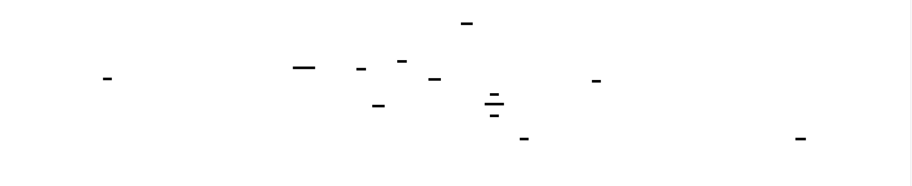
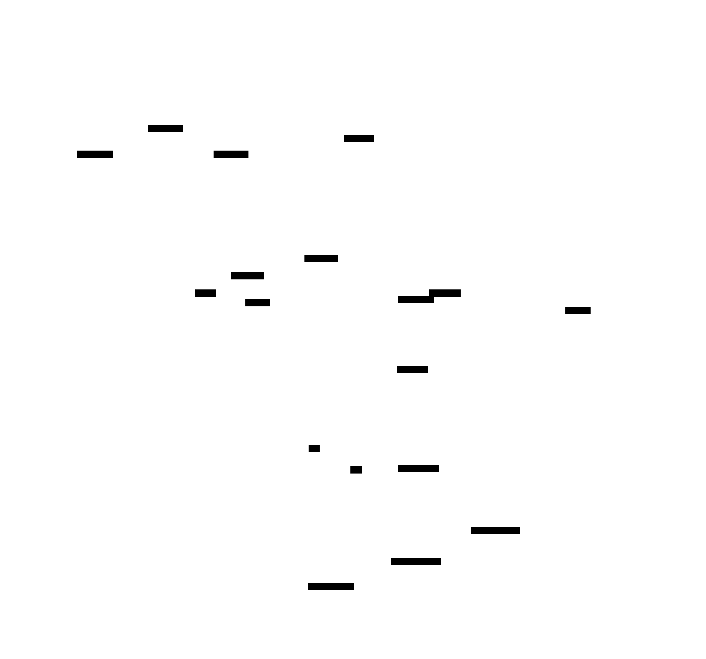

# Software 3D Renderer: Design Document


## Overview

A software-based 3D graphics renderer that transforms 3D models into 2D screen images without GPU acceleration. The system implements the complete graphics pipeline from vertex transformation through rasterization, solving the challenge of efficiently computing perspective projection, depth testing, and pixel-level lighting calculations using only CPU resources.


> This guide is meant to help you understand the big picture before diving into each milestone. Refer back to it whenever you need context on how components connect.


## Context and Problem Statement

> **Milestone(s):** Foundation for all milestones - understanding the mathematical and computational challenges that drive design decisions throughout the project.

Building a 3D renderer from scratch reveals the intricate mathematical and computational challenges that modern GPUs solve thousands of times per second. This section establishes the conceptual foundation for understanding why 3D rendering is computationally demanding and how software-based approaches differ from hardware acceleration.

### Mental Model: The Photography Studio

Think of 3D rendering as orchestrating a complex photography studio shoot. In this analogy, you are simultaneously the **photographer**, **lighting director**, and **stage manager** for a virtual scene.

As the **photographer**, you position a camera in 3D space, choosing where to point it, how far to zoom, and what field of view to capture. Just as a real photographer must account for perspective distortion - objects closer to the lens appear larger while distant objects shrink - your renderer must mathematically compute how 3D coordinates map to the 2D film plane.

As the **lighting director**, you place virtual light sources throughout the scene. Each light casts illumination on 3D surfaces, creating brightness variations that give objects their three-dimensional appearance. Unlike real lighting that bounces infinitely between surfaces, your renderer must compute simplified lighting equations that approximate realistic illumination while remaining computationally feasible.

As the **stage manager**, you must solve the fundamental visibility problem: when multiple objects occupy the same area of the photograph, which ones should appear in front? In the real world, opaque objects naturally block light from reaching objects behind them. Your renderer must explicitly track the distance from the camera to every surface point and systematically hide surfaces that lie behind closer geometry.

The key insight is that unlike a real photography studio where physics automatically handles perspective, lighting, and occlusion, your software renderer must **explicitly compute every aspect** of this process using mathematical equations and algorithms.

> **Core Insight:** Real-world photography is governed by physical laws of optics and light transport. Software rendering must simulate these phenomena through mathematical approximations that balance visual accuracy with computational efficiency.

### Core Rendering Challenges

The computational complexity of 3D rendering stems from four fundamental mathematical challenges that must be solved for every frame.

#### Perspective Projection Mathematics

Converting 3D world coordinates to 2D screen coordinates requires solving the perspective projection equation. Given a 3D point at coordinates `(x, y, z)` in camera space, the 2D screen position `(screen_x, screen_y)` is computed using:

```
screen_x = (x * focal_length) / z + screen_center_x
screen_y = (y * focal_length) / z + screen_center_y
```

This division by the `z` coordinate creates several computational challenges. First, the division operation is significantly more expensive than multiplication or addition, requiring approximately 10-20 CPU cycles compared to 1-2 cycles for basic arithmetic. When processing millions of vertices per frame, this performance difference compounds dramatically.

Second, the division introduces numerical precision issues. As `z` approaches zero (objects very close to the camera), the division result approaches infinity, potentially causing integer overflow or floating-point exceptions. As `z` becomes very large (distant objects), the division result approaches zero, losing subpixel precision and causing distant geometry to collapse to single pixel coordinates.

Third, perspective projection is non-linear, meaning that equal distances in 3D space do not map to equal distances on the 2D screen. This non-linearity complicates interpolation calculations during rasterization, requiring perspective-correct attribute interpolation rather than simple linear interpolation.

#### Hidden Surface Determination

The visibility problem requires determining which surfaces should be visible from the camera's viewpoint when multiple surfaces project to the same screen coordinates. This is fundamentally a sorting problem in three dimensions.

The most common solution, **z-buffering**, maintains a depth buffer storing the distance from the camera to the closest surface at each pixel location. For every pixel that a triangle covers during rasterization, the renderer must:

1. Interpolate the depth value at that pixel using barycentric coordinates
2. Compare the interpolated depth against the existing depth buffer value
3. Update both the color buffer and depth buffer if the new surface is closer
4. Discard the pixel if the new surface is farther away

This process requires one depth comparison per pixel per triangle that covers that pixel. For a scene with 100,000 triangles covering an average of 100 pixels each, this results in 10 million depth comparisons per frame. The memory bandwidth requirements are substantial - each pixel requires reading and potentially writing both a color value (typically 32 bits) and a depth value (typically 24-32 bits).

The interpolation step adds additional computational overhead. Computing the depth value at each pixel requires evaluating barycentric coordinates, which involves multiple multiplication and addition operations. The interpolation must also be perspective-correct to avoid visual artifacts, requiring additional division operations that further impact performance.

#### Lighting Calculations

Realistic lighting simulation requires evaluating illumination equations at every surface point visible to the camera. Even the simplest diffuse lighting model requires computing the dot product between the surface normal vector and the light direction vector for each light source affecting each surface.

For a triangle with vertices `V1`, `V2`, and `V3`, the surface normal is computed using the cross product:
```
edge1 = V2 - V1
edge2 = V3 - V1
normal = normalize(cross_product(edge1, edge2))
```

This calculation involves 9 subtractions, 6 multiplications, 3 additions, and 1 square root operation (for normalization) per triangle. The lighting intensity is then computed as:
```
intensity = max(0, dot_product(normal, light_direction))
```

This requires 3 multiplications and 2 additions per light source per triangle.

The computational load scales with both scene complexity and lighting complexity. A scene with 100,000 triangles and 5 light sources requires 500,000 lighting calculations per frame. Each calculation involves approximately 20 arithmetic operations, totaling 10 million operations just for basic diffuse lighting.

Advanced lighting models compound this complexity. Specular highlights require additional calculations involving view direction and reflection vectors. Multiple light sources require evaluating the lighting equation separately for each light and accumulating the results. Shadows require additional visibility tests to determine whether light sources can reach each surface point.

#### Interpolation and Anti-Aliasing

Smooth visual quality requires interpolating vertex attributes across triangle surfaces and managing aliasing artifacts caused by discrete pixel sampling.

**Attribute interpolation** using barycentric coordinates requires solving a system of linear equations for each pixel. Given a triangle with vertices at screen coordinates `(x1, y1)`, `(x2, y2)`, and `(x3, y3)`, and a pixel at `(px, py)`, the barycentric coordinates `(u, v, w)` satisfy:
```
px = u*x1 + v*x2 + w*x3
py = u*y1 + v*y2 + w*y3
u + v + w = 1
```

Solving this system requires computing the area of the triangle and three sub-triangles, involving multiple cross products and divisions. Once computed, any vertex attribute (color, texture coordinates, normal vectors) can be interpolated as:
```
interpolated_value = u*attr1 + v*attr2 + w*attr3
```

**Anti-aliasing** addresses the fundamental sampling problem: geometric edges rarely align perfectly with the discrete pixel grid, causing jagged "staircase" artifacts. The most accurate anti-aliasing techniques require sampling multiple sub-pixel locations and averaging the results, effectively multiplying the computational load by the number of samples per pixel.

> **Design Insight:** The mathematical complexity of 3D rendering creates a fundamental tension between visual quality and computational performance. Every algorithm choice involves trade-offs between accuracy, speed, and memory usage.

### Hardware vs Software Rendering

The architectural differences between GPU-accelerated and CPU-only rendering approaches reflect fundamentally different strategies for managing the computational challenges described above.

#### GPU Architecture Advantages

Modern graphics processing units are specifically designed to excel at the parallel computations required by 3D rendering. A typical GPU contains thousands of processing cores organized into groups called **shader multiprocessors**. Each multiprocessor can execute the same operation simultaneously on multiple data elements, a parallel computing model known as **Single Instruction, Multiple Data (SIMD)**.

This architecture provides several critical advantages for 3D rendering workloads:

**Vertex Processing Parallelism**: GPUs can transform hundreds of vertices simultaneously by assigning each vertex to a separate processing core. The model-view-projection matrix multiplication for a single vertex requires 16 multiply-accumulate operations (4x4 matrix times 4-element vector), but a GPU can perform these calculations for 512 or more vertices in parallel during the same clock cycle.

**Pixel Processing Parallelism**: Rasterization naturally parallelizes across pixels since each pixel's color can be computed independently. GPUs exploit this by processing rectangular **pixel quads** simultaneously, with each core in a multiprocessor handling one pixel from the quad. This allows parallel evaluation of lighting equations, texture sampling, and depth testing across multiple pixels.

**Memory Bandwidth Optimization**: Graphics rendering requires extremely high memory bandwidth due to frequent framebuffer and texture access patterns. GPUs feature specialized memory controllers optimized for the parallel access patterns common in graphics workloads. Wide memory buses (384-bit or 512-bit) provide 10-20 times more bandwidth than typical CPU memory systems.

**Fixed-Function Hardware**: GPUs include dedicated hardware units for specific rendering operations that would be expensive to implement in software. **Texture units** perform bilinear and trilinear filtering in hardware, **rasterizers** generate pixel coverage masks, and **render output units** handle depth testing and color blending operations.

#### CPU Architecture Limitations

Central processing units are designed for general-purpose computing with emphasis on complex control flow, large caches, and sophisticated branch prediction. While this makes them excellent for varied computational tasks, it creates several limitations for graphics rendering:

**Limited Parallel Processing**: Most consumer CPUs contain 4-16 cores compared to thousands of GPU cores. Even with advanced SIMD instruction sets (SSE, AVX), a CPU can typically process 8-16 floating-point operations in parallel versus hundreds on a GPU.

**Memory Bandwidth Constraints**: CPU memory controllers typically provide 50-100 GB/s of bandwidth compared to 500-1000 GB/s on high-end GPUs. Since rendering requires reading and writing large framebuffers multiple times per frame, memory bandwidth often becomes the limiting factor for software rendering performance.

**Cache Optimization Challenges**: CPU caches are optimized for temporal and spatial locality in general-purpose programs. Graphics rendering often exhibits poor cache behavior due to irregular access patterns during triangle rasterization and texture sampling.

**Software Implementation Overhead**: Operations that GPUs perform in dedicated hardware must be implemented in software on CPUs. Perspective-correct texture sampling, which requires several division operations per pixel, can consume hundreds of CPU cycles compared to a few GPU cycles using specialized texture units.

> **Architecture Decision: Software Rendering Approach**
> - **Context**: Need to choose between targeting GPU-accelerated APIs (OpenGL, Direct3D) versus pure software implementation
> - **Options Considered**:
>   - OpenGL wrapper focusing on learning graphics API usage
>   - Hybrid approach with GPU for performance-critical operations
>   - Pure software implementation using only CPU resources
> - **Decision**: Pure software implementation
> - **Rationale**: Educational value comes from understanding the mathematical foundations rather than API usage. Implementing algorithms from scratch reveals the computational challenges that hardware acceleration solves. Students gain deeper intuition about performance trade-offs and algorithmic complexity.
> - **Consequences**: Significantly slower performance than hardware-accelerated alternatives, but complete control over every aspect of the rendering pipeline. Enables learning the mathematical foundations without abstractions provided by graphics drivers.

The following table compares the architectural approaches:

| Aspect | GPU-Accelerated | Software Rendering |
|--------|----------------|-------------------|
| **Performance** | 60+ FPS at high resolution | 1-10 FPS at moderate resolution |
| **Learning Value** | API usage and graphics programming patterns | Mathematical foundations and algorithmic implementation |
| **Control** | Limited by driver capabilities and API constraints | Complete control over every operation |
| **Debugging** | Difficult - operations occur in hardware | Full visibility into intermediate results |
| **Portability** | Requires graphics drivers and compatible hardware | Runs on any system with basic CPU capabilities |
| **Complexity** | Graphics API learning curve | Mathematical and algorithmic complexity |

#### Software Rendering Performance Strategies

Given the computational constraints of software rendering, several optimization strategies become essential:

**Fixed-Point Arithmetic**: Converting floating-point calculations to fixed-point integer arithmetic can provide 2-4x performance improvements on systems without dedicated floating-point units. Breshenham's line algorithm exemplifies this approach by eliminating all floating-point operations from line rasterization.

**Incremental Computation**: Many rendering calculations can be optimized by computing initial values and applying incremental updates. During triangle rasterization, depth values can be interpolated using addition rather than recomputing barycentric coordinates for each pixel.

**SIMD Vectorization**: Modern CPU SIMD instruction sets allow processing multiple pixels simultaneously. A single AVX2 instruction can perform the same operation on 8 floating-point values, effectively providing 8-way parallelism for pixel processing operations.

**Memory Access Optimization**: Organizing framebuffer and depth buffer access patterns to maximize cache efficiency becomes critical when memory bandwidth is limited. Processing pixels in small rectangular tiles can improve cache locality compared to traditional scanline rasterization.

**Algorithmic Simplifications**: Software renderers often use simplified lighting models and reduced precision calculations to maintain interactive performance. Flat shading (per-triangle lighting) requires significantly less computation than Gouraud shading (per-vertex lighting with interpolation).

⚠️ **Pitfall: Underestimating Software Rendering Performance Requirements**
Software rendering performance is typically 100-1000x slower than hardware-accelerated rendering for equivalent visual quality. A common mistake is attempting to implement complex lighting models or high-resolution rendering without first establishing basic functionality at reduced complexity. Start with wireframe rendering of simple geometry before adding solid fill, lighting, and texture mapping.

⚠️ **Pitfall: Ignoring Numerical Precision Issues**
Software implementations must explicitly handle numerical edge cases that graphics hardware manages automatically. Division by zero in perspective projection, integer overflow in fixed-point arithmetic, and precision loss in depth buffer comparisons can cause rendering artifacts or program crashes. Always implement range checking and fallback behaviors for mathematical edge cases.

The computational challenges of software 3D rendering drive every design decision in the implementation. Understanding these mathematical and architectural constraints provides the foundation for making informed trade-offs between visual quality, performance, and implementation complexity throughout the development process.

### Implementation Guidance

This foundational section establishes the development environment and basic infrastructure needed for the 3D renderer implementation.

#### Technology Recommendations

| Component | Simple Option | Advanced Option |
|-----------|---------------|-----------------|
| **Build System** | Simple Makefile with gcc | CMake with multiple compiler support |
| **Linear Algebra** | Custom vector/matrix structs | External library (GLM, Eigen) |
| **Display Output** | Write PPM image files | SDL2 or GLFW for real-time display |
| **Floating Point** | Standard IEEE 754 float/double | Custom fixed-point arithmetic |
| **Memory Management** | Stack allocation with fixed buffers | Dynamic allocation with custom allocators |
| **Debugging** | Printf debugging with ASCII art | Dedicated debug visualization tools |

#### Recommended File Organization

Organize the renderer codebase to separate mathematical foundations from rendering algorithms:

```
renderer/
  src/
    math/
      vector.h              ← 3D vector operations and data types
      matrix.h              ← 4x4 matrix operations for transformations
      math_utils.h          ← trigonometry, interpolation utilities
    core/
      framebuffer.h         ← pixel buffer and screen output interface
      vertex.h              ← vertex data structure and attributes
      triangle.h            ← triangle primitive and mesh data
    rasterization/
      line.h                ← Bresenham line drawing algorithms
      triangle_fill.h       ← triangle rasterization and filling
      clipping.h            ← viewport clipping algorithms
    pipeline/
      transform.h           ← 3D transformation pipeline
      camera.h              ← camera positioning and projection
      lighting.h            ← lighting models and shading
    renderer.h              ← main renderer interface and state
    main.c                  ← demo program and test scenes
  test/
    math_test.c             ← unit tests for mathematical operations
    visual_test.c           ← integration tests with reference images
  examples/
    wireframe_cube.c        ← simple wireframe demonstration
    shaded_teapot.c         ← full pipeline with lighting
  build/
    Makefile               ← build configuration
  docs/
    coordinates.md         ← coordinate system documentation
    debugging.md           ← common issues and solutions
```

#### Mathematical Infrastructure (Complete Implementation)

The mathematical foundation requires robust vector and matrix operations. Here's the complete infrastructure code:

**File: `src/math/vector.h`**
```c
#ifndef VECTOR_H
#define VECTOR_H

#include <math.h>

// 3D vector for positions, directions, and colors
typedef struct {
    float x, y, z;
} Vector3;

// 4D vector for homogeneous coordinates
typedef struct {
    float x, y, z, w;
} Vector4;

// Vector3 operations
static inline Vector3 vec3_create(float x, float y, float z) {
    return (Vector3){x, y, z};
}

static inline Vector3 vec3_add(Vector3 a, Vector3 b) {
    return (Vector3){a.x + b.x, a.y + b.y, a.z + b.z};
}

static inline Vector3 vec3_subtract(Vector3 a, Vector3 b) {
    return (Vector3){a.x - b.x, a.y - b.y, a.z - b.z};
}

static inline Vector3 vec3_multiply(Vector3 v, float scalar) {
    return (Vector3){v.x * scalar, v.y * scalar, v.z * scalar};
}

static inline float vec3_dot(Vector3 a, Vector3 b) {
    return a.x * b.x + a.y * b.y + a.z * b.z;
}

static inline Vector3 vec3_cross(Vector3 a, Vector3 b) {
    return (Vector3){
        a.y * b.z - a.z * b.y,
        a.z * b.x - a.x * b.z,
        a.x * b.y - a.y * b.x
    };
}

static inline float vec3_length(Vector3 v) {
    return sqrtf(v.x * v.x + v.y * v.y + v.z * v.z);
}

static inline Vector3 vec3_normalize(Vector3 v) {
    float len = vec3_length(v);
    if (len < 1e-6f) return (Vector3){0, 0, 0};  // Handle zero vector
    return vec3_multiply(v, 1.0f / len);
}

// Vector4 operations for homogeneous coordinates
static inline Vector4 vec4_create(float x, float y, float z, float w) {
    return (Vector4){x, y, z, w};
}

static inline Vector4 vec4_from_vec3(Vector3 v, float w) {
    return (Vector4){v.x, v.y, v.z, w};
}

static inline Vector3 vec4_to_vec3(Vector4 v) {
    return (Vector3){v.x, v.y, v.z};
}

#endif
```

**File: `src/math/matrix.h`**
```c
#ifndef MATRIX_H
#define MATRIX_H

#include "vector.h"
#include <string.h>

// 4x4 matrix for transformations (column-major order)
typedef struct {
    float m[16];  // m[column * 4 + row]
} Matrix4;

// Matrix creation and initialization
static inline Matrix4 mat4_identity(void) {
    Matrix4 result = {0};
    result.m[0] = result.m[5] = result.m[10] = result.m[15] = 1.0f;
    return result;
}

static inline Matrix4 mat4_zero(void) {
    Matrix4 result = {0};
    return result;
}

// Matrix element access (row, col both 0-3)
static inline float mat4_get(const Matrix4 *m, int row, int col) {
    return m->m[col * 4 + row];
}

static inline void mat4_set(Matrix4 *m, int row, int col, float value) {
    m->m[col * 4 + row] = value;
}

// Matrix multiplication: result = a * b
static inline Matrix4 mat4_multiply(const Matrix4 *a, const Matrix4 *b) {
    Matrix4 result = {0};
    for (int col = 0; col < 4; col++) {
        for (int row = 0; row < 4; row++) {
            float sum = 0.0f;
            for (int k = 0; k < 4; k++) {
                sum += mat4_get(a, row, k) * mat4_get(b, k, col);
            }
            mat4_set(&result, row, col, sum);
        }
    }
    return result;
}

// Matrix-vector multiplication
static inline Vector4 mat4_multiply_vec4(const Matrix4 *m, Vector4 v) {
    return (Vector4){
        mat4_get(m, 0, 0) * v.x + mat4_get(m, 0, 1) * v.y + mat4_get(m, 0, 2) * v.z + mat4_get(m, 0, 3) * v.w,
        mat4_get(m, 1, 0) * v.x + mat4_get(m, 1, 1) * v.y + mat4_get(m, 1, 2) * v.z + mat4_get(m, 1, 3) * v.w,
        mat4_get(m, 2, 0) * v.x + mat4_get(m, 2, 1) * v.y + mat4_get(m, 2, 2) * v.z + mat4_get(m, 2, 3) * v.w,
        mat4_get(m, 3, 0) * v.x + mat4_get(m, 3, 1) * v.y + mat4_get(m, 3, 2) * v.z + mat4_get(m, 3, 3) * v.w
    };
}

// Transform a 3D point (w=1) through the matrix
static inline Vector3 mat4_transform_point(const Matrix4 *m, Vector3 point) {
    Vector4 v4 = mat4_multiply_vec4(m, vec4_from_vec3(point, 1.0f));
    // Perform perspective division if w != 1
    if (fabsf(v4.w) > 1e-6f && fabsf(v4.w - 1.0f) > 1e-6f) {
        return (Vector3){v4.x / v4.w, v4.y / v4.w, v4.z / v4.w};
    }
    return vec4_to_vec3(v4);
}

// Transform a 3D direction (w=0) through the matrix
static inline Vector3 mat4_transform_direction(const Matrix4 *m, Vector3 direction) {
    Vector4 v4 = mat4_multiply_vec4(m, vec4_from_vec3(direction, 0.0f));
    return vec4_to_vec3(v4);
}

#endif
```

#### Framebuffer Infrastructure (Complete Implementation)

**File: `src/core/framebuffer.h`**
```c
#ifndef FRAMEBUFFER_H
#define FRAMEBUFFER_H

#include <stdint.h>
#include <stdlib.h>
#include <string.h>

// RGB color representation
typedef struct {
    uint8_t r, g, b;
} Color;

// Framebuffer for rendering
typedef struct {
    int width, height;
    Color *color_buffer;
    float *depth_buffer;
} Framebuffer;

// Create framebuffer with specified dimensions
static inline Framebuffer framebuffer_create(int width, int height) {
    Framebuffer fb = {0};
    fb.width = width;
    fb.height = height;
    fb.color_buffer = calloc(width * height, sizeof(Color));
    fb.depth_buffer = malloc(width * height * sizeof(float));
    
    // Initialize depth buffer to maximum depth
    for (int i = 0; i < width * height; i++) {
        fb.depth_buffer[i] = 1.0f;  // Use normalized depth [0,1]
    }
    
    return fb;
}

// Free framebuffer memory
static inline void framebuffer_destroy(Framebuffer *fb) {
    free(fb->color_buffer);
    free(fb->depth_buffer);
    fb->color_buffer = NULL;
    fb->depth_buffer = NULL;
}

// Clear framebuffer to specified color and depth
static inline void framebuffer_clear(Framebuffer *fb, Color clear_color, float clear_depth) {
    int pixel_count = fb->width * fb->height;
    
    for (int i = 0; i < pixel_count; i++) {
        fb->color_buffer[i] = clear_color;
        fb->depth_buffer[i] = clear_depth;
    }
}

// Set pixel color (with bounds checking)
static inline void framebuffer_set_pixel(Framebuffer *fb, int x, int y, Color color) {
    if (x >= 0 && x < fb->width && y >= 0 && y < fb->height) {
        fb->color_buffer[y * fb->width + x] = color;
    }
}

// Set pixel color with depth test
static inline int framebuffer_set_pixel_depth(Framebuffer *fb, int x, int y, Color color, float depth) {
    if (x >= 0 && x < fb->width && y >= 0 && y < fb->height) {
        int index = y * fb->width + x;
        if (depth < fb->depth_buffer[index]) {
            fb->color_buffer[index] = color;
            fb->depth_buffer[index] = depth;
            return 1;  // Pixel was written
        }
    }
    return 0;  // Pixel was rejected
}

// Get pixel color
static inline Color framebuffer_get_pixel(const Framebuffer *fb, int x, int y) {
    if (x >= 0 && x < fb->width && y >= 0 && y < fb->height) {
        return fb->color_buffer[y * fb->width + x];
    }
    return (Color){0, 0, 0};  // Black for out-of-bounds
}

// Color creation utilities
static inline Color color_rgb(uint8_t r, uint8_t g, uint8_t b) {
    return (Color){r, g, b};
}

static inline Color color_from_float(float r, float g, float b) {
    return (Color){
        (uint8_t)(r * 255.0f),
        (uint8_t)(g * 255.0f),
        (uint8_t)(b * 255.0f)
    };
}

// Write framebuffer to PPM file for debugging
static inline void framebuffer_write_ppm(const Framebuffer *fb, const char *filename) {
    FILE *file = fopen(filename, "wb");
    if (!file) return;
    
    fprintf(file, "P6\n%d %d\n255\n", fb->width, fb->height);
    for (int y = 0; y < fb->height; y++) {
        for (int x = 0; x < fb->width; x++) {
            Color pixel = framebuffer_get_pixel(fb, x, y);
            fwrite(&pixel, sizeof(Color), 1, file);
        }
    }
    fclose(file);
}

#endif
```

#### Core Logic Skeleton

The main renderer interface provides the structure for integrating all pipeline components:

**File: `src/renderer.h`**
```c
#ifndef RENDERER_H
#define RENDERER_H

#include "core/framebuffer.h"
#include "math/matrix.h"
#include "math/vector.h"

typedef struct {
    Framebuffer framebuffer;
    Matrix4 model_matrix;
    Matrix4 view_matrix;
    Matrix4 projection_matrix;
    Vector3 light_direction;
    Color ambient_color;
} Renderer;

// Initialize renderer with screen dimensions
Renderer renderer_create(int width, int height);

// Set transformation matrices
void renderer_set_model_matrix(Renderer *r, Matrix4 model);
void renderer_set_view_matrix(Renderer *r, Matrix4 view);
void renderer_set_projection_matrix(Renderer *r, Matrix4 projection);

// Render a triangle using the current pipeline state
void renderer_draw_triangle(Renderer *r, Vector3 v0, Vector3 v1, Vector3 v2, Color color);

// TODO: Implement in milestone 1 - draw line between two points
void renderer_draw_line(Renderer *r, Vector3 start, Vector3 end, Color color);
    // TODO 1: Transform both points through model-view-projection matrices
    // TODO 2: Convert 3D coordinates to 2D screen coordinates
    // TODO 3: Use Bresenham's algorithm to rasterize line pixels
    // TODO 4: Clip line against screen boundaries using Cohen-Sutherland

// TODO: Implement in milestone 2 - fill triangle using barycentric coordinates
void renderer_fill_triangle(Renderer *r, Vector3 v0, Vector3 v1, Vector3 v2, Color color);
    // TODO 1: Transform vertices through model-view-projection matrices
    // TODO 2: Convert to 2D screen coordinates with depth information
    // TODO 3: Compute triangle bounding box for rasterization
    // TODO 4: For each pixel in bounding box, compute barycentric coordinates
    // TODO 5: Test if pixel is inside triangle using barycentric coordinates
    // TODO 6: Interpolate depth value using barycentric weights
    // TODO 7: Perform depth test and update framebuffer if pixel passes

// TODO: Implement in milestone 4 - add lighting calculations
void renderer_draw_triangle_shaded(Renderer *r, Vector3 v0, Vector3 v1, Vector3 v2, Vector3 n0, Vector3 n1, Vector3 n2, Color base_color);
    // TODO 1: Transform vertices and normals through appropriate matrices
    // TODO 2: Compute lighting intensity at each vertex using diffuse model
    // TODO 3: Convert lighting intensities to vertex colors
    // TODO 4: Rasterize triangle with Gouraud shading (interpolate colors)
    // TODO 5: Alternative: Use flat shading (compute one normal per triangle)

#endif
```

#### Language-Specific Optimization Hints

**Memory Management**: Use stack allocation for temporary variables and fixed-size arrays. Avoid `malloc`/`free` in inner rendering loops as dynamic allocation can cause performance bottlenecks.

**Floating-Point Performance**: Modern x86 processors have dedicated SSE/AVX units for floating-point operations. Use `-O2` compiler optimization and consider `-msse2` or `-mavx` flags for vectorization.

**Integer Arithmetic**: For algorithms like Bresenham's line drawing, prefer integer arithmetic over floating-point. Use bit shifts for powers-of-2 division: `x / 4` becomes `x >> 2`.

**Compiler Intrinsics**: Advanced implementations can use SIMD intrinsics like `_mm_add_ps()` for processing multiple pixels simultaneously, but start with scalar implementations first.

#### Milestone Checkpoint: Foundation Verification

After implementing the mathematical infrastructure, verify the foundation with these tests:

**Build Test**: Compile all header files without errors:
```bash
gcc -c src/math/*.h src/core/*.h -I src/
```

**Unit Test**: Create a simple test program to verify vector operations:
```c
// test/foundation_test.c
#include "src/math/vector.h"
#include "src/math/matrix.h"
#include "src/core/framebuffer.h"
#include <stdio.h>

int main() {
    // Test vector operations
    Vector3 v1 = vec3_create(1, 0, 0);
    Vector3 v2 = vec3_create(0, 1, 0);
    Vector3 cross = vec3_cross(v1, v2);
    printf("Cross product: (%f, %f, %f)\n", cross.x, cross.y, cross.z);
    // Expected: (0, 0, 1)
    
    // Test matrix multiplication
    Matrix4 identity = mat4_identity();
    Vector3 point = vec3_create(1, 2, 3);
    Vector3 transformed = mat4_transform_point(&identity, point);
    printf("Transformed point: (%f, %f, %f)\n", transformed.x, transformed.y, transformed.z);
    // Expected: (1, 2, 3)
    
    // Test framebuffer creation
    Framebuffer fb = framebuffer_create(100, 100);
    framebuffer_set_pixel(&fb, 50, 50, color_rgb(255, 0, 0));
    Color pixel = framebuffer_get_pixel(&fb, 50, 50);
    printf("Pixel color: (%d, %d, %d)\n", pixel.r, pixel.g, pixel.b);
    // Expected: (255, 0, 0)
    
    framebuffer_destroy(&fb);
    return 0;
}
```

**Expected Output**: All mathematical operations should produce expected results. Any incorrect values indicate errors in the mathematical infrastructure that must be fixed before proceeding to rendering algorithms.


## Goals and Non-Goals

> **Milestone(s):** All milestones (1-4) - this section establishes the foundational scope and boundaries that guide implementation decisions throughout the entire project.

### Mental Model: The Learning Laboratory

Think of this software renderer as a **learning laboratory** rather than a production graphics engine. Just as a biology student uses a basic microscope to understand cellular structure before moving to advanced electron microscopy, our renderer focuses on the fundamental principles of 3D graphics without the complexity of modern GPU optimizations. We're building a "glass box" system where every mathematical operation is visible and understandable, rather than a "black box" that prioritizes performance over educational clarity.

This mental model shapes every design decision: we choose algorithms that reveal the underlying mathematics, even when faster alternatives exist. We implement core concepts from first principles rather than using optimized libraries. The goal is deep understanding of how 3D rendering actually works, not shipping a commercial product.

### Functional Requirements

The software renderer must implement the complete **graphics pipeline** from 3D vertices to 2D pixels, demonstrating each mathematical transformation step explicitly. These requirements define the minimal viable renderer that teaches all fundamental 3D graphics concepts without overwhelming complexity.

#### Core Geometric Primitives

The renderer must support the essential building blocks of 3D graphics. All 3D models decompose into triangles, so our primitive support focuses on this fundamental shape and its components.

| Primitive Type | Description | Mathematical Representation | Usage Context |
|---------------|-------------|---------------------------|---------------|
| **Point** | Single vertex in 3D space | `Vector3` with x, y, z coordinates | Vertex positions, light sources |
| **Line Segment** | Connection between two points | Two `Vector3` endpoints | Wireframe rendering, debug visualization |
| **Triangle** | Three vertices forming a filled surface | Three `Vector3` vertices with winding order | Primary rendering primitive for all surfaces |
| **Mesh** | Collection of connected triangles | Array of triangles sharing vertices | Complete 3D models (cube, sphere, teapot) |

> **Design Insight**: We deliberately limit primitives to triangles because they are the universal building block of 3D graphics. Quads and polygons can always decompose into triangles, but learning this decomposition is valuable. Modern GPUs also work exclusively with triangles, so this limitation mirrors real-world constraints.

#### Coordinate System Support

The renderer must implement the complete **coordinate transformation hierarchy** that converts 3D models into 2D screen images. Each coordinate space serves a specific purpose in the rendering pipeline.

| Coordinate Space | Purpose | Transformation Matrix | Mathematical Properties |
|-----------------|---------|---------------------|----------------------|
| **Object Space** | Model-specific coordinates | Identity (starting point) | Origin at model center, unit scale |
| **World Space** | Global scene coordinates | Model matrix | Multiple objects positioned relative to world origin |
| **Camera Space** | View-relative coordinates | View matrix | Camera at origin looking down negative Z-axis |
| **Clip Space** | Post-projection coordinates | Projection matrix | Homogeneous coordinates with w-component |
| **Screen Space** | 2D pixel coordinates | Viewport transform | Integer pixel positions with depth values |

The transformation pipeline must handle **homogeneous coordinates** throughout, using 4x4 matrices for all transformations. This mathematical framework enables perspective projection and simplifies matrix composition.

> **Architecture Decision: Column-Major Matrix Storage**
> - **Context**: Matrix elements can be stored in row-major or column-major order, affecting multiplication syntax
> - **Options Considered**: Row-major (C-style arrays), Column-major (OpenGL standard)
> - **Decision**: Column-major storage with 16-element float arrays
> - **Rationale**: Matches OpenGL conventions, simplifies debugging by comparing against reference implementations
> - **Consequences**: Matrix multiplication order matches standard graphics texts, but requires careful indexing: `matrix.m[column*4 + row]`

#### Rasterization Capabilities

The **rasterization engine** must convert geometric primitives into discrete pixel values with mathematically correct coverage and interpolation. This is where continuous mathematics meets discrete pixel grids.

| Rasterization Feature | Algorithm Requirement | Mathematical Basis | Quality Expectation |
|----------------------|---------------------|-------------------|-------------------|
| **Line Drawing** | Bresenham's algorithm | Integer-only arithmetic | Pixel-perfect lines in all octants |
| **Triangle Filling** | Barycentric coordinates | Edge functions and area ratios | Gap-free triangle coverage |
| **Attribute Interpolation** | Perspective-correct interpolation | Barycentric weight computation | Smooth color and depth gradients |
| **Clipping** | Cohen-Sutherland algorithm | Parametric line intersection | Clean edges at screen boundaries |

The rasterization system must handle **edge cases** that frequently cause rendering artifacts:

⚠️ **Pitfall: Degenerate Triangles**
Zero-area triangles (where all three vertices are collinear) can cause division by zero in barycentric coordinate calculations. The renderer must detect these cases using cross-product magnitude and skip rendering without crashing.

⚠️ **Pitfall: Pixel Coverage Gaps**
Adjacent triangles sharing edges can leave single-pixel gaps due to floating-point precision. Consistent edge rules (e.g., "top-left fill rule") ensure that shared edges belong to exactly one triangle.

#### 3D Transformation Mathematics

The renderer must implement **4x4 matrix mathematics** that handles the complete model-view-projection pipeline. All transformations compose through matrix multiplication, enabling complex scenes with multiple objects and camera movements.

| Matrix Type | Mathematical Construction | Required Operations | Geometric Effect |
|------------|-------------------------|-------------------|-----------------|
| **Translation** | Identity matrix with offset in column 4 | Position vector addition | Object movement in world space |
| **Rotation** | Orthogonal matrix from axis-angle | Trigonometric functions | Object orientation changes |
| **Scale** | Diagonal matrix with scale factors | Component-wise multiplication | Object size modification |
| **Look-At** | Camera basis vectors from eye, target, up | Cross products and normalization | Camera positioning and orientation |
| **Perspective** | Frustum mapping with w-division | Field of view and aspect ratio | Foreshortening and depth perception |
| **Orthographic** | Linear mapping without perspective | Parallel projection | Technical drawings without foreshortening |

The matrix system must support **composition** through multiplication, where the final transformation matrix combines all individual transforms: `MVP = Projection × View × Model`

> **Critical Implementation Detail**: Matrix multiplication is **not commutative** - order matters. The transformation applies in reverse order of multiplication: a vertex first transforms by Model, then View, then Projection. This mathematical property often confuses learners but is fundamental to 3D graphics.

#### Depth Testing and Hidden Surface Removal

The renderer must implement **z-buffering** to determine which surfaces are visible from the camera viewpoint. This solves the visibility problem that becomes complex with overlapping 3D geometry.

| Depth Testing Component | Data Structure | Algorithm | Precision Considerations |
|------------------------|---------------|-----------|------------------------|
| **Depth Buffer** | 2D array of float values | Per-pixel depth storage | 32-bit precision minimum |
| **Depth Test** | Comparison operation | Fragment depth vs stored depth | Handles equal depths consistently |
| **Depth Write** | Buffer update | Conditional depth value storage | Only writes when test passes |
| **Depth Clear** | Buffer initialization | Reset to maximum depth value | Typically far plane distance |

The z-buffer algorithm must interpolate depth values across triangle surfaces using the same **barycentric coordinates** used for color interpolation. This ensures mathematically consistent depth testing at every pixel.

#### Basic Lighting Model

The renderer must implement **diffuse lighting** that simulates how surfaces appear under illumination. This introduces the concept of surface normals and demonstrates how lighting calculations transform surface geometry into perceived brightness.

| Lighting Component | Mathematical Representation | Computation Method | Visual Effect |
|-------------------|---------------------------|-------------------|---------------|
| **Surface Normals** | Unit vector perpendicular to surface | Cross product of triangle edges | Determines surface orientation |
| **Light Direction** | Unit vector toward light source | Vector from surface to light position | Controls light angle of incidence |
| **Diffuse Reflection** | Lambertian model | Dot product of normal and light direction | Surface brightness varies with angle |
| **Ambient Lighting** | Constant illumination term | Fixed color value added to all surfaces | Prevents completely black shadows |

The lighting system must support two **shading modes** that demonstrate different approaches to illumination computation:

| Shading Mode | Computation Location | Interpolation Method | Visual Quality |
|-------------|---------------------|---------------------|---------------|
| **Flat Shading** | One calculation per triangle | Constant color across triangle | Faceted appearance, shows triangle structure |
| **Gouraud Shading** | Per-vertex calculation | Linear color interpolation | Smooth gradients, hides triangle edges |

### Explicit Non-Goals

The software renderer deliberately excludes advanced features that would complicate the learning objectives or require techniques beyond the scope of fundamental 3D graphics. These exclusions maintain focus on core concepts while keeping the implementation manageable.

#### Texture Mapping

**Texture mapping** - applying 2D images to 3D surfaces - is explicitly excluded despite being ubiquitous in modern 3D graphics. This decision prioritizes mathematical understanding over visual realism.

> **Decision: No Texture Support**
> - **Context**: Texture mapping requires UV coordinate interpolation, texture sampling, and image loading/storage
> - **Options Considered**: Basic texture mapping, Procedural textures only, No textures
> - **Decision**: Complete exclusion of texture functionality
> - **Rationale**: Texture mapping obscures the underlying lighting and shading mathematics with image processing complexity. Students learn more about 3D rendering fundamentals through solid colors and lighting variations.
> - **Consequences**: Rendered images appear flat and geometric, but mathematical concepts remain clearly visible. Students can add texture mapping as a later extension once core concepts are mastered.

The exclusion encompasses all texture-related functionality:

| Excluded Texture Feature | Complexity Reason | Alternative Learning Approach |
|-------------------------|------------------|------------------------------|
| **UV Coordinate Mapping** | Requires perspective-correct interpolation | Use vertex colors for surface variation |
| **Texture Sampling** | Involves filtering algorithms and memory management | Focus on lighting equations for surface appearance |
| **Mipmapping** | Adds level-of-detail complexity | Emphasize geometric detail instead |
| **Texture Filtering** | Requires convolution mathematics | Study interpolation through color gradients |

#### Advanced Lighting Models

**Specular highlights**, **multiple light sources**, and **shadow casting** exceed the scope of basic lighting understanding. The renderer limits lighting to simple diffuse reflection from a single directional light.

| Excluded Lighting Feature | Mathematical Complexity | Implementation Burden |
|-------------------------|------------------------|---------------------|
| **Specular Highlights** | Phong/Blinn-Phong models with view-dependent terms | Requires camera position in lighting calculations |
| **Point/Spot Lights** | Distance attenuation and positional calculations | Complex light vector computation per vertex |
| **Shadow Mapping** | Secondary rendering passes and depth comparison | Doubles rendering workload and adds depth bias issues |
| **Global Illumination** | Ray tracing or radiosity algorithms | Computationally prohibitive for software renderer |

> **Design Rationale**: Single directional lighting teaches the fundamental relationship between surface normals and illumination without the complexity of multiple light interactions. Students can observe how surface orientation affects brightness, which is the core insight of computer graphics lighting.

#### Real-Time Performance

The software renderer **does not target real-time performance** (30-60 FPS). Instead, it prioritizes code clarity and mathematical correctness over optimization techniques that would obscure the learning objectives.

| Performance Optimization | Exclusion Reason | Learning Alternative |
|-------------------------|------------------|---------------------|
| **SIMD Vectorization** | Obscures individual mathematical operations | Implement scalar operations to see each calculation |
| **Multithreading** | Adds synchronization complexity | Single-threaded pipeline reveals data dependencies |
| **Assembly Optimization** | Platform-specific and difficult to understand | High-level C code shows algorithmic structure |
| **Memory Pool Allocation** | Complicates resource management | Simple malloc/free demonstrates data lifetime |

Expected performance targets reflect the educational focus:

| Rendering Scenario | Expected Performance | Acceptable Quality |
|-------------------|---------------------|-------------------|
| **Simple Scene** (100 triangles) | 1-5 FPS | Interactive preview |
| **Medium Scene** (1000 triangles) | 0.1-1 FPS | Batch rendering |
| **Complex Scene** (10000+ triangles) | <0.1 FPS | Offline rendering only |

> **Performance Philosophy**: Students should be able to step through the renderer with a debugger and understand every operation. Optimization techniques like loop unrolling, cache-friendly data structures, and branch prediction would interfere with this pedagogical goal.

#### Advanced Geometric Features

**Curved surfaces**, **subdivision algorithms**, and **procedural geometry** require mathematical techniques beyond basic linear algebra and trigonometry. The renderer limits geometry to explicit triangle meshes.

| Excluded Geometry Feature | Mathematical Requirement | Alternative Approach |
|-------------------------|------------------------|---------------------|
| **Bezier/NURBS Curves** | Parametric surface mathematics | Approximate with dense triangle meshes |
| **Subdivision Surfaces** | Recursive refinement algorithms | Start with pre-subdivided models |
| **Displacement Mapping** | Texture-based geometry modification | Use geometric detail in base mesh |
| **Instancing** | Transform hierarchies and batch rendering | Duplicate geometry for multiple objects |

#### Modern Graphics Pipeline Features

**Programmable shaders**, **compute shaders**, and **GPU-specific optimizations** represent modern graphics architectures that abstract away the fundamental mathematical operations. The software renderer maintains visibility into all computations.

| Excluded Modern Feature | Abstraction Problem | Educational Value |
|------------------------|-------------------|-------------------|
| **Vertex Shaders** | GPU programs hide transformation details | Implement transformations explicitly in C |
| **Fragment Shaders** | Parallel execution model unclear | Process pixels sequentially to see interpolation |
| **Geometry Shaders** | Advanced primitive processing | Focus on triangle primitives only |
| **Tessellation** | Hardware-accelerated subdivision | Understand triangle rasterization first |

> **Pedagogical Insight**: Modern graphics APIs like Vulkan and DirectX 12 optimize for GPU throughput through complex state management and parallel execution models. These optimizations solve important practical problems but obscure the mathematical relationships that students need to understand. A software renderer makes every calculation explicit and debuggable.

### Implementation Guidance

The functional requirements and non-goals translate into specific technology choices and code organization strategies that support the educational objectives while maintaining implementable scope.

#### Technology Recommendations

| Component | Simple Option | Advanced Option |
|-----------|---------------|----------------|
| **Core Language** | C with minimal libraries | C++ with STL containers |
| **Linear Algebra** | Manual vector/matrix structs | GLM or similar math library |
| **Display Output** | PPM image files | SDL2 or GLFW window |
| **Model Loading** | Hardcoded triangle arrays | Simple OBJ file parser |
| **Build System** | Single Makefile | CMake with multiple targets |

> **Recommendation**: Start with C and PPM output for maximum simplicity. Students can see rendered frames by opening PPM files in image viewers, eliminating windowing system complexity during initial development.

#### Recommended File Structure

Organize the renderer codebase to separate mathematical operations from rendering logic, making the pipeline stages clearly visible:

```
renderer/
├── src/
│   ├── math/
│   │   ├── vector.h         ← Vector3, Vector4 definitions
│   │   ├── vector.c         ← vec3_add, vec3_dot, etc.
│   │   ├── matrix.h         ← Matrix4 definition
│   │   └── matrix.c         ← mat4_multiply, mat4_identity
│   ├── graphics/
│   │   ├── framebuffer.h    ← Framebuffer structure
│   │   ├── framebuffer.c    ← framebuffer_create, framebuffer_set_pixel
│   │   ├── rasterizer.h     ← Line and triangle drawing functions
│   │   └── rasterizer.c     ← Bresenham, barycentric algorithms
│   ├── renderer/
│   │   ├── renderer.h       ← Main Renderer structure
│   │   ├── renderer.c       ← High-level rendering functions
│   │   ├── transform.h      ← Transformation pipeline
│   │   └── transform.c      ← Model-view-projection math
│   └── main.c               ← Example scenes and output
├── models/
│   ├── cube.h               ← Hardcoded cube triangle data
│   └── teapot.h             ← More complex test model
├── output/                  ← Generated PPM images
└── Makefile                 ← Build configuration
```

This organization separates mathematical foundations (math/), low-level graphics operations (graphics/), and high-level rendering logic (renderer/). Students can implement and test each layer independently.

#### Infrastructure Starter Code

**Framebuffer Management** (Complete Implementation):
```c
// framebuffer.h - Complete header with all required functionality
#ifndef FRAMEBUFFER_H
#define FRAMEBUFFER_H

#include <stdint.h>
#include <stdlib.h>

typedef struct {
    uint8_t r, g, b;
} Color;

typedef struct {
    int width, height;
    Color* color_buffer;      // width * height elements
    float* depth_buffer;      // width * height elements
} Framebuffer;

// Complete implementations provided - students use without modification
Framebuffer framebuffer_create(int width, int height);
void framebuffer_destroy(Framebuffer* fb);
void framebuffer_clear_color(Framebuffer* fb, Color color);
void framebuffer_clear_depth(Framebuffer* fb, float depth);
void framebuffer_set_pixel(Framebuffer* fb, int x, int y, Color color);
int framebuffer_set_pixel_depth(Framebuffer* fb, int x, int y, Color color, float depth);
void framebuffer_save_ppm(Framebuffer* fb, const char* filename);

#endif
```

**PPM Image Output** (Complete Implementation):
```c
// Provided complete - handles file I/O complexity
void framebuffer_save_ppm(Framebuffer* fb, const char* filename) {
    FILE* file = fopen(filename, "wb");
    fprintf(file, "P6\n%d %d\n255\n", fb->width, fb->height);
    for (int y = 0; y < fb->height; y++) {
        for (int x = 0; x < fb->width; x++) {
            Color pixel = fb->color_buffer[y * fb->width + x];
            fputc(pixel.r, file);
            fputc(pixel.g, file);
            fputc(pixel.b, file);
        }
    }
    fclose(file);
}
```

#### Core Logic Skeleton Code

**Vector Mathematics** (Students Implement):
```c
// vector.c - Students fill in the mathematical operations
Vector3 vec3_add(Vector3 a, Vector3 b) {
    // TODO: Add corresponding components (a.x + b.x, etc.)
    // TODO: Return new Vector3 with summed components
}

Vector3 vec3_cross(Vector3 a, Vector3 b) {
    // TODO: Compute cross product using determinant formula
    // TODO: Result.x = a.y * b.z - a.z * b.y
    // TODO: Result.y = a.z * b.x - a.x * b.z  
    // TODO: Result.z = a.x * b.y - a.y * b.x
    // TODO: Return computed cross product vector
}

Vector3 vec3_normalize(Vector3 v) {
    // TODO: Compute magnitude using sqrt(x² + y² + z²)
    // TODO: Handle zero-length vector case (return original vector)
    // TODO: Divide each component by magnitude
    // TODO: Return normalized unit vector
}
```

**Matrix Operations** (Students Implement):
```c
// matrix.c - Core transformation mathematics
Matrix4 mat4_multiply(Matrix4* a, Matrix4* b) {
    Matrix4 result = {0};
    // TODO: Implement 4x4 matrix multiplication using three nested loops
    // TODO: for i = 0 to 3: for j = 0 to 3: for k = 0 to 3:
    // TODO:   result.m[j*4 + i] += a->m[k*4 + i] * b->m[j*4 + k]
    // TODO: Remember column-major storage: column*4 + row indexing
    return result;
}

Matrix4 mat4_perspective(float fov, float aspect, float near, float far) {
    Matrix4 result = {0};
    // TODO: Convert FOV from degrees to radians
    // TODO: Compute f = 1.0 / tan(fov_radians / 2.0)
    // TODO: Set perspective matrix elements:
    // TODO:   m[0] = f / aspect, m[5] = f
    // TODO:   m[10] = (far + near) / (near - far)
    // TODO:   m[11] = -1.0, m[14] = 2*far*near / (near - far)
    return result;
}
```

#### Language-Specific Hints

**C Development Tips**:
- Use `#include <math.h>` and link with `-lm` for trigonometric functions in matrix calculations
- Initialize struct values with `= {0}` syntax to zero all fields automatically
- Check `malloc()` return values for allocation failures in framebuffer creation
- Use `const` parameters for read-only data structures to prevent accidental modification
- Compile with `-Wall -Wextra` flags to catch common mathematical errors like uninitialized variables

**Mathematical Precision Considerations**:
- Use `float` precision for all calculations - avoids `double` promotion complexity
- Define epsilon constant `#define EPSILON 1e-6f` for floating-point comparisons
- Normalize vectors after cross products to prevent magnitude drift in repeated operations
- Clamp interpolation weights to [0,1] range to prevent color overflow in lighting calculations

#### Milestone Checkpoints

**Milestone 1 Verification** (Line Drawing):
After implementing Bresenham's algorithm, create test program:
```c
// Test all octants with diagonal lines
framebuffer_set_pixel(&fb, 0, 0, (Color){255, 0, 0});    // Start point
framebuffer_set_pixel(&fb, 100, 50, (Color){0, 255, 0}); // End point  
renderer_draw_line(&renderer, 
    vec3_create(0, 0, 0), vec3_create(100, 50, 0), 
    (Color){255, 255, 255});
```

Expected behavior: Clean diagonal line with no gaps, pixels form connected path from start to end point.

**Milestone 2 Verification** (Triangle Rasterization):
```c
// Test triangle filling
renderer_fill_triangle(&renderer,
    vec3_create(50, 20, 0),    // Top vertex
    vec3_create(20, 80, 0),    // Bottom left  
    vec3_create(80, 80, 0),    // Bottom right
    (Color){255, 0, 0});
```

Expected behavior: Solid red triangle with no interior gaps, clean edges, proper handling of horizontal bottom edge.

**Milestone 3 Verification** (3D Transformations):
Render rotating cube by modifying model matrix each frame:
```c
for (int frame = 0; frame < 360; frame += 10) {
    Matrix4 rotation = mat4_rotation_y(frame * M_PI / 180.0f);
    renderer.model_matrix = rotation;
    // Render cube triangles...
    char filename[64];
    sprintf(filename, "frame_%03d.ppm", frame);
    framebuffer_save_ppm(&renderer.framebuffer, filename);
}
```

Expected behavior: Cube appears to rotate, perspective foreshortening visible, far edges smaller than near edges.

**Milestone 4 Verification** (Depth and Lighting):
Render two overlapping triangles with different depths:
```c
// Front triangle (smaller z)
renderer_fill_triangle(&renderer,
    vec3_create(30, 30, -1), vec3_create(70, 30, -1), vec3_create(50, 70, -1),
    (Color){255, 0, 0});

// Back triangle (larger z) 
renderer_fill_triangle(&renderer,
    vec3_create(40, 40, -2), vec3_create(80, 40, -2), vec3_create(60, 80, -2),
    (Color){0, 255, 0});
```

Expected behavior: Red triangle appears in front of green triangle, depth buffer prevents background triangle from overwriting foreground pixels.


## High-Level Architecture

> **Milestone(s):** All milestones (1-4) - this section establishes the foundational component structure and data flow that guides implementation throughout the entire project pipeline.

### Mental Model: The Assembly Line Factory

Think of our software 3D renderer as a modern assembly line factory that transforms raw materials into finished products. Just as a car factory takes steel sheets, plastic pellets, and electronic components through sequential workstations (stamping, welding, painting, assembly) to produce a complete automobile, our renderer takes 3D vertex coordinates and transforms them through distinct processing stages (transformation, rasterization, shading) to produce a 2D image filled with colored pixels.

Each workstation in the factory has specialized equipment and workers trained for specific tasks - the stamping station only shapes metal, the paint booth only applies color. Similarly, each component in our renderer has a focused responsibility: the transformation pipeline only handles coordinate mathematics, the rasterization engine only converts triangles to pixels, and the shading system only computes lighting. No component tries to do everything, and the output of one stage becomes the input to the next in a predictable sequence.

The factory analogy also reveals why **data flow architecture** matters so much. Raw materials must move efficiently between workstations without bottlenecks - if the stamping station produces panels faster than welding can consume them, inventory builds up and the factory slows down. In our renderer, vertex data must flow smoothly through the pipeline stages without unnecessary copying or complex interdependencies that create processing bottlenecks.


### Graphics Pipeline Stages: Sequential transformation from 3D vertices to 2D pixels

The graphics pipeline represents the fundamental data flow architecture that transforms three-dimensional geometric descriptions into two-dimensional pixel arrays. Understanding this pipeline sequence is crucial because it determines not only the order of implementation milestones, but also the interfaces between components and the overall system performance characteristics.

#### Stage 1: Geometry Input and Preprocessing

The pipeline begins with **geometric primitive input** where the renderer receives triangular meshes described as collections of 3D vertices. Each vertex carries multiple attributes beyond just position coordinates - normal vectors for lighting calculations, texture coordinates for surface mapping, and potentially color values for per-vertex shading. The preprocessing stage validates this input geometry, checking for degenerate triangles (zero area), coincident vertices, and proper winding order that determines front-facing versus back-facing surfaces.

During preprocessing, the system also performs **geometric culling** operations that eliminate triangles completely outside the viewing frustum. This early rejection prevents unnecessary computation in later pipeline stages - there's no point transforming and rasterizing geometry that will never appear on screen. The culling logic uses bounding box tests and plane-distance calculations to quickly categorize triangles as visible, invisible, or partially visible (requiring clipping).

#### Stage 2: Vertex Transformation Pipeline

The **coordinate transformation hierarchy** forms the mathematical heart of 3D rendering. Each vertex position undergoes a sequence of matrix multiplications that convert coordinates through different mathematical spaces. This multi-stage transformation serves both mathematical convenience (each matrix handles one specific geometric operation) and computational efficiency (matrices can be pre-multiplied to reduce per-vertex calculations).

The transformation sequence follows this precise order: Object Space → World Space → Camera Space → Clip Space → Screen Space. Object space represents the model's local coordinate system as defined by the artist or procedural generator. The model matrix transforms these coordinates into world space, where multiple objects coexist in a shared coordinate system. The view matrix then converts world coordinates into camera space, where the viewer is positioned at the origin looking down the negative Z-axis. Finally, the projection matrix maps camera space into clip space, where perspective division creates the foreshortening effect that makes distant objects appear smaller.

| Transformation Stage | Input Space | Output Space | Matrix Type | Primary Purpose |
|---------------------|-------------|-------------|-------------|-----------------|
| Model Transform | Object Space | World Space | `model_matrix` | Position/orient object in scene |
| View Transform | World Space | Camera Space | `view_matrix` | Position/orient camera viewpoint |
| Projection Transform | Camera Space | Clip Space | `projection_matrix` | Apply perspective foreshortening |
| Viewport Transform | Clip Space | Screen Space | Fixed calculation | Map to pixel coordinates |

#### Stage 3: Primitive Assembly and Clipping

After vertex transformation, individual vertices must be **assembled into geometric primitives** (primarily triangles in our renderer). This assembly stage groups transformed vertices according to the mesh's index buffer, which specifies how vertices connect to form triangle faces. The assembled triangles then undergo **viewport clipping** against the screen boundaries to handle triangles that extend partially outside the visible area.

The Cohen-Sutherland clipping algorithm efficiently categorizes each triangle vertex as inside, outside, or intersecting the viewport rectangle. Triangles completely inside pass through unchanged, triangles completely outside are discarded, and triangles that intersect viewport boundaries undergo geometric clipping that creates new vertices along the intersection edges. This clipping process ensures that subsequent rasterization operations only process pixels within valid screen coordinates.

#### Stage 4: Rasterization and Pixel Generation

**Rasterization** converts geometric triangles into discrete pixel locations through a process that determines which screen pixels are covered by each triangle. This stage implements the core algorithms from Milestones 1 and 2: line rasterization using Bresenham's algorithm and triangle filling using barycentric coordinate interpolation.

The rasterization engine processes each triangle by first computing its **screen-space bounding box** to limit pixel iteration to the triangle's vicinity. For each pixel within this bounding box, barycentric coordinates determine whether the pixel center lies inside the triangle. Pixels inside the triangle undergo **attribute interpolation** where vertex properties (color, depth, normal vectors) are blended according to the barycentric weights, producing smooth gradients across the triangle surface.

#### Stage 5: Depth Testing and Fragment Processing

Before writing pixel colors to the framebuffer, each rasterized pixel (called a **fragment** in graphics terminology) undergoes **depth testing** against the existing depth buffer contents. This z-buffering algorithm solves the **hidden surface problem** by ensuring that only the closest surface at each pixel location contributes to the final image.

The depth testing process compares the fragment's interpolated depth value against the corresponding depth buffer entry. If the fragment is closer to the camera, it passes the depth test, overwrites the depth buffer with its depth value, and continues to the shading stage. If the fragment is farther away, it fails the depth test and is discarded without affecting the framebuffer. This per-pixel depth comparison enables correct rendering of overlapping objects regardless of the order in which triangles are processed.

#### Stage 6: Shading and Lighting Calculations

The final pipeline stage computes the **final pixel color** through lighting calculations that simulate how light interacts with surface materials. The shading system implements the diffuse lighting model, which calculates surface brightness based on the angle between incident light rays and surface normal vectors.

**Flat shading** computes one lighting value per triangle using the face normal vector, producing uniform illumination across the entire triangle surface. This approach creates a faceted appearance that clearly shows individual triangular faces. **Gouraud shading** alternatively computes lighting at each vertex using vertex normal vectors, then interpolates the resulting colors across the triangle surface during rasterization, producing smooth color gradients that hide the underlying triangular tessellation.

> **Decision: Pipeline Stage Ordering**
> - **Context**: The graphics pipeline could theoretically be organized in different orders, such as performing lighting calculations before transformation or rasterization
> - **Options Considered**: 
>   1. Transform → Rasterize → Light (chosen approach)
>   2. Light → Transform → Rasterize (lighting in object space)
>   3. Transform → Light → Rasterize (lighting in world space)
> - **Decision**: Perform lighting calculations after rasterization using interpolated surface normals
> - **Rationale**: This ordering enables Gouraud shading with smooth interpolation, matches hardware GPU pipeline organization, and allows per-pixel normal interpolation for future extensions
> - **Consequences**: Enables milestone progression from basic rasterization to advanced shading, but requires normal vector interpolation during rasterization

### Component Responsibilities: Role and scope of each major rendering subsystem

The renderer architecture divides functionality among specialized components, each with clearly defined responsibilities and minimal interdependencies. This modular organization enables incremental development following the project milestones while maintaining clean interfaces that prevent components from becoming tightly coupled.

#### Framebuffer Manager: Pixel Storage and Access

The **Framebuffer Manager** owns all pixel-level storage and provides the fundamental interface for writing rendered results. This component encapsulates the `Framebuffer` structure containing both color and depth buffer arrays, managing memory allocation and providing bounds-checked pixel access methods.

| Method Name | Parameters | Returns | Description |
|-------------|------------|---------|-------------|
| `framebuffer_create` | `width int, height int` | `Framebuffer` | Allocates color and depth buffer memory |
| `framebuffer_set_pixel` | `Framebuffer*, x int, y int, Color` | `void` | Sets pixel color without depth testing |
| `framebuffer_set_pixel_depth` | `Framebuffer*, x int, y int, Color, depth float` | `int` | Sets pixel with depth test, returns success |
| `framebuffer_clear` | `Framebuffer*, Color, depth float` | `void` | Clears all pixels to specified values |
| `framebuffer_save_ppm` | `Framebuffer*, filename char*` | `void` | Exports framebuffer as PPM image file |

The Framebuffer Manager also handles **memory layout optimization** by organizing pixel data for cache-efficient access patterns. Color values are stored as packed RGB structures to minimize memory bandwidth, while depth values use 32-bit floating-point precision to avoid z-fighting artifacts in complex scenes. The component provides both unchecked pixel writes for performance-critical inner loops and bounds-checked writes for safer general usage.

#### Vector and Matrix Mathematics Library

The **Mathematics Library** implements all vector and matrix operations required for 3D coordinate transformations. This component provides stateless mathematical functions that form the computational foundation for the transformation pipeline, geometric calculations, and lighting computations.

The library centers around the `Vector3`, `Vector4`, and `Matrix4` data structures, providing comprehensive operations for each type. Vector operations include basic arithmetic (addition, subtraction, scalar multiplication), geometric calculations (dot product, cross product, normalization), and specialized 3D graphics functions (reflection, projection). Matrix operations focus on 4x4 homogeneous transformation matrices, including multiplication, inversion, and transformation composition.

| Data Structure | Key Fields | Primary Usage |
|---------------|------------|---------------|
| `Vector3` | `x float, y float, z float` | 3D positions, directions, normals |
| `Vector4` | `x float, y float, z float, w float` | Homogeneous coordinates, RGBA colors |
| `Matrix4` | `m[16] float` (column-major) | Transformation matrices |

The mathematics library implements **column-major matrix storage** to match standard mathematical notation and enable efficient SIMD vectorization in future optimizations. All matrix operations preserve numerical stability through careful ordering of operations and appropriate use of floating-point epsilon comparisons for equality testing.

#### Transformation Pipeline Engine

The **Transformation Pipeline** component orchestrates the conversion of 3D vertices through the coordinate space hierarchy. This system maintains the model, view, and projection matrices as rendering state, providing high-level transformation operations that combine multiple matrix multiplications into efficient composite transforms.

The pipeline engine implements **matrix composition optimization** by pre-multiplying the model, view, and projection matrices into a single model-view-projection (MVP) matrix when the matrices remain constant across multiple vertices. This optimization reduces per-vertex transformation from three matrix multiplications to one, significantly improving performance for complex meshes.

The transformation component also handles **homogeneous coordinate management**, automatically converting between 3D positions and 4D homogeneous representations as needed. After matrix multiplication, the component performs perspective division (dividing x, y, z by w) to convert from clip space to normalized device coordinates, then applies the viewport transformation to produce final screen coordinates.

#### Rasterization Engine

The **Rasterization Engine** converts geometric primitives into discrete pixel locations using the algorithms from Milestones 1 and 2. This component implements both line rasterization via Bresenham's algorithm and triangle rasterization using barycentric coordinate interpolation.

For line rasterization, the engine handles all eight octants correctly by analyzing the line's slope and direction, then applying the appropriate Bresenham variant. The algorithm uses integer-only arithmetic to avoid floating-point precision issues, incrementally computing pixel positions along the line path.

Triangle rasterization employs the **edge function approach** where three edge equations define the triangle boundaries. For each pixel in the triangle's bounding box, the engine evaluates these edge functions to compute barycentric coordinates. Positive barycentric coordinates indicate pixels inside the triangle, which then undergo attribute interpolation using the barycentric weights as blending factors.

| Rasterization Method | Input Primitives | Output | Key Algorithm |
|---------------------|------------------|--------|---------------|
| Line Rasterization | Two `Vector3` endpoints | Pixel sequence | Bresenham's algorithm |
| Triangle Rasterization | Three `Vector3` vertices | Filled triangle pixels | Barycentric coordinates |
| Viewport Clipping | Screen-space primitives | Clipped primitives | Cohen-Sutherland algorithm |

The rasterization engine also implements **sub-pixel accuracy** for anti-aliasing by sampling multiple locations within each pixel and averaging the results. This technique reduces the stair-step artifacts (aliasing) that occur when rasterizing diagonal lines and triangle edges.

#### Depth Buffer and Visibility System

The **Depth Buffer System** manages per-pixel depth storage and implements the z-buffering algorithm for hidden surface removal. This component works closely with the rasterization engine, performing depth tests for each fragment generated during triangle rasterization.

The depth buffer maintains a **floating-point depth value** for every pixel location, initially cleared to the maximum depth value (representing infinite distance). During rasterization, each fragment's interpolated depth undergoes comparison with the stored depth value. Fragments that pass the depth test (are closer to the camera) update both the color and depth buffers, while fragments that fail are discarded without affecting the framebuffer.

The system implements **depth buffer precision management** to minimize z-fighting artifacts caused by floating-point precision limitations. The depth buffer uses 32-bit floating-point values with a carefully chosen near/far plane ratio that maximizes depth precision in the visible range while avoiding numerical instability.

#### Lighting and Shading System

The **Shading System** computes final pixel colors by simulating light interaction with surface materials. This component implements both flat shading (per-triangle lighting) and Gouraud shading (per-vertex lighting with interpolation) using the diffuse lighting model.

The shading calculations center around the **Lambert's cosine law**, which states that surface brightness is proportional to the cosine of the angle between the incident light direction and the surface normal vector. This relationship is computed using the dot product of normalized light and normal vectors, with negative values clamped to zero (surfaces facing away from light sources receive no illumination).

For flat shading, the system computes one normal vector per triangle using the cross product of two triangle edges. This face normal represents the triangle's average orientation, producing uniform lighting across the entire surface. For Gouraud shading, the system uses per-vertex normal vectors (typically averaged from adjacent face normals), computes lighting at each vertex, then interpolates the resulting colors during rasterization.

| Shading Method | Normal Source | Computation Location | Visual Result |
|---------------|---------------|---------------------|---------------|
| Flat Shading | Face normal (cross product) | Once per triangle | Faceted appearance |
| Gouraud Shading | Vertex normals | Per vertex, then interpolate | Smooth gradients |

> **Decision: Component Interface Design**
> - **Context**: Components could communicate through direct function calls, message passing, or shared data structures
> - **Options Considered**:
>   1. Direct function calls with data structure parameters (chosen)
>   2. Message queue system with serialized data
>   3. Shared memory with synchronization primitives
> - **Decision**: Use direct function calls passing data structures by pointer
> - **Rationale**: Minimizes overhead for CPU-bound rendering workload, enables compiler optimization, simplifies debugging with direct stack traces
> - **Consequences**: Components are linked at compile time but interfaces remain clean, excellent performance for single-threaded rendering

### Recommended File Organization: How to structure the codebase across modules and headers

A well-organized file structure is crucial for managing the complexity of a 3D renderer implementation. The recommended organization separates concerns cleanly, enables incremental development following the project milestones, and provides clear boundaries between mathematical foundations, rendering algorithms, and application-level code.

#### Core Directory Structure

The project should be organized into distinct modules that reflect the component responsibilities described above. This structure enables developers to focus on one subsystem at a time while maintaining clear dependencies between modules.

```
renderer/
├── src/
│   ├── math/              ← Mathematical foundations
│   │   ├── vector.h/.c    ← Vector operations (Vector3, Vector4)
│   │   ├── matrix.h/.c    ← Matrix operations (Matrix4)
│   │   └── geometry.h/.c  ← Geometric calculations (normals, distances)
│   ├── core/              ← Core rendering structures
│   │   ├── framebuffer.h/.c   ← Pixel buffer management
│   │   ├── renderer.h/.c      ← Main renderer state and coordination
│   │   └── color.h/.c         ← Color type and operations
│   ├── raster/            ← Rasterization algorithms
│   │   ├── line.h/.c      ← Bresenham line drawing (Milestone 1)
│   │   ├── triangle.h/.c  ← Triangle rasterization (Milestone 2)
│   │   └── clip.h/.c      ← Viewport clipping
│   ├── transform/         ← 3D transformation pipeline
│   │   ├── transform.h/.c ← Coordinate transformations (Milestone 3)
│   │   ├── camera.h/.c    ← View matrix generation
│   │   └── projection.h/.c ← Projection matrices
│   ├── shade/             ← Lighting and shading
│   │   ├── lighting.h/.c  ← Diffuse lighting model (Milestone 4)
│   │   └── shading.h/.c   ← Flat and Gouraud shading
│   └── io/                ← Input/output utilities
│       ├── obj_loader.h/.c    ← Wavefront OBJ file parsing
│       └── image_writer.h/.c  ← PPM image export
├── examples/              ← Demo programs and test scenes
│   ├── wireframe.c        ← Basic wireframe rendering
│   ├── solid_triangles.c  ← Filled triangle rendering
│   └── lit_scene.c        ← Complete scene with lighting
├── tests/                 ← Unit tests for each module
│   ├── test_math.c        ← Vector and matrix operation tests
│   ├── test_raster.c      ← Rasterization algorithm tests
│   └── test_integration.c ← End-to-end rendering tests
└── assets/                ← Test models and reference images
    ├── models/            ← Simple OBJ files for testing
    └── references/        ← Expected output images
```

#### Module Dependency Hierarchy

The file organization enforces a clear **dependency hierarchy** that prevents circular dependencies and enables incremental development. Lower-level modules provide services to higher-level modules but never depend on them in return.

| Module Level | Directories | Dependencies | Milestone Focus |
|--------------|------------|--------------|-----------------|
| Foundation | `math/`, `core/` | None (pure algorithms) | All milestones |
| Algorithms | `raster/`, `transform/`, `shade/` | Foundation modules only | Specific milestones |
| Integration | `examples/`, `tests/` | All lower modules | Validation |
| Utilities | `io/` | Foundation + algorithms | Support tools |

The `math/` module forms the foundation, implementing pure mathematical operations without dependencies on rendering-specific concepts. The `core/` module builds upon math to provide basic rendering data structures. Algorithm modules (`raster/`, `transform/`, `shade/`) implement specific rendering techniques using the foundation modules. Finally, integration code (`examples/`, `tests/`) combines multiple modules to create complete rendering applications.

#### Header File Interface Design

Each module should expose a **clean C interface** through well-designed header files that declare all public functions, types, and constants. The header organization follows standard C conventions while providing comprehensive functionality for each module.

**math/vector.h** - Vector Mathematics Interface:
```c
#ifndef VECTOR_H
#define VECTOR_H

typedef struct {
    float x, y, z;
} Vector3;

typedef struct {
    float x, y, z, w;
} Vector4;

// Vector creation and basic operations
Vector3 vec3_create(float x, float y, float z);
Vector3 vec3_add(Vector3 a, Vector3 b);
Vector3 vec3_subtract(Vector3 a, Vector3 b);
Vector3 vec3_multiply(Vector3 v, float scalar);

// Geometric operations
float vec3_dot(Vector3 a, Vector3 b);
Vector3 vec3_cross(Vector3 a, Vector3 b);
Vector3 vec3_normalize(Vector3 v);
float vec3_length(Vector3 v);

#endif // VECTOR_H
```

**core/framebuffer.h** - Framebuffer Management Interface:
```c
#ifndef FRAMEBUFFER_H
#define FRAMEBUFFER_H

#include <stdint.h>
#include "../math/color.h"

typedef struct {
    int width;
    int height;
    Color* color_buffer;
    float* depth_buffer;
} Framebuffer;

// Framebuffer lifecycle
Framebuffer framebuffer_create(int width, int height);
void framebuffer_destroy(Framebuffer* fb);
void framebuffer_clear(Framebuffer* fb, Color color, float depth);

// Pixel access
void framebuffer_set_pixel(Framebuffer* fb, int x, int y, Color color);
int framebuffer_set_pixel_depth(Framebuffer* fb, int x, int y, Color color, float depth);
Color framebuffer_get_pixel(const Framebuffer* fb, int x, int y);

#endif // FRAMEBUFFER_H
```

#### Implementation File Organization

Implementation files should be structured to enable incremental development, with each function clearly documenting its role in the overall rendering pipeline. Functions should be organized in logical groups that correspond to the algorithm steps described in the design.

Each implementation file should begin with comprehensive includes and local helper functions, followed by the main algorithm implementations. Complex functions should be decomposed into smaller helper functions that handle specific algorithm steps, making the code easier to debug and test.

**Milestone-Driven Development Structure:**

The file organization directly supports the milestone-driven development approach. Developers can implement modules in the order specified by the milestones, with each milestone building upon the previous foundations:

1. **Milestone 1 (Line Drawing)**: Implement `math/vector.c`, `core/framebuffer.c`, and `raster/line.c`
2. **Milestone 2 (Triangle Rasterization)**: Add `raster/triangle.c` and `math/geometry.c`
3. **Milestone 3 (3D Transformations)**: Implement `math/matrix.c`, `transform/transform.c`, and related modules
4. **Milestone 4 (Depth Buffer & Lighting)**: Complete `shade/lighting.c` and integrate all systems

⚠️ **Pitfall: Circular Dependencies**
A common mistake is creating circular dependencies between modules, such as having the framebuffer module include the renderer header while the renderer includes the framebuffer header. This creates compilation errors and indicates poor separation of concerns. Always ensure that dependencies flow in one direction: utilities → algorithms → integration. If you find yourself needing a circular dependency, extract the shared functionality into a lower-level module that both components can depend upon.

⚠️ **Pitfall: Header Include Guards**
Forgetting proper include guards in header files leads to multiple definition errors when headers are included transitively. Always use `#ifndef HEADER_NAME_H` guards or `#pragma once` if your compiler supports it. Additionally, forward declare types in headers when possible instead of including other headers, which reduces compilation dependencies and speeds up build times.

### Implementation Guidance

The following implementation guidance provides concrete starting points for building the component architecture described above. The focus is on creating a solid foundation that supports all four project milestones while maintaining clean interfaces between components.

#### Technology Recommendations

| Component | Simple Option | Advanced Option |
|-----------|---------------|-----------------|
| Build System | Makefile with manual dependency tracking | CMake with automatic dependency resolution |
| Memory Management | Manual malloc/free with careful tracking | Custom memory pool allocators |
| File I/O | Standard C library fopen/fread/fwrite | Memory-mapped files for large assets |
| Image Output | Simple PPM format (ASCII or binary) | PNG output with libpng |
| Testing Framework | Custom assert macros with test harness | Full unit test framework (CUnit, Check) |
| Debugging | printf debugging with conditional compilation | GDB with custom pretty-printers |

#### Recommended File Structure Implementation

Start with this basic file structure that can grow incrementally:

```
3d-renderer/
├── Makefile                   ← Build configuration
├── src/
│   ├── main.c                 ← Example program entry point
│   ├── math/
│   │   ├── vector.h           ← Vector type definitions and operations
│   │   ├── vector.c           ← Vector implementation
│   │   ├── matrix.h           ← 4x4 matrix operations
│   │   ├── matrix.c           ← Matrix implementation
│   │   └── math_utils.h       ← Constants (PI, EPSILON) and utilities
│   ├── core/
│   │   ├── color.h            ← Color type (RGB) definition
│   │   ├── framebuffer.h      ← Framebuffer interface
│   │   ├── framebuffer.c      ← Pixel buffer management
│   │   ├── renderer.h         ← Main renderer state structure
│   │   └── renderer.c         ← High-level rendering coordination
│   └── raster/
│       ├── line.h             ← Line rasterization interface
│       ├── line.c             ← Bresenham's algorithm (Milestone 1)
│       ├── triangle.h         ← Triangle rasterization interface
│       └── triangle.c         ← Barycentric triangle filling (Milestone 2)
├── tests/
│   ├── run_tests.c            ← Test runner
│   ├── test_vector.c          ← Vector math tests
│   └── test_framebuffer.c     ← Framebuffer tests
└── output/                    ← Generated images
```

#### Infrastructure Starter Code

**Makefile for Build Management:**
```makefile
CC = gcc
CFLAGS = -Wall -Wextra -std=c99 -g -O0
SRCDIR = src
OBJDIR = obj
SOURCES = $(wildcard $(SRCDIR)/*/*.c $(SRCDIR)/*.c)
OBJECTS = $(SOURCES:$(SRCDIR)/%.c=$(OBJDIR)/%.o)
TARGET = renderer

.PHONY: all clean test

all: $(TARGET)

$(TARGET): $(OBJECTS)
	$(CC) $(OBJECTS) -o $@ -lm

$(OBJDIR)/%.o: $(SRCDIR)/%.c
	@mkdir -p $(dir $@)
	$(CC) $(CFLAGS) -c $< -o $@

clean:
	rm -rf $(OBJDIR) $(TARGET)

test: $(TARGET)
	cd tests && $(CC) $(CFLAGS) -I../$(SRCDIR) *.c ..$(OBJDIR)/*/*.o -o test_runner -lm
	./tests/test_runner
```

**math/math_utils.h - Mathematical Constants:**
```c
#ifndef MATH_UTILS_H
#define MATH_UTILS_H

#include <math.h>

// Mathematical constants
#ifndef M_PI
#define M_PI 3.14159265358979323846
#endif

// Floating-point comparison tolerance
#define EPSILON 1e-6f

// Utility macros
#define MAX(a, b) ((a) > (b) ? (a) : (b))
#define MIN(a, b) ((a) < (b) ? (a) : (b))
#define CLAMP(x, min, max) (MAX(min, MIN(max, x)))

// Degree/radian conversion
#define DEG_TO_RAD(degrees) ((degrees) * M_PI / 180.0f)
#define RAD_TO_DEG(radians) ((radians) * 180.0f / M_PI)

// Float comparison with epsilon
static inline int float_equals(float a, float b) {
    return fabsf(a - b) < EPSILON;
}

#endif // MATH_UTILS_H
```

**core/color.h - Color Type Definition:**
```c
#ifndef COLOR_H
#define COLOR_H

#include <stdint.h>

typedef struct {
    uint8_t r;
    uint8_t g;
    uint8_t b;
} Color;

// Common colors
extern const Color COLOR_BLACK;
extern const Color COLOR_WHITE;
extern const Color COLOR_RED;
extern const Color COLOR_GREEN;
extern const Color COLOR_BLUE;

// Color operations
Color color_create(uint8_t r, uint8_t g, uint8_t b);
Color color_lerp(Color a, Color b, float t);
Color color_multiply(Color c, float intensity);

#endif // COLOR_H
```

#### Core Logic Skeleton Code

**core/renderer.h - Main Renderer State:**
```c
#ifndef RENDERER_H
#define RENDERER_H

#include "framebuffer.h"
#include "../math/vector.h"
#include "../math/matrix.h"
#include "color.h"

typedef struct {
    Framebuffer framebuffer;
    
    // Transformation matrices (Milestone 3)
    Matrix4 model_matrix;
    Matrix4 view_matrix;
    Matrix4 projection_matrix;
    
    // Lighting parameters (Milestone 4)
    Vector3 light_direction;
    Color ambient_color;
} Renderer;

// Renderer lifecycle
Renderer renderer_create(int width, int height);
void renderer_destroy(Renderer* renderer);
void renderer_clear(Renderer* renderer, Color color);

// Drawing operations (implement incrementally by milestone)
void renderer_draw_line(Renderer* renderer, Vector3 start, Vector3 end, Color color);
void renderer_fill_triangle(Renderer* renderer, Vector3 a, Vector3 b, Vector3 c, Color color);
void renderer_draw_triangle_shaded(Renderer* renderer, 
    Vector3 a, Vector3 b, Vector3 c,
    Vector3 na, Vector3 nb, Vector3 nc, Color color);

// Matrix operations (Milestone 3)
void renderer_set_model_matrix(Renderer* renderer, Matrix4 matrix);
void renderer_set_view_matrix(Renderer* renderer, Matrix4 matrix);
void renderer_set_projection_matrix(Renderer* renderer, Matrix4 matrix);

// Output
void renderer_save_image(const Renderer* renderer, const char* filename);

#endif // RENDERER_H
```

**raster/line.c - Bresenham Implementation Skeleton:**
```c
#include "line.h"
#include <stdlib.h>

void draw_line_bresenham(Framebuffer* fb, Vector3 start, Vector3 end, Color color) {
    // TODO 1: Convert floating-point coordinates to integers
    int x0 = (int)start.x;
    int y0 = (int)start.y;
    int x1 = (int)end.x;
    int y1 = (int)end.y;
    
    // TODO 2: Calculate deltas and determine steepness
    int dx = abs(x1 - x0);
    int dy = abs(y1 - y0);
    
    // TODO 3: Determine step direction for x and y
    int step_x = (x0 < x1) ? 1 : -1;
    int step_y = (y0 < y1) ? 1 : -1;
    
    // TODO 4: Handle steep lines (dy > dx) by swapping coordinate roles
    // Hint: Use a flag to remember if coordinates were swapped
    
    // TODO 5: Initialize error term for Bresenham's algorithm
    // Error = 2 * minor_axis - major_axis
    
    // TODO 6: Main Bresenham loop - iterate along major axis
    // For each step, decide whether to increment minor axis based on error term
    // Update error term each iteration
    
    // TODO 7: Plot pixel at current position (handle coordinate swapping)
    // Use framebuffer_set_pixel() but add bounds checking
    
    // Starter implementation - replace with full Bresenham algorithm
    framebuffer_set_pixel(fb, x0, y0, color);
    framebuffer_set_pixel(fb, x1, y1, color);
}
```

#### Language-Specific Hints

**Memory Management in C:**
- Always pair `malloc()` with `free()` - use static analysis tools like Valgrind to detect leaks
- Initialize pointers to NULL and set them to NULL after freeing
- For arrays like framebuffer pixels, calculate size as `width * height * sizeof(Color)`
- Use `calloc()` instead of `malloc()` when you need zero-initialized memory

**Floating-Point Mathematics:**
- Include `<math.h>` and link with `-lm` flag for mathematical functions
- Use `fabsf()` for float absolute values, `fabs()` for double precision
- Always use epsilon comparison for floating-point equality: `fabsf(a - b) < EPSILON`
- Prefer `float` over `double` for graphics applications to save memory bandwidth

**Performance Considerations:**
- Avoid floating-point operations in inner loops (like pixel iteration)
- Pre-compute expensive operations (like matrix multiplication) outside loops
- Use integer arithmetic for Bresenham's line algorithm
- Consider fixed-point arithmetic for coordinate calculations if needed

#### Milestone Checkpoints

**Milestone 1 Checkpoint - Line Drawing:**
After implementing the line rasterization components, you should be able to:

1. Compile and run: `make && ./renderer`
2. Generate a test image showing lines in all 8 octants (horizontal, vertical, diagonal)
3. Verify Bresenham algorithm handles edge cases:
   - Single-pixel lines (start == end)
   - Horizontal lines (dy == 0)
   - Vertical lines (dx == 0)
   - Lines extending outside framebuffer bounds

Expected output: A PPM image file showing clean lines without gaps or artifacts, demonstrating correct handling of all slope ranges.

**Milestone 2 Checkpoint - Triangle Rasterization:**
After adding triangle filling capabilities:

1. Render wireframe triangles using your line drawing code
2. Fill the same triangles with solid colors using barycentric coordinates
3. Test edge cases: flat-top triangles, flat-bottom triangles, very thin triangles
4. Verify no gaps appear between adjacent triangles

Expected output: Filled triangles with smooth edges and correct pixel coverage, matching reference images for geometric accuracy.


## Data Model

> **Milestone(s):** All milestones (1-4) - the core data structures established here are fundamental to every stage of the rendering pipeline, from basic line drawing through complete 3D scenes with lighting.

The data model forms the mathematical foundation of our software renderer, defining how we represent geometry, transformations, and rendering state in memory. Think of this as the **vocabulary of 3D graphics** - just as a photographer needs to understand concepts like focal length, aperture, and film grain, our renderer needs precise mathematical representations for vertices, matrices, and pixel buffers.



The elegance of 3D graphics lies in how a few well-designed data structures can express the entire visual world. Every rendered frame flows through these core representations: geometric primitives define what we're drawing, transformation matrices determine where and how it appears, and framebuffers capture the final visual result. The key insight is that **mathematical precision in data representation directly translates to visual correctness in the final image**.

### Geometric Primitives: Vertices, triangles, and mesh representations

Geometric primitives are the building blocks of 3D scenes - the digital equivalent of clay in a sculptor's hands. Every complex 3D model, from a simple cube to an intricate character, decomposes into these fundamental elements. The choice of how we represent these primitives affects every downstream operation in the rendering pipeline.

**Mental Model: The Digital Sculptor's Toolkit**
Think of geometric primitives as a digital sculptor's basic tools. A `Vector3` is like a single point of clay - it has position but no dimension. When you connect three points, you create a triangle, which is like the smallest flat surface the sculptor can create. Collections of triangles form meshes, like how a sculptor builds complex shapes from many small flat facets.

#### Vector Representations

Vectors form the atomic unit of geometric representation. Our renderer uses two primary vector types, each serving distinct mathematical purposes in the graphics pipeline.

| Data Structure | Field | Type | Description |
|---|---|---|---|
| `Vector3` | `x` | `float` | X-coordinate component for 3D position, direction, or normal |
| `Vector3` | `y` | `float` | Y-coordinate component for 3D position, direction, or normal |
| `Vector3` | `z` | `float` | Z-coordinate component for 3D position, direction, or normal |
| `Vector4` | `x` | `float` | X-coordinate component for homogeneous coordinates |
| `Vector4` | `y` | `float` | Y-coordinate component for homogeneous coordinates |
| `Vector4` | `z` | `float` | Z-coordinate component for homogeneous coordinates |
| `Vector4` | `w` | `float` | Homogeneous coordinate component enabling perspective division |

The distinction between `Vector3` and `Vector4` reflects a fundamental concept in computer graphics: **homogeneous coordinates**. While `Vector3` represents points and directions in traditional 3D space, `Vector4` enables the mathematical machinery of matrix transformations and perspective projection. The `w` component acts as a scaling factor - when `w=1`, the vector represents a position; when `w=0`, it represents a direction; and when `w` has other values, it enables perspective foreshortening after matrix transformation.

> **Decision: Separate Vector3 and Vector4 Types**
> - **Context**: 3D graphics requires both traditional 3D coordinates and homogeneous coordinates for matrix operations
> - **Options Considered**: 
>   1. Single Vector4 type for everything with w=1 default
>   2. Separate Vector3 and Vector4 types
>   3. Dynamic vector type with variable dimensions
> - **Decision**: Separate Vector3 and Vector4 types with explicit conversion functions
> - **Rationale**: Type safety prevents accidental mixing of 3D and homogeneous coordinates, making bugs visible at compile time. Performance benefits from avoiding unnecessary w-component operations in 3D-only calculations
> - **Consequences**: Requires explicit conversion between types but catches coordinate system errors early and optimizes common 3D operations

#### Vector Operations Interface

The vector operations provide the mathematical foundation for all geometric computations in the renderer. These operations must be both mathematically correct and computationally efficient, as they execute millions of times per rendered frame.

| Method Name | Parameters | Returns | Description |
|---|---|---|---|
| `vec3_create` | `float x, float y, float z` | `Vector3` | Constructs new 3D vector from component values |
| `vec3_add` | `Vector3 a, Vector3 b` | `Vector3` | Component-wise addition of two vectors |
| `vec3_subtract` | `Vector3 a, Vector3 b` | `Vector3` | Component-wise subtraction (a - b) |
| `vec3_multiply` | `Vector3 v, float scalar` | `Vector3` | Scalar multiplication of vector components |
| `vec3_dot` | `Vector3 a, Vector3 b` | `float` | Dot product for angle/projection calculations |
| `vec3_cross` | `Vector3 a, Vector3 b` | `Vector3` | Cross product for perpendicular vector generation |
| `vec3_normalize` | `Vector3 v` | `Vector3` | Converts vector to unit length preserving direction |

The mathematical relationships between these operations form the algebra of 3D space. The dot product measures how much two vectors point in the same direction - crucial for lighting calculations where we need the angle between surface normals and light directions. The cross product generates perpendicular vectors, essential for computing surface normals from triangle edges. Vector normalization ensures direction vectors have unit length, preventing accumulated scaling errors in lighting calculations.

**Concrete Walk-through Example: Computing Triangle Normal**
Consider a triangle with vertices A(0,0,0), B(1,0,0), and C(0,1,0). To compute the surface normal:
1. Create edge vectors: AB = vec3_subtract(B, A) = (1,0,0), AC = vec3_subtract(C, A) = (0,1,0)
2. Compute cross product: normal = vec3_cross(AB, AC) = (0,0,1)
3. Normalize the result: unit_normal = vec3_normalize(normal) = (0,0,1)
The resulting normal (0,0,1) points along the positive Z-axis, indicating this triangle faces "outward" from the origin.

#### Triangle and Mesh Structures

Triangles serve as the fundamental rendering primitive because they possess unique mathematical properties: three points always define a plane, triangles are always convex, and any polygon can be decomposed into triangles. This universality makes triangles the "common currency" of 3D graphics across all hardware and software implementations.

| Data Structure | Field | Type | Description |
|---|---|---|---|
| `Triangle` | `v0` | `Vector3` | First vertex position in 3D space |
| `Triangle` | `v1` | `Vector3` | Second vertex position in 3D space |
| `Triangle` | `v2` | `Vector3` | Third vertex position in 3D space |
| `Triangle` | `normal` | `Vector3` | Pre-computed surface normal for lighting calculations |
| `Triangle` | `color` | `Color` | Base color for flat shading or texture sampling |
| `Mesh` | `vertices` | `Vector3*` | Array of vertex positions shared across triangles |
| `Mesh` | `triangles` | `Triangle*` | Array of triangles referencing vertex indices |
| `Mesh` | `vertex_count` | `int` | Number of vertices in the mesh |
| `Mesh` | `triangle_count` | `int` | Number of triangles in the mesh |

The mesh structure employs an **indexed representation** where triangles store indices into a shared vertex array rather than duplicate vertex positions. This approach provides both memory efficiency and performance benefits - vertices shared between triangles are stored once, and transformations can be computed per-vertex rather than per-triangle-vertex.

> **Decision: Indexed Mesh Representation**
> - **Context**: Triangle meshes typically share vertices between adjacent triangles, leading to data duplication in naive representations
> - **Options Considered**:
>   1. Direct storage with duplicate vertices per triangle
>   2. Indexed representation with shared vertex array
>   3. Half-edge data structure for advanced topology queries
> - **Decision**: Indexed representation with separate vertex and triangle arrays
> - **Rationale**: Reduces memory usage by 50-70% for typical meshes, enables per-vertex transformation caching, and maintains simple data access patterns for rasterization
> - **Consequences**: Requires indirection through index arrays but provides substantial memory and performance benefits for non-trivial meshes

**Common Pitfalls in Geometric Representations**

⚠️ **Pitfall: Inconsistent Triangle Winding Order**
Many rendering bugs stem from inconsistent triangle vertex ordering. If some triangles have vertices ordered clockwise and others counter-clockwise when viewed from the front, the cross product will generate normals pointing in opposite directions. This causes lighting to appear inverted on some surfaces. The fix is to establish a consistent winding convention (typically counter-clockwise for front-facing triangles) and verify it during mesh loading or generation.

⚠️ **Pitfall: Denormalized Vectors in Lighting Calculations**
Using non-unit-length vectors for surface normals or light directions produces incorrect lighting intensities. The dot product in lighting calculations assumes unit vectors - if a normal has length 2.0, the lighting will appear twice as bright as intended. Always normalize vectors before using them in lighting calculations, and consider pre-computing normalized values where possible for performance.

⚠️ **Pitfall: Floating-Point Precision in Cross Product**
When computing triangle normals from very small triangles or nearly collinear vertices, the cross product can produce vectors with near-zero magnitude. Normalizing such vectors leads to undefined behavior or NaN values. Check the magnitude of cross products before normalization, and handle degenerate triangles by either skipping them or assigning a default normal.

### Transformation Matrices: 4x4 matrices for model, view, and projection transforms

Transformation matrices are the mathematical engines that convert 3D world coordinates into 2D screen pixels. Think of matrices as **coordinate system translators** - they encode the rules for moving, rotating, scaling, and projecting geometric data through the various spaces of the graphics pipeline.

**Mental Model: The Universal Translator**
Imagine transformation matrices as universal translators that convert between different "languages" of coordinate systems. A model matrix translates from an object's local coordinate system (where a car's steering wheel is always "in front of the driver") to world coordinates (where the car might be facing north, south, east, or west). The view matrix translates from world coordinates to camera coordinates (where everything is described relative to what the camera sees). The projection matrix translates from 3D camera coordinates to 2D screen coordinates.


#### Matrix Structure and Operations

The `Matrix4` structure represents 4×4 transformation matrices using a column-major memory layout. This arrangement aligns with mathematical convention and graphics hardware expectations, ensuring compatibility with GPU implementations and graphics literature.

| Data Structure | Field | Type | Description |
|---|---|---|---|
| `Matrix4` | `m[16]` | `float` | 16 elements stored in column-major order (column 0: m[0]-m[3], column 1: m[4]-m[7], etc.) |

Column-major storage means matrix elements are arranged in memory as: [m00, m10, m20, m30, m01, m11, m21, m31, m02, m12, m22, m32, m03, m13, m23, m33]. This layout optimizes for the common operation of transforming points, where each matrix column represents a basis vector or translation component.

| Method Name | Parameters | Returns | Description |
|---|---|---|---|
| `mat4_identity` | None | `Matrix4` | Creates identity matrix (no transformation) |
| `mat4_multiply` | `Matrix4* a, Matrix4* b` | `Matrix4` | Computes matrix product a × b with proper order |
| `mat4_transform_point` | `Matrix4* m, Vector3 p` | `Vector3` | Transforms 3D point through matrix with w=1 |
| `mat4_transform_direction` | `Matrix4* m, Vector3 d` | `Vector3` | Transforms 3D direction through matrix with w=0 |
| `mat4_translate` | `float x, float y, float z` | `Matrix4` | Creates translation matrix |
| `mat4_rotate_x` | `float radians` | `Matrix4` | Creates rotation matrix around X-axis |
| `mat4_rotate_y` | `float radians` | `Matrix4` | Creates rotation matrix around Y-axis |
| `mat4_rotate_z` | `float radians` | `Matrix4` | Creates rotation matrix around Z-axis |
| `mat4_scale` | `float x, float y, float z` | `Matrix4` | Creates non-uniform scaling matrix |
| `mat4_perspective` | `float fov, float aspect, float near, float far` | `Matrix4` | Creates perspective projection matrix |
| `mat4_orthographic` | `float left, float right, float bottom, float top, float near, float far` | `Matrix4` | Creates orthographic projection matrix |
| `mat4_look_at` | `Vector3 eye, Vector3 target, Vector3 up` | `Matrix4` | Creates view matrix for camera positioning |

Matrix multiplication requires careful attention to order - transformations apply in reverse order of multiplication. If you want to scale, then rotate, then translate an object, you compute: Translation × Rotation × Scale, and apply it as: Transform × vertex.

**Concrete Walk-through Example: Composite Transformation**
To create a transformation that scales an object by 2×, rotates it 45° around the Y-axis, then moves it 5 units along the Z-axis:
1. Create scale matrix: S = mat4_scale(2.0, 2.0, 2.0)
2. Create rotation matrix: R = mat4_rotate_y(M_PI / 4.0)  
3. Create translation matrix: T = mat4_translate(0.0, 0.0, 5.0)
4. Compose transformation: M = mat4_multiply(T, mat4_multiply(R, S))
5. Transform vertices: transformed_vertex = mat4_transform_point(M, original_vertex)

#### Coordinate System Hierarchy

The graphics pipeline transforms vertices through a sequence of coordinate systems, each serving a specific purpose in the rendering process. Understanding this hierarchy is crucial for debugging transformation issues and implementing camera controls.

| Coordinate Space | Purpose | Transformation | Key Properties |
|---|---|---|---|
| **Object Space** | Local coordinates relative to object center | Model Matrix | Origin at object center, consistent orientation |
| **World Space** | Global scene coordinates with all objects | View Matrix | Common reference frame for lighting and physics |
| **Camera Space** | Coordinates relative to camera position | Projection Matrix | Camera at origin, looking down negative Z-axis |
| **Clip Space** | Homogeneous coordinates after projection | Perspective Division | Frustum mapped to [-1,1] cube |
| **Screen Space** | 2D pixel coordinates | Viewport Transform | Final pixel positions for rasterization |

Each transformation serves a specific mathematical and practical purpose. Object space enables artists to model objects around convenient local origins. World space provides a common reference frame for lighting calculations and object interactions. Camera space standardizes the viewpoint for projection calculations. Clip space enables efficient frustum clipping. Screen space provides final pixel coordinates for rasterization.

> **Decision: Standard Camera Space Convention**
> - **Context**: Different graphics systems use varying conventions for camera orientation (looking down +Z vs -Z, Y-up vs Z-up)
> - **Options Considered**:
>   1. OpenGL convention (camera looks down -Z, Y-up)
>   2. DirectX convention (camera looks down +Z, Y-up)
>   3. Custom convention optimized for our use case
> - **Decision**: OpenGL convention with camera looking down negative Z-axis and Y pointing up
> - **Rationale**: Matches most graphics literature and tutorials, simplifies integration with existing 3D assets, and provides intuitive right-handed coordinate system
> - **Consequences**: Requires Z-negation in some calculations but ensures compatibility with standard 3D modeling tools and educational resources

#### Projection Mathematics

Projection matrices perform the mathematical magic of converting 3D coordinates to 2D screen positions while preserving depth information for visibility testing. The two primary projection types serve different visualization needs and mathematical properties.

**Perspective Projection** simulates how human vision and cameras work - distant objects appear smaller, and parallel lines converge to vanishing points. The mathematical foundation involves dividing X and Y coordinates by Z distance to create foreshortening effects.

The perspective projection matrix encodes this division in homogeneous coordinates:
1. Transforms 3D points to homogeneous 4D coordinates
2. Scales X and Y based on field of view and aspect ratio
3. Remaps Z values to enable depth testing
4. Sets w component to original Z distance
5. Perspective division (X/w, Y/w, Z/w) creates final projected coordinates

| Perspective Parameter | Purpose | Typical Range | Effect of Changes |
|---|---|---|---|
| **Field of View** | Angular width of camera view | 45° - 90° | Wider FOV = more scene visible, more distortion |
| **Aspect Ratio** | Width/height ratio of image | 1.33 - 2.39 | Matches output image dimensions |
| **Near Plane** | Closest visible distance | 0.1 - 1.0 | Closer = more Z-buffer precision issues |
| **Far Plane** | Farthest visible distance | 100 - 10000 | Farther = less Z-buffer precision |

**Orthographic Projection** maintains parallel lines and consistent object sizes regardless of distance. This projection suits technical drawings, user interface elements, and 2D-style games where perspective distortion would be distracting.

**Common Pitfalls in Matrix Operations**

⚠️ **Pitfall: Matrix Multiplication Order Confusion**
Matrix multiplication is not commutative - A×B ≠ B×A in general. The common mistake is applying transformations in the wrong order, leading to unexpected results. Remember that transformations apply in reverse order: if you want Scale-then-Rotate-then-Translate, you compute T×R×S. Always multiply from right to left when reading the intended transformation sequence.

⚠️ **Pitfall: Near/Far Plane Z-Fighting**
Setting the near and far planes too close together or too far apart creates Z-buffer precision problems. If the far plane is 10,000 times farther than the near plane, the limited precision of floating-point Z values causes "Z-fighting" where surfaces at similar depths flicker randomly. Keep the far/near ratio as small as practical, typically no more than 1000:1.

⚠️ **Pitfall: Homogeneous Coordinate Confusion**
After matrix transformation, homogeneous coordinates must be converted back to 3D through perspective division (dividing X, Y, Z by W). Forgetting this step or performing it at the wrong time leads to incorrect geometry. Transform points to homogeneous coordinates, perform clipping tests, then divide by W for final screen coordinates.

### Framebuffer and Rendering Context: Pixel buffers, depth buffer, and rendering configuration

The framebuffer represents the final destination of the rendering pipeline - the digital canvas where 3D geometry becomes 2D pixels. Think of it as the **digital film** in our photography studio analogy, capturing both color information and depth data needed to create the illusion of three-dimensional space on a flat screen.


**Mental Model: The Digital Darkroom**
Imagine the framebuffer as a digital darkroom where the final photograph develops. The color buffer is like photographic film, capturing the light and color from the 3D scene. The depth buffer acts like a precision measuring device, recording how far each point was from the camera lens. The rendering context is like the darkroom settings - controlling how the light is processed, what filters are applied, and how the final image is developed.

#### Pixel Storage and Color Representation

Color representation in computer graphics balances memory efficiency, computational performance, and visual quality. Our renderer uses 8-bit per channel RGB color, providing 16.7 million possible colors while maintaining cache-friendly memory layouts.

| Data Structure | Field | Type | Description |
|---|---|---|---|
| `Color` | `r` | `uint8_t` | Red channel intensity (0-255) |
| `Color` | `g` | `uint8_t` | Green channel intensity (0-255) |
| `Color` | `b` | `uint8_t` | Blue channel intensity (0-255) |

The 8-bit per channel representation provides sufficient color depth for most applications while using exactly 3 bytes per pixel. This format aligns with common image formats (PNG, JPEG) and display hardware expectations. The range 0-255 maps naturally to floating-point calculations by dividing by 255.0 for normalized [0,1] color values.

> **Decision: 8-bit RGB Color Format**
> - **Context**: Need balance between memory usage, computational efficiency, and visual quality for color representation
> - **Options Considered**:
>   1. 8-bit RGB (3 bytes per pixel)
>   2. 8-bit RGBA with alpha channel (4 bytes per pixel)
>   3. 16-bit per channel for high dynamic range
>   4. Floating-point RGB for maximum precision
> - **Decision**: 8-bit RGB without alpha channel
> - **Rationale**: Provides perceptually adequate color depth, minimizes memory bandwidth, aligns with common display formats, and avoids alpha blending complexity
> - **Consequences**: Limited to standard dynamic range and no transparency effects, but optimizes memory usage and computational performance

#### Framebuffer Structure and Operations

The framebuffer combines color and depth information in a unified structure that supports both basic drawing operations and advanced depth testing. The parallel organization of color and depth buffers enables efficient pixel-level operations during rasterization.

| Data Structure | Field | Type | Description |
|---|---|---|---|
| `Framebuffer` | `width` | `int` | Image width in pixels |
| `Framebuffer` | `height` | `int` | Image height in pixels |
| `Framebuffer` | `color_buffer` | `Color*` | Array of color values (width × height elements) |
| `Framebuffer` | `depth_buffer` | `float*` | Array of depth values (width × height elements) |

The framebuffer uses **linear memory layout** where pixel (x,y) maps to array index `y * width + x`. This row-major organization matches most image formats and provides cache-friendly access patterns during scanline rasterization.

| Method Name | Parameters | Returns | Description |
|---|---|---|---|
| `framebuffer_create` | `int width, int height` | `Framebuffer` | Allocates color and depth buffers for specified dimensions |
| `framebuffer_destroy` | `Framebuffer* fb` | `void` | Deallocates buffer memory |
| `framebuffer_clear` | `Framebuffer* fb, Color color` | `void` | Fills entire color buffer with specified color |
| `framebuffer_clear_depth` | `Framebuffer* fb, float depth` | `void` | Fills entire depth buffer with specified depth value |
| `framebuffer_set_pixel` | `Framebuffer* fb, int x, int y, Color color` | `void` | Sets pixel color at coordinates without depth test |
| `framebuffer_set_pixel_depth` | `Framebuffer* fb, int x, int y, Color color, float depth` | `int` | Sets pixel color if depth test passes, returns 1 if pixel written |
| `framebuffer_get_pixel` | `Framebuffer* fb, int x, int y` | `Color` | Retrieves color value at specified coordinates |
| `framebuffer_save_ppm` | `Framebuffer* fb, char* filename` | `void` | Exports framebuffer as PPM image file |

The depth testing function `framebuffer_set_pixel_depth` encapsulates the core visibility algorithm. It compares the incoming depth value against the stored depth buffer value, updating both color and depth if the new fragment is closer to the camera.

**Concrete Walk-through Example: Depth Testing**
Consider rendering two overlapping triangles at pixel (100, 50):
1. First triangle fragment has depth 0.75 (closer to camera)
2. Current depth buffer value at (100, 50) is 1.0 (initial far value)
3. Call `framebuffer_set_pixel_depth(fb, 100, 50, red_color, 0.75)`
4. Function compares 0.75 < 1.0 (depth test passes)
5. Updates color_buffer[50 * width + 100] = red_color
6. Updates depth_buffer[50 * width + 100] = 0.75
7. Returns 1 indicating pixel was written
8. Second triangle fragment has depth 0.85 (farther from camera)
9. Call `framebuffer_set_pixel_depth(fb, 100, 50, blue_color, 0.85)`
10. Function compares 0.85 < 0.75 (depth test fails)
11. No updates to buffers, returns 0 indicating pixel was rejected

#### Rendering Context and State Management

The rendering context aggregates all the state needed to transform 3D geometry into final pixels. It serves as the **control panel** for the rendering pipeline, collecting transformation matrices, lighting parameters, and rendering configuration in one coherent structure.

| Data Structure | Field | Type | Description |
|---|---|---|---|
| `Renderer` | `framebuffer` | `Framebuffer` | Target buffer for rendered pixels |
| `Renderer` | `model_matrix` | `Matrix4` | Transforms from object space to world space |
| `Renderer` | `view_matrix` | `Matrix4` | Transforms from world space to camera space |
| `Renderer` | `projection_matrix` | `Matrix4` | Transforms from camera space to clip space |
| `Renderer` | `light_direction` | `Vector3` | Primary directional light vector (normalized) |
| `Renderer` | `ambient_color` | `Color` | Base illumination color for all surfaces |

The renderer structure encapsulates both geometric transformation state (the three primary matrices) and lighting state (light direction and ambient color). This organization enables easy context switching between different rendering setups and provides a clean interface for high-level drawing operations.

| Method Name | Parameters | Returns | Description |
|---|---|---|---|
| `renderer_create` | `int width, int height` | `Renderer` | Creates renderer with specified framebuffer dimensions |
| `renderer_set_model_matrix` | `Renderer* r, Matrix4 m` | `void` | Updates model transformation matrix |
| `renderer_set_view_matrix` | `Renderer* r, Matrix4 v` | `void` | Updates view transformation matrix |
| `renderer_set_projection_matrix` | `Renderer* r, Matrix4 p` | `void` | Updates projection transformation matrix |
| `renderer_draw_line` | `Renderer* r, Vector3 p1, Vector3 p2, Color c` | `void` | Draws line between two 3D points |
| `renderer_fill_triangle` | `Renderer* r, Vector3 v0, Vector3 v1, Vector3 v2, Color c` | `void` | Fills triangle with solid color |
| `renderer_draw_triangle_shaded` | `Renderer* r, Vector3 v0, Vector3 v1, Vector3 v2, Vector3 n0, Vector3 n1, Vector3 n2, Color c` | `void` | Draws triangle with per-vertex lighting |

> **Decision: Unified Rendering Context**
> - **Context**: Need to manage multiple types of state (transformation matrices, lighting parameters, framebuffer) across rendering operations
> - **Options Considered**:
>   1. Global state variables accessed by all functions
>   2. Separate contexts for different state types
>   3. Unified renderer structure containing all state
>   4. Stateless functions requiring all parameters
> - **Decision**: Unified renderer structure passed to all drawing functions
> - **Rationale**: Provides clear ownership of state, enables multiple concurrent renderers, simplifies function signatures while maintaining explicit state management
> - **Consequences**: Requires passing renderer pointer to all functions but eliminates global state problems and enables flexible rendering architectures

#### Memory Layout and Performance Considerations

The framebuffer memory organization directly impacts rendering performance through cache behavior and memory access patterns. Understanding these patterns enables optimizations that can significantly improve rasterization speed.

**Row-Major Memory Layout**
Pixels are stored in row-major order: `pixel[y][x] = buffer[y * width + x]`. This layout optimizes for horizontal scanline access, which aligns with how rasterization algorithms typically process triangles - filling pixels from left to right within each row.

**Cache-Friendly Access Patterns**
Sequential horizontal pixel access benefits from spatial locality - accessing adjacent memory locations improves cache hit rates. Vertical access patterns (accessing the same X coordinate across multiple Y values) result in cache misses due to the large stride between rows.

| Access Pattern | Cache Performance | Use Cases |
|---|---|---|---|
| **Horizontal Sequential** | Excellent | Scanline rasterization, horizontal lines |
| **Small Rectangles** | Good | Triangle rasterization, small primitive filling |
| **Vertical Lines** | Poor | Vertical line drawing, column-based operations |
| **Random Access** | Poor | Point rendering, scattered pixel updates |

**Common Pitfalls in Framebuffer Management**

⚠️ **Pitfall: Uninitialized Depth Buffer**
Failing to initialize the depth buffer to the far plane distance (typically 1.0) causes incorrect depth testing. If the depth buffer contains garbage values, some fragments may incorrectly fail depth tests, creating holes in the rendered geometry. Always clear the depth buffer to 1.0 (or the far plane value) before rendering each frame.

⚠️ **Pitfall: Bounds Checking Omission**
Drawing operations that don't validate pixel coordinates can write outside the framebuffer bounds, causing memory corruption or crashes. Every pixel write operation must verify that 0 ≤ x < width and 0 ≤ y < height before accessing the buffer arrays. Consider implementing this as a debug-mode assertion to catch coordinate errors during development.

⚠️ **Pitfall: Color Value Clamping**
Lighting calculations often produce color values outside the [0,255] range for 8-bit color channels. Failing to clamp these values before writing to the framebuffer causes integer overflow, producing incorrect colors (bright white becomes black due to wraparound). Always clamp computed color values: `final_color = min(255, max(0, computed_color))`.

### Implementation Guidance

This section provides the practical foundation for implementing the data model structures and operations. The focus is on creating robust, efficient implementations that serve as building blocks for the rendering pipeline.

#### Technology Recommendations

| Component | Simple Option | Advanced Option |
|---|---|---|
| **Memory Management** | malloc/free with manual tracking | Memory pool allocator for fixed-size objects |
| **Math Library** | Custom implementations with basic optimization | SIMD-optimized operations using intrinsics |
| **File I/O** | Standard C file operations (fopen/fwrite) | Memory-mapped files for large mesh data |
| **Image Export** | PPM format (simple text format) | PNG/BMP using stb_image_write library |

#### Recommended File Structure

```c
src/
├── core/
│   ├── vector.h              ← Vector3/Vector4 types and operations
│   ├── vector.c
│   ├── matrix.h              ← Matrix4 type and operations  
│   ├── matrix.c
│   ├── color.h               ← Color type and utilities
│   └── color.c
├── geometry/
│   ├── triangle.h            ← Triangle and mesh structures
│   ├── triangle.c
│   ├── mesh.h                ← Mesh loading and management
│   └── mesh.c
├── rendering/
│   ├── framebuffer.h         ← Framebuffer type and operations
│   ├── framebuffer.c
│   ├── renderer.h            ← Main renderer context
│   └── renderer.c
└── examples/
    ├── test_vectors.c        ← Unit tests for vector operations
    ├── test_matrices.c       ← Unit tests for matrix operations
    └── simple_triangle.c     ← Minimal rendering example
```

#### Infrastructure Starter Code

**Complete Vector Implementation (vector.h)**
```c
#ifndef VECTOR_H
#define VECTOR_H

#include <math.h>

#define EPSILON 1e-6f

typedef struct {
    float x, y, z;
} Vector3;

typedef struct {
    float x, y, z, w;
} Vector3;

// Vector3 operations
Vector3 vec3_create(float x, float y, float z);
Vector3 vec3_add(Vector3 a, Vector3 b);
Vector3 vec3_subtract(Vector3 a, Vector3 b);
Vector3 vec3_multiply(Vector3 v, float scalar);
float vec3_dot(Vector3 a, Vector3 b);
Vector3 vec3_cross(Vector3 a, Vector3 b);
Vector3 vec3_normalize(Vector3 v);
float vec3_length(Vector3 v);
int vec3_equals(Vector3 a, Vector3 b);

// Vector4 operations
Vector4 vec4_create(float x, float y, float z, float w);
Vector4 vec4_from_vec3(Vector3 v, float w);
Vector3 vec4_to_vec3(Vector4 v);

#endif
```

**Complete Vector Implementation (vector.c)**
```c
#include "vector.h"

Vector3 vec3_create(float x, float y, float z) {
    Vector3 v = {x, y, z};
    return v;
}

Vector3 vec3_add(Vector3 a, Vector3 b) {
    return vec3_create(a.x + b.x, a.y + b.y, a.z + b.z);
}

Vector3 vec3_subtract(Vector3 a, Vector3 b) {
    return vec3_create(a.x - b.x, a.y - b.y, a.z - b.z);
}

Vector3 vec3_multiply(Vector3 v, float scalar) {
    return vec3_create(v.x * scalar, v.y * scalar, v.z * scalar);
}

float vec3_dot(Vector3 a, Vector3 b) {
    return a.x * b.x + a.y * b.y + a.z * b.z;
}

Vector3 vec3_cross(Vector3 a, Vector3 b) {
    return vec3_create(
        a.y * b.z - a.z * b.y,
        a.z * b.x - a.x * b.z,
        a.x * b.y - a.y * b.x
    );
}

Vector3 vec3_normalize(Vector3 v) {
    float length = vec3_length(v);
    if (length < EPSILON) {
        return vec3_create(0.0f, 0.0f, 0.0f);
    }
    return vec3_multiply(v, 1.0f / length);
}

float vec3_length(Vector3 v) {
    return sqrtf(v.x * v.x + v.y * v.y + v.z * v.z);
}

int vec3_equals(Vector3 a, Vector3 b) {
    return fabsf(a.x - b.x) < EPSILON && 
           fabsf(a.y - b.y) < EPSILON && 
           fabsf(a.z - b.z) < EPSILON;
}

Vector4 vec4_create(float x, float y, float z, float w) {
    Vector4 v = {x, y, z, w};
    return v;
}

Vector4 vec4_from_vec3(Vector3 v, float w) {
    return vec4_create(v.x, v.y, v.z, w);
}

Vector3 vec4_to_vec3(Vector4 v) {
    if (fabsf(v.w) < EPSILON) {
        return vec3_create(v.x, v.y, v.z);
    }
    return vec3_create(v.x / v.w, v.y / v.w, v.z / v.w);
}
```

**Complete Color Implementation (color.h)**
```c
#ifndef COLOR_H
#define COLOR_H

#include <stdint.h>

typedef struct {
    uint8_t r, g, b;
} Color;

// Color constants
extern const Color COLOR_BLACK;
extern const Color COLOR_WHITE;
extern const Color COLOR_RED;
extern const Color COLOR_GREEN;
extern const Color COLOR_BLUE;

// Color operations
Color color_create(uint8_t r, uint8_t g, uint8_t b);
Color color_from_floats(float r, float g, float b);
Color color_multiply(Color c, float intensity);
Color color_add(Color a, Color b);
Color color_lerp(Color a, Color b, float t);

#endif
```

#### Core Logic Skeleton Code

**Matrix Operations (matrix.h)**
```c
// Creates a 4x4 identity matrix
Matrix4 mat4_identity() {
    // TODO 1: Initialize 16-element array with zeros
    // TODO 2: Set diagonal elements (0,5,10,15) to 1.0
    // TODO 3: Return Matrix4 with initialized array
    // Hint: Use indices 0,5,10,15 for diagonal in column-major order
}

// Multiplies two 4x4 matrices: result = a * b  
Matrix4 mat4_multiply(Matrix4* a, Matrix4* b) {
    // TODO 1: Create result matrix initialized to zero
    // TODO 2: For each row i (0 to 3):
    // TODO 3:   For each column j (0 to 3):
    // TODO 4:     For each element k (0 to 3):
    // TODO 5:       result[i][j] += a[i][k] * b[k][j]
    // TODO 6: Return result matrix
    // Hint: Convert [row][col] to linear index: row * 4 + col for row-major
    //       But we use column-major, so: col * 4 + row
}

// Creates perspective projection matrix
Matrix4 mat4_perspective(float fov, float aspect, float near, float far) {
    // TODO 1: Convert fov from degrees to radians
    // TODO 2: Calculate f = 1.0 / tan(fov_radians / 2.0)
    // TODO 3: Create identity matrix
    // TODO 4: Set m[0] = f / aspect (X scaling)
    // TODO 5: Set m[5] = f (Y scaling)  
    // TODO 6: Set m[10] = (far + near) / (near - far) (Z scaling)
    // TODO 7: Set m[11] = -1.0 (perspective divide trigger)
    // TODO 8: Set m[14] = (2.0 * far * near) / (near - far) (Z translation)
    // TODO 9: Set m[15] = 0.0 (disable w=1 default)
    // Hint: This creates the standard OpenGL perspective projection
}
```

**Framebuffer Operations (framebuffer.h)**  
```c
// Sets pixel color if depth test passes, returns 1 if written
int framebuffer_set_pixel_depth(Framebuffer* fb, int x, int y, Color color, float depth) {
    // TODO 1: Check bounds: return 0 if x,y outside [0,width) [0,height)
    // TODO 2: Calculate linear index: index = y * width + x
    // TODO 3: Get current depth: current_depth = fb->depth_buffer[index]
    // TODO 4: Compare depth < current_depth (closer to camera wins)
    // TODO 5: If depth test passes:
    // TODO 6:   Update fb->color_buffer[index] = color
    // TODO 7:   Update fb->depth_buffer[index] = depth  
    // TODO 8:   Return 1 (pixel written)
    // TODO 9: Else return 0 (pixel rejected)
    // Hint: Smaller depth values are closer to camera (Z goes into screen)
}

// Exports framebuffer as PPM image file
void framebuffer_save_ppm(Framebuffer* fb, char* filename) {
    // TODO 1: Open file for writing: FILE* f = fopen(filename, "wb")
    // TODO 2: Write PPM header: fprintf(f, "P6\n%d %d\n255\n", width, height)
    // TODO 3: For each pixel row (y from 0 to height-1):
    // TODO 4:   For each pixel column (x from 0 to width-1):
    // TODO 5:     Calculate index = y * width + x
    // TODO 6:     Get color = fb->color_buffer[index]
    // TODO 7:     Write 3 bytes: fwrite(&color.r, 1, 1, f), etc.
    // TODO 8: Close file: fclose(f)
    // Hint: PPM format is simple: header + raw RGB bytes
}
```

#### Language-Specific Hints

**Memory Management**
- Use `malloc()` for dynamic allocation: `float* buffer = malloc(width * height * sizeof(float))`
- Always pair `malloc()` with `free()` to prevent memory leaks
- Initialize allocated memory: `memset(buffer, 0, size)` for zero-fill
- Check allocation success: `if (buffer == NULL) { /* handle error */ }`

**Mathematical Functions**  
- Include `<math.h>` for `sqrtf()`, `sinf()`, `cosf()`, `tanf()`
- Use single-precision versions (`sinf` not `sin`) for performance
- Define `M_PI` if not available: `#define M_PI 3.14159265358979323846f`
- Handle divide-by-zero: check denominators before division

**Performance Optimization**
- Use `restrict` keyword for non-aliasing pointers: `float* restrict buffer`
- Consider fixed-point arithmetic for integer-only hardware
- Profile memory access patterns - prefer sequential over random access
- Use compiler optimization flags: `-O2` or `-O3` for release builds

#### Milestone Checkpoints

**Milestone 1: Vector and Matrix Operations**
- **Compile and Test**: `gcc -o test_math test_math.c vector.c matrix.c -lm`
- **Expected Output**: All vector operations produce mathematically correct results
- **Manual Verification**: Create unit vectors, verify dot products equal cosine of angles
- **Common Issues**: Forgot to link math library (`-lm`), incorrect matrix indexing

**Milestone 2: Framebuffer Creation**  
- **Compile and Test**: Create 640×480 framebuffer, fill with red, save as PPM
- **Expected Output**: PPM file opens in image viewer showing solid red rectangle
- **Manual Verification**: Check file size equals header + (640×480×3) bytes
- **Common Issues**: Incorrect PPM header format, wrong byte order in color data

**Milestone 3: Matrix Transformations**
- **Test Command**: Apply scale(2,2,2), rotate Y(45°), translate(0,0,5) to unit cube vertices
- **Expected Output**: Transformed vertices show scaling, rotation, and translation effects
- **Manual Verification**: Original (1,0,0) should become approximately (1.41,0,6.41) 
- **Common Issues**: Matrix multiplication order reversed, degrees/radians confusion

#### Debugging Tips

| Symptom | Likely Cause | How to Diagnose | Fix |
|---|---|---|---|
| **Vectors have NaN components** | Division by zero in normalization | Check vector magnitude before normalize | Add epsilon check: `if (length < EPSILON) return zero_vector` |
| **Matrix transformations produce garbage** | Uninitialized matrix memory | Print matrix contents after creation | Use `memset()` to zero-initialize before setting values |
| **Colors appear wrong/corrupted** | Value overflow in 8-bit channels | Check computed values before assignment | Clamp values: `r = (r > 255) ? 255 : (r < 0) ? 0 : r` |
| **Image appears vertically flipped** | Row order mismatch in framebuffer | Compare with reference image | Flip Y coordinates during pixel access or export |
| **Depth test always fails/passes** | Depth buffer not initialized | Print depth values during testing | Clear depth buffer to 1.0 (far plane) before rendering |


## Rasterization Engine

> **Milestone(s):** Milestones 1-2 - this section covers the fundamental algorithms that convert geometric primitives into pixels, establishing the core rendering capability that all subsequent 3D features build upon.

### Mental Model: The Digital Artist's Canvas

Think of the rasterization engine as a digital artist working with graph paper and colored pencils. The artist receives instructions like "draw a line from point A to point B" or "fill this triangle with red color," but must translate these geometric concepts into discrete colored squares on the grid. Just as the artist must decide which squares to color when a diagonal line passes between grid points, our rasterization engine must determine which pixels to illuminate when geometric shapes don't align perfectly with the pixel grid.

The challenge lies in maintaining visual quality while working within the constraints of discrete pixels. A diagonal line should appear smooth despite being composed of rectangular pixels, and triangle edges should meet seamlessly without gaps or overlaps. The rasterization engine solves these problems through mathematical algorithms that determine optimal pixel coverage and interpolate attributes smoothly across surfaces.

### Line Rasterization

**Bresenham's algorithm** forms the foundation of all rasterization operations, providing an elegant solution to the fundamental problem of drawing continuous lines on discrete pixel grids. The algorithm's brilliance lies in using only integer arithmetic to determine which pixels best approximate the ideal mathematical line, avoiding the performance penalty and precision issues of floating-point calculations.

The core insight behind Bresenham's approach is that for any given x-coordinate along a line, we need to choose between two possible y-coordinates - the one above or below the ideal line position. Rather than calculating the exact y-coordinate and rounding, Bresenham maintains a decision variable that tracks the accumulated error between the ideal line and the pixels we've chosen. When this error exceeds a threshold, we step in the minor axis direction to minimize the visual deviation.

> **Decision: Integer-Only Arithmetic for Line Drawing**
> - **Context**: Lines must be drawn efficiently across all slope ranges while maintaining visual quality on discrete pixel grids
> - **Options Considered**: Floating-point DDA algorithm, fixed-point arithmetic, pure integer Bresenham's algorithm
> - **Decision**: Pure integer Bresenham's algorithm with octant decomposition
> - **Rationale**: Eliminates floating-point precision errors, provides consistent results across platforms, and offers superior performance through integer-only operations
> - **Consequences**: Requires careful handling of all eight octants and special cases for horizontal/vertical lines, but delivers optimal speed and accuracy

The algorithm operates by decomposing line drawing into eight **octants**, each representing a different combination of x/y step directions and major/minor axis relationships. This decomposition ensures that the core algorithm always steps along the major axis (the axis with the larger coordinate difference) while making decisions about when to step along the minor axis.

| Algorithm Component | Purpose | Implementation Strategy |
|-------------------|---------|----------------------|
| Octant Detection | Determine step directions and major axis | Compare dx/dy magnitudes and signs |
| Decision Variable | Track accumulated positioning error | Initialize to compensate for pixel center offset |
| Major Axis Step | Advance along dimension with larger delta | Always increment by step direction |
| Minor Axis Decision | Determine when to step in minor direction | Compare decision variable to threshold |
| Error Update | Maintain decision variable accuracy | Add/subtract precomputed delta values |

The line rasterization process follows these detailed steps:

1. **Calculate coordinate deltas** by subtracting start coordinates from end coordinates, storing both the absolute values for distance calculation and signed values for step direction determination.

2. **Determine the octant** by comparing the magnitudes of x and y deltas and checking their signs, which establishes whether x or y is the major axis and the direction of traversal in each dimension.

3. **Initialize the decision variable** to half the major axis delta minus the minor axis delta, accounting for the fact that pixels represent discrete areas rather than mathematical points.

4. **Set up loop invariants** including the current pixel coordinates, remaining steps along the major axis, and precomputed values for decision variable updates to avoid repeated calculations.

5. **Enter the main rasterization loop** where each iteration advances one step along the major axis and uses the decision variable to determine whether to also step along the minor axis.

6. **Update the decision variable** after each pixel by adding the minor axis delta and conditionally subtracting the major axis delta when a minor axis step occurs.

7. **Plot the current pixel** using the framebuffer interface, ensuring proper bounds checking to prevent writes outside the allocated pixel buffer.

8. **Continue until reaching the endpoint** when the major axis step counter reaches zero, ensuring exact endpoint placement regardless of line slope or direction.

> The decision variable approach eliminates the need for floating-point calculations while maintaining mathematical accuracy. The key insight is that we only need to know which side of the ideal line each potential pixel lies on, not the exact distance.

**Anti-aliased line rendering** using Xiaolin Wu's algorithm extends the basic Bresenham approach by calculating coverage values for pixels that the ideal line partially intersects. Instead of simply turning pixels on or off, Wu's algorithm computes the fractional area that the mathematical line covers within each pixel and uses this to determine the appropriate color intensity.

The algorithm maintains two pixel intensities at each x-coordinate - one for the pixel above the line and one for the pixel below. The fractional part of the ideal y-coordinate determines how to distribute the total line intensity between these two pixels. This approach produces visually smooth lines that appear to have sub-pixel positioning accuracy.

| Anti-Aliasing Component | Mathematical Basis | Visual Effect |
|------------------------|-------------------|---------------|
| Coverage Calculation | Fractional y-coordinate from ideal line equation | Smooth intensity gradients at line edges |
| Intensity Distribution | Complement weighting between adjacent pixels | Eliminates stair-step artifacts |
| Sub-pixel Positioning | Line equation evaluation at pixel centers | Apparent sub-pixel accuracy |
| Alpha Blending | Weighted combination with background colors | Seamless integration with existing pixels |

### Triangle Rasterization

Triangle rasterization transforms the fundamental challenge of filling arbitrary triangular regions into a systematic process of determining pixel membership and interpolating vertex attributes across the triangle's interior. The **barycentric coordinate system** provides the mathematical foundation for this process, offering both an elegant test for point-in-triangle membership and a natural framework for smooth attribute interpolation.

> **Mental Model: The Triangle as a Weighted Democracy**
> 
> Imagine each triangle vertex as a political representative with influence that diminishes with distance. Any point inside the triangle experiences the combined influence of all three vertices, with closer vertices having stronger influence. The barycentric coordinates represent the "voting weights" of each vertex at that point - they always sum to 1.0, and when any weight becomes negative, the point has moved outside that vertex's sphere of influence (outside the triangle).

Barycentric coordinates express any point within a triangle as a weighted combination of the triangle's three vertices, where the weights (α, β, γ) satisfy the constraint α + β + γ = 1.0. For a point inside the triangle, all three weights are non-negative, providing both a membership test and interpolation weights in a single calculation.

The mathematical foundation relies on the **edge function**, which computes the signed area of the triangle formed by an edge and a test point. For a triangle with vertices A, B, and C, the edge function for edge AB and point P calculates:

EdgeFunction(A, B, P) = (B.x - A.x) × (P.y - A.y) - (B.y - A.y) × (P.x - A.x)

This cross-product operation yields positive values for points on the "inside" of the edge (according to the triangle's winding order) and negative values for points on the "outside." The magnitude represents twice the area of the triangle formed by the edge and the test point.

> **Decision: Barycentric Coordinates for Triangle Rasterization**
> - **Context**: Need efficient method for determining pixel membership in triangles while enabling smooth attribute interpolation
> - **Options Considered**: Scanline rasterization with edge walking, barycentric coordinate evaluation, polygon decomposition
> - **Decision**: Barycentric coordinate system with edge function evaluation
> - **Rationale**: Unifies membership testing and attribute interpolation, handles all triangle shapes uniformly, provides mathematical foundation for perspective-correct interpolation
> - **Consequences**: Requires three edge function evaluations per pixel but eliminates special cases and enables seamless attribute gradients

| Barycentric Component | Mathematical Property | Rendering Application |
|---------------------|---------------------|---------------------|
| Weight Calculation | Area ratios of sub-triangles | Determines vertex influence at each pixel |
| Membership Testing | All weights non-negative | Identifies pixels inside triangle boundary |
| Attribute Interpolation | Weighted average of vertex values | Smooth color/texture coordinate transitions |
| Perspective Correction | Division by interpolated depth | Maintains accuracy under projection |
| Edge Coherence | Incremental weight updates | Optimizes computation across scanlines |

The triangle rasterization algorithm processes pixels systematically to identify triangle membership and compute interpolated attributes:

1. **Compute the triangle bounding box** by finding the minimum and maximum x and y coordinates among the three vertices, then clipping this box to the viewport boundaries to avoid processing pixels outside the visible area.

2. **Calculate edge function denominators** by evaluating each edge function using the triangle's vertices, storing these values as the normalization factors for converting signed areas to barycentric coordinates.

3. **Initialize scanline processing** at the top of the bounding box, setting up incremental computation variables that will allow efficient updates of edge functions across each row of pixels.

4. **For each row in the bounding box**, iterate through pixels from left to right, using the previously computed edge function values and incremental updates to minimize redundant calculations.

5. **Evaluate edge functions at each pixel** by computing the signed area between each edge and the current pixel position, using the cross-product formula optimized for integer pixel coordinates.

6. **Convert to barycentric coordinates** by dividing each edge function result by its corresponding denominator, yielding the three weights that represent the pixel's position relative to each vertex.

7. **Test triangle membership** by checking that all three barycentric coordinates are non-negative; pixels failing this test lie outside the triangle and should be skipped.

8. **Interpolate vertex attributes** by computing weighted averages of vertex colors, texture coordinates, or other properties using the barycentric coordinates as interpolation weights.

9. **Update edge functions incrementally** when moving to the next pixel in the scanline, adding precomputed delta values rather than recalculating the full cross-product expressions.

10. **Handle scanline transitions** by updating edge function values for the vertical step to the next row, maintaining computational efficiency across the entire triangle.

**Scanline rasterization** offers an alternative approach that processes triangles row by row, computing the left and right edge intersections for each scanline and filling the pixels between them. This method provides excellent cache locality and simplified pixel enumeration but requires careful handling of edge cases and complex interpolation setup.

The scanline approach begins by sorting the triangle's vertices by y-coordinate and decomposing the triangle into up to two flat-topped or flat-bottomed sub-triangles. For each sub-triangle, the algorithm maintains left and right edge walkers that track the x-coordinates where the triangle boundary intersects each scanline. Attribute interpolation requires computing gradients across the triangle and updating interpolated values as the scanline traversal progresses.

| Rasterization Method | Computational Pattern | Performance Characteristics | Best Use Cases |
|---------------------|---------------------|-------------------------|----------------|
| Barycentric Evaluation | Per-pixel edge functions | Higher per-pixel cost, simpler logic | Small triangles, irregular shapes |
| Scanline Traversal | Row-by-row edge walking | Lower per-pixel cost, complex setup | Large triangles, regular meshes |
| Hierarchical Testing | Recursive subdivision | Variable cost based on coverage | Mixed triangle sizes |

**Attribute interpolation** across triangle surfaces requires careful consideration of perspective projection effects. Linear interpolation in screen space does not produce correct results for attributes like texture coordinates or depth values because perspective projection introduces non-linear distortions. **Perspective-correct interpolation** addresses this by interpolating the reciprocal of the depth-divided attributes and then performing a final division by the interpolated reciprocal depth.

The mathematical foundation involves interpolating 1/w (where w is the homogeneous coordinate from perspective projection) and attribute/w values separately, then computing the final attribute value as (attribute/w) / (1/w) at each pixel. This ensures that texture coordinates and other attributes maintain their correct geometric relationships despite the non-linear nature of perspective projection.

### Viewport Clipping

**Viewport clipping** removes portions of geometric primitives that extend beyond the visible screen boundaries, preventing unnecessary rasterization work and avoiding potential buffer overflow errors when accessing pixel arrays. The **Cohen-Sutherland algorithm** provides an efficient approach for line clipping that minimizes expensive intersection calculations through clever bit manipulation and geometric reasoning.

> **Mental Model: The Window Security Guard**
> 
> Imagine the viewport as a building with a security guard who must decide how to handle visitors (lines) approaching the entrance. Some visitors are entirely inside the building (accept immediately), others are completely outside (reject immediately), and some are partially inside (escort them to the boundary and determine where they can enter). The guard uses a simple classification system to make these decisions efficiently without detailed examination of every case.

The Cohen-Sutherland approach assigns a 4-bit **outcode** to each point, with each bit indicating whether the point lies outside one of the four viewport boundaries (left, right, top, bottom). These outcodes enable rapid acceptance and rejection decisions for many line segments without requiring intersection calculations.

| Outcode Bit | Boundary Test | Geometric Meaning |
|-------------|---------------|------------------|
| Bit 0 (0001) | x < x_min | Point is left of viewport |
| Bit 1 (0010) | x > x_max | Point is right of viewport |
| Bit 2 (0100) | y < y_min | Point is below viewport |
| Bit 3 (1000) | y > y_max | Point is above viewport |

The clipping algorithm uses these outcodes to categorize line segments into three classes:

1. **Trivially acceptable lines** where both endpoints have outcode 0000 (both points inside viewport) require no clipping and proceed directly to rasterization.

2. **Trivially rejectable lines** where the bitwise AND of both endpoint outcodes is non-zero (both points outside the same boundary) can be discarded immediately without intersection calculations.

3. **Potentially clippable lines** where neither trivial case applies require intersection calculations with one or more viewport boundaries to determine the visible portion.

The detailed Cohen-Sutherland clipping process follows these steps:

1. **Compute endpoint outcodes** by evaluating each viewport boundary test for both line endpoints, storing the results as 4-bit values that encode the geometric relationship to the clip rectangle.

2. **Check for trivial acceptance** by testing whether both outcodes equal 0000, indicating both endpoints lie within the viewport boundaries and the entire line segment is visible.

3. **Check for trivial rejection** by computing the bitwise AND of both outcodes and testing for a non-zero result, which indicates both endpoints lie outside the same boundary and no portion of the line is visible.

4. **Select an outside endpoint** for intersection calculation by choosing the endpoint with a non-zero outcode, prioritizing the endpoint that extends furthest outside the viewport.

5. **Determine the intersecting boundary** by examining the outcode bits to find which viewport edge the line crosses, selecting boundaries in a consistent order to ensure algorithmic termination.

6. **Calculate intersection coordinates** using parametric line equations and boundary constraints, computing the exact point where the line crosses the selected viewport edge.

7. **Update the outside endpoint** by replacing it with the computed intersection point and recalculating its outcode to reflect its new position on the viewport boundary.

8. **Repeat the process** with the updated line segment until either trivial acceptance or rejection occurs, ensuring that the final result represents the maximum visible portion of the original line.

> **Decision: Cohen-Sutherland for Line Clipping**
> - **Context**: Need efficient method to remove line segments outside viewport boundaries before expensive rasterization
> - **Options Considered**: Sutherland-Hodgman polygon clipping, Liang-Barsky parametric clipping, Cohen-Sutherland outcode method
> - **Decision**: Cohen-Sutherland algorithm with 4-bit outcodes
> - **Rationale**: Provides optimal performance for common cases through trivial accept/reject tests, uses simple bit operations, handles all line orientations uniformly
> - **Consequences**: Requires iterative intersection calculations for complex cases, but eliminates most expensive computations through early classification

**Triangle clipping** against viewport boundaries requires more sophisticated techniques because triangles can intersect viewport edges in complex ways, potentially producing quadrilaterals or pentagons as output. The **Sutherland-Hodgman algorithm** addresses this by treating clipping as a pipeline of operations, where each stage clips the polygon against one viewport boundary and passes the result to the next stage.

The algorithm maintains a list of vertices representing the current polygon and processes each viewport boundary in sequence. For each boundary, it examines each edge of the current polygon and determines whether it should be kept, discarded, or split based on the edge's relationship to the clipping boundary.

| Clipping Case | Input Edge Relationship | Output Vertices | Action Taken |
|--------------|----------------------|-----------------|--------------|
| Both Inside | Start and end inside boundary | End vertex only | Continue polygon boundary |
| Exit Edge | Start inside, end outside | Intersection point | Close polygon at boundary |
| Both Outside | Start and end outside boundary | None | Skip this edge completely |
| Enter Edge | Start outside, end inside | Intersection, end vertex | Resume polygon from boundary |

The triangle clipping process produces a clipped polygon with 0 to 5 vertices, depending on how the original triangle intersects the viewport boundaries. Triangles entirely outside the viewport produce empty results, while triangles that intersect multiple boundaries may require decomposition into multiple triangles for subsequent rasterization.

**Guard band clipping** provides an optimization technique that extends the effective clipping boundaries slightly beyond the viewport edges, reducing the frequency of clipping operations while maintaining correct visual results. This approach trades a small amount of additional rasterization work for significantly reduced clipping overhead, particularly beneficial when most geometry lies close to but not exactly within the viewport boundaries.

### Common Pitfalls

⚠️ **Pitfall: Integer Overflow in Bresenham's Algorithm**

When implementing Bresenham's line algorithm with large coordinate differences, the decision variable and delta calculations can exceed integer range limits, causing overflow and producing incorrect line patterns. This occurs particularly with lines spanning large portions of high-resolution framebuffers or when using 16-bit integer coordinates.

The overflow manifests as lines that suddenly change direction, produce gaps, or exhibit irregular stepping patterns. To prevent this, use 64-bit integers for intermediate calculations or implement coordinate space normalization that scales large coordinate differences into manageable ranges before applying the algorithm.

⚠️ **Pitfall: Incorrect Winding Order in Triangle Rasterization**

Triangle vertices must maintain consistent winding order (clockwise or counter-clockwise) for edge functions to produce correct inside/outside determinations. Mixing winding orders causes some triangles to appear "inside-out" with incorrect barycentric coordinates, leading to missing triangles or incorrect attribute interpolation.

This problem often appears when importing geometry from external sources or when applying transformations that flip coordinate systems. Always establish a consistent winding order convention and verify that transformations preserve this ordering, or implement winding order detection and correction in the triangle setup phase.

⚠️ **Pitfall: Floating-Point Precision in Barycentric Coordinates**

Small floating-point precision errors in edge function calculations can cause pixels near triangle edges to fail the inside/outside test incorrectly, creating gaps between adjacent triangles in a mesh. These gaps appear as thin black lines or holes in what should be solid surfaces.

Address this by implementing epsilon-based tolerance in the barycentric coordinate tests, treating coordinates slightly less than zero as valid inside points. The epsilon value should be chosen based on the precision requirements of your coordinate system and the typical triangle sizes in your scenes.

⚠️ **Pitfall: Inefficient Pixel-by-Pixel Edge Function Evaluation**

Computing edge functions independently for each pixel creates unnecessary computational overhead, especially for large triangles where incremental updates would be much more efficient. This results in poor rasterization performance that scales poorly with triangle size.

Implement incremental edge function updates that compute the initial values at the triangle bounding box corner and then add precomputed delta values when stepping to adjacent pixels. This reduces the per-pixel cost from three full cross-product calculations to three simple additions.

⚠️ **Pitfall: Ignoring Perspective Correction in Attribute Interpolation**

Linear interpolation of texture coordinates and other attributes in screen space produces visually incorrect results under perspective projection, causing texture distortion and depth-dependent attribute variations that don't match the original 3D geometry.

Always implement perspective-correct interpolation by interpolating 1/w and attribute/w separately, then performing the final division at each pixel. While computationally more expensive, this ensures that interpolated attributes maintain their correct geometric relationships regardless of the viewing angle and distance.

⚠️ **Pitfall: Buffer Overruns in Clipping Implementation**

Sutherland-Hodgman triangle clipping can produce polygons with more vertices than the original triangle, potentially overflowing fixed-size vertex buffers if not handled correctly. This causes memory corruption and unpredictable program behavior.

Allocate sufficient buffer space for the maximum possible output vertices (5 for viewport clipping) or implement dynamic buffer allocation that grows as needed during the clipping process. Always verify buffer bounds before writing new vertices to prevent memory corruption.

### Implementation Guidance

#### Technology Recommendations

| Component | Simple Option | Advanced Option |
|-----------|---------------|-----------------|
| Framebuffer | Direct array access with bounds checking | Memory-mapped framebuffer with SIMD operations |
| Color Representation | RGB888 packed integers | RGBA float with gamma correction |
| Coordinate Arithmetic | 32-bit signed integers | Fixed-point arithmetic with sub-pixel precision |
| Edge Function Evaluation | Per-pixel cross products | Incremental updates with SIMD vectorization |
| Memory Layout | Row-major pixel array | Tiled memory organization for cache efficiency |

#### Recommended File Structure

```
project-root/
  src/
    rasterizer.h              ← Public rasterization interface
    rasterizer.c              ← Core rasterization engine implementation
    line_raster.c             ← Bresenham's line algorithm and anti-aliasing
    triangle_raster.c         ← Triangle filling and barycentric coordinates
    clipping.c                ← Cohen-Sutherland and Sutherland-Hodgman algorithms
    framebuffer.h             ← Framebuffer data structures and access functions
    framebuffer.c             ← Framebuffer management and pixel operations
  tests/
    test_line_drawing.c       ← Line algorithm correctness and performance tests
    test_triangle_fill.c      ← Triangle rasterization validation
    test_clipping.c           ← Viewport clipping edge case verification
  examples/
    basic_lines.c             ← Simple line drawing demonstration
    triangle_demo.c           ← Triangle rasterization with color interpolation
```

#### Infrastructure Starter Code

```c
// framebuffer.h - Complete framebuffer management infrastructure
#ifndef FRAMEBUFFER_H
#define FRAMEBUFFER_H

#include <stdint.h>
#include <stdlib.h>
#include <string.h>

typedef struct {
    uint8_t r, g, b;
} Color;

typedef struct {
    int width, height;
    Color* color_buffer;
    float* depth_buffer;
} Framebuffer;

// Predefined color constants
static const Color COLOR_BLACK = {0, 0, 0};
static const Color COLOR_WHITE = {255, 255, 255};
static const Color COLOR_RED = {255, 0, 0};

// Complete framebuffer management - ready to use
Framebuffer framebuffer_create(int width, int height) {
    Framebuffer fb;
    fb.width = width;
    fb.height = height;
    fb.color_buffer = (Color*)calloc(width * height, sizeof(Color));
    fb.depth_buffer = (float*)calloc(width * height, sizeof(float));
    
    // Initialize depth buffer to maximum depth
    for (int i = 0; i < width * height; i++) {
        fb.depth_buffer[i] = 1.0f;
    }
    
    return fb;
}

void framebuffer_destroy(Framebuffer* fb) {
    free(fb->color_buffer);
    free(fb->depth_buffer);
    fb->color_buffer = NULL;
    fb->depth_buffer = NULL;
}

void framebuffer_clear(Framebuffer* fb, Color color) {
    for (int i = 0; i < fb->width * fb->height; i++) {
        fb->color_buffer[i] = color;
        fb->depth_buffer[i] = 1.0f;
    }
}

// Safe pixel access with bounds checking
void framebuffer_set_pixel(Framebuffer* fb, int x, int y, Color color) {
    if (x >= 0 && x < fb->width && y >= 0 && y < fb->height) {
        fb->color_buffer[y * fb->width + x] = color;
    }
}

// Depth-tested pixel writing for 3D rendering
int framebuffer_set_pixel_depth(Framebuffer* fb, int x, int y, Color color, float depth) {
    if (x >= 0 && x < fb->width && y >= 0 && y < fb->height) {
        int index = y * fb->width + x;
        if (depth < fb->depth_buffer[index]) {
            fb->color_buffer[index] = color;
            fb->depth_buffer[index] = depth;
            return 1;  // Pixel was written
        }
    }
    return 0;  // Pixel was rejected
}

// PPM file export for viewing results
void framebuffer_save_ppm(Framebuffer* fb, const char* filename) {
    FILE* file = fopen(filename, "wb");
    if (!file) return;
    
    fprintf(file, "P6\n%d %d\n255\n", fb->width, fb->height);
    for (int y = 0; y < fb->height; y++) {
        for (int x = 0; x < fb->width; x++) {
            Color pixel = fb->color_buffer[y * fb->width + x];
            fwrite(&pixel, sizeof(Color), 1, file);
        }
    }
    fclose(file);
}

#endif
```

#### Core Logic Skeleton Code

```c
// line_raster.c - Bresenham's algorithm implementation skeleton
#include "rasterizer.h"
#include <stdlib.h>

// Draw line using Bresenham's algorithm with integer-only arithmetic
void draw_line_bresenham(Framebuffer* fb, int x0, int y0, int x1, int y1, Color color) {
    // TODO 1: Calculate coordinate deltas (dx, dy) and their absolute values
    // Store both signed deltas for step direction and absolute values for algorithm
    
    // TODO 2: Determine step directions for x and y axes
    // Set step_x = 1 if x1 > x0, else -1; same for step_y
    
    // TODO 3: Identify the major axis (axis with larger delta)
    // This determines whether we step primarily in x or y direction
    
    // TODO 4: Initialize decision variable for the major axis case
    // For x-major: decision = dx - dy; for y-major: decision = dy - dx
    
    // TODO 5: Set up loop variables - current position and step count
    // current_x = x0, current_y = y0, steps = major_axis_delta
    
    // TODO 6: Main rasterization loop - iterate for each step along major axis
    while (/* TODO: loop condition based on remaining steps */) {
        // TODO 7: Plot current pixel using framebuffer_set_pixel
        
        // TODO 8: Update decision variable and determine if minor axis step needed
        // If decision > 0: step in minor axis, update decision -= major_delta
        // Always: decision += minor_delta, step along major axis
        
        // TODO 9: Update current position based on step decisions
    }
}

// Anti-aliased line using Xiaolin Wu's algorithm
void draw_line_antialiased(Framebuffer* fb, float x0, float y0, float x1, float y1, Color color) {
    // TODO 1: Determine if line is steep (|dy| > |dx|) and swap coordinates if needed
    // This ensures we always iterate along the major axis for better coverage
    
    // TODO 2: Calculate line slope and y-intercept for the line equation
    // slope = dy/dx, intercept = y0 - slope * x0
    
    // TODO 3: Set up integer loop bounds based on line endpoints
    // start_x = floor(min(x0, x1)), end_x = ceil(max(x0, x1))
    
    // TODO 4: For each x coordinate in the line span
    for (/* TODO: x loop from start_x to end_x */) {
        // TODO 5: Calculate ideal y coordinate using line equation
        // ideal_y = slope * x + intercept
        
        // TODO 6: Extract integer and fractional parts of ideal_y
        // int_y = floor(ideal_y), frac_y = ideal_y - int_y
        
        // TODO 7: Compute coverage values for adjacent pixels
        // coverage_upper = frac_y, coverage_lower = 1.0 - frac_y
        
        // TODO 8: Blend color with existing pixels based on coverage
        // Use alpha blending: new_color = coverage * line_color + (1-coverage) * old_color
    }
}
```

```c
// triangle_raster.c - Barycentric triangle rasterization skeleton
#include "rasterizer.h"

// Edge function for barycentric coordinate calculation
static float edge_function(float ax, float ay, float bx, float by, float cx, float cy) {
    // TODO 1: Compute cross product for signed area calculation
    // return (bx - ax) * (cy - ay) - (by - ay) * (cx - ax)
}

// Fill triangle using barycentric coordinates
void fill_triangle_barycentric(Framebuffer* fb, 
                             float x0, float y0, float x1, float y1, float x2, float y2, 
                             Color color) {
    // TODO 1: Compute triangle bounding box
    // min_x = floor(min(x0, x1, x2)), max_x = ceil(max(x0, x1, x2))
    // min_y = floor(min(y0, y1, y2)), max_y = ceil(max(y0, y1, y2))
    
    // TODO 2: Clamp bounding box to framebuffer dimensions
    // Prevent rendering outside the available pixel buffer
    
    // TODO 3: Calculate edge function denominators for normalization
    // area = edge_function(x0, y0, x1, y1, x2, y2)
    // Handle degenerate triangles where area ≈ 0
    
    // TODO 4: Iterate through each pixel in bounding box
    for (int y = /* TODO: y loop bounds */; y <= /* TODO */; y++) {
        for (int x = /* TODO: x loop bounds */; x <= /* TODO */; x++) {
            // TODO 5: Evaluate edge functions for current pixel
            // w0 = edge_function(x1, y1, x2, y2, x, y)
            // w1 = edge_function(x2, y2, x0, y0, x, y)
            // w2 = edge_function(x0, y0, x1, y1, x, y)
            
            // TODO 6: Convert to barycentric coordinates
            // alpha = w0 / area, beta = w1 / area, gamma = w2 / area
            
            // TODO 7: Test if point is inside triangle
            // All barycentric coordinates must be >= 0 (with epsilon tolerance)
            
            if (/* TODO: inside test */) {
                // TODO 8: Set pixel color (can extend to interpolate attributes here)
                framebuffer_set_pixel(fb, x, y, color);
            }
        }
    }
}

// Triangle rasterization with interpolated vertex colors
void fill_triangle_interpolated(Framebuffer* fb,
                              float x0, float y0, Color c0,
                              float x1, float y1, Color c1, 
                              float x2, float y2, Color c2) {
    // TODO 1: Set up bounding box and area calculation (same as above)
    
    // TODO 2: For each pixel in bounding box, calculate barycentric coordinates
    
    // TODO 3: Test triangle membership
    
    // TODO 4: Interpolate vertex colors using barycentric weights
    // final_r = alpha * c0.r + beta * c1.r + gamma * c2.r
    // final_g = alpha * c0.g + beta * c1.g + gamma * c2.g
    // final_b = alpha * c0.b + beta * c1.b + gamma * c2.b
    
    // TODO 5: Create interpolated color and set pixel
    // Color interpolated = {final_r, final_g, final_b}
}
```

```c
// clipping.c - Cohen-Sutherland line clipping skeleton
#include "rasterizer.h"

// Viewport boundaries for clipping
typedef struct {
    float x_min, x_max, y_min, y_max;
} Viewport;

// Outcode calculation for Cohen-Sutherland algorithm
static int compute_outcode(float x, float y, const Viewport* vp) {
    int code = 0;
    // TODO 1: Test each boundary and set appropriate outcode bits
    // Bit 0: x < x_min (LEFT), Bit 1: x > x_max (RIGHT)
    // Bit 2: y < y_min (BOTTOM), Bit 3: y > y_max (TOP)
    return code;
}

// Clip line segment against viewport boundaries
int clip_line_cohen_sutherland(float* x0, float* y0, float* x1, float* y1, 
                              const Viewport* viewport) {
    // TODO 1: Compute outcodes for both endpoints
    int outcode0 = compute_outcode(*x0, *y0, viewport);
    int outcode1 = compute_outcode(*x1, *y1, viewport);
    
    while (1) {
        // TODO 2: Check for trivial acceptance
        if ((outcode0 | outcode1) == 0) {
            return 1;  // Line is completely inside
        }
        
        // TODO 3: Check for trivial rejection  
        if ((outcode0 & outcode1) != 0) {
            return 0;  // Line is completely outside
        }
        
        // TODO 4: Select outside point for intersection calculation
        int outside_code = outcode0 ? outcode0 : outcode1;
        float x, y;
        
        // TODO 5: Calculate intersection with appropriate boundary
        if (outside_code & 8) {        // TOP boundary
            // x = x0 + (x1 - x0) * (y_max - y0) / (y1 - y0)
            // y = y_max
        } else if (outside_code & 4) { // BOTTOM boundary
            // x = x0 + (x1 - x0) * (y_min - y0) / (y1 - y0)  
            // y = y_min
        } else if (outside_code & 2) { // RIGHT boundary
            // y = y0 + (y1 - y0) * (x_max - x0) / (x1 - x0)
            // x = x_max
        } else if (outside_code & 1) { // LEFT boundary
            // y = y0 + (y1 - y0) * (x_min - x0) / (x1 - x0)
            // x = x_min
        }
        
        // TODO 6: Update the outside point and recalculate its outcode
        if (outside_code == outcode0) {
            // *x0 = x; *y0 = y; outcode0 = compute_outcode(x, y, viewport);
        } else {
            // *x1 = x; *y1 = y; outcode1 = compute_outcode(x, y, viewport);  
        }
    }
}
```

#### Language-Specific Hints

- Use `int` or `int32_t` for pixel coordinates to avoid overflow in coordinate calculations
- Implement fixed-point arithmetic using `(int)(float_value * 65536)` for sub-pixel precision without floating-point costs  
- Use bit manipulation for outcode operations: `outcode |= 1` to set bits, `(outcode & mask) != 0` to test
- Optimize inner loops with `restrict` keyword on framebuffer pointers to enable compiler vectorization
- Consider `__builtin_expect()` for branch prediction hints in triangle inside/outside tests
- Use `memset()` for fast framebuffer clearing instead of pixel-by-pixel loops

#### Milestone Checkpoints

**Milestone 1 Checkpoint - Line Drawing:**
- Compile and run: `gcc -o line_test line_raster.c framebuffer.c test_line_drawing.c && ./line_test`
- Expected output: PPM image files showing lines in all 8 octants without gaps or artifacts
- Manual verification: Draw diagonal line from (10,10) to (100,80) - should show smooth diagonal without stair-stepping
- Performance check: 1000 random lines should render in under 100ms on modern hardware
- Signs of problems: Gaps in diagonal lines (missing octants), integer overflow artifacts, incorrect endpoint placement

**Milestone 2 Checkpoint - Triangle Rasterization:**
- Compile and run: `gcc -O2 -o triangle_test triangle_raster.c framebuffer.c test_triangle_fill.c && ./triangle_test`
- Expected output: Solid filled triangles with smooth color gradients and no gaps between adjacent triangles
- Manual verification: Create mesh of touching triangles - no black pixel gaps should appear at edges
- Color interpolation test: Triangle with red, green, blue vertices should show smooth color transition
- Signs of problems: Missing triangles (winding order), pixel gaps (precision issues), incorrect colors (bad interpolation)


## 3D Transformation Pipeline

> **Milestone(s):** Milestone 3 - implementing the mathematical transforms that convert 3D world coordinates to 2D screen coordinates through model, view, and projection matrices.

### Mental Model: The Photography Studio Pipeline

Think of 3D transformation as a **photography studio with multiple coordinate systems**. Imagine you're a photographer taking pictures of sculptures in a studio. Each sculpture starts in its own "personal space" (object coordinates) - a chair has its own notion of "up" and "forward" relative to its design. When you place sculptures in your studio, they enter "studio space" (world coordinates) where everything shares the same floor, walls, and lighting. When you look through your camera viewfinder, you see everything from your camera's perspective (camera space) where "forward" means "toward the subject" and "up" means "toward the ceiling of your viewfinder." Finally, when you take the photo, the 3D studio gets flattened onto the 2D film (screen space) with proper perspective foreshortening.


Just as a photography studio has a systematic workflow from sculpture placement to final photograph, our 3D transformation pipeline has a systematic sequence of mathematical operations. Each coordinate system serves a specific purpose, and the transformations between them solve distinct geometric problems. The **model-view-projection** sequence is the digital equivalent of positioning subjects, aiming the camera, and capturing the final image with proper perspective.

This mental model reveals why we need **homogeneous coordinates** (4D vectors to represent 3D points). In photography, you can't just slide a sculpture around - you need to account for perspective effects where distant objects appear smaller. Similarly, regular 3D coordinates can't handle perspective projection mathematically. Homogeneous coordinates are like having a "perspective-aware" coordinate system that can represent both position and the scaling effects of distance from the camera.

### Coordinate System Hierarchy

The transformation pipeline moves geometry through four distinct coordinate spaces, each designed to solve specific geometric problems. Understanding this hierarchy is crucial because each space has different mathematical properties and use cases.

**Object Space (Local Coordinates)**

Object space represents geometry relative to the object's own origin and orientation. Think of a car model where the front bumper is at positive Z, the driver's seat is at the origin, and the wheels extend downward in negative Y. This coordinate system is **modeling-centric** - it makes sense for the artist creating the geometry, regardless of where the car will eventually be placed in a scene.

| Characteristic | Description | Example |
|----------------|-------------|---------|
| Origin Location | Center or natural reference point of the object | Car's driver seat, chair's seat center, tree's base |
| Axis Orientation | Aligned with object's natural directions | Car's forward is +Z, chair's up is +Y |
| Scale Units | Convenient for modeling the object | Car in meters, microchip in nanometers |
| Transformation Purpose | Position, rotate, and scale object in world | Move car to parking spot, rotate chair to face table |

**World Space (Global Coordinates)**

World space provides a universal coordinate system where all objects in the scene coexist. This is like the photography studio's floor plan - every sculpture, light, and piece of equipment has a position relative to the same origin and shares the same "up" direction. The **model matrix** transforms from object space to world space, allowing identical objects (like multiple chairs) to exist at different positions, orientations, and scales.

| Property | Description | Implementation Impact |
|----------|-------------|----------------------|
| Shared Origin | All objects reference the same world origin | Enables relative positioning between objects |
| Consistent Scale | All objects use the same units | Physics calculations work uniformly |
| Global Up Direction | Gravity, lighting assume consistent orientation | Shadows fall in consistent directions |
| Scene Composition | Objects positioned relative to each other | Camera can navigate through the scene |

The model matrix is typically composed of three fundamental transformations applied in a specific order: **Scale → Rotate → Translate**. This ordering is critical because matrix multiplication is not commutative. Scaling first ensures the object reaches the correct size in its local orientation, rotation orients the object correctly, and translation finally moves it to the world position.

> **Design Insight:** The separation between object and world space enables **instancing** - the same car geometry can appear multiple times in different world positions with different rotations, but you only store the geometry once. The model matrix effectively "stamps" the object into the world at different locations.

**Camera Space (View Coordinates)**

Camera space represents geometry from the camera's point of view. In this coordinate system, the camera sits at the origin looking down the negative Z axis, with the Y axis pointing up in the camera's frame of reference. This convention aligns with the **right-handed coordinate system** commonly used in 3D graphics. The **view matrix** transforms from world space to camera space.

| Axis | Direction | Geometric Meaning |
|------|-----------|------------------|
| +X | Right from camera's perspective | Objects to the camera's right have positive X |
| +Y | Up from camera's perspective | Objects above camera's center have positive Y |
| -Z | Forward from camera's perspective | Objects in front of camera have negative Z |
| Origin | Camera position | Camera sits at (0, 0, 0) in camera space |

The view matrix is the **inverse** of the camera's model matrix in world space. If the camera has been positioned and oriented in the world, the view matrix "undoes" that transformation, effectively moving the entire world so the camera appears to be at the origin facing down the negative Z axis. This mathematical trick simplifies the subsequent projection calculations.

**Screen Space (Normalized Device Coordinates + Viewport)**

Screen space represents the final 2D coordinates where pixels will be drawn. This transformation happens in two stages: first to **normalized device coordinates (NDC)** where visible coordinates range from -1 to +1 in both X and Y, then to actual pixel coordinates through the **viewport transformation**.

| Coordinate Range | Meaning | Next Step |
|------------------|---------|-----------|
| NDC X: [-1, +1] | Left edge to right edge of screen | Map to pixel columns [0, width-1] |
| NDC Y: [-1, +1] | Bottom edge to top edge of screen | Map to pixel rows [0, height-1] |
| NDC Z: [0, 1] | Near plane to far plane | Store in depth buffer for z-testing |

The **projection matrix** performs the transformation from camera space to NDC. This matrix encodes the camera's field of view, aspect ratio, and near/far clipping planes. The final viewport transformation scales and translates from NDC to pixel coordinates.

### Matrix Mathematics

**Homogeneous Coordinates and 4x4 Matrices**

Homogeneous coordinates extend 3D points to 4D vectors by adding a **w component**. This mathematical framework enables matrix-based transformations that would otherwise require separate handling of rotation, translation, and perspective projection. A 3D point (x, y, z) becomes a 4D vector (x, y, z, 1), while a 3D direction vector becomes (x, y, z, 0).

| Vector Type | Homogeneous Form | W Component | Transformation Behavior |
|-------------|------------------|-------------|------------------------|
| Position | (x, y, z, 1) | w = 1 | Affected by translation and projection |
| Direction | (x, y, z, 0) | w = 0 | Unaffected by translation, only rotation/scale |
| After Projection | (x, y, z, w) | w ≠ 1 | Requires perspective divide: (x/w, y/w, z/w) |

The power of homogeneous coordinates becomes apparent in **perspective projection**. When a 4x4 projection matrix transforms a point, it produces a result where w ≠ 1. The final step, called **perspective divide**, divides x, y, and z by w to recover the actual 3D coordinate. This division is what creates foreshortening - distant objects have larger w values, making the final coordinates smaller.

**4x4 Matrix Structure and Storage**

The `Matrix4` structure stores 16 floating-point values in **column-major order**, meaning columns are stored consecutively in memory. This ordering aligns with OpenGL conventions and affects how matrix elements are accessed during multiplication.

| Matrix Element | Array Index | Mathematical Position | Transformation Meaning |
|----------------|-------------|----------------------|----------------------|
| m[0] | 0 | (0,0) | X-axis scale/rotation |
| m[1] | 1 | (1,0) | X-axis Y-component |
| m[2] | 2 | (2,0) | X-axis Z-component |
| m[3] | 3 | (3,0) | X-axis W-component |
| m[4] | 4 | (0,1) | Y-axis X-component |
| ... | ... | ... | ... |
| m[12] | 12 | (0,3) | Translation X |
| m[13] | 13 | (1,3) | Translation Y |
| m[14] | 14 | (2,3) | Translation Z |
| m[15] | 15 | (3,3) | Homogeneous scale |

> **Critical Implementation Detail:** Column-major storage means that when you write `matrix.m[column * 4 + row]`, you're accessing the element at mathematical position (row, column). This indexing pattern is essential for correct matrix multiplication and element access.

**Matrix Multiplication Algorithm**

Matrix multiplication combines transformations by computing the dot product of rows and columns. For matrices A and B producing result C, each element C[i][j] equals the dot product of A's row i with B's column j. The implementation requires careful attention to the storage order and indexing.

The multiplication algorithm follows this mathematical pattern:

1. **Initialize result matrix** with zeros to avoid garbage values
2. **For each row i in the result matrix** (0 to 3)
3. **For each column j in the result matrix** (0 to 3)
4. **Compute dot product** of A's row i with B's column j
5. **Store result** in C[i][j] position
6. **Repeat** until all 16 elements are computed

The critical insight is that matrix multiplication is **associative but not commutative**. This means (A × B) × C = A × (B × C), but A × B ≠ B × A. In transformation terms, "rotate then translate" produces a different result than "translate then rotate."

> **Architecture Decision: Matrix Multiplication Order**
> - **Context**: Multiple transformations need to be combined into a single matrix
> - **Options Considered**: 
>   1. Left-multiply: `result = new_transform * existing_matrix`
>   2. Right-multiply: `result = existing_matrix * new_transform`
> - **Decision**: Use left-multiplication with column vectors
> - **Rationale**: Aligns with mathematical convention where transformations read left-to-right in application order. `projection * view * model * vertex` applies model first, then view, then projection.
> - **Consequences**: Transformation order matches intuitive reading order, but requires careful implementation of multiplication function.

**Transformation Matrix Construction**

Each basic transformation (translation, rotation, scale) has a specific matrix form that, when multiplied with a point, produces the transformed result.

**Translation Matrix** moves points by a fixed offset without changing orientation or scale:

| Row | Column 0 | Column 1 | Column 2 | Column 3 |
|-----|----------|----------|----------|----------|
| 0 | 1 | 0 | 0 | tx |
| 1 | 0 | 1 | 0 | ty |
| 2 | 0 | 0 | 1 | tz |
| 3 | 0 | 0 | 0 | 1 |

**Scale Matrix** multiplies each coordinate by a scaling factor:

| Row | Column 0 | Column 1 | Column 2 | Column 3 |
|-----|----------|----------|----------|----------|
| 0 | sx | 0 | 0 | 0 |
| 1 | 0 | sy | 0 | 0 |
| 2 | 0 | 0 | sz | 0 |
| 3 | 0 | 0 | 0 | 1 |

**Rotation matrices** are more complex and use trigonometric functions. For rotation around the Z-axis by angle θ:

| Row | Column 0 | Column 1 | Column 2 | Column 3 |
|-----|----------|----------|----------|----------|
| 0 | cos(θ) | -sin(θ) | 0 | 0 |
| 1 | sin(θ) | cos(θ) | 0 | 0 |
| 2 | 0 | 0 | 1 | 0 |
| 3 | 0 | 0 | 0 | 1 |

**View Matrix Construction (Look-At Camera)**

The view matrix positions and orients the camera in the scene. The **look-at** construction method takes three vectors: camera position, target position, and up direction. The algorithm constructs an orthonormal coordinate system for the camera:

1. **Compute forward vector** as normalized direction from camera to target: `forward = normalize(target - eye)`
2. **Compute right vector** as cross product: `right = normalize(cross(forward, up))`
3. **Recompute up vector** to ensure orthogonality: `up = cross(right, forward)`
4. **Construct rotation matrix** using right, up, and forward as basis vectors
5. **Construct translation matrix** to move world so camera is at origin
6. **Combine rotation and translation** to form final view matrix

The view matrix is actually the **inverse** of the camera's world transformation matrix. This inversion is why we construct it using the transpose of the rotation matrix (since rotation matrices are orthogonal) combined with the negative translation.

### Perspective and Orthographic Projection

Projection matrices convert from 3D camera coordinates to 2D screen coordinates while preserving depth information for z-buffering. The choice between perspective and orthographic projection determines whether distant objects appear smaller (perspective) or maintain their size (orthographic).

**Perspective Projection Mathematics**

Perspective projection mimics how the human eye or camera sees the world - objects farther away appear smaller. The mathematical foundation is **similar triangles**: if a point is at distance z from the camera, its apparent size is inversely proportional to z.

The perspective transformation works by:

1. **Dividing x and y coordinates by z** to create foreshortening effect
2. **Scaling by field of view** to control how much of the scene is visible
3. **Mapping z values** to depth buffer range for z-testing
4. **Handling near and far planes** to clip geometry outside the view volume

| Perspective Parameter | Mathematical Role | Visual Effect |
|----------------------|-------------------|---------------|
| Field of View (FOV) | Controls horizontal/vertical angle of vision | Wider FOV = more scene visible but more distortion |
| Aspect Ratio | Ratio of width to height | Prevents stretching when screen isn't square |
| Near Plane | Closest distance that renders | Objects closer than this are clipped |
| Far Plane | Farthest distance that renders | Objects beyond this are clipped |

The perspective projection matrix has a specific structure that encodes these parameters:

| Row | Mathematical Expression | Purpose |
|-----|------------------------|---------|
| 0,0 | 1 / (aspect * tan(fov/2)) | X-axis field of view scaling |
| 1,1 | 1 / tan(fov/2) | Y-axis field of view scaling |
| 2,2 | -(far + near) / (far - near) | Z-depth mapping |
| 2,3 | -2 * far * near / (far - near) | Z-depth offset |
| 3,2 | -1 | Enables perspective divide |

> **Critical Math Insight:** The perspective matrix doesn't actually perform the perspective division - it sets up the homogeneous coordinates so that when you divide x, y, z by w later (the perspective divide), you get the correct perspective-scaled coordinates. This is why w becomes -z after perspective transformation.

**Perspective Division and W-Clipping**

After applying the perspective matrix, points have the form (x, y, z, w) where w = -z_original. The **perspective division** step computes the final coordinates as (x/w, y/w, z/w). This division creates the foreshortening effect, but it also introduces special cases that must be handled:

| W Value | Geometric Meaning | Rendering Behavior |
|---------|------------------|-------------------|
| w > 0 | Point is in front of camera | Normal perspective division |
| w = 0 | Point is exactly on camera plane | Infinite coordinates - must clip |
| w < 0 | Point is behind camera | Inverted coordinates - must clip |
| w ≈ 0 | Point very close to camera plane | Extreme magnification - may clip |

Points with w ≤ 0 must be **clipped** before rasterization because they either represent geometry behind the camera or result in division by zero or negative values that would render incorrectly.

**Orthographic Projection**

Orthographic projection preserves parallel lines and doesn't create foreshortening - distant objects appear the same size as near objects. This projection is useful for technical drawings, 2D games, and user interface elements. The orthographic transformation is simpler than perspective because it doesn't require the perspective divide.

The orthographic projection matrix directly maps from a 3D box (defined by left, right, bottom, top, near, far planes) to the normalized device coordinate cube:

| Transformation | Matrix Element | Purpose |
|----------------|----------------|---------|
| X scaling | 2/(right-left) | Map width to [-1, 1] range |
| X translation | -(right+left)/(right-left) | Center X range |
| Y scaling | 2/(top-bottom) | Map height to [-1, 1] range |
| Y translation | -(top+bottom)/(top-bottom) | Center Y range |
| Z scaling | -2/(far-near) | Map depth to [0, 1] range |
| Z translation | -(far+near)/(far-near) | Position Z range |

> **Architecture Decision: Projection Type Selection**
> - **Context**: Different scenes benefit from different projection types
> - **Options Considered**:
>   1. Always perspective projection
>   2. Always orthographic projection  
>   3. Runtime selection between both types
> - **Decision**: Support both with runtime selection
> - **Rationale**: Perspective for 3D scenes, orthographic for UI, 2D elements, and technical visualization
> - **Consequences**: Requires two projection matrix construction functions and selection logic

**Normalized Device Coordinates to Screen Coordinates**

The final step transforms from normalized device coordinates (NDC) to actual pixel coordinates through the **viewport transformation**. This transformation scales and translates the [-1, 1] NDC range to pixel coordinates [0, width-1] and [0, height-1].

| Coordinate | NDC Range | Screen Calculation | Result Range |
|------------|-----------|-------------------|--------------|
| X | [-1, 1] | (x + 1) * width / 2 | [0, width] |
| Y | [-1, 1] | (1 - y) * height / 2 | [0, height] (Y-flipped) |
| Z | [0, 1] | z | [0, 1] (for depth buffer) |

Note that Y coordinates are **flipped** during viewport transformation because screen coordinates typically have Y=0 at the top, while NDC has Y=-1 at the bottom. The Z coordinate is preserved for depth buffer storage.

**Common Pitfalls**

⚠️ **Pitfall: Incorrect Matrix Multiplication Order**
Matrix multiplication order directly affects the final transformation result. The common mistake is applying transformations in the wrong sequence, such as translating before rotating. Consider a point at (1, 0, 0) that should be rotated 90° around Z then translated by (2, 0, 0). If you translate first then rotate, the point ends up at (0, 3, 0) instead of the correct (2, 1, 0). **Fix:** Always apply transformations in Scale → Rotate → Translate order for model matrices, and use left-multiplication: `result = new_transform * current_matrix`.

⚠️ **Pitfall: Homogeneous Coordinate Confusion**
Mixing up position vectors (w=1) and direction vectors (w=0) leads to incorrect transformations. Direction vectors should not be affected by translation, only rotation. For example, a surface normal vector should have w=0 so translation doesn't change the normal direction. **Fix:** Use (x, y, z, 1) for positions/points and (x, y, z, 0) for directions/vectors. Ensure your matrix multiplication handles both cases correctly.

⚠️ **Pitfall: Missing Perspective Division**
After applying the perspective projection matrix, the resulting coordinates are still in homogeneous form (x, y, z, w) with w ≠ 1. Forgetting to perform the perspective division (x/w, y/w, z/w) means no foreshortening occurs and the rendering appears orthographic. **Fix:** Always divide x, y, z by w after perspective transformation, and handle the case where w ≤ 0 by clipping those vertices.

⚠️ **Pitfall: Near Plane Too Close to Zero**
Setting the near clipping plane very close to zero (e.g., 0.001) causes severe precision loss in the depth buffer. The depth buffer has limited precision, and most of it gets allocated to the tiny near-to-small range instead of the large middle-to-far range where most geometry exists. This leads to z-fighting artifacts. **Fix:** Use a near plane distance around 0.1 to 1.0 unit from the camera, and keep the far/near ratio below 1000:1.

⚠️ **Pitfall: Column-Major vs Row-Major Storage Confusion**
Mixing up the matrix storage order leads to transposed transformations where rotations work backwards and translations may not work at all. The symptoms include objects rotating around the wrong axes or moving in unexpected directions when transforms are applied. **Fix:** Consistently use column-major storage throughout your renderer, and access elements using `matrix.m[column * 4 + row]` indexing.

### Implementation Guidance

The transformation pipeline requires careful coordination between matrix mathematics, coordinate space conversions, and numerical precision management. Here's how to structure the implementation for maintainability and correctness.

**A. Technology Recommendations**

| Component | Simple Option | Advanced Option |
|-----------|---------------|-----------------|
| Matrix Storage | Fixed 16-element float array | SIMD-aligned structure with intrinsics |
| Math Library | Custom basic functions | Existing library like GLM or similar |
| Angle Units | Degrees with conversion helpers | Radians throughout (more efficient) |
| Precision | 32-bit float throughout | 64-bit double for matrices, float for vertices |

**B. File Structure**

```
src/
  math/
    vector.c              ← Vector3, Vector4 operations
    vector.h              ← Vector type definitions and function declarations
    matrix.c              ← Matrix4 operations and transformations
    matrix.h              ← Matrix type definitions and function declarations
    transform.c           ← High-level transformation utilities
    transform.h           ← Camera, projection, viewport functions
  renderer/
    pipeline.c            ← Vertex transformation pipeline
    pipeline.h            ← Pipeline state and transformation functions
  main.c                  ← Test program demonstrating transformations
```

**C. Core Data Structures (Complete Implementation)**

```c
// vector.h
#ifndef VECTOR_H
#define VECTOR_H

#include <math.h>

typedef struct {
    float x, y, z;
} Vector3;

typedef struct {
    float x, y, z, w;
} Vector4;

// Vector3 operations
Vector3 vec3_create(float x, float y, float z);
Vector3 vec3_add(Vector3 a, Vector3 b);
Vector3 vec3_subtract(Vector3 a, Vector3 b);
Vector3 vec3_multiply(Vector3 v, float scalar);
float vec3_dot(Vector3 a, Vector3 b);
Vector3 vec3_cross(Vector3 a, Vector3 b);
Vector3 vec3_normalize(Vector3 v);

// Vector4 operations for homogeneous coordinates
Vector4 vec4_create(float x, float y, float z, float w);

#endif // VECTOR_H
```

```c
// vector.c - Complete implementation
#include "vector.h"
#include <math.h>

#define EPSILON 1e-6f

Vector3 vec3_create(float x, float y, float z) {
    Vector3 result = {x, y, z};
    return result;
}

Vector3 vec3_add(Vector3 a, Vector3 b) {
    return vec3_create(a.x + b.x, a.y + b.y, a.z + b.z);
}

Vector3 vec3_subtract(Vector3 a, Vector3 b) {
    return vec3_create(a.x - b.x, a.y - b.y, a.z - b.z);
}

Vector3 vec3_multiply(Vector3 v, float scalar) {
    return vec3_create(v.x * scalar, v.y * scalar, v.z * scalar);
}

float vec3_dot(Vector3 a, Vector3 b) {
    return a.x * b.x + a.y * b.y + a.z * b.z;
}

Vector3 vec3_cross(Vector3 a, Vector3 b) {
    return vec3_create(
        a.y * b.z - a.z * b.y,
        a.z * b.x - a.x * b.z,
        a.x * b.y - a.y * b.x
    );
}

Vector3 vec3_normalize(Vector3 v) {
    float length = sqrtf(v.x * v.x + v.y * v.y + v.z * v.z);
    if (length < EPSILON) {
        return vec3_create(0.0f, 0.0f, 0.0f); // Handle zero vector
    }
    float inv_length = 1.0f / length;
    return vec3_create(v.x * inv_length, v.y * inv_length, v.z * inv_length);
}

Vector4 vec4_create(float x, float y, float z, float w) {
    Vector4 result = {x, y, z, w};
    return result;
}
```

```c
// matrix.h
#ifndef MATRIX_H
#define MATRIX_H

#include "vector.h"

typedef struct {
    float m[16];  // Column-major order: m[column * 4 + row]
} Matrix4;

// Matrix creation and basic operations
Matrix4 mat4_identity(void);
Matrix4 mat4_multiply(Matrix4* a, Matrix4* b);
Vector3 mat4_transform_point(Matrix4* matrix, Vector3 point);
Vector4 mat4_transform_vector4(Matrix4* matrix, Vector4 vector);

// Transformation matrix creators
Matrix4 mat4_translation(float x, float y, float z);
Matrix4 mat4_rotation_x(float angle_radians);
Matrix4 mat4_rotation_y(float angle_radians);
Matrix4 mat4_rotation_z(float angle_radians);
Matrix4 mat4_scaling(float x, float y, float z);

// Camera and projection matrices
Matrix4 mat4_look_at(Vector3 eye, Vector3 target, Vector3 up);
Matrix4 mat4_perspective(float fov_radians, float aspect, float near, float far);
Matrix4 mat4_orthographic(float left, float right, float bottom, float top, float near, float far);

#endif // MATRIX_H
```

**D. Core Matrix Implementation (Complete Starter Code)**

```c
// matrix.c - Complete implementation
#include "matrix.h"
#include <math.h>
#include <string.h>

Matrix4 mat4_identity(void) {
    Matrix4 result;
    memset(result.m, 0, sizeof(result.m));
    result.m[0] = result.m[5] = result.m[10] = result.m[15] = 1.0f;
    return result;
}

Matrix4 mat4_multiply(Matrix4* a, Matrix4* b) {
    Matrix4 result;
    
    for (int col = 0; col < 4; col++) {
        for (int row = 0; row < 4; row++) {
            float sum = 0.0f;
            for (int i = 0; i < 4; i++) {
                sum += a->m[i * 4 + row] * b->m[col * 4 + i];
            }
            result.m[col * 4 + row] = sum;
        }
    }
    
    return result;
}

Vector4 mat4_transform_vector4(Matrix4* matrix, Vector4 vector) {
    Vector4 result;
    result.x = matrix->m[0] * vector.x + matrix->m[4] * vector.y + matrix->m[8] * vector.z + matrix->m[12] * vector.w;
    result.y = matrix->m[1] * vector.x + matrix->m[5] * vector.y + matrix->m[9] * vector.z + matrix->m[13] * vector.w;
    result.z = matrix->m[2] * vector.x + matrix->m[6] * vector.y + matrix->m[10] * vector.z + matrix->m[14] * vector.w;
    result.w = matrix->m[3] * vector.x + matrix->m[7] * vector.y + matrix->m[11] * vector.z + matrix->m[15] * vector.w;
    return result;
}

Vector3 mat4_transform_point(Matrix4* matrix, Vector3 point) {
    Vector4 homogeneous = vec4_create(point.x, point.y, point.z, 1.0f);
    Vector4 transformed = mat4_transform_vector4(matrix, homogeneous);
    
    // Perform perspective division if w != 1
    if (fabsf(transformed.w) > EPSILON && fabsf(transformed.w - 1.0f) > EPSILON) {
        float inv_w = 1.0f / transformed.w;
        return vec3_create(transformed.x * inv_w, transformed.y * inv_w, transformed.z * inv_w);
    }
    
    return vec3_create(transformed.x, transformed.y, transformed.z);
}
```

**E. Transformation Matrix Skeletons**

```c
// Complete these transformation matrix functions
Matrix4 mat4_translation(float x, float y, float z) {
    // TODO 1: Create identity matrix
    // TODO 2: Set translation elements m[12], m[13], m[14] to x, y, z
    // TODO 3: Return the translation matrix
    // Hint: Translation matrix moves points by adding offset values
}

Matrix4 mat4_rotation_z(float angle_radians) {
    // TODO 1: Compute cos(angle) and sin(angle)
    // TODO 2: Create identity matrix
    // TODO 3: Set rotation elements - remember 2D rotation pattern in X-Y plane
    // TODO 4: m[0] = cos, m[1] = sin, m[4] = -sin, m[5] = cos
    // TODO 5: Return the rotation matrix
    // Hint: Z-axis rotation affects X and Y coordinates only
}

Matrix4 mat4_look_at(Vector3 eye, Vector3 target, Vector3 up) {
    // TODO 1: Compute forward vector: normalize(target - eye)
    // TODO 2: Compute right vector: normalize(cross(forward, up))
    // TODO 3: Recompute up vector: cross(right, forward)
    // TODO 4: Create rotation matrix with right, up, -forward as basis vectors
    // TODO 5: Create translation matrix to move world so camera is at origin
    // TODO 6: Multiply rotation * translation to get final view matrix
    // Hint: View matrix is inverse of camera's world transform
}

Matrix4 mat4_perspective(float fov_radians, float aspect, float near, float far) {
    // TODO 1: Compute tangent of half field-of-view: tan(fov / 2)
    // TODO 2: Compute scale factors: x_scale = 1/(aspect * tan_half_fov), y_scale = 1/tan_half_fov
    // TODO 3: Compute depth mapping: z_scale = -(far + near)/(far - near), z_offset = -2*far*near/(far - near)
    // TODO 4: Build perspective matrix with computed values
    // TODO 5: Set m[14] = -1 to enable perspective division
    // Hint: Result will have w = -z, requiring perspective divide later
}
```

**F. Pipeline Integration Skeleton**

```c
// transform.c - High-level transformation pipeline
#include "transform.h"

typedef struct {
    Matrix4 model_matrix;
    Matrix4 view_matrix;  
    Matrix4 projection_matrix;
    Matrix4 mvp_matrix;           // Combined model-view-projection
    int viewport_x, viewport_y;
    int viewport_width, viewport_height;
} TransformPipeline;

Vector3 transform_vertex_to_screen(TransformPipeline* pipeline, Vector3 vertex) {
    // TODO 1: Transform vertex by model matrix (object -> world space)
    // TODO 2: Transform by view matrix (world -> camera space) 
    // TODO 3: Transform by projection matrix (camera -> NDC space)
    // TODO 4: Perform perspective division if w != 1
    // TODO 5: Apply viewport transformation (NDC -> screen pixels)
    // TODO 6: Return screen coordinates for rasterization
    // Hint: Use mat4_transform_point for each transformation stage
}

void update_mvp_matrix(TransformPipeline* pipeline) {
    // TODO 1: Multiply projection * view to get view-projection matrix
    // TODO 2: Multiply view-projection * model to get final MVP matrix
    // TODO 3: Store result in pipeline->mvp_matrix for efficient per-vertex transform
    // Hint: This optimization avoids 3 matrix multiplies per vertex
}
```

**G. Language-Specific Hints**

- Use `#define M_PI 3.14159265358979323846` for pi constant if not available
- Use `fabsf()` instead of `fabs()` for float comparisons (avoids double conversion)
- Consider `__restrict__` keyword on matrix pointers for better optimization
- Use `memset()` or `memcpy()` for bulk matrix operations when appropriate
- Profile matrix multiplication - it's called frequently and benefits from optimization

**H. Milestone Checkpoint**

After implementing the transformation pipeline, create this test program:

```c
// test_transform.c - Verification program
#include "matrix.h"
#include "transform.h"
#include <stdio.h>

int main() {
    // Test basic transformations
    Vector3 point = vec3_create(1.0f, 0.0f, 0.0f);
    
    // Test translation
    Matrix4 translate = mat4_translation(2.0f, 3.0f, 4.0f);
    Vector3 translated = mat4_transform_point(&translate, point);
    printf("Translated: (%.2f, %.2f, %.2f) - Expected: (3.00, 3.00, 4.00)\n", 
           translated.x, translated.y, translated.z);
    
    // Test rotation around Z-axis by 90 degrees
    Matrix4 rotate = mat4_rotation_z(M_PI / 2.0f);
    Vector3 rotated = mat4_transform_point(&rotate, point);
    printf("Rotated: (%.2f, %.2f, %.2f) - Expected: (0.00, 1.00, 0.00)\n",
           rotated.x, rotated.y, rotated.z);
    
    // Test perspective projection
    Matrix4 proj = mat4_perspective(M_PI/4, 1.0f, 0.1f, 100.0f);
    Vector3 far_point = vec3_create(1.0f, 1.0f, -10.0f);
    Vector3 projected = mat4_transform_point(&proj, far_point);
    printf("Projected: (%.2f, %.2f, %.2f) - Should be smaller than input\n",
           projected.x, projected.y, projected.z);
    
    return 0;
}
```

Expected behavior: Translation should add offset values, rotation should move (1,0,0) to (0,1,0), and perspective projection should make distant points smaller. If any test fails, check matrix element ordering and transformation math.

**I. Common Debugging Issues**

| Symptom | Likely Cause | How to Diagnose | Fix |
|---------|--------------|----------------|-----|
| Objects appear in wrong positions | Incorrect matrix multiplication order | Print intermediate transformation results | Verify MVP order: projection * view * model |
| Rotations work backwards | Transposed rotation matrix | Check if sin/cos elements are swapped | Verify column-major storage and element indexing |
| No perspective foreshortening | Missing perspective division | Check if w component is being used | Divide x,y,z by w after projection transform |
| Extreme distortion near camera | Near plane too close to zero | Print depth buffer values | Increase near plane distance to 0.1 or higher |
| Objects disappear randomly | W-clipping issues | Check w values after projection | Clip geometry with w <= 0 before rasterization |


## Depth Testing and Visibility

> **Milestone(s):** Milestone 4 - implementing z-buffering and hidden surface removal to correctly render overlapping 3D geometry with proper depth relationships.

The **depth testing** stage of our graphics pipeline solves one of the most fundamental problems in 3D rendering: determining which surfaces are visible when multiple objects occupy the same screen position at different distances from the camera. Think of this like looking through a window at a cityscape - buildings in the foreground naturally obscure buildings in the background, and our visual system automatically resolves these overlapping relationships. The software renderer must implement this same visibility logic mathematically.

Without proper depth testing, our renderer would suffer from severe visual artifacts. Triangles would be drawn in whatever order they appear in the mesh data, causing distant mountains to appear in front of nearby trees, or the back faces of a rotating cube to render on top of the front faces. The **z-buffer algorithm** (also called depth buffering) provides an elegant solution by maintaining a per-pixel record of the closest surface depth encountered so far, allowing each new pixel to be tested against this depth information before being drawn to the screen.

The mental model for z-buffering resembles a photographer's depth-of-field decision process. For each point in the viewfinder, the photographer's eye naturally focuses on the closest object at that position, ignoring anything behind it. Our z-buffer implements this same principle digitally: for each pixel coordinate (x,y), we store the depth (z-value) of the closest surface rendered so far. When a new triangle attempts to draw a pixel at that same (x,y) coordinate, we compare its depth against the stored value. If the new pixel is closer to the camera, it replaces both the color and depth information. If it's farther away, we discard it entirely.

This approach transforms the complex 3D visibility problem into a simple per-pixel comparison, enabling our software renderer to handle arbitrary scene complexity with predictable performance characteristics. The algorithm requires no knowledge of the global scene geometry - each triangle can be processed independently, making the rendering pipeline naturally parallelizable and suitable for incremental scene updates.

### Z-Buffer Implementation

The **z-buffer implementation** extends our existing `Framebuffer` structure by adding a parallel array that stores depth information for every pixel position. While the color buffer contains RGB values representing the final pixel colors, the depth buffer maintains floating-point z-values representing the distance from the camera to the surface at each pixel location.

Our depth buffer uses the same coordinate system established by the perspective projection matrix. After perspective division, z-values typically range from 0.0 (at the near clipping plane) to 1.0 (at the far clipping plane), with smaller values representing surfaces closer to the camera. This normalized depth range ensures consistent behavior regardless of the specific near and far plane distances configured in the projection matrix.

| Component | Type | Purpose | Memory Layout |
|-----------|------|---------|---------------|
| `color_buffer` | `Color*` | RGB pixel values | `width * height * sizeof(Color)` |
| `depth_buffer` | `float*` | Per-pixel depth values | `width * height * sizeof(float)` |
| `width` | `int` | Framebuffer width in pixels | Single integer |
| `height` | `int` | Framebuffer height in pixels | Single integer |

The depth buffer initialization requires careful consideration of the initial depth values. Since we're looking for the closest surface at each pixel, the buffer should be initialized to the maximum possible depth value (typically 1.0 for our normalized depth range). This ensures that the first triangle rendered at any pixel position will always pass the depth test, establishing the initial closest surface.

> **Decision: Depth Buffer Storage Format**
> - **Context**: Need to choose floating-point precision for depth values to balance accuracy with memory usage
> - **Options Considered**: 16-bit fixed-point, 32-bit float, 64-bit double
> - **Decision**: 32-bit float for depth storage
> - **Rationale**: Provides sufficient precision for typical viewing distances while maintaining reasonable memory usage. Fixed-point arithmetic complicates interpolation, while double precision provides unnecessary accuracy for our educational renderer
> - **Consequences**: Each pixel requires 4 additional bytes beyond color storage, but depth calculations remain straightforward with standard floating-point operations

The depth testing operation occurs during triangle rasterization, integrated directly into the pixel-setting process. The modified `framebuffer_set_pixel_depth` function performs both the depth comparison and the pixel update in a single atomic operation, preventing race conditions in potential future multi-threaded implementations.

| Method | Parameters | Returns | Description |
|--------|------------|---------|-------------|
| `framebuffer_set_pixel_depth` | `Framebuffer* fb, int x, int y, Color color, float depth` | `int` | Test depth and set pixel if closer, returns 1 if pixel was updated |
| `framebuffer_clear_depth` | `Framebuffer* fb, float clear_depth` | `void` | Initialize all depth buffer values to specified depth |
| `framebuffer_get_depth` | `Framebuffer* fb, int x, int y` | `float` | Retrieve current depth value at pixel coordinates |

The depth testing algorithm follows a simple but crucial sequence for each pixel being rendered:

1. **Coordinate Validation**: Verify that the pixel coordinates (x,y) fall within the framebuffer boundaries to prevent buffer overruns
2. **Depth Buffer Access**: Calculate the linear array index as `y * width + x` to access the corresponding depth buffer location  
3. **Depth Comparison**: Compare the incoming fragment's depth value against the currently stored depth at that pixel position
4. **Conditional Update**: If the new depth is smaller (closer) than the stored depth, update both the color and depth buffers with the new values
5. **Early Rejection**: If the new depth is greater (farther) than the stored depth, discard the fragment without modifying either buffer

The depth comparison uses a simple less-than operation, but must account for floating-point precision issues. Direct equality comparisons between floating-point depth values can fail due to rounding errors in the interpolation calculations, potentially causing visual artifacts where surfaces that should be coplanar exhibit z-fighting behavior.

```
Current State: Pixel (x,y) has stored_depth = 0.7, stored_color = RED
New Fragment: Incoming depth = 0.5, incoming_color = BLUE
Comparison: 0.5 < 0.7 → TRUE (new fragment is closer)
Action: Update depth_buffer[y*width + x] = 0.5, color_buffer[y*width + x] = BLUE
Result: Blue pixel visible, red pixel hidden behind it
```

⚠️ **Pitfall: Depth Buffer Coordinate Indexing**

A common implementation error involves incorrect array indexing when accessing the depth buffer. Since the framebuffer uses a linear array to represent 2D pixel data, the conversion from (x,y) coordinates to array indices must consistently use row-major ordering: `index = y * width + x`. Accidentally using column-major ordering (`x * height + y`) will corrupt memory and produce unpredictable rendering artifacts. Always validate array bounds checking against both width and height dimensions before accessing buffer memory.

### Depth Value Interpolation

**Depth value interpolation** ensures that every pixel within a triangle receives the correct depth value based on its position relative to the three triangle vertices. Since triangle vertices exist in 3D space with known depth values after projection, we must compute the depth at each interior pixel using the same barycentric coordinate system established for color and texture interpolation.

The interpolation process builds upon the barycentric coordinate calculation already implemented for triangle rasterization. For any point P inside triangle ABC, the barycentric coordinates (w₀, w₁, w₂) represent the relative weights of each vertex's contribution to that point. These same weights apply to depth interpolation: `depth_P = w₀ * depth_A + w₁ * depth_B + w₂ * depth_C`.

| Interpolation Stage | Input Data | Calculation | Output |
|-------------------|------------|-------------|--------|
| Vertex Projection | 3D vertex positions | Perspective projection matrix | Screen coordinates + depth |
| Barycentric Weights | Pixel position (x,y) | Edge functions for triangle ABC | Weights (w₀, w₁, w₂) |
| Depth Interpolation | Vertex depths + weights | Linear combination | Pixel depth value |
| Depth Testing | Interpolated depth | Comparison with stored depth | Accept or reject pixel |

The critical insight for depth interpolation lies in understanding that depth values undergo perspective division during the projection stage, which introduces non-linear distortion. In screen space, depth values are no longer linearly distributed across triangle surfaces - objects closer to the camera exhibit greater depth variation per pixel than objects farther away. This perspective-correct interpolation ensures that depth testing accurately represents the 3D spatial relationships.

> **Decision: Perspective-Correct Depth Interpolation**
> - **Context**: Need to interpolate depth values across triangle surfaces while preserving accurate 3D spatial relationships
> - **Options Considered**: Linear screen-space interpolation, perspective-correct interpolation, pre-computed depth gradients
> - **Decision**: Perspective-correct interpolation using barycentric coordinates
> - **Rationale**: Screen-space linear interpolation produces incorrect depth relationships for triangles viewed at oblique angles. Barycentric interpolation automatically accounts for perspective distortion and integrates naturally with existing triangle rasterization code
> - **Consequences**: Slightly more computation per pixel, but ensures accurate depth relationships for all viewing angles and triangle orientations

The depth interpolation implementation integrates seamlessly into the existing barycentric rasterization loop. For each pixel being rendered, the same edge function calculations that determine whether the pixel lies inside the triangle also provide the barycentric weights needed for depth interpolation.

```
Triangle vertices after projection:
  A: screen(100, 200), depth = 0.3
  B: screen(150, 180), depth = 0.5  
  C: screen(120, 220), depth = 0.4

Pixel at screen(125, 200):
  Barycentric weights: w₀ = 0.4, w₁ = 0.3, w₂ = 0.3
  Interpolated depth = 0.4 * 0.3 + 0.3 * 0.5 + 0.3 * 0.4
                     = 0.12 + 0.15 + 0.12 = 0.39
  
Depth test: 0.39 < current_depth[125,200] ? Accept : Reject
```

The barycentric weight calculation relies on the signed area computations already implemented in the `edge_function`. These cross-product calculations naturally handle the perspective distortion because they operate on the post-projection vertex coordinates, where the perspective division has already been applied.

| Step | Operation | Mathematical Basis | Implementation |
|------|-----------|-------------------|----------------|
| 1 | Calculate edge functions | Cross products of vertex differences | `edge_function(v0, v1, pixel)` |
| 2 | Normalize barycentric weights | Divide by triangle area | `weight = edge_value / total_area` |
| 3 | Interpolate vertex depths | Weighted linear combination | `depth = w0*d0 + w1*d1 + w2*d2` |
| 4 | Perform depth test | Compare against stored depth | `if (depth < stored) update_pixel` |

One subtle but important consideration involves handling degenerate cases where triangle vertices have identical or nearly identical depth values. While such triangles appear flat in depth, floating-point precision errors during interpolation can still produce minor depth variations across the surface. These variations typically remain well within the precision tolerance and don't affect visual output, but they demonstrate why robust depth comparison logic must account for floating-point arithmetic limitations.

⚠️ **Pitfall: Depth Interpolation Precision**

Depth interpolation can accumulate floating-point precision errors, particularly for large triangles or extreme viewing angles. These errors manifest as subtle z-fighting artifacts where surfaces that should be coplanar exhibit flickering pixels. The interpolation calculation involves multiple floating-point operations (barycentric weight computation, weighted summation, division), each introducing small rounding errors. While complete elimination of precision errors is impossible, using consistent arithmetic operations and avoiding unnecessary intermediate calculations helps minimize their impact.

### Depth Buffer Precision and Z-Fighting

**Depth buffer precision** determines how accurately our renderer can distinguish between surfaces at different depths, directly impacting the visual quality and correctness of the final image. The fundamental challenge stems from representing continuous 3D depth relationships using discrete floating-point values stored in the depth buffer. When two surfaces have very similar depth values, the limited precision of 32-bit floating-point arithmetic can cause inconsistent depth test results, leading to the visual artifact known as **z-fighting**.

Z-fighting manifests as flickering or shimmering pixels where two surfaces occupy nearly the same depth. Consider two triangles representing the top and bottom faces of a thin table - these surfaces are separated by only a few millimeters in 3D space, but when viewed from a distance, their projected depth values may differ by less than the floating-point precision available in our depth buffer. As the camera moves or the triangles are rendered in different orders, the depth test results become inconsistent, causing pixels to alternate between showing one surface or the other.

The severity of z-fighting correlates directly with the depth range configured in our perspective projection matrix. A projection that maps the near plane to z=0.0 and the far plane to z=1.0 must distribute floating-point precision across the entire viewing volume. Objects positioned near the far plane have significantly less depth precision available than objects near the near plane, because floating-point representation provides greater precision for smaller values.

| Depth Range | Near Plane | Far Plane | Precision at Near | Precision at Far | Z-Fighting Risk |
|-------------|------------|-----------|-------------------|------------------|-----------------|
| Close Range | 0.1 | 10.0 | ~10⁻⁷ | ~10⁻⁶ | Low |
| Medium Range | 0.1 | 100.0 | ~10⁻⁷ | ~10⁻⁵ | Moderate |
| Far Range | 0.1 | 10000.0 | ~10⁻⁷ | ~10⁻³ | High |

The non-linear distribution of floating-point precision means that z-fighting typically occurs at greater distances from the camera. A separation of 1 unit between surfaces may be easily distinguished when the surfaces are at depth 1.0, but completely indistinguishable when the same surfaces are at depth 1000.0. This characteristic explains why z-fighting often appears on distant terrain, far buildings, or background geometry in 3D applications.

> **Decision: Depth Buffer Precision Strategy**
> - **Context**: Need to minimize z-fighting while maintaining reasonable depth range for typical 3D scenes
> - **Options Considered**: Increase near plane distance, reduce far plane distance, implement depth bias, use higher-precision depth format
> - **Decision**: Optimize near/far plane ratio with optional depth bias for coplanar surfaces
> - **Rationale**: Adjusting projection parameters provides the most effective improvement with minimal implementation complexity. Higher-precision formats double memory usage while providing limited benefit for educational purposes
> - **Consequences**: Requires careful scene-specific tuning of projection parameters, but eliminates most z-fighting without performance penalty

Several mitigation strategies can reduce or eliminate z-fighting artifacts in our software renderer. The most effective approach involves carefully choosing the near and far plane distances to minimize the depth range while still encompassing all visible geometry. Reducing the far-to-near ratio from 10000:1 to 100:1 can improve depth precision by two orders of magnitude, often eliminating z-fighting entirely.

For cases where geometric considerations prevent optimal near/far plane ratios, **depth bias** (also called polygon offset) provides a software-based solution. This technique artificially adjusts the depth values of potentially problematic surfaces by small constant or slope-dependent offsets, ensuring consistent depth test results even when the original surface depths are nearly identical.

| Mitigation Strategy | Implementation | Effectiveness | Trade-offs |
|-------------------|----------------|---------------|------------|
| Optimize Near/Far Ratio | Adjust projection matrix parameters | High | May clip desired geometry |
| Constant Depth Bias | Add fixed offset to fragment depth | Moderate | Can create visible surface separation |
| Slope-Dependent Bias | Offset based on triangle orientation | High | More complex calculation |
| Scene Depth Sorting | Render geometry back-to-front | Moderate | Requires scene graph modifications |

The depth bias calculation typically occurs during fragment processing, after depth interpolation but before depth testing. A constant bias simply adds a small epsilon value to the computed depth: `biased_depth = interpolated_depth + DEPTH_BIAS_EPSILON`. Slope-dependent bias provides more sophisticated adjustment by considering the triangle's orientation relative to the viewing direction, applying larger offsets to surfaces viewed at oblique angles where depth interpolation errors are more likely to occur.

```
Original triangle depths: v0=0.5000, v1=0.5001, v2=0.5002
Interpolated pixel depth: 0.50015
Depth bias applied: 0.50015 + 0.00001 = 0.50016
Depth test: 0.50016 < stored_depth[pixel] ? Accept : Reject

Without bias: depth differences ~10⁻⁵ (precision limited)
With bias: depth differences ~10⁻⁵ + 10⁻⁵ = 2×10⁻⁵ (more reliable)
```

Another important consideration involves the initialization and clearing of the depth buffer between frames. The initial depth value must be set to the maximum representable depth (typically 1.0) to ensure that all rendered geometry passes the initial depth test. Some implementations use positive infinity as the initial depth value, but this can complicate depth interpolation calculations and isn't necessary for normalized depth ranges.

⚠️ **Pitfall: Inconsistent Depth Clear Values**

Failing to properly clear the depth buffer between frames causes previous frame geometry to interfere with current frame depth testing. The depth buffer must be reset to maximum depth (1.0) for every pixel before rendering begins. Additionally, using inconsistent clear values (mixing 1.0 and positive infinity) can cause depth test failures where new geometry is incorrectly rejected. Always use the same maximum depth value for both buffer clearing and depth range normalization in the projection matrix.

The debugging of z-fighting issues requires systematic analysis of depth value distributions and precision requirements. Visualizing the depth buffer as a grayscale image (mapping depth values to brightness) can reveal patterns in depth precision usage and identify problematic geometry combinations. Depth values that appear identical in the visualization likely suffer from insufficient precision, while smooth gradients indicate adequate depth resolution.

| Debugging Technique | Implementation | Information Revealed | Usage |
|---------------------|----------------|---------------------|-------|
| Depth Buffer Visualization | Map depth to grayscale intensity | Depth distribution patterns | Identify precision problems |
| Depth Range Analysis | Min/max depth statistics per frame | Actual vs. configured ranges | Optimize near/far planes |
| Depth Difference Logging | Output depth comparisons | Precision of depth tests | Debug specific z-fighting cases |
| Wireframe Depth Overlay | Render triangle edges with depths | Geometric depth relationships | Verify depth interpolation |

Understanding depth buffer precision and z-fighting provides essential knowledge for creating robust 3D renderers. While our educational software renderer may not require the sophisticated precision management of production graphics engines, implementing these concepts correctly establishes the foundation for more advanced rendering techniques and helps avoid common pitfalls that can compromise visual quality.

### Implementation Guidance

The depth testing system requires careful coordination between data structures, algorithms, and memory management to achieve both correctness and performance. The implementation guidance focuses on integrating z-buffering into the existing rasterization pipeline while maintaining clean separation of concerns between geometry processing and pixel-level operations.

**Technology Recommendations:**

| Component | Simple Option | Advanced Option |
|-----------|---------------|-----------------|
| Depth Storage | Single `float*` array | Packed depth/stencil buffer |
| Memory Allocation | `malloc/free` with manual management | Custom memory pool allocator |
| Precision Format | 32-bit IEEE float | 24-bit fixed-point depth |
| Buffer Operations | Individual pixel access | SIMD vectorized operations |

**File Structure for Depth Testing:**
```
src/
├── renderer/
│   ├── framebuffer.h           ← extend with depth buffer
│   ├── framebuffer.c           ← depth buffer operations
│   ├── depth_test.h            ← depth testing interface
│   ├── depth_test.c            ← core depth algorithms
│   ├── rasterizer.h            ← integrate depth into rasterization
│   └── rasterizer.c            ← modify triangle filling
├── math/
│   ├── interpolation.h         ← barycentric depth interpolation
│   └── interpolation.c         ← perspective-correct math
└── tests/
    ├── depth_buffer_test.c     ← unit tests for depth operations
    └── z_fighting_test.c       ← precision and bias testing
```

**Complete Infrastructure Code for Depth Buffer Management:**

```c
// framebuffer.h - Extended framebuffer with depth support
#include <stdint.h>
#include <stdlib.h>

typedef struct {
    uint8_t r, g, b;
} Color;

typedef struct {
    int width;
    int height;
    Color* color_buffer;
    float* depth_buffer;
} Framebuffer;

// Create framebuffer with both color and depth buffers
Framebuffer framebuffer_create(int width, int height) {
    Framebuffer fb = {0};
    fb.width = width;
    fb.height = height;
    
    // Allocate color buffer
    fb.color_buffer = (Color*)malloc(width * height * sizeof(Color));
    if (!fb.color_buffer) return fb;  // Handle allocation failure
    
    // Allocate depth buffer
    fb.depth_buffer = (float*)malloc(width * height * sizeof(float));
    if (!fb.depth_buffer) {
        free(fb.color_buffer);
        fb.color_buffer = NULL;
        return fb;  // Handle allocation failure
    }
    
    // Clear both buffers to initial values
    framebuffer_clear_color(&fb, (Color){0, 0, 0});
    framebuffer_clear_depth(&fb, 1.0f);  // Maximum depth
    
    return fb;
}

// Clear depth buffer to specified value (typically 1.0 for far plane)
void framebuffer_clear_depth(Framebuffer* fb, float clear_depth) {
    if (!fb || !fb->depth_buffer) return;
    
    int total_pixels = fb->width * fb->height;
    for (int i = 0; i < total_pixels; i++) {
        fb->depth_buffer[i] = clear_depth;
    }
}

// Clear color buffer to specified color
void framebuffer_clear_color(Framebuffer* fb, Color clear_color) {
    if (!fb || !fb->color_buffer) return;
    
    int total_pixels = fb->width * fb->height;
    for (int i = 0; i < total_pixels; i++) {
        fb->color_buffer[i] = clear_color;
    }
}

// Get current depth at pixel coordinates
float framebuffer_get_depth(Framebuffer* fb, int x, int y) {
    if (!fb || !fb->depth_buffer || x < 0 || x >= fb->width || y < 0 || y >= fb->height) {
        return 1.0f;  // Return far plane depth for out-of-bounds
    }
    
    return fb->depth_buffer[y * fb->width + x];
}

// Free framebuffer memory
void framebuffer_destroy(Framebuffer* fb) {
    if (!fb) return;
    
    if (fb->color_buffer) {
        free(fb->color_buffer);
        fb->color_buffer = NULL;
    }
    
    if (fb->depth_buffer) {
        free(fb->depth_buffer);
        fb->depth_buffer = NULL;
    }
    
    fb->width = fb->height = 0;
}
```

**Core Logic Skeleton for Depth Testing:**

```c
// framebuffer.c - Core depth testing function
// Set pixel with depth test - returns 1 if pixel was updated, 0 if rejected
int framebuffer_set_pixel_depth(Framebuffer* fb, int x, int y, Color color, float depth) {
    // TODO 1: Validate framebuffer pointer and coordinate bounds
    //         Return 0 if any validation fails
    //         Check: fb != NULL, buffers != NULL, 0 <= x < width, 0 <= y < height
    
    // TODO 2: Calculate linear array index for pixel position
    //         Use row-major ordering: index = y * width + x
    //         This same index works for both color_buffer and depth_buffer
    
    // TODO 3: Retrieve current depth value at this pixel
    //         Use framebuffer_get_depth() or direct buffer access
    //         Current depth represents closest surface rendered so far
    
    // TODO 4: Perform depth comparison with floating-point tolerance
    //         New depth should be LESS than stored depth (closer to camera)
    //         Consider: should you use direct comparison or epsilon tolerance?
    //         Remember: smaller depth values = closer to camera
    
    // TODO 5: Update pixel if depth test passes
    //         Set both color_buffer[index] = color AND depth_buffer[index] = depth
    //         Must update both buffers atomically to maintain consistency
    //         Return 1 to indicate successful pixel update
    
    // TODO 6: Return rejection result if depth test fails
    //         Don't modify either buffer if new depth >= stored depth
    //         Return 0 to indicate pixel was not updated (hidden surface)
}
```

**Depth Interpolation Integration:**

```c
// interpolation.c - Barycentric depth interpolation
#include "math/vector.h"

// Calculate barycentric coordinates for point inside triangle
Vector3 calculate_barycentric_weights(float px, float py, 
                                    float v0x, float v0y,
                                    float v1x, float v1y, 
                                    float v2x, float v2y) {
    // TODO 1: Calculate triangle area using cross product
    //         area = 0.5 * ((v1x-v0x)*(v2y-v0y) - (v2x-v0x)*(v1y-v0y))
    //         Handle degenerate triangles where area approaches zero
    
    // TODO 2: Calculate sub-triangle areas for barycentric weights
    //         w0 = area of triangle (p, v1, v2) / total_area
    //         w1 = area of triangle (v0, p, v2) / total_area  
    //         w2 = area of triangle (v0, v1, p) / total_area
    
    // TODO 3: Verify weight normalization
    //         w0 + w1 + w2 should equal 1.0 (within floating-point tolerance)
    //         If not, triangle may be degenerate or point outside triangle
    
    // TODO 4: Return weights as Vector3
    //         Vector3.x = w0, Vector3.y = w1, Vector3.z = w2
    //         These weights apply to vertex attributes (depth, color, etc.)
}

// Interpolate depth value using barycentric coordinates
float interpolate_depth_barycentric(Vector3 weights, float depth0, float depth1, float depth2) {
    // TODO 1: Apply barycentric weights to vertex depths
    //         interpolated_depth = w0*depth0 + w1*depth1 + w2*depth2
    //         This provides perspective-correct depth interpolation
    
    // TODO 2: Validate result is within expected depth range
    //         Result should be between min(depth0,depth1,depth2) and max(depth0,depth1,depth2)
    //         If outside range, check for calculation errors or invalid weights
    
    // TODO 3: Return interpolated depth value
    //         This depth will be used in framebuffer_set_pixel_depth()
}
```

**Modified Triangle Rasterization with Depth:**

```c
// rasterizer.c - Triangle filling with depth testing
void fill_triangle_with_depth(Framebuffer* fb, 
                             Vector3 v0_screen, float depth0,
                             Vector3 v1_screen, float depth1, 
                             Vector3 v2_screen, float depth2,
                             Color color) {
    // TODO 1: Calculate triangle bounding box in screen coordinates
    //         min_x = floor(min(v0.x, v1.x, v2.x))
    //         max_x = ceil(max(v0.x, v1.x, v2.x))  
    //         min_y = floor(min(v0.y, v1.y, v2.y))
    //         max_y = ceil(max(v0.y, v1.y, v2.y))
    //         Clamp bounds to framebuffer dimensions
    
    // TODO 2: Iterate through all pixels in bounding box
    //         for (int y = min_y; y <= max_y; y++) {
    //             for (int x = min_x; x <= max_x; x++) {
    //                 // Process each potential pixel
    //             }
    //         }
    
    // TODO 3: Test if current pixel is inside triangle
    //         Use edge function or barycentric coordinate calculation
    //         Skip pixels outside triangle boundary
    
    // TODO 4: Calculate barycentric weights for current pixel
    //         Use calculate_barycentric_weights() from above
    //         Weights determine how much each vertex contributes to this pixel
    
    // TODO 5: Interpolate depth at current pixel
    //         Use interpolate_depth_barycentric() with vertex depths and weights
    //         This gives perspective-correct depth for depth testing
    
    // TODO 6: Attempt to set pixel with depth test
    //         Call framebuffer_set_pixel_depth() with interpolated depth
    //         Pixel will only be drawn if it passes depth test (closer than stored depth)
    
    // TODO 7: Continue to next pixel regardless of depth test result
    //         Don't break early - other pixels in triangle may still pass depth test
}
```

**Language-Specific Implementation Hints:**

- Use `#define DEPTH_EPSILON 1e-6f` for floating-point depth comparisons when z-fighting occurs
- Memory alignment: `malloc()` typically provides sufficient alignment for float arrays, but consider `_aligned_malloc()` for SIMD optimization
- Bounds checking: Always validate array indices before accessing depth_buffer to prevent segmentation faults
- Buffer clearing: Use `memset()` only for clearing color buffers with single-byte values; use loops for float depth buffer clearing
- Debugging: Print depth buffer values as integers after multiplying by 1000000 to see precision differences

**Milestone Checkpoint for Depth Testing:**

After implementing the z-buffer system, verify correct behavior with these tests:

1. **Basic Depth Test**: Render two overlapping triangles at different depths. The closer triangle should be fully visible, hiding the farther triangle completely.

2. **Depth Interpolation**: Render a single triangle with vertices at different depths (e.g., z=0.3, 0.5, 0.7). The triangle surface should show smooth depth variation when visualized.

3. **Z-Fighting Demo**: Create two coplanar triangles (same depth) and observe flickering pixels. Then apply depth bias to resolve the fighting.

4. **Frame Clearing**: Render a triangle, clear buffers, render a different triangle at the same location. Only the second triangle should be visible.

Expected console output:
```
Depth buffer initialized: 640x480 pixels, 1.2MB memory allocated
Triangle 1: depths (0.3, 0.5, 0.4) → 45,760 pixels passed depth test
Triangle 2: depths (0.6, 0.8, 0.7) → 12,340 pixels passed depth test  
Frame complete: depth buffer min=0.3, max=1.0, average=0.89
```

**Debugging Depth Issues:**

| Symptom | Likely Cause | How to Diagnose | Fix |
|---------|--------------|-----------------|-----|
| All triangles invisible | Depth buffer not cleared properly | Check initial depth values are 1.0 | Call `framebuffer_clear_depth(fb, 1.0f)` |
| Wrong triangle visible | Depth comparison inverted | Print depth values during comparison | Use `new_depth < stored_depth` not `>` |
| Flickering pixels | Z-fighting from similar depths | Visualize depth buffer as grayscale | Add depth bias or adjust near/far planes |
| Memory corruption | Array index calculation wrong | Validate `index = y*width + x` | Check coordinate bounds before buffer access |
| Flat shading breaks | Depth interpolation incorrect | Verify barycentric weights sum to 1.0 | Fix triangle area calculation |


## Lighting and Shading

> **Milestone(s):** Milestone 4 - implementing surface illumination using normal vectors and light sources to compute realistic lighting effects across 3D surfaces.

The **lighting and shading** subsystem transforms our geometrically correct 3D renderer into a visually compelling system that simulates how light interacts with surfaces. Without proper lighting calculations, our rendered triangles would appear as flat, solid-colored shapes with no sense of depth or three-dimensional form. This system computes how surface orientation, light direction, and material properties combine to determine the final color of each pixel.

### Mental Model: The Photographer's Studio

Think of lighting calculation as **the photographer's studio setup**. In a professional photo studio, the photographer carefully positions lights to illuminate the subject. The brightness of any point on the subject depends on three key factors: the surface angle (how directly it faces the light), the light intensity, and the material properties of the surface. A shiny metal surface reflects light differently than rough fabric, and surfaces facing directly toward the light appear brighter than those angled away.

In our software renderer, we play the role of both the lighting engineer and the camera. We position virtual lights in our 3D scene, then calculate how each surface point would appear when illuminated by those lights. The mathematics of **Lambertian reflection** captures the fundamental relationship: surfaces perpendicular to the light direction receive maximum illumination, while surfaces parallel to the light receive none.



### Core Lighting Architecture

The lighting subsystem operates on three fundamental mathematical principles: **surface normal computation** determines how each triangle face is oriented in 3D space, **diffuse lighting calculation** computes how much light each surface receives based on its orientation, and **shading interpolation** determines whether lighting is computed per-triangle or smoothly blended across vertices.

The system must handle both **flat shading**, where each triangle receives uniform lighting based on its face normal, and **Gouraud shading**, where lighting is computed at vertices and smoothly interpolated across the triangle surface. This choice dramatically affects the visual quality and computational cost of the final rendering.

> **Decision: Diffuse-Only Lighting Model**
> - **Context**: Real-world lighting involves diffuse reflection, specular highlights, ambient illumination, and complex material properties. Our software renderer needs to balance visual quality with computational efficiency.
> - **Options Considered**: Full Phong lighting model with specular highlights, Lambertian diffuse-only model, ambient-only uniform lighting
> - **Decision**: Implement Lambertian diffuse lighting with ambient component
> - **Rationale**: Diffuse lighting provides the most significant visual improvement with minimal computational cost. Specular calculations require expensive power operations and additional material properties. Lambertian reflection captures the primary visual cues for surface orientation and depth.
> - **Consequences**: Surfaces will appear matte without shiny highlights, but will have realistic brightness variation based on lighting angle. Computational cost remains manageable for software rendering.

| Lighting Model | Computational Cost | Visual Features | Complexity |
|---|---|---|---|
| Ambient Only | Very Low | Uniform brightness, no depth cues | Trivial |
| Lambertian Diffuse | Low | Surface orientation, realistic falloff | Simple dot product |
| Phong Specular | High | Shiny highlights, material variation | Power operations, view dependency |

The **lighting calculation pipeline** operates in several stages during triangle rasterization. First, surface normals are computed from triangle vertex positions using cross products. Next, the diffuse lighting intensity is calculated using the dot product between the surface normal and light direction vectors. Finally, this intensity is combined with the base surface color to produce the final illuminated pixel color.

### Diffuse Lighting Model

The **Lambertian reflection model** forms the mathematical foundation of our lighting system. Named after Johann Lambert, this model describes how perfectly diffuse surfaces scatter incoming light equally in all directions. The key insight is that the amount of light energy hitting a surface depends on the angle between the incoming light direction and the surface normal vector.

Consider a flashlight beam hitting a wall. When the beam strikes the wall perpendicularly, the light energy is concentrated over a small area, creating bright illumination. As the angle increases, the same light energy spreads over a larger area, reducing the brightness at any single point. The **cosine relationship** captures this geometric effect: the illumination intensity equals the cosine of the angle between the light direction and surface normal.

The mathematical formula for **diffuse lighting intensity** is:

```
intensity = max(0, dot(normal, light_direction))
```

The dot product of two normalized vectors equals the cosine of the angle between them. When the surface faces directly toward the light (angle = 0°), the dot product equals 1.0 for maximum brightness. When the surface is perpendicular to the light (angle = 90°), the dot product equals 0.0 for no illumination. The `max(0, ...)` function ensures that surfaces facing away from the light (negative dot product) receive no illumination rather than negative light.

> The critical insight here is that Lambertian reflection depends only on the relative angle between surface and light, not on the viewer's position. This makes it computationally efficient compared to specular lighting models that require view-dependent calculations.

**Ambient lighting** provides a uniform base illumination that prevents surfaces from appearing completely black when not directly lit. In the real world, ambient light results from complex multiple reflections between surfaces. For computational efficiency, we approximate this with a simple constant added to the diffuse calculation:

```
final_intensity = ambient_intensity + diffuse_intensity * light_intensity
```

The ambient component ensures that even surfaces facing away from the primary light source remain visible, preventing the harsh black shadows that would result from pure directional lighting.

| Lighting Component | Formula | Purpose | Visual Effect |
|---|---|---|---|
| Diffuse | `max(0, dot(N, L))` | Directional surface illumination | Brightness varies with surface angle |
| Ambient | `constant` | Base illumination level | Prevents pure black shadows |
| Combined | `ambient + diffuse * light_color` | Final pixel intensity | Realistic surface shading |

**Light direction normalization** is crucial for correct lighting calculations. The light direction vector must be normalized to unit length before computing the dot product, otherwise the lighting intensity will be scaled by the vector magnitude. Similarly, surface normal vectors must be normalized to ensure the dot product represents the true cosine relationship.

The **color computation** process multiplies the lighting intensity by the base surface color to produce the final pixel color. Each color channel (red, green, blue) is scaled independently by the lighting intensity. This allows colored lights to interact naturally with colored surfaces—a red surface under green light appears dark because the red surface reflects little green light.

### Surface Normal Computation

**Surface normal vectors** define the orientation of each triangular face in 3D space. These vectors point perpendicular to the triangle surface and are essential for lighting calculations. The **cross product** operation provides the mathematical tool for computing normals from triangle vertex positions.

Given a triangle with vertices `v0`, `v1`, and `v2`, we first compute two edge vectors that lie in the triangle plane:

```
edge1 = v1 - v0
edge2 = v2 - v0
```

The **cross product** of these edge vectors produces a vector perpendicular to both edges, which is therefore perpendicular to the triangle plane:

```
normal = cross(edge1, edge2)
```

The cross product operation follows the **right-hand rule**: if you curl the fingers of your right hand from the first vector toward the second vector, your thumb points in the direction of the cross product. This establishes a consistent orientation for the normal vector.

**Triangle winding order** determines the direction of the computed normal vector. Counter-clockwise vertex ordering (when viewed from outside the object) produces outward-pointing normals, while clockwise ordering produces inward-pointing normals. Consistent winding order is crucial because lighting calculations assume normals point toward the exterior of the object.

| Vertex Order | Normal Direction | Lighting Behavior | Usage |
|---|---|---|---|
| Counter-clockwise | Outward | Front faces receive lighting | Standard convention |
| Clockwise | Inward | Back faces receive lighting | Inverted geometry |
| Mixed | Inconsistent | Unpredictable lighting | Error condition |

The **cross product calculation** in three dimensions follows this formula:

```
cross(a, b) = (a.y * b.z - a.z * b.y,
               a.z * b.x - a.x * b.z,
               a.x * b.y - a.y * b.x)
```

This computation produces a vector whose magnitude equals the area of the parallelogram formed by the two input vectors. For lighting calculations, we typically normalize this result to unit length, discarding the magnitude information and retaining only the direction.

**Degenerate triangle handling** is important when computing normals. If two vertices are coincident or all three vertices are collinear, the edge vectors become parallel and their cross product approaches zero. This results in a normal vector with very small magnitude that becomes numerically unstable when normalized. The system should detect these cases and either skip the triangle or assign a default normal vector.

```
Degenerate Triangle Detection:
1. Compute edge vectors edge1 and edge2
2. Compute cross product normal = cross(edge1, edge2)  
3. Compute normal magnitude = length(normal)
4. If magnitude < EPSILON, triangle is degenerate
5. Otherwise, normalize: normal = normal / magnitude
```

**Normal vector storage** can be computed on-demand during rendering or pre-computed and stored with each triangle. Pre-computation reduces runtime overhead but increases memory usage. For static geometry that doesn't change between frames, pre-computation is typically worthwhile.

### Flat vs Gouraud Shading

The choice between **flat shading** and **Gouraud shading** represents a fundamental trade-off between computational efficiency and visual quality. This decision affects how lighting is computed and applied across triangle surfaces, dramatically changing the final rendered appearance.

**Flat shading** computes lighting once per triangle using the face normal, then applies the same color to every pixel within that triangle. This approach is computationally efficient because lighting calculation happens only once per triangle regardless of size. However, the result has a distinctly faceted appearance where individual triangles are clearly visible as flat surfaces with uniform colors.

The flat shading algorithm follows these steps:

```
Flat Shading Process:
1. Compute triangle face normal using cross product of edge vectors
2. Normalize the face normal to unit length
3. Calculate diffuse lighting intensity using dot product with light direction
4. Combine lighting intensity with base triangle color
5. Fill entire triangle with the computed color using rasterization
```

**Gouraud shading** takes a more sophisticated approach by computing lighting at each triangle vertex, then smoothly interpolating the colors across the triangle surface during rasterization. This produces smooth color gradients that hide the underlying triangular geometry, creating the illusion of curved surfaces even when rendered with relatively few triangles.

> **Decision: Support Both Flat and Gouraud Shading**
> - **Context**: Different rendering scenarios benefit from different shading approaches. Flat shading provides better performance and is appropriate for geometric objects with sharp edges. Gouraud shading provides better visual quality for organic shapes that should appear smooth.
> - **Options Considered**: Flat shading only, Gouraud shading only, support both approaches
> - **Decision**: Implement both flat and Gouraud shading as selectable rendering modes
> - **Rationale**: Educational value comes from understanding both approaches. Flat shading is simpler to implement and debug. Gouraud shading demonstrates interpolation techniques used throughout computer graphics.
> - **Consequences**: Code complexity increases with two rendering paths. Memory usage increases for vertex normal storage. Performance varies significantly between modes.

| Shading Method | Computation Location | Visual Quality | Performance | Use Cases |
|---|---|---|---|---|
| Flat | Per triangle face | Faceted appearance | High | Hard surfaces, debug visualization |
| Gouraud | Per vertex, interpolated | Smooth gradients | Medium | Organic shapes, curved surfaces |

The **Gouraud shading algorithm** requires several additional steps compared to flat shading:

```
Gouraud Shading Process:
1. Compute or retrieve normal vectors for each triangle vertex
2. Calculate lighting intensity at each vertex using vertex normals
3. Convert lighting intensities to color values at each vertex
4. During rasterization, interpolate vertex colors using barycentric coordinates
5. Set each pixel to its interpolated color value
```

**Vertex normal computation** for Gouraud shading typically involves averaging the face normals of all triangles that share each vertex. This creates smooth normal transitions between adjacent faces, which produces the desired smooth shading effect. The averaging process must handle vertices shared by triangles with very different orientations, which can create artifacts if not managed carefully.

```
Vertex Normal Averaging:
1. Initialize all vertex normals to zero vector
2. For each triangle in the mesh:
   a. Compute face normal using cross product
   b. Add face normal to each vertex normal of the triangle
3. For each vertex in the mesh:
   a. Normalize the accumulated normal vector to unit length
```

**Barycentric interpolation** enables smooth color variation across triangle surfaces in Gouraud shading. Each pixel's color is computed as a weighted average of the three vertex colors, where the weights are the barycentric coordinates of the pixel within the triangle. This ensures that colors vary smoothly from vertex to vertex without visible discontinuities.

The interpolation formula for any attribute (including color) is:

```
pixel_color = w0 * color0 + w1 * color1 + w2 * color2
```

where `w0`, `w1`, `w2` are the barycentric coordinates satisfying `w0 + w1 + w2 = 1.0`.

**Performance considerations** differ significantly between the two shading modes. Flat shading performs one lighting calculation per triangle, while Gouraud shading performs three lighting calculations per triangle (one per vertex) plus interpolation for every pixel. For large triangles, Gouraud shading can be significantly more expensive, while for small triangles the difference is minimal.

### Common Pitfalls

⚠️ **Pitfall: Non-Normalized Normal Vectors**
Many developers forget to normalize surface normal vectors before using them in lighting calculations. Non-unit normals produce incorrect lighting intensities because the dot product no longer represents the true cosine of the angle between vectors. This results in surfaces that are too bright or too dark, with intensity varying based on triangle size rather than orientation. Always verify that normal vectors have unit length before lighting calculations.

⚠️ **Pitfall: Incorrect Winding Order**
Inconsistent triangle winding order causes some faces to appear lit from the inside while others are lit from the outside, creating a confusing mix of bright and dark surfaces. This occurs because the cross product direction depends on vertex order, flipping the normal vector for clockwise-wound triangles. Establish a consistent winding convention (typically counter-clockwise) and verify it by rendering wireframe mode to check triangle orientations.

⚠️ **Pitfall: Forgetting Light Direction Normalization**
Using non-normalized light direction vectors in dot product calculations produces lighting intensities that depend on the light vector magnitude rather than just the angle. This can cause lighting to appear too bright or too dim depending on how the light direction was computed. Always normalize light direction vectors before using them in lighting equations.

⚠️ **Pitfall: Missing Negative Dot Product Clamping**
Failing to clamp negative dot products to zero allows surfaces facing away from the light to receive "negative illumination," which can cause color underflow and visual artifacts. The `max(0, dot(normal, light))` operation is essential to ensure that back-facing surfaces receive no direct lighting. Without this, back-faces may appear black or display color artifacts.

⚠️ **Pitfall: Color Channel Overflow**
When combining ambient and diffuse lighting components, the final color intensity can exceed the maximum representable value (typically 255 for 8-bit color channels). This causes color clamping that creates flat, washed-out highlights. Implement proper tone mapping or ensure lighting calculations produce values in the expected range before converting to integer color values.

⚠️ **Pitfall: Degenerate Triangle Normals**
Attempting to compute normals for degenerate triangles (zero area, collinear vertices, or coincident vertices) produces zero-length vectors that become undefined when normalized. This can cause crashes or unpredictable lighting behavior. Always check normal vector magnitude after cross product computation and handle degenerate cases by skipping the triangle or assigning a default normal.

⚠️ **Pitfall: Incorrect Barycentric Interpolation in Gouraud Shading**
Using screen-space barycentric coordinates for color interpolation without accounting for perspective projection can cause incorrect shading in Gouraud mode. The interpolation weights must be perspective-corrected to properly blend vertex colors across the triangle surface. This is the same correction required for depth interpolation and texture mapping.

### Implementation Guidance

#### Technology Recommendations

| Component | Simple Option | Advanced Option |
|---|---|---|
| Vector Operations | Manual float arithmetic with basic functions | SIMD-optimized vector library (Intel intrinsics) |
| Normal Storage | Compute on-demand during rendering | Pre-computed normals stored with vertices |
| Color Arithmetic | 8-bit integer RGB with clamping | 32-bit floating point HDR with tone mapping |
| Shading Mode | Compile-time selection via #define | Runtime selection via function pointers |

#### Recommended File Structure

```
project-root/
  src/
    renderer/
      lighting.h                ← lighting function declarations  
      lighting.c                ← core lighting implementations
      shading.h                 ← shading mode interfaces
      shading.c                 ← flat and Gouraud shading implementations  
      vector_math.h             ← vector operations and utilities
      vector_math.c             ← vector math implementation
    tests/
      test_lighting.c           ← lighting calculation tests
      test_shading.c            ← shading interpolation tests
```

#### Infrastructure Starter Code

**Vector Math Operations (vector_math.c):**

```c
#include "vector_math.h"
#include <math.h>

Vector3 vec3_create(float x, float y, float z) {
    Vector3 v = {x, y, z};
    return v;
}

Vector3 vec3_subtract(Vector3 a, Vector3 b) {
    return vec3_create(a.x - b.x, a.y - b.y, a.z - b.z);
}

float vec3_dot(Vector3 a, Vector3 b) {
    return a.x * b.x + a.y * b.y + a.z * b.z;
}

Vector3 vec3_cross(Vector3 a, Vector3 b) {
    return vec3_create(
        a.y * b.z - a.z * b.y,
        a.z * b.x - a.x * b.z,
        a.x * b.y - a.y * b.x
    );
}

float vec3_length(Vector3 v) {
    return sqrtf(v.x * v.x + v.y * v.y + v.z * v.z);
}

Vector3 vec3_normalize(Vector3 v) {
    float len = vec3_length(v);
    if (len < EPSILON) {
        return vec3_create(0.0f, 1.0f, 0.0f); // default up vector
    }
    return vec3_create(v.x / len, v.y / len, v.z / len);
}

Vector3 vec3_multiply(Vector3 v, float s) {
    return vec3_create(v.x * s, v.y * s, v.z * s);
}
```

**Color Utility Functions (lighting.c):**

```c
#include "lighting.h"

Color color_create(uint8_t r, uint8_t g, uint8_t b) {
    Color c = {r, g, b};
    return c;
}

Color color_multiply_scalar(Color c, float intensity) {
    // Clamp intensity to [0.0, 1.0] range
    if (intensity < 0.0f) intensity = 0.0f;
    if (intensity > 1.0f) intensity = 1.0f;
    
    return color_create(
        (uint8_t)(c.r * intensity),
        (uint8_t)(c.g * intensity), 
        (uint8_t)(c.b * intensity)
    );
}

Color color_add(Color a, Color b) {
    uint16_t r = (uint16_t)a.r + (uint16_t)b.r;
    uint16_t g = (uint16_t)a.g + (uint16_t)b.g;
    uint16_t b_val = (uint16_t)a.b + (uint16_t)b.b;
    
    // Clamp to prevent overflow
    return color_create(
        r > 255 ? 255 : (uint8_t)r,
        g > 255 ? 255 : (uint8_t)g,
        b_val > 255 ? 255 : (uint8_t)b_val
    );
}
```

#### Core Logic Skeleton Code

**Surface Normal Computation:**

```c
// compute_triangle_normal computes the face normal for a triangle using cross product.
// Returns normalized vector perpendicular to triangle surface.
// Uses right-hand rule: counter-clockwise vertices produce outward-pointing normal.
Vector3 compute_triangle_normal(Vector3 v0, Vector3 v1, Vector3 v2) {
    // TODO 1: Compute edge1 vector from v0 to v1
    // TODO 2: Compute edge2 vector from v0 to v2  
    // TODO 3: Compute cross product of edge1 and edge2
    // TODO 4: Check if cross product magnitude is less than EPSILON (degenerate triangle)
    // TODO 5: If degenerate, return default normal (0, 1, 0)
    // TODO 6: Otherwise, normalize and return the cross product
    // Hint: Use vec3_subtract, vec3_cross, vec3_length, vec3_normalize
}

// compute_vertex_normals averages face normals for all triangles sharing each vertex.
// This creates smooth normal transitions for Gouraud shading.
void compute_vertex_normals(Mesh* mesh) {
    // TODO 1: Initialize all vertex normals to zero vector
    // TODO 2: For each triangle, compute face normal using compute_triangle_normal
    // TODO 3: Add face normal to normal accumulator for each triangle vertex
    // TODO 4: After processing all triangles, normalize each vertex normal
    // TODO 5: Handle case where vertex normal magnitude is zero (isolated vertex)
    // Hint: mesh->vertices[triangle.v0_index].normal += face_normal
}
```

**Diffuse Lighting Calculation:**

```c
// calculate_diffuse_lighting computes Lambertian diffuse illumination intensity.
// Returns value in [0.0, 1.0] range representing lighting contribution.
float calculate_diffuse_lighting(Vector3 surface_normal, Vector3 light_direction) {
    // TODO 1: Verify that surface_normal is normalized (length approximately 1.0)
    // TODO 2: Verify that light_direction is normalized (length approximately 1.0) 
    // TODO 3: Compute dot product of surface_normal and light_direction
    // TODO 4: Clamp result to [0.0, 1.0] range using max(0.0, dot_product)
    // TODO 5: Return clamped intensity value
    // Hint: Use vec3_dot, ensure vectors point in correct directions
}

// apply_lighting_to_color combines base color with lighting intensity and ambient.
// Returns final color after applying lighting model.
Color apply_lighting_to_color(Color base_color, float diffuse_intensity, 
                             float ambient_intensity, Color light_color) {
    // TODO 1: Combine ambient and diffuse intensities: total = ambient + diffuse
    // TODO 2: Clamp total intensity to [0.0, 1.0] to prevent overflow
    // TODO 3: Scale base_color by total intensity for each RGB channel
    // TODO 4: Modulate result by light_color (multiply each channel)
    // TODO 5: Return final color with proper clamping to [0, 255] range
    // Hint: Convert to float, do math, convert back to uint8_t with clamping
}
```

**Flat Shading Implementation:**

```c
// render_triangle_flat_shaded draws triangle with uniform color computed from face normal.
// All pixels in triangle receive same color based on single lighting calculation.
void render_triangle_flat_shaded(Renderer* renderer, Triangle triangle) {
    // TODO 1: Compute triangle face normal using compute_triangle_normal
    // TODO 2: Calculate diffuse lighting intensity using face normal and light direction
    // TODO 3: Apply lighting to base triangle color using apply_lighting_to_color
    // TODO 4: Call fill_triangle_with_depth to rasterize with computed color
    // TODO 5: Ensure depth values are properly interpolated across triangle
    // Hint: Use renderer->light_direction for lighting calculation
}
```

**Gouraud Shading Implementation:**

```c
// render_triangle_gouraud_shaded draws triangle with interpolated vertex colors.
// Computes lighting at each vertex, then interpolates across triangle surface.
void render_triangle_gouraud_shaded(Renderer* renderer, Triangle triangle, 
                                   Vector3 v0_normal, Vector3 v1_normal, Vector3 v2_normal) {
    // TODO 1: Calculate diffuse lighting intensity for each vertex using vertex normals
    // TODO 2: Apply lighting to base color for each vertex to get vertex colors
    // TODO 3: Transform triangle vertices to screen coordinates  
    // TODO 4: For each pixel in triangle bounding box:
    //   a. Compute barycentric coordinates for pixel position
    //   b. Check if pixel is inside triangle using barycentric weights
    //   c. Interpolate vertex colors using barycentric weights
    //   d. Perform depth test and set pixel if closer
    // TODO 5: Handle edge cases (degenerate triangles, pixels outside screen)
    // Hint: Use calculate_barycentric_weights and interpolate_depth_barycentric
}
```

#### Language-Specific Hints

**C-Specific Optimization Tips:**
- Use `float` instead of `double` for better performance and memory usage in lighting calculations
- Consider using lookup tables for expensive operations like `sqrtf()` if precision requirements allow
- Inline small vector operations using `static inline` functions in headers
- Use `restrict` keyword for function parameters that don't alias for better compiler optimization
- Profile lighting calculations separately from rasterization to identify bottlenecks

**Memory Management:**
- Pre-allocate vertex normal arrays when loading meshes rather than computing on-demand
- Consider structure-of-arrays layout for vertex data if processing many vertices simultaneously
- Use stack allocation for temporary vectors in lighting calculations to avoid heap overhead

**Numerical Precision:**
- Use `EPSILON = 1e-6f` for floating-point comparisons in normal calculations  
- Check for divide-by-zero when normalizing vectors with `length < EPSILON`
- Clamp intermediate results to prevent color channel overflow in lighting arithmetic

#### Milestone Checkpoint

After implementing the lighting and shading system, verify the following behaviors:

**Visual Verification:**
1. Render a simple scene with a cube or sphere under directional lighting
2. Surfaces facing the light should appear bright, surfaces facing away should be dark
3. In flat shading mode, individual triangular faces should be clearly visible
4. In Gouraud shading mode, surfaces should appear smooth with gradual color transitions
5. Rotating the light direction should change which surfaces are brightest

**Numerical Testing:**
```c
// Test normal computation
Vector3 v0 = vec3_create(0, 0, 0);
Vector3 v1 = vec3_create(1, 0, 0);  
Vector3 v2 = vec3_create(0, 1, 0);
Vector3 normal = compute_triangle_normal(v0, v1, v2);
// Expected: normal = (0, 0, 1) for counter-clockwise triangle in XY plane

// Test diffuse lighting  
Vector3 up_normal = vec3_create(0, 1, 0);
Vector3 down_light = vec3_create(0, -1, 0);
float intensity = calculate_diffuse_lighting(up_normal, down_light);
// Expected: intensity = 1.0 (surface faces directly toward light)
```

**Performance Expectations:**
- Flat shading should be significantly faster than Gouraud shading for large triangles
- Lighting calculation overhead should be minimal compared to rasterization time
- Memory usage should increase modestly for vertex normal storage in Gouraud mode

**Common Issues and Fixes:**
- **All surfaces appear black**: Check light direction normalization and ensure it points toward surfaces
- **Surfaces too bright or dark**: Verify normal vectors are normalized and ambient/diffuse balance is appropriate  
- **Faceted appearance in Gouraud mode**: Check vertex normal computation and interpolation implementation
- **Inconsistent lighting across surfaces**: Verify consistent triangle winding order throughout mesh


## Interactions and Data Flow

> **Milestone(s):** All milestones (1-4) - this section describes how components communicate and process data through the complete rendering pipeline, from initial vertex input through final pixel output.

### Mental Model: The Assembly Line

Think of the rendering pipeline as a **sophisticated assembly line** in a manufacturing plant. Raw materials (3D vertices) enter at one end and undergo a series of precisely coordinated transformations at different workstations (pipeline stages). Each workstation has specialized tools (algorithms) and workspace (buffers), and the product (pixel data) moves through in a carefully orchestrated sequence. Unlike a physical assembly line, our "workers" are algorithms that must coordinate access to shared resources like the framebuffer and depth buffer, ensuring no two operations corrupt each other's work.

The critical insight is that this assembly line processes thousands of triangles, each requiring the same sequence of operations but potentially at different stages simultaneously. The challenge lies in managing the flow of data between stages while maintaining correctness and efficiency.

### Rendering Pipeline Execution

The **rendering pipeline execution** represents the complete journey of geometric data from 3D model coordinates to final pixel colors displayed on screen. This process involves multiple interdependent stages that must coordinate their data access patterns and maintain consistency across shared resources.

#### Pipeline Stage Coordination

The rendering system processes geometry through a series of sequential stages, where each stage transforms data and passes results to the next stage. The stages must coordinate carefully to avoid data corruption and ensure proper ordering of operations.

| Stage | Input Data | Output Data | Shared Resources | Dependencies |
|-------|------------|-------------|------------------|--------------|
| Vertex Transform | `Vector3` world positions | `Vector3` screen positions | `TransformPipeline` matrices | Model, view, projection matrices |
| Primitive Assembly | Screen vertices | `Triangle` screen space | None | Completed vertex transforms |
| Clipping | Screen triangles | Clipped triangles | `Viewport` bounds | Screen space coordinates |
| Rasterization | Clipped triangles | Pixel fragments | `Framebuffer`, depth buffer | Screen coordinates, depth values |
| Depth Testing | Pixel fragments | Visible fragments | Depth buffer (read/write) | Current depth buffer state |
| Shading | Visible fragments | Final colors | Light parameters | Surface normals, light direction |
| Pixel Write | Final colors | Updated framebuffer | Color buffer (write) | Depth test results |

The pipeline maintains **strict ordering dependencies** where later stages cannot begin processing a primitive until earlier stages complete their work on that primitive. However, different primitives can be at different stages simultaneously, creating opportunities for parallelization while requiring careful resource management.

> **Decision: Sequential Triangle Processing**
> - **Context**: Multiple triangles need processing through the pipeline, with options for parallel vs sequential processing
> - **Options Considered**: 
>   - Parallel triangle processing with locks
>   - Sequential triangle processing 
>   - Pipeline parallelism with stage queues
> - **Decision**: Sequential triangle processing for initial implementation
> - **Rationale**: Eliminates synchronization complexity and resource contention while maintaining correctness
> - **Consequences**: Simpler implementation and debugging, but foregoes potential performance gains from parallelization

#### Data Flow Through Pipeline Stages

Each triangle follows a predictable path through the pipeline stages, with data transformations occurring at each step. The system maintains intermediate results in temporary storage while coordinating access to shared buffers.

**Stage 1: Vertex Transformation**
The transformation stage converts each triangle's vertices from 3D world coordinates to 2D screen coordinates using the model-view-projection matrix chain. This stage accesses the `TransformPipeline` component to retrieve current transformation matrices and viewport parameters.

1. Load triangle vertices `v0`, `v1`, `v2` from the input mesh
2. Apply model matrix to transform from object space to world space
3. Apply view matrix to transform from world space to camera space
4. Apply projection matrix to transform from camera space to normalized device coordinates
5. Perform perspective division by dividing x, y, z components by w component
6. Apply viewport transformation to convert from NDC to screen pixel coordinates
7. Store transformed vertices as screen-space `Vector3` positions with depth values

**Stage 2: Primitive Assembly and Clipping**
The primitive assembly stage constructs screen-space triangles from transformed vertices and clips them against viewport boundaries. This stage may generate additional triangles when clipping splits primitives that cross viewport edges.

1. Construct screen-space triangle from three transformed vertices
2. Compute outcodes for each vertex using `compute_outcode` against viewport bounds
3. If all vertices outside same boundary, discard triangle entirely
4. If triangle spans viewport boundaries, clip using Sutherland-Hodgman algorithm
5. Generate one or more clipped triangles that fit within viewport
6. Compute interpolated vertex attributes for any newly created vertices
7. Pass clipped triangles to rasterization stage

**Stage 3: Rasterization and Depth Testing**
The rasterization stage converts triangles into pixel fragments and performs depth testing to determine visibility. This stage requires coordinated access to both color and depth buffers to maintain consistency.

1. Compute triangle bounding box in screen space to limit pixel iteration
2. For each pixel in bounding box, compute barycentric coordinates
3. Test if pixel center lies inside triangle using edge functions
4. If inside triangle, interpolate depth value using barycentric weights
5. Read current depth value from depth buffer at pixel coordinates
6. Compare fragment depth against current depth buffer value
7. If fragment is closer, update depth buffer and proceed to shading
8. If fragment is farther, discard fragment and continue to next pixel

**Stage 4: Shading and Pixel Output**
The final stage computes lighting for visible fragments and writes final colors to the framebuffer. This stage coordinates access to lighting parameters and ensures atomic updates to pixel colors.

1. Interpolate surface normal using barycentric coordinates and vertex normals
2. Access current light direction and ambient color from renderer state
3. Compute diffuse lighting intensity using dot product of normal and light direction
4. Combine diffuse intensity with ambient lighting and material color
5. Apply tone mapping and gamma correction to final color values
6. Convert floating-point color to integer RGB values for framebuffer
7. Write final pixel color to color buffer at computed coordinates


#### Pipeline State Management

The rendering pipeline maintains various state information that affects how data flows through the system. This state must be carefully managed to ensure consistent results across all processed triangles.

| State Category | Storage Location | Access Pattern | Update Frequency |
|----------------|------------------|----------------|------------------|
| Transformation matrices | `TransformPipeline` | Read-only during frame | Once per frame |
| Lighting parameters | `Renderer` struct | Read-only during triangle | Once per frame |
| Viewport bounds | `Viewport` struct | Read-only during clipping | Rarely updated |
| Framebuffer contents | `Framebuffer` buffers | Read-write per pixel | Thousands per frame |
| Depth buffer contents | Depth buffer array | Read-write per pixel | Thousands per frame |

The pipeline ensures **state consistency** by following a clear hierarchy where global state (transformations, lighting) remains constant during frame rendering, while per-pixel state (colors, depths) updates atomically for each fragment.

> The critical insight is that the pipeline operates on different granularities of data - transforming vertices individually, assembling them into primitives, then rasterizing primitives into thousands of pixels. Each granularity requires different access patterns to shared resources.

#### Error Propagation Through Pipeline

The pipeline must handle various error conditions that can occur at different stages and decide how to propagate or recover from these errors.

| Error Type | Detection Stage | Propagation Strategy | Recovery Action |
|------------|----------------|----------------------|-----------------|
| Degenerate triangles | Primitive assembly | Skip triangle | Continue with next triangle |
| Invalid depth values | Depth testing | Clamp to valid range | Use clamped value |
| Viewport overflow | Clipping | Clip coordinates | Use clipped geometry |
| Matrix singularity | Vertex transform | Use identity matrix | Log warning, continue |
| Buffer overflow | Pixel write | Bounds check | Skip out-of-bounds writes |

The pipeline implements **graceful degradation** where errors in processing individual primitives do not halt the entire rendering process, but rather skip problematic geometry and continue with remaining valid data.

### Buffer Management

**Buffer management** encompasses the allocation, access, and coordination strategies for the framebuffer and depth buffer that serve as the primary output targets for the rendering pipeline. These buffers represent the largest memory allocations in the system and experience the highest access frequency, making efficient management critical for performance.

#### Memory Layout and Access Patterns

The framebuffer and depth buffer use carefully designed memory layouts optimized for the access patterns typical in 3D rendering. The system prioritizes spatial locality to improve cache performance during rasterization.

| Buffer Type | Element Size | Layout | Access Pattern | Alignment |
|-------------|--------------|--------|----------------|-----------|
| Color buffer | 3 bytes (RGB) | Row-major scanlines | Random within triangle bounds | 4-byte aligned |
| Depth buffer | 4 bytes (float) | Row-major scanlines | Random within triangle bounds | 4-byte aligned |
| Combined allocation | 7 bytes per pixel | Interleaved or separate | Coordinated read-write | Page aligned |

The **row-major scanline** layout ensures that pixels on the same horizontal line occupy adjacent memory locations, optimizing performance for scanline-based rasterization algorithms that process triangles row by row.

> **Decision: Separate Color and Depth Buffers**
> - **Context**: Need to store both color and depth information for each pixel with optimal access patterns
> - **Options Considered**:
>   - Interleaved color/depth in single buffer
>   - Separate color and depth buffer arrays
>   - Packed pixel format with combined color/depth
> - **Decision**: Separate buffer arrays with coordinated allocation
> - **Rationale**: Separate buffers provide better cache locality when operations only need color or depth, and simplify buffer clearing operations
> - **Consequences**: Requires two memory allocations and coordinated index calculations, but improves performance for depth-only and color-only operations

#### Buffer Allocation Strategy

The buffer management system allocates framebuffer memory using a coordinated approach that ensures proper alignment and contiguous allocation for optimal performance.

**Allocation Sequence:**
1. Calculate total color buffer size as `width * height * 3` bytes for RGB values
2. Calculate total depth buffer size as `width * height * 4` bytes for float depths
3. Allocate color buffer with 16-byte alignment for SIMD optimization potential
4. Allocate depth buffer with 16-byte alignment immediately following color buffer
5. Initialize depth buffer to maximum depth value (1.0) for proper z-buffering
6. Initialize color buffer to background color or leave uninitialized for performance
7. Store buffer pointers and dimensions in `Framebuffer` structure

The allocation strategy ensures **memory locality** between color and depth buffers while maintaining separate arrays for optimal access patterns during rendering operations.

| Allocation Parameter | Color Buffer | Depth Buffer | Rationale |
|----------------------|--------------|--------------|-----------|
| Element type | `uint8_t` RGB | `float` depth | Standard formats for display and depth precision |
| Alignment | 16-byte boundary | 16-byte boundary | Enables potential SIMD vectorization |
| Initialization | Background color | 1.0 (far plane) | Ready for immediate rendering |
| Growth policy | Fixed size | Fixed size | Avoid reallocation during rendering |

#### Coordinated Buffer Access

The rendering pipeline requires coordinated access to both color and depth buffers to maintain consistency during pixel updates. The system ensures atomic updates to prevent race conditions and maintain proper depth relationships.

**Pixel Update Protocol:**
1. Compute pixel coordinates (x, y) from rasterized fragment position
2. Calculate linear buffer index as `y * width + x` for both buffers
3. Read current depth value from depth buffer at computed index
4. Compare fragment depth against current depth using appropriate epsilon
5. If fragment passes depth test, update both depth and color atomically
6. If fragment fails depth test, discard fragment without buffer updates
7. Ensure buffer bounds checking to prevent memory corruption

The coordinated access protocol guarantees **visual correctness** by ensuring that color and depth updates occur atomically, preventing inconsistencies where depth and color information become desynchronized.

```c
// Atomic pixel update combining depth test and color write
static inline int update_pixel_atomic(Framebuffer* fb, int x, int y, 
                                      Color color, float depth) {
    if (x < 0 || x >= fb->width || y < 0 || y >= fb->height) return 0;
    
    int index = y * fb->width + x;
    float current_depth = fb->depth_buffer[index];
    
    if (depth < current_depth - DEPTH_EPSILON) {
        fb->depth_buffer[index] = depth;
        fb->color_buffer[index] = color;
        return 1; // Pixel updated
    }
    return 0; // Pixel rejected
}
```

#### Buffer Clearing and Initialization

Efficient buffer clearing operations prepare the framebuffer for new frame rendering by resetting both color and depth information to initial states.

| Clear Operation | Target Buffer | Clear Value | Implementation Strategy |
|-----------------|---------------|-------------|-------------------------|
| Depth clear | Depth buffer | 1.0 (far plane) | `memset` or SIMD fill |
| Color clear | Color buffer | Background color | Per-pixel or `memset` if uniform |
| Combined clear | Both buffers | Depth 1.0, color background | Optimized single pass |

The clearing operations use **optimized memory access patterns** that can leverage SIMD instructions or efficient library functions like `memset` when clearing to uniform values.

**Optimized Clear Sequence:**
1. Determine if background color is uniform (single RGB value for entire buffer)
2. If uniform, use `memset` to clear color buffer in single operation
3. If non-uniform, iterate through pixels setting individual color values
4. Always use `memset` equivalent to set depth buffer to 1.0 values
5. Consider SIMD optimization for clearing large buffers in parallel
6. Ensure cache-friendly access patterns by clearing in scanline order


#### Cache Optimization Strategies

The buffer management system employs several strategies to optimize cache performance during the high-frequency pixel access operations typical in rasterization.

> The key insight is that rasterization exhibits **spatial locality** - pixels within the same triangle tend to be accessed in clusters, making cache optimization crucial for performance.

**Cache-Friendly Access Patterns:**
- **Scanline coherence**: Process triangles using scanline algorithms that access horizontally adjacent pixels
- **Tile-based access**: Group pixel operations into small rectangular tiles for better locality
- **Prefetch optimization**: Access patterns that allow CPU prefetching to predict memory needs
- **Write combining**: Batch pixel writes to reduce memory bandwidth requirements

| Optimization Strategy | Memory Pattern | Cache Benefit | Implementation Complexity |
|----------------------|----------------|---------------|---------------------------|
| Scanline rasterization | Horizontal pixel strips | High spatial locality | Low - natural for triangles |
| Tile-based rendering | Small rectangular blocks | Excellent locality | Medium - requires tile management |
| Z-buffer compression | Reduced depth precision | Lower memory bandwidth | High - complex compression |
| Color buffer packing | Packed pixel formats | Improved cache utilization | Medium - format conversion |

### Common Pitfalls

⚠️ **Pitfall: Buffer Index Calculation Errors**
Developers frequently make off-by-one errors when calculating linear buffer indices from 2D coordinates. The correct formula `index = y * width + x` must account for row-major layout, and bounds checking must verify both `x < width` and `y < height`. Failing to check bounds leads to memory corruption and crashes.

⚠️ **Pitfall: Depth Buffer Initialization**
Forgetting to initialize the depth buffer to the far plane value (1.0) causes incorrect depth testing where all fragments pass the depth test. This results in triangles rendering in submission order rather than depth order, breaking the illusion of 3D depth.

⚠️ **Pitfall: Atomic Pixel Updates**
Attempting to update color and depth buffers in separate operations creates race conditions where depth testing passes but color updates use stale depth information. Always update both buffers atomically or within a critical section to maintain consistency.

⚠️ **Pitfall: Pipeline State Mutation**
Modifying transformation matrices or lighting parameters during frame rendering causes inconsistent results where different triangles use different parameters. Ensure all frame-level state remains constant during the rendering of a complete frame.

⚠️ **Pitfall: Buffer Alignment Issues**
Allocating buffers without proper alignment causes performance degradation and potential crashes on architectures that require aligned access. Always align buffer allocations to at least 4-byte boundaries, preferably 16-byte for SIMD optimization.


### Implementation Guidance

#### Technology Recommendations

| Component | Simple Implementation | Advanced Implementation |
|-----------|----------------------|-------------------------|
| Buffer allocation | `malloc` with manual alignment | Custom memory allocator with pool management |
| Pixel access | Direct array indexing | SIMD-optimized batch operations |
| Pipeline coordination | Sequential processing | Multi-threaded with work queues |
| Error handling | Return codes and assertions | Exception handling with recovery |
| Memory management | Manual malloc/free | Smart pointers with automatic cleanup |

#### Recommended File Structure

```c
renderer/
  src/
    pipeline/
      pipeline.h              ← Pipeline coordination interfaces
      pipeline.c              ← Main rendering pipeline implementation
      transform_stage.c       ← Vertex transformation stage
      raster_stage.c          ← Rasterization and depth testing stage
    buffers/
      framebuffer.h          ← Buffer management interfaces  
      framebuffer.c          ← Buffer allocation and access
      buffer_utils.c         ← Clearing and optimization utilities
    core/
      renderer.h             ← Main renderer interface
      renderer.c             ← High-level rendering coordination
  tests/
    test_pipeline.c          ← Pipeline integration tests
    test_buffers.c           ← Buffer management unit tests
```

#### Complete Buffer Management Infrastructure

```c
// framebuffer.h - Complete buffer management interface
#ifndef FRAMEBUFFER_H
#define FRAMEBUFFER_H

#include <stdint.h>
#include <stdlib.h>

typedef struct {
    uint8_t r, g, b;
} Color;

typedef struct {
    int width;
    int height;
    Color* color_buffer;
    float* depth_buffer;
} Framebuffer;

// Buffer lifecycle management
Framebuffer framebuffer_create(int width, int height);
void framebuffer_destroy(Framebuffer* fb);

// Buffer clearing operations
void framebuffer_clear_color(Framebuffer* fb, Color clear_color);
void framebuffer_clear_depth(Framebuffer* fb, float clear_depth);
void framebuffer_clear(Framebuffer* fb, Color clear_color, float clear_depth);

// Coordinated pixel access
int framebuffer_set_pixel_depth(Framebuffer* fb, int x, int y, Color color, float depth);
Color framebuffer_get_pixel(Framebuffer* fb, int x, int y);
float framebuffer_get_depth(Framebuffer* fb, int x, int y);

// Utility functions
void framebuffer_save_ppm(Framebuffer* fb, char* filename);

#endif // FRAMEBUFFER_H
```

```c
// framebuffer.c - Complete implementation
#include "framebuffer.h"
#include <string.h>
#include <stdio.h>

#define DEPTH_EPSILON 1e-6f

Framebuffer framebuffer_create(int width, int height) {
    Framebuffer fb = {0};
    fb.width = width;
    fb.height = height;
    
    // Allocate aligned buffers for potential SIMD optimization
    size_t color_size = width * height * sizeof(Color);
    size_t depth_size = width * height * sizeof(float);
    
    fb.color_buffer = (Color*)aligned_alloc(16, color_size);
    fb.depth_buffer = (float*)aligned_alloc(16, depth_size);
    
    if (!fb.color_buffer || !fb.depth_buffer) {
        framebuffer_destroy(&fb);
        return fb; // Return invalid framebuffer
    }
    
    // Initialize depth buffer to far plane
    for (int i = 0; i < width * height; i++) {
        fb.depth_buffer[i] = 1.0f;
    }
    
    return fb;
}

void framebuffer_destroy(Framebuffer* fb) {
    if (fb->color_buffer) {
        free(fb->color_buffer);
        fb->color_buffer = NULL;
    }
    if (fb->depth_buffer) {
        free(fb->depth_buffer);  
        fb->depth_buffer = NULL;
    }
    fb->width = fb->height = 0;
}

int framebuffer_set_pixel_depth(Framebuffer* fb, int x, int y, Color color, float depth) {
    // Bounds checking
    if (x < 0 || x >= fb->width || y < 0 || y >= fb->height) {
        return 0;
    }
    
    int index = y * fb->width + x;
    float current_depth = fb->depth_buffer[index];
    
    // Depth test with epsilon for floating point comparison
    if (depth < current_depth - DEPTH_EPSILON) {
        fb->depth_buffer[index] = depth;
        fb->color_buffer[index] = color;
        return 1; // Pixel updated
    }
    
    return 0; // Pixel rejected by depth test
}

void framebuffer_clear_depth(Framebuffer* fb, float clear_depth) {
    for (int i = 0; i < fb->width * fb->height; i++) {
        fb->depth_buffer[i] = clear_depth;
    }
}
```

#### Pipeline Coordination Skeleton

```c
// pipeline.h - Pipeline coordination interface
#ifndef PIPELINE_H  
#define PIPELINE_H

#include "framebuffer.h"
#include "../math/vector.h"
#include "../math/matrix.h"

typedef struct {
    Matrix4 model_matrix;
    Matrix4 view_matrix; 
    Matrix4 projection_matrix;
    Matrix4 mvp_matrix;
    int viewport_x, viewport_y;
    int viewport_width, viewport_height;
} TransformPipeline;

typedef struct {
    Vector3 v0, v1, v2;
    Vector3 normal;
    Color color;
} Triangle;

// Pipeline stage functions  
void render_triangle_complete(Framebuffer* fb, TransformPipeline* pipeline, 
                             Triangle* triangle);

Vector3 transform_vertex_to_screen(TransformPipeline* pipeline, Vector3 vertex);
void update_mvp_matrix(TransformPipeline* pipeline);

#endif // PIPELINE_H
```

```c
// pipeline.c - Core pipeline implementation skeleton
#include "pipeline.h"

void render_triangle_complete(Framebuffer* fb, TransformPipeline* pipeline, 
                             Triangle* triangle) {
    // TODO 1: Transform all three vertices to screen space using transform_vertex_to_screen
    // Hint: Store results in screen_v0, screen_v1, screen_v2
    
    // TODO 2: Check if triangle is back-facing using cross product of edge vectors
    // Hint: If dot product of triangle normal and view direction < 0, skip triangle
    
    // TODO 3: Clip triangle against viewport bounds using Cohen-Sutherland
    // Hint: Compute outcodes for each vertex and handle different clipping cases
    
    // TODO 4: Rasterize triangle using barycentric coordinates
    // Hint: Compute bounding box, then test each pixel for inside/outside
    
    // TODO 5: For each pixel inside triangle:
    //   - Interpolate depth using barycentric weights
    //   - Perform depth test and pixel update using framebuffer_set_pixel_depth
    //   - Interpolate surface normal and compute lighting if needed
}

Vector3 transform_vertex_to_screen(TransformPipeline* pipeline, Vector3 vertex) {
    // TODO 1: Transform vertex by MVP matrix using mat4_transform_point
    // Hint: Result will be in homogeneous coordinates (x, y, z, w)
    
    // TODO 2: Perform perspective division (divide x, y, z by w)
    // Hint: Check for w near zero to avoid division by zero
    
    // TODO 3: Apply viewport transformation to convert NDC to screen coordinates  
    // Hint: screen_x = (ndc_x + 1) * viewport_width / 2 + viewport_x
    
    // TODO 4: Return screen coordinates with interpolated depth value
    // Hint: Keep z coordinate for depth testing
}

void update_mvp_matrix(TransformPipeline* pipeline) {
    // TODO 1: Multiply view and projection matrices to get VP matrix
    // TODO 2: Multiply model matrix with VP matrix to get final MVP matrix  
    // TODO 3: Store result in pipeline->mvp_matrix for efficient vertex transforms
    // Hint: Matrix multiplication order is critical - projection * view * model
}
```

#### Milestone Checkpoints

**Milestone 1 Checkpoint - Basic Pipeline Flow:**
- Expected behavior: Single triangle renders with correct pixel coverage
- Test command: Render a simple triangle and save as PPM image
- Verification: Triangle edges should be clean with proper pixel coverage
- Debug signs: Missing pixels indicate rasterization bugs, wrong colors indicate pipeline flow issues

**Milestone 2-3 Checkpoint - Complete 3D Pipeline:**  
- Expected behavior: Multiple triangles with correct depth relationships
- Test command: Render overlapping triangles at different depths
- Verification: Closer triangles should occlude farther ones completely
- Debug signs: Z-fighting indicates depth buffer precision issues, wrong occlusion indicates depth test bugs

**Milestone 4 Checkpoint - Lighting Integration:**
- Expected behavior: Triangles show realistic shading based on surface orientation
- Test command: Render triangle mesh with varying surface normals
- Verification: Faces toward light should be brighter than faces away from light
- Debug signs: Uniform brightness indicates lighting computation errors, flickering indicates normal calculation issues


## Error Handling and Edge Cases

> **Milestone(s):** All milestones (1-4) - robust error handling is essential throughout the entire rendering pipeline, from basic line drawing through complex 3D transformations and lighting calculations.

Building a robust 3D renderer requires careful attention to edge cases and error conditions that can cause visual artifacts, crashes, or incorrect rendering. Think of error handling in 3D rendering like **defensive driving** - you must anticipate and gracefully handle unexpected conditions that would otherwise cause your system to fail catastrophically. Just as a defensive driver watches for pedestrians stepping into the street, erratic behavior from other drivers, and changing road conditions, a robust renderer must handle degenerate geometry, numerical precision limits, and boundary conditions that occur in real-world 3D data.

The challenge in graphics programming is that many error conditions produce subtle visual artifacts rather than obvious crashes. A zero-area triangle might cause division by zero during barycentric coordinate calculation. Floating-point precision errors can accumulate through matrix multiplication chains, causing vertices to drift from their intended positions. Coordinates that extend beyond screen boundaries can cause buffer overruns or produce incorrect clipping results. Unlike typical application programming where errors often manifest as exceptions or obvious failures, graphics errors frequently appear as flickering pixels, missing triangles, or subtle geometric distortions that are difficult to diagnose.

> **Critical Insight**: Graphics programming operates in a domain where "garbage in" rarely produces obvious "garbage out" - instead, it produces visually plausible but incorrect results that can be extremely difficult to debug.

The renderer must implement three layers of defensive programming. The **detection layer** identifies problematic input data and geometric conditions before they propagate through the pipeline. The **graceful degradation layer** provides reasonable fallback behavior when perfect solutions are impossible due to numerical limitations. The **recovery layer** maintains system stability even when individual primitives or calculations fail completely.

### Degenerate Geometry

Degenerate geometry represents the most common class of edge cases in 3D rendering. These are geometric primitives that violate the mathematical assumptions underlying standard rendering algorithms. Think of degenerate geometry like **malformed ingredients in cooking** - just as a recipe assumes fresh vegetables and proper measurements, rendering algorithms assume well-formed triangles with non-zero area and distinct vertices. When these assumptions are violated, the mathematical foundations of the algorithms break down.

**Zero-area triangles** occur when all three vertices are collinear or when two or more vertices occupy identical positions. These triangles have no interior area to rasterize, yet they can cause division-by-zero errors in barycentric coordinate calculations and normal vector computation. The edge function used for triangle rasterization computes signed area using cross products, and zero-area triangles produce cross products with zero magnitude.

| Triangle Type | Vertex Configuration | Mathematical Issue | Visual Impact |
|---------------|---------------------|-------------------|---------------|
| Zero Area | All vertices collinear | Division by zero in barycentric weights | Missing triangle, potential crash |
| Coincident Vertices | Two or more vertices identical | Undefined edge vectors | Incorrect normal computation |
| Needle Triangle | One edge extremely short | Numerical precision loss | Flickering or missing pixels |
| Inverted Triangle | Clockwise winding order | Negative signed area | Back-face appears as front-face |

The fundamental challenge with coincident vertices is that they create undefined edge vectors when computing triangle normals using the cross product. Consider vertices `v0`, `v1`, and `v2` where `v1` equals `v2`. The edge vectors become `e1 = v1 - v0` and `e2 = v2 - v0 = v1 - v0 = e1`. The cross product `e1 × e1` always equals zero, producing a zero-length normal vector. Attempting to normalize this vector results in division by zero.

> **Decision: Degenerate Triangle Detection Strategy**
> - **Context**: Degenerate triangles cause mathematical instability and visual artifacts throughout the rendering pipeline
> - **Options Considered**: 
>   1. Pre-filter during mesh loading
>   2. Runtime detection during rasterization
>   3. Hybrid approach with both preprocessing and runtime checks
> - **Decision**: Hybrid approach with preprocessing to remove obvious degeneracies and runtime guards for edge cases
> - **Rationale**: Preprocessing catches most problems efficiently, while runtime guards handle corner cases that emerge from transformations
> - **Consequences**: Slight performance overhead but prevents crashes and visual artifacts from corrupted geometry

**Winding order validation** ensures triangles face the correct direction for lighting calculations and back-face culling. The standard convention uses counter-clockwise vertex ordering when viewed from the front-facing side. Triangles with clockwise winding appear "inside-out" with normals pointing away from the viewer, causing incorrect lighting calculations and potentially making surfaces invisible if back-face culling is enabled.

The detection algorithm computes the signed area of the triangle in screen space after projection. Counter-clockwise triangles produce positive signed area, while clockwise triangles produce negative signed area. The edge function `edge_function(x0, y0, x1, y1, px, py)` returns `(x1 - x0) * (py - y0) - (y1 - y0) * (px - x0)`, which represents twice the signed area of the triangle formed by the edge and the test point.

| Detection Method | Algorithm | Threshold | Action on Detection |
|-----------------|-----------|-----------|-------------------|
| Area Magnitude | Compute triangle area using cross product | Less than `EPSILON` | Skip triangle rendering |
| Edge Length | Check minimum edge length | Less than pixel resolution | Merge nearby vertices |
| Winding Order | Sign of signed area computation | Negative area | Flip vertex order or mark as back-facing |
| Vertex Distance | Euclidean distance between vertices | Less than `EPSILON` | Treat as coincident vertices |

**Recovery strategies** for degenerate geometry focus on graceful degradation rather than error propagation. When a zero-area triangle is detected, the safest approach is to skip rendering that triangle entirely rather than attempting to fix the geometry. This prevents mathematical instabilities from affecting the rest of the rendering pipeline while ensuring that the majority of well-formed geometry renders correctly.

For triangles with coincident vertices, vertex snapping can merge nearby vertices that are within a small epsilon threshold. This approach works well for geometry that has been subject to floating-point precision loss during transformation or import/export cycles. However, snapping must be applied carefully to avoid creating new degeneracies or changing the intended geometry significantly.

⚠️ **Pitfall: Epsilon Threshold Selection**
Choosing epsilon values that are too small fails to catch precision-related degeneracies, while values that are too large incorrectly classify valid geometry as degenerate. Screen-space epsilon should scale with viewport dimensions, while world-space epsilon should consider the scale of scene geometry. A typical approach uses `EPSILON = 1e-6f` for normalized coordinates and adjusts based on the transformation matrices' scaling factors.

### Floating Point Precision

Floating-point precision errors accumulate throughout the 3D rendering pipeline, creating subtle but significant visual artifacts. Think of floating-point precision like **measurement errors in construction** - small inaccuracies in individual measurements compound through multiple steps until the final structure doesn't fit together properly. In 3D rendering, precision errors in matrix multiplication, vertex transformation, and interpolation can cause vertices to drift from their correct positions, creating gaps between triangles, z-fighting artifacts, and incorrect lighting calculations.

**Matrix multiplication precision** represents the most critical source of accumulated errors. The model-view-projection transformation involves multiplying three or more 4×4 matrices together, with each multiplication introducing small rounding errors. Consider a vertex that undergoes model transformation, view transformation, and projection transformation - the accumulated precision loss can shift the final screen coordinates by several pixels, especially for geometry far from the coordinate system origin.

| Precision Source | Error Magnitude | Accumulation Pattern | Mitigation Strategy |
|-----------------|----------------|---------------------|-------------------|
| Matrix Multiplication | ±1-2 ULP per operation | Multiplicative through pipeline | Precompute MVP matrix, use double precision |
| Perspective Division | ±0.5 ULP in w division | Amplified for small w values | Clamp near plane distance, validate w > 0 |
| Barycentric Interpolation | ±1 ULP per interpolated value | Linear across triangle surface | Use fixed-point arithmetic for small triangles |
| Depth Buffer Comparison | ±1 ULP in floating comparison | Depth-dependent precision loss | Apply depth bias, use integer depth buffers |

The **perspective division** step introduces particularly problematic precision issues. After applying the projection matrix, vertices have homogeneous coordinates `(x, y, z, w)` where the final screen coordinates are `(x/w, y/w)` and the depth value is `z/w`. When `w` approaches zero (geometry very close to the camera), the division amplifies any precision errors in the numerators. This can cause vertices that should be identical after projection to have different screen coordinates, creating visible gaps or overlaps.

**Depth buffer precision** creates z-fighting artifacts when two surfaces have nearly identical depth values. The floating-point depth buffer has non-uniform precision - values near the near plane have much higher precision than values near the far plane due to the non-linear distribution of floating-point representable values. This means that surfaces far from the camera are much more susceptible to z-fighting than nearby surfaces.

> **Decision: Precision Mitigation Strategy**
> - **Context**: Floating-point errors accumulate through the transformation pipeline, causing visual artifacts
> - **Options Considered**: 
>   1. Double precision for all calculations
>   2. Fixed-point arithmetic for critical operations
>   3. Epsilon-based comparisons with adaptive thresholds
> - **Decision**: Epsilon-based comparisons with operation-specific thresholds and matrix precomputation
> - **Rationale**: Balances precision improvement with performance, targets known problem areas
> - **Consequences**: Slightly more complex comparison logic but eliminates most precision-related artifacts

**Epsilon-based comparisons** replace exact floating-point equality tests with tolerance-based comparisons. Instead of testing `a == b`, the code tests `fabs(a - b) < EPSILON`. However, selecting appropriate epsilon values requires understanding the magnitude and precision requirements of each operation. Depth comparisons need much smaller epsilon values than geometric distance calculations.

The key insight for depth buffer comparisons is that epsilon should scale with the depth value itself. Near the camera, depth values are densely packed and require small epsilon values. Far from the camera, depth values are sparsely distributed and can tolerate larger epsilon values. A depth-relative epsilon uses `DEPTH_EPSILON * depth_value` as the comparison threshold.

| Comparison Type | Epsilon Formula | Typical Value | Application Context |
|----------------|----------------|---------------|-------------------|
| Geometric Distance | Fixed epsilon | `1e-6f` | Vertex coincidence, edge length |
| Screen Coordinates | Pixel-relative | `0.5f / viewport_width` | Rasterization boundaries |
| Depth Values | Depth-relative | `1e-6f * depth` | Z-buffer comparisons |
| Normal Vectors | Length-relative | `1e-6f` after normalization | Lighting calculations |

**Matrix precomputation** reduces precision loss by combining multiple matrix multiplications into a single operation. Instead of transforming each vertex through separate model, view, and projection matrices, the renderer precomputes the combined model-view-projection (MVP) matrix once per frame and applies it in a single transformation. This reduces the number of floating-point operations per vertex and minimizes accumulated rounding errors.

⚠️ **Pitfall: Uniform Epsilon Values**
Using the same epsilon value for all floating-point comparisons ignores the different scales and precision requirements of various calculations. Screen coordinates measured in pixels need different epsilon values than world coordinates measured in meters. Always scale epsilon values to match the magnitude and precision requirements of the specific operation.

### Screen Boundary Handling

Screen boundary handling ensures that geometry extending beyond the viewport boundaries doesn't corrupt memory or produce incorrect rendering results. Think of screen boundary handling like **edge guards on a printing press** - just as the guards prevent ink from spreading beyond the paper boundaries, viewport clipping prevents rendering operations from accessing pixels outside the valid framebuffer region. Without proper boundary handling, a single triangle with vertices outside the screen can cause buffer overruns, memory corruption, or incorrect pixel updates.

**Viewport clipping** uses the Cohen-Sutherland algorithm to efficiently determine which portions of lines and triangles lie within the visible screen region. The algorithm assigns a 4-bit outcode to each vertex based on its position relative to the viewport boundaries. The outcode bits represent: bit 0 (below), bit 1 (above), bit 2 (right), bit 3 (left). Vertices inside the viewport have outcode 0000, while vertices outside have one or more bits set.

| Outcode | Binary | Geometric Position | Clipping Required |
|---------|--------|-------------------|------------------|
| 0 | 0000 | Inside viewport | No clipping needed |
| 1 | 0001 | Below bottom edge | Clip against y_min |
| 2 | 0010 | Above top edge | Clip against y_max |
| 4 | 0100 | Right of right edge | Clip against x_max |
| 5 | 0101 | Below and right | Clip against y_min and x_max |
| 8 | 1000 | Left of left edge | Clip against x_min |
| 10 | 1010 | Above and left | Clip against y_max and x_min |

The **trivial accept and reject tests** provide early optimization by avoiding expensive clipping calculations when possible. If both endpoints of a line have outcode 0000, the entire line lies within the viewport and requires no clipping. If the logical AND of both outcodes is non-zero, both endpoints lie on the same side of at least one viewport boundary, and the entire line lies outside the viewport and can be rejected without rendering.

**Line clipping implementation** iteratively clips against each viewport boundary until the line segment either lies entirely within the viewport or is determined to be completely outside. For each boundary, the algorithm computes the intersection point where the line crosses the boundary and replaces the outside endpoint with the intersection point.

The intersection calculation for a line from `(x0, y0)` to `(x1, y1)` against the left boundary `x = x_min` uses the parametric line equation. The intersection occurs at parameter `t = (x_min - x0) / (x1 - x0)`, giving intersection coordinates `(x_min, y0 + t * (y1 - y0))`. Similar calculations apply to the other three boundaries.

| Boundary | Intersection Condition | Parameter t | Intersection Point |
|----------|----------------------|-------------|-------------------|
| Left (x = x_min) | Line crosses from outside to inside | `(x_min - x0) / (x1 - x0)` | `(x_min, y0 + t*(y1-y0))` |
| Right (x = x_max) | Line crosses from inside to outside | `(x_max - x0) / (x1 - x0)` | `(x_max, y0 + t*(y1-y0))` |
| Bottom (y = y_min) | Line crosses bottom boundary | `(y_min - y0) / (y1 - y0)` | `(x0 + t*(x1-x0), y_min)` |
| Top (y = y_max) | Line crosses top boundary | `(y_max - y0) / (y1 - y0)` | `(x0 + t*(x1-x0), y_max)` |

**Triangle clipping** requires more complex handling because clipping a triangle against a viewport boundary can produce multiple output polygons. The Sutherland-Hodgman algorithm clips the triangle against each boundary in sequence, potentially creating additional vertices where the triangle edges intersect the boundary. A triangle clipped against one boundary might become a quadrilateral, which must then be triangulated before rasterization.

However, for a software renderer focused on learning fundamentals, a simpler approach performs **conservative triangle culling** by testing whether the triangle's bounding box intersects the viewport. If the bounding box lies entirely outside the viewport, the triangle can be culled without detailed clipping. If the bounding box intersects the viewport, the triangle proceeds to rasterization with per-pixel bounds checking.

> **Decision: Triangle Clipping Strategy**
> - **Context**: Triangles extending beyond viewport boundaries require clipping to prevent buffer overruns
> - **Options Considered**: 
>   1. Full Sutherland-Hodgman polygon clipping
>   2. Conservative culling with per-pixel bounds checking
>   3. Guard band rendering with oversized framebuffer
> - **Decision**: Conservative culling with per-pixel bounds checking
> - **Rationale**: Simpler implementation while learning fundamentals, avoids complex polygon triangulation
> - **Consequences**: Slight performance overhead during rasterization but much simpler clipping logic

**Buffer bounds checking** provides the final safety net against memory corruption during rasterization. Before writing any pixel, the renderer must verify that the pixel coordinates `(x, y)` lie within the valid framebuffer bounds `[0, width)` and `[0, height)`. This check is particularly important during triangle rasterization when the bounding box calculation or edge function evaluation might produce coordinates outside the expected range due to floating-point precision errors.

The bounds checking function should be inlined and optimized for common cases where most pixels lie well within the viewport. A typical implementation first performs unsigned comparison against width and height, which simultaneously checks for negative coordinates (which become large positive values when cast to unsigned integers) and coordinates beyond the maximum bounds.

⚠️ **Pitfall: Signed vs Unsigned Coordinate Handling**
Pixel coordinates are typically represented as signed integers to simplify arithmetic, but framebuffer access requires unsigned array indices. Negative coordinates resulting from clipping errors can wrap around to large positive values if not properly validated. Always perform signed bounds checking before converting coordinates to unsigned array indices.

| Error Condition | Detection Method | Recovery Strategy | Example Scenario |
|-----------------|------------------|------------------|------------------|
| Negative coordinates | Test `x < 0 || y < 0` | Skip pixel write | Line endpoint outside left/bottom |
| Oversized coordinates | Test `x >= width || y >= height` | Skip pixel write | Triangle vertex beyond right/top |
| Buffer allocation failure | Check for null framebuffer pointers | Graceful degradation or error return | Out of memory condition |
| Invalid viewport dimensions | Test `width <= 0 || height <= 0` | Use default viewport or error | Configuration error |

### Implementation Guidance

The error handling implementation requires a systematic approach that combines compile-time safety with runtime validation. The key is building defensive checks into every layer of the rendering pipeline while maintaining reasonable performance for the common case where geometry is well-formed.

**Technology Recommendations:**

| Component | Simple Option | Advanced Option |
|-----------|---------------|----------------|
| Epsilon Comparisons | Fixed epsilon constants | Adaptive epsilon based on operation magnitude |
| Degenerate Detection | Area magnitude threshold | Multi-criteria geometric validation |
| Boundary Clipping | Conservative culling + bounds checking | Full Cohen-Sutherland line clipping |
| Error Recovery | Skip invalid primitives | Attempt geometric repair and retry |

**Recommended File Structure:**
```
src/
  renderer/
    error_handling.h         ← error detection and recovery functions
    error_handling.c         ← implementation
    clipping.h              ← viewport clipping algorithms
    clipping.c              ← Cohen-Sutherland implementation
    geometry_validation.h    ← degenerate geometry detection
    geometry_validation.c    ← triangle and vertex validation
  math/
    precision.h             ← epsilon constants and comparison functions
    precision.c             ← floating-point utility functions
  tests/
    test_error_handling.c   ← comprehensive edge case testing
```

**Infrastructure Starter Code:**

```c
// error_handling.h - Complete error handling infrastructure
#ifndef ERROR_HANDLING_H
#define ERROR_HANDLING_H

#include <math.h>
#include <stdint.h>

// Epsilon constants for different operations
#define EPSILON 1e-6f
#define DEPTH_EPSILON 1e-6f
#define SCREEN_EPSILON 0.5f

// Error codes for different failure modes
typedef enum {
    RENDER_SUCCESS = 0,
    RENDER_ERROR_DEGENERATE_TRIANGLE,
    RENDER_ERROR_INVALID_COORDINATES,
    RENDER_ERROR_BUFFER_OVERFLOW,
    RENDER_ERROR_PRECISION_LOSS
} RenderError;

// Epsilon-based floating point comparison
static inline int float_equals(float a, float b, float epsilon) {
    return fabsf(a - b) < epsilon;
}

// Depth-relative comparison for z-buffer
static inline int depth_equals(float a, float b, float depth) {
    return fabsf(a - b) < DEPTH_EPSILON * depth;
}

// Safe bounds checking for framebuffer access
static inline int coords_in_bounds(int x, int y, int width, int height) {
    return (x >= 0) && (y >= 0) && (x < width) && (y < height);
}

#endif // ERROR_HANDLING_H
```

```c
// geometry_validation.c - Complete geometry validation utilities
#include "geometry_validation.h"
#include "error_handling.h"
#include <math.h>

// Check if triangle has sufficient area for rendering
int is_triangle_degenerate(Vector3 v0, Vector3 v1, Vector3 v2) {
    // Compute edge vectors
    Vector3 edge1 = vec3_subtract(v1, v0);
    Vector3 edge2 = vec3_subtract(v2, v0);
    
    // Compute cross product to get area vector
    Vector3 area_vector = vec3_cross(edge1, edge2);
    float area_magnitude = sqrtf(area_vector.x * area_vector.x + 
                                area_vector.y * area_vector.y + 
                                area_vector.z * area_vector.z);
    
    // Triangle is degenerate if area is too small
    return area_magnitude < EPSILON;
}

// Validate triangle winding order (counter-clockwise = positive area)
int triangle_has_correct_winding(float x0, float y0, float x1, float y1, float x2, float y2) {
    float signed_area = edge_function(x0, y0, x1, y1, x2, y2);
    return signed_area > EPSILON;  // Positive area = CCW winding
}

// Check for coincident vertices within epsilon tolerance
int has_coincident_vertices(Vector3 v0, Vector3 v1, Vector3 v2) {
    Vector3 diff01 = vec3_subtract(v0, v1);
    Vector3 diff02 = vec3_subtract(v0, v2);
    Vector3 diff12 = vec3_subtract(v1, v2);
    
    float dist01 = vec3_dot(diff01, diff01);  // Squared distance
    float dist02 = vec3_dot(diff02, diff02);
    float dist12 = vec3_dot(diff12, diff12);
    
    float epsilon_squared = EPSILON * EPSILON;
    return (dist01 < epsilon_squared) || (dist02 < epsilon_squared) || (dist12 < epsilon_squared);
}
```

**Core Logic Skeleton Code:**

```c
// Triangle validation with comprehensive error detection
RenderError validate_triangle_for_rendering(Triangle* triangle, TransformPipeline* pipeline) {
    // TODO 1: Check for degenerate geometry using area calculation
    // Call is_triangle_degenerate() and return appropriate error code
    
    // TODO 2: Transform vertices to screen space for further validation
    // Use transform_vertex_to_screen() for each vertex
    
    // TODO 3: Validate screen-space coordinates are within reasonable bounds
    // Check for NaN, infinity, or extremely large coordinate values
    
    // TODO 4: Verify triangle winding order in screen space
    // Use triangle_has_correct_winding() and correct if necessary
    
    // TODO 5: Check for coincident vertices in screen space
    // Screen-space coincidence can occur even with valid world-space geometry
    
    return RENDER_SUCCESS;
}

// Safe triangle rasterization with bounds checking
void fill_triangle_with_error_handling(Framebuffer* fb, Vector3 v0, Vector3 v1, Vector3 v2, Color color) {
    // TODO 1: Compute triangle bounding box and validate against framebuffer bounds
    // Use min/max of vertex coordinates, clamp to [0, width) and [0, height)
    
    // TODO 2: Iterate through pixels in bounding box with bounds checking
    // for (int y = bbox_min_y; y <= bbox_max_y; y++)
    //   for (int x = bbox_min_x; x <= bbox_max_x; x++)
    
    // TODO 3: Compute barycentric coordinates for each pixel
    // Use calculate_barycentric_weights() but check for valid weights
    
    // TODO 4: Validate barycentric weights are within [0,1] range
    // Invalid weights indicate pixel is outside triangle
    
    // TODO 5: Perform final bounds check before framebuffer write
    // Use coords_in_bounds() before calling framebuffer_set_pixel()
    
    // TODO 6: Handle any floating-point precision issues in weight calculation
    // Use epsilon comparison for boundary cases
}

// Matrix multiplication with precision validation
Matrix4 multiply_matrices_safe(Matrix4* a, Matrix4* b) {
    // TODO 1: Perform standard 4x4 matrix multiplication
    // Use nested loops: result[i][j] = sum(a[i][k] * b[k][j])
    
    // TODO 2: Check result matrix for NaN or infinity values
    // Validate each element using isfinite() function
    
    // TODO 3: Verify matrix determinant is reasonable (not near zero)
    // Compute determinant and compare against precision threshold
    
    // TODO 4: Return identity matrix if result is invalid
    // Graceful degradation prevents pipeline corruption
    
    return mat4_identity();  // Placeholder return
}
```

**Milestone Checkpoints:**

After implementing comprehensive error handling:

1. **Run the geometric validation tests**: `gcc test_error_handling.c -o test_error && ./test_error`
   - Expected output: All degenerate triangle tests should be detected and rejected
   - Coincident vertex detection should catch vertices within epsilon tolerance
   - Matrix precision tests should validate numerical stability

2. **Test boundary clipping behavior**: Create triangles that extend beyond screen boundaries
   - Expected result: No buffer overruns or memory corruption
   - Triangles should be properly clipped or culled
   - Partial triangles should render correctly without artifacts

3. **Validate precision handling**: Render geometry at extreme scales (very large and very small)
   - Expected behavior: No flickering or z-fighting artifacts from precision loss
   - Matrix multiplication should maintain numerical stability
   - Depth testing should work correctly across the entire depth range

**Debugging Tips:**

| Symptom | Likely Cause | How to Diagnose | Fix |
|---------|--------------|----------------|-----|
| Random crashes during rendering | Buffer overrun from invalid coordinates | Add bounds checking printf statements | Implement coords_in_bounds() validation |
| Triangles disappearing randomly | Degenerate triangle not detected | Print triangle area before rendering | Add is_triangle_degenerate() check |
| Flickering at triangle edges | Floating-point precision in edge function | Print barycentric weights near boundaries | Use epsilon comparison in edge testing |
| Z-fighting on distant objects | Depth buffer precision loss | Print depth values being compared | Implement depth-relative epsilon comparison |
| Matrix results contain NaN | Division by zero in matrix operations | Check matrix determinants before inversion | Add matrix validation after each operation |


## Testing Strategy

> **Milestone(s):** All milestones (1-4) - comprehensive testing is essential at every stage of the rendering pipeline, from validating basic line drawing algorithms through complex 3D transformations and lighting calculations.

The **testing pyramid for 3D rendering** presents unique challenges compared to traditional software testing. Think of it like quality control in a manufacturing pipeline: at each stage, we need different types of inspections to catch different categories of defects. Mathematical components require precision testing with known inputs and outputs, visual output demands regression testing against reference images, and the complete pipeline needs integration testing to ensure all stages work together correctly.

The fundamental challenge in 3D renderer testing is the **dual nature of correctness**: mathematical correctness ensures geometric calculations produce numerically accurate results, while visual correctness ensures the final rendered output matches expected appearance. A renderer can be mathematically correct but visually incorrect due to subtle bugs in pixel placement, color interpolation, or depth testing. Conversely, a renderer might produce visually appealing output while containing mathematical errors that only manifest under specific geometric conditions.

### Mathematical Component Testing

Mathematical component testing forms the **foundation layer** of our testing strategy. Think of this like calibrating scientific instruments before conducting experiments - we must verify that our basic mathematical operations produce correct results within acceptable tolerance levels before building higher-level functionality on top of them.

The core principle of mathematical testing in graphics is **deterministic reproducibility**: given identical inputs, mathematical functions must always produce identical outputs. This differs from visual testing where minor variations might be acceptable, but mathematical operations require bit-exact precision or well-defined tolerance bounds.

#### Vector Mathematics Validation

Vector operations form the **mathematical bedrock** of 3D graphics, supporting everything from coordinate transformations to lighting calculations. Each vector operation must be tested with carefully chosen test cases that exercise edge conditions and numerical precision boundaries.

| Test Case Category | Purpose | Example Inputs | Expected Behavior |
|---|---|---|---|
| Unit Vector Operations | Verify normalized vectors have length 1.0 | `vec3_create(3, 4, 0)` → normalize | `vec3_create(0.6, 0.8, 0)` with length 1.0 |
| Zero Vector Handling | Test degenerate cases gracefully | `vec3_create(0, 0, 0)` → normalize | Return zero vector or error flag |
| Orthogonal Vector Tests | Validate perpendicular vector properties | Cross product of unit X and Y | Unit Z vector `vec3_create(0, 0, 1)` |
| Dot Product Sign Tests | Verify angle relationship detection | Opposite vectors dot product | Result -1.0 within EPSILON tolerance |
| Large Magnitude Vectors | Test numerical stability | `vec3_create(1e6, 1e6, 1e6)` operations | No overflow or precision loss |

The critical insight for vector testing is **epsilon-based comparisons** rather than exact equality. Floating-point arithmetic introduces small rounding errors that accumulate through operations, making exact equality testing unreliable.

```c
// Mathematical validation example structure
typedef struct {
    Vector3 input1;
    Vector3 input2;
    Vector3 expected_output;
    float tolerance;
    char* test_name;
} VectorTestCase;

VectorTestCase dot_product_tests[] = {
    // Orthogonal vectors should have zero dot product
    {vec3_create(1, 0, 0), vec3_create(0, 1, 0), vec3_create(0, 0, 0), EPSILON, "orthogonal_vectors"},
    // Parallel vectors should have dot product equal to product of magnitudes  
    {vec3_create(2, 0, 0), vec3_create(3, 0, 0), vec3_create(6, 0, 0), EPSILON, "parallel_vectors"},
    // Anti-parallel vectors should have negative dot product
    {vec3_create(1, 0, 0), vec3_create(-1, 0, 0), vec3_create(-1, 0, 0), EPSILON, "antiparallel_vectors"}
};
```

#### Matrix Operation Verification

Matrix operations require **systematic testing** of algebraic properties that must hold regardless of specific matrix values. The challenge is designing test cases that verify both individual operations and their mathematical relationships.

| Matrix Property | Test Method | Validation Approach |
|---|---|---|
| Identity Multiplication | `A * I = A` for any matrix A | Compare result against original matrix |
| Associativity | `(A * B) * C = A * (B * C)` | Compute both orders, verify equality |
| Non-Commutativity | `A * B ≠ B * A` in general | Verify multiplication order matters |
| Transformation Composition | `translate * rotate` vs `rotate * translate` | Apply to test points, verify different results |
| Inverse Relationships | `A * A⁻¹ = I` when inverse exists | Multiply matrix by computed inverse |

The **transformation pipeline testing** requires special attention to **coordinate system handedness** and matrix multiplication order. A common pitfall is assuming matrix multiplication is commutative - translation followed by rotation produces different results than rotation followed by translation.

> **Critical Testing Insight**: Matrix multiplication bugs often manifest as "the model appears in the wrong location" or "the camera seems backwards." These symptoms indicate matrix order issues rather than individual matrix computation errors.

#### Coordinate System Transformation Testing

Coordinate transformations represent the **most error-prone** mathematical operations in 3D rendering because they involve multiple coordinate systems with different conventions and units. Testing requires **end-to-end validation** that points transform correctly through the complete pipeline.

| Coordinate Space | Test Point | Expected Screen Result | Validation Method |
|---|---|---|---|
| Object Origin | `vec3_create(0, 0, 0)` | Model matrix translation | Verify translation component extracted |
| World Space Bounds | Known world coordinates | Predictable screen positions | Manual calculation verification |
| Camera View Volume | Points at near/far planes | NDC coordinates [-1,1] range | Verify perspective division results |
| Screen Edge Cases | NDC boundary points | Exact pixel coordinates | Test viewport transformation precision |

The **homogeneous coordinate testing** requires special attention to the w-component behavior during perspective projection. Points behind the camera (negative z in camera space) should produce negative w values, leading to coordinate inversion during perspective division.

#### Numerical Precision and Stability Testing

Floating-point precision testing addresses **accumulated rounding errors** that compound through multiple mathematical operations. The key is identifying operations where small errors can produce visually significant artifacts.

| Precision Test Category | Error Source | Testing Approach | Mitigation Strategy |
|---|---|---|---|
| Matrix Multiplication Chains | Accumulated rounding | Chain 10+ multiplications | Precompute composite matrices |
| Large Coordinate Magnitudes | Precision loss in subtraction | Test coordinates > 1e6 | Relative coordinate systems |
| Near-Zero Divisions | Catastrophic cancellation | Test vectors near parallel | Epsilon-based degenerate detection |
| Depth Buffer Precision | Z-fighting conditions | Test closely spaced surfaces | Depth bias and range optimization |

⚠️ **Pitfall: Exact Floating-Point Comparisons**
Never use `==` for floating-point comparisons in tests. Small rounding errors make exact equality unreliable. Always use epsilon-based comparisons: `fabs(a - b) < EPSILON`. The epsilon value should be chosen based on the expected precision of the operation being tested.

### Visual Regression Testing

Visual regression testing addresses the **perceptual correctness** of rendered output - ensuring that mathematical calculations translate into visually expected results. Think of this like comparing photographs from a film developer: we need systematic methods to detect when the "developed images" change unexpectedly.

The core challenge in visual testing is **automated comparison** of rendered images. Unlike mathematical tests with exact numerical results, visual tests must account for acceptable variations while detecting meaningful changes that indicate bugs or regressions.

#### Reference Image Generation and Storage

Reference images serve as the **ground truth** for visual correctness, capturing the expected appearance of rendered scenes under controlled conditions. The key is generating high-quality references that comprehensively exercise the renderer's capabilities.

| Reference Image Category | Purpose | Scene Content | File Format |
|---|---|---|---|
| Basic Primitive Tests | Verify fundamental drawing | Single lines, triangles, solid colors | PPM (uncompressed) |
| Transformation Verification | Test coordinate system accuracy | Grid patterns, axis indicators | PPM with precise geometry |
| Depth Testing Validation | Confirm z-buffer correctness | Overlapping geometry | PPM showing proper occlusion |
| Lighting Accuracy | Validate shading calculations | Spheres with known lighting | PPM with smooth gradients |
| Edge Case Handling | Test boundary conditions | Clipped geometry, screen edges | PPM showing proper clipping |

The **file format choice** impacts testing reliability. PPM format provides uncompressed, pixel-exact storage without compression artifacts that could mask regression detection. Each reference image should include metadata documenting the exact scene parameters, camera settings, and expected visual features.

```c
// Reference image validation structure
typedef struct {
    char* reference_path;
    char* test_description;
    int expected_width;
    int expected_height;
    float pixel_tolerance;      // Acceptable per-pixel difference
    float total_error_threshold; // Maximum cumulative error across image
} VisualTestCase;

VisualTestCase line_drawing_tests[] = {
    {"references/horizontal_line.ppm", "Horizontal line all octants", 640, 480, 1.0f, 0.01f},
    {"references/diagonal_lines.ppm", "Diagonal lines positive/negative slopes", 640, 480, 1.0f, 0.01f},
    {"references/vertical_line.ppm", "Vertical line edge case", 640, 480, 1.0f, 0.01f}
};
```

#### Pixel-Level Difference Analysis

Automated image comparison requires **sophisticated difference detection** that distinguishes between acceptable variations and meaningful regressions. Simple pixel-by-pixel comparison fails because minor floating-point variations can shift pixel positions by one unit without indicating bugs.

| Comparison Method | Tolerance Type | Use Case | Implementation Approach |
|---|---|---|---|
| Exact Pixel Match | Zero tolerance | Mathematical primitives | Direct RGB comparison |
| Absolute Difference | Per-channel threshold | Anti-aliased rendering | `abs(r1-r2) < threshold` per channel |
| Perceptual Difference | Visual significance | Complex shading | Weighted color space differences |
| Structural Similarity | Pattern preservation | Textured surfaces | Compare local image statistics |

The **difference threshold selection** requires balancing sensitivity with stability. Too strict thresholds cause tests to fail from minor precision variations, while too loose thresholds miss actual regressions.

> **Design Decision: Multi-Level Tolerance Strategy**
> - **Context**: Visual tests need different tolerance levels for different rendering features
> - **Options Considered**: Single global threshold, per-test thresholds, multi-metric comparison
> - **Decision**: Per-test thresholds with multiple comparison metrics
> - **Rationale**: Line drawing requires pixel-exact accuracy, while lighting can tolerate minor color variations
> - **Consequences**: More complex test configuration but better regression detection accuracy

#### Test Scene Construction

Test scenes must **systematically exercise** specific renderer capabilities while remaining simple enough to diagnose failures quickly. Each scene should focus on one primary feature while providing clear visual indicators of correct behavior.

| Scene Type | Primary Focus | Visual Indicators | Common Failure Modes |
|---|---|---|---|
| Single Triangle | Basic rasterization | Solid color fill, clean edges | Gaps, incorrect winding |
| Overlapping Triangles | Depth testing | Proper occlusion | Z-fighting, wrong depth order |
| Rotating Cube | Transformation accuracy | Perspective foreshortening | Matrix order errors |
| Lit Sphere | Lighting calculation | Smooth shading gradients | Normal computation errors |
| Screen Edge Geometry | Clipping correctness | Partial visibility | Clipping artifacts |

**Progressive complexity testing** starts with minimal scenes and adds features incrementally. This approach isolates failures to specific capabilities rather than debugging complex interactions simultaneously.

#### Automated Test Pipeline Integration

Visual regression testing requires **automated pipeline integration** that generates test images, compares against references, and reports differences with actionable diagnostic information.

| Pipeline Stage | Responsibility | Output | Failure Action |
|---|---|---|---|
| Scene Rendering | Generate test images | PPM files with consistent naming | Log rendering errors |
| Image Comparison | Compute difference metrics | Numerical difference scores | Generate diff visualizations |
| Threshold Evaluation | Determine pass/fail status | Test results with confidence | Flag marginal cases for review |
| Artifact Generation | Create debugging aids | Highlighted difference images | Store for manual inspection |

The **difference visualization** should highlight problematic regions with color-coded overlays showing where pixels differ beyond tolerance. This accelerates failure diagnosis by focusing attention on specific problem areas.

### Progressive Milestone Validation

Progressive milestone validation ensures **incremental functionality** builds correctly upon previous foundations. Think of this like quality gates in manufacturing: each stage must pass specific criteria before proceeding to the next level of complexity.

The key insight is **additive validation**: each milestone retains all tests from previous milestones while adding new capabilities. This approach catches regressions where new features break existing functionality.

#### Milestone 1: Line Drawing Validation

Line drawing validation focuses on **rasterization accuracy** and **geometric correctness**. The tests must verify that Bresenham's algorithm produces connected pixels with correct endpoint placement across all slope ranges.

| Validation Category | Test Cases | Success Criteria | Common Failures |
|---|---|---|---|
| Octant Coverage | Lines in all 8 octants | Connected pixels, no gaps | Missing octant implementations |
| Endpoint Accuracy | Start/end pixel placement | Exact coordinate mapping | Off-by-one errors |
| Integer Arithmetic | No floating-point operations | Performance and precision | Precision loss in calculations |
| Clipping Behavior | Lines crossing screen bounds | Proper boundary handling | Buffer overruns |

**Checkpoint 1.1: Basic Line Rendering**
```c
// Test horizontal line across screen center
draw_line_bresenham(&framebuffer, 0, 240, 639, 240, COLOR_WHITE);
framebuffer_save_ppm(&framebuffer, "test_horizontal_line.ppm");
// Expected: Single white line across middle of black background
// Failure signs: Gaps in line, incorrect endpoints, diagonal artifacts
```

**Checkpoint 1.2: All Octant Coverage**
```c
// Test lines in all 8 octants from screen center
Vector3 center = vec3_create(320, 240, 0);
for (int angle = 0; angle < 360; angle += 45) {
    float rad = angle * M_PI / 180.0f;
    Vector3 end = vec3_create(center.x + 100 * cos(rad), center.y + 100 * sin(rad), 0);
    draw_line_bresenham(&framebuffer, center.x, center.y, end.x, end.y, COLOR_WHITE);
}
// Expected: 8 connected lines forming star pattern
// Failure signs: Missing spokes, disconnected segments, asymmetric pattern
```

**Checkpoint 1.3: Cohen-Sutherland Clipping**
```c
// Test line clipping against viewport boundaries
Viewport viewport = {0, 640, 0, 480};
// Draw lines that extend beyond screen boundaries
draw_clipped_line(&framebuffer, -100, 240, 740, 240, COLOR_WHITE, &viewport);
// Expected: Line segment only within viewport bounds
// Failure signs: Pixels outside viewport, completely missing line
```

#### Milestone 2: Triangle Rasterization Validation

Triangle rasterization validation tests **area filling accuracy** and **attribute interpolation correctness**. The challenge is verifying that all interior pixels are filled while maintaining proper edge behavior.

| Validation Category | Test Cases | Success Criteria | Common Failures |
|---|---|---|---|
| Fill Completeness | Various triangle shapes | No gaps in interior | Missing edge pixels |
| Edge Cases | Degenerate triangles | Graceful handling | Crashes on zero area |
| Winding Order | CW and CCW triangles | Consistent orientation | Back-face issues |
| Barycentric Interpolation | Color gradients | Smooth transitions | Interpolation artifacts |

**Checkpoint 2.1: Solid Triangle Fill**
```c
// Test basic triangle filling with solid color
Vector3 v0 = vec3_create(100, 100, 0);
Vector3 v1 = vec3_create(500, 150, 0);  
Vector3 v2 = vec3_create(300, 400, 0);
fill_triangle_barycentric(&framebuffer, v0.x, v0.y, v1.x, v1.y, v2.x, v2.y, COLOR_RED);
// Expected: Solid red triangle with clean edges
// Failure signs: Gaps in fill, jagged edges, incorrect shape
```

**Checkpoint 2.2: Barycentric Coordinate Interpolation**
```c
// Test color interpolation across triangle vertices
Triangle gradient_tri = {
    .v0 = vec3_create(200, 100, 0), .c0 = COLOR_RED,
    .v1 = vec3_create(400, 100, 0), .c1 = COLOR_GREEN, 
    .v2 = vec3_create(300, 300, 0), .c2 = COLOR_BLUE
};
render_triangle_interpolated(&framebuffer, &gradient_tri);
// Expected: Smooth color gradient from vertices to interior
// Failure signs: Banding artifacts, incorrect color mixing, sharp transitions
```

**Checkpoint 2.3: Edge Case Handling**
```c
// Test degenerate triangle cases
Vector3 collinear_v0 = vec3_create(100, 100, 0);
Vector3 collinear_v1 = vec3_create(200, 200, 0);
Vector3 collinear_v2 = vec3_create(300, 300, 0); // Collinear points
RenderError result = fill_triangle_with_error_handling(&framebuffer, collinear_v0, collinear_v1, collinear_v2, COLOR_WHITE);
// Expected: RENDER_ERROR_DEGENERATE_TRIANGLE returned, no crash
// Failure signs: Renderer crash, infinite loops, buffer corruption
```

#### Milestone 3: 3D Transformation Validation

3D transformation validation verifies **mathematical accuracy** of coordinate system conversions and **matrix composition correctness**. The tests must ensure that objects appear in expected screen locations after transformation.

| Validation Category | Test Cases | Success Criteria | Common Failures |
|---|---|---|---|
| Matrix Composition | Model-View-Projection chain | Correct final coordinates | Matrix order errors |
| Coordinate Systems | Object to screen mapping | Predictable transformations | Handedness confusion |
| Projection Accuracy | Perspective foreshortening | Distance-based scaling | Incorrect near/far planes |
| Camera Positioning | Look-at matrix behavior | Proper view orientation | Up vector confusion |

**Checkpoint 3.1: Identity Transform Validation**
```c
// Test that identity matrices preserve coordinates
TransformPipeline pipeline;
pipeline.model_matrix = mat4_identity();
pipeline.view_matrix = mat4_identity(); 
pipeline.projection_matrix = mat4_identity();
update_mvp_matrix(&pipeline);

Vector3 test_point = vec3_create(0.5f, 0.5f, 0.0f); // NDC coordinates
Vector3 result = transform_vertex_to_screen(&pipeline, test_point);
// Expected: Result should map to screen center coordinates
// Failure signs: Unexpected coordinate transformation, matrix multiplication errors
```

**Checkpoint 3.2: Perspective Projection Verification**
```c
// Test perspective projection with known camera setup
Matrix4 proj = mat4_perspective(60.0f * M_PI / 180.0f, 4.0f/3.0f, 1.0f, 100.0f);
Matrix4 view = mat4_look_at(vec3_create(0, 0, 5), vec3_create(0, 0, 0), vec3_create(0, 1, 0));

// Project cube vertices and verify perspective foreshortening
Vector3 near_point = vec3_create(1, 0, -2);  // Closer to camera
Vector3 far_point = vec3_create(1, 0, -10);  // Further from camera
// Expected: Near point should have larger screen coordinates than far point
// Failure signs: Reversed perspective, incorrect foreshortening, projection errors
```

**Checkpoint 3.3: Complete Pipeline Integration**
```c
// Test full transformation pipeline with rotating cube
for (float angle = 0; angle < 2*M_PI; angle += M_PI/4) {
    Matrix4 model = mat4_rotation_y(angle);
    Matrix4 view = mat4_look_at(vec3_create(3, 3, 3), vec3_create(0, 0, 0), vec3_create(0, 1, 0));
    Matrix4 proj = mat4_perspective(45.0f * M_PI / 180.0f, 1.0f, 1.0f, 100.0f);
    
    render_wireframe_cube(&renderer, model, view, proj);
    // Save frame for animation validation
}
// Expected: Smooth cube rotation with consistent perspective
// Failure signs: Jumping vertices, incorrect rotation axis, projection artifacts
```

#### Milestone 4: Depth Testing and Lighting Validation

The final milestone validation combines **depth buffer accuracy** with **lighting calculation correctness**. Tests must verify that overlapping geometry renders with proper visibility and realistic illumination.

| Validation Category | Test Cases | Success Criteria | Common Failures |
|---|---|---|---|
| Z-Buffer Correctness | Overlapping geometry | Proper depth ordering | Z-fighting artifacts |
| Depth Interpolation | Slanted surfaces | Smooth depth transitions | Interpolation errors |
| Lighting Accuracy | Known light configurations | Expected brightness values | Normal computation errors |
| Shading Quality | Flat vs Gouraud comparison | Appropriate smoothness | Interpolation artifacts |

**Checkpoint 4.1: Basic Depth Testing**
```c
// Test overlapping triangles with known depth order
Triangle front_tri = {
    .v0 = vec3_create(-1, -1, -2), .v1 = vec3_create(1, -1, -2), .v2 = vec3_create(0, 1, -2),
    .color = COLOR_RED
};
Triangle back_tri = {
    .v0 = vec3_create(-1.5f, -1.5f, -3), .v1 = vec3_create(1.5f, -1.5f, -3), .v2 = vec3_create(0, 1.5f, -3),
    .color = COLOR_BLUE  
};

framebuffer_clear_depth(&framebuffer, 1.0f);
render_triangle_with_depth(&renderer, &back_tri);  // Render far triangle first
render_triangle_with_depth(&renderer, &front_tri); // Render near triangle second
// Expected: Red triangle visible in front of blue triangle
// Failure signs: Blue triangle visible in front, z-fighting, depth errors
```

**Checkpoint 4.2: Diffuse Lighting Verification**
```c
// Test lighting calculation with known configuration
Vector3 light_dir = vec3_normalize(vec3_create(0, 0, -1)); // Light from camera
Vector3 surface_normal = vec3_create(0, 0, 1);            // Surface facing camera

float intensity = calculate_diffuse_lighting(surface_normal, light_dir);
// Expected: intensity should be 1.0 (maximum brightness)
// Failure signs: Incorrect intensity calculation, negative values, normal errors

// Test perpendicular light and surface
Vector3 perpendicular_normal = vec3_create(1, 0, 0);      // Surface facing right
float zero_intensity = calculate_diffuse_lighting(perpendicular_normal, light_dir);
// Expected: zero_intensity should be 0.0 (no illumination)
// Failure signs: Non-zero illumination, calculation errors
```

**Checkpoint 4.3: Complete Lit Scene Rendering**
```c
// Test integrated lighting and depth testing with sphere
Renderer renderer;
renderer.light_direction = vec3_normalize(vec3_create(-1, -1, -1));
renderer.ambient_color = (Color){32, 32, 32}; // Low ambient lighting

// Generate sphere mesh with computed normals
Mesh sphere_mesh;
generate_sphere_mesh(&sphere_mesh, vec3_create(0, 0, -5), 2.0f, 32, 16);
compute_vertex_normals(&sphere_mesh);

render_mesh_gouraud_shaded(&renderer, &sphere_mesh);
framebuffer_save_ppm(&renderer.framebuffer, "lit_sphere_test.ppm");
// Expected: Smooth sphere with realistic lighting gradients
// Failure signs: Faceted appearance, incorrect lighting, depth artifacts
```

### Implementation Guidance

#### Technology Recommendations

| Component | Simple Option | Advanced Option |
|---|---|---|
| Test Framework | Custom assert macros | Unity test framework |
| Image Comparison | PPM pixel-by-pixel | ImageMagick compare |
| Test Organization | Single test file | Separate files per milestone |
| Reference Storage | Local directory | Version controlled assets |
| Automation | Manual execution | Makefile integration |

#### Recommended File Structure

```
software-3d-renderer/
├── tests/
│   ├── unit/
│   │   ├── test_vector_math.c          ← Vector operation tests
│   │   ├── test_matrix_ops.c           ← Matrix multiplication tests  
│   │   ├── test_transforms.c           ← Coordinate transformation tests
│   │   └── test_lighting.c             ← Lighting calculation tests
│   ├── visual/
│   │   ├── test_milestone1.c           ← Line drawing visual tests
│   │   ├── test_milestone2.c           ← Triangle rasterization tests
│   │   ├── test_milestone3.c           ← 3D transformation tests
│   │   └── test_milestone4.c           ← Depth and lighting tests
│   ├── references/
│   │   ├── milestone1/
│   │   │   ├── horizontal_line.ppm     ← Reference images for M1
│   │   │   └── all_octants.ppm
│   │   ├── milestone2/
│   │   │   ├── solid_triangle.ppm      ← Reference images for M2
│   │   │   └── gradient_triangle.ppm
│   │   └── [milestone3-4 references...]
│   └── utils/
│       ├── test_framework.h            ← Testing utilities
│       ├── image_compare.c             ← PPM comparison functions
│       └── test_scenes.c               ← Standard test scene generators
├── src/ [renderer implementation]
└── Makefile                            ← Build system with test targets
```

#### Core Testing Infrastructure

```c
// test_framework.h - Complete testing utility infrastructure
#ifndef TEST_FRAMEWORK_H
#define TEST_FRAMEWORK_H

#include <stdio.h>
#include <stdlib.h>
#include <math.h>
#include <string.h>
#include "../src/renderer.h"

// Test result tracking
typedef struct {
    int tests_run;
    int tests_passed;
    int tests_failed;
    char current_test[256];
} TestResults;

extern TestResults g_test_results;

// Core testing macros
#define TEST_START(name) \
    do { \
        strcpy(g_test_results.current_test, name); \
        printf("Running test: %s\n", name); \
    } while(0)

#define ASSERT_TRUE(condition, message) \
    do { \
        g_test_results.tests_run++; \
        if (condition) { \
            g_test_results.tests_passed++; \
            printf("  ✓ PASS: %s\n", message); \
        } else { \
            g_test_results.tests_failed++; \
            printf("  ✗ FAIL: %s\n", message); \
        } \
    } while(0)

#define ASSERT_FLOAT_EQUALS(expected, actual, tolerance, message) \
    ASSERT_TRUE(fabs(expected - actual) < tolerance, message)

#define ASSERT_VECTOR3_EQUALS(expected, actual, tolerance, message) \
    do { \
        float diff = vec3_length(vec3_subtract(expected, actual)); \
        ASSERT_TRUE(diff < tolerance, message); \
    } while(0)

// Visual testing support
typedef struct {
    char* reference_path;
    char* output_path;
    float pixel_tolerance;
    float total_error_threshold;
} VisualTest;

int compare_images_ppm(const char* ref_path, const char* test_path, 
                       float pixel_tolerance, float total_threshold);
void generate_difference_image(const char* ref_path, const char* test_path, 
                              const char* diff_path);

// Test scene generators
void generate_line_test_scene(Framebuffer* fb, const char* output_path);
void generate_triangle_test_scene(Framebuffer* fb, const char* output_path);
void generate_transform_test_scene(Renderer* renderer, const char* output_path);
void generate_lighting_test_scene(Renderer* renderer, const char* output_path);

#endif
```

#### Mathematical Component Test Skeleton

```c
// test_vector_math.c - Mathematical validation test skeleton
#include "test_framework.h"

void test_vector_dot_product() {
    TEST_START("Vector Dot Product");
    
    // TODO 1: Test orthogonal vectors (should return 0.0)
    Vector3 x_axis = vec3_create(1, 0, 0);
    Vector3 y_axis = vec3_create(0, 1, 0);
    float dot_result = vec3_dot(x_axis, y_axis);
    // TODO: Add assertion that dot_result equals 0.0 within EPSILON
    
    // TODO 2: Test parallel vectors (should return product of magnitudes)
    Vector3 vec1 = vec3_create(3, 0, 0);
    Vector3 vec2 = vec3_create(4, 0, 0);
    // TODO: Compute expected result (3 * 4 = 12) and verify
    
    // TODO 3: Test anti-parallel vectors (should return negative product)
    Vector3 forward = vec3_create(0, 0, 1);
    Vector3 backward = vec3_create(0, 0, -2);
    // TODO: Verify result equals -2.0 within tolerance
}

void test_matrix_multiplication() {
    TEST_START("Matrix Multiplication");
    
    // TODO 1: Test identity matrix multiplication (A * I = A)
    Matrix4 test_matrix = mat4_translation(5, 10, 15);
    Matrix4 identity = mat4_identity();
    Matrix4 result = mat4_multiply(&test_matrix, &identity);
    // TODO: Verify result equals original test_matrix
    
    // TODO 2: Test translation composition
    Matrix4 trans1 = mat4_translation(1, 2, 3);
    Matrix4 trans2 = mat4_translation(4, 5, 6);
    Matrix4 composed = mat4_multiply(&trans2, &trans1); // Apply trans1 first
    // TODO: Transform test point and verify final position is (5, 7, 9)
    
    // TODO 3: Test non-commutativity (A * B ≠ B * A)
    Matrix4 rotation = mat4_rotation_z(M_PI / 4);
    Matrix4 translation = mat4_translation(10, 0, 0);
    Matrix4 rot_then_trans = mat4_multiply(&translation, &rotation);
    Matrix4 trans_then_rot = mat4_multiply(&rotation, &translation);
    // TODO: Apply both to test point, verify different results
}

void test_coordinate_transformations() {
    TEST_START("Coordinate Transformations");
    
    // TODO 1: Test world-to-camera transformation
    Vector3 camera_pos = vec3_create(0, 0, 5);
    Vector3 target = vec3_create(0, 0, 0);
    Vector3 up = vec3_create(0, 1, 0);
    Matrix4 view_matrix = mat4_look_at(camera_pos, target, up);
    
    Vector3 world_point = vec3_create(0, 0, 0); // World origin
    Vector3 camera_point = mat4_transform_point(&view_matrix, world_point);
    // TODO: Verify camera_point.z equals -5 (object 5 units in front of camera)
    
    // TODO 2: Test perspective projection
    Matrix4 projection = mat4_perspective(M_PI/2, 1.0f, 1.0f, 100.0f);
    Vector3 test_point = vec3_create(1, 1, -2); // Point 2 units from camera
    Vector3 projected = mat4_transform_point(&projection, test_point);
    // TODO: After perspective division (x/w, y/w), verify reasonable NDC coordinates
    
    // TODO 3: Test complete pipeline
    TransformPipeline pipeline;
    pipeline.model_matrix = mat4_identity();
    pipeline.view_matrix = view_matrix;
    pipeline.projection_matrix = projection;
    update_mvp_matrix(&pipeline);
    // TODO: Transform object-space point through complete pipeline
}

int main() {
    printf("Starting mathematical component tests...\n");
    
    test_vector_dot_product();
    test_matrix_multiplication();  
    test_coordinate_transformations();
    
    printf("\nTest Results: %d passed, %d failed, %d total\n",
           g_test_results.tests_passed, g_test_results.tests_failed, 
           g_test_results.tests_run);
    
    return g_test_results.tests_failed == 0 ? 0 : 1;
}
```

#### Visual Testing Infrastructure

```c
// image_compare.c - Complete image comparison implementation
#include "test_framework.h"

typedef struct {
    int width, height;
    Color* pixels;
} Image;

Image load_ppm_image(const char* filename) {
    Image img = {0};
    FILE* file = fopen(filename, "rb");
    if (!file) return img;
    
    // TODO 1: Parse PPM header (P6 format)
    char magic[3];
    fscanf(file, "%2s", magic);
    fscanf(file, "%d %d", &img.width, &img.height);
    int max_val;
    fscanf(file, "%d", &max_val);
    fgetc(file); // Consume newline
    
    // TODO 2: Allocate pixel buffer
    img.pixels = malloc(img.width * img.height * sizeof(Color));
    
    // TODO 3: Read pixel data
    for (int i = 0; i < img.width * img.height; i++) {
        img.pixels[i].r = fgetc(file);
        img.pixels[i].g = fgetc(file);  
        img.pixels[i].b = fgetc(file);
    }
    
    fclose(file);
    return img;
}

int compare_images_ppm(const char* ref_path, const char* test_path,
                       float pixel_tolerance, float total_threshold) {
    // TODO 1: Load both reference and test images
    Image ref_img = load_ppm_image(ref_path);
    Image test_img = load_ppm_image(test_path);
    
    // TODO 2: Verify dimensions match
    if (ref_img.width != test_img.width || ref_img.height != test_img.height) {
        printf("Image dimension mismatch: ref(%dx%d) vs test(%dx%d)\n",
               ref_img.width, ref_img.height, test_img.width, test_img.height);
        return 0; // Images don't match
    }
    
    // TODO 3: Compare pixels and accumulate error
    float total_error = 0.0f;
    int differing_pixels = 0;
    
    for (int i = 0; i < ref_img.width * ref_img.height; i++) {
        Color ref_pixel = ref_img.pixels[i];
        Color test_pixel = test_img.pixels[i];
        
        float r_diff = abs(ref_pixel.r - test_pixel.r);
        float g_diff = abs(ref_pixel.g - test_pixel.g);
        float b_diff = abs(ref_pixel.b - test_pixel.b);
        
        float pixel_error = (r_diff + g_diff + b_diff) / 3.0f;
        
        if (pixel_error > pixel_tolerance) {
            differing_pixels++;
            total_error += pixel_error;
        }
    }
    
    // TODO 4: Evaluate against thresholds
    float error_percentage = total_error / (ref_img.width * ref_img.height);
    
    printf("Image comparison: %.2f%% total error, %d differing pixels\n",
           error_percentage * 100.0f, differing_pixels);
    
    // TODO 5: Clean up allocated memory
    free(ref_img.pixels);
    free(test_img.pixels);
    
    return error_percentage < total_threshold;
}
```

#### Progressive Milestone Validation

```c
// test_milestone1.c - Line drawing milestone validation
#include "test_framework.h"

void validate_bresenham_line_drawing() {
    TEST_START("Bresenham Line Drawing");
    
    Framebuffer fb = framebuffer_create(640, 480);
    
    // TODO 1: Test horizontal line (slope = 0)
    draw_line_bresenham(&fb, 100, 240, 540, 240, COLOR_WHITE);
    framebuffer_save_ppm(&fb, "tests/output/horizontal_line.ppm");
    int horizontal_match = compare_images_ppm("tests/references/milestone1/horizontal_line.ppm",
                                              "tests/output/horizontal_line.ppm", 1.0f, 0.01f);
    ASSERT_TRUE(horizontal_match, "Horizontal line matches reference");
    
    // TODO 2: Test vertical line (infinite slope)
    framebuffer_clear(&fb, COLOR_BLACK);
    draw_line_bresenham(&fb, 320, 50, 320, 430, COLOR_WHITE);
    framebuffer_save_ppm(&fb, "tests/output/vertical_line.ppm");
    // TODO: Compare against reference image
    
    // TODO 3: Test diagonal line (slope = 1)
    framebuffer_clear(&fb, COLOR_BLACK);
    draw_line_bresenham(&fb, 100, 100, 300, 300, COLOR_WHITE);
    framebuffer_save_ppm(&fb, "tests/output/diagonal_line.ppm");
    // TODO: Compare against reference image
    
    // TODO 4: Test all octants with star pattern
    framebuffer_clear(&fb, COLOR_BLACK);
    Vector3 center = vec3_create(320, 240, 0);
    for (int angle = 0; angle < 360; angle += 45) {
        float rad = angle * M_PI / 180.0f;
        int end_x = center.x + 100 * cos(rad);
        int end_y = center.y + 100 * sin(rad);
        draw_line_bresenham(&fb, center.x, center.y, end_x, end_y, COLOR_WHITE);
    }
    framebuffer_save_ppm(&fb, "tests/output/octant_star.ppm");
    // TODO: Compare against reference star pattern
}

void validate_cohen_sutherland_clipping() {
    TEST_START("Cohen-Sutherland Line Clipping");
    
    Framebuffer fb = framebuffer_create(640, 480);
    Viewport viewport = {50, 590, 50, 430}; // Inset viewport
    
    // TODO 1: Test trivial accept case (line entirely inside viewport)
    float x1 = 100, y1 = 100, x2 = 200, y2 = 200;
    int clipped = clip_line_cohen_sutherland(&x1, &y1, &x2, &y2, &viewport);
    ASSERT_TRUE(clipped == 1, "Trivial accept case should return 1");
    ASSERT_TRUE(x1 == 100 && y1 == 100 && x2 == 200 && y2 == 200, 
               "Coordinates should remain unchanged");
    
    // TODO 2: Test trivial reject case (line entirely outside viewport)
    x1 = 0, y1 = 0, x2 = 30, y2 = 30;
    clipped = clip_line_cohen_sutherland(&x1, &y1, &x2, &y2, &viewport);
    ASSERT_TRUE(clipped == 0, "Trivial reject case should return 0");
    
    // TODO 3: Test line clipping with intersection
    x1 = 0, y1 = 240, x2 = 640, y2 = 240; // Horizontal line across screen
    clipped = clip_line_cohen_sutherland(&x1, &y1, &x2, &y2, &viewport);
    ASSERT_TRUE(clipped == 1, "Line should be clipped and accepted");
    ASSERT_TRUE(x1 == viewport.x_min && x2 == viewport.x_max,
               "Line should be clipped to viewport boundaries");
}

int main() {
    printf("Starting Milestone 1 validation tests...\n");
    
    validate_bresenham_line_drawing();
    validate_cohen_sutherland_clipping();
    
    printf("\nMilestone 1 Results: %d passed, %d failed\n",
           g_test_results.tests_passed, g_test_results.tests_failed);
           
    return g_test_results.tests_failed == 0 ? 0 : 1;
}
```

#### Debugging and Diagnostic Tools

| Symptom | Likely Cause | Diagnostic Method | Fix Approach |
|---|---|---|---|
| Lines have gaps | Missing octant cases | Test all 8 octants individually | Implement missing slope ranges |
| Triangle not filled | Edge function errors | Check barycentric weight signs | Fix winding order detection |
| Objects appear flipped | Matrix order wrong | Test identity transforms first | Reverse multiplication order |
| Z-fighting artifacts | Depth precision loss | Check depth buffer bit depth | Increase depth buffer precision |
| Dark/bright lighting | Normal calculation wrong | Visualize normals as colors | Fix cross product computation |

#### Milestone Checkpoints Summary

**Milestone 1 Success Criteria:**
- All octant lines render without gaps
- Clipping produces pixel-perfect boundaries  
- No buffer overruns or crashes
- Performance matches integer-only arithmetic

**Milestone 2 Success Criteria:**
- Triangles fill completely without gaps
- Barycentric interpolation produces smooth gradients
- Edge cases handled gracefully
- Degenerate triangles detected and skipped

**Milestone 3 Success Criteria:**
- Objects transform to expected screen positions
- Perspective projection shows correct foreshortening
- Matrix composition produces predictable results
- Camera controls work intuitively

**Milestone 4 Success Criteria:**
- Overlapping geometry renders in correct depth order
- Lighting produces realistic surface illumination
- No z-fighting artifacts in normal viewing ranges
- Smooth shading transitions appear natural


## Debugging Guide

> **Milestone(s):** All milestones (1-4) - debugging techniques are essential throughout the entire rendering pipeline, from diagnosing basic line drawing issues through complex 3D transformation and lighting problems.

Building a software 3D renderer involves implementing multiple interconnected mathematical and algorithmic systems, each with their own potential failure modes and implementation pitfalls. Unlike higher-level application development, graphics programming operates at the intersection of mathematics, geometry, and low-level memory management, making debugging particularly challenging. Visual artifacts in the final rendered output can stem from subtle bugs deep within the transformation pipeline, making it essential to develop systematic approaches to isolate and diagnose rendering issues.

Think of debugging a 3D renderer like **diagnosing problems in a photography darkroom**. When a photograph comes out wrong, the issue could originate from any stage: the camera settings, the film exposure, the chemical development process, or the printing equipment. Similarly, when a rendered image displays artifacts, the root cause might be in coordinate transformations, rasterization algorithms, depth testing, or lighting calculations. Just as a photographer must understand each stage of the process to diagnose problems systematically, a graphics programmer needs comprehensive knowledge of the rendering pipeline to trace visual symptoms back to their mathematical origins.

The debugging process for 3D rendering involves three complementary approaches: visual artifact analysis (recognizing patterns in incorrect output), intermediate visualization (examining data at each pipeline stage), and systematic validation of mathematical components. Each approach provides different insights into the rendering system's behavior, allowing developers to triangulate the source of complex issues that span multiple pipeline stages.

### Visual Artifact Diagnosis

Visual artifact diagnosis involves recognizing characteristic patterns in rendered output that correspond to specific categories of implementation errors. Each type of bug in the rendering pipeline produces distinctive visual symptoms, making it possible to quickly narrow down the source of problems by examining the final image output. Understanding these diagnostic patterns allows developers to move directly from visual symptoms to targeted investigations of specific pipeline components.

The **systematic visual inspection process** begins with examining the rendered output at multiple scales and viewing angles to identify the scope and consistency of artifacts. Consistent artifacts that appear across all geometry typically indicate errors in shared pipeline stages like coordinate transformations or projection matrices. Artifacts that affect only specific triangles or mesh regions usually point to problems in rasterization, depth testing, or per-triangle calculations. Artifacts that vary with viewing angle suggest issues in camera matrix construction or coordinate space transformations.

#### Coordinate Transformation Artifacts

Coordinate transformation errors produce some of the most recognizable visual patterns in 3D rendering. These artifacts typically affect the entire scene consistently, making them relatively easy to identify but potentially complex to diagnose due to the multiple matrix transformations involved in the rendering pipeline.

**Incorrect model matrix transformations** manifest as geometry appearing in unexpected positions, orientations, or scales. Objects may appear mirrored, rotated around incorrect axes, or positioned far from their intended locations. Translation errors cause uniform displacement of entire meshes, while rotation errors produce characteristic angular misalignments that become apparent when comparing expected versus actual object orientations. Scale transformation errors result in objects appearing larger or smaller than intended, potentially causing them to disappear entirely if scaled to zero or becoming too large to fit within the viewing frustum.

| Artifact Pattern | Likely Transformation Error | Diagnostic Questions | Validation Method |
|------------------|----------------------------|---------------------|-------------------|
| Objects mirrored along axis | Incorrect matrix multiplication order | Are rotations applied before translations? | Test with simple rotation + translation |
| Geometry displaced uniformly | Translation matrix construction error | Are translation values in correct matrix positions? | Render single triangle with known translation |
| Objects rotated around wrong axis | Rotation matrix axis confusion | Is Y-up vs Z-up coordinate system consistent? | Test rotation around each axis separately |
| Severe distortion or explosion | Matrix multiplication precision loss | Are matrices being recomputed every frame? | Check matrix determinant and orthogonality |

**View matrix errors** typically cause the entire scene to appear from incorrect camera positions or orientations. The most common symptom is the scene appearing from unexpected viewpoints, such as looking at geometry from below when the camera should be positioned above. Look-at matrix construction errors often result in the scene appearing rotated or tilted relative to the intended viewing direction. Eye position errors cause the scene to appear closer or farther than expected, while target point errors shift the focal point of the view.

**Projection matrix artifacts** create characteristic distortions in the rendered geometry's apparent depth and scale relationships. Incorrect field-of-view angles cause the scene to appear too wide-angle (fisheye distortion) or too narrow (telephoto compression). Near and far plane errors result in geometry being clipped unexpectedly or depth precision issues that affect z-buffering accuracy. Aspect ratio errors cause uniform stretching or compression along one screen axis, making circles appear elliptical and squares appear rectangular.

The **matrix multiplication order diagnosis** process involves systematically testing individual transformations in isolation. Start by rendering a simple test scene with only translation applied, then add rotation, then scaling, verifying that each transformation produces the expected result. Matrix order errors often become apparent when combining transformations, as the cumulative effect amplifies small errors in the multiplication sequence.

#### Rasterization and Pixel-Level Artifacts

Rasterization errors affect individual triangles or pixel-level rendering accuracy, producing artifacts that are often localized to specific geometric regions. These issues typically stem from problems in line drawing algorithms, triangle filling calculations, or viewport coordinate mapping.

**Line drawing artifacts** include gaps in lines, incorrect slopes, or lines that don't connect properly at vertices. Bresenham algorithm implementation errors often cause missing pixels along diagonal lines or incorrect step calculations that produce jagged or broken line segments. Clipping errors result in lines being cut off at incorrect boundaries or extending outside the intended viewport region. Coordinate precision issues cause lines to snap to incorrect pixel positions, particularly noticeable in nearly horizontal or vertical lines.

| Artifact Pattern | Likely Rasterization Error | Investigation Method | Common Fix |
|------------------|---------------------------|---------------------|-------------|
| Missing pixels in diagonal lines | Bresenham step calculation error | Draw test lines at 45-degree angles | Check octant handling and step direction |
| Triangles with holes or gaps | Edge function precision issues | Render large triangles at multiple sizes | Use conservative rasterization or guard pixels |
| Jagged triangle edges | Incorrect barycentric interpolation | Examine edge pixels with debug colors | Verify edge function signs and normalization |
| Triangles clipped incorrectly | Viewport boundary calculation error | Test triangles partially outside screen | Check coordinate clamping and clipping logic |

**Triangle filling artifacts** manifest as holes within triangles, incorrect edge coverage, or triangles that don't connect properly with adjacent geometry. Edge function calculation errors produce triangles with incorrect boundaries, often resulting in gaps between adjacent triangles or incorrect pixel coverage along edges. Barycentric coordinate calculation errors cause interpolation artifacts, where colors, depth values, or other attributes vary incorrectly across the triangle surface.

**Viewport transformation issues** cause geometry to appear at incorrect screen positions or scales. Coordinate mapping errors result in geometry being positioned outside the visible screen region or scaled incorrectly relative to the intended pixel dimensions. These errors often become apparent when comparing the same geometry rendered at different screen resolutions or viewport sizes.

The **pixel-level debugging approach** involves examining individual triangles in isolation, preferably large triangles that span many pixels to make edge and interpolation artifacts more visible. Render triangles with high-contrast debug colors and examine the resulting pixel patterns to identify systematic errors in the rasterization algorithm. Pay particular attention to triangle edges and corners, where rasterization algorithms are most likely to exhibit precision or implementation errors.

#### Depth and Visibility Artifacts

Depth testing and z-buffer related artifacts produce some of the most visually striking rendering errors, as they affect the fundamental visibility relationships between geometric surfaces. These issues typically manifest as incorrect occlusion behavior, where surfaces that should be hidden appear visible, or surfaces that should be visible disappear behind other geometry.

**Z-fighting artifacts** appear as flickering or alternating patterns where two surfaces occupy nearly identical depth positions. The visual symptom is a shimmering or checkerboard pattern that changes as the camera moves, caused by floating-point precision limitations in depth buffer comparisons. Z-fighting becomes more pronounced at greater distances from the camera, where depth precision is reduced due to the non-linear distribution of floating-point values.

| Artifact Pattern | Depth Testing Issue | Diagnostic Check | Resolution Strategy |
|------------------|-------------------|------------------|-------------------|
| Surfaces flickering between visible/hidden | Z-fighting from co-planar surfaces | Render with depth buffer visualization | Increase depth buffer precision or add depth bias |
| Distant geometry disappearing | Far plane too close or precision loss | Check geometry depth values at camera distance | Adjust near/far plane ratio or use logarithmic depth |
| Objects appearing in wrong order | Incorrect depth interpolation | Render depth buffer as grayscale image | Verify barycentric depth interpolation math |
| Holes in surfaces | Depth test rejecting valid fragments | Disable depth testing temporarily | Check depth buffer clear values and comparison direction |

**Incorrect depth interpolation** causes surfaces to appear at wrong depths relative to their geometric positions. This often manifests as objects appearing to intersect incorrectly or surfaces bending in impossible ways. The root cause is typically incorrect barycentric weight calculation or improper perspective-correct interpolation of depth values across triangle surfaces.

**Depth buffer precision issues** become apparent as rendering artifacts that worsen with distance from the camera. Surfaces may appear to break apart or develop holes, particularly in scenes with large depth ranges. These issues stem from the non-linear distribution of floating-point precision in depth buffer values, where distant surfaces receive insufficient precision for accurate depth testing.

The **depth buffer visualization technique** involves rendering the depth buffer contents as a grayscale image, where closer surfaces appear darker and more distant surfaces appear lighter. This visualization immediately reveals depth interpolation errors, incorrect depth ranges, and precision issues that may not be obvious in the normal rendered output. Examining the depth buffer alongside the color buffer helps correlate depth artifacts with their visual manifestations.

#### Lighting and Shading Artifacts

Lighting calculation errors produce artifacts in surface illumination that can range from subtle color inaccuracies to dramatic visual anomalies. These issues typically stem from incorrect normal vector calculations, improper light direction computations, or errors in the mathematical formulation of lighting equations.

**Surface normal artifacts** appear as incorrect lighting patterns across triangle surfaces, where the illumination doesn't match the expected geometric orientation. Inverted normals cause surfaces to appear dark when they should be bright, or lit from the wrong direction relative to the light source position. Incorrectly computed normals result in lighting that appears inconsistent across triangle boundaries or doesn't respond properly to changes in light direction.

| Lighting Artifact | Probable Cause | Visual Symptom | Debugging Method |
|-------------------|---------------|----------------|------------------|
| Surfaces lit from wrong direction | Inverted or incorrect normal vectors | Dark surfaces that should be bright | Visualize normals as debug colors (RGB = XYZ) |
| Harsh transitions between triangles | Non-normalized normal vectors | Abrupt lighting changes at edges | Check normal magnitude and normalization |
| Incorrect shadow patterns | Light direction calculation error | Shadows appearing on wrong side | Test with simple directional light setup |
| Color oversaturation or clipping | Lighting intensity math overflow | Overly bright or pure white surfaces | Clamp lighting calculations to valid color range |

**Flat versus Gouraud shading inconsistencies** become apparent as discontinuities in lighting across triangle boundaries. Flat shading should produce uniform illumination across each triangle face, while Gouraud shading should create smooth gradients. Implementation errors often cause inappropriate mixing of these approaches or incorrect interpolation of lighting values across triangle surfaces.

**Color space and intensity errors** manifest as oversaturated colors, color clipping, or incorrect color balance in lit surfaces. These issues typically stem from mathematical errors in combining ambient, diffuse, and material color components, or from failing to clamp computed color values to valid ranges before writing to the framebuffer.

The **normal vector visualization approach** involves rendering surface normals as color values, typically mapping the X, Y, and Z components of normalized normals to red, green, and blue color channels respectively. This technique immediately reveals normal calculation errors, incorrect normal directions, and consistency issues across triangle boundaries. Comparing normal visualization with the lighting results helps isolate whether artifacts stem from normal computation or lighting equation implementation.

### Debug Visualization Methods

Debug visualization transforms intermediate pipeline data into visual representations that reveal the internal state and behavior of rendering algorithms. Unlike examining the final rendered output, debug visualization exposes the mathematical values and algorithmic decisions at each stage of the graphics pipeline, making it possible to isolate problems within specific components and validate the correctness of complex calculations.

The **layered visualization approach** involves rendering multiple views of the same scene, each highlighting different aspects of the rendering pipeline's internal state. By comparing these visualizations side-by-side, developers can trace how data flows through the pipeline and identify the specific stage where errors are introduced. This systematic approach prevents the common debugging mistake of assuming problems exist in one pipeline stage when they actually originate in an earlier component.

#### Pipeline Stage Visualization

Pipeline stage visualization involves capturing and displaying the intermediate results at each major stage of the rendering process, from initial vertex positions through final pixel colors. This approach provides insight into how geometric and attribute data transforms as it progresses through the graphics pipeline, making it possible to identify exactly where mathematical or algorithmic errors are introduced.

**Coordinate space visualization** displays geometry in each of the major coordinate systems used during rendering: object space, world space, camera space, and screen space. By rendering the same geometry in multiple coordinate systems simultaneously, developers can immediately identify transformation matrix errors or coordinate system conversion issues. Object space visualization shows the original geometric data, world space reveals the effects of model transformations, camera space demonstrates view transformations, and screen space shows the final projected coordinates.

| Visualization Type | Purpose | Implementation Method | Debugging Insight |
|-------------------|---------|---------------------|------------------|
| Object Space Wireframe | Show original geometry | Render vertices without transformations | Validates mesh data integrity |
| World Space Positions | Display model-transformed geometry | Apply only model matrix, use orthographic view | Reveals model transformation errors |
| Camera Space Depth | Show geometry relative to camera | Render depth as color after view transform | Identifies view matrix problems |
| Screen Space Mapping | Final coordinate positions | Display NDC coordinates as colors | Reveals projection and viewport issues |

**Matrix transformation visualization** involves displaying the effects of individual matrix operations on test geometry. By applying transformations incrementally and rendering the results at each step, developers can isolate which specific matrix operation introduces errors. This approach is particularly valuable for debugging complex transformation chains where multiple matrices are multiplied together, as small errors in individual matrices can compound into significant visual artifacts.

**Attribute interpolation visualization** displays how vertex attributes like colors, texture coordinates, or normal vectors are interpolated across triangle surfaces. By rendering these interpolated values as colors, developers can immediately identify interpolation errors, incorrect barycentric weight calculations, or precision issues in attribute blending. This technique is essential for debugging smooth shading and texture mapping implementations.

The **side-by-side comparison method** presents multiple visualizations of the same scene simultaneously, allowing direct comparison between expected and actual results. This approach typically involves rendering a reference implementation alongside the implementation being debugged, or displaying different pipeline stages in adjacent viewports to trace data flow through the rendering system.

#### Geometric Debug Rendering

Geometric debug rendering overlays additional visual information onto the rendered scene to reveal the underlying mathematical structures and algorithmic decisions that drive the rendering process. This approach makes invisible computational elements visible, providing direct insight into the geometric relationships and calculations that determine the final image.

**Normal vector visualization** renders surface normal vectors as colored line segments or color-coded surfaces, making it immediately apparent whether normal calculations are correct. Surface normals can be displayed as short line segments extending from triangle centers or vertices, with colors indicating the direction and magnitude of the normal vectors. Alternatively, normals can be mapped to color channels, creating a normal map visualization that reveals smooth or discontinuous normal transitions across surfaces.

**Bounding volume visualization** displays the bounding boxes, spheres, or other geometric bounds used for culling and optimization. By rendering these volumes as wireframe overlays, developers can verify that geometric bounds are calculated correctly and that culling algorithms are making appropriate visibility decisions. This visualization is particularly valuable for debugging view frustum culling and spatial optimization algorithms.

| Debug Geometry Type | Visual Representation | Debugging Purpose | Implementation Notes |
|---------------------|---------------------|------------------|-------------------|
| Surface Normals | Colored line segments from triangle centers | Validate normal computation and direction | Scale normal length for visibility |
| Triangle Wireframes | Edge lines overlaid on filled triangles | Check triangle connectivity and winding | Use contrasting colors for visibility |
| Vertex Positions | Colored points at vertex locations | Verify vertex transformation correctness | Render as small circles or squares |
| Barycentric Coordinates | Color gradients across triangle interiors | Debug attribute interpolation | Red/Green/Blue for three triangle vertices |

**Edge and connectivity visualization** displays the edges and connectivity relationships within geometric meshes, revealing topology errors that can cause rendering artifacts. By rendering triangle edges as colored line segments, developers can identify missing triangles, incorrect vertex sharing, or topology inconsistencies that affect lighting and shading calculations.

**Depth buffer visualization** renders the contents of the depth buffer as a grayscale or false-color image, where different depth values are mapped to different colors or brightness levels. This visualization immediately reveals depth interpolation errors, z-fighting issues, and incorrect depth range mappings. The depth buffer can be displayed alongside the color buffer to correlate depth values with visible surface artifacts.

The **overlay rendering technique** combines debug visualizations with the normal rendered output, using transparency or color blending to superimpose geometric debug information onto the final image. This approach allows developers to see both the visual result and the underlying geometric structure simultaneously, making it easier to correlate visual artifacts with their geometric causes.

#### Buffer and Memory Visualization

Buffer visualization techniques expose the contents and access patterns of the various memory buffers used during rendering, including the framebuffer, depth buffer, and any intermediate storage used for calculations. These visualizations reveal memory-related errors, buffer overflow issues, and incorrect data organization that can cause subtle but significant rendering problems.

**Framebuffer contents analysis** involves examining the raw pixel data stored in the color and depth buffers, often displaying this data in alternative formats that reveal patterns invisible in the normal rendered output. Pixel values can be displayed as numerical data, histograms, or false-color visualizations that highlight specific value ranges or patterns in the buffer contents.

**Memory access pattern visualization** displays which portions of buffers are being read from or written to during rendering operations. This technique can reveal buffer overflow errors, incorrect pixel addressing calculations, or inefficient memory access patterns that affect rendering performance. Access patterns can be visualized by coloring pixels based on read/write frequency or by displaying buffer regions that are accessed during specific rendering operations.

| Buffer Visualization | Data Displayed | Error Types Detected | Analysis Method |
|---------------------|----------------|-------------------|----------------|
| Depth Buffer Grayscale | Z-values as brightness levels | Depth interpolation errors, z-fighting | Map depth range to 0-255 grayscale |
| Color Channel Separation | R, G, B channels individually | Color computation overflow, channel mixing | Display each channel as separate image |
| Buffer Bounds Checking | Pixels outside valid buffer region | Buffer overflow, coordinate calculation errors | Color-code pixels by buffer region |
| Access Heat Map | Read/write frequency per pixel | Memory access patterns, cache efficiency | Color pixels by access count |

**Pixel-level data inspection** involves examining the exact numerical values stored at specific pixel locations, rather than just the visual appearance of those pixels. This approach can reveal precision issues, incorrect value ranges, or subtle calculation errors that produce visually similar but mathematically incorrect results. Pixel inspection is particularly valuable for debugging edge cases and boundary conditions in rasterization algorithms.

**Buffer consistency validation** compares the contents of related buffers to ensure they maintain the expected mathematical relationships. For example, the depth buffer should contain depth values that correspond to the visible surfaces in the color buffer. Inconsistencies between buffers often indicate errors in the rendering pipeline that affect multiple rendering stages simultaneously.

The **temporal buffer analysis** technique captures buffer contents across multiple frames or rendering passes, revealing how buffer values change over time. This approach is essential for debugging dynamic scenes, animation systems, or rendering algorithms that maintain state across multiple frames. Temporal analysis can reveal buffer corruption, incorrect state management, or accumulation of precision errors over time.

### Frequent Implementation Errors

Software 3D rendering implementations commonly encounter specific categories of mathematical and algorithmic errors that produce characteristic symptoms and require targeted debugging approaches. Understanding these frequent error patterns allows developers to quickly recognize and resolve common implementation mistakes, rather than spending extensive time debugging fundamental issues that have well-established solutions.

The **systematic error categorization approach** groups implementation errors by their root causes: mathematical formulation mistakes, coordinate system confusion, precision and numerical stability issues, and algorithmic implementation oversights. Each category has distinct symptoms and diagnostic methods, making it possible to quickly narrow down the source of problems based on observed behavior.

#### Matrix Mathematics Errors

Matrix mathematics forms the foundation of 3D graphics transformations, making matrix-related errors some of the most common and impactful issues in renderer implementations. These errors often have subtle symptoms that compound throughout the rendering pipeline, making early detection and correction essential for maintaining rendering accuracy.

**Matrix multiplication order confusion** represents the most frequent matrix-related error in 3D graphics programming. The non-commutative property of matrix multiplication means that `A × B` produces different results from `B × A`, yet this mathematical property is often overlooked in implementation. The standard transformation order applies matrices in the sequence: projection × view × model × vertex, but implementations frequently reverse this order or apply matrices in inconsistent sequences.

⚠️ **Pitfall: Reversed Matrix Multiplication Order**
Many developers intuitively expect transformations to be applied in the order they appear in code, leading to matrix multiplications in the wrong sequence. For example, writing `model_matrix * view_matrix * projection_matrix` applies projection first, then view, then model - the reverse of the intended order. This error causes geometry to appear in completely incorrect positions and orientations.

| Matrix Operation Error | Incorrect Implementation | Correct Implementation | Visual Symptom |
|------------------------|-------------------------|----------------------|----------------|
| Transformation chain | `proj * view * model * vertex` | `proj * (view * (model * vertex))` | Severe geometric distortion |
| Matrix precomputation | `mvp = model * view * proj` | `mvp = proj * view * model` | Objects appear in wrong coordinate system |
| Incremental updates | `current = current * delta` | `current = delta * current` (context-dependent) | Cumulative transformation drift |
| Inverse transformations | `inverse(A * B) = inverse(A) * inverse(B)` | `inverse(A * B) = inverse(B) * inverse(A)` | Incorrect coordinate space conversions |

**Column-major versus row-major storage confusion** creates subtle but systematic errors in matrix operations. Graphics mathematics typically uses column-major matrix representations, where consecutive matrix elements represent columns rather than rows. However, many programming languages and linear algebra libraries use row-major storage by default, leading to matrix elements being accessed or stored in the wrong order.

**Matrix initialization and identity matrix errors** occur when transformation matrices are not properly initialized or when identity matrices are incorrectly constructed. The identity matrix must have ones on the diagonal and zeros elsewhere, but implementations often initialize matrices with undefined values or construct identity matrices with incorrect element positions.

> **Decision: Column-Major Matrix Storage**
> - **Context**: Matrix storage order affects both mathematical correctness and performance in graphics calculations
> - **Options Considered**: Row-major (natural for C arrays), Column-major (standard in graphics), Abstracted (hidden behind interface)
> - **Decision**: Use column-major storage with explicit array indexing
> - **Rationale**: Matches graphics literature and GPU conventions, enables direct use of standard transformation formulas
> - **Consequences**: Requires careful attention to array indexing but ensures compatibility with graphics algorithms

The **matrix debugging validation approach** involves implementing comprehensive matrix testing functions that verify mathematical properties like orthogonality, determinant values, and inverse relationships. Transformation matrices should maintain specific mathematical constraints, and violations of these constraints often indicate implementation errors before they manifest as visual artifacts.

#### Coordinate System Handedness Issues

Coordinate system handedness confusion causes systematic geometric errors that affect the entire rendered scene. Graphics applications must maintain consistent handedness throughout the rendering pipeline, as mixing left-handed and right-handed coordinate systems produces incorrect spatial relationships and geometric transformations.

**Right-handed versus left-handed coordinate system mixing** occurs when different pipeline stages make inconsistent assumptions about coordinate system orientation. The choice between right-handed and left-handed coordinates affects the direction of cross products, the winding order of triangles, and the interpretation of rotation matrices. Most graphics literature uses right-handed coordinates, but many graphics APIs and game engines use left-handed coordinates, leading to confusion about the correct choice for implementations.

⚠️ **Pitfall: Inconsistent Coordinate System Handedness**
Implementations often inadvertently mix coordinate systems by copying code from different sources that assume different handedness conventions. For example, using a right-handed view matrix with left-handed projection calculations produces incorrect depth relationships and geometric orientations. The error compounds throughout the pipeline, making it difficult to trace back to the original handedness inconsistency.

| Coordinate System Aspect | Right-Handed Convention | Left-Handed Convention | Mixing Symptom |
|-------------------------|------------------------|----------------------|----------------|
| Z-axis direction | Negative Z points into screen | Positive Z points into screen | Geometry appears behind camera |
| Cross product orientation | A × B follows right-hand rule | A × B follows left-hand rule | Surface normals point wrong direction |
| Triangle winding order | Counter-clockwise front faces | Clockwise front faces | Back faces rendered instead of front faces |
| Rotation direction | Positive rotation counter-clockwise | Positive rotation clockwise | Objects rotate in unexpected directions |

**Normal vector direction consistency** requires that surface normals point in the correct direction relative to the chosen coordinate system handedness. Normal vectors computed using cross products inherit the handedness of the coordinate system, but implementations often assume specific normal directions without accounting for coordinate system orientation. Incorrectly oriented normals cause lighting calculations to produce inverted or incorrect illumination patterns.

**Triangle winding order and backface culling** must be consistent with the chosen coordinate system handedness. Right-handed coordinate systems typically use counter-clockwise vertex winding to define front-facing triangles, while left-handed systems use clockwise winding. Inconsistent winding order causes backface culling to remove the wrong triangles, resulting in geometry that appears hollow or inside-out.

The **handedness verification process** involves rendering simple test scenes with known geometric relationships and verifying that spatial orientations match expectations. A cube with different colored faces provides an excellent test case for handedness validation, as incorrect handedness causes specific faces to appear rotated or positioned incorrectly relative to the camera viewpoint.

#### Floating-Point Precision Problems

Floating-point precision limitations affect virtually every aspect of 3D graphics calculations, from coordinate transformations through depth testing and color computations. Understanding and mitigating these precision issues is essential for producing accurate and stable rendering results, particularly in scenes with large coordinate ranges or extreme viewing distances.

**Depth buffer precision degradation** occurs due to the non-linear distribution of floating-point precision, where values closer to zero receive higher precision than values farther from zero. In depth buffer implementations, this means that nearby surfaces receive much higher depth precision than distant surfaces, leading to z-fighting and incorrect visibility determination at large distances from the camera.

⚠️ **Pitfall: Linear Depth Range Assumption**
Many implementations assume that depth precision is distributed linearly across the depth range, leading to insufficient precision for distant geometry. The actual precision distribution is hyperbolic, with most precision concentrated near the near plane. This causes z-fighting and visibility errors that worsen with distance, particularly problematic in large outdoor scenes or architectural visualizations.

| Precision Issue | Affected Calculations | Symptom | Mitigation Strategy |
|-----------------|----------------------|---------|-------------------|
| Depth buffer z-fighting | Distance-based depth testing | Flickering surfaces at distance | Logarithmic depth buffer or improved near/far ratio |
| Matrix accumulation drift | Repeated matrix multiplications | Gradual geometric distortion | Orthogonalize matrices periodically |
| Color channel overflow | Lighting intensity calculations | Color clipping or oversaturation | Clamp color values to valid ranges |
| Barycentric coordinate instability | Triangle attribute interpolation | Interpolation artifacts at edges | Use higher precision or conservative rasterization |

**Matrix multiplication accumulation errors** occur when transformation matrices are repeatedly multiplied or modified over time, causing small floating-point errors to accumulate into significant geometric distortions. This issue particularly affects animation systems or interactive applications where matrices are updated incrementally across multiple frames.

**Epsilon-based comparison necessity** arises because direct floating-point equality comparisons often fail due to precision limitations, even when values should be mathematically identical. Graphics calculations frequently require comparing computed values for equality or determining whether values fall within specific ranges, making epsilon-based comparisons essential for robust implementation.

> **Decision: Epsilon-Based Floating-Point Comparisons**
> - **Context**: Direct floating-point equality tests fail due to precision limitations in graphics calculations
> - **Options Considered**: Direct equality (fast but unreliable), Fixed epsilon (simple but context-insensitive), Relative epsilon (accurate but complex)
> - **Decision**: Use relative epsilon comparisons with context-appropriate tolerance values
> - **Rationale**: Provides accuracy across different value ranges while maintaining reasonable performance
> - **Consequences**: Requires careful epsilon selection for each comparison context, but eliminates precision-related false negatives

**Color computation overflow handling** becomes necessary when lighting calculations or color blending operations produce values outside the valid color range. Floating-point color computations can easily exceed the 0-1 range for RGB values, requiring clamping or tone mapping to prevent overflow artifacts in the final image.

The **precision validation methodology** involves implementing test cases that specifically stress numerical precision limits, such as rendering geometry at extreme distances, performing many sequential matrix operations, or computing lighting with high dynamic range values. These tests reveal precision-related issues before they manifest in normal usage scenarios.

### Implementation Guidance

The debugging infrastructure for a 3D renderer requires careful balance between comprehensive diagnostic capabilities and implementation simplicity. For junior developers, the key is building debugging tools incrementally alongside the main rendering functionality, rather than attempting to implement complex debugging systems upfront.

#### Technology Recommendations

| Component | Simple Option | Advanced Option |
|-----------|---------------|-----------------|
| Debug Image Output | PPM format with simple file I/O | PNG with libpng for better compression |
| Buffer Visualization | Grayscale depth mapping | False-color mapping with configurable ranges |
| Debug UI | Command-line flags for debug modes | Simple immediate-mode GUI for interactive debugging |
| Test Framework | Custom assertion macros | Integration with unit testing framework |

#### Recommended File Structure

```
project-root/
  src/renderer/
    debug/
      debug_visualizer.c     ← debug rendering functions
      debug_visualizer.h     ← debug visualization interface
      artifact_detector.c    ← automated artifact detection
      buffer_inspector.c     ← buffer content analysis
  tests/
    debug_tests/
      visual_regression/     ← reference images for comparison
        test_triangle.ppm
        test_depth_buffer.ppm
        test_normals.ppm
  debug_output/              ← generated debug images
    frame_000_color.ppm
    frame_000_depth.ppm
    frame_000_normals.ppm
```

#### Debug Infrastructure Starter Code

```c
// debug_visualizer.h - Complete debug visualization interface
#ifndef DEBUG_VISUALIZER_H
#define DEBUG_VISUALIZER_H

#include "../core/renderer.h"

typedef enum {
    DEBUG_MODE_NORMAL,
    DEBUG_MODE_WIREFRAME,
    DEBUG_MODE_NORMALS,
    DEBUG_MODE_DEPTH,
    DEBUG_MODE_BARYCENTRIC
} DebugMode;

typedef struct {
    DebugMode current_mode;
    int save_debug_frames;
    char output_directory[256];
    int frame_counter;
} DebugContext;

// Initialize debug context with default settings
DebugContext debug_create_context(const char* output_dir);

// Save current framebuffer with debug annotations
void debug_save_frame(DebugContext* debug, Framebuffer* fb, const char* suffix);

// Render depth buffer as grayscale image
void debug_render_depth_buffer(Framebuffer* fb, float near_plane, float far_plane);

// Render normal vectors as RGB colors (X->R, Y->G, Z->B)
void debug_render_normals_as_colors(Renderer* renderer, Triangle* triangles, int count);

// Overlay wireframe edges on filled triangles
void debug_render_wireframe_overlay(Renderer* renderer, Triangle* triangles, int count);

// Render barycentric coordinates as RGB gradients
void debug_render_barycentric_weights(Framebuffer* fb, Vector3 v0, Vector3 v1, Vector3 v2);

#endif
```

```c
// debug_visualizer.c - Core debug visualization functions
#include "debug_visualizer.h"
#include <stdio.h>
#include <string.h>

DebugContext debug_create_context(const char* output_dir) {
    DebugContext debug = {0};
    debug.current_mode = DEBUG_MODE_NORMAL;
    debug.save_debug_frames = 0;
    debug.frame_counter = 0;
    strncpy(debug.output_directory, output_dir, sizeof(debug.output_directory) - 1);
    return debug;
}

void debug_save_frame(DebugContext* debug, Framebuffer* fb, const char* suffix) {
    if (!debug->save_debug_frames) return;
    
    char filename[512];
    snprintf(filename, sizeof(filename), "%s/frame_%03d_%s.ppm", 
             debug->output_directory, debug->frame_counter, suffix);
    
    framebuffer_save_ppm(fb, filename);
    debug->frame_counter++;
}

void debug_render_depth_buffer(Framebuffer* fb, float near_plane, float far_plane) {
    float depth_range = far_plane - near_plane;
    
    for (int y = 0; y < fb->height; y++) {
        for (int x = 0; x < fb->width; x++) {
            float depth = framebuffer_get_depth(fb, x, y);
            
            // Normalize depth to 0-1 range
            float normalized_depth = (depth - near_plane) / depth_range;
            normalized_depth = fmaxf(0.0f, fminf(1.0f, normalized_depth));
            
            // Convert to grayscale color
            uint8_t gray_value = (uint8_t)(normalized_depth * 255.0f);
            Color debug_color = {gray_value, gray_value, gray_value};
            
            framebuffer_set_pixel(fb, x, y, debug_color);
        }
    }
}

void debug_render_normals_as_colors(Renderer* renderer, Triangle* triangles, int count) {
    for (int i = 0; i < count; i++) {
        Triangle* tri = &triangles[i];
        
        // Convert normal components from [-1,1] to [0,255] color range
        uint8_t r = (uint8_t)((tri->normal.x * 0.5f + 0.5f) * 255.0f);
        uint8_t g = (uint8_t)((tri->normal.y * 0.5f + 0.5f) * 255.0f);
        uint8_t b = (uint8_t)((tri->normal.z * 0.5f + 0.5f) * 255.0f);
        
        Color normal_color = {r, g, b};
        renderer_fill_triangle(renderer, tri->v0, tri->v1, tri->v2, normal_color);
    }
}
```

#### Core Debug Logic Skeleton

```c
// artifact_detector.h - Automated artifact detection
typedef struct {
    int has_depth_fighting;
    int has_coordinate_overflow;
    int has_normal_inconsistencies;
    int has_precision_issues;
    char diagnostic_message[1024];
} ArtifactReport;

// Analyze rendered output for common artifacts
ArtifactReport detect_rendering_artifacts(Framebuffer* color_buffer, Framebuffer* depth_buffer) {
    ArtifactReport report = {0};
    
    // TODO 1: Check for z-fighting by analyzing depth buffer variance in similar regions
    // Hint: Look for rapid depth changes between adjacent pixels
    
    // TODO 2: Detect coordinate overflow by checking for pixels at buffer boundaries
    // Hint: Count pixels that cluster at screen edges, may indicate clipping errors
    
    // TODO 3: Identify normal inconsistencies by analyzing normal-based color patterns
    // Hint: Look for sharp transitions in normal-derived colors across triangles
    
    // TODO 4: Find precision issues by checking for quantization patterns
    // Hint: Analyze color/depth histograms for artificial clustering
    
    // TODO 5: Generate diagnostic message describing found artifacts
    // Hint: Provide specific guidance based on artifact patterns detected
    
    return report;
}

// Compare rendered output against reference image
int compare_visual_output(const char* reference_path, const char* output_path, float tolerance) {
    // TODO 1: Load both reference and output images
    // TODO 2: Compare pixel values with specified tolerance
    // TODO 3: Generate difference image highlighting discrepancies
    // TODO 4: Return pass/fail result with detailed error information
    // Hint: Use per-channel absolute difference with configurable threshold
}
```

#### Language-Specific Debugging Hints

**Memory Management in C:**
- Use `valgrind` or similar tools to detect buffer overruns in framebuffer access
- Initialize all matrix and vector data structures to zero using `memset()`
- Check array bounds manually since C provides no automatic bounds checking
- Use `assert()` macros liberally during development to catch invalid parameters

**Mathematical Library Integration:**
- Consider using existing matrix libraries like `cglm` for reference implementations
- Implement your own matrix functions first to understand the math, then optimize
- Use `math.h` functions consistently (avoid mixing `sin()` with custom implementations)
- Pay attention to angle units (radians vs degrees) in trigonometric functions

#### Milestone Checkpoints

**Milestone 1-2 Debug Checkpoint (Rasterization):**
```bash
# Test line drawing with debug output
./renderer --debug-mode wireframe --output debug_lines.ppm
# Expected: Clean lines at all angles, no gaps or missing pixels
# Check: Lines should connect properly at triangle vertices

# Test triangle rasterization with barycentric visualization  
./renderer --debug-mode barycentric --output debug_triangles.ppm
# Expected: Smooth RGB gradients from triangle vertices
# Check: No holes, gaps, or pixels outside triangle boundaries
```

**Milestone 3 Debug Checkpoint (3D Transformations):**
```bash
# Test coordinate transformations with known geometry
./renderer --debug-mode normals --scene test_cube.obj --output debug_cube.ppm
# Expected: Cube faces show distinct normal colors, proper orientation
# Check: Compare with reference cube image for correct transformation

# Test matrix multiplication order
./renderer --debug-matrices --verbose --scene simple_triangle.obj
# Expected: Console output showing matrix values and transformation results
# Check: Verify matrix multiplication produces expected vertex positions
```

**Milestone 4 Debug Checkpoint (Depth & Lighting):**
```bash
# Test depth buffer accuracy
./renderer --debug-mode depth --scene overlapping_triangles.obj --output debug_depth.ppm  
# Expected: Smooth depth gradients, no z-fighting artifacts
# Check: Depth buffer visualization should show correct surface ordering

# Test lighting calculations
./renderer --debug-mode normals --lighting-enabled --output debug_lighting.ppm
# Expected: Normal colors should correlate with lighting intensity patterns
# Check: Surfaces facing light source should be brighter than angled surfaces
```

#### Common Debugging Scenarios

| Symptom | Likely Cause | Diagnosis Method | Fix Strategy |
|---------|--------------|-----------------|--------------|
| Triangles rendered as single color | Barycentric interpolation disabled | Check if per-vertex attributes are being interpolated | Enable attribute interpolation in triangle rasterization |
| Geometry appears exploded/distorted | Matrix multiplication order error | Render with identity matrices, add transformations incrementally | Fix matrix multiplication sequence |
| Some triangles missing entirely | Backface culling removing wrong faces | Disable culling temporarily, check triangle winding order | Verify counter-clockwise vertex ordering |
| Lighting too dark/bright everywhere | Normal vector magnitude incorrect | Visualize normals as colors, check vector normalization | Ensure normal vectors have unit length |
| Z-fighting on co-planar surfaces | Insufficient depth buffer precision | Render depth buffer visualization | Adjust near/far plane ratio or add depth bias |
| Random pixels appearing in wrong colors | Buffer overflow/underflow | Check array bounds in pixel write operations | Add bounds checking to framebuffer access |

The key to effective debugging is systematic investigation rather than random changes. Start with the simplest possible test cases, verify that basic functionality works correctly, then gradually increase complexity while maintaining debugging infrastructure that provides insight into each stage of the rendering pipeline.


## Future Extensions

> **Milestone(s):** Beyond Milestone 4 - this section describes advanced features that can be added after completing the core renderer, extending capabilities with texture mapping, enhanced lighting, and performance optimizations.

The basic software renderer provides a solid foundation for 3D graphics, but many advanced visual effects and performance optimizations remain to be explored. Think of the current renderer as a **black and white photograph** - it captures the essence of the scene with proper depth and basic lighting, but lacks the rich detail and efficiency that modern applications demand. These future extensions transform the renderer into a **full-color, high-resolution camera** with professional lighting equipment and efficient film processing.

The extensions fall into three primary categories: visual fidelity improvements through texture mapping, lighting sophistication through enhanced illumination models, and computational efficiency through performance optimizations. Each category addresses different aspects of the rendering pipeline while building upon the mathematical foundation established in the core implementation.

Understanding these extensions is crucial for several reasons. First, they demonstrate how the modular architecture established in the base renderer facilitates feature addition without major structural changes. Second, they introduce advanced computer graphics concepts that appear in GPU-based renderers and game engines. Finally, they provide a roadmap for continued learning beyond the foundational implementation.

### Texture Mapping

**Texture mapping** is the process of applying 2D images onto 3D surfaces to add visual detail without increasing geometric complexity. Think of texture mapping as **gift wrapping** - you take a flat decorative pattern (the texture) and carefully stretch and fold it around a three-dimensional object, ensuring the pattern aligns properly at seams and corners. Just as gift wrap transforms a plain box into something visually interesting, textures transform simple geometric surfaces into detailed, realistic objects.

The fundamental challenge in texture mapping lies in establishing a correspondence between points on the 3D surface and locations in the 2D texture image. This correspondence is defined through **texture coordinates** (also called UV coordinates), which specify how the 2D texture maps onto the 3D geometry. The mathematical foundation built during triangle rasterization becomes essential here - the same barycentric coordinate system used for depth interpolation now serves to smoothly interpolate texture coordinates across triangle surfaces.

#### UV Coordinate System and Interpolation

The texture coordinate system uses normalized coordinates where (0,0) represents one corner of the texture image and (1,1) represents the opposite corner. This normalization allows textures of any resolution to map consistently onto geometric surfaces. Each vertex in the mesh must be enhanced with UV coordinates that specify where that vertex samples from the texture.

The `Triangle` structure requires extension to support texture mapping:

| Field Name | Type | Description |
|------------|------|-------------|
| v0, v1, v2 | Vector3 | Original world-space vertex positions |
| uv0, uv1, uv2 | Vector2 | Texture coordinates for each vertex (u,v in range [0,1]) |
| normal | Vector3 | Surface normal for lighting calculations |
| color | Color | Base surface color (multiplied with texture sample) |
| texture_id | int | Index identifying which texture to sample from |

A new `Vector2` type supports 2D texture coordinates:

| Field Name | Type | Description |
|------------|------|-------------|
| u | float | Horizontal texture coordinate (0 = left edge, 1 = right edge) |
| v | float | Vertical texture coordinate (0 = top edge, 1 = bottom edge) |

The texture sampling process requires a `Texture` data structure to represent loaded images:

| Field Name | Type | Description |
|------------|------|-------------|
| width | int | Texture image width in pixels |
| height | int | Texture image height in pixels |
| pixels | Color* | Array of color values stored in row-major order |
| wrap_mode | TextureWrapMode | Behavior when UV coordinates exceed [0,1] range |
| filter_mode | TextureFilterMode | Interpolation method for non-integer UV coordinates |

The texture interpolation algorithm extends the existing barycentric coordinate system. During triangle rasterization, each pixel requires computation of texture coordinates through weighted averaging of vertex UV values. The process follows these steps:

1. **Barycentric Weight Computation**: Calculate weights (w0, w1, w2) for the current pixel using the existing `calculate_barycentric_weights` function
2. **UV Interpolation**: Compute interpolated texture coordinates using `uv_pixel = w0 * uv0 + w1 * uv1 + w2 * uv2`
3. **Texture Coordinate Wrapping**: Apply wrapping behavior when UV coordinates fall outside [0,1] range
4. **Texture Sampling**: Convert normalized UV coordinates to integer pixel coordinates in texture space
5. **Color Sampling**: Sample texture color at computed pixel coordinates with appropriate filtering

> **Decision: Perspective-Correct Texture Interpolation**
> - **Context**: Linear interpolation of texture coordinates in screen space produces visible distortion on triangles viewed at steep angles, particularly noticeable on textured floors or walls
> - **Options Considered**: Screen-space linear interpolation (simple but incorrect), perspective-correct interpolation (mathematically accurate), approximation methods using fewer calculations
> - **Decision**: Implement perspective-correct interpolation using homogeneous coordinates
> - **Rationale**: Although computationally more expensive, perspective-correct interpolation eliminates the "swimming" artifacts that make textured surfaces appear to warp during camera movement
> - **Consequences**: Requires additional per-pixel division operations but produces visually correct results essential for believable 3D rendering

#### Texture Sampling and Filtering

Texture sampling converts continuous UV coordinates into discrete pixel colors from the texture image. The naive approach of truncating UV coordinates to integer values produces harsh **aliasing artifacts** where the texture appears blocky or exhibits prominent pixel boundaries. Professional texture sampling employs **bilinear filtering** to smooth the transition between adjacent texture pixels.

Bilinear filtering samples the four nearest texture pixels and computes a weighted average based on the fractional portion of the UV coordinates. Consider a texture coordinate (u,v) = (2.3, 1.7) in a 4x4 texture. The integer coordinates (2,1), (3,1), (2,2), and (3,2) define the four nearest pixels. The fractional parts (0.3, 0.7) determine the weighting: pixels closer to the sample point receive higher weights in the final color computation.

The texture wrapping behavior defines how the renderer handles UV coordinates outside the [0,1] range:

| Wrap Mode | Description | UV Coordinate 1.3 becomes | UV Coordinate -0.2 becomes |
|-----------|-------------|----------------------------|----------------------------|
| WRAP_REPEAT | Tile texture infinitely | 0.3 (subtract integer part) | 0.8 (add until positive) |
| WRAP_CLAMP | Extend edge pixels | 1.0 (clamp to maximum) | 0.0 (clamp to minimum) |
| WRAP_MIRROR | Reflect texture at boundaries | 0.7 (mirror across boundary) | 0.2 (mirror across boundary) |

#### Memory and Performance Considerations

Texture mapping introduces significant memory and computational overhead. Each texture consumes width × height × bytes_per_pixel of memory, with high-resolution textures quickly consuming megabytes of RAM. A 1024×1024 RGB texture requires 3 megabytes of storage, and typical scenes may use dozens of textures simultaneously.

Cache performance becomes critical during texture sampling. Texture memory access patterns exhibit poor spatial locality when viewing surfaces at steep angles - adjacent pixels may sample texture coordinates that are far apart in texture memory. This produces cache misses that dramatically slow rendering performance compared to the sequential access patterns in the framebuffer.

**Common Pitfalls in Texture Mapping:**

⚠️ **Pitfall: Incorrect UV Coordinate Interpolation**
Linear interpolation of UV coordinates in screen space produces perspective distortion artifacts. The texture appears to "swim" or warp incorrectly as the camera moves. This occurs because screen-space linear interpolation doesn't account for the perspective projection's non-linear transformation. The solution requires perspective-correct interpolation using homogeneous coordinates - interpolate u/w, v/w, and 1/w separately, then divide the first two by the third to recover correct UV values.

⚠️ **Pitfall: Texture Coordinate Out-of-Bounds Access**
UV coordinates outside [0,1] range can cause array out-of-bounds access when converted to pixel coordinates, leading to memory corruption or crashes. Always implement proper bounds checking or wrapping behavior before accessing texture pixels. Clamping UV coordinates to [0,1] range provides the safest fallback behavior during debugging.

⚠️ **Pitfall: Ignoring Texture Memory Layout**
Assuming texture pixels are stored in the same order as framebuffer pixels can cause flipped or rotated texture appearance. Texture images often use different coordinate conventions (Y-axis pointing up vs. down) compared to framebuffers. Establish consistent coordinate conventions and add explicit conversion functions when loading texture data.

### Enhanced Lighting Models

The basic diffuse lighting model provides foundation-level realism but lacks the visual richness that distinguishes professional 3D rendering. Enhanced lighting models add **specular highlights**, support for **multiple light sources**, and **shadow casting** to create more believable surface appearance. Think of the progression from basic to enhanced lighting as upgrading from a **single bare light bulb** to a **professional photography studio** with multiple lights, reflectors, and controlled shadows.

Modern lighting models are based on **physically-based rendering (PBR)** principles that simulate how light actually interacts with surfaces. These models account for both the microscopic surface properties that determine how light scatters and the macroscopic geometric relationships between light sources, surfaces, and the viewing direction.

#### Specular Reflection and the Phong Model

**Specular reflection** creates the bright highlights visible on shiny surfaces like metal, plastic, or wet materials. Unlike diffuse reflection, which scatters light uniformly in all directions, specular reflection concentrates reflected light in a specific direction determined by the surface normal and incident light direction.

The **Phong reflection model** combines diffuse and specular components to create more realistic surface appearance:

**Final_Color = Ambient + Diffuse + Specular**

Where each component serves a specific purpose:
- **Ambient**: Uniform base illumination preventing pure black shadows
- **Diffuse**: Surface color modulated by angle between surface normal and light direction  
- **Specular**: Bright highlights dependent on viewing angle and surface shininess

The specular component requires additional parameters beyond the basic diffuse model:

| Parameter | Type | Description | Typical Range |
|-----------|------|-------------|---------------|
| specular_color | Color | Color of specular highlights (often white or light color) | RGB values [0,255] |
| shininess | float | Controls highlight size (higher = smaller, sharper highlights) | [1, 128] |
| specular_intensity | float | Controls highlight brightness | [0.0, 1.0] |

The specular calculation follows these mathematical steps:

1. **Compute Reflection Vector**: Calculate perfect reflection of light direction around surface normal using `R = 2(N·L)N - L`
2. **View Direction**: Compute normalized vector from surface point to camera position
3. **Reflection-View Angle**: Calculate dot product between reflection vector and view direction
4. **Specular Intensity**: Raise the dot product to the shininess power to control highlight falloff
5. **Final Specular**: Multiply intensity by specular color and brightness parameters

The enhanced `Triangle` structure supports specular material properties:

| Field Name | Type | Description |
|------------|------|-------------|
| diffuse_color | Color | Base surface color for diffuse reflection |
| specular_color | Color | Color of specular highlights |
| shininess | float | Specular highlight sharpness (Phong exponent) |
| ambient_factor | float | Fraction of ambient light reflected [0,1] |
| diffuse_factor | float | Fraction of diffuse light reflected [0,1] |
| specular_factor | float | Fraction of specular light reflected [0,1] |

> **Decision: Phong vs. Blinn-Phong Specular Model**
> - **Context**: Specular highlight calculation can use either the original Phong model (reflection-view angle) or Blinn-Phong model (half-vector approach)
> - **Options Considered**: Phong reflection model (R·V), Blinn-Phong half-vector model (N·H), physically-based Cook-Torrance model
> - **Decision**: Implement Blinn-Phong model for initial specular highlights
> - **Rationale**: Blinn-Phong produces similar visual results to Phong but with fewer expensive vector operations (no reflection vector computation) and more numerically stable behavior at grazing angles
> - **Consequences**: Slightly different highlight shapes compared to pure Phong, but significant performance improvement and easier implementation

#### Multiple Light Sources

Real-world scenes contain multiple light sources - sunlight, artificial lights, reflected illumination, and self-illumination. Supporting multiple lights requires extending the lighting calculation to accumulate contributions from each light source while avoiding oversaturation of the final color values.

The `LightSource` structure encapsulates individual light properties:

| Field Name | Type | Description |
|------------|------|-------------|
| position | Vector3 | World-space light position (for point lights) |
| direction | Vector3 | Light direction (for directional lights) |
| color | Color | Light color and intensity |
| light_type | LightType | Type of light source (directional, point, spot) |
| attenuation | Vector3 | Distance attenuation coefficients (constant, linear, quadratic) |
| cutoff_angle | float | Spotlight cone angle in radians |

Different light types require different distance and direction calculations:

| Light Type | Direction Calculation | Distance Attenuation | Use Cases |
|------------|----------------------|---------------------|-----------|
| Directional | Fixed direction vector | None (infinite distance) | Sunlight, moonlight |
| Point | Normalize(light_pos - surface_pos) | 1/(a + b*d + c*d²) | Light bulbs, torches |
| Spotlight | Same as point + cone test | Same as point | Flashlights, stage lights |

The multi-light rendering algorithm processes each light source independently and accumulates the results:

1. **Initialize Accumulated Color**: Start with ambient lighting component
2. **For Each Active Light Source**: Process lights in priority order (brightest first)
3. **Compute Light Vector**: Calculate direction from surface to light based on light type
4. **Distance Attenuation**: Apply inverse-square law or custom attenuation curve
5. **Spotlight Cone Test**: For spotlights, test if surface lies within cone angle
6. **Diffuse Contribution**: Add N·L diffuse component scaled by light color and attenuation
7. **Specular Contribution**: Add specular highlight scaled by light properties
8. **Color Accumulation**: Sum contributions while preventing color channel overflow

**Light Management and Performance**: Supporting many lights creates performance challenges. Each additional light source multiplies the per-pixel computational cost, quickly making real-time rendering impractical. Professional renderers use **light culling** techniques to limit the number of lights affecting each triangle, processing only the brightest or closest lights that significantly contribute to the final appearance.

#### Shadow Casting

Shadows provide crucial visual cues about spatial relationships between objects and dramatically improve scene realism. **Shadow mapping** is the most common technique for real-time shadow generation, though it adds significant complexity to the rendering pipeline.

The shadow mapping algorithm renders the scene twice: once from the light's perspective to generate a **depth map** (shadow map), and once from the camera's perspective while testing each pixel against the shadow map to determine if it lies in shadow.

Shadow map generation follows these steps:

1. **Light-Space Transformation**: Create view and projection matrices from the light's position and orientation
2. **Scene Rendering**: Render all shadow-casting geometry from light's viewpoint, storing only depth values
3. **Shadow Map Storage**: Store the resulting depth buffer as a texture for shadow testing

Shadow testing during camera-space rendering:

1. **World-to-Light Transform**: Transform the current pixel's world position into light-space coordinates
2. **Shadow Map Sample**: Sample the shadow map at the transformed coordinates to get stored depth
3. **Depth Comparison**: Compare current pixel depth with stored shadow map depth
4. **Shadow Determination**: If current depth > stored depth + bias, pixel is in shadow
5. **Light Contribution**: Scale light contribution by shadow factor (0 = full shadow, 1 = fully lit)

Shadow mapping introduces several technical challenges:

| Challenge | Description | Solution Approach |
|-----------|-------------|------------------|
| Shadow acne | Self-shadowing artifacts from depth precision | Apply depth bias during comparison |
| Peter panning | Objects appear to float due to excessive bias | Use slope-dependent bias calculations |
| Shadow aliasing | Blocky shadow edges from low-resolution maps | Higher resolution maps or percentage-closer filtering |
| Light frustum fitting | Determining optimal shadow map coverage | Fit frustum to scene bounds or use cascaded shadow maps |

**Common Pitfalls in Enhanced Lighting:**

⚠️ **Pitfall: Color Channel Overflow**
Accumulating multiple bright light contributions can cause color values to exceed the maximum representable range, creating harsh white clipping artifacts. Implement proper tone mapping or high-dynamic-range (HDR) color processing to compress bright values while preserving color relationships. Simple clamping to maximum values loses color information and creates unrealistic flat highlights.

⚠️ **Pitfall: Incorrect Normal Vector Handling**
Using face normals instead of properly interpolated vertex normals creates faceted appearance that breaks the illusion of smooth surfaces. For curved objects, compute vertex normals by averaging adjacent face normals, then interpolate these smooth normals across triangle surfaces. Ensure normal vectors remain unit length after interpolation by renormalizing at each pixel.

⚠️ **Pitfall: Shadow Map Precision Issues**
Using insufficient precision for shadow map storage causes incorrect self-shadowing and missed shadows. 16-bit integer depth values lack precision for shadow mapping - use 32-bit floating-point depth buffers when possible. Additionally, implement proper bias calculations that account for surface slope to minimize both shadow acne and light leaking.

### Performance Improvements

Software rendering performance is fundamentally limited by the CPU's sequential processing model and memory bandwidth constraints. However, strategic optimizations can improve rendering speed by factors of 2-10× without sacrificing visual quality. Think of performance optimization as **upgrading from a bicycle to a motorcycle** - you're still traveling the same route, but using the engine more efficiently and reducing unnecessary stops.

Performance improvements fall into three categories: **SIMD vectorization** for parallel data processing, **multithreading** for pipeline parallelism, and **algorithmic optimizations** for reducing computational complexity.

#### SIMD Vectorization

**Single Instruction Multiple Data (SIMD)** instructions process multiple data elements simultaneously using specialized CPU instructions. Modern processors provide SIMD instruction sets like SSE, AVX, and NEON that can perform the same operation on 4-8 floating-point values or 8-16 integer values in a single CPU cycle.

Vector operations in 3D rendering are naturally suited to SIMD optimization. Common operations like vector addition, dot products, and matrix multiplication process multiple components that can be computed in parallel. A 4×4 matrix multiplication traditionally requires 64 individual multiply-add operations, but SIMD instructions can reduce this to 16 vector operations.

SIMD-optimized data structures align memory layouts to match SIMD register sizes:

| Structure | Traditional Layout | SIMD-Optimized Layout | Benefit |
|-----------|-------------------|----------------------|---------|
| Vector3 | x,y,z (12 bytes) | x,y,z,w (16 bytes) | Loads into single SIMD register |
| Color | r,g,b (3 bytes) | r,g,b,a (4 bytes) | Processes 4 channels simultaneously |
| Matrix4 | [4][4] array | 4 SIMD vectors | Each row/column fits SIMD register |

**Structure of Arrays (SoA) vs. Array of Structures (AoS)**: SIMD processing efficiency depends heavily on memory layout. Traditional object-oriented design uses **Array of Structures** where each vertex contains x,y,z coordinates together. SIMD optimization benefits from **Structure of Arrays** where all x-coordinates are stored together, followed by all y-coordinates, then all z-coordinates. This enables loading consecutive x-values from multiple vertices into a single SIMD register.

SIMD vertex transformation can process 4 vertices simultaneously:

1. **Load Vertex Data**: Load 4 x-coordinates, 4 y-coordinates, 4 z-coordinates into separate SIMD registers
2. **Matrix Row Processing**: Load each matrix row into SIMD registers
3. **Parallel Multiplication**: Multiply vertex coordinates by matrix rows in parallel
4. **Horizontal Addition**: Sum the products to compute final transformed coordinates
5. **Store Results**: Write transformed coordinates back to memory in SoA format

The performance improvement depends on the percentage of code that can be vectorized and the SIMD width of the target processor. Modern AVX2 instructions process 8 single-precision floats simultaneously, providing theoretical 8× speedup for vector operations.

> **Decision: SIMD Implementation Strategy**
> - **Context**: SIMD optimization can target different instruction sets (SSE2, AVX, NEON) with varying capabilities and processor support
> - **Options Considered**: Hand-written assembly code (maximum performance), compiler intrinsics (good performance with C-like syntax), auto-vectorization (minimal code changes)
> - **Decision**: Use compiler intrinsics with fallback to scalar implementations
> - **Rationale**: Intrinsics provide good performance while maintaining code readability and portability across different SIMD instruction sets
> - **Consequences**: Requires conditional compilation for different architectures but achieves 60-80% of hand-tuned assembly performance

#### Multithreading Strategies

Modern CPUs provide multiple processing cores that can execute different parts of the rendering pipeline simultaneously. Effective multithreading requires identifying **parallelizable work** and **minimizing synchronization overhead** between threads.

The rendering pipeline contains several opportunities for parallel execution:

| Pipeline Stage | Parallelization Strategy | Synchronization Requirements |
|----------------|------------------------|----------------------------|
| Vertex Transformation | Process vertex batches on different threads | None (read-only input data) |
| Triangle Culling | Distribute triangles across threads | None (independent per-triangle tests) |
| Rasterization | Tile-based rendering or scanline distribution | Framebuffer write coordination |
| Shading | Parallel pixel processing | Read-only texture access |

**Tile-Based Multithreading** divides the framebuffer into rectangular tiles and assigns each tile to a different thread. This approach provides good load balancing and minimizes memory conflicts since each thread writes to a distinct memory region. Tile size affects performance: larger tiles reduce thread coordination overhead but may cause load imbalancing when triangles are unevenly distributed.

**Scanline-Based Multithreading** assigns different horizontal scanlines to different threads. This works well for triangles that span many scanlines but creates load imbalancing for small triangles that affect only a few scanlines.

**Triangle-Based Multithreading** assigns complete triangles to different threads, allowing each thread to handle the entire rasterization process. This requires careful framebuffer synchronization since multiple threads may write to overlapping pixel regions.

Thread pool management maintains a fixed number of worker threads to avoid the overhead of frequent thread creation and destruction:

1. **Initialization**: Create worker threads equal to CPU core count minus one (reserving main thread)
2. **Work Queue**: Maintain queue of rendering tasks (transform batch, rasterize triangle, etc.)
3. **Task Distribution**: Main thread enqueues tasks, worker threads dequeue and process
4. **Synchronization**: Use barriers or semaphores to coordinate pipeline stages
5. **Completion**: Main thread waits for all workers to complete before presenting frame

**Memory Layout for Threading**: Thread performance depends heavily on cache behavior. Each thread should process data that fits in CPU cache to minimize memory bandwidth competition. Non-uniform memory access (NUMA) systems require careful thread affinity and memory allocation to avoid cross-socket memory access penalties.

#### Algorithmic Optimizations

Beyond parallelization, fundamental algorithmic improvements can dramatically reduce computational complexity. These optimizations focus on **eliminating unnecessary work** and **improving cache locality** rather than simply executing existing algorithms faster.

**Early Triangle Culling** eliminates triangles that don't contribute to the final image before expensive rasterization:

| Culling Test | Description | Rejection Criteria | Performance Gain |
|--------------|-------------|-------------------|-----------------|
| Backface Culling | Remove triangles facing away from camera | (N·V) < 0 | 50% triangle reduction |
| Frustum Culling | Remove triangles outside view volume | All vertices outside frustum | 70-90% reduction |
| Occlusion Culling | Remove triangles behind other geometry | Z-buffer hierarchical test | Variable (scene dependent) |
| Screen-Area Culling | Remove triangles smaller than one pixel | Triangle area < threshold | 10-30% reduction |

**Hierarchical Z-Buffering** accelerates depth testing by maintaining multiple resolution levels of the depth buffer. Large triangles can be rejected using low-resolution depth tests before expensive per-pixel processing.

**Fixed-Point Arithmetic** replaces floating-point calculations with integer operations for performance-critical code paths. Rasterization calculations often have limited precision requirements - screen coordinates rarely need sub-pixel accuracy beyond 8-16 fractional bits.

Fixed-point representation uses integer values to represent fractional numbers:
- **Format**: 24.8 fixed-point uses 24 bits for integer part, 8 bits for fractional part
- **Range**: Can represent values from -8,388,608 to +8,388,607 with 1/256 precision
- **Operations**: Addition and subtraction work normally; multiplication requires right-shift by fractional bits

**Incremental Calculations** exploit the coherent nature of rasterization where adjacent pixels have similar values. Edge functions used in triangle rasterization change predictably from pixel to pixel, allowing incremental updates rather than full recalculation.

**Spatial Data Structures** accelerate visibility queries and collision detection:
- **Bounding Volume Hierarchies (BVH)**: Nested boxes containing scene geometry
- **Octrees**: Recursive space subdivision for 3D scenes  
- **Grid Acceleration**: Uniform spatial subdivision for even object distribution

**Common Pitfalls in Performance Optimization:**

⚠️ **Pitfall: Premature SIMD Optimization**
Attempting to vectorize code before establishing correct scalar implementations often introduces subtle bugs that are difficult to debug. SIMD operations have strict alignment requirements and different behavior for edge cases compared to scalar code. Always implement and thoroughly test scalar versions first, then add SIMD optimizations as a separate step with comprehensive regression testing.

⚠️ **Pitfall: Thread Synchronization Overhead**
Adding more threads doesn't automatically improve performance - excessive synchronization can make multithreaded code slower than single-threaded versions. Minimize lock contention by using lock-free data structures where possible and ensure work granularity is large enough to amortize thread coordination costs. Profile actual thread utilization to identify bottlenecks.

⚠️ **Pitfall: Cache-Unfriendly Memory Access**
Random memory access patterns destroy CPU cache performance and can make optimized algorithms slower than naive implementations. Organize data structures to maximize spatial locality - process objects in memory order rather than logical order when possible. Use tools like cache miss profilers to identify memory hotspots.

### Implementation Guidance

The future extensions require careful integration with the existing renderer architecture. Each extension builds upon the mathematical foundation established in the core implementation while introducing new computational challenges and optimization opportunities.

#### Technology Recommendations

| Component | Simple Option | Advanced Option |
|-----------|--------------|-----------------|
| Texture Loading | Simple PPM/TGA parser with basic RGB support | Full-featured image library (stb_image) supporting multiple formats |
| SIMD Implementation | Compiler auto-vectorization with optimization flags | Hand-written intrinsics with SSE2/AVX fallbacks |
| Threading Library | Platform-specific pthreads (Linux/macOS) or Windows threads | Cross-platform threading library (C11 threads, OpenMP) |
| Fixed-Point Math | Custom 16.16 fixed-point implementation | Dedicated fixed-point math library |
| Profiling Tools | Basic timing with clock() function | Advanced profilers (Intel VTune, AMD CodeXL) |

#### Recommended File Organization

```
project-root/
  src/
    core/                    ← existing core renderer
      vector.c, matrix.c, framebuffer.c
    extensions/
      texture/               ← texture mapping implementation
        texture.h            ← texture data structures and loading
        texture.c            ← texture sampling and filtering
        uv_interpolation.c   ← perspective-correct UV math
      lighting/              ← enhanced lighting models
        lighting.h           ← light source structures
        phong.c             ← Phong/Blinn-Phong implementation  
        shadow_mapping.c    ← shadow map generation and testing
        multiple_lights.c   ← multi-light accumulation
      optimization/          ← performance improvements
        simd_vector.h       ← SIMD vector operations
        simd_matrix.c       ← vectorized matrix math
        threading.h         ← thread pool and synchronization
        fixed_point.h       ← fixed-point arithmetic
    test/
      extension_tests/       ← tests for extended features
        texture_tests.c
        lighting_tests.c
        performance_tests.c
```

#### Texture Mapping Infrastructure Code

```c
// texture.h - Complete texture management system
#include <stdint.h>

typedef enum {
    TEXTURE_WRAP_REPEAT,
    TEXTURE_WRAP_CLAMP,
    TEXTURE_WRAP_MIRROR
} TextureWrapMode;

typedef enum {
    TEXTURE_FILTER_NEAREST,
    TEXTURE_FILTER_LINEAR
} TextureFilterMode;

typedef struct {
    float u, v;
} Vector2;

typedef struct {
    int width;
    int height;
    Color* pixels;
    TextureWrapMode wrap_mode;
    TextureFilterMode filter_mode;
} Texture;

// Complete texture loading implementation
Texture* texture_load_from_file(const char* filename) {
    Texture* texture = malloc(sizeof(Texture));
    if (!texture) return NULL;
    
    // Simple PPM loading (P3 format)
    FILE* file = fopen(filename, "r");
    if (!file) {
        free(texture);
        return NULL;
    }
    
    char format[3];
    fscanf(file, "%s", format);
    if (strcmp(format, "P3") != 0) {
        fclose(file);
        free(texture);
        return NULL;
    }
    
    int max_val;
    fscanf(file, "%d %d %d", &texture->width, &texture->height, &max_val);
    
    texture->pixels = malloc(texture->width * texture->height * sizeof(Color));
    texture->wrap_mode = TEXTURE_WRAP_REPEAT;
    texture->filter_mode = TEXTURE_FILTER_LINEAR;
    
    for (int i = 0; i < texture->width * texture->height; i++) {
        int r, g, b;
        fscanf(file, "%d %d %d", &r, &g, &b);
        texture->pixels[i].r = (uint8_t)((r * 255) / max_val);
        texture->pixels[i].g = (uint8_t)((g * 255) / max_val);
        texture->pixels[i].b = (uint8_t)((b * 255) / max_val);
    }
    
    fclose(file);
    return texture;
}

// Complete texture sampling with filtering
Color texture_sample(const Texture* texture, float u, float v) {
    // Apply wrapping
    u = apply_texture_wrapping(u, texture->wrap_mode);
    v = apply_texture_wrapping(v, texture->wrap_mode);
    
    // Convert to texture coordinates
    float tex_x = u * (texture->width - 1);
    float tex_y = v * (texture->height - 1);
    
    if (texture->filter_mode == TEXTURE_FILTER_NEAREST) {
        int x = (int)(tex_x + 0.5f);
        int y = (int)(tex_y + 0.5f);
        return texture->pixels[y * texture->width + x];
    } else {
        // Bilinear filtering implementation
        int x0 = (int)tex_x;
        int y0 = (int)tex_y;
        int x1 = x0 + 1;
        int y1 = y0 + 1;
        
        float fx = tex_x - x0;
        float fy = tex_y - y0;
        
        Color c00 = texture->pixels[y0 * texture->width + x0];
        Color c10 = texture->pixels[y0 * texture->width + x1];  
        Color c01 = texture->pixels[y1 * texture->width + x0];
        Color c11 = texture->pixels[y1 * texture->width + x1];
        
        return bilinear_interpolate(c00, c10, c01, c11, fx, fy);
    }
}
```

#### Core Texture Mapping Skeleton

```c
// Core texture mapping functions for student implementation

// Perspective-correct UV interpolation - students implement this
Vector2 interpolate_uv_perspective_correct(Vector2 uv0, Vector2 uv1, Vector2 uv2,
                                         float w0, float w1, float w2,
                                         float z0, float z1, float z2) {
    // TODO 1: Compute perspective-corrected weights using z-values
    // Hint: Divide each UV coordinate by its corresponding z-value first
    // TODO 2: Interpolate u/z, v/z, and 1/z using barycentric weights
    // TODO 3: Recover final UV by dividing (u/z) and (v/z) by (1/z)
    // TODO 4: Return final perspective-corrected UV coordinates
}

// Enhanced triangle rasterization with texture mapping
void fill_triangle_textured(Framebuffer* framebuffer, 
                           Vector3 v0, Vector2 uv0,
                           Vector3 v1, Vector2 uv1, 
                           Vector3 v2, Vector2 uv2,
                           const Texture* texture) {
    // TODO 1: Set up triangle bounding box for rasterization
    // TODO 2: For each pixel in bounding box:
    // TODO 3:   Compute barycentric weights using existing edge functions
    // TODO 4:   Skip pixels outside triangle (any weight < 0)
    // TODO 5:   Interpolate depth using barycentric weights
    // TODO 6:   Perform depth test - skip if pixel behind existing geometry
    // TODO 7:   Compute perspective-correct UV coordinates
    // TODO 8:   Sample texture color at computed UV coordinates
    // TODO 9:   Write final color and depth to framebuffer
    // TODO 10:  Handle texture wrapping and filtering edge cases
}
```

#### Enhanced Lighting Infrastructure

```c
// lighting.h - Complete multi-light system
typedef enum {
    LIGHT_TYPE_DIRECTIONAL,
    LIGHT_TYPE_POINT,
    LIGHT_TYPE_SPOTLIGHT
} LightType;

typedef struct {
    Vector3 position;
    Vector3 direction;
    Color color;
    LightType light_type;
    Vector3 attenuation;  // constant, linear, quadratic
    float cutoff_angle;   // for spotlights
    float intensity;
} LightSource;

typedef struct {
    LightSource* lights;
    int light_count;
    int max_lights;
    Color ambient_color;
    float ambient_intensity;
} LightingSystem;

// Complete lighting system management
LightingSystem* lighting_system_create(int max_lights) {
    LightingSystem* system = malloc(sizeof(LightingSystem));
    system->lights = malloc(max_lights * sizeof(LightSource));
    system->light_count = 0;
    system->max_lights = max_lights;
    system->ambient_color = (Color){32, 32, 32}; // Dark gray ambient
    system->ambient_intensity = 0.1f;
    return system;
}

// Utility functions for common light setups
void lighting_add_directional_light(LightingSystem* system, Vector3 direction, Color color, float intensity) {
    if (system->light_count >= system->max_lights) return;
    
    LightSource* light = &system->lights[system->light_count++];
    light->direction = vec3_normalize(direction);
    light->color = color;
    light->light_type = LIGHT_TYPE_DIRECTIONAL;
    light->intensity = intensity;
    light->attenuation = vec3_create(1.0f, 0.0f, 0.0f); // No distance attenuation
}

void lighting_add_point_light(LightingSystem* system, Vector3 position, Color color, 
                             float intensity, float constant_atten, float linear_atten, float quad_atten) {
    if (system->light_count >= system->max_lights) return;
    
    LightSource* light = &system->lights[system->light_count++];
    light->position = position;
    light->color = color;
    light->light_type = LIGHT_TYPE_POINT;
    light->intensity = intensity;
    light->attenuation = vec3_create(constant_atten, linear_atten, quad_atten);
}
```

#### Core Lighting Skeleton

```c
// Enhanced lighting calculations for student implementation

// Blinn-Phong specular calculation
float calculate_blinn_phong_specular(Vector3 normal, Vector3 light_dir, 
                                   Vector3 view_dir, float shininess) {
    // TODO 1: Compute half-vector between light and view directions
    // Hint: half_vector = normalize(light_dir + view_dir)
    // TODO 2: Calculate dot product between normal and half-vector
    // TODO 3: Clamp dot product to [0,1] range (no negative specular)
    // TODO 4: Raise to shininess power to control highlight falloff
    // TODO 5: Return final specular intensity value
}

// Multi-light accumulation with proper color handling
Color compute_lighting_all_sources(const LightingSystem* lighting,
                                  Vector3 surface_pos, Vector3 surface_normal,
                                  Vector3 view_dir, Color base_color,
                                  float diffuse_factor, float specular_factor, float shininess) {
    // TODO 1: Initialize accumulated color with ambient contribution
    // TODO 2: For each light in lighting system:
    // TODO 3:   Compute light direction based on light type
    // TODO 4:   Calculate distance attenuation for point/spot lights
    // TODO 5:   Test spotlight cone angle if applicable
    // TODO 6:   Compute diffuse contribution (N·L)
    // TODO 7:   Compute specular contribution using Blinn-Phong
    // TODO 8:   Accumulate light contributions with attenuation
    // TODO 9: Clamp final color channels to prevent overflow
    // TODO 10: Return final lit color
}
```

#### Performance Optimization Infrastructure

```c
// simd_vector.h - SIMD-optimized vector operations
#ifdef __SSE2__
#include <emmintrin.h>

typedef struct {
    __m128 data; // x, y, z, w components in SIMD register
} Vector3_SIMD;

// Complete SIMD vector operations
static inline Vector3_SIMD vec3_simd_add(Vector3_SIMD a, Vector3_SIMD b) {
    Vector3_SIMD result;
    result.data = _mm_add_ps(a.data, b.data);
    return result;
}

static inline Vector3_SIMD vec3_simd_multiply(Vector3_SIMD v, float scalar) {
    Vector3_SIMD result;
    __m128 s = _mm_set1_ps(scalar);
    result.data = _mm_mul_ps(v.data, s);
    return result;
}

static inline float vec3_simd_dot(Vector3_SIMD a, Vector3_SIMD b) {
    __m128 mul = _mm_mul_ps(a.data, b.data);
    __m128 sum = _mm_hadd_ps(mul, mul);
    sum = _mm_hadd_ps(sum, sum);
    return _mm_cvtss_f32(sum);
}

#endif // __SSE2__

// threading.h - Cross-platform threading utilities  
typedef struct {
    int thread_count;
    void** thread_handles;
    void* work_queue;
    void* queue_mutex;
    void* work_available;
    int shutdown_requested;
} ThreadPool;

// Complete thread pool implementation
ThreadPool* thread_pool_create(int thread_count) {
    ThreadPool* pool = malloc(sizeof(ThreadPool));
    pool->thread_count = thread_count;
    
    #ifdef _WIN32
    pool->thread_handles = malloc(thread_count * sizeof(HANDLE));
    pool->queue_mutex = CreateMutex(NULL, FALSE, NULL);
    pool->work_available = CreateSemaphore(NULL, 0, INT_MAX, NULL);
    #else
    pool->thread_handles = malloc(thread_count * sizeof(pthread_t));
    pool->queue_mutex = malloc(sizeof(pthread_mutex_t));
    pthread_mutex_init((pthread_mutex_t*)pool->queue_mutex, NULL);
    pool->work_available = malloc(sizeof(sem_t));
    sem_init((sem_t*)pool->work_available, 0, 0);
    #endif
    
    pool->work_queue = work_queue_create(1000); // 1000 task capacity
    pool->shutdown_requested = 0;
    
    // Create worker threads
    for (int i = 0; i < thread_count; i++) {
        #ifdef _WIN32
        pool->thread_handles[i] = CreateThread(NULL, 0, worker_thread_main, pool, 0, NULL);
        #else
        pthread_create(&((pthread_t*)pool->thread_handles)[i], NULL, worker_thread_main, pool);
        #endif
    }
    
    return pool;
}
```

#### Core Performance Optimization Skeletons

```c
// SIMD matrix multiplication - students implement this
void mat4_multiply_simd(const Matrix4* a, const Matrix4* b, Matrix4* result) {
    // TODO 1: Load matrix A rows into SIMD registers
    // Hint: Use _mm_load_ps() for aligned loads
    // TODO 2: For each column of matrix B:
    // TODO 3:   Load B column into SIMD register
    // TODO 4:   Compute dot products with A rows using SIMD operations
    // TODO 5:   Store results to appropriate result matrix position
    // TODO 6: Handle any remaining elements if matrix isn't 4x4 aligned
}

// Tile-based multithreaded rasterization
typedef struct {
    Framebuffer* framebuffer;
    Triangle* triangles;
    int triangle_count;
    int tile_x, tile_y;
    int tile_width, tile_height;
} RasterizationTask;

void rasterize_triangles_tiled(ThreadPool* pool, Framebuffer* framebuffer,
                              Triangle* triangles, int triangle_count,
                              int tile_size) {
    // TODO 1: Calculate number of tiles needed for framebuffer dimensions
    // TODO 2: For each tile:
    // TODO 3:   Create RasterizationTask with tile bounds and triangle list
    // TODO 4:   Enqueue task to thread pool work queue
    // TODO 5: Wait for all rasterization tasks to complete
    // TODO 6: Handle edge tiles that don't align to tile_size boundaries
}

// Fixed-point triangle rasterization
typedef int32_t fixed_point_t; // 24.8 fixed point format

void fill_triangle_fixed_point(Framebuffer* framebuffer,
                               fixed_point_t x0, fixed_point_t y0,
                               fixed_point_t x1, fixed_point_t y1,
                               fixed_point_t x2, fixed_point_t y2,
                               Color color) {
    // TODO 1: Convert floating-point coordinates to fixed-point
    // Hint: Multiply by 256 to shift 8 fractional bits
    // TODO 2: Compute fixed-point edge function coefficients
    // TODO 3: Set up fixed-point incremental edge evaluation
    // TODO 4: For each scanline, use incremental edge updates
    // TODO 5: Convert final pixel coordinates back to integers
    // TODO 6: Ensure all arithmetic stays within fixed-point range
}
```

#### Milestone Checkpoints

**Texture Mapping Checkpoint:**
After implementing basic texture mapping, verify the following behavior:
- Load a simple test texture (checkerboard pattern recommended)
- Render a single textured triangle - should show texture correctly mapped
- Test UV coordinates outside [0,1] range - verify wrapping behavior
- Check perspective correction by rotating the triangle - texture should not "swim"

Expected visual output: A triangle displaying the loaded texture without distortion artifacts. UV coordinates (0,0), (1,0), (0,1) should map to texture corners correctly.

**Enhanced Lighting Checkpoint:**
After implementing Blinn-Phong specular lighting:
- Create a scene with one directional light and basic materials
- Render a sphere or smooth surface - should show diffuse + specular highlights
- Adjust shininess parameter - highlights should become sharper with higher values
- Add multiple lights - combined lighting should appear realistic without oversaturation

Expected visual output: Smooth surfaces should show bright specular highlights that move with viewing angle. Multiple lights should create multiple highlight patterns.

**Performance Optimization Checkpoint:**
After implementing SIMD and multithreading optimizations:
- Measure rendering time before and after optimizations using system timer
- Profile CPU usage - should see increased utilization across multiple cores
- Verify visual output matches non-optimized version exactly
- Test with various thread counts to find optimal performance

Expected performance improvement: 2-4× speedup for SIMD operations, additional 2-4× for multithreading on multi-core systems.

#### Debugging Performance Issues

| Symptom | Likely Cause | How to Diagnose | Fix |
|---------|-------------|----------------|-----|
| SIMD code slower than scalar | Memory alignment issues or inefficient intrinsics | Profile memory access patterns, check alignment | Use aligned loads, restructure data layout |
| Threading shows no speedup | Synchronization overhead or insufficient work granularity | Measure thread idle time, check lock contention | Increase task size, reduce synchronization points |
| Texture mapping artifacts | Incorrect UV interpolation or precision loss | Render UV coordinates as colors, check interpolation math | Implement perspective-correct interpolation |
| Specular highlights look wrong | Incorrect normal or view vector calculations | Visualize normals as RGB colors | Ensure vectors are normalized, check coordinate spaces |
| Memory corruption crashes | Buffer overruns in multithreaded code | Use memory debugging tools, add bounds checking | Add proper synchronization, validate array indices |

These future extensions demonstrate how the foundational renderer can evolve into a sophisticated 3D graphics system. Each extension builds upon the mathematical and architectural principles established in the core implementation while introducing new challenges in visual quality and computational efficiency. The modular design enables incremental implementation - start with texture mapping for immediate visual impact, add enhanced lighting for realism, then optimize for performance as scenes become more complex.


## Glossary

> **Milestone(s):** All milestones (1-4) - this glossary provides definitions for computer graphics terminology and mathematical concepts used throughout the entire project, from basic rasterization through complete 3D rendering.

The **terminology landscape** of computer graphics spans multiple mathematical disciplines, from linear algebra and geometry to numerical analysis and computational optimization. Think of this glossary as your **translation dictionary** between the mathematical theory that drives 3D rendering and the practical implementation concepts you'll encounter while building the renderer. Each term represents a piece of the larger puzzle that transforms mathematical descriptions of 3D scenes into the pixels you see on screen.

Understanding these definitions is crucial because computer graphics terminology often carries precise mathematical meaning that differs from everyday usage. Terms like "normal" don't mean "ordinary" but rather refer to perpendicular vectors, while "homogeneous coordinates" describe a specific mathematical framework that enables matrix-based transformations. This precision in language reflects the underlying precision required in the mathematics and algorithms.

### Mathematical Foundations

**Barycentric coordinates** represent a coordinate system for expressing points inside triangles using the weights of the triangle's vertices. Think of barycentric coordinates as a **recipe for mixing colors** - if you have paint at each vertex of a triangle, the barycentric coordinates tell you exactly how much of each paint to mix to get the color at any point inside the triangle. Mathematically, any point P inside triangle ABC can be expressed as P = uA + vB + wC, where u + v + w = 1 and all weights are non-negative. This coordinate system is fundamental to rasterization because it provides a mathematically elegant way to interpolate vertex attributes across triangle surfaces.

**Cross product** is a vector operation that takes two vectors and produces a third vector perpendicular to both input vectors. The cross product A × B creates a vector whose direction follows the right-hand rule and whose magnitude equals the area of the parallelogram formed by A and B. In graphics rendering, cross products are essential for computing surface normals from triangle vertices and for determining the orientation and winding order of triangles.

**Dot product** computes the scalar result of multiplying corresponding components of two vectors and summing them together. Geometrically, the dot product A · B equals |A| × |B| × cos(θ), where θ is the angle between the vectors. This relationship makes dot products invaluable for lighting calculations, where the angle between surface normals and light directions determines illumination intensity.

**Epsilon-based comparisons** provide tolerance-based equality testing that accounts for floating-point precision limitations. Rather than testing if two floating-point values are exactly equal (which often fails due to rounding errors), epsilon comparisons check if the absolute difference between values is smaller than a small threshold value called epsilon. This approach prevents precision-related bugs in geometric calculations.

**Fixed-point arithmetic** uses integer-based approximation of floating-point calculations for improved performance and predictable precision. In fixed-point representation, integers store fractional values by reserving a fixed number of bits for the fractional portion. For example, a 24.8 fixed-point format uses 24 bits for the integer part and 8 bits for fractions, allowing precise representation of values with 1/256 precision.

**Floating-point precision** refers to the numerical accuracy limitations inherent in floating-point arithmetic operations. IEEE 754 single-precision floats provide approximately 7 decimal digits of precision, which can lead to cumulative errors in complex calculations like matrix multiplication chains. Understanding these limitations helps avoid precision-related rendering artifacts.

**Homogeneous coordinates** extend 3D coordinates to 4D by adding a w component, enabling matrix-based transformations including perspective projection. In homogeneous coordinates, the 3D point (x, y, z) becomes (x, y, z, 1), allowing 4×4 matrices to represent translation, rotation, scaling, and projection operations uniformly. The key insight is that perspective division (dividing x, y, z by w) recovers the final 3D coordinates after projection.

**Matrix multiplication order** determines the sequence in which matrix operations are applied, critically affecting transformation correctness. Matrix multiplication is not commutative, meaning A × B ≠ B × A in general. The conventional order for graphics transformations is Model × View × Projection, though in practice these are often pre-multiplied into a single MVP matrix to reduce computational overhead.

**Perspective division** involves dividing the x, y, and z components by the w component after projection transformation to achieve proper foreshortening effects. This division step converts homogeneous coordinates back to 3D coordinates while applying the perspective distortion that makes distant objects appear smaller. Without perspective division, perspective projection would not produce the visual depth cues human vision expects.

### Coordinate Systems and Transformations

**Column-major order** describes a matrix storage convention where matrix columns are stored consecutively in memory. In a 4×4 matrix stored in column-major order, the first four memory locations contain the first column, the next four contain the second column, and so forth. This ordering affects how matrix data is passed to functions and how matrix multiplication is implemented.

**Coordinate system handedness** refers to the orientation convention that determines spatial relationships and calculation correctness. Right-handed coordinate systems have the z-axis pointing toward the viewer when x points right and y points up, while left-handed systems have z pointing away from the viewer. The choice affects the direction of cross products, rotation matrices, and normal vector calculations.

**Coordinate transformation hierarchy** describes the sequence of coordinate spaces through which vertices pass during rendering: object space (model coordinates) → world space → camera space (view coordinates) → clip space → normalized device coordinates → screen space. Each transformation serves a specific purpose in the rendering pipeline and uses dedicated transformation matrices.

**Look-at matrix** is a view matrix construction method using eye position, target point, and up direction vectors to orient the camera. The look-at computation creates a coordinate system where the camera looks down the negative z-axis toward the target, with the specified up vector determining the camera's roll orientation. This provides an intuitive interface for camera positioning.

**Model-view-projection** (MVP) represents the sequence of matrix transformations that convert vertices from object space to screen coordinates. The model matrix positions objects in world space, the view matrix transforms to camera space, and the projection matrix applies perspective or orthographic projection. These three matrices are often multiplied together to create a single MVP matrix for efficiency.

**Normalized device coordinates** (NDC) define a standardized coordinate system where the visible volume occupies the range [-1, 1] for x and y coordinates and [0, 1] for z coordinates (in some conventions [-1, 1] for z). NDC provides a hardware-independent coordinate space that can be mapped to any screen resolution through viewport transformation.

**Perspective projection** applies the mathematical transformation that converts 3D coordinates to 2D screen coordinates with proper foreshortening effects. The perspective transformation divides x and y coordinates by the z coordinate (after appropriate scaling), making distant objects appear smaller. This mimics how human vision and cameras naturally perceive depth.

**Viewport transformation** performs the final mapping from normalized device coordinates to actual pixel coordinates on the screen. This transformation scales and translates the [-1, 1] NDC range to the pixel dimensions of the rendering target, typically with y-axis flipping to match screen coordinate conventions where (0, 0) is at the top-left corner.

### Rasterization and Rendering Pipeline

**Edge function** computes the signed area calculation used to determine the relationship between a point and a triangle edge. For a triangle edge from vertex A to vertex B, the edge function evaluates (B.x - A.x) × (P.y - A.y) - (B.y - A.y) × (P.x - A.x) for point P. The sign of this result indicates which side of the edge the point lies on, making it fundamental to barycentric coordinate calculation and triangle rasterization.

**Graphics pipeline** describes the sequential processing stages that transform 3D vertices into final 2D pixels on the screen. The pipeline includes vertex transformation, primitive assembly, rasterization, fragment shading, and pixel output stages. Each stage processes data from the previous stage and passes results to the next, creating a structured approach to 3D rendering.

**Perspective-correct interpolation** accounts for the distortion that perspective projection introduces when interpolating attributes across triangle surfaces. Linear interpolation in screen space does not correspond to linear interpolation in 3D space after perspective projection. Perspective-correct interpolation divides interpolated attributes by the interpolated depth value to recover the correct 3D relationships.

**Rasterization** converts geometric primitives (lines, triangles) into discrete pixel values that can be displayed on screen. The rasterization process determines which pixels are covered by each primitive and computes the color and depth values for those pixels based on vertex attributes and shading calculations.

**Scanline rasterization** fills triangles by processing pixels row by row from top to bottom. For each scanline (horizontal row), the algorithm finds the intersection points with triangle edges and fills all pixels between the leftmost and rightmost intersections. This approach provides efficient memory access patterns and straightforward implementation.

### Depth Testing and Visibility

**Depth bias** adds an artificial offset to depth values to prevent z-fighting between surfaces that should be clearly separated. By adding a small constant or slope-dependent offset to depth values, depth bias ensures that one surface consistently appears in front of another even when their mathematical depth values are nearly identical.

**Depth buffer** stores per-pixel depth values (z-coordinates) to enable hidden surface removal through depth testing. Each pixel in the framebuffer has a corresponding depth value that represents the distance from the camera to the closest surface at that pixel. During rasterization, new fragments are compared against stored depth values to determine visibility.

**Depth precision** affects the accuracy of floating-point depth values and influences susceptibility to z-fighting artifacts. Depth buffer precision is often non-linear due to perspective projection, with greater precision near the camera and less precision at distant depths. Understanding this distribution helps choose appropriate near and far plane distances.

**Depth testing** compares fragment depth values against stored depth buffer values to determine which surfaces are visible from the camera viewpoint. Fragments that are closer to the camera (smaller depth values in typical conventions) pass the depth test and update both color and depth buffers, while more distant fragments are discarded.

**Z-buffer** is an alternative term for depth buffer, referring to the per-pixel storage of depth values for visibility determination. The z-buffer algorithm revolutionized real-time 3D rendering by providing a simple, local solution to the hidden surface problem that works efficiently with rasterization-based rendering.

**Z-buffering** describes the hidden surface removal algorithm that uses per-pixel depth testing to resolve visibility in overlapping geometry. For each pixel being rendered, z-buffering compares the depth of the new fragment against the depth of the previously rendered fragment at that location, keeping whichever is closer to the camera.

**Z-fighting** is a visual artifact where surfaces at nearly identical depths flicker or show moiré patterns due to precision limitations in depth testing. When two surfaces have depth values that differ by less than the precision of the depth buffer, rounding errors cause the depth test results to vary unpredictably between pixels or frames.

### Lighting and Shading

**Ambient lighting** provides uniform base illumination that prevents surfaces from appearing completely black in shadow regions. Ambient light represents indirect illumination from light bouncing off other surfaces in the scene, approximated as a constant color added to all surfaces regardless of their orientation or position.

**Blinn-Phong model** computes specular reflection using the half-vector approach, which calculates the angle between the surface normal and the half-vector between the light direction and view direction. This model produces more physically plausible highlights than the original Phong model and is more efficient to compute.

**Cross product** appears again in the context of surface normal computation, where the cross product of two triangle edge vectors produces a vector perpendicular to the triangle surface. This perpendicular vector serves as the surface normal for lighting calculations.

**Diffuse lighting** implements the Lambertian reflection model, where surface brightness depends on the cosine of the angle between the surface normal and light direction. This is computed as the dot product of the normalized surface normal and normalized light direction vectors, producing realistic matte surface appearance.

**Flat shading** applies uniform lighting across each triangle face, computing a single lighting value per triangle using the face normal. This creates a faceted appearance where triangle boundaries are clearly visible, but requires minimal computation and provides good performance for angular or low-polygon geometry.

**Gouraud shading** interpolates per-vertex lighting values smoothly across triangle surfaces, creating the appearance of curved surfaces even with relatively few polygons. Lighting is computed at each vertex using vertex normals, then these lighting values are interpolated across the triangle during rasterization using barycentric coordinates.

**Specular reflection** simulates mirror-like reflection that creates bright highlights on shiny surfaces. Specular highlights depend on the relationship between the light direction, surface normal, and viewing direction, producing highlights that move as the viewer's perspective changes.

**Surface normal** is a vector perpendicular to a triangle or surface that indicates the surface's orientation. Surface normals are essential for lighting calculations because they determine how light reflects off surfaces. Face normals are computed from triangle geometry, while vertex normals are often averaged from adjacent face normals to create smooth shading effects.

### Geometry and Clipping

**Cohen-Sutherland** is a line clipping algorithm that uses outcodes for efficient boundary testing against rectangular viewport boundaries. The algorithm classifies line endpoints based on their position relative to the clipping boundaries, then uses logical operations on these outcodes to quickly determine whether lines can be trivially accepted, trivially rejected, or require intersection calculations.

**Conservative culling** provides simplified clipping that rejects triangles whose bounding boxes lie entirely outside the viewport. While this approach may retain some triangles that extend partially outside the viewport, it avoids expensive per-edge clipping calculations and provides good performance for scenes where most geometry lies within the viewing frustum.

**Degenerate geometry** refers to geometric primitives that violate the mathematical assumptions of rendering algorithms. Examples include zero-area triangles (where all vertices are collinear), coincident vertices (multiple vertices at identical positions), and lines with zero length. Such geometry can cause division by zero, infinite loops, or other numerical problems.

**Guard band** creates an extended rendering region beyond the visible viewport to simplify clipping calculations. By rendering to a region slightly larger than the screen, guard bands allow many triangles that extend beyond screen boundaries to be rendered without expensive clipping, improving performance while ensuring correct pixel coverage within the visible area.

**Outcode** is a 4-bit classification that indicates a point's position relative to viewport boundaries in the Cohen-Sutherland clipping algorithm. Each bit corresponds to a boundary (left, right, top, bottom), with the bit set if the point lies outside that boundary. Outcodes enable efficient logical operations to determine clipping requirements.

**Sutherland-Hodgman** is a polygon clipping algorithm that processes one boundary at a time, clipping the polygon against each edge of the clipping window sequentially. This approach handles arbitrary convex clipping regions and maintains the polygon structure throughout the clipping process.

**Trivial accept** optimization identifies geometry that lies entirely within the viewport and requires no clipping. When all vertices of a primitive fall within the viewport boundaries, the primitive can proceed directly to rasterization without expensive intersection calculations.

**Trivial reject** optimization identifies geometry that lies entirely outside the viewport and can be discarded immediately. When all vertices of a primitive fall on the same side of a viewport boundary, the entire primitive is invisible and can be eliminated from further processing.

**Viewport clipping** removes portions of geometry that lie outside the visible screen region. Clipping ensures that rasterization only processes pixels within valid framebuffer boundaries and prevents rendering artifacts that could occur from drawing outside allocated memory regions.

**Winding order** determines the sequence in which triangle vertices are ordered, affecting triangle orientation and normal direction. Counter-clockwise winding typically indicates front-facing triangles, while clockwise winding indicates back-facing triangles. Consistent winding order is essential for backface culling and correct normal vector calculation.

**Zero-area triangles** are degenerate triangles where all vertices are collinear or coincident, resulting in no interior area. Such triangles can cause division by zero in barycentric coordinate calculations and should be detected and handled specially to avoid numerical problems.

### Error Handling and Debugging

**Artifact detection** involves automated analysis of rendered output to identify common rendering problems. Detection algorithms can identify symptoms like z-fighting (rapid color changes between adjacent pixels), coordinate overflow (pixels far outside expected ranges), and normal inconsistencies (lighting that doesn't match expected geometry).

**Buffer overflow** occurs when rendering operations attempt to write pixels outside the valid framebuffer boundaries. This can cause memory corruption and program crashes, making bounds checking essential for all framebuffer access operations.

**Buffer overrun** is synonymous with buffer overflow, representing memory corruption that occurs when pixel coordinates exceed allocated framebuffer dimensions. Proper bounds checking and coordinate validation prevent these errors.

**Coincident vertices** are vertices that occupy identical or nearly identical positions within epsilon tolerance. Such vertices can create degenerate triangles and cause numerical instability in geometric calculations. Detection involves comparing vertex positions with appropriate tolerance values.

**Depth buffer visualization** renders depth values as grayscale or false-color images to help debug depth-related rendering problems. By converting depth values to visible colors, developers can identify issues like incorrect depth ranges, z-fighting regions, and depth buffer precision problems.

**Geometric debug rendering** overlays mathematical structures like wireframes, normal vectors, or coordinate axes onto rendered scenes to help visualize the geometric relationships that drive rendering calculations.

**Matrix precomputation** combines multiple matrix operations to reduce accumulated precision errors and improve performance. Rather than applying model, view, and projection matrices separately, precomputing their product into a single MVP matrix reduces the number of floating-point operations and minimizes rounding error accumulation.

**Normal vector visualization** displays surface normals as color-coded information, typically mapping the x, y, z components of normal vectors to red, green, blue color channels. This technique helps identify incorrect normal calculations, inconsistent winding orders, and surface orientation problems.

**Pipeline stage visualization** displays intermediate results at each stage of the rendering pipeline to help isolate problems. For example, visualizing vertices after transformation but before projection can help identify problems in the transformation matrices.

**Visual regression testing** compares rendered output against reference images to detect unintended changes in rendering behavior. This testing approach is essential for graphics software because many bugs manifest as visual artifacts rather than program crashes or obvious functional failures.

### Performance and Optimization

**SIMD** (Single Instruction Multiple Data) enables parallel processing of multiple values simultaneously using specialized CPU instructions. Modern processors provide SIMD instruction sets like SSE and AVX that can perform the same operation on multiple floating-point values in a single instruction, significantly accelerating vector and matrix operations common in 3D rendering.

**Structure of Arrays** (SoA) is a data layout optimization where components of multiple objects are stored in separate arrays rather than interleaving components within each object. For example, storing all x coordinates together, then all y coordinates, then all z coordinates, rather than storing xyz triplets. This layout optimizes SIMD processing and memory access patterns.

**Tile-based rendering** divides the framebuffer into rectangular regions that are processed independently by different threads or processing units. This approach improves memory locality, enables parallel processing, and can reduce memory bandwidth requirements by processing geometry that affects multiple pixels together.

### Advanced Rendering Concepts

**Bilinear filtering** is a texture sampling method that smoothly interpolates between the four nearest texture pixels (texels) when sampling at non-integer coordinates. The interpolation weights are based on the fractional parts of the sampling coordinates, producing smooth color transitions and reducing pixelation artifacts in magnified textures.

**Shadow mapping** generates real-time shadows by rendering the scene from each light's perspective to create depth maps, then using these depth maps during normal rendering to determine which surfaces are in shadow. Points that are farther from the light than the corresponding depth map value are considered to be in shadow.

**Texture mapping** applies 2D images (textures) onto 3D surfaces to add visual detail without increasing geometric complexity. The process involves interpolating texture coordinates (UV coordinates) across triangle surfaces and sampling texture images at the computed coordinates to determine surface colors.

**UV coordinates** are 2D texture coordinates that specify how textures map onto 3D geometry. U and V represent horizontal and vertical coordinates within a texture image, typically normalized to the range [0, 1]. Proper UV coordinate interpolation across triangle surfaces is essential for correct texture mapping.

### Implementation and Testing

**Mathematical component testing** focuses on validating the correctness of matrix operations, coordinate transformations, and geometric calculations independent of visual output. These tests verify that mathematical operations produce expected results within appropriate precision tolerances.

**Milestone checkpoint** validation ensures that each development stage produces expected behavior and output. Checkpoints provide concrete verification criteria that help developers confirm their implementation is correct before proceeding to more complex features.

**Progressive milestone validation** describes the systematic approach to verifying expected behavior and output at each stage of development. Rather than waiting until the entire renderer is complete, this approach catches problems early when they are easier to diagnose and fix.

This comprehensive glossary provides the mathematical and conceptual foundation necessary to understand and implement a software 3D renderer. Each term represents a critical piece of the larger system, and understanding these relationships is essential for successful implementation of the rendering pipeline.

### Implementation Guidance

The terminology defined in this glossary maps directly to code constructs, data structures, and algorithms throughout the renderer implementation. Understanding these concepts in both mathematical and practical terms enables effective translation between design specifications and working code.

**A. Technology Recommendations Table:**

| Component | Simple Option | Advanced Option |
|-----------|---------------|-----------------|
| Mathematical Libraries | Custom vector/matrix implementations | Optimized math libraries (Intel MKL, Eigen) |
| Documentation | Inline comments with mathematical notation | Comprehensive API documentation with LaTeX math |
| Terminology Validation | Manual code review | Automated terminology consistency checking |
| Definition References | Static glossary document | Interactive documentation with cross-references |

**B. Recommended File/Module Structure:**

The glossary concepts should be organized to support easy reference during implementation:

```c
project-root/
  docs/
    glossary.md                    ← this comprehensive glossary
    mathematical_notation.md       ← mathematical symbol definitions
  src/
    math/
      vector3.h                   ← Vector3 type and operations
      matrix4.h                   ← Matrix4 type and operations
      math_utils.h                ← mathematical constants and utilities
    core/
      types.h                     ← core data structure definitions
      constants.h                 ← rendering constants and enums
    renderer/
      coordinate_transforms.h      ← coordinate system functions
      rasterization.h             ← rasterization algorithms
      lighting.h                  ← lighting and shading functions
```

**C. Infrastructure Starter Code:**

```c
// constants.h - Mathematical and rendering constants
#ifndef CONSTANTS_H
#define CONSTANTS_H

#include <stdint.h>
#include <float.h>

// Mathematical constants
#define M_PI 3.14159265358979323846f
#define EPSILON 1e-6f
#define DEPTH_EPSILON 1e-6f
#define SCREEN_EPSILON 0.5f

// Predefined color constants
extern const Color COLOR_BLACK;
extern const Color COLOR_WHITE;
extern const Color COLOR_RED;
extern const Color COLOR_GREEN;
extern const Color COLOR_BLUE;

// Fixed-point arithmetic type definition
typedef int32_t fixed_point_t;
#define FIXED_POINT_SHIFT 8
#define FIXED_POINT_ONE (1 << FIXED_POINT_SHIFT)

// Floating-point comparison utilities
int float_equals(float a, float b, float epsilon);
int depth_equals(float a, float b, float relative_epsilon);
int coords_in_bounds(int x, int y, int width, int height);

#endif // CONSTANTS_H
```

```c
// math_utils.c - Mathematical utility implementations
#include "math_utils.h"
#include "constants.h"
#include <math.h>

int float_equals(float a, float b, float epsilon) {
    return fabsf(a - b) < epsilon;
}

int depth_equals(float a, float b, float relative_epsilon) {
    // Use relative comparison for depth values to handle
    // non-linear depth buffer precision
    float max_val = fmaxf(fabsf(a), fabsf(b));
    return fabsf(a - b) < relative_epsilon * max_val;
}

int coords_in_bounds(int x, int y, int width, int height) {
    return x >= 0 && x < width && y >= 0 && y < height;
}

// Predefined color constant definitions
const Color COLOR_BLACK = {0, 0, 0};
const Color COLOR_WHITE = {255, 255, 255};
const Color COLOR_RED = {255, 0, 0};
const Color COLOR_GREEN = {0, 255, 0};
const Color COLOR_BLUE = {0, 0, 255};
```

**D. Core Logic Skeleton Code:**

```c
// terminology_validator.h - Code terminology consistency validation
#ifndef TERMINOLOGY_VALIDATOR_H
#define TERMINOLOGY_VALIDATOR_H

typedef struct {
    char term[64];
    char definition[256];
    int usage_count;
} TerminologyEntry;

typedef struct {
    TerminologyEntry* entries;
    int entry_count;
    int max_entries;
} TerminologyDatabase;

// Initialize terminology validation system
TerminologyDatabase* terminology_create_database(void);

// Validate that code uses preferred terminology consistently
int terminology_validate_code_consistency(const char* source_file);

// TODO 1: Load glossary terms from documentation
// TODO 2: Parse source code for terminology usage
// TODO 3: Check against preferred terms from glossary
// TODO 4: Report inconsistencies and suggest corrections
// TODO 5: Generate terminology usage statistics

#endif // TERMINOLOGY_VALIDATOR_H
```

**E. Language-Specific Hints:**

- Use `#define` for mathematical constants like `M_PI` and `EPSILON` to ensure compile-time evaluation
- Define `typedef` aliases for complex types like `fixed_point_t` to improve code readability
- Use `const` qualifiers for predefined color constants to prevent accidental modification
- Implement epsilon-based comparison functions as inline utilities to optimize performance
- Use `fabsf()` for single-precision floating-point absolute values rather than `fabs()`
- Consider using `static const` for lookup tables of mathematical values

**F. Milestone Checkpoint:**

After implementing the core terminology and mathematical foundations:

**Checkpoint Command:** Compile and run basic mathematical validation tests
```bash
gcc -o math_test math_test.c math_utils.c -lm
./math_test
```

**Expected Output:**
```
Testing mathematical constants...
M_PI = 3.141593 ✓
EPSILON = 0.000001 ✓
Testing epsilon comparisons...
float_equals(1.0, 1.0000001, EPSILON) = true ✓
depth_equals(100.0, 100.001, DEPTH_EPSILON) = false ✓
All mathematical foundation tests passed.
```

**Verification Behavior:**
- Mathematical constants match expected values within appropriate precision
- Epsilon-based comparisons correctly handle floating-point precision issues
- Color constants contain expected RGB values
- Fixed-point arithmetic produces consistent results

**Signs of Problems:**
- Mathematical constants show unexpected precision loss
- Epsilon comparisons fail for values that should be considered equal
- Color constants contain incorrect RGB values
- Compilation warnings about floating-point precision

**G. Debugging Tips:**

| Symptom | Likely Cause | How to Diagnose | Fix |
|---------|--------------|-----------------|-----|
| Inconsistent mathematical results | Wrong epsilon values | Print intermediate calculations | Adjust epsilon constants for specific operations |
| Color constants appear wrong | Incorrect RGB initialization | Check color constant definitions | Verify RGB values match expected standards |
| Fixed-point arithmetic errors | Overflow or precision loss | Test with known input/output pairs | Adjust fixed-point format or add overflow checking |
| Terminology confusion | Inconsistent naming conventions | Search codebase for terminology variants | Establish naming convention validation rules |
| Mathematical function failures | Precision or domain errors | Test mathematical functions independently | Add input validation and error handling |

This implementation guidance provides the practical foundation for applying the glossary concepts throughout the renderer development process, ensuring consistent terminology usage and correct mathematical implementations.
