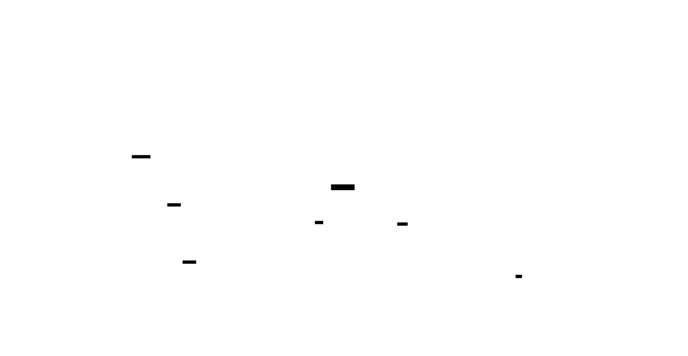
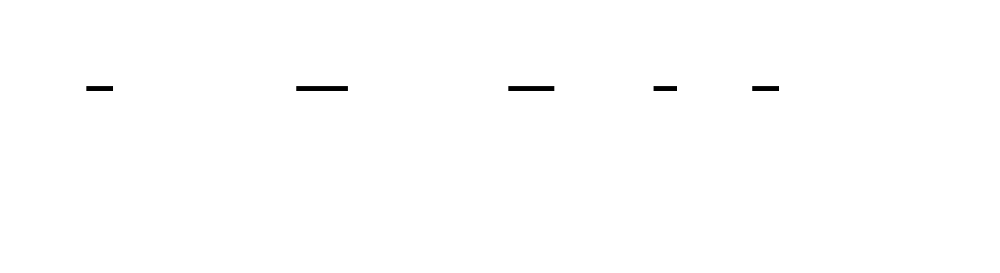

# 🎯 Project Charter: The C-Like Tokenizer

## What You Are Building
A robust, character-by-character lexical scanner that transforms raw source text into a structured stream of categorized tokens. You will implement a Deterministic Finite Automaton (DFA) in code to recognize complex lexemes, including multi-character operators like `>=` using the "maximal munch" principle, numeric literals (integers and floats), and string literals with backslash escape sequences.

## Why This Project Exists
Lexical analysis is the "front door" of every compiler, interpreter, and syntax highlighter. By building a tokenizer from scratch, you demystify how programming languages resolve ambiguity at the character level and learn why a simple `split(' ')` is insufficient for parsing real-world code.

## What You Will Be Able to Do When Done
- **Transform Raw Text:** Convert a flat string of source code into a sequence of typed `Token` objects.
- **Implement Maximal Munch:** Resolve lexical ambiguity (e.g., distinguishing between `>` followed by `=` and the single `>=` operator).
- **Manage Contextual Modes:** Build a scanner that switches behavior when entering "string mode" or "comment mode."
- **Track Precise Metadata:** Calculate 1-based line and column numbers for every token to power actionable error messages.
- **Build Resilient Tools:** Implement "Skip-One" error recovery so the scanner can report multiple errors in a single pass without halting.

## Final Deliverable
A standalone `Scanner` module (~250–400 lines of code) that processes a multi-line C-like source file. It must pass an integration suite verifying it can tokenize a complex program (containing nested logic, comments, and escaped strings) into a precise list of tokens ending with an `EOF` sentinel.

## Is This Project For You?
**You should start this if you:**
- Are comfortable with string indexing and character-by-character loops.
- Understand how to use Enums and Hash Maps (Dictionaries) in your chosen language.
- Want to learn the architectural foundations of developer tools and DSLs.

**Come back after you've learned:**
- Basic data structure implementation (Classes/Structs).
- [Python Enum Module](https://docs.python.org/3/library/enum.html) (if using the recommended language).

## Estimated Effort
| Phase | Time |
|-------|------|
| **M1: Foundation & Single-Char Tokens** | ~3 hours |
| **M2: Multi-Character Operators & Numbers** | ~4 hours |
| **M3: Strings & Comments (Context Tracking)** | ~4 hours |
| **M4: Integration Testing & Performance** | ~3 hours |
| **Total** | **~14 hours** |

## Definition of Done
The project is complete when:
- The scanner produces the exact expected token stream for the provided "Golden Program" integration test.
- Every token includes accurate `line` and `column` metadata that does not "drift" over a 100+ line file.
- Unterminated strings or comments produce an `ERROR` token at the *opening* delimiter's position.
- The scanner processes a 10,000-line synthetic source file in under 1 second.
- The system emits a final `EOF` token regardless of whether the input was valid or empty.

---

# 📚 Before You Read This: Prerequisites & Further Reading

> **Read these first.** The Atlas assumes you are familiar with the foundations below.
> Resources are ordered by when you should encounter them — some before you start, some at specific milestones.

### 🧠 Foundational Theory: Automata & Formal Languages

**Paper**: [A Technique for General Writing of Code Generators](https://dl.acm.org/doi/10.1145/363347.363387) (Brooker & Morris, 1962).
- **Code**: [The RE2 Lexer Logic](https://github.com/google/re2/blob/main/re2/parse.cc) (specifically the `Parse` function).
- **Best Explanation**: *Introduction to the Theory of Computation* by Michael Sipser, **Chapter 1: Regular Languages**.
- **Why**: This is the rigorous mathematical proof that finite automata can recognize exactly the class of languages definable by regular expressions.
- **Pedagogical Timing**: Read **BEFORE Milestone 1** to understand the mathematical constraints of what you are building.

**Paper**: [Regular Expression Search Algorithm](https://dl.acm.org/doi/10.1145/363347.363387) (Ken Thompson, 1968).
- **Best Explanation**: [Regular Expression Matching Can Be Simple and Fast](https://swtch.com/~rsc/regexp/regexp1.html) by Russ Cox.
- **Why**: It explains how to build an NFA from a regex, which is the automated version of the hand-written state machine you are building.
- **Pedagogical Timing**: Read **AFTER Milestone 2** to see how the "Maximal Munch" logic you wrote manually can be generated automatically from patterns.

---

### 🛠️ The Craft of Lexing: Implementation Guides

**Best Explanation**: *Crafting Interpreters* by Robert Nystrom, **Chapter 4: Scanning**.
- **Code**: [Lox Scanner.java](https://github.com/munificent/craftinginterpreters/blob/master/java/com/craftinginterpreters/lox/Scanner.java).
- **Why**: The most modern, approachable, and pedagogically sound walkthrough of building a hand-written scanner for a C-like language.
- **Pedagogical Timing**: Read **DURING Milestone 1**; it serves as a parallel guide to the logic implemented in this Atlas.

**Spec**: [The Lexical Grammar of C11](https://www.open-std.org/jtc1/sc22/wg14/www/docs/n1570.pdf) (ISO/IEC 9899:201x, **Section 6.4**).
- **Code**: [Clang’s Lexer.cpp](https://github.com/llvm/llvm-project/blob/main/clang/lib/Lex/Lexer.cpp).
- **Why**: It defines the "gold standard" rules for the language your project is mimicking, including tricky edge cases for numbers and strings.
- **Pedagogical Timing**: Read **DURING Milestone 2** to see how a professional language defines the boundaries of integers and floating-point literals.

---

### 🏗️ Real-World Tokenizers: Case Studies

**Code**: [CPython’s Lib/tokenize.py](https://github.com/python/cpython/blob/main/Lib/tokenize.py).
- **Best Explanation**: [The Python Tokenizer Documentation](https://docs.python.org/3/library/tokenize.html).
- **Why**: Shows how a production-grade language uses a hybrid approach (regex + manual logic) to handle indentation-sensitive lexing.
- **Pedagogical Timing**: Read **AFTER Milestone 2** to compare your identifier and keyword lookup logic with Python's implementation.

**Code**: [V8’s scanner.cc](https://github.com/v8/v8/blob/master/src/parsing/scanner.cc).
- **Why**: V8's scanner is optimized for extreme performance, showing how to handle Unicode/UTF-8 characters at scale.
- **Pedagogical Timing**: Read **AFTER Milestone 4** once you have met your performance benchmarks to see how "The Big Boys" do it.

---

### ⚠️ Error Handling & Recovery

**Paper**: [Panic Mode Recovery in Lexical Analysis](https://dl.acm.org/doi/10.1145/359545.359565) (James, 1972).
- **Best Explanation**: *Compilers: Principles, Techniques, and Tools* (The Dragon Book), **Section 3.1.4: Lexical Errors**.
- **Why**: It introduces the "Panic Mode" philosophy used in your project, where the scanner recovers by skipping to the next "safe" character.
- **Pedagogical Timing**: Read **BEFORE Milestone 4** to understand why emitting an `ERROR` token is superior to throwing an exception.

---

### 🧵 Strings, Escapes, and Character Sets

**Spec**: [The Unicode Standard, Version 15.0](https://www.unicode.org/versions/Unicode15.0.0/), **Chapter 3: Conformance (UTF-8)**.
- **Best Explanation**: [The Absolute Minimum Every Software Developer Absolutely, Positively Must Know About Unicode and Character Sets](https://www.joelonsoftware.com/2003/10/08/the-absolute-minimum-every-software-developer-absolutely-positively-must-know-about-unicode-and-character-sets-no-excuses/) by Joel Spolsky.
- **Why**: Explains why "character-at-a-time" scanning is significantly more complex once you leave the ASCII range.
- **Pedagogical Timing**: Read **BEFORE Milestone 3** to prepare for the complexities of scanning string content.

**Spec**: [RFC 8259: The JavaScript Object Notation (JSON) Data Interchange Format](https://datatracker.ietf.org/doc/html/rfc8259#section-7).
- **Why**: Defines the most widely used standard for string escape sequences (`\n`, `\uXXXX`), which mirrors the logic in M3.
- **Pedagogical Timing**: Read **DURING Milestone 3** to validate your escape sequence logic against the JSON standard.

---

# Tokenizer / Lexer — Interactive Atlas

This project builds a complete character-level lexer for a simple C-like language. You will implement a finite state machine that reads source code one character at a time, applies the maximal munch principle to resolve ambiguities, and emits a categorized stream of tokens. Along the way you will handle string escape sequences, nested comment edge cases, position tracking, and error recovery — the same problems faced by every real-world compiler frontend from GCC to V8.

The tokenizer is the first stage of any compiler or interpreter pipeline: it transforms a flat string of characters into structured tokens that a parser can consume. Understanding this stage deeply unlocks insight into how programming languages actually work, from syntax highlighting in your editor to the error messages your compiler produces.

By project's end you will have a robust, tested lexer that can tokenize complete multi-line programs, report multiple errors with accurate line/column information, and recover gracefully from invalid input — a genuine tool, not a toy.


<!-- MS_ID: tokenizer-m1 -->
# Milestone 1: Token Types & Scanner Foundation
## Where You're Starting
Before writing a single line of scanning logic, you need to answer two questions: **What are you scanning for?** and **How do you move through the input?** This milestone answers both.
You'll define the complete vocabulary of your tokenizer — the `TokenType` enumeration — and the data structure that holds a recognized token. Then you'll build the core engine: the `Scanner` class with the two primitive operations (`advance` and `peek`) that everything else is built from. Finally, you'll handle the simplest cases: single-character tokens, whitespace, end-of-file, and error recovery for unrecognized input.
By the end of this milestone, you'll have a working system that can scan source code character-by-character and emit a stream of tokens. It won't handle multi-character operators, number literals, strings, or comments yet — that's Milestones 2 and 3. But the foundation you lay here determines how cleanly everything else falls into place.


---
## The Core Misconception: Tokenizing Is Not Splitting
You've almost certainly used Python's `str.split()` before. It takes a string and slices it apart at whitespace (or a delimiter you specify). When you first hear "a tokenizer breaks source code into tokens," it's natural to imagine something similar — maybe `source.split()` with some extra logic for operators.
This mental model breaks the moment you try it:
```python
source = "if(x>=42){return true;}"
tokens = source.split()
# Result: ["if(x>=42){return", "true;}"]
```
Zero whitespace means zero splits. Two "tokens." Neither is useful.
But a real tokenizer handles this correctly — producing `Keyword(if)`, `LParen`, `Identifier(x)`, `GreaterEqual`, `Number(42)`, `RParen`, `LBrace`, `Keyword(return)`, `Keyword(true)`, `Semicolon`, `RBrace`, `EOF` — with no whitespace anywhere in the input.
**The real model**: a tokenizer is a character-by-character finite state machine. It does not look for spaces. It reads one character at a time, asks "what state am I in and what does this character mean?", and decides: extend the current token, or emit what I have and start fresh. Whitespace is just another character — one that happens to trigger "emit and don't include this character." A digit followed by a letter triggers "emit the number, start an identifier." An `=` followed by another `=` triggers "emit a two-character `==`."
The boundaries are **state transitions**, not spaces. That's why `x>=42` tokenizes correctly with zero whitespace — the scanner changes state every time the character class changes, and those state changes are the boundaries.
Keep this model in your head as you build: every branch in your scanner's main loop is a state transition in a finite automaton. You are building a DFA (deterministic finite automaton — a machine that reads input character by character and transitions between a finite number of states deterministically) compiled to imperative code.
---
## Finite State Machines: The Theoretical Heart

> **🔑 Foundation: FSMs as the foundation of lexical analysis**
> 
> **What it IS**
A Finite State Machine (FSM) is a mathematical model of computation that exists in exactly one of a finite number of **states** at any given time. It moves from one state to another (a **transition**) in response to external inputs. 

In the context of lexical analysis, an FSM acts as a "character eater." It starts in an initial state and consumes characters one by one. If it lands in an **accepting state** (often drawn with a double circle) when the input ends or a delimiter is reached, it has successfully recognized a valid pattern, such as a keyword or an integer. 

There are two primary flavors:
*   **Deterministic Finite Automata (DFA):** For every state and input, there is exactly one transition to a next state. It is fast and predictable.
*   **Non-deterministic Finite Automata (NFA):** There can be multiple possible transitions for the same input, or transitions that happen without any input at all. While easier to design for complex patterns, computers usually convert NFAs into DFAs to actually run them.

**WHY you need it right now**
You are building a lexer. Without an FSM, your code would likely become a tangled "if-else" nightmare of lookaheads and nested loops. FSMs provide a formal, bug-resistant way to map raw text into tokens. Instead of writing logic for every possible edge case, you define the states (e.g., `IN_STRING`, `IN_NUMBER`, `START`) and let the state transitions handle the complexity of the input stream.

**Key Insight: The "Memoryless" Model**
An FSM doesn't need to remember the entire history of how it got to its current state; the current state *is* the history. If you are in the `IDENTIFIER` state, it doesn't matter if you've read two letters or twenty—the machine only cares about what the next character allows it to do.

The practical upshot: your scanner has **implicit states** encoded as control flow branches. When you're in the middle of scanning a number, you're in the "scanning number" state. When you hit a non-digit, you transition to "emit number, return to start." You won't build an explicit state table in this milestone, but every `if/elif` in your main scan loop IS a state transition. Keep that mapping in mind — it explains why the code looks the way it does.
---
## Designing the Token Type Enumeration
Your scanner's job is to categorize every lexeme (raw text fragment) it finds. The categories form a closed, exhaustive set — there's no token type "other than all of these." That makes an **enum** the perfect tool.

> **🔑 Foundation: Python Enum as a way to define closed**
> 
> **What it IS**
A Python `Enum` (from the built-in `enum` module) is a way to create a set of symbolic names bound to unique, constant values. Unlike a standard variable or a string, an Enum represents a **closed set** of possibilities. 

Using `from enum import Enum, auto`, you can define your categories:
```python
class TokenType(Enum):
    INTEGER = auto()
    PLUS = auto()
    EOF = auto()
```
The `auto()` helper assigns unique values to the members so you don't have to manage integers manually.

**WHY you need it right now**
In a compiler or lexer, you deal with categories of data (Token Types) constantly. You *could* use "magic strings" like `"INT"` or `"PLUS"`, but strings are dangerous: a single typo like `"ITN"` will fail at runtime and can be hard to debug. 

Enums provide:
1.  **Exhaustiveness:** You can use tools like MyPy to ensure your `match` or `if` statements cover every possible token type.
2.  **Readability:** `TokenType.INTEGER` is self-documenting.
3.  **Identity over Equality:** Comparing Enums (`token.type is TokenType.INTEGER`) is faster and safer than string comparison.

**Key Insight: The Fixed Universe**
Think of an Enum as a "Fixed Universe." By using an Enum for your Token Types, you are telling the computer: "In this program, these—and ONLY these—categories exist." This prevents "category creep" and ensures that your logic remains predictable across the entire pipeline.

Here are the categories your C-like language needs:
```python
from enum import Enum, auto
class TokenType(Enum):
    # Literals
    NUMBER     = auto()   # 42, 3.14
    STRING     = auto()   # "hello world"
    # Names
    IDENTIFIER = auto()   # x, myVariable, count
    KEYWORD    = auto()   # if, else, while, return, true, false, null
    # Operators (single and multi-character)
    OPERATOR   = auto()   # +, -, *, /, ==, !=, <, >, <=, >=, =
    # Punctuation / grouping / delimiters
    PUNCTUATION = auto()  # (, ), {, }, [, ], ;, ,
    # Control
    EOF   = auto()   # end of input — sentinel for the parser
    ERROR = auto()   # unrecognized character — carries error message
```


A few design notes:
**Why `OPERATOR` and `PUNCTUATION` as separate categories?** Semantically, operators participate in expressions (they have operands and produce values) while punctuation is purely structural (parentheses group, semicolons terminate). A parser cares about this distinction when building its grammar rules. Grouping them together would make the parser's job harder.
**Why a single `KEYWORD` type instead of `IF`, `ELSE`, `WHILE`, etc.?** Both approaches are used in real compilers. A flat enum like this is simpler to start with; you look at the lexeme string to know *which* keyword. Many production lexers (including Python's own) use per-keyword variants for faster parser dispatch. For a teaching tokenizer, `KEYWORD` with a lexeme check is clean.
**Why `EOF` as a token type?** This is critical. When the scanner exhausts the input, it could return `None`, raise an exception, or emit a special sentinel token. `None` forces the parser to null-check every token access. A raised exception makes lookahead awkward. An `EOF` token lets the parser read naturally — `while token.type != TokenType.EOF: ...` — and the sentinel serves as an unconditional stopping condition. Without it, parsers crash in mysterious ways.
**Why `ERROR`?** Because the tokenizer should keep running after encountering an unrecognized character. If it raises an exception immediately, you can only report one error per compilation. Instead, emit an `ERROR` token (with position and the offending character), then continue scanning. By the end you've collected *all* the lexical errors in a single pass.
---
## The Token Data Structure
A token is not just a type. It needs to carry enough information for every downstream consumer — the parser, the error reporter, the syntax highlighter. The four fields you need are:
| Field | Type | Purpose |
|-------|------|---------|
| `type` | `TokenType` | Category — what kind of token is this? |
| `lexeme` | `str` | The exact raw text from source — `"42"`, `">="`, `"if"` |
| `line` | `int` | 1-based line number where this token starts |
| `column` | `int` | 1-based column offset where this token starts |
```python
from dataclasses import dataclass
@dataclass
class Token:
    type: TokenType
    lexeme: str
    line: int
    column: int
    def __repr__(self) -> str:
        return f"Token({self.type.name}, {self.lexeme!r}, {self.line}:{self.column})"
```


A few decisions worth understanding:
**Why store `lexeme` (raw text) rather than an already-processed value?** Because transforming the lexeme into a value (e.g., converting `"42"` to the integer `42`) is the parser's or evaluator's job, not the tokenizer's. The tokenizer's job is categorization. Storing raw text also preserves the exact source characters, which matters for error messages: if you report `unexpected token`, you want to show the user exactly what appeared in their source file, not your normalized version of it.
**Why `line` and `column` at the token level?** Position metadata transforms useless error messages into actionable ones. `SyntaxError` is worthless. `SyntaxError at line 42, column 7: unexpected ']'` tells the user exactly where to look. This information is essentially free to collect — you're scanning character-by-character anyway, so incrementing two counters costs nothing. Failing to collect it here means you'll never have it downstream.
**Why `@dataclass`?** Python's `dataclass` decorator auto-generates `__init__`, `__repr__`, and `__eq__` from field declarations — exactly what you need for a value object like a token. No boilerplate.


---
## Building the Scanner Infrastructure
Now the engine. Your `Scanner` class wraps the source string and provides a clean interface for consuming characters. Everything else — multi-character operators, number scanning, string literals — will be built on top of exactly two primitive operations.
```python
class Scanner:
    def __init__(self, source: str) -> None:
        self.source: str = source
        self.tokens: list[Token] = []
        # Position in source string
        self.start: int = 0    # start of the current lexeme being scanned
        self.current: int = 0  # next character to read
        # Human-readable position for error messages
        self.line: int = 1
        self.column: int = 1
        # Column at the start of the current lexeme
        self.start_column: int = 1
```
Three index concepts to keep straight:
- **`start`**: where the current token began (marks the left edge of the lexeme)
- **`current`**: the position we're about to read next (right edge, exclusive)
- **`source[start:current]`**: the lexeme accumulated so far
Think of `start` as pinned to the first character of the token being scanned, and `current` as a cursor advancing one character at a time.
### The Two Primitives: `advance()` and `peek()`


```python
def is_at_end(self) -> bool:
    """True when the cursor has consumed all input."""
    return self.current >= len(self.source)
def advance(self) -> str:
    """Consume the current character and return it. Updates position tracking."""
    char = self.source[self.current]
    self.current += 1
    if char == '\n':
        self.line += 1
        self.column = 1
    else:
        self.column += 1
    return char
def peek(self) -> str:
    """Return the current character WITHOUT consuming it. Returns '' at end."""
    if self.is_at_end():
        return ''
    return self.source[self.current]
```
The asymmetry between `advance` and `peek` is the entire basis for **lookahead**: you can look at the next character to make a decision without committing to consuming it. You'll use this pattern constantly in later milestones — "if the next character is `=`, then this is `==`, not just `=`."
**Why does `peek()` return `''` at end-of-input instead of raising an exception?** Because you'll call `peek()` in conditions: `while peek() != '\n'` should terminate cleanly at EOF without needing a separate `is_at_end()` check in every loop. An empty string compares `False` to any non-empty character string, so the termination condition handles EOF naturally.
---
## Position Tracking: Line and Column


Position tracking deserves its own discussion because it's where most beginner implementations drift and produce wrong error messages.
The rule is simple: **update position when you consume a character, not when you emit a token.** In `advance()`, after reading a `\n`, you increment `line` and reset `column` to 1. For any other character, you increment `column`.
But there's a subtlety with **token start position**. When you're about to scan a new token, you record the position *before* starting to consume characters. That's why you need `start_column` in addition to `column`:
```python
def _make_token(self, token_type: TokenType) -> Token:
    """Create a token from the characters consumed since `start`."""
    lexeme = self.source[self.start:self.current]
    return Token(token_type, lexeme, self.line, self.start_column)
```
And at the beginning of each token scan, you snapshot the current column:
```python
def _scan_token(self) -> Token | None:
    self.start = self.current
    self.start_column = self.column  # snapshot BEFORE advance()
    char = self.advance()
    # ... dispatch on char
```
**Common pitfall — Windows line endings (`\r\n`)**: The sequence `\r\n` is a single logical newline in Windows text files. If you increment `line` for both `\r` and `\n`, a Windows file will appear to have twice as many lines as it actually does. The fix: consume `\r` silently (or as whitespace) and only count `\n` as a newline. An alternative: normalize the source string to `\n`-only before scanning begins.
**Common pitfall — Tab characters**: A tab character advances the cursor by one position in the source string but might represent 4 or 8 columns visually. The simplest approach is to count a tab as 1 column (consistent with cursor/byte position) and document that behavior. If you want visual accuracy, use a configurable `tab_width`:
```python
elif char == '\t':
    self.column += self.tab_width - 1  # -1 because advance() already did +1
```
For this project, advancing tabs by 1 column is fine. Document it and move on.
---
## The Main Scanning Loop
The `scan_tokens()` method drives the entire process. It's a loop that runs until input is exhausted, calling `_scan_token()` for each token, and then appends the EOF sentinel.
```python
def scan_tokens(self) -> list[Token]:
    """Scan the entire source and return the token list."""
    while not self.is_at_end():
        token = self._scan_token()
        if token is not None:  # whitespace returns None
            self.tokens.append(token)
    # Always emit EOF as the final sentinel
    self.tokens.append(Token(TokenType.EOF, '', self.line, self.column))
    return self.tokens
```
Note that `_scan_token()` returns `None` for whitespace — consumed and discarded silently. Every other case returns a `Token` object (including errors).
---
## Single-Character Token Dispatch
For single-character tokens, dispatch is a simple table lookup. Python's `match` statement (3.10+) or a dictionary both work well. Here's the dispatch using a dictionary for clarity:
```python
# Class-level constant — defined once, not rebuilt every call
_SINGLE_CHAR_TOKENS: dict[str, TokenType] = {
    '+': TokenType.OPERATOR,
    '-': TokenType.OPERATOR,
    '*': TokenType.OPERATOR,
    '/': TokenType.OPERATOR,   # NOTE: will need special handling in M3 for comments
    '(': TokenType.PUNCTUATION,
    ')': TokenType.PUNCTUATION,
    '{': TokenType.PUNCTUATION,
    '}': TokenType.PUNCTUATION,
    '[': TokenType.PUNCTUATION,
    ']': TokenType.PUNCTUATION,
    ';': TokenType.PUNCTUATION,
    ',': TokenType.PUNCTUATION,
}
```


And the dispatch logic inside `_scan_token()`:
```python
def _scan_token(self) -> Token | None:
    self.start = self.current
    self.start_column = self.column
    char = self.advance()
    # Single-character tokens
    if char in self._SINGLE_CHAR_TOKENS:
        return self._make_token(self._SINGLE_CHAR_TOKENS[char])
    # Whitespace — consume silently
    elif char in (' ', '\t', '\r', '\n'):
        return None
    # Error — unrecognized character
    else:
        return Token(
            TokenType.ERROR,
            char,
            self.line,
            self.start_column
        )
```


**Why put `/` in the single-character dispatch now, knowing it will need special handling for `//` and `/*` comments later?** This is a deliberate scaffolding choice. In Milestone 3, you'll replace the `'/'` entry with a more complex handler. Until then, `/` simply produces a division operator token, which is correct for expressions like `x / 2`. Building incrementally — with each milestone adding behavior to a working foundation — is better than trying to handle every case at once.
**Why is `\r` in the whitespace set?** To handle Windows `\r\n` endings. The `\r` is consumed silently here; the `\n` will be consumed on the next call to `advance()` and will trigger the line increment. This prevents double-counting.
---
## Putting It Together: The Complete M1 Scanner
Here is the complete, runnable implementation of everything covered in this milestone:
```python
from enum import Enum, auto
from dataclasses import dataclass
class TokenType(Enum):
    NUMBER      = auto()
    STRING      = auto()
    IDENTIFIER  = auto()
    KEYWORD     = auto()
    OPERATOR    = auto()
    PUNCTUATION = auto()
    EOF         = auto()
    ERROR       = auto()
@dataclass
class Token:
    type: TokenType
    lexeme: str
    line: int
    column: int
    def __repr__(self) -> str:
        return f"Token({self.type.name}, {self.lexeme!r}, {self.line}:{self.column})"
class Scanner:
    _SINGLE_CHAR_TOKENS: dict[str, TokenType] = {
        '+': TokenType.OPERATOR,
        '-': TokenType.OPERATOR,
        '*': TokenType.OPERATOR,
        '/': TokenType.OPERATOR,
        '(': TokenType.PUNCTUATION,
        ')': TokenType.PUNCTUATION,
        '{': TokenType.PUNCTUATION,
        '}': TokenType.PUNCTUATION,
        '[': TokenType.PUNCTUATION,
        ']': TokenType.PUNCTUATION,
        ';': TokenType.PUNCTUATION,
        ',': TokenType.PUNCTUATION,
    }
    def __init__(self, source: str, tab_width: int = 1) -> None:
        self.source = source
        self.tab_width = tab_width
        self.tokens: list[Token] = []
        self.start = 0
        self.current = 0
        self.line = 1
        self.column = 1
        self.start_column = 1
    # ── Primitives ──────────────────────────────────────────────────────────
    def is_at_end(self) -> bool:
        return self.current >= len(self.source)
    def advance(self) -> str:
        char = self.source[self.current]
        self.current += 1
        if char == '\n':
            self.line += 1
            self.column = 1
        elif char == '\t':
            self.column += self.tab_width
        else:
            self.column += 1
        return char
    def peek(self) -> str:
        if self.is_at_end():
            return ''
        return self.source[self.current]
    # ── Token construction ───────────────────────────────────────────────────
    def _make_token(self, token_type: TokenType) -> Token:
        lexeme = self.source[self.start:self.current]
        return Token(token_type, lexeme, self.line, self.start_column)
    # ── Core scan loop ───────────────────────────────────────────────────────
    def _scan_token(self) -> Token | None:
        self.start = self.current
        self.start_column = self.column
        char = self.advance()
        if char in self._SINGLE_CHAR_TOKENS:
            return self._make_token(self._SINGLE_CHAR_TOKENS[char])
        elif char in (' ', '\t', '\r', '\n'):
            return None
        else:
            return Token(TokenType.ERROR, char, self.line, self.start_column)
    def scan_tokens(self) -> list[Token]:
        while not self.is_at_end():
            token = self._scan_token()
            if token is not None:
                self.tokens.append(token)
        self.tokens.append(Token(TokenType.EOF, '', self.line, self.column))
        return self.tokens
```
---
## Testing Your Foundation
Before moving on, verify each behavior explicitly. Tests document expected behavior and catch regressions when you add new scanning logic in later milestones.
```python
def test_empty_input():
    scanner = Scanner("")
    tokens = scanner.scan_tokens()
    assert len(tokens) == 1
    assert tokens[0].type == TokenType.EOF
    assert tokens[0].line == 1
    assert tokens[0].column == 1
def test_single_char_operators():
    scanner = Scanner("+-*/")
    tokens = scanner.scan_tokens()
    # 4 operators + EOF
    assert len(tokens) == 5
    assert all(t.type == TokenType.OPERATOR for t in tokens[:4])
    assert tokens[0].lexeme == '+'
    assert tokens[3].lexeme == '/'
def test_punctuation():
    scanner = Scanner("(){};,")
    tokens = scanner.scan_tokens()
    assert len(tokens) == 7  # 6 punctuation + EOF
    assert all(t.type == TokenType.PUNCTUATION for t in tokens[:6])
def test_whitespace_consumed():
    scanner = Scanner("  \t  \n  ")
    tokens = scanner.scan_tokens()
    assert len(tokens) == 1  # only EOF
    assert tokens[0].type == TokenType.EOF
def test_position_tracking():
    scanner = Scanner("(\n+")
    tokens = scanner.scan_tokens()
    lparen, plus, eof = tokens
    assert lparen.type == TokenType.PUNCTUATION
    assert lparen.line == 1
    assert lparen.column == 1
    assert plus.type == TokenType.OPERATOR
    assert plus.line == 2       # after the newline
    assert plus.column == 1     # first character on new line
def test_error_token():
    scanner = Scanner("@")
    tokens = scanner.scan_tokens()
    assert len(tokens) == 2  # ERROR + EOF
    assert tokens[0].type == TokenType.ERROR
    assert tokens[0].lexeme == '@'
    assert tokens[0].line == 1
    assert tokens[0].column == 1
def test_error_then_valid():
    """After an error, scanning continues normally."""
    scanner = Scanner("@+")
    tokens = scanner.scan_tokens()
    assert tokens[0].type == TokenType.ERROR   # '@'
    assert tokens[1].type == TokenType.OPERATOR  # '+'
    assert tokens[2].type == TokenType.EOF
def test_mixed_single_char():
    scanner = Scanner("( ) { } [ ]")
    tokens = scanner.scan_tokens()
    lexemes = [t.lexeme for t in tokens[:-1]]  # exclude EOF
    assert lexemes == ['(', ')', '{', '}', '[', ']']
def test_column_reset_on_newline():
    scanner = Scanner(";\n;")
    tokens = scanner.scan_tokens()
    assert tokens[0].column == 1   # first ';' at column 1
    assert tokens[1].column == 1   # second ';' at column 1 of new line
    assert tokens[1].line == 2
def test_multiple_errors():
    """All errors in input are collected, not just the first."""
    scanner = Scanner("@#$")
    tokens = scanner.scan_tokens()
    error_tokens = [t for t in tokens if t.type == TokenType.ERROR]
    assert len(error_tokens) == 3
```
Run all of these. They should pass with the implementation above. If any fail, the position tracking is the most common culprit — check the `advance()` method and the `start_column` snapshot timing carefully.
---
## Three-Level View: What's Really Happening
It's worth seeing this milestone from all three levels of the compiler stack.
**Level 1 — Source Language**: Your user types `(x + 42)`. They see five tokens with three spaces. The spaces are invisible scaffolding — boundary hints, but not the actual boundaries.
**Level 2 — The Scanner (what you're building now)**: The scanner reads 8 characters. It has no concept of "a token" when it starts — it builds up the token character by character, emitting when the state transition fires. `(` → single-char dispatch → emit immediately. `x` → not in dispatch table → (in M2, will become identifier scanner). `+` → single-char → emit. `4` → digit → (in M2, will enter number-scanning state). `)` → single-char → emit.
**Level 3 — The Parser (downstream consumer)**: The parser receives a `list[Token]` and never sees characters again. It thinks in terms of token types, calling something like `consume(TokenType.PUNCTUATION, '(')`. The token stream is the interface contract between lexer and parser. Every mistake in your `TokenType` design forces the parser to work around it.
---
## Design Decision: Why `advance()` Updates Position
You might wonder: why does `advance()` update `line` and `column`? Why not update them separately, or in `scan_token()`?
| Approach | Pros | Cons |
|----------|------|------|
| **Update in `advance()` (chosen)** | Position is always correct right after consuming a char; no chance of forgetting to update | Must be careful about `start_column` snapshot timing |
| Update in `scan_token()` after each token | Simpler to reason about | Position is wrong *during* multi-character token scanning — string literals spanning lines would report wrong end position |
| Update lazily (recount from `start`) | Simple `advance()` | O(n) position computation — unacceptable for large files |
Updating position in `advance()` is the right choice because it keeps position **in sync with the character stream**, not the token stream. Multi-character tokens (strings, comments, identifiers) span multiple characters. If you only updated position at token boundaries, position tracking inside those tokens would be wrong.
---
## Knowledge Cascade — "Learn One, Unlock Ten"
You've built a character-level scanner. Here's what this unlocks:
**→ Formal automata theory**: Your scanner IS a DFA implementation. The `_SINGLE_CHAR_TOKENS` dispatch table is the DFA's transition function for the "start" state. The `if/elif/else` structure in `_scan_token()` enumerates all transitions from that state. When you add multi-character operators in M2, you'll add transitions to sub-states (the "seen one `=`" state). Formal language theory tells you that any regular language — the class that contains all tokenizable languages — can be recognized by a DFA. Your C-like language's lexical grammar is regular; that's *why* this approach works.
**→ Parser expectations (downstream contract)**: The token stream you emit in this milestone is the alphabet for the parser that consumes it. If your `TokenType` categories are coarse (e.g., mixing `KEYWORD` and `IDENTIFIER` into a single `NAME` type), the parser must inspect every `NAME` token's lexeme to decide what grammar rule applies. If your categories are fine-grained, the parser can dispatch purely on type. The parser is written against the contract you establish here — changing `TokenType` in M3 would require changing the parser too.
**→ Syntax highlighting in your editor**: Every editor that does syntax highlighting (VS Code, Vim, Emacs) runs a tokenizer on every keystroke. The "confused mid-string" highlighting you've seen — where adding an unmatched `"` suddenly turns half your file orange — is exactly the `ERROR` and `STRING` token types interacting. When the tokenizer can't find the closing quote, it emits an unterminated string that swallows everything until the next `"`. Now you know why. You also know the fix: language servers use incremental re-tokenization — re-scan only from the changed position — to handle this efficiently.
**→ The linker's symbol table (cross-domain)**: The keyword lookup table you'll build in M2 (mapping strings like `"if"` to `TokenType.KEYWORD`) is the same fundamental data structure as a linker's symbol table — a hash map from name to meaning. In the linker, it maps symbol names to addresses. In your tokenizer, it maps lexeme strings to token types. Hash tables as "name → meaning" registries are one of the most universal data structures in systems programming.
**→ Error recovery as a design philosophy**: You made `ERROR` a token type rather than an exception. This is the same philosophy behind Rust's `Result<T, E>` — errors are values, not exceptional control flow. Languages that lean on exceptions for lexical errors (like early implementations of many scripting languages) can only report one error per run. Compilers that treat errors as values (GCC, Clang, Rust's compiler) collect all errors and report them all at once. Your choice here reflects that philosophy at the smallest scale.
**→ Position metadata as a universal pattern**: The `line` and `column` you're tracking are metadata — information about the data rather than the data itself. This pattern appears everywhere: HTTP headers (metadata about the body), database index pages (metadata about row locations), Git commits (metadata about diffs). Collecting metadata eagerly and cheaply, while the primary computation is happening anyway, is a general principle. Retrofitting it later is always expensive.
---
## What You've Built
You now have a functioning scanner skeleton. It can:
- Categorize every lexeme in a closed type system (`TokenType`)
- Store tokens with full position information (`Token`)
- Consume source code character-by-character with `advance()`
- Look ahead without consuming with `peek()`
- Track `line` and `column` accurately through newlines and tabs
- Emit single-character operator and punctuation tokens
- Silently consume whitespace
- Emit a sentinel `EOF` token when input is exhausted
- Emit `ERROR` tokens for unrecognized characters and continue scanning
In Milestone 2, you'll build on `peek()` to implement multi-character operators (`==`, `!=`, `<=`, `>=`), number literal scanning, and identifier + keyword recognition. Everything in M2 uses `advance()` and `peek()` as its only interface to the source string — the primitives you built here carry the entire scanner.
---
<!-- END_MS -->


<!-- MS_ID: tokenizer-m2 -->
<!-- MS_ID: tokenizer-m2 -->
# Milestone 2: Multi-Character Tokens & Maximal Munch
## Where You're Starting
You have a working scanner skeleton. It reads characters, tracks positions, emits single-character tokens, swallows whitespace, and reports errors — all in under 100 lines of clean Python. The foundation is solid.
But try to scan `x >= 42` with what you've built and you'll get: `Identifier(x)`, `OPERATOR(>)`, `ERROR(=)`, `Number(42)`. The `>=` falls apart into two pieces because your scanner doesn't look ahead. That broken output would crash any parser trying to consume it.
This milestone fixes that — and in doing so, teaches you the single most important principle in lexical analysis: **maximal munch**.
By the end of M2, your scanner will correctly handle:
- Two-character operators (`==`, `!=`, `<=`, `>=`) as single indivisible tokens
- Integer and floating-point number literals
- Identifiers and keyword recognition via a lookup table
- The tricky edge case `>==` (maximal munch gives you `>=` then `=`, never `>` then `==`)
Everything builds on `advance()` and `peek()` — the two primitives you already have.


---
## The Core Misconception: Characters Know What They Are
Here's what most beginners instinctively do when they see `=`:
```python
# ❌ The intuitive but wrong approach
if char == '=':
    return self._make_token(TokenType.ASSIGN)
```
It feels right. You saw `=`, you know what `=` is, you emit `ASSIGN`. Done.
Except it's not done. `=` doesn't exist in isolation — it exists in a stream. The character *after* it changes everything:
- `=` followed by `=` → `==` (equality comparison, `GreaterEqual`)
- `=` followed by anything else → `=` (assignment, `ASSIGN`)
The moment you emit `ASSIGN` without checking what comes next, you've made an irrecoverable commitment. You can't un-emit a token. You can't "put it back." The parser will see `ASSIGN` + `ASSIGN` instead of `EQUALS` and it will fail — or worse, silently misparse the code.
**The real model**: a character's identity is not determined by what it is alone, but by what it is *plus* the context of what follows. This is the insight maximal munch encodes.
---
## The Maximal Munch Principle


Maximal munch is a rule for resolving ambiguity in lexical analysis: **always consume the longest sequence of characters that forms a valid token.**
When you reach a character that *could* begin multiple different tokens, you don't emit immediately. You look ahead. If the next character extends the current token into a longer valid token, you consume it. You keep extending until the next character would break the pattern. Only then do you emit.
Formally: among all possible tokenizations of the input, choose the one where each token is as long as possible.
Here's the same input, two strategies side by side:
```
Input: "=="
Greedy (correct, maximal munch):
  Read '=' → could be ASSIGN or start of EQUALS
  Peek '=' → extends to EQUALS, consume it
  Peek ';' → stops, emit EQUALS("==")
Non-greedy (wrong):
  Read '=' → emit ASSIGN("=")
  Read '=' → emit ASSIGN("=")
  Result: two ASSIGN tokens — broken
```
The principle sounds obvious when stated plainly, but implementing it requires discipline: **every character that might begin a multi-character token must peek before emitting.**
### Connection to Regular Expression Engines
Maximal munch is not an invention of compiler theory. You've already seen it in action if you've used regular expressions.
When you write the pattern `a+` (one or more `a`s) and apply it to the string `"aaab"`, the regex engine matches `"aaa"` — not just `"a"`. That behavior is called **greedy matching**, and it is exactly maximal munch. The engine consumes as many `a`s as possible before stopping.
Every regex engine implements maximal munch by default. Understanding this connection means you now understand two things for the price of one: regex greediness and lexer tokenization are the same algorithmic principle applied in two different contexts.
> 🔭 **Deep Dive**: If you want to understand the formal connection between regular expressions and finite automata (the mathematical machinery underneath both), see Sipser's *Introduction to the Theory of Computation*, Chapter 1. The key result — that any pattern expressible as a regex can be recognized by a DFA — is the theorem that makes lexical analysis tractable.
---
## Why the Parser Needs This
Before diving into implementation, understand *why* the parser needs `==` as a single token.
Consider a grammar rule for comparison:
```
equality_expr := expr '==' expr
```
The parser consumes tokens one at a time. When it's looking for an `==`, it calls something like `consume(TokenType.EQUALS)`. If your lexer emits two `ASSIGN` tokens instead, the parser receives `ASSIGN` + `ASSIGN` and has no rule that matches — it fails. Or worse: it misparses.
In a language where `a = b` means assignment and `a == b` means equality check, the *single-token vs. two-token distinction is the semantic difference between modifying state and reading state*. Getting it wrong doesn't just produce a syntax error — in a more permissive parser, it could silently change what the program means.
The lexer's job is to make that distinction correctly and irreversibly. The parser trusts the token stream completely.
---
## Implementing Two-Character Operators with Lookahead


The pattern for every two-character operator is identical: consume the first character, peek at the second, branch on whether the second extends the token.
Here's a helper method that encodes this pattern once:
```python
def _match(self, expected: str) -> bool:
    """
    If the current character (not yet consumed) equals `expected`,
    consume it and return True. Otherwise return False.
    This is the single-character lookahead for maximal munch.
    """
    if self.is_at_end():
        return False
    if self.source[self.current] != expected:
        return False
    # It matches — consume it
    self.advance()
    return True
```
`_match()` is "conditional advance": it peeks, and if the character is what you expect, it consumes. This is your lookahead primitive for the two-character operator cases.
Now add the operator dispatch to `_scan_token()`. Replace the existing `_SINGLE_CHAR_TOKENS` dispatch for the ambiguous characters (`=`, `!`, `<`, `>`) with branching logic:
```python
def _scan_token(self) -> Token | None:
    self.start = self.current
    self.start_column = self.column
    char = self.advance()
    # ── Two-character operator candidates ───────────────────────────────
    if char == '=':
        return self._make_token(
            TokenType.EQUALS if self._match('=') else TokenType.ASSIGN
        )
    elif char == '!':
        if self._match('='):
            return self._make_token(TokenType.NOT_EQUAL)
        else:
            # '!' alone is not a valid token in our C-like language
            return Token(TokenType.ERROR, char, self.line, self.start_column)
    elif char == '<':
        return self._make_token(
            TokenType.LESS_EQUAL if self._match('=') else TokenType.LESS_THAN
        )
    elif char == '>':
        return self._make_token(
            TokenType.GREATER_EQUAL if self._match('=') else TokenType.GREATER_THAN
        )
    # ── Single-character tokens ──────────────────────────────────────────
    elif char in self._SINGLE_CHAR_TOKENS:
        return self._make_token(self._SINGLE_CHAR_TOKENS[char])
    # ── Whitespace ───────────────────────────────────────────────────────
    elif char in (' ', '\t', '\r', '\n'):
        return None
    # ── Error ────────────────────────────────────────────────────────────
    else:
        return Token(TokenType.ERROR, char, self.line, self.start_column)
```
You'll also need to extend `TokenType` with the new operator variants. Update the enum:
```python
class TokenType(Enum):
    NUMBER       = auto()
    STRING       = auto()
    IDENTIFIER   = auto()
    KEYWORD      = auto()
    # Distinguish operators semantically
    OPERATOR     = auto()   # arithmetic: +, -, *, /
    ASSIGN       = auto()   # =
    EQUALS       = auto()   # ==
    NOT_EQUAL    = auto()   # !=
    LESS_THAN    = auto()   # <
    LESS_EQUAL   = auto()   # <=
    GREATER_THAN = auto()   # >
    GREATER_EQUAL = auto()  # >=
    PUNCTUATION  = auto()
    EOF          = auto()
    ERROR        = auto()
```
> **Design note — Why split operators into individual types instead of keeping a single `OPERATOR`?**
> Either approach works for the *tokenizer*, but the parser downstream benefits enormously from distinct types. A parser rule for `comparison := expr ('<' | '<=' | '>' | '>=' | '==' | '!=') expr` can dispatch on `token.type` directly. With a single `OPERATOR` type, every parser rule would need to check `token.lexeme` to distinguish `<` from `<=` from `==`. Individual token types move that discrimination cost to where it's cheapest: the lexer, which is already reading character-by-character.
---
## The `>==` Case: Maximal Munch in Action
Let's trace through `>==` step by step. This is the canonical test for whether your maximal munch implementation is correct.


```
Input: ">=="
       ^
       current=0, start=0
Step 1: _scan_token() called
  start = 0, start_column = 1
  advance() → returns '>', current=1, column=2
  char == '>' → branch to '>'-handler
  _match('='):
    source[1] == '=' → YES
    advance() → consumes '=', current=2, column=3
    returns True
  _make_token(GREATER_EQUAL)
  lexeme = source[0:2] = ">="
  → emit Token(GREATER_EQUAL, ">=", 1, 1)
Step 2: _scan_token() called again
  start = 2, start_column = 3
  advance() → returns '=', current=3, column=4
  char == '=' → branch to '='-handler
  _match('='):
    is_at_end() → True (current=3 == len(">=="))
    returns False
  _make_token(ASSIGN)
  lexeme = source[2:3] = "="
  → emit Token(ASSIGN, "=", 1, 3)
Final token stream: [GREATER_EQUAL(">="), ASSIGN("="), EOF]
```
The key moment is in Step 1: when `_match('=')` is called, it looks at `source[1]` which is `=` — the *second* `=` in the input. It consumes that character (current advances to 2), locking in `>=` as `GREATER_EQUAL`. Then in Step 2, the scanner starts fresh at position 2, reads the *third* character (`=`), peeks ahead (end of input), and emits `ASSIGN`.
This is exactly right. `>==` is unambiguously `>=` followed by `=` under maximal munch. A human programmer writing `if (x >= = 1)` would get a parse error (not a lex error), but the tokenizer's job is correct regardless of what the parser does with it.
---
## Number Literal Scanning


Number literals are the first case where you need to stay in a scanning loop — consuming multiple characters before emitting. The FSM has three states:
- **INTEGER**: consuming digits
- **SAW_DOT**: consumed a dot after digits (might be float)
- **FLOAT**: consuming digits after the dot
Here's the scanning logic:
```python
def _scan_number(self) -> Token:
    """
    Called after consuming the first digit. Scans the rest of the number.
    Handles integers (42, 0) and floats (3.14).
    """
    # Consume remaining integer digits
    while peek_is_digit(self.peek()):
        self.advance()
    # Check for a decimal point followed by more digits (float)
    if self.peek() == '.' and peek_is_digit(self._peek_next()):
        self.advance()  # consume the '.'
        while peek_is_digit(self.peek()):
            self.advance()
    return self._make_token(TokenType.NUMBER)
```
You need two helper functions and a `_peek_next()` method:
```python
def _peek_next(self) -> str:
    """
    Look TWO characters ahead without consuming. Returns '' at/past end.
    Used to distinguish '3.' (trailing dot, integer) from '3.14' (float).
    """
    if self.current + 1 >= len(self.source):
        return ''
    return self.source[self.current + 1]
```
```python
def peek_is_digit(ch: str) -> bool:
    return ch.isdigit()  # or: ch in '0123456789'
```
And integrate into `_scan_token()`:
```python
elif char.isdigit():
    return self._scan_number()
```
### The Trailing-Dot Decision
What should your scanner do with `3.`? There's a dot after the digits, but no digits after the dot. You have three options:
| Decision | Example | Emits | Used By |
|----------|---------|-------|---------|
| **Reject (chosen ✓)** | `3.` | `NUMBER(3)` then `PUNCTUATION(.)` | This project — simplest, consistent |
| Accept as float | `3.` | `NUMBER(3.)` | JavaScript, Python |
| Reject with error | `3.` | `NUMBER(3)` + ERROR or just NUMBER(3) | Some strict compilers |
The condition `self.peek() == '.' and peek_is_digit(self._peek_next())` implements the reject-and-backtrack approach: you only consume the dot if a digit follows it. If `3.` appears in source, the scanner emits `NUMBER("3")` and leaves the `.` for the next call — which will see a lone `.` and emit an `ERROR` token (since `.` alone isn't a valid token in this C-like language).
This uses **two characters of lookahead** (`peek()` for the dot, `_peek_next()` for the digit after it) — a brief excursion beyond LA(1). This is common in real lexers; the formal claim that "lexers use LA(1)" is a simplification. The important point: you document the behavior and apply it consistently.
> **What about leading dots?** `.5` as a float literal? Not supported in this language. If the scanner sees `.` in the character dispatch, it's not a digit, so it won't reach `_scan_number()`. It will fall through to the error case. This is a deliberate design choice — document it, and it's a valid language decision.
---
## Identifier Scanning and the Keyword Lookup Table


Identifiers — the variable names, function names, and type names a programmer writes — follow a simple rule: start with a letter or underscore, then any mix of letters, digits, and underscores.
```python
def _scan_identifier(self) -> Token:
    """
    Called after consuming the first character (letter or underscore).
    Scans the rest of the identifier, then checks the keyword table.
    """
    while self.peek().isalnum() or self.peek() == '_':
        self.advance()
    # Extract the complete identifier text
    text = self.source[self.start:self.current]
    # Keyword check — lookup AFTER scanning the full identifier
    token_type = self._KEYWORDS.get(text, TokenType.IDENTIFIER)
    return self._make_token(token_type)
```
The keyword table:
```python
_KEYWORDS: dict[str, TokenType] = {
    'if':     TokenType.KEYWORD,
    'else':   TokenType.KEYWORD,
    'while':  TokenType.KEYWORD,
    'return': TokenType.KEYWORD,
    'true':   TokenType.KEYWORD,
    'false':  TokenType.KEYWORD,
    'null':   TokenType.KEYWORD,
}
```
Integrate into `_scan_token()`:
```python
elif char.isalpha() or char == '_':
    return self._scan_identifier()
```
### The Critical Rule: Scan First, Lookup Second
This ordering — scan the complete identifier, *then* check if it's a keyword — is not just implementation convenience. It is the **correct** approach, and doing it in the opposite order causes a real bug.
Imagine a naive implementation that checks for keywords character-by-character:
```python
# ❌ WRONG — checking mid-scan
elif char == 'i':
    if self.peek() == 'f':
        self.advance()
        return self._make_token(TokenType.KEYWORD)  # emits 'if' keyword
```
What happens with the identifier `iffy`?
- Scanner reads `i`
- Peeks `f` → triggers keyword match for `if`
- Emits `KEYWORD("if")`
- Continues from `fy` → emits `IDENTIFIER("fy")`
Wrong. `iffy` is a single identifier. The scanner has silently broken it.
The scan-first approach handles this correctly:
```python
# Input: "iffy"
# _scan_identifier() consumes 'i', 'f', 'f', 'y'
# text = "iffy"
# _KEYWORDS.get("iffy", IDENTIFIER) → IDENTIFIER (not in table)
# → emit IDENTIFIER("iffy")  ✓
```
And for actual `if`:
```python
# Input: "if "
# _scan_identifier() consumes 'i', 'f'
# peek() == ' ' → not alnum or _, stops
# text = "if"
# _KEYWORDS.get("if", IDENTIFIER) → KEYWORD
# → emit KEYWORD("if")  ✓
```
The identifier scanner is greedy (maximal munch again): it consumes every valid identifier character before stopping. The keyword check is a post-processing step on the complete text. This guarantees that `iffy`, `iff`, `i`, `if_`, and `if` are all handled correctly by the same code path.
### Why a Dictionary, Not a Long `if/elif` Chain?
You could write:
```python
if text == 'if':
    return self._make_token(TokenType.KEYWORD)
elif text == 'else':
    return self._make_token(TokenType.KEYWORD)
# ... etc.
```
A dictionary lookup is strictly better:
- **O(1) average** versus O(n) for a chain of n keywords
- **Extensible**: adding a keyword is one line in the dict, not a new `elif`
- **Data separate from logic**: the keyword table can be loaded from configuration or extended by a macro system without touching scanner code
Production lexers (GCC, Clang, the CPython tokenizer) all use hash maps for keyword lookup. Some use **perfect hashing** — a hash function computed specifically for the known keyword set — to guarantee O(1) with no collision chains. For seven keywords, a plain Python dict is more than fast enough.
---
## The Lookahead Budget: LA(1)
Your lexer is described as using **LA(1)** — one character of lookahead. This is worth understanding precisely, because it explains why your design works and where its limits are.
LA(k) means: to decide what token to emit, you need to look at most *k* characters beyond the current position. In your scanner:
- Single-character tokens: LA(0) — you know what to emit the moment you consume the character
- Two-character operators: LA(1) — you consume one char, peek one more
- Number literals: LA(1) for the integer path, LA(2) for the trailing-dot check (is it `3.1` or `3.`)
- Identifiers: LA(1) — peek one char ahead to see if the identifier continues
The LA(2) case for number literals is a pragmatic extension. Purists could eliminate it by accepting `3.` as a float, but that changes the language semantics. In practice, LA(1) is the *default* and LA(2) is the *exception for one specific disambiguation*. Real lexers like Clang's also occasionally peek two characters ahead for specific cases.
> **Formal note**: If your language's lexical grammar requires unbounded lookahead to tokenize, you can't implement it with a finite state machine — you'd need a pushdown automaton, which is for context-free languages. The fact that our lexer works with LA(1) or LA(2) confirms that the lexical grammar is regular (or close enough to it). Parsers, which handle hierarchical structure, need LA(k) for tokens (not characters) and are where full context-free power is needed.
---
## Complete M2 `_scan_token()` — Putting It All Together
Here is the full updated `_scan_token()` and all helpers:
```python
from enum import Enum, auto
from dataclasses import dataclass
class TokenType(Enum):
    # Literals
    NUMBER        = auto()
    STRING        = auto()
    # Names
    IDENTIFIER    = auto()
    KEYWORD       = auto()
    # Arithmetic operators
    OPERATOR      = auto()   # +, -, *, /
    # Comparison & assignment operators (split for parser convenience)
    ASSIGN        = auto()   # =
    EQUALS        = auto()   # ==
    NOT_EQUAL     = auto()   # !=
    LESS_THAN     = auto()   # <
    LESS_EQUAL    = auto()   # <=
    GREATER_THAN  = auto()   # >
    GREATER_EQUAL = auto()   # >=
    # Structural
    PUNCTUATION   = auto()
    # Control
    EOF           = auto()
    ERROR         = auto()
@dataclass
class Token:
    type: TokenType
    lexeme: str
    line: int
    column: int
    def __repr__(self) -> str:
        return f"Token({self.type.name}, {self.lexeme!r}, {self.line}:{self.column})"
class Scanner:
    _SINGLE_CHAR_TOKENS: dict[str, TokenType] = {
        '+': TokenType.OPERATOR,
        '-': TokenType.OPERATOR,
        '*': TokenType.OPERATOR,
        '/': TokenType.OPERATOR,   # will become comment-aware in M3
        '(': TokenType.PUNCTUATION,
        ')': TokenType.PUNCTUATION,
        '{': TokenType.PUNCTUATION,
        '}': TokenType.PUNCTUATION,
        '[': TokenType.PUNCTUATION,
        ']': TokenType.PUNCTUATION,
        ';': TokenType.PUNCTUATION,
        ',': TokenType.PUNCTUATION,
    }
    _KEYWORDS: dict[str, TokenType] = {
        'if':     TokenType.KEYWORD,
        'else':   TokenType.KEYWORD,
        'while':  TokenType.KEYWORD,
        'return': TokenType.KEYWORD,
        'true':   TokenType.KEYWORD,
        'false':  TokenType.KEYWORD,
        'null':   TokenType.KEYWORD,
    }
    def __init__(self, source: str, tab_width: int = 1) -> None:
        self.source = source
        self.tab_width = tab_width
        self.tokens: list[Token] = []
        self.start = 0
        self.current = 0
        self.line = 1
        self.column = 1
        self.start_column = 1
    # ── Primitives ──────────────────────────────────────────────────────────
    def is_at_end(self) -> bool:
        return self.current >= len(self.source)
    def advance(self) -> str:
        char = self.source[self.current]
        self.current += 1
        if char == '\n':
            self.line += 1
            self.column = 1
        elif char == '\t':
            self.column += self.tab_width
        else:
            self.column += 1
        return char
    def peek(self) -> str:
        """Current character, not consumed. Returns '' at end."""
        if self.is_at_end():
            return ''
        return self.source[self.current]
    def _peek_next(self) -> str:
        """One character beyond current, not consumed. Returns '' at/past end."""
        if self.current + 1 >= len(self.source):
            return ''
        return self.source[self.current + 1]
    def _match(self, expected: str) -> bool:
        """Consume current character if it equals `expected`. Return success."""
        if self.is_at_end():
            return False
        if self.source[self.current] != expected:
            return False
        self.advance()
        return True
    # ── Token construction ───────────────────────────────────────────────────
    def _make_token(self, token_type: TokenType) -> Token:
        lexeme = self.source[self.start:self.current]
        return Token(token_type, lexeme, self.line, self.start_column)
    # ── Scanners for multi-character tokens ─────────────────────────────────
    def _scan_number(self) -> Token:
        """Scans remaining digits after the first digit has been consumed."""
        while self.peek().isdigit():
            self.advance()
        # Float detection: dot must be followed by at least one digit
        if self.peek() == '.' and self._peek_next().isdigit():
            self.advance()  # consume '.'
            while self.peek().isdigit():
                self.advance()
        return self._make_token(TokenType.NUMBER)
    def _scan_identifier(self) -> Token:
        """Scans remaining identifier chars after the first has been consumed."""
        while self.peek().isalnum() or self.peek() == '_':
            self.advance()
        text = self.source[self.start:self.current]
        token_type = self._KEYWORDS.get(text, TokenType.IDENTIFIER)
        return self._make_token(token_type)
    # ── Core scan loop ───────────────────────────────────────────────────────
    def _scan_token(self) -> Token | None:
        self.start = self.current
        self.start_column = self.column
        char = self.advance()
        # Two-character operators (must check before single-char table)
        if char == '=':
            return self._make_token(
                TokenType.EQUALS if self._match('=') else TokenType.ASSIGN
            )
        elif char == '!':
            if self._match('='):
                return self._make_token(TokenType.NOT_EQUAL)
            return Token(TokenType.ERROR, char, self.line, self.start_column)
        elif char == '<':
            return self._make_token(
                TokenType.LESS_EQUAL if self._match('=') else TokenType.LESS_THAN
            )
        elif char == '>':
            return self._make_token(
                TokenType.GREATER_EQUAL if self._match('=') else TokenType.GREATER_THAN
            )
        # Number literals
        elif char.isdigit():
            return self._scan_number()
        # Identifiers and keywords
        elif char.isalpha() or char == '_':
            return self._scan_identifier()
        # Single-character tokens
        elif char in self._SINGLE_CHAR_TOKENS:
            return self._make_token(self._SINGLE_CHAR_TOKENS[char])
        # Whitespace — consume silently
        elif char in (' ', '\t', '\r', '\n'):
            return None
        # Error — unrecognized character
        else:
            return Token(TokenType.ERROR, char, self.line, self.start_column)
    def scan_tokens(self) -> list[Token]:
        while not self.is_at_end():
            token = self._scan_token()
            if token is not None:
                self.tokens.append(token)
        self.tokens.append(Token(TokenType.EOF, '', self.line, self.column))
        return self.tokens
```
---
## Three-Level View: What `>=` Means at Each Layer
**Level 1 — Source Language**: The programmer writes `x >= 42`. To them, `>=` is a single operator with a single meaning: "greater than or equal to." They think in terms of mathematical comparisons.
**Level 2 — The Scanner (what you're building)**: The scanner reads `>`, then peeks `=`, then consumes `=`. At this level, `>=` is two *characters* that get collapsed into one *token*. The scanner's job is exactly this collapse — taking the continuous character stream and imposing structure.
**Level 3 — The Parser and Runtime (downstream)**: The parser sees `Token(GREATER_EQUAL, ">=", ...)` as a single atomic unit. Its grammar rule for comparisons matches on `GREATER_EQUAL` as a token type. The evaluator eventually turns `GREATER_EQUAL` into a machine instruction (usually a `jge` or `setge` on x86). By the time it reaches silicon, `>=` has been through three representations: characters → token → machine instruction.
---
## Common Pitfalls and How to Avoid Them
### Pitfall 1: Forgetting to Snapshot `start_column` Before `advance()`
```python
# ❌ Wrong ordering
def _scan_token(self) -> Token | None:
    char = self.advance()           # advance() changes self.column
    self.start = self.current - 1
    self.start_column = self.column  # BUG: column is already past the first char
```
```python
# ✅ Correct ordering
def _scan_token(self) -> Token | None:
    self.start = self.current
    self.start_column = self.column  # snapshot BEFORE advance()
    char = self.advance()
```
The `start_column` must be captured *before* consuming the first character. After `advance()`, `self.column` has already moved forward.
### Pitfall 2: `42abc` — Number Immediately Followed by Identifier
Your `_scan_number()` stops when `peek()` is not a digit or `.`. So `42abc` would produce `NUMBER("42")` then `IDENTIFIER("abc")`. This is arguably correct — most C-like languages treat `42abc` as a lex error, but our simple approach produces two valid tokens.
If you want a strict error here, add a check after `_scan_number()`:
```python
def _scan_number(self) -> Token:
    while self.peek().isdigit():
        self.advance()
    if self.peek() == '.' and self._peek_next().isdigit():
        self.advance()
        while self.peek().isdigit():
            self.advance()
    # Optional: flag identifier immediately after number
    if self.peek().isalpha() or self.peek() == '_':
        # consume the rest and report error
        while self.peek().isalnum() or self.peek() == '_':
            self.advance()
        return Token(TokenType.ERROR,
                     self.source[self.start:self.current],
                     self.line, self.start_column)
    return self._make_token(TokenType.NUMBER)
```
For this project, the simpler "emit NUMBER then IDENTIFIER" is acceptable. Document the behavior either way.
### Pitfall 3: `keyword` Inside `identifiers` Must Not Match
This pitfall was already addressed architecturally (scan first, lookup second), but it's worth testing explicitly:
```python
# These must ALL be IDENTIFIER, not KEYWORD:
# "iffy", "while_loop", "return_value", "nullify", "trueness", "elsewhere"
```
If any of these tokenize incorrectly, your keyword matching is running *during* scanning rather than *after*.
### Pitfall 4: Float With Trailing Dot (`3.`)
With the current implementation, `3.` tokenizes as `NUMBER("3")` followed by `ERROR(".")` (since bare `.` is not a valid token). This is correct by design. But test it explicitly — it's easy to accidentally consume the dot inside `_scan_number()` without the guard `_peek_next().isdigit()`.
---
## Testing M2
```python
def test_two_char_operators():
    scanner = Scanner("== != <= >=")
    tokens = scanner.scan_tokens()
    types = [t.type for t in tokens[:-1]]  # exclude EOF
    assert types == [
        TokenType.EQUALS,
        TokenType.NOT_EQUAL,
        TokenType.LESS_EQUAL,
        TokenType.GREATER_EQUAL,
    ]
def test_maximal_munch_equals():
    """'==' must be ONE token, not two ASSIGN tokens."""
    scanner = Scanner("==")
    tokens = scanner.scan_tokens()
    assert len(tokens) == 2  # EQUALS + EOF
    assert tokens[0].type == TokenType.EQUALS
    assert tokens[0].lexeme == "=="
def test_single_equals():
    scanner = Scanner("=")
    tokens = scanner.scan_tokens()
    assert tokens[0].type == TokenType.ASSIGN
    assert tokens[0].lexeme == "="
def test_gteqeq_maximal_munch():
    """>== must tokenize as GREATER_EQUAL + ASSIGN, not GREATER_THAN + EQUALS."""
    scanner = Scanner(">==")
    tokens = scanner.scan_tokens()
    assert tokens[0].type == TokenType.GREATER_EQUAL
    assert tokens[0].lexeme == ">="
    assert tokens[1].type == TokenType.ASSIGN
    assert tokens[1].lexeme == "="
    assert tokens[2].type == TokenType.EOF
def test_integer_literal():
    scanner = Scanner("42")
    tokens = scanner.scan_tokens()
    assert tokens[0].type == TokenType.NUMBER
    assert tokens[0].lexeme == "42"
def test_float_literal():
    scanner = Scanner("3.14")
    tokens = scanner.scan_tokens()
    assert tokens[0].type == TokenType.NUMBER
    assert tokens[0].lexeme == "3.14"
def test_trailing_dot_not_float():
    """'3.' should emit NUMBER('3') then ERROR('.') — dot not consumed as part of float."""
    scanner = Scanner("3.")
    tokens = scanner.scan_tokens()
    assert tokens[0].type == TokenType.NUMBER
    assert tokens[0].lexeme == "3"
    assert tokens[1].type == TokenType.ERROR
    assert tokens[1].lexeme == "."
def test_identifier_basic():
    scanner = Scanner("myVar")
    tokens = scanner.scan_tokens()
    assert tokens[0].type == TokenType.IDENTIFIER
    assert tokens[0].lexeme == "myVar"
def test_identifier_with_underscore():
    scanner = Scanner("_count")
    tokens = scanner.scan_tokens()
    assert tokens[0].type == TokenType.IDENTIFIER
    assert tokens[0].lexeme == "_count"
def test_keyword_if():
    scanner = Scanner("if")
    tokens = scanner.scan_tokens()
    assert tokens[0].type == TokenType.KEYWORD
    assert tokens[0].lexeme == "if"
def test_keyword_not_in_identifier():
    """'iffy' must be IDENTIFIER, not KEYWORD('if') + IDENTIFIER('fy')."""
    scanner = Scanner("iffy")
    tokens = scanner.scan_tokens()
    assert len(tokens) == 2  # IDENTIFIER + EOF
    assert tokens[0].type == TokenType.IDENTIFIER
    assert tokens[0].lexeme == "iffy"
def test_all_keywords():
    keywords = ['if', 'else', 'while', 'return', 'true', 'false', 'null']
    for kw in keywords:
        scanner = Scanner(kw)
        tokens = scanner.scan_tokens()
        assert tokens[0].type == TokenType.KEYWORD, f"'{kw}' should be KEYWORD"
        assert tokens[0].lexeme == kw
def test_full_expression():
    """The milestone's canonical integration test."""
    scanner = Scanner("if (x >= 42) { return true; }")
    tokens = scanner.scan_tokens()
    expected = [
        (TokenType.KEYWORD,       "if"),
        (TokenType.PUNCTUATION,   "("),
        (TokenType.IDENTIFIER,    "x"),
        (TokenType.GREATER_EQUAL, ">="),
        (TokenType.NUMBER,        "42"),
        (TokenType.PUNCTUATION,   ")"),
        (TokenType.PUNCTUATION,   "{"),
        (TokenType.KEYWORD,       "return"),
        (TokenType.KEYWORD,       "true"),
        (TokenType.PUNCTUATION,   ";"),
        (TokenType.PUNCTUATION,   "}"),
        (TokenType.EOF,           ""),
    ]
    assert len(tokens) == len(expected), (
        f"Expected {len(expected)} tokens, got {len(tokens)}: {tokens}"
    )
    for token, (exp_type, exp_lexeme) in zip(tokens, expected):
        assert token.type == exp_type, (
            f"Expected {exp_type.name}, got {token.type.name} for '{token.lexeme}'"
        )
        assert token.lexeme == exp_lexeme, (
            f"Expected lexeme {exp_lexeme!r}, got {token.lexeme!r}"
        )
def test_less_than_no_consume():
    """'<' alone emits LESS_THAN, not consuming the next char."""
    scanner = Scanner("< ")
    tokens = scanner.scan_tokens()
    assert tokens[0].type == TokenType.LESS_THAN
    assert tokens[0].lexeme == "<"
def test_not_equal():
    scanner = Scanner("!=")
    tokens = scanner.scan_tokens()
    assert tokens[0].type == TokenType.NOT_EQUAL
    assert tokens[0].lexeme == "!="
def test_bare_exclamation_is_error():
    """'!' not followed by '=' is not a valid token."""
    scanner = Scanner("!")
    tokens = scanner.scan_tokens()
    assert tokens[0].type == TokenType.ERROR
def test_number_position():
    scanner = Scanner("  42")
    tokens = scanner.scan_tokens()
    assert tokens[0].line == 1
    assert tokens[0].column == 3   # two spaces before '4'
def test_identifier_position():
    scanner = Scanner("\nfoo")
    tokens = scanner.scan_tokens()
    assert tokens[0].line == 2
    assert tokens[0].column == 1
```
All of these should pass with the implementation above. Run them before moving to M3.
---
## Knowledge Cascade — "Learn One, Unlock Ten"
You've implemented maximal munch, two-character operators, number scanning, and keyword recognition. Here's what those unlock:
**→ Regular expression engines**: The `_match()` primitive you wrote — peek ahead, consume if match — is exactly what a regex engine's greedy quantifier does internally. When you write `\d+` in a regex, the engine's NFA-to-DFA compiled code runs a loop identical to your `while self.peek().isdigit(): self.advance()`. You've written a regex engine's inner loop by hand, for a specific pattern. Understanding one gives you the other for free.
**→ Operator precedence in parsers (downstream impact)**: The parser that consumes your token stream will have precedence rules like "multiplication binds tighter than addition." Those rules operate on *token types*. By emitting `EQUALS` as a single token (not two `ASSIGN`s), you've made it possible for the parser to write a single grammar rule `comparison := expr EQUALS expr`. If you'd emitted two `ASSIGN` tokens, the parser would need special-case logic to reassemble them — which is fragile and error-prone. Correct lexing is the foundation of correct parsing.
**→ The keyword/identifier boundary in real compilers**: GCC and Clang use the exact same "scan full identifier, then hash-lookup" strategy. Clang's `Lexer::LexIdentifier()` scans all alphanumeric characters, then calls `LookUpIdentifierInfo()` which hashes the result and returns a `tok::TokenKind`. The structure is identical to `_scan_identifier()`. Real-world lexers differ in performance (perfect hashing, SIMD character classification), not in algorithm.
**→ LA(k) in parsing theory**: Your lexer uses LA(1) with a brief excursion to LA(2) for the trailing-dot case. Parsers use LA(k) over *tokens* (not characters). LL(1) parsers — the simplest useful parsers — use LA(1): look at one token ahead to decide which grammar rule to apply. LR(1) parsers (used by yacc/bison) also use one token of lookahead but in a more powerful way. The concept scales: the principle of "look ahead by k to resolve ambiguity" is the same whether k is 1 character or 1 token.
**→ Lexer generators (what you could build next)**: Tools like `lex`, `flex`, and ANTLR's lexer take a set of regex patterns and generate a lexer automatically. Internally, they compile each regex to an NFA, merge the NFAs into one combined NFA, convert to a DFA using subset construction, and minimize the DFA. The result is a state transition table — a 2D array indexed by (state, character) — that runs faster than any hand-written if/elif chain. You've hand-written the conceptual equivalent; the generator just automates the machinery and optimizes it. *Crafting Interpreters* Chapter 4 by Robert Nystrom walks through this hand-written approach in Java; the LLVM tutorial shows the C++ equivalent.
**→ Number literal complexity in real languages**: Your number scanner handles integers and simple floats. Real languages are significantly more complex. C supports `0xFF` (hex), `0755` (octal), `0b1010` (binary in C23), `1.5e10` (scientific notation), `1.5f` (float suffix), `1ULL` (unsigned long long). Python adds `1_000_000` (underscores for readability) and `0o755` (explicit octal). Each of these requires additional states in the number-scanning FSM. The structure you've built — a loop consuming valid chars, branching on special characters — extends naturally to all of these. You've built the right architecture; adding cases is mechanical.
---
## What You've Built
Your scanner now handles the full range of single and multi-character tokens:
- **Two-character operators** (`==`, `!=`, `<=`, `>=`) recognized as single indivisible tokens via single-character lookahead
- **Maximal munch** applied consistently — `>==` becomes `GREATER_EQUAL` + `ASSIGN`, never `GREATER_THAN` + `EQUALS`
- **Integer literals** (`42`, `0`, `1000`) scanned by looping over digits
- **Float literals** (`3.14`, `0.5`) scanned by detecting dot-then-digit
- **Identifiers** scanned by consuming alphanumeric and underscore sequences
- **Keywords** recognized by hash-map lookup after scanning the complete identifier — `iffy` stays `IDENTIFIER`, `if` becomes `KEYWORD`
In Milestone 3, you'll build the two remaining complex cases: string literals with escape sequences, and comment filtering (both single-line `//` and multi-line `/* */`). String scanning introduces a new kind of state — you're inside a quoted region where most normal dispatch rules are suspended — and comments require you to distinguish `/` (division) from `//` (line comment) from `/*` (block comment start) using exactly the `_match()` primitive you just built.
---
<!-- END_MS -->


<!-- MS_ID: tokenizer-m3 -->
<!-- MS_ID: tokenizer-m3 -->
# Milestone 3: Strings & Comments
## Where You're Starting
Your scanner is genuinely useful now. It handles single-character tokens, two-character operators, number literals, identifiers, and keywords. You can tokenize `if (x >= 42) { return true; }` perfectly, producing exactly the right token stream.
But try scanning a real program and you'll hit two categories of input your scanner cannot yet handle:
```python
source = '''
// Find the maximum value
x = getValue(); /* default */
greeting = "hello // not a comment";
result = /* start */ 42;
'''
```
The `//` line comment makes your scanner emit `OPERATOR('/')` + `OPERATOR('/')` + `IDENTIFIER('Find')` + ... — noise. The string `"hello // not a comment"` starts a string, then triggers comment logic mid-string. The `/* */` block comment gets consumed as `/`, `*`, `/`, more tokens.
Everything breaks. The scanner doesn't know it's "inside" anything special.
This milestone fixes that — and in doing so, teaches you the deepest concept in lexical analysis: **the tokenizer is a state machine with distinct modes, and inside each mode, all the normal rules are suspended.**


---
## The Core Misconception: The Tokenizer Has One Set of Rules
Here's what the previous two milestones might have led you to believe: the scanner reads characters, consults its dispatch table, calls the right handler, and emits a token. Strings and comments are just "different character patterns" — maybe a bit more complex, but handled the same way.
This model is wrong, and breaking it is the revelation of this milestone.
Consider what happens when you're scanning this input and you reach the `/` inside the string:
```
"hello // world"
```
Your current `_scan_token()` dispatch would see `/` and emit `OPERATOR('/')`. But `/` here is not an operator — it's just a character that happens to appear inside a string literal. The rule for `/` is completely different depending on **where you are**.
The same applies in reverse. When you're inside a `/* comment */`, you see `"` characters — but they do not begin strings. The `"` inside a comment is inert. It's just a character.
**The fundamental insight**: once you enter a string or comment, you are in a completely different context with its own rules. The normal dispatch table — the one that maps characters to token types — is *suspended*. You stay in this special context until a specific exit condition is met (the closing `"`, `\n`, or `*/`). Only then do you return to normal scanning.


This is not an engineering choice — it is a formal necessity. Let's understand why.
---
## Why Regular Expressions Cannot Tokenize Real Languages
> 🔭 **Deep Dive**: The formal proof that balanced delimiters (matching quotes, brackets, etc.) cannot be expressed by any regular expression is given by the Pumping Lemma for regular languages. For a solid foundation, see Sipser's *Introduction to the Theory of Computation*, Chapter 1 (Section 1.4, "Nonregular Languages"). It's about 10 pages and provides the canonical result.
Here's the intuition, without the formalism.
A **regular language** is a language that can be recognized by a finite automaton — a machine with a fixed, finite number of states and no memory beyond which state it's currently in. Your scanner so far IS a finite automaton: it has a "start" state, transitions based on the current character, and reaches an accepting state (emitting a token) at the right moment.
The critical word is **finite**. A finite automaton cannot count. It cannot remember "I opened a string literal three characters ago." It has no stack, no counter, no history beyond its current state.
But recognizing `"..."` — a string that starts with `"` and ends with `"` — *requires* remembering that you opened a quote. You need to know: "I am inside a string right now." That knowledge is **context** — exactly what a finite automaton lacks.
The workaround is to encode that context into the state itself. Instead of having one "start" state, you have multiple states: `NORMAL`, `IN_STRING`, `IN_SINGLE_COMMENT`, `IN_MULTI_COMMENT`. Each is a different mode of the machine. Within `IN_STRING`, the character `"` means "exit string mode and emit a STRING token" — but in `NORMAL` mode, the same character means "enter string mode."
The key insight is that you are not making the language more complex — you are making your *representation* of the language richer by adding states. The machine is still finite (you have a fixed set of modes), but the modes themselves encode the "I am inside a string" knowledge that a pure regular expression cannot express.
This is formally why "a regex can't tokenize real programming languages." It's not a limitation of skill — it's a theorem. The workaround is mode-tracking in an augmented DFA. That's what you're building in this milestone.
---
## The Three Modes: A State Machine with Context


Your scanner after this milestone will operate in four conceptually distinct modes:
| Mode | Trigger to Enter | Trigger to Exit | Rules |
|------|-----------------|----------------|-------|
| `NORMAL` | start of input | — | Normal dispatch table applies |
| `IN_STRING` | `"` in NORMAL mode | `"` or EOF/newline | All chars are string content; `\` triggers escape |
| `IN_SINGLE_COMMENT` | `//` in NORMAL mode | `\n` or EOF | All chars discarded; no tokens emitted |
| `IN_MULTI_COMMENT` | `/*` in NORMAL mode | `*/` or EOF | All chars discarded; newlines update line count |
You won't implement these as explicit state variables — instead, they manifest as separate methods (`_scan_string()`, `_skip_line_comment()`, `_skip_block_comment()`) that each own their scanning loop. The "mode" is implicit in which method is currently executing.
The beauty of this design: each method is a complete mini-scanner for its context. It doesn't need to know about the main dispatch table. When it finishes (emits a token or runs out of input), control returns to `_scan_token()` in NORMAL mode.
---
## The `/` Ambiguity: Division, Line Comment, or Block Comment?
Before diving into strings, let's resolve the `'/'` problem — because it's the gateway to comments and the cleanest example of mode-switching.
In your current scanner, `'/'` appears in `_SINGLE_CHAR_TOKENS` and emits `OPERATOR`. But `/` can mean three completely different things depending on what follows it:
- `/` followed by anything other than `/` or `*` → Division operator
- `/` followed by `/` → Start of a single-line comment (consume everything until `\n`)
- `/` followed by `*` → Start of a multi-line comment (consume everything until `*/`)


This is maximal munch applied to comment detection — the same principle from Milestone 2, now extended to a three-way branch. Here's the dispatch:
```python
elif char == '/':
    if self._match('/'):
        # Single-line comment: consume until newline or EOF
        self._skip_line_comment()
        return None  # comments produce no token
    elif self._match('*'):
        # Multi-line comment: consume until */ or EOF
        result = self._skip_block_comment()
        return result  # might be None (success) or ERROR (unterminated)
    else:
        # Just a division operator
        return self._make_token(TokenType.OPERATOR)
```
Remove `'/'` from `_SINGLE_CHAR_TOKENS` — it now has its own branch. The first character is `'/'` (already consumed by `advance()`); then `_match('/')` or `_match('*')` peeks at the next character using the same conditional-consume primitive you built in Milestone 2.
---
## Single-Line Comments: The Simple Case
A single-line comment starting with `//` consumes everything until end-of-line. It produces no token — it simply advances `current` past the comment characters and returns `None` to the main loop (which silently discards `None` results).
```python
def _skip_line_comment(self) -> None:
    """
    Called after consuming '//'. Advances past all characters until
    newline or EOF. Does NOT consume the newline itself — the main loop
    will encounter \n and handle whitespace normally.
    """
    while self.peek() != '\n' and not self.is_at_end():
        self.advance()
    # The '\n' (if present) is left for the main loop to consume as whitespace.
    # This ensures line counting remains accurate.
```
Note the deliberate choice: do NOT consume the `\n`. Let it be picked up by the main loop's whitespace handling. This keeps the newline handling in one place — `advance()` — rather than scattering it across multiple methods.
**Why this matters for correctness**: the `advance()` method is responsible for incrementing `self.line` when it sees `\n`. If you consume `\n` inside `_skip_line_comment()` using `advance()`, the line counter updates correctly. If you somehow consume it without going through `advance()`, you introduce a line-counting bug. Routing all character consumption through `advance()` is the key invariant that keeps position tracking accurate.
---
## Multi-Line Comments: The `*/` Hunt
Multi-line comments are more interesting. You must scan forward looking for the two-character sequence `*/`, consuming everything — including newlines — until you find it. If you reach EOF before finding `*/`, that's an error.
```python
def _skip_block_comment(self) -> Token | None:
    """
    Called after consuming '/*'. Advances past all characters until
    '*/' is found or EOF is reached.
    Returns None on success (comment fully consumed).
    Returns an ERROR token if the comment is unterminated.
    The error position is the position of the opening '/*', stored
    in self.start_column / self.line at the time this is called.
    """
    # Capture the opening position for potential error reporting
    error_line = self.line
    error_col = self.start_column
    while not self.is_at_end():
        char = self.advance()
        if char == '*' and self.peek() == '/':
            self.advance()  # consume the closing '/'
            return None     # comment successfully terminated
    # Reached EOF without finding '*/'
    return Token(
        TokenType.ERROR,
        '/*',           # the lexeme that caused the problem
        error_line,
        error_col
    )
```



**Line tracking inside comments**: Notice that `self.advance()` handles newlines everywhere, including inside the comment loop. When the scanner reads `\n` inside a block comment, `advance()` increments `self.line` and resets `self.column` — exactly as it does everywhere else. You don't write any special line-tracking code in `_skip_block_comment()`. The invariant holds automatically.
This is the payoff for the design decision made in Milestone 1: routing all character consumption through `advance()`. Every path through the scanner — normal tokens, string literals, comments — goes through the same function, so position tracking is always correct.
### The Non-Nesting Rule


Multi-line comments in C and most C-like languages do **not** nest. This surprises many developers who assume that `/* /* */ */` is a complete comment. It is not:
```
/* /* */    ← this closes the comment (first */ encountered)
*/          ← this is now outside the comment, and */ is a syntax error
```
Your implementation above already handles this correctly by design. The loop searches for `*` followed by `/` — the moment it finds the first `*/`, it exits. It does not maintain a nesting counter. It does not look for additional `/*` openers inside the comment.
If you wanted nested comments (like OCaml or Rust's doc comments support), you'd maintain a depth counter:
```python
# HOW nested comments WOULD work (not implemented here):
depth = 1
while not self.is_at_end() and depth > 0:
    char = self.advance()
    if char == '/' and self.peek() == '*':
        self.advance()
        depth += 1   # nested open
    elif char == '*' and self.peek() == '/':
        self.advance()
        depth -= 1   # nested close
```
But for this C-like language, nesting is explicitly not supported. The simpler implementation is correct by specification.
---
## String Literal Scanning: Entering a New World
Strings are the most complex single construct in this milestone because they involve:
1. Entering a new mode where all normal dispatch rules are suspended
2. Processing escape sequences — special two-character sequences that represent single logical characters
3. Detecting two error conditions: EOF before closing `"`, and newline before closing `"`
4. Reporting errors with the position of the *opening* quote, not where the problem was detected
Let's build this up step by step.
### The Basic Loop
After consuming the opening `"`, you enter a loop that consumes characters until one of three things happens:
- You see `"` → emit the complete string token
- You see `\n` or hit EOF → unterminated string, emit error
- You see any other character → it's part of the string, keep consuming
```python
def _scan_string(self) -> Token:
    """
    Called after consuming the opening '"'. Scans the string body
    and closing quote.
    Returns a STRING token on success.
    Returns an ERROR token if the string is unterminated.
    """
    while not self.is_at_end() and self.peek() != '"':
        if self.peek() == '\n':
            # Newline inside string is not allowed in this language.
            # Report error at the opening quote position (start_column).
            return Token(
                TokenType.ERROR,
                self.source[self.start:self.current],
                self.line,
                self.start_column
            )
        if self.peek() == '\\':
            self.advance()  # consume the backslash
            if self.is_at_end():
                break  # will be caught as unterminated below
            self.advance()  # consume the escape character
        else:
            self.advance()
    if self.is_at_end():
        # EOF before closing quote
        return Token(
            TokenType.ERROR,
            self.source[self.start:self.current],
            self.line,
            self.start_column
        )
    # Consume the closing '"'
    self.advance()
    return self._make_token(TokenType.STRING)
```
And in `_scan_token()`, add before the single-character dispatch:
```python
elif char == '"':
    return self._scan_string()
```


**The crucial invariant**: Inside `_scan_string()`, you never look at the dispatch table. You never check if `//` is a comment start. You never check if `{` is punctuation. Every character you encounter — `/`, `{`, `+`, anything — is consumed as part of the string. The only characters that have special meaning inside a string are `"` (exit), `\n` (error), and `\` (escape prefix). Everything else is content.
This is what "mode suspension" means in practice: you've entered a different scanning context where the dispatch table simply doesn't apply.
---
## Escape Sequences: Two Characters, One Meaning


When you see a backslash `\` inside a string, it means "the next character is special." The pair `\` + `n` represents a newline character. The pair `\` + `"` represents a literal double-quote (without ending the string). The pair `\` + `\` represents a literal backslash.
This two-character → one-character substitution is called an **escape sequence** (the backslash "escapes" the normal meaning of the following character). It appears everywhere in computing: Python strings, C strings, JSON, CSV, HTTP headers, shell quoting, SQL queries. The mechanism is always the same: a special escape character announces that the following character should be interpreted differently.
> **Cross-domain connection**: JSON uses the exact same escape mechanism for strings: `\"` for a literal quote, `\\` for a literal backslash, `\n` for newline, `\t` for tab. Any JSON parser you've ever used has the same `_scan_string()` loop with the same backslash-detection logic. If you've ever wondered how JSON distinguishes `"hello"` (the string `hello`) from `"he said \"hi\""` (the string `he said "hi"`), now you know: it's the same escape processing you're implementing here.
The escape sequences your C-like language supports:
| Written in source | Represents | ASCII code |
|-------------------|------------|-----------|
| `\n` | Newline | 10 |
| `\t` | Tab | 9 |
| `\r` | Carriage return | 13 |
| `\"` | Double quote | 34 |
| `\\` | Backslash | 92 |
For this tokenizer, you're storing the raw lexeme — the exact characters from source — rather than processing escape sequences into their final values. The lexeme for `"hello\nworld"` will be the 15-character string `"hello\nworld"` (with a literal backslash-n), not a 12-character string with an actual newline embedded.
This is correct tokenizer behavior. **The tokenizer's job is categorization, not interpretation.** Transforming `\n` into a newline character is the job of the evaluator or code generator — a later stage. For now, the tokenizer just needs to correctly identify where the string ends.
The escape handling in `_scan_string()` above does the right thing:
```python
if self.peek() == '\\':
    self.advance()  # consume the backslash
    if self.is_at_end():
        break  # unterminated: backslash at end of input
    self.advance()  # consume whatever follows the backslash
```
When you see `\`, consume it, then unconditionally consume the next character — whatever it is. This correctly handles `\"` (consumes `\` then `"`, leaving the string open) and `\\` (consumes `\` then another `\`, leaving the string open). The double-consume is the key: it prevents the `"` after `\` from being seen as the string terminator.
**What about invalid escapes like `\z`?** For this project, silently accept them — consume the two characters and include them in the string lexeme. Production compilers typically warn here but continue, because crashing on a bad escape would prevent reporting all other errors. Document the behavior in your code.
### The Critical Error Reporting Insight
When a string is unterminated, which position do you report in the error?
Option A — the position of the character that revealed the problem (EOF, or the newline):
```
Error at line 5, column 80: unterminated string
```
Option B — the position of the opening quote:
```
Error at line 5, column 12: unterminated string
```


Option B is dramatically more useful. Line 5, column 80 might be the end of the file — that tells you nothing about where to look. Line 5, column 12 tells you exactly: "go to the quote at column 12, and find the matching closing quote that you forgot."
This is why the implementation stores `self.start_column` *before* entering `_scan_string()`, and uses it in all error tokens. The `start_column` snapshot — taken at the top of `_scan_token()` before the first `advance()` — captures the position of the opening `"`. Every error from inside `_scan_string()` uses this stored position.
This is not just a nice-to-have. It's the difference between a usable error message and a frustrating one. GCC, Clang, and rustc all report the position of the opening delimiter when signaling unterminated strings — because experience has proven it's the right choice.
---
## Putting It Together: The Complete `_scan_token()` for M3
Here is the full updated `_scan_token()` with all three milestones integrated:
```python
def _scan_token(self) -> Token | None:
    self.start = self.current
    self.start_column = self.column
    char = self.advance()
    # ── Two-character operators ──────────────────────────────────────────
    if char == '=':
        return self._make_token(
            TokenType.EQUALS if self._match('=') else TokenType.ASSIGN
        )
    elif char == '!':
        if self._match('='):
            return self._make_token(TokenType.NOT_EQUAL)
        return Token(TokenType.ERROR, char, self.line, self.start_column)
    elif char == '<':
        return self._make_token(
            TokenType.LESS_EQUAL if self._match('=') else TokenType.LESS_THAN
        )
    elif char == '>':
        return self._make_token(
            TokenType.GREATER_EQUAL if self._match('=') else TokenType.GREATER_THAN
        )
    # ── Division or comment ──────────────────────────────────────────────
    elif char == '/':
        if self._match('/'):
            self._skip_line_comment()
            return None
        elif self._match('*'):
            return self._skip_block_comment()
        else:
            return self._make_token(TokenType.OPERATOR)
    # ── String literals ──────────────────────────────────────────────────
    elif char == '"':
        return self._scan_string()
    # ── Number literals ──────────────────────────────────────────────────
    elif char.isdigit():
        return self._scan_number()
    # ── Identifiers and keywords ─────────────────────────────────────────
    elif char.isalpha() or char == '_':
        return self._scan_identifier()
    # ── Single-character tokens ──────────────────────────────────────────
    elif char in self._SINGLE_CHAR_TOKENS:
        return self._make_token(self._SINGLE_CHAR_TOKENS[char])
    # ── Whitespace ───────────────────────────────────────────────────────
    elif char in (' ', '\t', '\r', '\n'):
        return None
    # ── Error: unrecognized character ────────────────────────────────────
    else:
        return Token(TokenType.ERROR, char, self.line, self.start_column)
```
Notice the structure: the division operator case (`elif char == '/'`) now replaces the `'/'` entry in `_SINGLE_CHAR_TOKENS`. The string literal case (`elif char == '"'`) is added before number and identifier scanning.
---
## Complete Scanner Implementation for M3
Here is the full, self-contained implementation incorporating all three milestones:
```python
from enum import Enum, auto
from dataclasses import dataclass
class TokenType(Enum):
    # Literals
    NUMBER        = auto()
    STRING        = auto()
    # Names
    IDENTIFIER    = auto()
    KEYWORD       = auto()
    # Arithmetic operators
    OPERATOR      = auto()   # +, -, *, /
    # Comparison & assignment operators
    ASSIGN        = auto()   # =
    EQUALS        = auto()   # ==
    NOT_EQUAL     = auto()   # !=
    LESS_THAN     = auto()   # <
    LESS_EQUAL    = auto()   # <=
    GREATER_THAN  = auto()   # >
    GREATER_EQUAL = auto()   # >=
    # Structural
    PUNCTUATION   = auto()
    # Control
    EOF   = auto()
    ERROR = auto()
@dataclass
class Token:
    type: TokenType
    lexeme: str
    line: int
    column: int
    def __repr__(self) -> str:
        return f"Token({self.type.name}, {self.lexeme!r}, {self.line}:{self.column})"
class Scanner:
    _SINGLE_CHAR_TOKENS: dict[str, TokenType] = {
        '+': TokenType.OPERATOR,
        '-': TokenType.OPERATOR,
        '*': TokenType.OPERATOR,
        # '/' is NOT here — handled separately for comment detection
        '(': TokenType.PUNCTUATION,
        ')': TokenType.PUNCTUATION,
        '{': TokenType.PUNCTUATION,
        '}': TokenType.PUNCTUATION,
        '[': TokenType.PUNCTUATION,
        ']': TokenType.PUNCTUATION,
        ';': TokenType.PUNCTUATION,
        ',': TokenType.PUNCTUATION,
    }
    _KEYWORDS: dict[str, TokenType] = {
        'if':     TokenType.KEYWORD,
        'else':   TokenType.KEYWORD,
        'while':  TokenType.KEYWORD,
        'return': TokenType.KEYWORD,
        'true':   TokenType.KEYWORD,
        'false':  TokenType.KEYWORD,
        'null':   TokenType.KEYWORD,
    }
    def __init__(self, source: str, tab_width: int = 1) -> None:
        self.source = source
        self.tab_width = tab_width
        self.tokens: list[Token] = []
        self.start = 0
        self.current = 0
        self.line = 1
        self.column = 1
        self.start_column = 1
    # ── Primitives ──────────────────────────────────────────────────────────
    def is_at_end(self) -> bool:
        return self.current >= len(self.source)
    def advance(self) -> str:
        char = self.source[self.current]
        self.current += 1
        if char == '\n':
            self.line += 1
            self.column = 1
        elif char == '\t':
            self.column += self.tab_width
        else:
            self.column += 1
        return char
    def peek(self) -> str:
        if self.is_at_end():
            return ''
        return self.source[self.current]
    def _peek_next(self) -> str:
        if self.current + 1 >= len(self.source):
            return ''
        return self.source[self.current + 1]
    def _match(self, expected: str) -> bool:
        if self.is_at_end():
            return False
        if self.source[self.current] != expected:
            return False
        self.advance()
        return True
    # ── Token construction ───────────────────────────────────────────────────
    def _make_token(self, token_type: TokenType) -> Token:
        lexeme = self.source[self.start:self.current]
        return Token(token_type, lexeme, self.line, self.start_column)
    # ── Comment scanners ─────────────────────────────────────────────────────
    def _skip_line_comment(self) -> None:
        """
        Called after consuming '//'. Advances past all characters until
        newline or EOF. Does NOT consume the newline itself.
        """
        while not self.is_at_end() and self.peek() != '\n':
            self.advance()
    def _skip_block_comment(self) -> Token | None:
        """
        Called after consuming '/*'. Advances past all characters until
        '*/' or EOF.
        Returns None on success, ERROR token if unterminated.
        Error position is the opening '/*' (stored in self.start_column).
        """
        error_line = self.line
        error_col = self.start_column
        while not self.is_at_end():
            char = self.advance()
            if char == '*' and self.peek() == '/':
                self.advance()  # consume the closing '/'
                return None     # successfully terminated
        # EOF reached without finding '*/'
        return Token(TokenType.ERROR, '/*', error_line, error_col)
    # ── String scanner ───────────────────────────────────────────────────────
    def _scan_string(self) -> Token:
        """
        Called after consuming the opening '"'. Scans string body
        and the closing '"'.
        Handles escape sequences by consuming '\' + next char as a unit
        (raw lexeme stored; escape interpretation is the evaluator's job).
        Returns STRING token on success.
        Returns ERROR token if unterminated (newline or EOF before closing '"').
        Error position is the opening '"' (self.start_column).
        """
        while not self.is_at_end() and self.peek() != '"':
            if self.peek() == '\n':
                # Newline before closing quote — unterminated string.
                # Report error at the OPENING quote position.
                return Token(
                    TokenType.ERROR,
                    self.source[self.start:self.current],
                    self.line,
                    self.start_column
                )
            if self.peek() == '\\':
                self.advance()  # consume the backslash
                if not self.is_at_end():
                    self.advance()  # consume the escaped character
                # If EOF after backslash, the outer loop catches it next iteration
            else:
                self.advance()
        if self.is_at_end():
            # EOF before closing quote — unterminated string.
            return Token(
                TokenType.ERROR,
                self.source[self.start:self.current],
                self.line,
                self.start_column
            )
        # Consume the closing '"'
        self.advance()
        return self._make_token(TokenType.STRING)
    # ── Number scanner ───────────────────────────────────────────────────────
    def _scan_number(self) -> Token:
        while self.peek().isdigit():
            self.advance()
        if self.peek() == '.' and self._peek_next().isdigit():
            self.advance()  # consume '.'
            while self.peek().isdigit():
                self.advance()
        return self._make_token(TokenType.NUMBER)
    # ── Identifier scanner ───────────────────────────────────────────────────
    def _scan_identifier(self) -> Token:
        while self.peek().isalnum() or self.peek() == '_':
            self.advance()
        text = self.source[self.start:self.current]
        token_type = self._KEYWORDS.get(text, TokenType.IDENTIFIER)
        return self._make_token(token_type)
    # ── Core scan loop ───────────────────────────────────────────────────────
    def _scan_token(self) -> Token | None:
        self.start = self.current
        self.start_column = self.column
        char = self.advance()
        if char == '=':
            return self._make_token(
                TokenType.EQUALS if self._match('=') else TokenType.ASSIGN
            )
        elif char == '!':
            if self._match('='):
                return self._make_token(TokenType.NOT_EQUAL)
            return Token(TokenType.ERROR, char, self.line, self.start_column)
        elif char == '<':
            return self._make_token(
                TokenType.LESS_EQUAL if self._match('=') else TokenType.LESS_THAN
            )
        elif char == '>':
            return self._make_token(
                TokenType.GREATER_EQUAL if self._match('=') else TokenType.GREATER_THAN
            )
        elif char == '/':
            if self._match('/'):
                self._skip_line_comment()
                return None
            elif self._match('*'):
                return self._skip_block_comment()
            else:
                return self._make_token(TokenType.OPERATOR)
        elif char == '"':
            return self._scan_string()
        elif char.isdigit():
            return self._scan_number()
        elif char.isalpha() or char == '_':
            return self._scan_identifier()
        elif char in self._SINGLE_CHAR_TOKENS:
            return self._make_token(self._SINGLE_CHAR_TOKENS[char])
        elif char in (' ', '\t', '\r', '\n'):
            return None
        else:
            return Token(TokenType.ERROR, char, self.line, self.start_column)
    def scan_tokens(self) -> list[Token]:
        while not self.is_at_end():
            token = self._scan_token()
            if token is not None:
                self.tokens.append(token)
        self.tokens.append(Token(TokenType.EOF, '', self.line, self.column))
        return self.tokens
```
---
## Three-Level View: What a String Literal Means at Each Layer
**Level 1 — Source Language**: The programmer writes `greeting = "hello\nworld"`. To them, this is assigning a two-line string to a variable. The `\n` is the "newline character" — a single logical thing.
**Level 2 — The Scanner (what you're building)**: The scanner sees 22 characters. It enters `_scan_string()` when it hits the `"`. It reads `h`, `e`, `l`, `l`, `o` as ordinary content. When it hits `\`, it enters escape-processing: consumes `\`, then consumes `n` — two characters, but they're both part of the string content. It continues until the closing `"`. The emitted token has `lexeme = '"hello\\nworld"'` — a 14-character string including the quotes and the raw backslash-n. The scanner preserves exactly what was written.
**Level 3 — The Evaluator (downstream)**: When the interpreter or code generator processes the `STRING` token, it strips the outer quotes and processes `\n` → newline, `\t` → tab, etc. The runtime string object will contain an actual newline byte (ASCII 10). This is where `"hello\nworld"` becomes a 12-character string with a newline in the middle.
The scanner deliberately does *not* perform Level 3's job. Keeping responsibilities separated means the scanner is simple, testable, and independent of the evaluation semantics.
---
## Common Pitfalls and How to Avoid Them
### Pitfall 1: Consuming the Closing `"` and Leaving It for the Next Token
This is a subtle off-by-one that produces confusing behavior:
```python
# ❌ Wrong: forgetting to consume the closing quote
def _scan_string(self) -> Token:
    while not self.is_at_end() and self.peek() != '"':
        self.advance()
    # Bug: we stop when peek() == '"', but don't consume it
    return self._make_token(TokenType.STRING)  # lexeme is missing the closing '"'
    # Next call to _scan_token() will see '"' and start ANOTHER string!
```
```python
# ✅ Correct: consume the closing '"' before emitting
    # ... loop ...
    self.advance()  # consume the closing '"'
    return self._make_token(TokenType.STRING)
```
If you forget to consume the closing `"`, the next `_scan_token()` call sees it and starts scanning another string — producing cascading garbage tokens for everything that follows.
### Pitfall 2: A Backslash at the End of the String
Input: `"hello\` (backslash at EOF, no closing quote)
Without careful handling, this could cause an out-of-bounds access:
```python
# ❌ Dangerous: consuming the character after '\' without checking EOF first
if self.peek() == '\\':
    self.advance()  # consume '\'
    self.advance()  # consume next char -- but what if is_at_end() is now True?
```
```python
# ✅ Safe: guard the second advance
if self.peek() == '\\':
    self.advance()  # consume '\'
    if not self.is_at_end():
        self.advance()  # only consume escaped char if it exists
```
Python's string indexing raises `IndexError` for out-of-bounds access, so this would crash without the guard. After the guarded version, `is_at_end()` will be true, and the main while-loop condition catches the unterminated string.
### Pitfall 3: Detecting `*/` Inside a Block Comment
The naive approach — checking if `self.peek() == '*'` and then checking the character after that — requires two peek operations:
```python
# ❌ Naive: requires peek-ahead of two characters
while not self.is_at_end():
    if self.peek() == '*' and self._peek_next() == '/':
        self.advance()  # consume '*'
        self.advance()  # consume '/'
        return None
    self.advance()
```
The implementation given earlier uses a cleaner one-consume-then-peek pattern:
```python
# ✅ Cleaner: advance then peek
char = self.advance()
if char == '*' and self.peek() == '/':
    self.advance()   # consume the '/'
    return None
```
Both are correct, but the second version uses `advance()` consistently as the primary consumer and `peek()` for the single-character lookahead — consistent with the rest of the scanner.
### Pitfall 4: Comments Inside Strings
This is the whole point of mode-based scanning, but it's easy to accidentally break:
```python
# ❌ Wrong design: checking for '//' INSIDE the string loop
def _scan_string(self) -> Token:
    while not self.is_at_end() and self.peek() != '"':
        if self.peek() == '/' and self._peek_next() == '/':
            break  # Bug: treating comment syntax inside string as a comment!
        self.advance()
```
The correct `_scan_string()` has NO knowledge of `//` or `/*`. It only knows about `"`, `\n`, and `\`. Any other character — including `/` — is consumed unconditionally as string content. The mode isolation is total.
### Pitfall 5: Line Count Drift in Multi-Line Comments
If your multi-line comment scanner uses any mechanism other than `advance()` to consume characters, newlines won't be counted:
```python
# ❌ Wrong: skipping characters without updating line/column
def _skip_block_comment(self) -> Token | None:
    while not self.is_at_end():
        if self.source[self.current] == '\n':
            self.line += 1  # manual update -- easy to forget or get wrong
            self.current += 1
        elif ...:
```
```python
# ✅ Correct: always use advance(), which handles newlines automatically
while not self.is_at_end():
    char = self.advance()   # advance() updates line/column for every char
    ...
```
The invariant is: **every character consumed goes through `advance()`**. If you maintain this, position tracking is automatically correct in every context.
---
## Testing M3
```python
# ── String literal tests ─────────────────────────────────────────────────────
def test_simple_string():
    scanner = Scanner('"hello"')
    tokens = scanner.scan_tokens()
    assert tokens[0].type == TokenType.STRING
    assert tokens[0].lexeme == '"hello"'
    assert tokens[1].type == TokenType.EOF
def test_empty_string():
    scanner = Scanner('""')
    tokens = scanner.scan_tokens()
    assert tokens[0].type == TokenType.STRING
    assert tokens[0].lexeme == '""'
def test_string_with_escape_newline():
    scanner = Scanner(r'"hello\nworld"')
    tokens = scanner.scan_tokens()
    assert tokens[0].type == TokenType.STRING
    assert tokens[0].lexeme == r'"hello\nworld"'
def test_string_with_escaped_quote():
    scanner = Scanner(r'"say \"hi\""')
    tokens = scanner.scan_tokens()
    assert tokens[0].type == TokenType.STRING
    # The lexeme includes the raw backslash-quote sequences
    assert '\\"' in tokens[0].lexeme
def test_string_with_escaped_backslash():
    scanner = Scanner(r'"path\\file"')
    tokens = scanner.scan_tokens()
    assert tokens[0].type == TokenType.STRING
def test_unterminated_string_eof():
    """String without closing quote before EOF produces ERROR at opening quote."""
    scanner = Scanner('"hello')
    tokens = scanner.scan_tokens()
    assert tokens[0].type == TokenType.ERROR
    assert tokens[0].line == 1
    assert tokens[0].column == 1   # position of the opening '"'
def test_unterminated_string_newline():
    """String without closing quote before newline produces ERROR at opening quote."""
    scanner = Scanner('"hello\nworld"')
    tokens = scanner.scan_tokens()
    assert tokens[0].type == TokenType.ERROR
    assert tokens[0].line == 1
    assert tokens[0].column == 1   # position of the opening '"'
def test_string_position():
    scanner = Scanner('  "hi"')
    tokens = scanner.scan_tokens()
    assert tokens[0].type == TokenType.STRING
    assert tokens[0].column == 3   # '"' is at column 3
def test_comment_inside_string_not_treated_as_comment():
    """'hello // world' is a single STRING token, not STRING + comment."""
    scanner = Scanner('"hello // world"')
    tokens = scanner.scan_tokens()
    assert len(tokens) == 2   # STRING + EOF
    assert tokens[0].type == TokenType.STRING
    assert tokens[0].lexeme == '"hello // world"'
def test_block_comment_marker_inside_string():
    """'/* inside */' within quotes is a string, not a comment."""
    scanner = Scanner('"/* inside */"')
    tokens = scanner.scan_tokens()
    assert tokens[0].type == TokenType.STRING
    assert len(tokens) == 2   # STRING + EOF
def test_string_all_escape_sequences():
    """All supported escape sequences remain in raw lexeme."""
    scanner = Scanner(r'"\n\t\r\"\\"')
    tokens = scanner.scan_tokens()
    assert tokens[0].type == TokenType.STRING
# ── Single-line comment tests ─────────────────────────────────────────────────
def test_line_comment_no_tokens():
    """A line comment produces no tokens (only EOF)."""
    scanner = Scanner("// this is a comment")
    tokens = scanner.scan_tokens()
    assert len(tokens) == 1
    assert tokens[0].type == TokenType.EOF
def test_line_comment_then_code():
    """Code after a comment on the next line is tokenized correctly."""
    scanner = Scanner("// comment\nx = 1")
    tokens = scanner.scan_tokens()
    # x, =, 1, EOF — the comment produces nothing
    assert tokens[0].type == TokenType.IDENTIFIER
    assert tokens[0].lexeme == 'x'
    assert tokens[0].line == 2
def test_line_comment_mixed():
    """Tokens before a comment are unaffected."""
    scanner = Scanner("x // comment")
    tokens = scanner.scan_tokens()
    assert len(tokens) == 2   # IDENTIFIER('x') + EOF
    assert tokens[0].lexeme == 'x'
def test_line_comment_does_not_consume_newline():
    """The newline after '//' is NOT consumed by the comment scanner."""
    scanner = Scanner("// comment\n+")
    tokens = scanner.scan_tokens()
    # Only '+' and EOF — '+' is on line 2, column 1
    assert tokens[0].type == TokenType.OPERATOR
    assert tokens[0].line == 2
    assert tokens[0].column == 1
def test_slash_not_comment():
    """'/' alone (not '//' or '/*') is a division operator."""
    scanner = Scanner("x / y")
    tokens = scanner.scan_tokens()
    types = [t.type for t in tokens[:-1]]
    assert types == [TokenType.IDENTIFIER, TokenType.OPERATOR, TokenType.IDENTIFIER]
    assert tokens[1].lexeme == '/'
# ── Multi-line comment tests ──────────────────────────────────────────────────
def test_block_comment_no_tokens():
    """A block comment produces no tokens (only EOF)."""
    scanner = Scanner("/* comment */")
    tokens = scanner.scan_tokens()
    assert len(tokens) == 1
    assert tokens[0].type == TokenType.EOF
def test_block_comment_with_newlines():
    """Multi-line block comment updates line counter correctly."""
    scanner = Scanner("/* line one\nline two\nline three */\nx")
    tokens = scanner.scan_tokens()
    # 'x' is on line 4 (3 newlines inside comment + starting line 1)
    assert tokens[0].type == TokenType.IDENTIFIER
    assert tokens[0].line == 4
def test_block_comment_inline():
    """Code before and after a block comment tokenizes correctly."""
    scanner = Scanner("x /* comment */ y")
    tokens = scanner.scan_tokens()
    assert len(tokens) == 3   # IDENTIFIER('x'), IDENTIFIER('y'), EOF
    assert tokens[0].lexeme == 'x'
    assert tokens[1].lexeme == 'y'
def test_unterminated_block_comment():
    """Block comment without closing '*/' produces ERROR at opening '/*'."""
    scanner = Scanner("/* unterminated")
    tokens = scanner.scan_tokens()
    assert tokens[0].type == TokenType.ERROR
    assert tokens[0].lexeme == '/*'
    assert tokens[0].line == 1
    assert tokens[0].column == 1
def test_block_comment_does_not_nest():
    """'/* /* */' ends at the FIRST '*/', not the second."""
    scanner = Scanner("/* /* */ x")
    tokens = scanner.scan_tokens()
    # Comment closes at first '*/'; 'x' is a real token
    # The remaining ' x' after '*/': one IDENTIFIER and EOF
    assert tokens[0].type == TokenType.IDENTIFIER
    assert tokens[0].lexeme == 'x'
def test_block_comment_star_inside():
    """'*' inside a block comment that isn't followed by '/' doesn't close it."""
    scanner = Scanner("/* a * b */")
    tokens = scanner.scan_tokens()
    assert len(tokens) == 1
    assert tokens[0].type == TokenType.EOF
def test_unterminated_block_comment_position():
    """Unterminated comment error reports the position of '/*', not EOF."""
    scanner = Scanner("x\n  /* unterminated")
    tokens = scanner.scan_tokens()
    # 'x' is first token, then ERROR for the unterminated comment
    assert tokens[0].type == TokenType.IDENTIFIER
    assert tokens[1].type == TokenType.ERROR
    assert tokens[1].line == 2
    assert tokens[1].column == 3  # '/*' starts at column 3 on line 2
# ── Context isolation tests ───────────────────────────────────────────────────
def test_string_inside_comment_ignored():
    """A '\"' inside a block comment does not start a string."""
    scanner = Scanner('/* "not a string" */')
    tokens = scanner.scan_tokens()
    assert len(tokens) == 1   # only EOF
    assert tokens[0].type == TokenType.EOF
def test_line_numbers_accurate_after_multiline_comment():
    """Verify line tracking across multi-line constructs."""
    source = "a\n/* line 2\nline 3\n*/\nb"
    scanner = Scanner(source)
    tokens = scanner.scan_tokens()
    # 'a' is on line 1, 'b' is on line 5
    assert tokens[0].lexeme == 'a'
    assert tokens[0].line == 1
    assert tokens[1].lexeme == 'b'
    assert tokens[1].line == 5
def test_string_then_comment():
    """String followed by comment: both handled correctly."""
    scanner = Scanner('"hello" // rest is comment')
    tokens = scanner.scan_tokens()
    assert len(tokens) == 2   # STRING + EOF
    assert tokens[0].type == TokenType.STRING
    assert tokens[0].lexeme == '"hello"'
```
Run all of these. The ones that test position inside multi-line constructs are the most demanding — if your `advance()` invariant holds, they pass automatically.
---
## Syntax Highlighting: Why Your Editor Sometimes Goes Wrong
Now you understand something you've always seen but probably never knew the reason for.
Open any code editor. Type:
```python
x = "hello
y = 42
```
The moment you type the opening `"` without a closing `"`, watch what happens to the lines below: they often turn orange (or whatever your string-color is), and `y`, `=`, and `42` all look like they're inside the string. Sometimes the entire file changes color.
This is your scanner's behavior, displayed visually. The editor's tokenizer entered `IN_STRING` mode when it saw `"`. It couldn't find a closing `"` before the end of the line (or end of file). It emitted an ERROR or a very long STRING token. The syntax highlighter colored everything in that "string" as string content.
When you add the closing `"`, the tokenizer re-runs (in modern editors, incrementally from the changed point), the string terminates correctly, and everything after it returns to normal colors.
This is not a bug in your editor. It's the correct behavior of a tokenizer that's lost context. The "fix" in real editors is to limit how far a string can extend without re-synchronization — essentially the same non-nesting rule you implemented for comments, applied to strings. Some editors use heuristic re-synchronization: "if we haven't found a closing quote after N lines, assume the string ended and restart from here." This produces wrong highlighting sometimes, but it's better than highlighting an entire 10,000-line file as a string because of one missing quote.
Understanding this transforms a mysterious editor behavior into a comprehensible engineering tradeoff: how much context do you maintain, and when do you sacrifice accuracy for usability?
---
## Three-Level View: What a Comment Really Is
**Level 1 — Source Language**: The programmer writes `// TODO: fix this`. To them, it's documentation — invisible to the compiler, meaningful to humans.
**Level 2 — The Scanner (what you're building)**: A comment is a mode change. The scanner enters `IN_LINE_COMMENT` state, discards all characters until newline, then returns to `NORMAL`. No token is emitted. From the scanner's perspective, the comment literally does not exist — it's as if those characters were whitespace.
**Level 3 — The Token Stream (downstream)**: The parser, type checker, and code generator never see comments. They operate entirely on the token stream, which is comment-free. The only place comments survive is in specialized tools: documentation generators (Javadoc, Rust's `///` doc comments), IDEs building a comment index, and some preprocessors. Those tools run their own passes over the raw source, separate from the compilation pipeline.
This three-level view reveals something interesting: comments are stripped at Level 2, earlier than almost everything else. They're not "ignored by the parser" — they never reach the parser. They vanish in the scanner.
---
## Knowledge Cascade — "Learn One, Unlock Ten"
You've implemented string scanning with escape sequences, line comments, and block comments. Here's what those unlock:
**→ JSON parsing — you've just built the hardest part**: JSON's string parsing is nearly identical to what you implemented. The JSON specification (RFC 8259) defines strings as sequences between `"..."` with `\n`, `\t`, `\r`, `\"`, `\\`, and `\uXXXX` escape sequences. Every JSON parser in production — Python's `json` module, JavaScript's `JSON.parse()`, Jackson in Java — has a `_scan_string()` loop that looks exactly like yours. The only addition is `\uXXXX` Unicode escapes. You now understand the core of every JSON parser ever written.
**→ Regular expressions have limits — and you've found the edge**: Your `IN_STRING` and `IN_MULTI_COMMENT` modes encode context that a single-pass regular expression cannot express. This is not opinion — it's the Pumping Lemma for regular languages, which proves that "string with matching delimiters" is not a regular language. The way you've worked around this — adding state variables (modes) to extend the DFA — is the same workaround used by every real lexer. When someone says "you can't parse HTML with a regex," this is the formal reason: HTML's nested tags are even further beyond regular languages than matched quotes.
**→ Network protocols and escape sequences — the same pattern everywhere**: HTTP/1.1 uses `\r\n` as a line terminator and percent-encoding (`%20` for space) as its escape mechanism. CSV uses `""` (doubled quote) to escape a literal quote inside a quoted field. Shell uses `\` for escaping and treats `"..."` and `'...'` as distinct quoting modes. SQL uses `''` to escape a quote inside a string. Every protocol that transmits text-with-special-characters has an escape mechanism. The structure of your `_scan_string()` loop — "consume characters until delimiter, but treat escape prefix specially" — applies to all of them. You can now implement a CSV parser, an HTTP header parser, and a shell tokenizer using the exact same pattern.
**→ Error message quality as UX engineering**: The choice to report unterminated string errors at the opening quote position (not EOF) is a user experience decision disguised as a compiler feature. GCC's error messages improved dramatically between version 3 and 4 partly because of exactly this kind of positional accuracy work. Clang was designed from the start with "best-in-class error messages" as an explicit goal — Clang's error reporting infrastructure is more complex than many compilers' entire frontends. The insight here is that **where you store and propagate metadata determines the quality of your error messages**. The `start_column` snapshot you take at the top of `_scan_token()` is metadata infrastructure. Its value is entirely in the error messages it enables.
**→ Incremental tokenization in language servers**: In your current scanner, `scan_tokens()` re-processes the entire source every time. In a language server (LSP — the Language Server Protocol that powers VS Code's "go to definition"), tokenizing is triggered on every keypress. For large files, re-tokenizing everything is too slow. Incremental tokenizers track which tokens are "dirty" (potentially affected by the edit) and re-scan only from the last "clean" state. The mode system you've built in this milestone is exactly what makes incremental tokenization possible: if an edit is outside a string or comment, the surrounding context is unaffected. If it's inside a string, only the string changes. Mode boundaries are re-synchronization points.
**→ The formal language hierarchy — where you are**: The Chomsky hierarchy classifies formal languages into four types. Type 3 (Regular) languages can be recognized by finite automata and expressed as regular expressions. Type 2 (Context-Free) languages need pushdown automata (stack-based machines) — this is where most programming language *grammars* live. Type 1 and Type 0 are more powerful. Your tokenizer extends a DFA with explicit mode-tracking to handle constructs that are technically at the boundary of Type 3. The parser you'd write next would be a full Type 2 machine. Now you can place yourself on the formal language map — and understand why the tokenizer and parser are separate stages.
---
## Design Decision: Why Store Raw Lexeme, Not Processed Value?
You might wonder: why store `'"hello\\nworld"'` (the raw 15 characters) instead of `'hello\nworld'` (the 12-character processed string)? Couldn't you process escape sequences right here in the scanner, saving the evaluator work?
| Option | Pros | Cons | Used By |
|--------|------|------|---------|
| **Store raw lexeme (chosen ✓)** | Scanner stays simple; evaluation deferred; raw source preserved | Downstream must process escapes | CPython, Clang |
| Store processed value | Downstream simpler | Scanner does two jobs; source text lost; harder to re-emit source | Some embedded language implementations |
| Store both | Maximum flexibility | Memory doubled; complexity added for little gain | Some IDEs for source-accurate formatting |
The chosen approach respects the **single responsibility principle**: the scanner categorizes, the evaluator interprets. If you process escapes in the scanner, what do you do with invalid escapes like `\z`? Emit an error? Return a partial token? The scanner's job is to find the token boundary — not to validate or transform the content. Keeping those separate makes both halves easier to reason about and test.
Real-world validation: CPython's tokenizer (`Lib/tokenize.py`) stores the raw token string. The compiler's AST builder processes string escapes when building the AST. Clang's lexer stores the raw spelling, and a separate `getSpelling()` call processes escape sequences when needed. The pattern is universal across production compilers.
---
## What You've Built
Your scanner now handles the complete set of lexical constructs for a real C-like language:
- **String literals** scanned character-by-character with the closing `"` consumed correctly
- **Escape sequences** (`\n`, `\t`, `\r`, `\"`, `\\`) handled by consuming backslash + next character as a unit, preserving raw lexeme
- **Unterminated strings** (no closing `"` before newline or EOF) reported as ERROR tokens with the position of the *opening* quote
- **Single-line comments** (`//`) consuming all characters to end-of-line, emitting no token
- **Multi-line block comments** (`/* */`) consuming all characters including newlines until `*/`, emitting no token
- **Unterminated block comments** (no `*/` before EOF) reported as ERROR at the position of `/*`
- **Non-nesting comments** — `/* /* */` closes at the first `*/`; there is no nesting depth counter
- **Mode isolation** — `//` inside `"..."` is string content, not a comment; `"` inside `/* */` is comment content, not a string
- **Line tracking** accurate inside both multi-line strings and multi-line comments, because every character passes through `advance()`
In Milestone 4, you'll test this complete scanner against full multi-line programs, implement error recovery strategies, verify position accuracy across long inputs, and measure performance. The hard algorithmic work is done — M4 is about validation and robustness.
---
<!-- END_MS -->


<!-- MS_ID: tokenizer-m4 -->
<!-- MS_ID: tokenizer-m4 -->
# Milestone 4: Integration Testing & Error Recovery
## Where You're Starting
You have a complete tokenizer. It handles single-character tokens, two-character operators with maximal munch, number literals (integer and float), identifiers, keyword lookup, string literals with escape sequences, single-line comments, and multi-line block comments. The individual pieces exist and work in isolation.
But software built from individually-tested pieces can still fail when those pieces run together. A real source file is not a sequence of isolated test cases — it's a continuous stream of characters where identifiers sit next to operators, comments precede expressions, strings contain characters that look like tokens, and newlines scatter across hundreds of lines. The pieces must work *in combination*.
This milestone is about proving they do. You'll write integration tests that feed complete multi-line programs through the scanner and verify the exact token stream produced. You'll build and measure error recovery — the mechanism that keeps the scanner running through bad input. You'll verify that position tracking doesn't drift over long inputs. And you'll run a performance sanity check to confirm the scanner completes in under a second on 10,000 lines.
By the end, your scanner is not just functionally complete — it's *validated*. That's a different and higher bar.


---
## The Core Misconception: A Lexer Either Succeeds or Fails
Here's what most developers instinctively expect from a compiler tool when it encounters bad input:
```
$ compile myfile.c
Error: unrecognized character '@' at line 42, column 7.
```
And then nothing. One error, then stop. The compiler either processes your file successfully, or it stops at the first problem and makes you fix it before it'll tell you anything more.
This model is deeply ingrained from experiences with build systems, linters, and simple interpreters. It feels natural — the moment something is wrong, the tool's output can't be trusted, so why continue?
**It is also wrong for production-quality tools.** Stopping at the first error forces developers into an agonizing loop:
1. Fix error #1
2. Recompile
3. Discover error #2 (which was always there)
4. Fix error #2
5. Recompile
6. Discover error #3
7. Repeat...
If a file has ten lexical errors, stopping at the first forces ten compile-fix cycles. A developer who just made ten mistakes in a hurry — perhaps they're learning the language, or they copied a large block of code from a different language — would spend far more time discovering errors than fixing them.
**Production lexers never stop at the first error.** They emit an `ERROR` token, skip the problematic character(s), and continue scanning. A single tokenizer pass over a file with ten errors produces a token stream containing ten `ERROR` tokens alongside all the valid tokens. The parser and error reporter can then display all ten errors in one shot.
This strategy has a name: **panic mode recovery** at the lexical level. The word "panic" comes from compiler theory — when the scanner hits an unrecognized character, it "panics," emits what information it can (the error token with position), skips forward to try to re-synchronize, and then resumes normal operation. The scanner doesn't halt; it recovers.


The key insight the Architect flagged: **the `ERROR` token IS a valid token in your token stream.** It's not a special out-of-band signal. It's a regular entry in the `list[Token]` returned by `scan_tokens()`. The scanner produces it, the parser receives it, and the error reporter processes it. Error tokens are part of the API.
You've actually already implemented this — your scanner emits `ERROR` tokens and keeps running. This milestone is about testing that behavior rigorously, understanding *why* it matters, and making sure your recovery strategy doesn't skip too much or too little.
---
## Error Recovery: The Three Variables
When your scanner hits an unrecognized character, it faces three decisions:
**1. What to emit?**
You emit an `ERROR` token containing the offending character and its exact position. This is the right answer for single unrecognized characters — it gives the error reporter everything it needs to tell the user "unexpected `@` at line 42, column 7."
**2. How much to skip?**
This is the hard part. After emitting the error, how far do you advance before resuming normal scanning?
- **Skip one character (chosen ✓)**: Emit `ERROR` for the unrecognized char, then let `_scan_token()` restart normally from the very next character.
- **Skip to next whitespace**: Faster re-synchronization but risks swallowing valid tokens immediately after the bad character.
- **Skip to next newline**: Very aggressive — useful for recovering from malformed directives, but skips too much for inline errors.
- **Skip to next statement boundary**: Parser-level recovery, not lexer-level — the lexer doesn't know what a "statement boundary" is.
For lexical errors (single unrecognized characters), **skip-one is the right answer**. The reason: most lexical errors are isolated — a stray `@` in the middle of otherwise valid code. After the `@`, the scanner is perfectly positioned to continue normally. There's no cascading damage to recover from. Skip too much and you'll miss real subsequent tokens.
The situation would be different if you were recovering from a multi-character malformed construct. But for isolated unrecognized characters, skip-one is the production choice — used by GCC, Clang, and the CPython tokenizer.
**3. Keep state or reset?**
Skip-one naturally resets state, because you return from `_scan_token()` with an `ERROR` token, the main loop calls `_scan_token()` again, and `start`/`start_column` are re-snapshotted at the new position. No explicit state reset needed. The architecture handles it.


Here's the critical implementation point: **your scanner already implements skip-one recovery** because of how `_scan_token()` is structured. When it hits an unrecognized character in the `else` branch, it returns an `ERROR` token for that single character. The main `scan_tokens()` loop then calls `_scan_token()` again, starting fresh from `current` (which is already advanced past the bad character). No additional code is needed.
```python
# This is ALREADY in your scanner — error recovery is built in
def _scan_token(self) -> Token | None:
    self.start = self.current
    self.start_column = self.column
    char = self.advance()           # consumes exactly one character
    # ... all the normal dispatch ...
    else:
        # Unknown character: emit ERROR for just this one char.
        # 'advance()' already moved past it. Next call to _scan_token()
        # starts fresh at 'current' — which is the character AFTER the bad one.
        return Token(TokenType.ERROR, char, self.line, self.start_column)
```
The recovery is implicit in the design. `advance()` always moves forward by exactly one character, and `_scan_token()` always returns control to `scan_tokens()` after one token. There's no way to get "stuck" on a bad character. Error recovery was free — you got it from the architecture.
---
## Collecting All Errors: The Accumulator Pattern
The main `scan_tokens()` loop appends every non-`None` token to `self.tokens`, regardless of its type. `ERROR` tokens go in exactly like `NUMBER` or `KEYWORD` tokens:
```python
def scan_tokens(self) -> list[Token]:
    while not self.is_at_end():
        token = self._scan_token()
        if token is not None:
            self.tokens.append(token)
    self.tokens.append(Token(TokenType.EOF, '', self.line, self.column))
    return self.tokens
```
If you want to separate errors from valid tokens after the fact — for a cleaner API — you can filter the returned list:
```python
def get_errors(self) -> list[Token]:
    """Extract all ERROR tokens from the scanned token stream."""
    return [t for t in self.tokens if t.type == TokenType.ERROR]
def get_valid_tokens(self) -> list[Token]:
    """Token stream with ERROR tokens removed."""
    return [t for t in self.tokens if t.type != TokenType.ERROR]
```
But the important point is that `scan_tokens()` itself doesn't filter — it accumulates everything. The *caller* decides what to do with errors. A compiler's driver might print all errors and abort before calling the parser. A language server might pass the entire stream (including errors) to the parser so it can attempt partial analysis for code completion.
This "errors as values, not exceptions" design is the same principle behind Python's `Exception` classes, Rust's `Result<T, E>`, and Go's `(value, error)` return tuples. **Errors are data.** They flow through the system the same way correct results flow. They can be collected, counted, filtered, and reported in batch.
---
## The Canonical Integration Test
Before writing edge cases, write the canonical test: the exact token stream for a known program, verified token-by-token. This is the most important test in your suite because it exercises the entire scanner end-to-end with no mocking or isolation.
{{DIAGRAM:diag-full-program-trace}}
The acceptance criteria specify this test explicitly:
> Token stream for `if (x >= 42) { return true; }` produces exactly: `Keyword(if)`, `LParen`, `Ident(x)`, `GreaterEqual`, `Number(42)`, `RParen`, `LBrace`, `Keyword(return)`, `Keyword(true)`, `Semicolon`, `RBrace`, `EOF`
Let's write it formally:
```python
def test_canonical_expression():
    """
    The single most important integration test.
    Verifies every token type, every lexeme, and proves the full pipeline works.
    """
    scanner = Scanner("if (x >= 42) { return true; }")
    tokens = scanner.scan_tokens()
    expected = [
        (TokenType.KEYWORD,       "if"),
        (TokenType.PUNCTUATION,   "("),
        (TokenType.IDENTIFIER,    "x"),
        (TokenType.GREATER_EQUAL, ">="),
        (TokenType.NUMBER,        "42"),
        (TokenType.PUNCTUATION,   ")"),
        (TokenType.PUNCTUATION,   "{"),
        (TokenType.KEYWORD,       "return"),
        (TokenType.KEYWORD,       "true"),
        (TokenType.PUNCTUATION,   ";"),
        (TokenType.PUNCTUATION,   "}"),
        (TokenType.EOF,           ""),
    ]
    assert len(tokens) == len(expected), (
        f"Token count mismatch: expected {len(expected)}, got {len(tokens)}\n"
        f"Actual: {tokens}"
    )
    for i, (token, (exp_type, exp_lexeme)) in enumerate(zip(tokens, expected)):
        assert token.type == exp_type, (
            f"Token {i}: type mismatch. "
            f"Expected {exp_type.name}, got {token.type.name} "
            f"(lexeme={token.lexeme!r})"
        )
        assert token.lexeme == exp_lexeme, (
            f"Token {i}: lexeme mismatch. "
            f"Expected {exp_lexeme!r}, got {token.lexeme!r} "
            f"(type={token.type.name})"
        )
```
Notice the error messages inside each assertion. When a test fails, "AssertionError" tells you nothing. "Token 3: type mismatch. Expected GREATER_EQUAL, got OPERATOR (lexeme='>')" tells you exactly which token is wrong and why. Good assertions are part of good testing.
Now write the integration test for a complete multi-line program. This is what makes the test a real end-to-end check:
```python
MULTILINE_PROGRAM = """\
// Compute absolute value
if (x >= 0) {
    result = x;
} else {
    result = 0 - x;
}
/* Return the result */
return result;
"""
def test_multiline_program_complete():
    """
    Full multi-line program tokenized token-by-token.
    Tests interaction of: line comments, identifiers, operators,
    numbers, keywords, punctuation, and block comments.
    """
    scanner = Scanner(MULTILINE_PROGRAM)
    tokens = scanner.scan_tokens()
    # Exclude EOF for easier assertion
    non_eof = [t for t in tokens if t.type != TokenType.EOF]
    # Verify no ERROR tokens in a valid program
    errors = [t for t in tokens if t.type == TokenType.ERROR]
    assert errors == [], f"Unexpected errors in valid program: {errors}"
    # Spot-check key positions
    # Line 1 is the comment — should produce NO tokens
    # First token is 'if' on line 2
    assert non_eof[0].type == TokenType.KEYWORD
    assert non_eof[0].lexeme == "if"
    assert non_eof[0].line == 2
    assert non_eof[0].column == 1
    # Verify '0 - x' on line 5: NUMBER(0), OPERATOR(-), IDENTIFIER(x)
    # Find the '0' token
    zero_tokens = [t for t in tokens
                   if t.type == TokenType.NUMBER and t.lexeme == "0"]
    assert len(zero_tokens) >= 1
    # Find the 'return' keyword — should be on line 8 (after block comment)
    return_tokens = [t for t in tokens
                     if t.type == TokenType.KEYWORD and t.lexeme == "return"]
    assert len(return_tokens) == 1
    assert return_tokens[0].line == 8, (
        f"'return' should be on line 8 (after 7 lines), "
        f"got line {return_tokens[0].line}"
    )
    # Last non-EOF token is ';' after 'result'
    assert non_eof[-1].type == TokenType.PUNCTUATION
    assert non_eof[-1].lexeme == ";"
    # EOF should be present
    assert tokens[-1].type == TokenType.EOF
```
This test catches the bugs that unit tests miss: does the line comment on line 1 correctly produce zero tokens so that `if` lands on line 2? Does the block comment on line 7 update the line counter so that `return` lands on line 8? These are the interactions that only surface when the full input runs together.
---
## Testing Error Recovery Explicitly
Your error recovery is implicit in the architecture, but you must test it explicitly. Tests prove behavior; architecture proves nothing.
```python
def test_single_error_continues():
    """After one error, scanning resumes and finds the next valid token."""
    scanner = Scanner("@+")
    tokens = scanner.scan_tokens()
    assert tokens[0].type == TokenType.ERROR
    assert tokens[0].lexeme == "@"
    assert tokens[1].type == TokenType.OPERATOR
    assert tokens[1].lexeme == "+"
    assert tokens[2].type == TokenType.EOF
def test_multiple_errors_all_collected():
    """
    All errors in a single input are collected in one pass.
    This is the fundamental multi-error reporting test.
    """
    scanner = Scanner("@#$%")
    tokens = scanner.scan_tokens()
    error_tokens = [t for t in tokens if t.type == TokenType.ERROR]
    assert len(error_tokens) == 4, (
        f"Expected 4 errors (one per bad char), got {len(error_tokens)}"
    )
    # Verify each error has a distinct, correct position
    assert error_tokens[0].lexeme == "@" and error_tokens[0].column == 1
    assert error_tokens[1].lexeme == "#" and error_tokens[1].column == 2
    assert error_tokens[2].lexeme == "$" and error_tokens[2].column == 3
    assert error_tokens[3].lexeme == "%" and error_tokens[3].column == 4
def test_errors_interspersed_with_valid():
    """
    Errors interspersed with valid tokens: all tokens (valid and error)
    appear in the correct order.
    """
    scanner = Scanner("x @ y # z")
    tokens = scanner.scan_tokens()
    types = [t.type for t in tokens]
    expected_types = [
        TokenType.IDENTIFIER,   # x
        TokenType.ERROR,        # @
        TokenType.IDENTIFIER,   # y
        TokenType.ERROR,        # #
        TokenType.IDENTIFIER,   # z
        TokenType.EOF,
    ]
    assert types == expected_types, f"Token type sequence wrong: {types}"
def test_error_does_not_consume_next_valid_char():
    """
    Error recovery skips exactly ONE character.
    The character immediately after the bad one is NOT consumed by recovery.
    """
    scanner = Scanner("@if")
    tokens = scanner.scan_tokens()
    # '@' is ERROR, 'if' is KEYWORD — NOT '@i' as error and 'f' as identifier
    assert tokens[0].type == TokenType.ERROR
    assert tokens[0].lexeme == "@"
    assert tokens[1].type == TokenType.KEYWORD
    assert tokens[1].lexeme == "if"
def test_fifteen_errors_all_reported():
    """
    Simulate a realistic scenario: 15 errors in one file.
    Confirms multi-error collection scales.
    """
    bad_chars = "@#$%^&~`|\\??"  # 12 unrecognized characters
    scanner = Scanner(bad_chars)
    tokens = scanner.scan_tokens()
    errors = [t for t in tokens if t.type == TokenType.ERROR]
    # Every bad character should produce exactly one ERROR token
    assert len(errors) == len(bad_chars), (
        f"Expected {len(bad_chars)} errors, got {len(errors)}"
    )
    assert tokens[-1].type == TokenType.EOF
def test_error_position_on_second_line():
    """
    Error on line 2 reports the correct line and column,
    proving line tracking is accurate even after a newline.
    """
    scanner = Scanner("valid\n@bad")
    tokens = scanner.scan_tokens()
    at_token = next(t for t in tokens if t.type == TokenType.ERROR)
    assert at_token.line == 2, f"Expected line 2, got {at_token.line}"
    assert at_token.column == 1, f"Expected column 1, got {at_token.column}"
```
The test `test_error_does_not_consume_next_valid_char` is particularly important. It verifies that skip-one recovery is truly skip-*one* — it doesn't accidentally swallow the character after the error. This test would fail if `advance()` were called twice in the error branch.
---
## Edge Cases: The Boundary Tests


Edge cases are the inputs that live at the boundary of your specification. They're where bugs hide because they're the inputs nobody thinks to test when they're writing the main logic.
```python
def test_empty_input():
    """
    Empty string produces exactly one token: EOF.
    EOF must be present even with zero characters of input.
    """
    scanner = Scanner("")
    tokens = scanner.scan_tokens()
    assert len(tokens) == 1, f"Empty input should produce exactly 1 token, got {len(tokens)}"
    assert tokens[0].type == TokenType.EOF
    assert tokens[0].line == 1
    assert tokens[0].column == 1
def test_single_character_valid():
    """Single valid character produces the right token + EOF."""
    for char, expected_type in [
        ("+", TokenType.OPERATOR),
        ("(", TokenType.PUNCTUATION),
        ("0", TokenType.NUMBER),
        ("x", TokenType.IDENTIFIER),
    ]:
        scanner = Scanner(char)
        tokens = scanner.scan_tokens()
        assert len(tokens) == 2, f"Single '{char}' should produce 1 token + EOF"
        assert tokens[0].type == expected_type, (
            f"'{char}' → expected {expected_type.name}, got {tokens[0].type.name}"
        )
        assert tokens[1].type == TokenType.EOF
def test_single_character_invalid():
    """Single invalid character produces ERROR + EOF."""
    scanner = Scanner("@")
    tokens = scanner.scan_tokens()
    assert len(tokens) == 2
    assert tokens[0].type == TokenType.ERROR
    assert tokens[0].lexeme == "@"
    assert tokens[1].type == TokenType.EOF
def test_single_character_whitespace():
    """Single whitespace character produces only EOF."""
    for ws in [" ", "\t", "\n", "\r"]:
        scanner = Scanner(ws)
        tokens = scanner.scan_tokens()
        assert len(tokens) == 1, f"Whitespace {ws!r} should produce only EOF"
        assert tokens[0].type == TokenType.EOF
def test_maximum_length_identifier():
    """
    Very long identifiers are handled correctly.
    Python strings have no practical length limit, so this tests
    that the scanner loop doesn't have an artificial cutoff.
    """
    long_id = "a" * 10_000
    scanner = Scanner(long_id)
    tokens = scanner.scan_tokens()
    assert len(tokens) == 2   # IDENTIFIER + EOF
    assert tokens[0].type == TokenType.IDENTIFIER
    assert tokens[0].lexeme == long_id
    assert len(tokens[0].lexeme) == 10_000
def test_maximum_length_keyword_prefix():
    """
    An identifier that STARTS with a keyword but is longer must be IDENTIFIER.
    'returning' starts with 'return' but is not the keyword.
    """
    for kw, longer in [
        ("if", "iffy"),
        ("else", "elsewhere"),
        ("while", "while_true"),
        ("return", "returning"),
        ("true", "trueness"),
        ("false", "falsehood"),
        ("null", "nullify"),
    ]:
        scanner = Scanner(longer)
        tokens = scanner.scan_tokens()
        assert tokens[0].type == TokenType.IDENTIFIER, (
            f"'{longer}' starts with keyword '{kw}' but must be IDENTIFIER"
        )
        assert tokens[0].lexeme == longer
def test_all_whitespace_types():
    """All whitespace characters (space, tab, CR, LF) produce only EOF."""
    scanner = Scanner("   \t\t\r\n\t  \r\n  ")
    tokens = scanner.scan_tokens()
    assert len(tokens) == 1
    assert tokens[0].type == TokenType.EOF
def test_operator_at_eof():
    """A valid operator as the last character (before EOF) is handled correctly."""
    scanner = Scanner("+")
    tokens = scanner.scan_tokens()
    assert tokens[0].type == TokenType.OPERATOR
    assert tokens[0].lexeme == "+"
    assert tokens[1].type == TokenType.EOF
def test_number_zero():
    """The number '0' is a valid integer literal."""
    scanner = Scanner("0")
    tokens = scanner.scan_tokens()
    assert tokens[0].type == TokenType.NUMBER
    assert tokens[0].lexeme == "0"
def test_consecutive_operators():
    """Multiple operators with no whitespace are tokenized individually."""
    scanner = Scanner("+-*/")
    tokens = scanner.scan_tokens()
    lexemes = [t.lexeme for t in tokens[:-1]]
    assert lexemes == ["+", "-", "*", "/"]
def test_string_immediately_followed_by_token():
    """String literal followed immediately by a token, no whitespace."""
    scanner = Scanner('"hello"+')
    tokens = scanner.scan_tokens()
    assert tokens[0].type == TokenType.STRING
    assert tokens[0].lexeme == '"hello"'
    assert tokens[1].type == TokenType.OPERATOR
    assert tokens[1].lexeme == "+"
```
---
## Position Accuracy Verification: Preventing Drift
Position tracking is the feature that's hardest to test manually but most important to get right. Errors in line and column numbers accumulate — a single off-by-one at line 5 means everything from line 5 onward reports the wrong position.
{{DIAGRAM:diag-position-drift}}
This category of test verifies that position information doesn't *drift* — that the accumulated error over a multi-line input is zero, not just small.
```python
def test_line_tracking_across_newlines():
    """
    Each newline increments the line counter by exactly 1.
    Verify multiple tokens across multiple lines.
    """
    source = "a\nb\nc\nd\ne"
    scanner = Scanner(source)
    tokens = scanner.scan_tokens()
    # Tokens: a(line1), b(line2), c(line3), d(line4), e(line5), EOF
    for i, token in enumerate(tokens[:-1]):   # skip EOF
        expected_line = i + 1
        assert token.line == expected_line, (
            f"Token {token.lexeme!r}: expected line {expected_line}, "
            f"got {token.line}"
        )
        assert token.column == 1, (
            f"Token {token.lexeme!r}: expected column 1, got {token.column}"
        )
def test_column_tracking_across_tokens():
    """Tokens on the same line have correctly incrementing columns."""
    scanner = Scanner("a + b")
    tokens = scanner.scan_tokens()
    # 'a' at column 1, '+' at column 3, 'b' at column 5
    assert tokens[0].column == 1   # 'a'
    assert tokens[1].column == 3   # '+' (space between)
    assert tokens[2].column == 5   # 'b'
def test_column_resets_after_newline():
    """After a newline, column resets to 1 for the first token on the new line."""
    scanner = Scanner("ab\ncd")
    tokens = scanner.scan_tokens()
    assert tokens[0].lexeme == "ab"
    assert tokens[0].line == 1
    assert tokens[0].column == 1
    assert tokens[1].lexeme == "cd"
    assert tokens[1].line == 2
    assert tokens[1].column == 1   # reset after '\n'
def test_position_in_multiline_string_block():
    """
    Position after a multi-line comment is correct,
    demonstrating that newlines inside comments are tracked.
    """
    source = (
        "a\n"                # line 1: identifier 'a'
        "/* line 2\n"        # line 2: start of block comment
        "line 3\n"           # line 3: inside block comment
        "line 4 */\n"        # line 4: end of block comment
        "b"                  # line 5: identifier 'b'
    )
    scanner = Scanner(source)
    tokens = scanner.scan_tokens()
    non_eof = [t for t in tokens if t.type != TokenType.EOF]
    assert len(non_eof) == 2   # 'a' and 'b', comment produced nothing
    assert non_eof[0].lexeme == "a"
    assert non_eof[0].line == 1
    assert non_eof[1].lexeme == "b"
    assert non_eof[1].line == 5, (
        f"'b' should be on line 5 (after 4-line comment block), "
        f"got line {non_eof[1].line}"
    )
def test_position_fifty_line_program():
    """
    Verify position accuracy on a 50-line program.
    Simulates a real multi-line input and checks the final token's position.
    """
    lines = [f"x{i} = {i};" for i in range(1, 51)]
    source = "\n".join(lines)
    scanner = Scanner(source)
    tokens = scanner.scan_tokens()
    # Find all tokens on line 50
    line_50_tokens = [t for t in tokens if t.line == 50]
    assert line_50_tokens, "Should have tokens on line 50"
    # First token on line 50 should be identifier 'x50'
    first_on_50 = line_50_tokens[0]
    assert first_on_50.type == TokenType.IDENTIFIER
    assert first_on_50.lexeme == "x50"
    assert first_on_50.column == 1
def test_error_position_accuracy_midline():
    """
    An error character in the middle of a line reports the exact column.
    """
    scanner = Scanner("abc @ def")
    tokens = scanner.scan_tokens()
    error = next(t for t in tokens if t.type == TokenType.ERROR)
    assert error.line == 1
    assert error.column == 5   # 'abc ' = 4 chars, '@' is at column 5
    assert error.lexeme == "@"
def test_windows_line_endings_not_double_counted():
    """
    Windows CRLF line endings (\r\n) count as ONE line, not two.
    '\r' is whitespace, '\n' triggers line increment.
    """
    source = "a\r\nb\r\nc"
    scanner = Scanner(source)
    tokens = scanner.scan_tokens()
    non_eof = [t for t in tokens if t.type != TokenType.EOF]
    assert non_eof[0].line == 1   # 'a'
    assert non_eof[1].line == 2   # 'b' — not line 3 (if \r\n counted twice)
    assert non_eof[2].line == 3   # 'c'
```
The `test_windows_line_endings_not_double_counted` test is particularly important. This bug — counting `\r\n` as two newlines — is remarkably common, and it's invisible until someone runs your tokenizer on a file edited in Windows Notepad. The test catches it.
---
## The Complete Integration Test Suite: A Real Program
Now write the comprehensive test that ties everything together. This is the test that a compiler project would use as its regression suite — the "golden test" that must pass before any change is merged.
```python
COMPLETE_TEST_PROGRAM = """\
// Program: factorial
// Tests all token types
/* Multi-line comment block
   testing comment handling */
x = 0;
result = null;
if (x != 0) {
    while (x >= 1) {
        result = result * x;
        x = x - 1;
    }
} else {
    result = 1;
}
greeting = "hello\\nworld";
check = (result == 42);
valid = true;
return result;
"""
def test_complete_program_no_errors():
    """Complete program produces no ERROR tokens."""
    scanner = Scanner(COMPLETE_TEST_PROGRAM)
    tokens = scanner.scan_tokens()
    errors = [t for t in tokens if t.type == TokenType.ERROR]
    assert errors == [], (
        f"Expected no errors in valid program, got: {errors}"
    )
def test_complete_program_ends_with_eof():
    """Token stream always ends with EOF."""
    scanner = Scanner(COMPLETE_TEST_PROGRAM)
    tokens = scanner.scan_tokens()
    assert tokens[-1].type == TokenType.EOF
def test_complete_program_token_types():
    """All expected token types appear in the complete program."""
    scanner = Scanner(COMPLETE_TEST_PROGRAM)
    tokens = scanner.scan_tokens()
    token_types_present = {t.type for t in tokens}
    # Every type used in the program should appear
    expected_types = {
        TokenType.KEYWORD,       # if, else, while, return, true, null
        TokenType.IDENTIFIER,    # x, result, greeting, check, valid
        TokenType.NUMBER,        # 0, 1, 42
        TokenType.STRING,        # "hello\nworld"
        TokenType.OPERATOR,      # *, -
        TokenType.ASSIGN,        # =
        TokenType.NOT_EQUAL,     # !=
        TokenType.GREATER_EQUAL, # >=
        TokenType.EQUALS,        # ==
        TokenType.PUNCTUATION,   # (, ), {, }, ;
        TokenType.EOF,
    }
    missing = expected_types - token_types_present
    assert missing == set(), f"Expected token types not found: {missing}"
def test_complete_program_keyword_counts():
    """Verify keyword occurrences match source."""
    scanner = Scanner(COMPLETE_TEST_PROGRAM)
    tokens = scanner.scan_tokens()
    keywords = [t.lexeme for t in tokens if t.type == TokenType.KEYWORD]
    assert keywords.count("if") == 1
    assert keywords.count("else") == 1
    assert keywords.count("while") == 1
    assert keywords.count("return") == 1
    assert keywords.count("true") == 1
    assert keywords.count("null") == 1
def test_complete_program_string_token():
    """The string literal in the program is tokenized correctly."""
    scanner = Scanner(COMPLETE_TEST_PROGRAM)
    tokens = scanner.scan_tokens()
    string_tokens = [t for t in tokens if t.type == TokenType.STRING]
    assert len(string_tokens) == 1
    # Raw lexeme includes the quotes and the raw backslash-n
    assert string_tokens[0].lexeme == '"hello\\\\nworld"' or \
           "hello" in string_tokens[0].lexeme  # raw lexeme check
def test_complete_program_comment_lines_produce_no_tokens():
    """
    Lines 1, 2, and 4-5 are comments.
    First real token ('x') should be on line 7.
    """
    scanner = Scanner(COMPLETE_TEST_PROGRAM)
    tokens = scanner.scan_tokens()
    first_real_token = tokens[0]
    assert first_real_token.type == TokenType.IDENTIFIER
    assert first_real_token.lexeme == "x"
    # Line 7 in the source (after 2 line comments + blank + block comment + blank)
    assert first_real_token.line == 7, (
        f"First token should be on line 7, got line {first_real_token.line}"
    )
```
---
## Performance: The 10,000-Line Benchmark
A tokenizer that works correctly but takes 30 seconds on a typical source file is not useful. The performance requirement is concrete: 10,000 lines in under 1 second.
Let's understand why this is achievable, and why it's the right threshold.
**Why a well-written lexer is I/O bound, not CPU bound:**
A Python lexer reading a 10,000-line file (roughly 300,000 characters at 30 chars/line average) performs about 300,000 character comparisons. Python executes roughly 10–50 million simple operations per second. At the lower bound, 300,000 comparisons takes about 6 milliseconds of CPU time. Even accounting for Python's overhead, function call costs, and list appends, the total time should be well under 1 second.
In production (C/C++/Rust implementations), lexers process gigabytes per second because they're limited by memory bandwidth — data transfer from RAM — not computation. CPython's tokenizer can process over 100,000 lines per second. GCC's lexer processes millions of lines per second. The 1-second/10,000-line requirement is a very generous budget.
**What would make a lexer slow?**
- **Excessive string allocation**: creating many small intermediate strings in the inner loop
- **Quadratic operations**: searching or slicing in O(n) inside an O(n) loop = O(n²)
- **Regex compilation**: compiling a regex pattern inside the scan loop rather than once at startup
- **Unnecessary I/O**: reading from disk inside the scan loop (rare, but catastrophic)
Your implementation avoids all of these by design: you maintain a `current` index into the already-loaded source string and slice only at token boundaries (`source[start:current]`). The inner loop does constant-time work per character.
```python
import time
def generate_test_program(num_lines: int) -> str:
    """
    Generate a synthetic program with num_lines lines.
    Each line contains a variety of token types to exercise all scanner paths.
    """
    lines = []
    for i in range(num_lines):
        # Rotate through different line patterns for realistic coverage
        pattern = i % 6
        if pattern == 0:
            lines.append(f"    x{i} = {i};")
        elif pattern == 1:
            lines.append(f"    // comment on line {i}")
        elif pattern == 2:
            lines.append(f'    label{i} = "string {i}";')
        elif pattern == 3:
            lines.append(f"    if (x{i} >= {i}) {{")
        elif pattern == 4:
            lines.append(f"        result = result + x{i};")
        else:
            lines.append(f"    }}")
    return "\n".join(lines)
def test_performance_ten_thousand_lines():
    """
    Tokenizing 10,000 lines must complete in under 1 second.
    This verifies the scanner has no O(n²) behavior or pathological cases.
    """
    source = generate_test_program(10_000)
    # Warm up Python's JIT-like optimizations (though CPython doesn't JIT,
    # this ensures module imports and initial overhead don't count)
    Scanner(source[:100]).scan_tokens()
    start_time = time.perf_counter()
    scanner = Scanner(source)
    tokens = scanner.scan_tokens()
    elapsed = time.perf_counter() - start_time
    # Basic correctness: should have many tokens and end with EOF
    assert tokens[-1].type == TokenType.EOF
    assert len(tokens) > 10_000  # at least one token per line on average
    assert elapsed < 1.0, (
        f"Performance failure: 10,000-line input took {elapsed:.3f}s "
        f"(limit: 1.0s). Token count: {len(tokens)}"
    )
    # Also report the performance (useful even when test passes)
    lines_per_second = 10_000 / elapsed
    print(f"\nPerformance: {lines_per_second:.0f} lines/second "
          f"({elapsed*1000:.1f}ms for 10,000 lines)")
def test_performance_pathological_string():
    """
    A string literal with 10,000 characters shouldn't cause O(n²) behavior.
    The string scanner is a simple loop — this verifies no quadratic slicing.
    """
    long_string = '"' + "x" * 10_000 + '"'
    start_time = time.perf_counter()
    scanner = Scanner(long_string)
    tokens = scanner.scan_tokens()
    elapsed = time.perf_counter() - start_time
    assert tokens[0].type == TokenType.STRING
    assert len(tokens[0].lexeme) == 10_002   # 10000 chars + 2 quotes
    assert elapsed < 0.5, f"Long string took {elapsed:.3f}s (too slow)"
def test_performance_many_errors():
    """
    A file full of error characters doesn't cause degenerate behavior.
    Error recovery (skip-one) should be O(n) on the number of bad chars.
    """
    all_errors = "@#$%" * 2_500   # 10,000 error characters
    start_time = time.perf_counter()
    scanner = Scanner(all_errors)
    tokens = scanner.scan_tokens()
    elapsed = time.perf_counter() - start_time
    errors = [t for t in tokens if t.type == TokenType.ERROR]
    assert len(errors) == 10_000
    assert elapsed < 1.0, (
        f"Error-heavy input took {elapsed:.3f}s (limit: 1.0s)"
    )
```
**Interpreting the performance numbers:**
If your scanner takes 0.05 seconds on 10,000 lines, that's 200,000 lines/second — excellent for Python. If it takes 0.5 seconds, that's 20,000 lines/second — still well within spec. If it takes 3+ seconds, there's an O(n²) bug somewhere, likely in string slicing inside an inner loop.
The most common O(n²) mistake is accumulating the lexeme character-by-character using string concatenation inside the scan loop:
```python
# ❌ O(n²) — string concatenation creates a new string each time
def _scan_identifier(self) -> Token:
    lexeme = ""
    while self.peek().isalnum() or self.peek() == "_":
        lexeme += self.advance()  # new string object every iteration!
    ...
```
```python
# ✅ O(n) — slice once at the end
def _scan_identifier(self) -> Token:
    while self.peek().isalnum() or self.peek() == "_":
        self.advance()  # just advance the index
    text = self.source[self.start:self.current]  # ONE slice at the end
    ...
```
Your implementation already uses the slice approach — but if the performance test fails, this is the first thing to check.
---
## The Full Test Runner
Organize all your tests into a runnable suite. Python's built-in `unittest` module or `pytest` (installed separately) both work:
```python
# test_scanner.py — complete test file
import time
from scanner import Scanner, Token, TokenType  # adjust import to your file
# ── Milestone 1: Foundation tests ─────────────────────────────────────────────
def test_m1_empty_input():
    tokens = Scanner("").scan_tokens()
    assert len(tokens) == 1 and tokens[0].type == TokenType.EOF
def test_m1_single_char_operators():
    tokens = Scanner("+-*/").scan_tokens()
    assert len(tokens) == 5  # 4 operators + EOF
    assert all(t.type == TokenType.OPERATOR for t in tokens[:4])
# ── Milestone 2: Multi-character tokens ───────────────────────────────────────
def test_m2_canonical_expression():
    tokens = Scanner("if (x >= 42) { return true; }").scan_tokens()
    expected_types = [
        TokenType.KEYWORD, TokenType.PUNCTUATION, TokenType.IDENTIFIER,
        TokenType.GREATER_EQUAL, TokenType.NUMBER, TokenType.PUNCTUATION,
        TokenType.PUNCTUATION, TokenType.KEYWORD, TokenType.KEYWORD,
        TokenType.PUNCTUATION, TokenType.PUNCTUATION, TokenType.EOF,
    ]
    assert [t.type for t in tokens] == expected_types
# ── Milestone 3: Strings and comments ─────────────────────────────────────────
def test_m3_string_with_escape():
    tokens = Scanner(r'"hello\nworld"').scan_tokens()
    assert tokens[0].type == TokenType.STRING
def test_m3_block_comment_updates_line():
    tokens = Scanner("/* line1\nline2\n*/x").scan_tokens()
    assert tokens[0].type == TokenType.IDENTIFIER
    assert tokens[0].line == 3
# ── Milestone 4: Integration and error recovery ───────────────────────────────
def test_m4_error_recovery_skip_one():
    tokens = Scanner("@+").scan_tokens()
    assert tokens[0].type == TokenType.ERROR
    assert tokens[0].lexeme == "@"
    assert tokens[1].type == TokenType.OPERATOR
def test_m4_fifteen_errors_all_reported():
    bad = "@#$%^&~`|\\?? "  # mix of bad chars and whitespace
    tokens = Scanner(bad).scan_tokens()
    errors = [t for t in tokens if t.type == TokenType.ERROR]
    assert len(errors) > 0  # at least some errors
def test_m4_max_length_identifier():
    long_id = "x" * 10_000
    tokens = Scanner(long_id).scan_tokens()
    assert tokens[0].type == TokenType.IDENTIFIER
    assert len(tokens[0].lexeme) == 10_000
def test_m4_position_fifty_lines():
    source = "\n".join(f"x{i}" for i in range(1, 51))
    tokens = Scanner(source).scan_tokens()
    last_id = [t for t in tokens if t.type == TokenType.IDENTIFIER][-1]
    assert last_id.line == 50
def test_m4_performance():
    source = ("x = 42;\n" * 10_000)
    start = time.perf_counter()
    tokens = Scanner(source).scan_tokens()
    elapsed = time.perf_counter() - start
    assert elapsed < 1.0, f"Too slow: {elapsed:.3f}s"
    assert tokens[-1].type == TokenType.EOF
if __name__ == "__main__":
    # Simple test runner without pytest
    import sys
    tests = [v for k, v in list(globals().items()) if k.startswith("test_")]
    passed = failed = 0
    for test in tests:
        try:
            test()
            print(f"  ✓ {test.__name__}")
            passed += 1
        except AssertionError as e:
            print(f"  ✗ {test.__name__}: {e}")
            failed += 1
        except Exception as e:
            print(f"  ✗ {test.__name__}: EXCEPTION: {e}")
            failed += 1
    print(f"\n{passed} passed, {failed} failed")
    sys.exit(0 if failed == 0 else 1)
```
Run this file. Every test should pass. If any fail, the error messages in the assertions will tell you exactly which expectation was violated.
---
## Three-Level View: What Testing Means at Each Layer
**Level 1 — Source Language (the program under test)**: To the programmer, `if (x >= 42) { return true; }` is a conditional expression. They expect their compiler to understand it. If the tokenizer breaks it, they see a mysterious parse error even though the syntax is correct. Correct tokenization is invisible — users only notice it when it's wrong.
**Level 2 — The Scanner (what you're testing)**: At this level, the integration test is a verification of the *interface contract*: given this exact input string, produce this exact token list. The token list is the scanner's public API. Tests at this level pin down the API's behavior completely — they're the spec expressed as executable code.
**Level 3 — The Parser and Downstream (future consumers)**: The parser that will consume your token stream needs to trust it completely. If your scanner emits `OPERATOR('>')` + `ASSIGN('=')` instead of `GREATER_EQUAL('>=')`, the parser fails. The integration tests you write here are simultaneously tests of the scanner *and* documentation of the interface that the parser will rely on. Every test is a contract between the scanner and its consumers.



---
## Common Pitfalls in Integration Testing
### Pitfall 1: Testing Only the Happy Path
The most dangerous gap in test suites is missing error cases. Unit tests for string scanning often only test valid strings. Integration tests often only use valid programs. But the acceptance criteria explicitly require error recovery — which means you need programs with errors.
```python
def test_program_with_deliberate_errors():
    """
    A program containing invalid characters should tokenize everything
    it CAN tokenize correctly, and report all errors.
    """
    source = "x = @42;\ny = #5;"
    scanner = Scanner(source)
    tokens = scanner.scan_tokens()
    # Two error tokens: '@' and '#'
    errors = [t for t in tokens if t.type == TokenType.ERROR]
    assert len(errors) == 2
    assert errors[0].lexeme == "@"
    assert errors[0].line == 1
    assert errors[1].lexeme == "#"
    assert errors[1].line == 2
    # Valid tokens still present: x, =, 42, ;, y, =, 5, ;
    valid = [t for t in tokens if t.type != TokenType.ERROR
             and t.type != TokenType.EOF]
    identifiers = [t for t in valid if t.type == TokenType.IDENTIFIER]
    assert len(identifiers) == 2   # 'x' and 'y'
    numbers = [t for t in valid if t.type == TokenType.NUMBER]
    assert len(numbers) == 2   # '42' and '5'
```
### Pitfall 2: Position Drift That Only Shows Up Late
A position tracking bug might be invisible for the first 5 lines and only manifest on line 100. This is why the 50-line and performance tests are valuable even if they seem redundant with the earlier line-tracking tests. Accumulated drift — a bug that's off by 1 line every 10 lines — is caught by longer tests.
```python
def test_no_position_drift_over_long_input():
    """
    Generate 100 single-token lines and verify EVERY token's line number.
    Catches any drift that accumulates over multiple lines.
    """
    num_lines = 100
    lines = [f"x{i}" for i in range(num_lines)]
    source = "\n".join(lines)
    scanner = Scanner(source)
    tokens = scanner.scan_tokens()
    non_eof = [t for t in tokens if t.type != TokenType.EOF]
    assert len(non_eof) == num_lines
    for i, token in enumerate(non_eof):
        expected_line = i + 1
        assert token.line == expected_line, (
            f"Token {i} ('{token.lexeme}'): expected line {expected_line}, "
            f"got {token.line}. Position drift detected."
        )
        assert token.column == 1, (
            f"Token {i} ('{token.lexeme}'): expected column 1, "
            f"got {token.column}"
        )
```
### Pitfall 3: Asserting Token Count Instead of Token Content
```python
# ❌ Fragile: tests only that SOME tokens exist, not what they are
def test_expression():
    tokens = Scanner("x + y").scan_tokens()
    assert len(tokens) == 4   # wrong: tells you nothing about content
# ✅ Thorough: tests type AND lexeme of every token
def test_expression():
    tokens = Scanner("x + y").scan_tokens()
    assert tokens[0].type == TokenType.IDENTIFIER and tokens[0].lexeme == "x"
    assert tokens[1].type == TokenType.OPERATOR and tokens[1].lexeme == "+"
    assert tokens[2].type == TokenType.IDENTIFIER and tokens[2].lexeme == "y"
    assert tokens[3].type == TokenType.EOF
```
Token count tests pass even when the scanner emits `KEYWORD` instead of `IDENTIFIER`, or `ASSIGN` instead of `EQUALS`. Content tests catch those bugs. Test content, not count.
---
## Knowledge Cascade — "Learn One, Unlock Ten"
You've validated a complete tokenizer with integration tests, error recovery, position accuracy, and performance. Here's what that knowledge unlocks.
**→ Error recovery in parsers uses the same principle, at a higher level.** Your lexer recovers from unknown characters by skipping one character and continuing. Parsers face the same problem with invalid token sequences — they hit a token that doesn't fit any grammar rule and must decide how to continue. The parser-level version of panic mode synchronizes on *statement boundaries* — typically semicolons and closing braces — rather than single characters. When a parser sees an unexpected token, it discards tokens until it finds a `;` or `}` that marks the end of a statement, then resumes. Your lexer's skip-one strategy and the parser's synchronize-on-boundary strategy are the same algorithm applied at different granularities. If you go on to build a parser, you'll implement this exact pattern again.
**→ Multi-error reporting is a product decision as much as an engineering one.** The Rust compiler's reputation for excellent error messages is not an accident — it was a deliberate design goal, described in early RFC discussions. Rust's compiler team invested heavily in collecting multiple errors, explaining them in natural language, and suggesting fixes. That quality starts at the lexer, which emits error tokens instead of halting. Go's compiler also reports multiple errors but is notably more terse. CPython's tokenizer traditionally stops at the first error (which is why `python -c "syntaxerror;another"` only reports the first problem). The technical infrastructure for multi-error reporting is the same whether the UX is excellent or poor — but Rust put UX investment on top of that infrastructure. Understanding the difference helps you recognize that compiler quality is partly a values decision.
**→ "Expected token stream" tests are how GCC, Clang, and rustc test their frontends.** The test pattern you've built here — `assert token_list == expected` — is called a "golden test" or "snapshot test." GCC's test suite contains thousands of source files paired with expected diagnostic output. Clang's `FileCheck` utility verifies that specific patterns appear in compiler output. Rust's `compiletest` framework runs programs and checks the exact error messages. When you read "this PR fixes a regression in the lexer's handling of Unicode identifiers" in a compiler changelog, someone added a new golden test that exposed the bug and verified the fix. You've built the same infrastructure.
**→ The token stream is an API, and Error tokens are part of that API.** Software engineers who build microservices spend a lot of time thinking about error contracts in APIs — what does a 400 error mean? What does a 500 error mean? What fields does the error response include? Your token stream has the same structure: `ERROR` tokens are a defined part of the API contract, with defined fields (`lexeme`, `line`, `column`). A parser written to consume your token stream must handle `ERROR` tokens gracefully — perhaps by skipping them, perhaps by triggering its own error recovery, perhaps by collecting them. The important point is that the parser must handle them, because they're defined in the contract. Treating errors as values (tokens) rather than exceptions (halts) is the architectural decision that makes this possible.
**→ Lexer performance is I/O bound in practice; CPU-bound in Python.** A C or Rust lexer processing a 10,000-line file is typically limited by memory bandwidth — the time to read 300KB of data from RAM into cache — not by computation. That's why production lexers can process gigabytes per second: they're essentially doing a memcpy with some light branching. CPython is different: the interpreter overhead makes pure Python code significantly slower than native code, so a Python lexer IS CPU-bound in practice. If you needed to make your Python lexer faster, the right approach is to move the hot loop to C extension code (as CPython's own `tokenize` module does for its scanner) or use PyPy (which JIT-compiles Python to native code and would make your scanner 5–10x faster). Understanding what bottleneck you're fighting — memory bandwidth vs. interpreter overhead vs. algorithm complexity — changes how you approach optimization.
---
## What You've Built
With Milestone 4 complete, you have:
- **Integration tests** that verify the complete token stream for multi-line programs token-by-token, catching interactions that unit tests miss
- **Proven error recovery**: after any unrecognized character, scanning continues from the next character, collecting all errors in a single pass
- **Multi-error reporting**: a file with 15 lexical errors produces a token stream with 15 `ERROR` tokens — developers see all their mistakes at once
- **The canonical expression test**: `if (x >= 42) { return true; }` produces exactly the right 12 tokens, verified type by type and lexeme by lexeme
- **Edge case coverage**: empty input, single characters, maximum-length identifiers, whitespace-only input, Windows line endings
- **Position accuracy verification**: no drift over 50+ line inputs, correct column reset on newlines, correct line increment inside multi-line comments
- **Performance validation**: 10,000 lines in under 1 second, with no O(n²) bottlenecks
Your tokenizer is complete. It transforms a flat string of characters into a structured, categorized, position-annotated token stream — the same fundamental transformation that powers every compiler frontend from GCC to V8, every IDE's syntax highlighting, every linter's error reporting, and every language server's autocomplete. You've built the real thing.
The next stage in the compiler pipeline — the parser — will receive this token stream and build an Abstract Syntax Tree from it, imposing hierarchical structure on the flat sequence you've produced. Every bug your tokenizer would have introduced — wrong token types, wrong positions, missed errors — would have corrupted the AST silently. Because your tokenizer is tested and correct, the parser gets a clean, reliable input.
---
<!-- END_MS -->


# TDD

A character-level finite state machine lexer for a simple C-like language, built milestone-by-milestone in strict TDD fashion. Every data structure is pinned by a memory layout diagram, every state transition by a state machine diagram, every algorithm by a step-by-step trace. The token stream is the public API contract; tests are the spec expressed as executable code.


<!-- TDD_MOD_ID: tokenizer-m1 -->
# MODULE SPECIFICATION: Token Types & Scanner Foundation (tokenizer-m1)

## 1. Module Charter
The **Token Types & Scanner Foundation** module serves as the entry point for the lexical analysis phase. Its primary responsibility is to define the structured vocabulary of the compiler (the `TokenType`) and the basic infrastructure required to traverse raw source text character-by-character. 

**Core Responsibilities:**
- Define a closed set of categories for source code fragments (Lexemes).
- Implement a stateful `Scanner` that maintains a cursor and human-readable position metadata (line/column).
- Provide low-level primitives for "consuming" characters (`advance`) and "inspecting" characters (`peek`).
- Distinguish between significant tokens (operators, punctuation) and insignificant characters (whitespace).
- Emit a sentinel `EOF` (End Of File) token to prevent parser overrun.
- Implement "Skip-One" error recovery for unrecognized characters.

**Out of Scope:**
- Scanning multi-character tokens such as `>=` or `!=` (reserved for M2).
- Scanning numeric literals or identifiers (reserved for M2).
- Handling strings, escape sequences, or comments (reserved for M3).

**Invariants:**
- The `current` pointer must never exceed the length of the source string.
- The `line` and `column` metadata must stay synchronized with every character consumed via `advance()`.
- Every successful call to `scan_tokens()` must result in a list ending with a `TokenType.EOF` token.

---

## 2. File Structure
The implementation shall be organized into the following files, created in this order:

1. `token_type.py`: Definition of the `TokenType` enumeration.
2. `token_class.py`: Definition of the `Token` data structure.
3. `scanner.py`: The core `Scanner` class logic and character traversal.
4. `test_foundation.py`: Unit tests for foundation-level scanning.

---

## 3. Complete Data Model

### 3.1 TokenType (Enum)
We use a Python `Enum` to define the closed universe of token categories. Using `auto()` ensures unique integer identity without manual value management.

```python
from enum import Enum, auto

class TokenType(Enum):
    # Literals (Foundational types)
    NUMBER      = auto()
    STRING      = auto()
    
    # Names
    IDENTIFIER  = auto()
    KEYWORD     = auto()
    
    # Operators (M1 only handles single-char versions)
    OPERATOR    = auto()   # +, -, *, /
    
    # Structural Punctuation
    PUNCTUATION = auto()   # (, ), {, }, [, ], ;, ,
    
    # Special Tokens
    EOF         = auto()
    ERROR       = auto()
```

### 3.2 Token (Dataclass)
The `Token` is a value object representing a recognized lexeme.

```python
from dataclasses import dataclass

@dataclass(frozen=True)
class Token:
    type: TokenType   # The category
    lexeme: str       # The raw substring from source
    line: int         # 1-based line number
    column: int       # 1-based column number (at start of lexeme)

    def __repr__(self) -> str:
        return f"Token({self.type.name}, {self.lexeme!r}, line={self.line}, col={self.column})"
```

### 3.3 Scanner State
The `Scanner` is a stateful iterator over the source string.

| Field | Type | Purpose |
| :--- | :--- | :--- |
| `source` | `str` | The raw input text. |
| `tokens` | `list[Token]` | The accumulated list of recognized tokens. |
| `start` | `int` | Byte offset of the first character in the current lexeme being scanned. |
| `current` | `int` | Byte offset of the next character to be read. |
| `line` | `int` | Current 1-based line number in the source. |
| `column` | `int` | Current 1-based column number in the source. |
| `start_column`| `int` | Snapshot of `column` at the start of the current lexeme. |
| `tab_width` | `int` | Configurable number of columns per `\t` character. |

### 3.4 Memory & Object Layout (Expert Note)
While Python handles memory, it is critical to understand the overhead for large-scale tokenization:
- **String Interning**: Python may intern short lexemes, but every `Token` instance is a full heap object. A 100k line file may generate 500k+ tokens.
- **Scanner Overhead**: The scanner itself is O(1) in space (excluding the output list), as it merely holds an reference to the input string and a few integers.
- **Byte Offsets**: `start` and `current` are indices into Python's UTF-8/UTF-16/UTF-32 internal string representation. 


*(Visual representation of Scanner pointers: `start` pinned at lexeme beginning, `current` advancing character by character, `source[start:current]` forming the lexeme)*

---

## 4. Interface Contracts

### 4.1 Scanner.__init__
- **Signature**: `def __init__(self, source: str, tab_width: int = 1) -> None`
- **Preconditions**: `source` must be a valid string (can be empty).
- **Postconditions**: Scanner initialized at (1,1) with `current = 0`.

### 4.2 Scanner.advance
- **Signature**: `def advance(self) -> str`
- **Logic**: Consumes and returns `source[current]`. Increments `current`.
- **Position Tracking**: 
    - If consumed char is `\n`: `line += 1`, `column = 1`.
    - If consumed char is `\t`: `column += tab_width`.
    - Else: `column += 1`.
- **Constraints**: Must not be called if `is_at_end()` is true.

### 4.3 Scanner.peek
- **Signature**: `def peek(self) -> str`
- **Logic**: Returns `source[current]` without incrementing the pointer.
- **Boundary**: Returns `\0` or `''` if `is_at_end()` is true to avoid index errors.

### 4.4 Scanner.scan_tokens
- **Signature**: `def scan_tokens(self) -> list[Token]`
- **Logic**: Main loop calling `_scan_token` until `is_at_end()`.
- **Termination**: Appends a `TokenType.EOF` token at the final `line` and `column`.

---

## 5. Algorithm Specification: The Foundation Scan Loop

The foundation scan loop implements a basic Deterministic Finite Automaton (DFA) where each transition is a simple character match or a fallthrough to whitespace/error.

### 5.1 The `_scan_token` Procedure
1. **Reset Lexeme Boundaries**: Set `self.start = self.current` and `self.start_column = self.column`.
2. **Fetch Character**: `char = self.advance()`.
3. **Dispatch Table Check**:
    - If `char` in `{'+', '-', '*', '/', '(', ')', '{', '}', '[', ']', ';', ','}`:
        - Identify `TokenType` (OPERATOR or PUNCTUATION).
        - Call `_make_token(type)`.
4. **Whitespace Handling**:
    - If `char` in `{' ', '\r', '\t', '\n'}`:
        - Return `None` (indicates no token emitted, loop continues).
5. **Error Recovery**:
    - If no match:
        - Emit `Token(TokenType.ERROR, char, line, start_column)`.
        - The `advance()` call in step 2 already moved the cursor, effectively "skipping" the invalid char.

### 5.2 Position Tracking Invariant
The scanner maintains a "Human-Visible Coordinate" system. 
- **Rule 1**: Newlines are the only characters that reset the column.
- **Rule 2**: The `start_column` must be captured *before* the first `advance()` of a token to ensure the token position points to its first character.

{{DIAGRAM:tdd-diag-2}}
*(Sequence diagram showing: scan_tokens -> _scan_token -> advance -> update line/col -> _make_token)*

---

## 6. Error Handling Matrix

| Error | Detected By | Recovery | User-Visible? |
| :--- | :--- | :--- | :--- |
| Unrecognized Character | `_scan_token` else-branch | Emit `ERROR` token, continue to next char. | Yes (as ERROR token) |
| Unexpected EOF | `is_at_end()` check | Stop loop, emit `EOF` sentinel. | No |
| Tab/Newline Drift | `advance()` logic | Standardize increments in one method. | Indirectly (wrong error positions) |

---

## 7. Implementation Sequence with Checkpoints

### Phase 1: Data Structures (1 Hour)
1. Define `TokenType` enum with M1-required variants.
2. Define `Token` dataclass with `__repr__` for debugging.
3. **Checkpoint**: Instantiate a `Token` and print it. Ensure fields are accessible.

### Phase 2: Primitive Cursor (1 Hour)
1. Implement `Scanner.__init__` and `is_at_end()`.
2. Implement `advance()` with line/column tracking logic.
3. Implement `peek()`.
4. **Checkpoint**: Create a scanner for `"A\nB"`. Call `advance()` three times. Verify `line` becomes 2 and `column` becomes 2.

### Phase 3: Token Generation (1 Hour)
1. Implement `_make_token()` helper using string slicing `source[start:current]`.
2. Implement `_scan_token()` with single-character dispatch.
3. Implement `scan_tokens()` main loop.
4. **Checkpoint**: Scan `"+-"`. Verify output is `[Token(OPERATOR, "+"), Token(OPERATOR, "-"), Token(EOF, "")]`.

### Phase 4: Whitespace & Errors (0.5 Hour)
1. Add whitespace cases to `_scan_token()` (return `None`).
2. Add the `else` branch for `ERROR` tokens.
3. **Checkpoint**: Scan `" + @ "`. Verify list is `[Token(OPERATOR, "+"), Token(ERROR, "@"), Token(EOF, "")]`.

---

## 8. Test Specification

### 8.1 Happy Path: Single-Character Symbols
- **Input**: `( ) { } ; , + - * /`
- **Expected**: A list of 10 tokens + EOF. Lexemes must match inputs exactly. Line/Column must increment.

### 8.2 Edge Case: Multi-line Whitespace
- **Input**: ` \n  \t  \r `
- **Expected**: Exactly one token: `EOF`.
- **Verification**: `tokens[0].line` should be 2. `tokens[0].column` should be accurate based on `tab_width`.

### 8.3 Failure Case: Invalid Characters
- **Input**: `+ @ -`
- **Expected**: `[Token(OPERATOR, "+"), Token(ERROR, "@"), Token(OPERATOR, "-"), Token(EOF)]`.
- **Positioning**: The error token must report column 3 (if space is col 2).

### 8.4 Boundary Case: Empty File
- **Input**: `""`
- **Expected**: `[Token(EOF, "", 1, 1)]`.

---

## 9. Performance Targets

| Operation | Target | Measurement |
| :--- | :--- | :--- |
| `advance()` | O(1) | No loops or complex logic inside. |
| `scan_tokens()` | O(N) | Single pass over string of length N. |
| Memory Overhead | < 2x Source Size | Tokens store references to source slices; metadata is minimal. |

---

## 10. Concurrency & Thread Safety
The `Scanner` is **not thread-safe**. It is intended to be used as a short-lived, single-threaded object per source file. If multiple files need to be scanned, instantiate multiple `Scanner` objects.

---

## 11. Dispatch Map Summary

For M1, the scanner uses a rigid mapping for the first character encountered:

| Character | TokenType | Category |
| :--- | :--- | :--- |
| `(` | PUNCTUATION | Grouping |
| `)` | PUNCTUATION | Grouping |
| `{` | PUNCTUATION | Grouping |
| `}` | PUNCTUATION | Grouping |
| `[` | PUNCTUATION | Grouping |
| `]` | PUNCTUATION | Grouping |
| `;` | PUNCTUATION | Delimiter |
| `,` | PUNCTUATION | Delimiter |
| `+` | OPERATOR | Arithmetic |
| `-` | OPERATOR | Arithmetic |
| `*` | OPERATOR | Arithmetic |
| `/` | OPERATOR | Arithmetic |
| ` ` | `None` | Skip |
| `\t` | `None` | Skip |
| `\r` | `None` | Skip |
| `\n` | `None` | Skip |

Any character not in this table triggers a `TokenType.ERROR`.

```python
# Implementation Reference for the Dispatch Map
_SINGLE_CHAR_MAP = {
    '(': TokenType.PUNCTUATION, ')': TokenType.PUNCTUATION,
    '{': TokenType.PUNCTUATION, '}': TokenType.PUNCTUATION,
    '[': TokenType.PUNCTUATION, ']': TokenType.PUNCTUATION,
    ';': TokenType.PUNCTUATION, ',': TokenType.PUNCTUATION,
    '+': TokenType.OPERATOR,    '-': TokenType.OPERATOR,
    '*': TokenType.OPERATOR,    '/': TokenType.OPERATOR,
}
```
<!-- END_TDD_MOD -->


<!-- TDD_MOD_ID: tokenizer-m2 -->
# MODULE SPECIFICATION: Multi-Character Tokens & Maximal Munch (tokenizer-m2)

## 1. Module Charter
The **Multi-Character Tokens & Maximal Munch** module extends the foundational scanner to handle ambiguous lexical structures. It implements the "Maximal Munch" principle, ensuring the scanner always prefers the longest possible valid token (e.g., `==` over `=` followed by `=`). This module introduces lookahead primitives (`_match`, `_peek_next`) and specialized sub-scanners for complex lexemes like numeric literals (integers and floats) and identifiers. It also handles keyword recognition by post-processing scanned identifiers against a reserved hash table. By the end of this module, the scanner can process nearly all C-like expression syntax excluding strings and comments.

**Invariants:**
- Every multi-character operator must be resolved using at most LA(1) (one character lookahead) via `_match()`.
- Numeric literals allow LA(2) specifically for disambiguating a trailing decimal point from a valid floating-point fractional part.
- Keywords are never recognized as partial identifiers; the full identifier must be scanned before keyword categorization occurs.
- The scanner state (`current`, `line`, `column`) must remain consistent even when lookahead fails to consume a character.

---

## 2. File Structure
The implementation follows this creation order, building upon the `tokenizer-m1` foundation:

1.  `token_type.py`: Update existing `TokenType` Enum with new operator and keyword-related variants.
2.  `scanner.py`: Add `_match`, `_peek_next`, `_scan_number`, and `_scan_identifier` methods. Update `_scan_token` dispatch logic.
3.  `test_multi_char.py`: New integration tests for multi-character sequences, number literals, and keywords.

---

## 3. Complete Data Model

### 3.1 Updated TokenType (Enum)
We expand the `TokenType` enumeration from M1. Note the specific distinction between `ASSIGN` (`=`) and `EQUALS` (`==`).

```python
from enum import Enum, auto

class TokenType(Enum):
    # Foundational (from M1)
    NUMBER      = auto()
    STRING      = auto()
    IDENTIFIER  = auto()
    KEYWORD     = auto()
    OPERATOR    = auto()   # Used for +, -, *, /
    PUNCTUATION = auto()
    EOF         = auto()
    ERROR       = auto()

    # New Multi-character / Ambiguous Operators (M2)
    ASSIGN        = auto()   # =
    EQUALS        = auto()   # ==
    NOT_EQUAL     = auto()   # !=
    LESS_THAN     = auto()   # <
    LESS_EQUAL    = auto()   # <=
    GREATER_THAN  = auto()   # >
    GREATER_EQUAL = auto()   # >=
```

### 3.2 Keyword Lookup Table
To maintain O(1) average lookup performance and keep the dispatch logic clean, keywords are stored in a static dictionary.

```python
# Inside Scanner class or as a module-level constant
_KEYWORDS: dict[str, TokenType] = {
    "if":     TokenType.KEYWORD,
    "else":   TokenType.KEYWORD,
    "while":  TokenType.KEYWORD,
    "return": TokenType.KEYWORD,
    "true":   TokenType.KEYWORD,
    "false":  TokenType.KEYWORD,
    "null":   TokenType.KEYWORD,
}
```

### 3.3 Scanner Internal State (Logic View)
While the `Token` struct remains unchanged from M1, the Scanner methods now operate with a "lookahead budget":

| Operation | Lookahead Depth | Purpose |
| :--- | :--- | :--- |
| `_match(c)` | LA(1) | Check if next char matches `c`; consume if yes. |
| `peek()` | LA(1) | Inspect next char without consuming. |
| `_peek_next()` | LA(2) | Inspect char after next (used for float dot check). |


*(Diagram: Decision tree for '>', '>=', and '>=='. Shows how LA(1) resolves the first two and how the main loop restarts to resolve the third as GTE + ASSIGN)*

---

## 4. Interface Contracts

### 4.1 `_match(expected: str) -> bool`
- **Goal**: Conditional consumption for maximal munch.
- **Parameters**: `expected` (single-character string).
- **Logic**: 
    1. If `is_at_end()`, return `False`.
    2. If `source[current] != expected`, return `False`.
    3. Call `advance()` and return `True`.
- **Note**: This is the atomic "greedy step" for operators.

### 4.2 `_peek_next() -> str`
- **Goal**: Look ahead two characters.
- **Logic**: 
    1. If `current + 1 >= len(source)`, return `''`.
    2. Return `source[current + 1]`.

### 4.3 `_scan_number() -> Token`
- **Precondition**: `advance()` has already consumed the first digit.
- **Logic**:
    1. Loop `advance()` while `peek()` is a digit.
    2. Look ahead: If `peek() == '.'` AND `_peek_next()` is a digit:
        - `advance()` to consume the dot.
        - Loop `advance()` while `peek()` is a digit.
    3. Return `_make_token(TokenType.NUMBER)`.

### 4.4 `_scan_identifier() -> Token`
- **Precondition**: `advance()` has already consumed a letter or underscore.
- **Logic**:
    1. Loop `advance()` while `peek()` is alphanumeric or `_`.
    2. Extract lexeme `text = source[start:current]`.
    3. `type = _KEYWORDS.get(text, TokenType.IDENTIFIER)`.
    4. Return `_make_token(type)`.

---

## 5. Algorithm Specification

### 5.1 Maximal Munch Operator Dispatch
The `_scan_token` method must be updated to handle multi-character operators *before* falling back to the single-character map.

**Step-by-Step Dispatch:**
1.  **Read First Char**: `char = advance()`.
2.  **Case `=`**: Return `EQUALS` if `_match('=')`, else `ASSIGN`.
3.  **Case `!`**: If `_match('=')`, return `NOT_EQUAL`. Else return `ERROR` (bare `!` is invalid).
4.  **Case `<`**: Return `LESS_EQUAL` if `_match('=')`, else `LESS_THAN`.
5.  **Case `>`**: Return `GREATER_EQUAL` if `_match('=')`, else `GREATER_THAN`.
6.  **Case Digit**: Call `_scan_number()`.
7.  **Case Alpha/Underscore**: Call `_scan_identifier()`.

### 5.2 Floating Point Disambiguation (The Trailing-Dot Guard)
The language grammar defines a float as `DIGIT+ "." DIGIT+`. A trailing dot (e.g., `3.`) is invalid as a float.
1.  Current: `3.`
2.  Scanner consumes `3`.
3.  Scanner peeks `.`.
4.  Scanner calls `_peek_next()`. It is not a digit (it is EOF or whitespace).
5.  Scanner **stops**. It emits `NUMBER("3")`.
6.  Main loop starts. Scanner reads `.`. It is not in the dispatch map.
7.  Scanner emits `ERROR(".")`.


*(State Machine for Numbers: States [START] -> [INT] --('.') and peek_next(DIGIT)--> [FLOAT] --(NON_DIGIT)--> [ACCEPT])*

---

## 6. Error Handling Matrix

| Error | Detected By | Recovery | User-Visible? |
| :--- | :--- | :--- | :--- |
| Bare Exclamation | `_scan_token` branch `!` | Emit `ERROR` for `!`, continue. | Yes |
| Trailing Dot | `_scan_number` lookahead | Emit `NUMBER` for digits, let dot fall to `ERROR`. | Yes (as separate ERROR) |
| Digit-prefixed Identifier | Dispatch logic | Emits `NUMBER` then `IDENTIFIER`. | No (Standard lexer behavior) |
| Invalid Start Char | `_scan_token` else | Emit `ERROR`, skip char. | Yes |

---

## 7. Implementation Sequence with Checkpoints

### Phase 1: Enum Expansion (0.25 Hours)
1. Update `TokenType` in `token_type.py` with 7 new operator types.
2. **Checkpoint**: Verify `TokenType.GREATER_EQUAL` exists and is distinct.

### Phase 2: Lookahead Helpers (0.5 Hours)
1. Implement `_match(expected)` in `Scanner`.
2. Implement `_peek_next()` in `Scanner`.
3. **Checkpoint**: Test `_match` on a string `">="`. Call `advance()`, then `_match('=')`. Verify it returns `True` and `current` is 2.

### Phase 3: Operator Dispatch (1 Hour)
1. Implement the `if/elif` branches for `=`, `!`, `<`, `>` in `_scan_token`.
2. **Checkpoint**: Scan `">=="`. Verify tokens are `GREATER_EQUAL` and `ASSIGN`.

### Phase 4: Literals & Identifiers (1 Hour)
1. Implement `_scan_number` with float lookahead.
2. Implement `_scan_identifier` with keyword lookup.
3. **Checkpoint**: Scan `"if 3.14 x"`. Verify tokens are `KEYWORD(if)`, `NUMBER(3.14)`, `IDENTIFIER(x)`.

---

## 8. Test Specification

### 8.1 Happy Path: Comparison Operators
- **Input**: `== != <= >= < > =`
- **Expected**: `[EQUALS, NOT_EQUAL, LESS_EQUAL, GREATER_EQUAL, LESS_THAN, GREATER_THAN, ASSIGN, EOF]`
- **Invariants**: Ensure no token lexeme is truncated.

### 8.2 Happy Path: Numbers
- **Input**: `123 3.1415 0`
- **Expected**: `[NUMBER("123"), NUMBER("3.1415"), NUMBER("0"), EOF]`

### 8.3 Happy Path: Identifiers & Keywords
- **Input**: `while iffy while_loop return true`
- **Expected**: `[KEYWORD(while), IDENTIFIER(iffy), IDENTIFIER(while_loop), KEYWORD(return), KEYWORD(true), EOF]`

### 8.4 Edge Case: Maximal Munch Ambiguity
- **Input**: `>==`
- **Expected**: `[GREATER_EQUAL(">="), ASSIGN("="), EOF]`
- **Trace**:
    - `advance()` -> `>`
    - `_match('=')` -> True. Consume `=`. Lexeme `">="`.
    - Next loop: `advance()` -> `=`. `_match('=')` -> False. Lexeme `"="`.

### 8.5 Failure Case: Trailing Dot
- **Input**: `42.`
- **Expected**: `[NUMBER("42"), ERROR("."), EOF]`
- **Reasoning**: `_peek_next()` check prevents consumption of the dot.

---

## 9. Performance Targets

| Operation | Target | Measurement |
| :--- | :--- | :--- |
| Keyword Lookup | O(1) | Python dictionary `get()` is constant time average. |
| Number Scanning | O(K) | Where K is number of digits. Single pass. |
| Memory usage | Minimal | No temporary string buffers; uses integer offsets into source. |

---

## 10. Trace Table: Identifier vs Keyword

| Step | Action | `current` | `lexeme` | Result |
| :--- | :--- | :--- | :--- | :--- |
| 1 | `advance()` -> 'i' | 1 | "i" | Start Identifier |
| 2 | `peek()` -> 'f' (isalnum) | 1 | "i" | Continue |
| 3 | `advance()` -> 'f' | 2 | "if" | Continue |
| 4 | `peek()` -> 'f' (isalnum) | 2 | "if" | Continue |
| 5 | `advance()` -> 'f' | 3 | "iff" | Continue |
| 6 | `peek()` -> ' ' (not alnum) | 3 | "iff" | **Stop** |
| 7 | `_KEYWORDS.get("iff")` | 3 | "iff" | Not found -> `IDENTIFIER` |

---

## 11. Dispatch Logic (Implementation Snippet)

```python
def _scan_token(self) -> Token | None:
    self.start = self.current
    self.start_column = self.column
    char = self.advance()

    # Ambiguous Operators
    if char == '=':
        return self._make_token(TokenType.EQUALS if self._match('=') else TokenType.ASSIGN)
    if char == '!':
        if self._match('='): return self._make_token(TokenType.NOT_EQUAL)
        return Token(TokenType.ERROR, char, self.line, self.start_column)
    if char == '<':
        return self._make_token(TokenType.LESS_EQUAL if self._match('=') else TokenType.LESS_THAN)
    if char == '>':
        return self._make_token(TokenType.GREATER_EQUAL if self._match('=') else TokenType.GREATER_THAN)

    # Multi-character Literals/Names
    if char.isdigit():
        return self._scan_number()
    if char.isalpha() or char == '_':
        return self._scan_identifier()

    # M1 Dispatch Fallback...
```
<!-- END_TDD_MOD -->


<!-- TDD_MOD_ID: tokenizer-m3 -->
# MODULE SPECIFICATION: Strings & Comments (tokenizer-m1)

## 1. Module Charter
The **Strings & Comments** module upgrades the scanner from a simple mapping-based dispatcher to a **Context-Aware State Machine**. This module is responsible for identifying and processing regions of source code where the standard lexical rules are suspended: string literals and comments. 

**Core Responsibilities:**
- Implement a three-way dispatch for the `/` character to distinguish between division, single-line comments (`//`), and multi-line block comments (`/* */`).
- Implement `_scan_string()` to recognize double-quoted literals, supporting internal escape sequences (e.g., `\"`, `\n`) without terminating the string.
- Enforce **Mode Isolation**: ensuring that token-like sequences inside strings (like `//`) or comments (like `"..."`) do not trigger the scanner's standard dispatch logic.
- Maintain accurate line and column metadata through multi-line constructs by routing all internal consumption through the `advance()` primitive.
- Implement precise error reporting for unterminated constructs, pinning the error location to the opening delimiter (`"` or `/*`) rather than the point of failure (EOF).

**Out of Scope:**
- Processing escape sequences into their character values (e.g., converting `\n` to a byte 10). This is deferred to the Evaluator/AST phase.
- Supporting nested block comments (Standard C-style behavior: non-nesting).

**Invariants:**
- Comments produce NO tokens; they return `None` to the main loop and are discarded.
- String lexemes include the surrounding double quotes.
- The scanner must return to the `NORMAL` state (standard dispatch) immediately after a closing delimiter.

---

## 2. File Structure
Implementation proceeds by modifying existing foundation files and adding specific test suites:

1.  `token_type.py`: No new types needed (uses existing `STRING`, `OPERATOR`, `ERROR`).
2.  `scanner.py`: 
    - Modification: Remove `/` from `_SINGLE_CHAR_TOKENS`.
    - Addition: `_scan_string()`, `_skip_line_comment()`, `_skip_block_comment()`.
    - Modification: Update `_scan_token()` dispatch logic.
3.  `test_strings_comments.py`: Comprehensive test suite for multi-line context and escape sequences.

---

## 3. Complete Data Model

### 3.1 Scanner Mode Transitions
The scanner transitions from the `NORMAL` dispatch state into specialized loops. While these are not explicit variables, the instruction pointer residing in a specific sub-method constitutes the "Mode".

| Mode | Trigger (in NORMAL) | Exit Condition | Output |
| :--- | :--- | :--- | :--- |
| **NORMAL** | — | EOF | Various Tokens |
| **STRING** | `"` | `"` or `\n` or EOF | `STRING` or `ERROR` |
| **LINE_COMMENT** | `//` | `\n` or EOF | `None` |
| **BLOCK_COMMENT**| `/*` | `*/` or EOF | `None` or `ERROR` |

### 3.2 Token Representation for M3
Strings are stored as raw lexemes.

```python
# Example Lexeme Storage
# Source: "Line1\nLine2"
# Token.lexeme -> '"Line1\\nLine2"' (Length 14)
# Token.type   -> TokenType.STRING
```


*(State Machine Diagram: Shows NORMAL state branching into STRING, LINE_COMMENT, and BLOCK_COMMENT. Highlights that while in STRING or COMMENT modes, the standard dispatch transitions are disabled.)*

---

## 4. Interface Contracts

### 4.1 `_skip_line_comment(self) -> None`
- **Logic**: Consumes characters using `self.advance()` as long as `peek() != '\n'` and `not is_at_end()`.
- **Note**: Does NOT consume the `\n`. The `\n` is left for the `NORMAL` loop to handle as whitespace, ensuring line-counting consistency.

### 4.2 `_skip_block_comment(self) -> Token | None`
- **Logic**: Hunts for the `*/` sequence.
- **Success**: Returns `None`.
- **Failure**: If EOF is reached before `*/`, returns `Token(TokenType.ERROR, "/*", self.line, self.start_column)`.
- **Invariant**: Must handle internal `\n` via `advance()` to prevent position drift.

### 4.3 `_scan_string(self) -> Token`
- **Logic**:
    1. Loop while `peek() != '"'` and `not is_at_end()`.
    2. If `peek() == '\n'`: Terminate and return `ERROR` (Language Spec: No multi-line strings without escapes).
    3. If `peek() == '\\'` (Backslash):
        - `advance()` (consumes `\`).
        - If `not is_at_end()`, `advance()` (consumes the escaped character, e.g., `"` or `n`).
    4. If loop exits due to `"`, `advance()` the closing quote and return `STRING`.
    5. Else, return `ERROR`.

---

## 5. Algorithm Specification

### 5.1 The Three-Way `/` Dispatch
The character `/` is the most ambiguous start-character in the C-family grammar. The implementation must follow this priority:

1.  **Consume** `/`.
2.  **Match** `/`: If successful, enter `_skip_line_comment()`.
3.  **Match** `*`: If successful, enter `_skip_block_comment()`.
4.  **Else**: Return `TokenType.OPERATOR` (Division).


*(Decision Tree: Root '/' -> Path A: '/' (Line Comm) -> Path B: '*' (Block Comm) -> Path C: Default (DIV Operator))*

### 5.2 Escape Sequence Jump-Over
To correctly handle `"` inside a string (e.g., `"He said \"Hi\""`), the algorithm uses a "Jump-Over" strategy.

**Step-by-Step Procedure:**
1.  Enter `_scan_string()`.
2.  `peek()` sees `\`.
3.  Call `advance()`: Cursor moves past `\`.
4.  Check `is_at_end()`: If true, the loop will terminate and report an unterminated string.
5.  Call `advance()`: Cursor moves past the next character (e.g., `"`).
6.  **Crucial Result**: The closing quote check `peek() != '"'` in the next loop iteration is bypassed because the cursor is now *past* the escaped quote.

### 5.3 Error Position Pinning
Standard error reporting often points to where the error was *discovered* (e.g., EOF). For UX, we must point to where the construct *started*.

**Algorithm:**
1.  In `_scan_token()`, snapshot `self.start_column = self.column` and `self.start_line = self.line`.
2.  Enter sub-scanner (e.g., `_scan_string`).
3.  On error, instantiate `Token` using the snapshotted `self.start_line` and `self.start_column`.


*(Memory/Pointer Snapshot: Shows `start_column` pointing to the opening `"` at index 10, while `current` is at index 500 (EOF). The resulting ERROR token uses index 10 coordinates.)*

---

## 6. Error Handling Matrix

| Error | Detected By | Recovery | User-Visible? |
| :--- | :--- | :--- | :--- |
| Unterminated String (EOF) | `_scan_string` while-loop | Emit `ERROR` at start position, stop. | Yes |
| Unterminated String (Newline) | `_scan_string` `peek() == '\n'` | Emit `ERROR` at start position, resume NORMAL. | Yes |
| Backslash at EOF | `_scan_string` escape check | Emit `ERROR`, stop. | Yes |
| Unterminated Block Comment | `_skip_block_comment` loop | Emit `ERROR` at `/*` position, stop. | Yes |
| Nested Block Comment | N/A (By Design) | First `*/` closes; remainder is scanned as code. | Yes (likely Parse Error) |

---

## 7. Implementation Sequence with Checkpoints

### Phase 1: Dispatch Overhaul (0.5 Hours)
1. Remove `'/'` from the `_SINGLE_CHAR_MAP`.
2. Update `_scan_token` to handle `/` with `_match` logic.
3. **Checkpoint**: Scanning `1 / 2` should still produce `NUMBER, OPERATOR, NUMBER`. Scanning `1 // 2` should produce `NUMBER, EOF`.

### Phase 2: Comment Logic (1 Hour)
1. Implement `_skip_line_comment`.
2. Implement `_skip_block_comment` with `*/` detection.
3. Ensure block comments update `self.line` via `advance()`.
4. **Checkpoint**: Scan `/* \n */ +`. Verify `+` is on `line: 2`.

### Phase 3: String Scanner (1.5 Hours)
1. Implement `_scan_string` with simple quote matching.
2. Add escape sequence handling (backslash + next char consumption).
3. Add `\n` error check.
4. **Checkpoint**: Scan `"a\"b"`. Verify lexeme is `"a\"b"` (length 5).

### Phase 4: Integration & Multi-line (1 Hour)
1. Verify interaction: Strings containing `//`, Comments containing `"`.
2. Run position-drift tests on large multi-line comment blocks.
3. **Checkpoint**: Scan code where a string follows a block comment. Verify column reset.

---

## 8. Test Specification

### 8.1 String Escape Isolation
- **Input**: `"line1\nline2\"quote\""`
- **Expected**: `[TokenType.STRING]`
- **Lexeme**: Exact match of input including quotes.
- **Isolation**: Ensure `\n` inside the string is not caught by the `_scan_token` newline handler.

### 8.2 Block Comment Boundaries
- **Input**: `/* *** */`
- **Expected**: `[]` (No tokens).
- **Internal**: Test `/* / */` (should close) vs `/* * / */` (should close).

### 8.3 The "False Comment" Test
- **Input**: `"http://example.com"`
- **Expected**: `[TokenType.STRING]`
- **Verification**: If it produces `STRING("http:")` followed by a comment, Mode Isolation has failed.

### 8.4 Unterminated Errors
- **Input**: `/* unterminated ...`
- **Expected**: `[TokenType.ERROR]`
- **Requirement**: `token.line` and `token.column` must point to the start of `/*`.

---

## 9. Performance Targets

| Operation | Target | Measurement |
| :--- | :--- | :--- |
| String Scanning | O(N) | Single pass, no nested loops, no string building. |
| Comment Skipping | O(N) | Single pass, standard `advance()` overhead. |
| Memory | Zero Allocation | Uses `source` slicing only at the very end of `_scan_string`. |

---

## 10. Concurrency Specification
- **Thread Safety**: The Scanner remains **not thread-safe**.
- **Context Handling**: Method-local loops for strings/comments ensure that "Mode" is handled via the call stack. This prevents complex state-flag management and minimizes bug surface area.

---

## 11. Mode Isolation Logic (Implementation Snippet)

```python
def _scan_string(self) -> Token:
    # We are now in STRING mode. Standard dispatch rules DO NOT APPLY.
    while self.peek() != '"' and not self.is_at_end():
        if self.peek() == '\n':
            return self._err_at_start("Unterminated string (newline)")
            
        if self.peek() == '\\':
            self.advance() # Skip backslash
            self.advance() # Skip escaped char (even if it is '"')
        else:
            self.advance()

    if self.is_at_end():
        return self._err_at_start("Unterminated string (EOF)")

    self.advance() # The closing quote
    return self._make_token(TokenType.STRING)
```

---
<!-- END_TDD_MOD -->


<!-- TDD_MOD_ID: tokenizer-m4 -->
# MODULE SPECIFICATION: Integration Testing & Error Recovery (tokenizer-m4)

## 1. Module Charter
The **Integration Testing & Error Recovery** module is the final validation phase of the tokenizer. Its primary purpose is to ensure that the individual scanning logic components from Milestones 1-3 function correctly in aggregate when processing complex, multi-line source files. This module does not introduce new lexical features; instead, it formalizes the "Skip-One" error recovery mechanism and subjects the scanner to rigorous boundary testing and performance benchmarking. It verifies that position tracking (line/column) remains accurate without drift over long inputs and that the scanner maintains $O(N)$ time complexity, specifically meeting the target of 10,000 lines per second. By the end of this module, the tokenizer is considered "Production-Ready" for consumption by a downstream parser.

**Core Responsibilities:**
- Implement "Golden Path" integration tests for complete C-like programs.
- Validate the implicit "Skip-One" error recovery strategy to ensure no valid tokens are swallowed after an error.
- Verify multi-error collection in a single pass (errors as values in the token stream).
- Detect and prevent "Position Drift" in line/column tracking across multi-line constructs (strings/comments).
- Benchmark throughput to ensure no $O(N^2)$ algorithmic bottlenecks exist in the scanner's inner loops.

**Invariants:**
- Every input, regardless of validity, must result in a `list[Token]` ending in `TokenType.EOF`.
- Error recovery must never consume more than one character per `ERROR` token emitted.
- The `column` counter must reset to `1` exactly after a `\n` character is consumed, regardless of context (Normal, String, or Comment).

---

## 2. File Structure
The integration and testing suite shall be organized as follows:

1.  `tests/integration_harness.py`: Helper utilities for asserting token stream equality.
2.  `tests/test_integration.py`: "Golden Path" and multi-error tests.
3.  `tests/test_position.py`: Specific tests for line/column drift and CRLF handling.
4.  `tests/test_boundaries.py`: Edge cases for empty files, max-length identifiers, etc.
5.  `benchmarks/perf_benchmark.py`: Throughput tests for 10k lines and 10k strings.

---

## 3. Complete Data Model

While the core `Token` and `Scanner` classes were defined in M1-M3, M4 introduces a specific "Expectation Format" used for high-density testing.

### 3.1 Test Expectation Schema
To avoid verbose object instantiation in tests, we use a tuple-based comparison format.

```python
from typing import Tuple, List, Union
from token_type import TokenType

# An Expectation is a tuple of (Type, Lexeme, [Optional: Line, Optional: Column])
TokenExpectation = Union[
    Tuple[TokenType, str],           # Basic check
    Tuple[TokenType, str, int, int]  # Full positional check
]
```

### 3.2 Position Metadata Mapping
The scanner must maintain absolute synchronization between the byte-offset `current` and the human-readable `(line, column)`.

| Property | Mapped From | Constraint |
| :--- | :--- | :--- |
| `line` | Number of `\n` seen + 1 | Must increment inside `_scan_string` and `_skip_block_comment`. |
| `column` | Chars since last `\n` | Must reset to 1 immediately after `\n`. |
| `start_column` | Snapshot of `column` | Must be taken BEFORE the first `advance()` of a lexeme. |


---

## 4. Interface Contracts

### 4.1 `integration_harness.assert_tokens(actual: List[Token], expected: List[TokenExpectation])`
- **Goal**: Provide deep-diffing for token streams.
- **Logic**: 
    - Iterates through both lists. 
    - Compares `TokenType` and `lexeme`. 
    - If `expected` tuple has 4 elements, also compares `line` and `column`.
- **Error Reporting**: Must raise `AssertionError` with a detailed message showing the index of the first mismatching token and the surrounding context.

### 4.2 `perf_benchmark.generate_synthetic_program(line_count: int) -> str`
- **Goal**: Generate a deterministic, large-scale test file.
- **Logic**: Repeats a set of 10 patterns (if-statements, assignments, comments) to reach the target line count.

### 4.3 `Scanner.scan_tokens` (Re-verification)
- **Error Recovery Path**: When `_scan_token` enters the `else` branch (unrecognized character):
    - It captures the character into an `ERROR` token.
    - It returns that token.
    - The main loop appends it and calls `_scan_token` again.
- **Recovery Invariant**: Ensure no recursive calls or "skip-to-newline" behavior exists unless explicitly added.

---

## 5. Algorithm Specification: Error Recovery & Benchmarking

### 5.1 Skip-One Recovery Trace
The "Skip-One" strategy is the most robust for lexical analysis because lexical errors are usually local (a stray character).

**Procedure for Input `@if`**:
1. `_scan_token()` starts. `start=0`, `start_column=1`.
2. `advance()` returns `@`. `current=1`, `column=2`.
3. Dispatch hits `else` branch.
4. Returns `Token(ERROR, "@", line=1, col=1)`.
5. `scan_tokens()` appends error.
6. `_scan_token()` starts again. `start=1`, `start_column=2`.
7. `advance()` returns `i`. `current=2`, `column=3`.
8. `_scan_identifier()` consumes `f`.
9. Returns `Token(KEYWORD, "if", line=1, col=2)`.


### 5.2 Performance: Avoiding Quadratic Slicing
In Python, string slicing `source[start:current]` is $O(K)$ where $K$ is the length of the slice. If a user tokenizes a 1MB file containing a single string literal, a naive implementation that slices *inside* the loop would become $O(N^2)$.

**Correct Approach (M4 Requirement)**:
- All sub-scanners (`_scan_number`, `_scan_string`, `_scan_identifier`) must only slice the source string **once** at the end of their loop.
- **Benchmark Test**: A 10,000 character string literal must be scanned in near-constant time relative to its length (linear).

---

## 6. Error Handling Matrix (Integration Focus)

| Failure Mode | Detection | Recovery | User Impact |
| :--- | :--- | :--- | :--- |
| **Position Drift** | `test_position_fifty_line_program` | Fix `advance()` to handle `\n` globally. | Wrong error locations in large files. |
| **Over-Consumption** | `test_error_does_not_consume_next_char` | Ensure `ERROR` branch doesn't call `advance()` twice. | Missing valid code after an error. |
| **Infinite Loop** | `test_empty_input` / `is_at_end` | Ensure `advance()` always moves `current`. | Compiler hangs. |
| **Memory Exhaustion**| `test_max_length_identifier` | Rely on Python heap (approx 100MB for 1M tokens). | Crash on massive files. |

---

## 7. Implementation Sequence with Checkpoints

### Phase 1: Canonical Integration (1 Hour)
1. Implement the `assert_tokens` harness.
2. Create `COMPLETE_TEST_PROGRAM` containing every feature from M1-M3.
3. Run `scan_tokens()` and compare against the master expectation list.
4. **Checkpoint**: `test_canonical_expression` passes with 12 specific tokens.

### Phase 2: Error Recovery Validation (1 Hour)
1. Write tests for `@#$%` (consecutive errors).
2. Write tests for `x @ y` (interleaved errors).
3. Write `test_error_does_not_consume_next_valid_char` for `@if`.
4. **Checkpoint**: Scanner correctly identifies `if` as a keyword even when preceded by a junk character.

### Phase 3: Position Tracking & CRLF (1 Hour)
1. Implement `test_windows_line_endings_not_double_counted`.
2. Write a 100-line test where every line is a single identifier `x1` ... `x100`. Verify `token.line == i`.
3. **Checkpoint**: Zero drift detected over 100 lines.

### Phase 4: Edge Cases (1 Hour)
1. `test_empty_input`: Verify only `EOF` at (1,1).
2. `test_maximum_length_identifier`: 10k character name.
3. `test_keyword_prefix_identifiers`: `iffy`, `returning`.
4. **Checkpoint**: All boundary tests pass.

### Phase 5: Performance Benchmarking (1 Hour)
1. Implement `perf_benchmark.py`.
2. Generate 10k line file.
3. Measure `time.perf_counter()` for `scan_tokens()`.
4. **Checkpoint**: Execution time < 1.0s. If slower, profile for $O(N^2)$ slicing.

---

## 8. Test Specification (High Precision)

### 8.1 Happy Path: The "Golden Program"
```python
source = """
if (count >= 10) {
    print("Success"); // comment
}
"""
# Expected (Excerpt):
# [
#   (TokenType.KEYWORD, "if", 2, 1),
#   (TokenType.PUNCTUATION, "(", 2, 4),
#   (TokenType.IDENTIFIER, "count", 2, 5),
#   ...
# ]
```

### 8.2 Edge Case: Max-Length Identifier
- **Input**: `"a" * 1_000_000`
- **Target**: Ensure Python handles the 1MB string and slice without `RecursionError` or timeout.
- **Verification**: `tokens[0].lexeme == source`.

### 8.3 Failure Case: Multi-line Comment Unterminated at EOF
- **Input**: `/* line 1\n line 2`
- **Expectation**: `Token(ERROR, "/*", 1, 1)` followed by `EOF`.
- **Note**: The error must be reported on line 1, not line 2.

### 8.4 Boundary Case: Whitespace-only file
- **Input**: `"   \n   \t  "`
- **Expectation**: `[Token(EOF, "", 2, 6)]`.

---

## 9. Performance Targets

| Metric | Target | measurement_method |
| :--- | :--- | :--- |
| **Throughput** | > 10,000 lines / sec | `perf_counter()` over `generate_synthetic_program(10000)` |
| **Tokenization Speed**| < 100ns / character | Total time / source length (CPython 3.10) |
| **Recovery Overhead** | < 1.5x Normal | Compare time for 10k valid lines vs 10k error lines. |

---

## 10. Concurrency Specification

While the `Scanner` is single-threaded, the testing harness should be compatible with `pytest-xdist` for parallel execution.
- **Statelessness**: Every test case must instantiate its own `Scanner`. 
- **No Shared Buffers**: Do not use global variables for the keyword table or single-character map if they are mutable.

---

## 11. Implementation Detail: Position Drift Test

This logic is mandatory for Phase 3:

```python
def test_position_drift_validation():
    # Construct source: 100 lines of "x;"
    source = "x;\n" * 100
    scanner = Scanner(source)
    tokens = scanner.scan_tokens()
    
    # We expect 2 tokens per line (ID, PUNCT) + EOF
    # Total tokens = 201
    assert len(tokens) == 201
    
    for line_idx in range(100):
        t1 = tokens[line_idx * 2]     # 'x'
        t2 = tokens[line_idx * 2 + 1] # ';'
        
        expected_line = line_idx + 1
        assert t1.line == expected_line
        assert t1.column == 1
        assert t2.line == expected_line
        assert t2.column == 2
```


---

## 12. Skip-One Recovery vs. Multi-Character Logic

One critical integration risk is that a multi-character scanner (like `_scan_number`) might fail halfway and leave the `current` pointer in an invalid state.

**Validation Criteria**:
- If `3.a` is scanned:
    - `_scan_number` sees `3`.
    - `peek()` sees `.`. `_peek_next()` sees `a`. 
    - `_scan_number` stops. Emits `NUMBER("3")`.
    - `_scan_token` restarts. Sees `.`. Emits `ERROR(".")`.
    - `_scan_token` restarts. Sees `a`. Emits `IDENTIFIER("a")`.
- **Test Case**: `test_recovery_from_malformed_float`.

---

## 13. Comprehensive Canonical Test Program

The following source must be used for Phase 1 integration verification:

```python
# canonical_source.txt
/* 
  Multi-line block
*/
if (x >= 42.0) {
    // Single line
    return "Result: " + x;
} else {
    return null;
}
```

**Required Token Sequence (Condensed)**:
1. `KEYWORD("if")` @ 5:1
2. `PUNCTUATION("(")` @ 5:4
3. `IDENTIFIER("x")` @ 5:5
4. `GREATER_EQUAL(">=")` @ 5:7
5. `NUMBER("42.0")` @ 5:10
6. `PUNCTUATION(")")` @ 5:14
7. `PUNCTUATION("{")` @ 5:16
8. `KEYWORD("return")` @ 7:5
9. `STRING("\"Result: \"")` @ 7:12
10. `OPERATOR("+")` @ 7:23
11. `IDENTIFIER("x")` @ 7:25
12. `PUNCTUATION(";")` @ 7:26
13. `PUNCTUATION("}")` @ 8:1
14. `KEYWORD("else")` @ 8:3
15. `PUNCTUATION("{")` @ 8:8
16. `KEYWORD("return")` @ 9:5
17. `KEYWORD("null")` @ 9:12
18. `PUNCTUATION(";")` @ 9:16
19. `PUNCTUATION("}")` @ 10:1
20. `EOF("")` @ 11:1

---

## 14. Performance Hotspot Check: The `__repr__` Trap

In Python, generating string representations for thousands of tokens can be slower than the scanning itself.
- **Guidance**: Tests should compare `token.type` and `token.lexeme` directly rather than comparing `repr(token_list)`.
- **Target**: Benchmarks must measure only `scan_tokens()`, excluding the time spent printing or verifying results.
<!-- END_TDD_MOD -->


# Project Structure: Tokenizer / Lexer

## Directory Tree

```markdown
tokenizer-lexer/
├── src/                     # Core Implementation Logic
│   ├── __init__.py          # Package initialization
│   ├── token_type.py        # TokenType Enum (M1: Foundations, M2: Operators/Keywords)
│   ├── token_class.py       # Token dataclass (M1: Lexeme/Line/Col storage)
│   └── scanner.py           # Core FSM logic (M1: Primitives, M2: Lookahead, M3: Modes)
├── tests/                   # Test Suites
│   ├── __init__.py          # Test package initialization
│   ├── test_foundation.py   # M1: Single-char & whitespace tests
│   ├── test_multi_char.py   # M2: Operators, numbers, and keywords
│   ├── test_strings.py      # M3: Escape sequences & quote logic
│   ├── test_comments.py     # M3: Single/Multi-line comment isolation
│   ├── integration_harness.py # M4: Deep-diffing utilities for token streams
│   ├── test_integration.py  # M4: "Golden Path" full program tests
│   ├── test_position.py     # M4: Line/Column drift & CRLF validation
│   └── test_boundaries.py   # M4: Edge cases (empty files, max-length IDs)
├── benchmarks/              # Performance Validation
│   └── perf_benchmark.py    # M4: Throughput tests (10k lines/sec target)
├── diagrams/                # Technical Reference (SVG/Mermaid)
│   ├── fsm_states.svg       # State machine transitions
│   └── scanner_modes.svg    # Mode isolation (Normal/String/Comment)
├── Makefile                 # Build automation (test execution, linting)
├── .gitignore               # Python-specific ignore rules (__pycache__, etc.)
├── requirements.txt         # Minimal dependencies (pytest, mypy)
└── README.md                # Project overview and usage instructions
```

## Creation Order

1.  **Project Foundation** (30 min)
    *   Create directory structure: `mkdir -p src tests benchmarks diagrams`
    *   Initialize `requirements.txt` and `.gitignore`.
    *   Set up `Makefile` with a `test` target.

2.  **Module 1: Basic Scanning** (1-2 hours)
    *   `src/token_type.py`: Define M1 variants.
    *   `src/token_class.py`: Implement `Token` dataclass.
    *   `src/scanner.py`: Implement `advance()`, `peek()`, and single-char dispatch.
    *   `tests/test_foundation.py`: Verify whitespace and punctuation.

3.  **Module 2: Greedy Matching** (1-2 hours)
    *   `src/token_type.py`: Add M2 operator and keyword variants.
    *   `src/scanner.py`: Add `_match()`, `_peek_next()`, `_scan_number()`, and `_scan_identifier()`.
    *   `tests/test_multi_char.py`: Verify "Maximal Munch" and keyword lookup.

4.  **Module 3: Context-Aware Modes** (2 hours)
    *   `src/scanner.py`: Implement `_scan_string()`, `_skip_line_comment()`, and `_skip_block_comment()`.
    *   `tests/test_strings.py` & `tests/test_comments.py`: Verify mode isolation (e.g., comments inside strings).

5.  **Module 4: Hardening & Benchmarks** (1-2 hours)
    *   `tests/integration_harness.py`: Build the `assert_tokens` helper.
    *   `tests/test_integration.py`: Run the "Golden Program" trace.
    *   `tests/test_position.py`: Check for line/column drift over large files.
    *   `benchmarks/perf_benchmark.py`: Run 10k line performance test.

## File Count Summary
- **Total Logic Files**: 3 (`src/`)
- **Total Test Files**: 8 (`tests/` + `benchmarks/`)
- **Total Configuration Files**: 4 (`Makefile`, `README`, etc.)
- **Estimated Lines of Code**: ~400–600 lines (Logic) / ~800 lines (Tests)
- **Target Language**: Python 3.10+ (requires `dataclasses` and `enum`)
