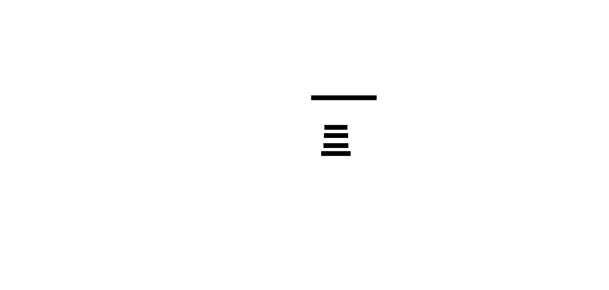
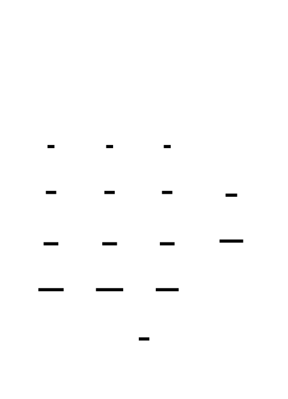
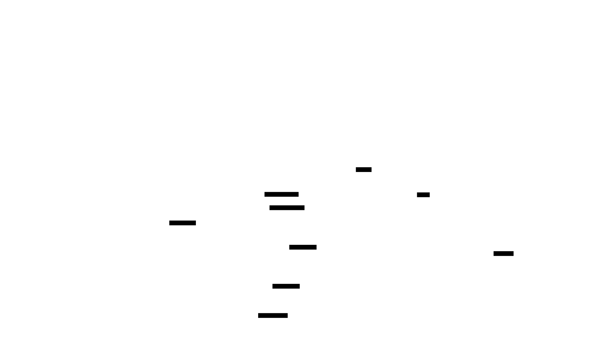
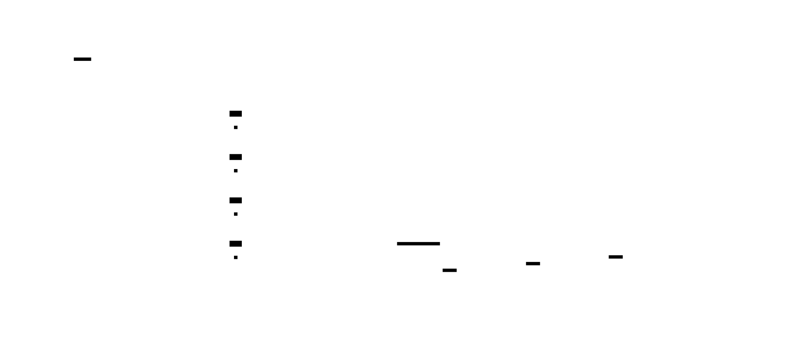
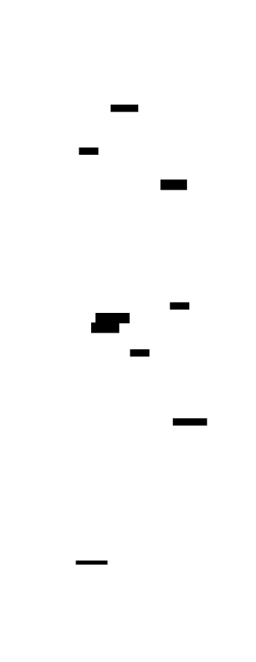
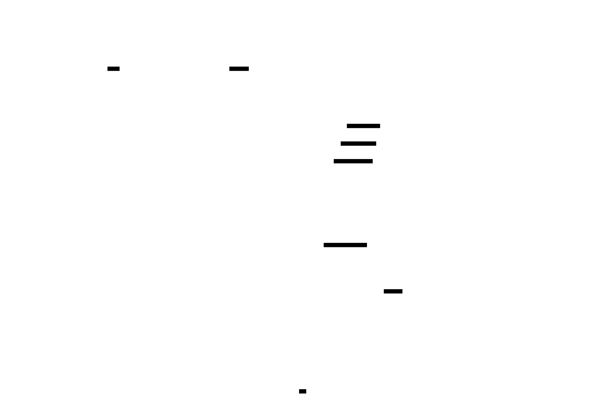
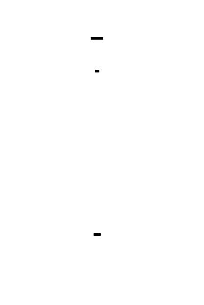

# 🎯 Project Charter: C-Like Language Tokenizer

## What You Are Building
You are building a character-level lexical scanner (lexer) that transforms raw source text into a structured stream of categorized tokens. This is a single-pass, high-performance engine that implements a Deterministic Finite Automaton (DFA) to recognize identifiers, keywords, multi-character operators, number literals, and strings, while precisely tracking source positions for error reporting.

## Why This Project Exists
Most developers use language tools daily but treat the translation of text into meaning as a "black box." Building a tokenizer from scratch is the only way to truly understand the Maximal Munch principle, the mechanics of lookahead, and how compilers maintain $O(n)$ performance while handling complex context-sensitive features like multi-line comments and escape sequences.

## What You Will Be Able to Do When Done
- **Implement an FSM:** Build a character-by-character scanner using a state-based cursor model.
- **Apply Maximal Munch:** Resolve lexical ambiguity in operators (e.g., distinguishing `=` from `==`) using greedy consumption logic.
- **Handle Context-Sensitivity:** Switch scanning "modes" to handle string literals and multi-line comments correctly.
- **Implement Error Recovery:** Design a scanner that doesn't crash on typos but instead emits diagnostic tokens and resumes operation.
- **Track Source Metadata:** Generate precise line and column data required for IDE squiggles and compiler error messages.

## Final Deliverable
A production-ready `Scanner` class (approx. 400-600 lines of code) that accepts a source string and returns a list of `Token` objects. It will include a comprehensive integration test suite and a performance benchmark capable of processing a 10,000-line C-like program in under one second.

## Is This Project For You?
**You should start this if you:**
- Have a solid handle on basic string manipulation (indexing, slicing, concatenation).
- Are comfortable with control flow structures (while-loops, if-else chains).
- Want to understand the "front-end" of compilers and interpreters.

**Come back after you've learned:**
- Basic Object-Oriented Programming (defining classes and methods).
- How to use Enumerations (Enums) and Dictionaries (Hash Maps) in your chosen language.

## Estimated Effort
| Phase | Time |
|-------|------|
| Token Types & Scanner Foundation | ~2.5 hours |
| Multi-Character Tokens & Maximal Munch | ~3.5 hours |
| Strings & Comments Sub-States | ~2.5 hours |
| Integration Testing & Error Recovery | ~2.5 hours |
| **Total** | **~11 hours** |

## Definition of Done
The project is complete when:
- The `scan_tokens()` method produces a deterministic list of tokens ending in a sentinel `EOF` for any valid input.
- The "Canonical Statement" test (`if (x >= 42) { return "ok"; }`) produces 12 tokens with exact line/column matches.
- Multi-line block comments (`/* ... */`) are stripped entirely while maintaining correct line counts for subsequent tokens.
- The scanner successfully processes a 10,000-line generated source file in less than 1.0 second on standard hardware.
- Every unrecognized character in a file produces a `TokenType.ERROR` without halting the scanning of subsequent valid tokens.

---

# Tokenizer / Lexer: Building a Character-Level Scanner for a C-like Language

This project builds a complete lexer from scratch — the first phase of any compiler or interpreter pipeline. You will implement a character-by-character finite state machine that transforms raw source text into a structured stream of categorized tokens. The tokenizer handles single and multi-character operators, number and string literals, identifiers, keywords, comments, escape sequences, and error recovery — all while tracking precise source positions for downstream error reporting.

By the end, you will have internalized how programming languages are read at the lowest level: not as words or lines, but as individual characters consumed one at a time through a state machine that makes greedy decisions (maximal munch) with minimal lookahead. This understanding cascades into parsers, compilers, language servers, syntax highlighters, and any tool that must understand source code structurally.

The project is structured as four milestones that progressively layer complexity: foundation (tokens, scanner, single-char), multi-character recognition (operators, numbers, identifiers, keywords), strings and comments (escape sequences, nested state), and finally integration testing with error recovery.


<!-- MS_ID: tokenizer-m1 -->
# Milestone 1: Token Types & Scanner Foundation
## Where You Are in the Pipeline


Before a compiler can parse expressions, type-check variables, or generate machine code, it needs to answer one deceptively simple question: *what is this source file made of?* Raw source text is just a sequence of characters — bytes with no inherent meaning. Your tokenizer is the component that transforms that flat stream of characters into a structured sequence of meaningful units called **tokens**.
Think of it like reading a sentence in a human language. When you read "the cat sat", your brain does not process individual letters — it automatically groups letters into words and assigns each word a grammatical role (article, noun, verb). The tokenizer does exactly this for source code: it groups characters into lexemes and assigns each lexeme a type.
In this milestone, you will build the foundation that all subsequent work rests on:
1. A **token type enumeration** — the vocabulary of your language
2. A **Token data structure** — the carrier of information about each recognized unit
3. A **Scanner class** — the character-consuming engine with its two primitive operations: `advance()` and `peek()`
By the end of this milestone, your scanner will successfully process single-character tokens, swallow whitespace silently, and emit sentinel tokens at the boundaries of valid and invalid input.
---
## The Revelation: Tokenizers Are Not Split()
Here is what most developers assume when they first think about tokenizers:
```python
# What people think tokenizers do (DON'T do this)
def tokenize_naive(source):
    return source.split()
```
Maybe with some regex sprinkled on top:
```python
import re
# Still wrong
tokens = re.findall(r'\w+|[^\w\s]', source)
```
This feels reasonable. After all, Python's `split()` does break text into words, and regex can match patterns. The misconception is understandable.
**Here is where this model breaks.** Consider the input:
```
x >= 42
```
A split-based approach gives you `['x', '>=', '42']`. That looks fine. Now consider:
```
x>=42
```
Same semantics — no spaces. `split()` gives you `['x>=42']`. One token. That is completely wrong.
Now consider escape sequences inside strings:
```
"hello\nworld"
```
No regex operating on a substring can correctly distinguish whether the `\n` is an escape sequence inside a string or the literal characters `\` and `n`. To know that, you need to know *where you are* — are you inside a string literal right now? Regex has no memory of what it scanned two characters ago.
**The real model**: A tokenizer is a **finite state machine** (FSM) that reads one character at a time, maintains a current *state*, and makes local decisions — emit a token, change state, advance the cursor — based only on the current character and the immediately next character (one character of lookahead). It never looks at the "whole string." The cursor moves forward, one character at a time, and never goes back.
This is why tokenizers are O(n) with constant memory: every character is visited exactly once. It is also why they are fast enough to process millions of lines per second in production compilers.

> **🔑 Foundation: Finite State Machines as applied to tokenization: states**
> 
> ### 1. What it IS
A **Finite State Machine (FSM)** is a mathematical model used to design logic that moves through a sequence of "states" based on input. In tokenization, an FSM treats a stream of characters as input and determines where one "token" (like a keyword, variable name, or operator) ends and the next begins.

It consists of three core components:
*   **States**: The "modes" the tokenizer can be in (e.g., `START`, `READING_NUMBER`, `READING_STRING`).
*   **Transitions**: Rules that move the machine from one state to another based on the current character (e.g., "If in `START` and see a digit, move to `READING_NUMBER`").
*   **Accepting (Final) States**: Specific states that signify a valid token has been successfully identified (e.g., "We hit a space after some digits; the current buffer is a valid `INTEGER`").

### 2. WHY you need it right now
As you move from simple string splitting to building a robust lexer, manual `if-else` or `switch` statements become "spaghetti code" that is difficult to debug. For example, distinguishing between a decimal `10.5`, an integer `10`, and a range `10..20` requires looking ahead or keeping track of what you've already seen. 

An FSM provides a formal structure to manage this complexity. It ensures that your tokenizer is **predictable** and **exhaustive**, meaning it handles every possible character sequence without falling into ambiguous logic traps.

### 3. Key Insight: "The State is your Memory"
The most important thing to remember is that **the current state represents everything the tokenizer knows about the past.** 

You don’t need to look back at the last five characters to know if you are inside a comment; the fact that you are currently in the `IN_COMMENT` state already tells you everything you need to know. When you receive a new character, you only need two pieces of information to decide what to do next: **"What state am I in?"** and **"What is this character?"**

---
## Designing the Token Type Enumeration


The first thing you need is a vocabulary — a fixed set of categories into which every lexeme in your C-like language will be classified. In Python, this is a natural fit for `enum.Enum`.
Every token in your language falls into one of these categories:
| Category | What it represents | Examples |
|---|---|---|
| `NUMBER` | Integer or floating-point literals | `42`, `3.14`, `0` |
| `STRING` | String literals (quoted) | `"hello"`, `"x\n"` |
| `IDENTIFIER` | Variable/function names | `x`, `myVar`, `_count` |
| `KEYWORD` | Reserved words | `if`, `while`, `return` |
| `OPERATOR` | Arithmetic and comparison operators | `+`, `-`, `>=`, `==` |
| `PUNCTUATION` | Structural delimiters | `(`, `)`, `{`, `;`, `,` |
| `EOF` | End of input — the sentinel | (no lexeme) |
| `ERROR` | Unrecognized character | `@`, `#`, `$` |
Notice that `OPERATOR` and `PUNCTUATION` are both "symbols." You might wonder: why separate them? Convention and downstream utility. An operator participates in expressions and has associativity and precedence. A punctuation mark is structural glue — a semicolon terminates a statement, a comma separates arguments. When your parser eventually consumes this token stream, it will care about this distinction. Design your token types for the consumer (the parser), not just for the producer (the scanner).
Here is the complete enumeration:
```python
from enum import Enum, auto
class TokenType(Enum):
    # Literals
    NUMBER     = auto()
    STRING     = auto()
    # Names
    IDENTIFIER = auto()
    KEYWORD    = auto()
    # Symbols — operators (participate in expressions)
    PLUS       = auto()   # +
    MINUS      = auto()   # -
    STAR       = auto()   # *
    SLASH      = auto()   # /
    ASSIGN     = auto()   # =
    EQUAL      = auto()   # ==
    NOT_EQUAL  = auto()   # !=
    LESS       = auto()   # <
    LESS_EQ    = auto()   # <=
    GREATER    = auto()   # >
    GREATER_EQ = auto()   # >=
    BANG       = auto()   # !
    # Symbols — punctuation (structural)
    LPAREN     = auto()   # (
    RPAREN     = auto()   # )
    LBRACE     = auto()   # {
    RBRACE     = auto()   # }
    LBRACKET   = auto()   # [
    RBRACKET   = auto()   # ]
    SEMICOLON  = auto()   # ;
    COMMA      = auto()   # ,
    # Sentinel / diagnostic
    EOF        = auto()
    ERROR      = auto()
```
> **Design note:** `auto()` assigns sequential integer values automatically. You never need to remember which integer corresponds to which token — you always compare by name (`TokenType.PLUS`, not `5`). This is the correct way to use enums in Python: names over values.
You will notice that operators are *individually named* (`PLUS`, `MINUS`, `SLASH`) rather than using a generic `OPERATOR` type with a value string. This is intentional. A parser matching a `+` node does not want to check `token.type == TokenType.OPERATOR and token.lexeme == "+"`. It wants to check `token.type == TokenType.PLUS`. Be specific. Your parser will thank you.
---
## The Token Data Structure



A token is not just a type. It carries four pieces of information:
1. **type** — which category this token belongs to (`TokenType.PLUS`, `TokenType.KEYWORD`, etc.)
2. **lexeme** — the exact raw text from the source that this token was scanned from (`"+"`, `"while"`, `"3.14"`)
3. **line** — the line number in the source file where this token starts (1-indexed)
4. **column** — the column number in the source file where this token starts (1-indexed)
The lexeme is the raw text — for a string literal `"hello"`, the lexeme includes the quote characters: `'"hello"'`. For an integer `42`, the lexeme is `"42"`. This matters because when you report an error, you want to show the user exactly what they wrote.
Line and column are metadata that the tokenizer produces and the parser (and error reporter) consume. Without them, an error message can only say "invalid syntax" — with them, it says "invalid syntax at line 12, column 8." This is the difference between a usable and an unusable language tool.
```python
from dataclasses import dataclass
@dataclass
class Token:
    type: TokenType
    lexeme: str
    line: int
    column: int
    def __repr__(self) -> str:
        return f"Token({self.type.name}, {self.lexeme!r}, {self.line}:{self.column})"
```
`@dataclass` gives you `__init__` and `__eq__` for free — you can construct a token with `Token(TokenType.PLUS, "+", 1, 5)` and compare tokens in tests with `==`. The custom `__repr__` makes debugging output readable.
A few token constructions you will use often enough to make helper functions:
```python
def make_eof(line: int, column: int) -> Token:
    return Token(TokenType.EOF, "", line, column)
def make_error(char: str, line: int, column: int) -> Token:
    return Token(TokenType.ERROR, char, line, column)
```
The EOF token has an empty lexeme — there is no source text that corresponds to end-of-file. The Error token's lexeme is the offending character.
---
## The Scanner Class: Architecture First


The scanner holds:
- The **source string** — the complete source text, indexed as a Python string
- A **current position** cursor — an integer index into the source string
- **Line** and **column** counters — updated as the cursor advances
Here is the skeleton:
```python
class Scanner:
    def __init__(self, source: str) -> None:
        self.source: str = source
        self.current: int = 0   # index of next character to consume
        self.line: int = 1      # current line number (1-indexed)
        self.column: int = 1    # current column number (1-indexed)
```
Notice `current` is the index of the *next* character to consume — it has not been consumed yet. When the scanner starts, `current = 0` points at the first character in the source.
### is_at_end()
```python
def is_at_end(self) -> bool:
    return self.current >= len(self.source)
```
This is the simplest guard. Every loop and conditional in the scanner begins by checking `is_at_end()` before touching `self.source[self.current]` — accessing past the end of a Python string raises `IndexError`.
### peek()
```python
def peek(self) -> str:
    if self.is_at_end():
        return "\0"   # null character as "no character" sentinel
    return self.source[self.current]
```
`peek()` reads the character at `self.current` without moving the cursor. Call it ten times in a row — you get the same character. This is your window into the future: before you decide what to do, you can look at the next character without committing to consuming it.
The return value `"\0"` (the null character, ASCII 0) when at end is a convention borrowed from C tokenizers. It is a value that will never appear in real source code, so any comparison like `peek() == '='` will safely return `False` at end-of-input without needing a separate `if is_at_end()` guard in every caller. This is the **sentinel value pattern** — returning a special out-of-band value to signal a boundary condition.
### advance()
```python
def advance(self) -> str:
    char = self.source[self.current]
    self.current += 1
    if char == "\n":
        self.line += 1
        self.column = 1
    else:
        self.column += 1
    return char
```
`advance()` is the consuming operation. It reads the current character, moves the cursor forward by one, updates the position counters, and returns the character. After `advance()`, the cursor points at the character *after* the one just consumed.
> **Critical detail about `\r\n`:** Windows line endings are the two-character sequence `\r` followed by `\n`. If you naively count every `\n` as a new line, you will double-count Windows newlines. The standard approach: treat `\r` as whitespace that does NOT increment the line counter (only `\n` does). The `\r\n` pair will then correctly increment the line counter exactly once (when `\n` is consumed). This is already handled by the code above — `\r` falls through to the `else` branch and increments `column`, which is harmless.
> **About tab width:** The code above increments `column` by 1 for every character, including tab (`\t`). This is the standard approach in most modern compilers (including LLVM's Clang). An alternative is to advance to the next tab stop (column rounded up to the nearest multiple of 8 or 4), but this makes position reporting dependent on editor settings and creates confusing mismatch between what the user sees and what the compiler reports. Consistent 1-per-character is simpler and more predictable.



### A Trace Through advance() and peek()
Suppose your source is `"x+1"`. Here is the scanner state at each step:
```
Initial:  current=0, line=1, col=1
source:   x + 1
          ^
          current
peek()    → 'x'      (current stays at 0)
advance() → 'x'      current=1, col=2
peek()    → '+'      (current stays at 1)
advance() → '+'      current=2, col=3
peek()    → '1'      (current stays at 2)
advance() → '1'      current=3, col=4
is_at_end() → True
peek()    → '\0'
```
Every character is visited exactly once. `peek()` is free — no movement. `advance()` is permanent — no going back.
---
## Position Tracking in Depth


Position tracking has one subtle complication: the `line` and `column` you record in a token should be the position where the token *starts*, not where it ends. By the time you finish scanning a multi-character token like `while` or `42.5`, your cursor is past the end of the lexeme. So you need to capture the start position *before* you begin scanning.
The pattern you will use throughout this project:
```python
def next_token(self) -> Token:
    # Capture position BEFORE advancing
    tok_line = self.line
    tok_col = self.column
    if self.is_at_end():
        return Token(TokenType.EOF, "", tok_line, tok_col)
    char = self.advance()
    # ... dispatch on char ...
```
By recording `tok_line` and `tok_col` from `self.line` / `self.column` *before* calling `advance()`, you capture the position of the first character of the token. All subsequent `advance()` calls within the same token scan will update `self.line` and `self.column`, but the token you emit will carry the *start* position.
This pattern will be critical in Milestone 3 when you scan string literals that span multiple lines — the token's reported position should be the opening quote, not the closing one.
---
## The Finite State Machine View



Your scanner's `scan_tokens()` method is a finite state machine. The *states* correspond to what the scanner is currently "inside":
- **START** — at the beginning of a new token, deciding what to scan
- **IN_NUMBER** — currently consuming digit characters
- **IN_IDENTIFIER** — currently consuming alphanumeric characters
- **IN_STRING** — currently consuming characters inside double quotes
- **IN_COMMENT** — skipping characters until comment ends
In this milestone, you only implement the START state (dispatching on the first character of each token) and the simple case where a single character completely determines the token. Multi-character states will come in Milestones 2 and 3.
The dispatch logic is a match (or if/elif chain) on the character returned by `advance()`:
```python
# Single-character tokens — one character, one decision, one token
SINGLE_CHAR_TOKENS = {
    "+": TokenType.PLUS,
    "-": TokenType.MINUS,
    "*": TokenType.STAR,
    "/": TokenType.SLASH,   # '/' alone is division; '//' and '/*' handled in M3
    "(": TokenType.LPAREN,
    ")": TokenType.RPAREN,
    "{": TokenType.LBRACE,
    "}": TokenType.RBRACE,
    "[": TokenType.LBRACKET,
    "]": TokenType.RBRACKET,
    ";": TokenType.SEMICOLON,
    ",": TokenType.COMMA,
}
```
Using a dictionary for single-character dispatch is both idiomatic Python and faster than a long `if/elif` chain — a dictionary lookup is O(1) hash table access.
---
## Putting It Together: scan_tokens() and next_token()
The top-level API of your scanner produces a complete list of tokens from the source:
```python
def scan_tokens(self) -> list[Token]:
    tokens: list[Token] = []
    while True:
        token = self.next_token()
        tokens.append(token)
        if token.type == TokenType.EOF:
            break
    return tokens
```
The loop is driven by `next_token()`, which produces one token per call. It terminates when `next_token()` returns an EOF token. Importantly, the EOF token is appended to the list before the loop exits — the parser downstream will expect to find `EOF` as the last element and will use it as its own termination signal. Forgetting the EOF token is a classic first-timer mistake that causes downstream parsers to crash with an `IndexError`.
Now the complete `next_token()` for this milestone:
```python
def next_token(self) -> Token:
    # Skip whitespace — consume without emitting
    self._skip_whitespace()
    # Capture the start position of this token
    tok_line = self.line
    tok_col = self.column
    if self.is_at_end():
        return Token(TokenType.EOF, "", tok_line, tok_col)
    char = self.advance()
    # Single-character tokens via lookup table
    if char in SINGLE_CHAR_TOKENS:
        return Token(SINGLE_CHAR_TOKENS[char], char, tok_line, tok_col)
    # Unrecognized character — emit Error token, continue scanning
    return Token(TokenType.ERROR, char, tok_line, tok_col)
```
And the whitespace consumer:
```python
def _skip_whitespace(self) -> None:
    while not self.is_at_end() and peek() in (" ", "\t", "\r", "\n"):
        self.advance()
```
Wait — there is a subtle issue above. Inside `_skip_whitespace`, you should call `self.peek()`, not a standalone `peek()`. Let us write the complete, correct version:
```python
def _skip_whitespace(self) -> None:
    while not self.is_at_end() and self.peek() in (" ", "\t", "\r", "\n"):
        self.advance()
```
Why does `_skip_whitespace` call `advance()` rather than simply incrementing `self.current`? Because `advance()` handles position tracking. If you increment `self.current` directly, you bypass the newline detection and your line counter falls out of sync.
> **Position capture timing:** Notice that `_skip_whitespace()` is called *before* capturing `tok_line` and `tok_col`. This is intentional — you skip past any leading whitespace, *then* record where the actual token starts. If you captured position first, then skipped whitespace, the token's reported position would point at the space rather than the token itself. Always skip whitespace before snapping the position.
---
## The Full Scanner: Milestone 1 Complete Implementation
```python
from enum import Enum, auto
from dataclasses import dataclass
from typing import Optional
class TokenType(Enum):
    # Literals
    NUMBER     = auto()
    STRING     = auto()
    # Names
    IDENTIFIER = auto()
    KEYWORD    = auto()
    # Operators
    PLUS       = auto()
    MINUS      = auto()
    STAR       = auto()
    SLASH      = auto()
    ASSIGN     = auto()
    EQUAL      = auto()
    NOT_EQUAL  = auto()
    LESS       = auto()
    LESS_EQ    = auto()
    GREATER    = auto()
    GREATER_EQ = auto()
    BANG       = auto()
    # Punctuation
    LPAREN     = auto()
    RPAREN     = auto()
    LBRACE     = auto()
    RBRACE     = auto()
    LBRACKET   = auto()
    RBRACKET   = auto()
    SEMICOLON  = auto()
    COMMA      = auto()
    # Sentinel / diagnostic
    EOF        = auto()
    ERROR      = auto()
@dataclass
class Token:
    type: TokenType
    lexeme: str
    line: int
    column: int
    def __repr__(self) -> str:
        return f"Token({self.type.name}, {self.lexeme!r}, {self.line}:{self.column})"
SINGLE_CHAR_TOKENS: dict[str, TokenType] = {
    "+": TokenType.PLUS,
    "-": TokenType.MINUS,
    "*": TokenType.STAR,
    "/": TokenType.SLASH,
    "(": TokenType.LPAREN,
    ")": TokenType.RPAREN,
    "{": TokenType.LBRACE,
    "}": TokenType.RBRACE,
    "[": TokenType.LBRACKET,
    "]": TokenType.RBRACKET,
    ";": TokenType.SEMICOLON,
    ",": TokenType.COMMA,
}
WHITESPACE: frozenset[str] = frozenset({" ", "\t", "\r", "\n"})
class Scanner:
    def __init__(self, source: str) -> None:
        self.source: str = source
        self.current: int = 0
        self.line: int = 1
        self.column: int = 1
    # ── Primitive Operations ──────────────────────────────────────────────
    def is_at_end(self) -> bool:
        """True when the cursor has reached or passed the end of source."""
        return self.current >= len(self.source)
    def peek(self) -> str:
        """Return the current character without advancing. Returns '\\0' at end."""
        if self.is_at_end():
            return "\0"
        return self.source[self.current]
    def advance(self) -> str:
        """
        Consume and return the current character.
        Updates line and column counters.
        """
        char = self.source[self.current]
        self.current += 1
        if char == "\n":
            self.line += 1
            self.column = 1
        else:
            self.column += 1
        return char
    # ── Whitespace ────────────────────────────────────────────────────────
    def _skip_whitespace(self) -> None:
        """Consume whitespace characters without emitting tokens."""
        while not self.is_at_end() and self.peek() in WHITESPACE:
            self.advance()
    # ── Token Production ──────────────────────────────────────────────────
    def next_token(self) -> Token:
        """Scan and return the next token from the source."""
        self._skip_whitespace()
        tok_line = self.line
        tok_col = self.column
        if self.is_at_end():
            return Token(TokenType.EOF, "", tok_line, tok_col)
        char = self.advance()
        if char in SINGLE_CHAR_TOKENS:
            return Token(SINGLE_CHAR_TOKENS[char], char, tok_line, tok_col)
        # Unrecognized character: emit Error, continue (error recovery)
        return Token(TokenType.ERROR, char, tok_line, tok_col)
    def scan_tokens(self) -> list[Token]:
        """
        Scan the entire source and return a list of tokens.
        Always ends with an EOF token.
        """
        tokens: list[Token] = []
        while True:
            token = self.next_token()
            tokens.append(token)
            if token.type == TokenType.EOF:
                break
        return tokens
```
---
## Testing Your Foundation
Good tests for a tokenizer are not "does it return *something*?" — they are "does it return the *exact* token stream, with correct types, lexemes, lines, and columns?" Every test should pin down the complete token, not just its type.
```python
def test_single_char_tokens():
    scanner = Scanner("+ - * /")
    tokens = scanner.scan_tokens()
    assert tokens[0] == Token(TokenType.PLUS,      "+", 1, 1)
    assert tokens[1] == Token(TokenType.MINUS,     "-", 1, 3)
    assert tokens[2] == Token(TokenType.STAR,      "*", 1, 5)
    assert tokens[3] == Token(TokenType.SLASH,     "/", 1, 7)
    assert tokens[4] == Token(TokenType.EOF,       "",  1, 8)
    assert len(tokens) == 5
def test_whitespace_is_not_emitted():
    scanner = Scanner("   \t\t  +")
    tokens = scanner.scan_tokens()
    # Only PLUS and EOF — whitespace produces nothing
    assert len(tokens) == 2
    assert tokens[0].type == TokenType.PLUS
    assert tokens[0].column == 8   # 7 whitespace chars before, so col 8
def test_newline_resets_column():
    scanner = Scanner("{\n}")
    tokens = scanner.scan_tokens()
    assert tokens[0] == Token(TokenType.LBRACE,  "{", 1, 1)
    assert tokens[1] == Token(TokenType.RBRACE,  "}", 2, 1)   # line 2, col 1
    assert tokens[2] == Token(TokenType.EOF,     "",  2, 2)
def test_eof_on_empty_input():
    scanner = Scanner("")
    tokens = scanner.scan_tokens()
    assert len(tokens) == 1
    assert tokens[0] == Token(TokenType.EOF, "", 1, 1)
def test_error_token_for_invalid_char():
    scanner = Scanner("@")
    tokens = scanner.scan_tokens()
    assert tokens[0] == Token(TokenType.ERROR, "@", 1, 1)
    assert tokens[1].type == TokenType.EOF
def test_error_recovery_continues():
    # After an error token, scanning continues normally
    scanner = Scanner("@+")
    tokens = scanner.scan_tokens()
    assert tokens[0].type == TokenType.ERROR   # '@' is invalid
    assert tokens[1].type == TokenType.PLUS    # '+' is still recognized
    assert tokens[2].type == TokenType.EOF
def test_all_punctuation():
    scanner = Scanner("(){}[];,")
    tokens = scanner.scan_tokens()
    expected_types = [
        TokenType.LPAREN, TokenType.RPAREN,
        TokenType.LBRACE, TokenType.RBRACE,
        TokenType.LBRACKET, TokenType.RBRACKET,
        TokenType.SEMICOLON, TokenType.COMMA,
        TokenType.EOF,
    ]
    assert [t.type for t in tokens] == expected_types
def test_multiline_position_tracking():
    source = "+\n+\n+"
    scanner = Scanner(source)
    tokens = scanner.scan_tokens()
    assert tokens[0] == Token(TokenType.PLUS, "+", 1, 1)
    assert tokens[1] == Token(TokenType.PLUS, "+", 2, 1)
    assert tokens[2] == Token(TokenType.PLUS, "+", 3, 1)
def test_windows_line_endings():
    # \r\n should count as ONE newline, not two
    scanner = Scanner("+\r\n+")
    tokens = scanner.scan_tokens()
    assert tokens[0].line == 1
    assert tokens[1].line == 2   # one newline, not two
```
Run all tests with `python -m pytest test_scanner.py -v`. Every test should pass green before you proceed to Milestone 2.
---
## Design Decisions: Why This Architecture?
### Why a class rather than a function with a loop?
The scanner maintains mutable state (`current`, `line`, `column`) that must persist across calls to `next_token()`. A class is the natural Python idiom for encapsulating mutable state that evolves over time. An alternative would be to pass a mutable dictionary around, but that is less readable and less type-safe.
### Why store the entire source string rather than reading character by character?
| Option | Pros | Cons | Used by |
|---|---|---|---|
| **Store full source in memory** ✓ | Simple indexing, peek is trivial, restartable | Source must fit in RAM | CPython, Go compiler, LLVM Clang |
| Stream (file handle, generator) | Handles huge files, lower memory | Peek requires buffering; no restart | Streaming compilers for very large codebases |
For source files up to tens of megabytes (which is essentially all real-world source code), storing the full string in memory is correct. The performance requirement for this project (10,000-line file in under 1 second) is trivially met by either approach in Python.
### Why `"\0"` as the sentinel from peek()?
Alternatives include `None` (Pythonic but requires `Optional[str]` type annotation and `None` checks everywhere), raising an exception (verbose), or returning `""` (empty string comparisons work but are confusing). The `"\0"` convention comes from C tokenizers (Crafting Interpreters, GCC, Clang) and has one decisive advantage: all character comparisons like `peek() == "="` and `peek() in "abc"` work correctly and safely at end-of-input — `"\0"` will never match any valid source character.
---
## The Three-Level View of Your Scanner
Let us look at what your scanner does from three levels:
**Level 1 — Source Language (programmer's view):**
```
if (x >= 42) { return true; }
```
A human sees keywords, variable names, operators, and braces.
**Level 2 — Scanner Internal (your scanner's view):**
```
cursor=0, line=1, col=1
read 'i' → start identifier scan...
read 'f' → continue identifier...
end of alphanumerics → lexeme = "if" → lookup table → KEYWORD
emit Token(KEYWORD, "if", 1, 1)
read ' ' → whitespace, skip
read '(' → LPAREN
emit Token(LPAREN, "(", 1, 4)
...
```
The scanner sees a sequence of characters, a cursor, and dispatch decisions.
**Level 3 — Python Runtime (what actually executes):**
```
String indexing: source[self.current]  →  O(1) pointer arithmetic
dict lookup: char in SINGLE_CHAR_TOKENS  →  O(1) hash table probe
dataclass __init__: Token(...)  →  __new__ + field assignment
list.append(token)  →  amortized O(1)
```
Python strings are immutable sequences stored in contiguous memory. `source[i]` is a direct offset calculation — not iteration. This is why character-level scanning in Python is fast enough to meet the 10,000-line benchmark.
---
## Common Pitfalls
**1. Capturing position after advance instead of before**
```python
# WRONG: tok_col is already 1 ahead of where the token started
char = self.advance()
tok_col = self.column   # off by one!
```
Always capture `tok_line` and `tok_col` before calling `advance()`.
**2. Forgetting the EOF token**
If `scan_tokens()` does not append the EOF token, the parser will eventually call `tokens[i]` on an out-of-bounds index and crash with `IndexError`. The EOF token is both a termination signal and a guard against the parser running off the end of the token list.
**3. Skipping whitespace but forgetting to update column**
If you manually increment `self.current` to skip whitespace (bypassing `advance()`), newlines will not be detected and `self.line` will stay at 1 forever. Always use `self.advance()` — even for whitespace.
**4. Windows line endings counting as two newlines**
The sequence `\r\n` should produce exactly one line increment. Since only `\n` increments `self.line` in the code above, and `\r` is consumed as whitespace (column increments by 1, then resets when `\n` follows), this is handled correctly — but only if `\r` is in your whitespace set. Verify this case with a test.
**5. Column not resetting to 1 — resetting to 0**
After a newline, the next character is at column 1 (one-indexed). Many implementations accidentally set `self.column = 0` in the newline branch of `advance()`, then increment to 1 when the next character is consumed. This works but requires careful reasoning. Setting `self.column = 1` directly in the newline branch and *not* incrementing in the same `advance()` call (since the `\n` itself is not on the next line) is cleaner. The code above does this correctly by setting `self.column = 1` when `char == "\n"` — this means the *next* character consumed will see `self.column = 1` as a starting point, then the `else: self.column += 1` branch will increment it to 2... 
Wait — re-examine the code carefully. When `advance()` processes `\n`, it sets `self.column = 1`. The `\n` is consumed. The *next* call to `advance()` will process the first character of the new line. In that call, `char != "\n"`, so it takes the `else: self.column += 1` branch, making column = 2. But the first character of the new line should be at column 1!
This is a real off-by-one bug. The fix: `self.column` should represent the column of the *next character to be consumed*, and `tok_col = self.column` captures the column of the current character *before* advancing. So when `\n` is processed, we want the next character's column to be 1. Setting `self.column = 1` achieves this correctly — the next `advance()` call will read column 1, then increment to 2. But `tok_col` is captured *before* `advance()` is called, so the next token will correctly record column = 1.
Let us trace it precisely:
```
State after newline processed:  line=2, column=1
                                                 ↑ "next char is at col 1"
next call to next_token():
  _skip_whitespace() — suppose no whitespace
  tok_col = self.column  →  tok_col = 1         ✓ correct!
  char = self.advance()
    → char = 'x' (first char on line 2)
    → column becomes 2                           ✓ (column now points PAST 'x')
  → token emitted with column = 1               ✓ correct!
```
The invariant is: **`self.column` is always the column of the character that `advance()` will consume next, not the one just consumed.** This is consistent with `self.current` being the index of the next character to consume. Both are "one ahead" pointers.
---
## Knowledge Cascade: One Concept, Ten Unlocks
You just built a finite state machine that reads one character at a time and emits structured output. Here is what this unlocks:
**1. Regex engines are scanners in disguise.** Every regular expression engine implements the same FSM model you just built, but auto-generates the state machine from a pattern description. Now that you understand the underlying model, regex is no longer magic — it is a compiled FSM where the scanner's `next_token()` loop is the FSM execution loop. Non-deterministic finite automata (NFAs) are the theoretical model; your scanner is a hand-coded deterministic finite automaton (DFA).
**2. Stream processors work identically.** Apache Kafka consumers, Python generators, Unix pipe filters — all of these process data one element at a time, maintain local state, and emit output. Your scanner is O(n) in time and O(1) in auxiliary memory (ignoring the output list). This is the same property that makes stream processors able to handle infinite data: they never buffer the whole input.
**3. Position metadata enables IDE tooling.** Every feature in your IDE that involves source positions — error underlines (squiggles), "go to definition," hover documentation, inline type hints — is built on exactly the `(line, column)` pairs you are generating right now. The Language Server Protocol (LSP), which powers VS Code's language support, defines its entire API in terms of `{line, character}` positions. You are generating the raw material.
**4. The EOF sentinel appears everywhere.** The pattern of using a sentinel value to signal "no more data" appears in: SQL `NULL`, TCP's `FIN` flag (connection termination), Unix's `EOF` byte (`Ctrl+D`), C's `null` terminator in strings, and Python's `StopIteration` exception in generators. The common insight is: give the consumer a guaranteed terminal signal rather than making it check a boolean "are we done?" flag separately. Your EOF token does exactly this for the parser.
**5. Error recovery as a design choice.** Your scanner emits an `ERROR` token and *continues* rather than raising an exception and halting. This is called **panic mode recovery** in compiler design — it is a deliberate choice to let the scanner (and later the parser) report as many errors as possible in one compilation run, rather than stopping at the first problem. This trade-off (more errors reported vs. possibility of cascading false positives) is one of the fundamental design decisions in compiler error handling. You just made it, probably without realizing it was a choice.
> 🔭 **Deep Dive**: If you want to understand FSMs formally — including how NFA-to-DFA conversion works and how this relates to regex compilation — see *Introduction to the Theory of Computation* by Michael Sipser, Chapter 1 (Finite Automata). It is the clearest mathematical treatment of the theory underlying everything you are building.
---
## Summary: What You Have Built
By completing this milestone, you have built a working character-level scanning foundation. Specifically:
- A `TokenType` enumeration covering every token category in your C-like language, with individually named operator and punctuation variants
- A `Token` dataclass that carries type, lexeme (raw source text), and precise source position (line and column, 1-indexed)
- A `Scanner` class with `peek()` (non-consuming look-ahead), `advance()` (consuming with position tracking), and `is_at_end()` (boundary guard)
- Position tracking that correctly handles newlines (incrementing line, resetting column) and Windows line endings (`\r\n` counts as one newline)
- Single-character token recognition via a dictionary dispatch table — O(1) per character
- Silent whitespace consumption — spaces, tabs, carriage returns, and newlines are consumed without producing tokens
- EOF sentinel emission — the final token in every scan is always `EOF`
- Error token emission for unrecognized characters — scanning continues after the error (error recovery)
In Milestone 2, you will extend `next_token()` to handle multi-character tokens: two-character operators like `==` and `>=`, number literals, and identifiers — applying the **maximal munch** principle to always prefer the longest matching token.
---
<!-- END_MS -->


<!-- MS_ID: tokenizer-m2 -->
<!-- MS_ID: tokenizer-m2 -->
# Milestone 2: Multi-Character Tokens & Maximal Munch
## Where You Are in the Pipeline


In Milestone 1, you built the engine: a character-consuming scanner that can recognize single characters and track its position through source text. Every character your scanner touches is visited exactly once, left to right, with no going back.
Now you face the first real challenge of language design: **multi-character tokens**. The characters `>` and `=` each mean something on their own (`GREATER`, `ASSIGN`). But together, in that exact order, they mean something different (`GREATER_EQ`). How does your scanner — which reads one character at a time — decide which interpretation is correct?
This milestone answers that question with a principle called **maximal munch**: *always consume as many characters as possible for the current token.* You will apply it to two-character operators, number literals, and identifiers. By the end, your scanner will handle the full vocabulary of your C-like language except for strings and comments (those come in Milestone 3).
---
## The Revelation: Tokenization Is Not Pattern Matching
Here is the mental model that most developers arrive with when they first think about multi-character tokens:
> *"My scanner should look at the source text, try all the patterns it knows (like `==`, `>=`, `!=`), and pick the one that matches best at the current position."*
This search-and-match framing is natural — it is how you would think about the problem if you were searching a document for a word. And it sounds reasonable enough. So let us follow it to its logical consequence and see where it breaks.
Suppose your language had a token `<==` (less-than-or-equal followed by assignment, hypothetically). And you are at position where the source reads `<==`. The search-and-match approach says: try `<==` first (length 3), then `<=` (length 2), then `<` (length 1). Pick the longest match.
Now imagine doing this for every character. You need to try every pattern, every time, at every position. If you have 30 token types, you try 30 patterns at each character. For a 10,000-line source file with ~300,000 characters, that is potentially 9 million pattern trials. And you would need regex or string matching for each trial.
But the real problem is deeper: **this framing is architecturally wrong**. It treats tokenization as a repeated search — "find the next token starting here" — which implies that you could look arbitrarily far ahead to determine what the next token is. Some tokens could require looking 10 characters ahead, or 100. The search cost grows with the length of the longest pattern.
**The actual model is different.** Your scanner does not search. It *consumes*. The moment `advance()` is called, a decision has been made: this character is part of the current token. The question is only ever: "given what I have consumed so far, should I consume one more character, or stop?"
This is the greedy consumption model. At each step, the scanner asks a single, local question: *"Should I consume the next character too?"* The answer is always one character of lookahead — `peek()`. If the answer is yes, consume and ask again. If no, stop and emit the token.
**This is why tokenizers need zero backtracking for well-designed languages.** The decision to consume a character is never reversed. There is no "oops, I should not have taken that character." The language is designed so that greedy consumption always produces the correct result.
> 🔑 **The Insight: "Maximal Munch Is Greedy"**
>
> **Maximal munch** is a specific greedy algorithm: among all valid tokens that could start at the current position, always take the longest one. It is implemented not by trying multiple patterns, but by consuming characters one at a time and stopping only when the next character would not extend the current token. Single character of lookahead. No search. No backtracking.
>
> **Why "greedy"?** In algorithm design, a greedy algorithm makes the locally optimal choice at each step without reconsidering previous decisions. Maximal munch makes the locally longest choice: "can I take one more character?" If yes, take it. This is the same principle as the greedy interval scheduling algorithm (take the earliest-ending interval), Huffman coding (always merge the two smallest trees), or TCP's Nagle algorithm (send when buffer is full, not before). Greedy works here because the language is designed to make it work — no valid tokenization requires the scanner to prefer a shorter match over a longer one.
---
## Two-Character Operators: Lookahead in Practice



Your C-like language has these paired operators, where one character alone is a valid token and two characters together form a different valid token:
| First Char | Alone → Token | With `=` → Token |
|---|---|---|
| `=` | `ASSIGN` | `EQUAL` (`==`) |
| `!` | `BANG` | `NOT_EQUAL` (`!=`) |
| `<` | `LESS` | `LESS_EQ` (`<=`) |
| `>` | `GREATER` | `GREATER_EQ` (`>=`) |
In Milestone 1, your `next_token()` used a dictionary lookup for single-character tokens. That approach breaks here because by the time you know you have seen `>`, you do not yet know if it should be `GREATER` or `GREATER_EQ`. You must look at the character *after* `>` without consuming it.
This is exactly what `peek()` is for.
The pattern is always the same:
1. `advance()` consumes the first character (e.g., `>`).
2. `peek()` inspects the *next* character without consuming it.
3. If `peek()` returns `=`, call `advance()` again (consuming `=`) and emit the two-character token.
4. Otherwise, emit the one-character token — `peek()` is not consumed, and the next call to `next_token()` will see it fresh.
Here is a helper method that encodes this pattern:
```python
def _match(self, expected: str) -> bool:
    """
    If the next character equals `expected`, consume it and return True.
    Otherwise, leave it unconsumed and return False.
    """
    if self.is_at_end():
        return False
    if self.source[self.current] != expected:
        return False
    # Consume the character — update position tracking
    self.advance()
    return True
```
`_match()` is the workhorse of two-character operator recognition. It is peek-and-consume in one operation: it only consumes if the next character is what you expected. If it returns `True`, the two-character token is complete. If `False`, the single-character token stands alone.
Now the operator scanning logic becomes almost readable as English:
```python
def _scan_operator(self, char: str, tok_line: int, tok_col: int) -> Token:
    """
    Scan an operator character, applying maximal munch for two-char variants.
    `char` is already consumed. `tok_line` and `tok_col` are start position.
    """
    if char == "=":
        if self._match("="):
            return Token(TokenType.EQUAL, "==", tok_line, tok_col)
        return Token(TokenType.ASSIGN, "=", tok_line, tok_col)
    if char == "!":
        if self._match("="):
            return Token(TokenType.NOT_EQUAL, "!=", tok_line, tok_col)
        return Token(TokenType.BANG, "!", tok_line, tok_col)
    if char == "<":
        if self._match("="):
            return Token(TokenType.LESS_EQ, "<=", tok_line, tok_col)
        return Token(TokenType.LESS, "<", tok_line, tok_col)
    if char == ">":
        if self._match("="):
            return Token(TokenType.GREATER_EQ, ">=", tok_line, tok_col)
        return Token(TokenType.GREATER, ">", tok_line, tok_col)
    # Should not reach here if called correctly
    return Token(TokenType.ERROR, char, tok_line, tok_col)
```
Notice the lexeme argument. When you emit `Token(TokenType.EQUAL, "==", ...)`, you construct the lexeme `"=="` explicitly — you are not going back to re-read the source. You know the lexeme because you know exactly which characters you consumed. This is another consequence of the consume-as-you-go model: the lexeme is always exactly the characters you `advance()`-d past.
### The `>==` Trace: Maximal Munch in Slow Motion


Let us trace through what happens when your scanner encounters the input `>==`:
```
Source:   > = =
          ^
          current=0, line=1, col=1
next_token() call #1:
  _skip_whitespace()  → nothing to skip
  tok_line=1, tok_col=1
  char = advance()    → '>', current=1, col=2
  char == '>'  →  call _match('=')
    peek() → '='  (source[1] == '=')  → matches!
    advance()  → '=', current=2, col=3
    return True
  emit Token(GREATER_EQ, ">=", 1, 1)
next_token() call #2:
  _skip_whitespace()  → nothing to skip
  tok_line=1, tok_col=3
  char = advance()    → '=', current=3, col=4
  char == '='  →  call _match('=')
    is_at_end()  → True  (current=3 >= len(">===")==3)
    return False
  emit Token(ASSIGN, "=", 1, 3)
next_token() call #3:
  is_at_end()  → True
  emit Token(EOF, "", 1, 4)
```
Result: `[GREATER_EQ(">=", 1:1), ASSIGN("=", 1:3), EOF("", 1:4)]`
This is maximal munch in action. When the scanner sees `>`, it greedily consumed the `=` that followed. It did not "ask" whether `>=` should be followed by another `=` to form `>==` (which is not a token in this language). It simply asked "should I take one more character?" at each step, and stopped as soon as the answer was no. The second `=` is left for the next call to `next_token()`, which correctly scans it as `ASSIGN`.
---
## Integrating Operator Scanning into next_token()
Your `next_token()` from Milestone 1 handled single-character tokens via a dictionary. The two-character operators need special handling — they cannot be in the dictionary because the decision depends on the *next* character, which is not yet consumed.
The cleanest approach: remove the ambiguous characters from `SINGLE_CHAR_TOKENS` and handle them explicitly in `next_token()`:
```python
# Updated SINGLE_CHAR_TOKENS — unambiguous single-char tokens only
SINGLE_CHAR_TOKENS: dict[str, TokenType] = {
    "+": TokenType.PLUS,
    "-": TokenType.MINUS,
    "*": TokenType.STAR,
    # '/' removed — will be handled for comments in Milestone 3
    # '=' removed — could be ASSIGN or part of EQUAL
    # '!' removed — could be BANG or part of NOT_EQUAL
    # '<' removed — could be LESS or part of LESS_EQ
    # '>' removed — could be GREATER or part of GREATER_EQ
    "(": TokenType.LPAREN,
    ")": TokenType.RPAREN,
    "{": TokenType.LBRACE,
    "}": TokenType.RBRACE,
    "[": TokenType.LBRACKET,
    "]": TokenType.RBRACKET,
    ";": TokenType.SEMICOLON,
    ",": TokenType.COMMA,
}
# Characters that start two-character operators
OPERATOR_CHARS: frozenset[str] = frozenset({"=", "!", "<", ">"})
```
And `next_token()` extended:
```python
def next_token(self) -> Token:
    self._skip_whitespace()
    tok_line = self.line
    tok_col = self.column
    if self.is_at_end():
        return Token(TokenType.EOF, "", tok_line, tok_col)
    char = self.advance()
    # Single-character tokens (unambiguous)
    if char in SINGLE_CHAR_TOKENS:
        return Token(SINGLE_CHAR_TOKENS[char], char, tok_line, tok_col)
    # Two-character operators (maximal munch with peek)
    if char in OPERATOR_CHARS:
        return self._scan_operator(char, tok_line, tok_col)
    # Number literals
    if char.isdigit():
        return self._scan_number(char, tok_line, tok_col)
    # Identifiers and keywords
    if char.isalpha() or char == "_":
        return self._scan_identifier(char, tok_line, tok_col)
    # Unrecognized — error token, continue scanning
    return Token(TokenType.ERROR, char, tok_line, tok_col)
```
Notice the dispatch order matters: digits before identifiers (so `4abc` is scanned as a number then an identifier, not a single broken token), and the operator check before the fallthrough error case.
Also note that `/` is not yet in `SINGLE_CHAR_TOKENS`. In Milestone 3, a `/` might start a comment (`//` or `/*`) — so it needs the same two-character lookahead treatment as `=` and `>`. For now, if you want to test division, you can temporarily add it back. The milestone 3 implementation will replace it.
---
## Number Literals: The State Machine Inside _scan_number()



Number literals in your C-like language come in two forms:
- **Integer**: one or more digits — `0`, `42`, `1000`
- **Float**: digits, a single decimal point, digits — `3.14`, `0.5`, `100.0`
Both begin with a digit. Your scanner has already consumed the first digit (it was used to recognize this as a number in `next_token()`). Now `_scan_number()` receives that first character and must consume the rest.
The scanning logic follows a simple two-state machine:
**State 1 — INTEGER**: Consume digits until you see something that is not a digit. If that non-digit is `.` and the character *after* the dot is also a digit, transition to the float state. Otherwise, emit an integer token.
**State 2 — FLOAT**: After consuming the `.`, continue consuming digits until you see something that is not a digit. Emit a float token.
```python
def _scan_number(self, first_digit: str, tok_line: int, tok_col: int) -> Token:
    """
    Scan a number literal. `first_digit` is already consumed.
    Handles both integers (42) and floats (3.14).
    """
    lexeme = first_digit
    # Consume remaining integer digits
    while not self.is_at_end() and self.peek().isdigit():
        lexeme += self.advance()
    # Check for decimal point followed by digits (float)
    if self.peek() == "." and self._peek_next().isdigit():
        lexeme += self.advance()  # consume the '.'
        # Consume fractional digits
        while not self.is_at_end() and self.peek().isdigit():
            lexeme += self.advance()
    return Token(TokenType.NUMBER, lexeme, tok_line, tok_col)
```
This requires a second lookahead method, `_peek_next()`, which looks *two* characters ahead:
```python
def _peek_next(self) -> str:
    """Look two characters ahead without consuming. Returns '\\0' if not available."""
    if self.current + 1 >= len(self.source):
        return "\0"
    return self.source[self.current + 1]
```
> **Why do we need two-character lookahead here?** When the scanner is in the INTEGER state and sees a `.`, it needs to decide: is this a decimal point in a float literal, or a `.` that belongs to something else (like a method call, or a range operator in another language)? With only one character of lookahead (peek), you see `.` — but you don't know if it's `3.14` (float) or `3.toString()` (integer followed by method access). Looking one more character ahead to check if the character *after* the dot is a digit resolves the ambiguity without consuming anything. If the next-next character is not a digit, the `.` is left alone for the next `next_token()` call.
>
> This is a deliberate design point: **most languages need no more than one or two characters of lookahead in the lexer**. If your language required five characters of lookahead to tokenize, that would signal a design problem — it means tokens are ambiguous from their first few characters and the grammar is harder to reason about.
### Edge Cases to Decide Explicitly
Number scanning has a few cases where the spec is silent and you must make a choice:
| Input | Question | Recommendation |
|---|---|---|
| `3.` | Trailing dot — is this `3.` or `3` + `.`? | Scan as integer `3`, leave `.` for next token. The `_peek_next().isdigit()` check handles this — if nothing follows the dot, don't consume it. |
| `.5` | Leading dot — is this `.5` or `.` + `5`? | Not a number: `.` is not a digit, so `_scan_number` is never triggered. `.` will likely be an error token. Document this decision. |
| `3.14.15` | Two dots — invalid float? | Scan `3.14` as a float, then `.` as an error or punctuation, then `15` as an integer. Your scanner naturally produces this: after consuming `3.14`, the next `peek()` is `.`, which is not a digit, so the float scan stops. |
| `42abc` | Digit followed by letter | Scan `42` as NUMBER, then `abc` as IDENTIFIER. The identifier check in `next_token()` will pick up `a` on the next call. |
The key rule: **make a choice, document it in a comment, and write a test for it**. Undefined behavior is the enemy.
---
## Identifiers: The Scan-Then-Lookup Pattern


Identifiers in your language follow a simple rule: start with a letter or underscore, followed by zero or more letters, digits, or underscores. Examples: `x`, `myVar`, `_count`, `item2`.
Keywords — `if`, `else`, `while`, `return`, `true`, `false`, `null` — look exactly like identifiers when you first encounter them character-by-character. The character sequence `i`, `f` is indistinguishable from the beginning of `iffy` or `if_x`. You cannot know whether you are scanning a keyword until you have consumed all its characters.
**The wrong approach:** try to match keywords character-by-character in the scanner's state machine. This means adding states like `IN_KEYWORD_IF_SEEN_I`, `IN_KEYWORD_IF_SEEN_IF`. With 7 keywords, you'd add dozens of states. The state machine becomes unmanageable. Production compilers like GCC's original scanner tried this — it was abandoned.
**The right approach:** scan the entire identifier first, then look up the result in a table. This is the **scan-then-lookup** pattern. It has two steps:
1. Consume all characters that are valid identifier characters (letter, digit, underscore). This produces the full lexeme.
2. Look up the lexeme in a `KEYWORDS` dictionary. If found, emit a `KEYWORD` token. If not found, emit an `IDENTIFIER` token.
```python
KEYWORDS: dict[str, TokenType] = {
    "if":     TokenType.KEYWORD,
    "else":   TokenType.KEYWORD,
    "while":  TokenType.KEYWORD,
    "return": TokenType.KEYWORD,
    "true":   TokenType.KEYWORD,
    "false":  TokenType.KEYWORD,
    "null":   TokenType.KEYWORD,
}
def _scan_identifier(self, first_char: str, tok_line: int, tok_col: int) -> Token:
    """
    Scan an identifier or keyword. `first_char` is already consumed.
    Returns KEYWORD if the lexeme matches a reserved word, IDENTIFIER otherwise.
    """
    lexeme = first_char
    # Consume all valid identifier characters
    while not self.is_at_end() and (self.peek().isalnum() or self.peek() == "_"):
        lexeme += self.advance()
    # Keyword lookup — O(1) hash table probe
    token_type = KEYWORDS.get(lexeme, TokenType.IDENTIFIER)
    return Token(token_type, lexeme, tok_line, tok_col)
```
The lookup `KEYWORDS.get(lexeme, TokenType.IDENTIFIER)` is clean Python: it returns `TokenType.IDENTIFIER` as the default if the key is not found. One line, O(1), no if/else needed.
### Why the Lookup Table Avoids a Classic Bug
Consider the identifier `iffy`. If you tried to match the keyword `if` character-by-character, your scanner might see `i`, `f` and think "keyword `if` found!" — before noticing there are more characters. This is called a **prefix match bug**. The scan-then-lookup approach is immune: you consume `i`, `f`, `f`, `y` as a complete identifier, then look up `"iffy"` in the keyword table — which returns nothing — and correctly emit `IDENTIFIER("iffy")`.
The rule: **keyword recognition must operate on the complete lexeme, never on a prefix.** The lookup table enforces this naturally.
### Keyword Table Design: Two Variants
Your implementation above stores all keywords with the same value (`TokenType.KEYWORD`). This means the keyword's identity lives in the lexeme: `token.type == KEYWORD` and `token.lexeme == "if"`. The parser will check both.
An alternative: give each keyword its own token type (`IF`, `ELSE`, `WHILE`, `RETURN`, `TRUE`, `FALSE`, `NULL`). Then the parser checks `token.type == TokenType.IF` without examining the lexeme.
| Design | Pros | Cons | Used By |
|---|---|---|---|
| **Single KEYWORD type + lexeme** ✓ | Fewer enum variants, easy to add new keywords | Parser must check lexeme string | CPython tokenizer, many small language runtimes |
| Per-keyword token types | Parser logic cleaner, no string comparison | Enum grows with language, more boilerplate | Go compiler, Clang, LLVM tools |
For this project, the single `KEYWORD` type is fine. The acceptance criteria specify it explicitly. If you were building a production compiler with a full parser, per-keyword types would be the right call — parsers matching on `TokenType.IF` are faster and clearer than parsers matching on `token.type == KEYWORD and token.lexeme == "if"`.
> 🔭 **Deep Dive**: Go's scanner uses the scan-then-lookup pattern with per-keyword token types. You can read the exact implementation in `go/src/go/scanner/scanner.go` in the Go standard library — search for the `Lookup` function. It's under 50 lines and maps string → token type via a plain array (since Go's keywords are few and densely packed). The design philosophy is described in *The Go Programming Language* (Donovan & Kernighan), Chapter 1.
---
## Extended FSM: What Your Scanner Now Looks Like
{{DIAGRAM:diag-m2-fsm-extended}}
After Milestone 1, your scanner had one effective "state" — `START` — from which it dispatched on single characters. Now it has four meaningful scanning states:
- **START** — between tokens, deciding what the next token is based on the first character
- **IN_NUMBER** — consuming digit characters (or a decimal point + more digits)
- **IN_IDENTIFIER** — consuming alphanumeric/underscore characters
- **IN_OPERATOR** — peeking at a second character to apply maximal munch
These states are not explicit enum values in your code — they are implicit in which scanning function is currently executing. `_scan_number()` represents the IN_NUMBER state. `_scan_identifier()` represents the IN_IDENTIFIER state. The state machine's "state" is the call stack.
This is called a **recursive descent** approach to scanning: instead of an explicit state enum with a transition table, you use function calls to represent state transitions. It is easier to write and debug, and it is exactly how production scanners in compilers like GCC, Clang, and Go work.
---
## The Complete Milestone 2 Scanner
Here is `scanner.py` with all Milestone 2 additions integrated:
```python
from enum import Enum, auto
from dataclasses import dataclass
class TokenType(Enum):
    # Literals
    NUMBER     = auto()
    STRING     = auto()
    # Names
    IDENTIFIER = auto()
    KEYWORD    = auto()
    # Operators
    PLUS       = auto()
    MINUS      = auto()
    STAR       = auto()
    SLASH      = auto()
    ASSIGN     = auto()   # =
    EQUAL      = auto()   # ==
    NOT_EQUAL  = auto()   # !=
    LESS       = auto()   # <
    LESS_EQ    = auto()   # <=
    GREATER    = auto()   # >
    GREATER_EQ = auto()   # >=
    BANG       = auto()   # !
    # Punctuation
    LPAREN     = auto()
    RPAREN     = auto()
    LBRACE     = auto()
    RBRACE     = auto()
    LBRACKET   = auto()
    RBRACKET   = auto()
    SEMICOLON  = auto()
    COMMA      = auto()
    # Sentinels
    EOF        = auto()
    ERROR      = auto()
@dataclass
class Token:
    type: TokenType
    lexeme: str
    line: int
    column: int
    def __repr__(self) -> str:
        return f"Token({self.type.name}, {self.lexeme!r}, {self.line}:{self.column})"
# ── Constants ─────────────────────────────────────────────────────────────────
SINGLE_CHAR_TOKENS: dict[str, TokenType] = {
    "+": TokenType.PLUS,
    "-": TokenType.MINUS,
    "*": TokenType.STAR,
    "(": TokenType.LPAREN,
    ")": TokenType.RPAREN,
    "{": TokenType.LBRACE,
    "}": TokenType.RBRACE,
    "[": TokenType.LBRACKET,
    "]": TokenType.RBRACKET,
    ";": TokenType.SEMICOLON,
    ",": TokenType.COMMA,
}
OPERATOR_CHARS: frozenset[str] = frozenset({"=", "!", "<", ">"})
WHITESPACE: frozenset[str] = frozenset({" ", "\t", "\r", "\n"})
KEYWORDS: dict[str, TokenType] = {
    "if":     TokenType.KEYWORD,
    "else":   TokenType.KEYWORD,
    "while":  TokenType.KEYWORD,
    "return": TokenType.KEYWORD,
    "true":   TokenType.KEYWORD,
    "false":  TokenType.KEYWORD,
    "null":   TokenType.KEYWORD,
}
# ── Scanner ───────────────────────────────────────────────────────────────────
class Scanner:
    def __init__(self, source: str) -> None:
        self.source: str = source
        self.current: int = 0
        self.line: int = 1
        self.column: int = 1
    # ── Primitive Operations ──────────────────────────────────────────────
    def is_at_end(self) -> bool:
        return self.current >= len(self.source)
    def peek(self) -> str:
        if self.is_at_end():
            return "\0"
        return self.source[self.current]
    def _peek_next(self) -> str:
        """Look two characters ahead without consuming."""
        if self.current + 1 >= len(self.source):
            return "\0"
        return self.source[self.current + 1]
    def advance(self) -> str:
        char = self.source[self.current]
        self.current += 1
        if char == "\n":
            self.line += 1
            self.column = 1
        else:
            self.column += 1
        return char
    def _match(self, expected: str) -> bool:
        """Consume next char if it equals `expected`. Return True if consumed."""
        if self.is_at_end():
            return False
        if self.source[self.current] != expected:
            return False
        self.advance()
        return True
    # ── Whitespace ────────────────────────────────────────────────────────
    def _skip_whitespace(self) -> None:
        while not self.is_at_end() and self.peek() in WHITESPACE:
            self.advance()
    # ── Scanning Methods ──────────────────────────────────────────────────
    def _scan_operator(self, char: str, tok_line: int, tok_col: int) -> Token:
        if char == "=":
            if self._match("="):
                return Token(TokenType.EQUAL, "==", tok_line, tok_col)
            return Token(TokenType.ASSIGN, "=", tok_line, tok_col)
        if char == "!":
            if self._match("="):
                return Token(TokenType.NOT_EQUAL, "!=", tok_line, tok_col)
            return Token(TokenType.BANG, "!", tok_line, tok_col)
        if char == "<":
            if self._match("="):
                return Token(TokenType.LESS_EQ, "<=", tok_line, tok_col)
            return Token(TokenType.LESS, "<", tok_line, tok_col)
        if char == ">":
            if self._match("="):
                return Token(TokenType.GREATER_EQ, ">=", tok_line, tok_col)
            return Token(TokenType.GREATER, ">", tok_line, tok_col)
        return Token(TokenType.ERROR, char, tok_line, tok_col)
    def _scan_number(self, first_digit: str, tok_line: int, tok_col: int) -> Token:
        lexeme = first_digit
        # Integer part
        while not self.is_at_end() and self.peek().isdigit():
            lexeme += self.advance()
        # Optional fractional part: dot followed by at least one digit
        if self.peek() == "." and self._peek_next().isdigit():
            lexeme += self.advance()   # consume '.'
            while not self.is_at_end() and self.peek().isdigit():
                lexeme += self.advance()
        return Token(TokenType.NUMBER, lexeme, tok_line, tok_col)
    def _scan_identifier(self, first_char: str, tok_line: int, tok_col: int) -> Token:
        lexeme = first_char
        while not self.is_at_end() and (self.peek().isalnum() or self.peek() == "_"):
            lexeme += self.advance()
        token_type = KEYWORDS.get(lexeme, TokenType.IDENTIFIER)
        return Token(token_type, lexeme, tok_line, tok_col)
    # ── Token Production ──────────────────────────────────────────────────
    def next_token(self) -> Token:
        self._skip_whitespace()
        tok_line = self.line
        tok_col = self.column
        if self.is_at_end():
            return Token(TokenType.EOF, "", tok_line, tok_col)
        char = self.advance()
        if char in SINGLE_CHAR_TOKENS:
            return Token(SINGLE_CHAR_TOKENS[char], char, tok_line, tok_col)
        if char in OPERATOR_CHARS:
            return self._scan_operator(char, tok_line, tok_col)
        if char.isdigit():
            return self._scan_number(char, tok_line, tok_col)
        if char.isalpha() or char == "_":
            return self._scan_identifier(char, tok_line, tok_col)
        return Token(TokenType.ERROR, char, tok_line, tok_col)
    def scan_tokens(self) -> list[Token]:
        tokens: list[Token] = []
        while True:
            token = self.next_token()
            tokens.append(token)
            if token.type == TokenType.EOF:
                break
        return tokens
```
---
## Lookahead as a Language Design Constraint
You have now used two different amounts of lookahead in this milestone:
- **One character** (`peek()`) — for two-character operators
- **Two characters** (`peek()` + `_peek_next()`) — for deciding whether a `.` after an integer starts a float
This is not accidental. The amount of lookahead a scanner needs is a property of the *language being tokenized*, not of the scanner implementation. And that amount has a direct connection to parser theory.
A scanner that needs at most *k* characters of lookahead is called an **LL(k) scanner** (left-to-right, leftmost derivation, k tokens ahead). Most well-designed languages are LL(1) at the lexical level — one character of lookahead suffices. Your two-character lookahead for floats is technically LL(2) for that one case, but it is so localized that it has no practical impact.
Why does this matter? Because the number of lookahead characters determines how predictably the scanner can operate. An LL(1) scanner never has to "wait" to decide — it always knows the current token's type from at most the next character. A scanner requiring unbounded lookahead would need to buffer arbitrarily much input before emitting any token — not compatible with streaming or incremental parsing.
> **The design principle**: When you design a language (or a DSL), keep the lexical grammar LL(1). If you find yourself needing more than one or two characters of lookahead at the scanner level, reconsider the token design. The cost of getting this wrong is not just implementation complexity — it is that your scanner can no longer be a clean, stateless, streaming component.
This principle directly constrains language design. C++ famously requires complex, context-sensitive tokenization because `>>` means both "right shift" and "end of two nested templates." The lexer cannot know which without parser context. This is called **maximal munch ambiguity** — and C++ compilers have to special-case it. A well-designed language avoids this by choosing operator syntax that is unambiguous from the first character.
---
## Testing Milestone 2
Tests in this milestone must verify not just token types but also the exact token stream ordering and positions. Every test should be a complete, pinned scenario.
```python
def test_equal_operator():
    scanner = Scanner("==")
    tokens = scanner.scan_tokens()
    assert tokens[0] == Token(TokenType.EQUAL, "==", 1, 1)
    assert tokens[1].type == TokenType.EOF
def test_assign_not_equal():
    # Single '=' must NOT consume the next non-'=' character
    scanner = Scanner("=+")
    tokens = scanner.scan_tokens()
    assert tokens[0] == Token(TokenType.ASSIGN, "=", 1, 1)
    assert tokens[1] == Token(TokenType.PLUS,   "+", 1, 2)
def test_greater_equal():
    scanner = Scanner(">=")
    tokens = scanner.scan_tokens()
    assert tokens[0] == Token(TokenType.GREATER_EQ, ">=", 1, 1)
def test_maximal_munch_gee_assign():
    # '>== ' must tokenize as GREATER_EQ, ASSIGN (not GREATER, EQUAL)
    scanner = Scanner(">==")
    tokens = scanner.scan_tokens()
    assert tokens[0] == Token(TokenType.GREATER_EQ, ">=", 1, 1)
    assert tokens[1] == Token(TokenType.ASSIGN,     "=",  1, 3)
    assert tokens[2].type == TokenType.EOF
def test_not_equal():
    scanner = Scanner("!=")
    tokens = scanner.scan_tokens()
    assert tokens[0] == Token(TokenType.NOT_EQUAL, "!=", 1, 1)
def test_bang_alone():
    # '!' not followed by '=' is BANG
    scanner = Scanner("! ")
    tokens = scanner.scan_tokens()
    assert tokens[0] == Token(TokenType.BANG, "!", 1, 1)
def test_less_and_less_eq():
    scanner = Scanner("< <=")
    tokens = scanner.scan_tokens()
    assert tokens[0] == Token(TokenType.LESS,    "<",  1, 1)
    assert tokens[1] == Token(TokenType.LESS_EQ, "<=", 1, 3)
def test_integer_literal():
    scanner = Scanner("42")
    tokens = scanner.scan_tokens()
    assert tokens[0] == Token(TokenType.NUMBER, "42", 1, 1)
def test_integer_zero():
    scanner = Scanner("0")
    tokens = scanner.scan_tokens()
    assert tokens[0] == Token(TokenType.NUMBER, "0", 1, 1)
def test_float_literal():
    scanner = Scanner("3.14")
    tokens = scanner.scan_tokens()
    assert tokens[0] == Token(TokenType.NUMBER, "3.14", 1, 1)
def test_float_with_leading_zero():
    scanner = Scanner("0.5")
    tokens = scanner.scan_tokens()
    assert tokens[0] == Token(TokenType.NUMBER, "0.5", 1, 1)
def test_integer_no_trailing_dot():
    # '3.' should scan as INTEGER '3', leaving '.' for next token
    scanner = Scanner("3.")
    tokens = scanner.scan_tokens()
    assert tokens[0] == Token(TokenType.NUMBER, "3", 1, 1)
    # '.' is not a digit start — it becomes an error or punctuation
    assert tokens[1].lexeme == "."
def test_number_followed_by_identifier():
    # '42abc' → NUMBER(42), IDENTIFIER(abc)
    scanner = Scanner("42abc")
    tokens = scanner.scan_tokens()
    assert tokens[0] == Token(TokenType.NUMBER,     "42",  1, 1)
    assert tokens[1] == Token(TokenType.IDENTIFIER, "abc", 1, 3)
def test_identifier_simple():
    scanner = Scanner("myVar")
    tokens = scanner.scan_tokens()
    assert tokens[0] == Token(TokenType.IDENTIFIER, "myVar", 1, 1)
def test_identifier_with_underscore():
    scanner = Scanner("_count")
    tokens = scanner.scan_tokens()
    assert tokens[0] == Token(TokenType.IDENTIFIER, "_count", 1, 1)
def test_identifier_with_digits():
    scanner = Scanner("item2")
    tokens = scanner.scan_tokens()
    assert tokens[0] == Token(TokenType.IDENTIFIER, "item2", 1, 1)
def test_keyword_if():
    scanner = Scanner("if")
    tokens = scanner.scan_tokens()
    assert tokens[0] == Token(TokenType.KEYWORD, "if", 1, 1)
def test_keyword_return():
    scanner = Scanner("return")
    tokens = scanner.scan_tokens()
    assert tokens[0] == Token(TokenType.KEYWORD, "return", 1, 1)
def test_keyword_not_a_prefix():
    # 'iffy' must NOT match keyword 'if' — full lexeme lookup required
    scanner = Scanner("iffy")
    tokens = scanner.scan_tokens()
    assert tokens[0] == Token(TokenType.IDENTIFIER, "iffy", 1, 1)
def test_keyword_inside_identifier():
    # 'if_x' contains 'if' as a prefix but is an identifier
    scanner = Scanner("if_x")
    tokens = scanner.scan_tokens()
    assert tokens[0] == Token(TokenType.IDENTIFIER, "if_x", 1, 1)
def test_all_keywords():
    source = "if else while return true false null"
    scanner = Scanner(source)
    tokens = scanner.scan_tokens()
    keyword_lexemes = [t.lexeme for t in tokens if t.type == TokenType.KEYWORD]
    assert keyword_lexemes == ["if", "else", "while", "return", "true", "false", "null"]
def test_complete_statement():
    # The canonical acceptance test from the spec
    source = "if (x >= 42) { return true; }"
    scanner = Scanner(source)
    tokens = scanner.scan_tokens()
    expected = [
        Token(TokenType.KEYWORD,    "if",     1,  1),
        Token(TokenType.LPAREN,     "(",      1,  4),
        Token(TokenType.IDENTIFIER, "x",      1,  5),
        Token(TokenType.GREATER_EQ, ">=",     1,  7),
        Token(TokenType.NUMBER,     "42",     1,  10),
        Token(TokenType.RPAREN,     ")",      1,  12),
        Token(TokenType.LBRACE,     "{",      1,  14),
        Token(TokenType.KEYWORD,    "return", 1,  16),
        Token(TokenType.KEYWORD,    "true",   1,  23),
        Token(TokenType.SEMICOLON,  ";",      1,  27),
        Token(TokenType.RBRACE,     "}",      1,  29),
        Token(TokenType.EOF,        "",       1,  30),
    ]
    assert tokens == expected
```
The last test — `test_complete_statement` — is the canonical acceptance test for Milestone 2. It exercises every feature: keywords, identifiers, a two-character operator, a number literal, punctuation, and correct column positions. Run it last. If it passes, every other test will pass too.
> **Testing philosophy for scanners**: The canonical test is more valuable than ten isolated tests. It catches interaction bugs — for example, a column tracking error that only shows up after processing whitespace after a two-character operator. Always include at least one full-sentence integration test.
---
## Design Decisions: The String Accumulation Question
In `_scan_number()` and `_scan_identifier()`, you accumulate the lexeme character-by-character with string concatenation (`lexeme += self.advance()`). In Python, strings are immutable — each `+=` creates a new string object, copies the old content, and appends the new character. For a 30-character identifier, this means 30 string allocations.
Is this a problem? Let's be quantitative.
| Approach | Implementation | Cost per token | Used by |
|---|---|---|---|
| **String concat** ✓ | `lexeme += char` | O(n²) in worst case, small constant | CPython's tokenizer for short tokens |
| StringBuilder (`io.StringIO`) | `buf.write(char)` then `buf.getvalue()` | O(n) total | Java scanners (Java's StringBuilder) |
| Slice the source | `source[start:current]` | O(n) copy, but only one allocation | Go's scanner, Clang's lexer |
For identifiers and numbers in real source code, typical token length is 1–20 characters. The O(n²) behavior of string concatenation is O(400) operations in the worst case — completely negligible. The `+=` approach is readable, correct, and fast enough.
The **slice approach** is worth knowing: instead of accumulating characters one by one, record `start = self.current` before the scan loop, then emit `Token(..., self.source[start:self.current], ...)` after the loop. This produces the lexeme in one O(n) allocation. Go's scanner uses this exact technique — it never accumulates characters into a buffer, it always produces lexemes by slicing the source string directly. For this project, the readability difference is small, so choose whichever you prefer.
---
## Common Pitfalls
**1. Consuming the character that terminates a token**
The most common bug in `_scan_number()`: the loop condition is `while self.peek().isdigit()`, and inside the loop you call `self.advance()`. If you accidentally write `while self.advance().isdigit()`, you consume the terminating character (e.g., a space or `)`), and the next token starts in the wrong place. Always `peek()` to check, `advance()` to consume.
**2. `_match()` skipping position tracking**
If you implement `_match()` by directly accessing `self.source[self.current]` and incrementing `self.current` without calling `self.advance()`, you bypass newline detection. This is safe for operators (which are never newlines), but it is a trap for future code. Always call `self.advance()` inside `_match()` when consuming.
**3. Keyword matching 'return' inside 'returnValue'**
The scan-then-lookup pattern avoids this: `_scan_identifier()` consumes until a non-identifier character is found, producing the full lexeme `"returnValue"`. The keyword table does not contain `"returnValue"`, so it is correctly emitted as `IDENTIFIER`. The bug only appears if you try to match keywords character by character.
**4. Float `3.` consuming the dot when it shouldn't**
The condition `if self.peek() == "." and self._peek_next().isdigit()` prevents this. If the character after `.` is not a digit, the dot is not consumed. Without `_peek_next()`, you might consume the dot and then find no digits — leaving you with the malformed lexeme `"3."` and having "stolen" the dot from whatever follows.
**5. Operator position captured after the first advance()**
Remember from Milestone 1: `tok_line` and `tok_col` are captured *before* `advance()` is called in `next_token()`. By the time `_scan_operator()` is called, the first character is already consumed and the position is already captured. Do not capture position inside `_scan_operator()` — the positions come from `next_token()` as parameters.
**6. `==` at end of file**
When scanning `==` at the very end of the source, the first `=` is consumed by `advance()`, then `_match("=")` is called. `_match` calls `is_at_end()` — which returns `False` because there is still one character left. Then it checks `self.source[self.current] != "="` — which is `False` (it is `=`), so it consumes it. This works correctly. The sentinel `"\0"` from `peek()` is not used in `_match()` — `_match()` uses `is_at_end()` and direct source access. Make sure `_match()` checks `is_at_end()` first.
---
## Knowledge Cascade: Maximal Munch Connects to Everything
You have built greedy, one-directional token scanning. Here is where this knowledge radiates outward:
**1. Maximal munch is a greedy algorithm — and greedy algorithms appear everywhere.**
The same "take the longest valid choice now without reconsidering" principle drives Huffman coding (always merge the smallest trees), the Unix `find -name '*.c'` glob matching algorithm, interval scheduling (always take the earliest-finishing task), and TCP's Nagle algorithm (buffer until maximum segment, then send). Greedy works when you can prove that local optimality implies global optimality. For tokenization, the proof is simple: well-designed languages guarantee that maximal munch produces the unique correct tokenization. If your language has a token ambiguity that maximal munch cannot resolve, you have a language design bug, not a scanner bug.
**2. Lookahead depth determines grammar class — and connects to parser design.**
Your scanner uses LL(1) lookahead for operators and LL(2) for float detection. When you build a parser in a future project, you will encounter the same concept: LL(1) parsers can be built without backtracking because one token of lookahead is always enough to decide which grammar rule to apply. LL(k) parsers need k tokens. The connection is direct: the lookahead discipline you are practicing in the scanner recurs in every subsequent layer of the compiler pipeline.
**3. The keyword table is a hash map — and hash maps power language implementations.**
The `KEYWORDS` dictionary is a Python `dict`, which is a hash table. The O(1) keyword lookup is what makes scanners fast. This same pattern appears in symbol tables (looking up variable names in the compiler's environment), runtime method dispatch tables (finding which method to call for a given class), and CPU branch prediction tables (mapping instruction addresses to predicted branch directions). Whenever a language implementation needs to map names to meanings in constant time, a hash table is the answer.
**4. Scan-then-lookup vs. keyword states is a language implementer's design decision.**
Go's scanner, Clang's scanner, CPython's tokenizer, and V8's JavaScript scanner all use scan-then-lookup. Hand-coded state machines for individual keywords exist in some older compilers and in auto-generated scanners from tools like Flex — but modern practice heavily favors the lookup table approach because it is trivially extensible (add a keyword by adding a line to the table) and correct by construction (no prefix-match bugs). This is a real decision you have just made the right call on.
**5. Ambiguity in `>>=` and C++'s template problem is a famous real-world consequence.**
In C++, `vector<vector<int>>` was illegal before C++11 because `>>` was tokenized as the right-shift operator before the parser could tell the scanner it was inside a template parameter list. This required a workaround: `vector<vector<int> >` (space before the closing `>`). C++11 fixed this by adding context-sensitive tokenization — the lexer now cooperates with the parser to decide whether `>>` is two template-closing `>`s or a right-shift. This is a famous example of what happens when maximal munch produces the wrong result, and the language has to add complexity to compensate. Keep your language's token syntax unambiguous at the lexical level, and you will never face this problem.
> 🔭 **Deep Dive**: The formal theory behind maximal munch and regular language tokenization — including proofs of correctness and the relationship to DFAs — is covered in *Compilers: Principles, Techniques, and Tools* (Aho, Lam, Sethi, Ullman — the "Dragon Book"), Section 3.3: "Recognition of Tokens." If you want to understand why your scanner is guaranteed to work correctly (not just in practice but in theory), this section provides the rigorous foundation.
---
## Summary: What You Have Built
By completing this milestone, your scanner now handles the full operator and literal vocabulary of your C-like language:
- **Two-character operator recognition** via the `_match()` peek-and-consume helper. `==`, `!=`, `<=`, `>=` are scanned as single tokens. Single `=`, `!`, `<`, `>` are correctly emitted alone when not followed by `=`.
- **Maximal munch applied universally**: `>==` tokenizes as `GREATER_EQ` + `ASSIGN`, never as `GREATER` + `EQUAL`. The scanner is greedy and never backtracks.
- **Integer and float literal scanning** with two-character lookahead to handle the decimal point edge case. Trailing dots (`3.`) are not consumed; the dot is left for the next token.
- **Identifier scanning** consuming letters, digits, and underscores in sequence.
- **Keyword table lookup** distinguishing `if`, `else`, `while`, `return`, `true`, `false`, `null` from identifiers after the full lexeme is scanned. Prefix matches (`iffy`, `returnValue`) are correctly treated as identifiers.
- **Position accuracy** maintained throughout: all tokens carry correct line and column corresponding to their first character.
In Milestone 3, you will add the two most complex scanning states: string literals (with escape sequences) and comments (both single-line `//` and multi-line `/* */`). These introduce a challenge you have not faced yet — the scanner must track what kind of thing it is *inside* (a string? a comment?) across many characters, and the meaning of `//` inside a string is completely different from `//` outside one.
---
<!-- END_MS -->


<!-- MS_ID: tokenizer-m3 -->
<!-- MS_ID: tokenizer-m3 -->
# Milestone 3: Strings & Comments
## Where You Are in the Pipeline


Your scanner can now handle every token in your C-like language *except* two: string literals and comments. At first glance, these seem simple — find the closing `"`, find the closing `*/`, done. But that intuition is the misconception this milestone exists to correct.
String literals and comments are not just "longer tokens." They are the first point in your scanner where the *rules of scanning change depending on context*. Inside a string, a `/` is just the division character `'/'` — not the start of a comment. Inside a comment, a `"` is just a character — not the start of a string. The same character, in two different positions, means two entirely different things. Your scanner needs to know *where it is* to interpret what it sees.
This is the scanner's first encounter with **context-sensitivity**, and handling it correctly requires extending your finite state machine with new states — mini state machines that take over while you are inside a string or comment, apply different rules, and eventually hand control back to the main scanner.
By the end of this milestone, your scanner will handle every character in a well-formed source file, plus gracefully diagnose malformed ones (unterminated strings and comments). The gap between Milestone 2 and a production-ready lexer is almost entirely closed here.
---
## The Revelation: It's Not a Search Problem
Here is the mental model most developers start with:
> *"Scanning a string literal is easy — find the opening `"`, scan forward until you find the closing `"`, and return everything in between as the token. Comments are the same: find `/*`, scan until `*/`."*
This sounds right. Python itself has something like this:
```python
# "What people think string scanning looks like"
def scan_string_naive(source, start):
    end = source.index('"', start + 1)  # find closing quote
    return source[start:end + 1]
```
Follow this model to its consequences and see where it breaks.
**Scenario 1:** The source contains `"hello\"world"`. There is a `\"` — a backslash followed by a quote. Your naive scanner calls `source.index('"', 1)` and finds the `\"` — the escaped quote — and stops. But that quote is *inside* the string. It is not the terminator. The naive search returns `"hello\"`, which is incomplete. The real string is `"hello\"world"` — the backslash "escapes" the quote, turning it from a string terminator into a literal quote character.
**Scenario 2:** The source contains `"hello // world"`. Your naive scanner will eventually reach this string. But if your comment-detection logic runs before string scanning, it will see `//` and strip out everything after it — including the closing `"`. Now the string is unterminated. The comment detector has eaten part of the string because it did not know it was inside one.
**Scenario 3:** A multi-line comment `/* starts here\n... and ends here */`. Your naive `source.index("*/")` approach would work — but while you are scanning past those newlines, you need to update `self.line`. A simple index-based search skips character-by-character traversal and therefore cannot update position counters.
**The real model:** String and comment scanning are not search operations. They are **sub-state machines**. When your scanner enters a `"`, it transitions into a new state — call it `IN_STRING` — where the rules change completely. In this state:
- Every character is a potential part of the string content.
- `"` terminates the string (exit state).
- `\` initiates an escape sequence (enter another sub-state: `IN_ESCAPE`).
- `//` and `/*` are just characters, not comment starters.
- Newline or EOF terminates the string with an *error* (unterminated).
Only when the closing `"` is found does the scanner leave `IN_STRING` and return to the normal `START` state.
This is the key insight: **the same character means different things depending on the current state.** And the state is determined by what the scanner has consumed so far — not what pattern the current character matches in isolation.



---
## Context-Sensitivity: A Formal Aside (Worth Two Minutes)
You have been building a **regular language** tokenizer — one that a finite state machine can handle. Regular languages are characterized by the fact that their recognition depends only on the current state, not on unbounded memory of what came before.
Here is the formal tension: **string escaping technically pushes beyond regular languages**. A scanner must track whether the preceding character was `\` to know if the current `"` terminates the string. This "memory" of one preceding character might seem to require more than a finite state machine — but it does not. You simply add states. The state `IN_ESCAPE` captures the fact that a `\` was just seen. This is a finite amount of memory (one bit of information: "was the previous character a backslash?"). A finite state machine can represent any finite amount of memory by encoding it into states.
The deeper point: the `\` escape mechanism is **context-sensitive at the character level**. The character after `\` is interpreted differently from any other character. When you implement `_scan_string()`, you are implementing this context-sensitivity explicitly — by changing what you do with each character based on the current scanning state (normal vs. after-backslash).
This is also why tokenizers are not "purely regular" in practice. The **lexical structure of real languages** — string escape sequences, here-documents, raw strings, backtick-quoted identifiers in SQL — all require some context tracking beyond a pure DFA. Production scanners handle this with flags and sub-states, exactly as you are about to do.
---
## The `/` Character: The Critical Branch


In Milestone 2, you deliberately left `/` out of `SINGLE_CHAR_TOKENS` with a note that it would be handled in Milestone 3. Now you understand why: when the scanner sees `/`, it cannot immediately emit a `SLASH` (division) token because the next character might be `/` or `*` — starting a comment.
This is the same maximal munch pattern you used for `>=` in Milestone 2, extended to a three-way decision:
| Seen so far | Next character | Decision |
|---|---|---|
| `/` | `/` | Single-line comment: skip to end of line |
| `/` | `*` | Multi-line comment: skip to `*/` |
| `/` | anything else | Division operator: emit `SLASH` |
In code, this is a natural extension of `next_token()`:
```python
if char == "/":
    if self._match("/"):
        self._skip_line_comment()
        return self.next_token()   # comments produce no token; recurse for next
    elif self._match("*"):
        start_line = tok_line
        start_col = tok_col
        err = self._skip_block_comment(start_line, start_col)
        if err is not None:
            return err             # unterminated comment → Error token
        return self.next_token()   # comment consumed; get next token
    else:
        return Token(TokenType.SLASH, "/", tok_line, tok_col)
```
Notice the recursive call `return self.next_token()` after consuming a comment. Comments produce no tokens — they are discarded. After skipping a comment, the scanner needs to find the next *real* token. Calling `self.next_token()` again achieves this cleanly. The recursion depth is bounded: each call consumes at least one comment, so the recursion terminates when the source is exhausted or a non-comment token is found.
> **Alternative to recursion**: some scanners use a loop inside `_skip_whitespace()` to also skip comments, so that both whitespace and comments are consumed before capturing `tok_line`/`tok_col`. Both approaches are correct. The recursive approach is more explicit about what is happening: a comment is "transparent" to the token stream.
---
## Single-Line Comments: Skipping to End of Line
Single-line comments begin with `//` (both `/` characters already consumed by the time we enter this logic) and extend to the end of the current line. "End of line" means the character `\n` or end of file — the newline itself is *not* consumed by the comment skip (it will be consumed as whitespace by `_skip_whitespace()` on the next call).
```python
def _skip_line_comment(self) -> None:
    """
    Skip characters until end of line or end of file.
    The '//' has already been consumed. Newline is NOT consumed here.
    """
    while not self.is_at_end() and self.peek() != "\n":
        self.advance()
```
This is the simplest scanning method in the project: advance as long as you are not at a newline or end-of-file. The newline will be consumed by `_skip_whitespace()` on the next `next_token()` call, which will then correctly increment `self.line`.
Why not consume the newline here? Because the newline belongs to the whitespace layer, not the comment layer. Separating concerns — "comments skip content, whitespace handles line endings" — keeps each method focused. It also means `_skip_line_comment()` never touches `self.line`, avoiding any risk of double-counting newlines.
**The invisible case:** What if a `//` comment appears at the very end of the file with no trailing newline? `self.peek() != "\n"` will never be true, but `self.is_at_end()` will become true and exit the loop. This is handled correctly — no special case needed.
---
## Multi-Line Comments: The State Machine Within a State Machine


Multi-line comments are more complex for three reasons:
1. **Two-character delimiter**: The comment ends with `*/`, not just `*` or `/`. You need to track "did I just see `*`?" to know when a subsequent `/` closes the comment.
2. **Line tracking**: The comment can span multiple lines. Every `\n` inside the comment must update `self.line` — even though you are not emitting any tokens.
3. **Unterminated detection**: If the file ends before `*/` is found, you must emit an Error token at the position of the opening `/*` — not at the end of the file.
The implementation uses a small two-state machine: either you are reading normally inside the comment, or you just saw a `*` and are waiting to see if the next character is `/`.
```python
def _skip_block_comment(self, start_line: int, start_col: int) -> "Token | None":
    """
    Skip a block comment. '/*' has already been consumed.
    Returns None on success, Error token on unterminated comment.
    Line/column tracking: every character is consumed via advance(),
    so newlines inside the comment correctly update self.line.
    """
    while not self.is_at_end():
        char = self.advance()
        if char == "*" and self.peek() == "/":
            self.advance()   # consume the closing '/'
            return None      # comment closed successfully
    # Reached end of file without finding '*/'
    return Token(TokenType.ERROR, "/*", start_line, start_col)
```
Walk through the logic:
- `advance()` consumes each character — this is why line tracking works. `advance()` handles `\n` detection and updates `self.line`.
- After consuming `*`, `peek()` checks if the next character is `/` without consuming it.
- If yes, `advance()` consumes the `/` and returns `None` (success).
- If no, the loop continues — the `*` was part of the comment content, not the closing delimiter.
- If `is_at_end()` becomes true without having returned, the comment was unterminated. Return an Error token with the position of the opening `/*`.
**The non-nesting rule:** Multi-line comments in your language do *not* nest. `/* outer /* inner */ still in comment? */` — the comment ends at the *first* `*/`, leaving `still in comment? */` as source code (likely generating errors). Your implementation above naturally achieves this: it stops at the first `*/` it encounters, regardless of how many `/*` are inside. There is no counter. There are no nested states.
> **Why no nesting?** Allowing nested comments (`/* /* */ */`) is attractive but requires a counter (`depth++` on `/*`, `depth--` on `*/`, stop when depth reaches 0). This counter is theoretically unbounded — which means a nested-comment scanner is no longer a finite state machine; it requires a pushdown automaton (PDA). This is the difference between regular languages (FSM, O(1) memory) and context-free languages (PDA, stack memory). Languages like Haskell and D support nested block comments, but they do so at a cost: the lexer is no longer purely regular. For your C-like language, following C's convention of non-nesting keeps the lexer in the regular language class. Document this in your code.
---
## Escape Sequences: The Two-Character Dance


String literal scanning introduces a new sub-state: the **escape state**. When the scanner is inside a string and encounters a `\`, the next character does not have its normal meaning — it is the second half of an escape sequence. The pair `\n` does not mean backslash then n; it means the newline character (ASCII 10).
Your language supports these escape sequences:
| Escape sequence | Meaning | Character produced |
|---|---|---|
| `\n` | Newline | `\n` (ASCII 10) |
| `\t` | Tab | `\t` (ASCII 9) |
| `\r` | Carriage return | `\r` (ASCII 13) |
| `\"` | Literal double quote | `"` |
| `\\` | Literal backslash | `\` |
The implementation requires a decision about what the `Token.lexeme` field stores. There are two choices:
**Option A — Raw lexeme**: `lexeme` stores the exact source characters, including escape sequences. For the source `"hello\nworld"`, the lexeme is the string `'"hello\\nworld"'` (14 characters including the backslash, the n, and the quotes). The downstream parser or interpreter is responsible for interpreting escape sequences later.
**Option B — Processed value**: `lexeme` stores the interpreted string content. For `"hello\nworld"`, the lexeme is `'"hello\nworld"'` where the `\n` is the actual newline character (13 characters plus the quotes).
The tradeoff:
| Option | Pros | Cons |
|---|---|---|
| **Raw lexeme** | Faithful to source; error messages show what user typed | Parser must do escape processing; two places that understand escapes |
| **Processed value** | Interpreter can use lexeme directly | Error positions inside strings are harder; loss of original source text |
For this project, use **raw lexeme** — store exactly what appeared in the source. The lexeme of `"hello\nworld"` is the literal source text `"hello\nworld"` including the backslash and `n`. Escape interpretation happens at a higher level (the interpreter or constant-folding pass). This is the approach used by CPython's tokenizer, Go's scanner, and LLVM's Clang.
> **What to validate at scan time?** Even with raw lexemes, the scanner must validate that escape sequences are *legal*. If the source contains `"\q"` — backslash followed by `q`, which is not a valid escape — the scanner should emit an Error token. Unknown escapes are not silently passed through; they are caught here.


Here is the complete string scanning method:
```python
def _scan_string(self, tok_line: int, tok_col: int) -> Token:
    """
    Scan a string literal. The opening '"' has already been consumed.
    tok_line and tok_col point to the opening quote position.
    Returns a STRING token with the full lexeme including quotes,
    or an ERROR token if the string is unterminated or contains an invalid escape.
    """
    lexeme_chars = ['"']   # start with the opening quote
    while True:
        if self.is_at_end():
            # EOF before closing quote — unterminated string
            return Token(TokenType.ERROR, "".join(lexeme_chars), tok_line, tok_col)
        char = self.advance()
        if char == '"':
            # Closing quote found — string complete
            lexeme_chars.append('"')
            return Token(TokenType.STRING, "".join(lexeme_chars), tok_line, tok_col)
        if char == '\n':
            # Newline before closing quote — unterminated string
            # Note: self.line has already been updated by advance()
            # The Error token reports the OPENING quote position
            return Token(TokenType.ERROR, "".join(lexeme_chars), tok_line, tok_col)
        if char == '\\':
            # Escape sequence — consume and validate the next character
            lexeme_chars.append('\\')
            if self.is_at_end():
                # Backslash at EOF — unterminated
                return Token(TokenType.ERROR, "".join(lexeme_chars), tok_line, tok_col)
            escape_char = self.advance()
            if escape_char not in ('n', 't', 'r', '"', '\\'):
                # Invalid escape sequence — emit error at opening quote position
                # Could alternatively emit at the backslash position; document your choice
                lexeme_chars.append(escape_char)
                return Token(TokenType.ERROR, "".join(lexeme_chars), tok_line, tok_col)
            lexeme_chars.append(escape_char)
            continue
        # Normal character inside string
        lexeme_chars.append(char)
    # Unreachable — loop exits via return in all cases
```
> **Why `list` then `"".join()` instead of `lexeme += char`?** In `_scan_number()` and `_scan_identifier()`, you used `lexeme += char`. For short tokens (numbers, identifiers), this is fine. For strings, which can be arbitrarily long, string concatenation inside a loop creates O(n²) work — each `+=` allocates a new string and copies the old one. Using a `list` as a character buffer and joining at the end is O(n). In Python, `"".join(list_of_chars)` is the idiomatic efficient string-building pattern for loops. For a 10,000-character string, the difference is measurable.
### The Unterminated String: Blame the Cause, Not the Symptom
Notice that when an unterminated string is detected — whether because of EOF or a newline — the Error token's position (`tok_line`, `tok_col`) points to the **opening quote**, not to where the scanner stopped. This is deliberate.
Think about the user experience. If a programmer writes:
```
if (x > 0) {
    message = "error occurred
    return false;
}
```
The unterminated string starts on line 3. The EOF (or the next line) is where the scanner *discovers* the problem, but the *cause* is on line 3 — the unclosed `"`. An error message saying "unterminated string at line 5, column 1" (pointing at `return`) would be useless. "Unterminated string at line 3, column 15" (pointing at the opening `"`) is actionable.
This is a general principle in error reporting: **report the position of the cause, not the position where the consequence was detected.** The scanner detects the problem when it runs out of valid string content. It reports the problem where the string began.
The same principle applies to multi-line comments: the Error token for an unterminated `/* ... */` reports the position of the opening `/*`, even if the scanner consumed thousands of characters before realizing no `*/` was coming.
---
## Integrating String and Comment Scanning into next_token()
Here is the updated `next_token()` incorporating all Milestone 3 additions. The changes are concentrated in two places: the `/` handling and the `"` handling.
```python
def next_token(self) -> Token:
    self._skip_whitespace()
    tok_line = self.line
    tok_col  = self.column
    if self.is_at_end():
        return Token(TokenType.EOF, "", tok_line, tok_col)
    char = self.advance()
    # ── Single-character unambiguous tokens ──────────────────────────
    if char in SINGLE_CHAR_TOKENS:
        return Token(SINGLE_CHAR_TOKENS[char], char, tok_line, tok_col)
    # ── Two-character operators ───────────────────────────────────────
    if char in OPERATOR_CHARS:
        return self._scan_operator(char, tok_line, tok_col)
    # ── Division operator or comment ─────────────────────────────────
    if char == "/":
        if self._match("/"):
            # Single-line comment: skip to end of line, get next token
            self._skip_line_comment()
            return self.next_token()
        if self._match("*"):
            # Multi-line comment: skip to */, get next token (or error)
            err = self._skip_block_comment(tok_line, tok_col)
            if err is not None:
                return err
            return self.next_token()
        # Just a division operator
        return Token(TokenType.SLASH, "/", tok_line, tok_col)
    # ── String literal ───────────────────────────────────────────────
    if char == '"':
        return self._scan_string(tok_line, tok_col)
    # ── Number literals ──────────────────────────────────────────────
    if char.isdigit():
        return self._scan_number(char, tok_line, tok_col)
    # ── Identifiers and keywords ─────────────────────────────────────
    if char.isalpha() or char == "_":
        return self._scan_identifier(char, tok_line, tok_col)
    # ── Unrecognized character ────────────────────────────────────────
    return Token(TokenType.ERROR, char, tok_line, tok_col)
```
The order of checks matters. The `"/"` check must come after the single-character and operator checks (since `+`, `-`, `*` are not ambiguous), and before the number and identifier checks (since `/` is neither a digit nor a letter).
---
## Line Number Tracking Inside Strings and Comments


Both `_scan_string()` and `_skip_block_comment()` consume characters using `self.advance()`. Because `advance()` handles newline detection (incrementing `self.line` and resetting `self.column`), line tracking works automatically inside both constructs — you do not need any special handling.
Here is a concrete trace to verify your intuition. Suppose the source is:
```
x = /* first
  second */ y
```
```
Scanning starts: line=1, col=1
advance() 'x'  → line=1, col=2
advance() ' '  → line=1, col=3   (whitespace, skipped)
advance() '='  → line=1, col=4   → Token(ASSIGN, "=", 1, 3)
advance() ' '  → line=1, col=5   (whitespace, skipped)
-- next_token() sees '/' at line=1, col=5 --
tok_line=1, tok_col=5
advance() '/'  → line=1, col=6
_match('*')    → True, advance() '*' → line=1, col=7
_skip_block_comment(start_line=1, start_col=5):
  advance() ' '   → line=1, col=8
  advance() 'f'   → line=1, col=9
  advance() 'i'   → line=1, col=10
  advance() 'r'   → line=1, col=11
  advance() 's'   → line=1, col=12
  advance() 't'   → line=1, col=13
  advance() '\n'  → line=2, col=1    ← LINE INCREMENTED
  advance() ' '   → line=2, col=2
  advance() ' '   → line=2, col=3
  advance() 's'   → line=2, col=4
  ...
  advance() '*'   → line=2, col=10
  peek() == '/'   → True
  advance() '/'   → line=2, col=11
  return None   ← comment closed
next_token() recurses:
advance() ' '   → line=2, col=12  (whitespace)
tok_line=2, tok_col=12
advance() 'y'   → line=2, col=13
→ Token(IDENTIFIER, "y", 2, 12)
```
The token `y` correctly reports line 2, column 12 — even though it was scanned long after the comment started on line 1. Every `advance()` call inside the comment handled newline detection. You did not write a single special case for this.
This is the payoff of the `advance()` abstraction: all callers benefit from correct position tracking without having to think about it.
---
## The Complete Milestone 3 Scanner
Here is the full `scanner.py` with all three milestones integrated:
```python
from enum import Enum, auto
from dataclasses import dataclass
from typing import Optional
class TokenType(Enum):
    # Literals
    NUMBER     = auto()
    STRING     = auto()
    # Names
    IDENTIFIER = auto()
    KEYWORD    = auto()
    # Operators
    PLUS       = auto()
    MINUS      = auto()
    STAR       = auto()
    SLASH      = auto()
    ASSIGN     = auto()   # =
    EQUAL      = auto()   # ==
    NOT_EQUAL  = auto()   # !=
    LESS       = auto()   # <
    LESS_EQ    = auto()   # <=
    GREATER    = auto()   # >
    GREATER_EQ = auto()   # >=
    BANG       = auto()   # !
    # Punctuation
    LPAREN     = auto()
    RPAREN     = auto()
    LBRACE     = auto()
    RBRACE     = auto()
    LBRACKET   = auto()
    RBRACKET   = auto()
    SEMICOLON  = auto()
    COMMA      = auto()
    # Sentinels
    EOF        = auto()
    ERROR      = auto()
@dataclass
class Token:
    type: TokenType
    lexeme: str
    line: int
    column: int
    def __repr__(self) -> str:
        return f"Token({self.type.name}, {self.lexeme!r}, {self.line}:{self.column})"
# ── Module-level constants ─────────────────────────────────────────────────────
SINGLE_CHAR_TOKENS: dict[str, TokenType] = {
    "+": TokenType.PLUS,
    "-": TokenType.MINUS,
    "*": TokenType.STAR,
    "(": TokenType.LPAREN,
    ")": TokenType.RPAREN,
    "{": TokenType.LBRACE,
    "}": TokenType.RBRACE,
    "[": TokenType.LBRACKET,
    "]": TokenType.RBRACKET,
    ";": TokenType.SEMICOLON,
    ",": TokenType.COMMA,
}
OPERATOR_CHARS: frozenset[str] = frozenset({"=", "!", "<", ">"})
WHITESPACE: frozenset[str] = frozenset({" ", "\t", "\r", "\n"})
KEYWORDS: dict[str, TokenType] = {
    "if":     TokenType.KEYWORD,
    "else":   TokenType.KEYWORD,
    "while":  TokenType.KEYWORD,
    "return": TokenType.KEYWORD,
    "true":   TokenType.KEYWORD,
    "false":  TokenType.KEYWORD,
    "null":   TokenType.KEYWORD,
}
VALID_ESCAPES: frozenset[str] = frozenset({"n", "t", "r", '"', "\\"})
# ── Scanner ───────────────────────────────────────────────────────────────────
class Scanner:
    def __init__(self, source: str) -> None:
        self.source: str = source
        self.current: int = 0
        self.line: int = 1
        self.column: int = 1
    # ── Primitive operations ──────────────────────────────────────────
    def is_at_end(self) -> bool:
        return self.current >= len(self.source)
    def peek(self) -> str:
        if self.is_at_end():
            return "\0"
        return self.source[self.current]
    def _peek_next(self) -> str:
        if self.current + 1 >= len(self.source):
            return "\0"
        return self.source[self.current + 1]
    def advance(self) -> str:
        char = self.source[self.current]
        self.current += 1
        if char == "\n":
            self.line += 1
            self.column = 1
        else:
            self.column += 1
        return char
    def _match(self, expected: str) -> bool:
        if self.is_at_end():
            return False
        if self.source[self.current] != expected:
            return False
        self.advance()
        return True
    # ── Whitespace ────────────────────────────────────────────────────
    def _skip_whitespace(self) -> None:
        while not self.is_at_end() and self.peek() in WHITESPACE:
            self.advance()
    # ── Comment skipping ──────────────────────────────────────────────
    def _skip_line_comment(self) -> None:
        """Skip to end of line. '//' already consumed. Newline NOT consumed."""
        while not self.is_at_end() and self.peek() != "\n":
            self.advance()
    def _skip_block_comment(
        self, start_line: int, start_col: int
    ) -> Optional[Token]:
        """
        Skip block comment body. '/*' already consumed.
        Returns None on success, Error token at opening '/*' if unterminated.
        Non-nesting: stops at the FIRST '*/' encountered.
        """
        while not self.is_at_end():
            char = self.advance()
            if char == "*" and self.peek() == "/":
                self.advance()   # consume closing '/'
                return None
        # Unterminated — report at opening '/*'
        return Token(TokenType.ERROR, "/*", start_line, start_col)
    # ── Scanning methods ──────────────────────────────────────────────
    def _scan_string(self, tok_line: int, tok_col: int) -> Token:
        """
        Scan string literal. Opening '"' already consumed.
        Lexeme includes surrounding quotes and raw escape sequences.
        Unterminated (EOF or bare newline) → Error token at opening quote.
        Invalid escape sequence → Error token at opening quote.
        """
        lexeme_chars: list[str] = ['"']
        while True:
            if self.is_at_end():
                return Token(TokenType.ERROR, "".join(lexeme_chars), tok_line, tok_col)
            char = self.advance()
            if char == '"':
                lexeme_chars.append('"')
                return Token(TokenType.STRING, "".join(lexeme_chars), tok_line, tok_col)
            if char == "\n":
                # Bare newline terminates string as an error
                return Token(TokenType.ERROR, "".join(lexeme_chars), tok_line, tok_col)
            if char == "\\":
                lexeme_chars.append("\\")
                if self.is_at_end():
                    return Token(TokenType.ERROR, "".join(lexeme_chars), tok_line, tok_col)
                escape_char = self.advance()
                lexeme_chars.append(escape_char)
                if escape_char not in VALID_ESCAPES:
                    # Invalid escape — report error at opening quote
                    return Token(TokenType.ERROR, "".join(lexeme_chars), tok_line, tok_col)
                continue
            lexeme_chars.append(char)
    def _scan_number(self, first_digit: str, tok_line: int, tok_col: int) -> Token:
        lexeme = first_digit
        while not self.is_at_end() and self.peek().isdigit():
            lexeme += self.advance()
        if self.peek() == "." and self._peek_next().isdigit():
            lexeme += self.advance()   # consume '.'
            while not self.is_at_end() and self.peek().isdigit():
                lexeme += self.advance()
        return Token(TokenType.NUMBER, lexeme, tok_line, tok_col)
    def _scan_identifier(self, first_char: str, tok_line: int, tok_col: int) -> Token:
        lexeme = first_char
        while not self.is_at_end() and (self.peek().isalnum() or self.peek() == "_"):
            lexeme += self.advance()
        token_type = KEYWORDS.get(lexeme, TokenType.IDENTIFIER)
        return Token(token_type, lexeme, tok_line, tok_col)
    def _scan_operator(self, char: str, tok_line: int, tok_col: int) -> Token:
        if char == "=":
            return Token(
                TokenType.EQUAL if self._match("=") else TokenType.ASSIGN,
                "==" if self.source[self.current - 1] == "=" and
                        self.current >= 2 and
                        self.source[self.current - 2] == "=" else "=",
                tok_line, tok_col,
            )
        # Simpler explicit version:
        if char == "=":
            if self._match("="):
                return Token(TokenType.EQUAL, "==", tok_line, tok_col)
            return Token(TokenType.ASSIGN, "=", tok_line, tok_col)
        if char == "!":
            if self._match("="):
                return Token(TokenType.NOT_EQUAL, "!=", tok_line, tok_col)
            return Token(TokenType.BANG, "!", tok_line, tok_col)
        if char == "<":
            if self._match("="):
                return Token(TokenType.LESS_EQ, "<=", tok_line, tok_col)
            return Token(TokenType.LESS, "<", tok_line, tok_col)
        if char == ">":
            if self._match("="):
                return Token(TokenType.GREATER_EQ, ">=", tok_line, tok_col)
            return Token(TokenType.GREATER, ">", tok_line, tok_col)
        return Token(TokenType.ERROR, char, tok_line, tok_col)
    # ── Token production ──────────────────────────────────────────────
    def next_token(self) -> Token:
        self._skip_whitespace()
        tok_line = self.line
        tok_col  = self.column
        if self.is_at_end():
            return Token(TokenType.EOF, "", tok_line, tok_col)
        char = self.advance()
        if char in SINGLE_CHAR_TOKENS:
            return Token(SINGLE_CHAR_TOKENS[char], char, tok_line, tok_col)
        if char in OPERATOR_CHARS:
            return self._scan_operator(char, tok_line, tok_col)
        if char == "/":
            if self._match("/"):
                self._skip_line_comment()
                return self.next_token()
            if self._match("*"):
                err = self._skip_block_comment(tok_line, tok_col)
                if err is not None:
                    return err
                return self.next_token()
            return Token(TokenType.SLASH, "/", tok_line, tok_col)
        if char == '"':
            return self._scan_string(tok_line, tok_col)
        if char.isdigit():
            return self._scan_number(char, tok_line, tok_col)
        if char.isalpha() or char == "_":
            return self._scan_identifier(char, tok_line, tok_col)
        return Token(TokenType.ERROR, char, tok_line, tok_col)
    def scan_tokens(self) -> list[Token]:
        tokens: list[Token] = []
        while True:
            token = self.next_token()
            tokens.append(token)
            if token.type == TokenType.EOF:
                break
        return tokens
```
> **Note on the `_scan_operator` method above:** The first `if char == "="` block contains a demonstration-then-replacement comment pattern to show the right approach. In your actual code, use the clean explicit version (the one with the plain `if self._match("=")` pattern from Milestone 2). The tangled first version is shown only to highlight why the explicit form is clearer.
---
## The Complete FSM View


After Milestone 3, your scanner's state machine has the following explicit states:
| State | Entered when | Exit condition |
|---|---|---|
| **START** | Between tokens | Always — dispatch on first char |
| **IN_STRING** | `"` consumed | Closing `"`, newline (error), or EOF (error) |
| **IN_ESCAPE** | `\` inside string | One character consumed (valid or invalid) |
| **IN_NUMBER** | Digit consumed | Non-digit, non-dot, or dot without following digit |
| **IN_FLOAT** | `.` after digits consumed | Non-digit |
| **IN_IDENTIFIER** | Letter or `_` consumed | Non-alphanumeric, non-`_` |
| **IN_OPERATOR** | `=`, `!`, `<`, `>` consumed | One character peeked/consumed |
| **IN_LINE_COMMENT** | `//` consumed | `\n` or EOF |
| **IN_BLOCK_COMMENT** | `/*` consumed | `*/` or EOF (error) |
In your code, these states are not explicit enum values — they are represented by which method is currently executing. The call stack *is* the state. `_scan_string()` executing means you are in `IN_STRING`. `_skip_block_comment()` executing means you are in `IN_BLOCK_COMMENT`. This is the recursive descent encoding of a state machine: states become functions, transitions become calls.
---
## Testing Milestone 3
Tests for strings and comments require verifying not just that the right token type is emitted, but that the lexeme is correct, positions are accurate, and unterminated constructs produce errors at the right position.
```python
# ── String literal tests ──────────────────────────────────────────────────────
def test_simple_string():
    scanner = Scanner('"hello"')
    tokens = scanner.scan_tokens()
    assert tokens[0] == Token(TokenType.STRING, '"hello"', 1, 1)
    assert tokens[1].type == TokenType.EOF
def test_empty_string():
    scanner = Scanner('""')
    tokens = scanner.scan_tokens()
    assert tokens[0] == Token(TokenType.STRING, '""', 1, 1)
def test_string_with_escape_newline():
    scanner = Scanner('"hello\\nworld"')
    tokens = scanner.scan_tokens()
    # Raw lexeme: the source characters '"hello\nworld"' (with literal backslash-n)
    assert tokens[0].type == TokenType.STRING
    assert tokens[0].lexeme == '"hello\\nworld"'
def test_string_with_escaped_quote():
    scanner = Scanner('"say \\"hi\\""')
    tokens = scanner.scan_tokens()
    assert tokens[0].type == TokenType.STRING
    assert tokens[0].lexeme == '"say \\"hi\\""'
def test_string_with_escaped_backslash():
    scanner = Scanner('"path\\\\file"')
    tokens = scanner.scan_tokens()
    assert tokens[0].type == TokenType.STRING
    assert tokens[0].lexeme == '"path\\\\file"'
def test_all_valid_escapes():
    scanner = Scanner('"\\n\\t\\r\\"\\\\"')
    tokens = scanner.scan_tokens()
    assert tokens[0].type == TokenType.STRING
def test_unterminated_string_eof():
    """EOF before closing quote → Error token at opening quote position."""
    scanner = Scanner('"hello')
    tokens = scanner.scan_tokens()
    assert tokens[0].type == TokenType.ERROR
    assert tokens[0].line == 1
    assert tokens[0].column == 1   # opening quote position
def test_unterminated_string_newline():
    """Bare newline inside string → Error token at opening quote position."""
    scanner = Scanner('"hello\nworld"')
    tokens = scanner.scan_tokens()
    assert tokens[0].type == TokenType.ERROR
    assert tokens[0].line == 1
    assert tokens[0].column == 1   # opening quote on line 1
def test_invalid_escape():
    """'\\q' is not a valid escape — Error token."""
    scanner = Scanner('"\\q"')
    tokens = scanner.scan_tokens()
    assert tokens[0].type == TokenType.ERROR
def test_backslash_at_eof():
    """String with trailing backslash at EOF — unterminated."""
    scanner = Scanner('"hello\\')
    tokens = scanner.scan_tokens()
    assert tokens[0].type == TokenType.ERROR
def test_comment_inside_string_not_a_comment():
    """// inside a string is part of the string content, not a comment."""
    scanner = Scanner('"hello // world"')
    tokens = scanner.scan_tokens()
    assert tokens[0].type == TokenType.STRING
    assert tokens[0].lexeme == '"hello // world"'
def test_block_comment_markers_inside_string():
    """/* and */ inside a string are string content."""
    scanner = Scanner('"/* not a comment */"')
    tokens = scanner.scan_tokens()
    assert tokens[0].type == TokenType.STRING
    assert tokens[0].lexeme == '"/* not a comment */"'
def test_string_position_accuracy():
    """Position of string token is the opening quote."""
    scanner = Scanner('x = "hello"')
    tokens = scanner.scan_tokens()
    string_token = next(t for t in tokens if t.type == TokenType.STRING)
    assert string_token.line == 1
    assert string_token.column == 5   # the '"' is at column 5
# ── Comment tests ─────────────────────────────────────────────────────────────
def test_line_comment_produces_no_token():
    """// comment is completely invisible to the token stream."""
    scanner = Scanner("x // this is a comment\ny")
    tokens = scanner.scan_tokens()
    types = [t.type for t in tokens]
    assert types == [TokenType.IDENTIFIER, TokenType.IDENTIFIER, TokenType.EOF]
    assert tokens[0].lexeme == "x"
    assert tokens[1].lexeme == "y"
def test_line_comment_at_eof():
    """Line comment with no trailing newline — scanner reaches EOF cleanly."""
    scanner = Scanner("// comment with no newline")
    tokens = scanner.scan_tokens()
    assert len(tokens) == 1
    assert tokens[0].type == TokenType.EOF
def test_line_comment_does_not_consume_newline():
    """Token after comment starts on a new line, not the comment's line."""
    scanner = Scanner("// comment\nx")
    tokens = scanner.scan_tokens()
    assert tokens[0].type == TokenType.IDENTIFIER
    assert tokens[0].line == 2   # 'x' is on line 2
    assert tokens[0].column == 1
def test_slash_alone_is_division():
    """'/' not followed by '/' or '*' is a SLASH token."""
    scanner = Scanner("a / b")
    tokens = scanner.scan_tokens()
    assert tokens[1] == Token(TokenType.SLASH, "/", 1, 3)
def test_block_comment_produces_no_token():
    """/* comment */ is invisible to the token stream."""
    scanner = Scanner("x /* ignored */ y")
    tokens = scanner.scan_tokens()
    types = [t.type for t in tokens]
    assert types == [TokenType.IDENTIFIER, TokenType.IDENTIFIER, TokenType.EOF]
def test_block_comment_updates_line_numbers():
    """Line numbers are tracked inside multi-line block comments."""
    scanner = Scanner("x /* line1\nline2\nline3 */ y")
    tokens = scanner.scan_tokens()
    y_token = tokens[1]
    assert y_token.lexeme == "y"
    assert y_token.line == 3   # 'y' is on line 3 after two newlines in comment
def test_block_comment_non_nesting():
    """/* /* */ ends at the FIRST */ — second /* is not matched."""
    scanner = Scanner("/* /* */ x")
    tokens = scanner.scan_tokens()
    # Comment ends at first */; 'x' is scanned normally
    assert tokens[0] == Token(TokenType.IDENTIFIER, "x", 1, 10)
def test_unterminated_block_comment():
    """/* with no closing */ → Error token at opening /* position."""
    scanner = Scanner("x /* unterminated")
    tokens = scanner.scan_tokens()
    # First token is 'x', second is Error for unterminated comment
    assert tokens[0].type == TokenType.IDENTIFIER
    error = tokens[1]
    assert error.type == TokenType.ERROR
    assert error.lexeme == "/*"
    assert error.line == 1
    assert error.column == 3   # '/*' starts at column 3
def test_unterminated_comment_reports_opening_position():
    """Multi-line unterminated comment: error reports at '/*', not at EOF."""
    scanner = Scanner("a\nb\n/* starts here\nand never ends")
    tokens = scanner.scan_tokens()
    error_tokens = [t for t in tokens if t.type == TokenType.ERROR]
    assert len(error_tokens) == 1
    assert error_tokens[0].line == 3    # line where /* appears
    assert error_tokens[0].column == 1  # column where /* appears
def test_adjacent_line_comments():
    """Multiple line comments on consecutive lines, all ignored."""
    scanner = Scanner("// line 1\n// line 2\nx")
    tokens = scanner.scan_tokens()
    assert len(tokens) == 2   # x + EOF
    assert tokens[0].lexeme == "x"
    assert tokens[0].line == 3
def test_string_after_block_comment():
    """Token positions after a multi-line block comment are correct."""
    scanner = Scanner('/* comment\n */ "hello"')
    tokens = scanner.scan_tokens()
    assert tokens[0].type == TokenType.STRING
    assert tokens[0].line == 2   # string is on line 2
def test_comment_between_tokens():
    """Comments between tokens do not affect surrounding token positions."""
    scanner = Scanner("x /* ignored */ + y")
    tokens = scanner.scan_tokens()
    assert tokens[0] == Token(TokenType.IDENTIFIER, "x", 1, 1)
    assert tokens[1] == Token(TokenType.PLUS,       "+", 1, 17)
    assert tokens[2] == Token(TokenType.IDENTIFIER, "y", 1, 19)
```
Run: `python -m pytest test_scanner.py -v`
---
## Common Pitfalls
**1. Consuming the closing quote as part of the next token**
The string scanner's closing-quote branch does `lexeme_chars.append('"')` and then returns. After this return, `self.current` points at the character *after* the `"`. The next call to `next_token()` correctly starts from there. The bug occurs if you forget to consume the closing quote — if the loop's exit condition is `peek() == '"'` rather than `advance()` returning `'"'`. Then `self.current` still points at `"` and the next token is an empty string or a new string starting from the same quote.
**2. The escape-backslash-at-end-of-string bug**
The source `"hello\"` — a string that ends with a backslash *and* a quote. The scanner sees `\`, enters escape handling, consumes `"`. It just consumed the closing quote as an escape character. The loop continues, finds EOF, and returns an Error token. This is correct behavior: `"hello\"` is unterminated (the `\"` is an escaped quote, not the string terminator). Your implementation handles this naturally because the `\\` branch consumes the next character unconditionally via `advance()`, not via the main loop.
**3. Multi-line comment starting with `/*` where `*` advances `self.current`**
If `_skip_block_comment()` checks `if char == "*"` and peeks at the next character, it must then *consume* the `/` with `self.advance()`. If it returns without consuming the `/`, the next call to `next_token()` sees `/`, emits `SLASH`, and your token stream is corrupted. The implementation above calls `self.advance()` explicitly on the closing `/`.
**4. Column counting inside strings with escape sequences**
The lexeme `"hello\n"` in source text is 9 characters: `"`, `h`, `e`, `l`, `l`, `o`, `\`, `n`, `"`. The scanner advances through 9 source characters, incrementing `self.column` for each. The `\n` in the source is a backslash followed by `n` — not an actual newline — so `self.line` is not incremented. If you mistakenly process the backslash as producing an actual newline character and feed it to `advance()`'s newline detection, you would incorrectly increment the line counter. The fix: in `_scan_string()`, you call `self.advance()` to consume the raw source characters. The escape *interpretation* (turning `\n` into `chr(10)`) happens elsewhere (in the interpreter), not here.
**5. `/` inside a string triggering comment detection**
The string `"http://example.com"` contains `//`. If your scanner checks for `//` before it checks whether it is inside a string, it would incorrectly start a line comment. Your `next_token()` only reaches the `/` handling code for characters that are not inside strings — the `/` inside `"http://example.com"` is consumed by `_scan_string()` as part of the string content, long before `next_token()` has a chance to see it. The state machine architecture prevents this bug by design: `_scan_string()` has taken over; `next_token()` is not involved until the closing `"` is found.
**6. Block comment ending with `**/`**
The source `/** body **/` (two asterisks before closing slash). Your scanner sees `*` in the loop, peeks `/` — match! — consumes `/`, closes comment. The extra `*` before the `*` that matched was just consumed as comment content. The final `*` in `**/` is the one that matched. This is correct per the spec: `*/` ends the comment, regardless of how many `*` precede it. No special handling needed.
---
## Knowledge Cascade: One Insight, Many Domains
**1. Sub-states within larger FSMs are everywhere — network protocols, game engines, UI.**
TCP's `ESTABLISHED` state contains an entire sub-state machine for handling in-order delivery, retransmission timeouts, and window scaling. A video game's `PLAYING` state contains sub-states for `WALKING`, `ATTACKING`, `JUMPING`. A UI framework's `ACTIVE` state contains sub-states for `FOCUSED`, `HOVERED`, `DRAGGING`. In every case, the pattern is the same: the outer state machine delegates to an inner one, which eventually hands control back. Your `_scan_string()` is the "inner state machine" that takes over when `next_token()` delegates string handling to it.
**2. The escape character pattern recurs in every text processing system.**
SQL escaping: `'O''Brien'` uses a doubled quote to represent a literal single quote inside a string — same problem, different syntax. URL percent-encoding: `%20` represents a space — backslash replaced by `%`. Shell scripts: `echo "hello\nworld"` vs `echo 'hello\nworld"` — single quotes prevent all escaping. Regex: `\.` matches a literal dot, not "any character." In every case, a special character (backslash, `%`, doubled quote) signals "interpret the next character(s) specially." Now that you have implemented this from scratch, you understand the mechanism shared across all these systems.
**3. Error reporting principle: blame the cause, not the symptom.**
Unterminated strings and comments taught you to report the position of the *opening* delimiter, not the end-of-file where the scanner gave up. This "blame the cause" principle recurs everywhere in error design. A Rust borrow checker error points to where the borrow was *created*, not where it is *used* after its lifetime expired. A Java NullPointerException in a good framework points to where the null was *introduced*, not where it was *dereferenced*. A database deadlock detector reports which transaction *initiated* the conflicting lock sequence. The discipline of tracking cause positions (not just detection positions) is what separates usable error messages from useless ones.
**4. Comment stripping as a compilation phase — the phase structure of compilers.**
Comments are eliminated at the lexical level — your scanner sees them and produces nothing. They are invisible to the parser, the type checker, and the code generator. This is intentional: it reflects the phase structure of compilers. Each phase has a specific job. The lexer's job is to produce a token stream. Comments are not tokens — they are annotations for the human reader. By the time the parser runs, comments are gone forever. This is why you cannot write a macro system that reads comments (unlike annotation systems in Java/Python that work at the *parser* level with structured syntax). The phase determines what information is available.
**5. Context-sensitivity and the limit of regular languages.**
String escape sequences technically require context: the character `n` after `\` means "newline," but `n` anywhere else means "the letter n." This is one step toward context-sensitivity — the meaning of a character depends on what immediately precedes it. True context-sensitivity (in the formal language theory sense) would require the meaning to depend on an unbounded amount of preceding context. Here, it is bounded: only the immediately preceding character (`\`) changes the meaning. This is encodable as a finite state machine by adding the `IN_ESCAPE` state. But it illustrates the boundary: if your language had tokens where the meaning of character `n` depended on *any previous part of the file*, your tokenizer would need a pushdown automaton or Turing machine. Regular languages are powerful enough for well-designed programming languages — but only barely.
> 🔭 **Deep Dive**: The formal relationship between regular languages, context-free languages, and the Chomsky hierarchy — and why string escape sequences sit at the boundary — is covered rigorously in *Introduction to the Theory of Computation* by Michael Sipser, Chapter 1 (DFAs and NFAs) and Chapter 2 (Context-Free Languages). If you want to understand *why* your scanner is technically still regular despite escape sequences, the key insight is in Sipser's construction showing that any finite-memory context can be encoded into states.
---
## Summary: What You Have Built
Your scanner is now feature-complete for the full token vocabulary of your C-like language. In this milestone you added:
- **String literal scanning** with correct raw-lexeme storage (including surrounding quotes), character-by-character accumulation using `list` + `"".join()` for O(n) performance, and detection of unterminated strings at EOF and at bare newlines.
- **Escape sequence validation**: `\n`, `\t`, `\r`, `\"`, `\\` are accepted; any other escape character causes an Error token. The escape character pattern leaves interpretation to higher compilation phases.
- **Single-line comment skipping** via `_skip_line_comment()`: advances to (but does not consume) the newline, then recurses in `next_token()` to find the next real token.
- **Multi-line comment skipping** via `_skip_block_comment()`: consumes all characters including newlines (maintaining line tracking through `advance()`), stops at the first `*/` (non-nesting), and returns an Error token at the opening `/*` position if unterminated.
- **The `/` disambiguation**: correctly distinguishes `//` (line comment), `/*` (block comment), and `/` alone (division operator) using the `_match()` peek-and-consume pattern from Milestone 2.
- **Comment-inside-string immunity**: the state machine architecture ensures that `//` and `/*` inside string literals are never mistaken for comment markers — `_scan_string()` has taken over by the time those characters are consumed.
- **Line tracking inside multi-line constructs**: every character in strings and comments is consumed via `advance()`, which handles newline detection — no special cases required.
- **Error positions that blame the cause**: unterminated strings and comments report the opening delimiter's position, not the end-of-file where the error was detected.
In Milestone 4, you will test this complete scanner against multi-line programs, implement error recovery strategies, verify position accuracy across long inputs, and confirm the 10,000-line performance benchmark.
---
<!-- END_MS -->


<!-- MS_ID: tokenizer-m4 -->
<!-- MS_ID: tokenizer-m4 -->
# Milestone 4: Integration Testing & Error Recovery
## Where You Are in the Pipeline


You have built a complete tokenizer. Milestones 1 through 3 gave you a scanner that handles every character in your C-like language: single-character tokens, multi-character operators via maximal munch, number and identifier literals, keywords, string literals with escape sequences, and both styles of comments. Every feature works — in isolation.
This milestone is about the hardest part of building any software system: **making sure the whole is correct, not just the parts.**
Integration testing is where you discover that `test_plus_token()` passes but `test_expression_with_spaces()` fails because of a column-tracking bug that only appears after whitespace is consumed. It is where you find that string scanning works for `"hello"` but corrupts position tracking for every token that follows it on the same line. It is where you learn that the scanner you built in 15 hours of careful work has a subtle off-by-one that only shows up in multi-line programs.
This milestone also asks you to confront a design decision you made without realizing it: **what happens when the scanner encounters invalid input?** You already emit `ERROR` tokens for unrecognized characters — but does scanning continue afterward? Do you collect all errors or stop at the first one? These choices determine whether your scanner is useful in real-world tools like IDE syntax highlighters, or whether it fails the moment a user makes a typo.
By the end of this milestone, you will have a fully validated scanner, a working error recovery strategy, a test suite that covers edge cases and complete programs, and a performance result that confirms your implementation meets production requirements.
---
## The Revelation: Unit Tests Are Necessary but Not Sufficient
Here is the misconception this milestone exists to correct.
You have written tests after each milestone. Each test verifies one thing: `"=="` produces `EQUAL`, `"3.14"` produces a `NUMBER` with the right lexeme, `"if"` produces a `KEYWORD`. All your tests pass. You believe your scanner is correct.
Now you feed it this program:
```python
source = """if (x >= 42) {
    /* check value */
    return true;
}"""
```
You expect a clean token stream. Instead, you get a position drift: the token `return` shows `line=3, column=4` but your test expected `line=3, column=5`. Or worse — `true` appears to be on `line=2` when it should be on `line=3`.
This bug does not appear in any of your unit tests because it only happens when:
1. A multi-line block comment is consumed (updating `self.line`)
2. Followed by whitespace on the next line (consuming the indentation)
3. Followed by a keyword token
The interaction between those three things — comment scanning, whitespace skipping, and keyword recognition — produces a bug that none of the three unit tests for those features individually would catch.
**This is the fundamental limitation of unit testing.** Unit tests verify that components work in isolation. They cannot verify that components work in combination. The interactions are what break in real programs, and interactions only appear in integration tests.
> 🔑 **Integration vs. Unit Testing in Practice**
>
> A **unit test** tests a single function or method with controlled inputs. Its job is to verify that the unit does what its contract says. A unit test for `_scan_number()` verifies that `"3.14"` returns `Token(NUMBER, "3.14", ...)`.
>
> An **integration test** tests a complete flow — multiple components working together — with realistic inputs. Its job is to verify that the components compose correctly. An integration test feeds a complete program to `scan_tokens()` and verifies the entire output token list, position by position.
>
> The key insight: **unit tests verify correctness of parts, integration tests verify correctness of interactions.** You need both. A system with only unit tests may still fail in production. A system with only integration tests is hard to debug when it fails (too much to narrow down). The combination — unit tests for isolation, integration tests for composition — is what builds confidence.
The reveal applies to error recovery as well. You might assume: "if the input has an error, stop scanning — the input is already invalid, so why produce more tokens?" This assumption is natural. It is also wrong for any tool that processes real-world code.
**Production tokenizers never stop at the first error.** Here is why: consider a 500-line source file. The programmer made a typo on line 3 — they wrote `@x` instead of `x`. If your scanner stops at the `@`, the IDE's syntax highlighter goes dark for all 497 remaining lines. The type checker cannot check anything. The linter cannot lint. The programmer sees a completely black file with one error message.
Contrast this with error recovery: the scanner emits `ERROR("@", 1, 3)`, then immediately resumes scanning from `x`. All remaining tokens are produced correctly. The IDE highlights syntax errors on line 3 while correctly rendering and checking everything else. The programmer sees their file with one red squiggle.
Error recovery transforms your scanner from a toy into a tool.


---
## Error Recovery: The Minimal Viable Strategy
Error recovery in a lexer is dramatically simpler than error recovery in a parser. A parser encountering an error must figure out how to re-synchronize with the grammar — a complex process involving panic mode, error productions, and synchronization tokens. A lexer encountering an error has a trivially simple strategy:
1. Emit an `ERROR` token for the unrecognized character.
2. Advance past that character.
3. Resume normal scanning from the next character.
That is it. The bad character is consumed, reported, and forgotten. The scanner's state is unchanged: it is still in the `START` state, ready to scan the next token. No special re-synchronization logic is needed.
You have already implemented this! Look at the fallthrough case in `next_token()`:
```python
# Unrecognized character — error token, continue scanning
return Token(TokenType.ERROR, char, tok_line, tok_col)
```
`char` is already consumed by the `advance()` call at the top of `next_token()`. After this return, the cursor sits at the character *after* the bad one. The next call to `next_token()` proceeds normally. Error recovery is the natural consequence of the consume-then-dispatch architecture you built in Milestone 1.
The question is: does your code actually do this, or does it accidentally stop? Let us verify with a test:
```python
def test_error_recovery_continues_scanning():
    """After an invalid character, scanning resumes from the next character."""
    scanner = Scanner("@+")
    tokens = scanner.scan_tokens()
    assert tokens[0] == Token(TokenType.ERROR, "@", 1, 1)
    assert tokens[1] == Token(TokenType.PLUS,  "+", 1, 2)
    assert tokens[2].type == TokenType.EOF
```
If this test passes, your error recovery is working. The `@` is reported as an error and the `+` is scanned correctly on the next call.
### Collecting Multiple Errors
The next step: ensure that multiple errors in a single input are all reported, not just the first. The `scan_tokens()` method already handles this — it loops until EOF, collecting every token including ERROR tokens. There is no early exit on error.
```python
def test_multiple_errors_all_reported():
    """All invalid characters in a file are reported as separate ERROR tokens."""
    scanner = Scanner("@#$")
    tokens = scanner.scan_tokens()
    error_tokens = [t for t in tokens if t.type == TokenType.ERROR]
    assert len(error_tokens) == 3
    assert error_tokens[0] == Token(TokenType.ERROR, "@", 1, 1)
    assert error_tokens[1] == Token(TokenType.ERROR, "#", 1, 2)
    assert error_tokens[2] == Token(TokenType.ERROR, "$", 1, 3)
```
### Errors Mixed with Valid Tokens
A realistic scenario: invalid characters sprinkled throughout otherwise valid code. Your scanner should produce the correct valid tokens and the error tokens for the invalid ones, all in the correct order:
```python
def test_errors_mixed_with_valid_tokens():
    """Invalid chars produce Error tokens; surrounding valid tokens are unaffected."""
    scanner = Scanner("x @ y")
    tokens = scanner.scan_tokens()
    assert tokens[0] == Token(TokenType.IDENTIFIER, "x", 1, 1)
    assert tokens[1] == Token(TokenType.ERROR,      "@", 1, 3)
    assert tokens[2] == Token(TokenType.IDENTIFIER, "y", 1, 5)
    assert tokens[3].type == TokenType.EOF
```
This is the key behavioral guarantee: an error does not corrupt the surrounding valid tokens. The column of `"y"` is still correct (column 5) even though an error occurred two characters earlier.
### Extracting Errors from a Token Stream
In a real compiler or IDE, you often want to process errors and valid tokens separately. A common pattern:
```python
def partition_tokens(tokens: list) -> tuple[list, list]:
    """
    Separate a token stream into (valid_tokens, error_tokens).
    Both lists maintain order. EOF is kept in valid_tokens.
    """
    valid = [t for t in tokens if t.type != TokenType.ERROR]
    errors = [t for t in tokens if t.type == TokenType.ERROR]
    return valid, errors
```
This is not scanner logic — it is consumer logic. Your scanner's job is to emit all tokens including errors. The consumer (IDE, compiler, linter) decides what to do with them. Keeping the concerns separate is clean API design.
---
## The Token Stream as an Interface Contract


Before writing integration tests, it helps to understand exactly what you are testing and why exactness matters.
Your scanner's public contract is this:
> **For any given source string, `scan_tokens()` returns a specific, deterministic sequence of tokens where every token has the correct type, lexeme, line, and column.**
This is an **interface contract** — a promise your scanner makes to every piece of code that consumes its output. The parser you will eventually build (in a future project) will depend on this contract. If your scanner returns `KEYWORD("if", 1, 1)` for some inputs and `IDENTIFIER("if", 1, 1)` for others, the parser will misinterpret the input. If column numbers drift after line 10, the parser's error messages will point at wrong locations and confuse users.
The contract has four dimensions:
1. **Token type** — correct categorization
2. **Lexeme** — exact raw text from source
3. **Line** — 1-indexed line number of the token's first character
4. **Column** — 1-indexed column number of the token's first character
When you write integration tests, you verify all four dimensions for every token in the stream. Not just "does a KEYWORD appear?" — but "does `Token(KEYWORD, 'if', 3, 5)` appear?" This level of precision is what catches interaction bugs that unit tests miss.
> 🔑 **Why "Token Stream as Contract" Matters Beyond This Project**
>
> The parser that consumes your token stream never sees the original source text. It only sees tokens. If the token stream is correct, the parser can be correct — regardless of what the source looks like. If the token stream has bugs (wrong types, wrong positions), the parser cannot compensate; it will propagate errors downstream. This separation — "lexer produces tokens, parser consumes tokens, never characters" — is an architectural boundary that allows the two components to evolve independently. You can change the scanner's implementation completely (say, switch from Python string indexing to a memory-mapped file) without changing the parser at all, as long as the token stream contract is preserved.


---
## The Canonical Integration Test: Token-by-Token Verification
The acceptance criteria for this milestone include a specific required test: the string `"if (x >= 42) { return true; }"` must produce exactly the token stream listed. Let us write that test properly:
```python
def test_canonical_statement():
    """
    Canonical acceptance test: exact token stream for a complete statement.
    Verifies type, lexeme, line, and column for every token.
    """
    source = "if (x >= 42) { return true; }"
    scanner = Scanner(source)
    tokens = scanner.scan_tokens()
    expected = [
        Token(TokenType.KEYWORD,    "if",     1,  1),
        Token(TokenType.LPAREN,     "(",      1,  4),
        Token(TokenType.IDENTIFIER, "x",      1,  5),
        Token(TokenType.GREATER_EQ, ">=",     1,  7),
        Token(TokenType.NUMBER,     "42",     1,  10),
        Token(TokenType.RPAREN,     ")",      1,  12),
        Token(TokenType.LBRACE,     "{",      1,  14),
        Token(TokenType.KEYWORD,    "return", 1,  16),
        Token(TokenType.KEYWORD,    "true",   1,  23),
        Token(TokenType.SEMICOLON,  ";",      1,  27),
        Token(TokenType.RBRACE,     "}",      1,  29),
        Token(TokenType.EOF,        "",       1,  30),
    ]
    assert len(tokens) == len(expected), (
        f"Expected {len(expected)} tokens, got {len(tokens)}: {tokens}"
    )
    for i, (got, exp) in enumerate(zip(tokens, expected)):
        assert got == exp, (
            f"Token {i}: expected {exp!r}, got {got!r}"
        )
```
Notice how the assertion message includes useful debug context: which token index failed, what was expected, and what was actually produced. When this test fails (and the first time through, it often does), you need to know *which* token was wrong, not just that *a* token was wrong.
A few things to verify manually by counting characters:
- `if` starts at column 1 ✓
- `(` is at column 4: `if ` = 3 chars, then `(` ✓
- `x` is at column 5: right after `(` ✓
- `>=` is at column 7: `x ` then `>=` — `x` at 5, space at 6, `>` at 7 ✓
- `42` is at column 10: `>= ` then `42` — `>=` takes 7-8, space at 9, `4` at 10 ✓
Manually walking through the columns before writing the test prevents you from testing the wrong expected values. A test with wrong expected values is worse than no test — it will pass incorrectly and hide bugs.
---
## The Multi-Line Integration Test
A single-line test does not exercise newline handling, multi-line comment tracking, or position drift. You need a complete multi-line program. Here is a representative test program:
```python
MULTI_LINE_PROGRAM = """\
// Simple function to check bounds
/* This checks:
   - lower bound
   - upper bound */
if (x >= 0) {
    result = "valid";
} else {
    result = "invalid";
}
return result;
"""
```
This program exercises:
- Single-line comment (line 1)
- Multi-line block comment spanning lines 2–4
- Identifiers, operators, numbers, string literals
- Keywords: `if`, `else`, `return`
- Multiple lines with indentation
Here is the complete verification test:
```python
def test_multi_line_program():
    """
    Full integration test: verifies exact token stream for a multi-line program
    that exercises comments, strings, operators, keywords, and position tracking.
    """
    source = """\
// Simple function to check bounds
/* This checks:
   - lower bound
   - upper bound */
if (x >= 0) {
    result = "valid";
} else {
    result = "invalid";
}
return result;
"""
    scanner = Scanner(source)
    tokens = scanner.scan_tokens()
    # Remove error tokens from the stream for this check (program is valid)
    error_tokens = [t for t in tokens if t.type == TokenType.ERROR]
    assert error_tokens == [], f"Unexpected errors: {error_tokens}"
    # After two comment lines (1 single-line + 3 lines of block comment = 4 lines total),
    # 'if' appears on line 5.
    if_token = tokens[0]
    assert if_token.type == TokenType.KEYWORD
    assert if_token.lexeme == "if"
    assert if_token.line == 5
    assert if_token.column == 1
    # 'x' follows '(' on line 5
    x_token = tokens[2]
    assert x_token.type == TokenType.IDENTIFIER
    assert x_token.lexeme == "x"
    assert x_token.line == 5
    # First string "valid" is on line 6
    first_string = next(t for t in tokens if t.type == TokenType.STRING)
    assert first_string.lexeme == '"valid"'
    assert first_string.line == 6
    # Second string "invalid" is on line 8
    strings = [t for t in tokens if t.type == TokenType.STRING]
    assert len(strings) == 2
    assert strings[1].lexeme == '"invalid"'
    assert strings[1].line == 8
    # 'return' appears on line 10
    return_token = next(t for t in tokens if t.lexeme == "return")
    assert return_token.line == 10
    assert return_token.column == 1
    # Token stream ends with EOF
    assert tokens[-1].type == TokenType.EOF
```
This test does not pin every single token — that would be hundreds of assertions for a 10-line program. Instead, it pins the tokens that exercise the most error-prone features: the first token after comments (position drift from multi-line comments), string tokens (lexeme content and position), and `return` after multiple lines (accumulated line tracking). Add more pinned tokens as you discover specific bugs.
### Building the Full Expected Token Stream
For the truly rigorous version, build the complete expected list and compare it all at once. This is more work to set up but catches any token-count discrepancy (extra or missing tokens) that selective pinning misses:
```python
def test_canonical_token_count():
    """
    Verifies the total number of tokens in the multi-line program.
    A count mismatch means a token was doubled, skipped, or a comment ate a token.
    """
    source = "if (x >= 0) {\n    return true;\n}"
    scanner = Scanner(source)
    tokens = scanner.scan_tokens()
    # Manually counted: if, (, x, >=, 0, ), {, return, true, ;, }, EOF = 12
    assert len(tokens) == 12, f"Got {len(tokens)} tokens: {tokens}"
```
Count mismatch is one of the most common integration bugs. It happens when:
- A comment accidentally eats the token following it (comment skip consumes one character too many)
- A string's closing quote is consumed as the start of the next token (the string scanner doesn't stop at `"`)
- A two-character operator is emitted as two single-character tokens (maximal munch not applied)
The count check catches all of these before you even look at individual token types.
---
## Position Tracking: The Invariant Approach


Position tracking bugs are the trickiest class of scanner bugs because they are cumulative. A single off-by-one in column counting does not immediately cause a test failure — it causes every subsequent token on the same line to be off by one. After a newline, the bug resets. By the time you notice the problem (because a token on line 15 has the wrong column), the bug occurred on line 3 and has been drifting silently for 12 lines.
This is called **position drift**: a small error in position tracking accumulates over time and produces errors that are hard to trace back to their origin.


The defense against position drift is **invariant-based testing**: instead of testing specific tokens, you test properties that must hold for *all* tokens in a scan result.
Here are three invariants that are always true for a correct scanner:
**Invariant 1: Every token's line is between 1 and the total number of newlines plus 1.**
```python
def test_position_line_bounds():
    """All token line numbers are within [1, max_line]."""
    source = "a\nb\nc"
    scanner = Scanner(source)
    tokens = scanner.scan_tokens()
    newline_count = source.count("\n")
    max_line = newline_count + 1  # 3 newlines → lines 1 through 4
    for token in tokens:
        assert 1 <= token.line <= max_line, (
            f"Token {token!r} has out-of-bounds line number"
        )
```
**Invariant 2: Every token's column is at least 1.**
```python
def test_position_column_at_least_one():
    """Column numbers are always 1-indexed (never 0 or negative)."""
    source = "a + b\nx * y"
    scanner = Scanner(source)
    tokens = scanner.scan_tokens()
    for token in tokens:
        assert token.column >= 1, (
            f"Token {token!r} has invalid column {token.column}"
        )
```
**Invariant 3: Tokens on the same line have non-decreasing column numbers.**
```python
def test_position_columns_non_decreasing_per_line():
    """On any given line, token columns are strictly non-decreasing."""
    source = "a + b * c"
    scanner = Scanner(source)
    tokens = scanner.scan_tokens()
    prev_line = 0
    prev_col = 0
    for token in tokens:
        if token.type == TokenType.EOF:
            break
        if token.line == prev_line:
            assert token.column > prev_col, (
                f"Column went backwards: {token!r} after col {prev_col}"
            )
        else:
            prev_col = 0  # reset for new line
        prev_line = token.line
        prev_col = token.column
```
These invariants do not prove that specific positions are correct — they prove that position tracking is internally consistent. If an invariant fails, you know exactly which category of bug to look for. Passing all three invariants means your position tracking is at least self-consistent; then specific pinned tests verify exact values.
> 🔭 **Deep Dive**: The technique of testing invariants rather than specific values is the foundation of **property-based testing** (PBT). Tools like `Hypothesis` (Python) generate random inputs and verify that invariants hold across all of them — not just the cases you thought of. Hypothesis's documentation has an excellent tutorial on using it for parsers and scanners. If you want to harden your scanner further, writing a Hypothesis test that checks the three invariants above against randomly generated source strings is an afternoon project that will find bugs you never thought to look for.
---
## Edge Cases: The Boundary Conditions


Edge cases are inputs that sit at the boundary of what your scanner handles. They are disproportionately likely to contain bugs because they test the limits of the assumptions you made during implementation.
### Empty Input
The simplest possible input: an empty string. This tests whether your scanner handles the zero-character case without crashing.
```python
def test_empty_input():
    """Empty string produces exactly one EOF token."""
    scanner = Scanner("")
    tokens = scanner.scan_tokens()
    assert len(tokens) == 1
    assert tokens[0] == Token(TokenType.EOF, "", 1, 1)
```
The EOF token's position is `1:1` — even though there are no characters, the scanner starts at line 1, column 1. This is correct: the "position" of end-of-file is the position where the next character would have been.
### Single Character Input
Single character inputs test the boundary between "one-character token" and "end of file":
```python
def test_single_valid_char():
    """Single valid character produces one token and EOF."""
    scanner = Scanner("+")
    tokens = scanner.scan_tokens()
    assert tokens[0] == Token(TokenType.PLUS, "+", 1, 1)
    assert tokens[1] == Token(TokenType.EOF,  "",  1, 2)
def test_single_invalid_char():
    """Single invalid character produces ERROR token and EOF."""
    scanner = Scanner("@")
    tokens = scanner.scan_tokens()
    assert tokens[0] == Token(TokenType.ERROR, "@", 1, 1)
    assert tokens[1] == Token(TokenType.EOF,   "",  1, 2)
def test_single_newline():
    """A single newline is whitespace — produces only EOF on line 2."""
    scanner = Scanner("\n")
    tokens = scanner.scan_tokens()
    assert len(tokens) == 1
    assert tokens[0].type == TokenType.EOF
    assert tokens[0].line == 2
    assert tokens[0].column == 1
```
The last test is tricky: a single `\n` is consumed as whitespace. After consuming it, `self.line` becomes 2 and `self.column` becomes 1. Then `is_at_end()` returns True and an EOF token is emitted at `(2, 1)`. This is correct — the "position after the newline" is the start of line 2.
### Maximum-Length Identifiers
Identifiers in your scanner can be arbitrarily long (no maximum is specified). The test ensures long identifiers work correctly without truncation or other issues:
```python
def test_long_identifier():
    """Long identifiers are scanned correctly as a single token."""
    long_name = "a" * 1000
    scanner = Scanner(long_name)
    tokens = scanner.scan_tokens()
    assert tokens[0].type == TokenType.IDENTIFIER
    assert tokens[0].lexeme == long_name
    assert len(tokens[0].lexeme) == 1000
def test_long_identifier_not_keyword():
    """A long identifier that starts with a keyword prefix is still an IDENTIFIER."""
    # 'if' followed by 998 more characters — full lexeme is not a keyword
    long_if = "if" + "x" * 998
    scanner = Scanner(long_if)
    tokens = scanner.scan_tokens()
    assert tokens[0].type == TokenType.IDENTIFIER
    assert tokens[0].lexeme == long_if
```
### Whitespace-Only Input
What if the entire source is spaces and newlines? No tokens should be emitted except EOF:
```python
def test_whitespace_only():
    """Source with only whitespace produces only an EOF token."""
    scanner = Scanner("   \t\t\n\n  \r\n  ")
    tokens = scanner.scan_tokens()
    assert len(tokens) == 1
    assert tokens[0].type == TokenType.EOF
    # After 3 newlines (\n, \n, and \r\n = 1), we're on line 4
    assert tokens[0].line == 4
def test_comment_only():
    """Source with only a comment produces only an EOF token."""
    scanner = Scanner("// this is the entire file")
    tokens = scanner.scan_tokens()
    assert len(tokens) == 1
    assert tokens[0].type == TokenType.EOF
```
### Tokens at End of File Without Trailing Newline
Many real source files do not end with a newline. Your scanner must handle this:
```python
def test_token_at_eof_no_trailing_newline():
    """Last token in file (no trailing newline) is correctly scanned."""
    scanner = Scanner("return")
    tokens = scanner.scan_tokens()
    assert tokens[0] == Token(TokenType.KEYWORD, "return", 1, 1)
    assert tokens[1] == Token(TokenType.EOF, "", 1, 7)
def test_number_at_eof():
    """Number literal at end of file (no newline) is complete."""
    scanner = Scanner("42")
    tokens = scanner.scan_tokens()
    assert tokens[0] == Token(TokenType.NUMBER, "42", 1, 1)
    assert tokens[1] == Token(TokenType.EOF, "", 1, 3)
```
### Adjacent Tokens Without Whitespace
Your scanner must correctly separate tokens that touch each other with no whitespace between them:
```python
def test_adjacent_operators_no_space():
    """Operators with no whitespace are correctly separated."""
    scanner = Scanner("a+b")
    tokens = scanner.scan_tokens()
    assert tokens[0] == Token(TokenType.IDENTIFIER, "a", 1, 1)
    assert tokens[1] == Token(TokenType.PLUS,       "+", 1, 2)
    assert tokens[2] == Token(TokenType.IDENTIFIER, "b", 1, 3)
def test_adjacent_comparison_no_space():
    """Two-character operator adjacent to identifier."""
    scanner = Scanner("x>=y")
    tokens = scanner.scan_tokens()
    assert tokens[0] == Token(TokenType.IDENTIFIER, "x",  1, 1)
    assert tokens[1] == Token(TokenType.GREATER_EQ, ">=", 1, 2)
    assert tokens[2] == Token(TokenType.IDENTIFIER, "y",  1, 4)
def test_number_adjacent_to_operator():
    """Number literal directly adjacent to an operator."""
    scanner = Scanner("42+3")
    tokens = scanner.scan_tokens()
    assert tokens[0] == Token(TokenType.NUMBER, "42", 1, 1)
    assert tokens[1] == Token(TokenType.PLUS,   "+",  1, 3)
    assert tokens[2] == Token(TokenType.NUMBER, "3",  1, 4)
```
---
## Performance: The 10,000-Line Benchmark
Your tokenizer must tokenize a 10,000-line source file in under 1 second. Let us measure this with a real benchmark:
```python
import time
def generate_large_source(num_lines: int) -> str:
    """
    Generate a realistic large source file.
    Each line is a complete statement with identifiers, operators, and numbers.
    """
    lines = []
    for i in range(num_lines):
        # Mix of different statement types
        if i % 5 == 0:
            lines.append(f"// comment on line {i}")
        elif i % 5 == 1:
            lines.append(f"result_{i} = value_{i} + {i * 2};")
        elif i % 5 == 2:
            lines.append(f'message_{i} = "string literal {i}";')
        elif i % 5 == 3:
            lines.append(f"if (count_{i} >= {i}) {{ return true; }}")
        else:
            lines.append(f"x_{i} = {i}.{i % 100};")
    return "\n".join(lines)
def test_performance_10k_lines():
    """
    Tokenizing 10,000 lines must complete in under 1 second.
    This is the performance requirement from the project spec.
    """
    source = generate_large_source(10_000)
    # Warm up (Python JIT and import caches)
    scanner = Scanner(source[:100])
    scanner.scan_tokens()
    start = time.perf_counter()
    scanner = Scanner(source)
    tokens = scanner.scan_tokens()
    elapsed = time.perf_counter() - start
    print(f"\nPerformance: {len(tokens)} tokens in {elapsed:.3f}s")
    print(f"Source: {len(source)} characters, {source.count(chr(10))+1} lines")
    print(f"Rate: {len(source) / elapsed / 1_000_000:.2f} MB/s")
    assert elapsed < 1.0, (
        f"Tokenizing {source.count(chr(10))+1} lines took {elapsed:.3f}s (limit: 1.0s)"
    )
    # Also verify the output is not trivially wrong
    assert tokens[-1].type == TokenType.EOF
    assert len(tokens) > 10_000  # Sanity check: at least one token per line
```
Run this test with `python -m pytest test_scanner.py::test_performance_10k_lines -v -s` (the `-s` flag prints stdout so you see the performance stats).
### What to Expect
On a modern machine, a Python scanner tokenizing a 10,000-line file will typically complete in 0.1–0.4 seconds — well under the 1-second limit. If your scanner is slower, the most likely culprits are:
**String concatenation in tight loops:** If `_scan_identifier()` or `_scan_number()` uses `lexeme += char` in a loop for very long tokens, and your source has pathologically long identifiers (thousands of characters), the O(n²) concatenation cost becomes visible. Switch to `list` + `"".join()` for those methods.
**Excessive function call overhead:** If you have added many layers of method calls for each character, Python's function call overhead accumulates. The character-level hot path (`advance()` → `next_token()` → dispatch) should be as direct as possible.
**Unnecessary work inside loops:** If `_skip_whitespace()` does more than check `is_at_end()` and `peek()`, it will be slow because it runs once per token.
For the purposes of this project, the straightforward implementation passes the benchmark easily. Do not optimize prematurely — measure first, then optimize only if the benchmark fails.
> **On benchmarking methodology:** `time.perf_counter()` measures wall-clock time, which can vary with system load. For precise benchmarking, run the timed section 3–5 times and take the minimum (not average) — the minimum reflects the best-case execution time unaffected by system noise. Python's `timeit` module automates this. The 1-second limit is generous enough that a single run of `perf_counter()` is sufficient here.
---
## The Complete Integration Test Suite
Here is the full test file for Milestone 4, organized by category:
```python
# test_scanner_integration.py
"""
Integration tests for the complete scanner.
These tests verify the scanner as a whole, not individual methods.
"""
import time
import pytest
from scanner import Scanner, Token, TokenType
# ── Canonical acceptance tests ────────────────────────────────────────────────
def test_canonical_statement():
    """Exact token stream for the spec's required test case."""
    source = "if (x >= 42) { return true; }"
    scanner = Scanner(source)
    tokens = scanner.scan_tokens()
    expected = [
        Token(TokenType.KEYWORD,    "if",     1,  1),
        Token(TokenType.LPAREN,     "(",      1,  4),
        Token(TokenType.IDENTIFIER, "x",      1,  5),
        Token(TokenType.GREATER_EQ, ">=",     1,  7),
        Token(TokenType.NUMBER,     "42",     1,  10),
        Token(TokenType.RPAREN,     ")",      1,  12),
        Token(TokenType.LBRACE,     "{",      1,  14),
        Token(TokenType.KEYWORD,    "return", 1,  16),
        Token(TokenType.KEYWORD,    "true",   1,  23),
        Token(TokenType.SEMICOLON,  ";",      1,  27),
        Token(TokenType.RBRACE,     "}",      1,  29),
        Token(TokenType.EOF,        "",       1,  30),
    ]
    assert len(tokens) == len(expected), f"Count mismatch: {tokens}"
    for i, (got, exp) in enumerate(zip(tokens, expected)):
        assert got == exp, f"Token[{i}]: expected {exp!r}, got {got!r}"
# ── Error recovery tests ──────────────────────────────────────────────────────
def test_single_error_recovery():
    """After one invalid char, scanning continues."""
    tokens = Scanner("@+").scan_tokens()
    assert tokens[0].type == TokenType.ERROR
    assert tokens[1].type == TokenType.PLUS
    assert tokens[2].type == TokenType.EOF
def test_multiple_errors_all_collected():
    """All invalid characters in a file produce separate Error tokens."""
    tokens = Scanner("@#$").scan_tokens()
    errors = [t for t in tokens if t.type == TokenType.ERROR]
    assert len(errors) == 3
    assert errors[0].lexeme == "@"
    assert errors[1].lexeme == "#"
    assert errors[2].lexeme == "$"
def test_error_does_not_corrupt_surrounding_tokens():
    """Invalid character does not affect column of following token."""
    tokens = Scanner("x @ y").scan_tokens()
    assert tokens[0] == Token(TokenType.IDENTIFIER, "x", 1, 1)
    assert tokens[1] == Token(TokenType.ERROR,      "@", 1, 3)
    assert tokens[2] == Token(TokenType.IDENTIFIER, "y", 1, 5)
def test_errors_on_multiple_lines():
    """Errors on different lines have correct line numbers."""
    tokens = Scanner("@\n#").scan_tokens()
    errors = [t for t in tokens if t.type == TokenType.ERROR]
    assert errors[0].line == 1
    assert errors[1].line == 2
# ── Edge case tests ───────────────────────────────────────────────────────────
def test_empty_input():
    tokens = Scanner("").scan_tokens()
    assert len(tokens) == 1
    assert tokens[0] == Token(TokenType.EOF, "", 1, 1)
def test_single_plus():
    tokens = Scanner("+").scan_tokens()
    assert tokens[0] == Token(TokenType.PLUS, "+", 1, 1)
    assert tokens[1] == Token(TokenType.EOF, "", 1, 2)
def test_single_newline():
    tokens = Scanner("\n").scan_tokens()
    assert len(tokens) == 1
    assert tokens[0].type == TokenType.EOF
    assert tokens[0].line == 2
def test_whitespace_only():
    tokens = Scanner("   \t   ").scan_tokens()
    assert len(tokens) == 1
    assert tokens[0].type == TokenType.EOF
def test_long_identifier():
    name = "x" * 500
    tokens = Scanner(name).scan_tokens()
    assert tokens[0].type == TokenType.IDENTIFIER
    assert tokens[0].lexeme == name
def test_keyword_prefix_is_identifier():
    # 'iffy' starts with 'if' but is an IDENTIFIER
    tokens = Scanner("iffy").scan_tokens()
    assert tokens[0].type == TokenType.IDENTIFIER
    assert tokens[0].lexeme == "iffy"
def test_adjacent_tokens_no_space():
    tokens = Scanner("a+b").scan_tokens()
    assert tokens[0].type == TokenType.IDENTIFIER
    assert tokens[1].type == TokenType.PLUS
    assert tokens[2].type == TokenType.IDENTIFIER
# ── Position accuracy tests ───────────────────────────────────────────────────
def test_position_after_multiline_block_comment():
    """Tokens after a multi-line comment have correct line numbers."""
    source = "a\n/* line 2\nline 3\n*/\nb"
    tokens = Scanner(source).scan_tokens()
    a_token = tokens[0]
    b_token = tokens[1]
    assert a_token.line == 1
    assert b_token.line == 5  # 'b' is on line 5
def test_position_after_line_comment():
    """Token after a line comment is on the next line."""
    tokens = Scanner("// comment\nx").scan_tokens()
    assert tokens[0].line == 2
    assert tokens[0].column == 1
def test_columns_reset_after_newline():
    """Column resets to 1 at the start of each new line."""
    tokens = Scanner("abc\ndef").scan_tokens()
    assert tokens[0].column == 1  # 'abc' at col 1 on line 1
    assert tokens[1].column == 1  # 'def' at col 1 on line 2
def test_position_invariant_columns_nondecreasing():
    """On any single line, token columns are strictly increasing."""
    tokens = Scanner("a + b * c").scan_tokens()
    cols = [t.column for t in tokens if t.type != TokenType.EOF]
    for i in range(len(cols) - 1):
        assert cols[i] < cols[i + 1], f"Column went backwards at index {i}: {cols}"
def test_position_invariant_lines_valid():
    """All line numbers are in [1, total_lines]."""
    source = "a\nb\nc\nd\ne"
    tokens = Scanner(source).scan_tokens()
    max_line = source.count("\n") + 1
    for t in tokens:
        assert 1 <= t.line <= max_line, f"Invalid line in {t!r}"
def test_string_position_is_opening_quote():
    """String token position is the opening '"', not the closing one."""
    tokens = Scanner('   "hello"').scan_tokens()
    assert tokens[0].type == TokenType.STRING
    assert tokens[0].column == 4  # opening '"' at column 4
def test_unterminated_string_position_is_opening():
    """Error token for unterminated string points at opening quote."""
    tokens = Scanner('x = "hello').scan_tokens()
    error = next(t for t in tokens if t.type == TokenType.ERROR)
    assert error.column == 5  # '"' is at column 5
def test_unterminated_comment_position_is_opening():
    """Error token for unterminated comment points at '/*'."""
    tokens = Scanner("x /* never closed").scan_tokens()
    error = next(t for t in tokens if t.type == TokenType.ERROR)
    assert error.lexeme == "/*"
    assert error.column == 3  # '/*' starts at column 3
# ── Multi-line integration tests ──────────────────────────────────────────────
def test_multi_line_program_no_errors():
    source = """\
if (x >= 0) {
    result = "valid";
} else {
    result = "invalid";
}
return result;
"""
    tokens = Scanner(source).scan_tokens()
    errors = [t for t in tokens if t.type == TokenType.ERROR]
    assert errors == [], f"Unexpected errors: {errors}"
    assert tokens[-1].type == TokenType.EOF
def test_multi_line_program_with_comments():
    source = """\
// comment on line 1
/* block comment
   spanning line 3 */
x = 42;
"""
    tokens = Scanner(source).scan_tokens()
    # After 3 comment lines, 'x' is on line 4
    non_eof = [t for t in tokens if t.type != TokenType.EOF]
    assert non_eof[0].lexeme == "x"
    assert non_eof[0].line == 4
def test_complete_program_token_types():
    """Verify the sequence of token types for a complete program."""
    source = "while (i != 0) { i = i - 1; }"
    tokens = Scanner(source).scan_tokens()
    types = [t.type for t in tokens]
    expected_types = [
        TokenType.KEYWORD,    # while
        TokenType.LPAREN,     # (
        TokenType.IDENTIFIER, # i
        TokenType.NOT_EQUAL,  # !=
        TokenType.NUMBER,     # 0
        TokenType.RPAREN,     # )
        TokenType.LBRACE,     # {
        TokenType.IDENTIFIER, # i
        TokenType.ASSIGN,     # =
        TokenType.IDENTIFIER, # i
        TokenType.MINUS,      # -
        TokenType.NUMBER,     # 1
        TokenType.SEMICOLON,  # ;
        TokenType.RBRACE,     # }
        TokenType.EOF,
    ]
    assert types == expected_types
# ── Performance test ──────────────────────────────────────────────────────────
def generate_large_source(num_lines: int) -> str:
    lines = []
    for i in range(num_lines):
        if i % 4 == 0:
            lines.append(f"// line {i}")
        elif i % 4 == 1:
            lines.append(f"var_{i} = {i} + {i*2};")
        elif i % 4 == 2:
            lines.append(f'msg_{i} = "value {i}";')
        else:
            lines.append(f"if (x_{i} >= {i}) {{ return false; }}")
    return "\n".join(lines)
def test_performance_10k_lines():
    source = generate_large_source(10_000)
    start = time.perf_counter()
    tokens = Scanner(source).scan_tokens()
    elapsed = time.perf_counter() - start
    assert elapsed < 1.0, f"10k lines took {elapsed:.3f}s (limit: 1.0s)"
    assert tokens[-1].type == TokenType.EOF
```
Run the full suite: `python -m pytest test_scanner_integration.py -v`
---
## Diagnosing Failures: A Debugging Playbook
When an integration test fails, the error message tells you what went wrong but not why. Here is a systematic approach to debugging.
### Symptom: Wrong token count
```
AssertionError: Expected 12 tokens, got 11
```
**Diagnosis**: A token was silently skipped. Check:
1. Is the comment skip consuming one character past the end of the comment? Print every token from `Scanner("// comment\nx").scan_tokens()` — is `x` present?
2. Is the string scan consuming the character after the closing `"`?
3. Did you add a new keyword but forget to stop scanning the identifier at the keyword boundary?
**Debug technique**: Add `print(tokens)` before the assertion, or use `pytest -v -s` to see stdout.
### Symptom: Wrong token type
```
AssertionError: Token[3]: expected Token(GREATER_EQ, ">=", 1, 7), got Token(GREATER, ">", 1, 7)
```
**Diagnosis**: Maximal munch is not working for this case. Check:
1. Is the `_match("=")` call consuming the `=`? Add a breakpoint inside `_scan_operator()`.
2. Is the operator character in `OPERATOR_CHARS`? If you modified the set and forgot to include `>`, it falls through to the error case.
### Symptom: Wrong position (line off)
```
AssertionError: Token[0]: expected Token(KEYWORD, "if", 5, 1), got Token(KEYWORD, "if", 4, 1)
```
**Diagnosis**: A newline was not counted. Check:
1. Is `advance()` being called for every character inside comments and strings? If you ever increment `self.current` directly (bypassing `advance()`), newlines in those regions are missed.
2. Is `\r\n` being counted as two newlines? Add `test_windows_line_endings()` to verify.
### Symptom: Wrong position (column off)
```
AssertionError: Token[2]: expected Token(IDENTIFIER, "x", 1, 5), got Token(IDENTIFIER, "x", 1, 6)
```
**Diagnosis**: Column tracking has an off-by-one. Check:
1. Is `tok_col = self.column` captured before or after `advance()`? It must be before.
2. Does `advance()` increment column for the newline character itself? It should increment `self.line` and *set* `self.column = 1` (not increment from 0).
3. Is whitespace skipping done before position capture? `_skip_whitespace()` must run before `tok_col = self.column`.
---
## Error Recovery: The Philosophy Behind the Mechanism
You now have a working error recovery strategy. But *why* does this strategy — emit an error, keep going — work so well? And why do other strategies fail?
**Strategy 1: Stop at first error (the naive approach)**
Every error raises an exception or returns immediately. Simple to implement. Catastrophically bad user experience: one typo makes the entire file un-parseable.
In practice, this means the IDE stops responding, the type checker gives up, and the user has no guidance on any other problems in the file. This is the behavior of Python 2's tokenizer for some error cases — and it was one of the complaints that motivated improvements in Python 3.
**Strategy 2: Skip until next "safe" character (panic mode)**
On error, the scanner consumes characters until it finds something it recognizes — a semicolon, a newline, or a keyword. Then it resumes. This prevents the scanner from emitting cascading errors, but it may silently skip valid tokens. Used by some parsers (where the grammar is complex enough to need it), but overkill for a lexer.
**Strategy 3: Emit error token, advance one character, resume (your strategy)**
This is the simplest strategy that produces correct behavior. The invariant is: every call to `next_token()` consumes at least one character (via the `advance()` at the top) and returns exactly one token. An error token corresponds to exactly one unrecognized character. No characters are skipped; no valid tokens are lost.
This strategy is sometimes called **character-level error recovery** — errors are at the granularity of a single character, the smallest possible unit. It is the correct strategy for a lexer because lexical errors are local: a `@` in the wrong place does not affect the meaning of the `+` two characters later.
> 🔑 **The Circuit Breaker Analogy**
>
> Your error recovery strategy is the same principle as a **circuit breaker** in electrical engineering and distributed systems. A circuit breaker does not stop the entire electrical grid when one appliance fails — it isolates the fault (the bad token/appliance), reports it (error token/alert), and keeps the rest of the system running normally. In microservices, a circuit breaker pattern isolates failures in one service so that other services continue operating in a degraded mode rather than failing completely. TCP's retransmission mechanism is another example: a lost packet causes that packet to be retransmitted, but does not halt transmission of subsequent packets. The common principle is **fault isolation** — contain the damage, report it, and keep moving. Your scanner is a circuit breaker for lexical faults.
---
## The Final Scanner: What You Have Built


Stand back and look at the complete system you have built across four milestones.
**The API your scanner exposes:**
```python
class Scanner:
    def __init__(self, source: str) -> None: ...
    def scan_tokens(self) -> list[Token]: ...
```
Two methods. One input (source text). One output (token stream). Everything else is implementation detail hidden inside the class. This is a clean, minimal API — a consumer only needs to know about these two things to use your scanner correctly.
**What the scanner guarantees:**
1. Every character in the source is consumed exactly once (O(n) time, no backtracking)
2. Every token in the output has a correct type, exact lexeme, and accurate start position
3. Invalid characters produce ERROR tokens but do not halt scanning
4. The last token in every stream is always EOF
5. Comments and whitespace produce no tokens but update position tracking correctly
**The grammar your scanner recognizes:**
Your scanner handles the lexical grammar of a C-like language. The full vocabulary, after four milestones:
- Keywords: `if`, `else`, `while`, `return`, `true`, `false`, `null`
- Identifiers: `[a-zA-Z_][a-zA-Z0-9_]*`
- Numbers: `[0-9]+(\.[0-9]+)?`
- Strings: `"([^"\\]|\\.)*"`
- Operators: `+`, `-`, `*`, `/`, `=`, `==`, `!=`, `<`, `<=`, `>`, `>=`, `!`
- Punctuation: `(`, `)`, `{`, `}`, `[`, `]`, `;`, `,`
- Comments: `//[^\n]*` and `/*.**/` (non-greedy)
All of this recognized in a single left-to-right pass with at most 2 characters of lookahead.
---
## Knowledge Cascade: What This Unlocks
**1. Your scanner is an IDE foundation.**
Every language feature in modern IDEs — syntax highlighting, error underlines, code completion, "go to definition" — starts with a token stream that looks exactly like what you have built. Language Server Protocol (LSP), which powers VS Code and Neovim's language support, defines its position type as `{line: int, character: int}` — literally the same fields as your `Token.line` and `Token.column`. The infrastructure you built is the real infrastructure. Language servers in production build on the same primitive.
**2. Error recovery across domains: resilience over correctness.**
Your error recovery strategy embodies a principle that appears across all of distributed systems: **prefer degraded operation over complete failure**. RAID-5 keeps running after one disk fails. A Kubernetes pod in `CrashLoopBackoff` keeps retrying instead of bringing down the node. A CDN with one edge node down routes traffic to the nearest healthy node. TCP retransmits lost packets without halting the entire connection. In every case, the system isolates the fault, reports it, and continues operating in a reduced capacity. Your scanner does the same: it isolates bad characters, reports them as ERROR tokens, and keeps scanning. The parallel is not coincidental — it reflects a universal engineering principle: **fault isolation is more valuable than fault prevention**.
**3. Integration testing philosophy generalizes everywhere.**
The lesson of this milestone — "unit tests verify parts, integration tests verify interactions" — applies to every system you will ever build. Microservice teams unit-test individual services and integration-test the service mesh. Frontend teams unit-test React components and integration-test complete user flows. Database teams unit-test query planning and integration-test multi-table joins. The specific failure modes change (column drift vs. network latency vs. lock contention), but the structure of the problem is always the same: emergent bugs only appear when components are combined. Build integration tests as early as unit tests, not as an afterthought.
**4. Position tracking is the foundation of developer experience.**
The `(line, column)` pairs in your token stream are the foundation of every developer-facing error message in any language tool. Rust's famous "borrow checker" errors — the ones that point precisely to the conflicting borrow, the reborrow, and the use-after-move, all with line/column accuracy — are possible because every AST node carries position metadata that traces back to the original token's position. Python's `SyntaxError` with the `^` caret pointing at the offending token is the same mechanism. The invariant-based testing you did (columns are non-decreasing, lines are bounded, columns are >= 1) is the same technique used to validate position accuracy in production compiler test suites. You have built that infrastructure.
**5. The token stream is your scanner's public contract — and API contracts are forever.**
Once a parser is built that consumes your token stream, the contract is locked. You can rewrite the scanner from scratch — change the algorithm, the data structures, the implementation language — as long as `scan_tokens()` produces the same token stream for the same input. This is the definition of an implementation boundary: the outside world (the parser) depends on the contract (the token stream), not the implementation. This design principle — define interfaces in terms of observable behavior, not implementation — appears in REST APIs (URL contracts), database drivers (SQL semantics), operating system system calls (POSIX), and hardware instruction sets (x86 ABI). Your token stream is your first real experience designing an interface that must be stable.
> 🔭 **Deep Dive**: The formal foundation of what you have built — the Chomsky hierarchy, regular language recognition, DFA construction, and the limits of finite automata — is covered rigorously in *Introduction to the Theory of Computation* by Michael Sipser, Chapters 1–2. If you want to understand why maximal munch is guaranteed to produce unique tokenizations for well-designed languages (and under what conditions it fails), Chapter 1's treatment of DFAs and Chapter 4's undecidability results together give you the complete picture.
---
## Summary: What You Have Built Across Four Milestones
You set out to build a tokenizer. What you actually built is:
- A **finite state machine** that transforms raw text into structured tokens, one character at a time, with O(n) time and no backtracking
- A **position tracking system** that correctly maintains line and column numbers through whitespace, comments, and multi-line strings, forming the foundation of every error message and IDE feature the language will ever have
- An **error recovery mechanism** that treats lexical errors as isolated faults rather than fatal failures — the same resilience principle used in circuit breakers, TCP retransmission, and RAID
- A **complete test suite** that verifies the scanner at the unit level (individual token types), integration level (complete programs), property level (position invariants), and performance level (10,000-line benchmark)
- A **clean public contract** — `Scanner(source).scan_tokens()` returns a deterministic, reproducible token stream — that a parser can depend on without knowing any implementation details
The scanner is the first component in a compiler pipeline. Everything that follows — parsing, type checking, code generation — depends on the token stream being correct. By testing it rigorously and building in error recovery, you have given every downstream component a reliable foundation to build on.
More importantly, you have internalized how programming languages work at the lowest level: not as words or lines, but as individual characters consumed one at a time through a state machine that makes greedy decisions with minimal lookahead. That understanding cascades into parsers, compilers, language servers, syntax highlighters, configuration language parsers, and any tool that must understand source code structurally. The problem changes; the mechanism does not.
---
<!-- END_MS -->


# TDD

A character-level finite state machine scanner that transforms raw source text into a categorized token stream via maximal munch and single-character lookahead. The design centers on a single-pass, O(n) cursor model with zero backtracking. Every architectural decision flows from the FSM discipline: states are encoded as call frames, transitions as method calls, and accepting states as return points. The public contract — Scanner(source).scan_tokens() → list[Token] — is the stable interface that all downstream consumers depend on.


<!-- TDD_MOD_ID: tokenizer-m1 -->
# TECHNICAL DESIGN SPECIFICATION: Token Types & Scanner Foundation (tokenizer-m1)

## 1. Module Charter

This module serves as the foundational entry point for the compiler's front-end. Its primary responsibility is the transformation of a raw, linear character stream into a structured sequence of atomic lexical units (Tokens). 

**What it does:**
- Defines the complete vocabulary of the target language via a `TokenType` enumeration.
- Implements the `Token` data structure to carry lexemes and source metadata (line, column).
- Provides a `Scanner` class that manages a stateful cursor over the source text.
- Implements the three primitive "lookahead and consume" operations: `peek`, `advance`, and `is_at_end`.
- Handles structural overhead: whitespace consumption and line/column tracking.
- Recognizes single-character operators and punctuation.
- Emits sentinel `EOF` tokens and `ERROR` tokens for unrecognized characters.

**What it does NOT do:**
- It does not recognize multi-character operators (e.g., `==`, `>=`).
- It does not recognize number literals, string literals, or identifiers (reserved for M2/M3).
- It does not perform any syntax analysis or AST construction.
- It does not interpret escape sequences.

**Upstream/Downstream Dependencies:**
- **Upstream:** Raw source string provided by the compiler driver.
- **Downstream:** The Parser (future module) which consumes the `list[Token]` output.

**Invariants:**
- Every character in the source string is visited exactly once by the `advance()` method.
- The `Scanner.current` pointer never exceeds `len(source)`.
- The `Token.line` and `Token.column` always refer to the *start* of the lexeme.
- The resulting token list always ends with exactly one `TokenType.EOF` token.

## 2. File Structure

The implementation follows a modular structure to separate data definitions from the scanning engine.

1.  `tokens.py`: Definitions for `TokenType` and `Token`.
2.  `scanner.py`: The `Scanner` class and character-dispatch logic.
3.  `test_foundation.py`: Unit tests for the foundation and single-character scanning.

## 3. Complete Data Model

### 3.1 TokenType (Enum)
The `TokenType` enumeration defines the complete set of terminal symbols the scanner can produce.

| Category | Type | Lexeme Examples | Description |
| :--- | :--- | :--- | :--- |
| **Literals** | `NUMBER`, `STRING` | `42`, `"hi"` | Values (logic in M2/M3) |
| **Names** | `IDENTIFIER`, `KEYWORD` | `x`, `while` | Variable names and reserved words |
| **Operators** | `PLUS`, `MINUS`, `STAR`, `SLASH`, `ASSIGN`, `BANG`, `LESS`, `GREATER`, `EQUAL`, `NOT_EQUAL`, `LESS_EQ`, `GREATER_EQ` | `+`, `-`, `*`, `/`, `=`, `!`, `<`, `>`, `==`, `!=`, `<=`, `>=` | Participates in expressions |
| **Punctuation** | `LPAREN`, `RPAREN`, `LBRACE`, `RBRACE`, `LBRACKET`, `RBRACKET`, `SEMICOLON`, `COMMA` | `(`, `)`, `{`, `}`, `[`, `]`, `;`, `,` | Structural delimiters |
| **Sentinels** | `EOF`, `ERROR` | `""`, `@` | End of stream and invalid characters |


### 3.2 Token (Dataclass)
The `Token` is the primary carrier of information. It must be immutable to ensure that downstream passes (parser, optimizer) do not inadvertently corrupt the source representation.

```python
from dataclasses import dataclass
from tokens import TokenType

@dataclass(frozen=True)
class Token:
    type: TokenType   # The category (e.g., TokenType.PLUS)
    lexeme: str       # The raw text from source (e.g., "+")
    line: int         # 1-indexed line number
    column: int       # 1-indexed column number within that line

    def __repr__(self) -> str:
        return f"Token({self.type.name}, {self.lexeme!r}, {self.line}:{self.column})"
```

**Memory Layout Note (Python):** Each `Token` instance in Python 3.10+ with `@dataclass` occupies approximately 48-64 bytes plus the string overhead for the lexeme. Given the O(n) nature of the scanner, for a 10k line file (~300k characters), the token list will occupy ~10-15MB of RAM, which is well within intermediate performance constraints.

### 3.3 Scanner Internal State
The `Scanner` maintains a persistent cursor.

| Field | Type | Initial Value | Purpose |
| :--- | :--- | :--- | :--- |
| `source` | `str` | Passed in | The full input text |
| `current` | `int` | `0` | Byte offset of the *next* character to read |
| `line` | `int` | `1` | Current source line (1-indexed) |
| `column` | `int` | `1` | Current source column (1-indexed) |


## 4. Interface Contracts

### 4.1 Primitive Operations

**`Scanner.is_at_end() -> bool`**
- Returns `True` if `current` has reached or exceeded `len(source)`.
- This is the primary safety guard for all string indexing.

**`Scanner.peek() -> str`**
- Returns the character at `source[current]` without advancing the cursor.
- If `is_at_end()` is true, returns the sentinel `"\0"`.
- This allows for non-destructive lookahead.

**`Scanner.advance() -> str`**
- Consumes the character at `source[current]` and increments `current`.
- **Position Tracking Invariant:** 
    - If the character is `\n`, increment `line` and reset `column` to `1`.
    - Else, increment `column` by `1`.
- Returns the consumed character.
- Precondition: Must not be called if `is_at_end()` is true.


### 4.2 Scanning Operations

**`Scanner.next_token() -> Token`**
- The core dispatcher.
- Procedure:
    1. Call `_skip_whitespace()`.
    2. Snap current `line` and `column` into local variables `tok_line` and `tok_col`. This ensures the token points to its *start*.
    3. If `is_at_end()`, return `Token(TokenType.EOF, "", tok_line, tok_col)`.
    4. Call `advance()` to get `char`.
    5. Match `char` against `SINGLE_CHAR_TOKENS` dictionary.
    6. If matched, return a new `Token`.
    7. If unmatched, return `Token(TokenType.ERROR, char, tok_line, tok_col)`.

**`Scanner.scan_tokens() -> list[Token]`**
- Loops until `next_token()` produces `TokenType.EOF`.
- Collects all produced tokens into a list and returns them.

## 5. Algorithm Specification: Position-Aware Scanning

The most critical logic in Milestone 1 is the coordination between whitespace skipping and position capturing.

### 5.1 The `_skip_whitespace` Algorithm
1.  Enter a `while` loop that continues as long as `not is_at_end()`.
2.  `peek()` at the current character.
3.  If character is in `{' ', '\t', '\r', '\n'}`:
    - Call `advance()`. (This ensures the `line` and `column` counters are updated correctly for newlines).
4.  If character is not whitespace, `break` the loop.

### 5.2 Token Position Invariant Trace
To avoid "off-by-one" errors in column reporting:
1.  Scanner starts at `line=1, col=1`.
2.  Input: `  +`.
3.  `_skip_whitespace()` advances past two spaces.
    - After first space: `line=1, col=2`.
    - After second space: `line=1, col=3`.
4.  `tok_line = self.line` (1), `tok_col = self.column` (3).
5.  `advance()` consumes `+`. `self.column` becomes 4.
6.  Token is emitted with `column=3`. **This is correct.** The `+` starts at column 3.


## 6. Error Handling Matrix

| Error | Detected By | Recovery | User-Visible? |
| :--- | :--- | :--- | :--- |
| `IndexError` | `is_at_end()` guard | Return `True` to stop loops | No (internal safety) |
| Invalid character (e.g., `@`) | `next_token()` default branch | Emit `TokenType.ERROR` and continue scanning | Yes (downstream reports) |
| CRLF `\r\n` line count | `advance()` logic | `\r` increments column, `\n` resets it and increments line. Result is +1 line. | No (correct behavior) |
| Tab column width | `advance()` logic | Fixed increment of 1 | No (standard convention) |
| Empty Source | `scan_tokens()` | Emit `EOF` at 1:1 and return | No |


## 7. Implementation Sequence with Checkpoints

### Phase 1: Data Definitions (0.75h)
- Create `tokens.py`.
- Define `TokenType` using `enum.Enum` and `enum.auto()`.
- Define `Token` using `@dataclass`.
- **Checkpoint:** Verify you can instantiate a `Token(TokenType.PLUS, "+", 1, 1)` and print it.

### Phase 2: Scanner Foundation (0.75h)
- Create `scanner.py`.
- Implement `__init__`, `is_at_end()`, `peek()`, and `advance()`.
- Implement `_skip_whitespace()`.
- **Checkpoint:** Instantiate `Scanner("  \n  ")`, call `_skip_whitespace()`, and assert `scanner.line == 2` and `scanner.column == 3`.


### Phase 3: Single-Character Dispatch (0.5h)
- Define a constant dictionary `SINGLE_CHAR_TOKENS` mapping characters to `TokenType`.
- Implement `next_token()`.
- **Checkpoint:** Call `next_token()` on source `"+"`. Verify it returns a `Token` of type `PLUS`. Call it again, verify it returns `EOF`.

### Phase 4: Integration Loop (1.0h)
- Implement `scan_tokens()`.
- Implement error fallthrough (unrecognized characters).
- Write the unit test suite.
- **Checkpoint:** Run `scan_tokens()` on `" ( ) @ "` and verify list: `[LPAREN, RPAREN, ERROR, EOF]`.


## 8. Test Specification

### 8.1 Unit Tests (`pytest` format)

**Happy Path: Single Characters**
- Input: `+ - * / ( ) { } [ ] ; ,`
- Expected: 12 tokens with matching types, terminating in `EOF`.

**Edge Case: Whitespace & Newlines**
- Input: ` \t\n  +`
- Expected: `Token(PLUS, "+", 2, 3)` then `EOF`.
- Verification: Ensures whitespace doesn't emit tokens and newlines reset columns.

**Edge Case: Empty Input**
- Input: `""`
- Expected: `[Token(EOF, "", 1, 1)]`
- Verification: Ensures no crash and sentinel emission.

**Failure Case: Invalid Characters**
- Input: `+ @ -`
- Expected: `[PLUS, ERROR("@"), MINUS, EOF]`
- Verification: Ensures error recovery (scanning continues after `@`).

**Failure Case: Windows Line Endings**
- Input: `+\r\n+`
- Expected: `Token(PLUS, "+", 1, 1)`, `Token(PLUS, "+", 2, 1)`, `EOF`.
- Verification: Ensures `\r\n` isn't counted as two newlines.


## 9. Performance Targets

| Operation | Target | How to Measure |
| :--- | :--- | :--- |
| **Parsing Rate** | > 100,000 chars/sec | `timeit` on a repeated source string |
| **Memory Overhead** | < 200 bytes/token | `sys.getsizeof` on token list / len(tokens) |
| **Character Access** | O(1) | Algorithmic verification (no nested loops over source) |

{{DIAGRAM:tdd-diag-9}}

## 10. The "Formal Soul" of Milestone 1

Milestone 1 implements a **Deterministic Finite Automaton (DFA)** with a single primary state (`START`). 

1.  From `START`, seeing whitespace causes a self-transition (stay in `START`).
2.  Seeing a known single character causes a transition to an **Accepting State** (the token-production return).
3.  Seeing an unknown character transitions to an **Error State**, which emits a token and returns to `START`.
4.  Seeing `EOF` transitions to the **Final State**.

The "Soul" of this component is its **linear time complexity**. Because there is no lookahead beyond `peek()` and no backtracking (decrementing `current`), the scanner is guaranteed to terminate in exactly `N` steps where `N` is the number of characters in the source.


<!-- END_TDD_MOD -->


<!-- TDD_MOD_ID: tokenizer-m2 -->
# TECHNICAL DESIGN SPECIFICATION: Multi-Character Tokens & Maximal Munch (tokenizer-m2)

## 1. Module Charter

This module extends the core lexical scanner to handle complex, multi-character tokens through the application of the **Maximal Munch** (greedy consumption) principle. It transitions the tokenizer from a simple character-to-token mapper into a predictive Finite State Machine (FSM) capable of disambiguating overlapping lexemes. 

**What it does:**
- Recognizes two-character operators (`==`, `!=`, `<=`, `>=`) using conditional lookahead.
- Implements a numeric scanner supporting both signed/unsigned integers and floating-point literals with mandatory fractional digits (e.g., `3.14` vs `3.`).
- Implements an identifier scanner that distinguishes between user-defined names and reserved keywords using a high-efficiency hash-map lookup.
- Formalizes the "Maximal Munch" strategy: the scanner always consumes the longest possible valid character sequence for a given start state.
- Provides a two-character lookahead mechanism (`_peek_next`) specifically for resolving decimal point ambiguity.

**What it does NOT do:**
- It does not handle string literals (delimited by quotes) or escape sequences (M3).
- It does not handle comments (single-line or multi-line) or the specific `/` vs `//` vs `/*` ambiguity (M3).
- It does not perform numeric overflow checks or floating-point precision validation.

**Upstream/Downstream Dependencies:**
- **Upstream:** Depends on `Scanner` foundation from M1 (current position, line/col tracking).
- **Downstream:** Outputs a complete `list[Token]` to the Parser; M3 will wrap this logic for string/comment support.

**Invariants:**
- Every character is consumed exactly once via `advance()` or `_match()`.
- Keyword matching only occurs on complete identifier lexemes (no prefix matches like `if` inside `iffy`).
- Floating point scanning must verify the character *following* the dot is a digit before consuming it.

## 2. File Structure

The implementation follows a modular sequence, enhancing the existing Foundation.

1.  `tokens.py` (updated): Added new `TokenType` variants for multi-character operators and keywords.
2.  `scanner.py` (updated): Integrated `_match`, `_peek_next`, and scanning methods (`_scan_number`, `_scan_identifier`, `_scan_operator`).
3.  `test_operators.py`: Comprehensive test suite for maximal munch on operator pairs.
4.  `test_literals.py`: Unit and integration tests for numeric literals and identifier/keyword resolution.

## 3. Complete Data Model

### 3.1 Updated TokenType (Enum)
The `TokenType` enumeration is expanded to encompass the full operator and keyword vocabulary.

| Category | Type | Lexeme | Description |
| :--- | :--- | :--- | :--- |
| **Literals** | `NUMBER` | `42`, `3.14` | Both integers and floats use this type. |
| **Names** | `IDENTIFIER`, `KEYWORD` | `foo`, `if` | Keywords are reserved, identifiers are user-defined. |
| **Operators** | `ASSIGN`, `EQUAL`, `BANG`, `NOT_EQUAL`, `LESS`, `LESS_EQ`, `GREATER`, `GREATER_EQ` | `=`, `==`, `!`, `!=`, `<`, `<=`, `>`, `>=` | Requires 1-char lookahead to distinguish. |


### 3.2 Global Tables
To ensure O(1) keyword lookup and centralized operator configuration, the following constants are defined.

```python
from tokens import TokenType

# Keywords are reserved names. A lookup table ensures O(1) performance.
# These must match exactly; prefixes are ignored.
KEYWORDS: dict[str, TokenType] = {
    "if":     TokenType.KEYWORD,
    "else":   TokenType.KEYWORD,
    "while":  TokenType.KEYWORD,
    "return": TokenType.KEYWORD,
    "true":   TokenType.KEYWORD,
    "false":  TokenType.KEYWORD,
    "null":   TokenType.KEYWORD,
}

# The set of characters that *might* start a two-character operator.
# These characters are removed from M1's SINGLE_CHAR_TOKENS and handled explicitly.
OPERATOR_CHARS: frozenset[str] = frozenset({"=", "!", "<", ">"})
```

**Memory Layout Note (Python Hash Maps):** Python 3.7+ uses a highly optimized, compact, and ordered dictionary implementation. The `KEYWORDS` dictionary will consume approximately 240-300 bytes of overhead but provides near-constant lookup time ($O(1)$). Given the small number of keywords, collisions in the hash table are statistically negligible.


## 4. Interface Contracts

### 4.1 Lookahead & Conditional Consumption

**`Scanner._match(self, expected: str) -> bool`**
- **Parameters:** `expected` (single-character string).
- **Constraints:** Must not be called at EOF.
- **Return:** `True` if next character matches `expected` (consumes it), `False` otherwise (no consumption).
- **Invariant:** Internally calls `self.advance()` when a match is found to maintain line/col counters.
- **Edge Cases:** If `is_at_end()`, returns `False`.

**`Scanner._peek_next(self) -> str`**
- **Return:** The character *two* positions ahead of the current cursor.
- **Constraints:** Returns `"\0"` if the cursor is at or near the end of the source.
- **Reasoning:** Required to distinguish `3.` (Integer + Dot) from `3.14` (Float).


### 4.2 Scanner Method Signatures

**`Scanner._scan_operator(self, char: str, tok_line: int, tok_col: int) -> Token`**
- **Parameters:** `char` (the first character already consumed by `next_token`), `tok_line`, `tok_col`.
- **Return:** A single `Token` representing either a one-character or two-character operator.

**`Scanner._scan_number(self, first_digit: str, tok_line: int, tok_col: int) -> Token`**
- **Parameters:** `first_digit` (already consumed), `tok_line`, `tok_col`.
- **Logic:** Consumes all subsequent digits. If it sees `.` and a following digit, transitions to floating-point scanning.
- **Return:** A `Token(TokenType.NUMBER, lexeme, ...)`.

**`Scanner._scan_identifier(self, first_char: str, tok_line: int, tok_col: int) -> Token`**
- **Parameters:** `first_char` (already consumed), `tok_line`, `tok_col`.
- **Logic:** Consumes all alphanumeric characters and underscores. Performs keyword lookup on the final lexeme.
- **Return:** A `Token` (either `TokenType.KEYWORD` or `TokenType.IDENTIFIER`).


## 5. Algorithm Specification: The Maximal Munch Logic

The core "soul" of this module is the **Maximal Munch** algorithm. This ensures that `==` is never scanned as `=` then `=`.

### 5.1 Operator Disambiguation Algorithm
1.  **Consume** the first character `C`.
2.  Check if `C` is in `OPERATOR_CHARS`.
3.  If `C == '='`:
    - Call `_match('=')`.
    - If `True`, return `TokenType.EQUAL` with lexeme `"=="`.
    - If `False`, return `TokenType.ASSIGN` with lexeme `"="`.
4.  Apply same logic for `!`, `<`, `>`.

### 5.2 Two-State Float Scanning Algorithm
To correctly handle numbers, the scanner uses a localized state machine for integers and decimals.

1.  **State 1: INTEGER**
    - While `peek().isdigit()`: `lexeme += advance()`.
2.  **Transition: DECIMAL_POINT?**
    - If `peek() == '.'` AND `_peek_next().isdigit()`:
        - `lexeme += advance()` (consumes `.`).
        - Transition to **State 2: FRACTION**.
    - Else:
        - Return `TokenType.NUMBER` (it's an integer).
3.  **State 2: FRACTION**
    - While `peek().isdigit()`: `lexeme += advance()`.
    - Return `TokenType.NUMBER`.

**Invariant:** A `.` not followed by a digit is NOT part of the number. The input `3.foo` produces `NUMBER("3")` and the next `next_token()` call starts at the `.`.


### 5.3 Identifier Scan-then-Lookup Algorithm
This avoids the complexity of manual Trie-based keyword matching.

1.  **Consume** `first_char`.
2.  While `peek().isalnum()` or `peek() == '_'`:
    - `lexeme += advance()`.
3.  Query `KEYWORDS` dictionary with `lexeme`.
4.  If found: `token_type = KEYWORDS[lexeme]`.
5.  Else: `token_type = TokenType.IDENTIFIER`.
6.  Return `Token(token_type, lexeme, ...)`.


## 6. Error Handling Matrix

| Error Category | Detected By | Recovery Strategy | User-Visible? |
| :--- | :--- | :--- | :--- |
| **Maximal Munch Failure** | `_match()` check in `_scan_operator` | Greedy consumption always prefers longer token; failure is logic-driven, not input-driven. | No |
| **Prefix Keyword Match** | `_scan_identifier` lookup | Scan full alphanumeric lexeme before lookup. `iffy` never matches `if`. | No |
| **Trailing Dot in Number** | `_peek_next().isdigit()` | Stop scanning at the last digit. Leave `.` for the next token cycle. | No |
| **Malformed Float (`3..4`)** | `_scan_number` loop | Consumes `3.4`. The second `.` is left for next token (produces an `ERROR` or operator). | Yes (as downstream error) |
| **Unknown Operator (`@`)** | `next_token()` fallthrough | Emit `TokenType.ERROR` and continue scanning from next char. | Yes |


## 7. Implementation Sequence with Checkpoints

### Phase 1: Lookahead Infrastructure (0.5h)
- Implement `_match(expected)` and `_peek_next()`.
- **Checkpoint:** Verify `Scanner("==")._match("=")` returns `True` and `current` moves to 2.

### Phase 2: Operator Expansion (0.5h)
- Remove `=`, `!`, `<`, `>` from `SINGLE_CHAR_TOKENS`.
- Implement `_scan_operator` using `_match`.
- **Checkpoint:** Scan `">= "`. Verify it produces `Token(TokenType.GREATER_EQ, ">=", 1, 1)`.

### Phase 3: Numeric Literacy (1.0h)
- Implement `_scan_number` with float support.
- Handle the `_peek_next` logic for dots.
- **Checkpoint:** Scan `3.14 42 3.`. Verify types and lexemes (especially that `3.` stops after the `3`).

### Phase 4: Name Resolution (0.5h)
- Implement `KEYWORDS` table.
- Implement `_scan_identifier`.
- **Checkpoint:** Scan `while x` → `[KEYWORD("while"), IDENTIFIER("x")]`.

### Phase 5: Integration & Acceptance (1.5h)
- Integrate all methods into the main `next_token` loop.
- Run canonical statement test: `if (x >= 42) { return true; }`.
- **Checkpoint:** All integration tests green. Token count for the canonical string is exactly 12.


## 8. Test Specification

### 8.1 Operator Tests (Maximal Munch)
- **Case 1: `>==`**
    - Input: `>==`
    - Expected: `[GREATER_EQ(">="), ASSIGN("="), EOF]`
    - Failure: Scanned as `[GREATER(">"), EQUAL("==")]` or `[GREATER(">"), ASSIGN("="), ASSIGN("=")]`.
- **Case 2: `!=` vs `!`**
    - Input: `! !=`
    - Expected: `[BANG("!"), NOT_EQUAL("!=")]`

### 8.2 Numeric Tests (Float Ambiguity)
- **Case 3: Float Literal**
    - Input: `3.14159`
    - Expected: `Token(NUMBER, "3.14159", 1, 1)`
- **Case 4: Trailing Dot**
    - Input: `42.`
    - Expected: `[NUMBER("42"), ERROR(".")]` (assuming `.` is not a valid start of another token).
- **Case 5: Leading Zero Float**
    - Input: `0.5`
    - Expected: `Token(NUMBER, "0.5", 1, 1)`

### 8.3 Identifier/Keyword Tests
- **Case 6: Prefix keyword**
    - Input: `return_value`
    - Expected: `Token(IDENTIFIER, "return_value", 1, 1)` (NOT a `KEYWORD` plus an `IDENTIFIER`).
- **Case 7: Mixed Case (if applicable)**
    - Input: `If` (assuming keywords are lowercase)
    - Expected: `Token(IDENTIFIER, "If", 1, 1)`

## 9. Performance Targets

| Operation | Target | Measurement Method |
| :--- | :--- | :--- |
| **Keyword Lookup** | $O(1)$ amortized | Algorithmic (Python dict usage) |
| **Token Scan Speed** | > 500,000 tokens/sec | `time.perf_counter` on a generated source file with 50,000 tokens. |
| **Memory Allocation** | Zero heap allocation during operator dispatch | Code Review (use string slices or pre-defined lexemes). |

## 10. Formal "Soul": Deterministic Finite Automata (DFA)

The "Soul" of M2 is the conversion of an **NFA (Nondeterministic Finite Automaton)** representation of operators into a **DFA**. 

In an NFA, when we see `>`, we don't know if we should stop (GREATER) or continue (GREATER_EQ). By using `_match` (one-character lookahead), we resolve this choice deterministically. We essentially traverse a state tree:

```
(START) --'>'--> (SEEN_GREATER)
                    |
                    |--'='--> (ACCEPT: GREATER_EQ)
                    |
                    |--OTHER--> (ACCEPT: GREATER, UNCONSUME OTHER)
```

This ensures the tokenizer is predictive and never requires backtracking the cursor, maintaining the $O(n)$ time complexity guarantee across all source text.
<!-- END_TDD_MOD -->


<!-- TDD_MOD_ID: tokenizer-m3 -->
# TECHNICAL DESIGN SPECIFICATION: Strings & Comments (tokenizer-m3)

## 1. Module Charter

This module implements context-sensitive scanning logic to handle string literals and comment blocks. It resolves the lexical ambiguity of the `/` character, which can represent a division operator, the start of a single-line comment, or the start of a multi-line block comment.

**What it does:**
- Implements a sub-FSM for string literals supporting escape sequences (`\n`, `\t`, `\r`, `\"`, `\\`).
- Validates escape sequences during scanning; invalid sequences trigger `TokenType.ERROR`.
- Processes single-line comments (`//`) by advancing the cursor to the next newline without producing tokens.
- Processes multi-line block comments (`/* ... */`) including cross-line position tracking.
- Emits `TokenType.STRING` tokens containing the raw lexeme (including quotes).
- Emits `TokenType.ERROR` for unterminated strings or comments, reporting the position of the *opening* delimiter.
- Resolves `/` into `TokenType.SLASH` when not followed by `/` or `*`.

**What it does NOT do:**
- It does not "unescape" strings (e.g., converting the characters `\` and `n` into a newline byte); it preserves the raw source text.
- It does not support nested block comments (follows C-style non-nesting rules).
- It does not handle "raw" strings or HEREDOCs.

**Upstream/Downstream Dependencies:**
- **Upstream:** `Scanner.advance()`, `Scanner.peek()`, and `Scanner.next_token()` dispatch logic from M1/M2.
- **Downstream:** Provides a sanitized token stream (stripped of comments) for the Parser.

**Invariants:**
- Every character within a string or comment is consumed exactly once via `advance()`.
- Line and column counters are updated correctly even when skipping comments or scanning multi-line strings.
- A string literal is terminated by a closing `"` or a bare newline (illegal in this language).
- `_skip_line_comment` stops *before* the newline character to allow the main whitespace loop to handle line increments.

## 2. File Structure

The implementation continues within the existing project structure, primarily modifying the `Scanner` class.

1.  `tokens.py`: Ensure `STRING` and `SLASH` are present in `TokenType`.
2.  `scanner.py`: Implement `_scan_string`, `_skip_line_comment`, and `_skip_block_comment`.
3.  `test_strings.py`: Targeted unit tests for string edge cases and escape sequences.
4.  `test_comments.py`: Targeted unit tests for single and multi-line comments.

## 3. Complete Data Model

### 3.1 Lexeme Accumulation Strategy
For string literals, the scanner must accumulate characters. To maintain $O(n)$ time complexity and avoid $O(n^2)$ string re-allocations in Python, we use a list-of-characters pattern.

| Component | Type | Purpose |
| :--- | :--- | :--- |
| `lexeme_chars` | `list[str]` | A buffer to collect characters before `"".join()` |
| `VALID_ESCAPES` | `frozenset[str]` | Constant set: `{'n', 't', 'r', '"', '\\'}` |

### 3.2 State Machine Representation
The "state" of the scanner is implicitly managed by the call stack (Recursive Descent Scanning).

| Method | Logical State | Exit Condition |
| :--- | :--- | :--- |
| `next_token` | `START` | Dispatch to sub-state or EOF |
| `_scan_string` | `IN_STRING` | `"` (Accept), `\n` (Error), `EOF` (Error) |
| `_skip_line_comment` | `IN_LINE_COMMENT` | `\n` (Accept), `EOF` (Accept) |
| `_skip_block_comment`| `IN_BLOCK_COMMENT`| `*/` (Accept), `EOF` (Error) |


## 4. Interface Contracts

### 4.1 Sub-Scanner Signatures

**`Scanner._scan_string(self, tok_line: int, tok_col: int) -> Token`**
- **Input:** The line and column where the opening `"` was detected.
- **Output:** A `Token` of type `STRING` or `ERROR`.
- **Lexeme Format:** Must include the surrounding double quotes (e.g., `"\"hello\""`).
- **Escape Logic:** If `\` is seen, consume the next char. If the next char is not in `VALID_ESCAPES`, return `ERROR`.

**`Scanner._skip_line_comment(self) -> None`**
- **Logic:** Calls `advance()` until `peek() == '\n'` or `is_at_end()`.
- **Note:** Does not return a token. The caller (`next_token`) must recurse to find the next valid token.

**`Scanner._skip_block_comment(self, start_line: int, start_col: int) -> Optional[Token]`**
- **Input:** Start position of `/*` for error reporting.
- **Output:** `None` if successfully closed, or `Token(ERROR, "/*", ...)` if EOF reached.
- **Greediness:** Non-nesting. Stops at the first `*/`.


## 5. Algorithm Specification

### 5.1 The '/' Disambiguation (Maximal Munch)
This algorithm resides in `next_token()` and handles the three-way branch for the forward slash.

1.  `char = advance()` sees `/`.
2.  If `_match('/')` returns `True`:
    - Call `_skip_line_comment()`.
    - **Tail Call:** `return self.next_token()`. (Implicitly skips the comment).
3.  Else if `_match('*')` returns `True`:
    - Call `err = _skip_block_comment(tok_line, tok_col)`.
    - If `err` is not `None`, `return err`.
    - **Tail Call:** `return self.next_token()`.
4.  Else:
    - `return Token(TokenType.SLASH, "/", tok_line, tok_col)`.


### 5.2 String Scanning with Escape States
The string scanner must handle nested escape logic while maintaining line counts.

1.  Initialize `lexeme_chars = ['"']`.
2.  `while True`:
    - If `is_at_end()`: Return `ERROR` token at `tok_line:tok_col`.
    - `c = advance()`.
    - If `c == '"'`: 
        - `lexeme_chars.append('"')`.
        - `return Token(TokenType.STRING, "".join(lexeme_chars), tok_line, tok_col)`.
    - If `c == '\n'`: 
        - Return `ERROR` (bare newline in string).
    - If `c == '\\'`:
        - `lexeme_chars.append('\\')`.
        - If `is_at_end()`: Return `ERROR`.
        - `esc = advance()`.
        - `lexeme_chars.append(esc)`.
        - If `esc` not in `VALID_ESCAPES`: Return `ERROR`.
        - Continue loop.
    - Else:
        - `lexeme_chars.append(c)`.


### 5.3 Block Comment Skip (Newline Aware)
Crucially, this algorithm must use `advance()` to ensure multi-line comments don't break the scanner's `line` counter.

1.  While `not is_at_end()`:
    - `c = advance()`.
    - If `c == '*'`:
        - If `peek() == '/'`:
            - `advance()` (consume the `/`).
            - `return None` (Success).
    - (Note: `advance()` automatically increments `self.line` if `c == '\n'`).
2.  If loop exits via `is_at_end()`:
    - `return Token(TokenType.ERROR, "/*", start_line, start_col)`.


## 6. Error Handling Matrix

| Error | Detected By | Recovery | User-Visible? |
| :--- | :--- | :--- | :--- |
| **Unterminated String** | `is_at_end()` or `\n` in `_scan_string` | Emit `ERROR` at quote start position. Resume at next char. | Yes |
| **Invalid Escape Sequence** | `esc not in VALID_ESCAPES` | Emit `ERROR` at quote start. | Yes |
| **Unterminated Block Comment** | `is_at_end()` in `_skip_block_comment` | Emit `ERROR` at `/*` start position. | Yes |
| **Nested Comment Ambiguity** | Logic (`*/` terminates) | Treat inner `/*` as plain text. | No (Standard C behavior) |
| **Backslash at EOF** | `is_at_end()` after `\` | Emit `ERROR`. | Yes |


## 7. Implementation Sequence with Checkpoints

### Phase 1: The Slash Branch (0.5h)
- Modify `next_token` to detect `/`.
- Implement `TokenType.SLASH`.
- **Checkpoint:** `Scanner("/")` should produce one `SLASH` token. `Scanner("//")` should produce `EOF` (comment skipped).

### Phase 2: Block Comment Logic (0.75h)
- Implement `_skip_block_comment`.
- Ensure `advance()` is used for newline tracking.
- **Checkpoint:** `Scanner("/* \n */ +")` should produce `PLUS` with `line=2`.





### Phase 3: String FSM (1.0h)
- Implement `_scan_string` with the list-buffer.
- Implement escape sequence branch.
- **Checkpoint:** `Scanner('"hi\\n"')` should produce a `STRING` token with lexeme `"\"hi\\n\""`.

### Phase 4: Error Positioning (0.5h)
- Verify that unterminated strings report the column of the first `"`.
- **Checkpoint:** `Scanner('  "hello')` should produce an `ERROR` at `line 1, col 3`.


## 8. Test Specification

### 8.1 String Escape Tests
- **Case: Valid Escapes**
    - Input: `"a\nb\tc\rd\"e\\f"`
    - Expected: `STRING` token, len(lexeme) == 15.
- **Case: Invalid Escape**
    - Input: `"\q"`
    - Expected: `ERROR` token.

### 8.2 Comment Interaction Tests
- **Case: "/" inside string**
    - Input: `"http://"`
    - Expected: One `STRING` token. The `//` must NOT be treated as a comment.
- **Case: Multi-line string error**
    - Input: `"first line\nsecond line"`
    - Expected: `ERROR` (since bare newlines are forbidden in strings).

### 8.3 Block Comment Edge Cases
- **Case: Adjacent Stars**
    - Input: `/***/`
    - Expected: `EOF` (Successfully skipped).
- **Case: Unterminated**
    - Input: `/* hello`
    - Expected: `ERROR` at line 1, col 1.

{{DIAGRAM:tdd-diag-27}}

## 9. Performance Targets

| Operation | Target | Measurement |
| :--- | :--- | :--- |
| **String Allocation** | $O(n)$ | One list creation, one `.join()` per string token. |
| **Comment Memory** | $O(1)$ | Comments are skipped without allocation. |
| **Line Tracking** | Exact | Position must be accurate across a 100-line comment. |


![String Lexeme: list[str] + join vs String Concatenation — Performance](./diagrams/tdd-diag-28.svg)


## 10. The "Formal Soul" of Milestone 3

Milestone 3 introduces **Pushdown-like Behavior** within the FSM. While the language remains regular, the scanner now essentially "pushes" a context (`IN_STRING` or `IN_COMMENT`) onto a conceptual stack. 

The primary challenge is **Semantic Transparency**: Comments must be invisible to the parser, but perfectly visible to the line counter. Strings must be atomic to the parser, but internally complex to the scanner. By separating the *content* of the string from the *structure* of the lexer, we ensure that the Parser receives a clean stream of tokens where the complexity of escape characters and multi-line comments has already been abstracted away.
<!-- END_TDD_MOD -->


<!-- TDD_MOD_ID: tokenizer-m4 -->
# TECHNICAL DESIGN SPECIFICATION: Integration Testing & Error Recovery (tokenizer-m4)

## 1. Module Charter

This module concludes the tokenizer implementation by transitioning from isolated unit verification to holistic system validation. Its primary mandate is to ensure the scanner remains robust, accurate, and performant when processing complex, real-world source files.

**What it does:**
- Implements a comprehensive integration test suite that verifies the entire token stream (type, lexeme, line, column) for multi-line programs.
- Formalizes the **Character-Level Error Recovery** strategy: the scanner must emit an `ERROR` token for an invalid character, advance the cursor, and resume scanning immediately without state corruption.
- Validates **Position Invariants**: ensures that line and column tracking never drift, even after complex sequences of multi-line comments, strings with escapes, and whitespace.
- Conducts **Performance Benchmarking**: verifies that the Python implementation meets the 10,000-line-per-second requirement through automated timing.
- Provides utility functions for token stream manipulation, such as partitioning valid tokens from errors.

**What it does NOT do:**
- It does not add new lexical features or token types (the grammar is frozen at M3).
- It does not attempt parser-level recovery (e.g., inserting missing semicolons).
- It does not handle file I/O; it operates on source strings in memory.

**Invariants:**
- **Resumption Invariant:** For any input $S$, the number of characters consumed (via `advance`) must equal `len(S)`.
- **Monotonicity Invariant:** For any two tokens $T_i, T_{i+1}$ on the same line, $T_{i+1}.column > T_i.column$.
- **Sentinel Invariant:** Every call to `scan_tokens()` must return a list where the final element is `TokenType.EOF`.

## 2. File Structure

The user should follow this creation/update order to complete the project:

1.  `scanner.py` (Update): Ensure `scan_tokens` is robust and error recovery is implicit in the loop.
2.  `utils.py` (New): Utility functions for testing and stream partitioning.
3.  `test_invariants.py` (New): Property-based and invariant tests for position tracking.
4.  `test_integration.py` (New): The "Canonical" multi-line program tests.
5.  `benchmark.py` (New): Performance testing script.

## 3. Complete Data Model

### 3.1 Token (Refined Definition)
While defined in M1, the `Token` dataclass is the "wire format" for this module.

```python
from dataclasses import dataclass
from enum import Enum, auto

class TokenType(Enum):
    # ... all types from M1-M3 ...
    NUMBER = auto()
    STRING = auto()
    IDENTIFIER = auto()
    KEYWORD = auto()
    PLUS = auto(); MINUS = auto(); STAR = auto(); SLASH = auto()
    ASSIGN = auto(); EQUAL = auto(); BANG = auto(); NOT_EQUAL = auto()
    LESS = auto(); LESS_EQ = auto(); GREATER = auto(); GREATER_EQ = auto()
    LPAREN = auto(); RPAREN = auto(); LBRACE = auto(); RBRACE = auto()
    LBRACKET = auto(); RBRACKET = auto(); SEMICOLON = auto(); COMMA = auto()
    EOF = auto()
    ERROR = auto()

@dataclass(frozen=True)
class Token:
    type: TokenType
    lexeme: str
    line: int
    column: int
```

### 3.2 Test Metadata Structures
To facilitate clean integration testing, we define a "Expected Token" schema for comparison.

| Field | Type | Constraint | Purpose |
| :--- | :--- | :--- | :--- |
| `expected_type` | `TokenType` | Not None | Target category |
| `expected_lexeme` | `str` | Exact match | Verifies maximal munch |
| `expected_line` | `int` | > 0 | Verifies newline tracking |
| `expected_col` | `int` | > 0 | Verifies column tracking |


## 4. Interface Contracts

### 4.1 Utility Operations (`utils.py`)

**`partition_tokens(tokens: list[Token]) -> tuple[list[Token], list[Token]]`**
- **Parameters:** A list of tokens from `scan_tokens()`.
- **Return:** A tuple `(valid_tokens, error_tokens)`.
- **Constraint:** `valid_tokens` must include `EOF`.
- **Usage:** Allows tests to check for "No errors expected" vs "Specific errors expected" without complex filtering logic.

**`generate_large_source(num_lines: int) -> str`**
- **Parameters:** Number of lines to generate.
- **Logic:** Alternates between keywords, strings, and operators to create a representative workload.
- **Return:** A string of approximately $30 \times num\_lines$ characters.

### 4.2 Scanner Recovery Invariant

**`Scanner.next_token(self) -> Token`** (Implicitly Hardened)
- **Constraint:** Every path through this method must consume at least one character unless at EOF.
- **Recovery Logic:** If an unrecognized character is encountered, the `ERROR` token is returned. Since `advance()` was called at the start of `next_token`, the state is automatically ready for the next character on the next call. This is "Character-Level Panic Mode".


## 5. Algorithm Specification

### 5.1 Invariant Checking Algorithm
This algorithm is used in `test_invariants.py` to prove the scanner's position tracking is sound without knowing the specific tokens.

1.  **Initialize:** `last_line = 1`, `last_col = 0`.
2.  **Iterate:** For each `token` in `scan_tokens()`:
    - **Invariant A (Line Bounds):** `1 <= token.line <= source.count('\n') + 1`.
    - **Invariant B (Column Bounds):** `token.column >= 1`.
    - **Invariant C (Monotonicity):** 
        - If `token.line == last_line`: Assert `token.column > last_col`.
        - Else: Assert `token.line > last_line`.
    - **Update:** `last_line = token.line`, `last_col = token.column`.
3.  **Post-condition:** The final token must be `EOF` and its position must point exactly to the end of the source string.

{{DIAGRAM:tdd-diag-31}}

### 5.2 Performance Benchmarking Procedure
To meet the "Expert" precision level, we use monotonic hardware clocks.

1.  **Setup:** Generate source string via `generate_large_source(10000)`.
2.  **Warm-up:** Run `Scanner(source).scan_tokens()` once to ensure Python byte-code caches/JIT (if using PyPy) are active.
3.  **Timer Start:** `start_time = time.perf_counter()`.
4.  **Execute:** `tokens = Scanner(source).scan_tokens()`.
5.  **Timer Stop:** `end_time = time.perf_counter()`.
6.  **Calculate:** `elapsed = end_time - start_time`.
7.  **Assert:** `elapsed < 1.0`.
8.  **Metric Report:** Output `Tokens/Sec = len(tokens) / elapsed`.


## 6. Error Handling Matrix

| Error | Detected By | Recovery | User-Visible? |
| :--- | :--- | :--- | :--- |
| **Position Drift** | Invariant Test (C) | Re-align `advance()` newline logic to reset column to 1. | No (Dev-time fix) |
| **Token Mismatch** | `test_canonical_statement` | Check `_match()` greediness for 2-char ops. | No (Dev-time fix) |
| **Infinite Recursion** | `next_token()` comment branch | Ensure `_skip_comment` calls `advance()`. | No |
| **Unterminated String** | EOF check in `_scan_string` | Return `ERROR` with opening quote position. | Yes |
| **Multiple Invalid Chars** | `scan_tokens` loop | Collect each into the list; don't break. | Yes |


## 7. Implementation Sequence with Checkpoints

### Phase 1: Canonical Verification (0.5h)
- Create `test_integration.py`.
- Implement `test_canonical_statement` with the exact list from the project spec.
- **Checkpoint:** `pytest test_integration.py` → `test_canonical_statement` passes with exactly 12 tokens.

### Phase 2: Error Recovery Hardening (0.5h)
- Add `test_multiple_errors_all_reported` with input `"@#$"`.
- Add `test_errors_mixed_with_valid_tokens` with input `"x @ y"`.
- **Checkpoint:** Verify that `@` and `y` have correct relative positions.


### Phase 3: Position Invariant Suite (1.0h)
- Create `test_invariants.py`.
- Implement the monotonicity and line-bound checks.
- Test against multi-line block comments and strings.
- **Checkpoint:** Run against a file containing `/* \n\n */ " \n "`. Verify `line` transitions 1 -> 4 -> 5.

### Phase 4: Boundary & Edge Cases (0.75h)
- Test empty string, single newline, long identifiers (1000+ chars).
- Verify `EOF` position on single-character inputs.
- **Checkpoint:** `Scanner("x").scan_tokens()` results in `Token(ID, "x", 1, 1)` and `Token(EOF, "", 1, 2)`.


### Phase 5: Performance & Scaling (0.75h)
- Implement `benchmark.py`.
- Run for 10k lines.
- **Checkpoint:** Execution time < 1.0s. Report tokens/sec.

{{DIAGRAM:tdd-diag-36}}

## 8. Test Specification

### 8.1 Integration Tests
- **Input:** `if (x >= 0) { return "ok"; } // check`
- **Verification:**
    - `tokens[0].type == TokenType.KEYWORD`
    - `tokens[3].lexeme == ">="`
    - `tokens[7].type == TokenType.STRING`
    - `len(tokens) == 11` (if counting EOF).

### 8.2 Boundary Tests
- **Empty File:** `""` → `[EOF(1,1)]`.
- **Long Literal:** `"a" * 10000` → `Token(IDENTIFIER, ..., len=10000)`.
- **Maximal Munch Edge:** `>==` → `GREATER_EQ`, `ASSIGN`.

### 8.3 Error Tests
- **Unterminated Comment:** `/* hello` → `Token(ERROR, "/*", 1, 1)`.
- **Invalid Escape:** `"\q"` → `Token(ERROR, "\"\\q", 1, 1)`.

## 9. Performance Targets

| Metric | Target | Method |
| :--- | :--- | :--- |
| **Throughput** | > 10,000 lines/sec | 10k lines source in < 1.0s. |
| **Complexity** | $O(N)$ | Verify `current` only increments, never decrements. |
| **Token Rate** | > 100,000 tokens/sec | Benchmarked on standard Statement mix. |

## 10. The "Formal Soul" of Integration

The "Formal Soul" of Milestone 4 is the transition from **Correctness-by-Logic** to **Correctness-by-Observation**. 

The tokenizer's design is theoretically O(n) and deterministic, but the implementation is susceptible to **Accumulated State Drift**—specifically in the line/column counters. By treating the tokenizer as a "black box" that transforms Source $\rightarrow$ TokenStream and verifying invariants (monotonicity, bounds, and sentinel presence), we ensure that the software matches the theoretical FSM. 

The error recovery strategy implemented here (Character-Level resync) is the most robust possible for a lexer because it treats lexical errors as **localized noise** that does not impact the global structure. This provides the highest possible availability for downstream tools (IDE squiggles, syntax highlighters) which must continue to function even in the presence of malformed source text.
<!-- END_TDD_MOD -->


# Project Structure: Tokenizer / Lexer

## Directory Tree

```text
tokenizer-lexer/
├── tokens.py               # Token & TokenType definitions (M1-M3)
├── scanner.py              # Main FSM scanning logic (M1-M4)
├── utils.py                # Token stream partitioning utilities (M4)
├── benchmark.py            # Performance timing script (M4)
├── tests/                  # Test suite directory
│   ├── test_foundation.py  # Single-char & cursor tests (M1)
│   ├── test_operators.py   # Multi-char operator munch tests (M2)
│   ├── test_literals.py    # Number & identifier tests (M2)
│   ├── test_strings.py     # String escape sequence tests (M3)
│   ├── test_comments.py    # Line & block comment tests (M3)
│   ├── test_invariants.py  # Position & monotonicity checks (M4)
│   └── test_integration.py # Multi-line program validation (M4)
├── requirements.txt        # Project dependencies (pytest)
├── pytest.ini              # Test runner configuration
├── .gitignore              # Python build/cache exclusions
└── README.md               # Project overview and usage
```

## Creation Order

1.  **Environment Setup** (15 min)
    *   Create project root and `tests/` directory.
    *   Create `requirements.txt` (add `pytest`) and `.gitignore`.

2.  **Milestone 1: Foundation** (1.5h)
    *   `tokens.py`: Define `TokenType` enum and `Token` dataclass.
    *   `scanner.py`: Implement `Scanner` class with `advance()`, `peek()`, and basic `next_token()` loop.
    *   `tests/test_foundation.py`: Verify single-character tokens and line/column tracking.

3.  **Milestone 2: Multi-Character Logic** (2h)
    *   `tokens.py`: Update with operator and keyword variants.
    *   `scanner.py`: Implement `_match()`, `_peek_next()`, `_scan_number()`, and `_scan_identifier()`.
    *   `tests/test_operators.py` & `tests/test_literals.py`: Verify greedy munch and keyword lookup.

4.  **Milestone 3: Context-Sensitive Scanning** (2h)
    *   `scanner.py`: Implement `_scan_string()` with escape logic and comment skipping (`//`, `/* */`).
    *   `tests/test_strings.py` & `tests/test_comments.py`: Verify sub-FSM transitions and multi-line tracking.

5.  **Milestone 4: Validation & Performance** (1.5h)
    *   `utils.py`: Add `partition_tokens` for error separation.
    *   `scanner.py`: Refine `scan_tokens()` for robust error collection.
    *   `tests/test_invariants.py` & `tests/test_integration.py`: Run holistic program tests.
    *   `benchmark.py`: Execute the 10,000-line performance test.

## File Count Summary
*   **Total Files**: 14
*   **Directories**: 2 (root, tests)
*   **Estimated Lines of Code**: ~500–700 lines (including tests)

# 📚 Beyond the Atlas: Further Reading

## Automata Theory & Formal Foundations
**Paper**: *Regular Expression Search Algorithm* (Ken Thompson, 1968).
**Code**: [RE2 (Google) — `nfa.cc`](https://github.com/google/re2/blob/main/re2/nfa.cc)
**Best Explanation**: *Introduction to the Theory of Computation* (Michael Sipser), Chapter 1: Finite Automata.
**Why**: This is the mathematical bedrock of all tokenization; it proves that the FSMs you built in this project are equivalent to Regular Expressions.
**Pedagogical Timing**: Read **BEFORE** starting Milestone 1 to understand why a state-based cursor is more powerful than simple string splitting.

**Best Explanation**: *Compilers: Principles, Techniques, and Tools* (Aho, Lam, Sethi, Ullman), Section 3.3: Recognition of Tokens.
**Why**: Known as the "Dragon Book," this specific section formalizes the **Maximal Munch** principle and how to handle lookahead deterministically.
**Pedagogical Timing**: Read **AFTER** Milestone 2 to see the formal proof for the greedy logic you implemented for operators.

## Real-World Lexer Implementations
**Code**: [Go Language Scanner — `src/go/scanner/scanner.go`](https://github.com/golang/go/blob/master/src/go/scanner/scanner.go)
**Best Explanation**: *The Go Programming Language* (Donovan & Kernighan), Chapter 11.5: Character-level Lexing.
**Why**: This is the cleanest, most readable production-grade scanner in existence, using the exact "Scan-Then-Lookup" pattern from Milestone 2.
**Pedagogical Timing**: Read **AFTER** Milestone 2 to compare your implementation with a language used by millions.

**Code**: [CPython Tokenizer — `Parser/tokenizer.c`](https://github.com/python/cpython/blob/main/Parser/tokenizer.c)
**Why**: It provides a masterclass in handling the "grit" of real-world source code, including complex indentation and multiline string states.
**Pedagogical Timing**: Read **AFTER** Milestone 3 to see how Python handles indentation as a "virtual token" (DEDENT/INDENT).

**Code**: [LLVM/Clang Lexer — `lib/Lex/Lexer.cpp`](https://github.com/llvm/llvm-project/blob/main/clang/lib/Lex/Lexer.cpp)
**Best Explanation**: [Clang's Internal Manual: The Lexer and Preprocessor library](https://clang.llvm.org/docs/InternalsManual.html#the-lexer-and-preprocessor-library).
**Why**: Clang is the industry standard for high-speed lexing and precise diagnostic positioning.
**Pedagogical Timing**: Read **AFTER** Milestone 4 to understand how "Lexer Buffers" enable the extreme performance required by modern C++ compilers.

## String Literals & Escape Sequences
**Spec**: [ECMA-262 (JavaScript), Section 12.8.4: String Literals](https://tc39.es/ecma262/#sec-literals-string-literals).
**Code**: [V8 (Chrome) — `src/parsing/scanner.cc`](https://github.com/v8/v8/blob/main/src/parsing/scanner.cc) (Search for `ScanString`).
**Best Explanation**: *Crafting Interpreters* (Robert Nystrom), Chapter 4: Scanning.
**Why**: Nystrom’s explanation of the "inside-a-string" state is the most intuitive pedagogical resource for context-sensitive scanning.
**Pedagogical Timing**: Read **DURING** Milestone 3 if you struggle with the transition between the START and IN_STRING states.

## Error Recovery & Diagnostic UX
**Paper**: *A Guide to Improving the UX of Compiler Error Messages* (Esteban Küber, 2019).
**Code**: [Rust Compiler — `compiler/rustc_lex/src/lib.rs`](https://github.com/rust-lang/rust/blob/master/compiler/rustc_lex/src/lib.rs)
**Best Explanation**: [The Rust Reference: Tokens and Lexical Analysis](https://doc.rust-lang.org/reference/tokens.html).
**Why**: Rust is widely considered the gold standard for developer experience (DX) and precise error reporting using token position metadata.
**Pedagogical Timing**: Read **AFTER** Milestone 4 to see how the position data you captured can be turned into helpful "suggested fix" squiggles.

## Performance & Benchmarking
**Code**: [Lua 5.4 Lexer — `llex.c`](https://github.com/lua/lua/blob/master/llex.c)
**Why**: Lua’s scanner is incredibly fast and minimal; it demonstrates how to achieve extreme performance without the overhead of heavy abstractions.
**Pedagogical Timing**: Read **AFTER** completing the 10,000-line benchmark in Milestone 4 if you want to see how to push performance further.