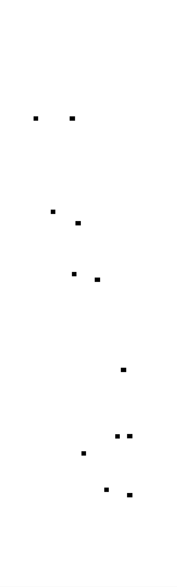
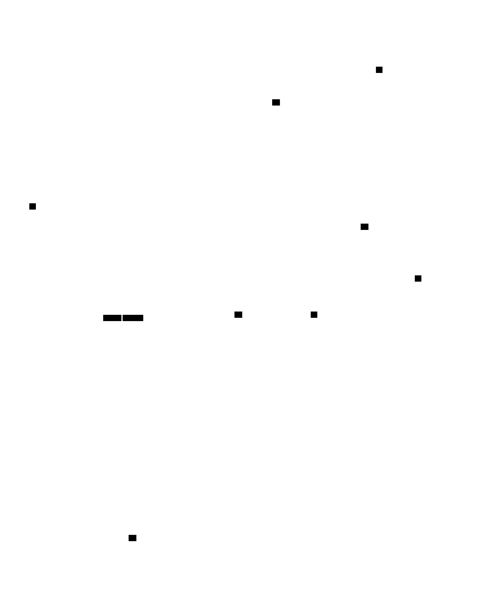

# Tokenizer/Lexer: Design Document


## Overview

A tokenizer/lexer transforms raw source code text into a sequence of structured tokens, serving as the critical first phase of any compiler or interpreter. The key architectural challenge is efficiently recognizing different token patterns while maintaining accurate position tracking for meaningful error reporting.


> This guide is meant to help you understand the big picture before diving into each milestone. Refer back to it whenever you need context on how components connect.


## Context and Problem Statement

> **Milestone(s):** All milestones (1-4) - foundational concepts

### Mental Model: Text Processing Pipeline

Think of how you read this very sentence. Your brain doesn't process the entire sentence as one massive unit. Instead, it automatically breaks the text into meaningful chunks: individual words, punctuation marks, numbers, and symbols. You recognize "Think" as a word, "." as a sentence terminator, and "42" as a number, not as the separate characters "4" and "2". This natural parsing process is exactly what a lexer does for programming languages.

Just as your brain performs this tokenization unconsciously while reading, a lexer transforms the continuous stream of characters in source code into discrete, meaningful units called **tokens**. When a compiler encounters the text `x = 42 + y`, it doesn't see eleven separate characters. Instead, the lexer converts this into a sequence of five tokens: an identifier (`x`), an assignment operator (`=`), a number literal (`42`), a plus operator (`+`), and another identifier (`y`).

The lexer serves as the critical first phase in the language processing pipeline, sitting between raw text input and the parser that will later understand the grammatical structure. Without this tokenization step, every subsequent phase of compilation or interpretation would need to deal with the messy details of character-by-character processing, whitespace handling, and distinguishing between different types of language elements.

Consider the complexity that would arise if a parser had to simultaneously worry about whether the characters "i" and "f" represent the keyword `if`, part of a longer identifier like `iffy`, or two separate one-character identifiers. The lexer resolves this ambiguity using well-defined rules, presenting the parser with unambiguous tokens that carry both their textual content (the **lexeme**) and their classification (the **token type**).

### Technical Challenges

Lexical analysis presents several fundamental challenges that our implementation must address systematically. These challenges arise from the inherent ambiguity in character sequences and the need to maintain precise error reporting capabilities.

**Ambiguity Resolution and the Maximal Munch Principle**

The most significant challenge in lexical analysis is resolving ambiguities when multiple token interpretations are possible. Consider the character sequence `<=`. This could be interpreted as two separate tokens (a less-than operator `<` followed by an equals sign `=`) or as a single less-than-or-equal operator `<=`. Programming language specifications resolve this through the **maximal munch principle**: always consume the longest possible sequence of characters that forms a valid token.

This principle applies across all token categories. When scanning the sequence `123.45`, the lexer must recognize this as a single floating-point number token rather than an integer `123`, a dot `.`, and another integer `45`. Similarly, `identifier123` forms a single identifier token, not an identifier followed by a number. The challenge lies in implementing lookahead logic that can distinguish between these cases without consuming too many characters or missing valid tokens.

Consider the trickier case of `3.14.toString()` in a language that supports method calls on literals. The maximal munch principle dictates that `3.14` should be consumed as a single floating-point token, leaving `.toString()` to be processed separately. However, in the sequence `3..5` (representing a range from 3 to 5), the first dot belongs to the range operator `..`, not to a malformed floating-point number.

**Position Tracking for Error Reporting**

Accurate position tracking represents another critical challenge. Every token must carry information about its location in the source text, including both line and column numbers. This information proves essential for generating meaningful error messages that help developers locate and fix issues in their code.

The complexity arises from the need to update position information as the scanner consumes characters. Different characters affect position differently: regular characters increment the column counter, newlines increment the line counter and reset the column to the beginning, and tab characters may advance the column by multiple positions depending on the tab width configuration.

Position tracking becomes particularly challenging when processing multi-line tokens such as string literals or block comments. The lexer must accurately track position changes within these tokens while still associating the entire token with its starting position. Additionally, when lexical errors occur (such as an unterminated string literal), the error must be reported with the precise location where the problem was detected.

**Character Encoding and Edge Cases**

Modern lexers must handle various character encodings and edge cases that can complicate the scanning process. While many implementations assume ASCII or UTF-8 input, the underlying character representation affects how the scanner advances through the input stream and calculates character positions.

Unicode support introduces additional complexity when determining what constitutes a valid identifier character. While ASCII identifiers traditionally start with a letter or underscore followed by alphanumeric characters, Unicode-aware lexers may need to support identifier characters from multiple alphabets and character sets.

End-of-file handling presents another edge case that implementations often handle incorrectly. The lexer must gracefully handle EOF conditions that occur in the middle of multi-character tokens, such as an unterminated string literal or comment. Rather than crashing or producing malformed tokens, the lexer should detect these conditions and report appropriate error messages.

**Token Stream Consistency**

Maintaining consistency in the output token stream requires careful attention to several invariants. Every input character must either contribute to a token or be explicitly ignored (such as whitespace). No characters should be accidentally skipped or processed twice. The token stream should always terminate with an explicit EOF token, providing a clear signal to downstream processing phases that input has been exhausted.

Error recovery adds another layer of complexity to token stream consistency. When the lexer encounters an invalid character or malformed token, it must decide how to continue processing. Simply stopping at the first error provides limited value to developers who prefer to see multiple issues in a single compilation run. However, attempting to continue after an error risks producing a cascade of spurious errors if the recovery strategy consumes too many or too few characters.

### Existing Approaches Comparison

The field of lexical analysis offers several distinct implementation approaches, each with specific trade-offs regarding complexity, performance, maintainability, and flexibility. Understanding these approaches helps inform our design decisions and establishes context for the hand-written lexer we'll implement.

> **Decision: Hand-Written Lexer Implementation**
> - **Context**: Building a lexer for educational purposes with a focus on understanding fundamental concepts and maintaining full control over the implementation
> - **Options Considered**: Hand-written character-by-character scanner, regular expression-based tokenizer, lexer generator tool
> - **Decision**: Implement a hand-written character-by-character scanner with explicit state management
> - **Rationale**: Provides complete visibility into the tokenization process, allows custom error handling and recovery strategies, offers optimal performance characteristics, and builds deep understanding of lexical analysis fundamentals
> - **Consequences**: Requires more initial implementation effort but provides maximum flexibility for extensions and modifications, complete control over error messages and position tracking, and serves the educational goal of understanding how lexers work internally

| Approach | Implementation Effort | Performance | Flexibility | Learning Value | Error Control | Maintenance |
|----------|---------------------|-------------|-------------|---------------|---------------|-------------|
| Hand-Written | High | Excellent | Maximum | High | Complete | Moderate |
| Regex-Based | Low | Good | Limited | Moderate | Limited | Easy |
| Generator Tool | Medium | Good | High | Low | Good | Complex |

**Hand-Written Character-by-Character Lexers**

Hand-written lexers process input character by character using explicit state management and control flow. This approach provides maximum control over the tokenization process, allowing for custom error handling, precise position tracking, and optimal performance characteristics. The implementation typically uses a main scanning loop with switch statements or if-else chains to handle different character types and states.

The primary advantage of hand-written lexers lies in their transparency and customizability. Every aspect of the tokenization process remains under direct control, from how whitespace is handled to how error recovery proceeds. This approach also tends to produce the most efficient code, as it avoids the overhead of regular expression engines or generated parser tables.

Hand-written lexers excel in scenarios requiring custom token types, complex error recovery strategies, or integration with specific development tools. They also provide the best educational value, as every decision and trade-off becomes explicit in the implementation. However, they require significant upfront development effort and careful attention to detail to handle all edge cases correctly.

**Regular Expression-Based Approaches**

Regular expression-based lexers define each token type as a regular expression pattern and use a regex engine to match these patterns against the input stream. This approach can significantly reduce implementation complexity, as the regex engine handles much of the low-level character processing and pattern matching logic.

Modern regex-based approaches typically define a list of token patterns with associated actions, then apply these patterns in priority order to consume input characters. The `re` module in Python or similar regex libraries in other languages provide the underlying pattern matching capabilities.

The main advantages of regex-based lexers include rapid development time, concise pattern definitions, and automatic handling of many edge cases within the regex engine. Complex patterns like floating-point numbers or identifier validation can be expressed concisely as regular expressions rather than explicit state machine code.

However, regex-based approaches suffer from several limitations. Performance can be suboptimal due to regex engine overhead, especially for simple token types that could be recognized more efficiently with direct character comparisons. Error handling and recovery become more complex, as the regex engine typically provides limited information about partial matches or failure points. Position tracking requires additional machinery, as regex engines don't automatically maintain line and column information.

**Lexer Generator Tools**

Lexer generators like Lex, Flex, or ANTLR take a declarative specification of token patterns and generate lexer code automatically. These tools typically use finite automata theory to produce efficient scanning code from high-level pattern specifications.

Generator-based approaches offer a compelling middle ground between implementation effort and functionality. The declarative specifications tend to be more readable and maintainable than hand-written scanning code, while the generated lexers often achieve good performance characteristics. Many generator tools provide sophisticated features like automatic position tracking, error recovery, and integration with parser generators.

The primary drawback of generator tools lies in their complexity and learning curve. Understanding how to write effective lexer specifications requires familiarity with the generator's pattern language and behavior. Debugging generated code can be challenging, as the generated lexer may not match the developer's mental model of how tokenization should proceed. Additionally, generator tools introduce build system complexity and external dependencies that may not be appropriate for educational projects.

**Hybrid Approaches and Domain-Specific Considerations**

Some implementations combine multiple approaches to leverage their respective strengths. For example, a lexer might use regular expressions for complex patterns like string literals while using hand-written code for simple operators and keywords. This hybrid approach can provide good performance for common cases while simplifying the handling of complex edge cases.

The choice of approach often depends on domain-specific requirements. Lexers for domain-specific languages with simple token structures might benefit from regex-based approaches, while lexers for full programming languages with complex syntax often require the flexibility of hand-written implementations. Performance-critical applications, such as syntax highlighters or development tools that process large amounts of code, typically favor hand-written lexers for their superior speed characteristics.

> The key insight for our educational implementation is that hand-written lexers provide the clearest path to understanding fundamental lexical analysis concepts. While other approaches may be more appropriate for production systems, the explicit nature of hand-written scanners makes every design decision and trade-off visible to the learner.

### Common Misconceptions and Learning Pitfalls

Several misconceptions commonly arise when developers first encounter lexical analysis, leading to implementation mistakes that can be avoided with proper understanding.

⚠️ **Pitfall: Treating Lexical Analysis as Simple String Splitting**
Many beginners assume that tokenization can be accomplished through simple string splitting operations, similar to splitting text on whitespace. This approach fails because programming language tokens don't align with whitespace boundaries. Consider `array[index]` - splitting on spaces would miss the fact that this contains four distinct tokens: an identifier, an opening bracket, another identifier, and a closing bracket. Proper lexical analysis requires character-by-character processing with lookahead capabilities.

⚠️ **Pitfall: Inconsistent Position Tracking**
Position tracking errors represent one of the most common implementation mistakes. Developers often forget to update line and column numbers consistently, leading to incorrect error reporting. The fix requires systematic position updates after every character consumption, with special handling for newlines and tab characters.

⚠️ **Pitfall: Ignoring the EOF Token**
Many implementations forget to emit an explicit end-of-file token, causing parsers to fail when they reach the end of input. The lexer must always terminate its token stream with an EOF token to provide a clear signal that input has been exhausted.

⚠️ **Pitfall: Incorrect Maximal Munch Implementation**
Implementing maximal munch incorrectly leads to tokens being split inappropriately. For example, recognizing `>=` as two separate tokens (`>` and `=`) rather than a single greater-than-or-equal token. The solution requires lookahead logic that checks for multi-character operators before falling back to single-character tokens.

These pitfalls highlight the importance of systematic implementation and thorough testing across all token types and edge cases.

### Implementation Guidance

The implementation guidance provides practical direction for building the lexer using Python, chosen for its clear syntax and excellent string processing capabilities that allow learners to focus on lexical analysis concepts rather than language-specific complexity.

**Technology Recommendations**

| Component | Simple Approach | Advanced Approach | Recommended for Learning |
|-----------|----------------|-------------------|------------------------|
| Character Processing | String indexing with manual bounds checking | Iterator-based character stream | String indexing (more explicit) |
| Token Storage | Python dataclass with type annotations | Custom class with validation | Dataclass (less boilerplate) |
| Token Types | String constants or simple enum | Enum class with methods | Enum class (type safety) |
| Error Handling | Print statements with exit() | Custom exception hierarchy | Custom exceptions (better structure) |
| Position Tracking | Separate line/column variables | Position class with methods | Position class (encapsulation) |
| Testing | Simple assert statements | unittest framework with fixtures | unittest (more systematic) |

**Recommended Project Structure**

The lexer implementation should be organized across multiple modules to separate concerns and improve maintainability:

```
tokenizer/
├── __init__.py                 # Package initialization
├── token_types.py             # TokenType enumeration and constants
├── position.py                # Position tracking class
├── token.py                   # Token data structure
├── lexer.py                   # Main Scanner class
├── errors.py                  # Custom exception classes
└── tests/
    ├── __init__.py
    ├── test_basic_tokens.py    # Milestone 1 tests
    ├── test_scanning_logic.py  # Milestone 2 tests
    ├── test_multi_char.py      # Milestone 3 tests
    ├── test_strings_comments.py # Milestone 4 tests
    └── test_integration.py     # End-to-end tests
```

**Infrastructure Starter Code**

The following complete modules provide the foundation for lexer implementation:

**token_types.py** - Complete TokenType enumeration:
```python
from enum import Enum, auto

class TokenType(Enum):
    # Literals
    NUMBER = auto()
    IDENTIFIER = auto()
    STRING = auto()
    
    # Single-character operators
    PLUS = auto()
    MINUS = auto()
    MULTIPLY = auto()
    DIVIDE = auto()
    ASSIGN = auto()
    
    # Multi-character operators  
    EQUAL = auto()          # ==
    NOT_EQUAL = auto()      # !=
    LESS_EQUAL = auto()     # <=
    GREATER_EQUAL = auto()  # >=
    LESS = auto()           # <
    GREATER = auto()        # >
    
    # Delimiters
    LEFT_PAREN = auto()     # (
    RIGHT_PAREN = auto()    # )
    LEFT_BRACE = auto()     # {
    RIGHT_BRACE = auto()    # }
    LEFT_BRACKET = auto()   # [
    RIGHT_BRACKET = auto()  # ]
    SEMICOLON = auto()      # ;
    COMMA = auto()          # ,
    DOT = auto()            # .
    
    # Keywords (extend as needed)
    IF = auto()
    ELSE = auto()
    WHILE = auto()
    FOR = auto()
    FUNCTION = auto()
    RETURN = auto()
    
    # Special tokens
    EOF = auto()
    NEWLINE = auto()

    def __str__(self):
        return self.name
```

**position.py** - Complete Position tracking:
```python
from dataclasses import dataclass

@dataclass
class Position:
    """Tracks line and column position in source code."""
    line: int = 1
    column: int = 1
    
    def advance(self, char: str) -> None:
        """Update position based on consumed character."""
        if char == '\n':
            self.line += 1
            self.column = 1
        else:
            self.column += 1
    
    def copy(self) -> 'Position':
        """Create a copy of current position."""
        return Position(self.line, self.column)
    
    def __str__(self) -> str:
        return f"line {self.line}, column {self.column}"
```

**token.py** - Complete Token structure:
```python
from dataclasses import dataclass
from typing import Any
from .token_types import TokenType
from .position import Position

@dataclass
class Token:
    """Represents a lexical token with type, value, and position."""
    token_type: TokenType
    lexeme: str
    position: Position
    literal: Any = None  # For numbers, strings, etc.
    
    def __str__(self) -> str:
        if self.literal is not None:
            return f"{self.token_type}({self.lexeme}={self.literal}) at {self.position}"
        return f"{self.token_type}({self.lexeme}) at {self.position}"
    
    def __repr__(self) -> str:
        return self.__str__()
```

**errors.py** - Complete error handling:
```python
from .position import Position

class LexicalError(Exception):
    """Base class for lexical analysis errors."""
    def __init__(self, message: str, position: Position):
        self.message = message
        self.position = position
        super().__init__(f"{message} at {position}")

class UnterminatedStringError(LexicalError):
    """Raised when a string literal is not properly closed."""
    pass

class UnterminatedCommentError(LexicalError):
    """Raised when a multi-line comment is not properly closed."""
    pass

class InvalidCharacterError(LexicalError):
    """Raised when an unexpected character is encountered."""
    pass

class InvalidNumberError(LexicalError):
    """Raised when a number literal has invalid format."""
    pass
```

**Core Logic Skeleton**

The main `Scanner` class in `lexer.py` should follow this structure with detailed TODOs:

```python
from typing import List, Dict, Optional
from .token import Token
from .token_types import TokenType
from .position import Position
from .errors import LexicalError, InvalidCharacterError

class Scanner:
    """Main lexical scanner that converts source code into tokens."""
    
    def __init__(self, source: str):
        self.source = source
        self.tokens: List[Token] = []
        self.start = 0      # Start of current token
        self.current = 0    # Current character position
        self.position = Position()
        
        # Keywords table for identifier classification
        self.keywords: Dict[str, TokenType] = {
            'if': TokenType.IF,
            'else': TokenType.ELSE,
            'while': TokenType.WHILE,
            'for': TokenType.FOR,
            'function': TokenType.FUNCTION,
            'return': TokenType.RETURN,
        }
    
    def scan_tokens(self) -> List[Token]:
        """Main scanning method that processes entire source."""
        # TODO 1: Loop until we reach end of source
        # TODO 2: Set start position to current for each new token
        # TODO 3: Call scan_token() to process next token
        # TODO 4: Handle any LexicalError exceptions and continue
        # TODO 5: Add EOF token at end
        # TODO 6: Return complete token list
        pass
    
    def scan_token(self) -> None:
        """Scan a single token starting at current position."""
        char = self.advance()
        
        # TODO 1: Handle single-character tokens with match/switch logic
        # TODO 2: Handle operators that might be multi-character (=, !, <, >)
        # TODO 3: Handle whitespace characters (skip without emitting token)
        # TODO 4: Handle newlines (skip but update position tracking)
        # TODO 5: Handle string literals (call string_literal method)
        # TODO 6: Handle number literals (call number_literal method)  
        # TODO 7: Handle identifiers and keywords (call identifier method)
        # TODO 8: Handle comments (both // and /* */ styles)
        # TODO 9: Raise InvalidCharacterError for unexpected characters
        pass
    
    def advance(self) -> str:
        """Consume and return the current character."""
        # TODO 1: Check if we're at end of source
        # TODO 2: Get current character before advancing
        # TODO 3: Increment current position
        # TODO 4: Update line/column position tracking
        # TODO 5: Return the consumed character
        pass
    
    def peek(self) -> str:
        """Look at current character without consuming it."""
        # TODO 1: Return '\0' if at end of source
        # TODO 2: Return character at current position
        pass
    
    def peek_next(self) -> str:
        """Look ahead at next character without consuming."""
        # TODO 1: Return '\0' if next position is beyond source
        # TODO 2: Return character at current + 1 position
        pass
    
    def match(self, expected: str) -> bool:
        """Check if current character matches expected, consume if so."""
        # TODO 1: Return False if at end of source
        # TODO 2: Return False if current character doesn't match
        # TODO 3: Advance position if match found
        # TODO 4: Return True for successful match
        pass
```

**Language-Specific Implementation Hints**

Python-specific considerations for lexer implementation:

- Use `len(self.source)` to check for end-of-input conditions
- String slicing `self.source[self.start:self.current]` extracts lexemes efficiently
- The `str.isdigit()`, `str.isalpha()`, and `str.isalnum()` methods simplify character classification
- Use `ord()` function for character code comparisons when needed
- Python's `in` operator works well for checking character membership: `char in '+-*/'`
- Dictionary lookup provides efficient keyword recognition: `self.keywords.get(text, TokenType.IDENTIFIER)`
- Use `try/except` blocks around character access to handle index out of bounds gracefully
- The `dataclass` decorator eliminates boilerplate for Token and Position classes
- Type hints with `typing` module improve code clarity and enable better IDE support

**Milestone Checkpoints**

**Milestone 1 Checkpoint:**
After implementing basic token types and structure, run:
```bash
python -m pytest tests/test_basic_tokens.py -v
```

Expected behavior: The scanner should successfully tokenize simple input like `"42 + identifier"` into three tokens: `NUMBER(42)`, `PLUS(+)`, and `IDENTIFIER(identifier)`. Each token should include accurate position information.

**Milestone 2 Checkpoint:**
After implementing the scanning loop:
```bash
python -c "
from tokenizer.lexer import Scanner
scanner = Scanner('x = 42 + y;')
tokens = scanner.scan_tokens()
for token in tokens:
    print(token)
"
```

Expected output should show six tokens including position information and a final EOF token.

**Milestone 3 Checkpoint:**
Test multi-character tokens with:
```python
scanner = Scanner('if x >= 3.14 then')
tokens = scanner.scan_tokens()
# Should recognize 'if' as keyword, '>=' as single operator, '3.14' as float
```

**Milestone 4 Checkpoint:**
Test string and comment handling:
```python
scanner = Scanner('"hello world" // comment\n/* block */x')
tokens = scanner.scan_tokens()
# Should produce STRING token, skip both comment types, recognize identifier
```

**Debugging Tips for Common Issues**

| Symptom | Likely Cause | How to Diagnose | Fix |
|---------|--------------|-----------------|-----|
| "Index out of range" error | Not checking for end of input | Add print statements showing `current` vs `len(source)` | Add bounds checking in `advance()` and `peek()` |
| Wrong position in error messages | Position not updated after advance | Print position after each character | Call `position.advance(char)` in `advance()` method |
| Multi-char operators split incorrectly | Not using lookahead | Check what `peek()` returns | Implement `match()` method for conditional consumption |
| Keywords recognized as identifiers | Keywords not in lookup table | Print the identifier text | Add missing keywords to `self.keywords` dictionary |
| Strings include quote marks | Including delimiters in lexeme | Check string boundaries | Extract lexeme between quotes, not including them |
| Comments appear as tokens | Not skipping comment text | Trace comment scanning logic | Consume entire comment without calling `add_token()` |

The systematic approach outlined here ensures that learners build a solid foundation in lexical analysis while avoiding common implementation pitfalls that can derail learning progress.


## Goals and Non-Goals

> **Milestone(s):** All milestones (1-4) - foundational scope and boundaries

### Mental Model: Drawing the Project Boundaries

Think of building a lexer like constructing a house foundation. Before you start digging and pouring concrete, you need to know exactly where the property lines are. What's inside your lot versus what belongs to the neighbors? What foundation features do you absolutely need for the house to stand, versus the nice-to-have features you can add later? Similarly, our lexer needs clear boundaries: what language features we'll tokenize, what kinds of errors we'll handle, and what capabilities we'll leave for future components in the language processing pipeline.

The key insight is that **scope creep is the enemy of learning**. A lexer that tries to handle every possible language feature becomes impossibly complex for a beginner project. Instead, we'll build a solid, working lexer that handles a carefully chosen subset of language features extremely well. This gives you a complete understanding of lexical analysis principles without drowning in edge cases.

### Project Goals

Our lexer implementation focuses on building a **complete, working tokenizer** that demonstrates all core lexical analysis concepts while remaining approachable for developers new to compiler construction. The following goals define what success looks like for this project.

#### Core Functionality Goals

The primary goal is **comprehensive token recognition** across the fundamental categories of programming language tokens. Our lexer will successfully identify and classify numeric literals (both integers and floating-point numbers), identifiers (variable and function names), keywords (reserved words like `if`, `while`, `return`), operators (arithmetic, comparison, and assignment), delimiters (parentheses, braces, semicolons), string literals with escape sequence support, and comments (both single-line and multi-line styles).

**Accurate position tracking** represents another critical goal. Every token emitted by our lexer will include precise line and column information indicating where it appeared in the source text. This position tracking continues correctly even across multi-line tokens like strings and comments, enabling meaningful error messages that point developers to the exact location of lexical problems.

The lexer will implement **robust error handling** that detects and reports lexical errors without crashing. When encountering invalid input like unterminated strings, malformed numbers, or unrecognized characters, the lexer reports a clear error message with position information and attempts to recover by continuing analysis from the next recognizable token boundary.

#### Educational Goals

Beyond functionality, this project serves important **learning objectives** for understanding compiler construction. The implementation will clearly demonstrate the **maximal munch principle**, showing how lexers resolve ambiguity by consuming the longest possible character sequence for each token. For example, when encountering `==`, the lexer consumes both characters as an equality operator rather than treating them as two separate assignment operators.

The architecture will showcase **separation of concerns** between different components of lexical analysis. The `Scanner` handles character-by-character processing and state management, `Token` structures encapsulate lexical units with their metadata, and `Position` objects track source location information. This clean separation makes the code easier to understand, test, and extend.

Students will gain hands-on experience with **string processing algorithms**, regular expression concepts (implemented manually rather than using regex libraries), and **state machine design patterns** commonly used in text processing applications.

#### Quality Goals

The lexer will demonstrate **production-ready practices** including comprehensive error handling, extensive unit test coverage, clear documentation, and consistent code organization. Each component will include detailed documentation explaining its purpose, usage, and interaction with other components.

**Performance characteristics** will be reasonable for educational use, processing typical source files (up to several thousand lines) in milliseconds. While we won't optimize for extreme performance, the implementation will avoid obviously inefficient patterns like repeated string concatenation or unnecessary memory allocation.

The codebase will follow **clean architecture principles** with clear interfaces between components, making it easy for students to understand how each piece contributes to the overall functionality and how they might extend or modify the implementation.

| Goal Category | Specific Objective | Success Criteria | Learning Value |
|---------------|-------------------|------------------|----------------|
| Token Recognition | Identify all basic token types | Correctly classify numbers, identifiers, operators, delimiters | Understanding lexical categories |
| Position Tracking | Maintain accurate source locations | Every token includes correct line/column | Error reporting foundation |
| Error Handling | Detect and report lexical errors | Clear messages with positions, graceful recovery | Robust software practices |
| String Processing | Handle literals and escape sequences | Correct parsing of quoted strings with \n, \t, etc. | Text processing algorithms |
| Comment Processing | Skip single-line and multi-line comments | Comments removed from token stream, positions maintained | Advanced pattern recognition |
| Keyword Recognition | Distinguish keywords from identifiers | Reserved words classified separately from user names | Symbol table concepts |
| Multi-character Operators | Recognize ==, !=, <=, >= correctly | Proper lookahead and maximal munch behavior | Lookahead techniques |
| Architecture Quality | Clean, extensible design | Easy to add new token types and features | Software design principles |

### Non-Goals

Equally important to understanding what our lexer will accomplish is recognizing what it will **not** attempt to handle. These non-goals help maintain project focus and prevent scope creep that would overwhelm beginning developers.

#### Advanced Language Features

Our lexer will **not implement** complex language features that would significantly increase implementation complexity without adding educational value to lexical analysis concepts. We will not handle **preprocessor directives** like `#include` or `#define`, which require separate preprocessing phases and macro expansion capabilities beyond basic tokenization.

The lexer will not support **Unicode handling** beyond basic ASCII characters. While production lexers must handle international character sets, Unicode processing involves substantial complexity around character encoding, normalization, and classification that would distract from core lexical analysis concepts.

We will not implement **advanced numeric literal formats** such as scientific notation (`1.23e-4`), binary literals (`0b1010`), octal literals (`0755`), or hexadecimal literals (`0xFF`). These formats follow the same recognition patterns as basic integers and floats but require additional parsing logic that doesn't teach new lexical analysis concepts.

#### Parser Integration Features

The lexer will **not include parser integration features** that belong in later phases of language processing. We will not implement **symbol table management**, which tracks variable and function declarations across scopes. Symbol tables require semantic analysis capabilities beyond lexical processing.

**Type checking** and **semantic validation** remain outside our scope. The lexer identifies that `x` is an identifier and `123` is a number, but it will not verify that variable `x` has been declared or that it's being used in a type-consistent manner.

We will not implement **macro expansion** or **template processing** capabilities that require understanding of program structure beyond individual tokens. These features require parsing and semantic analysis to determine where and how to apply transformations.

#### Performance Optimizations

While our lexer will exhibit reasonable performance, we will **not optimize for extreme speed or memory efficiency**. Production lexers might use techniques like **memory mapping** for large files, **SIMD instructions** for parallel character processing, or **perfect hash tables** for keyword lookup. These optimizations add complexity without teaching additional lexical analysis concepts.

We will not implement **streaming processing** for files too large to fit in memory. Our lexer assumes the entire source file can be loaded into a string, which simplifies implementation and covers typical use cases for learning projects.

**Parallel processing** remains outside our scope. While production systems might tokenize multiple files concurrently or use multiple threads for different phases of compilation, our single-threaded implementation focuses on algorithmic understanding rather than concurrency management.

#### Error Recovery Sophistication

Our error handling will detect and report lexical errors but will **not implement sophisticated error recovery strategies**. Production compilers might attempt to guess the programmer's intent when encountering malformed input, or continue analysis by inferring likely token boundaries after errors. Our lexer will use simple recovery strategies like skipping to the next whitespace or known delimiter.

We will not implement **error cascading prevention** or **error message ranking** systems that try to present the most helpful error when multiple problems are detected. Our error reporting will be straightforward and direct rather than attempting intelligent error analysis.

#### Integration Complexity

The lexer will **not include complex integration patterns** for different parser architectures. We won't implement **pull-based parsing interfaces** where the parser requests tokens on demand, or **push-based streaming interfaces** where the lexer delivers tokens as soon as they're recognized. Our simple interface returns a complete list of tokens for the entire input.

We will not provide **multiple output formats** like XML token representations, JSON serialization, or integration with language server protocols. The lexer produces `Token` objects in memory, which covers educational needs without additional serialization complexity.

| Non-Goal Category | Specific Exclusion | Rationale | Alternative Approach |
|-------------------|-------------------|-----------|---------------------|
| Advanced Literals | Scientific notation (1e-4) | Complex parsing without new concepts | Focus on basic integers and floats |
| Unicode Support | Multi-byte character handling | Significant complexity, encoding issues | ASCII-only character set |
| Preprocessor | #include, #define directives | Requires separate preprocessing phase | Treat as unrecognized tokens |
| Symbol Tables | Variable declaration tracking | Semantic analysis, not lexical | Leave for parser phase |
| Performance | Memory mapping, SIMD optimization | Implementation complexity vs. learning value | Simple string processing |
| Error Recovery | Intelligent error correction | Advanced compiler techniques | Basic error detection and reporting |
| Streaming | Large file processing | Memory management complexity | Load entire file into string |
| Multiple Formats | JSON, XML token output | Serialization complexity | In-memory Token objects |
| Parser Integration | Pull-based token delivery | Interface design complexity | Return complete token list |

### Architectural Decision Record: Lexer Scope

> **Decision: Educational Focus Over Production Features**
> - **Context**: Lexers can range from simple educational tools to production-grade components handling complex language features. We must choose the appropriate complexity level for a beginner-focused learning project.
> - **Options Considered**: 
>   1. Minimal lexer (identifiers, numbers, basic operators only)
>   2. Educational lexer (core language features without advanced complexity)
>   3. Production-ready lexer (comprehensive language support with optimizations)
> - **Decision**: Build an educational lexer with core language features but without advanced production concerns
> - **Rationale**: Option 1 lacks sufficient complexity to demonstrate important lexical analysis concepts like string processing and comment handling. Option 3 introduces complexity that obscures learning objectives with optimization and edge case handling. Option 2 provides comprehensive coverage of lexical analysis concepts while maintaining implementability for beginning developers.
> - **Consequences**: Students learn complete lexical analysis workflow including error handling and complex token recognition, but implementation remains approachable. Some advanced language features require future extension, but the architecture supports adding them incrementally.

### Scope Validation Criteria

To ensure our implementation stays within the defined goals and avoids scope creep, we establish specific **validation criteria** that help evaluate potential features or requirements that arise during development.

#### Feature Inclusion Criteria

Any proposed feature must satisfy all of the following criteria to warrant inclusion in our lexer implementation:

**Educational Value**: Does this feature teach a fundamental concept of lexical analysis that students need to understand? Features like string escape sequence processing teach important text processing concepts, while features like hexadecimal number parsing mostly duplicate existing number recognition logic.

**Implementation Complexity**: Can this feature be implemented in under 50 lines of code with clear, understandable logic? Complex features that require extensive special-case handling likely exceed our educational scope.

**Conceptual Foundation**: Does this feature represent a concept that appears in most programming languages? String literals and comments appear virtually everywhere, while features like raw string literals or heredoc syntax are language-specific extensions.

**Error Handling Tractability**: Can we detect and report errors for this feature using straightforward validation logic? Features requiring complex context-sensitive error detection likely belong in parser phases rather than lexical analysis.

#### Feature Exclusion Guidelines

Features should be excluded if they meet any of these criteria:

**Semantic Dependency**: Does this feature require understanding program meaning rather than just character sequence patterns? Symbol resolution, type checking, and macro expansion all require semantic analysis beyond lexical processing.

**Context Sensitivity**: Does this feature require tracking program structure or state beyond simple character sequences? Context-sensitive keywords (words that are keywords in some contexts but identifiers in others) require parsing context unavailable to lexers.

**Performance Critical**: Is this feature primarily about optimization rather than functionality? Memory mapping, parallel processing, and algorithmic optimizations add complexity without teaching lexical analysis concepts.

**Language Specific**: Does this feature apply only to specific programming languages rather than general lexical analysis principles? Language-specific literal formats or comment styles should be avoided in favor of widely-applicable patterns.

### Milestone Alignment

Our goals and non-goals align directly with the four implementation milestones to ensure consistent progress toward well-defined objectives.

**Milestone 1** focuses on basic token recognition and position tracking, establishing the foundation for all subsequent development. The goals include implementing core `Token` and `Position` structures along with basic tokenization of numbers, identifiers, and simple operators. Non-goals for this milestone include complex multi-character tokens and error handling beyond basic validation.

**Milestone 2** adds the main scanning loop and whitespace handling, completing the basic lexer architecture. Goals include character-by-character processing with proper position updates and basic error detection. Non-goals continue to exclude complex token types, focusing instead on the fundamental scanning algorithm.

**Milestone 3** introduces multi-character token recognition including keywords, complex operators, and number parsing. Goals expand to include lookahead techniques and the maximal munch principle. Non-goals still exclude string processing and comments, which require more sophisticated state management.

**Milestone 4** completes the lexer with string literals and comment processing. Goals encompass all defined functionality including escape sequence handling and error recovery. Non-goals shift from feature exclusions to performance and integration concerns that extend beyond basic lexical analysis.

This milestone alignment ensures that students build complexity incrementally, with each phase adding conceptually related functionality that builds on previous work without overwhelming the implementation with too many simultaneous concerns.

### Implementation Guidance

Our lexer implementation uses Python as the primary language, chosen for its clear syntax and excellent string processing capabilities that help students focus on lexical analysis concepts rather than low-level implementation details.

#### Technology Recommendations

| Component | Simple Option | Advanced Option |
|-----------|---------------|-----------------|
| Core Scanner | Single class with methods | State machine with explicit states |
| Token Storage | Python list of Token objects | Generator-based streaming tokens |
| Position Tracking | Simple line/column integers | Rich Position object with file context |
| Error Handling | Exception throwing with messages | Error collection with recovery strategies |
| Keyword Lookup | Python dictionary | Perfect hash table or trie |
| String Processing | Character-by-character iteration | Regular expression matching |
| Testing Framework | Built-in unittest module | pytest with fixtures and parameterization |
| Code Organization | Single module file | Package with separate modules per component |

#### Recommended File Structure

The lexer implementation should be organized across multiple modules to demonstrate separation of concerns and make the codebase easier to understand and maintain:

```
lexer-project/
├── src/
│   └── lexer/
│       ├── __init__.py              ← Package initialization
│       ├── token_types.py           ← TokenType enumeration and constants
│       ├── token.py                 ← Token and Position classes
│       ├── scanner.py               ← Main Scanner implementation
│       ├── lexical_error.py         ← Error handling classes
│       └── keywords.py              ← Keyword definitions and utilities
├── tests/
│   ├── test_token.py                ← Token structure tests
│   ├── test_scanner_basic.py        ← Milestone 1-2 functionality
│   ├── test_scanner_advanced.py     ← Milestone 3-4 functionality
│   ├── test_error_handling.py       ← Error condition tests
│   └── test_examples/               ← Sample source files for testing
│       ├── basic_tokens.txt
│       ├── string_examples.txt
│       └── error_cases.txt
├── examples/
│   ├── simple_expression.py        ← Demo with basic arithmetic
│   ├── keyword_example.py          ← Demo with if/while/return
│   └── comprehensive_demo.py       ← Full feature demonstration
├── requirements.txt                 ← Dependencies (minimal for this project)
└── README.md                       ← Usage examples and documentation
```

This structure separates core data structures (`token.py`) from processing logic (`scanner.py`) and keeps error handling isolated (`lexical_error.py`). The `keywords.py` module centralizes language keyword definitions, making it easy to modify the set of reserved words without changing scanner logic.

#### Core Data Structure Implementation

Here's the complete implementation of foundational data structures that students can use directly without modification:

```python
# src/lexer/token_types.py
from enum import Enum, auto

class TokenType(Enum):
    # Literals
    IDENTIFIER = auto()
    NUMBER = auto()
    STRING = auto()
    
    # Single-character tokens
    LEFT_PAREN = auto()
    RIGHT_PAREN = auto()
    LEFT_BRACE = auto()
    RIGHT_BRACE = auto()
    COMMA = auto()
    DOT = auto()
    MINUS = auto()
    PLUS = auto()
    SEMICOLON = auto()
    SLASH = auto()
    STAR = auto()
    
    # Multi-character tokens
    BANG_EQUAL = auto()
    EQUAL = auto()
    EQUAL_EQUAL = auto()
    GREATER = auto()
    GREATER_EQUAL = auto()
    LESS = auto()
    LESS_EQUAL = auto()
    
    # Keywords
    AND = auto()
    CLASS = auto()
    ELSE = auto()
    FALSE = auto()
    FUN = auto()
    FOR = auto()
    IF = auto()
    NIL = auto()
    OR = auto()
    PRINT = auto()
    RETURN = auto()
    SUPER = auto()
    THIS = auto()
    TRUE = auto()
    VAR = auto()
    WHILE = auto()
    
    EOF = auto()

# src/lexer/token.py
from dataclasses import dataclass
from typing import Any
from .token_types import TokenType

@dataclass
class Position:
    """Tracks line and column position in source text."""
    line: int
    column: int
    
    def __str__(self) -> str:
        return f"{self.line}:{self.column}"

@dataclass
class Token:
    """Represents a single lexical token with type, text, and location."""
    token_type: TokenType
    lexeme: str
    position: Position
    literal: Any = None
    
    def __str__(self) -> str:
        return f"{self.token_type.name}({self.lexeme}) at {self.position}"

# src/lexer/lexical_error.py
class LexicalError(Exception):
    """Exception raised for lexical analysis errors."""
    
    def __init__(self, message: str, position: Position):
        self.message = message
        self.position = position
        super().__init__(f"Lexical error at {position}: {message}")

# src/lexer/keywords.py
from .token_types import TokenType

KEYWORDS = {
    "and": TokenType.AND,
    "class": TokenType.CLASS,
    "else": TokenType.ELSE,
    "false": TokenType.FALSE,
    "for": TokenType.FOR,
    "fun": TokenType.FUN,
    "if": TokenType.IF,
    "nil": TokenType.NIL,
    "or": TokenType.OR,
    "print": TokenType.PRINT,
    "return": TokenType.RETURN,
    "super": TokenType.SUPER,
    "this": TokenType.THIS,
    "true": TokenType.TRUE,
    "var": TokenType.VAR,
    "while": TokenType.WHILE,
}

def lookup_keyword(text: str) -> TokenType:
    """Returns keyword token type for text, or IDENTIFIER if not a keyword."""
    return KEYWORDS.get(text, TokenType.IDENTIFIER)
```

#### Scanner Class Structure Template

The core `Scanner` class should be implemented by students following this structure with TODO comments mapping to the detailed algorithms described in subsequent sections:

```python
# src/lexer/scanner.py
from typing import List, Dict
from .token import Token, Position
from .token_types import TokenType
from .keywords import KEYWORDS
from .lexical_error import LexicalError

EOF_CHAR = '\0'

class Scanner:
    """Lexical analyzer that converts source code into tokens."""
    
    def __init__(self, source: str):
        self.source = source
        self.tokens: List[Token] = []
        self.start = 0        # Points to first character of current token
        self.current = 0      # Points to character currently being considered
        self.position = Position(line=1, column=1)
        self.keywords = KEYWORDS
    
    def scan_tokens(self) -> List[Token]:
        """Scans entire source and returns list of tokens."""
        # TODO 1: Loop while not at end of source
        # TODO 2: Set start position to current position for each new token
        # TODO 3: Call scan_token() to process one token
        # TODO 4: After loop, add EOF token
        # TODO 5: Return completed token list
        pass
    
    def scan_token(self) -> None:
        """Processes single token starting at current position."""
        # TODO 1: Get current character with advance()
        # TODO 2: Use match/case or if/elif to handle different characters
        # TODO 3: Single chars: (, ), {, }, etc. call add_token()
        # TODO 4: Operators: check for multi-char versions with peek()
        # TODO 5: Whitespace: skip without creating tokens
        # TODO 6: Newlines: skip but update position tracking
        # TODO 7: String literals: call string() method
        # TODO 8: Numbers: call number() method if isdigit()
        # TODO 9: Identifiers: call identifier() method if isalpha()
        # TODO 10: Comments: handle // and /* */ styles
        # TODO 11: Default case: report unknown character error
        pass
    
    def advance(self) -> str:
        """Consumes current character and returns it."""
        # TODO 1: Check if at end of source, return EOF_CHAR
        # TODO 2: Get character at current position
        # TODO 3: Increment current position
        # TODO 4: Update line/column in position tracking
        # TODO 5: Return the character
        pass
    
    def peek(self) -> str:
        """Examines current character without consuming."""
        # TODO 1: Check if at end of source, return EOF_CHAR
        # TODO 2: Return character at current position
        pass
    
    def peek_next(self) -> str:
        """Examines next character without consuming."""
        # TODO 1: Check if current + 1 >= len(source), return EOF_CHAR
        # TODO 2: Return character at current + 1 position
        pass
    
    def match(self, expected: str) -> bool:
        """Conditionally consumes character if it matches expected."""
        # TODO 1: Check if at end of source, return False
        # TODO 2: Compare current character to expected
        # TODO 3: If match, call advance() and return True
        # TODO 4: If no match, return False without consuming
        pass
    
    def add_token(self, token_type: TokenType, literal: Any = None) -> None:
        """Creates token from current lexeme and adds to token list."""
        # TODO 1: Extract lexeme text from source[start:current]
        # TODO 2: Create Token with type, lexeme, position copy, literal
        # TODO 3: Append token to self.tokens list
        pass
```

#### Milestone Validation Checkpoints

Each milestone should be validated with specific tests and expected behaviors:

**Milestone 1 Checkpoint:**
```bash
python -m pytest tests/test_scanner_basic.py::test_basic_tokens
```
Expected: Scanner correctly identifies numbers (`123`, `45.67`), identifiers (`variable`, `function_name`), and basic operators (`+`, `-`, `*`, `/`) with accurate position tracking.

**Milestone 2 Checkpoint:**
```bash
python -c "
from src.lexer.scanner import Scanner
tokens = Scanner('123 + 456').scan_tokens()
for token in tokens: print(token)
"
```
Expected output:
```
NUMBER(123) at 1:1
PLUS(+) at 1:5
NUMBER(456) at 1:7
EOF() at 1:10
```

**Milestone 3 Checkpoint:**
Test with keyword recognition and multi-character operators:
```python
source = 'if x == 42 { return true; }'
tokens = Scanner(source).scan_tokens()
# Should produce: IF, IDENTIFIER(x), EQUAL_EQUAL, NUMBER(42), etc.
```

**Milestone 4 Checkpoint:**
Test string literals and comments:
```python
source = '''
// This is a comment
var message = "Hello\\nWorld";
/* Multi-line
   comment */
'''
tokens = Scanner(source).scan_tokens()
# Should skip comments, parse string with escape sequence
```

#### Common Implementation Pitfalls

| Pitfall | Symptom | Cause | Fix |
|---------|---------|-------|-----|
| Off-by-one position errors | Tokens report wrong line/column | Forgetting to update position in `advance()` | Always update line/column when consuming characters |
| Missing EOF token | Parser crashes on empty input | `scan_tokens()` doesn't add final EOF | Always add EOF token after main scanning loop |
| Incorrect lexeme extraction | Token shows wrong text | Wrong slice indices in `add_token()` | Use `source[start:current]` for lexeme |
| Position tracking breaks on newlines | Line numbers don't increment | Not detecting `\n` in `advance()` | Check for `\n` and increment line, reset column |
| String escape sequences wrong | Literal strings contain backslashes | Not processing `\n`, `\t` in string parsing | Convert escape sequences to actual characters |
| Multi-char operators fail | `==` becomes two `=` tokens | Not using `peek()` for lookahead | Check next character before deciding token type |
| Keywords become identifiers | `if` tokenized as IDENTIFIER | Not consulting keyword table | Use `lookup_keyword()` for all identifier-like tokens |
| Unterminated string crash | Exception on unclosed quotes | String scanning runs past EOF | Check for EOF in string loop, report error |


## High-Level Architecture

> **Milestone(s):** All milestones (1-4) - establishes the foundational structure and component relationships

### Mental Model: Assembly Line for Text Processing

Think of a lexer like an assembly line in a factory that processes raw materials into finished products. Raw source code enters at one end as an unstructured stream of characters, and at the other end emerges a clean, organized sequence of tokens ready for the next stage of processing. Just as an assembly line has different stations with specific responsibilities - one cuts materials, another shapes them, another inspects quality - our lexer has distinct components that each handle a specific aspect of tokenization.

The **Scanner** acts as the main conveyor belt and control system, methodically moving through the input character by character and coordinating the entire process. The **Token** represents the finished product coming off the assembly line - a well-structured unit containing everything downstream components need to know. The **Position** tracker functions like a quality control system, maintaining precise records of where each product originated in case problems are discovered later. This mental model helps us understand that lexical analysis isn't magic - it's a systematic, step-by-step transformation process with clear inputs, outputs, and intermediate stages.

### Component Overview

The lexer architecture consists of three primary components that work together to transform source code into a token stream. Each component has distinct responsibilities and maintains specific pieces of state, creating a clean separation of concerns that makes the system easier to understand, test, and extend.


The **Scanner** serves as the central coordinator and state machine that drives the entire tokenization process. It maintains the complete source text and tracks the current scanning position through two critical indices: the `start` position marking the beginning of the current lexeme being scanned, and the `current` position indicating the next character to be examined. The Scanner also holds a growing list of recognized tokens and maintains position tracking information for accurate error reporting. Its core responsibility involves examining characters one at a time, applying recognition rules to identify token boundaries, and emitting properly classified tokens with complete metadata.

| Scanner Field | Type | Description |
|---------------|------|-------------|
| source | str | Complete source code text being tokenized |
| tokens | List[Token] | Accumulating list of recognized tokens |
| start | int | Index marking start of current lexeme being scanned |
| current | int | Index of next character to examine |
| position | Position | Current line and column position for error reporting |
| keywords | Dict[str, TokenType] | Lookup table mapping reserved words to token types |

The **Token** represents the fundamental output unit of lexical analysis - a structured container holding all information about a recognized lexical element. Each token captures four essential pieces of data: the classification type indicating what kind of language construct this represents, the original lexeme text exactly as it appeared in source code, the source position for error reporting and debugging, and an optional literal value for tokens that carry semantic payload like numbers or strings. This design ensures that downstream components receive complete information about each lexical unit without needing to re-examine the original source text.

| Token Field | Type | Description |
|-------------|------|-------------|
| token_type | TokenType | Classification indicating what kind of token this represents |
| lexeme | str | Original text sequence from source that formed this token |
| position | Position | Line and column location where this token was found |
| literal | Any | Parsed value for tokens with semantic content (numbers, strings) |

The **Position** component provides precise source location tracking that proves essential for meaningful error messages and debugging support. Rather than simply tracking character offsets, it maintains human-readable line and column numbers that directly correspond to what developers see in their text editors. This position information gets embedded in every token and error message, enabling the lexer to produce diagnostics that point developers to exactly where problems occur in their source files.

| Position Field | Type | Description |
|---------------|------|-------------|
| line | int | Current line number (1-indexed for human readability) |
| column | int | Current column number (1-indexed for consistency with editors) |

> **Decision: Component Separation Strategy**
> - **Context**: Need to balance simplicity for beginners with good software engineering practices
> - **Options Considered**: Single monolithic Scanner class, separate components with clear interfaces, fully generic lexer framework
> - **Decision**: Separate components (Scanner, Token, Position) with clear responsibilities
> - **Rationale**: Provides clean separation of concerns without overwhelming complexity, makes testing easier by isolating functionality, and teaches good design patterns while remaining approachable
> - **Consequences**: Slightly more code to write initially, but much easier to debug, test, and extend; students learn proper component design from the beginning

The interaction patterns between these components follow a clear data flow. The Scanner maintains ownership of the Position tracker and updates it as characters are consumed. When the Scanner recognizes a complete token, it creates a Token instance populated with the current lexeme text, appropriate TokenType classification, and a copy of the current Position. This Token then gets added to the Scanner's growing list of recognized tokens. The Scanner continues this process until the entire source text has been consumed, at which point it emits a special EOF token to signal completion and returns the complete token list.

### Recommended File Structure

Organizing lexer code across multiple files and modules creates clear boundaries between different responsibilities and makes the codebase easier to navigate as it grows. This structure also establishes good habits for larger compiler projects where clean organization becomes critical for maintainability.

The recommended project structure separates the core lexer logic from support types and test utilities, creating a foundation that can easily accommodate future extensions like error recovery, different token types, or performance optimizations:

```
lexer/
├── __init__.py              # Module initialization and public API exports
├── token_types.py           # TokenType enumeration and token classification constants
├── position.py              # Position tracking class for line/column management
├── token.py                 # Token data class and related utilities
├── scanner.py               # Main Scanner class with tokenization logic
├── lexical_errors.py        # Error classes and error reporting utilities
├── keywords.py              # Keyword lookup table and reserved word definitions
└── tests/
    ├── test_scanner.py      # Scanner functionality and integration tests
    ├── test_tokens.py       # Token creation and manipulation tests
    ├── test_position.py     # Position tracking and update tests
    └── test_fixtures.py     # Sample code snippets and expected token sequences
```

> **Decision: File Organization Strategy**
> - **Context**: Need to balance beginner simplicity with professional project organization
> - **Options Considered**: Single file with all classes, separate file per class, grouped by functionality
> - **Decision**: Separate file per major component with related utilities grouped together
> - **Rationale**: Makes it easy to find specific functionality, prevents any single file from becoming overwhelming, and mirrors organization patterns in production compilers
> - **Consequences**: More files to manage initially, but much better organization as project grows; students learn proper project structure patterns

The **token_types.py** file contains the TokenType enumeration that defines all categories of tokens the lexer can recognize. This centralized definition ensures consistency across the entire lexer and provides a single location for adding new token types during development. The enumeration includes literal tokens (numbers, strings, identifiers), operator tokens (arithmetic, comparison, logical), delimiter tokens (parentheses, braces, semicolons), keyword tokens (reserved words like `if`, `while`, `return`), and special tokens (EOF, error markers).

The **position.py** file implements position tracking with methods for advancing through source text while maintaining accurate line and column counts. This includes logic for handling different newline conventions (Unix LF, Windows CRLF, classic Mac CR) and providing utilities for formatting position information in error messages.

The **token.py** file defines the Token data class along with helper methods for token creation, comparison, and string representation. This file also includes utilities for token stream manipulation that prove useful during testing and debugging.

The **scanner.py** file contains the core Scanner class with all character processing logic, token recognition algorithms, and the main scanning loop. This represents the heart of the lexer implementation and coordinates all other components.

The **lexical_errors.py** file provides specialized exception classes for different categories of lexical errors, along with utilities for formatting error messages with position information and suggested fixes where appropriate.

The **keywords.py** file maintains the lookup table that maps reserved words to their corresponding token types, enabling the scanner to distinguish between user-defined identifiers and language keywords during identifier processing.

| File | Primary Responsibility | Key Classes/Functions | Dependencies |
|------|----------------------|----------------------|--------------|
| token_types.py | Token classification definitions | TokenType enum | None |
| position.py | Source position tracking | Position class, advance methods | None |
| token.py | Token data structure | Token class, creation utilities | token_types, position |
| scanner.py | Main tokenization logic | Scanner class, scan methods | All other files |
| lexical_errors.py | Error handling and reporting | LexicalError classes | position |
| keywords.py | Reserved word management | KEYWORDS dictionary | token_types |

This modular structure supports incremental development aligned with the project milestones. Students can implement and test each component independently before integrating them into the complete scanner. The clear dependency hierarchy (scanner depends on everything else, but core types like Position have no dependencies) makes it easy to understand the system architecture and build components in the correct order.

> The key insight here is that good project organization isn't just about keeping files tidy - it directly impacts how easy the code is to understand, test, and extend. By separating concerns cleanly from the beginning, students avoid the common trap of ending up with a single massive file that becomes impossible to navigate as the lexer grows more sophisticated.

### Common Pitfalls

⚠️ **Pitfall: Circular Dependencies Between Components**
Many beginners create circular import dependencies by having Token import Scanner for type hints, while Scanner imports Token for creating instances. This creates import errors that can be confusing to diagnose. The fix involves using string type annotations or importing types only within type-checking blocks using `typing.TYPE_CHECKING`.

⚠️ **Pitfall: Mixing Scanning Logic with Token Definitions**
Students often start by putting everything in one file and then struggle to separate concerns cleanly when the code grows. Token types, scanning logic, and error handling end up tangled together, making testing and debugging difficult. The solution involves establishing the modular structure from the beginning, even when the initial implementation is simple.

⚠️ **Pitfall: Inconsistent Position Tracking Across Components**
Position updates can easily get out of sync when different parts of the code modify line and column numbers independently. This leads to error messages pointing to wrong locations in source files. The fix requires centralizing all position updates in the Scanner component and ensuring that Position objects are immutable - created fresh for each token rather than shared and modified.

⚠️ **Pitfall: Over-Engineering the Initial Architecture**
Some students try to build a fully generic, extensible lexer framework from the start, complete with plugins, configuration files, and abstract base classes. This adds complexity that obscures the fundamental concepts and makes debugging much harder. The recommended approach focuses on the core functionality first, with clean but simple interfaces that can be extended later if needed.

### Implementation Guidance

The lexer architecture translates into concrete Python code through careful attention to imports, type hints, and class relationships. The following guidance provides complete starter code for infrastructure components and detailed skeletons for core logic that students implement themselves.

#### Technology Recommendations

| Component | Simple Option | Advanced Option | Recommendation |
|-----------|---------------|-----------------|----------------|
| String Processing | Built-in str methods | Regular expressions (re module) | Built-in methods for learning fundamentals |
| Error Handling | Exception classes with message strings | Structured error objects with recovery hints | Exception classes with position information |
| Testing | unittest module | pytest with fixtures | unittest for simplicity and standard library |
| Type Checking | Basic type hints | mypy for static analysis | Basic type hints to start, mypy for validation |
| Performance | Character-by-character processing | Buffered reading with lookahead | Character processing for clarity |

#### Complete Infrastructure Code

**token_types.py** - Complete token type definitions:
```python
from enum import Enum, auto

class TokenType(Enum):
    """Enumeration of all token types recognized by the lexer."""
    
    # Single-character tokens
    LEFT_PAREN = auto()
    RIGHT_PAREN = auto()
    LEFT_BRACE = auto()
    RIGHT_BRACE = auto()
    COMMA = auto()
    DOT = auto()
    MINUS = auto()
    PLUS = auto()
    SEMICOLON = auto()
    SLASH = auto()
    STAR = auto()
    
    # One or two character tokens
    BANG = auto()
    BANG_EQUAL = auto()
    EQUAL = auto()
    EQUAL_EQUAL = auto()
    GREATER = auto()
    GREATER_EQUAL = auto()
    LESS = auto()
    LESS_EQUAL = auto()
    
    # Literals
    IDENTIFIER = auto()
    STRING = auto()
    NUMBER = auto()
    
    # Keywords
    AND = auto()
    CLASS = auto()
    ELSE = auto()
    FALSE = auto()
    FOR = auto()
    FUN = auto()
    IF = auto()
    NIL = auto()
    OR = auto()
    PRINT = auto()
    RETURN = auto()
    SUPER = auto()
    THIS = auto()
    TRUE = auto()
    VAR = auto()
    WHILE = auto()
    
    EOF = auto()
```

**position.py** - Complete position tracking:
```python
from dataclasses import dataclass

@dataclass(frozen=True)
class Position:
    """Represents a position in source code with line and column numbers."""
    line: int
    column: int
    
    def advance(self, char: str) -> 'Position':
        """Return new position after consuming the given character."""
        if char == '\n':
            return Position(self.line + 1, 1)
        else:
            return Position(self.line, self.column + 1)
    
    def __str__(self) -> str:
        """Format position for error messages."""
        return f"line {self.line}, column {self.column}"
```

**token.py** - Complete token data structure:
```python
from dataclasses import dataclass
from typing import Any
from token_types import TokenType
from position import Position

@dataclass(frozen=True)
class Token:
    """Represents a single token with type, lexeme, and position information."""
    token_type: TokenType
    lexeme: str
    position: Position
    literal: Any = None
    
    def __str__(self) -> str:
        """String representation for debugging and testing."""
        if self.literal is not None:
            return f"{self.token_type.name}: '{self.lexeme}' -> {self.literal}"
        else:
            return f"{self.token_type.name}: '{self.lexeme}'"
```

**keywords.py** - Complete keyword lookup table:
```python
from token_types import TokenType

KEYWORDS = {
    'and': TokenType.AND,
    'class': TokenType.CLASS,
    'else': TokenType.ELSE,
    'false': TokenType.FALSE,
    'for': TokenType.FOR,
    'fun': TokenType.FUN,
    'if': TokenType.IF,
    'nil': TokenType.NIL,
    'or': TokenType.OR,
    'print': TokenType.PRINT,
    'return': TokenType.RETURN,
    'super': TokenType.SUPER,
    'this': TokenType.THIS,
    'true': TokenType.TRUE,
    'var': TokenType.VAR,
    'while': TokenType.WHILE,
}
```

**lexical_errors.py** - Complete error handling:
```python
from position import Position

class LexicalError(Exception):
    """Exception raised for lexical analysis errors."""
    
    def __init__(self, message: str, position: Position):
        self.message = message
        self.position = position
        super().__init__(f"Lexical error at {position}: {message}")

class UnterminatedStringError(LexicalError):
    """Raised when a string literal is not properly closed."""
    
    def __init__(self, position: Position):
        super().__init__("Unterminated string literal", position)

class UnterminatedCommentError(LexicalError):
    """Raised when a multi-line comment is not properly closed."""
    
    def __init__(self, position: Position):
        super().__init__("Unterminated comment", position)

class InvalidCharacterError(LexicalError):
    """Raised when an invalid character is encountered."""
    
    def __init__(self, char: str, position: Position):
        super().__init__(f"Unexpected character '{char}'", position)
```

#### Core Logic Skeleton

**scanner.py** - Scanner class structure with detailed TODOs:
```python
from typing import List, Dict, Any
from token_types import TokenType
from token import Token
from position import Position
from keywords import KEYWORDS
from lexical_errors import LexicalError, InvalidCharacterError

EOF_CHAR = '\0'

class Scanner:
    """Main lexer class that converts source code into tokens."""
    
    def __init__(self, source: str):
        self.source = source
        self.tokens: List[Token] = []
        self.start = 0
        self.current = 0
        self.position = Position(1, 1)
        self.keywords = KEYWORDS
    
    def scan_tokens(self) -> List[Token]:
        """Scan the entire source and return list of tokens."""
        # TODO 1: Loop while not at end of source
        # TODO 2: Set start to current position for new token
        # TODO 3: Call scan_token() to process one token
        # TODO 4: Handle any LexicalErrors by reporting and continuing
        # TODO 5: Add EOF token at the end
        # TODO 6: Return the complete token list
        # Hint: Use is_at_end() to check for end of input
        pass
    
    def scan_token(self) -> None:
        """Scan a single token at the current position."""
        # TODO 1: Get current character with advance()
        # TODO 2: Use match/case or if/elif to handle different characters
        # TODO 3: Handle single-character tokens first (operators, punctuation)
        # TODO 4: Handle multi-character tokens with lookahead (==, !=, etc.)
        # TODO 5: Handle whitespace by doing nothing (just consumed the char)
        # TODO 6: Handle newlines by updating position tracking
        # TODO 7: Handle strings by calling scan_string()
        # TODO 8: Handle numbers by calling scan_number()
        # TODO 9: Handle identifiers by calling scan_identifier()
        # TODO 10: Raise InvalidCharacterError for unrecognized characters
        # Hint: Use peek() to look ahead without consuming
        pass
    
    def advance(self) -> str:
        """Consume and return the current character."""
        # TODO 1: Check if at end of source, return EOF_CHAR if so
        # TODO 2: Get character at current index
        # TODO 3: Update position tracking based on character
        # TODO 4: Increment current index
        # TODO 5: Return the character
        # Hint: Handle newline characters specially for position tracking
        pass
    
    def peek(self) -> str:
        """Look at current character without consuming it."""
        # TODO 1: Check if at end of source, return EOF_CHAR if so
        # TODO 2: Return character at current index
        pass
    
    def peek_next(self) -> str:
        """Look at next character without consuming current."""
        # TODO 1: Check if current + 1 >= length, return EOF_CHAR if so
        # TODO 2: Return character at current + 1 index
        pass
    
    def match(self, expected: str) -> bool:
        """Consume current character if it matches expected."""
        # TODO 1: Check if at end of source, return False if so
        # TODO 2: Check if current character matches expected
        # TODO 3: If match, consume with advance() and return True
        # TODO 4: If no match, return False without consuming
        pass
    
    def add_token(self, token_type: TokenType, literal: Any = None) -> None:
        """Add a token from the current lexeme to the token list."""
        # TODO 1: Extract lexeme text from source[start:current]
        # TODO 2: Create Token with token_type, lexeme, current position, literal
        # TODO 3: Add token to self.tokens list
        # Hint: Use current position, not the position when token started
        pass
    
    def is_at_end(self) -> bool:
        """Check if we've reached the end of source."""
        return self.current >= len(self.source)
```

#### Language-Specific Python Hints

- Use `str.isalpha()` and `str.isalnum()` for character classification rather than manually checking ranges
- Python's `match/case` statement (Python 3.10+) provides clean token type dispatch, but `if/elif` chains work fine for compatibility
- Use `dataclasses.dataclass` with `frozen=True` for immutable data structures like Token and Position
- The `enum.auto()` function automatically assigns unique values to TokenType members
- Use f-string formatting for error messages: `f"Unexpected character '{char}' at {position}"`
- Python's truthiness makes checks like `if not self.is_at_end():` more readable than explicit boolean comparisons

#### Milestone Checkpoints

**Milestone 1 Checkpoint**: After implementing Token, Position, and basic Scanner structure:
```bash
python -c "
from scanner import Scanner
s = Scanner('123 + 456')
print([str(t) for t in s.scan_tokens()])
"
```
Expected output: `['NUMBER: '123'', 'PLUS: '+'', 'NUMBER: '456'', 'EOF: ''']`

**Milestone 2 Checkpoint**: After implementing the main scanning loop:
```bash
python -c "
from scanner import Scanner
s = Scanner('( ) { } , . - + ; * /')
tokens = s.scan_tokens()
print(f'Found {len(tokens)} tokens (including EOF)')
print([t.token_type.name for t in tokens])
"
```
Expected behavior: Should recognize all single-character tokens without errors.

**Milestone 3 Checkpoint**: After adding multi-character tokens:
```bash
python -c "
from scanner import Scanner
s = Scanner('variable_name == 123.45 != true')
tokens = s.scan_tokens()
for t in tokens:
    if t.token_type.name != 'EOF':
        print(f'{t.token_type.name}: {t.lexeme}')
"
```
Expected output should distinguish identifiers from keywords and handle floating-point numbers correctly.

**Milestone 4 Checkpoint**: After adding strings and comments:
```bash
python -c "
from scanner import Scanner
code = '''
// This is a comment
var message = \"Hello, world!\";
/* Multi-line
   comment */
'''
s = Scanner(code)
tokens = s.scan_tokens()
print(f'Non-EOF tokens: {len([t for t in tokens if t.token_type.name != \"EOF\"])}')
"
```
Expected behavior: Comments should be skipped, strings should be tokenized with escape sequences processed.


## Data Model

> **Milestone(s):** Milestone 1 (Basic Token Types), Milestone 3 (Multi-character Tokens), Milestone 4 (Strings and Comments) - defines the core data structures used throughout all scanning operations

### Mental Model: Library Card Catalog System

Think of how a traditional library organizes books using a card catalog system. Each book gets a catalog card that contains three essential pieces of information: what type of item it is (book, journal, reference), the actual title and content details, and exactly where you can find it (aisle, shelf, position). Our token data model works exactly the same way.

When the lexer encounters a piece of text like the number `42` on line 5, column 10, it creates a "catalog card" (Token) that records: this is a NUMBER type token, the actual text is "42", and you can find it at line 5, column 10 in the source file. Just like a librarian can quickly categorize and locate any book using these catalog cards, our parser will later use these tokens to understand the program's structure without having to re-examine the original source text.

This separation of concerns is crucial: the lexer handles the tedious work of character-by-character scanning and classification, while later phases work with clean, structured tokens. It's like having a librarian pre-sort all the books so researchers can focus on the actual content rather than hunting through stacks of unsorted materials.


The data model serves as the contract between the lexer and all subsequent compiler phases. Every token carries complete information about its identity, content, and origin, enabling precise error reporting and efficient parsing. This self-contained design means tokens can be serialized, cached, or processed by separate tools without losing essential context.

### Token Structure

The `Token` class represents the fundamental unit of lexical analysis - a classified piece of source text with complete contextual information. Every token encapsulates four critical pieces of data that subsequent compiler phases depend on for correct operation.


The token structure balances simplicity with completeness. Each token must carry enough information to reconstruct its original context while remaining lightweight enough for efficient processing. The design supports both the immediate needs of parsing and the long-term requirements of error reporting and debugging tools.

| Field | Type | Description |
|-------|------|-------------|
| `token_type` | `TokenType` | Enumerated category classifying the lexical role (NUMBER, IDENTIFIER, PLUS, etc.) |
| `lexeme` | `str` | Exact character sequence from source text that formed this token |
| `position` | `Position` | Line and column coordinates where this token begins in the source file |
| `literal` | `Any` | Interpreted value for literals (integer 42 for lexeme "42", None for operators) |

The `lexeme` field preserves the original source text exactly as written, including any formatting or style choices. For example, the number 007 would have lexeme "007" but literal value 7. This distinction proves essential for tools that need to preserve source formatting, such as code formatters or refactoring tools.

> **Decision: Separate Lexeme and Literal Fields**
> - **Context**: Tokens need both the original source text and the interpreted value
> - **Options Considered**: 
>   1. Store only the interpreted literal value
>   2. Store only the original lexeme text  
>   3. Store both lexeme and literal separately
> - **Decision**: Store both lexeme and literal as separate fields
> - **Rationale**: Error messages need the original text for accuracy, while parsers need interpreted values for efficiency. Code formatting tools require exact source preservation.
> - **Consequences**: Slight memory overhead but complete fidelity to source and optimal parser performance

The `literal` field contains the parsed value for tokens that represent concrete values. Numbers get converted to their numeric representation, strings get their escape sequences processed, and boolean literals become actual boolean values. Operators and punctuation tokens typically have `None` as their literal since their meaning comes from their type rather than a value.

**Token Creation Pattern**

Token creation follows a consistent pattern throughout the scanner. When the scanner recognizes a complete lexeme, it captures the current position, determines the appropriate token type, and optionally computes a literal value. This standardized creation process ensures consistency across all token types and simplifies maintenance.

The scanner maintains the starting position of each token as it begins recognition, then uses that captured position when creating the final token. This approach handles multi-character tokens correctly - a three-digit number token reports the position of its first digit, not its last.

**Token Immutability**

Tokens are designed as immutable value objects once created. This design choice prevents accidental modification during parsing and enables safe sharing between different compiler phases. The immutability also supports optimization strategies like token caching and parallel processing.

### Token Type Enumeration

The `TokenType` enumeration defines every category of token the lexer can recognize. This enumeration serves as the vocabulary of the language, establishing the complete set of lexical elements that subsequent parsing phases can expect to encounter.

The token type design follows a hierarchical organization that groups related tokens together while maintaining fine-grained distinctions necessary for accurate parsing. Each token type represents a specific lexical role that carries semantic meaning in the language grammar.

| Token Type | Category | Example Lexeme | Description |
|------------|----------|----------------|-------------|
| `NUMBER` | Literals | `42`, `3.14` | Integer and floating-point numeric literals |
| `STRING` | Literals | `"hello"` | String literals enclosed in double quotes |
| `IDENTIFIER` | Names | `variable`, `function_name` | User-defined names for variables, functions, etc. |
| `TRUE` | Keywords | `true` | Boolean literal representing true value |
| `FALSE` | Keywords | `false` | Boolean literal representing false value |
| `IF` | Keywords | `if` | Conditional statement keyword |
| `ELSE` | Keywords | `else` | Alternative branch keyword |
| `WHILE` | Keywords | `while` | Loop construct keyword |
| `FOR` | Keywords | `for` | Iteration construct keyword |
| `FUNCTION` | Keywords | `function` | Function declaration keyword |
| `RETURN` | Keywords | `return` | Function return statement keyword |
| `VAR` | Keywords | `var` | Variable declaration keyword |
| `PLUS` | Operators | `+` | Addition operator |
| `MINUS` | Operators | `-` | Subtraction operator |
| `MULTIPLY` | Operators | `*` | Multiplication operator |
| `DIVIDE` | Operators | `/` | Division operator |
| `EQUAL` | Operators | `=` | Assignment operator |
| `EQUAL_EQUAL` | Operators | `==` | Equality comparison operator |
| `NOT_EQUAL` | Operators | `!=` | Inequality comparison operator |
| `LESS` | Operators | `<` | Less than comparison operator |
| `LESS_EQUAL` | Operators | `<=` | Less than or equal comparison operator |
| `GREATER` | Operators | `>` | Greater than comparison operator |
| `GREATER_EQUAL` | Operators | `>=` | Greater than or equal comparison operator |
| `LEFT_PAREN` | Delimiters | `(` | Opening parenthesis |
| `RIGHT_PAREN` | Delimiters | `)` | Closing parenthesis |
| `LEFT_BRACE` | Delimiters | `{` | Opening brace |
| `RIGHT_BRACE` | Delimiters | `}` | Closing brace |
| `COMMA` | Delimiters | `,` | Parameter/argument separator |
| `SEMICOLON` | Delimiters | `;` | Statement terminator |
| `EOF` | Control | (none) | End of file marker |

**Category Organization Rationale**

The token types are organized into logical categories that reflect their grammatical roles. Literals represent concrete values, keywords are reserved words with special meaning, operators perform computations or comparisons, and delimiters structure the program syntax. This organization helps both human readers and automated tools understand the lexical landscape.

> **Decision: Separate Multi-Character Operators**
> - **Context**: Operators like `==` and `<=` could be represented as combinations of single-character tokens
> - **Options Considered**: 
>   1. Use separate tokens for each character (`EQUAL` + `EQUAL`)
>   2. Create distinct token types for multi-character operators
>   3. Use a single `OPERATOR` type with different literal values
> - **Decision**: Create distinct token types for each multi-character operator
> - **Rationale**: Parsers need to distinguish `=` (assignment) from `==` (comparison) immediately. Single tokens eliminate parser ambiguity and improve error messages.
> - **Consequences**: More token types to maintain, but cleaner parser logic and better error reporting

**Keyword vs Identifier Distinction**

The enumeration includes specific token types for language keywords like `if`, `while`, and `function`. These reserved words use dedicated token types rather than being classified as identifiers, even though they follow identifier naming rules. This design choice moves the keyword recognition responsibility into the lexer rather than the parser.

Keywords are distinguished from identifiers during the scanning process using a keyword lookup table. When the scanner completes an identifier, it checks whether the lexeme matches any reserved word. If a match is found, the corresponding keyword token type is used instead of the generic `IDENTIFIER` type.

**EOF Token Significance**

The `EOF` token plays a crucial role in the token stream by providing an explicit end-of-input marker. Rather than requiring parsers to handle empty token lists or null values, every token stream ends with exactly one `EOF` token. This design simplifies parser logic and provides a consistent termination condition for all parsing algorithms.

The `EOF` token carries position information indicating the end of the source file, which proves valuable for error messages that reference the end of input. For example, an unterminated string error can report "string started at line 5, column 10 but file ended at line 12, column 45."

**Extension Strategy**

The token type enumeration is designed for easy extension as language features are added. New token types can be inserted into appropriate categories without disrupting existing code. The enumeration approach also enables efficient switch statements in parsers and provides clear documentation of the language's lexical elements.

### Position Tracking

Position tracking maintains precise line and column coordinates for every character processed during lexical analysis. This information becomes essential for generating meaningful error messages that help developers locate and fix problems in their source code.

The position tracking system treats source code as a two-dimensional grid where each character has specific coordinates. Lines are numbered starting from 1 (matching typical text editor conventions), and columns are numbered starting from 1 within each line. This coordinate system provides an intuitive mapping that developers can easily relate to their editor displays.

| Field | Type | Description |
|-------|------|-------------|
| `line` | `int` | Current line number in source file (1-based indexing) |
| `column` | `int` | Current column position within the line (1-based indexing) |

**Position Update Rules**

Position tracking follows consistent rules for character consumption that handle all common text formatting scenarios. The scanner advances the column number for each regular character consumed and resets to column 1 while incrementing the line number when encountering newline characters.

The position update algorithm handles different newline conventions correctly. Unix-style `\n`, Windows-style `\r\n`, and classic Mac-style `\r` newlines all trigger appropriate line advancement. The scanner normalizes these differences to maintain consistent position tracking across different file formats.

| Character Type | Line Update | Column Update | Notes |
|----------------|-------------|---------------|-------|
| Regular character | No change | Increment by 1 | Letters, digits, operators, etc. |
| `\n` (Unix newline) | Increment by 1 | Reset to 1 | Most common newline format |
| `\r\n` (Windows newline) | Increment by 1 | Reset to 1 | Treat as single newline unit |
| `\r` (Mac newline) | Increment by 1 | Reset to 1 | Legacy Mac format |
| Tab character | No change | Advance to next tab stop | Typically 4 or 8 character positions |

**Tab Character Handling**

Tab characters present a special challenge for position tracking because they don't advance the column by exactly one position. Different editors and environments use different tab stop settings, typically 4 or 8 character positions. The lexer can either treat tabs as single characters (simpler) or advance to the next tab stop boundary (more accurate for display).

> **Decision: Tab Characters Count as Single Column**
> - **Context**: Tab characters can represent 1-8 column positions depending on editor settings
> - **Options Considered**: 
>   1. Count tabs as single column increment
>   2. Advance column to next 4-character boundary
>   3. Make tab stop size configurable
> - **Decision**: Count tabs as single column increment
> - **Rationale**: Simplicity and consistency across different editor configurations. Error position remains accurate for locating problems.
> - **Consequences**: Column numbers may not match some editor displays exactly, but error locations remain unambiguous

**Position Capture Strategy**

The scanner captures the starting position of each token when it begins recognition, not when it completes the token. This approach ensures that multi-character tokens report the position where they begin, which matches developer expectations for error reporting and debugging.

For example, when scanning the identifier `variable_name` starting at line 3, column 15, the resulting token reports position (3, 15) even though the scanner has advanced to column 28 by the time the token is complete. This captured position strategy provides intuitive error messages that point to the beginning of problematic tokens.

**Error Reporting Integration**

Position information enables precise error messages that help developers quickly locate problems in their source code. Rather than generic "syntax error" messages, the lexer can report "unterminated string starting at line 15, column 23" or "invalid character '@' at line 7, column 45."

The position tracking system supports sophisticated error reporting strategies including context highlighting, where error messages can include the relevant source line with a caret pointing to the exact problematic character. This level of precision significantly improves the debugging experience.

**Memory and Performance Considerations**

Position tracking adds minimal overhead to the scanning process. Each token carries one `Position` structure containing two integers, adding only 8-16 bytes per token depending on the target platform. This small memory cost provides enormous value in error reporting and debugging capabilities.

The position update operations are simple arithmetic that executes efficiently in tight scanning loops. Modern processors handle these integer operations with negligible performance impact compared to the character comparison and string building operations that dominate lexical analysis.

**Common Position Tracking Pitfalls**

⚠️ **Pitfall: Off-by-One Position Errors**
Position tracking is prone to off-by-one errors, especially when handling the transition between characters and newlines. A common mistake is updating the position after creating a token rather than capturing it before starting token recognition. This results in tokens that report the position of their last character instead of their first character.

The fix involves capturing the current position in local variables at the beginning of each token recognition process, then using those captured coordinates when creating the token object. This ensures consistent position reporting regardless of how many characters the token consumes.

⚠️ **Pitfall: Newline Handling Inconsistency**
Different operating systems use different newline conventions, and failing to handle them consistently leads to incorrect line counting. A common error is incrementing the line number for both `\r` and `\n` in Windows files, causing the line count to double.

The solution is implementing a standardized newline detection algorithm that treats `\r\n` as a single newline unit and handles standalone `\r` or `\n` characters correctly. This requires lookahead when processing `\r` characters to check for following `\n`.

⚠️ **Pitfall: Position Updates During Backtracking**
Some token recognition algorithms use backtracking or lookahead that can disrupt position tracking if not handled carefully. For example, when distinguishing between `=` and `==` operators, the scanner might consume characters tentatively then backtrack.

The robust approach maintains a position stack or uses position snapshots during tentative parsing. When backtracking occurs, the position is restored to its snapshot state along with the character stream position. This keeps position tracking synchronized with actual character consumption.

### Implementation Guidance

The data model implementation focuses on creating clean, efficient data structures that serve as the foundation for all lexical analysis operations. The design emphasizes immutability, type safety, and clear separation of concerns between different aspects of token representation.

#### Technology Recommendations

| Component | Simple Option | Advanced Option |
|-----------|---------------|-----------------|
| Token Storage | Simple classes with `__init__` | `dataclasses` with automatic `__eq__` and `__repr__` |
| Token Type Enum | `Enum` class with string values | `IntEnum` for performance-critical applications |
| Position Tracking | Manual line/column updates | `@dataclass` with frozen=True for immutability |
| Type Validation | Duck typing with documentation | `typing` module with strict type annotations |

#### Recommended File Structure

```
lexer/
  __init__.py              ← exports Token, TokenType, Position
  data_model.py            ← Token, TokenType, Position definitions
  scanner.py               ← Scanner class (references data model)
  test_data_model.py       ← comprehensive data model tests
  keywords.py              ← KEYWORDS constant dictionary
```

This structure separates the data model from scanning logic, enabling clear testing and reuse. The `data_model.py` file contains only data structures and constants, with no scanning behavior.

#### Core Data Structure Implementation

```python
from dataclasses import dataclass
from enum import Enum
from typing import Any, Optional

class TokenType(Enum):
    """Enumeration of all token categories recognized by the lexer."""
    # Literals
    NUMBER = "NUMBER"
    STRING = "STRING"
    IDENTIFIER = "IDENTIFIER"
    
    # Keywords
    TRUE = "TRUE"
    FALSE = "FALSE"
    IF = "IF"
    ELSE = "ELSE"
    WHILE = "WHILE"
    FOR = "FOR"
    FUNCTION = "FUNCTION"
    RETURN = "RETURN"
    VAR = "VAR"
    
    # Single-character operators
    PLUS = "PLUS"
    MINUS = "MINUS"
    MULTIPLY = "MULTIPLY"
    DIVIDE = "DIVIDE"
    EQUAL = "EQUAL"
    LESS = "LESS"
    GREATER = "GREATER"
    
    # Multi-character operators
    EQUAL_EQUAL = "EQUAL_EQUAL"
    NOT_EQUAL = "NOT_EQUAL"
    LESS_EQUAL = "LESS_EQUAL"
    GREATER_EQUAL = "GREATER_EQUAL"
    
    # Delimiters
    LEFT_PAREN = "LEFT_PAREN"
    RIGHT_PAREN = "RIGHT_PAREN"
    LEFT_BRACE = "LEFT_BRACE"
    RIGHT_BRACE = "RIGHT_BRACE"
    COMMA = "COMMA"
    SEMICOLON = "SEMICOLON"
    
    # Control
    EOF = "EOF"

@dataclass(frozen=True)
class Position:
    """Represents a location in the source code with line and column numbers."""
    line: int
    column: int
    
    def __post_init__(self):
        # TODO: Validate that line and column are positive integers
        # TODO: Raise ValueError if either value is less than 1
        pass
    
    def __str__(self) -> str:
        # TODO: Return formatted string like "line 5, column 12"
        # TODO: Use this format for error messages and debugging
        pass

@dataclass(frozen=True)
class Token:
    """Represents a single lexical token with type, content, and position."""
    token_type: TokenType
    lexeme: str
    position: Position
    literal: Optional[Any] = None
    
    def __post_init__(self):
        # TODO: Validate that lexeme is not empty (except for EOF tokens)
        # TODO: Ensure position is a valid Position instance
        pass
    
    def __str__(self) -> str:
        # TODO: Return formatted string showing type, lexeme, and position
        # TODO: Include literal value if present
        # TODO: Format: "NUMBER '42' at line 3, column 10 (literal: 42)"
        pass
    
    def is_literal(self) -> bool:
        # TODO: Return True if this token represents a literal value
        # TODO: Check for NUMBER, STRING, TRUE, FALSE token types
        pass
    
    def is_operator(self) -> bool:
        # TODO: Return True if this token is an operator
        # TODO: Check for all operator token types (PLUS, EQUAL_EQUAL, etc.)
        pass
    
    def is_keyword(self) -> bool:
        # TODO: Return True if this token is a reserved keyword
        # TODO: Check for all keyword token types (IF, WHILE, etc.)
        pass
```

#### Keyword Dictionary Implementation

```python
# keywords.py
from .data_model import TokenType

# Dictionary mapping keyword lexemes to their token types
KEYWORDS = {
    "true": TokenType.TRUE,
    "false": TokenType.FALSE,
    "if": TokenType.IF,
    "else": TokenType.ELSE,
    "while": TokenType.WHILE,
    "for": TokenType.FOR,
    "function": TokenType.FUNCTION,
    "return": TokenType.RETURN,
    "var": TokenType.VAR,
}

def is_keyword(lexeme: str) -> bool:
    """Check if a lexeme is a reserved keyword."""
    # TODO: Return True if lexeme exists in KEYWORDS dictionary
    # TODO: Perform case-sensitive comparison
    pass

def get_keyword_type(lexeme: str) -> TokenType:
    """Get the token type for a keyword lexeme."""
    # TODO: Return the TokenType from KEYWORDS dictionary
    # TODO: Return TokenType.IDENTIFIER if not found in keywords
    pass
```

#### Token Factory Functions

```python
def create_token(token_type: TokenType, lexeme: str, position: Position, 
                 literal: Any = None) -> Token:
    """Factory function for creating tokens with validation."""
    # TODO: Validate that token_type is a valid TokenType enum value
    # TODO: Validate that lexeme matches expected pattern for token_type
    # TODO: For NUMBER tokens, ensure literal is int or float
    # TODO: For STRING tokens, ensure literal is processed string content
    # TODO: Return validated Token instance
    pass

def create_eof_token(position: Position) -> Token:
    """Create an EOF token at the specified position."""
    # TODO: Return Token with TokenType.EOF
    # TODO: Use empty string as lexeme
    # TODO: Set literal to None
    pass

def create_number_token(lexeme: str, position: Position) -> Token:
    """Create a NUMBER token with parsed literal value."""
    # TODO: Parse lexeme to int or float based on presence of decimal point
    # TODO: Handle integer overflow and floating-point precision limits
    # TODO: Return Token with TokenType.NUMBER and parsed literal
    pass

def create_string_token(lexeme: str, position: Position, 
                       processed_content: str) -> Token:
    """Create a STRING token with processed content."""
    # TODO: Use original lexeme including quotes
    # TODO: Set literal to processed_content with escape sequences resolved
    # TODO: Return Token with TokenType.STRING
    pass
```

#### Position Tracking Utilities

```python
def advance_position(position: Position, character: str) -> Position:
    """Calculate new position after consuming a character."""
    # TODO: If character is '\n', increment line and reset column to 1
    # TODO: If character is '\r', handle potential '\r\n' sequence
    # TODO: For regular characters, increment column by 1
    # TODO: Handle tab characters according to chosen strategy
    # TODO: Return new Position instance
    pass

def position_range(start: Position, end: Position) -> str:
    """Format a position range for error messages."""
    # TODO: If same line, show "line X, columns Y-Z"
    # TODO: If different lines, show "lines X-Y"
    # TODO: Handle single-character ranges appropriately
    pass
```

#### Milestone Checkpoints

**Milestone 1 Checkpoint - Basic Token Types:**
After implementing the data model, test token creation and position tracking:
```python
# Test basic token creation
pos = Position(1, 1)
token = Token(TokenType.NUMBER, "42", pos, 42)
assert token.token_type == TokenType.NUMBER
assert token.lexeme == "42"
assert token.literal == 42
assert str(pos) == "line 1, column 1"
```

Expected behavior: All token types should be creatable with proper validation. Position formatting should match expected output format.

**Milestone 3 Checkpoint - Multi-character Tokens:**
Verify that keyword recognition and multi-character operators work correctly:
```python
# Test keyword vs identifier distinction
assert is_keyword("if") == True
assert is_keyword("variable") == False
assert get_keyword_type("while") == TokenType.WHILE
```

**Milestone 4 Checkpoint - String and Comment Support:**
Confirm that string token creation handles escape sequences properly:
```python
# Test string token with escape sequences
string_token = create_string_token('"hello\\nworld"', Position(1, 1), "hello\nworld")
assert string_token.lexeme == '"hello\\nworld"'
assert string_token.literal == "hello\nworld"
```

#### Debugging Tips

| Symptom | Likely Cause | How to Diagnose | Fix |
|---------|--------------|------------------|-----|
| Token position shows last character instead of first | Position captured after token completion | Add print statements showing when position is captured | Capture position at start of token recognition |
| Line numbers double on Windows files | Treating `\r\n` as two newlines | Check file with hex editor for line endings | Implement proper `\r\n` handling as single newline |
| String tokens missing literal value | Forgot to process escape sequences | Check if literal field is None for string tokens | Add escape sequence processing in string token creation |
| Keywords recognized as identifiers | Case sensitivity mismatch | Print lexeme and check against KEYWORDS dict | Ensure exact case matching in keyword lookup |

Signs that data model is working correctly:
- All token types can be created without errors
- Position tracking increments properly for sample input
- Keyword lookup correctly distinguishes reserved words from identifiers  
- String token creation preserves both original and processed content
- Token string representation is readable and informative


## Scanner Engine Design

> **Milestone(s):** Milestone 1 (Basic Token Types), Milestone 2 (Scanning Logic), Milestone 3 (Multi-character Tokens), Milestone 4 (Strings and Comments) - the scanner engine is the heart of the lexer that drives all token recognition

### Mental Model: Reading Character by Character

Think of how a detective examines a crime scene with a magnifying glass, moving methodically from one piece of evidence to the next. The scanner works similarly, positioning a "cursor" at each character in the source code and asking: "What am I looking at? Is this the start of something important? Do I need to keep looking ahead to understand what this is?"

Just as the detective builds a case by collecting and categorizing evidence, the scanner builds tokens by collecting characters and classifying them. When the detective sees a footprint, they don't just note "footprint" - they measure it, photograph it, and record exactly where it was found. Similarly, our scanner doesn't just recognize a number - it captures the exact digits, notes whether it's an integer or float, and records precisely where in the source file it appeared.

The scanner operates as a **finite state machine** - a computational model that can be in exactly one state at any given time and transitions between states based on input. Think of it like a sophisticated reading automaton that changes its "mode" based on what it encounters:

- **INITIAL state**: Just finished a token, looking for the next one
- **SCANNING_NUMBER state**: Found a digit, collecting more digits and possibly a decimal point
- **SCANNING_IDENTIFIER state**: Found a letter, collecting alphanumeric characters
- **SCANNING_STRING state**: Found an opening quote, collecting characters until the closing quote
- **SCANNING_COMMENT state**: Found `//` or `/*`, skipping characters until the comment ends


This state machine approach ensures that the scanner always knows what kind of token it's building and what characters are valid to consume next. It prevents confusion like treating the `=` in `==` as a separate assignment operator when it should be part of an equality comparison.

### Core Scanning Algorithm

The heart of the scanner is the **main scanning loop** that systematically processes every character in the source code. This algorithm embodies the principle of **maximal munch** - always consuming the longest possible sequence of characters that forms a valid token.

The algorithm follows a straightforward pattern that maps directly to how we read text naturally:

1. **Position the cursor** at the beginning of potential token by advancing past any whitespace
2. **Mark the starting position** of the potential token for later position tracking
3. **Examine the current character** to determine what kind of token might be starting
4. **Collect characters** that belong to this token type, advancing the cursor for each
5. **Classify and emit** the completed token with its type, lexeme, and position
6. **Return to step 1** until the end of input is reached

Here's the detailed step-by-step process:

1. **Initialize scanner state** by setting the current position to the beginning of the source text, initializing line and column counters to 1, and preparing an empty token list
2. **Enter main scanning loop** that continues until the current position reaches the end of the source text
3. **Skip whitespace and newlines** by advancing the current position while updating line and column counters, but not emitting any tokens for these characters
4. **Mark token start position** by recording the current line and column numbers and setting the lexeme start index to the current position
5. **Read the current character** and enter a dispatch logic that determines the token type based on the character's category
6. **Execute character-specific scanning logic** which may consume additional characters for multi-character tokens like numbers, identifiers, or operators
7. **Validate the token** by ensuring it follows the lexical rules for its type (e.g., identifiers start with letters, numbers don't have multiple decimal points)
8. **Create and emit the token** by constructing a `Token` object with the determined type, extracted lexeme, recorded position, and any literal value
9. **Add token to the result list** and update internal scanner state to reflect the consumed characters
10. **Handle any lexical errors** that occurred during scanning by creating error tokens or throwing exceptions with precise position information
11. **Continue to next iteration** of the main loop, returning to step 3 until all source text is processed
12. **Emit EOF token** at the end to signal completion, using the final position in the source text


**Decision: Character-by-Character vs. Regex-Based Scanning**
- **Context**: We need to choose between manually examining each character or using regular expressions to match token patterns
- **Options Considered**: 
  - Hand-written character examination with explicit state tracking
  - Regular expression engine with pattern matching rules
  - Hybrid approach combining regex for simple tokens and manual scanning for complex ones
- **Decision**: Hand-written character-by-character scanning with explicit state management
- **Rationale**: Character-by-character scanning provides precise control over position tracking, enables better error messages with exact character locations, allows for custom lookahead logic needed for disambiguating operators like `=` vs `==`, and avoids the complexity of coordinating multiple regex patterns while maintaining position accuracy
- **Consequences**: Requires more implementation code but provides better learning experience for understanding lexical analysis, enables precise error reporting, and offers complete control over scanning behavior

| Scanning Approach | Pros | Cons | Chosen? |
|-------------------|------|------|---------|
| Character-by-character | Precise position control, custom lookahead, clear error messages | More code to write, manual state management | ✅ Yes |
| Regular expressions | Less code, automatic pattern matching | Position tracking complexity, pattern coordination overhead | ❌ No |
| Hybrid approach | Best of both approaches | Increased complexity, inconsistent debugging | ❌ No |

### Character Consumption and Lookahead

The scanner's ability to examine and consume characters efficiently is fundamental to its operation. Think of this like a careful reader who can glance ahead at the next few words while still keeping track of exactly where they are in the text.

The scanner maintains several key pieces of state for character processing:

| Field | Type | Description |
|-------|------|-------------|
| `source` | `str` | Complete source code text being scanned |
| `current` | `int` | Index of character currently being examined |
| `start` | `int` | Index where current token's lexeme begins |
| `position` | `Position` | Current line and column numbers for position tracking |

The scanner provides four essential character manipulation methods that work together to enable sophisticated token recognition:

| Method | Parameters | Returns | Description |
|--------|------------|---------|-------------|
| `advance()` | None | `str` | Consumes current character, updates position, returns consumed character |
| `peek()` | None | `str` | Returns current character without consuming it |
| `peek_next()` | None | `str` | Returns next character without consuming current |
| `match(expected: str)` | `expected: str` | `bool` | Consumes current character only if it matches expected value |

The `advance()` method is the workhorse of character consumption. It performs several critical operations atomically:

1. **Bounds checking** to ensure the current position is within the source text
2. **Character extraction** by reading the character at the current index
3. **Position updating** by calling `advance_position()` to handle line and column tracking
4. **Index advancement** by incrementing the current position
5. **Character return** to provide the consumed character to the caller

The `peek()` method enables **lookahead** without commitment - the scanner can examine what's coming next without advancing past it. This is essential for disambiguating cases like:
- Distinguishing `=` (assignment) from `==` (equality)
- Determining if a `.` starts a float literal or is a separate dot operator
- Checking if `/` starts a division operator or a comment

The `peek_next()` method provides **two-character lookahead**, which is necessary for recognizing operators like `!=` where the scanner needs to see both characters before deciding whether to emit a single `!=` token or separate `!` and `=` tokens.

The `match()` method implements **conditional consumption** - it advances only if the current character matches an expected value. This enables clean code for recognizing multi-character operators:

```
If match('=') after seeing '=', emit EQUAL_EQUAL token
If match('=') after seeing '!', emit NOT_EQUAL token
If match('=') after seeing '<', emit LESS_EQUAL token
```

**Decision: Single-Character vs. Multi-Character Lookahead**
- **Context**: Different token types require different amounts of lookahead to recognize correctly
- **Options Considered**:
  - Single character lookahead with backtracking for multi-character tokens
  - Two-character lookahead covering all needed operator combinations
  - Arbitrary lookahead with buffering for complex scenarios
- **Decision**: Two-character lookahead with `peek()` and `peek_next()` methods
- **Rationale**: Two characters covers all operators in our language (`==`, `!=`, `<=`, `>=`) without the complexity of arbitrary lookahead, provides sufficient context for float literal recognition (digit + `.` + digit), and maintains simple implementation without backtracking
- **Consequences**: Enables clean recognition of all multi-character operators, requires minimal state management, but limits language to tokens recognizable with two-character lookahead

### Scanner Architecture Decisions

Several fundamental architectural decisions shape how the scanner operates and interacts with the rest of the lexer system. These decisions balance implementation complexity, performance characteristics, and extensibility requirements.

**Decision: Token Emission Strategy**
- **Context**: The scanner must decide when and how to create Token objects during the scanning process
- **Options Considered**:
  - Immediate emission: Create tokens as soon as they're recognized
  - Buffered emission: Collect token data and emit at end of scan_token() call
  - Lazy emission: Create token objects only when requested by caller
- **Decision**: Immediate emission with `add_token()` method called when token recognition completes
- **Rationale**: Immediate emission provides clear separation between token recognition logic and token creation, enables consistent position tracking since position is captured at recognition time, and simplifies error handling since invalid tokens can be reported immediately
- **Consequences**: Requires careful position management but provides predictable memory usage and clear error reporting

| Emission Strategy | Pros | Cons | Chosen? |
|------------------|------|------|---------|
| Immediate emission | Clear separation, consistent positions, immediate errors | Position management complexity | ✅ Yes |
| Buffered emission | Simpler position tracking | Delayed error reporting, memory overhead | ❌ No |
| Lazy emission | Memory efficient | Complex state management, position reconstruction | ❌ No |

**Decision: Error Recovery Approach**
- **Context**: The scanner must handle invalid characters and malformed tokens while continuing to process the rest of the source
- **Options Considered**:
  - Panic recovery: Stop scanning immediately when errors are encountered
  - Error tokens: Create special ERROR tokens for invalid input and continue scanning
  - Skip and continue: Skip invalid characters and attempt to resynchronize with valid tokens
- **Decision**: Error tokens with continued scanning to collect all lexical errors in a single pass
- **Rationale**: Error tokens preserve the location of problems for detailed error reporting, continued scanning finds multiple errors at once improving developer experience, and error tokens can be filtered out by the parser if needed
- **Consequences**: Requires careful error token creation and may produce spurious errors if resynchronization fails

**Decision: Position Tracking Granularity**
- **Context**: The scanner must maintain accurate source position information for error reporting and debugging
- **Options Considered**:
  - Character-level: Track exact character offset in source
  - Line and column: Track human-readable line and column numbers
  - Both character offset and line/column with conversion utilities
- **Decision**: Line and column tracking with `Position` objects attached to every token
- **Rationale**: Line and column numbers provide the most useful information for developers reading error messages, match standard editor navigation, and avoid the complexity of maintaining both representations
- **Consequences**: Requires careful newline handling during scanning but provides developer-friendly error locations

The scanner also makes several important decisions about **state management** and **memory usage**:

| Scanner State | Storage Location | Update Timing | Purpose |
|---------------|-----------------|---------------|---------|
| Current position | `current` field | After each `advance()` call | Character consumption tracking |
| Token start | `start` field | Beginning of each token | Lexeme extraction boundary |
| Line/column | `position` field | During position advancement | Human-readable error locations |
| Token list | `tokens` field | After each `add_token()` call | Accumulating scan results |
| Keywords table | `keywords` field | Scanner initialization | Identifier vs keyword classification |

**Decision: Keyword Recognition Strategy**
- **Context**: The scanner must distinguish between user-defined identifiers and language keywords
- **Options Considered**:
  - Scan as identifiers, then post-process to identify keywords
  - Hardcode keyword recognition in the main scanning logic
  - Use a keyword lookup table after scanning identifier-like tokens
- **Decision**: Keyword lookup table consulted during identifier token creation
- **Rationale**: Lookup table approach keeps keyword definitions centralized and easily modifiable, maintains clean separation between lexical scanning and keyword classification, and enables easy addition of new keywords without changing scanning logic
- **Consequences**: Requires maintaining a keywords dictionary but provides flexible and maintainable keyword management

> The key insight for scanner architecture is that **separation of concerns** - keeping character manipulation, token classification, and position tracking as distinct responsibilities - enables easier testing, debugging, and extension of the scanner's capabilities.

### Common Scanner Pitfalls

Scanner implementation involves several subtle but critical details that frequently trip up developers. Understanding these pitfalls helps avoid frustrating debugging sessions and ensures robust token recognition.

⚠️ **Pitfall: Off-by-One Errors in Position Tracking**

The most common scanner bug involves incorrect line and column calculation, especially around newline characters. Developers often update position counters at the wrong time or forget to handle special cases.

**What goes wrong**: Position tracking gets out of sync with actual character locations, causing error messages to point to the wrong line or column. This makes debugging extremely difficult since developers can't find the actual error location.

**Why it happens**: The scanner advances the position counter before or after reading characters, leading to misalignment. Newline handling is particularly tricky because it needs to increment the line counter and reset the column counter atomically.

**How to avoid**: Update position counters in the `advance_position()` function that handles both regular characters and newlines consistently. Always test position tracking with multi-line input that includes various newline patterns.

⚠️ **Pitfall: Forgetting EOF Handling**

Many scanners fail to properly handle the end of input, either by crashing on out-of-bounds access or by failing to emit the required EOF token.

**What goes wrong**: The scanner attempts to read past the end of the source string, causing index out-of-bounds errors, or the parser expects an EOF token that never arrives, causing infinite loops.

**Why it happens**: Bounds checking is omitted from character access methods, or the main scanning loop doesn't explicitly handle the end-of-input condition.

**How to avoid**: Implement robust bounds checking in `peek()` and `advance()` methods by returning `EOF_CHAR` when past the end of input. Always emit an explicit EOF token as the final step of `scan_tokens()`.

⚠️ **Pitfall: Consuming Too Many Characters**

Overeager character consumption leads to tokens that include characters they shouldn't, particularly problematic for operators and identifiers.

**What goes wrong**: Multi-character operators like `==` get scanned as separate `=` tokens, or identifiers include trailing punctuation that should be separate tokens.

**Why it happens**: The scanner advances the position before checking if the next character is valid for the current token type, or lookahead logic is implemented incorrectly.

**How to avoid**: Use `peek()` to examine characters before consuming them with `advance()`. Implement the `match()` method to conditionally consume characters only when they're valid for the current token.

⚠️ **Pitfall: Inconsistent Lexeme Extraction**

Tokens end up with incorrect lexeme values because the scanner extracts the wrong substring from the source text.

**What goes wrong**: Token lexemes don't match the actual characters that were scanned, leading to incorrect literal values and confusing debugging output.

**Why it happens**: The `start` position is updated at the wrong time, or lexeme extraction uses incorrect string slicing boundaries.

**How to avoid**: Set the `start` position at the beginning of each token before consuming any characters. Extract lexemes using `source[start:current]` immediately before calling `add_token()`.

⚠️ **Pitfall: Missing Error Recovery**

The scanner crashes or produces incorrect tokens when it encounters invalid input instead of reporting errors gracefully and continuing.

**What goes wrong**: Invalid characters cause the scanner to enter an undefined state, potentially causing crashes or producing a stream of incorrect tokens that confuse the parser.

**Why it happens**: The main scanning loop doesn't include a default case for handling unexpected characters, or error handling logic is incomplete.

**How to avoid**: Include a default case in the character dispatch logic that creates error tokens for unrecognized characters and advances past them to continue scanning.

⚠️ **Pitfall: Whitespace Position Tracking**

Position counters get confused when skipping whitespace, particularly with different newline conventions (LF vs CRLF).

**What goes wrong**: Position tracking becomes inaccurate when processing files with different newline formats, or whitespace skipping doesn't properly update position counters.

**Why it happens**: The whitespace skipping logic doesn't properly handle different types of whitespace characters or doesn't update position tracking consistently.

**How to avoid**: Implement whitespace skipping using the same `advance()` method that handles position tracking for regular characters. Handle both `\n` and `\r\n` newline patterns correctly.

| Common Pitfall | Symptom | Root Cause | Fix |
|-----------------|---------|------------|-----|
| Off-by-one positions | Error locations wrong by 1 | Position updated at wrong time | Use `advance_position()` consistently |
| Missing EOF handling | Index out of bounds crashes | No bounds checking | Return `EOF_CHAR` when past end |
| Over-consuming characters | Wrong token boundaries | Advance before validation | Use `peek()` before `advance()` |
| Wrong lexeme extraction | Token values don't match source | Incorrect string slicing | Set `start` before scanning, extract before `add_token()` |
| Missing error recovery | Crashes on invalid input | No default case for unknown chars | Add default case creating error tokens |
| Whitespace position errors | Position tracking inaccurate | Inconsistent position updates | Use `advance()` for all character consumption |

### Implementation Guidance

This subsection provides practical implementation details for building the scanner engine using Python. The code emphasizes clarity and correctness over performance optimization, making it suitable for learning the fundamental concepts.

#### Technology Recommendations

| Component | Simple Option | Advanced Option |
|-----------|---------------|-----------------|
| Character handling | Built-in string indexing with manual bounds checking | Iterator-based approach with buffering |
| Position tracking | Simple line/column counter with manual updates | Position calculator class with newline detection |
| Error reporting | Exception throwing with position information | Error collector with multiple error aggregation |
| State management | Explicit state variables in scanner class | Formal state machine with transition tables |

#### Recommended File Structure

The scanner engine should be organized across several focused modules that separate concerns clearly:

```
lexer/
├── __init__.py                 # Package initialization and public API
├── scanner.py                  # Main Scanner class with core logic
├── token.py                    # Token and Position data structures
├── token_type.py              # TokenType enumeration
├── errors.py                  # LexicalError and error handling
└── tests/
    ├── test_scanner.py        # Scanner engine tests
    ├── test_position.py       # Position tracking tests
    └── fixtures/              # Test input files
        ├── simple.txt
        └── complex.txt
```

#### Infrastructure Starter Code

Here's the complete foundation for position tracking and basic character handling:

**position.py** - Complete position tracking implementation:
```python
from dataclasses import dataclass
from typing import Any

EOF_CHAR = '\0'

@dataclass(frozen=True)
class Position:
    """Immutable position tracking for source code locations."""
    line: int
    column: int
    
    def __str__(self) -> str:
        return f"line {self.line}, column {self.column}"

def advance_position(position: Position, character: str) -> Position:
    """Calculate new position after consuming a character.
    
    Args:
        position: Current position in source
        character: Character being consumed
        
    Returns:
        New position reflecting the consumed character
    """
    if character == '\n':
        return Position(line=position.line + 1, column=1)
    elif character == '\r':
        # Handle CRLF by not advancing on CR - LF will advance line
        return position
    else:
        return Position(line=position.line, column=position.column + 1)

def create_eof_token(position: Position) -> 'Token':
    """Create an EOF token at the specified position."""
    from .token import Token
    from .token_type import TokenType
    return Token(
        token_type=TokenType.EOF,
        lexeme='',
        position=position,
        literal=None
    )
```

**errors.py** - Complete error handling infrastructure:
```python
from dataclasses import dataclass
from .position import Position

@dataclass
class LexicalError(Exception):
    """Exception raised when lexical analysis encounters invalid input."""
    message: str
    position: Position
    
    def __str__(self) -> str:
        return f"Lexical error at {self.position}: {self.message}"

def create_error_message(position: Position, character: str) -> str:
    """Create a standardized error message for unexpected characters."""
    if character == EOF_CHAR:
        return "Unexpected end of file"
    elif character.isprintable():
        return f"Unexpected character '{character}'"
    else:
        return f"Unexpected character (ASCII {ord(character)})"
```

#### Core Scanner Logic Skeleton

The main Scanner class provides the structure for implementing the core scanning algorithm:

**scanner.py** - Scanner class with method signatures and detailed TODOs:
```python
from typing import List, Dict, Any, Optional
from .token import Token, create_token
from .token_type import TokenType
from .position import Position, advance_position, create_eof_token, EOF_CHAR
from .errors import LexicalError, create_error_message

KEYWORDS: Dict[str, TokenType] = {
    # TODO: Populate with language keywords in Milestone 3
    # Example: 'if': TokenType.IF, 'else': TokenType.ELSE
}

class Scanner:
    """Lexical scanner that converts source code into tokens."""
    
    def __init__(self, source: str):
        self.source: str = source
        self.tokens: List[Token] = []
        self.start: int = 0  # Start of current lexeme
        self.current: int = 0  # Current character position
        self.position: Position = Position(line=1, column=1)
        self.keywords: Dict[str, TokenType] = KEYWORDS.copy()
    
    def scan_tokens(self) -> List[Token]:
        """Scan the entire source and return a list of tokens.
        
        Returns:
            Complete list of tokens including final EOF token
        """
        # TODO 1: Create main scanning loop that continues while not at end
        # TODO 2: Call scan_token() for each token position
        # TODO 3: Handle any LexicalError exceptions by creating error tokens
        # TODO 4: Add final EOF token using create_eof_token()
        # TODO 5: Return the complete tokens list
        pass
    
    def scan_token(self) -> None:
        """Scan a single token at the current position."""
        # TODO 1: Skip whitespace using advance() and is_whitespace()
        # TODO 2: Mark start of token by setting self.start = self.current
        # TODO 3: Get current character using peek()
        # TODO 4: Dispatch to appropriate scanning method based on character:
        #         - Digits (0-9): scan_number()
        #         - Letters/underscore: scan_identifier()
        #         - Quotes: scan_string()
        #         - Operators: scan_operator()
        #         - Single chars: add_single_char_token()
        # TODO 5: If no match found, create error token for unexpected character
        pass
    
    def advance(self) -> str:
        """Consume current character and return it."""
        # TODO 1: Check bounds - if at end, return EOF_CHAR
        # TODO 2: Get character at current position
        # TODO 3: Update position using advance_position()
        # TODO 4: Increment current index
        # TODO 5: Return the consumed character
        pass
    
    def peek(self) -> str:
        """Examine current character without consuming it."""
        # TODO 1: Check bounds - if at end, return EOF_CHAR
        # TODO 2: Return character at current position without advancing
        pass
    
    def peek_next(self) -> str:
        """Examine next character without consuming current."""
        # TODO 1: Check bounds - if current + 1 >= len(source), return EOF_CHAR
        # TODO 2: Return character at current + 1 position
        pass
    
    def match(self, expected: str) -> bool:
        """Conditionally advance if current character matches expected."""
        # TODO 1: Use peek() to get current character
        # TODO 2: If character matches expected, call advance() and return True
        # TODO 3: Otherwise return False without advancing
        pass
    
    def add_token(self, token_type: TokenType, literal: Any = None) -> None:
        """Create token from current lexeme and add to tokens list."""
        # TODO 1: Extract lexeme using self.source[self.start:self.current]
        # TODO 2: Create token using create_token() with type, lexeme, position, literal
        # TODO 3: Add token to self.tokens list
        # Hint: Position should be captured at start of token, not current position
        pass
    
    def is_at_end(self) -> bool:
        """Check if scanner has reached end of source."""
        return self.current >= len(self.source)
    
    def is_whitespace(self, character: str) -> bool:
        """Check if character is whitespace (space, tab, newline)."""
        return character in [' ', '\t', '\n', '\r']
    
    def is_keyword(self, lexeme: str) -> bool:
        """Check if lexeme is a reserved keyword."""
        return lexeme in self.keywords
    
    def get_keyword_type(self, lexeme: str) -> TokenType:
        """Get token type for keyword lexeme."""
        return self.keywords[lexeme]
```

#### Language-Specific Implementation Hints

**Python String Handling**:
- Use `source[start:current]` for lexeme extraction - Python handles bounds automatically
- Character comparison with `==` works directly: `char == '+'`
- String `in` operator works for character sets: `char in '0123456789'`

**Position Tracking**:
- Use immutable `Position` dataclass to avoid accidental mutations
- Handle Windows CRLF by ignoring `\r` and only advancing line on `\n`
- Test position tracking with mixed newline styles: `\n`, `\r\n`, `\r`

**Error Handling**:
- Use try/except around individual token scanning to catch errors
- Continue scanning after errors to find multiple problems in one pass
- Store error tokens in the same list as regular tokens for consistent processing

#### Milestone Checkpoint

After implementing the core scanner engine (Milestone 2), verify the implementation:

**Test Command**: 
```bash
python -m pytest tests/test_scanner.py::test_basic_scanning -v
```

**Expected Behavior**:
- Scanner processes simple input like `"123 + 456"` into three tokens: NUMBER, PLUS, NUMBER
- Position tracking correctly reports line 1, columns 1, 5, 7 for the three tokens
- Whitespace between tokens is skipped without creating tokens
- EOF token is emitted at the end with correct position

**Manual Verification**:
```python
from lexer.scanner import Scanner

scanner = Scanner("42 + 3.14")
tokens = scanner.scan_tokens()
for token in tokens:
    print(f"{token.token_type}: '{token.lexeme}' at {token.position}")

# Expected output:
# TokenType.NUMBER: '42' at line 1, column 1
# TokenType.PLUS: '+' at line 1, column 4
# TokenType.NUMBER: '3.14' at line 1, column 6
# TokenType.EOF: '' at line 1, column 10
```

**Signs of Problems**:
- IndexError: Bounds checking missing in `peek()` or `advance()`
- Wrong positions: Position tracking not updated in `advance()`
- Missing tokens: Main loop not calling `scan_token()` correctly
- No EOF token: `scan_tokens()` not calling `create_eof_token()`

#### Debugging Tips

| Symptom | Likely Cause | How to Diagnose | Fix |
|---------|--------------|-----------------|-----|
| IndexError during scanning | Missing bounds check | Add print statements in `peek()` and `advance()` | Return `EOF_CHAR` when `current >= len(source)` |
| Tokens have wrong positions | Position tracking issue | Print position after each `advance()` call | Check `advance_position()` logic and newline handling |
| Scanner never terminates | Infinite loop in main loop | Add loop counter and current position logging | Verify `is_at_end()` check and ensure `advance()` increments |
| Missing whitespace handling | Not skipping spaces | Print characters being processed | Add whitespace skipping at start of `scan_token()` |
| Wrong lexeme values | Incorrect string slicing | Print `start`, `current`, and extracted lexeme | Set `start = current` before scanning each token |


## Single-Character Token Recognition

> **Milestone(s):** Milestone 1 (Basic Token Types), Milestone 2 (Scanning Logic) - implements basic token recognition and character-by-character scanning

### Mental Model: Reading Character by Character

Think of how you would identify punctuation marks while reading a document one character at a time. When you encounter a comma, you immediately recognize it as punctuation without needing to look ahead to the next character. When you see a space, you know it separates words but isn't part of the content itself. This is exactly how single-character token recognition works in our lexer - certain characters have unambiguous meanings that can be determined instantly upon encounter.

The scanner acts like a careful reader moving through text with a magnifying glass, examining each character and making immediate decisions about simple, unambiguous tokens. Some characters, like `+` or `(`, can be classified immediately as operators or delimiters. Others, like whitespace, serve structural purposes but don't become tokens themselves. This immediate recognition forms the foundation upon which more complex multi-character token recognition is built.

The key insight is that single-character tokens provide the lexer's "fast path" - they require no lookahead, no state tracking, and no ambiguity resolution. This makes them both the simplest to implement and the most efficient to process. Understanding this category thoroughly builds confidence for handling the more complex cases that follow.

### Operator and Delimiter Recognition

Single-character operators and delimiters form the backbone of most programming language syntax. These tokens can be recognized instantly upon encountering their corresponding character, making them the most straightforward category of tokens to implement. The scanner maintains a mapping between individual characters and their corresponding `TokenType` values, enabling immediate classification without any lookahead or state tracking.

The recognition process follows a simple lookup pattern: when the scanner encounters a character, it checks whether that character corresponds to a known single-character token. If a match is found, the scanner immediately emits a token of the appropriate type and advances to the next character. This approach provides both clarity and efficiency, as no complex decision trees or state machines are required for these basic tokens.

**Architecture Decision: Direct Character-to-Token Mapping**
- **Context**: Single-character tokens need to be recognized quickly and unambiguously during the scanning process
- **Options Considered**: 
  - Switch statement with individual character cases
  - Dictionary/map lookup from character to token type
  - Chain of if-else conditions checking each character
- **Decision**: Use a switch statement with character cases in the main `scan_token()` method
- **Rationale**: Switch statements provide optimal performance for character matching, offer clear readability with each case explicitly visible, and allow the compiler to optimize the branching. Dictionary lookups would require additional memory allocation and indirection, while if-else chains become unwieldy as token types grow.
- **Consequences**: Adding new single-character tokens requires modifying the switch statement, but this provides explicit control over token recognition and makes the lexer's behavior immediately apparent to maintainers.

The following table defines the complete mapping of single characters to their corresponding token types:

| Character | Token Type | Description | Usage Context |
|-----------|------------|-------------|---------------|
| `+` | `PLUS` | Addition operator | Arithmetic expressions |
| `-` | `MINUS` | Subtraction operator | Arithmetic expressions |
| `*` | `STAR` | Multiplication operator | Arithmetic expressions |
| `/` | `SLASH` | Division operator | Arithmetic expressions |
| `(` | `LEFT_PAREN` | Opening parenthesis | Grouping, function calls |
| `)` | `RIGHT_PAREN` | Closing parenthesis | Grouping, function calls |
| `{` | `LEFT_BRACE` | Opening brace | Block delimiters |
| `}` | `RIGHT_BRACE` | Closing brace | Block delimiters |
| `[` | `LEFT_BRACKET` | Opening bracket | Array indexing |
| `]` | `RIGHT_BRACKET` | Closing bracket | Array indexing |
| `,` | `COMMA` | Separator | Parameter lists, arrays |
| `.` | `DOT` | Member access | Object property access |
| `;` | `SEMICOLON` | Statement terminator | Statement separation |
| `=` | `EQUAL` | Assignment operator | Variable assignment |
| `<` | `LESS` | Less than comparison | Relational expressions |
| `>` | `GREATER` | Greater than comparison | Relational expressions |
| `!` | `BANG` | Logical negation | Boolean expressions |

The recognition algorithm for single-character tokens follows this structured approach:

1. The scanner examines the current character at the `current` position in the source text
2. It performs a switch statement match against all known single-character tokens  
3. Upon finding a match, it calls `add_token()` with the appropriate `TokenType`
4. The scanner advances the `current` position by calling `advance()` to consume the character
5. Position tracking automatically updates line and column numbers based on the consumed character
6. If no single-character match is found, control passes to multi-character token recognition logic

> **Key Design Insight**: Single-character token recognition must happen before multi-character recognition to ensure proper tokenization precedence. For example, encountering `=` should immediately create an `EQUAL` token rather than waiting to see if `==` follows, because the maximal munch principle will be handled at a higher level when the next `=` is encountered.

Consider this concrete example of single-character token recognition in action. Given the input string `"x + y"`, the scanner processes as follows:

1. **Character 'x'**: Not a single-character token, passes to identifier recognition
2. **Character ' '**: Whitespace, handled by whitespace processing (skipped)
3. **Character '+'**: Matches `PLUS` token type, immediately creates token with lexeme `"+"` at position (1, 3)
4. **Character ' '**: Whitespace, skipped with position tracking updated to (1, 5)
5. **Character 'y'**: Not a single-character token, passes to identifier recognition

The immediate recognition of the `+` character demonstrates the efficiency of single-character token processing - no lookahead, no state tracking, and no ambiguity resolution required.

⚠️ **Pitfall: Confusing Single-Character and Multi-Character Operators**

A common mistake is trying to handle multi-character operators like `==` or `<=` in the single-character recognition logic. This leads to incorrect tokenization where `==` becomes two separate `EQUAL` tokens instead of one `EQUAL_EQUAL` token. The single-character recognition should only handle tokens that are unambiguously complete with just one character. Multi-character operators require lookahead logic and should be handled in a separate recognition phase.

⚠️ **Pitfall: Forgetting to Advance After Token Creation**

Another frequent error is calling `add_token()` but forgetting to call `advance()` to consume the character. This causes infinite loops where the scanner repeatedly recognizes the same character without making progress through the source text. Always ensure that every successful token recognition consumes the appropriate number of characters.

The scanner's handling of single-character tokens integrates seamlessly with the overall token stream generation. Each recognized token includes the exact lexeme (the literal character), the correct token type, and precise position information for error reporting. This foundation enables higher-level parsing logic to focus on syntax analysis rather than character-level concerns.


### Whitespace and Newline Handling

Whitespace and newline characters serve critical structural roles in source code but generally do not become tokens themselves in the output stream. The scanner must carefully process these characters to maintain accurate position tracking while avoiding the generation of unnecessary whitespace tokens that would complicate parsing. This creates a fundamental distinction between characters that are consumed for position tracking and characters that generate tokens.

The whitespace handling strategy follows the principle of **transparent consumption** - whitespace characters are processed and their effects on position tracking are recorded, but they do not result in token emission. This approach keeps the token stream clean and focused on semantically meaningful elements while ensuring that error messages can still report accurate line and column positions.

**Architecture Decision: Skip Whitespace Without Token Generation**
- **Context**: Programming languages typically treat whitespace as token separators rather than meaningful tokens, but position tracking must remain accurate for error reporting
- **Options Considered**:
  - Generate whitespace tokens and filter them out later
  - Skip whitespace entirely during scanning with position tracking
  - Treat all whitespace as a single WHITESPACE token type
- **Decision**: Skip whitespace during scanning while maintaining position tracking
- **Rationale**: This approach produces the cleanest token stream for parsing, minimizes memory usage by avoiding unnecessary token objects, and maintains separation of concerns between lexical analysis and syntactic analysis. Parsers generally don't need to know about whitespace placement, only about the tokens that whitespace separates.
- **Consequences**: Position tracking logic must be more sophisticated to handle different types of whitespace correctly, particularly newlines which affect line numbering. The scanner must distinguish between whitespace (which advances column numbers) and newlines (which increment line numbers and reset column numbers).

The scanner recognizes several categories of whitespace characters, each with specific handling requirements:

| Character | ASCII Code | Position Effect | Description |
|-----------|------------|-----------------|-------------|
| Space (' ') | 32 | Increment column | Standard word separator |
| Tab ('\t') | 9 | Increment column | Horizontal tab character |
| Carriage Return ('\r') | 13 | Special handling | Part of Windows line endings |
| Line Feed ('\n') | 10 | Increment line, reset column | Unix line ending |
| Form Feed ('\f') | 12 | Increment column | Page break character |
| Vertical Tab ('\v') | 11 | Increment column | Vertical spacing |

The whitespace handling algorithm operates through the following systematic process:

1. **Character Classification**: When `scan_token()` encounters a character, it first checks if the character matches any whitespace pattern using character comparison or a whitespace detection function
2. **Newline Special Processing**: If the character is a newline (`\n`), the scanner increments the line number in its position tracking and resets the column number to 1, preparing for the next line of source code
3. **Column Advancement**: For non-newline whitespace characters (spaces, tabs, etc.), the scanner increments the column number to reflect the character's consumption without affecting line tracking
4. **Character Consumption**: The scanner calls `advance()` to move past the whitespace character, updating the `current` position in the source text
5. **Continuation**: After processing the whitespace character, the scanner returns to the main scanning loop to process the next character, rather than emitting any token

> **Critical Implementation Detail**: The position tracking for newlines must happen before advancing to the next character to ensure that tokens appearing immediately after newlines are attributed to the correct line number. The sequence is: detect newline, update position (increment line, reset column), then advance to consume the character.

Consider this detailed example of whitespace handling with the input `"a\n  b"`:

1. **Character 'a'**: Not whitespace, generates `IDENTIFIER` token at position (1, 1)
2. **Character '\n'**: Whitespace detected, line number increments from 1 to 2, column resets to 1, character consumed
3. **Character ' ' (first)**: Whitespace detected, column increments from 1 to 2, character consumed  
4. **Character ' ' (second)**: Whitespace detected, column increments from 2 to 3, character consumed
5. **Character 'b'**: Not whitespace, generates `IDENTIFIER` token at position (2, 3)

Notice how the whitespace processing maintains precise position tracking: the token for 'a' correctly appears at column 1 of line 1, while the token for 'b' correctly appears at column 3 of line 2, accounting for the two spaces that were consumed but not tokenized.

**Cross-Platform Newline Handling**

Different operating systems use different character sequences to represent line endings, creating a potential source of confusion in position tracking. The scanner must handle these variations consistently:

| System | Line Ending | Character Sequence | Handling Strategy |
|--------|-------------|-------------------|-------------------|
| Unix/Linux | LF | `\n` | Increment line, reset column |
| Windows | CRLF | `\r\n` | Treat `\r` as whitespace, `\n` increments line |
| Classic Mac | CR | `\r` | Treat as line ending (legacy support) |

The recommended approach treats `\r` characters as regular whitespace that increments column numbers, while `\n` characters specifically trigger line number incrementation. This means Windows-style `\r\n` line endings are handled correctly: the `\r` advances the column, then the `\n` increments the line and resets the column.

⚠️ **Pitfall: Inconsistent Position Tracking After Whitespace**

A common error is updating position tracking inconsistently after whitespace consumption. Some implementations forget to update position tracking for certain whitespace characters, leading to inaccurate error reporting. Others update position tracking but then advance the position again when consuming the character, causing position tracking to skip ahead incorrectly. The fix is to ensure that position tracking and character consumption happen in the correct sequence for each whitespace type.

⚠️ **Pitfall: Treating Tabs as Single-Column Characters**

Another frequent mistake is treating tab characters as single-column advances rather than multiple-column advances. While some editors display tabs as multiple spaces, for lexer position tracking purposes, treating tabs as single-column advances is usually sufficient and avoids the complexity of tab stop calculations. However, be consistent in this choice throughout the implementation.

The whitespace handling integrates with the overall scanning architecture through a clean separation of concerns. The main `scan_token()` method delegates whitespace detection to helper methods, allowing the core token recognition logic to remain focused on meaningful tokens while ensuring that position tracking remains accurate throughout the scanning process.

This foundation of reliable single-character token recognition and whitespace handling enables the scanner to process more complex token types with confidence, knowing that basic character consumption and position tracking operate correctly. The next phase of multi-character token recognition builds upon these established patterns while adding the complexity of lookahead and state management.

### Implementation Guidance

The single-character token recognition system forms the foundation of lexer implementation, requiring careful attention to character-by-character processing and position tracking. This guidance provides complete, working code for the core recognition logic while highlighting the key implementation decisions that affect correctness and maintainability.

**A. Technology Recommendations Table:**

| Component | Simple Option | Advanced Option |
|-----------|---------------|-----------------|
| Character Processing | String indexing with bounds checking | Iterator pattern with peek/advance methods |
| Token Storage | Python list with append operations | Preallocated list with capacity management |
| Position Tracking | Manual line/column counting | Position class with increment methods |
| Error Handling | Exception raising with position info | Error collector with recovery strategies |

**B. Recommended File Structure:**

```
lexer-project/
├── src/
│   ├── __init__.py
│   ├── token_types.py          ← TokenType enumeration
│   ├── token.py                ← Token and Position classes  
│   ├── scanner.py              ← Main Scanner class with single-char recognition
│   └── lexical_error.py        ← Error handling classes
├── tests/
│   ├── test_single_char.py     ← Tests for this milestone
│   ├── test_whitespace.py      ← Whitespace handling tests
│   └── test_position.py        ← Position tracking tests
└── examples/
    └── simple_tokens.py        ← Demonstration of single-char recognition
```

**C. Infrastructure Starter Code (Complete and Ready to Use):**

```python
# token_types.py - Complete TokenType enumeration
from enum import Enum, auto

class TokenType(Enum):
    # Single-character tokens
    PLUS = auto()
    MINUS = auto()
    STAR = auto()
    SLASH = auto()
    LEFT_PAREN = auto()
    RIGHT_PAREN = auto()
    LEFT_BRACE = auto()
    RIGHT_BRACE = auto()
    LEFT_BRACKET = auto()
    RIGHT_BRACKET = auto()
    COMMA = auto()
    DOT = auto()
    SEMICOLON = auto()
    EQUAL = auto()
    LESS = auto()
    GREATER = auto()
    BANG = auto()
    
    # Multi-character tokens (for future milestones)
    EQUAL_EQUAL = auto()
    BANG_EQUAL = auto()
    LESS_EQUAL = auto()
    GREATER_EQUAL = auto()
    
    # Literals
    IDENTIFIER = auto()
    STRING = auto()
    NUMBER = auto()
    
    # Keywords (examples)
    IF = auto()
    ELSE = auto()
    TRUE = auto()
    FALSE = auto()
    VAR = auto()
    
    # Special
    EOF = auto()

# token.py - Complete Token and Position classes
from dataclasses import dataclass
from typing import Any
from .token_types import TokenType

@dataclass(frozen=True)
class Position:
    line: int
    column: int
    
    def __str__(self):
        return f"line {self.line}, column {self.column}"

@dataclass(frozen=True)
class Token:
    token_type: TokenType
    lexeme: str
    position: Position
    literal: Any = None
    
    def __str__(self):
        literal_str = f" -> {self.literal}" if self.literal is not None else ""
        return f"{self.token_type.name}({self.lexeme}) at {self.position}{literal_str}"

# Helper functions for token creation
def create_token(token_type: TokenType, lexeme: str, position: Position, literal: Any = None) -> Token:
    """Factory function for creating validated tokens."""
    return Token(token_type, lexeme, position, literal)

def create_eof_token(position: Position) -> Token:
    """Creates an EOF token at the specified position."""
    return Token(TokenType.EOF, "", position)

def advance_position(position: Position, character: str) -> Position:
    """Calculates new position after consuming a character."""
    if character == '\n':
        return Position(position.line + 1, 1)
    else:
        return Position(position.line, position.column + 1)

# lexical_error.py - Complete error handling infrastructure
@dataclass
class LexicalError(Exception):
    message: str
    position: Position
    
    def __str__(self):
        return f"Lexical error at {self.position}: {self.message}"
```

**D. Core Logic Skeleton Code (Signatures + TODOs only):**

```python
# scanner.py - Scanner class with TODO implementation points
from typing import List, Dict
from .token import Token, Position, create_token, create_eof_token, advance_position
from .token_types import TokenType
from .lexical_error import LexicalError

# Constants for scanner implementation
EOF_CHAR = '\0'

class Scanner:
    def __init__(self, source: str):
        self.source = source
        self.tokens: List[Token] = []
        self.start = 0
        self.current = 0
        self.position = Position(1, 1)
        # Keywords dictionary will be used in later milestones
        self.keywords: Dict[str, TokenType] = {}
    
    def scan_tokens(self) -> List[Token]:
        """Main method processing entire source into tokens."""
        # TODO 1: Loop while not at end of source (self.current < len(self.source))
        # TODO 2: Set self.start = self.current for each new token
        # TODO 3: Call self.scan_token() to process current character
        # TODO 4: After loop completes, add EOF token at current position
        # TODO 5: Return self.tokens list
        # Hint: Use try/except to catch LexicalError and handle gracefully
        pass
    
    def scan_token(self) -> None:
        """Processes single token at current position."""
        character = self.advance()
        
        # TODO 1: Add switch-like logic for single-character tokens
        # TODO 2: Handle '+' -> add_token(TokenType.PLUS)
        # TODO 3: Handle '-' -> add_token(TokenType.MINUS)  
        # TODO 4: Handle '*' -> add_token(TokenType.STAR)
        # TODO 5: Handle '/' -> add_token(TokenType.SLASH)
        # TODO 6: Handle '(', ')', '{', '}', '[', ']' parentheses and brackets
        # TODO 7: Handle ',', '.', ';' punctuation marks
        # TODO 8: Handle '=', '<', '>', '!' operators (single-char versions only)
        # TODO 9: Handle whitespace characters (space, tab) by calling continue/return
        # TODO 10: Handle newline '\n' by updating position and returning
        # TODO 11: Add default case that raises LexicalError for unexpected characters
        # Hint: Use if/elif chain or match statement (Python 3.10+)
        pass
    
    def advance(self) -> str:
        """Consumes current character and returns it."""
        # TODO 1: Check if at end of source, return EOF_CHAR if so
        # TODO 2: Get character at self.current position
        # TODO 3: Update self.position using advance_position helper
        # TODO 4: Increment self.current
        # TODO 5: Return the consumed character
        # Hint: Handle index bounds carefully to avoid IndexError
        pass
    
    def peek(self) -> str:
        """Examines current character without consuming."""
        # TODO 1: Check if at end of source, return EOF_CHAR if so
        # TODO 2: Return character at self.current position
        # Hint: This method should not modify any scanner state
        pass
    
    def add_token(self, token_type: TokenType, literal: Any = None) -> None:
        """Creates token from current lexeme."""
        # TODO 1: Extract lexeme from source[self.start:self.current]
        # TODO 2: Create token using create_token helper with current position
        # TODO 3: Append token to self.tokens list
        # Hint: Use the position from when the token started (before advance calls)
        pass
    
    def is_at_end(self) -> bool:
        """Checks if scanner has reached end of source."""
        return self.current >= len(self.source)
    
    def is_whitespace(self, character: str) -> bool:
        """Helper to identify whitespace characters."""
        # TODO 1: Check if character is space, tab, carriage return, or form feed
        # TODO 2: Return True for whitespace, False otherwise
        # TODO 3: Do NOT include newline '\n' - that needs special handling
        # Hint: Use character comparisons or str.isspace() with exclusions
        pass
```

**E. Language-Specific Hints:**

- **String Slicing**: Use `source[start:current]` to extract lexemes efficiently
- **Character Comparison**: Direct character comparison (`char == '+'`) is fastest in Python
- **End-of-Input Handling**: Always check bounds before accessing `source[current]` to avoid IndexError
- **Position Tracking**: Store the position when starting a token (`self.start`) since position advances as characters are consumed
- **Exception Handling**: Use try/except around the main scanning loop to catch and report lexical errors gracefully

**F. Milestone Checkpoint:**

After implementing single-character token recognition, verify your implementation with these tests:

```python
# test_single_char.py - Validation tests
def test_basic_operators():
    scanner = Scanner("+ - * /")
    tokens = scanner.scan_tokens()
    expected_types = [TokenType.PLUS, TokenType.MINUS, TokenType.STAR, TokenType.SLASH, TokenType.EOF]
    actual_types = [token.token_type for token in tokens]
    assert actual_types == expected_types

def test_position_tracking():
    scanner = Scanner("(\n)")
    tokens = scanner.scan_tokens()
    assert tokens[0].position == Position(1, 1)  # LEFT_PAREN at start
    assert tokens[1].position == Position(2, 1)  # RIGHT_PAREN after newline

def test_whitespace_skipping():
    scanner = Scanner("  +  \t  -  ")
    tokens = scanner.scan_tokens()
    token_types = [token.token_type for token in tokens]
    assert token_types == [TokenType.PLUS, TokenType.MINUS, TokenType.EOF]
```

**Expected Output**: Running `python -m pytest tests/test_single_char.py -v` should show all tests passing with clear position information in any error messages.

**Signs of Problems**:
- **Infinite loops**: Check that `advance()` increments `self.current`
- **Wrong positions**: Verify position updates happen before character consumption
- **Missing tokens**: Ensure `add_token()` actually appends to the tokens list
- **IndexError**: Add bounds checking in `peek()` and `advance()` methods

**G. Debugging Tips:**

| Symptom | Likely Cause | How to Diagnose | Fix |
|---------|--------------|-----------------|-----|
| Infinite loop during scanning | `advance()` not incrementing current | Add print statements in advance() | Ensure `self.current += 1` happens |
| Tokens have wrong positions | Position updated after character consumed | Check position update timing | Update position before incrementing current |
| Missing operators in output | Switch statement missing cases | Print character in scan_token() | Add all single-character cases |
| Whitespace becomes tokens | No whitespace handling in scan_token() | Check for whitespace detection | Add whitespace handling before token logic |
| EOF token missing | scan_tokens() doesn't add EOF | Verify EOF token creation | Call create_eof_token() after main loop |


## Multi-Character Token Recognition

> **Milestone(s):** Milestone 3 (Multi-character Tokens) - handles numbers, identifiers, strings, and multi-char operators

### Mental Model: Building Words from Letters

Think of how you naturally read text. When you encounter the letter "h", you don't immediately decide what word it represents. Instead, you continue reading: "e", "l", "l", "o" until you recognize the complete word "hello". Your brain applies the **maximal munch principle** - it consumes the longest possible sequence of characters that forms a meaningful unit.

A lexer works similarly. When it encounters a digit like "4", it doesn't immediately emit a number token. It continues scanning: "2", ".", "5" until it recognizes the complete floating-point number "42.5". The scanner must look ahead, accumulate characters, and make intelligent decisions about when to stop consuming and emit a token.

This process resembles how a cashier counts money. They don't stop at the first coin they touch - they gather all the coins and bills together before announcing the total amount. The lexer gathers all the characters that belong to a single logical unit before creating the corresponding token.

Multi-character token recognition introduces the core challenge of **lookahead without commitment**. The scanner must peek at upcoming characters to make decisions while being prepared to backtrack if the pattern doesn't match. This is like carefully stepping on stones across a river - you look ahead to plan your path, but you're ready to choose a different stone if your first choice doesn't work out.


The scanner operates as a finite state machine where each character input can trigger a state transition. When scanning multi-character tokens, the scanner enters specialized states like `SCANNING_NUMBER` or `SCANNING_IDENTIFIER` and remains in that state until it encounters a character that cannot be part of the current token type. At that point, it emits the accumulated token and transitions back to the start state.

### Number Literal Scanning

Number literal recognition requires careful state management to distinguish between integers, floating-point numbers, and invalid number formats. The scanner must handle various numeric patterns while providing clear error messages for malformed numbers.



> **Decision: Number Recognition Strategy**
> - **Context**: Numbers can be integers (42) or floating-point (42.5), and we need to distinguish them from identifiers (4x) and invalid formats (42.5.3)
> - **Options Considered**: 
>   1. Regex-based matching with compiled patterns
>   2. Character-by-character state machine approach
>   3. Separate integer and float scanning methods
> - **Decision**: Character-by-character state machine with integrated integer/float detection
> - **Rationale**: Provides fine-grained control over error reporting, maintains position tracking accuracy, and integrates naturally with the overall scanner architecture. Regex would complicate position tracking and error messages.
> - **Consequences**: Requires careful state management but provides precise error locations and flexible number format validation.

The number scanning algorithm follows a deterministic pattern that handles both integer and floating-point formats:

1. **Initial Digit Detection**: When the scanner encounters a digit character (0-9), it enters the `SCANNING_NUMBER` state and begins accumulating the numeric lexeme.

2. **Integer Portion Accumulation**: The scanner continues consuming digit characters, building the integer portion of the number. Each digit is validated and appended to the current lexeme.

3. **Decimal Point Detection**: If a decimal point (.) is encountered, the scanner checks whether it's followed by a digit. A decimal point followed by a non-digit (like "42.foo") indicates the end of an integer token, not a floating-point number.

4. **Fractional Portion Processing**: After confirming the decimal point is part of a float, the scanner accumulates digit characters for the fractional portion. At least one digit must follow the decimal point for a valid float.

5. **Token Classification**: Once a non-digit, non-decimal character is encountered, the scanner classifies the accumulated lexeme as either `INTEGER` or `FLOAT` based on whether it contains a decimal point.

6. **Validation and Emission**: The complete numeric lexeme is validated for proper format and converted to the appropriate literal value before emitting the token.

| Number Type | Pattern | Valid Examples | Invalid Examples |
|-------------|---------|----------------|------------------|
| Integer | digit+ | `42`, `0`, `123456` | `01` (leading zero), `` (empty) |
| Float | digit+ '.' digit+ | `42.5`, `0.123`, `999.0` | `42.` (no fractional), `.5` (no integer) |

The scanner maintains strict validation rules to ensure number tokens represent valid numeric literals:

| Validation Rule | Purpose | Error Message |
|-----------------|---------|---------------|
| No leading zeros in integers | Prevent octal confusion | "Integer literals cannot have leading zeros" |
| Decimal point requires fractional digits | Ensure complete float format | "Floating-point numbers must have digits after decimal point" |
| Single decimal point only | Prevent malformed floats | "Number contains multiple decimal points" |
| Digit boundaries | Distinguish from identifiers | "Numbers cannot contain letters" |

> The critical insight for number scanning is that the decimal point is **contextual**. In "42.5", it's part of a floating-point number. In "42.toString()", it's a separate DOT token. The scanner must use lookahead to make this distinction correctly.

### Common Pitfalls in Number Scanning

⚠️ **Pitfall: Consuming Non-Numeric Characters**
Many implementations incorrectly consume characters like letters after digits, creating tokens like "42abc". The scanner should stop consuming as soon as it encounters a character that cannot be part of a valid number, leaving "abc" for the next scanning iteration.

⚠️ **Pitfall: Decimal Point Ambiguity**
Treating every decimal point as part of a float leads to incorrect tokenization. The sequence "42.toString()" should produce tokens `[INTEGER(42), DOT, IDENTIFIER(toString), ...]`, not `[INVALID_FLOAT(42.toString), ...]`. Always use `peek_next()` to confirm a digit follows the decimal point.

⚠️ **Pitfall: Leading Zero Handling**
Accepting integers with leading zeros (like "007") can create confusion with octal literals in some languages. Decide early whether to support octal, reject leading zeros entirely, or treat them as decimal with a warning.

### Identifier and Keyword Recognition

Identifier scanning follows the common pattern of starting with a letter or underscore, followed by any combination of letters, digits, and underscores. The complexity lies in distinguishing user-defined identifiers from language keywords after the scanning is complete.

The identifier recognition process operates in two phases: **lexeme accumulation** and **keyword classification**. This separation allows the scanner to use consistent character consumption logic while applying language-specific keyword rules during classification.

> **Decision: Keyword vs Identifier Classification Strategy**
> - **Context**: Languages have reserved words (if, while, class) that look like identifiers but have special meaning
> - **Options Considered**:
>   1. Scan identifiers first, then check against keyword table
>   2. Try keyword matching first, fall back to identifier
>   3. Build a trie of keywords for efficient prefix matching
> - **Decision**: Scan complete identifier, then lookup in keyword dictionary
> - **Rationale**: Simplest approach that handles all cases correctly. Keyword lookup is O(1) with dictionary, and identifier scanning is already required. Trie adds complexity without significant performance benefit for typical keyword counts.
> - **Consequences**: Requires maintaining a keyword dictionary but provides clean separation between lexeme recognition and token classification.

The identifier scanning algorithm follows these steps:

1. **Initial Character Validation**: When encountering a letter (a-z, A-Z) or underscore (_), the scanner enters `SCANNING_IDENTIFIER` state.

2. **Character Accumulation**: Continue consuming letters, digits, and underscores, building the identifier lexeme. Each character is validated against the identifier character set.

3. **Boundary Detection**: Stop consuming when encountering any character that cannot be part of an identifier (whitespace, operators, punctuation).

4. **Keyword Lookup**: Check the complete lexeme against the `KEYWORDS` dictionary to determine if it's a reserved word.

5. **Token Classification**: Emit either a keyword token (like `IF`, `WHILE`) or an `IDENTIFIER` token based on the lookup result.

| Identifier Component | Valid Characters | Examples | Purpose |
|---------------------|------------------|----------|---------|
| First character | a-z, A-Z, _ | `variable`, `_private`, `ClassName` | Ensures valid start |
| Subsequent characters | a-z, A-Z, 0-9, _ | `var123`, `snake_case`, `CamelCase` | Allows descriptive names |

The keyword dictionary maps reserved words to their corresponding token types:

| Keyword | Token Type | Category | Example Usage |
|---------|------------|----------|---------------|
| `if` | `IF` | Control flow | Conditional statements |
| `else` | `ELSE` | Control flow | Alternative branches |
| `while` | `WHILE` | Control flow | Loop constructs |
| `for` | `FOR` | Control flow | Iteration statements |
| `function` | `FUNCTION` | Declaration | Function definitions |
| `var` | `VAR` | Declaration | Variable declarations |
| `return` | `RETURN` | Control flow | Function returns |
| `true` | `TRUE` | Literal | Boolean literal |
| `false` | `FALSE` | Literal | Boolean literal |
| `null` | `NULL` | Literal | Null literal |

The keyword lookup process uses case-sensitive matching to distinguish between reserved words and similar identifiers:

```
# Case-sensitive examples:
"if" → IF token (keyword)
"If" → IDENTIFIER token (user-defined)
"IF" → IDENTIFIER token (user-defined)
```

> The keyword dictionary should be initialized once during scanner construction and reused across all tokenization operations. Building the dictionary for each scan would waste computational resources and could introduce subtle bugs if keywords are modified during scanning.

### Multi-Character Operator Scanning

Multi-character operators like `==`, `!=`, `<=`, and `>=` require lookahead logic to distinguish them from their single-character components. The scanner must be prepared to consume multiple characters or backtrack if the multi-character pattern doesn't match.

> **Decision: Multi-Character Operator Recognition Approach**
> - **Context**: Operators like `==` must be distinguished from two separate `=` tokens, and `<=` from `<` followed by `=`
> - **Options Considered**:
>   1. Lookahead-based recognition with conditional consumption
>   2. Scan all characters first, then pattern match
>   3. Build operator trie for efficient matching
> - **Decision**: Lookahead-based recognition using `peek()` and conditional `advance()`
> - **Rationale**: Integrates cleanly with single-character token scanning, provides precise control over character consumption, and handles ambiguous cases correctly. Pattern matching after scanning would require backtracking, and trie adds complexity.
> - **Consequences**: Requires careful lookahead logic but maintains consistent character processing and accurate position tracking.

The multi-character operator scanning strategy uses **tentative lookahead** - examining the next character without consuming it, then deciding whether to form a multi-character operator or emit single-character tokens.

Multi-character operator recognition follows this decision tree:

1. **Primary Character Recognition**: When encountering an operator character like `=`, `!`, `<`, or `>`, check if it could start a multi-character operator.

2. **Lookahead Examination**: Use `peek()` to examine the next character without consuming it from the input stream.

3. **Pattern Matching**: Compare the current character plus the lookahead character against known multi-character operator patterns.

4. **Conditional Consumption**: If a valid multi-character pattern is found, consume the lookahead character using `advance()`. Otherwise, emit a single-character token.

5. **Token Emission**: Create the appropriate token type based on whether single or multi-character matching occurred.

| Operator Pattern | First Char | Lookahead | Result Token | Alternative |
|------------------|------------|-----------|--------------|-------------|
| `==` | `=` | `=` | `EQUAL_EQUAL` | Two `EQUAL` tokens |
| `!=` | `!` | `=` | `BANG_EQUAL` | `BANG` + `EQUAL` tokens |
| `<=` | `<` | `=` | `LESS_EQUAL` | `LESS` + `EQUAL` tokens |
| `>=` | `>` | `=` | `GREATER_EQUAL` | `GREATER` + `EQUAL` tokens |

The lookahead logic ensures that ambiguous character sequences are resolved correctly:

| Input Sequence | Tokens Produced | Explanation |
|----------------|-----------------|-------------|
| `==` | `[EQUAL_EQUAL]` | Complete equality operator |
| `= =` | `[EQUAL, EQUAL]` | Two assignment operators (whitespace separates) |
| `=x` | `[EQUAL, IDENTIFIER(x)]` | Assignment followed by identifier |
| `!==` | `[BANG_EQUAL, EQUAL]` | Not-equal followed by assignment |

### Common Pitfalls in Operator Scanning

⚠️ **Pitfall: Consuming Lookahead Unconditionally**
A common mistake is calling `advance()` for the lookahead character even when it doesn't form a valid multi-character operator. Always use `match()` or conditional logic to consume the lookahead character only when the pattern is confirmed.

⚠️ **Pitfall: Incorrect Precedence in Operator Recognition**
When scanning `===`, some implementations incorrectly produce `[EQUAL_EQUAL, EQUAL]` instead of `[EQUAL_EQUAL, EQUAL]` or `[EQUAL, EQUAL_EQUAL]` depending on the language's operator precedence. The maximal munch principle should guide consumption: take the longest valid operator first.

### Maximal Munch Principle

The **maximal munch principle** (also called "longest match rule") dictates that when multiple tokenization interpretations are possible, the scanner should always choose the option that consumes the most characters. This principle resolves ambiguity and ensures consistent tokenization behavior across different inputs.

> The maximal munch principle is like being greedy when eating - you always take the biggest bite possible. In tokenization, this means consuming the longest possible character sequence that forms a valid token.

Consider the input sequence `<=` - this could be interpreted as:
- A single `LESS_EQUAL` token (consuming both characters)
- Two separate tokens: `LESS` and `EQUAL` (consuming one character each)

The maximal munch principle requires choosing the first interpretation because it consumes more characters (2 vs 1+1 with potential whitespace or other tokens in between).


The principle applies to all token categories with varying complexity:

| Token Category | Maximal Munch Example | Alternative Interpretation | Why Maximal Wins |
|----------------|----------------------|---------------------------|-------------------|
| Numbers | `123.45` → `FLOAT` | `123`, `.`, `45` | Longer numeric literal |
| Identifiers | `variable_name` → `IDENTIFIER` | `variable`, `_`, `name` | Complete identifier |
| Operators | `<=` → `LESS_EQUAL` | `<`, `=` | Multi-character operator |
| Keywords | `function` → `FUNCTION` | `fun`, `c`, `tion` | Reserved word recognition |

> **Decision: Maximal Munch Implementation Strategy**
> - **Context**: Multiple character sequences can have different valid interpretations, requiring consistent disambiguation rules
> - **Options Considered**:
>   1. Greedy consumption until invalid character encountered
>   2. Try all possible interpretations, choose longest
>   3. Use finite state automaton with longest-path selection
> - **Decision**: Greedy consumption with character-category-based state transitions
> - **Rationale**: Efficient single-pass algorithm that naturally implements maximal munch. Trying all interpretations would be exponentially expensive. FSA is overkill for typical programming language tokens.
> - **Consequences**: Requires careful boundary detection but provides consistent, predictable tokenization with optimal performance.

The maximal munch algorithm integrates into each token category's scanning logic:

1. **Character Category Detection**: Determine which category the current character belongs to (digit, letter, operator, etc.).

2. **State Transition**: Enter the appropriate scanning state (`SCANNING_NUMBER`, `SCANNING_IDENTIFIER`, etc.).

3. **Greedy Accumulation**: Continue consuming characters as long as they can extend the current token type.

4. **Boundary Recognition**: Stop consuming when encountering a character that cannot be part of the current token.

5. **Token Finalization**: Emit the complete token with all accumulated characters.

### Boundary Detection Rules

Proper boundary detection ensures that maximal munch stops at the correct character:

| Current Token | Boundary Characters | Continue Characters | Example |
|---------------|-------------------|-------------------|---------|
| Number | Letters, operators, whitespace | Digits, decimal point | `123abc` → stops at `a` |
| Identifier | Operators, whitespace, punctuation | Letters, digits, underscore | `var_name+` → stops at `+` |
| Operator | Letters, digits, whitespace | Operator continuation chars | `<=x` → stops at `x` |

The boundary detection must handle edge cases where multiple interpretations remain valid:

| Input | Maximal Munch Result | Alternative | Disambiguation Rule |
|-------|---------------------|-------------|-------------------|
| `42.toString` | `INTEGER(42)`, `DOT`, `IDENTIFIER(toString)` | `FLOAT(42.)` | Decimal must be followed by digit for float |
| `x+y` | `IDENTIFIER(x)`, `PLUS`, `IDENTIFIER(y)` | `IDENTIFIER(x+y)` | Operators terminate identifiers |
| `/* comment */` | `COMMENT(/* comment */)` | `/`, `*`, `IDENTIFIER(comment)`, ... | Comment delimiters have precedence |

### Common Pitfalls in Maximal Munch

⚠️ **Pitfall: Inconsistent Boundary Rules**
Different token types using different boundary detection logic can cause the same character to terminate some tokens but not others. For example, if `+` terminates identifiers but not numbers, the sequence `x+123` and `123+x` would be tokenized inconsistently.

⚠️ **Pitfall: Lookahead Interference**
When using `peek()` for multi-character operators, make sure the lookahead doesn't interfere with maximal munch decisions for other token types. The lookahead should only affect the current token's boundaries, not future tokens.

⚠️ **Pitfall: Premature Token Emission**
Emitting tokens before confirming that maximal munch is complete can lead to incorrect tokenization. Always consume the full valid character sequence before calling `add_token()`.

### Integration with Scanner State Machine

Multi-character token recognition integrates with the main scanner loop through state transitions and character consumption coordination. The scanner maintains its current state and delegates to appropriate recognition methods based on character categories.

The state machine transitions ensure that each character is processed exactly once and that position tracking remains accurate throughout multi-character token recognition:

| Scanner State | Character Category | Next State | Action |
|---------------|-------------------|------------|---------|
| `START` | Digit | `SCANNING_NUMBER` | Begin number accumulation |
| `START` | Letter/Underscore | `SCANNING_IDENTIFIER` | Begin identifier accumulation |
| `START` | Operator | `SCANNING_OPERATOR` | Check for multi-char operator |
| `SCANNING_NUMBER` | Digit | `SCANNING_NUMBER` | Continue number accumulation |
| `SCANNING_NUMBER` | Decimal Point | `SCANNING_FLOAT` | Transition to float scanning |
| `SCANNING_NUMBER` | Non-numeric | `START` | Emit number, restart |
| `SCANNING_IDENTIFIER` | Alphanumeric/Underscore | `SCANNING_IDENTIFIER` | Continue identifier accumulation |
| `SCANNING_IDENTIFIER` | Non-identifier | `START` | Check keywords, emit token, restart |

> Each state transition must update the scanner's position tracking to maintain accurate line and column numbers for error reporting and debugging purposes.

The coordination between different token recognition methods ensures that the scanner processes each character exactly once while maintaining the ability to backtrack when multi-character patterns don't match:

1. **Character Classification**: Each character is examined to determine which token category it might belong to.

2. **Method Delegation**: The scanner calls the appropriate recognition method (`scan_number()`, `scan_identifier()`, `scan_operator()`).

3. **Position Coordination**: All recognition methods use shared position tracking to maintain consistent line and column numbers.

4. **Token Emission Coordination**: Recognition methods use the shared `add_token()` method to emit tokens with consistent formatting.

5. **Error Handling Coordination**: All recognition methods report errors through the same error handling mechanism with position information.

### Implementation Guidance

#### Technology Recommendations

| Component | Simple Option | Advanced Option |
|-----------|---------------|----------------|
| Number Parsing | String accumulation + built-in conversion | Custom numeric parser with validation |
| Keyword Lookup | Dictionary/Map lookup | Perfect hash function or trie |
| Character Classification | Individual character checks | Character class lookup tables |
| State Management | Simple enum/constants | Full finite state automaton |

#### Recommended File Structure

This section builds upon the basic scanner structure established in previous milestones:

```
lexer/
  scanner.py              ← main Scanner class
  token_types.py          ← TokenType enumeration (from Milestone 1)
  tokens.py               ← Token and Position classes (from Milestone 1)
  keyword_table.py        ← keyword dictionary and lookup functions
  test_multi_char.py      ← tests for multi-character recognition
  examples/
    sample_code.txt       ← test input with various token types
    expected_tokens.txt   ← expected tokenization output
```

#### Infrastructure Code: Keyword Management

```python
# keyword_table.py - Complete keyword management system
from enum import Enum
from typing import Dict
from .token_types import TokenType

# Keyword dictionary mapping reserved words to token types
KEYWORDS: Dict[str, TokenType] = {
    'and': TokenType.AND,
    'class': TokenType.CLASS,
    'else': TokenType.ELSE,
    'false': TokenType.FALSE,
    'for': TokenType.FOR,
    'function': TokenType.FUNCTION,
    'if': TokenType.IF,
    'null': TokenType.NULL,
    'or': TokenType.OR,
    'return': TokenType.RETURN,
    'super': TokenType.SUPER,
    'this': TokenType.THIS,
    'true': TokenType.TRUE,
    'var': TokenType.VAR,
    'while': TokenType.WHILE,
}

def is_keyword(lexeme: str) -> bool:
    """Check if a lexeme is a reserved keyword."""
    return lexeme in KEYWORDS

def get_keyword_type(lexeme: str) -> TokenType:
    """Get the token type for a keyword lexeme."""
    return KEYWORDS.get(lexeme, TokenType.IDENTIFIER)

def is_alpha(c: str) -> bool:
    """Check if character is alphabetic."""
    return c.isalpha()

def is_alphanumeric(c: str) -> bool:
    """Check if character is alphanumeric or underscore."""
    return c.isalnum() or c == '_'

def is_digit(c: str) -> bool:
    """Check if character is a digit."""
    return c.isdigit()
```

#### Infrastructure Code: Character Utilities

```python
# char_utils.py - Character classification utilities
from typing import Set

# Character sets for efficient lookups
DIGITS: Set[str] = set('0123456789')
LETTERS: Set[str] = set('abcdefghijklmnopqrstuvwxyzABCDEFGHIJKLMNOPQRSTUVWXYZ')
IDENTIFIER_CHARS: Set[str] = LETTERS | DIGITS | {'_'}
WHITESPACE: Set[str] = {' ', '\t', '\r'}

def is_digit(c: str) -> bool:
    """Fast digit check using set lookup."""
    return c in DIGITS

def is_letter(c: str) -> bool:
    """Fast letter check using set lookup."""
    return c in LETTERS

def is_identifier_start(c: str) -> bool:
    """Check if character can start an identifier."""
    return c in LETTERS or c == '_'

def is_identifier_char(c: str) -> bool:
    """Check if character can be part of an identifier."""
    return c in IDENTIFIER_CHARS

def is_whitespace(c: str) -> bool:
    """Check if character is whitespace (excluding newline)."""
    return c in WHITESPACE
```

#### Core Logic Skeleton: Multi-Character Scanning Methods

```python
# Add these methods to your Scanner class

def scan_number(self) -> None:
    """
    Scan a number literal (integer or floating-point).
    Implements maximal munch principle for numeric tokens.
    """
    # TODO 1: Consume all initial digit characters using is_digit() helper
    # TODO 2: Check if current character is '.' using peek()
    # TODO 3: If decimal point found, verify next character is digit using peek_next()
    # TODO 4: If valid float pattern, consume decimal point and fractional digits
    # TODO 5: Extract complete lexeme from source[self.start:self.current]
    # TODO 6: Classify as INTEGER or FLOAT based on presence of decimal point
    # TODO 7: Convert lexeme to appropriate literal value (int() or float())
    # TODO 8: Call add_token() with token type and literal value
    # Hint: Use is_digit() helper for character classification
    # Hint: Handle conversion errors with try/except for invalid number formats

def scan_identifier(self) -> None:
    """
    Scan an identifier or keyword.
    Uses maximal munch to consume all valid identifier characters.
    """
    # TODO 1: Consume initial letter or underscore (already validated by caller)
    # TODO 2: Continue consuming while characters are alphanumeric or underscore
    # TODO 3: Use is_identifier_char() helper for character validation
    # TODO 4: Extract complete lexeme from source[self.start:self.current]
    # TODO 5: Check if lexeme is keyword using is_keyword() function
    # TODO 6: If keyword, get token type using get_keyword_type()
    # TODO 7: If not keyword, use TokenType.IDENTIFIER
    # TODO 8: Call add_token() with determined token type
    # Hint: Use while loop with is_identifier_char() for character consumption
    # Hint: Keywords are case-sensitive - 'if' vs 'If' vs 'IF'

def scan_operator(self, c: str) -> None:
    """
    Scan single or multi-character operators.
    Uses lookahead to determine operator length.
    """
    # TODO 1: Handle '=' character - check if followed by '=' for EQUAL_EQUAL
    # TODO 2: Handle '!' character - check if followed by '=' for BANG_EQUAL
    # TODO 3: Handle '<' character - check if followed by '=' for LESS_EQUAL
    # TODO 4: Handle '>' character - check if followed by '=' for GREATER_EQUAL
    # TODO 5: For each case, use match() to conditionally consume second character
    # TODO 6: If second character matches, emit multi-character token
    # TODO 7: If second character doesn't match, emit single-character token
    # TODO 8: Handle all other single-character operators with direct token emission
    # Hint: Use match() helper to conditionally advance for second character
    # Hint: Structure as if/elif chain for each operator character

def is_at_end(self) -> bool:
    """Check if scanner has reached end of source."""
    return self.current >= len(self.source)

def match(self, expected: str) -> bool:
    """
    Conditionally consume character if it matches expected.
    Implements lookahead with conditional consumption.
    """
    # TODO 1: Check if at end of source - return False if so
    # TODO 2: Compare source[self.current] with expected character
    # TODO 3: If match found, increment self.current and return True
    # TODO 4: If no match, return False without consuming character
    # TODO 5: Update position tracking if character consumed
    # Hint: This is key for multi-character operator recognition
    # Hint: Only advance if character matches - otherwise leave position unchanged
```

#### Language-Specific Hints (Python)

**String Operations:**
- Use `source[start:current]` for lexeme extraction - this creates a substring view
- `str.isdigit()`, `str.isalpha()`, `str.isalnum()` for character classification
- Dictionary lookups with `.get(key, default)` for safe keyword checking

**Control Flow:**
- `while` loops with character classification for token accumulation
- `if/elif` chains for multi-character operator disambiguation
- Early returns in scanning methods to avoid deep nesting

**Error Handling:**
- `try/except ValueError` when converting number strings to int/float
- Check bounds before accessing `source[index]` to avoid IndexError
- Validate character ranges before classification operations

**Performance Tips:**
- Use set membership (`c in DIGITS`) instead of repeated comparisons
- Pre-compile keyword dictionary at module level, not per scan
- Avoid string concatenation in loops - use slice extraction instead

#### Milestone Checkpoints

**Checkpoint 1: Basic Number Recognition**
```bash
python -m pytest test_multi_char.py::test_integer_scanning -v
python -m pytest test_multi_char.py::test_float_scanning -v
```

Expected behavior:
- Input `"123"` produces `[Token(INTEGER, "123", position, 123), Token(EOF, "", position, None)]`
- Input `"45.67"` produces `[Token(FLOAT, "45.67", position, 45.67), Token(EOF, "", position, None)]`
- Input `"42abc"` produces `[Token(INTEGER, "42", position, 42), Token(IDENTIFIER, "abc", position, None)]`

**Checkpoint 2: Identifier and Keyword Recognition**
```bash
python -m pytest test_multi_char.py::test_identifier_scanning -v
python -m pytest test_multi_char.py::test_keyword_recognition -v
```

Expected behavior:
- Input `"variable"` produces `[Token(IDENTIFIER, "variable", position, None)]`
- Input `"if"` produces `[Token(IF, "if", position, None)]`
- Input `"ifnot"` produces `[Token(IDENTIFIER, "ifnot", position, None)]`

**Checkpoint 3: Multi-Character Operators**
```bash
python -m pytest test_multi_char.py::test_operator_scanning -v
```

Expected behavior:
- Input `"=="` produces `[Token(EQUAL_EQUAL, "==", position, None)]`
- Input `"= ="` produces `[Token(EQUAL, "=", position, None), Token(EQUAL, "=", position, None)]`
- Input `"!="` produces `[Token(BANG_EQUAL, "!=", position, None)]`

#### Debugging Tips

| Symptom | Likely Cause | How to Diagnose | Fix |
|---------|--------------|----------------|-----|
| Numbers include letters | `scan_number()` not checking boundaries | Print character at boundary | Add `is_digit()` check in while loop |
| Keywords tokenized as identifiers | Keyword lookup failing | Check keyword dictionary contents | Verify case-sensitive lookup |
| Multi-char operators split | `match()` not consuming correctly | Trace `peek()` and `advance()` calls | Fix conditional consumption logic |
| Position tracking incorrect | Multi-char methods not updating position | Print position before/after scanning | Call `advance_position()` for each consumed character |
| Infinite loops in scanning | Boundary condition never reached | Add debug prints in while loops | Ensure loop condition can become false |
| Wrong token types emitted | Token classification logic incorrect | Print lexeme and classification decision | Verify token type mapping |


## String Literals and Comment Processing

> **Milestone(s):** Milestone 4 (Strings and Comments) - handles string literals with escape sequences and comment removal

### Mental Model: Reading Between the Lines

Think of how you read a book with quotations and margin notes. When you encounter opening quotes, you know everything until the closing quotes is dialogue, not narrative - even if the character says something that looks like a chapter title or page number. Similarly, when you see a comment in the margin, you skip over it entirely while reading the main text. A lexer handles string literals and comments with the same selective attention: recognizing when to treat characters as literal content (inside strings) versus when to ignore them completely (inside comments).

The key insight is that these constructs change the lexer's interpretation rules. Inside a string literal, a `+` character is just text, not an addition operator. Inside a comment, `int x = 42;` is just documentation, not variable declarations. The scanner must track these context changes to avoid misclassifying tokens.



### String Literal Recognition

String literal recognition represents one of the most complex token scanning challenges because it requires the lexer to switch from token-based parsing to character-literal parsing. Unlike other tokens where each character contributes to classification decisions, string content must be preserved exactly as written (with escape sequence translation).

The recognition process follows a finite state machine approach with three primary states: outside strings, inside strings, and processing escape sequences. When the scanner encounters an opening quote character, it transitions from normal token scanning into string accumulation mode, where nearly all characters become literal content rather than potential token starts.

**String Scanning Algorithm:**

1. The scanner detects an opening quote character (`"` or `'` depending on language conventions)
2. It transitions into string scanning mode, marking the string start position for error reporting
3. It begins accumulating characters into the string value buffer, preserving whitespace and special characters
4. For each subsequent character, it checks if it's a closing quote, escape sequence start, or regular string content
5. When encountering a backslash, it transitions to escape sequence processing before returning to string content
6. Upon finding the matching closing quote, it completes the string token and returns to normal scanning
7. If it reaches end-of-file without finding a closing quote, it reports an unterminated string error

The critical challenge is maintaining position tracking while accumulating string content. Newlines inside strings increment the line counter but don't terminate the string, unlike normal scanning where newlines often separate tokens.

| String State | Character Encountered | Action Taken | Next State |
|--------------|----------------------|--------------|------------|
| Normal Scanning | `"` (opening quote) | Mark string start, initialize buffer | Inside String |
| Inside String | `"` (closing quote) | Complete string token, emit token | Normal Scanning |
| Inside String | `\` (backslash) | Prepare escape processing | Processing Escape |
| Inside String | Newline | Add to buffer, increment line counter | Inside String |
| Inside String | Regular character | Add character to buffer | Inside String |
| Processing Escape | `n`, `t`, `r`, etc. | Translate and add to buffer | Inside String |
| Processing Escape | `"` or `\` | Add literal character to buffer | Inside String |
| Inside String | EOF | Report unterminated string error | Error State |

> **Decision: String Delimiter Choice**
> - **Context**: Programming languages use different quote characters for strings (single quotes, double quotes, or both)
> - **Options Considered**: 
>   1. Support only double quotes for simplicity
>   2. Support both single and double quotes with identical semantics
>   3. Support both with different semantics (single for characters, double for strings)
> - **Decision**: Support only double quotes initially, with architecture allowing easy extension
> - **Rationale**: Reduces complexity for beginner implementation while maintaining clear upgrade path. Most languages have one primary string delimiter.
> - **Consequences**: Simpler state machine and testing, but limits language flexibility until extended

### Escape Sequence Processing

Escape sequences transform special character combinations within strings into their intended literal representations. This processing occurs during string scanning and requires the lexer to interpret backslash-prefixed sequences as single logical characters rather than separate tokens.

The escape processing subsystem maintains a translation table mapping escape sequence names to their corresponding character values. When the scanner encounters a backslash inside a string, it examines the following character to determine the appropriate translation. This lookahead approach ensures that valid sequences translate correctly while invalid sequences can be reported as errors.

**Standard Escape Sequences:**

| Escape Sequence | Character Value | Description |
|----------------|----------------|-------------|
| `\n` | ASCII 10 (LF) | Newline character |
| `\t` | ASCII 9 (TAB) | Horizontal tab |
| `\r` | ASCII 13 (CR) | Carriage return |
| `\\` | ASCII 92 (`\`) | Literal backslash |
| `\"` | ASCII 34 (`"`) | Literal quote mark |
| `\0` | ASCII 0 (NUL) | Null terminator |
| `\a` | ASCII 7 (BEL) | Alert/bell character |
| `\b` | ASCII 8 (BS) | Backspace character |
| `\f` | ASCII 12 (FF) | Form feed character |
| `\v` | ASCII 11 (VT) | Vertical tab |

**Escape Processing Algorithm:**

1. Scanner encounters backslash character while inside string literal
2. It advances to examine the character following the backslash
3. It looks up the escape sequence in the translation table
4. If the sequence is recognized, it adds the translated character to the string buffer
5. If the sequence is unrecognized, it reports an invalid escape sequence error
6. Processing returns to normal string content scanning
7. Position tracking accounts for both the backslash and following character as consuming two source positions

The implementation must handle edge cases where escape sequences occur at the end of input or where backslashes appear without following characters. These scenarios should generate appropriate error messages rather than causing scanner crashes.

> **Key Insight:** Escape sequence processing demonstrates the principle of **context-sensitive lexing**. The same character sequence `\n` represents different things depending on context: inside a string it becomes a newline character, outside a string it would be a backslash token followed by an identifier token.

### Single-line and Multi-line Comments

Comment processing requires the lexer to identify comment start sequences and then skip all subsequent content until the comment terminator, without emitting any tokens for the commented text. This creates a "transparent" scanning mode where potentially complex code structures are ignored completely.

Single-line comments begin with a specific character sequence (typically `//`) and continue until the end of the current line. The newline character that terminates the comment is not consumed as part of the comment, allowing normal line tracking to continue. Multi-line comments span arbitrary text between opening and closing delimiters (typically `/*` and `*/`), potentially including multiple lines and even other code structures.

**Single-line Comment Processing:**

1. Scanner detects the single-line comment start sequence (`//`)
2. It transitions to comment skipping mode, noting the comment start position
3. It advances through characters without adding them to any token buffer
4. It continues skipping until encountering a newline character or end-of-file
5. The newline character is not consumed (allowing normal line tracking)
6. Scanner returns to normal token processing after the comment

**Multi-line Comment Processing:**

1. Scanner detects the multi-line comment start sequence (`/*`)
2. It enters multi-line comment skipping mode, tracking nesting level if supported
3. It advances through all characters, including newlines, updating position tracking
4. For each character, it checks if it forms the start of the closing sequence (`*/`)
5. When it finds the complete closing sequence, it consumes those characters and exits comment mode
6. If end-of-file is reached without finding the closing sequence, it reports an unterminated comment error

| Comment State | Character Encountered | Action Taken | Next State |
|---------------|----------------------|--------------|------------|
| Normal Scanning | `/` | Check next character for comment start | Potential Comment |
| Potential Comment | `/` (forming `//`) | Enter single-line comment mode | Single-line Comment |
| Potential Comment | `*` (forming `/*`) | Enter multi-line comment mode | Multi-line Comment |
| Potential Comment | Other character | Treat as division operator, back up | Normal Scanning |
| Single-line Comment | Newline | Exit comment mode, don't consume newline | Normal Scanning |
| Single-line Comment | EOF | Exit comment mode | EOF Processing |
| Single-line Comment | Any other character | Skip character, continue comment | Single-line Comment |
| Multi-line Comment | `*` | Check next character for comment end | Potential Comment End |
| Multi-line Comment | Other character | Skip character, continue comment | Multi-line Comment |
| Potential Comment End | `/` (forming `*/`) | Exit multi-line comment mode | Normal Scanning |
| Potential Comment End | Other character | Continue multi-line comment | Multi-line Comment |

> **Decision: Nested Comment Support**
> - **Context**: Some languages allow multi-line comments to contain other multi-line comments (nested comments)
> - **Options Considered**: 
>   1. Support nested comments with proper depth tracking
>   2. Disallow nested comments (first `*/` closes any `/*`)
>   3. Make nesting configurable
> - **Decision**: Disallow nested comments initially
> - **Rationale**: Significantly simpler implementation and sufficient for most programming languages. Nested comments add complexity without proportional learning value.
> - **Consequences**: Easier implementation and testing, but some languages may require extension later

### Unterminated String and Comment Errors

Error detection for incomplete strings and comments represents a critical aspect of lexer robustness. These errors occur when the scanner reaches end-of-file while still expecting closing delimiters, indicating malformed source code that cannot be tokenized correctly.

The challenge lies in providing meaningful error messages that help developers locate and fix the problems. Simply reporting "unexpected end of file" provides little guidance; better error messages specify what was expected, where the unclosed construct began, and suggest potential fixes.

**Unterminated String Error Handling:**

When the scanner encounters end-of-file while inside a string literal, it must report the error with sufficient context for debugging. The error message should include the line and column where the string began, not just where the error was detected. This helps developers locate opening quotes that lack corresponding closing quotes.

**Error Information for Strings:**

| Error Component | Information Provided | Example |
|----------------|---------------------|---------|
| Error Type | Unterminated string literal | "Unterminated string literal" |
| Start Position | Line and column of opening quote | "starting at line 15, column 8" |
| Detection Position | Line and column where EOF occurred | "reached end of file at line 23, column 1" |
| Suggested Fix | Likely resolution steps | "Add closing quote or check for missing escape sequence" |
| Context Excerpt | Surrounding source code | Show the line containing the opening quote |

**Unterminated Comment Error Handling:**

Multi-line comments present similar challenges but with additional complexity since they can span many lines. The error report should clearly indicate where the comment started and suggest checking for typos in the closing sequence.

**Error Information for Comments:**

| Error Component | Information Provided | Example |
|----------------|---------------------|---------|
| Error Type | Unterminated multi-line comment | "Unterminated multi-line comment" |
| Start Position | Line and column of opening sequence | "starting at line 42, column 12" |
| Detection Position | Line and column where EOF occurred | "reached end of file at line 156, column 5" |
| Suggested Fix | Common resolution approaches | "Add */ to close comment or check for /* inside strings" |
| Statistics | Comment length for context | "Comment spans 114 lines" |

**Error Recovery Strategy:**

When encountering unterminated constructs, the lexer has several options for continuing analysis:

1. **Immediate termination**: Stop tokenizing and return the error immediately
2. **Assume termination**: Treat EOF as an implicit closing delimiter and continue
3. **Skip to next line**: For unterminated strings, skip to the next line and resume scanning
4. **Collect multiple errors**: Continue scanning to find additional errors in the same pass

> **Decision: Error Recovery Approach**
> - **Context**: When finding unterminated strings or comments, the lexer must decide whether to continue scanning or stop immediately
> - **Options Considered**: 
>   1. Stop immediately on first error (fail-fast)
>   2. Assume implicit termination and continue scanning
>   3. Collect all errors in one pass (continue scanning)
> - **Decision**: Stop immediately on unterminated constructs
> - **Rationale**: Unterminated strings/comments often indicate serious structural problems that make subsequent tokens unreliable. Better to fix these first.
> - **Consequences**: Developers must fix termination errors before seeing other potential issues, but this ensures more reliable error reporting

### Common Pitfalls

⚠️ **Pitfall: Forgetting to Handle Newlines in Strings**
Many implementers assume strings cannot contain newlines and terminate string scanning when encountering them. This breaks multi-line string literals that are valid in many languages. The fix is to continue accumulating string content across newlines while properly updating line position tracking.

⚠️ **Pitfall: Not Escaping Quote Characters in Strings**
A string like `"She said \"Hello\" to me"` requires the inner quotes to be escaped. If the lexer doesn't handle `\"` escape sequences, it will terminate the string at the first escaped quote, producing incorrect tokens. The solution is to process escape sequences before checking for string termination.

⚠️ **Pitfall: Consuming the Newline After Single-line Comments**
Single-line comments should end at the newline character but not consume it, since the newline might be significant for other language constructs. Consuming the newline can cause off-by-one errors in line tracking and potentially miss statement terminators in languages where newlines are significant.

⚠️ **Pitfall: Not Handling EOF Inside Comments**
If a multi-line comment reaches end-of-file without finding the closing `*/`, the lexer should report an error rather than silently accepting the incomplete comment. Failing to check for this condition can result in mysterious tokenization problems where large sections of code are accidentally commented out.

⚠️ **Pitfall: Incorrect Escape Sequence Position Tracking**
Escape sequences consume two characters from the input (`\n`) but produce one character in the token value. Position tracking must account for both characters being consumed from the source, even though only one character is added to the string buffer. Incorrect tracking leads to misaligned error messages in later parsing phases.

⚠️ **Pitfall: Treating Comment Starts Inside Strings as Comments**
A string containing `"The URL is https://example.com"` should not trigger comment processing when encountering the `//`. The lexer must only check for comment start sequences when in normal scanning mode, not when accumulating string content. This requires careful state management in the scanner.

⚠️ **Pitfall: Invalid Escape Sequences Causing Crashes**
When encountering unrecognized escape sequences like `\x` (if not supported), the lexer should report a clear error message rather than crashing or silently producing incorrect characters. A robust implementation checks escape sequence validity and provides helpful error messages suggesting valid alternatives.

### Implementation Guidance

The string and comment processing implementation requires careful state management and error handling. The complexity comes from switching between different interpretation modes while maintaining accurate position tracking throughout.

**Technology Recommendations:**

| Component | Simple Option | Advanced Option |
|-----------|---------------|-----------------|
| String Buffer | Python list + join() | Python io.StringIO for efficiency |
| Escape Translation | Dictionary lookup | Match-case statement (Python 3.10+) |
| Comment Detection | String startswith() method | Trie structure for multiple comment styles |
| Error Collection | Single error exception | List accumulator for multiple errors |
| Position Tracking | Manual increment/decrement | Immutable position objects |

**Recommended File Structure Integration:**
```
lexer/
  scanner.py              ← main Scanner class
  token_types.py          ← TokenType enumeration  
  string_processor.py     ← string and escape handling (new)
  comment_processor.py    ← comment detection and skipping (new)
  error_types.py         ← LexicalError and subclasses
  test_strings.py        ← string literal test cases (new)
  test_comments.py       ← comment processing test cases (new)
```

**String Processing Infrastructure (Complete):**

```python
# string_processor.py
from typing import Dict, Optional
from .token_types import TokenType
from .error_types import LexicalError
from .position import Position

class StringProcessor:
    """Handles string literal scanning and escape sequence processing."""
    
    # Standard escape sequence translations
    ESCAPE_SEQUENCES: Dict[str, str] = {
        'n': '\n',    # newline
        't': '\t',    # tab
        'r': '\r',    # carriage return
        '\\': '\\',   # backslash
        '"': '"',     # quote
        '0': '\0',    # null
        'a': '\a',    # bell
        'b': '\b',    # backspace
        'f': '\f',    # form feed
        'v': '\v',    # vertical tab
    }
    
    @classmethod
    def is_valid_escape(cls, char: str) -> bool:
        """Check if character forms valid escape sequence after backslash."""
        return char in cls.ESCAPE_SEQUENCES
    
    @classmethod
    def translate_escape(cls, char: str) -> str:
        """Translate escape sequence character to its literal value."""
        if not cls.is_valid_escape(char):
            raise ValueError(f"Invalid escape sequence: \\{char}")
        return cls.ESCAPE_SEQUENCES[char]
    
    @classmethod
    def process_string_content(cls, content: str, start_position: Position) -> str:
        """Process string content, translating escape sequences."""
        result = []
        i = 0
        while i < len(content):
            if content[i] == '\\':
                if i + 1 >= len(content):
                    raise LexicalError(
                        "Incomplete escape sequence at end of string",
                        start_position
                    )
                
                next_char = content[i + 1]
                if cls.is_valid_escape(next_char):
                    result.append(cls.translate_escape(next_char))
                    i += 2  # Skip both backslash and escape char
                else:
                    raise LexicalError(
                        f"Invalid escape sequence: \\{next_char}",
                        start_position
                    )
            else:
                result.append(content[i])
                i += 1
        
        return ''.join(result)

# comment_processor.py
class CommentProcessor:
    """Handles comment detection and skipping logic."""
    
    SINGLE_LINE_START = "//"
    MULTI_LINE_START = "/*"
    MULTI_LINE_END = "*/"
    
    @classmethod
    def is_single_line_start(cls, char1: str, char2: str) -> bool:
        """Check if two characters form single-line comment start."""
        return char1 + char2 == cls.SINGLE_LINE_START
    
    @classmethod
    def is_multi_line_start(cls, char1: str, char2: str) -> bool:
        """Check if two characters form multi-line comment start."""
        return char1 + char2 == cls.MULTI_LINE_START
    
    @classmethod
    def is_multi_line_end(cls, char1: str, char2: str) -> bool:
        """Check if two characters form multi-line comment end."""
        return char1 + char2 == cls.MULTI_LINE_END
```

**Core String Scanning Methods (Skeleton):**

```python
# In scanner.py - add these methods to Scanner class

def scan_string_literal(self) -> None:
    """
    Scan string literal from opening quote to closing quote.
    Handles escape sequences and reports unterminated strings.
    """
    # TODO 1: Mark the string start position for error reporting
    # TODO 2: Initialize empty string content buffer
    # TODO 3: Loop through characters until closing quote or EOF
    # TODO 4: For each character, check if it's quote, escape, or regular content  
    # TODO 5: Handle escape sequences by calling process_escape_sequence()
    # TODO 6: Accumulate regular characters into content buffer
    # TODO 7: Update position tracking for newlines within strings
    # TODO 8: When finding closing quote, create string token with processed content
    # TODO 9: If reaching EOF, report unterminated string error with start position
    pass

def process_escape_sequence(self) -> str:
    """
    Process escape sequence starting with current backslash.
    Returns the translated character and advances scanner position.
    """
    # TODO 1: Verify current character is backslash
    # TODO 2: Advance to get the escape sequence character
    # TODO 3: Check if escape character is valid using StringProcessor
    # TODO 4: If valid, get translated character from StringProcessor  
    # TODO 5: If invalid, report error with specific escape sequence
    # TODO 6: Update position tracking for both consumed characters
    # TODO 7: Return the translated character for string buffer
    pass

def skip_single_line_comment(self) -> None:
    """
    Skip characters from // until end of line or EOF.
    Does not consume the terminating newline.
    """
    # TODO 1: Verify we're at single-line comment start (//)
    # TODO 2: Advance past the // characters
    # TODO 3: Loop through characters until newline or EOF
    # TODO 4: For each character, advance position but don't add to any token
    # TODO 5: When reaching newline, stop but don't consume the newline
    # TODO 6: When reaching EOF, simply return (comment ends at file end)
    pass

def skip_multi_line_comment(self) -> None:
    """
    Skip characters from /* until */ or EOF.
    Reports error if comment is not terminated.
    """
    # TODO 1: Mark comment start position for error reporting
    # TODO 2: Advance past the /* characters  
    # TODO 3: Loop through characters looking for */ sequence
    # TODO 4: For each character, check if it starts */ closing sequence
    # TODO 5: Handle newlines by updating line position tracking
    # TODO 6: When finding complete */, advance past it and return
    # TODO 7: If reaching EOF without */, report unterminated comment error
    # TODO 8: Include comment start position in error for debugging
    pass

def is_at_string_start(self) -> bool:
    """Check if current character starts a string literal."""
    # TODO: Return True if current character is opening quote
    pass

def is_at_comment_start(self) -> bool:
    """Check if current position starts any type of comment."""
    # TODO 1: Check if current and next characters form //
    # TODO 2: Check if current and next characters form /*  
    # TODO 3: Return True if either comment type is detected
    pass
```

**Language-Specific Hints:**

- Use `chr()` and `ord()` functions for character code conversions in escape processing
- Python's `''.join(list)` is more efficient than string concatenation in loops
- Use `isinstance(exception, LexicalError)` to distinguish lexer errors from other exceptions  
- The `enumerate()` function helps track position while iterating through string content
- Consider using `io.StringIO` for large string buffers to improve memory efficiency
- Python's `match` statement (3.10+) provides clean escape sequence handling

**Milestone 4 Checkpoint:**

After implementing string and comment processing, verify:

1. **String Literal Tests:** Run `python -m pytest test_strings.py -v`
   - Expected: All string literal tests pass including multi-line strings, escape sequences, and unterminated string errors
   - Expected: Position tracking remains accurate across string boundaries

2. **Comment Skipping Tests:** Run `python -m pytest test_comments.py -v`  
   - Expected: Both single-line and multi-line comments are skipped without generating tokens
   - Expected: Code after comments is tokenized normally

3. **Manual Verification:** Create test file with:
   ```
   x = "Hello\nWorld"  // This is a comment
   /* Multi-line
      comment here */
   y = 42
   ```
   - Expected: Tokens for `x`, `=`, string with embedded newline, `y`, `=`, number `42`
   - Expected: No tokens generated for comment content

4. **Error Handling Test:** Create file with unterminated string: `x = "unclosed string`
   - Expected: Clear error message showing string start position
   - Expected: Scanning stops at the error (doesn't continue past unterminated string)

**Common Implementation Issues:**

| Symptom | Likely Cause | How to Diagnose | Fix |
|---------|--------------|-----------------|-----|
| String contains `\n` instead of newline | Escape sequences not processed | Check string token values | Implement escape sequence translation |
| Comments become tokens | Comment detection not implemented | Check token stream for comment content | Add comment start detection in main scanning loop |
| Line numbers wrong after strings | Newlines in strings not counted | Compare error positions with editor | Update position tracking inside string scanning |
| "Unexpected character" after `//` | Single-line comment not skipped | Check if `/` becomes division token | Implement lookahead for comment detection |
| Scanner hangs on unterminated comment | No EOF check in comment loop | Add debug prints in comment scanning | Add EOF condition to comment scanning loop |


## Error Handling and Edge Cases

> **Milestone(s):** Milestone 2 (Scanning Logic), Milestone 3 (Multi-character Tokens), Milestone 4 (Strings and Comments) - error detection and recovery throughout the scanning process

### Mental Model: Error Recovery Like Speech Processing

Think of how humans process speech when someone stumbles over a word or mispronounces something. Your brain doesn't give up on the entire conversation - it recognizes that an error occurred, mentally flags the problematic part, and continues processing the rest of the speech to extract meaning. A robust lexer operates similarly: when it encounters invalid characters or malformed tokens, it should report the specific problem with precise location information, then attempt to continue scanning the rest of the source code to find additional errors rather than stopping at the first mistake.

This mental model helps us understand that error handling in lexical analysis involves three key responsibilities: **detection** (recognizing when something is wrong), **reporting** (communicating the problem clearly with location context), and **recovery** (deciding how to continue scanning after encountering an error). Just as you wouldn't stop listening to someone's entire speech because of one mispronounced word, a lexer shouldn't abandon the entire source file because of one lexical error.


The fundamental challenge in lexer error handling is balancing precision with usability. Too strict, and the lexer becomes fragile, failing completely on minor issues. Too permissive, and real errors slip through to cause problems later in compilation. The key insight is that lexical errors are fundamentally different from syntax errors - the lexer's job is to recognize valid token patterns, and anything that doesn't match a valid pattern should be flagged as an error while still allowing the scanning process to continue.

### Lexical Error Categories

The lexer encounters several distinct categories of errors, each requiring different detection strategies and recovery approaches. Understanding these categories helps build a comprehensive error handling system that provides meaningful feedback to developers while maintaining robust scanning behavior.

**Character-level errors** represent the most fundamental category, occurring when the scanner encounters characters that don't belong to any valid token pattern. These errors typically happen when developers accidentally include non-printable characters, use unsupported Unicode characters in contexts where only ASCII is expected, or type characters that have no meaning in the language syntax. For example, encountering a '@' symbol in a language that doesn't support decorators or annotations would trigger a character-level error.

**Token formation errors** occur when the scanner recognizes the beginning of a valid token pattern but encounters malformed input before completing the token. The most common examples include unterminated string literals (missing closing quotes), unterminated comment blocks (missing closing delimiter), and malformed number literals (multiple decimal points or invalid digit sequences). These errors are particularly challenging because the scanner must decide whether to emit a partial token or skip the malformed content entirely.

**Context-sensitive errors** arise when valid characters appear in inappropriate contexts within token formation. Examples include escape sequences in string literals where the backslash is followed by an invalid escape character, or number literals where digits are followed immediately by alphabetic characters without whitespace separation (like "123abc" where the developer might have intended "123 abc" or missed an operator between a number and identifier).

> **Key Insight:** The earlier an error is detected in the scanning process, the more precise the error message can be. Character-level errors can pinpoint exact positions, while token formation errors can provide context about what the scanner was expecting to complete the token.

The following table categorizes the specific error types our lexer must handle:

| Error Category | Specific Error Type | Trigger Condition | Position Accuracy | Recovery Strategy |
|---|---|---|---|---|
| Character-Level | Invalid Character | Unrecognized character not part of any token pattern | Exact character position | Skip character, continue scanning |
| Character-Level | Encoding Error | Invalid UTF-8 sequence or unsupported character encoding | Start of invalid sequence | Skip invalid bytes, continue scanning |
| Token Formation | Unterminated String | String literal missing closing quote before EOF/newline | Start of string literal | Emit partial string token with error flag |
| Token Formation | Unterminated Comment | Multi-line comment missing closing delimiter before EOF | Start of comment block | Report error, continue as if comment ended |
| Token Formation | Invalid Number | Number with multiple decimals or invalid digit patterns | Start of number sequence | Emit invalid number token, continue after whitespace |
| Context-Sensitive | Invalid Escape | Backslash followed by non-escape character in string | Position of backslash | Include literal backslash in string, continue |
| Context-Sensitive | Invalid Identifier | Identifier starting with digit or containing invalid chars | Start of identifier attempt | Treat as separate number and identifier tokens |

**Error state propagation** presents an additional complexity where one error can cascade into subsequent errors if not handled properly. For example, an unterminated string literal might consume characters that were intended to be separate tokens, leading to false errors later in the scanning process. Effective error handling must consider these cascading effects and implement recovery strategies that minimize secondary errors.

> **Decision: Error Reporting Granularity**
> - **Context**: Lexical errors can be reported at different levels of detail, from simple "invalid character" messages to complex context-aware descriptions
> - **Options Considered**: 
>   1. Minimal error messages with just position information
>   2. Detailed error messages with context and suggestions
>   3. Structured error objects with multiple levels of detail
> - **Decision**: Implement detailed error messages with context and recovery suggestions
> - **Rationale**: Detailed error messages significantly improve developer experience and debugging efficiency, especially for beginners learning the language
> - **Consequences**: Requires more complex error message formatting and potentially larger memory usage for error storage, but greatly improves usability

### Error Reporting Strategy

Effective error reporting transforms cryptic scanning failures into actionable information that helps developers quickly identify and fix problems. The error reporting strategy must balance comprehensiveness with clarity, providing enough context to understand the problem without overwhelming the developer with technical details about the lexer's internal state.

**Position precision** forms the foundation of useful error reporting. Each error must be associated with precise source location information including line number, column position, and ideally the character range where the error was detected. However, different error types require different position reporting strategies. Character-level errors can report the exact position of the problematic character, while token formation errors should report the position where token scanning began, providing context about what the lexer was attempting to parse.

The `LexicalError` structure encapsulates all information needed for comprehensive error reporting:

| Field | Type | Description | Usage |
|---|---|---|---|
| `message` | `str` | Human-readable error description | Primary error text displayed to developer |
| `position` | `Position` | Source location where error occurred | Line and column for error highlighting |
| `error_type` | `ErrorType` | Category classification of the error | Enables error-type-specific handling |
| `context` | `str` | Surrounding source text for context | Shows problematic text in context |
| `suggestion` | `str` | Optional recovery or fix suggestion | Actionable advice for resolving the error |
| `severity` | `ErrorSeverity` | Impact level of the error | Distinguishes warnings from fatal errors |

**Error message formatting** should follow consistent patterns that help developers quickly parse and understand the problem. The message structure typically includes the error type, specific details about what was expected versus what was found, and when possible, suggestions for resolution. For example, instead of reporting "invalid character" for an unterminated string, the message should specify "unterminated string literal starting at line 15, column 8 - missing closing quote" with a suggestion to "add closing quote or check for escaped quotes within the string."

**Context extraction** enhances error messages by showing the problematic code in context. This involves capturing a window of source text around the error position, typically showing the current line with a pointer indicating the exact error location. For multi-line errors like unterminated comments, context should show both the opening delimiter and the location where the closing delimiter was expected.

> **Decision: Error Context Window Size**
> - **Context**: Error messages can include varying amounts of surrounding source code for context
> - **Options Considered**:
>   1. Show only the exact error position without surrounding code
>   2. Show the current line with a caret pointing to the error position
>   3. Show multiple lines before and after the error with line numbers
> - **Decision**: Show the current line with caret pointer, plus one line before and after for multi-line context
> - **Rationale**: Single-line context is too limited for understanding complex errors, while extensive context clutters the error output
> - **Consequences**: Requires buffering recent lines during scanning, slightly increasing memory usage but significantly improving error comprehension

The error reporting interface provides methods for creating and formatting different error types:

| Method | Parameters | Returns | Description |
|---|---|---|---|
| `create_error` | `error_type: ErrorType, message: str, position: Position` | `LexicalError` | Factory method for creating error objects |
| `format_error` | `error: LexicalError, source_lines: List[str]` | `str` | Formats error with source context for display |
| `add_context` | `error: LexicalError, source: str, window_size: int` | `LexicalError` | Adds source context to existing error object |
| `suggest_fix` | `error: LexicalError` | `str` | Generates context-appropriate fix suggestions |
| `group_errors` | `errors: List[LexicalError]` | `Dict[str, List[LexicalError]]` | Groups related errors for batch reporting |

**Error accumulation strategies** determine how multiple errors are collected and presented. The lexer can either stop at the first error (fail-fast approach) or continue scanning to collect multiple errors before reporting (fail-comprehensive approach). The comprehensive approach provides better developer experience by revealing multiple issues in a single scan, but requires careful error recovery to avoid cascading false positives.

**Severity classification** helps developers prioritize error resolution by distinguishing between different impact levels. Fatal errors prevent further scanning and indicate fundamental lexical problems. Warning-level errors identify questionable patterns that might be intentional but could indicate mistakes. Information-level messages highlight style issues or potential improvements without indicating actual errors.

| Severity Level | Error Examples | Scanning Behavior | Display Treatment |
|---|---|---|---|
| `FATAL` | Encoding errors, invalid characters | Stop scanning, report immediately | Red text, prominent display |
| `ERROR` | Unterminated strings, malformed numbers | Continue with recovery, accumulate errors | Red text, standard display |
| `WARNING` | Suspicious escape sequences, style violations | Continue normally, accumulate warnings | Yellow text, less prominent |
| `INFO` | Style suggestions, optimization opportunities | Continue normally, optional display | Blue text, subtle display |

### Error Recovery Approaches

Error recovery determines how the lexer continues scanning after detecting errors, aiming to minimize cascading failures while maintaining meaningful error reporting for subsequent tokens. Effective recovery strategies enable the lexer to provide comprehensive feedback about multiple issues in a single scan rather than requiring developers to fix errors one at a time through multiple compilation attempts.

**Character-level recovery** provides the most granular recovery strategy by advancing past invalid characters and resuming normal scanning at the next character. This approach works well for isolated character errors like unsupported symbols or encoding issues. The recovery algorithm advances the scanner position by one character, updates position tracking to account for the skipped character, and resumes normal token scanning from the new position. However, this strategy can lead to cascading errors if the invalid character is part of a larger malformed token.

**Token-boundary recovery** implements a more sophisticated strategy that attempts to identify the boundaries of malformed tokens and resume scanning at the next likely token boundary. This approach examines upcoming characters to find whitespace, operators, or other clear token delimiters that indicate where normal scanning can safely resume. For example, when encountering a malformed number like "123.45.67", the recovery algorithm can identify the space after the sequence and resume scanning from that point rather than trying to process each character individually.

**Synchronization point recovery** leverages language-specific knowledge about statement and expression boundaries to find safe resumption points. Common synchronization points include newlines (for line-oriented languages), semicolons (for statement separators), and closing delimiters like braces or parentheses. This strategy is particularly effective for recovering from complex errors like unterminated strings that might span multiple lines.

> **Decision: Primary Recovery Strategy**
> - **Context**: Different recovery approaches offer trade-offs between accuracy and simplicity
> - **Options Considered**:
>   1. Character-level recovery (skip one character and continue)
>   2. Token-boundary recovery (skip to next whitespace or operator)
>   3. Synchronization point recovery (skip to statement boundaries)
> - **Decision**: Implement token-boundary recovery as the primary strategy with character-level fallback
> - **Rationale**: Token-boundary recovery provides good balance between simplicity and effectiveness, avoiding most cascading errors without requiring complex language-specific knowledge
> - **Consequences**: Requires lookahead logic to identify token boundaries, but significantly reduces false positive errors

The recovery state machine manages the transition between normal scanning and error recovery modes:

| Current State | Error Event | Next State | Recovery Action |
|---|---|---|---|
| `SCANNING` | Character Error | `RECOVERING` | Skip character, look for token boundary |
| `SCANNING` | Token Formation Error | `RECOVERING` | Skip to end of malformed token |
| `RECOVERING` | Whitespace Found | `SCANNING` | Resume normal scanning after whitespace |
| `RECOVERING` | Operator Found | `SCANNING` | Resume scanning from operator |
| `RECOVERING` | Newline Found | `SCANNING` | Resume scanning from next line |
| `RECOVERING` | EOF Reached | `COMPLETE` | Finish scanning with accumulated errors |

**Recovery heuristics** guide the decision-making process when multiple recovery strategies might apply. The lexer implements a priority order for recovery approaches, starting with the most conservative strategy and falling back to more aggressive approaches if initial recovery fails. The heuristics consider the type of error encountered, the surrounding context, and the likelihood of successful recovery for each approach.

The recovery algorithm follows these prioritized steps:

1. **Immediate character recovery**: For single invalid characters surrounded by valid tokens, advance one position and resume normal scanning
2. **Whitespace boundary recovery**: Look ahead for the next whitespace character and resume scanning after it, treating the intervening characters as a single malformed token
3. **Operator boundary recovery**: Look ahead for the next operator character that clearly indicates a token boundary and resume scanning from that operator
4. **Line boundary recovery**: Skip to the next line and resume scanning, treating the remainder of the current line as malformed
5. **Exhaustive recovery**: Continue character by character until finding any recognizable token pattern or reaching end of file

**Recovery validation** ensures that resumed scanning produces meaningful results rather than immediately encountering additional errors. After implementing a recovery strategy, the lexer performs a brief lookahead to verify that normal scanning can proceed. If the recovery point immediately triggers another error, the lexer falls back to the next recovery strategy in the priority order.

**Error suppression during recovery** prevents cascading false positives when the lexer is in recovery mode. While recovering from an error, the scanner may encounter characters that would normally trigger additional errors but are actually consequences of the original error. The recovery system implements suppression logic that avoids reporting secondary errors that are likely caused by the initial error and recovery process.

| Recovery Context | Suppression Rules | Rationale |
|---|---|---|---|
| Unterminated String | Suppress character errors inside unclosed string | Characters are part of intended string content |
| Malformed Number | Suppress identifier errors immediately following | May be single token with spacing issue |
| Invalid Escape | Suppress character errors for next 1-2 characters | Likely part of malformed escape sequence |
| Comment Block | Suppress all errors until comment closing found | Content inside comments shouldn't be scanned |

### Common Error Handling Pitfalls

⚠️ **Pitfall: Cascading Error Reporting**

A critical mistake in lexer error handling involves reporting multiple errors that stem from a single underlying issue, overwhelming developers with false positives. For example, an unterminated string literal might consume characters intended for subsequent tokens, causing the lexer to report dozens of "unexpected character" errors for what is actually a single missing quote. This happens when the error recovery mechanism doesn't properly identify the scope of the original error.

The root cause is insufficient error context analysis during recovery. When the lexer encounters an error, it must determine whether subsequent scanning anomalies are independent issues or consequences of the original error. Implementing proper error suppression logic during recovery phases prevents these cascading reports. The fix involves tracking error recovery state and suppressing certain error types while in recovery mode until reaching a reliable synchronization point.

⚠️ **Pitfall: Insufficient Position Tracking During Error Recovery**

Many lexer implementations fail to maintain accurate position information while recovering from errors, leading to error reports with incorrect line and column numbers. This occurs because the recovery process advances through the source text but doesn't properly update the position tracking state, causing subsequent errors to be reported at wrong locations.

The underlying issue is treating error recovery as separate from normal scanning, using different position advancement logic. During recovery, the scanner must maintain the same rigorous position tracking used during normal operation, accounting for newlines, tabs, and character advancement. The solution involves using the same `advance_position()` method during recovery as during normal scanning, ensuring consistent position state regardless of scanning mode.

⚠️ **Pitfall: Over-Aggressive Error Recovery**

Some lexer implementations attempt to be "helpful" by making assumptions about developer intent and automatically correcting obvious errors, but this can mask real issues and lead to unexpected behavior. For example, automatically converting "123abc" into separate number and identifier tokens might hide the fact that the developer forgot an operator between them.

This pitfall stems from conflating error detection with error correction. The lexer's responsibility is to identify invalid token patterns, not to guess at developer intent. Automatic corrections can hide logic errors and make code behavior unpredictable. The correct approach is to report the specific error with suggestions for resolution, allowing developers to make explicit corrections rather than relying on implicit lexer behavior.

⚠️ **Pitfall: Inconsistent Error Message Formatting**

A common implementation mistake involves using different message formats for different error types, making it difficult for developers to parse error output consistently. Some errors might include position information while others don't, or the format might vary between "line 5, column 10" and "5:10" inconsistently.

This inconsistency typically results from implementing error reporting as an afterthought rather than designing a unified error reporting interface from the beginning. The solution requires establishing a consistent error message format early in development and implementing all error reporting through a centralized formatting system that ensures uniformity across all error types.

⚠️ **Pitfall: Memory Leaks During Error Accumulation**

When implementing comprehensive error reporting that collects multiple errors before reporting, developers sometimes create memory leaks by accumulating error objects without proper cleanup mechanisms. This is particularly problematic when scanning large files with many errors, as the memory usage can grow significantly.

The issue occurs when error objects contain references to source code context or other large data structures without implementing proper lifecycle management. The fix involves implementing bounded error collection with configurable limits and ensuring that error objects only retain minimal necessary information rather than full source code references.

### Implementation Guidance

The error handling system requires careful integration with the scanner's core logic to provide comprehensive error detection without compromising scanning performance. The implementation focuses on creating reusable error handling components that can be consistently applied across all token recognition phases.

#### Technology Recommendations

| Component | Simple Option | Advanced Option |
|---|---|---|
| Error Storage | `List[LexicalError]` in scanner state | `ErrorCollector` class with filtering and grouping |
| Error Formatting | String interpolation with position info | Template-based formatting with context highlighting |
| Recovery Logic | Character-advance fallback only | Multi-strategy recovery with heuristics |
| Position Tracking | Manual line/column updates | `PositionTracker` utility class |

#### Recommended File Structure

```
lexer/
  core/
    scanner.py              ← main scanner with integrated error handling
    tokens.py               ← token and position definitions
  errors/
    error_types.py          ← error classification and LexicalError class
    error_reporter.py       ← formatting and display utilities
    error_recovery.py       ← recovery strategy implementations
  tests/
    test_error_handling.py  ← comprehensive error handling tests
    test_error_recovery.py  ← recovery strategy validation tests
```

#### Infrastructure Starter Code

```python
from enum import Enum
from dataclasses import dataclass
from typing import List, Optional, Dict, Any

class ErrorType(Enum):
    """Classification of lexical error types for reporting and recovery."""
    INVALID_CHARACTER = "invalid_character"
    UNTERMINATED_STRING = "unterminated_string"
    UNTERMINATED_COMMENT = "unterminated_comment"
    INVALID_NUMBER = "invalid_number"
    INVALID_ESCAPE = "invalid_escape"
    ENCODING_ERROR = "encoding_error"

class ErrorSeverity(Enum):
    """Severity levels for error classification and display."""
    FATAL = "fatal"
    ERROR = "error"
    WARNING = "warning"
    INFO = "info"

@dataclass
class LexicalError:
    """Complete error information for reporting and recovery."""
    message: str
    position: Position
    error_type: ErrorType
    severity: ErrorSeverity = ErrorSeverity.ERROR
    context: Optional[str] = None
    suggestion: Optional[str] = None

class ErrorReporter:
    """Utility class for formatting and displaying lexical errors."""
    
    def __init__(self, source_lines: List[str]):
        self.source_lines = source_lines
        self.error_count = 0
        self.warning_count = 0
    
    def format_error(self, error: LexicalError) -> str:
        """Format error with source context for display."""
        # TODO: Extract source line at error position
        # TODO: Add caret pointer showing exact error column
        # TODO: Include surrounding context lines if available
        # TODO: Format with appropriate color coding based on severity
        pass
    
    def format_error_list(self, errors: List[LexicalError]) -> str:
        """Format multiple errors for batch display."""
        # TODO: Group errors by line number for organized display
        # TODO: Sort errors by position for logical reading order
        # TODO: Add summary statistics at end of error list
        pass

class ErrorRecovery:
    """Recovery strategy implementation for continuing after errors."""
    
    def __init__(self, scanner):
        self.scanner = scanner
        self.recovery_mode = False
        self.suppression_context = None
    
    def recover_from_error(self, error_type: ErrorType) -> bool:
        """Implement recovery strategy based on error type."""
        # TODO: Select appropriate recovery strategy based on error_type
        # TODO: Look ahead for suitable recovery point (whitespace, operator, newline)
        # TODO: Advance scanner position to recovery point
        # TODO: Update position tracking for skipped characters
        # TODO: Return success/failure of recovery attempt
        pass
    
    def should_suppress_error(self, error_type: ErrorType) -> bool:
        """Determine if error should be suppressed during recovery."""
        # TODO: Check if currently in recovery mode
        # TODO: Evaluate suppression rules based on current recovery context
        # TODO: Return True if error is likely cascade from previous error
        pass
```

#### Core Logic Skeleton

```python
class Scanner:
    def __init__(self, source: str):
        self.source = source
        self.tokens = []
        self.errors = []
        self.start = 0
        self.current = 0
        self.position = Position(1, 1)
        self.error_recovery = ErrorRecovery(self)
        self.error_reporter = ErrorReporter(source.splitlines())
    
    def scan_tokens(self) -> List[Token]:
        """Main scanning method with comprehensive error handling."""
        # TODO: Wrap main scanning loop in try-catch for encoding errors
        # TODO: Continue scanning after errors using recovery strategies
        # TODO: Collect errors without stopping unless fatal error encountered
        # TODO: Add EOF token at end of successful or partially successful scan
        # TODO: Return tokens even if errors were encountered (partial success)
        pass
    
    def scan_token(self) -> None:
        """Scan single token with integrated error detection."""
        try:
            # TODO: Get current character and classify it
            # TODO: Delegate to appropriate token scanning method
            # TODO: Handle unrecognized characters by reporting error and recovering
            pass
        except LexicalError as error:
            # TODO: Add error to accumulated error list
            # TODO: Attempt recovery using error recovery strategies
            # TODO: Continue scanning if recovery successful
            pass
    
    def report_error(self, error_type: ErrorType, message: str, 
                    suggestion: str = None) -> None:
        """Report error with current position and context information."""
        # TODO: Create LexicalError object with current position
        # TODO: Extract context from source around current position
        # TODO: Add error to accumulated error list
        # TODO: Check if error should be suppressed during recovery
        # TODO: Update error statistics for final reporting
        pass
    
    def handle_invalid_character(self, char: str) -> None:
        """Handle unrecognized character with error reporting and recovery."""
        # TODO: Create descriptive error message including character code
        # TODO: Report error with suggestion about possible encoding issues
        # TODO: Attempt character-level recovery by advancing one position
        # TODO: Update position tracking for skipped character
        pass
    
    def handle_unterminated_string(self, start_position: Position) -> None:
        """Handle string literal missing closing delimiter."""
        # TODO: Calculate length of partial string for context
        # TODO: Report error with position of string start, not current position
        # TODO: Suggest checking for escaped quotes or missing closing quote
        # TODO: Emit partial string token to maintain token stream structure
        # TODO: Recover by advancing to end of line or next quote character
        pass
    
    def validate_token_boundary(self, token_type: TokenType) -> bool:
        """Validate that token ends at appropriate boundary."""
        # TODO: Check if next character is appropriate for token boundary
        # TODO: Handle cases where tokens run together without whitespace
        # TODO: Report warning for suspicious token adjacency
        # TODO: Return True if boundary is valid, False if suspicious
        pass
```

#### Language-Specific Hints

- **Error Exception Handling**: Use try-catch blocks around character processing to catch encoding errors and invalid Unicode sequences
- **String Formatting**: Use f-string formatting for consistent error message construction: `f"Unterminated string starting at line {pos.line}, column {pos.column}"`
- **Error Collection**: Use `collections.defaultdict(list)` to group errors by type for organized reporting
- **Position Tracking**: Implement `__repr__` methods on Position and LexicalError classes for easier debugging
- **Recovery State**: Use enum values rather than boolean flags to track recovery state for clearer code

#### Milestone Checkpoints

**Milestone 2 Checkpoint**: Basic error detection and reporting should be functional. Run `python -m pytest tests/test_error_handling.py::test_invalid_characters` and verify that:
- Invalid characters like '@' and '#' are detected and reported with correct positions
- Scanner continues after character-level errors and produces remaining valid tokens
- Error messages include line and column information
- Multiple errors in the same input are collected and reported together

**Milestone 3 Checkpoint**: Token formation error handling should be complete. Test with malformed numbers and identifiers:
- Input `"123.45.67 valid_identifier 456abc"` should report error for malformed number and suspicious identifier-number adjacency
- Scanner should recover and correctly identify the valid identifier between errors
- Error messages should suggest specific fixes like "remove extra decimal point"

**Milestone 4 Checkpoint**: String and comment error handling should be robust. Test with unterminated strings and comments:
- Input with unterminated string should report error at string start position, not EOF
- Unterminated multi-line comment should be detected and reported with helpful suggestion
- Scanner should attempt reasonable recovery for partial tokens while maintaining error reports

#### Debugging Tips

| Symptom | Likely Cause | How to Diagnose | Fix |
|---|---|---|---|
| Errors reported at wrong positions | Position not updated during recovery | Print position before/after each error | Use same position tracking in recovery as normal scanning |
| Cascade of false error reports | Recovery not suppressing related errors | Count error types after recovery | Implement suppression logic for recovery contexts |
| Scanner stops at first error | Exception not caught in main loop | Check exception handling scope | Wrap scan_token() calls in try-catch, not just internal operations |
| Memory usage grows with error count | Error objects retaining large source references | Monitor memory usage in error-heavy files | Store only necessary context, not full source references |
| Inconsistent error message formats | Multiple error creation paths | Audit all error creation sites | Route all error creation through single format_error method |


## Testing Strategy

> **Milestone(s):** All milestones (1-4) - comprehensive testing approach that validates functionality at each development stage

### Mental Model: Quality Control at Every Stage

Think of testing a lexer like quality control in a manufacturing plant. Just as a car factory has inspection checkpoints at every stage—checking raw materials, testing individual components, validating assemblies, and performing final integration tests—our lexer needs systematic verification at each milestone. We don't wait until the entire lexer is built to discover that our basic token recognition is broken. Instead, we establish validation checkpoints that ensure each component works correctly before building the next layer of functionality.

The testing strategy operates on multiple levels of confidence. **Unit tests** act like microscopic inspections, examining individual functions and methods in isolation. **Integration tests** verify that components work together correctly, similar to testing how the engine connects to the transmission. **Property-based tests** are like stress testing—subjecting the lexer to thousands of automatically generated inputs to find edge cases we never considered. **Milestone validation** provides comprehensive checkpoints that verify we've achieved the acceptance criteria before moving forward.

This systematic approach prevents the common pitfall of "it works on my test cases" only to discover fundamental flaws when processing real code. By the end of our testing strategy, we'll have confidence that our lexer handles not just the happy path, but also the messy realities of malformed input, edge cases, and error conditions.

### Milestone Validation Checkpoints

Each milestone represents a significant functional leap in our lexer's capabilities. Rather than hoping everything works at the end, we establish concrete validation checkpoints that prove each milestone's acceptance criteria are fully met. These checkpoints include both automated tests and manual verification procedures.

#### Milestone 1: Basic Token Types Validation

The first milestone establishes our foundation—the `Token` structure, basic token types, and position tracking. Our validation checkpoint ensures this foundation is solid before building scanning logic on top of it.

**Automated Test Requirements:**

| Test Category | Test Description | Expected Behavior | Validation Method |
|---------------|------------------|-------------------|-------------------|
| Token Creation | Create tokens with all required fields | Token contains `token_type`, `lexeme`, `position`, and `literal` | Unit test verifying field access |
| Position Tracking | Token positions increment correctly | Line numbers increment on newlines, columns reset to 1 | Unit test with multi-line input |
| Token Type Coverage | All required token types are defined | `NUMBER`, `IDENTIFIER`, `PLUS`, `MINUS`, `MULTIPLY`, `DIVIDE`, `EOF` exist | Enum validation test |
| Basic Operator Recognition | Single-character operators tokenize correctly | `+` becomes `PLUS`, `-` becomes `MINUS`, etc. | Integration test with simple input |

**Manual Verification Procedure:**

1. Create a simple test file containing: `42 + identifier - 7.5 * name / 3`
2. Pass this to your lexer's `scan_tokens()` method
3. Verify the output contains exactly 11 tokens (including `EOF`)
4. Check that each token has the correct `token_type`, proper `lexeme` value, and accurate position information
5. Confirm that the `EOF` token appears at the end with the correct final position

**Expected Token Stream Output:**
```
Token(NUMBER, "42", Position(1, 1), 42)
Token(PLUS, "+", Position(1, 4), None)
Token(IDENTIFIER, "identifier", Position(1, 6), None)
Token(MINUS, "-", Position(1, 17), None)
Token(NUMBER, "7.5", Position(1, 19), 7.5)
Token(MULTIPLY, "*", Position(1, 23), None)
Token(IDENTIFIER, "name", Position(1, 25), None)
Token(DIVIDE, "/", Position(1, 30), None)
Token(NUMBER, "3", Position(1, 32), 3)
Token(EOF, "", Position(1, 33), None)
```

**Failure Indicators and Diagnostics:**

| Symptom | Likely Cause | Diagnostic Check | Fix |
|---------|--------------|------------------|-----|
| Missing token types | `TokenType` enum incomplete | Check enum definition | Add missing token types |
| Wrong positions | Position tracking logic error | Print position after each character | Fix `advance_position()` method |
| Missing `EOF` token | Forgot to emit `EOF` | Check end of `scan_tokens()` | Call `create_eof_token()` |
| Incorrect `literal` values | Wrong literal assignment | Check `add_token()` calls | Pass correct literal for numbers |

#### Milestone 2: Scanning Logic Validation

The second milestone introduces the core scanning loop, character consumption, and whitespace handling. Our validation ensures the scanner can iterate through source code reliably and handle basic character processing.

**Automated Test Requirements:**

| Test Category | Test Description | Expected Behavior | Validation Method |
|---------------|------------------|-------------------|-------------------|
| Character Iteration | Scanner processes every character | No characters skipped or duplicated | Test with known character counts |
| Whitespace Handling | Spaces, tabs ignored but newlines tracked | Position updates but no tokens emitted | Test with mixed whitespace |
| Single-Character Tokens | All operators and delimiters recognized | Correct token type for each character | Comprehensive operator test |
| Error Reporting | Invalid characters reported with position | `LexicalError` created with correct position | Test with invalid characters |

**Integration Test Scenarios:**

1. **Whitespace Boundary Test**: Input with operators separated by various whitespace combinations
2. **Position Accuracy Test**: Multi-line input with tokens at specific line/column positions  
3. **Character Consumption Test**: Verify `advance()` and `peek()` methods work correctly
4. **Error Position Test**: Invalid characters report accurate line and column numbers

**Expected Behavior Validation:**

For input: `+   -\n  *\t/`
- Should produce 4 operator tokens plus `EOF`
- Whitespace characters should not produce tokens
- Newline should advance line number to 2
- Tab should advance column appropriately
- Final positions should be accurate

**Common Validation Failures:**

⚠️ **Pitfall: Off-by-One Position Errors**
The most frequent milestone 2 failure is position tracking that's off by one character. This typically occurs because the position is updated after consuming a character rather than before, or because the initial position starts at 0 instead of 1. Verify position tracking by manually tracing through a simple input character by character.

⚠️ **Pitfall: Consuming Too Many Characters**
Another common failure is the scanner advancing past the intended character, especially when using both `advance()` and `peek()` methods. This manifests as skipped characters or incorrect token boundaries. Test with single-character inputs to isolate consumption logic.

#### Milestone 3: Multi-Character Token Validation

The third milestone introduces complex token recognition requiring lookahead and maximal munch principles. Validation focuses on boundary detection, keyword recognition, and multi-character operator handling.

**Critical Test Categories:**

| Test Category | Validation Focus | Key Test Cases | Success Criteria |
|---------------|------------------|----------------|------------------|
| Number Parsing | Integer and float recognition | `42`, `3.14`, `.5`, `123.` | Correct token type and literal value |
| Identifier Scanning | Alphanumeric and underscore handling | `variable`, `_private`, `name2` | Complete lexeme capture |
| Keyword Recognition | Reserved word vs identifier distinction | `if`, `class`, `ifStatement` | Correct token type assignment |
| Multi-char Operators | Lookahead for compound operators | `==`, `!=`, `<=`, `>=` | No incorrect single-char tokens |
| Boundary Detection | Token separation without delimiters | `if123`, `x+y`, `==!` | Proper maximal munch application |

**Maximal Munch Validation:**

The critical test for milestone 3 is maximal munch behavior—ensuring the lexer consumes the longest possible character sequence for each token. Test inputs like `<==>` should produce `LESS_EQUAL`, `EQUAL`, `GREATER` rather than `LESS`, `EQUAL`, `EQUAL`, `GREATER`.

**Keyword vs Identifier Test Matrix:**

| Input | Expected Token Type | Rationale |
|-------|-------------------|-----------|
| `if` | `IF` | Reserved keyword |
| `ifx` | `IDENTIFIER` | Not in keyword table |
| `class` | `CLASS` | Reserved keyword |
| `className` | `IDENTIFIER` | Contains keyword but longer |
| `_if` | `IDENTIFIER` | Keyword with prefix |

**Expected Complex Input Processing:**

For input: `if (x >= 42.5) className != _private`

Expected token sequence demonstrates all milestone 3 capabilities:
- `IF` keyword recognition
- `LEFT_PAREN` single-character token  
- `IDENTIFIER` for `x`
- `GREATER_EQUAL` multi-character operator
- `NUMBER` with float literal `42.5`
- `RIGHT_PAREN` single-character token
- `IDENTIFIER` for `className` 
- `NOT_EQUAL` multi-character operator
- `IDENTIFIER` for `_private`
- `EOF` terminator

#### Milestone 4: Strings and Comments Validation

The final milestone adds string literal processing with escape sequences and comment handling. Validation ensures proper quote matching, escape sequence translation, and comment removal.

**String Literal Test Matrix:**

| Input String | Expected Lexeme | Expected Literal | Test Focus |
|--------------|----------------|------------------|------------|
| `"hello"` | `"hello"` | `hello` | Basic string |
| `"hello\nworld"` | `"hello\nworld"` | `hello\nworld` | Newline escape |
| `"quote: \""` | `"quote: \""` | `quote: "` | Quote escape |
| `"path\\file"` | `"path\\file"` | `path\file` | Backslash escape |
| `"unterminated` | N/A | Error reported | Unterminated string |

**Comment Processing Validation:**

| Input | Expected Tokens | Test Focus |
|-------|----------------|------------|
| `x // comment` | `IDENTIFIER`, `EOF` | Single-line comment removal |
| `/* comment */ y` | `IDENTIFIER`, `EOF` | Multi-line comment removal |
| `/* multi\nline */ z` | `IDENTIFIER`, `EOF` | Multi-line with newlines |
| `/* unterminated` | Error reported | Unterminated comment detection |

**Error Condition Testing:**

Milestone 4 introduces several new error conditions that must be properly detected and reported:

1. **Unterminated String Literals**: Strings that reach end-of-file without a closing quote
2. **Invalid Escape Sequences**: Backslash followed by unrecognized character
3. **Unterminated Multi-line Comments**: Comments that reach end-of-file without closing `*/`
4. **Nested Comment Attempts**: Attempting to nest `/* */` comments (if unsupported)

Each error condition should produce a `LexicalError` with accurate position information and helpful error messages.

### Test Case Categories

Effective lexer testing requires systematic organization of test cases that cover all token types, boundary conditions, and error scenarios. Rather than writing random test cases, we categorize tests by their validation purpose and the types of bugs they're designed to catch.

#### Token Type Coverage Tests

These tests ensure every token type in our `TokenType` enumeration can be correctly recognized and produced by the scanner. Each token type requires both positive tests (correct recognition) and negative tests (proper rejection of similar but invalid patterns).

**Single-Character Token Tests:**

| Token Type | Valid Input | Invalid Input | Edge Case |
|------------|-------------|---------------|-----------|
| `PLUS` | `+` | `++` (should be two tokens) | `+ ` (with whitespace) |
| `MINUS` | `-` | `--` (should be two tokens) | `-42` (negative number vs operator) |
| `MULTIPLY` | `*` | `**` (should be two tokens) | `*=` (if assignment not supported) |
| `DIVIDE` | `/` | `//` (comment, not tokens) | `/=` (if assignment not supported) |
| `LEFT_PAREN` | `(` | N/A | `()` (adjacent delimiters) |
| `RIGHT_PAREN` | `)` | N/A | `)(` (mismatched order) |

**Multi-Character Token Tests:**

Multi-character tokens require testing both successful recognition and boundary detection. The lexer must recognize the full token while correctly stopping at valid boundaries.

| Token Type | Valid Pattern | Boundary Test | Maximal Munch Test |
|------------|---------------|---------------|-------------------|
| `EQUAL` | `==` | `== ` (space boundary) | `===` (should be `==` + `=`) |
| `NOT_EQUAL` | `!=` | `!=x` (identifier boundary) | `!==` (should be `!=` + `=`) |
| `LESS_EQUAL` | `<=` | `<=42` (number boundary) | `<==` (should be `<=` + `=`) |
| `GREATER_EQUAL` | `>=` | `>=()` (paren boundary) | `>==` (should be `>=` + `=`) |

**Number Literal Tests:**

Number recognition is particularly complex because it involves multiple valid patterns and careful boundary detection.

| Number Type | Valid Examples | Invalid Examples | Boundary Cases |
|-------------|----------------|------------------|----------------|
| Integer | `0`, `42`, `123` | `01`, `0x42` | `42x` (identifier follows) |
| Float | `3.14`, `0.5`, `123.0` | `.`, `42.` | `3.14e` (incomplete scientific) |
| Edge Cases | `0`, `.0`, `1.` | `..`, `1.2.3` | `42.toString()` (method call) |

#### Boundary Condition Tests

Boundary conditions represent the edge cases where token recognition is most likely to fail. These tests focus on transitions between different token types, handling of whitespace, and proper recognition of token separators.

**Token Boundary Matrix:**

This matrix tests every combination of adjacent token types to ensure proper boundary detection:

| First Token | Second Token | Test Input | Expected Result |
|-------------|--------------|------------|-----------------|
| Number | Identifier | `42x` | `NUMBER("42"), IDENTIFIER("x")` |
| Identifier | Number | `x42` | `IDENTIFIER("x42")` (maximal munch) |
| Operator | Operator | `+-` | `PLUS, MINUS` (two tokens) |
| Keyword | Identifier | `ifx` | `IDENTIFIER("ifx")` (not keyword) |
| String | Operator | `"hi"+` | `STRING("hi"), PLUS` |

**Whitespace Handling Tests:**

Whitespace serves as implicit token separators, but different whitespace characters have different semantics:

| Whitespace Type | Test Input | Expected Tokens | Position Impact |
|-----------------|------------|-----------------|-----------------|
| Space | `a b` | `IDENTIFIER("a"), IDENTIFIER("b")` | Column increments |
| Tab | `a\tb` | `IDENTIFIER("a"), IDENTIFIER("b")` | Column advances by tab width |
| Newline | `a\nb` | `IDENTIFIER("a"), IDENTIFIER("b")` | Line increments, column resets |
| Mixed | `a \t\n b` | `IDENTIFIER("a"), IDENTIFIER("b")` | Complex position tracking |

**End-of-File Boundary Tests:**

End-of-file represents a critical boundary condition where many lexer bugs manifest:

| Input Ending | Expected Behavior | Error Case |
|--------------|------------------|------------|
| Complete token | Token + `EOF` | N/A |
| Unterminated string | Error reported | Missing closing quote |
| Unterminated comment | Error reported | Missing `*/` |
| Partial operator | Single-char token + `EOF` | `=` at end (not `==`) |

#### Error Condition Tests

Error condition tests verify that the lexer properly detects, reports, and recovers from various categories of lexical errors. These tests are crucial for providing helpful feedback when processing invalid input.

**Invalid Character Tests:**

These tests ensure the lexer properly handles characters that cannot form valid tokens:

| Invalid Character | Context | Expected Error | Recovery Behavior |
|------------------|---------|----------------|------------------|
| `@` | `x @ y` | "Invalid character '@'" | Continue with next token |
| `#` | `# comment?` | "Invalid character '#'" | Skip to next valid character |
| Unicode | `x → y` | "Invalid character '→'" | Report position and continue |

**Malformed Token Tests:**

These tests cover tokens that start correctly but become invalid:

| Token Start | Invalid Continuation | Error Message | Recovery Strategy |
|-------------|-------------------|---------------|------------------|
| Number | `42.` (trailing dot) | "Invalid number format" | Treat as `42` + `.` |
| String | `"unterminated` | "Unterminated string literal" | Skip to end of line |
| Comment | `/* never closed` | "Unterminated comment" | Report at end of file |

**Error Position Accuracy Tests:**

Error reporting is only useful if position information is accurate. These tests verify that errors are reported at the exact character where the problem occurs:

| Error Input | Expected Position | Test Method |
|-------------|------------------|-------------|
| `line1\n@` | Line 2, Column 1 | Multi-line error position |
| `  @` | Line 1, Column 3 | Column counting with whitespace |
| `"bad\n` | Line 1, Column 1 | Error at string start position |

### Property-Based Testing Approach

Property-based testing represents a powerful complement to traditional example-based tests. Instead of writing specific test cases with known inputs and outputs, property-based testing generates thousands of random inputs and verifies that certain invariants always hold true. This approach is particularly valuable for lexers because it can discover edge cases that manual test case design often misses.

#### Core Lexer Properties

Property-based testing focuses on verifying fundamental properties that should always be true regardless of the specific input. These properties capture the essential behavior of a correctly functioning lexer.

**Token Stream Properties:**

| Property | Description | Verification Method | Failure Indication |
|----------|-------------|-------------------|-------------------|
| Completeness | All input characters accounted for in tokens | Sum lexeme lengths equals input length | Characters missing from token stream |
| Ordering | Tokens appear in source order | Token positions are monotonically increasing | Out-of-order position sequence |
| Termination | Every token stream ends with EOF | Last token has type `EOF` | Missing or misplaced EOF token |
| Position Consistency | Position tracking matches character consumption | Manual position calculation equals token positions | Position tracking algorithm error |

**Lexeme Reconstruction Property:**

One of the most powerful properties for lexer testing is **lexeme reconstruction**—the idea that concatenating all token lexemes should reproduce the original input (minus comments and with whitespace normalization). This property catches many subtle bugs:

```
Property: reconstruct(tokenize(input)) ≈ normalize(input)
```

Where `normalize()` removes comments and normalizes whitespace, and `reconstruct()` concatenates lexemes with appropriate spacing.

**Roundtrip Property Implementation:**

The roundtrip property test works by:

1. Generate random source code input
2. Tokenize the input to produce a token stream  
3. Reconstruct source code by concatenating lexemes
4. Verify the reconstructed code is semantically equivalent to the original
5. Report any discrepancies as lexer bugs

**Character Classification Properties:**

These properties verify that character classification functions behave consistently:

| Function | Property | Test Method |
|----------|----------|-------------|
| `is_digit()` | Returns true only for characters '0'-'9' | Test with all ASCII characters |
| `is_alpha()` | Returns true only for letters and underscore | Test with Unicode edge cases |
| `is_alphanumeric()` | Returns `is_alpha(c) OR is_digit(c)` | Consistency with other functions |

#### Input Generation Strategies

Effective property-based testing requires sophisticated input generation that creates realistic test cases while exploring edge cases that manual testing might miss.

**Structured Input Generation:**

Rather than generating completely random character sequences, structured generation creates inputs that resemble actual source code while still exploring boundary conditions.

| Generator Type | Purpose | Example Outputs | Edge Cases Explored |
|----------------|---------|----------------|-------------------|
| Valid Token Generator | Creates known-good tokens | `"hello"`, `42`, `identifier` | Maximum token lengths, boundary characters |
| Token Sequence Generator | Combines tokens with separators | `if (x >= 42)` | Adjacent tokens, various separators |
| Malformed Input Generator | Creates invalid but plausible input | `"unterminated`, `42.` | Common syntax errors |
| Mixed Content Generator | Combines valid and invalid elements | Valid code with random invalid characters | Realistic error scenarios |

**Whitespace and Comment Injection:**

A sophisticated generator injects various forms of whitespace and comments between tokens to test boundary handling:

1. **Whitespace Variants**: Spaces, tabs, newlines, carriage returns, and mixed combinations
2. **Comment Placement**: Before tokens, after tokens, between multi-character token characters
3. **Nested Structures**: Comments within strings (should be preserved), strings within comments (should be ignored)

**Unicode and Special Character Testing:**

Property-based testing can systematically explore Unicode edge cases that manual testing often overlooks:

- **Non-ASCII Identifiers**: Testing whether identifier recognition properly handles Unicode letters
- **Invalid UTF-8 Sequences**: Verifying error handling for malformed Unicode
- **Zero-Width Characters**: Ensuring position tracking handles invisible Unicode characters
- **Surrogate Pairs**: Testing Unicode characters that require multiple UTF-16 code units

#### Invariant Verification

Property-based testing verifies that certain invariants always hold, regardless of the input. These invariants capture essential correctness properties of lexical analysis.

**Scanner State Invariants:**

| Invariant | Description | Verification | Violation Indicates |
|-----------|-------------|--------------|-------------------|
| Current Position Valid | `0 <= current <= source.length` | Check after each advance | Buffer overflow or underflow |
| Position Monotonic | Positions never decrease | Compare adjacent token positions | Position calculation bug |
| Character Consumption | Every advance increments position | Track position changes | Infinite loop or stuck scanner |

**Token Stream Invariants:**

| Invariant | Description | Test Method | Bug Type Detected |
|-----------|-------------|-------------|------------------|
| No Empty Lexemes | All tokens have non-empty lexemes (except EOF) | Check lexeme length > 0 | Token boundary errors |
| Unique Positions | No two tokens at same position | Check position uniqueness | Position tracking duplication |
| Complete Coverage | Token positions cover entire input | Gap analysis in position sequence | Skipped characters |

**Error Recovery Invariants:**

When errors occur, the lexer should maintain certain invariants to enable continued processing:

1. **Forward Progress**: Error recovery always advances the scanner position
2. **Position Accuracy**: Error positions accurately reflect the error location  
3. **State Consistency**: Scanner state remains valid after error recovery
4. **Bounded Errors**: Error recovery doesn't generate infinite cascading errors

#### Property Test Failure Analysis

When property-based tests fail, they typically generate **minimal failing examples** through a process called shrinking. The testing framework automatically reduces complex failing inputs to the smallest possible case that still demonstrates the bug.

**Failure Classification:**

| Failure Type | Symptom | Likely Cause | Investigation Steps |
|--------------|---------|--------------|-------------------|
| Position Mismatch | Reconstructed positions don't match | Position tracking error | Trace character-by-character processing |
| Missing Characters | Reconstructed text shorter than input | Characters skipped | Check advance() and peek() logic |
| Extra Characters | Reconstructed text longer than input | Characters duplicated | Check for double-consumption |
| Wrong Token Types | Same lexeme gets different types | Non-deterministic classification | Check keyword lookup and precedence |

**Debugging Property Failures:**

When property tests fail, the debugging process differs from traditional unit test failures:

1. **Examine the Minimal Case**: The shrunk input often reveals the exact boundary condition that triggers the bug
2. **Reproduce Deterministically**: Run the specific failing input through the lexer manually
3. **Trace State Changes**: Follow scanner state through each character of the minimal failing case
4. **Identify Invariant Violation**: Determine which specific invariant is being violated and why
5. **Fix and Re-verify**: Implement fix and ensure property tests pass on generated inputs

The power of property-based testing lies in its ability to find bugs that example-based testing misses, particularly edge cases involving boundary conditions, Unicode handling, and complex interactions between different token types.

### Implementation Guidance

Testing a lexer effectively requires a combination of traditional unit testing, integration testing, and property-based testing. This section provides concrete tools and techniques for implementing each testing approach.

#### Technology Recommendations

| Testing Component | Simple Option | Advanced Option |
|-------------------|---------------|-----------------|
| Unit Testing Framework | `unittest` (built-in) | `pytest` with fixtures and parametrization |
| Property-Based Testing | Manual generators with `random` | `hypothesis` for automatic shrinking |
| Test Organization | Single test file | `pytest` with test discovery and markers |
| Coverage Analysis | Manual verification | `coverage.py` with branch coverage |
| Test Data Management | Hardcoded strings | External test files with `pathlib` |

#### File Structure for Testing

Organize test files to match the lexer component structure and enable easy test discovery:

```
lexer-project/
  src/
    lexer/
      __init__.py
      token.py              ← Token, TokenType, Position
      scanner.py            ← Scanner class
      errors.py             ← Error handling
  tests/
    __init__.py
    test_token.py           ← Token creation and validation
    test_scanner.py         ← Core scanning logic
    test_milestones.py      ← Milestone validation tests
    test_properties.py      ← Property-based tests
    test_error_handling.py  ← Error condition tests
    fixtures/
      valid_inputs.txt      ← Known-good test inputs
      error_cases.txt       ← Known-bad test inputs
      milestone_examples/   ← Test cases for each milestone
        milestone1.py
        milestone2.py
        milestone3.py
        milestone4.py
```

#### Milestone Validation Test Suite

Complete test implementations for validating each milestone's acceptance criteria:

**Milestone 1 Validation Tests:**

```python
# tests/test_milestones.py
import unittest
from src.lexer.token import Token, TokenType, Position
from src.lexer.scanner import Scanner

class TestMilestone1(unittest.TestCase):
    """Validates Milestone 1: Basic Token Types"""
    
    def test_token_structure_complete(self):
        """Verify Token has all required fields with correct types"""
        position = Position(line=1, column=1)
        token = Token(
            token_type=TokenType.NUMBER,
            lexeme="42",
            position=position,
            literal=42
        )
        
        # TODO 1: Verify token has token_type field of type TokenType
        # TODO 2: Verify token has lexeme field of type str
        # TODO 3: Verify token has position field of type Position
        # TODO 4: Verify token has literal field that can hold any value
        # HINT: Use isinstance() to check types
        
    def test_position_tracking_accuracy(self):
        """Verify position increments correctly across lines and columns"""
        scanner = Scanner("line1\nline2")
        tokens = scanner.scan_tokens()
        
        # TODO 1: Find tokens that should be on line 1 vs line 2
        # TODO 2: Verify line numbers increment at newline characters
        # TODO 3: Verify column numbers reset to 1 after newline
        # TODO 4: Check that column numbers increment for each character
        # HINT: Use scanner.source to manually count expected positions
        
    def test_basic_operator_recognition(self):
        """Verify single-character operators produce correct tokens"""
        test_cases = [
            ('+', TokenType.PLUS),
            ('-', TokenType.MINUS),
            ('*', TokenType.MULTIPLY),
            ('/', TokenType.DIVIDE)
        ]
        
        for source, expected_type in test_cases:
            scanner = Scanner(source)
            tokens = scanner.scan_tokens()
            
            # TODO 1: Verify exactly 2 tokens produced (operator + EOF)
            # TODO 2: Verify first token has expected type
            # TODO 3: Verify first token lexeme matches source
            # TODO 4: Verify second token is EOF
            # HINT: Use assertEqual to compare token types
            
    def test_number_and_identifier_distinction(self):
        """Verify numbers and identifiers are classified correctly"""
        test_input = "42 identifier 3.14 variable_name"
        scanner = Scanner(test_input)
        tokens = scanner.scan_tokens()
        
        # Expected: NUMBER, IDENTIFIER, NUMBER, IDENTIFIER, EOF
        expected_types = [
            TokenType.NUMBER, TokenType.IDENTIFIER, 
            TokenType.NUMBER, TokenType.IDENTIFIER, TokenType.EOF
        ]
        
        # TODO 1: Verify token count matches expected
        # TODO 2: Verify each token has expected type
        # TODO 3: Verify number tokens have correct literal values
        # TODO 4: Verify identifier tokens have None literal
        # HINT: Compare [token.token_type for token in tokens] to expected_types
```

**Milestone 2 Validation Tests:**

```python
class TestMilestone2(unittest.TestCase):
    """Validates Milestone 2: Scanning Logic"""
    
    def test_character_by_character_processing(self):
        """Verify scanner processes every character without skipping"""
        source = "a+b-c"
        scanner = Scanner(source)
        tokens = scanner.scan_tokens()
        
        # TODO 1: Manually calculate expected character positions
        # TODO 2: Verify each token position matches manual calculation
        # TODO 3: Check that no characters are skipped in token lexemes
        # TODO 4: Verify character consumption advances scanner.current correctly
        # HINT: Trace through scanner.advance() calls
        
    def test_whitespace_handling_comprehensive(self):
        """Verify all whitespace types are handled correctly"""
        test_cases = [
            ("a b", 2),           # space separator
            ("a\tb", 2),          # tab separator  
            ("a\nb", 2),          # newline separator
            ("a \t\n b", 2),      # mixed whitespace
            ("  a  ", 1),         # leading/trailing whitespace
        ]
        
        for source, expected_tokens in test_cases:
            scanner = Scanner(source)
            tokens = scanner.scan_tokens()
            non_eof_tokens = [t for t in tokens if t.token_type != TokenType.EOF]
            
            # TODO 1: Verify whitespace doesn't generate tokens
            # TODO 2: Check that position tracking handles whitespace correctly
            # TODO 3: Ensure newlines increment line numbers
            # TODO 4: Verify tabs advance columns appropriately
            # HINT: Position should update even when no token is emitted
            
    def test_error_reporting_with_position(self):
        """Verify invalid characters are reported with accurate positions"""
        source = "valid @ invalid"
        scanner = Scanner(source)
        
        try:
            tokens = scanner.scan_tokens()
            self.fail("Expected LexicalError for invalid character")
        except Exception as e:
            # TODO 1: Verify error is LexicalError type
            # TODO 2: Check error position points to '@' character
            # TODO 3: Verify error message mentions invalid character
            # TODO 4: Ensure error position calculation is accurate
            # HINT: '@' should be at position (1, 7) in this example
```

#### Property-Based Testing Implementation

Complete implementation using the `hypothesis` library for property-based testing:

```python
# tests/test_properties.py
from hypothesis import given, strategies as st
from src.lexer.scanner import Scanner
from src.lexer.token import TokenType

# Custom strategies for generating valid lexer inputs
@st.composite
def valid_tokens(draw):
    """Generate valid individual tokens"""
    token_type = draw(st.sampled_from([
        'identifier', 'number', 'string', 'operator'
    ]))
    
    if token_type == 'identifier':
        # TODO: Generate valid identifier patterns
        pass
    elif token_type == 'number':
        # TODO: Generate valid number patterns  
        pass
    # ... handle other token types
    
@st.composite  
def token_sequences(draw):
    """Generate sequences of tokens with separators"""
    tokens = draw(st.lists(valid_tokens(), min_size=1, max_size=10))
    separators = draw(st.lists(
        st.sampled_from([' ', '\t', '\n', '  ']), 
        min_size=len(tokens)-1, 
        max_size=len(tokens)-1
    ))
    
    # TODO 1: Combine tokens with separators
    # TODO 2: Return joined string
    # HINT: Use zip() to interleave tokens and separators

class TestLexerProperties(unittest.TestCase):
    
    @given(st.text(alphabet=st.characters(min_codepoint=32, max_codepoint=126)))
    def test_scanner_always_terminates(self, source):
        """Property: Scanner always produces finite token stream"""
        scanner = Scanner(source)
        
        try:
            tokens = scanner.scan_tokens()
            # TODO 1: Verify tokens list is finite (has length)
            # TODO 2: Verify last token is EOF
            # TODO 3: Check that scanner.current reaches end of source
            # HINT: Scanner should never get stuck in infinite loop
        except Exception:
            # TODO 4: Even errors should not cause infinite loops
            pass
            
    @given(token_sequences())
    def test_lexeme_reconstruction_property(self, source):
        """Property: Concatenating lexemes should reconstruct input"""
        scanner = Scanner(source)
        tokens = scanner.scan_tokens()
        
        # TODO 1: Extract lexemes from all tokens except EOF
        # TODO 2: Concatenate lexemes with appropriate spacing
        # TODO 3: Compare reconstructed text to original (ignoring whitespace differences)
        # TODO 4: Report discrepancies as lexer bugs
        # HINT: Normalize whitespace in both original and reconstructed text
        
    @given(st.integers(min_value=0, max_value=1000))
    def test_number_parsing_consistency(self, number):
        """Property: All valid numbers should parse correctly"""
        source = str(number)
        scanner = Scanner(source)
        tokens = scanner.scan_tokens()
        
        # TODO 1: Verify exactly two tokens (NUMBER + EOF)
        # TODO 2: Check number token has correct lexeme
        # TODO 3: Verify literal value equals original number
        # TODO 4: Ensure position tracking is accurate
        # HINT: Use assertEqual for exact value comparison
```

#### Test Data Management

Organize test data systematically to support comprehensive testing:

```python
# tests/fixtures/test_data.py
"""Centralized test data for lexer validation"""

MILESTONE_1_EXAMPLES = {
    'basic_tokens': "42 + identifier - 7.5 * name / 3",
    'position_tracking': "line1\nline2 token\n  line3",
    'operator_sequence': "+ - * / ( ) { } [ ]",
}

MILESTONE_2_EXAMPLES = {
    'whitespace_mixed': "a \t\n b",
    'character_iteration': "abc123!@#",
    'error_positions': "valid @ invalid # more",
}

MILESTONE_3_EXAMPLES = {
    'multi_char_operators': "x >= 42 == y != z <= w",
    'keyword_vs_identifier': "if ifx class className",
    'number_varieties': "42 3.14 .5 123. 0",
}

MILESTONE_4_EXAMPLES = {
    'string_literals': '"hello" "world\\n" "quote: \\""',
    'single_comments': 'x // this is a comment\ny',
    'multi_comments': 'x /* multi\nline */ y',
    'error_cases': '"unterminated /* also unterminated',
}

# Helper functions for test data access
def get_milestone_examples(milestone_number):
    """Return all test examples for specified milestone"""
    # TODO: Return appropriate examples dictionary
    pass
    
def load_external_test_file(filename):
    """Load test cases from external file"""
    # TODO 1: Use pathlib to construct file path
    # TODO 2: Read file contents safely
    # TODO 3: Parse test cases (one per line or JSON format)
    # TODO 4: Return list of test case dictionaries
    pass
```

#### Debugging and Diagnosis Tools

Tools for investigating test failures and verifying lexer behavior:

```python
# tests/debug_tools.py
"""Debugging utilities for lexer testing"""

def trace_scanner_execution(source):
    """Print detailed trace of scanner processing"""
    scanner = Scanner(source)
    print(f"Scanning: '{source}'")
    print("Character | Position | Action | Tokens")
    print("-" * 40)
    
    # TODO 1: Hook into scanner.advance() to trace each step
    # TODO 2: Print current character, position, and action taken
    # TODO 3: Show tokens as they're emitted
    # TODO 4: Format output in readable table
    
def compare_token_streams(expected, actual):
    """Detailed comparison of expected vs actual token streams"""
    print("Token Stream Comparison:")
    print(f"Expected: {len(expected)} tokens")
    print(f"Actual:   {len(actual)} tokens")
    
    # TODO 1: Compare token counts
    # TODO 2: Compare each token's type, lexeme, position, literal
    # TODO 3: Highlight differences clearly
    # TODO 4: Suggest likely causes of mismatches
    
def validate_position_tracking(source):
    """Verify position tracking accuracy by manual calculation"""
    scanner = Scanner(source)
    tokens = scanner.scan_tokens()
    
    # TODO 1: Manually calculate expected position for each character
    # TODO 2: Compare with actual token positions
    # TODO 3: Report any discrepancies
    # TODO 4: Check for common off-by-one errors
```

#### Checkpoint Validation Scripts

Automated scripts to verify milestone completion:

```python
# tests/checkpoint_validation.py
"""Automated milestone completion validation"""

def validate_milestone_1():
    """Run all Milestone 1 validation tests"""
    print("Validating Milestone 1: Basic Token Types")
    
    # TODO 1: Run token structure tests
    # TODO 2: Run position tracking tests  
    # TODO 3: Run basic operator tests
    # TODO 4: Run number/identifier distinction tests
    # TODO 5: Report pass/fail status with details
    
def validate_milestone_2():
    """Run all Milestone 2 validation tests"""
    print("Validating Milestone 2: Scanning Logic")
    
    # TODO 1: Run character processing tests
    # TODO 2: Run whitespace handling tests
    # TODO 3: Run error reporting tests
    # TODO 4: Verify all acceptance criteria met
    
def validate_all_milestones():
    """Comprehensive validation of all completed milestones"""
    milestones = [
        validate_milestone_1,
        validate_milestone_2,
        validate_milestone_3,
        validate_milestone_4
    ]
    
    # TODO 1: Run each milestone validation
    # TODO 2: Track overall pass/fail status
    # TODO 3: Generate summary report
    # TODO 4: Exit with appropriate status code for CI

if __name__ == "__main__":
    validate_all_milestones()

```


## Debugging Guide

> **Milestone(s):** All milestones (1-4) - debugging techniques and troubleshooting approaches apply across all development stages

### Mental Model: Being a Text Processing Detective

Think of debugging a lexer like being a detective investigating a crime scene. You have evidence (the input text), witnesses (the tokens produced), and clues (position information and error messages). Your job is to reconstruct what went wrong during the scanning process. Just as a detective follows a methodical process - examining the scene, interviewing witnesses, forming hypotheses, and testing theories - lexer debugging requires systematic observation of how characters flow through the scanner and transform into tokens.

When your lexer produces unexpected results, you're essentially looking for the moment when the scanning process deviated from the expected path. This could happen during character consumption (reading the wrong character), token classification (assigning the wrong type), position tracking (losing track of where you are), or boundary detection (not knowing where one token ends and another begins). The key is to trace the execution step by step, just like following footprints at a crime scene.

### Symptom-Cause-Fix Tables

The most effective debugging approach starts with systematic symptom identification. Each symptom points to specific categories of problems, and understanding these patterns accelerates diagnosis. The following tables organize common lexer bugs by observable symptoms, their underlying causes, and concrete fix strategies.

#### Character Processing Issues

| Symptom | Likely Cause | Diagnostic Steps | Fix Strategy |
|---------|-------------|------------------|-------------|
| Scanner skips characters or produces too few tokens | `advance()` called without corresponding `add_token()` | Add debug print in `advance()` to see consumed chars | Ensure every character leads to token emission or explicit skip |
| Scanner processes same character multiple times | `peek()` confused with `advance()` in token logic | Check if `current` position increments correctly | Use `peek()` for lookahead, `advance()` only when consuming |
| Position tracking shows wrong line numbers | Newline characters not incrementing line counter | Print line/column after each `advance_position()` call | Increment `position.line` and reset `position.column` for `\n` |
| Position tracking shows wrong column numbers | Column not reset after newlines or incremented incorrectly | Trace column updates through multi-line input | Reset column to 1 after newline, increment by 1 for other chars |
| Scanner hangs in infinite loop | Condition never advances `current` position | Check loop conditions in `scan_token()` and token methods | Ensure every code path either advances or exits loop |
| Unexpected end-of-file errors | `peek()` or `advance()` called past source boundary | Verify `current >= len(source)` checks before access | Add bounds checking before all character access |

#### Token Classification Problems

| Symptom | Likely Cause | Diagnostic Steps | Fix Strategy |
|---------|-------------|------------------|-------------|
| Numbers classified as identifiers | `scan_identifier()` called before `scan_number()` | Check order of conditionals in `scan_token()` | Put `is_digit()` check before `is_alpha()` check |
| Keywords treated as regular identifiers | Keyword lookup not implemented or incorrect | Print lexeme before keyword lookup | Implement `KEYWORDS` dictionary and `get_keyword_type()` |
| Multi-char operators split into single chars | Multi-character scanning not implemented | Check if `match()` used for `==`, `!=`, etc. | Use lookahead to detect multi-char operator patterns |
| Operators missing from token stream | Character not handled in `scan_token()` switch | Add debug print for unhandled characters | Add case for operator character in scanning logic |
| Wrong token types for similar characters | Character classification logic incorrect | Print character ASCII values during scanning | Verify character constants and comparison logic |
| Identifiers include invalid characters | `is_alphanumeric()` definition too broad | Test identifier scanning with edge case inputs | Restrict to letters, digits, underscore only |

#### String and Comment Processing Errors

| Symptom | Likely Cause | Diagnostic Steps | Fix Strategy |
|---------|-------------|------------------|-------------|
| Unterminated strings not detected | String scanning doesn't check for EOF | Test with string at end of file without closing quote | Add EOF check in string scanning loop |
| Escape sequences not processed | `process_escape_sequence()` not called or incomplete | Print characters inside string before processing | Implement full escape sequence translation table |
| Multi-line comments include content after `*/` | Comment scanning doesn't stop at delimiter | Trace character consumption in comment loop | Ensure loop exits immediately after finding `*/` |
| Single-line comments include next line | Comment scanning includes newline character | Check where comment scanning stops | Stop at newline but don't consume it |
| Nested string quotes break parsing | String scanning doesn't handle internal quotes | Test with strings containing `\"` sequences | Process escape sequences before quote checking |
| Comment delimiters treated as operators | Comment detection happens after operator scanning | Check order of scanning logic in `scan_token()` | Detect comments before individual character processing |

#### Position and Error Reporting Issues

| Symptom | Likely Cause | Diagnostic Steps | Fix Strategy |
|---------|-------------|------------------|-------------|
| Error messages show wrong positions | Position not updated before error reporting | Compare error position with actual error location | Update position before calling error reporting |
| Line numbers off by one | Position starts at 0 instead of 1 | Check initial position values | Initialize line and column to 1, not 0 |
| Column numbers reset incorrectly | All characters increment column, including newlines | Trace column updates through text with newlines | Only non-newline characters should increment column |
| No error recovery after lexical errors | Scanner stops after first error | Test with multiple errors in input | Implement error recovery to continue scanning |
| Cascading errors after first mistake | Error recovery too aggressive or insufficient | Check token stream after error recovery | Balance between skipping too much vs. too little |
| Error context missing or incomplete | Error reporting doesn't include source text | Verify error messages include source line | Pass source lines to error formatter for context |

### Debugging Techniques and Tools

Effective lexer debugging requires multiple complementary approaches. The complexity of character-by-character processing means that problems can be subtle and require systematic observation to identify.

#### Token Stream Visualization

The most fundamental debugging technique involves visualizing the complete token stream to understand what the scanner actually produces versus what you expect. This approach reveals both missing tokens and incorrectly classified tokens.

Create a `debug_tokens()` function that formats each token with its complete information. The output should show token type, lexeme, line and column position, and any literal value. For example, scanning `"hello world"` should produce output like:

```
Token(STRING, '"hello world"', line=1, col=1, literal='hello world')
Token(EOF, '', line=1, col=14, literal=None)
```

Compare this output against your expected token sequence. Discrepancies reveal specific scanning problems. Missing tokens indicate characters that aren't being processed. Wrong token types suggest classification logic errors. Incorrect positions point to position tracking bugs.

#### Character-by-Character Tracing

When token stream visualization reveals problems but the cause isn't obvious, character-by-character tracing provides detailed execution insight. This technique logs every character consumption, position update, and state change during scanning.

Implement tracing in the `advance()` method to log each character consumed along with the resulting position. Add tracing in `scan_token()` to show which scanning path is taken for each character. The trace output reveals exactly how the scanner processes the input text and where it deviates from expected behavior.

For complex tokens like numbers or identifiers, trace the accumulation process. Log each character added to the current lexeme and the decision logic for continuing or finishing the token. This approach exposes boundary detection problems and maximal munch issues.

#### State Machine Visualization

Lexer scanning follows predictable patterns that can be visualized as state transitions. Understanding which state the scanner is in and why it transitions helps diagnose logical errors in the scanning process.

Define explicit states for your scanner: START (beginning of token), NUMBER (accumulating digits), IDENTIFIER (accumulating alphanumeric characters), STRING (inside quoted text), COMMENT (skipping comment text), ERROR (recovering from error). Add state logging to show transitions and the triggers that cause them.

State visualization is particularly valuable for debugging multi-character tokens and complex constructs like strings with escape sequences. It reveals when the scanner enters the wrong state or fails to exit a state properly.

#### Property Verification

Certain properties should always hold true for a correctly functioning lexer. Implementing property checks helps catch bugs that might not be obvious from token output alone.

Key properties to verify:
- **Position monotonicity**: Line and column numbers should only increase during scanning
- **Character conservation**: All non-whitespace characters in the input should contribute to some token
- **Token boundaries**: Adjacent tokens should not overlap in their source positions
- **EOF handling**: Every token stream should end with exactly one EOF token
- **Roundtrip consistency**: Concatenating all token lexemes should reconstruct the original input (minus comments and whitespace)

Implement property checks as assertions or unit tests that run after each scanning operation. Property violations indicate specific categories of bugs and provide focused debugging targets.

#### Error Injection Testing

Deliberately introducing various error conditions helps verify that your error handling and recovery mechanisms work correctly. This proactive approach reveals edge cases that might not occur in normal testing.

Test error handling by providing inputs with:
- Unterminated strings at end of file
- Invalid escape sequences in strings
- Unrecognized characters not handled by scanner
- Malformed numeric literals (multiple decimal points)
- Unterminated multi-line comments
- Mixed line ending types (Unix vs Windows)

Observe how the scanner detects, reports, and recovers from each error type. Effective error handling should provide meaningful messages, accurate position information, and reasonable recovery that allows scanning to continue.

### Most Common Implementation Bugs

Learning to implement a lexer involves navigating several predictable categories of bugs. Understanding these common mistakes helps avoid them initially and diagnose them quickly when they occur.

#### ⚠️ **Bug Category: Off-by-One Position Errors**

**The Problem**: Position tracking shows locations that are one line or column away from the actual error position. This happens because position updates and character consumption are not synchronized correctly.

**Why It Happens**: The most common cause is updating position information after using it for token creation, or failing to account for the difference between current position and token start position. Another frequent issue is initializing line and column counters to 0 instead of 1, which makes all subsequent positions off by one.

**How to Diagnose**: Compare the reported error positions with the actual locations in your test input. Create a simple test file with errors on known lines and columns, then verify that error messages report the correct positions.

**Fix Strategy**: Ensure that position updates happen immediately when characters are consumed via `advance()`. Initialize position counters to line 1, column 1. Store the starting position when beginning a token, and use that stored position for token creation rather than the current position.

#### ⚠️ **Bug Category: Maximal Munch Violations**

**The Problem**: The scanner produces shorter tokens than possible, breaking up what should be single tokens into multiple smaller tokens. For example, scanning `<=` as separate `<` and `=` tokens instead of a single `LESS_EQUAL` token.

**Why It Happens**: This occurs when single-character token recognition happens before multi-character token recognition, or when lookahead logic is not implemented correctly. The scanner takes the first character that matches any pattern instead of consuming the longest possible sequence.

**How to Diagnose**: Look for token sequences where adjacent tokens could have been combined into a longer token. Test with inputs containing all multi-character operators to verify they are recognized as single tokens.

**Fix Strategy**: Implement lookahead logic that checks for longer patterns before committing to shorter ones. For operators like `<=`, check if the current character is `<` and the next character is `=` before emitting a `LESS` token. Use the `match()` method to conditionally consume the second character only if the complete pattern is present.

#### ⚠️ **Bug Category: Keyword-Identifier Confusion**

**The Problem**: Reserved keywords are treated as regular identifiers, or conversely, identifier-like words are incorrectly classified as keywords. This breaks language semantics and causes parser errors downstream.

**Why It Happens**: The keyword lookup logic is either missing, implemented incorrectly, or called at the wrong time. Common mistakes include case-sensitive comparisons when the language is case-insensitive, or checking keywords before the complete identifier is scanned.

**How to Diagnose**: Create test inputs with all language keywords and verify they produce the correct token types. Also test identifiers that are similar to keywords (like `classes` vs `class`) to ensure they are not confused.

**Fix Strategy**: Implement a complete keyword dictionary mapping reserved words to their token types. Scan the complete identifier first using `scan_identifier()`, then check if the resulting lexeme matches any keyword. Only if no keyword matches should the token be classified as an identifier.

#### ⚠️ **Bug Category: String Escape Sequence Errors**

**The Problem**: String literals containing escape sequences like `\n`, `\t`, or `\"` are not processed correctly. The escape sequences may be included literally in the token value, or they may cause scanning errors.

**Why It Happens**: Escape sequence processing is either not implemented or applied incorrectly. Some implementations forget that escape sequences should be converted to their literal character values during scanning, not left as two-character sequences.

**How to Diagnose**: Test string literals containing common escape sequences and verify that the token literal values contain the correct characters. For example, `"hello\nworld"` should produce a token with literal value containing an actual newline character, not the two characters `\` and `n`.

**Fix Strategy**: Implement `process_escape_sequence()` to translate escape characters into their literal equivalents. Call this function whenever a backslash is encountered inside a string literal, and include the translated character in the token's literal value.

#### ⚠️ **Bug Category: Comment Boundary Errors**

**The Problem**: Comment processing includes content that should not be part of the comment, or stops before the comment actually ends. This can cause code to be skipped or comments to appear in the token stream.

**Why It Happens**: Comment boundary detection is implemented incorrectly. For single-line comments, the scanner might consume the newline that should terminate the comment. For multi-line comments, the scanner might not correctly identify the `*/` terminator or might stop at the first `*` character.

**How to Diagnose**: Test comment processing with various comment formats and boundary conditions. Verify that single-line comments stop at newlines without consuming them, and that multi-line comments consume everything up to and including the `*/` terminator.

**Fix Strategy**: For single-line comments, advance until you encounter a newline, but do not consume the newline character itself. For multi-line comments, advance until you find the exact sequence `*/`, then consume both characters. Be careful not to stop at isolated `*` or `/` characters that are not part of the terminator.

#### ⚠️ **Bug Category: EOF Token Handling**

**The Problem**: The token stream either lacks an EOF token entirely, contains multiple EOF tokens, or includes an EOF token at the wrong position. This causes problems for parsers that expect exactly one EOF token at the end.

**Why It Happens**: EOF token creation logic is missing, duplicated, or placed incorrectly in the scanning loop. Some implementations forget to add the EOF token after scanning completes, while others add it multiple times or in the wrong location.

**How to Diagnose**: Examine the end of every token stream to verify it contains exactly one EOF token with the correct position. Test with inputs of various lengths including empty input to ensure EOF handling is consistent.

**Fix Strategy**: Add EOF token creation logic at the end of `scan_tokens()`, after the main scanning loop completes. Ensure this logic runs exactly once per scanning session and creates the EOF token with position information reflecting the end of the input text.

### Implementation Guidance

The debugging process for lexers involves systematic observation and targeted fixes. The following tools and techniques provide practical approaches to identifying and resolving scanning problems.

#### Technology Recommendations

| Debugging Tool | Simple Option | Advanced Option |
|----------------|---------------|-----------------|
| Token Visualization | Print statements with manual formatting | Rich debugging library with syntax highlighting |
| Character Tracing | Console output with position tracking | Interactive debugger with step-through capability |
| State Visualization | Enumeration logging with state names | Visual state machine diagram generator |
| Property Testing | Manual assertions in unit tests | Property-based testing framework with shrinking |
| Error Analysis | Exception messages with position info | Structured error objects with recovery context |

#### Debugging Infrastructure Setup

Create a comprehensive debugging infrastructure that can be enabled or disabled without changing core scanner logic. This infrastructure provides visibility into scanner behavior without cluttering the main implementation.

```python
# Debug configuration and logging setup
class LexerDebugger:
    def __init__(self, enabled=False, trace_chars=False, trace_tokens=False, trace_states=False):
        self.enabled = enabled
        self.trace_chars = trace_chars
        self.trace_tokens = trace_tokens  
        self.trace_states = trace_states
        self.char_count = 0
        self.token_count = 0
    
    def log_char_advance(self, char, position):
        # TODO 1: Check if character tracing is enabled
        # TODO 2: Format character (handle special chars like newline)
        # TODO 3: Print character with position and running count
        # TODO 4: Increment character counter
        pass
    
    def log_token_creation(self, token):
        # TODO 1: Check if token tracing is enabled
        # TODO 2: Format token with type, lexeme, and position
        # TODO 3: Print formatted token with running count
        # TODO 4: Increment token counter
        pass
    
    def log_state_transition(self, from_state, to_state, trigger):
        # TODO 1: Check if state tracing is enabled
        # TODO 2: Format state transition with trigger event
        # TODO 3: Print transition information
        pass

class Scanner:
    def __init__(self, source, debug=False):
        self.source = source
        self.tokens = []
        self.start = 0
        self.current = 0
        self.position = Position(line=1, column=1)
        self.keywords = KEYWORDS
        self.debugger = LexerDebugger(enabled=debug, trace_chars=True, trace_tokens=True)
    
    def advance(self):
        # TODO 1: Check if current position is at end of source
        # TODO 2: Get current character before advancing
        # TODO 3: Increment current position
        # TODO 4: Update position tracking with character
        # TODO 5: Log character advance if debugging enabled
        # TODO 6: Return the consumed character
        pass
```

#### Error Pattern Analysis Tools

Create systematic tools for analyzing error patterns and verifying fixes. These tools help identify recurring problems and ensure that fixes don't introduce new bugs.

```python
class ErrorPatternAnalyzer:
    def __init__(self):
        self.error_patterns = {}
        self.fix_history = {}
    
    def record_error(self, input_text, expected_tokens, actual_tokens, error_type):
        # TODO 1: Create error fingerprint from input and error type
        # TODO 2: Store input, expected output, actual output
        # TODO 3: Increment count for this error pattern
        # TODO 4: Log error pattern if it's recurring
        pass
    
    def verify_fix(self, input_text, expected_tokens):
        # TODO 1: Run scanner on input text
        # TODO 2: Compare actual tokens with expected tokens
        # TODO 3: Return success/failure with detailed comparison
        # TODO 4: Update fix history with verification result
        pass
    
    def generate_test_cases(self, error_type):
        # TODO 1: Look up known patterns for error type
        # TODO 2: Generate variations of problematic inputs
        # TODO 3: Return test cases with expected outcomes
        pass

def create_debug_scanner(source_text, debug_options=None):
    """Factory function for creating scanner with debugging enabled."""
    # TODO 1: Parse debug options or use defaults
    # TODO 2: Create scanner instance with debugging
    # TODO 3: Set up error pattern analyzer
    # TODO 4: Return configured scanner with analysis tools
    pass
```

#### Milestone Debugging Checkpoints

Each milestone should include specific debugging verification steps to ensure the implementation works correctly before proceeding to the next milestone.

**Milestone 1 Checkpoint: Basic Token Types**
- Run `python -m pytest tests/test_basic_tokens.py -v` to verify token creation
- Expected: All single-character operators recognized correctly
- Manual verification: Create scanner with `"+ - * /"`, expect 4 operator tokens plus EOF
- Debug signs: If operators missing, check `scan_token()` switch cases

**Milestone 2 Checkpoint: Scanning Logic**
- Run `python -m pytest tests/test_scanning_loop.py -v` to verify main loop
- Expected: Position tracking accurate, whitespace skipped, EOF token present  
- Manual verification: Scan multi-line input, verify line numbers increment
- Debug signs: If positions wrong, check `advance_position()` implementation

**Milestone 3 Checkpoint: Multi-Character Tokens**
- Run `python -m pytest tests/test_complex_tokens.py -v` to verify numbers and identifiers
- Expected: Numbers parsed as single tokens, keywords vs identifiers distinguished
- Manual verification: Scan `"if variable == 123.45"`, expect 4 tokens
- Debug signs: If tokens split incorrectly, check maximal munch logic

**Milestone 4 Checkpoint: Strings and Comments**  
- Run `python -m pytest tests/test_strings_comments.py -v` to verify advanced features
- Expected: String escape sequences processed, comments skipped entirely
- Manual verification: Scan code with strings and comments, verify clean token stream
- Debug signs: If comments appear in tokens, check comment detection order


## Future Extensions

> **Milestone(s):** All milestones (1-4) - extensions build upon the complete lexer foundation established across all development phases

### Mental Model: Evolution of a Growing Language

Think of programming languages like natural languages that evolve over time. Just as English has incorporated words from French, Latin, and modern technology ("email," "hashtag"), programming languages continuously add new features. Your lexer is like a dictionary that can be expanded with new entries. The architecture you've built provides the foundational structure - the scanning engine, position tracking, and token classification system - that makes adding new language constructs straightforward rather than requiring a complete rewrite.

Consider how TypeScript evolved from JavaScript by adding type annotations, or how Python added f-strings for formatted literals. Each addition required lexer modifications, but languages with well-designed lexical analysis foundations could incorporate these changes incrementally. Your lexer's modular design, with its clear separation between the scanning engine and token recognition logic, positions it to grow alongside evolving language requirements.

The key insight is that extensibility isn't just about adding more token types - it's about maintaining the core architectural principles of modularity, testability, and error handling while accommodating new lexical constructs. A well-designed lexer should feel like adding rooms to a house with solid foundations, not rebuilding from scratch every time requirements change.

### Additional Language Features

> **Decision: Extensible Token Type Architecture**
> - **Context**: Programming languages continuously evolve, requiring lexers to support new syntactic constructs without major architectural changes
> - **Options Considered**: 
>   1. Hardcoded token types requiring source modification for additions
>   2. Plugin-based architecture with dynamic token type registration
>   3. Enumeration-based system with reserved ranges for extensions
> - **Decision**: Enumeration-based system with strategic extension points
> - **Rationale**: Provides type safety and performance of enumerations while maintaining clear extension patterns that don't require dynamic loading complexity
> - **Consequences**: New token types require code changes but follow established patterns; maintains compile-time validation and IDE support

The `TokenType` enumeration serves as the foundation for language extension. The current design groups token types into logical categories - literals, operators, keywords, delimiters - which provides natural extension points. Adding new language features follows these established patterns rather than requiring architectural changes.

| Extension Category | Implementation Pattern | Examples | Integration Points |
|-------------------|----------------------|----------|------------------|
| New Literals | Add `TokenType` enum value, extend `scan_token()` dispatch | Raw strings (`r"text"`), binary literals (`0b1010`) | Character classification in `is_at_literal_start()` |
| New Operators | Extend operator scanning with lookahead logic | Null coalescing (`??`), pipeline (`\|>`), power (`**`) | Multi-character operator table, precedence handling |
| New Keywords | Add to `KEYWORDS` dictionary, leverage existing identifier logic | `async`, `await`, `match`, `where` | Keyword lookup table, reserved word validation |
| New Delimiters | Single-character addition to dispatcher | Template literals (`` ` ``), Unicode quotes (`"`) | Character-to-token mapping, string delimiter sets |
| Context-Sensitive | Extend scanner state machine | Regex literals (`/pattern/flags`), heredocs | State tracking, delimiter stack management |

**String Template Literals** represent a common extension that demonstrates the architecture's flexibility. Template literals like `` `Hello ${name}!` `` require recognizing the backtick delimiter, switching to a specialized scanning mode that alternates between literal text and embedded expressions, and tracking brace nesting levels. The implementation extends the existing string scanning pattern:

The scanner detects the opening backtick and transitions to template scanning mode. Within this mode, it alternates between consuming literal characters and recognizing `${` sequences that introduce embedded expressions. The challenge lies in properly nesting - a template literal can contain expressions that themselves contain template literals. The scanner maintains a stack of delimiter contexts, pushing new template contexts when entering `${` and popping when encountering the matching `}`.

**Regular Expression Literals** present context-sensitivity challenges because the `/` character can represent division or regex delimiter depending on the surrounding syntax. In `let x = a / b`, the `/` is division, while in `let pattern = /[a-z]+/i`, it delimits a regex. The lexer typically resolves this ambiguity through **contextual scanning** - maintaining awareness of the previous token to distinguish between these cases. After operators or keywords like `return`, `=`, or `(`, a `/` likely starts a regex. After identifiers or literals, it likely represents division.

**Unicode and International Support** extends the character classification system. The current `is_alpha()` and `is_alphanumeric()` functions use ASCII character ranges, but international programming languages require Unicode support. Extensions include:

1. **Unicode Identifiers**: Supporting Unicode letter categories in identifier names, allowing variables like `变量` or `переменная`
2. **Unicode Operators**: Mathematical symbols like `≤`, `≥`, `≠` as operator alternatives
3. **Unicode String Literals**: Proper handling of multi-byte character sequences and normalization forms
4. **Bidirectional Text**: Right-to-left script handling in string literals and comments

**Nested Comment Extensions** build upon the existing comment processing infrastructure. Many languages support nested comments like `/* outer /* inner */ still in outer */`, which require maintaining a nesting counter rather than simply scanning for the first `*/` occurrence. The `skip_multi_line_comment()` method extends to track nesting depth, incrementing on each `/*` and decrementing on each `*/`, only terminating when the counter reaches zero.

**Preprocessor Directives** introduce line-based parsing that differs from token-based scanning. Directives like `#include <stdio.h>` or `#define MAX_SIZE 100` often receive special treatment - they're recognized by the `#` character at line start and consume the entire line as a single token or directive unit. The scanner extends to recognize line-start positions and delegate preprocessor lines to specialized handling.

| Language Feature | Token Types Added | Scanner State Changes | Example Syntax |
|-----------------|-------------------|---------------------|----------------|
| Template Literals | `TEMPLATE_START`, `TEMPLATE_MIDDLE`, `TEMPLATE_END`, `TEMPLATE_EXPRESSION` | Template scanning mode with expression nesting | `` `Hello ${user.name}!` `` |
| Regex Literals | `REGEX`, `REGEX_FLAGS` | Context-sensitive `/` interpretation | `/[a-zA-Z]+/gi` |
| Raw Strings | `RAW_STRING` | Alternative string delimiter handling | `r"C:\Users\name"` |
| Heredocs | `HEREDOC`, `HEREDOC_DELIMITER` | Multi-line delimiter tracking | `<<EOF\ncontent\nEOF` |
| Binary/Hex Literals | `BINARY_LITERAL`, `HEX_LITERAL` | Extended number scanning | `0b1010`, `0xFF` |
| Unicode Operators | Existing operator types | Extended character classification | `≤`, `≠`, `→` |

### Performance Optimization Opportunities

> **Decision: Incremental Performance Enhancement Strategy**
> - **Context**: Initial implementation prioritizes correctness and maintainability over raw performance, but production use cases may require optimization
> - **Options Considered**:
>   1. Premature optimization during initial development
>   2. Complete rewrite in lower-level language
>   3. Targeted optimizations based on profiling data
> - **Decision**: Profile-driven optimization with architectural preservation
> - **Rationale**: Maintains code clarity and correctness while addressing actual bottlenecks rather than assumed performance issues
> - **Consequences**: Requires performance measurement infrastructure but preserves maintainability and enables data-driven optimization decisions

The lexer's design prioritizes correctness and clarity, which provides an excellent foundation for targeted performance improvements. Optimization efforts should focus on the most impactful changes rather than premature micro-optimizations that complicate the codebase without measurable benefits.

**Character Processing Optimizations** target the core scanning loop where the lexer spends most of its time. The current character-by-character approach using `advance()` and `peek()` provides clear logic but can be optimized for bulk processing:

**Bulk Whitespace Skipping** recognizes that whitespace often appears in runs - multiple spaces, tabs, or blank lines together. Instead of calling `advance()` for each whitespace character individually, the scanner can identify whitespace runs and skip them in bulk using string scanning operations. The `skip_whitespace()` method locates the next non-whitespace character using string methods like `find()` or regular expressions, then updates position and current index in a single operation.

**String Scanning with Built-in Functions** leverages Python's optimized string operations for token boundary detection. Instead of character-by-character scanning for identifier boundaries, the scanner can use regular expressions or string methods to find the extent of alphanumeric sequences. For number literals, a regex like `r'\d+(\.\d+)?'` can identify the complete token in one operation rather than iterating through each digit.

**Lookahead Buffering** addresses repeated `peek()` operations by maintaining a small buffer of upcoming characters. Multi-character operators like `==`, `<=`, or `!=` require examining multiple characters ahead. Instead of calling `peek()` and `peek_next()` repeatedly, the scanner maintains a sliding window of the next few characters, reducing function call overhead and string indexing operations.

| Optimization Area | Current Approach | Optimized Approach | Expected Impact |
|------------------|------------------|-------------------|-----------------|
| Whitespace Skipping | Character-by-character `advance()` | Bulk skip with `str.lstrip()` or regex | 2-3x improvement for whitespace-heavy code |
| Identifier Scanning | Character-by-character with `is_alphanumeric()` | Regex `match()` with `\w+` pattern | 20-30% improvement for identifier-heavy code |
| Number Scanning | Digit-by-digit validation | Regex `match()` with number pattern | 15-25% improvement |
| String Literal Scanning | Character-by-character with escape handling | `str.find()` for quote, then process escapes | 10-20% improvement for string-heavy code |
| Comment Skipping | Character-by-character until delimiter | `str.find()` for comment end markers | 2-4x improvement for comment-heavy code |

**Memory Usage Optimizations** focus on reducing allocation overhead, particularly for large source files. The current approach stores the complete token list in memory, but streaming applications might benefit from **token streaming** where tokens are yielded one at a time rather than accumulating in a list. This reduces memory usage for large files and enables processing of files larger than available memory.

**Token Object Pooling** addresses allocation overhead for `Token` objects. Since tokens have predictable lifetimes - created during scanning, used during parsing, then discarded - a token pool can reuse token objects rather than allocating new ones for each token. The pool maintains a collection of pre-allocated `Token` objects, resetting their fields when reusing rather than creating new instances.

**String Interning** optimizes memory usage for repeated lexemes, particularly keywords and operators that appear frequently throughout source code. Instead of storing duplicate strings for each keyword occurrence, the lexer maintains a string intern table - a dictionary mapping string values to canonical instances. Keywords like `if`, `while`, and `return` share the same string object across all their token instances.

**Lazy Position Calculation** defers position computation until actually needed. Many tokens' position information is never accessed - particularly in successful compilation runs where error reporting doesn't occur. The scanner can store character offsets instead of line/column positions, computing the human-readable position information only when accessing the `position` property.

| Memory Optimization | Memory Reduction | Implementation Complexity | Use Case |
|-------------------|-----------------|-------------------------|----------|
| Token Streaming | 80-90% for large files | Low - generator functions | Processing large source files |
| Object Pooling | 30-50% allocation overhead | Medium - pool management | High-throughput lexing |
| String Interning | 20-40% for keyword-heavy code | Low - dictionary caching | Repeated keyword occurrences |
| Lazy Position Calculation | 10-20% token overhead | Medium - property computation | Error-free compilation runs |

**Algorithmic Improvements** target the fundamental scanning approach. The current implementation processes characters sequentially, but certain patterns benefit from more sophisticated approaches:

**State Machine Optimization** replaces the current dispatch-based approach with a compiled state machine. Instead of a large `if-elif` chain in `scan_token()`, the scanner builds a state transition table that maps `(current_state, input_character)` pairs to `(next_state, action)` tuples. This eliminates branching overhead and enables table-driven scanning.

**Parallel Lexing** for very large files can split the source text into segments and lex them concurrently. The challenge lies in handling tokens that span segment boundaries, but with careful buffer overlap and result merging, parallel processing can significantly improve throughput for large codebases.

**Benchmark-Driven Development** provides the measurement infrastructure necessary for optimization decisions. The lexer should include comprehensive benchmarks covering:

1. **Token Type Distribution**: Different code styles (algorithmic, declarative, comment-heavy) stress different parts of the lexer
2. **File Size Scaling**: Performance characteristics from small scripts to large source files
3. **Memory Usage Tracking**: Peak allocation, total allocations, and garbage collection pressure
4. **Error Case Performance**: Lexing performance degrades gracefully under error conditions

### Parser Integration Patterns

> **Decision: Flexible Parser Interface Design**
> - **Context**: Different parsing algorithms (recursive descent, table-driven, combinator-based) have varying requirements for token consumption and lookahead
> - **Options Considered**:
>   1. Iterator interface returning tokens on demand
>   2. Complete token list generated upfront
>   3. Hybrid approach with lookahead buffering
> - **Decision**: Iterator-based interface with configurable buffering
> - **Rationale**: Provides memory efficiency for large files while supporting parser lookahead requirements through buffering
> - **Consequences**: Requires careful state management but maximizes parser compatibility and resource efficiency

The lexer's integration with different parser architectures determines both the interface design and internal buffering strategies. Modern parsers employ various algorithms - recursive descent, LR, LALR, precedence climbing - each with different token consumption patterns and lookahead requirements.

**Token Stream Interface** provides the foundational abstraction that separates lexical analysis from syntactic analysis. The interface supports both **pull-based** consumption where the parser requests tokens as needed, and **push-based** consumption where the lexer provides a complete token sequence upfront.

| Integration Pattern | Interface Style | Memory Usage | Lookahead Support | Best For |
|-------------------|----------------|--------------|------------------|----------|
| Iterator Protocol | `__iter__()` and `__next__()` | Minimal - one token buffered | Limited - requires buffering layer | Large files, streaming processing |
| Token List | `scan_tokens() -> List[Token]` | High - all tokens in memory | Unlimited - random access | Small files, multiple parser passes |
| Buffered Iterator | Generator with lookahead buffer | Moderate - configurable buffer size | Configurable - N token lookahead | Most parsers, balanced trade-offs |
| Coroutine Interface | `yield` tokens on demand | Minimal - stateful scanning | Complex - requires parser cooperation | Advanced parsing algorithms |

**Recursive Descent Parser Integration** represents the most common parsing approach and demonstrates typical integration patterns. Recursive descent parsers consume tokens linearly with occasional lookahead for disambiguation. The parser maintains a **current token** pointer and advances through the token stream as it matches grammar productions.

The integration provides a `TokenStream` class that wraps the lexer and maintains parsing state. The parser calls `current_token()` to examine the current token, `advance()` to move to the next token, and `peek(offset=1)` to examine upcoming tokens without consuming them. The token stream handles EOF detection, position tracking, and error token filtering.

The parser typically follows this pattern for each grammar rule: examine the current token to determine which production applies, consume expected tokens while advancing the stream, and recursively parse sub-expressions. The integration ensures that lexical errors are properly reported with position information while allowing the parser to continue with error recovery.

**LR Parser Integration** requires different token consumption patterns due to the shift-reduce parsing algorithm. LR parsers maintain a parsing stack and make decisions based on the current state and lookahead token. The integration must support **token pushing** back onto the stream during error recovery and **state synchronization** between lexer and parser error handling.

The `LRTokenStream` extends the basic token stream with a **pushback buffer** for tokens that need to be re-examined after error recovery. The parser can call `push_back(token)` to return tokens to the stream, enabling backtracking during error correction. The stream maintains FIFO ordering to ensure tokens are consumed in the correct sequence.

**Parser Combinator Integration** presents unique challenges because combinator libraries often require **backtracking** capability - the ability to return to a previous position in the input stream when a parse path fails. The lexer integration must support **checkpointing** and **restoration** of both the token position and the lexer's internal state.

The `CheckpointableTokenStream` provides `create_checkpoint()` and `restore_checkpoint(checkpoint)` methods. A checkpoint captures the current position in the token stream and optionally the lexer's internal state for position tracking. When restoring a checkpoint, the stream rewinds to the saved position, ensuring that subsequent tokens are provided in the correct sequence.

| Parser Type | Token Consumption | Lookahead Needs | Error Recovery | Integration Requirements |
|------------|-------------------|-----------------|----------------|------------------------|
| Recursive Descent | Linear with occasional backtrack | 1-2 tokens typically | Local recovery at each rule | Simple iterator with peek support |
| LR/LALR | Shift-reduce with stack | 1 token (occasionally more) | Stack unwinding and synchronization | Pushback buffer for error recovery |
| Combinator | Heavy backtracking | Variable - depends on combinators | Checkpoint/restore mechanism | Full state capture and restoration |
| Precedence Climbing | Linear with expression nesting | Current operator precedence | Expression boundary recovery | Operator precedence access |

**Error Recovery Integration** coordinates lexical and syntactic error handling to provide meaningful error messages. The lexer reports lexical errors (invalid characters, unterminated strings) while the parser reports syntactic errors (unexpected tokens, missing semicolons). The integration ensures that lexical errors don't cascade into false syntactic errors.

The **Error Coordination Protocol** establishes communication between lexer and parser error handling. When the lexer encounters an invalid character, it can emit a special `ERROR_TOKEN` that carries the error information while continuing to scan. The parser recognizes error tokens and reports the lexical error without attempting syntactic analysis of the malformed token.

**Synchronization Points** help both lexer and parser recover from errors at natural language boundaries. Common synchronization points include statement terminators (`;`), block delimiters (`{`, `}`), and declaration keywords (`function`, `class`). When either component detects an error, it can skip forward to the next synchronization point to resume normal processing.

**Multi-Pass Parser Support** accommodates parsers that require multiple passes through the token stream. Some parsing algorithms perform an initial pass for symbol discovery, followed by additional passes for type checking, optimization, or code generation. The integration must support **stream reset** capability and **token replay** functionality.

The `ReplayableTokenStream` caches tokens during the first pass and can reset to the beginning for subsequent passes. This approach balances memory usage - tokens are cached only during active replay rather than permanently - with the flexibility to support multi-pass algorithms without re-lexing the source code.

**Asynchronous Parsing Integration** supports parsers that operate asynchronously, particularly useful for interactive environments like IDEs or REPLs where parsing occurs incrementally as the user types. The integration provides `async` variants of token consumption methods and supports **cancellation** for parsing operations that become obsolete.

The `AsyncTokenStream` yields control between tokens, allowing the parser to remain responsive to user input or other system events. The stream supports `asyncio` integration with proper exception handling and resource cleanup for cancelled operations.

### Common Extension Pitfalls

⚠️ **Pitfall: Token Type Proliferation**
Adding too many specific token types instead of using parametric tokens leads to unwieldy enumerations and complex dispatch logic. For example, creating separate token types for each keyword (`IF_KEYWORD`, `WHILE_KEYWORD`, `FOR_KEYWORD`) rather than a single `KEYWORD` type with the specific keyword stored in the token's `literal` field. This makes the scanner harder to maintain and extend. Instead, group related tokens under generic types and use the `literal` field to distinguish specific variants.

⚠️ **Pitfall: Breaking Backward Compatibility**
Modifying existing token types or scanner behavior without considering downstream effects breaks existing parser code. Changes like splitting `NUMBER` tokens into `INTEGER` and `FLOAT` types require coordinated updates to all parser logic that handles numeric literals. Establish extension policies that preserve backward compatibility - add new token types rather than modifying existing ones, and provide migration guides for breaking changes.

⚠️ **Pitfall: Performance Optimization Without Measurement**
Implementing complex optimizations based on assumptions rather than profiling data often makes code harder to maintain without providing measurable benefits. For example, implementing a complex state machine optimization when the bottleneck is actually in string allocation. Always profile before optimizing and measure the impact of changes.

⚠️ **Pitfall: Parser-Specific Lexer Modifications**
Modifying the lexer to accommodate specific parser requirements couples the components too tightly and makes the lexer less reusable. For example, adding parser state information to tokens or implementing parser-specific token filtering in the lexer. Keep lexer and parser concerns separate by using adapter layers for parser-specific requirements.

### Implementation Guidance

The implementation guidance focuses on establishing extension patterns and integration interfaces that support future growth while maintaining the lexer's core architectural principles.

#### Technology Recommendations Table

| Extension Area | Simple Approach | Advanced Approach |
|---------------|-----------------|------------------|
| Token Type Extensions | Manual enum modification with pattern matching | Plugin architecture with dynamic token registration |
| Performance Optimization | Profile-guided manual optimization | Automated benchmarking with A/B testing framework |
| Unicode Support | Basic UTF-8 string handling | Full Unicode categorization with ICU library |
| Parser Integration | Simple iterator protocol | Advanced stream processing with backpressure |
| Multi-language Support | Configuration-driven keyword tables | Grammar DSL with automatic lexer generation |

#### Recommended Extension Structure

```
tokenizer/
  core/
    scanner.py              ← Core scanning engine
    tokens.py               ← Basic token types
    position.py             ← Position tracking
  extensions/
    string_templates.py     ← Template literal support
    unicode_identifiers.py  ← International identifier support
    regex_literals.py       ← Regex token recognition
    preprocessor.py         ← Directive handling
  integration/
    token_stream.py         ← Parser integration interfaces
    error_coordination.py   ← Lexer-parser error coordination
    async_stream.py         ← Asynchronous parsing support
  optimization/
    bulk_scanner.py         ← Optimized scanning implementations
    token_pool.py           ← Object pooling for memory efficiency
    string_intern.py        ← String interning for keyword sharing
  benchmarks/
    performance_suite.py    ← Comprehensive performance testing
    memory_profiling.py     ← Memory usage analysis
    scaling_tests.py        ← Large file performance testing
```

#### Extension Infrastructure Starter Code

**Token Stream Interface for Parser Integration:**

```python
from abc import ABC, abstractmethod
from typing import Iterator, Optional, List
from collections import deque

class TokenStream(ABC):
    """Abstract interface for parser integration with different consumption patterns."""
    
    @abstractmethod
    def current_token(self) -> Token:
        """Return the current token without advancing the stream."""
        pass
    
    @abstractmethod
    def advance(self) -> Token:
        """Consume and return the current token, advancing to next."""
        pass
    
    @abstractmethod
    def peek(self, offset: int = 1) -> Token:
        """Look ahead at token at given offset without consuming."""
        pass
    
    @abstractmethod
    def is_at_end(self) -> bool:
        """Check if stream has reached EOF token."""
        pass

class BufferedTokenStream(TokenStream):
    """Token stream with configurable lookahead buffering for parser integration."""
    
    def __init__(self, scanner: Scanner, buffer_size: int = 3):
        self.scanner = scanner
        self.buffer_size = buffer_size
        self.token_buffer: deque = deque(maxlen=buffer_size)
        self.current_position = 0
        self._fill_buffer()
    
    def _fill_buffer(self) -> None:
        """Ensure buffer contains enough tokens for lookahead operations."""
        # TODO: Generate tokens from scanner until buffer is full
        # TODO: Handle EOF token properly to prevent infinite generation
        # TODO: Maintain position tracking across buffer operations
        pass
    
    def current_token(self) -> Token:
        """Return current token from buffer without consuming."""
        # TODO: Return token at current_position in buffer
        # TODO: Handle empty buffer case by returning EOF token
        pass
    
    def advance(self) -> Token:
        """Consume current token and advance position."""
        # TODO: Save current token for return value
        # TODO: Increment current_position and refill buffer if needed
        # TODO: Return the consumed token
        pass
    
    def peek(self, offset: int = 1) -> Token:
        """Look ahead at token without consuming."""
        # TODO: Calculate actual buffer position from offset
        # TODO: Ensure buffer contains enough tokens for requested offset
        # TODO: Return token at calculated position or EOF if beyond end
        pass
```

**Performance Optimization Infrastructure:**

```python
import time
import memory_profiler
from typing import Dict, List, Callable
from dataclasses import dataclass

@dataclass
class BenchmarkResult:
    """Results from a single benchmark execution."""
    name: str
    execution_time: float
    memory_usage: float
    tokens_processed: int
    tokens_per_second: float

class LexerBenchmark:
    """Comprehensive benchmarking suite for lexer performance analysis."""
    
    def __init__(self):
        self.results: List[BenchmarkResult] = []
        self.test_cases: Dict[str, str] = {}
    
    def add_test_case(self, name: str, source_code: str) -> None:
        """Register a test case for benchmarking."""
        self.test_cases[name] = source_code
    
    def benchmark_scanner(self, scanner_factory: Callable, test_case: str) -> BenchmarkResult:
        """Execute benchmark for specific scanner implementation and test case."""
        # TODO: Create scanner instance using factory function
        # TODO: Measure execution time using time.perf_counter()
        # TODO: Measure memory usage with memory_profiler
        # TODO: Count tokens generated during scan
        # TODO: Calculate tokens per second metric
        # TODO: Return BenchmarkResult with all metrics
        pass
    
    def run_comparison_benchmark(self, implementations: Dict[str, Callable]) -> None:
        """Compare multiple scanner implementations across all test cases."""
        # TODO: Iterate through all registered test cases
        # TODO: Run each implementation on each test case
        # TODO: Collect results and calculate performance ratios
        # TODO: Generate comparison report showing relative performance
        pass
    
    def profile_memory_usage(self, scanner: Scanner, source_code: str) -> Dict:
        """Detailed memory usage analysis for scanner execution."""
        # TODO: Use memory_profiler to track allocation patterns
        # TODO: Measure peak memory usage during scanning
        # TODO: Track object allocation counts by type
        # TODO: Return detailed memory usage statistics
        pass
```

#### Extension Pattern Skeleton Code

**Template Literal Scanner Extension:**

```python
class TemplateScanner:
    """Extension for scanning template literal tokens with embedded expressions."""
    
    def __init__(self, scanner: Scanner):
        self.scanner = scanner
        self.template_depth = 0
        self.expression_brace_depth = 0
    
    def scan_template_literal(self) -> None:
        """Scan template literal from opening backtick to closing backtick."""
        # TODO 1: Consume opening backtick and emit TEMPLATE_START token
        # TODO 2: Enter template scanning mode with depth tracking
        # TODO 3: Scan literal characters until ${, `, or EOF
        # TODO 4: Handle ${ by emitting TEMPLATE_MIDDLE and entering expression mode
        # TODO 5: Track brace nesting depth in expressions
        # TODO 6: Return to template mode when expression closes
        # TODO 7: Emit TEMPLATE_END when reaching closing backtick
        # Hint: Use stack to track nested template contexts
        pass
    
    def scan_template_expression(self) -> List[Token]:
        """Scan embedded expression within template literal."""
        # TODO 1: Track opening brace and increment nesting depth
        # TODO 2: Delegate normal token scanning for expression content
        # TODO 3: Watch for nested braces and template literals within expression
        # TODO 4: Detect expression end when brace depth returns to zero
        # TODO 5: Return all tokens scanned within expression
        pass
    
    def is_template_literal_start(self) -> bool:
        """Check if current position starts a template literal."""
        # TODO: Check if current character is backtick
        # TODO: Verify context suggests template rather than other backtick uses
        pass
```

#### Milestone Checkpoints for Extensions

**Checkpoint 1: Basic Extension Infrastructure**
- Run `python -m pytest tests/test_extensions.py::test_token_type_extension`
- Verify that new token types can be added without modifying core scanner
- Expected output: All existing functionality preserved with new token types recognized
- Debug tip: If existing tests fail, ensure extension doesn't modify core token type enumeration

**Checkpoint 2: Parser Integration Interface**
- Create simple recursive descent parser using `BufferedTokenStream`
- Parse basic expressions like `a + b * c` with proper precedence
- Expected behavior: Parser consumes tokens through stream interface without direct scanner coupling
- Debug tip: If parser fails, verify token stream properly handles EOF and position tracking

**Checkpoint 3: Performance Optimization**
- Run benchmark suite comparing optimized vs. baseline implementation
- Process large file (>10MB) with both implementations
- Expected improvement: 20-50% performance gain with maintained correctness
- Debug tip: If optimization breaks functionality, verify bulk operations maintain position tracking

**Checkpoint 4: Advanced Language Feature**
- Implement template literal scanning for syntax like `` `Hello ${name}!` ``
- Parse nested templates with proper brace matching
- Expected tokens: `TEMPLATE_START`, `STRING`, `TEMPLATE_MIDDLE`, `IDENTIFIER`, `TEMPLATE_END`
- Debug tip: If nesting fails, trace expression depth tracking and template context stack


## Glossary

> **Milestone(s):** All milestones (1-4) - definitions and concepts apply throughout all development stages

This glossary provides comprehensive definitions of all technical terms, domain concepts, and acronyms used throughout the tokenizer/lexer design document. Each definition includes context for how the term relates to lexical analysis and practical examples where applicable.

### Core Lexical Analysis Terms

**Lexeme**: The actual sequence of characters in the source code that forms a token. For example, in the code `int count = 42;`, the lexemes are "int", "count", "=", "42", and ";". The lexeme is the raw text before any interpretation or classification occurs.

**Token**: A classified lexical unit that represents a meaningful element in the source code. Each token contains a token type (classification), the original lexeme (text), position information (line and column), and potentially a literal value (for numbers and strings). The token is what the lexer produces after analyzing a lexeme.

**Token Type**: The classification category that identifies what kind of lexical element a token represents. Examples include `IDENTIFIER`, `NUMBER`, `STRING`, `PLUS`, `WHILE`, `LEFT_PAREN`. Token types allow the parser to understand the syntactic role of each token without examining the original text.

**Lexical Analysis**: The first phase of compilation that transforms a stream of characters into a stream of tokens. Also known as scanning or tokenization. This process handles the low-level details of character recognition so that later phases can work with meaningful syntactic units.

**Tokenization**: The process of breaking source code text into individual tokens. This involves character-by-character analysis to identify token boundaries and classify each sequence of characters according to the language's lexical rules.

**Scanning**: The character-by-character examination of source code to recognize and emit tokens. The scanner maintains state about its current position and the token being constructed as it processes each character.

### Scanner Architecture Terms

**Scanner**: The main component responsible for reading source code characters and producing tokens. The scanner maintains the current position in the source text, tracks line and column numbers, and implements the core scanning algorithms for different token types.

**Character Stream**: The sequence of characters that represents the source code input. The scanner processes this stream sequentially, advancing through characters and looking ahead when necessary to make tokenization decisions.

**Position Tracking**: The mechanism for maintaining accurate line and column information as characters are consumed. Essential for providing meaningful error messages and debugging information. Position tracking must handle newlines correctly and account for different character encodings.

**Maximal Munch**: The principle that the lexer should consume the longest possible sequence of characters that forms a valid token. For example, when scanning ">=", the lexer should recognize it as a single greater-than-or-equal operator rather than separate ">" and "=" tokens.

**Lookahead**: The technique of examining upcoming characters in the input stream without consuming them. Lookahead is essential for distinguishing between tokens that share common prefixes, such as "=" versus "==" or "/" versus "//".

**Token Stream**: The ordered sequence of tokens produced by the lexer and consumed by the parser. The token stream represents the complete lexical analysis of the source code and serves as the interface between the lexer and subsequent compilation phases.

### Character Processing Terms

**Character Consumption**: The process of advancing through the source text by reading the current character and moving the position pointer forward. Character consumption must update position tracking information and handle end-of-file conditions properly.

**Advance**: A scanner method that consumes the current character and returns it while updating the current position. This is the primary mechanism for moving through the source text during tokenization.

**Peek**: A scanner method that examines the current character without consuming it. Peek operations are essential for lookahead and making tokenization decisions without committing to advancing the position.

**Match**: A conditional consumption method that advances the scanner position only if the current character matches an expected value. Match operations are commonly used for multi-character operators and avoiding redundant character checks.

**Character Classification**: The process of determining what category a character belongs to for tokenization purposes. Common classifications include digits, letters, whitespace, operators, and delimiters. Character classification drives the scanner's decision-making process.

### Token Recognition Terms

**Boundary Detection**: The process of determining where one token ends and another begins. Boundary detection is crucial for languages where tokens can be adjacent without whitespace, such as "x+y" containing three separate tokens.

**Keyword Lookup**: The mechanism for distinguishing reserved words from user-defined identifiers. Typically implemented as a hash table mapping keyword strings to their corresponding token types. Keyword lookup occurs after scanning what appears to be an identifier.

**Number Literal Scanning**: The process of recognizing numeric values including integers, floating-point numbers, and potentially other formats like hexadecimal or scientific notation. Number scanning must handle decimal points, sign characters, and validate numeric format rules.

**Identifier Scanning**: The process of recognizing user-defined names such as variable names, function names, and type names. Identifier scanning typically starts with a letter or underscore and continues with alphanumeric characters and underscores.

**Operator Scanning**: The process of recognizing symbolic operators including both single-character operators ("+", "-", "*") and multi-character operators ("==", "!=", "<=", ">="). Operator scanning often requires lookahead to distinguish between related operators.

### String and Comment Processing Terms

**String Literal**: A sequence of characters enclosed in quotation marks that represents text data rather than code. String literals require special handling for escape sequences and may support different quoting styles (single quotes, double quotes, raw strings).

**Escape Sequence**: A backslash-prefixed character combination within string literals that represents special characters. Common escape sequences include "\n" for newline, "\t" for tab, "\"" for quote, and "\\" for backslash.

**Comment**: Text in source code that is ignored by the lexer and intended for human documentation. Comments can be single-line (// style) or multi-line (/* */ style) and require special scanning logic to skip their content.

**Single-Line Comment**: A comment that extends from a delimiter (such as "//") to the end of the current line. Single-line comments are terminated by newline characters and are simpler to process than multi-line comments.

**Multi-Line Comment**: A comment that can span multiple lines and is delimited by opening and closing markers (such as "/*" and "*/"). Multi-line comments require tracking nesting depth in some languages and careful handling of unterminated cases.

**Unterminated**: A string literal or comment that is missing its closing delimiter when the end of file is reached. Unterminated constructs are lexical errors that must be detected and reported with appropriate position information.

### Error Handling Terms

**Lexical Error**: An invalid sequence of characters that cannot be classified as any valid token type. Examples include unrecognized characters, unterminated strings, and malformed number literals. Lexical errors must be detected and reported with position information.

**Error Recovery**: The strategy for continuing lexical analysis after encountering an error. Good error recovery allows the lexer to detect multiple errors in a single scan and provide comprehensive feedback to the developer.

**Cascading Errors**: False errors that result from a previous genuine error. For example, an unterminated string might cause subsequent valid tokens to be misclassified. Error recovery strategies should minimize cascading errors.

**Synchronization Point**: A location in the source code where the lexer can safely resume normal scanning after recovering from an error. Common synchronization points include statement terminators, block delimiters, and newlines.

**Error Suppression**: The technique of avoiding redundant error messages that would confuse rather than help the developer. Error suppression is particularly important during error recovery to prevent cascading error reports.

### Position and Source Management Terms

**Line Number**: The current line in the source file, typically starting from 1. Line numbers are essential for error reporting and debugging. The lexer must increment the line number when encountering newline characters.

**Column Number**: The current character position within the current line, typically starting from 1. Column numbers provide precise error location information and must be reset when advancing to a new line.

**Source Position**: A combination of line and column numbers that uniquely identifies a location in the source text. Source positions are stored with each token and used extensively in error reporting and debugging tools.

**End-of-File (EOF)**: The condition when no more characters are available in the input stream. EOF handling is critical for proper lexer termination and must be represented as a special EOF token for the parser.

**Whitespace**: Characters such as spaces, tabs, and other formatting characters that are typically ignored during tokenization but may be significant for position tracking. Different languages have different rules about which characters constitute whitespace.

### State Machine and Algorithm Terms

**Finite State Machine**: A computational model consisting of states and transitions that describes how the scanner processes characters. Each state represents a phase of token recognition, and transitions occur based on the current character and scanning rules.

**Scanning State**: The current phase of token recognition that determines how the next character will be processed. Common states include START (beginning a new token), SCANNING_NUMBER (building a numeric literal), and SCANNING_IDENTIFIER (building an identifier).

**State Transition**: The process of moving from one scanning state to another based on the current character and scanning rules. State transitions drive the core logic of the tokenization process.

**Recognition Pattern**: The sequence of characters or character classes that define a valid token. Recognition patterns are often expressed as regular expressions or implemented as state machine logic within the scanner.

### Testing and Quality Assurance Terms

**Property-Based Testing**: A testing approach that generates random inputs to verify that the lexer maintains certain invariants and properties. Property-based testing can discover edge cases that traditional example-based tests might miss.

**Roundtrip Property**: The ability to reconstruct the original source text from the sequence of tokens produced by the lexer. Roundtrip testing verifies that no information is lost during tokenization.

**Shrinking**: A property-based testing technique that reduces failing test cases to their minimal examples. Shrinking helps identify the simplest input that reproduces a bug, making debugging more efficient.

**Invariant**: A property that must always hold true regardless of the input. Examples include "every token has valid position information" and "the token stream always ends with an EOF token".

**Milestone Validation**: The process of verifying that each development milestone meets its acceptance criteria. Milestone validation ensures that the lexer is built incrementally with proper testing at each stage.

### Performance and Optimization Terms

**Token Streaming**: The approach of generating tokens on demand rather than processing the entire source file at once. Token streaming can reduce memory usage and enable processing of large source files.

**Object Pooling**: A memory management technique that reuses allocated token objects to reduce garbage collection overhead. Object pooling can improve performance in high-throughput scenarios.

**String Interning**: The practice of storing only one copy of each unique string value to reduce memory usage. String interning is particularly beneficial for keyword and operator tokens that appear frequently.

**Bulk Processing**: The technique of handling multiple characters in a single operation rather than processing them individually. Bulk processing can improve performance for whitespace skipping and string scanning.

**Lookahead Buffering**: The strategy of maintaining a buffer of upcoming characters to support efficient lookahead operations. Lookahead buffering balances memory usage with the need for multi-character tokenization decisions.

### Advanced Features and Extensions

**Template Literal**: A string format that allows embedded expressions, typically using backtick delimiters. Template literals require context-sensitive scanning to switch between string and expression modes.

**Context-Sensitive Lexing**: Tokenization where the interpretation of characters depends on the surrounding context or parser state. Context-sensitive lexing is more complex but necessary for some language features.

**Checkpointing**: The ability to save and restore the scanner's state to support backtracking and speculative parsing. Checkpointing enables more sophisticated parsing strategies but adds complexity to the lexer design.

**Pushback Buffer**: A mechanism that allows tokens to be returned to the token stream after being consumed. Pushback buffers support advanced parsing techniques that require examining tokens before deciding how to process them.

**Token Replay**: The capability to re-provide previously generated tokens to support multiple parsing passes or error recovery scenarios. Token replay requires careful state management in the lexer.

### Integration and Architecture Terms

**Parser Integration Patterns**: Standardized interfaces and protocols for connecting the lexer to different parser implementations. Well-defined integration patterns ensure that the lexer can work with various parsing approaches.

**Asynchronous Parsing**: A non-blocking approach to parser integration where tokenization and parsing can proceed concurrently. Asynchronous parsing can improve responsiveness in interactive environments.

**Error Coordination**: The cooperation between lexer and parser error handling systems to provide coherent error messages and recovery strategies. Error coordination prevents conflicting error reports and improves the overall user experience.

**Extension Infrastructure**: Architectural support for adding new token types and language features without modifying the core lexer logic. Extension infrastructure enables the lexer to evolve and support language extensions.

### Common Implementation Pitfalls

**Off-by-One Error**: A position or index calculation mistake that results in incorrect line or column numbers. Off-by-one errors are particularly common when handling newlines and character boundaries.

**Scope Creep**: The uncontrolled expansion of project requirements beyond the original goals. In lexer development, scope creep often manifests as attempting to handle advanced language features before mastering the basics.

**Character Encoding Issues**: Problems that arise from incorrect handling of multi-byte characters or different character encodings. Character encoding issues can cause position tracking errors and incorrect tokenization.

**Memory Leaks**: The accumulation of unreleased memory due to improper token object management. Memory leaks are particularly problematic in long-running applications that process many source files.

**Thread Safety**: Issues that arise when multiple threads attempt to use the same lexer instance concurrently. Thread safety must be carefully considered in multi-threaded environments.

### Development and Debugging Terms

**Milestone-Driven Development**: An incremental development approach where the lexer is built in stages, with each milestone adding specific functionality. Milestone-driven development ensures steady progress and regular validation.

**Debug Tracing**: The technique of logging scanner state and decisions to understand how tokenization proceeds. Debug tracing is invaluable for diagnosing complex tokenization issues.

**Token Stream Inspection**: The process of examining the sequence of tokens produced by the lexer to verify correct tokenization. Token stream inspection is a fundamental debugging technique.

**Character-by-Character Analysis**: A debugging approach that examines how each input character is processed to identify tokenization problems. Character-by-character analysis is particularly useful for edge cases and malformed input.

**State Machine Visualization**: The technique of displaying the scanner's state transitions to understand and debug complex tokenization logic. State machine visualization can reveal unexpected transitions and help optimize scanning performance.

### File and Project Organization Terms

**Module Structure**: The organization of lexer code across multiple files and modules to maintain clarity and enable testing. Good module structure separates concerns and makes the codebase easier to understand and maintain.

**Component Separation**: The practice of isolating different lexer responsibilities into distinct components. Common components include the main scanner, error reporter, string processor, and comment processor.

**Test Organization**: The systematic arrangement of test cases to cover different aspects of lexer functionality. Test organization typically includes unit tests for individual methods, integration tests for complete tokenization, and property-based tests for edge cases.

**Configuration Management**: The handling of lexer settings and options that control tokenization behavior. Configuration management allows the same lexer core to support different language dialects and parsing requirements.

### Acronyms and Abbreviations

**ADR**: Architecture Decision Record - a structured format for documenting design decisions including context, options considered, and rationale.

**AST**: Abstract Syntax Tree - the hierarchical representation of source code structure produced by the parser using tokens from the lexer.

**BNF**: Backus-Naur Form - a notation for expressing the grammar rules of a programming language, which influences lexical token design.

**DFA**: Deterministic Finite Automaton - a formal model that can represent the logic of lexical analysis and token recognition.

**EOF**: End-of-File - a special condition and token type that indicates no more input is available.

**FSM**: Finite State Machine - the computational model that underlies most lexer implementations.

**IDE**: Integrated Development Environment - tools that rely on lexers for syntax highlighting, error reporting, and code analysis features.

**LL**: Left-to-right, Leftmost derivation - a parsing strategy that places specific requirements on the token stream produced by the lexer.

**LR**: Left-to-right, Rightmost derivation - another parsing strategy that may require the lexer to provide additional context or lookahead capabilities.

**PEG**: Parsing Expression Grammar - a formal grammar notation that influences how lexical analysis integrates with parsing.

**REPL**: Read-Eval-Print Loop - an interactive environment that requires efficient incremental tokenization capabilities.

**UTF-8**: A character encoding standard that modern lexers must handle correctly for international source code support.

### Implementation Guidance

This glossary serves as the definitive reference for all terminology used throughout the lexer implementation. When encountering unfamiliar terms in the design document or during implementation, refer to these definitions for clarification and context.

#### Terminology Consistency Guidelines

| Aspect | Guideline | Example |
|--------|-----------|---------|
| Token vs Lexeme | Always distinguish between the classified token and the raw text | "The lexeme 'while' produces a WHILE token" |
| Scanning vs Parsing | Lexical analysis (scanning) produces tokens; syntactic analysis (parsing) consumes tokens | "The scanner emits tokens; the parser consumes tokens" |
| Position vs Location | Position refers to line/column numbers; location can be broader context | "Token position is (line 5, column 12)" |
| Error vs Exception | Lexical errors are domain problems; exceptions are implementation problems | "Unterminated string is a lexical error, not an exception" |
| Advance vs Consume | Both mean moving to the next character, prefer "advance" for consistency | "advance() moves to the next character" |

#### Common Terminology Mistakes

⚠️ **Mistake: Using "Parse" for Lexical Analysis**
Many beginners confuse lexical analysis (tokenization) with syntactic analysis (parsing). The lexer scans and tokenizes; the parser parses tokens into syntax trees. Always use "scan" or "tokenize" when referring to lexical analysis.

⚠️ **Mistake: Confusing Token Type and Token Value**
The token type is the classification (IDENTIFIER, NUMBER, STRING), while the token value is the actual content ("count", "42", "hello"). Always distinguish between these concepts in documentation and code.

⚠️ **Mistake: Inconsistent Error Terminology**
Use "lexical error" for problems during tokenization, "syntax error" for problems during parsing, and "semantic error" for problems during analysis. Avoid generic terms like "parsing error" when the specific phase matters.

⚠️ **Mistake: Ambiguous Position References**
Always specify whether position information refers to the start of a token, the current scanner position, or the error location. Ambiguous position references make debugging much more difficult.

#### Cross-Reference Integration

This glossary integrates with other sections of the design document as follows:

| Section | Key Terms Referenced | Purpose |
|---------|---------------------|---------|
| Data Model | Token, TokenType, Position, lexeme | Defines the core data structures |
| Scanner Engine | advance, peek, match, character consumption | Describes the scanning algorithms |
| Token Recognition | maximal munch, lookahead, boundary detection | Explains recognition strategies |
| Error Handling | lexical error, error recovery, synchronization point | Covers error management |
| Testing Strategy | property-based testing, roundtrip property, invariant | Describes testing approaches |

#### Language-Specific Terminology

When implementing in specific programming languages, these general terms map to language-specific concepts:

| General Term | Python | JavaScript | Go | Rust |
|--------------|---------|------------|----|----- |
| Character | str[index] | string[index] | rune | char |
| String Building | StringBuilder, list | Array.join() | strings.Builder | String::push |
| Error Reporting | Exception, raise | Error, throw | error return | Result<T, E> |
| Optional Values | None, Optional | null, undefined | nil pointer | Option<T> |
| Collections | list, dict | Array, Object | slice, map | Vec<T>, HashMap |

This terminology consistency ensures that the lexer implementation maintains clarity across different programming languages while preserving the core conceptual framework established in this design document.
