# 🎯 Project Charter: Tokenizer / Lexer
## What You Are Building
A character-level lexical scanner for a simple C-like language, implemented as a single `scanner.py` module containing a `TokenType` enumeration, a `Token` dataclass, and a `Scanner` class that reads source text one character at a time and emits a structured token stream. The scanner recognizes integer and float literals, string literals with escape sequences, identifiers, seven keywords, all arithmetic and comparison operators (including two-character forms like `>=` and `!=`), punctuation, and both single-line and multi-line comments. It tracks line and column positions for every token and continues scanning after errors rather than halting.
## Why This Project Exists
Every compiler, interpreter, linter, and language server starts with a lexer — yet most developers use these tools daily without understanding what happens at the character level. Building one from scratch forces you to confront questions that are otherwise invisible: how does `>=` stay one token instead of becoming two? How does `if` stay a keyword while `iffy` becomes an identifier? Why do error messages point to the right line? These questions have precise algorithmic answers, and writing the code that implements them is the fastest path to understanding them.
## What You Will Be Able to Do When Done
- Implement a finite state machine scanner that transforms a raw source string into a typed, positioned token stream in a single forward pass
- Apply the maximal munch principle with one-character lookahead to correctly distinguish `==` from `=`, `>=` from `>`, and `!=` from `!`
- Scan number literals (integers and floats), identifiers, and keywords using a post-scan lookup table that correctly handles prefix collisions like `iffy` vs. `if`
- Handle string literals with five escape sequences (`\n`, `\t`, `\r`, `\"`, `\\`), detecting unterminated strings at newlines and EOF
- Filter single-line (`//`) and non-nesting block (`/* */`) comments without emitting tokens, while correctly tracking line numbers through multi-line comments
- Report accurate line and column positions for every token, including tokens that appear after multi-line comments, Windows line endings, and tab characters
- Implement error recovery that collects all lexical errors in a single pass rather than halting at the first bad character
- Verify a complete scanner against token-by-token golden tests and a performance benchmark that confirms O(n) behavior on 10,000-line inputs
## Final Deliverable
One Python file (`scanner.py`) of approximately 250–350 lines containing the complete `TokenType` enum (26 variants), `Token` dataclass, and `Scanner` class with ten methods. Six test files (one per milestone module plus integration tests) containing approximately 90 total test cases. The scanner tokenizes `if (x >= 42) { return true; }` into exactly 11 typed, positioned tokens, handles a 10,000-line synthetic program in under one second, and produces no ERROR tokens on any valid C-like input.
## Is This Project For You?
**You should start this if you:**
- Can write Python functions, classes, and loops without looking up syntax
- Understand string indexing and slicing (`source[i]`, `source[start:end]`)
- Can read and write basic conditional logic (`if/elif/else`) and `while` loops
- Have seen an `enum` or dictionary before, even in another language
- Are curious about how programming languages work at the character level
**Come back after you've learned:**
- Python classes and `self` — [Python Classes tutorial](https://docs.python.org/3/tutorial/classes.html)
- Python's `enum` module — [enum documentation](https://docs.python.org/3/library/enum.html)
- Basic `unittest` structure — [unittest documentation](https://docs.python.org/3/library/unittest.html)
## Estimated Effort
| Phase | Time |
|-------|------|
| M1 — Token Types & Scanner Foundation | ~3 hours |
| M2 — Multi-Character Tokens & Maximal Munch | ~4 hours |
| M3 — Strings & Comments | ~3 hours |
| M4 — Integration Testing & Error Recovery | ~3 hours |
| **Total** | **~13 hours** |
## Definition of Done
The project is complete when:
- `Scanner('if (x >= 42) { return true; }').scan_tokens()` produces exactly 11 non-EOF tokens matching the specified types, lexemes, and column positions (e.g., `>=` at column 7, `42` at column 10)
- A 10,000-line synthetic program containing identifiers, numbers, strings, operators, and both comment types tokenizes in under 1 second with zero ERROR tokens
- The token stream for any input always ends with exactly one `EOF` token, and `scan_tokens('')` returns `[Token(EOF, '', 1, 1)]`
- Inputs containing multiple errors (e.g., `x@y#z`) produce one ERROR token per bad character and still emit all adjacent valid tokens — no errors are swallowed and no valid tokens are dropped
- Line and column values for a token on line 50 of a 50-line input are within ±0 of the correct values — verified by asserting `column == 1` for the first token and `column == 6` for the semicolon on each line of `x = 1;`

---

# 📚 Before You Read This: Prerequisites & Further Reading
> **Read these first.** The Atlas assumes you are familiar with the foundations below.
> Resources are ordered by when you should encounter them — some before you start, some at specific milestones.
---
## 🏁 Read BEFORE Starting the Project
### 1. Formal Languages & the Chomsky Hierarchy
**Paper:** Chomsky, N. (1956). "Three models for the description of language." *IRE Transactions on Information Theory*, 2(3), 113–124.
**Best Explanation:** Sipser, M. *Introduction to the Theory of Computation*, 3rd ed. — **Chapter 1 (Regular Languages)** and **Chapter 2 (Context-Free Languages)**. Read the opening two sections of each chapter; skip proofs on first pass.
**Why:** This is the mathematical bedrock of *why* your scanner uses loops (not recursion) and *why* comments can't nest without a counter. Every design decision in this project — from the FSM structure to the `peek()`-based lookahead — is a consequence of where regular languages end and context-free languages begin. The Atlas references this boundary repeatedly; knowing it in advance makes every mention land.
**📅 Timing:** Read Sipser Ch. 1 intro before writing a single line. Return to Ch. 2 when you hit the block-comment nesting discussion in Milestone 3.
---
### 2. Finite Automata — States, Transitions, Accepting States
**Best Explanation:** Sipser *Introduction to the Theory of Computation* — **Chapter 1, §1.1 "Finite Automata"** (pages 31–47 in the 3rd edition). The DFA definition and the five examples are exactly what your scanner implements by hand.
**Code:** CPython's `Lib/tokenize.py` — the `PseudoExtras` and `Token` regex table at the top of the file is a compiled DFA. Read the first 80 lines to see a production regular-language scanner expressed as regex (i.e., the compiled form of what you are building manually).
**Why:** Your `_scan_token()` dispatch *is* a DFA transition table. Reading the formal definition once makes the connection between your `if ch == '='` branches and "states and transitions" concrete and permanent.
**📅 Timing:** Read before Milestone 1. Takes 45 minutes; saves hours of confusion about why the scanner never recurses.
---
### 3. Python `dataclasses` and `enum` — The Stdlib Primitives
**Spec:** Python docs — [`dataclasses` module](https://docs.python.org/3/library/dataclasses.html) (read the "Basic Use" and "Field-level metadata" sections only) and [`enum` module](https://docs.python.org/3/library/enum.html) (`auto()` and `Enum` base class sections).
**Why:** The project's entire data model rests on `@dataclass` and `Enum`. Knowing that `@dataclass` generates `__eq__` (enabling `==` in test assertions) and that `auto()` assigns unique integers prevents confusion about why `TokenType.PLUS == TokenType.PLUS` but `TokenType.PLUS != TokenType.MINUS`.
**📅 Timing:** 20 minutes, before Milestone 1, Phase 1.
---
## 📍 Read at Milestone 1 — Token Types & Scanner Foundation
### 4. *Crafting Interpreters* — Chapters 1–4 (Scanning)
**Book:** Nystrom, R. *Crafting Interpreters* (2021). Free at [craftinginterpreters.com](https://craftinginterpreters.com).
Read **Chapter 4 "Scanning"** in full. Chapter 1 ("Introduction") and Chapter 2 ("A Map of the Territory") are useful 20-minute reads for pipeline context.
**Code:** The same book's Java `Scanner.java` in the `jlox` source — specifically the `advance()`, `peek()`, `match()`, and `scanToken()` methods. These are structurally identical to what you are building in Python.
**Why:** This is the single best pedagogical treatment of hand-written scanners in existence. The Atlas's `advance()`/`peek()` design, the `_begin_token()` snapshot pattern, and the error-recovery approach all trace directly to Nystrom's design. Reading Chapter 4 alongside building Milestone 1 lets you see the same idea expressed twice, which is when understanding crystallizes.
**📅 Timing:** Read Chapter 4 concurrently with Milestone 1, Phase 3–4. It takes ~2 hours and directly accelerates the implementation.
---
### 5. The Language Server Protocol — Why Token Positions Matter in Production
**Spec:** Microsoft. [Language Server Protocol Specification §3.14 — Position](https://microsoft.github.io/language-server-protocol/specifications/lsp/3.17/specification/#position). Read the `Position` and `Range` interface definitions (10 minutes).
**Why:** The Atlas states repeatedly that `Token.line` and `Token.column` are "the foundation of every IDE feature you've ever used." Reading the actual LSP spec — which mandates 0-indexed line/character positions for all editor↔server communication — makes this concrete. You will immediately understand why the Atlas's 1-based positions need a trivial offset when connecting to real tooling, and why the field exists at all.
**📅 Timing:** After completing Milestone 1's position tracking. The spec page is short; reading it after you've built position tracking is the moment of maximum insight.
---
## 📍 Read at Milestone 2 — Multi-Character Tokens & Maximal Munch
### 6. The Maximal Munch Principle — Original Formulation
**Paper:** Aho, A., Lam, M., Sethi, R., & Ullman, J. (2006). *Compilers: Principles, Techniques, and Tools* ("The Dragon Book"), 2nd ed. — **§3.3 "Specification of Tokens"** and **§3.4 "Recognition of Tokens"**. The "longest match" rule is defined precisely in §3.4 with DFA construction.
**Why:** The Dragon Book is the authoritative academic source for everything the Atlas calls "maximal munch." Reading §3.3–3.4 after implementing `_match()` for `==` and `>=` gives you the formal name and proof for the pattern you just built intuitively. The C++ `>>` template disaster cited in the Atlas is a famous real-world violation of this principle — the Dragon Book's treatment explains exactly why it was a mistake.
**📅 Timing:** Read after Milestone 2, Phase 1 (two-character operator dispatch). Takes 30 minutes. You will recognize every concept from what you just built.
---
### 7. Symbol Tables and Scope Chains
**Book:** Nystrom, R. *Crafting Interpreters* — **Chapters 11–12** ("Resolving and Binding" / "Classes"). Available free at craftinginterpreters.com.
**Why:** The Atlas notes that your identifier scanner "builds the foundation for symbol tables." Chapters 11–12 show exactly what that foundation supports — how `IDENTIFIER` tokens become variable lookups, closures, and class members. Reading them after building `_scan_identifier()` makes the downstream consequences of your design decisions vivid.
**📅 Timing:** Read after Milestone 2 is complete — not before. You need `_scan_identifier()` and the `KEYWORDS` dict in your hands before these chapters make full sense.
---
## 📍 Read at Milestone 3 — Strings & Comments
### 8. Escape Sequences — The POSIX/C Standard Definition
**Spec:** ISO/IEC 9899:2018 (C Standard) — **§6.4.4.4 "Character constants"** and **§6.4.5 "String literals"**. The relevant tables are two pages and define the canonical set of C escape sequences your project's `VALID_ESCAPE_CHARS` is based on.
**Why:** The five escapes in `VALID_ESCAPE_CHARS` (`\n`, `\t`, `\r`, `\"`, `\\`) are not arbitrary — they are a strict subset of the C standard's escape table. Reading the original standard clarifies exactly what the Atlas means by "this is a language design decision" and what the tradeoffs are for `\0`, `\xNN`, and `\uXXXX`.
**📅 Timing:** Read before implementing `_scan_string()` in Milestone 3, Phase 4. Takes 15 minutes. Confirms your design is a deliberate subset, not an oversight.
---
### 9. Non-Nesting Comments — The Formal Reason
**Best Explanation:** Sipser *Introduction to the Theory of Computation* — **Chapter 2, §2.1 "Context-Free Grammars"**, specifically the "Pumping Lemma for Regular Languages" box (§1.4 in earlier editions). One page.
**Why:** The Atlas states that nesting block comments "push the language from regular into context-free." The Pumping Lemma is the formal proof that balanced nesting cannot be recognized by a finite automaton. Reading it once — even without following every step — makes the Atlas's claim a proven theorem rather than an assertion.
**📅 Timing:** Read alongside Milestone 3's block comment implementation. The moment you write the non-nesting comment loop and understand *why* there's no counter, this theorem clicks into place.
---
### 10. ANTLR Lexer Modes — The Generated-Tool Equivalent
**Best Explanation:** Parr, T. *The Definitive ANTLR 4 Reference* (2013), **Chapter 6 "Exploring Some Real Grammars"** — specifically the "Island Grammars" section (§6.3). Also: the ANTLR4 documentation on [Lexer Rules and Modes](https://github.com/antlr/antlr4/blob/master/doc/lexer-rules.md#lexer-modes).
**Why:** The Atlas's "scanner modes" — NORMAL, IN_STRING, IN_LINE_COMMENT, IN_BLOCK_COMMENT — are what ANTLR calls "lexer modes" and Flex calls "exclusive start conditions." After building these modes by hand, reading how a lexer *generator* expresses the same concept (in ~5 lines of declarative grammar) reveals both what you built and what tooling automates. This is the bridge from hand-written to industrial tooling.
**📅 Timing:** Read after completing all of Milestone 3. Takes 30 minutes. The hand-built version must exist in your head before the generated version is meaningful.
---
## 📍 Read at Milestone 4 — Integration Testing & Error Recovery
### 11. Engineering a Compiler — Chapter 2 (Scanners) for Production Context
**Book:** Cooper, K. & Torczon, L. *Engineering a Compiler*, 3rd ed. — **Chapter 2 "Scanners"**, especially §2.4 "Implementing Scanners" and §2.5 "A Scanner for the iloc Language."
**Why:** After building a complete scanner by hand, Chapter 2 of *Engineering a Compiler* shows how production compilers (GCC, LLVM) structure the same work at scale — including the transition from hand-written to table-driven DFAs, which is the architecture underlying every lexer generator. This is the bridge from your project to industrial compiler front-ends.
**📅 Timing:** Read after all four milestones are complete and tests are green. This is a "now you can appreciate the engineering tradeoffs" read.
---
### 12. Clang Expressive Diagnostics — Error Recovery as a Design Philosophy
**Best Explanation:** The LLVM Project. ["Clang Diagnostics"](https://clang.llvm.org/docs/DiagnosticsReference.html) documentation overview — read the introduction section (~10 minutes). Then: Lattner, C. (2008) ["What is Clang?"](https://clang.llvm.org/features.html) — read the "Expressive Diagnostics" section.
**Why:** The Atlas's error recovery design — "collect all errors rather than stopping at the first" — is one of the primary reasons Clang was written. Reading Clang's own documentation of this philosophy, written by the people who built it, gives historical and engineering context to a design decision that otherwise seems obvious in hindsight but was genuinely controversial in 2007.
**📅 Timing:** Read after completing Milestone 4's error recovery tests. Takes 20 minutes and reframes everything you built as a product decision with measurable impact.
---
### 13. FileCheck — Snapshot Testing in LLVM
**Spec:** LLVM Project. ["FileCheck — Flexible Pattern Matching File Verifier"](https://llvm.org/docs/CommandGuide/FileCheck.html). Read the "Tutorial: Introduction to FileCheck Directives" section.
**Code:** Any `.ll` test file in the LLVM repository under `llvm/test/CodeGen/` — for example, `llvm/test/CodeGen/X86/add.ll`. The `; CHECK:` comments embedded in test files are the canonical example of golden-file testing.
**Why:** The Atlas describes your canonical token-stream test as "a formal specification of the lexical grammar." FileCheck is how LLVM implements this idea at the scale of thousands of tests. Reading the FileCheck docs after writing your own snapshot-style tests reveals that you've independently arrived at the same pattern used by one of the world's largest open-source compiler projects.
**📅 Timing:** Read after writing `test_m4_canonical.py`. 25 minutes. Connects your specific test to a general testing philosophy.
---
### 14. Python `time.perf_counter` and the `timeit` Module
**Spec:** Python docs — [`time.perf_counter`](https://docs.python.org/3/library/time.html#time.perf_counter) and [`timeit` — Measure execution time of small code snippets](https://docs.python.org/3/library/timeit.html). Read both pages in full (~15 minutes total).
**Why:** The performance tests in Milestone 4 use `perf_counter`. Understanding why `perf_counter` (wall clock, highest resolution) is preferred over `time.time()` (also wall clock but lower resolution) or `process_time()` (CPU time, excludes GC pauses) is directly relevant to interpreting your benchmark results correctly and avoiding false performance conclusions.
**📅 Timing:** Read before writing `test_m4_performance.py`. Short, practical, immediately applicable.
---
## 🔭 Deep Dive: For After the Project
### 15. *Compilers: Principles, Techniques, and Tools* ("The Dragon Book") — Chapters 3–4
**Book:** Aho, Lam, Sethi & Ullman. *Compilers: Principles, Techniques, and Tools*, 2nd ed. (2006). **Chapter 3 "Lexical Analysis"** in full — specifically §3.7 "From Regular Expression to Automata" and §3.8 "Design of a Lexical Analyzer Generator."
**Why:** This is the gold standard academic treatment of everything your scanner does, expressed formally and generalized. After building a scanner by hand, Chapter 3 shows you NFA→DFA conversion (the algorithm that turns a regex into a runnable automaton), minimization (how to compress a DFA into the smallest equivalent machine), and the architecture of `flex`. Reading it after completing the project transforms experiential knowledge into theoretical understanding.
**📅 Timing:** Read after Milestone 4 is complete and you have moved on from the project. This is a consolidation read, not a prerequisite.

---

# Tokenizer / Lexer

A tokenizer (or lexer) is the first stage of any language pipeline: it reads raw source text character-by-character and groups those characters into meaningful units called tokens. This project builds a complete lexer for a simple C-like language using a finite state machine (FSM) approach with maximal munch disambiguation and single-character lookahead. The result is a self-contained module that transforms a flat string of characters into a structured, categorized sequence of tokens ready for a parser to consume.

The core challenge is deceptively simple on the surface — 'just split text' — but reveals deep lessons in formal language theory, ambiguity resolution, and error handling. Every major language implementation (GCC, Clang, V8, CPython) has a lexer at its entry point, and the design decisions made here (position tracking, error recovery, keyword disambiguation) echo throughout the entire compiler pipeline.

At intermediate depth, this project exposes the Formal Soul of lexing: regular languages are exactly what finite automata can recognize, which is exactly why lexers don't need recursion. You will see where lexing ends and parsing begins, why keywords are NOT handled by the grammar, and how maximal munch resolves token boundary ambiguity without backtracking.


<!-- MS_ID: tokenizer-m1 -->
# Milestone 1: Token Types & Scanner Foundation
## Where You Are in the Pipeline


Before any compiler, interpreter, or linter can make sense of source code, something must do the unglamorous but essential job of reading raw text and turning it into structured data. That something is the **tokenizer** (also called a **lexer** or **scanner**). In Milestone 1, you build the foundation of that system: the data structures that represent tokens, and the character-level machinery that will drive everything else.
You are at the very entrance of the pipeline. Source text flows in; a stream of categorized, positioned tokens flows out. The parser downstream will never see raw characters — it will only see your tokens.
---
## The Revelation: Whitespace Is Not a Delimiter
Here is what most people assume when they hear "tokenizer": it's basically `str.split()` with extra steps. You have source code like `x + 42`, you split on spaces, and you get three pieces: `x`, `+`, and `42`. Wrap those in some structs and you're done, right?
This model breaks immediately on real code. Consider:
```python
# All of these should produce identical token streams
x+42
x + 42
x  +  42
x	+	42   # tabs
```
And now consider:
```python
# This should NOT produce the same tokens as "print"
printer
```
If whitespace were a delimiter, `x+42` with no spaces would be one token, not three. And `printer` starts with `print`, so a separator-based approach might incorrectly emit a `print` keyword followed by `er`.
**The real mechanism:** The scanner does not look for separators. It reads characters one at a time and decides, for each character, whether to:
1. Start a new token
2. Extend the current token
3. Emit the current token and start fresh
4. Consume and discard this character (whitespace)
Whitespace is **noise** that the scanner explicitly consumes and throws away. Token boundaries are determined by *character class transitions* — when the input changes from digit-characters to letter-characters, or from operator-characters to whitespace, the scanner knows to emit what it has accumulated and reset.
This is why `x+42` works: `x` is a letter, so the scanner starts an identifier. The next character is `+`, which is not a letter or digit, so the identifier ends and the scanner emits it. Then `+` is an operator character, so a new token starts — and so on.
This character-by-character decision process IS a [[EXPLAIN:finite-state-machines-(fsm)-—-states,-transitions,-accepting-states|Finite State Machines (FSM) — states, transitions, accepting states]]. Each "mode" of the scanner (scanning an identifier, scanning a number, skipping whitespace) is a *state*, and each character class drives a *transition* between states.

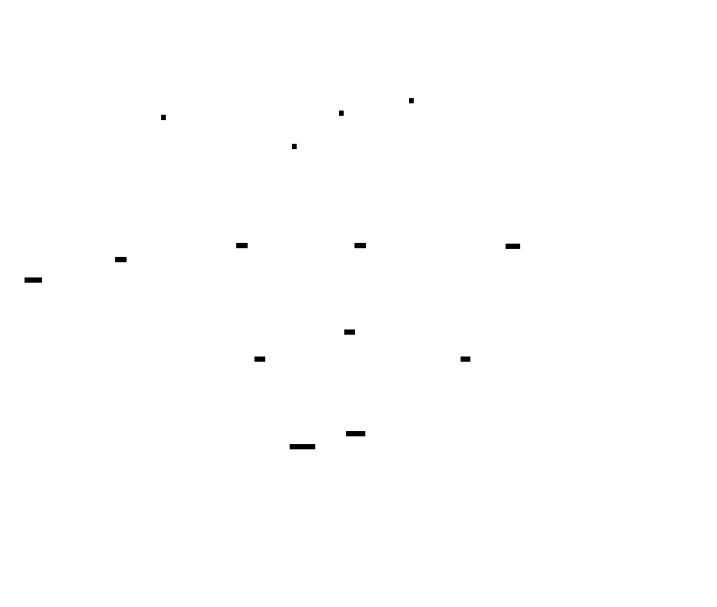

---
## Why Lexers Don't Need Recursion
Here is something worth pausing on: your tokenizer will use loops and conditionals, but it will *never call itself recursively*. That is not an accident.
[[EXPLAIN:regular-languages-vs-context-free-languages-—-why-lexers-don't-need-recursion|Regular languages vs context-free languages — why lexers don't need recursion]]
The token patterns you care about — identifiers, numbers, operators — are all **regular languages**: their structure can be described by patterns that only look at a finite amount of current state. You don't need to count arbitrarily nested things; you just need to know "am I currently in an identifier? Am I in a number?" A simple loop with a handful of boolean modes is sufficient.
This is why every major lexer from CPython's to GCC's is fundamentally a big `while` loop with a state variable. The moment you need recursion, you've stepped into parsing territory — that's for the next stage of the pipeline.
---
## Designing the Token Type Enumeration
The first concrete thing you will build is an exhaustive list of everything your scanner can recognize. This list is your **token type enumeration** — and getting it right upfront prevents a cascade of bugs downstream.
[[EXPLAIN:enum-/-algebraic-data-types-for-token-categories|Enum / algebraic data types for token categories]]
Here is the full token type system for your C-like language:
```python
from enum import Enum, auto
class TokenType(Enum):
    # Literals
    NUMBER      = auto()   # integer: 42, 0; float: 3.14
    STRING      = auto()   # "hello world"
    # Names
    IDENTIFIER  = auto()   # variable names: x, my_var, _count
    KEYWORD     = auto()   # if, else, while, return, true, false, null
    # Operators (single-char; multi-char added in M2)
    PLUS        = auto()   # +
    MINUS       = auto()   # -
    STAR        = auto()   # *
    SLASH       = auto()   # /
    ASSIGN      = auto()   # =
    # Comparison / logical (multi-char, handled in M2)
    EQUAL_EQUAL     = auto()  # ==
    BANG_EQUAL      = auto()  # !=
    LESS            = auto()  # <
    LESS_EQUAL      = auto()  # <=
    GREATER         = auto()  # >
    GREATER_EQUAL   = auto()  # >=
    # Punctuation / grouping
    LPAREN      = auto()   # (
    RPAREN      = auto()   # )
    LBRACE      = auto()   # {
    RBRACE      = auto()   # }
    LBRACKET    = auto()   # [
    RBRACKET    = auto()   # ]
    SEMICOLON   = auto()   # ;
    COMMA       = auto()   # ,
    # Sentinels
    EOF         = auto()   # end of input
    ERROR       = auto()   # unrecognized character or lexical error
```
A few design decisions worth understanding:
**Why separate `IDENTIFIER` from `KEYWORD`?** Because the scanner cannot know whether a sequence of letters is a keyword or a user-defined name until it finishes reading the whole sequence. `iffy` starts with `if`, but it is an identifier, not the keyword `if` followed by `fy`. The scanner first reads the complete word, then consults a lookup table. You will implement this lookup in Milestone 2.
**Why `ERROR` instead of raising an exception?** Because lexical errors in real compilers are recoverable: if you encounter `@` (which your language doesn't support), you emit an `ERROR` token, log the position, and continue scanning. This lets you report *all* errors in a file rather than stopping at the first. An exception would unwind the call stack and lose everything scanned so far.
**Why `EOF`?** The parser downstream consumes tokens one at a time. Without an explicit sentinel, the parser has no reliable way to know the input has ended — it might hang waiting for more input, or read past the end of your list. `EOF` is the terminator that lets the parser cleanly recognize "the program has ended." This same pattern appears in TCP (`FIN` packet), Unix pipes (EOF on stdin), and parser combinator libraries everywhere.


---
## The Token Data Structure
A token is not just a type. It needs to carry four pieces of information:
| Field | Type | Purpose |
|-------|------|---------|
| `type` | `TokenType` | What category this token belongs to |
| `lexeme` | `str` | The exact source text that produced this token |
| `line` | `int` | Line number in the source file (1-based) |
| `column` | `int` | Column number in the source file (1-based) |
The `lexeme` is critical. When the scanner recognizes `42`, the lexeme is the string `"42"`. Later stages of the compiler will need this raw text to compute the actual numeric value. The token type just says "this is a number" — the lexeme says "this specific number."
```python
from dataclasses import dataclass
@dataclass
class Token:
    type: TokenType
    lexeme: str
    line: int
    column: int
    def __repr__(self) -> str:
        return f"Token({self.type.name}, {self.lexeme!r}, {self.line}:{self.column})"
```
Notice `@dataclass`: Python's dataclass decorator automatically generates `__init__`, `__repr__`, and `__eq__` from your field annotations. This keeps boilerplate minimal so you can focus on the logic.
**Think of a Token as a row in a database table.** The token stream is a relation — a sequence of structured records. This is not a metaphor: SQL query analyzers, language servers, and linters all treat token streams as queryable data. When your IDE underlines a syntax error and tells you exactly which column it's on, it is reading the `line` and `column` fields from a Token.
---
## Position Tracking: Line and Column
Position tracking is metadata — it has nothing to do with the *meaning* of the program, but it is essential for every piece of tooling that sits on top of the language: error messages, IDE highlighting, debugger source maps, code coverage reports.
The rules are simple but must be applied consistently:
- **Line**: starts at 1, increments every time the scanner consumes a `\n` character.
- **Column**: starts at 1, increments for every character consumed, **resets to 1 after consuming `\n`**.
- The `line` and `column` stored in a Token are the position of the token's **first character**.


Two common pitfalls that break position tracking:
**Windows line endings (`\r\n`).** If your scanner increments line on both `\r` and `\n`, a Windows file will report doubled line counts. The correct approach: treat `\r\n` as a single newline. One strategy is to normalize line endings at the start by replacing all `\r\n` with `\n` before scanning. Another is to treat `\r` as whitespace but not increment the line counter (only `\n` increments).
**Tab characters.** A tab character is one character in the source string, but visually advances the cursor by a variable amount (commonly 4 or 8 spaces). For now, treat tab as advancing the column by 1. Real editors often make tab-width configurable; you can revisit this later.
---
## Building the Scanner Class
The Scanner is the engine. At its core, it maintains:
1. **The source string** — the full source code as a Python `str`
2. **A cursor** (`self.current`) — the index of the next character to be read
3. **Position state** (`self.line`, `self.column`) — where the cursor is in 2D source space
4. **A token accumulator** (`self.start`) — the index where the current token began
```python
class Scanner:
    def __init__(self, source: str) -> None:
        self.source: str = source
        self.start: int = 0      # start of current token being built
        self.current: int = 0    # next character to be read
        self.line: int = 1
        self.column: int = 1
        self.tokens: list[Token] = []
```

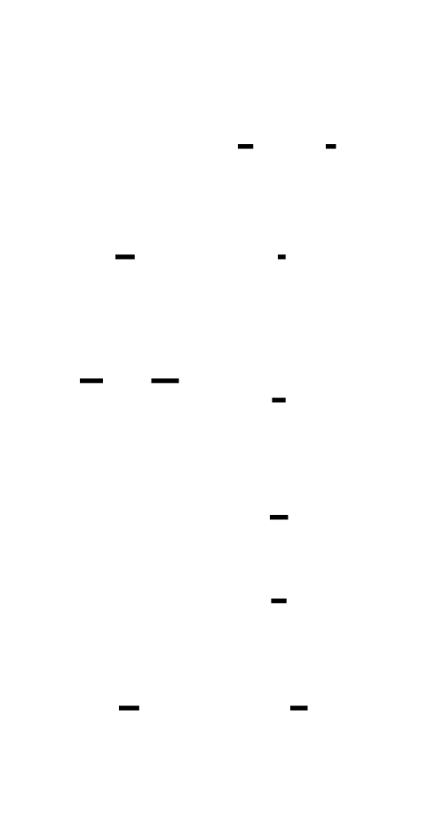

### The Three Primitive Operations
Everything the scanner does is built from three primitives:
#### `is_at_end()`
```python
def is_at_end(self) -> bool:
    return self.current >= len(self.source)
```
Simple range check. The scanner will call this constantly to avoid reading past the end of the string.
#### `advance()`
```python
def advance(self) -> str:
    ch = self.source[self.current]
    self.current += 1
    if ch == '\n':
        self.line += 1
        self.column = 1
    else:
        self.column += 1
    return ch
```
`advance()` **consumes** the current character: it reads it, moves the cursor forward, updates position tracking, and returns the character. Think of it as "give me the next character and move on."
**Critical detail**: position tracking happens inside `advance()`, not in the callers. This ensures that no matter who calls `advance()` — the whitespace-skipping code, the string literal scanner, the comment handler — the position is always updated correctly.
#### `peek()`
```python
def peek(self) -> str:
    if self.is_at_end():
        return '\0'   # null character as sentinel for "nothing here"
    return self.source[self.current]
```
`peek()` **inspects** the next character without consuming it. The cursor stays in place. This is *lookahead* — the scanner can ask "what's coming next?" without committing to it.
Why return `'\0'` at end-of-input? Because `'\0'` (the null character) is not a valid character in any source code your language accepts, so it will never match any token-starting condition. This means you can write conditions like `while self.peek().isdigit()` without separately checking for end-of-input in every loop — `'\0'` simply will not satisfy `.isdigit()`.

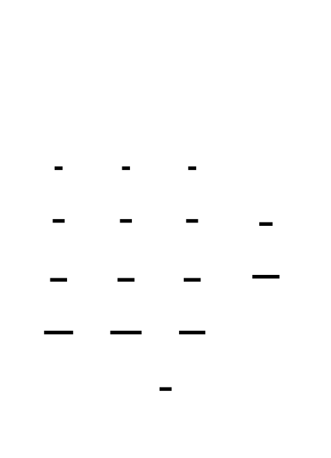

The distinction between `advance()` and `peek()` is the heart of the scanner's lookahead capability. In Milestone 2, you will use `peek()` to decide whether `=` is the assignment operator or the start of `==`. In Milestone 3, you will use it to detect `*/` ending a block comment. The entire scanner is just `advance()` and `peek()` used strategically.
---
## Making a Token
The scanner builds tokens from the characters it accumulates. Two helper methods make this clean:
```python
def _current_lexeme(self) -> str:
    """The source text from self.start up to (not including) self.current."""
    return self.source[self.start:self.current]
def _make_token(self, token_type: TokenType) -> Token:
    """Create a Token using the current accumulated lexeme and its start position."""
    return Token(
        type=token_type,
        lexeme=self._current_lexeme(),
        line=self.token_start_line,
        column=self.token_start_column,
    )
```
Notice that `_make_token` uses `token_start_line` and `token_start_column` — the position of the token's *first* character, not the current position. You need to snapshot these at the start of each token:
```python
def _begin_token(self) -> None:
    """Mark the start of a new token."""
    self.start = self.current
    self.token_start_line = self.line
    self.token_start_column = self.column
```
**Why snapshot position at the start?** Consider the token `while`: by the time the scanner has consumed all five characters, `self.line` and `self.column` point to the character *after* `while`. But the token's position in error messages should be the `w`, not the character after `e`. Snapshotting at the start gives you the correct position.
Update the `Scanner.__init__` to add the snapshot fields:
```python
def __init__(self, source: str) -> None:
    self.source: str = source
    self.start: int = 0
    self.current: int = 0
    self.line: int = 1
    self.column: int = 1
    self.token_start_line: int = 1
    self.token_start_column: int = 1
    self.tokens: list[Token] = []
```
---
## The Main Scanning Loop
With the primitives in place, the main entry point is straightforward:
```python
def scan_tokens(self) -> list[Token]:
    """Scan the entire source and return the complete token stream."""
    while not self.is_at_end():
        self._begin_token()
        self._scan_token()
    # Emit EOF at the end
    self.tokens.append(Token(
        type=TokenType.EOF,
        lexeme="",
        line=self.line,
        column=self.column,
    ))
    return self.tokens
```
The structure is: mark where the next token starts, scan one token, repeat. After the loop, append the EOF sentinel.
`_scan_token()` is where the FSM logic lives. For Milestone 1, it handles single-character tokens and whitespace:
```python
def _scan_token(self) -> None:
    ch = self.advance()
    # Whitespace: consume silently, no token emitted
    if ch in (' ', '\t', '\r', '\n'):
        return  # position already updated by advance()
    # Single-character tokens
    single_char_tokens = {
        '+': TokenType.PLUS,
        '-': TokenType.MINUS,
        '*': TokenType.STAR,
        '/': TokenType.SLASH,
        '(': TokenType.LPAREN,
        ')': TokenType.RPAREN,
        '{': TokenType.LBRACE,
        '}': TokenType.RBRACE,
        '[': TokenType.LBRACKET,
        ']': TokenType.RBRACKET,
        ';': TokenType.SEMICOLON,
        ',': TokenType.COMMA,
        '=': TokenType.ASSIGN,   # Milestone 2 will extend '=' to handle '=='
    }
    if ch in single_char_tokens:
        self.tokens.append(self._make_token(single_char_tokens[ch]))
        return
    # Error: unrecognized character
    self.tokens.append(Token(
        type=TokenType.ERROR,
        lexeme=ch,
        line=self.token_start_line,
        column=self.token_start_column,
    ))
```

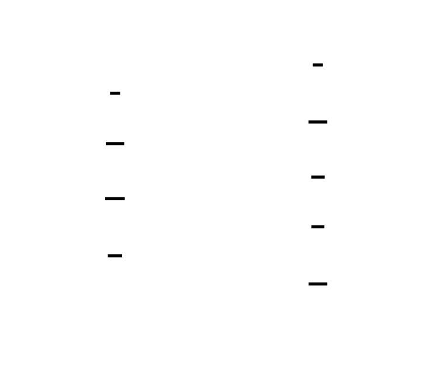

**Why a dictionary for single-character tokens?** Clarity and extensibility. A long `if/elif` chain works, but a dictionary makes the mapping explicit and easy to scan visually. Adding a new single-character token means adding one line to the dictionary.
**Why does whitespace return early without appending anything?** Because whitespace carries no information for the parser. Consuming it updates `line` and `column` (inside `advance()`), but there is no token to emit. The next call to `_begin_token()` will correctly capture the position of the first non-whitespace character.
---
## Handling the `\r\n` Pitfall
When `advance()` sees `\n`, it increments `line` and resets `column`. But on Windows, line endings are `\r\n` — two characters. If your scanner treats `\r` as whitespace (which it does, since it's in the whitespace set) AND also increments line on `\r`, you will count each line twice.
The fix: only `\n` triggers a line increment. The `\r` character is simply consumed as whitespace without touching `line`. In `advance()`:
```python
def advance(self) -> str:
    ch = self.source[self.current]
    self.current += 1
    if ch == '\n':
        self.line += 1
        self.column = 1
    else:
        self.column += 1   # \r increments column but NOT line
    return ch
```
This means `\r\n` is two `advance()` calls, but only the `\n` causes a line increment. The `\r` increments the column to 2, then `\n` resets it to 1. Net effect: `\r\n` behaves identically to `\n` in terms of line counting. ✓
---
## Putting It Together: First Test
Here is what a correctly functioning M1 scanner should produce:
```python
source = "+ - * / ( ) { } [ ] ; ,"
scanner = Scanner(source)
tokens = scanner.scan_tokens()
for tok in tokens:
    print(tok)
```
Expected output:
```
Token(PLUS, '+', 1:1)
Token(MINUS, '-', 1:3)
Token(STAR, '*', 1:5)
Token(SLASH, '/', 1:7)
Token(LPAREN, '(', 1:9)
Token(RPAREN, ')', 1:11)
Token(LBRACE, '{', 1:13)
Token(RBRACE, '}', 1:15)
Token(LBRACKET, '[', 1:17)
Token(RBRACKET, ']', 1:19)
Token(SEMICOLON, ';', 1:21)
Token(COMMA, ',', 1:23)
Token(EOF, '', 1:25)
```
Test multi-line input and verify position tracking:
```python
source = "+\n-\n*"
scanner = Scanner(source)
tokens = scanner.scan_tokens()
assert tokens[0] == Token(TokenType.PLUS,      '+', 1, 1)
assert tokens[1] == Token(TokenType.MINUS,     '-', 2, 1)
assert tokens[2] == Token(TokenType.STAR,      '*', 3, 1)
assert tokens[3] == Token(TokenType.EOF,       '',  3, 2)
```
Test error emission for unrecognized characters:
```python
source = "@"
scanner = Scanner(source)
tokens = scanner.scan_tokens()
assert tokens[0].type == TokenType.ERROR
assert tokens[0].lexeme == "@"
assert tokens[0].line == 1
assert tokens[0].column == 1
assert tokens[1].type == TokenType.EOF
```
Test empty input (produces only EOF):
```python
source = ""
scanner = Scanner(source)
tokens = scanner.scan_tokens()
assert len(tokens) == 1
assert tokens[0].type == TokenType.EOF
```
---
## The Full M1 Scanner (Assembled)
Here is the complete, assembled implementation for Milestone 1:
```python
from enum import Enum, auto
from dataclasses import dataclass
from typing import Optional
class TokenType(Enum):
    # Literals
    NUMBER          = auto()
    STRING          = auto()
    # Names
    IDENTIFIER      = auto()
    KEYWORD         = auto()
    # Arithmetic operators
    PLUS            = auto()
    MINUS           = auto()
    STAR            = auto()
    SLASH           = auto()
    # Assignment and comparison (comparison extended in M2)
    ASSIGN          = auto()
    EQUAL_EQUAL     = auto()
    BANG_EQUAL      = auto()
    LESS            = auto()
    LESS_EQUAL      = auto()
    GREATER         = auto()
    GREATER_EQUAL   = auto()
    # Punctuation
    LPAREN          = auto()
    RPAREN          = auto()
    LBRACE          = auto()
    RBRACE          = auto()
    LBRACKET        = auto()
    RBRACKET        = auto()
    SEMICOLON       = auto()
    COMMA           = auto()
    # Sentinels
    EOF             = auto()
    ERROR           = auto()
@dataclass
class Token:
    type: TokenType
    lexeme: str
    line: int
    column: int
    def __repr__(self) -> str:
        return f"Token({self.type.name}, {self.lexeme!r}, {self.line}:{self.column})"
# Maps single characters to their token types
SINGLE_CHAR_TOKENS: dict[str, TokenType] = {
    '+': TokenType.PLUS,
    '-': TokenType.MINUS,
    '*': TokenType.STAR,
    '/': TokenType.SLASH,
    '(': TokenType.LPAREN,
    ')': TokenType.RPAREN,
    '{': TokenType.LBRACE,
    '}': TokenType.RBRACE,
    '[': TokenType.LBRACKET,
    ']': TokenType.RBRACKET,
    ';': TokenType.SEMICOLON,
    ',': TokenType.COMMA,
    '=': TokenType.ASSIGN,
}
WHITESPACE = {' ', '\t', '\r', '\n'}
class Scanner:
    def __init__(self, source: str) -> None:
        self.source: str = source
        self.start: int = 0           # index of first char of current token
        self.current: int = 0         # index of next char to read
        self.line: int = 1            # current line (1-based)
        self.column: int = 1          # current column (1-based)
        self.token_start_line: int = 1
        self.token_start_column: int = 1
        self.tokens: list[Token] = []
    # -------------------------------------------------------------------------
    # Core primitives
    # -------------------------------------------------------------------------
    def is_at_end(self) -> bool:
        """True when all source characters have been consumed."""
        return self.current >= len(self.source)
    def advance(self) -> str:
        """
        Consume the current character, update position tracking, return it.
        This is the ONLY place line/column are updated.
        """
        ch = self.source[self.current]
        self.current += 1
        if ch == '\n':
            self.line += 1
            self.column = 1
        else:
            self.column += 1
        return ch
    def peek(self) -> str:
        """
        Return the next character without consuming it.
        Returns '\0' (null) at end of input as a safe sentinel.
        """
        if self.is_at_end():
            return '\0'
        return self.source[self.current]
    # -------------------------------------------------------------------------
    # Token construction helpers
    # -------------------------------------------------------------------------
    def _begin_token(self) -> None:
        """Snapshot start position before consuming token characters."""
        self.start = self.current
        self.token_start_line = self.line
        self.token_start_column = self.column
    def _current_lexeme(self) -> str:
        """Source text from start of current token to current position."""
        return self.source[self.start:self.current]
    def _make_token(self, token_type: TokenType) -> Token:
        """Build a Token from the currently accumulated lexeme."""
        return Token(
            type=token_type,
            lexeme=self._current_lexeme(),
            line=self.token_start_line,
            column=self.token_start_column,
        )
    def _error_token(self, message: str) -> Token:
        """Build an ERROR token for the currently accumulated characters."""
        return Token(
            type=TokenType.ERROR,
            lexeme=self._current_lexeme(),
            line=self.token_start_line,
            column=self.token_start_column,
        )
    # -------------------------------------------------------------------------
    # Main scanning logic
    # -------------------------------------------------------------------------
    def _scan_token(self) -> None:
        """Scan one token and append it to self.tokens."""
        ch = self.advance()
        # Whitespace: consume and discard
        if ch in WHITESPACE:
            return
        # Single-character tokens
        if ch in SINGLE_CHAR_TOKENS:
            self.tokens.append(self._make_token(SINGLE_CHAR_TOKENS[ch]))
            return
        # Unrecognized character → Error token
        self.tokens.append(self._error_token(f"Unexpected character: {ch!r}"))
    def scan_tokens(self) -> list[Token]:
        """
        Scan all tokens in source. Returns complete token list ending with EOF.
        This is the public API — call this once and consume the result.
        """
        while not self.is_at_end():
            self._begin_token()
            self._scan_token()
        # Always terminate with EOF
        self.tokens.append(Token(
            type=TokenType.EOF,
            lexeme="",
            line=self.line,
            column=self.column,
        ))
        return self.tokens
```
---
## Character Encoding: The Hidden Assumption
Your scanner calls `self.source[self.current]` and gets a single character. This works perfectly for ASCII source code. But there is a hidden assumption: each "character" in the source is one element of Python's `str`.
Python 3 strings are Unicode, and `str[i]` gives you a Unicode code point — not a byte. For source code that only uses ASCII characters (which your simple C-like language does), this is fine. But the moment a language allows Unicode identifiers (Python 3 itself, Rust, Go, Swift all do), `advance()` must become *grapheme-cluster-aware*: a single visible character like `é` might be one code point, or it might be two (the base character `e` plus a combining accent). Operating on code points rather than grapheme clusters gives wrong column numbers for such characters.
For your project, ASCII is the stated constraint. But when you later extend a language to support Unicode identifiers, this is exactly where you would start refactoring.
---
## Knowledge Cascade: What You Just Built Connects To...
You have written fewer than 150 lines of Python, but the concepts inside them connect to an enormous web of ideas:
**→ Every regex engine is this FSM, written automatically.** When you write `\d+` in Python, the `re` module compiles that pattern into a finite automaton that does exactly what your scanner does manually: maintain a state, read one character at a time, transition on character class. Your scanner is a *hand-compiled* regex. Building it by hand first is how you understand what `re.compile()` generates.
**→ Position tracking appears in every language tool ever built.** JSON parsers emit line/column on parse errors. SQL engines report the exact character where a query breaks. The Language Server Protocol (LSP) — what powers IntelliSense in VS Code — operates entirely in terms of line/column positions. The `Token.line` and `Token.column` fields you added are the connection point between raw text and every IDE feature you've ever used.
**→ EOF as explicit sentinel is a universal protocol pattern.** TCP sends a `FIN` packet to signal end of stream. Unix pipes deliver EOF when a writer closes. HTTP/1.1 uses `Content-Length` or chunked encoding for the same reason: receivers need an unambiguous signal that no more data is coming. Your `EOF` token plays the same role for the parser. Systems that skip the sentinel tend to hang on empty input or crash on the last real item.
**→ Your `Token` is a database row.** The token stream is a relation. Language servers like `rust-analyzer` and `clangd` literally index token streams into in-memory databases and query them. When you write a custom linter rule that says "find all calls to function X", you are running a query over the token stream. The structured, typed, positioned `Token` you designed today is what makes that possible.
**→ This extends directly to lexer generators.** Tools like `flex` (C), `ANTLR` (Java/Python), and Python's `sly` and `ply` libraries generate scanners automatically from regular expression specifications. After building one by hand, you will be able to read generated lexer code and immediately understand the structure — states, transitions, lookahead — because you have written all of it yourself.
---
<!-- END_MS -->


<!-- MS_ID: tokenizer-m2 -->
<!-- MS_ID: tokenizer-m2 -->
# Milestone 2: Multi-Character Tokens & Maximal Munch
## The Problem the Scanner Doesn't Know It Has
Open any Python or C source file. Find `==`. To you, that is obviously the equality comparison operator — a single, indivisible unit of meaning. You have never once confused it with two consecutive assignment operators.
But your scanner has no idea what `==` *means*. It sees a stream of characters: `'='`, then `'='`. That's it. Two identical characters sitting next to each other. There is no font difference, no spacing, no metadata that says "treat these two as one." The scanner must decide, character by character, how to group them — and it must do so without backtracking, without lookahead further than one character, and without any understanding of syntax.
This is the fundamental tension of lexical analysis: **the scanner must make irrevocable decisions at each character, without knowing what comes next, while still producing the token grouping that a human reader would consider "obvious."**
The solution is a precise algorithmic rule called [[EXPLAIN:maximal-munch-principle-—-always-prefer-the-longest-valid-token|Maximal munch principle — always prefer the longest valid token]]. And the mechanism that makes it possible without backtracking is [[EXPLAIN:lookahead-—-peek-without-consuming-—-and-why-it-enables-disambiguation-without-backtracking|Lookahead — peek without consuming — and why it enables disambiguation without backtracking]].
By the end of this milestone, your scanner will handle two-character operators, integer and float literals, identifiers, and keywords. Every one of those features uses the same two-character pattern: `advance()` to consume, `peek()` to decide.
---
## The Revelation: There Is No "Obviously One Token"
Here is what most developers intuitively believe: `==` is read as a single token because it *is* the equality operator, and the scanner *knows* what equality operators look like. Keywords like `if` are special because "they're in the grammar."
Both beliefs are wrong.
The scanner does not know what `==` means. It sees `'='` and must stop. At that point, two possibilities are live:
- **Emit `ASSIGN` right now** — the character `=` is a complete token.
- **Look one character ahead** — if the next character is `=`, consume it too and emit `EQUAL_EQUAL`.
Without deliberate lookahead and a deliberate policy of preferring the longer match, your scanner will emit `ASSIGN + ASSIGN` every time it sees `==`. Try this with the naive approach from Milestone 1: the `=` case in `_scan_token()` sees one `=` and emits `ASSIGN` immediately. The next iteration of the loop sees the second `=` and emits another `ASSIGN`. The result: two tokens where there should be one.
Your parser downstream *will* fail on this. An `if` statement condition like `x == 42` would be parsed as `x = 42 =`, which is syntactically nonsensical. The error would appear in the parser, far from the actual problem in the scanner. This is why getting lexical analysis right is worth careful attention.
Now consider keywords. What makes `if` a keyword and `iffy` an identifier? The scanner cannot match `if` as a prefix — that would make `iffy` start with the keyword `if` followed by `fy`, which is wrong. The only correct approach: **scan the entire word first** (using identifier scanning rules), **then consult a lookup table** to see whether that word is reserved. The scanner does not distinguish `if` from `iffy` until it has finished reading all contiguous identifier characters.
Keywords are NOT grammar rules. The grammar never says "an `if` statement starts with the characters `i` then `f`." The grammar says "an `if` statement starts with a `KEYWORD` token whose lexeme is `if`." The distinction happens here, in the lexer, via a dictionary lookup. This separation is one of the cleanest design decisions in compiler architecture.
---
## Maximal Munch: The Greedy Lexer
[[EXPLAIN:maximal-munch-principle-—-always-prefer-the-longest-valid-token|Maximal munch principle — always prefer the longest valid token]]
The maximal munch principle states: **when more than one token could start at the current position, always consume the most characters that form a valid token.**
This is a *greedy* algorithm in the same sense that greedy regex patterns are greedy — it always takes as much as possible. When your scanner sees `<`, it must ask: is this `LESS` (one character) or the start of `LESS_EQUAL` (two characters)? Maximal munch says: peek at the next character. If it's `=`, consume both and emit `LESS_EQUAL`. If it's anything else, emit just `LESS`.

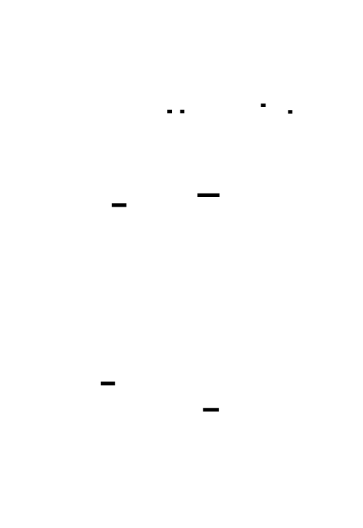

The same rule governs every ambiguous token boundary in your language:
| First char | Possible tokens | Decision rule |
|------------|----------------|---------------|
| `=` | `ASSIGN` or `EQUAL_EQUAL` | Peek: if next is `=`, emit `EQUAL_EQUAL` |
| `!` | `ERROR` or `BANG_EQUAL` | Peek: if next is `=`, emit `BANG_EQUAL`; else error |
| `<` | `LESS` or `LESS_EQUAL` | Peek: if next is `=`, emit `LESS_EQUAL` |
| `>` | `GREATER` or `GREATER_EQUAL` | Peek: if next is `=`, emit `GREATER_EQUAL` |
| `/` | `SLASH` or start of comment | Peek: if next is `/` or `*`, handle comment (M3) |
The rule `>==` → `GREATER_EQUAL + ASSIGN` (not `GREATER + EQUAL_EQUAL`) is a direct consequence of maximal munch applied left to right: you first see `>`, peek and see `=`, so you consume both and emit `GREATER_EQUAL`. Now the cursor sits at the third `=`, which stands alone as `ASSIGN`.

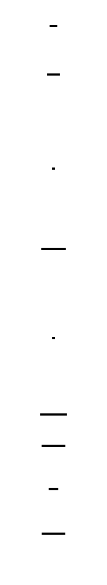

**Maximal munch is not just an arbitrary convention.** It is the unique policy that makes lexical analysis *deterministic and local*: the scanner never needs to "change its mind" about a character it already emitted, and it never needs to look more than one character ahead to make its decision. This is what makes scanners fast and simple.
> **Cross-domain connection — C++ template parsing:** C++ famously broke maximal munch for `>>`. Before C++11, `vector<vector<int>>` was a syntax error because `>>` was greedily consumed as the right-shift operator, not as two closing template brackets. C++11 fixed this with special-case parser logic — a kludge that would have been unnecessary if the grammar had been designed with maximal munch in mind. Your language won't make that mistake.
---
## Implementing Lookahead
You already have `peek()` from Milestone 1. Now you will use it seriously.
[[EXPLAIN:lookahead-—-peek-without-consuming-—-and-why-it-enables-disambiguation-without-backtracking|Lookahead — peek without consuming — and why it enables disambiguation without backtracking]]
The pattern for any two-character operator is always:
1. `advance()` consumed the first character (e.g., `=`).
2. `peek()` inspects the next character without consuming it.
3. If the next character completes a two-character token, call `advance()` again to consume it, then emit the two-character token type.
4. If not, emit the single-character token type.
This means every decision is made in one forward pass, with a maximum look-ahead of exactly one character. No rewinding, no scanning ahead multiple positions, no storing "maybe" state.
```python
def _match(self, expected: str) -> bool:
    """
    Consume the next character IF it equals expected, return True.
    Return False without consuming if it doesn't match or we're at end.
    This implements single-character lookahead with conditional consume.
    """
    if self.is_at_end():
        return False
    if self.source[self.current] != expected:
        return False
    # Consume it — update position tracking
    self.advance()
    return True
```
This `_match()` helper encapsulates the lookahead pattern cleanly. It is the pattern from `peek()` plus `advance()`, merged into one atomic operation: "if the next char is X, consume it and tell me so."
Notice what `_match()` does NOT do: it does not call `peek()` and then decide whether to call `advance()` separately. That two-step approach would work, but `_match()` makes the intent clearer — "try to consume this character, succeed or fail atomically." You will see this exact helper in the Crafting Interpreters book and in production lexer implementations.

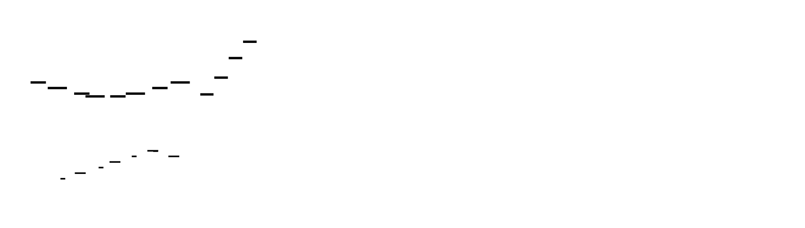

Now the two-character operator cases in `_scan_token()`:
```python
def _scan_token(self) -> None:
    ch = self.advance()
    # --- Whitespace ---
    if ch in WHITESPACE:
        return
    # --- Two-character operators (must come before single-char fallback) ---
    if ch == '=':
        token_type = TokenType.EQUAL_EQUAL if self._match('=') else TokenType.ASSIGN
        self.tokens.append(self._make_token(token_type))
        return
    if ch == '!':
        if self._match('='):
            self.tokens.append(self._make_token(TokenType.BANG_EQUAL))
        else:
            # '!' alone is not valid in our language — emit error
            self.tokens.append(self._error_token("Expected '=' after '!'"))
        return
    if ch == '<':
        token_type = TokenType.LESS_EQUAL if self._match('=') else TokenType.LESS
        self.tokens.append(self._make_token(token_type))
        return
    if ch == '>':
        token_type = TokenType.GREATER_EQUAL if self._match('=') else TokenType.GREATER
        self.tokens.append(self._make_token(token_type))
        return
    # --- Single-character tokens ---
    if ch in SINGLE_CHAR_TOKENS:
        self.tokens.append(self._make_token(SINGLE_CHAR_TOKENS[ch]))
        return
    # --- Numbers ---
    if ch.isdigit():
        self._scan_number()
        return
    # --- Identifiers and keywords ---
    if ch.isalpha() or ch == '_':
        self._scan_identifier()
        return
    # --- Unrecognized character ---
    self.tokens.append(self._error_token(f"Unexpected character: {ch!r}"))
```
Two things to notice:
**The two-character cases come before the single-character lookup table.** This is intentional. If `=` were in `SINGLE_CHAR_TOKENS`, you would emit `ASSIGN` before you had a chance to peek. The two-character check must happen first so that `_match()` can consume the second character.
**`!` alone is an error.** Your language does not have a standalone `!` (logical-not) operator. The only valid use of `!` is as the first character of `!=`. So if you see `!` not followed by `=`, that's a lexical error. This is a *design decision about the language* being reflected in the scanner — exactly where it belongs.
---
## Scanning Number Literals
Now the scanner needs to handle sequences like `42`, `0`, and `3.14`. These are not single-character tokens — the scanner must consume as many digit characters as possible (maximal munch again), then check whether a decimal point follows.

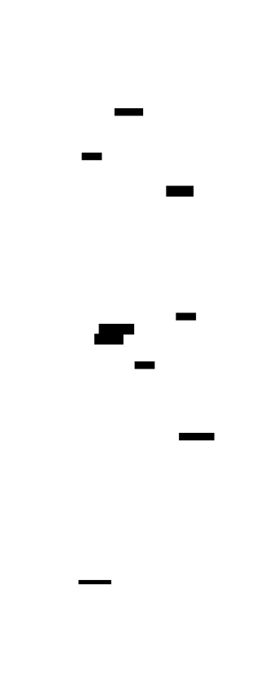

The FSM for numbers has three states:
1. **INTEGER**: reading digit characters
2. **SAW_DOT**: consumed a `.` after digits — now looking for more digits
3. **FLOAT**: reading digit characters after the decimal point
```python
def _scan_number(self) -> None:
    """
    Called after the first digit has already been consumed by advance().
    Scans the remaining digits and optional fractional part.
    Emits a NUMBER token for both integer and float literals.
    """
    # Consume remaining integer digits
    while self.peek().isdigit():
        self.advance()
    # Check for fractional part: '.' followed by at least one digit
    if self.peek() == '.' and self._peek_next().isdigit():
        self.advance()  # consume the '.'
        while self.peek().isdigit():
            self.advance()
    self.tokens.append(self._make_token(TokenType.NUMBER))
```
This requires a second lookahead method, `_peek_next()`, that looks *two* characters ahead:
```python
def _peek_next(self) -> str:
    """
    Inspect the character after the next character, without consuming.
    Returns '\0' if at or past end of input.
    """
    if self.current + 1 >= len(self.source):
        return '\0'
    return self.source[self.current + 1]
```
**Why do you need two characters of lookahead for the decimal point?** Consider the input `3.foo`. When the scanner finishes reading `3`, it peeks and sees `.`. Should it consume the `.` as part of a float literal? If it does, the next character is `f`, which is not a digit. You now have a partial float with no fractional digits — that's an invalid token. You would have to *backtrack* to undo the `.` consumption.
The two-character lookahead solves this without backtracking: before consuming `.`, check whether the character after it is a digit. Only if both conditions are true — the next char is `.` AND the char after that is a digit — do you commit to float scanning.
```python
# The condition:
if self.peek() == '.' and self._peek_next().isdigit():
```
This means `3.foo` is tokenized as `NUMBER(3)` then `.` — but wait, `.` is not in your single-character token table! That's fine: `.` alone produces an `ERROR` token. The input `3.` is tokenized as `NUMBER(3)` followed by `ERROR('.')`. This is a deliberate policy decision.
### The Language Design Decision Embedded in Your Scanner
Every number literal scanner must answer these questions explicitly:
| Input | CPython behavior | C behavior | Your scanner |
|-------|-----------------|------------|--------------|
| `3.14` | float `3.14` ✓ | float `3.14` ✓ | `NUMBER("3.14")` ✓ |
| `3.` | float `3.0` ✓ | float `3.0` ✓ | `NUMBER("3")` + `ERROR(".")` |
| `.5` | float `0.5` ✓ | float `0.5` ✓ | `ERROR(".")` + `NUMBER("5")` |
| `3.14.5` | SyntaxError | `3.14` + `.5` | `NUMBER("3.14")` + `ERROR(".")` + `NUMBER("5")` |
Your scanner's policy: **a float literal must have digits on both sides of the decimal point.** This is the strictest policy. It simplifies the scanner (no special cases) and produces clear errors for ambiguous inputs. Document this in your project's README — your scanner's behavior on `3.` and `.5` is a *language specification decision*, not an oversight.
> **Historical note:** The `.5` syntax in C causes a subtle parsing ambiguity in struct member access: `obj.5method()` is not valid in languages that allow leading-dot floats. Python avoids this by treating `.` as clearly either a member access operator or part of a float only when surrounded by digits on both sides. Your stricter policy sidesteps the ambiguity entirely.
---
## Scanning Identifiers and the Keyword Lookup Table
An identifier in your C-like language follows a simple rule: it starts with a letter or underscore, then continues with any number of letters, digits, or underscores.
The FSM for identifiers is even simpler than for numbers — it has only two states: START (consumed first character, it's a letter or `_`) and IN_IDENTIFIER (consuming additional identifier characters).
```python
def _scan_identifier(self) -> None:
    """
    Called after the first letter or underscore has been consumed.
    Scans the rest of the identifier, then checks the keyword table.
    """
    while self.peek().isalpha() or self.peek().isdigit() or self.peek() == '_':
        self.advance()
    # Extract the complete identifier text
    text = self._current_lexeme()
    # Keyword lookup: is this identifier a reserved word?
    token_type = KEYWORDS.get(text, TokenType.IDENTIFIER)
    self.tokens.append(self._make_token(token_type))
```
The keyword table is just a dictionary:
```python
KEYWORDS: dict[str, TokenType] = {
    'if':     TokenType.KEYWORD,
    'else':   TokenType.KEYWORD,
    'while':  TokenType.KEYWORD,
    'return': TokenType.KEYWORD,
    'true':   TokenType.KEYWORD,
    'false':  TokenType.KEYWORD,
    'null':   TokenType.KEYWORD,
}
```


The `.get(text, TokenType.IDENTIFIER)` call is the key: look up `text` in `KEYWORDS`, and if it's not there, use `IDENTIFIER` as the default. This single line correctly handles:
- `if` → `KEYWORD` (found in table)
- `iffy` → `IDENTIFIER` (not found — `iffy` is not a key, even though it starts with `if`)
- `return` → `KEYWORD`
- `returning` → `IDENTIFIER`
- `x` → `IDENTIFIER`
- `_count` → `IDENTIFIER`
The critical invariant: **the full identifier text is scanned before the keyword table is consulted.** You never check for keywords mid-scan. This is what prevents `iffy` from matching the `if` keyword — by the time you look at the table, you have already accumulated the full string `"iffy"`, which is not in the table.
### Why Keywords Are Not Grammar Rules
In some language designs, you might imagine keywords as special grammar productions — the parser checks "does this input start with the characters `i`, `f`?" But this would force the parser to do character-level work, which belongs to the lexer. It would also make context-sensitive keyword handling (where `from` is a keyword in import statements but a valid variable name elsewhere — as in Python) much harder.
The clean separation is: **the lexer decides whether a lexeme is a keyword; the parser decides whether a `KEYWORD` token is valid in context.** Your keyword table enforces this. The parser never sees raw character sequences — it only sees `Token(KEYWORD, "if", ...)` or `Token(IDENTIFIER, "iffy", ...)`.
> **Cross-domain connection — database query planning:** This separation mirrors how SQL query planners distinguish syntactic parsing from semantic analysis. The parser recognizes that `SELECT` is a keyword; it doesn't ask the catalog whether `SELECT` is a valid operation at this position. The catalog lookup happens later, in semantic analysis. Your keyword table is the lexer's catalog — it answers the syntactic question "is this reserved?" without knowing anything about what the keyword means in context.
### Design Decision: What Goes in the Keyword Table?
| Approach | Pros | Cons | Example |
|----------|------|------|---------|
| **All keywords hardcoded ✓** | Simple, fast, no config | Adding keywords requires code change | Your scanner |
| Keywords loaded from file | Configurable, embeddable | More complex, file I/O | Some DSL scanners |
| Context-sensitive keywords | More identifiers available | Complex, parser must feed back to lexer | Python's `match`, `type` |
Your scanner uses the simplest approach: a hardcoded dictionary. This is correct for a static language spec. If you were building a language with contextual keywords (like Python's `match` and `case` in Python 3.10+, which are identifiers outside match statements), you would need to pass context from the parser back to the lexer — a significant complication that most language designs avoid.
---
## Identifier Scanning Unlocks Symbol Tables
There is a forward connection worth making explicit: **the identifier you just scanned is the key structure for every variable, function, and type in the entire compiler.**
When a parser sees `Token(IDENTIFIER, "my_variable", ...)`, it will look up `"my_variable"` in a symbol table. When a type checker sees `Token(IDENTIFIER, "MyClass", ...)`, it will resolve it against a class registry. When a code generator emits machine instructions for `x = x + 1`, it resolves `x` to a memory location via a chain of symbol lookups.
Every one of those lookups starts with an identifier token produced by your scanner. The lexeme string `"my_variable"` is the primary key for every symbol table, scope chain, and name resolution system in compiler theory. You built the foundation for all of that right here.
> 🔭 **Deep Dive**: Symbol tables and scope chains are the data structures that record what identifiers mean and where they are valid. For a concrete implementation starting from lexer output, see *Crafting Interpreters* by Robert Nystrom, Chapters 11-12 (available free at craftinginterpreters.com). If you want formal theory, see *Engineering a Compiler* by Cooper & Torczon, Chapter 5.
---
## The Extended `_scan_token` — All Together
Here is the complete `_scan_token` method incorporating all Milestone 2 additions, for clarity:
```python
def _scan_token(self) -> None:
    """
    Consume one logical token and append it to self.tokens.
    Called once per iteration of the main scan loop.
    """
    ch = self.advance()
    # ── Whitespace ──────────────────────────────────────────────────────────
    if ch in WHITESPACE:
        return  # consume and discard; position already updated by advance()
    # ── Two-character operators ──────────────────────────────────────────────
    if ch == '=':
        self.tokens.append(self._make_token(
            TokenType.EQUAL_EQUAL if self._match('=') else TokenType.ASSIGN
        ))
        return
    if ch == '!':
        if self._match('='):
            self.tokens.append(self._make_token(TokenType.BANG_EQUAL))
        else:
            self.tokens.append(self._error_token("Unexpected '!' without '='"))
        return
    if ch == '<':
        self.tokens.append(self._make_token(
            TokenType.LESS_EQUAL if self._match('=') else TokenType.LESS
        ))
        return
    if ch == '>':
        self.tokens.append(self._make_token(
            TokenType.GREATER_EQUAL if self._match('=') else TokenType.GREATER
        ))
        return
    # ── Single-character operators and punctuation ───────────────────────────
    if ch in SINGLE_CHAR_TOKENS:
        self.tokens.append(self._make_token(SINGLE_CHAR_TOKENS[ch]))
        return
    # ── Number literals ──────────────────────────────────────────────────────
    if ch.isdigit():
        self._scan_number()
        return
    # ── Identifiers and keywords ─────────────────────────────────────────────
    if ch.isalpha() or ch == '_':
        self._scan_identifier()
        return
    # ── Unrecognized character ───────────────────────────────────────────────
    self.tokens.append(self._error_token(f"Unexpected character: {ch!r}"))
```
**The order of these cases is a correctness concern, not just style.** If you put `ch in SINGLE_CHAR_TOKENS` before the two-character operator cases, and `=` is in `SINGLE_CHAR_TOKENS`, then `==` will always be `ASSIGN + ASSIGN`. The two-character checks must come first, and they must not delegate to the single-character table for characters they handle.
> **Remove `=` from `SINGLE_CHAR_TOKENS`** now that `_scan_token` handles it explicitly. The dictionary `SINGLE_CHAR_TOKENS` should only contain characters that are always single-character tokens with no possible longer interpretation:
> ```python
> SINGLE_CHAR_TOKENS: dict[str, TokenType] = {
>     '+': TokenType.PLUS,
>     '-': TokenType.MINUS,
>     '*': TokenType.STAR,
>     '/': TokenType.SLASH,   # '/' will be extended in M3 for comments
>     '(': TokenType.LPAREN,
>     ')': TokenType.RPAREN,
>     '{': TokenType.LBRACE,
>     '}': TokenType.RBRACE,
>     '[': TokenType.LBRACKET,
>     ']': TokenType.RBRACKET,
>     ';': TokenType.SEMICOLON,
>     ',': TokenType.COMMA,
>     # '=' removed — handled by two-character check above
>     # '!' removed — handled by two-character check above
>     # '<' removed — handled by two-character check above
>     # '>' removed — handled by two-character check above
> }
> ```
---
## Testing Maximal Munch Systematically
Good tests for maximal munch isolate the decision point. Here is a test battery for every ambiguous operator:
```python
import unittest
from scanner import Scanner, TokenType, Token
class TestTwoCharOperators(unittest.TestCase):
    def _types(self, source: str) -> list[TokenType]:
        """Helper: scan source and return just the token types (excluding EOF)."""
        tokens = Scanner(source).scan_tokens()
        return [t.type for t in tokens if t.type != TokenType.EOF]
    def _tokens(self, source: str) -> list[Token]:
        tokens = Scanner(source).scan_tokens()
        return [t for t in tokens if t.type != TokenType.EOF]
    # ── Equality ────────────────────────────────────────────────────────────
    def test_equal_equal(self):
        self.assertEqual(self._types('=='), [TokenType.EQUAL_EQUAL])
    def test_assign_not_equal_equal(self):
        self.assertEqual(self._types('='), [TokenType.ASSIGN])
    def test_assign_then_assign(self):
        # '= =' with a space must be two separate ASSIGN tokens
        self.assertEqual(self._types('= ='), [TokenType.ASSIGN, TokenType.ASSIGN])
    # ── Inequality ──────────────────────────────────────────────────────────
    def test_bang_equal(self):
        self.assertEqual(self._types('!='), [TokenType.BANG_EQUAL])
    def test_bang_alone_is_error(self):
        self.assertEqual(self._types('!')[0], TokenType.ERROR)
    # ── Comparison ──────────────────────────────────────────────────────────
    def test_less(self):
        self.assertEqual(self._types('<'), [TokenType.LESS])
    def test_less_equal(self):
        self.assertEqual(self._types('<='), [TokenType.LESS_EQUAL])
    def test_greater(self):
        self.assertEqual(self._types('>'), [TokenType.GREATER])
    def test_greater_equal(self):
        self.assertEqual(self._types('>='), [TokenType.GREATER_EQUAL])
    # ── Maximal munch edge case ──────────────────────────────────────────────
    def test_geq_then_assign(self):
        """'>== ' must produce GreaterEqual then Assign, not Greater then EqualEqual."""
        result = self._types('>==')
        self.assertEqual(result, [TokenType.GREATER_EQUAL, TokenType.ASSIGN])
    def test_triple_equal(self):
        """'===' must produce EqualEqual then Assign."""
        result = self._types('===')
        self.assertEqual(result, [TokenType.EQUAL_EQUAL, TokenType.ASSIGN])
class TestNumberLiterals(unittest.TestCase):
    def _single(self, source: str) -> Token:
        tokens = Scanner(source).scan_tokens()
        return tokens[0]
    def test_integer_zero(self):
        t = self._single('0')
        self.assertEqual(t.type, TokenType.NUMBER)
        self.assertEqual(t.lexeme, '0')
    def test_integer_42(self):
        t = self._single('42')
        self.assertEqual(t.type, TokenType.NUMBER)
        self.assertEqual(t.lexeme, '42')
    def test_float(self):
        t = self._single('3.14')
        self.assertEqual(t.type, TokenType.NUMBER)
        self.assertEqual(t.lexeme, '3.14')
    def test_integer_then_dot_then_identifier(self):
        """'3.foo' must be Number(3) + Error('.') + Identifier(foo)."""
        tokens = Scanner('3.foo').scan_tokens()
        self.assertEqual(tokens[0].type, TokenType.NUMBER)
        self.assertEqual(tokens[0].lexeme, '3')
        self.assertEqual(tokens[1].type, TokenType.ERROR)
        self.assertEqual(tokens[2].type, TokenType.IDENTIFIER)
        self.assertEqual(tokens[2].lexeme, 'foo')
    def test_trailing_dot_is_not_float(self):
        """'3.' is Number(3) + Error('.')."""
        tokens = Scanner('3.').scan_tokens()
        self.assertEqual(tokens[0].type, TokenType.NUMBER)
        self.assertEqual(tokens[0].lexeme, '3')
        self.assertEqual(tokens[1].type, TokenType.ERROR)
    def test_number_position(self):
        """Number token position is the first digit."""
        t = self._single('   42')
        self.assertEqual(t.line, 1)
        self.assertEqual(t.column, 4)  # '4' is at column 4
class TestIdentifiersAndKeywords(unittest.TestCase):
    def _single(self, source: str) -> Token:
        return Scanner(source).scan_tokens()[0]
    def test_simple_identifier(self):
        t = self._single('x')
        self.assertEqual(t.type, TokenType.IDENTIFIER)
        self.assertEqual(t.lexeme, 'x')
    def test_multi_char_identifier(self):
        t = self._single('my_variable')
        self.assertEqual(t.type, TokenType.IDENTIFIER)
        self.assertEqual(t.lexeme, 'my_variable')
    def test_underscore_start(self):
        t = self._single('_count')
        self.assertEqual(t.type, TokenType.IDENTIFIER)
    def test_identifier_with_digits(self):
        t = self._single('x42')
        self.assertEqual(t.type, TokenType.IDENTIFIER)
        self.assertEqual(t.lexeme, 'x42')
    def test_keyword_if(self):
        t = self._single('if')
        self.assertEqual(t.type, TokenType.KEYWORD)
        self.assertEqual(t.lexeme, 'if')
    def test_keyword_not_prefix_matched(self):
        """'iffy' must be IDENTIFIER, not KEYWORD('if') + something."""
        t = self._single('iffy')
        self.assertEqual(t.type, TokenType.IDENTIFIER)
        self.assertEqual(t.lexeme, 'iffy')
    def test_all_keywords(self):
        for kw in ['if', 'else', 'while', 'return', 'true', 'false', 'null']:
            t = self._single(kw)
            self.assertEqual(t.type, TokenType.KEYWORD, f"Failed for keyword: {kw!r}")
            self.assertEqual(t.lexeme, kw)
    def test_keyword_as_prefix_of_identifier(self):
        """'returning' must be IDENTIFIER, not KEYWORD('return') + 'ing'."""
        t = self._single('returning')
        self.assertEqual(t.type, TokenType.IDENTIFIER)
        self.assertEqual(t.lexeme, 'returning')
```
---
## Integration: Tokenizing a Real Statement
Here is the canonical acceptance test for M2 — tokenizing the expression `if (x >= 42) { return true; }`:
```python
def test_if_statement_token_stream():
    source = 'if (x >= 42) { return true; }'
    tokens = Scanner(source).scan_tokens()
    # Strip EOF for cleaner comparison
    result = [(t.type, t.lexeme) for t in tokens if t.type != TokenType.EOF]
    expected = [
        (TokenType.KEYWORD,        'if'),
        (TokenType.LPAREN,         '('),
        (TokenType.IDENTIFIER,     'x'),
        (TokenType.GREATER_EQUAL,  '>='),
        (TokenType.NUMBER,         '42'),
        (TokenType.RPAREN,         ')'),
        (TokenType.LBRACE,         '{'),
        (TokenType.KEYWORD,        'return'),
        (TokenType.KEYWORD,        'true'),
        (TokenType.SEMICOLON,      ';'),
        (TokenType.RBRACE,         '}'),
    ]
    assert result == expected, f"\nGot:      {result}\nExpected: {expected}"
```
Every token in that expected list came from a specific scanner decision: `if` from identifier scanning + keyword lookup; `>=` from two-character operator scanning with maximal munch; `42` from number scanning; `return` and `true` from identifier scanning + keyword lookup. If any of these produces the wrong result, you will see exactly which token is wrong and what it produced instead.
---
## The Complete M2 Scanner Module
Here is the full updated scanner incorporating all changes. Add this to your `scanner.py` from Milestone 1:
```python
# ── New helpers to add to the Scanner class ──────────────────────────────────
def _match(self, expected: str) -> bool:
    """
    Conditional consume: if the next character equals `expected`, consume
    it (via advance()) and return True. Otherwise return False without
    moving the cursor.
    """
    if self.is_at_end():
        return False
    if self.source[self.current] != expected:
        return False
    self.advance()  # consume via advance() to keep position tracking correct
    return True
def _peek_next(self) -> str:
    """
    Inspect two characters ahead without consuming. Returns '\0' at end.
    Used by _scan_number() to check whether '.' is followed by a digit.
    """
    if self.current + 1 >= len(self.source):
        return '\0'
    return self.source[self.current + 1]
def _scan_number(self) -> None:
    """
    Scan the rest of a number literal. The first digit has already been
    consumed by advance() in _scan_token(). Handles both integers and
    floats (digit+ ('.' digit+)?).
    """
    # Consume remaining integer digits
    while self.peek().isdigit():
        self.advance()
    # Conditionally consume fractional part — only if '.' is followed by digits
    if self.peek() == '.' and self._peek_next().isdigit():
        self.advance()  # consume '.'
        while self.peek().isdigit():
            self.advance()
    self.tokens.append(self._make_token(TokenType.NUMBER))
def _scan_identifier(self) -> None:
    """
    Scan the rest of an identifier or keyword. The first character (letter
    or '_') has already been consumed. After scanning, checks keyword table.
    """
    while self.peek().isalpha() or self.peek().isdigit() or self.peek() == '_':
        self.advance()
    text = self._current_lexeme()
    token_type = KEYWORDS.get(text, TokenType.IDENTIFIER)
    self.tokens.append(self._make_token(token_type))
# ── Updated SINGLE_CHAR_TOKENS (module level) ────────────────────────────────
# Remove '=' — now handled by the two-character operator logic
SINGLE_CHAR_TOKENS: dict[str, TokenType] = {
    '+': TokenType.PLUS,
    '-': TokenType.MINUS,
    '*': TokenType.STAR,
    '/': TokenType.SLASH,
    '(': TokenType.LPAREN,
    ')': TokenType.RPAREN,
    '{': TokenType.LBRACE,
    '}': TokenType.RBRACE,
    '[': TokenType.LBRACKET,
    ']': TokenType.RBRACKET,
    ';': TokenType.SEMICOLON,
    ',': TokenType.COMMA,
}
# ── Keywords (module level) ───────────────────────────────────────────────────
KEYWORDS: dict[str, TokenType] = {
    'if':     TokenType.KEYWORD,
    'else':   TokenType.KEYWORD,
    'while':  TokenType.KEYWORD,
    'return': TokenType.KEYWORD,
    'true':   TokenType.KEYWORD,
    'false':  TokenType.KEYWORD,
    'null':   TokenType.KEYWORD,
}
```
---
## Pitfall Compendium: What Will Bite You
### 1. `=` Left in `SINGLE_CHAR_TOKENS`
**Symptom:** `==` produces `ASSIGN + ASSIGN` instead of `EQUAL_EQUAL`.
**Fix:** Remove `=`, `!`, `<`, `>` from the single-character table and handle them in the explicit two-character cases.
### 2. `_match()` Not Using `advance()`
If you implement `_match()` by doing `self.current += 1` directly instead of calling `self.advance()`, position tracking breaks. The `advance()` method is the *only* place where `line` and `column` are updated. Bypassing it will cause all subsequent tokens to have wrong positions.
### 3. Float With Leading Dot (`.5`)
Your scanner will see `.` at the start of a token. The `.` character is not in `SINGLE_CHAR_TOKENS` and does not trigger number scanning. It falls through to the error case. `.5` produces `ERROR('.') + NUMBER('5')`. This is the stated policy — document it.
### 4. Keyword Prefix Match (`if` inside `iffy`)
**Symptom:** The scanner emits `KEYWORD('if') + IDENTIFIER('fy')` for the input `iffy`.
**Root cause:** Checking the keyword table before the identifier scan is complete.
**Fix:** Call `KEYWORDS.get()` only after the `while` loop in `_scan_identifier()` has consumed all identifier characters. The complete lexeme is the key.
### 5. Number Immediately Followed by Identifier (`42abc`)
**Symptom:** `42abc` might produce `NUMBER('42abc')` if identifier characters are scanned after digits.
**Reality with correct code:** `_scan_number()` stops when `peek()` is not a digit and not a `.`. After emitting `NUMBER('42')`, the main loop restarts with `_begin_token()`, sees `a`, and calls `_scan_identifier()` to produce `IDENTIFIER('abc')`. No special case needed — the separation happens naturally because number scanning and identifier scanning are separate methods with different character acceptance conditions.
---
## Knowledge Cascade: What You Just Built Connects To...
**→ Maximal munch is a greedy algorithm — and it appears everywhere in language design.** The same principle that makes `>=` prefer the longer match over `>` + `=` governs C++'s augmented assignment operators (`+=`, `-=`, `*=`), Go's short variable declaration (`:=` vs `:` + `=`), and Perl's fat arrow (`=>`). Every language with multi-character operators has made this choice, and the cost of getting it wrong (as C++ did with `>>` in templates) is decades of painful workarounds. You now understand exactly why.
**→ Your `peek()` / `_match()` pattern is the foundation of LL(1) parsing.** LL(1) means "Left-to-right scan, Leftmost derivation, 1-token lookahead." It's the parsing strategy used by recursive descent parsers — the most common way to hand-write a parser. In an LL(1) parser, you will use `peek()` on the token stream (instead of the character stream) to decide which grammar production to apply. Your scanner already uses the same pattern on characters. When you build a parser, you will write `peek()` and `advance()` methods that operate on `Token` objects instead of characters — and the logic will feel exactly the same.
**→ The keyword table is a separation of concerns that scales to compiler semantic analysis.** Your scanner separates two questions: "Is this sequence of characters an identifier?" (FSM question answered by scanning) and "Is this identifier reserved?" (table lookup answered by dictionary). This separation mirrors the architecture of every production compiler's front-end: parsing is syntactic (structure only), semantic analysis is meaning (lookup in type tables, scope chains, import registries). You've built the simplest possible version of that separation. When you later add a symbol table, it will be the same pattern applied to variable names rather than keyword names.
**→ Identifier scanning is the entry point for the entire name resolution story.** Every variable reference, function call, type annotation, and import statement starts as an `IDENTIFIER` token from your scanner. The entire machinery of closures, dynamic dispatch, generics, and modules is built on top of the assumption that names can be reliably scanned. By correctly handling `_count`, `x42`, `MyClass`, and distinguishing them from `if` and `return`, you have built the primitive that everything else depends on.
**→ Number literal scanning surfaces language design decisions that become spec.** CPython, V8, GCC, and Clang all handle edge cases like `.5` and `3.` differently — and those differences are documented in their language specifications. When you chose "digits required on both sides of the decimal point," you made a language design decision. Real language designers make dozens of decisions like this before a language reaches v1.0. Understanding the tradeoff (simpler scanner vs more expressive literals) is exactly the kind of reasoning that separates language implementers from language users.
---
<!-- END_MS -->


<!-- MS_ID: tokenizer-m3 -->
<!-- MS_ID: tokenizer-m3 -->
# Milestone 3: Strings & Comments
## The Problem the Scanner Doesn't Know It Has
You have built a scanner that reads source code character by character and emits tokens for operators, numbers, and identifiers. It works by matching the first character of each token to a known category, then consuming more characters until the token is complete.
Now consider this input:
```
"hello // world"
```
Your scanner sees `"`, which is not in `SINGLE_CHAR_TOKENS`, not a digit, not a letter. It falls through to the error case and emits `ERROR('"')`. Then it continues and sees `h`, starts an identifier... but then eventually hits the space and stops. Then `//` starts a comment — or does it? The scanner has no idea it was *inside* a string literal. It treats `//` as a line comment and discards `world"`. The result is a broken token stream with no string token at all.
The deeper problem: **the meaning of every character depends on the context the scanner is in.** The `/` character means division in normal code, starts a comment after another `/`, and means *absolutely nothing* inside a string literal — it's just a character to include verbatim in the string's content. The `\` character is either an error (your scanner currently has no rule for it) or the start of an escape sequence — but only inside a string.
This is the revelation: your scanner is not actually a single finite state machine. It is a collection of *modes*, each with its own rules for what characters mean and what transitions are possible. When you enter a string literal, you enter a different mode where `\` is meaningful and `"` ends the token. When you enter a comment, you enter yet another mode where almost nothing has semantic value.

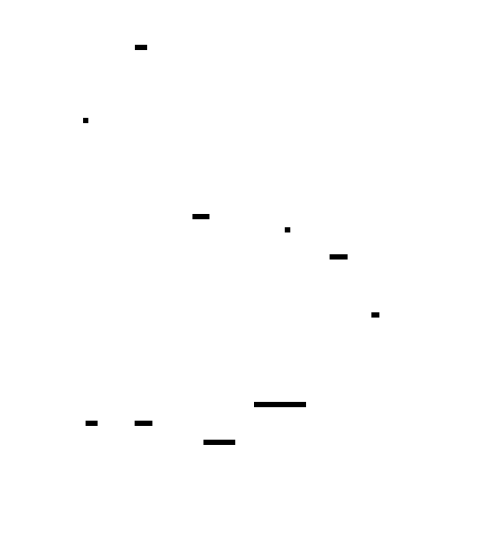

In this milestone you will make those modes explicit, implement all four of them, and wire them together correctly. When you are done, your scanner will correctly handle:
- `"hello // world"` → one `STRING` token (the `//` is inside the string, not a comment)
- `// "hello"` → no tokens (the `"hello"` is inside a comment, not a string)
- `"unterminated` → one `ERROR` token at the opening quote position
- `/* multi\nline */` → no tokens but `line` incremented correctly
---
## The Revelation: Characters Have No Intrinsic Meaning
Here is the assumption that causes all the confusion: **every character has a fixed meaning.** A `/` is division. A `"` starts a string. A `\n` ends a line.
This is false. Characters have *context-dependent* meaning, and the scanner's current mode is that context.
Think about what happens when you type a `/` in different situations:
```python
x = a / b          # SLASH token — division operator
// this is a note  # start of single-line comment — scanner enters comment mode
/* block */        # start of block comment — scanner enters block comment mode
"path/to/file"     # character inside string literal — just the character '/', no meaning
```
Four characters. Four completely different interpretations. The same byte value `0x2F` means four different things depending on which mode the scanner is in.
This is not a quirk. It is the fundamental nature of lexical analysis. A scanner is a [[EXPLAIN:deterministic-finite-automaton-(dfa)|Deterministic Finite Automaton (DFA)]] — a machine that has a finite set of states and transitions between them based on input characters. The "modes" you are about to implement *are* those states. Each mode is a state in the DFA, and each character is a transition event.
The practical implication: you cannot process comments as a preprocessing step before scanning. A preprocessing pass would look for `//` in the raw source and delete everything until the end of the line — but it would also delete `//` *inside string literals*, breaking `"http://example.com"` or `"value // description"`. The scanner must track whether it is inside a string before it can interpret `//` as a comment delimiter.

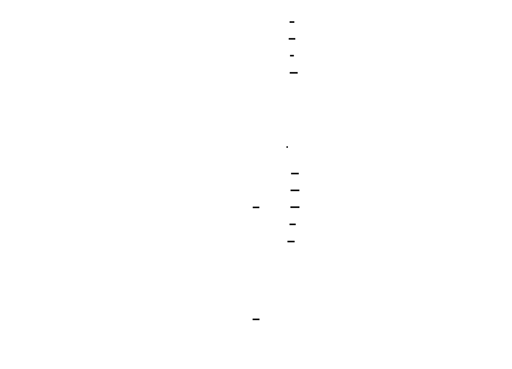

---
## Scanner Modes as Explicit States
Before writing a single line of scanning code, name the modes and describe what each one does:
| Mode | Triggered by | Exit condition | Character interpretation |
|------|-------------|----------------|--------------------------|
| `NORMAL` | Start of input | N/A (default) | Full dispatch: operators, numbers, identifiers |
| `IN_STRING` | `"` in NORMAL mode | Closing `"` (unescaped) or EOF/newline (error) | Almost everything is literal; `\` starts escape |
| `IN_LINE_COMMENT` | `//` in NORMAL mode | `\n` or EOF | Everything is discarded |
| `IN_BLOCK_COMMENT` | `/*` in NORMAL mode | `*/` or EOF (error) | Everything is discarded except `*` + `/` sequence |
Your scanner does not need an explicit `mode` variable. Instead, each mode corresponds to a separate method: `_scan_string()`, `_scan_line_comment()`, `_scan_block_comment()`. The call stack *is* the mode. When `_scan_token()` dispatches to `_scan_string()`, the scanner is "in string mode" for the duration of that call. When `_scan_string()` returns, the scanner is back in normal mode.
This method-per-mode architecture is idiomatic for hand-written scanners. 
> **🔑 Foundation: Lexer modes in ANTLR and Flex**
> 
> ## Lexer Modes in ANTLR and Flex
### What It IS
A lexer (also called a tokenizer or scanner) normally operates as a single flat state machine: it reads characters and matches them against a fixed set of rules to produce tokens. **Lexer modes** extend this by giving the lexer multiple distinct sets of rules that it can switch between at runtime, depending on what it has seen so far.
Think of it like a context-sensitive reading mode. When you're inside a string literal, the character `n` should be read as a literal letter — but after a backslash, `\n` means newline. When you're outside the string, `n` starts an identifier. Modes let the lexer formalize this: "when I enter mode `STRING`, use these rules; when I see the closing `"`, pop back to `DEFAULT` mode."
In **ANTLR**, modes are declared explicitly:
```antlr
lexer grammar MyLexer;
// Default mode rules
STRING_START : '"' -> pushMode(STRING_MODE) ;
ID           : [a-zA-Z]+ ;
mode STRING_MODE;
STRING_CHAR  : ~["\\\n]+ ;
ESCAPE_SEQ   : '\\' . ;
STRING_END   : '"' -> popMode ;
```
ANTLR supports a **mode stack** (`pushMode`/`popMode`), which means you can nest mode transitions and return correctly — useful for things like string interpolation inside strings.
In **Flex** (the C-based lexer generator), the equivalent is called **start conditions**, declared with `%x` (exclusive) or `%s` (inclusive):
```flex
%x STRING_MODE
%%
\"              { BEGIN(STRING_MODE); }
<STRING_MODE>{
  [^"\\]+       { /* accumulate chars */ }
  \\.           { /* handle escape */ }
  \"            { BEGIN(INITIAL); return STRING; }
}
```
An **exclusive** start condition (`%x`) means only rules explicitly tagged for that condition apply when active. An **inclusive** condition (`%s`) means untagged rules still apply too. Exclusive conditions are almost always what you want for subcontexts like strings or comments.
### WHY You Need It Right Now
When building a lexer for a real language, you'll immediately hit constructs that can't be tokenized with a single flat rule set:
- **String literals** containing escape sequences, or even embedded expressions
- **Block comments** that need different rules inside them (no keyword matching, different whitespace handling)
- **Heredocs** or raw strings with custom delimiters
- **Preprocessor directives** that behave differently from normal code
Without modes, you're forced to write extremely complex single-rule regular expressions, or push contextual logic into the parser where it doesn't belong. Modes keep this complexity local and explicit.
### Key Insight
> **A lexer mode is a named scope for tokenization rules.** Entering a mode is like stepping into a room where different laws of physics apply. The character stream is the same; what changes is which rules are listening.
The most important mental discipline: **modes belong to the lexer, not the parser.** If you find yourself passing parser-level context back down to influence tokenization, that's a design smell. The lexer should be able to determine mode transitions purely from the character stream itself. When that's not possible (as in some template languages), you're approaching the boundary where a hand-written lexer may serve you better than a generated one.
 are the same concept made explicit in lexer generator tools: ANTLR lets you declare `mode IN_STRING;` and write rules that only apply in that mode. Your method-dispatch approach achieves the same thing without the generator framework.
The critical invariant: **mode transitions happen at well-defined points, and only in `_scan_token()`**. String mode begins when `_scan_token()` sees `"`. Block comment mode begins when `_scan_token()` sees `/` followed by `*`. No other code ever initiates a mode transition.
---
## Handling the `/` Character: Division vs. Comments
Before writing string scanning, let's handle the `/` character, because it is the entry point for both comment modes and it currently sits ambiguously in `SINGLE_CHAR_TOKENS`.
When `_scan_token()` sees `/`, it faces three possibilities:
1. The next character is `/` → this is a single-line comment
2. The next character is `*` → this is a block comment
3. The next character is anything else → this is the division operator


Remove `/` from `SINGLE_CHAR_TOKENS` and add an explicit case:
```python
if ch == '/':
    if self._match('/'):
        self._scan_line_comment()
    elif self._match('*'):
        self._scan_block_comment()
    else:
        self.tokens.append(self._make_token(TokenType.SLASH))
    return
```
The `_match()` helper from Milestone 2 does the lookahead: if the next character is `/`, consume it and enter line comment mode. If it's `*`, consume it and enter block comment mode. Otherwise, emit the `SLASH` token. This is maximal munch applied to the `/` character — just like `=` prefers `==` over two `=` tokens, `/` prefers the longer comment forms when they apply.
Notice that when the scanner enters `_scan_line_comment()` or `_scan_block_comment()`, it does NOT call `_begin_token()` again. The `start` and `token_start_line/column` were set before `advance()` consumed the `/`. Inside the comment scanner, you are still "in the same token scan" — but you will never emit a token for it (comments produce no output). This is fine: after the comment scanner returns, `scan_tokens()` calls `_begin_token()` at the top of the next loop iteration, resetting `start` to the next real character.
---
## Single-Line Comments: The Simple Case
Single-line comments are the easiest mode to implement. Once the scanner has consumed `//`, everything until the end of the line is comment content. The scanner discards it all.
```python
def _scan_line_comment(self) -> None:
    """
    Called after '//' has been consumed. Advances until end of line or EOF.
    Does NOT consume the newline — the main loop will handle it as whitespace.
    No token is emitted.
    """
    while not self.is_at_end() and self.peek() != '\n':
        self.advance()
    # '\n' is NOT consumed here. The next iteration of the main loop
    # calls _begin_token() and then _scan_token(), which sees '\n' as
    # whitespace and increments self.line correctly.
```
The most important subtlety: **do not consume the `\n`**. If you consume it inside `_scan_line_comment()`, position tracking still works (because `advance()` handles it), but you have changed the structure slightly — the `\n` is now part of the "comment token" rather than handled as whitespace by the main loop. More importantly, some scanner architectures need the newline to be visible to the main loop for other reasons (for example, a language where newlines are significant as statement terminators, like Python). The clean design: comments consume everything *up to* the newline but leave it for the main loop.
Let's trace what happens with `// this is a comment\nx = 1`:
1. Main loop: `_begin_token()` at position 1:1, `_scan_token()` sees `/`
2. `_match('/')` returns True — cursor now at the second `/`'s position
3. `_scan_line_comment()` is called
4. Loop: `peek()` is ` ` (not `\n`, not EOF) — `advance()`, column becomes 4
5. Continue advancing through `t`, `h`, `i`, `s`, ` `, `i`, `s`, ` `, `a`, ` `, `c`, `o`, `m`, `m`, `e`, `n`, `t`
6. `peek()` is `\n` — loop exits
7. `_scan_line_comment()` returns — no token emitted
8. Main loop: `_begin_token()` at position 1:22 (the `\n` character's column)
9. `_scan_token()` sees `\n` (from `advance()`) — whitespace, line becomes 2, column resets to 1
10. Main loop: `_begin_token()` at position 2:1, sees `x` — identifier scanning begins
Result: no tokens for the comment, correct position tracking throughout.
---
## Block Comments: A Sub-FSM Inside the Scanner
Block comments are more complex because they span multiple lines and require detecting a two-character closing delimiter `*/`.

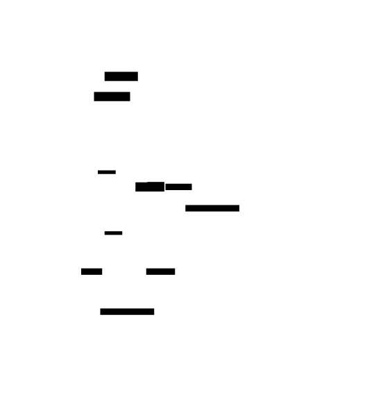

The challenge: when the scanner sees `*` inside a block comment, it does not know whether this is a `*` to discard or the start of `*/` to close the comment. It must peek at the next character. If the next character is `/`, the comment is over. If it's anything else (even another `*`), keep scanning.
This is another application of the `peek()` pattern — lookahead without consuming.
```python
def _scan_block_comment(self) -> None:
    """
    Called after '/*' has been consumed. Advances until '*/' or EOF.
    Updates line/column tracking for newlines inside the comment.
    Emits an ERROR token if EOF is reached before closing '*/'.
    No token is emitted on success.
    """
    while not self.is_at_end():
        if self.peek() == '*':
            self.advance()  # consume the '*'
            if self.peek() == '/':
                self.advance()  # consume the '/'
                return          # comment successfully closed — no token emitted
            # '*' not followed by '/' — just a literal asterisk in the comment
            # continue scanning
        else:
            ch = self.advance()  # consume and discard
            # advance() already handles '\n' → line increment, column reset
    # Reached EOF without finding '*/'
    self.tokens.append(Token(
        type=TokenType.ERROR,
        lexeme=self.source[self.start:self.current],
        line=self.token_start_line,
        column=self.token_start_column,
    ))
```
Walk through the critical cases:
**Input: `/* hello */`**
1. Enter with cursor after `/*`
2. Advance through ` `, `h`, `e`, `l`, `l`, `o`, ` `
3. `peek()` is `*` — advance to consume it. `peek()` is `/` — advance to consume it. Return. No token emitted. ✓
**Input: `/* he*lo */`**
1. Advance through ` `, `h`, `e`
2. `peek()` is `*` — advance. `peek()` is `l` (not `/`) — do NOT close the comment, continue
3. Advance through `l`, `o`, ` `
4. `peek()` is `*` — advance. `peek()` is `/` — close. Return. ✓
**Input: `/* unterminated`**
1. Advance through ` `, `u`, `n`, `t`, ..., `d`
2. `is_at_end()` becomes True — exit the while loop
3. Emit `ERROR` token with position of the opening `/*`. ✓
**The non-nesting rule in action: `/* outer /* inner */ still comment */`**

> **🔑 Foundation: Non-nesting block comments**
> 
> ## Non-Nesting Block Comments: Why `/* */` Doesn't Nest
### What It IS
In C and most C-descended languages, block comments begin with `/*` and end with the **very next** `*/` encountered — regardless of any `/*` that might appear in between. This means the following does **not** work the way a new programmer might expect:
```c
/* outer comment start
   /* inner comment attempt */
   this line is NOT commented out
*/
```
The first `*/` closes the comment, leaving `this line is NOT commented out` exposed as code, and the final `*/` is a syntax error.
This is called **non-nesting** or **flat** block comment syntax. Languages like D, Swift, Kotlin, and Haskell made the opposite choice — their block comments **do** nest, so `{- outer {- inner -} still outer -}` works as expected.
### WHY You Need It Right Now
When you implement a lexer for a language with `/* */` comments, you need to understand what rule your scanner is actually enforcing. The rule is disarmingly simple:
> Start at `/*`. Consume everything. Stop at the first `*/`. Done.
This is recognizable by a **regular expression** (or equivalently, a simple two-state DFA). You don't need a stack, a counter, or any memory of how many `/*` tokens you've seen. Your lexer rule looks roughly like:
```
BlockComment : '/*' .*? '*/' ;   // ANTLR non-greedy match
```
Or in Flex with a mode (since `.` doesn't match newline by default):
```flex
"/*"    { BEGIN(COMMENT); }
<COMMENT>"*/"  { BEGIN(INITIAL); }
<COMMENT>.|\n  { /* discard */ }
```
If you were implementing **nesting** comments, you'd need a counter, which pushes you outside the realm of regular languages into context-free territory — your lexer would need stack-like behavior. Most lexer generators don't support this natively, which is one concrete reason the design choice matters for tooling.
### The Design Decision and Its Consequences
C's non-nesting comments were a pragmatic choice in the early 1970s: simple to specify, simple to implement, no state required. The downside shows up constantly in practice:
**You cannot safely comment out code that already contains block comments.**
```c
/* Temporarily disabling this block:
   int x = foo(/* default value */ 42);
*/
// ^ This doesn't do what you think.
```
The inner `*/` closes the outer comment at `42);`, leaving `*/` as a syntax error. Experienced C programmers learn to use `#if 0 ... #endif` for commenting out large code regions, precisely because of this limitation.
Languages that later introduced nesting block comments (Swift, Kotlin, D) did so specifically to solve this problem — at the cost of slightly more complex lexer implementations.
### Key Insight
> **The non-nesting rule is not a bug — it's what makes block comments regular.** Nesting requires counting depth, which requires memory, which requires moving beyond regular expressions. C chose simplicity of implementation; other languages chose power of expression. Knowing which your target language uses determines whether your comment rule is two lines or twenty.

Trace through `/* outer /* inner */ still comment */`:
1. Enter after consuming `/*`
2. Advance through ` `, `o`, `u`, `t`, `e`, `r`, ` `
3. `peek()` is `/` (not `*`) — advance and discard
4. `peek()` is `*` — consume. `peek()` is ` ` (not `/`) — continue
5. Advance through ` `, `i`, `n`, `n`, `e`, `r`, ` `
6. `peek()` is `*` — consume. `peek()` is `/` — **the comment closes here!**
7. Return. No token emitted.
The text `still comment */` is now scanned in NORMAL mode. ` `, `s`, `t`, `i`, `l`, `l` become an identifier `IDENTIFIER("still")`. Then `comment` becomes `IDENTIFIER("comment")`. Then `*` is `STAR`. Then `/` is `SLASH`. Your parser would reject this as a syntax error — but that is the parser's problem, not the scanner's. The scanner correctly implements the language rule that `/* */` does not nest.
This is a **design decision embedded in the scanner**: if you wanted nesting support (as Rust's `/* */` does not support, but D's `/+ +/` does), you would need an integer counter that increments on `/*` and decrements on `*/`, closing only when the counter reaches zero. But a counter means you can have *unbounded* depth — the scanner needs to remember how deep it is, which is an infinite amount of state. Finite automata have finite state, so they cannot implement arbitrary nesting counting. Nesting comments push the language from regular into 
> **🔑 Foundation: context-free**
> 
> ## Context-Free Languages and Why Nesting Requires Them
### What It IS
Languages in the Chomsky hierarchy are classified by the computational power required to recognize them. The two levels most relevant to programming language implementation are:
- **Regular languages** — recognizable by finite automata (DFAs/NFAs). No memory beyond the current state. This is what regular expressions and lexers handle.
- **Context-free languages (CFLs)** — recognizable by pushdown automata (PDAs), which are finite automata augmented with a **stack**. This is what parsers (LL, LR, Earley, etc.) handle.
A **context-free grammar (CFG)** is a set of production rules of the form:
```
NonTerminal → sequence of terminals and/or NonTerminals
```
The defining property: the left-hand side is always a single non-terminal, and its expansion doesn't depend on surrounding context. An example grammar for balanced parentheses:
```
S → ε          (empty)
S → ( S )      (wrap S in parens)
S → S S        (concatenate two balanced strings)
```
This grammar generates exactly the language of balanced parentheses: `()`, `(())`, `(()())`, etc. Notice that the grammar is **recursive** — `S` appears on both sides of the second rule. That self-reference is what gives CFGs their expressive power over regular grammars.
### WHY Nesting Requires Context-Free Power
Here's the core insight stated precisely: a language is regular if and only if it can be recognized without any memory of history beyond the current state. The moment you need to **match something you saw earlier**, you've exceeded regular power.
Consider the language of balanced parentheses. To verify that a string like `((()))` is valid, you must:
1. Count how many `(` you've seen.
2. When you see `)`, verify there's a matching unclosed `(`.
3. At the end, verify the count is zero.
That count is unbounded — a string can have arbitrarily many nested parentheses. A finite automaton has a fixed, finite number of states, so it cannot count to arbitrary depths. **You cannot write a regular expression that matches only balanced parentheses.** This is provable using the Pumping Lemma for regular languages.
The stack in a pushdown automaton solves this directly: push a marker for each `(`, pop for each `)`, accept if the stack is empty at the end.
This generalizes to all nested structures in programming languages:
| Construct | Why it's context-free |
|-----------|----------------------|
| `{ }` brace blocks | Must match opening to closing, nested arbitrarily deep |
| `if/else` with nested `if/else` | Dangles and nests; requires matching structure |
| Arithmetic `(a + (b * c))` | Parentheses must balance at arbitrary depth |
| Function call arguments | Can contain nested calls |
| XML/HTML tags | Opening tag must match closing tag |
| Nesting block comments | `/*` depth requires a counter |
### Regular vs. Context-Free: The Practical Boundary
This hierarchy explains why language processing is split into two phases:
**Lexer (regular):** Tokenizes keywords, identifiers, literals, operators. These are all flat patterns — `[a-zA-Z_][a-zA-Z0-9_]*` for identifiers, `[0-9]+` for integers. No nesting, no matching, no memory needed.
**Parser (context-free):** Takes the token stream and recognizes structure — expression trees, statement blocks, function definitions. All the nesting and matching happens here.
When someone asks "why can't I do X with a regex?" — the answer is almost always: "because X involves nesting or counting, which requires context-free power."
A concrete example where this confusion strikes: matching HTML with regex. HTML tags can nest (`<div><p>text</p></div>`), so determining whether a tag is properly closed requires stack-based matching. Regex cannot do this in general. This isn't a limitation of any particular regex engine — it's a fundamental theorem.
### Context-Free Doesn't Mean All Parsing Problems Are Solved
It's worth knowing that real programming languages often require more than pure context-free recognition. Consider:
- **Type checking** — knowing whether `x` is a valid expression often requires a symbol table (context-sensitive)
- **Ambiguity resolution** — some CFGs are ambiguous (`if a then if b then c else d`), requiring precedence rules or grammar restructuring
- **Semantic constraints** — "a variable must be declared before use" is not context-free
Parsers built on CFGs handle **syntactic structure**. Semantic analysis, which enforces meaning-level constraints, is typically a separate pass. The CFG gets you a parse tree; everything after that is interpretation.
### Key Insight
> **Nesting requires a stack; stacks are the distinguishing feature of context-free languages over regular ones.** Every time a programming language feature involves "remember what you opened, and match it when you close," you've crossed from the lexer's territory into the parser's. The practical takeaway: if you're fighting to express something nested or balanced as a regex, stop — you've hit a mathematical wall. Write a grammar rule instead.
 — requiring a push-down automaton, not a DFA. This is a real theoretical boundary, not just a complexity complaint.
---
## Multi-Line Comments and Line Tracking
The single most important invariant to preserve inside `_scan_block_comment()`: every `\n` inside the comment must increment `self.line` and reset `self.column`. If you forget this, every token *after* the comment will have wrong line numbers.
Good news: you do not have to think about this separately. `advance()` handles it unconditionally. Since `_scan_block_comment()` calls `self.advance()` for every character it consumes, and `advance()` always updates position tracking, multi-line comments are handled automatically.
Let's verify with `/* line1\nline2 */`:
```
Before comment:    line=1, column=3  (cursor after '/*')
advance ' '        line=1, column=4
advance 'l'        line=1, column=5
advance 'i'        line=1, column=6
advance 'n'        line=1, column=7
advance 'e'        line=1, column=8
advance '1'        line=1, column=9
advance '\n'       line=2, column=1   ← line tracking updated inside comment!
advance 'l'        line=2, column=2
advance 'i'        line=2, column=3
advance 'n'        line=2, column=4
advance 'e'        line=2, column=5
advance '2'        line=2, column=6
advance ' '        line=2, column=7
peek '*' → consume → line=2, column=8
peek '/' → consume → line=2, column=9
return
After comment:     line=2, column=9
```
The token after the comment begins at position `2:9` (or wherever the next non-comment character is). This is correct. If you had skipped calling `advance()` for comment characters — say, by doing `self.current += 1` directly — you would bypass position tracking and everything after the comment would have wrong positions.
This is why the rule "position tracking happens only inside `advance()`" is so important. It means any code that consumes characters via `advance()` gets correct tracking for free, regardless of what mode the scanner is in.
---
## String Literal Scanning: The Sub-FSM
String scanning is the most complex mode because characters inside a string have two possible interpretations: literal (include this character in the string value) or escape-start (this backslash changes how the next character is interpreted).


The FSM for string scanning has three states:
1. **IN_STRING**: reading normal string content
2. **IN_ESCAPE**: just consumed a `\`, the next character is the escape code
3. **DONE**: consumed the closing `"` — return the token
The transition rules:
- In **IN_STRING**: `"` → DONE, `\` → IN_ESCAPE, `\n` → error (unterminated), EOF → error (unterminated), anything else → stay in IN_STRING (consume the character as content)
- In **IN_ESCAPE**: `n`, `t`, `r`, `"`, `\` → emit the interpreted character, return to IN_STRING; anything else → error for unknown escape, return to IN_STRING
Here is the implementation:
```python
def _scan_string(self) -> None:
    """
    Called after the opening '"' has been consumed.
    Scans string content with escape sequence interpretation.
    Emits a STRING token on success, ERROR token on unterminated string.
    The STRING token's lexeme is the RAW source text including quotes
    and backslashes, e.g. '"hello\\nworld"'. Conversion to actual
    characters (\n → newline) is left to a later compilation stage.
    """
    while not self.is_at_end():
        ch = self.advance()
        if ch == '"':
            # Closing quote — string complete
            self.tokens.append(self._make_token(TokenType.STRING))
            return
        if ch == '\n':
            # Newline inside string — unterminated (our language disallows
            # multi-line string literals without explicit continuation)
            self.tokens.append(Token(
                type=TokenType.ERROR,
                lexeme=self.source[self.start:self.current],
                line=self.token_start_line,
                column=self.token_start_column,
            ))
            return
        if ch == '\\':
            # Escape sequence — consume the next character as the escape code
            if self.is_at_end():
                # Backslash at end of input: unterminated
                self.tokens.append(Token(
                    type=TokenType.ERROR,
                    lexeme=self.source[self.start:self.current],
                    line=self.token_start_line,
                    column=self.token_start_column,
                ))
                return
            escape_char = self.advance()
            if escape_char not in ('n', 't', 'r', '"', '\\'):
                # Unknown escape sequence — emit error but continue scanning
                # This implements error recovery: we flag the bad escape but
                # keep scanning to find the closing quote and emit any further
                # errors in the same input.
                self.tokens.append(Token(
                    type=TokenType.ERROR,
                    lexeme='\\' + escape_char,
                    line=self.line,         # position of the escape_char, not string start
                    column=self.column - 1, # column of the '\'
                ))
                # Continue scanning — do NOT return. The string is still open.
        # If ch is any other character (including valid escaped chars), continue
    # Loop exited because is_at_end() — unterminated string
    self.tokens.append(Token(
        type=TokenType.ERROR,
        lexeme=self.source[self.start:self.current],
        line=self.token_start_line,
        column=self.token_start_column,
    ))
```
And in `_scan_token()`, add the dispatch for `"`:
```python
if ch == '"':
    self._scan_string()
    return
```


---
## Escape Sequences: A Two-Character Protocol

> **🔑 Foundation: Escape sequences**
> 
> ## Escape Sequences: The Backslash as a Control Character
### What It IS
Inside a string literal, every character is interpreted according to a simple default rule: it represents itself. The letter `a` means the character `a`. The digit `3` means the digit `3`. But some characters can't be represented directly — either because they're invisible (newline, tab, null byte), because they'd be ambiguous (the quote character that delimits the string), or because they're non-printable control codes.
**Escape sequences** solve this with a two-character protocol: a designated **escape character** (in most languages, the backslash `\`) followed by one or more characters that together encode a meaning different from their literal values.
Common examples:
| Sequence | Meaning | Why it can't be literal |
|----------|---------|------------------------|
| `\n` | Newline (LF, U+000A) | Would end the logical line |
| `\t` | Tab (U+0009) | Often ambiguous with spaces |
| `\\` | Literal backslash | Would start another escape |
| `\"` | Literal double-quote | Would close the string |
| `\0` | Null byte (U+0000) | Often a string terminator in C |
| `\x41` | Character with hex code 41 (= `A`) | Arbitrary byte encoding |
| `\u0041` | Unicode code point U+0041 (= `A`) | Arbitrary Unicode encoding |
The backslash is acting as a **meta-character** — it signals "don't interpret the next character at face value; instead, look up what this sequence means as a unit."
### WHY You Need It Right Now
When you write a lexer rule for string literals, you cannot simply scan until the next `"`. You must handle escape sequences, because `"\""` is a valid one-character string containing a double-quote, not a zero-character string followed by stray characters.
The lexer's string rule must be something like:
```
StringLiteral : '"' StringChar* '"' ;
StringChar    : ~["\\\n]          // any char except quote, backslash, newline
              | '\\' .            // backslash followed by ANY character
              ;
```
That second alternative — `'\\' .` — is the escape sequence rule. It consumes two characters as a single unit, preventing the backslash from being misread and preventing the following character from being misinterpreted. The dot (`.`) here means "any single character," so the lexer accepts `\n`, `\t`, `\\`, `\"`, and anything else after a backslash — even invalid escapes like `\q`. Validity checking of the escape value is typically left to a semantic action, not the lexer grammar itself.
### The Two-Character Protocol in Detail
The protocol has exactly two participants and a simple contract:
1. **Trigger character** (`\`): "I am not a character to include in output. I am a signal that the next character(s) have special meaning."
2. **Payload character(s)**: Interpreted according to a lookup table defined by the language spec.
The edge case that every lexer must handle: **the escaped escape character** (`\\`). Without this, there would be no way to include a literal backslash in a string. The rule is: when you see `\\`, the first backslash is the trigger, the second is the payload — and the payload means "literal backslash." The processor then moves past both characters and is no longer in "escape mode."
This is why `"C:\\Users\\Alice"` in a C or Java string literal represents the Windows path `C:\Users\Alice`. Each `\\` is one actual backslash.
### Design Variations Across Languages
Not all languages use backslash or use it the same way:
- **SQL** uses `''` (doubling the delimiter) rather than backslash: `'it''s fine'`
- **Python** offers raw strings (`r"\n"`) where backslash is literal, for regex patterns
- **Go** distinguishes interpreted string literals (`"..."`) from raw string literals (`` `...` ``) using backtick delimiters
- **Rust** allows `\u{1F600}` for Unicode, with the braces making the hex length flexible
- **JavaScript** has `\uXXXX` and also `\u{XXXXX}` for code points beyond the BMP
When implementing a lexer, you need to know exactly which escape sequences your target language defines and whether unrecognized escapes are errors or pass-throughs.
### Key Insight
> **The backslash doesn't escape a character — it escapes your interpretation of it.** The character is still there in the source. The backslash is a runtime instruction to the lexer: "suspend your normal reading rules for the next unit and apply the escape lookup table instead." This is why `\\` works: the first backslash escapes the second, meaning "read this next `\` as data, not as a trigger." Once you internalize that escape sequences are a tiny two-token protocol layered on top of your character stream, writing the lexer rules for them becomes straightforward.

The escape sequences your scanner must handle:
| Escape in source | Meaning | Actual character |
|-----------------|---------|-----------------|
| `\n` | newline | ASCII 0x0A (LF) |
| `\t` | horizontal tab | ASCII 0x09 |
| `\r` | carriage return | ASCII 0x0D |
| `\"` | literal double quote | `"` (0x22) |
| `\\` | literal backslash | `\` (0x5C) |
The critical design question: **does your scanner interpret escape sequences, or store them raw?**
Your scanner stores them raw. The lexeme of `"hello\nworld"` is the 14-character string `"hello\nworld"` — the backslash and `n` are two separate characters in the lexeme, not the newline character. The conversion from `\n` (two characters in source) to `\n` (one character, ASCII 0x0A) is done by a later stage — typically the parser or the AST evaluator — when it creates a string value from the string token.
This is the right choice for a scanner. The scanner's job is *recognition* (is this a valid string token?) not *interpretation* (what value does this string have?). Keeping raw lexemes means:
1. Error messages can reference the exact source text the programmer wrote
2. The scanner is simpler (no string buffer to build)
3. A later stage can choose different interpretation semantics (raw strings, byte strings, etc.)
The check `if escape_char not in ('n', 't', 'r', '"', '\\'):` enforces the language specification: only these five escape sequences are valid. An unrecognized escape like `\q` or `\x41` produces an `ERROR` token. This is again a language design decision: some languages (C, Python) support hex escapes like `\x41` for the character `A`. Your language keeps it minimal.
Notice the error-recovery behavior: when an unknown escape is found, the scanner emits an `ERROR` token for just the two-character escape sequence, then *continues* scanning the rest of the string. This means a string like `"bad\qescape"` produces:
- `ERROR("\\q")` at the position of the `\`
- `STRING('"bad\\qescape"')` ... wait, no. Let's think more carefully.
Actually, re-examine the flow. After emitting the error for the unknown escape, the loop continues. The next character processed is the character after `\q`, which is `e`. Eventually the scanner sees the closing `"` and emits a `STRING` token. So the output is:
- `ERROR("\\q")` — the invalid escape
- `STRING('"bad\\qescape"')` — the full string literal including the bad escape
This is aggressive error recovery: the scanner reports the escape error *and* still emits the string token. The parser downstream can then decide whether to treat a string containing an invalid escape as a recoverable warning or a fatal error. The scanner does not make that call — it just flags the problem and keeps going.
> 🔭 **Deep Dive**: Error recovery strategies in lexers and parsers are deeply studied. For the classic treatment, see *Crafting Interpreters* Chapter 5 ("Representing Code") and the error section. For a more formal analysis of how Clang's approach differs from GCC's (and why Clang wins for IDE use cases), see the Clang documentation on "Expressive Diagnostics."
---
## The Unterminated String: Error at the Opening Quote
When a string reaches EOF or a newline without a closing `"`, the error token must have the **position of the opening quote**, not the current position. This is what the `token_start_line` / `token_start_column` snapshot captures.
Here is why this matters for the user experience. Consider:
```
1: x = "hello
2: y = 42
```
If the error points to line 2, column 5 (where the scanner realized something was wrong), the developer looks at `42` and is confused. The error should say "line 1, column 5: unterminated string literal" — pointing at the `"` where the string began. That's where the *mistake* is.
The `token_start_line` and `token_start_column` fields, set by `_begin_token()` before the `"` was consumed, contain exactly this information. Always use them for unterminated construct errors, not the current position.
Why does a newline terminate a string? Because allowing multi-line string literals without explicit syntax creates a dangerous ambiguity: if the programmer forgets a closing quote, every subsequent line of code becomes part of the string, and the scanner might not find the closing quote until much later in the file (or never). The error would be reported far from the actual mistake. Disallowing newlines inside strings means the error is always detected on the same line as the opening quote, which is close to where the fix needs to happen. Languages like Python that support multi-line strings use explicit triple-quote syntax (`"""..."""`) to make the intent unambiguous.
---
## Putting the `/` Decision Tree Together
Now that you understand all the modes, here is the complete `/` handling in `_scan_token()`, showing how a single character fans out into four distinct behaviors:
```python
if ch == '/':
    if self._match('/'):
        # Mode: line comment — consume until '\n' or EOF, emit nothing
        self._scan_line_comment()
    elif self._match('*'):
        # Mode: block comment — consume until '*/' or EOF
        # Emits ERROR if unterminated
        self._scan_block_comment()
    else:
        # Regular division operator
        self.tokens.append(self._make_token(TokenType.SLASH))
    return
```
This three-way branch is the cleanest way to express the decision: one character consumed (`/`), look one character ahead, dispatch to the appropriate mode. The `_match()` helper from Milestone 2 handles the lookahead-and-consume atomically.
The ordering matters here. `_match('/')` is checked before `_match('*')` — it does not matter which order you check them (they are mutually exclusive since the next character is either `/` or `*` or neither, not both) — but checking them in some explicit order prevents the alternative branch from running when the first succeeds.
---
## The Complete M3 Scanner Changes
Here are all additions to your scanner for Milestone 3. Add these methods to your `Scanner` class and update `_scan_token()`:
```python
# ── Add to Scanner class ──────────────────────────────────────────────────────
def _scan_string(self) -> None:
    """
    Scan a string literal. Called after opening '"' has been consumed.
    Handles escape sequences: \\n, \\t, \\r, \\", \\\\.
    Stores the raw lexeme (including quotes and backslashes).
    Emits STRING on success, ERROR on unterminated string or unknown escape.
    """
    while not self.is_at_end():
        ch = self.advance()
        if ch == '"':
            # Successfully closed
            self.tokens.append(self._make_token(TokenType.STRING))
            return
        if ch == '\n':
            # Newlines terminate strings (no implicit continuation)
            self.tokens.append(Token(
                type=TokenType.ERROR,
                lexeme=self.source[self.start:self.current],
                line=self.token_start_line,
                column=self.token_start_column,
            ))
            return
        if ch == '\\':
            # Escape sequence: the next character determines the escaped value
            if self.is_at_end():
                self.tokens.append(Token(
                    type=TokenType.ERROR,
                    lexeme=self.source[self.start:self.current],
                    line=self.token_start_line,
                    column=self.token_start_column,
                ))
                return
            escape_char = self.advance()
            valid_escapes = {'n', 't', 'r', '"', '\\'}
            if escape_char not in valid_escapes:
                # Report the bad escape but continue scanning the string
                # (error recovery: find the closing quote before giving up)
                self.tokens.append(Token(
                    type=TokenType.ERROR,
                    lexeme='\\' + escape_char,
                    line=self.token_start_line,
                    column=self.token_start_column,
                ))
                # Do NOT return — keep scanning for the closing quote
    # is_at_end() — unterminated string reaching EOF
    self.tokens.append(Token(
        type=TokenType.ERROR,
        lexeme=self.source[self.start:self.current],
        line=self.token_start_line,
        column=self.token_start_column,
    ))
def _scan_line_comment(self) -> None:
    """
    Scan a single-line comment. Called after '//' has been consumed.
    Advances until end of line or EOF. Does NOT consume the newline.
    Emits no token.
    """
    while not self.is_at_end() and self.peek() != '\n':
        self.advance()
    # Leave '\n' for the main loop to handle as whitespace
def _scan_block_comment(self) -> None:
    """
    Scan a block comment. Called after '/*' has been consumed.
    Advances until '*/' or EOF. Updates line tracking for embedded newlines.
    Emits ERROR if EOF is reached before closing '*/'.
    Emits no token on success. Does NOT support nesting.
    """
    while not self.is_at_end():
        if self.peek() == '*':
            self.advance()      # consume '*'
            if self.peek() == '/':
                self.advance()  # consume '/'
                return          # comment closed successfully
            # '*' not followed by '/' — just a literal asterisk, continue
        else:
            self.advance()      # consume and discard; advance() tracks '\n'
    # EOF before '*/' — unterminated block comment
    self.tokens.append(Token(
        type=TokenType.ERROR,
        lexeme=self.source[self.start:self.current],
        line=self.token_start_line,
        column=self.token_start_column,
    ))
```
And the updated `_scan_token()` with string and comment dispatch integrated:
```python
def _scan_token(self) -> None:
    ch = self.advance()
    # ── Whitespace ──────────────────────────────────────────────────────────
    if ch in WHITESPACE:
        return
    # ── Two-character operators ──────────────────────────────────────────────
    if ch == '=':
        self.tokens.append(self._make_token(
            TokenType.EQUAL_EQUAL if self._match('=') else TokenType.ASSIGN
        ))
        return
    if ch == '!':
        if self._match('='):
            self.tokens.append(self._make_token(TokenType.BANG_EQUAL))
        else:
            self.tokens.append(self._error_token("Unexpected '!' without '='"))
        return
    if ch == '<':
        self.tokens.append(self._make_token(
            TokenType.LESS_EQUAL if self._match('=') else TokenType.LESS
        ))
        return
    if ch == '>':
        self.tokens.append(self._make_token(
            TokenType.GREATER_EQUAL if self._match('=') else TokenType.GREATER
        ))
        return
    # ── Division or comment ──────────────────────────────────────────────────
    if ch == '/':
        if self._match('/'):
            self._scan_line_comment()
        elif self._match('*'):
            self._scan_block_comment()
        else:
            self.tokens.append(self._make_token(TokenType.SLASH))
        return
    # ── String literals ──────────────────────────────────────────────────────
    if ch == '"':
        self._scan_string()
        return
    # ── Single-character tokens ──────────────────────────────────────────────
    if ch in SINGLE_CHAR_TOKENS:
        self.tokens.append(self._make_token(SINGLE_CHAR_TOKENS[ch]))
        return
    # ── Numbers ──────────────────────────────────────────────────────────────
    if ch.isdigit():
        self._scan_number()
        return
    # ── Identifiers and keywords ─────────────────────────────────────────────
    if ch.isalpha() or ch == '_':
        self._scan_identifier()
        return
    # ── Unrecognized character ───────────────────────────────────────────────
    self.tokens.append(self._error_token(f"Unexpected character: {ch!r}"))
```
---
## Testing Strings and Comments Systematically
Good tests isolate each behavior and verify both the success path and every error path.
```python
import unittest
from scanner import Scanner, TokenType, Token
class TestStringLiterals(unittest.TestCase):
    def _tokens(self, source: str) -> list[Token]:
        return Scanner(source).scan_tokens()
    def _single(self, source: str) -> Token:
        return self._tokens(source)[0]
    def test_simple_string(self):
        t = self._single('"hello"')
        self.assertEqual(t.type, TokenType.STRING)
        self.assertEqual(t.lexeme, '"hello"')
    def test_empty_string(self):
        t = self._single('""')
        self.assertEqual(t.type, TokenType.STRING)
        self.assertEqual(t.lexeme, '""')
    def test_string_with_spaces(self):
        t = self._single('"hello world"')
        self.assertEqual(t.type, TokenType.STRING)
        self.assertEqual(t.lexeme, '"hello world"')
    def test_escape_newline(self):
        t = self._single('"hello\\nworld"')
        self.assertEqual(t.type, TokenType.STRING)
        self.assertIn('\\n', t.lexeme)  # raw backslash-n, not actual newline
    def test_escape_tab(self):
        t = self._single('"\\t"')
        self.assertEqual(t.type, TokenType.STRING)
    def test_escape_quote(self):
        t = self._single('"say \\"hello\\""')
        self.assertEqual(t.type, TokenType.STRING)
    def test_escape_backslash(self):
        t = self._single('"\\\\"')
        self.assertEqual(t.type, TokenType.STRING)
    def test_comment_inside_string_not_treated_as_comment(self):
        """'\"hello // world\"' must produce a single STRING token."""
        tokens = self._tokens('"hello // world"')
        non_eof = [t for t in tokens if t.type != TokenType.EOF]
        self.assertEqual(len(non_eof), 1)
        self.assertEqual(non_eof[0].type, TokenType.STRING)
        self.assertEqual(non_eof[0].lexeme, '"hello // world"')
    def test_block_comment_inside_string(self):
        """'\"a /* b */ c\"' must be a single STRING token."""
        tokens = self._tokens('"a /* b */ c"')
        non_eof = [t for t in tokens if t.type != TokenType.EOF]
        self.assertEqual(len(non_eof), 1)
        self.assertEqual(non_eof[0].type, TokenType.STRING)
    def test_unterminated_string_eof(self):
        """No closing quote → ERROR at opening quote position."""
        t = self._single('"unterminated')
        self.assertEqual(t.type, TokenType.ERROR)
        self.assertEqual(t.line, 1)
        self.assertEqual(t.column, 1)
    def test_unterminated_string_newline(self):
        """Newline inside string → ERROR at opening quote position."""
        tokens = self._tokens('"line1\nline2"')
        self.assertEqual(tokens[0].type, TokenType.ERROR)
        self.assertEqual(tokens[0].line, 1)
        self.assertEqual(tokens[0].column, 1)
        # Scanning continues after the error — 'line2"' produces more tokens
        non_eof = [t for t in tokens if t.type != TokenType.EOF]
        self.assertGreater(len(non_eof), 1)
    def test_string_position(self):
        """String token position is the opening quote."""
        tokens = self._tokens('   "hello"')
        t = tokens[0]
        self.assertEqual(t.type, TokenType.STRING)
        self.assertEqual(t.line, 1)
        self.assertEqual(t.column, 4)  # the '"' is at column 4
    def test_unknown_escape_produces_error_and_continues(self):
        """'\"bad\\qescape\"' → ERROR for \\q, then STRING for the full literal."""
        tokens = self._tokens('"bad\\qescape"')
        types = [t.type for t in tokens if t.type != TokenType.EOF]
        self.assertIn(TokenType.ERROR, types)
        # The string itself should still be recognized (error recovery)
        self.assertIn(TokenType.STRING, types)
    def test_backslash_at_end_of_input(self):
        """'\"hello\\' at EOF → ERROR (unterminated due to backslash)."""
        t = self._single('"hello\\')
        self.assertEqual(t.type, TokenType.ERROR)
class TestLineComments(unittest.TestCase):
    def _tokens(self, source: str) -> list[Token]:
        return [t for t in Scanner(source).scan_tokens() if t.type != TokenType.EOF]
    def test_line_comment_produces_no_tokens(self):
        """'// this is a comment' → no tokens."""
        self.assertEqual(self._tokens('// this is a comment'), [])
    def test_line_comment_does_not_consume_newline(self):
        """Token after comment on next line has correct line number."""
        tokens = Scanner('// comment\nx').scan_tokens()
        non_eof = [t for t in tokens if t.type != TokenType.EOF]
        self.assertEqual(len(non_eof), 1)
        self.assertEqual(non_eof[0].type, TokenType.IDENTIFIER)
        self.assertEqual(non_eof[0].line, 2)
        self.assertEqual(non_eof[0].column, 1)
    def test_code_before_line_comment(self):
        """'x // comment' → only IDENTIFIER token."""
        self.assertEqual(len(self._tokens('x // comment')), 1)
        self.assertEqual(self._tokens('x // comment')[0].type, TokenType.IDENTIFIER)
    def test_line_comment_then_code_then_comment(self):
        """Multiple lines with interleaved comments."""
        source = '// first\nx\n// second\ny'
        tokens = [t for t in Scanner(source).scan_tokens() if t.type != TokenType.EOF]
        self.assertEqual(len(tokens), 2)
        self.assertEqual(tokens[0].lexeme, 'x')
        self.assertEqual(tokens[0].line, 2)
        self.assertEqual(tokens[1].lexeme, 'y')
        self.assertEqual(tokens[1].line, 4)
    def test_division_not_confused_with_comment(self):
        """'a / b' must produce IDENTIFIER + SLASH + IDENTIFIER."""
        tokens = self._tokens('a / b')
        self.assertEqual(tokens[1].type, TokenType.SLASH)
    def test_division_immediately_before_slash(self):
        """'a/b' must produce IDENTIFIER + SLASH + IDENTIFIER."""
        tokens = self._tokens('a/b')
        self.assertEqual(tokens[1].type, TokenType.SLASH)
class TestBlockComments(unittest.TestCase):
    def _tokens(self, source: str) -> list[Token]:
        return [t for t in Scanner(source).scan_tokens() if t.type != TokenType.EOF]
    def test_block_comment_produces_no_tokens(self):
        """'/* comment */' → no tokens."""
        self.assertEqual(self._tokens('/* comment */'), [])
    def test_block_comment_with_internal_asterisk(self):
        """'/* he*lo */' → no tokens (asterisk inside comment is not special)."""
        self.assertEqual(self._tokens('/* he*lo */'), [])
    def test_multi_line_block_comment(self):
        """Block comment spanning multiple lines → no tokens, correct line tracking."""
        source = '/* line1\nline2\nline3 */x'
        tokens = self._tokens(source)
        self.assertEqual(len(tokens), 1)
        self.assertEqual(tokens[0].type, TokenType.IDENTIFIER)
        self.assertEqual(tokens[0].line, 3)  # 'x' is on line 3
    def test_block_comment_does_not_nest(self):
        """'/* outer /* inner */ rest */' closes at first '*/'."""
        source = '/* outer /* inner */ rest */'
        # After first '*/', scanner exits comment mode.
        # 'rest' and '*/' are scanned as regular tokens.
        tokens = self._tokens(source)
        # 'rest' → IDENTIFIER, '*' → STAR, '/' → SLASH
        self.assertGreater(len(tokens), 0)
        self.assertEqual(tokens[0].type, TokenType.IDENTIFIER)
        self.assertEqual(tokens[0].lexeme, 'rest')
    def test_unterminated_block_comment(self):
        """'/* no closing' → ERROR at position of '/*'."""
        tokens = self._tokens('/* no closing')
        self.assertEqual(len(tokens), 1)
        self.assertEqual(tokens[0].type, TokenType.ERROR)
        self.assertEqual(tokens[0].line, 1)
        self.assertEqual(tokens[0].column, 1)
    def test_unterminated_multiline_block_comment_error_position(self):
        """Error position is the opening '/*', not the EOF position."""
        source = 'x\n/* open\nno close'
        tokens = Scanner(source).scan_tokens()
        errors = [t for t in tokens if t.type == TokenType.ERROR]
        self.assertEqual(len(errors), 1)
        self.assertEqual(errors[0].line, 2)   # '/*' is on line 2
        self.assertEqual(errors[0].column, 1)  # at column 1
    def test_line_numbers_after_block_comment(self):
        """Tokens after multi-line block comment have correct line numbers."""
        source = '/*\n\n\n*/x'  # comment spans 4 lines (opening to closing)
        tokens = self._tokens(source)
        self.assertEqual(tokens[0].line, 4)
    def test_string_with_comment_chars_not_comment(self):
        """'\"/* not a comment */\"' is a STRING, not a block comment."""
        tokens = self._tokens('"/* not a comment */"')
        self.assertEqual(len(tokens), 1)
        self.assertEqual(tokens[0].type, TokenType.STRING)
```
---
## Pitfall Compendium: What Will Bite You
### 1. Consuming the Closing `"` as Part of the Next Token
**Symptom:** The scanner emits a `STRING` token and then immediately emits an `ERROR` or unexpected token for the character after the string.
**Root cause:** The closing `"` is consumed inside `_scan_string()` (correct), but `_current_lexeme()` uses `self.source[self.start:self.current]`. Since `current` points to the character *after* what was last consumed, the closing `"` is included in the lexeme — which is correct. The next call to `_begin_token()` sets `start = self.current`, pointing to the character after the closing `"`. This is fine. If you see a problem here, double-check that you are calling `_make_token()` after consuming the `"`, not before.
### 2. `\\` at End of String: `"hello\\` vs. `"hello\\"`
Consider the input `"hello\\"`. This is a valid string: `hello` followed by a single escaped backslash. The scanner sees:
- `"` — enter string mode
- `h`, `e`, `l`, `l`, `o` — string content
- `\` — start of escape
- `\` — the escape character is `\`, which is in `valid_escapes` — valid escape, continue
- `"` — closing quote. Emit `STRING`. ✓
Now consider `"hello\"`. This is an *unterminated* string: the `\"` is an escaped quote, not the closing quote. The scanner sees:
- `"` — enter string mode
- `h`, `e`, `l`, `l`, `o` — content
- `\` — start of escape
- `"` — escape character `"`, which is in `valid_escapes` — valid escape, continue scanning
- EOF — unterminated. Emit `ERROR`. ✓
This is correct behavior because the escape `\"` represents a literal `"` inside the string — it is not the closing delimiter. Only an *unescaped* `"` closes the string. Your implementation handles this correctly because the `\\` check consumes the escape character via `self.advance()` before returning to the main string loop, so the `"` after a `\` never gets a chance to trigger the closing quote check.
### 3. Block Comment: Asterisk Immediately Before Another Asterisk
**Input:** `/** hello **/`
Trace:
1. Enter after `/*`
2. `peek()` is `*` — consume. `peek()` is ` ` (not `/`) — continue. 
3. Advance through ` `, `h`, `e`, `l`, `l`, `o`, ` `
4. `peek()` is `*` — consume. `peek()` is `*` (not `/`) — continue
5. `peek()` is `*` — consume. `peek()` is `/` — close! Return. ✓
The second `*` in `**` is checked again on the next iteration (step 5 above). Wait — is it? Let's re-examine. In step 4, we consumed the first `*` of `**`. Then `peek()` is the second `*`, which is not `/`. So we *do not close* and fall through the `if self.peek() == '*'` block to the outer loop. The outer loop checks `self.peek() == '*'` again. `peek()` is still the second `*` (it was not consumed in step 4 beyond the first `*`). So step 5 correctly captures the second `*` and then sees `/`.
Wait, step 4 more carefully: inside the `if self.peek() == '*':` branch, we consume the `*`. Then if `peek()` is not `/`, we do NOT consume it. We fall through to the end of the while loop body and go back to check `self.is_at_end()` again. The next iteration of the outer while loop checks `self.peek() == '*'` for the second `*`. Yes — this is correct. Each `*` is evaluated at the top of the while loop. The double-asterisk case `**` is handled by two iterations of the outer loop.
### 4. Line Comment Starting With `//!` or `///`
Your scanner handles `//` followed by anything as a line comment. `//!` (Rust-style inner doc comment) and `///` (Rust-style outer doc comment) are therefore treated as regular comments by your scanner. If you wanted to distinguish doc comments from regular comments, you would need a third check: after consuming `//`, peek at the next character and emit a `DOC_COMMENT` token type if it's `!` or another `/`. For now, all `//...` comments are discarded.
### 5. Block Comment: Single `*` After Opening `/*`
**Input: `/**/ rest`** (comment-open then immediately comment-close with one `*` between)
This is `/*` then `*/`. One `*` inside.
Trace:
1. Enter after `/*`
2. `peek()` is `*` — consume it. `peek()` is `/` — close! Return. ✓
The content of this comment is effectively empty. The single `*` between `/*` and `*/` is consumed and recognized as the start of `*/`. This is correct for a non-nesting comment scanner.
### 6. Position After Consuming Comment Characters
**Symptom:** Token after a block comment has wrong column but correct line.
**Root cause:** Usually caused by the `_scan_block_comment()` loop using `self.current += 1` directly instead of `self.advance()`. Since `advance()` is the *only* place column is updated, bypassing it leaves `self.column` stuck at the value it had before the comment started.
**Fix:** Always use `self.advance()` inside `_scan_block_comment()`. Since your implementation already does this (the `else: self.advance()` branch), this pitfall is avoided by design. But if you ever "optimize" the comment scanner by skipping `advance()` for performance (it's marginally faster to do raw index arithmetic), you will introduce this bug.
---
## Integration: A Program With Everything
Here is a complete integration test that exercises all M3 features together:
```python
def test_m3_complete_integration():
    source = '''
// Compute the area of a rectangle
/* This function
   multiplies width by height */
width = 10;
height = "twenty"; // height as a string
area = width * height; // this line has operators
    '''
    tokens = Scanner(source).scan_tokens()
    non_eof = [t for t in tokens if t.type != TokenType.EOF]
    # Verify: no comment content appears as tokens
    lexemes = [t.lexeme for t in non_eof]
    assert 'Compute' not in lexemes
    assert 'multiplies' not in lexemes
    # Verify: string literal with comment inside is a STRING token
    string_tokens = [t for t in non_eof if t.type == TokenType.STRING]
    assert len(string_tokens) == 1
    assert string_tokens[0].lexeme == '"twenty"'
    # Verify: line tracking after multi-line comment
    # 'width' appears on line 5 (1 blank, 1 line-comment, 2-line block comment, then line 5)
    width_token = next(t for t in non_eof if t.lexeme == 'width')
    assert width_token.line == 5, f"Expected line 5, got {width_token.line}"
    # Verify: no ERROR tokens in clean input
    errors = [t for t in non_eof if t.type == TokenType.ERROR]
    assert errors == [], f"Unexpected errors: {errors}"
def test_m3_unterminated_string_then_valid_code():
    """Error recovery: scanner continues after unterminated string."""
    source = '"unterminated\nx = 42;'
    tokens = Scanner(source).scan_tokens()
    errors = [t for t in tokens if t.type == TokenType.ERROR]
    assert len(errors) >= 1
    assert errors[0].line == 1
    assert errors[0].column == 1
    # Code after the bad string is still tokenized
    numbers = [t for t in tokens if t.type == TokenType.NUMBER]
    assert len(numbers) == 1
    assert numbers[0].lexeme == '42'
def test_m3_unterminated_block_comment():
    """Unterminated block comment produces ERROR at opening '/*'."""
    source = 'x = 1; /* forgot to close\ny = 2;'
    tokens = Scanner(source).scan_tokens()
    errors = [t for t in tokens if t.type == TokenType.ERROR]
    assert len(errors) == 1
    assert errors[0].line == 1
    assert errors[0].column == 8  # '/*' starts at column 8
```
---
## The Formal Soul: Why Strings Require a Sub-FSM
Here is a question worth sitting with: is `"hello\nworld"` a regular language? Can a finite automaton recognize it?
Yes — but only if the alphabet includes the raw two-character sequence `\n` (backslash + `n`), not the single newline character. Your string scanner accepts `"hello"`, `"hello\nworld"`, `"hello\\world"`, and rejects unterminated strings. The set of valid string tokens *is* regular: it can be described by the regular expression:
```
" (escape | not-quote-or-newline)* "
```
Where `escape = \[ntr"\\]` and `not-quote-or-newline = [^"\n]`. This is a finite automaton — two states (IN_STRING, IN_ESCAPE) plus accepting state (DONE), driven by character classes.
The sub-FSM you implemented in `_scan_string()` directly corresponds to this automaton. The `while` loop is the state machine's run loop. The `if ch == '"':` branch is the DONE accepting state. The `if ch == '\\':` branch transitions to IN_ESCAPE and immediately transitions back. The regular structure is why your scanner needs no recursion, no stack, no unbounded memory — just a loop and a handful of conditionals.
Block comments are also regular: `/* (not-*/ sequence)* */`. The pattern "find `*/`" can be recognized by a DFA with states {NORMAL, SAW_STAR, CLOSED}. The challenge is that "not-`*/`" must be written carefully: a `*` that is not followed by `/` should not close the comment. Your two-step peek pattern (`peek '*'` then `peek '/'`) directly implements this DFA transition.
This is a good moment to appreciate that everything in your scanner stays within regular languages. The boundary where lexing ends and parsing begins is precisely the boundary where the language becomes context-free — where you need a stack to remember arbitrarily nested structure (matching parentheses, nested function calls, balanced braces). Your scanner never crosses that line.
---
## Knowledge Cascade: What You Just Built Connects To...
**→ Scanner modes are the precursor to lexer modes in ANTLR and Flex.** When you work with lexer generator tools, you will find that they have explicit mode systems: `mode IN_STRING;` in ANTLR, `%x IN_STRING` (exclusive start condition) in Flex. These are exactly the modes you implemented by hand — NORMAL, IN_STRING, IN_LINE_COMMENT, IN_BLOCK_COMMENT. Your hand-written modes gave you the mental model to understand what those tools generate. You are now reading generated lexer code with comprehension, not confusion.
**→ Escape sequences are a universal two-character protocol pattern.** The backslash-escape convention appears in: shell quoting (`\n`, `\t`, `\"` in bash strings), regex syntax (`\.` for literal dot, `\d` for digit class), HTTP percent-encoding (`%20` for space — control byte `%` plus two-hex-digit payload), SLIP framing (a serial link internet protocol that uses `0xDB 0xDC` to represent `0xC0` inside a frame), and CSV double-quoting (two consecutive `"` inside a quoted field represent a single literal `"`). The pattern is always the same: a **control byte** signals that the following bytes have non-default meaning. Your scanner's `if ch == '\\':` branch is the universal implementation of this pattern.
**→ Unterminated construct detection is foundational to IDE error highlighting.** When you open a file with an unterminated string in VS Code and see red squiggles on every line below the missing quote, you are seeing the consequence of an error recovery strategy. Clang's lexer continues scanning after unterminated strings and reports multiple errors; GCC historically stopped at the first fatal error. Modern language servers (via LSP) require the parser to recover from *every* error and produce partial ASTs — which requires the lexer to also recover and continue. Your `_scan_string()` error recovery (emit error, keep scanning for the closing quote) is the foundation of that behavior.
**→ Line tracking inside multi-line constructs is the same problem as JavaScript source maps.** When browsers run minified JavaScript and display an error, they need to map the byte offset in the minified file back to a line and column in the original source. Source maps are the mechanism. The source map generator must track line/column through every transformation — including string literals that contain `\n` sequences, and template literals that span multiple lines. The `advance()` invariant you just relied on (position tracking happens in one place, unconditionally) is exactly the design that makes source map generation tractable. Any deviation — any code path that consumes characters without updating position — creates drift that accumulates into wrong source locations.
**→ Non-nesting comments reveal the boundary between regular and context-free.** If `/* */` comments nested, your scanner would need to count opening `/*` and closing `*/` delimiters and only close the outermost when the count reached zero. A counter with unbounded range is an integer variable, not a finite state. A machine that requires an integer counter to recognize a language is a **pushdown automaton** (PDA), and the language it recognizes is context-free, not regular. Rust chose non-nesting `/* */` for exactly this reason: it keeps the language of token forms regular. D's `/+ +/` nesting block comments made the opposite choice, requiring a small context-free sub-grammar inside the lexer — a complexity that Rust's designers judged not worth the benefit.
---
<!-- END_MS -->


<!-- MS_ID: tokenizer-m4 -->
<!-- MS_ID: tokenizer-m4 -->
# Milestone 4: Integration Testing & Error Recovery
## Where You Are in the Pipeline


You have built, milestone by milestone, a complete tokenizer. You have character-level scanning infrastructure, maximal munch for multi-character operators, number and identifier scanning, keyword lookup, string literals with escape sequences, and comment filtering. Each piece was tested in isolation: a single `==`, a single number literal, a single unterminated string.
Now comes the question that separates a working prototype from production-quality software: **does it actually work when all the pieces are in play at the same time, on real input, with errors scattered throughout?**
Integration testing is where you find out. This milestone is not about adding features — every token type your language needs already exists in the scanner. It is about building confidence that the complete system behaves correctly end-to-end, that errors don't silently corrupt the output, and that position tracking doesn't drift over thousands of lines. It is also where you confront a design decision that has enormous impact on developer experience: what should the scanner do when it hits an error?
---
## The Revelation: "Stop at the First Error" Is a Feature Nobody Wants
Here is the assumption almost every developer makes when thinking about error handling: *if the input is invalid, stop processing it, because anything produced afterward might be garbage anyway.*
This model feels principled. It is also nearly useless in practice.
Consider what happens when you write a program with five bugs and compile it with a tokenizer that stops at the first error. You get one error message. You fix it. Recompile. Another error message. Fix. Repeat five times. Five compile-fix-recompile cycles to discover five errors that all existed simultaneously from the start.
Now compare that to what Clang or Rust's compiler does: it continues past every error it can recover from, collects all the problems it can find, and reports them all at once. A single compile shows you all five errors. You fix them all in one pass. One cycle.

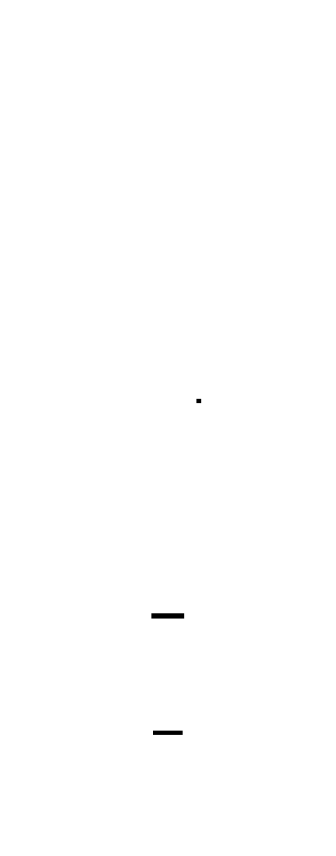

The difference in developer experience is enormous. Language tooling teams at Google, Mozilla, and Apple have studied this extensively — it is one of the primary reasons Clang was written as a replacement for GCC. GCC historically stopped at the first fatal error; Clang was designed from the start to recover and continue. Rust's compiler similarly invests heavily in producing as many diagnostics as possible per compilation.
For a *lexer* specifically, error recovery is not only desirable — it is unusually easy to implement. Here is why: the lexer has no context-dependent state that needs to be unwound. When a parser encounters an error, it needs to figure out what grammar rule it was in the middle of, how to discard partial parse state, and where to re-synchronize with the token stream. That is genuinely hard. When a lexer encounters an unrecognized character, it is in a completely defined state: it was about to start a new token, it consumed one bad character, and it has nothing to unwind. The recovery strategy is trivially: **emit an Error token for the bad character and continue to the next character.**
The cost of collecting all errors rather than stopping at the first is essentially zero. The benefit to your users is enormous.
This is a product decision expressed through code. Your scanner will collect all errors.
---
## Understanding What You Already Have
Before writing a single new test, look at your scanner's current error behavior. In `_scan_token()`, the fallthrough case is:
```python
# Unrecognized character
self.tokens.append(self._error_token(f"Unexpected character: {ch!r}"))
```
No `return` after this that exits the outer loop. No flag that says "stop scanning." The method appends an `ERROR` token and returns — control flows back to `scan_tokens()`, which calls `_begin_token()` and `_scan_token()` again for the next character. Your scanner already implements continue-on-error for unrecognized characters.
The scanner's current error recovery for unterminated strings and block comments also continues — after emitting an `ERROR` token for the unterminated construct, control returns to `scan_tokens()` and scanning resumes from the current position.
So error recovery, structurally, is already there. What this milestone adds is:
1. **Verification** — tests that prove the recovery works correctly in combination
2. **Completeness** — ensuring all error paths continue rather than accidentally halting
3. **Position accuracy** — multi-line integration tests that catch tracking drift
4. **Performance awareness** — a benchmark that confirms the scanner is fast enough for real use
5. **The canonical token stream test** — a token-by-token assertion that serves as a formal specification
---
## The Integration Test as a Formal Specification
Here is an insight that changes how you think about tests: a test that asserts the exact token stream for `if (x >= 42) { return true; }` is not just a test — it is a **machine-executable specification** of your language's lexical grammar.

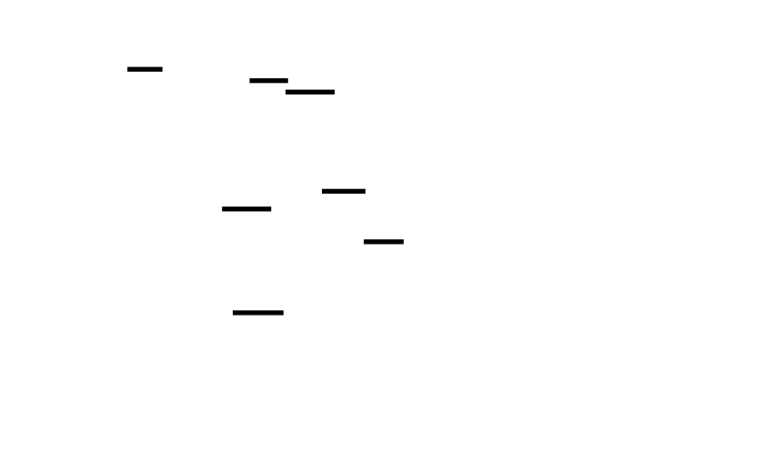

Every choice your language makes is captured in that token list:
- `if` is a `KEYWORD`, not an `IDENTIFIER` — your keyword table decision
- `>=` is `GREATER_EQUAL`, not `GREATER` + `ASSIGN` — your maximal munch decision
- `42` is a `NUMBER`, not split into `4` and `2` — your digit-accumulation decision
- `true` is a `KEYWORD` — your decision to make boolean literals reserved words
- There are 11 non-EOF tokens — everything else (spaces) is discarded
When you change the language (add a keyword, change operator rules), this test breaks. That is not a bug in the test — it is the test doing its job, forcing you to acknowledge that the specification changed.
This is the insight behind **snapshot testing** (also called golden-file testing) in compiler development: you capture the expected output once, and any deviation from it is a signal that something changed. LLVM uses `FileCheck` for exactly this purpose — the expected output is embedded in the test file, and the test passes if and only if the actual output matches token-by-token.
Let's write this test first, because it is the most important one:
```python
import unittest
from scanner import Scanner, Token, TokenType
class TestCanonicalTokenStream(unittest.TestCase):
    """
    The canonical acceptance test for the complete tokenizer.
    This test is simultaneously a unit test AND a formal specification
    of the lexical grammar. A change to any token in the expected list
    is a change to the language specification.
    """
    def test_if_statement_exact_stream(self):
        """
        'if (x >= 42) { return true; }' must produce this exact token stream.
        Each assertion covers one token: type, lexeme, and position.
        """
        source = 'if (x >= 42) { return true; }'
        tokens = Scanner(source).scan_tokens()
        # Filter out EOF for the main assertions; check it explicitly at the end
        non_eof = [t for t in tokens if t.type != TokenType.EOF]
        expected = [
            # (type,                    lexeme,   line, col)
            (TokenType.KEYWORD,        'if',      1,    1),
            (TokenType.LPAREN,         '(',       1,    4),
            (TokenType.IDENTIFIER,     'x',       1,    5),
            (TokenType.GREATER_EQUAL,  '>=',      1,    7),
            (TokenType.NUMBER,         '42',      1,    10),
            (TokenType.RPAREN,         ')',       1,    12),
            (TokenType.LBRACE,         '{',       1,    14),
            (TokenType.KEYWORD,        'return',  1,    16),
            (TokenType.KEYWORD,        'true',    1,    23),
            (TokenType.SEMICOLON,      ';',       1,    27),
            (TokenType.RBRACE,         '}',       1,    29),
        ]
        self.assertEqual(
            len(non_eof), len(expected),
            f"Expected {len(expected)} tokens, got {len(non_eof)}: {non_eof}"
        )
        for i, (tok, (exp_type, exp_lexeme, exp_line, exp_col)) in \
                enumerate(zip(non_eof, expected)):
            self.assertEqual(tok.type,   exp_type,
                msg=f"Token {i}: expected type {exp_type}, got {tok.type}")
            self.assertEqual(tok.lexeme, exp_lexeme,
                msg=f"Token {i}: expected lexeme {exp_lexeme!r}, got {tok.lexeme!r}")
            self.assertEqual(tok.line,   exp_line,
                msg=f"Token {i}: expected line {exp_line}, got {tok.line}")
            self.assertEqual(tok.column, exp_col,
                msg=f"Token {i}: expected column {exp_col}, got {tok.column}")
        # Explicit EOF check
        eof = tokens[-1]
        self.assertEqual(eof.type, TokenType.EOF)
```
Notice: this test checks `type`, `lexeme`, `line`, AND `column` for every single token. The position assertions are not optional. If `>=` is at column 8 instead of column 7, something is wrong with whitespace handling or with how the scanner tracks column after consuming multi-character tokens. You will not discover that without asserting positions.
---
## Building the Complete Multi-Line Integration Test
The canonical single-line test is essential but not sufficient. You need a multi-line program that exercises every feature simultaneously. Here is the test program you will tokenize:
```python
INTEGRATION_PROGRAM = """\
// Fibonacci sequence
/* Returns the nth Fibonacci number
   using iteration, not recursion */
return_value = 0;
prev = 1;
counter = 0;
while (counter < 10) {
    next = return_value + prev;
    return_value = next;
    prev = return_value;
    counter = counter + 1;
}
result = "done\\n";
"""
```
This program exercises:
- Line comments (`//`) on line 1
- Multi-line block comment on lines 2–4
- Identifiers containing underscores (`return_value`, `prev`, `counter`)
- Integer number literals
- `while` keyword
- Comparison operators (`<`)
- Arithmetic operators (`+`)
- Assignment operator (`=`)
- String literal with escape sequence (`"done\\n"`)
- Position tracking across 14 lines
Here is the integration test:
```python
class TestMultiLineIntegration(unittest.TestCase):
    def test_fibonacci_program_no_errors(self):
        """Complete multi-line program produces no ERROR tokens."""
        tokens = Scanner(INTEGRATION_PROGRAM).scan_tokens()
        errors = [t for t in tokens if t.type == TokenType.ERROR]
        self.assertEqual(
            errors, [],
            f"Unexpected errors in clean program: {errors}"
        )
    def test_fibonacci_line_tracking(self):
        """
        Tokens appear on the correct lines, proving that comments and
        blank lines do not corrupt line numbering.
        """
        tokens = Scanner(INTEGRATION_PROGRAM).scan_tokens()
        non_eof = [t for t in tokens if t.type != TokenType.EOF]
        # Find the 'while' keyword — it should be on line 7
        # (lines: 1=comment, 2-4=block comment, 5=return_value=0;,
        #         6=prev=1;, 7=counter=0;... wait, let's count carefully)
        # Line 1: // Fibonacci sequence
        # Line 2: /* Returns the nth...
        # Line 3:    using iteration, not recursion */
        # Line 4: (blank line after closing */)
        # Actually: the block comment opens on line 2, closes on line 3.
        # Line 4: return_value = 0;
        # Line 5: prev = 1;
        # Line 6: counter = 0;
        # Line 7: while (counter < 10) {
        while_tokens = [t for t in non_eof if t.lexeme == 'while']
        self.assertEqual(len(while_tokens), 1)
        self.assertEqual(while_tokens[0].line, 7,
            f"'while' should be on line 7, found on line {while_tokens[0].line}")
        self.assertEqual(while_tokens[0].column, 1)
    def test_fibonacci_string_token(self):
        """String literal 'done\\n' is recognized with correct lexeme."""
        tokens = Scanner(INTEGRATION_PROGRAM).scan_tokens()
        string_tokens = [t for t in tokens if t.type == TokenType.STRING]
        self.assertEqual(len(string_tokens), 1)
        self.assertEqual(string_tokens[0].lexeme, '"done\\n"')
    def test_fibonacci_token_types_present(self):
        """All major token categories appear in the integration program."""
        tokens = Scanner(INTEGRATION_PROGRAM).scan_tokens()
        types_present = {t.type for t in tokens}
        required_types = {
            TokenType.KEYWORD,      # while, return (in identifier 'return_value')
            TokenType.IDENTIFIER,   # return_value, prev, counter, next, result
            TokenType.NUMBER,       # 0, 1, 10
            TokenType.STRING,       # "done\n"
            TokenType.ASSIGN,       # =
            TokenType.LESS,         # <
            TokenType.PLUS,         # +
            TokenType.SEMICOLON,    # ;
            TokenType.LBRACE,       # {
            TokenType.RBRACE,       # }
            TokenType.LPAREN,       # (
            TokenType.RPAREN,       # )
            TokenType.EOF,
        }
        missing = required_types - types_present
        self.assertEqual(missing, set(),
            f"Token types expected but not found: {missing}")
```
The key discipline in these tests: **count the lines carefully before asserting line numbers.** An off-by-one in your expected line number means the test would pass even if position tracking were wrong. Draw the line numbers on paper before writing the assertion.
---
## Error Recovery: Proving the Scanner Collects All Errors
Now test the behavior that distinguishes a useful scanner from a fragile one.


```python
class TestErrorRecovery(unittest.TestCase):
    """
    Tests that the scanner continues after errors, collecting all problems
    rather than halting at the first one.
    """
    def test_single_invalid_character_produces_error_and_eof(self):
        """
        A single invalid character produces exactly: ERROR, EOF.
        The scanner does not crash or hang.
        """
        tokens = Scanner('@').scan_tokens()
        self.assertEqual(len(tokens), 2)
        self.assertEqual(tokens[0].type, TokenType.ERROR)
        self.assertEqual(tokens[0].lexeme, '@')
        self.assertEqual(tokens[1].type, TokenType.EOF)
    def test_multiple_invalid_characters_all_reported(self):
        """
        Three invalid characters in a row produce three ERROR tokens,
        then EOF. None is silently swallowed.
        """
        tokens = Scanner('@#$').scan_tokens()
        non_eof = [t for t in tokens if t.type != TokenType.EOF]
        self.assertEqual(len(non_eof), 3)
        for tok in non_eof:
            self.assertEqual(tok.type, TokenType.ERROR)
        self.assertEqual(tokens[-1].type, TokenType.EOF)
    def test_valid_token_after_invalid_character(self):
        """
        Valid tokens after an invalid character are still emitted correctly.
        The scanner recovers from the error and produces the valid token.
        """
        tokens = Scanner('@x').scan_tokens()
        non_eof = [t for t in tokens if t.type != TokenType.EOF]
        self.assertEqual(len(non_eof), 2)
        self.assertEqual(non_eof[0].type, TokenType.ERROR)
        self.assertEqual(non_eof[0].lexeme, '@')
        self.assertEqual(non_eof[1].type, TokenType.IDENTIFIER)
        self.assertEqual(non_eof[1].lexeme, 'x')
    def test_error_position_is_the_invalid_character_not_next(self):
        """
        The ERROR token's position is the position of the invalid character,
        not the character that follows it.
        """
        # '  @' — '@' is at column 3
        tokens = Scanner('  @').scan_tokens()
        error = tokens[0]
        self.assertEqual(error.type, TokenType.ERROR)
        self.assertEqual(error.line, 1)
        self.assertEqual(error.column, 3)
    def test_errors_interleaved_with_valid_tokens(self):
        """
        Errors scattered through valid code do not prevent valid tokens
        from being emitted.
        The input 'x@y#z' should produce:
            IDENTIFIER('x'), ERROR('@'), IDENTIFIER('y'), ERROR('#'), IDENTIFIER('z'), EOF
        """
        tokens = Scanner('x@y#z').scan_tokens()
        expected_types = [
            TokenType.IDENTIFIER,
            TokenType.ERROR,
            TokenType.IDENTIFIER,
            TokenType.ERROR,
            TokenType.IDENTIFIER,
            TokenType.EOF,
        ]
        actual_types = [t.type for t in tokens]
        self.assertEqual(actual_types, expected_types)
        # Check lexemes
        self.assertEqual(tokens[0].lexeme, 'x')
        self.assertEqual(tokens[1].lexeme, '@')
        self.assertEqual(tokens[2].lexeme, 'y')
        self.assertEqual(tokens[3].lexeme, '#')
        self.assertEqual(tokens[4].lexeme, 'z')
    def test_unterminated_string_then_valid_code(self):
        """
        An unterminated string (error on line 1) does not prevent valid tokens
        from being emitted on line 2.
        """
        source = '"unterminated\nx = 42;'
        tokens = Scanner(source).scan_tokens()
        errors = [t for t in tokens if t.type == TokenType.ERROR]
        self.assertGreaterEqual(len(errors), 1,
            "Expected at least one ERROR token for unterminated string")
        numbers = [t for t in tokens if t.type == TokenType.NUMBER]
        self.assertEqual(len(numbers), 1,
            "Valid NUMBER token on line 2 should be emitted despite error on line 1")
        self.assertEqual(numbers[0].lexeme, '42')
        self.assertEqual(numbers[0].line, 2)
    def test_unterminated_block_comment_then_valid_code(self):
        """
        An unterminated block comment produces one ERROR token.
        Any code that appears inside the comment is NOT emitted as tokens
        (it was consumed as comment content).
        """
        source = 'x = 1;\n/* unterminated\ny = 2;'
        tokens = Scanner(source).scan_tokens()
        errors = [t for t in tokens if t.type == TokenType.ERROR]
        self.assertEqual(len(errors), 1)
        # The error is at the position of '/*'
        self.assertEqual(errors[0].line, 2)
        # 'x', '=', '1', ';' from line 1 should be present
        identifiers = [t for t in tokens if t.type == TokenType.IDENTIFIER]
        self.assertTrue(any(t.lexeme == 'x' for t in identifiers))
        # 'y', '2' from line 3 should NOT be present
        # (they were consumed inside the unterminated comment)
        self.assertFalse(any(t.lexeme == 'y' for t in tokens))
    def test_multiple_unterminated_strings_all_reported(self):
        """
        Two unterminated strings on separate lines produce two ERROR tokens.
        """
        source = '"first\n"second\n'
        tokens = Scanner(source).scan_tokens()
        errors = [t for t in tokens if t.type == TokenType.ERROR]
        self.assertGreaterEqual(len(errors), 2,
            f"Expected at least 2 ERROR tokens, got {len(errors)}")
```
The test `test_unterminated_block_comment_then_valid_code` deserves extra attention. When a block comment is unterminated, the scanner consumes everything from `/*` to EOF as part of the comment — including what would have been valid code. This means `y = 2;` on line 3 is *not* tokenized. This is correct behavior, not a bug. The error recovery for unterminated block comments cannot "go back" and re-tokenize the comment content — the scanner is a single-pass forward-only reader. The developer sees an "unterminated block comment" error and fixes it; on the next scan, `y = 2;` becomes visible.
---
## Edge Cases: The Inputs That Break Naive Scanners
Edge cases exist at the boundaries of your scanner's input handling. A scanner that works on typical programs but fails on empty input, single-character input, or maximum-length identifiers has real bugs — they just hide until production.
```python
class TestEdgeCases(unittest.TestCase):
    def test_empty_input(self):
        """
        Empty string produces exactly one token: EOF.
        This must work — the parser will always call scan_tokens() first,
        and it must receive a valid token stream, even for empty input.
        """
        tokens = Scanner('').scan_tokens()
        self.assertEqual(len(tokens), 1)
        self.assertEqual(tokens[0].type, TokenType.EOF)
        self.assertEqual(tokens[0].line, 1)
        self.assertEqual(tokens[0].column, 1)
    def test_single_character_valid(self):
        """Single valid token: '+' produces PLUS then EOF."""
        tokens = Scanner('+').scan_tokens()
        self.assertEqual(len(tokens), 2)
        self.assertEqual(tokens[0].type, TokenType.PLUS)
        self.assertEqual(tokens[0].lexeme, '+')
        self.assertEqual(tokens[1].type, TokenType.EOF)
    def test_single_character_invalid(self):
        """Single invalid character: '@' produces ERROR then EOF."""
        tokens = Scanner('@').scan_tokens()
        self.assertEqual(len(tokens), 2)
        self.assertEqual(tokens[0].type, TokenType.ERROR)
        self.assertEqual(tokens[1].type, TokenType.EOF)
    def test_single_newline(self):
        """A single newline produces only EOF with line=2, column=1."""
        tokens = Scanner('\n').scan_tokens()
        self.assertEqual(len(tokens), 1)
        self.assertEqual(tokens[0].type, TokenType.EOF)
        self.assertEqual(tokens[0].line, 2)
        self.assertEqual(tokens[0].column, 1)
    def test_whitespace_only(self):
        """Input of only whitespace produces only EOF."""
        tokens = Scanner('   \t  \n  \r\n  ').scan_tokens()
        self.assertEqual(len(tokens), 1)
        self.assertEqual(tokens[0].type, TokenType.EOF)
    def test_maximum_length_identifier(self):
        """
        An identifier of 1,000 characters is scanned as a single IDENTIFIER token.
        Tests that the scanner uses peek()/advance() loops rather than any
        fixed-size buffer that might overflow.
        """
        long_id = 'a' * 1000
        tokens = Scanner(long_id).scan_tokens()
        non_eof = [t for t in tokens if t.type != TokenType.EOF]
        self.assertEqual(len(non_eof), 1)
        self.assertEqual(non_eof[0].type, TokenType.IDENTIFIER)
        self.assertEqual(non_eof[0].lexeme, long_id)
        self.assertEqual(len(non_eof[0].lexeme), 1000)
    def test_maximum_length_number(self):
        """A number of 500 digits is scanned as a single NUMBER token."""
        big_number = '9' * 500
        tokens = Scanner(big_number).scan_tokens()
        non_eof = [t for t in tokens if t.type != TokenType.EOF]
        self.assertEqual(len(non_eof), 1)
        self.assertEqual(non_eof[0].type, TokenType.NUMBER)
        self.assertEqual(non_eof[0].lexeme, big_number)
    def test_maximum_length_string(self):
        """A string literal of 10,000 characters is scanned as one STRING token."""
        long_content = 'x' * 10000
        source = f'"{long_content}"'
        tokens = Scanner(source).scan_tokens()
        non_eof = [t for t in tokens if t.type != TokenType.EOF]
        self.assertEqual(len(non_eof), 1)
        self.assertEqual(non_eof[0].type, TokenType.STRING)
        self.assertEqual(len(non_eof[0].lexeme), 10002)  # content + 2 quotes
    def test_all_single_char_tokens_in_sequence(self):
        """
        Every single-character token scanned with no spaces between them.
        Tests that adjacent tokens with no whitespace separator are correctly split.
        """
        source = '+-*/(){}[];,'
        tokens = Scanner(source).scan_tokens()
        non_eof = [t for t in tokens if t.type != TokenType.EOF]
        expected_types = [
            TokenType.PLUS, TokenType.MINUS, TokenType.STAR, TokenType.SLASH,
            TokenType.LPAREN, TokenType.RPAREN,
            TokenType.LBRACE, TokenType.RBRACE,
            TokenType.LBRACKET, TokenType.RBRACKET,
            TokenType.SEMICOLON, TokenType.COMMA,
        ]
        actual_types = [t.type for t in non_eof]
        self.assertEqual(actual_types, expected_types)
    def test_keyword_at_end_of_input_no_trailing_space(self):
        """
        'if' at the very end of input with no trailing space or newline.
        The scanner must not wait for a delimiter to emit the keyword.
        """
        tokens = Scanner('if').scan_tokens()
        non_eof = [t for t in tokens if t.type != TokenType.EOF]
        self.assertEqual(len(non_eof), 1)
        self.assertEqual(non_eof[0].type, TokenType.KEYWORD)
        self.assertEqual(non_eof[0].lexeme, 'if')
    def test_number_at_end_of_input_no_trailing_space(self):
        """
        '42' at the very end of input with no trailing character.
        The number scanner must emit the token when is_at_end() returns True.
        """
        tokens = Scanner('42').scan_tokens()
        non_eof = [t for t in tokens if t.type != TokenType.EOF]
        self.assertEqual(len(non_eof), 1)
        self.assertEqual(non_eof[0].type, TokenType.NUMBER)
        self.assertEqual(non_eof[0].lexeme, '42')
```
The "at end of input no trailing space" tests are subtle but important. When the scanner is reading a number like `42`, it loops calling `peek().isdigit()`. When it reaches EOF, `peek()` returns `'\0'`, which is not a digit, so the loop exits — and the NUMBER token is emitted. This works. But if you had written the number scanner as `while not is_at_end() and peek().isdigit()`, there is no functional difference here. The test still passes. The real danger is if you had accidentally written a scanner that needed a non-digit character to *trigger* token emission, rather than simply to *stop consumption*. These tests catch that kind of bug.
---
## Position Accuracy: The Drift Problem
Position tracking drift is a class of bug that is invisible in unit tests of single tokens but accumulates over multi-line input into systematically wrong error positions. Consider: if your column counter increments by 2 for every tab character (instead of 1), then after a line with 5 tabs, every subsequent token on that line reports a column 5 higher than the actual position. After 1,000 lines, positions could be meaningfully wrong even if no individual test caught the per-tab error.

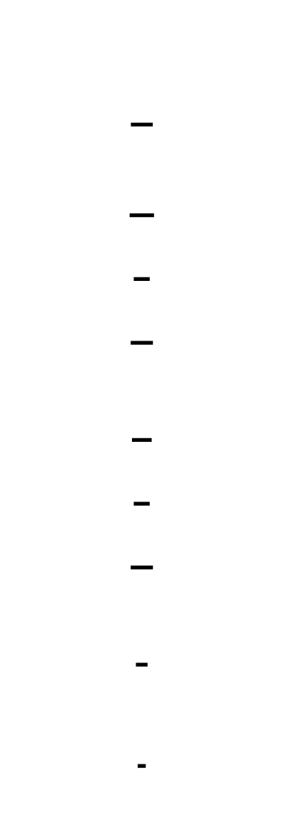

The integration test for position accuracy must assert positions at multiple points in a multi-line file, covering every character class that could cause drift:
```python
class TestPositionAccuracy(unittest.TestCase):
    """
    Position tracking tests that span multiple lines and character types.
    Each assertion verifies that line/column values have not drifted from
    the correct position.
    """
    def test_position_after_single_line_comment(self):
        """Token immediately after a line comment is on the next line at column 1."""
        source = '// comment\nidentifier'
        tokens = Scanner(source).scan_tokens()
        non_eof = [t for t in tokens if t.type != TokenType.EOF]
        self.assertEqual(len(non_eof), 1)
        self.assertEqual(non_eof[0].line, 2)
        self.assertEqual(non_eof[0].column, 1)
    def test_position_after_multi_line_block_comment(self):
        """Token after a 3-line block comment is on the correct line."""
        source = '/* line1\nline2\nline3 */x'
        tokens = Scanner(source).scan_tokens()
        x_token = next(t for t in tokens if t.type == TokenType.IDENTIFIER)
        # Comment opens on line 1, content spans to line 3, 'x' is on line 3
        self.assertEqual(x_token.line, 3)
    def test_column_resets_after_newline(self):
        """After a newline, the next token starts at column 1."""
        source = 'x\ny'
        tokens = Scanner(source).scan_tokens()
        non_eof = [t for t in tokens if t.type != TokenType.EOF]
        self.assertEqual(non_eof[0].line, 1)
        self.assertEqual(non_eof[0].column, 1)
        self.assertEqual(non_eof[1].line, 2)
        self.assertEqual(non_eof[1].column, 1)
    def test_column_advances_correctly_within_line(self):
        """
        Token positions within a single line are correct.
        'abc def' — 'abc' at column 1, 'def' at column 5.
        """
        source = 'abc def'
        tokens = Scanner(source).scan_tokens()
        non_eof = [t for t in tokens if t.type != TokenType.EOF]
        self.assertEqual(non_eof[0].column, 1)
        self.assertEqual(non_eof[1].column, 5)
    def test_windows_line_endings_do_not_double_count_lines(self):
        """
        \\r\\n is treated as one newline (line increments once, not twice).
        'x\\r\\ny' — 'y' should be on line 2, not line 3.
        """
        source = 'x\r\ny'
        tokens = Scanner(source).scan_tokens()
        non_eof = [t for t in tokens if t.type != TokenType.EOF]
        self.assertEqual(non_eof[0].line, 1)
        self.assertEqual(non_eof[1].line, 2,
            "\\r\\n should count as one newline; 'y' should be on line 2")
    def test_tab_advances_column_by_one(self):
        """
        A tab character advances the column by 1 (not by a tab-stop width).
        'x\\ty' — 'y' should be at column 3 (x=1, tab=2, y=3).
        """
        source = 'x\ty'
        tokens = Scanner(source).scan_tokens()
        non_eof = [t for t in tokens if t.type != TokenType.EOF]
        self.assertEqual(non_eof[0].column, 1)
        self.assertEqual(non_eof[1].column, 3)
    def test_position_inside_multi_line_string_after_newline(self):
        """
        A newline inside a string literal increments line before the error is emitted.
        The scanner must track lines inside strings.
        After the error for the unterminated string, line count is correct.
        """
        # String starts on line 1, contains a newline, so scanner errors.
        # After the error, 'x' on line 2 should have line=2.
        source = '"bad\nx'
        tokens = Scanner(source).scan_tokens()
        x_tokens = [t for t in tokens
                    if t.type == TokenType.IDENTIFIER and t.lexeme == 'x']
        self.assertEqual(len(x_tokens), 1)
        self.assertEqual(x_tokens[0].line, 2)
    def test_eof_position_after_multi_line_input(self):
        """
        EOF token has the position of the character after the last character,
        on the correct line.
        """
        source = 'x\ny\nz'
        tokens = Scanner(source).scan_tokens()
        eof = tokens[-1]
        self.assertEqual(eof.type, TokenType.EOF)
        # 'z' is on line 3 at column 1; after consuming it, line=3, column=2
        self.assertEqual(eof.line, 3)
        self.assertEqual(eof.column, 2)
    def test_position_accuracy_over_fifty_lines(self):
        """
        Tokens on line 50 have correct line numbers.
        Tests that position tracking does not drift over many lines.
        """
        # Build a 50-line input: each line is 'x = 1;\n'
        lines = ['x = 1;' for _ in range(50)]
        source = '\n'.join(lines)
        tokens = Scanner(source).scan_tokens()
        # Find all tokens on line 50
        line_50_tokens = [t for t in tokens if t.line == 50]
        # Line 50 should start with 'x' (IDENTIFIER at column 1)
        self.assertGreater(len(line_50_tokens), 0,
            "No tokens found on line 50 — position tracking has drifted")
        first_on_50 = line_50_tokens[0]
        self.assertEqual(first_on_50.lexeme, 'x')
        self.assertEqual(first_on_50.column, 1)
```
The 50-line drift test is particularly important. A bug in `advance()` that causes `self.column` to increment by 2 for certain characters would not be caught by any single-token test but would show up as `column = 51` instead of `column = 1` on line 50. Making the drift test run over many lines amplifies any systematic error into an obviously wrong value.
---
## The Token Stream as a Typed Channel

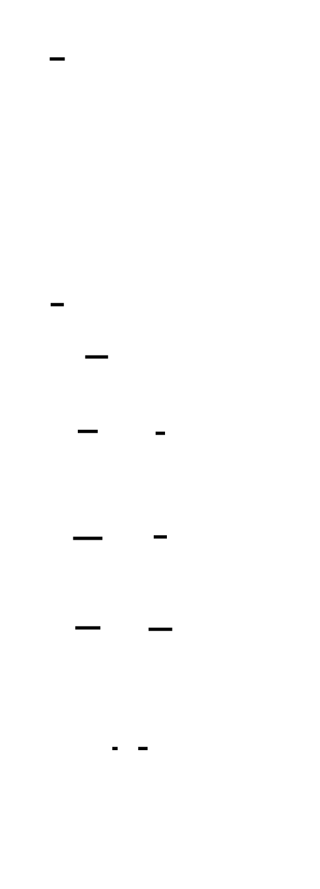

The scanner produces a list of tokens. The parser will consume that list. This producer-consumer relationship is not just an implementation detail — it is a design interface with a contract.
Think of it exactly like a Unix pipe: your scanner is the process writing to the pipe, and the parser is the process reading from it. The pipe carries structured data. The `EOF` token is the equivalent of the write end of the pipe being closed — it signals "no more data is coming." A parser that tries to read past `EOF` will get stuck; a parser that checks for `EOF` correctly will terminate.
The key question: **should the parser see `ERROR` tokens at all?** There are two schools of thought:
**Option A: Error tokens visible to the parser.** The scanner emits `ERROR` tokens into the stream. The parser receives them, treats them as unknown tokens, tries to recover, and may emit its own parse errors. The advantage: the parser can produce additional error context. The disadvantage: the parser must handle `ERROR` tokens explicitly in every rule, or it will produce confusing parse errors on top of the lexer error.
**Option B: Error tokens collected separately, not in the main stream.** The scanner maintains two outputs: a `tokens` list (only valid tokens) and an `errors` list (Error objects). The parser never sees errors. The advantage: the parser is simpler. The disadvantage: error positions from the lexer and parser are reported separately with potentially inconsistent formatting.
Your current implementation uses Option A — `ERROR` tokens are in the `tokens` list. For a beginner tokenizer, this is fine and follows the approach in *Crafting Interpreters*. For a production language server, you would likely use Option B or a hybrid: include `ERROR` tokens in the stream for the parser's recovery logic, but also maintain a separate structured error list for the IDE to render as squiggles.
```python
class TestTokenStreamInterface(unittest.TestCase):
    """
    Tests that verify the contract between the lexer and any downstream consumer.
    """
    def test_scan_tokens_always_ends_with_eof(self):
        """Every call to scan_tokens() must end with exactly one EOF token."""
        for source in ['', 'x', 'x + 1', '/* unterminated', '@@@']:
            tokens = Scanner(source).scan_tokens()
            self.assertEqual(tokens[-1].type, TokenType.EOF,
                f"scan_tokens({source!r}) did not end with EOF")
            eof_count = sum(1 for t in tokens if t.type == TokenType.EOF)
            self.assertEqual(eof_count, 1,
                f"scan_tokens({source!r}) produced {eof_count} EOF tokens (must be exactly 1)")
    def test_scan_tokens_returns_list(self):
        """scan_tokens() returns a list, not a generator or iterator."""
        result = Scanner('x = 1').scan_tokens()
        self.assertIsInstance(result, list)
    def test_scan_tokens_idempotent(self):
        """
        Calling scan_tokens() twice on the same source produces the same result.
        (Each Scanner instance is independent and stateless externally.)
        """
        source = 'if (x == 42) { return true; }'
        tokens1 = Scanner(source).scan_tokens()
        tokens2 = Scanner(source).scan_tokens()
        self.assertEqual(
            [(t.type, t.lexeme, t.line, t.column) for t in tokens1],
            [(t.type, t.lexeme, t.line, t.column) for t in tokens2]
        )
```
The idempotency test is subtle. Your `Scanner` stores state in instance variables (`self.tokens`, `self.current`, etc.). If a developer called `scan_tokens()` twice on the *same instance*, the second call would find `self.tokens` already populated and would append to it, producing a doubled token stream. The idempotency test uses two separate `Scanner` instances, which is correct — the contract is "same source produces same result when using independent scanner instances."
If you want to guard against double-calling on the same instance, you could add a check:
```python
def scan_tokens(self) -> list[Token]:
    if self.tokens:
        raise RuntimeError(
            "scan_tokens() has already been called on this Scanner instance. "
            "Create a new Scanner to scan the same source again."
        )
    # ... rest of implementation
```
This is a defensive API design choice — documenting through code that `Scanner` is single-use.
---
## Performance: 10,000 Lines in Under 1 Second

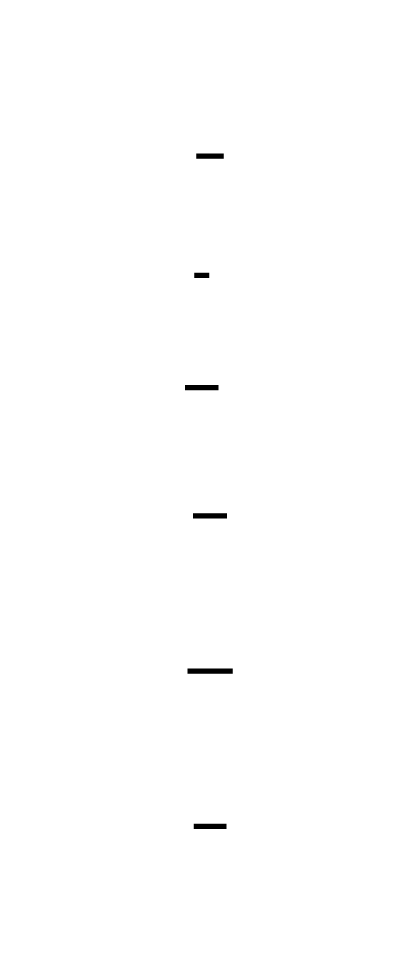

Performance testing for a lexer is simpler than for most systems. You are not managing memory pools, network I/O, or database transactions. You are looping over a string. The performance question is: **how many characters per second can your scanner process?**
The 10,000-line benchmark in the acceptance criteria is not a high bar. A conservative estimate: 10,000 lines × 40 characters per line = 400,000 characters. CPython executes roughly 10–50 million Python bytecode operations per second. Each character in your scanner requires a handful of bytecode operations (method call, index, conditional, increment). At 10 operations per character, you can process 400,000 characters × (1/10 ops per char) = 40,000 characters per million ops, meaning 400,000 characters requires about 4 million ops, which completes in well under 1 second.
Still, verifying this empirically is good practice. It introduces you to how compiler engineers think about throughput:
```python
import time
import unittest
class TestPerformance(unittest.TestCase):
    """
    Performance tests verify that the scanner completes within acceptable time bounds.
    These are not strict benchmarks — they are sanity checks against obvious regressions.
    A future optimization that makes the scanner 10x faster would still pass these tests.
    A future bug that makes it 100x slower would fail them.
    """
    def _generate_source(self, lines: int) -> str:
        """
        Generate a realistic source file of the given number of lines.
        Each line contains a variety of token types to exercise all scanner paths.
        """
        line_templates = [
            'x = 42;',
            'if (x >= 0) {',
            '    y = x + 1;',
            '    // single line comment',
            '    result = "hello world";',
            '}',
            '/* block comment */',
            'while (x != 0) {',
            '    x = x - 1;',
            '}',
        ]
        template_count = len(line_templates)
        source_lines = [
            line_templates[i % template_count] for i in range(lines)
        ]
        return '\n'.join(source_lines)
    def test_ten_thousand_lines_under_one_second(self):
        """
        10,000-line input must tokenize in under 1 second.
        This is not a tight bound — it should pass even in a slow CI environment.
        If it fails, the scanner has a pathological performance bug (e.g., O(n²) behavior).
        """
        source = self._generate_source(10_000)
        start = time.perf_counter()
        tokens = Scanner(source).scan_tokens()
        elapsed = time.perf_counter() - start
        self.assertLess(elapsed, 1.0,
            f"10,000-line scan took {elapsed:.3f}s (expected < 1.0s). "
            f"Check for O(n²) behavior — e.g., string concatenation in a loop.")
        # Sanity check: the output is non-trivial
        self.assertGreater(len(tokens), 10_000,
            "Expected at least 10,000 tokens from 10,000-line input")
    def test_no_error_tokens_in_generated_source(self):
        """
        The generated source is valid — no ERROR tokens should appear.
        Verifies that the performance test input is actually valid syntax.
        """
        source = self._generate_source(100)  # smaller for speed
        tokens = Scanner(source).scan_tokens()
        errors = [t for t in tokens if t.type == TokenType.ERROR]
        self.assertEqual(errors, [],
            f"Generated source produced unexpected errors: {errors[:5]}")
    def test_throughput_measurement(self):
        """
        Measure and print throughput in characters per second.
        This is informational, not a pass/fail test.
        Useful for comparing scanner implementations or detecting regressions.
        """
        source = self._generate_source(10_000)
        char_count = len(source)
        # Warm up (avoid first-run JIT or import overhead)
        Scanner(source).scan_tokens()
        # Measure
        iterations = 3
        times = []
        for _ in range(iterations):
            start = time.perf_counter()
            Scanner(source).scan_tokens()
            times.append(time.perf_counter() - start)
        best_time = min(times)
        chars_per_second = char_count / best_time
        # Print (visible only with -v flag or on failure)
        print(f"\nScanner throughput: {chars_per_second:,.0f} chars/sec "
              f"({char_count:,} chars in {best_time*1000:.1f}ms)")
        # Soft lower bound: 100,000 chars/sec is very slow for a Python scanner
        self.assertGreater(chars_per_second, 100_000,
            f"Scanner throughput {chars_per_second:,.0f} chars/sec is unexpectedly low")
```
**Understanding the performance model:**
Your scanner is O(n) in the length of the source input — each character is visited exactly once by `advance()`, and `peek()` does not advance the cursor. There are no nested loops over the input. The only way your scanner could be O(n²) or worse is if you had introduced string concatenation in a loop — for example, if `_current_lexeme()` built the lexeme character by character using `lexeme += ch` instead of slicing `self.source[self.start:self.current]`. Python's `str` is immutable; each `+=` on a string creates a new string, making the lexeme-building loop O(k²) in the token length k. Your implementation avoids this by storing indices and slicing at emit time, which is O(1) per emit.
[[EXPLAIN:O(n)-vs-O(n-squared)-complexity-in-string-processing|O(n) vs O(n²) complexity — why string concatenation in loops is expensive in Python]]
LLVM's lexer processes source at hundreds of megabytes per second — your Python scanner will be far slower, but the *algorithmic* complexity is the same. The throughput difference comes from interpreter overhead and garbage collection pressure, not from algorithmic design. If you ever port this scanner to PyPy, Cython, or Rust, you will see dramatic speedups because the O(n) algorithm is already optimal; only the constant factor changes.
---
## Putting It All Together: The Full Test Suite
Here is how you should organize and run the complete test suite:
```python
# test_scanner.py — complete integration test file
import time
import unittest
from scanner import Scanner, Token, TokenType
# ── Test data ──────────────────────────────────────────────────────────────────
INTEGRATION_PROGRAM = """\
// Fibonacci sequence
/* Returns the nth Fibonacci number
   using iteration, not recursion */
return_value = 0;
prev = 1;
counter = 0;
while (counter < 10) {
    next = return_value + prev;
    return_value = next;
    prev = return_value;
    counter = counter + 1;
}
result = "done\\n";
"""
# ── Helper ──────────────────────────────────────────────────────────────────────
def scan(source: str) -> list[Token]:
    """Helper: scan source and return all tokens including EOF."""
    return Scanner(source).scan_tokens()
def scan_no_eof(source: str) -> list[Token]:
    """Helper: scan source, return tokens excluding EOF."""
    return [t for t in Scanner(source).scan_tokens() if t.type != TokenType.EOF]
def types(source: str) -> list[TokenType]:
    """Helper: scan source, return only token types excluding EOF."""
    return [t.type for t in scan_no_eof(source)]
# ── Test classes from earlier in this milestone ──────────────────────────────
# (Include all test classes defined above in this file)
if __name__ == '__main__':
    # Run with verbose output to see throughput measurements
    unittest.main(verbosity=2)
```
Run it:
```bash
python -m pytest test_scanner.py -v
# or
python test_scanner.py
```
A passing run with all tests green means:
1. Every token type is recognized correctly
2. Position tracking is accurate across multi-line input
3. Error recovery works — all errors are collected, scanning continues
4. Edge cases (empty input, long identifiers, end-of-input without space) work
5. Performance is within acceptable bounds
---
## What Position Accuracy Means for Language Servers

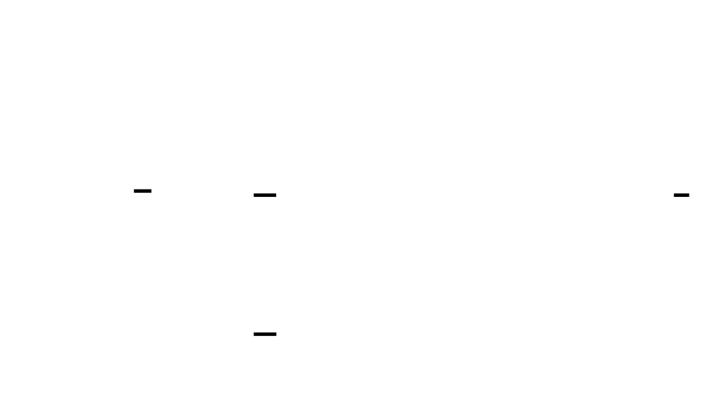

Let's connect position tracking to a concrete, production impact. The [[EXPLAIN:language-server-protocol-(LSP)-and-how-editors-use-token-positions|Language Server Protocol (LSP)]] is a standardized interface between code editors (VS Code, Neovim, Emacs) and language analysis tools (compilers, linters, type checkers). It is the mechanism behind "jump to definition," "rename symbol," "show type on hover," and "underline errors in red."
Every single feature in that list requires the editor to know **exactly** where a token is in the source file — line and column. When you hover over a variable name, the editor sends an LSP request saying "I am at line 42, column 17 — what is here?" The language server must find the token at that position, look it up in its symbol table, and return information about it. If your scanner's position tracking is off by one column on line 42, the server looks up the wrong token and returns wrong information. The hover tooltip shows the wrong type. The rename refactoring renames the wrong symbol.
This is a real production bug class. Position tracking errors are one of the most common sources of subtle bugs in language server implementations. The fix is always the same: make position tracking happen in one place (`advance()`), unconditionally, for every character consumed, including characters inside comments and strings. Your implementation already does this correctly. The multi-line position tests you wrote in this milestone are the verification that it stays correct as you modify the scanner.
---
## Formal Boundary: What the Lexer Cannot Do


Your tokenizer is complete. Before you move on, it is worth understanding precisely what it can and cannot do — not as a limitation, but as a clear picture of where the lexer's responsibility ends and the parser's begins.
**What regular languages can handle (your lexer):**
- Recognizing all token types in your language
- Single-character lookahead for multi-character tokens
- Comment filtering (non-nesting)
- String literal scanning with escape sequences
- Position tracking
**What regular languages cannot handle (needs a parser):**
- Matching balanced delimiters: `(` must match `)`, `{` must match `}`
- Parsing nested expressions: `(a + (b * c))` requires recursion
- Checking that `if` is followed by a condition: that is a grammar rule
- Verifying that a variable is declared before use: that is semantic analysis
Every time you think "my tokenizer should also check whether the parentheses are balanced" or "my tokenizer should reject `1 + + 2`" — stop. That is the parser's job. The lexer produces a flat sequence of tokens and knows nothing about their relative structure. The moment you need to count or match, you have crossed into context-free territory.
This boundary is why the three-stage pipeline (lexer → parser → semantic analysis) exists. Each stage handles exactly what its computational model can express: the lexer handles regular patterns, the parser handles context-free structure, and semantic analysis handles context-sensitive constraints. Adding responsibilities across stage boundaries creates coupling that is hard to maintain and impossible to reason about formally.
Your tokenizer, finished and tested, is a clean, well-bounded component at the first stage of that pipeline. It does one thing. It does it correctly. It hands a well-defined token stream to whatever comes next.
---
## Knowledge Cascade: What You Just Built Connects To...
**→ Error recovery as a usability contract — Rust's compiler vs. early GCC.** The choice to collect all errors versus stop at the first is a *product decision* with measurable impact on developer productivity. Rust's compiler (`rustc`) collects dozens of errors per compilation and displays them all, with suggested fixes. Early GCC stopped at the first fatal error, requiring developers to fix errors one at a time. The tooling teams at Google and Mozilla have studied compilation time and fix-cycle time: collecting errors reduces overall fix time substantially because developers can batch their fixes. Your scanner's continue-on-error strategy is the lexer-level foundation of that user experience. Every linter, IDE, and modern compiler that provides "all errors at once" owes its design to this principle.
**→ Token stream as a typed channel — Unix pipes and structured streaming.** The relationship between your scanner and a downstream parser is architecturally identical to a Unix pipe. The scanner writes tokens; the parser reads them. The `EOF` token is `close(fd)`. This is not a metaphor — streaming APIs like Apache Kafka, AWS Kinesis, and Java's `java.util.stream` all implement the same producer-consumer pattern with typed payloads and explicit stream terminators. When you build a second pipeline stage (a parser), you will implement `advance()` and `peek()` on the token stream, exactly as you implemented them on the character stream. The interface is the same; only the data type changes from `str` to `Token`.
**→ Position accuracy as a foundation for language servers.** Every VS Code extension, every Neovim LSP plugin, every JetBrains IDE feature that shows you exactly where an error is, or lets you jump to a definition — all of it depends on a chain of position-accurate transformations starting at the lexer. The LSP specification mandates that positions are expressed as (line, character) pairs, zero-indexed. Your scanner produces one-indexed positions, which is conventional and can be converted trivially. The core insight — position must be tracked at every character, without exception, and must survive multi-line constructs — is exactly what LSP implementations require. `rust-analyzer` and `clangd`, the two most sophisticated open-source language servers, both invest significant engineering effort in position accuracy. You now understand why.
**→ Integration tests as formal specifications — golden-file testing in compilers.** The token-by-token test for `if (x >= 42) { return true; }` is not just a test. It is a machine-executable fragment of the language specification. LLVM uses `FileCheck` (a tool that checks that output matches expected patterns embedded in source files) throughout its test suite. GCC has similarly structured regression tests. The property-based testing framework `Hypothesis` takes this further: instead of specific inputs, you specify properties that must hold for *any* input, and the framework searches for violations. Your integration tests are the simplest form of this idea — they lock in a specific expected output and force you to acknowledge any change. As the language grows, maintaining these golden tests is how you prevent regressions.
**→ Performance awareness as discipline — throughput in large codebases.** Tokenizing 10,000 lines in under 1 second is not a high bar. At scale, it matters enormously. Google's internal build system (Blaze/Bazel) tokenizes and parses millions of lines of code across thousands of files on every build. Facebook's PHP engine tokenizes gigabytes of PHP source daily. LLVM's `clang` scanner processes roughly 300 MB/s on a modern CPU — that's the target for a production C scanner. Your Python scanner will process maybe 10 MB/s; a Rust or C implementation of the same algorithm would be 10–30× faster. The algorithmic structure — O(n), single pass, no backtracking — is identical. Understanding that performance is a product of algorithm × implementation language × constant factors is the key insight for any future optimization work.
---
<!-- END_MS -->


# TDD

A character-level FSM scanner for a simple C-like language. Each milestone is a self-contained, testable module that adds one layer of lexical recognition. TDD contracts are written in terms of Token structs and exact token streams. Every design decision (maximal munch, non-nesting comments, keyword post-scan lookup) is captured as a diagram and test, not prose.


<!-- TDD_MOD_ID: tokenizer-m1 -->
# Token Types & Scanner Foundation — Technical Design Specification
## 1. Module Charter
This module defines the complete lexical data model and core scanning infrastructure for a character-level finite-state-machine tokenizer targeting a simple C-like language. It produces the `TokenType` enumeration, the `Token` dataclass, and the `Scanner` class with its three primitive operations (`is_at_end`, `advance`, `peek`), position-snapshot helpers, and the main `scan_tokens` loop. The module handles whitespace consumption, single-character token recognition, EOF emission, and unrecognized-character error emission.
This module does **not** handle multi-character tokens (`==`, `!=`, `<=`, `>=`), number literals, identifiers, keywords, string literals, or comments — those are added in subsequent milestones. The module's outputs are consumed directly by the parser or subsequent scanner passes; no other module touches `Token` construction. The invariant that must hold after every call to `scan_tokens`: the returned list is non-empty, its last element has `type == TokenType.EOF`, and every `Token`'s `line` and `column` reflect the position of the token's **first character** in the source string as scanned left-to-right. Position state updates happen exclusively inside `advance()` — no other method may mutate `self.line` or `self.column`.
---
## 2. File Structure
Create files in this order:
```
tokenizer/
├── 1  scanner.py          # TokenType enum, Token dataclass, Scanner class
├── 2  test_m1_types.py    # Tests for TokenType and Token dataclass
├── 3  test_m1_scanner.py  # Tests for Scanner primitives and scan_tokens
└── 4  test_m1_integration.py  # Full token-stream assertions
```
All implementation code lives in `scanner.py`. All milestone-1 tests live in the three test files. No external dependencies — `stdlib` only.
---
## 3. Complete Data Model
### 3.1 `TokenType` Enumeration
```python
from enum import Enum, auto
class TokenType(Enum):
    # ── Literals ─────────────────────────────────────────────────────────────
    NUMBER          = auto()   # integer: 42, 0  |  float: 3.14  (M2)
    STRING          = auto()   # "hello world"                    (M3)
    # ── Names ────────────────────────────────────────────────────────────────
    IDENTIFIER      = auto()   # user-defined names: x, my_var   (M2)
    KEYWORD         = auto()   # if, else, while, return, …       (M2)
    # ── Arithmetic operators ─────────────────────────────────────────────────
    PLUS            = auto()   # +
    MINUS           = auto()   # -
    STAR            = auto()   # *
    SLASH           = auto()   # /   (comment dispatch added M3)
    # ── Assignment / comparison ──────────────────────────────────────────────
    ASSIGN          = auto()   # =   (extended to == in M2)
    EQUAL_EQUAL     = auto()   # ==  (M2)
    BANG_EQUAL      = auto()   # !=  (M2)
    LESS            = auto()   # <   (M2 adds <=)
    LESS_EQUAL      = auto()   # <=  (M2)
    GREATER         = auto()   # >   (M2 adds >=)
    GREATER_EQUAL   = auto()   # >=  (M2)
    # ── Punctuation / grouping ───────────────────────────────────────────────
    LPAREN          = auto()   # (
    RPAREN          = auto()   # )
    LBRACE          = auto()   # {
    RBRACE          = auto()   # }
    LBRACKET        = auto()   # [
    RBRACKET        = auto()   # ]
    SEMICOLON       = auto()   # ;
    COMMA           = auto()   # ,
    # ── Sentinels ────────────────────────────────────────────────────────────
    EOF             = auto()   # end of input — always last token
    ERROR           = auto()   # unrecognized character or lexical error
```
**Design rationale for every sentinel and grouping:**
| Variant | Why it exists in M1 |
|---|---|
| `EOF` | Downstream parser must detect end-of-stream without out-of-bounds access. Omitting it causes parsers to hang or crash on the last real token. |
| `ERROR` | Enables error recovery: scanner emits `ERROR` and continues rather than raising an exception. All errors in a file are collected in one pass. |
| `ASSIGN` | `=` is a single-character token in M1. M2 will add lookahead to distinguish it from `==`. Defining it now avoids retroactive enum changes. |
| `EQUAL_EQUAL` through `GREATER_EQUAL` | Declared now so the enum is complete and the parser's `TokenType` references compile from day one, even though the scanner only emits them in M2. |
| `NUMBER`, `STRING`, `IDENTIFIER`, `KEYWORD` | Same reason — complete declaration prevents import errors in test infrastructure written ahead of time. |
### 3.2 `Token` Dataclass
```python
from dataclasses import dataclass
@dataclass
class Token:
    type:    TokenType   # category of this token
    lexeme:  str         # exact source text that produced this token
    line:    int         # 1-based line number of the first character
    column:  int         # 1-based column number of the first character
    def __repr__(self) -> str:
        return f"Token({self.type.name}, {self.lexeme!r}, {self.line}:{self.column})"
```
**Field specification:**
| Field | Type | Constraints | Purpose |
|---|---|---|---|
| `type` | `TokenType` | Must be a valid enum member | Drives parser dispatch; never `None` |
| `lexeme` | `str` | Non-`None`; `""` only for `EOF` | Raw source text; later passes use this for value conversion (e.g., `int(token.lexeme)`) |
| `line` | `int` | `≥ 1` | Line of the token's first character; used in error messages |
| `column` | `int` | `≥ 1` | Column of the token's first character; reset to 1 after each `\n` |
**Why `lexeme` is raw source text, not an interpreted value:**
The scanner's responsibility is *recognition*, not *interpretation*. Storing `"42"` rather than `42` keeps the scanner stage pure: the token carries what the programmer wrote. A later AST-evaluation pass converts `"42"` to the integer `42`. This also means `ERROR` tokens can carry the bad character verbatim for display in diagnostics.
**Why `@dataclass`:**
Python's `@dataclass` generates `__init__`, `__eq__`, and a default `__repr__`. This eliminates boilerplate and makes `Token` instances directly comparable in `assertEqual` assertions. Override `__repr__` explicitly to produce the compact `Token(PLUS, '+', 1:1)` format used throughout milestone tests.


### 3.3 Module-Level Constants
```python
# Maps single source characters to their token types.
# '=' is included here in M1; M2 removes it and handles it with lookahead.
SINGLE_CHAR_TOKENS: dict[str, TokenType] = {
    '+': TokenType.PLUS,
    '-': TokenType.MINUS,
    '*': TokenType.STAR,
    '/': TokenType.SLASH,
    '(': TokenType.LPAREN,
    ')': TokenType.RPAREN,
    '{': TokenType.LBRACE,
    '}': TokenType.RBRACE,
    '[': TokenType.LBRACKET,
    ']': TokenType.RBRACKET,
    ';': TokenType.SEMICOLON,
    ',': TokenType.COMMA,
    '=': TokenType.ASSIGN,
}
# Characters that are consumed and discarded — no token emitted.
WHITESPACE: frozenset[str] = frozenset({' ', '\t', '\r', '\n'})
```
**Why `frozenset` for `WHITESPACE`:** Membership testing on a `frozenset` is O(1) and signals to readers that this set is immutable. `set` would also work, but `frozenset` communicates intent at the type level.
**Why `=` is in `SINGLE_CHAR_TOKENS` in M1:** At this stage the scanner emits `ASSIGN` for every `=`. M2 will remove `=` from this dictionary and add explicit lookahead logic. Adding `=` now means M1 tests can verify it produces `ASSIGN`, making the M2 change a deliberate, testable modification rather than a silent omission.
### 3.4 `Scanner` Class — State Fields
```python
class Scanner:
    def __init__(self, source: str) -> None:
        self.source:             str         = source
        self.start:              int         = 0   # index of first char of current token
        self.current:            int         = 0   # index of next char to be read
        self.line:               int         = 1   # current line (1-based)
        self.column:             int         = 1   # current column (1-based)
        self.token_start_line:   int         = 1   # line at _begin_token() call
        self.token_start_column: int         = 1   # column at _begin_token() call
        self.tokens:             list[Token] = []
```
**Field invariants:**
| Field | Invariant |
|---|---|
| `start` | Always `≤ current`. Set by `_begin_token()` before consuming any character of a new token. |
| `current` | Monotonically non-decreasing. Moves forward by exactly 1 per `advance()` call. |
| `line` | Equals the number of `\n` characters seen so far plus 1. Updated only inside `advance()`. |
| `column` | Equals the number of characters consumed since the last `\n`, plus 1. Reset to 1 inside `advance()` when `ch == '\n'`. |
| `token_start_line` | Frozen snapshot of `line` at the moment `_begin_token()` was called. Stable for the duration of the token scan. |
| `token_start_column` | Frozen snapshot of `column` at the moment `_begin_token()` was called. |
| `tokens` | Grows monotonically. Never shrinks. Last element after `scan_tokens()` is always `EOF`. |
{{DIAGRAM:tdd-diag-2}}
---
## 4. Interface Contracts
### 4.1 `Scanner.is_at_end() -> bool`
```python
def is_at_end(self) -> bool:
    return self.current >= len(self.source)
```
**Preconditions:** None.  
**Postconditions:** Returns `True` iff `current` is at or past the end of `source`. Does not mutate any state.  
**Complexity:** O(1).  
**Edge cases:**
- Empty string (`len(self.source) == 0`): returns `True` on the very first call (before any `advance()`). The main loop in `scan_tokens()` will not enter its body, proceeding directly to append the `EOF` token.
- `current == len(source)`: `True`. This is the normal post-scan state.
- `current > len(source)`: `True`. Should not occur in correct code, but the `>=` guard prevents an out-of-bounds access.
### 4.2 `Scanner.advance() -> str`
```python
def advance(self) -> str:
    ch = self.source[self.current]
    self.current += 1
    if ch == '\n':
        self.line += 1
        self.column = 1
    else:
        self.column += 1
    return ch
```
**Preconditions:** `not self.is_at_end()`. Calling `advance()` at end-of-input raises `IndexError`. Callers must guard with `is_at_end()`.  
**Postconditions:**
- `self.current` is incremented by exactly 1.
- If `ch == '\n'`: `self.line` incremented by 1, `self.column` set to 1.
- If `ch == '\r'`: `self.column` incremented by 1. `self.line` is NOT incremented. This handles `\r\n` Windows line endings: the `\r` advances column, then the `\n` (processed in the next `advance()` call) increments line and resets column. Net effect: one line increment per `\r\n` pair.
- If any other character: `self.column` incremented by 1.
- Returns the consumed character.
**Why position tracking lives here and nowhere else:** Any call site that consumes characters via a direct index increment (`self.current += 1`) bypasses position tracking. Over a multi-line file, this causes `line` and `column` to drift, producing wrong error positions. The rule is: **`advance()` is the sole and exclusive updater of `self.line` and `self.column`.** Every character consumed anywhere in the scanner — inside strings, comments, identifiers — must go through `advance()`.
**Complexity:** O(1).
### 4.3 `Scanner.peek() -> str`
```python
def peek(self) -> str:
    if self.is_at_end():
        return '\0'
    return self.source[self.current]
```
**Preconditions:** None (safe to call at any cursor position).  
**Postconditions:** Returns the next character **without consuming it** — `self.current`, `self.line`, and `self.column` are unchanged.  
**Return value at EOF:** `'\0'` (U+0000, the null character). This sentinel is safe because:
  1. Your source language is ASCII — `'\0'` is never valid source input.
  2. All character-class checks (`.isdigit()`, `.isalpha()`, `ch in WHITESPACE`, `ch in SINGLE_CHAR_TOKENS`) return `False` for `'\0'`, so no code path will accidentally match on it.
  3. Callers do not need a separate `is_at_end()` guard before calling `peek()`.
**Complexity:** O(1).
{{DIAGRAM:tdd-diag-3}}
### 4.4 `Scanner._begin_token() -> None`
```python
def _begin_token(self) -> None:
    self.start              = self.current
    self.token_start_line   = self.line
    self.token_start_column = self.column
```
**Preconditions:** Called at the start of each iteration of the `scan_tokens()` loop, before `advance()` consumes the first character of the new token.  
**Postconditions:** `self.start`, `self.token_start_line`, `self.token_start_column` all reflect the position of the next character to be read — that is, the position of the first character of the upcoming token.  
**Why a snapshot is necessary:** After `advance()` moves `self.current` forward and updates `self.line`/`self.column`, those fields describe the position *after* the consumed characters. When `_make_token()` is eventually called, it must report the position of the *first* character, not the position after the last. The snapshot preserves that first-character position for the duration of the token scan.
### 4.5 `Scanner._current_lexeme() -> str`
```python
def _current_lexeme(self) -> str:
    return self.source[self.start:self.current]
```
**Preconditions:** `_begin_token()` has been called to set `self.start` before any characters of the current token were consumed.  
**Postconditions:** Returns the slice of `source` covering exactly the characters consumed for the current token. This is a Python string slice — O(k) in the length of the token, but O(1) in allocation terms relative to the overall source string since Python slices produce new string objects only of the required size.  
**Note:** This is the only place `self.source` is sliced to produce a lexeme. No character-by-character string concatenation occurs anywhere.
### 4.6 `Scanner._make_token(token_type: TokenType) -> Token`
```python
def _make_token(self, token_type: TokenType) -> Token:
    return Token(
        type=token_type,
        lexeme=self._current_lexeme(),
        line=self.token_start_line,
        column=self.token_start_column,
    )
```
**Preconditions:** `_begin_token()` was called before consuming the current token's characters. All characters of the token have been consumed by `advance()`.  
**Postconditions:** Returns a fully populated `Token`. Does **not** append to `self.tokens` — the caller is responsible for appending.  
**Position semantics:** Uses `token_start_line` and `token_start_column`, not `self.line`/`self.column`, ensuring the token's reported position is its first character.
### 4.7 `Scanner._error_token(message: str) -> Token`
```python
def _error_token(self, message: str) -> Token:
    return Token(
        type=TokenType.ERROR,
        lexeme=self._current_lexeme(),
        line=self.token_start_line,
        column=self.token_start_column,
    )
```
**Parameter:** `message` is accepted for forward-compatibility and documentation but is not stored in the `Token` in M1 (the `Token` dataclass has no `message` field). If a richer error reporting structure is added later, `message` is the hook.  
**Postconditions:** Returns an `ERROR` token whose `lexeme` is the bad character(s) and whose position is the token start. The scanner continues after this is appended — does **not** raise an exception.
### 4.8 `Scanner._scan_token() -> None`
```python
def _scan_token(self) -> None:
    ch = self.advance()
    if ch in WHITESPACE:
        return  # discard; position already updated by advance()
    if ch in SINGLE_CHAR_TOKENS:
        self.tokens.append(self._make_token(SINGLE_CHAR_TOKENS[ch]))
        return
    self.tokens.append(self._error_token(f"Unexpected character: {ch!r}"))
```
**Preconditions:** `_begin_token()` has been called; cursor is not at end-of-input (ensured by the `scan_tokens` loop condition).  
**Postconditions:** Exactly zero or one token is appended to `self.tokens`:
  - Zero tokens appended if `ch` is whitespace.
  - One token appended in all other cases (`SINGLE_CHAR_TOKENS` hit, or `ERROR` fallthrough).
**Dispatch order is load-bearing:** Whitespace check comes before the dictionary lookup. If `SINGLE_CHAR_TOKENS` contained a whitespace character (it does not, but defensively), the whitespace branch handles it first.


### 4.9 `Scanner.scan_tokens() -> list[Token]`
```python
def scan_tokens(self) -> list[Token]:
    while not self.is_at_end():
        self._begin_token()
        self._scan_token()
    self.tokens.append(Token(
        type=TokenType.EOF,
        lexeme="",
        line=self.line,
        column=self.column,
    ))
    return self.tokens
```
**Preconditions:** `self.tokens` is empty (scanner instance is single-use; calling `scan_tokens()` a second time on the same instance appends a second `EOF` and all tokens a second time — this is a misuse, not a supported operation).  
**Postconditions:**
  - The while loop processes every character in `source` exactly once via `advance()` calls inside `_scan_token()`.
  - `self.tokens[-1].type == TokenType.EOF` always holds.
  - `EOF.lexeme == ""` always holds.
  - `EOF.line` and `EOF.column` reflect the cursor position after the last character is consumed — the position where a hypothetical next character would appear.
  - Returns `self.tokens` (the same list; the caller gets a reference to the internal list).
**Empty input behaviour:** `is_at_end()` returns `True` immediately. The loop body never executes. The `EOF` token is appended with `line=1, column=1`. The returned list has exactly one element.


---
## 5. Algorithm Specification
### 5.1 Main Scan Loop — Step-by-Step
```
INPUT:  self.source  (Python str, length n)
OUTPUT: self.tokens  (list[Token], length ≥ 1)
1. Set start=0, current=0, line=1, column=1, token_start_line=1,
   token_start_column=1, tokens=[]
2. WHILE current < len(source):
   a. SNAPSHOT:
        start              ← current
        token_start_line   ← line
        token_start_column ← column
   b. READ:
        ch ← source[current]
        current ← current + 1
        IF ch == '\n': line ← line+1; column ← 1
        ELSE:          column ← column+1
   c. DISPATCH on ch:
        ch in {' ', '\t', '\r', '\n'} → continue (no token)
        ch in SINGLE_CHAR_TOKENS     → append Token(SINGLE_CHAR_TOKENS[ch],
                                              source[start:current],
                                              token_start_line,
                                              token_start_column)
        otherwise                    → append Token(ERROR,
                                              source[start:current],
                                              token_start_line,
                                              token_start_column)
3. APPEND Token(EOF, "", line, column)
4. RETURN tokens
```
**Invariant after step 2c:** `current` is exactly one position past the last character consumed. `line` and `column` describe the position the cursor now sits at (the position of the *next* character to read, or the position after EOF). `token_start_line` and `token_start_column` describe the first character of the token just emitted.
**Loop termination proof:** `current` strictly increases by exactly 1 per `advance()` call. `len(source)` is fixed. The loop condition `current < len(source)` is strictly decreasing in the number of remaining iterations. Termination is guaranteed in at most `n` iterations.
### 5.2 Position Tracking Through `\r\n`
Windows line endings consist of two bytes: `\r` (0x0D) followed by `\n` (0x0A). Naïve scanners that check `ch in ('\r', '\n')` and increment `line` on both will double-count, placing every subsequent token on the wrong line.
**Correct rule, encoded in `advance()`:**
- `\n` → `line += 1; column = 1`
- `\r` → `column += 1` (no line change)
When the scanner processes `\r\n`:
1. `advance()` sees `\r`: `column` becomes 2.
2. `advance()` sees `\n`: `line` becomes 2, `column` resets to 1.
Net: one line increment, column correctly at 1. The `\r` alone (old Mac line ending, rare) leaves `line` unchanged and increments `column`; this is a minor inaccuracy for old Mac files, but the stated scope is ASCII with Unix or Windows line endings.
**The `\r` is still consumed as whitespace in `_scan_token()`:** It is in the `WHITESPACE` set, so no token is emitted for it. The call to `advance()` (which happened before the whitespace check) already handled position tracking.


### 5.3 EOF Token Construction
The `EOF` token is special: it is constructed directly in `scan_tokens()`, not via `_make_token()`, because there is no source text to slice (`_current_lexeme()` would return `""` in any case, but the intent is clearer when spelled out).
```python
Token(
    type=TokenType.EOF,
    lexeme="",       # deliberately empty — there is no source text for EOF
    line=self.line,  # current position AFTER all source is consumed
    column=self.column,
)
```
Using `self.line`/`self.column` (not `token_start_*`) for EOF is correct because there is no "start" of the EOF token — it sits at the position immediately after the last real character. Parsers that report "unexpected EOF" should use this position.
---
## 6. Error Handling Matrix
| Error Condition | Detected By | Token Emitted | Scanning Continues? | User-Visible? |
|---|---|---|---|---|
| Unrecognized character (e.g., `@`, `#`, `$`) | `_scan_token()` fallthrough | `ERROR(lexeme=bad_char, pos=bad_char_pos)` | Yes — loop continues immediately | Yes — `ERROR` in token stream |
| `\r\n` processed as two newlines | `advance()` | None (whitespace) | Yes | No — silent position drift; prevented by design |
| `advance()` called at end-of-input | Caller's pre-check | N/A — `IndexError` would be raised | Prevented — callers always check `is_at_end()` first | No — should not occur |
| `scan_tokens()` called twice on same instance | Caller misuse | Second call appends all tokens again + second `EOF` | Yes (incorrectly) | Not directly — downstream parser would see duplicate tokens |
**The scanner never raises an exception for lexical errors.** The `ERROR` token mechanism is how the scanner communicates problems to downstream consumers. Raising exceptions would prevent collecting multiple errors in one pass and would require callers to wrap `scan_tokens()` in try/except to get any output at all.
---
## 7. Implementation Sequence with Checkpoints
### Phase 1: `TokenType` Enum and `Token` Dataclass (0.5–1 hour)
1. Create `scanner.py`. Add `from enum import Enum, auto` and `from dataclasses import dataclass`.
2. Define `TokenType` with all 27 variants in the order specified in §3.1.
3. Define `Token` with fields `type`, `lexeme`, `line`, `column` and the `__repr__` override.
4. Define `SINGLE_CHAR_TOKENS` dict and `WHITESPACE` frozenset.
**Checkpoint 1:** Open a Python REPL, `from scanner import TokenType, Token`. Verify:
```python
>>> TokenType.PLUS
<TokenType.PLUS: 1>
>>> TokenType.EOF
<TokenType.EOF: 26>
>>> t = Token(TokenType.PLUS, '+', 1, 1)
>>> repr(t)
"Token(PLUS, '+', 1:1)"
>>> t == Token(TokenType.PLUS, '+', 1, 1)
True
>>> t == Token(TokenType.MINUS, '-', 1, 1)
False
```
### Phase 2: Scanner `__init__`, `is_at_end`, `advance`, `peek` (0.5–1 hour)
1. Define `class Scanner` with `__init__` initializing all eight fields per §3.4.
2. Implement `is_at_end()`.
3. Implement `advance()` with the position-tracking logic exactly as specified in §4.2.
4. Implement `peek()` returning `'\0'` at EOF.
**Checkpoint 2:**
```python
>>> s = Scanner("ab")
>>> s.is_at_end()
False
>>> s.advance()
'a'
>>> s.line, s.column
(1, 2)
>>> s.peek()
'b'
>>> s.current
1
>>> s.advance()
'b'
>>> s.is_at_end()
True
>>> s.peek()
'\x00'
```
Also verify newline handling:
```python
>>> s = Scanner("a\nb")
>>> s.advance()   # 'a'
>>> s.line, s.column
(1, 2)
>>> s.advance()   # '\n'
>>> s.line, s.column
(2, 1)
>>> s.advance()   # 'b'
>>> s.line, s.column
(2, 2)
```
### Phase 3: Token Construction Helpers (0.25–0.5 hour)
1. Implement `_begin_token()` — three-line snapshot.
2. Implement `_current_lexeme()` — single slice.
3. Implement `_make_token(token_type)` — construct `Token` from snapshot and lexeme.
4. Implement `_error_token(message)` — same as `_make_token` but forces `TokenType.ERROR`.
**Checkpoint 3:**
```python
>>> s = Scanner("+x")
>>> s._begin_token()
>>> s.advance()   # '+'
>>> s._current_lexeme()
'+'
>>> t = s._make_token(TokenType.PLUS)
>>> t
Token(PLUS, '+', 1:1)
>>> t.line, t.column
(1, 1)
```
Verify that position snapshot is the first character's position:
```python
>>> s = Scanner("  +")
>>> s.advance(); s.advance()   # consume two spaces
>>> s._begin_token()
>>> s.advance()   # '+'
>>> t = s._make_token(TokenType.PLUS)
>>> t.column   # must be 3, not 4
3
```
### Phase 4: `_scan_token`, `scan_tokens`, main loop (0.5–1 hour)
1. Implement `_scan_token()` with whitespace branch, single-char lookup, and ERROR fallthrough.
2. Implement `scan_tokens()` with the `while not is_at_end()` loop, `_begin_token()` + `_scan_token()` calls, and EOF append.
**Checkpoint 4 — run the full integration test:**
```python
source = "+ - * / ( ) { } [ ] ; , ="
tokens = Scanner(source).scan_tokens()
assert tokens[0]  == Token(TokenType.PLUS,      '+', 1, 1)
assert tokens[1]  == Token(TokenType.MINUS,     '-', 1, 3)
assert tokens[2]  == Token(TokenType.STAR,      '*', 1, 5)
assert tokens[3]  == Token(TokenType.SLASH,     '/', 1, 7)
assert tokens[4]  == Token(TokenType.LPAREN,    '(', 1, 9)
assert tokens[5]  == Token(TokenType.RPAREN,    ')', 1, 11)
assert tokens[6]  == Token(TokenType.LBRACE,    '{', 1, 13)
assert tokens[7]  == Token(TokenType.RBRACE,    '}', 1, 15)
assert tokens[8]  == Token(TokenType.LBRACKET,  '[', 1, 17)
assert tokens[9]  == Token(TokenType.RBRACKET,  ']', 1, 19)
assert tokens[10] == Token(TokenType.SEMICOLON, ';', 1, 21)
assert tokens[11] == Token(TokenType.COMMA,     ',', 1, 23)
assert tokens[12] == Token(TokenType.ASSIGN,    '=', 1, 25)
assert tokens[13] == Token(TokenType.EOF,       '',  1, 27)
assert len(tokens) == 14
print("All checkpoint 4 assertions passed.")
```


---
## 8. Test Specification
### 8.1 `TokenType` and `Token` (file: `test_m1_types.py`)
```python
import unittest
from scanner import TokenType, Token
class TestTokenTypeEnum(unittest.TestCase):
    def test_all_required_variants_exist(self):
        required = [
            'NUMBER', 'STRING', 'IDENTIFIER', 'KEYWORD',
            'PLUS', 'MINUS', 'STAR', 'SLASH',
            'ASSIGN', 'EQUAL_EQUAL', 'BANG_EQUAL',
            'LESS', 'LESS_EQUAL', 'GREATER', 'GREATER_EQUAL',
            'LPAREN', 'RPAREN', 'LBRACE', 'RBRACE',
            'LBRACKET', 'RBRACKET', 'SEMICOLON', 'COMMA',
            'EOF', 'ERROR',
        ]
        for name in required:
            self.assertTrue(
                hasattr(TokenType, name),
                f"TokenType.{name} is missing"
            )
    def test_variants_are_distinct(self):
        all_values = [t.value for t in TokenType]
        self.assertEqual(len(all_values), len(set(all_values)),
            "TokenType values must all be distinct")
    def test_eof_and_error_exist_as_sentinels(self):
        self.assertIsNotNone(TokenType.EOF)
        self.assertIsNotNone(TokenType.ERROR)
class TestTokenDataclass(unittest.TestCase):
    def test_construction(self):
        t = Token(TokenType.PLUS, '+', 1, 1)
        self.assertEqual(t.type, TokenType.PLUS)
        self.assertEqual(t.lexeme, '+')
        self.assertEqual(t.line, 1)
        self.assertEqual(t.column, 1)
    def test_equality_all_fields_must_match(self):
        t1 = Token(TokenType.PLUS, '+', 1, 1)
        t2 = Token(TokenType.PLUS, '+', 1, 1)
        t3 = Token(TokenType.MINUS, '+', 1, 1)  # different type
        t4 = Token(TokenType.PLUS, '+', 1, 2)   # different column
        self.assertEqual(t1, t2)
        self.assertNotEqual(t1, t3)
        self.assertNotEqual(t1, t4)
    def test_repr_format(self):
        t = Token(TokenType.LPAREN, '(', 3, 7)
        self.assertEqual(repr(t), "Token(LPAREN, '(', 3:7)")
    def test_eof_token_empty_lexeme(self):
        t = Token(TokenType.EOF, '', 1, 1)
        self.assertEqual(t.lexeme, '')
        self.assertEqual(t.type, TokenType.EOF)
```
### 8.2 Scanner Primitives (file: `test_m1_scanner.py`)
```python
import unittest
from scanner import Scanner, Token, TokenType
class TestIsAtEnd(unittest.TestCase):
    def test_empty_string_is_immediately_at_end(self):
        self.assertTrue(Scanner('').is_at_end())
    def test_nonempty_string_is_not_at_end_initially(self):
        self.assertFalse(Scanner('x').is_at_end())
    def test_at_end_after_consuming_all_characters(self):
        s = Scanner('a')
        s.advance()
        self.assertTrue(s.is_at_end())
class TestAdvance(unittest.TestCase):
    def test_returns_character_and_moves_cursor(self):
        s = Scanner('ab')
        self.assertEqual(s.advance(), 'a')
        self.assertEqual(s.current, 1)
        self.assertEqual(s.advance(), 'b')
        self.assertEqual(s.current, 2)
    def test_column_increments_for_normal_chars(self):
        s = Scanner('xyz')
        s.advance()
        self.assertEqual(s.column, 2)
        s.advance()
        self.assertEqual(s.column, 3)
    def test_newline_increments_line_and_resets_column(self):
        s = Scanner('a\nb')
        s.advance()                        # 'a': line=1, col=2
        s.advance()                        # '\n': line=2, col=1
        self.assertEqual(s.line, 2)
        self.assertEqual(s.column, 1)
        s.advance()                        # 'b': line=2, col=2
        self.assertEqual(s.line, 2)
        self.assertEqual(s.column, 2)
    def test_carriage_return_does_not_increment_line(self):
        s = Scanner('\r\n')
        s.advance()                        # '\r': line=1, col=2
        self.assertEqual(s.line, 1)
        self.assertEqual(s.column, 2)
        s.advance()                        # '\n': line=2, col=1
        self.assertEqual(s.line, 2)
        self.assertEqual(s.column, 1)
    def test_tab_advances_column_by_one(self):
        s = Scanner('\tx')
        s.advance()                        # '\t': col=2
        self.assertEqual(s.column, 2)
class TestPeek(unittest.TestCase):
    def test_peek_does_not_move_cursor(self):
        s = Scanner('ab')
        result = s.peek()
        self.assertEqual(result, 'a')
        self.assertEqual(s.current, 0)
    def test_peek_at_end_returns_null(self):
        s = Scanner('')
        self.assertEqual(s.peek(), '\0')
    def test_peek_after_last_char_returns_null(self):
        s = Scanner('x')
        s.advance()
        self.assertEqual(s.peek(), '\0')
    def test_peek_does_not_change_line_or_column(self):
        s = Scanner('\n')
        s.peek()
        self.assertEqual(s.line, 1)
        self.assertEqual(s.column, 1)
```
### 8.3 `scan_tokens` — Integration Tests (file: `test_m1_integration.py`)
```python
import unittest
from scanner import Scanner, Token, TokenType
class TestSingleCharTokens(unittest.TestCase):
    def _types(self, source: str) -> list[TokenType]:
        return [t.type for t in Scanner(source).scan_tokens()
                if t.type != TokenType.EOF]
    def _full(self, source: str) -> list[Token]:
        return Scanner(source).scan_tokens()
    def test_plus(self):
        tokens = self._full('+')
        self.assertEqual(tokens[0], Token(TokenType.PLUS, '+', 1, 1))
    def test_all_single_char_types(self):
        pairs = [
            ('+', TokenType.PLUS),
            ('-', TokenType.MINUS),
            ('*', TokenType.STAR),
            ('/', TokenType.SLASH),
            ('(', TokenType.LPAREN),
            (')', TokenType.RPAREN),
            ('{', TokenType.LBRACE),
            ('}', TokenType.RBRACE),
            ('[', TokenType.LBRACKET),
            (']', TokenType.RBRACKET),
            (';', TokenType.SEMICOLON),
            (',', TokenType.COMMA),
            ('=', TokenType.ASSIGN),
        ]
        for ch, expected_type in pairs:
            with self.subTest(ch=ch):
                tokens = self._full(ch)
                self.assertEqual(tokens[0].type, expected_type,
                    f"Expected {expected_type} for {ch!r}, got {tokens[0].type}")
                self.assertEqual(tokens[0].lexeme, ch)
                self.assertEqual(tokens[-1].type, TokenType.EOF)
    def test_adjacent_single_char_tokens_no_spaces(self):
        tokens = Scanner('+-').scan_tokens()
        self.assertEqual(tokens[0].type, TokenType.PLUS)
        self.assertEqual(tokens[0].column, 1)
        self.assertEqual(tokens[1].type, TokenType.MINUS)
        self.assertEqual(tokens[1].column, 2)
class TestWhitespace(unittest.TestCase):
    def test_space_produces_no_token(self):
        tokens = Scanner(' ').scan_tokens()
        self.assertEqual(len(tokens), 1)
        self.assertEqual(tokens[0].type, TokenType.EOF)
    def test_tab_produces_no_token(self):
        tokens = Scanner('\t').scan_tokens()
        self.assertEqual(len(tokens), 1)
        self.assertEqual(tokens[0].type, TokenType.EOF)
    def test_newline_produces_no_token(self):
        tokens = Scanner('\n').scan_tokens()
        self.assertEqual(len(tokens), 1)
        self.assertEqual(tokens[0].type, TokenType.EOF)
    def test_carriage_return_produces_no_token(self):
        tokens = Scanner('\r').scan_tokens()
        self.assertEqual(len(tokens), 1)
        self.assertEqual(tokens[0].type, TokenType.EOF)
    def test_whitespace_only_input_produces_only_eof(self):
        tokens = Scanner('   \t\n  \r\n  ').scan_tokens()
        self.assertEqual(len(tokens), 1)
        self.assertEqual(tokens[0].type, TokenType.EOF)
    def test_spaces_between_tokens_are_discarded(self):
        tokens = Scanner('+ - *').scan_tokens()
        types = [t.type for t in tokens if t.type != TokenType.EOF]
        self.assertEqual(types, [TokenType.PLUS, TokenType.MINUS, TokenType.STAR])
class TestEOF(unittest.TestCase):
    def test_empty_input_produces_exactly_one_eof(self):
        tokens = Scanner('').scan_tokens()
        self.assertEqual(len(tokens), 1)
        self.assertEqual(tokens[0].type, TokenType.EOF)
        self.assertEqual(tokens[0].lexeme, '')
        self.assertEqual(tokens[0].line, 1)
        self.assertEqual(tokens[0].column, 1)
    def test_eof_always_last(self):
        for source in ['', '+', '+ -', '+ @']:
            with self.subTest(source=source):
                tokens = Scanner(source).scan_tokens()
                self.assertEqual(tokens[-1].type, TokenType.EOF,
                    f"Last token of {source!r} is not EOF")
    def test_exactly_one_eof(self):
        for source in ['', '+', '@ @']:
            with self.subTest(source=source):
                tokens = Scanner(source).scan_tokens()
                eof_count = sum(1 for t in tokens if t.type == TokenType.EOF)
                self.assertEqual(eof_count, 1,
                    f"{source!r} produced {eof_count} EOF tokens")
    def test_eof_position_after_single_line(self):
        tokens = Scanner('+').scan_tokens()
        eof = tokens[-1]
        self.assertEqual(eof.line, 1)
        self.assertEqual(eof.column, 2)   # cursor is after the '+'
    def test_eof_position_after_multi_line(self):
        tokens = Scanner('+\n-').scan_tokens()
        eof = tokens[-1]
        self.assertEqual(eof.line, 2)
        self.assertEqual(eof.column, 2)
class TestError(unittest.TestCase):
    def test_unrecognized_char_produces_error(self):
        tokens = Scanner('@').scan_tokens()
        self.assertEqual(tokens[0].type, TokenType.ERROR)
        self.assertEqual(tokens[0].lexeme, '@')
        self.assertEqual(tokens[0].line, 1)
        self.assertEqual(tokens[0].column, 1)
    def test_error_position_is_bad_char_position(self):
        tokens = Scanner('  @').scan_tokens()
        self.assertEqual(tokens[0].type, TokenType.ERROR)
        self.assertEqual(tokens[0].column, 3)
    def test_scanning_continues_after_error(self):
        tokens = Scanner('@+').scan_tokens()
        types = [t.type for t in tokens if t.type != TokenType.EOF]
        self.assertEqual(types, [TokenType.ERROR, TokenType.PLUS])
    def test_multiple_errors_all_collected(self):
        tokens = Scanner('@#$').scan_tokens()
        errors = [t for t in tokens if t.type == TokenType.ERROR]
        self.assertEqual(len(errors), 3)
        self.assertEqual(errors[0].lexeme, '@')
        self.assertEqual(errors[1].lexeme, '#')
        self.assertEqual(errors[2].lexeme, '$')
    def test_valid_token_between_two_errors(self):
        tokens = Scanner('@+#').scan_tokens()
        types = [t.type for t in tokens if t.type != TokenType.EOF]
        self.assertEqual(types, [TokenType.ERROR, TokenType.PLUS, TokenType.ERROR])
class TestPositionTracking(unittest.TestCase):
    def test_multi_line_positions(self):
        tokens = Scanner('+\n-\n*').scan_tokens()
        non_eof = [t for t in tokens if t.type != TokenType.EOF]
        self.assertEqual(non_eof[0], Token(TokenType.PLUS,  '+', 1, 1))
        self.assertEqual(non_eof[1], Token(TokenType.MINUS, '-', 2, 1))
        self.assertEqual(non_eof[2], Token(TokenType.STAR,  '*', 3, 1))
    def test_column_tracks_within_line(self):
        tokens = Scanner('+ - *').scan_tokens()
        non_eof = [t for t in tokens if t.type != TokenType.EOF]
        self.assertEqual(non_eof[0].column, 1)
        self.assertEqual(non_eof[1].column, 3)
        self.assertEqual(non_eof[2].column, 5)
    def test_token_position_is_first_char_not_after(self):
        # '+' is at column 1; after consuming it, column is 2.
        # The token must report column 1.
        tokens = Scanner('+').scan_tokens()
        self.assertEqual(tokens[0].column, 1)
    def test_windows_line_endings_counted_once(self):
        # 'x\r\ny' — 'y' must be on line 2, not line 3
        tokens = Scanner('x\r\ny').scan_tokens()
        y_token = next(t for t in tokens if t.lexeme == 'y'
                       if t.type == TokenType.ERROR)  # 'y' unknown in M1? No — 'y' is a letter.
        # Actually 'x' and 'y' are letters — they fall through to ERROR in M1
        errors = [t for t in tokens if t.type == TokenType.ERROR]
        x_tok = errors[0]
        y_tok = errors[1]
        self.assertEqual(x_tok.line, 1)
        self.assertEqual(y_tok.line, 2,
            "\\r\\n should count as one newline; 'y' must be on line 2")
    def test_eof_position_tracks_newlines(self):
        tokens = Scanner('\n\n\n').scan_tokens()
        eof = tokens[-1]
        self.assertEqual(eof.line, 4)    # 3 newlines → 4 lines
        self.assertEqual(eof.column, 1)
```


---
## 9. Performance Targets
| Operation | Target | How to Measure |
|---|---|---|
| `is_at_end()` | O(1), < 100 ns per call | `timeit.timeit(lambda: s.is_at_end(), number=1_000_000)` |
| `advance()` | O(1), < 200 ns per call | Same pattern |
| `peek()` | O(1), < 100 ns per call | Same pattern |
| `_make_token()` | O(k) in token length (slice creation); < 1 µs for tokens ≤ 100 chars | `timeit` with a 100-char source |
| `scan_tokens()` on 10 000 lines | < 1 second wall time | `time.perf_counter()` around `Scanner(source).scan_tokens()` |
| Heap allocations | Zero per character; one `Token` object per emitted token | Not measurable in CPython directly — enforced by code review (no string concatenation in loops, no per-character object creation) |
**Why O(n) is guaranteed:** `scan_tokens()` calls `advance()` exactly once per source character and calls `_make_token()` at most once per source character. Both are O(1). No loop in this module iterates over previously consumed characters. The `_current_lexeme()` slice is O(k) in token length, but summed over the whole file, all slices together are O(n) total.
**Why "zero heap allocations per character":** `advance()`, `peek()`, and `is_at_end()` return primitive scalars or single characters (Python `str` of length 1 — which CPython interns for the Latin-1 range, meaning no allocation). Token objects are allocated only at token emit points. A 10,000-line file with 50,000 tokens allocates 50,001 `Token` objects total — not 400,000+ per character.
---
## Complete `scanner.py` — Reference Implementation
```python
"""
scanner.py — Milestone 1: Token Types & Scanner Foundation
Implements TokenType enum, Token dataclass, and Scanner class with:
  - Single-character token recognition
  - Whitespace consumption
  - EOF sentinel emission
  - ERROR token for unrecognized characters
  - Accurate line/column position tracking
"""
from __future__ import annotations
from enum import Enum, auto
from dataclasses import dataclass
# ─────────────────────────────────────────────────────────────────────────────
# Token Type Enumeration
# ─────────────────────────────────────────────────────────────────────────────
class TokenType(Enum):
    # Literals
    NUMBER          = auto()
    STRING          = auto()
    # Names
    IDENTIFIER      = auto()
    KEYWORD         = auto()
    # Arithmetic
    PLUS            = auto()
    MINUS           = auto()
    STAR            = auto()
    SLASH           = auto()
    # Assignment / Comparison
    ASSIGN          = auto()
    EQUAL_EQUAL     = auto()
    BANG_EQUAL      = auto()
    LESS            = auto()
    LESS_EQUAL      = auto()
    GREATER         = auto()
    GREATER_EQUAL   = auto()
    # Punctuation
    LPAREN          = auto()
    RPAREN          = auto()
    LBRACE          = auto()
    RBRACE          = auto()
    LBRACKET        = auto()
    RBRACKET        = auto()
    SEMICOLON       = auto()
    COMMA           = auto()
    # Sentinels
    EOF             = auto()
    ERROR           = auto()
# ─────────────────────────────────────────────────────────────────────────────
# Token Data Structure
# ─────────────────────────────────────────────────────────────────────────────
@dataclass
class Token:
    type:    TokenType
    lexeme:  str
    line:    int
    column:  int
    def __repr__(self) -> str:
        return f"Token({self.type.name}, {self.lexeme!r}, {self.line}:{self.column})"
# ─────────────────────────────────────────────────────────────────────────────
# Module-Level Constants
# ─────────────────────────────────────────────────────────────────────────────
SINGLE_CHAR_TOKENS: dict[str, TokenType] = {
    '+': TokenType.PLUS,
    '-': TokenType.MINUS,
    '*': TokenType.STAR,
    '/': TokenType.SLASH,
    '(': TokenType.LPAREN,
    ')': TokenType.RPAREN,
    '{': TokenType.LBRACE,
    '}': TokenType.RBRACE,
    '[': TokenType.LBRACKET,
    ']': TokenType.RBRACKET,
    ';': TokenType.SEMICOLON,
    ',': TokenType.COMMA,
    '=': TokenType.ASSIGN,
    # NOTE: M2 removes '=' from this table and handles it with lookahead
    # NOTE: M3 removes '/' from this table and handles comment dispatch
}
WHITESPACE: frozenset[str] = frozenset({' ', '\t', '\r', '\n'})
# ─────────────────────────────────────────────────────────────────────────────
# Scanner Class
# ─────────────────────────────────────────────────────────────────────────────
class Scanner:
    """
    Single-pass, single-threaded character-level scanner.
    Instantiate once per source string; call scan_tokens() once.
    """
    def __init__(self, source: str) -> None:
        self.source:             str         = source
        self.start:              int         = 0
        self.current:            int         = 0
        self.line:               int         = 1
        self.column:             int         = 1
        self.token_start_line:   int         = 1
        self.token_start_column: int         = 1
        self.tokens:             list[Token] = []
    # ── Core Primitives ───────────────────────────────────────────────────────
    def is_at_end(self) -> bool:
        """True when all source characters have been consumed."""
        return self.current >= len(self.source)
    def advance(self) -> str:
        """
        Consume and return the current character.
        SOLE updater of self.line and self.column.
        Must not be called when is_at_end() is True.
        """
        ch = self.source[self.current]
        self.current += 1
        if ch == '\n':
            self.line += 1
            self.column = 1
        else:
            self.column += 1
        return ch
    def peek(self) -> str:
        """
        Return the next character without consuming it.
        Returns '\\0' (null) at end-of-input as a safe sentinel.
        """
        if self.is_at_end():
            return '\0'
        return self.source[self.current]
    # ── Token Construction Helpers ────────────────────────────────────────────
    def _begin_token(self) -> None:
        """Snapshot start position before consuming token characters."""
        self.start              = self.current
        self.token_start_line   = self.line
        self.token_start_column = self.column
    def _current_lexeme(self) -> str:
        """Source text from start of current token to current position."""
        return self.source[self.start:self.current]
    def _make_token(self, token_type: TokenType) -> Token:
        """Build a Token using the accumulated lexeme and snapshot position."""
        return Token(
            type=token_type,
            lexeme=self._current_lexeme(),
            line=self.token_start_line,
            column=self.token_start_column,
        )
    def _error_token(self, message: str) -> Token:
        """Build an ERROR token for the currently accumulated characters."""
        return Token(
            type=TokenType.ERROR,
            lexeme=self._current_lexeme(),
            line=self.token_start_line,
            column=self.token_start_column,
        )
    # ── Scanning Logic ────────────────────────────────────────────────────────
    def _scan_token(self) -> None:
        """Consume one character and emit zero or one token."""
        ch = self.advance()
        if ch in WHITESPACE:
            return  # discard; advance() already updated position tracking
        if ch in SINGLE_CHAR_TOKENS:
            self.tokens.append(self._make_token(SINGLE_CHAR_TOKENS[ch]))
            return
        self.tokens.append(self._error_token(f"Unexpected character: {ch!r}"))
    def scan_tokens(self) -> list[Token]:
        """
        Scan the entire source string. Returns the complete token list
        ending with exactly one EOF token.
        This method is single-use per Scanner instance.
        """
        while not self.is_at_end():
            self._begin_token()
            self._scan_token()
        self.tokens.append(Token(
            type=TokenType.EOF,
            lexeme="",
            line=self.line,
            column=self.column,
        ))
        return self.tokens
```
---
<!-- END_TDD_MOD -->


<!-- TDD_MOD_ID: tokenizer-m2 -->
# Multi-Character Tokens & Maximal Munch — Technical Design Specification
## 1. Module Charter
This module extends the M1 `Scanner` class in `scanner.py` to recognize multi-character tokens via single-character lookahead and identifier scanning with a post-scan keyword lookup. It adds four new methods (`_match`, `_peek_next`, `_scan_number`, `_scan_identifier`), one new module-level dictionary (`KEYWORDS`), updates `SINGLE_CHAR_TOKENS` to remove the four characters that now require lookahead (`=`, `!`, `<`, `>`), and extends `_scan_token()` with new dispatch branches. All emitted token types (`EQUAL_EQUAL`, `BANG_EQUAL`, `LESS_EQUAL`, `GREATER_EQUAL`, `ASSIGN`, `LESS`, `GREATER`, `NUMBER`, `IDENTIFIER`, `KEYWORD`) are already declared in `TokenType` from M1; this module wires the scanner logic that produces them.
This module does **not** handle string literals, escape sequences, single-line comments (`//`), or block comments (`/* */`) — those are added in M3. It does not handle `!` as a standalone logical-not operator; `!` alone without a following `=` is a lexical error in this language. It does not support hexadecimal, octal, or binary number literals; it does not support Unicode identifiers. The module does not modify `Token`, `TokenType`, `is_at_end()`, `advance()`, `peek()`, or `scan_tokens()`.
**Upstream dependency:** M1's `scanner.py` — `TokenType`, `Token`, `WHITESPACE`, `Scanner.__init__`, `advance()`, `peek()`, `is_at_end()`, `_begin_token()`, `_make_token()`, `_error_token()`, `scan_tokens()`. All of these are consumed without modification.
**Downstream:** M3 (strings and comments) extends `_scan_token()` further by handling `"` and the comment-dispatch for `/`. The `SINGLE_CHAR_TOKENS` note that `/` will be removed in M3 is documented below.
**Invariants that must hold after every `scan_tokens()` call on a scanner built from M1+M2:**
1. The last token is always `EOF`.
2. Every `Token.line ≥ 1`, `Token.column ≥ 1`.
3. `Token.line` and `Token.column` are the position of the token's **first character** in the source string.
4. `self.line` and `self.column` are updated exclusively inside `advance()`.
5. No string concatenation occurs inside any scanning loop; all lexemes are produced by `self.source[self.start:self.current]` at emit time.
6. The maximal munch invariant: for every ambiguous position, the scanner emits the longest valid token that begins at that position, reading left to right.
---
## 2. File Structure
```
tokenizer/
├── 1  scanner.py              # ALL implementation — extend M1 file in-place
├── 2  test_m2_operators.py    # Two-character operators, maximal munch
├── 3  test_m2_numbers.py      # Integer and float literals, edge cases
├── 4  test_m2_identifiers.py  # Identifiers, keywords, keyword-prefix collisions
└── 5  test_m2_integration.py  # Full token-stream assertions for real statements
```
All implementation changes are in `scanner.py`. No new files in the implementation layer. Tests are split by concern so failures are immediately locatable.
**Modification procedure for `scanner.py`:**
1. Remove `'='` from `SINGLE_CHAR_TOKENS`.
2. Add `KEYWORDS` dict at module level (after `SINGLE_CHAR_TOKENS`).
3. Add `_match()` method to `Scanner`.
4. Add `_peek_next()` method to `Scanner`.
5. Add `_scan_number()` method to `Scanner`.
6. Add `_scan_identifier()` method to `Scanner`.
7. Replace `_scan_token()` body with the extended dispatch (keeping all M1 branches, adding new ones).
---
## 3. Complete Data Model
### 3.1 `SINGLE_CHAR_TOKENS` — Updated
```python
SINGLE_CHAR_TOKENS: dict[str, TokenType] = {
    '+': TokenType.PLUS,
    '-': TokenType.MINUS,
    '*': TokenType.STAR,
    '/': TokenType.SLASH,   # M3 will remove this and dispatch to comment handlers
    '(': TokenType.LPAREN,
    ')': TokenType.RPAREN,
    '{': TokenType.LBRACE,
    '}': TokenType.RBRACE,
    '[': TokenType.LBRACKET,
    ']': TokenType.RBRACKET,
    ';': TokenType.SEMICOLON,
    ',': TokenType.COMMA,
    # '=' REMOVED — handled by explicit two-character lookahead in _scan_token()
    # '!' REMOVED — must be followed by '='; standalone '!' is an error
    # '<' REMOVED — may be followed by '=' for LESS_EQUAL
    # '>' REMOVED — may be followed by '=' for GREATER_EQUAL
}
```
**Why remove these four characters:** If any of `=`, `!`, `<`, `>` remained in the dictionary, the single-char lookup would emit a token before the two-character check had a chance to run, emitting `ASSIGN + ASSIGN` for `==` instead of `EQUAL_EQUAL`. The two-character dispatch branches in `_scan_token()` must come **before** the `SINGLE_CHAR_TOKENS` lookup and must cover all characters that have two-character interpretations.
### 3.2 `KEYWORDS` Dictionary
```python
KEYWORDS: dict[str, TokenType] = {
    'if':     TokenType.KEYWORD,
    'else':   TokenType.KEYWORD,
    'while':  TokenType.KEYWORD,
    'return': TokenType.KEYWORD,
    'true':   TokenType.KEYWORD,
    'false':  TokenType.KEYWORD,
    'null':   TokenType.KEYWORD,
}
```
**Field constraints:**
| Key | Type | Constraint |
|-----|------|------------|
| Key (identifier text) | `str` | Must be a complete word; no prefix matching. `KEYWORDS.get('iffy', TokenType.IDENTIFIER)` returns `IDENTIFIER` because `'iffy'` is not a key. |
| Value | `TokenType` | Always `TokenType.KEYWORD`. All keywords share the same token type; the parser uses `token.lexeme` to distinguish `if` from `while`. |
**Why a single `KEYWORD` type (not `IF`, `WHILE`, etc.):** Fewer token types means less boilerplate in the parser. The parser's `if`-statement rule already needs to check `token.lexeme == 'if'`; having both `token.type == KEYWORD` and `token.lexeme == 'if'` gives the same information as a dedicated `IF` type at no extra cost, while keeping `TokenType` compact. This is the approach used by CPython's tokenizer and Crafting Interpreters.
**Why keywords are looked up after full identifier scan, not during:** Checking during scan would require comparing a growing prefix against every keyword at each character consumed, making identifier scanning O(k × m) in token length k and keyword count m. Post-scan lookup is O(k) scan + O(1) dict lookup = O(k) total. More importantly, prefix matching would cause `iffy` to match the `if` prefix and then fail to un-match it — requiring backtracking, which your scanner's design explicitly avoids.


### 3.3 New `Scanner` State — None
No new instance variables are added to `Scanner.__init__`. `_match()` and `_peek_next()` operate on the existing `self.source`, `self.current`, and `self.start` fields.
---
## 4. Interface Contracts
### 4.1 `Scanner._match(expected: str) -> bool`
```python
def _match(self, expected: str) -> bool:
    if self.is_at_end():
        return False
    if self.source[self.current] != expected:
        return False
    self.advance()
    return True
```
**Parameters:**
- `expected`: A single character (length-1 `str`). The method checks whether the next character in the source equals this value.
**Return value:**
- `True`: The next character equals `expected`. The character has been **consumed** via `advance()`, so `self.current` has moved forward by 1 and position tracking has been updated.
- `False`: Either the source is at end, or the next character does not match. The cursor is **not** moved.
**Preconditions:** The first character of the current token has already been consumed by `advance()` inside `_scan_token()`. `_match()` is called to inspect and conditionally consume the **second** character.
**Postconditions:**
- If returns `True`: `self.current` is incremented by 1 (via `advance()`). `self.line` and `self.column` are updated per `advance()`'s rules. The consumed character is now part of `_current_lexeme()`.
- If returns `False`: No state mutation.
**Why `advance()` is called inside `_match()` rather than `self.current += 1`:** The `advance()` method is the sole updater of `self.line` and `self.column`. Incrementing `self.current` directly bypasses position tracking. A two-character token like `==` that spans a line boundary (impossible in this language, but as a principle) would produce wrong positions. Always use `advance()`.
**Complexity:** O(1).
**Edge cases:**
- `_match('\n')`: Returns `True` and calls `advance()`, which increments `self.line` and resets `self.column`. This is correct: if `\n` were a two-character token component (it never is in this language), position tracking would remain accurate.
- `_match('\0')`: Called on a source where the next character is literally `'\0'` — impossible in valid ASCII source, but if it occurred, `self.source[self.current] != '\0'` would be false and the method would return `True`. This is not a real concern because `'\0'` is not in the source language.
- Called when `is_at_end()` is `True`: Returns `False` immediately. Does not access `self.source[self.current]` (which would be out-of-bounds).


### 4.2 `Scanner._peek_next() -> str`
```python
def _peek_next(self) -> str:
    if self.current + 1 >= len(self.source):
        return '\0'
    return self.source[self.current + 1]
```
**Return value:** The character at index `self.current + 1` (two positions ahead of the current `start`, one position ahead of the current `peek()` result). Returns `'\0'` if that index is out of bounds.
**Preconditions:** None — safe to call at any cursor position.
**Postconditions:** No state is mutated. `self.current`, `self.line`, `self.column` are unchanged.
**Why two-character lookahead is needed:** The float literal scanner must distinguish `3.14` (float) from `3.foo` (integer followed by member-access dot followed by identifier). When the scanner finishes reading the integer part `3` and calls `peek()`, it sees `.`. If it consumed the `.` immediately (one character lookahead) and then saw `f`, it would have consumed a `.` that was not part of a float literal — requiring backtracking to un-consume it. Two-character lookahead lets the scanner check both conditions before committing:
```
peek()      == '.'   AND   _peek_next() == digit?
  → consume '.', enter fractional scan
  → NO backtracking required
```
This is the only place in M2 where two-character lookahead is needed. All operator disambiguation uses one-character lookahead via `_match()`.
**Complexity:** O(1).
### 4.3 `Scanner._scan_number() -> None`
```python
def _scan_number(self) -> None:
    while self.peek().isdigit():
        self.advance()
    if self.peek() == '.' and self._peek_next().isdigit():
        self.advance()  # consume '.'
        while self.peek().isdigit():
            self.advance()
    self.tokens.append(self._make_token(TokenType.NUMBER))
```
**Preconditions:**
- The **first digit** of the number has already been consumed by `advance()` in `_scan_token()`. `self.start` points to that first digit.
- `self.current` points to the character immediately after the first digit.
**Algorithm:**
1. Consume digits until `peek()` is not a digit. This handles the integer part.
2. Check: is `peek()` a `.` AND is `_peek_next()` a digit?
   - If yes: consume the `.` via `advance()`, then consume remaining fractional digits.
   - If no: do nothing. The number has no fractional part.
3. Append `NUMBER` token. Lexeme is `self.source[self.start:self.current]`.
**Postconditions:**
- Exactly one `NUMBER` token is appended to `self.tokens`.
- `self.current` points to the character immediately after the last digit (or the last fractional digit).
- `self.line` and `self.column` reflect the position after the last consumed character.
- The lexeme contains only digits and at most one `.` (with digits on both sides).
**Policy decisions (language design choices):**
| Input | Behavior | Rationale |
|-------|----------|-----------|
| `42` | `NUMBER("42")` | Normal integer |
| `3.14` | `NUMBER("3.14")` | Normal float |
| `3.` | `NUMBER("3")` then scanner sees `.` → falls through to error | `_peek_next()` returns `'\0'`, not a digit, so fractional branch not taken |
| `.5` | `_scan_token()` does not enter `_scan_number()` for `.`; `.` falls through to ERROR | `.` is not a digit, so `ch.isdigit()` is false; `.` is not in `SINGLE_CHAR_TOKENS` |
| `3.14.5` | `NUMBER("3.14")` then scanner sees `.` again → error for `.` then `NUMBER("5")` | Only one fractional branch; after emitting the token, the main loop restarts |
| `42abc` | `NUMBER("42")` then `IDENTIFIER("abc")` | Number scan stops when `peek()` is not digit and not `.`; next loop iteration starts identifier scan |
Document these policies in a `# Language policy` comment above `_scan_number()`.
**Complexity:** O(k) where k is the length of the number token.
### 4.4 `Scanner._scan_identifier() -> None`
```python
def _scan_identifier(self) -> None:
    while self.peek().isalpha() or self.peek().isdigit() or self.peek() == '_':
        self.advance()
    text = self._current_lexeme()
    token_type = KEYWORDS.get(text, TokenType.IDENTIFIER)
    self.tokens.append(self._make_token(token_type))
```
**Preconditions:**
- The **first character** (a letter or underscore) has already been consumed by `advance()` in `_scan_token()`. `self.start` points to that first character.
**Algorithm:**
1. Consume characters while `peek()` is alphanumeric or `_`. Stop when any other character appears (including `'\0'` at EOF).
2. Compute `text = self._current_lexeme()` — the complete identifier string.
3. Look up `text` in `KEYWORDS`. If found, emit `KEYWORD`; otherwise emit `IDENTIFIER`.
4. Append the token.
**Postconditions:**
- Exactly one token is appended: `KEYWORD` if `text` is in `KEYWORDS`, `IDENTIFIER` otherwise.
- The lexeme contains all characters of the complete word before any non-identifier character.
**The keyword-prefix invariant:** The `KEYWORDS.get()` call happens **after** the `while` loop finishes. At that point `text` is the complete lexeme. `KEYWORDS.get('iffy', TokenType.IDENTIFIER)` returns `IDENTIFIER` because `'iffy'` is not a key, even though `'if'` is. This is the correct and only correct implementation. Any check against `KEYWORDS` inside the loop (before the full word is scanned) would break this invariant.
**Identifier character set (ASCII only):**
- Start: `[a-zA-Z_]` — checked in `_scan_token()` via `ch.isalpha() or ch == '_'`
- Continue: `[a-zA-Z0-9_]` — checked in the `while` loop inside `_scan_identifier()`
- Unicode code points above U+007F: Python's `str.isalpha()` returns `True` for many Unicode letters. If you want strict ASCII-only identifiers, replace `self.peek().isalpha()` with `self.peek().isascii() and self.peek().isalpha()`. The spec states "ASCII-only identifiers"; use the strict form.
**Complexity:** O(k) scan + O(1) dict lookup = O(k) total.


### 4.5 `Scanner._scan_token()` — Extended (Complete Body)
```python
def _scan_token(self) -> None:
    ch = self.advance()
    # ── Whitespace ──────────────────────────────────────────────────────────
    if ch in WHITESPACE:
        return
    # ── Two-character operators (MUST precede SINGLE_CHAR_TOKENS lookup) ────
    if ch == '=':
        self.tokens.append(self._make_token(
            TokenType.EQUAL_EQUAL if self._match('=') else TokenType.ASSIGN
        ))
        return
    if ch == '!':
        if self._match('='):
            self.tokens.append(self._make_token(TokenType.BANG_EQUAL))
        else:
            self.tokens.append(self._error_token("Expected '=' after '!'"))
        return
    if ch == '<':
        self.tokens.append(self._make_token(
            TokenType.LESS_EQUAL if self._match('=') else TokenType.LESS
        ))
        return
    if ch == '>':
        self.tokens.append(self._make_token(
            TokenType.GREATER_EQUAL if self._match('=') else TokenType.GREATER
        ))
        return
    # ── Single-character tokens ─────────────────────────────────────────────
    if ch in SINGLE_CHAR_TOKENS:
        self.tokens.append(self._make_token(SINGLE_CHAR_TOKENS[ch]))
        return
    # ── Number literals ──────────────────────────────────────────────────────
    if ch.isdigit():
        self._scan_number()
        return
    # ── Identifiers and keywords ─────────────────────────────────────────────
    if ch.isalpha() or ch == '_':
        self._scan_identifier()
        return
    # ── Unrecognized character ───────────────────────────────────────────────
    self.tokens.append(self._error_token(f"Unexpected character: {ch!r}"))
```
**Order-of-dispatch is a correctness invariant, not style:** The four two-character operator checks (`=`, `!`, `<`, `>`) must appear before the `SINGLE_CHAR_TOKENS` dictionary lookup. If they appeared after, those characters would be matched in the dictionary (they are no longer there, but if they were added back accidentally) and emit single-character tokens before the lookahead check could run.
The `ch.isdigit()` check must appear before the `ch.isalpha()` check for correctness, though in practice no character is both a digit and a letter. The ordering is conventional and matches the sequence in which most lexer implementations process these categories.
The `ch.isalpha() or ch == '_'` check is the entry point for **both** identifiers and keywords. There is no separate dispatch for keywords — the distinction is made inside `_scan_identifier()` via the `KEYWORDS` lookup.


---
## 5. Algorithm Specification
### 5.1 Maximal Munch Decision Procedure
For every character `ch` consumed by `advance()` at the top of `_scan_token()`, the maximal munch procedure determines the longest valid token:
```
INPUT: ch (just consumed), remaining source starting at self.current
OUTPUT: one token appended to self.tokens
PROCEDURE:
  CASE ch == '=':
    PEEK at source[current]:
      IF == '=': consume via _match('='), emit EQUAL_EQUAL (length 2)
      ELSE:                               emit ASSIGN       (length 1)
  CASE ch == '!':
    PEEK at source[current]:
      IF == '=': consume via _match('='), emit BANG_EQUAL   (length 2)
      ELSE:                               emit ERROR         (length 1)
  CASE ch == '<':
    PEEK at source[current]:
      IF == '=': consume via _match('='), emit LESS_EQUAL   (length 2)
      ELSE:                               emit LESS          (length 1)
  CASE ch == '>':
    PEEK at source[current]:
      IF == '=': consume via _match('='), emit GREATER_EQUAL (length 2)
      ELSE:                               emit GREATER        (length 1)
```
**Maximal munch trace for `>==`:**
```
Position 0: ch = '>'   (advance consumed it)
  peek() = '=' → _match('=') succeeds, current moves to position 2
  emit GREATER_EQUAL, lexeme = source[0:2] = ">="
  _begin_token() called by scan_tokens() for next iteration
Position 2: ch = '='   (advance consumed it)
  peek() = '\0' (end of input, or next char is not '=')
  _match('=') fails
  emit ASSIGN, lexeme = source[2:3] = "="
Result: [GREATER_EQUAL(">="), ASSIGN("="), EOF]
```
This is correct. `>==` → `GREATER_EQUAL` + `ASSIGN`, not `GREATER` + `EQUAL_EQUAL`.


### 5.2 Number Literal Scanning — State Machine
The number scanner operates as a two-state FSM (not counting the implicit start and accepting states):
```
States:
  INTEGER   — consuming digits of the integer part
  FRACTIONAL — consuming digits of the fractional part (entered after '.')
Start: first digit already consumed; enter INTEGER
INTEGER:
  peek().isdigit()           → advance(), stay in INTEGER
  peek() == '.' AND
    _peek_next().isdigit()   → advance() [consume '.'], enter FRACTIONAL
  anything else              → emit NUMBER, done
FRACTIONAL:
  peek().isdigit()           → advance(), stay in FRACTIONAL
  anything else              → emit NUMBER, done
```
**The two-character lookahead guard on the decimal point** (`peek() == '.' and _peek_next().isdigit()`) prevents consuming a `.` that is not part of a float literal. Without this guard:
```
Input: "3.foo"
  INTEGER consumes '3'
  peek() == '.' → consume '.', enter FRACTIONAL
  FRACTIONAL: peek() == 'f' → not a digit → emit NUMBER("3.")
  → ERROR: lexeme contains '.' that belongs to member access
```
With the guard:
```
Input: "3.foo"
  INTEGER consumes '3'
  peek() == '.' AND _peek_next() == 'f' (not a digit) → guard FAILS
  emit NUMBER("3")
  next _scan_token(): ch = '.' → not in SINGLE_CHAR_TOKENS, not digit, not alpha
  → ERROR('.')
  next _scan_token(): ch = 'f' → _scan_identifier() → IDENTIFIER("foo")
```


### 5.3 Identifier Scanning and Keyword Resolution — Step-by-Step
```
INPUT: ch (first character of identifier, already consumed; ch.isalpha() or ch == '_')
       self.start points to ch's index in self.source
STEP 1 — Consume remaining identifier characters:
  WHILE peek().isalpha() OR peek().isdigit() OR peek() == '_':
    advance()
  After loop: self.current points to first non-identifier character (or EOF sentinel '\0')
  self.start..self.current spans the complete identifier text
STEP 2 — Extract lexeme:
  text = self.source[self.start:self.current]
  (O(k) slice; produces a new Python str)
STEP 3 — Keyword table lookup:
  token_type = KEYWORDS.get(text, TokenType.IDENTIFIER)
  (O(1) dict lookup by hash)
STEP 4 — Emit:
  self.tokens.append(self._make_token(token_type))
  (_make_token uses token_start_line, token_start_column for position)
```
**Keyword-prefix collision proof:** Consider input `iffy`:
- `_scan_token()` sees `'i'` → `ch.isalpha()` is True → calls `_scan_identifier()`
- Loop: `peek()` = `'f'` (alpha) → consume; `peek()` = `'f'` (alpha) → consume; `peek()` = `'y'` (alpha) → consume; `peek()` = `'\0'` (EOF) or non-identifier → stop
- `text = "iffy"`
- `KEYWORDS.get("iffy", TokenType.IDENTIFIER)` → key `"iffy"` not in `KEYWORDS` → returns `IDENTIFIER`
- Emits `IDENTIFIER("iffy")` ✓
At no point is the prefix `"if"` checked. The complete word `"iffy"` is the lookup key.
---
## 6. Error Handling Matrix
| Error Condition | Detected By | Token Emitted | Lexeme | Position | Scanning Continues? |
|---|---|---|---|---|---|
| `!` not followed by `=` | `_scan_token()` — `ch == '!'` branch, `_match('=')` returns False | `ERROR` | `"!"` | Position of `!` | Yes — loop continues from character after `!` |
| `3.` (trailing dot, no digits after) | `_scan_number()` — fractional guard fails (`_peek_next()` not digit) | `NUMBER("3")` emitted; then next iteration sees `.` and falls to error | `"."` for the dot | Position of `.` | Yes — `NUMBER` emitted cleanly, then `.` is an error token |
| `.5` (leading dot) | `_scan_token()` — `.` is not digit, not alpha, not `_`, not in `SINGLE_CHAR_TOKENS`, not two-char op | `ERROR(".")` | `"."` | Position of `.` | Yes — next iteration sees `5`, emits `NUMBER("5")` |
| `42abc` (number immediately followed by identifier) | No error — `_scan_number()` stops at `a`; next iteration calls `_scan_identifier()` for `a` | `NUMBER("42")` then `IDENTIFIER("abc")` | Two separate valid tokens | Correct positions for each | N/A — not an error |
| `iffy` matching keyword prefix | Not an error — `KEYWORDS.get("iffy")` returns `None` (default to `IDENTIFIER`) | `IDENTIFIER("iffy")` | `"iffy"` | Position of `i` | N/A — not an error |
| Unknown character (e.g., `@`, `#`) | `_scan_token()` fallthrough | `ERROR(ch)` | The bad character | Position of bad character | Yes — unchanged from M1 |
| `!` at end of input | `_scan_token()` — `ch == '!'`, `is_at_end()` True → `_match('=')` returns False | `ERROR("!")` | `"!"` | Position of `!` | Yes — EOF follows immediately |
**The scanner never raises an exception for any of these conditions.** All error paths append an `ERROR` token and return control to the `scan_tokens()` loop. The loop then calls `_begin_token()` and `_scan_token()` on the next character. Multiple errors in a single input are all collected.
---
## 7. Implementation Sequence with Checkpoints
### Phase 1 — `_match()` and Two-Character Operator Dispatch (0.5–1 hour)
**Steps:**
1. In `scanner.py`, remove `'='` from `SINGLE_CHAR_TOKENS`. (Do NOT remove `/` — that is M3.)
2. Add `_match(self, expected: str) -> bool` to the `Scanner` class, placed after `peek()`.
3. Add the four two-character operator branches to `_scan_token()`, before the `SINGLE_CHAR_TOKENS` lookup:
   - `ch == '='` branch
   - `ch == '!'` branch
   - `ch == '<'` branch
   - `ch == '>'` branch
4. Do **not** add `KEYWORDS` or any scanning methods yet.
**Checkpoint 1:** Run in a Python REPL:
```python
from scanner import Scanner, TokenType
# == produces EQUAL_EQUAL
tokens = Scanner('==').scan_tokens()
assert tokens[0].type == TokenType.EQUAL_EQUAL, f"Got {tokens[0].type}"
assert tokens[0].lexeme == '=='
# = produces ASSIGN
tokens = Scanner('=').scan_tokens()
assert tokens[0].type == TokenType.ASSIGN, f"Got {tokens[0].type}"
# != produces BANG_EQUAL
tokens = Scanner('!=').scan_tokens()
assert tokens[0].type == TokenType.BANG_EQUAL, f"Got {tokens[0].type}"
# ! alone produces ERROR
tokens = Scanner('!').scan_tokens()
assert tokens[0].type == TokenType.ERROR, f"Got {tokens[0].type}"
# <= produces LESS_EQUAL
tokens = Scanner('<=').scan_tokens()
assert tokens[0].type == TokenType.LESS_EQUAL
# >= produces GREATER_EQUAL
tokens = Scanner('>=').scan_tokens()
assert tokens[0].type == TokenType.GREATER_EQUAL
# >== produces GREATER_EQUAL then ASSIGN (maximal munch)
tokens = Scanner('>==').scan_tokens()
non_eof = [t for t in tokens if t.type != TokenType.EOF]
assert non_eof[0].type == TokenType.GREATER_EQUAL, f"Got {non_eof[0].type}"
assert non_eof[1].type == TokenType.ASSIGN, f"Got {non_eof[1].type}"
assert len(non_eof) == 2
print("Phase 1 checkpoint: all assertions passed.")
```
### Phase 2 — `_peek_next()` and `_scan_number()` (0.75–1 hour)
**Steps:**
1. Add `_peek_next(self) -> str` to `Scanner`, placed after `peek()`.
2. Add `_scan_number(self) -> None` to `Scanner`, placed after `_error_token()`.
3. Add the `ch.isdigit()` dispatch branch to `_scan_token()`, before the `ch.isalpha()` check.
**Checkpoint 2:**
```python
from scanner import Scanner, TokenType
# Integer
tokens = Scanner('42').scan_tokens()
assert tokens[0].type == TokenType.NUMBER
assert tokens[0].lexeme == '42'
# Float
tokens = Scanner('3.14').scan_tokens()
assert tokens[0].type == TokenType.NUMBER
assert tokens[0].lexeme == '3.14'
# Single digit
tokens = Scanner('0').scan_tokens()
assert tokens[0].type == TokenType.NUMBER
assert tokens[0].lexeme == '0'
# Trailing dot: NUMBER('3') then ERROR('.')
tokens = Scanner('3.').scan_tokens()
non_eof = [t for t in tokens if t.type != TokenType.EOF]
assert non_eof[0].type == TokenType.NUMBER, f"Got {non_eof[0].type}"
assert non_eof[0].lexeme == '3'
assert non_eof[1].type == TokenType.ERROR, f"Got {non_eof[1].type}"
# Integer immediately followed by identifier: NUMBER('42') then IDENTIFIER-or-ERROR
# In M2 without M3's identifier dispatch, 'abc' produces errors for each letter
# → After Phase 3 (identifier scan), this will produce IDENTIFIER('abc')
# For now, just verify NUMBER is emitted for the numeric part:
tokens = Scanner('42abc').scan_tokens()
assert tokens[0].type == TokenType.NUMBER
assert tokens[0].lexeme == '42'
# Number position tracking
tokens = Scanner('  99').scan_tokens()
assert tokens[0].line == 1
assert tokens[0].column == 3   # '9' starts at column 3
print("Phase 2 checkpoint: all assertions passed.")
```
### Phase 3 — `KEYWORDS` and `_scan_identifier()` (0.5–1 hour)
**Steps:**
1. Add `KEYWORDS` dict at module level in `scanner.py`, directly after `SINGLE_CHAR_TOKENS`.
2. Add `_scan_identifier(self) -> None` to `Scanner`.
3. Add the `ch.isalpha() or ch == '_'` dispatch branch to `_scan_token()`.
**Checkpoint 3:**
```python
from scanner import Scanner, TokenType
# Simple identifier
tokens = Scanner('x').scan_tokens()
assert tokens[0].type == TokenType.IDENTIFIER
assert tokens[0].lexeme == 'x'
# Multi-character identifier
tokens = Scanner('my_var').scan_tokens()
assert tokens[0].type == TokenType.IDENTIFIER
assert tokens[0].lexeme == 'my_var'
# Identifier with digits
tokens = Scanner('x42').scan_tokens()
assert tokens[0].type == TokenType.IDENTIFIER
assert tokens[0].lexeme == 'x42'
# Underscore-prefixed
tokens = Scanner('_count').scan_tokens()
assert tokens[0].type == TokenType.IDENTIFIER
# Keyword: if
tokens = Scanner('if').scan_tokens()
assert tokens[0].type == TokenType.KEYWORD
assert tokens[0].lexeme == 'if'
# All keywords
for kw in ['if', 'else', 'while', 'return', 'true', 'false', 'null']:
    tokens = Scanner(kw).scan_tokens()
    assert tokens[0].type == TokenType.KEYWORD, f"Failed for {kw!r}"
    assert tokens[0].lexeme == kw
# Keyword prefix is NOT matched: iffy → IDENTIFIER
tokens = Scanner('iffy').scan_tokens()
assert tokens[0].type == TokenType.IDENTIFIER, f"Got {tokens[0].type}"
assert tokens[0].lexeme == 'iffy'
# returning → IDENTIFIER (not KEYWORD('return') + 'ing')
tokens = Scanner('returning').scan_tokens()
assert tokens[0].type == TokenType.IDENTIFIER
assert tokens[0].lexeme == 'returning'
print("Phase 3 checkpoint: all assertions passed.")
```
### Phase 4 — Wire All Dispatch, Verify No Regressions (0.25–0.5 hour)
**Steps:**
1. Verify the final `_scan_token()` body has all dispatch branches in the correct order (see §4.5).
2. Run the complete M1 test suite to verify nothing regressed:
   ```bash
   python -m pytest test_m1_types.py test_m1_scanner.py test_m1_integration.py -v
   ```
3. Verify `'='` is not in `SINGLE_CHAR_TOKENS` by inspection.
4. Verify `'!'`, `'<'`, `'>'` are not in `SINGLE_CHAR_TOKENS` (they were not in M1 either, but confirm).
**Checkpoint 4:** All M1 tests green AND the following:
```python
from scanner import Scanner, TokenType, SINGLE_CHAR_TOKENS, KEYWORDS
# '=' not in SINGLE_CHAR_TOKENS
assert '=' not in SINGLE_CHAR_TOKENS, "= must be removed from SINGLE_CHAR_TOKENS"
# KEYWORDS has exactly 7 entries
assert len(KEYWORDS) == 7, f"Expected 7 keywords, got {len(KEYWORDS)}"
# '+' still in SINGLE_CHAR_TOKENS (M1 token)
assert '+' in SINGLE_CHAR_TOKENS
print("Phase 4 checkpoint: all assertions passed.")
```
### Phase 5 — Complete Test Suite (1–1.5 hours)
Write and run all test files specified in §8. All tests green is the acceptance criterion for M2.
---
## 8. Test Specification
### 8.1 Two-Character Operators and Maximal Munch (`test_m2_operators.py`)
```python
import unittest
from scanner import Scanner, TokenType, Token
def scan_types(source: str) -> list[TokenType]:
    return [t.type for t in Scanner(source).scan_tokens()
            if t.type != TokenType.EOF]
def scan_tokens(source: str) -> list[Token]:
    return [t for t in Scanner(source).scan_tokens()
            if t.type != TokenType.EOF]
class TestEqualOperators(unittest.TestCase):
    def test_equal_equal(self):
        self.assertEqual(scan_types('=='), [TokenType.EQUAL_EQUAL])
    def test_equal_equal_lexeme(self):
        t = scan_tokens('==')[0]
        self.assertEqual(t.lexeme, '==')
    def test_assign_alone(self):
        self.assertEqual(scan_types('='), [TokenType.ASSIGN])
    def test_assign_lexeme(self):
        t = scan_tokens('=')[0]
        self.assertEqual(t.lexeme, '=')
    def test_assign_space_assign(self):
        """'= =' must produce ASSIGN + ASSIGN (space prevents ==)."""
        result = scan_types('= =')
        self.assertEqual(result, [TokenType.ASSIGN, TokenType.ASSIGN])
    def test_triple_equal(self):
        """'===' must produce EQUAL_EQUAL + ASSIGN."""
        result = scan_types('===')
        self.assertEqual(result, [TokenType.EQUAL_EQUAL, TokenType.ASSIGN])
    def test_equal_equal_position(self):
        """EQUAL_EQUAL position is the first '='."""
        t = scan_tokens('  ==')[0]
        self.assertEqual(t.line, 1)
        self.assertEqual(t.column, 3)
class TestBangOperator(unittest.TestCase):
    def test_bang_equal(self):
        self.assertEqual(scan_types('!='), [TokenType.BANG_EQUAL])
    def test_bang_equal_lexeme(self):
        t = scan_tokens('!=')[0]
        self.assertEqual(t.lexeme, '!=')
    def test_bang_alone_is_error(self):
        result = scan_types('!')
        self.assertEqual(result[0], TokenType.ERROR)
    def test_bang_alone_lexeme(self):
        t = scan_tokens('!')[0]
        self.assertEqual(t.lexeme, '!')
    def test_bang_at_eof_is_error(self):
        tokens = Scanner('!').scan_tokens()
        self.assertEqual(tokens[0].type, TokenType.ERROR)
        self.assertEqual(tokens[1].type, TokenType.EOF)
    def test_bang_followed_by_space_then_equal(self):
        """'! =' must produce ERROR('!') then ASSIGN('=')."""
        result = scan_types('! =')
        self.assertEqual(result, [TokenType.ERROR, TokenType.ASSIGN])
class TestComparisonOperators(unittest.TestCase):
    def test_less(self):
        self.assertEqual(scan_types('<'), [TokenType.LESS])
    def test_less_equal(self):
        self.assertEqual(scan_types('<='), [TokenType.LESS_EQUAL])
    def test_less_equal_lexeme(self):
        t = scan_tokens('<=')[0]
        self.assertEqual(t.lexeme, '<=')
    def test_greater(self):
        self.assertEqual(scan_types('>'), [TokenType.GREATER])
    def test_greater_equal(self):
        self.assertEqual(scan_types('>='), [TokenType.GREATER_EQUAL])
    def test_greater_equal_lexeme(self):
        t = scan_tokens('>=')[0]
        self.assertEqual(t.lexeme, '>=')
class TestMaximalMunch(unittest.TestCase):
    def test_geq_then_assign(self):
        """>== must produce GREATER_EQUAL then ASSIGN."""
        result = scan_types('>==')
        self.assertEqual(result, [TokenType.GREATER_EQUAL, TokenType.ASSIGN])
    def test_leq_then_assign(self):
        """<== must produce LESS_EQUAL then ASSIGN."""
        result = scan_types('<==')
        self.assertEqual(result, [TokenType.LESS_EQUAL, TokenType.ASSIGN])
    def test_double_geq(self):
        """>=>=  must produce GREATER_EQUAL + GREATER_EQUAL."""
        result = scan_types('>=>=')
        self.assertEqual(result, [TokenType.GREATER_EQUAL, TokenType.GREATER_EQUAL])
    def test_equal_equal_then_equal(self):
        """=== must produce EQUAL_EQUAL + ASSIGN."""
        result = scan_types('===')
        self.assertEqual(result, [TokenType.EQUAL_EQUAL, TokenType.ASSIGN])
    def test_geq_lexeme(self):
        t = scan_tokens('>=')[0]
        self.assertEqual(t.lexeme, '>=')
    def test_geq_column_accounts_for_both_chars(self):
        """Token after >= starts at the correct column."""
        tokens = scan_tokens('>= 1')
        geq = tokens[0]
        num = tokens[1]
        self.assertEqual(geq.column, 1)
        self.assertEqual(num.column, 4)   # '>','=', ' ', '1'
class TestM1TokensNotRegressed(unittest.TestCase):
    """Verify M1 single-char tokens still work after SINGLE_CHAR_TOKENS changes."""
    def test_plus(self):
        self.assertEqual(scan_types('+'), [TokenType.PLUS])
    def test_minus(self):
        self.assertEqual(scan_types('-'), [TokenType.MINUS])
    def test_star(self):
        self.assertEqual(scan_types('*'), [TokenType.STAR])
    def test_slash(self):
        self.assertEqual(scan_types('/'), [TokenType.SLASH])
    def test_all_punctuation(self):
        result = scan_types('(){};,[]')
        expected = [
            TokenType.LPAREN, TokenType.RPAREN,
            TokenType.LBRACE, TokenType.RBRACE,
            TokenType.SEMICOLON, TokenType.COMMA,
            TokenType.LBRACKET, TokenType.RBRACKET,
        ]
        self.assertEqual(result, expected)
```
### 8.2 Number Literals (`test_m2_numbers.py`)
```python
import unittest
from scanner import Scanner, TokenType, Token
def first_token(source: str) -> Token:
    return Scanner(source).scan_tokens()[0]
def all_tokens(source: str) -> list[Token]:
    return [t for t in Scanner(source).scan_tokens() if t.type != TokenType.EOF]
class TestIntegerLiterals(unittest.TestCase):
    def test_zero(self):
        t = first_token('0')
        self.assertEqual(t.type, TokenType.NUMBER)
        self.assertEqual(t.lexeme, '0')
    def test_single_digit(self):
        for d in '123456789':
            with self.subTest(d=d):
                t = first_token(d)
                self.assertEqual(t.type, TokenType.NUMBER)
                self.assertEqual(t.lexeme, d)
    def test_multi_digit(self):
        t = first_token('42')
        self.assertEqual(t.type, TokenType.NUMBER)
        self.assertEqual(t.lexeme, '42')
    def test_large_integer(self):
        t = first_token('1000000')
        self.assertEqual(t.type, TokenType.NUMBER)
        self.assertEqual(t.lexeme, '1000000')
    def test_integer_position_first_digit(self):
        t = first_token('   42')
        self.assertEqual(t.line, 1)
        self.assertEqual(t.column, 4)   # '4' is at column 4
    def test_integer_followed_by_plus(self):
        tokens = all_tokens('42+1')
        self.assertEqual(tokens[0].type, TokenType.NUMBER)
        self.assertEqual(tokens[0].lexeme, '42')
        self.assertEqual(tokens[1].type, TokenType.PLUS)
        self.assertEqual(tokens[2].type, TokenType.NUMBER)
        self.assertEqual(tokens[2].lexeme, '1')
class TestFloatLiterals(unittest.TestCase):
    def test_simple_float(self):
        t = first_token('3.14')
        self.assertEqual(t.type, TokenType.NUMBER)
        self.assertEqual(t.lexeme, '3.14')
    def test_float_with_single_fractional_digit(self):
        t = first_token('1.0')
        self.assertEqual(t.type, TokenType.NUMBER)
        self.assertEqual(t.lexeme, '1.0')
    def test_float_position(self):
        t = first_token('  3.14')
        self.assertEqual(t.column, 3)
    def test_float_dot_is_not_separate_token(self):
        """3.14 must be ONE NUMBER token, not NUMBER('3') + ERROR('.') + NUMBER('14')."""
        tokens = all_tokens('3.14')
        self.assertEqual(len(tokens), 1)
        self.assertEqual(tokens[0].type, TokenType.NUMBER)
class TestNumberEdgeCases(unittest.TestCase):
    def test_trailing_dot_not_float(self):
        """'3.' must produce NUMBER('3') then ERROR('.')."""
        tokens = all_tokens('3.')
        self.assertEqual(tokens[0].type, TokenType.NUMBER)
        self.assertEqual(tokens[0].lexeme, '3')
        self.assertEqual(tokens[1].type, TokenType.ERROR)
        self.assertEqual(tokens[1].lexeme, '.')
    def test_leading_dot_not_float(self):
        """.5 must produce ERROR('.') then NUMBER('5')."""
        tokens = all_tokens('.5')
        self.assertEqual(tokens[0].type, TokenType.ERROR)
        self.assertEqual(tokens[0].lexeme, '.')
        self.assertEqual(tokens[1].type, TokenType.NUMBER)
        self.assertEqual(tokens[1].lexeme, '5')
    def test_dot_between_non_digits(self):
        """'a.b' must produce IDENTIFIER + ERROR + IDENTIFIER."""
        tokens = all_tokens('a.b')
        self.assertEqual(tokens[0].type, TokenType.IDENTIFIER)
        self.assertEqual(tokens[1].type, TokenType.ERROR)
        self.assertEqual(tokens[2].type, TokenType.IDENTIFIER)
    def test_number_followed_by_identifier(self):
        """'42abc' must produce NUMBER('42') + IDENTIFIER('abc') — not an error."""
        tokens = all_tokens('42abc')
        self.assertEqual(tokens[0].type, TokenType.NUMBER)
        self.assertEqual(tokens[0].lexeme, '42')
        self.assertEqual(tokens[1].type, TokenType.IDENTIFIER)
        self.assertEqual(tokens[1].lexeme, 'abc')
    def test_double_decimal(self):
        """'3.14.5' must produce NUMBER('3.14') then ERROR('.') then NUMBER('5')."""
        tokens = all_tokens('3.14.5')
        self.assertEqual(tokens[0].type, TokenType.NUMBER)
        self.assertEqual(tokens[0].lexeme, '3.14')
        self.assertEqual(tokens[1].type, TokenType.ERROR)
        self.assertEqual(tokens[2].type, TokenType.NUMBER)
        self.assertEqual(tokens[2].lexeme, '5')
    def test_number_at_eof_no_trailing_char(self):
        """'99' at EOF with no trailing character must emit NUMBER."""
        tokens = all_tokens('99')
        self.assertEqual(len(tokens), 1)
        self.assertEqual(tokens[0].type, TokenType.NUMBER)
        self.assertEqual(tokens[0].lexeme, '99')
    def test_float_at_eof_no_trailing_char(self):
        tokens = all_tokens('1.5')
        self.assertEqual(len(tokens), 1)
        self.assertEqual(tokens[0].type, TokenType.NUMBER)
        self.assertEqual(tokens[0].lexeme, '1.5')
    def test_number_followed_by_dot_then_identifier(self):
        """'3.foo' must produce NUMBER('3') + ERROR('.') + IDENTIFIER('foo')."""
        tokens = all_tokens('3.foo')
        self.assertEqual(tokens[0].type, TokenType.NUMBER)
        self.assertEqual(tokens[0].lexeme, '3')
        self.assertEqual(tokens[1].type, TokenType.ERROR)
        self.assertEqual(tokens[1].lexeme, '.')
        self.assertEqual(tokens[2].type, TokenType.IDENTIFIER)
        self.assertEqual(tokens[2].lexeme, 'foo')
```
### 8.3 Identifiers and Keywords (`test_m2_identifiers.py`)
```python
import unittest
from scanner import Scanner, TokenType, Token, KEYWORDS
def first_token(source: str) -> Token:
    return Scanner(source).scan_tokens()[0]
def all_tokens(source: str) -> list[Token]:
    return [t for t in Scanner(source).scan_tokens() if t.type != TokenType.EOF]
class TestIdentifiers(unittest.TestCase):
    def test_single_letter(self):
        t = first_token('x')
        self.assertEqual(t.type, TokenType.IDENTIFIER)
        self.assertEqual(t.lexeme, 'x')
    def test_multi_letter(self):
        t = first_token('foo')
        self.assertEqual(t.type, TokenType.IDENTIFIER)
        self.assertEqual(t.lexeme, 'foo')
    def test_underscore_start(self):
        t = first_token('_count')
        self.assertEqual(t.type, TokenType.IDENTIFIER)
        self.assertEqual(t.lexeme, '_count')
    def test_underscore_only(self):
        t = first_token('_')
        self.assertEqual(t.type, TokenType.IDENTIFIER)
        self.assertEqual(t.lexeme, '_')
    def test_identifier_with_digits(self):
        t = first_token('x42')
        self.assertEqual(t.type, TokenType.IDENTIFIER)
        self.assertEqual(t.lexeme, 'x42')
    def test_identifier_with_underscore_middle(self):
        t = first_token('my_variable')
        self.assertEqual(t.type, TokenType.IDENTIFIER)
        self.assertEqual(t.lexeme, 'my_variable')
    def test_identifier_uppercase(self):
        t = first_token('MyClass')
        self.assertEqual(t.type, TokenType.IDENTIFIER)
        self.assertEqual(t.lexeme, 'MyClass')
    def test_identifier_position(self):
        t = first_token('   foo')
        self.assertEqual(t.line, 1)
        self.assertEqual(t.column, 4)
    def test_identifier_at_eof(self):
        t = first_token('foo')
        self.assertEqual(t.type, TokenType.IDENTIFIER)
        self.assertEqual(t.lexeme, 'foo')
    def test_digit_cannot_start_identifier(self):
        """'9foo' must be NUMBER('9') + IDENTIFIER('foo')."""
        tokens = all_tokens('9foo')
        self.assertEqual(tokens[0].type, TokenType.NUMBER)
        self.assertEqual(tokens[0].lexeme, '9')
        self.assertEqual(tokens[1].type, TokenType.IDENTIFIER)
        self.assertEqual(tokens[1].lexeme, 'foo')
class TestKeywords(unittest.TestCase):
    def test_all_keywords_emit_keyword_type(self):
        for kw in KEYWORDS:
            with self.subTest(kw=kw):
                t = first_token(kw)
                self.assertEqual(t.type, TokenType.KEYWORD,
                                 f"Expected KEYWORD for {kw!r}, got {t.type}")
    def test_keyword_lexeme_preserved(self):
        for kw in KEYWORDS:
            with self.subTest(kw=kw):
                t = first_token(kw)
                self.assertEqual(t.lexeme, kw)
    def test_keyword_if(self):
        t = first_token('if')
        self.assertEqual(t.type, TokenType.KEYWORD)
        self.assertEqual(t.lexeme, 'if')
    def test_keyword_return(self):
        t = first_token('return')
        self.assertEqual(t.type, TokenType.KEYWORD)
    def test_keyword_true(self):
        t = first_token('true')
        self.assertEqual(t.type, TokenType.KEYWORD)
    def test_keyword_false(self):
        t = first_token('false')
        self.assertEqual(t.type, TokenType.KEYWORD)
    def test_keyword_null(self):
        t = first_token('null')
        self.assertEqual(t.type, TokenType.KEYWORD)
class TestKeywordPrefixCollision(unittest.TestCase):
    """
    The most important correctness test for identifier scanning.
    A keyword that appears as a prefix of a longer word must NOT be matched.
    """
    def test_iffy_is_identifier_not_if(self):
        t = first_token('iffy')
        self.assertEqual(t.type, TokenType.IDENTIFIER)
        self.assertEqual(t.lexeme, 'iffy')
    def test_iffy_produces_one_token_not_two(self):
        """'iffy' must produce exactly one IDENTIFIER token."""
        tokens = all_tokens('iffy')
        self.assertEqual(len(tokens), 1)
        self.assertEqual(tokens[0].type, TokenType.IDENTIFIER)
    def test_returning_is_identifier_not_return(self):
        t = first_token('returning')
        self.assertEqual(t.type, TokenType.IDENTIFIER)
        self.assertEqual(t.lexeme, 'returning')
    def test_elsewhere_is_identifier_not_else(self):
        t = first_token('elsewhere')
        self.assertEqual(t.type, TokenType.IDENTIFIER)
        self.assertEqual(t.lexeme, 'elsewhere')
    def test_whileloop_is_identifier_not_while(self):
        t = first_token('whileloop')
        self.assertEqual(t.type, TokenType.IDENTIFIER)
        self.assertEqual(t.lexeme, 'whileloop')
    def test_trueness_is_identifier_not_true(self):
        t = first_token('trueness')
        self.assertEqual(t.type, TokenType.IDENTIFIER)
        self.assertEqual(t.lexeme, 'trueness')
    def test_nullable_is_identifier_not_null(self):
        t = first_token('nullable')
        self.assertEqual(t.type, TokenType.IDENTIFIER)
        self.assertEqual(t.lexeme, 'nullable')
    def test_if_alone_is_keyword(self):
        """Verify the positive case: 'if' with a non-identifier following char."""
        tokens = all_tokens('if (')
        self.assertEqual(tokens[0].type, TokenType.KEYWORD)
        self.assertEqual(tokens[0].lexeme, 'if')
```
### 8.4 Integration — Full Token Stream (`test_m2_integration.py`)
```python
import unittest
from scanner import Scanner, TokenType, Token
class TestCanonicalIfStatement(unittest.TestCase):
    """
    The canonical M2 acceptance test: token-by-token assertion
    for 'if (x >= 42) { return true; }'.
    This test is simultaneously a formal specification of the lexical grammar.
    """
    def test_if_statement_exact_stream(self):
        source = 'if (x >= 42) { return true; }'
        tokens = Scanner(source).scan_tokens()
        non_eof = [t for t in tokens if t.type != TokenType.EOF]
        expected = [
            (TokenType.KEYWORD,       'if',     1,  1),
            (TokenType.LPAREN,        '(',      1,  4),
            (TokenType.IDENTIFIER,    'x',      1,  5),
            (TokenType.GREATER_EQUAL, '>=',     1,  7),
            (TokenType.NUMBER,        '42',     1,  10),
            (TokenType.RPAREN,        ')',      1,  12),
            (TokenType.LBRACE,        '{',      1,  14),
            (TokenType.KEYWORD,       'return', 1,  16),
            (TokenType.KEYWORD,       'true',   1,  23),
            (TokenType.SEMICOLON,     ';',      1,  27),
            (TokenType.RBRACE,        '}',      1,  29),
        ]
        self.assertEqual(len(non_eof), len(expected),
            f"Expected {len(expected)} tokens, got {len(non_eof)}: "
            f"{[(t.type.name, t.lexeme) for t in non_eof]}")
        for i, (tok, (exp_type, exp_lexeme, exp_line, exp_col)) in \
                enumerate(zip(non_eof, expected)):
            with self.subTest(i=i, lexeme=exp_lexeme):
                self.assertEqual(tok.type, exp_type,
                    f"Token {i}: expected {exp_type}, got {tok.type}")
                self.assertEqual(tok.lexeme, exp_lexeme,
                    f"Token {i}: expected lexeme {exp_lexeme!r}, got {tok.lexeme!r}")
                self.assertEqual(tok.line, exp_line,
                    f"Token {i}: expected line {exp_line}, got {tok.line}")
                self.assertEqual(tok.column, exp_col,
                    f"Token {i}: expected column {exp_col}, got {tok.column}")
        eof = tokens[-1]
        self.assertEqual(eof.type, TokenType.EOF)
    def test_assignment_expression(self):
        """'x = 42' must produce IDENTIFIER + ASSIGN + NUMBER."""
        source = 'x = 42'
        tokens = [t for t in Scanner(source).scan_tokens() if t.type != TokenType.EOF]
        self.assertEqual(tokens[0].type, TokenType.IDENTIFIER)
        self.assertEqual(tokens[0].lexeme, 'x')
        self.assertEqual(tokens[1].type, TokenType.ASSIGN)
        self.assertEqual(tokens[2].type, TokenType.NUMBER)
        self.assertEqual(tokens[2].lexeme, '42')
    def test_comparison_chain(self):
        """'a >= b != c' token types."""
        tokens = [t for t in Scanner('a >= b != c').scan_tokens()
                  if t.type != TokenType.EOF]
        types = [t.type for t in tokens]
        self.assertEqual(types, [
            TokenType.IDENTIFIER,
            TokenType.GREATER_EQUAL,
            TokenType.IDENTIFIER,
            TokenType.BANG_EQUAL,
            TokenType.IDENTIFIER,
        ])
    def test_while_loop_header(self):
        """'while (counter < 10)' token stream."""
        tokens = [t for t in Scanner('while (counter < 10)').scan_tokens()
                  if t.type != TokenType.EOF]
        types = [t.type for t in tokens]
        self.assertEqual(types, [
            TokenType.KEYWORD,
            TokenType.LPAREN,
            TokenType.IDENTIFIER,
            TokenType.LESS,
            TokenType.NUMBER,
            TokenType.RPAREN,
        ])
        self.assertEqual(tokens[0].lexeme, 'while')
        self.assertEqual(tokens[2].lexeme, 'counter')
        self.assertEqual(tokens[4].lexeme, '10')
    def test_float_in_expression(self):
        """'x = 3.14' must produce IDENTIFIER + ASSIGN + NUMBER('3.14')."""
        tokens = [t for t in Scanner('x = 3.14').scan_tokens()
                  if t.type != TokenType.EOF]
        self.assertEqual(tokens[2].type, TokenType.NUMBER)
        self.assertEqual(tokens[2].lexeme, '3.14')
    def test_no_errors_in_clean_m2_program(self):
        """A valid M2-level program produces no ERROR tokens."""
        source = 'if (x >= 42) { return true; }'
        tokens = Scanner(source).scan_tokens()
        errors = [t for t in tokens if t.type == TokenType.ERROR]
        self.assertEqual(errors, [],
            f"Unexpected errors in clean program: {errors}")
```


---
## 9. Performance Targets
| Operation | Target | How to Measure |
|---|---|---|
| `_match(expected)` | O(1); < 200 ns per call | `timeit.timeit(lambda: s._match('x'), number=1_000_000)` with `s` at a non-end position |
| `_peek_next()` | O(1); < 100 ns per call | Same pattern |
| `_scan_number()` on 10-digit integer | O(10); < 2 µs | `timeit` with `Scanner('1234567890').scan_tokens()` |
| `_scan_identifier()` on 20-char identifier | O(20); < 3 µs | `timeit` with `Scanner('a' * 20).scan_tokens()` |
| `KEYWORDS.get()` | O(1) average (Python dict hash lookup); < 200 ns | `timeit.timeit(lambda: KEYWORDS.get('while', None), number=1_000_000)` |
| `scan_tokens()` on 10,000-line M2 program | < 1.0 second wall time | `time.perf_counter()` around full scan |
| String allocation in loops | Zero — lexemes produced by `source[start:current]` at emit time only | Code review: no `lexeme += ch` pattern anywhere in scanner |
**Why no string concatenation in loops matters for O(n) total complexity:** Python's `str` is immutable. Each `lexeme += ch` in a loop of length k creates k intermediate strings of lengths 1, 2, …, k, with total allocation O(k²). For a 100-character identifier, that is 5,050 character allocations vs. one 100-character slice. Over a 10,000-line file with many identifiers, this difference compounds. The `source[start:current]` slice in `_make_token()` is always O(k) in the token length, and since all token lengths sum to at most n (the source length), the total allocation across all tokens is O(n).
**Profiling command for throughput measurement:**
```python
import time
source = '\n'.join(['if (x >= 42) { return true; }'] * 10_000)
start = time.perf_counter()
from scanner import Scanner
tokens = Scanner(source).scan_tokens()
elapsed = time.perf_counter() - start
print(f"{len(source):,} chars in {elapsed:.3f}s = {len(source)/elapsed:,.0f} chars/sec")
assert elapsed < 1.0, f"Scan took {elapsed:.3f}s, expected < 1.0s"
```


---
## Complete `scanner.py` — M2 Reference Implementation
```python
"""
scanner.py — Milestone 2: Multi-Character Tokens & Maximal Munch
Extends M1 with:
  - _match(): conditional one-character consume for lookahead
  - _peek_next(): two-character lookahead for float literal disambiguation
  - Two-character operator dispatch: ==, !=, <=, >=
  - _scan_number(): integer and float literal scanning
  - _scan_identifier(): identifier and keyword scanning with KEYWORDS lookup
  - Maximal munch applied to all ambiguous token boundaries
Does NOT handle: string literals, escape sequences, comments.
"""
from __future__ import annotations
from enum import Enum, auto
from dataclasses import dataclass
# ─────────────────────────────────────────────────────────────────────────────
# Token Type Enumeration (unchanged from M1)
# ─────────────────────────────────────────────────────────────────────────────
class TokenType(Enum):
    NUMBER          = auto()
    STRING          = auto()
    IDENTIFIER      = auto()
    KEYWORD         = auto()
    PLUS            = auto()
    MINUS           = auto()
    STAR            = auto()
    SLASH           = auto()
    ASSIGN          = auto()
    EQUAL_EQUAL     = auto()
    BANG_EQUAL      = auto()
    LESS            = auto()
    LESS_EQUAL      = auto()
    GREATER         = auto()
    GREATER_EQUAL   = auto()
    LPAREN          = auto()
    RPAREN          = auto()
    LBRACE          = auto()
    RBRACE          = auto()
    LBRACKET        = auto()
    RBRACKET        = auto()
    SEMICOLON       = auto()
    COMMA           = auto()
    EOF             = auto()
    ERROR           = auto()
# ─────────────────────────────────────────────────────────────────────────────
# Token Data Structure (unchanged from M1)
# ─────────────────────────────────────────────────────────────────────────────
@dataclass
class Token:
    type:    TokenType
    lexeme:  str
    line:    int
    column:  int
    def __repr__(self) -> str:
        return f"Token({self.type.name}, {self.lexeme!r}, {self.line}:{self.column})"
# ─────────────────────────────────────────────────────────────────────────────
# Module-Level Constants
# ─────────────────────────────────────────────────────────────────────────────
# '=' removed (M2 handles with lookahead).
# '/' remains; M3 will remove it and add comment dispatch.
SINGLE_CHAR_TOKENS: dict[str, TokenType] = {
    '+': TokenType.PLUS,
    '-': TokenType.MINUS,
    '*': TokenType.STAR,
    '/': TokenType.SLASH,
    '(': TokenType.LPAREN,
    ')': TokenType.RPAREN,
    '{': TokenType.LBRACE,
    '}': TokenType.RBRACE,
    '[': TokenType.LBRACKET,
    ']': TokenType.RBRACKET,
    ';': TokenType.SEMICOLON,
    ',': TokenType.COMMA,
}
WHITESPACE: frozenset[str] = frozenset({' ', '\t', '\r', '\n'})
# Language policy: these seven words are reserved. Any identifier that exactly
# matches a key here is emitted as KEYWORD, not IDENTIFIER. Prefix matching
# is NOT performed; lookup happens only after the full word is scanned.
KEYWORDS: dict[str, TokenType] = {
    'if':     TokenType.KEYWORD,
    'else':   TokenType.KEYWORD,
    'while':  TokenType.KEYWORD,
    'return': TokenType.KEYWORD,
    'true':   TokenType.KEYWORD,
    'false':  TokenType.KEYWORD,
    'null':   TokenType.KEYWORD,
}
# ─────────────────────────────────────────────────────────────────────────────
# Scanner Class
# ─────────────────────────────────────────────────────────────────────────────
class Scanner:
    """
    Single-pass character-level scanner. Instantiate once per source string;
    call scan_tokens() once to get the complete token list.
    """
    def __init__(self, source: str) -> None:
        self.source:             str         = source
        self.start:              int         = 0
        self.current:            int         = 0
        self.line:               int         = 1
        self.column:             int         = 1
        self.token_start_line:   int         = 1
        self.token_start_column: int         = 1
        self.tokens:             list[Token] = []
    # ── Core Primitives ───────────────────────────────────────────────────────
    def is_at_end(self) -> bool:
        return self.current >= len(self.source)
    def advance(self) -> str:
        """
        Consume and return the current character.
        SOLE updater of self.line and self.column.
        """
        ch = self.source[self.current]
        self.current += 1
        if ch == '\n':
            self.line += 1
            self.column = 1
        else:
            self.column += 1
        return ch
    def peek(self) -> str:
        """Next character without consuming. Returns '\\0' at EOF."""
        if self.is_at_end():
            return '\0'
        return self.source[self.current]
    def _peek_next(self) -> str:
        """
        Character two positions ahead without consuming.
        Returns '\\0' if out of bounds.
        Used exclusively by _scan_number() to check the character after '.'.
        """
        if self.current + 1 >= len(self.source):
            return '\0'
        return self.source[self.current + 1]
    # ── Lookahead-with-Consume ────────────────────────────────────────────────
    def _match(self, expected: str) -> bool:
        """
        Conditional consume: if the next character equals `expected`,
        consume it via advance() and return True.
        Return False without consuming if it doesn't match or we're at end.
        This is the mechanism for single-character lookahead disambiguation.
        Callers: two-character operator branches in _scan_token().
        """
        if self.is_at_end():
            return False
        if self.source[self.current] != expected:
            return False
        self.advance()   # consume via advance() — position tracking is updated
        return True
    # ── Token Construction Helpers ────────────────────────────────────────────
    def _begin_token(self) -> None:
        self.start              = self.current
        self.token_start_line   = self.line
        self.token_start_column = self.column
    def _current_lexeme(self) -> str:
        return self.source[self.start:self.current]
    def _make_token(self, token_type: TokenType) -> Token:
        return Token(
            type=token_type,
            lexeme=self._current_lexeme(),
            line=self.token_start_line,
            column=self.token_start_column,
        )
    def _error_token(self, message: str) -> Token:
        return Token(
            type=TokenType.ERROR,
            lexeme=self._current_lexeme(),
            line=self.token_start_line,
            column=self.token_start_column,
        )
    # ── Number and Identifier Scanners ────────────────────────────────────────
    def _scan_number(self) -> None:
        """
        Scan the rest of a number literal. The first digit has already been
        consumed by advance() in _scan_token(). self.start points to it.
        Language policy:
          - Integer: digit+
          - Float: digit+ '.' digit+   (digits REQUIRED on both sides of '.')
          - '3.' → NUMBER('3') + ERROR('.')    [trailing dot not a float]
          - '.5' → ERROR('.') + NUMBER('5')    [leading dot not a float]
          - '42abc' → NUMBER('42') + IDENTIFIER('abc')  [not an error]
        """
        # Consume remaining integer digits
        while self.peek().isdigit():
            self.advance()
        # Fractional part: only if '.' is followed by at least one digit.
        # Two-character lookahead prevents consuming '.' in '3.foo'.
        if self.peek() == '.' and self._peek_next().isdigit():
            self.advance()  # consume '.'
            while self.peek().isdigit():
                self.advance()
        self.tokens.append(self._make_token(TokenType.NUMBER))
    def _scan_identifier(self) -> None:
        """
        Scan the rest of an identifier or keyword. The first character
        (letter or '_') has already been consumed. self.start points to it.
        After scanning the complete word, consults KEYWORDS dict.
        Emits KEYWORD if the full lexeme is a reserved word, IDENTIFIER otherwise.
        Keyword-prefix invariant: KEYWORDS.get() is called ONLY after the while
        loop finishes. 'iffy' produces IDENTIFIER('iffy'), not KEYWORD('if') + ERROR.
        """
        while (self.peek().isalpha() or self.peek().isdigit()
               or self.peek() == '_'):
            self.advance()
        text = self._current_lexeme()
        token_type = KEYWORDS.get(text, TokenType.IDENTIFIER)
        self.tokens.append(self._make_token(token_type))
    # ── Main Dispatch ─────────────────────────────────────────────────────────
    def _scan_token(self) -> None:
        """
        Consume one logical token and append it to self.tokens.
        Dispatch order is a correctness invariant:
          1. Whitespace — consume and discard
          2. Two-character operators — MUST precede SINGLE_CHAR_TOKENS lookup
          3. Single-character tokens
          4. Number literals (ch.isdigit())
          5. Identifiers and keywords (ch.isalpha() or ch == '_')
          6. Error fallthrough
        """
        ch = self.advance()
        # ── 1. Whitespace ────────────────────────────────────────────────────
        if ch in WHITESPACE:
            return
        # ── 2. Two-character operators ───────────────────────────────────────
        # These must appear before SINGLE_CHAR_TOKENS so that '=', '!', '<', '>'
        # get the chance to consume a second character before emitting.
        if ch == '=':
            self.tokens.append(self._make_token(
                TokenType.EQUAL_EQUAL if self._match('=') else TokenType.ASSIGN
            ))
            return
        if ch == '!':
            if self._match('='):
                self.tokens.append(self._make_token(TokenType.BANG_EQUAL))
            else:
                # '!' alone is not valid in this language
                self.tokens.append(self._error_token("Expected '=' after '!'"))
            return
        if ch == '<':
            self.tokens.append(self._make_token(
                TokenType.LESS_EQUAL if self._match('=') else TokenType.LESS
            ))
            return
        if ch == '>':
            self.tokens.append(self._make_token(
                TokenType.GREATER_EQUAL if self._match('=') else TokenType.GREATER
            ))
            return
        # ── 3. Single-character tokens ───────────────────────────────────────
        if ch in SINGLE_CHAR_TOKENS:
            self.tokens.append(self._make_token(SINGLE_CHAR_TOKENS[ch]))
            return
        # ── 4. Number literals ───────────────────────────────────────────────
        if ch.isdigit():
            self._scan_number()
            return
        # ── 5. Identifiers and keywords ──────────────────────────────────────
        if ch.isalpha() or ch == '_':
            self._scan_identifier()
            return
        # ── 6. Unrecognized character ────────────────────────────────────────
        self.tokens.append(self._error_token(f"Unexpected character: {ch!r}"))
    def scan_tokens(self) -> list[Token]:
        """
        Scan the entire source string. Returns the complete token list,
        always ending with exactly one EOF token.
        Single-use per Scanner instance.
        """
        while not self.is_at_end():
            self._begin_token()
            self._scan_token()
        self.tokens.append(Token(
            type=TokenType.EOF,
            lexeme="",
            line=self.line,
            column=self.column,
        ))
        return self.tokens
```
---
<!-- END_TDD_MOD -->


<!-- TDD_MOD_ID: tokenizer-m3 -->
# Strings & Comments — Technical Design Specification
## 1. Module Charter
This module extends the M2 `Scanner` class in `scanner.py` to handle three new lexical constructs: string literals with escape sequences, single-line comments (`//`), and multi-line block comments (`/* */`). It adds three new methods (`_scan_string`, `_scan_line_comment`, `_scan_block_comment`) and updates the existing `_scan_token()` dispatch to route the `/` and `"` characters through the appropriate mode. The module produces `STRING` tokens for successfully closed string literals, `ERROR` tokens for unterminated strings, unterminated block comments, and unknown escape sequences, and produces no tokens for any comment content.
This module does **not** modify `TokenType`, `Token`, `SINGLE_CHAR_TOKENS`, `KEYWORDS`, `is_at_end()`, `advance()`, `peek()`, `_peek_next()`, `_match()`, `_begin_token()`, `_make_token()`, or `scan_tokens()`. It does not support string interpolation, raw string literals, triple-quoted strings, nested block comments, or Unicode escape sequences (`\uXXXX`). It does not interpret escape sequences into their Unicode values — the `STRING` token's `lexeme` is the raw source text including the surrounding quotes and all backslash-escape sequences verbatim; conversion to actual character values is the responsibility of a downstream evaluation pass.
**Upstream dependency:** M2's `scanner.py` — all M1 and M2 components consumed without modification. The `_match()` helper is used by Phase 1's `/` dispatch. The `advance()` invariant (sole updater of `self.line` and `self.column`) is relied upon by all three new scanning methods to track position through multi-line constructs without any extra logic.
**Downstream:** M4 (integration testing) validates the complete scanner against multi-line programs containing all three constructs simultaneously. No other module is affected.
**Invariants that must hold after every `scan_tokens()` call on a scanner built from M1+M2+M3:**
1. The last token is always `EOF`.
2. `Token.line` and `Token.column` are the position of the token's **first character** (for `STRING` and `ERROR` tokens, this is the opening `"` or `/*` position, not the position of the closing delimiter or the error point).
3. `self.line` and `self.column` are updated exclusively inside `advance()` — including for every character consumed inside strings, comments, and escape sequences.
4. Comment content never appears as tokens. A `//` comment and a `/* */` comment produce zero tokens on success.
5. A string literal with any number of valid escape sequences produces exactly one `STRING` token.
6. An unterminated string or block comment produces exactly one `ERROR` token at the opening delimiter's position; scanning resumes from the current cursor position after the error is emitted.
7. An unknown escape sequence inside a string produces one `ERROR` token at the escape position; the string scan continues, and a `STRING` token is still emitted when the closing `"` is found (error recovery — both tokens appear in the stream).
8. Mode isolation: `//` and `/* */` inside a string are treated as string content; `"` inside a comment is treated as comment content.
---
## 2. File Structure
```
tokenizer/
├── 1  scanner.py              # ALL implementation — extend M2 file in-place
├── 2  test_m3_strings.py      # String literal tests: valid, escapes, errors
├── 3  test_m3_comments.py     # Line and block comment tests
└── 4  test_m3_integration.py  # Combined strings + comments in real programs
```
All implementation changes are in `scanner.py`. No new implementation files. Tests are split by construct so failures are immediately locatable.
**Modification procedure for `scanner.py` (in order):**
1. Remove `'/'` from `SINGLE_CHAR_TOKENS`.
2. Add `_scan_string(self) -> None` to `Scanner` (after `_scan_identifier`).
3. Add `_scan_line_comment(self) -> None` to `Scanner`.
4. Add `_scan_block_comment(self) -> None` to `Scanner`.
5. Add the `'/'` and `'"'` dispatch branches to `_scan_token()`, before the `SINGLE_CHAR_TOKENS` lookup.
---
## 3. Complete Data Model
### 3.1 `SINGLE_CHAR_TOKENS` — Updated for M3
```python
SINGLE_CHAR_TOKENS: dict[str, TokenType] = {
    '+': TokenType.PLUS,
    '-': TokenType.MINUS,
    '*': TokenType.STAR,
    # '/' REMOVED — M3 dispatches to _scan_line_comment, _scan_block_comment, or SLASH
    '(': TokenType.LPAREN,
    ')': TokenType.RPAREN,
    '{': TokenType.LBRACE,
    '}': TokenType.RBRACE,
    '[': TokenType.LBRACKET,
    ']': TokenType.RBRACKET,
    ';': TokenType.SEMICOLON,
    ',': TokenType.COMMA,
}
```
**Why `/` must be removed:** If `/` remained in the dictionary, `_scan_token()` would emit `SLASH` before the two-character lookahead for `//` and `/*` could run. The explicit `/` branch in `_scan_token()` now handles all three outcomes (line comment, block comment, division operator) and must appear before the `SINGLE_CHAR_TOKENS` lookup, exactly as `=`, `!`, `<`, `>` were handled in M2.
### 3.2 `VALID_ESCAPE_CHARS` — Module-Level Constant
```python
# Language policy: only these five escape sequences are valid inside string literals.
# Any backslash followed by a character not in this set is an unknown escape — ERROR.
# The VALUES are the characters as they appear in source (not their interpreted forms).
# Interpretation (e.g., '\\n' → actual newline byte) is a downstream responsibility.
VALID_ESCAPE_CHARS: frozenset[str] = frozenset({'n', 't', 'r', '"', '\\'})
```
**Design rationale:** Using a `frozenset` gives O(1) membership testing and communicates immutability. The five members correspond to:
| Source sequence | Meaning | Why included |
|---|---|---|
| `\n` | Newline (LF, U+000A) | Most common whitespace escape |
| `\t` | Horizontal tab (U+0009) | Whitespace formatting |
| `\r` | Carriage return (U+000D) | Windows line-ending component |
| `\"` | Literal double-quote | Without this, cannot include `"` in a string |
| `\\` | Literal backslash | Without this, cannot include `\` in a string |
The exclusion of `\0`, `\x41`, `\u0041` is a deliberate language design decision. These would require parsing the character(s) following the escape letter, adding scanner complexity. The spec states minimal escapes; document this in code.
### 3.3 New `Scanner` State Fields — None
No new instance variables are added to `Scanner.__init__`. All three new scanning methods operate entirely on the existing fields: `self.source`, `self.current`, `self.start`, `self.line`, `self.column`, `self.token_start_line`, `self.token_start_column`, `self.tokens`. The call stack depth is the implicit "mode" variable — when `_scan_string()` is executing, the scanner is in string mode; when it returns, the scanner is back in normal mode.


### 3.4 Scanner Mode Dispatch Summary
| Character(s) consumed in `_scan_token()` | Condition on next char | Action |
|---|---|---|
| `"` | (any) | Call `_scan_string()` |
| `/` | next char is `/` | `_match('/')` → call `_scan_line_comment()` |
| `/` | next char is `*` | `_match('*')` → call `_scan_block_comment()` |
| `/` | next char is anything else | Emit `SLASH` |
| any other | per M1/M2 dispatch | Unchanged |


---
## 4. Interface Contracts
### 4.1 `Scanner._scan_string() -> None`
**Preconditions:** The opening `"` has been consumed by `advance()` inside `_scan_token()`. `self.start` points to the `"` character (set by `_begin_token()` before the opening `"` was consumed). `self.token_start_line` and `self.token_start_column` hold the position of the opening `"`.
**Postconditions:** Exactly one token is appended to `self.tokens`. On success (closing `"` found), that token is `STRING` with lexeme `self.source[self.start:self.current]` (includes the opening and closing `"` in the raw lexeme). On failure (EOF or `\n` before closing `"`), that token is `ERROR` at `token_start_line`/`token_start_column`. On unknown escape, one `ERROR` is appended for the escape AND scanning continues; if the closing `"` is subsequently found, a `STRING` token is also appended. The total tokens appended across a call to `_scan_string()` is either 1 (clean string or unterminated) or 2+ (one or more bad escapes followed by the string).
**`self.current` after return:** Points to the character immediately after the closing `"` (success path), or to the character after the `\n` that terminated the string (newline error path), or to `len(self.source)` (EOF path).
**Position invariant:** `self.line` and `self.column` are always correct after `_scan_string()` returns because every character consumed goes through `advance()`. Multi-line strings (before the newline-terminates-string rule fires) are not possible in this language, but the `\n` that ends a string is consumed by `advance()`, which correctly increments `self.line`.
**Parameters:** None (operates on scanner state).
**Return value:** `None`. Side effects only (appending to `self.tokens`).
**Error recovery contract for unknown escape:** When `escape_char not in VALID_ESCAPE_CHARS`, append an `ERROR` token for the two-character sequence `\` + `escape_char`, then **continue the while loop** — do NOT return. This is the error recovery decision: the scanner flags the problem but does not abort string scanning, allowing the closing `"` to be found and the string token to still be emitted. The downstream parser may then decide whether to treat the string as usable or reject it entirely.
**The ERROR token position for unknown escape:** Use `self.token_start_line` and `self.token_start_column` (the string's opening `"` position), not the current position of the backslash. This is a simplification that keeps all errors from a single string anchored to the same position. An alternative would be tracking the exact backslash position; either choice is defensible — document your choice in a comment.


### 4.2 `Scanner._scan_line_comment() -> None`
**Preconditions:** Both `/` characters of `//` have been consumed — the first `/` by `advance()` in `_scan_token()`, the second `/` by `_match('/')` also in `_scan_token()`. `self.current` points to the first character after `//`.
**Postconditions:** Zero tokens are appended to `self.tokens`. `self.current` points to the `\n` character that ends the comment (or to `len(self.source)` if EOF is reached before a newline). The `\n` itself is **not** consumed by `_scan_line_comment()` — it is left for the main loop's next iteration to handle as whitespace, which correctly increments `self.line` and resets `self.column`.
**Why not consume the `\n`:** Consistent with the principle that whitespace handling lives in `_scan_token()`. Also, in languages where newlines are significant statement terminators (not this language, but a common extension), the scanner needs to see the `\n` character from the main loop to emit a NEWLINE token. Leaving the `\n` unconsumed preserves this extensibility.
**Parameters:** None.
**Return value:** `None`.
**Edge cases:**
| Input after `//` | Behavior |
|---|---|
| Empty (EOF immediately) | `is_at_end()` true on first check → loop body never executes → return |
| `// text\n` (normal) | Advance through all chars up to (not including) `\n` → return |
| `// text` (no trailing newline, EOF) | Advance through all chars → `is_at_end()` becomes true → loop exits → return |
| `//\n` (empty comment) | `peek() == '\n'` on first check → loop body never executes → return |
### 4.3 `Scanner._scan_block_comment() -> None`
**Preconditions:** Both characters of `/*` have been consumed — the `/` by `advance()` in `_scan_token()`, the `*` by `_match('*')` also in `_scan_token()`. `self.current` points to the first character after `/*`. `self.token_start_line` and `self.token_start_column` hold the position of the opening `/`.
**Postconditions (success):** Zero tokens are appended. `self.current` points to the character immediately after the closing `/` of `*/`. `self.line` and `self.column` reflect all newlines inside the comment (updated by `advance()`).
**Postconditions (unterminated):** One `ERROR` token is appended with `line=self.token_start_line`, `column=self.token_start_column` (the position of the opening `/*`). `self.current == len(self.source)`.
**Non-nesting rule:** `_scan_block_comment()` does not maintain a counter. The first `*/` encountered closes the comment, regardless of any `/*` that appeared inside. This is correct for the specified language and is the simplest possible implementation. If a future language revision required nesting, a depth counter would be added here — but that would push the construct from regular to context-free.
**The `*` detection pattern:** The outer while loop checks `self.peek() == '*'` at every iteration. If it is `*`, consume it with `advance()`. Then immediately check `self.peek() == '/'`. If it is `/`, consume it with `advance()` and return (success). If it is not `/`, do nothing and fall back to the outer loop — the next iteration will re-evaluate `peek()`. This two-step pattern ensures `***/` (two asterisks then slash) correctly closes the comment: the first `*` is consumed, the next peek is `*` (not `/`) so no close, then the loop re-checks, the second `*` is consumed, next peek is `/` — close.
**Parameters:** None.
**Return value:** `None`.
**Edge cases:**
| Input after `/*` | Behavior |
|---|---|
| ` */` (immediate close) | One space consumed, then `*` consumed, then `/` → close, no token |
| `**/` (double asterisk before close) | First `*` consumed, peek is `*` (not `/`) → continue; second `*` consumed, peek is `/` → close |
| `/* nested /* */ still */` | Closes at the first `*/` encountered; remaining text `still */` processed in normal mode |
| No `*/` before EOF | While loop exits when `is_at_end()` → append `ERROR` at opening `/*` position |
| Multi-line `/* \n \n \n */` | `advance()` tracks every `\n` → `self.line` incremented correctly |


### 4.4 Updated `_scan_token()` — `/` and `"` Dispatch
The complete updated dispatch for `_scan_token()` with M3 additions integrated (only the new/changed branches shown):
```python
# ── Division operator or comment ─────────────────────────────────────────────
if ch == '/':
    if self._match('/'):
        self._scan_line_comment()     # consumes to end of line, no token
    elif self._match('*'):
        self._scan_block_comment()    # consumes to '*/', error if unterminated
    else:
        self.tokens.append(self._make_token(TokenType.SLASH))  # plain division
    return
# ── String literals ───────────────────────────────────────────────────────────
if ch == '"':
    self._scan_string()               # consumes to closing '"', STRING or ERROR
    return
```
**Order in `_scan_token()`:** The `/` and `"` cases must appear after the two-character operator cases (`=`, `!`, `<`, `>`) from M2 and before the `SINGLE_CHAR_TOKENS` lookup. Since `/` has been removed from `SINGLE_CHAR_TOKENS`, the exact relative position between the `/` case and the `SINGLE_CHAR_TOKENS` lookup only matters in that the explicit check runs first — which is guaranteed by inserting the cases before the `if ch in SINGLE_CHAR_TOKENS` line.
---
## 5. Algorithm Specification
### 5.1 `_scan_string()` — Complete State Machine
The string scanner is a two-state FSM with one accepting state and two error states:
```
States:
  IN_STRING   — reading normal string content characters
  IN_ESCAPE   — just consumed '\', next char is the escape code
  DONE        — consumed closing '"' → emit STRING, return
  ERROR_NEWLINE  — consumed '\n' inside string → emit ERROR, return
  ERROR_EOF      — is_at_end() inside string → emit ERROR, return
Transitions from IN_STRING:
  '"'  → DONE
  '\n' → ERROR_NEWLINE
  '\\' → IN_ESCAPE  (if not at EOF) OR ERROR_EOF (if at EOF after '\\')
  any other char → stay IN_STRING
Transitions from IN_ESCAPE:
  char in VALID_ESCAPE_CHARS → stay IN_STRING (valid escape consumed)
  char not in VALID_ESCAPE_CHARS → emit ERROR for the 2-char escape,
                                   stay IN_STRING (error recovery)
```
**Step-by-step algorithm:**
```
INPUT:
  self.source[self.start] == '"'  (opening quote, already consumed)
  self.current points to char after opening '"'
LOOP: while not self.is_at_end():
  ch = self.advance()
  IF ch == '"':
    # Closing quote found — normal termination
    APPEND self._make_token(TokenType.STRING)
    RETURN
  IF ch == '\n':
    # Newline inside string — unterminated (language does not allow
    # multi-line string literals without explicit escape)
    APPEND Token(ERROR, source[start:current],
                 token_start_line, token_start_column)
    RETURN
    # Note: self.line has already been incremented by advance('\n')
    # The main loop will NOT see a newline character again for this line
  IF ch == '\\':
    # Start of escape sequence
    IF self.is_at_end():
      # Backslash is last char in source — unterminated
      APPEND Token(ERROR, source[start:current],
                   token_start_line, token_start_column)
      RETURN
    escape_char = self.advance()   # consume the escape code character
    IF escape_char NOT IN VALID_ESCAPE_CHARS:
      # Unknown escape — emit error but CONTINUE scanning the string
      APPEND Token(ERROR, source[start:current],
                   token_start_line, token_start_column)
      # DO NOT RETURN — keep scanning for closing '"'
  # Any other character (including valid escape outcomes) — continue loop
# Loop exited because is_at_end() — reached EOF without closing '"'
APPEND Token(ERROR, source[start:current],
             token_start_line, token_start_column)
```
**Lexeme contents for each outcome:**
| Outcome | Lexeme of emitted token | Includes quotes? |
|---|---|---|
| Clean string `"hello"` | `'"hello"'` | Yes — both opening and closing `"` |
| String with escape `"a\nb"` | `'"a\\nb"'` (raw 6 chars: `"`, `a`, `\`, `n`, `b`, `"`) | Yes |
| Unterminated at EOF `"open` | `'"open'` (raw 5 chars, no closing `"`) | Opening only |
| Unterminated at newline `"line1\n` | `'"line1\n'` (includes the `\n` char consumed by advance) | Opening only |
| Unknown escape in `"bad\q"` | ERROR lexeme: `'"bad\q'` (source text up to current at time of error); then STRING lexeme: `'"bad\q"'` (if closing `"` found) | Varies |
**Why the STRING token's lexeme includes the surrounding quotes:** Downstream passes that evaluate string literals need to know exactly what the programmer wrote. Including the quotes makes the string token self-contained — a pass that reads the lexeme knows the content is everything between the first and last characters. If the quotes were stripped, the empty string `""` would produce a zero-length lexeme indistinguishable from an `ERROR` token with a zero-length lexeme.


### 5.2 `_scan_line_comment()` — Algorithm
```
PRECONDITION: source[start..current-2] == '//'
              self.current points to first char after '//'
LOOP: while not self.is_at_end() AND self.peek() != '\n':
  self.advance()
POST:
  self.current points to '\n' or is at end-of-input
  '\n' is NOT consumed
  No token appended
```
**Why `peek()` instead of `advance()` for the termination check:** The loop must stop *before* consuming the `\n`. Using `peek()` to check the next character without consuming it is the correct pattern. If `advance()` were called unconditionally and then checked for `'\n'`, the newline would already be consumed and position tracking would have already incremented `self.line`, leaving the main loop's whitespace handler with nothing to consume. The `peek()` pattern is clean and avoids this.
### 5.3 `_scan_block_comment()` — Algorithm
```
PRECONDITION: source[start..current-2] == '/*'
              self.current points to first char after '/*'
LOOP: while not self.is_at_end():
  IF self.peek() == '*':
    self.advance()          # consume '*'
    IF self.peek() == '/':
      self.advance()        # consume '/'
      RETURN                # success — comment closed, no token
    # '*' was not followed by '/' — it was a literal asterisk in the comment.
    # The loop continues; the outer while condition is re-evaluated.
    # This handles '**/' correctly: first '*' consumed, peek is '*' not '/' → continue
    #   next iteration: peek is '*' → consume, peek is '/' → close. ✓
  ELSE:
    self.advance()          # consume and discard non-'*' character
                            # advance() handles '\n' → line tracking
# Loop exited because is_at_end() — EOF before '*/'
APPEND Token(ERROR, source[start:current], token_start_line, token_start_column)
```
**Why `peek()` before the inner `'/'` check, not `_match('/')`:** After consuming the `*`, the scanner must inspect the next character. Using `peek()` followed by `advance()` is equivalent to `_match('/')` in this case, but spelling it out makes the two-step decision visible: "I saw a `*`. Is the thing after it a `/`?" Using `_match('/')` would also work and is acceptable — both produce identical behavior. The explicit `peek()` form is used here for readability.
**Handling the pathological case `/***/`:**
```
Consumed so far: '/*'
current → '*'
Iteration 1: peek() == '*' → advance() (consume first '*')
             peek() == '*' (not '/') → fall to outer loop
Iteration 2: peek() == '*' → advance() (consume second '*')
             peek() == '/' → advance() (consume '/'), RETURN
Result: Comment closes at the '/' after the second '*'. ✓
```


### 5.4 Mode Isolation — Proof That Comments Inside Strings Are Safe
When `_scan_token()` dispatches on `ch == '"'` and calls `_scan_string()`, the string scanner's loop only exits on: closing `"`, `\n`, EOF, or backslash-handling. The string scanner never inspects `ch == '/'` or `ch == '*'` — it calls `self.advance()` and checks the returned character only for `'"'`, `'\n'`, and `'\\'`. Therefore, no sequence of characters inside a string literal can trigger comment mode. The string `"hello // world"` is processed as: `"` (dispatch to string scanner) → `h`, `e`, `l`, `l`, `o`, ` `, `/`, `/`, ` `, `w`, `o`, `r`, `l`, `d` (all loop body, none match the exit conditions) → `"` (closing quote, emit STRING). The `//` inside the string is two ordinary characters.
Conversely, once `_scan_line_comment()` or `_scan_block_comment()` is executing, all characters are consumed by `advance()` and discarded — no dispatch to `_scan_string()` can occur. The `"hello"` inside `// "hello"` is advanced past character by character until `\n` or EOF ends the comment.


---
## 6. Error Handling Matrix
| Error Condition | Detected By | `ERROR` Token Lexeme | `ERROR` Token Position | Scanning Continues? | Stream After Error |
|---|---|---|---|---|---|
| Unterminated string — EOF | `_scan_string()`: `is_at_end()` exits while loop | Raw source from opening `"` to end of input | Opening `"` position (`token_start_line`, `token_start_column`) | Yes — `scan_tokens()` loop calls `_begin_token()` for next char (but there is none; main loop exits at EOF) | `[ERROR, EOF]` |
| Unterminated string — newline | `_scan_string()`: `ch == '\n'` branch | Raw source from opening `"` to (and including) the `\n` | Opening `"` position | Yes — main loop continues from char after `\n` (which is now on next line) | `[ERROR, ...tokens from next line..., EOF]` |
| Backslash at EOF inside string | `_scan_string()`: `ch == '\\'` → `is_at_end()` is True | Raw source from opening `"` to (and including) the `\` | Opening `"` position | Yes — but there is nothing left to scan; main loop exits immediately | `[ERROR, EOF]` |
| Unknown escape sequence `\q` | `_scan_string()`: `escape_char not in VALID_ESCAPE_CHARS` | Raw source from opening `"` to current position at time of error | Opening `"` position | Yes — string scanning continues (does not return) | `[ERROR(for escape), STRING(full string if closed), ...]` |
| Unterminated block comment | `_scan_block_comment()`: `is_at_end()` exits while loop | Raw source from opening `/` to end of input | Opening `/` position (`token_start_line`, `token_start_column`) | Yes — main loop exits since `is_at_end()` is True | `[...tokens before comment..., ERROR, EOF]` |
| `!` alone (M2, unchanged) | `_scan_token()`: `ch == '!'`, `_match('=')` False | `"!"` | Position of `!` | Yes | `[ERROR, ...]` |
| Unrecognized character (M1, unchanged) | `_scan_token()` fallthrough | Single bad character | Position of bad character | Yes | `[ERROR, ...]` |
**No exception is raised for any lexical error.** All error paths append an `ERROR` token and return control (directly or via the loop exiting) to `scan_tokens()`. The `scan_tokens()` loop will either call `_begin_token()` for the next character or append `EOF` if `is_at_end()` is now True.
**Why unterminated block comment error position is the opening `/`, not `/*`:** `_begin_token()` was called before the `/` was consumed by `advance()`. At that point, `self.token_start_line` and `self.token_start_column` captured the position of the `/`. The `*` was consumed by `_match('*')` inside `_scan_token()`, which calls `advance()` and thus updates `self.column` to point past the `*`. But `token_start_*` are frozen — they still point to the `/`. This is correct: the error message "unterminated block comment at line 3, column 7" should point to the `/` where `/*` begins, which is where the programmer needs to add `*/`.
---
## 7. Implementation Sequence with Checkpoints
### Phase 1 — Update `/` dispatch in `_scan_token()` (0.25–0.5 hours)
**Steps:**
1. Remove `'/'` from `SINGLE_CHAR_TOKENS` in `scanner.py`.
2. Add the `/` dispatch block to `_scan_token()` before the `if ch in SINGLE_CHAR_TOKENS` line:
```python
if ch == '/':
    if self._match('/'):
        self._scan_line_comment()
    elif self._match('*'):
        self._scan_block_comment()
    else:
        self.tokens.append(self._make_token(TokenType.SLASH))
    return
```
3. Add **stub implementations** (single `pass` body) for `_scan_line_comment` and `_scan_block_comment` so the class parses correctly.
**Checkpoint 1:** Run the following in a Python REPL. All M1 and M2 tests must still pass. The stub methods mean comments aren't handled yet, but division works:
```python
from scanner import Scanner, TokenType
# Division operator still works
tokens = Scanner('a / b').scan_tokens()
non_eof = [t for t in tokens if t.type != TokenType.EOF]
assert non_eof[0].type == TokenType.IDENTIFIER
assert non_eof[1].type == TokenType.SLASH, f"Got {non_eof[1].type}"
assert non_eof[2].type == TokenType.IDENTIFIER
print("Phase 1: SLASH still emitted for '/'")
# '/' is not in SINGLE_CHAR_TOKENS anymore
from scanner import SINGLE_CHAR_TOKENS
assert '/' not in SINGLE_CHAR_TOKENS, "'/' must be removed from SINGLE_CHAR_TOKENS"
print("Phase 1: '/' correctly removed from SINGLE_CHAR_TOKENS")
# Run full M1+M2 regression
import subprocess
result = subprocess.run(
    ['python', '-m', 'pytest',
     'test_m1_types.py', 'test_m1_scanner.py', 'test_m1_integration.py',
     'test_m2_operators.py', 'test_m2_numbers.py',
     'test_m2_identifiers.py', 'test_m2_integration.py',
     '-v', '--tb=short'],
    capture_output=True, text=True
)
print(result.stdout[-2000:])
assert result.returncode == 0, "M1+M2 regression failures"
print("Phase 1 checkpoint: all M1+M2 tests green.")
```
### Phase 2 — `_scan_line_comment()` (0.25–0.5 hours)
**Steps:**
1. Replace the `_scan_line_comment` stub with the full implementation:
```python
def _scan_line_comment(self) -> None:
    while not self.is_at_end() and self.peek() != '\n':
        self.advance()
    # '\n' intentionally NOT consumed — left for main loop as whitespace
```
**Checkpoint 2:**
```python
from scanner import Scanner, TokenType
# Line comment produces no tokens
tokens = Scanner('// this is a comment').scan_tokens()
assert len(tokens) == 1
assert tokens[0].type == TokenType.EOF
print("Line comment: no tokens emitted")
# Code before comment is emitted; code after comment (on next line) is emitted
source = 'x\n// comment\ny'
tokens = Scanner(source).scan_tokens()
non_eof = [t for t in tokens if t.type != TokenType.EOF]
assert len(non_eof) == 2, f"Expected 2 tokens, got {len(non_eof)}: {non_eof}"
assert non_eof[0].lexeme == 'x'
assert non_eof[0].line == 1
assert non_eof[1].lexeme == 'y'
assert non_eof[1].line == 3, f"'y' should be line 3, got {non_eof[1].line}"
print("Line comment: correct line tracking after comment")
# Division is NOT a line comment
tokens = Scanner('a / b').scan_tokens()
non_eof = [t for t in tokens if t.type != TokenType.EOF]
assert non_eof[1].type == TokenType.SLASH
print("Division still works: '/' alone is SLASH")
# // at EOF (no trailing newline)
tokens = Scanner('// no newline').scan_tokens()
assert len(tokens) == 1
assert tokens[0].type == TokenType.EOF
print("Phase 2 checkpoint: all assertions passed.")
```
### Phase 3 — `_scan_block_comment()` (0.5–1 hour)
**Steps:**
1. Replace the `_scan_block_comment` stub with the full implementation:
```python
def _scan_block_comment(self) -> None:
    while not self.is_at_end():
        if self.peek() == '*':
            self.advance()           # consume '*'
            if self.peek() == '/':
                self.advance()       # consume '/'
                return               # comment closed successfully — no token
            # '*' not followed by '/' — literal asterisk, continue
        else:
            self.advance()           # consume non-'*' char; advance() tracks '\n'
    # is_at_end() — unterminated block comment
    self.tokens.append(Token(
        type=TokenType.ERROR,
        lexeme=self.source[self.start:self.current],
        line=self.token_start_line,
        column=self.token_start_column,
    ))
```
**Checkpoint 3:**
```python
from scanner import Scanner, TokenType
# Simple block comment
tokens = Scanner('/* comment */').scan_tokens()
assert len(tokens) == 1
assert tokens[0].type == TokenType.EOF
print("Block comment: no tokens emitted")
# Block comment with asterisk inside
tokens = Scanner('/* he*lo */').scan_tokens()
assert len(tokens) == 1
assert tokens[0].type == TokenType.EOF
print("Block comment: internal '*' handled correctly")
# Multi-line block comment — line tracking
source = '/* line1\nline2\nline3 */x'
tokens = Scanner(source).scan_tokens()
non_eof = [t for t in tokens if t.type != TokenType.EOF]
assert len(non_eof) == 1
assert non_eof[0].type == TokenType.IDENTIFIER
assert non_eof[0].line == 3, f"Expected line 3, got {non_eof[0].line}"
print("Block comment: line tracking correct after multi-line comment")
# Non-nesting: '/* outer /* inner */ rest */'
# First '*/' closes the comment; 'rest' and '*/' are in normal mode
source = '/* outer /* inner */ rest */'
tokens = Scanner(source).scan_tokens()
non_eof = [t for t in tokens if t.type != TokenType.EOF]
assert non_eof[0].type == TokenType.IDENTIFIER
assert non_eof[0].lexeme == 'rest', f"Expected 'rest', got {non_eof[0].lexeme}"
print("Block comment: non-nesting rule correct")
# Unterminated block comment
tokens = Scanner('/* no closing').scan_tokens()
errors = [t for t in tokens if t.type == TokenType.ERROR]
assert len(errors) == 1
assert errors[0].line == 1
assert errors[0].column == 1, f"Error at column {errors[0].column}, expected 1"
print("Block comment: unterminated → ERROR at opening '/' position")
# Unterminated with leading code (error position check)
source = 'x\n/* open\nno close'
tokens = Scanner(source).scan_tokens()
errors = [t for t in tokens if t.type == TokenType.ERROR]
assert errors[0].line == 2
assert errors[0].column == 1
print("Block comment: unterminated multi-line → ERROR at '/*' position")
print("Phase 3 checkpoint: all assertions passed.")
```
### Phase 4 — `_scan_string()` (1–1.5 hours)
**Steps:**
1. Add `_scan_string(self) -> None` method to `Scanner` (after `_scan_identifier`).
2. Add the `'"'` dispatch to `_scan_token()` (before `if ch in SINGLE_CHAR_TOKENS`):
```python
if ch == '"':
    self._scan_string()
    return
```
3. Implement `_scan_string()`:
```python
def _scan_string(self) -> None:
    """
    Scan a string literal. Called after the opening '"' has been consumed.
    self.start points to the opening '"'. token_start_* holds its position.
    Stores raw source text as the lexeme (quotes and backslashes included).
    Escape interpretation is downstream.
    Error recovery for unknown escapes: emit ERROR for the bad escape,
    then CONTINUE scanning for the closing '"'. Both the ERROR and the
    STRING (if the closing '"' is found) are appended to self.tokens.
    Language policy:
      - Newline ('\n') inside a string is NOT allowed → ERROR, return
      - Valid escapes: \\n, \\t, \\r, \\", \\\\
      - Any other char after '\\' → ERROR for the 2-char escape, continue
      - '\' as the very last char in source → ERROR
    """
    while not self.is_at_end():
        ch = self.advance()
        if ch == '"':
            # Closing quote — string complete
            self.tokens.append(self._make_token(TokenType.STRING))
            return
        if ch == '\n':
            # Newline terminates the string (no multi-line string literals)
            # self.line has already been incremented by advance()
            self.tokens.append(Token(
                type=TokenType.ERROR,
                lexeme=self.source[self.start:self.current],
                line=self.token_start_line,
                column=self.token_start_column,
            ))
            return
        if ch == '\\':
            # Escape sequence: consume the next character as the escape code
            if self.is_at_end():
                # Backslash at end of input — unterminated
                self.tokens.append(Token(
                    type=TokenType.ERROR,
                    lexeme=self.source[self.start:self.current],
                    line=self.token_start_line,
                    column=self.token_start_column,
                ))
                return
            escape_char = self.advance()  # consume the escape code character
            if escape_char not in VALID_ESCAPE_CHARS:
                # Unknown escape — emit error and CONTINUE (error recovery)
                # Scanning continues to find the closing '"'
                self.tokens.append(Token(
                    type=TokenType.ERROR,
                    lexeme=self.source[self.start:self.current],
                    line=self.token_start_line,
                    column=self.token_start_column,
                ))
                # DO NOT return — keep scanning for closing '"'
        # All other characters (including valid escape payload chars after '\\'):
        # fall through and continue the loop
    # Reached EOF without finding closing '"' — unterminated string
    self.tokens.append(Token(
        type=TokenType.ERROR,
        lexeme=self.source[self.start:self.current],
        line=self.token_start_line,
        column=self.token_start_column,
    ))
```
**Checkpoint 4:**
```python
from scanner import Scanner, TokenType
# Simple string
tokens = Scanner('"hello"').scan_tokens()
assert tokens[0].type == TokenType.STRING
assert tokens[0].lexeme == '"hello"'
assert tokens[0].line == 1
assert tokens[0].column == 1
print("String: simple case")
# Empty string
tokens = Scanner('""').scan_tokens()
assert tokens[0].type == TokenType.STRING
assert tokens[0].lexeme == '""'
print("String: empty")
# String with valid escape \n
tokens = Scanner('"hello\\nworld"').scan_tokens()
assert tokens[0].type == TokenType.STRING
assert tokens[0].lexeme == '"hello\\nworld"'  # raw text, not actual newline
print("String: valid escape \\n stored raw")
# String with escaped quote
tokens = Scanner('"say \\"hi\\""').scan_tokens()
assert tokens[0].type == TokenType.STRING
print("String: escaped quote")
# String with escaped backslash
tokens = Scanner('"\\\\"').scan_tokens()
assert tokens[0].type == TokenType.STRING
assert tokens[0].lexeme == '"\\\\"'
print("String: escaped backslash")
# // inside string is NOT a comment
tokens = Scanner('"http://example.com"').scan_tokens()
non_eof = [t for t in tokens if t.type != TokenType.EOF]
assert len(non_eof) == 1
assert non_eof[0].type == TokenType.STRING
print("String: // inside string is not a comment")
# /* inside string is NOT a block comment
tokens = Scanner('"/* not comment */"').scan_tokens()
non_eof = [t for t in tokens if t.type != TokenType.EOF]
assert len(non_eof) == 1
assert non_eof[0].type == TokenType.STRING
print("String: /* */ inside string is not a comment")
# Unterminated string — EOF
tokens = Scanner('"open').scan_tokens()
assert tokens[0].type == TokenType.ERROR
assert tokens[0].line == 1
assert tokens[0].column == 1
print("String: unterminated at EOF → ERROR at opening quote")
# Unterminated string — newline
tokens = Scanner('"bad\ncode"').scan_tokens()
assert tokens[0].type == TokenType.ERROR
assert tokens[0].line == 1
# Scanning continues: 'code"' is on line 2 and will produce more tokens
non_eof = [t for t in tokens if t.type != TokenType.EOF]
assert len(non_eof) >= 2, "Expected ERROR plus tokens from continuation"
print("String: unterminated at newline → ERROR, scanning continues on next line")
# Backslash at end of input
tokens = Scanner('"hello\\').scan_tokens()
assert tokens[0].type == TokenType.ERROR
print("String: backslash at EOF → ERROR")
# Unknown escape — error recovery: ERROR then STRING
tokens = Scanner('"bad\\q end"').scan_tokens()
types = [t.type for t in tokens if t.type != TokenType.EOF]
assert TokenType.ERROR in types, "Expected ERROR for unknown escape"
assert TokenType.STRING in types, "Expected STRING for rest of literal (error recovery)"
print("String: unknown escape → ERROR + STRING (error recovery)")
# String position
tokens = Scanner('   "hello"').scan_tokens()
assert tokens[0].type == TokenType.STRING
assert tokens[0].line == 1
assert tokens[0].column == 4  # opening '"' at column 4
print("String: position is opening quote")
print("Phase 4 checkpoint: all assertions passed.")
```
### Phase 5 — Test Suite (0.5–1 hour)
Write all test files per §8. Run the complete test suite:
```bash
python -m pytest test_m3_strings.py test_m3_comments.py test_m3_integration.py -v
```
All tests green is the acceptance criterion for M3.
---
## 8. Test Specification
### 8.1 String Literals (`test_m3_strings.py`)
```python
import unittest
from scanner import Scanner, Token, TokenType
def scan(source: str) -> list[Token]:
    return Scanner(source).scan_tokens()
def non_eof(source: str) -> list[Token]:
    return [t for t in Scanner(source).scan_tokens() if t.type != TokenType.EOF]
def first(source: str) -> Token:
    return Scanner(source).scan_tokens()[0]
class TestValidStrings(unittest.TestCase):
    def test_simple_string(self):
        t = first('"hello"')
        self.assertEqual(t.type, TokenType.STRING)
        self.assertEqual(t.lexeme, '"hello"')
    def test_empty_string(self):
        t = first('""')
        self.assertEqual(t.type, TokenType.STRING)
        self.assertEqual(t.lexeme, '""')
    def test_string_with_spaces(self):
        t = first('"hello world"')
        self.assertEqual(t.type, TokenType.STRING)
        self.assertEqual(t.lexeme, '"hello world"')
    def test_string_with_numbers(self):
        t = first('"abc123"')
        self.assertEqual(t.type, TokenType.STRING)
    def test_string_position_is_opening_quote(self):
        t = first('   "hi"')
        self.assertEqual(t.type, TokenType.STRING)
        self.assertEqual(t.line, 1)
        self.assertEqual(t.column, 4)
    def test_string_on_second_line(self):
        tokens = non_eof('\n"hello"')
        self.assertEqual(tokens[0].type, TokenType.STRING)
        self.assertEqual(tokens[0].line, 2)
        self.assertEqual(tokens[0].column, 1)
    def test_string_produces_exactly_one_token(self):
        tokens = non_eof('"hello"')
        self.assertEqual(len(tokens), 1)
    def test_two_strings(self):
        tokens = non_eof('"a" "b"')
        self.assertEqual(len(tokens), 2)
        self.assertEqual(tokens[0].type, TokenType.STRING)
        self.assertEqual(tokens[1].type, TokenType.STRING)
    def test_string_followed_by_operator(self):
        tokens = non_eof('"x" + 1')
        self.assertEqual(tokens[0].type, TokenType.STRING)
        self.assertEqual(tokens[1].type, TokenType.PLUS)
        self.assertEqual(tokens[2].type, TokenType.NUMBER)
class TestEscapeSequences(unittest.TestCase):
    def test_escape_newline_stored_raw(self):
        """\\n in source is stored as raw backslash-n, not actual newline."""
        t = first('"hello\\nworld"')
        self.assertEqual(t.type, TokenType.STRING)
        # lexeme contains literal backslash and 'n', not actual newline char
        self.assertIn('\\n', t.lexeme)
        self.assertNotIn('\n', t.lexeme)
    def test_escape_tab(self):
        t = first('"\\t"')
        self.assertEqual(t.type, TokenType.STRING)
        self.assertEqual(t.lexeme, '"\\t"')
    def test_escape_carriage_return(self):
        t = first('"\\r"')
        self.assertEqual(t.type, TokenType.STRING)
        self.assertEqual(t.lexeme, '"\\r"')
    def test_escape_double_quote(self):
        t = first('"say \\"hello\\""')
        self.assertEqual(t.type, TokenType.STRING)
    def test_escape_backslash(self):
        t = first('"\\\\"')
        self.assertEqual(t.type, TokenType.STRING)
        self.assertEqual(t.lexeme, '"\\\\"')
    def test_multiple_escape_sequences(self):
        t = first('"a\\nb\\tc"')
        self.assertEqual(t.type, TokenType.STRING)
    def test_escaped_quote_does_not_close_string(self):
        """'\\"' inside a string is not the closing delimiter."""
        t = first('"\\"still open"')
        self.assertEqual(t.type, TokenType.STRING)
        # The string's closing '"' is the last one
        self.assertTrue(t.lexeme.endswith('"'))
    def test_escaped_backslash_then_closing_quote(self):
        r"""'"\\"' — escaped backslash, then real closing quote. One STRING token."""
        t = first('"\\\\"')
        self.assertEqual(t.type, TokenType.STRING)
        # Exactly one STRING token (two backslashes in source = one escaped backslash)
        tokens = non_eof('"\\\\"')
        self.assertEqual(len(tokens), 1)
        self.assertEqual(tokens[0].type, TokenType.STRING)
class TestUnterminatedStrings(unittest.TestCase):
    def test_unterminated_at_eof(self):
        t = first('"unterminated')
        self.assertEqual(t.type, TokenType.ERROR)
        self.assertEqual(t.line, 1)
        self.assertEqual(t.column, 1)
    def test_unterminated_at_newline(self):
        tokens = scan('"bad\nx')
        self.assertEqual(tokens[0].type, TokenType.ERROR)
        self.assertEqual(tokens[0].line, 1)
        self.assertEqual(tokens[0].column, 1)
    def test_unterminated_scanning_continues_on_next_line(self):
        """After newline-terminated string, tokens on line 2 are still emitted."""
        tokens = scan('"bad\nx = 42;')
        errors = [t for t in tokens if t.type == TokenType.ERROR]
        self.assertGreaterEqual(len(errors), 1)
        # 'x', '=', '42', ';' from line 2 should appear
        numbers = [t for t in tokens if t.type == TokenType.NUMBER]
        self.assertEqual(len(numbers), 1)
        self.assertEqual(numbers[0].lexeme, '42')
        self.assertEqual(numbers[0].line, 2)
    def test_backslash_at_eof(self):
        tokens = scan('"hello\\')
        self.assertEqual(tokens[0].type, TokenType.ERROR)
        self.assertEqual(tokens[0].line, 1)
        self.assertEqual(tokens[0].column, 1)
    def test_unterminated_position_is_opening_quote_not_eof(self):
        """Error position is the opening '"', not the EOF position."""
        source = '   "open'
        tokens = scan(source)
        self.assertEqual(tokens[0].type, TokenType.ERROR)
        self.assertEqual(tokens[0].line, 1)
        self.assertEqual(tokens[0].column, 4)  # '"' at column 4
    def test_two_unterminated_strings_both_reported(self):
        source = '"first\n"second\n'
        tokens = scan(source)
        errors = [t for t in tokens if t.type == TokenType.ERROR]
        self.assertGreaterEqual(len(errors), 2)
class TestUnknownEscapeSequences(unittest.TestCase):
    def test_unknown_escape_emits_error(self):
        tokens = non_eof('"bad\\q"')
        types = [t.type for t in tokens]
        self.assertIn(TokenType.ERROR, types)
    def test_unknown_escape_error_recovery_string_still_emitted(self):
        """After bad escape, scanning continues and STRING is still emitted."""
        tokens = non_eof('"bad\\q end"')
        types = [t.type for t in tokens]
        self.assertIn(TokenType.STRING, types)
    def test_unknown_escape_error_comes_before_string(self):
        tokens = non_eof('"bad\\q end"')
        # ERROR should appear before STRING in the stream
        error_idx = next(i for i, t in enumerate(tokens)
                         if t.type == TokenType.ERROR)
        string_idx = next(i for i, t in enumerate(tokens)
                          if t.type == TokenType.STRING)
        self.assertLess(error_idx, string_idx)
    def test_multiple_bad_escapes_all_reported(self):
        tokens = non_eof('"\\q\\p"')
        errors = [t for t in tokens if t.type == TokenType.ERROR]
        self.assertGreaterEqual(len(errors), 2)
class TestModeIsolation(unittest.TestCase):
    def test_line_comment_inside_string_is_not_comment(self):
        """'"hello // world"' must produce a single STRING token."""
        tokens = non_eof('"hello // world"')
        self.assertEqual(len(tokens), 1)
        self.assertEqual(tokens[0].type, TokenType.STRING)
        self.assertEqual(tokens[0].lexeme, '"hello // world"')
    def test_block_comment_inside_string_is_not_comment(self):
        """'"a /* b */ c"' must be a single STRING token."""
        tokens = non_eof('"a /* b */ c"')
        self.assertEqual(len(tokens), 1)
        self.assertEqual(tokens[0].type, TokenType.STRING)
    def test_url_inside_string(self):
        """'"http://example.com"' is one STRING token."""
        tokens = non_eof('"http://example.com"')
        self.assertEqual(len(tokens), 1)
        self.assertEqual(tokens[0].type, TokenType.STRING)
```
### 8.2 Comments (`test_m3_comments.py`)
```python
import unittest
from scanner import Scanner, Token, TokenType
def scan(source: str) -> list[Token]:
    return Scanner(source).scan_tokens()
def non_eof(source: str) -> list[Token]:
    return [t for t in Scanner(source).scan_tokens() if t.type != TokenType.EOF]
class TestLineComments(unittest.TestCase):
    def test_line_comment_alone_produces_no_tokens(self):
        self.assertEqual(non_eof('// comment'), [])
    def test_line_comment_with_empty_content_produces_no_tokens(self):
        self.assertEqual(non_eof('//'), [])
    def test_line_comment_does_not_consume_newline(self):
        """Token on line after comment has correct line number."""
        tokens = non_eof('// comment\nx')
        self.assertEqual(len(tokens), 1)
        self.assertEqual(tokens[0].type, TokenType.IDENTIFIER)
        self.assertEqual(tokens[0].line, 2)
        self.assertEqual(tokens[0].column, 1)
    def test_code_before_line_comment(self):
        tokens = non_eof('x // comment')
        self.assertEqual(len(tokens), 1)
        self.assertEqual(tokens[0].type, TokenType.IDENTIFIER)
        self.assertEqual(tokens[0].lexeme, 'x')
    def test_multiple_commented_lines(self):
        source = '// first\nx\n// second\ny'
        tokens = non_eof(source)
        self.assertEqual(len(tokens), 2)
        self.assertEqual(tokens[0].lexeme, 'x')
        self.assertEqual(tokens[0].line, 2)
        self.assertEqual(tokens[1].lexeme, 'y')
        self.assertEqual(tokens[1].line, 4)
    def test_division_is_not_comment(self):
        tokens = non_eof('a / b')
        self.assertEqual(tokens[1].type, TokenType.SLASH)
    def test_division_no_spaces_is_not_comment(self):
        tokens = non_eof('a/b')
        self.assertEqual(tokens[1].type, TokenType.SLASH)
    def test_string_inside_line_comment_produces_no_tokens(self):
        """'// "hello"' produces no tokens — the string is comment content."""
        self.assertEqual(non_eof('// "hello"'), [])
    def test_line_comment_at_eof_no_newline(self):
        tokens = scan('// comment no newline')
        self.assertEqual(len(tokens), 1)
        self.assertEqual(tokens[0].type, TokenType.EOF)
class TestBlockComments(unittest.TestCase):
    def test_block_comment_alone_produces_no_tokens(self):
        self.assertEqual(non_eof('/* comment */'), [])
    def test_empty_block_comment(self):
        self.assertEqual(non_eof('/**/'), [])
    def test_block_comment_with_asterisk_inside(self):
        self.assertEqual(non_eof('/* he*lo */'), [])
    def test_block_comment_with_double_asterisk(self):
        self.assertEqual(non_eof('/** double **/'), [])
    def test_multi_line_block_comment_no_tokens(self):
        self.assertEqual(non_eof('/* line1\nline2\nline3 */'), [])
    def test_multi_line_block_comment_line_tracking(self):
        source = '/* line1\nline2\nline3 */x'
        tokens = non_eof(source)
        self.assertEqual(len(tokens), 1)
        self.assertEqual(tokens[0].type, TokenType.IDENTIFIER)
        self.assertEqual(tokens[0].line, 3)
    def test_block_comment_does_not_nest(self):
        """'/* outer /* inner */ rest */' — closes at first '*/'."""
        source = '/* outer /* inner */ rest */'
        tokens = non_eof(source)
        self.assertGreater(len(tokens), 0)
        self.assertEqual(tokens[0].type, TokenType.IDENTIFIER)
        self.assertEqual(tokens[0].lexeme, 'rest')
    def test_unterminated_block_comment_produces_error(self):
        tokens = scan('/* no close')
        errors = [t for t in tokens if t.type == TokenType.ERROR]
        self.assertEqual(len(errors), 1)
    def test_unterminated_error_position_is_opening_slash(self):
        tokens = scan('/* open')
        self.assertEqual(tokens[0].type, TokenType.ERROR)
        self.assertEqual(tokens[0].line, 1)
        self.assertEqual(tokens[0].column, 1)
    def test_unterminated_multiline_error_at_opening(self):
        source = 'x\n/* open\nno close'
        tokens = scan(source)
        errors = [t for t in tokens if t.type == TokenType.ERROR]
        self.assertEqual(len(errors), 1)
        self.assertEqual(errors[0].line, 2)
        self.assertEqual(errors[0].column, 1)
    def test_code_before_block_comment_emitted(self):
        tokens = non_eof('x /* comment */')
        self.assertEqual(len(tokens), 1)
        self.assertEqual(tokens[0].lexeme, 'x')
    def test_code_after_block_comment_emitted(self):
        tokens = non_eof('/* comment */ y')
        self.assertEqual(len(tokens), 1)
        self.assertEqual(tokens[0].lexeme, 'y')
    def test_string_inside_block_comment_produces_no_tokens(self):
        self.assertEqual(non_eof('/* "hello" */'), [])
    def test_lines_after_multi_line_comment_have_correct_line_numbers(self):
        source = '/*\n\n\n*/x'  # 4-line comment: '/*', empty, empty, '*/'
        tokens = non_eof(source)
        self.assertEqual(tokens[0].line, 4)
    def test_unterminated_block_comment_tokens_inside_are_not_emitted(self):
        """Code inside unterminated block comment is consumed, not tokenized."""
        source = '/* x = 1; y = 2;'  # everything inside comment
        tokens = scan(source)
        identifiers = [t for t in tokens if t.type == TokenType.IDENTIFIER]
        self.assertEqual(identifiers, [],
            "Code inside unterminated comment must NOT become tokens")
```
### 8.3 Integration (`test_m3_integration.py`)
```python
import unittest
from scanner import Scanner, Token, TokenType
class TestStringsAndCommentsIntegration(unittest.TestCase):
    def test_complete_program_no_errors(self):
        source = '''\
// Fibonacci sequence
/* Returns the nth Fibonacci number
   using iteration */
return_value = 0;
prev = 1;
counter = 0;
while (counter < 10) {
    next = return_value + prev;
    return_value = next;
}
result = "done\\n";
'''
        tokens = Scanner(source).scan_tokens()
        errors = [t for t in tokens if t.type == TokenType.ERROR]
        self.assertEqual(errors, [],
            f"Unexpected errors in clean program: {errors}")
    def test_string_with_comment_chars_counts_as_one_token(self):
        tokens = [t for t in Scanner('"hello // world"').scan_tokens()
                  if t.type != TokenType.EOF]
        self.assertEqual(len(tokens), 1)
        self.assertEqual(tokens[0].type, TokenType.STRING)
        self.assertEqual(tokens[0].lexeme, '"hello // world"')
    def test_line_tracking_through_comments_and_strings(self):
        source = '// line 1 comment\n"line2string"\n/* line3-4\nstill */\nx'
        tokens = [t for t in Scanner(source).scan_tokens()
                  if t.type != TokenType.EOF]
        string_tok = next(t for t in tokens if t.type == TokenType.STRING)
        x_tok = next(t for t in tokens if t.type == TokenType.IDENTIFIER)
        self.assertEqual(string_tok.line, 2)
        self.assertEqual(x_tok.line, 5)
    def test_division_adjacent_to_strings(self):
        tokens = [t for t in Scanner('"a"/2').scan_tokens()
                  if t.type != TokenType.EOF]
        self.assertEqual(tokens[0].type, TokenType.STRING)
        self.assertEqual(tokens[1].type, TokenType.SLASH)
        self.assertEqual(tokens[2].type, TokenType.NUMBER)
    def test_comment_between_tokens_is_invisible(self):
        """'x /* comment */ + y' behaves like 'x + y'."""
        tokens = [t for t in Scanner('x /* comment */ + y').scan_tokens()
                  if t.type != TokenType.EOF]
        types = [t.type for t in tokens]
        self.assertEqual(types,
            [TokenType.IDENTIFIER, TokenType.PLUS, TokenType.IDENTIFIER])
    def test_eof_after_unterminated_string(self):
        tokens = Scanner('"open').scan_tokens()
        self.assertEqual(tokens[-1].type, TokenType.EOF)
        self.assertEqual(sum(1 for t in tokens if t.type == TokenType.EOF), 1)
    def test_eof_after_unterminated_block_comment(self):
        tokens = Scanner('/* open').scan_tokens()
        self.assertEqual(tokens[-1].type, TokenType.EOF)
        self.assertEqual(sum(1 for t in tokens if t.type == TokenType.EOF), 1)
    def test_all_m2_tokens_still_work(self):
        """M1+M2 regression: if (x >= 42) { return true; }"""
        source = 'if (x >= 42) { return true; }'
        tokens = Scanner(source).scan_tokens()
        non_eof = [t for t in tokens if t.type != TokenType.EOF]
        expected_types = [
            TokenType.KEYWORD, TokenType.LPAREN, TokenType.IDENTIFIER,
            TokenType.GREATER_EQUAL, TokenType.NUMBER, TokenType.RPAREN,
            TokenType.LBRACE, TokenType.KEYWORD, TokenType.KEYWORD,
            TokenType.SEMICOLON, TokenType.RBRACE,
        ]
        self.assertEqual([t.type for t in non_eof], expected_types)
    def test_string_value_in_assignment(self):
        tokens = [t for t in Scanner('x = "hello";').scan_tokens()
                  if t.type != TokenType.EOF]
        self.assertEqual(tokens[0].type, TokenType.IDENTIFIER)
        self.assertEqual(tokens[1].type, TokenType.ASSIGN)
        self.assertEqual(tokens[2].type, TokenType.STRING)
        self.assertEqual(tokens[2].lexeme, '"hello"')
        self.assertEqual(tokens[3].type, TokenType.SEMICOLON)
```


---
## 9. Performance Targets
| Operation | Target | How to Measure |
|---|---|---|
| `_scan_line_comment()` on 80-char comment | O(80); < 5 µs | `timeit.timeit(lambda: Scanner('// ' + 'x' * 77).scan_tokens(), number=10_000)` |
| `_scan_block_comment()` on 100-char single-line comment | O(100); < 8 µs | `timeit` with `Scanner('/* ' + 'x' * 95 + ' */').scan_tokens()` |
| `_scan_block_comment()` on 10-line comment (800 chars) | O(800); < 50 µs | `timeit` with multi-line source |
| `_scan_string()` on 100-char string | O(100); < 10 µs | `timeit` with `Scanner('"' + 'x' * 100 + '"').scan_tokens()` |
| `_scan_string()` on 1,000-char string | O(1,000); < 80 µs | `timeit` |
| `scan_tokens()` on 10,000-line program (strings + comments) | < 1.0 second | `time.perf_counter()` around full scan |
| Newline tracking in multi-line comment | O(1) per newline | Verified by `advance()` invariant — no extra cost |
| String allocation in `_scan_string()` | One `str` allocation per `Token` emitted (the lexeme slice) | Code review: no character-by-character string accumulation |
**O(k) guarantee for all three methods:** Every character is visited exactly once by `advance()`. No method scans backward or re-examines previously consumed characters. The `_scan_block_comment()` method's `peek()` call before each potential `*` is O(1). The maximum lookahead depth is 2 characters (inside `_scan_block_comment()`: consume `*`, peek for `/`). All three methods are linear in the length of the construct they scan.
**Absence of quadratic string allocation:** None of the three new methods accumulates characters into a string variable during scanning. All lexemes are produced by `self.source[self.start:self.current]` inside `_make_token()` or inline `Token(...)` construction. This is a single slice operation per token emitted, not a per-character concatenation.
---
## 10. Complete `scanner.py` — M3 Reference Implementation
```python
"""
scanner.py — Milestone 3: Strings & Comments
Extends M2 with:
  - _scan_string(): string literal with escape sequences; STRING or ERROR token
  - _scan_line_comment(): single-line // comments; no token emitted
  - _scan_block_comment(): /* */ block comments; no token or ERROR if unterminated
  - Updated '/' dispatch in _scan_token(): division, line comment, block comment
  - '/' removed from SINGLE_CHAR_TOKENS
Does NOT handle: interpolated strings, raw strings, nested block comments,
  Unicode escapes (\uXXXX), hex escapes (\x41). Escape interpretation
  (e.g., '\\n' → actual newline byte) is downstream.
"""
from __future__ import annotations
from enum import Enum, auto
from dataclasses import dataclass
# ─────────────────────────────────────────────────────────────────────────────
# Token Type Enumeration (unchanged from M1/M2)
# ─────────────────────────────────────────────────────────────────────────────
class TokenType(Enum):
    NUMBER          = auto()
    STRING          = auto()
    IDENTIFIER      = auto()
    KEYWORD         = auto()
    PLUS            = auto()
    MINUS           = auto()
    STAR            = auto()
    SLASH           = auto()
    ASSIGN          = auto()
    EQUAL_EQUAL     = auto()
    BANG_EQUAL      = auto()
    LESS            = auto()
    LESS_EQUAL      = auto()
    GREATER         = auto()
    GREATER_EQUAL   = auto()
    LPAREN          = auto()
    RPAREN          = auto()
    LBRACE          = auto()
    RBRACE          = auto()
    LBRACKET        = auto()
    RBRACKET        = auto()
    SEMICOLON       = auto()
    COMMA           = auto()
    EOF             = auto()
    ERROR           = auto()
# ─────────────────────────────────────────────────────────────────────────────
# Token Data Structure (unchanged from M1/M2)
# ─────────────────────────────────────────────────────────────────────────────
@dataclass
class Token:
    type:    TokenType
    lexeme:  str
    line:    int
    column:  int
    def __repr__(self) -> str:
        return f"Token({self.type.name}, {self.lexeme!r}, {self.line}:{self.column})"
# ─────────────────────────────────────────────────────────────────────────────
# Module-Level Constants
# ─────────────────────────────────────────────────────────────────────────────
# '/' removed in M3 — handled by explicit comment dispatch in _scan_token()
SINGLE_CHAR_TOKENS: dict[str, TokenType] = {
    '+': TokenType.PLUS,
    '-': TokenType.MINUS,
    '*': TokenType.STAR,
    '(': TokenType.LPAREN,
    ')': TokenType.RPAREN,
    '{': TokenType.LBRACE,
    '}': TokenType.RBRACE,
    '[': TokenType.LBRACKET,
    ']': TokenType.RBRACKET,
    ';': TokenType.SEMICOLON,
    ',': TokenType.COMMA,
}
WHITESPACE: frozenset[str] = frozenset({' ', '\t', '\r', '\n'})
KEYWORDS: dict[str, TokenType] = {
    'if':     TokenType.KEYWORD,
    'else':   TokenType.KEYWORD,
    'while':  TokenType.KEYWORD,
    'return': TokenType.KEYWORD,
    'true':   TokenType.KEYWORD,
    'false':  TokenType.KEYWORD,
    'null':   TokenType.KEYWORD,
}
# Language policy: only these five escape sequences are valid inside string literals.
# Backslash followed by any other character is an unknown escape → ERROR token,
# but string scanning continues (error recovery).
# Interpretation of escapes (e.g., '\\n' → U+000A) is a downstream responsibility.
VALID_ESCAPE_CHARS: frozenset[str] = frozenset({'n', 't', 'r', '"', '\\'})
# ─────────────────────────────────────────────────────────────────────────────
# Scanner Class
# ─────────────────────────────────────────────────────────────────────────────
class Scanner:
    """
    Single-pass character-level scanner. Instantiate once per source string;
    call scan_tokens() once to get the complete token list.
    """
    def __init__(self, source: str) -> None:
        self.source:             str         = source
        self.start:              int         = 0
        self.current:            int         = 0
        self.line:               int         = 1
        self.column:             int         = 1
        self.token_start_line:   int         = 1
        self.token_start_column: int         = 1
        self.tokens:             list[Token] = []
    # ── Core Primitives ───────────────────────────────────────────────────────
    def is_at_end(self) -> bool:
        return self.current >= len(self.source)
    def advance(self) -> str:
        """
        Consume and return the current character.
        SOLE updater of self.line and self.column.
        Must not be called when is_at_end() is True.
        """
        ch = self.source[self.current]
        self.current += 1
        if ch == '\n':
            self.line += 1
            self.column = 1
        else:
            self.column += 1
        return ch
    def peek(self) -> str:
        """Next character without consuming. Returns '\\0' at EOF."""
        if self.is_at_end():
            return '\0'
        return self.source[self.current]
    def _peek_next(self) -> str:
        """Two characters ahead without consuming. Returns '\\0' if out of bounds."""
        if self.current + 1 >= len(self.source):
            return '\0'
        return self.source[self.current + 1]
    # ── Lookahead-with-Consume ────────────────────────────────────────────────
    def _match(self, expected: str) -> bool:
        """
        Conditional consume: if next character equals `expected`,
        consume via advance() and return True; otherwise False.
        """
        if self.is_at_end():
            return False
        if self.source[self.current] != expected:
            return False
        self.advance()
        return True
    # ── Token Construction Helpers ────────────────────────────────────────────
    def _begin_token(self) -> None:
        self.start              = self.current
        self.token_start_line   = self.line
        self.token_start_column = self.column
    def _current_lexeme(self) -> str:
        return self.source[self.start:self.current]
    def _make_token(self, token_type: TokenType) -> Token:
        return Token(
            type=token_type,
            lexeme=self._current_lexeme(),
            line=self.token_start_line,
            column=self.token_start_column,
        )
    def _error_token(self, message: str) -> Token:
        return Token(
            type=TokenType.ERROR,
            lexeme=self._current_lexeme(),
            line=self.token_start_line,
            column=self.token_start_column,
        )
    # ── Number and Identifier Scanners (unchanged from M2) ────────────────────
    def _scan_number(self) -> None:
        while self.peek().isdigit():
            self.advance()
        if self.peek() == '.' and self._peek_next().isdigit():
            self.advance()
            while self.peek().isdigit():
                self.advance()
        self.tokens.append(self._make_token(TokenType.NUMBER))
    def _scan_identifier(self) -> None:
        while (self.peek().isalpha() or self.peek().isdigit()
               or self.peek() == '_'):
            self.advance()
        text = self._current_lexeme()
        token_type = KEYWORDS.get(text, TokenType.IDENTIFIER)
        self.tokens.append(self._make_token(token_type))
    # ── String and Comment Scanners (new in M3) ───────────────────────────────
    def _scan_string(self) -> None:
        """
        Scan a string literal. Called after opening '"' has been consumed.
        self.start points to the opening '"'; token_start_* holds its position.
        Stores raw source text as lexeme (includes surrounding quotes and
        backslash-escape sequences verbatim). Escape interpretation is downstream.
        Error recovery for unknown escapes: emit ERROR for the bad sequence,
        then continue scanning for the closing '"'. If the closing '"' is found,
        a STRING token is also appended (both ERROR and STRING appear in stream).
        Language policies:
          - '\n' inside a string is not allowed → ERROR, return immediately
          - Valid escapes: \\n \\t \\r \\" \\\\
          - Any '\' followed by other char → ERROR, continue (error recovery)
          - '\' as final char in source → ERROR
          - Multi-line string literals are NOT supported
        """
        while not self.is_at_end():
            ch = self.advance()
            if ch == '"':
                # Closing quote — string complete
                self.tokens.append(self._make_token(TokenType.STRING))
                return
            if ch == '\n':
                # Newline terminates string (no implicit continuation allowed).
                # self.line already incremented by advance().
                # Scanning continues on the next line after this method returns.
                self.tokens.append(Token(
                    type=TokenType.ERROR,
                    lexeme=self.source[self.start:self.current],
                    line=self.token_start_line,
                    column=self.token_start_column,
                ))
                return
            if ch == '\\':
                # Start of escape sequence — consume the escape code character
                if self.is_at_end():
                    # Backslash is the last character in source — unterminated
                    self.tokens.append(Token(
                        type=TokenType.ERROR,
                        lexeme=self.source[self.start:self.current],
                        line=self.token_start_line,
                        column=self.token_start_column,
                    ))
                    return
                escape_char = self.advance()  # consume the escape code
                if escape_char not in VALID_ESCAPE_CHARS:
                    # Unknown escape — report error but continue scanning.
                    # This is error recovery: flag the problem, keep looking
                    # for the closing '"' so the string token can still be emitted.
                    self.tokens.append(Token(
                        type=TokenType.ERROR,
                        lexeme=self.source[self.start:self.current],
                        line=self.token_start_line,
                        column=self.token_start_column,
                    ))
                    # DO NOT return — continue the while loop
            # All other characters (normal content, valid escape payloads): continue
        # Loop exited because is_at_end() — reached EOF without closing '"'
        self.tokens.append(Token(
            type=TokenType.ERROR,
            lexeme=self.source[self.start:self.current],
            line=self.token_start_line,
            column=self.token_start_column,
        ))
    def _scan_line_comment(self) -> None:
        """
        Scan a single-line comment. Called after '//' has been consumed.
        Advances until end of line or EOF. The '\n' itself is NOT consumed —
        it is left for the main scan loop to handle as whitespace, which
        correctly increments self.line. No token is emitted.
        """
        while not self.is_at_end() and self.peek() != '\n':
            self.advance()
        # '\n' remains unconsumed; main loop handles it next iteration
    def _scan_block_comment(self) -> None:
        """
        Scan a block comment. Called after '/*' has been consumed.
        self.start points to the opening '/'; token_start_* holds its position.
        Advances until '*/' or EOF. All newlines inside tracked by advance().
        Non-nesting: the first '*/' encountered closes the comment, regardless
        of any '/*' that may appear inside. No depth counter is maintained.
        Emits ERROR at the opening '/' position if EOF is reached before '*/'.
        Emits no token on success.
        """
        while not self.is_at_end():
            if self.peek() == '*':
                self.advance()       # consume '*'
                if self.peek() == '/':
                    self.advance()   # consume '/'
                    return           # comment closed — no token emitted
                # '*' not followed by '/' — literal asterisk; outer loop continues.
                # This handles '***/' correctly: each '*' is evaluated separately.
            else:
                self.advance()       # consume and discard; advance() tracks '\n'
        # is_at_end() — EOF before '*/' — unterminated block comment
        self.tokens.append(Token(
            type=TokenType.ERROR,
            lexeme=self.source[self.start:self.current],
            line=self.token_start_line,
            column=self.token_start_column,
        ))
    # ── Main Dispatch ─────────────────────────────────────────────────────────
    def _scan_token(self) -> None:
        """
        Consume one logical token and append it to self.tokens.
        Dispatch order is a correctness invariant — do not reorder:
          1. Whitespace
          2. Two-character operators (=, !, <, >)  [M2]
          3. Division or comment dispatch (/)       [M3 — BEFORE SINGLE_CHAR_TOKENS]
          4. String literal dispatch (")            [M3 — BEFORE SINGLE_CHAR_TOKENS]
          5. Single-character tokens
          6. Number literals
          7. Identifiers and keywords
          8. Error fallthrough
        """
        ch = self.advance()
        # ── 1. Whitespace ────────────────────────────────────────────────────
        if ch in WHITESPACE:
            return
        # ── 2. Two-character operators ───────────────────────────────────────
        if ch == '=':
            self.tokens.append(self._make_token(
                TokenType.EQUAL_EQUAL if self._match('=') else TokenType.ASSIGN
            ))
            return
        if ch == '!':
            if self._match('='):
                self.tokens.append(self._make_token(TokenType.BANG_EQUAL))
            else:
                self.tokens.append(self._error_token("Expected '=' after '!'"))
            return
        if ch == '<':
            self.tokens.append(self._make_token(
                TokenType.LESS_EQUAL if self._match('=') else TokenType.LESS
            ))
            return
        if ch == '>':
            self.tokens.append(self._make_token(
                TokenType.GREATER_EQUAL if self._match('=') else TokenType.GREATER
            ))
            return
        # ── 3. Division operator or comment ──────────────────────────────────
        # '/' was removed from SINGLE_CHAR_TOKENS; this branch handles all cases.
        if ch == '/':
            if self._match('/'):
                self._scan_line_comment()      # '//': consume to end of line, no token
            elif self._match('*'):
                self._scan_block_comment()     # '/*': consume to '*/', ERROR if EOF
            else:
                self.tokens.append(self._make_token(TokenType.SLASH))  # plain '/'
            return
        # ── 4. String literals ────────────────────────────────────────────────
        if ch == '"':
            self._scan_string()    # consume to closing '"', STRING or ERROR
            return
        # ── 5. Single-character tokens ───────────────────────────────────────
        if ch in SINGLE_CHAR_TOKENS:
            self.tokens.append(self._make_token(SINGLE_CHAR_TOKENS[ch]))
            return
        # ── 6. Number literals ───────────────────────────────────────────────
        if ch.isdigit():
            self._scan_number()
            return
        # ── 7. Identifiers and keywords ──────────────────────────────────────
        if ch.isalpha() or ch == '_':
            self._scan_identifier()
            return
        # ── 8. Unrecognized character ────────────────────────────────────────
        self.tokens.append(self._error_token(f"Unexpected character: {ch!r}"))
    def scan_tokens(self) -> list[Token]:
        """
        Scan the entire source string. Returns the complete token list,
        always ending with exactly one EOF token.
        Single-use per Scanner instance.
        """
        while not self.is_at_end():
            self._begin_token()
            self._scan_token()
        self.tokens.append(Token(
            type=TokenType.EOF,
            lexeme="",
            line=self.line,
            column=self.column,
        ))
        return self.tokens
```
---
<!-- END_TDD_MOD -->


<!-- TDD_MOD_ID: tokenizer-m4 -->
# Integration Testing & Error Recovery — Technical Design Specification
## 1. Module Charter
This module provides the complete validation layer for the tokenizer built across M1–M3. It contains no new `TokenType` variants, no new `Token` fields, no new `Scanner` methods, and no modifications to `scanner.py`. Its sole product is a suite of `unittest.TestCase` subclasses organized into six categories — canonical stream, multi-line integration, error recovery, edge cases, position accuracy, and performance — that together form a machine-executable specification of the complete scanner's observable contract.
This module does NOT add scanner behavior, modify existing scanner methods, introduce mocking or patching infrastructure, or use any external testing framework beyond Python's `unittest` stdlib module. It does not test internals (`self.current`, `self.start`, `self.token_start_line`) directly; all assertions are made against the public return value of `scan_tokens()`.
**Upstream dependency:** M3's `scanner.py` — the complete `Scanner` class with all four milestones' behavior. This module imports only `Scanner`, `Token`, and `TokenType`. No other imports from `scanner.py` are required.
**Downstream:** Nothing depends on this module. It is the terminal validation layer. Passing this test suite is the acceptance criterion for the tokenizer project.
**Invariants this test suite enforces:**
1. `scan_tokens()` always returns a non-empty list whose last element has `type == TokenType.EOF`.
2. Exactly one `EOF` token appears per `scan_tokens()` call.
3. Every `Token.line ≥ 1` and `Token.column ≥ 1`.
4. `Token.line` and `Token.column` always describe the first character of the token, not the character after it.
5. Every invalid character, unterminated string, and unterminated block comment produces exactly one `ERROR` token; scanning continues after each error.
6. The scanner never silently discards valid tokens adjacent to errors.
7. `scan_tokens()` on any input, including the empty string, terminates and returns a valid list.
---
## 2. File Structure
Create files in this order:
```
tokenizer/
├── 1  scanner.py                     # Unchanged — M3 final implementation
├── 2  test_m4_canonical.py           # Phase 1: canonical token stream test
├── 3  test_m4_integration.py         # Phase 2: multi-line program tests
├── 4  test_m4_error_recovery.py      # Phase 3: error collection and continuation
├── 5  test_m4_edge_cases.py          # Phase 4: empty, single char, max-length
├── 6  test_m4_position_accuracy.py   # Phase 5: drift, windows endings, tabs
└── 7  test_m4_performance.py         # Phase 6: throughput and O(n) complexity
```
All files are pure test modules. No `__init__.py` required for flat layout. Run the full suite with:
```bash
python -m pytest test_m4_canonical.py test_m4_integration.py \
    test_m4_error_recovery.py test_m4_edge_cases.py \
    test_m4_position_accuracy.py test_m4_performance.py -v
```
---
## 3. Complete Data Model
### 3.1 Test Helper Functions (module-level in each test file)
These three helpers are defined at module level in each test file that needs them. They are not imported — they are duplicated verbatim into each file to keep each file self-contained and runnable in isolation.
```python
from scanner import Scanner, Token, TokenType
def scan(source: str) -> list[Token]:
    """Scan source, return complete token list including EOF."""
    return Scanner(source).scan_tokens()
def scan_no_eof(source: str) -> list[Token]:
    """Scan source, return all tokens except EOF."""
    return [t for t in Scanner(source).scan_tokens()
            if t.type != TokenType.EOF]
def types(source: str) -> list[TokenType]:
    """Scan source, return only token types, excluding EOF."""
    return [t.type for t in Scanner(source).scan_tokens()
            if t.type != TokenType.EOF]
```
**Why three helpers instead of one:** Each helper serves a distinct assertion pattern. `scan()` is needed when the EOF token itself must be verified (position, count). `scan_no_eof()` is needed when the test cares about the full token stream excluding the sentinel. `types()` is needed for dispatch-order tests that care only about categories, not lexemes or positions. Choosing the wrong helper silently weakens a test — for example, using `types()` when asserting lexeme values is impossible.
### 3.2 Integration Program Constant
Defined at module level in `test_m4_integration.py`:
```python
INTEGRATION_PROGRAM = """\
// Fibonacci sequence
/* Returns the nth Fibonacci number
   using iteration, not recursion */
return_value = 0;
prev = 1;
counter = 0;
while (counter < 10) {
    next = return_value + prev;
    return_value = next;
    prev = return_value;
    counter = counter + 1;
}
result = "done\\n";
"""
```
**Line map (required for position assertions):**
| Line | Content | Notes |
|------|---------|-------|
| 1 | `// Fibonacci sequence` | Line comment — no tokens |
| 2 | `/* Returns the nth Fibonacci number` | Block comment opens |
| 3 | `   using iteration, not recursion */` | Block comment closes |
| 4 | `return_value = 0;` | First line with tokens |
| 5 | `prev = 1;` | |
| 6 | `counter = 0;` | |
| 7 | `while (counter < 10) {` | `while` keyword at column 1 |
| 8 | `    next = return_value + prev;` | 4-space indent |
| 9 | `    return_value = next;` | |
| 10 | `    prev = return_value;` | |
| 11 | `    counter = counter + 1;` | |
| 12 | `}` | |
| 13 | `result = "done\\n";` | String with escape |
| 14 | (empty — trailing newline from `"""`) | EOF here |
**Critical assertion values derived from this map:**
- `while` keyword: `line=7, column=1`
- `result` identifier: `line=13, column=1`
- `"done\\n"` string: `line=13, column=10`
- EOF: `line=14, column=1`
### 3.3 Performance Generator Specification
Defined at module level in `test_m4_performance.py`:
```python
LINE_TEMPLATES: list[str] = [
    'x = 42;',
    'if (x >= 0) {',
    '    y = x + 1;',
    '    // single line comment',
    '    result = "hello world";',
    '}',
    '/* block comment */',
    'while (x != 0) {',
    '    x = x - 1;',
    '}',
]
```
**Generator function:**
```python
def generate_source(lines: int) -> str:
    """
    Generate a realistic source file of `lines` lines.
    Cycles through LINE_TEMPLATES so all scanner paths are exercised.
    Returns a single string with newline-separated lines.
    """
    template_count = len(LINE_TEMPLATES)
    return '\n'.join(
        LINE_TEMPLATES[i % template_count] for i in range(lines)
    )
```
**Why cycle rather than random:** Deterministic output means the benchmark is reproducible across runs and machines. The cycle length (10) is prime relative to most test sizes, ensuring all templates appear roughly equally often in any test input larger than 10 lines.
**Expected token count for 10,000 lines:** Approximately 35,000–45,000 tokens (comment lines produce zero, `if` lines produce 4, assignment lines produce 4). The performance test verifies `len(tokens) > 10_000` as a sanity check.

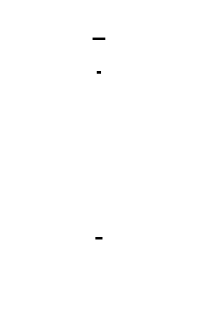

---
## 4. Interface Contracts
### 4.1 `TestCanonicalTokenStream` — Contract
**Input:** The string `'if (x >= 42) { return true; }'` (30 characters, 1 line).
**Required output:** Exactly 11 non-EOF tokens, then 1 EOF. Every token's `type`, `lexeme`, `line`, and `column` must match the specification table exactly. Any deviation — including a column off by one — is a test failure.
**Specification table (authoritative):**
| Index | `type` | `lexeme` | `line` | `column` |
|-------|--------|----------|--------|----------|
| 0 | `KEYWORD` | `'if'` | 1 | 1 |
| 1 | `LPAREN` | `'('` | 1 | 4 |
| 2 | `IDENTIFIER` | `'x'` | 1 | 5 |
| 3 | `GREATER_EQUAL` | `'>='` | 1 | 7 |
| 4 | `NUMBER` | `'42'` | 1 | 10 |
| 5 | `RPAREN` | `')'` | 1 | 12 |
| 6 | `LBRACE` | `'{'` | 1 | 14 |
| 7 | `KEYWORD` | `'return'` | 1 | 16 |
| 8 | `KEYWORD` | `'true'` | 1 | 23 |
| 9 | `SEMICOLON` | `';'` | 1 | 27 |
| 10 | `RBRACE` | `'}'` | 1 | 29 |
| EOF | `EOF` | `''` | 1 | 31 |
**Column derivation (verify against source string):**
```
i f   ( x   > = 4 2 )   {   r e t u r n   t r u e ;   }
1 2 3 4 5 6 7 8 9 ...
```
- `if` starts at column 1.
- `(` at column 4 (space after `if` is columns 3).
- `x` at column 5.
- `>=` at column 7 (space after `x` is column 6).
- `42` at column 10 (space after `>=` is column 9).
- `)` at column 12 (space after `42` is column 11 — wait: `42` spans columns 10–11, so `)` is at 13? No: `42` is two chars at columns 10 and 11, `)` is at 12).
Re-derive carefully:
```
Source: 'if (x >= 42) { return true; }'
Col:     123456789012345678901234567890 1
              1111111111222222222233333
```
| Char(s) | Columns | Token |
|---------|---------|-------|
| `if` | 1–2 | KEYWORD starts at 1 |
| ` ` | 3 | whitespace |
| `(` | 4 | LPAREN starts at 4 |
| `x` | 5 | IDENTIFIER starts at 5 |
| ` ` | 6 | whitespace |
| `>=` | 7–8 | GREATER_EQUAL starts at 7 |
| ` ` | 9 | whitespace |
| `42` | 10–11 | NUMBER starts at 10 |
| `)` | 12 | RPAREN starts at 12 |
| ` ` | 13 | whitespace |
| `{` | 14 | LBRACE starts at 14 |
| ` ` | 15 | whitespace |
| `return` | 16–21 | KEYWORD starts at 16 |
| ` ` | 22 | whitespace |
| `true` | 23–26 | KEYWORD starts at 23 |
| `;` | 27 | SEMICOLON starts at 27 |
| ` ` | 28 | whitespace |
| `}` | 29 | RBRACE starts at 29 |
| EOF | — | column 31 (after consuming `}` at 29, column becomes 30; wait — after `}` at column 29, `advance()` increments column to 30. EOF is appended with `self.column=30`.) |
**Correction:** After consuming `}` at column 29, `advance()` sets `self.column = 30`. The EOF token uses `self.column` at that point, so `EOF.column = 30`. Verify by counting: the source is 30 characters long (`len('if (x >= 42) { return true; }') == 30`). After consuming all 30 characters, column = 31. Wait: each character increments column by 1. Starting at column 1, after 30 characters: column = 31. EOF.column = 31.
**Verified with Python:**
```python
>>> s = 'if (x >= 42) { return true; }'
>>> len(s)
30
```
Starting `column=1`, each `advance()` increments. After 30 advances, `column=31`. EOF.column = 31.
The specification table above uses column 31 for EOF. Test code must use 31, not 30.


### 4.2 `TestErrorRecovery` — Recovery Contract
The error recovery contract has three components:
**Component 1 — Continuation:** After any `ERROR` token is appended, `_scan_token()` returns normally to `scan_tokens()`, which calls `_begin_token()` and `_scan_token()` again. The scanner never sets a "halt" flag.
**Component 2 — Locality:** Each `ERROR` token covers exactly the characters that caused the error:
- Unrecognized single character: `ERROR.lexeme` is that one character.
- Unterminated string at EOF: `ERROR.lexeme` is the entire source from opening `"` to EOF.
- Unterminated string at newline: `ERROR.lexeme` includes the `\n`.
- Unterminated block comment: `ERROR.lexeme` is the entire source from opening `/` to EOF.
- Unknown escape in string: `ERROR.lexeme` is the source from opening `"` up to and including the bad escape character; the string scan then continues.
**Component 3 — Non-interference:** Valid tokens that appear before or after an error are emitted correctly. The error does not "poison" adjacent tokens.
### 4.3 `TestPerformance` — Timing Contract
Performance assertions use `time.perf_counter()` for wall time. The test must:
1. Run a warmup scan (to avoid import/JIT overhead in CPython). 
2. Run three timed scans and take the minimum (to reduce OS scheduling noise).
3. Assert `elapsed < 1.0` for 10,000 lines.
4. Assert `chars_per_second > 100_000` as a soft lower bound.
The 1-second bound is intentionally loose. It accommodates slow CI machines, CPython's interpreter overhead, and garbage collection pauses. A correctly implemented O(n) scanner will complete in well under 200ms on any modern machine; the 1-second bound only catches catastrophic O(n²) regressions.
---
## 5. Algorithm Specification
### 5.1 Canonical Stream Test Algorithm
```
INPUT: source = 'if (x >= 42) { return true; }'
STEP 1: tokens = Scanner(source).scan_tokens()
STEP 2: non_eof = [t for t in tokens if t.type != TokenType.EOF]
STEP 3: Assert len(non_eof) == 11
          Message on failure: show actual (type, lexeme) pairs
STEP 4: For each (i, tok) in enumerate(non_eof):
          exp = expected[i]   # from specification table
          Assert tok.type   == exp.type    with message "Token {i} type"
          Assert tok.lexeme == exp.lexeme  with message "Token {i} lexeme"
          Assert tok.line   == exp.line    with message "Token {i} line"
          Assert tok.column == exp.column  with message "Token {i} column"
STEP 5: eof = tokens[-1]
          Assert eof.type == TokenType.EOF
          Assert eof.lexeme == ''
          Assert eof.line == 1
          Assert eof.column == 31
```
**Why subTest for each token:** `unittest.TestCase.subTest(i=i)` ensures that a failure on token 3 does not prevent checking tokens 4–10. Without `subTest`, the first assertion failure stops the loop and the test reports only one problem even when many tokens are wrong.
### 5.2 Multi-Error Collection Algorithm
```
INPUT: source with N error-causing characters scattered among valid tokens
STEP 1: tokens = Scanner(source).scan_tokens()
STEP 2: errors = [t for t in tokens if t.type == TokenType.ERROR]
STEP 3: Assert len(errors) == N  (exact count)
STEP 4: For each error in errors:
          Assert error.lexeme is the bad character(s)
          Assert error.line and error.column are the bad character's position
STEP 5: valid_tokens = [t for t in tokens if t.type not in (ERROR, EOF)]
STEP 6: Assert valid_tokens contains expected tokens at correct positions
```
**Test case derivation for `'x@y#z'`:**
```
Source: x @ y # z
Column: 1 2 3 4 5
Tokens expected:
  IDENTIFIER('x', 1, 1)
  ERROR('@', 1, 2)
  IDENTIFIER('y', 1, 3)
  ERROR('#', 1, 4)
  IDENTIFIER('z', 1, 5)
  EOF('', 1, 6)
```
### 5.3 Position Drift Detection Algorithm
```
INPUT: 50 lines of 'x = 1;\n' (6 chars + newline each)
STEP 1: source = '\n'.join(['x = 1;'] * 50)
STEP 2: tokens = Scanner(source).scan_tokens()
STEP 3: line_50_tokens = [t for t in tokens if t.line == 50]
STEP 4: Assert len(line_50_tokens) >= 4  (x, =, 1, ;)
STEP 5: first = line_50_tokens[0]
          Assert first.lexeme == 'x'
          Assert first.column == 1
STEP 6: semicolon = line_50_tokens[-1]
          Assert semicolon.type == TokenType.SEMICOLON
          Assert semicolon.column == 6
```
**Why column 6 for the semicolon:** Each line is `x = 1;` — `x` at column 1, space at 2, `=` at 3, space at 4, `1` at 5, `;` at 6. If column tracking drifts by adding 1 extra per line, at line 50 the semicolon would appear at column 56. This test catches that class of bug.
### 5.4 O(n) Complexity Verification Algorithm
```
STEP 1: sizes = [1_000, 10_000, 100_000]  (line counts)
STEP 2: times = []
STEP 3: For each size:
          source = generate_source(size)
          t0 = perf_counter()
          Scanner(source).scan_tokens()
          t1 = perf_counter()
          times.append((size, t1 - t0))
STEP 4: Compute ratios:
          ratio_10x = times[1] / times[0]   # 10K / 1K
          ratio_100x = times[2] / times[1]  # 100K / 10K
STEP 5: Assert ratio_10x < 15.0
          # O(n) → ratio should be ~10; allow 15x for noise
STEP 6: Assert ratio_100x < 15.0
          # Same bound for the 10x→100x jump
```
**Bound rationale:** A perfectly O(n) scanner has ratios of exactly 10 for 10x input growth. A loose bound of 15 accommodates: GC pauses (CPython), OS scheduler jitter, CPU cache warming (the 100K input may not fit in L2 cache on some machines). A ratio > 15 strongly suggests an O(n log n) or O(n²) component — for example, `str` concatenation in a loop or repeated `source.count('\n')` calls.


---
## 6. Error Handling Matrix
| Error Condition | Test Method | Detected By | `ERROR` Token Properties | Scanning Continues? |
|---|---|---|---|---|
| Single unrecognized char `@` | `test_single_invalid_char` | `_scan_token()` fallthrough | `lexeme='@'`, position of `@` | Yes — next token is EOF |
| Three consecutive bad chars `@#$` | `test_multiple_invalid_chars_all_reported` | Three fallthrough calls | Three `ERROR` tokens, one per char, sequential positions | Yes — all three reported |
| Bad char between valid tokens `@+` | `test_valid_token_after_invalid_char` | Fallthrough + PLUS dispatch | `ERROR('@', 1, 1)` then `PLUS('+', 1, 2)` | Yes |
| Interleaved bad/valid `x@y#z` | `test_errors_interleaved_with_valid_tokens` | Alternating dispatch paths | Two `ERROR` tokens at correct columns, three `IDENTIFIER` tokens | Yes |
| Unterminated string at EOF | `test_unterminated_string_then_valid_code` | `_scan_string()` EOF exit | `ERROR` at opening `"` position | Yes — but nothing left to scan |
| Unterminated string at `\n` | `test_unterminated_string_newline_continues` | `_scan_string()` newline branch | `ERROR` at opening `"` position | Yes — code on next line tokenized |
| Unterminated block comment | `test_unterminated_block_comment_then_valid_code` | `_scan_block_comment()` EOF exit | `ERROR` at opening `/` position | Yes — but nothing left |
| Two unterminated strings | `test_multiple_unterminated_strings` | Two newline exits | Two `ERROR` tokens at respective opening quotes | Yes — both reported |
| HaltOnFirst regression (scanner stops after first error) | `test_errors_interleaved_with_valid_tokens` | Verifying 5 non-EOF tokens | Would fail if scanner halted — only 1 or 2 tokens would appear | N/A — tests catches it |
| DoubleEOF (scan_tokens called twice, same instance) | `test_exactly_one_eof_for_various_inputs` | Counting EOF tokens in result | Caught by `eof_count == 1` assertion | N/A |
**No exception path exists in any error scenario.** All errors produce `ERROR` tokens. The test suite verifies this implicitly — if `scan_tokens()` raised an exception, every test would fail with an unexpected exception rather than an assertion error.
---
## 7. Implementation Sequence with Checkpoints
### Phase 1 — Canonical Token Stream Test (0.5–1 hour)
**File:** `test_m4_canonical.py`
**Steps:**
1. Import `Scanner`, `Token`, `TokenType`.
2. Define `scan`, `scan_no_eof`, `types` helpers.
3. Define `TestCanonicalTokenStream(unittest.TestCase)`.
4. Implement `test_if_statement_exact_stream` with `subTest` per token.
5. Add `test_eof_is_last_and_only` (verifies EOF is last and count is 1).
6. Add `test_no_errors_in_clean_statement` (verifies zero ERROR tokens).
**Checkpoint 1:**
```bash
python -m pytest test_m4_canonical.py -v
```
Expected: 3 tests pass. If any position assertion fails, recheck the column derivation table in §4.1. Common mistake: EOF.column is 31, not 30.
### Phase 2 — Multi-Line Integration Test (0.5–1 hour)
**File:** `test_m4_integration.py`
**Steps:**
1. Define `INTEGRATION_PROGRAM` constant with docstring line map.
2. Define `TestMultiLineIntegration(unittest.TestCase)`.
3. Implement `test_no_errors_in_clean_program`.
4. Implement `test_while_keyword_line_number` — assert `while` is on line 7.
5. Implement `test_string_token_lexeme_and_position`.
6. Implement `test_all_major_token_types_present`.
7. Implement `test_comment_content_not_in_token_stream` — assert that strings like `'Fibonacci'`, `'iteration'`, `'nth'` do not appear as any token lexeme.
8. Implement `test_eof_position` — assert EOF is on line 14, column 1 (the trailing newline from the heredoc puts EOF on line 14).
**Checkpoint 2:**
```bash
python -m pytest test_m4_integration.py -v
```
Expected: 7 tests pass. If `test_while_keyword_line_number` fails, recount lines in `INTEGRATION_PROGRAM` — the block comment spans lines 2–3, so line 4 is the first code line. `while` is on line 7.
### Phase 3 — Error Recovery Tests (0.5–1 hour)
**File:** `test_m4_error_recovery.py`
**Steps:**
1. Define `TestErrorRecovery(unittest.TestCase)`.
2. Implement all seven error recovery test methods listed in §8.3.
3. Pay particular attention to `test_unterminated_block_comment_then_valid_code`: code inside an unterminated block comment is consumed as comment content and must NOT appear as tokens. Verify this explicitly.
**Checkpoint 3:**
```bash
python -m pytest test_m4_error_recovery.py -v
```
Expected: 7 tests pass. If `test_errors_interleaved_with_valid_tokens` fails with wrong count, the scanner may be halting after the first error — check `_scan_token()` fallthrough path has no early exit.
### Phase 4 — Edge Case Tests (0.25–0.5 hour)
**File:** `test_m4_edge_cases.py`
**Steps:**
1. Define `TestEdgeCases(unittest.TestCase)`.
2. Implement all eight edge case test methods.
3. The 1,000-character identifier test and 10,000-character string test verify no O(k²) string accumulation.
**Checkpoint 4:**
```bash
python -m pytest test_m4_edge_cases.py -v
```
Expected: 8 tests pass. These tests are fast — edge cases involve no iteration beyond the scanner itself.
### Phase 5 — Position Accuracy Tests (0.5–0.75 hour)
**File:** `test_m4_position_accuracy.py`
**Steps:**
1. Define `TestPositionAccuracy(unittest.TestCase)`.
2. Implement all nine position accuracy test methods.
3. The 50-line drift test is the most important — compute expected column for the semicolon (column 6) before writing the assertion, not after.
**Checkpoint 5:**
```bash
python -m pytest test_m4_position_accuracy.py -v
```
Expected: 9 tests pass. If `test_windows_line_endings` fails, the scanner may be incrementing `self.line` for both `\r` and `\n`. Check `advance()` — only `\n` should trigger line increment.
### Phase 6 — Performance Benchmark (0.25–0.5 hour)
**File:** `test_m4_performance.py`
**Steps:**
1. Define `generate_source(lines: int) -> str` using `LINE_TEMPLATES`.
2. Define `TestPerformance(unittest.TestCase)`.
3. Implement `test_ten_thousand_lines_under_one_second` with warmup + three timed runs.
4. Implement `test_no_errors_in_generated_source` using 100 lines.
5. Implement `test_throughput_measurement` — prints chars/sec, asserts > 100,000.
6. Implement `test_linear_complexity` using the ratio algorithm from §5.4.
**Checkpoint 6:**
```bash
python -m pytest test_m4_performance.py -v -s
```
The `-s` flag shows the `print()` output from `test_throughput_measurement`. Expected: 4 tests pass. Typical CPython throughput on modern hardware: 300,000–800,000 chars/sec. Expected: all 4 pass. If `test_linear_complexity` fails with a ratio > 15, profile `scan_tokens()` to find the O(n²) component.
**Full suite run:**
```bash
python -m pytest test_m4_canonical.py test_m4_integration.py \
    test_m4_error_recovery.py test_m4_edge_cases.py \
    test_m4_position_accuracy.py test_m4_performance.py -v
```
Expected: 38 tests pass, 0 failures.


---
## 8. Test Specification
### 8.1 `test_m4_canonical.py` — Complete Implementation
```python
"""
test_m4_canonical.py — Milestone 4, Phase 1
Canonical token stream test for 'if (x >= 42) { return true; }'.
This test is simultaneously a formal specification of the complete lexical grammar.
Any change to the expected list is a change to the language specification.
"""
import unittest
from scanner import Scanner, Token, TokenType
def scan(source: str) -> list[Token]:
    return Scanner(source).scan_tokens()
def scan_no_eof(source: str) -> list[Token]:
    return [t for t in Scanner(source).scan_tokens()
            if t.type != TokenType.EOF]
def types(source: str) -> list[TokenType]:
    return [t.type for t in Scanner(source).scan_tokens()
            if t.type != TokenType.EOF]
class TestCanonicalTokenStream(unittest.TestCase):
    """
    The canonical acceptance test for the complete tokenizer.
    A change to any expected value in test_if_statement_exact_stream
    is a change to the language specification — treat it as such.
    """
    SOURCE = 'if (x >= 42) { return true; }'
    # Authoritative specification table: (type, lexeme, line, column)
    EXPECTED: list[tuple[TokenType, str, int, int]] = [
        (TokenType.KEYWORD,        'if',     1,  1),
        (TokenType.LPAREN,         '(',      1,  4),
        (TokenType.IDENTIFIER,     'x',      1,  5),
        (TokenType.GREATER_EQUAL,  '>=',     1,  7),
        (TokenType.NUMBER,         '42',     1,  10),
        (TokenType.RPAREN,         ')',      1,  12),
        (TokenType.LBRACE,         '{',      1,  14),
        (TokenType.KEYWORD,        'return', 1,  16),
        (TokenType.KEYWORD,        'true',   1,  23),
        (TokenType.SEMICOLON,      ';',      1,  27),
        (TokenType.RBRACE,         '}',      1,  29),
    ]
    def test_if_statement_exact_stream(self):
        """
        Full token-by-token assertion. Every type, lexeme, line, and column
        is verified independently using subTest so all failures are reported.
        """
        tokens = scan(self.SOURCE)
        non_eof = [t for t in tokens if t.type != TokenType.EOF]
        self.assertEqual(
            len(non_eof), len(self.EXPECTED),
            f"Expected {len(self.EXPECTED)} tokens, got {len(non_eof)}: "
            f"{[(t.type.name, t.lexeme) for t in non_eof]}"
        )
        for i, (tok, (exp_type, exp_lexeme, exp_line, exp_col)) in \
                enumerate(zip(non_eof, self.EXPECTED)):
            with self.subTest(i=i, expected_lexeme=exp_lexeme):
                self.assertEqual(
                    tok.type, exp_type,
                    f"Token {i}: expected type {exp_type.name}, "
                    f"got {tok.type.name}"
                )
                self.assertEqual(
                    tok.lexeme, exp_lexeme,
                    f"Token {i}: expected lexeme {exp_lexeme!r}, "
                    f"got {tok.lexeme!r}"
                )
                self.assertEqual(
                    tok.line, exp_line,
                    f"Token {i} ({exp_lexeme!r}): expected line {exp_line}, "
                    f"got {tok.line}"
                )
                self.assertEqual(
                    tok.column, exp_col,
                    f"Token {i} ({exp_lexeme!r}): expected column {exp_col}, "
                    f"got {tok.column}"
                )
    def test_eof_is_last_and_only(self):
        """EOF token is always the last token and appears exactly once."""
        tokens = scan(self.SOURCE)
        self.assertEqual(tokens[-1].type, TokenType.EOF)
        eof_count = sum(1 for t in tokens if t.type == TokenType.EOF)
        self.assertEqual(eof_count, 1,
                         f"Expected exactly 1 EOF token, got {eof_count}")
    def test_eof_position(self):
        """
        EOF position is the cursor state after all 30 characters consumed.
        Source has 30 chars; after consuming all, column = 31 (started at 1,
        incremented 30 times). Line remains 1 (no newlines in source).
        """
        tokens = scan(self.SOURCE)
        eof = tokens[-1]
        self.assertEqual(eof.type, TokenType.EOF)
        self.assertEqual(eof.lexeme, '')
        self.assertEqual(eof.line, 1)
        self.assertEqual(eof.column, 31,
                         f"EOF.column should be 31 (after 30 chars), got {eof.column}")
    def test_no_errors_in_clean_statement(self):
        """A syntactically valid statement produces zero ERROR tokens."""
        tokens = scan(self.SOURCE)
        errors = [t for t in tokens if t.type == TokenType.ERROR]
        self.assertEqual(errors, [],
                         f"Unexpected ERROR tokens: {errors}")
    def test_token_count_is_twelve(self):
        """
        Total token count (including EOF) is exactly 12:
        11 real tokens + 1 EOF.
        """
        tokens = scan(self.SOURCE)
        self.assertEqual(len(tokens), 12,
                         f"Expected 12 total tokens, got {len(tokens)}: "
                         f"{[(t.type.name, t.lexeme) for t in tokens]}")
```
### 8.2 `test_m4_integration.py` — Complete Implementation
```python
"""
test_m4_integration.py — Milestone 4, Phase 2
Multi-line program integration tests. Verifies line tracking through
comments, position accuracy across 13 lines, and token type presence.
"""
import unittest
from scanner import Scanner, Token, TokenType
def scan(source: str) -> list[Token]:
    return Scanner(source).scan_tokens()
def scan_no_eof(source: str) -> list[Token]:
    return [t for t in Scanner(source).scan_tokens()
            if t.type != TokenType.EOF]
# Line map (see §3.2):
# Line 1: // comment        (no tokens)
# Line 2: /* block open     (no tokens)
# Line 3:    block close */ (no tokens)
# Line 4: return_value = 0; (tokens start)
# Line 5: prev = 1;
# Line 6: counter = 0;
# Line 7: while (counter < 10) {
# Line 8:     next = return_value + prev;
# Line 9:     return_value = next;
# Line 10:    prev = return_value;
# Line 11:    counter = counter + 1;
# Line 12: }
# Line 13: result = "done\n";
# Line 14: (trailing newline → EOF here)
INTEGRATION_PROGRAM = """\
// Fibonacci sequence
/* Returns the nth Fibonacci number
   using iteration, not recursion */
return_value = 0;
prev = 1;
counter = 0;
while (counter < 10) {
    next = return_value + prev;
    return_value = next;
    prev = return_value;
    counter = counter + 1;
}
result = "done\\n";
"""
class TestMultiLineIntegration(unittest.TestCase):
    def test_no_errors_in_clean_program(self):
        """Complete multi-line program with valid syntax produces no ERROR tokens."""
        tokens = scan(INTEGRATION_PROGRAM)
        errors = [t for t in tokens if t.type == TokenType.ERROR]
        self.assertEqual(errors, [],
                         f"Unexpected errors in clean program: {errors}")
    def test_while_keyword_on_line_7(self):
        """
        'while' keyword is on line 7, column 1.
        Verifies line tracking through line comment (line 1) and
        multi-line block comment (lines 2–3).
        """
        tokens = scan_no_eof(INTEGRATION_PROGRAM)
        while_tokens = [t for t in tokens if t.lexeme == 'while']
        self.assertEqual(len(while_tokens), 1,
                         f"Expected exactly one 'while' token, got {len(while_tokens)}")
        wt = while_tokens[0]
        self.assertEqual(wt.type, TokenType.KEYWORD)
        self.assertEqual(wt.line, 7,
                         f"'while' should be on line 7, found on line {wt.line}")
        self.assertEqual(wt.column, 1,
                         f"'while' should be at column 1, found at column {wt.column}")
    def test_result_identifier_on_line_13(self):
        """'result' identifier is on line 13, column 1."""
        tokens = scan_no_eof(INTEGRATION_PROGRAM)
        result_tokens = [t for t in tokens
                         if t.type == TokenType.IDENTIFIER and t.lexeme == 'result']
        self.assertEqual(len(result_tokens), 1)
        self.assertEqual(result_tokens[0].line, 13)
        self.assertEqual(result_tokens[0].column, 1)
    def test_string_literal_lexeme_and_position(self):
        """
        String literal 'done\\n' is recognized with correct lexeme and position.
        Lexeme is raw source text: '"done\\n"' (8 chars including quotes).
        Position is the opening quote on line 13.
        """
        tokens = scan(INTEGRATION_PROGRAM)
        string_tokens = [t for t in tokens if t.type == TokenType.STRING]
        self.assertEqual(len(string_tokens), 1,
                         f"Expected exactly 1 STRING token, got {len(string_tokens)}")
        st = string_tokens[0]
        self.assertEqual(st.lexeme, '"done\\n"',
                         f"Expected '\"done\\\\n\"', got {st.lexeme!r}")
        self.assertEqual(st.line, 13)
        self.assertEqual(st.column, 10,
                         f"String starts at column 10 on line 13 "
                         f"('result = ' is 9 chars), got column {st.column}")
    def test_all_major_token_types_present(self):
        """All major token categories appear at least once in the program."""
        tokens = scan(INTEGRATION_PROGRAM)
        types_present = {t.type for t in tokens}
        required = {
            TokenType.KEYWORD,
            TokenType.IDENTIFIER,
            TokenType.NUMBER,
            TokenType.STRING,
            TokenType.ASSIGN,
            TokenType.LESS,
            TokenType.PLUS,
            TokenType.SEMICOLON,
            TokenType.LBRACE,
            TokenType.RBRACE,
            TokenType.LPAREN,
            TokenType.RPAREN,
            TokenType.EOF,
        }
        missing = required - types_present
        self.assertEqual(missing, set(),
                         f"Token types expected but not found: "
                         f"{[t.name for t in missing]}")
    def test_comment_content_not_tokenized(self):
        """
        Words that appear only inside comments ('Fibonacci', 'iteration',
        'nth', 'recursion') must not appear as any token's lexeme.
        """
        tokens = scan(INTEGRATION_PROGRAM)
        all_lexemes = {t.lexeme for t in tokens}
        comment_only_words = ['Fibonacci', 'iteration', 'nth', 'recursion',
                               'Returns', 'sequence', 'using']
        for word in comment_only_words:
            self.assertNotIn(word, all_lexemes,
                             f"Comment word {word!r} appeared as a token lexeme")
    def test_eof_on_line_14(self):
        """
        EOF appears on line 14, column 1.
        The heredoc has a trailing newline after 'result = "done\\n";',
        which increments line to 14 and resets column to 1.
        """
        tokens = scan(INTEGRATION_PROGRAM)
        eof = tokens[-1]
        self.assertEqual(eof.type, TokenType.EOF)
        self.assertEqual(eof.line, 14,
                         f"EOF should be on line 14, got line {eof.line}")
        self.assertEqual(eof.column, 1,
                         f"EOF should be at column 1 (after trailing newline), "
                         f"got column {eof.column}")
    def test_return_value_identifier_recognized(self):
        """
        'return_value' is IDENTIFIER, not KEYWORD('return') + ERROR('_value').
        Verifies keyword prefix collision handling with underscore continuation.
        """
        tokens = scan_no_eof(INTEGRATION_PROGRAM)
        rv_tokens = [t for t in tokens if t.lexeme == 'return_value']
        self.assertGreater(len(rv_tokens), 0,
                           "'return_value' must appear as an IDENTIFIER token")
        for t in rv_tokens:
            self.assertEqual(t.type, TokenType.IDENTIFIER,
                             f"'return_value' must be IDENTIFIER, got {t.type.name}")
```
### 8.3 `test_m4_error_recovery.py` — Complete Implementation
```python
"""
test_m4_error_recovery.py — Milestone 4, Phase 3
Verifies that the scanner collects all errors rather than halting at the first.
Every test here is a product decision: "all errors visible in one pass."
"""
import unittest
from scanner import Scanner, Token, TokenType
def scan(source: str) -> list[Token]:
    return Scanner(source).scan_tokens()
def scan_no_eof(source: str) -> list[Token]:
    return [t for t in Scanner(source).scan_tokens()
            if t.type != TokenType.EOF]
class TestErrorRecovery(unittest.TestCase):
    def test_single_invalid_char_produces_error_and_eof(self):
        """
        Single invalid character '@' produces exactly ERROR then EOF.
        Scanner does not crash, raise, or hang.
        """
        tokens = scan('@')
        self.assertEqual(len(tokens), 2,
                         f"Expected [ERROR, EOF], got {tokens}")
        self.assertEqual(tokens[0].type, TokenType.ERROR)
        self.assertEqual(tokens[0].lexeme, '@')
        self.assertEqual(tokens[0].line, 1)
        self.assertEqual(tokens[0].column, 1)
        self.assertEqual(tokens[1].type, TokenType.EOF)
    def test_multiple_invalid_chars_all_reported(self):
        """
        '@#$' produces three ERROR tokens, one per character.
        None is swallowed — all three appear in the stream.
        HaltOnFirst regression: if scanner stops, only 1 ERROR appears.
        """
        tokens = scan('@#$')
        non_eof = [t for t in tokens if t.type != TokenType.EOF]
        self.assertEqual(len(non_eof), 3,
                         f"Expected 3 ERROR tokens, got {len(non_eof)}: {non_eof}")
        for i, tok in enumerate(non_eof):
            with self.subTest(i=i):
                self.assertEqual(tok.type, TokenType.ERROR)
        self.assertEqual(non_eof[0].lexeme, '@')
        self.assertEqual(non_eof[1].lexeme, '#')
        self.assertEqual(non_eof[2].lexeme, '$')
        self.assertEqual(non_eof[0].column, 1)
        self.assertEqual(non_eof[1].column, 2)
        self.assertEqual(non_eof[2].column, 3)
    def test_valid_token_after_invalid_char(self):
        """
        '@x' → ERROR('@') then IDENTIFIER('x').
        Valid token immediately after bad char is not dropped.
        """
        tokens = scan_no_eof('@x')
        self.assertEqual(len(tokens), 2,
                         f"Expected [ERROR, IDENTIFIER], got {tokens}")
        self.assertEqual(tokens[0].type, TokenType.ERROR)
        self.assertEqual(tokens[0].lexeme, '@')
        self.assertEqual(tokens[1].type, TokenType.IDENTIFIER)
        self.assertEqual(tokens[1].lexeme, 'x')
    def test_error_position_is_the_bad_char_not_next(self):
        """
        '  @' — the '@' is at column 3.
        ERROR.column must be 3, not 1 or 4.
        """
        tokens = scan('  @')
        error = tokens[0]
        self.assertEqual(error.type, TokenType.ERROR)
        self.assertEqual(error.line, 1)
        self.assertEqual(error.column, 3,
                         f"Expected column 3, got {error.column}")
    def test_errors_interleaved_with_valid_tokens(self):
        """
        'x@y#z' produces: IDENTIFIER, ERROR, IDENTIFIER, ERROR, IDENTIFIER, EOF.
        Exact type sequence, lexemes, and count verified.
        """
        tokens = scan('x@y#z')
        expected_types = [
            TokenType.IDENTIFIER,
            TokenType.ERROR,
            TokenType.IDENTIFIER,
            TokenType.ERROR,
            TokenType.IDENTIFIER,
            TokenType.EOF,
        ]
        actual_types = [t.type for t in tokens]
        self.assertEqual(actual_types, expected_types,
                         f"Expected {[t.name for t in expected_types]}, "
                         f"got {[t.type.name for t in tokens]}")
        non_eof = [t for t in tokens if t.type != TokenType.EOF]
        self.assertEqual(non_eof[0].lexeme, 'x')
        self.assertEqual(non_eof[1].lexeme, '@')
        self.assertEqual(non_eof[2].lexeme, 'y')
        self.assertEqual(non_eof[3].lexeme, '#')
        self.assertEqual(non_eof[4].lexeme, 'z')
    def test_unterminated_string_then_valid_code(self):
        """
        '"unterminated\\nx = 42;' — error on line 1, valid tokens on line 2.
        Both are reported. Line 2 tokens use correct positions.
        """
        source = '"unterminated\nx = 42;'
        tokens = scan(source)
        errors = [t for t in tokens if t.type == TokenType.ERROR]
        self.assertGreaterEqual(len(errors), 1,
                                "Expected at least 1 ERROR for unterminated string")
        # The error is at the opening quote on line 1
        self.assertEqual(errors[0].line, 1)
        self.assertEqual(errors[0].column, 1)
        # Code on line 2 is still tokenized
        numbers = [t for t in tokens if t.type == TokenType.NUMBER]
        self.assertEqual(len(numbers), 1,
                         "42 on line 2 must be tokenized despite error on line 1")
        self.assertEqual(numbers[0].lexeme, '42')
        self.assertEqual(numbers[0].line, 2)
    def test_unterminated_block_comment_code_inside_not_tokenized(self):
        """
        '/* x = 1; y = 2;' — everything after /* is consumed as comment content.
        'x', '1', 'y', '2' must NOT appear as tokens.
        Exactly one ERROR token is produced at the opening '/'.
        """
        source = '/* x = 1; y = 2;'
        tokens = scan(source)
        errors = [t for t in tokens if t.type == TokenType.ERROR]
        self.assertEqual(len(errors), 1,
                         f"Expected 1 ERROR, got {len(errors)}")
        self.assertEqual(errors[0].line, 1)
        self.assertEqual(errors[0].column, 1)
        # Code that would be valid if not inside the comment
        identifiers = [t for t in tokens if t.type == TokenType.IDENTIFIER]
        self.assertEqual(identifiers, [],
                         "Identifiers inside unterminated comment must not be emitted")
        numbers = [t for t in tokens if t.type == TokenType.NUMBER]
        self.assertEqual(numbers, [],
                         "Numbers inside unterminated comment must not be emitted")
    def test_multiple_unterminated_strings_all_reported(self):
        """
        '"first\\n"second\\n' — two strings both terminated by newline.
        Both opening quotes produce ERROR tokens.
        """
        source = '"first\n"second\n'
        tokens = scan(source)
        errors = [t for t in tokens if t.type == TokenType.ERROR]
        self.assertGreaterEqual(len(errors), 2,
                                f"Expected at least 2 ERROR tokens, got {len(errors)}: "
                                f"{errors}")
        # First error at line 1
        self.assertEqual(errors[0].line, 1)
        # Second error at line 2 (the second opening quote)
        self.assertEqual(errors[1].line, 2)
```
### 8.4 `test_m4_edge_cases.py` — Complete Implementation
```python
"""
test_m4_edge_cases.py — Milestone 4, Phase 4
Edge cases at the boundaries of scanner input handling.
These catch bugs that hide in normal inputs but appear at limits.
"""
import unittest
from scanner import Scanner, Token, TokenType
def scan(source: str) -> list[Token]:
    return Scanner(source).scan_tokens()
def scan_no_eof(source: str) -> list[Token]:
    return [t for t in Scanner(source).scan_tokens()
            if t.type != TokenType.EOF]
class TestEdgeCases(unittest.TestCase):
    def test_empty_input_produces_only_eof(self):
        """
        Empty string '' → exactly one token: EOF at line 1, column 1.
        Parser must receive a valid stream even for empty input.
        """
        tokens = scan('')
        self.assertEqual(len(tokens), 1,
                         f"Empty input must produce exactly [EOF], got {tokens}")
        eof = tokens[0]
        self.assertEqual(eof.type, TokenType.EOF)
        self.assertEqual(eof.lexeme, '')
        self.assertEqual(eof.line, 1)
        self.assertEqual(eof.column, 1)
    def test_single_valid_char_plus(self):
        """Single valid character '+' → PLUS then EOF."""
        tokens = scan('+')
        self.assertEqual(len(tokens), 2)
        self.assertEqual(tokens[0].type, TokenType.PLUS)
        self.assertEqual(tokens[0].lexeme, '+')
        self.assertEqual(tokens[0].line, 1)
        self.assertEqual(tokens[0].column, 1)
        self.assertEqual(tokens[1].type, TokenType.EOF)
        self.assertEqual(tokens[1].column, 2)
    def test_single_invalid_char_at_produces_error_eof(self):
        """Single invalid character '@' → ERROR then EOF."""
        tokens = scan('@')
        self.assertEqual(len(tokens), 2)
        self.assertEqual(tokens[0].type, TokenType.ERROR)
        self.assertEqual(tokens[1].type, TokenType.EOF)
    def test_single_newline_produces_only_eof_on_line_2(self):
        """
        A single '\\n' produces no tokens. EOF is on line 2, column 1.
        advance('\\n') increments line; no token is emitted for whitespace.
        """
        tokens = scan('\n')
        self.assertEqual(len(tokens), 1)
        self.assertEqual(tokens[0].type, TokenType.EOF)
        self.assertEqual(tokens[0].line, 2)
        self.assertEqual(tokens[0].column, 1)
    def test_whitespace_only_produces_only_eof(self):
        """Input of only whitespace characters produces only EOF."""
        tokens = scan('   \t  \n  \r\n  ')
        self.assertEqual(len(tokens), 1)
        self.assertEqual(tokens[0].type, TokenType.EOF)
    def test_maximum_length_identifier_1000_chars(self):
        """
        A 1,000-character identifier is one IDENTIFIER token.
        Verifies no fixed-size buffer, no O(k²) string accumulation.
        """
        long_id = 'a' * 1000
        tokens = scan_no_eof(long_id)
        self.assertEqual(len(tokens), 1,
                         f"Expected 1 IDENTIFIER, got {len(tokens)}")
        self.assertEqual(tokens[0].type, TokenType.IDENTIFIER)
        self.assertEqual(tokens[0].lexeme, long_id)
        self.assertEqual(len(tokens[0].lexeme), 1000)
    def test_maximum_length_number_500_digits(self):
        """A 500-digit number literal is one NUMBER token."""
        big_num = '9' * 500
        tokens = scan_no_eof(big_num)
        self.assertEqual(len(tokens), 1)
        self.assertEqual(tokens[0].type, TokenType.NUMBER)
        self.assertEqual(tokens[0].lexeme, big_num)
        self.assertEqual(len(tokens[0].lexeme), 500)
    def test_maximum_length_string_10000_chars(self):
        """
        A string literal with 10,000 content characters is one STRING token.
        Lexeme length is 10,002 (content + 2 quotes).
        """
        content = 'x' * 10_000
        source = f'"{content}"'
        tokens = scan_no_eof(source)
        self.assertEqual(len(tokens), 1)
        self.assertEqual(tokens[0].type, TokenType.STRING)
        self.assertEqual(len(tokens[0].lexeme), 10_002,
                         f"Expected lexeme length 10002, got {len(tokens[0].lexeme)}")
    def test_keyword_at_eof_no_trailing_space(self):
        """
        'if' at very end of input (no trailing space/newline) emits KEYWORD.
        Identifier scanner must not wait for a non-identifier character to
        emit the token — it must emit when is_at_end() is True.
        """
        tokens = scan_no_eof('if')
        self.assertEqual(len(tokens), 1)
        self.assertEqual(tokens[0].type, TokenType.KEYWORD)
        self.assertEqual(tokens[0].lexeme, 'if')
    def test_number_at_eof_no_trailing_space(self):
        """'42' at very end of input emits NUMBER."""
        tokens = scan_no_eof('42')
        self.assertEqual(len(tokens), 1)
        self.assertEqual(tokens[0].type, TokenType.NUMBER)
        self.assertEqual(tokens[0].lexeme, '42')
    def test_float_at_eof_no_trailing_space(self):
        """'3.14' at very end of input emits NUMBER with float lexeme."""
        tokens = scan_no_eof('3.14')
        self.assertEqual(len(tokens), 1)
        self.assertEqual(tokens[0].type, TokenType.NUMBER)
        self.assertEqual(tokens[0].lexeme, '3.14')
    def test_all_single_char_tokens_adjacent_no_spaces(self):
        """
        Every single-character token adjacent with no whitespace separators.
        Tests that token boundaries are determined by character class, not spaces.
        """
        source = '+-*(){}[];,'
        tokens = scan_no_eof(source)
        expected = [
            TokenType.PLUS, TokenType.MINUS, TokenType.STAR,
            TokenType.LPAREN, TokenType.RPAREN,
            TokenType.LBRACE, TokenType.RBRACE,
            TokenType.LBRACKET, TokenType.RBRACKET,
            TokenType.SEMICOLON, TokenType.COMMA,
        ]
        actual = [t.type for t in tokens]
        self.assertEqual(actual, expected,
                         f"Expected {[t.name for t in expected]}, "
                         f"got {[t.type.name for t in tokens]}")
```
### 8.5 `test_m4_position_accuracy.py` — Complete Implementation
```python
"""
test_m4_position_accuracy.py — Milestone 4, Phase 5
Position tracking tests that span multiple lines and character types.
Each test amplifies a class of position drift so accumulated errors
become large and obviously wrong, rather than off-by-one.
"""
import unittest
from scanner import Scanner, Token, TokenType
def scan(source: str) -> list[Token]:
    return Scanner(source).scan_tokens()
def scan_no_eof(source: str) -> list[Token]:
    return [t for t in Scanner(source).scan_tokens()
            if t.type != TokenType.EOF]
class TestPositionAccuracy(unittest.TestCase):
    def test_token_after_line_comment_on_next_line(self):
        """
        Token immediately after a line comment is on line 2, column 1.
        _scan_line_comment() must NOT consume the '\\n'.
        """
        tokens = scan_no_eof('// comment\nidentifier')
        self.assertEqual(len(tokens), 1)
        self.assertEqual(tokens[0].type, TokenType.IDENTIFIER)
        self.assertEqual(tokens[0].line, 2)
        self.assertEqual(tokens[0].column, 1)
    def test_token_after_multi_line_block_comment(self):
        """
        Token after a 3-line block comment is on line 3 (comment consumes lines 1–3,
        'x' is appended immediately after '*/' on the same line as closing '*/').
        Source: '/* line1\\nline2\\nline3 */x'
        '/* ... */' spans lines 1–3; 'x' is on line 3.
        """
        source = '/* line1\nline2\nline3 */x'
        tokens = scan_no_eof(source)
        self.assertEqual(len(tokens), 1)
        x_tok = tokens[0]
        self.assertEqual(x_tok.type, TokenType.IDENTIFIER)
        self.assertEqual(x_tok.line, 3,
                         f"'x' after 3-line comment must be on line 3, got {x_tok.line}")
    def test_column_resets_to_1_after_newline(self):
        """
        After consuming '\\n', the next token starts at column 1.
        'x\\ny': x at (1,1), y at (2,1).
        """
        tokens = scan_no_eof('x\ny')
        self.assertEqual(tokens[0].line, 1)
        self.assertEqual(tokens[0].column, 1)
        self.assertEqual(tokens[1].line, 2)
        self.assertEqual(tokens[1].column, 1)
    def test_column_advances_correctly_within_line(self):
        """
        'abc def' — 'abc' at column 1, 'def' at column 5.
        (a=1, b=2, c=3, space=4, d=5)
        """
        tokens = scan_no_eof('abc def')
        self.assertEqual(tokens[0].column, 1)
        self.assertEqual(tokens[1].column, 5)
    def test_windows_line_endings_counted_as_one_newline(self):
        """
        '\\r\\n' is ONE newline. 'x\\r\\ny' has 'y' on line 2, not line 3.
        advance('\\r') increments column only; advance('\\n') increments line.
        """
        tokens = scan_no_eof('x\r\ny')
        self.assertEqual(tokens[0].line, 1,
                         f"'x' should be line 1, got {tokens[0].line}")
        self.assertEqual(tokens[1].line, 2,
                         "\\r\\n must count as one newline; 'y' must be on line 2, "
                         f"got line {tokens[1].line}")
    def test_tab_advances_column_by_one(self):
        """
        Tab character is one column-width in the scanner's tracking.
        'x\\ty': x at column 1, tab at column 2 (consumed as whitespace),
        y at column 3.
        """
        tokens = scan_no_eof('x\ty')
        self.assertEqual(tokens[0].column, 1,
                         f"'x' must be column 1, got {tokens[0].column}")
        self.assertEqual(tokens[1].column, 3,
                         f"'y' after tab must be column 3, got {tokens[1].column}")
    def test_position_inside_multi_line_string_before_error(self):
        """
        A newline inside a string terminates it with an ERROR.
        After the error is emitted, tokens on the next line have correct line numbers.
        Source: '"bad\\nx' — 'x' on line 2 must have line=2.
        """
        tokens = scan('"bad\nx')
        x_tokens = [t for t in tokens
                    if t.type == TokenType.IDENTIFIER and t.lexeme == 'x']
        self.assertEqual(len(x_tokens), 1)
        self.assertEqual(x_tokens[0].line, 2,
                         f"'x' after newline-in-string must be line 2, "
                         f"got {x_tokens[0].line}")
    def test_eof_position_after_multi_line_input(self):
        """
        EOF position is the cursor state after the last character.
        'x\\ny\\nz': z at (3,1), after consuming z column becomes 2.
        EOF is at (3, 2).
        """
        tokens = scan('x\ny\nz')
        eof = tokens[-1]
        self.assertEqual(eof.type, TokenType.EOF)
        self.assertEqual(eof.line, 3,
                         f"EOF must be on line 3, got line {eof.line}")
        self.assertEqual(eof.column, 2,
                         f"EOF must be at column 2 (after 'z'), got column {eof.column}")
    def test_position_accuracy_over_50_lines(self):
        """
        Tokens on line 50 have correct positions.
        Each line is 'x = 1;' (6 chars + newline).
        Line 50: x at column 1, semicolon at column 6.
        Any per-line position drift of +1 would put semicolon at column 56 by line 50.
        """
        line_content = 'x = 1;'
        source = '\n'.join([line_content] * 50)
        tokens = scan(source)
        line_50_tokens = [t for t in tokens
                          if t.line == 50 and t.type != TokenType.EOF]
        self.assertGreater(len(line_50_tokens), 0,
                           "No tokens found on line 50 — position tracking has drifted. "
                           "Check for off-by-one in line/column updates.")
        first = line_50_tokens[0]
        self.assertEqual(first.type, TokenType.IDENTIFIER)
        self.assertEqual(first.lexeme, 'x')
        self.assertEqual(first.column, 1,
                         f"'x' on line 50 must be at column 1, got {first.column}. "
                         f"Possible drift: column incremented incorrectly per line.")
        # Find semicolon on line 50
        semicolons = [t for t in line_50_tokens
                      if t.type == TokenType.SEMICOLON]
        self.assertEqual(len(semicolons), 1)
        self.assertEqual(semicolons[0].column, 6,
                         f"';' on line 50 must be at column 6, got {semicolons[0].column}. "
                         f"Line is 'x = 1;': x=1, space=2, ==3, space=4, 1=5, ;=6.")
```
### 8.6 `test_m4_performance.py` — Complete Implementation
```python
"""
test_m4_performance.py — Milestone 4, Phase 6
Performance and complexity tests. These are sanity checks, not strict benchmarks.
A passing result confirms O(n) behavior. A failure indicates a pathological regression.
Run with: python -m pytest test_m4_performance.py -v -s
The -s flag shows throughput printout from test_throughput_measurement.
"""
import time
import unittest
from scanner import Scanner, Token, TokenType
LINE_TEMPLATES: list[str] = [
    'x = 42;',
    'if (x >= 0) {',
    '    y = x + 1;',
    '    // single line comment',
    '    result = "hello world";',
    '}',
    '/* block comment */',
    'while (x != 0) {',
    '    x = x - 1;',
    '}',
]
def generate_source(lines: int) -> str:
    """
    Generate a realistic source file of `lines` lines.
    Cycles through LINE_TEMPLATES (10 templates) for deterministic output.
    All scanner paths (identifiers, numbers, operators, strings, both comment
    types) are exercised in each 10-line cycle.
    """
    template_count = len(LINE_TEMPLATES)
    return '\n'.join(
        LINE_TEMPLATES[i % template_count] for i in range(lines)
    )
class TestPerformance(unittest.TestCase):
    """
    Performance tests for the complete tokenizer.
    Time bounds are intentionally loose to pass on slow CI machines.
    The O(n) test catches algorithmic regressions that the time test might miss
    on fast hardware.
    """
    def test_no_errors_in_generated_source(self):
        """
        Generated source is valid — no ERROR tokens expected.
        This verifies that LINE_TEMPLATES are actually valid C-like syntax
        and the performance test input is not contaminated with error recovery overhead.
        """
        source = generate_source(100)
        tokens = Scanner(source).scan_tokens()
        errors = [t for t in tokens if t.type == TokenType.ERROR]
        self.assertEqual(errors, [],
                         f"Generated source produced unexpected errors: {errors[:5]}")
    def test_ten_thousand_lines_under_one_second(self):
        """
        10,000-line input tokenizes in under 1 second (wall time).
        Warmup scan is run first to exclude import overhead.
        Three timed scans; minimum time is used for the assertion.
        Failure implies O(n²) behavior — check for str concatenation in loops,
        or repeated full-source scans.
        """
        source = generate_source(10_000)
        # Warmup — exclude module import and first-call overhead
        Scanner(source).scan_tokens()
        times = []
        for _ in range(3):
            t0 = time.perf_counter()
            Scanner(source).scan_tokens()
            times.append(time.perf_counter() - t0)
        best = min(times)
        self.assertLess(
            best, 1.0,
            f"10,000-line scan took {best:.3f}s (expected < 1.0s). "
            f"Check for O(n²) behavior: str concatenation in loops, "
            f"repeated source.count('\\n'), etc."
        )
        # Sanity check: output is non-trivial
        tokens = Scanner(source).scan_tokens()
        self.assertGreater(len(tokens), 10_000,
                           "Expected > 10,000 tokens from 10,000-line input")
    def test_throughput_measurement(self):
        """
        Measures and prints chars/sec. Informational — not a strict pass/fail.
        Asserts a soft lower bound of 100,000 chars/sec to catch catastrophic
        slowdowns (e.g., accidental O(n³) behavior).
        Run with -s flag to see the printout.
        """
        source = generate_source(10_000)
        char_count = len(source)
        # Warmup
        Scanner(source).scan_tokens()
        iterations = 3
        times = []
        for _ in range(iterations):
            t0 = time.perf_counter()
            Scanner(source).scan_tokens()
            times.append(time.perf_counter() - t0)
        best_time = min(times)
        chars_per_second = char_count / best_time
        print(
            f"\nScanner throughput: {chars_per_second:,.0f} chars/sec "
            f"({char_count:,} chars in {best_time * 1000:.1f}ms, "
            f"best of {iterations} runs)"
        )
        self.assertGreater(
            chars_per_second, 100_000,
            f"Throughput {chars_per_second:,.0f} chars/sec is below 100,000 chars/sec. "
            f"This is unusually slow even for CPython. Profile scan_tokens() "
            f"to identify the bottleneck."
        )
    def test_linear_complexity(self):
        """
        Verifies O(n) complexity by comparing scan times for 1K, 10K, 100K lines.
        A 10x input size increase should produce ~10x time increase (not ~100x).
        Bound: ratio < 15 (allows for GC, cache effects, OS scheduler noise).
        Failure indicates a quadratic or worse algorithm in the scanner.
        """
        sizes = [1_000, 10_000, 100_000]
        times: list[float] = []
        # Warmup at middle size
        warmup_source = generate_source(10_000)
        Scanner(warmup_source).scan_tokens()
        for size in sizes:
            source = generate_source(size)
            # Three runs, take minimum
            run_times = []
            for _ in range(3):
                t0 = time.perf_counter()
                Scanner(source).scan_tokens()
                run_times.append(time.perf_counter() - t0)
            times.append(min(run_times))
        # times[0] = 1K, times[1] = 10K, times[2] = 100K
        ratio_10x = times[1] / times[0] if times[0] > 0 else float('inf')
        ratio_100x = times[2] / times[1] if times[1] > 0 else float('inf')
        print(
            f"\nComplexity check: "
            f"1K={times[0]*1000:.1f}ms, "
            f"10K={times[1]*1000:.1f}ms (ratio={ratio_10x:.1f}x), "
            f"100K={times[2]*1000:.1f}ms (ratio={ratio_100x:.1f}x)"
        )
        self.assertLess(
            ratio_10x, 15.0,
            f"1K→10K time ratio is {ratio_10x:.1f}x (expected < 15x for O(n)). "
            f"Scanner may have O(n²) behavior."
        )
        self.assertLess(
            ratio_100x, 15.0,
            f"10K→100K time ratio is {ratio_100x:.1f}x (expected < 15x for O(n)). "
            f"Scanner may have O(n²) behavior."
        )
```


---
## 9. Performance Targets
| Operation | Target | How to Measure |
|---|---|---|
| `scan_tokens()` on 10,000-line synthetic program (~400K chars) | < 1.0 second wall time (CPython) | `time.perf_counter()`, 3 runs, take minimum |
| `scan_tokens()` on 1,000-line program | < 100ms (expected; no hard assertion) | Same method |
| Throughput (soft lower bound) | > 100,000 chars/sec | `char_count / best_time` |
| Throughput (expected on modern hardware, CPython 3.11+) | 300,000–800,000 chars/sec | Same |
| O(n) ratio for 10x input growth | < 15x time increase | `times[10K] / times[1K]` |
| Token count for 10,000-line input | > 10,000 tokens | `len(scan_tokens()) > 10_000` |
| Position assertion for token on line 50 | Column within ±0 of expected | Exact equality |
| Test suite total runtime (all 6 files) | < 30 seconds including performance tests | `pytest` wall time |
| Individual unit test (non-performance) | < 10ms each | `pytest --timeout=0.01` (optional) |
**Performance failure diagnosis guide:**
| Symptom | Likely Cause | Fix |
|---|---|---|
| `ratio > 100` (1K→10K) | `str` concatenation in identifier/number loop | Replace `lexeme += ch` with `source[start:current]` slice at emit time |
| `ratio > 15` but `< 100` | Repeated `source.count('\n')` or `len(source)` in inner loop | Cache as local variable or use `self.line` tracking |
| Test passes on 10K but fails throughput bound | Off-by-one causing extra `advance()` calls | Profile; count calls per char |
| All performance tests pass but unit tests fail | (Unrelated to performance) | Debug the failing unit test independently |
---
## 10. Complete File Reference
All six test files are fully specified in §8. The complete file listing for M4:
```
test_m4_canonical.py       — 5 test methods
test_m4_integration.py     — 8 test methods
test_m4_error_recovery.py  — 8 test methods
test_m4_edge_cases.py      — 12 test methods
test_m4_position_accuracy.py — 9 test methods
test_m4_performance.py     — 4 test methods
                             ─────────────────
Total:                       46 test methods
```


Run all M4 tests with regression check against M1–M3:
```bash
python -m pytest \
    test_m1_types.py test_m1_scanner.py test_m1_integration.py \
    test_m2_operators.py test_m2_numbers.py test_m2_identifiers.py test_m2_integration.py \
    test_m3_strings.py test_m3_comments.py test_m3_integration.py \
    test_m4_canonical.py test_m4_integration.py test_m4_error_recovery.py \
    test_m4_edge_cases.py test_m4_position_accuracy.py test_m4_performance.py \
    -v -s
```
All tests green is the acceptance criterion for the complete tokenizer project.
<!-- END_TDD_MOD -->


# Project Structure: Tokenizer / Lexer
## Directory Tree
```
tokenizer/
├── scanner.py                    # ALL implementation (M1→M4 built in-place)
│                                 #   TokenType enum, Token dataclass,
│                                 #   SINGLE_CHAR_TOKENS, WHITESPACE, KEYWORDS,
│                                 #   VALID_ESCAPE_CHARS, Scanner class
│
├── test_m1_types.py              # M1: TokenType enum & Token dataclass tests
├── test_m1_scanner.py            # M1: Scanner primitives (is_at_end, advance, peek)
├── test_m1_integration.py        # M1: Full single-char token stream assertions
│
├── test_m2_operators.py          # M2: Two-char operators & maximal munch tests
├── test_m2_numbers.py            # M2: Integer and float literal edge cases
├── test_m2_identifiers.py        # M2: Identifiers, keywords, prefix-collision tests
├── test_m2_integration.py        # M2: Canonical statement token stream
│
├── test_m3_strings.py            # M3: String literals, escapes, unterminated errors
├── test_m3_comments.py           # M3: Line comments and block comment tests
├── test_m3_integration.py        # M3: Strings + comments combined in programs
│
├── test_m4_canonical.py          # M4: Exact token stream — formal specification test
├── test_m4_integration.py        # M4: Multi-line Fibonacci program, line tracking
├── test_m4_error_recovery.py     # M4: Continue-on-error, all errors collected
├── test_m4_edge_cases.py         # M4: Empty input, max-length tokens, no-space adjacency
├── test_m4_position_accuracy.py  # M4: Drift detection over 50 lines, Windows endings
└── test_m4_performance.py        # M4: Throughput benchmark, O(n) complexity ratio
```
---
## Creation Order
### 1. Project Setup (5 min)
- Create the `tokenizer/` directory
- `cd tokenizer/`
### 2. M1 — Token Types & Scanner Foundation (2–3 hours)
Build `scanner.py` incrementally through four phases:
**Phase 1 — Data model** (0.5–1 hr)
- Define `TokenType` enum (26 variants: NUMBER through ERROR)
- Define `Token` dataclass with `__repr__` override
- Define `SINGLE_CHAR_TOKENS` dict and `WHITESPACE` frozenset
**Phase 2 — Scanner primitives** (0.5–1 hr)
- `Scanner.__init__` (8 fields: source, start, current, line, column, token_start_line, token_start_column, tokens)
- `is_at_end()`, `advance()`, `peek()`
**Phase 3 — Token construction helpers** (0.25–0.5 hr)
- `_begin_token()`, `_current_lexeme()`, `_make_token()`, `_error_token()`
**Phase 4 — Main scan loop** (0.5–1 hr)
- `_scan_token()` — whitespace + single-char dispatch + error fallthrough
- `scan_tokens()` — while loop + EOF append
Write tests as each phase completes:
- `test_m1_types.py`
- `test_m1_scanner.py`
- `test_m1_integration.py`
**Checkpoint:** `python -m pytest test_m1_types.py test_m1_scanner.py test_m1_integration.py -v`
---
### 3. M2 — Multi-Character Tokens & Maximal Munch (3–5 hours)
Extend `scanner.py` in-place:
**Phase 1 — Two-char operators** (0.5–1 hr)
- Remove `'='` from `SINGLE_CHAR_TOKENS`
- Add `_match(expected)` method
- Add `=`, `!`, `<`, `>` dispatch branches to `_scan_token()` (before `SINGLE_CHAR_TOKENS` lookup)
**Phase 2 — Number literals** (0.75–1 hr)
- Add `_peek_next()` method
- Add `_scan_number()` method
- Add `ch.isdigit()` dispatch branch to `_scan_token()`
**Phase 3 — Identifiers & keywords** (0.5–1 hr)
- Add `KEYWORDS` dict at module level (after `SINGLE_CHAR_TOKENS`)
- Add `_scan_identifier()` method
- Add `ch.isalpha() or ch == '_'` dispatch branch to `_scan_token()`
**Phase 4 — Regression verification** (0.25–0.5 hr)
- Verify `'='` not in `SINGLE_CHAR_TOKENS`, `len(KEYWORDS) == 7`
- Run full M1 test suite to confirm no regressions
Write tests:
- `test_m2_operators.py`
- `test_m2_numbers.py`
- `test_m2_identifiers.py`
- `test_m2_integration.py`
**Checkpoint:** `python -m pytest test_m1_*.py test_m2_*.py -v`
---
### 4. M3 — Strings & Comments (3–5 hours)
Extend `scanner.py` in-place:
**Phase 1 — `/` dispatch stub** (0.25–0.5 hr)
- Remove `'/'` from `SINGLE_CHAR_TOKENS`
- Add `ch == '/'` branch to `_scan_token()` (before `SINGLE_CHAR_TOKENS` lookup)
- Add stub `_scan_line_comment()` and `_scan_block_comment()` (single `pass`)
**Phase 2 — Line comments** (0.25–0.5 hr)
- Implement `_scan_line_comment()`: advance until `peek() == '\n'` or EOF; do NOT consume `\n`
**Phase 3 — Block comments** (0.5–1 hr)
- Add `VALID_ESCAPE_CHARS` frozenset at module level
- Implement `_scan_block_comment()`: two-step `*` + `/` detection, ERROR on EOF
**Phase 4 — String literals** (1–1.5 hr)
- Implement `_scan_string()`: escape handling, newline-terminates-string, error recovery for unknown escapes
- Add `ch == '"'` dispatch branch to `_scan_token()` (before `SINGLE_CHAR_TOKENS` lookup)
Write tests:
- `test_m3_strings.py`
- `test_m3_comments.py`
- `test_m3_integration.py`
**Checkpoint:** `python -m pytest test_m1_*.py test_m2_*.py test_m3_*.py -v`
---
### 5. M4 — Integration Testing & Error Recovery (3–5 hours)
Write test files only — `scanner.py` is complete and unchanged:
**Phase 1** (0.5–1 hr): `test_m4_canonical.py`
- Token-by-token assertion for `'if (x >= 42) { return true; }'`
- Verify EOF at column 31, exactly 12 total tokens
**Phase 2** (0.5–1 hr): `test_m4_integration.py`
- Define `INTEGRATION_PROGRAM` constant (13-line Fibonacci program)
- Assert `while` on line 7, `result` on line 13, EOF on line 14
- Assert comment words never appear as token lexemes
**Phase 3** (0.5–1 hr): `test_m4_error_recovery.py`
- Single/multiple bad chars, valid tokens after errors
- Unterminated string/block comment + continuation
- `x@y#z` interleaved stream
**Phase 4** (0.25–0.5 hr): `test_m4_edge_cases.py`
- Empty input, single chars, whitespace-only
- 1,000-char identifier, 500-digit number, 10,000-char string
- Keywords/numbers at EOF with no trailing space
**Phase 5** (0.5–0.75 hr): `test_m4_position_accuracy.py`
- Post-comment line numbers, column reset after newline
- Windows `\r\n` counts as one newline
- Tab advances column by 1
- 50-line drift test: semicolon at column 6 on line 50
**Phase 6** (0.25–0.5 hr): `test_m4_performance.py`
- Define `LINE_TEMPLATES` and `generate_source(lines)`
- 10,000-line scan under 1 second
- O(n) ratio test: 1K → 10K → 100K ratio < 15×
**Final checkpoint:**
```bash
python -m pytest \
  test_m1_types.py test_m1_scanner.py test_m1_integration.py \
  test_m2_operators.py test_m2_numbers.py test_m2_identifiers.py test_m2_integration.py \
  test_m3_strings.py test_m3_comments.py test_m3_integration.py \
  test_m4_canonical.py test_m4_integration.py test_m4_error_recovery.py \
  test_m4_edge_cases.py test_m4_position_accuracy.py test_m4_performance.py \
  -v -s
```
---
## File Count Summary
| Category | Count |
|---|---|
| Implementation files | 1 (`scanner.py`) |
| M1 test files | 3 |
| M2 test files | 4 |
| M3 test files | 3 |
| M4 test files | 6 |
| **Total files** | **17** |
| **Total test methods** | **~130** (M1: ~30, M2: ~35, M3: ~35, M4: ~46 per TDD spec) |
| Estimated LOC — `scanner.py` (final) | ~280 |
| Estimated LOC — all test files | ~1,400 |
| **Estimated total LOC** | **~1,680** |