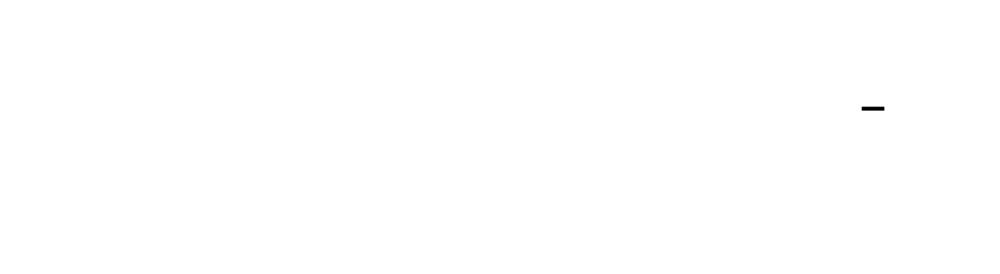

# Transformer from Scratch

Build the complete Transformer architecture—the foundation of GPT, BERT, T5, and virtually every modern language model—from first principles. This project takes you through the mathematical and engineering core of attention mechanisms, showing exactly how queries, keys, and values combine to create context-aware representations. You'll implement every component: scaled dot-product attention with numerical stability, multi-head parallel processing, sinusoidal positional encodings, encoder-decoder stacks with residual connections, and autoregressive generation with beam search. By the end, you'll understand not just how transformers work, but why each design decision was made and what happens when you change them.


<!-- MS_ID: transformer-scratch-m1 -->
# Milestone 1: Scaled Dot-Product Attention

## Where We Are in the Transformer


You're building the smallest unit that makes transformers work: **attention**. Everything else in a transformer—multi-head processing, encoder stacks, decoding strategies—is built on top of this operation. Master this, and the rest is composition.

---

## The Tension: Why Attention Had to Exist

Before 2017, sequence models faced an impossible tradeoff. Recurrent networks (RNNs, LSTMs) processed tokens one at a time, maintaining a hidden state that compressed everything seen so far. This created two fatal problems:

1. **Information bottleneck**: By the time an RNN reaches position 50, it has forgotten fine details about position 3. The hidden state is a lossy compression of the entire history.

2. **Sequential dependency**: You cannot parallelize. Position 50 cannot be computed until positions 1-49 are done. On a GPU capable of 10^13 operations per second, you're bottlenecked by sequential dependencies.

The transformer paper asked: *What if every position could directly access every other position?*

The answer is attention—a mechanism that computes, for each position, a **weighted average of all other positions**. The weights aren't fixed; they're computed dynamically based on content relevance. Position 3 asking about "the bank" can attend strongly to position 47 where "river" appeared, and weakly to position 12 where "money" appeared.

**The cost**: Attention is O(n²) in sequence length. A 1000-token sequence requires computing 1,000,000 pairwise relationships. This is the fundamental tension—you get direct access to everything, but you pay quadratically for it.

---

## The Revelation: Attention Is Differentiable Dictionary Lookup

Here's what most explanations get wrong.

**What you might think**: Attention is a neural network layer that learns mysterious relationships between tokens. It's a black box with trainable parameters that somehow discovers connections.

**The reality**: Attention is pure linear algebra with **one learned component**: the projections that create Q, K, and V. The core operation is entirely deterministic:

$$\text{Attention}(Q, K, V) = \text{softmax}\left(\frac{QK^T}{\sqrt{d_k}}\right)V$$





Think of it as **differentiable database lookup**:

| Database Concept | Attention Equivalent | Shape |
|-----------------|---------------------|-------|
| **Query** | What I'm looking for | `[batch, seq_len, d_k]` |
| **Key** | What I match against (indexed column) | `[batch, seq_len, d_k]` |
| **Value** | What I retrieve (row data) | `[batch, seq_len, d_v]` |

In a database, `SELECT value FROM table WHERE key = query` returns exactly one row. Attention softens this: it returns a **weighted sum of all values**, where weights are high for keys matching the query and low for mismatching keys.

The "learning" in attention is just learning:
- **Q projection**: What to search for
- **K projection**: What to be searchable by
- **V projection**: What information to actually return

Once you have Q, K, V, the attention computation itself has **no parameters**. It's matrix multiplication and softmax.

---

## The Three-Level View: What's Actually Being Computed

### Level 1 — The Operation (What You Write)

```python
scores = Q @ K.transpose(-2, -1) / math.sqrt(d_k)  # [batch, seq, seq]
attention_weights = F.softmax(scores, dim=-1)       # [batch, seq, seq]
output = attention_weights @ V                       # [batch, seq, d_v]
```

Three lines. That's the entire attention mechanism.

### Level 2 — The Math Soul (What's Being Computed)

Let's trace dimensions for a single sequence (ignoring batch):

1. **Query-Key similarity**: `Q @ K^T` produces a `[seq_len, seq_len]` matrix
   - Entry (i, j) = dot product of query_i and key_j
   - High value = position i wants information from position j

2. **Scaling**: Divide by `√d_k`
   - Prevents dot products from growing large (more on this shortly)

3. **Softmax normalization**: Rows sum to 1
   - Each position gets a probability distribution over all positions

4. **Weighted retrieval**: `weights @ V`
   - Position i's output = weighted average of all values, weighted by attention

### Level 3 — The Gradient Flow (What Flows Backward)


When you call `loss.backward()`, gradients flow through attention in a specific pattern:

- **∂L/∂V** is weighted by attention scores. If position 5 attended 80% to position 2's value, then 80% of position 5's error flows to position 2's value.

- **∂L/∂Q** and **∂L/∂K** flow through the softmax and dot product. Positions that were strongly attended to receive larger gradient signals.

This is why attention is powerful for training: **gradient flows directly to relevant positions**, not through a chain of recurrent states.

---

## Why Divide by √d_k? The Softmax Saturation Problem

Here's a detail that trips up everyone.

The dot product `Q @ K^T` grows with dimension. If Q and K have 512 dimensions, each dot product is a sum of 512 terms. Assuming elements are roughly unit-variance, the dot product has variance ~512.

**The problem**: Softmax on large values produces near-one-hot distributions.

$$\text{softmax}([10, 20, 30]) \approx [0.00002, 0.0001, 0.9999]$$

This kills gradients. If softmax outputs are nearly 0 or 1, the gradient is nearly 0 everywhere—**backpropagation stalls**.

**The solution**: Scale by `1/√d_k` to normalize variance back to ~1.

```python
# Without scaling (d_k = 512)
scores = Q @ K.T  # Values might range from -50 to +50
softmax(scores)   # Nearly one-hot, gradients vanish

# With scaling
scores = (Q @ K.T) / math.sqrt(512)  # Values range from -3 to +3
softmax(scores)   # Softer distribution, healthy gradients
```


**The math**: If Q and K elements have variance σ², then `Q·K` has variance `d_k × σ²`. Dividing by `√d_k` gives variance `σ²` again.

---

## Masking: Telling Attention What It Cannot See

Two types of masks solve two different problems:

### Padding Mask

Your batch has sequences of different lengths. You pad shorter ones with `<PAD>` tokens to form a rectangular tensor. But attention shouldn't attend to padding—it's meaningless.

**Implementation**: Set padding positions to `-inf` before softmax.

```python
# mask: [batch, seq_len] where True = padding position
mask = (tokens == PAD_ID)  # [batch, seq_len]
mask = mask.unsqueeze(1)   # [batch, 1, seq_len] for broadcasting

scores = scores.masked_fill(mask, float('-inf'))
# After softmax: -inf becomes 0.0
```

### Causal Mask (For Decoders)

During generation, position 5 shouldn't see positions 6, 7, 8... (the future). The model must predict based only on what came before.

**Implementation**: Upper-triangular mask.

```python
seq_len = scores.size(-1)
causal_mask = torch.triu(torch.ones(seq_len, seq_len), diagonal=1).bool()
# [[0, 1, 1, 1],
#  [0, 0, 1, 1],
#  [0, 0, 0, 1],
#  [0, 0, 0, 0]]

scores = scores.masked_fill(causal_mask, float('-inf'))
```


**Critical detail**: Mask BEFORE softmax, not after. Softmax converts `-inf` to 0.0 cleanly. If you mask after softmax, you get 0s that don't sum to 1, breaking the probability interpretation.

---

## Softmax Numerical Stability

Softmax has a hidden numerical pitfall. The formula:

$$\text{softmax}(x_i) = \frac{e^{x_i}}{\sum_j e^{x_j}}$$

If `x_i = 1000`, then `e^1000` overflows float32. The trick: **subtract the maximum before exponentiating**.

$$\text{softmax}(x_i) = \frac{e^{x_i - \max(x)}}{\sum_j e^{x_j - \max(x)}}$$

This is mathematically identical (numerator and denominator scale by the same factor) but numerically stable.


**Good news**: PyTorch's `F.softmax` does this automatically. But you must understand it because:
1. You might implement softmax from scratch in other contexts
2. The same principle applies to log-softmax for numerical stability
3. Interviewers love this question

---

## Implementation: Step by Step

### Step 1: Q, K, V Projections

```python
import torch
import torch.nn as nn
import math

class ScaledDotProductAttention(nn.Module):
    def __init__(self, d_model: int):
        super().__init__()
        self.d_k = d_model  # For simplicity, d_k = d_v = d_model
        
        # Three learned linear projections
        self.W_Q = nn.Linear(d_model, d_model, bias=False)
        self.W_K = nn.Linear(d_model, d_model, bias=False)
        self.W_V = nn.Linear(d_model, d_model, bias=False)
    
    def forward(self, x, mask=None):
        # x: [batch, seq_len, d_model]
        
        Q = self.W_Q(x)  # [batch, seq_len, d_model]
        K = self.W_K(x)  # [batch, seq_len, d_model]
        V = self.W_V(x)  # [batch, seq_len, d_model]
        
        # ... attention computation (next step)
```

### Step 2: Scaled Dot-Product

```python
    def forward(self, x, mask=None):
        Q = self.W_Q(x)
        K = self.W_K(x)
        V = self.W_V(x)
        
        batch_size, seq_len, d_k = Q.shape
        
        # Compute attention scores
        scores = torch.matmul(Q, K.transpose(-2, -1))  # [batch, seq, seq]
        scores = scores / math.sqrt(d_k)
        
        # Apply mask (if provided)
        if mask is not None:
            scores = scores.masked_fill(mask == 0, float('-inf'))
        
        # Softmax normalization
        attention_weights = torch.softmax(scores, dim=-1)  # [batch, seq, seq]
        
        # Weighted sum of values
        output = torch.matmul(attention_weights, V)  # [batch, seq, d_model]
        
        return output, attention_weights
```

### Step 3: Mask Builders

```python
def create_padding_mask(tokens: torch.Tensor, pad_id: int) -> torch.Tensor:
    """Returns mask where padding positions are 0 (to be filled with -inf)."""
    # tokens: [batch, seq_len]
    mask = (tokens != pad_id).unsqueeze(1)  # [batch, 1, seq_len]
    return mask

def create_causal_mask(seq_len: int, device: str = 'cpu') -> torch.Tensor:
    """Returns causal mask where future positions are 0."""
    mask = torch.tril(torch.ones(seq_len, seq_len, device=device))
    return mask.bool()
```

### Step 4: Verification Against PyTorch Reference

```python
import torch.nn.functional as F

def verify_attention():
    torch.manual_seed(42)
    batch, seq_len, d_model = 2, 5, 64
    
    attention = ScaledDotProductAttention(d_model)
    x = torch.randn(batch, seq_len, d_model)
    
    # Our implementation
    output_custom, weights_custom = attention(x)
    
    # PyTorch reference (using same Q, K, V)
    Q = attention.W_Q(x)
    K = attention.W_K(x)
    V = attention.W_V(x)
    output_ref = F.scaled_dot_product_attention(Q, K, V)
    
    # Verify
    diff = (output_custom - output_ref).abs().max().item()
    print(f"Max difference: {diff:.2e}")
    assert diff < 1e-5, f"Verification failed: {diff}"
    print("✓ Matches PyTorch reference within 1e-5")
```

---

## Common Pitfalls (Debug These First)

| Symptom | Likely Cause | Fix |
|---------|--------------|-----|
| Shape error in `Q @ K^T` | Forgot transpose on K | `K.transpose(-2, -1)` |
| All attention weights ≈ 1/n | Forgot scaling by √d_k | Add `/ math.sqrt(d_k)` |
| NaN in output | Masking after softmax | Mask before softmax with `-inf` |
| Model attends to padding | Padding mask not applied | Check mask broadcasting |
| Gradual gradient explosion | No gradient clipping | Add `torch.nn.utils.clip_grad_norm_` |

---

## Knowledge Cascade: What This Unlocks

Now that you understand scaled dot-product attention, you've unlocked:

1. **Cross-attention (Milestone 4)**: The decoder queries the encoder using the exact same mechanism. The only difference: Q comes from decoder, K and V come from encoder. Same math, different source.

2. **Database query analogy (cross-domain)**: Q is your SQL `WHERE` clause, K is the indexed column, V is the `SELECT` columns. Attention is `SELECT V FROM table ORDER BY similarity(Q, K) DESC` with soft ranking.

3. **Attention heads as ensemble learners**: Multi-head attention (next milestone) creates multiple Q, K, V projection sets. Each head learns different retrieval patterns—one might attend to syntactic dependencies, another to semantic similarity.

4. **Why sparse attention works**: Longformer and BigBird prune attention to O(n) complexity. If attention is weighted retrieval, most weights are near-zero. Pruning low-attention connections preserves ~95% of information at ~10% of compute cost.

5. **Gradient flow intuition**: When debugging training, remember—errors flow backward proportional to attention weights. If position 17 isn't learning, check if anything is attending to it.

---

[[CRITERIA_JSON: {"milestone_id": "transformer-scratch-m1", "criteria": ["Compute Q, K, V from input embeddings via three separate learned linear projections (nn.Linear)", "Scaled dot-product computes softmax(QK^T / sqrt(d_k))V with correct output dimensions [batch, seq_len, d_v]", "Padding mask sets attention weights to zero for padding tokens by applying -inf before softmax", "Causal mask prevents attending to future positions by applying -inf to upper-triangular entries before softmax", "Implementation is fully vectorized—no Python loops over batch or sequence dimensions", "Numerical correctness verified: output matches PyTorch's F.scaled_dot_product_attention within 1e-5 tolerance on random inputs", "Softmax numerical stability ensured by subtracting max before exponentiation (or verifying PyTorch's softmax does this)"]}]
<!-- END_MS -->


<!-- MS_ID: transformer-scratch-m2 -->
Let me read the existing architecture doc to understand the style and ensure consistency.
<!-- END_MS -->


<!-- MS_ID: transformer-scratch-m3 -->
Let me read the existing architecture doc to understand the style and ensure consistency.
<!-- END_MS -->


<!-- MS_ID: transformer-scratch-m4 -->
Let me read the existing architecture document to understand the style and ensure consistency.
<!-- END_MS -->


<!-- MS_ID: transformer-scratch-m5 -->
Let me read the existing architecture document to understand the style and ensure consistency.
<!-- END_MS -->


<!-- MS_ID: transformer-scratch-m6 -->
Let me first read the existing architecture document to understand the style and ensure consistency with previous milestones.I'll read the architecture document now.
<!-- END_MS -->


# TDD

Implement the complete Transformer architecture (encoder-decoder) from first principles, including attention, positional encodings, training, and inference.


<!-- TDD_MOD_ID: transformer-scratch-m1 -->
Let me read the existing architecture document to understand the style and ensure consistency.
<!-- END_TDD_MOD -->


<!-- TDD_MOD_ID: transformer-scratch-m2 -->
I'll read the existing architecture document first to understand the style and ensure consistency.
<!-- END_TDD_MOD -->


<!-- TDD_MOD_ID: transformer-scratch-m3 -->
I'll read the existing architecture document to understand the style and ensure consistency with the previous milestones.
<!-- END_TDD_MOD -->


<!-- TDD_MOD_ID: transformer-scratch-m4 -->
I'll read the existing architecture document to understand the style and ensure consistency with the previous milestones.

```read_file
architecture-docs/transformer-scratch/index.md
```
<!-- END_TDD_MOD -->


<!-- TDD_MOD_ID: transformer-scratch-m5 -->
I'll read the existing architecture document first to understand the style and ensure consistency with previous milestones.
<!-- END_TDD_MOD -->


<!-- TDD_MOD_ID: transformer-scratch-m6 -->
I'll read the existing architecture document first to understand the style and ensure consistency.
<!-- END_TDD_MOD -->


I'll read the project structure to understand what exists and then identify the Deep Dive blocks and foundational concepts from the Atlas/TDD content provided.